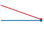

# Giới thiệu {#sec-introduction}

<!-- Calculation stencil: PIPO (Purpose → Input → Process → Output).
     Markdown uses only *_str or *_math variables. -->

::: {layout-narrow}
::: {.column-margin}

\chapterminitoc

:::

::: {.content-visible when-format="pdf"}
\noindent
{fig-alt="Bản đồ thiết kế đẳng cự cho thấy dữ liệu thô chảy qua lõi mô hình, nền tảng máy, điểm cuối triển khai và vòng lặp phản hồi như một hệ thống ML kết nối."}
:::

::: {.content-visible unless-format="pdf"}
{fig-alt="Bản đồ thiết kế đẳng cự cho thấy dữ liệu thô chảy qua lõi mô hình, nền tảng máy, điểm cuối triển khai và vòng lặp phản hồi như một hệ thống ML kết nối."}
:::

:::

## Mục đích {.unnumbered .unlisted}

\begin{marginfigure}
\mlsysstack{30}{30}{30}{30}{30}{30}{30}{30}
\end{marginfigure}

_Tại sao việc xây dựng các hệ thống machine learning lại đòi hỏi những nguyên tắc kỹ thuật khác biệt đáng kể so với những nguyên tắc chi phối các hệ thống máy tính truyền thống?_

Các hệ thống machine learning có một vật lý riêng. Dữ liệu di chuyển qua các phân cấp bộ nhớ được điều chỉnh bởi băng thông, các phép tính số học chạy trên silicon được điều chỉnh bởi công suất, và các dự đoán phải đến trong các khoảng thời gian độ trễ cho phép. Những ràng buộc này không phải là chi tiết triển khai; chúng định hình các quyết định từ kiến trúc mô hình đến mục tiêu triển khai. Các hệ thống ML cũng khác với các hệ thống máy tính truyền thống vì hành vi được định nghĩa bởi dữ liệu, không chỉ bởi logic rõ ràng hoặc trạng thái phần cứng. Khi một chương trình thông thường hoạt động sai, các kỹ sư thường có thể truy vết mã nguồn hoặc kiểm tra trạng thái phần cứng; khi một hệ thống ML hoạt động sai, mã có thể thực thi đúng trong khi hành vi đã học thất bại vì dữ liệu không đầy đủ, có độ chệch (bias), lỗi thời hoặc không còn đại diện. Do đó, các kỹ sư ML phải quản lý đồng thời sự không chắc chắn về thống kê và các ràng buộc thực thi vật lý. Một mô hình phù hợp với trung tâm dữ liệu có thể vô dụng trên điện thoại; một pipeline huấn luyện hội tụ trong một tuần trên một bộ tăng tốc có thể mất một tháng trên một bộ tăng tốc khác; một mô hình chính xác được huấn luyện trên dữ liệu của năm trước có thể âm thầm suy giảm. Các thực hành truyền thống như kiểm thử, tính mô-đun, kiểm soát phiên bản và phân tích hiệu suất vẫn cần thiết, nhưng chúng không đủ. Ở quy mô hệ thống, một tối ưu hóa trong một lớp có thể chuyển điểm nghẽn sang một lớp khác, vì vậy tính đúng đắn, hiệu quả và khả năng triển khai không thể được thiết kế độc lập. Nhiệm vụ đầu tiên do đó là chẩn đoán, bởi vì việc cải thiện thành phần dễ thấy nhất có thể không làm thay đổi hành vi đầu cuối khi có một ràng buộc khác đang chi phối. Cuốn sách này xây dựng một ngành học dựa trên các giới hạn vật lý của tính toán. Các lựa chọn thuật toán ảnh hưởng đến toàn bộ ngăn xếp xuống đến máy, và các ràng buộc phần cứng lại ảnh hưởng ngược lên thiết kế mô hình.

::: {.content-visible when-format="pdf"}

\newpage

:::

::: {.callout-learning-objectives}

- Giải thích tại sao hành vi được định nghĩa bởi dữ liệu và các ràng buộc vật lý phân biệt các hệ thống ML với phần mềm truyền thống
- Áp dụng lăng kính dữ liệu-thuật toán-máy để chẩn đoán các điểm nghẽn trong việc di chuyển dữ liệu, tính toán số học và giới hạn máy
- Phân tích sự chuyển dịch của AI từ các quy tắc biểu tượng sang deep learning thông qua bài học cay đắng
- Tính toán các thuật ngữ hiệu suất theo quy luật sắt để lý giải về thông lượng, độ trễ và lợi tức tính toán
- Tổng hợp các quan điểm về vòng đời, triển khai, suy giảm và năm trụ cột vào các đánh giá kỹ thuật hệ thống ML

:::

```{python}
#| echo: false
from mlsysim import *
from mlsysim.core.units import *
from mlsysim import ReferenceStats
from mlsysim.physics import memory_from_params
from mlsysim.fmt import fmt, fmt_qty, fmt_memory, fmt_params, fmt_count, check

# ┌─────────────────────────────────────────────────────────────────────────────
# │ THE AI MOMENT STATISTICS (LEGO)
# ├─────────────────────────────────────────────────────────────────────────────
# │ Context: Opening of "The AI Moment" section
# │
# │ Goal: Establish the scale of modern AI vs. traditional logic.
# │ Show: 8.5B searches/day and a large accelerator/CPU throughput gap.
# │ How: Retrieve canonical search and compute-rate constants.
# │
# └─────────────────────────────────────────────────────────────────────────────

# ┌── LEGO ───────────────────────────────────────────────
class AIMomentStats:
    """
    Namespace for opening statistics in 'The AI Moment' section.
    Establishes the scale of modern AI (searches) and hardware asymmetry (GPU vs. CPU).
    """

    # ┌── 1. LOAD (Constants) ───────────────────────────────────────────────
    searches_per_day = ReferenceStats.Workloads.GoogleSearchesPerDay
    accelerator_flops = Hardware.Cloud.H100.compute.peak_flops
    cpu_flops = Hardware.Cloud.ReferenceCPU.compute.peak_flops

    # ┌── 2. EXECUTE (The Compute) ─────────────────────────────────────────
    searches_b = searches_per_day / BILLION
    accelerator_tflops = accelerator_flops.to(TFLOPs / second)
    cpu_tflops = cpu_flops.to(TFLOPs / second)
    accelerator_cpu_ratio = (accelerator_tflops / cpu_tflops).to("").magnitude

    # ┌── 3. GUARD (Invariants) ───────────────────────────────────────────
    check(searches_b >= 5, f"Google searches ({searches_b:.1f}B) unexpectedly low.")
    check(accelerator_cpu_ratio >= 500, f"Accelerator/CPU ratio ({accelerator_cpu_ratio:.1f}x) too low for 'massive parallelism'.")

    # ┌── 4. OUTPUT (Formatting) ──────────────────────────────────────────────
    google_search_b_str = fmt_params(searches_per_day, scale="B", precision=1)
```

## Thời khắc của các Hệ thống AI {#sec-introduction-ai-moment-37f1}

Trí tuệ nhân tạo không còn bị giới hạn trong các bản trình diễn nghiên cứu. Hỏi một chiếc điện thoại thông minh một câu hỏi và, trong vòng vài giây, các thành phần đã học sẽ chuyển đổi giọng nói thành văn bản, diễn giải ý định, truy xuất thông tin và tạo ra phản hồi. Các công cụ tìm kiếm xếp hạng kết quả, hệ thống khuyến nghị quyết định những gì mọi người nhìn thấy, người cho vay sử dụng các mô hình để đánh giá rủi ro, và hệ thống hỗ trợ người lái phát hiện nguy hiểm. Trong mỗi trường hợp, một dự đoán tham gia vào một quyết định lớn hơn có thể ảnh hưởng đến sự chú ý, tiền bạc, quyền truy cập hoặc an toàn. Do đó, điều có vẻ là một hành động thông minh lại là một hệ thống đầu cuối đang hoạt động trong thế giới thực.

Phong trào AI hiện đại trở nên khả thi khi ba yếu tố hội tụ. Các dịch vụ kỹ thuật số tạo ra nhiều ví dụ hơn mức các kỹ sư có thể mã hóa thành quy tắc. Các thuật toán học đã có thể trích xuất hành vi hữu ích từ những ví dụ đó. Các máy song song đã làm cho việc tính toán kết quả trở nên khả thi. Thay đổi quan trọng nhất là về mặt khái niệm. Dữ liệu không còn chỉ là đầu vào cho phần mềm mà trở thành một phần của cơ chế định nghĩa hành vi của nó. Thay vì viết mọi quy tắc quyết định, các kỹ sư xây dựng một quy trình huấn luyện thông qua đó các ví dụ định hình các quy tắc mà một hệ thống sẽ áp dụng.

Sự hội tụ này tạo ra một **nhiệm vụ kép**\index{Dual mandate}. Mọi hệ thống ML phải chứng minh rằng hành vi đã học của nó đáng tin cậy và máy có thể tạo ra hành vi đó trong giới hạn thời gian, bộ nhớ, năng lượng và chi phí có sẵn. Một mô hình chính xác nhưng quá chậm thì không thể sử dụng được; một mô hình nhanh được huấn luyện trên dữ liệu không đại diện thì sai ở tốc độ máy. Sự khác biệt trở nên rõ ràng nhất ở các ranh giới lỗi. Một lỗi mã có thể gây sập hệ thống một cách ồn ào, trong khi một lỗi dữ liệu có thể khiến mọi lệnh vẫn thực thi đúng trong khi các dự đoán âm thầm suy giảm. Ở quy mô lớn, cả hai nghĩa vụ này đều bao trùm toàn bộ ngăn xếp. Các dịch vụ đàm thoại điều phối các nhóm GPU[^fn-gpu-parallel-execution] đồng thời quản lý bộ nhớ, mạng và nhiệt. Các hệ thống hỗ trợ người lái phải hợp nhất các luồng cảm biến trong vòng vài mili giây. Google xử lý `{python} AIMomentStats.google_search_b_str` lượt tìm kiếm mỗi ngày theo các mục tiêu độ trễ nghiêm ngặt. Các hệ thống này chỉ thành công khi hành vi đã học và việc thực thi vật lý được thiết kế cùng nhau. Phần đầu tiên của câu chuyện đó là sự chuyển dịch từ logic được định nghĩa bằng mã sang hành vi được định nghĩa bằng dữ liệu.

[^fn-gpu-parallel-execution]: **GPU (graphics processing unit)**\index{GPU!etymology}: Ban đầu được thiết kế để kết xuất đồ họa trò chơi điện tử, một khối lượng công việc (workload) đòi hỏi hàng nghìn phép tính pixel đơn giản, song song. Sự phù hợp giữa phần cứng và thuật toán này đã chứng tỏ tính quyết định đối với các mạng nơ-ron, nơi cấu trúc số học song song khổng lồ tương tự ánh xạ trực tiếp vào phép nhân ma trận, biến GPU thành yếu tố vật lý chính cho phép quy mô huấn luyện hiện đại.

## Sự chuyển dịch mô hình lấy dữ liệu làm trung tâm {#sec-introduction-datacentric-paradigm-shift-4eca}

Sự thay đổi đó làm thay đổi cách phần mềm được xây dựng. Thay vì viết trực tiếp hành vi, các kỹ sư xây dựng một quy trình học hành vi từ dữ liệu. Khi một chương trình truyền thống gặp lỗi, kỹ sư thường có thể truy vết một nhánh, kiểm tra một khung ngăn xếp và vá đường dẫn mã. Khi một hệ thống ML mất độ chính xác mà không thay đổi mã, nguyên nhân có thể là do phân bố dữ liệu thay đổi, quy trình nhãn thay đổi hoặc một mô hình không còn đại diện cho hành vi sản xuất. Andrej Karpathy[^fn-karpathy-software-two] đã mô tả sự thay đổi này là sự chuyển dịch từ **phần mềm 1.0**\index{Software 1.0!definition} sang **phần mềm 2.0**\index{Software 2.0!definition} [@karpathy2017software]. Như @tbl-software-1-vs-2 cho thấy, Phần mềm 1.0 mã hóa logic vận hành bằng các chỉ thị, trong khi Phần mềm 2.0 học logic đó từ các ví dụ. Do đó, các lỗi của nó có thể không được phát hiện cho đến khi đánh giá hoặc giám sát tiết lộ rằng hành vi đã thay đổi.

Phần mềm 2.0 không loại bỏ mã. Các kỹ sư vẫn xây dựng các pipeline dữ liệu, vòng lặp huấn luyện, công cụ đánh giá và hạ tầng phục vụ (serving). Điều thay đổi là nơi cư trú của hành vi ứng dụng. Một phần trong số đó nằm trong các trọng số đã học được định hình bởi dữ liệu, vì vậy việc xem xét mã đơn thuần không thể giải thích hệ thống sẽ làm gì.

[^fn-karpathy-software-two]: **Andrej Karpathy**\index{Karpathy, Andrej!Software 2.0}: Một thành viên sáng lập của OpenAI và cựu Giám đốc AI tại Tesla, người đã tiên phong ứng dụng deep learning vào các đội xe tự hành. Luận điểm "Phần mềm 2.0" của ông (2017) đã kết tinh nhận định rằng các trọng số của mạng nơ-ron là "mã nguồn" mới, buộc một thực tế kỹ thuật mới: thay vì gỡ lỗi logic tường minh, các kỹ sư phải quản lý và lập phiên bản dữ liệu định nghĩa hành vi chương trình, vì một mô hình với hàng triệu tham số không thể được vá hoặc suy luận trực tiếp.

| **Feature**      | **Software 1.0 (Traditional)** | **Software 2.0 (Machine Learning)**         |
|:-----------------|:-------------------------------|:--------------------------------------------|
| **Source Code**  | C++, Python, Java              | Training Data + Labels                      |
| **Compiler**     | GCC, LLVM                      | Training loop (stochastic gradient descent) |
| **Logic**        | Explicit (Hand-coded)          | Implicit (Learned)                          |
| **Failure Mode** | Loud (Crash, Exception)        | Silent (Metric Degradation)                 |
| **Debugging**    | Trace execution path           | Inspect data distribution                   |

: **Sự thay đổi mô hình từ Phần mềm 1.0 sang Phần mềm 2.0**: Trong Phần mềm 2.0, "lập trình viên" không viết logic; họ quản lý tập dữ liệu mà quá trình tối ưu hóa sử dụng để viết logic. Do đó, việc gỡ lỗi di chuyển ngược dòng từ mã sang dữ liệu. Phép tương tự "trình biên dịch" chỉ là tương đối: không giống như một trình biên dịch xác định, quá trình huấn luyện là ngẫu nhiên và có thể tạo ra các "tệp thực thi" khác nhau từ cùng một "mã nguồn." {#tbl-software-1-vs-2}

Quy trình làm việc lấy dữ liệu làm trung tâm thay đổi những gì các kỹ sư phải xây dựng và duy trì. Trong một nghiên cứu về các hệ thống sản xuất tại Google, Sculley và các đồng nghiệp đã phát hiện ra rằng mã mô hình chỉ chiếm một phần nhỏ trong bề mặt kỹ thuật [@sculley2015hidden]. Hệ thống xung quanh---thu thập dữ liệu, xác minh, trích xuất đặc trưng, quản lý tài nguyên, phục vụ (serving) và giám sát---lớn hơn và bền vững hơn.

::: {.column-margin}
{width="100%" fig-alt="Một hộp màu cam nhỏ được dán nhãn mã ML nằm bên trong một khung lớn hơn nhiều được dán nhãn Hệ thống; hộp bên trong chiếm một phần rất nhỏ của diện tích bên ngoài."}

*Công việc ML sản xuất chủ yếu là hệ thống xung quanh, chứ không chỉ riêng mã mô hình.*
:::

Sự mất cân bằng đó tạo ra nợ kỹ thuật ẩn. Mỗi thành phần xung quanh mã hóa các giả định về cách một ví dụ được lấy mẫu, ý nghĩa của một nhãn, khi nào một đặc trưng được tính toán, phiên bản nào đến giai đoạn phục vụ (serving) và cách phát hiện sự suy giảm. Không có giả định nào trong số đó xuất hiện trong phép nhân ma trận tạo ra một dự đoán, nhưng bất kỳ giả định nào trong số đó đều có thể thay đổi kết quả. Chỉ cải thiện mô hình không thể sửa chữa một proxy lỗi thời, một pipeline đặc trưng bị hỏng hoặc một tín hiệu phản hồi bị thiếu.

Do đó, dữ liệu sản xuất không phải là một đầu vào thụ động. Đó là một phép đo về thế giới, được thu thập thông qua một sản phẩm cụ thể và được biến đổi bởi một pipeline thay đổi. Nếu phép đo đó ngừng đại diện cho mục tiêu dự định, mô hình có thể vẫn khỏe mạnh về mặt số học trong khi hệ thống trở nên sai lệch. Google Flu Trends cung cấp một ví dụ điển hình. Nó có một luồng dữ liệu tìm kiếm khổng lồ, kịp thời, nhưng ý nghĩa của dữ liệu đó đã thay đổi bên dưới mô hình.

::: {#ws-introduction-google-flu-trends .callout-war-story title="Khi nhật ký tìm kiếm nhầm lẫn sự chú ý với bệnh tật (2014)"}

**Bối cảnh**: Google Flu Trends\index{Google Flu Trends!proxy drift} (GFT) ước tính hoạt động cúm từ các mẫu trong các truy vấn tìm kiếm tổng hợp [@ginsberg2009detecting; @lazer2014]. Sức hấp dẫn của nó đến từ tốc độ và quy mô mà các tìm kiếm đến so với các báo cáo lâm sàng. Nếu mọi người tìm kiếm các triệu chứng cúm khi họ bị bệnh, khối lượng truy vấn dường như cung cấp một proxy kịp thời cho sự lây nhiễm.

**Chế độ lỗi**: Proxy không ổn định. Tin tức đã thay đổi những gì mọi người tìm kiếm, và tính năng tự động hoàn thành đã thay đổi cách họ thể hiện các tìm kiếm đó. Khối lượng truy vấn bắt đầu đo lường sự chú ý của công chúng và hành vi sản phẩm cũng như bệnh tật. Trong mùa 2012–2013, GFT ước tính tỷ lệ các lượt khám bác sĩ vì bệnh giống cúm cao gấp đôi so với báo cáo của CDC và ước tính quá cao trong 100 trên 108 tuần.

**Bài học về hệ thống**: Biện pháp khắc phục không chỉ đơn giản là một tập dữ liệu tìm kiếm lớn hơn hoặc một mô hình được tinh chỉnh tốt hơn. Các nhà nghiên cứu đã kết hợp các tín hiệu tìm kiếm với dữ liệu lâm sàng giám sát của CDC và hiệu chỉnh lại mối quan hệ theo thời gian. Khối lượng dữ liệu không phải là sự thật hiển nhiên: một proxy hành vi cần một vòng lặp phản hồi đến một phép đo đáng tin cậy và bằng chứng liên tục rằng proxy vẫn đại diện cho đại lượng mà hệ thống tuyên bố ước tính.

:::

Google Flu Trends đã thất bại mà không có một lỗi phần mềm thông thường. Mã không thay đổi, nhưng chương trình hiệu quả đã thay đổi vì phân bố đầu vào và mối quan hệ giữa proxy và mục tiêu đã thay đổi. Theo **nguyên tắc dữ liệu như mã**\index{Data-as-code principle!definition}, dữ liệu huấn luyện không chỉ đơn thuần đi vào một chương trình cố định; nó giúp xác định logic vận hành mà mô hình thực hiện. Các kỹ sư vẫn viết quy trình tối ưu hóa, nhưng các ví dụ định hình các trọng số của mô hình[^fn-model-weights-inference] thông qua gradient descent ngẫu nhiên[^fn-sgd-stochastic-sampling] và các phương pháp liên quan. Do đó, việc thay đổi tập dữ liệu có thể thay đổi hành vi hệ thống chắc chắn như việc thay đổi mã nguồn.

[^fn-sgd-stochastic-sampling]: **Stochastic gradient descent (SGD)**\index{Stochastic gradient descent!systems trade-off}: Thuật toán học các tham số mô hình bằng cách xử lý các nhóm ví dụ được lấy mẫu ngẫu nhiên nhỏ ("batches") thay vì toàn bộ tập dữ liệu cùng một lúc. Điều này đánh đổi nhiễu thống kê để lấy tốc độ tính toán. Kích thước batch cũng ảnh hưởng đến máy vì một batch quá nhỏ có thể không bão hòa được các bộ xử lý song song của bộ tăng tốc, làm lãng phí phần lớn khả năng tính toán tiềm năng của nó.

```{python}
#| echo: false
#| label: gpt3-weight-footprint
# ┌─────────────────────────────────────────────────────────────────────────────
# │ GPT-3 FP16 WEIGHT FOOTPRINT
# ├─────────────────────────────────────────────────────────────────────────────
# │ Context: Model Weights footnote in the Software 2.0 section
# │
# │ Goal: Avoid hand-computing the storage footprint of a GPT-3-scale model.
# │ Show: 175 billion parameters at 2 bytes/parameter occupy about 350 GB.
# │ How: Use mlsysim constants and the shared model_memory formula.
# │
# └─────────────────────────────────────────────────────────────────────────────
from mlsysim.fmt import fmt, fmt_memory, fmt_params, check
from mlsysim.core.units import Bparam, GB

# ┌── LEGO ───────────────────────────────────────────────
class GPT3WeightFootprint:
    """Storage footprint for GPT-3-scale FP16 weights."""

    # ┌── 1. LOAD (Constants) ───────────────────────────────────────────────
    params = Models.Language.GPT3.parameters
    bytes_per_param = BYTES_FP16

    # ┌── 2. EXECUTE (The Compute) ─────────────────────────────────────────
    params_b = params.to(Bparam).magnitude
    fp16_weights = memory_from_params(params, bytes_per_param / param)

    # ┌── 3. GUARD (Invariants) ───────────────────────────────────────────
    check(params_b == 175, f"GPT-3 parameter count should be 175 billion, got {params_b}.")
    check(340 <= fp16_weights.to(GB).magnitude <= 360, f"GPT-3 FP16 footprint should be about 350 GB, got {fp16_weights.to(GB).magnitude:.1f}.")

    # ┌── 4. OUTPUT (Formatting) ──────────────────────────────────────────────
    params_b_str = fmt_params(params, scale="B", precision=0, commas=False)
    fp16_weights_gb_str = fmt_memory(fp16_weights, unit=GB, precision=0, commas=False)
```

[^fn-model-weights-inference]: **Trọng số mô hình**\index{Model weights!definition}: Các tham số số học đã học của một mạng nơ-ron. Một mô hình quy mô GPT-3 (Generative Pre-trained Transformer 3) lưu trữ `{python} GPT3WeightFootprint.params_b_str` giá trị như vậy, tiêu thụ `{python} GPT3WeightFootprint.fp16_weights_gb_str` ở độ chính xác FP16, một định dạng dấu phẩy động 16-bit sử dụng hai byte cho mỗi giá trị [@brown2020language]. Số lượng tham số xác định dung lượng trọng số và ảnh hưởng mạnh mẽ đến lưu lượng bộ nhớ phục vụ (serving) và chi phí (xem @sec-neural-computation).

Từ góc độ phát triển ML, điều này thể hiện sự chuyển đổi từ AI *lấy mô hình làm trung tâm* sang AI *lấy dữ liệu làm trung tâm* [@ng2021datacentric]\index{Data-centric AI}. Trong cách tiếp cận lấy mô hình làm trung tâm, các nhóm giữ cố định dữ liệu và tập trung vào việc cải thiện mã mô hình. Trong cách tiếp cận lấy dữ liệu làm trung tâm, họ giữ tương đối cố định mã và cải thiện dữ liệu một cách có hệ thống, biến việc quản lý dữ liệu thành một phần hạng nhất trong việc lập trình hành vi mô hình. Sự thay đổi này cũng làm thay đổi những gì kiểm thử có thể thiết lập bởi vì không có tập dữ liệu hữu hạn nào có thể đại diện cho mọi đầu vào mà một hệ thống đã học có thể gặp phải.

```{python}
#| echo: false
#| label: verification-gap-calc
# ┌─────────────────────────────────────────────────────────────────────────────
# │ VERIFICATION GAP CALCULATION
# ├─────────────────────────────────────────────────────────────────────────────
# │ Context: "The verification gap" callout (Data-Centric Paradigm section)
# │
# │ Goal: Quantify the impossibility of exhaustive testing in high-dimensional ML.
# │ Show: The astronomical size of the image input space vs. test set coverage.
# │ How: Calculate total possible pixel configurations for 224x224 RGB images.
# │
# └─────────────────────────────────────────────────────────────────────────────
import math
from mlsysim.fmt import fmt_int, fmt, check, fmt_time, fmt_math
from mlsysim.core.units import count

# ┌── LEGO ───────────────────────────────────────────────
class VerificationGap:
    """
    Calculates the dimensionality of the ImageNet input space to illustrate
    the 'verification gap' between test sets and real-world input spaces.
    """

    # ┌── 1. LOAD (Constants) ───────────────────────────────────────────────
    IMAGE_DIM_RESNET = Datasets.ImageNet.image_width
    width = IMAGE_DIM_RESNET
    height = IMAGE_DIM_RESNET
    channels = IMAGE_CHANNELS_RGB
    depth = COLOR_DEPTH_8BIT
    validation_size = Datasets.ImageNet.validation_examples.to(count).magnitude

    # ┌── 2. EXECUTE (The Compute) ─────────────────────────────────────────
    total_pixels = width * height * channels
    # Space size is depth^total_pixels. We want log10(depth^total_pixels).
    digits = total_pixels * math.log10(depth)

    # ┌── 3. GUARD (Invariants) ───────────────────────────────────────────
    check(digits > 300_000, f"Verification gap ({digits:.0f} digits) unexpectedly small.")

    # ┌── 4. OUTPUT (Formatting) ──────────────────────────────────────────────
    vg_digits_str = fmt_int(digits, commas=True)
    imagenet_validation_images_str = fmt(validation_size, precision=0, commas=True)
    space_size_math = fmt_math(rf"{int(depth)}^{{{format(int(total_pixels), ',').replace(',', '{,}')}}}")
```

Giới hạn trở nên rõ ràng khi chúng ta hỏi một tập kiểm thử có thể bao phủ những gì. Logic của Phần mềm 1.0 thường có thể được liệt kê hoặc phân chia thành các đường dẫn và trường hợp biên. Thay vào đó, một hệ thống đã học hoạt động trên một không gian đầu vào đa chiều mà về mặt kỹ thuật là hữu hạn nhưng không thể liệt kê trong thực tế. Thử thách ImageNet năm 2012 làm cho vấn đề này trở nên cụ thể. Chiến thắng quyết định của AlexNet[^fn-alexnet-first-mention] đã giúp khởi động kỷ nguyên deep learning, nhưng benchmark này chỉ có thể đánh giá một phần rất nhỏ các đầu vào mà mô hình có thể gặp phải. Mỗi đầu vào là một hình ảnh RGB $224{\times}224$ với `{python} VerificationGap.space_size_math` cấu hình pixel có thể có, một con số với `{python} VerificationGap.vg_digits_str` chữ số. Tập xác thực của Thử thách Nhận dạng Hình ảnh Quy mô Lớn ImageNet (ILSVRC) chỉ chứa `{python} VerificationGap.imagenet_validation_images_str` hình ảnh [@krizhevsky2012imagenet; @russakovsky2015]. Hãy để **Tổng Không gian Đầu vào** biểu thị số lượng đầu vào có thể có và **Độ bao phủ Tập Kiểm thử** là số lượng mà một bộ kiểm thử thực sự đánh giá. Sự chênh lệch của chúng tạo ra **khoảng cách xác minh**\index{Verification gap!definition} (@eq-verification-gap):

[^fn-alexnet-first-mention]: **AlexNet**\index{AlexNet!ImageNet breakthrough}: Alex Krizhevsky, Ilya Sutskever, và Geoffrey Hinton đã huấn luyện mạng nơ-ron tích chập này trên hai GPU. Tại ILSVRC 2012, lỗi top-5 của nó là 15.3 phần trăm, nghĩa là lớp đúng không có trong năm dự đoán có điểm số cao nhất của nó, đã đánh bại đáng kể hệ thống đứng thứ hai với 26.2 phần trăm [@krizhevsky2012imagenet]. @Sec-introduction-deep-learning-era-infrastructure-bottleneck-2f02 sẽ quay lại kiến trúc và đồng thiết kế hệ thống của nó.

$$ \text{Verification Gap} = \text{Total Input Space} - \text{Test Set Coverage} \approx \text{Total Input Space} $$ {#eq-verification-gap}

Khoảng cách này không làm cho việc kiểm thử trở nên vô ích; nó thay đổi những gì kiểm thử có thể thiết lập. Đánh giá trước triển khai cung cấp bằng chứng thống kê trên các đầu vào được lấy mẫu, trong khi giám sát sản xuất kiểm tra xem tập hợp hoạt động và kết quả quan sát được có còn hỗ trợ bằng chứng đó hay không. Độ tin cậy thống kê thay thế mọi kỳ vọng về bằng chứng toàn diện.

::: {.column-margin}
{width="100%" fig-alt="Thang đo logarit dọc gồm hai thanh màu xanh: một thanh cao chót vót cho tổng không gian đầu vào nằm rất xa phía trên một thanh nhỏ xíu cho độ bao phủ tập kiểm thử, khoảng cách giữa chúng trải dài nhiều bậc độ lớn."}

*Độ bao phủ kiểm thử là một phần rất nhỏ của không gian đầu vào.*
:::

Hệ quả kỹ thuật vượt ra ngoài kiểm thử. Gỡ lỗi một hệ thống ML đòi hỏi phải gỡ lỗi dữ liệu, chứ không chỉ riêng các script Python. Kiểm soát phiên bản phải theo dõi các tập dữ liệu, chứ không chỉ riêng các commit git. Đánh giá phải kiểm tra các phân phối và kết quả, chứ không chỉ riêng các đường dẫn mã. Cùng nhau, những thực hành này làm cho hành vi đã học có thể truy vết, nhưng chúng không thể biến bằng chứng thống kê thành bằng chứng toàn diện.

::: {#chk-introduction-paradigm-shift .callout-checkpoint title="Sự thay đổi mô hình"}

Trước khi truy vết lịch sử của AI, hãy xác minh sự hiểu biết của bạn về sự thay đổi mô hình trong cách chúng ta xây dựng phần mềm:

- [ ] **Phần mềm 1.0 so với 2.0**: bạn có thể phân biệt Phần mềm 1.0 (hướng dẫn rõ ràng) với Phần mềm 2.0 (mục tiêu tối ưu hóa) không?
- [ ] **Sự thay đổi trong gỡ lỗi**: bạn có thể xác định bằng chứng tập dữ liệu nào cần kiểm tra khi độ chính xác giảm mà không thay đổi mã không?
- [ ] **Khoảng cách xác minh**: bạn có thể giải thích tại sao độ bao phủ kiểm thử hữu hạn không thể thiết lập độ tin cậy thống kê trên toàn bộ phân phối đầu vào sản xuất không?

:::

Khoảng cách xác minh đánh dấu một sự thay đổi sâu sắc hơn trong những gì các kỹ sư có thể khẳng định. Các khẳng định truyền thống thường mô tả một lần thực thi cụ thể trong đó một đầu vào và trạng thái đã cho dẫn chương trình theo một đường dẫn cụ thể. Các khẳng định về hiệu suất ML mô tả hành vi trên một tập hợp. Một mô hình cố định có thể trả về cùng một đầu ra cho cùng một đầu vào trong khi độ chính xác đo được của nó thay đổi khi tập hợp thay đổi. Dữ liệu cung cấp các mẫu mà hệ thống học được, nhưng nhiễu, trôi và thiếu sót của nó cũng tạo ra sự không chắc chắn. Do đó, tính mạnh mẽ không thể có nghĩa là chống lại mọi thay đổi. Nó đòi hỏi phải làm cho sự thay đổi có thể quan sát được và thích nghi khi bằng chứng không còn hỗ trợ các giả định của hệ thống, một dạng của **kỹ thuật xác suất**\index{Probabilistic engineering}.

Học hành vi từ dữ liệu giờ đây có vẻ không thể tránh khỏi, nhưng trước đây thì không. Các hệ thống AI trước đây đã cố gắng lập trình trực tiếp trí thông minh. Theo dõi những nỗ lực đó cho thấy tại sao nút thắt di chuyển từ logic, sang tri thức, sang đặc trưng, và cuối cùng là sang hạ tầng — và tại sao kỹ thuật hệ thống trở thành trọng tâm của sự tiến bộ.

## Sự tiến hóa của các nút thắt AI {#sec-introduction-ai-paradigm-evolution-ae2b}

Sự tiến hóa của AI cho thấy một chuỗi các nút thắt cổ chai, mỗi nút thắt được vượt qua nhờ những đổi mới về hệ thống đã mở rộng khả năng tính toán. Một cột mốc nền tảng là bài báo của Turing[^fn-turing-imitation-outputs] "Computing Machinery and Intelligence" [@turing1950], đặt câu hỏi liệu máy móc có thể suy nghĩ hay không. Các hệ thống ban đầu đã khám phá các phương pháp tiếp cận đối lập: Perceptron\index{Perceptron!early neural computation} (1958) [@rosenblatt1958] học từ các ví dụ, trong khi ELIZA[^fn-eliza-pattern-brittleness] [@weizenbaum1966] tuân theo các quy tắc khớp mẫu được viết thủ công. Cả hai đều còn hạn chế, nhưng vì những lý do khác nhau. Các kỷ nguyên sau đó đã gặp phải nút thắt cổ chai về thu thập tri thức vì việc nhập tri thức thủ công không thể mở rộng quy mô. Các hệ thống hiện đại đối mặt với một hạn chế khác về thông lượng tính toán.

[^fn-turing-imitation-outputs]: **Alan Turing**\index{Turing, Alan!Imitation Game}: "Trò chơi mô phỏng" năm 1950 của ông đã định nghĩa lại trí thông minh như một vấn đề đo lường đầu ra: đánh giá một hệ thống dựa trên những gì nó *làm*, chứ không phải những gì nó *là*. Quan điểm ưu tiên kỹ thuật này vẫn tồn tại trong mọi số liệu hệ thống machine learning mà chúng ta sử dụng ngày nay: độ chính xác, độ trễ, thông lượng và FLOP/s trên mỗi watt đều là các phép đo đầu ra. Quy luật sắt (@sec-introduction-iron-law-ml-systems-c32a) phân tích hiệu suất thành các thuật ngữ có thể quan sát, đo lường được thay vì các thuộc tính kiến trúc bên trong chính vì lý do này.

[^fn-eliza-pattern-brittleness]: **ELIZA**\index{ELIZA!brittleness}: Một chương trình ngôn ngữ tự nhiên năm 1966 sử dụng các quy tắc khớp mẫu thay vì các tham số đã học. Các tập lệnh của nó có thể lưu trữ và truy xuất các đầu vào đã chọn, nhưng bộ nhớ viết thủ công hạn chế này không cung cấp trạng thái hội thoại đã học. Mỗi biến thể đầu vào mới yêu cầu một quy tắc khác, khiến việc bảo trì tăng nhanh hơn khả năng và báo trước nút thắt cổ chai về tri thức đã hạn chế các hệ thống chuyên gia sau này.

Dòng thời gian trong @fig-ai-timeline theo dõi tần suất trí tuệ nhân tạo được đề cập trong các sách đã xuất bản, một thước đo gián tiếp cho sự chú ý hơn là một thước đo trực tiếp về sản lượng nghiên cứu. Nó cho thấy một mô hình lặp đi lặp lại của sự lạc quan mãnh liệt, sau đó là "mùa đông AI"[^fn-ai-winters-systems] khi nguồn tài trợ sụp đổ, thường là sau khi các hạn chế của hệ thống đã phơi bày khoảng cách giữa tham vọng và khả năng hiện có. Những lần hồi sinh đã kết hợp những tiến bộ về thuật toán với dữ liệu mới và cơ sở hạ tầng kỹ thuật. Mỗi lần hồi sinh đã loại bỏ một nút thắt cổ chai và làm lộ ra nút thắt tiếp theo.

[^fn-ai-winters-systems]: **Mùa đông AI như những thất bại của hệ thống**\index{AI winters!systems failure}: Mùa đông AI đầu tiên (1974--1980) diễn ra trong bối cảnh cắt giảm tài trợ; Báo cáo Lighthill năm 1973 đã chỉ trích khoảng cách giữa những lời hứa của AI và kết quả thực tế [@lighthill1973artificial]. Mùa đông thứ hai (1987--1993) liên quan đến sự sụp đổ của thị trường và nguồn tài trợ xung quanh các hệ thống chuyên gia và máy Lisp chuyên dụng khi các máy trạm đa năng làm suy yếu tính kinh tế của chúng [@hendler2008avoiding]. Từ góc độ hệ thống của cuốn sách này, cả hai giai đoạn đều cho thấy tham vọng thuật toán vượt quá cơ sở hạ tầng, hỗ trợ thị trường và sự trưởng thành về kỹ thuật hiện có, chứ không chỉ đơn thuần là thiếu các thuật toán thông minh.

::: {#fig-ai-timeline fig-env="figure" fig-pos="t!" fig-cap="**Dòng thời gian phát triển AI**: Một đường cong đại diện theo thời gian theo dõi các đề cập lịch sử về trí tuệ nhân tạo trong các tài liệu đã xuất bản [@michel2011quantitative], với các dải màu nâu nhạt đánh dấu hai giai đoạn Mùa đông AI (1974--1980, 1987--1993). Các hộp chú thích đánh dấu bài báo năm 1950 của Turing [@turing1950], hội nghị Dartmouth [@mccarthy1955dartmouth], Perceptron [@rosenblatt1958], ELIZA [@weizenbaum1966], Deep Blue [@campbell2002] và GPT-3 [@brown2020language]." fig-alt="Dòng thời gian từ những năm 1950 đến những năm 2020 với một đường màu đỏ thể hiện tần suất xuất bản về AI. Các dải màu nâu nhạt đánh dấu hai mùa đông AI. Các hộp chú thích đánh dấu các cột mốc bao gồm bài báo năm 1950 của Turing, hội nghị Dartmouth, Perceptron, ELIZA, Deep Blue và GPT-3."}

```{.tikz}
\begin{tikzpicture}[line join=round,font=\sffamily\small]
\definecolor{bluegraph}{RGB}{0,102,204}
    \pgfmathsetlengthmacro\MajorTickLength{
      \pgfkeysvalueof{/pgfplots/major tick length} * 1.5
    }
\tikzset{%
   textt/.style={line width=0.5pt,draw=bluegraph,text width=26mm,align=flush center,
                        font=\sffamily\footnotesize,fill=cyan!7},
   Line/.style={line width=0.85pt,draw=bluegraph,dash pattern=on 3pt off 2pt,
   {Circle[bluegraph,length=4.5pt]}-   }
}

\begin{axis}[clip=false,
  axis line style={thick},
  axis lines*=left,
  axis on top,
  width=230mm,
  height=200mm,
  xmin=1950,
  xmax=2023,
  ymin=0.000000,
  ymax=0.00032,
  xtick={1950,1960,1970,1980,1990,2000,2010,2020},
  extra x ticks={1955,1965,1975,1985,1995,2005,2015},
  extra x tick labels={},
  xticklabels={1950,1960,1970,1980,1990,2000,2010,2020},
  ytick={0.0000,0.00005, 0.00010, 0.00015, 0.00020, 0.00025, 0.00030},
  yticklabels={0.0000,0.00005, 0.00010, 0.00015, 0.00020, 0.00025, 0.00030},
  grid=none,
    tick label style={/pgf/number format/assume math mode=true},
    xticklabel style={font=\footnotesize\sffamily,
},
   yticklabel style={
  font=\footnotesize\sffamily,
  /pgf/number format/fixed,
  /pgf/number format/fixed zerofill,
  /pgf/number format/precision=5
},
scaled y ticks=false,
 tick style = {line width=1.0pt},
 tick align = outside,
 major tick length=\MajorTickLength,
]
\fill[fill=BrownL!70](axis cs:1974,0)rectangle(axis cs:1980,0.00031)
        node[above,align=center,xshift=-7mm]{1st AI \ Winter};
\fill[fill=BrownL!70](axis cs:1987,0)rectangle(axis cs:1993,0.00031)
        node[above,align=center,xshift=-7mm]{2nd AI \ Winter};
\addplot[line width=2pt,color=RedLine,smooth,samples=100] coordinates {
(1950,0.0000006281)
(1951,0.0000000683)
(1952,0.0000003056)
(1953,0.0000002927)
(1954,0.0000004296)
(1955,0.0000004593)
(1956,0.0000016705)
(1957,0.0000006570)
(1958,0.0000021902)
(1959,0.0000032832)
(1960,0.0000126863)
(1961,0.0000063721)
(1962,0.0000240680)
(1963,0.0000141502)
(1964,0.0000111442)
(1965,0.0000143832)
(1966,0.0000147726)
(1967,0.0000169539)
(1968,0.0000167880)
(1969,0.0000175559)
(1970,0.0000155680)
(1971,0.0000206809)
(1972,0.0000223804)
(1973,0.0000218203)
(1974,0.0000256138)
(1975,0.0000282924)
(1976,0.0000247784)
(1977,0.0000404966)
(1978,0.0000358032)
(1979,0.0000436903)
(1980,0.0000472788)
(1981,0.0000561471)
(1982,0.0000767864)
(1983,0.0001064465)
(1984,0.0001592212)
(1985,0.0002133700)
(1986,0.0002559067)
(1987,0.0002608470)
(1988,0.0002623321)
(1989,0.0002358150)
(1990,0.0002301105)
(1991,0.0002051343)
(1992,0.0001789229)
(1993,0.0001560935)
(1994,0.0001508219)
(1995,0.0001401406)
(1996,0.0001169577)
(1997,0.0001150365)
(1998,0.0001051385)
(1999,0.0000981740)
(2000,0.0001010236)
(2001,0.0000976966)
(2002,0.0001038084)
(2003,0.0000980004)
(2004,0.0000989412)
(2005,0.0000977251)
(2006,0.0000899964)
(2007,0.0000864005)
(2008,0.0000911872)
(2009,0.0000852932)
(2010,0.0000822649)
(2011,0.0000913442)
(2012,0.0001104912)
(2013,0.0001023061)
(2014,0.0001022477)
(2015,0.0000919719)
(2016,0.0001134797)
(2017,0.0001384348)
(2018,0.0002057324)
(2019,0.0002328642)
}
;

\node[textt,text width=20mm](1950)at(axis cs:1957,0.00014){\textcolor{red}{1950}\\
Alan Turing publishes \textit{Computing Machinery and Intelligence} in the journal \textit{Mind}.};
\node[red,align=center,above=2mm of 1950]{Milestones\ in AI};
\draw[Line] (axis cs:1950,0) -- (1950.235);
%
\node[textt,text width=19mm](1956)at(axis cs:1958,0.00007){\textcolor{red}{Summer 1956}\\
\textbf{Dartmouth Workshop} A formative conference organized by AI pioneer John McCarthy.};
\draw[Line] (axis cs:1956,0) -- (1956.255);
%
\node[textt](1957)at(axis cs:1969,0.00022){\textcolor{red}{1958}\\
\textbf{Cornell psychologist Frank Rosenblatt invents the perceptron}, laying the groundwork for
modern neural networks.};
\draw[Line] (axis cs:1957,0) -- ++(0mm,17mm)-|(1957.248);
%
\node[textt,text width=21mm](1966)at(axis cs:1972,0.00012){\textcolor{red}{1966}\\
\textbf{ELIZA chatbot} An early example of natural-language programming created by
MIT professor Joseph Weizenbaum.};
\draw[Line] (axis cs:1966,0) -- ++(0mm,17mm)-|(1966);
%
\node[textt,text width=20mm](1979)at(axis cs:1985,0.00012){\textcolor{red}{1979}\\
Hans Moravec builds the \textbf{Stanford Cart}, one of the first autonomous vehicles.};
\draw[Line] (axis cs:1979,0) -- ++(0mm,17mm)-|(1979.245);
%
\node[textt,text width=21mm](1981)at(axis cs:1990,0.00006){\textcolor{red}{1981}\\
Japanese \textbf{Fifth-Generation Computer Systems} project begins. The infusion of
research funding helps end first "AI winter."};
\draw[Line] (axis cs:1981,0) -- ++(0mm,10mm)-|(1981);
%
\node[textt,text width=15mm](1997)at(axis cs:2001,0.00007){\textcolor{red}{1997}\\
\textbf{IBM's Deep Blue} beats world chess champion Garry Kasparov};
\draw[Line] (axis cs:1997,0) -- ++(0mm,10mm)-|(1997);
%
\node[textt,text width=15mm](2011)at(axis cs:2014,0.00003){\textcolor{red}{2011}\\
\textbf{IBM's Watson} wins at Jeopardy!};
\draw[Line] (axis cs:2011,0) -- (2011);
%
\node[textt,text width=19mm](2005)at(axis cs:2012,0.00009){\textcolor{red}{2005}\\
\textbf{DARPA Grand Challenge} Stanford wins the agency's second driverless-car
competition by driving 212 kilometers on an unrehearsed trail};
\draw[Line] (axis cs:2005,0) -- (2005);
%
\node[textt,text width=30mm](2020)at(axis cs:2010,0.00017){\textcolor{red}{2020}\\
\textbf{OpenAI introduces GPT-3}. The 175-billion-parameter model demonstrates few-shot in-context learning, initiating the era of foundation-model compute scale.};
\draw[Line] (axis cs:2020,0) |- (2020);
%
\draw[Line,solid,-] (axis cs:1991,0.0002) --++(50:35mm)
node[bluegraph,above,align=center,text width=30mm]{Percent of U.S.-published books
in Google's database that mention artificial intelligence};
\end{axis}
\end{tikzpicture}
```

:::

### Kỷ nguyên tiền học máy: Các nút thắt cổ chai về logic và tri thức {#sec-introduction-prelearning-era-logic-knowledge-bottlenecks-f312}

Trước khi machine learning tồn tại như một ngành, các kỹ sư đã cố gắng xây dựng các hệ thống thông minh thông qua hai mô hình kế tiếp, mỗi mô hình đều gặp phải một rào cản mở rộng quy mô cơ bản. AI biểu tượng mã hóa trí thông minh dưới dạng các quy tắc logic và gặp phải *nút thắt cổ chai về logic* khi các quy tắc đó không thể nắm bắt được sự mơ hồ trong thế giới thực. Các hệ thống chuyên gia mã hóa trí thông minh dưới dạng tri thức miền và gặp phải *nút thắt cổ chai về tri thức* khi việc thu thập và duy trì tri thức đó trở nên tốn kém hơn giá trị của hệ thống. Cùng nhau, hai kỷ nguyên này cho thấy mô hình thúc đẩy mọi thứ tiếp theo. Các biểu diễn được tạo thủ công không thể mở rộng quy mô.

#### Kỷ nguyên AI biểu tượng và nút thắt cổ chai về logic {#sec-introduction-symbolic-ai-era-logic-bottleneck-a250}

Kỷ nguyên đầu tiên của kỹ thuật AI (những năm 1950–1970) đã cố gắng giảm trí thông minh thành thao tác **AI biểu tượng**\index{Symbolic AI!definition}, một cách tiếp cận sau này được kết tinh trong giả thuyết hệ thống ký hiệu vật lý [@newell1976computer]. Các nhà nghiên cứu tại Hội nghị Dartmouth năm 1956\index{Dartmouth Conference}[^fn-dartmouth-proposal-systems] [@mccarthy1955dartmouth] đã đưa ra giả thuyết rằng các khía cạnh của trí thông minh có thể được mô tả chính xác và mô phỏng bởi máy móc. Ngay cả khi đó, Arthur Samuel\index{Samuel, Arthur!machine learning} tại IBM đã chứng minh một con đường khác vào năm 1959 khi một chương trình chơi cờ caro cải thiện thông qua tự chơi. Công trình của ông đã đặt ra thuật ngữ "**machine learning**\index{Machine learning!definition}" [@samuel1959], mặc dù mô hình chủ đạo vẫn là biểu tượng. Hệ thống STUDENT[^fn-bobrow-student-lisp] của Daniel Bobrow\index{Bobrow, Daniel!STUDENT} là một ví dụ điển hình cho cách tiếp cận này [@bobrow1964student].

[^fn-dartmouth-proposal-systems]: **Hội nghị Dartmouth (1956)**\index{Dartmouth Conference!systems oversight}: Hội thảo được tổ chức xoay quanh thuật ngữ "trí tuệ nhân tạo", vốn đã được sử dụng trong đề xuất năm 1955 của nó [@mccarthy1955dartmouth]. Những người tham gia đã định nghĩa trí tuệ dựa trên ngôn ngữ, trừu tượng hóa, giải quyết vấn đề và tự cải thiện, mà ít chú ý đến các ràng buộc vật lý về lưu trữ và compute vốn sau này trở thành trọng tâm. Giả định tương tự về việc không quan tâm đến compute, rằng một thuật toán tốt hơn luôn có thể vượt qua giới hạn phần cứng, chính xác là điều cuốn sách này tồn tại để sửa chữa: mỗi chương sau đây đều lập luận rằng các ràng buộc của hệ thống là các biến thiết kế hạng nhất, chứ không phải là những suy nghĩ sau cùng.

[^fn-bobrow-student-lisp]: **STUDENT**\index{STUDENT!symbolic AI failure mode}: Chương trình MIT năm 1964 của Daniel Bobrow đã phân tích các bài toán đố tiếng Anh có ràng buộc, biểu diễn các mối quan hệ của chúng một cách tượng trưng, và chuyển các phương trình thu được cho một bộ giải đại số. Đó là một sự tách biệt sớm giữa việc diễn giải ngôn ngữ và suy luận hình thức: một khi biểu diễn đã chính xác, việc giải quyết rất đơn giản; phạm vi bao phủ phụ thuộc vào các phép biến đổi được viết thủ công [@bobrow1964student].

Các hệ thống này có thể tạo ra những minh chứng ấn tượng, nhưng chúng lại dễ vỡ về mặt vận hành. Thành công của chúng phụ thuộc vào các quy tắc được mã hóa thủ công để ánh xạ mỗi dạng đầu vào chấp nhận được sang một biểu diễn tượng trưng. STUDENT có thể giải một bài toán đại số một khi nó dịch tiếng Anh thành các phương trình, nhưng một biến thể nhỏ trong cách diễn đạt có thể ngăn cản việc dịch đó. Khó khăn không chỉ giới hạn ở ngôn ngữ. Công trình của Hans Moravec[^fn-moravec-paradox-systems] về điều hướng tự hành tại Stanford đã tiết lộ rằng các nhiệm vụ mà con người thấy tầm thường (nhìn, đi bộ, nắm bắt) khó thiết kế hơn nhiều so với các nhiệm vụ mà con người thấy khó, như cờ vua hoặc đại số.

[^fn-moravec-paradox-systems]: **Nghịch lý Moravec**\index{Moravec's paradox!compute implications}: Nhà robot học Hans Moravec của Carnegie Mellon đã quan sát thấy rằng suy luận cấp cao (cờ vua) đòi hỏi ít compute trong khi nhận thức cấp thấp (đi bộ) đòi hỏi sự song song hóa lớn [@moravec1988mind]. Nghịch lý này giải thích một sự thật trung tâm của kỹ thuật hệ thống ML: các nhiệm vụ mà con người thấy "dễ" (thị giác, lời nói, điều khiển động cơ) là những nhiệm vụ đòi hỏi FLOP/s cao nhất, băng thông bộ nhớ lớn nhất và phần cứng chuyên dụng, thúc đẩy cuộc cách mạng bộ tăng tốc định hình cơ sở hạ tầng ML hiện đại.

::: {#exmp-introduction-student-1964 .callout-example title="STUDENT (1964)"}

STUDENT đã tách biệt việc diễn giải ngôn ngữ khỏi đại số:

```text
language  "Two numbers sum to 30; one is twice the other."
parse     x + y = 30, x = 2y
solve     x = 20, y = 10
```

Một khi biểu diễn đã chính xác, việc giải quyết là thường lệ. Nút thắt cổ chai là việc dịch: mỗi cách diễn đạt không quen thuộc cần một quy tắc viết thủ công khác, vì vậy phạm vi bao phủ ngôn ngữ chỉ tăng nhanh bằng tốc độ của cơ sở quy tắc.

:::

#### Kỷ nguyên hệ thống chuyên gia và nút thắt cổ chai tri thức {#sec-introduction-expert-systems-era-knowledge-bottleneck-f928}

Trong kỷ nguyên hệ thống chuyên gia\index{Expert systems}, các kỹ sư đã thu hẹp vấn đề. Thay vì xây dựng các hệ thống suy luận tổng quát, họ đã mã hóa kiến thức sâu sắc từ một lĩnh vực cụ thể. MYCIN\index{MYCIN!expert system}, được thiết kế để chẩn đoán nhiễm trùng máu, cho phép kiến thức y tế được thể hiện dưới dạng các quy tắc sản xuất [@shortliffe1975].

::: {#exmp-introduction-mycin-1976 .callout-example title="MYCIN (1976)"}

MYCIN đã làm cho suy luận của nó trở nên rõ ràng. Các sự kiện của bệnh nhân đã kích hoạt các quy tắc sản xuất dễ đọc:

```text
facts  stain=gram-positive, shape=coccus, arrangement=clumps
rule   IF facts match THEN organism=staphylococcus (certainty=0.7)
cycle  match facts -> fire rule -> update certainty -> repeat
```

Một công cụ suy luận đã lặp lại chu trình này qua hàng trăm quy tắc và truyền các yếu tố chắc chắn hướng tới một chẩn đoán. Một bác sĩ có thể kiểm tra mọi bước, nhưng phạm vi bao phủ vẫn tăng từng quy tắc một: mỗi ngoại lệ phải được khơi gợi, mã hóa và điều chỉnh với cơ sở quy tắc hiện có.

:::

MYCIN hoạt động tốt trong các thử nghiệm cụ thể, nhưng thành công của nó đã phơi bày **nút thắt cổ chai thu nhận tri thức**\index{Knowledge acquisition bottleneck!definition}.[^fn-knowledge-bottleneck-scale] Vấn đề không còn là liệu một quy tắc có thể thể hiện chuyên môn hay không. Mà là cách phán đoán ngầm định đi vào hệ thống và duy trì tính nhất quán khi cơ sở quy tắc phát triển.

[^fn-knowledge-bottleneck-scale]: **Nút thắt cổ chai thu nhận tri thức**\index{Knowledge acquisition bottleneck!human throughput}: Công trình kỹ thuật tri thức của Feigenbaum đã định hình AI ứng dụng xoay quanh khó khăn thực tế trong việc trích xuất, biểu diễn và duy trì kiến thức chuyên gia [@feigenbaum1984knowledge]. Về mặt hệ thống, nút thắt cổ chai này là một vấn đề về thông lượng: việc khơi gợi kiến thức và duy trì quy tắc bị ràng buộc bởi băng thông nối tiếp của các chuyên gia con người. Không giống như các nút thắt cổ chai tính toán có thể được giải quyết bằng phần cứng nhanh hơn, đây là ràng buộc "không thể mở rộng" ban đầu trong AI và là động lực trực tiếp cho mô hình hướng dữ liệu sau này.

Các máy nhanh hơn có thể đánh giá nhiều quy tắc hơn, nhưng chúng không thể trích xuất phán đoán của con người nhanh hơn. AI có khả năng mở rộng cần một cách để suy ra các ranh giới quyết định hữu ích từ các ví dụ thay vì yêu cầu các kỹ sư liệt kê các ranh giới đó trước.

Thay đổi đó không loại bỏ thiết kế của con người; nó thay đổi những gì các kỹ sư thiết kế. Thay vì mã hóa mọi quyết định, họ đã chọn các ví dụ, biểu diễn, mục tiêu và phép đo mà từ đó một quyết định có thể được học. Do đó, kỷ nguyên tiếp theo đã đổi nút thắt cổ chai thu nhận tri thức lấy một câu hỏi mới: người học nên thấy bằng chứng nào?

### Kỷ nguyên học thống kê và nút thắt cổ chai kỹ thuật đặc trưng {#sec-introduction-statistical-learning-era-feature-engineering-bottleneck-8cf5}

Thập niên 1990 đánh dấu sự chuyển đổi sang **học thống kê**\index{Statistical learning!definition} và các hệ thống xác suất. Thay vì logic được mã hóa cứng, các hệ thống đã ước tính xác suất từ dữ liệu ($p(y \mid x)$). Sự chuyển đổi này được thúc đẩy bởi sự sẵn có của dữ liệu số và "hiệu quả phi lý"[^fn-unreasonable-data-effectiveness] của các tập dữ liệu lớn.

[^fn-unreasonable-data-effectiveness]: **Hiệu quả phi lý của dữ liệu**\index{Unreasonable effectiveness of data!systems impact}: Quan sát cho thấy một mô hình thống kê đơn giản được cung cấp lượng dữ liệu khổng lồ có thể vượt trội hơn một mô hình phức tạp hơn với ít dữ liệu hơn [@halevy2009]. Halevy và các đồng nghiệp đã minh họa hiệu ứng này với các tập dữ liệu web lớn, không phải là một hệ số nhân tỷ lệ lỗi phổ quát; lợi ích phụ thuộc vào tác vụ, mô hình, chất lượng dữ liệu và điểm khởi đầu. Kết quả này đã ủng hộ sự chuyển dịch từ các hệ thống thủ công dễ vỡ sang các mô hình xác suất và biến việc thu thập dữ liệu, lưu trữ, tiền xử lý và huấn luyện phân tán thành các mối quan tâm kỹ thuật trọng tâm.

Lọc thư rác minh họa sự chuyển dịch này. Thay vì duy trì danh sách các từ bị cấm, các bộ lọc thống kê đã học được xác suất một từ ngụ ý thư rác dựa trên hàng triệu ví dụ.

::: {#exmp-introduction-early-spam-detection-systems .callout-example title="Các hệ thống phát hiện thư rác ban đầu"}

Các bộ lọc thống kê đã chuyển quyết định từ một quy tắc viết tay sang một xác suất được ước tính từ các tin nhắn đã được gán nhãn:

```text
rules: if "free" or "winner" appears -> spam
learn: labeled email -> word likelihoods -> P(spam | email)
```

Việc bảo trì không biến mất. Nó chuyển từ việc chỉnh sửa danh sách từ khóa sang việc tuyển chọn các ví dụ đại diện và kiểm tra xem các xác suất đã học có còn theo dõi email hiện tại hay không.

:::

Học ranh giới quyết định từ dữ liệu đã loại bỏ một nút thắt cổ chai nhưng lại bộc lộ một nút thắt khác. Các thuật toán thống kê như Máy Vectơ Hỗ trợ (SVM) có thể học một cách mạnh mẽ chỉ sau khi con người chuyển đổi đầu vào thô thành các đặc trưng có cấu trúc. Bộ học điều chỉnh ranh giới; các kỹ sư quyết định bằng chứng nào nó có thể thấy. Mở rộng sang một vấn đề mới thường có nghĩa là xây dựng lại toàn bộ ngăn xếp tiền xử lý, biến một hạn chế thuật toán rõ ràng thành **nút thắt cổ chai kỹ thuật đặc trưng**\index{Feature engineering bottleneck!definition}. pipeline truyền thống làm cho nỗ lực thủ công này trở nên rõ ràng vì một số giai đoạn thủ công đã diễn ra trước bất kỳ quá trình học nào.

Cách tiếp cận lai này kết hợp các đặc trưng do con người thiết kế với học thống kê. Thuật toán Viola-Jones[^fn-viola-jones-earlyexit] [@viola2001] là một ví dụ điển hình của kỷ nguyên này, đạt được khả năng phát hiện khuôn mặt chính diện theo thời gian thực bằng cách sử dụng các đặc trưng hình chữ nhật đơn giản và các bộ phân loại xếp tầng. Nó cho thấy rằng các đặc trưng được thiết kế tốt có thể cho phép các ứng dụng độ trễ thấp thực tế, nhưng chỉ trong các lĩnh vực hẹp nơi các chuyên gia có thể tự tay tạo ra các biểu diễn phù hợp.

::: {#exmp-introduction-traditional-computer-vision-pipeline .callout-example title="pipeline thị giác máy tính truyền thống"}

Một hệ thống thị giác thông thường tách biệt biểu diễn khỏi phân loại:

```text
image -> resize -> HOG/SIFT features -> SVM -> label
```

Chỉ ranh giới quyết định cuối cùng được học. Chuyển từ khuôn mặt sang người đi bộ hoặc một lĩnh vực khác có nghĩa là thiết kế lại bộ trích xuất đặc trưng và thường là toàn bộ ngăn xếp tiền xử lý.

:::

[^fn-viola-jones-earlyexit]: **Thuật toán Viola-Jones**\index{Viola-Jones algorithm!compute efficiency}: Tốc độ thời gian thực của thuật toán đến từ một chuỗi bộ phân loại sử dụng các đặc trưng hình chữ nhật đơn giản, được thiết kế thủ công để loại bỏ ngay lập tức các vùng không phải khuôn mặt. Phương pháp này được thiết kế và đánh giá cho việc phát hiện khuôn mặt chính diện, minh họa sự đánh đổi của kỷ nguyên này: thiết kế đặc trưng chuyên nghiệp có thể nhanh chóng và hiệu quả, nhưng biểu diễn này là dành riêng cho tác vụ. Chỉ riêng hai lớp đầu tiên có thể loại bỏ hơn 80 phần trăm các cửa sổ con âm tính trong khi chỉ sử dụng mười hai trong số hơn 6.000 đặc trưng tổng cộng [@viola2001].

```{python}
#| echo: false
#| label: alexnet-breakthrough
# ┌─────────────────────────────────────────────────────────────────────────────
# │ ALEXNET BREAKTHROUGH STATISTICS
# ├─────────────────────────────────────────────────────────────────────────────
# │ Context: "Deep Learning Era" section and @fig-alexnet caption
# │
# │ Goal: Demonstrate AlexNet's breakthrough as a systems co-design achievement.
# │ Show: The 42% relative error reduction driven by GPU-algorithm alignment.
# │ How: Calculate top-5 error improvement over second place.
# │
# └─────────────────────────────────────────────────────────────────────────────
from mlsysim import Models
from mlsysim.fmt import fmt, fmt_count, fmt_percent, fmt_memory, check
from mlsysim.core.units import Mparam, param, GB

# ┌── LEGO ───────────────────────────────────────────────
class AlexNetBreakthrough:
    """
    Namespace for AlexNet breakthrough statistics.
    Scenario: ImageNet 2012 competition results.
    """

    # ┌── 1. LOAD (Constants) ───────────────────────────────────────────────
    model = Models.Vision.AlexNet
    alexnet_top5_error = 15.3
    second_place_error = 26.2

    # ┌── 2. EXECUTE (The Compute) ─────────────────────────────────────────
    relative_improvement = (second_place_error - alexnet_top5_error) / second_place_error * 100
    params_m = model.parameters.to(Mparam).magnitude

    # ┌── 3. GUARD (Invariants) ───────────────────────────────────────────
    check(relative_improvement >= 40, f"AlexNet improvement should be ~42%, got {relative_improvement:.1f}%")

    # ┌── 4. OUTPUT (Formatting) ──────────────────────────────────────────────
    alexnet_top5_error_pct_str = fmt_percent(alexnet_top5_error / 100, precision=1, style='prose')
    vram_per_gpu_gb_str = fmt_memory(3 * GB, unit=GB, precision=0, commas=False)
    alexnet_relative_improvement_str = fmt_percent(relative_improvement / 100, precision=1, style='prose')
    alexnet_params_m_str = fmt_count(
        model.parameters,
        scale="M",
        precision=0,
        scale_style="word",
    )
```

### Kỷ nguyên deep learning và nút thắt cổ chai cơ sở hạ tầng {#sec-introduction-deep-learning-era-infrastructure-bottleneck-2f02}

\index{Convolutional neural network|see{CNN}}
\index{High bandwidth memory|see{HBM}}\index{Large language model|see{LLM}}\index{Mixture-of-experts|see{MoE}}\index{Neural architecture search|see{NAS}}\index{Tensor Processing Unit|see{TPU}}\index{Graphics processing unit|see{GPU}}\index{Dynamic random access memory|see{DRAM}}\index{Static random access memory|see{SRAM}}\index{Peripheral component interconnect express|see{PCIe}}\index{Application-specific integrated circuit|see{ASIC}}\index{Field-programmable gate array|see{FPGA}}\index{Floating-point operations per second|see{FLOP/s}}\index{Non-uniform memory access|see{NUMA}}\index{Multi-instance GPU|see{MIG}}\index{Single instruction multiple data|see{SIMD}}\index{Direct memory access|see{DMA}}\index{Remote direct memory access|see{RDMA}}\index{Single instruction multiple thread|see{SIMT}}\index{Recurrent neural network|see{RNN}}\index{Multilayer perceptron|see{MLP}}\index{Generative adversarial network|see{GAN}}\index{ViT|see{Vision transformer}}\index{IB|see{InfiniBand}}\index{NIC|see{Network interface card}}\index{AOT|see{Ahead-of-time optimization}}\index{DAM taxonomy|see{D·A·M taxonomy}}\index{Query key value|see{Query-key-value}}\index{Dynamic voltage and frequency scaling|see{DVFS}}\index{Channelwise quantization|see{Quantization}}\index{Layerwise quantization|see{Quantization}}\index{Static quantization|see{Quantization}}\index{Hardware accelerator|see{Accelerator}}\index{Quantization granularity|see{Quantization}}\index{Machine learning framework|see{ML framework}}\index{Mini-batch gradient descent|see{Stochastic gradient descent}}
**Deep learning**\index{Deep learning!definition} đã thay đổi phần nào của hệ thống học. Thay vì nhận các đặc trưng do con người thiết kế, mạng nơ-ron học các biểu diễn trực tiếp từ đầu vào thô như pixel và dạng sóng âm thanh. Quá trình huấn luyện giờ đây có thể định hình cả biểu diễn và ranh giới quyết định, cho phép học "từ đầu đến cuối".

Bước đột phá không chỉ riêng về thuật toán. Mạng nơ-ron tích chập (CNN) đã tồn tại trước đó [@lecun1998; @lecun2015]; AlexNet đã kết hợp kiến trúc và huấn luyện với **đồng thiết kế hệ thống**\index{Systems co-design}, lựa chọn mô hình, quy trình huấn luyện và ánh xạ phần cứng cùng nhau [@krizhevsky2012imagenet]. Các phép toán ma trận song song của nó phù hợp với khả năng của GPU. Với `{python} AlexNetBreakthrough.alexnet_params_m_str` tham số được phân tán trên hai GPU GTX 580\index{GTX 580!AlexNet training}, AlexNet đạt lỗi top-5 là `{python} AlexNetBreakthrough.alexnet_top5_error_pct_str`, một cải thiện tương đối `{python} AlexNetBreakthrough.alexnet_relative_improvement_str` so với mục nhập tốt nhất tiếp theo trong năm đó. Các giai đoạn xử lý trong @fig-alexnet cho thấy mô hình học các biểu diễn hình ảnh ngày càng phong phú hơn trước khi tạo ra một trong 1.000 lớp đầu ra.

::: {#fig-alexnet fig-env="figure" fig-pos="t" fig-cap="**Kiến trúc AlexNet**: Mạng đã khởi xướng cuộc cách mạng deep learning tại ImageNet 2012 [@krizhevsky2012imagenet]. Hai luồng GPU song song xử lý ảnh đầu vào $224{\times}224$ thông qua các lớp tích chập (khối màu xanh lá cây) trích xuất các đặc trưng không gian ở độ phân giải giảm dần, hội tụ qua ba lớp kết nối đầy đủ thành 1.000 lớp đầu ra. Với `{python} AlexNetBreakthrough.alexnet_params_m_str` tham số được huấn luyện trên hai GPU GTX 580, AlexNet đạt lỗi top-5 là `{python} AlexNetBreakthrough.alexnet_top5_error_pct_str`, một cải thiện tương đối `{python} AlexNetBreakthrough.alexnet_relative_improvement_str` so với mục nhập đứng thứ hai." fig-alt="Sơ đồ 3D của AlexNet với hai luồng GPU song song. Các khối màu xanh lá cây thể hiện các lớp tích chập giảm dần từ đầu vào 224x224. Các kernel màu đỏ phủ lên các khối màu xanh lá cây. Phía bên phải hiển thị ba lớp dày đặc hội tụ thành 1000 đầu ra."}

```{.tikz}
\begin{tikzpicture}[line join=round,font=\sffamily\small]
\clip (-11.2,-2) rectangle (15.5,5.45);
%\draw[red](-11.2,-1.7) rectangle (15.5,5.45);
\tikzset{%
 LineD/.style={line width=0.7pt,black!50,dashed,dash pattern=on 3pt off 2pt},
  LineG/.style={line width=0.75pt,GreenLine},
  LineR/.style={line width=0.75pt,RedLine},
  LineA/.style={line width=0.75pt,BrownLine,-latex,text=black}
}
\newcommand\FillCube[4]{
\def\depth{#2}
\def\width{#3}
\def\height{#4}
\def\nc{#1}
% Lower front left corner
\coordinate (A\nc) at (0, 0);
% Donji prednji desni
\coordinate (B\nc) at (\width, 0);
% Upper front right
\coordinate (C\nc) at (\width, \height);
% Upper front left
\coordinate (D\nc) at (0, \height);
% Pomak u "dubinu"
\coordinate (shift) at (-0.7*\depth, \depth);
% Last points (moved)
\coordinate (E\nc) at ($(A\nc) + (shift)$);
\coordinate (F\nc) at ($(B\nc) + (shift)$);
\coordinate (G\nc) at ($(C\nc) + (shift)$);
\coordinate (H\nc) at ($(D\nc) + (shift)$);
% Front side
\draw[GreenLine,fill=green!08,line width=0.5pt] (A\nc) -- (B\nc) -- (C\nc) --(D\nc) -- cycle;
% Top side
\draw[GreenLine,fill=green!20,line width=0.5pt] (D\nc) -- (H\nc) -- (G\nc) -- (C\nc);
% Left
\draw[GreenLine,fill=green!15] (A\nc) -- (E\nc) -- (H\nc)--(D\nc)--cycle;
\draw[] (E\nc) -- (H\nc);
\draw[GreenLine,line width=0.75pt](A\nc)--(B\nc)--(C\nc)--(D\nc)--(A\nc)
(A\nc)--(E\nc)--(H\nc)--(G\nc)--(C\nc)
(D\nc)--(H\nc);
}
%%%
\newcommand\SmallCube[4]{
\def\nc{#1}
\def\depth{#2}
\def\width{#3}
\def\height{#4}
\coordinate (A\nc) at (0, 0);
\coordinate (B\nc) at (\width, 0);
\coordinate (C\nc) at (\width, \height);
\coordinate (D\nc) at (0, \height);
\coordinate (shift) at (-0.7*\depth, \depth);
\coordinate (E\nc) at ($(A\nc) + (shift)$);
\coordinate (F\nc) at ($(B\nc) + (shift)$);
\coordinate (G\nc) at ($(C\nc) + (shift)$);
\coordinate (H\nc) at ($(D\nc) + (shift)$);
\draw[RedLine,fill=red!08,line width=0.5pt,fill opacity=0.7] (A\nc) -- (B\nc) -- (C\nc) -- (D\nc) -- cycle;
\draw[RedLine,fill=red!20,line width=0.5pt,fill opacity=0.7] (D\nc) -- (H\nc) -- (G\nc) -- (C\nc);
\draw[RedLine,fill=red!15,fill opacity=0.7] (A\nc) -- (E\nc) -- (H\nc)--(D\nc)--cycle;
\draw[] (E\nc) -- (H\nc);
}
%%%%%%%%%%%%%%%%%%%%%
%%4 column
%%%%%%%%%%%%%%%%%%%%
\begin{scope}
%big cube
\begin{scope}
\FillCube{4VD}{0.8}{3}{2}
\end{scope}
%%small cube
\begin{scope}[shift={(-0.10,0.4)},line width=0.5pt]
\SmallCube{4MD}{0.4}{3}{0.6}
%%
\draw[LineR](A\nc)-- (B\nc)--node[left,text=black]{3}
(C\nc)--(D\nc)-- (A\nc)
(A\nc)--(E\nc)--(H\nc)--(G\nc)--node[left,text=black]{3}(C\nc)
(D\nc)-- (H\nc);
%
\def\nc{4VD}
\draw[LineG](A\nc)--node[below,text=black]{192} (B\nc)--
(C\nc)--(D\nc)--node[right,text=black,text opacity=1]{13} (A\nc)
(A\nc)--(E\nc)--(H\nc)--(G\nc)--(C\nc)
(D\nc)--node[right,text=black,text opacity=1]{13} (H\nc);
\end{scope}
\end{scope}
%%Above
\begin{scope}[shift={(0,3.5)}]
%big cube
\begin{scope}
\FillCube{4VG}{0.8}{3}{2}
\end{scope}
%%small cube
\begin{scope}[shift={(-0.18,0.55)}]
\SmallCube{4MG}{0.4}{3}{0.6}
%%
\draw[LineR](A\nc)-- (B\nc)--node[left,text=black]{3}
(C\nc)--(D\nc)-- (A\nc)
(A\nc)--(E\nc)--(H\nc)--(G\nc)--node[left,text=black]{3}(C\nc)
(D\nc)-- (H\nc);
\def\nc{4VG}
\draw[LineG](A\nc)--node[below,text=black]{192} (B\nc)--
(C\nc)--(D\nc)--node[right,text=black,text opacity=1]{} (A\nc)
(A\nc)--(E\nc)--(H\nc)--(G\nc)--(C\nc)
(D\nc)--node[right,text=black,text opacity=1]{} (H\nc);
\end{scope}
\end{scope}
%%%%%
%%5 column
%%%%
%%small cube
\begin{scope}[shift={(4.15,0)}]
%big cube
\begin{scope}
\FillCube{5VD}{0.8}{3}{2}
\end{scope}
%%small cube
\begin{scope}[shift={(-0.10,1.25)}]
\SmallCube{5MD}{0.4}{3}{0.6}
%%
\draw[LineR](A\nc)-- (B\nc)--node[left,text=black]{3}
(C\nc)--(D\nc)-- (A\nc)
(A\nc)--(E\nc)--(H\nc)--(G\nc)--node[left,text=black]{3}(C\nc)
(D\nc)-- (H\nc);
%
\def\nc{5VD}
\draw[LineG](A\nc)--node[below,text=black]{192} (B\nc)--
(C\nc)--(D\nc)--node[right,text=black,text opacity=1]{13} (A\nc)
(A\nc)--(E\nc)--(H\nc)--(G\nc)--(C\nc)
(D\nc)--node[right,text=black,text opacity=1]{13} (H\nc);
\end{scope}
\end{scope}
%%Above
\begin{scope}[shift={(4.15,3.5)}]
%big cube
\begin{scope}
\FillCube{5VG}{0.8}{3}{2}
\end{scope}
%%small cube
\begin{scope}[shift={(-0.08,0.28)}]
\SmallCube{5MG}{0.4}{3}{0.6}
%%
\draw[LineR](A\nc)-- (B\nc)--node[left,text=black]{3}
(C\nc)--(D\nc)-- (A\nc)
(A\nc)--(E\nc)--(H\nc)--(G\nc)--node[left,text=black]{3}(C\nc)
(D\nc)-- (H\nc);
%
\def\nc{5VG}
\draw[LineG](A\nc)--node[below,text=black]{192} (B\nc)--
(C\nc)--(D\nc)--node[right,text=black,text opacity=1]{} (A\nc)
(A\nc)--(E\nc)--(H\nc)--(G\nc)--(C\nc)
(D\nc)--node[right,text=black,text opacity=1]{} (H\nc);
\end{scope}
\end{scope}
%%%%%%%%%%%%%%%%%%%%%%%
%%3 column
%%%%%%%%%%%%%%%%%%%%%%%
\begin{scope}[shift={(-3.75,-0.5)}]
%big cube
\begin{scope}
\FillCube{3VD}{1.5}{2.33}{3}
\end{scope}
%%small cube-down
\begin{scope}[shift={(-0.10,0.45)}]
\SmallCube{3MDI}{0.4}{2.33}{0.6}
%%
\draw[LineR](A\nc)-- (B\nc)--node[left,text=black]{3}
(C\nc)--(D\nc)-- (A\nc)
(A\nc)--(E\nc)--(H\nc)--(G\nc)--node[left,text=black]{3}(C\nc)
(D\nc)-- (H\nc);
%
\end{scope}
%%small cube - up
\begin{scope}[shift={(-0.12,2.23)}]
\SmallCube{3MDII}{0.4}{2.33}{0.6}
%%
\draw[LineR](A\nc)-- (B\nc)--node[left,text=black]{3}
(C\nc)--(D\nc)-- (A\nc)
(A\nc)--(E\nc)--(H\nc)--(G\nc)--node[left,text=black]{3}(C\nc)
(D\nc)-- (H\nc);
%
\def\nc{3VD}
\draw[LineG](A\nc)--node[below,text=black]{128} (B\nc)--
(C\nc)--(D\nc)--node[right,text=black,text opacity=1,pos=0.4]{27} (A\nc)
(A\nc)--(E\nc)--(H\nc)--(G\nc)--(C\nc)
(D\nc)--node[right,text=black,text opacity=1]{27} (H\nc);
\end{scope}
\end{scope}
%%Above
\begin{scope}[shift={(-3.75,3.5)}]
%big cube
\begin{scope}
\FillCube{3VG}{1.5}{2.33}{3}
\end{scope}
%%small cube-down
\begin{scope}[shift={(-0.42,0.75)}]
\SmallCube{3MGI}{0.4}{2.33}{0.6}
%%
\draw[LineR](A\nc)-- (B\nc)--node[left,text=black]{}
(C\nc)--(D\nc)-- (A\nc)
(A\nc)--(E\nc)--(H\nc)--(G\nc)--node[left,text=black]{3}(C\nc)
(D\nc)-- (H\nc);
%
\def\nc{3VG}
\draw[GreenLine,line width=0.75pt](A\nc)--node[below,text=black]{128} (B\nc)--
(C\nc)--(D\nc)--node[right,text=black,text opacity=1]{} (A\nc)
(A\nc)--(E\nc)--(H\nc)--(G\nc)--(C\nc)
(D\nc)--node[right,text=black,text opacity=1]{} (H\nc);
\end{scope}
%%small cube-up
\begin{scope}[shift={(-0.06,0.18)}]
\SmallCube{3MGII}{0.4}{2.33}{0.6}
%%
\draw[LineR](A\nc)-- (B\nc)--node[left,text=black]{3}
(C\nc)--(D\nc)-- (A\nc)
(A\nc)--(E\nc)--(H\nc)--(G\nc)--node[left,text=black]{3}(C\nc)
(D\nc)-- (H\nc);
%
\def\nc{3VG}
\draw[LineG](A\nc)--node[below,text=black]{128} (B\nc)--
(C\nc)--(D\nc)--node[right,text=black,text opacity=1]{} (A\nc)
(A\nc)--(E\nc)--(H\nc)--(G\nc)--(C\nc)
(D\nc)--node[right,text=black,text opacity=1]{} (H\nc);
\end{scope}
\end{scope}
%%%%%%%%%%%%%%%%%%%%%%%
%%2 column
%%%%%%%%%%%%%%%%%%%%%%%
\begin{scope}[shift={(-6.8,-1)}]
%big cube
\begin{scope}
\FillCube{2VD}{2}{1.3}{3.8}
\end{scope}
%%small cube
\begin{scope}[shift={(-0.2,2.5)}]
\SmallCube{2MD}{0.4}{1.3}{1}
%%
\draw[LineR](A\nc)-- (B\nc)--node[left,text=black]{5}
(C\nc)--(D\nc)-- (A\nc)
(A\nc)--(E\nc)--(H\nc)--(G\nc)--node[left,text=black]{5}(C\nc)
(D\nc)-- (H\nc);
%
\def\nc{2VD}
\draw[LineG](A\nc)--node[below,text=black]{48} (B\nc)--
(C\nc)--(D\nc)--node[pos=0.6,right,text=black,text opacity=1]{55} (A\nc)
(A\nc)--(E\nc)--(H\nc)--(G\nc)--(C\nc)
(D\nc)--node[pos=0.26,right,text=black,text opacity=1]{55} (H\nc);
\end{scope}
\end{scope}
%%Above
\begin{scope}[shift={(-6.8,3.5)}]
%big cube
\begin{scope}
\FillCube{2VG}{2}{1.3}{3.8}
\end{scope}
%%small cube
\begin{scope}[shift={(-0.1,0.5)}]
\SmallCube{2MG}{0.4}{1.3}{1}
%%
\draw[LineR](A\nc)-- (B\nc)--node[left,text=black]{5}
(C\nc)--(D\nc)-- (A\nc)
(A\nc)--(E\nc)--(H\nc)--(G\nc)--node[left,text=black]{5}(C\nc)
(D\nc)-- (H\nc);
%
\def\nc{2VG}
\draw[LineG](A\nc)--node[above,text=black]{48} (B\nc)--
(C\nc)--(D\nc)--node[right,text=black,text opacity=1]{} (A\nc)
(A\nc)--(E\nc)--(H\nc)--(G\nc)--(C\nc)
(D\nc)--node[right,text=black,text opacity=1]{} (H\nc);
\end{scope}
\end{scope}
%%%%%%%%%%%%%%%%%%%%%%%
%%1 column
%%%%%%%%%%%%%%%%%%%%%%%
\begin{scope}[shift={(-9.0,-1.2)}]
%big cube
\begin{scope}
\FillCube{1VD}{2}{0.2}{4.55}
\end{scope}
%%small cube=down
\begin{scope}[shift={(-0.25,0.5)}]
\SmallCube{1MDI}{0.8}{0.15}{1.7}
%%
\draw[LineR](A\nc)-- (B\nc)--
(C\nc)--(D\nc)-- node[left=-2pt,text=black,pos=0.4]{11}(A\nc)
(A\nc)--(E\nc)--(H\nc)--(G\nc)--node[left=3pt,text=black,pos=0.9]{11}(C\nc)
(D\nc)-- (H\nc);
%
\def\nc{1VD}
\draw[LineG](A\nc)--node[below,text=black]{3} (B\nc)--
(C\nc)--(D\nc)--node[right,text=black,text opacity=1]{} (A\nc)
(A\nc)--node[below left,text=black]{224}(E\nc)--
node[left,text=black,text opacity=1]{224}(H\nc)--(G\nc)--(C\nc)
(D\nc)-- (H\nc);
\end{scope}
%%small cube=up
\begin{scope}[shift={(-0.75,3.4)}]
\SmallCube{1MDII}{0.8}{0.15}{1.7}
%%
\draw[LineR](A\nc)-- (B\nc)--
(C\nc)--(D\nc)-- node[left=-2pt,text=black,pos=0.4]{11}(A\nc)
(A\nc)--(E\nc)--(H\nc)--(G\nc)--node[left=3pt,text=black,pos=0.9]{11}(C\nc)
(D\nc)-- (H\nc);
%
\def\nc{1VD}
\draw[LineG](A\nc)--node[below,text=black]{3} (B\nc)--
(C\nc)--(D\nc)--node[right,text=black,text opacity=1]{} (A\nc)
(A\nc)--node[below left,text=black]{224}(E\nc)--
node[left,text=black,text opacity=1]{224}(H\nc)--(G\nc)--(C\nc)
(D\nc)-- (H\nc);
\end{scope}
\end{scope}
%%%%
\begin{scope}[shift={(8.15,0)}]
\begin{scope}
\FillCube{6VD}{0.8}{2.0}{2}
\path(A6VD)--node[below]{128}(B6VD);
\path(A6VD)--node[right]{13}(D6VD);
\path(D6VD)--node[right]{13}(H6VD);
\end{scope}
%up
\begin{scope}[shift={(0,3.5)}]
\FillCube{6VG}{0.8}{2.0}{2}
\path(A6VG)--node[below]{128}(B6VG);
\end{scope}
\end{scope}

\newcommand\Boxx[3]{\node[draw,LineG,fill=green!10,rectangle,minimum width=7mm,minimum height=#2](#1){};
\node[below=2pt of #1]{#3};
}
\begin{scope}[shift={(11.7,1.0)}]
 \Boxx{B1D}{35mm}{2048}
\end{scope}
\begin{scope}[shift={(11.7,5.25)}]
 \Boxx{B1G}{35mm}{2048}
\end{scope}
\begin{scope}[shift={(13.5,1.0)}]
 \Boxx{B2D}{35mm}{2048}
\end{scope}
\begin{scope}[shift={(13.5,5.25)}]
 \Boxx{B2G}{35mm}{2048}
\end{scope}
\begin{scope}[shift={(15.0,1.0)}]
 \Boxx{B3}{19mm}{1000}
\end{scope}
%%%
\node[right=3pt of B1VD,align=center]{Stride\ of 4};
\node[right=3pt of B2VD,align=center]{Max\ pooling};
\node[right=3pt of B3VD,align=center]{Max\ pooling};
\node[align=right,anchor= east]at(B1D.south west){Max pooling};
%
\coordinate(1C2)at($(A2VD)!0.4!(D2VD)$);
\foreach\i in{B,C,G}{
\draw[LineD](\i 1MDI)--(1C2);
}
\coordinate(2C2)at($(E2VG)!0.2!(H2VG)$);
\foreach\i in{B,C,G}{
\draw[LineD](\i 1MDII)--(2C2);
}
%3
\coordinate(1C3)at($(A3VD)!0.55!(H3VD)$);
\foreach\i in{B,C,G}{
\draw[LineD](\i 2MD)--(1C3);
}
\coordinate(2C3)at($(A3MGI)!0.35!(D3MGI)$);
\foreach\i in{B,C,G}{
\draw[LineD](\i 2MG)--(2C3);
}
%4
\coordinate(1C4)at($(A4VG)!0.15!(D4VG)$);
\foreach\i in{B,C,G}{
\draw[LineD](\i 3MGI)--(1C4);
}
\coordinate(2C4)at($(G4MD)!0.15!(H4MD)$);
\foreach\i in{B,C,G}{
\draw[LineD](\i 3MGII)--(2C4);
}
\coordinate(3C4)at($(A4MG)!0.5!(C4MG)$);
\foreach\i in{B,C,G}{
\draw[LineD](\i 3MDII)--(3C4);
}
\coordinate(3C4)at($(A4VD)!0.12!(D4VD)$);
\foreach\i in{B,C,G}{
\draw[LineD](\i 3MDI)--(3C4);
}
%5
\coordinate(1C5)at($(A5MG)!0.82!(H5MG)$);
\foreach\i in{B,C,G}{
\draw[LineD](\i 4MG)--(1C5);
}
\coordinate(2C5)at($(A5VD)!0.52!(C5VD)$);
\foreach\i in{B,C,G}{
\draw[LineD](\i 4MD)--(2C5);
}
%6
\coordinate(1C6)at($(A6VG)!0.52!(C6VG)$);
\foreach\i in{B,C,G}{
\draw[LineD](\i 5MG)--(1C6);
}
\coordinate(1C6)at($(D6VD)!0.3!(B6VD)$);
\foreach\i in{B,C,G}{
\draw[LineD](\i 5MD)--(1C6);
}
%
\draw[LineA]($(B6VD)!0.52!(C6VD)$)coordinate(X1)--
node[below]{dense}(X1-|B1D.north west);
\draw[LineA](B1D)--node[below]{dense}(B2D);
\draw[LineA](B2D)--(B3);
%
\draw[LineA]($(B6VG)!0.52!(C6VG)$)coordinate(X1)--(X1-|B1G.north west);
\draw[LineA]($(B6VG)!0.52!(C6VG)$)--(B1D);
\draw[LineA]($(B6VD)!0.52!(C6VD)$)--(B1G);
\draw[LineA](B1D)--(B2G);
\draw[LineA](B1G)--(B2D);
\draw[LineA](B2G)--node[right]{dense}(B3);
\draw[LineA]($(B1G.north east)!0.7!(B1G.south east)$)--($(B2G.north west)!0.7!(B2G.south west)$);
\end{tikzpicture}
```

:::

Phần cứng vẫn định hình những gì có thể học được. Chỉ với `{python} AlexNetBreakthrough.vram_per_gpu_gb_str` Bộ nhớ truy cập ngẫu nhiên video (VRAM) trên mỗi GTX 580, AlexNet đã chia các lớp tích chập và lớp dày đặc giữa hai luồng GPU. Thiết kế song song mô hình ban đầu này đã báo trước việc huấn luyện đa GPU hiện đại. Deep learning đã giảm nhu cầu về các đặc trưng thủ công, nhưng nó đã chuyển ràng buộc ràng buộc sang cơ sở hạ tầng cần thiết để lưu trữ dữ liệu, di chuyển tham số và điều phối tính toán.

```{python}
#| echo: false
#| label: gpt3-scale-stats
# ┌─────────────────────────────────────────────────────────────────────────────
# │ GPT-3 TRAINING SCALE STATISTICS
# ├─────────────────────────────────────────────────────────────────────────────
# │ Context: Compute Bottleneck discussion (also reused in "Model Challenges")
# │
# │ Goal: Quantify the scale of modern foundation model training.
# │ Show: The infrastructure challenge defined by 175 billion parameters and zettaFLOP scale.
# │ How: Retrieve GPT-3 specifications and calculate training ZFLOPs.
# │
# └─────────────────────────────────────────────────────────────────────────────
from mlsysim import Hardware, Models
from mlsysim.fmt import fmt_int, fmt, fmt_count, fmt_memory, fmt_params, fmt_tokens, check, MarkdownStr
from mlsysim.core.units import Bparam, ZFLOPs, byte, GB

# ┌── LEGO ───────────────────────────────────────────────
class GPT3Scale:
    """
    Namespace for GPT-3 scale statistics.
    Scenario: Quantifying the compute and data requirements for GPT-3.
    """

    # ┌── 1. LOAD (Constants) ───────────────────────────────────────────────
    model = Models.Language.GPT3
    training_tokens = Models.Language.GPT3.training_tokens
    avg_token_bytes = 1.4

    # ┌── 2. EXECUTE (The Compute) ─────────────────────────────────────────
    tokens_b = training_tokens.to(Bparam).magnitude
    params_b = model.parameters.to(Bparam).magnitude
    training_zflops = model.training_ops.to(ZFLOPs).magnitude
    data_volume = training_tokens * avg_token_bytes * byte

    # ┌── 3. GUARD (Invariants) ───────────────────────────────────────────
    check(params_b == 175, f"GPT-3 should be 175 billion parameters, got {params_b}")
    check(tokens_b == 300, f"GPT-3 training should be 300B tokens, got {tokens_b}")

    # ┌── 4. OUTPUT (Formatting) ──────────────────────────────────────────────
    gpt3_params_billion_str = fmt_params(
        model.parameters,
        scale="billion",
        precision=0,
        commas=False,
        scale_style="word",
    )
    gpt3_training_zflops_str = fmt_int(training_zflops, commas=False)
    data_scale_gb_str = fmt_memory(data_volume, unit=GB, precision=0, commas=False)
    gpt3_training_tokens_billion_str = fmt_tokens(training_tokens, scale="billion", scale_style="word", precision=0, commas=False)
```

Deep learning đã chuyển đổi hiệu quả nút thắt kỹ thuật đặc trưng lấy một **nút thắt tính toán**\index{Compute bottleneck!definition} mới. Các mô hình như GPT-3\index{GPT-3!training scale} (`{python} GPT3Scale.gpt3_params_billion_str` tham số) minh họa quy mô của thách thức mới này. @brown2020language báo cáo huấn luyện trên khoảng `{python} GPT3Scale.gpt3_training_tokens_billion_str` token từ văn bản web đã lọc, sách và Wikipedia. Sử dụng xấp xỉ huấn luyện dày đặc của sách, quy mô tham số-token đó ngụ ý khoảng `{python} GPT3Scale.gpt3_training_zflops_str` zettaFLOPs tính toán ($1\text{ zettaFLOP} = 10^{21}\text{ FLOPs}$). Tập dữ liệu token đó chiếm khoảng `{python} GPT3Scale.data_scale_gb_str`. Vì bài báo gốc không chỉ định cụm phần cứng chính xác, việc chuyển đổi điều này thành số năm bộ tăng tốc đóng vai trò là ước tính hệ thống minh họa thay vì một benchmark được ghi nhận. Thách thức kỹ thuật chính đã chuyển từ mô tả tai mèo sang điều phối huấn luyện phân tán quy mô lớn mà không gặp lỗi.

Mỗi chuyển đổi lớn trong lịch sử AI có nguồn gốc từ một ràng buộc vật lý thay đổi thay vì chỉ riêng phát minh thuật toán. @Tbl-ai-evolution-strengths so sánh bốn kỷ nguyên chính dựa trên các điểm mạnh suy luận cốt lõi của chúng, các nút thắt hệ thống ràng buộc và các yêu cầu dữ liệu vận hành.

```{=latex}
\begingroup
\renewcommand{\arraystretch}{1.3}
```

| **Aspect**        | **Symbolic AI**                                         | **Expert Systems**                   | **Statistical Learning**                   | **Deep Learning**                          |
|:------------------|:--------------------------------------------------------|:-------------------------------------|:-------------------------------------------|:-------------------------------------------|
| **Key Strength**  | Logical reasoning                                       | Domain expertise                     | Versatility                                | Pattern recognition                        |
| **Bottleneck**    | Brittleness\index{Brittleness!definition} (Rules break) | Knowledge Entry (Experts are scarce) | Feature Engineering (Manual preprocessing) | Compute & Data Scale (Infrastructure cost) |
| **Data Handling** | Minimal data needed                                     | Domain knowledge-based               | Moderate data required                     | Massive data processing                    |

: **Sự tiến hóa mô hình AI**: Mỗi kỷ nguyên được định nghĩa bởi nút thắt hệ thống đã hạn chế nó. Deep learning (ngoài cùng bên phải) đã vượt qua nút thắt Kỹ thuật Đặc trưng nhưng đã đưa ra những thách thức cơ sở hạ tầng mới, đòi hỏi kỹ thuật hệ thống ML hiện đại. {#tbl-ai-evolution-strengths tbl-colwidths="[16,18,18,24,24]"}

```{=latex}
\endgroup
```

## Bài học cay đắng {#sec-introduction-bitter-lesson-79c7}

Hệ thống chuyên gia đã đầu tư nỗ lực kỹ thuật vào việc mã hóa kiến thức miền; hệ thống deep learning đầu tư nỗ lực đó vào việc hấp thụ nhiều dữ liệu và tính toán hơn. **Bài học cay đắng**\index{Bitter lesson!definition} nắm bắt mô hình lịch sử trong đó các phương pháp tổng quát sử dụng tính toán ngày càng tăng luôn vượt trội hơn các phương pháp mã hóa chuyên môn của con người. Richard Sutton[^fn-sutton-bitter-lesson] đã kết tinh cái nhìn sâu sắc này trong bài tiểu luận năm 2019 của ông "Bài học cay đắng"\index{bitter lesson, The} [@sutton2019bitter]. Sutton đã viết, "Bài học lớn nhất có thể rút ra từ 70 năm nghiên cứu AI là các phương pháp tổng quát tận dụng tính toán cuối cùng là hiệu quả nhất, và với một biên độ lớn."

[^fn-sutton-bitter-lesson]: [offset=-40mm] **Richard Sutton**\index{Sutton, Richard!bitter lesson}: Một người tiên phong trong học tăng cường mà bài tiểu luận năm 2019 của ông đã kết tinh mô hình được theo dõi trong @sec-introduction-ai-paradigm-evolution-ae2b: từ AI biểu tượng qua hệ thống chuyên gia đến deep learning, các phương pháp tổng quát sử dụng tính toán luôn vượt trội hơn chuyên môn được thiết kế thủ công. Bài học này "cay đắng" vì nó ngụ ý rằng logic dành riêng cho miền là một tài sản mất giá, trong khi lợi thế bền vững thuộc về kỹ thuật hệ thống có thể hấp thụ sự gia tăng tính toán thô gấp tỷ lần kể từ những năm 1970.

```{python}
#| echo: false
#| label: gpt4-training-scale-estimate
# ┌─────────────────────────────────────────────────────────────────────────────
# │ GPT-4 TRAINING SCALE ESTIMATE
# ├─────────────────────────────────────────────────────────────────────────────
# │ Context: @tbl-ai-evolution-performance and its caption (Bitter Lesson section)
# │
# │ Goal: Preserve a quantitative scale anchor without presenting undisclosed
# │       GPT-4 training details as official facts.
# │ Show: A common public-estimate regime for GPT-4-class training scale.
# │ How: Compare an illustrative 25,000 reference-GPU, 90-day run with the
# │      mlsysim GPT-4-class GPU-day reference anchor.
# │
# └─────────────────────────────────────────────────────────────────────────────
from mlsysim.fmt import fmt, fmt_count, check
from mlsysim.core.units import count, day

# ┌── LEGO ───────────────────────────────────────────────
class GPT4ScaleEstimate:
    """Public-estimate scale anchor for GPT-4-class training; not an official disclosure."""

    # ┌── 1. LOAD (Constants) ───────────────────────────────────────────────
    a100_class_gpu_count = Models.Language.GPT4.training_accelerators_ref.to(count).magnitude
    training_days = Models.Language.GPT4.training_days_ref.to(day).magnitude
    a100_gpu_days = Models.Language.GPT4.training_gpu_days

    # ┌── 2. EXECUTE (The Compute) ─────────────────────────────────────────
    illustrative_gpu_days = a100_class_gpu_count * training_days
    a100_gpu_days_m = a100_gpu_days / MILLION
    estimate_ratio = illustrative_gpu_days / a100_gpu_days

    # ┌── 3. GUARD (Invariants) ───────────────────────────────────────────
    check(a100_gpu_days_m > 1.0, "GPT-4-class public estimate should be million-GPU-day scale.")
    check(
        0.8 <= estimate_ratio <= 1.1,
        "Illustrative reference-GPU x days estimate should be near the mlsysim GPU-day anchor. The two differ by ~10%, so the prose states the shape of the estimate rather than printing it as an exact product.",
    )

    # ┌── 4. OUTPUT (Formatting) ──────────────────────────────────────────────
    a100_class_gpu_count_str = fmt(a100_class_gpu_count, precision=0, commas=True)
    training_days_str = fmt_time(training_days, "day", precision=0, commas=False, style="word")
    a100_gpu_days_million_str = fmt_count(
        a100_gpu_days,
        scale="M",
        scale_style="word",
        commas=False,
        label="reference GPU-day",
        precision=1,
        allow_fractional=True,
    )
```

@Tbl-ai-evolution-performance ghép nối các cột mốc benchmark tiêu biểu với các nền tảng phần cứng của chúng. Cột cuối cùng của nó theo dõi sự tiến triển từ đánh giá quy tắc CPU đơn luồng đến các cụm hàng nghìn bộ tăng tốc, sử dụng `{python} GPT4ScaleEstimate.a100_gpu_days_million_str` làm điểm neo huấn luyện tiên phong minh họa [@semianalysisGPT4].

```{python}
#| echo: false
# ┌─────────────────────────────────────────────────────────────────────────────
# │ AI EVOLUTION TABLE — ALEXNET ROW
# ├─────────────────────────────────────────────────────────────────────────────
# │ Context: @tbl-ai-evolution-performance (Bitter Lesson section)
# │
# │ Goal: ImageNet top-5 accuracy for the AlexNet table row only.
# │ Show: 84.7 percent top-5 accuracy derived from 15.3 percent error.
# │ How: Convert the published AlexNet top-5 error rate to accuracy.
# │
# └─────────────────────────────────────────────────────────────────────────────
from mlsysim.fmt import fmt_percent, check

# ┌── LEGO ───────────────────────────────────────────────
class AlexNetEvolutionTable:
    """AlexNet accuracy anchor for @tbl-ai-evolution-performance."""

    # ┌── 1. LOAD (Constants) ───────────────────────────────────────────────
    alexnet_top5_error = AlexNetBreakthrough.alexnet_top5_error

    # ┌── 2. EXECUTE (The Compute) ─────────────────────────────────────────
    alexnet_top5_accuracy = 100 - alexnet_top5_error

    # ┌── 3. GUARD (Invariants) ───────────────────────────────────────────
    check(alexnet_top5_accuracy == 84.7, f"AlexNet top-5 accuracy should be 84.7%, got {alexnet_top5_accuracy:.1f}%")

    # ┌── 4. OUTPUT (Formatting) ──────────────────────────────────────────────
    alexnet_top5_accuracy_str = fmt_percent(alexnet_top5_accuracy / 100, precision=1, commas=False, style='symbol')
```

```{=latex}
\Needspace{24\baselineskip}
```

| **Era**                          | **Approach**                   | **Representative Task**       | **Performance**                                                      | **Computational Resources**                                                                                                                                                                                                         |
|:---------------------------------|:-------------------------------|:------------------------------|:---------------------------------------------------------------------|:------------------------------------------------------------------------------------------------------------------------------------------------------------------------------------------------------------------------------------|
| **Expert Systems (1980s)**       | Hand-crafted rules             | Chess (Elo rating)            | System-dependent                                                     | Minimal (rule evaluation)                                                                                                                                                                                                           |
| **Statistical ML (1990s–2000s)** | Feature engineering + learning | Handwritten digit recognition | about 98–99% on MNIST-era benchmarks [@lecun1998]                    | CPU-era feature pipelines; resources varied by implementation                                                                                                                                                                       |
| **Deep Learning (2012)**         | End-to-end neural networks     | ImageNet top-5 accuracy       | `{python} AlexNetEvolutionTable.alexnet_top5_accuracy_str` (AlexNet) | 6 days on 2 GPUs                                                                                                                                                                                                                    |
| **Modern Deep Learning (2020+)** | Large-scale transformers       | ImageNet top-1 accuracy       | 88.55% (ViT-H/14) [@dosovitskiy2021image]                            | Large-scale Tensor Processing Unit (TPU) pretraining                                                                                                                                                                                |
| **Modern Deep Learning (2023)**  | Foundation models              | MMLU benchmark                | 86.4% (GPT-4) [@openai2023gpt4]                                      | Estimated ~`{python} GPT4ScaleEstimate.a100_gpu_days_million_str` (on the order of `{python} GPT4ScaleEstimate.a100_class_gpu_count_str` reference GPUs run for `{python} GPT4ScaleEstimate.training_days_str`) [@semianalysisGPT4] |

: **Sự tiến hóa hiệu suất AI qua các mô hình**: Các hệ thống tiêu biểu minh họa sự tăng trưởng về quy mô tính toán qua các kỷ nguyên. Chi tiết huấn luyện GPT-4 là các điểm neo tham chiếu ước tính thay vì các tiết lộ chính thức. {#tbl-ai-evolution-performance tbl-colwidths="[16,15,16,23,30]"}

Độ chính xác top-5 của ImageNet và Hiểu ngôn ngữ đa tác vụ lớn (MMLU) (@sec-benchmarking) đo lường các khả năng riêng biệt, nhưng chia sẻ một quỹ đạo hệ thống. Quy mô phần cứng mở rộng từ thực thi CPU đơn nút đến các cụm đa megawatt, củng cố quan sát của Sutton rằng các phương pháp được thiết kế để sử dụng tính toán thô luôn vượt trội hơn các biểu diễn được tinh chỉnh thủ công.

Nguyên tắc này tìm thấy sự xác nhận thêm trong các đột phá AI. Trong cờ vua, Deep Blue\index{Deep Blue} của IBM đã đánh bại nhà vô địch thế giới Garry Kasparov[^fn-deepblue-compute-scale] vào năm 1997 bằng cách kết hợp phần cứng cờ vua tùy chỉnh, tìm kiếm quy mô lớn và kiến thức đánh giá dành riêng cho cờ vua. Hàm đánh giá của nó mã hóa các heuristic cờ vua của con người, nhưng quy mô tìm kiếm được kích hoạt bởi silicon tùy chỉnh là trọng tâm để biến kiến thức đó thành lối chơi cấp độ vô địch. Trong Cờ vây, AlphaGo\index{AlphaGo}[^fn-alphago-compute-scale] của DeepMind [@silver2016] đạt được hiệu suất siêu phàm bằng cách kết hợp học có giám sát từ các ván đấu của chuyên gia với học tăng cường thông qua tự chơi và tìm kiếm cây được hướng dẫn bởi mạng nơ-ron, thay vì dựa vào chiến lược Cờ vây được mã hóa thủ công.

[^fn-deepblue-compute-scale]: **Deep Blue**\index{Deep Blue!custom chess hardware}: Hệ thống cờ vua của IBM [@campbell2002] đã đánh bại Nhà vô địch Thế giới Garry Kasparov vào năm 1997 thông qua sự kết hợp hệ thống: tìm kiếm khoảng 200 triệu vị trí mỗi giây trên 480 bộ xử lý cờ vua tùy chỉnh, cộng với đánh giá và kiến thức dành riêng cho cờ vua. Deep Blue là một minh chứng công khai ban đầu rằng silicon được chế tạo có mục đích có thể khuếch đại tìm kiếm và kiến thức miền được mã hóa, báo trước chiến lược bộ tăng tốc dành riêng cho miền định nghĩa phần cứng ML hiện đại.

[^fn-alphago-compute-scale]: **AlphaGo**\index{AlphaGo!self-play training}: AlphaGo đầu tiên học từ các ván đấu của chuyên gia con người, sau đó cải thiện thông qua học tăng cường từ tự chơi, đánh đổi chiến lược Cờ vây được mã hóa thủ công lấy một pipeline dữ liệu và tính toán có thể khám phá không gian vấn đề ở quy mô tính toán khổng lồ. Sau ba ngày huấn luyện tự chơi, AlphaGo Zero đã vượt qua AlphaGo gốc, thắng 100 ván với tỷ số 0 [@silver2017].

Bài học này “cay đắng” vì trực giác của chúng ta đánh lừa chúng ta\index{bài học cay đắng, The}. Chúng ta tự nhiên cho rằng việc mã hóa kiến thức chuyên môn của con người sẽ là con đường dẫn đến trí tuệ nhân tạo. Tuy nhiên, lặp đi lặp lại, các hệ thống sử dụng tính toán để học từ dữ liệu lại vượt trội hơn các hệ thống dựa vào kiến thức của con người khi có đủ quy mô. Mô hình này đã đúng trong các kỷ nguyên AI biểu tượng, học thống kê và deep learning.

```{python}
#| echo: false
#| label: gpt3-training-energy
# ┌─────────────────────────────────────────────────────────────────────────────
# │ GPT-3 TRAINING ENERGY CONVERSION
# ├─────────────────────────────────────────────────────────────────────────────
# │ Context: GPT-3 training energy footnote in the Bitter Lesson section
# │
# │ Goal: Keep the MWh-to-household comparison executable.
# │ Show: 1,287 MWh is about 120 US household-years at a 10.7 MWh/year baseline.
# │ How: Divide the Patterson et al. GPT-3 energy estimate by a round
# │      household-year electricity baseline.
# │
# └─────────────────────────────────────────────────────────────────────────────
from mlsysim.fmt import fmt_int, fmt, fmt_energy, fmt_qty, check
from mlsysim.core.units import MWh, GWh

# ┌── LEGO ───────────────────────────────────────────────
class GPT3TrainingEnergy:
    """Energy scale conversion for the Patterson et al. GPT-3 estimate."""

    # ┌── 1. LOAD (Constants) ───────────────────────────────────────────────
    energy = Models.Language.GPT3.training_energy_mwh
    household_mwh_year = ReferenceStats.EnergyAnchors.USHouseholdAnnualElectricity

    # ┌── 2. EXECUTE (The Compute) ─────────────────────────────────────────
    households = (energy / household_mwh_year).to("").magnitude

    # ┌── 3. GUARD (Invariants) ───────────────────────────────────────────
    check(1_000 <= energy.to(MWh).magnitude <= 1_500, "GPT-3 training energy estimate should remain MWh-scale.")
    check(100 <= households <= 140, "Household-year comparison should be roughly 120 homes.")

    # ┌── 4. OUTPUT (Formatting) ──────────────────────────────────────────────
    energy_mwh_str = fmt_energy(energy, unit=MWh, precision=0, commas=True)
    energy_gwh_str = fmt_energy(energy, unit=GWh, precision=1, commas=False)
    households_str = fmt_int(households, commas=False)
    household_mwh_year_str = fmt_qty(household_mwh_year, MWh, precision=1, commas=False, per="household-year")
```

Các mô hình ngôn ngữ hiện đại như GPT-4 và các hệ thống tạo ảnh như DALL-E minh họa trực tiếp nguyên tắc này. Khả năng của chúng xuất hiện không phải từ các lý thuyết ngôn ngữ hoặc nghệ thuật được con người mã hóa mà từ việc huấn luyện các mạng nơ-ron đa năng trên lượng dữ liệu khổng lồ bằng cách sử dụng tài nguyên tính toán đáng kể. Ước tính cho các mô hình ở quy mô GPT-3 cho thấy khoảng `{python} GPT3TrainingEnergy.energy_gwh_str` năng lượng[^fn-gpt3-training-energy] [@patterson2021carbon], và việc phục vụ (serving) các mô hình này cho hàng triệu người dùng biến suy luận thành một vấn đề liên tục về công suất, làm mát và lập kế hoạch dung lượng của trung tâm dữ liệu.

[^fn-gpt3-training-energy]: **Năng lượng huấn luyện GPT-3 (Generative Pre-trained Transformer 3)**\index{GPT-3!năng lượng huấn luyện}: @patterson2021carbon ước tính một lần huấn luyện GPT-3 đã tiêu thụ khoảng `{python} GPT3TrainingEnergy.energy_mwh_str` và thải ra 552 tấn CO~2~ tương đương, xấp xỉ lượng điện hàng năm của `{python} GPT3TrainingEnergy.households_str` hộ gia đình trung bình ở Mỹ sử dụng mức cơ sở `{python} GPT3TrainingEnergy.household_mwh_year_str`. Chi phí năng lượng không chỉ được định hình bởi các phép toán số học mà còn bởi sự di chuyển của dữ liệu qua hệ thống phân cấp bộ nhớ; di chuyển dữ liệu qua các cấp bộ nhớ có thể tốn năng lượng nhiều hơn hàng bậc độ lớn so với các phép toán số học cục bộ [@horowitz2014].

Điều này ngụ ý rằng để hiện thực hóa lời hứa của bài học cay đắng, cần có chuyên môn về kỹ thuật dữ liệu, tối ưu hóa phần cứng và điều phối hệ thống[^fn-memory-bandwidth-bottleneck] vượt xa đổi mới thuật toán. @Sec-hardware-acceleration định lượng các ràng buộc này một khi các nền tảng cần thiết đã được thiết lập, bao gồm các giới hạn băng thông bộ nhớ định hình thiết kế hệ thống.

[^fn-memory-bandwidth-bottleneck]: **Băng thông bộ nhớ**\index{Băng thông bộ nhớ!nút thắt cổ chai}: Tốc độ mà các tham số của mô hình di chuyển từ bộ nhớ đến bộ xử lý. Năng lượng tiêu thụ ở quy mô gigawatt-giờ bởi quá trình huấn luyện quy mô GPT được định hình không chỉ bởi tính toán mà còn bởi quá trình tốn kém về mặt vật lý khi tìm nạp hàng tỷ trọng số qua hệ thống phân cấp bộ nhớ. Di chuyển dữ liệu từ bộ nhớ ngoài chip có thể tốn năng lượng nhiều hơn từ một đến vài bậc độ lớn so với các phép toán số học cục bộ, tùy thuộc vào độ chính xác và cấp độ bộ nhớ, khiến băng thông, chứ không chỉ riêng tốc độ bộ xử lý, trở thành yếu tố thúc đẩy trực tiếp mức tiêu thụ công suất khổng lồ của trung tâm dữ liệu.

Thế giới đang vội vã xây dựng các hệ thống AI, nhưng xây dựng chúng thôi là chưa đủ. Bài học cay đắng của Sutton cho thấy lý do tại sao. Tiến bộ phụ thuộc vào dữ liệu, tính toán và cơ sở hạ tầng giúp việc học ở quy mô lớn trở nên khả thi. Do đó, cuốn sách này coi hệ thống machine learning như một đối tượng kỹ thuật: một đối tượng phải được thiết kế, triển khai, đánh giá và bảo trì dưới các ràng buộc thực tế. Trách nhiệm rộng lớn hơn đó là kỹ thuật AI, ngành học được định nghĩa chính thức trong @sec-introduction-defining-ai-engineering-19ce. Trước khi định nghĩa ngành học, chúng ta phải định nghĩa đối tượng của nó trước, bắt đầu với một khối lượng công việc (workload) sản xuất quen thuộc.

## Định nghĩa Hệ thống ML {#sec-introduction-defining-ml-systems-d4af}

Quay lại bộ lọc thư rác được giới thiệu trong lịch sử học thống kê. Ở quy mô sản xuất, bộ phân loại tưởng chừng đơn giản tương tự hoạt động chống lại lưu lượng email toàn cầu được đo bằng hàng trăm tỷ tin nhắn gửi và nhận mỗi ngày [@statista2024email], và các nhà cung cấp lớn phải quyết định trong mili giây tin nhắn nào đáng được chú ý và tin nhắn nào nên được cách ly.

Nhiệm vụ tưởng chừng đơn giản này tiết lộ *điều gì* phân biệt các hệ thống machine learning với phần mềm truyền thống. Thử thách bắt đầu với dữ liệu. Bộ lọc huấn luyện trên hàng triệu ví dụ được gán nhãn và phải tiếp tục thích nghi khi những kẻ gửi thư rác phát triển chiến thuật của chúng, thay vì dựa vào lập trình viên để mã hóa thủ công mọi mẫu thư rác. Sau đó, nó trở thành một vấn đề thuật toán, vì mô hình phải tổng quát hóa từ những ví dụ đó sang các tin nhắn mà nó chưa từng thấy trước đây trong khi cân bằng độ chính xác với độ thu hồi để email hợp lệ không bị ẩn. Cuối cùng, quyết định tương tự trở thành một vấn đề về cơ sở hạ tầng. Các nhà cung cấp phải xử lý hàng tỷ email mỗi ngày, lưu trữ và cập nhật các mô hình khi thư rác phát triển, và phục vụ (serving) các dự đoán với độ trễ dưới 100 ms trên các trung tâm dữ liệu được mở rộng theo chiều ngang. Do đó, bộ phân loại chỉ là một thành phần của một hệ thống dữ liệu, phần mềm và cơ sở hạ tầng đang thay đổi. Quan sát đó cho chúng ta đối tượng mà cuốn sách này nghiên cứu.

Khi một mẫu lừa đảo mới xuất hiện, lớp dữ liệu phải thu thập các tin nhắn đại diện, thuật toán phải tách các cuộc tấn công khỏi thư hợp lệ, và máy phải phân phối các tham số cập nhật trước khi gửi. Bất kỳ lớp nào cũng có thể thất bại trong khi các lớp khác vẫn tiếp tục hoạt động, vì vậy toàn bộ chuỗi từ đo lường qua học tập đến thực thi là đơn vị phân tích phù hợp.

::: {#dfn-introduction-machine-learning-systems .callout-definition title="Hệ thống machine learning"}

***Hệ thống machine learning***\index{Machine learning systems!definition} là các hệ thống phần mềm có hành vi cốt lõi được xác định bởi các tham số học được từ dữ liệu thay vì các quy tắc được lập trình rõ ràng, khiến hiệu suất là một hàm của chất lượng dữ liệu, lựa chọn thuật toán và dung lượng phần cứng đồng thời.

1.  **Ý nghĩa**: Các yêu cầu là từ đầu đến cuối. Một bộ lọc thư rác chỉ hữu ích khi dữ liệu huấn luyện của nó đại diện cho các cuộc tấn công hiện tại, mô hình của nó tách thư độc hại khỏi thư hợp lệ, và đường dẫn phục vụ (serving) của nó phân loại từng tin nhắn trong phạm vi ngân sách gửi. Lỗi ở bất kỳ lớp nào cũng làm thay đổi kết quả hiển thị cho người dùng.
2.  **Điểm khác biệt**: Không giống như phần mềm truyền thống, độ chính xác của một hệ thống ML có thể thay đổi khi thế giới thay đổi ngay cả khi mã và trọng số của nó không thay đổi. Phân phối đầu vào sản xuất có thể dịch chuyển so với những gì mô hình đã học, âm thầm thay đổi hiệu suất mà không có lỗi hoặc ngoại lệ.
3.  **Lỗi thường gặp**: Mô hình không phải là hệ thống. Các pipeline dữ liệu, biến đổi đặc trưng, hạ tầng phục vụ (serving), giám sát và các vòng lặp phản hồi bao quanh các tham số đã học và thường chiếm phần lớn gánh nặng kỹ thuật [@sculley2015hidden].

:::

Định nghĩa này đưa ra ba trục chẩn đoán: dữ liệu mô tả nhiệm vụ, thuật toán biến các ví dụ đó thành hành vi, và máy móc thực thi hành vi đó trong phạm vi ngân sách vận hành. Phân loại D·A·M cung cấp một dạng thức có thể tái sử dụng cho các trục này.

Cùng một triệu chứng người dùng nhìn thấy có thể bắt nguồn từ bất kỳ trục nào trong ba trục. Một tin nhắn lừa đảo bị bỏ sót có thể có nghĩa là các ví dụ đại diện không có, rằng biên quyết định đã học không đủ, hoặc rằng đường dẫn phục vụ (serving) không đạt được ngân sách độ trễ của nó. Coi mỗi lỗi là một vấn đề của mô hình có nguy cơ cải thiện sai thành phần. Một phân loại hệ thống hữu ích phải tách biệt các nguyên nhân này mà không giả vờ rằng chúng độc lập.

Mỗi lời giải thích đòi hỏi bằng chứng khác nhau. Giả thuyết về dữ liệu đưa kỹ sư đến việc kiểm tra độ bao phủ, nhãn và sự dịch chuyển phân phối. Giả thuyết về thuật toán đưa kỹ sư đến các lát lỗi, năng lực mô hình và mục tiêu học tập. Giả thuyết về máy móc đưa kỹ sư đến độ trễ, thông lượng, bộ nhớ và mức độ sử dụng. Các cuộc điều tra này không thể thay thế cho nhau. Phần cứng nhanh hơn không thể cung cấp các ví dụ chưa bao giờ được thu thập, trong khi một tập dữ liệu lớn hơn không thể sửa chữa một đường dẫn phục vụ (serving) bị trễ thời hạn vì bộ nhớ bị bão hòa.

Ràng buộc liên quan là ràng buộc mà việc nới lỏng nó sẽ cải thiện kết quả đầu cuối. Ý tưởng về *ràng buộc ràng buộc* này ngăn các nhóm tối ưu hóa thành phần dễ thấy nhất thay vì thành phần chi phối kết quả. Do đó, mục đích của D·A·M là mang tính vận hành: nó xác định giả thuyết tiếp theo cần kiểm tra và loại can thiệp có khả năng thay đổi hành vi hệ thống. Chẩn đoán này là tạm thời. Một khi một can thiệp nới lỏng một giới hạn, hệ thống phải được đo lường lại vì một trục khác có thể trở thành ràng buộc. D·A·M là một vòng lặp, không phải là một nhãn dán một lần.

Ban đầu, D·A·M là một mô hình tư duy gồm ba phần. Dữ liệu cung cấp bằng chứng, Thuật toán biến nó thành hành vi, và Máy móc thực thi nó trong phạm vi ngân sách vận hành. Các trục mô tả hệ thống như một tổng thể, chứ không phải các giai đoạn pipeline riêng lẻ.

::: {#dfn-introduction-d-m-taxonomy .callout-definition title="Phân loại D·A·M"}

***Phân loại D·A·M***\index{DAM taxonomy@D·A·M taxonomy!definition} là một framework chẩn đoán phân loại bất kỳ nút thắt hiệu suất hệ thống machine learning nào theo ba trục. Dữ liệu\index{Data!as source code} xác định những ví dụ và byte mà hệ thống phải xử lý, Thuật toán xác định cấu trúc mô hình và công việc cần thiết để học hoặc dự đoán, và Máy móc xác định năng lực phần cứng có sẵn để thực thi công việc đó. Mục tiêu là xác định trục nào là ràng buộc ràng buộc.

1.  **Ý nghĩa**: Sức mạnh chẩn đoán là cụ thể ngay cả trước khi các phép tính phần cứng chi tiết được đưa vào. Nếu bộ lọc thư rác bỏ sót một chiến dịch lừa đảo mới vì tập huấn luyện không bao giờ chứa chiến thuật đó, trục ràng buộc là Dữ liệu. Nếu các ví dụ huấn luyện đầy đủ nhưng mô hình không thể biểu diễn được mẫu, trục ràng buộc là Thuật toán. Nếu cả hai đều đầy đủ nhưng dịch vụ không thể phân loại tin nhắn đủ nhanh trong thời điểm lưu lượng truy cập tăng đột biến, trục ràng buộc là Máy móc. Chẩn đoán định lượng bắt đầu bằng cách hỏi trục nào đang giới hạn hệ thống.
2.  **Điểm khác biệt**: Không giống như phân tích hiệu suất phần mềm truyền thống, vốn coi mã và dữ liệu là những mối quan tâm riêng biệt, phân loại D·A·M nhận ra rằng lựa chọn thuật toán trực tiếp quyết định cả kích thước tập dữ liệu huấn luyện cần thiết (một transformer cần lượng dữ liệu lớn hơn nhiều lần so với một mô hình tuyến tính để tổng quát hóa) và máy móc cần thiết để chạy nó.
3.  **Lỗi thường gặp**: Một quan niệm sai lầm phổ biến là ba trục này độc lập. Việc thay đổi từ một bộ phân loại đơn giản sang một mô hình lớn hơn có thể đòi hỏi nhiều bộ nhớ hơn, hạ tầng phục vụ (serving) khác và phân phối dữ liệu rộng hơn. Các trục di chuyển cùng nhau.

:::

@Fig-dam-axis-triad-intro biến định nghĩa thành một bản đồ sơ bộ.

::: {#fig-dam-axis-triad-intro fig-env="figure" fig-pos="htb" fig-cap="**Bộ ba trục D·A·M**: Dữ liệu, Thuật toán và Máy móc là ba phần phụ thuộc lẫn nhau của một hệ thống ML. Các liên kết hai chiều nhấn mạnh rằng việc thay đổi một phần có thể thay đổi các yêu cầu đặt ra cho hai phần còn lại." fig-alt="Hình tam giác với các vòng tròn tại các đỉnh được gắn nhãn Thuật toán ở trên cùng, Dữ liệu ở dưới bên trái và Máy móc ở dưới bên phải. Các mũi tên màu tím hai đầu nối cả ba, thể hiện sự phụ thuộc hai chiều. Các biểu tượng mô tả một mạng nơ-ron, các hình trụ cơ sở dữ liệu và một máy chủ đám mây."}

```{.tikz}
\scalebox{0.85}{
\begin{tikzpicture}[line join=round,font=\sffamily\small]
\tikzset{
 Line/.style={line width=0.35pt,black!50,text=black},
 ALineA/.style={violet!80!black!50,line width=3pt,shorten <=2pt,shorten >=2pt,
  {Triangle[width=1.1*6pt,length=0.8*6pt]}-{Triangle[width=1.1*6pt,length=0.8*6pt]}},
LineD/.style={line width=0.75pt,black!50,text=black,dashed,dash pattern=on 5pt off 3pt},
Circle/.style={inner xsep=2pt,
  circle,
    draw=BrownLine,
    line width=0.75pt,
    fill=BrownL!40,
    minimum size=16mm
  },
 circles/.pic={
\pgfkeys{/channel/.cd, #1}
\node[circle,draw=\channelcolor,line width=\Linewidth,fill=\channelcolor!10,
minimum size=2.5mm](\picname){};
        }
}
\tikzset {
pics/cloud/.style = {
        code = {\colorlet{red}{RedLine}
\begin{scope}[local bounding box=CLO,scale=0.5, every node/.append style={transform shape}]
\draw[red,fill=white,line width=0.9pt](0.67,1.21)to[out=55,in=90,distance=13](1.5,0.96)
to[out=360,in=30,distance=9](1.68,0.42);
\draw[red,fill=white,line width=0.9pt](0,0)to[out=170,in=180,distance=11](0.1,0.61)
to[out=90,in=105,distance=17](1.07,0.71)
to[out=20,in=75,distance=7](1.48,0.36)
to[out=350,in=0,distance=7](1.48,0)--(0,0);
\draw[red,fill=white,line width=0.9pt](0.27,0.71)to[bend left=25](0.49,0.96);

\end{scope}
    }
  }
}
%streaming
\tikzset{%
 LineST/.style={-{Circle[\channelcolor,fill=RedLine,length=4pt]},draw=\channelcolor,line width=\Linewidth,rounded corners},
 ellipseST/.style={fill=\channelcolor,ellipse,minimum width = 2.5mm, inner sep=2pt, minimum height =1.5mm},
 BoxST/.style={line width=\Linewidth,fill=white,draw=\channelcolor,rectangle,minimum width=56,
 minimum height=16,rounded corners=1.2pt},
 pics/streaming/.style = {
        code = {\pgfkeys{/channel/.cd, #1}
\begin{scope}[local bounding box=STREAMING,scale=\scalefac, every node/.append style={transform shape}]
\node[BoxST,minimum width=44,minimum height=48](\picname-RE1){};
\foreach \i/\j in{1/north,2/center,3/south}{
\node[BoxST](\picname-GR\i)at(\picname-RE1.\j){};
\node[ellipseST]at($(\picname-GR\i.west)!0.2!(\picname-GR\i.east)$){};
\node[ellipseST]at($(\picname-GR\i.west)!0.4!(\picname-GR\i.east)$){};
}
\draw[LineST](\picname-GR3)--++(2,0)coordinate(\picname-C4);
\draw[LineST](\picname-GR3.320)--++(0,-0.7)--++(0.8,0)coordinate(\picname-C5);
\draw[LineST](\picname-GR3.220)--++(0,-0.7)--++(-0.8,0)coordinate(\picname-C6);
\draw[LineST](\picname-GR3)--++(-2,0)coordinate(\picname-C7);
 \end{scope}
     }
  }
}
%data
\tikzset{mycylinder/.style={cylinder, shape border rotate=90, aspect=1.3, draw, fill=white,
minimum width=25mm,minimum height=11mm,line width=\Linewidth,node distance=-0.15},
pics/data/.style = {
        code = {\pgfkeys{/channel/.cd, #1}
\begin{scope}[local bounding box=STREAMING,scale=\scalefac, every node/.append style={transform shape}]
\node[mycylinder,fill=\channelcolor!50] (A) {};
\node[mycylinder, above=of A,fill=\channelcolor!30] (B) {};
\node[mycylinder, above=of B,fill=\channelcolor!10] (C) {};
 \end{scope}
     }
  }
}
\pgfkeys{
  /channel/.cd,
  channelcolor/.store in=\channelcolor,
  drawchannelcolor/.store in=\drawchannelcolor,
  scalefac/.store in=\scalefac,
  Linewidth/.store in=\Linewidth,
  picname/.store in=\picname,
  channelcolor=BrownLine,
  drawchannelcolor=BrownLine,
  scalefac=1,
  Linewidth=0.5pt,
  picname=C
}
\node[Circle](MO){};
\node[Circle,below right=0.85 and 2.5 of MO,draw=GreenLine,fill=GreenL!40,](IN){};
\node[Circle,below left=0.85 and 2.5 of MO,draw=OrangeLine,fill=OrangeL!40,](DA){};
\draw[ALineA](MO)--(IN);
\draw[ALineA](MO)--(DA);
\draw[ALineA](DA)--(IN);
\node[below=2pt of MO]{Algorithm};
\node[below=2pt of IN]{Machine};
\node[below=2pt of DA]{Data};
%%
\begin{scope}[local bounding box=CIRCLE1,shift={($(MO)+(0.04,-0.24)$)},
scale=0.55, every node/.append style={transform shape}]
%1 column
\foreach \j in {1,2,3} {
  \pgfmathsetmacro{\y}{(1.5-\j)*0.43 + 0.7}
  \pic at (-0.8,\y) {circles={channelcolor=RedLine,picname=1CD\j}};
}
%2 column
\foreach \i in {1,...,4} {
  \pgfmathsetmacro{\y}{(2-\i)*0.43+0.7}
  \pic at (0,\y) {circles={channelcolor=RedLine, picname=2CD\i}};
}
%3 column
\foreach \j in {1,2} {
  \pgfmathsetmacro{\y}{(1-\j)*0.43 + 0.7}
  \pic at (0.8,\y) {circles={channelcolor=RedLine,picname=3CD\j}};
}
\foreach \i in {1,2,3}{
  \foreach \j in {1,2,3,4}{
\draw[Line](1CD\i)--(2CD\j);
}}
\foreach \i in {1,2,3,4}{
  \foreach \j in {1,2}{
\draw[Line](2CD\i)--(3CD\j);
}}
\end{scope}
%
\pic[shift={(-0.4,-0.08)}] at (IN) {cloud};
%
\pic[shift={(-0.05,-0.13)}] at  (IN){streaming={scalefac=0.25,picname=2,channelcolor=RedLine, Linewidth=0.65pt}};
%
\pic[shift={(0,-0.3)}] at  (DA){data={scalefac=0.3,picname=1,channelcolor=green!70!black, Linewidth=0.4pt}};
\end{tikzpicture}}
```

:::

Hình tam giác cung cấp bước chẩn đoán đầu tiên. Nó chuyển đổi một kết quả có thể nhìn thấy thành ba đường đo lường: kiểm tra bằng chứng, mô tả công việc và đo lường việc thực thi. Mỗi đường đòi hỏi bằng chứng khác nhau. Các phép đo độ bao phủ và phân phối thăm dò Dữ liệu, các mẫu lỗi và số lượng phép toán thăm dò Thuật toán, và độ trễ, băng thông và mức độ sử dụng thăm dò Máy móc. Quá trình chẩn đoán bắt đầu với một kết quả đầu cuối, chẳng hạn như độ chính xác, độ trễ, thông lượng hoặc chi phí, và kiểm tra từng đường thay vì giả định rằng thành phần gần triệu chứng nhất là nguyên nhân. Một chẩn đoán chỉ đáng tin cậy khi việc nới lỏng ràng buộc ứng cử viên của nó cải thiện kết quả toàn hệ thống. Các mũi tên quan trọng vì một can thiệp tại một đỉnh có thể di chuyển nút thắt sang đỉnh khác.

Hình tam giác cố tình bỏ qua các tương tác đó để giữ cho chẩn đoán ban đầu đơn giản. Khi một trục ứng cử viên được xác định, bước tiếp theo là theo dõi ràng buộc đó phụ thuộc vào điều gì và nó ràng buộc điều gì. Các hệ thống thực tế hiếm khi chỉ ở một đỉnh. Định dạng dữ liệu thay đổi lưu lượng bộ nhớ, cấu trúc mô hình thay đổi mức độ sử dụng phần cứng và các ràng buộc triển khai định hình lại cả lựa chọn dữ liệu và thuật toán. @Fig-ai-triad mở rộng hình tam giác thành không gian thiết kế phong phú hơn được tạo ra bởi các giao điểm này.

::: {#fig-ai-triad fig-env="figure" fig-pos="H" fig-cap="**Bức tranh giao thoa D·A·M**: Dữ liệu (Data), Thuật toán (Algorithm) và Máy móc (Machine) ban đầu là những lăng kính chẩn đoán riêng biệt, nhưng các hệ thống machine learning thực tế lại nằm ở ranh giới của chúng. Các giao điểm từng cặp đặt ra câu hỏi về việc một hệ thống có thể học được từ đâu, thông tin di chuyển như thế nào và tính toán được thực hiện hiệu quả ra sao. Trung tâm của chúng là kỹ thuật hệ thống machine learning, nơi cả ba ràng buộc này phải được cân bằng cùng nhau." fig-alt="Biểu đồ Venn ba vòng tròn được gắn nhãn Dữ liệu, Thuật toán và Máy móc. Dữ liệu liệt kê các định dạng lưu trữ, chất lượng dữ liệu, thuộc tính phân phối và gán nhãn. Thuật toán liệt kê các hàm mất mát, kiến trúc, toán học tối ưu hóa và gradient. Máy móc liệt kê silicon, hệ thống phân cấp bộ nhớ, FLOP/s đỉnh và giới hạn công suất. Phần giao nhau giữa Dữ liệu–Thuật toán có tiêu đề Học từ đâu, phần giao nhau giữa Dữ liệu–Máy móc có tiêu đề Cách di chuyển thông tin, và phần giao nhau giữa Thuật toán–Máy móc có tiêu đề Cách thực hiện hiệu quả. Phần giao nhau ở trung tâm được gắn nhãn kỹ thuật hệ thống machine learning."}

```{.tikz}
\begin{tikzpicture}[line join=round,outer sep=0pt,inner sep=3pt]
\tikzset{%
  TxtC/.style={font=\sffamily\bfseries\small,text=datacol,align=center},
  TxtIT/.style={font=\sffamily\itshape\fontsize{8}{11}\selectfont,text=black!70,align=center},
  TxtSM/.style={font=\fontsize{7}{9}\selectfont\sffamily,text=black,align=center},
  TxtJM/.style={font=\fontsize{6}{8}\selectfont\sffamily\itshape,text=black!70,align=center},
   TxtCOL/.style={font=\fontsize{8}{11}\selectfont\sffamily,text=violet!70!black,align=center},
  LineA/.style={black!50,line width=1.0pt,{Circle[black!70,length=3.5pt]}-},
    Box/.style={align=flush center,
    inner xsep=3pt,
    node distance=0.54,
    draw=mybrown,
    line width=0.75pt,
    fill=mybrown!05,
    font=\fontsize{7}{9}\selectfont\sffamily,
    text width=41mm,
    minimum width=41mm, %minimum height=28mm
  },
}
%------------------------------------------------
% Colors
%------------------------------------------------
\definecolor{datacol}{RGB}{173,32,52}      % tamno crvena
\definecolor{algocol}{RGB}{0,82,170}       % plava
\definecolor{machcol}{RGB}{36,145,85}      % zelena
\definecolor{mutecol}{RGB}{90,90,90}       % siva za sitan tekst
\definecolor{lightdat}{RGB}{244,226,229}
\definecolor{lightalg}{RGB}{225,234,245}
\definecolor{lightmach}{RGB}{226,242,232}
%------------------------------------------------
% Centri krugova
%------------------------------------------------
\coordinate (D) at (0,2.6);
\coordinate (A) at (-2.02,-0.55);
\coordinate (M) at (2.02,-0.55);

\def\R{3.35}

%------------------------------------------------
% Circles
%------------------------------------------------
\fill[lightdat,opacity=0.55] (D) circle (\R);
\fill[lightalg,opacity=0.55] (A) circle (\R);
\fill[lightmach,opacity=0.55] (M) circle (\R);

\draw[datacol,line width=0.9pt] (D) circle (\R);
\draw[algocol,line width=0.9pt] (A) circle (\R);
\draw[machcol,line width=0.9pt] (M) circle (\R);
%------------------------------------------------
% Gornji krug: Data
%------------------------------------------------
\node[TxtC,text=datacol](DA) at (0,5.15) {Data};
\node[TxtIT,below=0pt of DA](TFI) {The Fuel --- Information};
\node[TxtSM,below=0pt of TFI](STO) {Storage formats, data quality\\Distribution properties, labeling};
\node[TxtJM,below=0pt of STO](CH1) {Ch: Data Engineering};
%------------------------------------------------
% Levi krug: Algorithm
%------------------------------------------------
\node[TxtC,text=algocol](AL) at (-3.2,-0.8) {Algorithm};
\node[TxtIT,below=0pt of AL](TFI1) {The Blueprint --- Logic};
\node[TxtSM,below=0pt of TFI1](STO1) {Loss functions, architectures\\Optimization math, gradients};
\node[TxtJM,below=0pt of STO1](CH2) {Ch: DL Primer, DNN Arch};
%------------------------------------------------
% Desni krug: Machine
%------------------------------------------------
\node[TxtC,text=machcol] at (3.1,-0.8)(MA) {Machine};
\node[TxtIT,below=0pt of MA](TFI2) {The Engine --- Physics};
\node[TxtSM,below=0pt of TFI2](STO2) {Silicon, memory hierarchy\\Peak FLOP/s, power envelope};
\node[TxtJM,below=0pt of STO2](CH3) {Ch: Hardware Acceleration};
%------------------------------------------------
% Levi presek D ∩ A
%------------------------------------------------
\node[TxtC,text=black!75](PDA) at (-2.17,2.2) {D $\cap$ A};
\node[TxtCOL,below=0pt of PDA](WLF) {What to Learn\\ From};
\draw[LineA](WLF.150)--++(150:3.85)coordinate(TXT1);
\node[Box,anchor = south]at(TXT1){Data selection, curriculum learning\\
Active learning, augmentation\\Compute-optimal scaling
\\[1ex]{\sffamily\itshape\fontsize{6}{8}\selectfont \textcolor{black!80}{Ch: Data Selection, Training}}};
%------------------------------------------------
% Desni presek D ∩ M
%------------------------------------------------
\node[TxtC,text=black!75] at (1.95,2.45)(PDM) {D $\cap$ M};
\node[TxtCOL,below=0pt of PDM](HMI) {How to Move\\ Information};
\draw[LineA](HMI.20)--++(30:3.85)coordinate(TXT1);
\node[Box,anchor = south]at(TXT1){I/O bandwidth, prefetching\\
Memory hierarchy, data formats\\Data Gravity, Energy-Movement
\\[1ex]{\sffamily\itshape\fontsize{6}{8}\selectfont \textcolor{black!80}{Ch: Data Eng, HW Accel}}};
%------------------------------------------------
% Donji presek A ∩ M
%------------------------------------------------
\node[TxtC,text=black!75](PAM) at (0,-1.2) {A $\cap$ M};
\node[TxtCOL,below=0pt of PAM](HEE) {How to Execute\\ Efficiently};
\draw[LineA](HEE.260)--++(270:1.9)coordinate(TXT1);
\node[Box,anchor = north]at(TXT1){Quantization, pruning, kernel fusion\\
Comp. graphs, mixed precision\\Operator scheduling, Tensor Cores
\\[1ex]{\sffamily\itshape\fontsize{6}{8}\selectfont \textcolor{black!80}{Ch: Frameworks, Model Compression}}};
%------------------------------------------------
% Centralni presek D ∩ A ∩ M
%------------------------------------------------
\node[TxtC,text=datacol] at (0,0.8) (DAM){D $\cap$ A $\cap$ M};
\node[TxtCOL,below=0pt of DAM,text=datacol](MLS) {ML Systems\\Engineering};
\draw[LineA]([yshift=-1mm]MLS.260)--++(170:6.2)coordinate(TXT1);
\node[Box,anchor = east,    text width=25mm,
    minimum width=25mm,]at(TXT1){Iron Law - Roofline\\Training - Serving};
%------------------------------------------------
% Donja linija i fusnota
%------------------------------------------------
\draw[gray!55,line width=0.5pt] (-6.3,-5.85) -- (6.3,-5.85);

\node[align=center,font=\sffamily \fontsize{7}{10}\selectfont,text=black!70] at (0,-6.125)
  {The center --- where Data, Algorithm, and Machine converge --- is ML Systems Engineering itself.};
\end{tikzpicture}

```

:::

Đọc biểu đồ Venn từ các vùng bên ngoài vào trong. Dữ liệu và Thuật toán xác định *những gì hệ thống có thể học được*. Dữ liệu và Máy móc xác định *cách thông tin di chuyển*. Thuật toán và Máy móc xác định *cách tính toán được thực hiện hiệu quả*. Ở trung tâm, cả ba câu hỏi này phải được trả lời cùng nhau. Trung tâm đó chính là lĩnh vực kỹ thuật hệ thống machine learning.

Các nhãn giao thoa cũng là những biển chỉ dẫn cho các chương sắp tới. Một số tên có thể không quen thuộc vì chúng biểu thị các vấn đề mà phần còn lại của cuốn sách sẽ phát triển theo trình tự. Lựa chọn dữ liệu và huấn luyện mô hình phát triển câu hỏi Dữ liệu–Thuật toán. Kỹ thuật dữ liệu và tăng tốc phần cứng theo dõi con đường Dữ liệu–Máy móc. Các framework, nén và phục vụ (serving) phát triển câu hỏi Thuật toán–Máy móc. Do đó, hình này là một định hướng, không phải là một danh sách để ghi nhớ. Các chương sau sẽ biến mỗi vùng thành các phép đo cụ thể, lựa chọn thiết kế và can thiệp.

Các kỹ thuật được nêu tên trong hình cũng cho thấy tại sao không có lựa chọn nào là cục bộ: lựa chọn dữ liệu thay đổi khối lượng công việc được trình bày cho thuật toán, kiến trúc thay đổi nhu cầu bộ nhớ và tính toán, và lựa chọn máy móc thay đổi thuật toán và đường dẫn dữ liệu nào là khả thi. Xuyên suốt cuốn sách này, trước tiên hãy xác định vùng ràng buộc, sau đó tối ưu hóa.

Bức tranh D·A·M cung cấp lăng kính chẩn đoán, nhưng việc xây dựng hệ thống cũng đòi hỏi một cái nhìn phân lớp kết nối các giới hạn vật lý với một nhiệm vụ hướng tới người dùng.

### Hệ thống phân cấp bốn lớp từ silicon đến nhiệm vụ {#sec-introduction-engineering-crux}

Mọi hệ thống machine learning được phân tích trong văn bản này đều được xây dựng từ bốn lớp phân cấp\index{ML systems hierarchy!four layers}, đảm bảo rằng một quyết định được đưa ra ở cấp độ silicon có thể truy vết được tác động của nó đến nhiệm vụ cuối cùng.

1.  **Phần cứng (The Silicon).** Nền tảng vật lý (The Engine) định nghĩa thông lượng tính toán đỉnh $(R_{\text{peak}})$, băng thông bộ nhớ $(\text{BW})$ và dung lượng bộ nhớ. Các bản sao phần cứng cụ thể thể hiện các đại lượng đó khi các kịch bản triển khai cần các ràng buộc số.
2.  **Hệ thống (The Platforms).** Đơn vị triển khai tích hợp (The Car) định nghĩa giới hạn hoạt động thông qua ngân sách công suất, giới hạn nhiệt và các kết nối liên nút. Ví dụ bao gồm Nút Cụm Huấn luyện hoặc Nút Cảm biến Dưới Watt.
3.  **Khối lượng công việc (The Models).** Nhu cầu thuật toán (The Route) bao gồm số lượng phép toán $(O)$, khối lượng dữ liệu di chuyển $(D_{\text{vol}})$ và bố cục dữ liệu. Các khối lượng công việc (workload) cụ thể theo kịch bản, chẳng hạn như GPT-4 và Wake Vision\index{Wake Vision!smart doorbell} (một tập dữ liệu từ khóa kích hoạt bằng hình ảnh được định cỡ cho vi điều khiển), thể hiện những nhu cầu này cho các nhiệm vụ cụ thể.
4.  **Nhiệm vụ (The Scenarios).** Bối cảnh ứng dụng (The Destination) chiếm vị trí cao nhất trong ngăn xếp, nơi một hệ thống được triển khai để giải quyết một vấn đề cụ thể. Một nhiệm vụ đưa ra các yêu cầu như thời lượng pin, độ trễ an toàn hoặc giới hạn chi phí đám mây, những yếu tố này quyết định cấu hình của mọi lớp bên dưới.

Hệ thống phân cấp này đảm bảo rằng khi chúng ta xây dựng một phòng thí nghiệm hoặc một nghiên cứu điển hình, các kỹ sư không bắt đầu từ đầu, mà thay vào đó kế thừa các ràng buộc của một mô hình triển khai và áp dụng một khối lượng công việc (workload) kịch bản cho một nhiệm vụ cụ thể. Thảo luận về vòng đời trong @sec-introduction-ml-system-lifecycle-849f ghép nối mỗi nhiệm vụ định kỳ với khối lượng công việc (workload) và ràng buộc của nó. Cách tiếp cận có cấu trúc này cho phép chúng ta suy luận về "Vật lý của ML" trên bất kỳ miền ứng dụng nào.

```{python}
#| echo: false
#| label: deployment-paradigms
#| output: false
# ┌─────────────────────────────────────────────────────────────────────────────
# │ DEPLOYMENT PARADIGMS (THE HIERARCHY)
# ├─────────────────────────────────────────────────────────────────────────────
# │ Context: Four-layer hierarchy subsection — "Systems (The Platforms)" layer
# │
# │ Goal: Quantify the multi-order-of-magnitude span of the ML Systems landscape.
# │ Show: Cloud-to-TinyML memory and compute span.
# │ How: Reference mlsysim deployment tiers and representative hardware twins.
# │
# └─────────────────────────────────────────────────────────────────────────────
from mlsysim import Platforms, Hardware
from mlsysim.fmt import check, fmt_math
import math

def _oom(value):
    """Order of magnitude (base-10 exponent) of a positive scalar."""
    return round(math.log10(value))

# ┌── LEGO ───────────────────────────────────────────────
class DeploymentSystems:
    """
    Namespace for the 4 deployment paradigms.
    """

    # ┌── 1. LOAD (Deployment paradigms) ─────────────────────────────────────
    # Tiers provide RAM; hardware twins provide representative compute scale.
    # Cloud and Tiny set the span; Edge and Mobile anchor the interior tiers.
    t_cloud = Platforms.Cloud
    t_edge = Platforms.Edge
    t_mobile = Platforms.Mobile
    t_tiny = Platforms.Tiny

    h_cloud = Hardware.Cloud.H100
    h_edge = Hardware.Edge.JetsonAGXOrin
    h_mobile = Hardware.Mobile.Pixel8
    h_tiny = Hardware.Tiny.ESP32_S3

    # ┌── 2. EXECUTE (The Compute) ─────────────────────────────────────────
    mem_scaling = (t_cloud.ram / t_tiny.ram).to("count").magnitude
    compute_scaling = (h_cloud.compute.peak_flops / h_tiny.compute.peak_flops).to("count").magnitude

    # Per-tier order-of-magnitude anchors so the span the Observation cites is
    # visible in the table itself: bytes for memory; base ops/s for compute
    # (the registry normalizes both FLOP/s and INT TOPS twins to a flop/s base).
    cloud_mem_oom = _oom(t_cloud.ram.to("byte").magnitude)
    edge_mem_oom = _oom(t_edge.ram.to("byte").magnitude)
    mobile_mem_oom = _oom(t_mobile.ram.to("byte").magnitude)
    tiny_mem_oom = _oom(t_tiny.ram.to("byte").magnitude)

    cloud_ops_oom = _oom(h_cloud.compute.peak_flops.to_base_units().magnitude)
    edge_ops_oom = _oom(h_edge.compute.peak_flops.to_base_units().magnitude)
    mobile_ops_oom = _oom(h_mobile.compute.peak_flops.to_base_units().magnitude)
    tiny_ops_oom = _oom(h_tiny.compute.peak_flops.to_base_units().magnitude)

    # ┌── 3. GUARD (Invariants) ───────────────────────────────────────────
    check(mem_scaling > 1e5, "Cloud memory should be >100,000x TinyML memory.")
    check(compute_scaling > 1e6, "Cloud compute should be >1,000,000x TinyML compute.")
    # Lock the table endpoints to the span the Observation states, so the two
    # can never silently diverge.
    check(
        cloud_mem_oom - tiny_mem_oom == round(math.log10(mem_scaling)),
        "Memory column endpoints must expose the same span the Observation cites.",
    )
    check(
        cloud_ops_oom - tiny_ops_oom == round(math.log10(compute_scaling)),
        "Compute column endpoints must expose the same span the Observation cites.",
    )

    # ┌── 4. OUTPUT (Formatting) ──────────────────────────────────────────────
    mem_span_math = fmt_math(f"10^{{{round(math.log10(mem_scaling))}}}")
    compute_span_math = fmt_math(f"10^{{{round(math.log10(compute_scaling))}}}")

    cloud_mem_math = fmt_math(rf"\approx 10^{{{cloud_mem_oom}}}\,\text{{B}}")
    edge_mem_math = fmt_math(rf"\approx 10^{{{edge_mem_oom}}}\,\text{{B}}")
    mobile_mem_math = fmt_math(rf"\approx 10^{{{mobile_mem_oom}}}\,\text{{B}}")
    tiny_mem_math = fmt_math(rf"\approx 10^{{{tiny_mem_oom}}}\,\text{{B}}")

    cloud_ops_math = fmt_math(rf"\approx 10^{{{cloud_ops_oom}}}\,\text{{ops/s}}")
    edge_ops_math = fmt_math(rf"\approx 10^{{{edge_ops_oom}}}\,\text{{ops/s}}")
    mobile_ops_math = fmt_math(rf"\approx 10^{{{mobile_ops_oom}}}\,\text{{ops/s}}")
    tiny_ops_math = fmt_math(rf"\approx 10^{{{tiny_ops_oom}}}\,\text{{ops/s}}")
```

::: {#psp-deployment-paradigms .callout-perspective title="Bức tranh hệ thống machine learning: Bốn mô hình triển khai"}

Bức tranh hệ thống machine learning trải dài khoảng `{python} DeploymentSystems.compute_span_math` về sức mạnh tính toán và `{python} DeploymentSystems.mem_span_math` về dung lượng bộ nhớ. @Tbl-introduction-deployment-paradigms đối chiếu các giới hạn bộ nhớ, tính toán và công suất trên bốn **mô hình triển khai**\index{Deployment paradigm!definition} định nghĩa các ràng buộc cho mọi chương tiếp theo.

| **Paradigm** | **Representative System**        | **Memory Envelope**                                                               | **Compute Envelope**                                                                    | **Power Envelope**             |
|:-------------|:---------------------------------|:----------------------------------------------------------------------------------|:----------------------------------------------------------------------------------------|:-------------------------------|
| **Cloud**    | Data-center accelerator node     | Large device memory plus storage (`{python} DeploymentSystems.cloud_mem_math`)    | Highest-throughput tier (`{python} DeploymentSystems.cloud_ops_math`)                   | Facility-managed power         |
| **Edge**     | Robotics or industrial gateway   | Local memory under deployment limits (`{python} DeploymentSystems.edge_mem_math`) | Local accelerator or CPU budget (`{python} DeploymentSystems.edge_ops_math`)            | Wall, vehicle, or site power   |
| **Mobile**   | Smartphone or wearable-class SoC | Shared application memory (`{python} DeploymentSystems.mobile_mem_math`)          | Phone-class neural, GPU, and CPU engines (`{python} DeploymentSystems.mobile_ops_math`) | Battery and thermal cap        |
| **TinyML**   | Microcontroller node             | Kilobyte-scale memory (`{python} DeploymentSystems.tiny_mem_math`)                | Always-on sensor compute (`{python} DeploymentSystems.tiny_ops_math`)                   | Milliwatt-class battery budget |

: **Bốn Mô hình Triển khai**: Các giới hạn bộ nhớ, tính toán và công suất đại diện cho các hệ thống đám mây, edge, di động và TinyML, cho thấy sự khác biệt nhiều bậc độ lớn ngăn cản việc tái sử dụng mô hình đơn giản giữa các cấp. Các bản sao phần cứng chính xác và tính toán tốc độ đỉnh xuất hiện trong các chương về phần cứng. {#tbl-introduction-deployment-paradigms tbl-colwidths="[10,19,24,30,17]"}

Đọc các cột bộ nhớ và tính toán từ Đám mây đến TinyML cho thấy các điểm cuối khác nhau `{python} DeploymentSystems.mem_span_math` về bộ nhớ và `{python} DeploymentSystems.compute_span_math` về tính toán. Sự phân kỳ này chính là lý do tại sao các kỹ sư không thể thu nhỏ một mô hình đám mây để chạy ở edge; mỗi cấp yêu cầu một thiết kế lại cơ bản các trục D·A·M.

:::

Phân loại D·A·M đóng vai trò là một lăng kính chẩn đoán xuyên suốt văn bản này. Khả năng mở rộng trong các hệ thống machine learning là sự theo đuổi không ngừng của nút thắt cổ chai di động. Việc giảm bớt một ràng buộc dọc theo một trục thường chuyển giới hạn sang một trục khác. Nâng cấp lên các GPU nhanh hơn (Máy) có thể cho thấy bộ nhớ không thể cung cấp dữ liệu đủ nhanh (Dữ liệu). Thu thập một tập dữ liệu lớn (Dữ liệu) có thể cho thấy mô hình thiếu khả năng học hỏi từ đó (Thuật toán). Chuyển sang một mô hình lớn hơn (Thuật toán) có thể vượt quá bộ nhớ khả dụng (Máy). Nhiệm vụ kỹ thuật lặp đi lặp lại là xác định trục gây ràng buộc, can thiệp vào đó và kiểm tra xem liệu sự can thiệp đó có chỉ tạo ra một nút thắt cổ chai tồi tệ hơn ở nơi khác hay không.

Khoảng cách nhiều bậc độ lớn giữa bốn mô hình này không chỉ là một sự tò mò kỹ thuật; nó trực tiếp chuyển thành chi phí. Một mô hình phù hợp thoải mái trong bộ nhớ của bộ tăng tốc trung tâm dữ liệu không thể chạy không thay đổi trên một thiết bị cấp vi điều khiển, và việc thu hẹp khoảng cách đó đòi hỏi các đánh đổi kỹ thuật ở mọi cấp độ của phân loại D·A·M. Chất lượng dữ liệu, hiệu quả thuật toán và khả năng phần cứng tương tác thông qua ràng buộc kinh tế của **công việc hữu ích trên mỗi đô la**\index{Công việc hữu ích trên mỗi đô la!định nghĩa}.

::: {#psp-introduction-samples-per-dollar .callout-perspective title="Công việc hữu ích trên mỗi đô la"}

Các nhà nghiên cứu thường tối ưu hóa cho *độ chính xác*, trong khi các kỹ sư hệ thống phải tối ưu hóa cho *công việc hữu ích trên mỗi đô la*. Gọi $O_{\text{total}}$ là tổng số phép toán được thực hiện trên tất cả các lần trình bày mẫu, và gọi hiệu quả chi phí là các phép toán hữu ích được cung cấp trên mỗi đô la. @Eq-cost-scaling cung cấp một mô hình chi phí bậc nhất nhất quán về mặt thứ nguyên:
$$ \text{Compute Cost} \approx \frac{O_{\text{total}}}{\text{Useful Operations per Dollar}} $$ {#eq-cost-scaling}

Mỗi trục D·A·M cải thiện tỷ lệ này theo cách khác nhau. Dữ liệu tốt hơn có thể giảm số lần trình bày mẫu cần thiết để đạt được chất lượng mục tiêu. Các thuật toán hiệu quả hơn giảm số phép toán cần thiết trên mỗi mẫu, trong khi phần cứng hiệu quả chi phí hơn tăng các phép toán hữu ích được cung cấp trên mỗi đô la.

:::

Kỹ thuật hệ thống là nghệ thuật cân bằng phương trình này. Mức tăng 10 phần trăm về hiệu quả chi phí có thể tài trợ thêm khoảng 10 phần trăm các phép toán hữu ích với cùng ngân sách, nhưng việc chi tiêu chúng vào nhiều dữ liệu hơn, nhiều lượt huấn luyện hơn hay một mô hình lớn hơn phụ thuộc vào độ co giãn của đường cong học tập của khối lượng công việc (workload). Nếu lỗi tỷ lệ xấp xỉ với $D^{-\alpha}$ đối với kích thước tập dữ liệu $D$, thì lợi ích từ nhiều dữ liệu hơn được điều chỉnh bởi $\alpha \log(1.1)$ chứ không phải bởi một tỷ lệ phần trăm chung. Công việc của kỹ sư là ước tính độ co giãn đó cho hệ thống hiện có và quyết định xem liệu sự đánh đổi đó có khả thi về mặt kinh tế hay không.

Những tương tác này thay đổi không chỉ chi phí; chúng còn thay đổi cách thức xuất hiện của lỗi. Một lối tắt dữ liệu, thay đổi mô hình hoặc nút thắt cổ chai phần cứng đều có thể xuất hiện dưới dạng hành vi suy giảm sau triển khai, thường không có sự cố hoặc ngoại lệ.

## machine learning so với Phần mềm truyền thống {#sec-introduction-ml-vs-traditional-software-e19a}

Phân loại D·A·M tiết lộ rằng các hệ thống machine learning bao gồm dữ liệu hướng dẫn hành vi, thuật toán trích xuất các mẫu và máy móc cho phép học và suy luận.[^fn-inference-serving-deployment] Để hiểu tại sao việc thiết kế chúng khác với phần mềm truyền thống, hãy theo dõi lỗi đó vào quá trình sản xuất.

[^fn-inference-serving-deployment]: **Suy luận**\index{Suy luận!triển khai}: Từ tiếng Latin *inferre* ("mang vào" hoặc "kết luận"). Trong kỹ thuật machine learning, suy luận đề cập đến giai đoạn triển khai nơi một mô hình đã huấn luyện áp dụng các mẫu đã học vào các đầu vào mới. Sự khác biệt về hệ thống rất quan trọng vì huấn luyện được tối ưu hóa thông lượng (tối đa hóa mẫu/giây), trong khi suy luận được tối ưu hóa độ trễ (tối thiểu hóa mili giây/dự đoán). Những mục tiêu đối lập này đòi hỏi các cấu hình phần cứng và ngăn xếp phần mềm khác biệt cơ bản (xem @sec-model-serving).

Nhiều lỗi phần mềm tạo ra các chế độ lỗi rõ ràng. Các ứng dụng gặp sự cố, thông báo lỗi lan truyền và hệ thống giám sát kích hoạt cảnh báo, cho phép chẩn đoán và khắc phục nhanh chóng. Phần mềm thông thường cũng có thể trả về kết quả không chính xác một cách âm thầm, nhưng machine learning bổ sung **suy giảm âm thầm**\index{Suy giảm âm thầm}, trong đó hiệu suất giảm mà không kích hoạt các cơ chế phát hiện lỗi thông thường. Các thuật toán tiếp tục thực thi và các máy vẫn duy trì phục vụ (serving) dự đoán, nhưng hành vi đã học ngày càng trở nên kém chính xác hoặc ít liên quan đến ngữ cảnh hơn.

Quay lại các hệ thống hỗ trợ người lái từ phần mở đầu. Phần mềm ô tô thông thường thường bộc lộ lỗi thông qua các cảnh báo chẩn đoán, mặc dù nó cũng có thể tạo ra các lỗi âm thầm. Một hệ thống nhận thức dựa trên machine learning đặt ra một thách thức khác. Độ chính xác của nó trong việc phát hiện người đi bộ có thể giảm từ 95 phần trăm xuống 85 phần trăm trong vài tháng khi những thay đổi theo mùa đưa vào các điều kiện ánh sáng, kiểu quần áo hoặc hiện tượng thời tiết chưa được đại diện đầy đủ trong dữ liệu huấn luyện. Phương tiện tiếp tục hoạt động, phát hiện thành công hầu hết người đi bộ, nhưng hiệu suất suy giảm tạo ra rủi ro an toàn chỉ trở nên rõ ràng thông qua việc giám sát có hệ thống các trường hợp edge và đánh giá toàn diện. Các cơ chế ghi lỗi và cảnh báo thông thường vẫn im lặng trong khi hệ thống trở nên kém an toàn hơn một cách đáng kể.

Mức độ suy giảm này có ý nghĩa quan trọng trong các ngữ cảnh an toàn nghiêm ngặt. Một mô hình nhận thức chạy ở tốc độ 10 Hz xử lý 36.000 khung hình trong một giờ. Tỷ lệ âm tính giả 0,1 phần trăm chỉ áp dụng cho các trường hợp dương tính có liên quan; số lần bỏ sót cũng phụ thuộc vào tần suất của chúng và vào lọc thời gian, hợp nhất cảm biến, và giới hạn miền thiết kế hoạt động. Do đó, sự suy giảm 10 điểm phần trăm từ 95 phần trăm xuống 85 phần trăm không chỉ đơn thuần là một thay đổi về độ chính xác; nó thay đổi tỷ lệ phơi nhiễm của logic điều khiển hạ nguồn chính xác trong các trường hợp edge mà việc phát hiện vốn đã ở mức cận biên.

Sự suy giảm âm thầm này biểu hiện trên cả ba trục D·A·M. Phân bố dữ liệu thay đổi khi hành vi người dùng phát triển, các mẫu hình theo mùa xuất hiện và các trường hợp biên mới xuất hiện [@gama2014; @quinonero2009dataset]. Trong khi đó, các thuật toán tiếp tục đưa ra dự đoán dựa trên các mẫu hình đã học lỗi thời, mà không nhận thức được rằng phân bố huấn luyện của chúng không còn khớp với thực tế vận hành. Các máy móc vẫn trung thành phục vụ (serving) những dự đoán ngày càng kém chính xác này ở quy mô lớn, khuếch đại vấn đề trên mọi người dùng và mọi truy vấn.

Vì chế độ lỗi này là âm thầm, các nhật ký sự cố truyền thống không thể phát hiện; cần có các tín hiệu định lượng để kiểm tra xem liệu sự thay đổi phân bố được đo lường có dự đoán được sự suy giảm hiệu suất hay không. Giống như thời gian thực thi phần cứng có thể được phân tách thành các thành phần vật lý, sự suy giảm độ tin cậy có thể được mô hình hóa như một hàm của sự thay đổi môi trường. Ở đây, $\text{Accuracy}_0$ là độ chính xác ban đầu khi triển khai, $\mathcal{D}(P_t \lVert P_0)$ là độ phân kỳ thống kê giữa phân bố hiện tại $P_t$ và phân bố huấn luyện $P_0$, và $\lambda$ là độ nhạy được điều chỉnh cục bộ đối với thước đo dịch chuyển đã chọn. Mối quan hệ này, được nêu trong @eq-degradation, là **phương trình suy giảm**\index{Degradation equation!definition}. Đây là một xấp xỉ chẩn đoán cục bộ minh họa khi nào sự thay đổi phân bố lớn hơn đi kèm với suy giảm hiệu suất theo thời gian, không phải là một quy luật dự đoán phổ quát.
$$ \text{Accuracy}(t) \approx \text{Accuracy}_0 - \lambda \cdot \mathcal{D}(P_t \lVert P_0) $$ {#eq-degradation}

::: {.column-margin}
{width="100%" fig-alt="Một đường thẳng giảm từ độ chính xác ban đầu cao xuống độ chính xác suy giảm thấp hơn khi độ trôi tăng theo thời gian, mà không có sự gián đoạn đột ngột."}

*Độ chính xác có thể suy giảm âm thầm khi các phân bố trôi dạt.*
:::

Sự tuyến tính hóa bậc nhất này có thể nắm bắt một xu hướng cục bộ khi các quan sát được gán nhãn hỗ trợ mối quan hệ này. **Trôi dữ liệu**\index{Data drift!definition} xảy ra khi $P_t$ khác với $P_0$, do đó các dự đoán có thể trở nên không đáng tin cậy ngay cả khi mã không thay đổi. Mô hình có thể bị hỏng đối với các dịch chuyển lớn, và thước đo phân kỳ $\mathcal{D}(\cdot \lVert \cdot)$ vẫn được giữ tổng quát một cách có chủ ý (các lựa chọn phổ biến bao gồm độ phân kỳ KL, khoảng cách tổng biến thiên, hoặc khoảng cách Wasserstein). Chỉ riêng độ phân kỳ không xác định dấu hoặc độ lớn của sự thay đổi độ chính xác. Với những hạn chế này, chẩn đoán gợi ý ba đòn bẩy kỹ thuật.

1. **Cải thiện độ chính xác ban đầu** $(\text{Accuracy}_0)$. Huấn luyện tốt hơn, nhiều dữ liệu hơn và kiến trúc vượt trội dịch chuyển đường cong nhưng không thay đổi độ dốc của nó.
2. **Giảm độ nhạy phân bố** $(\lambda)$. Các kỹ thuật huấn luyện mạnh mẽ, thích ứng miền và các phân bố huấn luyện rộng hơn làm phẳng đường cong suy giảm.
3. **Giám sát độ trôi và kết quả** ($\mathcal{D}(P_t \lVert P_0)$). Độ phân kỳ có thể kích hoạt điều tra; các kết quả được gán nhãn hoặc các proxy đã được xác thực xác định xem việc huấn luyện lại có cần thiết hay không.

Trong thực tế, *biết khi nào cần đánh giá lại cũng quan trọng như biết cách huấn luyện*.\index{Retraining} Một hệ thống có thể cảnh báo khi $\mathcal{D}(P_t \lVert P_0) > \tau$ và huấn luyện lại khi bằng chứng kết quả xác nhận sự suy giảm. Nếu không có giám sát độ trôi, nó sẽ mù mờ trước các đầu vào thay đổi. @Sec-ml-operations phát triển cơ sở hạ tầng giám sát và các chiến lược cảnh báo thực hiện nguyên tắc này.

Hiệu suất phụ thuộc vào quần thể thêm một chế độ lỗi mà giám sát phần mềm truyền thống không bao gồm. Các phụ thuộc và môi trường có thể thay đổi các hệ thống truyền thống; các mô hình ML cũng có thể suy giảm vì quần thể đầu vào thay đổi. Do đó, việc giám sát phải mở rộng ra ngoài thời gian hoạt động và tỷ lệ lỗi đến các phân bố đầu vào và các kết quả được gán nhãn. Vì việc kiểm thử toàn diện là không thể, đánh giá hiệu suất liên tục trở thành một yêu cầu kiến trúc.

Mẫu hình tương tự xuất hiện trong một bối cảnh ít rủi ro hơn. Một hệ thống gợi ý sản phẩm được huấn luyện trên lịch sử nhấp chuột của mùa trước có thể mất vài điểm phần trăm dưới sự trôi dạt theo mùa nhẹ hoặc hàng chục điểm dưới sự lệch nghiêm trọng giữa huấn luyện và phục vụ (serving), với tỷ lệ phụ thuộc vào sự thay đổi phân bố được đo lường và độ nhạy của mô hình đối với sự thay đổi đó. Sự suy giảm này thường bắt nguồn từ **lệch huấn luyện-phục vụ (serving)**\index{Training-serving skew!definition}, nơi các đặc trưng được tính toán khác nhau giữa các pipeline huấn luyện và phục vụ (serving) khiến hiệu suất mô hình suy giảm mặc dù mã không thay đổi. Đây là một vấn đề hệ thống biểu hiện dưới dạng suy giảm chất lượng mô hình.

Các chế độ lỗi này định hình lại toàn bộ vòng đời. Các nhóm phải giám sát sức khỏe cơ sở hạ tầng, chất lượng mô hình, chất lượng dữ liệu và phân bố dự đoán cùng nhau, sau đó cập nhật mô hình khi bằng chứng xác nhận rằng hành vi sản xuất đã thay đổi. Do đó, suy giảm âm thầm phải thông báo cho thiết kế hệ thống từ thu thập dữ liệu đến phục vụ (serving) suy luận.

Suy giảm âm thầm giải quyết nửa đầu của nhiệm vụ kép bằng cách hỏi liệu hành vi đã học có còn đáng tin cậy khi thế giới thay đổi hay không. Nửa sau hỏi liệu máy có thể tạo ra hành vi đó trong giới hạn thời gian, bộ nhớ, năng lượng và ngân sách chi phí của nó hay không. Bài học cay đắng đã xác định rằng quy mô tính toán thúc đẩy sự tiến bộ của AI; câu hỏi bây giờ là làm thế nào để lý giải định lượng về sự di chuyển dữ liệu, tính toán và chi phí chung tạo nên quy mô đó.

## Định luật Sắt của Hệ thống ML {#sec-introduction-iron-law-ml-systems-c32a}

Chi phí vật lý của quy mô tính toán trở nên cụ thể trong hai lỗi quen thuộc. Một tác vụ huấn luyện bị đình trệ khi bộ nhớ không thể cung cấp dữ liệu cho bộ tăng tốc; một đường dẫn suy luận không đạt được thời hạn khi trạng thái mô hình di chuyển quá chậm qua bộ nhớ hoặc qua mạng. Các triệu chứng của chúng khác nhau, nhưng cả hai đều tiêu thụ cùng một ngân sách thời gian hữu hạn thông qua di chuyển dữ liệu, tính toán và chi phí chung cố định. **Định luật sắt của hệ thống ML**\index{Iron law of ML systems!definition}\index{Iron law of ML systems!equation} làm rõ cấu trúc chung này bằng cách phân tách tổng thời gian thực thi $T$ (giây) thành ba chi phí vật lý đó (@eq-intro-iron-law):
$$T = \underbrace{\frac{D_{\text{vol}}}{\text{BW}}}_{\text{The Data Term}} + \underbrace{\frac{O}{R_{\text{peak}} \cdot \eta_{\text{hw}}}}_{\text{The Compute Term}} + \underbrace{L_{\text{lat}}}_{\text{The Latency Term}}$$ {#eq-intro-iron-law}

*Phương trình này là xương sống toán học của cuốn sách này.* Nó phân tách tổng thời gian cần thiết cho bất kỳ tác vụ ML nào, cho dù là huấn luyện một mô hình trong nhiều tuần hay phục vụ (serving) một suy luận trong mili giây, thành ba thuật ngữ tương ứng trực tiếp với các ràng buộc vật lý của nhiệm vụ kép được giới thiệu trong @sec-introduction-ai-moment-37f1:

1.  **Số hạng dữ liệu** $(D_{\text{vol}}/\text{BW})$ thể hiện chi phí vật lý của việc di chuyển bit. $D_{\text{vol}}$ là khối lượng dữ liệu di chuyển (byte), và $\text{BW}$ là băng thông bộ nhớ hoặc mạng (byte/s). Dù là tải terabyte từ bộ nhớ đám mây hay tìm nạp trọng số từ bộ nhớ băng thông cao, hiệu suất thường bị giới hạn bởi vật lý I/O. Phần I phát triển nền tảng này.
2.  **Số hạng tính toán** $(O/(R_{\text{peak}} \cdot \eta_{\text{hw}}))$ thể hiện chi phí của phép toán số học. $O$ là số lượng phép toán dấu phẩy động (FLOPs), $R_{\text{peak}}$ là thông lượng đỉnh lý thuyết của phần cứng (FLOP/s), và $\eta_{\text{hw}}$ là mức độ sử dụng phần cứng thực tế không thứ nguyên $(0 \le \eta_{\text{hw}} \le 1)$. Phần II và III phát triển số hạng này.
3.  **Số hạng độ trễ** $(L_{\text{lat}})$ thể hiện 

::: {#psp-introduction-iron-law-analogy .callout-perspective title="Phép tương tự định luật sắt"}

Tên gọi 

Dạng cộng tính giả định thực thi tuần tự. Khi di chuyển và tính toán chồng chéo, chúng ta thay thế tổng bằng cận dưới đường găng của chúng trong @eq-intro-iron-law-pipelined:
$$T_{\text{pipelined}} \ge \max\left(\frac{D_{\text{vol}}}{\text{BW}}, \frac{O}{R_{\text{peak}} \cdot \eta_{\text{hw}}}\right) + L_{\text{lat}}$$ {#eq-intro-iron-law-pipelined}
Công thức dựa trên giá trị lớn nhất này tương đương trong hệ thống với việc chồng chéo các truyền dữ liệu Truy cập Bộ nhớ Trực tiếp (DMA) không đồng bộ với tính toán Đơn vị Logic Số học (ALU) đang hoạt động, trong đó thời gian thực thi của giai đoạn pipeline chậm hơn che giấu độ trễ của giai đoạn nhanh hơn. Sự bằng nhau đòi hỏi sự chồng chéo lý tưởng và giả định rằng $L_{\text{lat}}$ nằm ngoài các pha chồng chéo.

Số hạng này vẫn hữu ích vì, giống như Định luật Amdahl\index{Định luật Amdahl!phép tương tự chẩn đoán} [@amdahl1967], giá trị của nó nằm ở việc xác định ràng buộc vật lý nào chiếm ưu thế trước khi tối ưu hóa. Định luật sắt đơn giản hóa sự phức tạp của toàn bộ stack thành ba số hạng dễ quản lý. @Sec-appdx-dam-taxonomy-dam-coordination-sum-max-92bb trình bày cách xử lý tinh chỉnh, bao gồm các kỹ thuật pipeline và chồng chéo biến đổi mô hình cộng tính thành công thức dựa trên giá trị lớn nhất được sử dụng trong thực tế.

:::

Khi thời gian thực thi đã được phân tách, câu hỏi tiếp theo là số hạng nào chiếm ưu thế. Mô hình Roofline trả lời phần di chuyển-so-với-tính toán của câu hỏi đó bằng một ranh giới được gọi là **điểm đỉnh**\index{Điểm đỉnh!định nghĩa}. Dưới điểm đỉnh, di chuyển dữ liệu chiếm ưu thế; trên đó, thông lượng số học chiếm ưu thế. @Sec-appdx-machine-foundations-roofline-model-2529 phát triển cách xử lý toán học sâu hơn cho những độc giả muốn tìm hiểu. Mọi kỹ thuật tối ưu hóa được phát triển trong sách này đều thao tác một trong các biến này bằng cách di chuyển ít dữ liệu hơn, thực hiện ít công việc hơn, sử dụng máy hiệu quả hơn hoặc giảm độ trễ điều phối. Một ước tính huấn luyện mô hình lớp GPT-3 làm cho thao tác đó trở nên cụ thể bằng cách chỉ ra cách một thay đổi hiệu suất lan truyền qua định luật sắt.

```{python}
#| echo: false
#| label: gpt3-training
# ┌─────────────────────────────────────────────────────────────────────────────
# │ GPT-3 TRAINING (IRON LAW EXAMPLE)
# ├─────────────────────────────────────────────────────────────────────────────
# │ Context: Callout "Training GPT-3"—worked notebook example
# │
# │ Goal: Apply the Iron Law to estimate large-scale training time.
# │ Show: That improving efficiency from 45% to 60% saves significant accelerator days.
# │ How: Calculate training duration using the dTime formula for GPT-3.
# │
# └─────────────────────────────────────────────────────────────────────────────
from mlsysim import Models, Hardware
from mlsysim.physics import dTime
from mlsysim.fmt import fmt_int, fmt, fmt_flop_rate, fmt_math, check, fmt_qty, fmt_count, fmt_percent, fmt_time, MarkdownStr
from mlsysim.core.units import flop, TFLOPs, day, second

# ┌── LEGO ───────────────────────────────────────────────
class GPT3Training:
    """
    Namespace for the 'Training GPT-3' napkin math callout.
    Isolates variables (accelerators, eta) so they do not leak into other scenarios.
    """

    # ┌── 1. LOAD (Constants) ───────────────────────────────────────────────
    m_gpt3 = Models.Language.GPT3
    h_accelerator = Hardware.Cloud.A100

    ops_quantity = m_gpt3.training_ops
    num_accelerators = Systems.Clusters.Training_1K.total_accelerators
    peak_flops_per_device = h_accelerator.compute.peak_flops
    peak_flops_rate = peak_flops_per_device.to(TFLOPs / second)
    eta_base = 0.45
    eta_opt = 0.60

    # ┌── 2. EXECUTE (The Compute) ─────────────────────────────────────────
    days_base = dTime(
        total_ops=ops_quantity,
        num_devices=num_accelerators,
        peak_flops_per_device=peak_flops_per_device,
        efficiency_eta=eta_base,
    ).to(day)
    days_opt = dTime(
        total_ops=ops_quantity,
        num_devices=num_accelerators,
        peak_flops_per_device=peak_flops_per_device,
        efficiency_eta=eta_opt,
    ).to(day)
    days_saved = days_base - days_opt

    # ┌── 3. GUARD (Invariants) ───────────────────────────────────────────
    check(days_base > 20 * day, f"Text implies >20 days, got {days_base.to(day).magnitude:.1f}")
    check(days_saved > 5 * day, f"Text claims significant savings, got {days_saved.to(day).magnitude:.1f}")
    check(days_opt < days_base, "Optimization failed to reduce time")

    # ┌── 4. OUTPUT (Formatting) ──────────────────────────────────────────────
    # Text strings
    num_accelerators_str = fmt_count(num_accelerators, commas=True, label="accelerator")
    eta_base_pct_str = fmt_percent(eta_base, precision=0, commas=False, style='prose')
    eta_opt_pct_str = fmt_percent(eta_opt, precision=0, commas=False, style='prose')
    days_initial_str = fmt_time(round(days_base.to(day).magnitude), day, precision=0, commas=False, style="word")
    days_optimized_str = fmt_time(round(days_opt.to(day).magnitude), day, precision=0, commas=False, style="word")
    days_saved_str = fmt_time(round(days_saved.to(day).magnitude), day, precision=0, commas=False, style="word")

    # LaTeX math components
    _ops_mag = f"{ops_quantity.to(flop).magnitude:.2e}"
    _ops_coeff = _ops_mag.split("e+")[0]
    ops_exp_value = int(_ops_mag.split("e+")[1])
    peak_tflop_per_s_per_accelerator_str = fmt_flop_rate(peak_flops_rate, unit=TFLOPs / second, precision=0, commas=False)
    peak_rate_value = peak_flops_rate.to(TFLOPs / second).magnitude

    # Equation assembly (inline refs use GPT3Training.* form)
    time_formula_math = fmt_math(r"T_{\text{train}} \approx \frac{O}{N_{\text{accel}} \cdot R_{\text{peak}} \cdot \eta_{\text{hw}}}")
    time_value_math = fmt_math(
        rf"\approx \frac{{{_ops_coeff} \times 10^{{{ops_exp_value}}}}}{{{num_accelerators} \times {peak_rate_value:.0f} \times 10^{{12}} \times {eta_base}}}"
    )
    time_days_math = fmt_math(rf"\approx {fmt_int(days_base.to(day).magnitude, commas=False)}\ \text{{days}}")
    ops_math = fmt_math(rf"\approx {_ops_coeff} \times 10^{{{ops_exp_value}}}\ \text{{FLOPs}}")
```

::: {#nbk-introduction-training-gpt-3 .callout-notebook title="Huấn luyện GPT-3"}

**Bài toán**: Sẽ mất bao lâu để huấn luyện một mô hình lớp GPT-3 trên một cụm tham chiếu với `{python} GPT3Training.num_accelerators_str`?

**Cho biết**:

*   **Phép toán $(O)$**: `{python} GPT3Training.ops_math`
*   **Đỉnh $(R_{\text{peak}})$**: `{python} GPT3Training.peak_tflop_per_s_per_accelerator_str`
*   **Hiệu suất $(\eta_{\text{hw}})$**: ≈ `{python} GPT3Training.eta_base_pct_str` (điển hình cho huấn luyện phân tán quy mô lớn)
*   **Quy mô $(N_{\text{accel}})$**: `{python} GPT3Training.num_accelerators_str`

**Phép tính**:

- `{python} GPT3Training.time_formula_math`
`{python} GPT3Training.time_value_math`
`{python} GPT3Training.time_days_math`

**Kết quả**:
`{python} GPT3Training.days_initial_str`.

**Hiểu biết về hệ thống**: Nếu chúng ta cải thiện mức độ sử dụng phần cứng $(\eta_{\text{hw}})$ từ `{python} GPT3Training.eta_base_pct_str` lên `{python} GPT3Training.eta_opt_pct_str` thông qua lập lịch tốt hơn và thực thi hiệu quả hơn, thời gian huấn luyện sẽ giảm xuống còn `{python} GPT3Training.days_optimized_str`, tiết kiệm `{python} GPT3Training.days_saved_str` thời gian tính toán đắt đỏ.

:::

Phương trình nhất quán về thứ nguyên vì mỗi số hạng đều quy về giây. Người ta *không thể* cộng FLOPs với byte cũng như không thể cộng mét với kilôgam; định luật sắt cộng thời gian với thời gian với thời gian. Một cách xử lý chính thức trong @sec-appdx-machine-foundations-dimensional-analysis-76b3 xác minh tính nhất quán này và chứng minh cách theo dõi đơn vị ngăn ngừa các lỗi mô hình hóa phổ biến.

Định luật sắt chi phối *thời gian*, nhưng thời gian không phải là ràng buộc duy nhất. Đối với thiết bị di động, hệ thống edge và các cụm huấn luyện quy mô lớn, *năng lượng* thường quan trọng hơn tốc độ thô.

::: {.column-margin}
{width="100%" fig-alt="Thang dọc gồm ba thanh màu cam trên thang logarit, thanh dài nhất ở trên cùng: DRAM (Bộ nhớ truy cập ngẫu nhiên động) 160 pJ cao hơn nhiều so với FP16 1.1 pJ và INT8 (số nguyên 8 bit) 0.2 pJ, cho thấy chi phí di chuyển dữ liệu tốn nhiều năng lượng hơn các phép toán số học theo cấp số nhân."}

*Di chuyển một byte tốn khoảng 145 lần một phép toán FP16, đó là thuế di chuyển dữ liệu.*
:::

Cũng như thời gian được chi phối bởi vật lý, năng lượng cũng vậy. Một số hạng thứ tư đi vào mô hình tư duy thông qua **thuế năng lượng**\index{Energy tax!định nghĩa}. Trong nhiều hệ thống hiện đại (di động, edge và huấn luyện quy mô lớn), năng lượng, chứ không phải thời gian, là ràng buộc cứng. Gọi $D_{\text{vol}}$ là tổng khối lượng dữ liệu di chuyển (byte), $E_{\text{move}}$ là năng lượng trên mỗi byte di chuyển, $O$ là tổng số phép toán, và $E_{\text{compute}}$ là năng lượng trên mỗi phép toán. @Eq-energy-cost chính thức hóa mối quan hệ này, theo quan sát về năng lượng phần cứng rằng di chuyển dữ liệu có thể chiếm ưu thế hơn năng lượng số học [@horowitz2014]:
$$ E_{\text{total}} \approx \underbrace{ D_{\text{vol}} \times E_{\text{move}} }_{\text{Movement Term}} + \underbrace{ O \times E_{\text{compute}} }_{\text{Compute Term}} $$ {#eq-energy-cost}

```{python}
#| echo: false
#| label: energy-movement-ratios
# ┌─────────────────────────────────────────────────────────────────────────────
# │ DATA MOVEMENT ENERGY RATIOS
# ├─────────────────────────────────────────────────────────────────────────────
# │ Context: Energy Tax paragraph in the Iron Law section
# │
# │ Goal: Keep the data-movement-vs-arithmetic comparison executable.
# │ Show: DRAM byte movement is about 145× FP16 arithmetic and 800× INT8 arithmetic.
# │ How: Compare one off-chip DRAM byte energy with one operation energy.
# │
# └─────────────────────────────────────────────────────────────────────────────
from mlsysim.fmt import fmt_int, fmt, fmt_qty, check

# ┌── LEGO ───────────────────────────────────────────────
class EnergyMovementRatios:
    """Compare off-chip data movement energy with local arithmetic energy."""

    # ┌── 1. LOAD (Constants) ───────────────────────────────────────────────
    ENERGY_DRAM_PJ_PER_BYTE = Hardware.Tech.Memory.DRAM.energy_per_byte
    ENERGY_FLOP_FP16_PJ = Hardware.Tech.Op.FlopFp16.energy
    ENERGY_OP_INT8_PJ = Hardware.Tech.Op.OpInt8.energy
    dram_byte_energy = ENERGY_DRAM_PJ_PER_BYTE * byte
    fp16_op_energy = ENERGY_FLOP_FP16_PJ * flop
    int8_op_energy = ENERGY_OP_INT8_PJ * flop

    # ┌── 2. EXECUTE (The Compute) ─────────────────────────────────────────
    fp16_ratio = (dram_byte_energy / fp16_op_energy).to("").magnitude
    int8_ratio = (dram_byte_energy / int8_op_energy).to("").magnitude

    # ┌── 3. GUARD (Invariants) ───────────────────────────────────────────
    check(fp16_ratio > 100, "DRAM byte movement should exceed FP16 arithmetic energy by about two orders of magnitude.")
    check(int8_ratio > 500, "DRAM byte movement should be hundreds of times more expensive than INT8 arithmetic.")

    # ┌── 4. OUTPUT (Formatting) ──────────────────────────────────────────────
    fp16_ratio_mult_str = fmt_multiple(fp16_ratio, commas=False, precision=1)
    int8_ratio_mult_str = fmt_multiple(round(int8_ratio), precision=0, commas=False)
```

Đối với mỗi lần truy cập, việc di chuyển dữ liệu có thể tốn kém hơn nhiều so với các phép tính số học, do đó $E_{\text{move}} \gg E_{\text{compute}}$. Với các hằng số năng lượng được sử dụng trong văn bản này, việc di chuyển một byte từ bộ nhớ truy cập ngẫu nhiên động (DRAM) ngoài chip tiêu thụ khoảng `{python} EnergyMovementRatios.fp16_ratio_mult_str` năng lượng của một phép nhân FP16 và `{python} EnergyMovementRatios.int8_ratio_mult_str` năng lượng của một phép nhân INT8 (số nguyên 8 bit) [@horowitz2014]. Việc di chuyển có chiếm ưu thế trong một khối lượng công việc (workload) hoàn chỉnh hay không còn phụ thuộc vào số lượng và độ rộng của các lần truyền so với số lượng phép toán của nó. Lý do vật lý cho sự chênh lệch trên mỗi lần truy cập là việc di chuyển dữ liệu đòi hỏi phải nạp và xả dây dẫn trên những khoảng cách dài hơn, trong khi các phép tính số học diễn ra cục bộ trong các mạch của đơn vị xử lý. Do đó, việc giảm thiểu di chuyển dữ liệu có thể tránh được $(D_{\text{vol}})$ có thể cải thiện cả tốc độ và hiệu quả năng lượng.

::: {#chk-introduction-iron-law .callout-checkpoint title="Định luật sắt"}

Định luật sắt $(T \approx \frac{D_{\text{vol}}}{\text{BW}} + \frac{O}{R_{\text{peak}} \cdot \eta_{\text{hw}}} + L_{\text{lat}})$ là xương sống phân tích của cuốn sách này. Trước khi tiếp tục, hãy xác minh rằng bạn có thể thao tác các thuật ngữ của nó:

- [ ] **Số hạng dữ liệu $(D_{\text{vol}}/\text{BW})$**: xác định tài nguyên vật lý giới hạn số hạng này và nêu tên một chế độ khối lượng công việc (workload) mà nó chiếm ưu thế.
- [ ] **Số hạng tính toán $(O/(R_{\text{peak}} \cdot \eta_{\text{hw}}))$**: xác định đại lượng phần cứng và hệ số sử dụng giới hạn số hạng này.
- [ ] **Số hạng độ trễ $(L_{\text{lat}})$**: xác định những chi phí nào còn lại sau khi việc di chuyển dữ liệu và các phép tính số học đã được tối ưu hóa.
- [ ] **Thông lượng đỉnh**: nếu bạn tăng gấp đôi $R_{\text{peak}}$, số hạng nào được cải thiện, và tại sao các số hạng khác vẫn không thay đổi?

:::

Các số hạng quyết định thời gian và năng lượng cũng quyết định chi phí. Mỗi byte được di chuyển, mỗi phép toán được thực hiện và mỗi mili giây độ trễ đều tiêu tốn ngân sách hạ tầng. Do đó, thử nghiệm tiếp theo mang tính kinh tế, đặt câu hỏi liệu việc tăng cường tính toán có mang lại đủ cải thiện mô hình để biện minh cho các tài nguyên mà nó tiêu thụ hay không.

### Lợi tức trên tính toán (RoC) như một lăng kính kinh tế {#sec-introduction-roc-invariant}

Sự phân tách thời gian cũng có một hệ quả kinh tế. Theo truyền thống lập luận định lượng của Hennessy và Patterson, **lợi tức trên tính toán (RoC)**\index{Return on compute!definition} đo lường mức tăng độ chính xác gia tăng trên mỗi đô la đầu tư hạ tầng bổ sung. Với độ chính xác được đo trên một thang cố định, RoC có đơn vị là điểm độ chính xác trên mỗi đô la.
$$ \text{RoC} = \frac{\Delta \text{Accuracy}}{\Delta \text{Compute Cost}} $$

Tỷ lệ này cho thấy một giới hạn kinh tế. Mức tăng độ chính xác 1 điểm phần trăm có thể không vượt qua được kiểm tra RoC nếu nó đòi hỏi tăng $O$ (Tổng số phép toán) lên 10$\times$. Mọi tối ưu hóa trong các chương sau đều nhắm vào tử số (trích xuất nhiều tín hiệu hơn từ cùng một dữ liệu) hoặc mẫu số (giảm chi phí thực hiện các phép toán). Nếu RoC âm hoặc không đáng kể, hệ thống đã được thiết kế quá mức, bất kể sự tinh vi về mặt kỹ thuật của nó. Lăng kính kinh tế này biến "độ chính xác" từ một mục tiêu nghiên cứu thành một ngân sách kỹ thuật.

Nếu quy mô là đòn bẩy tối thượng cho hiệu suất, thì nó cũng là yếu tố tiêu thụ tài nguyên tối thượng. Bài học cay đắng dạy rằng quy mô có hiệu quả, nhưng định luật sắt dạy *cách* để có thể chi trả cho nó. Sự căng thẳng giữa việc mở rộng quy mô và tính bền vững định hình các nguyên tắc kỹ thuật sau đây.

### Các mô hình hải đăng đưa định luật sắt vào thực tiễn {#sec-introduction-lighthouse-models-9b1c}

Định luật sắt không chỉ chẩn đoán các nút thắt cổ chai; nó còn tổ chức toàn bộ lĩnh vực. Mỗi số hạng trong phương trình tương ứng với một yêu cầu kỹ thuật cốt lõi. Số hạng dữ liệu đòi hỏi *xây dựng* các pipeline dữ liệu và hạ tầng mạnh mẽ (@sec-data-engineering). Số hạng tính toán yêu cầu *tối ưu hóa* các thuật toán và việc sử dụng phần cứng để đạt hiệu quả (Phần III). Số hạng độ trễ đòi hỏi *triển khai* và *vận hành* các hệ thống một cách đáng tin cậy trong sản xuất (@sec-model-serving, @sec-ml-operations). Ba yêu cầu này cấu trúc cuốn sách giáo khoa. Phần I và II đề cập đến việc xây dựng, Phần III đề cập đến tối ưu hóa, và Phần IV đề cập đến triển khai và vận hành.

Các phương trình trừu tượng trở nên hữu hình thông qua các khối lượng công việc (workload). Cuốn sách giáo khoa này sử dụng năm **mô hình hải đăng**\index{Lighthouse model!definition} lặp lại làm công cụ chẩn đoán cho định luật sắt. Các khối lượng công việc (workload) kinh điển này xuất hiện lại trong các chương để kiểm tra xem cùng một ràng buộc vật lý ảnh hưởng đến các mẫu kiến trúc khác nhau như thế nào.

Mỗi mô hình hải đăng đại diện cho một trường hợp căng thẳng riêng biệt đối với định luật sắt. Chẳng hạn, ResNet-50\index{ResNet-50!iron-law workload} cung cấp một công cụ thăm dò thông lượng tính toán khi một hệ thống liên tục tái sử dụng cùng các tham số đã học, trong khi GPT-2/Llama\index{GPT-2!bandwidth-bound decode}\index{Llama!bandwidth-bound decode} đóng vai trò là công cụ thăm dò chính cho áp lực băng thông bộ nhớ trong quá trình tạo ngôn ngữ. Đối với các mô hình ngôn ngữ, giải mã tự hồi quy (autoregressive decode) có nghĩa là tạo ra từng token một; cache KV (Key-Value) là trạng thái chú ý đã lưu từ các token trước đó (@sec-network-architectures giới thiệu đầy đủ cơ chế chú ý), và prefill là lượt xử lý ban đầu xử lý lời nhắc trước khi quá trình tạo token theo token bắt đầu. Chẩn đoán đó phụ thuộc vào chế độ hoạt động. Giải mã batch nhỏ thường truyền các trọng số và trạng thái cache KV đủ nhanh để lộ băng thông bộ nhớ, trong khi prefill và phục vụ (serving) batch lớn có thể dịch chuyển nút thắt cổ chai sang các phép tính số học hoặc giao tiếp. Bằng cách theo dõi cùng các khối lượng công việc (workload) này từ kỹ thuật dữ liệu cho đến triển khai edge, mỗi chương minh họa cách một lựa chọn kiến trúc duy nhất truyền tải các ràng buộc vật lý và kinh tế trên toàn bộ hệ thống.

Định luật sắt làm cho những khác biệt này trở nên chính xác. ResNet-50 áp dụng cùng một bộ lọc trọng số nhỏ trên nhiều vị trí không gian và, khi theo batch, trên nhiều đầu vào; việc tái sử dụng đó có thể làm cho $O/(R_{\text{peak}} \cdot \eta_{\text{hw}})$ trở thành thuật ngữ chiếm ưu thế vì bộ xử lý phải duy trì thông lượng số học khổng lồ trong khi dung lượng dữ liệu vẫn khiêm tốn. Ngược lại, GPT-2 tải hàng tỷ tham số trọng số duy nhất cho mỗi token mà nó tạo ra, và mỗi trọng số chỉ được sử dụng một lần trước khi phải tìm nạp cái tiếp theo; thuật ngữ $D_{\text{vol}}/\text{BW}$ của nó chiếm ưu thế vì băng thông bộ nhớ, chứ không phải số học, là ràng buộc chính. Áp dụng cùng một phương trình cho hai khối lượng công việc (workload) khác nhau dẫn đến các chẩn đoán khác nhau và do đó các chiến lược tối ưu hóa khác nhau. Tăng gấp đôi $R_{\text{peak}}$ giúp ResNet-50 theo batch khi việc tái sử dụng làm tăng tính toán trên mỗi byte di chuyển, nhưng hầu như không ảnh hưởng đến giải mã GPT-2; tăng gấp đôi $\text{BW}$ có tác dụng ngược lại đối với giải mã bị giới hạn băng thông. @Tbl-lighthouse-examples tóm tắt lý do tại sao mỗi mô hình hải đăng đóng vai trò là công cụ chẩn đoán cho một nút thắt cổ chai cụ thể.

```{=latex}
\begingroup
\renewcommand{\arraystretch}{1.3}
```

| **Lighthouse Model**                                    | **System Bottleneck**          | **What It Reveals**                | **Key Engineering Questions**                         |
|:--------------------------------------------------------|:-------------------------------|:-----------------------------------|:------------------------------------------------------|
| **ResNet-50**                                           | Compute throughput under reuse | GPU utilization, batching          | Is the hardware doing math or waiting for data?       |
| **GPT-2/Llama**                                         | Memory bandwidth               | Weight and sequence-state movement | How fast can model state move to compute?             |
| **Deep Learning Recommendation Model (DLRM)**           | Memory capacity                | Embedding tables, scale-out        | How do terabyte-scale models fit in memory?           |
| **MobileNetV2**\index{MobileNetV2!definition}           | Latency and power              | Efficient operator design          | Can the system meet real-time constraints on battery? |
| **Keyword spotting**\index{Keyword spotting!definition} | Power envelope                 | Tiny memory and energy budgets     | Can the system run always-on inference on milliwatts? |

: **Mô hình Hải đăng làm Khối lượng công việc (workload) Tham chiếu**: Mỗi khối lượng công việc (workload) cô lập một nút thắt cổ chai riêng biệt, cho phép điều tra có hệ thống về cách các ràng buộc hệ thống ảnh hưởng đến các mẫu kiến trúc khác nhau. Các thông số kỹ thuật định lượng và chi tiết kiến trúc xuất hiện trong @sec-network-architectures. {#tbl-lighthouse-examples tbl-colwidths="[30,20,24,26]"}

```{=latex}
\endgroup
```

::: {.column-margin}
{width="100%" fig-alt="Thanh ngang ba đoạn được dán nhãn D, C, L cho các thuật ngữ dữ liệu, tính toán và độ trễ của định luật sắt. Đoạn dữ liệu rộng nhất và được tô màu xanh lam, chiếm ưu thế; các đoạn tính toán và độ trễ hẹp và màu xám."}

*Giải mã GPT-2 bị giới hạn băng thông vì thuật ngữ dữ liệu chiếm ưu thế.*
:::

Mỗi mô hình hải đăng thể hiện các ràng buộc khác nhau dọc theo các trục D·A·M, đảm bảo rằng các nguyên tắc được phát triển trong toàn bộ văn bản này được kiểm tra dựa trên sự đa dạng của các thách thức kỹ thuật hệ thống trong thế giới thực. Sự phân công lao động giữa các ví dụ lặp lại của cuốn sách là có chủ ý. Bốn mô hình triển khai (deployment) cố định *phạm vi* mà một hệ thống phải hoạt động, năm mô hình hải đăng cung cấp các *khối lượng công việc (workload)* gây áp lực lên nó, và trong @sec-introduction-deployment-case-studies-636f, bốn nhiệm vụ kỹ thuật và ba nghiên cứu điển hình sản xuất (Waymo, FarmBeats và AlphaFold) kết hợp phạm vi với khối lượng công việc (workload) dưới các ràng buộc thực tế.

```{python}
#| echo: false
#| label: imagenet-footnote
# ┌─────────────────────────────────────────────────────────────────────────────
# │ IMAGENET SCALE STATISTICS
# ├─────────────────────────────────────────────────────────────────────────────
# │ Context: ImageNet footnote [^fn-imagenet-dataset-scale] (D·A·M taxonomy discussion)
# │
# │ Goal: Quantify the ILSVRC training-split scale used by AlexNet.
# │ Show: That even foundational benchmarks required significant data engineering.
# │ How: Calculate millions of training images from the mlsysim constants.
# │
# └─────────────────────────────────────────────────────────────────────────────
from mlsysim.fmt import fmt_count, check
from mlsysim.core.units import count

# ┌── LEGO ───────────────────────────────────────────────
class ImageNetStats:
    """
    Namespace for ImageNet scale statistics.
    Scenario: Quantifying the ILSVRC training split for the ImageNet footnote.
    """

    # ┌── 1. LOAD (Constants) ───────────────────────────────────────────────
    images_raw = Datasets.ImageNet.training_examples

    # ┌── 3. GUARD (Invariants) ───────────────────────────────────────────
    images_million = images_raw.to(count).magnitude / MILLION
    check(1.0 <= images_million <= 1.5, f"ImageNet training split should be about 1.3M images, got {images_million:.2f}M.")

    # ┌── 4. OUTPUT (Formatting) ──────────────────────────────────────────────
    images_m_str = fmt_count(images_raw.to(count).magnitude, scale="M", precision=1, commas=False)
```

Cùng một cách đọc chẩn đoán áp dụng hồi cứu cho bước đột phá đã khởi đầu kỷ nguyên deep learning. Hệ thống AlexNet đã kết hợp một kiến trúc tích chập (convolutional) với các phép toán ma trận song song phù hợp với khả năng của GPU cùng với `{python} ImageNetStats.images_m_str` hình ảnh được gán nhãn trong tập huấn luyện (training split) của thử thách ImageNet 2012[^fn-imagenet-dataset-scale] [@deng2009]. Do đó, việc giảm lỗi của nó phản ánh sự phối hợp trên các trục D·A·M chứ không phải sự mới lạ về thuật toán một cách riêng lẻ.

[^fn-imagenet-dataset-scale]: **ImageNet**\index{ImageNet!scale}: Bài báo năm 2009 báo cáo 3,2 triệu hình ảnh trên 5.247 synset; tập dữ liệu (dataset) đầy đủ sau này đã tăng lên khoảng 14,2 triệu hình ảnh trên 21.841 synset. Tập huấn luyện (training split) của thử thách năm 2012 được AlexNet sử dụng chứa khoảng `{python} ImageNetStats.images_m_str` hình ảnh được gán nhãn [@deng2009; @russakovsky2015] (xem @sec-data-engineering).

```{python}
#| echo: false
#| label: training-compute-growth-summary
# ┌─────────────────────────────────────────────────────────────────────────────
# │ TRAINING SCALE TRANSITION (IRON LAW → EFFICIENCY)
# ├─────────────────────────────────────────────────────────────────────────────
# │ Context: Closing paragraph of Iron Law section (pre-Efficiency Framework)
# │
# │ Goal: State the seven-orders-of-magnitude training-scale gap in one sentence.
# │ Show: GPT-4-class public estimates are about 10^7× AlexNet training compute.
# │ How: Compare illustrative training-compute endpoints.
# │
# └─────────────────────────────────────────────────────────────────────────────
import math
from mlsysim import Literature
from mlsysim.fmt import fmt, check

# ┌── LEGO ───────────────────────────────────────────────
class TrainingScaleTransition:
    """Seven-order training-scale gap cited at the Iron Law → Efficiency transition."""

    # ┌── 1. LOAD (Constants) ───────────────────────────────────────────────
    alexnet_training_flops = next(e["flops"] for e in Literature.ComputeTrend.entries if e["model"] == "AlexNet")
    gpt4_class_training_flops = next(e["flops"] for e in Literature.ComputeTrend.entries if e["model"] == "GPT-4-class")

    # ┌── 2. EXECUTE (The Compute) ─────────────────────────────────────────
    compute_growth_ratio = gpt4_class_training_flops / alexnet_training_flops
    compute_growth_order = round(math.log10(compute_growth_ratio))

    # ┌── 3. GUARD (Invariants) ───────────────────────────────────────────
    check(1e7 <= compute_growth_ratio <= 3e7, f"Expected about 10^7 growth, got {compute_growth_ratio:.2e}.")
    check(compute_growth_order == 7, f"Expected seven orders of magnitude, got {compute_growth_order}.")

    # ┌── 4. OUTPUT (Formatting) ──────────────────────────────────────────────
    compute_growth_order_str = fmt(compute_growth_order, precision=0, commas=False)
```

Sự phụ thuộc lẫn nhau này có nghĩa là việc tối ưu hóa một thành phần thường chuyển áp lực sang thành phần khác. Thành công trong thiết kế đồng thời của AlexNet đạt được với chi phí phải chăng vào năm 2012 (hai GPU tiêu dùng trong một tuần), nhưng các mô hình hiện đại đòi hỏi tài nguyên lớn hơn khoảng `{python} TrainingScaleTransition.compute_growth_order_str` bậc độ lớn. Nếu định luật sắt chi phối *tốc độ* một hệ thống chạy, thì một framework vẫn cần thiết để suy luận về *mức độ hiệu quả* nó sử dụng các tài nguyên đó.

## Ba Chiều của Hiệu quả ML {#sec-introduction-efficiency-framework-8dd4}

Câu hỏi về hiệu quả đó bộc lộ một sự căng thẳng lần đầu tiên được giới thiệu bởi bài học cay đắng trong @sec-introduction-bitter-lesson-79c7. Quy mô thúc đẩy sự tiến bộ của AI, nhưng các tập dữ liệu (dataset) và ngân sách tính toán ngày càng lớn hơn thu hẹp sự tham gia chỉ còn các tổ chức giàu tài nguyên nhất. Ngay cả những tổ chức đó cuối cùng cũng gặp phải giới hạn vật lý về công suất trung tâm dữ liệu (data center), băng thông bộ nhớ và lợi nhuận giảm dần khi thêm nhiều tham số hơn.

```{python}
#| echo: false
# ┌─────────────────────────────────────────────────────────────────────────────
# │ GPT-4 TRAINING COST RECAP
# ├─────────────────────────────────────────────────────────────────────────────
# │ Context: Efficiency Framework opening paragraph
# │
# │ Goal: Restate the GPT-4-class accelerator-day scale anchor at point of use.
# │ Show: Million-scale data-center accelerator-days (public-estimate anchor).
# │ How: Load the mlsysim GPT-4-class reference anchor.
# │
# └─────────────────────────────────────────────────────────────────────────────
from mlsysim.fmt import fmt_count, check

# ┌── LEGO ───────────────────────────────────────────────
class GPT4TrainingCostRecap:
    """GPT-4-class accelerator-day anchor for the Efficiency Framework opening."""

    # ┌── 1. LOAD (Constants) ───────────────────────────────────────────────
    reference_gpu_days = Models.Language.GPT4.training_gpu_days

    # ┌── 2. EXECUTE (The Compute) ─────────────────────────────────────────
    accelerator_days_m = reference_gpu_days / MILLION

    # ┌── 3. GUARD (Invariants) ───────────────────────────────────────────
    check(accelerator_days_m > 1.0, "GPT-4-class public estimate should be million-accelerator-day scale.")

    # ┌── 4. OUTPUT (Formatting) ──────────────────────────────────────────────
    accelerator_days_million_str = fmt_count(
        reference_gpu_days,
        scale="M",
        scale_style="word",
        commas=False,
        label="accelerator-day",
        precision=1,
        allow_fractional=True,
    )
```

Các ước tính công khai phổ biến cho huấn luyện (training) lớp GPT-4 đặt ngân sách tính toán vào khoảng `{python} GPT4TrainingCostRecap.accelerator_days_million_str`, đại diện cho hàng triệu đô la chi phí tính toán và tác động môi trường đáng kể. Nhiều viện nghiên cứu và công ty không đủ khả năng cạnh tranh thông qua việc mở rộng quy mô bằng vũ lực. Những ràng buộc về chi phí và khả năng tiếp cận đó làm cho việc sử dụng hiệu quả tính toán hiện có trở thành một con đường bổ sung để tiến bộ.

Hiệu quả là một chẩn đoán nút thắt cổ chai, không phải là một kỹ thuật đơn lẻ. Bức tranh D·A·M (@fig-ai-triad) giờ đây trở thành một bản đồ hành động. Lựa chọn dữ liệu (data) cải thiện *những gì hệ thống có thể học được*, hiệu quả thuật toán giảm công việc cần thiết để học hoặc dự đoán, và hiệu quả tính toán điều chỉnh công việc đó với máy. Phần giao còn lại, *cách thông tin di chuyển*, cắt ngang cả ba vì mọi cải tiến đều phải vượt qua đường dẫn bộ nhớ và giao tiếp.

**Hiệu quả thuật toán**\index{Algorithmic efficiency!definition}, lĩnh vực tiên phong sớm nhất, giúp giảm yêu cầu tính toán thông qua thiết kế mô hình và quy trình huấn luyện tốt hơn. Mục tiêu của nó là tạo ra hành vi hữu ích hơn trên mỗi phép toán, nhờ đó khả năng tăng lên mà không cần mở rộng mọi tài nguyên đồng bộ. Khi các thuật toán đòi hỏi ngày càng nhiều tính toán, **hiệu quả tính toán**\index{Compute efficiency!definition} trở thành chiều thứ hai quan trọng. Nó tối đa hóa việc tận dụng phần cứng bằng cách điều chỉnh logic thuật toán với vật lý máy, biến khả năng xử lý lý thuyết thành công việc hữu ích. Gần đây nhất, **lựa chọn dữ liệu**\index{Data selection!definition} nổi lên như chiều thứ ba, trích xuất nhiều tín hiệu học hơn từ các ví dụ hạn chế, từ đó giảm số phép toán tổng cộng $O$ của định luật sắt. Dòng thời gian trong @fig-evolution-efficiency đặt ba chiều này cạnh nhau trước khi trình tự các chương trình bày chúng theo thứ tự xây dựng. Cùng nhau, ba chiều này cung cấp các công cụ kỹ thuật để vượt qua các rào cản về dữ liệu, thuật toán và máy móc mà chỉ riêng việc mở rộng quy mô không thể giải quyết được.

::: {#fig-evolution-efficiency fig-env="figure" fig-pos="htb" fig-cap="**Các Xu Hướng Hiệu Quả Lịch Sử**: Ba chuỗi được mã hóa màu sắp xếp các kỷ nguyên thuật toán, tính toán và lựa chọn dữ liệu. Các cặp ngày bên dưới mỗi ô đánh dấu khoảng thời gian của nó: 1980–2010, 2010–2022 và 2023–tương lai." fig-alt="Ba nhóm ngang, được mã hóa màu, mỗi nhóm chứa ba ô kỷ nguyên. Hai hàng bên dưới mỗi nhóm ghi 1980, 2010, 2023 và 2010, 2022, Tương lai."}

```{.tikz}
\begin{tikzpicture}[font=\small\sffamily,node distance=2mm]
\tikzset{
  Box/.style={inner xsep=1pt,
    draw=none,
    fill=#1,
    anchor=west,
    text width=27mm,align=center,
    minimum width=27mm, minimum height=10mm
  },
  Box/.default=red
}
\definecolor{col1}{RGB}{128, 179, 255}
\definecolor{col2}{RGB}{255, 255, 128}
\definecolor{col3}{RGB}{204, 255, 204}
\definecolor{col4}{RGB}{230, 179, 255}
\definecolor{col5}{RGB}{255, 153, 204}
\definecolor{col6}{RGB}{245, 82, 102}
\definecolor{col7}{RGB}{255, 102, 102}

\node[Box={col1}](B1){Handcrafted \&\\ Statistical Era};
\node[Box={col1},right=of B1](B2){Deep\\ Learning Era};
\node[Box={col1},right=of B2](B3){Modern\\ Efficiency};
\node[Box={col2},right=of B3](B4){General-Purpose\\ Computing};
\node[Box={col2},right=of B4](B5){Accelerated\\ Computing};
\node[Box={col2},right=of B5](B6){Sustainable Computing};
\node[Box={col3},right=of B6](B7){Data\\ Scarcity};
\node[Box={col3},right=of B7](B8){Big\\ Data Era};
\node[Box={col3},right=of B8](B9){ Data-Centric AI};
%%%%
\node[Box={col1},above=of B2,minimum width=87mm,
 text width=85mm](GB1){Algorithmic Efficiency};
\node[Box={col2},above=of B5,minimum width=87mm,
text width=85mm](GB5){Compute Efficiency};
\node[Box={col3},above=of B8,minimum width=87mm,
text width=85mm](GB8){Data Selection};
%%
\foreach \x in{1,2,...,9}
\draw[dashed,thick,-latex](B\x)--++(270:5.5);

\path[red]([yshift=-8mm]B1.south west)coordinate(P)-|coordinate(K)(B9.south east);
\draw[line width=2pt,-latex](P)--(K)--++(0:3mm);

\node[Box={col1!50},below=2 of B1](BB1){1980};
\node[Box={col1!50},below=2 of B2](BB2){2010};
\node[Box={col1!50},below=2 of B3](BB3){2023};
\node[Box={col2!70},below=2 of B4](BB4){1980};
\node[Box={col2!70},below=2 of B5](BB5){2010};
\node[Box={col2!70},below=2 of B6](BB6){2023};
\node[Box={col3!70},below=2 of B7](BB7){1980};
\node[Box={col3!50},below=2 of B8](BB8){2010};
\node[Box={col3!50},below=2 of B9](BB9){2023};
%%%%%
\node[Box={col4!50},below= of BB1](BBB1){2010};
\node[Box={col4!50},below= of BB2](BBB2){2022};
\node[Box={col4!50},below= of BB3](BBB3){Future};
%
\node[Box={col5!50},below= of BB4](BBB4){2010};
\node[Box={col5!50},below= of BB5](BBB5){2022};
\node[Box={col5!50},below= of BB6](BBB6){Future};
%
\node[Box={col7!50},below= of BB7](BBB7){2010};
\node[Box={col7!50},below= of BB8](BBB8){2022};
\node[Box={col7!50},below= of BB9](BBB9){Future};
\end{tikzpicture}
```

:::

Ba chiều này không xuất hiện đồng thời; mỗi chiều tiến triển qua các kỷ nguyên riêng biệt với tốc độ khác nhau. Hiệu quả thuật toán dẫn đầu, hiệu quả tính toán theo sau khi nhu cầu tăng lên, và các phương pháp tập trung vào dữ liệu trưởng thành gần đây nhất. Trong khi lịch sử tiến triển từ các đột phá thuật toán đến tăng tốc phần cứng rồi đến các phương pháp tập trung vào dữ liệu, Phần III lại đảo ngược trình tự đó. Lựa chọn dữ liệu được đặt lên hàng đầu, tiếp theo là nén mô hình và tăng tốc phần cứng. Thứ tự sư phạm này phản ánh cách các nhà thực hành xây dựng hệ thống vì dữ liệu chất lượng là điều kiện tiên quyết để tối ưu hóa mô hình hiệu quả, và việc hiểu mô hình là điều kiện tiên quyết để ánh xạ nó một cách hiệu quả lên phần cứng.

```{python}
#| echo: false
#| label: efficiency-gains
# ┌─────────────────────────────────────────────────────────────────────────────
# │ EFFICIENCY GAINS — NARRATIVE METRICS
# ├─────────────────────────────────────────────────────────────────────────────
# │ Context: "Quantitative Evidence" prose and Moore's Law footnote
# │
# │ Goal: Contrast AI compute growth with hardware scaling limits.
# │ Show: Algorithmic halving period, Moore's-law window speedup, growth gap.
# │ How: Calculate from Hernandez/Brown and Amodei anchor constants.
# │
# └─────────────────────────────────────────────────────────────────────────────
import math
from mlsysim.fmt import fmt_int, fmt, fmt_qty, check

# ┌── LEGO ───────────────────────────────────────────────
class EfficiencyGainsMetrics:
    """
    Algorithmic efficiency vs. Moore's Law comparison for narrative prose.
    Scenario: AI compute demand doubling (3.4mo) vs. silicon doubling (24mo).
    """

    # ┌── 1. LOAD (Constants) ───────────────────────────────────────────────
    algo_efficiency_max = 44.5  # EfficientNet vs. AlexNet (Hernandez & Brown 2020)
    efficiency_window_years = 2019 - 2012
    moores_doubling_months = 24  # Silicon scaling
    ai_compute_doubling_months = 3.4  # Training compute scaling (Amodei 2018)

    # ┌── 2. EXECUTE (The Compute) ─────────────────────────────────────────
    efficiency_window_months = efficiency_window_years * 12
    algo_halving_months = efficiency_window_months / math.log2(algo_efficiency_max)
    moores_window_speedup = 2 ** (efficiency_window_months / moores_doubling_months)
    growth_gap_ratio = moores_doubling_months / ai_compute_doubling_months

    # ┌── 3. GUARD (Invariants) ───────────────────────────────────────────
    check(14 <= algo_halving_months <= 17, f"Algorithmic efficiency halving period should be about 16 months, got {algo_halving_months:.1f}.")
    check(10 <= moores_window_speedup <= 12, f"Seven-year Moore's-law speedup should be about 11x, got {moores_window_speedup:.1f}.")
    check(
        growth_gap_ratio >= 5,
        f"AI growth ({ai_compute_doubling_months}mo) is not significantly faster than Moore's Law ({moores_doubling_months}mo). Gap: {growth_gap_ratio:.1f}x",
    )

    # ┌── 4. OUTPUT (Formatting) ──────────────────────────────────────────────
    algo_efficiency_max_mult_str = fmt_multiple(algo_efficiency_max, precision=1)
    algo_halving_months_str = fmt_time(round(algo_halving_months), "month", precision=0, commas=False, style="word")
```

Quỹ đạo của các kiến trúc mô hình theo thời gian minh họa cách các chiều này tiến triển. @Fig-algo-efficiency làm cho tác động của hiệu quả thuật toán hiển thị rõ ràng theo từng mô hình, chứng minh rằng các mục tiêu độ chính xác giống hệt nhau đòi hỏi ngày càng ít tính toán khi các kiến trúc được cải thiện.

::: {#fig-algo-efficiency fig-env="figure" fig-pos="htb" fig-cap="**Quỹ Đạo Hiệu Quả Thuật Toán**: Hệ số hiệu quả huấn luyện so với AlexNet (mốc cơ sở 2012) cho phân loại ImageNet. Hầu hết các kiến trúc sau này đạt được độ chính xác tương đương với ít tài nguyên tính toán hơn, mặc dù các điểm riêng lẻ có thể khác nhau. Quỹ đạo từ AlexNet (1$\times$) qua VGG (Visual Geometry Group), ResNet, MobileNet và ShuffleNet đến EfficientNet (44$\times$) cho thấy sự giảm 44,5 lần lượng tính toán cần thiết trong bảy năm, độc lập với các cải tiến phần cứng [@hernandez2020measuring]. Các điểm đầu những năm 2020 và đường khớp nét đứt qua tất cả các điểm đã vẽ là ngữ cảnh do tác giả thêm vào chứ không phải bằng chứng để mở rộng xu hướng Hernandez-Brown." fig-alt="Biểu đồ phân tán các hệ số hiệu quả huấn luyện từ AlexNet năm 2012 đến ConvNeXt năm 2022. Các chấm đỏ tăng từ AlexNet ở mức 1x lên các mô hình đầu những năm 2020 trên 80x. Một đường xu hướng hàm mũ nét đứt khớp qua tất cả các điểm cong dốc lên trên."}

```{python}
#| echo: false
# ┌─────────────────────────────────────────────────────────────────────────────
# │ ALGORITHMIC EFFICIENCY TRAJECTORY (FIGURE)
# ├─────────────────────────────────────────────────────────────────────────────
# │ Context: @fig-algo-efficiency—Algorithmic Efficiency Trajectory
# │
# │ Goal: Visualize the trajectory of algorithmic efficiency.
# │ Show: The 44× compute reduction from AlexNet to EfficientNet.
# │ How: Plot historical ImageNet training compute data points.
# │
# └─────────────────────────────────────────────────────────────────────────────
# ┌── 1. CANVAS ────────────────────────────────────────────────────────────────
# │ Visualize the trajectory of algorithmic efficiency.
import sys
import os
import matplotlib.pyplot as plt
import numpy as np

# Ensure mlsys/viz is available in Quarto execution.

# ┌── 2. ARRAYS ────────────────────────────────────────────────────────────────
sys.path.insert(0, ".")
from binder.tools.figures import style as book_style

fig, ax, COLORS, plt = book_style.setup_plot(figsize=(10, 3.9))

# —Data (model efficiency factors) ---
algo_efficiency_data = [
    {"Model": "AlexNet", "Year": 2012.5, "Efficiency_Factor": 1.0},
    {"Model": "VGG-11", "Year": 2014.7, "Efficiency_Factor": 0.8},
    {"Model": "GoogLeNet", "Year": 2014.75, "Efficiency_Factor": 4.5},
    {"Model": "ResNet-18", "Year": 2015.9, "Efficiency_Factor": 2.9},
    {"Model": "DenseNet-121", "Year": 2016.7, "Efficiency_Factor": 3.3},
    {"Model": "MobileNet-v1", "Year": 2017.3, "Efficiency_Factor": 11.2},
    {"Model": "ShuffleNet-v1", "Year": 2017.5, "Efficiency_Factor": 20.8},
    {"Model": "MobileNet-v2", "Year": 2018.1, "Efficiency_Factor": 13.3},
    {"Model": "ShuffleNet-v2", "Year": 2018.5, "Efficiency_Factor": 24.9},
    {"Model": "EfficientNet-B0", "Year": 2019.4, "Efficiency_Factor": 44.5},
    {"Model": "DeiT", "Year": 2021.0, "Efficiency_Factor": 52.0},
    {"Model": "EfficientNetV2", "Year": 2021.3, "Efficiency_Factor": 64.0},
    {"Model": "ConvNeXt", "Year": 2022.1, "Efficiency_Factor": 82.0},
]

# —Plot ---

# ┌── 3. RENDER ────────────────────────────────────────────────────────────────
ax.scatter(
    [d["Year"] for d in algo_efficiency_data],
    [d["Efficiency_Factor"] for d in algo_efficiency_data],
    color=COLORS["RedLine"],
    s=80,
    alpha=0.9,
    edgecolors="white",
    zorder=3,
)

offsets = {
    "AlexNet": (0, 9),
    "VGG-11": (0, -12),
    "GoogLeNet": (0, 10),
    "ResNet-18": (0, 9),
    "DenseNet-121": (36, -4),
    "MobileNet-v1": (0, 7),
    "ShuffleNet-v1": (-14, 7),
    "MobileNet-v2": (35, -6),
    "ShuffleNet-v2": (5, 7),
    "EfficientNet-B0": (-38, -3),
    "DeiT": (0, -14),
    "EfficientNetV2": (20, -14),
    "ConvNeXt": (-5, -14),
}

for row in algo_efficiency_data:
    name = row["Model"]
    offset = offsets.get(name, (0, 5))
    ax.annotate(
        name,
        (row["Year"], row["Efficiency_Factor"]),
        xytext=offset,
        textcoords="offset points",
        fontsize=8,
        ha="center",
        color=COLORS["primary"],
        bbox=dict(facecolor="white", alpha=0.6, edgecolor="none", pad=0.5),
    )

# Least-squares exponential fit through all points (~16-month doubling, per Hernandez & Brown).
fit_years = np.array([d["Year"] for d in algo_efficiency_data])
fit_eff = np.array([d["Efficiency_Factor"] for d in algo_efficiency_data])
fit_slope, fit_intercept = np.polyfit(fit_years - 2012.5, np.log(fit_eff), 1)
years = np.linspace(2012, 2022.5, 200)
trend = np.exp(fit_intercept + fit_slope * (years - 2012.5))
doubling_months = np.log(2) / fit_slope * 12
ax.plot(years, trend, "--", color=COLORS["BlueLine"], label=f"Exponential trend (~{doubling_months:.0f}-month doubling)", linewidth=2, zorder=1)

# ┌── 4. DECORATE ──────────────────────────────────────────────────────────────
ax.set_ylim(0, 140)
ax.set_xlim(2012, 2022.5)
ax.set_xlabel("Year")
ax.set_ylabel("Efficiency Factor (Relative to AlexNet)")
plt.legend(loc='upper left', fontsize=8, frameon=True, facecolor='white', framealpha=0.95, edgecolor='gray', fancybox=True, borderpad=0.6)
plt.show()
plt.close()
```

:::

Mức độ cải thiện hiệu quả có thể đo lường được. Từ năm 2012 đến 2019, tài nguyên tính toán cần thiết để huấn luyện một mạng nơ-ron đạt hiệu suất ngang AlexNet trên phân loại ImageNet đã giảm khoảng `{python} EfficiencyGainsMetrics.algo_efficiency_max_mult_str` [@hernandez2020measuring]. Cải tiến này, giảm một nửa khoảng mỗi `{python} EfficiencyGainsMetrics.algo_halving_months_str`, đã vượt qua mức tăng hiệu quả phần cứng được dự đoán bởi Định luật Moore,[^fn-moores-law-baseline] chứng tỏ rằng đổi mới thuật toán thúc đẩy hiệu quả cũng nhiều như những tiến bộ phần cứng.

[^fn-moores-law-baseline]: **Định luật Moore**\index{Moore's law!vs. AI growth}: Quan sát năm 1965 của Gordon Moore mô tả sự tăng trưởng nhanh chóng về số lượng linh kiện có thể được tích hợp kinh tế trên một con chip [@moore1998]; các bản tóm tắt ngành sau này thường diễn tả nhịp độ này là tăng gấp đôi khoảng hai năm một lần.

Đồng thời, tổng lượng tính toán huấn luyện trong các lần chạy tiên phong được công bố theo một nhịp độ dốc hơn nhiều so với Định luật Moore, với thời gian tăng gấp đôi được khớp là khoảng 3,4 tháng [@amodei2018aicompute]. Xu hướng công bố tổng hợp đó không phải là cùng một đại lượng với tỷ lệ điểm cuối giữa hai mô hình cột mốc, nhưng nó giải thích *tại sao* tối ưu hóa hiệu quả không phải là tùy chọn. Nếu không có nó, chỉ những tổ chức giàu tài nguyên nhất mới có thể tham gia vào phát triển AI.

Các phép đo này xuất phát từ phương pháp luận thực nghiệm chặt chẽ đã theo dõi lượng tính toán huấn luyện trên hàng trăm mô hình đã công bố; @sec-benchmarking phát triển các framework đo lường cho phép phân tích hệ thống như vậy về hiệu suất hệ thống ML. Hai nhịp độ vừa được so sánh định nghĩa khoảng cách hệ thống là khoảng cách ngày càng rộng giữa những gì các mô hình yêu cầu (tính toán tăng gấp đôi mỗi 3,4 tháng) và những gì phần cứng cung cấp (mật độ bóng bán dẫn tăng gấp đôi khoảng hai năm một lần). Thu hẹp khoảng cách đó là mục tiêu chính của sách giáo khoa này, đòi hỏi chuyên môn tích hợp trên toàn bộ ngăn xếp phần mềm và phần cứng; @sec-hardware-acceleration định lượng trực tiếp khoảng cách đó.

Lợi ích theo từng kiến trúc chỉ nói lên một nửa câu chuyện. Các cải tiến thuật toán không thể kiềm chế nhu cầu huấn luyện ngày càng tăng. @Fig-ai-training-compute-growth so sánh các điểm cuối minh họa thuộc kỷ nguyên AlexNet và lớp GPT-4, khác biệt so với xu hướng tổng hợp 3,4 tháng. Khoảng cách vài bậc độ lớn của chúng làm cho việc tối ưu hóa hiệu quả trở nên cần thiết.

```{python}
#| echo: false
# ┌─────────────────────────────────────────────────────────────────────────────
# │ TRAINING COMPUTE GROWTH FIGURE CAPTION
# ├─────────────────────────────────────────────────────────────────────────────
# │ Context: @fig-ai-training-compute-growth caption
# │
# │ Goal: Quantify the AlexNet → GPT-4-class training-compute growth for the figure.
# │ Show: About 10^7 orders of magnitude (~16 million×).
# │ How: Compare illustrative training-compute endpoints.
# │
# └─────────────────────────────────────────────────────────────────────────────
import math
from mlsysim import Literature
from mlsysim.fmt import fmt_count, fmt, check

# ┌── LEGO ───────────────────────────────────────────────
class TrainingComputeGrowthFigure:
    """Training-compute scale anchor for @fig-ai-training-compute-growth."""

    # ┌── 1. LOAD (Constants) ───────────────────────────────────────────────
    alexnet_training_flops = next(e["flops"] for e in Literature.ComputeTrend.entries if e["model"] == "AlexNet")
    gpt4_class_training_flops = next(e["flops"] for e in Literature.ComputeTrend.entries if e["model"] == "GPT-4-class")

    # ┌── 2. EXECUTE (The Compute) ─────────────────────────────────────────
    compute_growth_ratio = gpt4_class_training_flops / alexnet_training_flops
    compute_growth_order = round(math.log10(compute_growth_ratio))
    compute_growth_m = compute_growth_ratio / MILLION

    # ┌── 3. GUARD (Invariants) ───────────────────────────────────────────
    check(1e7 <= compute_growth_ratio <= 3e7, f"Expected about 10^7 growth, got {compute_growth_ratio:.2e}.")
    check(compute_growth_order == 7, f"Expected seven orders of magnitude, got {compute_growth_order}.")

    # ┌── 4. OUTPUT (Formatting) ──────────────────────────────────────────────
    compute_growth_order_str = fmt(compute_growth_order, precision=0, commas=False)
    compute_growth_m_str = fmt_count(compute_growth_ratio, scale="M", precision=1, commas=False)
```

::: {#fig-ai-training-compute-growth fig-env="figure" fig-pos="htb" fig-cap="**Kỷ nguyên quy mô**: Ước tính tính toán huấn luyện minh họa (FLOPs) theo năm trên thang logarit. Trong khi deep learning ban đầu (màu xanh lam) cho thấy sự tăng trưởng nhanh chóng, kỷ nguyên transformer (màu đỏ) đã thúc đẩy xu hướng này đáng kể. Từ AlexNet (2012) đến các mốc quy mô huấn luyện minh họa thuộc lớp GPT-4 (2023), yêu cầu tính toán đã tăng khoảng `{python} TrainingComputeGrowthFigure.compute_growth_order_str` bậc độ lớn (gấp `{python} TrainingComputeGrowthFigure.compute_growth_m_str` lần), vượt xa Định luật Moore. So sánh điểm cuối này khác với các nghiên cứu xu hướng tính toán huấn luyện tổng hợp [@amodei2018aicompute; @sevilla2022] và được sử dụng ở đây để làm động lực cho cơ sở hạ tầng chuyên biệt được mô tả trong cuốn sách này." fig-alt="Biểu đồ phân tán ước tính FLOPs tính toán huấn luyện theo năm. Các chấm màu xanh lam từ năm 2012 đến 2018 cho thấy các mô hình deep learning như ResNet. Các chấm màu đỏ từ năm 2018 đến 2025 cho thấy các mô hình quy mô lớn như ước tính GPT-4-class và Grok-3 tăng nhanh hơn trên thang logarit."}

```{python}
#| echo: false
# ┌─────────────────────────────────────────────────────────────────────────────
# │ TRAINING COMPUTE GROWTH (FIGURE)
# ├─────────────────────────────────────────────────────────────────────────────
# │ Context: @fig-ai-training-compute-growth—The Era of Scale
# │
# │ Goal: Visualize the explosive growth of training compute.
# │ Show: The $10^7$-scale growth in FLOPs that outpaces Moore's Law.
# │ How: Plot training compute data points from the Deep Learning era.
# │
# └─────────────────────────────────────────────────────────────────────────────
# ┌── 1. CANVAS ────────────────────────────────────────────────────────────────
# │ Visualize the explosive growth of training compute.
import sys
import os
import matplotlib.pyplot as plt
import numpy as np

# Ensure mlsys/viz is available in Quarto execution.

# ┌── 2. ARRAYS ────────────────────────────────────────────────────────────────
sys.path.insert(0, ".")
from binder.tools.figures import style as book_style

fig, ax, COLORS, plt = book_style.setup_plot(figsize=(10, 3.9))

# —Data (training compute by model and era) — pinned to mlsysim SSOT ---
# Source of truth: mlsysim Literature.ComputeTrend (Sevilla et al. 2022 / Epoch AI).
from mlsysim import Literature

training_compute_data = [{"Model": e["model"], "Year": e["year"], "FLOPs": e["flops"], "Era": e["era"]} for e in Literature.ComputeTrend.entries]

# —Plot ---

# ┌── 3. RENDER ────────────────────────────────────────────────────────────────
for era in ["Deep Learning", "Large Scale"]:
    group = [d for d in training_compute_data if d["Era"] == era]
    color = COLORS["BlueLine"] if era == "Deep Learning" else COLORS["RedLine"]
    ax.scatter(
        [d["Year"] for d in group],
        [d["FLOPs"] for d in group],
        color=color,
        s=80,
        alpha=0.8,
        edgecolors="white",
        label=era,
    )
# models
labeled_models = ["AlexNet", "AlphaGoZero", "GPT-3", "PaLM", "GPT-4-class", "Grok-3"]

# label styles for specific models
label_styles = {
    "AlexNet": {
        "xytext": (0, 6),
        "ha": "center",
        "va": "bottom",
    },
    "AlphaGoZero": {
        "xytext": (0, 6),
        "ha": "center",
        "va": "bottom",
    },
    "GPT-3": {
        "xytext": (0, 6),
        "ha": "center",
        "va": "bottom",
    },
    "PaLM": {
        "xytext": (0, 6),
        "ha": "center",
        "va": "bottom",
    },
    "GPT-4-class": {
        "xytext": (0, 6),
        "ha": "center",
        "va": "bottom",
    },
    "Grok-3": {
        "xytext": (0, -14),
        "ha": "center",
        "va": "bottom",
    },
}

default_label_style = {
    "xytext": (0, 5),
    "ha": "center",
    "va": "bottom",
    "fontsize": 8,
    "bbox": dict(facecolor="white", alpha=0.8, edgecolor="none", pad=0.5),
}

for row in training_compute_data:
    model = row["Model"]

    if model in labeled_models:
        style = default_label_style.copy()
        style.update(label_styles.get(model, {}))

        ax.annotate(
            model,
            (row["Year"], row["FLOPs"]),
            xytext=style["xytext"],
            textcoords="offset points",
            fontsize=style.get("fontsize", 8),
            ha=style["ha"],
            va=style["va"],
            bbox=style.get("bbox", None),
        )

# ┌── 4. DECORATE ──────────────────────────────────────────────────────────────
ax.set_yscale("log")
ax.set_xlabel("Year")
ax.set_ylabel("Training Compute (FLOPs)")

years = np.linspace(2012, 2024, 100)
trend = 1e18 * 10 ** (7 / 12 * (years - 2012))
ax.plot(years, trend, "--", color=COLORS["grid"], label="Trend (~6mo Doubling)")

plt.legend(loc='upper left', fontsize=8, frameon=True, facecolor='white', framealpha=0.95, edgecolor='gray', fancybox=True, borderpad=0.6)
plt.show()
plt.close()
```

:::

```{python}
#| echo: false
# ┌─────────────────────────────────────────────────────────────────────────────
# │ EFFICIENCY PARADOX BRIDGE
# ├─────────────────────────────────────────────────────────────────────────────
# │ Context: Paragraph linking @fig-algo-efficiency and @fig-ai-training-compute-growth
# │
# │ Goal: Contrast 44× algorithmic efficiency with 10^7 training-compute growth.
# │ Show: Both anchors in one bridging sentence before the efficiency paradox callout.
# │ How: Recompute from the same textbook constants used in the two figures.
# │
# └─────────────────────────────────────────────────────────────────────────────
import math
from mlsysim import Literature
from mlsysim.fmt import fmt, check

# ┌── LEGO ───────────────────────────────────────────────
class EfficiencyParadoxBridge:
    """Bridge values linking algorithmic efficiency and training-compute growth figures."""

    # ┌── 1. LOAD (Constants) ───────────────────────────────────────────────
    algo_efficiency_max = 44.5
    alexnet_training_flops = next(e["flops"] for e in Literature.ComputeTrend.entries if e["model"] == "AlexNet")
    gpt4_class_training_flops = next(e["flops"] for e in Literature.ComputeTrend.entries if e["model"] == "GPT-4-class")

    # ┌── 2. EXECUTE (The Compute) ─────────────────────────────────────────
    compute_growth_order = round(math.log10(gpt4_class_training_flops / alexnet_training_flops))

    # ┌── 3. GUARD (Invariants) ───────────────────────────────────────────
    check(40 <= algo_efficiency_max <= 50, "Algorithmic efficiency anchor should be about 44.5x.")
    check(compute_growth_order == 7, f"Expected seven orders of magnitude, got {compute_growth_order}.")

    # ┌── 4. OUTPUT (Formatting) ──────────────────────────────────────────────
    algo_efficiency_max_mult_str = fmt_multiple(algo_efficiency_max, precision=1)
    compute_growth_order_str = fmt(compute_growth_order, precision=0, commas=False)
```

Tổng hợp lại, hai hình này cho thấy một mâu thuẫn dường như định hình kinh tế học của phát triển AI hiện đại. @Fig-algo-efficiency cho thấy hiệu suất cải thiện `{python} EfficiencyParadoxBridge.algo_efficiency_max_mult_str` trong khi @fig-ai-training-compute-growth cho thấy nhu cầu tính toán tăng khoảng `{python} EfficiencyParadoxBridge.compute_growth_order_str` bậc độ lớn. Tuy nhiên, các biểu đồ này giữ các đại lượng khác nhau không đổi. Biểu đồ thứ nhất hỏi cần bao nhiêu tính toán để đạt được một mục tiêu khả năng gần như cố định, trong khi biểu đồ thứ hai cho phép mục tiêu mở rộng và ghi lại ngân sách huấn luyện tương ứng. Hiệu suất làm giảm chi phí của một khả năng nhất định; quy mô xác định cách chi tiêu lượng tính toán mới có thể chi trả được. Mâu thuẫn rõ ràng do đó là một phản hồi kinh tế chứ không phải là sự bất đồng giữa các phép đo.

::: {#psp-introduction-efficiency-paradox .callout-perspective title="Nghịch lý hiệu suất"}

Động lực này là tương đương trong các hệ thống ML của **nghịch lý Jevons**\index{Efficiency!Jevons paradox}. Trong kinh tế học tài nguyên, việc tăng hiệu suất sử dụng một tài nguyên thường làm tăng chứ không làm giảm tổng mức tiêu thụ. Trong AI, những cải thiện về hiệu suất tài trợ cho các mô hình lớn hơn và tập dữ liệu rộng hơn thay vì ngân sách tính toán nhỏ hơn. Nếu EfficientNet\index{EfficientNet!algorithmic efficiency} cần ít hơn `{python} EfficiencyParadoxBridge.algo_efficiency_max_mult_str` tính toán so với AlexNet để đạt cùng độ chính xác, các tổ chức có thể đầu tư khoản tiết kiệm đó vào các mô hình lớn hơn và dữ liệu rộng hơn. Đây chính xác là cách GPT-3 yêu cầu lượng tính toán lớn hơn nhiều bậc độ lớn so với AlexNet mặc dù có những cải thiện về hiệu suất trên mỗi FLOP. Vòng lặp phản hồi, trong đó hiệu suất cho phép quy mô và quy mô đòi hỏi hiệu suất, định hình bối cảnh kỹ thuật AI hiện đại.

:::

Các phương pháp cụ thể để đạt được những cải thiện này được phát triển một cách có hệ thống trong @sec-model-compression (các kỹ thuật thuật toán) và @sec-hardware-acceleration (các nền tảng phần cứng). @Sec-data-selection đề cập đến lựa chọn dữ liệu như một kỹ thuật hiệu suất, trong khi @sec-data-engineering bao gồm thiết kế pipeline và cơ sở hạ tầng chất lượng giúp dữ liệu được chọn có thể sử dụng được.

## Kỹ thuật AI như một ngành học {#sec-introduction-defining-ai-engineering-19ce}

Một dịch vụ đám mây có thể tối ưu hóa thông lượng, trong khi một thiết bị edge phải duy trì trong một giới hạn công suất nghiêm ngặt. Do đó, cùng một mô hình có thể hiệu quả trong một cài đặt nhưng không thể sử dụng được trong một cài đặt khác. Độ chính xác của mô hình đơn thuần không xác định một hệ thống hoạt động: hành vi đã học phải duy trì đáng tin cậy khi dữ liệu thay đổi, và máy phải cung cấp hành vi đó trong phạm vi ngân sách hoạt động của nó.

Phương trình suy giảm, định luật sắt và framework hiệu suất cung cấp các công cụ định lượng cho nhiệm vụ kép này. Cùng nhau, chúng bao gồm hành vi thống kê, tính toán và các ràng buộc triển khai. Việc áp dụng chúng vượt qua các ranh giới kỷ luật. Khoa học máy tính giải quyết các thuật toán, và kỹ thuật điện giải quyết phần cứng, nhưng không ngành nào đơn lẻ bao gồm vấn đề tích hợp của việc xây dựng các hệ thống vẫn đáng tin cậy, hiệu quả và có khả năng mở rộng trong sản xuất. Vấn đề đó định nghĩa kỹ thuật AI.

::: {#dfn-introduction-ai-engineering .callout-definition title="Kỹ thuật AI"}

***Kỹ thuật AI***\index{AI engineering!definition} là ngành thiết kế, triển khai và duy trì các hệ thống ML giữ hành vi được đánh giá thống kê theo các mục tiêu độ tin cậy xác định trong khi thỏa mãn các ràng buộc sản xuất trên cả ba trục D·A·M: Chất lượng dữ liệu, Tính đúng đắn của thuật toán và Hiệu suất máy.

1.  **Ý nghĩa**: Nghiên cứu ML thường chỉ tối ưu hóa trục thuật toán ($O$ và hội tụ). Kỹ thuật AI cùng tối ưu hóa cả ba bằng cách giới hạn $D_{\text{vol}}$ thông qua các yêu cầu quản trị dữ liệu, $O/(R_{\text{peak}} \cdot \eta_{\text{hw}})$ thông qua các yêu cầu độ trễ sản xuất, và tổng công suất tiêu thụ thông qua ngân sách năng lượng và chi phí. Một hệ thống sản xuất đạt độ chính xác 95 phần trăm trong nghiên cứu nhưng vi phạm yêu cầu độ trễ 100 ms trong sản xuất là một hệ thống thất bại, bất kể điểm thuật toán của nó.
2.  **Điểm khác biệt**: Không giống như nghiên cứu machine learning, vốn nhắm đến một mục tiêu duy nhất (validation loss) trên một tập dữ liệu tĩnh, kỹ thuật AI nhắm đến một bề mặt ràng buộc đa mục tiêu (độ trễ, thông lượng, độ chính xác, chi phí, công bằng và mạnh mẽ) trên một phân phối liên tục thay đổi sau khi triển khai.
3.  **Cạm bẫy thường gặp**: Một quan niệm sai lầm phổ biến là kỹ thuật AI chỉ là "kỹ thuật phần mềm cho ML." Đặc tả hệ thống thay vào đó là xác suất. Đầu ra của một hệ thống ML là hợp lệ hoặc không hợp lệ về mặt thống kê so với một phân phối thay đổi, chứ không phải đúng hay sai so với một hợp đồng xác định cố định. Điều này làm cho việc giám sát liên tục trở thành một yêu cầu cấu trúc, chứ không phải là một lựa chọn vận hành.

:::

Cụm từ "hệ thống ngẫu nhiên với độ tin cậy xác định" kết nối kỹ thuật AI với một sự hội tụ các ngành trước đó. Kỹ thuật máy tính xuất hiện vào cuối những năm 1960 và đầu những năm 1970[^fn-computer-engineering-lineage] khi các hệ thống máy tính trở nên quá phức tạp để kỹ thuật điện hoặc khoa học máy tính có thể giải quyết riêng lẻ. Nó đã kết nối cả hai lĩnh vực xoay quanh vấn đề tích hợp là xây dựng máy tính đáng tin cậy. Kỹ thuật AI đối mặt với một vấn đề tương tự tại giao điểm của thuật toán, hạ tầng và các thực tiễn vận hành.

[^fn-computer-engineering-lineage]: **Kỹ thuật máy tính**\index{Computer engineering!historical lineage}: Được chính thức hóa thành một ngành học thuật khi Case Western Reserve ra mắt chương trình được công nhận đầu tiên vào năm 1971, công nhận rằng cả kỹ thuật điện và khoa học máy tính đều không thể giải quyết riêng lẻ việc xây dựng máy tính đáng tin cậy từ các thành phần không đáng tin cậy. Kỹ thuật hệ thống ML tái hiện sự hội tụ này: ràng buộc chính không phải là thuật toán hay phần cứng một cách riêng lẻ mà là sự tích hợp của cả hai dưới ngân sách độ trễ, công suất và chất lượng dữ liệu mà chương trình đào tạo của cả hai ngành đều không đề cập.

Kỹ thuật AI là tên gọi của ngành rộng hơn; xuyên suốt văn bản này, "kỹ thuật hệ thống ML" là tên gọi của công việc thực tiễn thiết kế, triển khai và duy trì các hệ thống ML hiện đại.

### Kỹ thuật xuyên suốt vòng đời ML {#sec-introduction-ml-system-lifecycle-849f}

Một thuật toán đột phá đòi hỏi thu thập và xử lý dữ liệu hiệu quả, tính toán phân tán trên hàng trăm hoặc hàng nghìn máy, dịch vụ đáng tin cậy cho người dùng với yêu cầu nghiêm ngặt về độ trễ, và giám sát liên tục dựa trên hiệu suất thực tế. Những nghĩa vụ này hình thành một vòng đời lặp lại hơn là một chuỗi kết thúc ở giai đoạn triển khai. Đối tượng kỹ thuật không còn chỉ là mã; nó là mã, dữ liệu, hành vi mô hình, ngữ cảnh triển khai và bằng chứng giám sát cùng phát triển. Phản hồi từ sản xuất có thể buộc một hệ thống đã triển khai quay trở lại giai đoạn thu thập dữ liệu và huấn luyện, biến cung tuyến tính quen thuộc thành một chu kỳ.

Sự khác biệt về cấu trúc thể hiện rõ nhất trong bộ công cụ\index{ML development lifecycle!vs. traditional software}. Hàng thập kỷ thực tiễn đã được thiết lập hỗ trợ hành vi được định nghĩa bằng mã thông qua kiểm soát phiên bản duy trì lịch sử chính xác, các pipeline tích hợp liên tục tự động hóa kiểm thử và công cụ phân tích tĩnh đo lường chất lượng. Hành vi học được từ dữ liệu lọt qua bộ công cụ này, bởi vì tạo phẩm thay đổi không còn là một bản diff mà nhà phát triển đã viết. @Sec-ml-workflow phát triển các quy trình làm việc chuyên biệt mà những thách thức này đòi hỏi.

Sự khác biệt sâu sắc hơn là sự nổi bật của phản hồi liên tục. Các vòng lặp trong @fig-ml-lifecycle-overview cho thấy lý do. Khi giám sát phát hiện suy giảm hiệu suất, hệ thống không chỉ nhận một bản vá mã. Nó có thể quay vòng trở lại qua thu thập dữ liệu, chuẩn bị, huấn luyện và đánh giá trước khi triển khai lại, biến sự lặp lại thành một phần của kiến trúc vận hành chứ không chỉ là quá trình phát triển.

::: {#fig-ml-lifecycle-overview fig-env="figure" fig-pos="htb" fig-cap="**Vòng đời Hệ thống ML**: Một sơ đồ dòng chảy sáu hộp mô tả Thu thập Dữ liệu, Chuẩn bị, Huấn luyện Mô hình, Đánh giá, Triển khai và Giám sát. Hai vòng phản hồi phân biệt chu kỳ này với phát triển phần mềm tuyến tính: đánh giá quay trở lại chuẩn bị khi kết quả không đủ, và giám sát kích hoạt thu thập dữ liệu mới khi hiệu suất suy giảm." fig-alt="Sơ đồ dòng chảy mô tả vòng đời ML tuần hoàn. Sáu hộp: thu thập dữ liệu, chuẩn bị, huấn luyện mô hình, đánh giá, triển khai, giám sát. Hai vòng lặp: đánh giá quay trở lại chuẩn bị; giám sát kích hoạt thu thập."}

```{.tikz}
\begin{tikzpicture}[line join=round,font=\sffamily\small]
\tikzset{%
  Box/.style={align=flush center,
    inner xsep=2pt,
    node distance=1.1,
    draw=none,
    line width=0.75pt,
    fill=none,
    minimum width=23mm, minimum height=28mm
  },
  BBox/.style={Box,
    draw=none,
    line width=0.75pt,
    fill=mybrown!06,
    minimum width=23mm, minimum height=11mm
  },
  Box2/.style={Box, draw=BrownLine, fill=BrownL!30,
  },
  Txt/.style={font=\sffamily\footnotesize,text=black!90,align=center
  },
  LineA/.style={black!50,line width=1.2pt,{-{Triangle[width=1.0*5pt,length=9pt]}},shorten <=-9pt,shorten >=-9pt},
  LineAD/.style={black!30,line width=1.5pt,dashed,{-{Triangle[width=1.0*5pt,length=9pt]}},shorten <=-2pt,shorten >=-2pt},
}

%funnel
\tikzset{%
 pics/funnel/.style = {
        code = {
        \pgfkeys{/channel/.cd, #1}
\begin{scope}[local bounding box=FUNNEL,scale=\scalefac, every node/.append style={transform shape}]
\draw[fill=\filllcolor!50,line width=\Linewidth,draw=\drawcolor](-0.12,-0.81)--(-0.19,-0.25)--(-0.7,0.41)--(0.7,0.41)--(0.19,-0.25)--(0.12,-0.81)--cycle;
\draw[fill=\filllcolor!50,line width=\Linewidth,draw=\drawcolor](-0.19,-0.25)--(0.08,-0.25);
\draw[fill=\filllcolor!50,line width=\Linewidth,draw=\drawcolor](0.16,-0.09)--(0.41,0.31);
%
\node[line width=\Linewidth,draw=\drawcolor,fill=\filllcolor!50,inner sep=1pt,
rectangle,rounded corners=2pt,minimum width=16mm,minimum height=5pt]at(0,0.5){};
%
\foreach \i in{-0.5,0,0.5}{
\node[single arrow, line width=0.8*\Linewidth,draw=\filllcirclecolor,fill=\filllcirclecolor, rotate=270,inner sep=1pt,
      minimum width =9pt, single arrow head extend=2pt,
      minimum height=5mm]at(\i,0.9) {}; % length of arrow
   }
\node[single arrow,line width=0.8*\Linewidth,draw=\filllcirclecolor,fill=\filllcirclecolor, rotate=270,inner sep=1pt,
      minimum width =11pt, single arrow head extend=2pt,
      minimum height=5mm]at(0,-1.1) {}; % length of arrow
 \end{scope}
     }
  }
}
%nodes
\tikzset{
pics/nodes/.style = {
        code = {
        \pgfkeys{/channel/.cd, #1}
\begin{scope}[shift={($(0,0)+(0,0)$)},scale=\scalefac,every node/.append style={transform shape}]
\foreach \x/\y[count=\a] in {-0.2/0.35,
0.7/0.6,-0.5/1.4,-1.20/-0.8,-0.1/-1.3,-0.4/-0.43,
0.61/-0.3,1/-0.85,0.45/1.2,-0.96/0.63}{
\node[circle,fill=myblue,draw=black,inner sep=0pt,minimum size=3mm](XB\a)at(\x,\y){};
}
\foreach \x/\y[count=\a] in {-2.0/0.1
}{
\node[circle,fill=myred,draw=black,inner sep=0pt,minimum size=3mm](XR\a)at(\x,\y){};
}

\foreach \x/\y[count=\a] in {1.87/0.1
}{
\node[circle,fill=mygreen,draw=black,inner sep=0pt,minimum size=3mm](XG\a)at(\x,\y){};
}

\foreach \x in {1,3,4,6,10}{
\draw[RedLine,line width=0.5pt](XR1) edge  (XB\x);
}
\foreach \x in {1,2,5,8,9}{
\draw[mygreen,line width=0.5pt](XG1) edge  (XB\x);
}
\foreach \x in {2,3,6,9,10}{
\draw[black,line width=0.5pt](XB1) edge  (XB\x);
}
\foreach \x in {4,5,7}{
\draw[black,line width=0.5pt](XB6) edge  (XB\x);
}
\draw[black,line width=0.5pt](XB4) edge  (XB5);
\draw[black,line width=0.5pt](XB3) edge  (XB9);
\foreach \x in {2,8}{
\draw[black,line width=0.5pt](XB7) edge  (XB\x);
}
\end{scope}
    }
  }
}
%testing
\tikzset{
pics/testing/.style = {
        code = {
        \pgfkeys{/channel/.cd, #1}
\begin{scope}[local bounding box=TESTING1,shift={($(0,0)+(0,0)$)},scale=\scalefac,every node/.append style={transform shape}]
\newcommand{\tikzxmark}{%
\tikz[scale=0.18] {
    \draw[line width=0.7,line cap=round,RedLine] (0,0) to [bend left=6] (1,1);
    \draw[line width=0.7,line cap=round,RedLine] (0.2,0.95) to [bend right=3] (0.8,0.05);
}}
\newcommand{\tikzxcheck}{%
\tikz[scale=0.16] {
    \draw[line width=0.7,line cap=round,GreenLine] (0.5,0.75)--(0.85,-0.1) to [bend left=16] (1.5,1.55);

}}
 \node[minimum width  =15mm, minimum height = 20mm, inner sep = 0pt,
        rounded corners=2pt,draw = \drawcolor, fill=\filllcolor!10, line width=\Linewidth](COM){};
 \node[minimum width  =8mm, minimum height = 2mm, inner sep = 0pt,anchor=north,
        rounded corners=1.5pt,draw =white, fill=\drawcolor!70, line width=0.7*\Linewidth]at
        ($(COM.north)+(0,0.75mm)$)(GOR){};
 \node[minimum size = 2.5mm, inner sep = 0pt,circle,%anchor=north,
        rounded corners=0.5pt,draw =white, fill=\drawcolor!70, line width=0.7*\Linewidth]at(GOR.north)(GOR1){};
\node[draw=GreenLine,inner sep=4pt,fill=white](CB1) at ($(COM.north west)!0.25!(COM.south west)+(0.3,0)$){};
\node[xshift=0pt]at(CB1){\tikzxcheck};
\node[draw=RedLine,inner sep=4pt,fill=white](CB2) at ($(COM.north west)!0.5!(COM.south west)+(0.3,0)$){};
\node[xshift=0pt]at(CB2){\tikzxmark};
\node[draw=RedLine,inner sep=4pt,fill=white](CB3) at ($(COM.north west)!0.75!(COM.south west)+(0.3,0)$){};
\node[xshift=0pt]at(CB3){\tikzxmark};
\draw[GreenLine,decoration={zigzag,segment length=4pt, amplitude=0.5pt},decorate]($(CB1)+(0.3,0.05)$)--++(0:0.8);
\draw[GreenLine,decoration={zigzag,segment length=4pt, amplitude=0.5pt},decorate]($(CB1)+(0.3,-0.12)$)--++(0:0.7);
\draw[RedLine,decoration={zigzag,segment length=4pt, amplitude=0.5pt},decorate]($(CB2)+(0.3,0.05)$)--++(0:0.8);
\draw[RedLine,decoration={zigzag,segment length=4pt, amplitude=0.5pt},decorate]($(CB2)+(0.3,-0.12)$)--++(0:0.6);
\draw[RedLine,decoration={zigzag,segment length=4pt, amplitude=0.5pt},decorate]($(CB3)+(0.3,0.05)$)--++(0:0.8);
\draw[RedLine,decoration={zigzag,segment length=4pt, amplitude=0.5pt},decorate]($(CB3)+(0.3,-0.12)$)--++(0:0.6);
\end{scope}
    }
  }
}
%check mark
\tikzset{pics/.cd,
checkmark/.style={code={
        \pgfkeys{/channel/.cd, #1}
\pgfgettransformentries{\tmpxx}{\tmp}{\tmp}{\tmp}{\tmp}{\tmp}
\draw[line width=\tmpxx*1pt,draw=none,fill=\filllcirclecolor,line join=bevel] (0,.35) -- (.25,0) to[bend left=5] (0.8,.6) to[bend
right=5] (.25,.18) -- cycle;}}}
\tikzset{%
 pics/checkI/.style = {
        code = {
        \pgfkeys{/channel/.cd, #1}
\begin{scope}[local bounding box=CHECK,scale=\scalefac, every node/.append style={transform shape}]
\node[fill=\filllcolor,minimum width=6mm, minimum height=6mm,
            outer sep=2pt] (C1) {};
\pic[shift={(-0.27,-0.19)},scale=0.7]{checkmark};
 \end{scope}
     }
  }
}
%cloud
\tikzset {
pics/cloudA/.style = {
        code = {
        \pgfkeys{/channel/.cd, #1}
\begin{scope}[local bounding box=CLO,scale=\scalefac,, every node/.append style={transform shape}]
\node[draw=\drawcolor!90!red,line width=\Linewidth,minimum width=6mm,minimum height=12mm](VSK)at(0,0.5){};
\node[draw=\drawcolor!90!red,line width=\Linewidth,fill=white,minimum width=9mm,minimum height=4mm](VSKG)at(VSK.north){};
\node[draw=\drawcolor!90!red,line width=\Linewidth,fill=white,minimum width=9mm,minimum height=4mm](VSKC)at(VSK.center){};
\node[draw=\drawcolor!90!red,line width=\Linewidth,fill=white,minimum width=9mm,minimum height=4mm](VSKD)at(VSK.south){};
\draw[fill=\filllcolor,draw=\drawcolor!60,,line width=\Linewidth](0,0)to[out=170,in=180,distance=11](0.1,0.61)
to[out=90,in=105,distance=17](1.07,0.71)
to[out=20,in=75,distance=7](1.48,0.36)
to[out=350,in=0,distance=7](1.48,0)--(0,0);
\draw[draw=\drawcolor!60,,line width=\Linewidth](0.27,0.71)to[bend left=25](0.49,0.96);
\draw[draw=\drawcolor!60,,line width=\Linewidth](0.67,1.21)to[out=55,in=90,distance=13](1.5,0.96)
to[out=360,in=30,distance=9](1.68,0.42);
\node[single arrow, draw=orange,fill=orange,
      minimum width = 10pt, single arrow head extend=3pt,
      minimum height=10mm,
      rotate=270]at(1.05,0) {};
\end{scope}
}
}
}
%data
\tikzset{mycylinder/.style={cylinder, shape border rotate=90, aspect=1.3, draw, fill=white,
minimum width=25mm,minimum height=11mm,line width=\Linewidth,node distance=-0.15},
pics/data/.style = {
        code = {
        \pgfkeys{/channel/.cd, #1}
\begin{scope}[local bounding box=STREAMING,scale=\scalefac, every node/.append style={transform shape}]
\node[mycylinder,fill=\filllcolor!50] (A) {};
\node[mycylinder, above=of A,fill=\filllcolor!30] (B) {};
\node[mycylinder, above=of B,fill=\filllcolor!10] (C) {};
\fill[\filllcolor!50!black]($(C.west)!0.12!(C.east)$)circle(3pt);
\fill[\filllcolor!50!black]($(B.west)!0.12!(B.east)$)circle(3pt);
\fill[\filllcolor!50!black]($(A.west)!0.12!(A.east)$)circle(3pt);
 \end{scope}
     }
  }
}
%display
\tikzset{%
    comp/.style = {draw,
        minimum width  =18mm,
        minimum height = 15mm,
        inner sep      = 0pt,
        rounded corners=3pt,
       draw = \drawcolor,
       fill=\filllcolor!10,
       line width=2.0pt
    },
 pics/displayK/.style = {
        code = {
        \pgfkeys{/channel/.cd, #1}
\begin{scope}[local bounding box=COMPUTER1,scale=\scalefac, every node/.append style={transform shape}]
\node[comp](\picname-COM){};
\draw[draw = \drawcolor,line width=\Linewidth]($(\picname-COM.south west)!0.4!(\picname-COM.south east)$)--++(270:0.2)coordinate(DL);
\draw[draw = \drawcolor,line width=\Linewidth]($(\picname-COM.south west)!0.6!(\picname-COM.south east)$)--++(270:0.2)coordinate(DD);
\draw[draw = \drawcolor,line width=3*\Linewidth,shorten <=-3mm,shorten >=-3mm](DL)--(DD);
 \draw[
  line width=1pt,
  draw=red,
  line cap=round,
  line join=round
](-0.70,0) --(-0.40,0) --(-0.30,0.13) --(-0.2,-0.18) --(-0.05,0.32) --(0.05,-0.15) --
(0.15,0.23) --(0.38,-0.15) --(0.40,0.0) --(0.70,0.0);
\end{scope}
   }
  }
}

\pgfkeys{
  /channel/.cd,
   Depth/.store in=\Depth,
  Height/.store in=\Height,
  Width/.store in=\Width,
  filllcirclecolor/.store in=\filllcirclecolor,
  filllcolor/.store in=\filllcolor,
  drawcolor/.store in=\drawcolor,
  drawcircle/.store in=\drawcircle,
  scalefac/.store in=\scalefac,
  Linewidth/.store in=\Linewidth,
  picname/.store in=\picname,
  filllcolor=BrownLine,
  filllcirclecolor=violet!20,
  drawcolor=red,
  drawcircle=violet,
  scalefac=1,
  Linewidth=0.5pt,
  Depth=0.2,
  Height=0.5,
  Width=0.25,
  picname=C
}
%Data Collection
\node[Box](B0){};
\node[BBox,anchor=south](BB0)at(B0.south){Data\\ Collection};
\coordinate(I0)at($(B0.north)!0.5!(BB0.north)$);
\pic[shift={(0,-0.5)}] at  (I0){data={scalefac=0.45,filllcolor=red, Linewidth=0.6pt}};
%Data Preparation
\node[Box,right=of B0](B1){};
\node[BBox,anchor=south](BB1)at(B1.south){Data\\ Preparation};
\coordinate(I1)at($(B1.north)!0.5!(BB1.north)$);
\pic[shift={(0,0.08)}] at  (I1){funnel={scalefac=0.6,Linewidth=0.5pt,
filllcolor=mypurple,drawcolor=black,filllcirclecolor=red}};
%Model Training
\node[Box,right=of B1](B2){};
\node[BBox,anchor=south](BB2)at(B2.south){Model\\ Training};
\coordinate(I2)at($(B2.north)!0.5!(BB2.north)$);
\pic[shift={(0,0)}] at  (I2){nodes={scalefac=0.4,drawcolor=orange,filllcirclecolor=orange!20,filllcolor=orange}};
%Model Evaluation
\node[Box,right=of B2](B3){};
\node[BBox,anchor=south](BB3)at(B3.south){Model\\ Evaluation};
\coordinate(I3)at($(B3.north)!0.5!(BB3.north)$);
\pic[shift={(-0.1,-0.02)}] at  (I3){testing={scalefac=0.6,drawcolor=mypurple,filllcolor=gray, Linewidth=1.0pt}};
\pic[shift={(0.3,-0.46)}] at  (I3){checkI={scalefac=0.7,filllcolor=GreenLine, filllcirclecolor=white,Linewidth=0.7pt}};
%Model Deployment
\node[Box,right=2.25 of B3](B4){};
\node[BBox,anchor=south](BB4)at(B4.south){Model\\ Deployment};
\coordinate(I4)at($(B4.north)!0.5!(BB4.north)$);
\pic[shift={(-0.36,-0.30)}] at  (I4){cloudA={scalefac=0.65,filllcirclecolor=orange!80,drawcolor=BlueLine,
filllcolor=cyan!10,  Linewidth=1.0pt}};
% Model\\ Training
\node[Box,right=of B4](B5){};
\node[BBox,anchor=south](BB5)at(B5.south){Model\\ Monitoring};
\coordinate(I5)at($(B5.north)!0.5!(BB5.north)$);
\pic[shift={(-0.02,0.06)}] at  (I5){displayK={scalefac=0.65,
filllcolor=myblue, drawcolor=myblue,Linewidth=0.7pt}};
\foreach \x in {0,1,2,3,4,5}{
\draw[line width =2.5pt,mybrown,shorten <=0pt,shorten >=0pt](BB\x.north west)--(BB\x.north east);
}
%arrows
\draw[LineA](B0.20)--(B1.160);
\draw[LineA](B1.20)--(B2.160);
\draw[LineA](B2.20)--(B3.160);
\draw[LineAD](B3.south)--++(0,-8mm)-|node[Txt,above=0pt,pos=0.25]{Needs Improvement}(B1);
\draw[LineA](B3.20)--node[Txt,above=0pt,pos=0.5]{Meets}
node[Txt,below=0pt,pos=0.5]{Requirements}(B4.160);
\draw[LineAD](B5.south)--++(0,-12mm)-|node[Txt,above=0pt,pos=0.1]{Performance Degrades}(B0);
\draw[LineA](B4.20)--(B5.160);
\end{tikzpicture}
```

:::

```{python}
#| echo: false
#| label: application-scenarios
# ┌─────────────────────────────────────────────────────────────────────────────
# │ APPLICATION SCENARIOS (THE MISSIONS)
# ├─────────────────────────────────────────────────────────────────────────────
# │ Context: "The engineering missions" callout in the lifecycle section
# │
# │ Goal: Connect Models, Systems, and Missions into concrete scenarios.
# │ Show: How scenario workloads map to specific User Missions.
# │ How: Reference executable scenarios (FrontierTraining, AutonomousVehicle, SmartDoorbell).
# │
# └─────────────────────────────────────────────────────────────────────────────
from mlsysim.fmt import fmt_power, fmt_time, check
from mlsysim.core.units import millisecond, milliwatt
from mlsysim import Scenarios

# ┌── LEGO ───────────────────────────────────────────────
class ScenarioRegistry:
    """Critical constraints for the chapter's recurring application scenarios."""

    # ┌── 1. LOAD (Scenario Twins) ─────────────────────────────────────────
    app_frontier = Scenarios.FrontierTraining
    app_drive = Scenarios.AutonomousVehicle
    app_doorbell = Scenarios.SmartDoorbell

    # ┌── 2. EXECUTE (Extract Constraints) ────────────────────────────────
    frontier_latency = app_frontier.sla_latency
    drive_latency = app_drive.sla_latency
    doorbell_power = app_doorbell.power_budget
    doorbell_latency = app_doorbell.sla_latency

    # ┌── 3. GUARD (Invariants) ───────────────────────────────────────────
    check(
        frontier_latency.to(millisecond).magnitude > drive_latency.to(millisecond).magnitude,
        "Frontier training should have a looser SLA than autonomous perception.",
    )
    check(
        doorbell_power is not None or doorbell_latency.to(millisecond).magnitude > 0,
        "Doorbell scenario needs a power or latency constraint.",
    )

    # ┌── 4. OUTPUT (Formatting) ──────────────────────────────────────────────
    frontier_limit_str = fmt_time(frontier_latency, millisecond, precision=0, commas=False, per='step')
    drive_limit_str = fmt_time(drive_latency, millisecond, precision=0, commas=False)
    doorbell_power_str = fmt_power(doorbell_power, unit=milliwatt, precision=0, commas=False)
```

Bản chất phụ thuộc vào dữ liệu của các hệ thống ML tạo ra các vòng đời động đòi hỏi giám sát và thích ứng liên tục. Không giống như mã nguồn chỉ thay đổi thông qua sửa đổi của nhà phát triển, dữ liệu phản ánh động lực học thế giới thực, và sự dịch chuyển phân phối có thể âm thầm thay đổi hành vi hệ thống mà không cần bất kỳ thay đổi mã nào. Khoảng trống công cụ được xác định trước đó trong phần này đi theo hệ thống vào sản xuất. Kiểm soát phiên bản được xây dựng cho các thay đổi mã rời rạc gặp khó khăn với các tập dữ liệu lớn, đang phát triển, và các framework kiểm thử được xây dựng cho đầu ra xác định đòi hỏi sự thích ứng cho các dự đoán xác suất. @Sec-data-engineering phát triển quản lý phiên bản dữ liệu và chất lượng, trong khi @sec-ml-operations phát triển giám sát hành vi xác suất.

Những gì mỗi giai đoạn vòng đời đòi hỏi là không đồng nhất; nó phụ thuộc vào nhiệm vụ mà hệ thống được xây dựng để phục vụ.

::: {#psp-application-scenarios .callout-perspective title="Từ các mô hình đến các nhiệm vụ"}

Đỉnh của hệ thống phân cấp biến các hệ thống trừu tượng thành các nhiệm vụ kỹ thuật cụ thể. Mỗi nhiệm vụ thừa hưởng một trong bốn mô hình triển khai được giới thiệu trong @sec-introduction-engineering-crux và ghép nối nó với một khối lượng công việc (workload) cụ thể theo kịch bản. Bốn nhiệm vụ trong @tbl-engineering-missions là các kịch bản ứng dụng\index{Application scenario!definition} lặp lại xuyên suốt cuốn sách và các phòng thí nghiệm liên quan của nó. Chúng đóng vai trò là các kiểm thử đầu cuối cho các quyết định kỹ thuật. Việc tăng 2$\times$ băng thông bộ nhớ là một kết quả học thuật cho đến khi nó được chứng minh là kéo dài tuổi thọ pin của Chuông cửa thông minh hoặc cho phép độ trễ quan trọng về an toàn cần thiết cho Nhận thức tự hành.

:::

Mỗi nhiệm vụ chạy vòng đời này liên tục. Dữ liệu chất lượng cao có thể cải thiện mô hình, từ đó cải thiện sản phẩm và phản hồi mà nó tạo ra. Ngược lại, điểm yếu ở bất kỳ giai đoạn nào cũng có thể lan truyền qua mọi thứ ở hạ nguồn.

```{=latex}
\begingroup
\renewcommand{\arraystretch}{1.35}
```

| **Mission**                                                       | **Deployment Paradigm**             | **Scenario Workload**                             | **Critical Constraint**                                                            |
|:------------------------------------------------------------------|:------------------------------------|:--------------------------------------------------|:-----------------------------------------------------------------------------------|
| **Frontier training**\index{Frontier training!definition}         | Cloud Cluster                       | GPT-4                                             | Target: `{python} ScenarioRegistry.frontier_limit_str`                             |
| **Autonomous perception**\index{Autonomous perception!definition} | Edge Robotics                       | YOLOv8-nano                                       | SLA (Service-Level Agreement): `{python} ScenarioRegistry.drive_limit_str` latency |
| **Mobile assistant**\index{Mobile assistant!definition}           | Smartphone                          | Mobile-optimized small LLM (Large Language Model) | RAM: $< 2\text{ GB}$ / Thermal: $< 3\text{ W}$                                     |
| **Smart Doorbell**                                                | TinyML (MCU [Microcontroller Unit]) | Wake Vision                                       | Power: `{python} ScenarioRegistry.doorbell_power_str`                              |

: **Bốn Nhiệm vụ Kỹ thuật**: Mỗi mô hình triển khai được ghép nối với một khối lượng công việc (workload) kịch bản lặp lại và ràng buộc chính của nó. {#tbl-engineering-missions tbl-colwidths="[24,23,28,25]"}

```{=latex}
\endgroup
```

### Ngữ cảnh triển khai định hình vòng đời {#sec-introduction-deployment-spectrum-a38c}

Ngữ cảnh triển khai xác định những áp lực vòng đời nào chiếm ưu thế. Các giai đoạn tương tự áp dụng cho tất cả các hệ thống ML, nhưng một trung tâm dữ liệu quy mô megawatt và một thiết bị nhúng quy mô milliwatt áp đặt các nút thắt khác nhau đối với thu thập dữ liệu, cập nhật mô hình, giám sát và phục vụ (serving).

Ở một đầu của phổ, các hệ thống ML dựa trên đám mây\index{Cloud ML} huấn luyện các mô hình lớn và phục vụ hàng triệu người dùng, đánh đổi tài nguyên tính toán dồi dào để đối lấy giới hạn dung lượng, sự phức tạp trong vận hành và chi phí cao. @Sec-ml-systems xem xét các mẫu kiến trúc của chúng, trong khi @sec-hardware-acceleration phát triển các nền tảng phần cứng giúp quy mô này khả thi về mặt kinh tế.

Ở đầu kia, các hệ thống TinyML\index{TinyML} chạy trên vi điều khiển[^fn-microcontroller-tinyml-memory] và các thiết bị nhúng. Ngân sách bộ nhớ cỡ kilobyte và công suất miliwatt của chúng khiến tính khả thi được ưu tiên hơn chất lượng mô hình: một thiết bị nhà thông minh phải nhận dạng lệnh sử dụng ít công suất hơn một bóng đèn LED, trong khi một cảm biến có thể cần phát hiện các bất thường chỉ với một viên pin trong nhiều năm. The efficiency framework in @sec-introduction-efficiency-framework-8dd4 cung cấp các nguyên tắc chi phối, trong khi @sec-model-compression phát triển các kỹ thuật giúp việc triển khai như vậy trở nên khả thi.

[^fn-microcontroller-tinyml-memory]: [offset=-42mm] **Vi điều khiển**\index{Microcontroller!TinyML substrate}: Máy tính đơn chip với bộ nhớ cỡ kilobyte và ngân sách công suất miliwatt. Đối với TinyML, bộ nhớ và năng lượng quyết định tính khả thi trước chất lượng mô hình.

Giữa hai cực này, việc đặt vị trí trở thành một bài toán phân bổ ràng buộc. Các hệ thống ML Edge\index{Edge ML!latency and bandwidth} di chuyển tính toán đến gần nguồn dữ liệu để giảm độ trễ[^fn-latency-edge-constraint] và nhu cầu băng thông. Các hệ thống ML di động\index{Mobile ML!resource constraints} chia sẻ bộ nhớ, khoảng không nhiệt và công suất pin với mọi ứng dụng khác, đánh đổi tốc độ thô để lấy tính cục bộ và quyền riêng tư. Các hệ thống lai phân phối công việc qua các tầng để cân bằng độ trễ, quyền riêng tư, băng thông và kiểm soát cập nhật.

[^fn-latency-edge-constraint]: [offset=-42mm] **Độ trễ**\index{Latency!etymology}\index{Latency!edge deployment}: Từ tiếng Latin *latere* ("nằm ẩn"), sự chậm trễ là vô hình cho đến khi nó gây ra lỗi. Ở tốc độ 30 m/s, mỗi mili giây làm tăng thêm 3 cm quãng đường di chuyển trước khi phanh bắt đầu, khiến $L_{\text{lat}}$ trở thành ràng buộc của edge.

Mỗi vị trí trên phổ triển khai này tạo ra các nút thắt riêng biệt quyết định khía cạnh hiệu quả nào quan trọng nhất, như được tóm tắt trong @tbl-efficiency-priorities:

| **Environment**     | **Primary Constraint**          | **Efficiency Focus**                           |
|:--------------------|:--------------------------------|:-----------------------------------------------|
| **Cloud training**  | Cost, throughput                | Distributed efficiency, hardware utilization   |
| **Cloud inference** | Latency, cost per query         | Batching, model serving optimization           |
| **Edge devices**    | Memory, power                   | Smaller models and lower data movement         |
| **Mobile**          | Battery, thermal                | Energy-efficient inference                     |
| **TinyML**          | kilobyte-scale memory, mW power | Extreme compression, specialized architectures |

: **Ưu tiên hiệu quả theo ngữ cảnh triển khai**: Mỗi môi trường triển khai tạo ra các nút thắt riêng biệt, đòi hỏi các chiến lược tối ưu hóa phù hợp. Các hệ thống đám mây tối ưu hóa thông lượng và chi phí; các hệ thống edge tối ưu hóa bộ nhớ và công suất; các hệ thống TinyML yêu cầu hiệu quả cực cao trên mọi khía cạnh. {#tbl-efficiency-priorities}

Phổ triển khai đại diện cho nhiều hơn là các cấu hình phần cứng khác nhau. Mỗi môi trường triển khai định hình lại mọi giai đoạn của vòng đời ML, từ thu thập dữ liệu ban đầu đến vận hành và tiến hóa liên tục, tạo ra sự tương tác của các ràng buộc mà phần mềm truyền thống hiếm khi gặp phải.

Hãy xem xét cách một quyết định triển khai duy nhất lan truyền khắp toàn bộ hệ thống. Các ứng dụng nhạy cảm với độ trễ như xe tự hành hoặc phát hiện gian lận thời gian thực yêu cầu kiến trúc edge hoặc nhúng bất chấp các ràng buộc về tài nguyên của chúng, trong khi các mô hình ngôn ngữ lớn tự nhiên hướng tới cơ sở hạ tầng đám mây tập trung. Tuy nhiên, lựa chọn kiến trúc ban đầu này quyết định nhiều hơn là nơi tính toán diễn ra. Các hệ thống đám mây phải tối ưu hóa hiệu quả chi phí ở quy mô lớn, cân bằng các cụm GPU đắt tiền, lưu trữ và băng thông mạng, điều này đến lượt nó định hình tần suất các mô hình được huấn luyện lại, dữ liệu lịch sử nào được giữ lại và tải suy luận được phân phối như thế nào. Các hệ thống edge và di động đối mặt với giới hạn tài nguyên cố định, hạn chế độ phức tạp của mô hình và tần suất cập nhật, buộc phải nén mô hình mạnh mẽ[^fn-model-compression-tradeoff] và lập lịch cẩn thận. Các ràng buộc nghiêm ngặt nhất phát sinh trong môi trường nhúng và TinyML, nơi mọi byte bộ nhớ và miliwatt công suất đều quan trọng.

[^fn-model-compression-tradeoff]: **Nén mô hình**\index{Model compression!definition}: Một nhóm các kỹ thuật, bao gồm lượng tử hoá, tỉa (pruning) và chưng cất, giúp giảm dung lượng lưu trữ hoặc tính toán của mô hình. Các tác động về kích thước và độ chính xác của nó phụ thuộc vào mô hình, phương pháp, khối lượng công việc (workload) và phần cứng mục tiêu.

Độ phức tạp vận hành tăng lên khi các hệ thống trở nên phân tán hơn. Các kiến trúc đám mây tập trung được hưởng lợi từ các công cụ triển khai trưởng thành và dịch vụ được quản lý, trong khi các hệ thống edge và lai phải phối hợp thu thập dữ liệu từ các cảm biến với khả năng kết nối khác nhau, theo dõi các mô hình được triển khai trên hàng nghìn thiết bị, xử lý các đợt triển khai theo giai đoạn với khả năng hoàn tác, và tổng hợp tín hiệu giám sát từ các điểm cuối phân tán về mặt địa lý (@sec-ml-operations). Các cân nhắc về dữ liệu tạo ra các áp lực cạnh tranh. Các yêu cầu về quyền riêng tư hoặc quy định về chủ quyền dữ liệu có thể đẩy tính toán về phía edge, trong khi nhu cầu về dữ liệu huấn luyện quy mô lớn lại kéo về phía tập hợp đám mây tập trung. Các bản cập nhật mô hình cũng hoạt động khác nhau trên phổ. Các kiến trúc đám mây cho phép lặp lại nhanh chóng thông qua kiểm soát lưu lượng tập trung, trong khi các triển khai edge yêu cầu cập nhật từ xa với quản lý băng thông cẩn thận và khả năng hoàn tác.

Trong thực tế, những đánh đổi này hiếm khi là những lựa chọn nhị phân đơn giản. Các hệ thống ML hiện đại thường áp dụng các phương pháp lai trải rộng trên phổ triển khai. Một phương tiện tự hành thực hiện nhận thức và điều khiển thời gian thực tại edge vì lý do độ trễ, tải dữ liệu lái xe lên đám mây để cải thiện mô hình và định kỳ tải xuống các mô hình đã cập nhật. Một trợ lý giọng nói chạy tính năng phát hiện từ đánh thức trên thiết bị để bảo vệ quyền riêng tư và giảm độ trễ nhưng gửi toàn bộ lời nói lên đám mây để xử lý ngôn ngữ tự nhiên phức tạp. Điểm mấu chốt là việc lựa chọn triển khai trên các thiết bị nhúng không chỉ giới hạn kích thước mô hình; nó ảnh hưởng đến các chiến lược thu thập dữ liệu, phương pháp huấn luyện, các chỉ số đánh giá, cơ chế triển khai và khả năng giám sát. Những quyết định liên kết này minh họa phân loại D·A·M trong thực tế, nơi các ràng buộc dọc theo một trục tạo ra các hiệu ứng dây chuyền trong toàn bộ hệ thống.

Ba hệ thống sản xuất làm cho những đánh đổi trừu tượng này trở nên cụ thể bằng cách đại diện cho các thái cực của phổ triển khai. Mỗi hệ thống đối mặt với cùng những thách thức cốt lõi (chất lượng dữ liệu, độ phức tạp của mô hình và quy mô máy móc), nhưng các ràng buộc của môi trường triển khai của nó buộc phải có những giải pháp kỹ thuật khác biệt căn bản.

### Các hệ thống sản xuất bộc lộ những thách thức chung {#sec-introduction-deployment-case-studies-636f}

Một nghiên cứu điển hình về triển khai trở thành một công cụ kỹ thuật khi nó bộc lộ ràng buộc then chốt đằng sau một thiết kế. Ba nghiên cứu điển hình về sản xuất (Waymo, FarmBeats và AlphaFold) nằm ở các thái cực khác nhau của phổ triển khai, vì vậy cùng những câu hỏi D·A·M buộc phải có các phản ứng kỹ thuật khác nhau.

- **Lái xe tự hành**\index{Deployment!high-stakes hybrid deployment, autonomous vehicles}[^fn-waymo-hybrid-workflow] bị ràng buộc bởi độ trễ quan trọng về an toàn và độ tươi mới của dữ liệu. Tập dữ liệu mở Waymo cung cấp dữ liệu camera và LiDAR được thu thập trên nhiều môi trường lái xe đa dạng [@sun2020waymo], minh họa các đầu vào đa phương thức và phạm vi địa lý mà một ngăn xếp nhận thức phải xử lý. Trường hợp rộng hơn sử dụng một mô hình lai rủi ro cao điển hình với suy luận trên xe để có độ trễ thấp và cơ sở hạ tầng đám mây để huấn luyện và đánh giá.
- **FarmBeats**\index{Deployment!resource-constrained edge, precision agriculture}[^fn-farmbeats-edge-sync] [@vasisht2017farmbeats] bị ràng buộc bởi khả năng kết nối và độ tươi mới của dữ liệu. Nền tảng nông nghiệp chính xác của Microsoft kết nối các cảm biến tại hiện trường với một máy tính cổng cục bộ để xử lý edge. Mạng không gian trắng TV truyền dữ liệu khắp trang trại, trong khi liên kết Internet yếu hơn từ trang trại đến đám mây hạn chế đồng bộ hóa.
- **AlphaFold**\index{Deployment!compute-intensive cloud deployment, scientific computing}\index{AlphaFold!cloud deployment} [@jumper2021] bị ràng buộc bởi huấn luyện chuyên sâu tính toán và dữ liệu khoa học được tuyển chọn. Hệ thống dự đoán cấu trúc protein của DeepMind đã tạo ra một bước tiến mang tính bước ngoặt trong một thách thức lớn kéo dài 50 năm trong sinh học. AlphaFold đại diện cho mô hình triển khai đám mây chuyên sâu tính toán. Huấn luyện ban đầu sử dụng 128 lõi TPUv3 trong khoảng một tuần, tiếp theo là khoảng bốn ngày tinh chỉnh (fine-tuning), và dựa trên các cấu trúc được xác định bằng thực nghiệm của Ngân hàng Dữ liệu Protein.

[^fn-waymo-hybrid-workflow]: **Quy trình làm việc lai của lái xe tự hành**\index{Waymo!hybrid deployment}: Quy trình làm việc điển hình này đặt ra một thách thức đồng bộ hóa không có trong các hệ thống đám mây thuần túy hoặc edge thuần túy. Mô hình trên xe phải được kiểm soát và kiểm thử hồi quy trước khi triển khai, trong khi cơ sở hạ tầng đám mây có thể huấn luyện và đánh giá các phiên bản cải tiến trên dữ liệu lái xe mới thu thập. Điều này tạo ra một khoảng cách quản lý phiên bản giữa các mô hình đã triển khai và các mô hình mới được huấn luyện, đòi hỏi xác thực nghiêm ngặt trước khi bất kỳ bản cập nhật mô hình từ xa nào có thể được đẩy đến các phương tiện quan trọng về an toàn.

[^fn-farmbeats-edge-sync]: **FarmBeats**\index{FarmBeats!connectivity constraint}: Hệ thống sử dụng liên kết không gian trắng TV làm đường truyền nội bộ trang trại băng thông cao từ cảm biến đến máy tính cổng, nơi xử lý cục bộ giúp giảm sự phụ thuộc vào kết nối Internet yếu hơn đến đám mây. Ràng buộc phát sinh là đồng bộ hóa dữ liệu kịp thời qua liên kết từ trang trại đến đám mây đó, chứ không phải việc phân phối một kích thước mô hình cụ thể [@vasisht2017farmbeats].

Các hệ thống này bổ sung cho các mô hình hải đăng bằng cách minh họa cách các thách thức cốt lõi tương tự (chất lượng dữ liệu, độ phức tạp của mô hình và quy mô cơ sở hạ tầng) biểu hiện dưới các ràng buộc khác biệt căn bản. Thay vì xem xét từng hệ thống một cách riêng lẻ, chúng được phân tích thông qua lăng kính của phân loại D·A·M. Hiện tượng trôi dữ liệu tương tự ảnh hưởng đến các mô hình nhận thức của Waymo trong điều kiện thời tiết thay đổi cũng ảnh hưởng đến việc phát hiện bệnh cây trồng của FarmBeats qua các mùa vụ, mặc dù các phản ứng kỹ thuật khác nhau dựa trên các ràng buộc của máy móc.

Sự phụ thuộc lẫn nhau giữa các trục D·A·M tạo ra các loại thách thức cụ thể định nghĩa công việc hàng ngày của một kỹ sư hệ thống ML. Việc xem xét các thái cực triển khai bộc lộ những thách thức này dưới dạng nghiêm ngặt nhất của chúng.

Dữ liệu thực tế thường nhiễu và không nhất quán, trình bày loại thách thức đầu tiên. Xe tự hành xử lý các luồng cảm biến đa phương thức lớn từ LiDAR[^fn-lidar-point-cloud] và camera [@sun2020waymo]. Các kỹ sư phải giải quyết nhiễu cảm biến, chẳng hạn như mưa che khuất camera, và sai lệch thời gian giữa các luồng dữ liệu không đồng bộ. Quy mô làm trầm trọng thêm các vấn đề chất lượng này. FarmBeats xử lý dữ liệu cảm biến tại một cổng cục bộ trước khi đồng bộ hóa qua một liên kết từ trang trại đến đám mây bị hạn chế, trong khi AlphaFold chiếm thái cực đối lập, yêu cầu quyền truy cập vào các cấu trúc được xác định bằng thực nghiệm của Ngân hàng Dữ liệu Protein trong quá trình huấn luyện.

Trôi dữ liệu\index{Data drift!operational burden} tạo ra một gánh nặng vận hành liên tục trên cả chất lượng và quy mô. Các thuộc tính thống kê của dữ liệu đầu vào thay đổi theo thời gian, và các mô hình chỉ đáng tin cậy khi chúng phù hợp với phân phối hiện tại [@gama2014; @quinonero2009dataset; @koh2021wilds]. Tập dữ liệu mở Waymo báo cáo những khoảng cách miền rõ rệt giữa San Francisco, Phoenix và Mountain View [@sun2020waymo];[^fn-data-drift-entropy] việc phát hiện những thay đổi khu vực như vậy yêu cầu giám sát liên tục các thống kê đầu vào trước khi chúng biểu hiện thành lỗi hệ thống.

[^fn-lidar-point-cloud]: **LiDAR (phát hiện và đo khoảng cách bằng ánh sáng)**\index{LiDAR!data volume}: Cảm biến này là lý do chính khiến phương tiện là một "trung tâm dữ liệu di động", vì các laser xung của nó tạo ra một đám mây điểm 3D dày đặc của môi trường. Luồng dữ liệu thô từ một đơn vị có thể vượt quá 100 megabyte mỗi giây, tạo ra cả thách thức về khối lượng quy mô terabyte và thách thức về chất lượng đã đề cập, vì tín hiệu dễ dàng bị suy giảm do nhiễu cảm biến từ mưa hoặc sương mù.

[^fn-data-drift-entropy]: **Trôi dữ liệu**\index{Data drift!Waymo example}: Sự phân kỳ giữa phân phối dữ liệu huấn luyện ($P_0$) và phân phối sản xuất ($P_t$). Trôi dữ liệu có thể thay đổi hiệu suất mà không cần thay đổi mã, nhưng riêng sự phân kỳ không xác định liệu độ chính xác có giảm hay không; cần giám sát kết quả để xác định sự suy giảm (xem @sec-ml-operations).

Ngoài dữ liệu, độ phức tạp của mô hình và khả năng tổng quát hóa tạo thành loại thách thức thứ hai. Cường độ tính toán xác định giới hạn trên của khả năng. Các mô hình nền tảng\index{Foundation model!compute demand} ở quy mô GPT-3 (@sec-introduction-deep-learning-era-infrastructure-bottleneck-2f02) đòi hỏi zettaFLOPS tính toán, và ngay cả các mô hình khoa học nhỏ hơn như AlphaFold cũng cần hàng tuần huấn luyện trên bộ tăng tốc chuyên dụng. Các kỹ sư hệ thống phải tối ưu hóa "FLOP/s trên mỗi watt" để làm cho các mô hình này khả thi về kinh tế và môi trường. Tuy nhiên, quy mô thô không đủ. **Khoảng cách tổng quát hóa**\index{Generalization gap!definition} vẫn là rủi ro thuật toán trung tâm vì một mô hình có thể đạt độ chính xác 99 phần trăm trên các benchmark nhưng chỉ 75 phần trăm trong thế giới thực. Đối với các hệ thống lái tự động quan trọng về an toàn của Waymo, việc giảm thiểu khoảng cách này là một yêu cầu sống còn, đòi hỏi các phương pháp mạnh mẽ để bao phủ các trường hợp biên hiếm gặp.

Loại thứ ba bao gồm các thách thức cấp hệ thống trong việc làm cho các mô hình hoạt động đáng tin cậy trong môi trường sản xuất. **Khoảng cách huấn luyện-phục vụ**\index{Training-serving divide!definition} mô tả khoảng cách giữa môi trường linh hoạt nơi các mô hình được tạo ra và môi trường cứng nhắc nơi chúng hoạt động. Các đánh đổi độ trễ-thông lượng\index{Latency!vs. throughput trade-off} quyết định kiến trúc. Các hệ thống nhận thức kiểu Waymo yêu cầu các quyết định an toàn có độ trễ thấp tại edge, trong khi AlphaFold chạy trên đám mây và thời gian suy luận của nó phụ thuộc vào độ dài và cấu hình protein. Phối hợp lai bổ sung thêm độ phức tạp, vì các hệ thống hiện đại ngày càng áp dụng kiến trúc phân tầng. Ví dụ, một trợ lý giọng nói thực hiện phát hiện từ đánh thức cục bộ (TinyML) để bảo vệ quyền riêng tư và giảm độ trễ, nhưng chuyển xử lý ngôn ngữ tự nhiên phức tạp sang các cụm GPU khổng lồ trên đám mây.

Cuối cùng, khi các hệ thống mở rộng quy mô, tác động của chúng lên xã hội trở thành một mối quan tâm kỹ thuật hàng đầu, xuyên suốt cả ba trục D·A·M. Sự công bằng và độ chệch (bias) phải được quản lý chủ động, vì các mô hình có thể vô tình học các độ chệch xã hội có trong dữ liệu huấn luyện của chúng. Kỹ thuật có trách nhiệm đòi hỏi việc kiểm toán hiệu suất một cách có hệ thống trên các nhóm nhân khẩu học để đảm bảo kết quả công bằng. Các yêu cầu về tính minh bạch và quyền riêng tư tiếp tục hạn chế thiết kế. Nhiều mạng sâu hoạt động như "hộp đen", nhưng trong các lĩnh vực như chăm sóc sức khỏe hoặc tài chính, các bên liên quan yêu cầu khả năng giải thích. Các hệ thống cũng phải có khả năng chống lại các cuộc tấn công suy luận[^fn-inference-attack-privacy] nhằm cố gắng trích xuất dữ liệu huấn luyện nhạy cảm từ các dự đoán của mô hình.

[^fn-inference-attack-privacy]: **Tấn công suy luận**\index{Inference attack!privacy risk}: Một mối đe dọa bảo mật trong đó kẻ tấn công truy vấn một mô hình để suy ra thông tin nhạy cảm về tập huấn luyện. Các cuộc tấn công này khai thác xu hướng của các mô hình quá tham số hóa để ghi nhớ các mẫu duy nhất trong dữ liệu huấn luyện của chúng, tạo ra một sự đánh đổi trực tiếp giữa khả năng của mô hình và rủi ro quyền riêng tư, điều này thúc đẩy các kỹ thuật phòng thủ như quyền riêng tư vi phân và nhiễu đầu ra.

Chuỗi thất bại có thể xuyên suốt cả bốn loại thách thức, vì vậy không có chuyên ngành nào có thể sở hữu nó từ đầu đến cuối. Sự chồng chéo của chúng tạo ra một vấn đề về tổ chức cũng như một vấn đề kỹ thuật.

## Khung năm trụ cột {#sec-introduction-fivepillar-framework-8118}

Do đó, ML sản xuất cần một framework phân công trách nhiệm về dữ liệu, hành vi mô hình, cơ sở hạ tầng và đạo đức mà không cắt đứt các kết nối của chúng [@paleyes2022]. Các thực hành kỹ thuật phần mềm truyền thống một mình không thể giải quyết các hệ thống xuống cấp âm thầm thay vì thất bại rõ ràng.

Công trình này tổ chức kỹ thuật hệ thống ML xoay quanh năm lĩnh vực liên kết trực tiếp giải quyết các loại thách thức này. @Fig-pillars trình bày năm trụ cột kỹ thuật, mỗi trụ cột nhắm vào một loại thách thức riêng biệt và dựa trên một nền tảng chung phản ánh các ràng buộc vật lý và kinh tế mà mọi trụ cột phải tuân thủ. Cùng nhau, chúng đại diện cho các khả năng kỹ thuật cốt lõi cần thiết để thu hẹp khoảng cách giữa các nguyên mẫu nghiên cứu và các hệ thống sản xuất có khả năng hoạt động đáng tin cậy ở quy mô lớn. Mặc dù các trụ cột này tổ chức thực hành kỹ thuật ML, chúng được hỗ trợ bởi các yêu cầu kỹ thuật nền tảng về Tối ưu hóa hiệu suất và Tăng tốc phần cứng (được đề cập trong Phần III), cung cấp hiệu quả cần thiết để làm cho việc huấn luyện và triển khai quy mô lớn khả thi về kinh tế và vật lý.

::: {#fig-pillars fig-env="figure" fig-pos="t" fig-cap="**Khung năm trụ cột**: Nền tảng kiến trúc của kỹ thuật hệ thống ML được tổ chức thành năm lĩnh vực cốt lõi: Kỹ thuật dữ liệu, Hệ thống huấn luyện (Huấn luyện mô hình), Cơ sở hạ tầng triển khai (Triển khai mô hình), Vận hành & Giám sát (Vận hành & Bảo trì), và Đạo đức & Quản trị, được hỗ trợ bởi các thực hành nền tảng về hiệu quả, đánh giá và độ tin cậy." fig-alt="Ngôi đền Hy Lạp với năm trụ cột được dán nhãn Kỹ thuật dữ liệu, Huấn luyện mô hình, Triển khai mô hình, Vận hành & Bảo trì, và Đạo đức & Quản trị. Một trụ cột riêng biệt ở bên trái chứa năm dải được dán nhãn Nền tảng kỹ thuật, Hiệu quả & Tối ưu hóa, Benchmark & Đánh giá, Độ mạnh mẽ & Độ tin cậy, và Kỹ thuật có trách nhiệm & Đạo đức."}


:::

Các trụ cột dễ hiểu nhất thông qua một chuỗi thất bại. Giả sử một mô hình từ đánh thức ngừng hoạt động đáng tin cậy đối với người dùng trong một tòa nhà chung cư ồn ào sau khi cập nhật mô hình. Câu hỏi đầu tiên là liệu dữ liệu huấn luyện có thu thập được môi trường âm thanh đó không, liệu các nhãn có đáng tin cậy không, và liệu pipeline có thể theo dõi những ví dụ nào đã đến mô hình không. Trụ cột **kỹ thuật dữ liệu**\index{Data engineering!definition} (@sec-data-engineering) chịu trách nhiệm về các vấn đề chất lượng dữ liệu, quy mô, quyền riêng tư, trôi dạt và nguồn gốc dữ liệu, những yếu tố quyết định những gì mô hình có thể học.

Nếu dữ liệu là hợp lệ, câu hỏi tiếp theo là liệu quá trình huấn luyện có chuyển đổi nó thành một mô hình phù hợp với nhiệm vụ và ngân sách hay không. Trụ cột **hệ thống huấn luyện**\index{Training systems!definition} (@sec-model-training) quản lý ranh giới đó bằng cách điều phối các tập dữ liệu, framework, thuật toán tối ưu hóa, siêu tham số, các tác vụ phân tán, khởi động lại, và các đánh đổi giữa chi phí-chất lượng được tạo ra bởi quy mô mô hình. Một mô hình được huấn luyện thành công vẫn chưa phải là một hệ thống. Trụ cột **cơ sở hạ tầng triển khai**\index{Deployment infrastructure!definition} quản lý sự phân chia giữa huấn luyện và phục vụ (serving) thông qua đóng gói mô hình, hiệu suất suy luận, độ trễ, thông lượng, các ràng buộc thiết bị, và các phương pháp benchmark để tiết lộ liệu thành phẩm được triển khai có còn đáp ứng yêu cầu hay không.

Khi mô hình đã được phục vụ (serving), lỗi trở nên mang tính thời gian. Trụ cột **vận hành và giám sát**\index{Operations and monitoring!definition}\index{MLOps} quản lý câu hỏi liệu hành vi có còn chấp nhận được sau khi ra mắt hay không, khi phân phối dữ liệu thay đổi, lưu lượng truy cập thay đổi, và chất lượng mô hình có thể suy giảm trong khi các bảng điều khiển cơ sở hạ tầng vẫn hiển thị màu xanh. Nó kết nối giám sát, cảnh báo, chiến lược triển khai, ứng phó sự cố và đánh giá liên tục. Cuối cùng, lỗi từ khóa kích hoạt có thể không ảnh hưởng đến tất cả người dùng như nhau, và pipeline âm thanh có thể đặt ra các nghĩa vụ về sự đồng ý hoặc quyền riêng tư. Trụ cột **đạo đức và quản trị**\index{Ethics and governance!definition}\index{Responsible AI} (@sec-responsible-engineering) quản lý các ràng buộc bao gồm sự công bằng, minh bạch, quyền riêng tư, an toàn, tài liệu và trách nhiệm giải trình trong suốt vòng đời.

Các framework tổ chức thay thế có thể nhóm các mối quan tâm này theo thành phần hoặc giai đoạn vòng đời. Cấu trúc năm trụ cột được chọn vì nó phù hợp với ranh giới quyền sở hữu xuất hiện trong các nhóm kỹ thuật thực tế, đồng thời làm rõ sự phụ thuộc lẫn nhau của chúng. Các lựa chọn về dữ liệu định hình kết quả huấn luyện; các lựa chọn huấn luyện hạn chế việc triển khai; các lựa chọn triển khai xác định những gì hoạt động có thể quan sát; và các yêu cầu quản trị có thể thay đổi cả bốn. Coi kỹ thuật có trách nhiệm là một trụ cột riêng giúp ngăn chặn nó trở thành một suy nghĩ ngầm sau cùng dưới áp lực thời hạn.

Cùng nhau, các trụ cột chuyển đổi phân loại D·A·M (@sec-introduction-engineering-crux) và các giai đoạn vòng đời (@sec-introduction-ml-system-lifecycle-849f) thành quyền sở hữu kỹ thuật. Cấu trúc này phản ánh cách AI đã phát triển từ nghiên cứu tập trung vào thuật toán sang kỹ thuật tập trung vào hệ thống, chuyển trọng tâm từ việc làm cho các thuật toán riêng lẻ hoạt động sang xây dựng các hệ thống triển khai, vận hành và duy trì các thuật toán đó một cách đáng tin cậy ở quy mô lớn.

Những trụ cột này cũng cung cấp xương sống tổ chức cho cuốn sách giáo khoa này. Mỗi phần phát triển kiến thức và kỹ năng cần thiết cho một hoặc nhiều trụ cột, theo cùng một tiến trình mà các kỹ sư sử dụng để xây dựng hệ thống trong thực tế. Các nền tảng được đặt ra trước, tiếp theo là xây dựng mô hình, tối ưu hóa và triển khai sản xuất.

## Tổ chức Sách {#sec-introduction-book-organization-0b64}

Năm trụ cột mô tả những gì các kỹ sư hệ thống ML phải điều phối; bốn phần của cuốn sách mô tả thứ tự mà người đọc phát triển các năng lực đó. Nguyên tắc tổ chức là *ngữ cảnh trước lý thuyết*. Bối cảnh và từ vựng được thiết lập (Phần I) trước khi xây dựng các mô hình (Phần II), tối ưu hóa các mô hình đó (Phần III) và triển khai chúng một cách đáng tin cậy (Phần IV). @Tbl-book-structure phác thảo tiến trình này.

| **Part**           | **Theme**                      | **Key Chapters**                                                                             |
|:-------------------|:-------------------------------|:---------------------------------------------------------------------------------------------|
| **I: Foundations** | Context: ML systems landscape  | This chapter, @sec-ml-systems, @sec-ml-workflow, @sec-data-engineering                       |
| **II: Build**      | Theory: Model fundamentals     | @sec-neural-computation, @sec-network-architectures, @sec-ml-frameworks, @sec-model-training |
| **III: Optimize**  | Efficiency: Performance tuning | @sec-data-selection, @sec-model-compression, @sec-hardware-acceleration, @sec-benchmarking   |
| **IV: Deploy**     | Production: Real-world systems | @sec-model-serving, @sec-ml-operations, @sec-responsible-engineering, @sec-conclusion        |

: **Tổ chức Sách**: Bốn phần tuân theo một tiến trình sư phạm từ ngữ cảnh (Nền tảng) qua lý thuyết (Xây dựng) đến thực hành (Tối ưu hóa, Triển khai). Mỗi phần xây dựng dựa trên từ vựng và framework của các phần trước, do đó các kỹ thuật tối ưu hóa của Phần III giả định sự quen thuộc với kiến trúc mô hình của Phần II, và các thực hành triển khai của Phần IV giả định sự thành thạo Phần II và III. {#tbl-book-structure tbl-colwidths="[18,30,52]"}

Phần I thiết lập từ vựng về ràng buộc trước khi các cơ chế mô hình xuất hiện. Chương mở đầu này phát triển cuộc cách mạng kỹ thuật trong AI và các framework tổ chức lĩnh vực này. @Sec-ml-systems khám phá phổ triển khai từ Đám mây đến TinyML, kiểm tra cách các ràng buộc vật lý (ngưỡng công suất, phân cấp bộ nhớ và ngân sách độ trễ) chi phối từng cấp. @Sec-ml-workflow trình bày quy trình từ đầu đến cuối từ việc xác định vấn đề đến triển khai, cung cấp bản đồ khái niệm hướng dẫn việc học tập tiếp theo. @Sec-data-engineering đề cập đến việc thu thập, xử lý và quản lý dữ liệu, thiết lập rằng cơ sở hạ tầng dữ liệu đi trước và hỗ trợ phát triển mô hình.

Phần II biến từ vựng đó thành kỹ năng xây dựng mô hình. @Sec-neural-computation cung cấp các nền tảng thuật toán, trong khi @sec-network-architectures mở rộng chúng thành các thiết kế mạng cụ thể. Cả hai chương đều tham chiếu năm mô hình hải đăng được giới thiệu trong @sec-introduction-lighthouse-models-9b1c (ResNet-50, GPT-2/Llama, MobileNetV2, DLRM và Keyword Spotting) để neo các khái niệm trừu tượng vào các khối lượng công việc (workload) cụ thể. @Sec-ml-frameworks kiểm tra cơ sở hạ tầng phần mềm từ TensorFlow và PyTorch đến các công cụ chuyên dụng. @Sec-model-training phát triển các hệ thống huấn luyện cho các mô hình phức tạp và các tập dữ liệu lớn.

Phần III đặt câu hỏi làm thế nào để thay đổi các điều khoản của quy luật sắt mà không làm mất chất lượng. @Sec-data-selection giới thiệu các kỹ thuật để giảm yêu cầu tính toán trong khi vẫn duy trì chất lượng. @Sec-model-compression bao gồm các kỹ thuật giảm mô hình giúp việc triển khai rẻ hơn. @Sec-hardware-acceleration bao gồm GPU và các mạch tích hợp chuyên dụng (ASIC). @Sec-benchmarking thiết lập các phương pháp để đo lường và so sánh hiệu suất hệ thống.

Phần IV đưa các hệ thống đã tối ưu hóa trở lại sản xuất, nơi sự suy giảm và ngữ cảnh triển khai chiếm ưu thế. @Sec-model-serving đề cập đến cơ sở hạ tầng để cung cấp các dự đoán với độ trễ thấp. @Sec-ml-operations bao gồm các thực tiễn từ giám sát và triển khai đến ứng phó sự cố. @Sec-responsible-engineering đề cập đến các cân nhắc đạo đức và quản trị. @Sec-conclusion tổng hợp toàn bộ phương pháp luận và chuẩn bị cho người đọc chuyển đổi từ việc làm chủ trên một nút đơn sang điều phối quy mô đội hình.

Cuốn sách này bao gồm chế độ **nút đơn**\index{Single-node regime!definition} của một máy chủ với một đến tám bộ tăng tốc, mỗi bộ thường sử dụng bộ nhớ thiết bị cục bộ và giao tiếp thông qua một kết nối nội nút. Ràng buộc chính phụ thuộc vào khối lượng công việc (workload) và có thể là dung lượng bộ nhớ thiết bị, băng thông bộ nhớ, tính toán hoặc giao tiếp kết nối. Ở quy mô đội hình, hàng nghìn nút phối hợp trên các cấu trúc mạng và nút thắt cổ chai chuyển sang băng thông phân đôi\index{Bisection bandwidth!fleet-scale bottleneck}, tức là tổng dung lượng trên một lát cắt qua mạng cụm. Để có hướng dẫn chi tiết về lộ trình đọc, kết quả học tập, điều kiện tiên quyết và cách tận dụng tối đa cuốn sách giáo khoa này, [lời nói đầu](../frontmatter/about.qmd) cung cấp định hướng.

Các framework được giới thiệu trong @sec-introduction-efficiency-framework-8dd4 và @sec-introduction-fivepillar-framework-8118 chỉ hữu ích nếu các nhà thực hành cũng loại bỏ các giả định được kế thừa từ các lĩnh vực lân cận. Mọi ngành đều tích lũy những trực giác hoạt động trong phạm vi của nó nhưng lại thất bại khi áp dụng ở nơi khác. Kỹ thuật hệ thống ML đặc biệt dễ bị tổn thương bởi những giả định nhập khẩu như vậy vì nó đồng thời rút ra từ kỹ thuật phần mềm, thống kê và thiết kế phần cứng, mỗi lĩnh vực đều nuôi dưỡng những trực giác khác nhau một cách tinh tế về cách các hệ thống nên hoạt động.

## Những ngụy biện và cạm bẫy {#sec-introduction-fallacies-pitfalls-230d}

Các giả định đúng trong phần mềm truyền thống, nghiên cứu học thuật hoặc toán học thuần túy sẽ thất bại khi áp dụng cho các hệ thống mà hành vi của chúng phát sinh từ dữ liệu. Những ngụy biện và cạm bẫy sau đây ghi lại các lỗi gây lãng phí công sức kỹ thuật, trì hoãn việc triển khai và gây ra các lỗi sản xuất thầm lặng.

::: {.fallacy-pitfall}

**Ngụy biện**: *Các thuật toán tốt hơn tự động tạo ra các hệ thống tốt hơn.*

Các kỹ sư cho rằng sự tinh vi của thuật toán thúc đẩy hiệu suất hệ thống, nhưng điều này bỏ qua quy luật sắt (@sec-introduction-iron-law-ml-systems-c32a). Các bộ biến đổi thị giác (vision transformers) chứng minh rằng kiến trúc và huấn luyện trước quy mô lớn có thể tạo ra kết quả nhận dạng hình ảnh mạnh mẽ [@dosovitskiy2021image], nhưng tiện ích sản xuất vẫn phụ thuộc vào ngân sách tính toán, di chuyển bộ nhớ và độ trễ. Trong sản xuất, một mô hình chính xác hơn 1 phần trăm nhưng vi phạm yêu cầu về độ trễ thì thực tế không có tiện ích gì. Do đó, lựa chọn mô hình sản xuất là một bài toán tối ưu hóa có ràng buộc: tối đa hóa chất lượng tác vụ tùy thuộc vào ngân sách độ trễ, bộ nhớ, năng lượng, chi phí và độ tin cậy. Nợ kỹ thuật ẩn xung quanh các mô hình sản xuất cho thấy tại sao mã mô hình chỉ là trung tâm có thể nhìn thấy của một hệ thống lớn hơn nhiều. Một hệ thống được thiết kế tốt với một mô hình đơn giản hơn có thể vượt trội hơn một kiến trúc phức tạp hơn nhưng thiếu cơ sở hạ tầng mạnh mẽ.

:::

::: {.fallacy-pitfall}

**Cạm bẫy**: *Coi các hệ thống ML như phần mềm truyền thống tình cờ bao gồm một mô hình.*

Các kỹ sư áp dụng các thực tiễn kiểm thử và triển khai truyền thống cho các hệ thống ML, nhưng các hệ thống này thất bại theo những cách khác biệt về chất (@sec-introduction-ml-vs-traditional-software-e19a). Các lỗi truyền thống thường gây ra hỏng hóc ngay lập tức; các hệ thống ML có thể suy giảm âm thầm trong nhiều tuần hoặc nhiều tháng trước khi bất kỳ ai nhận ra. Các thử nghiệm A/B trong phần mềm thông thường có thể hiển thị tín hiệu rõ ràng nhanh chóng, trong khi các so sánh ML có thể yêu cầu cửa sổ quan sát dài hơn để phát hiện sự khác biệt nhỏ về độ chính xác giữa các tập con dân số. Kiểm thử đơn vị xác minh các đường dẫn xác định; các hệ thống ML yêu cầu cơ sở hạ tầng giám sát để phát hiện các dự đoán không đáng tin cậy, trôi dữ liệu và lỗi hiệu chuẩn. Các nhóm triển khai ML chỉ với các pipeline Tích hợp liên tục và Triển khai liên tục (CI/CD) có nguy cơ gặp phải các lỗi thầm lặng chỉ xuất hiện sau khi hành vi hướng tới người dùng đã bị suy giảm.

:::

::: {.fallacy-pitfall}

**Ngụy biện**: *Độ chính xác cao trên các tập dữ liệu benchmark cho thấy sự sẵn sàng sản xuất.*

Các kỹ sư cho rằng hiệu suất benchmark dự đoán độ chính xác trong sản xuất, nhưng sự dịch chuyển phân phối và khác biệt vận hành có thể gây ra suy giảm đáng kể khi triển khai. Một mô hình phân tích cảm xúc hoạt động tốt trên dữ liệu thử nghiệm được tuyển chọn có thể giảm mạnh trong sản xuất khi người dùng sử dụng tiếng lóng, biểu tượng cảm xúc và ngữ cảnh không có trong các benchmark. Phổ triển khai (@sec-introduction-deployment-spectrum-a38c) cho thấy các môi trường đám mây, edge và di động đều đưa ra các ràng buộc riêng biệt. Độ trễ mạng làm tăng chi phí, độ chính xác số học hạn chế của thiết bị di động có thể làm thay đổi độ chính xác, và các thiết bị edge có thể thiếu bộ nhớ cho các chiến lược đa mô hình đã giúp tăng điểm benchmark. Các hệ thống sản xuất yêu cầu phân tích chế độ lỗi trên các nhóm nhân khẩu học phụ, cơ sở hạ tầng giám sát để phát hiện sự trôi dạt, và các giao thức xác thực phù hợp với điều kiện vận hành thực tế chứ không phải các tập thử nghiệm lý tưởng hóa.

:::

```{python}
#| echo: false
#| label: amdahls-pitfall
# ┌─────────────────────────────────────────────────────────────────────────────
# │ AMDAHL'S LAW PITFALL
# ├─────────────────────────────────────────────────────────────────────────────
# │ Context: Pitfall "Optimizing individual components without considering
# │          system interactions"
# │
# │ Goal: Demonstrate Amdahl's Law in a realistic inference pipeline.
# │ Show: That a 3× component speedup yields only a marginal end-to-end gain.
# │ How: Calculate total latency before and after local optimization.
# │
# └─────────────────────────────────────────────────────────────────────────────
# ┌── LEGO ───────────────────────────────────────────────
class AmdahlsPitfall:
    """
    Namespace for Amdahl's Law Pitfall example.
    Scenario: Optimizing a 45 ms inference component in a 130 ms pipeline.
    """

    # ┌── 1. LOAD (Constants) ───────────────────────────────────────────────
    t_inference = 45  # ms
    t_pre = 60  # ms
    t_post = 25  # ms
    s_inf = 3  # Component Speedup (3x)

    # ┌── 2. EXECUTE (The Compute) ─────────────────────────────────────────
    from mlsysim.physics import calc_amdahls_speedup

    t_total = t_pre + t_inference + t_post
    t_inf_new = t_inference / s_inf
    t_total_new = t_pre + t_inf_new + t_post

    p_inf = t_inference / t_total
    overall_speedup = calc_amdahls_speedup(p_inf, s_inf)

    improvement_pct = (1 - (1 / overall_speedup)) * 100
    naive_pct = (1 - (1 / s_inf)) * 100

    # ┌── 3. GUARD (Invariants) ───────────────────────────────────────────
    from mlsysim.fmt import fmt_int, check

    check(overall_speedup <= 1.5, f"System speedup ({overall_speedup:.2f}x) is too high for a 'Pitfall'.")
    check((improvement_pct / naive_pct) <= 0.5, "The discrepancy between naive and actual improvement is too small.")

    # ┌── 4. OUTPUT (Formatting) ──────────────────────────────────────────────
    from mlsysim.fmt import fmt_int, fmt, fmt_percent

    t_inference_ms_str = fmt_time(t_inference, 'millisecond', precision=0, commas=False)
    t_inf_new_ms_str = fmt_time(round(t_inf_new), 'millisecond', precision=0, commas=False)
    t_pre_ms_str = fmt_time(t_pre, 'millisecond', precision=0, commas=False)
    t_post_ms_str = fmt_time(t_post, 'millisecond', precision=0, commas=False)
    total_ms_str = fmt_time(t_total, 'millisecond', precision=0, commas=False)
    new_total_ms_str = fmt_time(round(t_total_new), 'millisecond', precision=0, commas=False)
    improv_pct_str = fmt_percent(round(improvement_pct) / 100, precision=0, commas=False, style='prose')
    naive_p_str = fmt_percent(round(naive_pct) / 100, precision=0, commas=False, style='prose')
```

::: {.fallacy-pitfall}

**Cạm bẫy**: *Tối ưu hóa các thành phần riêng lẻ mà không xem xét tương tác hệ thống.*

Các kỹ sư tối ưu hóa độ trễ suy luận một cách riêng lẻ, nhưng Định luật Amdahl chi phối hiệu suất đầu cuối. Một nhóm giảm suy luận mô hình từ `{python} AmdahlsPitfall.t_inference_ms_str` xuống `{python} AmdahlsPitfall.t_inf_new_ms_str`, kỳ vọng cải thiện tương ứng. Tuy nhiên, tiền xử lý tiêu tốn `{python} AmdahlsPitfall.t_pre_ms_str` và hậu xử lý thêm `{python} AmdahlsPitfall.t_post_ms_str`, nên tổng độ trễ chỉ giảm từ `{python} AmdahlsPitfall.total_ms_str` xuống `{python} AmdahlsPitfall.new_total_ms_str`. Đó là một cải thiện `{python} AmdahlsPitfall.improv_pct_str` thay vì `{python} AmdahlsPitfall.naive_p_str` như mong đợi. Bức tranh D·A·M (@fig-ai-triad) cho thấy các trục Dữ liệu, Thuật toán và Máy móc tạo thành một hệ thống phụ thuộc lẫn nhau, nơi việc tối ưu hóa một thành phần sẽ dịch chuyển các nút thắt cổ chai thay vì loại bỏ chúng. Lợi ích ở cấp độ thành phần không quyết định sự cải thiện đầu cuối; kết quả phụ thuộc vào mức độ mà thành phần được tối ưu hóa chiếm giữ trong toàn bộ đường dẫn.

:::

::: {.column-margin}
```{=latex}
\vspace*{-6mm}
```
{width="100%" fig-alt="Hai thanh độ trễ xếp chồng lên nhau, trước và sau: phân đoạn suy luận co lại đáng kể ở thanh sau trong khi các phân đoạn tiền xử lý và hậu xử lý vẫn giữ nguyên, do đó tổng thể hầu như không thay đổi."}

*Chỉ tối ưu hóa suy luận khiến độ trễ đầu cuối gần như nguyên vẹn.*
:::

```{python}
#| echo: false
#| label: drift-fallacy
# ┌─────────────────────────────────────────────────────────────────────────────
# │ DRIFT FALLACY
# ├─────────────────────────────────────────────────────────────────────────────
# │ Context: Fallacy "ML systems can be deployed once and left to run
# │          indefinitely"
# │
# │ Goal: Demonstrate the impact of data drift on model performance.
# │ Show: How a recommendation system loses accuracy over 6 months without retraining.
# │ How: Apply the Degradation Equation using linear drift points per month.
# │
# └─────────────────────────────────────────────────────────────────────────────
from mlsysim.fmt import fmt, check

# ┌── LEGO ───────────────────────────────────────────────
class DriftFallacy:
    """
    Namespace for Drift Fallacy example.
    Scenario: A recommendation system degrading over 6 months.
    """

    # ┌── 1. LOAD (Constants) ───────────────────────────────────────────────
    acc_initial = 85.0  # %
    drift_points_per_month = 0.8  # 0.8% accuracy loss per month (e.g. 85 -> 84.2)
    months = 6

    # ┌── 2. EXECUTE (The Compute) ─────────────────────────────────────────
    # Linear degradation model for short-term estimation
    total_drop = drift_points_per_month * months
    acc_final = acc_initial - total_drop

    # ┌── 3. GUARD (Invariants) ───────────────────────────────────────────
    check(total_drop >= 3, f"Degradation ({total_drop:.1f}%) is too small to be a 'Fallacy'.")
    check(acc_final >= 50, f"Model became random guessing ({acc_final:.1f}%), which is unrealistic for 6 months.")

    # ┌── 4. OUTPUT (Formatting) ──────────────────────────────────────────────
    acc_initial_str = fmt_percent(acc_initial / 100, precision=0, commas=False, style='prose')
    acc_final_str = fmt_percent(acc_final / 100, precision=1, commas=False, style='prose')
    acc_drop_str = fmt_pp(total_drop, precision=1)
    months_str = fmt_time(months, "month", precision=0, commas=False, style="word")
```

::: {.fallacy-pitfall}

**Ngụy biện**: *Hệ thống machine learning có thể được triển khai một lần và để chạy vô thời hạn.*

Các kỹ sư cho rằng các hệ thống đã triển khai duy trì hiệu suất vô thời hạn, nhưng dịch chuyển phân phối có thể làm thay đổi hiệu suất của một mô hình cố định. Trong kịch bản minh họa này, một hệ thống khuyến nghị được triển khai với độ chính xác `{python} DriftFallacy.acc_initial_str` giảm xuống `{python} DriftFallacy.acc_final_str` trong vòng `{python} DriftFallacy.months_str` khi mô hình mua hàng thay đổi, mất `{python} DriftFallacy.acc_drop_str` mà không có bất kỳ thay đổi mã nào. Vòng đời machine learning (@sec-introduction-ml-system-lifecycle-849f) do đó coi việc giám sát kết quả và huấn luyện lại dựa trên bằng chứng là các yêu cầu vận hành. Các hệ thống phát hiện gian lận và Xử lý Ngôn ngữ Tự nhiên (NLP) đối mặt với cùng một rủi ro vì kẻ tấn công thích nghi, từ vựng thay đổi và hành vi người dùng thay đổi trong khi mã vẫn không thay đổi. Nếu không có giám sát, các hệ thống có thể trông khỏe mạnh trong khi chất lượng dự đoán suy giảm. Các tổ chức coi việc triển khai là một lần duy nhất thường chỉ phát hiện ra lỗi sau khi khiếu nại của khách hàng hoặc các chỉ số hạ nguồn tiết lộ sự suy giảm.

:::

::: {.fallacy-pitfall}

**Cạm bẫy**: *Cho rằng chỉ chuyên môn về machine learning là đủ cho kỹ thuật hệ thống machine learning.*

Các tổ chức thuê các nhà nghiên cứu machine learning với kỳ vọng có được các hệ thống sẵn sàng sản xuất, nhưng khung năm trụ cột (@sec-introduction-fivepillar-framework-8118) đòi hỏi chuyên môn tích hợp trên các lĩnh vực thuật toán, phần mềm, hệ thống và vận hành. Các nhóm có kỹ năng machine learning mạnh nhưng kinh nghiệm hệ thống hạn chế có thể không đạt được mục tiêu thông lượng vì thiết kế Giao diện Lập trình Ứng dụng (API), bố cục lưu trữ và cơ sở hạ tầng phục vụ (serving) định hình hiệu suất thực tế. Ngược lại, cơ sở hạ tầng phần mềm được xây dựng mà không có nhận thức về machine learning có thể gây ra lỗi tiền xử lý hoặc đặc trưng làm suy giảm hành vi mô hình mà không có lỗi hệ thống rõ ràng. Các nghiên cứu điển hình về triển khai cho thấy machine learning trong sản xuất đòi hỏi sự chú ý phối hợp đến dữ liệu, mô hình, cơ sở hạ tầng và quy trình làm việc của tổ chức, chứ không chỉ riêng chất lượng thuật toán [@paleyes2022]. Các nhóm hiệu quả tích hợp các nhà nghiên cứu machine learning, kỹ sư phần mềm và chuyên gia vận hành thay vì mong đợi một vai trò nắm vững tất cả các kỹ năng. Tóm tắt đưa những thất bại này trở lại luận điểm trung tâm của chương rằng kỹ thuật hệ thống machine learning tồn tại vì hành vi học được, cơ sở hạ tầng vật lý và quy trình làm việc của tổ chức phải được thiết kế cùng nhau.

:::

## Tóm tắt {#sec-introduction-summary-385d}

Hệ thống machine learning phải đáp ứng đồng thời hai nghĩa vụ: hành vi học được phải đáng tin cậy, và máy móc phải cung cấp hành vi đó trong giới hạn vật lý và kinh tế. Sự dịch chuyển sang Software 2.0 giải thích tại sao hành vi học được từ dữ liệu có thể thất bại âm thầm khi phân phối thay đổi. Lịch sử mô hình của AI và bài học cay đắng giải thích tại sao tiến bộ liên tục đến từ các hệ thống có thể khai thác nhiều tính toán hơn thay vì từ chuyên môn được mã hóa thủ công. Phân loại D·A·M xác định ràng buộc chính, trong khi phương trình suy giảm, định luật sắt, và các framework về năng lượng và hiệu quả biến các ràng buộc đó thành các chẩn đoán định lượng.

Vòng đời, phổ triển khai và các nghiên cứu điển hình trong sản xuất sau đó cho thấy tại sao việc lặp lại liên tục và thiết kế nhận biết ngữ cảnh là bắt buộc. Năm mô hình tiêu biểu (ResNet-50, GPT-2/Llama, MobileNetV2, DLRM và Keyword Spotting, được trình bày chi tiết trong @sec-network-architectures) xuất hiện lặp lại trong suốt cuốn sách để đặt nền tảng cho các nguyên tắc này trong các khối lượng công việc (workload) thực tế.

```{python}
#| echo: false
#| label: efficiency-scale-summary-anchor
# ┌─────────────────────────────────────────────────────────────────────────────
# │ EFFICIENCY AND SCALE SUMMARY ANCHOR
# ├─────────────────────────────────────────────────────────────────────────────
# │ Context: Summary takeaway on efficiency and scale.
# │
# │ Goal: Keep algorithmic-efficiency and training-compute growth values local.
# │ Show: EfficientNet-vs-AlexNet efficiency is 44.5x; training scale grew ~10^7.
# │ How: Recompute from the same textbook anchor constants used above.
# │
# └─────────────────────────────────────────────────────────────────────────────
import math
from mlsysim import Literature
from mlsysim.fmt import fmt, check

# ┌── LEGO ───────────────────────────────────────────────
class EfficiencyScaleSummary:
    """Local summary values for algorithmic efficiency and training-compute scale."""

    # ┌── 1. LOAD (Constants) ───────────────────────────────────────────────
    algo_efficiency_max = 44.5
    alexnet_training_flops = next(e["flops"] for e in Literature.ComputeTrend.entries if e["model"] == "AlexNet")
    gpt4_class_training_flops = next(e["flops"] for e in Literature.ComputeTrend.entries if e["model"] == "GPT-4-class")

    # ┌── 2. EXECUTE (The Compute) ─────────────────────────────────────────
    compute_growth_ratio = gpt4_class_training_flops / alexnet_training_flops
    compute_growth_order = round(math.log10(compute_growth_ratio))

    # ┌── 3. GUARD (Invariants) ───────────────────────────────────────────
    check(40 <= algo_efficiency_max <= 50, "Algorithmic efficiency anchor should be about 44.5x.")
    check(compute_growth_order == 7, f"Expected seven orders of magnitude, got {compute_growth_order}.")

    # ┌── 4. OUTPUT (Formatting) ─────────────────────────────────────────────
    algo_efficiency_max_mult_str = fmt_multiple(algo_efficiency_max, precision=1)
    compute_growth_order_str = fmt(compute_growth_order, precision=0, commas=False)
```

```{python}
#| echo: false
# ┌─────────────────────────────────────────────────────────────────────────────
# │ AMDAHL'S LAW PITFALL — SUMMARY RECAP
# ├─────────────────────────────────────────────────────────────────────────────
# │ Context: Summary takeaways callout (iron-law bullet)
# │
# │ Goal: Restate the Amdahl pitfall latency numbers at the summary takeaway.
# │ Show: 3× inference speedup yields only ~23% end-to-end improvement.
# │ How: Recompute the 130 ms pipeline example from Fallacies and Pitfalls.
# │
# └─────────────────────────────────────────────────────────────────────────────
from mlsysim.physics import calc_amdahls_speedup
from mlsysim.fmt import fmt_int, fmt, check, fmt_percent

# ┌── LEGO ───────────────────────────────────────────────
class AmdahlsPitfallRecap:
    """Summary recap of the Amdahl's Law pitfall inference pipeline."""

    # ┌── 1. LOAD (Constants) ───────────────────────────────────────────────
    t_inference = 45  # ms
    t_pre = 60  # ms
    t_post = 25  # ms
    s_inf = 3  # Component speedup (3x)

    # ┌── 2. EXECUTE (The Compute) ─────────────────────────────────────────
    t_total = t_pre + t_inference + t_post
    t_inf_new = t_inference / s_inf
    p_inf = t_inference / t_total
    overall_speedup = calc_amdahls_speedup(p_inf, s_inf)
    improvement_pct = (1 - (1 / overall_speedup)) * 100

    # ┌── 3. GUARD (Invariants) ───────────────────────────────────────────
    check(overall_speedup <= 1.5, f"System speedup ({overall_speedup:.2f}x) is too high for a recap pitfall.")

    # ┌── 4. OUTPUT (Formatting) ──────────────────────────────────────────────
    t_inference_ms_str = fmt_time(t_inference, 'millisecond', precision=0, commas=False)
    t_inf_new_ms_str = fmt_time(round(t_inf_new), 'millisecond', precision=0, commas=False)
    t_pre_ms_str = fmt_time(t_pre, 'millisecond', precision=0, commas=False)
    t_post_ms_str = fmt_time(t_post, 'millisecond', precision=0, commas=False)
    improv_pct_str = fmt_percent(round(improvement_pct) / 100, precision=0, commas=False, style='prose')
```

Quay lại tương tác trên điện thoại thông minh đã mở đầu chương. Điều tưởng chừng là một hành động thông minh lại phụ thuộc vào dữ liệu đại diện, một mô hình đã học, một máy móc trong phạm vi ngân sách hoạt động của nó, và phản hồi có thể tiết lộ hành vi thay đổi. Chuỗi này trả lời câu hỏi được đặt ra ngay từ đầu. Bởi vì hành vi machine learning được học cũng như được mã hóa, nó có thể suy giảm mà không có lỗi rõ ràng và phải được đồng thiết kế trên dữ liệu, thuật toán, phần mềm và phần cứng. Kỹ thuật AI giữ hành vi ngẫu nhiên đó theo các mục tiêu độ tin cậy xác định.

::: {.callout-takeaways title="Các ràng buộc thúc đẩy kiến trúc"}

* **Các nút thắt cổ chai D·A·M di chuyển thay vì biến mất.** Các ràng buộc về Dữ liệu, Thuật toán và Máy móc tương tác với nhau, vì vậy việc cải thiện một trục thường làm lộ ra một trục khác. Thói quen trong kỹ thuật hệ thống là hỏi trục nào hiện đang là ràng buộc, sau đó chọn biện pháp can thiệp giúp giảm bớt ràng buộc đó mà không tạo ra một lỗi hạ nguồn lớn hơn.
* **Hành vi học được có thể suy giảm âm thầm.** Phần mềm truyền thống thường lỗi khi mã hoặc môi trường của nó thay đổi; hệ thống machine learning có thể suy giảm trong khi mã và cơ sở hạ tầng vẫn cố định vì thế giới thay đổi so với phân phối huấn luyện. Các chỉ số dịch chuyển biến sự dịch chuyển đó thành các yếu tố kích hoạt điều tra thay vì mất độ chính xác bất ngờ.
* **Định luật sắt biến độ trễ thành công cụ chẩn đoán.** Di chuyển dữ liệu, tính toán và chi phí chung đều tiêu tốn từ cùng một ngân sách thời gian. Giảm suy luận từ `{python} AmdahlsPitfallRecap.t_inference_ms_str` xuống `{python} AmdahlsPitfallRecap.t_inf_new_ms_str` chỉ mang lại cải thiện `{python} AmdahlsPitfallRecap.improv_pct_str` khi tiền xử lý (`{python} AmdahlsPitfallRecap.t_pre_ms_str`) và hậu xử lý (`{python} AmdahlsPitfallRecap.t_post_ms_str`) chiếm ưu thế, vì vậy hãy tối ưu hóa yếu tố quyết định hành vi từ đầu đến cuối.
* **Quy mô chiến thắng trong giới hạn vật lý.** Bài học cay đắng giải thích tại sao các phương pháp tổng quát với nhiều tính toán hơn đã thay thế các hệ thống thủ công, nhưng quy mô chỉ hữu ích khi dữ liệu, kiến trúc và máy móc có thể hỗ trợ nó. Mức tăng hiệu quả `{python} EfficiencyScaleSummary.algo_efficiency_max_mult_str` cùng tồn tại với khoảng `{python} EfficiencyScaleSummary.compute_growth_order_str` bậc tăng trưởng tính toán.
* **Kỹ thuật AI là đồng thiết kế liên tục.** Bối cảnh triển khai, giám sát vòng đời và năm trụ cột kỹ thuật không phải là những phần bổ sung sau này; chúng là cách hành vi học được ngẫu nhiên được duy trì theo các mục tiêu độ tin cậy xác định từ huấn luyện trên đám mây đến hoạt động TinyML.

:::

Mọi điều chương này đã giới thiệu đều ủng hộ một khẳng định: một hệ thống machine learning được điều chỉnh bởi vật lý, chứ không phải bởi ý định. Hành vi của nó phản ánh những gì dữ liệu, phép toán và phần cứng của nó cho phép. Bài học cay đắng, định luật sắt, phương trình suy giảm và phân loại D·A·M tạo thành một vốn từ vựng duy nhất để lý giải về hành vi được học thay vì được chỉ định hoàn toàn và có thể suy giảm nếu không được duy trì. Coi những ràng buộc đó là đặc tả thực sự là điều biến một tập hợp các kỹ thuật thành một ngành khoa học.

::: {.callout-chapter-connection title="Từ tầm nhìn đến kiến trúc"}

Việc lựa chọn nơi một mô hình ML nên chạy được điều chỉnh bởi các định luật vật lý. Tốc độ ánh sáng khiến các máy chủ đám mây ở xa trở nên vô dụng cho việc phanh khẩn cấp. Nhiệt động lực học ngăn cản các mô hình cấp trung tâm dữ liệu chạy trên thiết bị di động. Vật lý bộ nhớ tạo ra các giới hạn băng thông mà các chip nhanh hơn không thể vượt qua. Bốn mô hình triển khai là nơi những định luật đó được áp dụng. @Sec-ml-systems suy ra phạm vi hoạt động của mỗi mô hình từ vật lý và phát triển khung quyết định để lựa chọn giữa chúng khi các yêu cầu xung đột.

:::

::: { .quiz-end }
:::

```{=latex}
\part{key:vol1_foundations}
```
