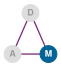
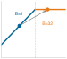

# Hệ thống ML {#sec-ml-systems}

::: {layout-narrow}
::: {.column-margin}

\chapterminitoc

:::

::: {.content-visible when-format="pdf"}
\noindent
{fig-alt="Bản thiết kế đẳng cự thể hiện một tạo phẩm mô hình di chuyển qua các môi trường triển khai đám mây, edge, di động và thiết bị siêu nhỏ với các giới hạn tài nguyên ngày càng thu hẹp."}
:::

::: {.content-visible unless-format="pdf"}
{fig-alt="Bản thiết kế đẳng cự thể hiện một tạo phẩm mô hình di chuyển qua các môi trường triển khai đám mây, edge, di động và thiết bị siêu nhỏ với các giới hạn tài nguyên ngày càng thu hẹp."}
:::

:::

## Mục đích {.unnumbered .unlisted}

\begin{marginfigure}
\mlsysstack{35}{20}{30}{30}{30}{30}{25}{15}
\end{marginfigure}

_Tại sao việc triển khai cùng một mô hình lên điện thoại so với trung tâm dữ liệu lại đòi hỏi kỹ thuật khác biệt về cơ bản?_

Hiểu biết cốt lõi của kỹ thuật hệ thống ML là các ràng buộc thúc đẩy kiến trúc. Tốc độ ánh sáng đặt ra giới hạn tuyệt đối về tốc độ phản hồi của các máy chủ ở xa. Nhiệt động lực học giới hạn lượng tính toán có thể xảy ra trong một thể tích nhất định trước khi nhiệt trở nên không thể kiểm soát. Vật lý bộ nhớ khiến việc di chuyển dữ liệu thường tốn kém hơn việc xử lý nó. Đây không phải là những hạn chế kỹ thuật chờ đợi công nghệ tốt hơn; chúng là những ranh giới vật lý vĩnh viễn phân chia thế giới thành các chế độ hoạt động khác biệt về cơ bản. Một trung tâm dữ liệu có thể huấn luyện các mô hình hàng tỷ tham số nhưng không thể đảm bảo phản hồi độ trễ thấp cho người dùng cách xa hàng nghìn dặm. Một điện thoại thông minh có thể phản hồi ngay lập tức nhưng chỉ có một phần nhỏ ngân sách bộ nhớ. Một vi điều khiển có thể chạy bằng pin cúc áo trong nhiều năm nhưng hầu như không đủ khả năng tính toán cho một bộ phát hiện từ khóa đơn giản. Cùng một mô hình, cùng một thuật toán được áp dụng cho cùng một dữ liệu, đòi hỏi kỹ thuật khác biệt hoàn toàn trong mỗi chế độ, không phải vì vật lý thay đổi mà vì các ràng buộc khác nhau chiếm ưu thế. Các nhóm coi triển khai là một việc làm sau, huấn luyện trong một môi trường và trì hoãn các ràng buộc mục tiêu cho đến khi ra mắt, sẽ phát hiện quá muộn rằng môi trường mục tiêu làm vô hiệu hóa các quyết định kiến trúc đã mất hàng tháng trời. Do đó, nhiệm vụ kỹ thuật không phải là xác định một triển khai tốt nhất phổ quát mà là xác định ràng buộc chi phối trong chế độ hoạt động dự kiến. Theo thuật ngữ D·A·M, việc hiểu các chế độ này biến triển khai từ một chi tiết vận hành thành một vấn đề đồng thiết kế bậc nhất, trong đó tính cục bộ của dữ liệu, cấu trúc thuật toán và các ràng buộc của máy cùng nhau xác định những gì có thể thực hiện được.

::: {.content-visible when-format="pdf"}

\newpage

:::

::: {.callout-learning-objectives}

- Giải thích cách các ràng buộc vật lý tạo ra các mô hình triển khai từ đám mây đến TinyML
- Áp dụng quy luật sắt và nguyên tắc nút thắt cổ chai để phân loại các khối lượng công việc (workload) bị giới hạn bởi tính toán, bộ nhớ và I/O
- Ánh xạ các nguyên mẫu khối lượng công việc (workload) tới các mô hình triển khai sử dụng các ví dụ mô hình hải đăng
- So sánh đám mây, edge, di động và TinyML theo các ràng buộc vận hành và đánh đổi định lượng
- Áp dụng khung quyết định để chọn các mô hình theo các ràng buộc về quyền riêng tư, độ trễ, tính toán và chi phí
- Phân tích các mẫu lai kết hợp các mô hình để đáp ứng các ràng buộc hệ thống
- Đánh giá các quyết định triển khai, các ngụy biện phổ biến và các nguyên tắc phổ quát có thể chuyển giao qua các quy mô

:::

```{python}
#| echo: false
from mlsysim import *
from mlsysim.core.units import *
```

## Khung mô hình triển khai {#sec-ml-systems-deployment-paradigm-framework-0d25}

Hãy xem xét hai thái cực: một bộ phát hiện từ đánh thức trên đồng hồ thông minh và một công cụ đề xuất trong trung tâm dữ liệu. Bộ phát hiện từ đánh thức đại diện cho một khối lượng công việc (workload) TinyML hoạt động dưới ngân sách công suất miliwatt và giới hạn bộ nhớ kilobyte; công cụ đề xuất là ví dụ về một khối lượng công việc (workload) ML đám mây yêu cầu terabyte bảng embedding và cơ sở hạ tầng quy mô megawatt. Các hệ thống này giải quyết các vấn đề khác nhau dưới các ràng buộc vật lý đối lập, và cơ sở hạ tầng hỗ trợ của chúng khác biệt rõ rệt về quy mô và thiết kế. Thực tế này biến triển khai từ một việc làm sau vận hành thành một quyết định kỹ thuật bậc nhất, một quyết định mà phân loại D·A·M được thể hiện trong @fig-ai-triad giúp chúng ta suy luận bằng cách đặt cơ sở hạ tầng lên hàng đầu cùng với dữ liệu và thuật toán.

Các ràng buộc vật lý\index{Physical constraints!deployment implications} xác định nơi một mô hình ML có thể chạy và định hình những gì có thể thực hiện được theo những cách mà không lựa chọn thuật toán nào có thể vượt qua. Tuy nhiên, triển khai khó hơn nhiều so với vẻ ngoài của nó, và lý do không phải là bản thân mô hình. Trong các hệ thống ML sản xuất, mô hình thường chỉ là một phần nhỏ của hệ thống tổng thể [@sculley2015hidden]. Cơ sở hạ tầng xung quanh bao gồm thu thập dữ liệu, xử lý đặc trưng, cơ sở hạ tầng phục vụ (serving), giám sát và quản lý tài nguyên. Tất cả đều thay đổi đáng kể tùy thuộc vào nơi mô hình được thực thi.

::: {.column-margin}
{width="100%" fig-alt="Thang bậc thanh dọc gồm bốn cấp triển khai theo công suất trên thang logarit: Đám mây 3 MW, Edge 200 W, Di động 5 W, TinyML 50 mW, trải dài từ megawatt đến miliwatt."}

*_Công suất trải dài các mô hình từ megawatt (đám mây) đến miliwatt (TinyML)._*
:::

Các ràng buộc vật lý chi phối từng môi trường (độ trễ, công suất và bộ nhớ) buộc việc triển khai ML phải theo bốn mô hình riêng biệt, mỗi mô hình có những đánh đổi kỹ thuật và mẫu thiết kế hệ thống riêng. **ML đám mây**\index{Cloud ML!characteristics} tập hợp các tài nguyên tính toán trong các trung tâm dữ liệu, cung cấp khả năng tính toán đàn hồi và lưu trữ quy mô lớn với chi phí là độ trễ mạng. **ML Edge**\index{Edge ML!latency benefits} di chuyển tính toán đến gần hơn nơi dữ liệu phát sinh, giảm độ trễ đường dẫn từ xa và hạn chế truyền dữ liệu nhạy cảm [@shi2016]. **ML Di động**\index{Mobile ML!energy constraints} mang trí tuệ trực tiếp đến điện thoại thông minh và máy tính bảng, cân bằng khả năng tính toán với thời lượng pin và các ràng buộc nhiệt. **TinyML**\index{TinyML!always-on sensing} đẩy trí tuệ đến các vi điều khiển có giá vài đô la và tiêu thụ miliwatt [@janapa_reddi2022]. Phạm vi phân loại từ megawatt đến miliwatt trải dài chín bậc độ lớn về công suất, trong khi các hệ thống đại diện trong @fig-cloud-edge-TinyML-comparison trải dài gần tám bậc. Hình minh họa định vị năm cấp triển khai—từ các cảm biến công suất cực thấp ở bên trái đến các trung tâm dữ liệu kho hàng ở bên phải—phân định nơi các phạm vi hoạt động của TinyML, AI edge và AI đám mây chồng lấn.

::: {#fig-cloud-edge-TinyML-comparison fig-env="figure" fig-pos="htb" fig-cap="**Phổ Trí tuệ Phân tán**: Các cấp triển khai tạo thành một dải liên tục được chi phối bởi các ràng buộc vật lý, trải dài gần tám bậc độ lớn về công suất. Việc chuyển từ cơ sở hạ tầng đám mây tập trung sang TinyML trên thiết bị đánh đổi khả năng tính toán thô và quy mô đàn hồi để lấy độ trễ xác định, tính cục bộ của dữ liệu và tính độc lập mạng." fig-alt="Phổ ngang thể hiện năm cấp độ triển khai từ trái sang phải: thiết bị và cảm biến công suất cực thấp, thiết bị thông minh, cổng (gateway), máy chủ tại chỗ và đám mây. Các mũi tên chỉ ra TinyML, AI biên (edge AI) và AI đám mây (cloud AI) trải rộng trên phổ."}

```{.tikz}
\begin{tikzpicture}[line cap=round,line join=round,font=\sffamily\small]
  % Parameters
  \def\angle{1.0}       % angle
  \def\length{20.5}     % Lengths (cm)
  \def\npoints{5}       % number of points
  \def\startfrac{0.13}  % start (e.g.. 0.2 = 20%)
  \def\endfrac{0.87}    % end (e.g.. 0.8 = 80%)

 \draw[line width=1pt, black!70] (0,0) -- ({\length*cos(\angle)}, {\length*sin(\angle)})coordinate(end);
 %
  \foreach \i in {0,1,...,\numexpr\npoints-1} {
    \pgfmathsetmacro{\t}{\startfrac + (\endfrac - \startfrac)*\i/(\npoints-1)}
\coordinate(T\i)at({\t*\length*cos(\angle)}, {\t*\length*sin(\angle)});
  }

\tikzset {
pics/gatewey/.style = {
        code = {
\colorlet{red}{white}
\begin{scope}[local bounding box=GAT,scale=0.9, every node/.append style={transform shape}]
\def\rI{4mm}
\def\rII{2.8mm}
\def\rIII{1.6mm}
\draw[red,line width=1.25pt](0,0)--(0,0.38)--(1.2,0.38)--(1.2,0)--cycle;
\draw[red,line width=1.5pt](0.6,0.4)--(0.6,0.9);

\draw[red, line width=1.5pt] (0.6,0.9)+(60:\rI) arc[start angle=60, end angle=-60, radius=\rI];
\draw[red, line width=1.5pt] (0.6,0.9)+(50:\rII) arc[start angle=50, end angle=-50, radius=\rII];
\draw[red, line width=1.5pt] (0.6,0.9)+(30:\rIII) arc[start angle=30, end angle=-30, radius=\rIII];
%
 \draw[red, line width=1.5pt] (0.6,0.9)+(120:\rI) arc[start angle=120, end angle=240, radius=\rI];
\draw[red, line width=1.5pt] (0.6,0.9)+(130:\rII) arc[start angle=130, end angle=230, radius=\rII];
\draw[red, line width=1.5pt] (0.6,0.9)+(150:\rIII) arc[start angle=150, end angle=210, radius=\rIII];
\fill[red](0.6,0.9)circle (1.5pt);

\foreach\i in{0.15,0.3,0.45,0.6}{
\fill[red](\i,0.19)circle (1.5pt);
}

\fill[red](1,0.19)circle (2pt);
\end{scope}
}}}

\tikzset {
pics/cloud/.style = {
        code = {
\colorlet{red}{white}
\begin{scope}[local bounding box=CLO,scale=0.6, every node/.append style={transform shape}]
\draw[red,line width=1.5pt](0,0)to[out=170,in=180,distance=11](0.1,0.61)
to[out=90,in=105,distance=17](1.07,0.71)
to[out=20,in=75,distance=7](1.48,0.36)
to[out=350,in=0,distance=7](1.48,0)--(0,0);
\draw[red,line width=1.5pt](0.27,0.71)to[bend left=25](0.49,0.96);
\draw[red,line width=1.5pt](0.67,1.21)to[out=55,in=90,distance=13](1.5,0.96)
to[out=360,in=30,distance=9](1.68,0.42);
\end{scope}
}}}

\tikzset {
  pics/server/.style = {
    code = {
      \colorlet{red}{white}
      \begin{scope}[anchor=center, transform shape,scale=0.8, every node/.append style={transform shape}]
        \draw[red,line width=1.25pt,fill=white](-0.55,-0.5) rectangle (0.55,0.5);
\foreach \i in {-0.25,0,0.25} {
                \draw[BlueLine,line width=1.25pt]( -0.55,\i) -- (0.55, \i);
}
        \foreach \i in {-0.375, -0.125, 0.125, 0.375} {
          \draw[BlueLine,line width=1.25pt](-0.45,\i)--(0,\i);
          \fill[BlueLine](0.35,\i) circle (1.5pt);
        }

\draw[red,line width=1.75pt](0,-0.53) |- (-0.55,-0.7);
        \draw[red,line width=1.75pt](0,-0.53) |- (0.55,-0.7);
      \end{scope}
    }
  }
}

\tikzset {
pics/cpu/.style = {
        code = {
\definecolor{CPU}{RGB}{0,120,176}
\colorlet{CPU}{white}
\begin{scope}[local bounding box = CPU,scale=0.33, every node/.append style={transform shape}]
\node[fill=CPU,minimum width=66, minimum height=66,
            rounded corners=2,outer sep=2pt] (C1) {};
\node[fill=violet,minimum width=54, minimum height=54] (C2) {};
%\node[fill=CPU!40,minimum width=44, minimum height=44] (C3) {CPU};

\foreach \x/\y in {0.11/1,0.26/2,0.41/3,0.56/4,0.71/5,0.85/6}{
\node[fill=CPU,minimum width=4, minimum height=15,
           inner sep=0pt,anchor=south](GO\y)at($(C1.north west)!\x!(C1.north east)$){};
}
\foreach \x/\y in {0.11/1,0.26/2,0.41/3,0.56/4,0.71/5,0.85/6}{
\node[fill=CPU,minimum width=4, minimum height=15,
           inner sep=0pt,anchor=north](DO\y)at($(C1.south west)!\x!(C1.south east)$){};
}
\foreach \x/\y in {0.11/1,0.26/2,0.41/3,0.56/4,0.71/5,0.85/6}{
\node[fill=CPU,minimum width=15, minimum height=4,
           inner sep=0pt,anchor=east](LE\y)at($(C1.north west)!\x!(C1.south west)$){};
}
\foreach \x/\y in {0.11/1,0.26/2,0.41/3,0.56/4,0.71/5,0.85/6}{
\node[fill=CPU,minimum width=15, minimum height=4,
           inner sep=0pt,anchor=west](DE\y)at($(C1.north east)!\x!(C1.south east)$){};
}
\end{scope}
    }  }}

\tikzset {
pics/mobile/.style = {
        code = {
\colorlet{red}{white}
\begin{scope}[local bounding box=MOB,scale=0.4, every node/.append style={transform shape}]
\node[rectangle,draw=red,minimum height=94,minimum width=47,
            rounded corners=6,thick,fill=white](R1){};
\node[rectangle,draw=red,minimum height=67,minimum width=38,thick,fill=GreenFill](R2){};
\node[circle,minimum size=8,below= 2pt of R2,inner sep=0pt,thick,fill=GreenFill]{};
\node[rectangle,fill=GreenFill,minimum height=2,minimum width=20,above= 4pt of R2,inner sep=0pt,thick]{};
%
 \end{scope}
     }  }}

\node[draw=none,fill=RedFill,circle,minimum size=20mm](GA)at(T2){};
\pic[shift={(-0.55,-0.5)}] at (T2) {gatewey};
\node[above=0 of GA]{Gateway};
\node[draw=none,fill=VioletL,circle,minimum size=20mm](CP)at(T0){};
\pic[shift={(0,-0)}] at (T0) {cpu};
\node[above=0 of CP,align=center]{Ultra-Low-Power\\Devices and Sensors};
\node[draw=none,fill=GreenFill,,circle,minimum size=20mm](MO)at(T1){};
 \pic[shift={(0,0)}] at (T1) {mobile};
 \node[above=0 of MO,align=center]{Intelligent Device};
\node[draw=none,fill=BlueFill,circle,minimum size=20mm](SE)at(T3){};
\pic[shift={(-0.03,0.1)}] at (T3) {server};
 \node[above=0 of SE,align=center]{On-Premises Servers};
\node[draw=none,fill=BrownL,circle,minimum size=20mm](CL)at(T4){};
\pic[shift={(-0.48,-0.35)}] at (T4) {cloud};
 \node[above=0 of CL,align=center]{Cloud};
%
\path (T0) -- (T1) coordinate[pos=0.5] (M1);
\path (0,0) -- (T0) coordinate[pos=0.25] (M0);
\path (T3) -- (T4) coordinate[pos=0.5] (M2);
\path (T4) -- (end) coordinate[pos=0.75] (M3);

\foreach \x in {0,1,2,3}{
\fill[OliveLine](M\x)circle (2.5pt);
}

\path[red](M0)--++(270:1.6)coordinate(LL1)-|coordinate(LL2)(M2);
\path[red](M0)--++(270:1.25)coordinate(L1)-|coordinate(L2)(M1);
\path[red](M0)--++(270:1.1)-|coordinate(L3)(M2);
\path[red](M0)--++(270:1.1)-|coordinate(L4)(M3);
%
\draw[black!70,thick](M0)--(LL1);
\draw[black!70,thick](M1)--(L2);
\draw[black!70,thick](M3)--(L4);
\draw[black!70,thick](M2)--(LL2);
\draw[latex-latex,line width=1pt,draw=black!60](L1)--node[red,fill=white]{TinyML}(L2);
\draw[latex-latex,line width=1pt,draw=black!60](L3)--node[fill=white]{Cloud AI}(L4);
\draw[latex-latex,line width=1pt,draw=black!60]([yshift=4pt]LL1)--node[fill=white,text=black]{Edge AI}([yshift=4pt]LL2);
\foreach \x in {0,1,2,3}{
\fill[OliveLine](M\x)circle (2.5pt);
}
%
\path[](M0)--++(90:1.9)-|node[pos=0.25]{\textbf{The Distributed Intelligence Spectrum}}(M3);
\end{tikzpicture}

```
:::

Trong khi @fig-cloud-edge-TinyML-comparison minh họa cấu trúc liên kết định tính của trí tuệ phân tán, @tbl-deployment-paradigms-overview định lượng các giới hạn hoạt động trên các khía cạnh vị trí xử lý, độ trễ khứ hồi, mức tiêu thụ công suất và dung lượng bộ nhớ. Khoảng công suất chín bậc độ lớn này phản ánh ba giới hạn vật lý không thể tránh khỏi: tốc độ ánh sáng (thiết lập các ngưỡng độ trễ tối thiểu), giới hạn tản nhiệt nhiệt động lực học (giới hạn tính toán trên mỗi watt) và năng lượng tín hiệu bộ nhớ (bức tường bộ nhớ).

```{python}
#| echo: false
# ┌─────────────────────────────────────────────────────────────────────────────
# │ DEPLOYMENT OVERVIEW TABLE
# ├─────────────────────────────────────────────────────────────────────────────
# │ Context: @tbl-deployment-paradigms-overview
# │
# │ Goal: Latency and mobile power columns for the deployment overview table.
# │ Show: Per-paradigm latency ranges and smartphone TDP envelope.
# │ How: Read pre-formatted range strings from mlsysim constants.
# │
# └─────────────────────────────────────────────────────────────────────────────

# ┌── LEGO ───────────────────────────────────────────────
class DeploymentOverviewTable:
    """Latency and power ranges for @tbl-deployment-paradigms-overview."""

    # ┌── 1. LOAD (Constants) ───────────────────────────────────────────────
    mobile_tdp_min_w, mobile_tdp_max_w = [int(v) for v in Platforms.Mobile.tdp_range_w.split("-")]

    # ┌── 4. OUTPUT (Formatting) ──────────────────────────────────────────────
    cloud_latency_range_str = MarkdownStr(Platforms.Cloud.latency_range_ms)
    edge_latency_range_str = MarkdownStr(Platforms.Edge.latency_range_ms)
    mobile_latency_range_str = MarkdownStr(Platforms.Mobile.latency_range_ms)
    tiny_latency_range_str = MarkdownStr(Platforms.Tiny.latency_range_ms)
    mobile_tdp_range_str = fmt_range(
        mobile_tdp_min_w,
        mobile_tdp_max_w,
        precision=0,
        commas=False,
        unit="W",
    )
```

| **Paradigm**  | **Where**        |                       **Latency (ms)**                      |                        **Power**                        | **Memory** | **Best For**                 |
|:--------------|:-----------------|:-----------------------------------------------------------:|:-------------------------------------------------------:|:----------:|:-----------------------------|
| **Cloud ML**  | Data centers     |  `{python} DeploymentOverviewTable.cloud_latency_range_str` |                            MW                           |     TB     | Training, complex inference  |
| **Edge ML**   | Local servers    |  `{python} DeploymentOverviewTable.edge_latency_range_str`  |                          100 W                          |     GB     | Real-time inference, privacy |
| **Mobile ML** | Smartphones      | `{python} DeploymentOverviewTable.mobile_latency_range_str` | `{python} DeploymentOverviewTable.mobile_tdp_range_str` |     GB     | Personal AI, offline         |
| **TinyML**    | Microcontrollers |  `{python} DeploymentOverviewTable.tiny_latency_range_str`  |                            mW                           |     KB     | Always-on sensing            |

: **Phổ Triển khai (Khái niệm)**: Bốn mô hình trải rộng chín bậc độ lớn về công suất (MW đến mW) và bộ nhớ (TB đến KB). Tổng quan khái niệm này định nghĩa mỗi mô hình bằng chế độ hoạt động của nó; phổ phần cứng cụ thể sau đó sẽ đặt nền tảng cho các danh mục này trong các nền tảng cụ thể và ngưỡng quyết định định lượng. Các thông số kỹ thuật phần cứng và hằng số vật lý làm nền tảng cho các con số này được liệt kê trong phụ lục Giả định Hệ thống. {#tbl-deployment-paradigms-overview tbl-colwidths="[14,17,12,12,15,30]"}

### Điểm neo kiến trúc: Ngăn xếp một nút {#sec-ml-systems-architectural-anchor}

Để điều hướng các chế độ hoạt động này, chúng tôi neo các quyết định kỹ thuật của mình vào một mô hình bốn lớp của **ngăn xếp một nút**\index{Single-node stack!architecture layers}, cái mà tinh chỉnh phía máy của phân loại D·A·M cho một máy chủ trong khi dữ liệu và thuật toán đi vào thông qua các yêu cầu khối lượng công việc (workload). Ở trên cùng của ngăn xếp, ứng dụng định nghĩa nhiệm vụ thông qua mục tiêu thông lượng huấn luyện hoặc độ trễ suy luận. @Sec-model-training và @sec-model-serving phát triển các cơ chế xác định liệu hệ thống có thể đáp ứng được hay không. ML framework\index{ML framework!compiler role} dịch mã mô hình thành các hoạt động có thể thực thi (@sec-ml-frameworks). Hệ điều hành\index{Operating system!runtime role} điều phối tài nguyên và di chuyển dữ liệu giữa bộ nhớ máy chủ và bộ nhớ bộ tăng tốc. Bản thân phần cứng, được định nghĩa bởi dung lượng bộ nhớ băng thông cao (HBM), băng thông bộ nhớ, các kết nối nội nút như NVLink và thông lượng tính toán, đặt ra các giới hạn vật lý, với bức tường bộ nhớ là một ràng buộc lặp lại (@sec-hardware-acceleration).

Ngăn xếp này thiết lập **hợp đồng silicon**\index{Silicon contract!definition} của chương: thỏa thuận hiệu suất cố định mà một mảnh silicon nhất định cung cấp cho một mô hình, được thiết lập bởi băng thông bộ nhớ, tốc độ tính toán đỉnh và chi phí cố định. Mỗi chương trong nửa đầu của văn bản này đều xem xét một hoặc nhiều lớp này, bởi vì việc hiểu cách chúng tương tác trong một máy duy nhất là điều kiện tiên quyết kỹ thuật để làm chủ các quy mô phân tán lớn hơn.

Các ràng buộc vật lý này tương tác với định luật sắt của các hệ thống ML (@sec-introduction-iron-law-ml-systems-c32a), cái mà phân tách độ trễ đầu cuối thành di chuyển dữ liệu, tính toán và chi phí. Các môi trường triển khai khác nhau nhấn mạnh các ràng buộc khác nhau: huấn luyện trên đám mây có thể bị giới hạn bởi tính toán, hệ thống di động đối mặt với các bức tường công suất, và thiết bị TinyML thường đạt đến giới hạn dung lượng bộ nhớ. Bằng cách ghép nối các ràng buộc vật lý với định luật sắt, chúng tôi phát triển một vốn từ vựng định lượng để lý giải mô hình nào phù hợp với một khối lượng công việc (workload) nhất định và *tại sao*. Để neo phân tích này một cách cụ thể, chương giới thiệu năm mô hình hải đăng\index{Lighthouse model!reference workloads} (ResNet-50, GPT-2, DLRM cho khuyến nghị nặng embedding, MobileNetV2 và một bộ phát hiện từ khóa cho phát hiện từ đánh thức) trải rộng phổ triển khai và cô lập các nút thắt hệ thống riêng biệt. Các khối lượng công việc (workload) tham chiếu này lặp lại xuyên suốt cuốn sách, cung cấp một cơ sở nhất quán để so sánh các kỹ thuật tối ưu hóa giữa các chương, khối lượng công việc (workload) và cấp độ triển khai.

Vật lý tạo ra các ranh giới mô hình này được trình bày trước, tiếp theo là các công cụ phân tích (định luật sắt, nguyên tắc nút thắt, các nguyên mẫu khối lượng công việc (workload)) để ánh xạ khối lượng công việc (workload) tới các mục tiêu triển khai. Mỗi mô hình sau đó được xử lý chuyên sâu, bao gồm cơ sở hạ tầng, đánh đổi và các khối lượng công việc (workload) đại diện của nó, với mục đích xem xét cách lựa chọn giữa chúng khi một hệ thống có thể chạy hợp lý ở nhiều hơn một mô hình. Chương kết thúc với một khung quyết định so sánh và các kiến trúc lai kết hợp các mô hình khi không có một mục tiêu triển khai duy nhất nào đáp ứng tất cả các yêu cầu.

## Các Ràng buộc Vật lý: Tại sao các Mô hình Tồn tại {#sec-ml-systems-deployment-spectrum-71be}

Một hệ thống an toàn với ngân sách phản ứng 10 ms không thể chờ đợi một chuyến khứ hồi xuyên quốc gia, và một mô hình tỷ tham số không thể được nén vào một vi điều khiển chỉ bằng mã tốt hơn. Đây không phải là lỗi triển khai; chúng là hệ quả của các định luật vật lý về tốc độ ánh sáng\index{Physical constraints!speed of light}, nhiệt động lực học công suất\index{Physical constraints!thermodynamics} và tín hiệu bộ nhớ\index{Physical constraints!memory signaling}. Nơi một hệ thống chạy định hình lại hợp đồng silicon\index{Silicon contract!physical constraints} giữa mô hình và phần cứng. Ba ràng buộc chi phối các đánh đổi kỹ thuật phía trước: rào cản ánh sáng, bức tường công suất và bức tường bộ nhớ.[^fn-paradigm-deployment-tradeoff]

### Rào cản ánh sáng {.unnumbered}

**Rào cản ánh sáng**\index{Light barrier!latency floor} thiết lập ngưỡng độ trễ tuyệt đối[^fn-latency-system-tradeoff]. Gọi $\text{Distance}$ là chiều dài đường truyền một chiều và $c_{\text{fiber}}$ là tốc độ truyền trong sợi quang. @Eq-latency-physics đưa ra thời gian khứ hồi tối thiểu:
$$L_{\text{lat,min}} = \frac{2 \times \text{Distance}}{c_{\text{fiber}}} \approx \frac{2 \times \text{Distance}}{200{,}000 \text{ km/s}}$$ {#eq-latency-physics}
Đối với sợi quang, $c_{\text{fiber}} \approx 200{,}000$ km/s, xấp xỉ hai phần ba giá trị trong chân không của nó vì ánh sáng truyền chậm hơn qua thủy tinh so với trong chân không.

```{python}
#| echo: false
#| label: light-barrier-calc
# ┌─────────────────────────────────────────────────────────────────────────────
# │ LIGHT BARRIER LATENCY CALCULATION
# ├─────────────────────────────────────────────────────────────────────────────
# │ Context: "The light barrier" narrative (Physical Constraints section)
# │
# │ Goal: Demonstrate the physical latency floor of cloud computing.
# │ Show: Cross-country round-trip time exceeds tight real-time budgets.
# │ How: Apply the mlsysim network latency formula for CA-to-VA distance.
# │
# └─────────────────────────────────────────────────────────────────────────────
from mlsysim.physics import calc_network_latency_ms
from mlsysim.fmt import fmt, check, fmt_time, fmt_length, fmt_text

# ┌── LEGO ───────────────────────────────────────────────
class LightLatency:
    """
    Namespace for Light-Speed Latency calculation.
    Scenario: Cross-country packet transmission (CA to VA) vs 10 ms budget.
    """

    # ┌── 1. LOAD (Constants) ───────────────────────────────────────────────
    distance_km = 3600 * ureg.km  # California to Virginia (straight-line)
    safety_budget_ms = 10

    # ┌── 2. EXECUTE (The Compute) ─────────────────────────────────────────
    # Calculate Round-trip time (RTT) based on speed of light in fiber
    min_latency_ms = calc_network_latency_ms(distance_km)

    # ┌── 3. GUARD (Invariants) ───────────────────────────────────────────
    check(min_latency_ms > safety_budget_ms, f"Physics forbids cloud ({min_latency_ms:.1f} ms) within {safety_budget_ms} ms budget!")

    # ┌── 4. OUTPUT (Formatting) ──────────────────────────────────────────────
    min_latency_value = fmt_time(min_latency_ms, 'millisecond', precision=0, commas=False)
    min_latency_str = fmt_text(min_latency_value, " round-trip")
    distance_km_str = fmt_length(distance_km, unit=kilometer, precision=0, commas=True)
```

Từ California đến Virginia (~`{python} LightLatency.distance_km_str` đường chim bay) đòi hỏi ~`{python} LightLatency.min_latency_str` trước khi bất kỳ phép tính nào bắt đầu. Các dịch vụ thực tế bổ sung độ trễ định tuyến, giao thức, xếp hàng và xử lý. Các ứng dụng yêu cầu phản hồi dưới 10 ms *không thể* sử dụng hạ tầng đám mây ở xa—vật lý không cho phép điều đó. Hạn chế này tạo ra nhu cầu về ML biên (edge ML) và TinyML: khi ngân sách độ trễ eo hẹp, phép tính phải di chuyển gần hơn đến nguồn dữ liệu.

### Bức tường công suất {.unnumbered}

**Bức tường công suất**\index{Power wall!thermal limits}\index{Power wall!frequency scaling} xuất hiện vì nhiệt động lực học giới hạn lượng phép tính có thể xảy ra trong một thể tích nhất định. Công suất CMOS động tuân theo @eq-power-scaling, trong đó $C$ là điện dung hiệu dụng, $V$ là điện áp và $f$ là tần số xung nhịp. Giữ điện dung hiệu dụng $C$ không đổi trong một dải hoạt động cục bộ nơi điện áp tăng tỷ lệ thuận với tần số $(V \propto f)$, công suất động tăng theo $f^3$. Mối quan hệ bậc ba này phát sinh khi đẩy tần số xung nhịp vượt quá giới hạn danh định, đòi hỏi điện áp cung cấp cao hơn để duy trì tốc độ chuyển mạch của transistor. Khi việc điều chỉnh điện áp dừng hoàn toàn ở giới hạn danh định, công suất động tỷ lệ tuyến tính với tần số, nhưng các ràng buộc tản nhiệt vẫn ngăn cản việc điều chỉnh xung nhịp liên tục.
$$\text{Power} \propto C \times V^2 \times f \quad \text{where } V \propto f \implies \text{Power} \propto f^3$$ {#eq-power-scaling}

```{python}
#| echo: false
#| label: power-wall-throttling
from mlsysim.fmt import fmt_fps, fmt_time

# ┌─────────────────────────────────────────────────────────────────────────────
# │ POWER WALL: MOBILE THERMAL THROTTLING SCENARIO
# ├─────────────────────────────────────────────────────────────────────────────
# │ Context: Power Wall prose immediately below—illustrates throttling
# │          behavior on battery-powered devices.
# │
# │ Goal: Provide concrete FPS numbers showing thermal throttling on mobile.
# │ Show: A mobile model drops from 60 FPS to 15 FPS after 1 minute.
# │ How: Simple illustrative constants (no computation needed).
# │
# └─────────────────────────────────────────────────────────────────────────────

# ┌── LEGO ───────────────────────────────────────────────
class ThrottlingScenario:
    """Namespace for illustrative mobile thermal throttling."""

    # ┌── 1. LOAD (Constants) ───────────────────────────────────────────────
    fps_start = 60
    fps_throttled = 15
    duration_min = 1

    # ┌── 2. EXECUTE (The Compute) ─────────────────────────────────────────
    # (illustrative scenario—no derived quantities)

    # ┌── 3. GUARD (Invariants) ───────────────────────────────────────────

    # ┌── 4. OUTPUT (Formatting) ──────────────────────────────────────────────
    fps_start_str = fmt_fps(fps_start)
    fps_throttled_str = fmt_fps(fps_throttled)
    duration_min_str = fmt_time(duration_min, "minute", precision=0, commas=False, style="word")
```

```{python}
#| echo: false
# ┌─────────────────────────────────────────────────────────────────────────────
# │ MOBILE TDP — POWER WALL NARRATIVE
# ├─────────────────────────────────────────────────────────────────────────────
# │ Context: Power Wall prose (mobile thermal throttling paragraph)
# │
# │ Goal: Cite the smartphone TDP envelope where throttling begins.
# │ Show: 2–5 W mobile power budget from centralized constants.
# │ How: Read Platforms.Mobile.tdp_range_w.
# │
# └─────────────────────────────────────────────────────────────────────────────

# ┌── LEGO ───────────────────────────────────────────────
class MobileTdpPowerWall:
    """Mobile TDP envelope cited in the Power Wall narrative."""

    # ┌── 1. LOAD (Constants) ───────────────────────────────────────────────
    mobile_tdp_min_w, mobile_tdp_max_w = [int(v) for v in Platforms.Mobile.tdp_range_w.split("-")]

    # ┌── 4. OUTPUT (Formatting) ──────────────────────────────────────────────
    mobile_tdp_range_str = fmt_range(
        mobile_tdp_min_w,
        mobile_tdp_max_w,
        precision=0,
        commas=False,
        unit="W",
    )
```

Theo giả định minh họa này, việc tăng gấp đôi tần số xung nhịp đòi hỏi công suất động lớn hơn khoảng 8$\times$. Sự sụp đổ của việc điều chỉnh điện áp rộng rãi[^fn-dennard-scaling-origin] đã chấm dứt các cải thiện tốc độ tần số "miễn phí" và buộc ngành công nghiệp phải hướng tới song song hóa (đa lõi) và chuyên môn hóa (GPU, Tensor Processing Units (TPU)). Các thiết bị di động đạt giới hạn nhiệt khắc nghiệt ở `{python} MobileTdpPowerWall.mobile_tdp_range_str`; vượt quá giới hạn này gây ra hiện tượng "tiết lưu" (throttling), nơi thiết bị giảm hiệu suất để ngăn ngừa quá nhiệt. Trong thực tế, điều này có nghĩa là một mô hình di động chạy ở `{python} ThrottlingScenario.fps_start_str` trong `{python} ThrottlingScenario.duration_min_str` có thể bị tiết lưu xuống `{python} ThrottlingScenario.fps_throttled_str` khi thiết bị nóng lên. Giới hạn vật lý này tạo ra ML di động: các thiết bị chạy bằng pin không thể đơn giản chạy các mô hình quy mô đám mây cục bộ.

[^fn-dennard-scaling-origin]: **Dennard scaling**\index{Dennard scaling!origin and breakdown}: Được đặt theo tên @dennard1974 tại IBM, người đã mô tả các mối quan hệ điều chỉnh MOSFET mà theo đó việc thu nhỏ thiết bị có thể giảm điện áp và dòng điện trong khi vẫn giữ mật độ công suất được kiểm soát xấp xỉ. Khi việc điều chỉnh điện áp chậm lại và năng lượng trở thành một ràng buộc kiến trúc bậc nhất, sự tăng trưởng hiệu suất đã chuyển sang song song hóa và chuyên môn hóa: bộ xử lý đa lõi, GPU và TPU [@hennessy2019; @esmaeilzadeh2011].

### Bức tường bộ nhớ {.unnumbered}

**Bức tường bộ nhớ**\index{Memory wall!bandwidth divergence}\index{Memory wall!compute-memory gap} [@wulf1995] phản ánh khoảng cách băng thông[^fn-bandwidth-memory-wall] ngày càng rộng. Một sơ đồ đơn giản ở cấp độ sách sử dụng các yếu tố tăng trưởng hàng năm đại diện để cho thấy tại sao khoảng cách này lại tăng lên theo cấp số nhân:
$$\frac{\text{Compute Growth Rate}}{\text{Memory Bandwidth Growth Rate}} \approx \frac{1.6}{1.2} \approx 1.33$$ {#eq-memory-wall}

Trong @eq-memory-wall, tử số và mẫu số là các yếu tố tăng trưởng hàng năm không thứ nguyên. Tỷ lệ trên 1 có nghĩa là khả năng tính toán đang vượt xa băng thông bộ nhớ, do đó mỗi thế hệ phần cứng làm cho việc di chuyển dữ liệu chiếm một phần lớn hơn trong vấn đề hiệu suất trừ khi khối lượng công việc tăng cường tính cục bộ hoặc cường độ số học.

```{python}
#| echo: false
#| label: memory-wall-trends
# ┌─────────────────────────────────────────────────────────────────────────────
# │ MEMORY WALL: COMPUTE VS BANDWIDTH GROWTH RATES
# ├─────────────────────────────────────────────────────────────────────────────
# │ Context: Prose immediately below @eq-memory-wall, quantifying the
# │          compute-memory divergence.
# │
# │ Goal: Provide the two growth-rate numbers cited in Memory Wall narrative.
# │ Show: Compute doubles every 18 months; memory BW grows ~20% annually.
# │ How: Canonical industry trend constants formatted for prose.
# │
# └─────────────────────────────────────────────────────────────────────────────
from mlsysim.fmt import fmt, fmt_percent

# ┌── LEGO ───────────────────────────────────────────────
class MemoryWallTrends:
    """Namespace for compute vs memory bandwidth growth rates."""

    # ┌── 1. LOAD (Constants) ───────────────────────────────────────────────
    compute_doubling_months = 18
    mem_bw_growth_pct = 20

    # ┌── 2. EXECUTE (The Compute) ─────────────────────────────────────────
    # (pass-through: canonical trend values)

    # ┌── 3. GUARD (Invariants) ───────────────────────────────────────────

    # ┌── 4. OUTPUT (Formatting) ──────────────────────────────────────────────
    compute_doubling_months_str = fmt_time(compute_doubling_months, "month", precision=0, style="word")
    mem_bw_growth_pct_str = fmt_percent(mem_bw_growth_pct / 100, precision=0, style="prose")
```

Các xu hướng đại diện đằng sau tỷ lệ này là bộ xử lý đã tăng gấp đôi khả năng tính toán khoảng mỗi `{python} MemoryWallTrends.compute_doubling_months_str`, nhưng băng thông bộ nhớ chỉ cải thiện khoảng ~`{python} MemoryWallTrends.mem_bw_growth_pct_str` hàng năm. Khoảng cách ngày càng rộng này khiến việc di chuyển dữ liệu\index{Data movement!energy dominance} trở thành một nút thắt cổ chai và chi phí năng lượng thường xuyên trong các khối lượng công việc ML. Ràng buộc này ảnh hưởng đến tất cả các mô hình nhưng đặc biệt nghiêm trọng đối với TinyML, nơi các thiết bị chỉ có vài kilobyte bộ nhớ để làm việc. @Sec-hardware-acceleration-understanding-ai-memory-wall-3ea9 phát triển các phản ứng kiến trúc đối với bức tường bộ nhớ, bao gồm HBM và các hệ thống phân cấp SRAM trên chip.

::: {#chk-ml-systems-physical-constraints-deployment .callout-checkpoint title="Các ràng buộc vật lý và triển khai"}

Các lựa chọn triển khai được chi phối bởi vật lý, không chỉ bởi sở thích. Hãy kiểm tra sự hiểu biết của bạn:

- [ ] **Rào cản ánh sáng**: bạn có thể giải thích tại sao tốc độ ánh sáng khiến ML trên đám mây không thể thực hiện được đối với các tác vụ an toàn $<10\text{ ms}$ không?
- [ ] **Bức tường công suất**: bạn có thể giải thích tại sao nhiệt động lực học (tản nhiệt) ngăn cản các mô hình trung tâm dữ liệu chạy trên thiết bị di động không?
- [ ] **Bức tường bộ nhớ**: bạn có thể giải thích tại sao việc di chuyển dữ liệu thường tốn kém hơn (về thời gian và năng lượng) so với tính toán không?

:::

Các định luật vật lý này giải thích *tại sao* bốn mô hình tồn tại. Vật lý tạo ra các ranh giới; quy định về quyền riêng tư, các ưu đãi kinh tế và yêu cầu về chủ quyền dữ liệu củng cố và làm sắc nét chúng mà không tạo ra chúng. Không có quy định nào có thể làm cho tốc độ ánh sáng nhanh hơn, và không có mô hình kinh tế nào có thể bãi bỏ nhiệt động lực học.

::: {.column-margin}
{width="100%" fig-alt="Hai đường xu hướng phân kỳ: một đường cong tăng trưởng tính toán màu đỏ dốc tách ra khỏi một đường cong băng thông bộ nhớ màu xanh nông, với khoảng cách ngày càng rộng được tô bóng màu đỏ."}

*Khả năng tính toán vượt xa băng thông bộ nhớ; khoảng cách ngày càng rộng chính là bức tường bộ nhớ.*
:::

Biết rằng những rào cản này tồn tại là cần thiết nhưng chưa đủ. Với một khối lượng công việc ML cụ thể (chẳng hạn, một công cụ đề xuất hoặc một bộ phát hiện từ đánh thức), chúng ta cần xác định mô hình nào phù hợp và khối lượng công việc sẽ gặp rào cản nào trước tiên. Câu trả lời đòi hỏi các công cụ phân tích kết nối các đặc điểm của khối lượng công việc với các ràng buộc vật lý này: định luật sắt để phân tích độ trễ, nguyên tắc nút thắt cổ chai để xác định ràng buộc chi phối, và một tập hợp các nguyên mẫu khối lượng công việc để phân loại vị trí của mỗi mô hình trên phổ.

## Phân tích khối lượng công việc {#sec-ml-systems-analyzing-workloads-cbb8}

Với một công cụ đề xuất hoặc bộ phát hiện từ đánh thức, câu hỏi về khối lượng công việc (workload) là yếu tố nào sẽ ràng buộc trước tiên trên phần cứng mục tiêu. Công cụ phân tích trung tâm để trả lời câu hỏi về hợp đồng silicon\index{Silicon contract!iron law} đó là định luật sắt của các hệ thống ML\index{Iron law of ML systems!deployment analysis}, được thiết lập trong @sec-introduction-iron-law-ml-systems-c32a. Ở đây, $T$ là tổng thời gian, $D_{\text{vol}}$ là số byte di chuyển, $\text{BW}$ là băng thông, $O$ là tổng số phép toán, $R_{\text{peak}}$ là tốc độ tính toán đỉnh, $\eta_{\text{hw}}$ là hiệu suất phần cứng, và $L_{\text{lat}}$ là chi phí cố định; @eq-iron-law cộng các chi phí này cho một đường dẫn thực thi tuần tự hóa:
$$T = \frac{D_{\text{vol}}}{\text{BW}} + \frac{O}{R_{\text{peak}} \cdot \eta_{\text{hw}}} + L_{\text{lat}}$$ {#eq-iron-law}

@Eq-iron-law phân tách tổng độ trễ thành ba yếu tố: di chuyển dữ liệu $(D_{\text{vol}}/\text{BW})$, tính toán $(O/(R_{\text{peak}} \cdot \eta_{\text{hw}}))$, và chi phí cố định $(L_{\text{lat}})$. Đối với một suy luận đơn lẻ, các chi phí này chỉ đơn giản là cộng lại---mỗi chi phí được thanh toán tuần tự. Tuy nhiên, trong các hệ thống sản xuất, các tác vụ được xử lý liên tục dưới dạng luồng, và phân tích chuyển từ độ trễ của tác vụ đơn lẻ sang việc xác định yếu tố nào giới hạn hệ thống. Câu trả lời hoàn toàn phụ thuộc vào môi trường triển khai: một mô hình **ràng buộc bởi tính toán**\index{Compute-bound vs. memory-bound!definition} trong quá trình huấn luyện có thể trở thành ràng buộc bởi bộ nhớ trong quá trình suy luận; một hệ thống chạy hiệu quả trên đám mây có thể đạt giới hạn công suất trên các thiết bị di động. Để xác định yếu tố nào chi phối, chúng ta cần một nguyên lý bổ trợ.

### Nguyên lý nút thắt cổ chai {#sec-ml-systems-bottleneck-principle-3514}

Định luật sắt cho chúng ta biết chi phí của mỗi yếu tố. **Nguyên lý nút thắt cổ chai**\index{Bottleneck principle!definition} cho chúng ta biết yếu tố nào quan trọng. Trong một khối lượng công việc (workload) ML dạng pipeline, việc xác định nút thắt cổ chai của hệ thống\index{System Bottleneck!identifying} rất quan trọng vì tối ưu hóa các hoạt động nhanh không mang lại lợi ích nào trong khi giai đoạn chậm nhất vẫn không thay đổi. Các bộ tăng tốc hiện đại sử dụng **thực thi dạng pipeline**\index{Pipelined execution!throughput analysis} để che phủ việc di chuyển dữ liệu với tính toán: trong khi bộ tăng tốc tính toán trên batch $n$, hệ thống bộ nhớ tìm nạp trước batch $n+1$. Khi di chuyển dữ liệu, tính toán và I/O được che phủ hoàn toàn trong trạng thái ổn định, hãy để $T_{\text{network}}$ biểu thị thời gian truyền từ xa và $T_{\text{bottleneck}}$ là thời gian trên mỗi tác vụ, bao gồm chi phí cố định. Các giai đoạn nhanh hơn bị che khuất bởi giai đoạn được che phủ chậm nhất, do đó tổng của định luật sắt trở thành giá trị cực đại, như @eq-bottleneck hình thức hóa:
$$ T_{\text{bottleneck}} = \max\left(\frac{D_{\text{vol}}}{\text{BW}}, \frac{O}{R_{\text{peak}} \cdot \eta_{\text{hw}}}, T_{\text{network}}\right) + L_{\text{lat}} $$ {#eq-bottleneck}

::: {.content-visible when-format="pdf"}
```{=latex}
\Needspace{5\baselineskip}
```
:::

*   **$\frac{D_{\text{vol}}}{\text{BW}}$ (Bộ nhớ)**: Thời gian để di chuyển dữ liệu giữa bộ nhớ và bộ xử lý.
*   **$\frac{O}{R_{\text{peak}} \cdot \eta_{\text{hw}}}$ (Tính toán)**: Thời gian để thực hiện các phép tính.
*   **$T_{\text{network}}$**: Thời gian cho giao tiếp mạng (nếu chuyển giao công việc).
*   **$L_{\text{lat}}$ (Chi phí cố định)**: Độ trễ cố định (khởi chạy kernel, chi phí runtime).

Khi một hệ thống ràng buộc bởi bộ nhớ\index{Compute-bound vs. memory-bound!memory-bound optimization} $(D_{\text{vol}}/\text{BW} > O/(R_{\text{peak}} \cdot \eta_{\text{hw}}))$, các bộ xử lý nhanh hơn $(R_{\text{peak}})$ không mang lại tốc độ tăng nào, giống như việc mở rộng đường cao tốc không thể giúp giải quyết tình trạng tắc nghẽn giao thông do cầu hẹp. Các kỹ sư phải xác định yếu tố chi phối trước khi tối ưu hóa. Khi truyền tải mạng là một yếu tố tiềm năng, việc chuyển giao công việc bổ sung năng lượng vào phân tích dựa trên thời gian. Do đó, quyết định xử lý cục bộ so với chuyển giao công việc phải cân nhắc cả joule lẫn mili giây.

```{python}
#| echo: false
#| label: energy-transmission-calc
# ┌─────────────────────────────────────────────────────────────────────────────
# │ ENERGY OF TRANSMISSION CALCULATION
# ├─────────────────────────────────────────────────────────────────────────────
# │ Context: Callout "The Energy of Transmission" (Bottleneck Principle section)
# │
# │ Goal: Compare energy costs of cloud offload vs. local compute.
# │ Show: The 1000× higher energy cost of network transmission for small data segments.
# │ How: Calculate J for data transfer vs. NPU-based local inference
# │      using centralized energy constants.
# │
# └─────────────────────────────────────────────────────────────────────────────
from mlsysim.fmt import fmt_percent, fmt, check, fmt_qty

# ┌── LEGO ───────────────────────────────────────────────
class EnergyTransmission:
    """
    Namespace for Energy of Transmission vs Compute.
    Scenario: Cost of sending 1 MB to cloud vs running MobileNetV2 locally.
    """

    # ┌── 1. LOAD (Constants) ───────────────────────────────────────────────
    data_size = 1.0 * MB  # scenario assumption: 1 sec audio
    tx_energy_per_mb = Systems.NetworkEnergy.Per5gMb
    local_energy_op = Models.Vision.MobileNetV2.inference_energy

    # ┌── 2. EXECUTE (The Compute) ─────────────────────────────────────────
    cloud_energy_total = (data_size * tx_energy_per_mb).to(mJ)
    local_energy_total = local_energy_op

    ratio = (cloud_energy_total / local_energy_total).to("").magnitude

    # ┌── 3. GUARD (Invariants) ───────────────────────────────────────────
    check(ratio >= 500, f"Transmission ({cloud_energy_total}) is not expensive enough vs Compute ({local_energy_total}). Ratio: {ratio:.1f}x")

    # ┌── 4. OUTPUT (Formatting) ──────────────────────────────────────────────
    data_mb_str = fmt_qty(data_size, MB, precision=0, commas=False)
    tx_energy_mj_per_mb_str = fmt_qty(tx_energy_per_mb, mJ / MB, precision=0, commas=False)
    compute_energy_mj_str = fmt_qty(local_energy_op, mJ, precision=1, commas=False, per="inference")
    cloud_total_mj_str = fmt_qty(cloud_energy_total, mJ, precision=0, commas=False)
    local_total_mj_str = fmt_qty(local_energy_total, mJ, precision=1, commas=False)
    ratio_mult_str = fmt_multiple(round(ratio), precision=0, commas=True)
```

::: {#nbk-ml-systems-energy-transmission .callout-notebook title="Năng lượng truyền tải"}

**Bài toán**: Một cảm biến chạy bằng pin nên xử lý dữ liệu cục bộ (suy luận NPU trên thiết bị) hay gửi lên đám mây khi năng lượng truyền tải\index{Energy of transmission!local vs. cloud} va chạm với giới hạn năng lượng do pin\index{Energy wall!battery constraints}?

**Cho biết**:

*   **Dữ liệu $(D_{\text{vol}})$**: `{python} EnergyTransmission.data_mb_str` (khối lượng tải trọng minh họa).
*   **Năng lượng truyền tải $(E_{\text{tx}})$**: `{python} EnergyTransmission.tx_energy_mj_per_mb_str` (Wi-Fi/LTE).
*   **Năng lượng tính toán $(E_{\text{op}})$**: `{python} EnergyTransmission.compute_energy_mj_str` (điểm neo (anchor) đơn vị xử lý thần kinh MobileNetV2 minh họa).

```{=latex}
\vspace*{-1.0ex}
```
**Công thức**:

1.  **Phương pháp đám mây**: $E_{\text{cloud}} \approx D_{\text{vol}} \times E_{\text{tx}}$ = `{python} EnergyTransmission.data_mb_str` $\times$ `{python} EnergyTransmission.tx_energy_mj_per_mb_str` = `{python} EnergyTransmission.cloud_total_mj_str`.
2.  **Phương pháp cục bộ**: $E_{\text{local}} \approx$ Suy luận = `{python} EnergyTransmission.local_total_mj_str`.

**Hiểu biết về hệ thống**: Truyền dữ liệu thô tốn kém hơn `{python} EnergyTransmission.ratio_mult_str` lần so với xử lý cục bộ. Ngay cả khi đám mây có tốc độ vô hạn $(T \approx 0)$, ngân sách pin đã nêu ưu tiên suy luận cục bộ hơn là truyền dữ liệu thô. Ràng buộc của máy (pin) định hình lựa chọn triển khai.

:::

Các biến của định luật sắt tương tác khác nhau giữa các kịch bản triển khai. Trước khi các nguyên mẫu khối lượng công việc (workload) cụ thể được xem xét, các yếu tố quyết định hiệu suất cốt lõi này cần một định nghĩa ngắn gọn.

::: {#psp-ml-systems-iron-law-recap .callout-perspective title="Định luật sắt như một công cụ chẩn đoán triển khai"}

Định luật sắt được giới thiệu trong @sec-introduction-iron-law-ml-systems-c32a là công cụ chẩn đoán triển khai được sử dụng xuyên suốt chương này: nó biểu thị tổng thời gian $T$ cần thiết cho một khối lượng công việc (workload) là tổng của di chuyển dữ liệu, phép toán số học và độ trễ:
$$T = \frac{D_{\text{vol}}}{\text{BW}} + \frac{O}{R_{\text{peak}} \cdot \eta_{\text{hw}}} + L_{\text{lat}}$$
Sự phân tách này mang tính chẩn đoán: nó định lượng cách khối lượng dữ liệu $(D_{\text{vol}})$, khả năng tính toán $(R_{\text{peak}})$, và độ trễ cố định $(L_{\text{lat}})$ cùng nhau đặt ra ngân sách thời gian của một khối lượng công việc (workload). Không giống như Định luật Amdahl, vốn tập trung vào tăng tốc song song, định luật sắt ràng buộc công việc của mô hình với di chuyển dữ liệu và độ trễ cố định tại ranh giới triển khai. Quan niệm sai lầm phổ biến là các yếu tố này độc lập; trên thực tế chúng là các trục đánh đổi. Tăng kích thước batch có thể cải thiện chu kỳ làm việc và tái sử dụng dữ liệu, chuyển một kernel ràng buộc bởi bộ nhớ sang hành vi ràng buộc bởi tính toán, đồng thời cũng làm tăng tập làm việc và thời gian phục vụ batch.

:::

::: {.column-margin}
{width="100%" fig-alt="Tam giác định vị D·A·M với nút Máy được làm nổi bật và các nút Dữ liệu và Thuật toán được hiển thị màu xám."}

*Trục máy đặt ra giới hạn triển khai.*
:::

Định luật sắt định lượng *chi phí của từng thành phần*; nguyên tắc nút cổ chai xác định *tốc độ của dây chuyền lắp ráp*. Theo nguyên tắc chung, hãy sử dụng *dạng cộng* trong @eq-iron-law khi phân tích độ trễ của một tác vụ đơn lẻ, và *dạng max* trong @eq-bottleneck khi phân tích thông lượng của một luồng tác vụ liên tục.

### Các nguyên mẫu khối lượng công việc (workload) {#sec-ml-systems-workload-archetypes-fd10}

Nguyên tắc nút cổ chai giảm việc tối ưu hóa xuống thành việc xác định ràng buộc chi phối cho một khối lượng công việc (workload) nhất định. Câu trả lời phụ thuộc vào phân loại D·A·M\index{DAM taxonomy@D·A·M taxonomy!workload classification} trong @fig-ai-triad, phân tách mọi hệ thống ML thành Dữ liệu, Thuật toán và Máy. Các môi trường triển khai khác nhau tạo ra các nút cổ chai khác nhau dọc theo các trục này, do đó cùng một họ mô hình có thể yêu cầu kỹ thuật khác nhau khi nó chuyển từ máy chủ đám mây với terabyte bộ nhớ sang bộ vi điều khiển với kilobyte. Định luật sắt biến chẩn đoán đó thành bốn **nguyên mẫu khối lượng công việc (workload)**\index{Workload archetype!definition}.[^fn-archetype-system-bottleneck] Đây không phải là các danh mục mô hình; chúng là các nút cổ chai vật lý lặp lại, quyết định những động thái kỹ thuật nào có thể hữu ích.

Phân chia đầu tiên tách các hệ thống bị giới hạn bởi số học khỏi các hệ thống bị giới hạn bởi di chuyển dữ liệu. Một **compute beast**\index{Arithmetic intensity!high intensity workloads}\index{Compute beast!definition} thực hiện nhiều phép tính trên mỗi byte được tải, do đó tiến bộ đến từ thông lượng số học cao hơn, sử dụng tốt hơn và thực thi song song nhiều hơn; huấn luyện mạng nơ-ron lớn là trường hợp điển hình. Ngược lại, một **bandwidth hog**\index{Autoregressive generation!memory-bound}\index{Bandwidth hog!definition} chờ đợi sự di chuyển của trọng số hoặc activation dày đặc, do đó các bus bộ nhớ rộng hơn và việc tái sử dụng dữ liệu tốt hơn quan trọng hơn so với FLOP/s đỉnh bổ sung; tạo văn bản tự hồi quy minh họa chế độ này.

Phân chia thứ hai bao gồm các khối lượng công việc (workload) mà ràng buộc ràng buộc không phải là số học dày đặc. Các khối lượng công việc (workload) **sparse scatter**\index{Embedding table!memory capacity bound}\index{Sparse scatter!definition} bị chi phối bởi các tra cứu bảng không đều và tính cục bộ cache kém, do đó dung lượng bộ nhớ, độ trễ truy cập và giao tiếp định hình hiệu suất trong các hệ thống khuyến nghị với các bảng embedding khổng lồ. Các khối lượng công việc (workload) **tiny constraint**\index{Tiny constraint!definition} đối mặt với giới hạn ngược lại: năng lượng trên mỗi suy luận\index{Energy per inference!binding constraint} và dung lượng bộ nhớ, chứ không phải tốc độ thô, quyết định liệu cảm biến luôn bật\index{Always-on sensing!power constraints} có thể chạy được hay không.

[^fn-archetype-system-bottleneck]: [offset=10mm] **Nguyên mẫu khối lượng công việc (workload)**\index{Workload archetype!definition}: Một phân loại các khối lượng công việc (workload) ML theo nút cổ chai định luật sắt chi phối của chúng thay vì họ mô hình của chúng. Sự khác biệt này quan trọng vì chiến lược tối ưu hóa khác nhau về cơ bản: một khối lượng công việc (workload) bị giới hạn bởi tính toán hưởng lợi từ số học nhanh hơn $(R_{\text{peak}})$, trong khi một khối lượng công việc (workload) bị giới hạn bởi băng thông hưởng lợi từ các bus bộ nhớ rộng hơn hoặc ít byte được di chuyển hơn thông qua tái sử dụng, hợp nhất, nén hoặc độ chính xác thấp hơn. Việc xác định sai nguyên mẫu làm lãng phí nỗ lực tối ưu hóa vào sai thành phần của định luật sắt, chẳng hạn như khi các nhóm thêm FLOP/s của bộ tăng tốc vào một pipeline suy luận bị giới hạn bộ nhớ và không thấy tăng tốc độ nào.

[^fn-paradigm-deployment-tradeoff]: **Mô hình triển khai**\index{Deployment paradigm!definition}: Một chế độ hoạt động riêng biệt mà ranh giới của nó được đặt ra bởi vật lý, không phải quy ước. Phổ Cloud-to-TinyML trải dài chín bậc độ lớn về công suất vì các ràng buộc nhiệt động lực học và điện từ tạo ra các bức tường cứng mà không phần mềm tối ưu hóa nào có thể vượt qua, buộc phải có các kiến trúc hệ thống khác biệt về chất ở mỗi cấp. Việc xác định sai ranh giới mô hình làm lãng phí nỗ lực kỹ thuật: tối ưu hóa một mô hình đám mây để có thông lượng cao hơn 5 phần trăm là vô nghĩa nếu ngân sách độ trễ 10 ms của ứng dụng yêu cầu triển khai tại edge.

[^fn-latency-system-tradeoff]: **Độ trễ**\index{Latency!responsiveness constraint}\index{Latency!deployment constraint}: Thời gian giữa việc gửi yêu cầu và nhận kết quả, tương ứng với $T$ trong định luật sắt. Rào cản ánh sáng làm cho giới hạn dưới này không thể giảm được: tốc độ ánh sáng trong sợi quang áp đặt một chuyến đi khứ hồi tối thiểu ~36 ms trên khắp lục địa Hoa Kỳ, tiêu tốn toàn bộ ngân sách độ trễ của một hệ thống quan trọng về an toàn 10 ms trước khi bất kỳ phép tính nào bắt đầu. Mỗi mili giây tiêu tốn bởi khoảng cách là một mili giây không khả dụng cho suy luận mô hình, đó là lý do tại sao rào cản ánh sáng buộc phải chọn mô hình chứ không chỉ đơn thuần là tối ưu hóa.

[^fn-bandwidth-memory-wall]: **Băng thông bộ nhớ (bức tường bộ nhớ)**\index{Memory bandwidth!memory wall}: Thuật ngữ "bức tường bộ nhớ" được Wulf và McKee đặt ra vào năm 1995, những người đã dự đoán rằng khoảng cách hiệu suất bộ xử lý-bộ nhớ cuối cùng sẽ chi phối hiệu suất hệ thống—một dự đoán đã chứng tỏ sự sáng suốt đối với các khối lượng công việc (workload) ML trong đó sự di chuyển của trọng số hoặc activation có thể ràng buộc hiệu suất. Trong định luật sắt, băng thông $(\text{BW})$ xuất hiện ở mẫu số của thành phần dữ liệu $D_{\text{vol}}/\text{BW}$, do đó việc tăng gấp đôi số byte di chuyển mà không tăng băng thông tương ứng sẽ làm tăng thời gian di chuyển dữ liệu. Nút cổ chai kết quả phụ thuộc vào cường độ số học, kích thước batch, tái sử dụng dữ liệu, mẫu truy cập và cân bằng phần cứng chứ không chỉ riêng kích thước mô hình.

::: {#lhs-ml-systems-five-reference-workloads .callout-lighthouse title="Năm khối lượng công việc (workload) tham chiếu"}

Năm mô hình hải đăng được tóm tắt trong @tbl-ml-systems-lighthouse-archetypes lặp lại xuyên suốt cuốn sách này như các khối lượng công việc (workload) cụ thể trải dài phổ triển khai và cô lập các nút cổ chai hệ thống riêng biệt. @Sec-network-architectures cung cấp đầy đủ chi tiết kiến trúc và tiểu sử mô hình.

| **Lighthouse**             | **Archetype**             | **Deployment Paradigm**        |
|:---------------------------|:--------------------------|:-------------------------------|
| **ResNet-50**              | Compute Beast             | Cloud training, edge inference |
| **GPT-2/Llama**            | Bandwidth Hog             | Cloud inference                |
| **DLRM**                   | Sparse Scatter            | Cloud only (distributed)       |
| **MobileNetV2**            | Compute Beast (efficient) | Mobile, edge                   |
| **Keyword Spotting (KWS)** | Tiny Constraint           | TinyML, always-on              |

: **Năm Mô hình Hải đăng**: Các khối lượng công việc (workload) lặp lại được sử dụng xuyên suốt cuốn sách để đặt định luật sắt vào thực tiễn cụ thể. Mỗi hải đăng ghép nối một nguyên mẫu (Compute Beast, Bandwidth Hog, Sparse Scatter, Tiny Constraint) với mô hình triển khai nơi nó chủ yếu chạy, cô lập một nút cổ chai hệ thống riêng biệt. {#tbl-ml-systems-lighthouse-archetypes}
```{=latex}
\vspace*{-2ex}
```
:::

Các nguyên mẫu này ánh xạ tự nhiên đến các mô hình triển khai. Các khối lượng công việc (workload) khổng lồ về tính toán và phân tán thưa thớt có xu hướng hướng tới ML trên đám mây nơi tài nguyên dồi dào, các khối lượng công việc (workload) ngốn băng thông trải rộng giữa đám mây và edge tùy thuộc vào yêu cầu độ trễ, và các khối lượng công việc (workload) có ràng buộc nhỏ thuộc về TinyML. Do đó, mỗi nguyên mẫu ánh xạ đến một mô hình cụ thể xuất hiện lặp lại trong suốt cuốn sách này như một trong năm khối lượng công việc (workload) tham chiếu.

Năm mô hình hải đăng làm nền tảng cho các mối tương quan trừu tượng của định luật sắt trong thực tiễn cụ thể. Các bản tóm tắt này kết nối mỗi khối lượng công việc (workload) với nút thắt cổ chai cụ thể của định luật sắt mà nó minh họa.

```{python}
#| echo: false
#| label: lighthouse-setup
# ┌─────────────────────────────────────────────────────────────────────────────
# │ LIGHTHOUSE MODEL SPECIFICATIONS
# ├─────────────────────────────────────────────────────────────────────────────
# │ Context: Workload archetype prose (five Lighthouse Model summaries)
# │
# │ Goal: Provide specs for the five Lighthouse Models (ResNet-50, GPT-2/Llama,
# │       DLRM, MobileNetV2, KWS DS-CNN).
# │ Show: Parameter count, FLOP profile, and memory footprint per workload.
# │ How: Retrieve parameters and FLOPs from Models twin; derive sizes using
# │       size_in_bytes() with 4-byte (FP32) precision.
# │
# └─────────────────────────────────────────────────────────────────────────────
from mlsysim import Models
from mlsysim.fmt import fmt_int, fmt, fmt_qty, fmt_qty_int, check, fmt_count, fmt_count_range, fmt_multiple, fmt_range
from mlsysim.core.units import Mparam, Bparam, Kparam, MB, GB, KB, byte, GFLOPs, MFLOPs

# ┌── LEGO ───────────────────────────────────────────────
class LighthouseModels:
    """Five reference workload specs for the archetype narrative."""

    # ┌── 1. LOAD (Constants) ───────────────────────────────────────────────
    m_resnet = Models.Vision.ResNet50
    m_gpt2 = Models.Language.GPT2
    m_llama_7b = Models.Language.Llama2_7B
    m_llama_70b = Models.Language.Llama2_70B
    m_dlrm = Models.Recommendation.DLRM
    m_mobilenet = Models.Vision.MobileNetV2
    m_kws = Models.Tiny.DS_CNN
    mobile_tdp_min_w, mobile_tdp_max_w = [int(v) for v in Platforms.Mobile.tdp_range_w.split("-")]

    # ┌── 2. EXECUTE (The Compute) ─────────────────────────────────────────
    resnet_fp32_size = m_resnet.size_in_bytes(4 * byte)
    resnet_fp32_value = resnet_fp32_size.to(MB).magnitude
    dlrm_embedding = m_dlrm.size_in_bytes()
    mobilenet_flops_reduction = (m_resnet.inference_flops / m_mobilenet.inference_flops).to("count").magnitude
    kws_size = m_kws.size_in_bytes(4 * byte)
    kws_size_kb = kws_size.to(KB).magnitude

    # ┌── 3. GUARD (Invariants) ───────────────────────────────────────────
    check(resnet_fp32_size >= 90 * MB, f"ResNet50 size should be ~98 MB, got {resnet_fp32_value:.0f} MB")
    check(mobilenet_flops_reduction > 10, "MobileNet reduction should be >10x vs ResNet.")
    check(750 <= kws_size_kb <= 850, f"KWS size should be about 800 KB, got {kws_size_kb:.0f} KB")

    # ┌── 4. OUTPUT (Formatting) ──────────────────────────────────────────────
    resnet_gflop_str = fmt_qty(m_resnet.inference_flops, GFLOPs, precision=1)
    resnet_params_m_str = fmt_count(m_resnet.parameters, scale="million", precision=1, label="parameter")
    resnet_fp32_mb_str = fmt_qty(resnet_fp32_size, MB, precision=1)
    gpt2_params_b_str = fmt_count(m_gpt2.parameters, scale="billion", precision=1, label="parameter")
    llama_range_str = fmt_count_range(
        m_llama_7b.parameters,
        m_llama_70b.parameters,
        scale="billion",
        precision=0,
        commas=False,
        label="parameter",
    )
    dlrm_embedding_gb_str = fmt_qty_int(dlrm_embedding, GB)
    mobilenet_flops_reduction_mult_str = fmt_multiple(mobilenet_flops_reduction, precision=1)
    mobile_tdp_range_str = fmt_range(
        mobile_tdp_min_w,
        mobile_tdp_max_w,
        precision=0,
        commas=False,
        unit="W",
    )
    kws_params_str = fmt_count(m_kws.parameters, scale="K", commas=False, label="parameter")
    kws_mflop_str = fmt_qty(m_kws.inference_flops, MFLOPs, precision=0)
    kws_size_kb_str = fmt_qty_int(kws_size, KB)
```

Mô hình hải đăng đầu tiên, **ResNet-50**\index{ResNet-50!systems characteristics}, phân loại hình ảnh thành 1.000 danh mục, xử lý mỗi hình ảnh thông qua khoảng `{python} LighthouseModels.resnet_gflop_str` sử dụng `{python} LighthouseModels.resnet_params_m_str` (`{python} LighthouseModels.resnet_fp32_mb_str` ở FP32) [@he2016]. Được sử dụng trong chẩn đoán hình ảnh y tế, các pipeline nhận thức của xe tự hành và làm xương sống cho các hệ thống kiểm duyệt nội dung, cấu trúc đều đặn, dày đặc tính toán của nó làm cho nó trở thành benchmark chuẩn mực cho hiệu suất của bộ tăng tốc phần cứng.

Các mô hình ngôn ngữ **GPT-2/Llama**\index{GPT-2!autoregressive bottleneck}\index{Llama!memory-bound inference} minh họa việc tạo văn bản tự hồi quy [@radford2019language; @touvron2023llama]. Các mô hình này tạo văn bản từng token một. Trong quá trình giải mã batch thấp, việc tạo ra mỗi token có thể yêu cầu di chuyển hầu hết hoặc tất cả các tham số mô hình (`{python} LighthouseModels.gpt2_params_b_str` cho GPT-2, `{python} LighthouseModels.llama_range_str` cho Llama) qua bộ nhớ. Mô hình truy cập tuần tự này tạo ra một nút thắt cổ chai tự hồi quy định hình chi phí phục vụ (serving) [@pope2023efficiently].

Mô hình hải đăng khuyến nghị, **DLRM**\index{DLRM!memory capacity bound}\index{Recommendation system!DLRM}, đại diện cho khối lượng công việc (workload) khuyến nghị nặng về embedding đằng sau các hệ thống "Bạn cũng có thể thích" quy mô lớn [@naumov2019deep]. Nó ánh xạ người dùng và các mục đến các vector embedding được lưu trữ trong các bảng có thể vượt quá `{python} LighthouseModels.dlrm_embedding_gb_str` embedding, khiến dung lượng bộ nhớ chứ không phải tính toán trở thành ràng buộc chính.

Mô hình hải đăng di động, **MobileNetV2**\index{MobileNetV2!depthwise separable convolutions}\index{MobileNetV2!efficiency gains}, được thiết kế cho các tác vụ thị giác di động hiệu quả như phân loại, phát hiện và phân đoạn [@sandler2018]. Nó thực hiện cùng một tác vụ phân loại hình ảnh như ResNet nhưng sử dụng các tích chập tách sâu (depthwise separable convolutions), tách biệt lọc không gian khỏi trộn kênh, để giảm tính toán đi `{python} LighthouseModels.mobilenet_flops_reduction_mult_str`, cho phép suy luận thời gian thực trên điện thoại thông minh ở `{python} LighthouseModels.mobile_tdp_range_str`.

Mô hình hải đăng TinyML, **phát hiện từ khóa (KWS)**\index{Keyword spotting!TinyML archetype}, đại diện cho nguyên mẫu cảm biến luôn bật. Các hệ thống KWS phát hiện các cụm từ kích hoạt ngắn với các mô hình nhỏ gọn được xây dựng cho các vi điều khiển có tài nguyên hạn chế [@zhang2017hello]; trong kịch bản Chuông cửa thông minh, cùng một mẫu đó trở thành một kích hoạt cục bộ "Ding Dong" hoặc "Hello". Khối lượng công việc (workload) hải đăng có khoảng `{python} LighthouseModels.kws_params_str` và vừa vặn trong khoảng `{python} LighthouseModels.kws_size_kb_str`, đặt nó vào chế độ TinyML với bộ nhớ kilobyte và ngân sách milliwatt.

Tính khả thi của triển khai được đánh giá theo thứ bậc, xác minh sự phù hợp của bộ nhớ vật lý trước khi kiểm tra độ trễ thực thi. Trong @fig-doorbell-scorecard, các thanh ngang biểu thị nhu cầu tài nguyên dưới dạng phần trăm nguồn cung so với ngưỡng bão hòa 100 phần trăm thẳng đứng cho vi điều khiển ESP32-S3, so sánh dung lượng bộ nhớ Cấp 1 với độ trễ Cấp 2 theo thỏa thuận mức dịch vụ (SLA).

::: {#fig-doorbell-scorecard fig-env="figure" fig-pos="htb" fig-cap="**Thẻ điểm ràng buộc chuông cửa thông minh**: Mỗi thanh là nhu cầu trên nguồn cung, vì vậy đường đứt nét đánh dấu điểm mà một cấp độ bão hòa chính xác. Mô hình chiếm một phần nhỏ trong ngân sách bộ nhớ 4 MB của ESP32-S3 (Cấp 1: ĐẠT), nhưng độ trễ cơ bản 101 ms của nó gấp đôi mục tiêu tương tác 50 ms được thắt chặt có chủ ý (Cấp 2: KHÔNG ĐẠT), mặc dù nó vượt qua ngân sách 200 ms tiêu chuẩn của kịch bản." fig-alt="Một biểu đồ thanh ngang hiển thị hai cấp độ ràng buộc. Cấp 1: Bộ nhớ (RAM) hiển thị thanh màu xanh lá cây (ĐẠT). Cấp 2: Độ trễ (SLA) hiển thị thanh màu đỏ (KHÔNG ĐẠT), vượt quá đường giới hạn."}

```{python}
#| echo: false
#| label: doorbell-scorecard
# ┌─────────────────────────────────────────────────────────────────────────────
# │ DOORBELL SCORECARD (FIGURE)
# ├─────────────────────────────────────────────────────────────────────────────
# │ Context: Lighthouse model evaluation
# │ Goal: Visualize the radar plot scorecard for the smart doorbell application
# └─────────────────────────────────────────────────────────────────────────────

# ┌── 1. CANVAS ────────────────────────────────────────────────────────────────
# │ Initialize the visualization modules
import mlsysim
import matplotlib.pyplot as plt

# ┌── 2. ARRAYS ────────────────────────────────────────────────────────────────
# │ Load the Doorbell scenario with a strict real-time interaction budget.
# │ The canonical scenario uses a 200 ms SLA; this scorecard intentionally
# │ tightens the target to show latency as the active deployment constraint.
doorbell_strict = mlsysim.Scenarios.SmartDoorbell.model_copy(update={"sla_latency": mlsysim.Q_("50 ms")})
doorbell_eval = doorbell_strict.evaluate()

# ┌── 3. RENDER ────────────────────────────────────────────────────────────────
# │ Plot the radar scorecard using the mlsysim helper
fig, ax = mlsysim.plot_evaluation_scorecard(doorbell_eval)

# graphical adjustments for aesthetics
fig.set_size_inches(9, 4.2)

for patch in ax.patches:
    old_h = patch.get_height()
    new_h = old_h * 0.45
    patch.set_y(patch.get_y() + (old_h - new_h) / 2)
    patch.set_height(new_h)

# bar colors
bar_colors = ["#55B27D", "#D9534F"]
for patch, color in zip(ax.patches, bar_colors):
    patch.set_facecolor(color)
    patch.set_edgecolor("#2f5d46")
    patch.set_linewidth(1.0)

# color of the reference vertical line
for line in ax.lines:
    line.set_color("#444444")
    line.set_linestyle("--")
    line.set_linewidth(1.8)

# style for percentage labels
for txt in ax.texts:
    s = txt.get_text().strip()

    txt.set_fontsize(11)
    txt.set_fontweight("bold")

    if s == "202.0%":
        txt.set_color("#D9534F")  # red
    elif s == "6.2%":
        txt.set_color("#11823b")  # green

# ┌── 4. DECORATE ──────────────────────────────────────────────────────────────
# │ Display the figure
plt.show()
plt.close()
```

:::

Phạm vi về yêu cầu tính toán và dấu chân bộ nhớ giải thích tại sao không có một mô hình triển khai nào phù hợp với tất cả các khối lượng công việc (workload). Một bộ phát hiện từ khóa có thể hoạt động với khoảng `{python} LighthouseModels.kws_mflop_str` và `{python} LighthouseModels.kws_size_kb_str`, trong khi ResNet-50 yêu cầu khoảng `{python} LighthouseModels.resnet_gflop_str` và khoảng `{python} LighthouseModels.resnet_fp32_mb_str` cho mỗi hình ảnh. Ví dụ DLRM tham chiếu đã đạt tới `{python} LighthouseModels.dlrm_embedding_gb_str`, và các hệ thống khuyến nghị kiểu DLRM trong sản xuất có thể vượt quá 100 TB. Các mô hình ngôn ngữ bổ sung một chế độ bị chi phối bởi băng thông: hàng tỷ tham số được truyền liên tục từ bộ nhớ trong quá trình suy luận tự hồi quy. Năm mô hình hải đăng này đóng vai trò là các điểm neo cụ thể xuyên suốt cuốn sách, mỗi mô hình cô lập một nút thắt cổ chai hệ thống riêng biệt được xem xét lại trong mỗi chương.

Các công cụ phân tích một mình vẫn còn trừu tượng cho đến khi được đặt nền tảng trên silicon thực tế. Bước tiếp theo dịch định luật sắt, nguyên tắc nút thắt cổ chai và các nguyên mẫu khối lượng công việc (workload) thành các quyết định kỹ thuật định lượng bằng cách kiểm tra cách cân bằng hệ thống (sự tương tác giữa tính toán, bộ nhớ và I/O) thay đổi trên các nền tảng phần cứng thực tế.

## Cân bằng hệ thống và phần cứng {#sec-ml-systems-system-balance-hardware-96ab}

Các ràng buộc vật lý chuyển đổi sự đánh đổi giữa độ trễ và thông lượng\index{Latency vs. throughput!trade-offs} thành các quyết định kỹ thuật thông qua các con số cụ thể. @Tbl-latency-numbers cung cấp các độ trễ theo bậc độ lớn\index{Latency!decision thresholds} cần được dùng làm cơ sở cho mọi quyết định triển khai—trải dài tám bậc độ lớn từ các phép toán tính toán nano giây đến hàng trăm mili giây cho các cuộc gọi mạng liên vùng. Các độ trễ phần cứng chi tiết và ràng buộc băng thông được đề cập trong @sec-hardware-acceleration. Một phép toán có độ trễ $> X$ *không thể* xuất hiện trên đường găng của một hệ thống có ngân sách độ trễ là $X$ ms.[^fn-critical-path-ml]

[^fn-critical-path-ml]: **Đường găng**\index{Critical path!optimization}: Chuỗi tuần tự dài nhất các phép toán phụ thuộc trong một pipeline. Quy tắc quyết định trong câu kích hoạt rất nghiêm ngặt: nếu một cuộc gọi mạng liên vùng 200 ms xuất hiện ở bất kỳ đâu trên đường găng, một hệ thống với tổng ngân sách 100 ms chắc chắn sẽ thất bại bất kể các giai đoạn khác chạy nhanh đến mức nào. Suy luận mô hình không nhất thiết phải là giai đoạn dài nhất; tiền xử lý và hậu xử lý có thể chiếm ưu thế, làm cho đường găng dài hơn so với chỉ riêng việc thực thi mô hình.

```{=latex}
\begingroup
\renewcommand{\arraystretch}{1.3}
```

| **Operation**                    | **Latency** | **Deployment Implication**           |
|:---------------------------------|:-----------:|:-------------------------------------|
| **Compute**                      |             |                                      |
| **GPU matrix multiply (per op)** |    ~1 ns    | Per-operation latency is small       |
| **NPU inference (MobileNetV2)**  |   5–20 ms   | Mobile can do real-time vision       |
| **LLM token generation**         |  20–100 ms  | Perceived as "typing speed"          |
| **Memory**                       |             |                                      |
| **L1 cache hit**                 |    ~1 ns    | Keep hot data in registers           |
| **Uncached GPU memory read**     | ~200–500 ns | Hide latency; coalesce accesses      |
| **DRAM read (mobile)**           |  50–100 ns  | Repeated reads can limit workloads   |
| **Network**                      |             |                                      |
| **Same data center**             |    0.5 ms   | Microservices feasible               |
| **Same region**                  |    1–5 ms   | Edge servers viable                  |
| **Cross-region**                 |  50–150 ms  | Poor fit for tight latency budgets   |
| **ML Operations**                |             |                                      |
| **Wake-word detection (TinyML)** |   ~1–10 ms  | Always-on feasible at $<1\text{ mW}$ |
| **Face detection (mobile)**      |   10–30 ms  | Real-time at 30 FPS                  |
| **GPT-4 first token**            |  200–500 ms | User notices delay                   |
| **ResNet-50 training step**      |  200–400 ms | Throughput-optimized                 |

: **Các con số độ trễ cho thiết kế hệ thống ML**: Các độ trễ theo bậc độ lớn trên các phép toán tính toán, bộ nhớ, mạng và các phép toán ML quyết định tính khả thi của việc triển khai. Trải dài tám bậc độ lớn, từ các phép toán tính toán nano giây đến hàng trăm mili giây cho các cuộc gọi mạng liên vùng, các ràng buộc vật lý này định hình các quyết định kiến trúc. Để tham khảo nhanh toàn diện bao gồm tỷ lệ năng lượng và quy tắc mở rộng, xem @sec-appdx-machine-foundations-numbers-know-b531. {#tbl-latency-numbers}

Bốn mô hình triển khai trở nên chính xác hơn khi được đặt trên nền tảng phần cứng cụ thể. Trong khi @tbl-deployment-paradigms-overview định nghĩa các mô hình một cách khái niệm, @tbl-representative-systems cung cấp các thiết bị, bộ xử lý cụ thể và ngưỡng định lượng để chọn mục tiêu triển khai.[^fn-cost-spectrum-ml] Cùng một dải công suất chín bậc độ lớn, cùng với các chỉ số hiệu quả sử dụng công suất (PUE) của trung tâm dữ liệu,[^fn-pue-facility-efficiency] kết hợp với mức chi phí trải dài từ hàng triệu đô la đến 10 đô la để xác định mô hình nào phục vụ một khối lượng công việc (workload) nhất định một cách kinh tế.

Những khác biệt về phần cứng này trực tiếp chuyển thành các nút thắt cổ chai về hiệu suất. Để hiểu ràng buộc nào chiếm ưu thế trong mỗi mô hình, chúng tôi áp dụng nguyên tắc nút thắt cổ chai (@sec-ml-systems-bottleneck-principle-3514).

::: {#psp-ml-systems-system-balance-across-paradigms .callout-perspective title="Cân bằng hệ thống giữa các mô hình"}

Dạng pipeline của định luật sắt của hệ thống ML từ @sec-introduction-iron-law-ml-systems-c32a bổ sung $\text{BW}_{\text{IO}}$, băng thông I/O lưu trữ hoặc mạng, vào các thuật ngữ tính toán và bộ nhớ chuẩn. @Eq-iron-law-extended chính thức hóa cận dưới kết quả về tổng thời gian thực thi $T$:
$$T \geq \max\left( \frac{O}{R_{\text{peak}} \cdot \eta_{\text{hw}}}, \frac{D_{\text{vol}}}{\text{BW}}, \frac{D_{\text{vol}}}{\text{BW}_{\text{IO}}} \right) + L_{\text{lat}}$$ {#eq-iron-law-extended}

Ở đây, $O$ đại diện cho tổng số phép toán, $R_{\text{peak}}$ là tốc độ tính toán đỉnh, $\eta_{\text{hw}}$ là hiệu suất sử dụng phần cứng, $D_{\text{vol}}$ là khối lượng dữ liệu, $\text{BW}$ là băng thông bộ nhớ, $\text{BW}_{\text{IO}}$ là băng thông I/O (lưu trữ hoặc mạng), và $L_{\text{lat}}$ là chi phí cố định. Cận dưới xác định tài nguyên nào (tính toán, bộ nhớ hoặc I/O) giới hạn hiệu suất; đẳng thức yêu cầu sự chồng chéo lý tưởng mà không có thêm sự dừng trệ nào. Thuật ngữ chiếm ưu thế\index{System bottleneck!dominant constraints} thay đổi tùy theo khối lượng công việc (workload) và chế độ triển khai. Các bộ tăng tốc nhanh hơn giúp huấn luyện trên đám mây bị giới hạn bởi tính toán; giải mã mô hình ngôn ngữ lớn (LLM) bị giới hạn bởi bộ nhớ và các khối lượng công việc (workload) ở edge hưởng lợi nhiều hơn từ việc giảm số byte di chuyển hoặc tăng băng thông. @Tbl-ml-systems-paradigm-bottlenecks xem xét tất cả bốn mô hình, chia đám mây thành huấn luyện và suy luận LLM, và @sec-appdx-dam-taxonomy-bottleneck-diagnostic-3fc9 ánh xạ mỗi thuật ngữ chiếm ưu thế đến các tối ưu hóa hiệu quả và những tối ưu hóa lãng phí, biến chẩn đoán này thành một kế hoạch hành động.

| **Paradigm**            | **Dominant Constraint**                                | **Why**                                                    | **Optimization Focus**                       |
|:------------------------|:-------------------------------------------------------|:-----------------------------------------------------------|:---------------------------------------------|
| **Cloud Training**      | $O/(R_{\text{peak}} \cdot \eta_{\text{hw}})$ (Compute) | Abundant memory/network; FLOP/s limit throughput           | Maximize accelerator utilization, batch size |
| **Cloud LLM Inference** | $D_{\text{vol}}/\text{BW}$ (memory bandwidth)          | Sequential generation repeatedly moves model state         | Increase reuse; reduce bytes moved           |
| **Edge Inference**      | $D_{\text{vol}}/\text{BW}$ (memory bandwidth)          | Limited local bandwidth; models often memory-bound         | Smaller models; fewer memory transfers       |
| **Mobile**              | Energy (implicit)                                      | Battery = $\int \text{Power} \cdot dt$; thermal throttling | Lower precision; duty cycling                |
| **TinyML**              | Model footprint must fit on-chip (capacity)            | Kilobyte-scale memory; model must fit on-chip              | Tiny models and fixed-point arithmetic       |

: **Nút thắt cổ chai chiếm ưu thế theo mô hình**: Thuật ngữ định luật sắt nào giới hạn hiệu suất trong mỗi mô hình triển khai, lý do vật lý nó chiếm ưu thế và trọng tâm tối ưu hóa kết quả. Thuật ngữ chiếm ưu thế thay đổi hoàn toàn chiến lược tối ưu hóa: huấn luyện trên đám mây tối đa hóa việc sử dụng tính toán, trong khi suy luận LLM phải giải quyết băng thông bộ nhớ. {#tbl-ml-systems-paradigm-bottlenecks tbl-colwidths="[18,26,30,26]"}

```{=latex}
\vspace*{-1.5ex}
```

:::

::: {.column-margin}
{width="100%" fig-alt="Hình bóng đường mái: một dốc màu xanh lam bị giới hạn bởi bộ nhớ tăng lên đến một đường sống mái đứt nét, sau đó là một trần màu cam phẳng bị giới hạn bởi tính toán, với một chấm khối lượng công việc (workload) batch-1 trên dốc bị giới hạn bởi bộ nhớ, bên trái sống mái."}

*Suy luận batch-1 nằm ở phía bị giới hạn bởi bộ nhớ của đường mái.*
:::

Phân tích đường mái phân loại các nút thắt cổ chai bằng cách so sánh **cường độ số học**\index{Arithmetic intensity} của một khối lượng công việc (workload)—tỷ lệ các phép toán dấu phẩy động được thực hiện trên mỗi byte bộ nhớ di chuyển ($\text{FLOPs/byte}$)—với điểm cân bằng máy phần cứng ($R_{\text{peak}} / \text{BW}$) [@williams2009]. Cách trình bày ở đây là không chính thức; @sec-appdx-machine-foundations-roofline-model-2529 trình bày đầy đủ mô hình, định nghĩa cường độ số học một cách chính thức và suy ra điểm sống mái phân tách các chế độ bị giới hạn bởi bộ nhớ và bị giới hạn bởi tính toán. Trong cách trình bày đó, cùng một mô hình ResNet-50 có thể chuyển từ hành vi huấn luyện bị giới hạn bởi tính toán\index{Compute-Bound vs. Memory-Bound!training vs. inference}\index{Roofline Model!bottleneck analysis} ở kích thước batch lớn sang suy luận một ảnh nhạy cảm hơn với bộ nhớ ở batch=1. Việc lựa chọn mô hình triển khai phải tính đến sự thay đổi này.

Sự thay đổi giữa huấn luyện và suy luận này rất quan trọng để hiểu. Nhớ lại phân loại D·A·M\index{DAM taxonomy@D·A·M taxonomy!training vs. inference} từ @fig-ai-triad: mọi hệ thống ML bao gồm Dữ liệu, Thuật toán và Máy. @Tbl-dam-phase cho thấy mỗi thành phần hoạt động khác nhau tùy thuộc vào việc hệ thống đang huấn luyện (học các mẫu) hay phục vụ (serving) (áp dụng chúng).

| **Component**                                           | **Training (Mutable)**                                      | **Inference (Immutable)**                               |
|:--------------------------------------------------------|:------------------------------------------------------------|:--------------------------------------------------------|
| **Data**\index{Training!data throughput}                | Massive throughput: large batches, shuffling, augmentation  | Low latency: single samples, freshness, speed           |
| **Algorithm**\index{Training!bidirectional computation} | Learning phase: update model parameters from examples       | Prediction phase: apply fixed weights to new inputs     |
| **Machine**\index{Inference!latency optimization}       | Throughput-optimized: high-bandwidth clusters, large memory | Latency-optimized: edge devices, inference accelerators |

: **D·A·M $\times$ Pha**: Cùng một mô hình đặt ra những yêu cầu khác biệt rõ rệt về Dữ liệu (Data), Thuật toán (Algorithm) và Máy móc (Machine) tùy thuộc vào việc hệ thống đang huấn luyện hay phục vụ (serving). Khi các nút thắt cổ chai thay đổi bất ngờ, hãy kiểm tra xem pha nào hiện đang được tối ưu hóa. {#tbl-dam-phase tbl-colwidths="[14,44,42]"}

```{=latex}
\endgroup
```

Một so sánh định lượng áp dụng phân tích này cho suy luận ResNet-50 trên một bộ tăng tốc trung tâm dữ liệu cao cấp và một NPU di động. Coi đây là các điểm neo phần cứng tại một thời điểm: phép tính toán liên quan đến tốc độ tính toán, băng thông bộ nhớ và kích thước batch, trong khi @sec-hardware-acceleration giải thích kiến trúc bộ tăng tốc đằng sau các con số.

::: {#nbk-ml-systems-resnet-50-cloud-vs-mobile .callout-notebook title="ResNet-50 trên đám mây so với di động"}

```{=latex}
\begin{minipage}{1\linewidth}
```
**Vấn đề**: Suy luận ResNet-50\index{ResNet-50!cloud vs. mobile} bị giới hạn bởi tính toán hay giới hạn bởi bộ nhớ trên (a) một bộ tăng tốc trung tâm dữ liệu cao cấp và (b) một NPU di động hàng đầu?

**Đã cho** (từ các mô hình hải đăng):

```{python}
#| echo: false
#| label: resnet-setup
# ┌─────────────────────────────────────────────────────────────────────────────
# │ RESNET-50 MODEL SIZE SETUP
# ├─────────────────────────────────────────────────────────────────────────────
# │ Context: @nbk-ml-systems-resnet-50-cloud-vs-mobile
# │
# │ Goal: Contrast ResNet-50 footprint across precision formats.
# │ Show: How reducing bytes moved changes the data volume term of the iron law.
# │ How: Calculate model size in MB for FP32, FP16, and INT8.
# │
# └─────────────────────────────────────────────────────────────────────────────
from mlsysim import Models
from mlsysim.fmt import fmt, fmt_qty, fmt_count

# ┌── LEGO ───────────────────────────────────────────────
class ResnetSetup:
    """ResNet-50 footprint for the cloud-vs-mobile notebook callout."""

    # ┌── 1. LOAD (Constants) ───────────────────────────────────────────────
    m = Models.Vision.ResNet50

    # ┌── 2. EXECUTE (The Compute) ────────────────────────────────────────
    resnet_fp32_bytes_value = m.size_in_bytes(4 * byte)
    resnet_fp16_bytes_value = m.size_in_bytes(2 * byte)
    resnet_int8_bytes_value = m.size_in_bytes(1 * byte)
    resnet_params_m_value = m.parameters.to(Mparam).magnitude

    # ┌── 4. OUTPUT (Formatting) ─────────────────────────────────────────────
    resnet_gflop_str = fmt_qty(m.inference_flops, GFLOPs, precision=1, commas=False)
    resnet_params_m_str = fmt_count(m.parameters, scale="million", precision=1, commas=False, label="parameter")
    resnet_fp32_mb_str = fmt_qty(resnet_fp32_bytes_value, MB, precision=1, commas=False)
    resnet_fp16_mb_str = fmt_qty(resnet_fp16_bytes_value, MB, precision=1, commas=False)
    resnet_int8_mb_str = fmt_qty(resnet_int8_bytes_value, MB, precision=1, commas=False)
```

- ResNet-50: `{python} ResnetSetup.resnet_gflop_str` mỗi suy luận, `{python} ResnetSetup.resnet_params_m_str` (`{python} ResnetSetup.resnet_fp32_mb_str` FP32, `{python} ResnetSetup.resnet_fp16_mb_str` FP16)

```{=latex}
\end{minipage}
```

```{=latex}
\begin{minipage}{1\linewidth}
```
**Phân tích**:

**(a) Bộ tăng tốc trung tâm dữ liệu đám mây (batch=1, FP16)**

```{python}
#| echo: false
#| label: resnet-cloud
# ┌─────────────────────────────────────────────────────────────────────────────
# │ RESNET-50 CLOUD BOTTLENECK ANALYSIS
# ├─────────────────────────────────────────────────────────────────────────────
# │ Context: @nbk-ml-systems-resnet-50-cloud-vs-mobile — part (a)
# │
# │ Goal: Identify the bottleneck for single-image cloud inference.
# │ Show: A100 inference is memory-bound at batch=1.
# │ How: SingleNodeModel for A100 roofline bounds at FP16.
# │
# └─────────────────────────────────────────────────────────────────────────────
from mlsysim import Models, Hardware, Engine
from mlsysim.solvers import SingleNodeModel
from mlsysim.fmt import fmt, sci_latex, fmt_frac, MarkdownStr, fmt_flop_rate, fmt_bandwidth
from mlsysim.core.units import flop, byte, TFLOPs, TB, millisecond, second

# ┌── LEGO ───────────────────────────────────────────────
class ResnetCloud:
    """A100 roofline analysis for ResNet-50 cloud inference."""

    # ┌── 1. LOAD (Constants) ───────────────────────────────────────────────
    m = Models.Vision.ResNet50
    h = Hardware.Cloud.A100

    # ┌── 2. EXECUTE (The Compute) ────────────────────────────────────────
    p = SingleNodeModel().solve(m, h, batch_size=1, precision="fp16", efficiency=1.0)
    cloud_compute_ms_value = p.latency_compute.to(millisecond).magnitude
    cloud_traffic_bytes = (p.latency_memory * p.peak_bw_actual).to(byte)
    cloud_memory_ms_display = p.latency_memory.to(millisecond).magnitude
    cloud_ratio_x_value = cloud_memory_ms_display / cloud_compute_ms_value
    cloud_ai_display = (m.inference_flops / cloud_traffic_bytes).to(flop / byte).magnitude
    resnet_flops_latex = sci_latex(m.inference_flops.to(flop))
    cloud_traffic_bytes_latex = sci_latex(cloud_traffic_bytes)
    cloud_compute_frac = fmt_frac(resnet_flops_latex, sci_latex(p.peak_flops_actual.to(flop / second)), f"{cloud_compute_ms_value:.3f}", "ms")
    cloud_memory_frac = fmt_frac(cloud_traffic_bytes_latex, sci_latex(p.peak_bw_actual.to(byte / second)), f"{cloud_memory_ms_display:.3f}", "ms")
    cloud_ai_frac = fmt_frac(resnet_flops_latex, cloud_traffic_bytes_latex, f"{round(cloud_ai_display):.0f}", "FLOP/byte")

    # ┌── 4. OUTPUT (Formatting) ─────────────────────────────────────────────
    cloud_peak_tflop_per_s_str = fmt_flop_rate(p.peak_flops_actual, unit=TFLOPs / second, precision=0, commas=False)
    cloud_bandwidth_tb_per_s_str = fmt_bandwidth(p.peak_bw_actual, unit=TB / second, precision=2, commas=False)
    cloud_ratio_mult_str = fmt_multiple(cloud_ratio_x_value, precision=1, commas=False)
    cloud_bottleneck_str = MarkdownStr(p.bottleneck)
```

- Tính toán đỉnh: `{python} ResnetCloud.cloud_peak_tflop_per_s_str` (FP16)
- Băng thông bộ nhớ: `{python} ResnetCloud.cloud_bandwidth_tb_per_s_str`
- Thời gian tính toán: $T_{\text{comp}}$ = `{python} ResnetCloud.cloud_compute_frac`
- Thời gian bộ nhớ (trọng số cộng activation): $T_{\text{mem}}$ = `{python} ResnetCloud.cloud_memory_frac`
- **Kết quả**: Nút thắt cổ chai = `{python} ResnetCloud.cloud_bottleneck_str` (chậm hơn tính toán `{python} ResnetCloud.cloud_ratio_mult_str` lần)
- **Phân tích**: Tính toán trên mỗi byte di chuyển = `{python} ResnetCloud.cloud_ai_frac`. Tỷ lệ này đo lường lượng phép tính mà khối lượng công việc (workload) thực hiện cho mỗi byte được tải. Khi tỷ lệ này vượt quá tỷ lệ tính toán trên băng thông của phần cứng $(R_{\text{peak}}/\text{BW})$, khối lượng công việc (workload) bị giới hạn bởi tính toán; dưới mức đó, khối lượng công việc (workload) bị giới hạn bởi bộ nhớ. Đối với suy luận một hình ảnh, kích thước batch thấp dẫn đến khả năng tái sử dụng hạn chế, giải thích tại sao ngay cả các bộ tăng tốc mạnh mẽ cũng có thể bị giới hạn bởi bộ nhớ ở batch = 1.

**(b) Di động: NPU hàng đầu (batch=1, INT8)**

```{python}
#| echo: false
#| label: resnet-mobile
# ┌─────────────────────────────────────────────────────────────────────────────
# │ RESNET-50 MOBILE (NPU) BOTTLENECK ANALYSIS
# ├─────────────────────────────────────────────────────────────────────────────
# │ Context: @nbk-ml-systems-resnet-50-cloud-vs-mobile — part (b) + key insight
# │
# │ Goal: Identify the mobile bottleneck and compare against cloud memory time.
# │ Show: Bandwidth gap drives cross-platform inference speedup.
# │ How: SingleNodeModel for mobile NPU; duplicate cloud FP16 memory time locally.
# │
# └─────────────────────────────────────────────────────────────────────────────
from mlsysim import Models, Hardware, Engine
from mlsysim.solvers import SingleNodeModel
from mlsysim.fmt import sci_latex, fmt_frac, fmt, MarkdownStr, fmt_qty
from mlsysim.core.units import flop, byte, TOPS, GB, millisecond, second

# ┌── LEGO ───────────────────────────────────────────────
class ResnetMobile:
    """Mobile NPU roofline analysis and cross-platform comparison."""

    # ┌── 1. LOAD (Constants) ───────────────────────────────────────────────
    m = Models.Vision.ResNet50
    h = Hardware.Mobile.iPhone15Pro
    h_cloud = Hardware.Cloud.A100

    # ┌── 2. EXECUTE (The Compute) ────────────────────────────────────────
    p = SingleNodeModel().solve(m, h, batch_size=1, precision="int8", efficiency=1.0)
    p_cloud = SingleNodeModel().solve(m, h_cloud, batch_size=1, precision="fp16", efficiency=1.0)
    cloud_memory_ms_display = p_cloud.latency_memory.to(millisecond).magnitude
    mobile_compute_ms_display = (m.inference_flops / p.peak_flops_actual).to(millisecond).magnitude
    mobile_traffic_bytes = (p.latency_memory * p.peak_bw_actual).to(byte)
    mobile_memory_ms_display = p.latency_memory.to(millisecond).magnitude
    mobile_ratio_x_value = mobile_memory_ms_display / mobile_compute_ms_display
    bw_advantage_x_value = h_cloud.memory.bandwidth / p.peak_bw_actual
    inference_speed_x_value = mobile_memory_ms_display / cloud_memory_ms_display
    resnet_flops_latex = sci_latex(m.inference_flops.to(flop))
    resnet_int8_ops_latex = f"{resnet_flops_latex} \\text{{ INT8 ops}}"
    mobile_npu_ops_latex = f"{sci_latex(p.peak_flops_actual.to(flop/second))} \\text{{ INT8 ops/s}}"
    mobile_traffic_bytes_latex = sci_latex(mobile_traffic_bytes)
    mobile_npu_bw_latex = sci_latex(p.peak_bw_actual.to(byte / second))
    mobile_compute_frac = fmt_frac(resnet_int8_ops_latex, mobile_npu_ops_latex, f"{mobile_compute_ms_display:.2f}", "ms")
    mobile_memory_frac = fmt_frac(mobile_traffic_bytes_latex, mobile_npu_bw_latex, f"{mobile_memory_ms_display:.2f}", "ms")

    # ┌── 4. OUTPUT (Formatting) ─────────────────────────────────────────────
    mobile_tops_str = fmt_qty(p.peak_flops_actual, TOPS, precision=0, commas=False)
    mobile_bw_gb_per_s_str = fmt_qty(p.peak_bw_actual, GB / second, precision=1, commas=False)
    mobile_ratio_mult_str = fmt_multiple(mobile_ratio_x_value, precision=1, commas=False)
    mobile_bottleneck_str = MarkdownStr(p.bottleneck)
    bw_advantage_mult_str = fmt_multiple(bw_advantage_x_value, precision=1, commas=False)
    inference_speed_mult_str = fmt_multiple(inference_speed_x_value, precision=1, commas=False)
```

- Tính toán đỉnh: ~`{python} ResnetMobile.mobile_tops_str` (INT8)—đại diện cho các NPU di động hiện đại
- Băng thông bộ nhớ: ~`{python} ResnetMobile.mobile_bw_gb_per_s_str` (LPDDR5)
- Kích thước mô hình: `{python} ResnetSetup.resnet_int8_mb_str` (INT8 lượng tử hóa)
- Thời gian tính toán: $T_{\text{comp}}$ = `{python} ResnetMobile.mobile_compute_frac`
- Thời gian bộ nhớ (trọng số cộng activation): $T_{\text{mem}}$ = `{python} ResnetMobile.mobile_memory_frac`
- **Kết quả**: Nút thắt cổ chai = `{python} ResnetMobile.mobile_bottleneck_str` (chậm hơn tính toán `{python} ResnetMobile.mobile_ratio_mult_str` lần)

**Hiểu biết về hệ thống**: Cả hai nền tảng đều bị giới hạn bởi bộ nhớ đối với suy luận một hình ảnh. Băng thông bộ nhớ nhanh hơn của A100 (`{python} ResnetCloud.cloud_bandwidth_tb_per_s_str` so với `{python} ResnetMobile.mobile_bw_gb_per_s_str` = `{python} ResnetMobile.bw_advantage_mult_str`) tương đương với suy luận nhanh hơn khoảng `{python} ResnetMobile.inference_speed_mult_str` lần; tính toán đỉnh đơn thuần không phải là yếu tố so sánh giới hạn. Điều này giải thích tại sao các kỹ thuật giảm byte và độ chính xác thấp hơn có thể vượt trội so với việc chỉ đơn giản mua thêm FLOP/s đỉnh để triển khai.

ResNet-50 trở nên bị giới hạn bởi tính toán khi việc phân batch và tái sử dụng dữ liệu làm tăng tính toán trên mỗi byte di chuyển vượt quá điểm cân bằng phần cứng, $I > R_{\text{peak}}/\text{BW}$, trong đó $I = O/D_{\text{vol}}$. Điểm giao nhau phụ thuộc vào kiến trúc và triển khai vì lưu lượng activation, di chuyển đầu vào/đầu ra, tái sử dụng cache và các chi tiết thực thi runtime đều làm thay đổi số byte hiệu quả được di chuyển trên mỗi suy luận.

```{=latex}
\end{minipage}
```
:::

```{python}
#| echo: false

# ┌─────────────────────────────────────────────────────────────────────────────
# │ HARDWARE SPECTRUM: REPRESENTATIVE SYSTEMS TABLE
# ├─────────────────────────────────────────────────────────────────────────────
# │ Context: @tbl-representative-systems in @sec-ml-systems-system-balance-hardware-96ab
# │          and the deployment decision thresholds table that follows it.
# │
# │ Goal: Ground abstract deployment paradigms in concrete hardware specs for
# │       TPU v4 Pod (Cloud), DGX Spark (Edge), and ESP32-CAM (TinyML).
# │ Show: The roughly 8-order-of-magnitude power gap (MW cloud to sub-watt TinyML)
# │       and 6-order-of-magnitude cost gap ($millions to $10) across tiers.
# │ How: Read memory, power, and cost from MLSysIM platform and hardware registries.
# │
# └─────────────────────────────────────────────────────────────────────────────

from mlsysim import Hardware, ReferenceStats, Systems
from mlsysim.fmt import (
    fmt_memory_capacity,
    fmt_usd,
    fmt_count,
    fmt_qty,
    fmt_power,
    fmt_flop_rate,
)
from mlsysim.core.units import (
    TB,
    GB,
    MB,
    GiB,
    TiB,
    watt,
    MW,
    USD,
    EFLOP,
    PFLOP,
    second,
)

# ┌── LEGO ───────────────────────────────────────────────
class HardwareSpectrumSetup:
    """Namespace for Hardware Spectrum Setup."""

    # ┌── 2. EXECUTE (The Compute) ─────────────────────────────────────────
    cloud_peak_flops = Systems.Pods.TPUv4_4096.chips * Hardware.Cloud.TPUv4.compute.peak_flops
    # NVIDIA's marketed "1 petaflop" envelope is FP4 with sparsity; the registry
    # stores dense fp4 (500 TFLOPS) separately per its dense convention.
    edge_peak_ai_flops = Hardware.Workstation.DGX_Spark.compute.precision_flops["fp4_sparse"]

    # ┌── 4. OUTPUT (Formatting) ─────────────────────────────────────────────
    tpu_chip_count_str = fmt_count(
        Systems.Pods.TPUv4_4096.chips,
        label="TPU v4 chip",
        precision=0,
        commas=True,
    )
    cloud_mem_tb_str = fmt_memory_capacity(Systems.Pods.TPUv4_4096.memory.to(TiB).magnitude * TB, unit=TB, precision=0, commas=False)
    cloud_pwr_mw_str = fmt_power(Systems.Pods.TPUv4_4096.power, unit=MW, precision=0, commas=False)

    # ┌── 4. OUTPUT (Formatting) ─────────────────────────────────────────────
    edge_mem_gb_str = fmt_memory_capacity(Hardware.Workstation.DGX_Spark.memory.capacity.to(GiB).magnitude * GB, unit=GB, precision=0, commas=False)
    edge_stor_tb_str = fmt_memory_capacity(Hardware.Workstation.DGX_Spark.storage.capacity.to(TiB).magnitude * TB, unit=TB, precision=0, commas=False)
    edge_pwr_w_str = fmt_power(Hardware.Workstation.DGX_Spark.tdp, unit=watt, precision=0, commas=False)
    edge_price_min_str = fmt_usd(Hardware.Workstation.DGX_Spark.unit_cost.to(USD).magnitude, precision=0)
    edge_price_max_str = fmt_usd(Hardware.Workstation.DGX_Spark.unit_cost_max.to(USD).magnitude, precision=0)

    # ┌── 4. OUTPUT (Formatting) ─────────────────────────────────────────────
    tiny_flash_mb_str = fmt_memory_capacity(Hardware.Tiny.ESP32_S3.memory.flash_capacity.to(MiB).magnitude * MB, unit=MB, precision=0, commas=False)
    tiny_pwr_min_w_str = fmt_power(Hardware.Tiny.ESP32_S3.tdp_min, unit=watt, precision=2, commas=False)
    tiny_pwr_max_w_str = fmt_power(Hardware.Tiny.ESP32_S3.tdp_max, unit=watt, precision=1, commas=False)
    tiny_price_usd_str = fmt_usd(
        ReferenceStats.EdgeDeviceSpectrum.MicrocontrollerBoardCost.to(USD).magnitude,
        precision=0,
        commas=False,
    )

    # ┌── 4. OUTPUT (Formatting) ─────────────────────────────────────────────
    cloud_peak_eflop_per_s_str = fmt_flop_rate(cloud_peak_flops, unit=EFLOP / second, precision=1, commas=False)
    edge_peak_pflop_per_s_str = fmt_flop_rate(edge_peak_ai_flops, unit=PFLOP / second, precision=0, commas=False)
```

Nén trở nên quan trọng hơn, chứ không phải kém quan trọng hơn, khi ngân sách phần cứng bị thắt chặt. Khi các hệ thống chuyển đổi từ Đám mây (Cloud) sang Edge rồi TinyML, các tài nguyên khả dụng giảm đáng kể. @Tbl-representative-systems định lượng sự tiến triển này bằng các ví dụ phần cứng cụ thể: bộ nhớ giảm từ `{python} HardwareSpectrumSetup.cloud_mem_tb_str` (đám mây) xuống 512 KB (TinyML), giảm 250 triệu lần, cùng với dải công suất từ megawatt đến milliwatt tương tự. Sự chênh lệch tài nguyên này rõ rệt nhất trên các vi điều khiển, nền tảng phần cứng chính cho TinyML, nơi dung lượng bộ nhớ và lưu trữ không đủ cho các mô hình ML thông thường.

[^fn-cost-spectrum-ml]: [offset=45mm] **Phổ chi phí phần cứng ML**\index{Hardware cost!deployment spectrum}: Cơ sở hạ tầng AI trải dài sáu bậc độ lớn về chi phí, từ các vi điều khiển \$10 đến các cụm bộ tăng tốc trị giá hàng triệu đô la. Phạm vi triệu lần này có nghĩa là việc lựa chọn mô hình triển khai đồng thời là một quyết định vật lý và một quyết định kinh tế. Ngay cả trong các lựa chọn thiết bị riêng lẻ, cùng một mục tiêu độ chính xác có thể đạt được trên một vi điều khiển chi phí thấp chỉ sau khi giảm mô hình đáng kể, hoặc trên một bộ tăng tốc trung tâm dữ liệu đắt tiền với ngân sách tài nguyên lớn hơn nhiều, với các cấu hình độ trễ, công suất và chi phí vận hành khác biệt cơ bản.

[^fn-pue-facility-efficiency]: **Hiệu quả sử dụng công suất (PUE)**\index{PUE!definition}: Chỉ số này tách biệt chi phí năng lượng cơ sở, bao gồm làm mát và phân phối công suất, khỏi năng lượng cung cấp cho thiết bị tính toán. Ngay cả PUE là 1.06 vẫn để lại một lượng công suất phi tính toán đáng kể\index{PUE!efficiency overhead} ở quy mô trung tâm dữ liệu. TinyML không yêu cầu làm mát cơ sở chuyên dụng, mặc dù cảm biến, giao tiếp, tổn thất chuyển đổi và công suất ngủ vẫn đóng góp vào tổng ngân sách năng lượng hệ thống của nó. Các chi phí cấp thiết bị này nằm ngoài PUE.

```{python}
#| echo: false
# ┌─────────────────────────────────────────────────────────────────────────────
# │ REPRESENTATIVE SYSTEMS — MOBILE HARDWARE ROW
# ├─────────────────────────────────────────────────────────────────────────────
# │ Context: @tbl-representative-systems Mobile ML row
# │
# │ Goal: Mobile RAM, storage, and TDP for the hardware spectrum table.
# │ Show: Smartphone resource ranges and 2–5 W TDP envelope.
# │ How: Read mobile platform ranges from MLSysIM Platforms.
# │
# └─────────────────────────────────────────────────────────────────────────────
from mlsysim import Platforms
from mlsysim.fmt import MarkdownStr, fmt_range

# ┌── LEGO ───────────────────────────────────────────────
class RepresentativeSystemsMobileRow:
    """Mobile ML row values for @tbl-representative-systems."""

    # ┌── 1. LOAD (Constants) ───────────────────────────────────────────────
    mobile_ram_min_gb, mobile_ram_max_gb = [int(v) for v in Platforms.Mobile.ram_range.split("-")]
    mobile_tdp_min_w, mobile_tdp_max_w = [int(v) for v in Platforms.Mobile.tdp_range_w.split("-")]

    # ┌── 4. OUTPUT (Formatting) ──────────────────────────────────────────────
    mobile_ram_range_str = fmt_range(
        mobile_ram_min_gb,
        mobile_ram_max_gb,
        precision=0,
        commas=False,
        unit="GB",
    )
    mobile_storage_range_str = MarkdownStr(Platforms.Mobile.storage_range)
    mobile_tdp_range_str = fmt_range(
        mobile_tdp_min_w,
        mobile_tdp_max_w,
        precision=0,
        commas=False,
        unit="W",
    )
```

| **Category**  |  **Example Device** |                                                     **Processor**                                                     |                           **Memory**                           |                            **Storage**                             |                                                         **Power**                                                          |                                             **Price Range**                                              |
|:--------------|:-------------------:|:---------------------------------------------------------------------------------------------------------------------:|:--------------------------------------------------------------:|:------------------------------------------------------------------:|:--------------------------------------------------------------------------------------------------------------------------:|:--------------------------------------------------------------------------------------------------------:|
| **Cloud ML**  |  Google TPU v4 Pod  | `{python} HardwareSpectrumSetup.tpu_chip_count_str`, `{python} HardwareSpectrumSetup.cloud_peak_eflop_per_s_str` BF16 |     `{python} HardwareSpectrumSetup.cloud_mem_tb_str` HBM2     |                          Cloud-scale (PB)                          |                                     ~`{python} HardwareSpectrumSetup.cloud_pwr_mw_str`                                     |                                          Cloud service (rental)                                          |
| **Edge ML**   |   NVIDIA DGX Spark  |              GB10 Grace Blackwell, `{python} HardwareSpectrumSetup.edge_peak_pflop_per_s_str` sparse FP4              |    `{python} HardwareSpectrumSetup.edge_mem_gb_str` LPDDR5x    |       `{python} HardwareSpectrumSetup.edge_stor_tb_str` NVMe       |                                      ~`{python} HardwareSpectrumSetup.edge_pwr_w_str`                                      | ~`{python} HardwareSpectrumSetup.edge_price_min_str`–`{python} HardwareSpectrumSetup.edge_price_max_str` |
| **Mobile ML** | Flagship Smartphone |                                              Mobile SoC (CPU + GPU + NPU)                                             | `{python} RepresentativeSystemsMobileRow.mobile_ram_range_str` | `{python} RepresentativeSystemsMobileRow.mobile_storage_range_str` |                               `{python} RepresentativeSystemsMobileRow.mobile_tdp_range_str`                               |                                                  \$999+                                                  |
| **TinyML**    |       ESP32-S3      |                                                  Dual-core @ 240 MHz                                                  |                          512 KB SRAM                           |      `{python} HardwareSpectrumSetup.tiny_flash_mb_str` Flash      | `{python} HardwareSpectrumSetup.tiny_pwr_min_w_str`–`{python} HardwareSpectrumSetup.tiny_pwr_max_w_str` active board power |                           `{python} HardwareSpectrumSetup.tiny_price_usd_str`                            |

: **Phổ Phần cứng (Nền tảng Cụ thể)**: Các thiết bị đại diện hiện thực hóa từng mô hình triển khai từ @tbl-deployment-paradigms-overview. Trong khi bảng khái niệm định nghĩa các chế độ hoạt động, bảng này cung cấp các bộ xử lý cụ thể, dung lượng bộ nhớ, giới hạn công suất và mức giá mà các chuyên gia sử dụng để ghép nối khối lượng công việc (workload) với phần cứng. DGX Spark nằm ở phân khúc cao cấp của phổ edge; hầu hết các triển khai edge sử dụng các thiết bị nhỏ hơn nhiều (ví dụ: Jetson Orin Nano). Chúng tôi đưa nó vào để minh họa giới hạn trên của triển khai không-đám mây. Dòng sản phẩm Jetson của NVIDIA bao gồm một phổ SKU rộng, từ Jetson Orin Nano (7--15 W) qua Jetson Orin NX (10--25 W) đến Jetson AGX Orin (15--60 W); xuyên suốt cuốn sách này, các số liệu công suất của Jetson nên được đọc theo SKU cụ thể được nêu trong ngữ cảnh. {#tbl-representative-systems tbl-colwidths="[12,14,22,13,11,14,14]"}

Phổ phần cứng\index{Hardware spectrum!resource progression}\index{Hardware spectrum!deployment platforms} biến chẩn đoán nút thắt đó thành một bài kiểm tra sự phù hợp. Các nền tảng trong @tbl-representative-systems là sản phẩm của hàng thập kỷ tiến hóa phần cứng, từ bộ đồng xử lý dấu phẩy động vào những năm 1980 qua bộ xử lý đồ họa vào những năm 2000 đến các bộ tăng tốc AI chuyên biệt theo miền ngày nay. @Sec-hardware-acceleration theo dõi sự tiến triển lịch sử này và các nguyên tắc kiến trúc đã thúc đẩy nó. Ở đây, hậu quả là quan trọng nhất: phần cứng khác biệt về chất lượng xuất hiện ở các điểm khác nhau trong cơ sở hạ tầng, vì vậy mỗi khối lượng công việc (workload) phải được ghép nối với khu vực mà nó có thể đáp ứng về tính toán, bộ nhớ, công suất và giới hạn chi phí.

Mỗi mô hình chiếm một khu vực riêng biệt trong phổ triển khai, được điều chỉnh bởi các ràng buộc vật lý (rào cản ánh sáng, giới hạn công suất, giới hạn bộ nhớ) và được định lượng bằng các công cụ phân tích (định luật sắt, nguyên tắc nút thắt cổ chai) được giới thiệu trong @sec-ml-systems-analyzing-workloads-cbb8. Các ngưỡng định lượng trong @tbl-deployment-thresholds giúp các chuyên gia xác định liệu một khối lượng công việc (workload) có phù hợp với giới hạn tính toán, băng thông, công suất và độ trễ của mục tiêu hay không.

```{python}
#| echo: false
#| label: deployment-thresholds-local
# ┌─────────────────────────────────────────────────────────────────────────────
# │ DEPLOYMENT THRESHOLDS TABLE
# ├─────────────────────────────────────────────────────────────────────────────
# │ Context: @tbl-deployment-thresholds immediately below.
# │
# │ Goal: Populate the deployment decision thresholds table from source constants.
# │ Show: Compute, memory bandwidth, power, and latency ranges per tier.
# │ How: Load deployment thresholds from Platforms; derive mobile NPU/bw from
# │      phone twins.
# │
# └─────────────────────────────────────────────────────────────────────────────
from mlsysim import Hardware, Platforms
from mlsysim.fmt import (
    fmt,
    check,
    fmt_bandwidth,
    fmt_flop_rate,
    fmt_ops_rate,
    fmt_power,
    fmt_range,
    fmt_qty_range,
    MarkdownStr,
)
from mlsysim.core.units import TOPS, GB, TFLOPs, PFLOP, milliwatt, second

# ┌── LEGO ───────────────────────────────────────────────
class DeploymentThresholdsTable:
    """Deployment decision thresholds for @tbl-deployment-thresholds."""

    # ┌── 1. LOAD (Constants) ───────────────────────────────────────────────
    cloud_compute_threshold = Platforms.Cloud.compute_threshold
    cloud_bandwidth_threshold = Platforms.Cloud.bandwidth_threshold
    edge_compute_threshold = Platforms.Edge.compute_threshold
    edge_bandwidth_threshold = Platforms.Edge.bandwidth_threshold
    tiny_compute_threshold = Platforms.Tiny.compute_threshold
    tiny_power_threshold = Platforms.Tiny.power_threshold
    representative_phones = [
        Hardware.Mobile.Pixel8,
        Hardware.Mobile.iPhone15Pro,
        Hardware.Mobile.Snapdragon8Gen3,
    ]

    # ┌── 2. EXECUTE (The Compute) ─────────────────────────────────────────
    mobile_npu_lo = min(representative_phones, key=lambda p: p.compute.peak_flops.to(TOPS).magnitude).compute.peak_flops
    mobile_npu_hi = max(representative_phones, key=lambda p: p.compute.peak_flops.to(TOPS).magnitude).compute.peak_flops
    mobile_bw_lo = min(representative_phones, key=lambda p: p.memory.bandwidth.to(GB / second).magnitude).memory.bandwidth
    mobile_bw_hi = max(representative_phones, key=lambda p: p.memory.bandwidth.to(GB / second).magnitude).memory.bandwidth

    # ┌── 3. GUARD (Invariants) ───────────────────────────────────────────
    check(cloud_compute_threshold is not None, "Cloud compute threshold must be set.")
    check(cloud_bandwidth_threshold is not None, "Cloud bandwidth threshold must be set.")
    check(edge_compute_threshold is not None, "Edge compute threshold must be set.")
    check(edge_bandwidth_threshold is not None, "Edge bandwidth threshold must be set.")
    check(tiny_compute_threshold is not None, "TinyML compute threshold must be set.")
    check(tiny_power_threshold is not None, "TinyML power threshold must be set.")
    check(mobile_npu_hi.to(TOPS).magnitude > mobile_npu_lo.to(TOPS).magnitude, "Mobile NPU range collapsed to a single value.")
    check(mobile_bw_hi.to(GB / second).magnitude > mobile_bw_lo.to(GB / second).magnitude, "Mobile bandwidth range collapsed to a single value.")

    # ┌── 4. OUTPUT (Formatting) ──────────────────────────────────────────────
    cloud_thresh_tflop_per_s_str = fmt_flop_rate(cloud_compute_threshold, unit=TFLOPs / second, precision=0, commas=False, lower_bound=True)
    cloud_thresh_bw_gb_per_s_str = fmt_bandwidth(cloud_bandwidth_threshold, unit=GB / second, precision=0, commas=False, lower_bound=True)
    cloud_latency_range_str = MarkdownStr(Platforms.Cloud.latency_range_ms)
    edge_thresh_pflop_per_s_str = fmt_flop_rate(edge_compute_threshold, unit=PFLOP / second, precision=0, commas=False, approx=True)
    edge_thresh_bw_gb_per_s_str = fmt_bandwidth(edge_bandwidth_threshold, unit=GB / second, precision=0, commas=False, lower_bound=True)
    edge_latency_range_str = MarkdownStr(Platforms.Edge.latency_range_ms)
    mobile_npu_range_str = fmt_qty_range(
        mobile_npu_lo,
        mobile_npu_hi,
        TOPS,
        precision=0,
        commas=False,
    )
    mobile_bw_range_str = fmt_qty_range(
        mobile_bw_lo,
        mobile_bw_hi,
        GB / second,
        precision=None,
        commas=False,
    )
    mobile_tdp_min_w, mobile_tdp_max_w = [int(v) for v in Platforms.Mobile.tdp_range_w.split("-")]
    mobile_tdp_range_str = fmt_range(
        mobile_tdp_min_w,
        mobile_tdp_max_w,
        precision=0,
        commas=False,
        unit="W",
    )
    mobile_latency_range_str = MarkdownStr(Platforms.Mobile.latency_range_ms)
    tiny_thresh_tops_str = fmt_ops_rate(tiny_compute_threshold, unit=TOPS, precision=0, commas=False, upper_bound=True)
    tiny_thresh_mw_str = fmt_power(tiny_power_threshold, unit=milliwatt, precision=0, commas=False, upper_bound=True)
    tiny_latency_range_str = MarkdownStr(Platforms.Tiny.latency_range_ms)
```

| **Paradigm**  |                            **Compute**                            |                        **Memory bandwidth**                       |                                    **Power**                                     |                        **Latency (ms)**                       |
|:--------------|:-----------------------------------------------------------------:|:-----------------------------------------------------------------:|:--------------------------------------------------------------------------------:|:-------------------------------------------------------------:|
| **Cloud ML**  | `{python} DeploymentThresholdsTable.cloud_thresh_tflop_per_s_str` | `{python} DeploymentThresholdsTable.cloud_thresh_bw_gb_per_s_str` |                              MW class (PUE 1.1–1.3)                              |  `{python} DeploymentThresholdsTable.cloud_latency_range_str` |
| **Edge ML**   |  `{python} DeploymentThresholdsTable.edge_thresh_pflop_per_s_str` |  `{python} DeploymentThresholdsTable.edge_thresh_bw_gb_per_s_str` |                                   100 W class                                    |  `{python} DeploymentThresholdsTable.edge_latency_range_str`  |
| **Mobile ML** |     `{python} DeploymentThresholdsTable.mobile_npu_range_str`     |      `{python} DeploymentThresholdsTable.mobile_bw_range_str`     |            `{python} DeploymentThresholdsTable.mobile_tdp_range_str`             | `{python} DeploymentThresholdsTable.mobile_latency_range_str` |
| **TinyML**    |     `{python} DeploymentThresholdsTable.tiny_thresh_tops_str`     |                                 —                                 | `{python} DeploymentThresholdsTable.tiny_thresh_mw_str` always-on average target |  `{python} DeploymentThresholdsTable.tiny_latency_range_str`  |

: **Ngưỡng Quyết định Triển khai**: Các giới hạn thực tế mà các chuyên gia sử dụng để xác định khả năng triển khai cho mỗi mô hình trong @tbl-representative-systems. Các giá trị này trả lời câu hỏi "khối lượng công việc (workload) của tôi có thể chạy ở đây không?" bằng cách chỉ định cấp độ tính toán, băng thông bộ nhớ và giới hạn công suất mà mỗi mô hình cung cấp. Mỗi số liệu công suất đánh dấu một lớp điển hình của mô hình chứ không phải là một giới hạn cứng; giới hạn edge nói riêng mở rộng từ các module nhúng công suất thấp đến các thiết bị cấp máy trạm. {#tbl-deployment-thresholds tbl-colwidths="[12,18,18,34,18]"}

@Tbl-deployment-thresholds hoàn thành bài kiểm tra sự phù hợp: mỗi mô hình trong bảng là một giới hạn hoạt động với một tài nguyên ràng buộc khác nhau. Bốn phần tiếp theo tiến triển từ đám mây đến TinyML, theo dõi sự chuyển đổi từ tài nguyên tính toán tối đa đến các ràng buộc hiệu quả tối đa trong khi vẫn giữ nguyên các câu hỏi: thuật ngữ nào ràng buộc, tối ưu hóa nào hữu ích và những đánh đổi nào theo sau.

## ML trên đám mây: Sức mạnh Tính toán {#sec-ml-systems-cloud-ml-maximizing-computational-power-a338}

```{python}
#| echo: false
#| label: gpt3-training-scale
# ┌─────────────────────────────────────────────────────────────────────────────
# │ GPT-3 TRAINING SCALE: CLOUD ML OPENING EXAMPLE
# ├─────────────────────────────────────────────────────────────────────────────
# │ Context: Opening paragraph of the Cloud ML section
# │          (immediately below).
# │
# │ Goal: Compute GPT-3 PFLOP-days and provide training scale stats.
# │ Show: 3,640 PF-days, 10,000 V100s, and 15 days.
# │ How: Derive PFLOP-days from Models.Language.GPT3.training_ops; format
# │      GPU count and duration from known values.
# │
# └─────────────────────────────────────────────────────────────────────────────
from mlsysim import Models
from mlsysim.fmt import fmt, fmt_count, fmt_time, check
from mlsysim.core.units import PFLOPs, SEC_PER_DAY

# ┌── LEGO ───────────────────────────────────────────────
class GPT3TrainingScale:
    """Namespace for GPT-3 training scale statistics."""

    # ┌── 1. LOAD (Constants) ───────────────────────────────────────────────
    m_gpt3 = Models.Language.GPT3
    gpt3_days = 15
    gpt3_v100_count = 10000

    # ┌── 2. EXECUTE (The Compute) ─────────────────────────────────────────
    gpt3_pflop_days = (m_gpt3.training_ops / (PFLOPs * SEC_PER_DAY)).to_base_units().magnitude

    # ┌── 3. GUARD (Invariants) ───────────────────────────────────────────
    check(gpt3_pflop_days >= 3000, f"GPT-3 training should be >=3000 PFLOP-days, got {gpt3_pflop_days:.0f}")

    # ┌── 4. OUTPUT (Formatting) ──────────────────────────────────────────────
    gpt3_pflop_days_str = fmt_count(gpt3_pflop_days, precision=1, commas=True, label="PFLOP-day", plural_label="PFLOP-days", allow_fractional=True)
    gpt3_v100_count_str = fmt_count(gpt3_v100_count, commas=True, label="V100 GPU")
    gpt3_days_str = fmt_time(gpt3_days, "day", precision=0, style="word")
```

Hãy xem xét những gì cần thiết để huấn luyện GPT-3\index{GPT-3!training scale}:[^fn-nlp-training-scale] `{python} GPT3TrainingScale.gpt3_pflop_days_str` tính toán, `{python} GPT3TrainingScale.gpt3_v100_count_str` chạy trong khoảng `{python} GPT3TrainingScale.gpt3_days_str`, tiêu thụ megawatt công suất [@patterson2021carbon]. Không có điện thoại thông minh, máy chủ edge hay một máy đơn lẻ nào có thể hoàn thành quá trình huấn luyện này theo một lịch trình thực tế. Nó yêu cầu một cụm quy mô trung tâm dữ liệu\index{Data center!ML infrastructure} với đủ tổng hợp tính toán, bộ nhớ và lưu trữ. Đây là đề xuất định nghĩa của ML trên đám mây\index{Cloud ML!data center scale}: khi độ trễ có thể được chấp nhận, nó cung cấp quy mô tính toán mà không mô hình nào khác có thể sánh được.

ML trên đám mây tổng hợp các tài nguyên tính toán trong các trung tâm dữ liệu[^fn-cloud-utility-model] để xử lý các tác vụ đòi hỏi nhiều tính toán: xử lý dữ liệu quy mô lớn, phát triển mô hình cộng tác và phân tích nâng cao. Cơ sở hạ tầng này đóng vai trò là ngôi nhà tự nhiên cho ba trong số bốn nguyên mẫu khối lượng công việc (workload)\index{Cloud ML!workload archetypes}: các khối lượng công việc (workload) Compute Beast như huấn luyện ResNet đòi hỏi TFLOP/s bền vững trên hàng nghìn bộ tăng tốc, các khối lượng công việc (workload) Bandwidth Hog như suy luận mô hình ngôn ngữ lớn được hưởng lợi từ băng thông HBM TB/s, và các khối lượng công việc (workload) Sparse Scatter như hệ thống khuyến nghị yêu cầu terabyte bảng embedding và kết nối băng thông cao cho các mẫu giao tiếp tất cả-đến-tất cả.

Các triển khai đám mây bao gồm từ các phiên bản máy đơn (máy trạm, máy chủ đa-GPU, hệ thống DGX) đến các hệ thống phân tán quy mô lớn trải rộng nhiều trung tâm dữ liệu. Cuốn sách này tập trung vào các hệ thống đám mây máy đơn, nơi người đọc học cách xây dựng và tối ưu hóa các hệ thống ML trên các máy mạnh mẽ riêng lẻ. Các nghiên cứu trong tương lai có thể đề cập đến cơ sở hạ tầng đám mây phân tán, nơi các hệ thống phối hợp tính toán trên nhiều máy được nối mạng. Điều này tuân theo nguyên tắc thiết lập nền tảng trước khi thêm độ phức tạp.

[^fn-cloud-utility-model]: **Đám mây như điện toán tiện ích**\index{Cloud infrastructure!utility model}: Mô hình tiện ích cho phép các nhà cung cấp cung cấp một danh mục phần cứng chuyên biệt mà một tổ chức đơn lẻ không thể duy trì về mặt kinh tế. Điều này cung cấp quyền truy cập trực tiếp, theo yêu cầu vào các kiến trúc cụ thể được yêu cầu bởi mỗi nguyên mẫu khối lượng công việc (workload): các cụm bộ tăng tốc dày đặc cho Compute Beasts, các nút trang bị HBM cho Bandwidth Hogs, và các hệ thống bộ nhớ cao với kết nối nhanh cho Sparse Scatter. Do đó, một nhóm có thể thuê một cụm siêu máy tính chuyên dụng trị giá hơn 10 triệu đô la trong vài giờ thay vì sở hữu nó.

[^fn-nlp-training-scale]: **Quy mô huấn luyện mô hình ngôn ngữ lớn (LLM)**\index{LLM!training scale}: GPT-3 yêu cầu xấp xỉ `{python} GPT3TrainingScale.gpt3_pflop_days_str` [@patterson2021carbon]. Quy mô này minh họa sự đánh đổi cốt lõi của machine learning đám mây: chỉ cơ sở hạ tầng tập trung mới có thể tổng hợp đủ $R_{\text{peak}}$ cho các đợt huấn luyện lớn, nhưng suy luận từ xa làm tăng độ trễ mạng và không phù hợp khi đường dẫn đầu cuối vượt quá ngân sách độ trễ của ứng dụng.

Triển khai đám mây cung cấp khả năng tính toán linh hoạt đồng thời làm tăng khoảng cách đến các đường dẫn từ xa.

::: {#dfn-ml-systems-cloud-ml .callout-definition title="machine learning đám mây"}

***machine learning đám mây***\index{Cloud ML!definition} là mô hình triển khai đánh đổi độ trễ để có khả năng tính toán linh hoạt bằng cách đặt các khối lượng công việc (workload) machine learning trong các trung tâm dữ liệu tập trung, tách biệt năng lực tính toán khỏi vị trí vật lý của các nguồn dữ liệu và người dùng.

1.  **Ý nghĩa**: Triển khai đám mây chiếm ưu thế trong thuật ngữ $R_{\text{peak}}$: một vùng đám mây duy nhất có thể cung cấp hàng nghìn bộ tăng tốc theo yêu cầu, mang lại thông lượng tổng hợp mà không một cài đặt tại chỗ điển hình nào có thể sánh được về mặt kinh tế. Sự đánh đổi là thuật ngữ $L_{\text{lat}}$: độ trễ khứ hồi tối thiểu 10–100 ms (được thiết lập bởi tốc độ ánh sáng trên khoảng cách lục địa) khiến đám mây không khả thi cho bất kỳ khối lượng công việc (workload) nào yêu cầu phản hồi dưới 10 ms.
2.  **Điểm khác biệt**: Không giống như machine learning edge, vốn ưu tiên tính xác định của độ trễ và tính cục bộ của dữ liệu ở $R_{\text{peak}}$ cố định, machine learning đám mây ưu tiên $R_{\text{peak}}$ linh hoạt với chi phí là $L_{\text{lat}}$ thay đổi.
3.  **Sai lầm phổ biến**: Một quan niệm sai lầm thường gặp là machine learning đám mây là "khả năng tính toán không giới hạn." Trên thực tế, hình phạt khoảng cách $(L_{\text{lat}})$ và nút thắt cổ chai nạp dữ liệu $(D_{\text{vol}}/\text{BW})$ là những ràng buộc vật lý mà không tối ưu hóa phần mềm nào có thể loại bỏ, đặt ra một giới hạn cứng về thời gian phản hồi cho bất kỳ khối lượng công việc (workload) nào có dữ liệu bắt nguồn bên ngoài trung tâm dữ liệu.

:::

Tập trung hóa định nghĩa sự đánh đổi của đám mây: việc gộp khả năng tính toán linh hoạt trên các cụm quy mô kho bãi loại bỏ giới hạn năng lực cục bộ, nhưng lại tạo ra khoảng cách và độ trễ mạng. Cây bốn cột trong @fig-cloud-ml ánh xạ sự đánh đổi này từ trái sang phải, kết nối ràng buộc quy mô ràng buộc với phản hồi hệ thống, ranh giới lỗi và các khối lượng công việc (workload) phù hợp. Các ví dụ phát triển mạnh trong chế độ này, bao gồm trợ lý ảo, hệ thống đề xuất và phát hiện gian lận, đều chấp nhận sự đánh đổi đó vì quy mô quan trọng hơn sự tức thì. Thách thức cơ bản nhất, độ trễ mạng, không phải là một hạn chế kỹ thuật mà là một ràng buộc vật lý. Một phép tính nhanh về hình phạt khoảng cách sẽ làm rõ điều này.

```{python}
#| echo: false
#| label: distance-penalty

# ┌─────────────────────────────────────────────────────────────────────────────
# │ DISTANCE PENALTY CALCULATION
# ├─────────────────────────────────────────────────────────────────────────────
# │ Context: "The Distance Penalty" callout in
# │          @sec-ml-systems-cloud-ml-tradeoffs-constraints-96ed
# │
# │ Goal: Demonstrate why cloud inference is physically impossible for a
# │       10 ms safety-critical response budget at 1,500 km distance.
# │ Show: That speed-of-light RTT alone (15 ms) already exceeds the 10 ms
# │       budget, leaving a −5 ms deficit before any computation begins.
# │ How: Apply calc_network_latency_ms() using SPEED_OF_LIGHT_FIBER_KM_S;
# │      subtract RTT from budget to get deficit.
# │
# └─────────────────────────────────────────────────────────────────────────────

from mlsysim.physics import calc_network_latency_ms, SPEED_OF_LIGHT_FIBER_KM_S
from mlsysim.fmt import fmt, check, fmt_qty, fmt_time
from mlsysim.core.units import kilometer, millisecond, second

# ┌── LEGO ───────────────────────────────────────────────
class DistancePenalty:
    """Namespace for Distance Penalty."""

    # ┌── 1. LOAD (Constants) ──────────────────────────────────────────────
    distance = 1500 * kilometer  # scenario assumption: cloud datacenter distance
    safety_budget = 10 * millisecond  # scenario assumption: safety response budget

    # ┌── 2. EXECUTE (The Compute) ────────────────────────────────────────
    round_trip = calc_network_latency_ms(distance) * millisecond
    deficit = safety_budget - round_trip

    # ┌── 4. OUTPUT (Formatting) ─────────────────────────────────────────────
    sol_km_per_s_str = fmt_qty(SPEED_OF_LIGHT_FIBER_KM_S, kilometer / second, precision=0, commas=True)
    rtt_formatted_ms_str = fmt_time(round(round_trip), millisecond, precision=0, commas=False)
    deficit_ms_str = fmt_time(round(deficit), millisecond, precision=0, commas=False, allow_negative=True)
    distance_km_str = fmt_qty(distance, kilometer, precision=0, commas=True)
    safety_budget_ms_str = fmt_time(safety_budget, millisecond, precision=0, commas=False)
```

::: {#nbk-ml-systems-distance-penalty .callout-notebook title="Hình phạt khoảng cách"}

**Bài toán**: Xem xét một hệ thống giám sát an toàn thời gian thực cho một cánh tay robot. Logic an toàn yêu cầu thời gian phản hồi đầu cuối là `{python} DistancePenalty.safety_budget_ms_str` để ngăn ngừa thương tích, vì vậy hình phạt khoảng cách\index{Distance penalty!cloud latency} do rào cản ánh sáng\index{Light barrier!safety-critical systems} áp đặt là rất quan trọng. Mô hình chạy trong một trung tâm dữ liệu đám mây hiệu suất cao cách đó `{python} DistancePenalty.distance_km_str`. Ngân sách an toàn có thể được đáp ứng không?

**Vật lý**:

1.  **Ánh sáng trong sợi quang**: ~`{python} DistancePenalty.sol_km_per_s_str`.
2.  **Thời gian truyền khứ hồi**: (`{python} DistancePenalty.distance_km_str` $\times$ 2)/`{python} DistancePenalty.sol_km_per_s_str` = `{python} DistancePenalty.rtt_formatted_ms_str`.
3.  **Kết quả**: Chỉ riêng thời gian truyền khứ hồi đã yêu cầu `{python} DistancePenalty.rtt_formatted_ms_str`, vượt quá ngân sách đầu cuối `{python} DistancePenalty.safety_budget_ms_str` (dư `{python} DistancePenalty.deficit_ms_str`) trước khi mô hình thực hiện bất kỳ suy luận nào.

**Hiểu biết về hệ thống**: Vật lý đã khiến machine learning đám mây *không thể thực hiện được* đối với ứng dụng này. Mô hình phải chuyển sang Edge.

:::

::: {#fig-cloud-ml fig-env="figure" fig-pos="htb" fig-cap="**Bản đồ ràng buộc machine learning đám mây**: Cơ sở hạ tầng tập trung giải quyết vấn đề quy mô cho các tác vụ tính toán lớn, các tác vụ ngốn băng thông và các khối lượng công việc (workload) phân tán thưa thớt, nhưng nó lại tạo ra các ràng buộc về khoảng cách, sự phụ thuộc, quyền riêng tư và chi phí, những yếu tố quyết định khi nào machine learning đám mây không còn là mục tiêu triển khai phù hợp." fig-alt="Bản đồ ràng buộc cho machine learning đám mây với bốn nhánh: ràng buộc ràng buộc, phản hồi hệ thống, ranh giới lỗi và các khối lượng công việc (workload) phù hợp. Bản đồ kết nối quy mô và ngân sách độ trễ linh hoạt với các bộ tăng tốc được gộp, phân mảnh, độ trễ tốc độ ánh sáng, sự phụ thuộc vào internet và các khối lượng công việc (workload) quy mô đám mây."}

```{.tikz}
\begin{tikzpicture}[font=\small\sffamily]
\tikzset{
  Box/.style={inner xsep=2pt,
  draw=GreenLine,
  fill=GreenL!50,
  node distance=0.3,
    line width=0.75pt,
    anchor=west,
    text width=30mm,align=flush center,
    minimum width=30mm, minimum height=10.0mm
  },
  Box2/.style={Box,draw=BlueLine,fill=BlueL!50, text width=32mm, minimum width=31mm
  },
  Box3/.style={Box,draw=OrangeLine,fill=OrangeL!40, text width=30mm, minimum width=32mm
  },
 Box4/.style={Box,draw=VioletLine,fill=VioletL2!40, text width=32mm, minimum width=32mm
  },
 Line/.style={line width=1.0pt,black!50,text=black,-{Triangle[width=0.8*6pt,length=0.98*6pt]}},
}
\node[Box4, fill=VioletL2!90!violet!50,](B1){Binding\\ Constraint};
\node[Box2,right=2 of B1,fill=BlueL](B2){System\\ Response};
\node[Box,right=2 of B2,fill=GreenL](B3){Failure\\ Boundary};
\node[Box3,right=2 of B3,fill=OrangeL](B4){Workloads\\ That Fit};
\node[Box,draw=OliveLine,fill=OliveL!30, minimum height=11.5mm,
above=0.5 of $(B2.north east)!0.5!(B3.north west)$](B0){Cloud ML};
%
\node[Box4,below=0.5 of B1](B11){Scale Exceeds\\ Local Machines};
\node[Box4,below=of B11](B12){Data or State\\ Is Centralized};
\node[Box4,below=of B12](B13){Latency Budget\\ Is Relaxed};
\node[Box4,below=of B13](B14){Usage Is\\ Elastic};
%
\node[Box2,below=0.5 of B2](B21){Pool Accelerators\\ and Storage};
\node[Box2,below=of B21](B22){Shard Data\\ and Models};
\node[Box2,below=of B22](B23){Schedule at\\ Fleet Scale};
\node[Box2,below=of B23](B24){Centralize\\ Operations};
%
\node[Box,below=0.5 of B3](B31){Speed-of-Light\\ Latency};
\node[Box,below=of B31](B32){Internet\\ Dependence};
\node[Box,below=of B32](B33){Data Sovereignty\\ Exposure};
\node[Box,below=of B33](B34){Utilization-Driven\\ Cost};
%
\node[Box3,below=0.5 of B4](B41){Large-Model\\ Training};
\node[Box3,below=of B41](B42){Recommendation\\ Systems};
\node[Box3,below=of B42](B43){Fraud\\ Detection};
\node[Box3,below=of B43](B44){Cloud-Assisted\\ Voice};
%
\foreach \i in{1,2,3,4}{
  \foreach \x in{1,2,3,4}{
\draw[Line](B\x.west)--++(180:0.5)|-(B\x\i);
}
}
\foreach \x in{1,2,3,4}{
\draw[Line](B0)-|(B\x);
}
\end{tikzpicture}
```

:::

### Cơ sở hạ tầng đám mây và quy mô {#sec-ml-systems-cloud-infrastructure-scale-f0b1}

machine learning đám mây tổng hợp các tài nguyên tính toán trong các trung tâm dữ liệu ở quy mô chưa từng có. @Fig-cloudml-example thể hiện quy mô vật lý đằng sau sự trừu tượng này: một sàn trung tâm dữ liệu TPU đám mây[^fn-tpu-hardware-specialization]. Các thiết kế siêu máy tính TPU tổ chức hàng nghìn chip bộ tăng tốc chuyên dụng thành các hệ thống quy mô trung tâm dữ liệu, mang lại thông lượng độ chính xác giảm từ PFLOP/s đến EFLOP/s [@jouppi2023]. @Tbl-representative-systems định lượng cách các hệ thống đám mây\index{Cloud ML!accelerator infrastructure} cung cấp khả năng tính toán và băng thông bộ nhớ lớn hơn nhiều lần so với thiết bị di động, với công suất và chi phí vận hành tương ứng cao hơn. Các cơ sở này cho phép các khối lượng công việc (workload) không thực tế trên các thiết bị bị hạn chế tài nguyên, nhưng vị trí từ xa của chúng tạo ra những đánh đổi quan trọng, được xem xét tiếp theo: độ trễ khứ hồi mạng loại trừ các ứng dụng thời gian thực và chi phí vận hành tăng tuyến tính theo mức sử dụng.

[^fn-tpu-hardware-specialization]: **Bộ xử lý tensor (TPU)**\index{TPU!specialization trade-off}: Một mạch tích hợp chuyên dụng (ASIC) mang lại thông lượng quy mô PFLOP/s bằng cách cố định kiến trúc của nó cho các phép toán nhân ma trận chiếm ưu thế trong các khối lượng công việc (workload) machine learning. Sự chuyên biệt cực đoan này đánh đổi tính linh hoạt đa năng để đạt được cải thiện hiệu suất trên mỗi watt gấp $>10\times$ so với một bộ tăng tốc đa năng trên cùng một tác vụ machine learning. Do đó, chi phí cao để triển khai các bộ tăng tốc này ở quy mô trung tâm dữ liệu chỉ kinh tế đối với các phép tính machine learning lớn, liên tục.

Thực tế vật lý của tính toán quy mô PFLOP/s thể hiện rõ trong chính cơ sở hạ tầng: một tầng cơ sở duy nhất chứa hàng nghìn chip bộ tăng tốc được sắp xếp thành các hàng giá đỡ làm mát bằng chất lỏng, mỗi giá đỡ tiêu thụ hàng kilowatt công suất để duy trì thông lượng tổng hợp mà không thiết bị riêng lẻ nào có thể đạt được.

::: {#fig-cloudml-example fig-env="figure" fig-pos="htb" fig-cap="**Quy mô Trung tâm dữ liệu Đám mây**: Các cơ sở bộ tăng tốc chuyên dụng tập hợp hàng nghìn chip TPU chuyên biệt trong các giá đỡ làm mát bằng chất lỏng để cung cấp thông lượng ma trận quy mô exaFLOP. Cơ sở hạ tầng tập trung này giúp việc huấn luyện mô hình quy mô lớn và phục vụ (serving) thông lượng cao trở nên khả thi, nhưng phải chịu mức tiêu thụ công suất quy mô megawatt và các hạn chế về khoảng cách mạng tốc độ ánh sáng. Nguồn ảnh: [@pichai2023gemini]." fig-alt="Quang cảnh nhìn dọc theo lối đi trung tâm giữa các giá đỡ máy chủ được nối cáp dày đặc, được chiếu sáng bởi đèn báo màu xanh lam và tím."}

{width="100%"}

:::

ML Đám mây vượt trội trong việc xử lý khối lượng dữ liệu khổng lồ thông qua các kiến trúc song song, cho phép huấn luyện trên các tập dữ liệu yêu cầu hàng trăm terabyte lưu trữ và PFLOPs tính toán, những tài nguyên vẫn không thực tế trên các thiết bị bị hạn chế. Các kỹ thuật huấn luyện được đề cập trong @sec-model-training và phân tích phần cứng trong @sec-hardware-acceleration giải thích cách các nhà thực hành đạt được quy mô này.

Sự tập trung hóa tương tự làm thay đổi cách các mô hình được chia sẻ và vận hành. Các API Đám mây giúp các mô hình đã huấn luyện có thể truy cập được trên toàn thế giới thông qua các nền tảng di động, web và IoT. Cơ sở hạ tầng dùng chung cho phép các nhóm cộng tác với kiểm soát phiên bản tích hợp, trong khi các mô hình định giá trả theo mức sử dụng[^fn-cloud-elastic-cost] thay thế phần lớn việc mua sắm cơ sở hạ tầng bằng chi phí vận hành dựa trên mức sử dụng và mở rộng theo nhu cầu.

Một quan niệm sai lầm phổ biến cho rằng tài nguyên tính toán khổng lồ của ML đám mây khiến nó vượt trội hơn trong mọi trường hợp. Sức mạnh tính toán và lưu trữ vượt trội không tự động dẫn đến các giải pháp tối ưu cho tất cả các ứng dụng. Bất biến trọng lực dữ liệu\index{Bất biến trọng lực dữ liệu!hạn chế của đám mây} trong @sec-appdx-data-foundations-napkin-math-physics-data-gravity-9ae0 giải thích lý do: khi khối lượng dữ liệu tăng lên, chi phí di chuyển dữ liệu đến nơi tính toán $(C_{\text{move}}(D_{\text{vol}}) \gg C_{\text{move}}(\text{Compute}))$ cuối cùng sẽ chiếm ưu thế. Các đánh đổi được liệt kê trong @fig-cloud-ml trở nên cụ thể khi chúng ta xem xét nơi các triển khai edge và nhúng vượt trội: phản hồi thời gian thực với việc ra quyết định dưới 10 ms trong các vòng điều khiển tự động, quyền riêng tư dữ liệu nghiêm ngặt cho các thiết bị y tế xử lý dữ liệu bệnh nhân, chi phí có thể dự đoán được thông qua đầu tư phần cứng một lần so với phí đám mây định kỳ, hoặc hoạt động trong các môi trường không kết nối như thiết bị công nghiệp ở các địa điểm xa xôi. Mô hình triển khai tối ưu phụ thuộc vào các yêu cầu ứng dụng cụ thể chứ không phải khả năng tính toán thô.

[^fn-cloud-elastic-cost]: **Định giá trả theo mức sử dụng**\index{Kinh tế đám mây!định giá linh hoạt}: Một mô hình kinh tế đám mây trong đó người dùng thanh toán cho số giờ bộ tăng tốc đã sử dụng thay vì phần cứng sở hữu. Định giá linh hoạt chuyển chi phí cố định của $R_{\text{peak}}$ nhàn rỗi thành chi phí biến đổi tỷ lệ thuận với mức sử dụng thực tế, nhưng các khối lượng công việc (workload) duy trì 24/7 có thể tốn kém hơn trên đám mây so với phần cứng tại chỗ tương đương được khấu hao trong ba năm, một điểm giao thoa thúc đẩy phân tích tổng chi phí sở hữu (TCO) trong @tbl-ml-systems-cloud-tco.

### Các đánh đổi và hạn chế của ML Đám mây {#sec-ml-systems-cloud-ml-tradeoffs-constraints-96ed}

Những lợi thế của ML Đám mây đi kèm với các đánh đổi cố hữu định hình các quyết định triển khai. Độ trễ\index{ML Đám mây!hạn chế về độ trễ} là yếu tố quan trọng nhất: độ trễ mạng từ xa khiến việc xử lý đám mây không phù hợp khi đường dẫn đầu cuối vượt quá ngân sách phản hồi của ứng dụng. Thời gian phản hồi không thể đoán trước càng làm phức tạp thêm việc giám sát hiệu suất và gỡ lỗi trên cơ sở hạ tầng phân tán theo địa lý.

Quyền riêng tư và bảo mật\index{ML Đám mây!lo ngại về quyền riêng tư} đặt ra những thách thức nghiêm trọng cho việc triển khai đám mây. Việc truyền dữ liệu nhạy cảm đến các trung tâm dữ liệu từ xa làm tăng bề mặt tiết lộ và làm phức tạp việc tuân thủ quy định. Các tổ chức xử lý dữ liệu tuân theo các quy định như Quy định chung về bảo vệ dữ liệu (GDPR)\index{GDPR!tuân thủ, triển khai đám mây}[^fn-gdpr-ml-constraint] hoặc Đạo luật về khả năng chuyển đổi và trách nhiệm giải trình bảo hiểm y tế (HIPAA)\index{HIPAA!tuân thủ, triển khai đám mây}[^fn-hipaa-ml-overhead] phải lựa chọn, lập tài liệu và duy trì các biện pháp bảo vệ phù hợp với dữ liệu, hệ thống và các nghĩa vụ pháp lý hiện hành. Các phương pháp bảo vệ quyền riêng tư có thể giảm lượng dữ liệu nhạy cảm phải rời khỏi môi trường ban đầu, nhưng chúng bổ sung chứ không thay thế các biện pháp kiểm soát này.

[^fn-gdpr-ml-constraint]: [offset=-12mm] **GDPR (Quy định chung về bảo vệ dữ liệu)**\index{GDPR!hạn chế xóa ML}: Điều 17 quy định quyền được xóa khi có các căn cứ cụ thể [@gdpr2016]. Đối với một hệ thống ML, yêu cầu xóa đòi hỏi phải theo dõi nơi dữ liệu của cá nhân tồn tại trên các kho lưu trữ nguồn, các đặc trưng dẫn xuất, nhật ký, cache và các tạo phẩm mô hình. Huấn luyện lại có thể là một biện pháp khắc phục, nhưng quy định không bắt buộc phải huấn luyện lại mọi mô hình đã gặp dữ liệu đó.

[^fn-hipaa-ml-overhead]: [offset=9mm] **HIPAA**\index{HIPAA!biện pháp bảo vệ an ninh}: Quy tắc An ninh yêu cầu các thực thể được quản lý phải thực hiện các biện pháp bảo vệ hành chính, vật lý và kỹ thuật hợp lý và phù hợp đối với thông tin sức khỏe điện tử được bảo vệ, bao gồm kiểm soát truy cập và kiểm toán [@hhs2005hipaasecurity]. Quy tắc này trung lập về công nghệ và không bắt buộc các vùng bảo mật tính toán bí mật; các biện pháp kiểm soát cụ thể và chi phí hiệu suất của chúng phụ thuộc vào phân tích rủi ro và việc triển khai của hệ thống.

Quản lý chi phí đưa ra sự phức tạp trong vận hành, đòi hỏi phân tích TCO[^fn-tco-deployment-analysis]\index{Tổng chi phí sở hữu!đám mây so với edge}\index{Tổng chi phí sở hữu!quyết định triển khai} thay vì so sánh đơn vị một cách ngây thơ. Một so sánh TCO đám mây so với edge được thực hiện minh họa khoảng cách giữa giá niêm yết và chi phí hệ thống thực tế.

[^fn-tco-deployment-analysis]: [offset=65mm] **Tổng chi phí sở hữu (TCO)**\index{Total cost of ownership!deployment economics}: Định lượng khoảng cách giữa giá niêm yết và chi phí hệ thống thực tế bằng cách bao gồm tất cả các chi phí trực tiếp và gián tiếp (công suất, làm mát, nhân công) trong suốt vòng đời của hệ thống, cân bằng chi phí vốn ban đầu (CapEx) với chi phí vận hành định kỳ (OpEx). Đối với một GPU tại chỗ (on-premise), giá mua chỉ là một thành phần trong TCO ba năm, bên cạnh chi phí vận hành.

```{python}
#| echo: false

# ┌─────────────────────────────────────────────────────────────────────────────
# │ CLOUD VS. EDGE TOTAL COST OF OWNERSHIP (TCO)
# ├─────────────────────────────────────────────────────────────────────────────
# │ Context: "Cloud vs. Edge TCO" worked example callout in
# │          @sec-ml-systems-cloud-ml-tradeoffs-constraints-96ed
# │
# │ Goal: Compute and compare 3-year annualized TCO for cloud (AWS A10G) vs.
# │       on-premises edge (GenericServer) serving 1 million requests/day.
# │ Show: That edge saves ~45% at this volume, but labor (~60% of edge cost)
# │       dominates—making "minimize compute" a misleading optimization target.
# │ How: Model cloud CapEx (GPU hours + egress + load balancer + logs) and
# │      edge CapEx/OpEx (amortized hardware + power + cooling + fiber + labor)
# │      using HOURS_PER_YEAR, Infrastructure.Pricing.Cloud.EgressPerGB.rate, and Infrastructure.Pricing.Cloud.ElectricityPerKwh.rate.
# │
# └─────────────────────────────────────────────────────────────────────────────
from mlsysim import Hardware
from mlsysim.fmt import fmt_percent, fmt_int, fmt_usd, fmt, check, MarkdownStr, fmt_count, fmt_qty, fmt_power, fmt_time
from mlsysim.core.units import USD, GB, kWh, watt, hour, kilowatt, KB

# ┌── LEGO ───────────────────────────────────────────────
class CloudEdgeTCO:
    """
    Namespace for Cloud vs. Edge TCO comparison.
    Scenario: 1M req/day inference service cost analysis.
    """

    # ┌── 1. LOAD (Constants) ───────────────────────────────────────────────
    # Scenario
    requests_per_day = 1_000_000
    inference_ms = 10
    response_size = 100 * KB  # scenario assumption

    # Cloud (AWS 2024)
    gpu_price_per_hr = Infrastructure.Pricing.Cloud.A10GInferencePerHour.rate.to(USD / hour).magnitude
    gpu_instances = 4
    egress_rate = Infrastructure.Pricing.Cloud.EgressPerGB.rate
    lb_base_per_hr = 0.025
    lb_lcu_per_hr = 0.008
    avg_lcu = 50

    # Edge
    server = Hardware.Edge.GenericServer
    server_cost = 15000
    server_life_years = 3
    server_tdp = server.tdp
    electricity_rate = Infrastructure.Pricing.Cloud.ElectricityPerKwh.rate
    cooling_overhead = 0.30  # scenario assumption: edge-site cooling overhead
    fiber_annual = 1200
    devops_fte = 0.1
    devops_salary = 150000

    # ┌── 2. EXECUTE (The Compute) ─────────────────────────────────────────
    # Step 1: Cloud
    c_gpu = gpu_instances * HOURS_PER_YEAR * gpu_price_per_hr
    egress_volume_per_day = requests_per_day * response_size
    c_egress = (egress_volume_per_day * DAYS_PER_YEAR * egress_rate).to(USD).magnitude
    c_lb = lb_base_per_hr * HOURS_PER_YEAR + lb_lcu_per_hr * avg_lcu * HOURS_PER_YEAR
    c_logs = 2000
    c_fixed = c_gpu + c_lb + c_logs
    c_total = c_gpu + c_egress + c_lb + c_logs

    # Step 2: Edge
    e_capex = server_cost / server_life_years
    annual_energy = server_tdp * HOURS_PER_YEAR * hour
    e_power = (annual_energy * electricity_rate).to(USD).magnitude
    e_cool = e_power * cooling_overhead
    e_net = fiber_annual
    e_labor = devops_fte * devops_salary
    e_total = e_capex + e_power + e_cool + e_net + e_labor

    cost_gap = c_total - e_total
    edge_savings_pct = ((c_total - e_total) / c_total) * 100
    labor_pct = (e_labor / e_total) * 100

    # ┌── 3. GUARD (Invariants) ───────────────────────────────────────────
    check(c_total >= e_total, f"Edge should be cheaper at 1M volume. Cloud=${c_total:.0f}, Edge=${e_total:.0f}")
    check(c_fixed > e_total, "Fixed cloud cost should already exceed edge TCO in this scenario.")

    # ┌── 4. OUTPUT (Formatting) ──────────────────────────────────────────────
    # Typed formatters own compact counts, units, currency, percent, and power.
    requests_str = fmt_count(requests_per_day, scale='M', commas=False)
    inference_ms_str = fmt_time(inference_ms, 'millisecond', precision=0, commas=False)
    response_kb_str = fmt_qty(response_size, KB, precision=0, commas=False)
    gpu_instances_str = fmt(gpu_instances, precision=0, commas=False)
    gpu_price_str = fmt_usd(gpu_price_per_hr, precision=2, commas=False, per="hr")
    egress_gb_str = fmt_qty(egress_volume_per_day, GB, precision=0, commas=False, per="day")
    egress_price_str = fmt_usd(egress_rate, precision=2, commas=False, per="GB")
    hours_per_year_str = fmt_time(HOURS_PER_YEAR, "hour", precision=0, per="year")
    days_per_year_str = fmt_time(DAYS_PER_YEAR, "day", precision=0, commas=False, per="year")

    c_gpu_usd_str = fmt_usd(round(c_gpu), precision=0, approx=True)
    c_egress_usd_str = fmt_usd(round(c_egress), precision=0, approx=True)
    c_lb_usd_str = fmt_usd(round(c_lb), precision=0, approx=True)
    c_logs_usd_str = fmt_usd(c_logs, precision=0, approx=True)
    c_total_usd_str = fmt_usd(round(c_total), precision=0, approx=True, per="year")

    e_capex_str = fmt_usd(round(e_capex), precision=0, approx=True)
    e_power_usd_str = fmt_usd(e_power, precision=1, approx=True)
    e_cool_usd_str = fmt_usd(e_cool, precision=1, approx=True)
    e_net_usd_str = fmt_usd(e_net, precision=0, approx=True)
    e_labor_usd_str = fmt_usd(round(e_labor), precision=0, approx=True)
    e_total_usd_str = fmt_usd(e_total, approx=True, per="year", commas=True)

    edge_savings_str = fmt_percent(edge_savings_pct / 100, precision=1, commas=False, style='prose')
    labor_pct_str = fmt_percent(labor_pct / 100, precision=1, commas=False, style='prose')
    cost_gap_usd_str = fmt_usd(round(cost_gap), precision=0, approx=True, per="year")

    # Additional Outputs for Prose
    server_cost_str = fmt_usd(server_cost, precision=0)
    server_life_years_str = fmt_time(server_life_years, "year", precision=0, commas=False, style="word")
    power_w_str = fmt_power(server_tdp, unit=watt, precision=0, commas=False)
    electricity_usd_str = fmt_usd(electricity_rate, precision=2, commas=False, per="kWh")
    devops_fte_str = fmt_count(devops_fte, precision=1, commas=False, label="FTE", plural_label="FTE", allow_fractional=True)
    devops_salary_usd_str = fmt_usd(devops_salary, precision=0)
    lb_base_usd_str = fmt_usd(lb_base_per_hr, precision=3, commas=False, per="hr")
    cooling_overhead_pct_str = fmt_percent(cooling_overhead, precision=0, commas=False, style='symbol')
```

Để so sánh chi tiết, @tbl-ml-systems-cloud-tco liệt kê chi phí GPU, mạng, bộ cân bằng tải và giám sát hàng năm của một triển khai đám mây minh họa theo giá niêm yết công khai, và @tbl-ml-systems-edge-tco liệt kê chi phí phần cứng, công suất, làm mát, mạng và nhân công DevOps tương ứng của một triển khai máy chủ edge tại chỗ.

```{=latex}
\begingroup
\renewcommand{\arraystretch}{1.35}
```

| **Cost Component**       | **Calculation**                                                                                                                                        |                             **Annual Cost** |
|:-------------------------|:-------------------------------------------------------------------------------------------------------------------------------------------------------|--------------------------------------------:|
| **GPU inference (A10G)** | `{python} CloudEdgeTCO.gpu_instances_str` instances $\times$ `{python} CloudEdgeTCO.hours_per_year_str` $\times$ `{python} CloudEdgeTCO.gpu_price_str` |       `{python} CloudEdgeTCO.c_gpu_usd_str` |
| **Network egress**       | `{python} CloudEdgeTCO.egress_gb_str` $\times$ `{python} CloudEdgeTCO.days_per_year_str` $\times$ `{python} CloudEdgeTCO.egress_price_str`             |    `{python} CloudEdgeTCO.c_egress_usd_str` |
| **Load balancer**        | `{python} CloudEdgeTCO.lb_base_usd_str` + LCU charges                                                                                                  |        `{python} CloudEdgeTCO.c_lb_usd_str` |
| **CloudWatch/logging**   | Monitoring, alerts                                                                                                                                     |      `{python} CloudEdgeTCO.c_logs_usd_str` |
| **Total Cloud**          |                                                                                                                                                        | **`{python} CloudEdgeTCO.c_total_usd_str`** |

: **TCO suy luận đám mây hàng năm**: Chi phí GPU, mạng, bộ cân bằng tải và giám sát được liệt kê cho triển khai đám mây có dung lượng cố định của khối lượng công việc (workload) thị giác quy mô ResNet-50. {#tbl-ml-systems-cloud-tco tbl-colwidths="[33,37,30]"}

```{=latex}
\endgroup
```

Các triển khai đám mây cũng đi kèm với các ràng buộc vận hành. Các đợt tăng đột biến không thể đoán trước trong việc sử dụng làm phức tạp việc lập ngân sách, đòi hỏi các framework giám sát và quản lý chi phí toàn diện. Sự phụ thuộc vào mạng tạo ra một ràng buộc khác: bất kỳ sự gián đoạn kết nối nào cũng ảnh hưởng trực tiếp đến tính khả dụng của hệ thống, đặc biệt ở những nơi truy cập mạng bị hạn chế hoặc không đáng tin cậy. Tình trạng bị khóa nhà cung cấp (vendor lock-in)\index{Vendor lock-in!cloud deployment} làm trầm trọng thêm vấn đề này, vì sự phụ thuộc vào các công cụ và API cụ thể tạo ra thách thức về khả năng di chuyển khi chuyển đổi giữa các nhà cung cấp. Các tổ chức phải cân bằng những ràng buộc này với lợi ích của đám mây dựa trên các yêu cầu ứng dụng cụ thể và mức độ chấp nhận rủi ro của họ. Ngay cả với những ràng buộc này, ML trên đám mây vẫn rất phù hợp với các ứng dụng tiêu dùng yêu cầu dung lượng linh hoạt ở quy mô toàn cầu.

```{=latex}
\begingroup
\renewcommand{\arraystretch}{1.3}
```

| **Cost Component**   | **Calculation**                                                                                                                              |                             **Annual Cost** |
|:---------------------|:---------------------------------------------------------------------------------------------------------------------------------------------|--------------------------------------------:|
| **Hardware CapEx**   | `{python} CloudEdgeTCO.server_cost_str` ÷ `{python} CloudEdgeTCO.server_life_years_str` life                                                 |         `{python} CloudEdgeTCO.e_capex_str` |
| **Power (24/7)**     | `{python} CloudEdgeTCO.power_w_str` $\times$ `{python} CloudEdgeTCO.hours_per_year_str` $\times$ `{python} CloudEdgeTCO.electricity_usd_str` |     `{python} CloudEdgeTCO.e_power_usd_str` |
| **Cooling overhead** | ~`{python} CloudEdgeTCO.cooling_overhead_pct_str` of power                                                                                   |      `{python} CloudEdgeTCO.e_cool_usd_str` |
| **Network (fiber)**  | Fixed line for remote management                                                                                                             |       `{python} CloudEdgeTCO.e_net_usd_str` |
| **DevOps labor**     | `{python} CloudEdgeTCO.devops_fte_str` $\times$ `{python} CloudEdgeTCO.devops_salary_usd_str` salary                                         |     `{python} CloudEdgeTCO.e_labor_usd_str` |
| **Total Edge**       |                                                                                                                                              | **`{python} CloudEdgeTCO.e_total_usd_str`** |

: **TCO suy luận edge hàng năm**: Chi phí phần cứng, công suất, làm mát, mạng và nhân công DevOps được liệt kê cho triển khai máy chủ edge tại chỗ, cho thấy nhân công là thành phần chiếm ưu thế trong kịch bản này. {#tbl-ml-systems-edge-tco tbl-colwidths="[33,37,30]"}

```{=latex}
\endgroup
```

::: {#nbk-ml-systems-cloud-vs-edge-tco .callout-notebook title="TCO đám mây so với edge"}

**Bài toán**: Một hệ thống thị giác phục vụ `{python} CloudEdgeTCO.requests_str` suy luận hàng ngày ở quy mô ResNet-50 (độ trễ `{python} CloudEdgeTCO.inference_ms_str`, phản hồi `{python} CloudEdgeTCO.response_kb_str`). Khi tất cả các chi phí được bao gồm (giờ GPU, lưu lượng mạng ra, công suất, làm mát và nhân công, được liệt kê trong @tbl-ml-systems-cloud-tco và @tbl-ml-systems-edge-tco), liệu triển khai đám mây hay edge tại chỗ sẽ rẻ hơn trong `{python} CloudEdgeTCO.server_life_years_str`?

**Tính toán**: Kịch bản này cung cấp một nhóm cố định gồm `{python} CloudEdgeTCO.gpu_instances_str` phiên bản GPU đám mây và một máy chủ tại chỗ cố định. Hầu hết các chi phí là cố định, trong khi lưu lượng mạng ra của đám mây thay đổi theo lưu lượng. Do đó, tỷ lệ của hai tổng chi phí hàng năm không phải là một điểm hòa vốn sử dụng hợp lệ\index{Break-even analysis!edge vs. cloud utilization}. So sánh hợp lệ trong @eq-edge-breakeven tại điểm vận hành đã nêu là khoảng cách chi phí hàng năm:
$$\text{Annual cost gap} = \text{Cloud annual TCO} - \text{Edge annual TCO}$$ {#eq-edge-breakeven}

Tại điểm vận hành `{python} CloudEdgeTCO.requests_str` suy luận/ngày đã nêu, khoảng cách là `{python} CloudEdgeTCO.c_total_usd_str` − `{python} CloudEdgeTCO.e_total_usd_str` = `{python} CloudEdgeTCO.cost_gap_usd_str`. Nhân lưu lượng này với tỷ lệ của tổng chi phí hàng năm sẽ sai lầm khi coi dung lượng được cung cấp là một chi phí trên mỗi suy luận.

**Kết quả**: Chi phí edge thấp hơn khoảng `{python} CloudEdgeTCO.edge_savings_str` tại điểm vận hành này. Bởi vì cấu hình đám mây cố định đã tốn kém hơn tổng chi phí edge trước khi tính lưu lượng mạng ra phụ thuộc vào lưu lượng, những giả định này không tạo ra một điểm giao nhau lưu lượng dương. Một điểm hòa vốn hợp lệ đòi hỏi tài nguyên đám mây được điều chỉnh theo nhu cầu, một bậc thang dung lượng rõ ràng hoặc một mức giá trên mỗi truy vấn có thể bảo vệ được.

**Thông tin chuyên sâu về hệ thống**: TCO của edge bị chi phối bởi nhân công (`{python} CloudEdgeTCO.e_labor_usd_str` ÷ `{python} CloudEdgeTCO.e_total_usd_str` ≈ `{python} CloudEdgeTCO.labor_pct_str`), chứ không phải phần cứng. Các tổ chức không có năng lực DevOps hiện có nên tính đến toàn bộ chi phí duy trì cơ sở hạ tầng tại chỗ.

:::

### Huấn luyện và suy luận quy mô lớn {#sec-ml-systems-largescale-training-inference-e16d}

Những lợi thế tính toán của ML trên đám mây\index{Cloud ML!consumer-scale applications} thể hiện rõ nhất trong các ứng dụng hướng tới người tiêu dùng đòi hỏi quy mô lớn. Các trợ lý ảo\index{Voice assistant!hybrid architecture} như Siri và Alexa minh họa các kiến trúc lai\index{Hybrid architecture!wake-word detection} đặc trưng cho các hệ thống ML hiện đại: phát hiện từ khóa kích hoạt (wake-word detection)\index{Wake-word detection!layered architecture} có thể chạy trên phần cứng chuyên dụng công suất dưới miliwatt đến miliwatt trực tiếp trên thiết bị, cho phép nghe liên tục mà không cần kích hoạt bộ xử lý chính; nhận dạng giọng nói ban đầu có thể chạy trên thiết bị để đảm bảo quyền riêng tư và khả năng phản hồi; và hiểu và tạo ngôn ngữ tự nhiên phức tạp có thể sử dụng cơ sở hạ tầng đám mây để truy cập các mô hình lớn hơn và kiến thức rộng hơn.

Kinh tế thúc đẩy kiến trúc này cũng nhiều như độ trễ. Cố gắng xử lý các tương tác giọng nói cho hàng tỷ thiết bị hoàn toàn trên đám mây sẽ gặp phải cả giới hạn kinh tế và giới hạn cơ sở hạ tầng. Việc định lượng bức tường trợ lý giọng nói cho thấy cả hai giới hạn cùng một lúc.

```{python}
#| echo: false
#| label: voice-assistant-wall-calc
# ┌─────────────────────────────────────────────────────────────────────────────
# │ VOICE ASSISTANT WALL: ECONOMICS + INFRASTRUCTURE
# ├─────────────────────────────────────────────────────────────────────────────
# │ Context: "The Voice Assistant Wall" callout in
# │          @sec-ml-systems-largescale-training-inference-e16d
# │
# │ Goal: Demonstrate why cloud-only voice processing fails at 1-billion-device
# │       scale on both economics and infrastructure grounds simultaneously.
# │ Show: The $500M/year economic wall and the 20+ datacenter infrastructure
# │       wall that emerge from 1 billion devices × 20 queries/day at 200 ms/query.
# │ How: Calculate total annual cloud cost, GPU-days required, peak datacenter
# │       count (with 3× peak multiplier), and raw audio bandwidth (TB/s).
# │
# └─────────────────────────────────────────────────────────────────────────────
from mlsysim.fmt import fmt_percent, fmt_int, fmt_usd, fmt, fmt_count, fmt_time, check, fmt_qty, fmt_qty_range
from mlsysim.core.units import BILLION, SEC_PER_HOUR, HOURS_PER_DAY, BITS_PER_BYTE, MS_PER_SEC, byte, KB, TB, milliwatt, second

# ┌── LEGO ───────────────────────────────────────────────
class VoiceAssistantWall:
    """
    Namespace for Voice Assistant Scaling logic.
    Scenario: 1 Billion devices, economics vs infrastructure limits.
    """

    # ┌── 1. LOAD (Constants) ───────────────────────────────────────────────
    # Economics
    ww_devices_b = 1
    ww_cloud_cost_per_device = 0.50
    ww_edge_power_min_mw = 0.1
    ww_edge_power_max_mw = 1
    ww_edge_cost_per_year = 0.01

    # Infrastructure
    vi_devices_b = 1
    vi_queries_per_day = 20
    vi_gpu_ms_per_query = 200
    vi_gpus_per_datacenter = 10_000
    vi_audio_sample_rate = 16_000
    vi_audio_bits = 16
    vi_waking_hours = 16
    vi_peak_multiplier = 3

    # ┌── 2. EXECUTE (The Compute) ─────────────────────────────────────────
    # Step 1: Economics
    ww_total_cloud_cost = ww_devices_b * BILLION * ww_cloud_cost_per_device

    # Step 2: Infrastructure - Compute
    vi_total_queries_day = vi_devices_b * BILLION * vi_queries_per_day
    vi_gpu_seconds_day = vi_total_queries_day * vi_gpu_ms_per_query / MS_PER_SEC
    vi_gpu_hours_day = vi_gpu_seconds_day / SEC_PER_HOUR
    vi_gpu_hours_dc_value = vi_gpus_per_datacenter * HOURS_PER_DAY
    vi_datacenters_avg = vi_gpu_hours_day / (vi_gpus_per_datacenter * HOURS_PER_DAY)
    vi_peak_ratio = vi_peak_multiplier * (HOURS_PER_DAY / vi_waking_hours)
    vi_datacenters_peak = vi_datacenters_avg * vi_peak_ratio

    # Step 3: Infrastructure - Bandwidth
    vi_audio_bytes_per_sec = vi_audio_sample_rate * (vi_audio_bits / BITS_PER_BYTE)
    vi_audio_rate = vi_audio_bytes_per_sec * byte / second
    # Step 4: Total audio bandwidth across 1 billion devices
    vi_total_audio_rate = vi_audio_bytes_per_sec * vi_devices_b * BILLION * byte / second

    # ┌── 3. GUARD (Invariants) ───────────────────────────────────────────
    check(vi_datacenters_peak >= 20, f"Infrastructure wall ({vi_datacenters_peak:.0f} DCs) unexpectedly low.")

    # ┌── 4. OUTPUT (Formatting) ──────────────────────────────────────────────
    # Economics Strings
    ww_devices_b_str = fmt_count(ww_devices_b * BILLION, scale="B", precision=0, commas=False)
    ww_cloud_cost_str = fmt_usd(ww_cloud_cost_per_device, precision=2, commas=False, per="device/year")
    ww_total_cost_str = fmt_usd(ww_total_cloud_cost, precision=0, commas=True, per="year")
    ww_edge_power_range_str = fmt_qty_range(
        ww_edge_power_min_mw * milliwatt,
        ww_edge_power_max_mw * milliwatt,
        milliwatt,
        precision=(1, 0),
        commas=False,
    )
    ww_edge_cost_str = fmt_usd(ww_edge_cost_per_year, precision=2, commas=False, per="device/year")

    # Infrastructure Strings
    vi_devices_str = fmt(vi_devices_b, precision=0, commas=False)
    vi_queries_str = fmt_rate(vi_queries_per_day, "queries/day", precision=0, commas=False)
    vi_total_queries_str = fmt_rate(vi_total_queries_day, "queries/day", scale="B", commas=False)
    vi_gpu_ms_str = fmt_time(vi_gpu_ms_per_query, 'millisecond', precision=0, commas=False)
    vi_gpu_hours_str = fmt_int(vi_gpu_hours_day, commas=True)
    vi_gpu_hours_dc_str = fmt_int(vi_gpu_hours_dc_value, commas=True)
    vi_gpus_dc_str = fmt_count(vi_gpus_per_datacenter, commas=True, label="GPU")
    vi_dc_avg_str = fmt(vi_datacenters_avg, precision=1, commas=False)
    vi_dc_peak_str = fmt(vi_datacenters_peak, precision=1, commas=False)
    vi_peak_ratio_mult_str = fmt_multiple(vi_peak_ratio, precision=1, commas=False)
    vi_audio_kb_per_s_str = fmt_qty(vi_audio_rate, KB / second, precision=0, commas=False)
    vi_audio_tb_per_s_str = fmt_qty(vi_total_audio_rate, TB / second, precision=0, commas=False)
```

::: {#nbk-ml-systems-voice-assistant-wall .callout-notebook title="Bức tường trợ lý giọng nói"}

**Bài toán**: Trong kịch bản dung lượng minh họa này, `{python} VoiceAssistantWall.ww_devices_b_str` thiết bị trợ lý giọng nói (điện thoại thông minh, loa thông minh, tai nghe) mỗi thiết bị phát ra `{python} VoiceAssistantWall.vi_queries_str` dưới dạng lưu lượng từ khóa kích hoạt. Chi phí mở rộng cơ sở hạ tầng\index{Scaling!infrastructure, voice assistants} sẽ là bao nhiêu nếu tất cả các truy vấn được phục vụ (serving) từ ML trên đám mây\index{Cloud ML!scaling limits}, và cần bao nhiêu trung tâm dữ liệu chuyên dụng tương đương cho tải cao điểm?

**Bức tường kinh tế**: Đầu tiên, chi phí phục vụ (serving) lưu lượng từ khóa kích hoạt từ đám mây.

- **Chi phí đám mây**: ~`{python} VoiceAssistantWall.ww_cloud_cost_str` → `{python} VoiceAssistantWall.ww_devices_b_str` thiết bị = `{python} VoiceAssistantWall.ww_total_cost_str`. Không khả thi về mặt kinh tế với các giả định này cho một tính năng miễn phí.
- **Giải pháp thay thế TinyML**: `{python} VoiceAssistantWall.ww_edge_power_range_str` phát hiện từ khóa kích hoạt cục bộ, <`{python} VoiceAssistantWall.ww_edge_cost_str`. Khả thi ở quy mô mô hình hóa.

```{=latex}
\vspace*{-1ex}
```
**Rào cản hạ tầng**: Thứ hai, số lượng trung tâm dữ liệu mà tải đỉnh sẽ yêu cầu.

Lập luận kinh tế rất thuyết phục, và phép tính dung lượng mang tính hướng dẫn:

1.  **Khối lượng truy vấn**: `{python} VoiceAssistantWall.vi_devices_str` tỷ thiết bị $\times$ `{python} VoiceAssistantWall.vi_queries_str` = `{python} VoiceAssistantWall.vi_total_queries_str`.
2.  **Nhu cầu GPU**: Mỗi truy vấn yêu cầu ~`{python} VoiceAssistantWall.vi_gpu_ms_str` thời gian GPU. Tổng cộng: `{python} VoiceAssistantWall.vi_gpu_hours_str` giờ GPU/ngày.
3.  **Dung lượng theo kịch bản**: Một trung tâm dữ liệu tương đương được trang bị `{python} VoiceAssistantWall.vi_gpus_dc_str` cung cấp `{python} VoiceAssistantWall.vi_gpu_hours_dc_str` giờ GPU/ngày.
4.  **Yêu cầu trung bình**: ~`{python} VoiceAssistantWall.vi_dc_avg_str` trung tâm dữ liệu chuyên dụng chỉ để suy luận giọng nói.
5.  **Thực tế đỉnh điểm**: Các truy vấn tập trung vào giờ thức (~`{python} VoiceAssistantWall.vi_peak_ratio_mult_str` đỉnh so với trung bình), yêu cầu ~`{python} VoiceAssistantWall.vi_dc_peak_str` trung tâm dữ liệu vào thời điểm đỉnh.

```{=latex}
\vspace*{-1ex}
```
**Giới hạn trên băng thông**: Thứ ba, hãy xem xét trường hợp phản thực tế riêng biệt là di chuyển chính dữ liệu âm thanh. Nếu mỗi thiết bị truyền phát âm thanh liên tục (16 kHz, 16-bit), mỗi thiết bị sẽ truyền ~`{python} VoiceAssistantWall.vi_audio_kb_per_s_str`. Trên `{python} VoiceAssistantWall.vi_devices_str` tỷ thiết bị, tổng cộng sẽ là `{python} VoiceAssistantWall.vi_audio_tb_per_s_str`, một giới hạn trên mang tính minh họa hơn là mô hình yêu cầu dựa trên truy vấn.

**Hiểu biết về hệ thống**: Xử lý giọng nói chỉ trên đám mây không chỉ đắt đỏ; theo các giả định này, nó còn đòi hỏi cao về mặt vận hành ở quy mô toàn cầu. Phát hiện từ khóa kích hoạt cục bộ là một kiến trúc có khả năng mở rộng, không phải là một sự cần thiết về mặt vật lý.

:::

pipeline trợ lý giọng nói minh họa một nguyên tắc cốt lõi của hệ thống: các quyết định triển khai bị ràng buộc bởi yêu cầu hiệu suất, thực tế kinh tế và vật lý hạ tầng. Cách tiếp cận lai giúp giảm độ trễ đầu cuối so với xử lý thuần túy trên đám mây, đồng thời vẫn duy trì quyền truy cập vào năng lực tính toán cần thiết cho việc hiểu ngôn ngữ phức tạp.

Các công cụ đề xuất quy mô lớn thể hiện cùng một sự đánh đổi trên đám mây dưới dạng bị giới hạn bởi dung lượng bộ nhớ. Các hệ thống này xử lý các tập dữ liệu lớn bằng cách sử dụng lọc cộng tác\index{Collaborative Filtering!recommendation systems} và các kiến trúc nặng về embedding như DLRM[^fn-dlrm-memory-bound] để khám phá các mẫu trong sở thích người dùng. DLRM là một ví dụ về khối lượng công việc (workload) bị giới hạn bởi dung lượng bộ nhớ: các bảng embedding của nó, đại diện cho hàng triệu người dùng và mục, có thể vượt quá kích thước terabyte, yêu cầu bộ nhớ phân tán trên nhiều máy chủ chỉ để lưu trữ các tham số mô hình. Tài nguyên tính toán trên đám mây cho phép cập nhật và tinh chỉnh liên tục khi dữ liệu người dùng tăng lên.

Các ứng dụng này có một điểm chung: chúng đánh đổi độ trễ để lấy quy mô, chấp nhận độ trễ đường dẫn từ xa để đổi lấy các tài nguyên tính toán khó cung cấp cục bộ. Các hệ thống phát hiện gian lận phân tích hàng triệu giao dịch, các công cụ đề xuất xử lý terabyte bảng embedding và các mô hình ngôn ngữ tạo văn bản từng token một đều có thể phụ thuộc vào sự đánh đổi này. Tuy nhiên, như rào cản trợ lý giọng nói đã chứng minh, có những ứng dụng mà không có lượng tính toán đám mây nào có thể bù đắp được vật lý của khoảng cách. Khi ngân sách độ trễ giảm xuống dưới mức mà đường dẫn từ xa cho phép, hoặc khi khối lượng dữ liệu vượt quá khả năng mang tải của mạng, phép tính toán phải di chuyển gần hơn đến nguồn dữ liệu.

[^fn-dlrm-memory-bound]: **Mô hình đề xuất deep learning (DLRM)**\index{DLRM!memory-bound constraint}: Kiến trúc năm 2019 của Meta, minh họa cho nguyên mẫu "Sparse Scatter". Các bảng embedding cho các hệ thống đề xuất sản xuất có thể vượt quá 100 TB, khiến DLRM bị giới hạn bởi dung lượng bộ nhớ và băng thông truyền thông $\text{BW}$ hơn là $R_{\text{peak}}$ thô. Sự đảo ngược giả định giới hạn tính toán điển hình này buộc phải thiết kế các cụm chuyên biệt, nơi bộ nhớ, chứ không phải số học, là tài nguyên khan hiếm.

## Edge ML: Độ trễ và Quyền riêng tư {#sec-ml-systems-edge-ml-reducing-latency-privacy-risk-2625}

Khi một đường dẫn từ xa vượt quá ngân sách độ trễ của khối lượng công việc (workload), suy luận trên đám mây là không khả thi. Hình phạt khoảng cách\index{Edge ML!distance penalty} có nghĩa là các yêu cầu liên vùng sẽ thêm độ trễ mạng trước khi bất kỳ phép tính toán nào bắt đầu. Đối với đường phanh của xe tự hành hoặc vòng lặp an toàn công nghiệp, độ trễ mạng 100 ms có thể tiêu tốn toàn bộ ngân sách phản hồi. Phản ứng kỹ thuật hợp lý là di chuyển phép tính toán gần hơn đến nguồn dữ liệu.

Edge ML ra đời từ ràng buộc này, đánh đổi dung lượng đám mây linh hoạt để lấy độ trễ dưới 100 ms và khả năng lưu giữ dữ liệu cục bộ. Về mặt nguyên mẫu, triển khai edge biến đổi mục tiêu tối ưu hóa: một khối lượng công việc (workload) ngốn băng thông như suy luận LLM bị giới hạn bộ nhớ trên đám mây có thể bị chi phối bởi độ trễ đường dẫn từ xa khi được chuyển từ edge. Phần cứng edge với đủ bộ nhớ cục bộ loại bỏ hình phạt đường dẫn từ xa đó, chuyển sự chú ý trở lại băng thông bộ nhớ cục bộ và tính toán. Nhớ lại quy luật sắt từ @eq-iron-law-extended: xử lý cục bộ loại bỏ số hạng chuyển tải $D_{\text{vol}}/\text{BW}_{\text{IO}}$ khỏi đường dẫn yêu cầu, để lại sự đánh đổi bộ nhớ-so-với-tính toán tương tự mà không có hình phạt mạng từ xa.

Sự thay đổi mô hình này là thiết yếu đối với các ứng dụng mà độ trễ khứ hồi của đám mây là không thể chấp nhận được. Các hệ thống tự hành yêu cầu quyết định trong tích tắc và các ứng dụng IoT công nghiệp[^fn-iiot-edge-latency] đòi hỏi phản hồi thời gian thực không thể chấp nhận một đường dẫn từ xa bỏ lỡ thời hạn điều khiển. Các ứng dụng chịu ràng buộc về chủ quyền dữ liệu\index{Edge ML!data sovereignty} hoặc quyền riêng tư cũng có thể yêu cầu xử lý cục bộ thay vì truyền đến một trung tâm dữ liệu từ xa. Các thiết bị edge, bao gồm cổng (gateway) và bộ tập trung IoT (IoT hub), chiếm vị trí trung gian trong phổ triển khai, duy trì hiệu suất chấp nhận được trong khi hoạt động dưới các ràng buộc tài nguyên trung gian.

[^fn-iiot-edge-latency]: **IoT công nghiệp (IIoT)**\index{IIoT!latency constraint}: Một lĩnh vực mà các ràng buộc về độ trễ có thể được đặt ra bởi an toàn vật lý chứ không phải nhận thức của người dùng. Một vòng lặp an toàn với ngân sách dừng 5 ms không thể cho phép một chuyến khứ hồi từ xa 100 ms, vì vậy quyết định cảm biến và dừng của nó phải duy trì cục bộ. Lựa chọn đó loại bỏ thành phần mạng đường dài nhưng để lại hệ thống edge bị giới hạn bởi năng lực tính toán cục bộ của nó $(R_{\text{peak}})$.

Sự đánh đổi ưu tiên tính cục bộ này định nghĩa mô hình edge.

::: {#dfn-ml-systems-edge-ml .callout-definition title="Edge ML"}

***Edge machine learning***\index{Edge ML!definition} là mô hình triển khai được tối ưu hóa cho tính xác định của độ trễ và tính cục bộ của dữ liệu bằng cách đặt tính toán vật lý gần các nguồn dữ liệu.

1.  **Ý nghĩa**: Nó tránh được hình phạt khoảng cách $(L_{\text{lat}})$ của đám mây, đánh đổi khả năng mở rộng linh hoạt để lấy một năng lực tính toán cục bộ cố định $(R_{\text{peak}})$.
2.  **Điểm khác biệt**: Không giống như Cloud ML, vốn ưu tiên thông lượng, edge ML ưu tiên tính xác định và quyền riêng tư. Không giống như TinyML, edge ML vẫn có thể sử dụng các bộ tăng tốc cấp máy trạm như GPU đa năng (GPGPU).
3.  **Sai lầm phổ biến**: Một quan niệm sai lầm thường gặp là edge ML đề cập đến một lớp phần cứng cụ thể. Trên thực tế, nó là một mô hình vị trí: nó trải dài từ cổng IoT đến máy chủ tại chỗ, được thống nhất bởi sự gần gũi vật lý với nguồn dữ liệu.

:::

Việc di chuyển tính toán đến các máy chủ cục bộ loại bỏ truyền dẫn đường dài khỏi đường dẫn yêu cầu với chi phí quản lý cơ sở hạ tầng phân tán. Trong @fig-edge-ml, cây ràng buộc theo dõi cách sự gần gũi vật lý với cảm biến quyết định việc lọc cục bộ và phần cứng bộ tăng tốc chuyên dụng trong khi bộc lộ các giới hạn dung lượng cố định.

::: {.column-margin}
{width="100%" fig-alt="Thang băng thông hai bậc so sánh 100 luồng camera 1080p thô ở khoảng 18.7 GB mỗi giây với một liên kết 10G ở khoảng 1.25 GB mỗi giây."}

*Dữ liệu edge thô có thể lớn hơn đường truyền mạng.*
:::

::: {#fig-edge-ml fig-env="figure" fig-pos="htb" fig-cap="**Bản đồ ràng buộc của Edge ML**: Di chuyển tính toán gần dữ liệu loại bỏ thành phần độ trễ mạng và giảm áp lực băng thông, nhưng nó thay thế khả năng mở rộng tập trung bằng dung lượng cục bộ cố định, phơi nhiễm bảo mật phân tán và độ phức tạp vận hành trên nhiều địa điểm." fig-alt="Bản đồ ràng buộc cho edge ML với bốn nhánh: ràng buộc ràng buộc, phản hồi hệ thống, ranh giới lỗi và khối lượng công việc (workload) phù hợp. Bản đồ kết nối phản hồi dưới 100 ms, tốc độ dữ liệu thô và dữ liệu tại chỗ với tính toán gần đó, lọc cục bộ, dung lượng cố định, bảo mật phân tán và khối lượng công việc (workload) edge."}

```{.tikz}
\begin{tikzpicture}[font=\small\sffamily]
\tikzset{
  Box/.style={inner xsep=2pt,
  draw=GreenLine,
  fill=GreenL!50,
  node distance=0.4,
    line width=0.75pt,
    anchor=west,
    text width=37mm,align=flush center,
    minimum width=37mm, minimum height=10mm
  },
  Box2/.style={Box,draw=BlueLine,fill=BlueL!50, text width=27mm, minimum width=27mm
  },
  Box3/.style={Box,draw=OrangeLine,fill=OrangeL!40, text width=28mm, minimum width=28mm
  },
 Box4/.style={Box,draw=VioletLine,fill=VioletL2!40, text width=30mm, minimum width=30mm
  },
 Line/.style={line width=1.0pt,black!50,text=black,-{Triangle[width=0.8*6pt,length=0.98*6pt]}},
}
\node[Box4, fill=VioletL2!90!violet!50,](B1){Binding\\ Constraint};
\node[Box2,right=2 of B1,fill=BlueL](B2){System\\ Response};
\node[Box,right=2 of B2,fill=GreenL](B3){Failure\\ Boundary};
\node[Box3,right=2 of B3,fill=OrangeL](B4){Workloads\\ That Fit};
\node[Box,draw=OliveLine,fill=OliveL!30, minimum height=11.5mm,
above=0.6 of $(B2.north east)!0.5!(B3.north west)$](B0){Edge ML};
%
\node[Box4,below=0.37 of B1](B11){Sub-100 ms\\ Response};
\node[Box4,below=of B11](B12){Raw Data Wider\\ Than Network};
\node[Box4,below=of B12](B13){Data Must Stay\\ On Premises};
\node[Box4,below=of B13](B14){Site Must Operate\\ Offline};
%
\node[Box2,below=0.37 of B2](B21){Place Compute\\ Near Sensors};
\node[Box2,below=of B21](B22){Filter Data\\ Before Upload};
\node[Box2,below=of B22](B23){Use Local\\ Accelerators};
\node[Box2,below=of B23](B24){Synchronize\\ Summaries};
%
\node[Box,below=0.37 of B3](B31){Fixed Local\\ Capacity};
\node[Box,below=of B31](B32){Distributed Device\\ Security};
\node[Box,below=of B32](B33){Fleet\\ Management};
\node[Box,below=of B33](B34){Model Update\\ Coordination};
%
\node[Box3,below=0.37 of B4](B41){Industrial\\ IoT};
\node[Box3,below=of B41](B42){Retail Video\\ Analytics};
\node[Box3,below=of B42](B43){Autonomous\\ Vehicles};
\node[Box3,below=of B43](B44){Hospital\\ Imaging};
%
\foreach \i in{1,2,3,4}{
\draw[Line](B1.west)--++(180:0.5)|-(B1\i);
}
\foreach \i in{1,2,3,4}{
\draw[Line](B2.west)--++(180:0.5)|-(B2\i);
}
\foreach \i in{1,2,3,4}{
\draw[Line](B3.west)--++(180:0.5)|-(B3\i);
}
\foreach \i in{1,2,3,4}{
\draw[Line](B4.west)--++(180:0.5)|-(B4\i);
}
\foreach \x in{1,2,3,4}{
\draw[Line](B0)-|(B\x);
}
\end{tikzpicture}
```

:::

Những lợi ích của việc sử dụng băng thông thấp hơn và độ trễ giảm trở nên rõ ràng khi chúng ta kiểm tra tốc độ dữ liệu thực tế. Đặc điểm xác định của triển khai edge ít về *nơi* xử lý diễn ra hơn là về *lượng dữ liệu* mà vị trí đó phải xử lý. Khi tốc độ dữ liệu vượt quá dung lượng mạng khả dụng, nút thắt băng thông kết quả buộc xử lý tại edge bất kể các cân nhắc khác.

```{python}
#| echo: false

# ┌─────────────────────────────────────────────────────────────────────────────
# │ BANDWIDTH BOTTLENECK CALCULATION
# ├─────────────────────────────────────────────────────────────────────────────
# │ Context: "The Bandwidth Bottleneck" worked example callout in
# │          @sec-ml-systems-edge-ml-benefits-deployment-challenges-b2d0
# │
# │ Goal: Prove that streaming 100 × 1080p cameras to the cloud is physically
# │       impossible over a 10 Gbps link and economically prohibitive via egress.
# │ Show: That aggregate data rate (≈18.7 GB/s) exceeds the 10 Gbps line by ≈15×,
# │       and 24/7 egress costs $M/month—making local edge processing mandatory.
# │ How: Calculate bytes/frame × fps × cameras; compare to Ethernet_10G cap;
# │      use calc_monthly_egress_cost() for the economic wall.
# │
# └─────────────────────────────────────────────────────────────────────────────
from mlsysim import Systems
from mlsysim.physics import calc_monthly_egress_cost
from mlsysim.fmt import fmt_int, fmt_usd, fmt, check, fmt_qty, fmt_rate, fmt_fps
from mlsysim.core.units import USD, GB, MB, KB, second

# ┌── LEGO ───────────────────────────────────────────────
class BandwidthBottleneck:
    """
    Namespace for Bandwidth Bottleneck calculation.
    Scenario: 100 cameras at 1080p saturating a 10 Gbps link.
    """

    # ┌── 1. LOAD (Constants) ───────────────────────────────────────────────
    num_cameras = 100
    fps = VIDEO_FPS_STANDARD
    width = VIDEO_1080P_WIDTH
    height = VIDEO_1080P_HEIGHT
    bpp = VIDEO_BYTES_PER_PIXEL_RGB
    network = Systems.Fabrics.Ethernet_10G

    # ┌── 2. EXECUTE (The Compute) ─────────────────────────────────────────
    bytes_per_frame = width * height * bpp
    bytes_per_sec_single = bytes_per_frame * fps

    total_bytes_per_sec = (num_cameras * bytes_per_sec_single).to("byte/second")
    network_cap_bytes = network.bandwidth.to("byte/second")

    shortfall_ratio = (total_bytes_per_sec / network_cap_bytes).to("").magnitude

    metadata_events_per_sec = 20
    metadata_kb_per_event = 1 * KB
    metadata_bytes_per_sec = (metadata_events_per_sec * metadata_kb_per_event / second).to("byte/second")
    metadata_reduction = (total_bytes_per_sec / metadata_bytes_per_sec).to("").magnitude

    # Step 1: Cost (using helper formula)
    monthly_cost = calc_monthly_egress_cost(total_bytes_per_sec, Infrastructure.Pricing.Cloud.EgressPerGB.rate)

    # ┌── 3. GUARD (Invariants) ───────────────────────────────────────────
    check(total_bytes_per_sec > network_cap_bytes, f"Bandwidth ({total_bytes_per_sec}) fits within Network ({network_cap_bytes})! No bottleneck.")
    check(shortfall_ratio > 10, f"Narrative Violation: Bandwidth shortage dropped to {shortfall_ratio:.1f}x (text implies ~15x)")

    # ┌── 4. OUTPUT (Formatting) ──────────────────────────────────────────────
    cam_rate_mb_per_s_str = fmt_qty(bytes_per_sec_single, MB / second, precision=1, commas=False)
    total_rate_gb_per_s_str = fmt_qty(total_bytes_per_sec, GB / second, precision=1, commas=False)
    monthly_cost_m_str = fmt_usd(monthly_cost, precision=1, commas=False, scale="M", per="month")
    net_cap_gb_per_s_str = fmt_qty(network.bandwidth, GB / second, precision=2, commas=False)
    bw_short_mult_str = fmt_multiple(shortfall_ratio, precision=1, commas=False)
    metadata_events_per_sec_str = fmt_rate(metadata_events_per_sec, "events/s", precision=0, commas=False)
    metadata_kb_per_event_str = fmt_qty(metadata_kb_per_event, KB, precision=0, commas=False)
    metadata_reduction_mult_str = fmt_multiple(metadata_reduction, precision=0, commas=True)

    num_cameras_str = fmt(num_cameras, precision=0, commas=False)
    bb_fps_str = fmt_fps(fps.to("Hz").magnitude)
    egress_cost_str = fmt_usd(Infrastructure.Pricing.Cloud.EgressPerGB.rate.to(USD / GB).magnitude, precision=2, commas=False, per="GB")
    video_width_str = fmt(width, precision=0, commas=False)
    video_height_str = fmt(height, precision=0, commas=False)
    bytes_per_pixel_value_str = fmt(bpp, precision=0, commas=False)
```

::: {#nbk-ml-systems-bandwidth-bottleneck .callout-notebook title="Nút thắt băng thông"}

**Bài toán**: Xem xét một hệ thống kiểm soát chất lượng cho sàn nhà máy với `{python} BandwidthBottleneck.num_cameras_str` camera chạy ở `{python} BandwidthBottleneck.bb_fps_str` với độ phân giải 1080p. Liệu truyền phát video có trở thành nút thắt băng thông\index{Bandwidth!bottleneck, video streaming} không, và liệu edge ML\index{Edge ML!bandwidth reduction} có giảm băng thông đủ để xử lý cục bộ không?

**Vật lý**:

1.  **Tốc độ dữ liệu thô trên mỗi camera**: `{python} BandwidthBottleneck.video_width_str` $\times$ `{python} BandwidthBottleneck.video_height_str` $\times$ `{python} BandwidthBottleneck.bytes_per_pixel_value_str` byte $\times$ `{python} BandwidthBottleneck.bb_fps_str` ≈ `{python} BandwidthBottleneck.cam_rate_mb_per_s_str`.
2.  **Tổng tốc độ dữ liệu**: `{python} BandwidthBottleneck.num_cameras_str` camera $\times$ `{python} BandwidthBottleneck.cam_rate_mb_per_s_str` = `{python} BandwidthBottleneck.total_rate_gb_per_s_str`.
3.  **Rủi ro truyền dữ liệu lên đám mây**: Tải lên các luồng camera thô chủ yếu là vấn đề về băng thông, nhập liệu, lưu trữ và xử lý; phí xuất dữ liệu đám mây trên mỗi GB áp dụng khi dữ liệu được truyền ngược ra khỏi đám mây. Nếu luồng thô sau đó được truy xuất với giá chuyển dữ liệu ra ngoài `{python} BandwidthBottleneck.egress_cost_str`, riêng phí chuyển dữ liệu sẽ đạt `{python} BandwidthBottleneck.monthly_cost_m_str`.
4.  **Thực tế mạng**: Ngay cả một đường truyền 10 Gbps chuyên dụng (`{python} BandwidthBottleneck.net_cap_gb_per_s_str`) cũng không thể tải được—khối lượng công việc (workload) yêu cầu `{python} BandwidthBottleneck.bw_short_mult_str` băng thông nhiều hơn mức hiện có.

**Hiểu biết về hệ thống**: Vật lý đã khiến việc truyền phát lên đám mây trở nên *bất khả thi* đối với ứng dụng này. Xử lý tại edge không phải là tùy chọn—nó là bắt buộc. Nếu một máy chủ edge chỉ truyền siêu dữ liệu lỗi (`{python} BandwidthBottleneck.metadata_kb_per_event_str` trên mỗi lần phát hiện với khoảng `{python} BandwidthBottleneck.metadata_events_per_sec_str` trên toàn bộ sàn), băng thông giảm khoảng `{python} BandwidthBottleneck.metadata_reduction_mult_str`.

:::

```{python}
#| echo: false
#| label: edge-energy-transmission-recap
# ┌─────────────────────────────────────────────────────────────────────────────
# │ EDGE BENEFITS: ENERGY OF TRANSMISSION LOCAL RECAP
# ├─────────────────────────────────────────────────────────────────────────────
# │ Context: Paragraph immediately below, bridging bandwidth to energy limits.
# │
# │ Goal: Keep the transmission-vs-compute energy ratio local to this edge section.
# │ Show: Radio transmission remains orders of magnitude more expensive than local inference.
# │ How: Recompute the same ratio from centralized energy constants.
# │
# └─────────────────────────────────────────────────────────────────────────────
from mlsysim.fmt import fmt, check

# ┌── LEGO ───────────────────────────────────────────────
class EdgeEnergyTransmissionRecap:
    """Local recap for the radio-transmission energy penalty."""

    # ┌── 1. LOAD (Constants) ───────────────────────────────────────────────
    data_size = 1.0 * MB  # scenario assumption
    tx_energy_per_mb = Systems.NetworkEnergy.Per5gMb
    local_energy_op = Models.Vision.MobileNetV2.inference_energy

    # ┌── 2. EXECUTE (The Compute) ─────────────────────────────────────────
    cloud_energy_total = (data_size * tx_energy_per_mb).to(mJ)
    local_energy_total = local_energy_op
    ratio = (cloud_energy_total / local_energy_total).to("").magnitude

    # ┌── 3. GUARD (Invariants) ───────────────────────────────────────────
    check(ratio >= 500, f"Transmission should dominate local compute; got {ratio:.1f}x.")

    # ┌── 4. OUTPUT (Formatting) ──────────────────────────────────────────────
    ratio_mult_str = fmt_multiple(ratio, precision=0, commas=True)
```

Tính toán băng thông trong phần tính toán sơ bộ \ref{nbk-ml-systems-bandwidth-bottleneck} cho thấy lý do tại sao xử lý tại edge được ưu tiên cho kịch bản cảm biến khối lượng lớn đó. Đối với các thiết bị edge chạy bằng pin (camera không dây, drone, thiết bị đeo), ràng buộc này thậm chí còn nghiêm trọng hơn: theo các giả định về tải trọng và sóng vô tuyến trong phần tính toán sơ bộ \ref{nbk-ml-systems-energy-transmission}, truyền qua sóng vô tuyến tốn `{python} EdgeEnergyTransmissionRecap.ratio_mult_str` năng lượng hơn so với so sánh suy luận cục bộ. Điều này có thể khiến việc chuyển tải lên đám mây trở nên không thực tế, mặc dù kết quả phụ thuộc vào kích thước tải trọng, sóng vô tuyến, chu kỳ hoạt động và tính toán cục bộ. @Fig-energy-per-inference mở rộng so sánh sang năm điểm neo năng lượng minh họa cho khối lượng công việc (workload) và triển khai.

::: {#fig-energy-per-inference fig-env="figure" fig-pos="htb" fig-cap="**Các Điểm Neo Năng Lượng Minh Họa cho Mỗi Lần Suy Luận**: Một khoảng cách năng lượng tám bậc độ lớn tách biệt việc phát hiện từ khóa TinyML bị giới hạn bởi pin (~10 µJ) với các truy vấn mô hình nền tảng trên đám mây (~1 kJ) trên thang logarit. Sự phân kỳ vật lý này giải thích tại sao cảm biến edge luôn bật yêu cầu các kiến trúc công suất thấp chuyên biệt thay vì truyền phát không dây liên tục lên đám mây. (Các giá trị được vẽ biểu thị các điểm neo kịch bản sư phạm chứ không phải đầu ra mô hình nút toàn hệ thống)." fig-alt="Biểu đồ thanh ngang thang logarit hiển thị các điểm neo năng lượng minh họa cho năm khối lượng công việc (workload) trên bốn mô hình triển khai. Phát hiện từ khóa TinyML là 10 microjoule, Mobile MobileNetV2 là 50 millijoule, Edge ResNet-50 là 500 millijoule, Cloud ResNet-50 là 10 joule và một truy vấn Cloud GPT-4 là 1 kilojoule."}

```{python}
#| echo: false
# ┌─────────────────────────────────────────────────────────────────────────────
# │ ENERGY PER INFERENCE: LOG-SCALE BAR CHART
# ├─────────────────────────────────────────────────────────────────────────────
# │ Context: @fig-energy-per-inference—Edge ML Benefits section
# │
# │ Goal: Visualize the 8-order-of-magnitude energy gap across paradigms.
# │ Show: Why always-on sensing requires TinyML and why cloud offloading
# │       is physically impossible for battery-powered devices.
# │ How: Horizontal bar chart on log scale using existing energy data
# │      from the energy-inference-calc Python block.
# │
# └─────────────────────────────────────────────────────────────────────────────
# ┌── 1. CANVAS ────────────────────────────────────────────────────────────────
# │ Visualize the 8-order-of-magnitude energy gap across paradigms.
import sys
import os
import numpy as np

# ┌── 2. ARRAYS ────────────────────────────────────────────────────────────────
sys.path.insert(0, ".")
from binder.tools.figures import style as book_style

fig, ax, COLORS, plt = book_style.setup_plot(figsize=(8, 3.1))

# —Data (energy per inference, full-system estimates) ---
workloads = [
    "TinyML\nKeyword Spotting",
    "Mobile\nMobileNetV2 (NPU)",
    "Edge\nResNet-50 (Jetson)",
    "Cloud\nResNet-50 (server)",
    "Cloud\nGPT-4 Query",
]
energy_j = [1e-5, 5e-2, 5e-1, 1e1, 1e3]

paradigm_colors = [
    COLORS["OrangeLine"],  # TinyML
    COLORS["BlueLine"],  # Mobile
    COLORS["GreenLine"],  # Edge
    COLORS["RedLine"],  # Cloud (ResNet)
    COLORS["RedLine"],  # Cloud (GPT-4)
]

# —Plot (horizontal log-scale bars) ---
y_pos = np.arange(len(workloads))
bars = ax.barh(y_pos, energy_j, color=paradigm_colors, edgecolor="white", height=0.6, alpha=0.85)

ax.set_xscale("log")
ax.set_yticks(y_pos)
ax.set_yticklabels(workloads, fontsize=9)
ax.set_xlabel("Energy per Inference (J)")
ax.set_xlim(1e-6, 1e5)
ax.invert_yaxis()

# Add value labels on bars
labels = ["~10 µJ", "~50 mJ", "~500 mJ", "~10 J", "~1 kJ"]

# ┌── 3. RENDER ────────────────────────────────────────────────────────────────
for bar, label in zip(bars, labels):
    width = bar.get_width()
    ax.text(width * 2.5, bar.get_y() + bar.get_height() / 2, label, va="center", ha="left", fontsize=8, fontweight="bold", color=COLORS["primary"])

# Annotate the 8-order-of-magnitude gap with a double-headed arrow

# ┌── 4. DECORATE ──────────────────────────────────────────────────────────────
ax.annotate(
    "",
    xy=(14e2, 0),
    xytext=(14e2, 4),
    arrowprops=dict(arrowstyle="<->", color=COLORS["crimson"], lw=1.0),
)
ax.text(17e2, 2, "100,000,000×", fontsize=9, fontweight="bold", color=COLORS["crimson"], ha="left", va="center", rotation=90)

ax.grid(axis="x", alpha=0.3)
ax.grid(axis="y", visible=False)
plt.show()
plt.close()
```

:::

### Lợi ích và thách thức triển khai của Edge ML {#sec-ml-systems-edge-ml-benefits-deployment-challenges-b2d0}

Edge ML\index{Edge ML!distributed processing}\index{Edge ML!deployment challenges} bao gồm các thiết bị đeo, cảm biến công nghiệp và thiết bị gia dụng thông minh xử lý dữ liệu cục bộ\index{Edge ML!privacy benefits}[^fn-iot-data-wall] mà không phụ thuộc vào máy chủ trung tâm. Khoảng trải tám bậc minh họa trong @fig-energy-per-inference phản ánh các khối lượng công việc (workload) và ranh giới tính toán khác nhau, không phải là một hằng số không thể rút gọn của các tầng triển khai.

Cùng một ranh giới năng lượng trở thành ranh giới kích thước mô hình. Bởi vì các thiết bị edge hoạt động trong ngân sách công suất chặt chẽ, dung lượng bộ nhớ giới hạn những gì có thể chứa được trong khi băng thông giới hạn tốc độ di chuyển của các trọng số và activation. Những ràng buộc đó thúc đẩy các kỹ thuật tối ưu hóa được đề cập trong @sec-model-compression, giúp giảm số byte và phép toán của mô hình để phù hợp với ngân sách phần cứng. Lợi ích mở rộng ra ngoài tính toán: xử lý nguồn cấp dữ liệu camera thô cục bộ có thể tránh yêu cầu đường lên quy mô terabit vì dữ liệu thô không bao giờ rời khỏi thiết bị, giảm chi phí chuyển giao, lưu trữ và xử lý trên đám mây định kỳ.

[^fn-iot-data-wall]: **Bức tường dữ liệu Internet of things (IoT)**\index{IoT!data wall}: McKinsey ước tính rằng các triển khai IoT có thể tạo ra hàng nghìn tỷ đô la giá trị kinh tế vào năm 2030, nhưng các triển khai đó phụ thuộc vào luồng cảm biến liên tục từ các thiết bị phân tán khắp nhà ở, nhà máy, trang trại, phương tiện và cơ sở hạ tầng [@mckinsey2021iot]. Trong nhiều môi trường đó, tổng $D_{\text{vol}}$ từ các luồng thô áp đảo ngân sách đường lên hoặc ngân sách độ trễ khả dụng cho việc thu nạp tập trung, khiến xử lý tại edge cục bộ trở thành một yêu cầu kiến trúc chứ không chỉ đơn thuần là một tối ưu hóa chi phí.

### Bất biến cục bộ dữ liệu {#sec-ml-systems-data-locality-invariant}

Quyết định giữa xử lý tại edge cục bộ và xử lý trên đám mây từ xa được chi phối bởi sự đánh đổi giữa băng thông và độ trễ\index{Bandwidth!latency trade-off}. Thực thi từ xa là không khả thi khi đường dẫn hoàn chỉnh của nó vi phạm thời hạn dịch vụ; nếu không, đường dẫn khả thi nhanh hơn sẽ được xác định bằng cách so sánh thời gian cục bộ và từ xa hoàn chỉnh.

::: {#dfn-ml-systems-data-locality-invariant .callout-definition title="Bất biến cục bộ dữ liệu"}

***Bất biến cục bộ dữ liệu***\index{Data locality invariant!definition} đầu tiên kiểm tra một đường dẫn từ xa hoàn chỉnh so với thời hạn dịch vụ. Gọi $T_{\text{remote}}$ là thời gian đường dẫn từ xa hoàn chỉnh, $T_{\text{deadline}}$ là thời hạn, $\text{BW}_{\text{network}}$ là băng thông chuyển tải, $L_{\text{lat,network}}$ là độ trễ mạng, và $R_{\text{peak,remote}}$ và $\eta_{\text{hw,remote}}$ là tốc độ và hiệu suất tính toán từ xa:
$$T_{\text{remote}} = \frac{D_{\text{vol}}}{\text{BW}_{\text{network}}} + L_{\text{lat,network}} + \frac{O}{R_{\text{peak,remote}} \cdot \eta_{\text{hw,remote}}}, \quad \text{remote feasible} \iff T_{\text{remote}} \le T_{\text{deadline}}$$

$T_{\text{local}}$ tương ứng là thời gian đường dẫn cục bộ hoàn chỉnh. Nếu cả hai đường dẫn đều khả thi, hãy so sánh $T_{\text{local}}$ và $T_{\text{remote}}$; một trong hai đường dẫn có thể bị từ chối bởi thời hạn.

1.  **Ý nghĩa**: Bất biến định nghĩa một điểm giao nhau mà vượt qua đó, việc thêm tính toán từ xa $(R_{\text{peak}})$ có ít tác động vì truyền dẫn chiếm ưu thế trong $T_{\text{remote}}$. Đường dẫn cục bộ chỉ được ưu tiên sau khi thời gian thực thi hoàn chỉnh và giới hạn tài nguyên của nó được kiểm tra.
2.  **Điểm khác biệt**: Không giống như định luật sắt, phân tách một đường dẫn thực thi, bất biến cục bộ so sánh hai đường dẫn hoàn chỉnh với nhau và với một thời hạn dịch vụ rõ ràng.
3.  **Cạm bẫy thường gặp**: Một quan niệm sai lầm phổ biến là 5G/6G "giải quyết" vấn đề cục bộ. Mặc dù các công nghệ này cải thiện $\text{BW}_{\text{network}}$, chúng không loại bỏ độ trễ truyền sóng và giao thức, vì vậy một đường dẫn từ xa vẫn có thể bỏ lỡ một thời hạn dịch vụ chặt chẽ.

:::

Điểm giao nhau cục bộ dễ thấy nhất bằng cách so sánh một khung cảm biến tốc độ cao duy nhất với ngân sách khứ hồi cho xử lý từ xa.

Vật lý định hình lựa chọn kiến trúc; các đánh đổi kỹ thuật theo sau đó. Lợi ích trực tiếp nhất là độ trễ: tránh các chuyến đi khứ hồi lên đám mây có thể giảm thời gian phản hồi, cho phép các ứng dụng quan trọng về an toàn khi đường dẫn cục bộ hoàn chỉnh đáp ứng thời hạn thời gian thực của nó. Tiết kiệm băng thông làm tăng thêm lợi thế này; ví dụ, một cửa hàng bán lẻ với 50 camera có thể giảm đáng kể việc truyền tải bằng cách xử lý cục bộ và chỉ truyền siêu dữ liệu, mặc dù mức giảm và chi phí chính xác phụ thuộc vào codec, lưu lượng và giá dịch vụ. Quyền riêng tư được tăng cường theo đó, bởi vì giữ dữ liệu thô cục bộ làm giảm mức độ phơi nhiễm khi truyền tải mà không loại bỏ các nghĩa vụ riêng tư khác. Đối với các triển khai công nghiệp, khả năng phục hồi hoạt động có thể mang tính quyết định: hệ thống tiếp tục hoạt động trong thời gian mất kết nối đám mây khi nguồn điện và mạng cục bộ vẫn khả dụng, một thuộc tính thiết yếu khi thời gian ngừng hoạt động gây ra chi phí tức thì.

Những lợi ích này đi kèm với những hạn chế tương ứng, càng trở nên phức tạp khi các triển khai mở rộng quy mô. Trong kịch bản edge của chương này, phần cứng cung cấp 1–8 GB bộ nhớ và 5–50 W công suất, thấp hơn nhiều so với tham chiếu máy chủ đám mây.[^fn-edge-resource-limits] Những ràng buộc này khiến kích thước mô hình, activations, trạng thái runtime và chu kỳ hoạt động bền vững trở thành những giới hạn hàng đầu. Việc quản lý các mạng phân tán đưa vào sự phức tạp tăng phi tuyến tính theo quy mô triển khai, bởi vì việc điều phối kiểm soát phiên bản và cập nhật trên hàng nghìn thiết bị đòi hỏi các hệ thống điều phối tinh vi,[^fn-edge-fleet-ops] và sự không đồng nhất về phần cứng trên các nền tảng đa dạng đòi hỏi các chiến lược tối ưu hóa khác nhau cho mỗi mục tiêu.

**Ràng buộc máy chủ edge**\index{Phần cứng edge!giới hạn tài nguyên}: Trong phạm vi đại diện của chương này, 1–8 GB có thể chứa khoảng 1–8 tỷ trọng số INT8 trước khi tính đến activations, trạng thái runtime và các bộ đệm khác, do đó chỉ riêng số lượng tham số không định nghĩa một giới hạn trần phổ quát chỉ hàng triệu. Khả năng tính toán bền vững còn bị giới hạn bởi công suất, làm mát và chu kỳ hoạt động.

**Phối hợp đội thiết bị edge**\index{Điều phối edge!thách thức đội thiết bị}: Việc quản lý hàng nghìn thiết bị edge phân tán đưa vào các chế độ lỗi không có trong đám mây tập trung: kết nối không liên tục gây ra sự sai lệch phiên bản mô hình, sự không đồng nhất về phần cứng đòi hỏi tối ưu hóa cho từng mục tiêu, và khả năng tiếp cận vật lý khiến việc khôi phục firmware trở nên tốn kém. Các mô hình vận hành này được xem xét trong @sec-ml-operations.

```{python}
#| echo: false
#| label: data-locality-invariant-calc
# ┌─────────────────────────────────────────────────────────────────────────────
# │ DATA LOCALITY INVARIANT: DRONE OFFLOAD CALCULATION
# ├─────────────────────────────────────────────────────────────────────────────
# │ Context: "Napkin math: The locality crossover" callout immediately below.
# │
# │ Goal: Quantify when a high-rate vision workload must stay local.
# │ Show: A 4K frame takes longer to transmit than the remote response budget.
# │ How: Compare frame transmission time over 100 Mbps with cloud RTT + compute.
# │
# └─────────────────────────────────────────────────────────────────────────────
from mlsysim.fmt import fmt, check, MarkdownStr, fmt_bandwidth, fmt_qty, fmt_time, fmt_fps
from mlsysim.core.units import (
    VIDEO_4K_WIDTH,
    VIDEO_4K_HEIGHT,
    VIDEO_BYTES_PER_PIXEL_RGB,
    MB,
    byte,
    bit,
    megabit,
    second,
    millisecond,
)

# ┌── LEGO ───────────────────────────────────────────────
class DataLocalityInvariant:
    """
    Namespace for the data locality invariant worked example.
    Scenario: 4K video stream vs. cloud offload.
    """

    # ┌── 1. LOAD (Constants) ───────────────────────────────────────────────
    width = VIDEO_4K_WIDTH  # 4K (2160p) frame, from registry
    height = VIDEO_4K_HEIGHT
    bpp = VIDEO_BYTES_PER_PIXEL_RGB  # RGB bytes/pixel, from registry
    net_bw_mbps = 100  # scenario: home broadband uplink
    cloud_lat_ms = 100  # scenario: cloud round-trip latency
    remote_compute_ms = 10  # scenario: remote inference time
    fps = 60  # scenario: drone camera frame rate

    # ┌── 2. EXECUTE (The Compute) ─────────────────────────────────────────
    frame_size = width * height * bpp
    net_bw = net_bw_mbps * megabit / second
    frame_bits = frame_size * (8 * bit / byte)
    tx_time = frame_bits / net_bw
    remote_compute_path = (cloud_lat_ms + remote_compute_ms) * millisecond
    remote_total = tx_time + remote_compute_path
    frame_budget = second / fps

    # ┌── 3. GUARD (Invariants) ───────────────────────────────────────────
    check(remote_total > frame_budget, "The remote path should miss the per-frame deadline at 100 Mbps.")

    # ┌── 4. OUTPUT (Formatting) ──────────────────────────────────────────────
    frame_mb_str = fmt_qty(frame_size, MB, precision=1)
    tx_time_ms_str = fmt_time(tx_time, millisecond, precision=1, commas=True)
    remote_ms_str = fmt_time(remote_compute_path, millisecond, precision=0)
    remote_total_ms_str = fmt_time(remote_total, millisecond, precision=1)
    frame_budget_ms_str = fmt_time(frame_budget, millisecond, precision=1)
    net_bw_mbit_per_s_str = fmt_bandwidth(net_bw, unit=megabit / second, precision=0, commas=False)
    frame_label_str = MarkdownStr("4K")
    fps_str = fmt_fps(fps)
```

::: {#nbk-ml-systems-napkin-math-locality-crossover .callout-notebook title="Điểm giao thoa cục bộ"}

**Bài toán**: Liệu hệ thống tránh vật cản của máy bay không người lái (4K, `{python} DataLocalityInvariant.fps_str`) có nên chuyển tải sang đám mây, hay điều này sẽ trở thành một điểm giao thoa cục bộ\index{Điểm giao thoa cục bộ!ví dụ minh họa}?

**Cho trước**:

- **Dữ liệu $(D_{\text{vol}})$**: Khung `{python} DataLocalityInvariant.frame_label_str` ≈ `{python} DataLocalityInvariant.frame_mb_str`.
- **Băng thông $(\text{BW}_{\text{network}})$**: `{python} DataLocalityInvariant.net_bw_mbit_per_s_str` băng thông rộng gia đình (tải lên).
- **Phản hồi mạng và tính toán từ xa**: `{python} DataLocalityInvariant.remote_ms_str` (khứ hồi + tính toán từ xa).

**Tính toán**:

1.  **Thời gian truyền**: `{python} DataLocalityInvariant.frame_mb_str` $\times$ 8 bit/`{python} DataLocalityInvariant.net_bw_mbit_per_s_str` = `{python} DataLocalityInvariant.tx_time_ms_str`.
2.  **Đường dẫn từ xa hoàn chỉnh**: Truyền tải + `{python} DataLocalityInvariant.remote_ms_str` phản hồi từ xa = `{python} DataLocalityInvariant.remote_total_ms_str`, so với khoảng thời gian khung hình `{python} DataLocalityInvariant.frame_budget_ms_str`.

**Hiểu biết về hệ thống**: Đường dẫn từ xa bỏ lỡ khoảng thời gian khung hình trước khi xem xét độ trễ của vòng lặp điều khiển, và tính toán từ xa nhanh hơn cũng không thể loại bỏ thời gian truyền. Do đó, việc chuyển tải sang đám mây là không khả thi theo những giả định này; đường dẫn cục bộ vẫn phải được đo lường để xác nhận rằng nó đáp ứng thời hạn.

:::

```{python}
#| echo: false
#| label: edge-sizing-throughput
# ┌─────────────────────────────────────────────────────────────────────────────
# │ EDGE INFERENCE SIZING: THROUGHPUT REQUIREMENTS
# ├─────────────────────────────────────────────────────────────────────────────
# │ Context: @nbk-ml-systems-edge-inference-sizing — scenario + requirements table
# │
# │ Goal: Derive sustained GFLOP/s and TOPS-equivalent from store camera load.
# │ Show: Per-store inference rate cascaded through YOLOv8-nano FLOPs.
# │ How: inf/sec × model FLOPs × headroom → required TOPS equivalent.
# │
# └─────────────────────────────────────────────────────────────────────────────
from mlsysim import Models
from mlsysim.fmt import fmt, fmt_flop_rate, fmt_flops, fmt_ops_rate, fmt_rate, fmt_ratio, fmt_fps
from mlsysim.core.units import GFLOPs, TOPS, second

# ┌── LEGO ───────────────────────────────────────────────
class EdgeSizingThroughput:
    """Throughput requirements for the retail edge-sizing callout."""

    # ┌── 1. LOAD (Constants) ───────────────────────────────────────────────
    stores = 500
    cameras_per_store = 20
    fps = 15
    headroom = 2.0
    model = Models.Vision.YOLOv8_Nano

    # ┌── 2. EXECUTE (The Compute) ────────────────────────────────────────
    inf_per_sec = cameras_per_store * fps
    yolo_flops = model.inference_flops if model.inference_flops else model.training_ops
    sustained_flop_rate = inf_per_sec * yolo_flops / second
    required_ops_rate = sustained_flop_rate * headroom

    # ┌── 4. OUTPUT (Formatting) ─────────────────────────────────────────────
    stores_str = fmt(stores, precision=0, commas=False)
    cameras_per_store_str = fmt_rate(cameras_per_store, "cameras/store", precision=0, commas=False)
    fps_str = fmt_fps(fps)
    headroom_factor_str = fmt_ratio(headroom, precision=0, commas=False)
    inf_per_sec_str = fmt_rate(inf_per_sec, "inferences/s", precision=0, commas=False)
    yolo_gflop_per_inference_str = fmt_flops(yolo_flops, unit=GFLOPs, precision=1, per="inference")
    sustained_gflop_per_s_str = fmt_flop_rate(sustained_flop_rate, unit=GFLOPs / second, precision=0)
    req_tops_equiv_str = fmt_ops_rate(required_ops_rate, unit=TOPS, precision=2, commas=False)
```

Một triển khai bán lẻ thực tế cho thấy những ràng buộc đó biến thành các yêu cầu về thông lượng, phần cứng và chi phí đội thiết bị như thế nào. Hãy xem xét một chuỗi bán lẻ thông minh triển khai tính năng phát hiện người trên `{python} EdgeSizingThroughput.stores_str` cửa hàng, mỗi cửa hàng có `{python} EdgeSizingThroughput.cameras_per_store_str` camera chạy ở tốc độ `{python} EdgeSizingThroughput.fps_str`. @Tbl-ml-systems-edge-sizing-requirements trình bày tốc độ suy luận trên mỗi cửa hàng thông qua số lượng FLOP trên mỗi khung hình của YOLOv8-nano\index{YOLOv8-nano!định cỡ suy luận edge} để đưa ra thông lượng mà mỗi cửa hàng phải duy trì.

```{=latex}
\begingroup
\renewcommand{\arraystretch}{1.45}
```

| **Metric**               |                                                          **Calculation**                                                          |                           **Result**                           |
|:-------------------------|:---------------------------------------------------------------------------------------------------------------------------------:|:--------------------------------------------------------------:|
| **Inferences per store** |               `{python} EdgeSizingThroughput.cameras_per_store_str` $\times$ `{python} EdgeSizingThroughput.fps_str`              |        `{python} EdgeSizingThroughput.inf_per_sec_str`         |
| **Model compute**        |                             YOLOv8-nano: `{python} EdgeSizingThroughput.yolo_gflop_per_inference_str`                             |   `{python} EdgeSizingThroughput.sustained_gflop_per_s_str`    |
| **Required throughput**  | `{python} EdgeSizingThroughput.sustained_gflop_per_s_str` $\times$ `{python} EdgeSizingThroughput.headroom_factor_str` (headroom) | ~`{python} EdgeSizingThroughput.req_tops_equiv_str` equivalent |

: **Yêu cầu định cỡ suy luận edge**: Mục tiêu thông lượng trên mỗi cửa hàng cho kịch bản phát hiện người trong bán lẻ thông minh. {#tbl-ml-systems-edge-sizing-requirements tbl-colwidths="[33,42,25]"}

```{=latex}
\endgroup
```

@Tbl-ml-systems-edge-hardware-options so sánh thông lượng, công suất, chi phí đơn vị và chi phí đội thiết bị cho ba bộ tăng tốc edge tiềm năng\index{Bộ tăng tốc edge!lựa chọn triển khai}, bao gồm các bộ tăng tốc GPU nhúng\index{Bộ tăng tốc GPU nhúng!triển khai edge}.

```{python}
#| echo: false

# ┌─────────────────────────────────────────────────────────────────────────────
# │ EDGE INFERENCE SIZING: HARDWARE + FLEET TCO
# ├─────────────────────────────────────────────────────────────────────────────
# │ Context: @nbk-ml-systems-edge-inference-sizing — hardware table + TCO
# │
# │ Goal: Compare edge accelerators and 3-year fleet TCO vs. cloud inference.
# │ Show: Sharded Coral clears throughput at lower capex than Jetson.
# │ How: Recompute throughput requirement; calc_fleet_tco() per candidate.
# │
# └─────────────────────────────────────────────────────────────────────────────
from math import ceil
from mlsysim import Hardware, Models
from mlsysim.physics import calc_fleet_tco
from mlsysim.fmt import fmt_percent, fmt, fmt_rate, fmt_usd, check, fmt_qty, fmt_qty_range, fmt_time, fmt_ops_rate
from mlsysim.core.units import GFLOPs, TOPS, second, hour, USD, watt, kWh

# ┌── LEGO ───────────────────────────────────────────────
class EdgeSizingFleetTCO:
    """Hardware comparison and fleet TCO for the retail edge-sizing callout."""

    # ┌── 1. LOAD (Constants) ───────────────────────────────────────────────
    stores = 500
    cameras_per_store = 20
    fps = 15
    headroom = 2.0
    derate = 0.5
    years = 3
    model = Models.Vision.YOLOv8_Nano
    coral = Hardware.Edge.Coral
    jetson = Hardware.Edge.JetsonOrinNX
    nuc = Hardware.Edge.NUC_Movidius
    coral_cost = 150
    jetson_cost = 600
    nuc_cost = 400

    # ┌── 2. EXECUTE (The Compute) ────────────────────────────────────────
    inf_per_sec = cameras_per_store * fps
    yolo_flops = model.inference_flops if model.inference_flops else model.training_ops
    sustained_flop_rate = inf_per_sec * yolo_flops / second
    required_tops_equiv = (sustained_flop_rate * headroom).to(TOPS).magnitude
    coral_peak = coral.compute.peak_flops
    coral_sustained = coral_peak * derate
    coral_sustained_tops = coral_sustained.to(TOPS).magnitude
    coral_boards_exact = required_tops_equiv / coral_sustained_tops
    coral_units_per_store = ceil(required_tops_equiv / coral_sustained_tops)
    coral_cluster_peak = coral_units_per_store * coral_peak
    coral_cluster_sustained = coral_units_per_store * coral_sustained
    coral_cluster_quantity = stores * coral_units_per_store
    coral_cluster_capex = coral_cost * coral_cluster_quantity
    elec_rate = Infrastructure.Pricing.Cloud.ElectricityPerKwh.rate
    coral_cluster_power_opex = (coral.tdp * coral_units_per_store * stores * HOURS_PER_YEAR * hour * years * elec_rate).to(USD).magnitude
    coral_cluster_tco = coral_cluster_capex + coral_cluster_power_opex
    cloud_gpu_price_per_hr = 0.75
    cloud_gpus_per_store = 1  # scenario assumption: one dedicated cloud GPU per store
    cloud_annual = stores * cloud_gpus_per_store * HOURS_PER_YEAR * cloud_gpu_price_per_hr
    cloud_tco_3yr = cloud_annual * years

    # ┌── 3. GUARD (Invariants) ───────────────────────────────────────────
    check(coral_units_per_store > 1, "A single derated Coral should not meet this workload.")
    check(coral_cluster_sustained.to(TOPS).magnitude >= required_tops_equiv, "Clustered Coral configuration should clear the requirement.")

    # ┌── 4. OUTPUT (Formatting) ─────────────────────────────────────────────
    req_tops_equiv_str = fmt_ops_rate(required_tops_equiv * TOPS, unit=TOPS, precision=2, commas=False)
    derate_pct_str = fmt_percent(derate, precision=0, commas=False, style='prose')
    coral_tops_str = fmt_qty(coral_peak, TOPS, precision=0, commas=False)
    coral_sustained_tops_str = fmt_qty(coral_sustained, TOPS, precision=0, commas=False)
    coral_units_per_store_str = fmt_rate(coral_units_per_store, "boards/store", precision=0, commas=False)
    coral_boards_exact_str = fmt(coral_boards_exact, precision=1, commas=False)
    coral_cluster_peak_tops_str = fmt_ops_rate(coral_cluster_peak, unit=TOPS, precision=0, commas=False)
    coral_cluster_sustained_tops_str = fmt_ops_rate(coral_cluster_sustained, unit=TOPS, precision=0, commas=False)
    coral_cluster_unit_cost_str = fmt_usd(coral_cost * coral_units_per_store, precision=0, commas=False)
    coral_cluster_power_w_str = fmt_qty(coral.tdp * coral_units_per_store, watt, precision=0, commas=False)
    coral_cluster_power_kw_str = fmt_qty(coral.tdp * coral_units_per_store, kilowatt, precision=3, commas=False)
    jetson_cost_str = fmt_usd(jetson_cost, precision=0, commas=False)
    jetson_power_range_str = fmt_qty_range(jetson.tdp_min, jetson.tdp_max, watt, precision=0, commas=False)
    jetson_tops_str = fmt_qty(jetson.compute.precision_flops["int8"], TOPS, precision=0, commas=False)
    jetson_fleet_usd_str = fmt_usd(jetson_cost * stores, precision=0, commas=True)
    nuc_cost_str = fmt_usd(nuc_cost, precision=0, commas=False)
    nuc_power_w_str = fmt_qty(nuc.tdp, watt, precision=0, commas=False)
    nuc_tops_str = fmt_qty(nuc.compute.peak_flops, TOPS, precision=0, commas=False)
    nuc_fleet_usd_str = fmt_usd(nuc_cost * stores, precision=0, commas=True)
    coral_cluster_fleet_usd_str = fmt_usd(coral_cluster_capex, precision=0, commas=True)
    jetson_vs_coral_cluster_capex_ratio_mult_str = fmt_multiple(jetson_cost / (coral_cost * coral_units_per_store), precision=1, commas=False)
    years_count_str = fmt_time(years, "year", precision=0, commas=False, style="word")
    years_span_str = fmt_time(years, "year", precision=0, commas=False, style="word")
    stores_str = fmt(stores, precision=0, commas=False)
    hours_per_year_str = fmt_time(HOURS_PER_YEAR, 'hour', precision=0, commas=False, per="year")
    elec_cost_str = fmt_usd(elec_rate.to(USD / kWh).magnitude, precision=2, commas=False, per="kWh")
    coral_cluster_power_opex_str = fmt_usd(coral_cluster_power_opex, precision=1, commas=True)
    coral_cluster_tco_str = fmt_usd(coral_cluster_capex + coral_cluster_power_opex, precision=1, commas=True)
    cloud_cost_str = fmt_usd(cloud_tco_3yr, precision=0, commas=True)
```

```{=latex}
\begingroup
\renewcommand{\arraystretch}{1.4}
```

| **Edge Device**                                                                |                                                              **INT8 TOPS**                                                               |                        **Power**                        |                       **Unit Cost**                       |                       **Fleet Cost**                      |
|:-------------------------------------------------------------------------------|:----------------------------------------------------------------------------------------------------------------------------------------:|:-------------------------------------------------------:|:---------------------------------------------------------:|:---------------------------------------------------------:|
| **NVIDIA Jetson Orin NX**                                                      |                                              `{python} EdgeSizingFleetTCO.jetson_tops_str`                                               |   `{python} EdgeSizingFleetTCO.jetson_power_range_str`  |       `{python} EdgeSizingFleetTCO.jetson_cost_str`       |     `{python} EdgeSizingFleetTCO.jetson_fleet_usd_str`    |
| **Intel NUC + Movidius**                                                       |                                                `{python} EdgeSizingFleetTCO.nuc_tops_str`                                                |      `{python} EdgeSizingFleetTCO.nuc_power_w_str`      |         `{python} EdgeSizingFleetTCO.nuc_cost_str`        |      `{python} EdgeSizingFleetTCO.nuc_fleet_usd_str`      |
| **Google Coral Dev (`{python} EdgeSizingFleetTCO.coral_units_per_store_str`)** | peak `{python} EdgeSizingFleetTCO.coral_cluster_peak_tops_str`<br>derated `{python} EdgeSizingFleetTCO.coral_cluster_sustained_tops_str` | `{python} EdgeSizingFleetTCO.coral_cluster_power_w_str` | `{python} EdgeSizingFleetTCO.coral_cluster_unit_cost_str` | `{python} EdgeSizingFleetTCO.coral_cluster_fleet_usd_str` |

: **Các tùy chọn bộ tăng tốc edge**: Thông lượng, công suất và chi phí cho ba bộ tăng tốc edge tiềm năng ở quy mô đội thiết bị. {#tbl-ml-systems-edge-hardware-options tbl-colwidths="[40,15,15,15,15]"}

```{=latex}
\endgroup
```

::: {#nbk-ml-systems-edge-inference-sizing .callout-notebook title="Định cỡ suy luận edge"}

**Bài toán**: Với mục tiêu thông lượng trong @tbl-ml-systems-edge-sizing-requirements và các ứng viên trong @tbl-ml-systems-edge-hardware-options, bộ tăng tốc edge nào (TPU kích thước USB, GPU nhúng cấp máy trạm, hoặc mini-PC đa năng) mang lại thông lượng yêu cầu với chi phí đội thiết bị thấp nhất trong ba năm?

**Tính toán**: Chúng ta định cỡ dựa trên những gì một bo mạch duy trì được, chứ không phải dựa trên giá trị đỉnh trong bảng dữ liệu của nó. Một Coral Dev Board được đánh giá ở mức đỉnh `{python} EdgeSizingFleetTCO.coral_tops_str` nhưng cung cấp khoảng `{python} EdgeSizingFleetTCO.coral_sustained_tops_str` sau khi giảm hiệu suất `{python} EdgeSizingFleetTCO.derate_pct_str`, do đó số lượng trên mỗi cửa hàng là `{python} EdgeSizingFleetTCO.req_tops_equiv_str` cần thiết ÷ `{python} EdgeSizingFleetTCO.coral_sustained_tops_str` trên mỗi bo mạch = `{python} EdgeSizingFleetTCO.coral_boards_exact_str` bo mạch, làm tròn lên thành `{python} EdgeSizingFleetTCO.coral_units_per_store_str`.

Trong `{python} EdgeSizingFleetTCO.years_span_str` năm trên `{python} EdgeSizingFleetTCO.stores_str` cửa hàng, so sánh TCO cho cấu hình đó là Phần cứng `{python} EdgeSizingFleetTCO.coral_cluster_fleet_usd_str` + Công suất (`{python} EdgeSizingFleetTCO.coral_cluster_power_kw_str` $\times$ `{python} EdgeSizingFleetTCO.stores_str` $\times$ `{python} EdgeSizingFleetTCO.hours_per_year_str` $\times$ `{python} EdgeSizingFleetTCO.years_count_str` $\times$ `{python} EdgeSizingFleetTCO.elec_cost_str` = `{python} EdgeSizingFleetTCO.coral_cluster_power_opex_str`) = tổng cộng `{python} EdgeSizingFleetTCO.coral_cluster_tco_str` so với mức cơ bản một GPU đám mây chuyên dụng cho mỗi cửa hàng ở mức ~`{python} EdgeSizingFleetTCO.cloud_cost_str`.

**Kết quả**: Một Coral đơn lẻ là không đủ kích thước, nhưng cấu hình phân mảnh với `{python} EdgeSizingFleetTCO.coral_units_per_store_str` là lựa chọn edge chi phí thấp, cung cấp `{python} EdgeSizingFleetTCO.coral_cluster_sustained_tops_str` và chi phí CapEx phần cứng trên mỗi cửa hàng thấp hơn khoảng `{python} EdgeSizingFleetTCO.jetson_vs_coral_cluster_capex_ratio_mult_str` so với Jetson. Jetson vẫn là giải pháp triển khai một thiết bị đơn giản hơn khi độ phức tạp tích hợp quan trọng hơn chi phí phần cứng.

**Hiểu biết về hệ thống**: Việc định cỡ edge là một vấn đề về dung lượng và chi phí, không phải là vấn đề về tên thiết bị. Thiết kế khả thi rẻ nhất có thể là nhiều bộ tăng tốc nhỏ cho mỗi địa điểm thay vì một bo mạch lớn hơn, nhưng khoản tiết kiệm phần cứng đó phải được cân nhắc với gánh nặng điều phối và bảo trì của một đội ngũ edge phân mảnh.

:::

Các thách thức bảo mật gia tăng vì các thiết bị edge có thể truy cập vật lý: thiết bị được triển khai trong các cửa hàng bán lẻ hoặc cơ sở hạ tầng công cộng đối mặt với rủi ro bị can thiệp mà các trung tâm dữ liệu tập trung không gặp phải, đòi hỏi các cơ chế bảo vệ dựa trên phần cứng như khởi động an toàn, lưu trữ được mã hóa và vỏ chống giả mạo. Trong một triển khai minh họa với phần cứng edge trị giá \$500–2.000 cho mỗi địa điểm, việc trang bị 1.000 địa điểm đòi hỏi \$500.000–2.000.000 trả trước trước khi cài đặt và vận hành. Liệu chi phí vốn đó có vượt trội so với chi tiêu đám mây hay không phụ thuộc vào mức độ sử dụng, nhân công, bảo trì và giá dịch vụ.

### Hệ thống công nghiệp và IoT thời gian thực {#sec-ml-systems-realtime-industrial-iot-systems-373a}

Các ứng dụng edge khác nhau tùy theo lĩnh vực, nhưng mỗi ứng dụng đều làm rõ cùng một lập luận về tính cục bộ: hệ thống không thể chờ mạng, không thể gửi dữ liệu, không thể phơi bày tín hiệu thô, hoặc không thể ngừng hoạt động trong thời gian mất điện. Xe tự hành\index{Edge ML!autonomous vehicles}\index{Autonomous Vehicle!latency requirements} đại diện cho một ứng dụng đòi hỏi cao vì các quyết định nhận thức và điều khiển quan trọng về an toàn phải nằm trong giới hạn thời gian mili giây. Các hệ thống trên xe xử lý luồng dữ liệu từ nhiều camera và các cảm biến khác thông qua phần cứng cục bộ; một đường dẫn đám mây từ xa không thể đáp ứng vòng điều khiển chặt chẽ khi độ trễ mạng của nó vượt quá thời hạn.

Môi trường bán lẻ thông minh\index{Edge ML!smart retail} thể hiện những lợi thế thực tế của ML trên edge đối với các ứng dụng nhạy cảm về quyền riêng tư, đòi hỏi nhiều băng thông. Một cửa hàng không cần thanh toán[^fn-checkout-free-edge] có thể xử lý nguồn cấp dữ liệu từ nhiều camera trên các máy chủ edge cục bộ, theo dõi chuyển động của khách hàng và lựa chọn mặt hàng mà không cần liên tục truyền video thô qua liên kết diện rộng. Kiến trúc này giảm nhu cầu băng thông và rủi ro phơi nhiễm truyền dẫn, nhưng bản thân nó không đảm bảo quyền riêng tư: việc lưu giữ, truy cập, sử dụng thứ cấp và các kiểm soát quản trị vẫn quyết định sự tuân thủ và rủi ro của hệ thống.

IoT công nghiệp\index{IoT!deployment scale}\index{Edge ML!industrial IoT}[^fn-industry-four-feedback] sử dụng ML trên edge cho các ứng dụng mà khả năng phản hồi ở mức mili giây ảnh hưởng trực tiếp đến hiệu quả sản xuất và an toàn lao động. Các cơ sở sản xuất triển khai hệ thống ML trên edge để kiểm soát chất lượng thời gian thực\index{Quality control!edge processing} và bảo trì dự đoán\index{Predictive maintenance!edge deployment}.[^fn-predictive-maint-edge]

Các tòa nhà thông minh sử dụng ML trên edge để tối ưu hóa mức tiêu thụ năng lượng đồng thời duy trì tính liên tục trong hoạt động trong thời gian mất mạng. Các tòa nhà thương mại được trang bị hệ thống quản lý tòa nhà dựa trên edge xử lý dữ liệu từ hàng nghìn cảm biến giám sát nhiệt độ, mức độ chiếm dụng, chất lượng không khí và mức sử dụng năng lượng. Điều này giảm yêu cầu truyền dữ liệu lên đám mây xuống một bậc hoặc hơn trong khi cho phép thời gian phản hồi dưới một giây. Các ứng dụng chăm sóc sức khỏe cũng sử dụng ML trên edge để theo dõi bệnh nhân và hỗ trợ phẫu thuật, giảm truyền dữ liệu đồng thời hỗ trợ các quy trình làm việc có độ trễ thấp để hướng dẫn theo thời gian thực.

Nhiều hệ thống edge công nghiệp và bán lẻ là cố định và được kết nối với nguồn điện tại chỗ. Nhớ lại quy luật sắt trong @eq-iron-law-extended: triển khai cục bộ loại bỏ yếu tố mạng từ xa, trong khi nguồn điện lưới làm cho ngân sách năng lượng ít hạn chế hơn so với pin. Một máy chủ edge nhà máy tiêu thụ hàng trăm watt suốt ngày đêm có thể chấp nhận được khi được kết nối với nguồn điện tại chỗ. Tuy nhiên, các thiết bị di động di chuyển cùng người dùng và hoạt động với ngân sách pin cố định. Khi chúng ta chuyển từ cơ sở hạ tầng edge cố định sang điện thoại thông minh trong túi người dùng, một yếu tố mới xuất hiện trong tối ưu hóa: $\text{Năng lượng} = \text{Công suất} \times T$. Ràng buộc chi phối có thể chuyển từ *độ trễ* sang *năng lượng trên mỗi suy luận*, và cùng với đó là phép tính kỹ thuật.

[^fn-checkout-free-edge]: **Bán lẻ không cần thanh toán**\index{Checkout-free retail!edge processing}: Một cửa hàng có thể kết hợp các quan sát từ camera với các sự kiện trên kệ và trạng thái giao dịch cục bộ, sau đó chỉ truyền các sự kiện hoặc tổng hợp được chọn. Ranh giới quyền riêng tư vẫn phải bao gồm các bản ghi đã được suy ra đó, bởi vì việc giảm truyền tải video thô không quyết định việc lưu giữ, truy cập hoặc sử dụng thứ cấp.

[^fn-industry-four-feedback]: **Công nghiệp 4.0**\index{Industry 4.0!control loop latency}: Cuộc cách mạng công nghiệp lần thứ tư tích hợp ML vào vòng phản hồi cảm biến-cơ cấu chấp hành trên sàn nhà máy. Hệ quả của hệ thống là độ trễ của vòng điều khiển $(L_{\text{lat}})$ phải ngắn hơn quá trình vật lý mà nó điều khiển: một robot hàn phát hiện lỗi ở tần số 60 Hz có khoảng thời gian lấy mẫu là 16.7 ms, đòi hỏi một triển khai có đường dẫn phản hồi hoàn chỉnh phù hợp với thời hạn đó.

[^fn-predictive-maint-edge]: **Bảo trì dự đoán**\index{Predictive maintenance!edge duty cycle}: Các mô hình phân tích dữ liệu cảm biến như độ rung và nhiệt độ để ước tính tình trạng thiết bị và rủi ro hỏng hóc. Giám sát liên tục biến nhịp độ cảm biến, chu kỳ hoạt động, công suất và lưu trữ cục bộ thành các ràng buộc hạng nhất. Các nút chạy bằng pin có thể yêu cầu hoạt động trung bình dưới watt, trong khi các cổng công nghiệp chạy bằng điện lưới có thể sử dụng một phạm vi lớn hơn nhiều.

## ML di động: Trí tuệ ngoại tuyến {#sec-ml-systems-mobile-ml-personal-offline-intelligence-0983}

Edge ML giải quyết vấn đề khoảng cách vốn giới hạn các triển khai trên đám mây bằng cách di chuyển tính toán gần hơn với dữ liệu. Nhiều hệ thống edge là các cổng cố định, máy chủ nhà máy và thiết bị bán lẻ, trong khi người dùng mang điện thoại và máy tính bảng qua các môi trường thay đổi. Việc mang cùng một tính cục bộ đến một thiết bị di động sẽ tạo ra một ràng buộc khác: pin\index{Mobile ML!ràng buộc về pin}. Không giống như các máy chủ edge cắm điện có thể tiêu thụ hàng trăm watt liên tục, các thiết bị di động phải hoạt động trong nhiều giờ hoặc nhiều ngày với ngân sách năng lượng cố định.

Mobile ML giải quyết thách thức này bằng cách tích hợp machine learning trực tiếp vào các thiết bị di động như điện thoại thông minh và máy tính bảng, cung cấp các khả năng phản hồi nhanh và cá nhân hóa. Mô hình này vượt trội khi tính cục bộ của dữ liệu, hoạt động ngoại tuyến và phản hồi tức thì quan trọng hơn quy mô tính toán, hỗ trợ các ứng dụng như nhận dạng giọng nói, nhiếp ảnh tính toán,[^fn-computational-photo-ml] và giám sát sức khỏe. Xử lý cục bộ làm giảm phơi nhiễm truyền dẫn nhưng bản thân nó không đảm bảo quyền riêng tư. Các thiết bị chạy bằng pin này phải cân bằng hiệu suất với hiệu quả công suất và quản lý nhiệt\index{Mobile ML!giới hạn nhiệt}, khiến chúng phù hợp với các tác vụ AI thường xuyên, thời lượng ngắn.

```{python}
#| echo: false
#| label: mobile-efficiency-recap
# ┌─────────────────────────────────────────────────────────────────────────────
# │ MOBILE EFFICIENCY: LOCAL MODEL AND TDP RECAP
# ├─────────────────────────────────────────────────────────────────────────────
# │ Context: Mobile ML opening constraint paragraph and footnotes below.
# │
# │ Goal: Keep MobileNet efficiency and mobile TDP references local to the prose.
# │ Show: MobileNet FLOP reduction and passive mobile thermal envelope.
# │ How: Recompute MobileNet-vs-ResNet reduction and read the mobile TDP range.
# │
# └─────────────────────────────────────────────────────────────────────────────
from mlsysim import Models
from mlsysim.fmt import fmt, check, fmt_multiple, fmt_range

# ┌── LEGO ───────────────────────────────────────────────
class MobileEfficiencyRecap:
    """Local recap for MobileNet efficiency and mobile thermal limits."""

    # ┌── 1. LOAD (Constants) ───────────────────────────────────────────────
    m_mobilenet = Models.Vision.MobileNetV2
    mobile_tdp_range = Platforms.Mobile.tdp_range_w
    mobile_tdp_min_w, mobile_tdp_max_w = [int(v) for v in mobile_tdp_range.split("-")]

    # ┌── 2. EXECUTE (The Compute) ─────────────────────────────────────────
    mobilenet_flops_reduction = (Models.Vision.ResNet50.inference_flops / m_mobilenet.inference_flops).to("").magnitude

    # ┌── 3. GUARD (Invariants) ───────────────────────────────────────────
    check(mobilenet_flops_reduction > 10, "MobileNet reduction should be >10x vs ResNet.")

    # ┌── 4. OUTPUT (Formatting) ──────────────────────────────────────────────
    mobilenet_flops_reduction_mult_str = fmt_multiple(mobilenet_flops_reduction, precision=1, commas=False)
    mobile_tdp_range_str = fmt_range(
        mobile_tdp_min_w,
        mobile_tdp_max_w,
        precision=0,
        commas=False,
        unit="W",
    )
```

Môi trường di động đưa ra một ràng buộc quan trọng không có trong các triển khai cố định: năng lượng trên mỗi suy luận trở thành tham số thiết kế hàng đầu. Theo định luật sắt trong @eq-iron-law-extended, các hệ thống đám mây và edge tối ưu hóa để giảm thiểu $T$, tổng độ trễ. Các hệ thống di động phải đối mặt với một ràng buộc bổ sung: $\text{Năng lượng} = \text{Công suất} \times T$, và giới hạn công suất được mô tả bởi @eq-power-scaling giới hạn công suất duy trì ở `{python} MobileEfficiencyRecap.mobile_tdp_range_str`. Theo các thuật ngữ nguyên mẫu, một khối lượng công việc Compute Beast như phân loại hình ảnh phải được chuyển đổi thành một mô hình thị giác nhỏ gọn hơn,[^fn-depthwise-mobile-efficiency] giảm FLOPs đi `{python} MobileEfficiencyRecap.mobilenet_flops_reduction_mult_str` trong khi vẫn duy trì đủ độ chính xác cho ứng dụng. Đây không chỉ đơn thuần là tối ưu hóa; nó thể hiện một sự thay đổi về chất trong sự đánh đổi giữa tính toán trên mỗi byte, chấp nhận thông lượng đỉnh thấp hơn để đổi lấy hoạt động bền vững trong giới hạn nhiệt `{python} MobileEfficiencyRecap.mobile_tdp_range_str`.

[^fn-computational-photo-ml]: **Nhiếp ảnh tính toán**\index{Nhiếp ảnh tính toán!ràng buộc pipeline}: Sử dụng các thuật toán ML (ví dụ: hợp nhất đa khung hình, khử nhiễu thần kinh) để vượt qua giới hạn vật lý của các cảm biến camera di động nhỏ. Điều này minh họa sự đánh đổi trong điện toán di động, vì một pipeline đa giai đoạn phải thực thi trong độ trễ màn trập mà người dùng cảm nhận được trong khi tuân thủ ngân sách nhiệt chung `{python} MobileEfficiencyRecap.mobile_tdp_range_str`.

[^fn-depthwise-mobile-efficiency]: **Giảm mô hình thị giác di động**\index{Nén mô hình!thị giác di động}: Các kiến trúc kiểu MobileNet\index{MobileNetV2!giảm công suất di động} giảm tính toán trong các lớp thị giác phổ biến trong khi vẫn duy trì độ chính xác hữu ích cho các tác vụ di động. Các chi tiết kiến trúc xuất hiện trong @sec-network-architectures; điểm hệ thống ở đây là việc triển khai di động thường yêu cầu thay đổi họ mô hình, chứ không chỉ đơn thuần là di chuyển cùng một mô hình sang điện thoại.

Ranh giới pin và nhiệt này tạo nên hình dạng xác định cho mô hình di động.

::: {#dfn-ml-systems-mobile-ml .callout-definition title="Mobile ML"}

***Mobile machine learning***\index{Mobile ML!định nghĩa}\index{Mobile machine learning|xem{Mobile ML}} là mô hình triển khai bị giới hạn bởi công suất thiết kế nhiệt (TDP)\index{Công suất thiết kế nhiệt!ràng buộc di động} và năng lượng pin.

1.  **Ý nghĩa**: Nó bị giới hạn bởi khả năng tản nhiệt vài watt của hệ thống làm mát thụ động, yêu cầu các kiến trúc ưu tiên hiệu quả năng lượng bền vững hơn là thông lượng đỉnh $(R_{\text{peak}})$.
2.  **Điểm khác biệt**: Không giống như edge ML, vốn có thể có hệ thống làm mát chủ động, mobile ML phải hoạt động trong ngân sách năng lượng cá nhân. Không giống như TinyML, nó vẫn cung cấp một hệ điều hành phong phú và khả năng tính toán đa watt.
3.  **Cạm bẫy thường gặp**: Một quan niệm sai lầm thường gặp là hiệu suất mobile ML là một giá trị cố định. Trên thực tế, nó là một ràng buộc thay đổi theo thời gian: hiệu suất thường giảm khi thiết bị đạt đến giới hạn nhiệt của nó, kích hoạt điều tiết làm giảm chu kỳ làm việc $(\eta_{\text{hw}})$.

:::

Xử lý trên thiết bị mang lại khả năng phản hồi tức thì và tính cục bộ của dữ liệu, nhưng hoạt động trong các ranh giới điện hóa và nhiệt động học nghiêm ngặt. Phân loại bốn nhánh trong @fig-mobile-ml liên kết pin dùng chung và khung làm mát thụ động của điện thoại với các hợp nhất kernel NPU cần thiết và giới hạn điều tiết nhiệt.

Thời lượng pin và các ràng buộc tài nguyên trong mobile ML chuyển trực tiếp thành các yêu cầu kỹ thuật. Các tính năng ML luôn bật phải chịu **thuế pin**\index{Thuế pin!ràng buộc luôn bật}, vì suy luận liên tục tiêu tốn ngân sách năng lượng hữu hạn của điện thoại ngay cả trước khi phần còn lại của hệ thống chạy.

Ràng buộc về pin giới hạn tổng mức tiêu thụ năng lượng theo thời gian. Ngay cả khi chúng ta có thể bỏ qua thời lượng pin cho một máy tính bảng cắm điện hoặc một bản demo ngắn, nhiệt động lực học vẫn áp đặt một ranh giới thứ hai. Công suất điện cuối cùng trở thành nhiệt mà thiết bị phải tản ra. Một trung tâm dữ liệu sử dụng hệ thống làm mát chủ động để loại bỏ nhiệt này. Một thiết bị di động mỏng thay vào đó chủ yếu dựa vào truyền nhiệt thụ động qua khung và bề mặt của nó. Điều này tạo ra **giới hạn nhiệt**\index{Giới hạn nhiệt!định nghĩa}, một giới hạn cứng về mức tiêu thụ công suất duy trì tồn tại độc lập với dung lượng pin.

::: {#fig-mobile-ml fig-env="figure" fig-pos="htb" fig-cap="**Bản đồ ràng buộc của Mobile ML**: Xử lý trên thiết bị mang lại khả năng phản hồi, quyền riêng tư, hoạt động ngoại tuyến và cá nhân hóa, nhưng pin dùng chung và giới hạn nhiệt thụ động của điện thoại biến hiệu quả năng lượng bền vững thành ràng buộc thiết kế ràng buộc." fig-alt="Bản đồ ràng buộc cho mobile ML với bốn nhánh: ràng buộc ràng buộc, phản hồi hệ thống, ranh giới lỗi và khối lượng công việc phù hợp. Bản đồ kết nối pin, làm mát thụ động, dữ liệu cảm biến riêng tư và tính di động với suy luận trên thiết bị, NPUs, nén, điều tiết nhiệt và khối lượng công việc di động."}

```{.tikz}
\begin{tikzpicture}[font=\small\sffamily]
\tikzset{
  Box/.style={inner xsep=2pt,
  draw=GreenLine,
  fill=GreenL!50,
  node distance=0.24,
    line width=0.75pt,
    anchor=west,
    text width=38mm,align=flush center,
    minimum width=32mm, minimum height=9.5mm
  },
  Box2/.style={Box,draw=BlueLine,fill=BlueL!50, text width=30mm, minimum width=30mm
  },
  Box3/.style={Box,draw=OrangeLine,fill=OrangeL!40, text width=35mm, minimum width=35mm
  },
 Box4/.style={Box,draw=VioletLine,fill=VioletL2!40, text width=32mm, minimum width=32mm
  },
 Line/.style={line width=1.0pt,black!50,text=black,-{Triangle[width=0.8*6pt,length=0.98*6pt]}},
}
\node[Box4, fill=VioletL2!90!violet!50,](B1){Binding\\ Constraint};
\node[Box2,right=2 of B1,fill=BlueL](B2){System\\ Response};
\node[Box,right=2 of B2,fill=GreenL](B3){Failure\\ Boundary};
\node[Box3,right=2 of B3,fill=OrangeL](B4){Workloads\\ That Fit};
\node[Box,draw=OliveLine,fill=OliveL!30, minimum height=11.5mm,
above=0.5of $(B2.north east)!0.5!(B3.north west)$](B0){Mobile ML};
%
\node[Box4,below=0.17 of B1](B11){Shared Battery\\ Budget};
\node[Box4,below=of B11](B12){Passive Thermal\\ Envelope};
\node[Box4,below=of B12](B13){Private Sensor\\ Data};
\node[Box4,below=of B13](B14){User Is Offline\\ or Moving};
%
\node[Box2,below=0.17 of B2](B21){Run Inference\\ on Device};
\node[Box2,below=of B21](B22){Use NPU and\\ Fused Kernels};
\node[Box2,below=of B22](B23){Compress Model\\ and Activations};
\node[Box2,below=of B23](B24){Throttle by\\ Thermal State};
%
\node[Box,below=0.17 of B3](B31){Battery\\ Tax};
\node[Box,below=of B31](B32){Thermal\\ Throttling};
\node[Box,below=of B32](B33){Storage and\\ Memory Limits};
\node[Box,below=of B33](B34){Platform Update\\ Fragmentation};
%
\node[Box3,below=0.17 of B4](B41){Computational\\ Photography};
\node[Box3,below=of B41](B42){Speech and\\ Translation};
\node[Box3,below=of B42](B43){Health\\ Monitoring};
\node[Box3,below=of B43](B44){Personalization};
%
\foreach \i in{1,2,3,4}{
\draw[Line](B1.west)--++(180:0.5)|-(B1\i);
}
\foreach \i in{1,2,3,4}{
\draw[Line](B2.west)--++(180:0.5)|-(B2\i);
}
\foreach \i in{1,2,3,4}{
\draw[Line](B3.west)--++(180:0.5)|-(B3\i);
}
\foreach \i in{1,2,3,4}{
\draw[Line](B4.west)--++(180:0.5)|-(B4\i);
}
\foreach \x in{1,2,3,4}{
\draw[Line](B0)-|(B\x);
}
\end{tikzpicture}

```

:::

```{python}
#| echo: false
#| label: battery-tax
# ┌─────────────────────────────────────────────────────────────────────────────
# │ BATTERY TAX: ALWAYS-ON MOBILE ML POWER BUDGET
# ├─────────────────────────────────────────────────────────────────────────────
# │ Context: Callout "The Battery Tax"—shows why continuous mobile ML drains batteries
# │
# │ Goal: Quantify the energy cost of always-on mobile inference.
# │ Show: That a 2 W detector depletes a standard phone battery in under 8 hours.
# │ How: Calculate runtime from power draw and battery capacity (Wh).
# │
# └─────────────────────────────────────────────────────────────────────────────
from mlsysim import Hardware, ReferenceStats
from mlsysim.fmt import fmt_frac, fmt_percent, fmt, check, fmt_qty, fmt_time
from mlsysim.core.units import Wh, hour, watt

# ┌── LEGO ───────────────────────────────────────────────
class BatteryTax:
    """
    Namespace for Battery Tax calculation.
    Scenario: Always-on object detection draining a phone battery.
    """

    # ┌── 1. LOAD (Constants) ───────────────────────────────────────────────
    phone = Hardware.Mobile.iPhone15Pro
    power_draw = ReferenceStats.MobilePower.ObjectDetector

    # ┌── 2. EXECUTE (The Compute) ─────────────────────────────────────────
    battery_wh = phone.battery_capacity.to(Wh)
    runtime_hours = (battery_wh / power_draw).to(hour)
    full_day_energy = power_draw * HOURS_PER_DAY * hour
    daily_budget_ratio = (full_day_energy / battery_wh).to("").magnitude

    # ┌── 3. GUARD (Invariants) ───────────────────────────────────────────
    runtime_h = runtime_hours.to(hour).magnitude
    check(runtime_h < 24, "Narrative Violation: Battery now lasts more than a day with continuous ML!")
    check(runtime_h < 8, f"Narrative Violation: Battery lasts too long ({runtime_h:.1f} h) for the 'few hours' narrative.")
    check(daily_budget_ratio > 1, "Always-on detector should exceed a full-day phone battery budget.")

    # ┌── 4. OUTPUT (Formatting) ──────────────────────────────────────────────
    pwr_w_str = fmt_qty(power_draw, watt, precision=0, commas=False)
    batt_wh_str = fmt_qty(battery_wh, Wh, precision=0, commas=False)
    # a full-day always-on detector exceeds 100% of the battery budget (≈320%)
    budget_pct_str = fmt_percent(daily_budget_ratio, precision=0, commas=False, style='prose', max_ratio=4)
    phone_day_hours_str = fmt_time(HOURS_PER_DAY, hour, precision=0, commas=False, style="word")

    runtime_hours_display = fmt(runtime_h, precision=1, commas=False)
    runtime_frac = fmt_frac(batt_wh_str, pwr_w_str, runtime_hours_display, "hours")
```

::: {#nbk-ml-systems-battery-tax .callout-notebook title="Thuế pin"}

**Vấn đề**: Hãy xem xét việc triển khai một bộ phát hiện đối tượng nền "thời gian thực" trên điện thoại thông minh. Mô hình tiêu thụ `{python} BatteryTax.pwr_w_str` công suất liên tục khi hoạt động. Điện thoại có pin tiêu chuẩn `{python} BatteryTax.batt_wh_str`. Liệu đặc trưng này có thể bật cả ngày không? Đây là thuế pin\index{Battery tax!always-on constraints} biến thời lượng pin\index{Battery life!ML impact} thành một ràng buộc ngân sách năng lượng\index{Mobile ML!energy budget} cho ML di động.

**Vật lý**:

1.  **Thời gian runtime lý tưởng**: `{python} BatteryTax.runtime_frac`
2.  **Thực tế**: Người dùng mong đợi điện thoại của họ hoạt động trong `{python} BatteryTax.phone_day_hours_str`. Chạy liên tục một đặc trưng này trong một ngày sẽ yêu cầu `{python} BatteryTax.budget_pct_str` ngân sách năng lượng hàng ngày của điện thoại.

```{=latex}
\vspace*{-1ex}
```
**Hiểu biết về hệ thống**: Mô hình không thể đơn giản là "triển khai". Các kỹ thuật trong @sec-model-compression phải giảm cả khối lượng công việc của mô hình và chu kỳ hoạt động để đặc trưng có thể bật cả ngày.

:::

::: {.column-margin}
{width="100%" fig-alt="Hai mức thông lượng ngang: một đường tăng đột biến cao và, thấp hơn nhiều, một đường duy trì thấp hơn sau khi điều tiết nhiệt được kích hoạt."}

*Hiệu suất nhiệt duy trì thấp hơn nhiều so với các đỉnh tăng đột biến.*
:::

Sự khác biệt này quan trọng đối với các quyết định kỹ thuật: thuế pin là một vấn đề ngân sách, về nguyên tắc có thể giải quyết bằng cách giảm tần suất mô hình chạy hoặc tăng dung lượng pin. Bức tường nhiệt là một giới hạn vật lý. Một viên pin lớn hơn không thể nâng cao công suất duy trì tối đa mà một khung máy thụ động có thể tản nhiệt; các thay đổi về chu kỳ hoạt động và phần mềm chỉ có thể giảm sinh nhiệt. Hoạt động liên tục vượt quá giới hạn nhiệt sẽ kích hoạt điều tiết phần cứng bất kể năng lượng pin còn lại. Do đó, hai ràng buộc này tấn công các điểm khác nhau trong định luật sắt: pin giới hạn tổng số hoạt động trên mỗi lần sạc ($O$ tích phân theo thời gian), trong khi bức tường nhiệt giới hạn tốc độ tức thời ($R_{\text{peak}} \cdot \eta_{\text{hw}}$) mà silicon có thể duy trì.

```{python}
#| echo: false
#| label: thermal-quant-calc

# ┌─────────────────────────────────────────────────────────────────────────────
# │ THERMAL WALL: QUANTIZATION POWER REDUCTION
# ├─────────────────────────────────────────────────────────────────────────────
# │ Context: Callout "The Thermal Wall"—shows limits of model reduction for thermal
# │
# │ Goal: Demonstrate the limits of thermal dissipation on mobile devices.
# │ Show: That even 4× lower active power cannot save heavy models from throttling.
# │ How: Contrast optimized power draw against the 3 W mobile TDP limit.
# │
# └─────────────────────────────────────────────────────────────────────────────

from mlsysim import ReferenceStats
from mlsysim.fmt import fmt_percent, fmt, check, fmt_fps, fmt_qty, fmt_multiple, fmt_time, fmt_temperature, fmt_temperature_rate
from mlsysim.core.units import watt, second, ureg

# ┌── LEGO ───────────────────────────────────────────────
class ThermalQuantCalc:
    """Namespace for Thermal Quant Calc."""

    # ┌── 1. LOAD (Constants) ───────────────────────────────────────────────
    baseline_power = 12 * watt  # scenario assumption: W, unoptimized vision model power
    quant_reduction_factor = 4  # scenario assumption: active-power reduction after FP32→INT8 redesign
    mobile_tdp = ReferenceStats.MobilePower.MobileNpuTypical
    temp_rise = 1 * ureg.delta_degC / second
    trip_time = 60 * second  # scenario assumption: time to thermal trip
    trip_temp = ureg.Quantity(80, ureg.degC)
    fps_before = 100  # dimensionless display rate for prose
    fps_after = 30  # dimensionless display rate for prose

    # ┌── 2. EXECUTE (The Compute) ─────────────────────────────────────────
    quant_power = baseline_power / quant_reduction_factor  # 12 W / 4 = 3 W

    # ┌── 3. GUARD (Invariants) ───────────────────────────────────────────
    check(
        abs(quant_power.to(watt).magnitude - mobile_tdp.to(watt).magnitude) < 0.1,
        f"Quantized power ({quant_power.to(watt).magnitude} W) should land near the mobile TDP ({mobile_tdp.to(watt).magnitude} W).",
    )

    # ┌── 4. OUTPUT (Formatting) ──────────────────────────────────────────────
    baseline_w_str = fmt_qty(baseline_power, watt, precision=0, commas=False)
    mobile_tdp_w_str = fmt_qty(mobile_tdp, watt, precision=0, commas=False)
    quant_power_w_str = fmt_qty(quant_power, watt, precision=0, commas=False)
    quant_reduction_factor_mult_str = fmt_multiple(quant_reduction_factor, precision=0, commas=False)
    quant_reduction_factor_str = fmt(quant_reduction_factor, precision=0, commas=False)
    temp_rise_s_str = fmt_temperature_rate(temp_rise, precision=0, commas=False)
    trip_time_s_str = fmt_time(trip_time, second, precision=0, commas=False)
    trip_temp_str = fmt_temperature(trip_temp, precision=0, commas=False)
    fps_before_str = fmt_fps(fps_before)
    fps_after_str = fmt_fps(fps_after)
```

::: {#nbk-ml-systems-thermal-wall .callout-notebook title="Bức tường nhiệt"}

**Vấn đề**: Một mô hình thị giác chưa tối ưu yêu cầu `{python} ThermalQuantCalc.baseline_w_str` tính toán đỉnh. Liệu nó có thể được triển khai trên thiết bị di động, hay nó sẽ chạm bức tường nhiệt\index{Thermal wall!mobile constraints} và bức tường công suất di động\index{Power wall!mobile implications}?

**Kịch bản**: Một hệ thống trên chip (SoC) di động cho phép khoảng `{python} ThermalQuantCalc.mobile_tdp_w_str` cho làm mát thụ động. Giả sử mô hình chưa tối ưu vẫn được xuất xưởng; một dấu vết điều tiết điển hình cho một thiết bị làm mát thụ động như vậy diễn ra theo ba bước:

1. **Tăng nhiệt độ**: Ở `{python} ThermalQuantCalc.baseline_w_str`, nhiệt độ thiết bị tăng khoảng `{python} ThermalQuantCalc.temp_rise_s_str`.
2. **Ngắt nhiệt**: Trong vòng `{python} ThermalQuantCalc.trip_time_s_str`, phần cứng đạt đến điểm ngắt nhiệt\index{Thermal trip point!hardware safety} (`{python} ThermalQuantCalc.trip_temp_str`), kích hoạt điều tiết của hệ điều hành.
3. **Thông lượng bị điều tiết**: Mô hình `{python} ThermalQuantCalc.fps_before_str` đột ngột giảm xuống `{python} ThermalQuantCalc.fps_after_str` để duy trì trong giới hạn nhiệt.

**Toán học**: Giả sử một mức giảm công suất hoạt động minh họa là `{python} ThermalQuantCalc.quant_reduction_factor_mult_str` sau khi thiết kế lại từ FP32 sang INT8 (xem @sec-model-compression): `{python} ThermalQuantCalc.baseline_w_str` ÷ `{python} ThermalQuantCalc.quant_reduction_factor_str` = `{python} ThermalQuantCalc.quant_power_w_str`, mức này nằm ngay tại giới hạn làm mát thụ động `{python} ThermalQuantCalc.mobile_tdp_w_str` mà không còn khoảng trống nào. Hệ số này là một đầu vào kịch bản, không phải là một đảm bảo toàn hệ thống phổ quát chỉ từ lượng tử hoá.

**Hiểu biết về hệ thống**: Ngay cả việc giảm công suất `{python} ThermalQuantCalc.quant_reduction_factor_mult_str` cũng không tạo ra khoảng trống nhiệt; nó chỉ vừa đạt đến giới hạn bền vững. Vật lý đặt ra một giới hạn cứng mà không tối ưu hóa nào có thể vượt qua.

:::

### Lợi ích và ràng buộc tài nguyên của ML di động {#sec-ml-systems-mobile-ml-benefits-resource-constraints-c568}

```{python}
#| echo: false
#| label: mobile-battery-capacity
# ┌─────────────────────────────────────────────────────────────────────────────
# │ MOBILE BATTERY CAPACITY
# ├─────────────────────────────────────────────────────────────────────────────
# │ Context: Prose immediately below (Mobile ML Benefits) and
# │          @sec-ml-systems-fallacies-pitfalls-3dfe (Fallacy on mobile power).
# │
# │ Goal: Provide phone battery capacity for energy budget calculations.
# │ Show: Typical smartphone battery is ~15 Wh.
# │ How: Read from phone hardware twin; format for inline ref.
# │
# └─────────────────────────────────────────────────────────────────────────────
from mlsysim import Hardware
from mlsysim.fmt import fmt, check, fmt_qty, fmt_time
from mlsysim.core.units import Wh, hour, watt

# ┌── LEGO ───────────────────────────────────────────────
class MobileBatteryCapacity:
    """Namespace for mobile battery capacity."""

    # ┌── 1. LOAD (Constants) ───────────────────────────────────────────────
    h_phone = Hardware.Mobile.iPhone15Pro
    phone_battery = h_phone.battery_capacity if h_phone.battery_capacity else 15 * Wh
    phone_battery_high = 22 * Wh  # scenario assumption
    baseline_runtime = 24 * hour  # scenario assumption
    added_ml_power = 1 * watt  # scenario assumption

    # ┌── 2. EXECUTE (The Compute) ─────────────────────────────────────────
    baseline_power = phone_battery / baseline_runtime
    baseline_power_high = phone_battery_high / baseline_runtime
    added_ml_runtime_low = phone_battery / (baseline_power + added_ml_power)
    added_ml_runtime_high = phone_battery_high / (baseline_power_high + added_ml_power)

    # ┌── 3. GUARD (Invariants) ───────────────────────────────────────────
    added_ml_runtime_low_h = added_ml_runtime_low.to(hour).magnitude
    added_ml_runtime_high_h = added_ml_runtime_high.to(hour).magnitude
    check(9 <= added_ml_runtime_low_h <= 10, "15 Wh phone plus 1 W continuous ML should run about 9 hours.")
    check(11 <= added_ml_runtime_high_h <= 12, "22 Wh phone plus 1 W continuous ML should run about 12 hours.")

    # ┌── 4. OUTPUT (Formatting) ──────────────────────────────────────────────
    phone_battery_wh_str = fmt_qty(phone_battery, Wh, precision=0, commas=True)
    added_ml_runtime_low_hours_str = fmt_time(added_ml_runtime_low, hour, precision=1, commas=False, style="word")
    added_ml_runtime_high_hours_str = fmt_time(added_ml_runtime_high, hour, precision=1, commas=False, style="word")
```

```{python}
#| echo: false
#| label: mobile-resource-recap
# ┌─────────────────────────────────────────────────────────────────────────────
# │ MOBILE RESOURCE CONSTRAINTS: LOCAL HARDWARE RECAP
# ├─────────────────────────────────────────────────────────────────────────────
# │ Context: Mobile ML resource-constraints paragraph immediately below.
# │
# │ Goal: Keep mobile RAM, storage, NPU, bandwidth, TDP, and latency refs local.
# │ Show: Representative smartphone resource ranges and UI latency budget.
# │ How: Recompute phone NPU/bandwidth ranges from representative hardware twins.
# │
# └─────────────────────────────────────────────────────────────────────────────
from mlsysim import Hardware
from mlsysim.fmt import fmt, check, MarkdownStr, fmt_qty_range, fmt_range
from mlsysim.core.units import TOPS, GB, second

# ┌── LEGO ───────────────────────────────────────────────
class MobileResourceRecap:
    """Local recap for smartphone hardware constraints."""

    # ┌── 1. LOAD (Constants) ───────────────────────────────────────────────
    representative_phones = [
        Hardware.Mobile.Pixel8,
        Hardware.Mobile.iPhone15Pro,
        Hardware.Mobile.Snapdragon8Gen3,
    ]
    mobile_ram_range = Platforms.Mobile.ram_range
    mobile_storage_range = Platforms.Mobile.storage_range
    mobile_latency_range = Platforms.Mobile.latency_range_ms
    mobile_tdp_range = Platforms.Mobile.tdp_range_w
    mobile_ram_min_gb, mobile_ram_max_gb = [int(v) for v in mobile_ram_range.split("-")]
    mobile_latency_min_ms, mobile_latency_max_ms = [int(v) for v in mobile_latency_range.split("-")]
    mobile_tdp_min_w, mobile_tdp_max_w = [int(v) for v in mobile_tdp_range.split("-")]

    # ┌── 2. EXECUTE (The Compute) ─────────────────────────────────────────
    mobile_npu_values = [phone.compute.peak_flops for phone in representative_phones]
    mobile_bw_values = [phone.memory.bandwidth for phone in representative_phones]
    mobile_npu_min = min(mobile_npu_values, key=lambda q: q.to(TOPS).magnitude)
    mobile_npu_max = max(mobile_npu_values, key=lambda q: q.to(TOPS).magnitude)
    mobile_bw_min = min(mobile_bw_values, key=lambda q: q.to(GB / second).magnitude)
    mobile_bw_max = max(mobile_bw_values, key=lambda q: q.to(GB / second).magnitude)

    # ┌── 3. GUARD (Invariants) ───────────────────────────────────────────
    check(mobile_npu_max.to(TOPS).magnitude > mobile_npu_min.to(TOPS).magnitude, "Mobile NPU range collapsed to a single value.")
    check(mobile_bw_max.to(GB / second).magnitude > mobile_bw_min.to(GB / second).magnitude, "Mobile bandwidth range collapsed to a single value.")

    # ┌── 4. OUTPUT (Formatting) ──────────────────────────────────────────────
    mobile_ram_range_str = fmt_range(
        mobile_ram_min_gb,
        mobile_ram_max_gb,
        precision=0,
        commas=False,
        unit="GB",
    )
    mobile_storage_range_str = MarkdownStr(mobile_storage_range)
    mobile_npu_range_str = fmt_qty_range(
        mobile_npu_min,
        mobile_npu_max,
        TOPS,
        precision=0,
        commas=False,
    )
    mobile_bw_range_str = fmt_qty_range(
        mobile_bw_min,
        mobile_bw_max,
        GB / second,
        precision=None,
        commas=False,
    )
    mobile_tdp_range_str = fmt_range(
        mobile_tdp_min_w,
        mobile_tdp_max_w,
        precision=0,
        commas=False,
        unit="W",
    )
    mobile_latency_range_str = fmt_range(
        mobile_latency_min_ms,
        mobile_latency_max_ms,
        precision=0,
        commas=False,
        unit="ms",
    )
```

Các thiết bị di động minh họa các ràng buộc trung gian: `{python} MobileResourceRecap.mobile_ram_range_str` RAM (thay đổi từ tầm trung đến cao cấp), `{python} MobileResourceRecap.mobile_storage_range_str` bộ nhớ, `{python} MobileResourceRecap.mobile_npu_range_str` tính toán AI thông qua các đơn vị xử lý thần kinh\index{Neural processing unit!mobile devices}\index{Mobile ML!NPU inference}[^fn-npu-energy-efficiency] tiêu thụ `{python} MobileResourceRecap.mobile_tdp_range_str` công suất. Các kiến trúc hệ thống trên chip\index{System-on-chip!mobile architecture}[^fn-soc-hardware-integration] tích hợp tính toán và bộ nhớ để giảm thiểu chi phí năng lượng. Dung lượng bộ nhớ hạn chế kích thước mô hình, trong khi `{python} MobileResourceRecap.mobile_bw_range_str` băng thông\index{Mobile ML!memory bandwidth limits} hạn chế tốc độ di chuyển của trọng số và activation. Các ràng buộc về pin (dung lượng `{python} MobileBatteryCapacity.phone_battery_wh_str`–22 Wh) làm cho việc tối ưu hóa năng lượng trở nên quan trọng: thêm 1 W xử lý ML liên tục vào một điện thoại mà bình thường có thể dùng 24 giờ sẽ giảm thời gian runtime xuống khoảng `{python} MobileBatteryCapacity.added_ml_runtime_low_hours_str`–`{python} MobileBatteryCapacity.added_ml_runtime_high_hours_str`, tùy thuộc vào dung lượng pin. Các framework ML chuyên biệt trên thiết bị\index{ML framework!on-device deployment} cung cấp suy luận được tối ưu hóa phần cứng cho thời gian phản hồi UI `{python} MobileResourceRecap.mobile_latency_range_str`.

[^fn-soc-hardware-integration]: **Hệ thống trên chip (SoC)**\index{System-on-chip!energy integration}: Các SoC di động tích hợp các lõi CPU, GPU và NPU với cache và bộ điều khiển bộ nhớ để giảm chi phí di chuyển dữ liệu. DRAM di động thường nằm ngoài chip, và kích thước mô hình khả thi phụ thuộc vào dung lượng, độ chính xác, bộ nhớ làm việc, băng thông và độ trễ.

[^fn-npu-energy-efficiency]: **Đơn vị xử lý thần kinh (NPU)**\index{Neural processing unit!energy efficiency}: Một khối phần cứng chuyên dụng trên hệ thống trên chip di động mà các mạch của nó được thiết kế cho các phép toán tensor độ chính xác thấp. Sự chuyên biệt này có thể cải thiện hiệu quả năng lượng so với việc thực thi trên CPU, giúp các khối lượng công việc (workload) AI nằm trong ngân sách công suất di động.

ML di động vượt trội trong việc mang lại trải nghiệm phản hồi nhanh với tính cục bộ dữ liệu mạnh mẽ hơn. Xử lý thời gian thực có thể đạt độ trễ dưới 10 ms cho một số tác vụ, cho phép thời gian phản hồi UI `{python} MobileResourceRecap.mobile_latency_range_str` trong các ứng dụng tương tác. Xử lý các đầu vào nhạy cảm cục bộ giúp giảm truyền dữ liệu và lưu trữ tập trung, và các vùng bảo mật trên thiết bị như Secure Enclave của Apple có thể bảo vệ thêm dữ liệu sinh trắc học,[^fn-faceid-privacy-enclave] mặc dù mức độ mạnh mẽ của các đảm bảo quyền riêng tư cuối cùng phụ thuộc vào thiết kế hệ thống hoàn chỉnh và mô hình mối đe dọa. Các đặc trưng điều hướng, dịch thuật và xử lý phương tiện cũng có thể hoạt động mà không cần mạng khi các mô hình và dữ liệu hỗ trợ của chúng phù hợp với ngân sách di động. Cá nhân hóa hoàn thiện lợi thế này, bởi vì các mô hình có thể khai thác tín hiệu trên thiết bị và ngữ cảnh người dùng trong khi vẫn giữ dữ liệu thô cục bộ.

[^fn-faceid-privacy-enclave]: **Face ID**\index{Face ID!privacy architecture}: Apple thực hiện khớp khuôn mặt trong Secure Enclave\index{Secure Enclave!biometric privacy} và mã hóa các biểu diễn toán học được lưu trữ để chúng chỉ khả dụng cho hệ thống con đó và không rời khỏi thiết bị [@apple2024facialmatching; @apple2024secureenclave]. Apple báo cáo xác suất khớp sai ngẫu nhiên dưới 1 trên 1.000.000 cho một lần đăng ký, với xác suất cao hơn cho một số nhóm dân số và cấu hình. Ví dụ này cho thấy suy luận cục bộ và cách ly phần cứng có thể giảm phơi nhiễm truyền dữ liệu trong khi hỗ trợ xác thực độ trễ thấp.

Những lợi ích này đòi hỏi phải chấp nhận các ràng buộc tài nguyên chặt chẽ. So với các triển khai trên đám mây, các ứng dụng di động thường hoạt động dưới ngân sách bộ nhớ, lưu trữ và độ trễ chặt chẽ hơn nhiều, điều này hạn chế kích thước mô hình và hành vi batch. Tuổi thọ pin gây ảnh hưởng rõ rệt đến người dùng, và điều tiết nhiệt có thể giới hạn đáng kể hiệu suất duy trì: thông lượng NPU đỉnh có thể vượt đáng kể so với những gì thiết bị duy trì dưới các khối lượng công việc (workload) kéo dài. Độ phức tạp phát triển tăng lên trên các nền tảng, đòi hỏi các triển khai riêng biệt và điều chỉnh hiệu suất cẩn thận, trong khi sự không đồng nhất của thiết bị yêu cầu nhiều biến thể mô hình. Quy trình xem xét cửa hàng ứng dụng và phát hành theo giai đoạn cũng có thể làm chậm quá trình lặp lại so với một dịch vụ được kiểm soát hoàn toàn bởi nhà điều hành của nó.

### Trợ lý cá nhân và xử lý phương tiện {#sec-ml-systems-personal-assistant-media-processing-98d7}

Trong các ứng dụng di động, vấn đề hệ thống trung tâm là một số pipeline ngắn phải chia sẻ cùng một ngân sách pin và nhiệt. Nhiếp ảnh tính toán\index{Mobile ML!computational photography} minh họa thách thức của việc chạy nhiều pipeline ML trong một giới hạn nhiệt. Các flagship hiện đại xử lý mỗi bức ảnh qua nhiều giai đoạn ML: chế độ chân dung[^fn-portrait-mode-pipeline] sử dụng ước tính độ sâu và phân đoạn, chế độ ban đêm căn chỉnh nhiều khung hình với khử nhiễu dựa trên ML, và hợp nhất HDR, siêu phân giải, tối ưu hóa cảnh chạy tuần tự. Thách thức kỹ thuật không phải là bất kỳ mô hình riêng lẻ nào mà là pipeline: các mô hình này phải chia sẻ ngân sách công suất `{python} MobileResourceRecap.mobile_tdp_range_str` và hoàn thành trong thời gian trễ màn trập mà người dùng cảm nhận được, đòi hỏi lập lịch cẩn thận trên CPU, GPU và NPU để tránh điều tiết nhiệt.

Tương tác điều khiển bằng giọng nói\index{Mobile ML!voice recognition} thể hiện kiến trúc phân lớp của ML di động. Phát hiện từ đánh thức chạy liên tục trên một lõi chuyên dụng công suất thấp, trong khi nhận dạng giọng nói và dự đoán bàn phím sử dụng các tầng xử lý thần kinh công suất cao hơn. Mỗi lớp hoạt động ở một tầng công suất khác nhau, minh họa cách ML di động phân chia khối lượng công việc (workload) trên các đơn vị xử lý không đồng nhất trong một SoC duy nhất.

Giám sát sức khỏe\index{Mobile ML!health monitoring} và thực tế tăng cường đẩy ML di động đến giới hạn hiệu suất duy trì của nó. Các thiết bị đeo như Apple Watch xử lý dữ liệu ECG và gia tốc kế trên thiết bị để giảm truyền dữ liệu, trong khi các framework AR yêu cầu tổng ngân sách khung hình 16.7 ms ở 60 FPS cho định vị đồng thời, theo dõi tay và hiểu cảnh. Các ứng dụng này đại diện cho giới hạn trên của những gì các thiết bị chạy bằng pin, làm mát thụ động có thể duy trì, và chúng định nghĩa ranh giới mà vượt qua đó, chỉ tối ưu hóa di động là không đủ.

[^fn-portrait-mode-pipeline]: **Pipeline Chế độ Chân dung**\index{Portrait Mode!pipeline latency}: Đây không phải là một mô hình duy nhất mà là một chuỗi các mô hình thời gian thực để ước tính độ sâu, phân đoạn và kết xuất. Vấn đề kỹ thuật cốt lõi là quản lý tổng độ trễ và công suất của pipeline, chứ không phải hiệu suất của bất kỳ mô hình đơn lẻ nào. Toàn bộ pipeline phải thực thi trong thời gian trễ màn trập mà người dùng cảm nhận được và chia sẻ ngân sách nhiệt `{python} MobileResourceRecap.mobile_tdp_range_str` của điện thoại, buộc phải có sự đánh đổi trong lập lịch trên CPU, GPU và NPU để tránh điều tiết.

```{python}
#| echo: false
#| label: mobile-resnet-pitfall-recap
# ┌─────────────────────────────────────────────────────────────────────────────
# │ MOBILE PITFALL: LOCAL RESNET-50 FOOTPRINT RECAP
# ├─────────────────────────────────────────────────────────────────────────────
# │ Context: Desktop-trained model pitfall paragraph immediately below.
# │
# │ Goal: Keep ResNet-50 size, FLOP refs, and low-end edge target refs local to
# │       the mobile pitfall.
# │ Show: FP32 weight footprint and per-inference compute cost.
# │ How: Recompute from centralized ResNet constants and load the edge target
# │      from ReferenceStats.
# │
# └─────────────────────────────────────────────────────────────────────────────
from mlsysim import Models, ReferenceStats
from mlsysim.fmt import check, fmt_qty, fmt_flops, fmt_flop_rate
from mlsysim.core.units import byte, MB, GFLOPs, param, second

# ┌── LEGO ───────────────────────────────────────────────
class MobileResnetPitfallRecap:
    """Local recap for ResNet-50 mobile deployment pitfalls."""

    # ┌── 1. LOAD (Constants) ───────────────────────────────────────────────
    resnet_params = Models.Vision.ResNet50.parameters
    resnet_flops = Models.Vision.ResNet50.inference_flops
    edge_profile = ReferenceStats.EdgeDeviceSpectrum
    edge_ram = edge_profile.LowEndEdgeRam
    edge_compute = edge_profile.LowEndEdgeCompute

    # ┌── 2. EXECUTE (The Compute) ─────────────────────────────────────────
    resnet_fp32_bytes = resnet_params * 4 * byte / param
    resnet_gflops_value = resnet_flops.to(GFLOPs).magnitude
    resnet_fp32_value = resnet_fp32_bytes.to(MB).magnitude

    # ┌── 3. GUARD (Invariants) ───────────────────────────────────────────
    check(resnet_fp32_bytes >= 90 * MB, f"ResNet-50 FP32 size should be near 100 MB; got {resnet_fp32_value:.0f} MB.")
    check(resnet_flops >= 4 * GFLOPs, f"ResNet-50 compute should be about 4 GFLOPs; got {resnet_gflops_value:.1f}.")
    check(edge_ram == 512 * MB, "Edge RAM scenario should remain 512 MB.")
    check(edge_compute == 1 * (GFLOPs / second), "Edge compute scenario should remain 1 GFLOP/s.")

    # ┌── 4. OUTPUT (Formatting) ──────────────────────────────────────────────
    resnet_fp32_mb_str = fmt_qty(resnet_fp32_bytes, MB, precision=1, commas=False)
    resnet_gflop_str = fmt_flops(resnet_flops, unit=GFLOPs, precision=1, commas=False)
    edge_ram_mb_str = fmt_qty(edge_ram, MB, precision=0, commas=False)
    edge_compute_gflop_per_s_str = fmt_flop_rate(edge_compute, unit=GFLOPs / second, precision=0, commas=False)
```

Những thành công này có thể tạo ra một cảm giác dễ dàng sai lầm. Một cạm bẫy phổ biến liên quan đến việc cố gắng triển khai các mô hình được huấn luyện trên máy tính để bàn trực tiếp lên thiết bị di động hoặc edge mà không sửa đổi kiến trúc. Các mô hình được phát triển trên các máy trạm mạnh mẽ thường thất bại khi được triển khai lên các thiết bị bị hạn chế tài nguyên. Một pipeline ResNet-50 trên máy tính để bàn có thể yêu cầu gigabyte khi bao gồm các activation, batch, bộ đệm tiền xử lý và chi phí runtime, mặc dù chỉ riêng các trọng số FP32 đã là khoảng `{python} MobileResnetPitfallRecap.resnet_fp32_mb_str`. Một pipeline như vậy, yêu cầu `{python} MobileResnetPitfallRecap.resnet_gflop_str` cho mỗi suy luận, không thể chạy không thay đổi trên một mục tiêu edge cấp thấp điển hình với `{python} MobileResnetPitfallRecap.edge_ram_mb_str` RAM và bộ xử lý `{python} MobileResnetPitfallRecap.edge_compute_gflop_per_s_str`. Ngoài các vi phạm tài nguyên đơn giản, các mô hình được tối ưu hóa cho máy tính để bàn có thể sử dụng các phép toán không được phần cứng di động hỗ trợ, giả định các định dạng số không có sẵn trên các hệ thống nhúng, hoặc yêu cầu xử lý batch không tương thích với suy luận mẫu đơn. Triển khai thành công đòi hỏi thiết kế nhận biết kiến trúc ngay từ đầu: các họ mô hình, định dạng số học và lựa chọn triển khai đều phải phù hợp với thiết bị mục tiêu.

machine learning di động chứng minh rằng trí thông minh hữu ích có thể hoạt động trong ngưỡng nhiệt `{python} MobileResourceRecap.mobile_tdp_range_str` bằng nguồn pin. Tuy nhiên, điện thoại thông minh vẫn có giá hàng trăm đô la, yêu cầu gigabyte bộ nhớ và đòi hỏi người dùng phải sạc hàng ngày. Những yêu cầu này khiến chúng không phù hợp cho một lớp ứng dụng rộng lớn: giám sát độ ẩm đất trên một trang trại rộng hàng nghìn mẫu Anh, phát hiện ứng suất cấu trúc trong cáp cầu, hoặc lắng nghe các loài có nguy cơ tuyệt chủng trong rừng sâu. Những kịch bản này không chỉ đòi hỏi công suất thấp hơn mà còn là một chế độ kỹ thuật khác biệt về chất, nơi thiết bị có giá vài đô la thay vì hàng trăm, bộ nhớ được đo bằng kilobyte thay vì gigabyte, và hệ thống hoạt động tự động trong nhiều tháng hoặc nhiều năm. Các phương pháp tối ưu hóa di động có ích, nhưng chúng không thể lấp đầy khoảng cách 10.000 lần về bộ nhớ khả dụng. Điều cần thiết không phải là một điện thoại thông minh thu nhỏ mà là một loại phần cứng và thuật toán hoàn toàn khác.

## TinyML: Cảm biến phổ biến {#sec-ml-systems-tinyml-ubiquitous-sensing-scale-a67b}

Hãy hình dung việc trang bị cảm biến cho mọi pallet trong kho, mọi sợi cáp trên cầu treo, mọi tổ ong trong trại nuôi ong. Để trang bị "mắt và tai" cho nhiều đối tượng vật lý như vậy, hàng chục nghìn đến hàng triệu, thiết bị phải có giá vài đô la, không phải hàng trăm đô la, và có kích thước milimet, không phải centimet. Điện thoại thông minh quá đắt và quá lớn; điều cần thiết là cảm biến phổ biến\index{TinyML!ubiquitous sensing} với kích thước bằng con tem bưu chính và giá của một tách cà phê\index{TinyML!cost efficiency}.

TinyML hoàn thiện phổ triển khai bằng cách đẩy trí thông minh đến giới hạn vật lý của nó: machine learning chi phí thấp, công suất thấp trên các thiết bị nhúng bị hạn chế sâu sắc [@janapa_reddi2022]. Trong phạm vi hoạt động của cuốn sách này, các thiết bị có giá dưới 10 đô la và tiêu thụ ít hơn một milliwatt[^fn-milliwatt-power-threshold] công suất làm cho cảm biến phổ biến[^fn-ubiquitous-computing-paradigm] trở nên khả thi về mặt kinh tế ở quy mô lớn; MLPerf Tiny và MCUNet cho thấy cách các ràng buộc như vậy được đánh giá và tối ưu hóa trong thực tế [@banbury2021mlperftiny; @lin2020mcunet]. Đây là lĩnh vực độc quyền của nguyên mẫu Ràng buộc Tiny, nơi mục tiêu tối ưu hóa chuyển từ tối đa hóa thông lượng sang tối thiểu hóa năng lượng trên mỗi suy luận. Theo các giả định về chu kỳ hoạt động được sử dụng trong chương này, một mô hình phát hiện từ khóa tiêu thụ 10 µJ trên mỗi suy luận có thể hoạt động trong nhiều năm bằng pin cúc áo\index{Coin-cell battery!deployment longevity}, đạt được cải thiện hiệu quả năng lượng gấp hàng triệu lần bằng cách đánh đổi dung lượng mô hình lấy tuổi thọ hoạt động.

[^fn-milliwatt-power-threshold]: **Ngưỡng 1 mW**: Thu hoạch năng lượng môi trường\index{Energy harvesting!milliwatt threshold} có thể cấp nguồn cho thiết bị vô thời hạn chỉ khi công suất thu hoạch dài hạn vượt quá tải trung bình của toàn bộ hệ thống. Công suất khả dụng thay đổi tùy theo nguồn và môi trường---pin mặt trời kích thước bằng móng tay có thể tạo ra ~10 mW ngoài trời nhưng ~10 µW trong nhà, máy phát điện nhiệt điện trên đường ống ấm ~100 µW, và năng lượng RF từ các bộ phát gần đó ~10 µW. Điểm giao thoa này có thể biến đổi mô hình triển khai từ "tuổi thọ giới hạn bởi pin" thành "triển khai và quên", nhưng nó phụ thuộc vào nguồn, môi trường và khối lượng công việc (workload).

::: {#fig-TinyML-example fig-env="figure" fig-pos="htb" fig-cap="**Quy mô phần cứng TinyML**: Các bo mạch phát triển vi điều khiển tích hợp cảm biến, lõi xử lý và radio công suất thấp trên một đế duy nhất, hoạt động dưới các giới hạn nghiêm ngặt về SRAM quy mô kilobyte và công suất milliwatt. Kích thước nhỏ gọn này chuyển mục tiêu tối ưu hóa từ thông lượng đỉnh sang năng lượng trên mỗi suy luận, cho phép triển khai nhiều năm bằng pin cúc áo. Nguồn ảnh: Hình 6 trong [@janapa_reddi2022], được cấp phép theo [CC BY 4.0](https://creativecommons.org/licenses/by/4.0/)." fig-alt="Hình ảnh tổng hợp hiển thị Bộ công cụ machine learning Tiny Arduino, một bo mạch cảm biến nhỏ, và một bo mạch Arduino Nano 33 BLE được chú thích với các chú thích về cổng USB, IMU, cảm biến nhiệt độ và độ ẩm, micrô, bộ xử lý, mô-đun Bluetooth và mô hình TensorFlow Lite của nó."}

{width="85%"}

:::

Trong khi machine learning di động yêu cầu phần cứng tinh vi với gigabyte bộ nhớ và bộ xử lý đa lõi, TinyML hoạt động trên các vi điều khiển[^fn-mcu-resource-floor] với kilobyte RAM và mức giá vài đô la [@banbury2021mlperftiny; @lin2020mcunet; @janapa_reddi2022]. Ràng buộc triệt để này buộc phải có một cách tiếp cận hoàn toàn khác đối với triển khai machine learning, ưu tiên mức tiêu thụ công suất cực thấp và chi phí tối thiểu hơn là sự tinh vi về tính toán. Các hệ thống TinyML cung cấp năng lượng cho các ứng dụng như bảo trì dự đoán, giám sát môi trường và nhận dạng cử chỉ đơn giản. Khoảng cách năng lượng giữa TinyML và suy luận đám mây (@fig-energy-per-inference) trải dài ít nhất sáu bậc độ lớn[^fn-tinyml-energy-gap] và đạt tám bậc độ lớn đối với các truy vấn LLM đám mây, thúc đẩy các kiến trúc hệ thống và mô hình triển khai hoàn toàn khác biệt. Hiệu quả phi thường này cho phép hoạt động trong nhiều tháng hoặc nhiều năm bằng pin cúc áo.[^fn-coin-cell-longevity] Trong @fig-TinyML-example, các bo mạch phát triển được chú thích minh họa quy mô vật lý này, hiển thị các chip vi điều khiển tích hợp, mảng cảm biến và các chân cắm được thiết kế để chạy các mô hình nhỏ gọn trong môi trường không kết nối.

[^fn-mcu-resource-floor]: **Vi điều khiển (MCU)**\index{Microcontroller!memory ceiling}: Một máy tính đơn chip có thiết kế ưu tiên chi phí và công suất tối thiểu hơn hiệu năng, tạo ra "ràng buộc triệt để" đã đề cập. Nhiều mục tiêu TinyML chỉ cung cấp hàng chục đến hàng trăm kilobyte SRAM trên chip và không có bộ nhớ ảo; một số vi điều khiển cao cấp hơn có thể gắn bộ nhớ ngoài. Do đó, toàn bộ mô hình, activations và trạng thái runtime phải phù hợp với bộ nhớ thực sự có sẵn cho mục tiêu, thường nhỏ hơn nhiều bậc độ lớn so với một điện thoại thông minh cung cấp.

[^fn-tinyml-energy-gap]: **Khoảng cách năng lượng của TinyML**\index{TinyML!energy gap}: Sự khác biệt này bắt nguồn từ triết lý thiết kế phần cứng; GPU đám mây được tối ưu hóa cho thông lượng thô, tiêu thụ hàng trăm watt, trong khi vi điều khiển TinyML được thiết kế cho các trạng thái ngủ tiêu thụ công suất gần bằng không. Đối với suy luận đám mây thông thường, một yêu cầu có thể tiêu thụ khoảng 10 joule trong khi một thiết bị TinyML chuyên dụng sử dụng khoảng 10 microjoule, một khoảng cách $1{,}000{,}000\times$. Các truy vấn LLM trên đám mây có thể đẩy sự so sánh đi xa hơn nữa, như được định lượng trong @tbl-ml-systems-energy-per-inference.

[^fn-coin-cell-longevity]: **Triển khai bằng pin cúc áo**\index{Battery!coin-cell deployment}: Một viên pin CR2032 (225 mAh ở 3 V, ~675 mWh) lý tưởng là cấp nguồn cho một hệ thống hoàn chỉnh 10--50 µW trong khoảng 1,5--7,7 năm. Mô hình hoạt động "triển khai và quên" này thúc đẩy đổi mới trong tính toán không liên tục\index{Intermittent computing!power management}, nơi thiết bị ngủ giữa các lần suy luận để kéo dài ngân sách năng lượng trong nhiều năm hoạt động không cần giám sát.

[^fn-ubiquitous-computing-paradigm]: **Điện toán phổ biến**\index{Ubiquitous computing!etymology}\index{Ubiquitous computing!TinyML realization}: Tầm nhìn điện toán phổ biến của Mark Weiser hình dung điện toán được dệt vào môi trường hàng ngày cho đến khi nó rút khỏi sự chú ý trực tiếp [@weiser1991computer]. TinyML là một con đường hiện đại hướng tới tầm nhìn đó: khi chi phí và công suất của một cảm biến thông minh đủ thấp để triển khai hàng loạt, mục tiêu tối ưu hóa chuyển dịch từ hiệu suất (thông lượng) sang công suất (năng lượng trên mỗi suy luận), đây là sự đánh đổi trung tâm của nguyên mẫu Ràng buộc Nhỏ.

Để đưa toàn bộ pipeline suy luận—từ thu thập từ cảm biến đến đầu ra phân loại—vào các gói vật lý nhỏ bé này đòi hỏi phải suy nghĩ lại cách các trọng số mô hình và các activation runtime được lưu trữ trong silicon.

::: {#dfn-ml-systems-tinyml .callout-definition title="TinyML"}

***TinyML***\index{TinyML!definition} là lĩnh vực machine learning của cảm biến luôn bật bị ràng buộc bởi bộ nhớ cỡ kilobyte và công suất cỡ milliwatt.

1.  **Ý nghĩa**: Nó đòi hỏi các mô hình có trọng số và mã phù hợp trong bộ nhớ flash trong khi các activation và trạng thái runtime phù hợp trong SRAM trên chip, cho phép suy luận liên tục với ngân sách công suất milliwatt.
2.  **Điểm khác biệt**: Không giống như ML di động, vốn sử dụng bộ xử lý nhiều watt và một hệ điều hành đầy đủ, TinyML chạy trên vi điều khiển sử dụng firmware bare-metal hoặc một hệ điều hành thời gian thực.
3.  **Cạm bẫy thường gặp**: Một quan niệm sai lầm thường gặp là TinyML chỉ là "các mô hình nhỏ". Trên thực tế, nó là một mô hình bị ràng buộc bởi năng lượng: chỉ số chính là năng lượng trên mỗi suy luận (microjoule), chứ không chỉ là số lượng tham số.

:::

Mức tiêu thụ công suất cỡ milliwatt của TinyML tạo ra một khoảng cách năng lượng vài bậc độ lớn so với suy luận đám mây, với những hàm ý sâu sắc đối với thiết kế hệ thống. Theo @eq-iron-law-extended, TinyML thường đạt đến một ràng buộc về khả năng phù hợp với bộ nhớ mà phương trình độ trễ không thể hiện rõ ràng: dung lượng mô hình $M_{\text{model}}$ và dung lượng activation phải nằm trong dung lượng bộ nhớ $C_{\text{mem}}$. Khi tổng bộ nhớ được đo bằng kilobyte, cấu trúc mô hình và cấp phát runtime xác định tính khả thi trước khi tối ưu hóa độ trễ bắt đầu, và mỗi lần di chuyển dữ liệu có thể tránh được đều tiêu tốn một phần ngân sách năng lượng. Mục tiêu do đó chuyển dịch từ thông lượng thô sang năng lượng trên mỗi suy luận và khả năng phù hợp với bộ nhớ.

```{python}
#| echo: false
#| label: energy-inference-calc
# ┌─────────────────────────────────────────────────────────────────────────────
# │ ENERGY PER INFERENCE: PARADIGM COMPARISON TABLE
# ├─────────────────────────────────────────────────────────────────────────────
# │ Context: Table "Energy Per Inference"—8 orders of magnitude across paradigms
# │
# │ Goal: Contrast energy efficiency across deployment tiers.
# │ Show: That TinyML is 100,000,000× more efficient per inference than a cloud LLM query.
# │ How: Apply the mlsysim Engine to solve for energy-per-inference across targets.
# │
# └─────────────────────────────────────────────────────────────────────────────
from mlsysim import Models, Hardware, Engine, ReferenceStats
from mlsysim.fmt import fmt_int, fmt, check, fmt_count, fmt_qty, fmt_multiple
from mlsysim.core.units import joule, kJ, mJ, uJ, ureg

# ┌── LEGO ───────────────────────────────────────────────
class EnergyInference:
    """
    Namespace for Energy Per Inference comparison.
    Scenario: Battery life across Cloud vs. Edge vs. TinyML paradigms.
    """

    # ┌── 1. LOAD (Constants) ───────────────────────────────────────────────
    batt_energy_j = ReferenceStats.PhoneBattery.EnergyJ
    isolated_a100_resnet_latency_bound = 1 * ureg.ms
    isolated_a100_resnet_energy = 0.3 * joule
    full_server_draw = 1 * ureg.kW

    # Use SingleNodeModel().solve() to derive vetted energy bounds for lighthouse models
    # Note: Cloud LLM (GPT-4) estimate includes system-level overhead (approx 1 kJ)
    from mlsysim.solvers import SingleNodeModel

    p_resnet_cloud = SingleNodeModel().solve(Models.Vision.ResNet50, Hardware.Cloud.A100, batch_size=1)
    p_resnet_edge = SingleNodeModel().solve(Models.Vision.ResNet50, Hardware.Edge.JetsonOrinNX, batch_size=1)
    p_mobilenet = SingleNodeModel().solve(Models.Vision.MobileNetV2, Hardware.Mobile.iPhone15Pro, batch_size=1)
    p_kws = SingleNodeModel().solve(Models.Tiny.DS_CNN, Hardware.Tiny.ESP32_S3, batch_size=1)

    # ┌── 2. EXECUTE (The Compute) ─────────────────────────────────────────
    e_gpt4_j = 1000 * joule  # ~1 kJ cloud LLM query (empirical anchor)
    e_resnet_cloud_j = p_resnet_cloud.energy
    e_resnet_edge_j = p_resnet_edge.energy
    e_mobilenet_j = p_mobilenet.energy
    e_kws_j = 10 * uJ  # representative always-on KWS inference anchor
    kws_efficiency_ratio = (e_gpt4_j / e_kws_j).to("").magnitude

    # Queries per full battery charge
    q_gpt4 = (batt_energy_j / e_gpt4_j).to("").magnitude
    q_resnet_cloud = (batt_energy_j / e_resnet_cloud_j).to("").magnitude
    q_resnet_edge = (batt_energy_j / e_resnet_edge_j).to("").magnitude
    q_mobilenet = (batt_energy_j / e_mobilenet_j).to("").magnitude
    q_kws = (batt_energy_j / e_kws_j).to("").magnitude

    # ┌── 4. OUTPUT (Formatting) ──────────────────────────────────────────────
    e_gpt4_str = fmt_qty(e_gpt4_j, kJ, precision=0, commas=False, approx=True)
    e_resnet_cloud_mj_str = fmt_qty(e_resnet_cloud_j, mJ, precision=1)
    e_resnet_edge_mj_str = fmt_qty(e_resnet_edge_j, mJ, precision=1)
    e_mobilenet_mj_str = fmt_qty(e_mobilenet_j, mJ, precision=2)
    e_kws_str = fmt_qty(e_kws_j, uJ, precision=0, commas=False)
    q_gpt4_str = fmt_count(round(q_gpt4), commas=True, label="query")
    q_resnet_cloud_str = fmt_count(round(q_resnet_cloud), commas=True, label="query")
    q_resnet_edge_str = fmt_count(round(q_resnet_edge), commas=True, label="query")
    q_mobilenet_str = fmt_count(round(q_mobilenet), commas=True, label="query")
    q_kws_str = fmt_count(round(q_kws / MILLION) * MILLION, scale="million", precision=0, commas=False, label="query")

    isolated_a100_resnet_latency_bound_ms_str = fmt_qty(isolated_a100_resnet_latency_bound, unit=ureg.ms, precision=0, commas=False)
    isolated_a100_resnet_energy_j_str = fmt_qty(isolated_a100_resnet_energy, unit=joule, precision=1, approx=True)
    full_server_draw_kw_str = fmt_qty(full_server_draw, unit=ureg.kW, precision=0, commas=False, approx=True)
    batt_cap_mah_str = fmt_qty(ReferenceStats.PhoneBattery.CapacityMah, ureg.mAh, precision=0, commas=False)
    batt_volt_str = fmt_qty(ReferenceStats.PhoneBattery.VoltageV, ureg.V, precision=1, commas=False)
```

::: {#psp-ml-systems-energy-per-inference .callout-perspective title="Đọc các con số năng lượng trên mỗi suy luận"}

Các giá trị năng lượng trong @tbl-ml-systems-energy-per-inference kết hợp các ước tính năng lượng thiết bị được suy ra từ bộ giải với các điểm neo thang đo riêng biệt; chúng không phải là các phép đo toàn hệ thống được kiểm soát. Một giới hạn minh họa của ResNet-50 chỉ trên A100 là dưới `{python} EnergyInference.isolated_a100_resnet_latency_bound_ms_str` và khoảng `{python} EnergyInference.isolated_a100_resnet_energy_j_str`, trong khi toàn bộ máy chủ có thể tiêu thụ khoảng `{python} EnergyInference.full_server_draw_kw_str` khi CPU, bộ nhớ và chi phí phụ được bao gồm. Số lượng ở cột cuối cùng cho thấy số lượng suy luận mà năng lượng danh định của một viên pin có thể cung cấp; chúng không phải là thời lượng pin đã trôi qua và bỏ qua cảm biến, chế độ ngủ và giao tiếp.

Khoảng cách hiệu quả năng lượng của TinyML\index{TinyML!energy efficiency} này giúp giải thích tại sao các mô hình cục bộ tiêu thụ ít năng lượng lại hấp dẫn cho cảm biến luôn bật. runtime thực tế vẫn phụ thuộc vào nhịp độ suy luận, công suất khi ngủ, cảm biến, giao tiếp và phần còn lại của thiết bị.

:::

Khoảng cách năng lượng giữa các mô hình\index{Energy per inference!paradigm comparison} không phải là vấn đề về mức độ mà là về quy mô, trải dài tám bậc độ lớn được phác thảo trong @fig-energy-per-inference. @Tbl-ml-systems-energy-per-inference đặt nền tảng cho khoảng cách đó bằng các con số cụ thể, chuyển đổi chi phí năng lượng của mỗi mô hình thành số lượng suy luận mà một viên pin điện thoại thông minh có thể duy trì.

| **Paradigm** | **Example Workload**           |               **Energy/Inference**               | **Inferences per Battery (`{python} EnergyInference.batt_volt_str`, `{python} EnergyInference.batt_cap_mah_str`)** |
|:-------------|:-------------------------------|:------------------------------------------------:|-------------------------------------------------------------------------------------------------------------------:|
| **Cloud**    | GPT-4 query                    |      `{python} EnergyInference.e_gpt4_str`       |                                                                              `{python} EnergyInference.q_gpt4_str` |
| **Cloud**    | ResNet-50 (accelerator server) | `{python} EnergyInference.e_resnet_cloud_mj_str` |                                                                      `{python} EnergyInference.q_resnet_cloud_str` |
| **Edge**     | ResNet-50 (Jetson)             | `{python} EnergyInference.e_resnet_edge_mj_str`  |                                                                       `{python} EnergyInference.q_resnet_edge_str` |
| **Mobile**   | MobileNet (NPU)                |  `{python} EnergyInference.e_mobilenet_mj_str`   |                                                                         `{python} EnergyInference.q_mobilenet_str` |
| **TinyML**   | Keyword spotting               |       `{python} EnergyInference.e_kws_str`       |                                                                               `{python} EnergyInference.q_kws_str` |

: **Năng lượng trên mỗi suy luận giữa các mô hình**: Ước tính năng lượng thiết bị phân tích và các điểm neo thang đo, với số lượng suy luận tương ứng từ một viên pin điện thoại thông minh. Đây không phải là các phép đo toàn hệ thống được kiểm soát. {#tbl-ml-systems-energy-per-inference tbl-colwidths="[18,29,25,28]"}

Hoạt động với ngân sách công suất dưới milliwatt cho phép cảm biến liên tục mà không cần nguồn điện lưới, nhưng buộc toàn bộ trạng thái suy luận vào SRAM trên chip. Phân loại bốn cột trong @fig-tiny-ml theo dõi cách bộ nhớ kilobyte và trạng thái ngủ theo chu kỳ nhiệm vụ cho phép các khối lượng công việc luôn bật trong khi hạn chế cập nhật mô hình.

::: {#fig-tiny-ml fig-env="figure" fig-pos="htb" fig-cap="**Bản đồ Ràng buộc TinyML**: Công suất milliwatt và bộ nhớ kilobyte làm cho cảm biến luôn bật trở nên khả thi về mặt kinh tế, nhưng những giới hạn tương tự buộc mô hình, các activation, runtime và đường dẫn cập nhật phải phù hợp với một giới hạn kỹ thuật nhỏ hơn đáng kể." fig-alt="Bản đồ ràng buộc cho TinyML với bốn nhánh: ràng buộc ràng buộc, phản hồi hệ thống, ranh giới lỗi và các khối lượng công việc phù hợp. Bản đồ kết nối công suất milliwatt, bộ nhớ kilobyte, hoạt động luôn bật và kết nối thưa thớt với các mô hình trên chip, số học số nguyên, ngủ giữa các lần phát hiện, mất mát do nén, rủi ro cập nhật firmware và các khối lượng công việc cảm biến nhỏ."}

```{.tikz}
\begin{tikzpicture}[font=\small\sffamily]
\tikzset{
  Box/.style={inner xsep=2pt,
  draw=GreenLine,
  fill=GreenL!50,
  node distance=0.4,
    line width=0.75pt,
    anchor=west,
    text width=32mm,align=flush center,
    minimum width=32mm, minimum height=9.5mm
  },
  Box2/.style={Box,draw=BlueLine,fill=BlueL!50, text width=27mm, minimum width=27mm
  },
  Box3/.style={Box,draw=OrangeLine,fill=OrangeL!40, text width=28mm, minimum width=28mm
  },
Box4/.style={Box,draw=VioletLine,fill=VioletL2!40, text width=39mm, minimum width=39mm
  },
 Line/.style={line width=1.0pt,black!50,text=black,-{Triangle[width=0.8*6pt,length=0.98*6pt]}},
}
\node[Box4, fill=VioletL2!90!violet!50,](B1){Binding\\ Constraint};
\node[Box2,right=2 of B1,fill=BlueL](B2){System\\ Response};
\node[Box,right=2 of B2,fill=GreenL](B3){Failure\\ Boundary};
\node[Box3,right=2 of B3,fill=OrangeL](B4){Workloads\\ That Fit};
\node[Box,draw=OliveLine,fill=OliveL!30, minimum height=11.5mm,
above=0.5of $(B2.north east)!0.5!(B3.north west)$](B0){TinyML};
%
\node[Box4,below=0.37 of B1](B11){Milliwatt Power\\ Budget};
\node[Box4,below=of B11](B12){Kilobyte Memory\\ Envelope};
\node[Box4,below=of B12](B13){Always-On\\ Duty Cycle};
\node[Box4,below=of B13](B14){Sparse Network\\ Access};
%
\node[Box2,below=0.27 of B2](B21){Fit Model and\\ Activations on Chip};
\node[Box2,below=of B21](B22){Use Integer and\\ Binary Arithmetic};
\node[Box2,below=of B22](B23){Sleep Between\\ Detections};
\node[Box2,below=of B23](B24){Summarize Before\\ Transmission};
%
\node[Box,below=0.37 of B3](B31){Compression-Driven\\ Accuracy Loss};
\node[Box,below=of B31](B32){Firmware Update\\ Risk};
\node[Box,below=of B32](B33){Toolchain\\ Fragmentation};
\node[Box,below=of B33](B34){No Local\\ Full Training};
%
\node[Box3,below=0.37 of B4](B41){Wake-Word\\ Detection};
\node[Box3,below=of B41](B42){Wildlife\\ Monitoring};
\node[Box3,below=of B42](B43){Medical\\ Wearables};
\node[Box3,below=of B43](B44){Factory\\ Sensors};
%
\foreach \i in{1,2,3,4}{
\draw[Line](B1.west)--++(180:0.5)|-(B1\i);
}
\foreach \i in{1,2,3,4}{
\draw[Line](B2.west)--++(180:0.5)|-(B2\i);
}
\foreach \i in{1,2,3,4}{
\draw[Line](B3.west)--++(180:0.5)|-(B3\i);
}
\foreach \i in{1,2,3,4}{
\draw[Line](B4.west)--++(180:0.5)|-(B4\i);
}
\foreach \x in{1,2,3,4}{
\draw[Line](B0)-|(B\x);
}
\end{tikzpicture}
```

:::

### Ưu điểm và đánh đổi trong vận hành của TinyML {#sec-ml-systems-tinyml-advantages-operational-tradeoffs-2d40}

TinyML\index{TinyML!resource constraints} hoạt động ở các giới hạn phần cứng. So với các hệ thống đám mây, các triển khai TinyML thường cung cấp bộ nhớ ít hơn khoảng $10^6$ đến $10^9$ lần, tùy thuộc vào việc ngân sách bộ vi điều khiển nằm trong khoảng vài megabyte hay kilobyte, với ngân sách công suất trong phạm vi milliwatt. Những hạn chế nghiêm ngặt này cho phép hoạt động tự chủ trong nhiều tháng hoặc nhiều năm[^fn-ondevice-training-limits] nhưng đòi hỏi các thuật toán chuyên biệt, nén mô hình\index{TinyML!model compression} và đồng thiết kế hệ thống cẩn thận. Các thiết bị bao gồm từ bộ công cụ phát triển cỡ lòng bàn tay\index{Microcontroller!ML deployment} đến chip cỡ milimet,[^fn-tinyml-device-range] cho phép cảm biến phổ biến trong các bối cảnh mà kết nối mạng, công suất hoặc bảo trì tốn kém. Các bộ công cụ phát triển tiêu biểu bao gồm Arduino Nano 33 BLE Sense (256 KB RAM, 1 MB flash, 20–40 mW) và ESP32-CAM (520 KB RAM, 4 MB flash, 50–250 mW).

[^fn-ondevice-training-limits]: **Các ràng buộc huấn luyện trên thiết bị**\index{TinyML!training memory constraint}: Huấn luyện đầy đủ trên thiết bị phải giữ lại các đầu ra của lớp trung gian để các cập nhật trọng số sau này có thể tái sử dụng chúng, tiêu thụ bộ nhớ tỷ lệ thuận với độ sâu của mô hình; trong quá trình suy luận, các giá trị tạm thời của mỗi lớp thường có thể bị loại bỏ sau khi lớp tiếp theo sử dụng chúng; trong quá trình huấn luyện, nhiều giá trị đó phải luôn có sẵn để bước cập nhật có thể quyết định cách các trọng số nên thay đổi. Với chỉ 256 KB--2 MB RAM, huấn luyện đầy đủ thường vượt quá ngân sách bộ nhớ này; TinyTL đóng băng trọng số và cập nhật độ chệch (bias) để giảm bộ nhớ activation [@cai2020tinytl]. Ràng buộc bộ nhớ này là lý do tại sao các thiết bị TinyML chủ yếu chỉ thực hiện suy luận, với các cập nhật mô hình được đẩy qua firmware thay vì học tại chỗ.

[^fn-tinyml-device-range]: **Phạm vi thiết bị TinyML**\index{TinyML!device form factor}: Phạm vi vật lý này phản ánh sự đánh đổi trực tiếp giữa ngữ cảnh triển khai và khả năng tính toán. Các hệ thống cỡ milimet ưu tiên công suất tối thiểu (~140 µW) cho các tác vụ đơn chức năng, thời lượng dài, trong khi các bo mạch cỡ lòng bàn tay đánh đổi kích thước lớn hơn và công suất cao hơn để có khả năng xử lý nhiều luồng cảm biến phức tạp. Lựa chọn đồng thiết kế này tạo ra sự khác biệt về công suất $>10.000\times$ và diện tích ~100$\times$ trên toàn bộ phổ hoạt động của các thiết bị TinyML.

Các ràng buộc tài nguyên cực đoan của TinyML lại tạo ra những lợi thế độc đáo. Bằng cách tránh hoàn toàn việc truyền qua mạng, các thiết bị TinyML tránh được độ trễ truyền mạng, cho phép phản hồi cục bộ nhanh chóng cho các vòng lặp cảm biến và điều khiển mà không có chi phí giao tiếp. Sự tự chủ này cũng thay đổi kinh tế của các triển khai quy mô lớn: khi chi phí trên mỗi nút giảm xuống mức một vài đô la, việc trang bị thiết bị cho toàn bộ nhà máy, trang trại hoặc tòa nhà trở nên khả thi về mặt tài chính theo những cách mà các giải pháp thay thế edge hoặc đám mây không thể sánh kịp. Hiệu quả năng lượng làm tăng thêm lợi ích kinh tế, cho phép hoạt động nhiều năm bằng pin nhỏ hoặc thậm chí hoạt động vô thời hạn thông qua thu hoạch năng lượng. Lợi ích về quyền riêng tư tự nhiên đến từ tính cục bộ, vì dữ liệu thô không bao giờ rời khỏi thiết bị, giảm rủi ro truyền tải và đơn giản hóa việc tuân thủ. Xử lý trên thiết bị một mình không tự động cung cấp các đảm bảo quyền riêng tư chính thức nếu không có các cơ chế bảo mật bổ sung.

Những khả năng này đòi hỏi những đánh đổi đáng kể. Các ràng buộc tính toán đặt ra những giới hạn nghiêm ngặt: bộ vi điều khiển thường cung cấp $10^5$ đến $10^6$ byte RAM, buộc các mô hình và activation trung gian phải nằm trong phạm vi từ vài chục kilobyte đến vài megabyte tùy thuộc vào khối lượng công việc (workload). Độ phức tạp trong phát triển đòi hỏi chuyên môn bao gồm tối ưu hóa mạng nơ-ron, quản lý bộ nhớ cấp phần cứng, chuỗi công cụ nhúng và gỡ lỗi chuyên biệt trên các kiến trúc bộ vi điều khiển đa dạng.

Ngoài những ràng buộc kỹ thuật này, các thách thức vận hành còn làm tăng thêm độ khó. Một thiết bị thu hoạch năng lượng có thể đáp ứng ngân sách công suất trung bình dài hạn của nó nhưng lại thất bại khi năng lượng dự trữ cạn kiệt trước lần thu hoạch tiếp theo. Do đó, chu kỳ hoạt động của nó phải tôn trọng cả năng lượng trên mỗi suy luận và thời điểm có sẵn công suất. Chất lượng mô hình có thể bị ảnh hưởng do nén mạnh và độ chính xác giảm, hạn chế sự phù hợp cho các ứng dụng yêu cầu độ chính xác hoặc độ bền cao. Triển khai cũng có thể không linh hoạt: các thiết bị có thể chạy một tập hợp nhỏ các mô hình cố định, và các bản cập nhật có thể yêu cầu quy trình firmware chậm hơn và rủi ro hơn so với triển khai đám mây. Sự phân mảnh hệ sinh thái[^fn-tinyml-compression-stack] giữa các nhà cung cấp bộ vi điều khiển và các framework ML tạo ra chi phí bổ sung và thách thức về khả năng di động.

[^fn-tinyml-compression-stack]: **Sự phân mảnh hệ sinh thái TinyML**\index{TinyML!ecosystem fragmentation}: TinyML bao gồm các họ bộ vi điều khiển như Arm Cortex-M, RISC-V và Xtensa, mỗi loại có các tập lệnh, bố cục bộ nhớ, nhân và chuỗi công cụ của nhà cung cấp khác nhau; các stack đám mây và di động cũng khác nhau, nhưng các runtime của chúng thường che giấu nhiều hơn sự đa dạng phần cứng này. Do đó, một mô hình được tối ưu hóa cho một mục tiêu bộ vi điều khiển có thể yêu cầu điều chỉnh lại và xác thực lại cho một mục tiêu khác, làm tăng chi phí kỹ thuật của việc triển khai trên nhiều thiết bị.

### Giám sát môi trường và sức khỏe {#sec-ml-systems-environmental-health-monitoring-14ad}

Các ứng dụng TinyML thuộc về đây khi công suất cực thấp, chi phí trên mỗi nút thấp và xử lý cục bộ làm cho một triển khai khả thi mà không có mô hình nào khác có thể duy trì. Phát hiện từ đánh thức\index{TinyML!wake-word detection} là ví dụ tiêu dùng quen thuộc nhất: một thành phần công suất thấp được chế tạo chuyên dụng liên tục lắng nghe, xử lý âm thanh cục bộ và chỉ kích hoạt các thành phần công suất cao hơn khi một cụm từ đánh thức được phát hiện, giảm mức tiêu thụ công suất trung bình.[^fn-wearable-always-on] Nông nghiệp chính xác\index{TinyML!precision agriculture} khai thác cùng áp lực cục bộ từ một hướng khác: FarmBeats đã sử dụng cảm biến, camera, máy bay không người lái và xử lý cổng cục bộ để giảm di chuyển dữ liệu thô ở những nơi kết nối trang trại tốn kém [@vasisht2017farmbeats]. TinyML đẩy logic cục bộ đó đi xa hơn khi bản thân nút cảm biến phải chạy dưới ngân sách milliwatt.

```{python}
#| echo: false
#| label: wildlife-bandwidth-reduction-calc
# ┌─────────────────────────────────────────────────────────────────────────────
# │ WILDLIFE MONITORING: RAW AUDIO VS DETECTION SUMMARY BANDWIDTH
# ├─────────────────────────────────────────────────────────────────────────────
# │ Context: Wildlife conservation example immediately below.
# │
# │ Goal: Quantify how local TinyML audio analysis reduces satellite transfer.
# │ Show: Raw audio summaries shrink from GB/day to KB/day, a >10,000x reduction.
# │ How: Convert the raw daily audio and summary payloads to bytes and divide.
# │
# └─────────────────────────────────────────────────────────────────────────────
from mlsysim.fmt import fmt, check, fmt_qty
from mlsysim.core.units import GB, KB

# ┌── LEGO ───────────────────────────────────────────────
class WildlifeMonitoring:
    """Namespace for wildlife-monitoring bandwidth reduction."""

    # ┌── 1. LOAD (Constants) ───────────────────────────────────────────────
    raw_audio_per_day = 4.3 * GB  # scenario assumption
    summary_per_day = 400 * KB  # scenario assumption

    # ┌── 2. EXECUTE (The Compute) ─────────────────────────────────────────
    reduction = (raw_audio_per_day / summary_per_day).to("").magnitude

    # ┌── 3. GUARD (Invariants) ───────────────────────────────────────────
    check(reduction > 10_000, f"Expected >10,000x bandwidth reduction, got {reduction:.0f}x.")

    # ┌── 4. OUTPUT (Formatting) ──────────────────────────────────────────────
    raw_audio_gb_per_day_str = fmt_qty(raw_audio_per_day, GB, precision=1, commas=False, per="day")
    summary_kb_per_day_str = fmt_qty(summary_per_day, KB, precision=0, commas=False, per="day")
    reduction_mult_str = fmt_multiple(round(reduction), precision=0, commas=True)
```

Bảo tồn động vật hoang dã\index{Bảo tồn động vật hoang dã!Giám sát TinyML} sử dụng TinyML để giám sát môi trường từ xa, nơi các cảm biến âm thanh chạy bằng năng lượng mặt trời có thể xử lý các luồng liên tục cục bộ để nhận dạng loài. Theo các giả định về tải trọng minh họa của chương này, phân tích cục bộ làm giảm việc truyền tải từ `{python} WildlifeMonitoring.raw_audio_gb_per_day_str` âm thanh thô xuống `{python} WildlifeMonitoring.summary_kb_per_day_str` tóm tắt phát hiện, một mức giảm `{python} WildlifeMonitoring.reduction_mult_str`. Thiết bị đeo y tế\index{TinyML!thiết bị đeo y tế} áp dụng cùng logic xử lý cục bộ cho sức khỏe. Độ nhạy, tốc độ lấy mẫu, công suất và thời lượng pin là các mục tiêu xác thực cụ thể cho thiết bị chứ không phải là các thuộc tính phổ quát của phần cứng TinyML. Xử lý cục bộ có thể giảm việc truyền tải liên tục và hỗ trợ quyền riêng tư, trong khi tổng thời gian chạy vẫn phụ thuộc vào cảm biến, bộ thu phát sóng, chu kỳ hoạt động và công suất khi ngủ.

Bốn mô hình triển khai hiện bao trùm toàn bộ phạm vi từ các trung tâm dữ liệu megawatt đến các vi điều khiển milliwatt. Mỗi mô hình xuất hiện như một phản ứng với các ràng buộc vật lý cụ thể, và mỗi mô hình đều vượt trội trong phạm vi hoạt động của nó. Câu hỏi về cách một kỹ sư nên lựa chọn giữa chúng, và phải làm gì khi không có mô hình nào đáp ứng tất cả các yêu cầu, thúc đẩy phân tích so sánh sau đây.

[^fn-wearable-always-on]: **Phát hiện từ đánh thức luôn bật**\index{Phát hiện từ đánh thức!ngân sách công suất luôn bật}: Một mô hình nhỏ, chuyên biệt lắng nghe dấu hiệu âm thanh của một cụm từ đánh thức và hoạt động như một cổng nguồn cho bộ xử lý ứng dụng công suất cao hơn. Ngân sách bộ phát hiện chấp nhận được phụ thuộc vào nền tảng, nhưng ngay cả việc tiêu tốn thêm vài milliwatt liên tục cũng có thể rút ngắn đáng kể thời lượng pin. Kiến trúc chỉ thành công khi đường dẫn luôn bật tiêu thụ công suất trung bình ít hơn nhiều so với các thành phần mà nó ngăn không cho đánh thức.

## Lựa chọn Mô hình {#sec-ml-systems-comparative-analysis-paradigm-selection-bf66}

Một kiến trúc sư khi lựa chọn nơi chạy một đặc trưng ML hiếm khi tối ưu hóa một chiều duy nhất. Một quy tắc quyền riêng tư có thể cấm xử lý trên đám mây, một ngân sách độ trễ có thể cấm suy luận từ xa, một dấu chân bộ nhớ có thể vượt quá thiết bị di động, và một mục tiêu chi phí có thể loại trừ phần cứng edge luôn bật. Đám mây, edge, di động và TinyML là các phạm vi hoạt động cho những xung đột đó, vì vậy việc lựa chọn giữa chúng đòi hỏi một framework so sánh thống nhất và một quy trình ra quyết định có cấu trúc.

### Phân tích đánh đổi so sánh {#sec-ml-systems-quantitative-tradeoff-analysis-56a8}

Các quyết định triển khai đòi hỏi phải xem xét các đánh đổi mô hình độ trễ so với thông lượng\index{Độ trễ so với thông lượng!đánh đổi mô hình}\index{Khả năng mở rộng!so sánh mô hình}\index{Khả năng ngoại tuyến!so sánh mô hình} cạnh nhau trên các khía cạnh quan trọng. Một kiến trúc sư hệ thống lựa chọn giữa triển khai edge và di động phải so sánh đồng thời độ trễ, công suất, chi phí, quyền riêng tư và độ phức tạp phát triển. @Tbl-big_vs_tiny cung cấp so sánh này trên mười bốn khía cạnh, từ công suất tính toán và độ trễ đến chi phí và tốc độ triển khai.

```{python}
#| echo: false
#| label: paradigm-comparison-table-calc
# ┌─────────────────────────────────────────────────────────────────────────────
# │ PARADIGM COMPARISON TABLE ENVELOPES
# ├─────────────────────────────────────────────────────────────────────────────
# │ Context: @tbl-big_vs_tiny—the Latency and Energy Consumption rows.
# │
# │ Goal: Pin the four latency envelopes and the mobile power envelope to the
# │       Platforms registry so the comparison table cannot drift from the
# │       tier definitions used elsewhere in this chapter.
# │ Show: Latency ranges for cloud, edge, mobile, and TinyML; mobile TDP range.
# │ How: Parse the Platforms tier envelope strings and format them as ranges.
# │
# └─────────────────────────────────────────────────────────────────────────────
from mlsysim import *

class ParadigmComparisonTable:
    """Deployment-tier latency and power envelopes for the paradigm comparison."""

    # ┌── 1. LOAD (Constants) ──────────────────────────────────────────────
    cloud_latency_min_ms, cloud_latency_max_ms = [int(v) for v in Platforms.Cloud.latency_range_ms.split("-")]
    edge_latency_min_ms, edge_latency_max_ms = [int(v) for v in Platforms.Edge.latency_range_ms.split("-")]
    mobile_latency_min_ms, mobile_latency_max_ms = [int(v) for v in Platforms.Mobile.latency_range_ms.split("-")]
    tiny_latency_min_ms, tiny_latency_max_ms = [int(v) for v in Platforms.Tiny.latency_range_ms.split("-")]
    mobile_tdp_min_w, mobile_tdp_max_w = [int(v) for v in Platforms.Mobile.tdp_range_w.split("-")]

    # ┌── 3. GUARD (Invariants) ────────────────────────────────────────────
    check(
        tiny_latency_max_ms <= mobile_latency_max_ms <= edge_latency_max_ms <= cloud_latency_max_ms,
        "Deployment tiers must widen monotonically from TinyML to cloud.",
    )
    check(mobile_tdp_max_w > mobile_tdp_min_w, "Mobile TDP range collapsed to a single value.")

    # ┌── 4. OUTPUT (Formatting) ───────────────────────────────────────────
    cloud_latency_range_str = fmt_range(cloud_latency_min_ms, cloud_latency_max_ms, precision=0, commas=False, unit="ms")
    edge_latency_range_str = fmt_range(edge_latency_min_ms, edge_latency_max_ms, precision=0, commas=False, unit="ms")
    mobile_latency_range_str = fmt_range(mobile_latency_min_ms, mobile_latency_max_ms, precision=0, commas=False, unit="ms")
    tiny_latency_range_str = fmt_range(tiny_latency_min_ms, tiny_latency_max_ms, precision=0, commas=False, unit="ms")
    mobile_tdp_range_str = fmt_range(mobile_tdp_min_w, mobile_tdp_max_w, precision=0, commas=False, unit="W")
```

| **Aspect**                 | **Cloud ML**                                               | **Edge ML**                                               | **Mobile ML**                                                      | **TinyML**                                                |
|:---------------------------|:-----------------------------------------------------------|:----------------------------------------------------------|:-------------------------------------------------------------------|:----------------------------------------------------------|
| **Processing Location**    | Centralized cloud servers (Data Centers)                   | Local edge devices (gateways, servers)                    | Smartphones and tablets                                            | Ultra-low-power microcontrollers and embedded systems     |
| **Latency**                | `{python} ParadigmComparisonTable.cloud_latency_range_str` | `{python} ParadigmComparisonTable.edge_latency_range_str` | `{python} ParadigmComparisonTable.mobile_latency_range_str`        | `{python} ParadigmComparisonTable.tiny_latency_range_str` |
| **Compute Power**          | Very High (Multiple GPUs/TPUs)                             | High (Edge GPUs)                                          | Moderate (Mobile NPUs/GPUs)                                        | Very Low (MCU/tiny processors)                            |
| **Storage Capacity**       | Cloud-scale (petabytes+)                                   | Large (terabytes)                                         | Moderate (gigabytes)                                               | Very Limited (kilobytes–megabytes)                        |
| **Energy Consumption**     | Very High (kW–MW range)                                    | High (hundreds of watts)                                  | Moderate (`{python} ParadigmComparisonTable.mobile_tdp_range_str`) | Very Low (mW range)                                       |
| **Scalability**            | High (provider capacity limits)                            | Good (limited by edge hardware)                           | Moderate (per-device scaling)                                      | Limited (fixed hardware)                                  |
| **Data Exposure**          | Remote processing expands the surface                      | Local processing reduces transmission                     | On-device processing reduces transmission                          | Raw data can remain local                                 |
| **Connectivity Required**  | Constant high-bandwidth                                    | Intermittent                                              | Optional                                                           | None                                                      |
| **Offline Capability**     | None                                                       | Good                                                      | Excellent                                                          | Complete                                                  |
| **Real-time Processing**   | Dependent on network                                       | Good                                                      | Very Good                                                          | Excellent                                                 |
| **Cost**                   | High (\$1000s+/month)                                      | Moderate (\$100s–\$1000s)                                 | Device purchase (\$200–\$1000+; often user-owned)                  | Very Low (\$1–\$10)                                       |
| **Hardware Requirements**  | Cloud infrastructure                                       | Edge servers/gateways                                     | Modern smartphones                                                 | MCUs/embedded systems                                     |
| **Development Complexity** | High (cloud expertise needed)                              | Moderate-High (edge+networking)                           | Moderate (mobile SDKs)                                             | High (embedded expertise)                                 |
| **Deployment Speed**       | Fast                                                       | Moderate                                                  | Fast                                                               | Slow                                                      |

: **So sánh Mô hình theo Mười Bốn Khía Cạnh**: Một so sánh toàn diện cạnh nhau trên mười bốn khía cạnh quan trọng cho các quyết định triển khai. ML đám mây cung cấp khả năng tính toán mạnh nhất, trong khi xử lý cục bộ có thể giảm việc truyền tải và mức độ phơi nhiễm lưu trữ tập trung mà bản thân nó không đảm bảo quyền riêng tư. Bảng này đóng vai trò là tài liệu tham khảo chính cho các kiến trúc sư hệ thống đánh giá các tùy chọn triển khai. {#tbl-big_vs_tiny tbl-colwidths="[16,20,20,22,22]"}

Sự tương phản này phản ánh một đánh đổi phổ biến giữa tính cục bộ của dữ liệu và quy mô tính toán. Xử lý từ xa làm tăng bề mặt tiết lộ và đòi hỏi các biện pháp bảo vệ bổ sung; xử lý cục bộ làm giảm việc truyền tải và mức độ phơi nhiễm lưu trữ tập trung nhưng bản thân nó không đảm bảo quyền riêng tư. Ánh xạ nguyên mẫu-mô hình được thiết lập trong @sec-ml-systems-analyzing-workloads-cbb8 kết nối các đặc điểm này với các yêu cầu khối lượng công việc cụ thể, với mỗi nguyên mẫu có xu hướng hướng tới các mô hình giải quyết ràng buộc chính của nó.

Không có mô hình nào chiếm ưu thế trên tất cả các khía cạnh kỹ thuật. Trong @fig-op-char, biểu đồ radar cực bốn trục đánh giá các mô hình trên thang điểm thứ tự 0–10: biểu đồ con (a) ánh xạ khả năng tính toán thô và khả năng mở rộng so với độ trễ và hiệu quả năng lượng, trong khi biểu đồ con (b) đánh giá quyền tự chủ vận hành trên các khía cạnh kết nối, tính cục bộ, phản hồi thời gian thực và thực thi ngoại tuyến.

::: {#fig-op-char fig-env="figure" fig-pos="htb" fig-cap="**Biểu đồ Radar So sánh Mô hình**: Hai biểu đồ radar so sánh hiệu suất và đặc điểm vận hành trên các mô hình đám mây, edge, di động và TinyML bằng cách sử dụng thang điểm thứ tự 0--10. Biểu đồ bên trái đối chiếu công suất tính toán, khả năng độ trễ thấp, khả năng mở rộng và hiệu quả năng lượng; biểu đồ bên phải đối chiếu tính độc lập kết nối, tính cục bộ của dữ liệu, khả năng thời gian thực và hoạt động ngoại tuyến. Trong cả hai biểu đồ, một đa giác lớn hơn cho thấy hiệu suất mạnh hơn, với ML đám mây đạt đỉnh về tính toán và khả năng mở rộng và TinyML đạt đỉnh về hiệu quả năng lượng, tính cục bộ của dữ liệu và hoạt động ngoại tuyến." fig-alt="Hai biểu đồ radar, mỗi biểu đồ có bốn đa giác chồng chéo. Các trục biểu đồ bên trái: công suất tính toán, khả năng độ trễ thấp, khả năng mở rộng, hiệu quả năng lượng. Các trục biểu đồ bên phải: tính độc lập kết nối, tính cục bộ của dữ liệu, khả năng thời gian thực, khả năng ngoại tuyến."}

```{.tikz}
\begin{tikzpicture}[font=\sffamily]
\pgfplotsset{myaxis/.style={
   y axis line style={draw=none},
   x axis line style={draw=black,line width=1 pt},
    width=8cm,
    height=8cm,
    grid=both,
    grid style={black!30,dashed},
    tick align=inside,
    tick style={draw=none},
    ymin=0, ymax=10,
    ytick={1,3,5,7,9},
    yticklabels={},
    xtick={0,90,180,270},
    xticklabel style={align=center,font=\fontsize{8pt}{9}\selectfont\sffamily},
 % yticklabel style={font=\fontsize{7pt}{7}\selectfont\sffamily},
     yticklabel style={
     rotate around={50:(axis cs:0,0)},
     anchor=center
    },
   xlabel style={font=\fontsize{7pt}{7}\selectfont\sffamily,rotate=30},
   label distance=5pt,
   legend style={at={(1.25,1)}, anchor=north},
   legend cell align=left,
   legend style={fill=BrownL!30,draw=BrownLine,row sep=2.1pt,
   font=\fontsize{7pt}{7}\selectfont\sffamily},
      cycle list={
     {myblue,line width=1.5pt,fill=myblue!70,fill opacity=0.9},
     {mygreen,line width=1.5pt,fill=mygreen!70,fill opacity=0.4},
     {myorange,line width=1.5pt,fill=myorange!20,fill opacity=0.4},
     {myred,line width=1.5pt,fill=myred!70,fill opacity=0.4},
  },
    after end axis/.code={
      % manual y-tick labels
      \foreach \R in {1,3,5,7,9}{
      \pgfmathtruncatemacro{\newR}{\R + 0.5} %
        \node[
          font=\footnotesize\sffamily,
          anchor=base
        ]
        at (axis cs:50,\newR) {\R};
      }
    },
    legend image code/.code={
      % rectangle in Legend
      \draw[fill=#1,draw=none,fill opacity=1]
        (0pt,-2pt) rectangle (4mm,3pt);
    }
    }}
 %left graph
\begin{scope}[local bounding box=GR1,shift={(0,0)}]
\begin{polaraxis}[myaxis,
    xticklabels={Compute\\ Power, Low-Latency\\ Capability, Scalability,Energy\\ Efficiency},
]
% Cloud ML
\addplot+[]  coordinates {(0,10) (90,2) (180,10) (270,3) (360,10)};
% Edge ML
\addplot+[] coordinates {(0,8) (90,7) (180,8) (270,5) (360,8)};
% Mobile ML
\addplot+[] coordinates {(0,6) (90,8) (180,7) (270,7) (360,6)};
% TinyML
\addplot+[]  coordinates {(0,3) (90,9) (180,5) (270,10) (360,3)};
\legend{Cloud ML, Edge ML, Mobile ML, TinyML}
\addplot[draw=myblue,line width=1.5pt]   coordinates {(0,10) (90,2) (180,10) (270,3) (360,10)};
\addplot[draw=mygreen,line width=1.5pt]  coordinates {(0,8) (90,7) (180,8) (270,5) (360,8)};

\end{polaraxis}
\end{scope}
\node[below=2mm of GR1,xshift=-5mm]{\large a)};
 %right graph
\begin{scope}[local bounding box=GR2,shift={(10,0)}]
\begin{polaraxis}[myaxis,
xticklabels={Connectivity\\ Independence, Data\\ Locality, Real-time\\ Processing,Offline\\ Capability},
]
% Cloud ML
\addplot+[]  coordinates {(0,2) (90,3) (180,2) (270,2) (360,2)};
% Edge ML
\addplot+[] coordinates {(0,7) (90,7) (180,8) (270,6) (360,7)};
% Mobile ML
\addplot+[] coordinates {(0,8) (90,9) (180,7) (270,8) (360,8)};
% TinyML
\addplot+[]  coordinates {(0,10) (90,10) (180,10) (270,10) (360,10)};
%\legend{Cloud ML, Edge ML, Mobile ML, TinyML}
\addplot[draw=myblue,line width=1.5pt]  coordinates {(0,2) (90,3) (180,2) (270,2) (360,2)};
\addplot[draw=mygreen,line width=1.5pt] coordinates {(0,7) (90,7) (180,8) (270,6) (360,7)};
\end{polaraxis}
\end{scope}
\node[below=2mm of GR2]{\large b)};
\end{tikzpicture}
```

:::

Các biểu đồ radar làm rõ quyết định triển khai: không có mô hình nào chiếm ưu thế trên tất cả các trục. Mỗi mô hình tập trung độ phức tạp ở một nơi khác nhau: đám mây đòi hỏi chuyên môn về cơ sở hạ tầng phân tán và quản lý chi phí; edge và TinyML bổ sung quản lý đội thiết bị, đa dạng phần cứng và các ràng buộc nhúng; di động bổ sung tích hợp nền tảng cụ thể và quy trình phát hành. Cấu trúc chi phí cũng khác nhau thay vì tuân theo một thứ hạng duy nhất: đám mây nhấn mạnh chi phí dịch vụ định kỳ, edge nhấn mạnh phần cứng và hoạt động tại chỗ, di động thường sử dụng các thiết bị thuộc sở hữu của người dùng, và TinyML đánh đổi chi phí đơn vị thấp lấy phát triển chuyên biệt và bảo trì đội thiết bị lớn.

Một cạm bẫy quan trọng trong lựa chọn triển khai là chọn các mô hình chỉ dựa trên độ chính xác của mô hình mà không xem xét các ràng buộc cấp hệ thống. Một mô hình được triển khai trên đám mây đạt độ chính xác 99 phần trăm trở nên vô dụng đối với phanh khẩn cấp tự động nếu độ trễ mạng vượt quá yêu cầu thời gian phản ứng; một mô hình edge có độ chính xác cao làm cạn kiệt pin của thiết bị di động trong vài phút sẽ thất bại mặc dù có độ chính xác vượt trội. Triển khai thành công đòi hỏi phải đánh giá đồng thời các yêu cầu về độ trễ, ngân sách công suất, độ tin cậy mạng, quy định về quyền riêng tư dữ liệu và tổng chi phí sở hữu. Các ràng buộc này nên được thiết lập trước khi phát triển mô hình để tránh những thay đổi kiến trúc tốn kém vào giai đoạn cuối của dự án.

### Framework quyết định {#sec-ml-systems-decision-framework-241f}

Việc lựa chọn mô hình triển khai phù hợp đòi hỏi một framework quyết định\index{Decision framework!paradigm selection} dựa trên các ràng buộc ứng dụng thay vì thiên vị tổ chức hoặc xu hướng công nghệ. Các cổng được sắp xếp theo tốc độ chúng có thể làm mất hiệu lực một kiến trúc: quyền riêng tư có thể khiến việc xử lý từ xa không được phép, độ trễ có thể khiến nó không thể thực hiện được về mặt vật lý, nhu cầu tính toán có thể khiến một mục tiêu cục bộ không khả thi, và chi phí so sánh các lựa chọn khả thi còn lại như các kiến trúc vận hành. Sử dụng @fig-mlsys-playbook-flowchart như một công cụ sàng lọc tổ chức các câu hỏi về quyền riêng tư, độ trễ, nhu cầu tính toán và chi phí trước khi một kiến trúc cuối cùng được chọn.

::: {#fig-mlsys-playbook-flowchart fig-env="figure" fig-pos="htb" fig-cap="**Sàng lọc Quyết định Triển khai**: Bốn lớp tổ chức các câu hỏi về quyền riêng tư, độ trễ, nhu cầu tính toán và chi phí, sau đó liên kết các nhánh của chúng với các tùy chọn đám mây, edge, di động và TinyML. Các nhánh hội tụ lại và một nhánh chi phí thấp tiếp cận cả di động và TinyML khiến đây trở thành một công cụ sàng lọc chứ không phải là một bộ chọn xác định." fig-alt="Lưu đồ với bốn lớp câu hỏi: quyền riêng tư, yêu cầu độ trễ thấp, nhu cầu tính toán và chi phí. Các nhánh được gắn nhãn dẫn đến các tùy chọn ML đám mây, ML edge, ML di động và TinyML; một số nhánh hội tụ lại, và nhánh chi phí thấp tiếp cận cả ML di động và TinyML."}

```{.tikz}
\resizebox{.8\textwidth}{!}{%
\begin{tikzpicture}[line join=round,font=\small\sffamily]
\tikzset{%
Line/.style={black!50,-{Triangle[width = 5pt, length = 8pt]}, line width = 1.25pt,text=black},
LineA/.style={line width=1.0pt,black!50,latex-latex},
Box/.style={inner xsep=2pt,inner ysep=6pt,
    node distance=1.5,
    draw=BlueLine,
    line width=0.75pt,
    fill=BlueL!40,
    align=flush center,
    text width=28mm,
    minimum width=28mm, minimum height=12mm
  },
start/.style={inner xsep=2pt,draw=magenta, line width=0.75pt,  fill=magenta!07,rounded corners=8pt,
    text width=25mm,align=flush center, minimum width=25mm, minimum height=9mm},
Box3/.style={draw=VioletLine,fill=VioletL2, trapezium,aspect=1.75,inner xsep=-2ex, text width=38mm,
    node distance=1.5,font=\footnotesize\sffamily,
diamond, minimum width=35mm, minimum height=23mm,line width=0.75pt, align= flush center},
Text/.style={above,text=black!80, font=\footnotesize\sffamily},
}

\node[start](B1){Start};
\node[Box3,below=0.52 of B1](B2){Is privacy\\ critical?};
\node[Box, left=of B2](B3){Cloud Processing Allowed};
\node[Box, right=of B2](B4){Local Processing Preferred};
%
\node[Box3,below=of B2](2B1){Is low latency\\ required ($<$10 ms)?};
\node[Box, left=of 2B1](2B2){Latency\\ Tolerant};
\node[Box, right=of 2B1](2B3){Tiny or\\ Edge ML};
%
\node[Box3,below=of 2B1](3B1){Does the model require significant compute?};
\node[Box, left=of 3B1](3B2){Heavy\\ Compute};
\node[Box, right=of 3B1](3B3){Lightweight Processing};
%
\node[Box3,below=of 3B1](4B1){Are there strict\\ cost constraints?};
\node[Box,left=of 4B1](4B2){Flexible\\ Budget};
\node[Box,right=of 4B1](4B3){Low-Cost\\ Options};
%
\node[start,below =1.85 of 4B2](5B1){Edge ML};
\node[start,below =1.85 of 4B3](5B4){Tiny ML};
\node[start](5B2) at($(5B1.east)!0.28!(5B4.west)$){Cloud ML};
\node[start](5B3) at($(5B1.east)!0.73!(5B4.west)$){Mobile ML};
%arrows
\draw[Line](B1)--(B2);
\draw[Line](B2)--node[Text,pos=0.2]{No}(B3);
\draw[Line](B2)--node[Text,pos=0.2]{Yes}(B4);
\draw[Line](2B1)--node[Text,pos=0.2]{No}(2B2);
\draw[Line](2B1)--node[Text,pos=0.2]{Yes}(2B3);
\draw[Line](3B1)--node[Text,pos=0.2]{Yes}(3B2);
\draw[Line](3B1)--node[Text,pos=0.2]{No}(3B3);
\draw[Line](4B1)--node[Text,pos=0.2]{No}(4B2);
\draw[Line](4B1)--node[Text,pos=0.2]{Yes}(4B3);
%
\draw[Line](B3.south)--++(0,-13mm)-|(2B1);
\draw[Line](B4.south)--++(0,-13mm)-|(2B1);
\draw[Line](2B2.south)--++(0,-13mm)-|(3B1);
\draw[Line](2B3.south)--++(0,-13mm)-|(3B1);
\draw[Line](3B3.south)--++(0,-13mm)-|(4B1);
%
\draw[Line](4B3.south)--++(0,-6mm)-|(5B4);
\draw[Line](4B3.south)--++(0,-6mm)-|(5B3);
\draw[Line](4B2.south)--++(0,-6mm)-|(5B2);

\draw[Line](3B2.west)--++(-5mm,0)|-(5B1);

\begin{scope}[on background layer,font=\footnotesize\sffamily\bfseries]
\node[draw=GreenLine,inner xsep=8mm,inner ysep=1mm,yshift=1mm,
fill=green!02,fit=(B1)(B3)(B4)(B2),  minimum width=155mm, line width=0.35pt](BB1){};
%
\node[draw=BackLine,inner xsep=8mm,inner ysep=3mm,yshift=1mm,
fill=BackColor!10,fit=(2B1)(2B2)(2B3),  minimum width=155mm, line width=0.35pt](BB2){};
%
\node[draw=RedLine,inner xsep=8mm,inner ysep=3mm,yshift=1mm,
fill=magenta!02,fit=(3B1)(3B2)(3B3),  minimum width=155mm, line width=0.35pt](BB3){};
%
\node[draw=BrownLine,inner xsep=8mm,inner ysep=3mm,yshift=1mm,
fill=BrownL!07,fit=(4B1)(4B2)(4B3),  minimum width=155mm, line width=0.35pt](BB4){};
%
\node[draw=BlueLine,inner xsep=8mm,inner ysep=6mm,yshift=-0.85mm,
fill=cyan!03,fit=(5B1)(5B4),  minimum width=155mm, line width=0.35pt](BB5){};
%
\node[below=3pt of BB1.north east,anchor=north east]{Layer: Privacy};
\node[below=3pt of BB2.north east,anchor=north east]{Layer: Performance};
\node[below=3pt of BB3.north east,anchor=north east]{Layer: Compute Needs};
\node[below=3pt of BB4.north east,anchor=north east]{Layer: Cost};
\node[above=0pt of BB5.south east,anchor=south east]{Layer: Deployment Options};
\end{scope}
\end{tikzpicture}}
```

:::

Framework nhóm bốn lớp quyết định quan trọng thay vì tính toán một câu trả lời duy nhất. Quyền riêng tư xác định liệu việc xử lý từ xa có được phép hay không. Độ trễ loại bỏ các đường dẫn không đáp ứng ngân sách thời gian phản hồi, nhu cầu tính toán loại bỏ các mục tiêu không thể chạy khối lượng công việc (workload), và chi phí so sánh các lựa chọn khả thi còn lại. Bởi vì các nhánh được vẽ hội tụ lại và nhánh chi phí thấp giữ lại cả ML di động và TinyML, @fig-mlsys-playbook-flowchart thu hẹp không gian thiết kế nhưng không chọn một mô hình duy nhất.

Một ví dụ về phanh an toàn quan trọng làm cho trình tự trở nên cụ thể, bởi vì độ trễ có thể loại bỏ triển khai trên đám mây trước khi tính toán hoặc chi phí được xem xét.

```{python}
#| echo: false
#| label: braking-distance-calc
# ┌─────────────────────────────────────────────────────────────────────────────
# │ BRAKING DISTANCE CALCULATION
# ├─────────────────────────────────────────────────────────────────────────────
# │ Context: Emergency braking example in @sec-ml-systems-decision-framework-241f
# │
# │ Goal: Calculate the distance a car travels during a given latency.
# │ Show: That at 100 km/h, a 100 ms latency equals 2.8 meters of travel.
# │ How: Convert km/h to m/s; multiply by latency in seconds.
# │
# └─────────────────────────────────────────────────────────────────────────────
from mlsysim.fmt import check, fmt, fmt_time, fmt_length, fmt_rate, fmt_fps
from mlsysim.core.units import ms, second, meter

class BrakingDistance:
    # ┌── 1. LOAD ──────────────────────────────────────────
    speed_kmh = 100
    latency_ms = 100
    detection_gflop = 10  # scenario: pedestrian-detection model cost per frame
    detection_fps = 30  # scenario: required detection frame rate
    # ┌── 2. EXECUTE ───────────────────────────────────────
    speed_ms = speed_kmh / 3.6  # km/h -> m/s
    distance_m = speed_ms * (latency_ms * ms).to(second).magnitude
    sustained_gflop_s = detection_gflop * detection_fps
    # ┌── 4. OUTPUT ────────────────────────────────────────
    speed_kmh_str = fmt_rate(speed_kmh, "km/h", precision=0, commas=False)
    distance_m_str = fmt_length(distance_m * meter, unit=meter, precision=1, commas=False)
    latency_str = fmt_time(latency_ms, ms, precision=0, commas=False)
    detection_gflop_str = fmt(detection_gflop, precision=0, commas=False)
    detection_fps_str = fmt_fps(detection_fps)
    sustained_gflops_str = fmt(sustained_gflop_s, precision=0, commas=False)
```

::: {#exmp-ml-systems-autonomous-vehicle-emergency-braking .callout-example title="Phanh khẩn cấp của xe tự hành"}

**Tình huống**: Hệ thống thị giác xe tự hành thực hiện phát hiện người đi bộ thời gian thực cho phanh khẩn cấp theo một ngân sách độ trễ đầu cuối nghiêm ngặt `{python} BrakingDistance.latency_str`.

**Chẩn đoán**: Tình huống giả định độ trễ khứ hồi mạng 50–150 ms cho việc chuyển tải lên đám mây và 10–30 ms cho phát hiện đối tượng cục bộ trên một bộ tăng tốc edge ô tô (`{python} BrakingDistance.sustained_gflops_str` GFLOP/s). Theo các giả định đó, riêng đường dẫn từ xa khiến xe di chuyển `{python} BrakingDistance.distance_m_str` trước khi phanh.

**Bài học về hệ thống**: Các ràng buộc an toàn thời gian thực cứng loại bỏ việc chuyển tải lên đám mây bất kể khả năng tính toán. Giới hạn độ trễ quy định một kiến trúc triển khai ML Edge, dành kết nối đám mây cho huấn luyện mô hình ngoại tuyến và tổng hợp dữ liệu đo từ xa.

:::

Framework quyết định này xác định các lựa chọn khả thi về mặt kỹ thuật, nhưng khả thi không đảm bảo thành công. Triển khai sản xuất cũng phụ thuộc vào năng lực tổ chức để xác định liệu một lựa chọn hợp lý về mặt kỹ thuật có thể được triển khai và duy trì hiệu quả hay không.

Triển khai thành công đòi hỏi phải xem xét các yếu tố ngoài các ràng buộc kỹ thuật thuần túy. Chuyên môn của nhóm phải phù hợp với yêu cầu của mô hình: ML đám mây đòi hỏi kiến thức về hệ thống phân tán, ML edge yêu cầu khả năng quản lý thiết bị, ML di động cần kỹ năng tối ưu hóa dành riêng cho nền tảng, và TinyML yêu cầu chuyên môn về hệ thống nhúng. Các tổ chức thiếu kỹ năng phù hợp phải đối mặt với thời gian phát triển kéo dài có thể làm suy yếu ngay cả những lợi thế kỹ thuật mạnh nhất. Khả năng giám sát và bảo trì cũng tương tự quyết định khả năng tồn tại ở quy mô lớn: triển khai edge yêu cầu điều phối thiết bị phân tán, trong khi TinyML đòi hỏi quản lý firmware chuyên biệt mà nhiều tổ chức thiếu. Cấu trúc chi phí thêm một chiều khác, bởi vì mô hình chi phí theo thời gian thay đổi đáng kể giữa các mô hình. Đám mây phát sinh chi phí vận hành định kỳ thuận lợi cho khối lượng công việc (workload) không thể đoán trước; Edge yêu cầu đầu tư ban đầu đáng kể được bù đắp bằng chi phí vận hành thấp hơn; Di động sử dụng thiết bị do người dùng cung cấp để giảm thiểu chi phí cơ sở hạ tầng; và TinyML giảm thiểu chi phí phần cứng trong khi đòi hỏi đầu tư phát triển đáng kể.

Những thực tế tổ chức này làm nổi bật một mối quan tâm rộng hơn: một phương pháp machine learning không phải lúc nào cũng là lựa chọn đúng đắn. Mọi triển khai ML đều mang theo chi phí vận hành (bao gồm pipeline dữ liệu, giám sát và cơ sở hạ tầng huấn luyện lại) mà các hệ thống heuristic đơn giản hơn tránh được, và chi phí vận hành đó phải được biện minh bằng các kết quả tốt hơn có thể đo lường được.

::: {#psp-ml-systems-complexity-tax .callout-perspective title="Thuế phức tạp"}

Trước khi chúng ta cam kết với bất kỳ triển khai ML nào, chúng ta phải cân nhắc gánh nặng vận hành so với các lựa chọn thay thế đơn giản hơn.

Hãy xem xét một bài toán phân loại có thể giải quyết bằng heuristic (luật if-then) hoặc pipeline deep learning. Heuristic có thể là năm mươi dòng mã với chi phí tính toán gần như bằng không, khoảng một giờ mỗi tháng để cập nhật luật và không có trôi mô hình. Hệ thống ML có thể vẫn chỉ có năm mươi dòng mã mô hình, nhưng nó cũng mang theo khoảng 2.000 dòng cơ sở hạ tầng cho pipeline dữ liệu, giám sát và trình điều khiển GPU, cộng thêm khoảng 40 giờ mỗi tháng để gỡ lỗi trôi và quản lý cơ sở hạ tầng.

Một hệ thống machine learning cải thiện độ chính xác từ 90% lên 95% vẫn có thể là một lựa chọn kỹ thuật kém nếu nó làm tăng độ phức tạp lên 40$\times$. Kỹ thuật hệ thống machine learning là nghệ thuật giảm thiểu gánh nặng này thông qua kiến trúc mạnh mẽ. Nếu chi phí vận hành để duy trì chất lượng mô hình theo thời gian là không thể chi trả, thì phương pháp heuristic đơn giản hơn có thể là lựa chọn hệ thống ưu việt hơn.

:::

Sự so sánh đó biến lựa chọn mô hình thành một quyết định thiết kế hệ thống bao gồm vật lý, chi phí hạ tầng và gánh nặng liên tục trong việc duy trì độ chính xác. Khi **gánh nặng độ phức tạp**\index{Complexity tax!ML vs. heuristics} vượt quá mức tăng độ chính xác, phương pháp heuristic đơn giản hơn là lựa chọn hệ thống ưu việt hơn.

::: {#chk-ml-systems-system-design .callout-checkpoint title="Thiết kế hệ thống"}

Sự đánh đổi cốt lõi thường là độ chính xác so với độ phức tạp.

**Các điểm quyết định**

- [ ] **Đường cơ sở**: bạn đã đo lường độ chính xác của một phương pháp heuristic đơn giản (regex, logistic regression) trước khi huấn luyện một mạng sâu chưa?
- [ ] **Chi phí hạ tầng**: liệu mức tăng 2% độ chính xác từ một transformer có đáng giá với chi phí suy luận gấp 10 lần và gánh nặng bảo trì so với một mô hình nhỏ hơn không?

:::

Triển khai thành công cân bằng tối ưu hóa kỹ thuật với năng lực tổ chức. Việc lựa chọn mô hình (paradigm) vượt xa các yêu cầu kỹ thuật để bao gồm kỹ năng đội ngũ, năng lực vận hành và các ràng buộc kinh tế, tất cả đều bị giới hạn bởi các định luật mở rộng vật lý được phát triển trong chương này. @Sec-ml-operations và @sec-benchmarking phát triển các hệ quả về vận hành và đo lường. Tuy nhiên, trên thực tế, khung quyết định hiếm khi chỉ ra một giải pháp thắng thế duy nhất. Hầu hết các hệ thống sản xuất kết hợp nhiều mô hình, chẳng hạn như huấn luyện trên đám mây, phục vụ (serving) tại edge và tiền xử lý trên thiết bị di động, để đáp ứng các ràng buộc mà không một mục tiêu triển khai đơn lẻ nào có thể đáp ứng được.

## Kiến trúc lai {#sec-ml-systems-hybrid-architectures-combining-paradigms-7cdd}

Khung quyết định (@fig-mlsys-playbook-flowchart) thu hẹp các mô hình khả thi cho một ứng dụng cụ thể. Trên thực tế, các hệ thống sản xuất hiếm khi chỉ sử dụng một mô hình. Trợ lý giọng nói kết hợp tính năng phát hiện từ đánh thức TinyML với nhận dạng giọng nói trên thiết bị di động và hiểu ngôn ngữ tự nhiên trên đám mây. Xe tự hành kết hợp suy luận tại edge để nhận thức thời gian thực với huấn luyện trên đám mây để cập nhật mô hình. Những kiến trúc lai\index{Hybrid architecture!combining paradigms} này khai thác điểm mạnh của nhiều mô hình đồng thời giảm thiểu điểm yếu riêng lẻ của chúng. Ba chiến lược tích hợp\index{Hybrid ML!integration strategies} chính thức hóa cách các sự kết hợp đó hoạt động trong thực tế.

### Các mẫu tích hợp {#sec-ml-systems-integration-patterns-5935}

Ba mẫu hybrid ML thiết yếu khác nhau ở ranh giới nào tạo ra ràng buộc: phân tách huấn luyện-phục vụ (serving)\index{Hybrid ML!train-serve split}, xử lý phân cấp\index{Hybrid ML!hierarchical processing}, hoặc triển khai lũy tiến\index{Hybrid ML!progressive deployment}. Việc lựa chọn chúng là một quyết định theo định luật sắt: mỗi giai đoạn nên chạy ở nơi mà yếu tố ràng buộc của nó, cho dù là tính toán huấn luyện, độ trễ cục bộ hay kích thước mô hình, là rẻ nhất để đáp ứng.

**Phân tách huấn luyện-phục vụ (serving)**\index{Train-serve split!economics} đặt việc huấn luyện trên đám mây trong khi suy luận diễn ra trên các thiết bị edge, di động hoặc thiết bị nhỏ. Mẫu này khai thác quy mô đám mây để huấn luyện đồng thời hưởng lợi từ độ trễ suy luận cục bộ và tính cục bộ của dữ liệu. Khi một tạo phẩm đã được huấn luyện phục vụ nhiều yêu cầu, chi phí huấn luyện cố định của nó có thể được phân bổ trên nhiều lần suy luận lặp lại.[^fn-train-serve-asymmetry]

::: {#dfn-ml-systems-hybrid-ml .callout-definition title="Hybrid ML"}

***Machine learning lai***\index{Hybrid ML!definition}\index{Hybrid machine learning|see{Hybrid ML}} là chiến lược triển khai phân phối một pipeline machine learning trên hai hoặc nhiều tầng triển khai, gán mỗi giai đoạn theo độ trễ, tính toán, dữ liệu và các ràng buộc vận hành của nó.

1.  **Ý nghĩa**: Kiến trúc lai khai thác cấu trúc cộng tính của định luật sắt: tầng edge có thể giảm $L_{\text{lat}}$ cho tiền xử lý và suy luận nhạy cảm với thời gian, trong khi tầng đám mây có thể cung cấp $R_{\text{peak}}$ cần thiết cho huấn luyện, huấn luyện lại và suy luận batch nặng. Sự phân tách tuân theo bất biến cục bộ dữ liệu: so sánh các đường dẫn cục bộ và từ xa hoàn chỉnh của mỗi giai đoạn, loại bỏ các đường dẫn không đáp ứng thời hạn phục vụ, và sau đó chọn trong số các lựa chọn thay thế khả thi.
2.  **Điểm khác biệt**: Không giống như triển khai chỉ trên đám mây (chấp nhận hình phạt khoảng cách cho tất cả các giai đoạn) hoặc triển khai chỉ trên edge (chấp nhận $R_{\text{peak}}$ hạn chế cho tất cả các giai đoạn), hybrid ML gán động mỗi giai đoạn pipeline cho tầng mà yếu tố ràng buộc theo định luật sắt của nó được giảm thiểu.
3.  **Cạm bẫy thường gặp**: Một quan niệm sai lầm phổ biến là hybrid ML chỉ là "chạy hai mô hình." Trên thực tế, các tầng tham gia phải chia sẻ trạng thái đồng bộ—định nghĩa đặc trưng, phiên bản mô hình và logic tiền xử lý—để các đường dẫn của chúng tạo ra kết quả nhất quán. Nếu không có sự đồng bộ hóa này, sự sai lệch giữa huấn luyện và phục vụ (serving) sẽ xuất hiện tại ranh giới các tầng.

:::

Trong **xử lý phân cấp**\index{Hierarchical processing!data flow}, dữ liệu và thông tin chảy giữa các tầng tính toán. Cảm biến TinyML thực hiện phát hiện bất thường cơ bản, thiết bị edge tổng hợp và phân tích dữ liệu từ nhiều cảm biến, và hệ thống đám mây xử lý phân tích phức tạp và cập nhật mô hình. Mỗi tầng xử lý các tác vụ phù hợp với khả năng của nó.

Mẫu thứ ba, **triển khai lũy tiến**\index{Progressive deployment!model compression}, nén mô hình một cách có hệ thống để triển khai trên các tầng. Một mô hình đám mây lớn trở thành các phiên bản được tối ưu hóa lũy tiến cho máy chủ edge, thiết bị di động và cảm biến nhỏ. Trợ lý giọng nói là ví dụ điển hình cho mẫu này: phát hiện từ đánh thức sử dụng các mô hình nhỏ, luôn bật, thường chỉ vài chục kilobyte đối với các mạng nơ-ron TinyML benchmark và công suất từ dưới miliwatt đến miliwatt trên phần cứng chuyên dụng tiêu thụ ít công suất, trong khi hiểu ngôn ngữ tự nhiên phức tạp đòi hỏi các mô hình lớn hơn nhiều trong hạ tầng đám mây.

[^fn-train-serve-asymmetry]: **Bất đối xứng chi phí huấn luyện-phục vụ**\index{Train-serve split!cost asymmetry}: Huấn luyện thường yêu cầu nhiều lượt truyền xuôi và truyền ngược, trong khi một yêu cầu suy luận sử dụng một tạo phẩm đã huấn luyện cho một hoặc nhiều lượt truyền xuôi. Huấn luyện không thực sự là một lần duy nhất vì các mô hình có thể được huấn luyện lại, và chi phí suy luận thay đổi mạnh mẽ theo kích thước mô hình, độ dài chuỗi, batching và chi phí dịch vụ chung. Lý do kinh tế cho sự phân tách này là khấu hao: việc sử dụng lặp lại có thể phân bổ chi phí cố định của mỗi chu kỳ huấn luyện cho nhiều dự đoán được phục vụ.

Với ba mẫu tích hợp có sẵn, việc lựa chọn trở thành một bài toán khớp ràng buộc: chọn mẫu có hồ sơ đánh đổi phù hợp với nút thắt cổ chai chủ đạo của hệ thống. @Tbl-ml-systems-hybrid-pattern-selection tóm tắt sự đánh đổi, các điều kiện thuận lợi cho mỗi mẫu và các điều kiện chống lại nó.

| **Pattern**                 | **Trade-off**                          | **Choose when**                                                                                 | **Avoid when**                                                     |
|:----------------------------|:---------------------------------------|:------------------------------------------------------------------------------------------------|:-------------------------------------------------------------------|
| **Train-Serve Split**       | Training cost vs. inference latency    | Training requires scale that inference does not; privacy matters for inference but not training | Model needs continuous learning from deployed data                 |
| **Hierarchical Processing** | Local autonomy vs. global optimization | Data volume exceeds transmission capacity; decisions needed at multiple timescales              | All processing can occur at one tier; network is reliable and fast |
| **Progressive Deployment**  | Model quality vs. deployment reach     | Same model needed at multiple capability levels; graceful degradation required                  | Model cannot be meaningfully compressed; single deployment target  |

: **Hướng dẫn lựa chọn mẫu lai**: Sự đánh đổi, các điều kiện thuận lợi và các điều kiện loại trừ cho mỗi trong ba mẫu tích hợp lai. Việc lựa chọn khớp hồ sơ đánh đổi của mẫu với nút thắt cổ chai chủ đạo của hệ thống. {#tbl-ml-systems-hybrid-pattern-selection tbl-colwidths="[22,22,30,26]"}

Trợ lý giọng nói kết hợp phân tách huấn luyện-phục vụ, triển khai tăng dần và xử lý phân cấp; phương tiện tự hành kết hợp xử lý phân cấp với triển khai tăng dần để chạy các mô hình tối ưu ở mỗi tầng. Các phương pháp huấn luyện phân tán bảo vệ quyền riêng tư mở rộng danh mục này khi dữ liệu nên được giữ gần với các thiết bị tạo ra nó.

### Tích hợp hệ thống sản xuất {#sec-ml-systems-production-system-integration-3bb3}

Hệ thống lai sản xuất phối hợp nhiều tầng thông qua các kênh tương tác có cấu trúc. Trong @fig-hybrid, các vector kết nối được gắn nhãn minh họa kiến trúc đa tầng này, cho thấy cách các tạo phẩm mô hình đã huấn luyện triển khai xuống dưới trong khi các luồng cảm biến và kết quả suy luận trung gian lan truyền lên trên đến phân tích tập trung.

::: {#fig-hybrid fig-env="figure" fig-pos="htb" fig-cap="**Tương tác hệ thống lai**: Dữ liệu chảy lên trên từ cảm biến qua các lớp xử lý đến phân tích đám mây, trong khi các mô hình đã huấn luyện triển khai xuống dưới đến các điểm suy luận edge, di động và TinyML. Năm loại kết nối (triển khai, dữ liệu, kết quả, hỗ trợ và đồng bộ hóa) thiết lập một kiến trúc phân tán nơi mỗi mô hình đóng góp các khả năng độc đáo." fig-alt="Sơ đồ hệ thống với bốn mô hình ML: cảm biến TinyML, suy luận edge, xử lý di động và huấn luyện đám mây. Các mũi tên thể hiện luồng triển khai, dữ liệu, kết quả, đồng bộ hóa và hỗ trợ giữa các tầng."}

```{.tikz}
\begin{tikzpicture}[font=\small\sffamily]
\tikzset{
Line/.style={line width=1.0pt,black!50,text=black},
  Box/.style={inner xsep=2pt,
    node distance=0.6,
    draw=GreenLine, line width=0.75pt,
    fill=GreenL,
    text width=20mm,align=flush center,
    minimum width=20mm, minimum height=9mm
  },
   Text/.style={inner xsep=2pt,
    draw=none, line width=0.75pt,
    fill=TextColor,
    font=\footnotesize\sffamily,
    align=flush center,
    minimum width=7mm, minimum height=5mm
  },
  }

\node[Box,fill=RedL,draw=RedLine](G2){Training};
\node[Box,fill=none,draw=none,below =1.2 of G2](A){};
\node[Box,node distance=2.25, left=of A](B2){Inference};
\node[Box,node distance=2.25,left=of B2,fill=BlueFill,draw=BlueLine](B1){Inference};
\node[Box,node distance=2.25, right=of A,fill=OrangeFill,draw=OrangeLine](B3){Inference};
%
\node[Box,node distance=1.15, below=of B1,fill=BlueFill,draw=BlueLine](1DB1){Processing};
\node[Box,node distance=1.15, below=of B3,fill=OrangeFill,draw=OrangeLine](1DB3){Processing};
\path[](1DB3)-|coordinate(S)(G2);
\node[Box,node distance=1.5,fill=RedL,draw=RedLine]at(S)(1DB2){Analytics};
\path[](G2)-|coordinate(SS)(B2);
\node[Box](G1)at(SS){Sensors};
%
\scoped[on background layer]
\node[draw=BackLine,inner xsep=4mm,inner ysep=6mm,anchor= west,
       yshift=1mm,fill=BackColor,fit=(G1)(B2),line width=0.75pt](BB2){};
\node[below=3pt of  BB2.north,anchor=north]{TinyML};
%
\scoped[on background layer]
\node[draw=BackLine,inner xsep=4mm,inner ysep=7mm,anchor= west,
       yshift=0mm,fill=BackColor,fit=(G2)(1DB2),line width=0.75pt](BB2){};
\node[below=3pt of  BB2.north,anchor=north]{Cloud ML};
%
\draw[Line,-latex](G1.west)--++(180:0.9)|-node[Text,pos=0.1]{Data}(B2);
\draw[Line,-latex](G2)--++(270:1.20)-|(B2);
\draw[Line,-latex](G2)--++(270:1.20)-|(B3);
\draw[Line,-latex](G2)--node[Text,pos=0.46]{Deploy}++(270:1.20)-|(B1);
%
\draw[Line,-latex](B1)--node[Text,pos=0.5]{Results}(1DB1);
\draw[Line,-latex](B2)|-node[Text,pos=0.75]{Results}(1DB1.10);
%
\draw[Line,-latex](B1.330)--++(270:0.9)-|node[Text,pos=0.2]{Assist}(B3.220);
\draw[Line,-latex](B2.east)--node[Text,pos=0.5]{Sync}++(0:5.4)|-(1DB3.170);
%
\draw[Line,-latex](1DB1.350)--node[Text,pos=0.75]{Results}(1DB2.190);
\draw[Line,-latex](1DB3.190)--node[Text,pos=0.50]{Data}(1DB2.350);
\draw[Line,-latex](B3.290)--node[Text,pos=0.5]{Results}(1DB3.70);
%
\scoped[on background layer]
\node[draw=BackLine,inner xsep=4mm,inner ysep=5mm,anchor= west,
      yshift=-2mm,fill=BackColor,fit=(B1)(1DB1),line width=0.75pt](BB2){};
\node[above=3pt of  BB2.south,anchor=south]{Edge ML};
%
\scoped[on background layer]
\node[draw=BackLine,inner xsep=4mm,inner ysep=5mm,anchor= west,
      yshift=-2mm,fill=BackColor,fit=(B3)(1DB3),line width=0.75pt](BB2){};
\node[above=3pt of  BB2.south,anchor=south]{Mobile ML};
\end{tikzpicture}
```

:::

Hệ thống sản xuất minh họa các mẫu tích hợp này bằng cách đặt mỗi ranh giới tầng tại một ràng buộc ràng buộc khác nhau. Phát hiện lỗi công nghiệp minh họa Phân tách Huấn luyện-Phục vụ: cơ sở hạ tầng đám mây huấn luyện mô hình thị giác trên các tập dữ liệu từ nhiều cơ sở, sau đó phân phối các phiên bản tối ưu đến các máy chủ edge quản lý sàn nhà máy, máy tính bảng cho thanh tra chất lượng và camera nhúng trên dây chuyền sản xuất. Giám sát nông nghiệp minh họa Xử lý phân cấp: cảm biến đất thực hiện phát hiện bất thường cục bộ ở tầng TinyML, bộ xử lý edge tổng hợp dữ liệu từ hàng chục cảm biến và xác định các mẫu cấp trường, trong khi cơ sở hạ tầng đám mây xử lý phân tích toàn trang trại và lập kế hoạch theo mùa. Theo dõi thể chất minh họa Triển khai tăng dần với các mẫu cổng: thiết bị đeo liên tục theo dõi hoạt động bằng cách sử dụng các thuật toán tối ưu hóa cho vi điều khiển tiêu thụ $<1\text{ mW}$, đồng bộ hóa các bản tóm tắt đã xử lý với điện thoại thông minh kết hợp các chỉ số từ nhiều nguồn, sau đó truyền các bản cập nhật định kỳ đến cơ sở hạ tầng đám mây để phân tích sức khỏe theo chiều dọc.

### Tại sao các phương pháp lai hiệu quả {#sec-ml-systems-hybrid-approaches-work-4bb8}

Bốn mô hình triển khai khác nhau về ngân sách tài nguyên vật lý nhưng chia sẻ nền tảng kỹ thuật hệ thống. Trong @fig-ml-systems-convergence, một hệ thống phân cấp dọc ba tầng theo dõi cách các mục tiêu triển khai cấp cao phụ thuộc vào dữ liệu, tính toán và nguyên tắc kiến trúc chung, từ đó hỗ trợ các cân nhắc về hiệu quả và độ tin cậy xuyên suốt.

Sự hội tụ này giải thích tại sao các kỹ thuật chuyển giao giữa các quy mô khi chúng giải quyết một nút thắt cổ chai chung. Các mô hình được huấn luyện trên đám mây có thể triển khai tới edge vì các trọng số đã học và đồ thị toán tử có thể được tái sử dụng, nhưng thiết bị đích thay đổi ngân sách bộ nhớ, độ chính xác, độ trễ và công suất. Các biểu diễn độ chính xác thấp hơn được phát triển cho triển khai edge giúp giảm chi phí phục vụ đám mây; @sec-model-compression chính thức hóa các phương pháp này là lượng tử hoá. Các chiến lược phân chia công việc giữa các thiết bị tương tự cung cấp thông tin cho các triển khai edge phân vùng một mô hình trên nhiều bộ xử lý; @sec-model-training chính thức hóa họ này là song song mô hình.

Thông tin chi tiết về tối ưu hóa di động thông báo hiệu quả đám mây vì các ràng buộc băng thông bộ nhớ xuất hiện ở mọi quy mô. Các phương pháp giảm lưu lượng bộ nhớ trên điện thoại cũng có thể giảm chi phí suy luận đám mây khi áp dụng cho phục vụ theo batch. Các ràng buộc cực đoan của TinyML tương tự thúc đẩy các biểu diễn nhỏ gọn và kỹ thuật quản lý bộ nhớ có thể thông báo cho các hệ thống lớn hơn dưới áp lực bộ nhớ tương tự.

::: {#fig-ml-systems-convergence fig-env="figure" fig-pos="htb" fig-cap="**Sự hội tụ của các hệ thống ML**: Mặc dù có sự chênh lệch lớn về tài nguyên giữa các tầng đám mây, edge, di động và TinyML, tất cả các triển khai đều hội tụ vào ba nền tảng hệ thống chung: pipeline dữ liệu, quản lý tài nguyên và kiến trúc phần cứng-phần mềm. Các trụ cột chung này lần lượt hỗ trợ các yêu cầu thống nhất về tối ưu hóa hiệu suất, giám sát hoạt động và kỹ thuật đáng tin cậy." fig-alt="Sơ đồ ba lớp. Lớp trên cùng chứa ML đám mây, ML edge, ML di động và TinyML. Lớp giữa chứa pipeline dữ liệu, quản lý tài nguyên và kiến trúc hệ thống, với các nhãn phụ cho thu thập, xử lý, triển khai, tính toán, bộ nhớ, năng lượng, mạng, mô hình, phần cứng và phần mềm. Lớp dưới cùng chứa tối ưu hóa và hiệu quả, các khía cạnh vận hành và AI đáng tin cậy. Hai mũi tên hướng xuống kết nối các lớp."}

```{.tikz}
\begin{tikzpicture}[font=\small\sffamily]
  \tikzset{
    Box/.style={draw=none,minimum width=38mm, minimum height=20mm, node distance=7mm},
    Arr/.style={-{Triangle[width=10pt,length=8pt]}, line width=5pt,cyan!40,shorten >=1pt, shorten <=2pt},
 Box2/.style={align=flush center, inner xsep=2pt,draw=none,
  font=\footnotesize\sffamily\bfseries, line width=0.75pt, fill=OrangeL!30, text width=38mm,
    minimum width=36mm, minimum height=7mm},
  Box3/.style = {Box2,draw=none,fill=cyan!10},
  Box4/.style = {Box2,draw=none,fill=GreenFill!60},
LineA/.style = {violet!60,{Circle[line width=1.0pt,fill=white,length=5.5pt]}-,line width=1.5pt,shorten <=-3pt},
    Arr/.style={-{Triangle[width=14pt,length=11pt]}, line width=8pt,black!40,shorten >=1pt, shorten <=2pt},
Txt/.style = {font=\footnotesize\sffamily,black!80,align=center}
}
\tikzset{
pics/stitAI/.style = {
        code = {
        \pgfkeys{/channel/.cd, #1}
\def\inset{2.2pt} %
\def\myshape{%
  (0,1.34) to[out=220,in=0] (-1.20,1.03) --
  (-1.20,-0.23) to[out=280,in=160] (0,-1.53) to[out=20,in=260] (1.20,-0.23) --
  (1.20,1.03)  to[out=180,in=320] cycle
}
\begin{scope}[shift={($(0,0)+(0,0)$)},scale=\scalefac,every node/.append style={transform shape}]
 \begin{scope}
 \clip[] \myshape;
 \draw[fill=\filllcolor,draw=\drawcolor!60, line width=3*\inset] \myshape;
\end{scope}
\node[draw=\drawcolor,line width=\Linewidth,rounded corners=4pt, fill=\filllcirclecolor,
font=\huge\sffamily,minimum size=13mm](AI) at(-1.1,-0.1){AI};
\draw[blue,rounded corners,line width=\Linewidth,-{Circle[blue,fill=yellow,length=6.5pt]}]
(AI.30)--++(3mm,0)--++(0,3mm)--++(6mm,0);
\draw[green!60!black,rounded corners,line width=\Linewidth,-{Circle[green!60!black,fill=yellow,length=6.5pt]}]
(AI.0)--++(9mm,0);
\draw[red,rounded corners,line width=\Linewidth,-{Circle[red,fill=yellow,length=6.5pt]}]
(AI.330)--++(3mm,0)--++(0,-3mm)--++(6mm,0);
\end{scope}
    }
  }
}
%cloud ML
\tikzset {
pics/cloudA/.style = {
        code = {
        \pgfkeys{/channel/.cd, #1}
\begin{scope}[local bounding box=CLO,scale=\scalefac, every node/.append style={transform shape}]
\node[draw=\drawcolor!90!red,line width=\Linewidth,minimum width=6mm,minimum height=12mm](VSK)at(0,0.5){};
\node[draw=\drawcolor!90!red,line width=\Linewidth,fill=white,minimum width=9mm,minimum height=4mm](VSKG)at(VSK.north){};
\node[draw=\drawcolor!90!red,line width=\Linewidth,fill=white,minimum width=9mm,minimum height=4mm](VSKC)at(VSK.center){};
\node[draw=\drawcolor!90!red,line width=\Linewidth,fill=white,minimum width=9mm,minimum height=4mm](VSKD)at(VSK.south){};
\draw[fill=\filllcolor,draw=\drawcolor!60,,line width=\Linewidth](0,0)to[out=170,in=180,distance=11](0.1,0.61)
to[out=90,in=105,distance=17](1.07,0.71)
to[out=20,in=75,distance=7](1.48,0.36)
to[out=350,in=0,distance=7](1.48,0)--(0,0);
\draw[draw=\drawcolor!60,,line width=\Linewidth](0.27,0.71)to[bend left=25](0.49,0.96);
\draw[draw=\drawcolor!60,,line width=\Linewidth](0.67,1.21)to[out=55,in=90,distance=13](1.5,0.96)
to[out=360,in=30,distance=9](1.68,0.42);
\node[single arrow, draw=orange,fill=orange,
      minimum width = 10pt, single arrow head extend=3pt,
      minimum height=10mm,
      rotate=270]at(1.05,0) {};
\end{scope}
}
}
}
	% #1 number of teeths
	% #2 radius intern
	% #3 radius extern
	% #4 angle from start to end of the first arc
	% #5 angle to decale the second arc from the first
	% #6 inner radius to cut off
	\tikzset{
	  pics/gear/.style args={#1/#2/#3/#4/#5/#6/#7}{
	   code={
	           \pgfkeys{/channel/.cd, #7}
	\begin{scope}[shift={($(0,0)+(0,0)$)},scale=\scalefac,every node/.append style={transform shape}]
	    \pgfmathtruncatemacro{\N}{#1}%
	    \def\rin{#2}\def\rout{#3}\def\aA{#4}\def\aOff{#5}\def\rcut{#6}%
	    \path[rounded corners=1.5pt,draw=\drawcolor,fill=\filllcolor]
	      (0:\rin)
	      \foreach \i [evaluate=\i as \n using (\i-1)*360/\N] in {1,...,\N}{%
	        arc (\n:\n+\aA:\rin)
	        -- (\n+\aA+\aOff:\rout)
	        arc (\n+\aA+\aOff:\n+360/\N-\aOff:\rout)
	        -- (\n+360/\N:\rin)
	      } -- cycle;
	      \draw[draw=none,fill=white](0,0) circle[radius=\rcut];
	\end{scope}
	  }}
	}

\tikzset {
pics/cloudML/.style = {
        code = {
        \pgfkeys{/channel/.cd, #1}
\begin{scope}[local bounding box=CLO,scale=\scalefac, every node/.append style={transform shape}]
\draw[fill=\filllcolor,draw=\drawcolor!60,,line width=\Linewidth](0,0)to[out=170,in=180,distance=11](0.1,0.61)
to[out=90,in=105,distance=17](1.07,0.71)
to[out=20,in=75,distance=7](1.48,0.36)
to[out=350,in=0,distance=7](1.48,0)--(0,0);
\draw[draw=\drawcolor!60,,line width=\Linewidth](0.27,0.71)to[bend left=25](0.49,0.96);
%\draw[draw=\drawcolor!60,,line width=\Linewidth](0.67,1.21)to[out=55,in=90,distance=13](1.5,0.96)
%to[out=360,in=30,distance=9](1.68,0.42);
%\node[single arrow, draw=orange,fill=orange,
   %   minimum width = 10pt, single arrow head extend=3pt,
   %   minimum height=10mm,
   %   rotate=270]at(1.05,0) {};
 \draw[red,rounded corners,line width=\Linewidth,-{Circle[red,fill=yellow,length=6.5pt]}]
(0.3,0.1)--++(0,-8mm)--++(-5mm,0);
 \draw[violet,rounded corners,line width=\Linewidth,-{Circle[violet,fill=yellow,length=6.5pt]}]
(0.7,0.1)--++(0,-10mm);
 \draw[blue,rounded corners,line width=\Linewidth,-{Circle[blue,fill=yellow,length=6.5pt]}]
(1.1,0.1)--++(0,-8mm)--++(5mm,0);
\pic[shift={(0,0)}] at (0.65,0.1) {gear={12/1.5/1.9/8/4/0.8/scalefac=0.35,
drawcolor=mypurple,filllcolor=mypurple}};
\end{scope}
}
}
}
\tikzset {
pics/mobile/.style = {
        code = {
        \pgfkeys{/channel/.cd, #1}
\begin{scope}[local bounding box=MOB,scale=\scalefac, every node/.append style={transform shape}]
\node[rectangle,draw=\drawcolor,minimum height=94,minimum width=47,
            rounded corners=4,thick,fill=white](R1){};
\node[rectangle,draw=\drawcolor,minimum height=67,minimum width=38,thick,fill=\filllcolor](R2){\Large AI};
\node[circle,minimum size=8,below= 2pt of R2,inner sep=0pt,thick,fill=\filllcirclecolor]{};
\node[rectangle,fill=\filllcirclecolor,minimum height=1,minimum width=20,above= 4pt of R2,inner sep=0pt,thick]{};
%
 \end{scope}
     }
  }
}
%brain
\tikzset{pics/brain/.style = {
        code = {
        \pgfkeys{/channel/.cd, #1}
\begin{scope}[local bounding box=BRAIN,scale=\scalefac, every node/.append style={transform shape}]
\draw[fill=\filllcolor,line width=\Linewidth](-0.3,-0.10)to(0.08,0.60)
to[out=60,in=50,distance=3](-0.1,0.69)to[out=160,in=80](-0.26,0.59)to[out=170,in=90](-0.46,0.42)
to[out=170,in=110](-0.54,0.25)to[out=210,in=150](-0.54,0.04)
to[out=240,in=130](-0.52,-0.1)to[out=300,in=240]cycle;
\draw[fill=\filllcolor,line width=\Linewidth]
(-0.04,0.64)to[out=120,in=0](-0.1,0.69)(-0.19,0.52)to[out=120,in=330](-0.26,0.59)
(-0.4,0.33)to[out=150,in=280](-0.46,0.42)
%
(-0.44,-0.03)to[bend left=30](-0.34,-0.04)
(-0.33,0.08)to[bend left=40](-0.37,0.2) (-0.37,0.12)to[bend left=40](-0.45,0.14)
(-0.26,0.2)to[bend left=30](-0.24,0.13)
(-0.16,0.32)to[bend right=30](-0.27,0.3)to[bend right=30](-0.29,0.38)
(-0.13,0.49)to[bend left=30](-0.04,0.51);
\draw[rounded corners=0.8pt,line width=\Linewidth,\drawcircle,-{Circle[fill=\filllcolor,length=2.5pt]}](-0.23,0.03)--(-0.15,-0.03)--(-0.19,-0.18)--(-0.04,-0.28);
\draw[rounded corners=0.8pt,line width=\Linewidth,\drawcircle,-{Circle[fill=\filllcolor,length=2.5pt]}](-0.17,0.13)--(-0.04,0.05)--(-0.06,-0.06)--(0.14,-0.11);
\draw[rounded corners=0.8pt,line width=\Linewidth,\drawcircle,-{Circle[fill=\filllcolor,length=2.5pt]}](-0.12,0.23)--(0.31,0.0);
\draw[rounded corners=0.8pt,line width=\Linewidth,\drawcircle,-{Circle[fill=\filllcolor,length=2.5pt]}](-0.07,0.32)--(0.06,0.26)--(0.16,0.33)--(0.34,0.2);
\draw[rounded corners=0.8pt,line width=\Linewidth,\drawcircle,-{Circle[fill=\filllcolor,length=2.5pt]}](-0.01,0.43)--(0.06,0.39)--(0.18,0.51)--(0.31,0.4);
\end{scope}
     }
  }
}
\tikzset{mycylinder/.style={cylinder, shape border rotate=90, aspect=1.3, draw, fill=white,
minimum width=25mm,minimum height=11mm,line width=\Linewidth,node distance=-0.15},
pics/dataP/.style = {
        code = {
        \pgfkeys{/channel/.cd, #1}
\begin{scope}[local bounding box=STREAMING,scale=\scalefac, every node/.append style={transform shape}]
\node[mycylinder,fill=\filllcolor!50] (A) {};
\node[mycylinder, above=of A,fill=\filllcolor!50] (B) {};
\node[mycylinder, above=of B,fill=\filllcolor!10] (C) {};
\fill[\filllcolor!50!black]($(C.west)!0.12!(C.east)$)circle(3pt);
\fill[\filllcolor!50!black]($(B.west)!0.12!(B.east)$)circle(3pt);
\fill[\filllcolor!50!black]($(A.west)!0.12!(A.east)$)circle(3pt);
%
\draw[draw=\drawcolor,line width=2.5*\Linewidth](B.east)--++(17mm,0);
\node[draw=\drawcolor,line width=\Linewidth,minimum width=9mm,fill=white,minimum height=22mm](BD)at($(B.east)+(8mm,0)$){};
\node[draw=\drawcolor,line width=\Linewidth,minimum width=5mm,minimum height=8mm,fill=white](BDM)at($(BD.east)+(5mm,0)$){};
\node[circle,draw=orange,line width=\Linewidth,minimum size=5mm]at($(BD.north)!0.2!(BD.south)$){};
\node[rectangle,draw=blue,line width=\Linewidth,minimum size=5mm]at($(BD.north)!0.5!(BD.south)$){};
\node[circle,draw=green,line width=\Linewidth,minimum size=5mm]at($(BD.north)!0.8!(BD.south)$){};
\end{scope}
     }
  }
}
\tikzset {
pics/hand/.style = {
        code = {
        \pgfkeys{/channel/.cd, #1}
\begin{scope}[local bounding box=MOB,scale=\scalefac, every node/.append style={transform shape}]
\draw[draw=\drawcolor,line width=\Linewidth,fill=\filllcirclecolor](1.07,-0.02)--(1.70,0.2)arc(110:-40:1.0mm)--(1.0,-0.48)arc(-60:-100:4.0mm)--(0.4,-0.34)--(0.15,-0.42)
--(-0.1,0.13)--(0.31,0.33)--(1,0.08)to [bend left=25]cycle;
\draw[draw=\drawcolor,line width=\Linewidth](-0.1,0.13)--(0.31,0.33)--(1,0.08)arc(60:-90:1.4mm)--(0.55,-0.03);
\node[draw=\drawcolor,line width=\Linewidth,fill=cyan ,minimum width=8mm,minimum height=5mm,rotate=117]at(-0.17,-0.26){};
 \end{scope}
     }
  }
}
\tikzset{%
 LineST/.style={-{Circle[\drawcolor,fill=white,length=7pt]},draw=\drawcolor,line width=\Linewidth,rounded corners},
 ellipseST/.style={fill=\filllcolor,ellipse,minimum width = 2.5mm, inner sep=2pt, minimum height =1.5mm},
 BoxST/.style={line width=\Linewidth,fill=white,draw=\drawcolor,rectangle,minimum width=56,minimum height=16
 ,rounded corners=2pt},
 pics/streaming/.style = {
        code = {
        \pgfkeys{/channel/.cd, #1}
\begin{scope}[local bounding box=STREAMING,scale=\scalefac, every node/.append style={transform shape}]
\node[BoxST,minimum width=44,minimum height=48](\picname-RE1){};
\foreach \i/\j in{1/north,2/center,3/south}{
\node[BoxST](\picname-GR\i)at(\picname-RE1.\j){};
\node[ellipseST]at($(\picname-GR\i.west)!0.2!(\picname-GR\i.east)$){};
\node[ellipseST]at($(\picname-GR\i.west)!0.4!(\picname-GR\i.east)$){};
}
\draw[LineST](\picname-GR1.40)--++(0,0.5)--++(1,0)coordinate(\picname-C1);
\draw[LineST](\picname-GR1)--++(2,0)coordinate(\picname-C2);
\draw[LineST](\picname-GR2)--++(1.8,0)coordinate(\picname-C3);
\draw[LineST](\picname-GR3)--++(2,0)coordinate(\picname-C4);
\draw[LineST](\picname-GR3.320)--++(0,-0.5)--++(1,0)coordinate(\picname-C5);
\draw[LineST](\picname-GR3.220)--++(0,-0.5)--++(-1,0)coordinate(\picname-C6);
\draw[LineST](\picname-GR3)--++(-2,0)coordinate(\picname-C7);
\draw[LineST](\picname-GR2)--++(-1.8,0)coordinate(\picname-C8);
\draw[LineST](\picname-GR1)--++(-2,0)coordinate(\picname-C9);
\draw[LineST](\picname-GR1.140)--++(0,0.5)--++(-1,0)coordinate(\picname-C10);
 \end{scope}
     }
  }
}
\tikzset{pics/light/.style = {
        code = {
        \pgfkeys{/channel/.cd, #1}
\begin{scope}[local bounding box=LIGHT,scale=\scalefac, every node/.append style={transform shape}]
 \draw[draw=\drawcolor,fill=\filllcolor,line width=\Linewidth](0,0)to[out=135,in=310](-0.18,0.5) to[out=125,in=230](-0.25,1.55)
  to[out=50,in=130,distance=14](0.89,1.55)  to[out=310,in=55](0.84,0.55)to[out=230,in=50](0.64,0) --cycle;
 \foreach \i in {0.13,0.23,0.33,0.43}{
\node[fill=\filllcolor!30!black,rounded corners=0.5pt,rectangle,minimum width=19,minimum height=2,inner sep=0pt,rotate=4]at(0.30,-\i){};
}
 \draw[draw=none,fill=\filllcolor!30!black,rounded corners=1pt](-0.03,-0.54)--(0.66,-0.5)--(0.43,-0.78)--(0.19,-0.778)--cycle;
 \end{scope}
     }
  }
}
\tikzset{%
  radius=2, start angle=-90, line cap=round,
  arr node/.style={sloped, allow upside down, single arrow,
    single arrow head extend=+.15cm, thick, minimum height=+.7cm, fill=white},
  arr/.style ={  edge node={node[arr node, pos={#1}]{}}},
  arr'/.style={insert path={node[arr node, pos={#1}]{}}},
 pics/infinityL/.style = {
        code = {
        \pgfkeys{/channel/.cd, #1}
\begin{scope}[local bounding box=LOOPS,scale=\scalefac, every node/.append style={transform shape}]
\draw[line width=+3mm, sloped, text=white,draw=\drawcolor]
  (0, 2) edge[preaction={line cap=butt, line width=+6mm, draw=white, overlay},
              out=0, in=180, arr=.2, arr=.8] (6, -2)
  (6, -2) arc[delta angle= 180]
    [arr'=.5] node[very near start]{} node[very near end]{}
  to[out=180, in=0, arr=.2, arr=.8] (0, -2) arc[delta angle=-180]
    [arr'=.5] node[very near start]{} node[very near end]{};

 \end{scope}
     }
  }
}
\pgfkeys{
  /channel/.cd,
   Depth/.store in=\Depth,
  Height/.store in=\Height,
  Width/.store in=\Width,
  filllcirclecolor/.store in=\filllcirclecolor,
  filllcolor/.store in=\filllcolor,
  drawcolor/.store in=\drawcolor,
  drawcircle/.store in=\drawcircle,
  scalefac/.store in=\scalefac,
  Linewidth/.store in=\Linewidth,
  picname/.store in=\picname,
  filllcolor=BrownLine,
  filllcirclecolor=violet!20,
  drawcolor=black,
  drawcircle=violet,
  scalefac=1,
  Linewidth=0.5pt,
  Depth=1.3,
  Height=0.8,
  Width=1.1,
  picname=C
}
%Clodu ML
\node[Box, fill=white](B1){};
\pic[shift={(-0.42,-0.40)}] at  (B1){cloudA={scalefac=0.85,filllcirclecolor=orange!80,drawcolor=BlueLine,
filllcolor=cyan!10,  Linewidth=1.0pt}};
\draw[violet,line width=1.5pt](B1.south west)--coordinate(S1)(B1.south east);
\node[Box2,anchor=north,below= 0.2 of B1](T1){Cloud ML};
\node[Txt,anchor=south,above= 0 of B1](TT1){Cloud ML\\ Training at Scale};
%\draw[LineA](S1)--(CR);
%Edge ML
\node[Box, right=of B1](B2){};
\pic[shift={(-0.52,-0.10)}] at  (B2){cloudML={scalefac=0.92,filllcirclecolor=GreenLine,drawcolor=black,
filllcolor=BrownL!30,  Linewidth=1.0pt}};
\draw[violet,line width=1.5pt](B2.south west)--coordinate(S2)(B2.south east);
\node[Box2,anchor=north,below= 0.2 of B2](T2){Edge ML};
\node[Txt,anchor=south,above= 0 of B2](TT2){Edge ML\\ On-Device Inference};
%Mobile ML
\node[Box, right=of B2](B3){};
 \pic[shift={(0,0.03)}] at  (B3){mobile={scalefac=0.55,filllcirclecolor=myblue,drawcolor=mybrown,filllcolor=mybrown!06,  Linewidth=1.0pt}};
\draw[violet,line width=1.5pt](B3.south west)--coordinate(S3)(B3.south east);
\node[Box2,anchor=north,below= 0.2 of B3](T3){Mobile ML};
\node[Txt,anchor=south,above= 0 of B3](TT3){Personal Devices\\ User Applications};
%Tiny ML
\node[Box, right=of B3](B4){};
\begin{scope}[local bounding box=TINYML,shift={($(0,0)+(B4)$)}]
\pic[shift={(0,0)}] at (0,0) {gear={12/1.5/1.9/8/4/1.2/scalefac=0.49,drawcolor=GreenLine,filllcolor=GreenLine}};
\pic[shift={(0,0)}] at (0.11,-0.2){brain={scalefac=1,picname=1,filllcolor=orange!30!, filllcirclecolor=cyan!55!black!60, Linewidth=0.75pt}};
\end{scope}
\draw[violet,line width=1.5pt](B4.south west)--coordinate(S4)(B4.south east);
\node[Box2,anchor=north,below= 0.2 of B4](T4){TinyML};
\node[Txt,anchor=south,above= 0 of B4](TT4){Resource-Constrained \\ Devices};
%%%%%%%%%%%%%%%%%%%%%%
%Data Pipeline
\node[Box,below=3.2 of B1](2B1){};
\pic[shift={(-0.56,-0.6)}] at  (2B1){dataP={scalefac=0.56,picname=1,filllcirclecolor=violet!20,filllcolor=BlueLine, Linewidth=0.7pt}};
\draw[violet,line width=1.5pt](2B1.south west)--coordinate(2S1)(2B1.south east);
\node[Box3,anchor=north,below= 0.2 of 2B1](2T1){Data Pipeline};
\node[Txt,anchor=south,above= 0 of 2B1](2TT1){Collection – Processing –\\ Deployment};
%System Architecture
\node[Box,below=3.2 of B4](2B3){};
\pic[shift={(0,0)}] at  (2B3){streaming={scalefac=0.43,picname=2,drawcolor=mybrown, Linewidth=1.25pt}};
\draw[violet,line width=1.5pt](2B3.south west)--coordinate(2S3)(2B3.south east);
\node[Box3,anchor=north,below= 0.2 of 2B3](2T3){System Architecture};
\node[Txt,anchor=south,above= 0 of 2B3](2TT3){Models – Hardware – \\ Software};
%
\coordinate(DR)at($(2B1)!0.5!(2B3)$);
%Resource Management
\node[Box](2B2)at(DR){};
\begin{scope}[local bounding box=RESOURCE,shift={($(-0.67,-0.2)+(2B2)$)}]
\pic[shift={(0,0)}] at (1.1,0.65) {gear={12/1.5/1.9/9/0.5/0.8/scalefac=0.25,drawcolor=RedLine,filllcolor=RedLine}};
\pic[shift={(0,0)}] at (0,0){hand={scalefac=1,picname=1,filllcolor=orange!30!, filllcirclecolor=brown!60, Linewidth=1.25pt}};
\end{scope}
\draw[violet,line width=1.5pt](2B2.south west)--coordinate(2S2)(2B2.south east);
\node[Box3,anchor=north,below= 0.2 of 2B2](2T2){Resource Management};
\node[Txt,anchor=south,above= 0 of 2B2](2TT2){Compute – Memory –\\ Energy – Network};
%%%%%%%%%%%%%%%%%%%%%%%%%
%%%%%%%%%%%%%%%%%%%%%%
%Optimization
\node[Box,below=3.25 of 2B1](3B1){};
\pic[shift={(-0.20,-0.350)}] at  (3B1){light={scalefac=0.7,drawcolor=yellow!90!black,filllcolor=yellow!50!, Linewidth=1.0pt}};
\draw[violet,line width=1.5pt](3B1.south west)--coordinate(3S1)(3B1.south east);
\node[Box4,anchor=north,below= 0.2 of 3B1](3T1){Optimization \& Efficiency};
\node[Txt,anchor=south,above= 0 of 3B1](3TT1){Model – Hardware –\\ Energy};
%Operational Aspects
\node[Box,below=3.25 of 2B2](3B2){};
\pic[shift={(-0.8,0)}] at  (3B2){infinityL={scalefac=0.27,picname=1,Linewidth=0.8pt,
 filllcolor=BrownLine,drawcolor=GreenLine}};
\draw[violet,line width=1.5pt](3B2.south west)--coordinate(3S2)(3B2.south east);
\node[Box4,anchor=north,below= 0.2 of 3B2](2T2){Operational Aspects};
\node[Txt,anchor=south,above= 0 of 3B2](3TT2){Deployment – Monitoring –\\  Update};
%Trustworthy AI
\node[Box,below=3.25 of 2B3](3B3){};
\pic[shift={(0,0.1)}] at  (3B3){stitAI={scalefac=0.66,filllcirclecolor=orange!80,,drawcolor=BlueLine,filllcolor=cyan!10,  Linewidth=1.0pt}};
\draw[violet,line width=1.5pt](3B3.south west)--coordinate(3S3)(3B3.south east);
\node[Box4,anchor=north,below= 0.2 of 3B3](3T3){Trustworthy AI };
\node[Txt,anchor=south,above= 0 of 3B3](3TT3){Security – Privacy –\\ Reliability};
%
\begin{scope}[on background layer]
\node[draw=brown,inner sep=3mm,dashed,line width=1pt,fit=(T1)(B1)(TT4)(B4)](F1){};
\node[anchor=south east,font=\small\sffamily\bfseries]at(F1.north east){ML System Implementations};
%
\node[draw=myblue,inner sep=3mm,dashed,line width=1pt,fit=(2T1)(2B1)(2TT3)(2B3)](F2){};
\node[anchor=south east,font=\small\sffamily\bfseries]at(F2.north east){Core System Principles};
%
\node[draw=mygreen,inner sep=3mm,dashed,line width=1pt,fit=(3T1)(3B1)(3TT3)(3B3)](F3){};
\node[anchor=south east,font=\small\sffamily\bfseries]at(F3.north east){System Considerations};
\end{scope}
%
\draw[Arr](F1)--(F2);
\draw[Arr](F2)--(F3);
\end{tikzpicture}
```

:::

Mô hình phân lớp tương tự tiếp tục được áp dụng trong @sec-data-engineering cho các pipeline dữ liệu, @sec-model-compression cho tối ưu hóa, và @sec-ml-operations cho các khía cạnh vận hành. Tất cả những điều này đều đúng dù mục tiêu là một TPU Pod hay một ESP32. Các nguyên tắc chung cũng đồng nghĩa với các lỗ hổng chung: trôi dữ liệu, suy giảm mô hình và giám sát tái diễn ở mọi tầng, vì vậy các bài học còn lại phải tính đến chúng.

::: {#chk-ml-systems-hybrid-ml-patterns .callout-checkpoint title="Các mô hình ML lai"}

Các kiến trúc lai hoạt động hiệu quả khi phân chia công việc giữa các tầng, chứ không phải khi sao chép cùng một pipeline ở mọi nơi.

**Các mô hình tích hợp**

- [ ] **Phân tách huấn luyện-phục vụ**: bạn có thể giải thích tại sao việc huấn luyện trên đám mây và phục vụ (serving) trên edge/thiết bị di động thường là tối ưu về mặt kinh tế, ngay cả khi mô hình chạy cục bộ?
- [ ] **Xử lý phân cấp**: bạn có thể mô tả chức năng của từng tầng trong một pipeline cảm biến → edge → đám mây, và tại sao việc đẩy một số quyết định xuống dưới lại giảm cả độ trễ và băng thông?
- [ ] **Triển khai lũy tiến**: bạn có thể giải thích làm thế nào một họ mô hình trở thành nhiều thành phần triển khai (đám mây, edge, di động, nhỏ gọn) thông qua nén có hệ thống?

**Kiểm tra tính hợp lý của thiết kế**

- [ ] **Lựa chọn ranh giới**: với một ứng dụng cụ thể, bạn có thể biện minh ranh giới tầng nên nằm ở đâu (độ trễ, quyền riêng tư, băng thông, công suất), chứ không chỉ là mô hình nào nên sử dụng?
- [ ] **Đồng bộ hóa trạng thái**: bạn có thể xác định những định nghĩa đặc trưng, phiên bản mô hình và logic tiền xử lý nào phải được đồng bộ hóa giữa các tầng?

:::

## Entropy hệ thống: Tại sao triển khai không phải là kết thúc {#sec-ml-systems-system-entropy-9c4e}

Các nền tảng chung trong @fig-ml-systems-convergence cũng có chung một lỗ hổng. Triển khai không phải là kết thúc của thách thức kỹ thuật; đó là sự khởi đầu của một thách thức mới. Một thuật toán sắp xếp vẫn giữ được hành vi đã định trong khi mã, môi trường thực thi và hợp đồng đầu vào của nó vẫn hợp lệ. Các hệ thống ML phải đối mặt với một dạng **entropy hệ thống**\index{System entropy!definition}\index{System entropy!model decay} bổ sung: sự suy giảm thống kê do khoảng cách giữa các điều kiện huấn luyện và điều kiện vận hành thực tế.

Độ chính xác của một mô hình ML có thể thay đổi khi thế giới trôi dạt khỏi phân phối huấn luyện của nó, ngay cả khi mã và trọng số của nó vẫn không thay đổi. @Eq-ml-systems-quality-degradation cung cấp một xấp xỉ chẩn đoán cục bộ\index{Degradation equation!distribution shift}: chất lượng hệ thống có thể suy giảm khi khoảng cách giữa phân phối huấn luyện và phân phối dữ liệu thực tế tăng lên, với tốc độ tỷ lệ thuận với độ nhạy của mô hình đối với sự dịch chuyển phân phối:
$$ \Delta \text{Quality} \approx - S_{\text{shift}} \cdot \mathcal{D}(P_{\text{train}}, P_{\text{live}}) $$ {#eq-ml-systems-quality-degradation}
Do đó, độ tin cậy đòi hỏi phải giám sát để xác định xem có cần cập nhật hay không. Các khía cạnh vận hành được đề cập trong @sec-ml-operations giải quyết chính xác thách thức này.

::: {#ws-ml-systems-zillow-offers-collapse-2021 .callout-war-story title="Sự sụp đổ của Zillow Offers (2021)"}

**Bối cảnh**: Zillow, một thị trường bất động sản, đã ra mắt "Zillow Offers"\index{Zillow Offers!forecast risk} để mua nhà trực tiếp thông qua một doanh nghiệp iBuying phụ thuộc vào việc dự báo giá nhà và kinh tế bán lại [@zillow2021offers].

**Cơ chế**: Zillow báo cáo rằng họ đã mua nhà với giá cao hơn ước tính sửa đổi về giá bán trong tương lai, trong khi các hạn chế về năng lực bán lại đã làm chậm trễ một số giao dịch [@zillow2021offers]. Sự không chắc chắn trong dự báo đã trở thành rủi ro tồn kho vì hệ thống đã liên kết các ước tính giá với các cam kết mua hàng.

**Tác động**: Zillow đã ghi giảm \$304 triệu hàng tồn kho nhà ở, sa thải 25% lực lượng lao động (2.000 nhân viên) và đóng cửa vĩnh viễn bộ phận Offers.

**Phản ứng**: Một thiết kế an toàn hơn sẽ giới hạn rủi ro tồn kho, duy trì các quyền ghi đè thủ công và đặt các cầu dao ngắt mạch giữa sự không chắc chắn trong dự báo và các quyết định mua hàng.

**Bài học về hệ thống**: Sự dịch chuyển phân phối không chỉ là sự sụt giảm chỉ số; đó là một rủi ro kinh doanh. Các hệ thống ra quyết định tự động tương tác với thị trường năng động đòi hỏi các vòng phản hồi nhanh và cầu dao ngắt mạch, chứ không chỉ là các mô hình ngoại tuyến chính xác.

:::

Sự sụp đổ của Zillow không chỉ là một câu chuyện cảnh báo. Thất bại này liên quan đến sự không chắc chắn trong dự báo và hệ thống đã hành động dựa trên nó: việc mua tự động đã liên kết các ước tính không chắc chắn với tồn kho và các cam kết trên bảng cân đối kế toán. Kỹ thuật hệ thống ML giúp làm rõ con đường lan truyền đó trước khi các tổn thất chồng chất.

## Những ngụy biện và cạm bẫy {#sec-ml-systems-fallacies-pitfalls-3dfe}

Ngoài sự suy giảm thống kê, các kỹ sư cũng mắc phải những quan niệm sai lầm phổ biến về triển khai ML. Các ràng buộc vật lý được xem xét trong suốt chương này tạo ra các hành vi phản trực giác, thách thức trực giác từ kỹ thuật phần mềm truyền thống. Những ngụy biện và cạm bẫy này bao gồm các lỗi kiến trúc làm lãng phí tài nguyên phát triển, bỏ lỡ các mục tiêu hiệu suất hoặc triển khai các hệ thống không phù hợp nghiêm trọng với các ràng buộc vận hành của chúng.

::: {.fallacy-pitfall}

**Ngụy biện**: *Một mô hình triển khai duy nhất giải quyết mọi vấn đề ML.*

Các ràng buộc vật lý tạo ra những ranh giới cứng mà không một mô hình nào có thể vượt qua. Thảo luận về giới hạn bộ nhớ trong @sec-ml-systems-system-balance-hardware-96ab cho thấy băng thông, dung lượng bộ nhớ và độ trễ có quy mô khác với tính toán thô, tạo ra các nút thắt cổ chai khác biệt về chất lượng giữa các mô hình. @Tbl-big_vs_tiny liệt kê các phạm vi triển khai minh họa thay vì các giới hạn độ trễ chỉ dựa trên vật lý. Một hệ thống robot thời gian thực yêu cầu phản hồi dưới 10 ms không thể sử dụng một đường dẫn từ xa có độ trễ đầu cuối vượt quá ngân sách đó, và một mô hình ngôn ngữ tỷ tham số *không thể* vừa trên một vi điều khiển với 256 KB RAM bất kể việc giảm kích thước mô hình. Kiến trúc tối ưu thường kết hợp các mô hình, chẳng hạn như huấn luyện trên đám mây với suy luận trên edge hoặc tiền xử lý di động với phân tích trên đám mây.

Một quan niệm sai lầm liên quan cho rằng việc di chuyển tính toán gần hơn với người dùng luôn làm giảm độ trễ, bỏ qua chi phí xử lý phát sinh do phần cứng edge kém mạnh hơn, một sự đánh đổi được khám phá trong các benchmark suy luận (@sec-benchmarking-inference-benchmarks-2c1f).

:::

```{python}
#| echo: false
#| label: mobile-power-fallacy-calc

# ┌─────────────────────────────────────────────────────────────────────────────
# │ MOBILE POWER FALLACY: BATTERY DEPLETION CALCULATIONS
# ├─────────────────────────────────────────────────────────────────────────────
# │ Context: Fallacy "Model optimization overcomes mobile device power limits"
# │
# │ Goal: Demonstrate the physical limits of battery-powered inference and cooling.
# │ Show: That a 5 W workload depletes a phone battery quickly and exceeds TDP.
# │ How: Calculate runtime from local phone Wh capacity and recap thermal constants.
# │
# └─────────────────────────────────────────────────────────────────────────────

from mlsysim import Hardware, ReferenceStats
from mlsysim.fmt import fmt_percent, fmt, check, fmt_frac, fmt_qty, fmt_multiple, fmt_time
from mlsysim.core.units import Wh, watt, hour, ureg

# ┌── LEGO ───────────────────────────────────────────────
class MobilePowerFallacyCalc:
    """Namespace for Mobile Power Fallacy Calc."""

    # ┌── 1. LOAD (Constants) ──────────────────────────────────────────────
    h_phone = Hardware.Mobile.iPhone15Pro
    battery = h_phone.battery_capacity if h_phone.battery_capacity else 15 * Wh
    low_power = 1 * watt  # scenario assumption: light inference
    high_power = 5 * watt  # scenario assumption: heavy on-device model
    mobile_tdp = ReferenceStats.MobilePower.MobileNpuTypical
    quant_reduction_factor = 4  # illustrative scenario factor, not a universal power guarantee

    # ┌── 2. EXECUTE (The Compute) ────────────────────────────────────────
    low_power_runtime = (battery / low_power).to(hour)
    high_power_runtime = (battery / high_power).to(hour)

    # ┌── 3. GUARD (Invariants) ───────────────────────────────────────────
    battery_wh = battery.to(Wh).magnitude
    check(10 <= battery_wh <= 25, f"Representative phone battery should be in a realistic Wh range, got {battery_wh:.1f}.")
    check(high_power_runtime < low_power_runtime, "Higher-power mobile workload should drain the battery faster.")

    # ┌── 4. OUTPUT (Formatting) ─────────────────────────────────────────────
    phone_battery_wh_str = fmt_qty(battery, Wh, precision=0, commas=False)
    low_power_w_str = fmt_qty(low_power, watt, precision=0, commas=False)
    high_power_w_str = fmt_qty(high_power, watt, precision=0, commas=False)
    low_power_hours_str = fmt_time(round(low_power_runtime), hour, precision=0, commas=False)
    high_power_hours_str = fmt_time(round(high_power_runtime), hour, precision=0, commas=False)
    mobile_tdp_w_str = fmt_qty(mobile_tdp, watt, precision=0, commas=False)
    quant_reduction_factor_mult_str = fmt_multiple(quant_reduction_factor, precision=0, commas=False)

    # Inline fractions showing the physics.
    low_power_frac = fmt_frac(f"{phone_battery_wh_str}", f"{low_power_w_str}", f"{low_power_hours_str}")
    high_power_frac = fmt_frac(f"{phone_battery_wh_str}", f"{high_power_w_str}", f"{high_power_hours_str}")
```

::: {.fallacy-pitfall}

**Cạm bẫy**: *Dựa vào tối ưu hóa mô hình để vượt qua giới hạn công suất và nhiệt của thiết bị di động.*

Các kỹ thuật nén không thể mở rộng vô hạn trước các giới hạn vật lý. Hãy xem xét một điện thoại thông minh với pin `{python} MobilePowerFallacyCalc.phone_battery_wh_str`. Một khối lượng công việc (workload) suy luận nhẹ tiêu thụ `{python} MobilePowerFallacyCalc.low_power_w_str` có thể chạy trong `{python} MobilePowerFallacyCalc.low_power_frac`, nhưng một khối lượng công việc (workload) nặng tiêu thụ `{python} MobilePowerFallacyCalc.high_power_w_str`, thường thấy ở các mô hình lớn trên thiết bị, sẽ làm cạn pin tương tự trong `{python} MobilePowerFallacyCalc.high_power_frac`.

Khối lượng công việc (workload) `{python} MobilePowerFallacyCalc.high_power_w_str` cũng có thể kích hoạt điều tiết nhiệt (thermal throttling)\index{Thermal throttling!performance limits}. Kịch bản này dành khoảng `{python} MobilePowerFallacyCalc.mobile_tdp_w_str` cho việc làm mát thụ động liên tục. Mức giảm `{python} MobilePowerFallacyCalc.quant_reduction_factor_mult_str` là một mục tiêu thiết kế lại mang tính minh họa, không phải là hệ quả phổ biến của lượng tử hoá. Một khối lượng công việc (workload) liên tục vẫn vượt quá giới hạn nhiệt đo được cần một chu kỳ hoạt động thấp hơn, một mô hình khác, hoặc phần cứng khác.

:::

::: {.fallacy-pitfall}

**Ngụy biện**: *TinyML đại diện cho ML di động thu nhỏ.*

Sự khác biệt mang tính định tính, không chỉ định lượng. Như @sec-ml-systems-tinyml-advantages-operational-tradeoffs-2d40 đã chỉ ra, vi điều khiển TinyML cung cấp bộ nhớ từ 256 KB đến 1 MB so với các thiết bị di động có `{python} MobileResourceRecap.mobile_ram_range_str`, một sự khác biệt 10.000$\times$ đòi hỏi các thuật toán hoàn toàn khác. Cả ML di động và TinyML đều sử dụng số học độ chính xác giảm; các ảnh hưởng đến độ chính xác phụ thuộc vào mô hình, tập dữ liệu, phương pháp và phần cứng. Các thiết bị di động chạy các mô hình với hàng triệu tham số; các mô hình TinyML thường chứa hàng chục đến hàng trăm nghìn tham số, đòi hỏi các lựa chọn kiến trúc riêng biệt như các phép toán nhẹ chuyên biệt được thiết kế để giảm thiểu số lượng phép nhân-tích lũy. Ngân sách công suất cho thấy sự gián đoạn tương tự: suy luận di động tiêu thụ `{python} MobileResourceRecap.mobile_tdp_range_str`, trong khi TinyML nhắm đến 1--10 mW cho việc thu hoạch năng lượng không dùng pin. Những khoảng cách hàng nghìn lần này khiến TinyML trở thành một lớp bài toán riêng biệt, không phải là phiên bản nhỏ hơn của ML di động. Các nhóm áp dụng trực tiếp các kỹ thuật tối ưu hóa di động vào các dự án TinyML nhận thấy rằng lượng tử hoá từ FP32 sang INT8\index{Quantization!TinyML limits} là không đủ khi các mô hình phải vừa với 64 KB, buộc phải thiết kế lại kiến trúc hoàn toàn.

:::

```{python}
#| echo: false
#| label: tco-pitfall-calc

# ┌─────────────────────────────────────────────────────────────────────────────
# │ TCO PITFALL: EDGE VS CLOUD TOTAL COST OF OWNERSHIP
# ├─────────────────────────────────────────────────────────────────────────────
# │ Context: Pitfall "Minimizing computational resources minimizes total cost"
# │
# │ Goal: Demonstrate why minimizing compute doesn't always minimize TCO.
# │ Show: That edge deployments can have 3× higher total cost due to OpEx.
# │ How: Model CapEx and OpEx for a 100-unit edge fleet.
# │
# └─────────────────────────────────────────────────────────────────────────────

from mlsysim.fmt import fmt_percent, fmt, fmt_usd, check, fmt_multiple
from mlsysim.core.units import USD, ureg

# ┌── LEGO ───────────────────────────────────────────────
class TcoPitfallCalc:
    """Namespace for Tco Pitfall Calc."""

    # ┌── 1. LOAD (Constants) ──────────────────────────────────────────────
    # Cloud costs (monthly)
    cloud_compute = 2000 * USD / ureg.month  # scenario assumption: inference compute

    # Edge costs (monthly)
    edge_hardware = 500 * USD / ureg.month  # scenario assumption: amortized hardware
    edge_network = 3000 * USD / ureg.month  # scenario assumption: network engineering
    edge_maintenance = 500 * USD / ureg.month  # scenario assumption: hardware maintenance
    edge_reliability = 2000 * USD / ureg.month  # scenario assumption: reliability engineering

    # ┌── 2. EXECUTE (The Compute) ────────────────────────────────────────
    edge_total = edge_hardware + edge_network + edge_maintenance + edge_reliability

    tco_ratio = edge_total / cloud_compute  # 3x

    # ┌── 4. OUTPUT (Formatting) ──────────────────────────────────────────────
    cloud_compute_usd_str = fmt_usd(cloud_compute, precision=0, commas=True, per="month")
    edge_hw_usd_str = fmt_usd(edge_hardware, precision=0, commas=False, per="month")
    edge_network_usd_str = fmt_usd(edge_network, precision=0, commas=True, per="month")
    edge_maint_usd_str = fmt_usd(edge_maintenance, precision=0, commas=False, per="month")
    edge_reliability_usd_str = fmt_usd(edge_reliability, precision=0, commas=True, per="month")
    edge_total_usd_str = fmt_usd(edge_total, precision=0, commas=True, per="month")
    tco_ratio_mult_str = fmt_multiple(round(tco_ratio), precision=0, commas=False)
```

::: {.fallacy-pitfall}

**Cạm bẫy**: *Giảm thiểu tài nguyên tính toán sẽ giảm thiểu tổng chi phí.*

Các nhóm tối ưu hóa mức tiêu thụ tài nguyên trên mỗi đơn vị trong khi bỏ qua chi phí vận hành và tốc độ phát triển. Như khuôn khổ quyết định trong @sec-ml-systems-decision-framework-241f nhấn mạnh, việc lựa chọn mô hình đòi hỏi phải đánh giá tổng chi phí sở hữu, không chỉ chi phí tính toán. Trong kịch bản minh họa này, một dịch vụ suy luận trên đám mây có chi phí tính toán là `{python} TcoPitfallCalc.cloud_compute_usd_str` có vẻ đắt đỏ so với `{python} TcoPitfallCalc.edge_hw_usd_str` trong khấu hao phần cứng edge, nhưng triển khai ở edge lại làm tăng chi phí kỹ thuật mạng (`{python} TcoPitfallCalc.edge_network_usd_str`), bảo trì phần cứng (`{python} TcoPitfallCalc.edge_maint_usd_str`) và kỹ thuật độ tin cậy (`{python} TcoPitfallCalc.edge_reliability_usd_str`), tổng cộng là `{python} TcoPitfallCalc.edge_total_usd_str`---một sự khác biệt `{python} TcoPitfallCalc.tco_ratio_mult_str`. Nếu phiên bản đám mây đạt đến giai đoạn sản xuất trong hai tháng và cơ sở hạ tầng edge tùy chỉnh mất sáu tháng, thì sự chậm trễ bốn tháng là một chi phí kịch bản khác chứ không phải là một lịch trình phổ quát. Giải pháp chi phí tối ưu đòi hỏi phân tích tổng chi phí sở hữu bao gồm thời gian phát triển, độ phức tạp vận hành và chi phí cơ hội, chứ không chỉ đơn thuần là giảm thiểu chi phí tính toán.

:::

```{python}
#| echo: false
#| label: amdahl-camera-calc

# ┌─────────────────────────────────────────────────────────────────────────────
# │ AMDAHL'S LAW: CAMERA PIPELINE EXAMPLE
# ├─────────────────────────────────────────────────────────────────────────────
# │ Context: Fallacy "Model optimization translates linearly to system speedup"
# │
# │ Goal: Demonstrate Amdahl's Law in a smartphone camera pipeline.
# │ Show: That a 10× model speedup yields only a 1.37× end-to-end improvement.
# │ How: Calculate total latency before and after local classifier optimization.
# │
# └─────────────────────────────────────────────────────────────────────────────

from mlsysim.fmt import fmt_int, fmt_multiple, fmt_multiple_range, fmt_percent, check, fmt_time
from mlsysim.core.units import millisecond
from mlsysim.physics import calc_amdahls_speedup

# ┌── LEGO ───────────────────────────────────────────────
class AmdahlCameraCalc:
    """Namespace for Amdahl Camera Calc."""

    # ┌── 1. LOAD (Constants) ──────────────────────────────────────────────
    cam_isp = 100 * millisecond  # scenario assumption: ISP + auto-exposure
    cam_ml = 60 * millisecond  # scenario assumption: ML scene classification
    cam_post = 40 * millisecond  # scenario assumption: tone mapping + HDR merge
    cam_ml_speedup = 10  # dimensionless 10× faster ML model
    general_ml_frac_low = 0.30  # dimensionless workload fraction
    general_ml_frac_high = 0.50  # dimensionless workload fraction
    general_model_speedup = 100  # dimensionless model speedup

    # ┌── 2. EXECUTE (The Compute) ────────────────────────────────────────
    cam_total = cam_isp + cam_ml + cam_post  # 200 ms
    cam_ml_fraction = cam_ml / cam_total  # 0.30
    cam_non_ml_fraction = 1 - cam_ml_fraction  # 0.70

    cam_speedup_10x = calc_amdahls_speedup(cam_ml_fraction, cam_ml_speedup)
    cam_speedup_inf = calc_amdahls_speedup(cam_ml_fraction, float("inf"))  # theoretical max
    cam_ml_optimized = cam_ml / cam_ml_speedup  # 6 ms
    cam_total_optimized = cam_isp + cam_ml_optimized + cam_post  # 146 ms
    range_speedup_low = calc_amdahls_speedup(general_ml_frac_low, general_model_speedup)
    range_speedup_high = calc_amdahls_speedup(general_ml_frac_high, general_model_speedup)

    # ┌── 4. OUTPUT (Formatting) ─────────────────────────────────────────────
    cam_isp_ms_str = fmt_time(cam_isp, millisecond, precision=0, commas=False)
    cam_ml_ms_str = fmt_time(cam_ml, millisecond, precision=0, commas=False)
    cam_post_ms_str = fmt_time(cam_post, millisecond, precision=0, commas=False)
    cam_total_ms_str = fmt_time(cam_total, millisecond, precision=0, commas=False)
    cam_non_ml_pct_str = fmt_percent(round(cam_non_ml_fraction, 2), precision=0, commas=False, style="prose")
    cam_speedup_10x_mult_str = fmt_multiple(cam_speedup_10x, precision=2, commas=False)  # "1.37"
    cam_ml_speedup_mult_str = fmt_multiple(cam_ml_speedup, precision=0, commas=False)
    cam_speedup_inf_mult_str = fmt_multiple(cam_speedup_inf, precision=2, commas=False)  # "1.43"
    cam_ml_opt_ms_str = fmt_time(round(cam_ml_optimized), millisecond, precision=0, commas=False)
    cam_total_opt_ms_str = fmt_time(round(cam_total_optimized), millisecond, precision=0, commas=False)
    range_speedup_mult_str = fmt_multiple_range(range_speedup_low, round(range_speedup_high), precision=(1, 0), commas=False)
```

::: {.column-margin}
{width="100%" fig-alt="Hai thanh pipeline xếp chồng lên nhau, trước và sau khi tăng tốc giai đoạn mô hình lên 10$\times$: phân đoạn mô hình giảm mạnh trong khi các giai đoạn pipeline camera khác giữ nguyên, do đó tổng thời gian chỉ giảm một cách khiêm tốn."}

*Một giai đoạn mô hình nhanh hơn không làm tăng tốc pipeline camera một cách tuyến tính.*
:::

::: {.fallacy-pitfall}

**Ngụy biện**: *Tối ưu hóa mô hình chuyển đổi tuyến tính thành tăng tốc hệ thống.*

Định luật Amdahl[^fn-amdahls-law-pipeline]\index{Amdahl's law!speedup limits}\index{Optimization!Amdahl's law} thiết lập các giới hạn cứng mà nguyên tắc nút thắt cổ chai (@sec-ml-systems-bottleneck-principle-3514) làm cho có thể vận hành, trong đó @sec-appdx-machine-foundations-strong-scaling-amdahls-law-c6c2 suy ra dạng mở rộng mạnh và đưa ra một ví dụ tăng tốc với tám bộ xử lý: $\text{Speedup}_{\text{overall}} = \frac{1}{(1-p) + \frac{p}{s}}$ trong đó $p$ là phần công việc có thể được cải thiện và $s$ là mức tăng tốc của phần đó. Hãy xem xét việc nhấn nút chụp trên camera điện thoại thông minh. Hình ảnh đi qua `{python} AmdahlCameraCalc.cam_isp_ms_str` xử lý tín hiệu (tự động phơi sáng, cân bằng trắng), `{python} AmdahlCameraCalc.cam_ml_ms_str` phân loại cảnh ML và `{python} AmdahlCameraCalc.cam_post_ms_str` xử lý hậu kỳ (ánh xạ tông màu, ghép HDR)---tổng cộng `{python} AmdahlCameraCalc.cam_total_ms_str`. Tối ưu hóa bộ phân loại ML để chạy nhanh hơn `{python} AmdahlCameraCalc.cam_ml_speedup_mult_str` lần (còn `{python} AmdahlCameraCalc.cam_ml_opt_ms_str` thay vì `{python} AmdahlCameraCalc.cam_ml_ms_str`) làm giảm tổng thời gian từ `{python} AmdahlCameraCalc.cam_total_ms_str` xuống \mbox{`{python} AmdahlCameraCalc.cam_total_opt_ms_str`}---chỉ tăng tốc tổng thể `{python} AmdahlCameraCalc.cam_speedup_10x_mult_str` lần, chứ không phải `{python} AmdahlCameraCalc.cam_ml_speedup_mult_str` lần. Ngay cả khi loại bỏ hoàn toàn ML $(s = \infty)$ cũng chỉ đạt được mức tăng tốc `{python} AmdahlCameraCalc.cam_speedup_inf_mult_str` lần, vì `{python} AmdahlCameraCalc.cam_non_ml_pct_str` còn lại của pipeline không bị ảnh hưởng. Tối ưu hóa hiệu quả đòi hỏi phải lập hồ sơ toàn bộ pipeline và giải quyết các nút thắt cổ chai một cách có hệ thống, vì hiệu suất hệ thống phụ thuộc vào giai đoạn chưa được tối ưu hóa chậm nhất.

[^fn-amdahls-law-pipeline]: [offset=45mm] **Định luật Amdahl**\index{Amdahl's law!pipeline bottleneck}: Được @amdahl1967 chính thức hóa cho việc mở rộng quy mô đa bộ xử lý, nguyên tắc này áp dụng trực tiếp cho các pipeline triển khai ML, nơi mô hình chỉ là một giai đoạn trong số nhiều giai đoạn. Trong ví dụ về pipeline camera này, suy luận ML chiếm `{python} AmdahlCameraCalc.cam_ml_ms_str` trong tổng số `{python} AmdahlCameraCalc.cam_total_ms_str`; ngay cả khi mô hình tăng tốc 100$\times$ cũng chỉ mang lại khoảng `{python} AmdahlCameraCalc.range_speedup_mult_str` cải thiện tổng thể vì phần còn lại của pipeline không thay đổi. Các nhóm đánh giá độ trễ của mô hình một cách riêng lẻ thường xuyên đánh giá quá cao lợi ích triển khai.

:::

::: {.fallacy-pitfall}

**Cạm bẫy**: *Giả định rằng nhiều dữ liệu huấn luyện hơn luôn cải thiện hiệu suất mô hình đã triển khai.*

Ba ràng buộc giới hạn lợi ích của việc mở rộng quy mô dữ liệu\index{Scaling laws!data limitations}, như các nguyên mẫu khối lượng công việc (workload) trong @sec-ml-systems-analyzing-workloads-cbb8 minh họa. Thứ nhất, năng lực mô hình có thể giới hạn những gì dữ liệu bổ sung đóng góp. Thứ hai, chất lượng dữ liệu\index{Data quality!vs. data quantity} có thể quan trọng hơn số lượng vì các ví dụ được gán nhãn sai và các mẫu gây hiểu lầm làm giảm hiệu suất. Thứ ba, phân phối triển khai rất quan trọng: dữ liệu trong miền có thể vượt trội hơn nhiều tập dữ liệu ngoài miền lớn hơn.

:::

::: {.fallacy-pitfall}

**Ngụy biện**: *Một tệp nhị phân mô hình có thể phục vụ (serving) mọi mục tiêu phần cứng edge một cách hiệu quả.*

Các nhóm xây dựng một tạo phẩm mô hình duy nhất và triển khai nó giống hệt nhau cho mọi thiết bị mục tiêu, coi việc triển khai như một bước đóng gói chứ không phải là một cơ hội tối ưu hóa. Trên thực tế, các tối ưu hóa dành riêng cho phần cứng có thể mang lại những cải thiện hiệu quả đáng kể mà các tệp nhị phân chung không thể đạt được. Một mô hình INT8 chạy trên thiết bị có Bộ xử lý thần kinh (NPU) chuyên dụng có thể đạt được thông lượng trên mỗi watt cao hơn so với cùng một mô hình chạy ở FP32 trên CPU đa năng, vì các đường dẫn dữ liệu INT8 chức năng cố định của NPU tránh được chi phí năng lượng của số học dấu phẩy động. Tương tự, hợp nhất toán tử\index{Operator fusion!inference optimization} (kết hợp các phép toán liền kề để các tensor trung gian không được ghi lại vào bộ nhớ) và điều chỉnh bố cục bộ nhớ cho hệ thống phân cấp bộ nhớ cache của một bộ tăng tốc cụ thể có thể giảm độ trễ suy luận mà không thay đổi trọng số của mô hình. Như phân tích mô hình triển khai trong @sec-ml-systems-deployment-paradigm-framework-0d25 đã thiết lập, mỗi mô hình áp đặt các ràng buộc phần cứng riêng biệt; một tệp nhị phân mô hình được tối ưu hóa cho Arm Cortex-A78 sẽ không tận dụng hết các đơn vị tăng tốc ma trận trên một thiết bị được trang bị NPU Arm Ethos-U. Các nhóm bỏ qua tối ưu hóa cho từng mục tiêu hoặc lãng phí pin trên thiết bị di động hoặc không đáp ứng được SLA về độ trễ trên phần cứng edge, buộc phải khắc phục tốn kém sau triển khai. Một tạo phẩm chung có thể vẫn là một đường cơ sở khả năng di động, nhưng việc lập hồ sơ trên runtime sản xuất, delegate, hệ thống phân cấp bộ nhớ và giới hạn nhiệt phải xác định xem nó có chấp nhận được, không hiệu quả hay về cơ bản không phù hợp hay không.

:::

## Tóm tắt {#sec-ml-systems-summary-d75c}

Kỹ thuật hệ thống ML được chi phối bởi thực tế vật lý rằng mỗi mục tiêu triển khai đều áp đặt một hợp đồng phần cứng riêng biệt. Định luật sắt của hệ thống ML ($T = \frac{D_{\text{vol}}}{\text{BW}} + \frac{O}{R_{\text{peak}} \cdot \eta_{\text{hw}}} + L_{\text{lat}}$) thống nhất các giới hạn vật lý này thành một mô hình thực thi duy nhất: độ trễ lan truyền đóng góp độ trễ cố định ($L_{\text{lat}}$), giới hạn bộ nhớ ràng buộc di chuyển dữ liệu ($D_{\text{vol}}/\text{BW}$), và ngân sách công suất nhiệt giới hạn khả năng tính toán bền vững. Trên các tầng đám mây, edge, di động và TinyML, giới hạn công suất theo danh mục từ megawatt đến milliwatt trải dài chín bậc độ lớn, trong khi các hệ thống đại diện chiếm các phạm vi hẹp hơn trong đó.

Bằng cách áp dụng nguyên tắc nút thắt cổ chai cho các nguyên mẫu khối lượng công việc (workload), các kỹ sư xác định xem độ trễ của mô hình bị chi phối bởi hiệu quả tính toán, băng thông bộ nhớ hay truyền mạng trước khi cam kết với kiến trúc một nút hoặc kiến trúc lai. Các đánh đổi định lượng (@tbl-big_vs_tiny) và framework quyết định có hệ thống (@fig-mlsys-playbook-flowchart) được phát triển trong chương này thiết lập các đường cơ sở vật lý chi phối tất cả các quyết định tiếp theo trong nén mô hình, thiết kế pipeline dữ liệu và phục vụ (serving) hiệu suất cao.

::: {.callout-takeaways title="Cùng một mô hình, kỹ thuật khác biệt"}

* **Các ràng buộc vật lý xác định tính khả thi**: Tốc độ ánh sáng (~36 ms khứ hồi xuyên quốc gia), giới hạn công suất\index{Physical constraints!permanent boundaries}, giới hạn bộ nhớ và ngân sách độ trễ tạo ra các ranh giới cứng mà kỹ thuật không thể vượt qua, chỉ có thể điều hướng.
* **Xác định nút thắt cổ chai trước khi tối ưu hóa**: Cùng một mô hình bị giới hạn bởi tính toán trong huấn luyện nhưng bị giới hạn bởi bộ nhớ trong suy luận. Định luật sắt và nguyên tắc nút thắt cổ chai xác định ràng buộc nào chiếm ưu thế; tối ưu hóa sai thuật ngữ sẽ không mang lại tốc độ tăng nào.
* **Các nguyên mẫu khối lượng công việc (workload) xác định tính khả thi của việc triển khai**: Một Compute Beast như huấn luyện mô hình hình ảnh quy mô lớn thường cần tài nguyên quy mô đám mây; một Tiny Constraint như phát hiện từ khóa yêu cầu hiệu quả của vi điều khiển. Cùng một chiến lược tối ưu hóa không thể phục vụ (serving) cả hai; các kỹ sư phải khớp nguyên mẫu khối lượng công việc (workload) với mô hình triển khai.
* **Công suất triển khai trải dài chín bậc độ lớn**: Cơ sở hạ tầng trung tâm dữ liệu đám mây hoạt động ở quy mô megawatt, trong khi các hệ thống TinyML nhắm mục tiêu milliwatt. Khoảng cách này cho phép các loại ứng dụng hoàn toàn khác nhau thay vì đại diện cho một giới hạn.
* **Kiến trúc lai phổ biến trong các hệ thống sản xuất**: Trợ lý giọng nói\index{Hybrid architecture!voice assistant example} trải rộng trên TinyML (từ đánh thức), di động (chuyển giọng nói thành văn bản) và đám mây (hiểu ngôn ngữ). Khi một mô hình không đủ, các mẫu tích hợp (phân tách huấn luyện-phục vụ (serving), xử lý phân cấp, triển khai lũy tiến) chính thức hóa cách các mô hình kết hợp.
* **Tốc độ tăng cấp hệ thống tuân theo Định luật Amdahl, không phải lợi ích cấp mô hình**: Trong pipeline camera đã thực hiện, một mô hình nhanh hơn 10$\times$ chỉ mang lại tốc độ tăng hệ thống 1.37$\times$\index{Amdahl's law!system optimization} khi ML chiếm 30 phần trăm pipeline. Lập hồ sơ toàn bộ hệ thống trước khi tối ưu hóa bất kỳ thành phần nào.
* **Triển khai bắt đầu một vòng lặp phản hồi**: Dữ liệu trực tiếp có thể khác biệt so với điều kiện huấn luyện trong khi mã và trọng số vẫn cố định, do đó, giám sát và phơi nhiễm vận hành có giới hạn là một phần của kiến trúc hệ thống.

:::

Các mô hình triển khai không phải là các tùy chọn thiết kế tùy ý; chúng là các vùng vận hành liên tục được quy định bởi các định luật vật lý. Việc chọn một mục tiêu triển khai sẽ thay đổi yếu tố nào của định luật sắt có khả năng ràng buộc nhất: huấn luyện tại trung tâm dữ liệu có thể gặp giới hạn về tính toán đỉnh ($O/R_{\text{peak}}$), suy luận trên thiết bị di động có thể xung đột với băng thông bộ nhớ ($D_{\text{vol}}/\text{BW}$), và suy luận thời gian thực từ xa có thể bị giới hạn bởi độ trễ lan truyền ($L_{\text{lat}}$). Kỹ thuật hệ thống bắt đầu bằng việc đo lường ràng buộc đó. Tối ưu hóa kiến trúc mô hình hoặc các runtimes phần mềm mà không tôn trọng hợp đồng phần cứng cơ bản sẽ tạo ra các hệ thống dễ vỡ, thất bại dưới áp lực vận hành trong thế giới thực.

::: {.callout-chapter-connection title="Từ lý thuyết đến quy trình"}

Mặc dù các ràng buộc vật lý và decision framework được thiết lập trong @sec-ml-systems-decision-framework-241f định nghĩa nơi một hệ thống ML có thể thực thi vật lý, khả năng thực thi vật lý đơn thuần không đảm bảo thành công vận hành theo thời gian. Như đã được chứng minh bởi khoản lỗ 304 triệu đô la của Zillow [@zillow2021offers], triển khai các mô hình vào sản xuất đòi hỏi phải kiểm soát sự không chắc chắn của dự báo và quản lý rủi ro vận hành trong suốt vòng đời phần mềm. @Sec-ml-workflow giới thiệu vòng đời phát triển ML, quy trình kỹ thuật có hệ thống đưa một hệ thống từ việc xác định vấn đề đến triển khai, giám sát và bảo trì.

:::

::: { .quiz-end }
:::
