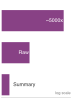
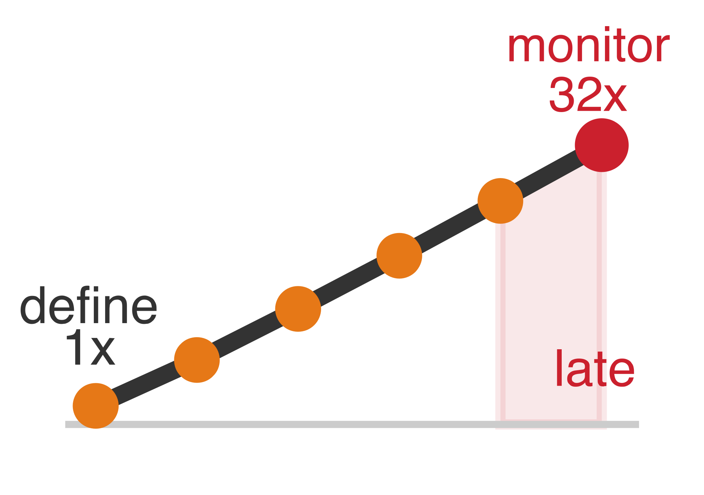

# Quy trình ML {#sec-ml-workflow}

::: {layout-narrow}
::: {.column-margin}

\chapterminitoc

:::

::: {.content-visible when-format="pdf"}
\noindent
{fig-alt="Sơ đồ phối cảnh về một vòng lặp quy trình ML, nối các giai đoạn định nghĩa, dữ liệu, huấn luyện, triển khai, giám sát và phản hồi quanh một bàn làm việc mô hình ở trung tâm."}
:::

::: {.content-visible unless-format="pdf"}
{fig-alt="Sơ đồ phối cảnh về một vòng lặp quy trình ML, nối các giai đoạn định nghĩa, dữ liệu, huấn luyện, triển khai, giám sát và phản hồi quanh một bàn làm việc mô hình ở trung tâm."}
:::

:::

## Mục đích {.unnumbered .unlisted}

\begin{marginfigure}
\mlsysstack{15}{15}{20}{30}{30}{45}{25}{25}
\end{marginfigure}

_Vì sao cần thấy toàn bộ bản đồ trước khi bước trên bất kỳ lối đi nào?_

Phân loại D·A·M giúp chúng ta gọi tên các thành phần của mọi hệ thống ML, và vị trí triển khai quyết định các ràng buộc vật lý mà mỗi thành phần phải đáp ứng. Các nhóm thường xem đây là những mối quan tâm tách rời: một nhóm thu thập dữ liệu, nhóm khác thiết kế mô hình, và nhóm thứ ba lo phần cứng. Nhưng bài học sâu sắc nhất của phân loại này là các thành phần đó tương tác với nhau. Dữ liệu thu thập được giới hạn các thuật toán khả thi. Thuật toán được chọn quyết định phần cứng nào có thể chạy nó. Phần cứng mục tiêu lại định hình loại dữ liệu có thể xử lý. Kéo một sợi chỉ, cả hệ thống dịch chuyển. Những tương tác này diễn ra cả giữa các thành phần lẫn theo thời gian. Một mô hình hoạt động tốt lúc ra mắt có thể suy giảm khi phân phối dữ liệu thay đổi, buộc phải điều tra và, khi có bằng chứng, cập nhật mô hình hoặc dữ liệu. Tối ưu từng phần một cách cô lập dễ dẫn đến mô hình chính xác nhưng không thể triển khai, hoặc pipeline hiệu quả nhưng cấp sai dữ liệu. Một kỹ sư dữ liệu hiểu cách các quyết định tiền xử lý ràng buộc kiến trúc hạ nguồn sẽ xây dựng pipeline khác hẳn người coi chuẩn bị dữ liệu là một nhiệm vụ tách biệt; một nhà phát triển mô hình biết ngân sách bộ nhớ của mục tiêu triển khai ngay từ đầu sẽ chọn kiến trúc khác với người chỉ theo đuổi độ chính xác trong khoảng trống, không gắn với bối cảnh. Trước khi đi sâu vào chi tiết của bất kỳ thành phần nào, chúng ta cần một bức bản đồ đầy đủ cho thấy hệ thống ML được xây dựng, đánh giá và vận hành bền vững như một chỉnh thể. Quy trình ML đưa bức bản đồ đó vào chuyển động thông qua đồng thiết kế D·A·M lặp đi lặp lại giữa dữ liệu, thuật toán và máy, cho đến khi năng lực tổng hợp của chúng đáp ứng yêu cầu của thế giới thực.

::: {.content-visible when-format="pdf"}

\newpage

:::

::: {.callout-learning-objectives}

- Giải thích sáu giai đoạn của vòng đời ML như các quyết định phối hợp giữa dữ liệu, thuật toán và máy, có phản hồi.
- So sánh quy trình ML với phần mềm truyền thống dựa trên các yếu tố như trôi dạt, tính không xác định và phản hồi vận hành.
- Phân tích cách các ràng buộc từ phần định nghĩa vấn đề ảnh hưởng qua các giai đoạn dữ liệu, mô hình, xác thực và triển khai.
- Tính chi phí tích hợp khi phát hiện muộn dựa trên nguyên tắc truyền ràng buộc của quy trình làm việc.
- Đánh giá các đánh đổi về độ chính xác, hiệu quả, khả năng tái lập và mức độ sẵn sàng triển khai xuyên suốt các giai đoạn của vòng đời.
- Thiết kế các vòng lặp phản hồi để kết nối tín hiệu giám sát với quá trình huấn luyện lại, bảo trì và các yêu cầu đã sửa đổi.

:::

## Vòng đời ML {#sec-ml-workflow-understanding-ml-lifecycle-ca87}

Hãy xem xét một kịch bản thất bại minh họa. Ngày 1: "Xây dựng một mô hình chẩn đoán cho các phòng khám ở nông thôn." Ngày 90: đạt độ chính xác 95% trên tập kiểm thử. Ngày 120: độ chính xác tăng lên 96% sau một tháng tinh chỉnh kiến trúc. Ngày 150: mô hình được bàn giao cho các kỹ sư triển khai. Ngày 151: các kỹ sư triển khai báo cáo mô hình cần 4 GB bộ nhớ. Ngày 152: có người kiểm tra mục tiêu triển khai—máy tính bảng ở các phòng khám di động chỉ có 512 MB bộ nhớ khả dụng. Ngày 153: năm tháng công sức bị bỏ đi.

Độ chính xác của mô hình rất tốt. Kỹ năng machine learning của nhóm cũng rất xuất sắc. *Thất bại là thất bại về quy trình làm việc.* Một ràng buộc về triển khai lẽ ra phải định hình mọi quyết định ngay từ ngày đầu, nhưng chỉ được phát hiện sau khi công việc đã hoàn tất. Giới hạn bộ nhớ của máy tính bảng đáng lẽ phải được đưa ngược về cuộc họp kiến trúc đầu tiên, để giới hạn những mô hình nào đáng cân nhắc. Thay vào đó, nhóm tối ưu từng thành phần tách rời (thu thập dữ liệu, lựa chọn kiến trúc, huấn luyện), và lỗi tích hợp chỉ lộ ra khi ghép các phần lại. Một ca triển khai bệnh võng mạc tiểu đường (DR) đã được ghi nhận cho thấy những lỗ hổng tương tự về quy trình làm việc và hạ tầng.[^fn-beede-clinical-deployment]

Các hệ thống ML kết hợp dữ liệu, thuật toán và máy móc, hoạt động dưới các ràng buộc vật lý, từ đó chia việc triển khai thành các môi trường như Đám mây, Edge, Di động và TinyML. Các thành phần và môi trường vận hành đã sẵn sàng. Mảnh ghép còn thiếu là cách các thành phần này kết nối để tạo thành một hệ thống vận hành hoàn chỉnh.

 **Quy trình ML**\index{ML workflow!systematic framework} là một framework kỹ thuật được thiết kế để ngăn những sự cố như vậy bằng cách làm rõ các ràng buộc ở từng giai đoạn phát triển và theo dõi cách chúng lan truyền qua Dữ liệu, Thuật toán và Máy. Quy trình này đánh dấu bước chuyển từ nhà nghiên cứu mô hình sang kỹ sư hệ thống. Nhà nghiên cứu tối ưu từng thành phần: kiến trúc tốt hơn, tập dữ liệu sạch hơn, bộ tăng tốc nhanh hơn. Kỹ sư hệ thống thì phối hợp những thành phần đó thành các hệ thống vận hành ổn định, đem lại giá trị một cách đáng tin cậy. Sự cố ngày 153 không phải chỉ là vấn đề dữ liệu, vấn đề mô hình, hay vấn đề phần cứng; nó là mắt xích bị thiếu giữa cả ba. Quy trình này cung cấp một bản đồ tư duy giúp các quyết định kỹ thuật luôn gắn với bức tranh hệ thống tổng thể.

 **Vòng đời machine learning**\index{Machine learning lifecycle} là framework để điều phối công việc này: một quy trình có cấu trúc, lặp đi lặp lại[^fn-crisp-dm-lifecycle], định hướng việc phát triển, đánh giá và cải tiến các hệ thống ML [@amershi2019]. Theo định nghĩa chính thức, vòng đời này nhấn mạnh quản lý liên tục thay vì một lần phát hành duy nhất.

[^fn-crisp-dm-lifecycle]: **CRISP-DM (quy trình tiêu chuẩn liên ngành cho khai phá dữ liệu)**\index{Cross-industry standard process for data mining!lifecycle influence}: CRISP-DM đã chuẩn hóa quá trình phát triển các hệ thống chuyên sâu về dữ liệu thành sáu giai đoạn có liên kết chặt chẽ và lặp đi lặp lại, thay vì mô hình thác nước tuyến tính [@chapman2000crisp]. Nguyên tắc thiết kế cốt lõi của CRISP-DM – các vòng lặp phản hồi giữa tất cả các giai đoạn – đã trực tiếp định hình cấu trúc của vòng đời ML hiện đại. Các nghiên cứu về kinh tế kỹ thuật phần mềm của Boehm đã chỉ ra rằng việc sửa lỗi càng muộn thì chi phí càng cao [@boehm1981]. Sau này, mô hình quy trình sử dụng công thức $2^{N_{\text{stage}}-1}$ (trong đó $N_{\text{stage}}$ là chỉ số giai đoạn của vòng đời) như một kịch bản minh họa về độ nhạy, chứ không phải là một quy luật chi phí thực nghiệm.

```{python}
#| echo: false
#| output: false
from mlsysim import *
from mlsysim.core.units import *

# ┌─────────────────────────────────────────────────────────────────────────────
# │ CHAPTER IMPORTS
# ├─────────────────────────────────────────────────────────────────────────────
# │ Context: Global imports for all compute cells in this chapter
# │
# │ Goal: Centralize import statements for the chapter.
# │ Show: A clean namespace for subsequent calculations.
# │ How: Import constants, formatting helpers, and pint units.
# │
# └─────────────────────────────────────────────────────────────────────────────
import pint
from mlsysim.fmt import fmt, check, MarkdownStr, fmt_math
from IPython.display import Markdown
```

Ở đây, *vòng đời* mô tả chính các giai đoạn, còn *quy trình làm việc* nói về kỹ thuật điều phối những giai đoạn đó; vòng đời là *những gì được đi qua*, còn quy trình làm việc là *cách quản lý việc đi qua đó*. Sự phân biệt này đòi hỏi **tư duy hệ thống**\index{Systems thinking!principles in ML}: phân tích cách các bộ phận của một hệ thống tương tác với nhau thay vì xem xét chúng riêng lẻ. Các mẫu hình được hệ thống hóa trong @sec-ml-workflow-integrating-systems-thinking-principles-24c0 và được minh họa qua một nghiên cứu tình huống chi tiết cho thấy vì sao các hệ thống ML cần cách tiếp cận kỹ thuật tích hợp thay vì tối ưu tuần tự từng thành phần.

Để điều phối machine learning, chúng ta cần quản lý sự tiến hóa của dữ liệu sao cho đồng bộ với các cập nhật mô hình. Trong @fig-ml-lifecycle, bố cục ngang tách pipeline dữ liệu ở phía trên khỏi pipeline phát triển mô hình ở phía dưới, với các vector hồi quy cong minh họa cách thông tin vận hành và lỗi dữ liệu quay ngược về các giai đoạn trước.

::: {#dfn-ml-workflow-machine-learning-lifecycle .callout-definition title="Vòng đời machine learning"}

***Vòng đời machine learning***\index{Machine learning lifecycle!definition} là quy trình kỹ thuật lặp, bao gồm xây dựng, triển khai, giám sát và cập nhật các hệ thống ML, trong đó bằng chứng từ các giai đoạn sau có thể phản hồi về các giai đoạn trước vì hiệu suất mô hình có thể thay đổi sau triển khai.

1.  **Ý nghĩa**: Vòng đời là một vòng lặp kín, không phải pipeline tuyến tính. Mức phân kỳ phân phối $\mathcal{D}(P_t \lVert P_0)$ giữa lưu lượng hiện tại và lưu lượng huấn luyện là tín hiệu cảnh báo làm tăng xác suất mất độ chính xác; mối quan hệ cụ thể phụ thuộc vào mô hình, nhãn, hàm mất mát và phân phối khi triển khai. Một lần huấn luyện lại đầy đủ phát sinh chi phí tính toán $O/(R_{\text{peak}} \cdot \eta_{\text{\!hw}})$\index{Duty cycle!ML lifecycle maintenance}, trong khi các cập nhật một phần hoặc tăng dần có thể rẻ hơn. Vì vậy, tốc độ trôi và độ trễ xác thực khiến việc duy trì vòng đời trở thành một bài toán ngân sách, không chỉ là một quy trình kỹ thuật.
2.  **Điểm khác biệt**: Khác với phần mềm truyền thống, hành vi chỉ đổi khi mã, cấu hình, phụ thuộc hoặc môi trường thay đổi, hành vi của hệ thống ML còn có thể đổi khi thế giới thay đổi. Độ chính xác của mô hình đã triển khai có thể thay đổi do dịch chuyển phân phối, ngay cả khi mã, hạ tầng và cấu hình vẫn giữ nguyên.
3.  **Lỗi thường gặp**: Một hiểu lầm phổ biến là vòng đời kết thúc ở giai đoạn triển khai. Thực ra, triển khai là điểm bắt đầu của vòng lặp phản hồi: giám sát trong môi trường sản xuất phát hiện drift; drift kích hoạt điều tra; và bằng chứng từ kết quả sẽ quyết định liệu một mô hình đã được huấn luyện lại có nên quay lại giai đoạn triển khai hay không.

:::

Hiểu cách các giai đoạn này liên kết với nhau là điều thiết yếu trước khi đi sâu vào từng lớp riêng lẻ, vì mỗi lĩnh vực kỹ thuật—từ các pipeline lưu trữ (@sec-data-engineering) đến huấn luyện mô hình (@sec-model-training), các framework thực thi (@sec-ml-frameworks) và cơ sở hạ tầng phục vụ (serving) (@sec-model-serving)—đều vận hành như một hệ thống phụ thuộc lẫn nhau.

::: {#fig-ml-lifecycle fig-env="figure" fig-pos="htb" fig-cap="**Phát triển ML với Pipeline Kép**: Kỹ thuật machine learning được tách thành các pipeline dữ liệu và pipeline mô hình chạy song song, hoạt động trên các thang thời gian khác nhau. Pipeline mô hình thực hiện huấn luyện và đánh giá nhanh trong vòng lặp bên trong, trong khi phản hồi vòng lặp bên ngoài từ triển khai sản xuất và xác thực dữ liệu liên tục định hình lại các bước thu thập, gán nhãn và chọn lọc dữ liệu ở thượng nguồn." fig-alt="Hai pipeline chạy song song: một pipeline dữ liệu màu xanh lá gồm sáu giai đoạn ở phía trên, và một pipeline mô hình màu xanh lam gồm bốn giai đoạn ở phía dưới. Một mũi tên phản hồi từ quá trình triển khai quay trở lại giai đoạn thu thập dữ liệu; các mũi tên cong gắn nhãn *Sửa lỗi dữ liệu* và *Nhu cầu dữ liệu* quay lại các giai đoạn dữ liệu trước đó."}

```{.tikz}
\begin{tikzpicture}[font=\sffamily]
%
\tikzset{
  Box/.style={align=flush center,
    inner xsep=2pt,
    node distance=1.6,
    draw=GreenLine,
    line width=0.75pt,
    fill=GreenFill,
    text width=25mm,
    minimum width=25mm, minimum height=23mm
  },
  Box1/.style={Box, node distance=3.7,text width=28mm,minimum width=28mm,fill=BlueFill,draw=BlueLine
  },
 Line/.style={line width=1.30pt,black!50,text=black, -{Triangle[length=3mm, width=1.75mm]}},
 Text/.style={font=\sffamily\footnotesize,align=center
  },
DLine/.style={draw=VioletLine, line width=2pt, -{Triangle[length=4mm, width=2.5mm,bend]},
shorten >=1.1mm, shorten <=1.15mm},
}
%
\node[Box](B1){\textbf{Data Collection}\\\small Continuous input stream};
\node[Box,right=of B1](B2){\textbf{Data Ingestion}\\\small Prep data for downstream ML apps};
\node[Box, right=of B2](B3){\textbf{Data Analysis, Curation}\\\small  Inspect/select the right data};
\node[Box, right=of B3](B4){\textbf{Data Labeling}\\\small  Annotate data};
\node[Box, right=of B4](B5){\textbf{Data Validation}\\\small Verify data is usable through pipeline};
\node[Box, right=of B5](B6){\textbf{Data Preparation}\\\small Prep data for ML uses (split, versioning)};
%
\coordinate(D1) at ($(B2.south west)+(0,-4.25)$);
\coordinate(D4) at ($(B5.south east)+(0,-4.25)$);
\coordinate(D2) at ($(D1)!0.35!(D4)$);
\coordinate(D3) at ($(D1)!0.67!(D4)$);
\fill[red](D2)circle(2pt);
%
\node[Box1]at(D1)(2B2){\textbf{ML System Deployment}\\\small  Deploy ML\\ system to\\ production};
\node[Box1]at(D2)(2B3){\textbf{ML System Validation}\\\small Validate ML\\ system for\\ deployment};
\node[Box1]at(D3)(2B4){\textbf{Model Evaluation}\\\small Compute\\ model KPIs};
\node[Box1]at(D4)(2B5){\textbf{Model Training}\\\small Use ML algorithms\\ to create models};

\coordinate(S) at ($(B4.south)!0.5!(2B4.north)$);

\begin{scope}[local bounding box=AR,shift={($(S)+(-6,-0.7)$)},anchor=center]
% Dimensions
\def\w{6cm}
\def\h{15mm}
\def\r{6mm} % radius
\def\gap{4mm} % break lengths

\draw[BlueLine, -{Latex[length=10pt,width=22pt]},line width=10pt]
  (\w,\h-\r) -- (\w,\r)
  arc[start angle=0, end angle=-90, radius=\r]
  -- (\gap,0);

  \draw[GreenLine, -{Latex[length=10pt,width=22pt]},line width=10pt]
  (0,\r) -- (0,\h-\r)
  arc[start angle=180, end angle=90, radius=\r]
  -- ({\w-\gap},\h);
\end{scope}
%%%
\draw[Line](B1)--node[below,Text]{Raw\\ data}(B2);
\draw[Line](B2)--node[below,Text]{Indexed\\ data}(B3);
\draw[Line](B3)--node[below,Text]{Selected\\ data}(B4);
\draw[Line](B4)--node[below,Text]{Labeled\\ data}(B5);
\draw[Line](B5)--node[below,Text]{Validated\\ data}(B6);
\draw[Line](B6)|-node[left,Text,pos=0.2]{ML-ready\\ datasets}(2B5);
\draw[Line](2B5)--node[below,Text]{Models}(2B4);
\draw[Line](2B4)--node[below,Text]{KPIs}(2B3);
\draw[Line](2B3)--node[below,Text]{Validated\\ ML System}
node[above,Text]{ML\\ Certificate}(2B2);
\draw[Line](2B2)-|node[below,Text,pos=0.3]{Online\\ ML System}
node[right,Text,pos=0.8]{Online\\ Performance}(B1);

\draw
  (current bounding box.south west) coordinate (bbSW)
  (current bounding box.north east) coordinate (bbNE);

\draw[overlay,DLine,distance=44](B3.north)to[out=120,in=80]
node[below]{Data fixes}(B1.north);
\draw[DLine,distance=44,overlay](B5.north)to[out=120,in=80]
node[below]{Data needs}(B3.north);
%
\path[use as bounding box]
  ($(bbSW)+(0mm,-1mm)$)
  rectangle
  ($(bbNE)+(0mm,11.5mm)$);
%\path[red,use as bounding box] (-1.4,1.82) rectangle (21,2.43);
\end{tikzpicture}
```

:::

Các giai đoạn mang tính khái niệm của vòng đời ML xác định *cái gì* và *tại sao* của quá trình phát triển. Còn lớp vận hành là *cách thức*: triển khai vòng đời này bằng tự động hóa, công cụ và hạ tầng. @Sec-ml-operations đặt tên và phát triển chi tiết các thực hành đó. Sự phân biệt này rất quan trọng: vòng đời là một khuôn khổ mang tính khái niệm; còn hạ tầng vận hành là bộ máy để hiện thực hóa nó ở quy mô lớn.

### Định lượng vòng đời ML {#sec-ml-workflow-quantifying-ml-lifecycle-bd69}

Cách người làm nghề phân bổ thời gian giúp đo lường được các điểm nghẽn trong vòng đời ML: không ít khi những giai đoạn tốn nhiều công sức kỹ thuật lại không phải là những giai đoạn được chú ý nhiều nhất. Hiểu vòng đời ML\index{Machine learning lifecycle!time allocation across stages} ở mức khái niệm là cần nhưng chưa đủ để ra quyết định kỹ thuật; mô tả định lượng mới cho thấy công sức và tài nguyên tính toán thực sự được dùng vào đâu trong các dự án ML, qua đó chỉ ra giai đoạn nào đang gây tắc nghẽn và nên đầu tư tối ưu hóa ở đâu để thu được hiệu quả cao nhất.

```{python}
#| echo: false
#| label: data-scientist-time-allocation
# ┌─────────────────────────────────────────────────────────────────────────────
# │ DATA SCIENTIST TIME ALLOCATION
# ├─────────────────────────────────────────────────────────────────────────────
# │ Context: Used in CrowdFlower survey prose and @fig-ds-time caption
# │
# │ Goal: Keep survey percentage summaries tied to the pie-slice values.
# │ Show: That cleaning plus collection dominate reported practitioner time.
# │ How: Sum the reported percentage buckets and guard that they cover 100%.
# │
# └─────────────────────────────────────────────────────────────────────────────
from mlsysim import Literature

# ┌── LEGO ───────────────────────────────────────────────
class DataScientistTime:
    """CrowdFlower survey percentage buckets used in the time-allocation figure."""

    # ┌── 1. LOAD (Constants) ──────────────────────────────────────────────
    cleaning_pct = Literature.Surveys.DataScientistCleaning
    collection_pct = Literature.Surveys.DataScientistCollecting
    mining_pct = Literature.Surveys.DataScientistMining
    training_set_pct = Literature.Surveys.DataScientistBuildingTrainingSets
    algorithm_refinement_pct = Literature.Surveys.DataScientistRefiningAlgorithms
    other_pct = Literature.Surveys.DataScientistOther

    # ┌── 2. EXECUTE (The Compute) ────────────────────────────────────────
    data_work_pct = cleaning_pct + collection_pct
    model_focused_pct = mining_pct + training_set_pct + algorithm_refinement_pct
    total_pct = data_work_pct + model_focused_pct + other_pct

    # ┌── 3. GUARD (Invariants) ───────────────────────────────────────────
    check(total_pct == 100, f"Survey buckets sum to {total_pct}%, not 100%.")
    check(data_work_pct > model_focused_pct, "Data work should dominate model-focused buckets.")

    # ┌── 4. OUTPUT (Formatting) ──────────────────────────────────────────
    cleaning_str = fmt_percent(cleaning_pct / 100, precision=0, commas=False, style='prose')
    collection_str = fmt_percent(collection_pct / 100, precision=0, commas=False, style='prose')
    data_work_str = fmt_percent(data_work_pct / 100, precision=0, commas=False, style='prose')
    model_focused_str = fmt_percent(model_focused_pct / 100, precision=0, commas=False, style='prose')
```

Các khảo sát với người làm nghề cho thấy sự lệch lớn giữa nơi nghiên cứu tập trung và nơi giờ công kỹ thuật thực sự được bỏ ra, với việc thu thập và chuẩn bị dữ liệu chiếm `{python} DataScientistTime.data_work_str` thời gian của họ. Trong @fig-ds-time, một biểu đồ tròn phân rã các hạng mục tiêu tốn thời gian chính, đối chiếu phần lớn dành cho thu thập và chuẩn bị dữ liệu với phần rất hẹp dành cho kiến trúc mô hình và tinh chỉnh thuật toán.

::: {#fig-ds-time fig-env="figure" fig-pos="htb" fig-cap="**Các hoạt động tốn nhiều thời gian nhất của nhà khoa học dữ liệu**: Trong khảo sát năm 2016 của CrowdFlower, `{python} DataScientistTime.cleaning_str` số người được hỏi cho biết họ dành nhiều thời gian nhất cho việc làm sạch và tổ chức dữ liệu, và `{python} DataScientistTime.collection_str` chọn thu thập dữ liệu. Các hoạt động tập trung vào mô hình như khai phá mẫu, xây dựng tập huấn luyện và tinh chỉnh thuật toán cộng lại chiếm khoảng `{python} DataScientistTime.model_focused_str` số phản hồi. Nguồn: CrowdFlower, *Data Science Report 2016*." fig-alt="Biểu đồ tròn về nơi các nhà khoa học dữ liệu được khảo sát dành nhiều thời gian nhất: 60 phần trăm làm sạch và tổ chức dữ liệu, 19 phần trăm thu thập tập dữ liệu, 9 phần trăm khai phá mẫu, 3 phần trăm xây dựng tập huấn luyện, 4 phần trăm tinh chỉnh thuật toán, 5 phần trăm khác."}

```{.tikz}
\scalebox{0.75}{%
\begin{tikzpicture}[line join=round,font=\small\sffamily]
\makeatletter
\def\pgfpie@legend#1{%
  \coordinate[xshift=15mm,
  yshift={(\the\pgfpie@sliceLength*0.5+1)*0.5cm}] (pgfpie@legendpos) at
  (current bounding box.east);

\scope[node distance=2.25mm]
    \foreach \pgfpie@p/\pgfpie@t [count=\pgfpie@i from 0] in {#1}
    {
      \pgfpie@findColor{\pgfpie@i}
      \node[circle,draw, fill={\pgfpie@thecolor}, draw=none,inner sep=5 pt,below =1.6mm of {pgfpie@legendpos},
      label={[font=\footnotesize\sffamily]0:{\pgfpie@t}}] (pgfpie@legendpos) {};
    }
  \endscope
}
\makeatother
\definecolor{Greenn}{RGB}{84,180,53}
\definecolor{Redd}{RGB}{249,56,39}
\definecolor{Orangee}{RGB}{255,157,35}
\definecolor{Brownn}{RGB}{214,128,96}
\definecolor{Bluee}{RGB}{0,97,168}
\definecolor{Violett}{RGB}{178,108,186}
\definecolor{Yelloww}{RGB}{255,210,76}
\tikzset{lines/.style={
  draw=none,
  line width=0.75pt
}}

\pie[text=legend,radius=2.65,
     style={lines},
     color={Greenn!60, Redd!90, Orangee, Bluee!80, Yelloww, Violett},
     every slice/.style={draw=blue}
     ]
{60/Cleaning and organizing data,
19/Collecting datasets,
9/Mining data for patterns,
3/Building training sets,
4/Refining algorithms,
5/Other}
\end{tikzpicture}}
```

:::

Bên cạnh việc phân bổ thời gian, các chu kỳ lặp (iteration cycles)\index{Machine learning lifecycle!iteration cycles} là đặc trưng của những dự án machine learning thành công. Hãy quay lại @fig-ml-lifecycle và để ý các vòng lặp phản hồi (feedback loops) thúc đẩy các chu kỳ này: mỗi mũi tên biểu thị một lộ trình mà các nhóm phải đi lại nhiều lần. Các hệ thống machine learning trong sản xuất thường lặp đi lặp lại qua các giai đoạn dữ liệu, mô hình và hạ tầng, trong đó mỗi chu kỳ có thể quay lại nhiều giai đoạn. Hiểu rõ điều gì kích hoạt các chu kỳ này giúp định hướng phân bổ nguồn lực. Các vấn đề chất lượng dữ liệu (thiếu nhãn, lệch phân phối, lỗi tiền xử lý) thường là nguồn chính gây phải làm lại. Các lựa chọn về kiến trúc và huấn luyện (dung lượng mô hình, các thiết lập có thể điều chỉnh như tốc độ học và kích thước batch, bất ổn trong huấn luyện) cùng các vấn đề hạ tầng (vi phạm độ trễ, hạn chế tài nguyên, lỗi tích hợp) tạo thêm các vòng lặp mà các nhóm cần dự trù chi phí rõ ràng.

::: {.column-margin}
{width="100%" fig-alt="Hai đường cong tăng dần, không có nhãn; vùng giữa hai đường được tô bóng. Đường cong dốc hơn cắt và vượt đường cong ít dốc hơn ở đoạn giữa."}

*Với các giả định đã nêu, mô hình có chu kỳ nhanh hơn sẽ hoàn thành sớm hơn một chút sau 26 tuần.*
:::

```{python}
#| echo: false
#| label: iteration-tax-calc
# ┌─────────────────────────────────────────────────────────────────────────────
# │ ITERATION TAX CALCULATION
# ├─────────────────────────────────────────────────────────────────────────────
# │ Context: Used in "The Iteration Tax" callout comparing slow vs fast cycles
# │
# │ Goal: Illustrate one assumed accuracy trajectory for fast and slow cycles.
# │ Show: How the stated iteration counts and gains determine the six-month result.
# │ How: Model accuracy growth as a function of iteration count over time.
# │
# └─────────────────────────────────────────────────────────────────────────────

# ┌── LEGO ───────────────────────────────────────────────
class IterationTax:
    """
    Namespace for Iteration Tax calculation.
    Scenario: Comparing a large, slow-to-train model vs a small, fast model
    over a fixed 6-month development window.
    """

    # ┌── 1. LOAD (Constants) ───────────────────────────────────────────────
    weeks_total = 26
    hours_per_week = 168

    # Large Model (Starts better, iterates slow)
    large_start_acc = 95.0
    large_gain_per_iter = 0.15  # Reduced from 0.5: SOTA gains are hard!
    large_cycle_time_hours = 168  # 1 week

    # Small Model (Starts worse, iterates fast)
    small_start_acc = 90.0
    small_gain_per_iter = 0.1
    small_cycle_time_hours = 1  # 1 hour
    small_effective_iters = 100  # scenario cap on useful experiments

    # ┌── 2. EXECUTE (The Compute) ─────────────────────────────────────────
    # Step 1: Large model: 1 iter/week -> 26 iters
    large_iters = weeks_total * (hours_per_week / large_cycle_time_hours)
    large_final_acc = min(large_start_acc + (large_iters * large_gain_per_iter), 99.0)

    # Small model: Potential thousands, but capped by human ability to generate ideas
    # Step 2: We allow small model to reach same ceiling
    small_uncapped_acc = small_start_acc + (small_effective_iters * small_gain_per_iter)
    small_final_acc = min(small_uncapped_acc, 99.0)

    # ┌── 3. GUARD (Invariants) ───────────────────────────────────────────
    # Invariant: Small model must CATCH UP or BEAT Large model
    check(large_iters == weeks_total, f"Large model should run one experiment per week, got {large_iters}.")
    check(small_effective_iters <= weeks_total * hours_per_week, "Effective small-model iterations exceed hourly capacity.")
    check(small_final_acc >= large_final_acc, f"Small model ({small_final_acc}%) failed to finish ahead under the stated assumptions.")

    # ┌── 4. OUTPUT (Formatting) ──────────────────────────────────────────────
    weeks_str = fmt_time(weeks_total, "week", precision=0, commas=False, style="word")
    weeks_span_str = fmt_time(weeks_total, "week", precision=0, commas=False, style="word")
    hours_week_str = fmt_time(hours_per_week, "hour", precision=0, commas=False, per="week")
    large_iters_str = fmt(large_iters, precision=0, commas=False)

    large_time_weeks_str = fmt_time(large_cycle_time_hours * hour, week, precision=0, commas=False, style="word")
    large_acc_str = fmt_percent(large_start_acc / 100, precision=0, commas=False, style='prose')
    large_gain_str = fmt_pp(large_gain_per_iter, precision=2)
    large_final_str = fmt_percent(large_final_acc / 100, precision=1, commas=False, style='prose')

    small_time_hours_str = fmt_time(small_cycle_time_hours * hour, hour, precision=0, commas=False, style="word")
    small_acc_str = fmt_percent(small_start_acc / 100, precision=0, commas=False, style='prose')
    small_gain_str = fmt_pp(small_gain_per_iter, precision=1)
    small_iters_str = fmt(small_effective_iters, precision=0, commas=False)
    small_uncapped_str = fmt_percent(small_uncapped_acc / 100, precision=0, commas=False, style='prose')
    small_final_str = fmt_percent(small_final_acc / 100, precision=0, commas=False, style='prose')

    # Logic check helper for text
    small_total_capacity_str = fmt(weeks_total * hours_per_week, precision=0, commas=True)
    acc_ceiling_pct_str = fmt_percent(99 / 100, precision=0, commas=False, style='prose')
```

::: {#nbk-ml-workflow-iteration-tax .callout-notebook title="Chi phí lặp"}

**Bài toán**: Một hệ thống sàng lọc DR cho các phòng khám ở vùng nông thôn cần chọn giữa hai lựa chọn: một *ensemble* lớn được huấn luyện trên ảnh đáy mắt độ phân giải cao (thời gian huấn luyện: `{python} IterationTax.large_time_weeks_str`, độ chính xác: `{python} IterationTax.large_acc_str`) và một mô hình nhẹ, phù hợp để triển khai trên edge tại phần cứng của phòng khám (thời gian huấn luyện: `{python} IterationTax.small_time_hours_str`, độ chính xác: `{python} IterationTax.small_acc_str`). Theo các giả định này, mô hình nào có độ chính xác ước tính cao hơn sau sáu tháng?

**Tính toán**: Trong sáu tháng (~`{python} IterationTax.weeks_span_str`), số lượng thử nghiệm có thể là:

1. **Mô hình lớn**: Tổng thời gian theo lịch là `{python} IterationTax.weeks_str`, với mỗi thử nghiệm tốn `{python} IterationTax.large_time_weeks_str`. Mỗi thử nghiệm được giả định cải thiện độ chính xác một lượng hằng số ~`{python} IterationTax.large_gain_str`.
2. **Mô hình nhỏ**: Với `{python} IterationTax.weeks_str` thời gian theo lịch và `{python} IterationTax.hours_week_str` giờ mỗi tuần, ta có thể chạy tổng cộng `{python} IterationTax.small_total_capacity_str` thử nghiệm, mỗi thử nghiệm tốn `{python} IterationTax.small_time_hours_str`. Ở độ dài chu kỳ này, thời gian máy tính không phải là nút thắt. Vì vậy, kịch bản này chỉ tính `{python} IterationTax.small_iters_str` trong số đó là các thử nghiệm *hiệu quả* — số mà một nhóm thực sự có thể thiết kế, chạy và rút kinh nghiệm trong sáu tháng. Phần năng lực còn lại bị bỏ trống vì thiếu giả thuyết. Ngay cả khi giả định mức tăng mỗi vòng lặp nhỏ hơn, nhiều vòng lặp hữu ích hơn vẫn có thể mang lại mức tăng tích lũy lớn hơn.

**Kết quả**: Nếu mỗi lần lặp cải thiện độ chính xác trung bình là `{python} IterationTax.small_gain_str`, mô hình nhỏ bắt đầu ở `{python} IterationTax.small_acc_str` và đạt `{python} IterationTax.small_uncapped_str` sau `{python} IterationTax.small_iters_str` lần lặp hiệu quả, trước khi áp dụng giới hạn trần `{python} IterationTax.acc_ceiling_pct_str`. Do đó, độ chính xác cuối cùng của nó là `{python} IterationTax.small_final_str`. Mô hình lớn bắt đầu ở `{python} IterationTax.large_acc_str` và đạt `{python} IterationTax.large_final_str` sau `{python} IterationTax.large_iters_str` lần lặp chậm hơn. Trong thực tế, tốc độ lặp nhanh của mô hình nhỏ giúp khám phá các kiến trúc tốt hơn, các phép tăng cường dữ liệu bảo toàn nhãn và các thiết lập huấn luyện có thể điều chỉnh.

**Góc nhìn hệ thống**: *Tốc độ lặp là một đặc trưng.* Khi các hệ thống tiềm năng có chất lượng tương đương và các thử nghiệm có giá trị kỳ vọng tương tự, những chu kỳ ngắn hơn sẽ mở rộng phạm vi thiết kế mà nhóm có thể kiểm thử. Chỉ riêng tốc độ không đảm bảo một mô hình nhỏ sẽ vượt trội hơn mô hình lớn. Với kịch bản sàng lọc DR của chúng ta, chu kỳ lặp nhanh của mô hình gọn nhẹ cho phép nhóm thử nghiệm các phép biến đổi đầu vào giữ nguyên nhãn, các pipeline tiền xử lý và các biến thể kiến trúc nhanh hơn rất nhiều.

:::

Những tỷ lệ này cho thấy vì sao năng lực kỹ thuật dữ liệu cần được lập kế hoạch rõ ràng, thay vì chỉ coi là công việc chuẩn bị. Đây cũng là lý do Phần I kết thúc ở @sec-data-engineering: công việc với dữ liệu là nguồn chính của công sức, lặp và rủi ro dự án. Hiểu pipeline dữ liệu trước tiên sẽ tạo đòn bẩy, trước khi đi vào các kỹ thuật mô hình, huấn luyện và tối ưu hóa tiếp theo.

Việc phát hiện vấn đề muộn có thể rất tốn kém,[^fn-boehm-cost-curve] như sẽ được trình bày cụ thể hơn sau này qua nguyên tắc lan truyền ràng buộc (@sec-ml-workflow-decisions-cascade-system-98f4). Những vi phạm được phát hiện muộn có thể đòi hỏi phải chỉnh sửa ở nhiều giai đoạn trước đó. Rủi ro này thúc đẩy nhu cầu có các **hợp đồng giao diện giai đoạn** rõ ràng\index{Stage interface specification!contracts}: xác thực đầu ra tại mỗi lần chuyển tiếp giữa các giai đoạn giúp phát hiện vi phạm sớm, khi chi phí sửa chữa còn trong tầm kiểm soát. @Sec-ml-workflow-stage-interface-specification-ae3c sẽ chính thức hóa các hợp đồng này sau khi sáu giai đoạn đã được giới thiệu.

[^fn-boehm-cost-curve]: **Chi phí sửa chữa muộn**\index{Late correction cost!definition}: *Software Engineering Economics* của Boehm [@boehm1981] phân tích rằng các lỗi được phát hiện muộn sẽ tốn kém hơn để sửa so với những lỗi được tìm thấy ngay ở giai đoạn yêu cầu. Trong các hệ thống ML, những ràng buộc được phát hiện muộn có thể đòi hỏi phải huấn luyện lại, thay đổi pipeline dữ liệu và xác thực lại. Quy tắc nhân đôi chỉ là một kịch bản minh họa về độ nhạy, không phải một quy luật chi phí thực nghiệm.

[^fn-beede-clinical-deployment]: **Khoảng cách từ phòng thí nghiệm đến triển khai**\index{Workflow!lab-deployment gap}: @beede2020human đã ghi nhận thực nghiệm điều này với một hệ thống sàng lọc bệnh võng mạc tiểu đường dùng học sâu, được triển khai tại các phòng khám ở Thái Lan. Mặc dù hệ thống đạt độ chính xác ở mức chuyên gia trong các lần kiểm định trước đó, 393 trong số 1.838 hình ảnh gửi lên (21%) không đạt yêu cầu về chất lượng. Nguyên nhân thường do ánh sáng trong phòng khám, bảo trì máy ảnh, hoặc thực hành giãn đồng tử không khớp với các giả định của hệ thống. Những lần bị từ chối này làm tăng khối lượng công việc cho y tá, buộc chụp lại hoặc chuyển tuyến, và phơi bày các rào cản về workflow và hạ tầng, chứ không đơn thuần là vấn đề về độ chính xác của mô hình.

Chi phí cơ hội do lặp chậm tạo ra **thuế lặp lại**\index{Iteration tax!definition}. Một phép tính nhanh sẽ giúp hình dung rõ nút thắt cổ chai này.

Thuế lặp lại cho thấy một điều rộng hơn: *Các workflow của ML không phải là phiên bản chậm của vòng đời phần mềm truyền thống.* Chúng khác nhau về cấu trúc, và điều này thể hiện ở *nơi* thời gian được dùng, *cách* các vòng lặp phản hồi vận hành, và *cách* những phát hiện muộn có thể làm tăng phần việc phải làm lại.

### ML so với phần mềm truyền thống {#sec-ml-workflow-ml-vs-traditional-software-development-c5f5}

Các hệ thống truyền thống và hệ thống ML đều có thể dùng vòng đời lặp và thể hiện hành vi không xác định.[^fn-waterfall-model-ml] Điểm khác biệt quan trọng nằm ở cách đặc tả hành vi ứng dụng. Phần mềm dựa trên quy tắc mã hóa logic tường minh, trong khi các hệ thống ML học các ánh xạ thống kê từ dữ liệu (@sec-introduction-ml-vs-traditional-software-e19a). Điều này bổ sung thêm các mối quan tâm về dữ liệu, đánh giá và giám sát vào các thực tiễn kỹ thuật phần mềm hiện có.

[^fn-waterfall-model-ml]: **Mô hình thác nước**\index{Waterfall model!contrast with ML}: Vòng đời định hướng kế hoạch thường được mô tả như một chuỗi các bước: yêu cầu, triển khai và kiểm thử. Tuy nhiên, @royce1970managing cảnh báo rằng cách thực hiện thuần tuần tự tiềm ẩn rủi ro, và ông mô tả sự lặp lại giữa các giai đoạn kế tiếp. Các hệ thống ML bổ sung phản hồi từ dữ liệu và mô hình, cần được quản lý một cách tường minh. Chương này sử dụng một mô hình độ nhạy minh họa cho các giai đoạn của vòng đời ML.

Vì vậy, các hệ thống machine learning cần thêm cơ chế kiểm soát quy trình. Xét xử lý giao dịch tài chính: một quy tắc cấp phép mang tính xác định tuân theo logic tường minh và có thể thực thi nhanh khi đầu vào sẵn sàng. Ngược lại, một hệ thống phát hiện gian lận dựa trên machine learning\index{Fraud Detection!ML vs. rule-based} bổ sung các thành phần như tính điểm đã học, truy xuất đặc trưng và logic quyết định thống kê. Giai đoạn mô hình có thể chỉ mất vài mili giây, nhưng độ trễ đầu-cuối còn phụ thuộc vào lưu trữ, mạng và các dịch vụ xung quanh. Sự chuyển dịch từ lập trình tường minh sang hành vi học được làm thay đổi vòng đời phát triển, qua đó thay đổi cách các nhóm xây dựng độ tin cậy và độ vững của hệ thống.

Những khác biệt này làm thay đổi cách các giai đoạn trong vòng đời tương tác. Kỹ thuật phần mềm truyền thống dựa vào phản hồi từ môi trường sản xuất để tinh chỉnh mã và yêu cầu, còn các hệ thống ML tạo ra các vòng lặp phản hồi, nơi dữ liệu vận hành làm thay đổi phân phối huấn luyện, việc phát hiện trôi dạt (drift) thúc đẩy điều tra, và lỗi runtime phơi bày các điểm mù trong tập dữ liệu. @Tbl-sw-ml-cycles so sánh kỹ thuật phần mềm truyền thống và kỹ thuật ML qua sáu khía cạnh cốt lõi của vòng đời, nhấn mạnh cách sự tiến hóa của dữ liệu định nghĩa lại kiểm thử, triển khai và bảo trì liên tục.[^fn-data-versioning-drift]

[^fn-data-versioning-drift]: **Quản lý phiên bản dữ liệu**\index{Data versioning!reproducibility}: Không giống như code thay đổi qua các commit rời rạc, có thể kiểm chứng, dữ liệu có thể dịch chuyển dần (distribution shift), đột ngột (thay đổi schema), hoặc tinh vi (chất lượng nhãn suy giảm). Git thuần không thực tế với nhiều tập dữ liệu cỡ nhiều terabyte, nên các nhóm thường phiên bản hóa các tệp manifest hoặc con trỏ tới dữ liệu ngoài bằng các công cụ như DVC và Git LFS. Nếu không có quản lý phiên bản dữ liệu, các nhóm không thể tái lập đáng tin cậy một lần huấn luyện trước đó hoặc xác định việc giảm độ chính xác là do thay đổi code hay thay đổi dữ liệu.

| **Khía cạnh** | **Vòng đời phần mềm truyền thống** | **Vòng đời machine learning** |
|:---------------------------|:----------------------------------------------------------------------------------------------------|:------------------------------------------------------------------------------------------------------------|
| **Định nghĩa vấn đề** | Các đặc tả chức năng chính xác được định nghĩa ngay từ đầu. | Các mục tiêu dựa trên hiệu suất phát triển khi không gian vấn đề được khám phá. |
| **Quy trình phát triển** | Phát triển lặp đi lặp lại mã, cấu hình và giao diện. | Thử nghiệm lặp đi lặp lại với dữ liệu, đặc trưng và mô hình. |
| **Kiểm thử và xác thực** | Nhiều kiểm thử chức năng có kết quả mong đợi chính xác; hiệu suất và độ tin cậy vẫn mang tính định lượng. | Xác thực thống kê và các số liệu liên quan đến sự không chắc chắn. |
| **Triển khai** | Hành vi vẫn tĩnh cho đến khi được cập nhật rõ ràng. | Hiệu suất có thể thay đổi theo thời gian do sự dịch chuyển trong phân phối dữ liệu. |
| **Bảo trì** | Bảo trì liên quan đến việc sửa đổi mã để khắc phục lỗi hoặc thêm đặc trưng. | Giám sát liên tục, cập nhật các pipeline dữ liệu, huấn luyện lại mô hình và thích ứng với các phân phối dữ liệu mới. |
| **Vòng lặp phản hồi** | Phản hồi từ sản xuất thường thay đổi mã, cấu hình và yêu cầu. | Thông tin chi tiết từ việc triển khai và giám sát thường tinh chỉnh các giai đoạn trước đó như chuẩn bị dữ liệu và thiết kế mô hình. |

: **Vòng đời phát triển phần mềm truyền thống và ML**: Sáu khía cạnh cho thấy phát triển ML khác biệt so với kỹ thuật phần mềm truyền thống. Cả hai đều sử dụng phản hồi từ môi trường sản xuất, trong khi các hệ thống ML bổ sung các vòng lặp phản hồi: thông tin từ quá trình triển khai định hình lại thu thập dữ liệu, giám sát thúc đẩy cập nhật mô hình, và kinh nghiệm sản xuất định hướng thiết kế mô hình. {#tbl-sw-ml-cycles tbl-colwidths="[15,40,45]"}

::: {#chk-ml-workflow-ml-vs-traditional-devops .callout-checkpoint title="ML so với phần mềm truyền thống"}

Các hệ thống ML không đơn thuần là phần mềm truyền thống được gắn thêm một mô hình. Hãy xem những điểm khác biệt buộc phải có một quy trình làm việc riêng biệt:

- [ ] Các kiểu lỗi: Bạn có phân biệt được giữa sự suy giảm âm thầm và các lỗi rõ ràng không? Cả hai kiểu lỗi này đều có thể xảy ra trong các hệ thống ML lẫn hệ thống truyền thống.
- [ ] Nguồn gốc logic: Bạn có thể giải thích vì sao thay đổi dữ liệu huấn luyện có thể làm thay đổi hành vi của mô hình, ngay cả khi code không đổi?
- [ ] Lặp lại (Iteration): Bạn có thể giải thích vì sao ML đòi hỏi phải giám sát và, khi có bằng chứng, cần cập nhật mô hình hoặc dữ liệu?

:::

### Tính cục bộ dữ liệu ở quy mô lớn {#sec-ml-workflow-erosion-determinism}

Các pipeline dữ liệu ML lớn có thể bộc lộ giới hạn của các tối ưu hóa tính cục bộ mà hệ điều hành hiện đại dùng. Kernel hệ điều hành tận dụng tính cục bộ theo không gian và thời gian,[^fn-locality-violation-cost] tức là một chương trình nếu đọc byte $X$ thì thường sẽ sớm đọc các byte lân cận và tái sử dụng vùng nhớ vừa truy cập.

[^fn-locality-violation-cost]: **Tính cục bộ của tham chiếu**\index{Locality of reference!ML workload violation}: @denning1968 đã chính thức hóa nguyên tắc tập làm việc (working-set principle) cho bộ nhớ ảo. Các ví dụ được sắp xếp ngẫu nhiên có thể làm giảm tính cục bộ khi thứ tự logic của chúng dẫn đến các lần đọc vật lý bị phân tán, nhưng mức độ ảnh hưởng còn phụ thuộc vào bố cục lưu trữ, batching, caching và prefetching.

Khi thứ tự các mẫu được ngẫu nhiên hóa dẫn đến các lần đọc vật lý bị phân tán, việc xáo trộn có thể làm giảm hiệu quả của bộ đệm hệ thống tệp và các bộ nạp trước (prefetcher) của bộ nhớ ảo. Mức độ ảnh hưởng phụ thuộc vào cách các ví dụ logic được ánh xạ tới lưu trữ vật lý. Các lần đọc liên tục từ các phân đoạn (shard) đã xáo trộn có thể vẫn giữ được tính cục bộ hữu ích, trong khi các lần đọc nhỏ rải rác trên nhiều phân đoạn sẽ làm lộ rõ độ trễ của lưu trữ và mạng. Batching, caching và prefetching tường minh có nhận biết bố cục có thể khôi phục tính cục bộ và giảm các điểm nghẽn này. Biến số hệ thống quan trọng ở đây là mẫu truy cập vật lý được đưa đến hệ thống phân cấp bộ nhớ, chứ không phải chỉ riêng việc ngẫu nhiên hóa.

Chính sự khác biệt này quyết định nơi cần tối ưu hóa. Nếu bộ nạp (loader) đã thực hiện các lượt đọc tuần tự lớn, bổ sung thêm cache có thể không mang lại nhiều lợi ích. Ngược lại, nếu nó phân tán các lượt đọc nhỏ, thì việc đóng gói lại các bản ghi (record) hoặc tăng kích thước lượt đọc có thể quan trọng hơn nhiều so với việc bổ sung năng lực tính toán. Do đó, khi lập hồ sơ (profiling), chúng ta nên xem xét cùng lúc kích thước yêu cầu lưu trữ, độ sâu hàng đợi, tỷ lệ truy cập cache và thời gian nhàn rỗi của bộ tăng tốc. Các tối ưu hóa về kỹ thuật dữ liệu và tối ưu hóa có nhận biết phần cứng được trình bày trong các Phần sau sẽ giúp xử lý các chi phí này. Việc chẩn đoán cần theo dõi toàn bộ đường dẫn truy cập từ lưu trữ đến bộ tăng tốc.

## Các giai đoạn vòng đời {#sec-ml-workflow-six-core-lifecycle-stages-00b0}

Thất bại của phòng khám nông thôn cho thấy vì sao các dự án machine learning cần một framework sáu giai đoạn cụ thể: các ràng buộc về triển khai chỉ lộ rõ sau khi các quyết định về dữ liệu, mô hình và đánh giá đã được chốt quanh một mục tiêu không phù hợp. Cả vòng đời phát triển phần mềm truyền thống lẫn vòng đời machine learning đều có tính lặp, và các hệ thống machine learning còn bổ sung phản hồi từ triển khai vào dữ liệu, huấn luyện và đánh giá. Framework sáu giai đoạn này nắm bắt vòng lặp đó.

Vòng đời machine learning hoàn chỉnh được chắt lọc thành sáu giai đoạn cốt lõi, bố trí trên hai hàng chức năng. Trong @fig-lifecycle-overview, hãy lần theo hàng trên, từ xác định bài toán đến đánh giá mô hình; và theo dõi hàng dưới, nơi triển khai đưa các tín hiệu giám sát quay lại khâu thu thập dữ liệu ở đầu nguồn.

::: {#fig-lifecycle-overview fig-env="figure" fig-pos="htb" fig-cap="**Simplified Lifecycle with Feedback**: Sáu giai đoạn cốt lõi của kỹ thuật machine learning tạo thành một vòng lặp khép kín, thay vì một quy trình bàn giao tuyến tính. Một đường phản hồi chính, từ giám sát trở lại thu thập dữ liệu, hỗ trợ điều tra và thích nghi khi phân phối dữ liệu trong môi trường sản xuất thay đổi, độ chính xác của mô hình suy giảm, và các ràng buộc vận hành dần biến đổi." fig-alt="Sơ đồ luồng sáu giai đoạn bố trí thành hai hàng: hàng trên gồm định nghĩa bài toán, thu thập dữ liệu, phát triển mô hình và đánh giá, chạy từ trái sang phải; phần triển khai và tích hợp nằm ở phía bên phải của hàng dưới, với một mũi tên chạy sang trái đến giám sát và bảo trì. Mũi tên của vòng lặp phản hồi uốn từ giám sát trở lại thu thập dữ liệu."}

```{.tikz}
\begin{tikzpicture}[font=\small\sffamily]
\tikzset{
Box2/.style={align=flush center, inner sep=2pt,draw=none,fill=black!70,
font=\fontsize{8pt}{8}\sffamily\bfseries,text=white,minimum width=20mm, minimum height=5mm },
Box/.style={align=center, inner xsep=2pt,draw=black!70, line width=1pt,node distance=15mm,
fill=none, minimum width=25mm, minimum height=20mm},
Circle1/.style={circle,  minimum size=33mm, draw=none, fill=BrownLine!20},
LineD/.style={BrownLine!60!black!20,line width=4.0pt,dashed,dash pattern=on 5pt off 2pt,
{-{Triangle[width=1.5*6pt,length=2.0*5pt]}},shorten <=5pt,shorten >=1pt},
LineA/.style={BrownLine!80!black!40,line width=4.0pt,
{-{Triangle[width=1.5*6pt,length=2.0*5pt]}},shorten <=5pt,shorten >=1pt},
ALineA/.style={violet!60,{Circle[line width=1.0pt,fill=white,round,length=5pt,width=5pt]}-,
line width=1.2pt,shorten <=-15pt,shorten >=-6pt}
}

%dataS
\tikzset{%
 pics/dataS/.style = {
        code = {
        \pgfkeys{/channel/.cd, #1}
\begin{scope}[local bounding box=FUNNEL,scale=\scalefac, every node/.append style={transform shape}]
%plats
\draw[fill=\filllcolor,line width=\Linewidth,draw=\drawcolor](0,-0.3)--(-0.67,0.03)--(0,0.37)--(0.67,0.03)--cycle;
\draw[fill=\filllcirclecolor,line width=\Linewidth,draw=\drawcolor](0,0)--(-0.67,0.33)--(0,0.67)--(0.67,0.33)--cycle;
\draw[fill=\filllcolor,line width=\Linewidth,draw=\drawcolor](0,0.3)--(-0.67,0.63)--(0,0.97)--(0.67,0.63)--cycle;
%left
\draw[line width=\Linewidth,draw=\drawcolor](-0.39,1.21)--++(210:0.55)--++(270:1.22)--(-0.39,-0.56);
\fill[line width=\Linewidth,fill=\filllcirclecolor!60!violet!,draw=green,draw=\drawcolor](-0.39,1.21)circle(3pt);
\fill[line width=\Linewidth,fill=\filllcolor,draw=green,draw=\drawcolor](-0.39,-0.56)circle(3pt);
%right
\draw[line width=\Linewidth,draw=\drawcolor](0.39,1.21)--++(330:0.55)--++(270:1.22)--(0.39,-0.56);
\fill[line width=\Linewidth,fill=\filllcirclecolor!60!violet!,draw=green,draw=\drawcolor](0.39,1.21)circle(3pt);
\fill[line width=\Linewidth,fill=\filllcolor,draw=green,draw=\drawcolor](0.39,-0.56)circle(3pt);
\end{scope}
     }
  }
}
%testing+pencil
\tikzset{
pics/testing/.style = {
        code = {
        \pgfkeys{/channel/.cd, #1}
\begin{scope}[local bounding box=TESTING1,shift={($(0,0)+(0,0)$)},scale=\scalefac,every node/.append style={transform shape}]
\newcommand{\tikzxmark}{%
\tikz[scale=0.18] {
    \draw[line width=0.7,line cap=round,RedLine] (0,0) to [bend left=6] (1,1);
    \draw[line width=0.7,line cap=round,RedLine] (0.2,0.95) to [bend right=3] (0.8,0.05);
}}
\newcommand{\tikzxcheck}{%
\tikz[scale=0.16] {
    \draw[line width=0.7,line cap=round,GreenLine] (0.5,0.75)--(0.85,-0.1) to [bend left=16] (1.5,1.55);

}}
 \node[draw, minimum width  =15mm, minimum height = 20mm, inner sep = 0pt,
        rounded corners,draw = \drawcolor, fill=\filllcolor!10, line width=\Linewidth](COM){};
\node[draw=GreenLine,inner sep=4pt,fill=white](CB1) at ($(COM.north west)!0.25!(COM.south west)+(0.3,0)$){};
\node[xshift=0pt]at(CB1){\tikzxcheck};
\node[draw=RedLine,inner sep=4pt,fill=white](CB2) at ($(COM.north west)!0.5!(COM.south west)+(0.3,0)$){};
\node[xshift=0pt]at(CB2){\tikzxmark};
\node[draw=RedLine,inner sep=4pt,fill=white](CB3) at ($(COM.north west)!0.75!(COM.south west)+(0.3,0)$){};
\node[xshift=0pt]at(CB3){\tikzxmark};
\draw[GreenLine,decoration={zigzag,segment length=4pt, amplitude=0.5pt},decorate]($(CB1)+(0.3,0.05)$)--++(0:0.8);
\draw[GreenLine,decoration={zigzag,segment length=4pt, amplitude=0.5pt},decorate]($(CB1)+(0.3,-0.12)$)--++(0:0.7);
\draw[RedLine,decoration={zigzag,segment length=4pt, amplitude=0.5pt},decorate]($(CB2)+(0.3,0.05)$)--++(0:0.8);
\draw[RedLine,decoration={zigzag,segment length=4pt, amplitude=0.5pt},decorate]($(CB2)+(0.3,-0.12)$)--++(0:0.6);
\draw[RedLine,decoration={zigzag,segment length=4pt, amplitude=0.5pt},decorate]($(CB3)+(0.3,0.05)$)--++(0:0.8);
\draw[RedLine,decoration={zigzag,segment length=4pt, amplitude=0.5pt},decorate]($(CB3)+(0.3,-0.12)$)--++(0:0.6);
\end{scope}
    }
  }
}
%pencil
\tikzset{
pics/pencil/.style = {
        code = {
        \pgfkeys{/channel/.cd, #1}
\begin{scope}[local bounding box=TESTING1,shift={($(0,0)+(0,0)$)},scale=\scalefac,every node/.append style={transform shape},rotate=340]
            \fill[fill=\filllcolor!70] (0,4) -- (0.4,4) -- (0.4,0) --(0.3,-0.15) -- (0.2,0) -- (0.1,-0.14) -- (0,0) -- cycle;
            \draw[color=white,thick] (0.2,4) -- (0.2,0);
            \fill[black] (0,3.5) -- (0.2,3.47) -- (0.4,3.5) -- (0.4,4) arc(30:150:0.23cm);
            \fill[fill=\filllcolor!40] (0,0) -- (0.2,-0.8)node[coordinate,pos=0.75](a){} -- (0.4,0)node[coordinate,pos=0.25](b){} -- (0.3,-0.15) -- (0.2,0) -- (0.1,-0.14) -- cycle;
            \fill[fill=\filllcolor] (a) -- (0.2,-0.8) -- (b) -- cycle;

\end{scope}
    }
  }
}
%nodes
\tikzset{
pics/nodes/.style = {
        code = {
        \pgfkeys{/channel/.cd, #1}
\begin{scope}[shift={($(0,0)+(0,0)$)},scale=\scalefac,every node/.append style={transform shape}]
%\node[draw=white,fill=none,circle,minimum size=0.925*40mm,line width=1pt](CI){};
%\draw[step=5mm,draw=white] (-2,-2) grid (2,2);
\foreach \x/\y[count=\a] in {-0.2/0.35,
0.7/0.6,-0.5/1.4,-1.20/-0.8,-0.1/-1.3,-0.4/-0.43,
0.61/-0.3,1/-0.85,0.45/1.2,-0.96/0.63}{
\node[circle,fill=myblue,draw=black,inner sep=0pt,minimum size=3mm](XB\a)at(\x,\y){};
}
\foreach \x/\y[count=\a] in {-2.0/0.1
}{
\node[circle,fill=myred,draw=black,inner sep=0pt,minimum size=3mm](XR\a)at(\x,\y){};
}

\foreach \x/\y[count=\a] in {1.87/0.1
}{
\node[circle,fill=mygreen,draw=black,inner sep=0pt,minimum size=3mm](XG\a)at(\x,\y){};
}

\foreach \x in {1,3,4,6,10}{
\draw[RedLine,line width=0.5pt](XR1) edge  (XB\x);
}
\foreach \x in {1,2,5,8,9}{
\draw[mygreen,line width=0.5pt](XG1) edge  (XB\x);
}
\foreach \x in {2,3,6,9,10}{
\draw[black,line width=0.5pt](XB1) edge  (XB\x);
}
\foreach \x in {4,5,7}{
\draw[black,line width=0.5pt](XB6) edge  (XB\x);
}
\draw[black,line width=0.5pt](XB4) edge  (XB5);
\draw[black,line width=0.5pt](XB3) edge  (XB9);
\foreach \x in {2,8}{
\draw[black,line width=0.5pt](XB7) edge  (XB\x);
}
\end{scope}
    }
  }
}

%target
\tikzset{
pics/target/.style = {
        code = {
        \pgfkeys{/channel/.cd, #1}
\begin{scope}[shift={($(0,0)+(0,0)$)},scale=\scalefac,every node/.append style={transform shape}]
\definecolor{col1}{RGB}{62,100,125}
\definecolor{col2}{RGB}{219,253,166}
\colorlet{col1}{\filllcolor}
\colorlet{col2}{\filllcirclecolor}
\foreach\i/\col [count=\k]in {22mm/col1,17mm/col2,12mm/col1,7mm/col2,2.5mm/col1}{
\node[circle,inner sep=0pt,draw=\drawcolor,fill=\col,minimum size=\i,line width=\Linewidth](C\k){};
}
\draw[thick,fill=brown,xscale=-1](0,0)--++(111:0.13)--++(135:1)--++(225:0.1)--++(315:1)--cycle;
\path[green,xscale=-1](0,0)--(135:0.85)coordinate(XS1);
\draw[thick,fill=yellow,xscale=-1](XS1)--++(80:0.2)--++(135:0.37)--++(260:0.2)--++(190:0.2)--++(315:0.37)--cycle;
\end{scope}
    }
  }
}
%cloud-arrow
\tikzset {
pics/cloudA/.style = {
        code = {
        \pgfkeys{/channel/.cd, #1}
\begin{scope}[local bounding box=CLO,scale=0.8, every node/.append style={transform shape}]
\node[draw=\drawcolor!90!red,line width=\Linewidth,minimum width=6mm,minimum height=12mm](VSK)at(0,0.5){};
\node[draw=\drawcolor!90!red,line width=\Linewidth,fill=white,minimum width=9mm,minimum height=4mm](VSKG)at(VSK.north){};
\node[draw=\drawcolor!90!red,line width=\Linewidth,fill=white,minimum width=9mm,minimum height=4mm](VSKC)at(VSK.center){};
\node[draw=\drawcolor!90!red,line width=\Linewidth,fill=white,minimum width=9mm,minimum height=4mm](VSKD)at(VSK.south){};
\draw[fill=\filllcolor,draw=\drawcolor!60,,line width=\Linewidth](0,0)to[out=170,in=180,distance=11](0.1,0.61)
to[out=90,in=105,distance=17](1.07,0.71)
to[out=20,in=75,distance=7](1.48,0.36)
to[out=350,in=0,distance=7](1.48,0)--(0,0);
\draw[draw=\drawcolor!60,,line width=\Linewidth](0.27,0.71)to[bend left=25](0.49,0.96);
\draw[draw=\drawcolor!60,,line width=\Linewidth](0.67,1.21)to[out=55,in=90,distance=13](1.5,0.96)
to[out=360,in=30,distance=9](1.68,0.42);
\node[single arrow, draw=orange,fill=orange,
      minimum width = 10pt, single arrow head extend=3pt,
      minimum height=10mm,
      rotate=270]at(1.05,0) {};
\end{scope}
}
}
}
%display
\tikzset{%
    comp/.style = {draw,
        minimum width  =18mm,
        minimum height = 15mm,
        inner sep      = 0pt,
        rounded corners,
       draw = \drawcolor,
       fill=\filllcolor!10,
       line width=2.0pt
    },
 pics/displayK/.style = {
        code = {
        \pgfkeys{/channel/.cd, #1}
\begin{scope}[local bounding box=COMPUTER1,shift={(0,0)}]
 \node[comp](\picname-COM){};
% \draw[draw = \drawcolor,line width=1.0pt]
% ($(\picname-COM.north west)!0.85!(\picname-COM.south west)$)-- ($(\picname-COM.north east)!0.85!(\picname-COM.south east)$);
\draw[draw = \drawcolor,line width=\Linewidth]($(\picname-COM.south west)!0.4!(\picname-COM.south east)$)--++(270:0.2)coordinate(DL);
\draw[draw = \drawcolor,line width=\Linewidth]($(\picname-COM.south west)!0.6!(\picname-COM.south east)$)--++(270:0.2)coordinate(DD);
\draw[draw = \drawcolor,line width=3*\Linewidth,shorten <=-3mm,shorten >=-3mm](DL)--(DD);
 \draw[
  line width=1pt,
  draw=red,
  line cap=round,
  line join=round
]
(-0.70,0) --(-0.40,0) --
(-0.30,0.13) --
(-0.2,-0.18) --
(-0.05,0.32) --
(0.05,-0.15) --
(0.15,0.23) --
(0.38,-0.15) --
(0.40,0.0) --
(0.70,0.0);
\end{scope}
   }
  }
}

%%%%%%%%%%
\pgfkeys{
  /channel/.cd,
   Depth/.store in=\Depth,
  Height/.store in=\Height,
  Width/.store in=\Width,
  filllcirclecolor/.store in=\filllcirclecolor,
  filllcolor/.store in=\filllcolor,
  drawcolor/.store in=\drawcolor,
  drawcircle/.store in=\drawcircle,
  scalefac/.store in=\scalefac,
  Linewidth/.store in=\Linewidth,
  picname/.store in=\picname,
  tiecolor/.store in=\tiecolor,
  bodycolor/.store in=\bodycolor,
  stetcolor/.store in=\stetcolor,
  tiecolor=red,      % default tie color
  bodycolor=blue!30,  % default body color
  stetcolor=green,  % default stet color
  filllcolor=BrownLine,
  filllcirclecolor=violet!20,
  drawcolor=black,
  drawcircle=violet,
  scalefac=1,
  Linewidth=0.5pt,
  Depth=0.2,
  Height=0.5,
  Width=0.25,
  picname=C
}
%Problem Definition
\node[Box,draw=none](B1){};
 \pic[shift={(0,0)}] at  (B1){target={scalefac=0.7,picname=1,
 drawcolor=BlueD,filllcolor=myred,Linewidth=0.7pt, filllcirclecolor=myred!20}};
 \draw[ALineA,draw=mygreen](B1.south west)--++(200:0.45)
 node[below=1pt,Box2,fill=mygreen]{Problem\\ Definition};
%Data Collection \&  Preparation
\node[Box,right= of B1,draw=none](B2){};
\pic[shift={(0,-0.28)}] at  (B2){dataS={scalefac=0.9,picname=1,Linewidth=1.0pt,
 filllcolor=cyan!90!black!40!,drawcolor=black,filllcirclecolor=orange}};
\draw[ALineA,draw=mygreen](B2.south west)--++(200:0.45)
 node[below=1pt,Box2,fill=mygreen]{Data Collection  \\ \& Preparation};
%Model Development \& Training
\node[Box,right= of B2,draw=none](B3){};
 %persons 1
\pic[shift={(0,0)}] at  (B3){nodes={scalefac=0.6,picname=1,drawcolor=orange,filllcirclecolor=orange!20,filllcolor=orange}};
\draw[ALineA,draw=mygreen](B3.south west)--++(200:0.45)
 node[below=1pt,Box2,fill=mygreen]{Model Development\\ \& Training};
%Evaluation \& Validation
\node[Box,right=of B3,draw=none](B4){};
\pic[shift={(0,0)}] at  (B4){testing={scalefac=0.85,picname=1,drawcolor=myblue,filllcolor=myblue, Linewidth=1.0pt}};
\pic[shift={(0,-0.5)},rotate=-15] at  (B4){pencil={scalefac=0.37,picname=1,filllcolor=mygreen, Linewidth=1.0pt}};
\draw[ALineA,draw=mygreen](B4.south west)--++(200:0.45)
 node[below=1pt,Box2,fill=mygreen]{Evaluation \& \\ Validation};
%Deployment \& Integration
\node[Box,below= 1.25 of B4,draw=none](B5){};
%AI
\pic[shift={(-0.50,-0.40)}] at  (B5){cloudA={scalefac=1,filllcirclecolor=orange!80,drawcolor=BlueLine,
filllcolor=cyan!10,  Linewidth=1.0pt}};

\draw[ALineA,draw=mygreen](B5.south west)--++(200:0.45)
	 node[below=1pt,Box2,fill=mygreen]{Deployment \&\\ Integration};
%Monitoring \& Maintenance
\node[Box,left=of B5,draw=none](B6){};
%AI
\pic[shift={(0,0.1)}] at  (B6){displayK={scalefac=0.45,picname=D,
filllcolor=gray, drawcolor=BlueLine!70!black,Linewidth=0.7pt}};
\draw[ALineA,draw=mygreen](B6.south west)--++(200:0.45)
	 node[below=1pt,Box2,fill=mygreen]{Monitoring \&\\ Maintenance};

%arrows
\foreach \x in{1,2,3,4,5}{
\pgfmathtruncatemacro{\nx}{\x + 1} %
\draw[LineA,BrownLine!80!black!70](B\x)--(B\nx);
}
\draw[LineD](B6)-|node[above,pos=0.25,font=\footnotesize\sffamily,text=black!70]{Feedback}(B2);
\end{tikzpicture}

```

:::

```{python}
#| echo: false
#| label: mobilenet-specs
# ┌─────────────────────────────────────────────────────────────────────────────
# │ MOBILENETV2 SPECIFICATIONS
# ├─────────────────────────────────────────────────────────────────────────────
# │ Context: Used in paragraph describing MobileNetV2 as a Lighthouse Model
# │
# │ Goal: Illustrate concrete workflow constraints for mobile deployment.
# │ Show: That problem definition establishes quantitative limits on model scale.
# │ How: Retrieve MobileNetV2 parameters and FLOPs from mlsysim.core.units.
# │
# └─────────────────────────────────────────────────────────────────────────────

from mlsysim.fmt import fmt, fmt_qty, check, fmt_flops, fmt_memory
from mlsysim.core.units import MB, MFLOPs, byte, param

class MobilenetSpecs:
    """MobileNetV2 model size and FLOPs from canonical constants."""

    # ┌── 1. LOAD (Constants) ──────────────────────────────────────────────
    # MobileNetV2: 3.5M params, 600M FLOPs (300M multiply-adds)
    # Assuming FP32 weights for size estimate

    # ┌── 2. EXECUTE (The Compute) ────────────────────────────────────────
    mobilenet_size_q = Models.Vision.MobileNetV2.parameters * BYTES_FP32
    mobilenet_flops_q = Models.Vision.MobileNetV2.inference_flops

    # ┌── 3. GUARD (Invariants) ───────────────────────────────────────────
    check(13 * MB <= mobilenet_size_q <= 15 * MB, f"Unexpected MobileNetV2 size: {mobilenet_size_q.to(MB).magnitude:.1f} MB.")
    check(550 * MFLOPs <= mobilenet_flops_q <= 650 * MFLOPs, f"Unexpected MobileNetV2 FLOPs: {mobilenet_flops_q.to(MFLOPs).magnitude:.1f} MFLOPs.")

    # ┌── 4. OUTPUT (Formatting) ─────────────────────────────────────────────
    mobilenet_size_mb_str = fmt_memory(mobilenet_size_q, unit=MB, commas=False)
    mobilenet_mflop_str = fmt_flops(mobilenet_flops_q, unit=MFLOPs, precision=0, commas=False)
```

Để cụ thể hóa các giai đoạn này, hãy xem chúng áp dụng ra sao với MobileNetV2\index{MobileNetV2!workflow constraints}, một mô hình thị giác cho thiết bị di động có kích thước nhỏ, nhờ đó các ràng buộc khi triển khai được bộc lộ rõ. Với MobileNetV2, giai đoạn Định nghĩa Vấn đề đặt ra các ràng buộc rất chặt: kích thước mô hình khoảng `{python} MobilenetSpecs.mobilenet_size_mb_str`, khoảng `{python} MobilenetSpecs.mobilenet_mflop_str`, và yêu cầu suy luận thời gian thực trên phần cứng cấp độ di động. Những ràng buộc này lập tức định hình các bước còn lại của quy trình. Thu thập Dữ liệu phải tính đến hạn chế tiền xử lý ngay trên thiết bị, và Phát triển Mô hình phải chọn kiến trúc có các phép toán phù hợp với ngân sách. MobileNetV2 đạt được điều đó bằng các tích chập tách sâu,[^fn-depthwise-mobile-workflow] chứ không chỉ đơn thuần giảm số tham số. Đánh giá kiểm chứng cả độ chính xác lẫn độ trễ trên thiết bị mục tiêu, Triển khai kiểm tra xem mô hình có phù hợp với bộ nhớ và giới hạn công suất của thiết bị hay không, và Giám sát theo dõi hiệu suất trên nhiều nhóm thiết bị khác nhau. Quyết định ở mỗi giai đoạn sẽ lan sang các giai đoạn tiếp theo, và framework của quy trình giúp làm rõ các phụ thuộc này. Một mô hình sàng lọc DR được tối ưu để triển khai tại phòng khám nông thôn cũng chịu các áp lực tương tự: bộ nhớ thiết bị hạn chế, ngân sách công suất nghiêm ngặt, và yêu cầu suy luận thời gian thực dù không có kết nối đáng tin cậy. Những ràng buộc chung này khiến DR trở thành một nghiên cứu tình huống xuyên suốt hiệu quả.

[^fn-depthwise-mobile-workflow]: **Tích chập tách sâu**\index{Depthwise separable convolution!mobile deployment}: Thay một tích chập tiêu chuẩn bằng phép phân tách rẻ hơn này giúp giảm khối lượng tính toán khoảng 8–9$\times$ với các kích thước bộ lọc điển hình [@sandler2018], nhờ đó ngân sách suy luận khoảng `{python} MobilenetSpecs.mobilenet_mflop_str` trở nên khả thi trên phần cứng cấp độ di động. @Sec-network-architectures sẽ trình bày chi tiết cơ chế kiến trúc này.

@Fig-lifecycle-overview gợi ý một tiến trình tuyến tính, nhưng vòng lặp phản hồi cho thấy bản chất lặp lại thực sự của quá trình phát triển ML.

::: {#chk-ml-workflow-workflow-cycle .callout-checkpoint title="Chu trình workflow"}

Các câu hỏi gợi ý theo từng giai đoạn giúp kiểm tra liệu vòng đời có thể được xem như một hệ thống liên kết chặt chẽ hay không.

Các Giai đoạn

- [ ] Định nghĩa vấn đề: Bạn đã định nghĩa các chỉ số thành công thực sự gắn với giá trị kinh doanh chưa?
- [ ] Dữ liệu: pipeline dữ liệu của bạn có thể tái lập không, và bạn đã xác định rõ những gì nó phải cung cấp trước khi bắt đầu phát triển mô hình chưa?
- [ ] Lập mô hình: Bạn có đang lặp đủ nhanh không?
- [ ] Triển khai: Bạn đã ghi lại các ràng buộc khi triển khai, những ràng buộc sẽ định hình các quyết định về dữ liệu và mô hình ở các bước trước đó, chưa?

:::

@Fig-lifecycle-overview mô tả vòng lặp này, nhưng ý nghĩa sâu hơn của nó mang tính định lượng: mỗi giai đoạn tương ứng với các thuật ngữ cụ thể trong phương trình hiệu suất, và sự ánh xạ này cho thấy một phiên bản của định luật sắt ở cấp độ quy trình làm việc\index{Iron law of ML systems!workflow mapping}: các quyết định trong quá trình thu thập dữ liệu sẽ giới hạn những gì có thể đạt được khi phát triển mô hình, và điều đó lại quyết định các yêu cầu khi triển khai. Sự ánh xạ theo từng giai đoạn kết nối vòng đời với định luật sắt của các hệ thống ML được định nghĩa trong @sec-introduction-iron-law-ml-systems-c32a.

Ràng buộc chi phối khác nhau rất nhiều giữa các dạng khối lượng công việc (workload), nên mỗi giai đoạn trong vòng đời sẽ tối ưu các thuật ngữ khác nhau của định luật sắt. ResNet-50\index{ResNet-50!workflow constraints}, DLRM\index{Deep Learning Recommendation Model!workflow constraints} và phát hiện từ khóa (KWS)\index{Keyword spotting!energy constraint} là những điểm tựa hữu ích vì mỗi loại nhấn mạnh một phần khác nhau của hệ thống: huấn luyện thị giác với dữ liệu dày đặc cố gắng giữ cho các bộ tăng tốc luôn bận rộn, khuyến nghị với dữ liệu thưa thớt dành nhiều thời gian để di chuyển các hàng embedding, còn phát hiện từ khóa bị giới hạn trước hết bởi bộ nhớ rất nhỏ và ngân sách năng lượng luôn bật. @Tbl-lighthouse-workflow-comparison cho thấy ba giai đoạn quy trình làm việc được chọn biểu hiện như thế nào đối với các dạng khối lượng công việc (workload) phổ biến này.

Các hệ thống sản xuất hiếm khi khớp gọn với một nguyên mẫu duy nhất. Ví dụ, một bộ phân loại hình ảnh y tế có thể cần tính toán liên tục khi được huấn luyện trên các tập dữ liệu hình ảnh lớn, nhưng lại đối mặt với các ràng buộc nghiêm ngặt về năng lượng và bộ nhớ khi triển khai trên các thiết bị phòng khám di động. Hiểu *cách* cùng một framework quy trình làm việc thích ứng với từng nguyên mẫu, và *cách* một dự án đơn lẻ có thể đồng thời trải rộng qua nhiều nguyên mẫu, là điều thiết yếu để đưa ra các quyết định kỹ thuật đúng đắn.

| **Giai đoạn** | **Huấn luyện thị giác ResNet-50** | **Đề xuất DLRM** | **KWS TinyML** |
|:-------------|:----------------------------------------------------------------------------------------------------------|:----------------------------------------------------------------------------------------------------------------------|:----------------------------------------------------------------------------------------|
| **Kỹ thuật dữ liệu** | Giữ các batch hình ảnh sẵn sàng đủ nhanh để duy trì mức sử dụng GPU cao. | Giữ các tra cứu feature-store trực tuyến trong giới hạn ngân sách độ trễ phục vụ (serving); các bảng embedding chiếm ưu thế về lưu trữ và độ tươi mới. | Tuyển chọn các đoạn âm thanh ngắn cho một thiết bị bị giới hạn SRAM. |
| **Huấn luyện** | Phối hợp tiền xử lý, tạo batch, độ chính xác hỗn hợp và thực thi mô hình để giảm thời gian nhàn rỗi của bộ tăng tốc. | Tối ưu hóa các tra cứu embedding thưa thớt vì băng thông bộ nhớ giới hạn thông lượng. | Tìm kiếm họ mô hình nhỏ nhất vẫn nhận diện cụm từ kích hoạt một cách đáng tin cậy. |
| **Triển khai** | Sử dụng các batch lớn khi thông lượng và chi phí quan trọng hơn độ trễ của một yêu cầu đơn lẻ. | Đáp ứng các mục tiêu độ trễ p99 tương tác nghiêm ngặt trong khi vẫn giữ các đặc trưng tươi mới. | Duy trì trong một ngân sách năng lượng luôn bật nghiêm ngặt. |

: **Các biến thể quy trình làm việc theo mô hình Lighthouse**: Ba giai đoạn vòng đời được chọn nhắm đến các thành phần khác nhau trong định luật sắt tùy thuộc vào ràng buộc chính của khối lượng công việc (workload). ResNet-50 nhấn mạnh lượng tính toán hữu ích trên mỗi đơn vị thời gian, DLRM tập trung vào việc di chuyển dữ liệu và độ mới của embedding, còn KWS chú trọng năng lượng và dung lượng bộ nhớ. {#tbl-lighthouse-workflow-comparison tbl-colwidths="[9,30,31,30]"}

Mỗi giai đoạn của quy trình làm việc này đặt ra những thách thức kỹ thuật riêng, từ tuyển chọn các tập dữ liệu chất lượng cao cho đến duy trì hiệu suất của mô hình khi đưa vào vận hành. Sàng lọc DR được chọn làm nghiên cứu điển hình xuyên suốt mọi giai đoạn vì đáp ứng ba tiêu chí: bề ngoài có vẻ đơn giản nhưng trong thực tế lại rất phức tạp; bao quát đủ phổ triển khai để kiểm chứng workflow framework; và có thể ghép các nghiên cứu đã được tài liệu hóa với các kịch bản minh họa rõ ràng.

::: {#psp-ml-workflow-iron-law-workflow .callout-perspective title="Luật sắt của quy trình làm việc"}

Sáu giai đoạn của vòng đời không chỉ là các bước thủ tục. Mỗi giai đoạn có thể làm thay đổi một số biến trong luật sắt của các hệ thống ML $(T = \frac{D_{\text{vol}}}{\text{BW}} + \frac{O}{R_{\text{peak}} \cdot \eta_{\text{hw}}} + L_{\text{lat}})$, vì vậy các liên hệ dưới đây là những điểm xuất phát để chẩn đoán, không phải là sự tương ứng một-một:

-   Định nghĩa vấn đề: Thiết lập các ràng buộc mục tiêu: độ chính xác, độ trễ, chi phí, quyền riêng tư và cách thức triển khai. Các mục tiêu này xác định những thành phần nào trong phương trình được phép tăng và những thành phần nào phải được giới hạn ngay từ đầu.
-   Thu thập và chuẩn bị dữ liệu: Định hình thành phần của tập dữ liệu và tổng số byte $(D_{\text{vol}})$ được đưa vào các pipeline phía sau. Việc tuyển chọn cũng có thể làm thay đổi khối lượng công việc cần thiết để đạt mục tiêu chất lượng.
-   Phát triển và huấn luyện mô hình: Tác động đến số lượng phép toán $(O)$, khả năng tái sử dụng dữ liệu, việc di chuyển tham số và hiệu suất phần cứng có thể đạt được $(\eta_{\text{hw}})$.
-   Đánh giá và xác thực: Kiểm tra xem chất lượng mô hình và hiệu suất đầu-cuối có đáp ứng các yêu cầu triển khai trên hệ thống mục tiêu hay không.
-   Triển khai và tích hợp: Xác định cơ chế phục vụ (serving), bao gồm di chuyển dữ liệu, hiệu quả thực thi và chi phí cố định $(L_{\text{lat}})$.
-   Giám sát và bảo trì: Theo dõi drift, độ trễ, thông lượng và chi phí sau khi đưa vào hoạt động, rồi phản hồi các vi phạm về các giai đoạn trước để tối ưu hóa lại.

Khi nhìn các giai đoạn của vòng đời qua luật sắt, phương trình đó cho ta một góc nhìn định lượng về độ trễ và chi phí. Việc quản lý quy trình làm việc còn phải tính đến độ chính xác, an toàn, quyền riêng tư và các ràng buộc tổ chức không nằm trong biểu thức này.

:::

### Nghiên cứu điển hình: Sàng lọc DR {#sec-ml-workflow-case-study-diabetic-retinopathy-screening-7d71}

Các tài liệu về sàng lọc DR\index{Diabetic retinopathy!case study introduction} bao quát cả hai phía từ phòng thí nghiệm đến thực địa: @gulshan2016 trình bày nghiên cứu xác thực quy mô lớn về phát hiện DR tự động, còn @beede2020human ghi nhận những thay đổi khi một hệ thống học sâu có liên quan được sử dụng tại các phòng khám ở Thái Lan. Bài toán có vẻ đơn giản (phân loại ảnh võng mạc là khỏe hay bệnh), nhưng con đường từ thành công trong phòng thí nghiệm đến sử dụng lâm sàng lại cho thấy vòng đời hệ thống phức tạp thế nào. Gộp lại, các nguồn này cung cấp một lộ trình được ghi nhận từ thu thập và xác thực dữ liệu đến tích hợp vào quy trình làm việc và các ràng buộc về cơ sở hạ tầng.

Bệnh võng mạc tiểu đường là nguyên nhân hàng đầu gây mù lòa có thể phòng ngừa được.[^fn-dr-scale-screening] Để hình dung mô hình cần học điều gì, hãy nhìn kỹ @fig-eye-dr: thách thức lâm sàng là phát hiện các xuất huyết đặc trưng (các đốm đỏ sẫm) cho thấy bệnh đang tiến triển. Việc hạn chế tiếp cận chuyên gia ở một số khu vực thúc đẩy các chương trình sàng lọc có khả năng mở rộng, trong đó hỗ trợ từ AI có thể đóng vai trò.

[^fn-dr-scale-screening]: **Bệnh võng mạc tiểu đường (DR)**\index{Diabetic retinopathy!deployment scale}: DR là một biến chứng phổ biến của bệnh tiểu đường; phát hiện sớm có thể ngăn ngừa mất thị lực, nhưng mức độ tiếp cận chuyên gia khác nhau đáng kể giữa các quốc gia. Khoảng cách này thúc đẩy việc phát triển các chương trình sàng lọc có khả năng mở rộng. Ở các phòng khám có phần cứng hạn chế hoặc kết nối không ổn định, kích thước mô hình, khả năng hoạt động ngoại tuyến, độ trễ và việc tích hợp vào quy trình làm việc có thể trở thành các ràng buộc then chốt khi triển khai.

::: {#fig-eye-dr fig-env="figure" fig-pos="htb" fig-cap="**Xuất huyết võng mạc trong sàng lọc DR**: Các ảnh đáy mắt đặt cạnh nhau minh họa những đặc trưng thị giác tinh tế mà một hệ thống sàng lọc ML cần phát hiện. Việc nhận diện các tổn thương vi mạch cục bộ (như vùng xuất huyết được đánh dấu) đòi hỏi duy trì độ phân giải không gian cao trong toàn bộ pipeline thị giác và thiết lập quy trình xác thực chất lượng đầu vào nghiêm ngặt để xử lý các biến thiên về ánh sáng và camera trong các triển khai thực tế tại phòng khám. Nguồn: Google." fig-alt="Hai ảnh đáy mắt võng mạc đặt cạnh nhau, được gắn nhãn A. KHỎE MẠNH và B. BỊ BỆNH. Một mũi tên nhãn Hemorrhages chỉ vào một tổn thương nhỏ trên võng mạc bị bệnh."Xuất huyết" chỉ vào một tổn thương nhỏ trong võng mạc bị bệnh."}

{width="90%"}

:::

Nghiên cứu ban đầu đạt hiệu suất ngang chuyên gia trong môi trường kiểm soát. Tuy nhiên, khi đưa vào triển khai lâm sàng, chúng ta thấy năng lực kỹ thuật phải đi cùng việc xử lý các vấn đề về chất lượng dữ liệu, các ràng buộc hạ tầng ở phòng khám nông thôn, các yêu cầu quy định, và việc tích hợp vào quy trình làm việc.[^fn-healthcare-deployment-gap] Với các chỉ số lặp lại trong trường hợp này, độ nhạy là tỷ lệ dương tính thật, độ đặc hiệu là tỷ lệ âm tính thật, và AUC là diện tích dưới đường cong ROC. Cùng một cơ chế lan truyền ràng buộc áp dụng dù mục tiêu là hệ thống ảnh y tế hay ứng dụng di động như MobileNetV2; các giai đoạn vòng đời phía trước sẽ diễn giải cụ thể những cơ chế này.

[^fn-healthcare-deployment-gap]: **Khoảng cách triển khai AI trong chăm sóc sức khỏe**\index{Healthcare AI!deployment gap}: Trong ca triển khai DR tại Thái Lan do @beede2020human nghiên cứu, các phòng khám thực tế bộc lộ những hạn chế về quy trình làm việc, chất lượng hình ảnh, hạ tầng và yếu tố con người, những điều không xuất hiện trong các đánh giá có kiểm soát. Trường hợp này cho thấy vì sao chỉ dựa vào các chỉ số trong phòng thí nghiệm là chưa đủ để khẳng định mức độ sẵn sàng triển khai.

### Đặc tả giao diện giữa các giai đoạn {#sec-ml-workflow-stage-interface-specification-ae3c}

Mỗi giai đoạn trong vòng đời là một pha kỹ thuật riêng, có đầu vào, đầu ra và các bất biến chất lượng được xác định rõ. Hãy coi đó như *API contracts* giữa các nhóm. Một microservice dựa vào đặc tả giao diện để làm rõ các giả định tích hợp; một pipeline dữ liệu cũng vậy, dựa vào các hợp đồng về lược đồ và phân phối để phát hiện bất tương thích trước khi chúng lan truyền. @Tbl-stage-interface chuẩn hóa những hợp đồng này, nêu rõ mỗi giai đoạn phải nhận gì và tạo ra gì. Nhờ vậy, sơ đồ vòng đời trừu tượng (@fig-lifecycle-overview) được chuyển thành các yêu cầu kỹ thuật có thể thực thi. Khi đầu ra của một giai đoạn không đáp ứng hợp đồng, thiếu sót đó có thể lan sang các giai đoạn phụ thuộc.

| **Giai đoạn** | **Hợp đồng đầu vào** | **Hợp đồng đầu ra** | **Bất biến chất lượng** |
|:----------------------------------|:------------------------------------------------------------------------------------|:------------------------------------------------------------------------------------|:------------------------------------------------------------------------------------------------------|
| **Định nghĩa vấn đề** | Yêu cầu kinh doanh; bối cảnh vận hành | Mục tiêu có thể đo lường; lựa chọn mô hình triển khai; ràng buộc tài nguyên | Tất cả các tiêu chí thành công đều có thể định lượng; mô hình triển khai mục tiêu được xác định rõ ràng |
| **Thu thập & Chuẩn bị dữ liệu** | Mục tiêu; mục tiêu triển khai; yêu cầu chất lượng | Tập dữ liệu có phiên bản kèm lược đồ; pipeline tiền xử lý; quy tắc xác thực dữ liệu | Phân phối gần đúng với môi trường sản xuất dự kiến; việc gán nhãn đáp ứng yêu cầu độ chính xác |
| **Phát triển & Huấn luyện mô hình** | Tập dữ liệu; mục tiêu độ chính xác; ràng buộc tài nguyên | Trọng số mô hình đã huấn luyện; cấu hình huấn luyện; nhật ký thử nghiệm | Đạt ngưỡng độ chính xác trong giới hạn ngân sách tính toán; kiến trúc tương thích với mục tiêu triển khai |
| **Đánh giá & Xác thực** | Mô hình đã huấn luyện; dữ liệu kiểm thử giữ lại; tiêu chí đánh giá | Các chỉ số hiệu suất trên các nhóm con; phân tích chế độ lỗi; chứng nhận xác thực | Không có nhóm con quan trọng nào dưới ngưỡng tối thiểu; hiệu chuẩn độ tin cậy đáp ứng yêu cầu miền |
| **Triển khai & Tích hợp** | Mô hình đã xác thực; yêu cầu hạ tầng; mục tiêu thỏa thuận mức dịch vụ (SLA) | Điểm cuối phục vụ (serving); công cụ giám sát; quy trình khôi phục | Độ trễ và thông lượng đáp ứng yêu cầu mô hình; các kiểm thử tích hợp vượt qua |
| **Giám sát & Bảo trì** | Hệ thống trực tiếp; đường cơ sở hiệu suất; ngưỡng cảnh báo | Cảnh báo phát hiện trôi dạt; tiêu chí xem xét cập nhật; báo cáo sự cố | Phạm vi cảnh báo và cửa sổ phát hiện được xác định; suy giảm được phát hiện kích hoạt xem xét |

: **Đặc tả Giao diện Giai đoạn**: Mỗi giai đoạn trong vòng đời có các yêu cầu đầu vào rõ ràng, sản phẩm đầu ra, và các bất biến về chất lượng phải được bảo đảm để giai đoạn đó được xem là hoàn thành. Vi phạm các hợp đồng này sẽ tạo ra nợ kỹ thuật, tích lũy dần qua các giai đoạn tiếp theo. Việc lựa chọn cách thức triển khai trong Định nghĩa Vấn đề (Đám mây, Edge, Di động hoặc TinyML từ @sec-ml-systems) sẽ ràng buộc tất cả các giai đoạn phía sau, vì mục tiêu TinyML sẽ kéo theo các yêu cầu về dữ liệu, mô hình và giám sát khác với mục tiêu Đám mây. {#tbl-stage-interface tbl-colwidths="[14,24,27,35]"}

Tài liệu đặc tả này lý giải vì sao các dự án ML trải qua các chu kỳ lặp như trong @fig-lifecycle-overview. Khi một giai đoạn sau phát hiện một hợp đồng ở giai đoạn trước bị vi phạm (ví dụ: đánh giá cho thấy phân bố dữ liệu huấn luyện không khớp với dữ liệu ở môi trường sản xuất), dự án phải quay lại để xử lý tận gốc. Nhóm nào kiểm tra các hợp đồng ở mỗi lần chuyển giao giữa các giai đoạn sẽ bắt lỗi sớm, khi chi phí sửa chữa thấp nhất. Quá trình kiểm tra này được hiểu rõ nhất là *kiểm toán các bước chuyển giao giữa các giai đoạn*.

```{python}
#| echo: false
#| label: constraint-propagation
# ┌─────────────────────────────────────────────────────────────────────────────
# │ CONSTRAINT PROPAGATION PRINCIPLE
# ├─────────────────────────────────────────────────────────────────────────────
# │ Context: Used in "Auditing Stage Transitions" callout, Fallacies section,
# │          and Summary section for an illustrative late-discovery sensitivity model
# │
# │ Goal: Illustrate one assumed doubling rule for late constraint discovery.
# │ Show: How the assigned multiplier changes across lifecycle stages.
# │ How: Model a simple doubling rule across the six stages of the ML lifecycle.
# │
# └─────────────────────────────────────────────────────────────────────────────

from mlsysim.physics import calc_constraint_propagation_factor
from mlsysim.fmt import check, fmt_count_range, fmt_multiple, fmt_percent, fmt_qty, fmt_time, fmt_time_range

class ConstraintPropagation:
    """Illustrative doubling model for late constraint discovery across lifecycle stages."""

    # ┌── 1. LOAD (Constants) ──────────────────────────────────────────────
    ML_WORKFLOW_STAGE_PROBLEM_DEFINITION = 1  # ML workflow lifecycle stage index
    ML_WORKFLOW_STAGE_DEPLOYMENT = 5
    ML_WORKFLOW_STAGE_MONITORING = 6
    ML_WORKFLOW_CONSTRAINT_COST_BASE = 2
    stage_deployment = ML_WORKFLOW_STAGE_DEPLOYMENT
    stage_monitoring = ML_WORKFLOW_STAGE_MONITORING
    stage_definition = ML_WORKFLOW_STAGE_PROBLEM_DEFINITION
    avoided_cycles_min = 2
    avoided_cycles_max = 4
    weeks_per_cycle = 4
    sensitivity_target_pct = 90
    specificity_target_pct = 80
    stage5_latency_q = 100 * millisecond  # scenario assumption
    stage5_memory_q = 500 * MB  # scenario assumption
    jetson_latency_q = 50 * millisecond  # scenario assumption
    jetson_model_q = 200 * MB  # scenario assumption
    resnet_variant_q = 200 * MB  # scenario assumption

    # ┌── 2. EXECUTE (The Compute) ────────────────────────────────────────
    cost_factor = calc_constraint_propagation_factor(stage_definition, stage_deployment, ML_WORKFLOW_CONSTRAINT_COST_BASE)
    monitoring_cost_factor = calc_constraint_propagation_factor(stage_definition, stage_monitoring, ML_WORKFLOW_CONSTRAINT_COST_BASE)
    rework_weeks_min = avoided_cycles_min * weeks_per_cycle
    rework_weeks_max = avoided_cycles_max * weeks_per_cycle

    # ┌── 3. GUARD (Invariants) ───────────────────────────────────────────
    check(cost_factor == 16, f"Stage 5 scenario should assign 16x, got {cost_factor}x.")
    check(monitoring_cost_factor == 32, f"Stage 6 scenario should assign 32x, got {monitoring_cost_factor}x.")
    check(rework_weeks_min == 8 and rework_weeks_max == 16, "Scenario should assign an 8--16 week rework range.")

    # ┌── 4. OUTPUT (Formatting) ─────────────────────────────────────────────
    cost_factor_mult_str = fmt_multiple(cost_factor, precision=0, commas=False)
    rework_cycles_str = fmt_count_range(
        avoided_cycles_min,
        avoided_cycles_max,
        precision=0,
        commas=False,
    )
    rework_weeks_str = fmt_time_range(
        rework_weeks_min,
        rework_weeks_max,
        "week",
        precision=0,
        commas=False,
        style="word",
    )
    sensitivity_target_pct_str = fmt_percent(sensitivity_target_pct / 100, precision=0, commas=False, style='prose')
    specificity_target_pct_str = fmt_percent(specificity_target_pct / 100, precision=0, commas=False, style='prose')
    stage5_latency_ms_str = fmt_time(stage5_latency_q, millisecond, precision=0, commas=False)
    stage5_memory_mb_str = fmt_qty(stage5_memory_q, MB, precision=0, commas=False)
    jetson_latency_ms_str = fmt_time(jetson_latency_q, millisecond, precision=0, commas=False)
    jetson_model_mb_str = fmt_qty(jetson_model_q, MB, precision=0, commas=False)
    resnet_variant_mb_str = fmt_qty(resnet_variant_q, MB, precision=0, commas=False)
```

::: {#exmp-ml-workflow-auditing-stage-transitions .callout-example title="Kiểm toán các bước chuyển giao giữa các giai đoạn"}

**Tình huống**: Một nhóm kỹ thuật cho rằng đã hoàn thành giai đoạn Định nghĩa Vấn đề cho một hệ thống phân loại hình ảnh y tế, và muốn chuyển sang giai đoạn Thu thập Dữ liệu mà không xác định các ràng buộc cho mục tiêu triển khai.

**Chẩn đoán**: Hợp đồng đầu ra thiếu lựa chọn cách thức triển khai và các ràng buộc về tài nguyên (mục tiêu về độ trễ và bộ nhớ). Cố gắng triển khai muộn trong vòng đời mới lộ ra vi phạm (ví dụ: giới hạn bộ nhớ thiết bị edge < `{python} ConstraintPropagation.jetson_model_mb_str`), khiến chi phí sửa chữa tăng gấp `{python} ConstraintPropagation.cost_factor_mult_str` lần so với phát hiện và sửa sớm.

**Bài học về hệ thống**: Các bước chuyển giao giữa các giai đoạn đóng vai trò như các cổng kiểm soát chất lượng ở lớp điều khiển trong vòng đời ML. Bắt buộc kiểm tra chặt chẽ các hợp đồng đầu ra trước khi đi tiếp xuống các giai đoạn sau giúp tránh việc phải làm lại tốn kém ở phía trước và đảm bảo dữ liệu thu thập phù hợp với phần cứng mục tiêu triển khai mô hình.

:::

Nghiên cứu điển hình về DR và Đặc tả Giao diện Giai đoạn cung cấp bối cảnh cụ thể và các hợp đồng chính thức làm nền cho từng giai đoạn của vòng đời. Giai đoạn đầu tiên, Định nghĩa Vấn đề, ghi lại các ràng buộc mà các giai đoạn sau phải đáp ứng.

## Định nghĩa Vấn đề {#sec-ml-workflow-problem-definition-stage-5974}

Việc định nghĩa vấn đề\index{Problem definition!ML vs. traditional} trong ML thường bắt đầu bằng những câu nghe có vẻ rất đơn giản. Một quản lý sản phẩm viết: "Xây dựng một mô hình phát hiện bệnh võng mạc tiểu đường." Câu ngắn gọn đó ẩn chứa hàng loạt quyết định kỹ thuật: đặt ngưỡng độ nhạy để đảm bảo an toàn cho bệnh nhân, đánh giá năng lực phần cứng ở các phòng khám nông thôn, xác định “ngân sách” độ trễ để bác sĩ vẫn duy trì tương tác, và tuân theo các khung quy định về phê duyệt. Một số yêu cầu thông thường có thể chuyển trực tiếp thành các quy tắc triển khai. Trong các hệ thống ML, việc xác định *hệ thống cần làm gì* gắn liền với việc xác định *nó sẽ học cách làm điều đó như thế nào* và các ràng buộc vật lý mà nó phải tuân theo. Giai đoạn đầu tiên này, là hộp ngoài cùng bên trái trong @fig-lifecycle-overview, đặt nền móng cho tất cả các giai đoạn tiếp theo trong vòng đời ML.

Ví dụ sàng lọc DR minh họa cụ thể điều này. Một nhiệm vụ tưởng như đơn giản là phân loại (phát hiện bệnh trong ảnh chụp võng mạc) thực ra đòi hỏi cân bằng năm ràng buộc đối nghịch: độ chính xác chẩn đoán (an toàn bệnh nhân), hiệu quả tính toán (phần cứng phòng khám nông thôn), tích hợp vào quy trình làm việc (để được chấp nhận trong lâm sàng), tuân thủ quy định (phê duyệt của FDA), và hiệu quả chi phí (triển khai bền vững trong môi trường hạn chế tài nguyên). Mỗi ràng buộc lại thu hẹp không gian thiết kế khả thi của các ràng buộc khác: theo đuổi độ chính xác cao hơn bằng cách dùng mô hình lớn hơn sẽ xung đột với ngân sách phần cứng; đáp ứng yêu cầu quy định đòi hỏi các giao thức gán nhãn, làm tăng chi phí thu thập dữ liệu. ML bổ sung hành vi thống kê đã học vào một bài toán tối ưu hóa đa ràng buộc\index{Problem definition!multi-constraint optimization} vốn cũng xuất hiện trong các hệ thống truyền thống.

### Các lớp ràng buộc {#sec-ml-workflow-balancing-competing-constraints-b92a}

Ví dụ DR cho thấy định nghĩa vấn đề trong ML không phải là một yêu cầu đơn lẻ mà là một chồng các **lớp ràng buộc** tương tác\index{Constraint layer!statistical physical operational}. Các ràng buộc về độ chính xác (độ nhạy >90 phần trăm, độ đặc hiệu >80 phần trăm trên nhiều quần thể và thiết bị) xếp trên các ràng buộc về hạ tầng (thiết bị edge có năng lực tính toán hạn chế, kết nối không liên tục, suy luận trong khung thời gian của quy trình làm việc lâm sàng), rồi đến các ràng buộc về quy định (xác thực của FDA, audit trails, tuân thủ quyền riêng tư). Mỗi lớp lại thu hẹp không gian thiết kế khả thi của các lớp nằm phía trên.

Tuân thủ quyền riêng tư trong một hệ thống ML mang một gánh nặng vận hành riêng mà các quy tắc xử lý dữ liệu thông thường không phản ánh hết. Trong cơ sở dữ liệu truyền thống, xóa hồ sơ bệnh nhân chỉ là một câu lệnh `DELETE`. Còn trong hệ thống ML, các trọng số của mô hình có thể đã mã hóa các mẫu thống kê học từ hồ sơ đó; khi luật hoặc cơ quan quản lý yêu cầu loại bỏ ảnh hưởng này, tuân thủ có thể đòi hỏi machine unlearning (một lĩnh vực nghiên cứu đang phát triển với các đảm bảo còn chưa đầy đủ) hoặc huấn luyện lại trên phần dữ liệu còn lại. Nghĩa vụ và cách xử lý phụ thuộc vào quy định và hệ thống áp dụng; ở quy mô hệ thống DR, cả hai lựa chọn này đều có thể biến tuân thủ quyền riêng tư thành một khoản chi phí tính toán định kỳ và biến nguồn gốc của quá trình huấn luyện thành một ràng buộc kiến trúc.

Cấu trúc phân lớp này mở rộng vượt ra ngoài lĩnh vực chăm sóc sức khỏe. Khi xác định bất kỳ bài toán ML nào, ta cần xét ít nhất ba lớp ràng buộc: thống kê (độ chính xác cần đạt là bao nhiêu, trên những nhóm dân số phụ nào), vật lý (phần cứng nào, với ngân sách độ trễ và bộ nhớ ra sao), và vận hành (những yêu cầu về quy định, tổ chức hoặc quy trình làm việc nào áp dụng). Nguyên tắc lan truyền ràng buộc (@sec-ml-workflow-decisions-cascade-system-98f4) giải thích vì sao: một ràng buộc tồn tại nhưng chưa được nêu rõ sẽ không biến mất—it có thể lộ diện về sau, khi các quyết định phụ thuộc đã bị cố định.

Các ràng buộc cụ thể của hệ thống DR không chỉ đến từ phân tích kỹ thuật thuần túy. Chúng cần có sự hợp tác bài bản giữa các kỹ sư, bác sĩ nhãn khoa và quản trị phòng khám để chuyển nhu cầu lâm sàng thành các yêu cầu kỹ thuật đo lường được. Những quyết định then chốt (cân bằng độ phức tạp của mô hình với giới hạn phần cứng, bảo đảm khả năng diễn giải cho nhà cung cấp dịch vụ chăm sóc sức khỏe, và tính đến quyền riêng tư của bệnh nhân) đều xuất phát từ quá trình liên ngành này. Thiếu chuyên môn miền, đội ngũ kỹ sư có thể tối ưu cho độ chính xác tổng thể mà bỏ qua ngưỡng độ nhạy quyết định an toàn lâm sàng.

::: {#ws-ml-workflow-amazon-recruiting-bias .callout-war-story title="Khi nhãn là độ chệch (bias) (2018)"}

**Bối cảnh**: Năm 2014, Amazon tập hợp một đội ngũ kỹ sư tại trung tâm Edinburgh để xây dựng một hệ thống học máy nội bộ nhằm xếp hạng các ứng viên kỹ thuật, huấn luyện nó trên mười năm hồ sơ ứng tuyển gửi đến Amazon [@dastin2018].

**Cơ chế**: Vì lịch sử tuyển dụng trước đây thiên lệch về nam giới, *mô hình* học rằng ngôn ngữ mang dấu hiệu nam giới có tương quan với thành công trong tuyển dụng, nên đã hệ thống hóa việc trừ điểm các từ như "women's" và hạ điểm ứng viên tốt nghiệp từ các trường cao đẳng nữ sinh.

**Tác động**: *Mô hình* đã tái tạo lại *độ chệch (bias)* trong tuyển dụng từ quá khứ, khiến việc sàng lọc hồ sơ tự động không còn phù hợp để đưa vào quy trình tuyển dụng thực tế.

**Khắc phục**: Amazon đã loại bỏ công cụ thử nghiệm này sau khi các nỗ lực nhằm xóa bỏ các tín hiệu giới tính rõ ràng vẫn không thể đảm bảo rằng *mô hình* sẽ không học các tín hiệu thay thế mang tính phân biệt đối xử khác.

**Bài học về hệ thống**: Khi định nghĩa vấn đề, cần nêu rõ các tiêu chí về công bằng, khả năng kiểm toán (auditability) và tiêu chí loại bỏ trước khi thu thập *dữ liệu* và *huấn luyện*. Một quy trình được *huấn luyện* trên các *nhãn* có *độ chệch (bias)* sẽ không học mục tiêu vận hành; nó chỉ học cách tái tạo các *nhãn* đó.

:::

### Định nghĩa bài toán thay đổi theo thời gian {#sec-ml-workflow-adapting-definitions-scale-40ed}

Các định nghĩa vấn đề trong ML có thể thay đổi khi hệ thống mở rộng. Giả sử một chương trình DR ban đầu chỉ hoạt động ở một vài phòng khám với cấu hình chụp ảnh đồng nhất, nhưng sau đó phát triển tới hàng trăm phòng khám với thiết bị, trình độ chuyên môn của nhân viên và nhân khẩu học của bệnh nhân khác nhau.[^fn-fairness-demographic-drift] Sự phát triển này có thể đòi hỏi các mục tiêu độ chính xác phân tầng, hỗ trợ phần cứng đa dạng và các yêu cầu báo cáo được điều chỉnh.

[^fn-fairness-demographic-drift]: **Dịch chuyển nhân khẩu học**\index{Demographic drift!definition}: Những thay đổi trong dân số có thể làm bộc lộ các lỗ hổng về hiệu suất mà việc đánh giá tổng thể thường bỏ qua. Các *benchmark* về phân tích khuôn mặt đã phát hiện sự chênh lệch lớn về tỷ lệ lỗi giữa các nhóm nhân khẩu học khác nhau [@buolamwini2018gender], trong khi một nghiên cứu về chấm điểm rủi ro trong chăm sóc sức khỏe phát hiện sự phân bổ mang *độ chệch (bias)* chủng tộc từ một *nhãn* đại diện, dù nhu cầu tương tự [@obermeyer2019]. Những ví dụ này cho thấy lý do tại sao một chương trình DR đang phát triển cần đánh giá hiệu suất theo từng nhóm phụ, thay vì chỉ tuyên bố rằng việc triển khai như vậy đã diễn ra. \index{Algorithmic fairness!healthcare ML}

Tiến trình này không phải dấu hiệu của việc lập kế hoạch ban đầu kém; đó là đặc tính vốn có của các hệ thống ML. Khi mở rộng quy mô, các trường hợp edge vốn không thấy ở giai đoạn thử nghiệm sẽ lộ ra, và dữ liệu vận hành bộc lộ những đặc tính phân phối mà không một tập dữ liệu huấn luyện nào nắm bắt trọn vẹn. Định nghĩa bài toán phải chấp nhận thực tế này bằng cách nêu rõ cả mục tiêu hiện tại lẫn cơ chế điều chỉnh: những chỉ số nào sẽ kích hoạt việc đánh giá lại, ai phê duyệt các ngưỡng đã điều chỉnh, và các thay đổi được truyền sang các giai đoạn phía sau như thế nào.

## Thu thập dữ liệu {#sec-ml-workflow-data-collection-preparation-stage-ae99}

Sau khi xác định mục tiêu và xếp các ràng buộc, nhiệm vụ thực tế tiếp theo là xác định dữ liệu có thể dùng để huấn luyện mô hình đạt các mục tiêu đó. Các ràng buộc, chỉ số và mục tiêu triển khai trong bước định nghĩa vấn đề chỉ nằm trên giấy cho đến khi nhóm thu thập được dữ liệu để huấn luyện mô hình đáp ứng chúng. Sự chuyển đổi từ việc đặt mục tiêu sang thu thập dữ liệu\index{Data collection!iron law data term} là một ngưỡng then chốt nơi nhiều dự án thất bại. Như khảo sát trong @sec-ml-workflow-quantifying-ml-lifecycle-bd69 cho thấy, người thực hành thường báo cáo các hoạt động liên quan đến dữ liệu là phần ngốn thời gian nhất. Theo “định luật sắt”, giai đoạn này chủ yếu quyết định kích thước và thành phần của tập dữ liệu $(D)$, cùng khối lượng byte $(D_{\text{vol}})$ mà các giai đoạn phía sau phải chuyển. Các ràng buộc triển khai đặt ra ở bước định nghĩa vấn đề giờ trở thành yêu cầu dữ liệu: nếu mô hình phải chạy trên thiết bị edge, pipeline dữ liệu phải tạo ra đầu vào tương thích với tiền xử lý trên edge. Nếu mô hình cần đạt độ nhạy 90% trên các nhóm dân số đa dạng, thì dữ liệu phải bao gồm đủ ví dụ từ mỗi nhóm.

Thu thập và chuẩn bị dữ liệu không chỉ là bước mở đầu mà còn thường là một hoạt động kỹ thuật lớn. @Sec-data-engineering tập trung cốt lõi vào kỹ thuật dữ liệu. Với sàng lọc bệnh võng mạc tiểu đường (DR), thách thức rất đáng kể: dữ liệu phải đủ đa dạng về mặt thống kê để huấn luyện một mô hình tổng quát tốt trên nhiều nhóm dân số, việc thu thập phải khả thi trong các phòng khám hạn chế nguồn lực, và dữ liệu phải được gán nhãn với độ nghiêm ngặt lâm sàng đủ cao để đáp ứng yêu cầu giám sát của cơ quan quản lý.

Các quyết định trong bước định nghĩa vấn đề sẽ định hình yêu cầu về dữ liệu, như trong ví dụ về bệnh võng mạc tiểu đường (DR). Các tiêu chí thành công đa chiều đã được thiết lập (bao gồm độ chính xác trên các nhóm dân số đa dạng, hiệu quả phần cứng và tuân thủ quy định) đòi hỏi một chiến lược thu thập dữ liệu vượt ra ngoài các tập dữ liệu thị giác máy tính thông thường. Không phải tất cả dữ liệu đều đóng góp như nhau vào quá trình học—@sec-data-selection chỉ ra rằng việc chọn lọc dữ liệu có thể duy trì hiệu suất tương đương với ít tính toán hơn khi một tập dữ liệu có dư thừa, miễn là tập con được chọn vẫn giữ được bằng chứng cần thiết cho tác vụ.

Hệ thống DR cần khoảng $10^5$ ảnh đáy mắt, mỗi ảnh được nhiều chuyên gia nhãn khoa đánh giá. Sự đồng thuận từ các chuyên gia giúp giải quyết tính chủ quan vốn có trong chẩn đoán y tế (hai bác sĩ nhãn khoa có thể không đồng ý về các trường hợp ranh giới), đồng thời thiết lập các nhãn *ground truth* đáng tin cậy, đủ vững trước giám sát của cơ quan quản lý. Quá trình chú thích phải ghi nhận các đặc trưng lâm sàng quan trọng như vi phình mạch, xuất huyết và xuất tiết cứng, trên toàn bộ các mức độ nghiêm trọng của bệnh.

Các ảnh quét võng mạc độ phân giải cao dạng thô có thể lên tới hàng chục megabyte mỗi ảnh trước khi nén, gây ra những thách thức lớn về hạ tầng. Một phòng khám xử lý hàng chục bệnh nhân mỗi ngày có thể tạo ra từ vài đến hàng chục gigabyte dữ liệu hình ảnh mỗi tuần. Lượng dữ liệu này có thể chiếm phần lớn băng thông đường truyền *uplink* bị giới hạn trong giờ làm việc của phòng khám. Do đó, xử lý cục bộ là một lựa chọn, bên cạnh các giải pháp khác như nén, *batching*, lập lịch hoặc tăng băng thông đường truyền.

::: {.column-margin}
{width="100%" fig-alt="Một biểu đồ thang dọc gồm ba thanh, trên thang logarit: thanh trên cùng ghi tỷ lệ giảm khoảng 5000 lần; thanh giữa thể hiện việc tải lên ảnh võng mạc thô; và thanh dưới cùng ngắn cho các bản tóm tắt phát hiện *edge* gọn nhẹ được gửi qua mạng."}

*Các bản tóm tắt *edge* hiệu quả hơn việc tải lên ảnh y tế thô khi băng thông là yếu tố chi phối.*
:::

```{python}
#| echo: false
#| label: bandwidth-vs-compute-calc
# ┌─────────────────────────────────────────────────────────────────────────────
# │ BANDWIDTH VS COMPUTE CALCULATION
# ├─────────────────────────────────────────────────────────────────────────────
# │ Context: Used in "Bandwidth vs. Compute" callout comparing cloud vs edge
# │
# │ Goal: Compare raw-upload link occupancy with summary uploads.
# │ Show: That raw uploads slightly exceed an assumed eight-hour same-shift window.
# │ How: Calculate total upload duration vs. available clinic hours.
# │
# └─────────────────────────────────────────────────────────────────────────────
from mlsysim import ReferenceStats
from mlsysim.fmt import check, fmt, fmt_bandwidth, fmt_multiple, fmt_percent, fmt_qty, fmt_rate, fmt_time
from mlsysim.core.units import MB, GB, KB, hour, megabit, second

# ┌── LEGO ───────────────────────────────────────────────
class BandwidthCompute:
    """
    Namespace for Bandwidth vs Compute calculation.
    Scenario: Rural clinic with 2 Mbps uplink trying to upload raw retinal scans.
    """

    # ┌── 1. LOAD (Constants) ───────────────────────────────────────────────
    patients_day = 150  # Increased from 100 to ensure bandwidth saturation
    photos_per_patient = 10
    mb_per_photo_q = ReferenceStats.ClinicalImaging.RetinalPhotoSize
    clinic_hours_q = 8.0 * hour  # scenario assumption
    uplink_q = 2.0 * (megabit / second)  # scenario assumption
    summary_per_patient_q = 10.0 * KB  # scenario assumption

    # ┌── 2. EXECUTE (The Compute) ─────────────────────────────────────────
    # Step 1: Data Volume
    daily_q = patients_day * photos_per_patient * mb_per_photo_q

    # Step 2: Transmission Time
    uplink_mbs_q = uplink_q.to(MB / second)
    upload_time_q = (daily_q / uplink_mbs_q).to(second)

    # Step 3: Saturation
    saturation_ratio = (upload_time_q / clinic_hours_q).to("").magnitude

    # Step 4: Edge Reduction
    summary_total_q = patients_day * summary_per_patient_q
    reduction_factor = (daily_q / summary_total_q).to("").magnitude

    # ┌── 3. GUARD (Invariants) ───────────────────────────────────────────
    check(
        upload_time_q >= clinic_hours_q,
        f"Upload no longer exceeds the assumed same-shift window ({upload_time_q.to(hour).magnitude:.1f} h < {clinic_hours_q.to(hour).magnitude:.1f} h).",
    )
    check(round(daily_q.to(MB).magnitude) == 7500, f"Daily image volume changed unexpectedly: {daily_q.to(MB).magnitude:.1f} MB.")
    check(reduction_factor >= 1000, "Scenario summary reduction fell below 1,000x.")

    # ┌── 4. OUTPUT (Formatting) ──────────────────────────────────────────────
    bw_patients_str = fmt_rate(patients_day, "patients/day", precision=0, commas=False)
    bw_photos_str = fmt_rate(photos_per_patient, "photos/patient", precision=0, commas=False)
    bw_mb_per_photo_str = fmt_qty(mb_per_photo_q, MB, precision=0, commas=False, per="photo")
    bw_daily_mb_str = fmt_qty(daily_q, MB, precision=0, commas=True)
    bw_daily_gb_str = fmt_qty(daily_q, GB, precision=1, commas=False, per="day")
    bw_upload_mbit_per_s_str = fmt_bandwidth(uplink_q, unit=megabit / second, precision=0, commas=False)
    bw_upload_mb_per_s_str = fmt_qty(uplink_mbs_q, MB / second, precision=2, commas=False)
    bw_upload_sec_str = fmt_time(upload_time_q, second, precision=0, commas=True)
    # One decimal: the saturation ratio below divides the unrounded duration by
    # the clinic window, so a rounded "8 h" here would contradict the printed percentage.
    bw_upload_hours_str = fmt_time(upload_time_q, hour, precision=1, commas=False)
    bw_clinic_hours_str = fmt_time(clinic_hours_q, hour, precision=0, commas=False)
    bw_bandwidth_pct_str = fmt_percent(saturation_ratio, precision=1, commas=False, style='prose')
    bw_summary_kb_str = fmt_qty(summary_per_patient_q, KB, precision=0, commas=False, per="patient")
    bw_reduction_mult_str = fmt_multiple(reduction_factor, precision=0, commas=True)
```

::: {#nbk-ml-workflow-bandwidth-vs-compute .callout-notebook title="Băng thông so với tính toán"}

**Vấn đề**: Một phòng khám nông thôn chụp ảnh võng mạc để sàng lọc DR. Việc tải lên dữ liệu thô sẽ chiếm bao nhiêu thời gian trong khung giờ *uplink* giả định của cùng ca làm việc, và có những giải pháp thay thế nào để giảm thời gian chiếm dụng đó?

**Tính toán**:

1.  Dữ liệu hàng ngày: Với `{python} BandwidthCompute.bw_patients_str` bệnh nhân, `{python} BandwidthCompute.bw_photos_str` ảnh và `{python} BandwidthCompute.bw_mb_per_photo_str` mỗi ảnh, phòng khám tạo ra `{python} BandwidthCompute.bw_daily_gb_str` dữ liệu mỗi ngày.
2.  Thời gian tải lên: Uplink có tốc độ `{python} BandwidthCompute.bw_upload_mbit_per_s_str`, tương đương `{python} BandwidthCompute.bw_upload_mb_per_s_str`. Chia `{python} BandwidthCompute.bw_daily_mb_str` cho tốc độ này sẽ ra `{python} BandwidthCompute.bw_upload_sec_str`, xấp xỉ `{python} BandwidthCompute.bw_upload_hours_str`.
3.  **Ràng buộc**: Nếu phòng khám yêu cầu tải lên trong cùng ca làm việc, trong khung giờ hoạt động `{python} BandwidthCompute.bw_clinic_hours_str`, thì riêng việc truyền này đã chiếm `{python} BandwidthCompute.bw_bandwidth_pct_str` thời gian của khung giờ đó và có thể cạnh tranh với các lưu lượng mạng khác.

**Hiểu biết về hệ thống**: Suy luận cục bộ với các bản tóm tắt kết quả phát hiện được tải lên (`{python} BandwidthCompute.bw_summary_kb_str`) giúp giảm mức sử dụng băng thông đi `{python} BandwidthCompute.bw_reduction_mult_str` lần. Các phương án thay thế như gộp batch qua đêm, nén, lập lịch hoặc dùng đường truyền nhanh hơn không được so sánh trong phép tính này.

:::

### Khoảng cách dữ liệu giữa phòng thí nghiệm và thực địa {#sec-ml-workflow-bridging-laboratory-realworld-data-e5b6}

Dữ liệu phòng thí nghiệm và dữ liệu thực tế (sản xuất) thuộc về hai “thế giới” khác nhau. **Khoảng cách từ phòng thí nghiệm đến thực địa**\index{Lab-to-field gap!data distribution shift} này bộc lộ khi hệ thống sàng lọc DR được triển khai tại các phòng khám nông thôn trên khắp Thái Lan và Ấn Độ: hình ảnh đến từ nhiều loại camera khác nhau, do nhân viên với trình độ không đồng đều vận hành, thường trong điều kiện ánh sáng chưa tối ưu và tư thế bệnh nhân không nhất quán. Một mô hình được huấn luyện trên các ảnh nghiên cứu chất lượng cao từ camera chụp đáy mắt tiêu chuẩn có thể thất bại với các ảnh mờ, thiếu sáng từ thiết bị cũ hơn—không phải vì thuật toán sai, mà vì phân phối dữ liệu đã thay đổi, vượt ra ngoài phạm vi huấn luyện.

```{python}
#| echo: false
#| label: jetson-edge-tradeoff

# ┌─────────────────────────────────────────────────────────────────────────────
# │ JETSON EDGE TRADEOFF
# ├─────────────────────────────────────────────────────────────────────────────
# │ Context: Used in footnote [^fn-jetson-edge-tradeoff] on edge device trade-offs.
# │
# │ Goal: Pin Jetson Orin family power ranges and Orin Nano memory to the registry.
# │ Show: How edge deployment ties local compute, power, and memory constraints.
# │ How: Format registry-backed device specifications for prose.
# │
# └─────────────────────────────────────────────────────────────────────────────
from mlsysim import Hardware
from mlsysim.core.units import watt, GB
from mlsysim.fmt import fmt_memory, fmt_qty_range, fmt_memory_capacity

class JetsonSpecs:
    """Jetson Orin family TDP ranges + Orin Nano memory for the edge-tradeoff footnote."""

    # ┌── 4. OUTPUT (Formatting) ─────────────────────────────────────────────
    nano_power_str = fmt_qty_range(Hardware.Edge.JetsonOrinNano.tdp_min, Hardware.Edge.JetsonOrinNano.tdp_max, watt, precision=0, commas=False)
    nx_power_str = fmt_qty_range(Hardware.Edge.JetsonOrinNX.tdp_min, Hardware.Edge.JetsonOrinNX.tdp_max, watt, precision=0, commas=False)
    agx_power_str = fmt_qty_range(Hardware.Edge.JetsonAGXOrin.tdp_min, Hardware.Edge.JetsonAGXOrin.tdp_max, watt, precision=0, commas=False)
    nano_mem_str = fmt_memory_capacity(Hardware.Edge.JetsonOrinNano.memory.capacity, unit=GiB, precision=0, commas=False)
```

Như bài tập Bandwidth vs. Compute đã định lượng, khối lượng dữ liệu này khiến việc tải lên dữ liệu thô trong cùng ca làm việc trở nên khó theo các giả định của kịch bản. Do đó, kịch bản này đánh giá việc triển khai edge với phần cứng chuyên dụng như NVIDIA Jetson.[^fn-jetson-edge-tradeoff] Tiền xử lý cục bộ giúp giảm yêu cầu băng thông đi nhiều bậc, nhưng đồng thời đòi hỏi năng lực tính toán tại chỗ cao hơn, dẫn đến đánh đổi: dùng mô hình đơn giản hơn để chạy trên phần cứng hạn chế, hoặc dùng thiết bị edge mạnh hơn nhưng tăng chi phí cho mỗi phòng khám.

[^fn-jetson-edge-tradeoff]: **NVIDIA Jetson**\index{NVIDIA Jetson!edge trade-off}: Dòng sản phẩm Jetson của NVIDIA bao phủ nhiều SKU, từ Jetson Orin Nano (`{python} JetsonSpecs.nano_power_str`) qua Jetson Orin NX (`{python} JetsonSpecs.nx_power_str`) đến Jetson AGX Orin (`{python} JetsonSpecs.agx_power_str`). Kịch bản này sử dụng một thiết bị thuộc lớp Orin Nano (LPDDR5 dùng chung 4--`{python} JetsonSpecs.nano_mem_str`, mức công suất `{python} JetsonSpecs.nano_power_str`) làm mục tiêu edge cụ thể. Ngân sách bộ nhớ và công suất của thiết bị này giới hạn độ phức tạp của mô hình, trong khi chọn một thiết bị lớn hơn sẽ làm thay đổi cả mô hình khả thi và chi phí cho mỗi phòng khám.

Hạn chế về băng thông khiến việc thiết kế cơ sở hạ tầng trở thành một quyết định gắn với thu thập dữ liệu ngay từ đầu, chứ không phải một chi tiết triển khai muộn. Kiến trúc của kịch bản này kết hợp các thiết bị edge để suy luận và tiền xử lý cục bộ, các máy chủ tổng hợp tại phòng khám để quản lý và đệm dữ liệu, cùng cơ sở hạ tầng huấn luyện trên đám mây để cập nhật mô hình định kỳ. Mục tiêu là đạt độ trễ đầu cuối dưới 100 mili giây và vận hành mà không phát sinh độ trễ do kết nối gây ra.

Tương tự, các ràng buộc về quyền riêng tư cũng dẫn tới những quyết định kiến trúc tương ứng. Các quy định về quyền riêng tư của bệnh nhân có thể khuyến khích lưu trữ dữ liệu cục bộ hoặc áp dụng huấn luyện phân tán, nhưng nói chung chúng quy định các biện pháp bảo vệ và mục đích sử dụng được phép hơn là áp đặt một kiến trúc huấn luyện duy nhất. Các quy trình giữ dữ liệu thô của phòng khám ở tại chỗ và chỉ chia sẻ các bản cập nhật hoặc tóm tắt đã được phê duyệt sẽ làm tăng độ phức tạp cho cả hạ tầng thu thập dữ liệu và hạ tầng huấn luyện mô hình.

### Cơ sở hạ tầng dữ liệu phân tán {#sec-ml-workflow-data-infrastructure-distributed-deployment-23ec}

Khi một triển khai mở rộng từ vài phòng khám lên đến hàng trăm, cơ sở hạ tầng dữ liệu cũng phải mở rộng tương ứng. Mỗi ảnh võng mạc đi qua nhiều giai đoạn: camera tại phòng khám chụp ảnh, hệ thống cục bộ lưu trữ và xử lý ban đầu, các bước kiểm tra chất lượng để đảm bảo khả dụng, truyền dữ liệu an toàn tới các hệ thống trung tâm, và cuối cùng là tích hợp vào các tập dữ liệu huấn luyện để hoàn tất pipeline. Các quyết định hạ tầng ở mỗi giai đoạn đều được định hình bởi các ràng buộc triển khai đã được xác lập trong giai đoạn định nghĩa vấn đề.

```{python}
#| echo: false
#| label: storage-tier-costs

# ┌─────────────────────────────────────────────────────────────────────────────
# │ STORAGE TIER COSTS
# ├─────────────────────────────────────────────────────────────────────────────
# │ Context: Used in footnote [^fn-tiered-storage-ml] explaining storage tiers
# │
# │ Goal: Contrast the economics of hot and cold storage tiers.
# │ Show: The roughly 4× cost premium of hot storage vs. its bandwidth advantage.
# │ How: List storage prices for local NVMe and S3 Standard tiers.
# │
# └─────────────────────────────────────────────────────────────────────────────

from mlsysim import Infrastructure
from mlsysim.fmt import check, fmt_multiple, fmt_usd

class StorageCosts:
    """Hot vs. cold storage cost comparison for tiered storage footnote."""

    # ┌── 1. LOAD (Constants) ──────────────────────────────────────────────
    # NVMe SSD: ~$0.10/GB/month (AWS EBS gp2 baseline)
    # S3 Standard: ~$0.023/GB/month
    nvme_rate = Infrastructure.Pricing.Storage.NvmeLowPerTbMonth.rate
    s3_rate = Infrastructure.Pricing.Storage.S3StandardPerTbMonth.rate

    # ┌── 2. EXECUTE (The Compute) ────────────────────────────────────────
    cost_ratio = (nvme_rate / s3_rate).to("").magnitude

    # ┌── 3. GUARD (Invariants) ───────────────────────────────────────────
    check(4.0 <= cost_ratio <= 5.0, f"Expected roughly 4x storage gap, got {cost_ratio:.1f}x.")

    # ┌── 4. OUTPUT (Formatting) ─────────────────────────────────────────────
    cost_nvme_str = fmt_usd(nvme_rate, precision=2, commas=False, per="GB/month", approx=True)
    cost_s3_str = fmt_usd(s3_rate, precision=3, commas=False, per="GB/month", approx=True)
    cost_ratio_mult_str = fmt_multiple(cost_ratio, precision=1, commas=False)
```

Các tầng lưu trữ là một điểm nữa nơi pipeline dữ liệu có thể giữ vững hoặc làm hao hụt nhịp độ lặp ở các bước sau. Vì các kiểu truy cập dữ liệu khác nhau cần các giải pháp lưu trữ khác nhau, các nhóm thường triển khai **kiến trúc lưu trữ phân tầng**\index{Tiered storage!hot warm cold architecture},[^fn-tiered-storage-ml] trong đó mỗi tầng được hiệu chỉnh theo tần suất truy cập và yêu cầu hiệu năng.

[^fn-tiered-storage-ml]: **Lưu trữ phân tầng**\index{Tiered storage!ML I/O bottleneck}: Đặt dữ liệu trên các phương tiện lưu trữ khác nhau dựa trên tần suất truy cập và yêu cầu hiệu năng. Trong ví dụ này, chênh lệch giá lưu trữ xấp xỉ `{python} StorageCosts.cost_ratio_mult_str`: SSD NVMe (Non-Volatile Memory Express) cung cấp 500.000+ thao tác nhập/xuất mỗi giây (IOPS) với chi phí `{python} StorageCosts.cost_nvme_str`, trong khi lưu trữ đối tượng có giá `{python} StorageCosts.cost_s3_str` nhưng độ trễ 100–200 ms. Với các vòng lặp huấn luyện ML cần đọc tuần tự bền bỉ ở 1–10 GB/s, chọn sai tầng sẽ biến một pipeline huấn luyện vốn bị giới hạn bởi tính toán thành một pipeline bị giới hạn bởi I/O, trực tiếp làm tăng thành phần dữ liệu $(D_{\text{vol}}/\text{BW})$ của định luật sắt.

Lưu trữ nóng dùng SSD NVMe có thông lượng cao cho dữ liệu đang được dùng trong các vòng lặp huấn luyện. Lưu trữ ấm dùng lưu trữ đối tượng tương thích S3 cho các tập dữ liệu gần đây và các tập xác thực đang hoạt động. Lưu trữ lạnh dùng các hệ thống lưu trữ chi phí thấp, như AWS Glacier, cho dữ liệu lịch sử cần cho kiểm toán theo quy định nhưng hiếm khi được truy cập.

Trong thực tế, ranh giới giữa các tầng là linh hoạt: một tập dữ liệu chuyển từ ấm sang nóng khi được chọn cho lần chạy huấn luyện tiếp theo, và từ nóng sang lạnh khi mô hình được huấn luyện từ tập đó bị thay thế. Các chính sách vòng đời tự động quản lý các chuyển đổi này, nâng cấp dữ liệu dựa trên lịch trình huấn luyện và hạ cấp dựa trên độ gần đây của truy cập—một mô hình mà @sec-data-engineering sẽ khám phá chi tiết.

Các phòng khám nông thôn khi triển khai thường gặp hạn chế kết nối nghiêm trọng, buộc phải chọn chiến lược truyền tải phù hợp. Phòng khám có băng thông rộng ổn định có thể truyền ảnh gần thời gian thực để xử lý tập trung. Ngược lại, những nơi chỉ có liên kết vệ tinh chập chờn — phổ biến ở vùng sâu vùng xa của Ấn Độ và châu Phi cận Sahara — cần **kiến trúc lưu trữ và chuyển tiếp**\index{Store-and-forward architecture!intermittent connectivity}, trong đó ảnh được gom theo batch trong các khoảng có kết nối và đối chiếu kết quả một cách không đồng bộ. Lựa chọn này ảnh hưởng đến toàn bộ stack: các phòng khám dùng kiến trúc lưu trữ và chuyển tiếp cần bộ đệm lưu trữ cục bộ lớn hơn, năng lực suy luận cục bộ mạnh hơn, và logic giải quyết xung đột khi dự đoán tạo tại chỗ khác với phân tích trên đám mây về sau.

Khả năng mở rộng của hạ tầng là bài toán khó hơn so với chỉ tăng dung lượng thô. Khi hệ thống đi từ vài phòng khám thí điểm lên hàng trăm điểm vận hành, độ không đồng nhất của dữ liệu tăng cùng với khối lượng: mẫu máy ảnh, môi trường ánh sáng và thói quen vận hành ở mỗi phòng khám có thể tạo ra một phân bố ảnh khác nhau. Hạ tầng phải vừa xử lý thông lượng tăng dần, vừa theo dõi nguồn gốc dữ liệu. Siêu dữ liệu về nguồn gốc này rất quan trọng để gỡ lỗi các suy giảm độ chính xác tại những địa điểm cụ thể và để đáp ứng yêu cầu về dấu vết kiểm toán trong xác thực theo quy định. Việc mở rộng từ các phòng khám ban đầu ra mạng lưới rộng hơn vì thế làm nảy sinh độ phức tạp mới: đa dạng về thiết bị, quy trình làm việc, điều kiện vận hành, và kích thước ảnh khi các phòng khám mới bổ sung thiết bị độ phân giải cao hơn. Mỗi phòng khám trở thành một nguồn dữ liệu riêng biệt,[^fn-clinic-data-cost] nhưng hệ thống vẫn phải đánh giá hiệu suất trên toàn mạng lưới.

Phản ứng về mặt quy trình là xây dựng hạ tầng điều phối. Các kho tạo phẩm dùng chung, API được phiên bản hóa và các pipeline kiểm thử tự động giúp thấy rõ khác biệt theo từng phòng khám trước khi chúng trở thành lỗi mô hình. Chính sự không đồng nhất đó khiến việc xác thực tại điểm thu thập là cần thiết: mạng lưới phòng khám càng lớn và đa dạng, việc phát hiện lỗi chất lượng vài tuần sau trong một lần chạy huấn luyện tập trung càng kém hữu ích.

[^fn-clinic-data-cost]: **Dữ liệu phòng khám phân tán**\index{Distributed data!clinic coordination cost}: Huấn luyện trên nhiều cơ sở phòng khám mà không đơn thuần gộp tất cả dữ liệu thô giúp đáp ứng các ràng buộc về quyền riêng tư và quản trị, nhưng chi phí lại chuyển sang khâu điều phối. Mỗi cơ sở có thể dùng loại camera khác nhau, phục vụ nhóm bệnh nhân khác nhau và vận hành theo quy trình khác nhau, nên hệ thống phải theo dõi nguồn gốc dữ liệu và đặc thù của từng nơi. Vì vậy, chi phí quy trình không chỉ là dung lượng lưu trữ; còn là khối lượng công việc kỹ thuật để so sánh, xác thực và cập nhật mô hình giữa các cơ sở có dữ liệu không đồng nhất.

### Đảm bảo chất lượng và xác thực {#sec-ml-workflow-quality-assurance-validation-f923}

Một ảnh võng mạc mờ nếu lọt qua khâu kiểm tra chất lượng thì không chỉ tốn chỗ lưu trữ. Nếu những ảnh như vậy đi vào huấn luyện với nhãn không đáng tin cậy hoặc xuất hiện thường xuyên trong môi trường vận hành, chúng có thể làm sai lệch cơ sở mà mô hình dựa vào và tăng rủi ro sai lỗi. Đảm bảo chất lượng giúp dữ liệu đáp ứng các yêu cầu mà các bước phía sau phụ thuộc. Trong ví dụ về DR của chúng ta, các kiểm tra tự động ngay tại điểm thu thập sẽ gắn cờ các vấn đề như lấy nét kém hoặc khung hình sai, cho phép nhân viên phòng khám chụp lại ảnh ngay lập tức thay vì vài tuần sau, đến khi huấn luyện mô hình mới phát hiện ra.

Xác thực không chỉ dừng ở chất lượng hình ảnh mà còn kiểm tra nhãn có đúng không, dữ liệu có được gắn với đúng bệnh nhân không và có tuân thủ quyền riêng tư không. Xác thực cục bộ phát hiện vấn đề ngay tại thời điểm thu thập; còn xác thực tập trung phát hiện những bất thường về phân phối trên toàn bộ mạng lưới phòng khám—chẳng hạn, gắn cờ khi ảnh từ một cơ sở nào đó nghiêng về một dải nhân khẩu học hẹp, có thể gây ra độ chệch (bias) cho tập huấn luyện.

Các quyết định về thu thập dữ liệu ảnh hưởng trực tiếp đến phát triển mô hình: giới hạn băng thông quyết định những kiến trúc nào khả thi, yêu cầu về quyền riêng tư định hình các pipeline huấn luyện, và chênh lệch chất lượng giữa các môi trường phòng khám quyết định yêu cầu về tính vững của mô hình. @Fig-ml-lifecycle-feedback minh họa cụ thể các luồng phản hồi này. Hãy theo dõi từng mũi tên được gắn nhãn: đánh giá cho thấy mô hình DR hoạt động kém trên ảnh từ các máy ảnh đáy mắt đời cũ, từ đó kích hoạt việc thu thập dữ liệu có mục tiêu từ các phòng khám đang dùng thiết bị đó. Xác thực trên các quần thể bệnh nhân đa dạng cho thấy độ nhạy thấp hơn với bệnh nhân bị đục thủy tinh thể, dẫn đến các chiến lược tăng cường dữ liệu mô phỏng độ mờ của thủy tinh thể. Giám sát phát hiện hiện tượng trôi độ chính xác (accuracy drift) ở các phòng khám đã nâng cấp thiết bị hình ảnh, và phản hồi này được dùng để cập nhật các bước tiền xử lý.

::: {#fig-ml-lifecycle-feedback fig-env="figure" fig-pos="htb" fig-cap="**Các Luồng Phản Hồi Giữa Các Giai Đoạn Vòng Đời**: Các luồng phản hồi đa giai đoạn cho thấy những phát hiện ở giai đoạn sau có thể yêu cầu điều chỉnh ở giai đoạn trước. Những khoảng trống về chất lượng và phân phối dữ liệu được phát hiện trong quá trình đánh giá có thể thúc đẩy việc thu thập hoặc tăng cường dữ liệu có mục tiêu, trong khi các ràng buộc vận hành và sự suy giảm hiệu suất (performance drift) có thể thúc đẩy các thay đổi về mô hình, dữ liệu hoặc pipeline sau khi điều tra." fig-alt="Sơ đồ gồm sáu khối: thu thập dữ liệu, chuẩn bị, huấn luyện, đánh giá, triển khai và giám sát. Các mũi tên phản hồi có gắn nhãn cho thấy những khoảng trống dữ liệu, vấn đề xác thực, thông tin về hiệu suất và các ràng buộc triển khai luân chuyển giữa các giai đoạn."}

```{.tikz}
\begin{tikzpicture}[line join=round,font=\sffamily\small]
\tikzset{%
  Box/.style={align=flush center,
    inner xsep=2pt,
    node distance=0.65,
    draw=GreenLine,
    line width=0.75pt,
    fill=mygreen!06,
    %text width=35mm,
    minimum width=37mm, minimum height=16mm
  },
  Box2/.style={Box, draw=BrownLine, fill=BrownL!30,
  },
  Txt/.style={font=\sffamily\footnotesize,text=black!90
  },
  LineA/.style={black!30,line width=1.5pt,{-{Triangle[width=1.0*5pt,length=9pt]}},shorten <=2pt,shorten >=2pt},
}

%funnel
\tikzset{%
 pics/funnel/.style = {
        code = {
        \pgfkeys{/channel/.cd, #1}
\begin{scope}[local bounding box=FUNNEL,scale=\scalefac, every node/.append style={transform shape}]
\draw[fill=\filllcolor!50,line width=\Linewidth,draw=\drawcolor](-0.12,-0.81)--(-0.19,-0.25)--(-0.7,0.41)--(0.7,0.41)--(0.19,-0.25)--(0.12,-0.81)--cycle;
\draw[fill=\filllcolor!50,line width=\Linewidth,draw=\drawcolor](-0.19,-0.25)--(0.08,-0.25);
\draw[fill=\filllcolor!50,line width=\Linewidth,draw=\drawcolor](0.16,-0.09)--(0.41,0.31);
%
\node[line width=\Linewidth,draw=\drawcolor,fill=\filllcolor!50,inner sep=1pt,
rectangle,rounded corners=2pt,minimum width=16mm,minimum height=5pt]at(0,0.5){};
%
\foreach \i in{-0.5,0,0.5}{
\node[single arrow, line width=0.8*\Linewidth,draw=\filllcirclecolor,fill=\filllcirclecolor, rotate=270,inner sep=1pt,
      minimum width =9pt, single arrow head extend=2pt,
      minimum height=5mm]at(\i,0.9) {}; % length of arrow
   }
\node[single arrow,line width=0.8*\Linewidth,draw=\filllcirclecolor,fill=\filllcirclecolor, rotate=270,inner sep=1pt,
      minimum width =11pt, single arrow head extend=2pt,
      minimum height=5mm]at(0,-1.1) {}; % length of arrow
 \end{scope}
     }
  }
}
%nodes
\tikzset{
pics/nodes/.style = {
        code = {
        \pgfkeys{/channel/.cd, #1}
\begin{scope}[shift={($(0,0)+(0,0)$)},scale=\scalefac,every node/.append style={transform shape}]
\foreach \x/\y[count=\a] in {-0.2/0.35,
0.7/0.6,-0.5/1.4,-1.20/-0.8,-0.1/-1.3,-0.4/-0.43,
0.61/-0.3,1/-0.85,0.45/1.2,-0.96/0.63}{
\node[circle,fill=myblue,draw=black,inner sep=0pt,minimum size=3mm](XB\a)at(\x,\y){};
}
\foreach \x/\y[count=\a] in {-2.0/0.1
}{
\node[circle,fill=myred,draw=black,inner sep=0pt,minimum size=3mm](XR\a)at(\x,\y){};
}

\foreach \x/\y[count=\a] in {1.87/0.1
}{
\node[circle,fill=mygreen,draw=black,inner sep=0pt,minimum size=3mm](XG\a)at(\x,\y){};
}

\foreach \x in {1,3,4,6,10}{
\draw[RedLine,line width=0.5pt](XR1) edge  (XB\x);
}
\foreach \x in {1,2,5,8,9}{
\draw[mygreen,line width=0.5pt](XG1) edge  (XB\x);
}
\foreach \x in {2,3,6,9,10}{
\draw[black,line width=0.5pt](XB1) edge  (XB\x);
}
\foreach \x in {4,5,7}{
\draw[black,line width=0.5pt](XB6) edge  (XB\x);
}
\draw[black,line width=0.5pt](XB4) edge  (XB5);
\draw[black,line width=0.5pt](XB3) edge  (XB9);
\foreach \x in {2,8}{
\draw[black,line width=0.5pt](XB7) edge  (XB\x);
}
\end{scope}
    }
  }
}
%testing
\tikzset{
pics/testing/.style = {
        code = {
        \pgfkeys{/channel/.cd, #1}
\begin{scope}[local bounding box=TESTING1,shift={($(0,0)+(0,0)$)},scale=\scalefac,every node/.append style={transform shape}]
\newcommand{\tikzxmark}{%
\tikz[scale=0.18] {
    \draw[line width=0.7,line cap=round,RedLine] (0,0) to [bend left=6] (1,1);
    \draw[line width=0.7,line cap=round,RedLine] (0.2,0.95) to [bend right=3] (0.8,0.05);
}}
\newcommand{\tikzxcheck}{%
\tikz[scale=0.16] {
    \draw[line width=0.7,line cap=round,GreenLine] (0.5,0.75)--(0.85,-0.1) to [bend left=16] (1.5,1.55);

}}
 \node[minimum width  =15mm, minimum height = 20mm, inner sep = 0pt,
        rounded corners=2pt,draw = \drawcolor, fill=\filllcolor!10, line width=\Linewidth](COM){};
 \node[minimum width  =8mm, minimum height = 2mm, inner sep = 0pt,anchor=north,
        rounded corners=1.5pt,draw =white, fill=\drawcolor!70, line width=0.7*\Linewidth]at
        ($(COM.north)+(0,0.75mm)$)(GOR){};
 \node[minimum size = 2.5mm, inner sep = 0pt,circle,%anchor=north,
        rounded corners=0.5pt,draw =white, fill=\drawcolor!70, line width=0.7*\Linewidth]at(GOR.north)(GOR1){};
\node[draw=GreenLine,inner sep=4pt,fill=white](CB1) at ($(COM.north west)!0.25!(COM.south west)+(0.3,0)$){};
\node[xshift=0pt]at(CB1){\tikzxcheck};
\node[draw=RedLine,inner sep=4pt,fill=white](CB2) at ($(COM.north west)!0.5!(COM.south west)+(0.3,0)$){};
\node[xshift=0pt]at(CB2){\tikzxmark};
\node[draw=RedLine,inner sep=4pt,fill=white](CB3) at ($(COM.north west)!0.75!(COM.south west)+(0.3,0)$){};
\node[xshift=0pt]at(CB3){\tikzxmark};
\draw[GreenLine,decoration={zigzag,segment length=4pt, amplitude=0.5pt},decorate]($(CB1)+(0.3,0.05)$)--++(0:0.8);
\draw[GreenLine,decoration={zigzag,segment length=4pt, amplitude=0.5pt},decorate]($(CB1)+(0.3,-0.12)$)--++(0:0.7);
\draw[RedLine,decoration={zigzag,segment length=4pt, amplitude=0.5pt},decorate]($(CB2)+(0.3,0.05)$)--++(0:0.8);
\draw[RedLine,decoration={zigzag,segment length=4pt, amplitude=0.5pt},decorate]($(CB2)+(0.3,-0.12)$)--++(0:0.6);
\draw[RedLine,decoration={zigzag,segment length=4pt, amplitude=0.5pt},decorate]($(CB3)+(0.3,0.05)$)--++(0:0.8);
\draw[RedLine,decoration={zigzag,segment length=4pt, amplitude=0.5pt},decorate]($(CB3)+(0.3,-0.12)$)--++(0:0.6);
\end{scope}
    }
  }
}
%check mark
\tikzset{pics/.cd,
checkmark/.style={code={
        \pgfkeys{/channel/.cd, #1}
\pgfgettransformentries{\tmpxx}{\tmp}{\tmp}{\tmp}{\tmp}{\tmp}
\draw[line width=\tmpxx*1pt,draw=none,fill=\filllcirclecolor,line join=bevel] (0,.35) -- (.25,0) to[bend left=5] (0.8,.6) to[bend
right=5] (.25,.18) -- cycle;}}}
\tikzset{%
 pics/checkI/.style = {
        code = {
        \pgfkeys{/channel/.cd, #1}
\begin{scope}[local bounding box=CHECK,scale=\scalefac, every node/.append style={transform shape}]
\node[fill=\filllcolor,minimum width=6mm, minimum height=6mm,
            outer sep=2pt] (C1) {};
\pic[shift={(-0.27,-0.19)},scale=0.7]{checkmark};
 \end{scope}
     }
  }
}
%cloud
\tikzset {
pics/cloudA/.style = {
        code = {
        \pgfkeys{/channel/.cd, #1}
\begin{scope}[local bounding box=CLO,scale=\scalefac,, every node/.append style={transform shape}]
\node[draw=\drawcolor!90!red,line width=\Linewidth,minimum width=6mm,minimum height=12mm](VSK)at(0,0.5){};
\node[draw=\drawcolor!90!red,line width=\Linewidth,fill=white,minimum width=9mm,minimum height=4mm](VSKG)at(VSK.north){};
\node[draw=\drawcolor!90!red,line width=\Linewidth,fill=white,minimum width=9mm,minimum height=4mm](VSKC)at(VSK.center){};
\node[draw=\drawcolor!90!red,line width=\Linewidth,fill=white,minimum width=9mm,minimum height=4mm](VSKD)at(VSK.south){};
\draw[fill=\filllcolor,draw=\drawcolor!60,,line width=\Linewidth](0,0)to[out=170,in=180,distance=11](0.1,0.61)
to[out=90,in=105,distance=17](1.07,0.71)
to[out=20,in=75,distance=7](1.48,0.36)
to[out=350,in=0,distance=7](1.48,0)--(0,0);
\draw[draw=\drawcolor!60,,line width=\Linewidth](0.27,0.71)to[bend left=25](0.49,0.96);
\draw[draw=\drawcolor!60,,line width=\Linewidth](0.67,1.21)to[out=55,in=90,distance=13](1.5,0.96)
to[out=360,in=30,distance=9](1.68,0.42);
\node[single arrow, draw=orange,fill=orange,
      minimum width = 10pt, single arrow head extend=3pt,
      minimum height=10mm,
      rotate=270]at(1.05,0) {};
\end{scope}
}
}
}
%data
\tikzset{mycylinder/.style={cylinder, shape border rotate=90, aspect=1.3, draw, fill=white,
minimum width=25mm,minimum height=11mm,line width=\Linewidth,node distance=-0.15},
pics/data/.style = {
        code = {
        \pgfkeys{/channel/.cd, #1}
\begin{scope}[local bounding box=STREAMING,scale=\scalefac, every node/.append style={transform shape}]
\node[mycylinder,fill=\filllcolor!50] (A) {};
\node[mycylinder, above=of A,fill=\filllcolor!30] (B) {};
\node[mycylinder, above=of B,fill=\filllcolor!10] (C) {};
\fill[\filllcolor!50!black]($(C.west)!0.12!(C.east)$)circle(3pt);
\fill[\filllcolor!50!black]($(B.west)!0.12!(B.east)$)circle(3pt);
\fill[\filllcolor!50!black]($(A.west)!0.12!(A.east)$)circle(3pt);
 \end{scope}
     }
  }
}
%display
\tikzset{%
    comp/.style = {draw,
        minimum width  =18mm,
        minimum height = 15mm,
        inner sep      = 0pt,
        rounded corners=3pt,
       draw = \drawcolor,
       fill=\filllcolor!10,
       line width=2.0pt
    },
 pics/displayK/.style = {
        code = {
        \pgfkeys{/channel/.cd, #1}
\begin{scope}[local bounding box=COMPUTER1,scale=\scalefac, every node/.append style={transform shape}]
\node[comp](\picname-COM){};
\draw[draw = \drawcolor,line width=\Linewidth]($(\picname-COM.south west)!0.4!(\picname-COM.south east)$)--++(270:0.2)coordinate(DL);
\draw[draw = \drawcolor,line width=\Linewidth]($(\picname-COM.south west)!0.6!(\picname-COM.south east)$)--++(270:0.2)coordinate(DD);
\draw[draw = \drawcolor,line width=3*\Linewidth,shorten <=-3mm,shorten >=-3mm](DL)--(DD);
 \draw[
  line width=1pt,
  draw=red,
  line cap=round,
  line join=round
](-0.70,0) --(-0.40,0) --(-0.30,0.13) --(-0.2,-0.18) --(-0.05,0.32) --(0.05,-0.15) --
(0.15,0.23) --(0.38,-0.15) --(0.40,0.0) --(0.70,0.0);
\end{scope}
   }
  }
}

\pgfkeys{
  /channel/.cd,
   Depth/.store in=\Depth,
  Height/.store in=\Height,
  Width/.store in=\Width,
  filllcirclecolor/.store in=\filllcirclecolor,
  filllcolor/.store in=\filllcolor,
  drawcolor/.store in=\drawcolor,
  drawcircle/.store in=\drawcircle,
  scalefac/.store in=\scalefac,
  Linewidth/.store in=\Linewidth,
  picname/.store in=\picname,
  filllcolor=BrownLine,
  filllcirclecolor=violet!20,
  drawcolor=red,
  drawcircle=violet,
  scalefac=1,
  Linewidth=0.5pt,
  Depth=0.2,
  Height=0.5,
  Width=0.25,
  picname=C
}
% Model Training
\node[Box](B1){};
\coordinate(GO1)at($(B1.north west)!0.38!(B1.north east)$);
\coordinate(T1)at($(GO1)!0.5!(B1.south east)$);
\coordinate(I1)at($(B1.west)!0.21!(B1.east)$);
\node[align=center]at(T1){Model\\ Training};
\node[Box,fill=none]{};
\pic[shift={(0.2,0)}] at  (I1){nodes={scalefac=0.4,picname=1,drawcolor=orange,filllcirclecolor=orange!20,filllcolor=orange}};
%Model Deployment
\node[Box,right=5of B1](B2){};
\coordinate(GO2)at($(B2.north west)!0.4!(B2.north east)$);
\coordinate(T2)at($(GO2)!0.5!(B2.south east)$);
\coordinate(I2)at($(B2.west)!0.24!(B2.east)$);
\node[align=center]at(T2){Model\\ Deployment};
\pic[shift={(-0.36,-0.30)}] at  (I2){cloudA={scalefac=0.6,filllcirclecolor=orange!80,drawcolor=BlueLine,
filllcolor=cyan!10,  Linewidth=1.0pt}};
%Data Preparation
\node[Box,below left=0.5 of B1](B3){};
\coordinate(GO3)at($(B3.north west)!0.4!(B3.north east)$);
\coordinate(T3)at($(GO3)!0.5!(B3.south east)$);
\coordinate(I3)at($(B3.west)!0.24!(B3.east)$);
\node[align=center]at(T3){Data\\ Preparation};
\node[Box,below left=0.5 of B1,fill=none]{};
\pic[shift={(0,0.04)}] at  (I3){funnel={scalefac=0.55,Linewidth=0.5pt,
 filllcolor=mypurple,drawcolor=black,filllcirclecolor=red}};
%Model Evaluation
\node[Box,right=5 of B3](B4){};
\coordinate(GO4)at($(B4.north west)!0.4!(B4.north east)$);
\coordinate(T4)at($(GO4)!0.5!(B4.south east)$);
\coordinate(I4)at($(B4.west)!0.24!(B4.east)$);
\node[align=center]at(T4){Model\\ Evaluation};
\node[Box,right=5 of B3,fill=none]{};
\pic[shift={(-0.1,-0.02)}] at  (I4){testing={scalefac=0.6,drawcolor=mybrown,filllcolor=gray, Linewidth=1.0pt}};
\pic[shift={(0.3,-0.46)}] at  (I4){checkI={scalefac=0.7,filllcolor=GreenLine, filllcirclecolor=white,Linewidth=0.7pt}};
%Monitoring \& Maintenance
\node[Box,right=3.5 of B4](B5){};
\coordinate(GO5)at($(B5.north west)!0.4!(B5.north east)$);
\coordinate(T5)at($(GO5)!0.5!(B5.south east)$);
\coordinate(I5)at($(B5.west)!0.24!(B5.east)$);
\node[align=center]at(T5){Monitoring \&\\ Maintenance};
\node[Box,right=3.5 of B4,fill=none]{};
\pic[shift={(-0.02,0.06)}] at  (I5){displayK={scalefac=0.65,picname=D,
filllcolor=myblue, drawcolor=myblue,Linewidth=0.7pt}};
%Data Collection
\node[Box,below =1 of B3](B6){};
\coordinate(GO6)at($(B6.north west)!0.4!(B6.north east)$);
\coordinate(T6)at($(GO6)!0.5!(B6.south east)$);
\coordinate(I6)at($(B6.west)!0.24!(B6.east)$);
\node[align=center]at(T6){Data\\ Collection};
\node[Box,below =1 of B3,fill=none]{};
\pic[shift={(0,-0.5)}] at  (I6){data={scalefac=0.45,picname=1,filllcolor=red, Linewidth=0.6pt}};
%arrows
\draw[LineA](B6)--(B3);
\draw[LineA](B4)-|(B2);
\draw[LineA](B1.350)-|(B4);
\draw[LineA](B2)-|(B5.130);
\draw[LineA](B3.60)|-(B1);
\draw[LineA](B5.south)|-node[Txt,above,pos=0.6]{Performance Insights}(B6.350);
\draw[LineA](B4.south)|-node[Txt,above,pos=0.75]{Data gaps}(B6.10);
\draw[LineA](B4.west)-|node[Txt,above,pos=0.25]{Validation Issues}(B1);
\draw[LineA](B2.170)--node[Txt,above,pos=0.5]{Deployment Constraints}(B1.10);
%
\draw[LineA](B5)--++(0,35mm)-|node[Txt,above,pos=0.25]{Model Updates}(B1);
\draw[LineA](B5.50)--++(0,35mm)-|node[Txt,above,pos=0.25]{Data Quality Issues}(B3.120);
\end{tikzpicture}

```

:::

Những luồng phản hồi này củng cố một điểm quan trọng: việc thu thập dữ liệu không kết thúc khi quá trình huấn luyện bắt đầu. Chất lượng, khối lượng và sự đa dạng của dữ liệu luân chuyển qua các pipeline này giờ đây trở thành nguyên liệu thô cho giai đoạn tiếp theo—biến các tập dữ liệu đã được chọn lọc thành các mô hình đã được huấn luyện.

## Phát triển mô hình {#sec-ml-workflow-model-development-training-stage-d901}

```{python}
#| echo: false
#| label: hyperparameter-grid-cost
# ┌─────────────────────────────────────────────────────────────────────────────
# │ HYPERPARAMETER GRID COST
# ├─────────────────────────────────────────────────────────────────────────────
# │ Context: Used in hyperparameter footnote explaining multiplicative search cost
# │
# │ Goal: Keep the grid-search experiment count executable.
# │ Show: That a small Cartesian grid already requires thousands of runs.
# │ How: Raise values-per-parameter to the number of independent parameters.
# │
# └─────────────────────────────────────────────────────────────────────────────
from mlsysim.fmt import fmt, fmt_count, fmt_math, check

# ┌── LEGO ───────────────────────────────────────────────
class HyperparameterGrid:
    """Naive Cartesian grid-search cost for a small hyperparameter sweep."""

    # ┌── 1. LOAD (Constants) ──────────────────────────────────────────────
    n_hyperparams = 5
    values_per_param = 4

    # ┌── 2. EXECUTE (The Compute) ────────────────────────────────────────
    experiment_count = values_per_param**n_hyperparams

    # ┌── 3. GUARD (Invariants) ───────────────────────────────────────────
    check(experiment_count == 1024, f"Expected 4^5 = 1,024 runs, got {experiment_count}.")

    # ┌── 4. OUTPUT (Formatting) ──────────────────────────────────────────
    n_hyperparams_str = fmt_count(n_hyperparams, label="hyperparameter", commas=False)
    values_per_param_str = fmt_count(values_per_param, label="value", commas=False)
    experiment_count_str = fmt(experiment_count, precision=0, commas=True)
    formula_math = fmt_math(f"{values_per_param}^{{{n_hyperparams}}}")
```

Nhóm DR có 128.000 ảnh võng mạc đã được gán nhãn, một pipeline tiền xử lý đã được xác thực và một mục tiêu: đạt độ nhạy\index{Sensitivity!medical AI metrics} trên 90% trên phần cứng edge với độ trễ suy luận dưới 50 ms. Câu hỏi không còn là *thu thập dữ liệu gì* mà là *xây dựng mô hình nào*—và câu hỏi đó không thể tách rời các ràng buộc triển khai đã xác lập. Theo “iron law”, giai đoạn này xác định thành phần Operations $(O)$: các lựa chọn kiến trúc đặt ra mức tối thiểu về tính toán mà phần cứng phải đáp ứng. Thách thức không chỉ dừng ở việc chọn thuật toán và tinh chỉnh siêu tham số.[^fn-hyperparameter-search-cost] @Sec-model-training sẽ trình bày chi tiết các phương pháp huấn luyện, yêu cầu hạ tầng và chiến lược huấn luyện phân tán. Trong các lĩnh vực có rủi ro cao như chăm sóc sức khỏe, mọi quyết định thiết kế đều ảnh hưởng đến kết quả lâm sàng, nên cần tích hợp hiệu suất kỹ thuật và các ràng buộc vận hành ngay từ đầu.

[^fn-hyperparameter-search-cost]: **Siêu tham số**\index{Hyperparameter!search cost}: Các lựa chọn về kiến trúc và optimizer (ví dụ: tốc độ học và độ sâu mạng) ảnh hưởng đến khối lượng tính toán trong quá trình huấn luyện. Một lưới tổ hợp kiểu Cartesian, khi huấn luyện độc lập mọi tổ hợp, sẽ phát sinh chi phí tìm kiếm theo kiểu nhân bội: `{python} HyperparameterGrid.n_hyperparams_str` với `{python} HyperparameterGrid.values_per_param_str` mỗi tham số tạo ra `{python} HyperparameterGrid.experiment_count_str` (`{python} HyperparameterGrid.formula_math`) cấu hình. Dừng sớm, các phương pháp đa độ trung thực và tìm kiếm thích ứng có thể tránh phải hoàn tất mọi lượt chạy, vì thế lưới chỉ là một đường cơ sở chứ không phải chi phí bắt buộc.

```{python}
#| echo: false
#| label: imagenet-corpus

# ┌─────────────────────────────────────────────────────────────────────────────
# │ IMAGENET CORPUS
# ├─────────────────────────────────────────────────────────────────────────────
# │ Context: Used in transfer-learning prose and .[^fn-transfer-learning-efficiency]
# │
# │ Goal: Pin the ILSVRC-2012 pretraining image count to the dataset registry.
# │ Show: Why pretraining reduces domain-specific data requirements.
# │ How: Format the registry-backed full image count for prose.
# │
# └─────────────────────────────────────────────────────────────────────────────
from mlsysim import Datasets
from mlsysim.fmt import fmt_count

class ImageNetCorpus:
    """ILSVRC-2012 (ImageNet-1k) training-set image count for the transfer-learning prose."""

    # ┌── 4. OUTPUT (Formatting) ─────────────────────────────────────────────
    pretrain_images_str = fmt_count(Datasets.ImageNet.training_examples, scale="million", scale_style="word", precision=1)
```

Hệ thống DR đối mặt với một thách thức huấn luyện rõ rệt: đạt độ chính xác chẩn đoán ở mức chuyên gia với dữ liệu có nhãn và ngân sách tối ưu hóa đều hữu hạn. **Học chuyển giao**\index{Transfer learning!definition}[^fn-transfer-learning-efficiency] giải quyết ràng buộc này bằng cách điều chỉnh một mô hình đã được huấn luyện trước (pretrained) trên tác vụ nguồn để áp dụng cho tác vụ đích. Tập huấn luyện của thử thách ImageNet Large Scale Visual Recognition Challenge (ILSVRC) 2012 chứa `{python} ImageNetCorpus.pretrain_images_str` ảnh có nhãn [@russakovsky2015]. Tái sử dụng các biểu diễn đã học có thể giúp tối ưu hóa và tổng quát hóa cho tác vụ đích tốt hơn so với khởi tạo ngẫu nhiên; mức lợi ích phụ thuộc vào độ tương đồng giữa tác vụ nguồn và đích, những lớp nào được chuyển, và các hiệu ứng tối ưu hóa liên quan đến học chuyển giao [@yosinski2014transferable].

[^fn-transfer-learning-efficiency]: **Học chuyển giao**\index{Transfer learning!compute efficiency}: Đối với cùng một kiến trúc, học chuyển giao thay đổi cách khởi tạo và tối ưu hóa các tham số, chứ không phải các phép toán cần thiết trong quá trình suy luận.

Trong nghiên cứu kiểm chứng có kiểm soát do @gulshan2016 báo cáo, học chuyển giao cùng một tập dữ liệu có nhãn gồm 128.000 hình ảnh đạt AUC[^fn-auc-threshold-independence] 0.99, với độ nhạy 97.5% và độ đặc hiệu\index{Specificity!medical AI metrics} 93.4% tại một điểm vận hành. Kết quả này cho thấy tiềm năng của tiền huấn luyện quy mô lớn kết hợp tinh chỉnh (fine-tuning) theo miền trong các điều kiện nghiên cứu; bản thân nó không xác lập được hiệu suất khi triển khai. Chiến lược huấn luyện dùng gradient lỗi để điều chỉnh các trọng số của mô hình; @sec-neural-computation trình bày cơ chế này trước khi @sec-model-training phát triển các hệ thống huấn luyện xoay quanh cơ chế đó.

[^fn-auc-threshold-independence]: **AUC (diện tích dưới đường cong ROC)**\index{Area under the ROC curve!threshold independence}: Đo diện tích dưới đường cong đặc trưng hoạt động của bộ nhận (ROC) biểu diễn tỷ lệ dương tính thật (true positive rate) so với tỷ lệ dương tính giả (false positive rate) trên tất cả các ngưỡng phân loại, có giá trị từ 0 đến 1. Giá trị 0.5 cho thấy khả năng phân biệt ngẫu nhiên, và các giá trị dưới 0.5 vẫn có thể xảy ra. Không giống như độ chính xác, AUC không phụ thuộc ngưỡng và ít nhạy với tỷ lệ phổ biến của lớp (class prevalence), nên là một chỉ số phổ biến trong các hệ thống sàng lọc y tế. Hệ quả ở cấp hệ thống: một mô hình có AUC 0.99 vẫn có thể cho độ nhạy không chấp nhận được tại ngưỡng vận hành cụ thể được chọn để triển khai; vì vậy, chỉ số AUC thôi không đủ để xác nhận đã sẵn sàng triển khai.

Đạt độ chính xác cao mới chỉ là thách thức đầu tiên. Các ràng buộc khi triển khai trên edge áp đặt yêu cầu hiệu quả nghiêm ngặt: mô hình có thể phải gói gọn trong vài chục đến vài trăm megabyte, hoàn tất suy luận trong vài chục mili giây, và vận hành trong ngân sách bộ nhớ hạn hẹp.

Từ góc độ quy trình làm việc, mọi cải thiện về độ chính xác luôn cần cân nhắc cùng tính khả thi khi triển khai. **Học tập tổ hợp**\index{Ensemble learning!accuracy vs. deployment trade-off}[^fn-ensemble-deployment-cost] là ví dụ điển hình cho sự đánh đổi này: kết hợp dự đoán từ nhiều mô hình thường cho hiệu suất tốt hơn bất kỳ mô hình đơn lẻ nào, nhưng làm tăng khối lượng suy luận và mức sử dụng bộ nhớ. **Bagging**\index{Bagging!ensemble method} huấn luyện nhiều mô hình trên các tập con dữ liệu khác nhau; **boosting**\index{Boosting!ensemble method} huấn luyện tuần tự để sửa lỗi của các mô hình trước; còn **stacking**\index{Stacking!ensemble method} sử dụng một siêu mô hình (meta-model) để kết hợp dự đoán từ các mô hình cơ sở. Các phương pháp này tạo đa dạng theo những cách khác nhau, nhưng mỗi mô hình thành phần đều thêm công việc phục vụ (serving) và phải nằm trong ngân sách triển khai. Giải thưởng Netflix cho thấy độ phức tạp của tổ hợp có thể cản trở triển khai sản xuất như thế nào.[^fn-competition-production-gap]

[^fn-competition-production-gap]: **Khoảng cách giữa cuộc thi và sản xuất**\index{Deployment!competition-production gap}: Người chiến thắng Giải thưởng Netflix\index{Netflix!prize, production gap} đã sử dụng một tổ hợp phức tạp, nhưng Netflix đã không triển khai phương pháp chiến thắng vì mức tăng độ chính xác không đủ để bù chi phí kỹ thuật cần bỏ ra [@johnston2012netflixprize].

[^fn-ensemble-deployment-cost]: **Học tổ hợp**\index{Ensemble learning!deployment cost}: Kết hợp các dự đoán từ nhiều mô hình (bagging, boosting, stacking). Chi phí tính toán cho suy luận và dung lượng lưu trữ mô hình thường cộng dồn theo các thành phần. Thực thi tuần tự có thể làm tăng độ trễ, trong khi thực thi song song có thể giảm độ trễ nhưng phải đánh đổi bằng thêm phần cứng và điều phối. Không có hệ số nhân độ trễ cố định nào tỉ lệ trực tiếp với kích thước của tổ hợp.

Các mô hình nghiên cứu ban đầu thường rất lớn (đôi khi lên đến vài gigabyte khi dùng các mô hình tổ hợp). Điều này vi phạm các ràng buộc khi triển khai, nên cần tối ưu hóa có hệ thống để đạt dạng phù hợp để triển khai mà vẫn giữ được giá trị lâm sàng. Những ràng buộc này thúc đẩy việc nén mô hình\index{Model compression!workflow role} và tối ưu hóa có hệ thống, thay vì chỉ điều chỉnh độ chính xác đơn lẻ. Các kỹ thuật nén mô hình ở giai đoạn sau giúp giảm chi phí tính toán và mức sử dụng bộ nhớ, nhưng mỗi lần giảm đều phải được xác thực lại dựa trên độ chính xác lâm sàng. @Sec-model-compression sẽ trình bày chi tiết các kỹ thuật này. Quá trình phát triển đòi hỏi lặp lại liên tục giữa tối ưu hóa độ chính xác và tối ưu hóa hiệu quả: dung lượng mô hình, các lựa chọn tiền xử lý và chi phí thực thi đều đồng thời tác động lên cả hai khía cạnh.

### Các tạo phẩm hệ thống có thể tái tạo {#sec-ml-workflow-systems-artifacts-beyond-model-weights-b895}

Việc cân bằng giữa độ chính xác và hiệu quả tạo ra nhiều hơn chỉ mỗi trọng số đã huấn luyện. Một lỗi thường gặp là chỉ xem các trọng số của mô hình đã huấn luyện là đầu ra duy nhất của giai đoạn này. Trong một quy trình ML trưởng thành, sản phẩm bàn giao là một **tạo phẩm hệ thống có thể tái tạo**\index{Reproducible system artifact!definition} với bốn thành phần:

- Trọng số mô hình: Các tham số đã học.
- Mã suy luận: Mã chính xác dùng để chạy mô hình, bao gồm cả logic tiền xử lý.
- Đặc tả môi trường: Đồ thị phụ thuộc đầy đủ (ví dụ: container Docker, `requirements.txt`, trình điều khiển CUDA) cần thiết để thực thi mã.
- Cấu hình: Các siêu tham số và cài đặt runtime.

Nếu không đóng gói môi trường cùng với mô hình, các sai khác về phụ thuộc có thể dẫn đến sự cố nguy hiểm. Một số bất tương thích, như các tổ hợp CUDA không được hỗ trợ hoặc thiếu thư viện, sẽ báo lỗi rõ ràng và ngay lập tức. Các khác biệt khác ở kernel, thư viện đại số tuyến tính, hoặc các quy trình thay đổi kích thước ảnh như OpenCV và PIL, dù “tương thích”, vẫn có thể làm thay đổi kết quả số dấu phẩy động hoặc nội suy pixel mà không làm sập tiến trình phục vụ (serving). Những thay đổi này có thể làm lệch đầu ra của mô hình và ảnh hưởng đến độ chính xác. Vì vậy, khả năng tái tạo môi trường là cần thiết không chỉ để chạy thành công mà còn để xác thực hành vi suy luận tương đương. Một mô hình đạt độ chính xác 99 phần trăm trong giai đoạn phát triển phải được đánh giá lại nếu môi trường sản xuất thay đổi, ngay cả khi quá trình suy luận hoàn tất mà không có ngoại lệ.

### Độ chính xác và hiệu quả {#sec-ml-workflow-balancing-performance-deployment-constraints-1e8e}

Các ứng dụng y tế đòi hỏi những chỉ số hiệu suất cụ thể[^fn-medical-metrics-ppv] khác với các đầu ra và hàm mất mát phân loại tiêu chuẩn mà @sec-neural-computation giới thiệu. Một hệ thống DR cần có độ nhạy cao (để hạn chế bỏ sót bệnh cần chuyển tuyến) và độ đặc hiệu cao (để tránh làm quá tải hệ thống chuyển tuyến). Các chỉ số này phải được duy trì trên các quần thể bệnh nhân đa dạng và trong các điều kiện chất lượng hình ảnh khác nhau.

[^fn-medical-metrics-ppv]: **Các chỉ số hiệu suất AI y tế**\index{Medical AI!performance metrics}: Đánh giá AI y tế nhấn mạnh độ nhạy (tỷ lệ dương tính thật) và độ đặc hiệu (tỷ lệ âm tính thật) cùng với độ chính xác tổng thể. Kịch bản DR này đặt mục tiêu độ nhạy >90 phần trăm vì bỏ sót bệnh cần chuyển tuyến có thể làm chậm chăm sóc và góp phần gây mất thị lực có thể tránh được; các tiêu chí chấp nhận thực tế phụ thuộc vào sản phẩm và cơ quan quản lý. Cạm bẫy hệ thống tinh vi hơn là giá trị dự đoán dương tính (PPV)\index{Positive Predictive Value!prevalence dependence}: ngay cả một mô hình có độ chính xác cao cũng có thể có PPV thấp trong quần thể có tỷ lệ mắc bệnh thấp. Sự phụ thuộc vào tỷ lệ mắc bệnh này có thể yêu cầu các ngưỡng vận hành khác nhau giữa các địa điểm triển khai, một ràng buộc vô hình trong đánh giá ML tiêu chuẩn.

Tối ưu hóa riêng hiệu suất lâm sàng là chưa đủ. Trong kịch bản này, tệp mô hình phải nhỏ hơn 500 MB để có thể vừa vặn thoải mái trong bộ nhớ hệ thống dùng chung 4--8 GB của thiết bị edge, đồng thời thiết bị vận hành trong mức công suất dưới 20 watt và đáp ứng ngân sách độ trễ lâm sàng. Việc cải thiện ở một khía cạnh thường phải đánh đổi với các khía cạnh khác: thành phần Operations $(O)$, dấu chân byte của mô hình (góp phần vào $D_{\text{vol}}$), và chi phí phục vụ (serving) cố định $(L_{\text{lat}})$ có thể kéo theo các hướng khác nhau. @Sec-network-architectures xem xét năng lực mô hình, trong khi @sec-ml-systems thảo luận về tính khả thi của việc triển khai, và sự căng thẳng cố hữu giữa chúng định hình các quyết định kiến trúc. Việc nén và tái kiểm định có hệ thống[^fn-compression-iterative-workflow] có thể thu hẹp khoảng cách, đáp ứng các yêu cầu triển khai đồng thời vẫn hướng tới việc duy trì giá trị lâm sàng.

[^fn-compression-iterative-workflow]: **Pipeline nén mô hình**\index{Model compression!iterative workflow}: Để thu hẹp khoảng cách giữa độ chính xác trong nghiên cứu và việc triển khai trên edge, chúng ta cần một quy trình lặp đi lặp lại gồm các bước "nén-kiểm định-điều chỉnh". Mỗi bước nén có thể giúp giảm kích thước mô hình hoặc chi phí thực thi, nhưng cũng có thể âm thầm làm giảm độ nhạy xuống dưới ngưỡng lâm sàng. Việc tìm một mô hình vừa vặn với bộ nhớ thiết bị mà vẫn giữ được độ nhạy lâm sàng thường cần nhiều vòng lặp, vì chỉ có bộ kiểm định đầy đủ mới cho biết liệu mô hình nhỏ hơn có còn đáp ứng định nghĩa bài toán hay không.

Sự đánh đổi khi sử dụng tập hợp mô hình minh họa một quy luật chung hơn: chọn một tập hợp các mô hình nhẹ thay vì một mô hình lớn duy nhất sẽ giảm độ phức tạp của từng mô hình (giúp triển khai trên edge) nhưng lại tăng độ phức tạp của pipeline (đòi hỏi logic điều phối và giám sát nhiều mô hình). Mỗi quyết định kiến trúc đều tạo ra những hiệu ứng lan truyền như vậy.

### Phát triển dựa trên ràng buộc {#sec-ml-workflow-constraintdriven-development-process-cc90}

Các ràng buộc thực tế định hình việc phát triển mô hình từ giai đoạn khám phá ban đầu đến tối ưu hóa cuối cùng, nên cần thử nghiệm một cách có hệ thống. Quá trình phát triển bắt đầu khi các nhà khoa học dữ liệu phối hợp với chuyên gia lĩnh vực (ví dụ: bác sĩ nhãn khoa trong trường hợp DR) để xác định các tổn thương tinh vi và các yêu cầu về chất lượng ảnh có ý nghĩa lâm sàng. Thiếu hiểu biết miền, một kiến trúc sư mô hình có thể chọn độ phân giải hoặc trường tiếp nhận (vùng đầu vào mà mỗi đặc trưng nội bộ có thể “nhìn thấy”) làm mất chi tiết quan trọng trước khi mạng kịp sử dụng. Cách tiếp cận liên ngành này giúp các kiến trúc mô hình giữ lại bằng chứng có ý nghĩa lâm sàng, đồng thời tuân theo các ràng buộc tính toán đã được xác định trong quá trình thu thập dữ liệu.

Các ràng buộc về tính toán ảnh hưởng sâu sắc đến cách tiếp cận thử nghiệm. Nhiều biến thể mô hình, quét siêu tham số và các phương pháp tiền xử lý khác nhau có thể khiến thử nghiệm toàn diện trở nên tốn kém. Thực tế này thúc đẩy đầu tư vào lập lịch tác vụ tốt hơn, dùng bộ nhớ đệm cho kết quả trung gian, dừng sớm và tối ưu hóa tài nguyên tự động. Tối ưu hóa siêu tham số có hệ thống và thiết kế thí nghiệm có kỷ luật có thể giảm nhu cầu tính toán so với tìm kiếm toàn diện.

Tính không chắc chắn vốn có của các kết quả ML đòi hỏi phương pháp luận khoa học: kiểm soát biến bằng cách cố định seed ngẫu nhiên và phiên bản môi trường; thực hiện các **nghiên cứu loại bỏ**\index{Ablation study!definition}[^fn-ablation-component-isolation] một cách có hệ thống để tách đóng góp của từng thành phần; phân tích các yếu tố gây nhiễu để tách ảnh hưởng của kiến trúc khỏi ảnh hưởng của tối ưu hóa; và kiểm định ý nghĩa thống kê trên nhiều lần huấn luyện bằng các phép thử ngoại tuyến theo cặp, thay vì kiểm thử A/B[^fn-ab-testing-production] vốn dành cho việc so sánh mô hình trên lưu lượng sản xuất trực tiếp. Thiếu sự chặt chẽ này, các nhóm không thể phân biệt được cải thiện hiệu suất thực sự với nhiễu thống kê—một phân biệt trở nên then chốt khi chỉ 0.5% chênh lệch độ chính xác cũng quyết định liệu mô hình có đạt ngưỡng nhạy cảm lâm sàng hay không.

[^fn-ablation-component-isolation]: **Nghiên cứu loại bỏ**\index{Ablation study!component isolation}: Tên gọi xuất phát từ thao tác loại bỏ mô trong phẫu thuật. Các nghiên cứu này vô hiệu hóa có hệ thống từng thành phần để cô lập và đo lường đóng góp của chúng vào hiệu suất. Tính chặt chẽ là rất quan trọng, vì chỉ 0.5% chênh lệch độ chính xác cũng có thể quyết định liệu mô hình DR có đạt ngưỡng nhạy cảm lâm sàng hay không. Nếu không có nghiên cứu loại bỏ, nhóm sẽ không phân biệt được đâu là cải tiến kiến trúc thực sự và đâu là nhiễu do seed ngẫu nhiên khác, dẫn đến lãng phí các vòng lặp vào những “cải thiện” ảo.

[^fn-ab-testing-production]: **Kiểm thử A/B trong ML**\index{A/B testing!ML deployment}: So sánh một mô hình mới (B) với mô hình chuẩn đang chạy sản xuất (A) bằng cách phân bổ ngẫu nhiên lưu lượng thực tế, nhằm ước tính hiệu ứng nhân quả của mô hình. Kích thước mẫu cần thiết phụ thuộc vào tỷ lệ sự kiện cơ sở, kích thước hiệu ứng, phương sai, phân bổ, mức ý nghĩa và công suất thống kê; không có một số lượng tương tác hay thời lượng thử nghiệm mang tính phổ quát chỉ từ riêng một thay đổi 0.5 điểm phần trăm.

Tại mỗi cột mốc phát triển, các nhóm đối chiếu mô hình với các ràng buộc triển khai đã xác định ở những giai đoạn trước của vòng đời. Mỗi đổi mới kiến trúc phải được đánh giá cả về mức cải thiện độ chính xác lẫn khả năng tương thích với giới hạn của thiết bị edge và yêu cầu của quy trình làm việc lâm sàng. Cách tiếp cận xác thực kép này giúp các nỗ lực phát triển bám sát mục tiêu triển khai, thay vì tối ưu cho điều kiện phòng thí nghiệm không phản ánh hiệu suất ngoài thực tế.

### Từ nguyên mẫu đến sản xuất {#sec-ml-workflow-prototype-productionscale-development-168a}

Một nhóm ba nhà khoa học dữ liệu có thể quản lý thử nghiệm bằng bảng tính và sổ ghi chép dùng chung, còn một nhóm 30 người nhiều khả năng cần hạ tầng quy trình làm việc dùng chung. Khi dự án tiến từ nguyên mẫu sang sản xuất, độ phức tạp tăng đồng thời trên nhiều chiều: tập dữ liệu lớn hơn, mô hình tinh vi hơn, thử nghiệm song song nhiều hơn và hạ tầng huấn luyện phân tán. Ở quy mô sản xuất, phối hợp không chính thức có thể trở thành nút thắt cổ chai khi các nhóm phải chia sẻ các phần chia dữ liệu, giải quyết xung đột thử nghiệm và đối chiếu phiên bản sổ ghi chép. @Fig-mlops-returns minh họa một sự tương phản giả định giữa phối hợp thủ công và nền tảng quy trình làm việc dùng chung. Các trục là các đơn vị tương đối để thể hiện hình dạng, không phải thông lượng tuyệt đối.

::: {#fig-mlops-returns fig-env="figure" fig-pos="htb" fig-cap="**Động lực của việc Tự động hóa Quy trình làm việc (minh họa)**: Các đường cong mở rộng quy mô mang tính khái niệm cho thấy sự khác biệt về tốc độ thử nghiệm giữa quy trình thủ công và nền tảng quy trình dùng chung khi quy mô nhóm tăng. Các script ad hoc thiếu cấu trúc cuối cùng sẽ phải chịu “chi phí phối hợp” do xung đột khi gộp (merge) và các tạo phẩm không có phiên bản, trong khi nền tảng dùng chung có thể giảm công việc trùng lặp nhờ các thành phần tái sử dụng và theo dõi nguồn gốc tự động. Các đường cong này minh họa các giả định, không phải các quy luật mở rộng dựa trên thực nghiệm."chi phí phối hợp" do xung đột khi hợp nhất mã và các tạo phẩm không được quản lý phiên bản. Trong khi đó, các nền tảng dùng chung có thể giảm bớt công việc trùng lặp nhờ các thành phần có thể tái sử dụng và khả năng theo dõi nguồn gốc tự động. Các đường cong này chỉ minh họa các giả định chứ không phải là các quy luật mở rộng quy mô thực nghiệm."chi phí phối hợp" từ các xung đột hợp nhất và các tạo phẩm không được lập phiên bản, trong khi các nền tảng dùng chung có thể giảm công việc trùng lặp thông qua các thành phần có thể tái sử dụng và theo dõi nguồn gốc tự động. Các đường cong minh họa các giả định hơn là các quy luật mở rộng quy mô thực nghiệm." fig-alt="Biểu đồ đường minh họa so sánh tốc độ thử nghiệm giả định với quy mô nhóm. Đường cong quy trình làm việc thủ công cuối cùng giảm xuống, trong khi đường cong nền tảng dùng chung tiếp tục tăng lên."}

```{python}
#| echo: false
#| label: mlops-returns-plot
# ┌─────────────────────────────────────────────────────────────────────────────
# │ MLOPS RETURNS FIGURE
# ├─────────────────────────────────────────────────────────────────────────────
# │ Context: Figure showing scaling dynamics of manual vs automated workflows
# │
# │ Goal: Demonstrate why infrastructure investment yields outsized returns.
# │ Show: How shared workflow platforms enable super-linear scaling vs. manual coordination.
# │ How: Plot throughput curves for automated vs. manual ML workflows.
# │
# └─────────────────────────────────────────────────────────────────────────────

# ┌── LEGO ───────────────────────────────────────────────

# ┌── 1. LOAD (Inputs and Imports) ─────────────────────────────────────────────
import sys
import numpy as np
import matplotlib.pyplot as plt

# Ensure mlsys/viz is available in Quarto execution
sys.path.insert(0, ".")
from binder.tools.figures import style as book_style

team_size_value = np.linspace(1, 40, 100)  # team size range

# ┌── 2. EXECUTE (The Compute) ────────────────────────────────────────────────
velocity_manual_value = 5 * team_size_value * np.exp(-0.05 * team_size_value)  # saturating
velocity_platform_value = 5 * team_size_value**1.1  # super-linear

# ┌── 3. GUARD (Invariants) ───────────────────────────────────────────────────
check(len(team_size_value) == 100, "Team-size grid should contain 100 samples.")
check(velocity_platform_value[-1] > velocity_manual_value[-1], "Platform curve should exceed manual curve at scale.")

# ┌── 4. OUTPUT (Figure) ──────────────────────────────────────────────────────
fig, ax, COLORS, plt = book_style.setup_plot(figsize=(10, 3.75))
ax.plot(
    team_size_value,
    velocity_manual_value,
    "--",
    color=COLORS["RedLine"],
    label="Ad hoc Scripts",
    linewidth=2,
)
ax.plot(
    team_size_value,
    velocity_platform_value,
    "-",
    color=COLORS["BlueLine"],
    label="Shared Platform",
    linewidth=2.5,
)

ax.fill_between(
    team_size_value,
    velocity_manual_value,
    velocity_platform_value,
    color=COLORS["BlueL"],
    alpha=0.2,
)

ax.text(
    16.0,
    117,
    "The Flywheel\nEffect",
    ha="center",
    color=COLORS["BlueLine"],
    fontweight="normal",
    fontsize=8,
    bbox=dict(facecolor='white', alpha=0.8, edgecolor='none', pad=0.2),
)
ax.annotate("", xy=(18, 110), xytext=(18, 40), arrowprops=dict(arrowstyle="->", color=COLORS["BlueLine"]))

ax.text(
    15,
    29,
    "Coordination Tax",
    ha="center",
    color=COLORS["RedLine"],
    fontweight="normal",
    fontsize=8,
    bbox=dict(facecolor='white', alpha=0.8, edgecolor='none', pad=0.3),
)

ax.set_xlabel("Team Size (Engineers)")
ax.set_ylabel("Experimentation Velocity (relative units)")
ax.legend(loc='upper left', fontsize=8, frameon=True, facecolor='white', framealpha=0.95, edgecolor='gray', fancybox=True, borderpad=0.6)
plt.show()
plt.close()
```

:::

Các đường cong trong @fig-mlops-returns thể hiện các hàm giả định, chứ không phải là các quy luật mở rộng quy mô nhóm đã được đo lường cụ thể. Đường cong quy trình làm việc thủ công cho thấy chi phí phối hợp phát sinh từ việc chia sẻ các tập chia dữ liệu, giải quyết xung đột thử nghiệm và đối chiếu các phiên bản notebook. Đường cong nền tảng thể hiện những lợi ích từ các thành phần tiền xử lý có thể tái sử dụng, khả năng theo dõi thử nghiệm có phiên bản và việc lập lịch tự động. Thông lượng thực tế không nhất thiết phải đạt đến mức bão hòa hoặc tăng trưởng siêu tuyến tính; nó phụ thuộc vào mức độ song song hóa của khối lượng công việc (workload), chi phí vận hành nền tảng, cấu trúc nhóm và chất lượng thử nghiệm. @Fig-mlops-returns do đó minh họa vì sao cơ sở hạ tầng dùng chung có thể giảm công việc trùng lặp và các thao tác chuyển giao thủ công, nhưng không dự đoán một mức lợi ích chung cho mọi nhóm.

### Khả năng tái tạo và nợ kỹ thuật {#sec-ml-workflow-reproducibility-technical-debt-4c78}

Cơ sở hạ tầng dùng chung có thể đẩy nhanh quá trình thử nghiệm—nhưng việc lặp nhanh tạo ra một gánh nặng tiềm ẩn. Nếu các thử nghiệm không thể tái tạo, nhóm sẽ không thể phân biệt một cách đáng tin cậy đâu là cải tiến thực sự và đâu là nhiễu, và mã nguồn sẽ tích lũy nợ kỹ thuật[^fn-artifact-lineage-tracking] ngày càng trầm trọng với mỗi kết quả không thể tái tạo.

Để tái tạo kết quả ML, chúng ta cần theo dõi các phiên bản dữ liệu, seed ngẫu nhiên, cấu hình phần cứng và phiên bản thư viện, cùng với logic chương trình. Vì phần cứng và các thao tác phi xác định có thể làm thay đổi kết quả huấn luyện, nên các nhóm cần theo dõi nguồn gốc để phân biệt các thay đổi về kiến trúc với biến động giữa các lần chạy. Việc **theo dõi thử nghiệm**\index{Experiment tracking!tools and practices} một cách có hệ thống sẽ ghi lại mã định danh duy nhất cho mỗi lần chạy và các phiên bản tạo phẩm. Các hệ thống như MLflow và Weights & Biases liên kết các phiên bản dữ liệu, các commit mã nguồn, các siêu tham số và các mô hình thu được, giúp các nhóm tái tạo và tái dựng sự khác biệt giữa các lần chạy.

[^fn-artifact-lineage-tracking]: **Sự phụ thuộc lẫn nhau của tạo phẩm ML**\index{Artifact!interdependence}: Các tạo phẩm ML\index{Artifact!lineage tracking} phụ thuộc chặt chẽ vào nhau. Độ chính xác đo được của một mô hình gắn với phiên bản dữ liệu, pipeline tiền xử lý và cấu hình siêu tham số dùng để tạo ra nó. Nếu không theo dõi nguồn gốc, nhóm có thể không xác định được liệu sự suy giảm hiệu năng xuất phát từ mã nguồn, dữ liệu hay biến thiên giữa các lần chạy, buộc phải chạy lại tốn kém các thử nghiệm đã mất dấu nguồn gốc.

Việc bỏ qua **khả năng tái tạo**\index{Reproducibility!experiment lineage} gây thiệt hại về kinh tế, không chỉ là vấn đề khoa học. Các nhóm không thể tái tạo một kết quả sẽ lãng phí công sức chạy lại các thử nghiệm mà có thể không hội tụ về cùng một kết quả. Hạ tầng hỗ trợ khả năng tái tạo, như môi trường được quản lý phiên bản, các pipeline được kiểm soát và checkpoint tự động, giúp giảm tính toán trùng lặp và hỗ trợ đưa ra các quyết định kiến trúc tự tin hơn.

Các mô hình có khả năng tái tạo và đã được tối ưu hóa là cần thiết, nhưng chưa đủ. Một mô hình đạt độ chính xác cấp chuyên gia trên dữ liệu nghiên cứu được chọn lọc vẫn có thể thất bại khi vận hành thực tế. Ở giai đoạn tiếp theo, các tạo phẩm đã huấn luyện này sẽ được kiểm thử có hệ thống đối chiếu với những điều kiện chúng thực sự sẽ gặp.

## Đánh giá và Xác thực {#sec-ml-workflow-evaluation-validation-stage-b47d}

Trong kịch bản minh họa này, mô hình của nhóm DR đạt AUC 0.99 trên tập dữ liệu nghiên cứu đã được chọn lọc. Sau đó, họ thử nghiệm mô hình này trên hình ảnh từ một phòng khám nông thôn ở Chiang Mai, nơi một kỹ thuật viên chỉ với hai tuần huấn luyện đang vận hành một máy ảnh đáy mắt đã năm tuổi. Kết quả là độ nhạy giảm xuống còn 78 phần trăm. Mã không hề bị lỗi hay báo ngoại lệ; đơn giản là mô hình chưa từng thấy những hình ảnh mờ, thiếu sáng hoặc khung hình không nhất quán như vậy. Thành công trong phòng thí nghiệm không đảm bảo giá trị khi đưa vào sản xuất, và khoảng cách giữa hai môi trường này là nơi nhiều dự án ML thất bại. Trước khi triển khai, các mô hình đã huấn luyện phải trải qua đánh giá và xác thực nghiêm ngặt để xác nhận chúng đáp ứng yêu cầu hiệu suất trong nhiều điều kiện khác nhau của môi trường sản xuất. Giai đoạn này là cầu nối giữa phát triển mô hình và triển khai, biến các tạo phẩm thử nghiệm thành hệ thống sẵn sàng sản xuất thông qua kiểm thử có hệ thống dựa trên các chỉ số định trước, các trường hợp edge và các kịch bản thế giới thực.

::: {.column-margin}
{width="100%" fig-alt="Một đường cong tăng chậm rồi dốc mạnh về phía một đường đứt nét màu đỏ thẳng đứng được gắn nhãn 'ngưỡng', với một chấm đỏ tại vị trí đường cong cắt đường này ở mốc 90%."}

*Xác thực sản xuất là một cổng kiểm: nếu độ nhạy khi vận hành thực tế thấp hơn mức tối thiểu yêu cầu thì sẽ không được triển khai.*
:::

::: {#dfn-ml-workflow-model-validation .callout-definition title="Xác thực mô hình"}

***Xác thực mô hình***\index{Model validation!definition} là một cổng kiểm dựa trên bằng chứng để quyết định liệu một mô hình đã huấn luyện có phù hợp để triển khai cho một mục đích sử dụng cụ thể hay không. Nó kiểm tra mô hình theo các ràng buộc khi triển khai như mục tiêu về độ trễ, mục tiêu hiệu suất cho các nhóm nhỏ, ngân sách chi phí và độ bền vững khi phân phối thay đổi, nhưng không thể chứng nhận an toàn trong mọi điều kiện có thể xảy ra.

1.  **Ý nghĩa**: Việc xác thực bổ sung những chiều đo mà độ chính xác trên tập kiểm tra thường bỏ qua. Một mô hình đạt độ chính xác 95% trên một tập kiểm tra tĩnh vẫn có thể không đạt mục tiêu độ trễ 100 ms trên các yêu cầu chậm nhất, kém hơn ngưỡng yêu cầu cho các nhóm nhỏ (ví dụ chênh lệch hiệu suất tối đa năm điểm phần trăm giữa các nhóm nhân khẩu học), hoặc mất hơn mười điểm phần trăm độ chính xác khi gặp các vấn đề chất lượng hình ảnh phổ biến như mờ và chói. Mỗi chiều đo không được kiểm soát là một rủi ro triển khai có thể âm thầm tích tụ trong môi trường sản xuất.
2.  **Điểm khác biệt**: Đánh giá đo lường hành vi của mô hình dựa trên các tập dữ liệu, số liệu và thử nghiệm đã chọn, có thể bao gồm cả các thử nghiệm với dữ liệu ngoài phân phối hoặc trên các nhóm con. Còn xác thực thì tổng hợp các bằng chứng rộng hơn cần cho một quyết định triển khai cụ thể, bao gồm độ trễ hệ thống, thông lượng, độ bền vững, mức độ sẵn sàng vận hành và chi phí.
3.  **Sai lầm phổ biến**: Nhiều người nhầm rằng xác thực chỉ là "thêm một bài kiểm tra". Thực ra, đó là một cổng kiểm đa chiều: một mô hình có thể vượt qua bài kiểm tra độ chính xác nhưng vẫn trượt xác thực vì vi phạm các ràng buộc về độ trễ, độ tin cậy theo nhóm con, hoặc chi phí — những thứ độ chính xác đơn thuần không đo được.

:::

Đánh giá và xác thực trả lời những câu hỏi khác nhau. Đánh giá mô tả hành vi của mô hình với các tập dữ liệu, chỉ số và thử nghiệm đã chọn. Xác thực xem liệu các bằng chứng tích lũy về mô hình và hệ thống có đủ để hỗ trợ một mục đích sử dụng cụ thể trong một môi trường cụ thể hay không, bao gồm các trường hợp edge, dịch chuyển phân phối, ràng buộc vận hành và điều kiện đầu vào bất thường. Hai quy trình này cùng nhau tạo nên cơ sở bằng chứng cần thiết cho các quyết định triển khai, đồng thời nhấn mạnh rằng xác thực là một hoạt động quản lý rủi ro.

### Chỉ số và ngưỡng đánh giá {#sec-ml-workflow-evaluation-metrics-thresholds-ca81}

Đánh giá hiệu quả bắt đầu từ các chỉ số phù hợp với mục tiêu của bài toán. Với hệ thống sàng lọc bệnh võng mạc tiểu đường (DR) của chúng ta, các chỉ số phân loại tiêu chuẩn như độ chính xác thường là chưa đủ. Ví dụ, các yêu cầu minh họa đặt độ nhạy trên 90% để hạn chế bỏ sót các ca cần chuyển tuyến, và độ đặc hiệu trên 80% để tránh làm quá tải hệ thống chuyển tuyến bởi dương tính giả. Các ngưỡng cụ thể sẽ phụ thuộc vào mục đích sử dụng, nhóm dân số mục tiêu và bằng chứng theo quy định.

Ngoài các chỉ số tổng hợp, đánh giá phân tầng cho thấy sự khác biệt hiệu suất giữa các nhóm bệnh nhân. Một mô hình có thể đạt độ chính xác tổng thể 94% nhưng lại giảm xuống dưới 80% đối với bệnh nhân có các bệnh lý đi kèm cụ thể, ở những nhóm tuổi nhất định, hoặc với ảnh chụp trong một số điều kiện ánh sáng nhất định. Những khác biệt này, vốn không lộ rõ qua các chỉ số tổng hợp, lại rất quan trọng khi đưa vào vận hành thực tế, vì mọi bệnh nhân đều xứng đáng nhận được dự đoán đáng tin cậy. @Sec-benchmarking sẽ trình bày có hệ thống các phương pháp đánh giá này.

Đánh giá cũng cần xem xét **hiệu chuẩn**\index{Calibration!definition}:[^fn-calibration-clinical-trust] liệu mức tin cậy dự đoán 80% có thực sự tương ứng với 80% trường hợp đúng quan sát được hay không. Mô hình hiệu chuẩn kém sẽ làm giảm niềm tin lâm sàng ngay cả khi chỉ số độ chính xác có vẻ cao. Các bác sĩ lâm sàng dựa vào điểm tin cậy để ra quyết định phân loại ưu tiên cần những điểm số đó phản ánh đúng mức độ bất định thực tế.

[^fn-calibration-clinical-trust]: **Hiệu chuẩn**\index{Calibration!clinical trust}: Một mô hình được hiệu chuẩn tốt có xác suất dự đoán khớp với tần suất quan sát thực tế: độ tin cậy 80% thì tương ứng đúng khoảng 80% số lần. Hiệu chuẩn khác với độ chính xác, và hệ quả đối với hệ thống DR là rất nghiêm trọng: bác sĩ lâm sàng dùng điểm tin cậy để đưa ra quyết định phân loại ưu tiên (triage). Vì vậy, một mô hình bị sai hiệu chuẩn, gán độ tin cậy 90% cho các ca không chắc chắn, có thể làm chệch quy trình công việc lâm sàng, nguy hiểm hơn cả một mô hình kém chính xác hơn nhưng được hiệu chuẩn tốt. Platt scaling\index{Platt scaling!calibration} và temperature scaling\index{Temperature scaling!calibration} có thể cải thiện hiệu chuẩn sau huấn luyện, nhưng hiệu quả của chúng phải được đánh giá trên dữ liệu đại diện.

### Đánh giá ngoại tuyến và trực tuyến {#sec-ml-workflow-offline-online-evaluation-3a6b}

Quy trình xác thực bắt đầu ở môi trường ngoại tuyến, rồi dần tiến gần hơn tới môi trường sản xuất. *Đánh giá ngoại tuyến* trên các tập kiểm tra được giữ riêng giúp xác lập hiệu suất cơ bản, nhưng không thể bảo đảm hành vi của mô hình trong sản xuất. *Đánh giá trực tuyến* triển khai các mô hình trong điều kiện sản xuất có kiểm soát thông qua **triển khai theo giai đoạn**\index{Staged rollout!shadow mode}:[^fn-progressive-deployment-canary] chế độ shadow chạy mô hình nhưng không phục vụ (serving) các dự đoán của nó; triển khai canary chỉ cho một phần nhỏ lưu lượng truy cập; và thử nghiệm A/B dùng phân bổ ngẫu nhiên để so sánh kết quả với một chuẩn cơ sở. Lưu lượng cần thiết cho mỗi phương pháp phụ thuộc vào hiệu ứng mong đợi và mức bằng chứng muốn đạt. Ý nghĩa của triển khai theo giai đoạn ở đây khác với mẫu nén đa tầng gọi là triển khai lũy tiến trong @sec-ml-systems; tại đây trọng tâm là rủi ro trong xác thực, không phải tạo ra các biến thể mô hình nhỏ hơn.

[^fn-progressive-deployment-canary]: **Triển khai theo giai đoạn**\index{Staged rollout!workflow}: Chế độ shadow chạy mô hình mới song song, ghi lại các dự đoán nhưng không phục vụ (serving) chúng. Triển khai canary\index{Staged rollout!canary} (được đặt tên theo chim hoàng yến trong mỏ than) sau đó cho mô hình mới xử lý một phần lưu lượng truy cập nhỏ, có thể cấu hình, và tăng dần nếu các chỉ số giữ vững. Mức độ bao phủ phụ thuộc vào lưu lượng, khả năng quan sát, thời lượng, và các kiểu lỗi được kiểm tra; vì vậy, triển khai theo giai đoạn giúp giảm rủi ro nhưng không đảm bảo phát hiện một tỷ lệ cố định các vấn đề trong môi trường sản xuất. @Sec-ml-operations trình bày chi tiết các chiến lược triển khai này.

Mỗi giai đoạn xác thực bổ sung các bằng chứng khác nhau và có phần chồng lấp, như @tbl-ml-workflow-validation-stages tóm tắt.

| **Giai đoạn xác thực** | **Bằng chứng điển hình nó bổ sung** |
|:-----------------------|:-----------------------------|
| **Đánh giá ngoại tuyến** | Hành vi thuật toán |
| **Chế độ bóng (Shadow mode)** | Hành vi tích hợp |
| **Triển khai Canary** | Hành vi với lưu lượng hạn chế |
| **Kiểm thử A/B** | Kết quả so sánh |

: **Xác thực theo Giai đoạn: Mức độ Bao phủ**: Các giai đoạn cung cấp bằng chứng bổ sung, chồng chéo thay vì phân loại lỗi thành các nhóm riêng biệt. {#tbl-ml-workflow-validation-stages}

Các nhóm nên lập kế hoạch cho quy trình xác thực theo giai đoạn này ngay từ đầu, vì việc bổ sung triển khai theo giai đoạn vào một hệ thống đã triển khai thường khó hơn nhiều so với thiết kế nó ngay trong kiến trúc triển khai ban đầu.

### Xác thực điều kiện sản xuất {#sec-ml-workflow-validation-production-conditions-a351}

Sau khi đánh giá theo giai đoạn thiết lập hành vi cơ bản, xác thực điều kiện sản xuất kiểm tra xem mô hình có vận hành ổn định trong môi trường cụ thể đã được nêu khi định nghĩa vấn đề hay không. Quá trình này phát hiện các kiểu lỗi mà đánh giá tiêu chuẩn không nhận ra được, và ba bước kiểm tra của nó mở rộng dần phạm vi: từ các địa điểm nơi mô hình được triển khai, đến các đầu vào riêng lẻ mà mô hình thấy trong quá trình suy luận, rồi đến sự thay đổi dần dần của môi trường mà mô hình hoạt động.

Xác thực bên ngoài và đa địa điểm giải quyết câu hỏi ở cấp độ địa điểm: liệu mô hình đã học được các mẫu có thể tổng quát hóa, hay đã quá khớp với các đặc điểm riêng của nguồn phát triển. Ví dụ, một mô hình DR được huấn luyện chủ yếu trên ảnh từ các máy ảnh nghiên cứu chất lượng cao phải thể hiện hiệu suất mạnh mẽ trên ảnh từ các thiết bị đa dạng được triển khai trên mạng lưới phòng khám. Các tập dữ liệu xác thực nên bao gồm ảnh từ nhiều hãng thiết bị, các điều kiện ánh sáng và mức độ kỹ năng của người vận hành, sao cho đại diện cho các ngữ cảnh triển khai thực tế.

Ngay cả trong một cơ sở đã được thẩm định, các đầu vào cụ thể vẫn khác nhau. Vì vậy, kiểm thử độ vững (robustness testing) thu hẹp phạm vi về từng suy luận, cho mô hình đối mặt với các nhiễu và tình huống hiếm gặp mang tính thực tế. Với hệ thống xử lý ảnh, việc này gồm kiểm thử ở nhiều mức độ sáng, độ tương phản, chất lượng lấy nét và các trường hợp bị che khuất một phần. Trong ví dụ DR của chúng ta, các nhóm nhận ra rằng những mô hình tối ưu cho ảnh chất lượng nghiên cứu có thể thất bại với ảnh do kỹ thuật viên ít được đào tạo chụp, nên cần các pipeline tiền xử lý để chuẩn hóa chất lượng ảnh trước khi suy luận.

Một mô hình vượt qua các kiểm tra hôm nay vẫn có thể thất bại vào năm sau. Vì thế, xác thực theo thời gian (temporal validation) mở rộng tầm nhìn, đánh giá liệu mô hình có duy trì hiệu suất theo thời gian hay không. Phân phối dữ liệu thay đổi khi quần thể bệnh nhân biến động, thiết bị xuống cấp và thực hành lâm sàng tiến hóa. Các mô hình chỉ xác thực trên dữ liệu lịch sử có thể bất ngờ suy giảm khi triển khai. Điều này gồm sự trôi dạt dữ liệu (data drift) và trôi dạt đồng biến (covariate drift) khi phân phối đầu vào đổi khác, và **trôi dạt khái niệm**\index{Concept drift!validation} khi mối quan hệ giữa đầu vào và nhãn thay đổi; cả hai đều thúc đẩy nhu cầu giám sát liên tục như đã bàn trong @sec-ml-workflow-monitoring-maintenance-stage-e79a.

### Xác thực theo quy định {#sec-ml-workflow-regulatory-domainspecific-validation-f8ab}

Các hệ thống AI trong chăm sóc sức khỏe phải đáp ứng các yêu cầu xác thực cụ thể theo từng thiết bị và lộ trình quy định tương ứng. Khi cần FDA xem xét trước khi đưa ra thị trường, bằng chứng về an toàn và hiệu suất phải phù hợp với thiết bị và lộ trình đó; dữ liệu lâm sàng được yêu cầu cho một số hồ sơ, nhưng không phải tất cả.[^fn-fda-samd-constraint]

[^fn-fda-samd-constraint]: **Quy định AI/ML của FDA**\index{Food and Drug Administration!SaMD constraint}: Để được FDA cấp phép tiếp thị, cần có bằng chứng phù hợp với thiết bị, mục đích sử dụng, rủi ro và lộ trình quy định. Kế hoạch hành động AI/ML SaMD năm 2021 của FDA xác định quản lý vòng đời, giám sát hiệu suất trong môi trường thực tế và lập kế hoạch kiểm soát thay đổi định trước là các vấn đề trọng tâm đối với phần mềm thiết bị y tế thích ứng [@fda2021artificial]. Những mối quan tâm này khiến phiên bản mô hình, nguồn gốc quá trình huấn luyện, hoạt động giám sát và tài liệu về thay đổi trở thành các thành phần quan trọng của quy trình làm việc, mà không áp đặt một tài liệu kiểm toán giống hệt nhau ở mọi giai đoạn vòng đời.

Xác thực đặc thù theo từng lĩnh vực không chỉ dừng ở tuân thủ quy định mà còn phải đáp ứng yêu cầu của các bên liên quan. Trong ví dụ về bệnh võng mạc tiểu đường (DR), các nghiên cứu xác thực lâm sàng triển khai hệ thống song song với các chuyên gia chấm điểm, rồi so sánh dự đoán của hệ thống với nhãn chuẩn (ground truth) do hội đồng bác sĩ nhãn khoa đồng thuận xác lập. Các nghiên cứu này cần chứng minh độ chính xác tương đương và các kiểu lỗi ở mức chấp nhận được: những hệ thống *thất bại an toàn* (chuyển các ca không chắc chắn cho chuyên gia) được tin cậy về mặt lâm sàng hơn những hệ thống *thất bại âm thầm*.

Xác thực yếu tố con người đánh giá cách bác sĩ lâm sàng tương tác với các dự đoán của hệ thống và liệu toàn bộ quy trình làm việc có đạt mục tiêu hay không. Một mô hình chính xác về mặt kỹ thuật nhưng không được bác sĩ lâm sàng tin tưởng hoặc bị dùng sai cách sẽ không mang lại giá trị lâm sàng. Các nghiên cứu xác thực cần đo lường kết quả của toàn bộ quy trình (như mức độ tự tin của bác sĩ lâm sàng, tính phù hợp của việc chuyển tuyến, và sự hài lòng của bệnh nhân), song song với các chỉ số hiệu suất của mô hình.

### Sẵn sàng triển khai {#sec-ml-workflow-validation-deployment-readiness-207c}

Xác thực thành công tạo ra gói bằng chứng phục vụ quyết định triển khai: tài liệu về hiệu suất trên các chỉ số và các nhóm liên quan, mô tả các kiểu lỗi và tần suất của chúng, các pipeline tiền xử lý và suy luận đã được xác thực, cùng bằng chứng tuân thủ quy định khi được yêu cầu. Giai đoạn chuyển từ xác thực sang triển khai là một điểm quyết định: các nhóm đánh giá liệu bằng chứng tích lũy đã đủ để phát hành vào môi trường sản xuất hay chưa. Quyết định này cần cân bằng giữa các chỉ số hiệu suất kỹ thuật, mức độ sẵn sàng vận hành, tình trạng tuân thủ quy định, và năng lực tổ chức trong giám sát, bảo trì. Xác thực chưa đầy đủ sẽ tạo ra rủi ro triển khai và những rủi ro này sẽ chồng chất trong suốt vòng đời hệ thống.

Những thất bại trong giai đoạn xác thực thúc đẩy việc chỉnh sửa kiến trúc mô hình, bổ sung dữ liệu huấn luyện và cải tiến các pipeline tiền xử lý. Ngược lại, những thành công trong xác thực thiết lập các mức hiệu suất cơ bản (baseline) và ngưỡng giám sát, làm cơ sở định hướng vận hành sản xuất. Khi bằng chứng về mô hình đã vượt qua bước kiểm này, việc triển khai vẫn còn phụ thuộc vào mức độ sẵn sàng của hệ thống: các đường dẫn tiền xử lý và phục vụ (serving) đã được xác thực, khả năng quan sát (observability), quy trình quay lui (rollback), trách nhiệm vận hành, và mọi phê duyệt theo quy định cần có. Trọng tâm lúc này không còn là hiệu suất trong phòng thí nghiệm, mà là liệu hệ thống hoàn chỉnh có thể vận hành ổn định, đáng tin cậy trong môi trường mục tiêu hay không.

## Triển khai và Tích hợp {#sec-ml-workflow-deployment-integration-stage-d549}

Một mô hình dù vượt qua mọi kiểm thử xác thực trong phòng thí nghiệm vẫn phải đối mặt với kỳ thi khó nhất khi bước ra thế giới thực. Hãy xem xét kịch bản DR: một mô hình đã được xác thực nay phải chạy trên máy tính bảng ở các phòng khám nông thôn với kết nối chập chờn, tích hợp với những hệ thống thông tin bệnh viện mà nó chưa từng được kiểm thử, và tạo ra kết quả đủ tin cậy để bác sĩ lâm sàng dựa vào đó hành động. Với các giả định về độ trễ và kết nối trong kịch bản này, việc khứ hồi lên đám mây là không khả thi. Giai đoạn triển khai là lúc các ràng buộc trừu tượng từ phần định nghĩa bài toán trở thành các yêu cầu kỹ thuật cụ thể. Theo quy luật sắt, đường dẫn phục vụ (serving path)\index{Deployment!iron law overhead minimization} đồng thời quyết định cách dữ liệu di chuyển, hiệu quả thực thi và chi phí cố định; yếu tố nào trở thành nút thắt sẽ khác nhau theo từng loại hình. Các khối lượng công việc (workload) về thị giác lớp ResNet-50 có thể dùng batching để tăng thông lượng; các khối lượng công việc (workload) gợi ý kiểu DLRM nhấn mạnh độ trễ tương tác và truy cập embedding; còn các khối lượng công việc (workload) âm thanh thuộc lớp TinyML phải hoạt động dưới ngân sách năng lượng rất hạn chế (@tbl-lighthouse-workflow-comparison). @Sec-ml-operations trình bày chi tiết các khía cạnh vận hành của triển khai và bảo trì.

### Yêu cầu triển khai {#sec-ml-workflow-technical-operational-requirements-36ab}

Các yêu cầu triển khai xuất phát từ đặc tả kỹ thuật của mô hình và các ràng buộc vận hành của môi trường dự kiến. Trong ví dụ DR của chúng ta, mô hình phải chạy ở các phòng khám nông thôn với tài nguyên tính toán hạn chế và kết nối internet chập chờn, đồng thời các kiểm tra chất lượng tự động sẽ đánh dấu ảnh kém chất lượng để chụp lại. Mô hình cũng phải hòa vào quy trình lâm sàng hiện có, trả về kết quả nhanh, dễ hiểu để hỗ trợ nhân viên y tế mà không làm gián đoạn công việc.

```{python}
#| echo: false
#| label: deployment-economics-calc
# ┌─────────────────────────────────────────────────────────────────────────────
# │ DEPLOYMENT ECONOMICS CALCULATION
# ├─────────────────────────────────────────────────────────────────────────────
# │ Context: Used in "Cloud vs. Edge Deployment Economics" callout
# │
# │ Goal: Contrast annual operating cost for Cloud vs. Edge.
# │ Show: The payback implied by the scenario's CapEx and annual OpEx.
# │ How: Model CapEx and annual OpEx for 500 clinics.
# │
# └─────────────────────────────────────────────────────────────────────────────
from mlsysim import ReferenceStats
from mlsysim.fmt import check, fmt, fmt_int, fmt_rate, fmt_time, fmt_usd, fmt_qty
from mlsysim.core.units import MB, USD, millisecond, year

# ┌── LEGO ───────────────────────────────────────────────
class DeploymentEconomics:
    """
    Namespace for Cloud vs Edge Deployment Economics.
    Scenario: 500 clinics processing about 760K images/month total.
    """

    # ┌── 1. LOAD (Constants) ───────────────────────────────────────────────
    n_clinics = 500
    patients_day = 50
    billable_images_per_patient = 1
    days_year = DAYS_PER_YEAR  # scenario assumes clinics operate every day

    # Cloud Costs
    cloud_inf_cost_q = 0.01 * USD  # scenario assumption
    cloud_network_cost_q = 45000 * (USD / year)  # assumed connectivity and network-operations allocation
    cloud_latency_q = 200 * millisecond  # scenario assumption
    image_size_q = ReferenceStats.ClinicalImaging.RetinalPhotoSize

    # Edge Costs
    edge_unit_cost_q = 500 * USD  # scenario assumption
    edge_maint_cost_q = 25000 * (USD / year)  # scenario assumption
    edge_inf_cost_q = 0.001 * USD  # scenario assumption, per image
    edge_latency_q = 50 * millisecond  # scenario assumption

    # ┌── 2. EXECUTE (The Compute) ─────────────────────────────────────────
    total_images_year = n_clinics * patients_day * billable_images_per_patient * days_year

    # Step 2: Cloud TCO (OpEx only)
    cloud_annual_inf_q = total_images_year * cloud_inf_cost_q / year
    cloud_total_year_q = cloud_annual_inf_q + cloud_network_cost_q

    # Step 3: Edge TCO
    edge_capex_q = n_clinics * edge_unit_cost_q
    edge_inference_annual_q = total_images_year * edge_inf_cost_q / year
    edge_opex_year_q = edge_maint_cost_q + edge_inference_annual_q
    edge_total_yr1_q = edge_capex_q + edge_opex_year_q * year

    # Step 4: Payback
    annual_savings_q = cloud_total_year_q - edge_opex_year_q
    payback_q = (edge_capex_q / annual_savings_q).to(year)

    # ┌── 3. GUARD (Invariants) ───────────────────────────────────────────
    check(
        image_size_q.to(MB).magnitude == 5.0,
        "Deployment image size must match the clinical imaging scenario anchor.",
    )
    check(edge_capex_q > cloud_total_year_q * year, "Edge deployment should have larger upfront cost than one year of cloud OpEx.")
    check(annual_savings_q >= 100_000 * (USD / year), f"Expected >= $100k annual savings, got {annual_savings_q}")
    check(
        payback_q <= 3.0 * year,
        f"Payback period ({fmt_time(payback_q, year, precision=1, commas=False, style='word')}) exceeds the scenario's assumed three-year window.",
    )

    # ┌── 4. OUTPUT (Formatting) ──────────────────────────────────────────────
    n_clinics_str = fmt(n_clinics, precision=0)
    patients_per_day_str = fmt_rate(patients_day, "patients/day", precision=0, commas=False)
    billable_images_per_patient_str = fmt(billable_images_per_patient, precision=0, commas=False)
    days_per_year_str = fmt_time(days_year, "day", precision=0, commas=False, style="word", per="year")
    monthly_images_str = fmt_int(round(total_images_year / 12 / THOUSAND) * THOUSAND)
    cloud_cost_per_image_str = fmt_usd(cloud_inf_cost_q, precision=2, commas=False, per="image")
    cloud_network_usd_str = fmt_usd(cloud_network_cost_q, precision=0, per="year")
    edge_cost_per_device_usd_str = fmt_usd(edge_unit_cost_q, precision=0, per="device")
    image_size_mb_str = fmt_qty(image_size_q, MB, precision=0, commas=False)
    edge_inference_cost_str = fmt_usd(edge_inf_cost_q, precision=3, commas=False, per="image")
    cloud_latency_risk_ms_str = fmt_time(cloud_latency_q, millisecond, precision=0, commas=False, marker="+")
    edge_latency_benefit_ms_str = fmt_time(edge_latency_q, millisecond, precision=0, commas=False)

    cloud_annual_usd_str = fmt_usd(cloud_annual_inf_q, precision=0, commas=True, per="year")
    cloud_total_usd_str = fmt_usd(cloud_total_year_q, precision=0, commas=True, per="year")
    edge_capex_str = fmt_usd(edge_capex_q, precision=0, commas=True)
    edge_maintenance_usd_str = fmt_usd(edge_maint_cost_q, precision=0, per="year")
    edge_inference_annual_usd_str = fmt_usd(edge_inference_annual_q, precision=0, commas=True, per="year")
    edge_opex_year_str = fmt_usd(edge_opex_year_q, precision=0, commas=True, per="year")
    annual_savings_usd_str = fmt_usd(annual_savings_q, precision=0, commas=True, per="year")
    payback_years_str = fmt_time(payback_q, year, precision=1, commas=False, style="word", approx=True)
```

:::: {#nbk-ml-workflow-cloud-vs-edge-deployment-economics .callout-notebook title="Kinh tế triển khai: đám mây so với edge"}

**Vấn đề**: Một mô hình sản xuất xử lý khoảng `{python} DeploymentEconomics.monthly_images_str` hình ảnh sàng lọc có tính phí mỗi tháng tại `{python} DeploymentEconomics.n_clinics_str` phòng khám, với giả định hoạt động hàng ngày và mỗi bệnh nhân chỉ có một hình ảnh được xử lý sau khi đã chọn lọc và kiểm tra chất lượng tại chỗ. Vậy, việc triển khai nên dùng điểm cuối suy luận trên đám mây hay suy luận tại edge (trên máy chủ đặt tại chỗ)?

Tùy chọn A: Suy luận trên đám mây.

- Mô hình chạy trên các máy chủ GPU tập trung
- Chi phí suy luận: ~`{python} DeploymentEconomics.cloud_cost_per_image_str` (thời gian dùng GPU trên đám mây + phụ phí API)
- Chi phí suy luận hàng năm, tính cho `{python} DeploymentEconomics.n_clinics_str` phòng khám, `{python} DeploymentEconomics.patients_per_day_str` bệnh nhân/ngày, `{python} DeploymentEconomics.billable_images_per_patient_str` ảnh tính phí/bệnh nhân, trong `{python} DeploymentEconomics.days_per_year_str` ngày, và với `{python} DeploymentEconomics.cloud_cost_per_image_str` chi phí đám mây cho mỗi ảnh, là `{python} DeploymentEconomics.cloud_annual_usd_str`.
- Cộng thêm: Chi phí giả định cho kết nối và vận hành mạng để tải lên `{python} DeploymentEconomics.image_size_mb_str` mỗi ảnh tính phí, ước tính khoảng ~`{python} DeploymentEconomics.cloud_network_usd_str`.
- **Tổng cộng**: ~`{python} DeploymentEconomics.cloud_total_usd_str` chi phí vận hành
- Rủi ro: `{python} DeploymentEconomics.cloud_latency_risk_ms_str` vượt mục tiêu độ trễ của kịch bản; khi mất kết nối, việc sàng lọc sẽ dừng lại

Tùy chọn B: Triển khai edge trên thiết bị phòng khám.

- Chi phí phần cứng một lần: Mỗi phòng khám cần một thiết bị trị giá `{python} DeploymentEconomics.edge_cost_per_device_usd_str`. Với `{python} DeploymentEconomics.n_clinics_str` phòng khám, tổng chi phí vốn (capex) là `{python} DeploymentEconomics.edge_capex_str`.
- Chi phí suy luận: ~`{python} DeploymentEconomics.edge_inference_cost_str` (giả định đã bao gồm toàn bộ phần chi phí vận hành biến đổi)
- Chi phí hàng năm: khoảng `{python} DeploymentEconomics.edge_maintenance_usd_str` cho bảo trì, cộng thêm khoảng `{python} DeploymentEconomics.edge_inference_annual_usd_str` cho chi phí suy luận biến đổi, tổng khoảng `{python} DeploymentEconomics.edge_opex_year_str`.
- **Tổng cộng**: `{python} DeploymentEconomics.edge_capex_str` chi phí ban đầu + ~`{python} DeploymentEconomics.edge_opex_year_str`
- Lợi ích: độ trễ dưới `{python} DeploymentEconomics.edge_latency_benefit_ms_str`; hoạt động ngoại tuyến; chi phí mỗi lần suy luận thấp hơn nhiều

**Tính toán**:

- Tiết kiệm hàng năm: `{python} DeploymentEconomics.cloud_total_usd_str` (đám mây) − `{python} DeploymentEconomics.edge_opex_year_str` (edge) = `{python} DeploymentEconomics.annual_savings_usd_str`
- Hoàn vốn: `{python} DeploymentEconomics.edge_capex_str` (phần cứng) ÷ `{python} DeploymentEconomics.annual_savings_usd_str` = `{python} DeploymentEconomics.payback_years_str`

**Thông tin chuyên sâu về hệ thống**: Với các giả định kịch bản này, triển khai edge sẽ hoàn vốn trong `{python} DeploymentEconomics.payback_years_str` và cho phép suy luận ngay cả khi mất kết nối. Tuy nhiên, nó đòi hỏi tối ưu hóa mô hình chặt chẽ hơn (để vừa với bộ nhớ của thiết bị edge) và các pipeline cập nhật phức tạp hơn. Phương thức triển khai được chọn trong giai đoạn Định nghĩa Vấn đề sẽ quyết định liệu tùy chọn edge có khả thi hay không.

::: {.column-margin}
```{=latex}
\vspace*{-14mm}
```
{width="100%" fig-alt="Hai đường cong tăng dần không có nhãn, vùng giữa chúng được tô bóng; đường cong dốc hơn cắt và vượt đường cong ít dốc hơn ở khoảng giữa."}

*Chi phí đám mây tăng nhanh hơn chi phí edge khi quy mô triển khai mở rộng.*
:::

::::

Sự so sánh này làm rõ việc đánh đổi trong triển khai. Trong kịch bản này, các ràng buộc về băng thông, độ trễ, kết nối và quy trình làm việc khiến triển khai edge trở nên phù hợp hơn. Do đó, chúng đặt ra các giới hạn chặt chẽ về kích thước mô hình, độ trễ và bộ nhớ mà các kỹ thuật nén có hệ thống trong @sec-model-compression phải đáp ứng. Sau khi được nén, mô hình phải được phục vụ (serving) hiệu quả dưới các ràng buộc về độ trễ và thông lượng; @sec-model-serving đề cập đến cơ sở hạ tầng phục vụ (serving), nối giữa các mô hình đã tối ưu và lưu lượng sản xuất.

Việc tích hợp với các hệ thống hiện có đặt ra thêm nhiều thách thức. Hệ thống ML phải kết nối với các hệ thống thông tin bệnh viện (HIS) để truy cập hồ sơ bệnh nhân và lưu trữ kết quả. Tích hợp HIS cho một mô hình ML xác suất khác căn bản so với tích hợp một cảm biến xác định: thay vì chỉ lưu một giá trị đơn lẻ, rõ ràng như chỉ số huyết áp, hệ thống phải truyền tải các điểm tin cậy và ước lượng độ bất định để HIS hiển thị và bác sĩ lâm sàng dựa vào đó để hành động. Thỏa thuận giao diện phải mã hóa một chính sách định tuyến đã được thẩm định lâm sàng, quy định rõ trường hợp nào được tự động chuyển và trường hợp nào cần bác sĩ xem xét; không có ngưỡng tin cậy nào tự thân an toàn nếu đứng ngoài chính sách đó và bằng chứng đi kèm. Các quy định về quyền riêng tư còn đặt ra một ràng buộc riêng cho ML: HIPAA và các framework tương tự không chỉ điều chỉnh việc lưu trữ và truyền tải an toàn mà còn cả việc liệu các suy luận trong môi trường sản xuất có được phép lưu giữ, liên kết lại với hồ sơ bệnh nhân và hợp pháp đưa trở lại vào quy trình cập nhật mô hình hay không. Nếu hệ thống không được phép lưu giữ một số đầu ra nhất định, con đường cải tiến phải dựa vào các bằng chứng đã được phê duyệt khác, khiến việc tuân thủ quyền riêng tư trở thành một ràng buộc đối với bảo trì mô hình chứ không chỉ với luân chuyển dữ liệu. @Sec-ml-operations trình bày chi tiết các cân nhắc vận hành áp dụng cho các triển khai này.

### Từ thí điểm đến triển khai đầy đủ {#sec-ml-workflow-scaling-deployment-pilot-production-b3b2}

Quá trình triển khai diễn ra theo từng giai đoạn, dần dần đưa hệ thống tiếp xúc với sự phức tạp của thế giới thực, vì mỗi giai đoạn bổ sung những bằng chứng khác nhau. Môi trường mô phỏng có thể giúp phát hiện các vấn đề tích hợp trước khi ảnh hưởng đến bất kỳ người dùng thực nào. Các địa điểm thí điểm sẽ bộc lộ những khác biệt mà mô phỏng có thể bỏ qua, như chênh lệch về thiết bị, trình độ người vận hành và quần thể bệnh nhân. Khi triển khai rộng hơn, hệ thống sẽ gặp dải dài hơn các lỗi ảnh, điều kiện ánh sáng và những biểu hiện lâm sàng hiếm gặp. Những điều kiện vắng mặt hoặc rất ít trong dữ liệu phát triển cần được giám sát rõ ràng và xử lý có ý thức về độ bất định, nhưng chỉ riêng việc chúng hiếm gặp không chứng minh rằng mọi dự đoán đều không đáng tin cậy.

Việc mở rộng quy mô trên nhiều địa điểm càng làm tăng thêm những thách thức này. Mỗi phòng khám có những ràng buộc riêng (thiết bị hình ảnh khác nhau, độ tin cậy mạng thay đổi, trình độ chuyên môn của người vận hành đa dạng và các quy trình làm việc đặc thù), dẫn đến chất lượng dữ liệu không nhất quán, đòi hỏi phải điều chỉnh các bước tiền xử lý có thể chưa lộ ra trong giai đoạn thí điểm. Bản thân phương thức triển khai cũng giới hạn cách giải quyết: triển khai edge\index{Edge deployment!bandwidth constraints} có thể giảm độ trễ mạng nhưng buộc phải giới hạn chặt chẽ độ phức tạp của mô hình, trong khi triển khai đám mây linh hoạt hơn nhưng đưa thêm độ trễ mạng, có thể vi phạm yêu cầu của quy trình làm việc lâm sàng.

Để triển khai thành công, cần nhiều hơn là chỉ tối ưu hóa kỹ thuật. Niềm tin của bác sĩ lâm sàng phụ thuộc vào việc hiệu chuẩn mô hình và các giải thích dễ hiểu, chứ không chỉ là độ chính xác tổng thể: một bác sĩ lâm sàng nếu không thể diễn giải được mức độ không chắc chắn của hệ thống thì sẽ không biết khi nào cần xem xét thêm. **Định tuyến có sự tham gia của con người**\index{Human-in-the-loop!confidence-based routing} áp dụng một chính sách đã được kiểm chứng để gửi các trường hợp được chỉ định đến chuyên gia, thay vì coi mọi dự đoán đều là kết quả cần hành động ngay. Việc kiểm tra chất lượng hình ảnh tự động, các quy tắc định tuyến đã được hiệu chuẩn và kiểm thử chịu tải ở thời điểm cao điểm đều góp phần đưa ra bằng chứng về vận hành đáng tin cậy; tuy nhiên, không điều gì có thể thay thế cho việc xác nhận quy trình làm việc lâm sàng.

Việc quản lý các cải tiến trên các triển khai phân tán đòi hỏi kiểm soát phiên bản tập trung và các pipeline cập nhật tự động. Phản hồi từ quá trình triển khai (như các vấn đề về khả năng sử dụng, suy giảm hiệu suất, hay những bất ngờ trong tích hợp) sẽ định hình các chiến lược giám sát, giúp hệ thống duy trì hoạt động ổn định theo thời gian. Triển khai không phải là điểm kết thúc mà là bước chuyển sang vận hành liên tục, nơi hành vi của hệ thống cần được theo dõi cẩn thận như bất kỳ bệnh nhân nào mà hệ thống đang sàng lọc.

## Giám sát và Bảo trì {#sec-ml-workflow-monitoring-maintenance-stage-e79a}

Hãy xét một ví dụ sáu tháng sau khi hệ thống sàng lọc DR được triển khai. Một phòng khám nâng cấp camera đáy mắt, và thiết bị mới tạo ra ảnh với dải màu khác. Độ nhạy của mô hình tại cơ sở đó giảm vì phân bố pixel mà nó học trong giai đoạn huấn luyện không còn khớp với ảnh nhận vào. Không hề có thay đổi mã nguồn. Dữ liệu đã trôi dạt ra ngoài phạm vi huấn luyện, và mô hình âm thầm suy giảm. *Các hệ thống ML có thể suy giảm do trôi dạt dữ liệu\index{Data drift!silent model degradation} ngay cả khi các thành phần của chúng vẫn nguyên vẹn.* Điều này có nghĩa là triển khai không phải là kết thúc của vòng đời mà là khởi đầu của một giai đoạn vận hành liên tục. Giám sát cung cấp các chỉ số thống kê để phát hiện sự suy giảm; bảo trì đảm bảo hệ thống phát triển để thích ứng. @Sec-ml-operations sẽ trình bày chi tiết các thực hành vận hành này.

Trong kịch bản này, giám sát theo dõi hiệu suất giữa các phòng khám để phát hiện liệu thay đổi nhân khẩu học bệnh nhân, công nghệ camera, hoặc thiết bị xuống cấp có ảnh hưởng đến độ chính xác hay không. Việc bổ sung một phương thức chẩn đoán ảnh mới như optical coherence tomography là một thay đổi sản phẩm, đòi hỏi dữ liệu mới, xác thực, tích hợp vào quy trình làm việc, và mọi đánh giá theo quy định áp dụng, chứ không phải bảo trì thường kỳ. Ba kênh phản hồi dẫn dắt quyết định cập nhật: bằng chứng về hiệu suất có thể thúc đẩy thu thập dữ liệu có mục tiêu; các phát hiện về chất lượng dữ liệu có thể dẫn tới thay đổi quy trình chuẩn bị; và khi xác nhận mô hình suy giảm, có thể biện minh cho việc huấn luyện lại hoặc can thiệp khác. Ngưỡng trôi dạt khởi động quá trình xem xét; chúng không tự động quyết định biện pháp xử lý.

### Giám sát sản xuất {#sec-ml-workflow-production-monitoring-dynamic-systems-49ea}

Giám sát phải đồng thời phục vụ hai nhóm: đội kỹ thuật theo dõi các chỉ số sức khỏe hệ thống và nhân viên lâm sàng cần thông tin có thể hành động. Triển khai ban đầu có thể bộc lộ những điểm mù mà giai đoạn xác thực trong phòng thí nghiệm không thấy.[^fn-lab-clinic-gap] Các phòng khám dùng thiết bị cũ hơn có thể ghi nhận độ chính xác giảm. Một số nhóm bệnh nhân cụ thể, như người bị bệnh võng mạc tăng sinh hoặc đục thủy tinh thể làm phức tạp ảnh đáy mắt, có thể làm tăng tỷ lệ lỗi. Những phát hiện này thúc đẩy thu thập dữ liệu có mục tiêu và cải tiến kiến trúc.

[^fn-lab-clinic-gap]: **Khoảng cách hiệu suất từ lab đến lâm sàng**\index{Lab-to-clinic gap!monitoring requirement}: Các hệ thống AI y tế có thể thay đổi hiệu suất đáng kể khi dòng camera, chất lượng hình ảnh, quần thể bệnh nhân hoặc quy trình vận hành của kỹ thuật viên khác với dữ liệu phát triển; khoảng cách này xuất hiện vì dữ liệu huấn luyện không thể bao quát hết sự đa dạng của điều kiện vận hành thực tế. FDA đã nhấn mạnh việc giám sát xuyên suốt vòng đời sản phẩm và theo dõi hiệu suất trong môi trường thực tế đối với các thiết bị y tế tích hợp AI/ML, và hồ sơ nộp thiết bị có thể cần bằng chứng phù hợp với mục đích sử dụng và mức rủi ro của sản phẩm. Với các kỹ sư hệ thống ML, điều này có nghĩa là hạ tầng giám sát phải là điều kiện tiên quyết khi triển khai, chứ không phải phần bổ sung sau khi sản phẩm ra mắt.

Một hệ thống sàng lọc DR, nơi việc bỏ sót bệnh lý cần chuyển tuyến có thể làm chậm điều trị và dẫn đến mất thị lực đáng ra có thể tránh, đòi hỏi giám sát vận hành liên tục và đánh giá hiệu suất định kỳ khi có nhãn. Các nhóm thiết lập các ngưỡng định lượng cho độ trễ, độ chính xác và sự ổn định của phân phối dữ liệu. Các phép kiểm định thống kê nhẹ như chỉ số ổn định quần thể (PSI) và kiểm định Kolmogorov-Smirnov (KS)[^fn-psi-ks-drift] có thể kích hoạt các phản ứng, từ cảnh báo cho người trực đến xem xét huấn luyện lại mô hình. @sec-ml-operations sẽ phát triển các pipeline giám sát xoay quanh những kiểm định này.

[^fn-psi-ks-drift]: **Chỉ số ổn định quần thể (PSI) và kiểm định Kolmogorov-Smirnov (KS)**\index{Population stability index!drift detection}\index{Kolmogorov-Smirnov test!drift detection}: Hai phương pháp thống kê nhẹ để phát hiện dịch chuyển phân phối; PSI chia các đặc trưng thành các khoảng (bin) và tính độ phân kỳ; các ngưỡng như 0.1 và 0.2 là quy ước vận hành, không phải mức ý nghĩa thống kê phổ quát. Kiểm định KS đo khoảng cách lớn nhất giữa các phân phối tích lũy thực nghiệm. Cả hai đều đủ nhẹ để giám sát thường xuyên, nhưng phát hiện dịch chuyển ở đầu vào không tự thân chứng minh có thay đổi về độ chính xác; cần nhãn hoặc bằng chứng kết quả khác. @Sec-ml-operations sẽ trình bày sâu về các pipeline phát hiện dịch chuyển.

```{python}
#| echo: false
#| label: monitoring-thresholds
# ┌─────────────────────────────────────────────────────────────────────────────
# │ MONITORING THRESHOLDS
# ├─────────────────────────────────────────────────────────────────────────────
# │ Context: Used in bullet list describing production DR system metrics
# │
# │ Goal: Provide illustrative numeric thresholds for production monitoring.
# │ Show: How sensitivity/specificity targets translate into alert thresholds.
# │ How: List target and alert levels for a medical diagnostic AI system.
# │
# └─────────────────────────────────────────────────────────────────────────────

from mlsysim.fmt import fmt, check
from mlsysim.core.units import millisecond

class MonitoringThresholds:
    """Illustrative monitoring targets and alert thresholds for the DR screening scenario."""

    # ┌── 1. LOAD (Constants) ──────────────────────────────────────────────
    # Scenario policy assumptions
    sens_target = 90  # target sensitivity percent
    spec_target = 80  # target specificity percent
    alert_margin_pp = 2
    latency_p95_target_q = 50 * millisecond  # scenario assumption
    latency_alert_multiplier = 2

    # ┌── 2. EXECUTE (The Compute) ────────────────────────────────────────
    sens_alert = sens_target - alert_margin_pp
    spec_alert = spec_target - alert_margin_pp
    latency_alert_q = latency_p95_target_q * latency_alert_multiplier

    # ┌── 3. GUARD (Invariants) ───────────────────────────────────────────
    check(sens_alert < sens_target, "Sensitivity alert threshold must sit below target.")
    check(spec_alert < spec_target, "Specificity alert threshold must sit below target.")
    check(latency_alert_q == 100 * millisecond, f"Latency alert threshold should be 100 ms, got {latency_alert_q.to(millisecond).magnitude}.")

    # ┌── 4. OUTPUT (Formatting) ─────────────────────────────────────────────
    sens_target_str = fmt_percent(sens_target / 100, precision=0, commas=False, style='prose')
    spec_target_str = fmt_percent(spec_target / 100, precision=0, commas=False, style='prose')
    sens_alert_str = fmt_percent(sens_alert / 100, precision=0, commas=False, style='prose')
    spec_alert_str = fmt_percent(spec_alert / 100, precision=0, commas=False, style='prose')
    latency_p95_target_ms_str = fmt_time(latency_p95_target_q, millisecond, precision=0, commas=False)
    latency_alert_ms_str = fmt_time(latency_alert_q, millisecond, precision=0, commas=False)
```

Một hệ thống DR đang vận hành có thể theo dõi bốn nhóm chỉ số ở các thang thời gian khác nhau. Các ngưỡng dưới đây minh họa một chính sách trong một kịch bản cụ thể; các nhóm lâm sàng và vận hành phải xác thực chúng cho phù hợp với sản phẩm, quần thể bệnh nhân và môi trường triển khai mục tiêu.

- **Các chỉ số hiệu suất mô hình**\index{Model performance metrics!definition} (cần nhãn chuẩn và thường chỉ có sau một khoảng trễ): độ nhạy (mục tiêu là trên `{python} MonitoringThresholds.sens_target_str`, cảnh báo nếu trung bình trượt bảy ngày giảm xuống dưới `{python} MonitoringThresholds.sens_alert_str`), độ đặc hiệu (mục tiêu là trên `{python} MonitoringThresholds.spec_target_str`, cảnh báo nếu giảm xuống dưới `{python} MonitoringThresholds.spec_alert_str`), và hiệu suất theo nhóm con (cảnh báo nếu bất kỳ nhóm nhân khẩu học nào giảm hơn 5 điểm phần trăm so với mức cơ sở).
- **Các chỉ số proxy**\index{Proxy metrics!definition} (có ngay, không cần nhãn chuẩn): phân phối độ tin cậy của dự đoán (cảnh báo nếu độ tin cậy trung bình giảm hơn 10% so với mức cơ sở), tỷ lệ giới thiệu (cảnh báo nếu tỷ lệ này thay đổi hơn 15% so với mức cơ sở), và tỷ lệ bị loại do chất lượng hình ảnh (cảnh báo nếu hơn 20% số ảnh không đạt kiểm tra chất lượng).
- Các chỉ số vận hành: Độ trễ suy luận (p95 phải dưới `{python} MonitoringThresholds.latency_p95_target_ms_str`, cảnh báo nếu vượt quá `{python} MonitoringThresholds.latency_alert_ms_str`), thông lượng (cảnh báo nếu độ sâu hàng đợi vượt quá 50 ảnh), và tỷ lệ lỗi (cảnh báo nếu hơn 0.1% số yêu cầu bị lỗi).
- Các chỉ số ổn định dữ liệu: So sánh phân phối của các đặc trưng và dự đoán với mức cơ sở, và cảnh báo khi lưu lượng truy cập gần đây nằm ngoài phạm vi dự kiến.

Việc phân cấp các chỉ số này rất quan trọng: các chỉ số vận hành có thể giúp phát hiện ngay các vấn đề, các chỉ số proxy có thể báo hiệu các vấn đề tiềm ẩn của mô hình mà không cần chờ nhãn chuẩn, còn các chỉ số hiệu suất thường chỉ có sau này vì chúng cần dữ liệu có nhãn.

### Bảo trì ở quy mô lớn {#sec-ml-workflow-maintenance-scale-554c}

Các bản cập nhật mô hình cần được xác thực cẩn thận và triển khai có kiểm soát. Các nhóm thường dùng các framework thử nghiệm A/B để đánh giá các bản cập nhật và áp dụng các cơ chế rollback[^fn-rollback-ml-state] để nhanh chóng xử lý vấn đề. Các hệ thống ML cũng phải tính đến sự thay đổi của dữ liệu theo thời gian, vì điều này có thể ảnh hưởng đến hành vi độc lập với các thay đổi về mã.

[^fn-rollback-ml-state]: **Độ phức tạp khi khôi phục trạng thái của mô hình ML**\index{Rollback!ML state mismatch}: Tính hợp lệ của một mô hình ML gắn với phân phối dữ liệu mà nó được huấn luyện, chứ không chỉ mã của nó. "Dữ liệu thay đổi theo thời gian" có nghĩa là một thao tác khôi phục đơn giản chỉ phục hồi hiện vật mô hình, chứ không thể đưa môi trường dữ liệu về trạng thái quá khứ, dẫn đến lệch trạng thái theo thời gian. Vì vậy, ngay cả khi khôi phục rất nhanh, đó vẫn chỉ là biện pháp giảm thiểu rủi ro chứ không phải khôi phục hệ thống hoàn chỉnh, vì hiệu suất của mô hình cũ trên dữ liệu thực tế không được đảm bảo.

Trong kịch bản minh họa, mở rộng từ các điểm thí điểm lên hàng trăm phòng khám làm tăng độ phức tạp của việc giám sát. Lượng nhật ký thu được phụ thuộc vào tỷ lệ yêu cầu, lấy mẫu, kích thước tải trọng, chính sách lưu giữ và cả số lượng phòng khám. Cơ sở hạ tầng giám sát phải theo dõi cả các chỉ số toàn cục và hành vi đặc thù theo từng địa điểm, duy trì **nguồn gốc dữ liệu**\index{Data lineage!regulatory compliance},[^fn-data-lineage-audit] tức là chuỗi siêu dữ liệu liên kết nhật ký sản xuất với dữ liệu, mã và phiên bản mô hình (khi cần cho việc tuân thủ quy định), và đối chiếu các sự cố trong sản xuất với các thử nghiệm huấn luyện để phân tích nguyên nhân gốc rễ.

[^fn-data-lineage-audit]: **Nguồn gốc dữ liệu**\index{Data lineage!audit trail}: Quá trình tự động ghi lại siêu dữ liệu, liên kết nhật ký sản xuất của từng phòng khám với đúng dữ liệu, mã và phiên bản mô hình đã tạo ra chúng. Nếu không có chuỗi thông tin rõ ràng này, việc đối chiếu một mức sụt giảm độ chính xác tại địa điểm cụ thể với một thử nghiệm huấn luyện có thể đòi hỏi phân tích điều tra thủ công, làm chậm việc xác định nguyên nhân gốc rễ.

Bảo trì chủ động khép kín vòng đời: các tín hiệu vận hành chỉ ra các vấn đề tiềm ẩn, quá trình xem xét quyết định có cần dữ liệu mới đã được xác thực hoặc thay đổi khác không, và các bằng chứng từ môi trường sản xuất được dùng để tinh chỉnh định nghĩa vấn đề, tiêu chuẩn chất lượng dữ liệu và các quyết định kiến trúc. Khi chọn huấn luyện lại, các pipeline chạy theo lịch hoặc kích hoạt bởi bằng chứng có thể đưa dữ liệu đã phê duyệt vào và đưa ứng viên quay lại qua bước xác thực. Các mô hình lặp lại đứng sau những động lực này (vì sao ràng buộc lan truyền, vì sao phản hồi diễn ra ở nhiều thang thời gian, và vì sao hành vi cấp hệ thống khác với hành vi cấp thành phần) sẽ được thảo luận chi tiết trong @sec-ml-workflow-integrating-systems-thinking-principles-24c0.

## Tư duy hệ thống {#sec-ml-workflow-integrating-systems-thinking-principles-24c0}

Kịch bản DR cho thấy vòng đời hoạt động như một hệ thống có liên kết chặt chẽ: các ràng buộc về băng thông, độ trễ, kết nối và quy trình khiến triển khai trên edge trở thành lựa chọn phù hợp; triển khai trên edge lại giới hạn kích thước mô hình; và kích thước mô hình định hình lại bước tiền xử lý. Ba mẫu hình cấu trúc giải thích chuỗi hiệu ứng đó. Nhận ra chúng giúp chúng ta chuyển từ gỡ lỗi kiểu phản ứng khi triển khai thất bại sang thiết kế chủ động, để sớm phơi bày các ràng buộc ở những bước về sau.

### Nguyên lý lan truyền ràng buộc {#sec-ml-workflow-decisions-cascade-system-98f4}

::: {.column-margin}
{width="100%" fig-alt="Đường cong chi phí sửa chữa tăng dần qua sáu giai đoạn của vòng đời, từ giai đoạn định nghĩa (1x) đến giai đoạn giám sát (32x). Đường cong này dốc hơn khi các ràng buộc được phát hiện càng muộn trong vòng đời."}

*Một kịch bản nhân đôi minh họa rõ ràng sự nhạy cảm khi phát hiện ràng buộc muộn.*
:::

Kịch bản DR nhiều lần minh họa sự lan truyền ràng buộc: các ràng buộc về băng thông, độ trễ, kết nối và quy trình khiến triển khai trên edge trở thành lựa chọn phù hợp, từ đó giới hạn kích thước mô hình và định hình lại tiền xử lý dữ liệu. Mỗi quyết định như vậy đều thu hẹp không gian thiết kế khả thi cho các giai đoạn phụ thuộc. Chính sự thu hẹp này tạo nên tên gọi của mẫu hình.

::: {#dfn-ml-workflow-constraint-propagation-principle .callout-definition title="Nguyên lý lan truyền ràng buộc"}

***Nguyên lý lan truyền ràng buộc***\index{Constraint propagation principle!definition} nêu rằng một ràng buộc được phát hiện muộn trong vòng đời ML có thể buộc chúng ta phải làm lại các công việc ở những giai đoạn trước đó bị ảnh hưởng. Chi phí sửa chữa thực tế phụ thuộc vào những hiện vật và quyết định nào cần thay đổi. Quy tắc $2^{N_{\text{stage}}-1}$ của chương này chỉ là một kịch bản minh họa về độ nhạy, không phải một định luật chi phí thực nghiệm.

1.  **Ý nghĩa**: Một mục tiêu độ trễ 100 ms được phát hiện ở giai đoạn triển khai (giai đoạn 5) có thể lan truyền ngược để giới hạn kích thước mô hình (giai đoạn 3: độ phức tạp thuật toán $O$), yêu cầu về tập dữ liệu (giai đoạn 2: kích thước tập dữ liệu $D$), và định nghĩa vấn đề (giai đoạn 1: mức độ chính xác có thể đạt). Khối lượng làm lại phụ thuộc vào những quyết định trước đó đã dựa trên ràng buộc bị thiếu. Trong khuôn khổ định luật sắt, một ràng buộc triển khai đối với $L_{\text{lat}}$ hoặc $R_{\text{peak}}$ có thể định nghĩa lại vùng khả thi cho $O$, $D_{\text{vol}}$ và $\eta_{\text{hw}}$.
2.  **Điểm khác biệt**: Khác với phân rã theo mô-đun (khuyến khích tối ưu hóa độc lập từng thành phần), nguyên lý này yêu cầu lập luận end-to-end: tối ưu độ chính xác một cách tách biệt có thể tạo ra một mô hình không khả thi để triển khai, biến "local maximum" về độ chính xác thành "global minimum" về tính khả thi của hệ thống.
3.  **Cạm bẫy thường gặp**: Một hiểu lầm phổ biến là cho rằng triển khai là "bước cuối cùng". Thực tế, môi trường triển khai là ràng buộc ngay từ ngày đầu: ngân sách độ trễ, dung lượng bộ nhớ và giới hạn công suất của nó xác định phạm vi cho mọi quyết định ở các giai đoạn phía trước.

:::

Sự lan truyền diễn ra hai chiều, tạo thành các mạng ràng buộc linh hoạt thay vì các phụ thuộc tuyến tính. Khi triển khai tại các phòng khám nông thôn cho thấy băng thông rất hạn chế, các nhóm có thể thiết kế lại pipeline để chỉ truyền các đầu ra gọn nhẹ sau khi suy luận cục bộ. Nếu hệ thống thay vào đó nén dữ liệu đầu vào cho mô hình, thì kiến trúc mô hình và chiến lược huấn luyện phải tính đến sự suy giảm dữ liệu kéo theo. Hiểu rõ những mối quan hệ dây chuyền này giúp các nhóm đưa ra quyết định kiến trúc biết thích ứng, thay vì cố gắng chống lại các ràng buộc của hệ thống.

Nguyên lý lan truyền ràng buộc chính thức hóa điều mà các kỹ sư ML giàu kinh nghiệm vẫn cảm nhận trực giác: quyết định được đưa ra mà không hiểu rõ các ràng buộc ở giai đoạn sau có thể tạo ra nợ kỹ thuật\index{Technical debt!ML systems}.[^fn-ml-debt-entanglement] Đặc tả giao diện giai đoạn (@tbl-stage-interface) hiện thực hóa nguyên lý này bằng cách làm rõ các ràng buộc tại ranh giới mỗi giai đoạn, phù hợp với các thực hành hợp đồng về mô hình, dữ liệu và hạ tầng đã thảo luận trong @sec-ml-operations. Những hợp đồng này giúp phát hiện ràng buộc sớm hơn. Khi sự lan truyền diễn ra cụ thể qua các lỗi chất lượng dữ liệu, mẫu lỗi thu được được gọi là **thác dữ liệu**\index{Data cascade!definition}: một chuỗi lỗi ở các giai đoạn sau, bị kích hoạt bởi dữ liệu kém chất lượng [@sambasivan2021]. @Sec-data-engineering chính thức hóa kiểu lỗi này và lần theo cách nó diễn ra qua từng giai đoạn.

[^fn-ml-debt-entanglement]: **Nợ kỹ thuật ML**\index{Technical debt!ML entanglement}: @sculley2015hidden xác định các cơ chế nợ kỹ thuật đặc thù trong ML như *entanglement* (khi thay đổi một đặc trưng ảnh hưởng đến các đặc trưng khác vì mô hình đã học các phân phối chung), *vòng lặp phản hồi ẩn* (dự đoán ảnh hưởng đến dữ liệu huấn luyện trong tương lai), và *người tiêu dùng không khai báo* (các hệ thống hạ nguồn phụ thuộc vào đầu ra mà không có hợp đồng). Vì mã ML thường chỉ chiếm một phần nhỏ trong hệ thống sản xuất, cấu hình, các pipeline và hạ tầng xung quanh có thể khiến khoản nợ này âm thầm tích lũy.

### Phản hồi đa quy mô {#sec-ml-workflow-orchestrating-feedback-across-multiple-timescales-4e0b}

Các hệ thống ML thành công nhờ điều phối các vòng phản hồi\index{Feedback Loop!multi-scale temporal structure} trên nhiều thang thời gian, mỗi thang phục vụ một mục đích khác nhau. Một kế hoạch vận hành minh họa cho kịch bản DR gồm: kiểm tra theo phút để phát hiện camera cấu hình sai trước khi nó tạo ra cả một ca đầy ảnh không dùng được; đánh giá hằng ngày các chỉ báo thay thế như tỷ lệ giới thiệu, độ tin cậy, tỷ lệ từ chối, hoặc thay đổi camera theo từng cơ sở; tổng hợp hằng tuần các thống kê độ chính xác có nhãn và kiểm tra độ trôi khi có nhãn chuẩn; phân tích hằng tháng mức độ bao phủ quần thể; và rà soát hằng quý xem kiến trúc còn đáp ứng nhu cầu lâm sàng hay không. Nhịp độ thực tế phụ thuộc vào độ trễ nhãn, rủi ro sản phẩm, lưu lượng và chi phí hành động theo từng tín hiệu.

::: {.column-margin}
{width="100%" fig-alt="Thang dọc thể hiện sáu nhịp vòng phản hồi bằng các thanh màu xanh lồng vào nhau, thanh dài nhất ở trên và ngắn nhất ở dưới: quý, tháng, tuần, ngày, giờ, phút. Chiều dài các thanh trải trên khoảng năm bậc độ lớn về thời lượng."}

*Một kế hoạch giám sát minh họa trải từ phút đến quý trên năm bậc độ lớn.*
:::

Cấu trúc theo thời gian của các vòng phản hồi này phản ánh tính động vốn có của hệ thống ML. Các vòng nhanh cho phép chỉnh nhanh các vấn đề vận hành—ví dụ, camera bị cấu hình sai ở một phòng khám có thể được phát hiện và sửa trong vài phút. Các vòng chậm hơn hỗ trợ thích ứng chiến lược; chẳng hạn, nhận ra rằng dịch chuyển nhân khẩu học đòi hỏi mở rộng dữ liệu huấn luyện thường cần nhiều tháng giám sát để phát hiện một cách đáng tin cậy. Cách tiếp cận đa thang thời gian giúp tránh cả thay đổi mang tính phản ứng (phản ứng thái quá với biến động hằng ngày) lẫn thích ứng chậm (phản ứng chưa đủ với các xu hướng có ý nghĩa). Cụ thể, lặp nhanh không chỉ là một chỉ số năng suất; đó là một đặc trưng của hệ thống, mở rộng cơ hội khám phá các kiến trúc và siêu tham số tốt hơn.

### Độ phức tạp phát sinh và sự đánh đổi tài nguyên {#sec-ml-workflow-emergent-complexity-resource-tradeoffs-14c9}

Các hệ thống phức tạp thường sinh ra **hành vi phát sinh**\index{Emergent behavior!definition} mà ta khó thấy khi chỉ phân tích từng thành phần. Trong một triển khai DR đa địa điểm, từng phòng khám có thể vẫn giữ hiệu suất tổng thể ổn định, nhưng phân tích toàn hệ thống lại phát hiện sự suy giảm ảnh hưởng đến một số nhóm nhân khẩu học cụ thể—những mẫu hình không hiện ra khi chỉ giám sát từng địa điểm, nhưng lại then chốt để bảo đảm chăm sóc sức khỏe công bằng. Các hệ thống ML có thể suy giảm mang tính xác suất do trôi dữ liệu và khuếch đại độ chệch (bias), trong khi cả hệ thống ML và các hệ thống phân tán truyền thống đều có thể thất bại theo các chuỗi sự kiện mang tính xác định như sự cố máy chủ hoặc cạn kiệt tài nguyên. Dạng suy giảm mang tính xác suất này có thể không tạo ra các tín hiệu lỗi rõ ràng để kích hoạt quy trình ứng phó sự cố truyền thống.

::: {#chk-ml-workflow-cost-late-discovery .callout-checkpoint title="Chi phí của việc phát hiện muộn"}

Hãy áp dụng nguyên tắc lan truyền ràng buộc vào tình huống này:

Một nhóm phát hiện trong quá trình giám sát (Giai đoạn 6) rằng mô hình DR của họ bị lỗi đối với bệnh nhân trên 70 tuổi. Yêu cầu nhân khẩu học này lẽ ra phải được nêu rõ ngay ở bước Định nghĩa Vấn đề (Giai đoạn 1).

- [ ] Hệ số chi phí: Hãy tính hệ số chi phí tương đối bằng cách sử dụng công thức từ định nghĩa nguyên tắc lan truyền ràng buộc.
- [ ] Các giai đoạn bị ảnh hưởng: Hãy xác định những giai đoạn trung gian nào có thể cần được xem xét lại để khắc phục vấn đề này.
- [ ] Quy tắc phòng ngừa: Hãy nêu quy tắc thiết kế lẽ ra đã ngăn chặn việc làm lại ở giai đoạn muộn này.

:::

Tối ưu hóa tài nguyên kéo theo các đánh đổi đa chiều vốn đã có trong phần mềm truyền thống, và ML còn bổ sung hành vi thống kê được học. Ví dụ, cải thiện độ chính xác có thể đòi hỏi tăng kích thước mô hình, buộc phải triển khai trên phần cứng mạnh hơn; khi nhân rộng ở nhiều phòng khám, mức cải thiện nhỏ này sẽ chuyển thành chi phí vốn. Những đánh đổi này thể hiện rõ “giới hạn công suất” và “giới hạn bộ nhớ” trong @sec-ml-systems: triển khai trên edge có thể giảm độ trễ mạng nhưng hạn chế độ phức tạp của mô hình; triển khai trên đám mây mang lại sự linh hoạt nhưng thêm độ trễ mạng, có thể vi phạm yêu cầu của quy trình làm việc. Khi lần theo các mối quan hệ này trên toàn hệ thống, ta có thể đưa ra quyết định kiến trúc mang tính chiến lược thay vì chỉ tối ưu hóa từng thành phần riêng lẻ.

Tổng hợp lại, ba mô hình này (lan truyền ràng buộc, phản hồi đa cấp độ và sự phức tạp nổi lên kèm theo những đánh đổi về tài nguyên) tạo nên một khuôn khổ kỹ thuật, giúp biến phát triển ML từ các thử nghiệm tùy hứng thành thực hành có hệ thống. Một kịch bản phát hiện muộn sẽ kiểm tra mô hình có tác động lớn nhất.

Trong mô hình minh họa của chương, phát hiện ở giai đoạn giám sát (giai đoạn cuối) có hệ số nhân lớn nhất. Trên thực tế, việc sửa chỉ lan truyền qua các giai đoạn bị ảnh hưởng. Những nguyên tắc này giúp dự đoán các kiểu lỗi cụ thể; các ngụy biện và cạm bẫy trong @sec-ml-workflow-fallacies-pitfalls-4d91 nêu lên những cách phổ biến nhất mà các nhóm thường phạm phải.

## Ngụy biện và Cạm bẫy {#sec-ml-workflow-fallacies-pitfalls-4d91}

Các quy trình làm việc ML đưa vào những phức tạp khó trực giác, khiến các nhóm áp dụng các mô hình phần mềm quen thuộc cho những vấn đề có cấu trúc khác. Những ngụy biện và cạm bẫy này ghi nhận các lỗi làm lãng phí vòng đời phát triển, gây ra sự cố sản xuất và tạo ra nợ kỹ thuật tích lũy khi hệ thống mở rộng.

::: {.fallacy-pitfall}

**Ngụy biện**: *Phát triển ML có thể tuân theo các quy trình làm việc phần mềm truyền thống mà không cần sửa đổi.*

Các kỹ sư thường giả định rằng quy trình thác nước (waterfall) hoặc agile tiêu chuẩn có thể áp dụng cho dự án ML mà không cần sửa đổi. ML bổ sung hành vi học được, đánh giá thống kê và phản hồi từ dữ liệu vào các mối quan tâm vốn có của kỹ thuật phần mềm (@tbl-sw-ml-cycles). Các quy trình làm việc coi yêu cầu là cố định và mọi kiểm thử đều nhị phân (đạt/không đạt) sẽ không phù hợp với thử nghiệm lặp, nơi định nghĩa vấn đề tiến hóa qua quá trình khám phá. Nhiều khảo sát thực nghiệm cho thấy công việc với dữ liệu chiếm phần lớn thời gian của người làm nghề (@sec-ml-workflow-quantifying-ml-lifecycle-bd69), và các cổng giai đoạn cứng nhắc có thể ngăn nhóm quay lại xem xét các giả định về dữ liệu, mô hình và triển khai.

:::

::: {.fallacy-pitfall}

**Cạm bẫy**: *Coi việc chuẩn bị dữ liệu là một bước tiền xử lý một lần.*

Các nhóm thường nghĩ họ có thể “xong” phần chuẩn bị dữ liệu rồi chuyển sang xây dựng mô hình. Nhưng trong môi trường sản xuất, phân bố dữ liệu có thể thay đổi theo thời gian. Kiến trúc hai pipeline trong @fig-ml-lifecycle cho thấy pipeline dữ liệu và pipeline mô hình chạy song song với phản hồi liên tục, chứ không theo trình tự. Như @sec-ml-workflow-data-collection-preparation-stage-ae99 nêu rõ, các quyết định về chất lượng dữ liệu sẽ lan sang giai đoạn huấn luyện, xác thực và triển khai mô hình. Vấn đề chất lượng dữ liệu là nguyên nhân phổ biến gây lỗi trong hệ thống ML sản xuất. Hệ thống khuyến nghị, mô hình chống gian lận và mô hình lâm sàng đều có thể cần cập nhật đặc trưng, nhãn hoặc bước tiền xử lý khi bối cảnh thay đổi. Nếu không kiểm soát, drift có thể làm giảm độ chính xác hoặc gây ra lỗi nghiêm trọng hơn do sai lệch giữa dữ liệu huấn luyện và dữ liệu phục vụ (serving). Nếu không có xác thực liên tục, drift có thể chỉ bị phát hiện sau khi người dùng hoặc người vận hành nhận thấy hệ thống xuống cấp. Nhóm nào xây dựng pipeline xác thực dữ liệu ngay từ đầu có thể phát hiện drift sớm hơn và kích hoạt quy trình xem xét cập nhật.

:::

```{python}
#| echo: false
#| label: fallacies-constraint-propagation-anchor
# ┌─────────────────────────────────────────────────────────────────────────────
# │ FALLACIES CONSTRAINT PROPAGATION ANCHOR
# ├─────────────────────────────────────────────────────────────────────────────
# │ Context: Fallacies and Summary sections below.
# │
# │ Goal: Keep the stage-5 scenario multiplier local to repeated fallacy prose.
# │ Show: The illustrative model assigns 2^(5-1) = 16x at stage 5.
# │ How: Recompute the chapter's illustrative constraint-propagation rule.
# │
# └─────────────────────────────────────────────────────────────────────────────
from mlsysim.fmt import fmt, fmt_math, check
from mlsysim.physics import calc_constraint_propagation_factor

# ┌── LEGO ───────────────────────────────────────────────
class FallaciesConstraintPropagation:
    """Local constraint-propagation anchor for late-stage fallacies."""

    # ┌── 1. LOAD (Constants) ───────────────────────────────────────────────
    ML_WORKFLOW_STAGE_PROBLEM_DEFINITION = 1  # ML workflow lifecycle stage index
    ML_WORKFLOW_STAGE_DEPLOYMENT = 5
    ML_WORKFLOW_CONSTRAINT_COST_BASE = 2
    stage_deployment = ML_WORKFLOW_STAGE_DEPLOYMENT
    stage_definition = ML_WORKFLOW_STAGE_PROBLEM_DEFINITION

    # ┌── 2. EXECUTE (The Compute) ─────────────────────────────────────────
    cost_factor = calc_constraint_propagation_factor(stage_definition, stage_deployment, ML_WORKFLOW_CONSTRAINT_COST_BASE)

    # ┌── 3. GUARD (Invariants) ───────────────────────────────────────────
    check(cost_factor == 16, f"Stage 5 scenario should assign 16x, got {cost_factor}x.")

    # ┌── 4. OUTPUT (Formatting) ─────────────────────────────────────────────
    cost_factor_mult_str = fmt_multiple(cost_factor, precision=0, commas=False)
    constraint_math = fmt_math(f"2^{{{stage_deployment - stage_definition}}} = {cost_factor}\\times")
```

::: {.fallacy-pitfall}

**Ngụy biện**: *Vượt qua đánh giá mô hình có nghĩa là hệ thống đã sẵn sàng để triển khai.*

Các kỹ sư thường xem pipeline phát triển mô hình là toàn bộ quy trình, và nghĩ rằng chỉ số đánh giá tốt nghĩa là hệ thống đã hoàn chỉnh. Đây là tư duy một chiều. Kiến trúc hai pipeline trong @fig-ml-lifecycle chỉ ra điểm mù: các vòng phản hồi ở pipeline dữ liệu, tích hợp khi triển khai, và giám sát vận hành vẫn bị bỏ ngỏ. Nghiên cứu điển hình về sàng lọc bệnh võng mạc tiểu đường (@sec-ml-workflow-case-study-diabetic-retinopathy-screening-7d71) cho thấy khoảng trống này: đánh giá mô hình trên dữ liệu được chọn lọc kỹ không phản ánh hành vi trên thiết bị phòng khám, quy trình của người vận hành và các nhóm bệnh nhân khác nhau. Đánh giá có thể mô tả nhiều chiều của hành vi mô hình, nhưng để sẵn sàng cho sản xuất cần thêm bằng chứng ở cấp hệ thống, gồm dữ liệu luôn mới, tính nhất quán của tiền xử lý, độ trễ khi chịu tải, khả năng giám sát và khả năng phục hồi sau lỗi. Nguyên tắc lan truyền các ràng buộc (@sec-ml-workflow-decisions-cascade-system-98f4) giải thích vì sao phát hiện muộn có thể đòi hỏi phạm vi sửa chữa lớn hơn. Nhóm nào đồng nhất chỉ số mô hình tốt với mức sẵn sàng triển khai sẽ đánh giá thấp khối lượng công việc tích hợp.

:::

::: {.fallacy-pitfall}

**Cạm bẫy**: *Mở rộng quy mô thu thập dữ liệu trước khi kiểm tra giá trị tăng thêm của mô hình.*

Các nhóm thường cho rằng cứ tăng kích thước tập dữ liệu là cách đáng tin cậy nhất để cải thiện độ chính xác, coi việc thu thập dữ liệu là khoản đầu tư luôn có lợi. Nhưng trên thực tế, khi phân phối mục tiêu đã được bao phủ đủ, thêm dữ liệu có thể không mang lại nhiều lợi ích, trong khi chi phí gán nhãn, lưu trữ và tiền xử lý vẫn tăng. Các vòng lặp phản hồi trong @fig-ml-lifecycle cho thấy vì sao: hiệu suất của mô hình phụ thuộc vào sự tương tác giữa chất lượng dữ liệu, khả năng của mô hình và điều kiện triển khai, chứ không chỉ do khối lượng dữ liệu. Một tập dữ liệu nhỏ hơn, nhưng được kiểm soát chất lượng nhãn kỹ lưỡng và có tỷ lệ các lớp cân bằng, có thể cho kết quả tốt hơn một tập dữ liệu lớn hơn nhưng nhãn nhiễu và phân phối lệch. Giai đoạn Thu thập và Chuẩn bị Dữ liệu (@sec-ml-workflow-data-collection-preparation-stage-ae99) khẳng định rằng các quyết định về chất lượng dữ liệu sẽ chi phối mọi giai đoạn tiếp theo. Các nhóm nên so sánh lợi ích tăng thêm của việc làm sạch dữ liệu hiện có với việc thu thập thêm dữ liệu.

:::

::: {.fallacy-pitfall}

**Ngụy biện**: *Bỏ qua các giai đoạn xác thực sẽ đẩy nhanh việc bàn giao.*

Các nhóm thường nghĩ rằng cắt giảm thời gian xác thực sẽ giúp bàn giao nhanh hơn. Tuy nhiên, trong môi trường sản xuất, quy trình xác thực đa giai đoạn tồn tại vì mỗi giai đoạn phát hiện các kiểu lỗi khác nhau (@sec-ml-workflow-evaluation-validation-stage-b47d). Việc bỏ qua thử nghiệm chế độ bóng (shadow mode) có thể khiến các vấn đề tích hợp, như tăng độ trễ, chỉ lộ ra sau khi ra mắt. Bỏ qua triển khai canary có thể biến các lỗi mô hình cục bộ thành sự cố diện rộng ảnh hưởng đến người dùng. Việc sửa lỗi sau khi triển khai thường tốn kém hơn so với phát hiện vấn đề trong quá trình xác thực, vì phải vừa ứng phó sự cố, quay lui, phân tích nguyên nhân gốc, sửa dữ liệu, vừa xác thực lại. Một nhóm “tiết kiệm” thời gian bằng cách bỏ qua xác thực có thể sẽ phải mất nhiều thời gian hơn đáng kể để khắc phục khẩn cấp. Các tổ chức đầu tư vào hạ tầng xác thực bài bản có thể phát hiện sớm hơn các lỗi dưới điều kiện sản xuất.

:::

::: {.fallacy-pitfall}

**Cạm bẫy**: *Trì hoãn việc lựa chọn phương pháp triển khai cho đến sau khi phát triển mô hình.*

Các nhóm thường nghĩ có thể "tính chuyện triển khai sau" và trước hết tập trung vào độ chính xác của mô hình. Nhưng trong production, mô hình triển khai (đám mây, Edge, Mobile, TinyML) không phải chi tiết ở cuối; đó là ràng buộc then chốt, định hình mọi giai đoạn trước đó (@tbl-stage-interface). Giả sử một nhóm xây một mô hình ensemble 2 GB, rồi mới biết mục tiêu TinyML chỉ có 256 KB bộ nhớ. Hệ quả là họ phải quay lại xem xét các bước Data Collection, Model Development và Evaluation. Mô hình minh họa lan truyền ràng buộc của chương này cho thấy một phát hiện ở giai đoạn 5 (ví dụ `{python} FallaciesConstraintPropagation.constraint_math`) sẽ bị tính chi phí như phát hiện ngay từ giai đoạn 1. Nhóm nào trì hoãn việc chọn mô hình triển khai sẽ tự tạo ra các vòng lặp không cần thiết và rủi ro tiến độ. Mô hình triển khai quyết định những gì có thể xây dựng, không chỉ đơn giản là nơi hệ thống chạy.

:::

## Tóm tắt {#sec-ml-workflow-summary-fb13}

Vòng đời là một vòng lặp phản hồi, không phải danh sách kiểm tra. Pipeline dữ liệu biến đổi đầu vào thô qua các bước thu thập, nạp vào, phân tích, gán nhãn, xác thực và chuẩn bị để tạo ra các tập dữ liệu sẵn sàng cho ML. Pipeline phát triển mô hình sử dụng các tập dữ liệu này, qua các bước huấn luyện, đánh giá, xác thực và triển khai để tạo ra hệ thống production. Khi đặt trong toàn bộ ngữ cảnh chương, các mũi tên phản hồi trong @fig-ml-lifecycle mang ý nghĩa cốt lõi: mỗi mũi tên là một bài học từ production được đưa ngược trở lại để củng cố các giai đoạn trước, làm cho phản hồi về dữ liệu và mô hình trở nên rõ ràng trong chu trình phát triển.

Hiểu framework này cho thấy vì sao các hệ thống machine learning cần bổ sung chuyên biệt so với các thực tiễn kỹ thuật phần mềm đã có. Các quy trình machine learning thêm vào tối ưu hóa theo xác suất, hành vi thống kê học được, và các vòng lặp phản hồi phụ thuộc dữ liệu. Quy luật sắt cung cấp một góc nhìn định lượng: các quyết định xuyên suốt vòng đời cùng lúc làm thay đổi luân chuyển dữ liệu, số phép tính, hiệu quả phần cứng và độ trễ cố định, được thể hiện qua công thức $(T = \frac{D_{\text{vol}}}{\text{BW}} + \frac{O}{R_{\text{peak}} \cdot \eta_{\text{hw}}} + L_{\text{lat}})$. Bằng chứng từ môi trường sản xuất cũng phản hồi các vi phạm ràng buộc để xem xét lại. Góc nhìn này thừa nhận rằng thành công không đến từ việc hoàn thiện từng giai đoạn một cách riêng lẻ, mà từ việc hiểu rõ dữ liệu tốt đến đâu ảnh hưởng thế nào đến hiệu suất mô hình, các ràng buộc triển khai định hình chiến lược huấn luyện ra sao, và các hiểu biết từ môi trường sản xuất dẫn dắt mỗi vòng lặp phát triển tiếp theo như thế nào.

Có ba mẫu hình định nghĩa nên kỷ luật kỹ thuật của vòng đời machine learning. Nhiều người thực hành cho biết thu thập, làm sạch, gán nhãn, xác thực hoặc chuẩn bị dữ liệu là những phần ngốn nhiều thời gian, còn phát triển mô hình chỉ là một phần của vòng đời. Các hệ thống sẵn sàng triển khai cũng cần lặp đi lặp lại qua các giai đoạn về dữ liệu, mô hình và hạ tầng, nên đầu tư vào kỹ thuật dữ liệu có thể tạo đòn bẩy lớn khi chất lượng dữ liệu là nguồn chính gây phải làm lại. Cuối cùng, các ràng buộc xuất hiện muộn có thể làm tăng việc làm lại: mô hình lan truyền ràng buộc minh họa trong chương này gán cho một ràng buộc được phát hiện ở giai đoạn $N_{\text{stage}}$ chi phí sửa khoảng $2^{N_{\text{stage}}-1}$ lần so với sửa ở giai đoạn 1, và gán cho một kiểu triển khai không phù hợp được phát hiện ở giai đoạn 5 một hệ số nhân chi phí `{python} FallaciesConstraintPropagation.cost_factor_mult_str`. Khối lượng làm lại thực tế còn tùy các giai đoạn bị ảnh hưởng. Phát hiện ràng buộc sớm không đồng nghĩa phải “đóng băng” quy trình. Nó thiết lập một giới hạn vận hành qua các yêu cầu về độ trễ, bộ nhớ, công suất, an toàn và xác thực, trong khi các lựa chọn về dữ liệu và mô hình vẫn tiếp tục được lặp trong những giới hạn đó.

::: {.callout-takeaways title="Hãy xem toàn bộ bản đồ trước."}

* **Vòng đời là một vòng lặp, không phải một danh sách kiểm tra**: Các pipeline dữ liệu và mô hình tiến triển song song, nhưng chính phản hồi từ quá trình sản xuất mới biến chúng thành một hệ thống hoàn chỉnh. Việc giám sát, xác thực và huấn luyện lại sẽ đưa các bài học từ quá trình triển khai trở lại để cải thiện các quyết định về thu thập, gán nhãn, kiến trúc và hạ tầng.
* **Các ràng buộc muộn có thể làm tăng việc làm lại**: Mô hình minh họa cho thấy một giới hạn triển khai được phát hiện ở giai đoạn $N_{\text{stage}}$ sẽ có chi phí sửa chữa gấp khoảng $2^{N_{\text{stage}}-1}$ lần so với chi phí sửa chữa ở giai đoạn 1. Hệ số nhân `{python} FallaciesConstraintPropagation.cost_factor_mult_str` cho sự không khớp ở giai đoạn 5 minh họa rõ vì sao các yêu cầu cần được truyền ngược lại từ sớm.
* **Tốc độ lặp mở rộng cơ hội tìm kiếm**: Với các giả định đã được đưa ra, một mô hình "nhẹ" (lightweight) dù bắt đầu với hiệu suất thấp hơn 5 điểm phần trăm vẫn có thể đạt đến ngưỡng chung 99 phần trăm. Điều này là do các chu kỳ lặp ngắn hơn cho phép nhiều cải tiến giả định hơn. Tuy nhiên, tốc độ của quy trình làm việc đơn thuần không thể đảm bảo chất lượng của mô hình.
* **Giao diện biến phản hồi thành hành động**: Các thỏa thuận giữa các giai đoạn (stage contracts) định nghĩa rõ ràng đầu vào, đầu ra và các chuẩn chất lượng không đổi để các nhóm dữ liệu, mô hình và triển khai có thể phát hiện vi phạm trước khi tích hợp. Nếu không có các thỏa thuận rõ ràng này, mỗi giai đoạn có thể tối ưu hóa cục bộ trong khi hệ thống lại thất bại ở mức tổng thể.
* **Trong môi trường sản xuất, các hoạt động diễn ra theo nhiều chu kỳ khác nhau**: Việc giám sát suy luận theo thời gian thực, xem xét các cập nhật theo batch và đánh giá kiến trúc hàng quý đều nhằm ứng phó với các dạng lỗi khác nhau. Nếu coi tất cả các phản hồi này là một vòng lặp duy nhất, chúng ta có thể phản ứng quá chậm với drift hoặc làm quay cuồng các workflow tốn kém mà không có tín hiệu.
* **Workflow mang các ràng buộc theo thời gian**: Việc định nghĩa vấn đề sẽ ghi lại các mục tiêu cần đạt; thu thập dữ liệu sẽ định hình bằng chứng và khối lượng byte; phát triển mô hình sẽ thay đổi các hoạt động và khả năng tái sử dụng; triển khai sẽ hoàn thiện đường dẫn phục vụ (serving) đầy đủ; và giám sát sẽ gửi các vi phạm trở lại để xem xét. Tóm lại, vòng đời này là sự ghép nối giữa dữ liệu, thuật toán và máy, dần mở ra theo thời gian.

:::

Framework workflow này biến các thử nghiệm ML tùy tiện thành một thực hành kỹ thuật có kỷ luật hơn. Khi hiểu rõ cách các pipeline dữ liệu và quá trình phát triển mô hình tương tác qua các vòng lặp phản hồi, các nhóm có thể sớm nhận diện rủi ro tích hợp và phân bổ tài nguyên có chủ đích hơn. Nguyên tắc lan truyền ràng buộc cho thấy quản lý workflow một cách có hệ thống là để giảm thiểu rủi ro, chứ không phải gánh nặng hành chính.

Nếu nhìn như một danh sách kiểm tra, vòng đời là chuỗi các giai đoạn cần hoàn thành theo thứ tự. Còn nhìn cho đúng, nó là một vòng lặp. Một ràng buộc được phát hiện ở giai đoạn triển khai sẽ không nằm yên tại đó; nó có thể buộc phải làm lại các quyết định phụ thuộc về mô hình và dữ liệu. Vì vậy, một workflow là một hệ thống ghép nối chặt chẽ chứ không đơn thuần là một pipeline — chính là kiểu ghép nối mà phân loại D·A·M mô tả trong *không gian*, nay diễn ra theo *thời gian*. Tối ưu hóa một giai đoạn đơn lẻ chỉ đẩy thất bại sang chỗ khác thay vì loại bỏ nó, nên kỷ luật ở đây là phải nhìn toàn bộ bản đồ trước khi đụng vào bất kỳ phần nào.

::: {.callout-chapter-connection title="Từ bản thiết kế đến nhiên liệu"}

Framework workflow được thiết lập ở đây cung cấp bản thiết kế cho mọi chương kỹ thuật tiếp theo. Tuy nhiên, một động cơ không có nhiên liệu thì chỉ là một khối kim loại nặng; với hệ thống ML, nhiên liệu đó là dữ liệu. Do đó, @Sec-data-engineering phát triển trục D·A·M đầu tiên: Dữ liệu. Phần II xây dựng hệ thống cốt lõi (tính toán mạng nơ-ron, kiến trúc mô hình, framework, huấn luyện), Phần III tối ưu hóa để triển khai (lựa chọn dữ liệu, nén mô hình, tăng tốc phần cứng, benchmarking), và Phần IV triển khai, vận hành trong môi trường sản xuất (phục vụ (serving) mô hình, thực tiễn vận hành, kỹ thuật có trách nhiệm). Mỗi chương giả định bạn đã quen với vị trí các kỹ thuật của nó trong workflow hoàn chỉnh này, dựa trên góc nhìn hệ thống được phát triển ở đây.

:::

::: { .quiz-end }
:::
