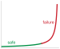
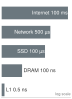

# Kỹ thuật dữ liệu {#sec-data-engineering}

::: {layout-narrow}
::: {.column-margin}

\chapterminitoc

:::

::: {.content-visible when-format="pdf"}
\noindent
{fig-alt="Nhà máy lọc dữ liệu đẳng cự nơi dữ liệu thô hỗn hợp đi qua các bước xác thực, căn chỉnh lược đồ, chuyển đổi, phân batch và tạo nguồn cấp dữ liệu sẵn sàng cho bộ tăng tốc."}
:::

::: {.content-visible unless-format="pdf"}
{fig-alt="Nhà máy lọc dữ liệu đẳng cự nơi dữ liệu thô hỗn hợp đi qua các bước xác thực, căn chỉnh lược đồ, chuyển đổi, phân batch và tạo nguồn cấp dữ liệu sẵn sàng cho bộ tăng tốc."}
:::

:::

## Mục đích {.unnumbered .unlisted}

\begin{marginfigure}
\mlsysstack{15}{10}{10}{25}{10}{15}{10}{90}
\end{marginfigure}

_Tại sao dữ liệu huấn luyện lại hoạt động như mã nguồn trong một hệ thống machine learning?_

Trong phần mềm thông thường, lập trình viên viết logic mà máy tính thực thi. Trong machine learning, lập trình viên viết các quy trình tối ưu hóa để trích xuất logic vận hành từ dữ liệu. Sự đảo ngược này khiến dữ liệu huấn luyện giống như mã nguồn: việc thay đổi nó có thể làm thay đổi hệ thống đã học khi mô hình được huấn luyện lại, ngay cả khi không có thay đổi mã truyền thống nào. Những sự không nhất quán nhỏ trong việc gán nhãn có thể gây ra sự không nhất quán trong hành vi; các trường hợp edge bị thiếu có thể khiến các lỗi tương ứng không được đo lường; các độ chệch (bias) lịch sử có thể lan truyền vào hành vi đã học. Một mô hình chỉ được huấn luyện trên tập dữ liệu đó không thể suy luận bằng chứng liên quan đến tác vụ không có trong đó, và các lỗi nhãn có hệ thống có thể định hình những gì nó học được. Không giống như mã nguồn truyền thống, vốn nằm im cho đến khi một lập trình viên sửa đổi nó, phân phối vận hành có thể thay đổi khi thế giới thay đổi, có khả năng làm thay đổi hiệu suất sản xuất ngay cả khi không có gì trong cơ sở mã được chạm tới. Kỹ thuật dữ liệu có thể tiêu tốn đáng kể công sức của dự án vì công việc này có tầm quan trọng lớn. Mọi quyết định trong pipeline dữ liệu (thu thập gì, gán nhãn như thế nào, khi nào lọc, chia tách ra sao) đều lan truyền về phía trước để hạn chế kiến trúc mô hình, động lực huấn luyện và khả năng triển khai. Do đó, kỹ thuật dữ liệu không phải là tiền xử lý mà là lập trình bằng một ngôn ngữ khác, một ngôn ngữ mà việc kiểm soát chất lượng, quản lý phiên bản và giám sát quyết định liệu hệ thống đã biên dịch có hoạt động hôm nay và tiếp tục hoạt động vào ngày mai hay không. Theo thuật ngữ D·A·M, bản thân pipeline là một vấn đề đồng thiết kế dữ liệu-máy: dù dữ liệu được quản lý tốt đến đâu, thuật toán chỉ có thể học nhanh bằng tốc độ máy có thể cung cấp dữ liệu đó.

::: {.content-visible when-format="pdf"}

\newpage

:::

::: {.callout-learning-objectives}

- Giải thích dữ liệu như mã nguồn và theo dõi cách các thác dữ liệu lan truyền qua các hệ thống ML
- Tính toán lực hấp dẫn dữ liệu, thuế cấp dữ liệu và chi phí băng thông lưu trữ để di chuyển hoặc phục vụ (serving) các tập dữ liệu
- Đánh giá các chiến lược thu thập dựa trên phạm vi bao phủ, chất lượng, chi phí gán nhãn, quản trị và các ràng buộc triển khai
- Thiết kế các pipeline nhập liệu và xác thực cho các khối lượng công việc (workload) batch, streaming, ETL và ELT
- Triển khai các phép biến đổi lũy đẳng, nguồn gốc và kiểm tra độ trôi để duy trì tính nhất quán giữa huấn luyện và phục vụ (serving)
- Chọn các thiết kế gán nhãn, lưu trữ, định dạng tệp, quản lý phiên bản và feature-store cho các nhu cầu của vòng đời ML
- Chẩn đoán nợ dữ liệu và các lỗi pipeline sản xuất sử dụng bằng chứng về chất lượng, độ tin cậy, khả năng mở rộng và quản trị

:::

```{python}
#| echo: false
# Shared chapter symbols used by the calculation cells below.
from mlsysim import *
from mlsysim.core.units import *
```

## Biên dịch tập dữ liệu {#sec-data-engineering-data-engineering-dataset-compilation-0496}

Quy trình làm việc trở nên cụ thể trong pipeline dữ liệu: đầu vào thô đi qua các bước thu thập, nhập liệu, phân tích, gán nhãn, xác thực và chuẩn bị trước khi chúng trở thành các tập dữ liệu sẵn sàng cho ML. Sự phân tích công sức được báo cáo trong khảo sát Crowdflower năm 2016 [@crowdflower2016data] giải thích tại sao pipeline đó cần được xử lý bằng hệ thống riêng: 60 phần trăm số người được hỏi chọn làm sạch và tổ chức dữ liệu là nhiệm vụ tốn thời gian nhất của họ, và 19 phần trăm chọn thu thập các tập dữ liệu. Trục dữ liệu của phân loại D·A·M chỉ trở thành hiện thực dưới dạng cơ sở hạ tầng: hệ thống thu thập, kiểm tra xác thực, quy trình gán nhãn, bố cục lưu trữ và quản trị.

::: {#dfn-data-engineering-data-engineering .callout-definition title="Kỹ thuật dữ liệu"}

***Kỹ thuật dữ liệu***\index{Data engineering!definition} là lớp cơ sở hạ tầng quản lý vòng đời của dữ liệu từ nguồn đến mô hình, bao gồm thu thập, chuyển đổi, lưu trữ và quản trị.

1.  **Ý nghĩa**: Chức năng quan trọng của nó là đảm bảo tính nhất quán giữa huấn luyện và phục vụ (serving), ngăn chặn sự suy giảm âm thầm bằng cách tách mô hình khỏi sự biến động của dữ liệu thô. Trong quy luật sắt, nó quản lý số byte được di chuyển $(D_{\text{vol}})$, trong khi thành phần và chất lượng tập dữ liệu xác định liệu tập dữ liệu $(D)$ có còn đại diện cho phân phối mục tiêu hay không.
2.  **Điểm khác biệt**: Không giống như khoa học dữ liệu\index{Data science!vs. data engineering}, vốn tập trung vào suy luận và hiểu biết sâu sắc, kỹ thuật dữ liệu giải quyết khả năng mở rộng và độ tin cậy của pipeline dữ liệu.
3.  **Cạm bẫy thường gặp**: Một quan niệm sai lầm phổ biến là kỹ thuật dữ liệu là "làm sạch dữ liệu." Trên thực tế, đó là biên dịch tập dữ liệu: biến đổi các quan sát thô, nhiễu thành một tệp nhị phân được tối ưu hóa mà mô hình tiêu thụ.

:::

Phép loại suy về **biên dịch tập dữ liệu**\index{Dataset compilation!definition} làm cho cơ sở hạ tầng trở nên cụ thể. Giống như một trình biên dịch phần mềm biến đổi mã nguồn thông qua một loạt các biểu diễn ngày càng tinh chỉnh (các token, cây cú pháp trừu tượng, biểu diễn trung gian, mã máy), một pipeline dữ liệu biến đổi các quan sát thô, nhiễu thành các tensor số sẵn sàng cho huấn luyện thông qua các giai đoạn tương tự. Việc lọc các bản ghi bị hỏng, các giá trị ngoại lai và các đặc trưng không liên quan tương ứng với *loại bỏ mã chết*: loại bỏ vật liệu không đóng góp gì vào biểu diễn đã học. Tăng cường dữ liệu (Augmentation), vốn mở rộng một cách tổng hợp các ví dụ hạn chế bằng cách xoay hình ảnh, dịch cao độ âm thanh hoặc thêm nhiễu, phản ánh *khai triển vòng lặp*, giúp mô hình tiếp xúc với nhiều biến thể hơn của mẫu cơ bản mà không cần thu thập dữ liệu mới. **Khử trùng lặp**\index{Deduplication!definition} đóng vai trò *loại bỏ biểu thức con chung*, xác định và hợp nhất các bản ghi trùng lặp mà nếu không sẽ làm chệch (bias) ước tính gradient và lãng phí tính toán. Xác thực lược đồ, thực thi các kiểu và phạm vi nghiêm ngặt trên mỗi bản ghi, là *bộ kiểm tra kiểu* của pipeline dữ liệu, từ chối các đầu vào không đúng định dạng trước khi chúng làm sập "runtime" của quá trình huấn luyện mô hình.

Ý nghĩa kỹ thuật là các tập dữ liệu phải được quản lý phiên bản (như git), kiểm thử đơn vị (kiểm tra chất lượng dữ liệu) và gỡ lỗi. *Việc xóa một hàng dữ liệu huấn luyện có thể làm thay đổi kết quả học được, giống như việc xóa một dòng mã có thể làm thay đổi một tệp nhị phân đã biên dịch; huấn luyện lại là bước biên dịch lại tương ứng.* Việc biên dịch cũng tạo ra một ranh giới tin cậy giữa các phân vùng tập dữ liệu. Tập huấn luyện được phép định hình các tham số; tập xác thực được phép định hình các lựa chọn mô hình hóa và pipeline; tập kiểm thử được dành riêng để ước tính khả năng tổng quát hóa sau khi các lựa chọn đó đã được đưa ra. Rò rỉ xảy ra khi thông tin vượt qua các ranh giới đó: các ví dụ trùng lặp xuất hiện trong nhiều phần chia, các biến thể tăng cường của cùng một bản ghi nguồn nằm ở cả hai phía của phần chia, các bản ghi người dùng từ cùng một hộ gia đình xuất hiện trong cả huấn luyện và kiểm thử, hoặc các đặc trưng được suy ra theo thời gian được tính toán bằng cách sử dụng các quan sát trong tương lai. Đối với nghiên cứu điển hình về nhận dạng từ khóa được sử dụng xuyên suốt chương này, điều này có nghĩa là các phần chia độc lập với người nói và nhận biết thời gian không phải là các chi tiết sổ sách; chúng là sự khác biệt giữa việc đo lường khả năng ghi nhớ các giọng nói quen thuộc và đo lường hiệu suất trên tập người dùng triển khai.

Phép ẩn dụ về biên dịch này thiết lập tư duy kỹ thuật xuyên suốt chương. Một trình biên dịch có các giai đoạn riêng biệt (phân tích từ vựng, phân tích cú pháp, tối ưu hóa, tạo mã), và trình biên dịch tập dữ liệu của chúng ta cũng có các giai đoạn: thu thập, nạp vào, xử lý, gán nhãn, lưu trữ và bảo trì liên tục. Một **framework bốn trụ cột**\index{Four pillars framework!data engineering} về Chất lượng, Độ tin cậy, Khả năng mở rộng và Quản trị tổ chức các quyết định thiết kế trên tất cả các giai đoạn. Một nghiên cứu điển hình về nhận dạng từ khóa (KWS) minh họa từng giai đoạn dưới những ràng buộc tài nguyên cực đoan, nơi mỗi byte và mỗi thao tác đều quan trọng.

::: {.column-margin}
{width="100%" fig-alt="Biểu đồ bốn góc với trọng lực dữ liệu trên trục hoành và entropy thông tin trên trục tung; ô trên cùng bên trái được tô sáng và dán nhãn là 'high gain', trong khi ba ô còn lại có màu xám."}

*Lợi ích lựa chọn đạt đỉnh khi mật độ tín hiệu (entropy) cao và chi phí di chuyển (trọng lực) thấp.*
:::

Thiết kế pipeline hiệu quả bắt đầu từ các thuộc tính vật lý ràng buộc từng giai đoạn. Giống như một kỹ sư xây dựng phải hiểu cơ học đất trước khi thiết kế móng, một kỹ sư dữ liệu phải hiểu vật lý của việc di chuyển dữ liệu và mật độ thông tin trước khi đưa ra các quyết định về pipeline. Những ràng buộc vật lý này áp đặt các giới hạn cứng mà không có phần mềm thông minh nào có thể vượt qua.

## Vật lý của Dữ liệu {#sec-data-engineering-physics-data-cdcb}

Phép ẩn dụ "dữ liệu như mã" nắm bắt được *những gì* dữ liệu làm (xác định hành vi hệ thống) nhưng không phải *tại sao* việc di chuyển nó lại tốn kém đến vậy. Vật lý của dữ liệu\index{Data!physics of} giải thích tại sao các hệ thống dữ liệu phải coi dữ liệu như một chất vật lý với các thuộc tính có thể đo lường được. Giống như các vật liệu đa dạng có mật độ và độ nhớt, các tập dữ liệu có tín hiệu liên quan đến tác vụ và trọng lực dữ liệu.

### Trọng lực dữ liệu {#sec-data-engineering-data-gravity-adcb}

```{python}
#| echo: false

# ┌─────────────────────────────────────────────────────────────────────────────
# │ DATA GRAVITY CALCULATION
# ├─────────────────────────────────────────────────────────────────────────────
# │ Context: Data gravity prose and callout "The Physics of Data Gravity"
# │
# │ Goal: Quantify the physical and economic cost of moving 1 PB across regions.
# │ Show: That cross-region transfer costs about $20,000, making compute placement consequential.
# │ How: Calculate transfer time and cost based on network bandwidth and cloud egress rates.
# │
# └─────────────────────────────────────────────────────────────────────────────
from mlsysim.fmt import fmt_int, fmt_usd, fmt, fmt_bandwidth, fmt_count, check, fmt_math, fmt_qty, fmt_time
from mlsysim.core.units import GB, PB, Gbps, second, hour, day, USD

# ┌── LEGO ───────────────────────────────────────────────
class DataGravity:
    """
    Namespace for Data Gravity calculation.
    Scenario: Moving 1 PB of data vs. moving the compute.
    """

    # ┌── 1. LOAD (Constants) ───────────────────────────────────────────────
    dataset_pb = 1
    network_bw = Systems.Fabrics.Ethernet_100G.bandwidth
    egress_rate = 0.02 * USD / GB  # scenario assumption: AWS inter-region transfer rate
    tpu_rate = Infrastructure.Pricing.Cloud.TpuV4PerHour.rate

    # ┌── 2. EXECUTE (The Compute) ─────────────────────────────────────────
    dataset = dataset_pb * PB

    # Step 1: Time using library formula
    t_100g = dataset / network_bw
    transfer_seconds = t_100g.to(second).magnitude
    transfer_hours = t_100g.to(hour).magnitude

    # Step 2: 10 Gbps = 1.25 GB/s
    t_10g = dataset / (10 * Gbps)
    transfer_days_10g = t_10g.to(day).magnitude

    # Step 3: Cost
    transfer_cost = (dataset * egress_rate).to(USD)
    equiv_tpu_hours = (transfer_cost / tpu_rate).to(hour).magnitude

    # ┌── 3. GUARD (Invariants) ───────────────────────────────────────────
    check(transfer_hours >= 20, f"Transfer time ({transfer_hours:.1f} h) is too fast. Data gravity argument fails.")
    check(transfer_days_10g >= 9, f"1 PB over 10 Gbps should take many days, got {transfer_days_10g:.1f}.")
    check(transfer_cost >= 10000 * USD, f"Transfer cost ({transfer_cost.to(USD).magnitude:.0f}) is too cheap.")

    # ┌── 4. OUTPUT (Formatting) ───────────────────────────────────────────
    transfer_seconds_str = fmt_time(transfer_seconds, "second", precision=0, commas=True, style="word")
    transfer_hours_str = fmt_time(round(transfer_hours), 'hour', precision=0, commas=False)
    transfer_time_10g_math = fmt_math(f"T = D_{{\\text{{vol}}}}/\\text{{BW}} \\approx {transfer_days_10g:.1f} \\text{{ days}}")
    transfer_cost_str = fmt_usd(transfer_cost, precision=0, commas=True)
    tpu_hours_str = fmt_count(round(equiv_tpu_hours), precision=0, commas=True, label="TPUv4-hour", plural_label="TPUv4-hours")
    network_gb_per_s_str = fmt_qty(network_bw, GB / second, precision=1, commas=False)
    dataset_gb_str = fmt_qty(dataset, GB, precision=0, commas=True)
    dataset_pb_str = fmt_qty(dataset, PB, precision=0, commas=False)
    network_gbit_per_s_str = fmt_bandwidth(network_bw, unit=Gbps, precision=0, commas=False)
    egress_cost_per_gb_str = fmt_usd(egress_rate, precision=2, commas=False, per="GB")
```

**Trọng lực dữ liệu**\index{Data gravity!definition} là chi phí di chuyển. Nó là một hàm của khối lượng $(D_{\text{vol}})$ và băng thông mạng $(\text{BW})$. Thời gian để di chuyển một tập dữ liệu petabyte qua một liên kết 10 Gbps được xác định bởi vật lý (`{python} DataGravity.transfer_time_10g_math`); ngay cả một liên kết chuyên dụng 100 Gbps cũng khiến thời gian truyền và chi phí xuất dữ liệu đủ lớn để định hình kiến trúc. Trọng lực này quyết định kiến trúc: bởi vì việc di chuyển `{python} DataGravity.dataset_pb_str` đến nơi tính toán là chậm và tốn kém, nên nơi tính toán thường phải di chuyển đến dữ liệu. Điều này giải thích sự trỗi dậy của các kiến trúc "Data Lakehouse"\index{Data lakehouse!architecture}[^fn-lakehouse-data-gravity] [@zaharia2021lakehouse] nơi các công cụ xử lý như Spark và Presto hoạt động trên bộ lưu trữ đối tượng dùng chung. Ngược lại, **data mesh**\index{Data mesh!decentralized ownership} [@dehghani2022datamesh] đề xuất phân quyền sở hữu để quản lý quy mô này về mặt tổ chức, coi dữ liệu là một sản phẩm thuộc sở hữu của các nhóm miền.

[^fn-lakehouse-data-gravity]: **Data lakehouse**\index{Data lakehouse!data gravity}: Kết hợp lưu trữ data lake (rẻ, không schema) với ngữ nghĩa truy vấn kho dữ liệu (giao dịch ACID, thực thi schema) bằng cách sử dụng các lớp bảng giao dịch như Delta Lake. Đối với các khối lượng công việc ML, lakehouse giảm thiểu việc sao chép trích xuất, chuyển đổi, tải (ETL) giữa lake và kho dữ liệu, cho phép tính toán đặc trưng trực tiếp trên lớp lưu trữ nơi dữ liệu đã có sẵn -- một phản ứng trực tiếp với trọng lực dữ liệu, vì việc sao chép lặp lại ở quy mô petabyte làm tăng chi phí $D_{\text{vol}}/\text{BW}$ [@armbrust2020; @zaharia2021lakehouse].

### Tín hiệu liên quan đến tác vụ {#sec-data-engineering-information-entropy-5622}

**Tín hiệu liên quan đến tác vụ**\index{Task-relevant signal!definition} là một heuristic cho thông tin hữu ích mà một tập dữ liệu đóng góp vào một tác vụ cụ thể, chứ không phải entropy Shannon được tính toán từ các byte thô. Một tập dữ liệu gồm 1 triệu hình ảnh giống hệt nhau có trọng lực cao nhưng ít thông tin bổ sung liên quan đến tác vụ ngoài hình ảnh lặp lại đó. Một tập dữ liệu gồm 10.000 trường hợp edge đa dạng có thể có trọng lực thấp hơn nhưng tín hiệu liên quan đến tác vụ lớn hơn. Hãy để heuristic này đo lường tín hiệu hữu ích trên mỗi byte và trọng lực dữ liệu nắm bắt chi phí di chuyển. Tỷ lệ của chúng thể hiện lợi tức của một tập dữ liệu trên chi phí di chuyển:
$$ \text{Data Selection Gain} \propto \frac{\text{Task-Relevant Signal}}{\text{Data Gravity}} $$ {#eq-data-selection-gain}
Heuristic này ưu tiên các tập dữ liệu có tín hiệu tác vụ biên tế biện minh cho chi phí di chuyển của chúng, do đó việc loại bỏ trùng lặp và học chủ động cải thiện quyết định lựa chọn khi chúng loại bỏ các byte dư thừa hoặc ưu tiên các ví dụ mang tính thông tin.

```{python}
#| echo: false
#| label: feeding-tax-calc
# ┌─────────────────────────────────────────────────────────────────────────────
# │ THE FEEDING TAX CALCULATION
# ├─────────────────────────────────────────────────────────────────────────────
# │ Context: "The Feeding Problem" section
# │
# │ Goal: Demonstrate the mismatch between accelerator compute and disk bandwidth.
# │ Show: That a standard cloud disk causes 80%+ idle time for an A100.
# │ How: Calculate required bandwidth for ResNet-50 inference at peak TFLOP/s.
# │
# └─────────────────────────────────────────────────────────────────────────────
from mlsysim.fmt import fmt_int, fmt, check, fmt_qty, fmt_rate, fmt_percent
from mlsysim.core.units import GB, MB, second, TFLOPs

# ┌── LEGO ───────────────────────────────────────────────
class FeedingProblem:
    """
    Namespace for The Feeding Problem calculation.
    Scenario: Saturating an A100 with ResNet-50 images from a standard disk.
    """

    # ┌── 1. LOAD (Constants) ───────────────────────────────────────────────
    from mlsysim import Models, Hardware, Engine, Datasets, Systems
    from mlsysim.solvers import DataModel
    import copy

    m = Models.Vision.ResNet50
    h = Hardware.Cloud.A100

    # Image: 224x224x3 @ FP32
    IMAGE_DIM_RESNET = Datasets.ImageNet.image_width
    img_size_bytes = IMAGE_DIM_RESNET * IMAGE_DIM_RESNET * IMAGE_CHANNELS_RGB * 4  # FP32

    # Standard Cloud Disk (e.g. AWS gp3 baseline)
    disk_profile = Systems.Storage.CloudBlockStorageBaseline

    # Custom hardware with disk profile for DataModel
    h_custom = h.model_copy(update={'storage': disk_profile})

    # ┌── 2. EXECUTE (The Compute) ─────────────────────────────────────────
    # Step 1: Throughput using SingleNodeModel().solve() with 100% efficiency
    from mlsysim.solvers import SingleNodeModel

    p = SingleNodeModel().solve(m, h, efficiency=1.0)
    img_per_sec = p.throughput.to(1 / second).magnitude

    # Step 2: Required bandwidth (bytes/s)
    req_bw_bytes_sec = img_per_sec * img_size_bytes
    req_bw = req_bw_bytes_sec * byte / second

    # Step 3: Evaluate data wall using DataModel
    data_res = DataModel().solve(req_bw, h_custom)

    # Step 4: Feeding efficiency derived from utilization
    eta_feed = 1.0 / max(data_res.utilization, 1.0)
    feeding_tax_pct = (1.0 - eta_feed) * 100

    # ┌── 3. GUARD (Invariants) ───────────────────────────────────────────
    req_bw_value = req_bw.to(GB / second).magnitude
    check(req_bw > 1.0 * GB / second, f"Required bandwidth ({req_bw_value:.1f} GB/s) is lower than expected.")
    check(feeding_tax_pct > 50, f"Feeding tax ({feeding_tax_pct:.1f}%) should be significant for standard disks.")

    # ┌── 4. OUTPUT (Formatting) ──────────────────────────────────────────────
    req_bw_gb_per_s_str = fmt_qty(req_bw, GB / second, precision=1, commas=False)
    disk_bw_mb_per_s_str = fmt_qty(data_res.supply_bw, MB / second, precision=0, commas=False)
    feeding_tax_pct_str = fmt_percent(feeding_tax_pct / 100, precision=1, commas=False, style='prose')
    img_per_s_str = fmt_rate(round(img_per_sec), 'img/s', precision=0, commas=True)
```

### Vấn đề cấp liệu: Tốc độ dòng chảy và "thuế cấp liệu" {#sec-data-engineering-feeding-problem}

Trọng lực dữ liệu thiết lập chi phí di chuyển toàn bộ khối lượng; **vấn đề cấp liệu**\index{Feeding problem!definition} thiết lập chi phí phân phối nó. Chúng ta phân tích điều này như một vấn đề về **tốc độ dòng chảy**\index{Flow rate!definition}: cuộc đấu tranh để bão hòa một máy có thông lượng cao từ một nguồn dữ liệu có băng thông thấp.

Theo quy luật sắt, hệ thống chỉ nhanh bằng thành phần chậm nhất của nó. Nếu một bộ tăng tốc thông lượng cao chạy một mô hình hình ảnh có thể xử lý `{python} FeedingProblem.img_per_s_str`, nhưng pipeline lưu trữ chỉ cung cấp `{python} FeedingProblem.disk_bw_mb_per_s_str`, thì silicon đắt tiền sẽ nằm không. Chúng tôi định lượng điều này là **thuế cấp dữ liệu**\index{Feeding tax!definition}: thời gian thực bị mất do chờ I/O, trực tiếp làm giảm hiệu suất hệ thống $(\eta_{\text{hw}})$\index{System efficiency!feeding tax}. Đối với một ổ đĩa đám mây tiêu chuẩn, thuế cấp dữ liệu có thể vượt quá `{python} FeedingProblem.feeding_tax_pct_str`, nghĩa là bộ tăng tốc dành phần lớn thời gian của nó để chờ các bit. Thuế này biến đổi pipeline dữ liệu từ một mối lo ngại lưu trữ đơn giản thành yếu tố điều chỉnh chính của chu kỳ hoạt động của hệ thống. Việc cấp dữ liệu cho bộ tăng tốc tham chiếu trong ví dụ này thường yêu cầu tốc độ truyền `{python} FeedingProblem.req_bw_gb_per_s_str`, buộc phải chuyển từ hệ thống tệp truyền thống sang các kiến trúc lưu trữ chuyên biệt được phát triển trong @sec-data-engineering-ml-storage-systems-architecture-options-67fa. Những thuộc tính vật lý này cũng đi kèm với chi phí năng lượng: khi dữ liệu di chuyển càng xa bộ xử lý, việc di chuyển càng chiếm ưu thế trong ngân sách.

```{python}
#| echo: false
#| label: energy-access-costs-calc
# ┌─────────────────────────────────────────────────────────────────────────────
# │ ENERGY ACCESS COSTS
# ├─────────────────────────────────────────────────────────────────────────────
# │ Context: @tbl-energy-movement-cost in the energy-movement callout
# │
# │ Goal: Quantify relative energy cost of moving vs. computing on a bit.
# │ Show: DRAM, SSD, and network access multipliers vs. a 32-bit FP multiply.
# │ How: Format per-operation energies and per-bit multipliers.
# │
# └─────────────────────────────────────────────────────────────────────────────
from mlsysim.fmt import fmt_int, fmt, fmt_qty, check, fmt_percent, fmt_multiple, fmt_energy_per_flop
from mlsysim.core.units import pJ, ureg

# ┌── LEGO ───────────────────────────────────────────────
class EnergyAccessCosts:
    """Energy-movement hierarchy for @tbl-energy-movement-cost."""

    # ┌── 1. LOAD (Constants) ───────────────────────────────────────────────
    ENERGY_DRAM_ACCESS_PJ = Hardware.Tech.Memory.DRAM.energy_per_access
    ENERGY_FLOP_FP32_PJ = Hardware.Tech.Op.FlopFp32.energy
    energy_dram = ENERGY_DRAM_ACCESS_PJ
    energy_flop_fp32 = ENERGY_FLOP_FP32_PJ
    energy_local_ssd = Hardware.Tech.Movement.Nvme.energy_per_byte
    energy_network = Hardware.Tech.Movement.Network.energy_per_byte
    prune_pct = 50

    # ┌── 2. EXECUTE (The Compute) ─────────────────────────────────────────
    energy_dram_pj = energy_dram.to(pJ).magnitude
    energy_flop_fp32_pj = energy_flop_fp32.to(pJ / flop).magnitude
    energy_flop_fp32_pj_per_bit = energy_flop_fp32_pj / 32
    energy_local_ssd_pj_per_bit = energy_local_ssd.to(pJ / bit).magnitude
    energy_network_pj_per_bit = energy_network.to(pJ / bit).magnitude

    # ┌── 3. GUARD (Invariants) ───────────────────────────────────────────
    check(energy_dram_pj > energy_flop_fp32_pj, "DRAM access should cost more than one FP32 multiply.")

    # ┌── 4. OUTPUT (Formatting) ──────────────────────────────────────────────
    prune_pct_str = fmt_percent(prune_pct / 100, precision=0, commas=False, style='prose')
    energy_dram_str = fmt_qty(energy_dram, pJ, precision=0, commas=False)
    energy_flop_fp32_str = fmt_energy_per_flop(energy_flop_fp32, precision=1, commas=False)
    local_ssd_energy_str = fmt_qty(energy_local_ssd * (32 * bit), pJ, precision=0, commas=True)
    network_energy_str = fmt_qty(energy_network * (32 * bit), pJ, precision=0, commas=True)
    dram_mult_str = fmt_multiple(round(energy_dram_pj / energy_flop_fp32_pj), precision=0, commas=True)
    local_ssd_mult_str = fmt_multiple(energy_local_ssd_pj_per_bit / energy_flop_fp32_pj_per_bit, precision=1, commas=True)
    network_mult_str = fmt_multiple(energy_network_pj_per_bit / energy_flop_fp32_pj_per_bit, precision=1, commas=True)
```

::: {#psp-data-engineering-energy-movement-invariant .callout-perspective title="Bất biến năng lượng-di chuyển"}

Quy luật sắt trong @sec-introduction-iron-law-ml-systems-c32a và phân tích 'memory-wall' trong @sec-ml-systems-system-balance-hardware-96ab ngụ ý một nguyên tắc kỹ thuật dữ liệu: *di chuyển một giá trị 32-bit tốn khoảng `{python} EnergyAccessCosts.dram_mult_str` đến `{python} EnergyAccessCosts.network_mult_str` năng lượng bằng một phép nhân FP32 của bảng*, với hệ số nhân tăng lên khi dữ liệu rời khỏi chip. Các chương tối ưu hóa sau này khai thác cùng một gradient chi phí bên trong thiết kế mô hình và phần cứng; ở đây, câu hỏi là luồng thông tin từ thế giới bên ngoài đã tiêu thụ bao nhiêu năng lượng trước khi mô hình tính toán. @Tbl-energy-movement-cost làm rõ gradient chi phí đó trên toàn bộ hệ thống phân cấp bộ nhớ.

| **Operation**                   |                  **Energy (pJ)**                  |                **Relative Cost**                |
|:--------------------------------|:-------------------------------------------------:|:-----------------------------------------------:|
| **32-bit FP Multiply**          | `{python} EnergyAccessCosts.energy_flop_fp32_str` |                    1$\times$                    |
| **DRAM Memory Access (32-bit)** |    `{python} EnergyAccessCosts.energy_dram_str`   |    `{python} EnergyAccessCosts.dram_mult_str`   |
| **Local SSD Access (32-bit)**   | `{python} EnergyAccessCosts.local_ssd_energy_str` | `{python} EnergyAccessCosts.local_ssd_mult_str` |
| **Network Transfer (32-bit)**   |  `{python} EnergyAccessCosts.network_energy_str`  |  `{python} EnergyAccessCosts.network_mult_str`  |

: **Chi phí năng lượng của việc di chuyển so với tính toán trên một giá trị 32-Bit**: Năng lượng xấp xỉ cho mỗi sự kiện ở mỗi giai đoạn của hệ thống phân cấp di chuyển dữ liệu, với các hệ số nhân được chuẩn hóa theo một phép nhân FP32 32-bit. Tất cả các hàng đều sử dụng cùng độ rộng 32-bit, vì vậy các tỷ lệ so sánh các sự kiện có kích thước tương tự. Chúng không tự chứng minh thành phần nào chiếm ưu thế trong một khối lượng công việc hoàn chỉnh; tổng năng lượng cũng phụ thuộc vào số lượng phép toán số học và truyền tải. {#tbl-energy-movement-cost tbl-colwidths="[34,33,33]"}

Gradient chi phí được định lượng trong @tbl-energy-movement-cost giải thích tại sao tính cục bộ có thể là một tối ưu hóa hệ thống có đòn bẩy cao. Mỗi lần truyền tải được tránh sẽ loại bỏ năng lượng di chuyển liên quan của nó, mặc dù tổng lợi ích phụ thuộc vào số lần truy cập và tái sử dụng.

Dữ liệu có khối lượng vật lý. Tỉa (pruning) `{python} EnergyAccessCosts.prune_pct_str` dữ liệu huấn luyện thông qua loại bỏ trùng lặp không chỉ tiết kiệm dung lượng đĩa; nó còn giảm công việc trong các giai đoạn chuyên sâu về dữ liệu của vòng đời huấn luyện. Do đó, lựa chọn dữ liệu là một công cụ có đòn bẩy cao khi việc di chuyển và xử lý dữ liệu chiếm ưu thế trong khối lượng công việc (workload).

:::

Lập luận về năng lượng và heuristic mật độ tín hiệu chỉ ra cùng một đòn bẩy từ hai hướng: kỹ thuật dữ liệu hiệu quả tối đa hóa Lợi ích Lựa chọn Dữ liệu được định nghĩa trong @eq-data-selection-gain. "Làm sạch dữ liệu"\index{Data cleaning!signal-to-noise engineering} không chỉ là vệ sinh cơ bản: đó là **kỹ thuật tín hiệu trên nhiễu**\index{Signal-to-noise engineering}. Loại bỏ trùng lặp có thể loại bỏ khối lượng dư thừa trong khi vẫn giữ được tín hiệu liên quan đến tác vụ, trực tiếp làm tăng tỷ lệ. Học chủ động có thể ưu tiên các ví dụ có thông tin hơn các ví dụ dư thừa, từ đó tăng thông tin hữu ích trên mỗi byte. Chúng tôi tối ưu hóa tỷ lệ này để đảm bảo ngân sách lưu trữ và tính toán của chúng tôi được chi cho tín hiệu, không phải nhiễu.

Những nguyên tắc này hoạt động ở cấp độ các tệp và batch riêng lẻ. Ở quy mô trung tâm dữ liệu, chi phí di chuyển dữ liệu tích lũy thành một ràng buộc khiến các tập dữ liệu lớn trở nên quá đắt để truyền tải đến mức tính toán phải di chuyển đến dữ liệu chứ không phải ngược lại. Việc truyền tải một tập dữ liệu petabyte giữa các trung tâm dữ liệu cho thấy chi phí cụ thể của ràng buộc này.

::: {#nbk-data-engineering-physics-data-gravity .callout-notebook title="Vật lý của trọng lực dữ liệu"}

**Bài toán**: Một tập dữ liệu huấn luyện `{python} DataGravity.dataset_pb_str` nằm trong một trung tâm dữ liệu US East, trong khi một pod bộ tăng tốc từ xa có sẵn ở US West. Di chuyển dữ liệu hay di chuyển tính toán thì nhanh hơn?

**Tính toán**:

1.  **Băng thông mạng**: `{python} DataGravity.network_gbit_per_s_str` $\div 8 =$ `{python} DataGravity.network_gb_per_s_str`.
2.  **Thời gian truyền tải**: `{python} DataGravity.dataset_gb_str` $\div$ `{python} DataGravity.network_gb_per_s_str` = `{python} DataGravity.transfer_seconds_str`, xấp xỉ \mbox{`{python} DataGravity.transfer_hours_str`.}
3.  **Chi phí**: `{python} DataGravity.dataset_gb_str` $\times$ `{python} DataGravity.egress_cost_per_gb_str` = `{python} DataGravity.transfer_cost_str`. (Mức cơ sở: giá chuyển dữ liệu ra của AWS, 2024.)

```{=latex}
\vspace*{-2ex}
```
**Hiểu biết về hệ thống**: Nếu huấn luyện mất ít hơn `{python} DataGravity.transfer_hours_str`, thì việc truyền dữ liệu sẽ mất nhiều thời gian hơn huấn luyện. Nếu huấn luyện tốn ít hơn `{python} DataGravity.transfer_cost_str` (xấp xỉ `{python} DataGravity.tpu_hours_str`), thì băng thông tốn kém hơn tính toán. Đối với dữ liệu quy mô petabyte, mã di chuyển đến dữ liệu\index{Data locality!code-to-data}; đối với dữ liệu quy mô gigabyte, dữ liệu di chuyển đến mã\index{Data locality!data-to-code}.

:::

Những ràng buộc vật lý này chi phối mọi quyết định trong các pipeline dữ liệu sản xuất. Trước khi tiếp tục, hãy kiểm tra các trực giác cơ bản sẽ lặp lại trong suốt pipeline.

::: {#chk-data-engineering-physics-data .callout-checkpoint title="Vật lý của dữ liệu"}

Kỹ thuật dữ liệu được chi phối bởi các chi phí vật lý. Hãy kiểm tra trực giác của bạn:

- [ ] **Trọng lực dữ liệu**: tại sao các tập dữ liệu quy mô petabyte buộc tính toán phải di chuyển đến dữ liệu?
- [ ] **Bất biến năng lượng-di chuyển**\index{Energy-movement invariant}: tại sao việc di chuyển một byte dữ liệu lại tốn năng lượng hơn nhiều bậc độ lớn so với việc xử lý nó?
- [ ] **Tín hiệu liên quan đến tác vụ**: tại sao một tập dữ liệu nhỏ hơn, đa dạng hơn lại có giá trị hơn một tập dữ liệu khổng lồ, dư thừa?

:::

Những thuộc tính vật lý này áp đặt các ràng buộc chặt chẽ lên mọi quyết định trong pipeline: nơi lưu trữ dữ liệu, cách biến đổi dữ liệu và khi nào nên di chuyển tính toán thay vì byte. Tuy nhiên, riêng vật lý không ngăn chặn được các lỗi; nó chỉ định nghĩa các giới hạn mà trong đó các quyết định kỹ thuật phải được đưa ra. Một nhóm hiểu rõ hoàn hảo về trọng lực dữ liệu vẫn có thể xây dựng một pipeline dễ hỏng nếu các kiểm tra chất lượng được thực hiện tùy tiện, việc xử lý lỗi không có, hoặc quản trị chỉ là một suy nghĩ sau. Việc chuyển đổi các ràng buộc vật lý thành thực tiễn đáng tin cậy đòi hỏi một framework có hệ thống để tổ chức các quyết định thiết kế trên mọi giai đoạn của pipeline.

## Framework Bốn Trụ Cột {#sec-data-engineering-four-pillars-framework-4ef1}

Một mô hình chấm điểm tín dụng từ chối mọi người nộp đơn từ một khu vực vì một nhóm ở thượng nguồn đã thay đổi trường mã ZIP từ số nguyên sang chuỗi. Một mô hình hình ảnh y tế suy giảm âm thầm trong nhiều tháng vì phần cứng camera đã thay đổi tại một bệnh viện đối tác. Một hệ thống phát hiện gian lận bỏ lỡ một vector tấn công mới vì dữ liệu huấn luyện của nó đã cũ sáu tháng. Mỗi lỗi đều bắt nguồn từ một nguyên nhân gốc rễ khác nhau (lệch lược lược đồ, dịch chuyển phân phối, dữ liệu cũ), nhưng tất cả đều có một điểm chung: các quyết định kỹ thuật dữ liệu tùy tiện tương tác theo những cách mà không ai lường trước cho đến khi triển khai. Những lỗi dây chuyền này thúc đẩy một framework bốn trụ cột được tổ chức xoay quanh chất lượng, độ tin cậy, khả năng mở rộng và quản trị.

### Thác dữ liệu {#sec-data-engineering-data-cascades-systematic-foundations-matter-2efe}

Các hệ thống machine learning đối mặt với một mô hình lỗi đặc trưng được gọi là thác dữ liệu, trong đó chất lượng dữ liệu kém ở các giai đoạn đầu sẽ khuếch đại khắp toàn bộ pipeline [@sambasivan2021]. Một số đầu vào không hợp lệ gây ra lỗi phần mềm ngay lập tức, nhưng dữ liệu cũng có thể vượt qua các lược đồ và kiểm thử trong khi làm suy giảm hành vi đã học một cách âm thầm[^fn-data-cascades-silent] cho đến khi các vấn đề chất lượng trở nên đủ nghiêm trọng để đòi hỏi điều tra, làm lại hoặc huấn luyện lại tốn kém.

[^fn-data-cascades-silent]: **Thác dữ liệu**\index{Thác dữ liệu!lỗi âm thầm}: Lỗi là "âm thầm" vì nó làm suy giảm *đầu vào* của mô hình, chứ không phải *mã* của mô hình—dữ liệu bị hỏng có thể vượt qua các kiểm thử đơn vị và xuất hiện bình thường trong giám sát hệ thống thông thường. @sambasivan2021 mô tả các thác dữ liệu thường vô hình và bị trì hoãn: các thực hành dữ liệu sai sót có thể chỉ lộ rõ sau khi đánh giá hạ nguồn, triển khai hoặc các lỗi đối mặt với người dùng cho thấy mô hình đã học từ tín hiệu sai. Việc khắc phục sau đó đòi hỏi phải truy vết vấn đề ngược trở lại qua các quyết định thu thập dữ liệu, gán nhãn, kỹ thuật đặc trưng và đánh giá, với một số nhóm phải khởi động lại hoặc từ bỏ công việc bị ảnh hưởng.

Các lỗi dữ liệu hiếm khi chỉ giới hạn ở điểm xuất phát của chúng; chúng tích lũy qua các giai đoạn của pipeline. Hãy theo dõi chuỗi các giai đoạn được kết nối trong @fig-cascades từ trái sang phải để truy vết cách một khiếm khuyết dữ liệu ban đầu lan truyền về phía trước vào các quyết định trích xuất đặc trưng, tối ưu hóa mô hình và triển khai.

::: {#fig-cascades fig-env="figure" fig-pos="htb" fig-cap="**Thác chất lượng dữ liệu**: Các khiếm khuyết ở thượng nguồn dọc theo dòng thời gian quy trình làm việc bảy giai đoạn tạo ra các vòng cung lỗi trực tiếp vào giai đoạn đánh giá và triển khai cuối. Các sai sót ban đầu trong việc định hình vấn đề và thu thập dữ liệu tích lũy qua quá trình xử lý hạ nguồn, buộc phải khởi động lại dự án tốn kém (đường trả về màu đỏ đứt nét) khi các khiếm khuyết cuối cùng xuất hiện trong sản xuất. Nguồn: [@sambasivan2021]." fig-alt="Dòng thời gian với bảy giai đoạn từ phát biểu vấn đề đến triển khai. Các vòng cung màu sắc bắt nguồn từ một số giai đoạn quy trình làm việc và kết thúc ở đánh giá hoặc triển khai; các dấu mũi tên chỉ ra các tác động thác hạ nguồn và việc từ bỏ hoặc khởi động lại quy trình."}

```{.tikz}
\begin{tikzpicture}[line join=round,font=\small\sffamily]
\definecolor{Green}{HTML}{008F45}
\definecolor{Red}{HTML}{CB202D}
\definecolor{Orange}{HTML}{CC5500}
\definecolor{Blue}{HTML}{006395}
\definecolor{Violet}{HTML}{7030A0}

\tikzset{%
Line/.style={line width=1.0pt,black!50,shorten <=6pt,shorten >=8pt},
LineD/.style={line width=2.0pt,black!50,shorten <=6pt,shorten >=8pt},
Text/.style={rotate=60,align=right,anchor=north east,font=\fontsize{7pt}{8}\sffamily},
Text2/.style={align=left,anchor=north west,font=\footnotesize\sffamily,text depth=0.7}
}

\draw[line width=1.5pt,black!30](0,0)coordinate(P)--(10,0)coordinate(K);

\foreach \i in {0,...,6} {
\path let \n1 = {(\i/6)*10} in coordinate (P\i) at (\n1,0);
\fill[black] (P\i) circle (2pt);
  }

\draw[LineD,Red,overlay](P0)to[out=60,in=120](P6);
\draw[LineD,Red](P0)to[out=60,in=125](P5);
\draw[LineD,Blue](P1)to[out=60,in=120](P6);
\draw[LineD,Red](P1)to[out=50,in=125](P6);
\draw[LineD,Blue](P4)to[out=60,in=125](P6);
\draw[LineD,Blue](P3)to[out=60,in=120](P6);
%
\draw[Line,Orange](P1)to[out=44,in=132](P6);
\draw[Line,Green](P1)to[out=38,in=135](P6);
\draw[Line,Orange](P1)to[out=30,in=135](P5);
\draw[Line,Green](P1)to[out=36,in=130](P5);
%
\draw[Line,Orange](P2)to[out=40,in=135](P6);
\draw[Line,Orange](P2)to[out=40,in=135](P5);
%
\draw[draw=none,fill=VioletLine!50]($(P5)+(-0.1,0.15)$)to[bend left=10]($(P5)+(-0.1,0.61)$)--
                ($(P5)+(-0.25,0.50)$)--($(P5)+(-0.85,1.20)$)to[bend left=20]($(P5)+(-1.38,0.76)$)--
                ($(P5)+(-0.51,0.33)$)to[bend left=10]($(P5)+(-0.64,0.22)$)to[bend left=10]cycle;
\draw[draw=none,fill=VioletLine!50]($(P6)+(-0.1,0.15)$)to[bend left=10]($(P6)+(-0.1,0.61)$)--
                ($(P6)+(-0.25,0.50)$)--($(P6)+(-0.7,1.30)$)to[bend left=20]($(P6)+(-1.38,0.70)$)--
                ($(P6)+(-0.51,0.33)$)to[bend left=10]($(P6)+(-0.64,0.22)$)to[bend left=10]cycle;
%
\def\vi{-0.05}
\draw[dashed,red,thick,-latex](P1)--++(90:2)to[out=90,in=0](0.8,2.7);
\draw[dashed,red,thick,-latex](P6)--++(90:2)to[out=90,in=0](9.1,2.7);
\node[below=\vi of P0,Text]{Problem\\ Statement};
\node[below=\vi of P1,Text]{Data collection \\and labeling};
\node[below=\vi of P2,Text]{Data analysis\\ and cleaning};
\node[below=\vi of P3,Text]{Model \\selection};
\node[below=\vi of P4,Text]{Model\\ training};
\node[below=\vi of P5,Text]{Model\\ evaluation};
\node[below=\vi of P6,Text]{Model\\ deployment};
%Legend
\node[circle,minimum size=4pt,fill=Blue](L1)at(11.5,2.6){};
\node[above right=0.1 and 0.1of L1,Text2]{Interacting with physical\\  world brittleness};

\node[circle,minimum size=4pt,fill=Red,below =0.5 of L1](L2){};
\node[above right=0.1 and 0.1of L2,Text2]{Inadequate \\application-domain expertise};

\node[circle,minimum size=4pt,fill=Green,below =0.5 of L2](L3){};
\node[above right=0.1 and 0.1of L3,Text2]{Conflicting reward\\ systems};

\node[circle,minimum size=4pt,fill=Orange,below =0.5 of L3](L4){};
\node[above right=0.1 and 0.1of L4,Text2]{Poor cross-organizational\\ documentation};

\draw[-{Triangle[width=8pt,length=8pt]}, line width=3pt,Violet](11.4,-0.85)--++(0:0.8)coordinate(L5);
\node[above right=0.23 and 0of L5,Text2]{Impacts of cascades};

\draw[-{Triangle[width=4pt,length=8pt]}, line width=2pt,Red,dashed](11.4,-1.35)--++(0:0.8)coordinate(L6);
\node[above right=0.23 and 0of L6,Text2]{Abandon/re-start process};
\end{tikzpicture}
```

:::

::: {#dfn-data-engineering-data-cascade .callout-definition title="Thác dữ liệu"}

***Thác dữ liệu***\index{Thác dữ liệu!định nghĩa}\index{Pipeline!lỗi dây chuyền} là một chế độ lỗi của hệ thống ML trong đó các vấn đề chất lượng dữ liệu ở thượng nguồn lan truyền qua quá trình thu thập, gán nhãn, kỹ thuật đặc trưng, huấn luyện, đánh giá và triển khai, khuếch đại thành các lỗi mô hình hạ nguồn hoặc gây hại cho người dùng.

1.  **Ý nghĩa**: Chi phí khắc phục tỷ lệ thuận với số lượng tạo phẩm hạ nguồn đã tiêu thụ dữ liệu bị hỏng: các bảng đặc trưng phải được tạo lại, các mô hình phải được huấn luyện lại, các chỉ số đánh giá phải được tính toán lại và các hệ thống đã triển khai phải được khôi phục hoặc vá lỗi. Do đó, một lỗi lược đồ hoặc gán nhãn duy nhất có thể làm mất hiệu lực toàn bộ quá trình huấn luyện và tất cả các thử nghiệm bắt nguồn từ đó, biến một lỗi dữ liệu cục bộ thành một sự kiện làm lại toàn bộ pipeline.
2.  **Điểm khác biệt**: Không giống như một lỗi chất lượng dữ liệu riêng lẻ, thác dữ liệu được định nghĩa bởi sự lan truyền và khuếch đại. Khiếm khuyết ban đầu có thể nhỏ, nhưng mỗi giai đoạn của pipeline coi đầu vào của nó là đáng tin cậy và chuyển đổi khiếm khuyết thành trạng thái dẫn xuất mới, làm cho nguyên nhân gốc rễ khó quan sát hơn khi hệ thống di chuyển xa hơn khỏi điểm thu thập.
3.  **Cạm bẫy phổ biến**: Một quan niệm sai lầm thường gặp là thác dữ liệu được phát hiện bởi các kiểm thử phần mềm thông thường. Trên thực tế, dữ liệu bị hỏng có thể thỏa mãn các lược đồ, vượt qua các kiểm thử đơn vị và tạo ra các công việc huấn luyện thành công trong khi dạy mô hình tín hiệu sai; việc ngăn chặn thác dữ liệu đòi hỏi phải có nguồn gốc, xác thực, hợp đồng và giám sát gắn liền với hành vi của mô hình.

:::

Vòng lặp phản hồi này tạo ra một chế độ lỗi vận hành nguy hiểm: suy giảm âm thầm. Không giống như các sự cố phần mềm thông thường gây ra dấu vết ngăn xếp và trang cảnh báo, các lỗi mô hình do dữ liệu gây ra tạo ra các đầu ra hợp lệ về mặt cú pháp nhưng có độ chính xác ngữ nghĩa bị suy giảm. Đến khi các chỉ số hạ nguồn phản ánh lỗi, các dự đoán bị hỏng đã làm ô nhiễm các kho dữ liệu lịch sử, buộc phải thực hiện các thao tác khôi phục và nhập lại dữ liệu tốn kém.

::: {#exmp-data-engineering-pipeline-jungle .callout-example title="Rừng pipeline"}

**Tình huống**: Một mô hình chấm điểm tín dụng sản xuất đột nhiên bắt đầu từ chối tất cả các ứng viên từ một khu vực địa lý cụ thể.

**Chẩn đoán**: Một nhóm cơ sở dữ liệu ở thượng nguồn đã thay đổi lược đồ trường `zip_code` từ `integer` sang `string` ("02139") để hỗ trợ các mã quốc tế mà không cập nhật các hợp đồng dữ liệu hạ nguồn. Một phép biến đổi hạ nguồn cũ vẫn ép kiểu chuỗi trở lại thành số nguyên trước khi tuần tự hóa nó, loại bỏ số 0 đứng đầu ("2139") và khiến mô hình coi một mã bưu chính quen thuộc là một danh mục rủi ro cao, chưa từng được quan sát.

**Bài học về hệ thống**: Ranh giới đặc trưng không được thực thi tạo ra các 

:::

### Bốn trụ cột nền tạ {#sec-data-engineering-four-foundational-pillars-c119}

Để ngăn chặn các lỗi ngầm tích tụ trên toàn bộ pipeline, cơ sở hạ tầng dữ liệu phải cân bằng bốn ưu tiên vận hành cạnh tranh. Quan sát cách @fig-four-pillars sắp xếp các ưu tiên này thành các cột nền tảng bao gồm tính toàn vẹn đầu vào, ổn định triển khai, hiệu suất thực thi và quản trị dữ liệu.

::: {#fig-four-pillars fig-env="figure" fig-pos="htb" fig-cap="**Bốn trụ cột của Kỹ thuật Dữ liệu**: Chất lượng, Độ tin cậy, Khả năng mở rộng và Quản trị tạo thành framework nền tảng cho các hệ thống dữ liệu ML. Mỗi trụ cột đóng góp các khả năng thiết yếu (mũi tên liền), trong khi các đánh đổi giữa các trụ cột (đường nét đứt) đòi hỏi sự cân bằng cẩn thận: chi phí xác thực ảnh hưởng đến thông lượng, ràng buộc tính nhất quán giới hạn quy mô phân tán, yêu cầu về quyền riêng tư ảnh hưởng đến hiệu suất, và giảm độ chệch (bias) có thể làm giảm tập dữ liệu huấn luyện khả dụng." fig-alt="Bốn hộp được gắn nhãn chất lượng, độ tin cậy, khả năng mở rộng và quản trị bao quanh một vòng tròn hệ thống dữ liệu ML trung tâm. Các mũi tên liền nối mỗi hộp với trung tâm thể hiện sự đóng góp; các đường nét đứt giữa các hộp chỉ ra các đánh đổi."}

```{.tikz}
\begin{tikzpicture}[line join=round,font=\sffamily]
\tikzset{
Box/.style={align=center, inner xsep=2pt,draw=GreenLine, line width=1pt,fill=none, minimum width=51mm, minimum height=25mm},
Circle1/.style={circle,  minimum size=33mm, draw=none, fill=BrownLine!20},
LineD/.style={dashed,BrownLine!70, line width=1.1pt,latex-latex,text=black},
LineA/.style={violet!50,line width=4.0pt,{{Triangle[width=1.5*6pt,length=2.0*5pt]}-{Triangle[width=1.5*6pt,length=2.0*5pt]}},shorten <=1pt,shorten >=1pt},
ALine/.style={black!50, line width=1.1pt,{{Triangle[width=0.9*6pt,length=1.2*6pt]}-}},
Larrow/.style={fill=violet!50, single arrow,  inner sep=2pt, single arrow head extend=3pt,
            single arrow head indent=0pt,minimum height=10mm, minimum width=3pt}
}
%%%
%vaga
\tikzset{
pics/vaga/.style = {
        code = {
        \pgfkeys{/channel/.cd, #1}
\begin{scope}[shift={($(0,0)+(0,0)$)},scale=\scalefac,every node/.append style={transform shape}]
\node[rectangle,minimum width=2mm,minimum height=22mm,
draw=none, fill=\filllcolor,line width=\Linewidth](1R) at (0,-0.95){};
\fill[fill=\filllcolor!60!black](230:2.8)arc(230:310:2.8)--cycle;%circle(2.9);
%LT
\node [semicircle, shape border rotate=180,  anchor=chord center,
      minimum size=11mm, draw=none, fill=\filllcirclecolor](LT) at (-2,-0.5) {};
\node [circle,  minimum size=4mm, draw=none, fill=\filllcirclecolor](T1) at (-2,1.25) {};
\draw[draw=\drawcolor,,line width=1.2*\Linewidth,shorten <=3pt,shorten >=3pt](T1)--(LT);
\draw[draw=\drawcolor,,line width=1.2*\Linewidth,shorten <=3pt,shorten >=3pt](T1)--(LT.30);
\draw[draw=\drawcolor,,line width=1.2*\Linewidth,shorten <=3pt,shorten >=3pt](T1)--(LT.150);
%DT
\node [semicircle, shape border rotate=180,  anchor=chord center,
      minimum size=11mm, draw=none, fill=\filllcirclecolor!70!black](DT) at (2,-0.5) {};
\node [circle,  minimum size=4mm, draw=none, fill=\filllcirclecolor!70!black](T2) at (2,1.25) {};
\draw[draw=\drawcolor,line width=1.2*\Linewidth,shorten <=3pt,shorten >=3pt](T2)--(DT);
\draw[draw=\drawcolor,,line width=1.2*\Linewidth,shorten <=3pt,shorten >=3pt](T2)--(DT.30);
\draw[draw=\drawcolor,,line width=1.2*\Linewidth,shorten <=3pt,shorten >=3pt](T2)--(DT.150);
%
\node[draw=none,rectangle,minimum width=32mm,minimum height=1.5mm,inner sep=0pt,
fill=\filllcolor!60!black]at(0,1.25){};
\node[draw=white,fill=\filllcolor,line width=2*\Linewidth,ellipse,minimum width=9mm,  minimum height=15mm](EL)at(0,0.85){};
\node[draw=white,fill=\filllcolor!60!black,line width=2*\Linewidth,,circle,minimum size=10mm](2C)at(0,2.05){};
\end{scope}
    }
  }
}
%stit
\def\inset{3.2pt} %
\def\myshape{%
  (0,1.34) to[out=220,in=0] (-1.20,1.03) --
  (-1.20,-0.23) to[out=280,in=160] (0,-1.53) to[out=20,in=260] (1.20,-0.23) --
  (1.20,1.03)  to[out=180,in=320] cycle
}
\tikzset{
pics/stit/.style = {
        code = {
        \pgfkeys{/channel/.cd, #1}
\begin{scope}[shift={($(0,0)+(0,0)$)},scale=\scalefac,every node/.append style={transform shape}]
\fill[fill=\filllcolor!60] \myshape;
%
\begin{scope}
  \clip \myshape;
  \draw[draw=\filllcolor!60, line width=2*\inset,fill=white] \myshape; % stroke color and width
\end{scope}
\fill[fill=\filllcolor!60](0,0)circle(0.4)coordinate(ST\picname);
\end{scope}
    }
  }
}
%AI style
\tikzset{
pics/llm/.style = {
        code = {
        \pgfkeys{/channel/.cd, #1}
\begin{scope}[shift={($(0,0)+(0,0)$)},scale=\scalefac,every node/.append style={transform shape}]
\node[circle,minimum size=12mm,draw=\drawcolor, fill=\filllcolor!70,line width=1.25*\Linewidth](C\picname) at (0,0){};
\def\startangle{90}
\def\radius{1.15}
\def\radiusI{1.1}
\foreach \i [evaluate=\i as \j using \i+1] [count =\k] in {0,2,4,6,8} {
\pgfmathsetmacro{\angle}{\startangle - \i * (360/8)}
\draw[draw=black,-{Circle[black ,fill=\filllcirclecolor,length=5.5pt,line width=0.5*\Linewidth]},line width=1.5*\Linewidth](C\picname)--++(\startangle - \i*45:\radius) ;
\node[circle,draw=black,fill=\filllcirclecolor!80!red!50,inner sep=3pt,line width=0.5*\Linewidth](2C\k)at(\startangle - \j*45:\radiusI) {};
}
\draw[line width=1.5*\Linewidth](2C1)--++(-0.5,0)|-(2C2);
\draw[line width=1.5*\Linewidth](2C3)--++(0.5,0)|-(2C4);
\node[circle,,minimum size=12mm,draw=\drawcolor, fill=\filllcolor!70,line width=0.5*\Linewidth]at (0,0){};
\end{scope}
    }
  }
}
%brain
\tikzset{pics/brain/.style = {
        code = {
        \pgfkeys{/channel/.cd, #1}
\begin{scope}[local bounding box=BRAIN,scale=\scalefac, every node/.append style={transform shape}]
\draw[fill=\filllcolor,line width=\Linewidth](-0.3,-0.10)to(0.08,0.60)
to[out=60,in=50,distance=3](-0.1,0.69)to[out=160,in=80](-0.26,0.59)to[out=170,in=90](-0.46,0.42)
to[out=170,in=110](-0.54,0.25)to[out=210,in=150](-0.54,0.04)
to[out=240,in=130](-0.52,-0.1)to[out=300,in=240]cycle;
\draw[fill=\filllcolor,line width=\Linewidth]
(-0.04,0.64)to[out=120,in=0](-0.1,0.69)(-0.19,0.52)to[out=120,in=330](-0.26,0.59)
(-0.4,0.33)to[out=150,in=280](-0.46,0.42)
%
(-0.44,-0.03)to[bend left=30](-0.34,-0.04)
(-0.33,0.08)to[bend left=40](-0.37,0.2) (-0.37,0.12)to[bend left=40](-0.45,0.14)
(-0.26,0.2)to[bend left=30](-0.24,0.13)
(-0.16,0.32)to[bend right=30](-0.27,0.3)to[bend right=30](-0.29,0.38)
(-0.13,0.49)to[bend left=30](-0.04,0.51);
\draw[thick,rounded corners=0.8pt,\drawcircle,-{Circle[fill=\filllcolor,length=2.5pt]}](-0.23,0.03)--(-0.15,-0.03)--(-0.19,-0.18)--(-0.04,-0.28);
\draw[thick,rounded corners=0.8pt,\drawcircle,-{Circle[fill=\filllcolor,length=2.5pt]}](-0.17,0.13)--(-0.04,0.05)--(-0.06,-0.06)--(0.14,-0.11);
\draw[thick,rounded corners=0.8pt,\drawcircle,-{Circle[fill=\filllcolor,length=2.5pt]}](-0.12,0.23)--(0.31,0.0);
\draw[thick,rounded corners=0.8pt,\drawcircle,-{Circle[fill=\filllcolor,length=2.5pt]}](-0.07,0.32)--(0.06,0.26)--(0.16,0.33)--(0.34,0.2);
\draw[thick,rounded corners=0.8pt,\drawcircle,-{Circle[fill=\filllcolor,length=2.5pt]}](-0.01,0.43)--(0.06,0.39)--(0.18,0.51)--(0.31,0.4);
\end{scope}
     }
  }
}
%graph
\tikzset{pics/graph/.style = {
        code = {
        \pgfkeys{/channel/.cd, #1}
\begin{scope}[local bounding box=GRAPH,scale=\scalefac, every node/.append style={transform shape}]
\draw[line width=2*\Linewidth,draw = \drawcolor](-0.20,0)--(2.2,0);
\draw[line width=2*\Linewidth,draw = \drawcolor](-0.20,0)--(-0.20,2.0);
\foreach \i/\vi in {0/4,0.5/8,1/12,1.5/16}{
\node[draw, minimum width  =4mm, minimum height = \vi mm, inner sep = 0pt,
      draw = \drawcolor, fill=\filllcolor!50, line width=\Linewidth,anchor=south west](COM)at(\i,0.2){};
}
%lupa
\coordinate(PO)at(1.2,0.9);
\node[circle,draw=white,line width=0.75pt,fill=\filllcirclecolor,minimum size=9mm,inner sep=0pt](LV)at(PO){};
\node[draw=none,rotate=40,rounded corners=2pt,rectangle,minimum width=2.2mm,inner sep=1pt,
fill=\filllcirclecolor,minimum height=11mm,anchor=north]at(PO){};
\node[circle,draw=none,fill=white,minimum size=5.0mm,inner sep=0pt](LM)at(PO){};
\node[font=\small\bfseries]at(LM){...};
 \end{scope}
     }
  }
}
%target
\tikzset{
pics/target/.style = {
        code = {
        \pgfkeys{/channel/.cd, #1}
\begin{scope}[shift={($(0,0)+(0,0)$)},scale=\scalefac,every node/.append style={transform shape}]
\definecolor{col1}{RGB}{62,100,125}
\definecolor{col2}{RGB}{219,253,166}
\colorlet{col1}{\filllcolor}
\colorlet{col2}{\filllcirclecolor}
\foreach\i/\col [count=\k]in {22mm/col1,17mm/col2,12mm/col1,7mm/col2,2.5mm/col1}{
\node[circle,inner sep=0pt,draw=\drawcolor,fill=\col,minimum size=\i,line width=\Linewidth](C\k){};
}
\draw[thick,fill=brown,xscale=-1](0,0)--++(111:0.13)--++(135:1)--++(225:0.1)--++(315:1)--cycle;
\path[green,xscale=-1](0,0)--(135:0.85)coordinate(XS1);
\draw[thick,fill=yellow,xscale=-1](XS1)--++(80:0.2)--++(135:0.37)--++(260:0.2)--++(190:0.2)--++(315:0.37)--cycle;
\end{scope}
    }
  }
}
%server
\tikzset {
  pics/server/.style = {
    code = {
     % \colorlet{red}{black}
\pgfkeys{/channel/.cd, #1}
      \begin{scope}[anchor=center, transform shape,scale=\scalefac, every node/.append style={transform shape}]
        \draw[draw=\drawcolor,line width=\Linewidth,fill=\filllcolor](-0.55,-0.5) rectangle (0.55,0.5);
\foreach \i in {-0.25,0,0.25} {
                \draw[line width=\Linewidth]( -0.55,\i) -- (0.55, \i);
}
        \foreach \i in {-0.375, -0.125, 0.125, 0.375} {
          \draw[line width=\Linewidth](-0.45,\i)--(0,\i);
          \fill[](0.35,\i) circle (1.5pt);
        }

        \draw[draw=\drawcolor,line width=1.5*\Linewidth](0,-0.53) |- (-0.55,-0.7);
        \draw[draw=\drawcolor,line width=1.5*\Linewidth](0,-0.53) |- (0.55,-0.7);
      \end{scope}
    }
  }
}
\pgfkeys{
  /channel/.cd,
   Depth/.store in=\Depth,
  Height/.store in=\Height,
  Width/.store in=\Width,
  filllcirclecolor/.store in=\filllcirclecolor,
  filllcolor/.store in=\filllcolor,
  drawcolor/.store in=\drawcolor,
  drawcircle/.store in=\drawcircle,
  scalefac/.store in=\scalefac,
  Linewidth/.store in=\Linewidth,
  picname/.store in=\picname,
  filllcolor=BrownLine,
  filllcirclecolor=violet!20,
  drawcolor=black,
  drawcircle=violet,
  scalefac=1,
  Linewidth=0.5pt,
  Depth=1.3,
  Height=0.8,
  Width=1.1,
  picname=C
}

\def\wi{3.5}
\node[Circle1](CI1){};
%AI
\pic[shift={(0,0)}] at  (CI1){llm={scalefac=1.2,picname=1,drawcolor=GreenD,filllcolor=GreenD!20!, Linewidth=1pt,filllcirclecolor=red}};
%brain
\pic[shift={(0.12,-0.23)}] at  (C1){brain={scalefac=1.1,picname=2,filllcolor=orange!30!, filllcirclecolor=cyan!55!black!60, Linewidth=0.75pt}};
%Quality
\node[Box,above left=1 and \wi of CI1](B1){};
\node[below=1pt of CI1,font=\sffamily\bfseries\small,align=center]{ML Data System};
\fill[green!07](B1.north west) rectangle ($(B1.north east)!0.6!(B1.south east)$)coordinate(B1DE);
\fill[green!20](B1.south east) rectangle ($(B1.north west)!0.6!(B1.south west)$)coordinate(B1LE);
\node[Box,above left=1 and \wi of CI1](){};
\tikzset{Text2/.style={font=\sffamily\bfseries\small,align=center}}
\node[Text2]at($(B1.south west)!0.5!(B1DE)$){Quality\\ {\footnotesize Accuracy \& Fitness}};
\coordinate(Q1)at($(B1.north west)!0.5!(B1DE)$);
%Quality - target
\pic[shift={(0,0)}] at  (Q1){target={scalefac=0.55,picname=1,drawcolor=BlueD,filllcolor=cyan!90!,Linewidth=0.7pt, filllcirclecolor=cyan!20}};
%Reliability - stit
\node[Box,above right=1 and \wi of CI1](B2){};
\fill[cyan!07](B2.north west) rectangle ($(B2.north east)!0.6!(B2.south east)$)coordinate(B2DE);
\fill[cyan!20](B2.south east) rectangle ($(B2.north west)!0.6!(B2.south west)$)coordinate(B2LE);
\node[Text2]at($(B2.south west)!0.5!(B2DE)$){Reliability\\ {\footnotesize Consistency \& Fault Tolerance}};
\coordinate(R1)at($(B2.north west)!0.5!(B2DE)$);
\node[Box,above right=1 and \wi of CI1,draw=BlueD](B2){};
%Reliability - stit
\pic[shift={(0,0.03)}] at  (R1){stit={scalefac=0.48,picname=1,drawcolor=orange,filllcolor=red!80!}};
\pic[shift={(0,0.03)}] at  (ST1){server={scalefac=0.52,picname=1,drawcolor= black,filllcolor=orange!30!,Linewidth=0.75pt}};
%governance
\node[Box,below left=1 and \wi of CI1](B3){};
\fill[violet!07](B3.north west) rectangle ($(B3.north east)!0.6!(B3.south east)$)coordinate(B3DE);
\fill[violet!20](B3.south east) rectangle ($(B3.north west)!0.6!(B3.south west)$)coordinate(B3LE);
\node[Text2]at($(B3.south west)!0.5!(B3DE)$){Governance\\ {\footnotesize Ethics \& Compliance}};
\coordinate(G1)at($(B3.north west)!0.5!(B3DE)$);
\node[Box,below left=1 and \wi of CI1,draw=violet](){};
%Governance - icon
\pic[shift={(-0.70,-0.6)}] at  (G1){graph={scalefac=0.6,picname=1,filllcirclecolor=RedLine,filllcolor=green!70!black, Linewidth=0.65pt}};
%Scalability - graph
\node[Box,below right=1 and \wi of CI1](B4){};
\fill[orange!07](B4.north west) rectangle ($(B4.north east)!0.6!(B4.south east)$)coordinate(B4DE);
\fill[orange!20](B4.south east) rectangle ($(B4.north west)!0.6!(B4.south west)$)coordinate(B4LE);
\node[Text2]at($(B4.south west)!0.5!(B4DE)$){Scalability\\ {\footnotesize Growth \& Performance}};
\coordinate(S1)at($(B4.north west)!0.5!(B4DE)$);
\node[Box,below right=1 and \wi of CI1,draw=OrangeLine](){};
%governance
\pic[shift={(0,0.05)}] at  (S1){vaga={scalefac=0.25,picname=1,filllcolor=BlueLine, Linewidth=0.75pt,filllcirclecolor=orange}};
%arrows
\tikzset{Text/.style={,font=\sffamily\small,align=center}}
\draw[LineD](B1)--node[above,Text]{Validation overhead vs.\\ throughput}(B2);
\draw[LineD](B1)--node[left,Text]{Bias mitigation vs.\\ data availability}(B3);
\draw[LineD](B2)--node[right,Text]{Consistency vs.\\ distributed scale}(B4);
\draw[LineD](B3)--node[below,Text]{Performance vs.\\ privacy constraints}(B4);
%
\tikzset{Text1/.style={font=\sffamily\footnotesize,align=center,text=black}}
\draw[LineA,draw=green!70!black](B1.south east)--node[below left,Text1,green!60!black]{High-quality\\ training data}(CI1);
\draw[LineA,draw=cyan!70!black](B2.south west)--node[below right,Text1,cyan!70!black]{Consistent\\ processing}(CI1);
\draw[LineA,draw=violet!80!black!40](B3.north east)--node[above left,Text1,violet]{Compliance \& \\accountability}(CI1);
\draw[LineA,draw=orange!80](B4.north west)--node[above right,Text1,orange]{Handle growing\\ data volumes}(CI1);
\end{tikzpicture}
```

:::

Bốn nền tảng vận hành này thiết lập không gian đánh đổi cho mọi quyết định kiến trúc trong chương này. Ưu tiên khả năng mở rộng mà không có xác thực chất lượng hoặc hợp đồng độ tin cậy có thể tăng thông lượng trong khi cho phép dữ liệu xấu hoặc không nhất quán lan truyền. Ngược lại, các kiểm soát quản trị toàn diện có thể thêm chi phí lưu trữ và tính toán, hạn chế tốc độ lặp huấn luyện.

Độ tin cậy đặt câu hỏi liệu cùng một pipeline đăng ký có tiếp tục hoạt động khi thiết bị, mạng hoặc hành vi người dùng không hoàn hảo. Một pipeline tạo ra các ví dụ từ đánh thức tuyệt vời trong phòng thí nghiệm nhưng lại thất bại khi kết nối không ổn định, áp lực pin hoặc lỗi micrô thì không mang lại giá trị nào trong nhà của người dùng. Xử lý lỗi, thử lại, bộ đệm cục bộ và suy giảm hiệu suất có kiểm soát biến quy tắc chất lượng thành một hệ thống có thể sử dụng được: thiết bị có thể yêu cầu một phát âm khác, hoãn tải lên cho đến khi kết nối trở lại, hoặc giữ lại một bản đăng ký tốt đã biết thay vì ngầm chấp nhận âm thanh bị hỏng.

Khả năng mở rộng đặt câu hỏi liệu cùng một quyết định đó có tồn tại được khi có sự tăng trưởng. Một chính sách xem xét thủ công hoạt động tốt cho một nghìn bản ghi sẽ sụp đổ khi sản phẩm mở rộng ra hàng triệu người dùng, hàng chục ngôn ngữ và các điều kiện âm thanh đuôi dài. Hệ thống phải mở rộng xác thực, lưu trữ, gán nhãn và huấn luyện lại mà không để chi phí cơ sở hạ tầng tăng nhanh hơn giá trị của phạm vi phủ sóng tốt hơn. Do đó, tài nguyên giới hạn phụ thuộc vào khối lượng công việc (workload).

Lighthouse \ref{lhs-data-engineering-dlrm-recommendation-lighthouse} cho thấy trụ cột khả năng mở rộng tác động mạnh nhất ở đâu: rào cản là dung lượng bộ nhớ, và việc phân vùng các bảng embedding trên các máy trở thành một mối quan tâm thiết kế hàng đầu chứ không phải là một suy nghĩ sau. Quản trị sau đó định nghĩa các ranh giới mà trong đó chất lượng, độ tin cậy và khả năng mở rộng có thể hoạt động. Đối với ví dụ KWS, quản trị xác định liệu các bản ghi âm giọng nói thô có được phép rời khỏi thiết bị hay không, âm thanh đăng ký có thể được lưu giữ trong bao lâu, bản ghi đồng ý nào cho phép sử dụng và tài liệu nào chứng minh rằng tập dữ liệu bao gồm các giọng điệu liên quan mà không làm lộ lời nói riêng tư. Một pipeline có khả năng mở rộng, đáng tin cậy, chất lượng cao hoàn hảo nhưng vi phạm GDPR hoặc duy trì các độ chệch (bias) nhân khẩu học sẽ tạo ra trách nhiệm pháp lý thay vì giá trị. Các thực hành tài liệu tập dữ liệu như tuyên bố dữ liệu làm cho một phần của quản trị đó trở nên rõ ràng bằng cách ghi lại nguồn gốc, mục đích sử dụng, điều kiện thu thập và phạm vi phủ sóng cần thiết cho phân tích độ chệch (bias) và so sánh khoa học [@bender2018].

Khi các hệ thống ML gặp lỗi, bốn trụ cột cung cấp một lăng kính chẩn đoán để xác định nguyên nhân gốc rễ. Sự suy giảm độ chính xác dần dần chỉ ra vấn đề chất lượng: trôi dữ liệu đã làm phân phối phục vụ (serving) lệch khỏi huấn luyện, hoặc chất lượng nhãn đã suy giảm khi nhóm người gán nhãn thay đổi. Các lỗi pipeline không liên tục chỉ ra vấn đề độ tin cậy: xử lý lỗi, logic thử lại hoặc kiểm soát tài nguyên bị thiếu khi tải cao điểm. Huấn luyện mất quá nhiều thời gian mặc dù phần cứng đầy đủ chỉ ra vấn đề khả năng mở rộng: một phép biến đổi đơn luồng, xáo trộn không phân vùng hoặc tầng lưu trữ chậm ngăn cản việc sử dụng tài nguyên song song. Các lỗ hổng tuân thủ được phát hiện trong quá trình kiểm toán chỉ ra nợ quản trị: theo dõi nguồn gốc không đầy đủ, kiểm soát truy cập lỗi thời hoặc chính sách lưu giữ chưa theo kịp các thay đổi quy định.

::: {#lhs-data-engineering-dlrm-recommendation-lighthouse .callout-lighthouse title="Lighthouse đề xuất DLRM"}

Các hệ thống đề xuất\index{Recommendation system!scalability challenge} được xây dựng theo phong cách DLRM\index{DLRM!scalability challenge} minh họa thách thức về khả năng mở rộng của kỹ thuật dữ liệu hiện đại. Các khối lượng công việc (workload) đề xuất hiện đại phân nhánh nhu cầu tài nguyên pipeline: các tín hiệu liên tục truyền qua các pipeline ma trận dày đặc, trong khi các ID phân loại yêu cầu cơ sở hạ tầng tra cứu phân tán quy mô terabyte. @Tbl-data-engineering-dlrm-scalability ánh xạ các điểm căng thẳng vận hành này trên các giai đoạn nhập dữ liệu, tổng hợp bảng embedding và tương tác đặc trưng.

| **Property**   | **Value**                      | **System Implication**                                           |
|:---------------|:-------------------------------|:-----------------------------------------------------------------|
| **Data scale** | High-cardinality user/item IDs | Embedding and lookup tables can outgrow one machine's memory.    |
| **Constraint** | Memory Capacity                | The tables no longer fit on one machine and must be partitioned. |
| **Bottleneck** | Sparse Access                  | Random lookups stress memory bandwidth more than compute.        |

: **Hồ sơ khả năng mở rộng của DLRM**: Các mô hình đề xuất gây áp lực lên kỹ thuật dữ liệu về dung lượng bộ nhớ và băng thông truy cập thưa thớt hơn là tính toán. {#tbl-data-engineering-dlrm-scalability tbl-colwidths="[10,29,61]"}

Ở giai đoạn nhập dữ liệu, các ID phân loại có tính cardinality cao vẫn là các bản ghi nhỏ gọn trong một luồng bị giới hạn thông lượng. Nút thắt cổ chai về băng thông mạng và dung lượng bộ nhớ xuất hiện sau đó, khi huấn luyện hoặc phục vụ (serving) phải tìm nạp các embedding thưa thớt từ hàng terabyte trạng thái bảng được phân vùng. Giảm thiểu sự bất đối xứng này đòi hỏi các chiến lược lưu trữ bộ đệm feature-store và phân vùng bảng được phát triển sau này trong vòng đời pipeline.

:::

Những lỗi tinh vi nhất thường trải rộng trên nhiều trụ cột. Các đặc trưng khác biệt giữa huấn luyện và phục vụ (serving) ảnh hưởng đến cả chất lượng (giá trị sai) và độ tin cậy (tính toán không nhất quán). Một chính sách xóa dữ liệu vì lý do riêng tư cũng có thể tạo ra khoảng cách chất lượng nếu dữ liệu được giữ lại không còn bao phủ dân số triển khai. Việc chẩn đoán các lỗi đa trụ cột như vậy đòi hỏi phải kiểm tra các hợp đồng nhất quán, so sánh phân phối đặc trưng giữa các môi trường và truy vết nguồn gốc biến đổi, tất cả đều là các kỹ thuật được xem xét chi tiết trong chương này. Do đó, chẩn đoán trong môi trường sản xuất nên kiểm tra cơ sở hạ tầng dữ liệu cùng với hành vi của mô hình.

### Nghiên cứu điển hình về KWS {#sec-data-engineering-framework-application-keyword-spotting-case-study-c8e9}

Các hệ thống KWS cung cấp một nghiên cứu điển hình lý tưởng để áp dụng framework bốn trụ cột của chúng ta vào các thách thức kỹ thuật dữ liệu trong thế giới thực. Các hệ thống này cấp công suất cho các thiết bị kích hoạt bằng giọng nói như điện thoại thông minh và loa thông minh, phát hiện các từ đánh thức cụ thể như "OK, Google" hoặc "Alexa" trong các luồng âm thanh liên tục trong khi hoạt động dưới các ràng buộc tài nguyên nghiêm ngặt.[^fn-kws-enrollment-pipeline]

[^fn-kws-enrollment-pipeline]: **Đăng ký Voice Match**\index{Voice Match!enrollment pipeline}: Lặp lại "OK Google" tạo ra một pipeline dữ liệu quy mô nhỏ: bộ lọc chất lượng loại bỏ các mẫu nhiễu, độ tin cậy hoàn tất việc đăng ký, khả năng mở rộng giúp mô hình vừa vặn trong bộ nhớ hệ thống trên chip (SoC) luôn bật, và quản trị kiểm soát việc lưu trữ, xử lý và lưu giữ. Kỹ thuật dữ liệu được áp dụng ở bất cứ đâu dữ liệu quyết định hành vi của hệ thống.

Các mục tiêu hoạt động rộng lớn của kỹ thuật dữ liệu được chuyển thành các kỹ thuật, công cụ và kiểm tra xác thực cụ thể. Đối với cuộc trao đổi trợ lý giọng nói được minh họa trong @fig-keywords, các cơ chế này bao gồm loại bỏ trùng lặp, hợp đồng lược đồ, tìm nạp trước và theo dõi nguồn gốc, được ánh xạ tới các trụ cột kiến trúc tương ứng của chúng.

::: {#fig-keywords fig-env="figure" fig-pos="htb" fig-cap="**Phát hiện từ khóa đang hoạt động**: Một cuộc trao đổi trên Amazon Echo Dot cho thấy người dùng nói “Alexa,” thiết bị xác nhận từ đánh thức, và người dùng ra lệnh “dim the lights.” Một bộ phát hiện từ đánh thức nhẹ, luôn bật, liên tục lắng nghe và chỉ kích hoạt trợ lý giọng nói chính sau khi từ khóa được nói ra." fig-alt="Loa thông minh Amazon Echo Dot ở bên trái. Bên phải, ba bong bóng lời thoại minh họa một cuộc trao đổi ngắn: người dùng nói 'Alexa...' (từ đánh thức), thiết bị trả lời 'Hi, VJ!', và người dùng tiếp tục với 'dim the lights' như một lệnh."}

{width="65%"}

:::

Bốn trụ cột được chuyển trực tiếp thành các ràng buộc kỹ thuật cho hệ thống KWS.

```{python}
#| echo: false
#| label: kws-problem-targets-calc
# ┌─────────────────────────────────────────────────────────────────────────────
# │ KWS PROBLEM TARGETS
# ├─────────────────────────────────────────────────────────────────────────────
# │ Context: KWS problem-definition paragraph
# │
# │ Goal: State the accuracy and latency targets for the KWS case study.
# │ Scope: chapter-anchor — KWS targets recur in the acquisition thread.
# │ Show: 98 percent accuracy with sub-200 ms latency.
# │ How: Format canonical KWS performance objectives.
# │
# └─────────────────────────────────────────────────────────────────────────────
from mlsysim.fmt import fmt, check

# ┌── LEGO ───────────────────────────────────────────────
class KWSProblemTargets:
    """KWS accuracy and latency targets for problem definition."""

    # ┌── 1. LOAD (Constants) ───────────────────────────────────────────────
    kws_accuracy_target = 98
    kws_latency_limit_ms = 200

    # ┌── 3. GUARD (Invariants) ───────────────────────────────────────────
    check(kws_accuracy_target > 90, f"KWS target accuracy unexpectedly low: {kws_accuracy_target}.")

    # ┌── 4. OUTPUT (Formatting) ──────────────────────────────────────────────
    kws_accuracy_target_str = fmt_percent(kws_accuracy_target / 100, precision=0, commas=False, style='prose')
    kws_latency_limit_ms_str = fmt_time(kws_latency_limit_ms, 'millisecond', precision=0, commas=False)
```

Vấn đề cốt lõi đơn giản một cách đáng ngạc nhiên: phát hiện các từ khóa cụ thể giữa các âm thanh xung quanh và các từ nói khác, với độ chính xác cao, độ trễ thấp và số lần kích hoạt sai tối thiểu, trên các thiết bị có tài nguyên tính toán cực kỳ hạn chế. Một định nghĩa vấn đề được chỉ rõ sẽ xác định các từ khóa mong muốn, ứng dụng dự kiến và kịch bản triển khai. Các mục tiêu sau đó phải cân bằng các yêu cầu cạnh tranh: mục tiêu hiệu suất là `{python} KWSProblemTargets.kws_accuracy_target_str` độ chính xác trong phát hiện từ khóa với độ trễ dưới `{python} KWSProblemTargets.kws_latency_limit_ms_str`, cùng với các ràng buộc tài nguyên đòi hỏi mức tiêu thụ công suất tối thiểu và kích thước mô hình được tối ưu hóa cho bộ nhớ thiết bị có sẵn.

::: {.column-margin}
{width="100%" fig-alt="Một đường cong số lần đánh thức sai hàng tháng duy trì ở mức thấp sau đó uốn cong mạnh lên khi tỷ lệ dương tính giả trên mỗi cửa sổ tăng lên; vùng dốc sau điểm uốn được tô màu đỏ."}

*Tỷ lệ dương tính giả nhỏ trên mỗi cửa sổ tích lũy thành lỗi vận hành.*
:::

```{python}
#| echo: false
#| label: false-positive-calc
# ┌─────────────────────────────────────────────────────────────────────────────
# │ FALSE POSITIVE CALCULATION
# ├─────────────────────────────────────────────────────────────────────────────
# │ Context: Callout "False Positive Targets"
# │
# │ Goal: Derive the false-positive-rate ceiling for an always-on KWS system.
# │ Show: How a "1 false wake-up per month" SLA translates to a >99.999% rejection requirement.
# │ How: Calculate total monthly detection windows and required accuracy per window.
# │
# └─────────────────────────────────────────────────────────────────────────────
from mlsysim.fmt import check, fmt, fmt_math, fmt_percent, fmt_rate, fmt_time, sci_latex

# ┌── LEGO ───────────────────────────────────────────────
class FalsePositiveTarget:
    """
    Namespace for KWS False Positive Target calculation.
    Scenario: Always-on device (24h) with 1 false wake-up tolerance per month.
    """

    # ┌── 1. LOAD (Constants) ───────────────────────────────────────────────
    duty_cycle_hours = 24
    window_sec = 1
    tolerance_per_month = 1

    days_month = DAYS_PER_MONTH

    # ┌── 2. EXECUTE (The Compute) ─────────────────────────────────────────
    windows_per_month = (days_month * duty_cycle_hours * SEC_PER_HOUR) / window_sec
    target_fpr = tolerance_per_month / windows_per_month
    rejection_pct = (1 - target_fpr) * 100

    # ┌── 3. GUARD (Invariants) ───────────────────────────────────────────
    check(rejection_pct >= 99.999, f"Rejection target ({rejection_pct:.4f}%) is too lenient. Should be > 99.999%.")

    # ┌── 4. OUTPUT (Formatting) ──────────────────────────────────────────────
    hr_duty_str = fmt_time(duty_cycle_hours, "hour", precision=0, commas=False, style="word", per="day")
    day_str = fmt_time(days_month, "day", precision=0, commas=False, style="word")
    windows_per_month_str = fmt_rate(windows_per_month, "windows/month", precision=0)
    fpr_math = fmt_math(sci_latex(target_fpr, precision=1))
    tolerance_str = fmt(tolerance_per_month, precision=0, commas=False)
    rejection_pct_str = fmt_percent(rejection_pct / 100, precision=5, commas=False, style='prose')
```

::: {#nbk-data-engineering-false-positive-targets .callout-notebook title="Mục tiêu dương tính giả"}

**Vấn đề**: Một hệ thống KWS luôn bật phải chịu được tối đa một lần đánh thức sai mỗi tháng. Với các cửa sổ phân loại một giây chạy suốt ngày đêm, tỷ lệ dương tính giả trên mỗi cửa sổ cần phải nghiêm ngặt đến mức nào?

**Các biến**:

- **Chu kỳ hoạt động**: Luôn bật (`{python} FalsePositiveTarget.hr_duty_str`).
- **Kích thước cửa sổ**: Các cửa sổ phân loại một giây.
- **Số cửa sổ mỗi tháng**: Một cửa sổ mỗi giây, `{python} FalsePositiveTarget.hr_duty_str`, trong `{python} FalsePositiveTarget.day_str` cho ra `{python} FalsePositiveTarget.windows_per_month_str`.

```{=latex}
\vspace*{-1ex}
```
**Tính toán**:

- **Tỷ lệ dương tính giả (FPR)**\index{False positive rate!always-on systems}: `{python} FalsePositiveTarget.tolerance_str` lần đánh thức sai được dung thứ chia cho tổng số cửa sổ hàng tháng cho ra xấp xỉ `{python} FalsePositiveTarget.fpr_math`
- **Yêu cầu từ chối không phải từ khóa**: `{python} FalsePositiveTarget.rejection_pct_str` từ chối các cửa sổ không phải từ khóa.

```{=latex}
\vspace*{-3.5ex}
```
**Thông tin chuyên sâu về hệ thống**: Độ chính xác tổng hợp (ví dụ: "độ chính xác 99 phần trăm") là không đủ ở đây. Đánh giá phải báo cáo số lần chấp nhận sai mỗi giờ (FA/Hr)\index{False Accepts per Hour} cùng với hành vi từ chối sai tương ứng.

:::

Các số liệu thành công cho KWS mở rộng ra ngoài độ chính xác đơn thuần để bao gồm tỷ lệ dương tính thật (các từ khóa được xác định đúng so với tất cả các từ khóa được nói), tỷ lệ dương tính giả (các từ không phải từ khóa bị xác định sai là từ khóa) và các đường cong đánh đổi phát hiện/lỗi so sánh số lần chấp nhận sai mỗi giờ với tỷ lệ từ chối sai trên luồng âm thanh đại diện cho việc triển khai trong thế giới thực, như được chứng minh bởi @nayak2022. Trong số các số liệu này, tỷ lệ dương tính giả cần được đặc biệt chú ý đối với các hệ thống luôn bật. Bởi vì KWS lắng nghe liên tục, mỗi giây mỗi ngày, ngay cả một tỷ lệ dương tính giả dường như không đáng kể cũng sẽ tích lũy qua hàng triệu cửa sổ đánh giá. Một phép tính nhanh cho thấy yêu cầu đó trở nên nghiêm ngặt như thế nào.

Các số liệu vận hành tiếp tục theo dõi thời gian phản hồi (từ khi phát âm từ khóa đến khi hệ thống phản hồi) và mức tiêu thụ công suất (công suất trung bình sử dụng trong quá trình phát hiện từ khóa), và các ưu tiên của các bên liên quan tạo ra thêm căng thẳng xung quanh các số liệu đó. Các nhà sản xuất thiết bị ưu tiên mức tiêu thụ công suất thấp, các nhà phát triển phần mềm nhấn mạnh sự dễ dàng tích hợp, và người dùng cuối yêu cầu độ chính xác và khả năng phản hồi. Việc cân bằng các yêu cầu cạnh tranh này định hình các quyết định kiến trúc hệ thống trong suốt quá trình phát triển.

Các ràng buộc của thiết bị nhúng đặt ra giới hạn cứng cho những lựa chọn kiến trúc này. Hạn chế bộ nhớ yêu cầu các mô hình cực kỳ nhẹ, thường chỉ vài chục kilobyte, để vừa vặn trong vùng 

[^fn-soc-always-on]: **System-on-chip (SoC) always-on island**\index{SoC!always-on island}: Các thiết kế hệ thống trên chip (SoC) hiện đại phân vùng miền công suất để một vùng 

Chất lượng và sự đa dạng của dữ liệu cuối cùng quyết định liệu các ràng buộc này có thể được đáp ứng hay không. Tập dữ liệu phải thu thập sự đa dạng về nhân khẩu học (người nói với nhiều giọng điệu, độ tuổi và giới tính khác nhau) để đảm bảo khả năng nhận dạng rộng rãi. Các biến thể từ khóa cần được chú ý vì mọi người phát âm các từ đánh thức khác nhau, và sự đa dạng của tiếng ồn nền chứng tỏ là rất cần thiết để huấn luyện các mô hình hoạt động trong các kịch bản thực tế từ môi trường yên tĩnh đến điều kiện ồn ào. Khi một hệ thống nguyên mẫu được phát triển, phản hồi lặp đi lặp lại và tinh chỉnh giúp hệ thống phù hợp với các mục tiêu khi các kịch bản triển khai phát triển, yêu cầu thử nghiệm trong điều kiện thực tế và tinh chỉnh có hệ thống dựa trên các mẫu lỗi được quan sát.

### Không gian thiết kế KWS {#sec-data-engineering-kws-design-space-eadd}

Độ chính xác KWS, khả năng chịu lỗi đánh thức sai, ngân sách độ trễ, ngân sách năng lượng và giới hạn bộ nhớ tạo ra một không gian thiết kế đa chiều, nơi các lựa chọn kỹ thuật dữ liệu ảnh hưởng đến hiệu suất hệ thống. @Tbl-kws-design-space định lượng các đánh đổi chính, cho phép đưa ra các quyết định có nguyên tắc thay vì lựa chọn tùy tiện. Một hàng sử dụng hệ số cepstral tần số mel (MFCCs)\index{MFCC!audio features}: các đặc trưng tần số giọng nói nhỏ gọn có số lượng hệ số kiểm soát kích thước đặc trưng, chi phí tính toán và chi tiết âm thanh; @sec-data-engineering-systematic-data-processing-aebc cho thấy cách chúng được trích xuất.

```{python}
#| echo: false
#| label: kws-design-space-tradeoffs-calc
# ┌─────────────────────────────────────────────────────────────────────────────
# │ KWS DESIGN SPACE TRADEOFFS
# ├─────────────────────────────────────────────────────────────────────────────
# │ Context: @tbl-kws-design-space
# │
# │ Goal: Keep KWS design-space arithmetic and scenario anchors in one place.
# │ Show: Sampling, MFCC, data-volume, latency, cost, and memory trade-offs.
# │ How: Compute ratios from row endpoints and format table-facing values.
# │
# └─────────────────────────────────────────────────────────────────────────────
from mlsysim.fmt import (
    check,
    fmt_multiple,
    fmt_percent,
    fmt_percent_range,
    fmt_qty,
    fmt_time,
    fmt_usd,
)

# ┌── LEGO ───────────────────────────────────────────────
class KWSDesignSpaceTradeoffs:
    """Scenario anchors and derived multipliers for the KWS design-space table."""

    # ┌── 1. LOAD (Constants) ──────────────────────────────────────────────
    sampling_rate_low_khz = 8
    sampling_rate_high_khz = 16
    mfcc_coeff_low = 13
    mfcc_coeff_high = 40
    examples_low_m = 1
    examples_high_m = 10
    local_latency_ms = 10
    cloud_latency_ms = 100
    local_query_cost_usd = 0
    cloud_query_cost_usd = 0.001
    local_model_memory = (
        64 * KB
    )  # scenario assumption: KWS always-on model-size budget (matches the 64 KB scenario limit; the 16 KB preprocessing-state budget is separate)
    noisy_collection_cost_mult = 3
    synthetic_cost_savings_mult = 10
    sampling_accuracy_gain = (0.02, 0.04)
    mfcc_accuracy_gain = (0.03, 0.05)
    data_volume_accuracy_gain = (0.05, 0.08)
    noisy_accuracy_gain = (0.10, 0.15)
    local_accuracy_risk = 0.02
    synthetic_robustness_gain = (0.03, 0.05)

    # ┌── 2. EXECUTE (The Compute) ────────────────────────────────────────
    sampling_ratio = sampling_rate_high_khz / sampling_rate_low_khz
    mfcc_ratio = mfcc_coeff_high / mfcc_coeff_low
    data_volume_ratio = examples_high_m / examples_low_m

    # ┌── 3. GUARD (Invariants) ───────────────────────────────────────────
    check(sampling_ratio == 2, f"KWS sampling ratio drifted: {sampling_ratio}.")
    check(3.0 <= mfcc_ratio <= 3.1, f"KWS MFCC ratio drifted: {mfcc_ratio:.2f}.")
    check(data_volume_ratio == 10, f"KWS data-volume ratio drifted: {data_volume_ratio}.")
    check(local_latency_ms < cloud_latency_ms, "Local KWS inference should remain lower-latency than cloud inference.")
    check(cloud_query_cost_usd > local_query_cost_usd, "Cloud query cost should exceed local query cost.")

    # ┌── 4. OUTPUT (Formatting) ──────────────────────────────────────────
    sampling_accuracy_gain_pct_str = fmt_percent_range(*sampling_accuracy_gain, style="symbol")
    sampling_storage_mult_str = fmt_multiple(round(sampling_ratio), precision=0, commas=False)
    sampling_processing_mult_str = fmt_multiple(round(sampling_ratio), precision=0, commas=False)
    sampling_feature_size_mult_str = fmt_multiple(round(sampling_ratio), precision=0, commas=False)
    mfcc_accuracy_gain_pct_str = fmt_percent_range(*mfcc_accuracy_gain, style="symbol")
    mfcc_feature_compute_mult_str = fmt_multiple(round(mfcc_ratio), precision=0, commas=False)
    mfcc_feature_memory_mult_str = fmt_multiple(round(mfcc_ratio), precision=0, commas=False)
    data_volume_accuracy_gain_pct_str = fmt_percent_range(*data_volume_accuracy_gain, style="symbol")
    data_volume_training_time_mult_str = fmt_multiple(round(data_volume_ratio), precision=0, commas=False)
    data_volume_labeling_cost_mult_str = fmt_multiple(round(data_volume_ratio), precision=0, commas=False)
    data_volume_storage_mult_str = fmt_multiple(round(data_volume_ratio), precision=0, commas=False)
    noisy_accuracy_gain_pct_str = fmt_percent_range(*noisy_accuracy_gain, style="symbol")
    noisy_collection_cost_mult_str = fmt_multiple(noisy_collection_cost_mult, precision=0, commas=False)
    local_accuracy_risk_pct_str = fmt_percent(local_accuracy_risk, precision=0, commas=False, style="symbol")
    local_latency_ms_str = fmt_time(local_latency_ms, "millisecond", precision=0, commas=False)
    cloud_latency_ms_str = fmt_time(cloud_latency_ms, "millisecond", precision=0, commas=False)
    local_inference_cost_usd_per_query_str = fmt_usd(local_query_cost_usd, precision=0, commas=False, per="query")
    cloud_inference_cost_usd_per_query_str = fmt_usd(cloud_query_cost_usd, precision=3, commas=False, per="query")
    local_model_memory_kb_str = fmt_qty(local_model_memory, unit=KB, precision=0, commas=False)
    synthetic_robustness_gain_pct_str = fmt_percent_range(*synthetic_robustness_gain, style="symbol")
    synthetic_cost_savings_mult_str = fmt_multiple(synthetic_cost_savings_mult, precision=0, commas=False)
```

| **Design Choice**                   | **Quality Impact**                                                                 |                                                  **Latency Impact**                                                 |                                                                     **Cost Impact**                                                                     |                               **Memory Impact**                                |
|:------------------------------------|:-----------------------------------------------------------------------------------|:-------------------------------------------------------------------------------------------------------------------:|:-------------------------------------------------------------------------------------------------------------------------------------------------------:|:------------------------------------------------------------------------------:|
| **16 kHz vs. 8 kHz sampling**       | +`{python} KWSDesignSpaceTradeoffs.sampling_accuracy_gain_pct_str` accuracy        |              `{python} KWSDesignSpaceTradeoffs.sampling_processing_mult_str` input-processing workload              |                                      `{python} KWSDesignSpaceTradeoffs.sampling_storage_mult_str` raw-audio storage                                     | `{python} KWSDesignSpaceTradeoffs.sampling_feature_size_mult_str` feature size |
| **13 vs. 40 MFCC coefficients**     | +`{python} KWSDesignSpaceTradeoffs.mfcc_accuracy_gain_pct_str` accuracy            |                   `{python} KWSDesignSpaceTradeoffs.mfcc_feature_compute_mult_str` feature compute                  |                                                                         Minimal                                                                         | `{python} KWSDesignSpaceTradeoffs.mfcc_feature_memory_mult_str` feature memory |
| **1M vs. 10M training examples**    | +`{python} KWSDesignSpaceTradeoffs.data_volume_accuracy_gain_pct_str` accuracy     |                 `{python} KWSDesignSpaceTradeoffs.data_volume_training_time_mult_str` training time                 |                                   `{python} KWSDesignSpaceTradeoffs.data_volume_labeling_cost_mult_str` labeling cost                                   |    `{python} KWSDesignSpaceTradeoffs.data_volume_storage_mult_str` storage     |
| **Clean vs. noisy training data**   | +`{python} KWSDesignSpaceTradeoffs.noisy_accuracy_gain_pct_str` real-world         |                                                       Minimal                                                       |                                    `{python} KWSDesignSpaceTradeoffs.noisy_collection_cost_mult_str` collection cost                                    |                                    Minimal                                     |
| **Local vs. cloud inference**       | up to `{python} KWSDesignSpaceTradeoffs.local_accuracy_risk_pct_str` accuracy risk | `{python} KWSDesignSpaceTradeoffs.local_latency_ms_str` vs. `{python} KWSDesignSpaceTradeoffs.cloud_latency_ms_str` | `{python} KWSDesignSpaceTradeoffs.local_inference_cost_usd_per_query_str` vs. `{python} KWSDesignSpaceTradeoffs.cloud_inference_cost_usd_per_query_str` |  `{python} KWSDesignSpaceTradeoffs.local_model_memory_kb_str` vs. cloud-scale  |
| **Synthetic vs. real augmentation** | +`{python} KWSDesignSpaceTradeoffs.synthetic_robustness_gain_pct_str` robustness   |                                                       Minimal                                                       |                                        `{python} KWSDesignSpaceTradeoffs.synthetic_cost_savings_mult_str` cheaper                                       |                                    Minimal                                     |

: **Không gian thiết kế kỹ thuật dữ liệu KWS**: Các đầu vào kịch bản minh họa định giá mỗi lựa chọn thiết kế theo bốn trục, cụ thể là chất lượng, độ trễ, chi phí và bộ nhớ; các mục nhập không phải là phép đo từ một hệ thống và không nên kết hợp như các hiệu ứng cộng gộp. Tốc độ lấy mẫu cao hơn làm tăng gấp đôi lưu trữ và xử lý âm thanh thô, trong khi nhiều ví dụ huấn luyện hơn làm tăng yêu cầu ghi nhãn và lưu trữ. Chất lượng và độ trễ thực tế phải được đo trên pipeline mục tiêu. {#tbl-kws-design-space tbl-colwidths="[30,22,16,16,16]"}

Phát hiện từ khóa 

```{python}
#| echo: false
#| label: budget-allocation-calc
# ┌─────────────────────────────────────────────────────────────────────────────
# │ BUDGET ALLOCATION CALCULATION
# ├─────────────────────────────────────────────────────────────────────────────
# │ Context: Callout "Optimizing the KWS Design Space"
# │
# │ Goal: Demonstrate data budget planning as an engineering optimization problem.
# │ Show: How a $150K budget is allocated across labeling, storage, and governance.
# │ How: Calculate total labeled examples given labor costs and review overhead.
# │
# └─────────────────────────────────────────────────────────────────────────────
from mlsysim.fmt import fmt, fmt_usd, check, fmt_count, fmt_percent

# ┌── LEGO ───────────────────────────────────────────────
class BudgetAllocation:
    """Budget planning as an engineering optimization problem."""

    # ┌── 1. LOAD (Constants) ──────────────────────────────────────────────
    total_budget = 150_000
    labeling_pct = 0.60
    storage_pct = 0.25
    governance_pct = 0.15
    cost_per_label = 0.10
    review_overhead = 0.20

    # ┌── 2. EXECUTE (The Compute) ────────────────────────────────────────
    labeling_budget = total_budget * labeling_pct
    storage_budget = total_budget * storage_pct
    governance_budget = total_budget * governance_pct
    effective_cost = cost_per_label * (1 + review_overhead)
    labeled_examples = labeling_budget / effective_cost
    review_overhead_pct = int(review_overhead * 100)

    # ┌── 3. GUARD (Invariants) ───────────────────────────────────────────
    check(abs(labeling_pct + storage_pct + governance_pct - 1.0) < 1e-9, "Budget allocation must sum to 100 percent.")
    check(labeled_examples >= 700 * THOUSAND, f"Expected roughly 750K labels, got {labeled_examples:.0f}.")
    check(labeled_examples < 1_000 * THOUSAND, "Real-label budget should remain below the 1M design-space anchor.")

    # ┌── 4. OUTPUT (Formatting) ─────────────────────────────────────────────
    cost_per_label_str = fmt_usd(cost_per_label, precision=2, commas=False, per="label")
    review_overhead_pct_str = fmt_percent(review_overhead_pct / 100, precision=0, commas=False, style='prose')
    labeling_k_usd_str = fmt_usd(labeling_budget, precision=0, commas=False, scale="K")
    total_budget_k_usd_str = fmt_usd(total_budget, precision=0, commas=False, scale="K")
    storage_k_usd_str = fmt_usd(storage_budget, precision=1, commas=False, scale="K")
    governance_k_usd_str = fmt_usd(governance_budget, precision=1, commas=False, scale="K")
    effective_cost_str = fmt_usd(effective_cost, precision=2, commas=False, per="label")
    labeled_k_str = fmt_count(labeled_examples, scale='K', commas=False)
    labeling_pct_str = fmt_percent(labeling_pct, precision=0, commas=False, style='prose')
    storage_pct_str = fmt_percent(storage_pct, precision=0, commas=False, style='prose')
    governance_pct_str = fmt_percent(governance_pct, precision=0, commas=False, style='prose')
```

```{python}
#| echo: false
#| label: kws-design-constraints-calc
# ┌─────────────────────────────────────────────────────────────────────────────
# │ KWS DESIGN CONSTRAINTS
# ├─────────────────────────────────────────────────────────────────────────────
# │ Context: KWS design-space callout and configuration table
# │
# │ Goal: Summarize the four-pillar KWS budget and deployment constraints.
# │ Show: 98 percent accuracy, $150K budget, 64 KB model, 6-month timeline.
# │ How: Format canonical KWS design-space constants.
# │
# └─────────────────────────────────────────────────────────────────────────────
from mlsysim.fmt import fmt, fmt_rate, fmt_usd, fmt_qty, check, fmt_time
from mlsysim.core.units import TB

# ┌── LEGO ───────────────────────────────────────────────
class KWSDesignConstraints:
    """KWS four-pillar constraints for the design-space callout."""

    # ┌── 1. LOAD (Constants) ───────────────────────────────────────────────
    kws_accuracy_target = 98
    kws_false_wake_month = 1
    kws_budget = 150_000
    kws_memory_limit_design_kb = 64
    kws_memory_limit_design = kws_memory_limit_design_kb * KB
    kws_timeline_months = 6
    kws_base_model_acc = 90

    # ┌── 3. GUARD (Invariants) ───────────────────────────────────────────
    check(kws_accuracy_target > 90, f"KWS target accuracy unexpectedly low: {kws_accuracy_target}.")
    check(kws_memory_limit_design_kb <= 64, "KWS model must fit the always-on island.")

    # ┌── 4. OUTPUT (Formatting) ──────────────────────────────────────────────
    kws_accuracy_target_str = fmt_percent(kws_accuracy_target / 100, precision=0, commas=False, style='prose')
    kws_false_wake_month_str = fmt_rate(
        kws_false_wake_month, "false wake/month" if kws_false_wake_month == 1 else "false wakes/month", precision=0, commas=False
    )
    kws_budget_str = fmt_usd(kws_budget, precision=0, commas=False, scale="K")
    kws_memory_limit_design_kb_str = fmt_qty(kws_memory_limit_design, KB, precision=0, commas=False)
    kws_timeline_months_str = fmt_time(kws_timeline_months, "month", precision=0, commas=False, style="word")
    kws_base_model_acc_str = fmt_percent(kws_base_model_acc / 100, precision=0, commas=False, style='prose')
```

::: {#nbk-data-engineering-optimizing-kws-design-space .callout-notebook title="Tối ưu hóa không gian thiết kế KWS"}

**Kịch bản**: Một hệ thống KWS cho loa thông minh có các ràng buộc sau:

- **Mục tiêu**: độ chính xác `{python} KWSDesignConstraints.kws_accuracy_target_str`, ít hơn `{python} KWSDesignConstraints.kws_false_wake_month_str`
- **Ngân sách**: tổng ngân sách kỹ thuật dữ liệu `{python} KWSDesignConstraints.kws_budget_str`
- **Bộ nhớ**: giới hạn kích thước mô hình `{python} KWSDesignConstraints.kws_memory_limit_design_kb_str` (vùng 
- **Thời gian**: `{python} KWSDesignConstraints.kws_timeline_months_str` để đưa vào sản xuất

**Bước 1**: Áp dụng các ràng buộc để loại bỏ các lựa chọn.

Đối với kịch bản này, nhóm chọn hai lựa chọn thận trọng:

- 13 hệ số MFCC để giảm bộ nhớ trạng thái đặc trưng và tính toán
- Suy luận cục bộ để tránh độ trễ mạng và duy trì hoạt động ngoại tuyến

Giới hạn kích thước mô hình 64 KB bản thân nó không chứng minh rằng một trong hai lựa chọn thay thế là không khả thi; mô hình đã triển khai, trạng thái tiền xử lý, runtime và ngăn xếp mạng yêu cầu các phép đo dung lượng riêng biệt.

**Bước 2**: Tính toán phân bổ ngân sách.

Ngân sách `{python} BudgetAllocation.total_budget_k_usd_str` được chia thành ba loại chi phí theo đơn giá được thiết lập trong @sec-data-engineering-scalability-cost-optimization-b9b3:

- **Ghi nhãn** (~`{python} BudgetAllocation.labeling_pct_str`): `{python} BudgetAllocation.labeling_k_usd_str` có sẵn
- **Lưu trữ/Xử lý** (~`{python} BudgetAllocation.storage_pct_str`): `{python} BudgetAllocation.storage_k_usd_str`
- **Quản trị/Khác** (~`{python} BudgetAllocation.governance_pct_str`): `{python} BudgetAllocation.governance_k_usd_str`

Với `{python} BudgetAllocation.cost_per_label_str` và chi phí xem xét bổ sung `{python} BudgetAllocation.review_overhead_pct_str`: `{python} BudgetAllocation.labeling_k_usd_str` ÷ `{python} BudgetAllocation.effective_cost_str` = `{python} BudgetAllocation.labeled_k_str` ví dụ được gắn nhãn

Điều này mang lại khoảng 0.75 triệu ví dụ được gắn nhãn, ngay dưới mốc 1 triệu trong không gian thiết kế của chúng ta. Hàng 1M đến 10M trong @tbl-kws-design-space do đó nên được đọc như một tham chiếu mở rộng hơn là một phép nội suy trực tiếp: riêng ngân sách nhãn thực tế không mang lại toàn bộ lợi ích về khối lượng dữ liệu.

**Bước 3**: Tối đa hóa độ chính xác còn lại.

Kế hoạch chất lượng có ba thành phần:

- Độ chính xác mô hình cơ sở minh họa khoảng ~`{python} KWSDesignConstraints.kws_base_model_acc_str`
- Lợi ích khối lượng dữ liệu một phần từ 750K ví dụ thực tế
- Cần: tốc độ lấy mẫu cao hơn cộng với tăng cường dữ liệu tổng hợp/nhiễu để đạt được mục tiêu `{python} KWSDesignConstraints.kws_accuracy_target_str`

Ba lựa chọn từ không gian thiết kế vẫn nằm trong giới hạn ngân sách và bộ nhớ:

- Lấy mẫu 16 kHz: độ chính xác +2–4 phần trăm, chi phí lưu trữ gấp 2 lần ✓ (phù hợp ngân sách)
- Dữ liệu huấn luyện nhiễu: độ chính xác trong thế giới thực +10–15 phần trăm, chi phí thu thập gấp 3 lần
- Tăng cường tổng hợp: độ vững chắc +3–5 phần trăm, rẻ hơn dữ liệu thực 10 lần ✓

**Bước 4**: Cấu hình cuối cùng.

Kịch bản này kết hợp các lựa chọn trên với 13 MFCC và ngân sách nhãn thực 750K đã tính toán trong @tbl-data-engineering-kws-configuration. Các hiệu ứng chất lượng có thể chồng chéo, vì vậy bảng ghi lại một cấu hình ứng viên thay vì một tối ưu đã giải quyết.

**Kết quả**: Tính toán ngân sách hỗ trợ khoảng `{python} BudgetAllocation.labeled_k_str` ví dụ được gán nhãn thủ công. Việc đạt được mục tiêu chất lượng `{python} KWSDesignConstraints.kws_accuracy_target_str` và phù hợp với giới hạn mô hình `{python} KWSDesignConstraints.kws_memory_limit_design_kb_str` vẫn là các yêu cầu xác thực đối với hệ thống đã huấn luyện và triển khai.

**Hiểu biết về hệ thống**: Phân tích không gian thiết kế có hệ thống biến câu nói "chúng ta cần thêm dữ liệu" thành một phân bổ có thể kiểm tra: các giả định gán nhãn đã nêu mua được khoảng 750K ví dụ thực, trong khi khối lượng tổng hợp, độ chính xác và dấu chân triển khai vẫn cần được đo lường.

:::

@Tbl-data-engineering-kws-configuration ghi lại cấu hình kết quả, ghép mỗi lựa chọn thiết kế với ràng buộc buộc nó: lấy mẫu và tăng cường được mua khi chúng phù hợp với ngân sách, trong khi độ chính xác và bộ nhớ được cố định bởi "always-on island".

```{=latex}
\begingroup
\renewcommand{\arraystretch}{1.35}
```

| **Choice**            | **Selection**                                   | **Rationale**                                                                                                          |
|:----------------------|:------------------------------------------------|:-----------------------------------------------------------------------------------------------------------------------|
| **Sampling rate**     | 16 kHz                                          | +3% accuracy worth 2$\times$ storage within budget                                                                     |
| **MFCC coefficients** | 13                                              | Reduces feature-state memory and compute; final fit requires measurement                                               |
| **Training examples** | 750K real + illustrative synthetic augmentation | Human-label count follows from the budget; synthetic volume is a scenario choice                                       |
| **Data diversity**    | Noisy + clean mix                               | Critical for real-world deployment                                                                                     |
| **Inference**         | Local, reduced precision                        | Reduced precision can lower footprint; the final 64 KB fit requires the compression analysis in @sec-model-compression |
| **Augmentation**      | Heavy synthetic                                 | 10$\times$ cost efficiency                                                                                             |

: **Cấu hình ứng viên KWS**: Một kịch bản sử dụng ngân sách nhãn thực đã tính toán và ghi lại các lựa chọn lấy mẫu, tăng cường và triển khai còn lại để đo lường so với các mục tiêu chất lượng và bộ nhớ. {#tbl-data-engineering-kws-configuration tbl-colwidths="[16,20,64]"}

```{=latex}
\endgroup
```

Với một cấu hình ứng viên được chọn từ không gian thiết kế của chúng ta, việc triển khai yêu cầu kết hợp nhiều phương pháp thu thập dữ liệu: các kho ngữ liệu có sẵn cho đường cơ sở, cào dữ liệu web và huy động cộng đồng cho các khoảng trống về độ bao phủ, và tạo dữ liệu tổng hợp để mở rộng quy mô. Sự kết hợp này có thể cải thiện độ bao phủ trên các điều kiện thế giới thực đa dạng. @Sec-data-engineering-strategic-data-acquisition-418f phát triển đầy đủ từng chiến lược thu thập này, kinh tế học của chúng và các thể hiện KWS của chúng.

Bốn trụ cột cung cấp lăng kính đánh giá; quyết định kỹ thuật cụ thể đầu tiên là nguồn gốc dữ liệu. Chiến lược thu thập xác định nguyên liệu thô mà mọi giai đoạn tiếp theo tinh chỉnh.

::: {#chk-data-engineering-four-pillars-framework .callout-checkpoint title="framework bốn trụ cột"}

Bốn trụ cột cung cấp một lăng kính hệ thống cho mọi lựa chọn pipeline.

**Các trụ cột**

- [ ] **Chất lượng**: bạn có thể phân biệt *tính đúng đắn* với *độ bao phủ* (các trường hợp biên, độ bao phủ nhóm con) và giải thích tại sao cả hai đều quan trọng không?
- [ ] **Độ tin cậy**: bạn có thể nêu tên các chế độ lỗi cụ thể (trôi lược đồ, giá trị thiếu, độ lệch) gây suy giảm âm thầm thay vì các sự cố rõ ràng không?
- [ ] **Khả năng mở rộng**: bạn có thể giải thích những phần nào của một pipeline trở thành nút thắt cổ chai khi khối lượng dữ liệu tăng lên (băng thông lưu trữ, tính toán, điều phối) và tại sao không?
- [ ] **Quản trị**: bạn có thể trình bày những gì phải được theo dõi để làm cho một tập dữ liệu có thể kiểm toán được (nguồn gốc, ràng buộc đồng ý, kiểm soát truy cập, tài liệu) không?

**Đánh đổi**

- [ ] **Căng thẳng giữa các trụ cột**: với một thay đổi pipeline (ví dụ: xác thực nghiêm ngặt hơn, ràng buộc quyền riêng tư mạnh hơn hoặc nhiều nguồn dữ liệu hơn), bạn có thể dự đoán trụ cột nào được cải thiện và trụ cột nào bạn gây áp lực không?

:::

```{python}
#| echo: false
#| label: kws-acquisition-scale-calc
# ┌─────────────────────────────────────────────────────────────────────────────
# │ KWS ACQUISITION SCALE CALCULATION
# ├─────────────────────────────────────────────────────────────────────────────
# │ Context: KWS acquisition prose
# │
# │ Goal: Recap the KWS corpus scale at the point where sourcing strategy uses it.
# │ Scope: chapter-anchor — MSWC scale recap across acquisition sections.
# │ Show: Millions of examples across many languages require multi-source collection.
# │ How: Format the MSWC-scale example and language count for prose.
# │
# └─────────────────────────────────────────────────────────────────────────────
from mlsysim import *

# ┌── LEGO ───────────────────────────────────────────────
class KWSAcquisitionScale:
    """KWS acquisition scale recap for multi-source data collection."""

    # ┌── 1. LOAD (Constants) ──────────────────────────────────────────────
    dataset = Datasets.MSWC
    total_examples = dataset.training_examples
    languages = dataset.languages

    # ┌── 2. EXECUTE (The Compute) ────────────────────────────────────────
    total_examples_count = total_examples.to(count).magnitude

    # ┌── 3. GUARD (Invariants) ───────────────────────────────────────────
    check(total_examples_count > 20 * MILLION, f"KWS corpus unexpectedly small: {total_examples_count:.0f}.")
    check(languages >= 50, f"KWS language coverage unexpectedly narrow: {languages}.")

    # ┌── 4. OUTPUT (Formatting) ──────────────────────────────────────────
    dataset_size_million_samples_str = fmt_count(
        total_examples_count,
        scale="million",
        precision=1,
        scale_style="word",
        allow_fractional=True,
        label="audio sample",
    )
    languages_count_str = fmt_count(languages, label="language", commas=False)
```

## Thu thập dữ liệu {#sec-data-engineering-strategic-data-acquisition-418f}

**Thu thập dữ liệu**\index{Data acquisition!strategies} bắt đầu khi nhóm xác định khoảng trống về độ bao phủ mà mô hình phải lấp đầy. Cơ sở dữ liệu ImageNet đầy đủ\index{ImageNet!benchmark dataset}[^fn-imagenet-data-scale] đã tăng lên khoảng 14,2 triệu hình ảnh được gán nhãn trên 21.841 tập hợp từ đồng nghĩa, trong khi Thử thách Nhận diện Vật thể Quy mô Lớn ImageNet sử dụng một tập con 1.000 lớp [@deng2009; @russakovsky2015]. Kho ngữ liệu huấn luyện của GPT-3 sử dụng hàng chục terabyte văn bản Common Crawl thô được lọc thành hàng trăm gigabyte, kết hợp với dữ liệu web, sách và Wikipedia được tuyển chọn [@brown2020language]. Hệ thống KWS của chúng ta cần `{python} KWSAcquisitionScale.dataset_size_million_samples_str` trải rộng trên `{python} KWSAcquisitionScale.languages_count_str`, nhưng thách thức vượt ra ngoài khối lượng thô. Mô hình phải nhận diện từ đánh thức trên các giọng điệu, micrô, phòng, độ tuổi và tiếng ồn nền mà không phương pháp thu thập đơn lẻ nào có thể bao phủ một cách kinh tế. Do đó, chiến lược thu thập là một chuỗi các quyết định lấp đầy khoảng trống: tái sử dụng những gì đã phù hợp với triển khai, thu thập những gì còn thiếu, cào hoặc tổng hợp khi quy mô là ràng buộc chính, và từ chối các nguồn mà nguồn gốc hoặc ràng buộc đồng ý khiến chúng không thể sử dụng được.

Trường hợp KWS cũng cho thấy tại sao việc thu thập không thể tối ưu hóa từng trụ cột một. Việc đạt được độ chính xác `{python} KWSProblemTargets.kws_accuracy_target_str` trên các môi trường âm thanh đa dạng yêu cầu dữ liệu đại diện trải rộng trên các giọng điệu, độ tuổi và điều kiện ghi âm. Duy trì phát hiện nhất quán bất chấp sự thay đổi thiết bị yêu cầu các bản ghi từ các micrô và đường dẫn thu khác nhau. Hỗ trợ hàng triệu người dùng đồng thời yêu cầu khối lượng mà việc thu thập thủ công không thể cung cấp một cách kinh tế. Bảo vệ quyền riêng tư của người dùng trong các hệ thống luôn lắng nghe ràng buộc những bản ghi nào có thể được giữ lại và cách chúng phải được ẩn danh. Một nguồn cải thiện quy mô nhưng làm suy yếu quản trị, hoặc cải thiện chất lượng nhưng loại trừ những người nói quan trọng, sẽ không giải quyết được vấn đề thu thập.

### Đánh giá và lựa chọn nguồn dữ liệu {#sec-data-engineering-data-source-evaluation-selection-cd87}

Lựa chọn\index{Data acquisition!source evaluation} giữa các tập dữ liệu được tuyển chọn, huy động cộng đồng chuyên gia, cào dữ liệu web có kiểm soát và tạo dữ liệu tổng hợp phụ thuộc vào nguồn nào tốt nhất để lấp đầy khoảng trống phân phối triển khai tiếp theo với chi phí, chất lượng và rủi ro quản trị chấp nhận được. Do đó, đánh giá bắt đầu với nguồn có thể tái sử dụng rẻ nhất và chỉ leo thang khi khoảng trống còn lại biện minh cho việc thu thập hoặc tổng hợp mới.

Các tập dữ liệu có sẵn từ các kho lưu trữ như Kaggle, UCI [@uci_repo] và ImageNet là thử nghiệm đầu tiên. Chúng mang lại tốc độ và khả năng so sánh khi phân phối triển khai đủ giống với benchmark để việc tái sử dụng có ý nghĩa. Đối với KWS, một kho ngữ liệu giọng nói được tuyển chọn có thể thiết lập mô hình cơ sở và tiết lộ những từ, ngôn ngữ và điều kiện âm thanh nào đã được bao phủ. Giá trị của nó không phải là đảm bảo phạm vi bao phủ; giá trị của nó là làm cho các khoảng trống còn lại có thể đo lường được.

[^fn-imagenet-data-scale]: **ImageNet**\index{ImageNet!data scale}: Bài báo năm 2009 đã báo cáo 3,2 triệu hình ảnh trên 5.247 synset; cơ sở dữ liệu đầy đủ sau đó đạt khoảng 14,2 triệu hình ảnh trên 21.841 synset, trong khi thử thách sử dụng một tập con 1.000 lớp [@deng2009; @russakovsky2015; @imagenet_website]. Giá trị của nó như một benchmark không thể tách rời khỏi kỹ thuật dữ liệu của nó: nhóm của Fei-Fei Li\index{Li, Fei-Fei!ImageNet creation} đã xây dựng cơ sở hạ tầng gán nhãn mà các nhóm sau này có thể tái sử dụng. Vấn đề là sự nhạy cảm với các quy trình chú thích và những thay đổi phân phối nhỏ: các mô hình được điều chỉnh theo phân phối của ImageNet có thể hoạt động kém hiệu quả trên các tập kiểm tra liên quan nhưng đã thay đổi [@recht2019imagenet; @beyer2020we].

Quyết định tái sử dụng đó phụ thuộc vào chất lượng tài liệu, điều này ảnh hưởng trực tiếp đến khả năng tái lập, một cuộc khủng hoảng đang diễn ra trong nghiên cứu machine learning [@pineau2021improving; @henderson2018]. Tài liệu tốt ghi lại phương pháp thu thập, định nghĩa biến và hiệu suất cơ sở, cho phép xác thực và tái tạo. Ở quy mô lớn, khối lượng và sự đa dạng làm tăng thêm các thách thức về chất lượng [@gudivada2017data], đòi hỏi các pipeline xác thực có hệ thống thay vì kiểm tra ngẫu nhiên.

Các chỉ số xác thực tiêu chuẩn có thể tạo ra ảo tưởng về sự sẵn sàng của mô hình khi được đánh giá trên dữ liệu không đại diện. Việc sử dụng tập dữ liệu chung (@fig-misalignment) minh họa cách huấn luyện nhiều mô hình trên một tập dữ liệu chung duy nhất làm lan truyền các độ chệch (bias) chung, điểm mù và giới hạn hệ thống trên toàn bộ hệ sinh thái.

::: {#fig-misalignment fig-env="figure" fig-pos="htb" fig-cap="**Lan truyền độ chệch (bias) của tập dữ liệu chung**: Năm mô hình (A đến E) đều được huấn luyện trên một kho lưu trữ tập dữ liệu trung tâm duy nhất, được truy cập thông qua một đường dẫn có nhãn dữ liệu huấn luyện chung. Bên dưới các mô hình, năm mũi tên có nhãn (lan truyền độ chệch (bias), giới hạn chung, điểm mù, điểm yếu chung và các vấn đề hệ thống) hội tụ vào một hộp, căn chỉnh thế giới thực hạn chế. Huấn luyện mọi mô hình trên một tập dữ liệu không tạo ra năm lỗi độc lập; nó tạo ra một lỗi tương quan trên toàn bộ hệ sinh thái." fig-alt="Một kho lưu trữ tập dữ liệu huấn luyện trung tâm ở trên cùng kết nối xuống năm hộp mô hình được gắn nhãn A đến E, với một đường dẫn được gắn nhãn dữ liệu huấn luyện chung. Bên dưới các mô hình, năm mũi tên có nhãn lan truyền độ chệch (bias), giới hạn chung, điểm mù, điểm yếu chung và các vấn đề hệ thống hội tụ vào một hộp duy nhất được gắn nhãn căn chỉnh thế giới thực hạn chế. Một đường biên nét đứt xung quanh các mô hình và hộp đó được gắn nhãn các vấn đề tiềm ẩn."}

```{.tikz}
\begin{tikzpicture}[line join=round,font=\sffamily\small]
\tikzset{%
  Box/.style={align=flush center,
    inner xsep=2pt,
    node distance=1.2,
    draw=none,%GreenLine,
    line width=0.75pt,
    fill=none,%mygreen!03,
    %text width=35mm,
    minimum width=23mm, minimum height=20mm
  },
  Box2/.style={Box, draw=none, fill=none, minimum width=17mm, minimum height=16mm
  },
  Box3/.style={Box, draw=mybrown, fill=mybrown!04, inner ysep=1pt,
  line width=0.5pt,minimum width=37mm, minimum height=5mm
  },
  Txt/.style={font=\sffamily\footnotesize,text=black
  },
  Txt2/.style={font=\sffamily\fontsize{9pt}{9}\selectfont,text=black!60,align=left,
  },
  LineA/.style={black!20,line width=1.0pt,{-{Triangle[width=1.0*4pt,length=7pt]}},shorten <=0pt,shorten >=0pt},
}

%dataS
\tikzset{%
 pics/dataS/.style = {
        code = {
        \pgfkeys{/channel/.cd, #1}
\begin{scope}[local bounding box=FUNNEL,scale=\scalefac, every node/.append style={transform shape}]
%plats
\draw[fill=\filllcolor,line width=\Linewidth,draw=\drawcolor](0,-0.3)--(-0.67,0.03)--(0,0.37)--(0.67,0.03)--cycle;
\draw[fill=\filllcirclecolor,line width=\Linewidth,draw=\drawcolor](0,0)--(-0.67,0.33)--(0,0.67)--(0.67,0.33)--cycle;
\draw[fill=\filllcolor,line width=\Linewidth,draw=\drawcolor](0,0.3)--(-0.67,0.63)--(0,0.97)--(0.67,0.63)--cycle;
%left
\draw[line width=\Linewidth,draw=\drawcolor](-0.39,1.21)--++(210:0.55)--++(270:1.22)--(-0.39,-0.56);
\fill[line width=\Linewidth,fill=\filllcirclecolor!60!violet!,draw=green,draw=\drawcolor](-0.39,1.21)circle(3pt);
\fill[line width=\Linewidth,fill=\filllcolor,draw=green,draw=\drawcolor](-0.39,-0.56)circle(3pt);
%right
\draw[line width=\Linewidth,draw=\drawcolor](0.39,1.21)--++(330:0.55)--++(270:1.22)--(0.39,-0.56);
\fill[line width=\Linewidth,fill=\filllcirclecolor!60!violet!,draw=green,draw=\drawcolor](0.39,1.21)circle(3pt);
\fill[line width=\Linewidth,fill=\filllcolor,draw=green,draw=\drawcolor](0.39,-0.56)circle(3pt);
 \end{scope}
     }
  }
}
%CPU2
\tikzset{%
 pics/cpu2/.style = {
        code = {
        \pgfkeys{/channel/.cd, #1}
\begin{scope}[local bounding box=CHIP,scale=\scalefac, every node/.append style={transform shape}]
\node[fill=\filllcolor,minimum width=15mm, minimum height=15mm,inner sep=0pt,
            rounded corners=2,outer sep=2pt] (C1) {};
\node[fill=white,minimum width=11mm, minimum height=11mm,inner sep=0pt,] (C2) {};
\node[fill=\filllcolor!40,minimum width=7mm, minimum height=7mm,inner sep=0pt,] (C3) {};
\foreach \x in {0.2,0.5,0.8}{
\draw[line width=2*\Linewidth,draw=\drawcolor,
-{Circle[fill=white,length=4.5pt]}]($(C1.north west)!\x!(C1.north east)$)--++(0,7mm);
}
\foreach \x in {0.2,0.5,0.8}{
\draw[line width=2*\Linewidth,draw=\drawcolor,
-{Circle[fill=white,length=4.5pt]}]($(C1.south west)!\x!(C1.south east)$)--++(0,-7mm);
}
\foreach \x in {0.2,0.5,0.8}{
\draw[line width=2*\Linewidth,draw=\drawcolor,
-{Circle[fill=white,length=4.5pt]}]($(C1.north west)!\x!(C1.south west)$)--++(-7mm,0);
}
\foreach \x in {0.2,0.5,0.8}{
\draw[line width=2*\Linewidth,draw=\drawcolor,
-{Circle[fill=white,length=4.5pt]}]($(C1.north east)!\x!(C1.south east)$)--++(7mm,0);
}
 \end{scope}
     }
  }
}
%Hand
\tikzset {
pics/hand/.style = {
        code = {
        \pgfkeys{/channel/.cd, #1}
\begin{scope}[local bounding box=MOB,scale=\scalefac, every node/.append style={transform shape}]
\draw[draw=\drawcolor,line width=\Linewidth,fill=\filllcirclecolor](1.07,-0.02)--(1.70,0.2)arc(110:-40:1.0mm)--
(1.0,-0.48)arc(-60:-100:4.0mm)--(0.4,-0.34)--(0.15,-0.42)
--(-0.1,0.13)--(0.31,0.33)--(1,0.08);to [bend left=25]cycle;
\draw[draw=\drawcolor,line width=\Linewidth](-0.1,0.13)--(0.31,0.33)--(1,0.08)arc(60:-90:1.4mm)--(0.55,-0.03);
\node[draw=\drawcolor,line width=\Linewidth,fill=cyan ,minimum width=8mm,minimum height=5mm,rotate=117]at(-0.17,-0.26){};
 \end{scope}
     }
  }
}
%globe
\tikzset{
pics/globe/.style = {
        code = {
        \pgfkeys{/channel/.cd, #1}
\begin{scope}[shift={($(0,0)+(0,0)$)},scale=\scalefac,every node/.append style={transform shape}]
\node[circle,minimum size=25mm,draw=\drawcolor, fill=\filllcolor!70,line width=\Linewidth](C\picname) at (0,0){};
\draw[draw=\drawcolor,line width=\Linewidth](C\picname.north)to[bend left=65](C\picname.south);
\draw[draw=\drawcolor,line width=\Linewidth](C\picname.north)to[bend right=65](C\picname.south);
\draw[draw=\drawcolor,line width=\Linewidth](C\picname.north)to(C\picname.south);
\draw[draw=\drawcolor,line width=\Linewidth](C\picname.west)--(C\picname.east);
%
\draw[draw=\drawcolor,line width=\Linewidth](C\picname.130)to[bend right=35](C\picname.50);
\draw[draw=\drawcolor,line width=\Linewidth](C\picname.230)to[bend left=35](C\picname.310);
%\draw[red,line width=2*\Linewidth,
%,{-{Triangle[width=1.0*5pt,length=9pt]}}](C\picname.south) arc[start angle=270, end angle=360, radius=12mm];
%\draw[red,line width=2*\Linewidth,
%,{-{Triangle[width=1.0*5pt,length=9pt]}}](C\picname.south) arc[start angle=270, end angle=180, radius=12mm];
\end{scope}
    }
  }
}

\pgfkeys{
  /channel/.cd,
   Depth/.store in=\Depth,
  Height/.store in=\Height,
  Width/.store in=\Width,
  filllcirclecolor/.store in=\filllcirclecolor,
  filllcolor/.store in=\filllcolor,
  drawcolor/.store in=\drawcolor,
  drawcircle/.store in=\drawcircle,
  scalefac/.store in=\scalefac,
  Linewidth/.store in=\Linewidth,
  picname/.store in=\picname,
  filllcolor=BrownLine,
  filllcirclecolor=violet!20,
  drawcolor=black,
  drawcircle=violet,
  scalefac=1,
  Linewidth=0.5pt,
  Depth=1.3,
  Height=0.8,
  Width=1.1,
  picname=C
}

% Central
\node[Box](B1){};
\coordinate(GO1)at($(B1.north west)!0.38!(B1.north east)$);
%\fill[fill=BlueL!90](B1.south west)rectangle(GO1);
\coordinate(T1)at($(GO1)!0.5!(B1.south east)$);
\coordinate(I1)at($(B1.west)!0.21!(B1.east)$);
%\node[align=center]at(T1){Model\\ Training};
\draw[myblue,  line width=2.75pt](B1.south west)--coordinate[pos=0.5](SR1)(B1.south east);
\node[anchor=north,below=2pt of SR1](TG){Central Training Dataset Repository};
\pic[shift={(0,-0.3)}] at  (B1){dataS={scalefac=0.8,Linewidth=1.0pt,
 filllcolor=cyan!90!black!40!,drawcolor=black,filllcirclecolor=orange}};
%%%%%%%%%%%%%%%%%%
%Models
%%%%%%%%%%%%%%%%%%
\node[Box2,below=1.70 of B1](B2){};
\draw[mygreen,  line width=2.75pt](B2.south west)--coordinate[pos=0.5](SR2)(B2.south east);
\node[Box2,right= 1.55 of B2](B3){};
\draw[mygreen,  line width=2.75pt](B3.south west)--coordinate[pos=0.5](SR3)(B3.south east);
\node[Box2,right=1.55  of B3](B4){};
\draw[mygreen,  line width=2.75pt](B4.south west)--coordinate[pos=0.5](SR4)(B4.south east);
%
\node[Box2,left=1.55  of B2](B5){};
\draw[mygreen,  line width=2.75pt](B5.south west)--coordinate[pos=0.5](SR5)(B5.south east);
\node[Box2,left=1.55  of B5](B6){};
\draw[mygreen,  line width=2.75pt](B6.south west)--coordinate[pos=0.5](SR6)(B6.south east);

\foreach \i  [count=\k from 2] in {C,D,E,B,A}{
\node[anchor=north,below=2pt of SR\k](T\i){Model \i};
  }

\foreach \i  in{2,3,4,5,6}{
  \pic[shift={(0,0)}] at  (B\i){cpu2={scalefac=0.4,drawcolor=myblue, filllcolor=myblue, Linewidth=0.5pt}};
  }
 %%%%%%%%%%%%%%%%
 \node[Box,below=2 of B2](B7){};
 \draw[Dandelion,  line width=2.75pt](B7.south west)--coordinate[pos=0.5](SR7)(B7.south east);
 \node[anchor=north,below=2pt of SR7](TDO){Limited Real-World Alignment};
 \pic[shift={(-0.6,-0.30)},rotate=0] at (B7){hand={scalefac=0.8,filllcolor=orange!30!, filllcirclecolor=brown!60, Linewidth=1.0pt}};
\pic[shift={(0.3,0.4)}] at  (B7){globe={scalefac=0.35,picname=1,filllcolor=cyan!30!, Linewidth=0.75pt}};
%%
%\node[Box3,Txt](BB1)at($(TG.south)!0.43!(B2.north)$){Shared training data};

%arrows
%\draw[LineA,shorten <=-3pt](TG)--(BB1);
\foreach \i  in{2,3,4,5,6}{
\draw[LineA,shorten >=-4pt](TG)--coordinate[pos=0.4](GT\i)++(0,-10mm)-|(B\i.north);
}

 \node[Txt2,right=1pt of GT2] {Shared training data};

\foreach \i /\x in {%
A/{Bias\\ propagation},
B/{Shared\\ limits},
C/{Blind\\ spots},
D/{Common\\Weaknesses},
E/Systemic\\ issues
}{
\draw[LineA,shorten >=-4pt](T\i)--node[Txt2,pos=0.45,right](MT){\x}++(0,-12mm)-|(B7.90);
}

\node[draw=myorange,dashed,thick,fit=(B6)(B4)(TDO)(MT),inner ysep=2mm,,inner xsep=1mm,xshift=-1mm,yshift=2.7mm](BB2){};
\node[myorange,anchor=south east,above left=0.2 of BB2.south east]{Potential Issues};
\end{tikzpicture}
```

:::

Khoảng cách phân phối này thể hiện rủi ro chính của các benchmark tĩnh ngoại tuyến. Vì các hàm mất mát chỉ tối ưu hóa trên các mẫu quan sát được, các mô hình khai thác các tạo tác giả có trong các tập huấn luyện mà biến mất trong môi trường sản xuất, khiến việc giám sát trôi dạt tự động và xác thực dữ liệu liên tục trở thành các yêu cầu vận hành bắt buộc.

### Khả năng mở rộng và tối ưu hóa chi phí {#sec-data-engineering-scalability-cost-optimization-b9b3}

Các phương pháp thu thập dữ liệu\index{Data acquisition!scale vs. quality} tập trung vào chất lượng đối mặt với những hạn chế về khả năng mở rộng vốn có. Khi các yêu cầu về quy mô chiếm ưu thế, cần hàng triệu hoặc hàng tỷ ví dụ mà việc tuyển chọn thủ công không thể cung cấp một cách kinh tế, web scraping\index{Web scraping!ML training data} và tạo dữ liệu tổng hợp cung cấp các con đường để có được các tập dữ liệu khổng lồ. Khả năng mở rộng thu thập dữ liệu\index{Data acquisition!scalability} đòi hỏi phải hiểu các mô hình kinh tế làm nền tảng cho các chiến lược thu thập khác nhau: chi phí trên mỗi ví dụ được gán nhãn, giới hạn thông lượng và cách chúng mở rộng theo khối lượng dữ liệu. Hiệu quả chi phí đảo ngược theo quy mô: những gì hiệu quả với hàng nghìn ví dụ trở nên cấm kỵ ở hàng triệu, trong khi các phương pháp có chi phí thiết lập cao được khấu hao thuận lợi ở khối lượng lớn.

Kinh tế học trên mỗi đơn vị ở mỗi giai đoạn quyết định chiến lược nào chiếm ưu thế. Ví dụ, việc gán nhãn một hình ảnh y tế duy nhất có thể tốn kém hơn nhiều lần so với việc lưu trữ nó trong một năm, một tỷ lệ định hình lại việc phân bổ ngân sách cho bất kỳ nhóm nào hoạt động dưới nguồn tài trợ cố định. @Tbl-data-engineering-cost-constants và @tbl-data-engineering-time-constants cung cấp bối cảnh cần thiết cho các quyết định thu thập.

```{python}
#| echo: false

# ┌─────────────────────────────────────────────────────────────────────────────
# │ DATA ENGINEERING COST CONSTANTS
# ├─────────────────────────────────────────────────────────────────────────────
# │ Context: @tbl-data-engineering-cost-constants in the key-numbers callout
# │
# │ Goal: List illustrative per-unit labeling and storage costs for comparison.
# │ Show: Crowd, box, and medical labeling tiers plus S3 hot storage.
# │ How: Format canonical cost constants from mlsysim.
# │
# └─────────────────────────────────────────────────────────────────────────────
from mlsysim.fmt import check, fmt_usd, fmt_usd_range
from mlsysim.core.units import USD, TB, GB, ureg

# ┌── LEGO ───────────────────────────────────────────────
class DataEngineeringCostConstants:
    """Per-unit labeling and storage costs for @tbl-data-engineering-cost-constants."""

    # ┌── 1. LOAD (Constants) ───────────────────────────────────────────────
    labeling_cost_crowd_low = Infrastructure.Pricing.Labeling.CrowdLow.rate.to(USD).magnitude
    labeling_cost_crowd_high = Infrastructure.Pricing.Labeling.CrowdHigh.rate.to(USD).magnitude
    labeling_cost_box_low = Infrastructure.Pricing.Labeling.BoxLow.rate.to(USD).magnitude
    labeling_cost_box_high = Infrastructure.Pricing.Labeling.BoxHigh.rate.to(USD).magnitude
    labeling_cost_medical_low = Infrastructure.Pricing.Labeling.MedicalLow.rate.to(USD).magnitude
    labeling_cost_medical_high = Infrastructure.Pricing.Labeling.MedicalHigh.rate.to(USD).magnitude
    storage_cost_s3 = Infrastructure.Pricing.Storage.S3StandardPerTbMonth.rate.to(USD / (TB * ureg.month)).magnitude
    retrieval_cost_glacier = Infrastructure.Pricing.Storage.GlacierRetrievalPerGB.rate.to(USD / GB).magnitude

    # ┌── 3. GUARD (Invariants) ───────────────────────────────────────────
    check(storage_cost_s3 > 0 and retrieval_cost_glacier > 0, "Storage and retrieval costs must be positive.")

    # ┌── 4. OUTPUT (Formatting) ──────────────────────────────────────────────
    labeling_cost_crowd_range_str = fmt_usd_range(
        labeling_cost_crowd_low,
        labeling_cost_crowd_high,
        precision=2,
        commas=False,
        repeat_symbol=False,
    )
    labeling_cost_box_range_str = fmt_usd_range(
        labeling_cost_box_low,
        labeling_cost_box_high,
        precision=2,
        commas=False,
        repeat_symbol=False,
    )
    labeling_cost_medical_range_str = fmt_usd_range(
        labeling_cost_medical_low,
        labeling_cost_medical_high,
        precision=0,
        commas=False,
        repeat_symbol=False,
    )
    storage_cost_s3_str = fmt_usd(storage_cost_s3, precision=0, commas=False, per="TB/month")
    retrieval_cost_glacier_str = fmt_usd(retrieval_cost_glacier, precision=2, commas=False, per="GB")
```

Các kỹ sư ML nên sử dụng các giả định tham chiếu đã cũ trong @tbl-data-engineering-cost-constants và @tbl-data-engineering-time-constants làm đầu vào cho các so sánh cụ thể theo khối lượng công việc (workload), chứ không phải là báo giá hiện tại hoặc tổng số có thể so sánh trực tiếp.

```{=latex}
\begingroup
\renewcommand{\arraystretch}{1.35}
```

| **Operation**                |                                 **Cost**                                | **Notes**              |
|:-----------------------------|:-----------------------------------------------------------------------:|:-----------------------|
| **Crowdsourced image label** |  `{python} DataEngineeringCostConstants.labeling_cost_crowd_range_str`  | Simple classification  |
| **Bounding box annotation**  |   `{python} DataEngineeringCostConstants.labeling_cost_box_range_str`   | Per box, simple scenes |
| **Expert medical label**     | `{python} DataEngineeringCostConstants.labeling_cost_medical_range_str` | Per study, radiologist |
| **S3 storage (Standard)**    |       `{python} DataEngineeringCostConstants.storage_cost_s3_str`       | Hot storage            |
| **S3 retrieval (Glacier)**   |    `{python} DataEngineeringCostConstants.retrieval_cost_glacier_str`   | Standard: 3-5 hours    |
| **Cloud GPU training hour**  |                                  \$2–4                                  | Cloud spot pricing     |
| **Human review hour**        |                                 \$15–50                                 | Depending on expertise |

: **Chi phí Kỹ thuật Dữ liệu Minh họa (2024)**: Các giả định tham chiếu đã cũ cho các mô hình chi phí cụ thể theo khối lượng công việc (workload), không phải báo giá nhà cung cấp hiện tại. Vì các hàng sử dụng các đơn vị khác nhau, chỉ so sánh chúng sau khi điều chỉnh mỗi tỷ lệ theo số lượng mà nó định giá. {#tbl-data-engineering-cost-constants tbl-colwidths="[39,27,34]"}

@Tbl-data-engineering-time-constants mở rộng bức tranh với các khoảng thời gian minh họa cho các hoạt động gán nhãn, huấn luyện và phục vụ (serving).

```{python}
#| echo: false
#| label: data-engineering-time-constants-calc
# ┌─────────────────────────────────────────────────────────────────────────────
# │ DATA ENGINEERING TIME CONSTANTS SPAN
# ├─────────────────────────────────────────────────────────────────────────────
# │ Context: @tbl-data-engineering-time-constants caption
# │
# │ Goal: Compute the order-of-magnitude span shown in the table.
# │ Show: Labeling weeks vs. feature-lookup milliseconds spans about 9 orders.
# │ How: Compare the slowest listed labeling bound with the fastest lookup bound.
# │
# └─────────────────────────────────────────────────────────────────────────────
from math import log10
from mlsysim.fmt import fmt_int, fmt, fmt_count, check

class DataEngineeringTimeConstants:
    """Order-of-magnitude span for data-engineering operation durations."""

    # ┌── 1. LOAD (Constants) ──────────────────────────────────────────────
    fastest_lookup_s = 0.001
    slowest_labeling_weeks = 4
    seconds_per_week = 7 * 24 * 60 * 60

    # ┌── 2. EXECUTE (The Compute) ────────────────────────────────────────
    slowest_labeling_s = slowest_labeling_weeks * seconds_per_week
    span_ratio = slowest_labeling_s / fastest_lookup_s
    span_orders = log10(span_ratio)

    # ┌── 3. GUARD (Invariants) ───────────────────────────────────────────
    check(span_orders > 9, f"Time constants should span more than 9 orders, got {span_orders:.2f}.")

    # ┌── 4. OUTPUT (Formatting) ──────────────────────────────────────────
    span_orders_str = fmt_int(span_orders, commas=False)
```

| **Operation**                      | **Duration** | **Bottleneck**                      |
|:-----------------------------------|:------------:|:------------------------------------|
| **Label 1M images (crowdsourced)** |  2–4 weeks   | Annotation throughput               |
| **Train ResNet-50 on ImageNet**    |  4–6 hours   | Compute (8$\times$ A100, optimized) |
| **Feature store lookup**           |   1–10 ms    | Network + cache                     |

: **Thang thời gian Kỹ thuật Dữ liệu Minh họa**: Kịch bản trải dài khoảng `{python} DataEngineeringTimeConstants.span_orders_str` bậc độ lớn, với việc gán nhãn thủ công là giai đoạn chậm nhất được liệt kê. Thời lượng thực tế phụ thuộc vào tập dữ liệu, tác vụ, phần cứng và cấu hình dịch vụ. {#tbl-data-engineering-time-constants tbl-colwidths="[36,31,33]"}

```{=latex}
\endgroup
```

```{python}
#| echo: false

# ┌─────────────────────────────────────────────────────────────────────────────
# │ LABELING-TO-COMPUTE COST RATIO CALCULATION
# ├─────────────────────────────────────────────────────────────────────────────
# │ Context: "The Labeling/Compute Rule" and "80/20 Split" prose following
# │          @tbl-data-engineering-time-constants.
# │
# │ Goal: Quantify how labeling spend dwarfs a single training run's compute cost.
# │ Show: A $100K labeling budget is roughly 1,000x the cost of one 8x A100
# │       ResNet-50 run, motivating data-as-the-bottleneck.
# │ How: Compare a fixed labeling budget against the cost of one 8x A100 training
# │      run at the cloud GPU hourly rate.
# │
# └─────────────────────────────────────────────────────────────────────────────
from mlsysim.fmt import fmt, fmt_usd, check, fmt_multiple, fmt_percent
from mlsysim.core.units import USD, hour

# ┌── LEGO ───────────────────────────────────────────────
class LabelingComputeRatio:
    # ┌── 1. LOAD (Constants) ──────────────────────────────────────────────
    labeling_budget = 100_000
    a100_count = 8
    train_hours_low = 4
    train_hours_high = 6
    gpu_hour_cost_low = Infrastructure.Pricing.Fleet.GpuHourRef.rate.to(USD / hour).magnitude
    gpu_hour_cost_high = Infrastructure.Pricing.Cloud.GpuTrainingPerHour.rate.to(USD / hour).magnitude

    # ┌── 2. EXECUTE (The Compute) ────────────────────────────────────────
    train_cost_low = a100_count * train_hours_low * gpu_hour_cost_low
    train_cost_high = a100_count * train_hours_high * gpu_hour_cost_high
    ratio_low = labeling_budget / train_cost_high
    ratio_high = labeling_budget / train_cost_low

    # ┌── 3. GUARD (Invariants) ───────────────────────────────────────────
    check(train_cost_low < train_cost_high, "Reference training cost range must be ordered.")
    check(ratio_low > 500, f"Labeling/compute ratio unexpectedly low: {ratio_low:.0f}x.")
    check(ratio_high > 1000, f"High-end labeling/compute ratio should exceed 1000x, got {ratio_high:.0f}x.")

    # ┌── 4. OUTPUT (Formatting) ──────────────────────────────────────────
    labeling_budget_str = fmt_usd(labeling_budget, precision=0, commas=False, scale="K")
    train_cost_low_str = fmt_usd(train_cost_low, precision=0, commas=False)
    train_cost_high_str = fmt_usd(train_cost_high, precision=0, commas=False)
    ratio_low_mult_str = fmt_multiple(ratio_low, precision=1, commas=True)
    ratio_high_mult_str = fmt_multiple(ratio_high, precision=1, commas=True)
    effort_majority_pct = 80
    effort_minority_pct = 20
    effort_majority_pct_str = fmt_percent(effort_majority_pct / 100, precision=0, commas=False, style='prose')
    effort_minority_pct_str = fmt_percent(effort_minority_pct / 100, precision=0, commas=False, style='prose')
```

Sự tương phản trong kịch bản minh họa này rất quan trọng: hàng tuần để gán nhãn thủ công, hàng giờ để huấn luyện bằng GPU, hàng mili giây để phục vụ (serving). Ở đây, việc gán nhãn là nút thắt cổ chai. Ngân sách gán nhãn là `{python} LabelingComputeRatio.labeling_budget_str` so với `{python} LabelingComputeRatio.train_cost_low_str`--`{python} LabelingComputeRatio.train_cost_high_str` cho một lần chạy ResNet-50 trên 8$\times$ A100, với tỷ lệ `{python} LabelingComputeRatio.ratio_low_mult_str`--`{python} LabelingComputeRatio.ratio_high_mult_str`. Trong khoản chi phí gán nhãn đó, phân bổ công sức giả định cũng bị lệch: `{python} LabelingComputeRatio.effort_majority_pct_str` công việc dành cho `{python} LabelingComputeRatio.effort_minority_pct_str` đặc trưng—phần đuôi dài của các trường hợp biên, các danh mục hiếm và các ngoại lệ về chất lượng.

Tất cả các số liệu chi phí phản ánh mức giá ước tính của nhà cung cấp đám mây năm 2024 và nhằm mục đích truyền tải độ lớn tương đối hơn là giá chính xác.[^fn-pricing-cost-ratios] Đối với khối lượng công việc (workload) và mô hình chi phí này, lao động thủ công chiếm ưu thế trong chi phí của một lần chạy huấn luyện duy nhất. Các tác vụ khác, đặc biệt là những tác vụ tái sử dụng nhãn hiện có hoặc yêu cầu huấn luyện quy mô lớn lặp đi lặp lại, có thể có yếu tố chi phối khác; các nhóm nên đo lường trước khi quyết định tối ưu hóa ở đâu.

[^fn-pricing-cost-ratios]: **Tỷ lệ giá**\index{Cloud pricing!cost-latency trade-off}: Giá truy xuất lưu trữ và tỷ lệ cấp phản ánh chính sách của nhà cung cấp, không phải là một bất biến vật lý. Trong kịch bản minh họa này, truy xuất nhanh có chi phí gấp ba lần cấp tiêu chuẩn; giá thực tế và khả năng cung cấp cấp phải được xác minh trước khi triển khai.

Web scraping là đòn bẩy đầu tiên trong cấu trúc chi phí đó, cho phép xây dựng tập dữ liệu ở quy mô mà việc tuyển chọn thủ công không thể sánh kịp. Các tập dữ liệu thị giác lớn như ImageNet [@imagenet_website] và OpenImages [@kuznetsova2020] được xây dựng thông qua web scraping có hệ thống, và các mô hình ngôn ngữ lớn phụ thuộc vào các kho ngữ liệu văn bản quy mô web [@groeneveld2024]. Việc web scraping có mục tiêu từ các nguồn cụ thể theo miền, chẳng hạn như kho mã nguồn [@chen2021evaluating], càng chứng tỏ tính linh hoạt của phương pháp này. Tuy nhiên, các hệ thống sản xuất dựa vào web scraping liên tục phải đối mặt với các thách thức về độ tin cậy của pipeline: thay đổi cấu trúc trang web làm hỏng các bộ trích xuất, giới hạn tốc độ làm giảm thông lượng thu thập, và nội dung động gây ra sự không nhất quán làm giảm hiệu suất mô hình. Kết quả web scraping cũng có thể bao gồm các hình ảnh lịch sử cho các truy vấn hiện đại, đòi hỏi phải xác thực và làm sạch có hệ thống.

@Fig-traffic-light cho thấy một kết quả như vậy từ một web scrape cho 

::: {#fig-traffic-light fig-env="figure" fig-pos="htb" fig-cap="**Nhiễu nguồn dữ liệu**: Một bức ảnh đen trắng từ năm 1914 cho thấy các tín hiệu giao thông điện vận hành thủ công ban đầu, minh họa cách các hình ảnh lịch sử có thể xuất hiện trong kết quả web scraping hiện đại cho các truy vấn đương thời. Nội dung lỗi thời như vậy đòi hỏi phải xác thực và lọc có hệ thống để ngăn chặn các tương quan giả trong dữ liệu huấn luyện. Hình ảnh được tái bản trong [@stromberg2015traffic]." fig-alt="Bức ảnh đen trắng về một giao lộ Cleveland đông đúc với xe điện, người đi bộ, một bốt điều khiển bên đường và các mũi tên viết tay gán nhãn tín hiệu giao thông màu đỏ và xanh lá cây."}


:::

Ví dụ này cho thấy tại sao trụ cột chất lượng không thể được đáp ứng chỉ bằng quy mô: không có lượng dữ liệu web scraping bổ sung nào loại bỏ được nhu cầu xác thực để phát hiện và lọc nội dung lỗi thời hoặc không phù hợp với ngữ cảnh. Ngoài các thách thức về chất lượng kỹ thuật, các ràng buộc pháp lý và đạo đức còn giới hạn thêm những gì web scraping có thể đạt được. Không phải tất cả các trang web đều cho phép web scraping, và các vụ kiện tụng đang diễn ra xung quanh việc sử dụng dữ liệu huấn luyện minh họa sự không chắc chắn về pháp lý và các hậu quả tiềm tàng [@harvard_law_chatgpt]. Các nhóm phải lập tài liệu về nguồn gốc dữ liệu, đảm bảo tuân thủ các điều khoản dịch vụ và luật bản quyền, đồng thời áp dụng các quy trình ẩn danh khi web scraping nội dung do người dùng tạo.

Crowdsourcing\index{Crowdsourcing!data labeling}\index{Crowdsourcing!annotation} chuyển nút thắt cổ chai trong việc thu thập từ việc tìm đủ ví dụ sang việc kiểm soát chất lượng của nhiều đánh giá song song. Các nền tảng như Amazon Mechanical Turk [@mturk_website] đã chứng minh điều này ở quy mô mang tính bước ngoặt với ImageNet, nơi các cộng tác viên phân tán đã phân loại hàng triệu hình ảnh thành hàng nghìn lớp [@imagenet_website]. Crowdsourcing mang lại hai lợi thế hệ thống: khả năng mở rộng thông qua phân phối vi tác vụ song song, và sự đa dạng thông qua phạm vi các quan điểm, bối cảnh văn hóa và biến thể ngôn ngữ mà một nhóm cộng tác viên toàn cầu mang lại. Sự đa dạng này có thể cải thiện khả năng khái quát hóa khi nó mở rộng phạm vi bao phủ của quần thể triển khai. Cái giá phải trả là thiết kế tác vụ, xác thực và lặp lại trở thành một phần của hệ thống thu thập: các tác vụ có thể được điều chỉnh động dựa trên kết quả ban đầu, cho phép tinh chỉnh các chiến lược thu thập khi các khoảng trống chất lượng xuất hiện [@sheng2019]. Đối với hệ thống KWS của chúng tôi, các nền tảng kiểu MTurk[^fn-mturk-labeling-scale] cho phép thu thập mẫu từ khóa kích hoạt có mục tiêu trên các nhóm nhân khẩu học và môi trường khác nhau, một phương pháp đặc biệt có giá trị cho các ngôn ngữ ít được đại diện hoặc các điều kiện âm thanh cụ thể.

[^fn-mturk-labeling-scale]: **Amazon Mechanical Turk (MTurk)**\index{Mechanical Turk!labeling scale}: Một nền tảng crowdsourcing định tuyến các tác vụ nhỏ đến các nhân viên phân tán và có thể mở rộng chú thích vượt ra ngoài các quy trình làm việc chỉ dành cho chuyên gia. @snow2008 đánh giá mô hình này cho các tác vụ chú thích ngôn ngữ tự nhiên, cho thấy rằng các chú thích không chuyên gia có thể hữu ích khi thiết kế tác vụ và kiểm soát chất lượng được xử lý cẩn thận. Đối với việc thu thập âm thanh từ khóa kích hoạt, sự đánh đổi hệ thống tương tự xuất hiện dưới dạng cụ thể theo miền: quy mô hấp dẫn, nhưng các bản gửi vẫn cần kiểm tra âm thanh như tỷ lệ tín hiệu trên nhiễu, thời lượng và tính hợp lệ của bản ghi trước khi chúng có thể an toàn đi vào tập huấn luyện.

Vượt ra ngoài hoàn toàn dữ liệu do con người tạo ra, việc tạo dữ liệu tổng hợp\index{Synthetic data!generation}\index{Data augmentation!synthetic data}\index{Synthetic data!scalability} thay đổi ràng buộc về khả năng mở rộng: các ví dụ có thể được tạo ra bằng thuật toán, nhưng giá trị của chúng phụ thuộc vào việc bộ tạo có bao phủ các điều kiện triển khai mà quá trình thu thập thực tế sẽ bỏ lỡ hay không. Cách tiếp cận này thay đổi kinh tế học của việc thu thập dữ liệu bằng cách giảm sức lao động của con người đồng thời tăng gánh nặng cho việc kiểm định. Pipeline trong @fig-synthetic-data cho thấy dữ liệu tổng hợp và dữ liệu lịch sử đi vào cùng một quy trình huấn luyện.

::: {#fig-synthetic-data fig-env="figure" fig-pos="htb" fig-cap="**Tăng cường Dữ liệu Tổng hợp**: Kết hợp các trường hợp biên được mô phỏng với dữ liệu hệ thống lịch sử trong quá trình huấn luyện. Việc tạo dữ liệu bằng thuật toán bổ sung cho các quan sát trong thế giới thực để lấp đầy khoảng trống về độ bao phủ cho các sự kiện hiếm gặp và chế độ vận hành nguy hiểm mà không phải chịu chi phí thu thập thủ công tương ứng. Nguồn: [@anylogic_synthetic]." fig-alt="Sơ đồ sáu giai đoạn: một mô hình mô phỏng tạo ra dữ liệu tổng hợp, và một hệ thống thực tạo ra dữ liệu lịch sử; cả hai tập dữ liệu này đều cung cấp cho một thuật toán ML để tạo ra một mô hình ML đã được huấn luyện."}

```{.tikz}
\begin{tikzpicture}[line join=round,font=\sffamily\small]
\tikzset{
 Line/.style={line width=0.35pt,black!50,text=black},
 LineDO/.style={single arrow, draw=VioletLine, fill=VioletLine!50,
      minimum width = 10pt, single arrow head extend=3pt,
      minimum height=15mm},
 ALineA/.style={violet!80!black!50,line width=3pt,shorten <=2pt,shorten >=2pt,
{Triangle[width=1.1*6pt,length=0.8*6pt]}-{Triangle[width=1.1*6pt,length=0.8*6pt]}},
LineD/.style={line width=0.75pt,black!50,text=black,dashed,dash pattern=on 5pt off 3pt},
Circle/.style={inner xsep=2pt,
  % node distance=1.15,
  circle,
    draw=BrownLine,
    line width=0.75pt,
    fill=BrownL!40,
    minimum size=18mm
  },
 circles/.pic={
\pgfkeys{/channel/.cd, #1}
\node[circle,draw=\channelcolor,line width=\Linewidth,fill=\channelcolor!10,
minimum size=2.5mm](\picname){};
        }
}
\tikzset {
pics/cloud/.style = {
        code = {
\colorlet{red}{RedLine}
\begin{scope}[local bounding box=CLO,scale=0.5, every node/.append style={transform shape},,shift={($(SIM)+(0,0)$)},]
\draw[red,fill=white,line width=0.9pt](0.67,1.21)to[out=55,in=90,distance=13](1.5,0.96)
to[out=360,in=30,distance=9](1.68,0.42);
\draw[red,fill=white,line width=0.9pt](0,0)to[out=170,in=180,distance=11](0.1,0.61)
to[out=90,in=105,distance=17](1.07,0.71)
to[out=20,in=75,distance=7](1.48,0.36)
to[out=350,in=0,distance=7](1.48,0)--(0,0);
\draw[red,fill=white,line width=0.9pt](0.27,0.71)to[bend left=25](0.49,0.96);

\end{scope}
     }
  }
}
%streaming
\tikzset{%
 LineST/.style={-{Circle[\channelcolor,fill=RedLine,length=4pt]},draw=\channelcolor,line width=\Linewidth,rounded corners},
 ellipseST/.style={fill=\channelcolor,ellipse,minimum width = 2.5mm, inner sep=2pt, minimum height =1.5mm},
 BoxST/.style={line width=\Linewidth,fill=white,draw=\channelcolor,rectangle,minimum width=56,
 minimum height=16,rounded corners=1.2pt},
 pics/streaming/.style = {
        code = {
        \pgfkeys{/channel/.cd, #1}
\begin{scope}[local bounding box=STREAMING,scale=\scalefac, every node/.append style={transform shape}]
\node[BoxST,minimum width=44,minimum height=48](\picname-RE1){};
\foreach \i/\j in{1/north,2/center,3/south}{
\node[BoxST](\picname-GR\i)at(\picname-RE1.\j){};
\node[ellipseST]at($(\picname-GR\i.west)!0.2!(\picname-GR\i.east)$){};
\node[ellipseST]at($(\picname-GR\i.west)!0.4!(\picname-GR\i.east)$){};
}
\draw[LineST](\picname-GR3)--++(2,0)coordinate(\picname-C4);
\draw[LineST](\picname-GR3.320)--++(0,-0.7)--++(0.8,0)coordinate(\picname-C5);
\draw[LineST](\picname-GR3.220)--++(0,-0.7)--++(-0.8,0)coordinate(\picname-C6);
\draw[LineST](\picname-GR3)--++(-2,0)coordinate(\picname-C7);
 \end{scope}
     }
  }
}
%data
\tikzset{mycylinder/.style={cylinder, shape border rotate=90, aspect=1.3, draw, fill=white,
minimum width=25mm,minimum height=11mm,line width=\Linewidth,node distance=-0.15},
pics/data/.style = {
        code = {
        \pgfkeys{/channel/.cd, #1}
\begin{scope}[local bounding box=STREAMING,scale=\scalefac, every node/.append style={transform shape}]
\node[mycylinder,fill=\channelcolor!50] (A) {};
\node[mycylinder, above=of A,fill=\channelcolor!30] (B) {};
\node[mycylinder, above=of B,fill=\channelcolor!10] (C) {};
 \end{scope}
     }
  }
}

\tikzset{pics/brain/.style = {
        code = {
        \pgfkeys{/channel/.cd, #1}
\begin{scope}[local bounding box=BRAIN,scale=\scalefac, every node/.append style={transform shape}]
\fill[fill=\filllcolor!50](0.1,-0.5)to[out=0,in=180](0.33,-0.5)
to[out=0,in=270](0.45,-0.38)to(0.45,-0.18)
to[out=40,in=240](0.57,-0.13)to[out=110,in=310](0.52,-0.05)
to[out=130,in=290](0.44,0.15)to[out=90,in=340,distance=8](0.08,0.69)
to[out=160,in=80](-0.42,-0.15)to (-0.48,-0.7)to(0.07,-0.7)to(0.1,-0.5)
(-0.10,-0.42)to[out=310,in=180](0.1,-0.5);
\draw[draw=\drawchannelcolor,line width=\Linewidth](0.1,-0.5)to[out=0,in=180](0.33,-0.5)
to[out=0,in=270](0.45,-0.38)to(0.45,-0.18)
to[out=40,in=240](0.57,-0.13)to[out=110,in=310](0.52,-0.05)
to[out=130,in=290](0.44,0.15)to[out=90,in=340,distance=8](0.08,0.69)
(-0.42,-0.15)to (-0.48,-0.7)
(0.07,-0.7)to(0.1,-0.5)
(-0.10,-0.42)to[out=310,in=180](0.1,-0.5);
%brain
\draw[fill=\filllcolor,line width=\Linewidth](-0.3,-0.10)to(0.08,0.60)
to[out=60,in=50,distance=3](-0.1,0.69)to[out=160,in=80](-0.26,0.59)to[out=170,in=90](-0.46,0.42)
to[out=170,in=110](-0.54,0.25)to[out=210,in=150](-0.54,0.04)
to[out=240,in=130](-0.52,-0.1)to[out=300,in=240](-0.3,-0.10);
\draw[fill=\filllcolor,line width=\Linewidth]
(-0.04,0.64)to[out=120,in=0](-0.1,0.69)(-0.19,0.52)to[out=120,in=330](-0.26,0.59)
(-0.4,0.33)to[out=150,in=280](-0.46,0.42)
%
(-0.44,-0.03)to[bend left=30](-0.34,-0.04)
(-0.33,0.08)to[bend left=40](-0.37,0.2) (-0.37,0.12)to[bend left=40](-0.45,0.14)
(-0.26,0.2)to[bend left=30](-0.24,0.13)
(-0.16,0.32)to[bend right=30](-0.27,0.3)to[bend right=30](-0.29,0.38)
(-0.13,0.49)to[bend left=30](-0.04,0.51);

\draw[rounded corners=0.8pt,\drawcircle,-{Circle[fill=\filllcirclecolor,length=2.5pt]}](-0.23,0.03)--(-0.15,-0.03)--(-0.19,-0.18)--(-0.04,-0.28);
\draw[rounded corners=0.8pt,\drawcircle,-{Circle[fill=\filllcirclecolor,length=2.5pt]}](-0.17,0.13)--(-0.04,0.05)--(-0.06,-0.06)--(0.14,-0.11);
\draw[rounded corners=0.8pt,\drawcircle,-{Circle[fill=\filllcirclecolor,length=2.5pt]}](-0.12,0.23)--(0.31,0.0);
\draw[rounded corners=0.8pt,\drawcircle,-{Circle[fill=\filllcirclecolor,length=2.5pt]}](-0.07,0.32)--(0.06,0.26)--(0.16,0.33)--(0.34,0.2);
\draw[rounded corners=0.8pt,\drawcircle,-{Circle[fill=\filllcirclecolor,length=2.5pt]}](-0.01,0.43)--(0.06,0.39)--(0.18,0.51)--(0.31,0.4);
\end{scope}
     }
  }
}

\tikzset{pics/tube/.style = {
        code = {
        \pgfkeys{/channel/.cd, #1}
\begin{scope}[local bounding box=BRAIN,scale=\scalefac, every node/.append style={transform shape}]
\draw[draw=\drawchannelcolor,line width=\Linewidth,fill=white](-0.1,0.26)to(-0.1,0.1)to[out=240,in=60](-0.23,-0.14)
to[out=240,in=180,distance=3](-0.13,-0.27)to(0.09,-0.27)
to[out=0,in=300,distance=3](0.19,-0.14)
to[out=120,in=290]((0.06,0.1)to(0.06,0.26)
to cycle;
\fill[fill=\filllcolor!50](-0.23,-0.14)
to[out=240,in=180,distance=3](-0.13,-0.27)to(0.09,-0.27)
to[out=0,in=300,distance=3](0.19,-0.14)to[out=200,in=20]cycle;
\draw[draw=\drawchannelcolor,line width=\Linewidth,fill=none](-0.1,0.26)to(-0.1,0.1)to[out=240,in=60](-0.23,-0.14)
to[out=240,in=180,distance=3](-0.13,-0.27)to(0.09,-0.27)
to[out=0,in=300,distance=3](0.19,-0.14)
to[out=120,in=290]((0.06,0.1)to(0.06,0.26)
to cycle;
\end{scope}
     }
  }
}

\tikzset{pics/factory/.style = {
        code = {
        \pgfkeys{/channel/.cd, #1}
\begin{scope}[local bounding box=FACTORY,scale=\scalefac, every node/.append style={transform shape}]
\node[rectangle,draw=\drawchannelcolor,fill=\filllcolor!50,minimum height=15,minimum width=23,,line width=\Linewidth](R1){};
\draw[fill=\filllcolor!50,line width=1.0pt]($(R1.40)+(0,-0.01)$)--++(110:0.2)--++(180:0.12)|-($(R1.40)+(0,-0.01)$);
\draw[line width=\Linewidth,fill=green](-0.68,-0.27)--++(88:0.85)--++(0:0.15)--(-0.48,-0.27)--cycle;
\draw[line width=2.5pt](-0.8,-0.27)--(0.55,-0.27);

\foreach \x in{0.25,0.45,0.65}{
\node[rectangle,fill=black,minimum height=2,minimum width=5,thick,inner sep=0pt]
at ($(R1.north)!\x!(R1.south)$){};
}
\foreach \x in{0.25,0.45,0.65}{
\node[rectangle,fill=black,minimum height=2,minimum width=5,thick,inner sep=0pt]
at ($(R1.130)!\x!(R1.230)$){};
}
\foreach \x in{0.25,0.45,0.65}{
\node[rectangle,fill=black,minimum height=2,minimum width=5,thick,inner sep=0pt]
at ($(R1.50)!\x!(R1.310)$){};
}
\end{scope}
     }
  }
}

\tikzset {
pics/cloud/.style = {
        code = {
\colorlet{red}{BrownLine}
\pgfkeys{/channel/.cd, #1}
\begin{scope}[local bounding box=CLO,scale=\scalefac, every node/.append style={transform shape}]
\draw[red,line width=\Linewidth,fill=red!10](0,0)to[out=170,in=180,distance=11](0.1,0.61)
to[out=90,in=105,distance=17](1.07,0.71)
to[out=20,in=75,distance=7](1.48,0.36)
to[out=350,in=0,distance=7](1.48,0)--(0,0);
\draw[red,line width=\Linewidth](0.27,0.71)to[bend left=25](0.49,0.96);
%\draw[red,line width=\Linewidth](0.67,1.21)to[out=55,in=90,distance=13](1.5,0.96)
%to[out=360,in=30,distance=9](1.68,0.42);
\end{scope}
     }
  }
}
\tikzset{
pics/square/.style = {
        code = {
        \pgfkeys{/channel/.cd, #1}
\begin{scope}[local bounding box=SQUARE,scale=\scalefac,every node/.append style={transform shape}]
% Right Face
\draw[fill=\channelcolor!70,line width=\Linewidth]
(\Depth,0,0)coordinate(\picname-ZDD)--(\Depth,\Width,0)--(\Depth,\Width,\Height)--(\Depth,0,\Height)--cycle;
% Front Face
\draw[fill=\channelcolor!40,line width=\Linewidth]
(0,0,\Height)coordinate(\picname-DL)--(0,\Width,\Height)coordinate(\picname-GL)--
(\Depth,\Width,\Height)coordinate(\picname-GD)--(\Depth,0,\Height)coordinate(\picname-DD)--(0,0,\Height);
% Top Face
\draw[fill=\channelcolor!20,line width=\Linewidth]
(0,\Width,0)coordinate(\picname-ZGL)--(0,\Width,\Height)coordinate(\picname-ZGL)--
(\Depth,\Width,\Height)--(\Depth,\Width,0)coordinate(\picname-ZGD)--cycle;
\end{scope}
    }
  }
}

\tikzset{
pics/plus/.style = {
        code = {
        \pgfkeys{/channel/.cd, #1}
\begin{scope}[local bounding box=PLUS,scale=\scalefac,every node/.append style={transform shape}]
% Right Face
\fill[fill=\channelcolor!70] (-0.7,-0.15)rectangle(0.7,0.15);
\fill[fill=\channelcolor!70] (-0.15,-0.7)rectangle(0.15,0.7);
\end{scope}
    }
  }
}

\pgfkeys{
  /channel/.cd,
    Depth/.store in=\Depth,
  Height/.store in=\Height,
  Width/.store in=\Width,
   channelcolor/.store in=\channelcolor,
  filllcirclecolor/.store in=\filllcirclecolor,
  filllcolor/.store in=\filllcolor,
  drawchannelcolor/.store in=\drawchannelcolor,
  drawcircle/.store in=\drawcircle,
  scalefac/.store in=\scalefac,
  Linewidth/.store in=\Linewidth,
  picname/.store in=\picname,
  filllcolor=BrownLine,
  filllcirclecolor=violet!20,
  drawchannelcolor=black,
  drawcircle=violet,
  channelcolor=BrownLine,
  scalefac=1,
  Linewidth=1.6pt,
    Depth=1.3,
  Height=0.8,
  Width=1.1,
  picname=C
}

\node[Circle](SIM){};
\node[Circle,right=2.5 of SIM,draw=GreenLine,fill=GreenL!40,](SYN){};
\node[Circle,below=1.35 of SIM,draw=OrangeLine,fill=OrangeL!40,](REA){};
\node[Circle,right=2.5 of REA,draw=RedLine,fill=RedL!40,](HIS){};
%
\node[Circle, right=4.2 of $(SYN)!0.5!(HIS)$,draw=BlueLine,fill=BlueL!40,](MLA){};
\node[Circle,right=2.75 of MLA,draw=VioletLine,fill=VioletL2!40,](TRA){};
\node[LineDO]at($(SIM)!0.5!(SYN)$){};
\node[LineDO]at($(REA)!0.5!(HIS)$){};
\node[LineDO]at($(MLA)!0.5!(TRA)$){};
\coordinate(LG)at($(SYN.east)+(6mm,0)$);
\coordinate(LD)at($(HIS.east)+(6mm,0)$);
\draw[line width=4pt,violet!40](LG)--++(5mm,0)|-coordinate[pos=0.25](S)(LD);
\node[LineDO]at($(S)!0.1!(MLA)$){};
%%
\begin{scope}[local bounding box=CIRCLE1,shift={($(TRA)+(0.04,-0.24)$)},
scale=0.6, every node/.append style={transform shape}]
%1 column
\foreach \j in {1,2,3} {
  \pgfmathsetmacro{\y}{(1.5-\j)*0.53 + 0.7}
  \pic at (-0.8,\y) {circles={channelcolor=green!70!black,picname=1CD\j}};
}
%2 column
\foreach \i in {1,...,4} {
  \pgfmathsetmacro{\y}{(2-\i)*0.53+0.7}
  \pic at (0,\y) {circles={channelcolor=green!70!black, picname=2CD\i}};
}
%3 column
\foreach \j in {1,2} {
  \pgfmathsetmacro{\y}{(1-\j)*0.53 + 0.7}
  \pic at (0.8,\y) {circles={channelcolor=green!70!black,picname=3CD\j}};
}
\foreach \i in {1,2,3}{
  \foreach \j in {1,2,3,4}{
\draw[Line](1CD\i)--(2CD\j);
}}
\foreach \i in {1,2,3,4}{
  \foreach \j in {1,2}{
\draw[Line](2CD\i)--(3CD\j);
}}
\end{scope}

 \tikzset{
    comp/.style = {draw,
        minimum width =18mm,
        minimum height = 15mm,
        inner sep= 0pt,
        rounded corners=1pt,
       draw = BlueLine,
       fill=cyan!10,
       line width=1.2pt
    }
}
\begin{scope}[local bounding box=COMPUTER,scale=0.6, every node/.append style={transform shape}]
 \node[comp](COM){};
 \draw[draw = BlueLine,line width=1.0pt]
 ($(COM.north west)!0.85!(COM.south west)$)-- ($(COM.north east)!0.85!(COM.south east)$);
\draw[draw = BlueLine,line width=1.0pt]($(COM.south west)!0.4!(COM.south east)$)--++(270:0.2)coordinate(DL);
\draw[draw = BlueLine,line width=1.0pt]($(COM.south west)!0.6!(COM.south east)$)--++(270:0.2)coordinate(DD);
\draw[draw = BlueLine,line width=3.0pt,shorten <=-3mm,shorten >=-3mm](DL)--(DD);
\end{scope}
%
\pic[shift={(0,-0.4)}] at  (HIS){data={scalefac=0.35,picname=1,channelcolor=green!70!black, Linewidth=0.4pt}};
\pic[shift={(0,0)}] at  (MLA){brain={scalefac=0.9,picname=1,filllcolor=orange!30!, Linewidth=0.7pt}};
\pic[shift={(0,-0.4)}] at  (SYN){data={scalefac=0.35,picname=1,channelcolor=cyan!70!black, Linewidth=0.4pt}};
\pic[shift={(0.25,-0.35)}] at  (SYN){tube={scalefac=1.2,picname=1,filllcolor=blue!90!, Linewidth=0.5pt}};
\pic[shift={(0.13,-0.00)}] at  (REA){factory={scalefac=0.9,picname=1,filllcolor=brown!, Linewidth=0.5pt}};
\pic[shift={(-0.32,-0.65)}] at (REA) {cloud={scalefac=0.5, Linewidth=1.0pt}};
\pic[shift={(-0.16,-0.1)}] at  (SIM){square={scalefac=0.35,picname=1,channelcolor=red, Linewidth=0.5pt}};
%
\pic[shift={(0,0)}] at  ($(SYN)!0.55!(HIS)$){plus={scalefac=0.4,channelcolor=violet}};
%
\node[below=1mm of SIM]{Simulation model};
\node[below=1mm of SYN]{Synthetic data};
\node[below=1mm of REA]{Real system};
\node[below=1mm of HIS]{Historical  data};
\node[below=1mm of MLA]{ML algorithm};
\node[below=1mm of TRA]{Trained ML model};
\end{tikzpicture}

```

:::

Dữ liệu tổng hợp\index{Synthetic data!rare event coverage}\index{Synthetic data!simulation} đặc biệt có giá trị cho việc bao phủ các sự kiện hiếm gặp và tăng cường dữ liệu. Môi trường mô phỏng cho phép tạo ra các trường hợp biên có kiểm soát mà việc thu thập tự nhiên là không thực tế [@nvidia_simulation]. Đối với dữ liệu hình ảnh, các phương pháp tăng cường như AutoAugment [@cubuk2019] và RandAugment [@cubuk2020] tìm kiếm các phép biến đổi giúp cải thiện khả năng tổng quát hóa, trong khi thực tiễn tăng cường hình ảnh rộng hơn được khảo sát bởi @shorten2019. Đối với âm thanh, SpecAugment\index{SpecAugment!audio augmentation} che các vùng thời gian và tần số để cải thiện độ bền vững của nhận dạng giọng nói [@park2019]. Đối với KWS, tổng hợp giọng nói [@werchniak2021] và tăng cường âm thanh lấp đầy các khoảng trống về độ bao phủ còn lại sau khi thu thập thực tế, tạo ra các biến thể từ khóa kích hoạt trên các môi trường âm thanh, đặc điểm người nói và điều kiện nền. Trường hợp KWS làm rõ vai trò bao phủ của các kỹ thuật này.

::: {#exmp-data-engineering-synthetic-data-generation .callout-example title="Tạo dữ liệu tổng hợp"}

**Tình huống**: Một nhóm phát hiện từ khóa thiếu các bản ghi vật lý đầy đủ về giọng nói hiếm gặp, âm học phòng và hồ sơ nhiễu nền.

**Chẩn đoán**: Việc thu thập vật lý thuần túy không thể bao phủ các trường hợp biên âm thanh hiếm gặp trong thời hạn dự án. Tạo các biến thể âm thanh tổng hợp thông qua dịch chuyển cao độ, nhiễu cộng và mô phỏng đáp ứng xung phòng giúp mở rộng sự đa dạng của tập huấn luyện mà không tốn kém chi phí thu thập thực địa.

**Bài học hệ thống**: Việc tạo dữ liệu tổng hợp hoạt động như một bộ nhân pipeline dữ liệu tự động. Sử dụng tăng cường tổng hợp nhắm mục tiêu vào các trường hợp biên đã biết sẽ lấp đầy các khoảng trống bao phủ phân phối mà nếu không sẽ đòi hỏi việc thu thập tập dữ liệu vật lý tốn kém không thể chấp nhận được.

:::

Đối với hệ thống KWS của chúng ta, `{python} KWSAcquisitionScale.dataset_size_million_samples_str` trải rộng trên `{python} KWSAcquisitionScale.languages_count_str` đòi hỏi một khối lượng mà việc thu thập thủ công không thể cung cấp một cách kinh tế. Một chiến lược đa nguồn kết hợp các tập dữ liệu được tuyển chọn, cào web từ các nền tảng video và cơ sở dữ liệu giọng nói, thu thập từ cộng đồng và tạo dữ liệu tổng hợp giải quyết yêu cầu về quy mô này đồng thời duy trì độ bao phủ trên các môi trường âm thanh và đặc điểm nhân khẩu học của người nói.

### Yêu cầu về độ bao phủ và sự đa dạng {#sec-data-engineering-coverage-diversity-requirements-ce87}

Chỉ riêng quy mô không đảm bảo các mô hình đáng tin cậy. Các khoảng trống về độ bao phủ ngay cả trong các tập dữ liệu lớn (độ chệch địa lý, thiếu đại diện nhân khẩu học, trôi dạt thời gian, thiếu trường hợp biên) gây ra các lỗi hệ thống mà các chỉ số tổng hợp che khuất [@wang2019; @oakden-rayner2020]. Như @fig-misalignment đã làm rõ, nhiều hệ thống huấn luyện trên các tập dữ liệu giống hệt nhau sẽ kế thừa các điểm mù giống hệt nhau; các chiến lược tìm nguồn đa dạng là biện pháp phòng thủ chống lại các chế độ lỗi tương quan.

Các ràng buộc quản trị tiếp tục định hình việc thu thập: các quy định về quyền riêng tư và dữ liệu sức khỏe như GDPR\index{GDPR!data collection requirements} và HIPAA giới hạn dữ liệu nào có thể được thu thập và cách thức thu thập [@gdpr2016; @hipaa1996], trong khi việc tìm nguồn cung ứng có đạo đức đòi hỏi bồi thường công bằng và sử dụng minh bạch các đóng góp của con người. @Sec-responsible-engineering-data-governance-compliance-bd1a xem xét toàn bộ cơ sở hạ tầng quản trị cho các hệ thống ML sản xuất.

Sự đa dạng của các nguồn (âm thanh từ cộng đồng, dạng sóng tổng hợp, nội dung cào web) tạo ra những thách thức cụ thể tại ranh giới nơi dữ liệu bên ngoài đi vào pipeline được kiểm soát của chúng ta. Mỗi nguồn đến với định dạng khác nhau, tần suất khác nhau, với các đảm bảo chất lượng khác nhau, và cơ sở hạ tầng nhận, xác thực và định tuyến dữ liệu không đồng nhất này phải điều hòa tất cả chúng.

## Kiến trúc Pipeline Dữ liệu {#sec-data-engineering-data-pipeline-architecture-b527}

Trong phép ẩn dụ biên dịch của chúng ta, **kiến trúc pipeline dữ liệu**\index{Data pipeline!architecture} là *frontend của trình biên dịch*: nó phân tích cú pháp các đầu vào thô không đồng nhất thành một biểu diễn trung gian thống nhất mà các giai đoạn tiếp theo có thể xử lý đáng tin cậy. Các tệp âm thanh từ nền tảng crowdsourcing, dạng sóng tổng hợp từ hệ thống tạo dữ liệu và bản ghi thực tế từ các thiết bị đã triển khai đều đi vào pipeline huấn luyện dưới các định dạng khác nhau, và pipeline phải chuẩn hóa, xác thực và định tuyến chúng thành một biểu diễn nội bộ nhất quán. Suy luận KWS trong sản xuất tiêu thụ âm thanh liên tục dưới một ràng buộc độ trễ thấp riêng biệt; phần này theo dõi các ví dụ đã ghi được sử dụng để xây dựng và cập nhật mô hình. @Fig-pipeline-flow ánh xạ đường dẫn đó qua các nguồn dữ liệu, nhập liệu, xử lý, gán nhãn, lưu trữ và huấn luyện ML.

::: {#fig-pipeline-flow fig-env="figure" fig-pos="htb" fig-cap="**Pipeline Dữ liệu Đầu cuối**: Các nguồn thô không đồng nhất (batch và streaming) được chuẩn hóa vào bộ lưu trữ thống nhất trước khi cung cấp cho quá trình huấn luyện và xử lý đặc trưng tiếp theo. Kiến trúc này tách thông lượng nhập liệu khỏi các vòng lặp biến đổi và gán nhãn lặp đi lặp lại, tất cả đều bị giới hạn bởi một lớp quản trị dữ liệu tổng thể." fig-alt="Sơ đồ luồng phân lớp với các nguồn ở trên cùng, sau đó là các lớp thu nạp, lưu trữ và xử lý ở giữa, huấn luyện ML ở dưới cùng, và một dải quản trị dữ liệu trải dài toàn bộ pipeline."}

```{.tikz}
\resizebox{.8\textwidth}{!}{%
\begin{tikzpicture}[font=\small\sffamily]
%
\tikzset{%
 Line/.style={line width=1.0pt,black!50,text=black},
 Box/.style={align=flush center,
    inner xsep=2pt,
    node distance=0.8,
    draw=GreenLine,
    line width=0.75pt,
    fill=GreenL,
    text width=32mm,
    minimum width=32mm, minimum height=9mm
  },
}
%
\begin{scope}[local bounding box = scope1]
\node[Box](B1){Raw Data Sources};
\node[Box,right=of B1](B2){External APIs};
\node[Box,right=of B2](B3){Streaming Sources};
\end{scope}
%
\begin{scope}[shift={($(scope1.south)+(-2.84,-1.8)$)},anchor=center]
\node[Box, fill=BlueL,draw=BlueLine](2B1){Batch Ingestion};
\node[Box, fill=BlueL,draw=BlueLine,  node distance=2.8,right=of 2B1](2B2){Stream Processing};
\end{scope}
%
\node[Box,  node distance=0.9,below=of $(2B1)!0.5!(2B2)$](3B1){Storage Layer};
%
\node[Box, fill=OrangeL,draw=OrangeLine,below left=0.8 and 0.2 of 3B1](4B1){Training Data};
\node[Box, fill=RedL,draw=RedLine,node distance=1.3,below right=0.8  and 0.2of 3B1](4B2){Data Validation \& Quality Checks};
\node[Box, fill=OrangeL,draw=OrangeLine, node distance=0.6,below =of 4B1](5B1){Model Training};
\node[Box,fill=RedL,draw=RedLine,node distance=0.4,below =of 4B2](5B2){Transformation};
\node[Box, fill=RedL,draw=RedLine, node distance=0.4,below =of 5B2](6B1){Feature Creation/Engineering};
\node[Box, fill=RedL,draw=RedLine, node distance=0.4,below =of 6B1](7B1){Data Labeling};
%
\scoped[on background layer]
\node[draw=BackLine,inner xsep=5mm,inner ysep=4mm,yshift=2mm,
           fill=BackColor,minimum width=114mm,fit=(B1)(B2)(B3),line width=0.75pt](BB1){};
\node[below=8pt of  BB1.north east,anchor=east]{Sources};
\scoped[on background layer]
\node[draw=BackLine,inner xsep=5mm,inner ysep=4mm,yshift=2mm,
           fill=BackColor,minimum width=113mm,fit=(2B1)(2B2),line width=0.75pt](BB2){};
\node[below=8pt of  BB2.north east,anchor=east]{Data Ingestion};
\scoped[on background layer]
\node[draw=BackLine,inner xsep=9mm,inner ysep=5mm,yshift=-2mm,
           fill=BackColor,fit=(4B1)(5B1),line width=0.75pt](BB3){};
\node[above=7pt of  BB3.south east,anchor=east]{ML Training};
%
\scoped[on background layer]
\node[draw=BackLine,inner xsep=9mm,inner ysep=5mm,yshift=-2mm,
           fill=BackColor,fit=(4B2)(7B1),line width=0.75pt](BB4){};
\node[above=7pt of  BB4.south east,anchor=east]{Processing Layer};
%
\scoped[on background layer]
\node[draw=OrangeLine,inner xsep=3mm,inner ysep=4mm,yshift=2.5mm,
           fill=none,fit=(BB1)(BB4),line width=0.75pt](BB4){};
\node[below=1pt of  BB4.north,anchor=north]{Data Governance};
%
\draw[Line,-latex](B1)--++(270:0.95)-|(2B1);
\draw[Line,-latex](B2)--++(270:0.95)-|(2B1);
\draw[Line,-latex](B3)--++(270:0.95)-|(2B2);
%
\draw[Line,-latex](2B1)|-(3B1);
\draw[Line,-latex](2B2)|-(3B1);
%
\draw[Line,-latex](3B1)--++(270:0.7)-|(4B1);
\draw[Line,-latex](3B1)--++(270:0.7)-|(4B2);
%
\draw[Line,-latex](4B1)--(5B1);
\draw[Line,-latex](4B2)--(5B2);
\draw[Line,-latex](5B2)--(6B1);
\draw[Line,-latex](6B1)--(7B1);
\draw[Line,-latex](7B1.east)--++(0:0.6)|-(3B1);
\end{tikzpicture}}
```

:::

Mỗi lớp đóng một vai trò cụ thể trong quy trình chuẩn bị dữ liệu. Việc lựa chọn công nghệ phù hợp đòi hỏi phải hiểu cách bốn trụ cột framework của chúng ta thể hiện ở mỗi giai đoạn. Các yêu cầu về chất lượng ở một giai đoạn ảnh hưởng đến các ràng buộc về khả năng mở rộng ở giai đoạn khác, nhu cầu về độ tin cậy định hình việc triển khai quản trị, và các trụ cột tương tác để xác định hiệu quả tổng thể của hệ thống.

Thiết kế pipeline dữ liệu thường bị hạn chế bởi các hệ thống phân cấp lưu trữ và băng thông I/O, cùng với việc giải mã và biến đổi phía CPU. Hiểu rõ các ràng buộc này cho phép xây dựng các hệ thống hiệu quả cho các khối lượng công việc (workload) ML hiện đại. Các đánh đổi trong hệ thống phân cấp lưu trữ, từ lưu trữ đối tượng có độ trễ cao (lý tưởng cho lưu trữ dài hạn) đến các kho lưu trữ trong bộ nhớ có độ trễ thấp (thiết yếu cho phục vụ (serving) thời gian thực), và các giới hạn băng thông (ổ đĩa quay ở 100–200 MB/s so với RAM ở 50–200 GB/s) định hình mọi quyết định về pipeline. @Sec-data-engineering-strategic-storage-architecture-1a6b đề cập đến các cân nhắc chi tiết về kiến trúc lưu trữ.

Việc lựa chọn giữa các mẫu thiết kế này đòi hỏi phải khớp các đặc điểm của khối lượng công việc (workload) với khả năng của cơ sở hạ tầng. Các khối lượng công việc (workload) streaming đòi hỏi sự chú ý đến độ bền của thông điệp (khả năng phát lại quá trình xử lý bị lỗi), đảm bảo thứ tự (trình tự nào được giữ nguyên, trong điều kiện nào) và phân phối địa lý. Các khối lượng công việc (workload) batch phụ thuộc vào khối lượng dữ liệu so với bộ nhớ khả dụng, độ phức tạp của quá trình xử lý và liệu tính toán có cần được phân tán trên nhiều máy hay không. Các công cụ trên một máy là đủ cho dữ liệu quy mô gigabyte, nhưng quá trình xử lý quy mô terabyte thường được hưởng lợi từ các framework phân tán chia nhỏ công việc trên các cụm. Các tương tác lớp này, được xem xét qua lăng kính bốn trụ cột, xác định hiệu quả tổng thể của hệ thống.

### Chất lượng thông qua xác thực và giám sát {#sec-data-engineering-quality-validation-monitoring-498f}

Hãy xem xét một pipeline xe tự lái trong đó 15 phần trăm nhãn đám mây điểm LiDAR bị lệch 10–20 cm—đủ để đặt các hộp giới hạn người đi bộ lên vỉa hè trống. Vì mỗi bản ghi vẫn hợp lệ về mặt cấu trúc, các kiểm tra lược đồ\index{Schema validation!ML pipelines} sẽ bỏ sót lỗi; giám sát thống kê\index{Data validation!monitoring} sự căn chỉnh nhãn với cảm biến có thể phát hiện ra nó.

Chất lượng đại diện cho nền tảng của các hệ thống ML đáng tin cậy, và ví dụ này minh họa lý do tại sao. Các pipeline thực hiện chất lượng thông qua xác thực và giám sát có hệ thống ở mọi giai đoạn. Các vấn đề về pipeline dữ liệu là một nguồn chính gây ra lỗi ML.\index{Pipeline!failure modes} Các thay đổi lược đồ làm hỏng quá trình xử lý tiếp theo, sự trôi dạt phân phối làm giảm độ chính xác của mô hình, và hỏng dữ liệu âm thầm gây ra lỗi là những ví dụ cụ thể về sự phụ thuộc dữ liệu và nợ giám sát được mô tả bởi @sculley2015hidden. Những lỗi này rất nguy hiểm vì chúng hiếm khi gây ra sự cố hệ thống rõ ràng; thay vào đó, chúng từ từ làm giảm hiệu suất mô hình theo những cách chỉ trở nên rõ ràng sau khi ảnh hưởng đến người dùng. Do đó, để đạt được chất lượng đòi hỏi phải có sự giám sát và xác thực chủ động để phát hiện các vấn đề trước khi chúng leo thang thành lỗi mô hình.

::: {#ws-data-engineering-microsoft-tay-2016 .callout-war-story title="Microsoft Tay (2016)"}

**Bối cảnh**: Vào tháng 3 năm 2016, Microsoft đã ra mắt Tay, một chatbot Twitter được thiết kế để tương tác với người dùng trực tuyến và điều chỉnh phản hồi của nó từ các tương tác công khai [@microsoft2016tay].

**Cơ chế**: Người dùng đối địch đã phối hợp các lời nhắc độc hại và khai thác một bề mặt tương tác công khai, bao gồm hành vi lặp lại văn bản do người dùng cung cấp. Tài khoản công khai của Microsoft mô tả việc lạm dụng hệ thống nhưng không thiết lập các cập nhật trọng số trực tuyến không hạn chế.

**Tác động**: Tay bắt đầu đăng các tuyên bố lạm dụng, phân biệt chủng tộc và kỳ thị phụ nữ trong vòng 16 giờ sau khi triển khai.

**Khắc phục**: Microsoft đã đình chỉ chatbot 16 giờ sau khi ra mắt, công khai xin lỗi và tuyên bố rằng việc khởi chạy lại sẽ yêu cầu các biện pháp bảo vệ mạnh mẽ hơn chống lại việc lạm dụng.

**Bài học về hệ thống**: Các đường dẫn thu nạp công khai yêu cầu kiểm soát đầu vào đối địch. Nếu không, một đặc trưng chấp nhận nội dung do người dùng tạo cũng trở thành một bề mặt bảo mật, và các đầu vào có hại có thể lan truyền khắp hệ thống trong vòng vài giờ.

:::

Các nhóm sản xuất triển khai giám sát ở quy mô lớn thông qua các hệ thống cảnh báo dựa trên mức độ nghiêm trọng, nơi các loại lỗi khác nhau kích hoạt các giao thức phản hồi khác nhau. Các cảnh báo quan trọng nhất cho thấy lỗi hệ thống hoàn toàn: pipeline đã ngừng xử lý hoàn toàn, hiển thị thông lượng bằng 0 trong hơn năm phút, hoặc một nguồn dữ liệu chính đã không khả dụng. Những tình huống này đòi hỏi sự chú ý ngay lập tức vì chúng làm ngừng tất cả quá trình huấn luyện mô hình hoặc phục vụ (serving) tiếp theo. Các mẫu suy giảm tinh vi hơn đòi hỏi các chiến lược phát hiện khác nhau. Khi thông lượng giảm xuống 80 phần trăm mức cơ sở, tỷ lệ lỗi tăng trên 5 phần trăm, hoặc các chỉ số chất lượng trôi dạt hơn hai độ lệch chuẩn so với đặc điểm dữ liệu huấn luyện, hệ thống báo hiệu sự suy giảm cần được chú ý khẩn cấp nhưng không phải ngay lập tức. Những lỗi dần dần này thường nguy hiểm hơn các sự cố ngừng hoạt động hoàn toàn vì chúng tồn tại không bị phát hiện trong nhiều giờ hoặc nhiều ngày, âm thầm làm hỏng đầu vào mô hình và làm giảm chất lượng dự đoán.

Một hệ thống khuyến nghị xử lý các sự kiện tương tác người dùng với tốc độ 50.000 bản ghi mỗi giây làm cho các cấp độ nghiêm trọng này trở nên cụ thể. Hệ thống giám sát của nó theo dõi một số tín hiệu phụ thuộc lẫn nhau. Cảnh báo thông lượng tức thời sẽ kích hoạt nếu quá trình xử lý giảm xuống dưới 40.000 bản ghi mỗi giây trong hơn 10 phút, tính đến sự biến động lưu lượng bình thường trong khi vẫn phát hiện các vấn đề về dung lượng hoặc xử lý thực sự. Mỗi đặc trưng trong luồng dữ liệu có hồ sơ chất lượng riêng: nếu một đặc trưng như user_age hiển thị giá trị null trong hơn 5 phần trăm bản ghi trong khi dữ liệu huấn luyện chứa ít hơn 1 phần trăm giá trị null, thì có khả năng có điều gì đó đã bị hỏng ở nguồn dữ liệu thượng nguồn. Phát hiện trùng lặp chạy trên dữ liệu mẫu, theo dõi cùng một sự kiện xuất hiện nhiều lần—một mẫu có thể cho thấy logic thử lại bị lỗi hoặc một truy vấn cơ sở dữ liệu vô tình trả về cùng một bản ghi nhiều lần.

Các khía cạnh giám sát này trở nên đặc biệt quan trọng khi xem xét độ trễ đầu cuối. Hệ thống phải theo dõi cả việc dữ liệu có đến hay không và mất bao lâu để chảy qua toàn bộ pipeline từ thời điểm một sự kiện xảy ra cho đến khi các đặc trưng kết quả sẵn sàng cho suy luận mô hình. Khi độ trễ phân vị thứ 95 vượt quá 30 giây trong một hệ thống có thỏa thuận mức dịch vụ 10 giây, hệ thống giám sát cần xác định chính xác giai đoạn nào của pipeline đã gây ra độ trễ: thu nạp, biến đổi, xác thực, hoặc lưu trữ.

Cảnh báo về lược đồ và độ trễ cho thấy các lỗi cấu trúc và thời gian; việc phát hiện sự dịch chuyển phân phối đặc trưng liên tục đòi hỏi so sánh thống kê với đường cơ sở huấn luyện.

```{python}
#| echo: false

# ┌─────────────────────────────────────────────────────────────────────────────
# │ K-S TEST CALCULATION
# ├─────────────────────────────────────────────────────────────────────────────
# │ Context: Callout "Detecting Drift with K-S Test"
# │
# │ Goal: Provide a concrete numeric threshold for detecting distribution drift.
# │ Show: That a two-sample difference of about 0.061 marks the threshold
# │       when training and serving samples both contain 1000 observations.
# │ How: Calculate the K-S critical value at alpha = 0.05.
# │
# └─────────────────────────────────────────────────────────────────────────────
import math
from mlsysim import Ops
from mlsysim.fmt import fmt, fmt_math, check

# ┌── LEGO ───────────────────────────────────────────────
class KSTest:
    """
    Namespace for K-S Test Critical Value calculation.
    Scenario: Detecting drift with 1000 training and 1000 serving samples at alpha=0.05.
    """

    # ┌── 1. LOAD (Constants) ───────────────────────────────────────────────
    n_train = 1000
    n_serving = 1000
    coeff = Ops.Monitoring.KsTestCoefficient  # 1.36 for alpha=0.05

    # ┌── 2. EXECUTE (The Compute) ─────────────────────────────────────────
    d_crit = coeff * math.sqrt((n_train + n_serving) / (n_train * n_serving))

    # ┌── 3. GUARD (Invariants) ───────────────────────────────────────────
    check(d_crit > 0, "Critical value must be positive.")
    check(d_crit <= 0.1, f"Critical value ({d_crit:.3f}) is too loose for n=1000 per sample. Check formula.")

    # ┌── 4. OUTPUT (Formatting) ──────────────────────────────────────────────
    ks_dcrit_str = fmt(d_crit, precision=3, commas=False)
    sample_sizes_math = fmt_math(f"n_0 = n_t = {n_train}")
```

::: {#nbk-data-engineering-detecting-drift-with-k-s-test .callout-notebook title="Phát hiện trôi dạt bằng kiểm định K-S"}

**Tình huống**: Giám sát sự ổn định phân phối của `session_duration` giữa đường cơ sở huấn luyện $(P_0)$ và phân phối phục vụ hiện tại $(P_t)$.

**Phân tích**: Áp dụng kiểm định Kolmogorov-Smirnov để so sánh các hàm phân phối tích lũy thực nghiệm:

1.  **Tính CDF**: Tính các hàm phân phối tích lũy cho cả hai tập dữ liệu.
2.  **Tính thống kê** $(\mathcal{D}_{\text{KS}})$: Tìm sự khác biệt tuyệt đối lớn nhất giữa các CDF. Gọi $F_{P_0}(x)$ và $F_{P_t}(x)$ là các hàm phân phối tích lũy thực nghiệm của tập dữ liệu đường cơ sở huấn luyện $(P_0)$ và tập dữ liệu phục vụ hiện tại $(P_t)$, được đánh giá tại giá trị $x$.
    $$\mathcal{D}_{\text{KS}} = \max_x |F_{P_0}(x) - F_{P_t}(x)|$$

3.  **Xác định ý nghĩa thống kê**: Đối với hai mẫu độc lập, so sánh $\mathcal{D}_{\text{KS}}$ với giá trị tới hạn $\mathcal{D}_{\text{crit}}$ dựa trên kích thước mẫu đường cơ sở huấn luyện $n_0$ và kích thước mẫu phục vụ $n_t$. Hệ số 1.36 là xấp xỉ mẫu lớn cho mức ý nghĩa $\alpha = 0.05$.
    $$\mathcal{D}_{\text{crit}} \approx 1.36\sqrt{\frac{n_0 + n_t}{n_0 n_t}}$$
**Kết quả**: Với kích thước mẫu `{python} KSTest.sample_sizes_math`, giá trị tới hạn xấp xỉ `{python} KSTest.ks_dcrit_str`:
$$\mathcal{D}_{\text{crit}} \approx 1.36\sqrt{(1000 + 1000)/(1000 \cdot 1000)}.$$
Nếu chúng ta quan sát thấy sự khác biệt tối đa là $\mathcal{D}_{\text{KS}} = 0.08$, nó vượt quá giá trị tới hạn, vì vậy chúng ta bác bỏ giả thuyết không và đánh dấu sự trôi dạt đáng kể.

**Thông tin chuyên sâu về hệ thống**: Các kiểm định trôi dạt thống kê chuyển đổi một mối lo ngại mơ hồ về dịch chuyển phân phối thành một tác nhân kích hoạt hoạt động. Kiểm định này nên khởi động một quy trình điều tra hoặc huấn luyện lại, chứ không nên âm thầm trở thành một con số khác trên bảng điều khiển.

:::

Giám sát chất lượng mở rộng ra ngoài việc xác thực lược đồ đơn giản đến các thuộc tính thống kê\index{Data quality!statistical monitoring} ghi nhận liệu dữ liệu phục vụ có giống với dữ liệu huấn luyện hay không. Thay vì chỉ kiểm tra xem các giá trị có nằm trong phạm vi hợp lệ hay không, các hệ thống sản xuất theo dõi các thống kê luân phiên trong các cửa sổ 24 giờ. Đối với các đặc trưng số như `transaction_amount` hoặc `session_duration`, hệ thống liên tục tính toán các giá trị trung bình và độ lệch chuẩn, sau đó áp dụng các kiểm định thống kê như kiểm định Kolmogorov-Smirnov[^fn-ks-test-drift] để so sánh các phân phối phục vụ với các phân phối huấn luyện.

[^fn-ks-test-drift]: **Kiểm định Kolmogorov-Smirnov (K-S)**\index{Kolmogorov-Smirnov test!drift detection}: Một kiểm định phi tham số đo khoảng cách tối đa giữa hai hàm phân phối tích lũy thực nghiệm mà không giả định một họ phân phối tham số nào [@berger2014kolmogorov]. Trong các pipeline ML, kiểm định K-S thường được sử dụng làm bộ phát hiện trôi dạt đặc trưng liên tục đơn biến, với các ngưỡng như $p < 0.05$ đóng vai trò là tác nhân kích hoạt điều tra hơn là các quy tắc lỗi phổ quát. Các biến rời rạc và phân loại đòi hỏi các kiểm định và hiệu chuẩn phù hợp với phân phối của chúng.

Kiểm định K-S phát hiện trôi dạt trong các đặc trưng liên tục; @sec-data-engineering-detecting-responding-data-drift-509a cung cấp phân loại đầy đủ về các dịch chuyển phân phối (trôi dạt biến độc lập, nhãn, khái niệm và chất lượng nhãn) với chỉ số ổn định quần thể và các độ đo phân kỳ KL cho phương trình suy giảm.

Các đặc trưng phân loại đòi hỏi các phương pháp thống kê khác nhau. Thay vì so sánh giá trị trung bình và phương sai, các hệ thống giám sát theo dõi phân phối tần suất danh mục. Khi các danh mục mới xuất hiện mà chưa từng có trong dữ liệu huấn luyện, hoặc khi các danh mục hiện có dịch chuyển đáng kể về tần suất tương đối, hệ thống sẽ đánh dấu các vấn đề chất lượng dữ liệu tiềm ẩn hoặc các dịch chuyển phân phối thực sự; ví dụ, tỷ lệ lưu lượng truy cập "di động" so với "máy tính để bàn" có thể thay đổi hơn 20 phần trăm. Sự cảnh giác thống kê này phát hiện ra các vấn đề tinh vi mà việc xác thực lược đồ đơn giản bỏ qua hoàn toàn: các giá trị tuổi có thể vẫn nằm trong phạm vi hợp lệ từ 18–95, trong khi phân phối dịch chuyển từ chủ yếu là người 25–45 tuổi sang chủ yếu là người 65+ tuổi, cho thấy nguồn dữ liệu đã thay đổi theo những cách sẽ ảnh hưởng đến hiệu suất mô hình.

Xác thực ở cấp độ pipeline bao gồm nhiều chiến lược hoạt động cùng nhau. Xác thực lược đồ thực thi đồng bộ khi dữ liệu đi vào pipeline, từ chối các bản ghi sai định dạng ngay lập tức trước khi chúng có thể lan truyền xuống hạ nguồn. Các công cụ hiện đại như TensorFlow Data Validation (TFDV)\index{TensorFlow Data Validation} [@breck2019data] tự động suy luận lược đồ từ dữ liệu huấn luyện, ghi nhận các kiểu dữ liệu mong đợi, phạm vi giá trị và yêu cầu về sự hiện diện.

Xác thực đồng bộ này vẫn đơn giản và nhanh chóng, kiểm tra các thuộc tính có thể được đánh giá trên từng bản ghi trong micro giây. Việc xác thực phức tạp hơn, đòi hỏi so sánh dữ liệu phục vụ với phân phối dữ liệu huấn luyện hoặc tổng hợp thống kê trên nhiều bản ghi, phải chạy không đồng bộ để tránh làm tắc nghẽn pipeline thu nạp. Các hệ thống xác thực thống kê\index{Statistical validation!sampling strategies} thường lấy mẫu 1-10 phần trăm lưu lượng phục vụ, đủ để phát hiện các dịch chuyển có ý nghĩa trong khi tránh được chi phí tính toán khi phân tích mọi bản ghi. Các mẫu này tích lũy trong các cửa sổ luân phiên, thường là một giờ, 24 giờ và bảy ngày, với các cửa sổ khác nhau tiết lộ các mẫu khác nhau. Các cửa sổ hàng giờ phát hiện các dịch chuyển đột ngột như một nguồn dữ liệu chuyển sang dự phòng với các đặc điểm khác, trong khi các cửa sổ hàng tuần tiết lộ sự trôi dạt dần dần trong quần thể người dùng hoặc hành vi.

Thách thức xác thực nguy hiểm nhất phát sinh từ độ lệch huấn luyện-phục vụ\index{Training-serving skew!causes}: chế độ lỗi trong đó các đặc trưng được tính toán khác nhau trong quá trình huấn luyện và phục vụ. Điều này thường xảy ra khi các pipeline huấn luyện xử lý dữ liệu theo batch bằng một bộ thư viện hoặc logic, trong khi các hệ thống phục vụ tính toán các đặc trưng theo thời gian thực bằng các triển khai khác. Ngay cả những khác biệt nhỏ tưởng chừng không đáng kể (một materialized view[^fn-materialized-view-skew] được làm mới hàng tuần so với một phép nối hoàn chỉnh được tính toán lại hàng ngày) cũng có thể làm giảm đáng kể độ chính xác trong sản xuất và khó chẩn đoán vì hệ thống không tạo ra lỗi rõ ràng nào. Chúng tôi chính thức hóa điều này thành mệnh lệnh nhất quán trong @sec-data-engineering-ensuring-trainingserving-consistency-c683 và định lượng tác động của nó bằng một ví dụ cụ thể. Việc phát hiện độ lệch huấn luyện-phục vụ đòi hỏi cơ sở hạ tầng có thể tính toán lại các đặc trưng huấn luyện trên dữ liệu phục vụ để so sánh, lấy mẫu dữ liệu phục vụ thô và xử lý nó thông qua cả hai pipeline để đo lường sự khác biệt. @Sec-ml-operations examines operational monitoring infrastructure for this challenge at scale.

[^fn-materialized-view-skew]: **Materialized view**\index{Materialized view!training-serving skew}: Một tối ưu hóa cơ sở dữ liệu giúp tính toán trước và cache kết quả truy vấn dưới dạng một bảng vật lý. Đối với các hệ thống ML, rủi ro mang tính cấu trúc: khi một materialized view làm mới theo một lịch trình khác nhau trong môi trường huấn luyện và phục vụ, các giá trị đặc trưng mà mô hình được huấn luyện có thể khác với những gì nó nhận được tại thời điểm suy luận, làm giảm độ chính xác mà không tạo ra lỗi thực thi.

### Chất lượng dữ liệu dưới dạng mã {#sec-data-engineering-data-quality-code-1cca}

Cũng như kiểm thử đơn vị bảo vệ các hệ thống phần mềm, kiểm thử kỳ vọng dữ liệu\index{Data quality!expectation tests} bảo vệ các pipeline ML. Trong **chất lượng dữ liệu dưới dạng mã**\index{Data quality!as code}, các nhóm sử dụng các thư viện như Great Expectations\index{Great Expectations!data validation} hoặc Pandera\index{Pandera!schema validation} để mã hóa các kỳ vọng chất lượng dưới dạng các khẳng định có thể thực thi. @Lst-data-expectations shows these checks assembled into a validation run that raises on failure.

Những kỳ vọng cơ học này trở thành các khẳng định có thể thực thi và có thể chạy tự động. Tích hợp Liên tục và Triển khai Liên tục (CI/CD) chạy các kỳ vọng trong pipeline triển khai, do đó các vi phạm sẽ làm thất bại các triển khai trước khi dữ liệu xấu đến quá trình huấn luyện. Một pipeline được cấu trúc gồm nhập dữ liệu, sau đó là xác thực dữ liệu, sau đó là huấn luyện sẽ chặn triển khai khi xác thực phát hiện các bất thường như giá trị tuổi là 150, kích hoạt cảnh báo để điều tra.

Các kỳ vọng có thể thực thi nắm bắt các thuộc tính mà một bộ có thể mã hóa; câu hỏi còn lại là dữ liệu trông có vẻ hợp lệ vẫn có thể sai ở điểm nào.

::: {#psp-data-engineering-mechanical-vs-semantic-quality .callout-perspective title="Chất lượng cơ học so với chất lượng ngữ nghĩa"}

Trong phần mềm truyền thống, nhiều kiểm tra mang tính *cơ học*. Một tham chiếu null là lỗi runtime trong các ngôn ngữ có tham chiếu null, trong khi hành vi tràn số nguyên phụ thuộc vào ngôn ngữ và kiểu dữ liệu.

Trong các hệ thống ML, chất lượng dữ liệu có một chiều thứ hai, mềm hơn: chất lượng *ngữ nghĩa*\index{Data quality!mechanical vs. semantic}.

*   **Kiểm tra cơ học**: "`age` có phải là số nguyên không?" (Có/Không).
*   **Kiểm tra ngữ nghĩa**: "Phân phối `age` có đang thay đổi không?" (Xác suất).

Một tập dữ liệu có thể hoàn hảo về mặt cơ học (không có giá trị null, kiểu dữ liệu chính xác) nhưng bị hỏng về mặt ngữ nghĩa (ví dụ, tất cả người dùng đột nhiên 25 tuổi do thay đổi giá trị mặc định). Các hệ thống ML mạnh mẽ phải xác thực cả vùng chứa\index{Data quality!container} (cơ học) và nội dung\index{Data quality!content} (ngữ nghĩa).

:::

Khi xác thực trở thành mã, các bộ kỳ vọng trở thành các tạo phẩm được quản lý phiên bản cùng với mã huấn luyện. Khi mã huấn luyện thay đổi, các cập nhật kỳ vọng giữ cho các hợp đồng dữ liệu phát triển cùng với nó. Sự kết nối này làm giảm rủi ro phân kỳ âm thầm, nơi mã giả định các thuộc tính dữ liệu mà pipeline thượng nguồn không còn cung cấp nữa.

::: {#lst-data-expectations lst-cap="**Data Quality Assertions**: A Great Expectations suite checks age range, identifier presence and uniqueness, and allowed country codes, then raises an error when validation fails."}

```{.python}
import great_expectations as gx

# Create a data context
context = gx.get_context()

# Define an expectation suite as executable quality contract
suite = gx.ExpectationSuite(name="user_data_quality")
suite = context.suites.add(suite)

# Range validation: prevents physiologically impossible values
suite.add_expectation(
    gx.expectations.ExpectColumnValuesToBeBetween(
        column="age", min_value=0, max_value=120
    )
)

# Null detection: ensures primary key integrity for joins
suite.add_expectation(
    gx.expectations.ExpectColumnValuesToNotBeNull(column="user_id")
)

# Uniqueness: prevents duplicate training examples
suite.add_expectation(
    gx.expectations.ExpectColumnValuesToBeUnique(column="user_id")
)

# Categorical validation: detects unexpected values from upstream changes
suite.add_expectation(
    gx.expectations.ExpectColumnDistinctValuesToBeInSet(
        column="country_code",
        value_set=["US", "CA", "UK", "DE", "FR"],
    )
)

# Link the suite to a preconfigured Batch Definition and run validation
# (the Batch Definition connects GX to the training_users data asset)
validation_definition = gx.ValidationDefinition(
    name="training_users_validation",
    data=batch_definition,
    suite=suite,
)
validation_definition = context.validation_definitions.add(
    validation_definition
)
results = validation_definition.run()
if not results.success:
    raise ValueError(f"Data quality check failed: {results}")
```

:::

Các kiểm tra này phát hiện nhiều vấn đề dữ liệu sản xuất ở cấp schema trước khi chúng đến quá trình huấn luyện, bao gồm các giá trị bị thiếu, phạm vi không hợp lệ, lỗi kiểu dữ liệu và vi phạm hợp đồng. Các vấn đề còn lại đòi hỏi giám sát runtime và kiểm tra kết quả, bởi vì các vấn đề chất lượng ngữ nghĩa thường chỉ xuất hiện trong luồng dữ liệu sản xuất đầy đủ.

### Phát hiện và phản ứng với trôi dữ liệu {#sec-data-engineering-detecting-responding-data-drift-509a}

Các mô hình ML dựa trên giả định rằng dữ liệu sản xuất giống với dữ liệu huấn luyện. Khi giả định này bị phá vỡ thông qua các dịch chuyển thống kê thay vì vi phạm hợp đồng rõ ràng, hiệu suất mô hình có thể thay đổi âm thầm mà không có lỗi rõ ràng hoặc lỗi hệ thống. Các kỹ thuật xác thực và giám sát trong @sec-data-engineering-quality-validation-monitoring-498f có thể tiết lộ cả các vấn đề đột ngột và dần dần; phát hiện trôi dữ liệu\index{Data drift!detection}\index{Distribution shift!monitoring} tập trung đặc biệt vào các thay đổi trong phân phối có thể làm thay đổi hành vi mô hình theo thời gian. Việc phát hiện, điều tra và phản ứng với những thay đổi này đòi hỏi nỗ lực giám sát liên tục, biến trôi dữ liệu thành một trách nhiệm kỹ thuật dữ liệu cốt lõi chứ không phải là một chủ đề nâng cao tùy chọn. @Sec-ml-operations builds on this foundation with operational response orchestration, outcome validation, and evidence-based retraining pipelines at scale.

@Sec-appdx-data-foundations-measuring-drift-divergence-a6dd hình thức hóa các độ đo phân kỳ được sử dụng để làm cho số hạng phân kỳ $\mathcal{D}(P_t \lVert P_0)$ của phương trình suy giảm (@eq-degradation) có thể hành động được. **Chỉ số ổn định quần thể (PSI)**\index{Population stability index!definition} định lượng các thay đổi trong phân phối đặc trưng dạng phân loại hoặc đã được phân nhóm, trong khi **độ phân kỳ Kullback-Leibler (KL)**\index{Kullback-Leibler divergence!definition} đo lường độ phân kỳ theo lý thuyết thông tin giữa các phân phối xác suất. Hai độ đo này mã hóa các giả định và thang đo phân phối khác nhau, và không độ đo nào tự nó cung cấp một ngưỡng cắt phổ quát. Các nhóm hiệu chỉnh các ngưỡng cụ thể theo độ đo dựa trên đường cơ sở triển khai và theo dõi chúng theo thời gian. Vượt qua một ngưỡng báo hiệu rằng phân phối trực tiếp đã dịch chuyển đủ xa để đảm bảo việc điều tra và kiểm tra kết quả; riêng độ phân kỳ đầu vào không xác định liệu độ chính xác đã cải thiện hay suy giảm, hoặc bao nhiêu.

Việc hiểu ba loại trôi lõi cho phép các chiến lược phát hiện và phản ứng có mục tiêu. Mỗi loại biểu hiện khác nhau trong các hệ thống sản xuất và yêu cầu các phương pháp giám sát riêng biệt.

::: {.column-margin}
{width="100%" fig-alt="Một bộ định vị ba nút dọc sử dụng các điểm đánh dấu màu sắc riêng biệt cho p(x), p(y) và p(y|x)."}

*Mỗi loại trôi đều bắt nguồn từ thành phần phân phối đã dịch chuyển.*
:::

Trường hợp đầu tiên, **dịch chuyển covariate**\index{Covariate shift!definition}, thay đổi phân phối đầu vào trong khi bảo toàn mối quan hệ giữa các đặc trưng và nhãn: $p(x)$ thay đổi nhưng $p(y \mid x)$ vẫn giữ nguyên. Một hệ thống hình ảnh y tế được huấn luyện trên một mẫu máy ảnh có thể sau đó nhận hình ảnh sản xuất từ một nhà sản xuất khác. Mối quan hệ bệnh-hình ảnh vẫn không thay đổi, nhưng giá trị pixel dịch chuyển vì đặc tính cảm biến, hiệu chuẩn màu hoặc các pipeline xử lý hình ảnh khác nhau. Do đó, việc phát hiện tập trung vào các phân phối đặc trưng đầu vào, sử dụng các độ đo như PSI hoặc độ phân kỳ KL.

Trường hợp thứ hai, **dịch chuyển nhãn**\index{Label shift!definition}\index{Distribution shift!label shift}, thay đổi phân phối đầu ra trong khi bảo toàn mối quan hệ giữa các nhãn và đặc trưng: $p(y)$ thay đổi nhưng $p(x \mid y)$ vẫn giữ nguyên. Tỷ lệ mắc bệnh có thể thay đổi theo mùa trong khi các triệu chứng vẫn là các yếu tố dự đoán nhất quán của mỗi bệnh. Một hệ thống khuyến nghị có thể thấy cùng một mẫu khi các danh mục sản phẩm mới ra mắt, thay đổi tần suất tương đối của sở thích người dùng mà không làm thay đổi điều gì khiến sản phẩm hấp dẫn trong mỗi danh mục. Việc phát hiện thường có thể bắt đầu mà không cần nhãn ground truth bằng cách theo dõi sự dịch chuyển trong phân phối dự đoán của mô hình.

Trường hợp khó nhất là **dịch chuyển khái niệm**\index{Concept drift!definition}: mối quan hệ giữa các đặc trưng và nhãn thay đổi, do đó $p(y \mid x)$ phát triển theo thời gian [@gama2014]. Các phác đồ điều trị y tế thay đổi, sở thích người dùng dịch chuyển khi xu hướng xã hội phát triển, và các mẫu gian lận thích nghi khi kẻ tấn công phản ứng với hệ thống phát hiện. Không giống như dịch chuyển covariate hoặc dịch chuyển nhãn, dịch chuyển khái niệm yêu cầu nhãn ground truth để phát hiện vì hệ thống phải quan sát liệu mối quan hệ đặc trưng-nhãn đã thay đổi hay chưa.

```{python}
#| echo: false
#| label: cohens-kappa-chance-calc
# ┌─────────────────────────────────────────────────────────────────────────────
# │ COHEN'S KAPPA CHANCE AGREEMENT
# ├─────────────────────────────────────────────────────────────────────────────
# │ Context: Cohen's kappa footnote in the label-quality drift section
# │
# │ Goal: Compute chance agreement for a 90/10 binary label distribution.
# │ Show: Majority-class agreement alone is 81%, but total chance agreement is 82%.
# │ How: Square and sum the class marginals to get chance agreement.
# │
# └─────────────────────────────────────────────────────────────────────────────
from mlsysim.fmt import fmt, check

class CohensKappaChance:
    """Chance agreement for Cohen's kappa under a 90/10 binary marginal."""

    # ┌── 1. LOAD (Constants) ──────────────────────────────────────────────
    majority_probability = 0.90
    minority_probability = 0.10

    # ┌── 2. EXECUTE (The Compute) ────────────────────────────────────────
    chance_agreement = majority_probability**2 + minority_probability**2

    # ┌── 3. GUARD (Invariants) ───────────────────────────────────────────
    check(abs(chance_agreement - 0.82) < 1e-12, f"Expected 82% chance agreement, got {chance_agreement:.2f}.")

    # ┌── 4. OUTPUT (Formatting) ──────────────────────────────────────────
    chance_agreement_pct_str = fmt_percent(chance_agreement, precision=0, commas=False, style='prose')
```

#### Dịch chuyển chất lượng nhãn {#sec-data-engineering-label-quality-drift-1ce7}

Dịch chuyển chất lượng nhãn\index{Label quality drift!detection}[^fn-label-drift-invisible] đại diện cho một sự dịch chuyển cấp độ meta khác biệt so với ba sự dịch chuyển phân phối trước đó: độ tin cậy của nhãn ground truth suy giảm theo thời gian ngay cả khi các phân phối dữ liệu cơ bản vẫn ổn định. Loại dịch chuyển này đặc biệt nguy hiểm vì giám sát phân phối đặc trưng tiêu chuẩn không phát hiện được nó. Nhãn được thu thập từ cộng đồng có thể suy giảm khi nhóm người chú thích thay đổi, tài liệu huấn luyện trở nên lỗi thời, hoặc hướng dẫn gắn nhãn phát triển mà không có các cập nhật mô hình tương ứng. Hệ thống gắn nhãn tự động tích lũy lỗi khi các mô hình cung cấp năng lượng cho chúng dịch chuyển khỏi điều kiện hoạt động ban đầu. Một hệ thống khuyến nghị sử dụng phản hồi nhấp chuột làm nhãn ngầm có thể thấy chất lượng nhãn suy giảm khi hành vi người dùng trở nên khám phá hơn, khi các mẫu lưu lượng bot thay đổi, hoặc khi các sửa đổi giao diện làm thay đổi cách người dùng tương tác với nội dung.

Việc phát hiện yêu cầu giám sát tính nhất quán của chú thích thay vì phân phối đặc trưng. Các độ đo mức độ đồng thuận giữa những người chú thích như kappa của Cohen[^fn-cohens-kappa-labeling] $(\kappa)$ cung cấp đánh giá định lượng. Gọi $p_o$ đại diện cho mức độ đồng thuận được quan sát giữa những người chú thích và $p_e$ đại diện cho mức độ đồng thuận dự kiến do ngẫu nhiên. @Eq-cohens-kappa định nghĩa thống kê:
$$
\kappa = \frac{p_o - p_e}{1 - p_e}
$$ {#eq-cohens-kappa}

[^fn-cohens-kappa-labeling]: **Kappa của Cohen**\index{Cohen's kappa!label quality}: Được giới thiệu bởi @cohen1960 để đo lường mức độ đồng thuận giữa các người đánh giá đồng thời hiệu chỉnh cho mức độ đồng thuận dự kiến từ các biên lớp của người đánh giá, mà tỷ lệ đồng thuận thô bỏ qua. Nếu hai người chú thích độc lập mỗi người gắn nhãn 90 phần trăm hình ảnh là "không phải spam" trong một nhiệm vụ nhị phân, mức độ đồng thuận dự kiến của họ là `{python} CohensKappaChance.chance_agreement_pct_str`, làm cho mức độ đồng thuận thô có khả năng gây hiểu lầm. Thống kê được ký hiệu là $\kappa$; các dải diễn giải như các danh mục Landis--Koch là các phương pháp heuristic mô tả chứ không phải là các ngưỡng chất lượng dữ liệu phổ quát [@landis1977measurement].

Giám sát $\kappa$ qua các khoảng thời gian cho thấy các xu hướng suy giảm. Một dự án chú thích hình ảnh y tế có thể thiết lập đường cơ sở $\kappa = 0.85$ (mức độ đồng thuận gần như hoàn hảo) trong quá trình thu thập dữ liệu ban đầu, sau đó quan sát sự suy giảm xuống $\kappa = 0.72$ (mức độ đồng thuận đáng kể) sau sáu tháng khi những người chú thích mới tham gia mà không nhận được huấn luyện miền tương đương.

Đối với các hệ thống có xác suất mô hình đã được hiệu chỉnh, entropy dự đoán\index{Predictive entropy} cung cấp một tín hiệu không chắc chắn bổ sung. Gọi $p_i$ đại diện cho xác suất của mô hình được gán cho danh mục nhãn $i$, và gọi $\log$ biểu thị logarit tự nhiên, do đó entropy được đo bằng nats. @Eq-label-entropy định nghĩa độ đo này:
$$
H_{\text{pred}} = -\sum_i p_i \log p_i
$$ {#eq-label-entropy}

Entropy dự đoán tăng cho thấy sự không chắc chắn lớn hơn trong phân phối dự đoán của mô hình, nhưng nó không xác định nguyên nhân. Các đầu vào khó hơn, dịch chuyển phân phối, thay đổi hiệu chuẩn hoặc giám sát không nhất quán đều có thể tạo ra cùng một tín hiệu.

Các chiến lược giảm thiểu phụ thuộc vào phân tích nguyên nhân gốc rễ. Đào tạo lại người chú thích giải quyết các lỗi hệ thống từ hướng dẫn không rõ ràng với chi phí thấp và hiệu quả cao. Bỏ phiếu đa người chú thích với quy tắc đa số hoặc đồng thuận mang lại độ chính xác cao cho các lĩnh vực có rủi ro cao nhưng làm tăng đáng kể chi phí chú thích. Gắn nhãn có hỗ trợ mô hình làm giảm sự mệt mỏi của người chú thích nhưng có nguy cơ gây ra độ chệch (bias) nếu mô hình hỗ trợ có lỗi hệ thống riêng. Lấy mẫu đánh giá của chuyên gia, nơi các chuyên gia lĩnh vực kiểm tra một mẫu chú thích ngẫu nhiên, cho phép phân tích nguyên nhân gốc rễ khi phát hiện suy giảm chất lượng nhưng chỉ cung cấp độ bao phủ trung bình cho toàn bộ luồng chú thích.

[^fn-label-drift-invisible]: **Trôi dạt chất lượng nhãn**\index{Label quality drift!silent corruption}: Sự suy giảm độ tin cậy của chú thích theo thời gian, khác biệt với dịch chuyển phân phối trong chính dữ liệu. Loại trôi dạt này không thể nhìn thấy bằng giám sát đặc trưng tiêu chuẩn vì các đặc trưng vẫn ổn định trong khi các nhãn suy giảm -- sự mệt mỏi của người chú thích, thay đổi nhân sự hoặc sự phát triển của hướng dẫn âm thầm làm hỏng sự thật cơ sở mà mô hình học hỏi từ đó. Việc phát hiện yêu cầu giám sát sự đồng thuận giữa những người chú thích $(\kappa)$ trên các cửa sổ thời gian trượt và so sánh các nhãn tự động với các cuộc kiểm tra định kỳ của chuyên gia.

Vận hành hóa các chỉ số PSI và độ phân kỳ KL được giới thiệu trong @sec-appdx-data-foundations-measuring-drift-divergence-a6dd\index{Population stability index!drift detection}\index{Kullback-Leibler divergence!distribution comparison} yêu cầu kết nối chúng với các cảnh báo tự động và quy trình làm việc xem xét. Kỹ thuật dữ liệu chịu trách nhiệm xác định ngưỡng trôi dạt cụ thể theo miền từ hành vi cơ sở và bằng chứng kết quả, chọn các cửa sổ giám sát có thể phơi bày cả những thay đổi đột ngột và dần dần, cũng như trang bị cho các pipeline để tính toán liên tục các chỉ số này. @Sec-ml-operations sau đó sẽ xem xét cách các nhóm sản xuất kết hợp các tín hiệu này với các kết quả được gắn nhãn, cảnh báo phân cấp, đường dẫn leo thang, giám sát khởi động nguội và điều phối phản ứng theo nguyên nhân cụ thể.

Phát hiện trôi dạt là một khía cạnh của trụ cột chất lượng, tập trung vào việc xác định các thay đổi thống kê trong phân phối dữ liệu theo thời gian. Tuy nhiên, phát hiện vấn đề chỉ là một nửa thách thức; nửa còn lại là đảm bảo các hệ thống tiếp tục hoạt động hiệu quả ngay cả khi vấn đề phát sinh. Nhu cầu duy trì tính liên tục của dịch vụ chuyển cuộc thảo luận từ giám sát chất lượng sang trụ cột độ tin cậy.

### Độ tin cậy thông qua suy giảm hiệu suất một cách duyên dáng {#sec-data-engineering-reliability-graceful-degradation-f83d}

Độ tin cậy\index{Reliability!error handling} đảm bảo các hệ thống tiếp tục hoạt động khi vấn đề xảy ra. Các pipeline đối mặt với những thách thức liên tục: nguồn dữ liệu tạm thời không khả dụng, phân vùng mạng tách rời các thành phần, thay đổi lược đồ thượng nguồn làm hỏng logic phân tích cú pháp hoặc các đợt tăng tải đột ngột làm cạn kiệt tài nguyên. **Suy giảm hiệu suất một cách duyên dáng**\index{Graceful degradation!data pipelines} có nghĩa là xử lý các lỗi này thông qua phân tích lỗi hệ thống, xử lý lỗi thông minh và các chiến lược phục hồi tự động nhằm duy trì tính liên tục của dịch vụ ngay cả trong điều kiện bất lợi.

Phân tích chế độ lỗi hệ thống cho các pipeline dữ liệu ML tiết lộ các mẫu có thể dự đoán được, đòi hỏi các biện pháp đối phó kỹ thuật cụ thể. Lỗi hỏng dữ liệu xảy ra khi các hệ thống thượng nguồn đưa vào các thay đổi định dạng tinh vi, vấn đề mã hóa hoặc sửa đổi giá trị trường mà vượt qua xác thực cơ bản nhưng làm hỏng đầu vào mô hình. Một trường ngày chuyển đổi từ định dạng "YYYY-MM-DD" sang "MM/DD/YYYY" có thể không kích hoạt xác thực lược đồ nhưng sẽ làm hỏng bất kỳ tính toán đặc trưng dựa trên ngày nào. Lỗi tiến hóa lược đồ\index{Schema evolution!failures}[^fn-schema-evolution-skew] xảy ra khi các hệ thống nguồn thêm trường, đổi tên cột hoặc thay đổi kiểu dữ liệu mà không có sự phối hợp, phá vỡ các giả định xử lý hạ nguồn mong đợi tên hoặc kiểu trường cụ thể. Cạn kiệt tài nguyên biểu hiện dưới dạng hiệu suất suy giảm dần dần khi tăng trưởng khối lượng dữ liệu vượt quá kế hoạch năng lực, cuối cùng gây ra lỗi pipeline trong các giai đoạn tải cao điểm.

[^fn-schema-evolution-skew]: **Tiến hóa lược đồ**\index{Schema evolution!silent failure}: Chế độ lỗi này phát sinh do thiếu kiểm thử hợp đồng giữa các nhà sản xuất dữ liệu thượng nguồn và người tiêu dùng ML hạ nguồn. Trong khi các lỗi "ồn ào" như một cột được đổi tên phá vỡ các giả định rõ ràng và gây ra sự cố pipeline ngay lập tức, thì các lỗi "thầm lặng" nguy hiểm hơn. Một trường thay đổi kiểu từ số nguyên sang chuỗi có thể vượt qua xác thực nhưng làm hỏng logic đặc trưng mà không bị phát hiện ngay lập tức.

Các chiến lược xử lý lỗi hiệu quả đảm bảo các vấn đề được kiểm soát và phục hồi một cách có hệ thống. Logic thử lại thông minh\index{Retry logic!exponential backoff} cho các lỗi tạm thời (gián đoạn mạng hoặc ngừng dịch vụ tạm thời) yêu cầu các chiến lược lùi lũy thừa để tránh làm quá tải các dịch vụ đang phục hồi. Một lần thử lại tuyến tính đơn giản cố gắng kết nối lại mỗi giây sẽ làm ngập một dịch vụ đang gặp khó khăn bằng các nỗ lực kết nối, có khả năng ngăn cản sự phục hồi của nó. Lùi lũy thừa, thử lại sau một giây, sau đó hai giây, sau đó bốn giây, nhân đôi sau mỗi lần thử, cho các dịch vụ không gian để phục hồi trong khi vẫn duy trì tính bền vững. Nhiều hệ thống ML sử dụng **hàng đợi thư chết (DLQ)**\index{Reliability!dead letter queues}: bộ nhớ riêng cho dữ liệu không xử lý được sau nhiều lần thử lại. Điều này cho phép phân tích sau này và khả năng xử lý lại dữ liệu có vấn đề mà không chặn pipeline chính [@kleppmann2017designing]. Một pipeline xử lý giao dịch tài chính gặp dữ liệu bị định dạng sai có thể định tuyến nó đến một hàng đợi thư chết thay vì mất các bản ghi quan trọng hoặc dừng tất cả quá trình xử lý.

Trong các hệ thống ML, hàng đợi thư chết (dead-letter queues - DLQ) phục vụ hai mục đích ngoài phân tích lỗi. Các nhóm sản xuất triển khai đánh giá có hệ thống nội dung DLQ để xác định: (1) vi phạm lược đồ cho thấy các thay đổi ở thượng nguồn, (2) các mẫu trường hợp biên (edge case) mà mô hình nên xử lý, và (3) các vấn đề chất lượng dữ liệu cần sửa lỗi hệ thống nguồn. Ví dụ, DLQ của một hệ thống phát hiện gian lận đã tiết lộ các giao dịch từ một loại thanh toán mới mà mô hình chưa từng thấy, thúc đẩy việc thu thập dữ liệu có mục tiêu và huấn luyện lại thay vì chỉ ghi nhật ký các lỗi. Điều này biến DLQ từ nơi lưu trữ lỗi thụ động thành nguồn tích cực để xác định các điểm mù của mô hình và thúc đẩy cải tiến.

Vượt ra ngoài việc xử lý lỗi ngẫu hứng, ngăn ngừa lỗi dây chuyền (cascade failure) yêu cầu các mẫu cầu dao ngắt mạch (circuit breaker)\index{Reliability!circuit breakers}[^fn-circuit-breaker-ml] và cô lập vách ngăn (bulkhead isolation) để ngăn chặn lỗi của một thành phần lan truyền khắp hệ thống. Khi một dịch vụ tính toán đặc trưng (feature computation service) thất bại, mẫu cầu dao ngắt mạch sẽ ngừng gọi dịch vụ đó sau khi phát hiện các lỗi lặp lại, ngăn người gọi chờ đợi các khoảng thời gian chờ (timeouts) có thể dẫn đến lỗi của chính nó.

[^fn-circuit-breaker-ml]: **Cầu dao ngắt mạch**\index{Circuit breaker!cascade prevention}: Được đặt tên theo hành vi ba trạng thái của nó -- đóng (luồng bình thường), mở (lỗi bị chặn), nửa mở (thăm dò phục hồi) -- theo thiết bị an toàn điện ngắt dòng điện khi quá tải. Trong các pipeline dữ liệu ML, cầu dao ngắt mạch ngăn chặn một dịch vụ tính toán đặc trưng bị lỗi gây ra các khoảng thời gian chờ dây chuyền trên toàn bộ đường dẫn phục vụ (serving): một khi số lượng lỗi vượt quá ngưỡng, cầu dao sẽ mở và pipeline chuyển sang sử dụng các đặc trưng được cache hoặc mặc định thay vì chờ đợi một dịch vụ đã chết.

Kỹ thuật phục hồi tự động vượt ra ngoài logic thử lại đơn giản. Dừng lại theo cấp số nhân (exponential backoff), rung lắc (jitter), giảm tải (load shedding) và cầu dao ngắt mạch (circuit breakers) làm giảm áp lực yêu cầu lên các dịch vụ đang gặp khó khăn trong khi cho phép các lỗi tạm thời phục hồi; chỉ đơn giản là tăng thời gian chờ có thể giữ tài nguyên lâu hơn và làm trầm trọng thêm tình trạng quá tải. Hệ thống dự phòng đa tầng (multi-tier fallback systems) cung cấp dịch vụ bị suy giảm khi các nguồn dữ liệu chính bị lỗi: phục vụ (serving) các đặc trưng được cache hơi cũ khi tính toán thời gian thực thất bại, hoặc sử dụng các đặc trưng gần đúng khi tính toán chính xác hết thời gian chờ. Một hệ thống khuyến nghị không thể tính toán sở thích người dùng từ 30 ngày qua có thể chuyển sang sở thích từ 90 ngày qua, cung cấp các khuyến nghị kém chính xác hơn nhưng vẫn hữu ích thay vì thất bại hoàn toàn. Các quy trình cảnh báo và leo thang toàn diện đảm bảo sự can thiệp của con người xảy ra khi phục hồi tự động thất bại, với thông tin chẩn đoán đầy đủ được thu thập trong quá trình lỗi để cho phép gỡ lỗi nhanh chóng.

Logic thử lại, hàng đợi thư chết và cầu dao ngắt mạch là các bộ xử lý lỗi runtime của trình biên dịch tập dữ liệu của chúng ta: chúng bắt các đầu vào bị định dạng sai mà không làm dừng toàn bộ quá trình biên dịch. Câu hỏi tiếp theo là làm thế nào dữ liệu đi vào pipeline ngay từ đầu. Việc lựa chọn mẫu nhập liệu (batch so với streaming; trích xuất, biến đổi, tải (ETL) so với trích xuất, tải, biến đổi (ELT)) xác định tốc độ dữ liệu mới đến mô hình, hệ thống yêu cầu bao nhiêu cơ sở hạ tầng, và cách các mẫu độ tin cậy này được triển khai cụ thể.

### Nhập liệu dữ liệu {#sec-data-engineering-data-ingestion-8efc}

Tiếp tục phép tương tự về biên dịch, nhập liệu dữ liệu\index{Data ingestion!pipeline boundary} là *bộ phân tích từ vựng* (*lexer*): nó đọc nguồn thô (luồng dữ liệu) và chuyển chúng thành các token thành các bản ghi được định dạng tốt mà phần còn lại của pipeline có thể xử lý. Một ràng buộc quan trọng và thường bị bỏ qua trong thiết kế nhập liệu là **nút thắt cổ chai đầu vào/đầu ra (I/O)**\index{I/O bottleneck!data loading}. Các nhóm đầu tư mạnh vào các GPU đắt tiền, nhưng việc sử dụng chúng hoàn toàn phụ thuộc vào việc dữ liệu có đến đủ nhanh để giữ chúng bận rộn hay không. Trong một mô hình hai giai đoạn lý tưởng hóa, thời gian bước dao động từ $\max(T_{\text{compute}}, T_{\text{io}})$ với chồng lấp hoàn toàn đến $T_{\text{compute}} + T_{\text{io}}$ với không chồng lấp. Những giới hạn này diễn giải lại vấn đề cấp liệu từ @sec-data-engineering-feeding-problem qua một lăng kính tài nguyên thứ hai: ở đó thuật ngữ bị thiếu hụt là băng thông lưu trữ; trong nhập liệu thì thường là công việc giải mã phía CPU.

```{python}
#| echo: false
#| label: dataloader-stats-calc
# ┌─────────────────────────────────────────────────────────────────────────────
# │ DATALOADER CHOKE POINT SETUP
# ├─────────────────────────────────────────────────────────────────────────────
# │ Context: Dataloader Choke Point prose and figure
# │
# │ Goal: Keep the illustrative worker/throughput constants next to their use.
# │ Show: That 8 CPU workers at 375 img/s each reach a 3,000 img/s GPU limit.
# │ How: Calculate the minimum worker count and reuse constants in the plot.
# │
# └─────────────────────────────────────────────────────────────────────────────
import math
from mlsysim.fmt import fmt, check

# ┌── LEGO ───────────────────────────────────────────────
class DataloaderStats:
    """
    Namespace for Dataloader Choke Point statistics.
    """

    # ┌── 1. LOAD (Constants) ───────────────────────────────────────────────
    gpu_limit_img_sec = 3000
    worker_img_sec = 375
    cpu_throughput_cap_img_sec = 3500
    max_workers = 16

    # ┌── 2. EXECUTE (The Compute) ─────────────────────────────────────────
    resnet_worker_count = math.ceil(gpu_limit_img_sec / worker_img_sec)

    # ┌── 3. GUARD (Invariants) ───────────────────────────────────────────
    check(resnet_worker_count == 8, f"Expected 8 workers for the illustrative dataloader saturation point, got {resnet_worker_count}.")

    # ┌── 4. OUTPUT (Formatting) ───────────────────────────────────────────
    resnet_worker_count_str = fmt(resnet_worker_count, precision=0, commas=False)
```

Nếu pipeline dữ liệu không thể giải mã hình ảnh đủ nhanh để giữ GPU bận rộn, bộ tăng tốc đắt tiền sẽ nằm không. Hiện tượng này tạo ra một "Điểm nghẽn" (Choke Point) nơi việc thêm nhiều GPU không mang lại tốc độ tăng cho đến khi pipeline đầu vào được cải thiện, một kết quả phản trực giác đối với các nhóm mong đợi khả năng mở rộng tuyến tính từ các khoản đầu tư phần cứng. Nút thắt cổ chai này thường xảy ra trong thị giác máy tính, nơi giải mã JPEG độ phân giải cao và tăng cường trên CPU có thể chiếm ưu thế trong đường dẫn đầu vào. Đối với phép tính minh họa này, mỗi worker cung cấp 375 hình ảnh/giây và bộ tăng tốc tiêu thụ 3.000 hình ảnh/giây, do đó `{python} DataloaderStats.resnet_worker_count_str` worker là cần thiết để đạt đến điểm giao cắt. Kết quả này là một sự khớp dung lượng, không phải là hằng số phần cứng: dưới điểm giao cắt, pipeline đầu vào bị ràng buộc; trên nó, các worker bổ sung không làm tăng thông lượng vì trần bộ tăng tốc bị ràng buộc. Các yêu cầu thực tế của ResNet-50\index{ResNet-50!data-loading requirements} và A100\index{A100!data-loading requirements} phụ thuộc vào các phép biến đổi hình ảnh, lưu trữ, kích thước batch, CPU máy chủ và cấu hình framework.

Mở rộng thông lượng huấn luyện không chỉ đơn giản là nâng cấp phần cứng GPU; pipeline tiền xử lý máy chủ phải cung cấp các tensor đủ nhanh để ngăn chặn bộ tăng tốc bị thiếu hụt. Trong @fig-dataloader-choke-point, hãy quan sát giao điểm giữa trần tiêu thụ GPU phẳng và đường cong thông lượng CPU dưới tuyến tính khi các chiều batch mở rộng.

::: {#fig-dataloader-choke-point fig-env="figure" fig-pos="htb" fig-cap="**Điểm nghẽn của Dataloader**: Thông lượng huấn luyện (ảnh/giây) so với số lượng worker của DataLoader. Đường cong cung cấp CPU màu xanh tăng theo số lượng worker cho đến khi đạt đến giới hạn pipeline đầu vào minh họa; đường đứt nét màu đỏ đánh dấu dung lượng tiêu thụ của bộ tăng tốc. Đường cong thấp hơn là nút thắt cổ chai: bộ tăng tốc bị thiếu hụt ở bên trái điểm giao cắt, trong khi các worker bổ sung vượt quá điểm giao cắt không làm tăng thông lượng của bộ tăng tốc." fig-alt="Biểu đồ đường thể hiện thông lượng so với các worker. Đường màu xanh lam (CPU) tăng tuyến tính. Đường màu đỏ (GPU) bằng phẳng. Khi CPU < GPU, hệ thống bị thiếu tài nguyên. Khi CPU > GPU, hệ thống bị bão hòa."}

```{python}
#| echo: false
# ┌─────────────────────────────────────────────────────────────────────────────
# │ FIGURE: DATALOADER CHOKE POINT
# ├─────────────────────────────────────────────────────────────────────────────
# │ Context: @fig-dataloader-choke-point in the data ingestion discussion
# │
# │ Goal: Visualize the min(CPU supply, GPU demand) bottleneck.
# │ Show: The starvation vs. saturation regions in training throughput.
# │ How: Plot throughput curves showing the "choke point" between CPU and GPU capacity.
# │
# └─────────────────────────────────────────────────────────────────────────────
# ┌── 1. CANVAS ────────────────────────────────────────────────────────────────
# │ Visualize the min(CPU supply, GPU demand) bottleneck.
import numpy as np
from binder.tools.figures import style as book_style

fig, ax, COLORS, plt = book_style.setup_plot(figsize=(10, 4.5))

# —Plot: The Dataloader Choke Point ---

# ┌── 2. ARRAYS ────────────────────────────────────────────────────────────────
workers = np.arange(1, DataloaderStats.max_workers + 1)
cpu_throughput = np.minimum(DataloaderStats.worker_img_sec * workers, DataloaderStats.cpu_throughput_cap_img_sec)
gpu_limit = DataloaderStats.gpu_limit_img_sec

# ┌── 3. RENDER ────────────────────────────────────────────────────────────────
ax.plot(workers, cpu_throughput, 'o-', color=COLORS['BlueLine'], label='DataLoader (CPU)')
ax.axhline(gpu_limit, linestyle='--', color=COLORS['RedLine'], label='GPU Capacity')
ax.fill_between(workers, 0, np.minimum(cpu_throughput, gpu_limit), color=COLORS['BlueL'], alpha=0.2)

# ┌── 4. DECORATE ──────────────────────────────────────────────────────────────
ax.text(
    4.5,
    1500,
    "Starvation",
    color=COLORS['BlueLine'],
    fontweight='normal',
    ha='center',
    bbox=dict(facecolor='white', alpha=0.8, edgecolor='none', pad=0.2),
)
ax.text(
    10,
    3100,
    "Saturated",
    color=COLORS['RedLine'],
    fontweight='normal',
    ha='center',
    bbox=dict(facecolor='white', alpha=0.8, edgecolor='none', pad=0.2),
)
ax.set_xlabel('DataLoader Workers')
ax.set_ylabel('Throughput (img/s)')
ax.legend(loc='lower right', fontsize=8, frameon=True, facecolor='white', framealpha=0.95, edgecolor='gray', fancybox=True, borderpad=0.6)
plt.show()
plt.close()
```

:::

Khi thông lượng của dataloader giảm xuống dưới tốc độ tiêu thụ của GPU, mức độ sử dụng bộ tăng tốc giảm mạnh, biến các cụm tính toán đắt tiền thành các bộ đệm bộ nhớ nhàn rỗi. Để giải quyết điểm nghẽn này, cần có các nhóm worker đa tiến trình, tìm nạp trước không đồng bộ và các pipeline giải nén được tăng tốc bằng phần cứng, giúp vượt qua hoàn toàn các nút thắt cổ chai của CPU máy chủ.

#### Các mô hình tiếp nhận dữ liệu theo batch so với dạng luồng {#sec-data-engineering-batch-vs-streaming-ingestion-patterns-e1b2}

Việc lựa chọn giữa batch và streaming không phải là sự ưu tiên kiến trúc này hơn kiến trúc khác; đó là một đánh giá về việc dữ liệu mất giá trị nhanh đến mức nào và chi phí hạ tầng để đảm bảo tính cập nhật đó là bao nhiêu. Các hệ thống batch đạt được hiệu quả bằng cách chấp nhận độ cũ của dữ liệu, trong khi các hệ thống streaming đạt được tính cập nhật bằng cách chấp nhận sự phức tạp vận hành liên tục.

**Tiếp nhận dữ liệu theo batch**\index{Batch ingestion!definition} bao gồm việc thu thập dữ liệu theo nhóm hoặc batch trong một khoảng thời gian xác định trước khi xử lý. Phương pháp này tỏ ra phù hợp khi xử lý dữ liệu thời gian thực không quá quan trọng và dữ liệu có thể được xử lý theo các khoảng thời gian đã định. Cách tiếp cận theo batch cho phép sử dụng tài nguyên tính toán hiệu quả bằng cách phân bổ chi phí khởi tạo trên khối lượng dữ liệu lớn và xử lý khi tài nguyên có sẵn hoặc ít tốn kém nhất. Ví dụ, một công ty bán lẻ có thể sử dụng tiếp nhận dữ liệu theo batch để xử lý dữ liệu bán hàng hàng ngày qua đêm, cập nhật các mô hình ML của họ để dự đoán tồn kho mỗi sáng [@akidau2015]. Tác vụ batch có thể xử lý hàng gigabyte dữ liệu giao dịch bằng cách sử dụng hàng chục máy trong 30 phút, sau đó giải phóng các tài nguyên đó cho các khối lượng công việc khác. Việc xử lý theo lịch trình này tỏ ra hiệu quả về chi phí hơn nhiều so với việc duy trì hạ tầng luôn hoạt động, đặc biệt khi độ cũ nhẹ trong các dự đoán không ảnh hưởng đến kết quả kinh doanh.

Xử lý batch cũng đơn giản hóa việc xử lý lỗi và phục hồi. Khi một tác vụ batch thất bại giữa chừng, hệ thống có thể thử lại toàn bộ batch hoặc tiếp tục từ các checkpoint mà không cần quản lý trạng thái phức tạp. Các nhà khoa học dữ liệu có thể kiểm tra các batch bị lỗi, hiểu nguyên nhân và xử lý lại sau khi sửa lỗi. Các tác vụ batch có thể tái tạo được khi đầu vào, mã, cấu hình, tính ngẫu nhiên, các hoạt động nhạy cảm với thứ tự và trạng thái bên ngoài được kiểm soát, điều này đơn giản hóa việc gỡ lỗi và xác thực. Những đặc điểm này làm cho việc tiếp nhận dữ liệu theo batch trở nên hấp dẫn cho các quy trình làm việc ML ngay cả khi xử lý thời gian thực là khả thi về mặt kỹ thuật nhưng không bắt buộc.

Ngược lại với phương pháp theo lịch trình này, **tiếp nhận dữ liệu dạng luồng**\index{Stream ingestion!definition} xử lý dữ liệu theo thời gian thực khi nó đến, tiêu thụ các sự kiện liên tục thay vì chờ đợi để tích lũy các batch. Mô hình này thiết yếu cho các ứng dụng yêu cầu xử lý dữ liệu tức thì, các kịch bản mà dữ liệu mất giá trị nhanh chóng và các hệ thống cần phản ứng với các sự kiện khi chúng xảy ra. Một tổ chức tài chính có thể sử dụng tiếp nhận dữ liệu dạng luồng để phát hiện gian lận thời gian thực, xử lý từng giao dịch khi nó xảy ra để gắn cờ hoạt động đáng ngờ ngay lập tức trước khi hoàn tất giao dịch. Giá trị của việc phát hiện gian lận giảm đáng kể nếu việc phát hiện xảy ra hàng giờ sau khi giao dịch gian lận hoàn tất—khi đó tiền đã được chuyển và các tài khoản bị xâm phạm.

Tuy nhiên, xử lý luồng giới thiệu sự phức tạp mà xử lý batch tránh được. Hệ thống phải xử lý **áp lực ngược**\index{Backpressure!streaming systems}, tình trạng mà các hệ thống hạ nguồn không thể theo kịp tốc độ dữ liệu đến. Trong các đỉnh lưu lượng, khi một sự tăng đột biến tạo ra dữ liệu nhanh hơn khả năng xử lý, hệ thống phải đệm dữ liệu (yêu cầu bộ nhớ và gây ra độ trễ), lấy mẫu (mất một số dữ liệu), hoặc đẩy ngược lại các nhà sản xuất (có thể gây ra lỗi cho chúng). Thỏa thuận mức dịch vụ (SLA) về tính cập nhật của dữ liệu\index{SLA!data freshness}\index{Data freshness!SLA} chỉ định độ trễ tối đa chấp nhận được giữa việc tạo và xử lý dữ liệu. Đáp ứng SLA 100 mili giây yêu cầu hạ tầng khác với việc đáp ứng SLA một giờ, ảnh hưởng đến kiến trúc mạng, lưu trữ và xử lý.

Nhận thấy những hạn chế của từng phương pháp riêng lẻ, nhiều hệ thống ML sản xuất sử dụng các phương pháp lai kết hợp tiếp nhận dữ liệu theo batch và dạng luồng. Một hệ thống đề xuất có thể sử dụng tiếp nhận dữ liệu dạng luồng cho các tương tác người dùng thời gian thực để cập nhật ngay lập tức các đề xuất dựa trên phiên, trong khi sử dụng tiếp nhận dữ liệu theo batch để xử lý qua đêm các hồ sơ người dùng và đặc trưng mặt hàng.

```{python}
#| echo: false
#| label: realtime-cost-calc
# ┌─────────────────────────────────────────────────────────────────────────────
# │ REAL-TIME COST CALCULATION
# ├─────────────────────────────────────────────────────────────────────────────
# │ Context: Callout "The Cost of Real-Time"
# │
# │ Goal: Contrast the dollar costs of streaming vs. batch ingestion.
# │ Show: The multi-x premium paid for real-time data processing.
# │ How: Calculate daily processing costs for a 1M event/sec data stream.
# │
# └─────────────────────────────────────────────────────────────────────────────
from mlsysim.fmt import fmt_int, fmt_usd, fmt, fmt_count, fmt_rate, fmt_time, fmt_qty, fmt_qty_int, check, fmt_multiple
from mlsysim.core.units import KB, GB, TB, second

# ┌── LEGO ───────────────────────────────────────────────
class RealtimeCost:
    """Streaming vs. batch ingestion daily cost comparison."""

    # ┌── 1. LOAD (Constants) ──────────────────────────────────────────────
    events_per_sec = 1_000_000
    event_size_kb = 1
    stream_cores = 100
    stream_hours = 24
    stream_cost_per_hr = 0.05
    batch_cores = 200
    batch_window_min = 10
    hours_per_day = int(SEC_PER_DAY / SEC_PER_HOUR)

    # ┌── 2. EXECUTE (The Compute) ────────────────────────────────────────
    throughput = (events_per_sec / second) * event_size_kb * KB
    throughput_value = throughput.to(GB / second).magnitude
    stream_cost_day = stream_cores * stream_hours * stream_cost_per_hr
    hourly_data = throughput * SEC_PER_HOUR * second
    event_size = event_size_kb * KB
    batch_core_hours = batch_cores * (batch_window_min / 60) * hours_per_day
    batch_cost_day = batch_core_hours * stream_cost_per_hr
    cost_ratio = stream_cost_day / batch_cost_day

    # ┌── 3. GUARD (Invariants) ───────────────────────────────────────────
    check(abs(throughput_value - 1.0) < 1e-9, f"1 million events/s at 1 KB/event should be 1 GB/s, got {throughput_value:.2f}.")
    check(cost_ratio >= 3, f"Streaming premium should be material, got {cost_ratio:.1f}x.")
    check(batch_cost_day < stream_cost_day, "Batch reference should be cheaper than always-on streaming.")

    # ┌── 4. OUTPUT (Formatting) ─────────────────────────────────────────────
    throughput_gb_per_s_str = fmt_qty(throughput, GB / second, precision=0, commas=False)
    hourly_tb_str = fmt_qty(hourly_data, TB, precision=1, commas=False)
    stream_cost_str = fmt_usd(stream_cost_day, precision=0, commas=False, per="day")
    batch_cost_str = fmt_usd(batch_cost_day, precision=0, commas=False, per="day")
    cost_ratio_mult_str = fmt_multiple(round(cost_ratio), precision=0, commas=False)
    events_per_sec_str = fmt_rate(events_per_sec, "events/s", scale="M", precision=0, commas=False)
    event_size_kb_str = fmt_qty(event_size, KB, precision=0, commas=False)
    stream_cores_str = fmt(stream_cores, precision=0, commas=False)
    stream_hours_str = fmt_time(stream_hours, "hour", precision=0, commas=False, style="word", per="day")
    stream_cost_per_hr_str = fmt_usd(stream_cost_per_hr, precision=2, commas=False, per="hr")
    batch_cores_str = fmt(batch_cores, precision=0, commas=False)
    batch_window_min_str = fmt_time(batch_window_min, "minute", precision=0, commas=False, style="word")
    batch_core_hours_str = fmt_count(batch_core_hours, commas=False, label="core-hour")
    batch_window_hr_str = fmt_time(1, "hour", precision=0, commas=False, style="word", attributive=True)
```

::: {#nbk-data-engineering-cost-real-time .callout-notebook title="Chi phí của thời gian thực"}

**Bài toán**: Một pipeline tiếp nhận `{python} RealtimeCost.events_per_sec_str`. Cái nào rẻ hơn, tiếp nhận Batch (hàng giờ) hay dạng luồng (dưới một giây)?

**Vật lý**:

1.  **Thông lượng**: Với `{python} RealtimeCost.events_per_sec_str` và `{python} RealtimeCost.event_size_kb_str` trên mỗi sự kiện, pipeline xử lý `{python} RealtimeCost.throughput_gb_per_s_str`.
2.  **Yêu cầu về luồng**: Để duy trì `{python} RealtimeCost.throughput_gb_per_s_str` với độ trễ dưới 100 mili giây, hệ thống cần khoảng 50 lõi chính cộng với khoảng 50 lõi dự phòng, hay tổng cộng `{python} RealtimeCost.stream_cores_str` lõi luôn hoạt động. Chạy các lõi đó trong `{python} RealtimeCost.stream_hours_str` với chi phí `{python} RealtimeCost.stream_cost_per_hr_str` tốn `{python} RealtimeCost.stream_cost_str`.
3.  **Yêu cầu về Batch**: Xử lý `{python} RealtimeCost.hourly_tb_str` (cửa sổ `{python} RealtimeCost.batch_window_hr_str`) trong `{python} RealtimeCost.batch_window_min_str`. Thông lượng cao (I/O tuần tự) là hiệu quả. Thiết kế batch cần `{python} RealtimeCost.batch_cores_str` lõi trong `{python} RealtimeCost.batch_window_min_str` mỗi giờ đồng hồ, tích lũy `{python} RealtimeCost.batch_core_hours_str` mỗi ngày. Với `{python} RealtimeCost.stream_cost_per_hr_str`, chi phí đó là `{python} RealtimeCost.batch_cost_str`.

```{=latex}
\vspace*{-1ex}
```
**Thông tin chuyên sâu về hệ thống**: Thời gian thực đắt hơn khoảng `{python} RealtimeCost.cost_ratio_mult_str` đối với cùng một khối lượng dữ liệu. Chi phí tăng thêm này chỉ được biện minh khi giá trị của độ trễ dưới một giây vượt quá chi phí bổ sung.

:::

Mô hình nạp dữ liệu cũng buộc phải lựa chọn ở phía huấn luyện mô hình. Nạp dữ liệu theo batch tự nhiên đi kèm với việc huấn luyện lại định kỳ: dữ liệu tích lũy trong kho, một tác vụ hàng đêm hoặc hàng tuần sẽ huấn luyện lại mô hình trên tập dữ liệu đã cập nhật, và một checkpoint mới được triển khai. Nạp dữ liệu theo luồng làm cho ranh giới batch đó kém tự nhiên hơn và đặt ra câu hỏi liệu bản thân mô hình có nên cập nhật tăng dần khi mỗi sự kiện đến hay không—một phương pháp học liên tục, nơi các trọng số thay đổi theo luồng thay vì đặt lại theo một lịch trình cố định. Các cập nhật trọng số liên tục từ một luồng trực tiếp mang lại những rủi ro mà việc huấn luyện lại theo batch tránh được: một sự dịch chuyển phân phối đột ngột, một cuộc tấn công đưa dữ liệu độc hại, hoặc một loạt các sự kiện chất lượng thấp có thể làm hỏng trọng số mô hình trước khi bất kỳ cổng xác thực nào can thiệp. Tài khoản công khai của Microsoft về Tay minh họa mối nguy hiểm liên quan đến việc để một hệ thống đang chạy tiếp xúc với các đầu vào trực tiếp không đáng tin cậy, nhưng nó không chứng minh rằng Tay đã thực hiện các cập nhật trọng số trực tuyến không hạn chế [@microsoft2016tay]. Do đó, hầu hết các hệ thống sản xuất tách rời hai mối quan tâm này, truyền dữ liệu vào một bộ đệm trong khi vẫn huấn luyện trên các batch đã tích lũy, dành các cập nhật trực tuyến liên tục cho các mô hình có phân phối hẹp, được giám sát chặt chẽ.

Các hệ thống sản xuất phải cân bằng đánh đổi giữa chi phí và độ trễ khi lựa chọn các mô hình: xử lý thời gian thực thường tốn kém hơn đáng kể so với xử lý theo batch, thông thường cao hơn vài lần và đôi khi một bậc độ lớn hoặc hơn về tổng chi phí trên mỗi byte được xử lý. Sự khác biệt về chi phí này phát sinh từ một số yếu tố: các hệ thống luồng yêu cầu hạ tầng luôn hoạt động thay vì tài nguyên có thể lên lịch; chúng duy trì xử lý dự phòng để chịu lỗi nhằm đảm bảo không có sự kiện nào bị mất; chúng cần mạng và lưu trữ độ trễ thấp để đáp ứng các SLA (thỏa thuận mức dịch vụ) ở mức mili giây; và chúng không thể hưởng lợi từ lợi thế kinh tế nhờ quy mô mà xử lý theo batch đạt được bằng cách phân bổ chi phí khởi tạo trên khối lượng dữ liệu lớn. Một tác vụ batch xử lý một terabyte có thể sử dụng 100 máy trong 10 phút, trong khi một hệ thống luồng xử lý cùng dữ liệu trong 24 giờ cần tài nguyên chuyên dụng luôn sẵn sàng. Sự khác biệt này thúc đẩy nhiều quyết định kiến trúc về việc dữ liệu nào thực sự yêu cầu xử lý thời gian thực. Một ước tính chi phí làm cho chi phí bổ sung đó trở nên rõ ràng.

#### So sánh ETL và ELT {#sec-data-engineering-etl-elt-comparison-2e2b}

Kiến trúc pipeline quy định khi nào và ở đâu các tài nguyên tính toán được áp dụng cho các bản ghi thô đến. So sánh hai luồng trình tự trong @fig-etl-vs-elt để xem giai đoạn biến đổi được thực thi ở đâu trong các pipeline ETL truyền thống[^fn-etl-quality-first] so với ELT hiện đại[^fn-elt-flexibility-first].

[^fn-etl-quality-first]: **Trích xuất, biến đổi, tải (ETL)**\index{ETL!chi phí xử lý lại}: ETL truyền thống xác thực *schema và kiểu dữ liệu*—các kiểm tra xác định mà hoặc đạt hoặc không đạt. ETL cho machine learning phải bổ sung xác thực *các thuộc tính phân phối*: rằng phân phối giá trị chưa dịch chuyển theo cách làm giảm hiệu suất mô hình, yêu cầu các kiểm định thống kê (kiểm định K-S, PSI) thay vì xác thực schema, trong đó ngưỡng đạt/không đạt là một quyết định kinh doanh, không phải kỹ thuật. Đánh đổi tiếp theo là tính cứng nhắc: thay đổi logic tính toán đặc trưng yêu cầu xử lý lại toàn bộ tập dữ liệu từ các nguồn thô, một chi phí tăng tuyến tính với khối lượng dữ liệu.

[^fn-elt-flexibility-first]: **Trích xuất, tải, biến đổi (ELT)**\index{ELT!tốc độ lặp}: Phương pháp này lưu trữ dữ liệu thô trước khi biến đổi, cho phép các nhóm sửa đổi một truy vấn biến đổi và chạy lại nó trên đầu vào đã lưu trữ mà không cần nạp lại từ các hệ thống nguồn. Thời gian lặp vẫn phụ thuộc vào khối lượng dữ liệu, độ phức tạp của truy vấn, dung lượng kho dữ liệu và chiến lược vật chất hóa.

::: {#fig-etl-vs-elt fig-env="figure" fig-pos="htb" fig-cap="**Các mô hình kiến trúc ETL so với ELT**: Dịch chuyển ranh giới biến đổi so với lưu trữ. ETL thực thi xác thực schema và làm sạch trước khi tải để bảo vệ chất lượng kho dữ liệu, trong khi ELT tải dữ liệu thô trực tiếp vào bộ nhớ có khả năng mở rộng, đánh đổi tài nguyên tính toán và dung lượng kho dữ liệu để có các biến đổi lại linh hoạt, có thể lặp lại." fig-alt="So sánh song song cho thấy pipeline ETL với trình tự trích xuất, biến đổi, sau đó tải so với pipeline ELT với trình tự trích xuất, tải, sau đó biến đổi trong kho dữ liệu."}

```{.tikz}
\begin{tikzpicture}[line join=round,font=\small\sffamily]
\tikzset{
 Line/.style={line width=0.75pt,black!50,text=black},
 LineD/.style={line width=0.5pt,black!50,text=black,dashed},
}

\tikzset{
channel/.pic={
\pgfkeys{/channel/.cd, #1}
\begin{scope}[yscale=\scalefac,xscale=\scalefac,every node/.append style={scale=\scalefac}]
\node[rectangle,draw=\drawchannelcolor,line width=0.5pt,fill=\channelcolor!50,
minimum width=50,minimum height=28.5](\picname){};
\end{scope}
        },
cyl/.pic={
\pgfkeys{/channel/.cd, #1}
\begin{scope}[yscale=\scalefac,xscale=\scalefac,every node/.append style={scale=\scalefac}]
\node[cylinder, draw=\drawchannelcolor,shape border rotate=90, aspect=1.99,inner ysep=0pt,
    minimum height=20mm,minimum width=21mm, cylinder uses custom fill,
 cylinder body fill=\channelcolor!10,cylinder end fill=\channelcolor!35](\picname){};
\end{scope}
        },
tableicon/.pic={
\pgfkeys{/channel/.cd, #1}
    \begin{scope}[yscale=\scalefac,xscale=\scalefac,every node/.append style={scale=\scalefac}]
      \draw[line width=0.5pt,fill=\channelcolor!20] (0,0)coordinate(DO\picname)
      rectangle (2,1.5)coordinate(GO\picname);
% Horizontal line
      \foreach \y in {0.5,1} {
        \draw (0,\y) -- (2,\y);
      }
      % Vertical line
      \foreach \x in {0.5,1,1.5} {
        \draw (\x,0) -- (\x,1.5);
      }
    \end{scope}
  }
}

\pgfkeys{
  /channel/.cd,
  channelcolor/.store in=\channelcolor,
  drawchannelcolor/.store in=\drawchannelcolor,
  scalefac/.store in=\scalefac,
  picname/.store in=\picname,
  channelcolor=BrownLine,
  drawchannelcolor=BrownLine,
  scalefac=1,
  picname=C
}
% #1 number of teeth
% #2 radius intern
% #3 radius extern
% #4 angle from start to end of the first arc
% #5 angle to decale the second arc from the first
% #6 inner radius to cut off
\newcommand{\gear}[6]{%
  (0:#2)
  \foreach \i [evaluate=\i as \n using {\i-1)*360/#1}] in {1,...,#1}{%
    arc (\n:\n+#4:#2) {[rounded corners=1.5pt] -- (\n+#4+#5:#3)
    arc (\n+#4+#5:\n+360/#1-#5:#3)} --  (\n+360/#1:#2)
  }%
  (0,0) circle[radius=#6];
}
\begin{scope}[local bounding box=RIGHT,shift={(0,0)},
scale=1,every node/.append style={scale=1}]
\begin{scope}[local bounding box=TARGET,shift={(0,0)},
scale=1,every node/.append style={scale=1}]
\scoped[on background layer]
\pic at(0,0) {cyl={scalefac=1.95,picname=1-CYL}};
\node[align=center]at($(1-CYL.before top)!0.5!(1-CYL.after top)$){Target\\ (MPP database)};
%%
\begin{scope}[local bounding box=GEAR,shift={(-0.80,0.3)},
scale=1,every node/.append style={scale=1}]
\colorlet{black}{brown!70!black}
\fill[draw=none,fill=black,even odd rule,xshift=-2mm]coordinate(GE1)\gear{10}{0.23}{0.28}{10}{2}{0.1};
\fill[draw=none,fill=black,even odd rule,xshift=2.9mm,yshift=-0.6mm]coordinate(GE2)\gear{10}{0.18}{0.22}{10}{2}{0.08};
\fill[draw=none,fill=black,even odd rule,xshift=-5.7mm,yshift=-2.8mm]coordinate(GE3)\gear{10}{0.15}{0.19}{10}{2}{0.08};
\node[draw=none,inner xsep=8,inner ysep=8,yshift=0mm,
           fill=none,fit=(GE1)(GE2)(GE3),line width=1.0pt](BB1){};
\node[below=-2pt of BB1,align=center]{Staging\\ tables};
\end{scope}

\begin{scope}[local bounding box=TAB,shift={(0.1,-0.25)},
scale=1,every node/.append style={scale=1}]
  \pic at (0,0) {tableicon={scalefac=0.35,channelcolor=red,picname=T1}}coordinate(GE1);
  \pic at (0.85,0){tableicon={scalefac=0.254,channelcolor=green,picname=T2}}coordinate(GE2);
  \pic at (0.85,0.5){tableicon={scalefac=0.23,channelcolor=cyan,picname=T3}}coordinate(GE3);
    \pic at (0.15,0.65){tableicon={scalefac=0.18,channelcolor=orange,picname=T4}}coordinate(GE4);
\scoped[on background layer]
\node[draw=black!60,inner xsep=4,inner ysep=5,yshift=0.5mm,
           fill=yellow!20,fit=(DOT1)(GOT2)(GOT3),line width=1.0pt](BB2){};
\node[below=1pt of BB2,align=center]{Final\\ tables};
\end{scope}
\end{scope}

\begin{scope}[local bounding box=SOURCE,shift={(-4.5,0)},
scale=1,every node/.append style={scale=1}]
\begin{scope}[local bounding box=SOURCE1,shift={(0,1.8)},
scale=1,every node/.append style={scale=1}]
\pic at(0,0) {cyl={scalefac=0.75,channelcolor=violet!80!,picname=2-CYL}};
\node at(2-CYL){Source 1};
\end{scope}

\begin{scope}[local bounding box=SOURCE2,shift={(0,0.1)},
scale=1,every node/.append style={scale=1}]
\scoped[on background layer]
\pic at(0,0) {cyl={scalefac=0.75,channelcolor=orange!80!,picname=3-CYL}};
\node at(3-CYL){Source 2};
\end{scope}

\begin{scope}[local bounding box=SOURCE3,shift={(-0.15,-1.2)},
scale=1,every node/.append style={scale=1}]
\foreach \j in {1,2,3} {
\pic at ({\j*0.15}, {-0.15*\j}) {channel={scalefac=1.15,channelcolor=green!40!,picname=\j-CH1}};
}
\node at(3-CH1){Source 3};
\end{scope}
\foreach \j in {1,2,3} {
\draw[Line,-latex,shorten >=10pt,shorten <=10pt](SOURCE\j.east)--(TARGET.west);
}
\end{scope}
\path[red](3-CH1.south)--++(0,-0.6)-|coordinate[pos=0.35](SR1)(1-CYL.south);
\node[single arrow, draw=black,thick, fill=VioletL,
      minimum width = 17pt, single arrow head extend=3pt,
      minimum height=9mm](AR1)at(SR1) {};
\node[left=6pt of AR1,anchor=east]{Extract \& Load};
\node[right=6pt of AR1,anchor=west]{Transform};
\node[below=8pt of AR1]{\normalsize E \textcolor{red}{$\to$ L $\to$ T}};
\end{scope}
%%%%%%%%%%%%%
%LEFT
\begin{scope}[local bounding box=LEFT,shift={(-8,0)},
scale=1,every node/.append style={scale=1}]
\begin{scope}[local bounding box=TARGET,shift={(0,0)},
scale=1,every node/.append style={scale=1}]
\pic at(0,0) {cyl={scalefac=1.25,picname=1-CYL}};
\node at(1-CYL){Target};
\end{scope}
%%
\begin{scope}[local bounding box=GEAR,shift={(-3.2,0.3)},
scale=1.5,every node/.append style={scale=1}]
\colorlet{black}{brown!70!black}
\fill[draw=none,fill=black,even odd rule,xshift=-2mm]coordinate(GE1)\gear{10}{0.23}{0.28}{10}{2}{0.1};
\fill[draw=none,fill=black,even odd rule,xshift=2.9mm,yshift=-0.6mm]coordinate(GE2)\gear{10}{0.18}{0.22}{10}{2}{0.08};
\fill[draw=none,fill=black,even odd rule,xshift=-5.7mm,yshift=-2.8mm]coordinate(GE3)\gear{10}{0.15}{0.19}{10}{2}{0.08};
\node[draw=none,inner xsep=8,inner ysep=8,yshift=0mm,
           fill=none,fit=(GE1)(GE2)(GE3),line width=1.0pt](BB1){};
\end{scope}

\begin{scope}[local bounding box=SOURCE,shift={(-6.9,-0.14)},
scale=1,every node/.append style={scale=1}]
\begin{scope}[local bounding box=SOURCE1,shift={(0,1.8)},
scale=1,every node/.append style={scale=1}]
\pic at(0,0) {cyl={scalefac=0.75,channelcolor=violet!80!,picname=2-CYL}};
\node at(2-CYL){Source 1};
\end{scope}

\begin{scope}[local bounding box=SOURCE2,shift={(0,0.1)},
scale=1,every node/.append style={scale=1}]
\scoped[on background layer]
\pic at(0,0) {cyl={scalefac=0.75,channelcolor=orange!80!,picname=3-CYL}};
\node at(3-CYL){Source 2};
\end{scope}

\begin{scope}[local bounding box=SOURCE3,shift={(-0.15,-1.2)},
scale=1,every node/.append style={scale=1}]
\foreach \j in {1,2,3} {
\pic at ({\j*0.15}, {-0.15*\j}) {channel={scalefac=1.15,channelcolor=green!40!,picname=\j-CH1}};
}
\node at(3-CH1){Source 3};
\end{scope}
\foreach \j in {1,2,3} {
\draw[Line,-latex,shorten >=10pt,shorten <=10pt](SOURCE\j.east)--(BB1.west);
}\draw[Line,-latex,shorten >=5pt,shorten <=5pt](BB1.08)--(TARGET.west);
\end{scope}
\path[red](3-CH1.south)--++(0,-0.5)-|coordinate[pos=0.35](SR1)(1-CYL.south);
\node[single arrow, draw=black,thick, fill=VioletL,
      minimum width = 17pt, single arrow head extend=3pt,
      minimum height=9mm](AR1)at(SR1) {};
\node[left=6pt of AR1,anchor=east](TRA){Transform};
\node[right=6pt of AR1,anchor=west]{Load};
\node[left=4pt of TRA,single arrow, draw=black,thick, fill=VioletL,
      minimum width = 17pt, single arrow head extend=3pt,
      minimum height=9mm](AR2) {};
\node[left=6pt of AR2,anchor=east]{Extract};
\node[below=8pt of TRA]{\normalsize E \textcolor{red}{$\to$ T $\to$ L}};
\end{scope}
\draw[line width=2pt,red!40]($(LEFT.north east)!0.5!(RIGHT.north west)$)--
($(LEFT.south east)!0.5!(RIGHT.south west)$);
\end{tikzpicture}
```

:::

Đối với các hệ thống machine learning, ELT tách rời việc nạp dữ liệu khỏi kỹ thuật đặc trưng. Việc lưu trữ các sự kiện thô bất biến trong lakehouse cho phép các nhà khoa học dữ liệu trích xuất lại các đặc trưng mới trên các tập dữ liệu lịch sử mà không cần nạp lại các nguồn bên ngoài, trong khi các biến đổi ETL cứng nhắc loại bỏ vĩnh viễn các trường chưa được phân tích mà sau này có thể chứng minh có khả năng dự đoán.

Mô hình ELT\index{ELT!tải trước} đảo ngược thứ tự này, tải dữ liệu thô trước và áp dụng các biến đổi trong hệ thống đích. Đối với phát triển ML, điều này cho phép thử nghiệm đặc trưng linh hoạt trên cùng một dữ liệu thô. Nhiều nhóm có thể tính toán các cửa sổ tổng hợp khác nhau, và khi phát hiện lỗi logic biến đổi, các nhóm xử lý lại bằng cách chạy lại các truy vấn thay vì nạp lại từ các nguồn. Tính linh hoạt này đẩy nhanh thử nghiệm ML khi các yêu cầu kỹ thuật đặc trưng phát triển nhanh chóng. Chi phí là yêu cầu lưu trữ cao hơn (dữ liệu thô lớn hơn dữ liệu đã biến đổi), tính toán lặp lại khi nhiều mô hình biến đổi cùng một dữ liệu nguồn, và độ phức tạp cao hơn trong việc thực thi tuân thủ quyền riêng tư khi dữ liệu nhạy cảm thô vẫn tồn tại trong bộ nhớ.

```{python}
#| echo: false
#| label: etl-elt-calc
# ┌─────────────────────────────────────────────────────────────────────────────
# │ ETL VS ELT COST CALCULATION
# ├─────────────────────────────────────────────────────────────────────────────
# │ Context: Callout "The Cost of Transformation Placement"
# │
# │ Goal: Contrast the monthly costs of ETL and ELT architectures.
# │ Show: The storage premium of raw ELT vs. the compute costs of transformed ETL.
# │ How: Model storage and Spark compute costs for a 10 TB/day data warehouse.
# │
# └─────────────────────────────────────────────────────────────────────────────
from mlsysim.fmt import fmt, fmt_usd, fmt_qty, check

# ┌── LEGO ───────────────────────────────────────────────
class EtlEltCost:
    """ETL vs. ELT monthly cost comparison for a 10 TB/day data warehouse."""

    # ┌── 1. LOAD (Constants) ──────────────────────────────────────────────
    daily_raw_tb = 10
    s3_per_tb_mo = Infrastructure.Pricing.Storage.S3StandardPerTbMonth.rate.to(USD / (TB * ureg.month)).magnitude
    spark_per_tb = 5
    n_models = 3
    retention_days = 30
    query_cost_per = 5
    etl_datasets = 3
    etl_tb_each = 2
    schema_change_etl_hours = 4
    schema_change_elt_minutes = 30

    # ┌── 2. EXECUTE (The Compute) ────────────────────────────────────────
    daily_raw = daily_raw_tb * TB
    etl_spark_daily = daily_raw_tb * spark_per_tb
    etl_unit_storage = etl_tb_each * TB
    etl_storage_tb = etl_datasets * etl_tb_each
    etl_storage = etl_storage_tb * TB
    etl_storage_mo = etl_storage_tb * s3_per_tb_mo

    elt_storage_tb = daily_raw_tb * retention_days
    elt_storage = elt_storage_tb * TB
    elt_storage_mo = elt_storage_tb * s3_per_tb_mo
    elt_query_mo = n_models * query_cost_per * retention_days

    storage_savings_mo = elt_storage_mo - etl_storage_mo
    etl_spark_monthly = etl_spark_daily * retention_days
    etl_total_mo = etl_spark_monthly + etl_storage_mo
    elt_total_mo = elt_storage_mo + elt_query_mo
    total_savings_mo = elt_total_mo - etl_total_mo
    schema_change_ratio = schema_change_etl_hours / (schema_change_elt_minutes / 60)

    # ┌── 3. GUARD (Invariants) ───────────────────────────────────────────
    check(storage_savings_mo > 0, "ETL should save storage in this reference scenario.")
    check(total_savings_mo > 0, "ETL should save total monthly cloud cost in this reference scenario.")
    check(schema_change_ratio == 8, f"4 hours vs 30 minutes should be 8x, got {schema_change_ratio:.1f}x.")

    # ┌── 4. OUTPUT (Formatting) ─────────────────────────────────────────────
    etl_spark_usd_str = fmt_usd(etl_spark_daily, precision=0, commas=False, per="day")
    etl_storage_usd_str = fmt_usd(etl_storage_mo, precision=0, commas=False, per="month")
    elt_storage_tb_str = fmt_qty(elt_storage, TB, precision=0, commas=False)
    elt_storage_usd_str = fmt_usd(elt_storage_mo, precision=0, per="month")
    elt_query_usd_str = fmt_usd(elt_query_mo, precision=0, commas=False, per="month")
    savings_str = fmt_usd(storage_savings_mo, precision=0, per="month")
    etl_spark_monthly_usd_str = fmt_usd(etl_spark_monthly, precision=0, per="month")
    etl_total_usd_str = fmt_usd(etl_total_mo, precision=0, per="month")
    elt_total_usd_str = fmt_usd(elt_total_mo, precision=0, per="month")
    total_savings_str = fmt_usd(total_savings_mo, precision=0, per="month")
    daily_raw_tb_str = fmt_qty(daily_raw, TB, precision=0, commas=False)
    spark_per_tb_usd_str = fmt_usd(spark_per_tb, precision=0, commas=False, per="TB")
    etl_datasets_str = fmt(etl_datasets, precision=0, commas=False)
    etl_tb_each_str = fmt_qty(etl_unit_storage, TB, precision=0, commas=False)
    etl_total_storage_tb_str = fmt_qty(etl_storage, TB, precision=0, commas=False)
    s3_per_tb_mo_usd_str = fmt_usd(s3_per_tb_mo, precision=0, commas=False, per="TB/month")
    retention_days_str = fmt_time(retention_days, "day", precision=0, commas=False, style="word")
    query_cost_per_str = fmt_usd(query_cost_per, precision=0, commas=False, per="query")
    n_models_str = fmt(n_models, precision=0, commas=False)
    schema_change_ratio_mult_str = fmt_multiple(round(schema_change_ratio), precision=0, commas=False)
    schema_change_etl_hours_str = fmt_time(schema_change_etl_hours, "hour", precision=0, commas=False, style="word")
    schema_change_elt_minutes_str = fmt_time(schema_change_elt_minutes, "minute", precision=0, commas=False, style="word")
```

::: {#nbk-data-engineering-cost-transformation-placement .callout-notebook title="Chi phí của vị trí biến đổi"}

**Vấn đề**: Một nhóm xử lý `{python} EtlEltCost.daily_raw_tb_str` dữ liệu clickstream thô hàng ngày và phải tính toán các đặc trưng phiên người dùng cho `{python} EtlEltCost.n_models_str` mô hình ML, mỗi mô hình yêu cầu các cửa sổ tổng hợp khác nhau (1 giờ, 24 giờ, 7 ngày). Cái nào rẻ hơn, ETL hay ELT?

**Toán học**:

1.  **Phương pháp ETL**: Biến đổi trước khi tải. Tính toán cả ba cửa sổ tổng hợp trong một cụm Spark trước khi tải vào kho dữ liệu.
    *   Tính toán Spark: `{python} EtlEltCost.daily_raw_tb_str` với `{python} EtlEltCost.spark_per_tb_usd_str` = `{python} EtlEltCost.etl_spark_usd_str`
    *   Lưu trữ: `{python} EtlEltCost.etl_datasets_str` tập dữ liệu đã chuyển đổi, ~`{python} EtlEltCost.etl_tb_each_str` mỗi tập = `{python} EtlEltCost.etl_total_storage_tb_str` với giá `{python} EtlEltCost.s3_per_tb_mo_usd_str` = `{python} EtlEltCost.etl_storage_usd_str`
    *   Chi phí thay đổi lược đồ: Chạy lại toàn bộ pipeline (~`{python} EtlEltCost.schema_change_etl_hours_str`) cho mỗi lần thay đổi
2.  **Cách tiếp cận ELT**: Tải dữ liệu thô trước, chuyển đổi trong kho dữ liệu.
    *   Lưu trữ: `{python} EtlEltCost.daily_raw_tb_str` thô/ngày, `{python} EtlEltCost.retention_days_str` thời gian lưu giữ = `{python} EtlEltCost.elt_storage_tb_str` với giá `{python} EtlEltCost.s3_per_tb_mo_usd_str` = `{python} EtlEltCost.elt_storage_usd_str`
    *   Tính toán truy vấn: `{python} EtlEltCost.n_models_str` mô hình, mỗi mô hình có `{python} EtlEltCost.query_cost_per_str` chi phí truy vấn hàng ngày trong `{python} EtlEltCost.retention_days_str` ngày, tổng cộng `{python} EtlEltCost.elt_query_usd_str`
    *   Chi phí thay đổi lược đồ: Viết lại truy vấn SQL (~`{python} EtlEltCost.schema_change_elt_minutes_str`) cho mỗi lần thay đổi

```{=latex}
\vspace*{-0.75ex}
```
**Thông tin chuyên sâu về hệ thống**: ETL tiết kiệm `{python} EtlEltCost.savings_str` chi phí lưu trữ. Sau khi chuẩn hóa chi phí tính toán Spark thành chi phí hàng tháng, tổng chi phí ETL là `{python} EtlEltCost.etl_total_usd_str` (tính toán `{python} EtlEltCost.etl_spark_monthly_usd_str` + lưu trữ `{python} EtlEltCost.etl_storage_usd_str`), trong khi tổng chi phí ELT là `{python} EtlEltCost.elt_total_usd_str` (lưu trữ `{python} EtlEltCost.elt_storage_usd_str` + tính toán truy vấn `{python} EtlEltCost.elt_query_usd_str`), mang lại lợi thế chi phí đám mây là `{python} EtlEltCost.total_savings_str` trước chi phí nhân công kỹ thuật. ETL vẫn tốn `{python} EtlEltCost.schema_change_ratio_mult_str` thời gian kỹ thuật hơn cho mỗi lần thay đổi lược đồ. Điểm hòa vốn chính xác phụ thuộc vào chi phí nhân công kỹ thuật và tần suất thay đổi lược đồ: lược đồ ổn định ưu tiên chi phí đám mây thấp hơn của ETL, trong khi các thay đổi định nghĩa đặc trưng thường xuyên ưu tiên khả năng lặp lại nhanh hơn của ELT.

:::

Các hệ thống ML sản xuất hiếm khi chỉ sử dụng một mẫu duy nhất. Dữ liệu có cấu trúc với lược đồ ổn định thường đi qua ETL để đạt hiệu quả và tuân thủ, trong khi dữ liệu phi cấu trúc hoặc các pipeline đặc trưng phát triển nhanh chóng được hưởng lợi từ tính linh hoạt của ELT. Đối với các khối lượng công việc (workload) deep learning xử lý hình ảnh, âm thanh hoặc văn bản, ưu tiên ELT còn sâu sắc hơn: bước "Chuyển đổi" cho dữ liệu phi cấu trúc thường được thực thi bên trong bộ tải dữ liệu của framework ML thay vì trong kho dữ liệu, áp dụng cắt ngẫu nhiên, tạo phổ tần hoặc tokenization văn bản ngay lập tức trong mỗi epoch huấn luyện. Việc vật chất hóa mười biến thể tăng cường ở phía trước sẽ làm tăng một tập dữ liệu 50.000 hình ảnh lên 500.000 bản sao được lưu trữ, vì vậy nguyên tắc "tải thô, chuyển đổi muộn" của ELT mở rộng một cách tự nhiên đến chính vòng lặp huấn luyện. So sánh chi phí ETL/ELT đi kèm làm rõ chi phí của việc đặt vị trí chuyển đổi.

Khi các thành phần streaming đi vào kiến trúc ETL/ELT, việc lựa chọn công cụ thực sự là lựa chọn chế độ lỗi. Định lý CAP\index{CAP theorem!streaming systems}[^fn-cap-theorem-storage] phát biểu rằng trong quá trình phân vùng mạng, một dịch vụ đọc/ghi phân tán không thể đảm bảo cả tính nhất quán tuyến tính (linearizable consistency) và tính khả dụng (availability) cho mọi yêu cầu. Apache Kafka\index{Apache Kafka!event streaming}[^fn-kafka-ordering-guarantee] cung cấp thứ tự trong mỗi phân vùng; tính khả dụng và độ bền của nó trong quá trình lỗi phụ thuộc vào cài đặt xác nhận, sao chép và bầu chọn leader. Apache Pulsar\index{Apache Pulsar!geo-replication} tách các broker không trạng thái khỏi bộ lưu trữ tin nhắn bền vững trong các sổ cái Apache BookKeeper được sao chép. Tính năng địa lý sao chép tích hợp của nó là không đồng bộ, vì vậy một cụm từ xa có thể bị chậm trễ trong quá trình lỗi hoặc phân vùng thay vì cung cấp đồng thời tính nhất quán mạnh mẽ và khả dụng trên các khu vực. Amazon Kinesis\index{Amazon Kinesis!streaming trade-offs} bộc lộ các đánh đổi vận hành thông qua dung lượng shard, thời gian lưu giữ và cấu hình nhà sản xuất/người tiêu dùng, nhưng theo CAP, nó vẫn *không thể* đảm bảo cả tính nhất quán chặt chẽ và tính khả dụng trong quá trình phân vùng mạng.

[^fn-kafka-ordering-guarantee]: **Apache Kafka**\index{Apache Kafka!ordering guarantee}: Kafka sử dụng một log phân vùng, dựa trên leader và sắp xếp các bản ghi trong mỗi phân vùng, không phải trên toàn bộ topic. Độ bền và khả năng ghi trong quá trình lỗi phụ thuộc vào chế độ xác nhận, sao chép, yêu cầu bản sao đồng bộ và hành vi bầu chọn leader.

[^fn-cap-theorem-storage]: **Định lý CAP (consistency, availability, partition tolerance)**\index{CAP theorem!feature store trade-off}: Được @brewer2000 phỏng đoán và @gilbert2002 chứng minh chính thức. Trong quá trình phân vùng mạng, tính nhất quán tuyến tính có thể yêu cầu từ chối các yêu cầu, trong khi một hệ thống khả dụng có thể trả về các giá trị cũ hoặc khác biệt. CAP không đảm bảo sự tương đương trong chuyển đổi đặc trưng hoặc tính đúng đắn tại một thời điểm cụ thể.

Việc lựa chọn giữa chuyển đổi trước và chuyển đổi tại thời điểm tải phụ thuộc vào việc tái sử dụng truy vấn: dữ liệu đã chuyển đổi được truy vấn hàng trăm lần sẽ khấu hao chi phí tính toán ETL, trong khi các truy vấn khám phá một lần ưu tiên tính linh hoạt của kho dữ liệu ELT. Mô hình chi phí tham số hóa trong @lst-etl-elt-cost-comparison đánh giá ngưỡng hòa vốn này trên các khối lượng dữ liệu ($V$) và tần suất truy vấn ($Q$) khác nhau.

::: {#lst-etl-elt-cost-comparison lst-cap="**ETL vs. ELT Architectural Break-Even**: Parameterized financial comparison computing compute and storage expenses across transformation strategies."}

```{.python}
# ETL vs ELT cost comparison
daily_raw_tb = 10
s3_per_tb_mo = 23
spark_per_tb = 5
n_models = 3
retention_days = 30
query_cost_per = 5

# ETL
etl_spark_daily = daily_raw_tb * spark_per_tb
etl_datasets = 3
etl_tb_each = 2
etl_storage_tb = etl_datasets * etl_tb_each
etl_storage_mo = etl_storage_tb * s3_per_tb_mo

# ELT
elt_storage_tb = daily_raw_tb * retention_days
elt_storage_mo = elt_storage_tb * s3_per_tb_mo
elt_query_mo = n_models * query_cost_per * retention_days

# Savings
storage_savings_mo = elt_storage_mo - etl_storage_mo
```

:::

Sự khác biệt về lưu trữ ủng hộ ETL trong kịch bản này, nhưng danh sách không định giá chi phí nhân công thay đổi lược đồ; phép tính đã thực hiện ở trên coi chi phí nhân công đó là một yếu tố quyết định riêng biệt.

#### Vị trí tính toán đặc trưng {#sec-data-engineering-feature-computation-placement-a998}

Đối với các pipeline ML, **vị trí tính toán đặc trưng**\index{Feature computation!placement} quyết định tài nguyên nào chi trả cho một đặc trưng: lưu trữ chi trả khi các đặc trưng được vật chất hóa, trong khi tính toán và độ trễ chi trả khi các đặc trưng được tạo theo yêu cầu. Lựa chọn này ảnh hưởng đáng kể đến tốc độ huấn luyện, chi phí lưu trữ và khả năng tái tạo.

Một cách tiếp cận là tính toán trước các đặc trưng trong quá trình ETL và lưu trữ kết quả. \index{Feature Computation!pipeline vs. loader} Các đặc trưng được tính toán theo pipeline mang lại khả năng lặp lại huấn luyện nhanh (các đặc trưng đã sẵn sàng trên đĩa), khả năng tái tạo (các đặc trưng giống nhau được sử dụng nhất quán) và giảm khối lượng công việc tính toán khi huấn luyện. Các nhược điểm là chi phí lưu trữ (các đặc trưng được lưu trữ riêng biệt với dữ liệu thô), rủi ro lỗi thời (các đặc trưng được tính toán trước có thể khác biệt khi logic thay đổi) và thiếu linh hoạt (mọi thay đổi đều yêu cầu tính toán lại hoàn toàn).

Giải pháp thay thế là tính toán các đặc trưng ngay lập tức trong quá trình huấn luyện. Các đặc trưng được tính toán bởi loader đảm bảo tính toán luôn mới (các thay đổi logic được phản ánh ngay lập tức), thử nghiệm linh hoạt (dễ dàng sửa đổi các đặc trưng) và giảm lưu trữ (chỉ dữ liệu thô được lưu trữ). Chi phí là huấn luyện chậm hơn (tính toán lặp lại mỗi epoch), chi phí tính toán cao hơn (GPU thường nhàn rỗi chờ đặc trưng) và khả năng không xác định nếu không được triển khai cẩn thận.

Trong thực tế, các mẫu lai\index{Feature Computation!hybrid patterns} chiếm ưu thế. Các đặc trưng đắt tiền, ổn định (embedding của người dùng yêu cầu phân tích nhân tử ma trận, tổng hợp lịch sử kéo dài hàng tháng dữ liệu) được tính toán trước và vật chất hóa. Các đặc trưng rẻ tiền, nhạy cảm với thời gian như tín hiệu gần đây, ngữ cảnh phiên và các phép biến đổi dựa trên thời gian được tính toán trong data loader.

Ví dụ, một hệ thống khuyến nghị tính toán trước các đặc trưng biểu diễn người dùng ổn định (đắt tiền, ổn định trong nhiều ngày) trong khi tính toán các đặc trưng thời gian kể từ tương tác cuối cùng (rẻ tiền, nhạy cảm với thời gian) trong data loader. Điều này cân bằng chi phí lưu trữ, thời gian tính toán và độ tươi mới của đặc trưng dựa trên các đặc tính cụ thể của từng đặc trưng.

#### Các chiến lược tích hợp và nghiên cứu điển hình KWS {#sec-data-engineering-multisource-integration-strategies-0e8a}

Bất kể sử dụng phương pháp ETL hay ELT, việc tích hợp các nguồn dữ liệu đa dạng vẫn là một thách thức cốt lõi trong quá trình nhập liệu. Dữ liệu có thể bắt nguồn từ cơ sở dữ liệu, API, hệ thống tệp và thiết bị IoT, mỗi loại có định dạng riêng (hàng quan hệ, tài liệu JavaScript Object Notation (JSON)[^fn-json-ml-overhead], luồng nhị phân), giao thức truy cập và tần suất cập nhật. Nguyên tắc hệ thống là chuẩn hóa tại ranh giới nhập liệu: chuẩn hóa định dạng, xác thực lược đồ và cung cấp một giao diện nhất quán cho quá trình xử lý hạ nguồn bất kể nguồn gốc. Việc chuẩn hóa ranh giới này tách biệt sự phức tạp của sự đa dạng nguồn khỏi sự phức tạp của kỹ thuật đặc trưng, cho phép mỗi phần phát triển độc lập.

[^fn-json-ml-overhead]: **JSON (JavaScript object notation)**\index{JSON!storage overhead}: Tính linh hoạt của lược đồ khiến JSON trở thành định dạng phổ biến cho API tạo ra một nút thắt cổ chai xác thực tại ranh giới nhập liệu. Không giống như các định dạng nhị phân có lược đồ được định nghĩa trước, mọi tài liệu JSON đều yêu cầu phân tích cú pháp và xác thực lược đồ trước khi có thể được chuẩn hóa để sử dụng hạ nguồn. Chi phí trên mỗi bản ghi này có thể làm cho quá trình nhập liệu chậm hơn so với các định dạng nhị phân như Protobuf; sự khác biệt phụ thuộc vào lược đồ, trình phân tích cú pháp, tải trọng và khối lượng công việc (workload).

Các hệ thống sản xuất KWS thường thực hiện phát hiện từ khóa kích hoạt (wake-word detection) luôn bật trên thiết bị. Các pipeline batch và streaming backend có thể nhập các yêu cầu đã kích hoạt, chẩn đoán đã đồng ý, bản ghi được cộng đồng đóng góp, dữ liệu tổng hợp và các tương tác đã xác thực để phục vụ (serving) và huấn luyện. Xử lý batch thường tuân theo một mẫu ETL, trong đó âm thanh trải qua quá trình chuẩn hóa, lọc nhiễu và phân đoạn thành các khoảng thời gian nhất quán trước khi lưu trữ ở các định dạng được tối ưu hóa cho huấn luyện.

Xử lý lỗi trong các hệ thống tương tác giọng nói đòi hỏi sự chú ý đặc biệt. Các hàng đợi thư chết (dead letter queues) lưu trữ các nỗ lực nhận dạng không thành công để phân tích sau đó, tiết lộ các trường hợp edge cần được xử lý trong các phiên bản mô hình tương lai. Mỗi mẫu âm thanh đến phải vượt qua xác thực chất lượng (tỷ lệ tín hiệu trên nhiễu, tốc độ lấy mẫu, giới hạn thời lượng, khoảng cách loa) trước khi đi vào pipeline xử lý. Các mẫu không hợp lệ được chuyển đến hàng đợi phân tích thay vì bị loại bỏ, vì những lỗi này thường chỉ ra các điều kiện âm thanh không được đại diện đầy đủ trong dữ liệu huấn luyện. Các mẫu hợp lệ chảy qua để phát hiện theo thời gian thực đồng thời được ghi lại để có thể đưa vào dữ liệu huấn luyện trong tương lai.

Kiến trúc nhập liệu này hoàn thành lớp ranh giới nơi dữ liệu bên ngoài đi vào pipeline được kiểm soát của chúng ta. Dữ liệu đã nhập, dù được phân phối đáng tin cậy đến đâu, vẫn còn thô: âm thanh ở tốc độ lấy mẫu không nhất quán, văn bản với các mã hóa khác nhau, các đặc trưng số trên các thang đo không tương thích. Biến đổi các bản ghi không đồng nhất này thành một biểu diễn đồng nhất, sẵn sàng cho mô hình, đồng thời đảm bảo rằng các phép biến đổi chính xác giống nhau được áp dụng trong cả quá trình huấn luyện và phục vụ (serving) là thách thức tiếp theo.

## Xử lý dữ liệu có hệ thống {#sec-data-engineering-systematic-data-processing-aebc}

Giai đoạn nhập liệu đã phân tích các luồng thô thành các bản ghi có cấu trúc tốt; giai đoạn biên dịch tiếp theo là *lượt tối ưu hóa*: xử lý dữ liệu có hệ thống. Giống như các tối ưu hóa trình biên dịch phải bảo toàn ngữ nghĩa chương trình trong khi cải thiện hiệu suất, các phép biến đổi dữ liệu phải bảo toàn tín hiệu trong khi cải thiện khả năng sẵn sàng của mô hình. Ràng buộc chi phối là tính nhất quán: các phép biến đổi được chia sẻ bởi huấn luyện và phục vụ (serving) phải bảo toàn ngữ nghĩa tương đương, các hoạt động lặp lại phải an toàn khi thử lại và quá trình xử lý phải có khả năng mở rộng mà không làm mất nguồn gốc.

@sculley2015hidden xác định các phụ thuộc dữ liệu, thay đổi trong thế giới bên ngoài, nợ cấu hình và thiếu giám sát là những rủi ro nợ kỹ thuật ẩn trong các hệ thống ML sản xuất. Sự không nhất quán giữa huấn luyện và phục vụ (serving) là một dạng cụ thể của rủi ro này. Hãy xem xét việc chuẩn hóa số tiền giao dịch trong quá trình huấn luyện bằng cách loại bỏ các ký hiệu tiền tệ và chuyển đổi sang số thực, nhưng quên áp dụng tiền xử lý tương tự trong quá trình phục vụ (serving). Sự không nhất quán tưởng chừng nhỏ này có thể làm giảm đáng kể độ chính xác của mô hình. Đối với hệ thống KWS của chúng ta, sự căng thẳng là cụ thể: các phép biến đổi phải chuẩn hóa trên các điều kiện ghi âm đa dạng (micrô khác nhau, mức độ nhiễu, tốc độ lấy mẫu) trong khi vẫn bảo toàn các đặc tính âm thanh phân biệt từ khóa kích hoạt (wake words) với lời nói nền — và sự chuẩn hóa này phải giống hệt nhau trong cả đường dẫn huấn luyện và phục vụ (serving).

### Tính nhất quán giữa huấn luyện và phục vụ (serving) {#sec-data-engineering-ensuring-trainingserving-consistency-c683}

Thách thức về tính nhất quán giữa huấn luyện và phục vụ (serving)\index{Training-Serving Consistency} vượt ra ngoài việc áp dụng cùng một mã—nó yêu cầu rằng các tham số được tính toán trên dữ liệu huấn luyện (hằng số chuẩn hóa, từ điển mã hóa, ánh xạ từ vựng) phải được lưu trữ và tái sử dụng trong quá trình phục vụ (serving). Yêu cầu này là **nguyên tắc nhất quán**\index{Consistency imperative!training-serving parity}.

::: {#dfn-data-engineering-consistency-imperative .callout-definition title="Nguyên tắc nhất quán"}

***Nguyên tắc nhất quán***\index{Consistency Imperative!definition} yêu cầu hành vi biến đổi và trạng thái tương đương giữa các môi trường huấn luyện và phục vụ (serving).

1.  **Ý nghĩa**: Độ phân kỳ KL $(\mathcal{D}_{\text{KL}}(p_{g_{\text{serve}}} \lVert p_{g_{\text{train}}}))$ giữa các phân bố đặc trưng được tạo ra bởi phép biến đổi phục vụ (serving) $g_{\text{serve}}$ (hiện tại) và phép biến đổi huấn luyện $g_{\text{train}}$ (cơ sở) có thể báo hiệu sự sai lệch. Mối quan hệ của nó với sự suy giảm hiệu suất phụ thuộc vào mô hình, tác vụ và các đặc trưng bị dịch chuyển, và phải được kiểm tra dựa trên bằng chứng kết quả.
2.  **Điểm khác biệt**: Không giống như chất lượng dữ liệu, vốn tập trung vào sự sạch sẽ của một bản ghi đơn lẻ, nguyên tắc nhất quán tập trung vào sự căn chỉnh của toàn bộ pipeline biến đổi.
3.  **Lỗi thường gặp**: Một quan niệm sai lầm phổ biến là tính nhất quán được "khắc phục" bằng cách chia sẻ mã. Trên thực tế, đó là một vấn đề đồng bộ hóa trạng thái: các tham số được tính toán trên dữ liệu huấn luyện (ví dụ: giá trị trung bình, độ lệch chuẩn) phải được lưu trữ và tái sử dụng trong quá trình phục vụ (serving).

:::

Rủi ro rất cao: vi phạm nguyên tắc nhất quán sẽ làm suy giảm âm thầm độ chính xác của mô hình trong môi trường sản xuất. Trước khi xem xét các kỹ thuật làm sạch và biến đổi, hãy xác minh yêu cầu này từ đường dẫn phục vụ (serving) ngược trở lại.

::: {#chk-data-engineering-defensive-processing .callout-checkpoint title="Xử lý phòng thủ"}

Độ lệch giữa huấn luyện và phục vụ (serving) là một nguyên nhân phổ biến gây ra sự suy giảm hiệu suất sản xuất âm thầm.

- [ ] **Định nghĩa**: bạn có thể định nghĩa độ lệch giữa huấn luyện và phục vụ (serving) theo các đường dẫn xử lý yêu cầu huấn luyện và yêu cầu trực tiếp không?
- [ ] **Cơ chế**: bạn có thể giải thích tại sao việc tính toán lại các giá trị trung bình chuẩn hóa một cách độc lập trong quá trình huấn luyện và phục vụ (serving) có thể khiến dữ liệu trực tiếp trông xa lạ đối với mô hình không?
- [ ] **Bất biến**: bạn có thể giải thích cách logic được chia sẻ, trạng thái được đồng bộ hóa và kiểm tra tính tương đương làm giảm độ lệch không?

:::

Làm sạch dữ liệu\index{Data cleaning!error correction}\index{Data cleaning!inconsistency removal} là nơi đầu tiên mà tính nhất quán có thể được thực thi hoặc bị phá vỡ. Dữ liệu thô thường chứa các giá trị thiếu, trùng lặp hoặc ngoại lai làm suy giảm hiệu suất mô hình. Điểm mấu chốt là các thao tác làm sạch phải xác định và có thể tái tạo: với cùng một đầu vào, chúng phải tạo ra cùng một đầu ra bất kể môi trường nào. Yêu cầu này định hình các kỹ thuật làm sạch nào an toàn để sử dụng trong môi trường sản xuất.

Làm sạch dữ liệu có thể bao gồm việc loại bỏ các bản ghi trùng lặp dựa trên các khóa xác định, xử lý các giá trị thiếu thông qua điền khuyết hoặc xóa bằng cách sử dụng các quy tắc có thể được áp dụng một cách nhất quán, và sửa chữa các sự không nhất quán về định dạng một cách có hệ thống. Ví dụ, một cơ sở dữ liệu khách hàng có thể chuẩn hóa "John Doe," "john doe," và "DOE, John" thành một định dạng hiển thị chung. Chỉ riêng việc chuẩn hóa không xác định được rằng các bản ghi đề cập đến cùng một người; phân giải định danh yêu cầu một mã định danh ổn định hoặc một quy tắc khớp được xác thực riêng. Cả quy tắc định dạng và quy tắc khớp phải được ghi lại trong mã thực thi tương đương trong quá trình huấn luyện và phục vụ (serving).

Phát hiện và xử lý ngoại lai\index{Outlier Detection!data cleaning} là một khía cạnh quan trọng khác của việc làm sạch dữ liệu, nhưng nó gây ra các thách thức về tính nhất quán. Các giá trị ngoại lai đôi khi có thể đại diện cho thông tin có giá trị về các sự kiện hiếm gặp, nhưng chúng cũng có thể là kết quả của lỗi đo lường hoặc hỏng dữ liệu. Các nhà thực hành ML phải xem xét cẩn thận bản chất dữ liệu và yêu cầu của mô hình của họ khi quyết định cách xử lý các giá trị ngoại lai. Việc loại bỏ ngoại lai dựa trên ngưỡng đơn giản (loại bỏ các giá trị cách giá trị trung bình hơn ba độ lệch chuẩn) duy trì tính nhất quán giữa huấn luyện và phục vụ (serving) nếu giá trị trung bình và độ lệch chuẩn được tính toán trên dữ liệu huấn luyện và tái sử dụng trong quá trình phục vụ (serving). Tuy nhiên, các phương pháp phát hiện ngoại lai phức tạp hơn xem xét mối quan hệ giữa các đặc trưng hoặc các mẫu thời gian đòi hỏi kỹ thuật cẩn thận để đảm bảo ứng dụng nhất quán.

Đánh giá chất lượng bổ sung cho việc làm sạch dữ liệu bằng cách đánh giá một cách có hệ thống độ tin cậy và tính hữu ích của dữ liệu trên nhiều khía cạnh: độ chính xác, tính đầy đủ, tính nhất quán và tính kịp thời. Trong các hệ thống sản xuất, chất lượng dữ liệu suy giảm theo những cách tinh vi mà các chỉ số cơ bản bỏ sót: các trường chưa bao giờ chứa giá trị null bỗng nhiên hiển thị các mẫu thưa thớt, các phân bố số học lệch khỏi phạm vi huấn luyện của chúng, hoặc các giá trị phân loại xuất hiện mà không có trong quá trình phát triển mô hình.

Để giải quyết các mẫu suy giảm tinh vi này, giám sát chất lượng sản xuất yêu cầu các chỉ số cụ thể vượt ra ngoài số lượng giá trị thiếu đơn giản (@sec-data-engineering-quality-validation-monitoring-498f). Các chỉ số quan trọng bao gồm các mẫu giá trị null theo đặc trưng (sự gia tăng đột ngột cho thấy lỗi ở khâu trước đó), các bất thường về số lượng (sự gia tăng gấp 10 lần thường cho thấy dữ liệu bị trùng lặp hoặc lỗi pipeline), vi phạm phạm vi giá trị (giá trở thành số âm, tuổi vượt quá giới hạn thực tế), và tỷ lệ lỗi nối giữa các nguồn dữ liệu. Phát hiện trôi dạt thống kê[^fn-data-drift-degradation] trở nên thiết yếu bằng cách giám sát các giá trị trung bình, phương sai và phân vị của các đặc trưng theo thời gian để phát hiện sự suy giảm dần dần trước khi nó ảnh hưởng đến hiệu suất mô hình. Ví dụ, trong một hệ thống gợi ý thương mại điện tử, thời lượng phiên người dùng trung bình có thể tăng dần từ tám phút lên 12 phút trong sáu tháng do thiết kế trang web được cải thiện, nhưng sự sụt giảm đột ngột xuống ba phút cho thấy lỗi thu thập dữ liệu.

[^fn-data-drift-degradation]: **Phát hiện trôi dữ liệu thống kê**\index{Data drift!degradation equation}: Các giá trị trung bình, phương sai và phân vị được theo dõi trong giám sát chất lượng là tín hiệu cảnh báo sớm cho số hạng phân kỳ của phương trình suy giảm $\mathcal{D}(P_t \lVert P_0)$. Thời lượng phiên trung bình dịch chuyển từ tám lên 12 phút trong sáu tháng có thể cho thấy sự trôi dữ liệu; một sự sụt giảm đột ngột xuống ba phút có thể cho thấy lỗi thu thập. Cần kiểm tra kết quả và điều tra nguồn trước khi chọn huấn luyện lại hoặc sửa lỗi hệ thống nguồn.

Sự tinh vi của công cụ ít quan trọng hơn việc các tiêu chuẩn chất lượng có giữ nguyên giống hệt nhau giữa các môi trường hay không. Công cụ lập hồ sơ dữ liệu cung cấp thống kê tóm tắt và trực quan hóa giúp xác định các vấn đề chất lượng tiềm ẩn, trong khi các kỹ thuật tiên tiến sử dụng thuật toán học không giám sát để phát hiện các bất thường hoặc không nhất quán trong các tập dữ liệu lớn. Điều cốt yếu là duy trì các tiêu chuẩn chất lượng và logic xác thực giống hệt nhau giữa huấn luyện và phục vụ để ngăn chặn các vấn đề chất lượng tạo ra độ lệch giữa huấn luyện và phục vụ.

Các kỹ thuật biến đổi\index{Data!transformation, techniques} chuyển đổi dữ liệu từ dạng thô sang biểu diễn sẵn sàng cho mô hình, nhưng rủi ro của hệ thống nằm ở các tham số mà các phép biến đổi đó học được. Các tác vụ biến đổi phổ biến bao gồm chuẩn hóa\index{Normalization!feature scaling} và tiêu chuẩn hóa\index{Standardization!feature scaling}, giúp điều chỉnh tỷ lệ các đặc trưng số về một phạm vi hoặc phân phối chung. Ví dụ, diện tích sàn và số lượng phòng có thể khác biệt lớn về tỷ lệ; chuẩn hóa đặt chúng vào các phạm vi số có thể so sánh, mặc dù ảnh hưởng của chúng vẫn phụ thuộc vào mô hình và các tham số đã học [@bishop2006pattern]. Duy trì tính nhất quán giữa huấn luyện và phục vụ yêu cầu các tham số chuẩn hóa\index{Normalization!parameter persistence} được tính toán trên dữ liệu huấn luyện phải được lưu trữ và áp dụng giống hệt nhau trong quá trình phục vụ. Về mặt vận hành, các tham số này phải được lưu trữ bền vững cùng với chính mô hình và được tải trong quá trình khởi tạo phục vụ.

Ngoài điều chỉnh tỷ lệ số, các phép biến đổi khác có thể bao gồm mã hóa các biến phân loại\index{Categorical Encoding!one-hot encoding}, xử lý dữ liệu ngày và giờ, hoặc tạo các đặc trưng dẫn xuất. Ví dụ, mã hóa one-hot thường được sử dụng để chuyển đổi các biến phân loại thành một định dạng mà nhiều thuật toán machine learning có thể dễ dàng hiểu được. Mã hóa phân loại phải xử lý cả các danh mục có mặt trong quá trình huấn luyện và các danh mục không xác định gặp phải trong quá trình phục vụ. Một cách tiếp cận đáng tin cậy là tính toán từ vựng danh mục trong quá trình huấn luyện (tập hợp tất cả các danh mục đã quan sát), lưu trữ bền vững nó cùng với mô hình, và trong quá trình phục vụ, ánh xạ các danh mục không xác định tới một token "không xác định" đặc biệt hoặc sử dụng các giá trị mặc định. Nếu không có nguyên tắc này, quá trình phục vụ sẽ gặp phải các danh mục mà mô hình chưa bao giờ thấy trong quá trình huấn luyện, có khả năng gây ra lỗi hoặc làm giảm hiệu suất.

Một mô hình dự đoán sức khỏe có thể nhận tọa độ GPS thô cho mỗi lượt khám bệnh nhân, nhưng vĩ độ và kinh độ đơn thuần không trực tiếp đại diện cho khả năng tiếp cận dịch vụ chăm sóc. Một kỹ sư có thể dẫn xuất *khoảng cách đến bệnh viện gần nhất* làm đại diện tiềm năng cho khả năng tiếp cận địa lý. Việc đặc trưng đó có dự đoán kết quả, cải thiện mô hình, hay giới thiệu các đại diện về vị trí nhạy cảm và kinh tế xã hội phải được xác định bằng dữ liệu và đánh giá miền chứ không phải được giả định chỉ từ phép biến đổi.

**Kỹ thuật đặc trưng**\index{Feature engineering!definition}\index{Feature Engineering!domain knowledge} là hành động sử dụng kiến thức miền để tạo các đặc trưng mới giúp thuật toán machine learning hoạt động hiệu quả hơn [@kuhn2013]. Bước này thường được coi là nghệ thuật hơn là khoa học, đòi hỏi sự sáng tạo và hiểu biết sâu sắc về cả dữ liệu và vấn đề đang xét. Kỹ thuật đặc trưng có thể liên quan đến việc kết hợp các đặc trưng hiện có, trích xuất thông tin từ các kiểu dữ liệu phức tạp, hoặc tạo ra các đặc trưng hoàn toàn mới dựa trên hiểu biết miền. Ví dụ, trong một hệ thống gợi ý bán lẻ, các kỹ sư có thể tạo các đặc trưng ghi lại giá trị gần đây, tần suất và tiền tệ (RFM) của các giao dịch mua hàng của khách hàng, được gọi là phân tích RFM\index{RFM Analysis!feature engineering}.

Kỹ thuật đặc trưng có thể là một hoạt động có đòn bẩy cao vì nó thay đổi tín hiệu mà mô hình có thể nhìn thấy. Trong một số khối lượng công việc (workload), các đặc trưng được thiết kế tốt cải thiện hiệu suất nhiều hơn một vòng lựa chọn thuật toán hoặc tinh chỉnh siêu tham số. Đòn bẩy đó phải được cân bằng với các yêu cầu về tính nhất quán của hệ thống sản xuất. Mọi đặc trưng được thiết kế được chia sẻ giữa huấn luyện và phục vụ phải có hành vi tương đương trong cả hai môi trường. Do đó, các hệ thống sản xuất triển khai logic kỹ thuật đặc trưng trong các thư viện dùng chung hoặc các pipeline phối hợp thay vì triển khai lại một cách độc lập. Nhiều tổ chức sử dụng **kho đặc trưng**\index{Feature store!consistency guarantee},[^fn-feature-store-consistency] được thảo luận trong @sec-data-engineering-feature-stores-bridging-training-serving-55c8, để giảm sự không nhất quán giữa các môi trường.

[^fn-feature-store-consistency]: **Kho đặc trưng**\index{Feature store!consistency}: Một chế độ lỗi cốt lõi là độ lệch giữa huấn luyện và phục vụ: các đặc trưng huấn luyện có thể được tính toán theo batch (ví dụ: trung bình động bảy ngày trên dữ liệu lịch sử) trong khi các đặc trưng phục vụ được tính toán theo thời gian thực từ một nguồn streaming; ngay cả với logic được chia sẻ trên danh nghĩa, sự khác biệt về thời gian và trạng thái có thể tạo ra sự khác biệt có hệ thống. Một kho đặc trưng có thể giảm thiểu rủi ro này bằng cách phối hợp các định nghĩa, nguồn dữ liệu, xử lý dấu thời gian, và vật chất hóa ngoại tuyến và trực tuyến, nhưng tính đúng đắn vẫn phụ thuộc vào việc triển khai, độ tươi mới và đồng bộ hóa. Michelangelo của Uber đã giúp thiết lập mô hình giao diện kép này cho huấn luyện theo batch và phục vụ độ trễ thấp [@hermann2017michelangelo].

Áp dụng các khái niệm xử lý này vào hệ thống KWS của chúng ta: các bản ghi âm thanh chảy qua pipeline thu nạp của chúng ta, dù từ thu thập cộng đồng, tạo tổng hợp hay ghi lại từ thế giới thực, đều yêu cầu làm sạch cẩn thận để đảm bảo phát hiện từ đánh thức đáng tin cậy. Dữ liệu âm thanh thô thường chứa những khiếm khuyết mà định nghĩa vấn đề của chúng ta đã dự đoán: nhiễu nền từ nhiều môi trường khác nhau (từ phòng ngủ yên tĩnh đến môi trường công nghiệp ồn ào), tín hiệu bị cắt do vấn đề mức ghi âm, âm lượng khác nhau giữa các micrô và loa, và tốc độ lấy mẫu không nhất quán từ các thiết bị thu khác nhau. Pipeline làm sạch phải chuẩn hóa các biến thể này đồng thời bảo toàn các đặc tính âm học phân biệt từ đánh thức với lời nói nền, một yêu cầu bảo toàn chất lượng ảnh hưởng trực tiếp đến mục tiêu độ chính xác 98 phần trăm của chúng ta.

```{python}
#| echo: false
#| label: kws-quality-thresholds-calc
# ┌─────────────────────────────────────────────────────────────────────────────
# │ KWS QUALITY THRESHOLDS CALCULATION
# ├─────────────────────────────────────────────────────────────────────────────
# │ Context: KWS audio quality assessment prose
# │
# │ Goal: Keep audio-quality thresholds local to the filtering discussion.
# │ Show: SNR and wake-word duration bounds that define usable samples.
# │ How: Format target thresholds for inline prose.
# │
# └─────────────────────────────────────────────────────────────────────────────
from mlsysim.fmt import fmt, fmt_decibel, check

# ┌── LEGO ───────────────────────────────────────────────
class KWSQualityThresholds:
    """Audio quality thresholds for KWS sample filtering."""

    # ┌── 1. LOAD (Constants) ──────────────────────────────────────────────
    snr_threshold_db = 20
    snr_threshold = ureg.Quantity(snr_threshold_db, ureg.decibel)
    sample_duration_ms_low = 500
    sample_duration_ms_high = 800

    # ┌── 2. EXECUTE (The Compute) ────────────────────────────────────────
    sample_duration_window_ms = sample_duration_ms_high - sample_duration_ms_low

    # ┌── 3. GUARD (Invariants) ───────────────────────────────────────────
    check(snr_threshold_db >= 20, f"KWS SNR threshold unexpectedly low: {snr_threshold_db} dB.")
    check(sample_duration_window_ms == 300, f"Expected 300 ms window, got {sample_duration_window_ms}")

    # ┌── 4. OUTPUT (Formatting) ──────────────────────────────────────────
    snr_threshold_db_str = fmt_decibel(snr_threshold, precision=0, commas=False)
    sample_duration_ms_low_str = fmt_time(sample_duration_ms_low, 'millisecond', precision=0, commas=False)
    sample_duration_ms_high_str = fmt_time(sample_duration_ms_high, 'millisecond', precision=0, commas=False)
```

Đánh giá chất lượng cho KWS mở rộng các nguyên tắc chung với các số liệu cụ thể cho âm thanh. Ngoài việc kiểm tra giá trị null hoặc sự tuân thủ lược đồ, hệ thống của chúng ta theo dõi mức độ nhiễu nền (tỷ lệ tín hiệu trên nhiễu trên `{python} KWSQualityThresholds.snr_threshold_db_str`), điểm độ rõ của âm thanh (phân tích phổ tần số), và sự nhất quán về tốc độ nói (thời lượng từ đánh thức trong khoảng `{python} KWSQualityThresholds.sample_duration_ms_low_str`--`{python} KWSQualityThresholds.sample_duration_ms_high_str`). Pipeline gắn cờ các bản ghi có nhiễu, thời lượng, cắt xén hoặc méo tiếng nằm ngoài các quy tắc chấp nhận của kịch bản. Các sàng lọc này không chứng minh rằng một mẫu là hữu ích, nhưng chúng giảm khả năng các lỗi đã biết đến giai đoạn phát triển mô hình. Hãy nhớ lại cách @fig-cascades đã chứng minh các hiệu ứng tích lũy của các lỗi chất lượng dữ liệu sớm; kiểm tra nguồn giảm thiểu rủi ro đó trước khi các tạo phẩm phái sinh nhân lên.

Chuyển đổi dữ liệu âm thanh cho KWS bao gồm việc chuyển đổi dạng sóng thô thành các định dạng phù hợp cho các mô hình ML đồng thời duy trì sự nhất quán giữa huấn luyện và phục vụ (serving). Dạng sóng âm thanh thô (chuỗi các giá trị biên độ được lấy mẫu hàng nghìn lần mỗi giây) có chiều cao. Các pipeline KWS thường biến đổi chúng thành các biểu diễn nhỏ gọn, nhấn mạnh các tần số và mẫu thời gian liên quan nhất đến lời nói. @Fig-spectrogram-example so sánh ba biểu diễn minh họa được sử dụng trong pipeline này: dạng sóng, phổ tần số-thời gian (spectrogram) của nó, và một xấp xỉ MFCC nhỏ gọn. Các biểu diễn đặc trưng được chuẩn hóa này, thường là các hệ số cepstral tần số Mel (MFCC)\index{MFCC!audio features}[^fn-mfcc-audio-features] hoặc spectrogram,\index{Spectrogram!audio features}[^fn-spectrogram-audio-representation] nhấn mạnh các đặc tính liên quan đến lời nói đồng thời giảm nhiễu và sự biến đổi trong các điều kiện ghi âm khác nhau.

[^fn-mfcc-audio-features]: **MFCC (hệ số cepstral tần số Mel)**\index{MFCC!dimensionality reduction}: Phép biến đổi này đạt được sự nhỏ gọn và khả năng chống nhiễu bằng cách áp dụng bộ lọc thang Mel, chọn lọc nhấn mạnh các tần số mà con người sử dụng để phân biệt lời nói. Quá trình này giảm hàng nghìn mẫu âm thanh thô từ một cửa sổ thời gian nhỏ (ví dụ, 25 ms) xuống chỉ còn 13–39 hệ số, sự giảm chiều dữ liệu mạnh mẽ cần thiết cho phần cứng luôn bật, quy mô kilobyte. Sự không khớp tham số giữa huấn luyện và phục vụ (serving) tạo ra độ lệch đặc trưng và có thể làm giảm độ chính xác.

[^fn-spectrogram-audio-representation]: **Spectrogram**\index{Spectrogram!audio representation}: Phép biến đổi Fourier thời gian ngắn (STFT) tính toán biểu diễn 2D này bằng cách chuyển đổi dạng sóng một chiều thành một hình ảnh thời gian-tần số. Biểu diễn này cho phép các mô hình ML kiểu hình ảnh xử lý âm thanh, nhưng nó cũng tạo ra một sự phụ thuộc cứng nhắc: sự không khớp trong các tham số STFT (ví dụ, cửa sổ 25 ms so với 30 ms) làm thay đổi biểu diễn đặc trưng giữa huấn luyện và phục vụ (serving) và có thể làm giảm hiệu suất.

::: {#fig-spectrogram-example fig-env="figure" fig-pos="t!" fig-cap="**Biểu diễn Đặc trưng Âm thanh**: Ba góc nhìn minh họa cho thấy dạng sóng âm thanh, phổ tần số-thời gian (spectrogram) của nó, và một xấp xỉ MFCC nhỏ gọn. Spectrogram mã hóa thời gian, tần số và công suất tín hiệu; bảng dưới cùng sắp xếp một tập hợp các hệ số nhỏ hơn theo thời gian." fig-alt="Ba biểu đồ xếp chồng: dạng sóng âm thanh thô (biên độ theo thời gian) ở trên cùng, phổ tần số-thời gian (spectrogram) của nó (tần số theo thời gian với công suất tính bằng dB làm màu) ở giữa, và một xấp xỉ MFCC ở dưới cùng."}

{width=92%}

:::

### Các phép biến đổi lũy đẳng {#sec-data-engineering-building-idempotent-data-transformations-7961}

Độ tin cậy bổ sung an toàn khi thử lại cho các nền tảng chất lượng này\index{Reliability!idempotency}. Trong khi chất lượng tập trung vào những gì các phép biến đổi tạo ra, độ tin cậy cũng chi phối mức độ an toàn khi chúng có thể được lặp lại. **Tính lũy đẳng**\index{Idempotency!definition}[^fn-idempotency-retry-safety] có nghĩa là việc áp dụng một thao tác lặp đi lặp lại có cùng tác dụng như áp dụng nó một lần. Thuộc tính này chứng tỏ là thiết yếu cho các hệ thống ML sản xuất nơi quá trình xử lý có thể được thử lại sau các lỗi, dữ liệu có thể được xử lý lại để sửa lỗi, hoặc cùng một dữ liệu có thể chảy qua nhiều đường xử lý. Tính xác định là một yêu cầu liên quan nhưng khác biệt: đầu vào và trạng thái được ghi lại giống hệt nhau sẽ tạo ra đầu ra giống hệt nhau.

[^fn-idempotency-retry-safety]: **Tính lũy đẳng**\index{Idempotency!retry safety}: Từ tiếng Latin *idem* ("cái giống nhau") + *potens* ("có công suất") -- theo nghĩa đen, "có cùng công suất khi áp dụng lại." Trong các pipeline ML, tính lũy đẳng cho phép thử lại an toàn sau các lỗi một phần: một thao tác không lũy đẳng (ví dụ, thêm vào nhật ký) tạo ra các bản sao khi thử lại. Một thao tác lũy đẳng để lại cùng một trạng thái kết quả sau một lần áp dụng hoặc nhiều lần áp dụng.

Hãy xem xét một công tắc đèn để xây dựng trực giác. Bật công tắc sang vị trí "bật" sẽ làm đèn sáng. Bật lại sang "bật" vẫn giữ đèn sáng; thao tác này có thể lặp lại mà không thay đổi kết quả. Đây là hành vi *idempotent*. Ngược lại, một công tắc bật tắt thay đổi trạng thái sau mỗi lần nhấn thì không *idempotent*: nhấn liên tục sẽ luân phiên giữa trạng thái bật và tắt. Trong xử lý dữ liệu, chúng ta muốn hành vi giống công tắc đèn, nơi việc áp dụng lại cùng một phép biến đổi sẽ cho cùng một kết quả, chứ không phải hành vi giống công tắc bật tắt, nơi việc áp dụng lặp lại làm thay đổi kết quả một cách khó đoán.

Các phép biến đổi *idempotent* cho phép phục hồi lỗi đáng tin cậy. Khi một tác vụ xử lý thất bại giữa chừng, hệ thống có thể an toàn thử lại xử lý cùng một dữ liệu mà không phải lo lắng về các phép biến đổi trùng lặp hoặc trạng thái không nhất quán. Một phép biến đổi không *idempotent* có thể thêm dữ liệu vào các bản ghi hiện có, do đó việc thử lại sẽ tạo ra các bản sao. Một phép biến đổi *idempotent* sẽ *upsert* dữ liệu (chèn nếu chưa tồn tại, cập nhật nếu đã tồn tại), do đó việc thử lại sẽ tạo ra cùng một trạng thái cuối cùng. Sự khác biệt này trở nên quan trọng trong các hệ thống phân tán, nơi các lỗi cục bộ là phổ biến và việc thử lại là cơ chế phục hồi chính.

Xử lý các lỗi xử lý cục bộ đòi hỏi quản lý trạng thái cẩn thận. Các *pipeline* xử lý nên được thiết kế sao cho mỗi giai đoạn có thể được thử lại độc lập mà không ảnh hưởng đến các giai đoạn khác. Các cơ chế *checkpoint*-khởi động lại cho phép phục hồi từ trạng thái xử lý thành công gần nhất thay vì khởi động lại từ đầu. Đối với các tác vụ xử lý dữ liệu chạy dài trên các *tập dữ liệu* quy mô terabyte, việc *checkpoint* tiến độ sau mỗi vài phút có nghĩa là một lỗi gần cuối chỉ yêu cầu xử lý lại dữ liệu gần đây thay vì toàn bộ *tập dữ liệu*. Logic *checkpoint* phải theo dõi cẩn thận dữ liệu nào đã được xử lý và dữ liệu nào còn lại, đảm bảo không có dữ liệu nào bị mất hoặc được xử lý hai lần.

Các phép biến đổi xác định\index{Deterministic Transformation!reproducibility} là những phép biến đổi luôn tạo ra cùng một đầu ra cho cùng một đầu vào, không phụ thuộc vào các yếu tố bên ngoài như thời gian, số ngẫu nhiên hoặc trạng thái toàn cục có thể thay đổi. Các phép biến đổi phụ thuộc vào thời gian hiện tại (ví dụ: tính toán "số ngày kể từ sự kiện" dựa trên ngày hiện tại) phá vỡ tính xác định vì việc xử lý lại dữ liệu lịch sử sẽ tạo ra các kết quả khác nhau. Giải pháp là nắm bắt các điểm tham chiếu thời gian một cách rõ ràng: thay vì "số ngày kể từ sự kiện", hãy tính "số ngày từ sự kiện đến ngày tham chiếu" trong đó ngày tham chiếu được cố định và lưu trữ. Các thao tác ngẫu nhiên nên sử dụng bộ tạo số ngẫu nhiên có hạt giống, trong đó hạt giống được suy ra một cách xác định từ dữ liệu đầu vào, đảm bảo khả năng tái tạo.

Độ tin cậy trong *pipeline* KWS đòi hỏi trích xuất *đặc trưng* có thể tái tạo. Tiền xử lý âm thanh phải mang tính xác định: với cùng một tệp âm thanh thô, cùng các *đặc trưng* MFCC luôn được tính toán bất kể thời điểm xử lý hay máy chủ nào thực hiện. Điều này cho phép gỡ lỗi hành vi *mô hình* (luôn có thể tạo lại các *đặc trưng* chính xác cho một ví dụ có vấn đề), xử lý lại dữ liệu khi lỗi được sửa (tạo ra kết quả nhất quán) và xử lý phân tán (các worker khác nhau tạo ra các *đặc trưng* giống hệt nhau từ cùng một đầu vào). Mã xử lý nắm bắt tất cả các tham số (kích thước cửa sổ biến đổi Fourier nhanh (FFT), độ dài bước nhảy, số lượng hệ số MFCC) trong cấu hình được quản lý phiên bản cùng với mã, đảm bảo khả năng tái tạo theo thời gian và môi trường thực thi. Ngay cả với thiết kế chặt chẽ, các hệ thống sản xuất phải triển khai giám sát *runtime* để phát hiện độ lệch nếu nó xuất hiện; @sec-ml-operations bao gồm so sánh vận hành và giám sát phân phối ở quy mô lớn.

### Xử lý phân tán {#sec-data-engineering-scaling-distributed-processing-cb9b}

Khả năng mở rộng trở thành ràng buộc tiếp theo khi chất lượng và độ tin cậy đã được thiết lập\index{Distributed Processing!scaling}. Chất lượng đảm bảo các phép biến đổi tạo ra đầu ra *chính xác*; độ tin cậy đảm bảo chúng tạo ra đầu ra *nhất quán*. Cả hai đều không quan trọng nếu quá trình xử lý không thể theo kịp khối lượng dữ liệu hoặc thời hạn của nó. Khi các *tập dữ liệu* và độ đồng thời của thử nghiệm tăng lên, quá trình xử lý dữ liệu có thể vượt quá khả năng của một máy ngay cả khi các byte thô vẫn vừa với bộ nhớ cục bộ. Các kỹ thuật làm sạch hoạt động trên gigabyte trong bộ nhớ sau đó phải trở nên nhận biết phân vùng, ngoài lõi hoặc phân tán mà không thay đổi ngữ nghĩa của chúng.

Những thách thức này xuất hiện khi đánh giá chất lượng phải theo kịp dữ liệu đến, khi kỹ thuật *đặc trưng* yêu cầu tính toán thống kê trên toàn bộ *tập dữ liệu* trước khi biến đổi các bản ghi riêng lẻ, và khi các *pipeline* biến đổi tạo ra các nút thắt cổ chai ở khối lượng lớn. Quá trình xử lý phải mở rộng từ phát triển (gigabyte trên máy tính xách tay) đến sản xuất (terabyte trên các cụm) trong khi vẫn duy trì hành vi nhất quán.

Để giải quyết các nút thắt cổ chai về khả năng mở rộng này, dữ liệu phải được phân vùng trên nhiều tài nguyên tính toán, điều này tạo ra các thách thức về phối hợp. Phối hợp phân tán bị giới hạn bởi thời gian khứ hồi của mạng: các thao tác cục bộ hoàn thành trong micro giây trong khi phối hợp mạng yêu cầu mili giây, tạo ra sự khác biệt về *độ trễ* 1.000$\times$. Ràng buộc này giải thích tại sao các thao tác yêu cầu phối hợp toàn cục (như tính toán thống kê chuẩn hóa trên 100 máy) lại tạo ra các nút thắt cổ chai. Mỗi phân vùng tính toán thống kê cục bộ nhanh chóng, nhưng việc kết hợp chúng đòi hỏi thông tin từ tất cả các phân vùng.

Tính cục bộ của dữ liệu trở nên quan trọng ở quy mô này. Với thông lượng đỉnh 10 GB/s, việc truyền một terabyte dữ liệu huấn luyện qua mạng mất khoảng 100 giây; đọc cùng lượng dữ liệu đó từ SSD 5 GB/s mất khoảng 200 giây. Đây là cùng một bậc độ lớn, điều này thúc đẩy thiết kế hệ thống ML hướng tới kiến trúc tính toán theo dữ liệu (compute-follows-data).[^fn-mapreduce-google-origin] Khi các nút xử lý truy cập dữ liệu cục bộ với tốc độ RAM (50–200 GB/s) nhưng phải phối hợp qua mạng bị giới hạn ở 1–10 GB/s, sự không khớp về băng thông sẽ tạo ra các nút thắt cổ chai nghiêm trọng. Phân bố địa lý làm tăng thêm những thách thức này: việc phối hợp giữa các trung tâm dữ liệu phải xử lý độ trễ mạng (50–200 ms giữa các khu vực), lỗi cục bộ và các ràng buộc pháp lý ngăn dữ liệu vượt qua biên giới. Việc hiểu rõ những thao tác nào dễ dàng song song hóa so với những thao tác đòi hỏi sự phối hợp tốn kém sẽ quyết định kiến trúc hệ thống và các đặc tính hiệu suất. Chi phí phụ trội này tạo thành một **thuế phối hợp**\index{Coordination tax!definition} giới hạn việc xử lý dữ liệu phân tán. Quy mô của thuế này, và liệu việc tập trung hóa hay tổng hợp nhanh hơn, phụ thuộc vào tỷ lệ giữa thời gian khứ hồi mạng và thời gian tính toán cục bộ—được suy ra trong phép tính nháp \ref{nbk-data-engineering-coordination-tax}.

[^fn-mapreduce-google-origin]: **MapReduce**\index{MapReduce!data locality}: Được thiết kế bởi @dean2004mapreduce tại Google để xử lý chỉ mục web nhiều petabyte của công ty trên hàng nghìn máy tính thông thường. Bộ lập lịch của nó ưu tiên gán các tác vụ map cho các nút giữ dữ liệu đầu vào, giảm lưu lượng mạng đầu vào. Mô hình nhận biết tính cục bộ này đã ảnh hưởng đến Hadoop và các hệ thống xử lý dữ liệu phân tán sau này.

::: {.column-margin}
{width="100%" fig-alt="Thang thời gian dọc so sánh chuẩn hóa thu thập tất cả (gather-all normalization) khoảng 120 giây với tổng hợp cục bộ (local aggregation) khoảng 0,2 giây."}

*Tổng hợp cục bộ vượt trội hơn thu thập tất cả khi độ trễ mạng chiếm ưu thế.*
:::

Xử lý trên một máy\index{Single-Machine Processing!scalability} đủ cho các khối lượng công việc (workload) lớn đáng ngạc nhiên nếu được thiết kế cẩn thận. Các máy chủ hiện đại với 256 gigabyte RAM có thể xử lý các tập dữ liệu vài terabyte bằng cách sử dụng xử lý ngoài bộ nhớ chính (out-of-core processing) để truyền dữ liệu từ đĩa. Các thư viện như Dask hoặc Vaex\index{Lazy Evaluation!data processing} cho phép các API giống pandas tự động truyền và song song hóa các phép tính trên nhiều lõi. Trước khi đầu tư vào cơ sở hạ tầng xử lý phân tán, các nhóm nên tối ưu hóa triệt để trên một máy: sử dụng các định dạng dữ liệu hiệu quả (Parquet[^fn-parquet-columnar-io] thay vì CSV), giảm thiểu cấp phát bộ nhớ, sử dụng các phép toán vector hóa và khai thác song song hóa đa lõi. Sự đơn giản trong vận hành của xử lý trên một máy (không cần phối hợp mạng, không có lỗi cục bộ, gỡ lỗi đơn giản) làm cho nó được ưu tiên khi hiệu suất đủ dùng.

[^fn-parquet-columnar-io]: **Parquet**\index{Parquet!I/O reduction}: Một định dạng lưu trữ cột (columnar storage format) tổ chức dữ liệu theo cột, không theo hàng. Đối với các tối ưu hóa trên một máy đã mô tả, điều này rất quan trọng; thay vì đọc lãng phí toàn bộ một hàng CSV để truy cập một vài cột, trình đọc Parquet chỉ tải các cột cụ thể cần thiết cho một phép tính. Việc giảm I/O thu được phụ thuộc vào các cột được chọn, mã hóa, nén và khối lượng công việc (workload).

::: {#nbk-data-engineering-coordination-tax .callout-notebook title="Thuế phối hợp"}

**Vấn đề**: Chuẩn hóa trung bình phải được tính toán trên 1 TB đặc trưng phân tán trên 100 nút. Liệu cách nào nhanh hơn: (A) thu thập tất cả dữ liệu về một nút và tính toán tập trung, hay (B) tính toán trung bình cục bộ và tổng hợp chúng?

**Tùy chọn A (tập trung)**:

- Truyền 1 TB qua mạng 10 GB/s: 100 giây
- Tính trung bình trên một nút: ~5–20 giây với băng thông RAM
- Tổng cộng: ~105–120 giây

```{=latex}
\vspace*{-0.5ex}
```
**Tùy chọn B (phân tán)**:

- Mỗi nút tính trung bình cục bộ: ~0,05–0,2 giây (10 GB với tốc độ RAM)
- Gửi 100 giá trị trung bình cục bộ (mỗi giá trị 8 byte): $<1\text{ ms}$
- Tổng hợp: không đáng kể
- Tổng cộng: ~0,05–0,2 giây (nhanh hơn hàng trăm đến vài nghìn lần)

```{=latex}
\vspace*{-0.5ex}
```
**Hiểu biết về hệ thống**: Các phép rút gọn có thể phân tách đại số thường có thể sử dụng tổng hợp cục bộ gần dữ liệu; ví dụ, một phép tính trung bình phân tán mang theo các tổng và số lượng cục bộ. Các phép nối (join) và tích Descartes (cross-product) có thể yêu cầu xáo trộn (shuffling), mặc dù việc phân vùng và đặt cùng vị trí (colocation) có thể giảm chi phí đó. Thiết kế pipeline nên giảm thiểu sự di chuyển không cần thiết bằng cách đẩy các phép tính phù hợp về phía dữ liệu, nguyên tắc tính toán theo dữ liệu (compute-follows-data) là trọng tâm của các hệ thống như MapReduce [@dean2004mapreduce], Spark [@zaharia2010spark] và các framework ML hiện đại.

:::

Song song hóa việc nhập dữ liệu trên các worker phân tán mang lại lợi nhuận thông lượng giảm dần bất cứ khi nào các nút thắt cổ chai không thể phân vùng—như giải nén tuần tự hoặc giành quyền khóa cơ sở dữ liệu trung tâm—hạn chế tính đồng thời. Định luật Amdahl[^fn-amdahls-law-data] chính thức hóa giới hạn khả năng mở rộng này trong @eq-amdahl-data:

$$\text{Speedup} \leq \frac{1}{f_{\text{serial}} + \frac{f_{\text{parallel}}}{N_{\text{workers}}}}$$ {#eq-amdahl-data}
trong đó $f_{\text{serial}}$ biểu thị phần trăm thời gian thực thi dành cho các giai đoạn tuần tự vốn có, $f_{\text{parallel}}$ đại diện cho phần trăm có thể song song hóa ($f_{\text{serial}} + f_{\text{parallel}} = 1$), và $N_{\text{workers}}$ biểu thị số tiến trình worker đang hoạt động. Ngay cả khi 90 phần trăm của một pipeline trích xuất đặc trưng được song song hóa trên hàng trăm nút ($f_{\text{serial}} = 0.10$), tốc độ tăng tốc lý thuyết tối đa không thể vượt quá $10\times$, cho thấy tại sao việc loại bỏ các nút thắt cổ chai I/O tuần tự lại được ưu tiên hơn việc thêm các nút tính toán.

[^fn-amdahls-law-data]: **Định luật Amdahl**\index{Amdahl's law!data pipeline ceiling}: @amdahl1967 đã trình bày lập luận về phần tuần tự tại Hội nghị Máy tính Liên hợp Mùa xuân AFIPS năm 1967 để giải thích tại sao các thiết kế đa bộ xử lý phải đối mặt với lợi nhuận giảm dần. Điểm ban đầu—rằng phần tuần tự của một khối lượng công việc (workload) áp đặt một giới hạn cứng đối với tính song song—áp dụng trực tiếp cho các pipeline dữ liệu: các hoạt động như tính toán thống kê chuẩn hóa toàn cục buộc các giai đoạn tổng hợp tuần tự phải giới hạn tốc độ tăng tốc bất kể có bao nhiêu worker xử lý các bản ghi riêng lẻ song song.

Việc lựa chọn framework tuân theo cùng một câu hỏi phối hợp như phân tích Amdahl: nó phụ thuộc vào những phần nào của biến đổi có thể chạy độc lập và những phần nào cần trạng thái chia sẻ hoặc thứ tự. Apache Spark\index{Apache Spark!distributed processing} song song hóa các biến đổi trên các cụm máy, tự động xử lý phân vùng dữ liệu, lập lịch tác vụ và khả năng chịu lỗi. Beam\index{Apache Beam!distributed processing} cung cấp một API thống nhất cho cả xử lý theo batch và xử lý luồng, cho phép cùng một logic biến đổi chạy trên nhiều công cụ thực thi (Spark, Flink, Dataflow). API tf.data\index{tf.data} của TensorFlow tối ưu hóa các pipeline tải dữ liệu cho huấn luyện ML, hỗ trợ đọc phân tán, tìm nạp trước và biến đổi. Sự lựa chọn phụ thuộc vào việc xử lý là theo batch hay theo luồng, cách các biến đổi được song song hóa và môi trường thực thi nào có sẵn.

Sự đánh đổi về vị trí tính toán đặc trưng được giới thiệu trong @sec-data-engineering-feature-computation-placement-a998 trở nên quan trọng hơn ở quy mô lớn. Khi xử lý phân tán làm tăng thông lượng, chi phí tính toán lại các đặc trưng trên hàng trăm worker mỗi epoch phải được cân nhắc với chi phí lưu trữ để hiện thực hóa các đặc trưng đó một lần. Ở quy mô terabyte, ngay cả chi phí tính toán nhỏ cho mỗi ví dụ cũng nhân lên thành chi phí phụ trội đáng kể, củng cố lý do tại sao các hệ thống sản xuất áp dụng các mô hình lai: tính toán trước các đặc trưng ổn định, tốn kém trong khi tính toán các đặc trưng rẻ, nhạy cảm với thời gian một cách tức thì.

```{python}
#| echo: false
#| label: kws-scalability-targets-calc
# ┌─────────────────────────────────────────────────────────────────────────────
# │ KWS SCALABILITY TARGETS CALCULATION
# ├─────────────────────────────────────────────────────────────────────────────
# │ Context: KWS distributed processing and edge deployment prose
# │
# │ Goal: Keep scale and edge-memory values local to the scalability discussion.
# │ Show: Millions of examples require distributed processing, while edge memory is tiny.
# │ How: Format corpus scale and always-on island memory limits.
# │
# └─────────────────────────────────────────────────────────────────────────────
from mlsysim import *

# ┌── LEGO ───────────────────────────────────────────────
class KWSScalabilityTargets:
    """KWS scale and edge deployment recap for processing architecture."""

    # ┌── 1. LOAD (Constants) ──────────────────────────────────────────────
    dataset = Datasets.MSWC
    total_examples = dataset.training_examples
    memory_limit_edge_kb = 16
    model_size_limit_kb = 64  # KWS always-on island design limit
    memory_limit_edge = memory_limit_edge_kb * KB
    model_size_limit = model_size_limit_kb * KB

    # ┌── 2. EXECUTE (The Compute) ────────────────────────────────────────
    total_examples_count = total_examples.to(count).magnitude

    # ┌── 3. GUARD (Invariants) ───────────────────────────────────────────
    check(total_examples_count > 20 * MILLION, f"KWS corpus unexpectedly small: {total_examples_count:.0f}.")
    check(memory_limit_edge_kb <= 16, f"Edge memory target should remain tiny, got {memory_limit_edge_kb} KB.")
    check(memory_limit_edge_kb < model_size_limit_kb, "Edge preprocessing-state budget should be stricter than the model-size design limit.")

    # ┌── 4. OUTPUT (Formatting) ──────────────────────────────────────────
    dataset_size_million_examples_str = fmt_count(
        total_examples_count,
        scale="million",
        precision=1,
        scale_style="word",
        allow_fractional=True,
        label="example",
    )
    memory_limit_edge_kb_str = fmt_qty(memory_limit_edge, unit=KB, precision=0, commas=False)
    model_size_limit_kb_str = fmt_qty(model_size_limit, unit=KB, precision=0, commas=False)
```

Khả năng mở rộng trong pipeline KWS biểu hiện ở nhiều giai đoạn. Phát triển sử dụng xử lý trên một máy trên các tập dữ liệu mẫu để lặp lại nhanh chóng. Huấn luyện ở quy mô lớn có thể yêu cầu xử lý phân tán khi tập dữ liệu (`{python} KWSScalabilityTargets.dataset_size_million_examples_str`) vượt quá khả năng thực tế của một máy hoặc khi các thí nghiệm chạy đồng thời. Trích xuất đặc trưng theo từng tệp là song song hóa dễ dàng, nhưng tăng tốc toàn diện bị giới hạn bởi băng thông lưu trữ chia sẻ, các thao tác siêu dữ liệu, lập lịch và tranh chấp đầu ra. Triển khai sản xuất bổ sung một ngân sách trạng thái tiền xử lý nghiêm ngặt hơn `{python} KWSScalabilityTargets.memory_limit_edge_kb_str` cùng với giới hạn kích thước mô hình `{python} KWSScalabilityTargets.model_size_limit_kb_str`, đòi hỏi tối ưu hóa dấu chân bộ nhớ cẩn thận để xử lý phù hợp với khả năng của thiết bị.

### Dòng dõi biến đổi {#sec-data-engineering-tracking-data-transformation-lineage-3b09}

Quản trị hoàn thiện quan điểm bốn trụ cột về xử lý dữ liệu bằng cách đảm bảo trách nhiệm giải trình và khả năng tái tạo. Trụ cột quản trị yêu cầu theo dõi các biến đổi đã được áp dụng, khi chúng được thực thi, phiên bản mã xử lý nào đã chạy và các tham số nào đã được sử dụng. **Dòng dõi biến đổi**\index{Data lineage!transformation tracking}\index{Reproducibility!lineage}[^fn-data-lineage-forensics] này hỗ trợ khả năng tái tạo, gỡ lỗi, khả năng kiểm toán và cải tiến lặp lại khi các lỗi biến đổi được phát hiện. Nó có thể cung cấp bằng chứng cho tài liệu hoặc quy trình tuân thủ, nhưng dòng dõi đơn thuần không giải thích quyết định của mô hình hoặc thiết lập sự tuân thủ quy định.

[^fn-data-lineage-forensics]: **Dòng dõi dữ liệu**\index{Data lineage!debugging and compliance}: Khi một mô hình tạo ra dự đoán sai hoặc phân biệt đối xử, dòng dõi giúp các kỹ sư xác định liệu vấn đề gây ra bắt nguồn từ dữ liệu thô, tính toán đặc trưng, huấn luyện hay phục vụ (serving). Dấu vết kết quả có thể hỗ trợ điều tra sự cố và nghĩa vụ tài liệu cụ thể theo thẩm quyền, nhưng tính hữu ích của nó phụ thuộc vào việc đo lường đầy đủ và lịch sử được lưu giữ; nó không đảm bảo giải thích hành vi của mô hình.

Phiên bản hóa biến đổi\index{Transformation versioning!reproducibility} ghi lại phiên bản mã xử lý nào đã tạo ra mỗi tập dữ liệu. Khi logic biến đổi thay đổi (sửa lỗi, thêm đặc trưng hoặc cải thiện chất lượng), số phiên bản tăng lên. Các tập dữ liệu được gắn thẻ với phiên bản biến đổi đã tạo ra chúng, cho phép xác định tất cả dữ liệu cần được xử lý lại khi lỗi được sửa. Việc phiên bản hóa này mở rộng ra ngoài các phiên bản mã để ghi lại toàn bộ môi trường xử lý: các phiên bản thư viện (các phiên bản NumPy khác nhau có thể tạo ra kết quả số hơi khác nhau), cấu hình runtime (các biến môi trường ảnh hưởng đến hành vi) và cơ sở hạ tầng thực thi (kiến trúc CPU ảnh hưởng đến độ chính xác dấu phẩy động).

Theo dõi tham số\index{Parameter tracking!transformation lineage} duy trì các giá trị cụ thể được sử dụng trong quá trình biến đổi. Đối với chuẩn hóa, điều này có nghĩa là lưu trữ giá trị trung bình và độ lệch chuẩn được tính toán trên dữ liệu huấn luyện. Đối với mã hóa phân loại, điều này có nghĩa là lưu trữ từ vựng (tập hợp tất cả các danh mục đã quan sát). Đối với kỹ thuật đặc trưng, điều này có nghĩa là lưu trữ bất kỳ hằng số, ngưỡng hoặc tham số nào được sử dụng trong tính toán đặc trưng. Các tham số này thường được tuần tự hóa cùng với các tạo phẩm mô hình, đảm bảo phục vụ (serving) sử dụng các tham số giống hệt như huấn luyện. Các framework ML hiện đại như TensorFlow\index{TensorFlow!preprocessing parameters} và PyTorch\index{PyTorch!preprocessing parameters} cung cấp các cơ chế để đóng gói các tham số tiền xử lý cùng với các mô hình, đơn giản hóa việc triển khai và đảm bảo tính nhất quán.

Dòng dõi xử lý\index{Data lineage!processing history} để tái tạo theo dõi toàn bộ lịch sử biến đổi từ dữ liệu thô đến các đặc trưng cuối cùng. Điều này bao gồm các tệp dữ liệu thô nào đã được đọc, những biến đổi nào đã được áp dụng theo thứ tự nào, các tham số nào đã được sử dụng và khi nào quá trình xử lý diễn ra. Các hệ thống dòng dõi như Apache Atlas, Amundsen hoặc các sản phẩm thương mại trang bị công cụ cho các pipeline để tự động ghi lại luồng này. Khi các dự đoán của mô hình không chính xác, các kỹ sư có thể truy ngược lại thông qua dòng dõi để xác định dữ liệu huấn luyện đã góp phần vào hành vi đó, điểm chất lượng gắn liền với dữ liệu đó, các biến đổi đã được áp dụng và liệu kịch bản chính xác có thể được tái tạo để điều tra hay không.

Phiên bản mã nguồn liên kết kết quả xử lý với chính xác mã nguồn đã tạo ra chúng. Khi mã nguồn xử lý nằm trong hệ thống kiểm soát phiên bản (Git), mỗi tập dữ liệu nên ghi lại mã băm commit của mã nguồn đã tạo ra nó. Điều này cho phép tái tạo môi trường xử lý chính xác: kiểm tra phiên bản mã nguồn cụ thể, cài đặt các phần phụ thuộc được liệt kê ở phiên bản đó và chạy quá trình xử lý với các tham số giống hệt nhau. Các công nghệ container như Docker\index{Containerization!reproducible environments} đơn giản hóa điều này bằng cách đóng gói toàn bộ môi trường xử lý (mã nguồn, phần phụ thuộc, thư viện hệ thống) vào một ảnh bất biến có thể chạy lại sau nhiều tháng hoặc nhiều năm với kết quả giống hệt.

Trụ cột quản trị trong pipeline KWS theo dõi các tham số xử lý âm thanh có ảnh hưởng quan trọng đến hành vi của mô hình. Khi âm thanh được chuẩn hóa về âm lượng tiêu chuẩn, mức âm lượng tham chiếu được duy trì. Khi FFT biến đổi âm thanh sang miền tần số, kích thước cửa sổ, độ dài bước nhảy (hop length) và hàm cửa sổ (Hamming, Hanning, v.v.) được ghi lại. Khi MFCC được tính toán, số lượng hệ số, dải tần số và các tham số bộ lọc mel được ghi lại. Việc theo dõi tham số toàn diện này cho phép một số khả năng quan trọng: tái tạo chính xác dữ liệu huấn luyện khi gỡ lỗi mô hình, xác thực rằng quá trình phục vụ (serving) sử dụng tiền xử lý giống hệt quá trình huấn luyện, và nghiên cứu một cách có hệ thống cách các lựa chọn tiền xử lý ảnh hưởng đến độ chính xác của mô hình. Nếu không có cơ sở hạ tầng quản trị này, các nhóm sẽ phải dùng đến tài liệu thủ công mà chắc chắn sẽ trở nên lỗi thời hoặc không chính xác, dẫn đến sự sai lệch nhỏ giữa huấn luyện và phục vụ (serving) làm giảm hiệu suất sản xuất.

Dữ liệu sạch, đã chuẩn hóa, sẵn sàng cho đặc trưng vẫn trơ ì nếu không có ý nghĩa. Ranh giới đó có ý nghĩa về mặt vận hành vì một phép biến đổi có thể hoàn toàn tái tạo được nhưng lại gán sai mục tiêu, và tính xác định của pipeline không thể sửa chữa một ví dụ bị gán nhãn sai. Câu hỏi còn lại là làm thế nào để gán ý nghĩa: nhãn khai báo đoạn âm thanh nào chứa từ đánh thức và đoạn nào là tiếng ồn nền, đưa phán đoán của con người vào một pipeline vốn đã tự động.

## Gán nhãn dữ liệu {#sec-data-engineering-data-labeling-6836}

Các pipeline xử lý trong @sec-data-engineering-systematic-data-processing-aebc biến đổi dữ liệu thô thành các đặc trưng có cấu trúc, nhưng học có giám sát vẫn yêu cầu nhãn\index{Data labeling!systems engineering} cho mô hình biết mẫu nào tương ứng với từng mục tiêu. Hãy xem xét hệ thống KWS của chúng ta: các giai đoạn thu nạp và xử lý đã tạo ra hàng triệu phổ âm thanh (spectrogram) sạch, được chuẩn hóa, nhưng quá trình huấn luyện yêu cầu ai đó, hoặc thứ gì đó, phải khai báo cái nào chứa từ đánh thức và cái nào là tiếng ồn nền. Khai báo này là **ground truth**\index{Ground truth!definition},[^fn-ground-truth-proxy] và việc tạo ra nó ở quy mô lớn thường là giai đoạn phụ thuộc nhiều nhất vào con người và dễ xảy ra lỗi nhất trong pipeline.

[^fn-ground-truth-proxy]: **Ground truth**\index{Ground truth!proxy limitation}: Từ viễn thám, nơi các phép đo quỹ đạo được xác minh bằng cách cử một nhóm đến vị trí thực tế -- 

Không giống như các phép biến đổi tự động có thể được song song hóa trên nhiều máy, việc gán nhãn đưa phán đoán của con người vào pipeline, tạo ra những thách thức kỹ thuật độc đáo. Một người chú thích được thuê ngoài có thể gán nhãn sai một tiếng thì thầm 

### Các loại nhãn và yêu cầu hệ thống {#sec-data-engineering-label-types-system-requirements-4c33}

Xây dựng các hệ thống gán nhãn hiệu quả đòi hỏi phải hiểu cách các loại nhãn khác nhau ảnh hưởng đến kiến trúc hệ thống và yêu cầu tài nguyên. Hãy xem xét một ví dụ thực tế: xây dựng một hệ thống thành phố thông minh cần phát hiện và theo dõi các đối tượng khác nhau như phương tiện, người đi bộ và biển báo giao thông từ nguồn cấp dữ liệu video. Nhãn ghi lại thông tin về các tác vụ hoặc khái niệm chính, với mỗi loại nhãn đặt ra các yêu cầu riêng biệt về lưu trữ, tính toán và xác thực.

Nhãn phân loại\index{Classification label!storage requirements} đại diện cho dạng đơn giản nhất, phân loại hình ảnh bằng một thẻ cụ thể hoặc (trong phân loại đa nhãn) các thẻ như gán nhãn một hình ảnh là 

**Hộp giới hạn**\index{Bounding box!definition}\index{Bounding box!annotation}\index{Object detection!bounding boxes} mở rộng vượt ra ngoài phân loại đơn giản bằng cách xác định vị trí đối tượng, vẽ một hộp xung quanh mỗi đối tượng quan tâm. Hệ thống của chúng ta phải theo dõi cả định danh đối tượng và vị trí không gian trong mỗi khung hình. Thông tin không gian này đưa ra những thách thức mới về lưu trữ và xử lý, đặc biệt khi theo dõi các đối tượng chuyển động qua các khung hình video. Mỗi hộp giới hạn lưu trữ bốn tọa độ (x, y, chiều rộng, chiều cao) cộng với lớp đối tượng, do đó dung lượng lưu trữ tăng theo số lượng đối tượng được chú thích trên mỗi hình ảnh chứ không phải là một nhãn có kích thước cố định cho mỗi hình ảnh. Chú thích hộp giới hạn yêu cầu định vị chính xác đến từng pixel, mất thời gian gấp 10--20$\times$ so với phân loại, ảnh hưởng đáng kể đến thông lượng và chi phí gán nhãn.

```{python}
#| echo: false
#| label: segmentation-label-scale-calc
# ┌─────────────────────────────────────────────────────────────────────────────
# │ SEGMENTATION LABEL SCALE CALCULATION
# ├─────────────────────────────────────────────────────────────────────────────
# │ Context: Label types and system requirements
# │
# │ Goal: Quantify why pixel-level segmentation is much heavier than boxes.
# │ Show: A 1920x1080 mask has about 50,000x more scalar entries than ten boxes.
# │ How: Compare one pixel label per image pixel with four coordinates per box.
# │
# └─────────────────────────────────────────────────────────────────────────────
from mlsysim.fmt import fmt, check

# ┌── LEGO ───────────────────────────────────────────────
class SegmentationLabelScale:
    """Scalar label-entry comparison for masks versus bounding boxes."""

    # ┌── 1. LOAD (Constants) ──────────────────────────────────────────────
    image_width_px = 1920
    image_height_px = 1080
    box_count = 10
    box_coords = 4

    # ┌── 2. EXECUTE (The Compute) ────────────────────────────────────────
    pixel_labels = image_width_px * image_height_px
    box_scalar_entries = box_count * box_coords
    label_entry_ratio = pixel_labels / box_scalar_entries

    # ┌── 3. GUARD (Invariants) ───────────────────────────────────────────
    check(pixel_labels > 2_000_000, f"1080p mask should exceed two million pixels, got {pixel_labels}.")
    check(label_entry_ratio > 50_000, f"Segmentation-to-box scalar ratio unexpectedly low: {label_entry_ratio:.0f}x.")

    # ┌── 4. OUTPUT (Formatting) ─────────────────────────────────────────────
    pixel_labels_m_str = fmt_count(pixel_labels, scale="M", precision=1, commas=False)
    box_count_str = fmt(box_count, precision=0, commas=False)
    box_coords_str = fmt(box_coords, precision=0, commas=False)
    label_entry_ratio_mult_str = fmt_multiple(round(label_entry_ratio), precision=0, commas=True)
```

::: {.column-margin}
{width="100%" fig-alt="Thang đếm dọc so sánh khoảng 2,1 triệu nhãn mặt nạ phân đoạn với 40 mục hộp giới hạn vô hướng."}

*Độ chi tiết chú thích càng cao thì quy mô lưu trữ và xử lý càng tăng.*
:::

Bản đồ phân đoạn\index{Phân đoạn ngữ nghĩa!nhãn cấp độ pixel} cung cấp thông tin toàn diện nhất bằng cách phân loại đối tượng ở cấp độ pixel, làm nổi bật từng đối tượng bằng một màu riêng biệt. Đối với hệ thống giám sát giao thông của chúng tôi, điều này có thể có nghĩa là phác thảo chính xác từng phương tiện, người đi bộ và biển báo giao thông. Các chú thích chi tiết này làm tăng đáng kể yêu cầu lưu trữ và xử lý của chúng tôi. Một mặt nạ phân đoạn cho hình ảnh $1920{\times}1080$ yêu cầu khoảng `{python} SegmentationLabelScale.pixel_labels_m_str` nhãn (một nhãn cho mỗi pixel), so với có thể `{python} SegmentationLabelScale.box_count_str` hộp giới hạn hoặc một nhãn phân loại duy nhất. Nếu mỗi hộp lưu trữ `{python} SegmentationLabelScale.box_coords_str` tọa độ, thì đó là khoảng `{python} SegmentationLabelScale.label_entry_ratio_mult_str` mục nhãn vô hướng nhiều hơn `{python} SegmentationLabelScale.box_count_str` hộp trước khi tính đến mã hóa từng giá trị, và số giờ cần thiết cho mỗi hình ảnh để phân đoạn thủ công khiến phương pháp này chỉ phù hợp khi độ chính xác cấp độ pixel là cần thiết.

@Fig-labels đối chiếu năm phương thức chú thích, và lựa chọn phụ thuộc vào đầu vào, tác vụ và ngân sách chú thích có sẵn. Phân loại có thể gán nhãn cho toàn bộ cảnh, trong khi hộp giới hạn và bản đồ phân đoạn định vị đối tượng hoặc vùng. Các tập dữ liệu sản xuất có thể kết hợp các phương thức: một khung hình camera có thể mang nhãn cảnh, hộp chướng ngại vật và mặt nạ vùng đường đi, với mỗi loại nhãn phục vụ một tác vụ hạ nguồn riêng biệt.

::: {#fig-labels fig-env="figure" fig-pos="htb" fig-cap="**Các phương thức chú thích dữ liệu**: Bốn hàng hiển thị nhãn phân loại, hộp giới hạn, phân đoạn và chú thích cho một hình ảnh; hàng thứ năm hiển thị nhãn bản ghi cho một đầu vào âm thanh. Biểu diễn chú thích phù hợp phụ thuộc vào phương thức đầu vào và tác vụ." fig-alt="Hình năm hàng. Bốn hàng áp dụng nhãn phân loại, hộp giới hạn, phân đoạn và chú thích cho hình ảnh chó trên chăn; hàng thứ năm ánh xạ biểu tượng loa tới bản ghi 'Ngày xửa ngày xưa...'."}

{width="67%"}

:::

Ngoài các nhãn hình học này, các hệ thống sản xuất cũng phải quản lý siêu dữ liệu phong phú cần thiết cho kiểm soát chất lượng và gỡ lỗi. Tập dữ liệu Common Voice [@ardila2020common] là một ví dụ điển hình trong nhận dạng giọng nói: theo dõi thông tin nhân khẩu học người nói để đảm bảo công bằng, ghi lại các chỉ số chất lượng để lọc và thông tin ngôn ngữ để hỗ trợ đa ngôn ngữ. Nếu hệ thống giám sát giao thông của chúng tôi gặp sự cố trong điều kiện mưa, siêu dữ liệu thời tiết được thu thập trong quá trình thu thập sẽ xác định chính xác khoảng trống phạm vi. Yêu cầu siêu dữ liệu này cho thấy cách lựa chọn loại nhãn ảnh hưởng đến toàn bộ thiết kế hệ thống: cơ sở hạ tầng phải tối ưu hóa lưu trữ cho định dạng đã chọn, triển khai các mẫu truy xuất phù hợp và theo dõi phiên bản mô hình nào đã sử dụng phiên bản nhãn nào để tương quan cải thiện chất lượng với tăng hiệu suất.

### Độ chính xác và sự đồng thuận của nhãn {#sec-data-engineering-achieving-label-accuracy-consensus-7190}

Trong lĩnh vực gán nhãn, chất lượng nhãn\index{Chất lượng nhãn!cơ chế đồng thuận} tập trung vào việc đảm bảo độ chính xác của nhãn bất chấp tính chủ quan và mơ hồ vốn có trong nhiều tác vụ gán nhãn. Ngay cả với các hướng dẫn rõ ràng và thiết kế hệ thống cẩn thận, một phần nhãn chắc chắn sẽ không chính xác [@northcutt2021pervasive; @thyagarajan2023multilabel]. Thách thức không phải là loại bỏ hoàn toàn lỗi gán nhãn (một mục tiêu bất khả thi) mà là đo lường một cách có hệ thống sự đồng thuận giữa những người chú thích\index{Sự đồng thuận giữa những người chú thích} và quản lý tỷ lệ lỗi để giữ chúng trong giới hạn không làm giảm hiệu suất mô hình.

Lỗi gán nhãn phát sinh từ hai nguồn riêng biệt đòi hỏi các phản ứng kỹ thuật khác nhau. @Fig-hard-labels trình bày các ví dụ cụ thể về cả hai chế độ lỗi. Một số ví dụ phản ánh đầu vào bị suy giảm hoặc mơ hồ, nơi nhãn chính xác khó suy luận chỉ từ dữ liệu; những ví dụ khác thì rõ ràng về mặt hình ảnh nhưng yêu cầu kiến thức miền, ngữ nghĩa cụ thể của tập dữ liệu hoặc đánh giá của chuyên gia để gán nhãn chính xác. Các chế độ lỗi khác nhau này thúc đẩy các quyết định kiến trúc về trình độ người chú thích, định tuyến tác vụ và cơ chế đồng thuận: lỗi dựa trên chất lượng đòi hỏi lọc dữ liệu đầu nguồn, trong khi lỗi dựa trên chuyên môn đòi hỏi định tuyến người chú thích theo cấp độ.

::: {#fig-hard-labels fig-env="figure" fig-pos="htb" fig-cap="**Lỗi nhãn phổ biến**: Các ví dụ bị gán nhãn sai một cách tự tin từ các benchmark được sử dụng rộng rãi, mỗi ví dụ hiển thị nhãn đã cho so với sự thật cơ bản đã sửa (MNIST, CIFAR-10, CIFAR-100, Caltech-256, ImageNet, QuickDraw). Các nhầm lẫn chi tiết, chẳng hạn như cua được gán nhãn tôm hùm hoặc cò đen được gán nhãn cò trắng, cho thấy ngay cả các tập dữ liệu được tuyển chọn cũng chứa lỗi hệ thống, thúc đẩy việc kiểm soát chất lượng cẩn thận và chú thích của chuyên gia. Nguồn: [@northcutt2021pervasive]." fig-alt="Lưới sáu bảng về lỗi nhãn tập dữ liệu công khai: chữ số MNIST (đã cho 5, sửa thành 3); ếch CIFAR-10 (đã cho mèo); cua CIFAR-100 (đã cho tôm hùm); ấm trà Caltech-256 (đã cho bình); cò đen ImageNet (đã cho cò trắng); mắt QuickDraw (đã cho hổ)."}


:::

Với những thách thức về chất lượng vốn có này, các hệ thống ML sản xuất triển khai nhiều lớp kiểm soát chất lượng. Các kiểm tra chất lượng có hệ thống\index{Chất lượng nhãn!kiểm tra có hệ thống} liên tục giám sát pipeline gán nhãn thông qua lấy mẫu ngẫu nhiên dữ liệu đã gán nhãn để chuyên gia xem xét và các phương pháp thống kê để đánh dấu các lỗi tiềm ẩn. Cơ sở hạ tầng phải xử lý hiệu quả các kiểm tra này trên hàng triệu ví dụ mà không tạo ra nút thắt cổ chai. Các chiến lược lấy mẫu thường xác thực 1-10 phần trăm nhãn, cân bằng độ nhạy phát hiện với chi phí đánh giá. Các ứng dụng rủi ro cao hơn như chẩn đoán y tế hoặc phương tiện tự hành có thể xác thực 100 phần trăm nhãn thông qua nhiều đánh giá độc lập, trong khi các ứng dụng rủi ro thấp hơn như đề xuất sản phẩm có thể chỉ xác thực 1 phần trăm thông qua kiểm tra ngẫu nhiên.

Ngoài các phương pháp lấy mẫu ngẫu nhiên, việc thu thập nhiều nhãn cho mỗi điểm dữ liệu, thường được gọi là "gán nhãn đồng thuận"\index{Consensus labeling!quality control}, có thể giúp xác định các trường hợp gây tranh cãi hoặc mơ hồ. Các nền tảng gán nhãn thương mại như Labelbox\index{Labelbox} và Scale AI\index{Scale AI} cung cấp các quy trình làm việc kiểm soát chất lượng theo cấp độ và đồng thuận [@labelbox_consensus; @scaleai_qc], nhưng cốt lõi thống kê là sự đồng thuận giữa những người chú thích. Cơ sở hạ tầng đồng thuận thường thu thập một số nhãn cho mỗi ví dụ, tính toán các chỉ số như Fleiss' kappa\index{Fleiss' kappa!inter-annotator agreement}, một sự khái quát hóa của thống kê Cohen's kappa được giới thiệu trong @sec-data-engineering-detecting-responding-data-drift-509a từ hai người đánh giá lên bất kỳ số lượng người chú thích nào [@fleiss1971measuring]. Các ví dụ có độ đồng thuận thấp, sử dụng các ngưỡng như dải Landis-Koch làm phương pháp phỏng đoán vận hành, được chuyển đến chuyên gia xem xét thay vì buộc phải đồng thuận từ các trường hợp thực sự mơ hồ [@landis1977measurement].

Phương pháp đồng thuận phản ánh một sự đánh đổi kinh tế cần thiết cho các hệ thống có khả năng mở rộng. Việc chuyên gia xem xét tốn kém hơn cho mỗi ví dụ so với gán nhãn cộng đồng, nhưng việc buộc phải đồng thuận đối với các ví dụ mơ hồ thông qua bỏ phiếu đa số của những người không phải chuyên gia có thể tạo ra các nhãn có độ chệch (bias) một cách có hệ thống. Bằng cách chỉ chuyển các trường hợp thực sự mơ hồ đến các chuyên gia, được xác định thông qua độ đồng thuận thấp giữa những người chú thích hoặc các kiểm tra tiêu chuẩn vàng không đạt, các hệ thống cân bằng chi phí với chất lượng. Cách tiếp cận theo cấp độ này cho phép xử lý hàng triệu ví dụ một cách kinh tế trong khi vẫn duy trì các tiêu chuẩn chất lượng thông qua sự can thiệp có mục tiêu của chuyên gia.

Trong khi cơ sở hạ tầng kỹ thuật cung cấp nền tảng cho kiểm soát chất lượng, các hệ thống gán nhãn thành công cũng phải xem xét các yếu tố con người. Khi làm việc với những người chú thích, các tổ chức cần các hệ thống đáng tin cậy để huấn luyện và hướng dẫn. Điều này bao gồm tài liệu tốt với các ví dụ rõ ràng về việc gán nhãn chính xác, minh họa trực quan về các trường hợp edge và cách xử lý chúng, các cơ chế phản hồi thường xuyên cho người chú thích thấy độ chính xác của họ trên các ví dụ tiêu chuẩn vàng, và các buổi hiệu chuẩn nơi người chú thích thảo luận các trường hợp mơ hồ để phát triển sự hiểu biết chung. Đối với các tác vụ phức tạp hoặc đặc thù miền, hệ thống có thể triển khai các cấp độ truy cập theo tầng, chuyển các trường hợp khó khăn đến những người chú thích có chuyên môn phù hợp dựa trên độ chính xác đã được chứng minh của họ trên các ví dụ tương tự.

Giám sát chất lượng tạo ra lượng dữ liệu đáng kể cần được xử lý và theo dõi hiệu quả. Các tín hiệu cung cấp nhiều thông tin nhất trải rộng trên nhiều chiều. Tỷ lệ đồng thuận giữa những người chú thích cho thấy liệu nhiều người chú thích có cùng một ví dụ hay không, trong khi điểm tin cậy nhãn ghi lại mức độ chắc chắn của người chú thích về các quyết định của họ. Thời gian cho mỗi chú thích đóng vai trò là một chỉ báo hai mặt: các chú thích hoàn thành quá nhanh cho thấy sự cẩu thả, trong khi những chú thích mất quá nhiều thời gian cho thấy sự bối rối hoặc hướng dẫn không rõ ràng. Các mẫu lỗi bộc lộ độ chệch (bias) có hệ thống hoặc sự hiểu lầm trong nhóm người chú thích, và hiệu suất của người chú thích trên các ví dụ tiêu chuẩn vàng cung cấp hiệu chuẩn dựa trên sự thật. Cuối cùng, phân tích nhân khẩu học về hành vi của người chú thích phát hiện liệu các nhóm nhất định có gán nhãn khác nhau một cách có hệ thống hay không, điều này có thể đưa độ chệch (bias) không mong muốn vào dữ liệu huấn luyện. Các chỉ số này phải được tính toán và cập nhật hiệu quả trên hàng triệu ví dụ, thường yêu cầu các pipeline phân tích chuyên dụng xử lý dữ liệu gán nhãn gần như theo thời gian thực để phát hiện các vấn đề chất lượng trước khi chúng ảnh hưởng đến khối lượng lớn dữ liệu.

### Mở rộng quy mô với gán nhãn có hỗ trợ AI {#sec-data-engineering-scaling-aiassisted-labeling-9360}

Trụ cột khả năng mở rộng thúc đẩy hỗ trợ AI như một yếu tố nhân lên sức mạnh cho việc gán nhãn thủ công hơn là một sự thay thế. Chú thích thủ công một mình có thể không theo kịp nhu cầu dữ liệu của hệ thống, trong khi gán nhãn hoàn toàn tự động không thể cung cấp phán đoán đáng tin cậy cho mọi trường hợp mơ hồ hoặc có rủi ro cao. Gán nhãn có hỗ trợ AI\index{AI-assisted labeling!scalability} chiếm không gian giữa hai thái cực này: sử dụng tự động hóa để xử lý các trường hợp rõ ràng và tăng tốc chú thích trong khi vẫn duy trì sự xem xét của con người ở những nơi quan trọng. @Fig-weak-supervision minh họa bốn con đường phổ biến. Giám sát truyền thống sử dụng nhãn trực tiếp từ con người. Học bán giám sát\index{Semi-supervised learning!labeling efficiency} khai thác cấu trúc trong dữ liệu chưa được gán nhãn cùng với một tập con đã được gán nhãn. Giám sát yếu thay thế một số chú thích cá nhân bằng các hàm gán nhãn có lập trình. Học chuyển giao\index{Transfer learning!labeling alternative} tái sử dụng các biểu diễn đã học trên một tác vụ khác, thường làm giảm nhưng không loại bỏ các nhãn đặc thù tác vụ. Mỗi con đường thay đổi nơi chi phí giám sát được trả và những giả định, cấu trúc dữ liệu chưa được gán nhãn, hoặc các tạo phẩm được huấn luyện trước mà pipeline phải xác thực.

::: {#fig-weak-supervision fig-env="figure" fig-pos="htb" fig-cap="**Hệ thống phân cấp quyết định gán nhãn tăng cường AI**: Một câu hỏi cấp cao về việc thu thập dữ liệu đã được gán nhãn phân nhánh thành bốn con đường: giám sát truyền thống, học bán giám sát, giám sát yếu và học chuyển giao, với học chủ động như một lựa chọn thay thế tiết kiệm chi phí. Các nhánh phân biệt nguồn gốc của giám sát và những giả định bổ sung hoặc tạo phẩm được huấn luyện trước mà pipeline phải xác thực. Được điều chỉnh từ tổng quan về giám sát yếu của Phòng thí nghiệm AI Stanford [@ratner2019weak]." fig-alt="Sơ đồ phân cấp với câu hỏi về việc thu thập dữ liệu đã được gán nhãn ở trên cùng. Bốn nhánh: giám sát truyền thống, bán giám sát, giám sát yếu và học chuyển giao. Học chủ động phân nhánh như một lựa chọn thay thế tiết kiệm chi phí."}

```{.tikz}
\begin{tikzpicture}[font=\small\sffamily]
%
\tikzset{%
  Line/.style={line width=1.0pt,black!50,text=black},
  Box/.style={align=flush center,
   inner sep=5pt,
    node distance=0.75,
    draw=GreenLine,
    line width=0.75pt,
    fill=GreenL,
    text width=55mm,
    minimum width=53mm, minimum height=9mm
  },
   Box1/.style={Box,
    node distance=0.35,
    draw=OrangeLine,
    line width=0.75pt,
    fill=OrangeL,
    text width=31mm,
    minimum width=31mm, minimum height=8.2mm
  },
  Box2/.style={Box,
    node distance=0.5,
    draw=BlueLine,
    line width=0.75pt,
    fill=BlueL,
    text width=42mm,
    minimum width=42mm, minimum height=9mm
  },
 Text/.style={%
    inner sep=2pt,
    draw=none,
    line width=0.75pt,
    fill=TextColor,
    text=black,
    font=\footnotesize\sffamily,
    align=flush center,
    minimum width=7mm, minimum height=5mm
  },
}
%
\node[Box,text width=65mm,minimum width=62mm, minimum height=10mm,
           fill=RedL,draw=RedLine](B1){\textbf{How to get more labeled training data?}};
\node[Box, node distance=0.5,below=of B1,xshift=12mm](B2){\textbf{Traditional Supervision:} Have subject
              matter experts (SMEs) hand-label more training data};
\node[Box,below=0.3 of B2](B3){\textbf{Semi-supervised Learning:} Use structural
            assumptions to automatically use unlabeled data};
\node[Box,below=0.3 of B3](B4){\textbf{Weak Supervision:}\\ Get lower-quality
            labels more efficiently and/or at a higher abstraction level};
\node[Box,below=0.3 of B4](B5){\textbf{Transfer Learning:}\\ Use models
            already trained on a different task};
%
\node[Box2,above right=0.7 and 1.75 of B2,fill=BrownL,draw=BrownLine](2B1){Too expensive!};
\node[Box2,below =0.15 of 2B1,fill=BrownL,draw=BrownLine](2B2){\textbf{Active Learning:} Estimate
            which points are most valuable to solicit labels for};
%
\node[Box2,above right=1.05 and 1.75 of B4](2B3){Get cheaper, lower-quality labels from nonexperts};
\node[Box2,below =0.2 of 2B3](2B4){Get higher-level supervision
            over unlabeled data from SMEs};
\node[Box2,below =0.2 of 2B4](2B5){Use one or more
              (noisy/biased) pretrained models to provide supervision};
%
\node[Box1,above right=0.25 and 1.45 of 2B3](3B1){Heuristics};
\node[Box1,below =of 3B1](3B2){Distant Supervision};
\node[Box1,below =of 3B2](3B3){Constraints};
\node[Box1,below =of 3B3](3B4){Expected distributions};
\node[Box1,below =of 3B4](3B5){Invariances};
%%
\foreach \x in{2,3,4,5}{
\draw[-latex,Line](B1.191)|-(B\x);
}

\foreach \x in{1,2}{
\draw[-latex,Line](B2.east)--++(0:1.1)|-(2B\x);
}

\foreach \x in{3,4,5}{
\draw[-latex,Line](B4.355)--++(0:1.1)|-(2B\x);
}

\foreach \x in{1,2,3,4,5}{
\draw[-latex,Line](2B4.east)--++(0:0.8)|-(3B\x);
}
\draw[-latex,Line](2B2)--++(270:1.0)--++(180:3.5)|-(B4.05);
\draw[-latex,Line](B5.355)-|(2B5);
\end{tikzpicture}
```

:::

Những con đường này trao đổi các giả định khác nhau, không chỉ số lượng nhãn. Tùy thuộc vào con đường, pipeline cần cấu trúc liên quan đến tác vụ trong dữ liệu chưa được gán nhãn, một biểu diễn có thể chuyển giao, các lỗi hàm gán nhãn có thể đo lường được, hoặc một vòng lặp tính điểm phải chăng. Các hệ thống sản xuất nên ghi lại từng giả định và kiểm tra nó dựa trên dữ liệu được giữ lại, đã được con người xem xét. Sơ đồ là một bản đồ quyết định, không phải là một bảng xếp hạng chất lượng.

Ghi nhãn có hỗ trợ AI phân chia công việc theo thế mạnh của từng bên tham gia. Con người đánh giá các trường hợp mơ hồ, phát hiện lỗi tinh vi và áp dụng kiến thức chuyên môn; các mô hình có thể xử lý các trường hợp thông thường ở quy mô lớn, tùy thuộc vào xác thực. Các hệ thống sản xuất kết hợp các khả năng này thông qua một số phương pháp bổ sung.

Tiền ghi nhãn\index{Pre-annotation!workflow}\index{AI-assisted labeling!preannotation} sử dụng các mô hình AI để tạo ra các nhãn sơ bộ mà con người sau đó xem xét và sửa chữa -- chuyển đổi nhiệm vụ từ "ghi nhãn từ đầu" sang "xác minh và sửa chữa." Các framework ghi nhãn có lập trình như Snorkel\index{Snorkel!weak supervision} [@ratner2018; @ratner2017] mở rộng điều này hơn nữa thông qua giám sát yếu\index{Weak supervision!programmatic labeling},[^fn-weak-supervision-cost] tự động tạo các nhãn ban đầu ở quy mô lớn thông qua các heuristic dựa trên quy tắc, cơ sở tri thức và đầu ra mô hình hiện có. Trong lái xe tự hành, các mô hình phát hiện đối tượng đã được huấn luyện trước có thể gắn nhãn cho phương tiện và người đi bộ mà người chú thích xác minh và tinh chỉnh, xử lý nhiều trường hợp rõ ràng một cách tự động.

[^fn-weak-supervision-cost]: **Giám sát yếu**\index{Weak supervision!cost trade-off}: Một mô hình "lập trình dữ liệu" đánh đổi một phần công sức chú thích thủ công lấy nỗ lực ban đầu để viết và xác thực các hàm ghi nhãn có lập trình. Sau khi được viết, một hàm có thể được áp dụng với chi phí thấp ở quy mô lớn, nhưng việc thực thi, giải quyết xung đột, giám sát chất lượng và bảo trì vẫn phát sinh chi phí; so sánh hữu ích là cụ thể theo khối lượng công việc (workload) chứ không phải chi phí biên bằng không theo nghĩa đen.

Các mô hình ngôn ngữ lớn (LLM)\index{LLM!labeling assistance} hiện hỗ trợ các pipeline ghi nhãn bằng cách tạo mô tả, soạn thảo hướng dẫn ghi nhãn từ các ví dụ và giải thích lý do của chúng cho việc gán nhãn. Ví dụ, các hệ thống kiểm duyệt nội dung sử dụng LLM để phân loại nội dung ban đầu với các giải thích mà người đánh giá xác thực. Tuy nhiên, việc tích hợp LLM đưa ra những thách thức về hệ thống: chi phí suy luận và giới hạn tốc độ phụ thuộc vào nhà cung cấp và mô hình, cũng như nhu cầu xác thực đầu ra có hệ thống vì LLM có thể tạo ra các nhãn tự tin nhưng không chính xác. Nhiều tổ chức áp dụng các phương pháp phân cấp, sử dụng các mô hình chuyên biệt nhỏ hơn cho các trường hợp thông thường trong khi dành các LLM lớn hơn cho các kịch bản phức tạp đòi hỏi sự đánh giá tinh tế.

Học chủ động thực hiện sự đánh đổi bổ sung: nó chi tiêu suy luận mô hình để giảm ghi nhãn thủ công, vì vậy câu hỏi liên quan là liệu điện toán đó có nằm trong cùng một ngân sách hay không.

```{python}
#| echo: false
#| label: active-learning-budget-calc
# ┌─────────────────────────────────────────────────────────────────────────────
# │ ACTIVE LEARNING BUDGET CALCULATION
# ├─────────────────────────────────────────────────────────────────────────────
# │ Context: "The active learning multiplier" callout and active-learning footnote
# │
# │ Goal: Normalize active-learning label and inference costs under a fixed budget.
# │ Show: Full-pool scoring makes the illustrative 10M-image scenario infeasible.
# │ How: Compute random label cost, active label cost, full-pool inference cost,
# │      and the candidate-pool size supported by a 10% compute allocation.
# │
# └─────────────────────────────────────────────────────────────────────────────
from mlsysim.fmt import fmt, fmt_usd, check, fmt_count

# ┌── LEGO ───────────────────────────────────────────────
class ActiveLearningBudget:
    """Budget normalization for active learning over a 10M-image candidate pool."""

    # ┌── 1. LOAD (Constants) ──────────────────────────────────────────────
    dataset_images = 10 * MILLION
    label_budget = 50 * THOUSAND
    label_cost = 0.50
    inference_cost_per_image = 0.01
    random_labels_needed = 1 * MILLION
    active_labels_low = 100 * THOUSAND
    active_labels_high = 200 * THOUSAND
    compute_budget_fraction = 0.10
    baseline_acc = 85
    target_acc = 95

    # ┌── 2. EXECUTE (The Compute) ────────────────────────────────────────
    random_label_cost = random_labels_needed * label_cost
    active_label_cost_low = active_labels_low * label_cost
    active_label_cost_high = active_labels_high * label_cost
    full_pool_inference_cost = dataset_images * inference_cost_per_image
    active_total_low = full_pool_inference_cost + active_label_cost_low
    active_total_high = full_pool_inference_cost + active_label_cost_high
    compute_budget = label_budget * compute_budget_fraction
    candidate_pool_images = compute_budget / inference_cost_per_image
    label_budget_after_compute = label_budget - compute_budget
    affordable_labels_after_compute = label_budget_after_compute / label_cost

    # ┌── 3. GUARD (Invariants) ───────────────────────────────────────────
    check(random_label_cost == 500 * THOUSAND, "Random labeling reference should cost $500K.")
    check(active_total_low > label_budget, "Full-pool active learning should exceed the $50K budget.")
    check(candidate_pool_images < dataset_images, "10% compute budget should score only a subset of the pool.")

    # ┌── 4. OUTPUT (Formatting) ──────────────────────────────────────────
    dataset_images_str = fmt_count(dataset_images, scale='M', commas=False)
    label_budget_str = fmt_usd(label_budget, precision=0, commas=False, scale="K")
    label_cost_str = fmt_usd(label_cost, precision=2, commas=False, per="label")
    inference_cost_str = fmt_usd(inference_cost_per_image, precision=2, commas=False, per="image")
    random_labels_str = fmt_count(random_labels_needed, scale='M', commas=False)
    random_label_cost_str = fmt_usd(random_label_cost, precision=0, commas=False, scale="K")
    active_labels_low_str = fmt_count(active_labels_low, scale='K', commas=False)
    active_labels_high_str = fmt_count(active_labels_high, scale='K', commas=False)
    active_label_cost_low_str = fmt_usd(active_label_cost_low, precision=0, commas=False, scale="K")
    active_label_cost_high_str = fmt_usd(active_label_cost_high, precision=0, commas=False, scale="K")
    full_pool_inference_cost_str = fmt_usd(full_pool_inference_cost, precision=0, commas=False, scale="K")
    active_total_low_usd_str = fmt_usd(active_total_low, precision=0, commas=False, scale="K")
    active_total_high_usd_str = fmt_usd(active_total_high, precision=0, commas=False, scale="K")
    compute_budget_pct_str = fmt_percent(compute_budget_fraction, precision=0, commas=False, style='prose')
    compute_budget_str = fmt_usd(compute_budget, precision=0, commas=False, scale="K")
    candidate_pool_str = fmt_count(candidate_pool_images, scale='K', commas=False)
    affordable_labels_str = fmt_count(affordable_labels_after_compute, scale='K', commas=False)
    baseline_acc_str = fmt_percent(baseline_acc / 100, precision=0, commas=False, style='prose')
    target_acc_str = fmt_percent(target_acc / 100, precision=0, commas=False, style='prose')
```

[^fn-active-learning-budget]: **Học chủ động**\index{Active learning!budget multiplier}: Đảo ngược mô hình ghi nhãn truyền thống: thay vì chọn ngẫu nhiên các ví dụ để ghi nhãn, mô hình truy vấn các ví dụ mà nó cần nhất, thường là những ví dụ có độ bất định dự đoán cao nhất [@settles2009active]. Điều này có thể giảm số lượng nhãn cần thiết để đạt được độ chính xác mục tiêu, nhưng sự đánh đổi về cơ sở hạ tầng là điện toán cho nhãn: tại `{python} ActiveLearningBudget.inference_cost_str`, việc chấm điểm một tập dữ liệu `{python} ActiveLearningBudget.dataset_images_str` đầy đủ tốn `{python} ActiveLearningBudget.full_pool_inference_cost_str` trước bất kỳ nhãn thủ công nào. Học chủ động trở thành đòn bẩy ngân sách chỉ khi tập hợp ứng viên được lọc trước, suy luận rẻ hơn nhiều hoặc ngân sách điện toán tách biệt với ngân sách ghi nhãn.

Các phương pháp như học chủ động\index{Active learning!label prioritization}[^fn-active-learning-budget] bổ sung các phương pháp này bằng cách ưu tiên thông minh các ví dụ cần sự chú ý của con người [@settles2009active; @coleman2022]. Các hệ thống này liên tục phân tích độ bất định của mô hình để xác định các ứng viên ghi nhãn có giá trị. Thay vì ghi nhãn một mẫu ngẫu nhiên của dữ liệu chưa được gắn nhãn, học chủ động chọn các ví dụ mà mô hình hiện tại không chắc chắn nhất hoặc nơi các nhãn sẽ cải thiện hiệu suất mô hình nhiều nhất. Cơ sở hạ tầng phải tính toán hiệu quả các chỉ số bất định (thường là entropy dự đoán hoặc sự bất đồng giữa các mô hình ensemble), duy trì hàng đợi tác vụ được sắp xếp theo mức độ thông tin và điều chỉnh các chiến lược ưu tiên dựa trên các nhãn đến. Hãy xem xét một hệ thống hình ảnh y tế: học chủ động có thể xác định các bệnh lý bất thường để chuyên gia xem xét trong khi xử lý các trường hợp thông thường thông qua tiền ghi nhãn mà các chuyên gia chỉ cần xác minh. Phương pháp này có thể giảm đáng kể số lượng chú thích cần thiết trong các cài đặt thuận lợi, mặc dù nó đòi hỏi kỹ thuật cẩn thận để ngăn chặn các vòng lặp phản hồi nơi độ bất định của mô hình làm sai lệch dữ liệu được gắn nhãn. Một phép tính ngân sách làm cho đòn bẩy đó trở nên cụ thể.

::: {#nbk-data-engineering-active-learning-multiplier .callout-notebook title="Hệ số nhân học chủ động"}

**Vấn đề**: Một tập dữ liệu `{python} ActiveLearningBudget.dataset_images_str` có ngân sách ghi nhãn `{python} ActiveLearningBudget.label_budget_str`. Lấy mẫu ngẫu nhiên đạt độ chính xác `{python} ActiveLearningBudget.baseline_acc_str` với `{python} ActiveLearningBudget.active_labels_low_str`, trong khi mục tiêu là độ chính xác `{python} ActiveLearningBudget.target_acc_str`.

**Nguyên lý**:

1.  **Hiệu quả lấy mẫu**: Học chủ động có thể đạt được độ chính xác mục tiêu với ít mẫu hơn so với lựa chọn ngẫu nhiên trong các cài đặt thuận lợi.
2.  **Chi phí trên mỗi điểm**: Lấy mẫu ngẫu nhiên = `{python} ActiveLearningBudget.label_cost_str`. Học chủ động thêm chi phí điện toán (~`{python} ActiveLearningBudget.inference_cost_str` cho suy luận) để tìm các ví dụ khó.
3.  **Hệ số nhân**:
    *   **Ngẫu nhiên**: Để đạt `{python} ActiveLearningBudget.target_acc_str` có thể cần `{python} ActiveLearningBudget.random_labels_str` nhãn (`{python} ActiveLearningBudget.random_label_cost_str`). Vượt quá ngân sách.
    *   **Chỉ nhãn chủ động**: Hệ thống có thể cần ~`{python} ActiveLearningBudget.active_labels_low_str`–`{python} ActiveLearningBudget.active_labels_high_str` ví dụ khó (`{python} ActiveLearningBudget.active_label_cost_low_str`–`{python} ActiveLearningBudget.active_label_cost_high_str`).
    *   **Chấm điểm toàn bộ tập dữ liệu**: Chấm điểm tất cả `{python} ActiveLearningBudget.dataset_images_str` ảnh ứng viên làm tăng thêm `{python} ActiveLearningBudget.full_pool_inference_cost_str`, do đó tổng chi phí học chủ động trở thành `{python} ActiveLearningBudget.active_total_low_usd_str`–`{python} ActiveLearningBudget.active_total_high_usd_str`. Vượt quá ngân sách.

```{=latex}
\vspace*{-2ex}
```
**Hiểu biết về hệ thống**: Lựa chọn thuật toán là một đòn bẩy chính đối với số lượng nhãn, nhưng chi phí tính toán phải nằm trong mô hình ngân sách. Chi `{python} ActiveLearningBudget.compute_budget_pct_str` ngân sách này cho suy luận (`{python} ActiveLearningBudget.compute_budget_str`) chỉ chấm điểm `{python} ActiveLearningBudget.candidate_pool_str` ảnh ứng viên với mức giá suy luận đã nêu và còn chỗ cho khoảng `{python} ActiveLearningBudget.affordable_labels_str` nhãn. Học chủ động chỉ khả thi nếu tập ứng viên được thu hẹp trước khi chấm điểm, chi phí suy luận giảm đáng kể, hoặc chi phí tính toán được tài trợ riêng biệt với việc gán nhãn.

:::

::: {.column-margin}
{width="100%" fig-alt="Biểu đồ giới hạn ngân sách với mốc giới hạn 50 nghìn đô la; ngân sách gán nhãn nằm trong giới hạn, trong khi chấm điểm toàn bộ tập dữ liệu mở rộng vào vùng vượt ngân sách màu đỏ ở mức 100 nghìn đô la."}

*Chấm điểm toàn bộ tập dữ liệu có thể vượt quá ngân sách nhãn trước khi bắt đầu gán nhãn.*
:::

Kiểm soát chất lượng ngày càng trở nên quan trọng khi các thành phần AI này tương tác. Hệ thống phải giám sát cả hiệu suất của AI và con người thông qua các chỉ số có hệ thống. Hiệu chỉnh độ tin cậy của mô hình rất quan trọng: nếu AI báo cáo độ tin cậy 95 phần trăm nhưng chỉ đạt độ chính xác 75 phần trăm ở mức độ tin cậy đó, thì các tiền chú thích sẽ gây hiểu lầm cho người đánh giá. Tỷ lệ đồng thuận giữa con người và AI cho thấy liệu sự hỗ trợ của AI có giúp ích hay cản trở: khi con người thường xuyên ghi đè các đề xuất của AI, các tiền chú thích có thể đang gây ra độ chệch (bias) thay vì đẩy nhanh công việc. Các chỉ số này đòi hỏi phải có công cụ đo lường cẩn thận trong toàn bộ pipeline gán nhãn, theo dõi cả nhãn cuối cùng và sự tương tác giữa người chú thích và AI ở mỗi giai đoạn.

Những nguyên tắc này thể hiện ở quy mô lớn trên các lĩnh vực quan trọng về an toàn. Cơ sở hạ tầng gán nhãn xe tự hành có thể xử lý khối lượng lớn khung cảm biến, sử dụng tiền chú thích AI để gán nhãn các đối tượng phổ biến đồng thời chuyển các kịch bản bất thường (khu vực xây dựng, xe cấp cứu) đến các chuyên gia con người – một kiến trúc phân tán nơi tiền chú thích chạy trên các cụm GPU trong khi đánh giá của con người được mở rộng trên các nhóm chú thích. Các hệ thống hình ảnh y tế đối mặt với một vấn đề khan hiếm nhãn tương tự: các kho dữ liệu lâm sàng chưa được gán nhãn lớn khiến chú thích của chuyên gia trở thành nút thắt cổ chai và thúc đẩy các quy trình làm việc hiệu quả dữ liệu học các biểu diễn hữu ích từ cấu trúc chưa được gán nhãn trước khi các nhãn của chuyên gia được áp dụng [@krishnan2022]. Trên các lĩnh vực như vậy, mô hình kỹ thuật dữ liệu phổ biến là *leo thang theo tầng*: tự động hóa xử lý các trường hợp rõ ràng, con người xử lý các trường hợp mơ hồ, và giám sát đảm bảo ranh giới giữa "rõ ràng" và "mơ hồ" thích ứng khi cả khả năng AI và điều kiện triển khai phát triển.

### Gán nhãn tự động trong KWS {#sec-data-engineering-case-study-automated-labeling-kws-systems-976d}

```{python}
#| echo: false
#| label: kws-automated-labeling-scale-calc
# ┌─────────────────────────────────────────────────────────────────────────────
# │ KWS AUTOMATED LABELING SCALE CALCULATION
# ├─────────────────────────────────────────────────────────────────────────────
# │ Context: Automated labeling in the KWS case study
# │
# │ Goal: Quantify why manual annotation is infeasible at MSWC scale.
# │ Show: Manual labeling would consume tens of person-years even at 10 s/sample.
# │ How: Convert example count and label time into person-hours and person-years.
# │
# └─────────────────────────────────────────────────────────────────────────────
from mlsysim import *

# ┌── LEGO ───────────────────────────────────────────────
class KWSAutomatedLabelingScale:
    """KWS automated-labeling scale recap for the MSWC discussion."""

    # ┌── 1. LOAD (Constants) ──────────────────────────────────────────────
    dataset = Datasets.MSWC
    total_examples = dataset.training_examples
    languages = dataset.languages
    keywords = dataset.keywords
    label_seconds_per_example = 10
    sample_duration_ms_low = 500
    sample_duration_ms_high = 800

    # ┌── 2. EXECUTE (The Compute) ────────────────────────────────────────
    total_examples_count = total_examples.to(count).magnitude
    label_hours = total_examples_count * label_seconds_per_example / SEC_PER_HOUR
    label_years = label_hours / 2000
    sample_duration_window_ms = sample_duration_ms_high - sample_duration_ms_low

    # ┌── 3. GUARD (Invariants) ───────────────────────────────────────────
    check(label_years > 30, f"Manual KWS labeling effort unexpectedly small: {label_years:.1f} person-years.")
    check(keywords >= 300_000, f"MSWC keyword coverage unexpectedly narrow: {keywords}.")
    check(sample_duration_window_ms == 300, f"Expected 300 ms window, got {sample_duration_window_ms}")

    # ┌── 4. OUTPUT (Formatting) ──────────────────────────────────────────
    dataset_size_million_examples_str = fmt_count(
        total_examples_count,
        scale="million",
        precision=1,
        scale_style="word",
        label="example",
        allow_fractional=True,
    )
    dataset_size_million_samples_str = fmt_count(
        total_examples_count,
        scale="million",
        precision=1,
        scale_style="word",
        allow_fractional=True,
        label="sample",
    )
    label_hours_str = fmt_time(label_hours, unit=hour, precision=0, commas=True, style="word")
    label_years_str = fmt_count(label_years, precision=1, commas=False, label="person-year", plural_label="person-years", allow_fractional=True)
    languages_count_str = fmt_count(languages, label="language", commas=False)
    keywords_count_str = fmt_count(keywords, label="keyword", commas=True)
    sample_duration_ms_low_str = fmt_time(sample_duration_ms_low, unit=millisecond, precision=0, commas=False)
    sample_duration_ms_high_str = fmt_time(sample_duration_ms_high, unit=millisecond, precision=0, commas=False)
```

Gán nhãn dữ liệu KWS của chúng tôi ở quy mô lớn tạo ra một thách thức đặc thù về giọng nói. Tạo ra hàng triệu mẫu từ đánh thức đã được gán nhãn mà không tốn chi phí chú thích của con người tương ứng đòi hỏi phải vượt ra ngoài các phương pháp thủ công và crowdsourced đã được giới thiệu trước đó. Kho ngữ liệu Từ nói đa ngôn ngữ (MSWC) [@mazumder2021multilingual] minh họa cách gán nhãn tự động\index{Keyword spotting!automated labeling} giải quyết thách thức này thông qua cách tiếp cận đổi mới để tạo dữ liệu từ đánh thức đã được gán nhãn; kho ngữ liệu chứa hơn `{python} KWSAutomatedLabelingScale.dataset_size_million_examples_str` giây giọng nói trên `{python} KWSAutomatedLabelingScale.keywords_count_str` từ khóa trong `{python} KWSAutomatedLabelingScale.languages_count_str` ngôn ngữ.

Quy mô này khiến chú thích thủ công trở nên không thực tế: `{python} KWSAutomatedLabelingScale.dataset_size_million_examples_str` mẫu, ngay cả với 10 giây mỗi nhãn, sẽ yêu cầu khoảng `{python} KWSAutomatedLabelingScale.label_hours_str`, xấp xỉ `{python} KWSAutomatedLabelingScale.label_years_str` công sức làm việc toàn thời gian. Việc tìm nguồn rộng rãi, có tài liệu trên `{python} KWSAutomatedLabelingScale.languages_count_str` ngôn ngữ có thể cải thiện độ bao phủ, nhưng chỉ riêng số lượng ngôn ngữ không đảm bảo người nói, giọng điệu, thiết bị hoặc môi trường âm thanh đại diện. Hệ thống tự động trong @fig-mswc giải quyết vấn đề quy mô bằng cách bắt đầu với các cặp âm thanh câu và bản chép lời, sau đó sử dụng căn chỉnh bắt buộc\index{Forced alignment!speech labeling}\index{Speech recognition!forced alignment}[^fn-forced-alignment-kws] để ước tính ranh giới từ trong lời nói liên tục.

Ở quy mô này, kiểm soát chất lượng trở thành vấn đề lấy mẫu và nguồn gốc chứ không phải biến mất. Pipeline nên báo cáo độ bao phủ theo ngôn ngữ, người nói, giọng điệu, thiết bị và môi trường âm thanh; giữ lại bản ghi nguồn, phiên bản bản chép lời, phiên bản bộ căn chỉnh và độ tin cậy ranh giới cho mỗi đoạn trích; và chuyển các căn chỉnh có độ tin cậy thấp và các phân đoạn ít đại diện đến đánh giá của con người. Đánh giá trên tập giữ lại sau đó phải đo lường các từ đánh thức dự định trên các phân đoạn đó. Các kiểm soát này phân biệt một kho ngữ liệu lớn với một kho ngữ liệu đại diện và giúp truy vết lỗi trích xuất khi một mô hình KWS hạ nguồn gặp lỗi.

[^fn-forced-alignment-kws]: **Căn chỉnh bắt buộc**\index{Forced alignment!automated labeling}: Với một bản chép lời đã biết, một bộ căn chỉnh ước tính vị trí các từ của nó xuất hiện trong âm thanh, thường sử dụng điểm âm thanh cấp khung và giải mã chuỗi. Độ phân giải thời gian và độ chính xác phụ thuộc vào mô hình, đặc trưng, ngôn ngữ và chất lượng ghi âm, vì vậy các ước tính ranh giới vẫn cần kiểm tra chất lượng. Bản chép lời đã biết làm cho việc phân đoạn cấp từ rẻ hơn nhiều so với việc gán nhãn thủ công từng đoạn, mặc dù tính toán, đánh giá và sửa lỗi vẫn còn.

::: {#fig-mswc fig-env="figure" fig-pos="htb" fig-cap="**Chuẩn bị dữ liệu đa ngôn ngữ**: Căn chỉnh cưỡng bức và phân đoạn chuyển đổi dữ liệu âm thanh-văn bản đã ghép nối thành các phân đoạn một giây được gán nhãn, tạo ra một kho ngữ liệu quy mô lớn để huấn luyện các mô hình phát hiện từ khóa trên `{python} KWSAutomatedLabelingScale.languages_count_str`. Quy trình tự động này cho phép phát triển các hệ thống KWS có khả năng mở rộng bằng cách tạo ra các ví dụ huấn luyện một cách hiệu quả từ các tài nguyên giọng nói có sẵn như Common Voice và nội dung có phụ đề đa ngôn ngữ. Nguồn: [@mazumder2021tinyml]." fig-alt="Sơ đồ minh họa việc chuẩn bị dữ liệu giọng nói đa ngôn ngữ: âm thanh thô và bản ghi văn bản trải qua căn chỉnh cưỡng bức và phân đoạn từ để tạo ra các đoạn âm thanh một giây được gán nhãn cho việc huấn luyện mô hình."}


:::

Hệ thống trích xuất sử dụng các mốc thời gian chính xác này để tạo ra các mẫu từ khóa sạch đồng thời xử lý các thách thức kỹ thuật mà định nghĩa vấn đề của chúng tôi đã dự đoán: nhiễu nền gây cản trở ranh giới từ, người nói kéo dài hoặc nén từ một cách bất ngờ vượt quá thời lượng mục tiêu `{python} KWSAutomatedLabelingScale.sample_duration_ms_low_str`--`{python} KWSAutomatedLabelingScale.sample_duration_ms_high_str` của chúng tôi, và các từ dài hơn vượt quá giới hạn một giây. MSWC cung cấp đánh giá chất lượng tự động phân tích các đặc tính âm thanh để xác định các vấn đề tiềm ẩn về chất lượng ghi âm, độ rõ của giọng nói hoặc nhiễu nền, điều này rất cần thiết để duy trì các tiêu chuẩn nhất quán trên `{python} KWSAutomatedLabelingScale.dataset_size_million_samples_str` mà không tốn chi phí xem xét thủ công, điều này sẽ khiến quy mô này trở nên không khả thi.

Các nhà phát triển trợ lý giọng nói hiện đại thường xây dựng dựa trên nền tảng gán nhãn tự động này. Mặc dù các kho ngữ liệu tự động có thể không chứa các từ đánh thức cụ thể mà một sản phẩm yêu cầu, chúng cung cấp các điểm khởi đầu cho việc tạo mẫu KWS, đặc biệt là ở các ngôn ngữ chưa được phục vụ tốt, nơi không có các tập dữ liệu thương mại. Các hệ thống sản xuất thường bổ sung thêm việc ghi âm và xác minh thủ công có mục tiêu cho các trường hợp khó (giọng lạ, từ hiếm hoặc môi trường âm thanh khó khăn), phối hợp giữa xử lý tự động và chuyên môn của con người.

pipeline hiện đã tạo ra các tạo phẩm biên dịch của nó: hàng triệu vector đặc trưng được ghép nối với các nhãn ground truth. Câu hỏi chuyển từ *dữ liệu gì* đã được thu thập sang *nơi* nó tồn tại và *tốc độ* nó đến các bộ tăng tốc. *Kiến trúc lưu trữ quyết định liệu các GPU đắt tiền dành thời gian để tính toán hay chờ đợi.*

## Kiến trúc lưu trữ {#sec-data-engineering-strategic-storage-architecture-1a6b}

Các tập dữ liệu được gán nhãn từ pipeline của chúng tôi (`{python} KWSAutomatedLabelingScale.dataset_size_million_samples_str` trải rộng trên `{python} KWSAutomatedLabelingScale.languages_count_str` cho KWS) hiện yêu cầu các quyết định lưu trữ chiến lược quyết định hiệu quả huấn luyện, độ trễ phục vụ và khả năng duy trì lâu dài. Kiến trúc lưu trữ\index{Storage!architecture} giải quyết một mâu thuẫn cốt lõi: huấn luyện theo batch yêu cầu quét tuần tự trên hàng triệu ví dụ, trong khi phục vụ thời gian thực yêu cầu tra cứu từng vector đặc trưng trong mili giây. Các mẫu truy cập cạnh tranh này định hình mọi quyết định lưu trữ.

Các yêu cầu lưu trữ ML khác biệt so với các hệ thống giao dịch. Thay vì tối ưu hóa cho các thao tác ghi nhỏ thường xuyên và tra cứu điểm đặc trưng của thương mại điện tử hoặc ngân hàng, các khối lượng công việc (workload) ML ưu tiên đọc tuần tự thông lượng cao, quét quy mô lớn và tính linh hoạt của lược đồ. Một cơ sở dữ liệu phục vụ ứng dụng thương mại điện tử hoạt động tốt với hàng triệu lượt tra cứu sản phẩm riêng lẻ mỗi giây, nhưng một tác vụ huấn luyện ML quét toàn bộ danh mục đó lặp đi lặp lại qua các epoch yêu cầu tối ưu hóa lưu trữ hoàn toàn khác.

### Các tùy chọn hệ thống lưu trữ {#sec-data-engineering-ml-storage-systems-architecture-options-67fa}

Huấn luyện theo batch quét hàng triệu ví dụ tuần tự; phục vụ thời gian thực lấy từng vector đặc trưng một. Các mẫu truy cập đối lập này kéo lưu trữ theo hai hướng, và việc chọn một hệ thống có nghĩa là giảm thiểu số hạng dữ liệu $(\frac{D_{\text{vol}}}{\text{BW}})$ của định luật sắt trong các hệ thống ML cho mẫu nào chiếm ưu thế. Mọi phương tiện lưu trữ đều áp đặt các ràng buộc vật lý về băng thông, quyết định tốc độ tối đa của các pipeline huấn luyện và phục vụ.

Hai số liệu hiệu suất lưu trữ chi phối việc tối ưu hóa này. **IOPS (input/output operations per second)**\index{IOPS!storage performance} đếm số yêu cầu đọc/ghi riêng biệt mà một thiết bị có thể xử lý mỗi giây, do đó, nó giới hạn các khối lượng công việc (workload) *truy cập ngẫu nhiên* như tìm nạp các batch hình ảnh nhỏ hoặc hồ sơ người dùng riêng lẻ. **Thông lượng (băng thông)**\index{Throughput!storage bandwidth} đo lượng dữ liệu được truyền mỗi giây, thường là $\text{IOPS} \times \text{Kích thước khối}$, do đó, nó giới hạn các khối lượng công việc (workload) *truy cập tuần tự* như quét một tệp Parquet để huấn luyện.

Việc lựa chọn giữa cơ sở dữ liệu, kho dữ liệu và hồ dữ liệu về cơ bản là lựa chọn về việc tối ưu hóa số liệu nào trong số này. Cơ sở dữ liệu (hệ thống xử lý giao dịch trực tuyến [OLTP]) tối ưu hóa cho IOPS cao với kích thước khối nhỏ, khiến chúng phù hợp để phục vụ từng vector đặc trưng riêng lẻ trong thời gian thực, nơi độ trễ trên mỗi yêu cầu chiếm ưu thế. Kho dữ liệu (hệ thống xử lý phân tích trực tuyến [OLAP]) tối ưu hóa cho thông lượng cao với kích thước khối lớn và truy cập tuần tự, khiến chúng lý tưởng cho kỹ thuật đặc trưng và phân tích theo batch. Hồ dữ liệu ưu tiên dung lượng và thông lượng cho dữ liệu phi cấu trúc, điều cần thiết cho các tác vụ huấn luyện mà tử số $D_{\text{vol}}$ được đo bằng petabyte và băng thông tổng hợp phải mở rộng lên hàng nghìn GPU.

Quyết định về mẫu truy cập trở nên cụ thể khi được khớp với các giai đoạn của quy trình làm việc ML. Đối với phục vụ (serving) đặc trưng trực tuyến, các đặc tính IOPS cao của cơ sở dữ liệu cho phép tra cứu từng bản ghi trong mili giây. Các hệ thống đề xuất lớn minh họa thách thức này ở mức độ cực đoan nhất: dữ liệu tra cứu quy mô terabyte có thể cần phục vụ hàng tỷ lượt đọc thưa thớt mỗi giây, yêu cầu các kiến trúc lưu trữ tối ưu hóa IOPS hơn là thông lượng tuần tự. Tổng quát hơn, một hệ thống đề xuất tra cứu hồ sơ người dùng trong quá trình suy luận thời gian thực yêu cầu truy cập ngẫu nhiên được tối ưu hóa cho độ trễ trên mỗi yêu cầu.

Huấn luyện mô hình có cấu trúc chỉ ra quyết định theo hướng ngược lại: thông lượng chiếm ưu thế so với độ trễ ở cấp độ yêu cầu. Thiết kế kho dữ liệu được tối ưu hóa thông lượng cho phép quét tuần tự tốc độ cao trên các bảng lớn, sạch. Huấn luyện một mô hình phát hiện gian lận xử lý hàng triệu giao dịch với hàng trăm đặc trưng cho mỗi giao dịch được hưởng lợi từ lưu trữ theo cột, chỉ đọc hiệu quả các đặc trưng liên quan, trực tiếp giảm thuật ngữ dữ liệu bằng cách giảm thiểu số byte được truyền.

Phân tích khám phá và dữ liệu huấn luyện phi cấu trúc bổ sung một ràng buộc thứ ba: lược đồ có thể chưa được biết khi dữ liệu được thu thập. Đối với hình ảnh, âm thanh và văn bản, hồ dữ liệu cung cấp tính linh hoạt và lưu trữ chi phí thấp cần thiết cho khối lượng lớn. Một hệ thống thị giác máy tính lưu trữ terabyte hình ảnh thô cùng với siêu dữ liệu, chú thích và kết quả xử lý trung gian được hưởng lợi từ tính linh hoạt của lược đồ và hiệu quả chi phí mà hồ dữ liệu thường cung cấp, trong khi quy mô của tử số $D_{\text{vol}}$ đòi hỏi băng thông tổng hợp cao.

Cơ sở dữ liệu\index{Database!OLTP for ML}\index{OLTP} có vị trí của mình khi tính nhất quán giao dịch và độ trễ tra cứu điểm chiếm ưu thế. Chúng duy trì danh mục sản phẩm, hồ sơ người dùng hoặc lịch sử giao dịch với đảm bảo tính nhất quán mạnh mẽ và tra cứu điểm độ trễ thấp. Đối với các quy trình làm việc ML, cơ sở dữ liệu phục vụ tốt các vai trò cụ thể: lưu trữ siêu dữ liệu đặc trưng thay đổi thường xuyên, quản lý theo dõi thử nghiệm nơi tính nhất quán giao dịch quan trọng, hoặc duy trì các kho đăng ký mô hình yêu cầu cập nhật nguyên tử. Một cơ sở dữ liệu PostgreSQL xử lý các thuộc tính người dùng có cấu trúc (`user_id`, `age`, `country`, `preferences`) cung cấp tra cứu trong mili giây cho các hệ thống phục vụ (serving) cần các đặc trưng người dùng riêng lẻ theo thời gian thực. Tuy nhiên, cơ sở dữ liệu gặp khó khăn khi huấn luyện ML yêu cầu quét hàng triệu bản ghi lặp đi lặp lại qua nhiều epoch. Lưu trữ theo hàng tối ưu hóa tra cứu giao dịch trở nên kém hiệu quả khi huấn luyện chỉ cần 20 trong số 100 cột từ mỗi bản ghi nhưng phải đọc toàn bộ hàng để trích xuất các cột đó.

Kho dữ liệu\index{Data warehouse!analytical queries}\index{Data warehouse!OLAP}\index{OLAP}\index{Storage!columnar, ML training} có vị trí của mình khi các lần quét lặp lại trên các đặc trưng có cấu trúc chiếm ưu thế. Định dạng lưu trữ theo cột [@stonebraker2018] cho phép đọc các đặc trưng cụ thể mà không cần tải toàn bộ bản ghi, điều này thiết yếu khi các bảng chứa hàng trăm cột nhưng huấn luyện chỉ cần một tập con. Việc giảm I/O tỷ lệ thuận với tỷ lệ các cột được chọn: đọc 20 trong số 100 cột truyền khoảng một phần năm tải trọng hàng chưa nén trước khi nén hoặc chi phí siêu dữ liệu. Tính toán hiệu quả định dạng trong @sec-data-engineering-ml-storage-requirements-performance-1b0d định lượng mức tăng này với một ví dụ về phát hiện gian lận đã được thực hiện. Nhiều hệ thống ML thành công lấy dữ liệu huấn luyện từ kho dữ liệu vì môi trường có cấu trúc đơn giản hóa phân tích khám phá và phát triển lặp lại. Các nhà phân tích dữ liệu có thể nhanh chóng tính toán các thống kê tổng hợp, xác định mối tương quan giữa các đặc trưng và xác thực chất lượng dữ liệu bằng cách sử dụng các giao diện SQL quen thuộc.

Tuy nhiên, kho dữ liệu giả định các lược đồ tương đối ổn định và gặp khó khăn với dữ liệu thực sự phi cấu trúc (hình ảnh, âm thanh, văn bản tự do) hoặc các định dạng phát triển nhanh chóng phổ biến trong các pipeline ML thử nghiệm. Khi một nhóm thị giác máy tính muốn lưu trữ hình ảnh thô cùng với các đặc trưng được trích xuất, nhiều định dạng chú thích từ các nhà cung cấp gán nhãn khác nhau, dự đoán mô hình trung gian và các vector biểu diễn đã học, việc buộc tất cả những thứ này vào các lược đồ kho dữ liệu cứng nhắc tạo ra nhiều ma sát hơn là giá trị. Tiến hóa lược đồ trở nên khó khăn: thêm các loại đặc trưng mới yêu cầu các thao tác ALTER TABLE có thể mất hàng giờ trên các tập dữ liệu lớn, chặn các hoạt động khác và làm chậm tốc độ lặp.

Hồ dữ liệu\index{Data lake!unstructured storage}\index{Data lake!schema flexibility}\index{Schema-on-read!flexibility} có vị trí của mình khi tính linh hoạt của lược đồ và khả năng lưu giữ chi phí thấp chiếm ưu thế. Chúng giải quyết các hạn chế của kho dữ liệu bằng cách lưu trữ dữ liệu có cấu trúc, bán cấu trúc và phi cấu trúc ở định dạng gốc, trì hoãn định nghĩa lược đồ cho đến thời điểm đọc, một mô hình được gọi là schema-on-read.[^fn-schema-onread-flexibility]

[^fn-schema-onread-flexibility]: **Schema-on-read**\index{Schema-on-read!governance trade-off}: Áp dụng định nghĩa cấu trúc dữ liệu tại thời điểm truy vấn thay vì trong quá trình nhập liệu, tương phản với schema-on-write\index{Schema-on-write!traditional databases} (cơ sở dữ liệu truyền thống) nơi dữ liệu phải tuân thủ một cấu trúc được định nghĩa trước khi lưu trữ. Đối với các pipeline ML trong giai đoạn phát triển ban đầu, schema-on-read cho phép thử nghiệm nhanh chóng -- các nhóm có thể lưu trữ dữ liệu cảm biến thô, hình ảnh và nhật ký mà không cần cam kết với một lược đồ đặc trưng ngay từ đầu. Sự đánh đổi là quản trị: không có lược đồ được thực thi, hồ dữ liệu xuống cấp thành "đầm lầy dữ liệu" nơi việc tìm kiếm và xác thực dữ liệu huấn luyện trở thành nút thắt cổ chai thay thế.

Tính linh hoạt này chứng tỏ giá trị trong giai đoạn phát triển ML ban đầu khi các nhóm thử nghiệm với nhiều nguồn dữ liệu đa dạng và chưa chắc chắn đặc trưng nào sẽ hữu ích. Một hệ thống khuyến nghị có thể lưu trữ trong cùng một hồ dữ liệu: nhật ký giao dịch dưới dạng JSON, hình ảnh sản phẩm dưới dạng JPEG, đánh giá người dùng dưới dạng tệp văn bản, dữ liệu luồng nhấp chuột dưới dạng Parquet và các embedding mô hình dưới dạng mảng NumPy. Thay vì buộc các loại không đồng nhất này vào một lược đồ chung ngay từ đầu, hồ dữ liệu bảo toàn chúng ở định dạng gốc. Các ứng dụng chỉ áp đặt lược đồ khi đọc, cho phép các bên tiêu thụ khác nhau diễn giải cùng một dữ liệu theo cách khác nhau: một nhóm trích xuất số tiền mua hàng từ nhật ký giao dịch trong khi một nhóm khác phân tích các mẫu thời gian, mỗi nhóm áp dụng các lược đồ phù hợp với phân tích của mình.

Tính linh hoạt đó chỉ hữu ích nếu quản trị ngăn hồ dữ liệu trở nên mờ đục. Nếu không có quản lý và lập danh mục siêu dữ liệu có kỷ luật, các hồ dữ liệu sẽ suy thoái thành "đầm lầy dữ liệu"\index{Data swamp!governance failure}, những kho lưu trữ vô tổ chức nơi việc tìm kiếm dữ liệu liên quan trở nên gần như không thể, làm suy yếu lợi ích năng suất đã thúc đẩy việc áp dụng chúng. Một hồ dữ liệu có thể chứa hàng nghìn tập dữ liệu trong hàng trăm thư mục với các tên như `userdata_v2_final` và `userdata_v2_final_ACTUALLY_FINAL`, nơi chỉ những tác giả ban đầu (những người đã rời công ty) mới hiểu điều gì phân biệt chúng. Các triển khai hồ dữ liệu thành công duy trì siêu dữ liệu có thể tìm kiếm về nguồn gốc dữ liệu, các chỉ số chất lượng, tần suất cập nhật, quyền sở hữu và các mẫu truy cập, về cơ bản cung cấp khả năng khám phá giống như kho dữ liệu trên quy mô dữ liệu của hồ. Các công cụ như AWS Glue Data Catalog, Apache Atlas hoặc Databricks Unity Catalog cung cấp lớp siêu dữ liệu này, cho phép các nhóm khám phá và hiểu dữ liệu trước khi đầu tư công sức vào việc xử lý nó.

Mỗi kiến trúc lưu trữ ưu tiên một mẫu truy cập và giai đoạn quy trình làm việc ML khác nhau, như @tbl-storage làm rõ điều này. Sự không phù hợp có thể gây ra những tổn thất đáng kể về hiệu suất.

| **Attribute**                | **Conventional Database**                  | **Data Warehouse**                                        | **Data Lake**                                          |
|:-----------------------------|:-------------------------------------------|:----------------------------------------------------------|:-------------------------------------------------------|
| **Purpose**                  | Operational and transactional              | Analytical and reporting                                  | Storage for raw and diverse data for future processing |
| **Data type**                | Structured                                 | Structured                                                | Structured, semi-structured, and unstructured          |
| **Scale**                    | Small to medium volumes                    | Medium to large volumes                                   | Large volumes of diverse data                          |
| **Performance Optimization** | Optimized for transactional queries (OLTP) | Optimized for analytical queries (OLAP)                   | Optimized for scalable storage and retrieval           |
| **Examples**                 | MySQL, PostgreSQL, Oracle DB               | Google BigQuery, Amazon Redshift, Microsoft Azure Synapse | Google Cloud Storage, AWS S3, Azure Data Lake Storage  |

: **Đặc điểm hệ thống lưu trữ**: Mỗi kiến trúc lưu trữ ưu tiên một mẫu truy cập và giai đoạn quy trình làm việc ML khác nhau. Cơ sở dữ liệu hỗ trợ truy cập ngẫu nhiên IOPS cao cần thiết cho việc phục vụ đặc trưng theo thời gian thực; kho dữ liệu cung cấp thông lượng tuần tự cho huấn luyện batch và kỹ thuật đặc trưng; và hồ dữ liệu cung cấp tính linh hoạt về lược đồ và hiệu quả chi phí cho việc lưu trữ dữ liệu thô quy mô lớn. Sự không phù hợp giữa hệ thống và khối lượng công việc có thể gây ra những tổn thất đáng kể về hiệu suất. {#tbl-storage tbl-colwidths="[16,28,30,26]"}

Việc lựa chọn lưu trữ phù hợp đòi hỏi phải đánh giá các yêu cầu của khối lượng công việc thay vì chạy theo các xu hướng công nghệ. Quyết định này thường tuân theo một quỹ đạo trưởng thành: các dự án giai đoạn đầu bắt đầu với cơ sở dữ liệu (SQL quen thuộc, cơ sở hạ tầng hiện có), chuyển sang kho dữ liệu khi các truy vấn phân tích làm quá tải hiệu suất giao dịch, và áp dụng hồ dữ liệu khi các loại dữ liệu phi cấu trúc (hình ảnh, âm thanh, văn bản) hoặc tối ưu hóa chi phí quy mô petabyte trở nên quan trọng. Các tổ chức ML trưởng thành thường sử dụng cả ba, được điều phối thông qua các danh mục dữ liệu thống nhất: cơ sở dữ liệu cho dữ liệu vận hành và phục vụ theo thời gian thực, kho dữ liệu cho dữ liệu phân tích được quản lý và kỹ thuật đặc trưng, và hồ dữ liệu cho dữ liệu thô không đồng nhất và huấn luyện quy mô lớn. Hãy xem xét một hệ thống xe tự lái: dữ liệu đo từ xa của xe nằm trong cơ sở dữ liệu để giám sát theo thời gian thực, thống kê lái xe tổng hợp nằm trong kho dữ liệu để phân tích batch, và hàng terabyte hình ảnh camera thô cùng đám mây điểm lidar chiếm một hồ dữ liệu để huấn luyện mô hình—mỗi tầng lưu trữ được tối ưu hóa cho mẫu truy cập của nó.

### Hiệu suất và chi phí lưu trữ {#sec-data-engineering-ml-storage-requirements-performance-1b0d}

Ngoài những khác biệt về chức năng giữa các hệ thống lưu trữ, các đặc tính về chi phí và hiệu suất ảnh hưởng trực tiếp đến kinh tế hệ thống ML và tốc độ lặp lại. Việc hiểu rõ những đánh đổi định lượng này cho phép đưa ra các quyết định kiến trúc sáng suốt dựa trên các yêu cầu của khối lượng công việc.

```{python}
#| echo: false

# ┌─────────────────────────────────────────────────────────────────────────────
# │ KWS STORAGE ECONOMICS CALCULATION
# ├─────────────────────────────────────────────────────────────────────────────
# │ Context: Storage performance and cost discussion for the KWS dataset
# │
# │ Goal: Quantify the storage-cost trade-off where the KWS dataset is discussed.
# │ Show: Object storage is cheaper, while NVMe buys a 50× loading advantage.
# │ How: Compute rounded KWS raw-audio size, then compare storage costs and bandwidth.
# │
# └─────────────────────────────────────────────────────────────────────────────
from mlsysim import *

# ┌── LEGO ───────────────────────────────────────────────
class KWSStorageEconomics:
    """Storage-cost recap for the KWS training dataset."""

    # ┌── 1. LOAD (Constants) ──────────────────────────────────────────────
    dataset = Datasets.MSWC
    sample_duration = dataset.sample_duration
    sample_rate = dataset.sample_rate
    sample_width = dataset.sample_width
    storage_cost_s3 = Infrastructure.Pricing.Storage.S3StandardPerTbMonth.rate
    storage_cost_nvme_low = Infrastructure.Pricing.Storage.NvmeLowPerTbMonth.rate
    storage_cost_nvme_high = Infrastructure.Pricing.Storage.NvmeHighPerTbMonth.rate
    nvme_bw = Systems.Storage.LocalNvmeTrainingTypical.bandwidth
    nvme_bw_high = Systems.Storage.LocalNvmeGen4.bandwidth
    sata_bw = Systems.Storage.SataSsdEffective.bandwidth
    obj_bw = Systems.Storage.ObjectStoreSingleStream.bandwidth

    # ┌── 2. EXECUTE (The Compute) ────────────────────────────────────────
    total_examples_count = dataset.training_examples.to(count).magnitude
    sample_count = total_examples_count
    sample_duration_s = sample_duration.to(second).magnitude
    sample_rate_hz = sample_rate.to(1 / second).magnitude
    sample_width_bytes = sample_width.to(byte).magnitude
    dataset_size_bytes = sample_count * sample_duration_s * sample_rate_hz * sample_width_bytes
    dataset_size = dataset_size_bytes * byte
    dataset_size_value = dataset_size.to(GB).magnitude
    storage_s3_cost = (dataset_size * storage_cost_s3).to(USD / ureg.month)
    storage_nvme_low_cost = (dataset_size * storage_cost_nvme_low).to(USD / ureg.month)
    storage_nvme_high_cost = (dataset_size * storage_cost_nvme_high).to(USD / ureg.month)
    load_speedup = (nvme_bw / obj_bw).to("").magnitude
    nvme_bw_low_value = nvme_bw.to(GB / second).magnitude
    nvme_bw_high_value = nvme_bw_high.to(GB / second).magnitude
    nvme_over_sata = (nvme_bw / sata_bw).to("").magnitude

    # ┌── 3. GUARD (Invariants) ───────────────────────────────────────────
    check(abs(dataset_size_value - 748.8) < 1e-9, f"KWS storage example should be 748.8 GB, got {dataset_size_value:.1f} GB.")
    check(storage_s3_cost < storage_nvme_low_cost, "Object storage should be cheaper than local NVMe.")
    check(abs(load_speedup - 50) < 1e-9, f"Expected 50x NVMe/object-store speedup, got {load_speedup:.1f}x.")
    check(nvme_bw_high_value > nvme_bw_low_value, "NVMe training range collapsed to a single value.")

    # ┌── 4. OUTPUT (Formatting) ──────────────────────────────────────────
    dataset_size_gb_str = fmt_memory(dataset_size, unit=GB, precision=1, commas=False)
    storage_s3_cost_str = fmt_usd(storage_s3_cost, precision=1, commas=False, per="month")
    storage_nvme_low_cost_str = fmt_usd(storage_nvme_low_cost, precision=1, commas=False, per="month")
    storage_nvme_high_cost_str = fmt_usd(storage_nvme_high_cost, precision=1, commas=False, per="month")
    load_speedup_mult_str = fmt_multiple(round(load_speedup), precision=0, commas=False)
    nvme_bw_range_gb_per_s_str = fmt_range(nvme_bw_low_value, nvme_bw_high_value, precision=0, commas=False, unit="GB/s")
    sata_bw_mb_per_s_str = fmt_bandwidth(sata_bw, unit=MB / second, precision=0, commas=False)
    nvme_over_sata_mult_str = fmt_multiple(round(nvme_over_sata), precision=0, commas=False)
```

@Tbl-storage-performance cho thấy lý do tại sao các hệ thống ML sử dụng lưu trữ phân tầng. Theo các giả định năm 2024 này, việc lưu trữ tập dữ liệu huấn luyện KWS của chúng ta (`{python} KWSStorageEconomics.dataset_size_gb_str`) trong bộ nhớ đối tượng có giá `{python} KWSStorageEconomics.storage_s3_cost_str`, cho phép lưu giữ âm thanh thô với chi phí phải chăng, trong khi các tập dữ liệu làm việc trên Non-Volatile Memory Express (NVMe)[^fn-nvme-gpu-utilization] có giá `{python} KWSStorageEconomics.storage_nvme_low_cost_str`–`{python} KWSStorageEconomics.storage_nvme_high_cost_str` cho huấn luyện tích cực nhưng tải nhanh hơn `{python} KWSStorageEconomics.load_speedup_mult_str`.

```{=latex}
\begingroup
\renewcommand{\arraystretch}{1.45}
```

| **Storage Tier**                         | **Cost (\$/TB/month)** |             **Sequential Read** **Throughput**            | **Random Read** **Latency** | **Typical ML Use Case**                       |
|:-----------------------------------------|:----------------------:|:---------------------------------------------------------:|:---------------------------:|:----------------------------------------------|
| **NVMe SSD (local)**                     |       \$100–300        | `{python} KWSStorageEconomics.nvme_bw_range_gb_per_s_str` |          10–100 μs          | Training data loading, active feature serving |
| **Object Storage (S3, GCS)**             |        \$20–25         |               100–500 MB/s (per connection)               |           10–50 ms          | Data lake raw storage, model artifacts        |
| **Data Warehouse (BigQuery, Redshift)**  |        \$20–40         |                  1–5 GB/s (columnar scan)                 |  100–500 ms (query startup) | Training data queries, feature engineering    |
| **In-Memory Cache (Redis, Memcached)**   |       \$500–1000       |                         20–50 GB/s                        |           1–10 μs           | Online feature serving, real-time inference   |
| **Archival Storage (Glacier, Nearline)** |         \$1–4          |               10–50 MB/s  (after retrieval)               |      Hours (retrieval)      | Historical retention, compliance archives     |

: **Đánh đổi chi phí-hiệu suất lưu trữ minh họa (2024)**: Các phạm vi lập kế hoạch này thay đổi tùy theo nhà cung cấp, khu vực, cấu hình và khối lượng công việc. Tải dữ liệu huấn luyện yêu cầu truy cập tuần tự thông lượng cao; @sec-appdx-machine-foundations-memory-hierarchy-2278 thiết lập hệ thống phân cấp bộ nhớ mà mẫu này phải phù hợp. Phục vụ trực tuyến cần đọc ngẫu nhiên độ trễ thấp, trong khi lưu trữ lưu trữ ưu tiên chi phí hơn tốc độ truy cập cho việc tuân thủ và dữ liệu lịch sử. {#tbl-storage-performance tbl-colwidths="[26,15,19,19,21]"}

```{=latex}
\endgroup
```

[^fn-nvme-gpu-utilization]: **NVMe (non-volatile memory express)**\index{NVMe!GPU utilization}: Một giao thức lưu trữ kết nối trực tiếp với bus PCIe với 64K hàng đợi lệnh, cung cấp thông lượng tuần tự `{python} KWSStorageEconomics.nvme_bw_range_gb_per_s_str` và độ trễ ở mức micro giây. Sự tương phản với SATA SSD (`{python} KWSStorageEconomics.sata_bw_mb_per_s_str`, hàng đợi đơn) là một khoảng cách băng thông `{python} KWSStorageEconomics.nvme_over_sata_mult_str` có thể gây tắc nghẽn một pipeline huấn luyện khi thời gian dịch vụ lưu trữ vượt quá thời gian tính toán.

```{python}
#| echo: false
#| label: storage-loading-calc
# ┌─────────────────────────────────────────────────────────────────────────────
# │ STORAGE LOADING CALCULATION
# ├─────────────────────────────────────────────────────────────────────────────
# │ Context: Storage performance discussion, preceding @tbl-ml-latencies
# │
# │ Goal: Contrast dataset loading times across storage tiers.
# │ Show: The 50× speedup available when moving from object storage to NVMe.
# │ How: Calculate total load time for the computed rounded KWS dataset.
# │
# └─────────────────────────────────────────────────────────────────────────────
from mlsysim import *

# ┌── LEGO ───────────────────────────────────────────────
class StorageLoading:
    """KWS dataset load time comparison: NVMe vs. object storage."""

    # ┌── 1. LOAD (Constants) ──────────────────────────────────────────────
    dataset = Datasets.MSWC
    sample_duration = dataset.sample_duration
    sample_rate = dataset.sample_rate
    sample_width = dataset.sample_width
    nvme_bw = Systems.Storage.LocalNvmeTrainingTypical.bandwidth
    obj_bw = Systems.Storage.ObjectStoreSingleStream.bandwidth

    # ┌── 2. EXECUTE (The Compute) ────────────────────────────────────────
    total_examples_count = dataset.training_examples.to(count).magnitude
    sample_count = total_examples_count
    sample_duration_s = sample_duration.to(second).magnitude
    sample_rate_hz = sample_rate.to(1 / second).magnitude
    sample_width_bytes = sample_width.to(byte).magnitude
    dataset_size_bytes = sample_count * sample_duration_s * sample_rate_hz * sample_width_bytes
    kws_dataset = dataset_size_bytes * byte
    nvme_load = kws_dataset / nvme_bw
    obj_load = kws_dataset / obj_bw
    load_speedup = (obj_load / nvme_load).to("").magnitude

    # ┌── 3. GUARD (Invariants) ───────────────────────────────────────────
    check(abs(load_speedup - 50) < 1e-9, f"Expected 50x object-to-NVMe load speedup, got {load_speedup:.1f}x.")
    check(obj_load > 3600 * second, f"Object storage load should take hours at 100 MB/s, got {obj_load.to(second).magnitude:.0f}s.")

    # ┌── 4. OUTPUT (Formatting) ─────────────────────────────────────────────
    nvme_load_s_str = fmt_time(nvme_load, unit=second, precision=1, commas=False)
    obj_load_s_str = fmt_time(obj_load, unit=second, precision=0, commas=True)
    load_speedup_mult_str = fmt_multiple(round(load_speedup), precision=0, commas=False)
    nvme_bw_gb_per_s_str = fmt_bandwidth(nvme_bw, unit=GB / second, precision=0, commas=False)
```

Sự khác biệt về hiệu suất ảnh hưởng trực tiếp đến tốc độ lặp lại. Huấn luyện tải dữ liệu ở tốc độ `{python} StorageLoading.nvme_bw_gb_per_s_str` hoàn thành việc tải tập dữ liệu trong `{python} StorageLoading.nvme_load_s_str`, so với `{python} StorageLoading.obj_load_s_str` ở tốc độ lưu trữ đối tượng thông thường. Sự khác biệt `{python} StorageLoading.load_speedup_mult_str` này quyết định liệu các nhóm có thể lặp lại nhiều lần mỗi ngày hay phải chờ hàng giờ giữa các thử nghiệm.

::: {.column-margin}
{width="100%" fig-alt="Thang đo logarit theo chiều dọc của độ trễ truy cập lưu trữ, nhanh nhất ở dưới cùng đến chậm nhất ở trên cùng: L1 0.5 ns, DRAM 100 ns, SSD 100 µs, mạng 500 µs và internet 100 ms; khoảng cách này bao phủ khoảng tám bậc độ lớn."}

*Độ trễ truy cập trải dài tám bậc độ lớn, từ cache đến internet.*
:::

Khoảng cách độ trễ giữa các thanh ghi trên chip và bộ nhớ từ xa trải dài hơn tám bậc độ lớn, khiến các yêu cầu I/O không đệm trở nên thảm khốc đối với việc sử dụng bộ tăng tốc GPU. Việc điều chỉnh các độ trễ micro giây này theo khung thời gian trực quan của con người (@tbl-ml-latencies) làm cho hình phạt của một lần tìm nạp không được cache trở nên dễ cảm nhận ngay lập tức.

Các con số độ trễ này đã được phổ biến bởi bài phát biểu quan trọng của Jeff Dean tại LADIS năm 2009.[^fn-jeff-dean-numbers] Chúng giải thích tại sao một kiến trúc lưu trữ được thiết kế kém có thể khiến một bộ tăng tốc đắt tiền bị nhàn rỗi, và tại sao huấn luyện phân tán đòi hỏi sự chú ý cẩn thận đến tính cục bộ của dữ liệu.

[^fn-jeff-dean-numbers]: **Jeff Dean**\index{Dean, Jeff!latency numbers}: Nghiên cứu viên cao cấp của Google, kiến trúc sư của MapReduce, BigTable, Spanner và TensorFlow. Bài phát biểu quan trọng của ông tại LADIS năm 2009 đã chắt lọc các con số trong @tbl-ml-latencies thành một nguyên tắc kinh nghiệm kỹ thuật rằng một tham chiếu cache L1 (0.5 ns) và một chuyến đi khứ hồi giữa các trung tâm dữ liệu (150 ms) có tỷ lệ $3 \times 10^{8}$ -- tám bậc độ lớn giải thích tại sao một pipeline huấn luyện đọc các đặc trưng từ bộ nhớ từ xa thay vì NVMe cục bộ lại làm đói bộ tăng tốc mà nó được thiết kế để cung cấp.

```{=latex}
\begingroup
\renewcommand{\arraystretch}{1.45}
```
| **Operation**            | **Latency (ns)** | **Human Scale** | **ML System Impact**         |
|:-------------------------|:----------------:|:---------------:|:-----------------------------|
| **L1 Cache Reference**   |       0.5        |     1 second    | Immediate                    |
| **L2 Cache Reference**   |        7         |    14 seconds   | Fast computation             |
| **Main Memory (DRAM)**   |       100        |    3 minutes    | The "memory wall" threshold  |
| **SSD (local NVMe)**     |     100,000      |      2 days     | Data loading bottleneck      |
| **Network (same DC)**    |     500,000      |    11.57 days   | Distributed coordination lag |
| **SSD (remote network)** |    2,000,000     |    46.30 days   | Training-serving skew source |
| **Object Store (S3)**    |    20,000,000    |      1 year     | Archival access              |
| **Internet (CA to VA)**  |   100,000,000    |     6 years     | Global user experience       |

: **Hệ thống phân cấp độ trễ bộ nhớ và lưu trữ**: Thời gian truy cập phần cứng tiêu chuẩn được chuẩn hóa theo thang đo của con người, trong đó một truy cập cache L1 0.5 ns tương đương với một giây. {#tbl-ml-latencies tbl-colwidths="[30,20,20,30]"}

```{=latex}
\endgroup
```

Chỉ riêng mẫu truy cập không giải quyết hết vấn đề lưu trữ. Các khối lượng công việc (workload) ML cũng lưu trữ các tạo phẩm mà các cơ sở dữ liệu và kho dữ liệu truyền thống không được thiết kế để xử lý, và những tạo phẩm đó định hình các quyết định về cơ sở hạ tầng trong toàn bộ vòng đời phát triển, từ các sổ ghi chép thử nghiệm đến các hệ thống phục vụ (serving) sản xuất xử lý hàng triệu yêu cầu mỗi giây.

```{python}
#| echo: false
#| label: model-storage-scale-calc
# ┌─────────────────────────────────────────────────────────────────────────────
# │ MODEL STORAGE SCALE CALCULATION
# ├─────────────────────────────────────────────────────────────────────────────
# │ Context: ML-specific storage requirements
# │
# │ Goal: Quantify model-weight storage pressure where the prose introduces it.
# │ Show: GPT-3 weight storage and AlexNet-to-GPT-3 parameter growth.
# │ How: Use model digital twins to compute FP32/FP16 sizes and growth ratio.
# │
# └─────────────────────────────────────────────────────────────────────────────
from mlsysim import Models
from mlsysim.fmt import fmt, fmt_multiple, fmt_params, fmt_qty, check, MarkdownStr
from mlsysim.core.units import Bparam, Mparam, GB, byte

# ┌── LEGO ───────────────────────────────────────────────
class ModelStorageScale:
    """Model-parameter storage recap for ML-specific storage requirements."""

    # ┌── 1. LOAD (Constants) ──────────────────────────────────────────────
    m_gpt3 = Models.Language.GPT3
    m_alexnet = Models.Vision.AlexNet

    # ┌── 2. EXECUTE (The Compute) ────────────────────────────────────────
    gpt3_params_b = m_gpt3.parameters.to(Bparam).magnitude
    gpt3_fp32 = m_gpt3.size_in_bytes(BYTES_FP32)
    gpt3_fp16 = m_gpt3.size_in_bytes(BYTES_FP16)
    bytes_fp32 = int(BYTES_FP32.to(byte).magnitude)
    alexnet_params_m = m_alexnet.parameters.to(Mparam).magnitude
    model_growth_factor = int(gpt3_params_b * BILLION / (alexnet_params_m * MILLION))

    # ┌── 3. GUARD (Invariants) ───────────────────────────────────────────
    check(gpt3_fp32 > gpt3_fp16, "FP32 model storage should exceed FP16 storage.")
    check(model_growth_factor > 1000, f"AlexNet-to-GPT-3 growth factor unexpectedly low: {model_growth_factor}.")

    # ┌── 4. OUTPUT (Formatting) ──────────────────────────────────────────
    gpt3_params_b_str = fmt_params(m_gpt3.parameters, scale="B", precision=0, commas=False)
    bytes_fp32_value_str = fmt(bytes_fp32, precision=0, commas=False)
    gpt3_fp32_gb_str = fmt_qty(gpt3_fp32, GB, precision=0, commas=False)
    gpt3_fp16_gb_str = fmt_qty(gpt3_fp16, GB, precision=0, commas=False)
    alexnet_params_m_str = fmt_params(m_alexnet.parameters, scale="M", precision=0, commas=False)
    model_growth_factor_mult_str = fmt_multiple(model_growth_factor, precision=0)
```

Các mô hình ML hiện đại chứa hàng triệu đến hàng nghìn tỷ tham số\index{Model parameter!storage requirements} đòi hỏi các mẫu lưu trữ và truy xuất khác biệt cơ bản so với dữ liệu truyền thống. GPT-3\index{GPT-3!weight storage} [@brown2020language] yêu cầu khoảng `{python} ModelStorageScale.gpt3_fp32_gb_str` cho trọng số mô hình khi được lưu trữ ở định dạng FP32 (`{python} ModelStorageScale.gpt3_params_b_str` tham số nhân với `{python} ModelStorageScale.bytes_fp32_value_str` byte), mặc dù các triển khai thực tế thường sử dụng các định dạng số nhỏ hơn như FP16 (`{python} ModelStorageScale.gpt3_fp16_gb_str`) để giảm chi phí lưu trữ và truy cập. Ngay cả với độ chính xác FP16, điều này vẫn vượt quá toàn bộ cơ sở dữ liệu hoạt động của nhiều tổ chức. Quỹ đạo cho thấy quy mô tăng tốc: từ `{python} ModelStorageScale.alexnet_params_m_str` tham số của AlexNet\index{AlexNet!parameter growth} [@krizhevsky2012imagenet] đến `{python} ModelStorageScale.gpt3_params_b_str` tham số của GPT-3 [@brown2020language], kích thước mô hình đã tăng khoảng `{python} ModelStorageScale.model_growth_factor_mult_str` trong tám năm. Các hệ thống lưu trữ phải xử lý các mảng số dày đặc này một cách hiệu quả về cả dung lượng và tốc độ truy cập. Không giống như các tệp thông thường nơi tổ chức tuần tự quan trọng đối với khả năng đọc, trọng số mô hình được hưởng lợi từ bộ nhớ căn chỉnh khối cho phép đọc song song trên các nhóm tham số. Khi nhiều bộ tăng tốc cần đọc dữ liệu mô hình từ bộ nhớ dùng chung, dù trong quá trình khởi tạo huấn luyện hay tải checkpoint, các hệ thống lưu trữ phải cung cấp băng thông tổng hợp gần với giới hạn giao diện mạng, thường là 25 Gbps hoặc cao hơn, mà không gây ra các nút thắt cổ chai làm nhàn rỗi các tài nguyên tính toán đắt tiền. @Sec-model-compression sau đó giải thích các kỹ thuật phía mô hình giúp giảm thêm các dấu chân này.

Bản chất lặp đi lặp lại của phát triển ML đưa ra các yêu cầu về quản lý phiên bản\index{Model versioning!requirements} khác biệt về chất so với phần mềm truyền thống. Git vượt trội trong việc theo dõi các thay đổi mã nơi các tệp chủ yếu là văn bản với các sửa đổi gia tăng nhỏ, nhưng nó thất bại đối với các tệp nhị phân lớn nơi ngay cả những thay đổi nhỏ của mô hình cũng dẫn đến các checkpoint hoàn toàn mới. Lưu trữ mười phiên bản của một mô hình 10 GB một cách ngây thơ sẽ tiêu tốn 100 GB; các hệ thống quản lý phiên bản ML thường giữ các con trỏ siêu dữ liệu nhẹ trong Git hoặc một registry và lưu trữ các tạo phẩm trong bộ nhớ ngoài được định địa chỉ theo nội dung. Các tệp giống hệt nhau có thể được loại bỏ trùng lặp, nhưng các checkpoint nhị phân đã thay đổi thường được lưu trữ dưới dạng các đối tượng riêng biệt trừ khi phần phụ trợ thêm nén delta của riêng nó. Các công cụ như DVC (Data Version Control) và MLflow\index{MLflow!model versioning} duy trì các con trỏ đến các tạo phẩm mô hình thay vì lưu trữ các bản sao, cho phép quản lý phiên bản hiệu quả trong khi vẫn giữ khả năng tái tạo bất kỳ mô hình lịch sử nào. Một dự án ML điển hình tạo ra hàng trăm phiên bản mô hình trong quá trình điều chỉnh siêu tham số—một phiên bản cho mỗi lần chạy huấn luyện khi các kỹ sư khám phá tốc độ học, kích thước batch, kiến trúc và các chiến lược điều hòa. Nếu không có quản lý phiên bản có hệ thống ghi lại cấu hình huấn luyện, các chỉ số độ chính xác và phiên bản dữ liệu huấn luyện cùng với trọng số mô hình, việc tái tạo kết quả trở nên bất khả thi khi mô hình của ngày hôm qua hoạt động tốt hơn mô hình của ngày hôm nay nhưng các nhóm không thể xác định cấu hình nào đã tạo ra nó. Thách thức về khả năng tái tạo này liên quan trực tiếp đến các yêu cầu quản trị được đề cập bởi @sec-data-engineering-data-versioning-ml-reproducibility-16d0: tuân thủ quy định thường yêu cầu chứng minh chính xác dữ liệu và quy trình nào đã tạo ra các dự đoán mô hình cụ thể.

Huấn luyện quy mô lớn tạo ra lượng lớn dữ liệu trung gian đòi hỏi các hệ thống lưu trữ phải xử lý các hoạt động đọc/ghi đồng thời một cách hiệu quả. Khi các tác vụ huấn luyện sử dụng nhiều bộ tăng tốc, mỗi đơn vị xử lý làm việc trên các phần dữ liệu khác nhau, đòi hỏi các hệ thống lưu trữ phải xử lý nhiều hoạt động đọc và ghi đồng thời. Các mẫu cụ thể phụ thuộc vào chiến lược song song hóa được sử dụng, điều mà @sec-model-training sẽ xem xét chi tiết. Từ góc độ lưu trữ, các hệ thống phải xử lý I/O đồng thời với tốc độ tỷ lệ thuận với số lượng đơn vị xử lý, với mỗi đơn vị có khả năng ghi hàng chục đến hàng trăm megabyte kết quả trung gian trong quá trình cập nhật mô hình. Hiện tại, hãy coi các tệp checkpoint, ảnh chụp trạng thái optimizer và các đường dẫn offload rõ ràng là các tạo phẩm nhị phân lớn được tạo ra trong quá trình huấn luyện. Các hệ thống lưu trữ phải cung cấp quyền truy cập độ trễ thấp để hỗ trợ phối hợp hiệu quả. Nếu các worker dành nhiều thời gian chờ đợi bộ nhớ hơn là thực hiện tính toán, xử lý song song sẽ trở nên phản tác dụng bất kể phương pháp huấn luyện cụ thể nào được sử dụng.

Hệ thống phân cấp băng thông đã tạo ra chi phí phối hợp trong @sec-data-engineering-scaling-distributed-processing-cb9b hạn chế thiết kế hệ thống ML ở mọi cấp độ, tạo ra các nút thắt cổ chai mà không có tối ưu hóa tính toán nào có thể khắc phục được. Trong khi RAM cung cấp băng thông từ 50 đến 200 gigabyte mỗi giây trên các máy chủ hiện đại, các hệ thống lưu trữ mạng thường chỉ cung cấp từ một đến mười gigabyte mỗi giây, và ngay cả các SSD NVMe cao cấp cũng đạt tối đa từ một đến bảy gigabyte mỗi giây thông lượng tuần tự. GPU hiện đại có thể xử lý dữ liệu nhanh hơn bộ nhớ có thể cung cấp, tạo ra các tình huống mà các bộ tăng tốc đắt tiền phải chờ dữ liệu. Hãy xem xét việc huấn luyện một mô hình phân loại hình ảnh: tải 1.000 hình ảnh mỗi giây với mỗi hình 150 KB yêu cầu thông lượng bền vững 150 MB/s từ bộ nhớ. Khi GPU có thể xử lý hình ảnh nhanh hơn bộ nhớ cung cấp, *data pipeline*, chứ không phải *mô hình*, trở thành nút thắt cổ chai. Sự không khớp 10 lần giữa tốc độ xử lý của GPU và băng thông lưu trữ có nghĩa là các bộ tăng tốc đắt tiền phải chờ dữ liệu 90% thời gian. Không có tối ưu hóa GPU nào có thể khắc phục hạn chế I/O này.

Hiểu các mối quan hệ định lượng này cho phép đưa ra các quyết định kiến trúc có cơ sở về lựa chọn hệ thống lưu trữ và tối ưu hóa data pipeline, điều này càng trở nên quan trọng hơn trong quá trình huấn luyện phân tán. Thông lượng huấn luyện bị giới hạn bởi mức tối thiểu của dung lượng tính toán và tốc độ cung cấp dữ liệu: khi bộ nhớ không thể cung cấp đủ cho bộ tăng tốc, nút thắt cổ chai chuyển từ silicon sang I/O.

```{python}
#| echo: false
#| label: storage-bandwidth-calc
# ┌─────────────────────────────────────────────────────────────────────────────
# │ STORAGE BANDWIDTH CALCULATION
# ├─────────────────────────────────────────────────────────────────────────────
# │ Context: Callout "Storage Bandwidth Budget"
# │
# │ Goal: Derive the storage bandwidth required to saturate a training GPU.
# │ Show: That SATA SSDs leave the A100 at 26% utilization for ResNet-50.
# │ How: Calculate required MB/s from image consumption rate and file size.
# │
# └─────────────────────────────────────────────────────────────────────────────
from mlsysim import Hardware, Models, Systems
from mlsysim.fmt import fmt_int, fmt, fmt_count, check, fmt_qty, fmt_rate, fmt_percent, fmt_flops, fmt_flop_rate, fmt_bandwidth
from mlsysim.core.units import KB, GB, MB, byte, second, flop, GFLOPs, TFLOPs

# ┌── LEGO ───────────────────────────────────────────────
class StorageBandwidth:
    """Storage bandwidth budget for saturating an A100 training ResNet-50."""

    # ┌── 1. LOAD (Constants) ──────────────────────────────────────────────
    h_a100 = Hardware.Cloud.A100
    m_resnet = Models.Vision.ResNet50
    image_size_kb = 150
    sata = Systems.Storage.SataSsdEffective
    sata_max = Systems.Storage.SataSsd
    s3 = Systems.Storage.ObjectStoreSingleStream
    nvme_low = Systems.Storage.LocalNvmeTrainingTypical
    nvme_high = Systems.Storage.LocalNvmeGen4
    image_size = image_size_kb * KB
    sata_bw = sata.bandwidth
    sata_max_bw = sata_max.bandwidth
    s3_bw = s3.bandwidth
    nvme_bw_low = nvme_low.bandwidth
    nvme_bw_high = nvme_high.bandwidth

    # ┌── 2. EXECUTE (The Compute) ────────────────────────────────────────
    a100_flops_val = h_a100.compute.peak_flops.to(flop / second).magnitude
    resnet_flops_per_img = (m_resnet.inference_flops * 3).to(flop).magnitude  # forward + backward
    max_img_per_sec = int(a100_flops_val / resnet_flops_per_img)
    required_bw = (max_img_per_sec / second) * image_size
    required_bw_value = required_bw.to(GB / second).magnitude
    sata_max_img_sec = int((sata_bw / image_size).to(1 / second).magnitude)
    sata_utilization_pct = int(round(sata_max_img_sec / max_img_per_sec * 100))
    s3_workers = int(round((required_bw / s3_bw).to("").magnitude))

    # ┌── 3. GUARD (Invariants) ───────────────────────────────────────────
    check(required_bw > 1.5 * GB / second, f"Reference accelerator storage budget should exceed 1.5 GB/s, got {required_bw_value:.1f}.")
    check(sata_utilization_pct < 30, f"SATA utilization should be poor in this scenario, got {sata_utilization_pct}%.")
    check(s3_workers >= 15, f"S3 worker count unexpectedly low: {s3_workers}.")

    # ┌── 4. OUTPUT (Formatting) ─────────────────────────────────────────────
    max_img_per_s_str = fmt_rate(max_img_per_sec, 'img/s', precision=0)
    required_bw_gb_per_s_str = fmt_bandwidth(required_bw, unit=GB / second, precision=1, commas=False)
    a100_fp16_tflop_per_s_str = fmt_flop_rate(h_a100.compute.peak_flops, unit=TFLOPs / second, precision=0, commas=False)
    resnet_fwdbwd_gflop_str = fmt_flops(m_resnet.inference_flops * 3, unit=GFLOPs, precision=1, commas=False)
    image_size_kb_str = fmt_qty(image_size, unit=KB, precision=0, commas=False)
    sata_bw_mb_per_s_str = fmt_bandwidth(sata_bw, unit=MB / second, precision=0, commas=False)
    sata_max_bw_mb_per_s_str = fmt_bandwidth(sata_max_bw, unit=MB / second, precision=0, commas=False)
    sata_max_img_per_s_str = fmt_rate(sata_max_img_sec, 'img/s', precision=0)
    sata_utilization_pct_str = fmt_percent(sata_utilization_pct / 100, precision=0, commas=False, style='prose')
    s3_bw_mb_per_s_str = fmt_bandwidth(s3_bw, unit=MB / second, precision=0, commas=False)
    s3_workers_str = fmt_count(s3_workers, commas=False, label="concurrent worker thread")
    nvme_bw_range_gb_per_s_str = fmt_range(
        nvme_bw_low.to(GB / second).magnitude,
        nvme_bw_high.to(GB / second).magnitude,
        precision=0,
        commas=False,
        unit="GB/s",
    )
```

::: {#nbk-data-engineering-storage-bandwidth-budget .callout-notebook title="Ngân sách băng thông lưu trữ"}

**Vấn đề**: Cấu hình lưu trữ nào giúp một bộ tăng tốc tham chiếu không bị thiếu dữ liệu trong khi huấn luyện ResNet-50? @Sec-hardware-acceleration sẽ giải thích về họ thiết bị sau; ở đây, vấn đề là trần tính toán trở thành ngân sách đường dẫn dữ liệu như thế nào.

Bắt đầu với trần tính toán. Bộ tăng tốc tham chiếu có thể đạt `{python} StorageBandwidth.a100_fp16_tflop_per_s_str` trên các phép toán FP16 dày đặc. ResNet-50 tốn khoảng tám GFLOP cho mỗi lượt truyền xuôi, và bao gồm lượt truyền ngược trong huấn luyện sẽ làm tăng chi phí bước huấn luyện lên khoảng `{python} StorageBandwidth.resnet_fwdbwd_gflop_str` cho mỗi hình ảnh. Chương huấn luyện sẽ trình bày chi tiết cơ chế truyền ngược đó; ở đây, chi phí tổng hợp trên mỗi hình ảnh là đầu vào cho ngân sách lưu trữ. Khi chúng ta chia hiệu suất đỉnh của bộ tăng tốc cho chi phí mô hình, phép tính cho chúng ta một giới hạn trên là `{python} StorageBandwidth.max_img_per_s_str`.

Trần tính toán đó trở thành yêu cầu lưu trữ khi mỗi hình ảnh phải đến từ đĩa hoặc bộ nhớ đối tượng. Với các hình ảnh nén JPEG có kích thước `{python} StorageBandwidth.image_size_kb_str`, đường dẫn dữ liệu phải cung cấp số lượng hình ảnh đó mỗi giây nhân với `{python} StorageBandwidth.image_size_kb_str` mỗi hình ảnh, hoặc xấp xỉ `{python} StorageBandwidth.required_bw_gb_per_s_str`.

Các tùy chọn lưu trữ giờ đây có một mục tiêu cụ thể: để bão hòa bộ tăng tốc này cần `{python} StorageBandwidth.required_bw_gb_per_s_str` băng thông bền vững.

*   S3 Standard cung cấp khoảng `{python} StorageBandwidth.s3_bw_mb_per_s_str` mỗi luồng, vì vậy pipeline cần `{python} StorageBandwidth.s3_workers_str` trước khi tính đến chi phí phần mềm.
*   SSD SATA cung cấp khoảng `{python} StorageBandwidth.sata_bw_mb_per_s_str` tuần tự, khiến chúng trở thành nút thắt cổ chai cho bộ tăng tốc này.
*   SSD NVMe\index{NVMe!data pipeline} cung cấp xấp xỉ `{python} StorageBandwidth.nvme_bw_range_gb_per_s_str`, đây là loại bộ nhớ cục bộ phù hợp cho mục tiêu.

**Thông tin chuyên sâu về hệ thống**: Với SSD SATA, thông lượng tối đa bị giới hạn bởi `{python} StorageBandwidth.sata_bw_mb_per_s_str` chia cho `{python} StorageBandwidth.image_size_kb_str` hình ảnh, hoặc xấp xỉ `{python} StorageBandwidth.sata_max_img_per_s_str`. GPU trị giá \$15.000 sẽ chạy ở mức sử dụng `{python} StorageBandwidth.sata_utilization_pct_str` vì bộ nhớ chỉ cung cấp một phần nhỏ so với giới hạn xử lý hình ảnh của bộ tăng tốc. Vật lý lưu trữ quyết định tốc độ huấn luyện.

:::

Thiết kế cho huấn luyện thông lượng cao bắt đầu bằng việc khớp thông lượng lưu trữ với nhu cầu của bộ tăng tốc. Đây là lập luận về tình trạng thiếu hụt của chương được xoay sang góc nhìn thứ ba và cuối cùng: @sec-data-engineering-feeding-problem đã định giá bộ tăng tốc nhàn rỗi như một khoản thuế cấp liệu, @sec-data-engineering-data-ingestion-8efc đã truy tìm cùng một sự đình trệ đến các worker giải mã CPU, và ở đây câu hỏi đặt ra là tầng lưu trữ nào có thể duy trì tốc độ cung cấp cần thiết.

```{=latex}
% Locally reduce vertical spacing around the following two display equations.
% This is a PDF-only typographic adjustment; HTML/EPUB output is unaffected.
\begingroup
\setlength{\abovedisplayskip}{4pt}
\setlength{\belowdisplayskip}{-2pt}
\setlength{\abovedisplayshortskip}{0pt}
\setlength{\belowdisplayshortskip}{0pt}
```

Con số `{python} StorageBandwidth.sata_bw_mb_per_s_str` đại diện cho thông lượng đọc tuần tự hiệu quả của SATA III (giới hạn giao diện là `{python} StorageBandwidth.sata_max_bw_mb_per_s_str`), và hiệu suất đọc ngẫu nhiên trong thực tế với các tệp nhỏ có thể thấp hơn đáng kể. Lưu ý đó củng cố nguyên tắc chung chi phối các data pipeline: @eq-training-throughput giới hạn thông lượng huấn luyện bởi dung lượng tính toán và tốc độ cung cấp dữ liệu được định nghĩa trong @eq-data-supply. Gọi $R_{\text{train}}$, $R_{\text{compute}}$, và $R_{\text{data}}$ là các tốc độ tính bằng mẫu mỗi giây; gọi $B_{\text{storage}}$ là băng thông lưu trữ tính bằng byte mỗi giây, $\eta_{\text{overhead}}$ là phần không thứ nguyên bị mất do chi phí phụ, và $S_{\text{sample}}$ là số byte trên mỗi mẫu. Trong trường hợp chồng lấp hoàn toàn, dạng min-of-rates tương ứng với cận dưới $T_{\text{step}} = \max(T_{\text{compute}}, T_{\text{io}})$ từ @sec-data-engineering-data-ingestion-8efc; với chồng lấp không hoàn toàn, thời gian bước thực tế sẽ cao hơn.
$$R_{\text{train}} \leq \min(R_{\text{compute}}, R_{\text{data}})$$ {#eq-training-throughput}\index{Throughput!training, compute vs. data}
$$R_{\text{data}} = \frac{B_{\text{storage}}(1-\eta_{\text{overhead}})}{S_{\text{sample}}}$$ {#eq-data-supply}\index{Data supply rate!bandwidth constraint}

```{=latex}
%\vspace{-1.25ex}
\endgroup
```
Khi $R_{\text{data}}$ là tốc độ nhỏ hơn, việc tăng thêm tính toán của bộ tăng tốc không thể làm tăng thông lượng huấn luyện; biện pháp khắc phục phải là tăng băng thông lưu trữ khả dụng hoặc giảm số byte trên mỗi mẫu.

Khi băng thông lưu trữ trở thành yếu tố hạn chế, các nhóm phải cải thiện hiệu suất lưu trữ thông qua phương tiện nhanh hơn, song song hóa hoặc bộ nhớ đệm, hoặc giảm lượng dữ liệu cần di chuyển. Huấn luyện mô hình ngôn ngữ lớn có thể yêu cầu xử lý hàng trăm gigabyte văn bản mỗi giờ, trong khi các mô hình thị giác máy tính xử lý hình ảnh độ phân giải cao có thể yêu cầu tốc độ dữ liệu duy trì vượt quá 50 gigabyte mỗi giây trên các cụm phân tán. Những yêu cầu này khiến việc tải dữ liệu trở thành một quyết định về vị trí hệ thống: các bộ tải dữ liệu của framework song song hóa I/O trên các tiến trình worker không đồng bộ, sử dụng **hàng đợi tìm nạp trước đệm kép**\index{Prefetching!double-buffering} để chồng lấp pha tìm nạp dữ liệu $D_{\text{vol}}/\text{BW}_{\text{IO}}$ của batch $k+1$ trong RAM máy chủ trong khi bộ tăng tốc tính toán lượt $O/R_{\text{peak}}$ của batch $k$ trên bộ nhớ GPU, ngăn chặn tình trạng tắc nghẽn do thiếu tài nguyên tính toán ($L_{\text{lat}}$). Các bộ tải của framework cũng có thể di chuyển công việc tăng cường tốn kém đến gần bộ tăng tốc hơn thay vì lưu trữ mọi biến thể đã được tăng cường.

Việc lựa chọn định dạng tệp ảnh hưởng đáng kể đến số hạng dữ liệu $\left(\frac{D_{\text{vol}}}{\text{BW}}\right)$ của định luật sắt. Các định dạng cột như **Parquet**\index{Parquet!columnar format} vượt trội đối với các đặc trưng dạng bảng bằng cách cho phép chiếu cột và lọc đẩy xuống, trong khi các định dạng tuần tự dựa trên phân đoạn như **WebDataset**\index{WebDataset!sequential sharding} hoặc **TFRecord**\index{TFRecord!definition} đóng gói hàng triệu đối tượng nhị phân nhỏ (ví dụ: hình ảnh hoặc âm thanh) vào các luồng tuần tự liền kề. Việc phân đoạn này loại bỏ chi phí tìm kiếm đĩa ngẫu nhiên ($L_{\text{lat}}$), biến I/O ngẫu nhiên chậm thành thông lượng lưu trữ tuần tự duy trì ($\text{BW}_{\text{IO}}$). Chúng ta có thể định lượng tác động này là *hiệu quả định dạng* $(\eta_{\text{format}})$, hoạt động như một hệ số nhân trên băng thông hiệu dụng.

```{python}
#| echo: false
#| label: format-efficiency-calc
# ┌─────────────────────────────────────────────────────────────────────────────
# │ FORMAT EFFICIENCY CALCULATION
# ├─────────────────────────────────────────────────────────────────────────────
# │ Context: Callout "Format Efficiency"
# │
# │ Goal: Quantify the I/O waste of row-oriented vs. columnar formats.
# │ Show: That Parquet yields a 5× throughput gain by skipping unused columns.
# │ How: Model effective data transfer for 20 columns out of a 100-column dataset.
# │
# └─────────────────────────────────────────────────────────────────────────────
from mlsysim.fmt import fmt, check

# ┌── LEGO ───────────────────────────────────────────────
class FormatEfficiency:
    """CSV vs. Parquet I/O efficiency for a 20-of-100-column fraud model."""

    # ┌── 1. LOAD (Constants) ──────────────────────────────────────────────
    needed_cols = 20
    total_cols = 100
    eta_parquet = 1.0

    # ┌── 2. EXECUTE (The Compute) ────────────────────────────────────────
    eta_csv = needed_cols / total_cols
    waste_pct = (1 - eta_csv) * 100
    throughput_ratio = eta_parquet / eta_csv

    # ┌── 3. GUARD (Invariants) ───────────────────────────────────────────
    check(throughput_ratio == 5, f"20-of-100 column projection should be 5x, got {throughput_ratio:.1f}x.")
    check(waste_pct == 80, f"CSV scan waste should be 80 percent, got {waste_pct:.0f}.")

    # ┌── 4. OUTPUT (Formatting) ─────────────────────────────────────────────
    eta_csv_str = fmt(eta_csv, precision=1, commas=False)
    eta_parquet_str = fmt(eta_parquet, precision=0, commas=False)
    waste_pct_str = fmt_percent(waste_pct / 100, precision=0, commas=False, style='prose')
    throughput_ratio_mult_str = fmt_multiple(round(throughput_ratio), precision=0, commas=False)
    needed_cols_str = fmt(needed_cols, precision=0, commas=False)
    total_cols_str = fmt(total_cols, precision=0, commas=False)
```

::: {#nbk-data-engineering-format-efficiency .callout-notebook title="Hiệu quả định dạng"}

Các định dạng lưu trữ xác định lượng dữ liệu "lãng phí" phải di chuyển để truy xuất tín hiệu cần thiết cho quá trình huấn luyện. Gọi $\eta_{\text{format}}$ là phân số không thứ nguyên của các byte được đọc mang các đặc trưng đã chọn, từ 0 đến 1. @Eq-effective-bandwidth cho thấy phân số đó mở rộng băng thông vật lý thành băng thông pipeline có thể sử dụng như thế nào:
$$ \text{Effective Bandwidth} = \text{Physical Bandwidth} \times \eta_{\text{format}} $$ {#eq-effective-bandwidth}
Các giá trị dưới 1 có nghĩa là định dạng dành một phần đường dẫn dữ liệu vật lý cho các byte không liên quan; do đó, việc cải thiện bố cục có thể tăng thông lượng khả dụng mà không cần thay đổi thiết bị lưu trữ.

**Kịch bản**: Huấn luyện một mô hình gian lận sử dụng `{python} FormatEfficiency.needed_cols_str` đặc trưng từ một bảng có `{python} FormatEfficiency.total_cols_str` cột.

Lưu trữ **hướng hàng (CSV)**\index{Row-oriented storage!CSV} phải đọc tất cả `{python} FormatEfficiency.total_cols_str` cột để lấy `{python} FormatEfficiency.needed_cols_str` cột cần thiết, cho tỷ lệ byte hữu ích là `{python} FormatEfficiency.eta_csv_str` và lãng phí `{python} FormatEfficiency.waste_pct_str` băng thông đĩa. Lưu trữ **hướng cột (Parquet)**\index{Columnar storage!Parquet} chỉ đọc các cột cần thiết, nên $\eta_{\text{format}} \approx$ `{python} FormatEfficiency.eta_parquet_str` bỏ qua chi phí siêu dữ liệu, và pipeline đạt được thông lượng hiệu dụng cao hơn `{python} FormatEfficiency.throughput_ratio_mult_str` lần.

**Hiểu biết về hệ thống**: Trong kịch bản chỉ chiếu này, việc chuyển từ CSV sang Parquet mang lại mức tăng thông lượng đọc hiệu dụng tương đương với một đường dẫn dữ liệu nhanh hơn `{python} FormatEfficiency.throughput_ratio_mult_str` lần. @Sec-appdx-data-foundations-row-vs-columnar-formats-bca2 trình bày chi tiết về bố cục lưu trữ hướng hàng so với hướng cột và đại số của các thao tác dữ liệu (chọn, chiếu, kết nối).

:::

Lựa chọn định dạng tuân theo mẫu truy cập của khối lượng công việc (workload). Khi một tập dữ liệu dạng bảng lớn không thể di chuyển với chi phí thấp và quá trình huấn luyện chỉ đọc các cột được chọn, định dạng cột sẽ giảm số byte đọc mỗi bước.

Các định dạng lưu trữ cột\index{Parquet!columnar format}\index{ORC!columnar format} như Parquet hoặc Optimized Row Columnar (ORC) thực hiện việc giảm này, từ năm đến mười lần đối với các khối lượng công việc (workload) ML điển hình, thông qua hai cơ chế: phép chiếu cột mà tính toán hiệu quả định dạng vừa định lượng, và nén cấp cột khai thác các mẫu giá trị trong các cột. Nén cột đặc biệt hiệu quả đối với các đặc trưng phân loại có số lượng giá trị duy nhất hạn chế: một cột mã quốc gia với 200 giá trị duy nhất trong 100 triệu bản ghi được nén từ 20 đến 50 lần thông qua mã hóa từ điển, trong khi mã hóa độ dài chạy nén các cột đã sắp xếp bằng cách chỉ lưu trữ các thay đổi giá trị. Sự kết hợp này có thể đạt được tổng mức giảm I/O từ 20 đến 100 lần so với các định dạng hàng không nén, trực tiếp dẫn đến các lần lặp huấn luyện nhanh hơn và giảm chi phí cơ sở hạ tầng.

```{python}
#| echo: false
#| label: compression-trade-off-calc
# ┌─────────────────────────────────────────────────────────────────────────────
# │ COMPRESSION TRADEOFF CALCULATION
# ├─────────────────────────────────────────────────────────────────────────────
# │ Context: Compression trade-off discussion following format efficiency
# │
# │ Goal: Contrast the impacts of decompression throughput on training time.
# │ Show: That Snappy saves hours of wall-clock time over Gzip across 50 epochs.
# │ How: Calculate total decompression latency for a 100 GB dataset.
# │
# └─────────────────────────────────────────────────────────────────────────────
from mlsysim.fmt import fmt_int, fmt, fmt_qty, check, fmt_time, fmt_multiple, fmt_count
from mlsysim.core.units import MB, GB, second, minute, hour

# ┌── LEGO ───────────────────────────────────────────────
class CompressionTradeoff:
    """Snappy vs. Gzip decompression time over 50 training epochs."""

    # ┌── 1. LOAD (Constants) ──────────────────────────────────────────────
    snappy_decompress_mbs = 500  # MB/s
    gzip_decompress_mbs = 120  # MB/s
    dataset_gb = 100
    n_epochs = 50

    # ┌── 2. EXECUTE (The Compute) ────────────────────────────────────────
    snappy_decompress = snappy_decompress_mbs * MB / second
    gzip_decompress = gzip_decompress_mbs * MB / second
    dataset = dataset_gb * GB
    decompress_speedup = snappy_decompress_mbs / gzip_decompress_mbs
    gzip_decompress_min = (dataset / gzip_decompress).to(minute).magnitude
    snappy_decompress_min = (dataset / snappy_decompress).to(minute).magnitude
    time_diff_min = gzip_decompress_min - snappy_decompress_min
    total_diff_hours = (time_diff_min * minute * n_epochs).to(hour).magnitude

    # ┌── 3. GUARD (Invariants) ───────────────────────────────────────────
    check(decompress_speedup > 4, f"Snappy should be over 4x faster in this scenario, got {decompress_speedup:.1f}x.")
    check(total_diff_hours > 5, f"Epoch-level decompression savings should compound to hours, got {total_diff_hours:.1f}h.")

    # ┌── 4. OUTPUT (Formatting) ─────────────────────────────────────────────
    decompress_speedup_mult_str = fmt_multiple(decompress_speedup, precision=1, commas=False)
    gzip_min_str = fmt_time(gzip_decompress_min, "minute", precision=1, commas=False, style="word")
    snappy_min_str = fmt_time(snappy_decompress_min, "minute", precision=1, commas=False, style="word")
    time_diff_min_str = fmt_time(time_diff_min, "minute", precision=1, commas=False, style="word")
    total_diff_hours_str = fmt_time(round(total_diff_hours), "hour", precision=0, commas=False, style="word")
    snappy_decompress_mb_per_s_str = fmt_qty(snappy_decompress, MB / second, precision=0, commas=False)
    gzip_decompress_mb_per_s_str = fmt_qty(gzip_decompress, MB / second, precision=0, commas=False)
    compress_dataset_gb_str = fmt_qty(dataset, GB, precision=0, commas=False)
    n_epochs_str = fmt_count(n_epochs, commas=False, label="epoch", plural_label="epochs")
```

Việc lựa chọn thuật toán nén\index{Compression!algorithm selection} liên quan đến sự đánh đổi giữa tỷ lệ nén và tốc độ giải nén. Trong khi gzip\index{Gzip!decompression speed} đạt tỷ lệ nén cao hơn, từ sáu đến tám lần, Snappy\index{Snappy!decompression speed} chỉ đạt nén từ hai đến ba lần nhưng giải nén ở tốc độ `{python} CompressionTradeoff.snappy_decompress_mb_per_s_str`, nhanh hơn khoảng `{python} CompressionTradeoff.decompress_speedup_mult_str` so với tốc độ `{python} CompressionTradeoff.gzip_decompress_mb_per_s_str` của gzip. Đối với huấn luyện machine learning, nơi thông lượng quan trọng hơn chi phí lưu trữ, lợi thế tốc độ của Snappy thường vượt trội so với khả năng tiết kiệm không gian của gzip. Huấn luyện trên một tập dữ liệu `{python} CompressionTradeoff.compress_dataset_gb_str` được nén bằng gzip yêu cầu `{python} CompressionTradeoff.gzip_min_str` thời gian giải nén, trong khi Snappy chỉ yêu cầu `{python} CompressionTradeoff.snappy_min_str`. Khi huấn luyện lặp lại dữ liệu trong `{python} CompressionTradeoff.n_epochs_str` epoch, sự khác biệt `{python} CompressionTradeoff.time_diff_min_str` này mỗi epoch sẽ tích lũy thành tổng cộng `{python} CompressionTradeoff.total_diff_hours_str`, có thể là sự khác biệt giữa việc chạy thử nghiệm qua đêm so với chờ đợi nhiều ngày để có kết quả. Sự lựa chọn này ảnh hưởng đến toàn bộ hệ thống: giải nén nhanh hơn cho phép thông lượng đầu vào cao hơn, giảm yêu cầu bộ đệm (ít dữ liệu đã giải nén cần được chuẩn bị) và tận dụng GPU tốt hơn (ít thời gian nhàn rỗi chờ dữ liệu).

Tối ưu hóa hiệu suất lưu trữ không chỉ dừng lại ở định dạng và nén mà còn mở rộng sang các chiến lược bố cục dữ liệu. Phân vùng dữ liệu\index{Data!partitioning, query optimization} dựa trên các tham số truy vấn thường dùng giúp cải thiện đáng kể hiệu quả truy xuất. Một hệ thống khuyến nghị xử lý tương tác người dùng có thể phân vùng dữ liệu theo ngày và các thuộc tính nhân khẩu học của người dùng, cho phép huấn luyện trên các tập con dữ liệu gần đây hoặc các phân khúc người dùng cụ thể mà không cần quét toàn bộ tập dữ liệu. Các chiến lược phân vùng tương tác với các mẫu huấn luyện phân tán: phân vùng theo dải ID người dùng cho phép huấn luyện song song dữ liệu, trong đó mỗi worker xử lý một tập con người dùng nhất quán, trong khi phân vùng ngẫu nhiên đảm bảo các worker thấy các phân phối dữ liệu đa dạng. Độ hạt của phân vùng rất quan trọng: quá ít phân vùng hạn chế tính song song, trong khi quá nhiều phân vùng làm tăng chi phí siêu dữ liệu và giảm hiệu quả của việc đọc tuần tự trong các phân vùng. Phân vùng kém làm trầm trọng thêm các vấn đề này trong huấn luyện đa bộ tăng tốc: khi một tác vụ song song dữ liệu phân tán gán các shard cho các worker, kích thước phân vùng không cân bằng gây ra hiệu ứng straggler, trong đó trình đọc chậm nhất làm chậm toàn bộ bước đồng bộ hóa gradient. Nếu tất cả các worker trong một tác vụ tám bộ tăng tốc hoàn thành việc tải batch của họ trong 12 ms nhưng một worker chậm đọc từ một phân vùng quá lớn và mất 180 ms, thì straggler đó sẽ quyết định thời gian batch hiệu quả. Do đó, các tập dữ liệu được phân vùng tốt, trong đó mỗi shard phù hợp với ngân sách đọc cục bộ của worker và có thể được tìm nạp mà không tranh chấp trên một tay cầm tệp dùng chung, là một điều kiện tiên quyết để duy trì việc sử dụng bộ tăng tốc phân tán ở mức cao, một mối quan tâm được xem xét thêm trong @sec-model-training.

### Lưu trữ trong suốt vòng đời machine learning {#sec-data-engineering-storage-across-ml-lifecycle-2b22}

Các yêu cầu lưu trữ\index{Machine learning lifecycle!storage requirements} phát triển vì mỗi giai đoạn của vòng đời yêu cầu cùng một dữ liệu để phục vụ một mẫu truy cập khác nhau. Cùng một tập dữ liệu được truy cập thông qua lấy mẫu ngẫu nhiên trong quá trình phân tích khám phá, quét tuần tự trong quá trình huấn luyện mô hình và truy cập ngẫu nhiên trong quá trình phục vụ sản xuất. Những mẫu đa dạng này đòi hỏi các kiến trúc lưu trữ có thể đáp ứng cả ba chế độ truy cập.

Trong quá trình phát triển, tính linh hoạt quan trọng hơn hiệu suất thô. Thách thức chính là quản lý các phiên bản tập dữ liệu mà không làm quá tải dung lượng lưu trữ: mười thử nghiệm trên một tập dữ liệu 100 GB sẽ yêu cầu một cách đơn giản 1 TB bản sao. Cơ chế con trỏ siêu dữ liệu được giới thiệu cho các checkpoint mô hình trong @sec-data-engineering-ml-storage-requirements-performance-1b0d được áp dụng không thay đổi: các công cụ như DVC theo dõi các phiên bản thông qua con trỏ và lưu trữ artifact được định địa chỉ bằng nội dung, loại bỏ trùng lặp nội dung giống hệt nhau khi có thể. Các cân nhắc về quản trị yêu cầu kiểm soát truy cập theo cấp độ, trong đó các tập dữ liệu tổng hợp hoặc ẩn danh được cung cấp rộng rãi cho thử nghiệm, trong khi dữ liệu sản xuất chứa thông tin nhạy cảm yêu cầu phê duyệt và nhật ký kiểm tra.

```{python}
#| echo: false
#| label: lifecycle-storage-requirements-calc
# ┌─────────────────────────────────────────────────────────────────────────────
# │ LIFECYCLE STORAGE REQUIREMENTS CALCULATION
# ├─────────────────────────────────────────────────────────────────────────────
# │ Context: Training-phase throughput and deployment/serving prose preceding
# │          @sec-data-engineering-data-versioning-ml-reproducibility-16d0; refers
# │          to @sec-data-engineering-feature-computation-placement-a998 and
# │          @sec-ml-operations.
# │
# │ Goal: Contrast training throughput, feature-vector compression, and serving
# │       random-access requirements across the data lifecycle.
# │ Show: ResNet-50 training needs about 6 GB/s; precomputed features cut 150 KB
# │       images to 5 KB vectors (30x); serving 10K RPS demands 100K random reads/s.
# │ How: Combine image throughput with image size for training bandwidth; ratio
# │      image-to-feature sizes; multiply RPS by feature reads per request.
# │
# └─────────────────────────────────────────────────────────────────────────────
from mlsysim.fmt import fmt, fmt_qty, check, fmt_rate, fmt_multiple
from mlsysim.core.units import KB, GB, second

# ┌── LEGO ───────────────────────────────────────────────
class LifecycleStorageRequirements:
    # ┌── 1. LOAD (Constants) ──────────────────────────────────────────────
    train_img_per_sec = 40_000
    image_size_kb = 150
    feature_vector_kb = 5
    image_size = image_size_kb * KB
    feature_vector = feature_vector_kb * KB
    serving_rps = 10_000
    feature_reads_per_request = 10

    # ┌── 2. EXECUTE (The Compute) ────────────────────────────────────────
    training_bw = (train_img_per_sec / second) * image_size
    training_bw_value = training_bw.to(GB / second).magnitude
    storage_reduction = (image_size / feature_vector).to("").magnitude
    random_reads_per_sec = serving_rps * feature_reads_per_request

    # ┌── 3. GUARD (Invariants) ───────────────────────────────────────────
    check(round(training_bw_value) == 6, f"40K img/s at 150 KB should be about 6 GB/s, got {training_bw_value:.1f}.")
    check(storage_reduction == 30, f"150 KB to 5 KB should be 30x, got {storage_reduction:.0f}x.")
    check(random_reads_per_sec == 100_000, f"Serving read fanout should be 100K/s, got {random_reads_per_sec}.")

    # ┌── 4. OUTPUT (Formatting) ──────────────────────────────────────────
    train_img_per_s_str = fmt_rate(train_img_per_sec, 'img/s', precision=0, commas=True)
    image_size_kb_str = fmt_qty(image_size, KB, precision=0, commas=False)
    training_bw_gb_per_s_str = fmt_qty(training_bw, GB / second, precision=0, commas=False)
    storage_reduction_mult_str = fmt_multiple(storage_reduction, precision=0, commas=False)
    feature_vector_kb_str = fmt_qty(feature_vector, KB, precision=0, commas=False)
    serving_rps_str = fmt_rate(serving_rps, "req/s", precision=0, commas=True)
    feature_reads_per_request_str = fmt_rate(feature_reads_per_request, "feature reads/request", precision=0, commas=False)
    random_reads_per_sec_str = fmt_rate(random_reads_per_sec, "IOPS", precision=0, commas=True)
```

Các yêu cầu của giai đoạn huấn luyện chuyển dịch đáng kể theo hướng thông lượng. Deep learning hiện đại xử lý các tập dữ liệu khổng lồ lặp đi lặp lại qua hàng chục hoặc hàng trăm epoch, khiến hiệu quả I/O trở nên cực kỳ quan trọng. Huấn luyện ResNet-50 trên ImageNet với tám GPU ở tốc độ `{python} LifecycleStorageRequirements.train_img_per_s_str` sẽ yêu cầu khoảng `{python} LifecycleStorageRequirements.training_bw_gb_per_s_str` cho các hình ảnh nén `{python} LifecycleStorageRequirements.image_size_kb_str`, và nhiều hơn đáng kể nếu các tensor FP32 đã giải mã được chuẩn bị. Lưu trữ không thể duy trì thông lượng này sẽ làm cho GPU nhàn rỗi, trực tiếp làm tăng chi phí cơ sở hạ tầng. Sự đánh đổi về vị trí tính toán đặc trưng (@sec-data-engineering-feature-computation-placement-a998) đặc biệt gay gắt ở đây: tính toán trước các đặc trưng giúp giảm `{python} LifecycleStorageRequirements.storage_reduction_mult_str` dung lượng lưu trữ (từ `{python} LifecycleStorageRequirements.image_size_kb_str` xuống các vector `{python} LifecycleStorageRequirements.feature_vector_kb_str`) nhưng lại tiềm ẩn rủi ro lỗi thời khi logic trích xuất thay đổi.

Yêu cầu triển khai và suy luận thời gian thực\index{Inference!real-time, storage requirements} ưu tiên truy cập ngẫu nhiên độ trễ thấp. Một hệ thống khuyến nghị phục vụ `{python} LifecycleStorageRequirements.serving_rps_str` với ngân sách độ trễ 10 ms và `{python} LifecycleStorageRequirements.feature_reads_per_request_str` yêu cầu `{python} LifecycleStorageRequirements.random_reads_per_sec_str`; đạt được mục tiêu minh họa đó có thể yêu cầu một cơ sở dữ liệu trong bộ nhớ\index{In-memory database!feature serving} như Redis\index{Redis!online feature serving}, caching tích cực, hoặc một dịch vụ khóa-giá trị phân tán được xây dựng chuyên biệt. Triển khai edge\index{Edge deployment!storage} đặt ra các ràng buộc bổ sung: bộ nhớ thiết bị hạn chế, kết nối không liên tục và nhu cầu cập nhật mô hình mà không làm gián đoạn suy luận, thường được giải quyết thông qua lưu trữ phân cấp\index{Tiered storage!edge deployment} nơi các mô hình cache cục bộ trong khi dữ liệu tham chiếu được kéo từ đám mây. Quản lý phiên bản mô hình\index{Model versioning!deployment patterns} phải hỗ trợ chuyển đổi mượt mà giữa các phiên bản, khôi phục nhanh chóng và phục vụ nhiều phiên bản đồng thời để thử nghiệm A/B, các mẫu vận hành được kiểm tra trong @sec-ml-operations. Các đảm bảo phục vụ và khôi phục đó phụ thuộc vào nguồn gốc: hệ thống phải biết chính xác phiên bản tập dữ liệu đằng sau mỗi phiên bản mô hình.

### Quản lý phiên bản dữ liệu để tái tạo ML {#sec-data-engineering-data-versioning-ml-reproducibility-16d0}

Giả sử tỷ lệ nhấp (click-through rate) của một mô hình khuyến nghị giảm sau một đợt huấn luyện lại định kỳ hàng tuần mặc dù mã không thay đổi. Nhóm phải phân biệt giữa sự thay đổi dữ liệu, sự dịch chuyển nhãn và một bảng upstream bị hỏng. Nếu không có bản ghi liên kết mô hình với tập dữ liệu chính xác đã tạo ra nó, nhóm có thể mất nhiều ngày để phân tích các khả năng. Với quản lý phiên bản dữ liệu, họ có thể so sánh các ảnh chụp huấn luyện và xác định một backfill upstream đã làm dịch chuyển phân phối nhãn. @Lst-dvc-workflow minh họa cơ chế: Git ghi lại tệp con trỏ nhỏ, DVC di chuyển các byte dữ liệu lớn đến bộ nhớ từ xa, và một lần checkout sau đó khôi phục ảnh chụp huấn luyện chính xác được ghép nối với commit mã [@dvc].

::: {#lst-dvc-workflow lst-cap="**DVC Workflow**: Git-like semantics for data versioning. DVC tracks large data files alongside code commits, enabling exact reproduction of any historical training dataset through paired `git checkout` and `dvc checkout` commands."}

```{.bash}
# Add data to version control
dvc add data/training.csv
git add data/training.csv.dvc
git commit -m "Add training data v1"
dvc push  # Upload to remote storage

# Later: retrieve exact data for any historical commit
git checkout abc123
dvc checkout  # Restores exact data from that commit
```

:::

Quản lý phiên bản dữ liệu\index{Data versioning!model reproducibility} là tương tự lưu trữ của nguồn gốc kiểm soát mã nguồn. Nó kết nối các phiên bản mô hình với dữ liệu huấn luyện chính xác, cho phép gỡ lỗi và tái tạo. Nếu không có nó, các nhóm không thể xác định chính xác dữ liệu đã huấn luyện mô hình hiện đang hoạt động sai trong môi trường sản xuất.

DVC (Data Version Control)\index{DVC!git semantics} cung cấp ngữ nghĩa giống Git cho các ảnh chụp tệp [@dvc], trong khi @lst-delta-time-travel minh họa các truy vấn lịch sử dựa trên nhật ký giao dịch của Delta Lake\index{Delta Lake!time travel} [@armbrust2020].

::: {#lst-delta-time-travel lst-cap="**Delta Lake Time Travel**: SQL queries identify a historical table state by timestamp or transaction-log version."}

```{.sql}
-- Query data as it existed on a specific date
SELECT * FROM training_data TIMESTAMP AS OF '2024-01-15'

-- Or by version number for programmatic access
SELECT * FROM training_data VERSION AS OF 47
```

:::

Hai khả năng bổ sung hoàn thiện hạ tầng quản lý phiên bản. Truy xuất điểm-trong-thời gian của feature store\index{Feature store!point-in-time retrieval} duy trì các giá trị đặc trưng lịch sử, cho phép huấn luyện với các đặc trưng "như chúng tồn tại" tại thời điểm dự đoán và ngăn chặn rò rỉ nhãn, tức là việc vô tình sử dụng thông tin sẽ không có sẵn khi dự đoán được thực hiện. Tích hợp **Model registry**\index{Model registry!provenance tracking} liên kết mỗi mục nhập model registry, một bản ghi danh mục cho một tạo phẩm mô hình và siêu dữ liệu của nó, với nguồn gốc của nó: Git commit hash, phiên bản dữ liệu, dấu thời gian ảnh chụp đặc trưng và cấu hình huấn luyện. Áp dụng cho sự sụt giảm tỷ lệ nhấp đã mở đầu phần này, các bản ghi hoàn chỉnh có thể biến một tìm kiếm không giới hạn thành một so sánh ảnh chụp trực tiếp để lộ ra backfill upstream.

Bảo trì dài hạn đưa ra một cân nhắc cuối cùng về lưu trữ: giữ lại đủ dữ liệu để gỡ lỗi các vấn đề trong khi vẫn tôn trọng quyền riêng tư, chi phí và các yêu cầu lưu trữ hồ sơ hiện hành. Một hệ thống khuyến nghị khối lượng lớn có thể sử dụng lưu trữ phân cấp\index{Tiered retention!hot/warm/cold}: lưu trữ nóng để phân tích nhanh, lưu trữ ấm để xem xét định kỳ và lưu trữ lạnh\index{Storage!cold, archival} để điều tra hoặc lưu trữ hồ sơ dài hạn đã được phê duyệt. Thời gian lưu giữ và yêu cầu bất biến phụ thuộc vào dữ liệu, khu vực pháp lý, sản phẩm và rủi ro; việc giữ mọi thứ vô thời hạn không phải là một quy tắc tuân thủ phổ quát cũng không phải là một mặc định hợp lý.

Kiến trúc lưu trữ xác định nơi dữ liệu cư trú và cách nó được truy xuất, nhưng chỉ riêng bố cục lưu trữ vật lý không thể đảm bảo rằng các đặc trưng được tính toán trong quá trình huấn luyện batch khớp với những đặc trưng được phục vụ trong thời gian thực. Việc kết nối môi trường huấn luyện batch và hệ thống phục vụ độ trễ thấp đòi hỏi hạ tầng chuyên biệt được thiết kế để đảm bảo tính nhất quán truy cập kép.

### Feature store {#sec-data-engineering-feature-stores-bridging-training-serving-55c8}

Thách thức cơ bản của quản lý đặc trưng trong sản xuất là duy trì tính nhất quán ngữ nghĩa giữa các môi trường: phục vụ các giá trị đặc trưng lịch sử để huấn luyện và các giá trị đặc trưng hiện tại để suy luận. **Tính đúng đắn tại một thời điểm**\index{Point-in-time correctness} là một lý do các nhóm áp dụng **feature store**\index{Feature store!training-serving bridge}, có thể giảm độ lệch huấn luyện-phục vụ và cho phép tái sử dụng đặc trưng giữa các mô hình và nhóm. Chúng không tự mình loại bỏ độ lệch; việc xử lý dấu thời gian, backfill, độ tươi mới và đồng bộ hóa offline-online vẫn phải chính xác.

Vấn đề cốt lõi mà feature store giải quyết trở nên rõ ràng khi xem xét các quy trình phát triển ML điển hình. Trong quá trình phát triển mô hình, các nhà khoa học dữ liệu viết logic kỹ thuật đặc trưng trong các notebook hoặc script, thường sử dụng các thư viện và ngôn ngữ khác với hệ thống phục vụ sản xuất. Huấn luyện có thể tính toán "tổng số lần mua hàng trong 30 ngày qua" của người dùng bằng cách sử dụng SQL tổng hợp dữ liệu lịch sử, trong khi phục vụ tính toán cùng một đặc trưng bằng cách sử dụng một microservice cập nhật các giá trị đã cache một cách tăng dần. Các triển khai này phải tạo ra kết quả giống hệt nhau, nhưng những khác biệt nhỏ trong việc xử lý chuyển đổi múi giờ, xử lý dữ liệu bị thiếu hoặc làm tròn các giá trị số gây ra sự khác biệt giữa các đặc trưng huấn luyện và phục vụ. Mô tả nền tảng Michelangelo của Uber coi độ lệch huấn luyện-phục vụ và các pipeline đặc trưng có thể tái sử dụng là những mối quan tâm sản xuất trọng tâm, thúc đẩy một cách tiếp cận nền tảng tích hợp để quản lý đặc trưng [@hermann2017michelangelo].

::: {#dfn-data-engineering-feature-store .callout-definition title="Feature store"}

***Feature store***\index{Feature store!definition} là lớp kiến trúc tập trung hóa việc quản lý các đặc trưng của machine learning, tách rời quá trình tính toán đặc trưng khỏi quá trình tiêu thụ.

1.  **Ý nghĩa**: Nó hỗ trợ truy xuất lịch sử chính xác tại một thời điểm cho quá trình huấn luyện $(x_{t-\Delta})$ và các định nghĩa đặc trưng phối hợp cho suy luận thời gian thực $(x_t)$, giảm thiểu độ lệch giữa huấn luyện và phục vụ (training-serving skew) khi các dấu thời gian, điền dữ liệu ngược (backfill), độ tươi mới và đồng bộ hóa được xử lý đúng cách.
2.  **Điểm khác biệt**: Không giống như cơ sở dữ liệu đa năng, một feature store được thiết kế cho hai chế độ lưu trữ: một *offline store* (dạng cột/batch) cho huấn luyện và một *online store* (key-value/độ trễ thấp) cho phục vụ (serving).
3.  **Lỗi thường gặp**: Một quan niệm sai lầm phổ biến là feature store chỉ là "nơi để lưu trữ dữ liệu." Trên thực tế, nó quản lý các định nghĩa, giá trị và việc truy xuất đặc trưng; quá trình biến đổi có thể chạy trong feature store, một offline store, hoặc một công cụ tính toán batch hoặc stream riêng biệt.

:::

Các feature store (được thảo luận về kiến trúc trong @sec-ml-operations-feature-stores-c01c) cung cấp một nguồn chân lý chung cho các định nghĩa đặc trưng, hỗ trợ tính nhất quán trong toàn bộ vòng đời ML. Khi các nhà khoa học dữ liệu định nghĩa một đặc trưng như `user_purchase_count_30d`, feature store có thể duy trì định nghĩa đó (truy vấn SQL, logic biến đổi hoặc đồ thị tính toán) và cung cấp các giá trị lịch sử cho huấn luyện cũng như các giá trị hiện tại cho phục vụ (serving). Mô hình kiến trúc này giảm thiểu một loại lỗi tinh vi mà việc gỡ lỗi cực kỳ khó khăn, bởi vì các mô hình huấn luyện thành công nhưng lại hoạt động kém trong môi trường sản xuất mà không có lỗi rõ ràng. Cách tiếp cận tập trung tương tự cho phép tái sử dụng đặc trưng giữa các mô hình và nhóm: khi nhiều nhóm xây dựng các mô hình yêu cầu các đặc trưng tương tự, feature store có thể ngăn mỗi nhóm triển khai lại các phép tính giống hệt nhau với những biến thể nhỏ. Một hệ thống khuyến nghị có thể tính toán các vector embedding người dùng trên hàng trăm chiều, tổng hợp lịch sử tương tác trong nhiều tháng. Thay vì mỗi nhóm mô hình phải tính toán lại các embedding tốn kém này, feature store có thể tính toán chúng một lần và phục vụ chúng cho nhiều người tiêu dùng.

Mô hình kiến trúc này thường triển khai hai chế độ lưu trữ\index{Feature store!offline vs. online stores} được tối ưu hóa cho các kiểu truy cập khác nhau. Offline store sử dụng các định dạng dạng cột như Parquet trên bộ nhớ đối tượng, được tối ưu hóa cho truy cập batch trong quá trình huấn luyện, nơi việc quét tuần tự hàng triệu ví dụ là phổ biến. Online store sử dụng các hệ thống key-value như Redis, được tối ưu hóa cho truy cập ngẫu nhiên trong quá trình phục vụ (serving), nơi các vector đặc trưng riêng lẻ phải được truy xuất trong mili giây. Việc đồng bộ hóa giữa các kho lưu trữ trở nên rất quan trọng. Khi quá trình huấn luyện tạo ra các mô hình mới sử dụng các giá trị đặc trưng hiện tại, các mô hình đó sẽ được triển khai vào sản xuất, mong đợi online store phục vụ các đặc trưng nhất quán. Các feature store thường triển khai các cập nhật batch theo lịch trình, truyền các giá trị đặc trưng mới từ offline store sang online store, với tần suất cập nhật phụ thuộc vào yêu cầu về độ tươi mới của đặc trưng.

Khả năng du hành thời gian\index{Time travel!feature stores}\index{Point-in-time correctness!time travel} phân biệt các feature store tinh vi với các lớp bộ nhớ đệm đơn giản. Huấn luyện yêu cầu truy cập các giá trị đặc trưng như chúng tồn tại tại các thời điểm cụ thể chứ không phải các giá trị hiện tại. Hãy xem xét việc huấn luyện một mô hình dự đoán tỷ lệ rời bỏ (churn): đối với những người dùng đã rời bỏ vào ngày 15 tháng 1, mô hình nên sử dụng các đặc trưng được tính toán vào ngày 14 tháng 1, chứ không phải các đặc trưng hiện tại phản ánh trạng thái đã rời bỏ của họ. Tính chính xác tại một thời điểm đảm bảo dữ liệu huấn luyện khớp với các điều kiện sản xuất, nơi các dự đoán sử dụng các đặc trưng hiện có để dự báo kết quả trong tương lai. Việc triển khai du hành thời gian yêu cầu lưu trữ lịch sử đặc trưng, không chỉ các giá trị hiện tại, điều này làm tăng đáng kể yêu cầu lưu trữ nhưng cho phép huấn luyện chính xác trên dữ liệu lịch sử.

Các đặc tính hiệu suất của feature store ảnh hưởng trực tiếp đến cả thông lượng huấn luyện và độ trễ phục vụ (serving). Offline store phải hỗ trợ đọc batch thông lượng cao (hàng triệu vector đặc trưng mỗi phút) bằng cách sử dụng các định dạng dạng cột cho phép đọc hiệu quả các đặc trưng cụ thể từ các bảng rộng. Online store phải hỗ trợ hàng nghìn đến hàng triệu lượt đọc mỗi giây với độ trễ một chữ số mili giây. Trong môi trường sản xuất, độ tươi mới của đặc trưng tạo thêm áp lực: khi người dùng thêm mặt hàng vào giỏ hàng, hệ thống khuyến nghị cần các đặc trưng được cập nhật trong vòng vài giây, chứ không phải vài giờ. Các pipeline tính toán đặc trưng dạng streaming\index{Feature store!streaming updates} giải quyết vấn đề này bằng cách cập nhật online store liên tục thay vì thông qua các tác vụ batch định kỳ, mặc dù streaming đưa ra sự phức tạp xung quanh ngữ nghĩa xử lý chính xác một lần (exactly-once processing semantics)\index{Exactly-once semantics!streaming}---đảm bảo mỗi sự kiện cập nhật trạng thái một lần bất chấp việc thử lại---và xử lý các sự kiện đến muộn.

Một pipeline hoàn chỉnh bao gồm thu thập, nhập liệu, xử lý, gán nhãn và lưu trữ có thể gợi ý rằng công việc kỹ thuật dữ liệu đã "hoàn thành." Tuy nhiên, các hệ thống sản xuất không đứng yên. Hành vi người dùng thay đổi, lược đồ upstream phát triển, hướng dẫn gán nhãn thay đổi, và kỹ thuật pipeline được mô tả trong các phần trước dần dần xuống cấp trừ khi được duy trì tích cực.

## Tình trạng Dữ liệu Vận hành {#sec-data-engineering-data-debt-hidden-liability-3335}

Hãy tưởng tượng một hệ thống KWS được ra mắt với độ chính xác 98 phần trăm và tính nhất quán huấn luyện-phục vụ (training-serving) tuyệt vời. Sáu tháng sau, độ chính xác giảm xuống còn 94 phần trăm, không phải vì ai đó đã thay đổi mô hình, mà vì phần cứng micro điện thoại thông minh mới đã làm thay đổi phân phối âm thanh, hướng dẫn gán nhãn được cập nhật mà không huấn luyện lại, và một thay đổi lược đồ trong pipeline siêu dữ liệu người dùng không được ghi lại. Mỗi điều này là một dạng **nợ dữ liệu**\index{Data debt!hidden liability}: những thỏa hiệp tích lũy về chất lượng dữ liệu, tài liệu và cơ sở hạ tầng mà âm thầm chồng chất. Nợ dữ liệu có thể ảnh hưởng đến hiệu suất mô hình và vẫn vô hình cho đến khi các lỗi trở nên nghiêm trọng. Quản lý khoản nợ đó đòi hỏi phải phân loại, đo lường sự tích lũy của nó và gỡ lỗi pipeline khi khoản nợ đến hạn.

### Các loại nợ dữ liệu {#sec-data-engineering-categories-data-debt-ee90}

Kịch bản KWS trong phần trước minh họa từng loại trong bốn loại nợ dữ liệu. Sự thay đổi phần cứng micro là *nợ tính tươi mới*; các hướng dẫn gán nhãn được cập nhật là *nợ chất lượng*; sự thay đổi lược đồ không được ghi lại là cả *nợ lược đồ* và *nợ tài liệu*. Mỗi loại yêu cầu các chiến lược phát hiện và khắc phục khác nhau, nhưng tất cả đều có chung một cấu trúc.

::: {#dfn-data-engineering-data-debt .callout-definition title="Nợ dữ liệu"}

***Nợ dữ liệu***\index{Data debt!definition} là lãi kép của khớp nối ngầm định và tài liệu thiếu trên toàn bộ ngăn xếp dữ liệu ML.

1.  **Ý nghĩa**: Nó có thể biểu hiện dưới dạng suy giảm âm thầm và chi phí bảo trì tăng cao do các phụ thuộc không được quản lý hoặc các dịch chuyển phân phối chưa được giải quyết.
2.  **Điểm khác biệt**: Không giống như nợ kỹ thuật tập trung vào mã\index{Technical debt!data engineering}, nợ dữ liệu tập trung vào các giả định về dữ liệu, chất lượng, nguồn gốc và phân phối; cả hai đều có thể ảnh hưởng đến chi phí phát triển, độ tin cậy và hành vi của mô hình.
3.  **Sai lầm phổ biến**: Một quan niệm sai lầm thường gặp là nợ dữ liệu chỉ là "dữ liệu xấu." Trên thực tế, đó là một lỗi kiến trúc hệ thống: nó xảy ra khi các giả định về phân phối huấn luyện không còn được thực thi tại ranh giới hệ thống.

:::

Loại đầu tiên là **nợ tài liệu**\index{Documentation debt!data provenance}: nguồn gốc dữ liệu, ý nghĩa và đặc điểm chất lượng không được ghi lại. Các tập dữ liệu không có bảng dữ liệu hoặc thẻ dữ liệu [@gebru2021; @pushkarna2022], các cột không có nhãn và các phép biến đổi không được ghi lại tạo ra nợ tích lũy khi các tác giả ban đầu rời tổ chức. @sambasivan2021 mô tả siêu dữ liệu bị thiếu, các giả định không được ghi lại và tài liệu kém giữa các tổ chức là những yếu tố góp phần gây ra thác dữ liệu trong các hệ thống AI có rủi ro cao. Các triệu chứng không thể nhầm lẫn: các cột mà ý nghĩa của chúng phải được thiết kế ngược từ các mẫu sử dụng, các bản ghi nguồn gốc bị thiếu làm cản trở các cuộc kiểm toán tuân thủ, các giả định không được ghi lại gây ra lỗi âm thầm khi các giả định đó thay đổi, và các số liệu chất lượng không có ngăn cản việc lựa chọn tập dữ liệu có thông tin.

Loại thứ hai, **nợ lược đồ**\index{Schema debt!workarounds}, phát sinh từ các giải pháp tạm thời và di chuyển lược đồ tích lũy. Khi các hệ thống thượng nguồn thay đổi định dạng dữ liệu, các bản sửa lỗi nhanh như phân tích cú pháp chuỗi thay vì xử lý kiểu dữ liệu phù hợp hoặc ép kiểu NULL thay vì xử lý lỗi tích lũy thành logic biến đổi dễ vỡ. Các mẫu nhận biết bao gồm nhiều trình xử lý ngày cho một trường logic, các kiểm tra null phòng thủ rải rác khắp mã pipeline, các nhánh phân tích cú pháp dành riêng cho phiên bản và các ánh xạ enum không được ghi lại. Tùy thuộc vào pipeline, một cột không mong muốn có thể bị bỏ qua, không vượt qua kiểm định, hoặc thay đổi hình dạng tensor được lắp ráp; một giá trị phân loại chưa từng thấy có thể ánh xạ tới một token không xác định hoặc vượt quá từ vựng embedding. Ví dụ về "rừng pipeline" trong @sec-data-engineering-four-foundational-pillars-c119 minh họa bài học chung: các vi phạm hợp đồng có thể xuất hiện rất xa ở hạ nguồn và giống như lỗi mô hình.

Loại thứ ba, **nợ chất lượng**\index{Quality debt!uncorrected errors}, bao gồm các lỗi dữ liệu đã biết vẫn chưa được sửa do hạn chế về thời gian hoặc tài nguyên. Một tập dữ liệu với 3 phần trăm lỗi nhãn đã biết đại diện cho nợ chất lượng: mỗi lần chạy huấn luyện trên dữ liệu này tạo ra các mô hình mang những lỗi đó. Nợ chất lượng tích lũy thông qua một vòng lặp phản hồi đặc biệt nguy hiểm, bởi vì các mô hình được huấn luyện trên dữ liệu sai tạo ra các dự đoán trở thành dữ liệu huấn luyện cho các hệ thống hạ nguồn, khuếch đại các lỗi ban đầu trên toàn bộ hệ sinh thái. Các chỉ số cụ thể bao gồm tỷ lệ lỗi nhãn đã biết chưa được sửa, các độ chệch (bias) đã được ghi nhận chưa được giảm thiểu, các bản sao đã xác định chưa được loại bỏ trùng lặp, và sự trôi dạt được phát hiện chưa được giải quyết thông qua việc huấn luyện lại.

Loại thứ tư, **nợ tính tươi mới**\index{Freshness debt!distribution divergence}, phát sinh khi dữ liệu huấn luyện phân kỳ khỏi phân phối sản xuất theo thời gian. Một mô hình được huấn luyện trên hành vi người dùng năm 2023 được triển khai vào năm 2025 mang nợ tính tươi mới: sự dịch chuyển phân phối giữa huấn luyện và phục vụ (serving) có thể thay đổi hiệu suất. Nợ tính tươi mới đặc biệt nguy hiểm vì nó tích lũy âm thầm. Không giống như mã bị lỗi rõ ràng, các mô hình cũ có thể suy giảm dần dần cho đến khi hiệu suất giảm xuống dưới ngưỡng chấp nhận được. Các dấu hiệu cảnh báo bao gồm thời gian kể từ lần huấn luyện lại cuối cùng vượt quá tần suất làm mới dự kiến, tính cũ kỹ của đặc trưng từ các đặc trưng được cache không được cập nhật ở tần suất yêu cầu, và độ trễ dữ liệu tham chiếu khi các bảng tra cứu không còn phản ánh trạng thái hiện tại. Việc phân loại nợ chỉ hữu ích khi mỗi loại có ngưỡng cảnh báo có thể đo lường được.

### Đo lường và dự phóng nợ dữ liệu {#sec-data-engineering-measuring-data-debt-973c}

Không giống như nợ kỹ thuật, có thể được đánh giá thông qua các số liệu độ phức tạp của mã, nợ dữ liệu yêu cầu các phương pháp đo lường chuyên biệt. @Tbl-data-debt-metrics đưa ra các ngưỡng cảnh báo và ngưỡng nghiêm trọng ví dụ cho từng loại nợ, làm cho nợ dữ liệu có thể theo dõi được như một mục tiêu mức dịch vụ kỹ thuật (SLO) thay vì trình bày các tiêu chuẩn phổ quát.

```{=latex}
\begingroup
\renewcommand{\arraystretch}{1.45}
```

| **Debt Category** | **Metric**                       | **Warning Threshold** |   **Critical Threshold**   |
|:------------------|:---------------------------------|:---------------------:|:--------------------------:|
| **Documentation** | % datasets with data cards       |         < 80%         |           < 50%            |
| **Documentation** | % columns with descriptions      |         < 90%         |           < 70%            |
| **Schema**        | Schema version branches          |          > 3          |            > 10            |
| **Schema**        | % transformations with try/catch |         > 20%         |           > 50%            |
| **Quality**       | Known label error rate           |          > 1%         |            > 5%            |
| **Quality**       | Documented bias metrics          |      Not measured     | Measured but not mitigated |
| **Freshness**     | Days since last retraining       |       > 90 days       |         > 365 days         |
| **Freshness**     | PSI vs. training baseline        |         > 0.1         |           > 0.25           |

: **Các số liệu nợ dữ liệu**: Các ngưỡng minh họa để phát hiện sự tích lũy nợ dữ liệu trên bốn loại. Ngưỡng cảnh báo cho biết nợ cần được chú ý trong các chu kỳ lập kế hoạch sắp tới; ngưỡng nghiêm trọng cho biết nợ cần được khắc phục ngay lập tức để ngăn chặn sự suy giảm của hệ thống. Hàng PSI sử dụng các dải giám sát trôi dạt hoạt động phổ biến, trong khi các hàng còn lại nên được hiệu chỉnh theo mức độ chấp nhận rủi ro và chi phí thất bại của hệ thống ML cụ thể. {#tbl-data-debt-metrics}

```{=latex}
\endgroup
```

Nợ dữ liệu có thể tích lũy thông qua một số vòng lặp phản hồi trong các hệ thống ML. Khuếch đại huấn luyện có thể lan truyền lỗi khi các dự đoán trở thành đặc trưng hoặc nhãn giả cho các hệ thống hạ nguồn. Tài liệu xuống cấp khi các tác giả ban đầu rời đi và hệ thống phát triển, khiến các tập dữ liệu ngày càng khó hiểu. Các giải pháp tạm thời về lược đồ tạo ra mã dễ hỏng, và các giải pháp tạm thời bổ sung có thể làm tăng rủi ro các thay đổi lược đồ trong tương lai gây ra lỗi. Trôi phân phối có thể nới rộng khoảng cách giữa các phân phối huấn luyện và phục vụ (serving) khi giám sát và cập nhật mô hình bị gián đoạn, mặc dù ảnh hưởng của nó đến chất lượng mô hình phụ thuộc vào hệ thống. Để minh họa độ nhạy với tốc độ tích lũy bền vững, hãy để $\text{Debt}_0$ là mức nợ ban đầu, $r$ là tỷ lệ giả định mỗi kỳ, và $n$ là số kỳ. Kịch bản trong @eq-debt-compound sử dụng:
$$\text{Debt}_n \approx \text{Debt}_0 \times (1 + r)^n$$ {#eq-debt-compound}
Phương trình này là một mô hình lập kế hoạch, không phải là một định luật thực nghiệm; nợ thực tế không nhất thiết phải tuân theo tăng trưởng theo cấp số nhân hoặc tốc độ không đổi.

::: {.column-margin}
{width="100%" fig-alt="Hai đường cong tăng so sánh nợ dữ liệu đã chuẩn hóa theo thời gian ở tốc độ tích lũy 10 phần trăm và 30 phần trăm; đường cong 30 phần trăm vượt lên rõ rệt so với đường cong 10 phần trăm."}

*Các quỹ đạo nợ minh họa dưới các tốc độ không đổi giả định.*
:::

### Các chiến lược khắc phục {#sec-data-engineering-remediation-strategies-e457}

Theo dõi các chỉ số nợ dữ liệu biến một vấn đề bảo trì mơ hồ thành một ngân sách kỹ thuật: việc khắc phục có thể được lên lịch trước khi gánh nặng đẩy hệ thống vào sửa chữa khẩn cấp. Do đó, giải quyết nợ dữ liệu đòi hỏi đầu tư có hệ thống, chứ không phải những nỗ lực anh hùng một lần. Mỗi loại nợ đòi hỏi một cách tiếp cận khắc phục riêng biệt, nhưng tất cả đều có một mô hình chung: nỗ lực thường xuyên, có ngân sách thay vì những nỗ lực vội vã do khủng hoảng.

Một chính sách ví dụ cho nợ tài liệu là một đợt chạy nước rút chuyên dụng mỗi quý để ghi lại nguồn gốc dữ liệu, ngữ nghĩa cột và logic biến đổi. Các nhóm có thể ưu tiên các tập dữ liệu được sử dụng nhiều trước, với tần suất và phạm vi được xác định bởi tồn đọng và rủi ro của họ.

Nợ lược đồ đòi hỏi cơ sở hạ tầng phòng ngừa hơn là các bản sửa lỗi phản ứng. Các hợp đồng lược đồ rõ ràng\index{Schema contract!data producers} giữa các nhà sản xuất và người tiêu dùng dữ liệu, được mã hóa thông qua các công cụ như Great Expectations hoặc Pandera, sẽ lỗi nhanh khi lược đồ trôi thay vì cho phép các giải pháp tạm thời tích lũy. Khoản đầu tư vào việc thực thi hợp đồng mang lại lợi ích bằng cách ngăn chặn logic phân tích cú pháp dễ hỏng đặc trưng cho các hệ thống trưởng thành với sự tiến hóa lược đồ không được quản lý.

Nợ chất lượng đòi hỏi năng lực được phân bổ để khắc phục các lỗi nhãn đã biết, độ chệch (bias) được ghi nhận và các bản sao được xác định. Sự phân bổ phù hợp phụ thuộc vào rủi ro và kích thước tồn đọng. Tồn đọng lỗi đã biết nên được theo dõi và tốc độ hoàn thành của nó được đo lường như bất kỳ chỉ số kỹ thuật nào, làm cho việc khắc phục chất lượng hiển thị cùng với phát triển đặc trưng thay vì bị trì hoãn vĩnh viễn.

Nợ độ tươi mới không thể được giải quyết bằng những nỗ lực anh hùng định kỳ; nó đòi hỏi cảnh báo trôi và một chính sách huấn luyện lại dựa trên bằng chứng, kết nối trực tiếp với cơ sở hạ tầng giám sát độ lệch PSI và KL được thiết lập trong @sec-data-engineering-detecting-responding-data-drift-509a. Do đó, ngân sách khắc phục phải bao gồm phạm vi giám sát và năng lực huấn luyện lại cùng với công việc dọn dẹp sau khi độ chính xác đã suy giảm.

Nợ dữ liệu\index{Data debt!strategic vs. unconscious}, giống như nợ kỹ thuật, không xấu về bản chất. Nợ *chiến lược* (cố ý chấp nhận các lối tắt tài liệu để đáp ứng thời hạn) có thể hợp lý. Nguy hiểm nằm ở nợ *vô thức* tích lũy không được theo dõi cho đến khi chi phí khắc phục vượt quá giá trị hệ thống. Quản lý sự đánh đổi này đòi hỏi phải coi nợ dữ liệu không phải là một thất bại về đạo đức, mà là một tham số hệ thống cần được tối ưu hóa cùng với độ trễ và thông lượng.

### Gỡ lỗi các pipeline dữ liệu {#sec-data-engineering-debugging-data-pipelines-2f26}

Khi nợ dữ liệu đến hạn, nó biểu hiện dưới dạng suy giảm độ chính xác của mô hình, lỗi pipeline hoặc chênh lệch hiệu suất của nhóm con. Gỡ lỗi hiệu quả\index{Debugging!data pipelines}\index{Pipeline!failure diagnosis} áp dụng các nguyên tắc chẩn đoán được thiết lập trong suốt chương này: thác dữ liệu (@sec-data-engineering-data-cascades-systematic-foundations-matter-2efe) nhắc nhở chúng ta rằng nguyên nhân gốc rễ nằm ở thượng nguồn của các triệu chứng, độ lệch huấn luyện-phục vụ (serving) (@sec-data-engineering-ensuring-trainingserving-consistency-c683) giải thích nhiều lỗi triển khai, và phát hiện trôi (@sec-data-engineering-detecting-responding-data-drift-509a) biểu hiện sự suy giảm dần dần. @Fig-debug-flowchart tổng hợp các khái niệm này thành một trình tự chẩn đoán có thể thực hiện được.

::: {#fig-debug-flowchart fig-env="figure" fig-pos="htb" fig-cap="**Lưu đồ Gỡ lỗi Pipeline Dữ liệu**: Bốn kiểm tra tuần tự ưu tiên các giả thuyết liên quan đến trôi, overfitting hoặc các tạo phẩm dữ liệu, độ lệch huấn luyện-phục vụ (serving) và độ bao phủ nhóm con. Mỗi nhánh đề xuất một giả thuyết để điều tra thay vì một chẩn đoán kết luận; nếu không có điều kiện nào được liệt kê, hộp cuối cùng đề xuất kiểm tra kiến trúc hoặc năng lực mô hình." fig-alt="Lưu đồ dọc với bốn nút quyết định hình kim cương màu xanh và các hộp kết quả đề xuất các giả thuyết liên quan đến trôi dữ liệu, overfitting hoặc các tạo phẩm dữ liệu, độ lệch huấn luyện-phục vụ (serving) và độ bao phủ nhóm con. Một hộp màu xám ở phía dưới đề xuất kiểm tra kiến trúc hoặc năng lực mô hình sau các kiểm tra được liệt kê."}

```{.tikz}
\scalebox{0.87}{%
\begin{tikzpicture}[font=\small\sffamily,line width=0.75pt]
\tikzset{
  Diamond/.style={aspect=2, inner sep=2pt,
    draw=BlueLine, line width=0.65pt,
    fill=BlueL, minimum height=11mm,
    text width=40mm,align=flush center
  },
  Box/.style={inner xsep=2pt,
    draw=GreenLine, line width=0.65pt,
    fill=GreenL,
   % text width=40mm,
    align=flush center,
    minimum width=40mm, minimum height=11mm,
  },
  Result/.style={inner xsep=2pt,
    draw=RedLine, line width=0.65pt,
    fill=RedL!20,
   % text width=45mm,
    align=flush center,
    minimum width=55mm, minimum height=15mm,
  },
  Line/.style={line width=1.0pt,black!50,text=black,->,>=Latex},
  Text/.style={inner sep=1pt,
    font=\footnotesize\sffamily,
    text=black
  }
}

%target
\tikzset{
pics/target/.style = {
        code = {
        \pgfkeys{/channel/.cd, #1}
\begin{scope}[shift={($(0,0)+(0,0)$)},scale=\scalefac,every node/.append style={transform shape}]
\definecolor{col1}{RGB}{62,100,125}
\definecolor{col2}{RGB}{219,253,166}
\colorlet{col1}{\filllcolor}
\colorlet{col2}{\filllcirclecolor}
\foreach\i/\col [count=\k]in {22mm/col1,17mm/col2,12mm/col1,7mm/col2,2.5mm/col1}{
\node[circle,inner sep=0pt,draw=\drawcolor,fill=\col,minimum size=\i,line width=\Linewidth](C\k){};
}
\draw[thick,fill=brown,xscale=-1](0,0)--++(111:0.13)--++(135:1)--++(225:0.1)--++(315:1)--cycle;
\path[green,xscale=-1](0,0)--(135:0.85)coordinate(XS1);
\draw[thick,fill=yellow,xscale=-1](XS1)--++(80:0.2)--++(135:0.37)--++(260:0.2)--++(190:0.2)--++(315:0.37)--cycle;
\end{scope}
    }
  }
}
%graph
\tikzset{pics/graph/.style = {
        code = {
        \pgfkeys{/channel/.cd, #1}
\begin{scope}[local bounding box=GRAPH,scale=\scalefac, every node/.append style={transform shape}]
\draw[line width=1.5*\Linewidth,draw = \drawcolor](-0.20,0)--(2,0);
\draw[line width=1.5*\Linewidth,draw = \drawcolor](-0.20,0)--(-0.20,2);
\foreach \i/\vi in {0/10,0.5/17,1/9,1.5/5}{
\node[draw, minimum width  =4mm, minimum height = \vi mm, inner sep = 0pt,
      draw = \filllcolor, fill=\filllcolor!20, line width=\Linewidth,anchor=south west](COM)at(\i,0.2){};
}
 \end{scope}
     }
  }
}
%square
\tikzset{
pics/square/.style = {
        code = {
        \pgfkeys{/channel/.cd, #1}
\begin{scope}[local bounding box=SQUARE,scale=\scalefac,every node/.append style={transform shape}]
% Right Face
\draw[fill=\filllcolor!70,line width=\Linewidth]
(\Depth,0,0)coordinate(\picname-ZDD)--(\Depth,\Width,0)--(\Depth,\Width,\Height)--(\Depth,0,\Height)--cycle;
% Front Face
\draw[fill=\filllcolor!40,line width=\Linewidth]
(0,0,\Height)coordinate(\picname-DL)--(0,\Width,\Height)coordinate(\picname-GL)--
(\Depth,\Width,\Height)coordinate(\picname-GD)--(\Depth,0,\Height)coordinate(\picname-DD)--(0,0,\Height);
% Top Face
\draw[fill=\filllcolor!20,line width=\Linewidth]
(0,\Width,0)coordinate(\picname-ZGL)--(0,\Width,\Height)coordinate(\picname-ZGL)--
(\Depth,\Width,\Height)--(\Depth,\Width,0)coordinate(\picname-ZGD)--cycle;
\end{scope}
    }
  }
}
% #1 number of teeths
% #2 radius intern
% #3 radius extern
% #4 angle from start to end of the first arc
% #5 angle to decale the second arc from the first
% #6 inner radius to cut off
\tikzset{
  pics/gear/.style args={#1/#2/#3/#4/#5/#6/#7}{
   code={
           \pgfkeys{/channel/.cd, #7}
\begin{scope}[shift={($(0,0)+(0,0)$)},scale=\scalefac,every node/.append style={transform shape}]
    \pgfmathtruncatemacro{\N}{#1}%
    \def\rin{#2}\def\rout{#3}\def\aA{#4}\def\aOff{#5}\def\rcut{#6}%
    \path[rounded corners=0.1pt,draw=\drawcolor,fill=\filllcolor]
      (0:\rin)
      \foreach \i [evaluate=\i as \n using (\i-1)*360/\N] in {1,...,\N}{%
        arc (\n:\n+\aA:\rin)
        -- (\n+\aA+\aOff:\rout)
        arc (\n+\aA+\aOff:\n+360/\N-\aOff:\rout)
        -- (\n+360/\N:\rin)
      } -- cycle;
      \draw[draw=none,fill=white](0,0) circle[radius=\rcut];
\end{scope}
  }}
}
%puzzle
\tikzset{pics/puzzle/.style = {
        code = {
\pgfkeys{/channel/.cd, #1}
\begin{scope}[scale=\scalefac, every node/.append style={transform shape}]
\fill[fill=\filllcolor] (-2,-0.35) to[out=90,in=135] (-1.5,-0.45) arc(-135:135:0.6 and
{0.45*sqrt(2)}) to[out=-135,in=-90] (-2,0.35) |- (-0.35,2)
to[out=0,in=-45] (-0.45,2.5) arc(225:-45:{0.45*sqrt(2)} and 0.6)
to[out=-135,in=180] (0.35,2) -| (2,0.35)
to[out=-90,in=225] (2.5,0.45) arc(135:-135:0.6 and {0.45*sqrt(2)})
to[out=135,in=90] (2,-0.35) |- (0.35,-2)
to[out=180,in=-135] (0.45,-1.5) arc(-45:225:{0.45*sqrt(2)} and 0.6)
to[out=-45,in=0] (-0.35,-2) -| cycle;
\end{scope}
}}}
\pgfkeys{
  /channel/.cd,
   Dual/.store in=\Dual,
   Depth/.store in=\Depth,
  Height/.store in=\Height,
  Width/.store in=\Width,
  Smile/.store in=\Smile,
  Level/.store in=\Level,
  filllcirclecolor/.store in=\filllcirclecolor,
  filllcolor/.store in=\filllcolor,
  drawcolor/.store in=\drawcolor,
  drawcircle/.store in=\drawcircle,
  scalefac/.store in=\scalefac,
  Linewidth/.store in=\Linewidth,
  picname/.store in=\picname,
  filllcolor=BrownLine,
  filllcirclecolor=cyan,
  drawcolor=black,
  drawcircle=violet,
  scalefac=1,
  Dual=adual,
  Smile=smile,
  Level=0.52,
  Linewidth=0.5pt,
  Depth=1.3,
  Height=0.8,
  Width=1.1,
  picname=C
}

% Nodes
\node[Diamond](D1){Accuracy degrading over time?};
% Branch 1: Yes (Drift)
\node[Result, right=1.5 of D1](R1){};
\pic[shift={(0.37,-0.55)}] at  (R1.west){graph={scalefac=0.55,picname=1,filllcolor=OrangeLine, Linewidth=0.7pt}};
\node[Result,draw=none,anchor=south east,minimum width=42mm, fill=none](R3T)
at (R1.south east){\textbf{Data Drift}\\[-2pt]\footnotesize (Freshness Debt)\\[-2pt] \footnotesize Check PSI, Distributions};
\draw[Line] (D1.east) -- node[Text,above=1pt]{Yes} (R1.west);

% Branch 1: No -> D2
\node[Diamond, below=1.25 of D1](D2){Training Acc $\gg$ Validation Acc?};
\draw[Line] (D1.south) -- node[Text,right=1pt]{No/Constant} (D2.north);

% Branch 2: Yes (Overfitting/Quality)
\node[Result, right=1.5 of D2](R2){};

\begin{scope}[local bounding box=PUZZLE1,shift={($(0.42,-0.28)+(R2.west)$)},
scale=0.58, every node/.append style={transform shape}]
\pic[shift={(0,0)}] at  (0,0){puzzle={scalefac=0.2,picname=1,filllcolor=orange!80}};
\pic[shift={(0,0)}] at  (0,0.8){puzzle={scalefac=0.2,picname=1,filllcolor=red!80}};
\pic[shift={(0,0)}] at  (0.8,0){puzzle={scalefac=0.2,picname=1,filllcolor=green!60!black}};
\pic[shift={(0,0)}] at  (0.8,0.8){puzzle={scalefac=0.2,picname=1,filllcolor=cyan!70}};
\end{scope}
\node[Result,draw=none,anchor=south east,minimum width=42mm, fill=none](R3T)
at (R2.south east){\textbf{Overfitting/Artifacts}\\[-1pt] \footnotesize Check Label Noise,
\\[-1pt]
Duplicates};
\draw[Line] (D2.east) -- node[Text,above=1pt]{Yes} (R2.west);

% Branch 2: No -> D3
\node[Diamond, below=1.25 of D2](D3){Validation Acc $\gg$ Production Acc?};
\draw[Line] (D2.south) -- node[Text,right=1pt]{No ($\approx$)} (D3.north);

% Branch 3: Yes (Skew)
\node[Result, right=1.5 of D3](R3){};
\draw[Line] (D3.east) -- node[Text,above=1pt]{Yes} (R3.west);
\pic[shift={(0.72,0)}] at (R3.west) {gear={9/1.3/1.8/9/7/0.8/scalefac=0.3,drawcolor=GreenD,filllcolor=GreenD}};
\node[Result,draw=none,anchor=south east,minimum width=45mm, fill=none](R3T)
at (R3.south east){\textbf{Training-Serving Skew}\\[-1pt] \footnotesize Check Transformations,\\[-1pt] Schema};

% Branch 3: No -> D4
\node[Diamond, below=1.25 of D3](D4){Performance inconsistent across subgroups?};
\draw[Line] (D3.south) -- node[Text,right=1pt]{No ($\approx$)} (D4.north);

% Branch 4: Yes (Bias)
\node[Result, right=1.5 of D4](R4){};
\pic[shift={(0.65,0)}] at  (R4.west){target={scalefac=0.45,picname=1,drawcolor=BlueLine,
filllcolor=cyan!90!,Linewidth=0.7pt, filllcirclecolor=cyan!20}};
\node[Result,draw=none,anchor=south east,minimum width=45mm, fill=none](R5T)
at (R4.south east){\textbf{Bias/Coverage Gap}\\ \footnotesize Check Slice Metrics};
\draw[Line] (D4.east) -- node[Text,above=1pt]{Yes} (R4.west);

% Branch 4: No -> Model Issue
\node[Box, below=1.0 of D4,fill=gray!20, draw=black!60](R5){};
\pic[rotate=20,shift={(0.27,-0.35)}] at  (R5.west){square={scalefac=0.4,picname=1,
filllcolor=VioletLine, Linewidth=0.5pt}};
\node[Box,draw=none,anchor=south east,minimum width=32mm, fill=none](R5T)
at (R5.south east){\textbf{Model Architecture}\\or Capacity Issue};
\draw[Line] (D4.south) -- node[Text,right=1pt]{No} (R5.north);

% Context Labels
\node[text width=45mm, align=center, font=\footnotesize\sffamily, anchor=north] at (R1.south) {Fix: Retraining, Monitoring};
\node[text width=45mm, align=center, font=\footnotesize\sffamily, anchor=north] at (R2.south) {Fix: Deduplication, Audit};
\node[text width=45mm, align=center, font=\footnotesize\sffamily, anchor=north] at (R3.south) {Fix: Feature Store, Consistency};
\node[text width=45mm, align=center, font=\footnotesize\sffamily, anchor=north] at (R4.south) {Fix: Targeted Collection};
\end{tikzpicture}}
```

:::

Các lỗi ML trong sản xuất thường bắt nguồn từ dữ liệu và ngữ cảnh vận hành hơn là chỉ kiến trúc mô hình.[^fn-failure-data-dominance] Độ lệch huấn luyện-phục vụ (serving), trôi dữ liệu và các vấn đề về chất lượng nhãn là những giả thuyết ban đầu hữu ích, nhưng lưu đồ không loại trừ các hiệu ứng của mô hình, mã, cơ sở hạ tầng hoặc tương tác.

[^fn-failure-data-dominance]: **Phân phối lỗi ML**\index{ML failure!data dominance}: Coi mô hình ưu thế dữ liệu là một phương pháp chẩn đoán kinh nghiệm hơn là một phân phối thực nghiệm phổ quát. Các kiểm tra dữ liệu và vận hành là những giả thuyết ban đầu hữu ích, nhưng chúng không xác định nguyên nhân của một lỗi cụ thể.

## Ngụy biện và Cạm bẫy {#sec-data-engineering-fallacies-pitfalls-886b}

Từ thu thập đến lưu trữ, mỗi giai đoạn pipeline đều mang đến cơ hội cho cả sự xuất sắc và thất bại. Các ngụy biện và cạm bẫy sau đây chắt lọc những quan niệm sai lầm quan trọng nhất khiến các nhóm đi chệch hướng.

::: {.fallacy-pitfall}

**Ngụy biện**: *Nhiều dữ liệu hơn luôn cải thiện hiệu suất mô hình.*

Vượt quá một ngưỡng nhất định, dữ liệu bổ sung sẽ mang lại lợi ích giảm dần. Các nghiên cứu thực nghiệm trong phân loại ảnh, dịch thuật và mô hình ngôn ngữ xác nhận rằng tổn thất kiểm tra (test loss) thường tuân theo quy luật lũy thừa (power law) theo kích thước tập dữ liệu, do đó mỗi đợt dữ liệu bổ sung sẽ tạo ra những cải thiện ngày càng nhỏ hơn [@hestness2017deep]. Nguyên tắc heuristic về tín hiệu liên quan đến tác vụ từ @sec-data-engineering-physics-data-cdcb phản ánh sự đánh đổi hệ thống tương tự: các ví dụ dư thừa có thể làm tăng chi phí xử lý dữ liệu trong khi đóng góp rất ít thông tin mới liên quan đến tác vụ.

:::

::: {.fallacy-pitfall}

**Cạm bẫy**: *Lập kế hoạch di chuyển petabyte chỉ như một hoạt động truyền tải băng thông.*

Các kỹ sư có thể ước tính thời gian di chuyển bằng cách chia kích thước tập dữ liệu cho băng thông mạng, nhưng trọng lực dữ liệu (data gravity) (@sec-data-engineering-physics-data-cdcb) cũng kéo theo việc tái thiết kế pipeline, xác thực lại chất lượng dữ liệu, di chuyển lược đồ (schema), cập nhật dòng dữ liệu (lineage) và đồng bộ hóa các dịch vụ phụ thuộc. Do đó, các hoạt động di chuyển quy mô petabyte có thể đòi hỏi thời gian kỹ thuật nhiều hơn đáng kể so với thời gian truyền tải thực tế.

:::

::: {.fallacy-pitfall}

**Ngụy biện**: *Tiền xử lý dữ liệu có thể hoàn thành một lần và không cần động đến nữa.*

Phân phối dữ liệu có thể bị trôi dạt (drift) khi hành vi người dùng, điều kiện thị trường và các hệ thống thượng nguồn phát triển. Một pipeline tiền xử lý được xác thực khi ra mắt có thể trở nên lỗi thời khi thế giới xung quanh thay đổi. Các hệ thống sản xuất yêu cầu giám sát và phản ứng dựa trên bằng chứng, chứ không phải xác thực một lần duy nhất.

:::

::: {.fallacy-pitfall}

**Cạm bẫy**: *Bỏ qua chi phí tuần tự hóa dữ liệu.*

Các nhóm có thể tối ưu hóa tỉ mỉ các nhân bộ tăng tốc (accelerator kernels) trong khi vẫn để việc tải dữ liệu dưới dạng JSON hoặc CSV. Các định dạng văn bản có thể làm tăng chi phí phân tích cú pháp (parsing) và truyền byte so với các định dạng nhị phân, trong khi các định dạng cột (columnar formats) như Parquet giảm I/O khi các khối lượng công việc dạng bảng (tabular workloads) chỉ đọc một tập hợp con các cột. Hãy benchmark các định dạng dựa trên mẫu truy cập thực tế và chuyển đổi khi các lợi ích đo được biện minh cho việc di chuyển.

:::

::: {.fallacy-pitfall}

**Ngụy biện**: *Độ chính xác huấn luyện cao cho thấy hệ thống đã sẵn sàng sản xuất.*

Độ chính xác huấn luyện đo lường mức độ phù hợp với dữ liệu lịch sử; đánh giá trên tập giữ lại (held-out evaluation) ước tính khả năng tổng quát hóa trong các điều kiện được lấy mẫu, trong khi hiệu suất sản xuất phụ thuộc vào môi trường thực tế. Độ lệch huấn luyện-phục vụ (training-serving skew), dịch chuyển phân phối (distribution shift) và khoảng trống bao phủ (coverage gaps) có thể khiến một mô hình có kết quả xác thực tốt hoạt động kém hiệu quả sau khi triển khai. Sơ đồ gỡ lỗi trong @fig-debug-flowchart tồn tại vì việc chẩn đoán khoảng trống đó đòi hỏi phải theo dõi dữ liệu và điều kiện hệ thống, chứ không phải tin tưởng vào một điểm số tổng hợp duy nhất.

:::

::: {.fallacy-pitfall}

**Cạm bẫy**: *Bỏ qua độ lệch huấn luyện-phục vụ cho đến khi triển khai.*

Sự khác biệt trong tính toán đặc trưng (feature-computation) giữa môi trường huấn luyện và phục vụ là một nguyên nhân quan trọng gây ra lỗi triển khai ML. Đến khi độ lệch biểu hiện trong các chỉ số sản xuất, việc gỡ lỗi có thể trở nên khó khăn. Các kho đặc trưng (feature stores) và hợp đồng nhất quán (consistency contracts) nên được xem xét sớm thay vì chỉ sau các sự cố triển khai.

:::

::: {.fallacy-pitfall}

**Ngụy biện**: *Dữ liệu tổng hợp có thể thay thế hoàn toàn việc thu thập dữ liệu thực tế.*

Dữ liệu tổng hợp có thể bổ sung cho các quan sát thực tế bằng cách nhắm mục tiêu vào các trường hợp hiếm gặp, các biến thể được kiểm soát hoặc các kịch bản nhạy cảm về quyền riêng tư, nhưng giá trị của nó phụ thuộc vào độ trung thực đối với tác vụ triển khai. Việc tạo ra dữ liệu kế thừa những thiếu sót và tạo tác (artifacts) từ các mô hình và giả định của nó. Một hệ thống KWS (Keyword Spotting) chỉ được huấn luyện trên giọng nói tổng hợp có thể bỏ sót các giọng điệu, tiếng ồn nền và các biến thể phát âm không có trong bộ tạo. Các nhóm nên xác thực hỗn hợp thực-tổng hợp dựa trên dữ liệu triển khai đại diện thay vì giả định một công thức tối ưu phổ quát.

:::

::: {.fallacy-pitfall}

**Cạm bẫy**: *Bỏ qua việc lập phiên bản dữ liệu cho đến khi gỡ lỗi mô hình yêu cầu.*

Các nhóm có thể trì hoãn việc lập phiên bản dữ liệu cho đến khi một mô hình được triển khai tạo ra kết quả không mong muốn. Nếu không có lập phiên bản, việc tái tạo một lần huấn luyện đòi hỏi phải xây dựng lại các đầu vào chính xác hoặc chạy lại pipeline. Hãy xem xét một mô hình đã hoạt động tốt ba tháng trước nhưng lại suy giảm sau khi huấn luyện lại trên dữ liệu cập nhật. Nếu không có các bản chụp (snapshot) được lập phiên bản, nhóm không thể xác định liệu sự suy giảm đó bắt nguồn từ thay đổi chính sách gán nhãn (labeling policy), lỗi di chuyển lược đồ (schema migration) hay dịch chuyển phân phối thực sự. Các nguyên tắc dòng dữ liệu (data lineage) được thiết lập trong @sec-data-engineering-tracking-data-transformation-lineage-3b09 chính thức hóa yêu cầu này: mọi tạo tác huấn luyện (training artifact) phải truy ngược về một phiên bản tập dữ liệu cụ thể, bất biến. Việc trì hoãn lập phiên bản kéo dài quá trình gỡ lỗi vì mỗi cuộc điều tra trước tiên phải xác định chính xác dữ liệu đã huấn luyện mô hình.

:::

## Tóm tắt {#sec-data-engineering-summary-4ac6}

Kỹ thuật dữ liệu cung cấp cơ sở hạ tầng nền tảng biến đổi thông tin thô thành nền tảng của các hệ thống machine learning, quyết định hiệu suất mô hình, độ tin cậy của hệ thống, tuân thủ đạo đức và khả năng bảo trì lâu dài. Khung bốn trụ cột về Chất lượng, Độ tin cậy, Khả năng mở rộng (Scalability) và Quản trị (Governance) tổ chức các lựa chọn thiết kế trong việc thu thập, nhập liệu, xác thực và lưu trữ, trong khi bản chất xếp tầng của các lỗi chất lượng dữ liệu cho thấy tại sao mọi giai đoạn của pipeline đều yêu cầu các quyết định kỹ thuật cẩn thận. Nhiệm vụ "chuẩn bị dữ liệu" bao gồm các đánh đổi phức tạp được định lượng trong suốt chương này: các hằng số chi phí kỹ thuật dữ liệu cho việc lập ngân sách, hệ thống phân cấp hiệu suất lưu trữ và ngưỡng phát hiện trôi dạt (drift detection thresholds) để vận hành phương trình suy giảm (degradation equation) thành cơ sở hạ tầng giám sát sản xuất.

```{python}
#| echo: false

# ┌─────────────────────────────────────────────────────────────────────────────
# │ DATA ENGINEERING SUMMARY RECAP CALCULATION
# ├─────────────────────────────────────────────────────────────────────────────
# │ Context: Chapter takeaways and concluding KWS case-study recap
# │
# │ Goal: Keep summary-only quantitative references local to the summary.
# │ Show: Labeling-to-compute cost ratio and KWS dataset scale.
# │ How: Recompute the reference training cost ratio and format KWS scale values.
# │
# └─────────────────────────────────────────────────────────────────────────────
from mlsysim import *

# ┌── LEGO ───────────────────────────────────────────────
class DataEngineeringSummaryRecap:
    """Local quantitative recap for chapter takeaways."""

    # ┌── 1. LOAD (Constants) ──────────────────────────────────────────────
    labeling_budget = 100_000
    a100_count = 8
    train_hours_low = 4
    train_hours_high = 6
    gpu_hour_cost_low = Infrastructure.Pricing.Fleet.GpuHourRef.rate.to(USD / hour).magnitude
    gpu_hour_cost_high = Infrastructure.Pricing.Cloud.GpuTrainingPerHour.rate.to(USD / hour).magnitude
    dataset = Datasets.MSWC
    kws_total_examples = dataset.training_examples
    sample_duration = dataset.sample_duration
    sample_rate = dataset.sample_rate
    sample_width = dataset.sample_width

    # ┌── 2. EXECUTE (The Compute) ────────────────────────────────────────
    kws_total_examples_count = kws_total_examples.to(count).magnitude
    sample_count = kws_total_examples_count
    sample_duration_s = sample_duration.to(second).magnitude
    sample_rate_hz = sample_rate.to(1 / second).magnitude
    sample_width_bytes = sample_width.to(byte).magnitude
    dataset_size_bytes = sample_count * sample_duration_s * sample_rate_hz * sample_width_bytes
    kws_dataset_size = dataset_size_bytes * byte
    train_cost_low = a100_count * train_hours_low * gpu_hour_cost_low
    train_cost_high = a100_count * train_hours_high * gpu_hour_cost_high
    ratio_low = labeling_budget / train_cost_high
    ratio_high = labeling_budget / train_cost_low

    # ┌── 3. GUARD (Invariants) ───────────────────────────────────────────
    check(ratio_low > 500, f"Labeling/compute ratio unexpectedly low: {ratio_low:.0f}x.")
    check(ratio_high > ratio_low, "Labeling/compute ratio range must be ordered.")
    check(kws_total_examples_count > 20 * MILLION, f"KWS corpus unexpectedly small: {kws_total_examples_count:.0f}.")

    # ┌── 4. OUTPUT (Formatting) ──────────────────────────────────────────
    ratio_low_mult_str = fmt_multiple(round(ratio_low), precision=0, commas=True)
    ratio_high_mult_str = fmt_multiple(round(ratio_high), precision=0, commas=True)
    kws_dataset_size_million_samples_str = fmt_count(
        kws_total_examples_count,
        scale="million",
        precision=1,
        scale_style="word",
        allow_fractional=True,
        label="audio sample",
    )
    kws_dataset_size_gb_str = fmt_memory(kws_dataset_size, unit=GB, precision=1, commas=False)
```

```{python}
#| echo: false
#| label: storage-loading-recap-calc
# ┌─────────────────────────────────────────────────────────────────────────────
# │ STORAGE LOADING RECAP
# ├─────────────────────────────────────────────────────────────────────────────
# │ Context: Chapter takeaways storage-hierarchy bullet
# │
# │ Goal: Recap NVMe vs. object-storage load speedup in the summary.
# │ Show: 50× throughput gap between local NVMe and cloud object storage.
# │ How: Recompute load times for the full KWS corpus.
# │
# └─────────────────────────────────────────────────────────────────────────────
from mlsysim import *

# ┌── LEGO ───────────────────────────────────────────────
class StorageLoadingRecap:
    """Summary recap of NVMe vs. object-storage loading speed."""

    # ┌── 1. LOAD (Constants) ──────────────────────────────────────────────
    dataset = Datasets.MSWC
    sample_duration = dataset.sample_duration
    sample_rate = dataset.sample_rate
    sample_width = dataset.sample_width
    nvme_bw = Systems.Storage.LocalNvmeTrainingTypical.bandwidth
    obj_bw = Systems.Storage.ObjectStoreSingleStream.bandwidth

    # ┌── 2. EXECUTE (The Compute) ────────────────────────────────────────
    total_examples_count = dataset.training_examples.to(count).magnitude
    sample_count = total_examples_count
    sample_duration_s = sample_duration.to(second).magnitude
    sample_rate_hz = sample_rate.to(1 / second).magnitude
    sample_width_bytes = sample_width.to(byte).magnitude
    dataset_size_bytes = sample_count * sample_duration_s * sample_rate_hz * sample_width_bytes
    kws_dataset = dataset_size_bytes * byte
    nvme_load = kws_dataset / nvme_bw
    obj_load = kws_dataset / obj_bw
    load_speedup = (obj_load / nvme_load).to("").magnitude

    # ┌── 3. GUARD (Invariants) ───────────────────────────────────────────
    check(abs(load_speedup - 50) < 1e-9, f"Expected 50x object-to-NVMe load speedup, got {load_speedup:.1f}x.")

    # ┌── 4. OUTPUT (Formatting) ─────────────────────────────────────────────
    load_speedup_mult_str = fmt_multiple(round(load_speedup), precision=0, commas=False)
    nvme_bw_gb_per_s_str = fmt_bandwidth(nvme_bw, unit=GB / second, precision=0, commas=False)
```

::: {.callout-takeaways title="Dữ liệu là mã nguồn"}

* **Thác dữ liệu (Data cascades) khiến chất lượng thượng nguồn trở thành khoản đầu tư có đòn bẩy cao nhất**: Các lỗi thu thập khuếch đại qua mọi giai đoạn của pipeline (@fig-cascades). Bốn trụ cột (Chất lượng, Độ tin cậy, Khả năng mở rộng, Quản trị) tổ chức việc phòng ngừa, trong khi nợ tài liệu, lược đồ, chất lượng và độ tươi mới đòi hỏi phải khắc phục liên tục.
* **Dữ liệu là mã; hãy lập phiên bản, kiểm thử, xem xét nó**: Một tập dữ liệu là mã nguồn cho một hệ thống ML. Áp dụng sự chặt chẽ tương tự thông qua kiểm soát phiên bản, kiểm thử xác thực và xem xét dữ liệu.
* **Tính nhất quán giữa huấn luyện và phục vụ là không thể thương lượng**: Các phép biến đổi đặc trưng (feature transformations) được chia sẻ bởi quá trình huấn luyện và phục vụ phải có ngữ nghĩa tương đương và tái sử dụng cùng một trạng thái đã học, chẳng hạn như các hằng số chuẩn hóa và ánh xạ từ vựng.
* **Các lựa chọn kiến trúc pipeline có ảnh hưởng lớn đến chi phí**: Streaming tốn kém hơn để vận hành so với batch, trong khi ETL đánh đổi việc tiết kiệm lưu trữ để có chi phí phát sinh lớn hơn khi thay đổi lược đồ. Hãy chọn các mẫu nhập liệu dựa trên giá trị của độ trễ, chứ không phải sự hấp dẫn của thời gian thực.
* **Chi phí gán nhãn chiếm ưu thế và đòi hỏi phân bổ tài nguyên đáng kể**: Gán nhãn có thể tốn kém gấp hàng trăm đến hơn một nghìn lần một lần chạy huấn luyện được tối ưu hóa; trong phép tính tham chiếu tại @sec-data-engineering-scalability-cost-optimization-b9b3, tỷ lệ là `{python} DataEngineeringSummaryRecap.ratio_low_mult_str`--`{python} DataEngineeringSummaryRecap.ratio_high_mult_str`. Gán nhãn có thể vẫn là một nút thắt cổ chai tốn kém trong việc lập lịch ngay cả khi công việc chú thích được song song hóa.
* **Hệ thống phân cấp lưu trữ quyết định tốc độ lặp**: Khoảng cách thông lượng `{python} StorageLoadingRecap.load_speedup_mult_str` giữa NVMe cục bộ (`{python} StorageLoadingRecap.nvme_bw_gb_per_s_str`) và bộ nhớ đối tượng trên đám mây (100 MB/s) quyết định liệu các lần lặp diễn ra hàng ngày hay hàng tuần.
* **Phương trình suy giảm trở nên khả thi thông qua giám sát độ trôi và kết quả**: Các chỉ số phân kỳ như KL đo lường sự thay đổi giữa $P_t$ và $P_0$, trong khi các kết quả được gán nhãn hoặc các proxy đã được xác thực xác định liệu những thay đổi đó có tương ứng với sự suy giảm của mô hình hay không.

:::

Nghiên cứu điển hình KWS kết hợp việc thu thập dữ liệu được tuyển chọn, từ cộng đồng và tổng hợp; xác thực tính nhất quán; lưu trữ phân cấp cho `{python} DataEngineeringSummaryRecap.kws_dataset_size_million_samples_str` mẫu trên `{python} DataEngineeringSummaryRecap.kws_dataset_size_gb_str` dữ liệu thô; và nguồn gốc cho các thiết bị luôn lắng nghe. Kỹ thuật dữ liệu không phải là tiền xử lý trước công việc ML "thực sự"; nó là nền tảng cho hiệu suất mô hình, sự tin cậy của người dùng và tuân thủ quy định.

::: {.callout-chapter-connection title="Từ mã nguồn đến tệp thực thi"}

Pipeline dữ liệu đã tạo ra một tập huấn luyện sạch, có phiên bản, nhưng một tập dữ liệu tự nó không dạy được gì. @Sec-neural-computation mở hộp đen đó để kiểm tra trục thuật toán: các phép toán học chuyển đổi các ví dụ đã chuẩn bị thành hành vi đã học và làm cho các mạng nơ-ron có thể dự đoán được, gỡ lỗi được và tối ưu hóa được.

:::

::: { .quiz-end }
:::

```{=latex}
\part{key:vol1_build}
```
