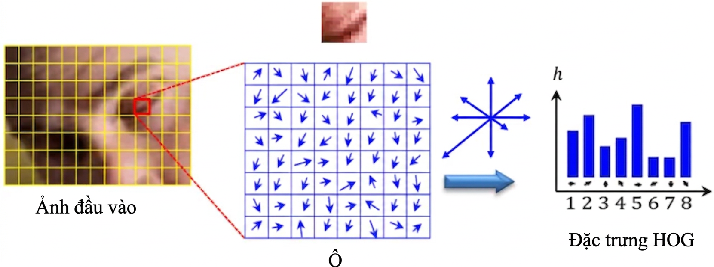

# Tính toán nơ-ron {#sec-neural-computation}

::: {layout-narrow}
::: {.column-margin}

\chapterminitoc

:::

::: {.content-visible when-format="pdf"}
\noindent
{fig-alt="Sơ đồ phối cảnh nhiều lớp về tính toán nơ-ron: đầu vào đi qua các lớp có trọng số, các activation hình thành, và tín hiệu loss quay ngược qua mô hình."}
:::

::: {.content-visible unless-format="pdf"}
{fig-alt="Sơ đồ phối cảnh nhiều lớp về tính toán nơ-ron: đầu vào đi qua các lớp có trọng số, các activation hình thành, và tín hiệu loss quay ngược qua mô hình."}
:::

:::

## Mục đích {.unnumbered .unlisted}

\begin{marginfigure}
\mlsysstack{20}{15}{90}{55}{10}{0}{0}{10}
\end{marginfigure}

_Vì sao hiểu phần toán của một mạng nơ-ron quan trọng hơn đọc mã của nó?_

Mã của mạng nơ-ron trông có vẻ đơn giản vì chỉ vài phép toán tensor đã che đi khối lượng công việc (workload) mà mỗi lớp phải thực hiện. Kích thước ma trận quyết định phép toán số học và luân chuyển dữ liệu; các giá trị trung gian quyết định áp lực bộ nhớ; miền giá trị số và gradient quyết định việc huấn luyện có ổn định hay không. Một phép toán trông rẻ khi đứng riêng lẻ có thể trở thành chi phí chi phối khi lặp trên một batch hoặc khi đầu ra của nó phải giữ lại cho việc huấn luyện, nên độ dài mã nguồn hầu như không phản ánh chi phí tài nguyên. Hai cách triển khai cùng một mô hình có thể chạy rất khác nhau vì hình dạng batch, độ chính xác và máy mục tiêu quyết định cái gì vừa bộ nhớ, chạy nhanh đến mức nào, và các phép tính có còn hợp lệ về mặt số học hay không. Khi huấn luyện bị chững lại hoặc triển khai cạn bộ nhớ, đọc một lệnh gọi framework hiếm khi chỉ ra ràng buộc then chốt. Lỗi số học, nút thắt bộ nhớ và một cách triển khai kém hiệu quả có thể tạo ra những triệu chứng bề mặt giống nhau nhưng đòi hỏi các cách khắc phục khác nhau. Vì vậy, chẩn đoán và lập kế hoạch cần suy luận từ các phép toán nền tảng ra số byte được luân chuyển, các giá trị phải giữ lại, và phần việc bị lặp lại. Cách nhìn này có thể lộ ra một bất khớp trước khi bạn tốn kém cho một lượt huấn luyện hoặc một lần thử triển khai. Các phép toán cơ sở đó tạo nên một vốn từ vựng ổn định xuyên kiến trúc và giúp các lớp trừu tượng phần mềm có thể kiểm chứng, biến mã khó hiểu thành một khối lượng công việc (workload) có thể đo, chẩn đoán và ánh xạ lên phần cứng. Theo thuật ngữ D·A·M, tính toán nơ-ron là giao diện nơi cấu trúc thuật toán trở thành công việc của máy và nơi các giới hạn vật lý phản hồi trở lại thiết kế mô hình.

::: {.content-visible when-format="pdf"}

\newpage

:::

::: {.callout-learning-objectives}

- Giải thích vì sao số học học được đã thay thế logic dựa trên quy tắc trong nhận dạng mẫu đa chiều.
- Tính toán số lượng tham số, số phép nhân-tích lũy, lưu trữ activation và lưu lượng bộ nhớ cho các mạng đa lớp
- So sánh các hàm activation theo độ phi tuyến tính, hành vi gradient và chi phí thực thi trên phần cứng
- Áp dụng hàm mất mát cross-entropy và các cập nhật gradient để phân tích động thái của học có giám sát.
- Suy ra lan truyền thuận và lan truyền ngược dưới dạng các phép toán ma trận trên các batch.
- Phân tích khối lượng công việc (workload) của huấn luyện so với suy luận dưới các ràng buộc về tính toán, bộ nhớ và triển khai.
- Đánh giá một pipeline nhận dạng tài liệu end-to-end, từ tiền xử lý đến các ngưỡng quyết định và bước đánh giá thủ công.

:::

```{python}
#| echo: false
from mlsysim import *
from mlsysim.core.units import *

# ┌─────────────────────────────────────────────────────────────────────────────
# │ DL PRIMER COMMON IMPORTS
# ├─────────────────────────────────────────────────────────────────────────────
# │ Context: Chapter-scoped import cell for all compute cells below.
# │
# │ Goal: Centralize unit imports for the chapter.
# │ Show: A clean shared namespace for subsequent LEGO cells.
# │ How: Wildcard-import mlsysim.constants for units.
# │
# └─────────────────────────────────────────────────────────────────────────────
```

```{python}
#| echo: false
#| label: neural-computation-reference-calcs
# ┌─────────────────────────────────────────────────────────────────────────────
# │ NEURAL COMPUTATION REFERENCE IMPORTS
# ├─────────────────────────────────────────────────────────────────────────────
# │ Context: Shared imports for early-chapter reference LEGO cells below.
# │
# │ Goal: Centralize imports for footnote-local calculations.
# └─────────────────────────────────────────────────────────────────────────────
from mlsysim.physics import memory_from_params
from mlsysim.fmt import fmt_int, fmt, fmt_math, fmt_qty_int, check, MarkdownStr, sci_latex
```

## Từ Logic đến Số học {#sec-neural-computation-deep-learning-systems-engineering-foundation-597f}

Một tập dữ liệu đã hoàn tất các giai đoạn kỹ thuật trước đó sẽ sẵn sàng cho việc phát triển mô hình, nhưng các ví dụ thì không thể tự học. Ranh giới hệ thống tiếp theo là mô hình, nơi dữ liệu được chuyển thành hành vi đã học thông qua các phép nhân ma trận, các hàm activation và các cập nhật gradient. Một mô hình chạy đúng trên máy này nhưng lại lỗi trên máy khác không nhất thiết là do lỗi phần cứng. Kích thước các lớp của mô hình có thể tạo ra các activation trung gian — các đầu ra theo từng lớp mà quá trình huấn luyện giữ lại cho bước lan truyền ngược — vượt quá bộ nhớ khả dụng. Lỗi này phát sinh do sự không tương thích giữa khối lượng công việc (workload) của mô hình và ngân sách tài nguyên của máy.

Cái gọi là 'hợp đồng silicon' nói rằng mọi kiến trúc mô hình đều có một sự đánh đổi về tính toán với phần cứng mà nó chạy trên đó. Ở phía thuật toán, các toán tử của kiến trúc quyết định khối lượng tính toán và trạng thái cần thiết. Sau đó, độ chính xác, cách triển khai, khả năng tái sử dụng dữ liệu, runtime và phần cứng sẽ quyết định lưu lượng bộ nhớ, độ trễ và năng lượng thực tế. Để tuân thủ 'hợp đồng' này, một kỹ sư hệ thống phải hiểu cả các toán tử và cách chúng được ánh xạ lên máy.

```{python}
#| echo: false
from mlsysim.fmt import fmt, fmt_count

# ┌─────────────────────────────────────────────────────────────────────────────
# │ MNIST INFERENCE MAC COUNT—PURPOSE OPENING
# ├─────────────────────────────────────────────────────────────────────────────
# │ Context: Purpose-adjacent prose in @sec-neural-computation-deep-learning-
# │          systems-engineering-foundation-597f introducing the MNIST running
# │          example's arithmetic workload.
# │
# │ Goal: Quantify forward-pass MACs for the canonical 784→128→64→10 MLP.
# │ Show: 109,184 multiply-accumulates per digit—logic-free arithmetic.
# │ How: Sum layer products (784×128 + 128×64 + 64×10).
# │
# └─────────────────────────────────────────────────────────────────────────────

# ┌── LEGO ───────────────────────────────────────────────
class MNISTInference:
    """Namespace for MNIST forward-pass MAC count in the Purpose section."""

    # ┌── 1. LOAD (Constants) ───────────────────────────────────────────────
    input_dim = 28 * 28
    h1_dim = 128
    h2_dim = 64
    out_dim = 10

    # ┌── 2. EXECUTE (The Compute) ─────────────────────────────────────────
    total_macs = input_dim * h1_dim + h1_dim * h2_dim + h2_dim * out_dim

    # ┌── 4. OUTPUT (Formatting) ──────────────────────────────────────────────
    total_macs_str = fmt_count(total_macs, precision=0, label="MAC")
```

Các toán tử được nêu dưới đây không phải lý thuyết trừu tượng mà là đặc tả cho các khối lượng công việc (workload) tính toán. Tính toán nơ-ron chuyển trọng tâm từ các lệnh logic rõ ràng (if-then-else) sang những chuỗi dài các phép biến đổi toán học liên tục (nhân-cộng-tích lũy). Sự chuyển dịch từ *Logic* sang *Số học* này tạo ra các khối lượng công việc tensor dày đặc, mà điểm nghẽn phụ thuộc vào cường độ số học, kích thước batch, mức độ tái sử dụng và “đường bao” hiệu năng phần cứng (hardware roofline: phạm vi hiệu năng do đỉnh năng lực tính toán và băng thông bộ nhớ của chip quyết định). Lỗi trong một hệ như vậy có thể xuất phát từ bất ổn số học, gradient co về 0, hoặc hàm activation ngừng thay đổi theo đầu vào của nó, chứ không phải từ lỗi cú pháp. Cụ thể, nhận dạng một chữ số viết tay đơn lẻ trong mạng MNIST đang chạy cần `{python} MNISTInference.total_macs_str` mà không có nhánh logic nào trong quá trình tính toán của mô hình.

Số học không có nhánh không đồng nghĩa không có rủi ro: một số vượt quá dải biểu diễn của định dạng có thể gây ra exception hoặc âm thầm trở thành giá trị vô hạn (infinite) hay không hợp lệ (invalid), tùy phép toán và runtime. Một ví dụ kinh điển về vấn đề này thậm chí còn nằm ngoài lĩnh vực machine learning.

::: {#ws-nn-computation-ariane-5-overflow .callout-war-story title="Sự cố tràn số trở thành dẫn hướng (1996)"}

**Bối cảnh**: Chuyến bay Ariane 5 Flight 501 của Cơ quan Vũ trụ Châu Âu tái sử dụng phần mềm tham chiếu quán tính từ Ariane 4, trong đó có các phép chuyển đổi số với những giả định chỉ phù hợp với đặc tính bay của phương tiện đời trước [@esa1996ariane501].

**Cơ chế**: Đặc tính bay của Ariane 5 khiến một giá trị dấu phẩy động 64-bit vượt quá dải của số nguyên 16-bit có dấu trong quá trình chuyển đổi, kích hoạt một lỗi toán hạng không được xử lý (unhandled operand error).

**Tác động**: Máy tính điều khiển chuyến bay sập sau 36 giây kể từ khi phóng, khiến tên lửa chệch quỹ đạo, vỡ tan và tự hủy, phá hủy tải trọng vệ tinh trị giá 370 triệu đô la.

**Phản ứng**: Ủy ban điều tra khuyến nghị giới hạn phần mềm ở các chức năng cần thiết trong chuyến bay, rà soát lại các giả định về dải giá trị, và thiết kế cơ chế xử lý exception sao cho một lỗi chuyển đổi đơn lẻ không thể vô hiệu hóa các đơn vị dự phòng [@esa1996ariane501].

**Bài học về hệ thống**: Khoảng giá trị số, cơ chế xử lý ngoại lệ (exception handling) và các giả định khi tái sử dụng là một phần của ràng buộc hệ thống. Một phép tính có thể đúng về cú pháp nhưng vẫn không hợp lệ trong miền vận hành vật lý nơi nó chạy. Hệ thống ML gặp điều này khi khoảng biểu diễn của một định dạng số không khớp với độ lớn giá trị đi qua: chẳng hạn, một phép nhân độ chính xác thấp bị tràn sẽ tạo ra Inf hoặc NaN và các giá trị này âm thầm lan qua phần còn lại của phép tính, khiến các chế độ số học quan trọng với gỡ lỗi chẳng kém luồng điều khiển.

:::

::: {#dfn-nn-computation-deep-learning .callout-definition title="Deep learning"}

***Deep learning***\index{Deep learning!definition} là một mô hình tính toán học các biểu diễn đặc trưng theo lớp\index{Feature learning!hierarchical} từ dữ liệu bằng cách ghép các phép biến đổi phi tuyến. Với các tác vụ phù hợp, những biểu diễn học được này có thể giảm thiết kế đặc trưng thủ công, đồng thời làm tăng khối lượng tính toán $(O)$ và trạng thái.

1.  **Ý nghĩa**: Với các lớp hàm có tính chất tổ hợp phù hợp, độ sâu có thể biểu diễn một hệ phân cấp hiệu quả về tham số hơn nhiều so với mạng nông. Mỗi lớp đều thêm khối lượng công việc và trạng thái, và ràng buộc chi phối có thể nằm ở trục dữ liệu, thuật toán, hoặc máy, tùy theo khối lượng công việc (workload).
2.  **Điểm khác biệt**: Các phương pháp nông\index{Shallow learning!definition} như hồi quy logistic và máy vector hỗ trợ có thể hoạt động tốt với các biểu diễn phù hợp. Thay vào đó, deep learning sử dụng nhiều giai đoạn phi tuyến để học các biểu diễn đồng thời với tác vụ dự đoán, điều này có thể giảm bớt việc thiết kế đặc trưng thủ công và đôi khi hỗ trợ chuyển giao giữa các tác vụ.
3.  **Lỗi thường gặp**: Một quan niệm sai lầm phổ biến là chỉ riêng số lượng tham số đã giải thích được deep learning. Chiều rộng có thể xấp xỉ các lớp hàm rộng, nhưng chiều sâu có thể mã hóa một số hàm tổ hợp hiệu quả hơn nhiều. Kiến trúc, dữ liệu, tối ưu hóa và quy mô cùng nhau quyết định kết quả thực tế.

:::

Phân tích này xem deep learning như một khối lượng công việc (workload) tính toán ở mức vật lý: xem xét các phép toán mà các mạng truyền thẳng trong chương này sử dụng, đánh giá cách chúng ghép lại thành các cấu trúc kiến trúc, và đo lường phần cứng phải đáp ứng gì cho huấn luyện và suy luận trong phân loại D·A·M. Một bộ nhận dạng chữ số viết tay đơn giản giúp cụ thể hóa từng loại chi phí. Bài tổng quan mang tính cột mốc trên *Nature* của LeCun, Bengio và Hinton[^fn-deep-learning-pioneers] [@lecun2015] đã tổng hợp khuôn khổ này.

[^fn-deep-learning-pioneers]: **LeCun, Bengio, và Hinton**\index{LeCun, Yann!Turing Award}\index{Bengio, Yoshua!Turing Award}\index{Hinton, Geoffrey!Turing Award}: Những người nhận Giải thưởng Turing ACM 2018 vì những đột phá về khái niệm và kỹ thuật đã biến các mạng nơ-ron sâu thành một thành phần quan trọng của điện toán. Công trình tập thể của họ đã thúc đẩy học biểu diễn, kiến trúc mạng và các phương pháp huấn luyện làm nền tảng cho deep learning hiện đại.

Machine learning cổ điển thường yêu cầu các chuyên gia thiết kế bộ trích xuất đặc trưng cho mỗi bài toán mới, một quá trình tốn nhiều công sức khi phải mã hóa kiến thức miền vào các biểu diễn làm tay. Deep learning có thể giảm gánh nặng này bằng cách học các biểu diễn từ dữ liệu thông qua các lớp biến đổi phi tuyến tính theo cấu trúc phân cấp. Để thấy mạng nơ-ron nằm ở đâu trong bức tranh rộng hơn, @fig-ai-ml-dl kết hợp hai góc nhìn: một dòng thời gian lịch sử các cột mốc lớn và một phân loại lồng nhau trong đó deep learning là tập con của machine learning, và machine learning lại là tập con của trí tuệ nhân tạo\index{Artificial intelligence!hierarchy with ML and DL}.

::: {#fig-ai-ml-dl fig-env="figure" fig-pos="htb" fig-cap="**Cấu trúc phân cấp và Dòng thời gian AI**: Một dòng thời gian từ những năm 1950 đến những năm 2010 được đặt cùng với mối quan hệ phân loại hiện tại giữa trí tuệ nhân tạo, machine learning và deep learning. Các dải lồng vào nhau thể hiện phạm vi, chứ không phải các giai đoạn lịch sử riêng biệt: deep learning nằm trong machine learning, và machine learning lại nằm trong trí tuệ nhân tạo. Các cột mốc được ghi từ Hội thảo Dartmouth năm 1956 cho đến transformer năm 2017." fig-alt="Một trục thời gian nằm ngang kéo dài từ những năm 1950 đến những năm 2010, với các cột mốc được ghi theo năm như Hội thảo Dartmouth 1956, lan truyền ngược 1986, AlexNet 2012 và transformer 2017. Ba hình chữ nhật bo tròn lồng vào nhau được đặt chồng lên dòng thời gian: trí tuệ nhân tạo là dải ngoài cùng, machine learning nằm bên trong, và deep learning là dải trong cùng."}
```{.tikz}
\begin{tikzpicture}[x=3.5mm,y=10mm,line cap=round,line join=round,font=\small\sffamily]
 \tikzset{
  Box/.style={draw=none,minimum width=30mm, minimum height=18mm, anchor=south},
  Arr/.style={-{Triangle[width=10pt,length=8pt]}, line width=5pt,cyan!40,shorten >=1pt, shorten <=2pt},
  Box2/.style={align=flush center, inner xsep=2pt,draw=none,
  font=\footnotesize\sffamily\bfseries, line width=0.75pt, fill=OrangeL!30, text width=38mm,
    minimum width=44mm, minimum height=7mm},
  Box3/.style = {Box2,draw=none,fill=cyan!10},
  Box4/.style = {Box2,draw=none,fill=GreenFill!60},
  LineA/.style = {violet!60,{Circle[line width=1.0pt,fill=white,length=5.5pt]}-,line width=1.5pt,shorten <=-3pt},
  Arr/.style={-{Triangle[width=5pt,length=10pt]}, line width=1.5pt,black},
  Txt1/.style = {font=\small\sffamily\itshape,black!80,align=left},
  Txt/.style = {font=\small\sffamily,black!80,align=center},
  Txt2/.style = {font=\footnotesize\sffamily,black!80,align=center}
}

%machine learning
\tikzset{
pics/machineL/.style = {
        code = {
        \pgfkeys{/channel/.cd, #1}
\begin{scope}[shift={($(0,0)+(0,0)$)},scale=\scalefac,every node/.append style={transform shape}, line cap=round,
    line join=round,x=11mm,y=11mm]
  % left data cards
  \draw[draw=\drawcolor,line width=\Linewidth, rounded corners=1pt] (0,0.55) rectangle (0.52,0.95);
  \draw[draw=\drawcolor,line width=\Linewidth] (0.08,0.87) -- (0.26,0.72) -- (0.44,0.87);

  \draw[draw=\drawcolor,line width=\Linewidth, rounded corners=1pt] (0,0.05) rectangle (0.52,0.45);
  \draw[draw=\drawcolor,line width=\Linewidth] (0.08,0.37) -- (0.26,0.22) -- (0.44,0.37);
  % arrows
  \draw[draw=\drawcolor,line width=\Linewidth,-{Latex[length=2mm]}] (0.62,0.75) -- (1.02,0.75);
  \draw[draw=\drawcolor,line width=\Linewidth,-{Latex[length=2mm]}] (0.62,0.25) -- (1.02,0.25);

  % model/filter
  \draw[draw=\drawcircle,line width=\Linewidth, rounded corners=1pt] (1.08,0.48) rectangle (1.42,0.98);
  \draw[draw=\drawcircle,line width=\Linewidth] (1.15,0.88) -- (1.35,0.88);
  \draw[draw=\drawcircle,line width=\Linewidth] (1.18,0.78) -- (1.32,0.78);
  \draw[draw=\drawcircle,line width=\Linewidth] (1.21,0.68) -- (1.29,0.68);

  % output arrow
  \draw[draw=\drawcolor,line width=\Linewidth,-{Latex[length=2mm]}] (0.62,0.25) -- (1.62,0.25);
%
\end{scope}
    }
  }
}

\tikzset{mycylinder/.style={cylinder, shape border rotate=90, aspect=1.3, draw, fill=white,
minimum width=25mm,minimum height=11mm,line width=\Linewidth,node distance=-0.15},
pics/dataP/.style = {
        code = {
        \pgfkeys{/channel/.cd, #1}
\begin{scope}[local bounding box=STREAMING,scale=\scalefac, every node/.append style={transform shape},
x=10mm,y=10mm]
\node[mycylinder,fill=\filllcolor!50] (A) {};
\node[mycylinder, above=of A,fill=\filllcolor!50] (B) {};
\node[mycylinder, above=of B,fill=\filllcolor!10] (C) {};
\fill[\filllcolor!50!black]($(C.west)!0.12!(C.east)$)circle(3pt);
\fill[\filllcolor!50!black]($(B.west)!0.12!(B.east)$)circle(3pt);
\fill[\filllcolor!50!black]($(A.west)!0.12!(A.east)$)circle(3pt);
%
\draw[draw=\drawcolor,line width=2.5*\Linewidth](B.east)--++(17mm,0);
\node[draw=\drawcolor,line width=\Linewidth,minimum width=9mm,fill=white,minimum height=22mm](BD)at($(B.east)+(8mm,0)$){};
\node[draw=\drawcolor,line width=\Linewidth,minimum width=5mm,minimum height=8mm,fill=white](BDM)at($(BD.east)+(5mm,0)$){};
\node[circle,draw=orange,line width=\Linewidth,minimum size=5mm]at($(BD.north)!0.2!(BD.south)$){};
\node[rectangle,draw=blue,line width=\Linewidth,minimum size=5mm]at($(BD.north)!0.5!(BD.south)$){};
\node[circle,draw=green,line width=\Linewidth,minimum size=5mm]at($(BD.north)!0.8!(BD.south)$){};
% magnifier
  \draw[line width=4*\Linewidth,Brown] (0.1,0.4)--++ (310:1.2);
  \draw[line width=\Linewidth,fill=yellow!30] (0.1,0.4) circle (0.45);
 \draw[line width=1.5*\Linewidth] (-0.15,0.4) -- (0.35,0.4);
\end{scope}
     }
  }
}
\tikzset{
pics/gamme/.style = {
        code = {
        \pgfkeys{/channel/.cd, #1}
\begin{scope}[shift={($(0,0)+(0,0)$)},scale=\scalefac,every node/.append style={transform shape}, line cap=round,
    line join=round,x=15mm,y=13mm]
  % board
  \draw[draw=\drawcolor,line width=\Linewidth,fill=black!05] (0,0.6) -- (0.9,1.1) -- (1.8,0.6) -- (0.9,0.1) -- cycle;
  \draw[draw=\drawcolor,line width=\Linewidth] (0.45,0.35) -- (1.35,0.85);
  \draw[draw=\drawcolor,line width=\Linewidth] (0.45,0.85) -- (1.35,0.35);
 \coordinate(XC1)at($(0.45,0.35)!0.5!(0.45,0.85)$);
\coordinate(XC2)at($(0.45,0.35)!0.5!(1.35,0.35)$);
\coordinate(XC3)at($(1.35,0.35)!0.5!(1.35,0.85)$);
\coordinate(XX1)at($(0.9,1.1)!0.28!(0.9,0.6)$);
\coordinate(XX2)at($(0.9,1.1)!0.72!(0.9,0.6)$);
\coordinate(YY1)at($(0.45,0.85)!0.28!(1.35,0.85)$);
\coordinate(YY2)at($(0.45,0.85)!0.72!(1.35,0.85)$);
  % pieces
  \draw[draw=black,line width=1.25*\Linewidth, fill=mygreen!50,rotate=80] (XC1) ellipse(1.2mm and 1.95mm);
  \draw[draw=red!70!black,line width=1.25*\Linewidth, fill=white,rotate=80] (XC2) ellipse(1.2mm and 1.95mm);
  \draw[draw=black,line width=1.25*\Linewidth, fill=mygreen!50,rotate=80] (XC3) ellipse(1.2mm and 1.95mm);
  \draw[draw=red!70!black,line width=2.25*\Linewidth] (XX1)--(XX2);
    \draw[draw=red!70!black,line width=2.25*\Linewidth] (YY1)--(YY2);
%  \fill[red](YY1) circle(1pt);
\end{scope}
    }
  }
}
\pgfkeys{
  /channel/.cd,
   Dual/.store in=\Dual,
   Depth/.store in=\Depth,
  Height/.store in=\Height,
  Width/.store in=\Width,
  Smile/.store in=\Smile,
  Level/.store in=\Level,
  filllcirclecolor/.store in=\filllcirclecolor,
  filllcolor/.store in=\filllcolor,
  drawcolor/.store in=\drawcolor,
  drawcircle/.store in=\drawcircle,
  scalefac/.store in=\scalefac,
  Linewidth/.store in=\Linewidth,
  picname/.store in=\picname,
  filllcolor=BrownLine,
  filllcirclecolor=cyan,
  drawcolor=black,
  drawcircle=violet,
  scalefac=1,
  Dual=adual,
  Smile=smile,
  Level=0.52,
  Linewidth=0.5pt,
  Depth=1.3,
  Height=0.8,
  Width=1.1,
  picname=C
}

\newcommand{\yearx}[1]{{#1-1950}}

\draw[Arr] ({\yearx{1947}},0) coordinate(PO)-- coordinate(CEN)({\yearx{2022}},0)coordinate(KR);
\coordinate(KR1)at($(KR)+(0,5mm)$);

\foreach \Y in {1950,1960,1970,1980,1990,2000,2010} {
  \draw[thick] ({\yearx{\Y}},-0.1) -- ({\yearx{\Y}},0.1);
  \node[below=3pt] at ({\yearx{\Y}},0) {\Y s};
}
%1956
\draw[red,thick,dashed] ({\yearx{1956}},0) -- ++(0,2)
node[above,Txt]{1956\\ Dartmouth\\ Workshop};
\fill[red] ({\yearx{1956}},0) circle (3pt);
%1969
\draw[red,thick,dashed] ({\yearx{1969}},0) -- ++(0,1.5)
node[above,Txt]{1969\\ Perceptron\\ Limitations};
\fill[red] ({\yearx{1969}},0) circle (3pt);
%1986
\draw[myblue,thick,dashed] ({\yearx{1986}},0) -- ++(0,3)
node[above,Txt]{1986\\ Backprop\\ (Rumelhart)};
\fill[myblue] ({\yearx{1986}},0) circle (3pt);
%1997
\draw[myblue,thick,dashed] ({\yearx{1997}},0) -- ++(0,2.25)
node[above,Txt]{1997\\ LSTM};
\fill[myblue] ({\yearx{1997}},0) circle (3pt);
%2001
\draw[myblue,thick,dashed] ({\yearx{2001}},0) -- ++(0,1.5)
node[above,Txt]{2001\\ SVMs \\ Ensembles};
\fill[myblue] ({\yearx{2001}},0) circle (3pt);
%2012
\draw[mygreen,thick,dashed] ({\yearx{2012}},0) -- ++(0,2.0)
node[above,Txt]{2012\\ AlexNet\\ ImageNet};
\fill[mygreen] ({\yearx{2012}},0) circle (3pt);
%2017
\draw[mygreen,thick,dashed] ({\yearx{2017}},0) -- ++(0,1.45)
node[above,Txt]{2017\\Transformer};
\fill[mygreen] ({\yearx{2017}},0) circle (3pt);
%
\begin{scope}[on background layer]
%\draw[magenta,thick,rounded corners=10,fill=magenta!05](KR1)rectangle (PO2);
%
\node[draw=magenta,thick,rounded corners=10,anchor=south east,fill=magenta!07,
minimum width=262mm,minimum height =95mm](RED)at(KR1){};
%
\node[draw=myblue,thick,rounded corners=10,anchor=south east,fill=myblue!07,
minimum width=140mm,minimum height =85mm](BLU)at(KR1){};
%
\node[draw=mygreen,thick,rounded corners=10,anchor=south east,fill=mygreen!05,
minimum width=60mm,minimum height =75mm](GRE)at(KR1){};
\end{scope}
\node[anchor=north west,text=myred,font=\Large\sffamily\bfseries](CT1)
at($(RED.north west)+(2mm,-3mm)$){Artificial Intelligence};
\node[Txt1,below=-2pt of CT1.south west,anchor=north west]{Symbolic reasoning \& expert systems};
\coordinate(RL)at($(RED.west)!0.22!(RED.east)$);
\node[Box](BS1)at(RL){};
\pic[shift={(-5.15,-1.0)}] at  (BS1){gamme={scalefac=1.3,filllcirclecolor=violet!20,filllcolor=BlueLine, Linewidth=1pt}};
\node[Txt2,below=0pt of BS1]{Game playing\\ \& expert systems};
%
\node[anchor=north west,text=myblue,font=\Large\sffamily\bfseries](CT2)
at($(BLU.north west)+(2mm,-3mm)$){Machine Learning};
\node[Txt1,below=-2pt of CT2.south west,anchor=north west]{Statistical learning from data};
\coordinate(BL)at($(BLU.178)!0.33!(BLU.2)$);
\node[Box](BS2)at(BL){};
\pic[shift={(-2.5,-0.8)}] at  (BS2){machineL={scalefac=1.4,picname=1,drawcolor=blue!70!,
drawcircle=red,filllcolor=BlueLine!90!,Linewidth=1pt, filllcirclecolor=blue!80!}};
\node[Txt2,below=-4pt of BS2]{Spam filtering\\ \& classification};
%
\node[anchor=north west,text=mygreen,font=\Large\sffamily\bfseries](CT3)
at($(GRE.north west)+(2mm,-3mm)$){Deep Learning};
\node[Txt1,below=-2pt of CT3.south west,anchor=north west]{Neural networks at scale};
\coordinate(GL)at($(GRE.182)!0.65!(GRE.358)$);
\node[Box](BS3)at(GL){};
\begin{scope}[scale=0.75, every node/.append style={transform shape}]
\pic[shift={(-1.1,-0.55)}] at  (BS3){dataP={scalefac=0.5,filllcirclecolor=violet!20,filllcolor=BlueLine, Linewidth=0.7pt}};
\node[Txt2,below=-3pt of BS3]{Image recognition\\ \& generation};
%
\node[anchor= south east, above left=0.4 and 1 of BLU.south west,rounded corners,
fill=magenta!20,opacity=0.6]{AI Winter I};
\node[anchor= south west, above right=0.4 and 6 of BLU.south west,rounded corners,
fill=cyan!20,opacity=0.6]{AI Winter II};
%
\node[Txt,anchor=north]at($(CEN)+(0,-9mm)$){Each successive wave (from symbolic AI to statistical ML to deep learning)\\
narrowed its focus while dramatically expanding practical capability.};
\end{scope}
\end{tikzpicture}
```
:::

Sự chuyển dịch này kéo theo những bài toán kỹ thuật mà cách gỡ lỗi phần mềm truyền thống không xử lý được. Lỗi trong deep learning có thể bộc lộ bằng những dấu hiệu khó nhận ra: mất ổn định gradient\index{Gradient instabilities!training failure mode}[^fn-gradient-instabilities-depth] khiến việc huấn luyện không tiến triển, lỗi độ chính xác số làm sai lệch trọng số của mô hình sau nhiều vòng lặp, hoặc kiểu truy cập bộ nhớ kém hiệu quả trong các phép toán tensor[^fn-tensor-multidimensional-array] khiến các đơn vị tính toán của bộ tăng tốc không được tận dụng hết. Đây là những vấn đề ở cấp hệ thống, đòi hỏi hiểu rõ cơ chế toán học bên dưới, chứ không chỉ đơn giản là lần theo từng dòng mã.

```{python}
#| echo: false
#| label: early-systems-claims
# ┌─────────────────────────────────────────────────────────────────────────────
# │ EARLY SYSTEMS CLAIMS—GRADIENT INSTABILITIES FOOTNOTE
# ├─────────────────────────────────────────────────────────────────────────────
# │ Context: Footnote [^fn-gradient-instabilities-depth] in the Purpose section.
# │
# │ Goal: Quantify vanishing gradients after 20 sigmoid layers.
# └─────────────────────────────────────────────────────────────────────────────

# ┌── LEGO ───────────────────────────────────────────────
class EarlySystemsClaims:
    """Namespace for early-chapter gradient-instability footnote."""

    # ┌── 1. LOAD (Constants) ──────────────────────────────────────────────
    sigmoid_depth = 20
    sigmoid_peak_derivative = 0.25

    # ┌── 2. EXECUTE (The Compute) ────────────────────────────────────────
    gradient_scale = sigmoid_peak_derivative**sigmoid_depth

    # ┌── 3. GUARD (Invariants) ───────────────────────────────────────────
    check(gradient_scale < 1e-12, f"20 sigmoid layers should nearly zero gradients; got {gradient_scale:.2e}")

    # ┌── 4. OUTPUT (Formatting) ──────────────────────────────────────────
    sigmoid_depth_str = fmt(sigmoid_depth, precision=0, commas=False)
    gradient_scale_math = fmt_math(sci_latex(gradient_scale, precision=1))
```

[^fn-gradient-instabilities-depth]: **Mất ổn định gradient**\index{Gradient instabilities!training failure}: Trong một đường truyền sigmoid gồm `{python} EarlySystemsClaims.sigmoid_depth_str` lớp được đơn giản hóa, chỉ riêng các thừa số là đạo hàm của activation đã không vượt quá $0.25^{20}$, hay `{python} EarlySystemsClaims.gradient_scale_math`. Gradient đầy đủ còn bao gồm trọng số và các phép toán khác, nhưng việc lặp lại các đạo hàm bị bão hòa vẫn có thể khiến các cập nhật ở các lớp đầu trở nên không đáng kể. Các đoạn phẳng (plateaus) hoặc giá trị NaN có thể bộc lộ triệu chứng mà không chỉ ra nguyên nhân; activation ReLU (rectified linear unit), khởi tạo cẩn thận, chuẩn hóa, các phương pháp tối ưu hóa, và các kết nối dư đều đã giúp các mạng sâu có thể huấn luyện được, và @sec-network-architectures-evolution-dense-spatial-processing-2761 trình bày chi tiết về các kết nối dư.

```{python}
#| echo: false
#| label: tensor-layout-cost
# ┌─────────────────────────────────────────────────────────────────────────────
# │ TENSOR LAYOUT COST—NCHW/NHWC FOOTNOTE
# ├─────────────────────────────────────────────────────────────────────────────
# │ Context: Footnote [^fn-tensor-multidimensional-array] in the Purpose section.
# │
# │ Goal: Size per-image transpose cost for ImageNet tensors.
# └─────────────────────────────────────────────────────────────────────────────

# ┌── LEGO ───────────────────────────────────────────────
class TensorLayoutCost:
    """Namespace for tensor layout transpose cost footnote."""

    # ┌── 1. LOAD (Constants) ──────────────────────────────────────────────
    IMAGE_DIM_RESNET = Datasets.ImageNet.image_width
    image_height = IMAGE_DIM_RESNET
    image_width = IMAGE_DIM_RESNET
    channels = IMAGE_CHANNELS_RGB
    bytes_per_channel = BYTES_INT8.to(byte).magnitude

    # ┌── 2. EXECUTE (The Compute) ────────────────────────────────────────
    tensor_bytes = image_height * image_width * channels * bytes_per_channel
    tensor = tensor_bytes * byte
    tensor_read_write = tensor * 2
    tensor_kb = tensor.to(KB).magnitude
    tensor_read_write_kb = tensor_read_write.to(KB).magnitude

    # ┌── 3. GUARD (Invariants) ───────────────────────────────────────────
    check(tensor_kb > 100, f"ImageNet tensor should exceed 100 KB; got {tensor_kb:.1f} KB")

    # ┌── 4. OUTPUT (Formatting) ──────────────────────────────────────────
    image_shape_str = MarkdownStr(f"{image_height}×{image_width}×{channels}")
    tensor_kb_str = fmt_qty_int(tensor, KB, commas=False)
    tensor_read_write_kb_str = fmt_qty_int(tensor_read_write, KB, commas=False)
```

[^fn-tensor-multidimensional-array]: **Các phép toán tensor**\index{Tensor!mảng n chiều}\index{Tensor!bố cục bộ nhớ}: Các chiều logic của một tensor được ánh xạ xuống một bố cục vật lý phẳng, và một kernel có thể ưa thích một thứ tự khác. Nếu đổi một đầu vào ImageNet điển hình (`{python} TensorLayoutCost.image_shape_str`, khoảng `{python} TensorLayoutCost.tensor_kb_str`) từ kênh-đứng-trước sang kênh-đứng-sau mà phải sắp xếp lại dữ liệu thực trên bộ nhớ, thì sẽ phát sinh khoảng `{python} TensorLayoutCost.tensor_read_write_kb_str` lưu lượng đọc và ghi cho mỗi ảnh mà không làm thay đổi kết quả toán học của mô hình. Một số runtime tránh việc sao chép thông qua các *view*, *fusion*, hoặc một kernel tương thích. Khi không tránh được việc sắp xếp lại, nó có thể ngốn một phần ngân sách suy luận vốn rất chặt trước khi các phép tính chính của mô hình bắt đầu.

Chẩn đoán và xử lý các lệch về bố cục như vậy đòi hỏi hiểu rõ cách những lựa chọn toán học chuyển trực tiếp thành khối lượng công việc (workload) tính toán. Nhu cầu cấu trúc của mô hình phụ thuộc vào cách hệ thống biểu diễn các mẫu—bằng các quy tắc tường minh, các đặc trưng được thiết kế, hay các biểu diễn học từ đầu đến cuối. Một chữ số MNIST cụ thể làm rõ sự chuyển đổi đó khi nó đi qua ba cách tiếp cận tính toán, và mỗi bước lại định hình lại phần việc của hệ thống.

## Tính toán với các mẫu {#sec-neural-computation-evolution-ml-paradigms-ec9c}

Sự chuyển từ logic sang số học làm thay đổi cách máy tính mã hóa các mẫu trong thế giới thực. Phân tích này theo dõi một tác vụ xuyên suốt cả ba cách tiếp cận: phân loại một chữ số viết tay từ ảnh $28{\times}28$ pixel của tập dữ liệu MNIST (cùng đầu vào được dùng trong suốt chương này). Bức tranh tính toán thay đổi khi các chiến lược biểu diễn tiến hóa.

### Từ logic tường minh đến các mẫu học được {#sec-neural-computation-traditional-rulebased-programming-limitations-6e82}

Lập trình dựa trên quy tắc\index{Lập trình dựa trên quy tắc!hạn chế} yêu cầu các nhà phát triển chỉ rõ các thủ tục để ánh xạ đầu vào thành đầu ra. Hãy xem một trò chơi đơn giản như Breakout.[^fn-breakout-dqn-atari] Trình mô phỏng của nó sử dụng các quy tắc va chạm tường minh: khi quả bóng chạm vào một viên gạch, mã sẽ loại bỏ viên gạch và đảo ngược hướng bóng (@fig-breakout). Những quy tắc tổng quát như vậy hoạt động tốt cho vật lý trò chơi được định nghĩa rõ ràng, nhưng việc tự tay xây dựng một chính sách nhận dạng cho mọi biến thể trong dữ liệu thực tế lộn xộn, không có cấu trúc thì không thể mở rộng.

::: {#fig-breakout fig-env="figure" fig-pos="htb" fig-cap="**Các quy tắc va chạm trong Breakout**: Chương trình game này dùng các quy tắc *if-then* rõ ràng để phát hiện va chạm, quy định việc đảo ngược hướng bóng và loại bỏ gạch khi va chạm. Mặc dù hiệu quả cho một game có vật lý rõ ràng và trạng thái giới hạn, cách tiếp cận này cho thấy các hệ thống dựa trên quy tắc cần phải dự đoán mọi kịch bản có thể xảy ra." fig-alt="Lưới game Breakout có ba hàng năm viên gạch màu ở phía trên, một thanh đỡ màu nâu ở phía dưới và một quả bóng với mũi tên chỉ quỹ đạo nét đứt. Một đoạn mã kiểm tra va chạm giữa bóng và gạch, sau đó loại bỏ viên gạch, điều chỉnh vận tốc ngang và đảo ngược vận tốc dọc."}

```{.tikz}
\scalebox{0.8}{%
\begin{tikzpicture}[line join=round,font=\small\sffamily]
\definecolor{BlueGreen}{RGB}{20,188,188}
\definecolor{Cerulean}{RGB}{0,173,231}
\definecolor{Dandelion}{RGB}{255,185,76}
\definecolor{Goldenrod}{RGB}{255,219,87}
\definecolor{Lavender}{RGB}{253,160,204}
\definecolor{LimeGreen}{RGB}{136,201,70}
\definecolor{Maroon}{RGB}{186,49,50}
\definecolor{OrangeRed}{RGB}{255,46,88}
\definecolor{Peach}{RGB}{255,147,88}
\definecolor{Thistle}{RGB}{222,132,191}

\def\columns{5}
\def\rows{3}
\def\cellsize{25mm}
\def\cellheight{7mm}
\def\rowone{Peach,BlueGreen,OrangeRed,Thistle,Dandelion}
\def\rowtwo{brown!50,lime,teal,pink,lightgray}
\def\rowthree{Lavender,Goldenrod,Cerulean,Maroon,LimeGreen}
%
\foreach \x in {1,...,\columns}{
    \foreach \y in {1,...,\rows}{
        %
        \node[draw=black, fill=GreenFill, minimum width=\cellsize,
                    minimum height=\cellheight, line width=0.25pt] (cell-\x-\y) at (\x*\cellsize,-\y*\cellheight) {};
    }
}
\foreach \color [count=\x] in \rowone {
    \node[fill=\color,draw=black,line width=0.25pt, minimum size=\cellsize,
    minimum height=\cellheight] at (cell-\x-1) {};
}
%
\foreach \color [count=\x] in \rowtwo {
    \node[fill=\color,draw=black,line width=0.25pt, minimum size=\cellsize,
               minimum height=\cellheight] at (cell-\x-2) {};
}
%
\foreach \color [count=\x] in \rowthree {
    \node[fill=\color,draw=black,line width=0.25pt, minimum size=\cellsize,
               minimum height=\cellheight] at (cell-\x-3) {};
}
\begin{scope}[shift={($(cell-4-3)+(0,-1.7)$)}]
\node[align=left,font=\small\ttfamily]at(0,0){if (ball.collide(brick)) \{ \\
\qquad    removeBrick();\\
\qquad    ball.dx = 1.1 * (ball.dx);\\
\qquad    ball.dy = -1 * (ball.dy);\\
\}};
\end{scope}
\node[draw,rectangle,minimum width=40mm,minimum height=4mm,fill=Sepia!50!black!]
at($(cell-3-3.south west)+(0,-2.8)$)(R){};

\node[draw,circle,minimum size=5mm,fill=Sepia!50!black!,anchor=north]
at($(cell-1-3.south west)!0.8!(cell-1-3.south east)$)(C){};
\draw[thick,-latex,dash pattern={on 5pt off 2pt on 1pt off 3pt}](R)--(C)--++(225:2);
\end{tikzpicture}}
```

:::

Luồng dữ liệu trong @fig-traditional làm rõ mối quan hệ của lập trình truyền thống: một chương trình áp dụng các thủ tục định sẵn lên dữ liệu đầu vào để tạo ra đầu ra. Nghiên cứu trí tuệ nhân tạo thời kỳ đầu từng xem liệu các quy tắc ký hiệu do con người viết tay có thể mở rộng để xử lý các tác vụ suy luận và nhận dạng phức tạp hay không.

::: {#fig-traditional fig-env="figure" fig-pos="htb" fig-cap="**Luồng lập trình truyền thống**: Các quy tắc và dữ liệu là đầu vào cho một chương trình truyền thống, chương trình này tạo ra câu trả lời làm đầu ra. Kiểu vào-ra này là nền tảng cho các hệ thống AI thời kỳ đầu, nhưng không đủ linh hoạt cho các bài toán nhận dạng mẫu phức tạp." fig-alt="Sơ đồ luồng với ba hộp: các quy tắc và dữ liệu là đầu vào, đi vào hộp lập trình truyền thống ở giữa, rồi hộp này xuất ra các câu trả lời. Các mũi tên cho thấy hướng dữ liệu đi từ đầu vào tới đầu ra."}

```{.tikz}
\resizebox{.65\textwidth}{!}{
\begin{tikzpicture}[font=\small\sffamily]
%
\tikzset{%
Line/.style={line width=1.0pt,black!50,text=black},
  Box/.style={inner xsep=2pt,
    node distance=1,
    draw=GreenLine, line width=0.75pt,
    fill=GreenL,
    text width=22mm,align=flush center,
    minimum width=22mm, minimum height=8mm
  },
  Box1/.style={Box, draw=RedLine, fill=RedL,
    text width=36mm, minimum width=40mm
  },
}
%
 \node[Box1](B1){Traditional Programming};
 \node[Box,right=of B1](B2){Answers};
 \node[Box,above left=0.2 and 1 of B1](B3){Rules};
 \node[Box, below left=0.2 and 1 of B1](B4){Data};
 \draw[-latex,Line](B1)--(B2);
 \draw[-latex,Line](B3)-|(B1);
 \draw[-latex,Line](B4)-|(B1);
\end{tikzpicture}}
```

:::

Dù nhìn có vẻ đơn giản, các hệ thống dựa trên quy tắc bộc lộ hạn chế rất nhanh khi gặp các tác vụ phức tạp ngoài đời thực. Nhận dạng hoạt động của con người là một ví dụ điển hình cho thách thức này. Phân loại chuyển động dưới 4 km/h là đi bộ tưởng như đơn giản, cho đến khi sự phức tạp của thế giới thực xuất hiện. Các biến thiên về tốc độ, chuyển đổi giữa các hoạt động và những trường hợp không lường trước đều đòi hỏi phải bổ sung thêm quy tắc, như các đoạn mã kế tiếp trong @fig-activity-rules cho thấy. Các bài toán thị giác máy tính còn làm những khó khăn này trầm trọng hơn. Để phát hiện mèo, cần có các quy tắc về tai, ria mép và hình dạng cơ thể, đồng thời phải tính đến góc nhìn, ánh sáng, vật cản và các biến thiên tự nhiên. Các hệ thống thời kỳ đầu chỉ thành công trong những môi trường được kiểm soát với các ràng buộc được xác định rõ ràng.

::: {#fig-activity-rules fig-env="figure" fig-pos="htb" fig-cap="**Các quy tắc phân loại hoạt động**: Các đoạn mã kế tiếp phân loại đi bộ dưới 4 km/h, rồi bổ sung chạy dưới 12 km/h và đạp xe ở tốc độ cao hơn. Một hoạt động cuối cùng chưa được xử lý cho thấy các tình huống ngoài đời thực buộc logic phân nhánh phải ngày càng phức tạp." fig-alt="Bốn ví dụ hoạt động được minh họa, kèm theo mã bên dưới: hoạt động đi bộ dùng phép kiểm tra tốc độ dưới 4 km/h; hoạt động chạy bổ sung thêm một nhánh `else`; hoạt động đạp xe có thêm một nhánh kiểm tra tốc độ dưới 12 km/h; và một hoạt động cuối cùng, giống chơi golf, được đánh dấu bằng các dấu hỏi."}


:::

[^fn-breakout-dqn-atari]: **Breakout (DQN - deep Q-network)**\index{DQN!suy luận thời gian thực}: Trò chơi arcade Breakout năm 1976 của Atari đã trở thành một cột mốc trong AI khi DQN của DeepMind học được một chính sách chơi từ các pixel (năm 2015) mà không cần một chính sách được viết thủ công cho từng tình huống. Môi trường, không gian hành động, phần thưởng và tiền xử lý vẫn được lập trình. DQN đưa khung hình về kích thước $84{\times}84$, xếp chồng 4 khung hình làm đầu vào, và cứ mỗi 4 khung hình lại chọn một hành động mới, minh họa rằng điều khiển học được vẫn phụ thuộc vào một vòng lặp suy luận thời gian thực do con người thiết kế.

Nhận ra những hạn chế đó, cách tiếp cận kỹ thuật tri thức, vốn đặc trưng cho nghiên cứu AI trong thập niên 1970–1980, tìm cách hệ thống hóa việc tạo luật. Các hệ thống chuyên gia\index{Hệ thống chuyên gia!kỹ thuật tri thức}[^fn-expert-systems-brittleness] mã hóa kiến thức lĩnh vực thành các quy tắc tường minh. Chúng cho thấy nhiều triển vọng trong các miền cụ thể với các tham số được xác định rõ ràng, nhưng lại chật vật với những tác vụ con người làm tự nhiên như nhận dạng đối tượng, hiểu lời nói và diễn giải ngôn ngữ tự nhiên. Những thất bại này làm nổi bật một thách thức sâu sắc hơn: nhiều khía cạnh của hành vi thông minh dựa vào kiến thức ngầm, khó thể hiện bằng các quy tắc tường minh.

```{python}
#| echo: false
#| label: paradigm-systems-cost
# ┌─────────────────────────────────────────────────────────────────────────────
# │ PARADIGM SYSTEMS COST—RUNNING MNIST EXAMPLE
# ├─────────────────────────────────────────────────────────────────────────────
# │ Context: Rule-based, HOG, and deep-learning cost prose in
# │          @sec-neural-computation-evolution-ml-paradigms-ec9c.
# │
# │ Goal: Establish operation and memory counts for each paradigm on one digit.
# └─────────────────────────────────────────────────────────────────────────────
from mlsysim.fmt import fmt_int, fmt, fmt_count, fmt_memory, fmt_qty, fmt_qty_int, check

_MNIST_DIMS = [784, 128, 64, 10]

# ┌── LEGO ───────────────────────────────────────────────
class ParadigmSystemsCost:
    """Namespace for paradigm cost escalation on one MNIST digit."""

    # ┌── 1. LOAD (Constants) ──────────────────────────────────────────────
    rb_pixels = Datasets.MNIST.image_width * Datasets.MNIST.image_height
    rb_ops = 100
    rb_mem_bytes = rb_pixels
    hog_grid_dim = 7
    hog_cells = hog_grid_dim * hog_grid_dim
    hog_bins = 9
    hog_ops_approx = 8 * THOUSAND
    hog_mem_kb = 2
    mnist_dims = _MNIST_DIMS
    training_examples = Datasets.MNIST.training_examples.to(count).magnitude

    # ┌── 2. EXECUTE (The Compute) ────────────────────────────────────────
    dl_total_macs = _MNIST_DIMS[0] * _MNIST_DIMS[1] + _MNIST_DIMS[1] * _MNIST_DIMS[2] + _MNIST_DIMS[2] * _MNIST_DIMS[3]
    dl_params_with_bias = sum(_MNIST_DIMS[i] * _MNIST_DIMS[i + 1] + _MNIST_DIMS[i + 1] for i in range(len(_MNIST_DIMS) - 1))
    hog_features = hog_cells * hog_bins
    hog_ops_ratio = hog_ops_approx / rb_ops
    rb_mem = rb_mem_bytes * byte
    hog_mem = hog_mem_kb * KB
    dl_weight = dl_params_with_bias * BYTES_FP32
    dl_weight_kb = dl_weight.to(KB).magnitude
    dl_ops_ratio = dl_total_macs / rb_ops

    # ┌── 3. GUARD (Invariants) ───────────────────────────────────────────
    check(dl_total_macs == 109_184, f"Expected 109,184 MNIST MACs, got {dl_total_macs}")
    check(hog_ops_ratio == 80, f"Expected HOG/rule-based ops ratio of 80x, got {hog_ops_ratio:.1f}x")
    check(round(dl_ops_ratio) == 1092, f"Expected ~1,092x ops ratio, got {dl_ops_ratio:.1f}x")
    check(round(dl_weight_kb) == 438, f"Expected ~438 KB FP32 weight footprint, got {dl_weight_kb:.1f} KB")

    # ┌── 4. OUTPUT (Formatting) ─────────────────────────────────────────────
    rb_comparisons_str = fmt_count(rb_ops, precision=0, commas=False, label="comparison")
    rb_mem_bytes_str = fmt_memory(rb_mem, unit=byte, precision=0, commas=True)
    hog_grid_str = fmt_int(hog_grid_dim, commas=False)
    hog_bins_str = fmt(hog_bins, precision=0, commas=False)
    hog_features_str = fmt(hog_features, precision=0, commas=True)
    hog_ops_approx_str = fmt_count(hog_ops_approx, precision=0, commas=True, label="operation")
    hog_ops_ratio_mult_str = fmt_multiple(hog_ops_ratio, precision=0, commas=False)
    hog_mem_kb_str = fmt_qty(hog_mem, KB, precision=0, commas=False)
    dl_total_macs_str = fmt_count(dl_total_macs, precision=0, commas=True, label="MAC")
    dl_params_str = fmt_count(dl_params_with_bias, label="parameter")
    dl_weight_kb_str = fmt_qty_int(dl_weight, KB, commas=False)
    dl_ops_ratio_mult_str = fmt_multiple(dl_ops_ratio, precision=1, commas=True)
    training_examples_str = fmt(training_examples, precision=0, commas=True)
```

Hãy xem xét một bộ phân loại dựa trên luật minh họa cho một chữ số 28x28: so sánh cường độ pixel với các ngưỡng, kiểm tra các mẫu nét vẽ trong những vùng cụ thể, rồi rẽ nhánh theo kết quả. Với bản cài đặt minh họa này, lượng tính toán vào khoảng `{python} ParadigmSystemsCost.rb_comparisons_str` trên `{python} ParadigmSystemsCost.rb_mem_bytes_str` dữ liệu pixel—nhỏ, có thể dự đoán và tương thích với cache của CPU thông thường. So sánh này thiết lập một đường cơ sở cho khối lượng công việc (workload), không phản ánh độ chính xác của một hệ thống luật trong môi trường sản xuất.

[^fn-expert-systems-brittleness]: **Hệ thống chuyên gia**\index{Expert systems!maintenance cost}: Các hệ thống này chuyển kiến thức chuyên môn của con người thành các luật `IF-THEN` tường minh. Cách tiếp cận kỹ thuật tri thức này khó mở rộng cho những tác vụ như nhận dạng đối tượng, nơi rất khó liệt kê hết các biến thiên liên quan. Ngay cả các hệ thống thành công như XCON của DEC cũng tích lũy hàng nghìn luật viết tay, khiến việc thu thập luật, đảm bảo tính nhất quán và bảo trì trở thành những chi phí kỹ thuật trọng yếu.

### Nút thắt cổ chai trong kỹ thuật đặc trưng {#sec-neural-computation-feature-engineering-bottleneck-6172}

Những thất bại của các hệ thống dựa trên luật gợi ý một hướng khác: thay vì mã hóa kiến thức của con người thành các luật tường minh, hãy để hệ thống tự khám phá các mẫu từ dữ liệu. machine learning mở ra hướng đi này—thay vì viết luật cho mọi tình huống, các nhà nghiên cứu viết các chương trình để nhận diện các mẫu trong các ví dụ. Tuy vậy, thành công của các phương pháp này vẫn phụ thuộc rất nhiều vào trực giác của con người để xác định cần tìm những mẫu nào, một quá trình gọi là kỹ thuật đặc trưng\index{Feature engineering!classical ML}\index{Classical machine learning!feature engineering}.

Kỹ thuật đặc trưng biến dữ liệu thô thành các biểu diễn giúp thuật toán học nhận ra mẫu dễ hơn. Phương pháp histogram of oriented gradients (HOG)[^fn-hog-feature-descriptor] [@dalal2005hog] là ví dụ tiêu biểu: nó xác định các edge nơi độ sáng thay đổi mạnh, chia ảnh thành các ô (cell), và đo hướng edge trong từng ô (@fig-hog). Nhờ vậy, các pixel thô được chuyển thành các mô tả hình dạng ít bị ảnh hưởng bởi thay đổi ánh sáng và những dịch chuyển nhỏ.

::: {#fig-hog fig-env="figure" fig-pos="htb" fig-cap="**Phương pháp HOG**: Một vùng ảnh cục bộ được chia thành các ô (cell). Các hướng gradient được cộng dồn thành một biểu đồ, và bộ mô tả thu được tóm tắt hình dạng cục bộ đồng thời giảm độ nhạy với ánh sáng. Sơ đồ được tái bản từ Hình 5 của @bakheet2021hog, được cấp phép theo [CC BY 4.0](https://creativecommons.org/licenses/by/4.0/)." fig-alt="Sơ đồ trích xuất HOG: một lưới ảnh đầu vào với một ô được làm nổi bật, một ô phóng đại có các mũi tên chỉ hướng gradient, một thước tham chiếu hướng, và một biểu đồ tám bin được gắn nhãn đặc trưng HOG."}



:::

[^fn-hog-feature-descriptor]: **Biểu đồ gradient định hướng (HOG)**\index{HOG!fixed vs. learned features}: Một bộ mô tả thủ công có ảnh hưởng để phát hiện người đi bộ trước thời deep learning [@dalal2005hog]. Một cấu hình phổ biến của HOG là tính toán hướng gradient trong các ô $8{\times}8$ pixel, trong đó kích thước ô và các lựa chọn khác được tinh chỉnh cho từng tác vụ. Quy trình tính toán cố định của HOG có thể chạy hiệu quả trên CPU với độ trễ dự đoán được, trong khi các đặc trưng được học (learned features) có thể giảm công sức thiết kế lại bộ mô tả nhưng không tự động chuyển sang miền khác và thường chỉ bắt đầu hưởng lợi từ các bộ tăng tốc khi quy mô mô hình và kích thước batch tăng.

Các phương pháp bổ trợ như scale-invariant feature transform (SIFT)[^fn-sift-feature-descriptor] [@lowe1999] và bộ lọc Gabor[^fn-gabor-filter-bank] giúp nắm bắt các mẫu thị giác khác nhau. SIFT phát hiện các keypoint ổn định trước thay đổi về tỷ lệ và hướng, còn bộ lọc Gabor nhận biết kết cấu và tần số. Mỗi phương pháp này đều mã hoá hiểu biết chuyên môn về nhận dạng mẫu thị giác.

[^fn-sift-feature-descriptor]: **Biến đổi đặc trưng bất biến theo tỷ lệ (SIFT)**\index{SIFT!variable output size}: SIFT mã hóa phần hiểu biết miền này thành một thuật toán bốn bước, xác định các điểm đặc trưng ổn định theo tỷ lệ và góc xoay. Số lượng điểm đặc trưng phát hiện được thay đổi theo từng ảnh, nên khó tạo batch có hình dạng cố định. Hệ thống có thể chuẩn hóa cách biểu diễn bằng cách đặt ngưỡng (caps), đệm (padding), gộp (pooling) hoặc dùng mã hóa cố định, nhưng lựa chọn nào cũng hoặc tăng chi phí tính toán, hoặc làm mất thông tin.

[^fn-gabor-filter-bank]: **Bộ lọc Gabor**\index{Gabor filters!learned equivalents}: Ban đầu được phát triển cho phân tích thời gian–tần số cục bộ [@gabor1946], các bộ lọc này phát hiện edge và texture ở những hướng và tần số cụ thể. Một ngân hàng bộ lọc điển hình gồm nhiều bộ lọc được thiết kế thủ công, bao phủ các hướng và tần số khác nhau. Ngược lại, các lớp tích chập sâu học các kernel nhỏ trực tiếp từ dữ liệu; ở các mạng nơ-ron tích chập (CNN) giai đoạn đầu, các bộ lọc thường trở thành những bộ phát hiện nhạy với edge, màu sắc và texture, chuyển việc thiết kế đặc trưng từ các ngân hàng bộ lọc thủ công sang tối ưu hóa dựa trên dữ liệu [@krizhevsky2012imagenet; @lecun2015].

Những nỗ lực kỹ thuật này đã thúc đẩy các tiến bộ trong thị giác máy tính suốt thập niên 2000. Hệ thống nay có thể nhận biết vật thể khá vững trước các biến thiên ngoài đời thực, dẫn tới các ứng dụng như phát hiện khuôn mặt, phát hiện người đi bộ và nhận dạng vật thể. Dù vậy, cách tiếp cận này vẫn có hạn chế. Chuyên gia phải thiết kế thủ công bộ trích xuất đặc trưng cho từng bài toán mới, và các đặc trưng tạo ra có thể bỏ lỡ những mẫu quan trọng không được lường trước khi thiết kế. Điểm nghẽn vẫn còn: chuyên môn của con người không thể mở rộng kịp với mức độ phức tạp và đa dạng của các mẫu thị giác ngoài đời thực.

Quay lại chữ số 28×28 đó. Trong ví dụ minh họa này, HOG chia ảnh thành lưới `{python} ParadigmSystemsCost.hog_grid_str` × `{python} ParadigmSystemsCost.hog_grid_str` với các ô 4×4, tính độ lớn và hướng gradient, gom chúng vào `{python} ParadigmSystemsCost.hog_bins_str` biểu đồ hướng cho mỗi ô, rồi tạo một vector đặc trưng `{python} ParadigmSystemsCost.hog_features_str` phần tử. Một bộ phân loại Support Vector Machine (SVM) tuyến tính sau đó thực hiện mười phép tích vô hướng trên vector này. Kết quả tốn khoảng `{python} ParadigmSystemsCost.hog_ops_approx_str` phép toán và khoảng `{python} ParadigmSystemsCost.hog_mem_kb_str` bộ nhớ làm việc—khoảng `{python} ParadigmSystemsCost.hog_ops_ratio_mult_str` lần khối lượng công việc so với đường cơ sở dựa trên luật đơn giản, nhưng vẫn có cấu trúc và tận dụng tốt các đơn vị vector của CPU nhờ **một lệnh, nhiều dữ liệu (SIMD)**\index{SIMD!definition}. Kích thước bộ mô tả, số lớp và cách triển khai đều làm thay đổi chi phí này.

### Khám phá mẫu tự động {#sec-neural-computation-deep-learning-automatic-pattern-discovery-214d}

Do những hạn chế của các đặc trưng thiết kế thủ công, ta cần một cách tiếp cận triệt để hơn\index{Deep learning!automatic feature learning}: thay vì tự tay mã hóa đặc trưng, hệ thống sẽ tự tìm ra chúng. Mạng nơ-ron thể hiện chính xác sự chuyển dịch này—thay vì tuân theo các quy tắc rõ ràng hay dựa vào bộ trích xuất đặc trưng do con người thiết kế, hệ thống học các biểu diễn trực tiếp từ dữ liệu thô.

Học có giám sát làm thay đổi mối quan hệ lập trình truyền thống. Thay vì phải tự mã hóa từng quy tắc quyết định, kỹ sư cung cấp các ví dụ cùng đáp án mong muốn, và quá trình tối ưu hóa tạo ra một mô hình đã học. @Fig-deeplearning khiến mối quan hệ này trở nên hữu hình bằng cách cho thấy các quy tắc đã học xuất hiện ở đầu ra thay vì đầu vào. Dù vậy, con người vẫn định hình bài toán thông qua dữ liệu, mục tiêu, kiến trúc và cách đánh giá.

::: {#fig-deeplearning fig-env="figure" fig-pos="htb" fig-cap="**Khám phá quy tắc dựa trên dữ liệu**: Sơ đồ luồng cho thấy một sự đảo ngược so với mô hình lập trình truyền thống: dữ liệu và đáp án là đầu vào cho quá trình machine learning, và đầu ra là một hàm quyết định đã được học. Sự chuyển dịch này thay thế chính sách quyết định viết tay, trong khi kỹ sư vẫn chịu trách nhiệm về dữ liệu, mục tiêu, kiến trúc và cách đánh giá." fig-alt="Sơ đồ luồng gồm ba hộp: đáp án và dữ liệu đi vào hộp machine learning ở trung tâm, và đầu ra là các quy tắc. Các mũi tên cho thấy luồng đã đảo ngược so với lập trình truyền thống, trong đó quy tắc là đầu ra chứ không còn là đầu vào."}

```{.tikz}
\resizebox{.65\textwidth}{!}{
\begin{tikzpicture}[font=\small\sffamily]
%
\tikzset{%
Line/.style={line width=1.0pt,black!50,text=black},
  Box/.style={inner xsep=2pt,
    node distance=1,
    draw=GreenLine, line width=0.75pt,
    fill=GreenL,
    text width=22mm,align=flush center,
    minimum width=22mm, minimum height=8mm
  },
  Box1/.style={Box,  draw=RedLine,
    fill=RedL, text width=36mm,
    minimum width=40mm
  },
}
%
 \node[Box1](B1){Machine Learning};
 \node[Box,right=of B1](B2){Rules};
 \node[Box,above left=0.2 and 1 of B1](B3){Answers};
 \node[Box, below left=0.2 and 1 of B1](B4){Data};
 \draw[-latex,Line](B1)--(B2);
 \draw[-latex,Line](B3)-|(B1);
 \draw[-latex,Line](B4)-|(B1);
\end{tikzpicture}}
```

:::

Thông qua quá trình tự động này, hệ thống khám phá các mẫu từ ví dụ. Chẳng hạn, khi được cung cấp hàng triệu ảnh mèo, nó học cách nhận diện các mẫu thị giác ngày càng phức tạp, bắt đầu từ những đường biên đơn giản cho đến các tổ hợp tạo thành các đặc trưng giống mèo. Điều này tương tự cách các hệ thống thị giác sinh học hoạt động: xây dựng hiểu biết từ những yếu tố thị giác cơ bản đến các vật thể phức tạp.

Việc xếp chồng các mẫu một cách tuần tự cho thấy rõ *tại sao* độ sâu của mạng nơ-ron lại quan trọng. Với một số lớp hàm có tính chất tổng hợp, các mạng sâu có thể biểu diễn những hàm mà mạng nông phải rộng hơn rất nhiều mới làm được. Ưu thế này đã được chính thức hóa trong @sec-neural-computation-depth-matters-power-hierarchical-representations-f83c.

Deep learning thường thể hiện khả năng mở rộng theo thực nghiệm\index{Scalability!deep learning}: trong một miền nhất định, hiệu suất có thể cải thiện khi tận dụng hiệu quả thêm dữ liệu, tài nguyên tính toán và dung lượng mô hình, dù mức độ tăng còn phụ thuộc vào chất lượng dữ liệu, tối ưu hóa, kiến trúc và điều kiện đánh giá. Trong cuộc thi ImageNet\index{ImageNet!competition progress}, các phương pháp truyền thống năm 2011 đạt tỷ lệ lỗi top-5 khoảng 25.8%. Năm 2012, AlexNet\index{AlexNet!ImageNet breakthrough}[^fn-alexnet-gpu-split] giảm xuống còn 15.3%. Đến 2015, ResNet\index{ResNet!human-level performance} đạt 3.6% lỗi top-5, thấp hơn mốc chuẩn của con người đã công bố, khoảng 5.1% theo giao thức đánh giá đó.

[^fn-alexnet-gpu-split]: **Phân chia bộ nhớ của AlexNet**\index{AlexNet!memory constraint}: Nhóm của Krizhevsky đã chia AlexNet chạy trên hai GPU NVIDIA GTX 580\index{NVIDIA GTX 580!AlexNet memory constraint}, mỗi GPU có 3 GB VRAM, để mô hình và trạng thái huấn luyện được phân bổ trên hai thiết bị. Cách làm này minh họa một bài học về hệ thống: một cấu hình huấn luyện có thể vượt ngân sách bộ nhớ của một thiết bị, buộc kỹ sư phải phân chia công việc và trao đổi giữa nhiều thiết bị.

@Fig-double-descent phác thảo một hiện tượng được quan sát dưới một số tập dữ liệu, họ mô hình và quy trình huấn luyện. Các cơ chế nền tảng (lỗi huấn luyện, overfitting, học dựa trên gradient) sẽ được trình bày ở các phần sau; phần này chỉ xác lập hình dạng có thể có. Trong miền cổ điển, đường cong lỗi có dạng chữ U. Ngưỡng nội suy đánh dấu dung lượng đủ để khớp mẫu huấn luyện, và lỗi có thể giảm trở lại trong miền quá tham số hóa. Các trục được chuẩn hóa để nhấn mạnh hình dạng thay vì gắn với một tập dữ liệu cụ thể.

::: {#fig-double-descent fig-env="figure" fig-pos="htb" fig-cap="**The Double Descent Phenomenon**: Một đường cong chuẩn hóa minh họa cho thấy lỗi kiểm thử ban đầu giảm rồi tăng trong miền cổ điển, đạt đỉnh tại ngưỡng nội suy, và lại giảm trong miền hiện đại quá tham số hóa." fig-alt="Biểu đồ đường thể hiện lỗi kiểm thử theo độ phức tạp của mô hình. Đường cong có hình chữ U trong miền cổ điển, tăng tại ngưỡng nội suy, rồi lại giảm trong miền hiện đại, thể hiện hiện tượng suy giảm kép."}

```{python}
#| echo: false
# ┌─────────────────────────────────────────────────────────────────────────────
# │ FIG-DOUBLE-DESCENT
# ├─────────────────────────────────────────────────────────────────────────────
# │ Context: @fig-double-descent in @sec-neural-computation-deep-learning-automatic-pattern-discovery-214d,
# │          illustrating why overparameterized deep learning defies classical
# │          statistical Bias-Variance theory.
# │
# │ Goal: Visualize the U-shape classical regime, the spike at the interpolation
# │       threshold, and the second descent into the modern overparameterized regime.
# │ Show: That "bigger is better" holds past the interpolation threshold—
# │       the empirical basis for 100+ billion-parameter frontier models.
# │ How: Generate a synthetic curve with a masked U-shape for the classical regime
# │      and an exponential decay for the modern regime; smooth with convolution.
# │
# └─────────────────────────────────────────────────────────────────────────────
# ┌── 1. CANVAS ────────────────────────────────────────────────────────────────
# │ Visualize the U-shape classical regime, the spike at the interpolation
import numpy as np
from binder.tools.figures import style as book_style

fig, ax, COLORS, plt = book_style.setup_plot(figsize=(10, 4.0))

# ┌── 2. ARRAYS ────────────────────────────────────────────────────────────────
x = np.linspace(0.1, 3.0, 200)

# Build curve with classical U-shape, peak at threshold, then descent
y = np.zeros_like(x)
mask_under = x <= 1.0
mask_over = x > 1.0

y[mask_under] = 0.8 * (x[mask_under] - 0.4) ** 2 + 0.25 + 0.4 * np.exp(-100 * (x[mask_under] - 1.0) ** 2)
y[mask_over] = 0.3 * np.exp(-2.0 * (x[mask_over] - 1.0)) + 0.2
smoothing_window = np.ones(5) / 5
y = np.convolve(np.pad(y, (2, 2), mode='edge'), smoothing_window, mode='valid')

# ┌── 3. RENDER ────────────────────────────────────────────────────────────────
ax.plot(x, y, color=COLORS['BlueLine'], linewidth=2.5)

# Zones
ax.axvspan(0, 1.0, color=COLORS['grid'], alpha=0.1)

# ┌── 4. DECORATE ──────────────────────────────────────────────────────────────
ax.text(
    0.5,
    0.8,
    "Classical Regime\n(Under-parameterized)",
    ha='center',
    fontsize=9,
    fontweight='bold',
    color=COLORS['primary'],
    bbox=dict(facecolor='white', alpha=0.8, edgecolor='none', pad=0.5),
)
ax.axvspan(1.0, 3.0, color=COLORS['GreenL'], alpha=0.1)
ax.text(
    2.0,
    0.8,
    "Modern Regime\n(Over-parameterized)",
    ha='center',
    fontsize=9,
    fontweight='bold',
    color=COLORS['GreenLine'],
    bbox=dict(facecolor='white', alpha=0.8, edgecolor='none', pad=0.5),
)

ax.axvline(1.0, color=COLORS['RedLine'], linestyle='--', alpha=0.6)
ax.text(
    1.05,
    0.6,
    "Interpolation Threshold\n(Zero Training Error)",
    color=COLORS['RedLine'],
    fontsize=8,
    bbox=dict(facecolor='white', alpha=0.8, edgecolor='none', pad=0.5),
)

ax.set_xlabel('Model Complexity Ratio (Parameters/Training Samples)')
ax.set_ylabel('Test Error (normalized)')
ax.set_ylim(0.1, 0.9)
ax.set_xlim(0, 3.0)
ax.set_yticks([])

ax.annotate(
    "Scale Can Help",
    xy=(2.5, 0.22),
    xytext=(2.5, 0.35),
    arrowprops=dict(facecolor=COLORS['GreenLine'], arrowstyle='->'),
    color=COLORS['GreenLine'],
    ha='center',
    fontsize=9,
    bbox=dict(facecolor='white', alpha=0.8, edgecolor='none', pad=0.5),
)
plt.show()
plt.close()
```

:::

Hình dạng phản trực giác này quan trọng vì lỗi kiểm thử — lỗi trên các ví dụ giữ lại, khác với các ví dụ huấn luyện mà mô hình thấy trực tiếp — ban đầu đi theo đường cong chữ U như kỳ vọng, rồi lại giảm khi mô hình có nhiều tham số hơn so với dự đoán của những lý thuyết đơn giản nhất. Hành vi này làm phức tạp cách lý giải cổ điển về quá tham số hóa. Đánh đổi độ chệch (bias) - phương sai (bias-variance trade-off)[^fn-bias-variance-tradeoff]\index{Bias-variance tradeoff!classical theory} gợi ý rằng mô hình quá nhỏ sẽ underfit, còn mô hình có dung lượng quá mức dễ khớp cả nhiễu. Double descent\index{Double descent!overparameterized regime} [@belkin2019] cho thấy sau ngưỡng nội suy, những mô hình lớn hơn đôi khi tổng quát hóa tốt hơn mô hình nhỏ hơn. Hiệu ứng quá tham số hóa\index{Overparameterization!generalization benefit} này có nghĩa là quy mô có thể là một đòn bẩy kỹ thuật, chứ không đồng nghĩa quy mô luôn an toàn: phân phối dữ liệu, quy trình huấn luyện và regularization vẫn quyết định liệu dung lượng thêm vào giúp ích hay chỉ ghi nhớ. Overfitting và các kỹ thuật regularization kiểm soát nó sẽ được trình bày chính thức trong @sec-neural-computation-convergence-stability-considerations-a9b7; phần giới thiệu này chỉ cần hình dạng của đường cong.

[^fn-bias-variance-tradeoff]: **Bias-variance trade-off**\index{Bias-variance tradeoff!double descent}\index{Bias-variance tradeoff!overparameterization}: Trong một số chế độ quá tham số hóa, lỗi trên tập kiểm thử giảm trở lại sau ngưỡng nội suy, nên mô tả cổ điển dạng một đường cong hình chữ U đơn là chưa đầy đủ. Hệ quả ở cấp hệ thống là không thể coi kích thước mô hình như một rủi ro overfitting luôn tăng đơn điệu trong mọi trường hợp. Mô hình lớn hơn vẫn có thể là lựa chọn kỹ thuật hữu ích, miễn là dữ liệu đo lường được, quy trình tối ưu hóa, và chế độ điều chuẩn hỗ trợ được lợi ích này.

Hiệu suất của mạng nơ-ron tuân theo các quan hệ tỉ lệ thực nghiệm, kéo theo các hệ quả trực tiếp cho hệ thống. Điểm tựa bền vững là kích thước các mô hình tiên phong và ngân sách tính toán dành cho huấn luyện đã tăng lên hàng bậc độ lớn trong thập kỷ qua (@sec-neural-computation-evolution-neural-network-computing-8754 định lượng quỹ đạo này). Sự tăng trưởng đó khiến thông lượng phép tính số học, băng thông bộ nhớ, dung lượng lưu trữ và năng lực truyền thông trở thành các nút thắt cổ chai tiềm tàng, với mức độ quan trọng tùy thuộc vào khối lượng công việc (workload) và máy. @Sec-model-training phát triển các công thức tỉ lệ định lượng, bao gồm cách kích thước mô hình, dữ liệu và tài nguyên tính toán đánh đổi lẫn nhau; @sec-model-compression trình bày các phản ứng thực tiễn.

Không mối quan hệ nào trong số này biến kích thước mô hình thành một quy tắc quyết định. Double descent mô tả khả năng tổng quát hóa được đo lường dưới một chế độ dữ liệu và huấn luyện cụ thể, trong khi quan hệ tỉ lệ lịch sử mô tả cách đầu tư tài nguyên trên các hệ thống được lựa chọn. Việc chọn mô hình vẫn đòi hỏi so sánh các ứng viên trên dữ liệu triển khai mang tính đại diện, và tính cả tổng chi phí huấn luyện, phục vụ (serving), giám sát và bảo trì. Câu hỏi hữu ích không phải là liệu tăng quy mô có giúp ích hay không, mà là liệu lợi ích đo được có xứng đáng với các chi phí hệ thống đó hay không. So sánh này cũng cần tính đến độ bất định ở cả lợi ích lẫn chi phí.

::: {#psp-nn-computation-when-use-neural-networks .callout-perspective title="Khi nào nên sử dụng mạng nơ-ron"}

Không phải mọi vấn đề đều phù hợp với deep learning. Mạng nơ-ron là lựa chọn mạnh khi dữ liệu có cấu trúc không gian, tuần tự hoặc phân cấp mà một kiến trúc có thể khai thác; khi các đường cơ sở (baseline) đơn giản không đạt chất lượng tác vụ cần thiết; và khi các lợi ích đo được đủ để bù chi phí hệ thống tổng thể (@tbl-nn-when-to-use). Ngược lại, với số lượng nhãn hạn chế, dữ liệu bảng có chiều thấp, các mối quan hệ gần tuyến tính, giới hạn độ trễ nghiêm ngặt hoặc yêu cầu kiểm toán chặt chẽ, các phương pháp cổ điển có thể đạt hiệu quả hữu ích tương đương mạng nơ-ron với ít công sức hơn cho huấn luyện, phục vụ (serving) và bảo trì (@tbl-nn-when-not-to-use).

```{=latex}
\begingroup
\renewcommand{\arraystretch}{1.4}
```

| **Điều kiện** | **Bằng chứng cần tìm** | **Cơ sở lý luận** |
|:--------------------------|:------------------------------------------------------|:-----------------------------------------|
| **Dữ liệu đại diện** | Huấn luyện và kiểm định bao phủ các điều kiện triển khai | Năng lực không thể thay thế phạm vi thiếu sót |
| **Cấu trúc có thể khai thác** | Các mẫu không gian, tuần tự hoặc phân cấp | Kiến trúc có thể mã hóa thông tin tiên nghiệm hữu ích |
| **Khoảng cách đường cơ sở** | Các phương pháp đơn giản hơn không đạt được mục tiêu chất lượng nhiệm vụ yêu cầu | Độ phức tạp mang lại lợi ích có thể đo lường |
| **Phù hợp vận hành** | Lợi ích vượt qua các giới hạn về độ trễ, bộ nhớ và chi phí | Chỉ riêng độ chính xác ngoại tuyến là không đủ |
| **Lợi thế bảo trì** | Các đặc trưng đã học giảm các cập nhật thủ công lặp lại | Bảo trì toàn hệ thống trở nên đơn giản hơn |

: **Ứng viên mạng nơ-ron**: Các điều kiện mà deep learning có khả năng vượt trội hơn các phương pháp cổ điển. {#tbl-nn-when-to-use tbl-colwidths="[22,39,39]"}

| **Điều kiện** | **Đường cơ sở để kiểm tra** | **Lý do để ưu tiên nó** |
|:--------------------------------|:----------------------------------|:---------------------------------------------------|
| **Dữ liệu được gán nhãn hạn chế** | Mô hình tuyến tính hoặc tập hợp cây | Phương sai thấp hơn và kiểm định dễ dàng hơn |
| **Đầu vào dạng bảng có cấu trúc** | Gradient boosting hoặc mô hình tuyến tính | Độ chính xác cao mà không cần các đặc trưng đã học |
| **Tín hiệu gần như tuyến tính** | Mô hình tuyến tính hoặc cộng tính | Thực thi minh bạch và không tốn kém |
| **Giới hạn tài nguyên cứng** | Các quy tắc hoặc mô hình cổ điển nhỏ gọn | Độ trễ, sử dụng bộ nhớ và nhu cầu năng lượng có thể dự đoán |
| **Cần khả năng kiểm toán trực tiếp** | Cây bị ràng buộc hoặc mô hình tuyến tính | Các quyết định dễ kiểm tra hơn |

: **Ứng viên phương pháp cổ điển**: Các điều kiện mà các mô hình đơn giản hơn có khả năng sánh được hoặc vượt mạng nơ-ron. {#tbl-nn-when-not-to-use tbl-colwidths="[27,32,41]"}

**Bài học hệ thống**: Hãy thiết lập một đường cơ sở (baseline) đơn giản trước khi xây dựng mạng nơ-ron. So sánh các phương án theo chỉ số quan trọng của tác vụ và theo tài nguyên cần để huấn luyện, phục vụ (serving), giám sát và cập nhật. Chỉ giữ cách tiếp cận bằng mạng nơ-ron khi lợi ích đo được xứng đáng với hệ thống bổ sung đó. Lịch sử nhận dạng tài liệu trong @sec-neural-computation-case-study-usps-digit-recognition-97be cho thấy vì sao phép so sánh phải tính cả tiền xử lý, chính sách từ chối và chi phí rà soát của con người, chứ không chỉ độ chính xác của mô hình.

```{=latex}
\endgroup
```
:::

Học biểu diễn từ dữ liệu đang làm thay đổi cách xây dựng hệ thống AI. Việc giảm đặc trưng thủ công kéo theo những yêu cầu mới: cần hạ tầng để xử lý các tập dữ liệu lớn, phần cứng có thông lượng cao để xử lý chúng, và các bộ tăng tốc chuyên dụng để thực hiện phép tính toán học hiệu quả. Những yêu cầu tính toán này đã thúc đẩy phát triển các chip được tối ưu hóa cho các hoạt động của mạng nơ-ron. Hiện nay, deep learning là nền tảng của nhiều hệ thống lớn trong thị giác máy tính, nhận dạng giọng nói, chơi game và xử lý ngôn ngữ tự nhiên.

Quay lại chữ số 28×28, giờ được xử lý bằng mạng nơ-ron ba lớp (784 → 128 → 64 → 10) của chương này. Với các triển khai đã nêu, một lượt truyền xuôi cần `{python} ParadigmSystemsCost.dl_total_macs_str` phép tính, gấp `{python} ParadigmSystemsCost.dl_ops_ratio_mult_str` lần so với baseline dựa trên luật kiểu “đồ chơi”. `{python} ParadigmSystemsCost.dl_params_str` tiêu tốn `{python} ParadigmSystemsCost.dl_weight_kb_str` bộ nhớ ở định dạng dấu phẩy động độ chính xác đơn 32-bit (FP32), vượt quá hầu hết cache L1 và tạo thêm lưu lượng giữa các cấp cache trong quá trình suy luận. Huấn luyện còn đội chi phí lên nữa: mỗi ảnh được xử lý cả xuôi lẫn ngược trước khi cập nhật trọng số, với số học của các lớp dày đặc (đã đơn giản hóa) xấp xỉ ba lượt truyền xuôi, lặp lại trên `{python} ParadigmSystemsCost.training_examples_str` ảnh qua nhiều epoch. Lúc này, các phép nhân ma trận dày đặc chiếm ưu thế trong phép toán và phù hợp với phần cứng xử lý song song. Sự thay đổi khối lượng công việc (workload) này dẫn tới một câu hỏi thực tế: khi nào kỹ sư nên đầu tư vào mạng nơ-ron thay vì các lựa chọn đơn giản hơn?

### Yêu cầu về hạ tầng tính toán {#sec-neural-computation-computational-infrastructure-requirements-b5b0}

```{python}
#| echo: false
from mlsysim.fmt import fmt, fmt_count

# ┌─────────────────────────────────────────────────────────────────────────────
# │ PARADIGM INFRASTRUCTURE RECAP
# ├─────────────────────────────────────────────────────────────────────────────
# │ Context: Opening paragraph of @sec-neural-computation-computational-
# │          infrastructure-requirements-b5b0 recapping paradigm escalation.
# │
# │ Goal: Recap rule-based, HOG, and deep-learning operation counts locally.
# └─────────────────────────────────────────────────────────────────────────────

# ┌── LEGO ───────────────────────────────────────────────
class ParadigmInfrastructureRecap:
    """Namespace for infrastructure-section paradigm cost recap."""

    # ┌── 1. LOAD (Constants) ──────────────────────────────────────────────
    rb_ops = 100
    hog_ops_approx = 8_000
    mnist_dims = [784, 128, 64, 10]

    # ┌── 2. EXECUTE (The Compute) ────────────────────────────────────────
    dl_total_macs = mnist_dims[0] * mnist_dims[1] + mnist_dims[1] * mnist_dims[2] + mnist_dims[2] * mnist_dims[3]
    dl_ops_ratio = dl_total_macs / rb_ops

    # ┌── 4. OUTPUT (Formatting) ──────────────────────────────────────────
    rb_comparisons_str = fmt_count(rb_ops, precision=0, commas=False, label="comparison")
    hog_ops_approx_str = fmt_count(hog_ops_approx, precision=0, commas=True, label="operation")
    dl_total_macs_str = fmt_count(dl_total_macs, precision=0, commas=True, label="MAC")
    dl_ops_ratio_mult_str = fmt_multiple(dl_ops_ratio, precision=1, commas=True)
```

::: {.column-margin}
```{=latex}
\vspace*{-5mm}
```
{width="100%" fig-alt="Biểu đồ thang logarit dọc với các cột màu cam, cột nhỏ nhất ở phía dưới: các phép so sánh dựa trên luật, tiếp theo là các phép toán HOG, rồi đến các phép nhân-tích lũy (MAC) ma trận của mạng nơ-ron ở trên cùng, trải dài qua nhiều bậc độ lớn."}

*Trong so sánh MNIST này, các đặc trưng đã học tiêu tốn nhiều phép tính hơn hẳn.*
:::

Ví dụ MNIST đã lần lượt đi từ ~`{python} ParadigmInfrastructureRecap.rb_comparisons_str` (dựa trên luật) qua ~`{python} ParadigmInfrastructureRecap.hog_ops_approx_str` (HOG) đến `{python} ParadigmInfrastructureRecap.dl_total_macs_str` (mạng nơ-ron): mức tăng gấp `{python} ParadigmInfrastructureRecap.dl_ops_ratio_mult_str` lần theo các mô hình phép toán đã nêu, kèm theo sự chuyển dịch sang các phép toán ma trận song song. @Tbl-evolution tóm tắt những xu hướng rút ra từ so sánh này.

So sánh này quan trọng vì mỗi bước làm thay đổi nút thắt cổ chai tiềm tàng: từ điều khiển CPU nhiều nhánh rẽ, sang pipeline đặc trưng theo batch, rồi đến song song ma trận với dữ liệu cấp từ bộ nhớ. CPU vẫn hiệu quả cho các mạng nhỏ và khối lượng công việc (workload) nhạy cảm với độ trễ, còn các phép toán ma trận dày đặc cỡ lớn thường được ánh xạ hiệu quả hơn sang các bộ tăng tốc.

Sự chuyển dịch sang xử lý song song tạo ra những nút thắt cổ chai mới. Thách thức trung tâm là *bức tường bộ nhớ* (memory wall)\index{Memory wall!data movement bottleneck}:[^fn-memory-wall-nn] thông lượng tính toán tăng nhanh hơn băng thông bộ nhớ ngoài chip. Một phép toán ma trận bị giới hạn bởi bộ nhớ hay bởi khả năng tính toán phụ thuộc vào cường độ số học của nó: phép nhân ma trận-ma trận lớn, được xếp lát tốt, có thể bị giới hạn bởi khả năng tính toán, trong khi các lớp dạng ma trận-vector, nhỏ, mảnh (skinny) hoặc ít tái sử dụng dữ liệu thường bị giới hạn bởi băng thông.[^fn-memory-bound-nn] Các hướng đáp ứng từ phần cứng được xem xét trong @sec-hardware-acceleration-understanding-ai-memory-wall-3ea9, còn @sec-appdx-machine-foundations-memory-hierarchy-2278 trình bày chi tiết về hệ thống phân cấp bộ nhớ.

[^fn-memory-wall-nn]: **Bức tường bộ nhớ (Memory wall)**\index{Memory wall!neural network impact}: Bộ nhớ trên chip nhanh, phản hồi trong nanô giây, còn bộ nhớ ngoài chip lớn hơn thì có độ trễ và mức tiêu thụ năng lượng cao hơn hàng bậc. Trọng số của mạng nơ-ron thường vượt quá dung lượng các cache nhỏ nhất, nên hiệu suất phụ thuộc vào xếp lát (tiling), các cấp cache lớn hơn, RAM tĩnh trên chip (SRAM) và bộ nhớ băng thông cao (HBM) để tái sử dụng dữ liệu trước khi phải đọc lại từ bộ nhớ ngoài chip. Tái sử dụng không đủ có thể khiến các đơn vị tính toán rảnh rỗi ngay cả khi đỉnh thông lượng số học rất cao.

[^fn-memory-bound-nn]: **Các phép toán bị giới hạn bởi bộ nhớ (Memory-bound operations)**\index{Memory-bound!arithmetic intensity}: Cường độ số học của phép nhân ma trận (FLOP/byte được tải) quyết định một lớp bị giới hạn bởi tính toán hay bộ nhớ. Các lớp dưới điểm giao cắt roofline của phần cứng sẽ hoàn thành phép toán trước khi lát trọng số tiếp theo được nạp từ bộ nhớ. Hệ quả: hiệu suất sử dụng phần cứng có thể giảm mạnh, và thêm các đơn vị tính toán cũng ít mang lại tăng tốc cho đến khi băng thông bộ nhớ hoặc mức tái sử dụng dữ liệu được cải thiện.

| **Khía cạnh hệ thống** | **Lập trình truyền thống** | **machine learning với các đặc trưng** | **deep learning** |
|:---------------------|:----------------------------|:----------------------------|:-----------------------------------------|
| **Tính toán** | Thường hướng luồng điều khiển | Các phép toán song song có cấu trúc | Thường song song ma trận |
| **Truy cập bộ nhớ** | Phụ thuộc vào workload | Thường hướng batch | Tập làm việc tensor lớn |
| **Di chuyển dữ liệu** | Phụ thuộc vào chương trình và đầu vào | Di chuyển pipeline đặc trưng | Di chuyển tham số và activation |
| **Nhu cầu phần cứng** | Thường tập trung vào CPU | Thường là CPU với các đơn vị vector | Thường thân thiện với bộ tăng tốc |
| **Mở rộng tài nguyên** | Phụ thuộc vào đầu vào và chương trình | Theo hướng mô tả và dữ liệu | Được thúc đẩy bởi chiều rộng, batch, trạng thái và khả năng tái sử dụng |

: **Xu hướng tài nguyên hệ thống**: Các triển khai minh họa cho thấy sự chuyển dịch từ các quy tắc điều khiển sang các pipeline đặc trưng có cấu trúc, rồi đến tính toán mạng nơ-ron nặng về ma trận. Đây là các xu hướng của khối lượng công việc (workload), không phải yêu cầu bắt buộc cho mọi chương trình trong mỗi mô hình. {#tbl-evolution tbl-colwidths="[15,25,24,36]"}

Năng lượng là một ràng buộc bổ sung bên cạnh tốc độ. Việc di chuyển dữ liệu\index{Data movement!energy dominance} từ bộ nhớ chính đến các đơn vị xử lý có thể tiêu tốn năng lượng nhiều hơn hẳn so với một phép toán số học đơn giản [@horowitz2014]. Thứ bậc năng lượng này giải thích vì sao các bộ tăng tốc mạng nơ-ron tối đa hóa việc tái sử dụng dữ liệu\index{Data reuse!energy efficiency}: chúng giữ các giá trị được truy cập thường xuyên trong bộ nhớ cục bộ và lên lịch thao tác để giảm dịch chuyển. Việc di chuyển hay tính toán chiếm ưu thế còn tùy vào độ chính xác, mức tái sử dụng, hình dạng khối lượng công việc (workload) và phần cứng; nhưng chi phí di chuyển dữ liệu đã thúc đẩy các kiến trúc chuyên biệt, từ GPU ở trung tâm dữ liệu đến các bộ tăng tốc TinyML.

Sự đánh đổi giữa bộ nhớ và tính toán biểu hiện khác nhau dọc theo phổ đám mây–edge được giới thiệu trong @sec-ml-systems. Máy chủ đám mây có thể dùng nhiều bộ nhớ và công suất hơn để theo đuổi thông lượng, trong khi thiết bị di động phải hoạt động trong ngân sách công suất chặt chẽ hơn. Huấn luyện với batch lớn thường nhấn mạnh thông lượng; còn suy luận nhạy cảm với độ trễ hoặc chạy bằng pin có thể ưu tiên thời gian phản hồi hoặc năng lượng cho mỗi dự đoán. Mức ưu tiên cụ thể phụ thuộc vào khối lượng công việc (workload) triển khai.

Những ràng buộc trên một máy trở nên nghiêm trọng hơn khi mở rộng sang nhiều máy: các lớp dày đặc mở rộng theo các chiều liền kề, quy mô batch làm tăng nhu cầu lưu trữ activation và thông lượng, và huấn luyện còn nhân thêm chi phí cho lượt truyền ngược (backward-pass), activation và trạng thái optimizer. Các kỹ thuật nén mô hình, tăng tốc phần cứng và hệ thống huấn luyện đều phản ứng trước áp lực này bằng cách giảm khối lượng công việc (workload), nâng tốc độ hữu ích của máy, hoặc thay đổi nơi trạng thái cư trú.

Những yêu cầu hạ tầng đã nêu (tính song song, bức tường bộ nhớ và di chuyển dữ liệu chi phối năng lượng) bắt nguồn từ cách mạng nơ-ron tính toán: trọng số thay đổi trong quá trình huấn luyện; nhiều đơn vị đơn giản chạy đồng thời; các lớp ghép các đặc trưng cấp thấp thành khái niệm cấp cao; và tái sử dụng dữ liệu để giảm dịch chuyển tốn năng lượng. Những tính chất này hiện hữu rõ ràng trong khối xây dựng nền tảng của tính toán nơ-ron: nơ-ron nhân tạo.[^fn-neuron-mcculloch-pitts] Cũng như hiểu một bóng bán dẫn đơn lẻ giúp ta thấy bộ xử lý phức tạp vận hành thế nào, hiểu nơ-ron nhân tạo cho ta thấy các mạng với hàng triệu tham số hoạt động ra sao.

[^fn-neuron-mcculloch-pitts]: **Nơ-ron**\index{Neuron!McCulloch-Pitts model}: @mcculloch1943 đã giới thiệu một mô hình ngưỡng toán học cho hoạt động thần kinh: các đầu vào được cộng gộp và đầu ra kiểu "tất cả hoặc không" phát khi đạt ngưỡng. Nơ-ron logic đó là điểm khởi đầu cho phép trừu tượng hóa nơ-ron nhân tạo và cho các mạng ghép từ nhiều đơn vị đơn giản. Về sau, các trọng số học được, các phân cấp sâu, và các đường dữ liệu FMA hợp nhất trong bộ tăng tốc hiện đại đã biến phép trừu tượng này thành các khối lượng công việc (workload) nặng về ma trận mà chúng ta sẽ nghiên cứu trong chương này.

### Nơ-ron nhân tạo như phần tử tính toán cơ bản {#sec-neural-computation-artificial-neuron-computing-primitive-45b4}

Đơn vị cơ bản của tính toán nơ-ron, **nơ-ron nhân tạo**\index{Artificial neuron!computing primitive}\index{Neural Network!artificial neuron} (hoặc nút), là một mô hình toán học đơn giản hóa của hoạt động thần kinh [@mcculloch1943]. Các triển khai mạng nơ-ron số về sau đã đưa phép trừu tượng này vào một đơn vị xử lý tiêu chuẩn hóa. Nhờ khối xây dựng đó, các mạng phức tạp có thể được tạo nên từ những thành phần đơn giản phối hợp với nhau. Hãy so sánh nơ-ron sinh học và nơ-ron nhân tạo đặt cạnh nhau trong @fig-bio-nn2ai-nn để thấy cách mô hình tính toán này chắt lọc sự phức tạp sinh học thành một dạng tính toán đơn giản hơn.

::: {#fig-bio-nn2ai-nn fig-env="figure" fig-pos="htb" fig-cap="**Ánh xạ Nơ-ron Sinh học sang Nơ-ron Nhân tạo**: So sánh song song cho thấy cấu trúc nơ-ron sinh học tương ứng với các thành phần của nơ-ron nhân tạo như thế nào. Cụ thể, sợi nhánh tương ứng với đầu vào, khớp thần kinh với trọng số, thân tế bào với hàm cộng gộp, và sợi trục với đầu ra activation. Hãy hiểu sự tương ứng này là một phép trừu tượng, không phải khẳng định về sự giống hệt; vì mô hình nhân tạo chỉ giữ lại phần có thể quy về số học và bỏ qua các quá trình điện hóa tạo ra hành vi quan sát được." fig-alt="So sánh song song nơ-ron sinh học và nơ-ron nhân tạo. Bên trái là tế bào sinh học với sợi nhánh, thân tế bào và sợi trục. Bên phải là mô hình toán học với đầu vào x, trọng số w, nút tổng, hàm activation và đầu ra. Các mũi tên chỉ ra sự tương ứng giữa các thành phần của hai loại nơ-ron."}

```{.tikz}
\begin{tikzpicture}[line join=round,font=\sffamily\footnotesize]
\tikzset{
  Box/.style={,
    inner xsep=2pt,
    node distance=1.4,
    draw=GreenLine,
    line width=0.75pt,
    rounded corners,
    fill=mygreen!07,
    minimum width=65mm, minimum height=57mm
  },
    Txt/.style={black!50,font=\sffamily\itshape\fontsize {8pt}{7}\selectfont},
  }

\ExplSyntaxOn

\fp_new:N  \l__ctp_angle_fp
\tl_new:N  \l__ctp_spec_tl
\tl_new:N  \l__ctp_name_tl
\int_new:N \g__ctp_shading_int

\keys_define:nn { colour_transition_path }
  {
    angle .fp_set:N  = \l__ctp_angle_fp,
    angle .initial:n = 0,
  }

% Razdvaja stavku:
%   orange      -> boja=orange, pozicija prazna
%   orange/12   -> boja=orange, pozicija=12
\cs_new_protected:Npn \__ctp_split_item:nNN #1#2#3
  {
    \seq_set_split:Nnn \l_tmpa_seq {/} {#1}
    \tl_set:Ne #2 { \tl_trim_spaces:n { \seq_item:Nn \l_tmpa_seq {1} } }
    \int_compare:nNnTF { \seq_count:N \l_tmpa_seq } > {1}
      {
        \tl_set:Ne #3 { \tl_trim_spaces:n { \seq_item:Nn \l_tmpa_seq {2} } }
      }
      {
        \tl_clear:N #3
      }
  }

% Gradi shading specifikaciju.
% Ako pozicija nije data, računa se ravnomerno.
\cs_new_protected:Npn \__ctp_build_shading:n #1
  {
    \tl_clear:N \l__ctp_spec_tl

    \int_step_inline:nn { \clist_count:n {#1} }
      {
        \__ctp_split_item:nNN
          { \clist_item:nn {#1}{##1} }
          \l_tmpa_tl
          \l_tmpb_tl

        \tl_if_blank:VTF \l_tmpb_tl
          {
            \tl_set:Nx \l_tmpb_tl
              { \fp_eval:n { 100*(##1-1)/(\clist_count:n {#1}-1) } }
          }
          { }

        \tl_put_right:Nx \l__ctp_spec_tl
          {
            color(\tl_use:N \l_tmpb_tl bp)=(\tl_use:N \l_tmpa_tl)
          }

        \int_compare:nNnF {##1} = { \clist_count:n {#1} }
          {
            \tl_put_right:Nn \l__ctp_spec_tl { ; }
          }
      }
  }

\cs_new_protected:Npn \__ctp_declare_shading:
  {
    \int_gincr:N \g__ctp_shading_int
    \tl_set:Nx \l__ctp_name_tl
      { colourtransitionpath\int_use:N \g__ctp_shading_int }

    \use:e
      {
        \exp_not:N \pgfdeclarehorizontalshading
          { \tl_use:N \l__ctp_name_tl }
          { 100bp }
          { \tl_use:N \l__ctp_spec_tl }
      }
  }

% #1 = opcije (ugao)
% #2 = lista boja
% #3 = zatvorena putanja, BEZ završnog ;
\NewDocumentCommand \ColourTransitionPath { O{} m m }
  {
    \group_begin:
      \keys_set:nn { colour_transition_path } {#1}
      \clist_set:Nn \l_tmpa_clist {#2}

      \int_compare:nNnTF { \clist_count:N \l_tmpa_clist } = {1}
        {
          % Samo jedna boja
          \__ctp_split_item:nNN
            { \clist_item:Nn \l_tmpa_clist {1} }
            \l_tmpa_tl
            \l_tmpb_tl

          \path[fill=\l_tmpa_tl] #3 ;
        }
        {
          \__ctp_build_shading:n {#2}
          \__ctp_declare_shading:

          \path[
            path~picture={
              \shade[
                shading=\tl_use:N \l__ctp_name_tl,
                shading~angle=\fp_eval:n { -\l__ctp_angle_fp }
              ]
              (path~picture~bounding~box.north~west)
                rectangle
              (path~picture~bounding~box.south~east);
            }
          ] #3 ;
        }
    \group_end:
  }

\ExplSyntaxOff

\draw[black,fill=myorange](-0.81,0)to[out=200,in=330](-1.02,0)
to[out=-210,in=275](-1.13,0.23)to[out=90,in=225](-1.06,0.33)to[out=40,in=255](-0.99,0.43)
to[out=70,in=220](-0.8,0.79)to[out=200,in=70](-1.03,0.49)to[out=250,in=50](-1.11,0.37)
to[out=230,in=270](-1.15,0.4)to[out=100,in=250](-1.16,0.64)to[out=70,in=290](-1.12,1.13)
to[out=270,in=70](-1.205,0.68)to[out=240,in=310](-1.275,0.72)to[out=120,in=280](-1.41,1.07)
to[out=270,in=125](-1.28,0.62)to[out=310,in=100](-1.21,0.32)to[out=270,in=45](-1.26,0.08)
to[out=220,in=5](-1.50,0.0)to[out=175,in=260](-1.55,0.14)to[out=80,in=300](-1.6,0.38)
to[out=120,in=280](-1.73,0.78)to[out=260,in=120](-1.64,0.35)to[out=300,in=85](-1.615,0.09)
to[out=260,in=325](-1.73,0.095)to[out=149,in=315](-2.01,0.3)to[out=115,in=255](-1.967,0.48)
to[out=65,in=295](-1.959,0.77)to[out=265,in=285](-2.1,0.42)to[out=105,in=275](-2.205,0.87)
to[out=260,in=115](-2.14,0.39)to[out=295,in=135](-1.971,0.19)to[out=305,in=00](-2.1,0.166)
to[out=175,in=50](-2.43,0.04)to[out=25,in=170](-2.09,0.11)to[out=345,in=188](-1.91,0.09)
to[out=10,in=150](-1.71,0.02)to[out=-30,in=120](-1.58,-0.1)to[out=285,in=90](-1.57,-0.25)
to[out=280,in=60](-1.57,-0.45)to[out=240,in=20](-1.75,-0.58)to[out=180,in=320](-1.88,-0.48)
to[out=140,in=0](-2.29,-0.37)to[out=340,in=130](-1.85,-0.59)to[out=320,in=20](-1.95,-0.70)
to[out=200,in=90](-2.25,-1.20)to[out=70,in=230](-2.09,-0.87)to[out=45,in=200](-1.73,-0.69)
to[out=25,in=60](-1.68,-0.72)to[out=245,in=70](-1.79,-0.92)to[out=245,in=90](-1.84,-1.18)
to[out=75,in=220](-1.64,-0.83)to[out=55,in=190](-1.49,-0.59)to[out=5,in=120](-1.26,-0.69)
to[out=300,in=60](-1.26,-0.89)to[out=240,in=85](-1.36,-1.19)to[out=270,in=70](-1.42,-1.53)
to[out=40,in=90](-1.32,-1.17)to[out=88,in=230](-1.22,-0.93)to[out=68,in=110](-1.17,-0.93)
to[out=290,in=130](-1.08,-1.16)to[out=298,in=95](-1.06,-1.61)to[out=58,in=95](-1.00,-1.27)
to[out=115,in=125](-0.97,-1.2)to[out=335,in=135](-0.7,-1.36)to[out=95,in=340](-0.97,-1.15)
to[out=150,in=300](-1.06,-1.05)to[out=110,in=280](-1.155,-0.69)to[out=100,in=150](-0.99,-0.54)
to[out=325,in=170](-0.8,-0.62)to[out=-5,in=110](-0.755,-0.72)to[out=280,in=150](-0.455,-1.16)
to[out=130,in=280](-0.71,-0.70)to[out=105,in=180](-0.61,-0.655)to[out=355,in=160](-0.31,-0.73)
to[out=335,in=180](0.07,-0.84)to[out=155,in=330](-0.25,-0.70)to[out=145,in=230](-0.255,-0.643)
to[out=40,in=185](0.13,-0.54)to[out=170,in=45](-0.28,-0.61)to[out=220,in=340](-0.44,-0.62)
to[out=160,in=290](-0.95,-0.36)
to[out=105,in=190](-0.75,-0.11)coordinate(PL1)
to[out=5,in=190](0.10,-0.2)to[out=10,in=200](1.10,0.13)to[out=20,in=170](1.50,0.15)
to[out=345,in=152](1.88,0.01)to[out=325,in=122](1.95,-0.11)to[out=290,in=95](1.985,-0.30)
to[out=270,in=100](2,-0.60)
arc[start angle=110, end angle=430, radius=0.065] %1
to[out=95,in=280](2.031,-0.40)to[out=95,in=130](2.06,-0.395)to[out=305,in=150](2.288,-0.565)
arc[start angle=180, end angle=500, radius=0.065] %2
to[out=145,in=310](2.088,-0.35)to[out=135,in=280](2.03,-0.15)to[out=95,in=300](2.00,-0.06)
to[out=95,in=170](2.10,-0.06)to[out=95,in=170](2.10,-0.06)to[out=345,in=190](2.26,-0.06)
to[out=355,in=150](2.46,-0.21)to[out=320,in=150](2.55,-0.27)
arc[start angle=170, end angle=490, radius=0.065] %3
to[out=160,in=310](2.395,-0.09)to[out=130,in=180](2.42,-0.04)to[out=0,in=170](2.73,-0.03)
arc[start angle=170, end angle=490, radius=0.075] %4
to[out=170,in=10](2.4,0.01)to[out=190,in=350](2.1,0.03)to[out=170,in=330](1.91,0.07)
to[out=170,in=210](1.91,0.12)to[out=30,in=210](2.01,0.17)to[out=20,in=170](2.21,0.21)
to[out=330,in=180](2.41,0.18)to[out=10,in=170](2.52,0.185)
arc[start angle=180, end angle=495, radius=0.07] %5
to[out=190,in=350](2.28,0.23)to[out=160,in=190](2.28,0.28)to[out=35,in=210](2.48,0.41)
to[out=35,in=190](2.55,0.43)
arc[start angle=200, end angle=520, radius=0.07] %6
to[out=195,in=40](2.25,0.32)to[out=215,in=10](2.1,0.25)to[out=195,in=260](2.05,0.30)
to[out=70,in=230](2.185,0.50)
arc[start angle=250, end angle=565, radius=0.055] %7
to[out=215,in=75](1.99,0.25)to[out=255,in=25](1.93,0.2)to[out=205,in=25](1.83,0.161)
to[out=200,in=345](1.73,0.161)to[out=160,in=325](1.57,0.23)to[out=120,in=225](1.62,0.3)
to[out=40,in=235](1.76,0.45)to[out=50,in=215](1.96,0.60)to[out=45,in=210](2.33,0.79)
to[out=30,in=170](2.43,0.8)to[out=335,in=180](2.76,0.74)
arc[start angle=210, end angle=525, radius=0.06] %8
to[out=180,in=340](2.45,0.839)to[out=150,in=220](2.48,0.9)to[out=50,in=210](2.66,1.07)
arc[start angle=220, end angle=545, radius=0.065] %9
to[out=205,in=40](2.4,0.9)to[out=215,in=20](2.1,0.79)to[out=200,in=30](1.97,0.715)
to[out=220,in=250](1.925,0.75)to[out=90,in=245](1.975,0.95)to[out=65,in=225](2.175,1.15)
to[out=50,in=265](2.285,1.37)
arc[start angle=280, end angle=590, radius=0.05] %10
to[out=260,in=45](2.17,1.23)to[out=230,in=55](2.08,1.13)to[out=260,in=275](2.04,1.13)
to[out=100,in=255](2.034,1.44)
arc[start angle=285, end angle=590, radius=0.055] %11
to[out=260,in=105](1.98,1.15)to[out=280,in=55](1.92,0.95)to[out=230,in=90](1.85,0.67)
to[out=250,in=60](1.74,0.55)to[out=230,in=290](1.68,0.55)to[out=100,in=270](1.677,0.78)
to[out=100,in=290](1.65,0.86)to[out=72,in=260](1.767,1.08)to[out=72,in=270](1.78,1.18)
arc[start angle=295, end angle=600, radius=0.05] %12
to[out=272,in=60](1.64,0.95)to[out=252,in=280](1.6,0.95)to[out=112,in=270](1.545,1.25)
arc[start angle=290, end angle=610, radius=0.07] %13
to[out=260,in=100](1.58,0.82)to[out=150,in=300](1.274,1.1)
arc[start angle=320, end angle=620, radius=0.05] %14
to[out=300,in=140](1.35,0.92)to[out=320,in=130](1.55,0.75)to[out=320,in=90](1.58,0.59)
to[out=290,in=50](1.58,0.394)to[out=230,in=0](1.34,0.27)to[out=180,in=20](1.0,0.23)
to[out=200,in=30](0.5,0.03)to[out=210,in=180](-0.05,-0.07)
to[out=180,in=340](-0.45,0.01)to[out=166,in=10]cycle;

\definecolor{col1}{RGB}{131,216,255}
\definecolor{col2}{RGB}{65,167,250}
\definecolor{col3}{RGB}{36,110,173}
\definecolor{col4}{RGB}{0,18,34}
\definecolor{col5}{RGB}{14,60,102}
\definecolor{col6}{RGB}{32,112,180}

\ColourTransitionPath[angle=100]
    {col5,col4,col5,col5,col1,col1,col1}
    {
      (-0.6,0.12)
      to[out=5,in=170](-0.17,0.04)
      to[out=290,in=70](-0.23,-0.29)
      to[out=180,in=330](-0.65,-0.17)
      to[out=90,in=240]cycle
    }

\draw[black](-0.6,0.12)coordinate(1X1)
to[out=5,in=170](-0.17,0.04)
to[out=290,in=70](-0.23,-0.29)coordinate(1X2)
to[out=180,in=330](-0.65,-0.17)
to[out=90,in=240]cycle;

\coordinate(1S1)at($(1X1)!0.5!(1X2)$);
\node[draw=none,ellipse,minimum width=2mm,minimum height=1.2mm,
inner sep=0pt,rotate=-10,fill=col3](EL1)at(1S1){};
\node[draw=none,ellipse,minimum width=1.75mm,minimum height=0.8mm,
inner sep=0pt,rotate=-10,fill=col2,anchor=south]at(EL1.south){};
\node[draw=none,ellipse,minimum width=1.5mm,minimum height=0.4mm,
inner sep=0pt,rotate=-10,fill=col1,anchor=south]at(EL1.south){};
\node[draw=black,ellipse,minimum width=2mm,minimum height=1.2mm,
inner sep=0pt,rotate=-10,fill=none](EL1)at(1S1){};

%the second
\ColourTransitionPath[angle=80]
    {col5,col4,col5,col5,col1,col1,col1}
    {
    (-0.09,0.04)
to[out=0,in=190](0.3,0.09)
to[out=300,in=85](0.39,-0.25)
to[out=200,in=350](-0.09,-0.29)
to[out=97,in=260]cycle;
    }

\draw[black](-0.09,0.04)coordinate(2X1)
to[out=0,in=190](0.3,0.09)
to[out=300,in=85](0.39,-0.25)coordinate(2X2)
to[out=200,in=350](-0.09,-0.29)
to[out=97,in=260]cycle;

\coordinate(2S1)at($(2X1)!0.5!(2X2)$);
\node[draw=none,ellipse,minimum width=2mm,minimum height=1.2mm,
inner sep=0pt,rotate=10,fill=col3](EL2)at(2S1){};
\node[draw=none,ellipse,minimum width=1.75mm,minimum height=0.8mm,
inner sep=0pt,rotate=10,fill=col2,anchor=south]at(EL2.south){};
\node[draw=none,ellipse,minimum width=1.5mm,minimum height=0.4mm,
inner sep=0pt,rotate=10,fill=col1,anchor=south]at(EL2.south){};
\node[draw=black,ellipse,minimum width=2mm,minimum height=1.2mm,
inner sep=0pt,rotate=10,fill=none]at(2S1){};

%The third
\ColourTransitionPath[angle=65]
    {col5,col4,col5,col5,col1,col1,col1}
    {
(0.38,0.1)
to[out=25,in=190](0.76,0.27)
to[out=298,in=95](0.86,-0.04)
to[out=210,in=5](0.48,-0.2)
to[out=117,in=280]cycle;
    }

\draw[black](0.38,0.1)coordinate(3X1)
to[out=25,in=190](0.76,0.27)
to[out=298,in=95](0.86,-0.04)coordinate(3X2)
to[out=210,in=5](0.48,-0.2)
to[out=117,in=280]cycle;

\coordinate(3S1)at($(3X1)!0.5!(3X2)$);
\node[draw=none,ellipse,minimum width=2mm,minimum height=1.2mm,
inner sep=0pt,rotate=25,fill=col3](EL3)at(3S1){};
\node[draw=none,ellipse,minimum width=1.75mm,minimum height=0.8mm,
inner sep=0pt,rotate=25,fill=col2,anchor=south]at(EL3.south){};
\node[draw=none,ellipse,minimum width=1.5mm,minimum height=0.4mm,
inner sep=0pt,rotate=25,fill=col1,anchor=south]at(EL3.south){};
\node[draw=black,ellipse,minimum width=2mm,minimum height=1.2mm,
inner sep=0pt,rotate=25,fill=none]at(3S1){};

%The fourth
\ColourTransitionPath[angle=65]
    {col5,col4,col5,col5,col1,col1,col1}
    {
(0.84,0.285)
to[out=25,in=190](1.26,0.39)
to[out=298,in=95](1.32,0.08)
to[out=185,in=5](0.93,-0.02)
to[out=117,in=280]cycle;
    }

\draw[black](0.84,0.285)coordinate(4X1)
to[out=25,in=190](1.26,0.39)
to[out=298,in=95](1.32,0.08)coordinate(4X2)
to[out=185,in=5](0.93,-0.02)
to[out=117,in=280]cycle;

\coordinate(4S1)at($(4X1)!0.5!(4X2)$);
\node[draw=none,ellipse,minimum width=2mm,minimum height=1.2mm,
inner sep=0pt,rotate=15,fill=col3](EL4)at(4S1){};
\node[draw=none,ellipse,minimum width=1.75mm,minimum height=0.8mm,
inner sep=0pt,rotate=15,fill=col2,anchor=south]at(EL4.south){};
\node[draw=none,ellipse,minimum width=1.5mm,minimum height=0.4mm,
inner sep=0pt,rotate=15,fill=col1,anchor=south]at(EL4.south){};
\node[draw=black,ellipse,minimum width=2mm,minimum height=1.2mm,
inner sep=0pt,rotate=15,fill=none]at(4S1){};

%left

\coordinate(0S1)at(-1.25,-0.26);
\node[draw=none,ellipse,minimum width=3.8mm,minimum height=2.8mm,
inner sep=0pt,rotate=0,fill=col3](EL0)at(0S1){};
\node[draw=none,ellipse,minimum width=3.5mm,minimum height=1.9mm,
inner sep=0pt,rotate=0,fill=col2,anchor=south]at(EL0.south){};
\node[draw=none,ellipse,minimum width=3.1mm,minimum height=1.2mm,
inner sep=0pt,rotate=0,fill=col1,anchor=south]at(EL0.south){};
\node[draw=black,ellipse,minimum width=3.8mm,minimum height=2.8mm,
inner sep=0pt,rotate=0,fill=none]at(0S1){};

\coordinate (P1) at (2.00,-0.60);
\coordinate (N1) at ($(P1)-({0.065*cos(110)},{0.065*sin(110)})$);

\coordinate (P2) at (2.288,-0.565);
\coordinate (N2) at ($(P2)-({0.065*cos(180)},{0.065*sin(180)})$);

\coordinate (P3) at (2.55,-0.27);
\coordinate (N3) at ($(P3)-({0.065*cos(170)},{0.065*sin(170)})$);

\coordinate (P4) at (2.73,-0.03);
\coordinate (N4) at ($(P4)-({0.075*cos(170)},{0.075*sin(170)})$);

\coordinate (P5) at (2.52,0.185);
\coordinate (N5) at ($(P5)-({0.07*cos(180)},{0.07*sin(180)})$);

\coordinate (P6) at(2.55,0.43);
\coordinate (N6) at ($(P6)-({0.07*cos(200)},{0.07*sin(200)})$);

\coordinate (P7) at(2.185,0.5);
\coordinate (N7) at ($(P7)-({0.055*cos(250)},{0.055*sin(250)})$);

\coordinate (P8) at(2.76,0.74);
\coordinate (N8) at ($(P8)-({0.06*cos(210)},{0.06*sin(210)})$);

\coordinate (P9) at(2.66,1.07);
\coordinate (N9) at ($(P9)-({0.065*cos(220)},{0.065*sin(220)})$);

\coordinate (P10) at(2.285,1.37);
\coordinate (N10) at ($(P10)-({0.05*cos(280)},{0.05*sin(280)})$);

\coordinate (P11) at(2.034,1.44);
\coordinate (N11) at ($(P11)-({0.055*cos(285)},{0.055*sin(285)})$);

\coordinate (P12) at(1.78,1.18);
\coordinate (N12) at ($(P12)-({0.05*cos(295)},{0.05*sin(295)})$);

\coordinate (P13) at(1.545,1.25);
\coordinate (N13) at ($(P13)-({0.07*cos(290)},{0.07*sin(290)})$);

\coordinate (P14) at(1.274,1.1);
\coordinate (N14) at ($(P14)-({0.05*cos(320)},{0.05*sin(320)})$);

\foreach \x / \v in {1/1.64pt,2/1.64pt,3/1.64pt,
4/1.94pt,5/1.85pt,6/1.85pt,7/1.4pt,8/1.5pt,9/1.65pt,
10/1.3pt,11/1.4pt,12/1.3pt,13/1.8pt,14/1.3pt
}{
\shade[ball color=cyan!50!blue] (N\x) circle (\v);
}
%Labeling
\draw[](0S1)--++(245:1.65)node[below]{Nucleus};
\draw[](0S1)+(300:0.2)--++(306:1.65)node[below]{\textbf{Cell Body}};
\node[]at(-0.15,0.99){\textbf{Dendrites}};
\draw[red,<-,>=Latex](-2.1,0.9)--++(80:0.65)node[above=0pt,inner sep=0pt]{\textbf{Inputs}};
\node[]at(0.9,-0.4){\textbf{Axon}};
\draw[red,<-,>=Latex](N3)+(270:0.14)--++(256:1.15)node[below]{\textbf{Outputs}};

\begin{scope}[on background layer]
\node[Box](BB1)at(0.25,-0.1){};
\node[Box,right=2.5 of BB1](BB2){};
\end{scope}
\node[below=9pt of BB1.north,GreenLine]{\textbf{Biological Neuron}};
\node[below=9pt of BB2.north,GreenLine]{\textbf{Artificial Neuron}};

\begin{scope}[shift={($(BB2)+(-2.15,1.4)$)}]
 \tikzset{%
  Line/.style={line width=1.0pt,black!50,text=black},
  Box2/.style={inner sep=2pt,
    node distance=0.23,circle,
    draw=VioletLine, line width=0.75pt,
    fill=VioletL2,
    align=flush center,
    minimum width=8mm,
  },
}
%
\node[Box2](B1){$x_{0}$};
\node[Box2,below=of B1](B2){$x_1$};
\node[Box2,below=of B2](B3){$x_2$};
\node[Box2,node distance=0.7,below=of B3](B4){$x_n$};
\node[rotate=90,font=\tiny\sffamily]at($(B3)!0.5!(B4)$){$\bullet$ $\bullet$ $\bullet$};

\node[above=0.1 of B1,font=\sffamily\small](WE){\textbf{Inputs}};
\node[Box2,minimum width=12mm,right=2of $(B1)!0.5!(B4)$,
            fill=VioletL2,draw=VioletLine](B5){};
\draw[VioletLine,dashed,thick](B5.north)--(B5.south);
\node[right=2pt of B5.west]{\textbf{z}};
\node[left=2pt of B5.east]{\textbf{f}};
%
\node[below left=0 and -0.5 of B5.south,align=left]{Linear\\Function};
\node[below right=0 and 0.5 of B5.south,align=left]{Activation\\Function};
\foreach \x in{1,...,4}{
\draw[Line](B\x)--coordinate[pos=0.4](S\x)(B5);
}
\node[right=0pt of B1]{$=1$};
\node[below=0pt of S1]{$b$};
\node[below=0pt of S2]{$w_1$};
\node[below=0pt of S3]{$w_2$};
\node[below=3pt of S4]{$w_n$};
%
\draw[Line,-latex](B5)--node[above,pos=0.8]{$y$}++(1.97,0)
node[below,pos=0.7]{\textbf{Output}};
\end{scope}
%%between
\coordinate(TG)at($(BB1.north east)!0.5!(BB2.north west)$);
\coordinate(TD)at($(BB1.south east)!0.5!(BB2.south west)$);

\draw[black!40,shorten >=4mm,shorten <=4mm](TG)--(TD);

\foreach \x[count =\a]  in {0.14,0.38,0.62,0.85}{
\fill[black!30]($(TG)!\x!(TD)$) circle(2pt)coordinate(Q\a);
}
\node[above=2pt of Q1,Txt]{Dendrites};
\node[below=2pt of Q1,Txt]{= Inputs};

\node[above=2pt of Q2,Txt]{Synapses};
\node[below=2pt of Q2,Txt]{= Weights};

\node[above=2pt of Q3,Txt]{Soma};
\node[below=2pt of Q3,Txt]{= Linear fn(z)};

\node[above=2pt of Q4,Txt]{Axon firing};
\node[below=2pt of Q4,Txt]{= Activation (f)};

\end{tikzpicture}

```

:::

Phần bên phải của @fig-bio-nn2ai-nn lần theo tín hiệu qua bốn giai đoạn, mỗi giai đoạn chuyển một cấu trúc sinh học thành một phép toán:

1. **Tiếp nhận Đầu vào** (Sợi nhánh → $x_1, x_2, \dots, x_n$): Nơ-ron nhân tạo tiếp nhận một vector các đặc trưng đầu vào $\mathbf{x}$. Ví dụ, trong bài toán nhận dạng chữ số MNIST, các đặc trưng này đại diện cho cường độ điểm ảnh. Phép so sánh với sợi nhánh giúp hình dung việc tiếp nhận nhiều tín hiệu, nhưng không ngụ ý có sự tương đương sinh học\index{Biological Neuron!definition}.
2. **Điều chỉnh bằng Trọng số** (Khớp thần kinh → $w_1, w_2, \dots, w_n$)\index{Weights!learnable parameters}: Mỗi đầu vào được nhân với một trọng số $w_i$ có thể học được, tương tự cách cường độ của khớp thần kinh điều chỉnh tín hiệu sinh học. Các trọng số này như các "bộ điều chỉnh 'gain'", quyết định mức độ ảnh hưởng của mỗi đặc trưng lên quyết định cuối cùng. Một tham số độ chệch (bias) $b$ (được thể hiện là đầu vào trên cùng $x_0 = 1$ trong @fig-bio-nn2ai-nn) giúp dịch chuyển ngưỡng activation. Trên toàn mạng, hành vi đã học được phân tán trên nhiều tham số như vậy, chứ không lưu trong một trọng số duy nhất.
3. **Tổng hợp Tín hiệu** (Thân tế bào → Hàm tuyến tính $z$)\index{Bias!signal aggregation}: Nơ-ron tích hợp các tín hiệu đã được nhân với trọng số, tạo ra một giá trị vô hướng duy nhất $z = \sum (x_i \cdot w_i) + b$. Điều này giống cách thân tế bào sinh học cộng các tín hiệu điện hóa đi vào để quyết định xem nơ-ron đã có đủ "bằng chứng" cho một mẫu cụ thể hay chưa.
4. **Activation phi tuyến** (Sợi trục → Hàm Activation $f$)\index{Activation function!nonlinear transformation}: Tín hiệu tổng hợp được đưa qua một hàm activation $f(z)$ để tạo ra đầu ra $y$. Điều này phản ánh quyết định bắn tín hiệu kiểu "được ăn cả ngã về không" (all-or-nothing) trên sợi trục: tính phi tuyến quyết định xem nơ-ron có "phát" tín hiệu sang lớp tiếp theo hay không. Khác với sinh học, $f$ có thể tạo ra đầu ra nhiều mức (ví dụ, ReLU truyền các giá trị dương và đặt các giá trị âm về 0), nhưng nguyên tắc vẫn vậy — đặt ngưỡng rồi truyền tín hiệu. Bảng @Tbl-neuron_structure sẽ trình bày chi tiết hơn về các điểm tương ứng này.

| **Cấu trúc sinh học** | **Thành phần nhân tạo** |    **Phép toán toán học** | **Vai trò kỹ thuật** |
|:-----------------------------------|:----------------------------|:--------------------------------:|:----------------------------------------------|
| **Dendrites** (nhận tín hiệu) | **Vector đầu vào** | $\mathbf{x} = [x_1, \dots, x_n]$ | Thu nạp dữ liệu từ cảm biến hoặc các lớp trước |
| **Synapses** (điều chỉnh cường độ) | **Vector trọng số** | $\mathbf{w} = [w_1, \dots, w_n]$ | Các tham số có thể học mã hóa tầm quan trọng |
| **Cell Body** (tích hợp tín hiệu) | **Hàm tuyến tính** $z$ |  $z = \sum (x_i \cdot w_i) + b$  | Tích hợp tuyến tính các tín hiệu đặc trưng |
| **Axon** (phát ra đầu ra) | **Hàm Activation** $f$ |            $a = f(z)$            | Ngưỡng phi tuyến và lan truyền tín hiệu |

: **Ánh xạ Nơ-ron Sinh học so với Nơ-ron Nhân tạo**: Các thành phần cấu trúc được ánh xạ tới các công thức toán học và trạng thái bộ nhớ vật lý. {#tbl-neuron_structure tbl-colwidths="[28,21,19,32]"}

Từ góc độ kỹ thuật hệ thống, cách quy đổi này cho thấy *tại sao* mạng nơ-ron lại có nhu cầu tính toán cao. Khi tính vô hướng trực tiếp cho một nơ-ron, ta thực hiện $N$ phép **nhân-tích lũy (MAC)**\index{MAC!multiply-accumulate operation}[^fn-multiply-accumulate-mac] và, nếu không tái sử dụng, phải nạp $N$ đầu vào, $N$ trọng số và một độ chệch (bias) trước khi ghi đầu ra. Các kernel theo batch và chia ô (tiled) tái sử dụng đầu vào và trọng số qua nhiều lần tính nơ-ron, giúp giảm lưu lượng dữ liệu trên mỗi MAC. Ở cấp độ toàn mạng, hiệu suất phụ thuộc cả vào số phép toán lẫn mức độ tái sử dụng dữ liệu của bản triển khai.

[^fn-multiply-accumulate-mac]: [offset=-50mm] **MAC (multiply-accumulate)**\index{MAC!neural computation}: Phép toán cốt lõi trong các lớp dày đặc và tích chập là $a \leftarrow a + (b \times c)$. Các bảng dữ liệu phần cứng thường báo cáo thông lượng nhân-cộng hợp nhất (fused multiply-add throughput) theo FLOPS, vì một phép nhân và một phép cộng được tính là hai phép toán dấu phẩy động. Theo quy ước này, tốc độ FLOP/s được báo cáo sẽ gấp đôi tốc độ MAC/s khi một MAC được tính là một phép nhân-tích lũy. Các lựa chọn về lớp và batch cũng kéo theo chi phí cho activation, truyền thông và di chuyển dữ liệu, nên số lượng MAC là cần thiết nhưng chưa đủ cho một ngân sách hệ thống.

Việc chuyển từ các nơ-ron riêng lẻ sang các hệ thống tích hợp đòi hỏi phải xử lý sự đánh đổi cốt lõi\index{Neural network!capacity vs. cost trade-off} giữa khả năng biểu diễn và chi phí tính toán. Phần cứng số thực hiện số học rất nhanh, nhưng khối lượng phép toán và di chuyển dữ liệu trong các mạng sâu tạo ra những nút thắt cổ chai mà một góc nhìn ở mức nơ-ron đơn lẻ không bộc lộ.

Tái tạo hành vi thông minh trên silicon đối mặt với ba ràng buộc ở cấp hệ thống, có liên hệ với nhau. Khi mô hình lớn dần, việc di chuyển tham số và activation có thể trở thành yếu tố hạn chế hơn cả thông lượng tính toán. Tính song song xung đột với sự phụ thuộc: nhiều phép toán trong một lớp có thể chạy song song, nhưng lớp $\ell+1$ vẫn phụ thuộc vào lớp $\ell$, đặt ra giới hạn dưới cho độ trễ đầu-cuối. Độ chính xác cũng đánh đổi với bộ nhớ, thông lượng và năng lượng: biểu diễn rộng hơn tốn nhiều lưu trữ và di chuyển dữ liệu hơn, còn định dạng hẹp hơn cần bằng chứng cho thấy chất lượng tác vụ vẫn chấp nhận được. @Sec-model-compression trình bày việc tìm kiếm mức độ chính xác tối thiểu có thể chấp nhận.

Để giải quyết các ràng buộc này, chúng ta cần hai chiến lược bổ trợ. Thiên kiến quy nạp kiến trúc (architectural inductive bias) là các giả định cấu trúc được tích hợp sẵn về dữ liệu: mạng tích chập giả định các pixel lân cận trong ảnh có ý nghĩa cùng nhau, còn mạng hồi tiếp giả định thứ tự trong chuỗi là quan trọng. Mã hóa các giả định đó sẽ thu hẹp lớp hàm về các cấu trúc được kỳ vọng là hữu ích [@mitchell1980need]. Mở rộng quy mô tính toán bổ sung thêm năng lực và nỗ lực tối ưu hóa. Kỹ thuật AI hiện đại kết hợp cả hai hướng, dùng cấu trúc ở cấp kiến trúc để tận dụng hiệu quả quy mô sẵn có.

### Yêu cầu phần cứng và phần mềm {#sec-neural-computation-hardware-software-requirements-e1e6}

Việc chuyển các khái niệm về mạng nơ-ron sang silicon có chi phí vật lý. Trích xuất đặc trưng có thể được hiện thực bằng các tổng tuyến tính có trọng số, theo sau là các activation phi tuyến; còn các tương tác dày đặc trở thành các phép toán ma trận mà phần cứng phải thực thi hiệu quả. Tuy nhiên, đồ thị toán học không tự quy định một kế hoạch thực thi. Framework và trình biên dịch phải chọn kernel, bố cục tensor, ranh giới hợp nhất và lịch thực thi phù hợp cho từng bộ xử lý. Vì vậy, hai cách triển khai có thể tính cùng một hàm với cùng số phép toán số học danh nghĩa nhưng khác nhau đáng kể về lưu lượng dữ liệu, bộ nhớ tạm và độ trễ. Phần cứng cung cấp các đơn vị số học, bộ nhớ và các liên kết truyền thông; phần mềm quyết định cách đồ thị sử dụng chúng. Lớp dịch này quyết định liệu tính song song nhìn thấy trong mô hình có thực sự biến thành mức sử dụng máy hiệu quả hay không.

Hành vi mà một mạng nơ-ron học được được phân tán trên các tham số, vốn lưu ở các địa chỉ bộ nhớ thông thường. Khi suy luận, hệ thống truy xuất các tham số và activation; còn khi huấn luyện, ngoài ra còn cần lưu các trung gian, gradient và trạng thái của optimizer. Vì vậy, cả dung lượng lưu trữ lẫn băng thông đều quan trọng. Trong khi các synapse sinh học kết hợp cả lưu trữ và xử lý cục bộ, các bộ tăng tốc số lại di chuyển các giá trị qua một hệ thống phân cấp bộ nhớ. Não bộ tiêu thụ khoảng 20% lượng oxy và calo của cơ thể khi nghỉ ngơi [@raichle2002], tuy nhiên so sánh hiệu quả trực tiếp có thể gây hiểu lầm vì hệ sinh học và hệ nhân tạo thực hiện các tác vụ khác nhau, với các ràng buộc về độ chính xác và độ trễ khác nhau. Bài học ở góc độ hệ thống là việc di chuyển dữ liệu quan trọng đến mức đã thúc đẩy sự ra đời của phần cứng chuyên dụng (như trình bày ở @sec-hardware-acceleration) và các chiến lược nén mô hình (như trong @sec-model-compression).

Những yêu cầu về phần cứng này không xuất hiện trong một sớm một chiều. Sự giằng co giữa tham vọng thuật toán và silicon sẵn có đã định hình toàn bộ quỹ đạo nghiên cứu mạng nơ-ron, từ những perceptron đầu tiên đến các mô hình hàng nghìn tỷ tham số ngày nay.

### Sự tiến hóa của tính toán mạng nơ-ron {#sec-neural-computation-evolution-neural-network-computing-8754}

**Perceptron**\index{Perceptron!Rosenblatt}\index{Neural network!perceptron}[^fn-perceptron-rosenblatt-model] đã giới thiệu một mô hình nơ-ron xác suất để học và lưu trữ thông tin [@rosenblatt1958]. Dù có nền tảng toán học đơn giản, perceptron vẫn vấp phải giới hạn phần cứng: các mạng lớn hơn đòi hỏi nhiều năng lực xử lý và bộ nhớ hơn. Deep learning phát triển nhờ quá trình đồng tiến hóa giữa thuật toán và silicon; khái niệm trừu tượng về nơ-ron vẫn quen thuộc, trong khi phần cứng thực thi nó liên tục biến đổi. Chính sự đồng tiến hóa này tạo khung cho lịch sử tiếp theo: muốn tiến bộ cần cả phương pháp tốt hơn lẫn máy móc tốt hơn.

[^fn-perceptron-rosenblatt-model]: **Perceptron**\index{Perceptron!linear separability limit}: Một cỗ máy được thiết kế để thực thi thuật toán học, liên kết trực tiếp phần cứng và phần mềm ngay từ đầu. Một lớp ngưỡng tuyến tính đơn lẻ không thể biểu diễn các hàm phi tuyến không thể tách rời, ví dụ như XOR, cho dù có bổ sung thêm phần cứng đầu vào nào đi nữa. Các mạng phi tuyến nhiều lớp mở rộng lớp hàm có thể biểu diễn, nhưng đồng thời cũng kéo theo chi phí về huấn luyện và hệ thống, như sẽ được trình bày trong chương này.

Thuật toán **lan truyền ngược**\index{Backpropagation!historical development}[^fn-backprop-credit-assignment] được Paul Werbos\index{Werbos, Paul!backpropagation} áp dụng cho mạng nơ-ron trong luận án tiến sĩ năm 1974 [@werbos1974beyond], dựa trên công trình về vi phân tự động năm 1970 của Seppo Linnainmaa\index{Linnainmaa, Seppo!automatic differentiation} [@linnainmaa1970representation]. Sau đó, Rumelhart\index{Rumelhart, David!backpropagation}, Hinton\index{Hinton, Geoffrey!backpropagation} và Williams\index{Williams, Ronald J.!backpropagation} đã phổ biến rộng rãi thuật toán này [@rumelhart1986]. Công bố của họ chứng minh hiệu quả thực tiễn của thuật toán, đưa nó đến với cộng đồng machine learning và khơi dậy sự quan tâm trở lại đối với mạng nơ-ron. Chương này sẽ quay lại thuật toán ở @sec-neural-computation-gradient-computation-backpropagation-dacf; @sec-model-training-backpropagation-mechanics-0b64 phát triển cách triển khai ở cấp độ hệ thống. Bản trình diễn năm 1986 cho thấy các đơn vị ẩn có thể học được các đặc trưng nội bộ hữu ích, nhưng chưa giải quyết được bài toán hệ thống về mở rộng quy mô huấn luyện. Khi mô hình lớn hơn, số phép toán truyền xuôi, activation cần lưu, phép tính gradient và lần cập nhật tham số đều tăng lên theo bội số. Vì vậy, việc áp dụng thực tế phụ thuộc vào các cải tiến trên toàn bộ ngăn xếp công nghệ, không chỉ riêng quy tắc học.

[^fn-backprop-credit-assignment]: **Lan truyền ngược**\index{Backpropagation!memory cost}: Viết tắt của "backward propagation of errors" (lan truyền ngược lỗi), thuật toán này sử dụng quy tắc chuỗi để tính độ nhạy cục bộ của hàm mất mát đối với hàng triệu trọng số. Thuật toán không xác định trọng số nào đã gây ra lỗi trong quá khứ. Werbos áp dụng nó cho mạng nơ-ron vào năm 1974 [@werbos1974beyond], và công bố năm 1986 của Rumelhart, Hinton và Williams chứng minh hiệu quả thực tiễn [@rumelhart1986]. Về chi phí hệ thống: lan truyền ngược yêu cầu lưu các activation của lượt truyền xuôi và các trạng thái huấn luyện bổ sung, khiến dấu chân bộ nhớ tăng lên gấp nhiều lần; con số này sẽ được định lượng ở phần sau của chương.

Lịch sử này cho thấy một bài học hệ thống lặp đi lặp lại: một thuật toán chỉ thực sự hữu ích khi cả hệ thống có thể huấn luyện và đánh giá nó hiệu quả. Độ trễ từ các công trình lan truyền ngược ban đầu[^fn-algorithm-hardware-lag] đến khi được ứng dụng rộng rãi phản ánh sự trưởng thành của phần cứng, dữ liệu, cách khởi tạo, các hàm phi tuyến, phương pháp tối ưu hóa, các benchmark và hạ tầng phần mềm. Vì vậy, một thuật toán có thể khả thi trên lý thuyết rất lâu trước khi hệ thống xung quanh nó đủ hoàn thiện để hữu ích trong thực tế. Deep learning đến từ sự hội tụ này, không chỉ từ một khám phá toán học mới.

[^fn-algorithm-hardware-lag]: **Độ trễ áp dụng thuật toán-hệ thống**\index{Algorithm-hardware adoption lag}: Lan truyền ngược đã xuất hiện dưới dạng mạng nơ-ron từ năm 1974 [@werbos1974beyond], và đến bản trình diễn năm 1986 của Rumelhart, Hinton và Williams [@rumelhart1986] thì nó mới được biết đến rộng rãi. Các cơ chế attention xuất hiện trong dịch máy nơ-ron vào năm 2014, transformers đưa chúng thành trung tâm vào năm 2017, và sau đó hạ tầng ở quy mô TPU và GPU đã cho phép các triển khai lớn hơn nhiều. Những lịch sử này không có nghĩa là mọi ý tưởng tốn kém về tính toán đều sẽ thành công. Chúng cho thấy một thuật toán cần được đánh giá cùng với dữ liệu, các phương pháp tối ưu hóa, phần mềm, phần cứng và bối cảnh tác vụ cần thiết để làm cho nó thực sự hữu ích.

Thuật ngữ này trở nên nổi bật vào những năm 2010, cùng với tiến bộ về công suất tính toán và khả năng tiếp cận dữ liệu. Quy mô của làn sóng bùng nổ tính toán này rất khó hình dung nếu không có trực quan hóa. @Fig-trends trình bày các ước tính tiêu biểu về lượng tính toán huấn luyện AI trong gần bảy thập kỷ trên thang logarit, cho thấy hai xu hướng được khớp: tổng lượng tính toán huấn luyện, đo bằng các phép toán dấu phẩy động (FLOPs), đi theo một xu hướng tương đối chậm trước 2010, rồi biên giới deep learning sau 2012 tăng tốc mạnh. Các mô hình quy mô lớn sau 2015 nằm cao hơn quỹ đạo trước 2010 nhiều bậc, cho thấy tiến bộ hiện đại đang tái đầu tư các lợi ích từ phần cứng và thuật toán vào những lượt huấn luyện lớn hơn rất nhiều.

```{python}
#| echo: false
#| label: historical-model-params

# ┌─────────────────────────────────────────────────────────────────────────────
# │ HISTORICAL MODEL PARAMETERS
# ├─────────────────────────────────────────────────────────────────────────────
# │ Context: @tbl-historical-performance in
# │          @sec-neural-computation-evolution-neural-network-computing-8754,
# │          providing the published parameter-count cells that require live constants.
# │
# │ Goal: Supply published LeNet-1, AlexNet, and GPT-3 parameter counts for the
# │       historical comparison table while leaving closed-model values undisclosed.
# │ How: Read registry constants and convert them to Kparam/Mparam/Bparam.
# │
# └─────────────────────────────────────────────────────────────────────────────
from mlsysim.fmt import fmt_params

# ┌── LEGO ───────────────────────────────────────────────
class HistoricalScale:
    """
    Namespace for Historical Model Scale.
    Scenario: Published parameter counts across neural-network eras.
    """

    # ┌── 1. LOAD (Constants) ───────────────────────────────────────────────
    lenet1_params = Models.Vision.LeNet1.parameters
    alexnet_params = Models.Vision.AlexNet.parameters

    # ┌── 2. EXECUTE (The Compute) ─────────────────────────────────────────

    # ┌── 3. GUARD (Invariants) ───────────────────────────────────────────

    # ┌── 4. OUTPUT (Formatting) ──────────────────────────────────────────────
    lenet1_params_k_str = fmt_params(lenet1_params, scale="K", precision=0, commas=False)
    alexnet_params_m_str = fmt_params(alexnet_params, scale="M", precision=0, commas=False)
    gpt3_params_b_str = fmt_params(Models.Language.GPT3.parameters, scale="B", precision=0, commas=False)
```

```{python}
#| echo: false

# ┌─────────────────────────────────────────────────────────────────────────────
# │ HISTORICAL TRAINING ENERGY
# ├─────────────────────────────────────────────────────────────────────────────
# │ Context: Energy-scale prose following @tbl-historical-performance.
# │
# │ Goal: Ground the LeNet-vs-frontier-model energy comparison in executable
# │       arithmetic using mlsysim's GPT-4 GPU-day and A100 TDP constants.
# │ Show: A small-workstation LeNet training run is tens of kWh, while the GPT-4
# │       public-estimate scale is tens of thousands of MWh after datacenter overhead.
# │ How: Multiply training days × hours/day × power; for GPT-4, convert estimated
# │      A100 GPU-days to accelerator energy and apply a simple datacenter overhead.
# │
# └─────────────────────────────────────────────────────────────────────────────

from mlsysim.fmt import fmt, fmt_energy, fmt_qty, check

# ┌── LEGO ───────────────────────────────────────────────
class TrainingEnergyScale:
    """Namespace for historical training-energy estimates."""

    # ┌── 1. LOAD (Constants) ──────────────────────────────────────────────
    hours_per_day = HOURS_PER_DAY
    lenet_train_days = 3
    lenet_workstation_power = 0.75 * kW  # scenario-local workstation power assumption
    a100_tdp = Hardware.Cloud.A100.tdp
    pue = Infrastructure.FacilityCooling.Typical.pue
    household_energy_per_year = 10.5 * MWh  # representative household energy assumption

    # ┌── 2. EXECUTE (The Compute) ────────────────────────────────────────
    lenet_duration = lenet_train_days * hours_per_day * hour
    lenet_energy = lenet_duration * lenet_workstation_power
    gpt4_accelerator_energy = Models.Language.GPT4.training_gpu_days * hours_per_day * hour * a100_tdp
    gpt4_energy = gpt4_accelerator_energy * pue
    us_homes_equiv = (gpt4_energy / household_energy_per_year).to("").magnitude

    # ┌── 3. GUARD (Invariants) ───────────────────────────────────────────
    check(lenet_energy < 100 * kWh, f"LeNet workstation energy should be tens of kWh, got {lenet_energy.to(kWh).magnitude:.1f}")
    check(gpt4_energy > 5_000 * MWh, f"GPT-4 energy estimate should be thousands of MWh, got {gpt4_energy.to(MWh).magnitude:.0f}")

    # ┌── 4. OUTPUT (Formatting) ─────────────────────────────────────────────
    lenet_kwh_str = fmt_energy(lenet_energy, unit=kWh, precision=0, commas=False)
    gpt4_energy_mwh_str = fmt_energy(gpt4_energy, unit=MWh, precision=0, commas=True)
    us_homes_str = fmt(us_homes_equiv, precision=0, commas=True)
    household_mwh_per_year_str = fmt_qty(household_energy_per_year, MWh, precision=1, commas=False, per="year")
```

Ngoài năng lực tính toán thuần, sự tăng trưởng này kéo theo chi phí năng lượng mà các kỹ sư hệ thống không thể bỏ qua. Theo các giả định kịch bản đã nêu, một lần chạy LeNet-1 trên máy trạm trong ba ngày sẽ tiêu thụ khoảng `{python} TrainingEnergyScale.lenet_kwh_str`. Nếu áp dụng ước tính số ngày GPU cho GPT-4 và cộng thêm hệ số chi phí vận hành trung tâm dữ liệu, con số này vào khoảng `{python} TrainingEnergyScale.gpt4_energy_mwh_str`, tương đương lượng điện tiêu thụ hàng năm của khoảng `{python} TrainingEnergyScale.us_homes_str` hộ gia đình tiêu biểu ở Hoa Kỳ.[^fn-energy-scale-training] Đây là các ước tính sơ bộ, không phải số liệu tiện ích đo đạc, và chúng thay đổi theo mức độ tận dụng bộ tăng tốc, chi phí chung của cơ sở và ranh giới phạm vi tính toán. Dù vậy, quy mô này khiến năng lượng trên mỗi phép toán và mức độ tận dụng đạt được trở thành mối quan tâm thiết kế, song hành với FLOP/s đỉnh. Phân tích năng lượng định lượng được trình bày ở @sec-hardware-acceleration.

[^fn-energy-scale-training]: **Quy mô năng lượng huấn luyện**\index{Energy!training scale}: Ước tính này giả định một máy trạm 750 W cho lần chạy lịch sử và sử dụng `{python} TrainingEnergyScale.household_mwh_per_year_str` làm ngân sách điện năng của một hộ gia đình tiêu biểu ở Hoa Kỳ. Trong kịch bản mô hình đóng, ước tính số ngày GPU được coi là thời gian sử dụng bộ tăng tốc tương đương A100 và áp dụng một hệ số chi phí chung của trung tâm dữ liệu đơn giản. Kết quả nhằm minh họa quy mô; nó không xác định năng lượng thực tế dùng để huấn luyện GPT-4.

::: {#fig-trends fig-env="figure" fig-pos="htb" fig-cap="**Tăng trưởng tính toán**: Biểu đồ phân tán theo thang logarit thể hiện các ước tính về lượng tính toán dùng để huấn luyện (tính bằng FLOPs) từ năm 1958 đến 2024. Các đường xu hướng so sánh giai đoạn chậm hơn trước năm 2010 với mặt trận deep learning dốc hơn sau năm 2012; các giá trị này minh họa sự tăng trưởng theo cấp độ lớn, chứ không phải là một thống kê kiểm toán về các lần huấn luyện mô hình." fig-alt="Biểu đồ phân tán theo thang logarit cho thấy tổng lượng tính toán huấn luyện tính bằng FLOPs từ các hệ thống AI ban đầu đến các mô hình tiên tiến gần đây. Các điểm trên biểu đồ đại diện cho các mô hình AI, được tô màu khác nhau để phân biệt giữa kỷ nguyên trước deep learning và kỷ nguyên deep learning. Các đường xu hướng cho thấy sự tăng tốc của việc sử dụng tính toán theo thời gian."}

```{python}
#| echo: false
# ┌─────────────────────────────────────────────────────────────────────────────
# │ FIG-TRENDS—COMPUTATIONAL GROWTH SCATTER PLOT
# ├─────────────────────────────────────────────────────────────────────────────
# │ Context: @fig-trends in @sec-neural-computation-evolution-neural-network-computing-8754,
# │          visually grounding the acceleration in training compute over time.
# │
# │ Goal: Plot seven decades of AI training compute on a log scale, exposing
# │       the slower 1952–2010 trend and the faster post-2012 acceleration driven
# │       by the deep learning era.
# │ Show: The inflection point at AlexNet (2012) where compute growth detached
# │       from Moore's Law, creating the hardware investment arms race.
# │ How: Use a fixed representative training-compute table; fit OLS log-linear
# │      trend lines for each era; annotate key models. No runtime data download.
# │
# └─────────────────────────────────────────────────────────────────────────────
# ┌── 1. CANVAS ────────────────────────────────────────────────────────────────
# │ Plot seven decades of AI training compute on a log scale, exposing
import pandas as pd
import numpy as np
import matplotlib.pyplot as plt
from datetime import datetime
from binder.tools.figures.style import setup_plot, COLORS

# —Helper Functions ---

# ┌── 2. ARRAYS ────────────────────────────────────────────────────────────────
def parse_date(date_str):
    try:
        return pd.to_datetime(date_str)
    except:
        return pd.NaT

def to_fractional_year(date):
    if pd.isna(date):
        return np.nan
    start_of_year = datetime(date.year, 1, 1)
    days_in_year = 366 if date.is_leap_year else 365
    return date.year + (date - start_of_year).days / days_in_year

def fit_trend(data, start_year, end_year, use_frontier_col=False):
    subset = data[(data['Year'] >= start_year) & (data['Year'] <= end_year)]

    if use_frontier_col and 'Frontier model' in subset.columns:
        if subset['Frontier model'].dtype == object:
            frontier_subset = subset[subset['Frontier model'].astype(str).str.lower() == 'true']
        else:
            frontier_subset = subset[subset['Frontier model'] == True]

        if len(frontier_subset) > 5:
            subset = frontier_subset

    frontier = subset.groupby(subset['Year'].astype(int))['Compute'].max().reset_index()
    frontier['Year'] = frontier['Year'] + 0.5

    if len(frontier) < 2:
        return None, None

    x = frontier['Year'].values
    y = np.log10(frontier['Compute'].values)

    A = np.vstack([x, np.ones(len(x))]).T
    m, c = np.linalg.lstsq(A, y, rcond=None)[0]
    return m, c

# —Main Plotting Logic ---
TRAINING_COMPUTE_POINTS = [
    {"Model": "Perceptron Mark I", "Publication date": "1958-07-01", "Training compute (FLOP)": 1e5, "Frontier model": True},
    {"Model": "Nearest-neighbor OCR", "Publication date": "1967-01-01", "Training compute (FLOP)": 3e7, "Frontier model": True},
    {"Model": "Neocognitron", "Publication date": "1980-01-01", "Training compute (FLOP)": 1e9, "Frontier model": True},
    {"Model": "NETtalk", "Publication date": "1986-01-01", "Training compute (FLOP)": 3e10, "Frontier model": True},
    {"Model": "LeNet-1", "Publication date": "1989-01-01", "Training compute (FLOP)": 1e11, "Frontier model": True},
    {"Model": "TD-Gammon", "Publication date": "1992-01-01", "Training compute (FLOP)": 1e13, "Frontier model": True},
    {"Model": "LeNet-5", "Publication date": "1998-01-01", "Training compute (FLOP)": 1e14, "Frontier model": True},
    {"Model": "Deep Belief Network", "Publication date": "2006-01-01", "Training compute (FLOP)": 1e15, "Frontier model": True},
    {"Model": "ImageNet pre-deep-learning baseline", "Publication date": "2010-01-01", "Training compute (FLOP)": 1e16, "Frontier model": True},
    {"Model": "AlexNet", "Publication date": "2012-09-30", "Training compute (FLOP)": 5e17, "Frontier model": True},
    {"Model": "Seq2Seq", "Publication date": "2014-09-10", "Training compute (FLOP)": 5e18, "Frontier model": False},
    {"Model": "AlphaGo Master", "Publication date": "2017-01-01", "Training compute (FLOP)": 4e22, "Frontier model": True},
    {"Model": "Transformer", "Publication date": "2017-06-12", "Training compute (FLOP)": 1e20, "Frontier model": False},
    {"Model": "BERT-Large", "Publication date": "2018-10-11", "Training compute (FLOP)": 6e20, "Frontier model": False},
    {"Model": "GPT-3", "Publication date": "2020-05-28", "Training compute (FLOP)": 3e23, "Frontier model": True},
    {"Model": "PaLM (540 billion)", "Publication date": "2022-04-05", "Training compute (FLOP)": 2.5e24, "Frontier model": True},
    {"Model": "GPT-4", "Publication date": "2023-03-14", "Training compute (FLOP)": 2e25, "Frontier model": True},
    {"Model": "Gemini 1.0 Ultra", "Publication date": "2023-12-06", "Training compute (FLOP)": 5e25, "Frontier model": True},
    {"Model": "Claude 3 Opus", "Publication date": "2024-03-04", "Training compute (FLOP)": 5e25, "Frontier model": True},
    {"Model": "Llama 3.1 405 billion", "Publication date": "2024-07-23", "Training compute (FLOP)": 4e25, "Frontier model": True},
    {"Model": "GPT-4o", "Publication date": "2024-05-13", "Training compute (FLOP)": 3e25, "Frontier model": True},
]

# ┌── 3. RENDER ────────────────────────────────────────────────────────────────
df_plot = pd.DataFrame(TRAINING_COMPUTE_POINTS)
df_plot['Publication date'] = df_plot['Publication date'].apply(parse_date)
df_plot['Year'] = df_plot['Publication date'].apply(to_fractional_year)
df_plot['Compute'] = pd.to_numeric(df_plot['Training compute (FLOP)'], errors='coerce')
df_plot = df_plot.dropna(subset=['Compute', 'Year'])

# Plotting
fig, ax, colors, plt = setup_plot(figsize=(10, 4.5))

pre_dl = df_plot[df_plot['Year'] < 2012]
post_dl = df_plot[df_plot['Year'] >= 2012]

ax.scatter(pre_dl['Year'], pre_dl['Compute'], color=colors['primary'], alpha=0.6, s=30, label='Pre-Deep Learning Era', edgecolors='none')
ax.scatter(post_dl['Year'], post_dl['Compute'], color=colors['BlueLine'], alpha=0.6, s=30, label='Deep Learning Era', edgecolors='none')

# Highlight specific models
models_to_annotate = [
    "Perceptron Mark I",
    "AlexNet",
    "AlphaGo Master",
    "Transformer",
    "BERT-Large",
    "GPT-3",
    "PaLM (540 billion)",
    "GPT-4",
    "Gemini 1.0 Ultra",
    "Claude 3 Opus",
    "Llama 3.1 405 billion",
    "GPT-4o",
]

# Manually tuned offsets to avoid overlap (x, y in points)
label_offsets = {
    # model name: (dx, dy, ha, va)
    "Perceptron Mark I": (25, -8, "left", "top"),
    "AlexNet": (5, -55, "right", "top"),
    "AlphaGo Master": (-75, -45, "right", "top"),
    "Transformer": (-25, -55, "left", "top"),
    "BERT-Large": (43, -35, "right", "top"),
    "GPT-3": (-140, -30, "right", "center"),
    "PaLM (540 billion)": (-120, -25, "right", "bottom"),
    "GPT-4": (-150, -20, "right", "bottom"),
    "Gemini 1.0 Ultra": (-190, 0, "left", "bottom"),
    "Claude 3 Opus": (-125, 15, "left", "center"),
    "Llama 3.1 405 billion": (-140, -10, "right", "bottom"),
    "GPT-4o": (-20, -30, "left", "top"),
}

for model_name in models_to_annotate:
    model_row = df_plot[df_plot['Model'].eq(model_name)]

    if not model_row.empty:
        model_row = model_row.iloc[0]

        dx, dy, ha, va = label_offsets.get(model_name, (15, 15, "left", "bottom"))

        ax.annotate(
            model_name,
            xy=(model_row['Year'], model_row['Compute']),
            xytext=(dx, dy),
            textcoords='offset points',
            fontsize=8,
            color=colors['primary'],
            ha=ha,
            va=va,
            annotation_clip=False,
            arrowprops=dict(arrowstyle="-", color=colors['grid'], lw=0.5, shrinkA=2, shrinkB=2),
        )

# Trend lines
m1, c1 = fit_trend(df_plot, 1952, 2010, use_frontier_col=True)
if m1 is not None:
    x_line = np.linspace(1952, 2010, 100)
    y_line = m1 * x_line + c1
    doubling_months = (np.log10(2) / m1) * 12
    ax.plot(x_line, 10**y_line, color=colors['primary'], linestyle='--', linewidth=2, label=f'Pre-2010 (Double every {doubling_months:.1f} mo)')

m2, c2 = fit_trend(df_plot, 2012, 2025, use_frontier_col=True)
if m2 is not None:
    x_line = np.linspace(2012, 2026, 100)
    y_line = m2 * x_line + c2
    doubling_months = (np.log10(2) / m2) * 12
    ax.plot(x_line, 10**y_line, color=colors['RedLine'], linestyle='--', linewidth=2, label=f'DL Era (Double every {doubling_months:.1f} mo)')

ax.set_yscale('log')
ax.set_xlabel('Publication Date')
ax.set_ylabel('Training Compute (FLOPs)')
ax.set_xlim(1950, 2026)
ax.set_ylim(1e2, 1e28)
ax.grid(True, which="both", ls="-", alpha=0.2)
ax.legend(loc='upper left', fontsize=8, frameon=True, facecolor='white', framealpha=0.95, edgecolor='gray', fancybox=True, borderpad=0.6)
plt.show()
plt.close()

# ┌── 4. DECORATE ──────────────────────────────────────────────────────────────
```

:::

@Tbl-historical-performance đặt các xu hướng này vào các hệ thống tiêu biểu, cho thấy tham số, compute và phần cứng đã đồng tiến hóa trong suốt bốn thập kỷ phát triển mạng nơ-ron. Có ba điểm cần bàn riêng. Thứ nhất, đường biên compute huấn luyện sau năm 2012 tăng theo thang thời gian tính bằng tháng, dù tốc độ khớp phụ thuộc các hệ thống được chọn và các ước tính còn nhiều bất định. Thứ hai, tiến bộ về thuật toán và hệ thống đã giảm lượng compute cần để đạt các mục tiêu benchmark cố định trong một số lĩnh vực, nên xu hướng frontier-compute không phản ánh hiệu quả khi giữ cố định năng lực. Thứ ba, mức tận dụng phần cứng, độ chính xác thấp hơn, độ trưởng thành của phần mềm và điều kiện mua sắm đều chi phối mối quan hệ giữa compute thô và chi phí tiền tệ; chúng không đảm bảo chi phí sẽ tăng chậm hơn. Với kỹ sư hệ thống, các khác biệt này ảnh hưởng đến mốc thời gian hạ tầng, ngân sách thí nghiệm và quyết định tự xây hay mua. Vì vậy, lập kế hoạch cần có số đo hiệu quả, mục tiêu so sánh nêu rõ, và mức độ không chắc chắn được chỉ ra, đặc biệt với các mô hình đóng, nơi kiến trúc và cấu hình huấn luyện không được công bố.

| **Năm** | **Hệ thống** |                      **Tham số** |           **FLOPs huấn luyện** |              **Phần cứng** | **Thời gian huấn luyện** | **Lỗi/Tác vụ** |
|:---------|:-----------|:----------------------------------------------------:|:-----------------------------------:|--------------------------:|:--------------:|:------------------------------------|
| 1989     | LeNet-1 |   ~`{python} HistoricalScale.lenet1_params_k_str`    |         $10^{11}$–$10^{12}$         |     máy trạm Sun-4/260 |     3 ngày | 1% với 12.1% từ chối (chữ số USPS) |
| 1998     | LeNet-5 |              $60\text{K} \pm 1\text{K}$              |      $10^{14} \pm 1\text{ OoM}$     | SGI Origin 2000 (200 MHz) |    2–3 ngày | 0.95% (MNIST) |
| 2012     | AlexNet |   ~`{python} HistoricalScale.alexnet_params_m_str`   |          $5 \times 10^{17}$         |    2$\times$ GPU GTX 580 |    5–6 ngày | 15.3% (ImageNet) |
| 2015     | ResNet-152 |                         ~60M                         |     $10^{19} \pm 0.5\text{ OoM}$    |  8$\times$ GPU Tesla K80 |    ~3 tuần | 3.6% (ImageNet) |
| 2020     | GPT-3 | `{python} HistoricalScale.gpt3_params_b_str` (chính xác) |          $3 \times 10^{23}$         |               Không tiết lộ |  Không tiết lộ | Không áp dụng (ngôn ngữ) |
| 2023     | GPT-4 |                     Không tiết lộ | $10^{24}$–$10^{25}$ (ước tính bên ngoài) |               Không tiết lộ |  Không tiết lộ | Không áp dụng (ngôn ngữ) |

: **Hiệu suất lịch sử**: Bốn thập kỷ các hệ thống mạng nơ-ron tiêu biểu, cho thấy tăng trưởng về trạng thái mô hình, compute huấn luyện và hạ tầng phần cứng. Các hàng trước dùng thông số kỹ thuật đã công bố (nếu có). Cấu hình phần cứng và thời lượng của GPT-3 không được công bố; kiến trúc, số tham số, cấu hình phần cứng và thời lượng của GPT-4 không được công bố, và mục compute của nó là một ước tính bên ngoài theo bậc độ lớn, phù hợp với @fig-trends. Tổng số tham số cũng không quyết định lượng tính toán trên mỗi đầu vào đối với các kiến trúc kích hoạt thưa. "OoM" chỉ mức độ không chắc chắn theo bậc độ lớn. {#tbl-historical-performance tbl-colwidths="[6,11,17,18,19,12,17]"}

Những tiến bộ trên ba chiều đã củng cố các xu hướng này: dữ liệu sẵn có, các đổi mới về thuật toán, và cơ sở hạ tầng tính toán. Hãy theo dõi các mũi tên trong @fig-virtuous-cycle để thấy sự tương tác: cơ sở hạ tầng nhanh hơn khiến dữ liệu và mô hình lớn trở nên khả thi; tập dữ liệu lớn hơn tạo ra cả cơ hội lẫn áp lực mới cho thuật toán; và những tiến bộ về thuật toán lại thay đổi yêu cầu đặt lên các hệ thống tính toán. Chu trình này mang tính tạo điều kiện chứ không tự động: tiến bộ ở một chiều có thể làm lộ nút thắt cổ chai ở chiều khác, thay vì mang lại lợi ích ngay lập tức.

::: {.content-visible when-format="pdf"}

```{=latex}
\newpage
```

:::

::: {#fig-virtuous-cycle fig-env="figure" fig-pos="htb" fig-cap="**Vòng tuần hoàn tích cực của Deep Learning**: Ba yếu tố tương hỗ lẫn nhau—dữ liệu sẵn có, các đổi mới về thuật toán, và cơ sở hạ tầng tính toán—tạo thành một vòng lặp tự củng cố, trong đó đột phá ở một yếu tố sẽ mở ra cơ hội cho các yếu tố còn lại." fig-alt="Ba hộp màu xanh nhạt xếp từ trái sang phải—Dữ liệu sẵn có, Các đổi mới về thuật toán, và Cơ sở hạ tầng tính toán—với mũi tên từ hộp thứ nhất sang hộp thứ hai, từ hộp thứ hai sang hộp thứ ba, và một mũi tên phía dưới quay lại từ hộp thứ ba về hộp thứ nhất. Một đường viền màu cam đứt nét ghi “Các đột phá chính” bao quanh toàn bộ vòng này."}

```{.tikz}
\begin{tikzpicture}[font=\small\sffamily]

\tikzset{
    Box/.style={draw=none,minimum width=44mm, minimum height=25mm, node distance=16mm},
    Arr/.style={-{Triangle[width=10pt,length=8pt]}, line width=5pt,cyan!40,shorten >=1pt, shorten <=2pt},
 Box2/.style={align=flush center, inner xsep=2pt,draw=none,
  font=\footnotesize\sffamily\bfseries, line width=0.75pt, fill=OrangeL!30, text width=38mm,
    minimum width=44mm, minimum height=7mm},
  Box3/.style = {Box2,draw=none,fill=cyan!10},
  Box4/.style = {Box2,draw=none,fill=GreenFill!60},
LineA/.style = {violet!60,{Circle[line width=1.0pt,fill=white,length=5.5pt]}-,line width=1.5pt,shorten <=-3pt},
    Arr/.style={-{Triangle[width=9pt,length=11pt]}, line width=3pt,mybrown!30,shorten >=1pt, shorten <=2pt},
Txt/.style = {font=\footnotesize\sffamily,black!80,align=center}
}

%cloud ML
\tikzset {
pics/cloudA/.style = {
        code = {
        \pgfkeys{/channel/.cd, #1}
\begin{scope}[local bounding box=CLO,scale=\scalefac, every node/.append style={transform shape}]
\node[draw=\drawcolor!90!red,line width=\Linewidth,minimum width=6mm,minimum height=12mm](VSK)at(0,0.5){};
\node[draw=\drawcolor!90!red,line width=\Linewidth,fill=white,minimum width=9mm,minimum height=4mm](VSKG)at(VSK.north){};
\node[draw=\drawcolor!90!red,line width=\Linewidth,fill=white,minimum width=9mm,minimum height=4mm](VSKC)at(VSK.center){};
\node[draw=\drawcolor!90!red,line width=\Linewidth,fill=white,minimum width=9mm,minimum height=4mm](VSKD)at(VSK.south){};
\draw[fill=\filllcolor,draw=\drawcolor!60,,line width=\Linewidth](0,0)to[out=170,in=180,distance=11](0.1,0.61)
to[out=90,in=105,distance=17](1.07,0.71)
to[out=20,in=75,distance=7](1.48,0.36)
to[out=350,in=0,distance=7](1.48,0)--(0,0);
\draw[draw=\drawcolor!60,,line width=\Linewidth](0.27,0.71)to[bend left=25](0.49,0.96);
\draw[draw=\drawcolor!60,,line width=\Linewidth](0.67,1.21)to[out=55,in=90,distance=13](1.5,0.96)
to[out=360,in=30,distance=9](1.68,0.42);
\node[single arrow, draw=orange,fill=orange,
      minimum width = 10pt, single arrow head extend=3pt,
      minimum height=10mm,
      rotate=270]at(1.05,0) {};
\end{scope}
}
}
}
	% #1 number of teeths
	% #2 radius intern
	% #3 radius extern
	% #4 angle from start to end of the first arc
	% #5 angle to decale the second arc from the first
	% #6 inner radius to cut off
	\tikzset{
	  pics/gear/.style args={#1/#2/#3/#4/#5/#6/#7}{
	   code={
	           \pgfkeys{/channel/.cd, #7}
	\begin{scope}[shift={($(0,0)+(0,0)$)},scale=\scalefac,every node/.append style={transform shape}]
	    \pgfmathtruncatemacro{\N}{#1}%
	    \def\rin{#2}\def\rout{#3}\def\aA{#4}\def\aOff{#5}\def\rcut{#6}%
	    \path[rounded corners=1.5pt,draw=\drawcolor,fill=\filllcolor]
	      (0:\rin)
	      \foreach \i [evaluate=\i as \n using (\i-1)*360/\N] in {1,...,\N}{%
	        arc (\n:\n+\aA:\rin)
	        -- (\n+\aA+\aOff:\rout)
	        arc (\n+\aA+\aOff:\n+360/\N-\aOff:\rout)
	        -- (\n+360/\N:\rin)
	      } -- cycle;
	      \draw[draw=none,fill=white](0,0) circle[radius=\rcut];
	\end{scope}
	  }}
	}

\tikzset {
pics/cloudML/.style = {
        code = {
        \pgfkeys{/channel/.cd, #1}
\begin{scope}[local bounding box=CLO,scale=\scalefac, every node/.append style={transform shape}]
\draw[fill=\filllcolor,draw=\drawcolor!60,,line width=\Linewidth](0,0)to[out=170,in=180,distance=11](0.1,0.61)
to[out=90,in=105,distance=17](1.07,0.71)
to[out=20,in=75,distance=7](1.48,0.36)
to[out=350,in=0,distance=7](1.48,0)--(0,0);
\draw[draw=\drawcolor!60,,line width=\Linewidth](0.27,0.71)to[bend left=25](0.49,0.96);
 \draw[red,rounded corners,line width=\Linewidth,-{Circle[red,fill=yellow,length=6.5pt]}]
(0.3,0.1)--++(0,-8mm)--++(-5mm,0);
 \draw[violet,rounded corners,line width=\Linewidth,-{Circle[violet,fill=yellow,length=6.5pt]}]
(0.7,0.1)--++(0,-10mm);
 \draw[blue,rounded corners,line width=\Linewidth,-{Circle[blue,fill=yellow,length=6.5pt]}]
(1.1,0.1)--++(0,-8mm)--++(5mm,0);
\pic[shift={(0,0)}] at (0.65,0.1) {gear={12/1.5/1.9/8/4/0.8/scalefac=0.35,
drawcolor=mypurple,filllcolor=mypurple}};
\end{scope}
}
}
}
\tikzset {
pics/mobile/.style = {
        code = {
        \pgfkeys{/channel/.cd, #1}
\begin{scope}[local bounding box=MOB,scale=\scalefac, every node/.append style={transform shape}]
\node[rectangle,draw=\drawcolor,minimum height=94,minimum width=47,
            rounded corners=4,thick,fill=white](R1){};
\node[rectangle,draw=\drawcolor,minimum height=67,minimum width=38,thick,fill=\filllcolor](R2){\Large AI};
\node[circle,minimum size=8,below= 2pt of R2,inner sep=0pt,thick,fill=\filllcirclecolor]{};
\node[rectangle,fill=\filllcirclecolor,minimum height=1,minimum width=20,above= 4pt of R2,inner sep=0pt,thick]{};
%
 \end{scope}
     }
  }
}

\tikzset{mycylinder/.style={cylinder, shape border rotate=90, aspect=1.3, draw, fill=white,
minimum width=25mm,minimum height=11mm,line width=\Linewidth,node distance=-0.15},
pics/dataP/.style = {
        code = {
        \pgfkeys{/channel/.cd, #1}
\begin{scope}[local bounding box=STREAMING,scale=\scalefac, every node/.append style={transform shape}]
\node[mycylinder,fill=\filllcolor!50] (A) {};
\node[mycylinder, above=of A,fill=\filllcolor!50] (B) {};
\node[mycylinder, above=of B,fill=\filllcolor!10] (C) {};
\fill[\filllcolor!50!black]($(C.west)!0.12!(C.east)$)circle(3pt);
\fill[\filllcolor!50!black]($(B.west)!0.12!(B.east)$)circle(3pt);
\fill[\filllcolor!50!black]($(A.west)!0.12!(A.east)$)circle(3pt);
%
\draw[draw=\drawcolor,line width=2.5*\Linewidth](B.east)--++(17mm,0);
\node[draw=\drawcolor,line width=\Linewidth,minimum width=9mm,fill=white,minimum height=22mm](BD)at($(B.east)+(8mm,0)$){};
\node[draw=\drawcolor,line width=\Linewidth,minimum width=5mm,minimum height=8mm,fill=white](BDM)at($(BD.east)+(5mm,0)$){};
\node[circle,draw=orange,line width=\Linewidth,minimum size=5mm]at($(BD.north)!0.2!(BD.south)$){};
\node[rectangle,draw=blue,line width=\Linewidth,minimum size=5mm]at($(BD.north)!0.5!(BD.south)$){};
\node[circle,draw=green,line width=\Linewidth,minimum size=5mm]at($(BD.north)!0.8!(BD.south)$){};
\end{scope}
     }
  }
}
%nodes
\tikzset{
pics/nodes/.style = {
        code = {
        \pgfkeys{/channel/.cd, #1}
\begin{scope}[scale=\scalefac,every node/.append style={transform shape}]
\node[draw=white,fill=none,circle,minimum size=0.925*40mm,line width=1pt](CI){};
\draw[step=5mm,draw=white] (-2,-2) grid (2,2);
\foreach \x/\y[count=\a] in {-0.2/0.35,
0.7/0.6,-0.5/1.4,-1.20/-0.8,-0.1/-1.3,-0.4/-0.43,
0.61/-0.3,1/-0.85,0.45/1.2,-0.96/0.63}{
\node[circle,fill=myblue,draw=black,inner sep=0pt,minimum size=3mm](XB\a)at(\x,\y){};
}
\foreach \x/\y[count=\a] in {-2.0/0.1
}{
\node[circle,fill=myred,draw=black,inner sep=0pt,minimum size=3mm](XR\a)at(\x,\y){};
}
\foreach \x/\y[count=\a] in {1.87/0.1
}{
\node[circle,fill=mygreen,draw=black,inner sep=0pt,minimum size=3mm](XG\a)at(\x,\y){};
}
\foreach \x in {1,3,4,6,10}{
\draw[RedLine,line width=0.5pt](XR1) edge  (XB\x);
}
\foreach \x in {1,2,5,8,9}{
\draw[mygreen,line width=0.5pt](XG1) edge  (XB\x);
}
\foreach \x in {2,3,6,9,10}{
\draw[black,line width=0.5pt](XB1) edge  (XB\x);
}
\foreach \x in {4,5,7}{
\draw[black,line width=0.5pt](XB6) edge  (XB\x);
}
\draw[black,line width=0.5pt](XB4) edge  (XB5);
\draw[black,line width=0.5pt](XB3) edge  (XB9);
\foreach \x in {2,8}{
\draw[black,line width=0.5pt](XB7) edge  (XB\x);
}
\end{scope}
    }
  }
}
\tikzset {
pics/infras/.style = {
        code = {
        \pgfkeys{/channel/.cd, #1}
\begin{scope}[local bounding box=CLO,scale=\scalefac, every node/.append style={transform shape}]
\draw[fill=\filllcolor,draw=\drawcolor!60,,line width=\Linewidth](0,0)to[out=170,in=180,distance=11](0.1,0.61)
to[out=90,in=105,distance=17](1.07,0.71)
to[out=20,in=75,distance=7](1.48,0.36)
to[out=350,in=0,distance=7](1.48,0)--(0,0);
\draw[draw=\drawcolor!60,,line width=\Linewidth](0.27,0.71)to[bend left=25](0.49,0.96);
%
\node[draw=black,fill=mygreen!30,line width=\Linewidth,minimum width=7mm,minimum height=6mm](VSK)at(0.7,0.1){};
\node[draw=black,fill=myblue!20,line width=\Linewidth,minimum width=4mm,minimum height=3mm](VSK0)at(0.7,0.1){};
\node[draw=black,fill=mypurple!30,line width=\Linewidth,minimum width=6mm,minimum height=5mm,
below=4.5mm of VSK](VSK1){};
\node[draw=black,fill=myorange!30,line width=\Linewidth,minimum width=6mm,minimum height=5mm,
right=3.0mm of VSK1](VSK2){};
\node[draw=black,fill=myred!40,line width=\Linewidth,minimum width=6mm,minimum height=5mm,
left=3.0mm of VSK1](VSK3){};
\draw[black,shorten >=-2pt,-{Circle[fill=white,length=5.5pt]},
line width=\Linewidth,rounded corners](VSK.240)--++(0,-2mm)-| (VSK3.center);
\draw[black,shorten >=-2pt,-{Circle[fill=white,length=5.5pt]},
line width=\Linewidth,rounded corners](VSK.300)--++(0,-2mm)-| (VSK2.center);
\draw[black,shorten >=-2pt,-{Circle[fill=white,length=5.5pt]},
line width=\Linewidth,rounded corners](VSK.270)-- (VSK1.center);
\end{scope}
}
}
}
\pgfkeys{
  /channel/.cd,
   Depth/.store in=\Depth,
  Height/.store in=\Height,
  Width/.store in=\Width,
  filllcirclecolor/.store in=\filllcirclecolor,
  filllcolor/.store in=\filllcolor,
  drawcolor/.store in=\drawcolor,
  drawcircle/.store in=\drawcircle,
  scalefac/.store in=\scalefac,
  Linewidth/.store in=\Linewidth,
  picname/.store in=\picname,
  filllcolor=BrownLine,
  filllcirclecolor=violet!20,
  drawcolor=black,
  drawcircle=violet,
  scalefac=1,
  Linewidth=0.5pt,
  Depth=1.3,
  Height=0.8,
  Width=1.1,
  picname=C
}
%Data Available
\node[Box, fill=white](B1){};
\pic[shift={(-0.56,-0.6)}] at  (B1){dataP={scalefac=0.56,picname=1,filllcirclecolor=violet!20,filllcolor=myorange, Linewidth=0.7pt}};
\draw[violet,line width=1.5pt](B1.south west)--coordinate(S1)(B1.south east);
\node[Box3,anchor=north,below= 0.2 of B1](T1){Data Availability};
%Algorithmic Innovations
\node[Box, right=of B1](B2){};
 \pic[shift={(0,0)}] at  (B2){nodes={scalefac=0.75,drawcolor=orange,filllcirclecolor=orange!20,filllcolor=orange}};
\draw[violet,line width=1.5pt](B2.south west)--coordinate(S2)(B2.south east);
\node[Box3,anchor=north,below= 0.2 of B2](T2){Algorithmic Innovations};
%Computing Infrastructure
\node[Box, right=of B2](B3){};
\pic[shift={(-0.70,0.1)}] at  (B3){infras={scalefac=1.0,filllcirclecolor=orange!80,drawcolor=BlueLine,
filllcolor=cyan!10,  Linewidth=1.0pt}};
\draw[violet,line width=1.5pt](B3.south west)--coordinate(S3)(B3.south east);
\node[Box3,anchor=north,below= 0.2 of B3](T3){Computing Infrastructure};
%
\draw[Arr](T3)--++(0,-12mm)coordinate(DO)-|(T1);
\begin{scope}[on background layer]
\node[draw=myorange,inner sep=3mm,dashed,line width=1pt,fit=(T1)(B1)(B3)(DO)](F1){};
\node[myorange,anchor=south east,font=\small\sffamily\bfseries]at(F1.north east){Key Breakthroughs};
\end{scope}
%
\draw[Arr](B1)--(B2);
\draw[Arr](B2)--(B3);
\end{tikzpicture}
```

:::

Dữ liệu sẵn có đã cung cấp lượng lớn ví dụ mà các biểu diễn học được cần. Sự trỗi dậy của internet và thiết bị số tạo ra vô số nguồn dữ liệu huấn luyện mới: các nền tảng chia sẻ hình ảnh cung cấp hàng triệu ảnh có nhãn, các bộ sưu tập văn bản số cho phép xử lý ngôn ngữ ở quy mô lớn, và các mạng cảm biến tạo ra luồng dữ liệu thực tế liên tục. Sự dồi dào này chính là “nguyên liệu thô” để các mạng nơ-ron học hiệu quả các mẫu phức tạp.

::: {.column-margin}
{width="100%" fig-alt="Thang log dạng cột dọc với các thanh màu cam, nhỏ nhất ở đáy: năng lượng huấn luyện quy mô LeNet ở nền tăng dần lên năng lượng huấn luyện quy mô GPT-4 ở đỉnh, trải dài qua nhiều bậc độ lớn."}

*Lịch sử phát triển của mạng nơ-ron cho thấy sự bùng nổ về quy mô năng lượng huấn luyện.*
:::

Các đổi mới về thuật toán đã biến khối lượng đó thành các hệ thống có thể huấn luyện. Các phương pháp mới để khởi tạo mạng và điều chỉnh tốc độ học giúp quá trình huấn luyện ổn định hơn. Các kỹ thuật kiểm soát *overfitting* cũng cải thiện khả năng tổng quát hóa trong các bối cảnh được đánh giá. Các nhà nghiên cứu còn ghi nhận những mối quan hệ thực nghiệm giữa kích thước mô hình, năng lực tính toán, lượng dữ liệu và hiệu suất, từ đó thúc đẩy các kiến trúc ngày càng tham vọng hơn, đồng thời cho thấy miền mở rộng hữu ích phụ thuộc vào từng tác vụ.

```{python}
#| echo: false
#| label: tpu-hardware-footnote-local
# ┌─────────────────────────────────────────────────────────────────────────────
# │ TPU HARDWARE FOOTNOTE LOCAL RECAP
# ├─────────────────────────────────────────────────────────────────────────────
# │ Context: TPU footnote in the deep-learning emergence section.
# │
# │ Goal: Keep TPU v1 throughput and power values beside the hardware prose.
# │ Show: TPU v1 provided 92 TOPS for INT8 inference at the constant TDP.
# │ How: Convert the constants to TOPS and watts, then format for the footnote.
# │
# └─────────────────────────────────────────────────────────────────────────────
from mlsysim.fmt import fmt_power, fmt_qty, check

# ┌── LEGO ───────────────────────────────────────────────
class TpuHardwareFootnoteLocal:
    """Namespace for local TPU hardware footnote specs."""

    # ┌── 1. LOAD (Constants) ──────────────────────────────────────────────
    tpuv1_tops = Hardware.Cloud.TPUv1.compute.precision_flops["int8"]
    tpuv1_tdp = Hardware.Cloud.TPUv1.tdp

    # ┌── 2. EXECUTE (The Compute) ────────────────────────────────────────
    efficiency_tops_per_w = tpuv1_tops / tpuv1_tdp

    # ┌── 3. GUARD (Invariants) ───────────────────────────────────────────
    check(tpuv1_tops == 92 * TOPS, f"TPU v1 INT8 throughput changed: {tpuv1_tops}")
    check(
        efficiency_tops_per_w > 1 * (TOPS / watt),
        f"Expected TPU v1 efficiency above 1 TOPS/W, got {efficiency_tops_per_w.to(TOPS / watt).magnitude:.1f}",
    )

    # ┌── 4. OUTPUT (Formatting) ──────────────────────────────────────────
    tpuv1_tops_str = fmt_qty(tpuv1_tops, TOPS, precision=0, commas=False)
    tpuv1_tdp_w_str = fmt_power(tpuv1_tdp, unit=watt, precision=0, commas=False)
```

::: {#chk-nn-computation-understanding-deep-learnings-emergence .callout-checkpoint title="Hiểu vì sao deep learning xuất hiện"}

Trước khi liên hệ lịch sử này với các hệ quả về hạ tầng, hãy kiểm tra xem bạn đã hiểu vì sao deep learning xuất hiện chưa:

- [ ] **Giới hạn của phương pháp dựa trên quy tắc**: Bạn có thể giải thích tại sao lập trình dựa trên quy tắc lại không hiệu quả cho các tác vụ như nhận dạng hình ảnh không?
- [ ] **ML cổ điển so với deep learning**: Bạn có thể so sánh các đặc trưng được thiết kế thủ công trong ML cổ điển với khả năng học đặc trưng tự động của deep learning không?
- [ ] **Ba yếu tố then chốt**: Bạn có thể mô tả ba yếu tố đã hội tụ để tạo nên deep learning hiện đại (dữ liệu, thuật toán, hạ tầng) không?
- [ ] **Nhu cầu phần cứng**: Bạn có thể giải thích tại sao deep learning thường yêu cầu phần cứng chuyên dụng hơn so với lập trình truyền thống không?

Nếu có khái niệm nào chưa rõ, hãy xem lại các phần liên quan trước khi tiếp tục. Những hệ quả về hệ thống mà chúng ta sẽ tìm hiểu sau đây đều dựa trực tiếp trên nền tảng kiến thức này.

:::

Các khối lượng công việc (workload) này tạo ra nhu cầu về hạ tầng tính toán có thông lượng cao hơn, và hạ tầng đã phát triển để đáp ứng. Về phần cứng, GPU cung cấp khả năng xử lý song song cần thiết cho tính toán mạng nơ-ron hiệu quả, còn TPUs (Tensor Processing Units)[^fn-tpu-tensor-hardware] [@jouppi2023] đẩy hiệu suất lên cao hơn nữa. Hệ thống bộ nhớ băng thông cao và liên kết tốc độ cao giải quyết các thách thức về luân chuyển dữ liệu. Ở phía phần mềm, các tiến bộ cũng đi cùng: frameworks và thư viện đơn giản hóa việc xây dựng và huấn luyện mạng, các hệ thống tính toán phân tán cho phép huấn luyện ở quy mô lớn, và các công cụ tối ưu hóa triển khai mô hình thu hẹp khoảng cách giữa nghiên cứu và sản xuất.

[^fn-tpu-tensor-hardware]: **TPU (tensor processing unit)**\index{TPU!design trade-off}: bộ tăng tốc do Google thiết kế riêng, được triển khai nội bộ lần đầu vào năm 2015, được tối ưu hóa đặc biệt cho các phép nhân ma trận vốn chiếm ưu thế trong các khối lượng công việc (workload) của mạng nơ-ron. TPU v1 đạt `{python} TpuHardwareFootnoteLocal.tpuv1_tops_str` (INT8 tera-operations/s do nhà cung cấp báo cáo) cho suy luận ở `{python} TpuHardwareFootnoteLocal.tpuv1_tdp_w_str`, một mức hiệu quả công suất mà các GPU đa năng cùng thời không thể sánh kịp. Tên gọi "Tensor Processing Unit" phản ánh quyết định thiết kế hy sinh tính linh hoạt tổng quát để đạt thông lượng tối đa cho các phép toán mà mạng nơ-ron cần nhất.

Sự hội tụ của dữ liệu sẵn có, đổi mới thuật toán và hạ tầng tính toán đã tạo nên nền tảng cho deep learning hiện đại. Checkpoint trước đó đã tổng hợp lại hành trình này, trước khi chương quay lại các phép toán tính toán thúc đẩy nó.

Lịch sử phát triển từ perceptron, qua các giai đoạn ít được quan tâm, đến deep learning thời GPU cho thấy một khuôn mẫu hệ thống lặp lại: một thuật toán có thể xuất hiện trước cả khi dữ liệu, tối ưu hóa, phần mềm, benchmark và phần cứng đủ phát triển để biến nó thành thực tế. Các mô hình tiên tiến hiện đại một lần nữa đối mặt với giới hạn bộ nhớ và năng lượng. Để hiểu các phép toán tạo ra những áp lực đó, cần xem xét các phép toán cơ bản.

## Các khái niệm cơ bản về mạng nơ-ron {#sec-neural-computation-neural-network-fundamentals-07e4}

Câu hỏi bây giờ là *tại sao* các yêu cầu tính toán có thể trở nên cực lớn. Với các khối lượng công việc (workload) phù hợp với mạng nơ-ron, GPU có thể vượt trội hơn CPU vì cung cấp thông lượng song song cao và tái sử dụng dữ liệu hiệu quả cho các phép toán ma trận và tensor, chứ không chỉ vì tốc độ xung nhịp. Cấu trúc của các thành phần cơ bản trong mạng—nơ-ron, các lớp và các activation phi tuyến—quyết định cách dữ liệu đi qua phần cứng và cách nhu cầu bộ nhớ mở rộng trong quá trình huấn luyện và suy luận. Hiểu rõ các phép toán này cho thấy cách các phép tính số học đơn giản ở từng nơ-ron cộng dồn thành những yêu cầu hạ tầng đã định hình nên AI hiện đại.

Các khái niệm ở đây áp dụng cho các mạng nơ-ron lan truyền thẳng, nền tảng của chương này và còn xuất hiện trong nhiều kiến trúc lớn hơn. Các nền tảng chung của chúng là tổng có trọng số, activation phi tuyến, và học dựa trên gradient. Nắm vững các phép toán này cùng đặc tính tính toán của chúng sẽ giúp bạn suy luận về các mạng chuyên biệt hơn; các chương sau sẽ giới thiệu thêm các toán tử và kiểu thực thi mà mô hình đơn giản này không có.

### Tại sao chiều sâu lại quan trọng: Sức mạnh của các biểu diễn phân cấp {#sec-neural-computation-depth-matters-power-hierarchical-representations-f83c}

Một mạng một lớp cố gắng phân loại chữ số viết tay phải ánh xạ trực tiếp các pixel thô sang các nhãn\index{Deep learning!network depth}\index{Hierarchical representation!depth advantage}. Thay vào đó, một mạng sâu hơn có thể khai thác cấu trúc phân cấp khi hàm mục tiêu có tính chất cấu thành. Câu hỏi là *tại sao* chiều sâu có thể mang lại lợi thế biểu diễn như vậy, và câu trả lời sẽ là nền tảng cho mọi phát triển toán học tiếp theo.

Các mạng sâu có thể khai thác **tính cấu thành**\index{Compositionality!pattern decomposition}: các mẫu phức tạp có thể phân rã thành các mẫu đơn giản hơn, và bản thân chúng lại có thể phân rã tiếp. Trong nhận dạng hình ảnh, các biểu diễn đã học có thể tiến triển từ các edge và kết cấu cục bộ đến các bộ phận rồi đến đối tượng. Những quy luật phân cấp như vậy xuất hiện trong nhiều tập dữ liệu và là động lực cho các mô hình nhiều lớp, dù một mạng đã huấn luyện không nhất thiết phải khôi phục đúng trình tự này.

Hãy xem xét việc nhận dạng chữ số "bảy" trong ví dụ MNIST. Một mạng một lớp ánh xạ trực tiếp tất cả 784 giá trị pixel thành một quyết định. Khi tác vụ có cấu trúc mang tính cấu thành, một mạng sâu có thể tính quyết định một cách hiệu quả hơn về số lượng tham số bằng cách tái sử dụng các đặc trưng trung gian:

- **Lớp 1** học các bộ dò edge đơn giản: đường thẳng đứng, đường ngang, nét chéo
- **Lớp 2** kết hợp các *edge* thành các hình dạng: nét ngang trên cùng của số "bảy", nét chéo đi xuống
- **Lớp 3** kết hợp các hình dạng thành các mẫu chữ số hoàn chỉnh

Mỗi *lớp* được xây dựng dựa trên *lớp* trước đó, cho phép các phép tính ở các *lớp* sau tái sử dụng các *đặc trưng* đã học từ trước. Cấu trúc phân cấp này có thể tiết kiệm tham số hơn nhiều so với một biểu diễn nông khi tác vụ có cấu trúc hợp thành phù hợp. Các bộ phát hiện edge học để nhận diện số "bảy" cũng có thể góp phần nhận diện "một", "bốn" và các chữ số khác. Việc **tái sử dụng tham số**\index{Parameter!reuse, hierarchical learning} này giúp giải thích vì sao chiều sâu là một lựa chọn thiết kế hiệu quả, nhưng không hàm ý một lợi thế tham số cố định cho mọi tác vụ. Tuy nhiên, lựa chọn giữa thêm *lớp* mới và làm rộng các *lớp* hiện có không đối xứng\index{Neural Network!depth vs. width trade-off}: chiều sâu và chiều rộng đóng góp vào khả năng biểu diễn thông qua những cơ chế khác nhau.

Quá trình xử lý theo *lớp* trong thị giác sinh học đã góp phần gợi ý các *mô hình* phân cấp, nhưng điều này không ngụ ý rằng các *mạng nơ-ron* nhân tạo tái tạo đúng các cơ chế tương tự. Các kiến trúc được xem xét trong @sec-network-architectures mã hóa những giả định cấu trúc khác nhau cho hình ảnh, chuỗi và các loại *dữ liệu* khác. Chiều sâu giải thích vì sao các biểu diễn theo *lớp* có thể hữu ích; phần còn lại là cơ chế cho biết hệ phân cấp được triển khai như thế nào. Các phần tiếp theo sẽ trình bày các cơ chế đó: nơ-ron tính toán ra sao, các *lớp* kết nối thế nào, và thông tin đi từ đầu vào tới đầu ra ra sao.

::: {#psp-nn-computation-depth-vs-width-trade-off .callout-perspective title="Sự đánh đổi giữa chiều sâu và chiều rộng"}

Đối với một số lớp hàm nhất định, chiều sâu mang lại lợi thế biểu diễn theo cấp số nhân\index{Depth!exponential advantage}: một *mạng nơ-ron* với $N_L$ *lớp* có thể biểu diễn những hàm mà một *mạng nơ-ron* nông sẽ cần số lượng đơn vị nhiều hơn theo cấp số nhân [@telgarsky2016benefits]. Kết quả lý thuyết có giới hạn này giải thích vì sao hợp thành phi tuyến tính có thể tiết kiệm tham số; nó không phải là một đảm bảo phổ quát cho mọi tác vụ.

Tuy nhiên, chiều sâu đưa thêm ba thách thức kỹ thuật với mỗi *lớp* bổ sung:

- Thêm các phụ thuộc tuần tự (tức là *lớp* $\ell+1$ phải chờ *lớp* $\ell$), hạn chế mức độ song song
- Tăng độ dài đường đi của gradient, dễ dẫn tới gradient biến mất hoặc bùng nổ
- Yêu cầu lưu trữ các *activation* trung gian để thực hiện quá trình *lan truyền ngược*.

Các kiến trúc hiện đại cân bằng giữa chiều sâu và chiều rộng. Một mạng nơ-ron có mười lớp, mỗi lớp 100 nơ-ron, sẽ có tổng cộng 1.000 đơn vị ẩn, tương tự như một mạng có hai lớp, mỗi lớp 500 nơ-ron. Tuy nhiên, chúng không có cùng số lượng tham số, họ hàm hay đồ thị thực thi. Cả hai đều bộc lộ tính song song trong mỗi lớp; mạng sâu hơn bổ sung các phụ thuộc tuần tự và có thể biểu diễn một số hàm hợp thành hiệu quả hơn.

:::

### Các nguyên tắc cơ bản của kiến trúc mạng {#sec-neural-computation-network-architecture-fundamentals-1f58}

Kiến trúc của một mạng nơ-ron quyết định cách thông tin đi từ đầu vào đến đầu ra. Các mạng nơ-ron hiện đại có thể cực kỳ phức tạp, nhưng tất cả đều dựa trên một vài nguyên tắc tổ chức cơ bản. Những nguyên tắc này định hình cả cách triển khai lẫn cơ sở hạ tầng tính toán mà chúng yêu cầu.

Để làm rõ các khái niệm này, chúng ta sẽ xem xét một ví dụ cụ thể là nhận dạng chữ số viết tay, cụ thể hơn là nhiệm vụ phân loại hình ảnh từ tập dữ liệu MNIST [@lecun1998]. Nhiệm vụ tưởng chừng đơn giản này sẽ cho thấy tất cả các nguyên tắc cốt lõi của mạng nơ-ron, đồng thời mang lại cái nhìn trực quan cho các ứng dụng phức tạp hơn.

Mỗi lựa chọn kiến trúc, từ cách các nơ-ron được kết nối đến cách các lớp được tổ chức, đều tạo ra các mẫu hình tính toán đặc thù cần được ánh xạ hiệu quả lên phần cứng. Việc ánh xạ giữa kiến trúc mạng và các yêu cầu tính toán này là yếu tố thiết yếu để xây dựng các hệ thống ML có khả năng mở rộng.

```{python}
#| echo: false
#| label: mnist-architecture-constants

# ┌─────────────────────────────────────────────────────────────────────────────
# │ MNIST ARCHITECTURE CONSTANTS
# ├─────────────────────────────────────────────────────────────────────────────
# │ Context: "Running Example: MNIST Digit Recognition" callout at the start of
# │          @sec-neural-computation-network-architecture-fundamentals-1f58.
# │
# │ Goal: Define the canonical 784→128→64→10 layer widths for the callout preview.
# │
# └─────────────────────────────────────────────────────────────────────────────

from mlsysim.fmt import fmt, MarkdownStr

# ┌── LEGO ───────────────────────────────────────────────
class MnistArchitectureConstants:
    """Namespace for MNIST running-example callout layer widths."""

    # ┌── 1. LOAD (Constants) ──────────────────────────────────────────────
    mnist_l1_dim = 784
    mnist_l2_dim = 128
    mnist_l3_dim = 64
    mnist_l4_dim = 10

    # ┌── 4. OUTPUT (Formatting) ─────────────────────────────────────────────
    mnist_l1_dim_str = fmt(mnist_l1_dim, precision=0, commas=False)
    mnist_l2_dim_str = fmt(mnist_l2_dim, precision=0, commas=False)
    mnist_l3_dim_str = fmt(mnist_l3_dim, precision=0, commas=False)
    mnist_l4_dim_str = fmt(mnist_l4_dim, precision=0, commas=False)
    mnist_arch_str = MarkdownStr(f"{mnist_l1_dim} → {mnist_l2_dim} → {mnist_l3_dim} → {mnist_l4_dim}")
```

::: {#exmp-nn-computation-running-example-mnist-digit-recognition .callout-example title="Ví dụ minh họa: Nhận dạng chữ số MNIST"}

**Tình huống**: Triển khai một bộ phân loại chữ số viết tay cơ bản trên các hình ảnh thang độ xám $28{\times}28$ cho 10 lớp đầu ra.

**Phân tích**: Kiến trúc minh họa của chương sẽ ánh xạ 784 đặc trưng pixel thô qua các đơn vị ẩn `{python} MnistArchitectureConstants.mnist_l2_dim_str` và `{python} MnistArchitectureConstants.mnist_l3_dim_str` để tạo ra `{python} MnistArchitectureConstants.mnist_l4_dim_str` đầu ra, với khoảng 100K tham số.

**Bài học hệ thống**: Việc kiểm tra kích thước véc-tơ đầu vào và các tham số lớp trên một tập dữ liệu nhỏ gọn giúp xác định các yêu cầu ở mức cơ sở về tính toán và băng thông bộ nhớ, trước khi mở rộng sang các khối lượng công việc (workload) thực tế với dữ liệu nhiều chiều.

:::

#### Tổng có trọng số của perceptron {#sec-neural-computation-perceptron-weighted-sum-9b3e}

Cơ chế tính toán bên trong mỗi lớp dày đặc là một nơ-ron nhân tạo kiểu perceptron. Đường dẫn tín hiệu của nó (đầu vào, trọng số, độ chệch (bias), cộng gộp, activation) @sec-neural-computation-artificial-neuron-computing-primitive-45b4 có thể được lần theo về nguồn gốc sinh học. Việc còn lại là mô tả đường dẫn này bằng toán học, vì phép toán lặp lại này sẽ trở thành nhân (kernel) ở cấp độ lớp mà phần cứng thực thi. Trong mạng nơ-ron MNIST, một đơn vị ở lớp đầu tiên kết hợp toàn bộ 784 cường độ điểm ảnh thành một activation có thể phản ứng với một mẫu đã học, chẳng hạn như một edge dọc thường thấy ở cả chữ số "một" và "bảy". Hãy xem @fig-perceptron từ trái sang phải: mỗi đầu vào $x_i$ được nhân với trọng số $w_{ij}$ tương ứng, các tích này được cộng dồn với một độ chệch (bias), và một hàm activation sẽ biến đổi điểm số thu được. Các nơ-ron khác nhau lặp lại cùng cấu trúc nhưng với các trọng số đã học khác nhau, cho phép một lớp kiểm tra nhiều mẫu trên cùng một đầu vào.

::: {#fig-perceptron fig-env="figure" fig-pos="htb" fig-cap="**Kiến trúc Perceptron**: Các đầu vào đi vào từ bên trái, mỗi đầu vào được nhân với trọng số riêng. Các tích có trọng số này, cộng với một độ chệch (bias), gặp nhau tại nút tổng, trước khi một hàm activation duy nhất tạo ra đầu ra. Các phép nhân và phép cộng dồn trên đường dẫn này chính là đơn vị công việc của mỗi nơ-ron mà các phép tính chi phí cấp lớp trong chương sẽ nhân lên." fig-alt="Sơ đồ perceptron với các đầu vào $x_1$ đến $x_i$ ở bên trái, mỗi đầu vào được nối với các vòng tròn trọng số từ $w_{1j}$ đến $w_{ij}$. Các trọng số này đi vào nút tổng màu đỏ, nút này cũng nhận độ chệch (bias) $b$ từ phía dưới. Đầu ra $z$ đi vào hộp hàm activation sigma màu xanh lam, tạo ra đầu ra $\hat{y}$ ở bên phải."}

```{.tikz}
\scalebox{0.85}{
\begin{tikzpicture}[font=\sffamily]
\tikzset{%
  Line/.style={line width=1.0pt,black!50,text=black},
  Box/.style={inner xsep=3pt,
    node distance=0.4,
    circle,
    draw=GreenLine, line width=0.75pt,
    fill=GreenL,
    align=flush center,
    minimum width=8mm,
  },
}
%
\node[Box](B1){$w_{1j}$};
\node[Box,below=of B1](B2){$w_{2j}$};
\node[Box,below=of B2](B3){$w_{3j}$};
\node[Box,node distance=1.0,below=of B3](B4){$w_{ij}$};
\node[rotate=90,font=\tiny\sffamily]at($(B3)!0.5!(B4)$){$\bullet$ $\bullet$ $\bullet$};
\foreach \x in{1,...,3}{
\draw[Line,latex-](B\x)--++(180:2)node[left](X\x){$x_\x$};
}
\node[above=0.1 of B1,font=\sffamily\small](WE){Weights};
\path[](WE)-|coordinate(IN)(X1);
\node[font=\sffamily\small]at(IN){Inputs};

\draw[Line,latex-](B4)--++(180:2)node[left](X4){$x_i$};
\node[rotate=90,font=\tiny\sffamily]at($(X3)!0.5!(X4)$){$\bullet$ $\bullet$ $\bullet$};
\node[Box,minimum width=12mm,right=2of $(B1)!0.5!(B4)$,
            fill=RedL,draw=RedLine](B5){$\sum$};
\foreach \x in{1,...,4}{
\draw[Line,-latex](B\x)--(B5);
}
%
\node[Box,node distance=1.3,rectangle, right=of B5,fill=BlueL,
            draw=BlueLine, minimum width=11mm, minimum height=11mm,
            font=\sffamily\huge](SI){$\sigma$};
\draw[Line,-latex](B5)--node[above]{$z$}(SI);
\draw[Line,latex-,font=\sffamily\small](B5)--
           node[right]{$b$}++(270:1.75)node[below,]{Bias};
\draw[Line,-latex](SI)--++(0:1.75)node[right](OU){$\hat{y}$};
\node[above=0.1 of OU,font=\sffamily\small]{Output};
\node[below=0.3 of SI,font=\sffamily\small,align=center]{Activation\\ function};
\end{tikzpicture}}
```

:::

Mỗi đầu vào $x_i$ có một trọng số $w_{ij}$ tương ứng, và perceptron nhân mỗi đầu vào với trọng số tương ứng đó. Đầu ra trung gian $z$ được tính như tổng có trọng số của các đầu vào trong @eq-weighted-sum:
$$ z = \sum (x_i \cdot w_{ij}) $$ {#eq-weighted-sum}

Ở đây, $j$ xác định nơ-ron nhận khi các perceptron được ghép thành một lớp, và phép tổng chạy trên tất cả các chỉ số đầu vào $i$. Nói đơn giản, mỗi đặc trưng đầu vào được nhân theo mức độ quan trọng của nó (trọng số), rồi các kết quả được cộng lại thành một điểm số duy nhất. Đây là tích vô hướng\index{Dot product!definition} của hai véc-tơ—phép toán cơ bản mà các bộ tăng tốc được thiết kế để thực thi với thông lượng tối đa; cũng vì vậy hiệu suất mạng nơ-ron được đo bằng số lượng phép toán MAC hoàn thành mỗi giây.

Một thành phần độ chệch (bias) $b$ dịch chuyển đầu ra tuyến tính lên hoặc xuống, giúp mô hình linh hoạt hơn để khớp dữ liệu. Vì vậy, phép tổ hợp tuyến tính trung gian mà perceptron tính toán, khi bao gồm cả bias, là @eq-weighted-sum-bias:
$$ z = \sum (x_i \cdot w_{ij}) + b $$ {#eq-weighted-sum-bias}

Khi đã có tổng trọng số này, chọn một hàm activation đầu ra và một hàm mất mát (loss) phù hợp sẽ hỗ trợ cả hồi quy lẫn phân loại. Bộ phân loại ngưỡng tuyến tính nhị phân chọn một trong hai lớp quanh một ngưỡng; còn các mạng phân loại nhiều lớp (multiclass) thì tạo ra nhiều điểm số và thường chuẩn hóa chúng bằng softmax.

Theo cách hạch toán trực tiếp, không tái sử dụng (scalar, no-reuse) đã nêu trước đó, một nơ-ron thực hiện $N$ phép nhân-tích lũy (MAC) và di chuyển các đầu vào, trọng số, độ chệch (bias), cùng đầu ra của nó. Điều mà cách hình thức hóa này bổ sung là góc nhìn theo lớp. Một lớp dày đặc (*dense layer*) gồm $M$ nơ-ron lặp lại phép tổng trọng số $M$ lần, nên chi phí số học của nó là $M \times N$ MACs — đúng bằng phép nhân ma trận $\mathbf{x}\mathbf{W}$ mà phần cứng phải thực thi, và cũng là hình thức mà phần còn lại của chương này sẽ dùng để tính khối lượng công việc.

#### Các hàm activation phi tuyến tính {#sec-neural-computation-nonlinear-activation-functions-38bc}

**Các hàm activation**\index{Activation function!definition} là nơi khả năng biểu đạt, luồng gradient và chi phí phần cứng gặp nhau. Chúng biến đổi các tổng trọng số tuyến tính thành các đầu ra phi tuyến; nếu không có chúng, nhiều lớp tuyến tính sẽ gộp lại thành một phép biến đổi tuyến tính duy nhất, làm hạn chế nghiêm trọng khả năng biểu đạt của mạng. @Fig-activation-functions so sánh ba hàm activation theo từng phần tử (*element-wise*) thường dùng và một hàm ở cấp độ véc-tơ (softmax), mỗi hàm có những đặc tính toán học định hình cả hành vi học và chi phí thực thi.

::: {#fig-activation-functions fig-env="figure" fig-pos="htb" fig-cap="**Các Hàm Activation Phổ Biến**: Bốn hàm activation phi tuyến được biểu diễn bằng đồ thị cùng với phạm vi đầu ra của chúng. Sigmoid ánh xạ đầu vào về khoảng $(0,1)$ với gradient trơn. tanh cho đầu ra cân bằng quanh 0 trong khoảng $(-1,1)$, và ReLU cho ra 0 với các đầu vào âm. Softmax (góc dưới bên phải) minh họa một thành phần của một véc-tơ 3 phần tử, trong khi hai logit còn lại được cố định ở 13 và 0. Trục y của nó được phóng đại (xấp xỉ từ $0$ đến $0.05$) nên không thể so sánh trực tiếp với các biểu đồ khác, và nó chỉ thể hiện một thành phần của một véc-tơ mà các đầu ra phụ thuộc lẫn nhau và có tổng bằng 1." fig-alt="Bốn đồ thị được sắp xếp theo lưới 2x2. Trên bên trái: đường cong sigmoid hình chữ S, giá trị từ 0 đến 1. Trên bên phải: đường cong tanh hình chữ S, giá trị từ -1 đến 1. Dưới bên trái: ReLU cho giá trị 0 khi x âm và tuyến tính khi x dương. Dưới bên phải: một thành phần của softmax thay đổi theo logit của nó, trong khi hai logit còn lại giữ cố định ở 13 và 0; đồ thị này dùng trục tung phóng đại, khoảng xấp xỉ từ 0 đến 0.05."}

```{.tikz}
\begin{tikzpicture}[line join=round,font=\sffamily\small]
\pgfplotsset{
    compat=1.15,
    MyStyle/.style={
        title style={yshift=-1mm},
        legend style={at={(0.17,0.88)}, anchor=south},
        legend cell align={left},
        axis x line=bottom,
        axis y line*=left,
        axis line style={thick},
        width=10cm,
        height=7cm,
        grid = major,
        major grid style={dashed},
        xlabel = {},
        tick style = {line width=1.0pt},
        tick align = inside,
        tick label style={/pgf/number format/assume math mode=true},
        ticklabel style={font=\footnotesize\sffamily,
},
   yticklabel style={ font=\footnotesize\sffamily,
  /pgf/number format/fixed,
  /pgf/number format/fixed zerofill,
  /pgf/number format/precision=2
},
    },
}

 \begin{scope}[local bounding box=GR1,shift={($(0,0)+(0,0)$)}]
 \begin{axis}[
        title = {Sigmoid Activation Function},
        MyStyle,
        ymin=-0.05, ymax=1.05,
        xmin=-10.5,xmax=10.75,
        xtick={-10.0,-7.5,-5,0,-2.5,0.0,2.5,5.0,7.5,10.0},]
        \addplot[
BlueLine,line width=2pt,
            domain = -10:10,
            samples = 100
        ]
            {1/(1+exp(-x))};
            \addlegendentry{Sigmoid}
    \end{axis}
    \end{scope}
 %
\begin{scope}[local bounding box=GR2,shift={($(0,0)+(10.5,0)$)}]
 \begin{axis}[
        title = {Tanh Activation Function},
        MyStyle,
        ymin=-1.1, ymax=1.1,
        xmin=-10.5,xmax=10.75,
        xtick={-10.0,-7.5,-5,0,-2.5,0.0,2.5,5.0,7.5,10.0},
        ytick={-1.00,-0.75,-0.5,-0.25,0.0,0.25,0.50,0.75,1.00},
    ]
        \addplot[
            OrangeLine,line width=2pt,
            domain = -10:10,
            samples = 100
        ]
           {tanh(x)};
           \addlegendentry{Tanh}
    \end{axis}
    \end{scope}
 %
 \begin{scope}[local bounding box=GR3,shift={($(0,0)+(0,-7)$)}]
 \begin{axis}[
        title = {ReLU Activation Function},
        MyStyle,
        ymin=-0.5, ymax=10.5,
        xmin=-10.5,xmax=10.75,
        xtick={-10.0,-7.5,-5,0,-2.5,0.0,2.5,5.0,7.5,10.0},
        ytick={0,2,4,6,8,10},
    ]
        \addplot[
            red,line width=2pt,
            domain = -10:10,
            samples = 100
        ]
          {max(0, x)};
          \addlegendentry{ReLU}
    \end{axis}
    \end{scope}
     %
 \begin{scope}[local bounding box=GR4,shift={($(0,0)+(10.5,-7)$)}]
 \begin{axis}[
        title = {Softmax Activation Function},
        MyStyle,
        ymin=-0.002, ymax=0.052,
        xmin=-10.5,xmax=10.75,
        xtick={-10.0,-7.5,-5,0,-2.5,0.0,2.5,5.0,7.5,10.0},
        ytick={0.000,0.005,0.010,0.015,0.020,0.025,0.030,0.035,0.040,0.045,0.050},
        scaled y ticks = false,
   yticklabel style={/pgf/number format/precision=3},
    ]
        \addplot[
            green!70!black,line width=2pt,
            domain = -10:10,
            samples = 100
        ]
           {exp(x)/(exp(13)+exp(0)+exp(x))};
           \addlegendentry{Softmax}
    \end{axis}
    \end{scope}
\end{tikzpicture}
```

:::

Việc lựa chọn hàm activation ảnh hưởng đến cả quá trình học và hiệu suất tính toán, cho thấy các giới hạn của hệ thống định hình cách thiết kế thuật toán. ReLU ($\max(0, x)$) trở thành một activation phổ biến cho các lớp ẩn trong mạng truyền xuôi vì chi phí thấp, có đạo hàm cục bộ bằng 1 khi đầu vào dương và có thể tạo ra các activation thưa. Các mạng sâu khả vi trước đây thường dùng sigmoid hoặc tanh. Các đường cong S trơn của chúng có thể bão hòa, làm gradient suy giảm qua nhiều lớp và cản trở việc học ở các lớp đầu. Sự khác biệt này không phải một bảng xếp hạng đơn giản: sigmoid vẫn phù hợp cho một số đầu ra nhị phân, tanh vẫn hữu ích khi cần activation bị chặn và có trung bình quanh 0, và các kiến trúc hiện đại còn dùng thêm những họ activation khác. Câu hỏi thiết kế quan trọng là hàm nào cung cấp được ngữ nghĩa đầu ra và hành vi gradient cần thiết với chi phí thực thi chấp nhận được. Hiểu đúng các vai trò đó lý giải vì sao ReLU được ưa dùng, nhưng không biến nó thành lựa chọn mặc định cho mọi trường hợp.

##### Sigmoid {#sec-neural-computation-sigmoid-a98f}

Hàm sigmoid logistic[^fn-sigmoid-etymology-activation] nén các đầu vào liên tục vào khoảng mở $(0,1)$ (@eq-sigmoid):
$$ \sigma(x) = \frac{1}{1 + e^{-x}} $$ {#eq-sigmoid}

[^fn-sigmoid-etymology-activation]: **Sigmoid**\index{Sigmoid!etymology}\index{Sigmoid!computational cost}: Từ tiếng Hy Lạp *sigma* + *eidos* ("có hình chữ sigma"), ám chỉ đường cong hình chữ S, ánh xạ các giá trị đầu vào vào khoảng giới hạn (0, 1). Phép ánh xạ này đòi hỏi một phép xấp xỉ hàm mũ, thường được thực hiện thông qua các lệnh chuyên dụng, bảng tra cứu hoặc phương pháp đa thức. Nó thường tốn kém hơn thao tác so sánh và lựa chọn của ReLU, dù mức chênh lệch đo được phụ thuộc vào độ chính xác, vector hóa và phần cứng. Việc ReLU được ưa dùng phản ánh cả việc gradient lưu thông dễ hơn trên nhánh dương của nó lẫn chi phí thực thi rẻ hơn.

Đường cong hình chữ S ánh xạ các logit vào khoảng $(0,1)$, nên sigmoid có thể biểu diễn một xác suất nhị phân. Nó tiến gần 1 khi đầu vào dương lớn và gần 0 khi đầu vào âm lớn. Mặc dù sigmoid trơn và khả vi mọi nơi, việc học dựa trên gradient thì không nhất thiết vậy: ReLU dùng một dưới-đạo hàm được gán tại điểm 0.

Sigmoid có một hạn chế lớn: với các đầu vào có giá trị tuyệt đối lớn (tức là rất xa 0), gradient của nó trở nên cực kỳ nhỏ. Hiện tượng này được gọi là **vấn đề gradient biến mất**\index{Vanishing gradient problem!activation saturation}.[^fn-vanishing-gradient-depth] Trong quá trình lan truyền ngược, các gradient nhỏ này nhân với nhau qua các lớp, khiến gradient ở các lớp đầu trở nên cực kỳ nhỏ theo cấp số nhân. Điều này trên thực tế ngăn cản việc học trong các mạng sâu, vì các cập nhật trọng số trở nên không đáng kể.

[^fn-vanishing-gradient-depth]: **Vấn đề gradient biến mất**\index{Vanishing gradient problem!exponential decay}: Theo quy tắc chuỗi, việc nhân các thừa số Jacobian qua các lớp có thể làm gradient bị thu nhỏ. Đạo hàm của sigmoid tối đa là 0.25, nên dọc theo một đường dẫn đơn giản hóa 10 lớp, riêng các nhân tử đạo hàm activation đã chỉ đóng góp tối đa $0.25^{10} \approx 10^{-6}$. Gradient đầy đủ còn bao gồm trọng số và các phép toán khác, nhưng các đạo hàm activation bị bão hòa lặp đi lặp lại vẫn có thể khiến cập nhật ở các lớp đầu tiên trở nên không đáng kể.

Đầu ra của sigmoid không được căn giữa quanh 0. Khi các đầu vào phục vụ cập nhật tham số cũng không âm, các gradient trọng số có thể đồng dấu (tương quan về dấu), dẫn đến các quỹ đạo tối ưu hóa ít trực diện hơn. Tuy vậy, gradient đầy đủ vẫn phụ thuộc vào lỗi từ các lớp phía trước và không phải lúc nào cũng cùng một dấu.

##### Tanh {#sec-neural-computation-tanh-e981}

Hàm tang hyperbol[^fn-tanh-etymology-activation] đưa activation đầu ra về quanh 0 trên khoảng $(-1,1)$ (@eq-tanh):
$$ \tanh(x) = \frac{e^x - e^{-x}}{e^x + e^{-x}} $$ {#eq-tanh}

[^fn-tanh-etymology-activation]: **Tanh (hàm tang hyperbol)**\index{Tanh!etymology}\index{Tanh!zero-centered advantage}: Bằng cách đặt phạm vi đầu ra quanh 0, `tanh` có thể giảm hiện tượng các cập nhật đồng dấu, vốn thường xảy ra với các activation luôn dương. Chi phí tính toán của nó tương tự như sigmoid vì nó cũng dựa trên các xấp xỉ hàm mũ, trong khi đặc tính bão hòa vẫn có thể dẫn đến vấn đề gradient biến mất.

Tanh tạo ra đường cong hình chữ S giống sigmoid nhưng được căn giữa tại 0: đầu vào âm cho đầu ra âm, đầu vào dương cho đầu ra dương. Tính đối xứng này giúp cân bằng việc truyền gradient trong quá trình huấn luyện, thường cho hội tụ nhanh hơn sigmoid.

Giống sigmoid, tanh trơn tru và khả vi khắp miền, và vẫn chịu vấn đề gradient biến mất khi đầu vào có độ lớn lớn. Khi hàm bão hòa (tiệm cận -1 hoặc 1), gradient thu nhỏ về 0. Dù có hạn chế này, nhờ đầu ra được căn giữa quanh 0, tanh thường được ưu tiên hơn sigmoid cho các lớp ẩn trong nhiều kiến trúc, đặc biệt là trong các mạng nơ-ron hồi quy, nơi việc duy trì các activation cân bằng theo thời gian là rất quan trọng.

Sigmoid và tanh cùng chia sẻ một hạn chế quan trọng: gradient bão hòa ở các giá trị đầu vào cực đoan. Nhu cầu tìm một hàm activation tránh được vấn đề này mà vẫn hiệu quả về mặt tính toán đã dẫn tới một trong những đổi mới quan trọng nhất của deep learning.

##### ReLU {#sec-neural-computation-relu-7184}

ReLU[^fn-relu-hardware-efficiency] đặt các giá trị âm về 0, đồng thời giữ nguyên tuyến tính cho các đầu vào dương (@eq-relu):
$$ \text{ReLU}(x) = \max(0, x) = \begin{cases} x & \text{if } x > 0 \\ 0 & \text{if } x \leq 0 \end{cases} $$ {#eq-relu}

[^fn-relu-hardware-efficiency]: **ReLU (đơn vị tuyến tính chỉnh lưu)**\index{ReLU!etymology}\index{ReLU!hardware efficiency}: Khác với các phép toán lũy thừa tốn kém trong các hàm activation trước đây, phép toán `max(0, x)` của ReLU chỉ tương đương với một phép so sánh và lựa chọn đơn giản. Sự hiệu quả này, cùng với việc gradient truyền tốt hơn ở các activation dương, đã giúp các kiến trúc sâu trong kỷ nguyên AlexNet trở nên khả thi về mặt tính toán [@nair2010rectified; @krizhevsky2012imagenet].

[^fn-dropout-train-infer]: **Dropout**\index{Dropout!regularization technique}\index{Dropout!train-inference mismatch}: Kỹ thuật Dropout ngẫu nhiên tắt các nơ-ron trong quá trình huấn luyện, buộc mạng phải học các biểu diễn dư thừa. Đây là một kỹ thuật điều chuẩn được sử dụng rộng rãi trong xu hướng phát triển các mô hình thị giác sâu thời AlexNet [@srivastava2014; @krizhevsky2012imagenet]. Kỹ thuật này tạo ra sự khác biệt ở cấp độ hệ thống giữa đồ thị tính toán dùng cho huấn luyện (có yếu tố ngẫu nhiên) và đồ thị dùng cho suy luận (xác định). Việc không chuyển đổi từ đồ thị huấn luyện sang đồ thị suy luận là một lỗi phổ biến có thể âm thầm làm giảm độ chính xác của mô hình.

Hình dạng đặc trưng của ReLU—một đường thẳng cho đầu vào dương và 0 cho đầu vào âm—mang lại ba lợi thế. Thứ nhất, đạo hàm cục bộ của nó bằng một khi đầu vào dương, giúp tránh bão hòa activation ở nhánh này; gradient của toàn bộ mạng vẫn có thể giảm hoặc tăng thông qua các trọng số và các phép toán khác. Thứ hai, ReLU tạo ra độ thưa activation một cách xác định\index{Sparsity!activation sparsity} bằng cách đưa các giá trị âm về 0; điều này khác với cơ chế che ngẫu nhiên của dropout.[^fn-dropout-train-infer] Việc xuất hiện các giá trị 0 không tự động mang lại tăng tốc, vì các kernel dày đặc thông thường vẫn xử lý các vị trí đó trừ khi hiện thực có tận dụng được độ thưa này. Thứ ba, ReLU dùng phép so sánh và lựa chọn\index{ReLU!computational efficiency}, `output = (input > 0) ? input : 0`, thay vì một xấp xỉ hàm mũ. Đây là các tính chất cục bộ của toán tử, còn hiệu năng end-to-end phụ thuộc vào cách nó được hợp nhất với phần việc lân cận.

ReLU không phải là không có nhược điểm. **Vấn đề ReLU chết**\index{Dying ReLU problem!definition}\index{ReLU!dying ReLU problem}—các nơ-ron luôn trả về 0 và ngừng học—xảy ra khi nơ-ron bị kẹt trong trạng thái không hoạt động. Nếu các trọng số của một nơ-ron thay đổi trong quá trình huấn luyện sao cho preactivation $z = \mathbf{w}^T\mathbf{x} + b$ luôn âm với mọi ví dụ huấn luyện, nơ-ron đó sẽ trả về 0 cho mọi đầu vào. Vì gradient của ReLU cũng bằng 0 với đầu vào âm, không có gradient nào đi ngược qua nơ-ron này trong lan truyền ngược: các trọng số không thể cập nhật, và nơ-ron đó vẫn chết. Điều này có thể xảy ra khi tốc độ học lớn đẩy các trọng số vào những vùng bất lợi. Ở góc độ hệ thống, các nơ-ron chết là dung lượng bị lãng phí: các tham số đó tiêu tốn bộ nhớ và tài nguyên tính toán trong suy luận nhưng không đóng góp gì vào đầu ra. Khởi tạo cẩn thận [@he2015], tốc độ học vừa phải, và các biến thể leaky ReLU giúp giảm bớt ReLU chết. Batch normalization\index{Batch normalization!training stability}[^fn-batch-norm-cost] thì ổn định đầu vào của các lớp và cho phép dùng tốc độ học cao hơn [@ioffe2015batch].

[^fn-batch-norm-cost]: **Chi phí hệ thống của BatchNorm**\index{Batch normalization!systems cost}: BatchNorm thêm hai tham số học được cho mỗi đặc trưng (hệ số tỉ lệ $\gamma$ và độ dịch $\beta$) và hoạt động khác nhau trong quá trình huấn luyện và suy luận: khi huấn luyện, nó dùng giá trị trung bình và phương sai trực tiếp từ mini-batch hiện tại; còn khi suy luận, nó dùng các thống kê tích lũy đã được cố định. Nhờ giữ cho phân phối activation ở tỉ lệ phù hợp hơn, BatchNorm giúp ổn định quá trình huấn luyện và có thể cho phép tốc độ học cao hơn, nhưng nó cũng làm cho lớp phụ thuộc vào các thống kê của batch. Các batch nhỏ có thể dẫn đến ước tính trung bình và phương sai nhiễu. Vì vậy, việc chọn một bộ ổn định toán học trở thành một quyết định ở cấp hệ thống, liên quan đến kích thước batch, bộ nhớ activation và sự nhất quán giữa huấn luyện và phục vụ (serving). Các kiến trúc về sau và các thiết lập huấn luyện quy mô lớn đã đưa ra thêm những biến thể khác nhau của cùng bài toán đánh đổi dựa trên thống kê batch.

##### Softmax {#sec-neural-computation-softmax-ebe5}

Không giống các hàm activation *từng phần tử* (element-wise) chỉ hoạt động độc lập trên từng giá trị, softmax\index{Activation function!softmax}\index{Softmax!probability distribution}[^fn-softmax-etymology-probability] là một hàm *cấp độ vector*: nó xét tất cả các giá trị cùng lúc để tạo ra một phân phối xác suất. Trong các bộ phân loại đơn giản, softmax thường được dùng ở lớp đầu ra, chứ không phải là một activation ẩn từng phần tử. Nó cũng được dùng để chuẩn hóa các vector điểm quan trọng đã học trong các kiến trúc attention. Hàm softmax được định nghĩa trong @eq-softmax:
$$ \text{softmax}(z_i) = \frac{e^{z_i}}{\sum_{j=1}^K e^{z_j}} $$ {#eq-softmax}

[^fn-softmax-etymology-probability]: **Softmax**\index{Softmax!etymology}\index{Softmax!numerical stability}: Tên gọi này phản ánh vai trò của nó như một phiên bản "mềm" hoặc khả vi (differentiable) của `argmax` – một hàm cần đánh giá toàn bộ một vector để tìm giá trị lớn nhất. Phép toán cấp vector này không được dùng như một sự thay thế trực tiếp cho các phi tuyến tính từng phần tử (element-wise nonlinearities) như ReLU, nhưng nó lại rất quan trọng mỗi khi một mô hình cần chuẩn hóa một vector điểm số, bao gồm các đầu phân loại (classification heads) và các lớp attention. Tính lũy thừa trực tiếp có thể gây tràn số trong số học dấu phẩy động 32-bit. Các triển khai ổn định sẽ trừ đi logit lớn nhất trước khi lũy thừa; phép dịch này giữ nguyên mọi xác suất softmax, đồng thời khiến số mũ lớn nhất bằng một.

Với một vector gồm $K$ giá trị (thường gọi là logits\index{Logits!raw network scores}[^fn-logits-etymology-probability]), softmax biến chúng thành $K$ xác suất có tổng bằng 1. Một thành phần của đầu ra softmax được minh họa trong @fig-activation-functions (góc dưới bên phải); trên thực tế, softmax xử lý cả vector, và mỗi phần tử đầu ra phụ thuộc vào toàn bộ các giá trị đầu vào.

[^fn-logits-etymology-probability]: **Logits**\index{Logits!inference optimization}: Trong các bộ phân loại đa lớp của mạng thần kinh, logits là các điểm số đầu ra chưa được chuẩn hóa. Chênh lệch giữa các điểm số này tương ứng với tỷ số log xác suất sau khi áp dụng softmax, trong khi từng logit đa lớp riêng lẻ không phải là một đại lượng log-odds đã được hiệu chỉnh. Vì `argmax` trên logits và `argmax` trên xác suất softmax đều chọn cùng một lớp, nên suy luận có thể bỏ qua softmax khi chỉ cần lớp đứng đầu.

Trong các bộ phân loại đa lớp, softmax thường được dùng ở lớp đầu ra. Nó chuyển các logits có giá trị thực bất kỳ thành các xác suất dự đoán đã được chuẩn hóa, nhưng các giá trị này không nhất thiết là các ước lượng độ tin cậy đã được hiệu chỉnh. Lớp có xác suất cao nhất sẽ là lớp dự đoán, và các logits lớn hơn sẽ nhận xác suất cao hơn theo cách không cân xứng.

Mối quan hệ toán học giữa logits đầu vào và xác suất đầu ra là khả vi, cho phép gradient truyền ngược qua softmax trong quá trình huấn luyện. Khi kết hợp với hàm mất mát cross-entropy (được thảo luận trong @sec-neural-computation-loss-functions-6fc2), softmax tạo ra các biểu thức gradient rất gọn, giúp dẫn dắt việc học hiệu quả. Ngoài các tính chất toán học, lựa chọn hàm activation còn ảnh hưởng trực tiếp đến hiệu quả phần cứng.

::: {#psp-nn-computation-activation-functions-hardware .callout-perspective title="Các hàm activation và phần cứng"}

ReLU được dùng rộng rãi nhờ hiệu quả phần cứng, đồng thời tránh được vấn đề gradient biến mất. Tính $\max(0,x)$ chỉ cần một phép so sánh, trong khi sigmoid và tanh cần tính hàm mũ—những phép toán đắt hơn nhiều về thời gian và năng lượng. Phép tính thuế transistor trong @sec-neural-computation-transistor-tax mô hình hóa khoảng cách này như một tỷ lệ chi phí logic, và @sec-hardware-acceleration đề cập rộng hơn đến benchmark và cách triển khai bộ tăng tốc.

:::

```{python}
#| echo: false
#| label: activation-logic-costs
# ┌─────────────────────────────────────────────────────────────────────────────
# │ ACTIVATION LOGIC COSTS
# ├─────────────────────────────────────────────────────────────────────────────
# │ Context: "The Transistor Tax" section
# │
# │ Goal: Contrast the silicon area and energy cost of Sigmoid vs. ReLU.
# │ Show: That ReLU is ~50× cheaper in terms of transistor area.
# │ How: Model logic complexity (transistor count) for comparison vs. exponential.
# │
# └─────────────────────────────────────────────────────────────────────────────
from mlsysim.fmt import fmt_int, fmt, check

# ┌── LEGO ───────────────────────────────────────────────
class ActivationLogic:
    """
    Namespace for Activation Logic Cost calculation.
    Scenario: Estimating transistor-level complexity for ALUs.
    """

    # ┌── 1. LOAD (Constants) ───────────────────────────────────────────────
    # Illustrative comparator-plus-selection budget
    relu_transistors = 50

    # Illustrative high-precision exponential-approximation budget
    sigmoid_transistors = 2500

    # ┌── 2. EXECUTE (The Compute) ─────────────────────────────────────────
    ratio = sigmoid_transistors / relu_transistors

    # ┌── 3. GUARD (Invariants) ───────────────────────────────────────────
    check(ratio >= 40, f"Illustrative logic-cost ratio changed unexpectedly: {ratio:.1f}x")

    # ┌── 4. OUTPUT (Formatting) ──────────────────────────────────────────────
    relu_transistor_str = fmt(relu_transistors, precision=0, commas=False)
    sigmoid_transistor_str = fmt(sigmoid_transistors, precision=0)
    activation_ratio_mult_str = fmt_multiple(ratio, commas=False, precision=0)
```

#### Thuế transistor: Chi phí đơn vị logic {#sec-neural-computation-transistor-tax}

Ngoài hành vi gradient, quyết định chọn activation còn có một chi phí khác: diện tích silicon. Trong kiến trúc máy tính, chúng ta đánh giá **chi phí đơn vị logic**\index{Logic unit cost!activation functions} dựa trên số lượng transistor và năng lượng tiêu thụ cho mỗi phép toán.

Đường dẫn dữ liệu ReLU có thể được triển khai bằng mạch logic so sánh và lựa chọn, trong khi sigmoid hoặc tanh cần xấp xỉ một hàm siêu việt, ví dụ dùng bảng tra cứu hoặc tính toán đa thức. Các giả định minh họa ở đây gán `{python} ActivationLogic.relu_transistor_str` transistor tương đương cho ReLU và `{python} ActivationLogic.sigmoid_transistor_str` cho một đường dẫn dữ liệu hàm mũ độ chính xác cao. Diện tích, độ trễ và năng lượng thực tế sẽ phụ thuộc vào độ chính xác, phương pháp xấp xỉ, việc chia sẻ tài nguyên, mục tiêu thông lượng và công nghệ phần cứng.

Sự chênh lệch minh họa này chính là **thuế transistor**\index{Transistor tax!activation functions}: theo các giả định đã nêu, "chi phí" silicon (theo mô hình) của sigmoid cao gấp `{python} ActivationLogic.activation_ratio_mult_str` lần so với ReLU. Tỷ lệ chính xác này không phải là một hằng số phần cứng cố định. Bài học lâu dài về hệ thống là các activation tuyến tính từng phần đơn giản thường rẻ hơn để triển khai so với các hàm siêu việt, và việc ReLU được ưa dùng cũng phản ánh hành vi tối ưu hóa và luồng gradient của nó.

::: {.column-margin}
{width="100%" fig-alt="Thang đo logarit dọc với các thanh màu cam: ở dưới cùng là một bộ so sánh ReLU nhỏ gọn, phía trên là một đơn vị hàm mũ sigmoid cao hơn nhiều. Khoảng cách về số lượng transistor giữa chúng trải dài nhiều bậc độ lớn."}

*Một mô hình logic minh họa cho thấy tại sao ReLU thường rẻ hơn để triển khai.*
:::

Các phép biến đổi này chuyển tổng đầu vào tuyến tính thành đầu ra phi tuyến, tạo ra phép tính nơ-ron nhân tạo tổng quát như trong @eq-perceptron:
$$ \hat{y} = f(z) = f\left(\sum (x_i \cdot w_{ij}) + b\right) $$ {#eq-perceptron}

Tính phi tuyến này mở rộng những gì mạng đa lớp có thể biểu diễn. Nếu thiếu nó, một chuỗi các lớp tuyến tính về mặt đại số sẽ gộp lại thành một phép biến đổi tuyến tính duy nhất, bất kể triển khai có tính bao nhiêu ma trận trung gian. Trong @fig-nonlinear, khung bên trái cho thấy một ranh giới tuyến tính không thể tách các lớp, còn khung bên phải cho thấy một ranh giới cong mà một mạng đa lớp với activation phi tuyến và các tham số được học phù hợp có thể biểu diễn. Hình này minh họa khả năng biểu diễn, chứ không đảm bảo rằng quá trình huấn luyện sẽ tìm ra ranh giới đó. Tối ưu hóa, độ phủ dữ liệu và kiến trúc vẫn quyết định hàm mà các tham số được học sinh ra.

::: {#fig-nonlinear fig-env="figure" fig-pos="htb" fig-cap="**Ranh giới quyết định tuyến tính và phi tuyến**: Hai biểu đồ phân tán so sánh việc phân loại khi có và không có activation. Không có activation, một đường thẳng không tách được hai lớp. Khi áp dụng activation phi tuyến, mạng tạo ra một ranh giới quyết định cong, phân tách chính xác các điểm." fig-alt="Hai biểu đồ phân tán đặt cạnh nhau. Bên trái hiển thị các điểm màu xanh lam và xanh lục với một đường thẳng màu đỏ không tách được chúng, ghi chú 'NN không có activation'. Bên phải là các điểm tương tự với một ranh giới quyết định cong màu đỏ tách thành công các lớp, ghi chú 'NN có activation'."}

```{.tikz}
\scalebox{0.7}{
 \begin{tikzpicture}[line join=round,font=\sffamily]
\newcounter{point}
\tikzset{
  circ/.pic={
    \pgfkeys{/circ/.cd, #1}
%red
\foreach \x/\y in{0.4/0.77,0.39/1.46,0.39/2.02,0.37/2.52,0.37/2.95,0.47/3.35,
0.84/0.42,0.68/1.09,0.7/1.72,0.74/2.36,0.77/2.78,0.85/3.18,1.16/3.44,
1.37/0.36,1.14/0.82,1.08/1.47,1.02/1.97,1.45/2.10,1.16/2.39,1.26/2.9,1.56/3.3,
1.89/2.37,1.64/2.7,2.09/2.96,2.00/3.37,
2.57/2.33,3.08/2.2,3.42/2.42,3.25/3.06,2.96/2.75,2.48/2.73,2.71/3.13,
2.44/3.44,3.07/3.48
}{
 \stepcounter{point} % We increment the counter for each iteration
\fill[draw=none,fill=\bballcolor](\x,\y)circle[radius=5.5pt];
%\node[font=\tiny\sffamily,blue] at (\x,\y) {C\arabic{point}};
\coordinate(C\arabic{point})at(\x,\y);
}
%blue
\foreach \x/\y in {1.83/0.36,2.29/0.35,2.71/0.35,3.38/0.35,
3.4/0.8,3.39/1.35,3.41/1.90,3.07/1.62,2.59/1.82,2.19/1.98,
1.79/1.67,1.52/1.25,1.66/0.80,2.13/0.72,2.63/0.74,3.04/0.59,
3.02/0.99,2.72/1.28,2.29/1.48,1.95/1.15,2.36/1.07}
{
    \stepcounter{point} %We increment the counter for each iteration
\fill[draw=none,fill=\bballcolorr](\x,\y)circle[radius=5.5pt];
%\node[font=\tiny\sffamily,red] at (\x,\y) {P\arabic{point}};
\coordinate(P\arabic{point})at(\x,\y);
}
  } }

\pgfkeys{
  /circ/.cd,
  bballcolor/.store in=\bballcolor,
  bballcolorr/.store in=\bballcolorr,
  bballcolor=red,      % default ball1 color
  bballcolorr=blue,      % default ball2 color
}
%LEFT
\begin{scope}[local bounding box=CIRC1,shift={(0,0)}]
\pic at (0,0) {circ={bballcolor=Cerulean,bballcolorr=LimeGreen}};
%fitting
\node[draw=black,inner xsep=4mm,inner ysep=3mm,
fill=none,fit=(C6)(P38)(C34),line width=1.75pt](BB1){};
\draw[red,line width=2pt]($(BB1.south west)!0.18!(BB1.south east)$)--
             ($(BB1.north east)!0.12!(BB1.south east)$);
\node[align=center,below=0.1 of BB1]{NN without Activation Function};
\end{scope}
%RIGHT
\begin{scope}[local bounding box=CIRC2,shift={(6,0)}]
\pic at (0,0) {circ={bballcolor=Cerulean,bballcolorr=LimeGreen}};
%fitting
\node[draw=black,inner xsep=4mm,inner ysep=3mm,
yshift=0mm,fill=none,fit=(C61)(P93)(C89),line width=1.75pt](BB2){};
\draw[red,line width=2pt]($(BB2.south west)!0.4!(BB2.south east)$)
to[out=90,in=270]($(C69)!0.5!(P90)$)
to[out=90,in=280]($(C70)!0.5!(P102)$)
to[out=110,in=240]($(C71)!0.5!(P101)$)
to[out=70,in=220]($(C73)!0.5!(P100)$)
to[out=30,in=200]($(C77)!0.5!(P99)$)
to[out=30,in=160]($(C81)!0.5!(P98)$)
to[out=340,in=220]($(C82)!0.5!(P96)$)
to[out=60,in=210]($(C83)!0.5!(P96)$)
to($(BB2.north east)!0.4!(BB2.south east)$);
\node[align=center,below=0.1 of BB2]{NN with Activation Function};
\end{scope}
\end{tikzpicture}}
```

:::

**Định lý xấp xỉ phổ quát**\index{Universal approximation theorem}[^fn-universal-approximation-theorem] cho biết rằng các mạng đủ rộng với các activation phù hợp có thể xấp xỉ nhiều lớp hàm với độ chính xác tùy ý. Nền tảng lý thuyết này, kết hợp với các đặc tính tính toán và tối ưu hóa của các activation cụ thể như ReLU và sigmoid, giải thích hiệu quả thực tế của mạng nơ-ron trong các tác vụ phức tạp. Tuy nhiên, định lý này là một kết quả tồn tại thuần túy dưới giả định độ rộng không giới hạn; nó không nói gì về bộ tăng tốc thực thi phép tính. Các hệ thống ML vật lý áp đặt những giới hạn cứng cho cả hai chiều của bài toán đánh đổi giữa độ rộng và độ sâu: một lớp ẩn đơn đủ rộng để xấp xỉ một hàm phức tạp đòi hỏi bộ nhớ cho tham số và activation đến mức có thể dùng hết VRAM của bộ tăng tốc, còn một mạng quá sâu đến mức không thể chứa activation trong bộ nhớ sẽ làm dừng backward pass vì cùng ràng buộc đó. Vậy nên, bài toán kỹ thuật không phải là liệu một mạng có độ rộng hoặc độ sâu đủ *tồn tại* hay không, mà là liệu nó có nằm trong giới hạn bộ nhớ và băng thông của phần cứng mục tiêu hay không.

[^fn-universal-approximation-theorem]: **Định lý xấp xỉ phổ quát**\index{Universal approximation theorem!depth vs. width}: Với các điều kiện nhất định về activation, hàm mục tiêu, miền compact và dung sai xấp xỉ, một mạng một lớp ẩn đủ rộng có thể xấp xỉ mục tiêu với độ chính xác tùy ý. Kết quả tồn tại này mang tính không xây dựng (nonconstructive): nó không chỉ ra cách tìm các trọng số hay số lượng nơ-ron mà quá trình huấn luyện thực tế sẽ cần. Với một số lớp hàm, độ sâu mang lại lợi thế biểu diễn theo cấp số nhân so với các mạng nông, nhưng sự phân tách này không mang tính phổ quát.

#### Các lớp và kết nối {#sec-neural-computation-layers-connections-76c3}

Mỗi nơ-ron riêng lẻ tính tổng có trọng số, áp dụng độ chệch (bias), rồi đưa kết quả qua các hàm activation. Tuy nhiên, sức mạnh của mạng nơ-ron đến từ cách tổ chức các nơ-ron này thành các lớp\index{Neural network!layers}\index{Layer!organization}. Một lớp là tập hợp các nơ-ron cùng xử lý thông tin song song. Mỗi nơ-ron trong một lớp hoạt động độc lập trên cùng một đầu vào, nhưng có bộ trọng số và độ chệch (bias) riêng, nhờ đó lớp có thể học các đặc trưng khác nhau từ cùng một dữ liệu đầu vào.

Trong một mạng nơ-ron điển hình, ba loại lớp tạo thành cấu trúc phân cấp:

1. **Lớp đầu vào**\index{Layer!input}: Tiếp nhận các đặc trưng dữ liệu thô
2. **Các lớp ẩn**\index{Layer!hidden}: Xử lý và biến đổi dữ liệu qua nhiều giai đoạn
3. **Lớp đầu ra**\index{Layer!output}: Đưa ra dự đoán hoặc quyết định cuối cùng

Trong @fig-layers, dữ liệu đi vào lớp đầu vào, đi qua nhiều lớp ẩn để dần trích xuất các đặc trưng trừu tượng hơn, và cuối cùng đến lớp đầu ra dưới dạng một dự đoán. Mỗi lớp kế tiếp biến đổi cách biểu diễn, xây dựng nên các đặc trưng ngày càng phức tạp—đây là một pipeline xử lý phân cấp, giúp các mạng nơ-ron sâu học được các mẫu phức tạp.

::: {#fig-layers fig-env="figure" fig-pos="htb" fig-cap="**Kiến trúc mạng phân lớp**: Các mạng nơ-ron sâu biến đổi dữ liệu thông qua các lớp liên tiếp, nhờ đó có thể trích xuất các đặc trưng và mẫu ngày càng phức tạp. Mỗi lớp áp dụng các phép biến đổi phi tuyến tính lên kết quả đầu ra của lớp trước, cuối cùng ánh xạ các đầu vào thô thành các đầu ra mong muốn." fig-alt="Sơ đồ mạng nơ-ron cho thấy một lớp đầu vào gồm bốn nút ở bên trái; bốn lớp ẩn với số nút lần lượt là mười, tám, mười hai và tám, kèm dấu ba chấm cho biết còn các lớp khác; và một lớp đầu ra gồm hai nút ở bên phải. Các mũi tên chỉ luồng dữ liệu đi từ trái sang phải. Một dấu ngoặc nhọn phía trên các cột ẩn được ghi nhãn Hidden layers, còn Input layer và Output layer là các nhãn đơn ở hai góc trên."Các lớp ẩn", trong khi "Lớp đầu vào" và "Lớp đầu ra" là các nhãn đơn giản ở các góc trên cùng."}

```{.tikz}
\begin{tikzpicture}[line join=round,font=\sffamily\small]
\tikzset{%
Line/.style={line width=0.35pt,black!60,-latex}
}

\tikzset{
  box/.pic={
    \pgfkeys{/box/.cd, #1}
\foreach \x in {1,...,\columns}{
    \foreach \y in {1,...,\rows}{
        %
        \node[draw=black, fill=\ffill, minimum width=\cellsize,
                    minimum height=\cellheight, line width=\Linewidth] (cell-\x-\y\br) at (\x*\cellsize,-\y*\cellheight) {};
    }
}
 } }

\pgfkeys{
  /box/.cd,
  cellsize/.store in=\cellsize,
  linewidth/.store in=\Linewidth,
  cellheight/.store in=\cellheight,
  columns/.store in=\columns,
  br/.store in=\br,
  ffill/.store in=\ffill,
  rows/.store in=\rows,
  columns=1,
  rows=3,
  br=A,
  ffill=red,
  cellsize=5mm,
  cellheight=5mm,
  linewidth=0.75pt
}

\pic at (0,0) {box={columns=1,rows=4,br=A,ffill=Thistle!30,linewidth=1.5pt}};
\pic at (3.0,16mm) {box={columns=1,rows=10,br=B,ffill=Dandelion!40}};
\pic at (6,11mm) {box={columns=1,rows=8,br=C,ffill=red!20}};
\pic at (9.0,21mm) {box={columns=1,rows=12,br=D,ffill=Cerulean!40}};
\pic at (12,11mm) {box={columns=1,rows=8,br=E,ffill=green!30}};
\pic at (15,-4mm) {box={columns=1,rows=2,br=F,ffill=Thistle!30,linewidth=1.5pt}};

\foreach \x in {1,...,4}{
    \foreach \y in {1,...,10}{
\draw[Line](cell-1-\x A.east)--(cell-1-\y B.west);
}}

\foreach \x in {1,...,10}{
    \foreach \y in {1,...,8}{
\draw[Line](cell-1-\x B.east)--(cell-1-\y C.west);
}}

\foreach \x in {1,...,8}{
    \foreach \y in {1,...,12}{
\draw[Line](cell-1-\x C.east)--(cell-1-\y D.west);
}}

\foreach \x in {1,...,8}{
    \foreach \y in {1,...,2}{
\draw[Line](cell-1-\x E.east)--(cell-1-\y F.west);
}}

\node[font=\Large]at($(cell-1-6D.south east)!0.5!(cell-1-4E.south west)$){$\bullet$ $\bullet$ $\bullet$};
\path[](cell-1-1B.north west)--++(90:0.5)coordinate(L)-|coordinate(D)(cell-1-1E.north east);
\draw[thick,decoration={brace,amplitude=11pt},decorate](L)--node[above=9pt](HL){Hidden layers}(D);

\path(HL)-|node[]{Input layer}(cell-1-1A);
\path(HL)-|node[]{Output layer}(cell-1-1F);
\end{tikzpicture}

```

:::

Khi dữ liệu đi qua mạng, nó được biến đổi ở mỗi lớp để trích xuất các mẫu có ý nghĩa. Quá trình tổng trọng số và activation mà chúng ta đã giới thiệu cho từng nơ-ron riêng lẻ được mở rộng: mỗi lớp áp dụng các phép toán này song song trên tất cả các nơ-ron của mình, với đầu ra của một lớp trở thành đầu vào cho lớp kế tiếp. Điều này tạo ra một pipeline xử lý phân cấp, nơi các đặc trưng đơn giản được phát hiện ở các lớp đầu tiên kết hợp lại thành các mẫu ngày càng phức tạp hơn ở các lớp sâu hơn—giúp mạng nơ-ron học được các biểu diễn tinh vi từ dữ liệu thô.

### Các tham số và kết nối {#sec-neural-computation-parameters-connections-27c9}

Các tham số có thể học được[^fn-parameter-memory-cost] của mạng nơ-ron, bao gồm trọng số và độ chệch (bias), quyết định cách thông tin luân chuyển trong mạng và cách các phép biến đổi được áp dụng lên dữ liệu đầu vào. Cách tổ chức của chúng ảnh hưởng trực tiếp đến cả khả năng học và yêu cầu tính toán.

[^fn-parameter-memory-cost]: **Chi phí bộ nhớ tham số**\index{Parameter!memory multiplier}: Số lượng tham số là một chỉ báo dễ gây hiểu lầm về tầm quan trọng đối với bộ nhớ; một số lớp thêm các tham số scale hoặc shift nhỏ đã học, gần như không ảnh hưởng đến ngân sách byte nhưng có thể tác động mạnh đến hành vi của mô hình khi thay đổi lựa chọn huấn luyện. Ngược lại, phần lớn tham số nằm trong các ma trận trọng số dày đặc lại cần thêm trạng thái trong quá trình huấn luyện: các gradient và thông tin theo dõi của optimizer, ngoài chính các trọng số được lưu. Vì thế, một mô hình vừa vặn bộ nhớ khi suy luận có thể cần nhiều lần dung lượng hơn để huấn luyện; chi phí này sẽ được lượng hóa ở phần ngân sách bộ nhớ huấn luyện phía sau.

#### Ma trận trọng số {#sec-neural-computation-weight-matrices-9f9a}

Trọng số\index{Weights!matrix organization}\index{Weight matrix!layer connections} quyết định mức độ ảnh hưởng của đầu vào đến đầu ra của nơ-ron. Trong các lớp dày đặc, các trọng số này được tổ chức thành các ma trận, giúp ánh xạ hiệu quả tới các kernel đại số tuyến tính. Cụ thể, trong một lớp có $n$ đặc trưng đầu vào và $m$ nơ-ron, các trọng số tạo thành một ma trận $\mathbf{W} \in \mathbb{R}^{n \times m}$, với mỗi cột đại diện cho các trọng số của một nơ-ron. Phép nhân ma trận-vectơ xử lý một đầu vào, trong khi phép nhân ma trận-ma trận xử lý một batch đầu vào, từ đó khai thác được nhiều song song và tái sử dụng dữ liệu hơn.

Nhắc lại rằng với một nơ-ron đơn lẻ, chúng ta tính $z = \sum_{i=1}^n (x_i \cdot w_{ij}) + b$. Khi có một lớp gồm $m$ nơ-ron, dù có thể tính đầu ra của từng nơ-ron riêng biệt, nhưng các phép toán ma trận lại mang đến một cách tiếp cận hiệu quả hơn nhiều. Thay vì tính toán từng nơ-ron một, phép nhân ma trận cho phép chúng ta tính đồng thời tất cả $m$ đầu ra (@eq-layer-linear):
$$ \mathbf{z} = \mathbf{x}\mathbf{W} + \mathbf{b} $$ {#eq-layer-linear}

Phương trình này tính giá trị tiền activation của mỗi nơ-ron cho một đầu vào: vectơ $\mathbf{x}$ nhân với ma trận trọng số $\mathbf{W}$ tạo ra tất cả $m$ giá trị, và vectơ độ chệch (bias) $\mathbf{b}$ dịch mỗi giá trị đó. Với một batch, đầu vào trở thành một ma trận và cùng lớp đó trở thành một phép nhân ma trận-ma trận. Các kernel này đảm nhiệm phần lớn công việc trong các mạng truyền thẳng dày đặc. Tuy nhiên, việc chúng có chiếm phần lớn thời gian runtime hay không—và liệu chúng bị giới hạn bởi năng lực tính toán hay bởi bộ nhớ—còn phụ thuộc vào kích thước, kích thước batch, độ chính xác, cách triển khai và phần cứng mục tiêu.

Cách tổ chức ma trận này không chỉ thuận tiện về mặt toán học mà còn phản ánh cách các mạng nơ-ron hiện đại được triển khai để chạy hiệu quả. Mỗi trọng số $w_{ij}$ biểu thị mức độ mạnh của kết nối giữa đặc trưng đầu vào $i$ và nơ-ron $j$ trong lớp.

Trường hợp tiêu biểu mà chúng ta xét ở đây là khi mỗi nơ-ron trong một lớp được kết nối với tất cả nơ-ron ở lớp trước, tạo thành một lớp "dày đặc" hay "kết nối đầy đủ"\index{Fully-connected layer!dense connectivity}. Kiểu kết nối này cho phép mỗi nơ-ron sử dụng tất cả các đặc trưng từ lớp trước. Các lớp kết nối đầy đủ thiết lập những nguyên tắc toán học cần thiết cho phần này, trong khi các kiểu kết nối thay thế (được trình bày trong @sec-network-architectures) khai thác cấu trúc của dữ liệu và có thể giảm lượng tính toán hoặc cải thiện hiệu quả thống kê.

@Fig-connections minh họa rõ ràng kiểu kết nối dày đặc bằng cách trình bày một mạng ba lớp nhỏ, trong đó mọi trọng số kết nối đều được gắn nhãn. Mỗi đầu vào kết nối với mọi nơ-ron ẩn, và mỗi nơ-ron ẩn kết nối với mọi đầu ra. Mỗi edge được gắn nhãn đại diện cho một trọng số có thể học được, giúp ta thấy rõ số lượng tham số và cấu trúc phép tính. Hãy đọc từng nơ-ron đích một: các edge đi vào nó tạo thành một cột của ma trận trọng số ở lớp trước, và độ chệch (bias) của nơ-ron đó dịch chuyển tổng có trọng số thu được. Đọc tất cả nơ-ron đích cùng lúc sẽ lộ ra phép toán ma trận. Các nhãn số chỉ mang tính minh họa, không phải là kết quả của một lượt truyền thẳng đã được tính; điều quan trọng là hình dạng của ma trận. Với các lớp có kích thước $(n_1, n_2, n_3)$, các ma trận trọng số là $\mathbf{W}^{(1)} \in \mathbb{R}^{n_1 \times n_2}$ và $\mathbf{W}^{(2)} \in \mathbb{R}^{n_2 \times n_3}$, cần $n_1n_2+n_2n_3$ trọng số (chưa tính độ chệch (bias)).

::: {#fig-connections fig-env="figure" fig-pos="htb" fig-cap="**Các Lớp Kết Nối Đầy Đủ**: Một mạng ba lớp với các kết nối dày đặc giữa các lớp, nơi mỗi nơ-ron tổng hợp thông tin từ tất cả nơ-ron của lớp liền trước. Các edge và nút được gắn nhãn minh họa cách tổ chức các trọng số, độ chệch (bias) và activation; đây không phải là một lượt truyền thẳng với số liệu cụ thể." fig-alt="Mạng ba lớp với ba nút đầu vào màu xanh lá cây, bốn nút ẩn màu xanh lam và hai nút đầu ra màu đỏ. Các mũi tên được gắn nhãn hiển thị các giá trị trọng số minh họa trên mỗi kết nối. Các nút đầu vào, ẩn và đầu ra hiển thị các giá trị minh họa, và các giá trị độ chệch (bias) được gắn nhãn tại các lớp ẩn và đầu ra."}

```{.tikz}
\scalebox{0.78}{\begin{tikzpicture}[font=\small\sffamily]
\definecolor{Blue}{RGB}{0,195,240}
  \tikzstyle{neuron}=[rectangle,draw=none,fill=BlueFill,minimum size=10mm,inner sep=0pt]
  \tikzstyle{input neuron}=[neuron, fill=GreenFill];  \tikzstyle{output neuron}=[neuron, fill=red!50];
  \tikzstyle{hidden neuron}=[neuron, fill=Blue,node distance=0.9];
  \tikzstyle{annot} = [sloped,text centered,text=black,midway,fill=white,inner sep=2pt,
                    font=\fontsize{7pt}{7}\selectfont\sffamily]
  \tikzstyle{arrowR} = [line width=1.0pt,-latex,olive]
  \tikzstyle{arrowB} = [line width=1.0pt,-latex,RedLine]
  \tikzstyle{unutra} = [draw=yellow,regular polygon,line width=0.75pt, regular polygon sides=7,
                                     minimum size=10mm]
\tikzstyle{arrowC} = [line width=1.0pt,latex-,olive]
%
\node[hidden neuron] (H1) {.8337};
\node[hidden neuron,below=of H1] (H2) {.8764};
\node[hidden neuron,below=of H2] (H3) {.9087};
\node[hidden neuron,below=of H3] (H4) {.9329};
\node[input neuron,left=5 of $(H1)!0.25!(H2)$] (0H1) {1.0};
\node[input neuron,left=5 of $(H2)!0.5!(H3)$] (0H2) {5.0};
\node[input neuron,left=5 of $(H3)!0.75!(H4)$] (0H3) {9.0};

\node[output neuron,right=5 of $(H1)!0.5!(H2)$] (3H1) {.4886};
\node[output neuron,right=5 of $(H3)!0.5!(H4)$] (3H2) {.5114};
%
\draw[arrowR](0H1)--node[annot]{$w^{(1)}_{00}=0.01$} (H1);
\draw[arrowR](0H1)--node[annot,pos=0.15]{0.02}(H2);
\draw[arrowR](0H1)--node[annot,pos=0.15]{0.03}(H3);
\draw[arrowR](0H1)--node[annot,pos=0.1]{0.04}(H4);
%
\draw[arrowR](0H2)--node[annot,pos=0.12]{0.05}(H1);
\draw[arrowR](0H2)--node[annot,pos=0.15]{0.06}(H2);
\draw[arrowR](0H2)--node[annot,pos=0.15]{0.07}(H3);
\draw[arrowR](0H2)--node[annot,pos=0.12]{0.08}(H4);
%
\draw[arrowR](0H3)--node[annot,pos=0.12]{0.09}(H1);
\draw[arrowR](0H3)--node[annot,pos=0.12]{0.10}(H2);
\draw[arrowR](0H3)--node[annot,pos=0.12]{0.11}(H3);
\draw[arrowR](0H3)--node[annot,pos=0.5]{$w^{(1)}_{23}=0.12$}(H4);
%
\draw[arrowB](H1)--node[annot]{$w^{(2)}_{00}=0.17$} (3H1);
\draw[arrowB](H1)--node[annot,pos=0.12]{0.18} (3H2);
%
\draw[arrowB](H2)--node[annot,pos=0.12]{0.19} (3H1);
\draw[arrowB](H2)--node[annot,pos=0.12]{0.20} (3H2);
%
\draw[arrowB](H3)--node[annot,pos=0.12]{0.21} (3H1);
\draw[arrowB](H3)--node[annot,pos=0.12]{0.22} (3H2);
%
\draw[arrowB](H4)--node[annot,pos=0.12]{0.23} (3H1);
\draw[arrowB](H4)--node[annot,pos=0.5]{$w^{(2)}_{31}=0.24$} (3H2);
%%
\draw[arrowC](H1.150)--++(160:0.35)
   node[left,inner sep=1pt,text=black,
    font=\fontsize{7pt}{7}\selectfont\sffamily]{$b^{(1)}_0=0.13$};
\draw[arrowC](H2.80)--++(130:0.35)
   node[above,inner sep=1pt,text=black,
    font=\fontsize{7pt}{7}\selectfont\sffamily]{0.14};
\draw[arrowC](H3.80)--++(130:0.35)
    node[above,inner sep=1pt,text=black,
     font=\fontsize{7pt}{7}\selectfont\sffamily]{0.15};
\draw[arrowC](H4.210)--++(200:0.35)
    node[left,inner sep=1pt,text=black,
     font=\fontsize{7pt}{7}\selectfont\sffamily]{$b^{(1)}_3=0.16$};
%
\draw[arrowC,RedLine](3H1.70)--++(60:0.35)
              node[above,inner sep=1pt,text=black,
               font=\fontsize{7pt}{7}\selectfont\sffamily]{$b^{(2)}_0=0.25$};
\draw[arrowC,RedLine](3H2.70)--++(60:0.35)
              node[above,inner sep=1pt,text=black,
               font=\fontsize{7pt}{7}\selectfont\sffamily]{$b^{(2)}_1=0.26$};
%
\node[above=0.3 of H1,BlueLine](HL){Hidden layer};
\path[red](HL)-|coordinate(OL)(3H1);
\path[red](HL)-|coordinate(IL)(0H1);
\node[green!40!black!90]at(IL){Input layer};
\node[red]at(OL){Output layer};
\end{tikzpicture}}
```

:::

#### Các số hạng độ chệch (bias) {#sec-neural-computation-bias-terms-d450}

Mỗi nơ-ron trong một lớp cũng có một số hạng độ chệch (bias) đi kèm[^fn-bias-parameter-cost]\index{Bias!activation threshold}. Trong khi các trọng số quyết định tầm quan trọng tương đối của các đầu vào, độ chệch (bias) cho phép nơ-ron dịch chuyển hàm activation của mình. Sự dịch chuyển này rất quan trọng cho việc huấn luyện, vì nó giúp mạng linh hoạt hơn để khớp các mẫu phức tạp.

Đối với một lớp có $m$ nơ-ron, các số hạng độ chệch (bias) tạo thành một vectơ $\mathbf{b} \in \mathbb{R}^m$. Khi tính đầu ra của lớp, vectơ độ chệch (bias) này được cộng vào tổng có trọng số của các đầu vào (cùng dạng như @eq-layer-linear). Nhờ đó, các số hạng độ chệch (bias) thực chất cho phép mỗi nơ-ron có một "ngưỡng" activation khác nhau, giúp mạng biểu diễn tốt hơn:
$$ \mathbf{z} = \mathbf{x}\mathbf{W} + \mathbf{b} $$

[^fn-bias-parameter-cost]: **Các số hạng độ chệch (bias)**\index{Bias!parameter overhead}: Các độ chệch (bias) thêm một tham số cho mỗi nơ-ron, trong khi một nơ-ron có $n$ đầu vào sẽ có $n$ trọng số. Như vậy, chúng chiếm $1/(n+1)$ số tham số của lớp đó. Tỷ lệ của chúng trên toàn mô hình và ảnh hưởng đến độ chính xác phụ thuộc vào chiều rộng lớp, kiến trúc và chuẩn hóa. Một số kiến trúc hiện đại bỏ qua các độ chệch (bias) trong các lớp được theo sau bởi chuẩn hóa batch, vì phép biến đổi chuẩn hóa này đã bao gồm một dịch chuyển học được.

Cách tổ chức các trọng số và độ chệch (bias) trong một mạng truyền thẳng tuân theo một cấu trúc có hệ thống. Đối với mỗi lớp affine được tham số hóa $\ell$, có ba thành phần xác định phép tính của lớp; các trọng số và độ chệch (bias) được học, còn hàm activation thường do người thiết kế lựa chọn:

* Một ma trận trọng số $\mathbf{W}^{(\ell)}$
* Một vectơ độ chệch (bias) $\mathbf{b}^{(\ell)}$
* Một hàm activation $f^{(\ell)}$

Điều này cho ta phép tính hoàn chỉnh của lớp, như trong @eq-layer-activation:
$$ \mathbf{a}^{(\ell)} = f^{(\ell)}(\mathbf{z}^{(\ell)}) = f^{(\ell)}(\mathbf{a}^{(\ell-1)}\mathbf{W}^{(\ell)} + \mathbf{b}^{(\ell)}) $$ {#eq-layer-activation}

Ở đây, $\mathbf{a}^{(\ell)}$ (hoặc $\mathbf{A}^{(\ell)}$ khi làm việc với các batch) là đầu ra activation của lớp. Xuyên suốt tài liệu, chúng ta dùng quy ước vectơ hàng: mỗi mẫu dữ liệu là một hàng, và ma trận trọng số $\mathbf{W}^{(\ell)} \in \mathbb{R}^{n_{\ell-1} \times n_\ell}$ ánh xạ từ chiều rộng của lớp trước sang chiều rộng của lớp hiện tại. Với phương trình này, các khái niệm cốt lõi về kiến trúc đã đủ để chúng ta tiếp tục.

```{python}
#| echo: false
from mlsysim.fmt import MarkdownStr

# ┌─────────────────────────────────────────────────────────────────────────────
# │ MNIST ARCHITECTURE CHECKPOINT RECAP
# ├─────────────────────────────────────────────────────────────────────────────
# │ Context: Checkpoint callout in @sec-neural-computation-network-architecture-
# │          fundamentals-1f58.
# │
# │ Goal: Keep the canonical architecture string local to the self-test.
# └─────────────────────────────────────────────────────────────────────────────

# ┌── LEGO ───────────────────────────────────────────────
class MnistArchCheckpointRecap:
    """Namespace for checkpoint self-test architecture string."""

    # ┌── 1. LOAD (Constants) ──────────────────────────────────────────────
    mnist_dims = [784, 128, 64, 10]

    # ┌── 4. OUTPUT (Formatting) ─────────────────────────────────────────────
    mnist_arch_str = MarkdownStr("784 → 128 → 64 → 10")
```

::: {#chk-nn-computation-neural-network-architecture-fundamentals .callout-checkpoint title="Những kiến thức cơ bản về kiến trúc mạng nơ-ron"}

Trước khi đi sâu vào cấu trúc liên kết mạng và huấn luyện, hãy tự kiểm tra xem bạn đã nắm vững các khái niệm nền tảng sau chưa:

Hãy dùng kiến trúc MNIST `{python} MnistArchCheckpointRecap.mnist_arch_str` làm ví dụ xuyên suốt để đối chiếu.

- [ ] **Phương trình nơ-ron**: bạn có thể viết phương trình nơ-ron, bao gồm tổng có trọng số, độ chệch (bias) và hàm activation không?
- [ ] **ReLU so với sigmoid**: bạn có thể giải thích tại sao ReLU có chi phí tính toán thấp hơn sigmoid nhưng vẫn cung cấp tính phi tuyến cần thiết cho một mạng nhiều lớp không?
- [ ] **Các lớp thành ma trận**: bạn có thể ánh xạ các lớp đầu vào, ẩn và đầu ra tới các ma trận trọng số tương ứng $\mathbf{W}^{(\ell)} \in \mathbb{R}^{n \times m}$ không?
- [ ] **Số lượng tham số**: bạn có thể tính tổng số lượng tham số, bao gồm cả trọng số và độ chệch (bias) không?
- [ ] **Độ rộng, độ sâu, chi phí**: bạn có thể giải thích cách độ rộng, độ sâu và kiểu kết nối của mạng ảnh hưởng đến dung lượng bộ nhớ và chi phí tính toán không?

Nếu bạn thấy bất kỳ điểm nào chưa rõ, hãy xem lại các phần trước về nền tảng mạng nơ-ron, nơ-ron nhân tạo và các tham số trước khi tiếp tục. Các phần sắp tới về huấn luyện và tối ưu hóa sẽ được xây dựng trực tiếp trên những nền tảng này.

:::

### Thiết kế kiến trúc {#sec-neural-computation-architecture-design-523c}

Thiết kế kiến trúc quyết định cách các nơ-ron, hàm activation và ma trận trọng số kết nối với nhau để giải quyết những vấn đề mà một lớp đơn lẻ không thể xử lý. Thiết kế này có hệ quả trực tiếp ở cấp hệ thống, vì mỗi lựa chọn về cấu trúc liên kết (thêm một lớp, mở rộng chiều ẩn, thay đổi kết nối) đều làm thay đổi số lượng tham số, dung lượng bộ nhớ và chi phí tính toán.

Cấu trúc liên kết mạng\index{Network topology!layer organization} mô tả cách các nơ-ron riêng lẻ được tổ chức thành các lớp và kết nối với nhau để tạo thành một mạng nơ-ron hoàn chỉnh. Để xây dựng trực giác về vấn đề này, chúng ta sẽ bắt đầu với một bài toán đơn giản nhưng rất nổi tiếng trong lịch sử AI.[^fn-xor-depth-requirement]

[^fn-xor-depth-requirement]: **Bài toán XOR**\index{XOR problem!depth requirement}: XOR là ví dụ điển hình cho thấy kiến trúc mạng quan trọng như thế nào. Một lớp ngưỡng tuyến tính đơn lẻ không thể biểu diễn hàm không thể tách tuyến tính này, cho dù nó có bao nhiêu đơn vị đi chăng nữa. Ngược lại, một mạng nhỏ với một lớp ẩn phi tuyến tính có thể làm được. Số lượng đơn vị chính xác cần thiết phụ thuộc vào các quy ước activation và cách biểu diễn; bài học bền vững là việc thêm độ sâu phi tuyến tính sẽ thay đổi lớp hàm mà mạng có thể biểu diễn.

Ví dụ XOR gợi ý cần có một mạng với lớp ẩn, nhưng các mạng ngoài đời thực đòi hỏi phải xem xét có hệ thống các ràng buộc thiết kế và quy mô tính toán. Bài toán nhận dạng chữ số viết tay với tập dữ liệu MNIST\index{MNIST!digit recognition}\index{Dataset!MNIST benchmark} [@lecun1998] cho thấy cấu trúc bài toán quyết định kích thước của mạng, trong khi cách cấu hình lớp ẩn vẫn là một quyết định thiết kế quan trọng.

::: {#exmp-nn-computation-building-intuition-xor-problem .callout-example title="Xây dựng trực giác: Bài toán XOR"}

Hãy xét một mạng học hàm XOR\index{XOR problem!nonlinearity requirement}\index{Nonlinearity!XOR problem}, một bài toán kinh điển đòi hỏi tính phi tuyến. Với đầu vào $x_1$ và $x_2$ có thể là 0 hoặc 1, XOR cho ra 1 khi hai đầu vào khác nhau và 0 khi chúng giống nhau.

**Thiết lập**: Hai đầu vào → hai nơ-ron ẩn → một đầu ra

**Ví dụ**: Với đầu vào $(1, 0)$:

- Nơ-ron ẩn thứ nhất: $h_1 = \text{ReLU}(1 \cdot w_{11} + 0 \cdot w_{12} + b_1)$
- Nơ-ron ẩn thứ hai: $h_2 = \text{ReLU}(1 \cdot w_{21} + 0 \cdot w_{22} + b_2)$
- Đầu ra: $y = \text{sigmoid}(h_1 \cdot w_{31} + h_2 \cdot w_{32} + b_3)$

```{=latex}
\vspace*{-1.0ex}
```
**Góc nhìn hệ thống**: Các lớp ẩn không chỉ tăng năng lực; chúng còn làm thay đổi loại hàm mà hệ thống có thể biểu diễn. Bài toán XOR là một ví dụ nhỏ nhưng cho thấy độ sâu là một yêu cầu mang tính cấu trúc, chứ không phải một lựa chọn thiết kế cho có [@minsky1969perceptrons].

:::

#### Kiến trúc mạng truyền thẳng {#sec-neural-computation-feedforward-network-architecture-d2cf}

Áp dụng kiến trúc ba lớp cho MNIST cho thấy đặc điểm dữ liệu và yêu cầu tác vụ ràng buộc thiết kế mạng như thế nào\index{Feedforward network!architecture}\index{Neural network!feedforward}. Hãy so sánh hai hình trong @fig-mnist-topology-1 để nhìn kiến trúc này từ hai góc độ: hình (a) minh họa sơ đồ một ảnh thang độ xám $28{\times}28$ pixel được nối với các lớp ẩn và lớp đầu ra, còn hình (b) cho thấy các giá trị đó được biến đổi thành một vector *đặc trưng* 784 chiều. Phép nhân ma trận có thể áp dụng cho mảng đa chiều, nhưng ở *lớp* kết nối đầy đủ này, mỗi *đặc trưng* đầu vào và mỗi *đơn vị ẩn* có một *trọng số* riêng, nên các trục của ảnh không được giữ trong tham số hóa. Ngược lại, các kiến trúc *tích chập*, sẽ được trình bày ở @sec-network-architectures, mã hóa trực tiếp tính cục bộ theo không gian.

```{python}
#| echo: false
from mlsysim.fmt import fmt

# ┌─────────────────────────────────────────────────────────────────────────────
# │ MNIST INPUT DIMENSION—FEEDFORWARD SECTION
# ├─────────────────────────────────────────────────────────────────────────────
# │ Context: Input-layer width prose in @sec-neural-computation-feedforward-
# │          network-architecture-d2cf.
# │
# │ Goal: Derive flattened MNIST input width from image dimensions.
# └─────────────────────────────────────────────────────────────────────────────

# ┌── LEGO ───────────────────────────────────────────────
class MnistInputDimLocal:
    """Namespace for MNIST flattened input width."""

    # ┌── 1. LOAD (Constants) ──────────────────────────────────────────────
    mnist_input_neurons = Datasets.MNIST.image_width * Datasets.MNIST.image_height

    # ┌── 4. OUTPUT (Formatting) ─────────────────────────────────────────────
    mnist_input_str = fmt(mnist_input_neurons, precision=0, commas=False)
```

Độ rộng của *lớp* đầu vào được quyết định trực tiếp bởi định dạng *dữ liệu*. Với một ảnh 28×28 pixel, mỗi pixel là một *đặc trưng* đầu vào, nên cần `{python} MnistInputDimLocal.mnist_input_str` nơ-ron đầu vào. Cách nhìn tương đương: 28 hàng và 28 cột được làm phẳng thành `{python} MnistInputDimLocal.mnist_input_str` giá trị. Ta có thể coi đây là một lưới pixel 2D hoặc một vector đã làm phẳng, trong đó mỗi giá trị biểu diễn cường độ của một pixel.

Cấu trúc của *lớp* đầu ra được xác định bởi yêu cầu của tác vụ. Với bài toán phân loại chữ số, chúng ta dùng 10 nơ-ron đầu ra, mỗi nơ-ron ứng với một chữ số có thể có (0–9). Khi nhận một hình ảnh, *mạng nơ-ron* sẽ đưa ra một điểm số cho mỗi nơ-ron đầu ra; sau đó, một hàm softmax có thể chuyển các logits đó thành xác suất *lớp* dự đoán.

Giữa các *lớp* đầu vào và đầu ra cố định, ta có thể linh hoạt thiết kế cấu trúc liên kết của các *lớp* ẩn. Việc lựa chọn cấu trúc *lớp* ẩn—bao gồm số *lớp* và độ rộng của từng *lớp*—là một quyết định thiết kế quan trọng trong *mạng nơ-ron*. Thêm *lớp* làm tăng độ sâu của *mạng nơ-ron*, cho phép học các *đặc trưng* trừu tượng hơn qua các phép biến đổi liên tiếp. Độ rộng của mỗi *lớp* tạo thêm dung lượng để học các *đặc trưng* ở từng mức độ trừu tượng.

```{python}
#| echo: false
from mlsysim.physics import model_memory
from mlsysim.fmt import fmt_int, fmt, fmt_count, fmt_qty_int

# ┌─────────────────────────────────────────────────────────────────────────────
# │ MNIST NETWORK SCALE COMPARISON
# ├─────────────────────────────────────────────────────────────────────────────
# │ Context: Hidden-layer width trade-off prose in @sec-neural-computation-
# │          feedforward-network-architecture-d2cf.
# │
# │ Goal: Quantify parameter and memory cost of wide vs. modest hidden layers.
# └─────────────────────────────────────────────────────────────────────────────

# ┌── LEGO ───────────────────────────────────────────────
class MnistScaleComparison:
    """Namespace for wide vs. modest MNIST MLP scale comparison."""

    # ┌── 1. LOAD (Constants) ──────────────────────────────────────────────
    mnist_input_dim = 784
    mnist_output_dim = 10
    mnist_large_l1 = 1000
    mnist_large_l2 = 1000
    mnist_small_l1 = 100
    mnist_small_l2 = 100
    mnist_large_arch = [
        (mnist_input_dim, mnist_large_l1),
        (mnist_large_l1, mnist_large_l2),
        (mnist_large_l2, mnist_output_dim),
    ]
    mnist_small_arch = [
        (mnist_input_dim, mnist_small_l1),
        (mnist_small_l1, mnist_small_l2),
        (mnist_small_l2, mnist_output_dim),
    ]

    # ┌── 2. EXECUTE (The Compute) ────────────────────────────────────────
    mnist_large_params = sum(_i * _o + _o for _i, _o in mnist_large_arch)
    mnist_large_mem = mnist_large_params * BYTES_FP32
    mnist_small_params = sum(_i * _o + _o for _i, _o in mnist_small_arch)
    mnist_small_mem = mnist_small_params * BYTES_FP32

    # ┌── 4. OUTPUT (Formatting) ─────────────────────────────────────────────
    mnist_large_params_m_str = fmt_count(mnist_large_params, scale='M', precision=1, commas=False)
    mnist_large_mem_mb_str = fmt_qty_int(mnist_large_mem, MB, commas=False)
    mnist_small_params_k_str = fmt_count(mnist_small_params, scale='K', precision=1, commas=False)
    mnist_small_mem_kb_str = fmt_qty_int(mnist_small_mem, KB, commas=False)
```

Mở rộng các *lớp* ẩn từ 100 lên 1000 nơ-ron làm số tham số tăng từ ~`{python} MnistScaleComparison.mnist_small_params_k_str` lên ~`{python} MnistScaleComparison.mnist_large_params_m_str` (~`{python} MnistScaleComparison.mnist_small_mem_kb_str` so với ~`{python} MnistScaleComparison.mnist_large_mem_mb_str` khi dùng FP32). Việc mạng rộng hơn có cải thiện độ chính xác hay không cần được huấn luyện và đánh giá; riêng việc tăng dung lượng lưu trữ đã là một yếu tố đáng kể đối với ngân sách *triển khai* trên thiết bị di động.

::: {#fig-mnist-topology-1 fig-env="figure" fig-pos="htb" fig-cap="**Cấu trúc liên kết mạng MNIST**: Hai hình minh họa kiến trúc mạng dùng để nhận dạng chữ số. Hình (a) mô tả sơ đồ một ảnh chữ số $28{\times}28$ pixel được kết nối qua các *lớp* ẩn tới 10 nút đầu ra. Hình (b) trình bày cùng kiến trúc nhưng ảnh đầu vào đã được làm phẳng thành một vector 784 phần tử, cho thấy *dữ liệu* không gian đi vào *mạng nơ-ron* như thế nào." fig-alt="Hai phần minh họa quá trình nhận dạng chữ số MNIST. Phần (a): Ảnh chữ số dạng sơ đồ (28×28 pixel) được nối tới các vòng tròn đại diện cho lớp ẩn, rồi tới 10 nút đầu ra, trong đó một nút được làm nổi bật để phân loại chữ số. Phần (b): Kiến trúc tương tự, nhưng ảnh đầu vào được biểu diễn dưới dạng vector 784 pixel đã làm phẳng."}

```{.tikz}
\begin{tikzpicture}[line join=round,font=\sffamily]
 \tikzset{%
   mycycleR/.style={circle, draw=none, fill=Red, minimum width=8mm,node distance=0.4},
   LineA/.style={line width=2pt,violet!30,text=black,{Triangle[width=1.1*6pt,length=2.0*6pt]}-{Triangle[width=1.1*6pt,length=2.0*6pt]}},
   Line/.style={line width=0.5pt,BrownLine!50}
}
%circles sty
\tikzset{
  circles/.pic={
    \pgfkeys{/channel/.cd, #1}
\node[circle,draw=\channelcolor,line width=1pt,fill=\channelcolor!10,
minimum size=3mm](\picname){};
        }
}

\tikzset{
  channel/.pic={
    \pgfkeys{/channel/.cd, #1}
\begin{scope}[yscale=\scalefac,xscale=\scalefac,every node/.append style={scale=\scalefac}]
\node[rectangle,draw=\drawchannelcolor,line width=1pt,fill=\channelcolor!10,
minimum width=46,minimum height=56](\picname){};
\end{scope}
        }
}

\pgfkeys{
  /channel/.cd,
  channelcolor/.store in=\channelcolor,
  drawchannelcolor/.store in=\drawchannelcolor,
  scalefac/.store in=\scalefac,
  picname/.store in=\picname,
  channelcolor=BrownLine,
  drawchannelcolor=BrownLine,
  scalefac=1,
  picname=C
}
  \def\data{
    % 28-by-28 = 784 pixel values (shown here as a 20-row excerpt)
       0,0,0,0,0,0,0,0,0,0,0,0,0,0,0,0,0,0,0,0,0,0,0,0,0,0,0,0,0,
       0,0,0,0,0,0,0,0,0,0,0,0,0,0,0,0,0,0,0,0,0,0,0,0,0,0,0,0,0,
       0,0,0,0,0,0,0,0,0,0,0,0,0,0,0,0,0,0,0,0,0,0,0,0,0,0,0,0,0,
       0,0,0,0,0,0,255,255,255,255,255,255,255,255,255,255,255,255,255,255,255,255,0,0,0,0,0,0,0,
       0,0,0,0,0,0,255,255,255,255,255,255,255,255,255,255,255,255,255,255,255,255,0,0,0,0,0,0,0,
       0,0,0,0,0,0,255,255,0,0,0,0,0,0,0,0,0,0,255,255,255,255,0,0,0,0,0,0,0,
       0,0,0,0,0,0,0,0,0,0,0,0,0,0,0,0,0,255,255,255,255,0,0,0,0,0,0,0,0,
       0,0,0,0,0,0,0,0,0,0,0,0,0,0,0,0,255,255,255,255,0,0,0,0,0,0,0,0,0,
       0,0,0,0,0,0,0,0,0,0,0,0,0,0,0,255,255,255,255,0,0,0,0,0,0,0,0,0,0,
       0,0,0,0,0,0,0,0,0,0,0,0,0,0,255,255,255,255,0,0,0,0,0,0,0,0,0,0,0,
       0,0,0,0,0,0,0,0,0,0,0,0,0,255,255,255,255,0,0,0,0,0,0,0,0,0,0,0,0,
       0,0,0,0,0,0,0,0,0,0,0,0,255,255,255,255,0,0,0,0,0,0,0,0,0,0,0,0,0,
       0,0,0,0,0,0,0,0,0,0,0,255,255,255,255,0,0,0,0,0,0,0,0,0,0,0,0,0,0,
       0,0,0,0,0,0,0,0,0,0,255,255,255,255,0,0,0,0,0,0,0,0,0,0,0,0,0,0,0,
       0,0,0,0,0,0,0,0,0,255,255,255,255,0,0,0,0,0,0,0,0,0,0,0,0,0,0,0,0,
       0,0,0,0,0,0,0,0,255,255,255,255,0,0,0,0,0,0,0,0,0,0,0,0,0,0,0,0,0,
       0,0,0,0,0,0,0,255,255,255,255,0,0,0,0,0,0,0,0,0,0,0,0,0,0,0,0,0,0,
       0,0,0,0,0,0,255,255,255,255,0,0,0,0,0,0,0,0,0,0,0,0,0,0,0,0,0,0,0,
       0,0,0,0,0,0,255,255,255,255,0,0,0,0,0,0,0,0,0,0,0,0,0,0,0,0,0,0,0,
       0,0,0,0,0,0,0,0,0,0,0,0,0,0,0,0,0,0,0,0,0,0,0,0,0,0,0,0,0
  }
%%%%
\begin{scope}[local bounding box=AFIG]
\begin{scope}[local bounding box=BIT,scale=7.5]
  \pgfmathsetmacro{\w}{29} % width
  \pgfmathsetmacro{\h}{20} % height
  \foreach \i [count=\n from 0] in \data {
    \pgfmathtruncatemacro{\x}{mod(\n,\w)}
    \pgfmathtruncatemacro{\y}{\h - 1 - int(\n/\w)}
    \pgfmathsetmacro{\percent}{100 - (\i / 255.0 * 100)} % skala u [0,100]
    %\fill[black!\percent!white] (\x,\y) rectangle ++(1,-1);
\def\px{0.01} % pixel width
\def\py{0.013} % pixel height

\fill[black!\percent!white] ({\x*\px},{\y*\py}) rectangle ++(\px,-\py)coordinate(P\n);
  }

\fill[green](P39)circle(0.1pt);
\end{scope}

\draw[LineA,shorten <=-3mm,shorten >=-3mm]([yshift=5mm]BIT.north west)--node[above]{28 px}([yshift=5mm]BIT.north east);
\draw[LineA,shorten <=-3mm,shorten >=-3mm]([xshift=-5mm]BIT.north west)--node[left]{28 px}([xshift=-5mm]BIT.south west);

\begin{scope}[local bounding box=CIRCLES1,shift={($(0,0)+(3.3,0.4)$)}]
\foreach \i in {1,...,20} {
  \pgfmathsetmacro{\y}{(11.5-\i)*0.5}
  \pic at (0,\y) {circles={channelcolor=VioletLine,picname=1CI\i,}};
}
\end{scope}

\begin{scope}[local bounding box=CIRCLES1,shift={($(0,0)+(6.5,0)$)}]
\foreach \i in {1,...,10} {
  \pgfmathsetmacro{\y}{(6.5-\i)*0.5}
  \pic at (0,\y) {circles={channelcolor=VioletLine,picname=2CI\i}};
}
\foreach \i in {1,...,7,9,10} {
 \node[right=1mm of 2CI\i]{0};
  \node[right=1mm of 2CI8]{1};
 }
\end{scope}

\foreach \i in {1,...,20} {
\foreach \j in {1,...,10} {\draw[Line](1CI\i)--(2CI\j);
}}
\end{scope}
\node[below=2mm of AFIG,font=\Large]{a)};
%%%%%%%%%%%
%RIGHT
%%%%%%%%%%%

\begin{scope}[local bounding box=BFIG,shift={($(AFIG)+(10.50,0)$)}]
 \begin{scope}[local bounding box=PIXG,shift={(0,5)}]
 \def\rows{18}
  \def\cols{0}
  \def\lastrows{18}  % number of rows in last column
  \def\xsize{0.55}
  \def\ysize{0.4}

  \foreach \j in {0,...,\cols} {
      \foreach \i in {0,...,\rows} {
        % Random blend: 30–60
        \pgfmathsetmacro\blend{rnd*99 + 0}
        %
          \draw[draw=black,fill=black!\blend!white] (\j*\xsize, -\i*\ysize) rectangle ++(\xsize, -\ysize);
    }
  }
 \coordinate (1topLeft) at (0, 0);
\pgfmathsetmacro\ycoord{-\rows*\ysize - \ysize}
\pgfmathsetmacro\xcoord{\cols*\xsize + \xsize}
\coordinate (1bottomLeft) at (0,{\ycoord});
\coordinate (1topRight) at ({\xcoord},0);
\coordinate (1bottomRight) at (\xcoord,\ycoord);
\end{scope}
 \begin{scope}[local bounding box=PIXD,shift={(0,-3.5)}]
 \def\rows{3}
  \def\cols{0}
  \def\lastrows{19}
  \def\xsize{0.55}
  \def\ysize{0.4}

  \foreach \j in {0,...,\cols} {
      \foreach \i in {0,...,\rows} {
        % Random blend: 0–99
        \pgfmathsetmacro\blend{rnd*99 + 0}
        %
          \draw[draw=black,fill=black!\blend!white] (\j*\xsize, -\i*\ysize) rectangle ++(\xsize, -\ysize);
    }
  }
\coordinate (2topLeft) at (0, 0);
\pgfmathsetmacro\ycoord{-\rows*\ysize - \ysize}
\pgfmathsetmacro\xcoord{\cols*\xsize + \xsize}
\coordinate (2bottomLeft) at (0,{\ycoord});
\coordinate (2topRight) at ({\xcoord},0);
\coordinate (2bottomRight) at (\xcoord,\ycoord);
\end{scope}

\draw[LineA,shorten <=-3mm,shorten >=-3mm]([yshift=3mm]1topLeft)--node[above]{}([yshift=3mm]1topRight);
\draw[LineA,shorten <=-3mm,shorten >=-3mm]([xshift=-5mm]1topLeft)--node[left]{784}([xshift=-5mm]2bottomLeft);
%%
\begin{scope}[local bounding box=CIRCLES2,shift={($(0,0)+(3.3,-0.55)$)}]
\foreach \i in {1,...,20} {
  \pgfmathsetmacro{\y}{(11.5-\i)*0.5}
  \pic at (0,\y) {circles={channelcolor=VioletLine,picname=1CI\i,}};
}
\end{scope}

\begin{scope}[local bounding box=CIRCLES22,shift={($(0,0)+(6.5,0)$)}]
\foreach \i in {1,...,10} {
  \pgfmathsetmacro{\y}{(6.5-\i)*0.5}
  \pic at (0,\y) {circles={channelcolor=VioletLine,picname=2CI\i}};
}
\foreach \i in {1,...,7,9,10} {
 \node[right=1mm of 2CI\i]{0};
  \node[right=1mm of 2CI8]{1};
 }
\end{scope}

\foreach \i in {1,...,20} {
\foreach \j in {1,...,10} {\draw[Line](1CI\i)--(2CI\j);
}}
\end{scope}
\node[below=0.6mm of BFIG,font=\Large]{b)};
\node[single arrow, draw=VioletLine, fill=VioletLine!50,
      minimum width = 10pt, single arrow head extend=3pt,
      minimum height=17mm]at([xshift=-15mm]CIRCLES2){};
\end{tikzpicture}
```

:::

#### Các mẫu thiết kế kết nối giữa các lớp {#sec-neural-computation-layer-connectivity-design-patterns-c66e}

Kiến trúc fully connected trong @sec-neural-computation-parameters-connections-27c9 tối đa hóa tính linh hoạt bằng cách nối mọi neuron với mọi neuron ở lớp kế tiếp, nhưng bản thân cách kết nối là một quyết định kỹ thuật. Các mẫu kết nối dày đặc (dense), thưa (sparse) và bỏ qua (skip) đều đánh đổi giữa tính linh hoạt khi học với số lượng tham số, tính cục bộ và sự lan truyền gradient.

Kết nối dày đặc\index{Dense connectivity!parameter scaling} là mẫu tiêu chuẩn, trong đó mỗi neuron của một lớp nối với mọi neuron ở lớp kế tiếp. Trong ví dụ MNIST, nối lớp đầu vào 784 chiều với một lớp ẩn 128 neuron cần 100.352 tham số trọng số ($784{\times}128$). Kiểu kết nối đầy đủ này cho phép lớp học các tổ hợp tuyến tính tùy ý từ đầu vào; các activation phi tuyến tính đặt giữa các lớp dày đặc mở rộng các tổ hợp này thành các quan hệ phi tuyến tính. Số tham số tăng theo tích độ rộng của các lớp liền kề; vì vậy, tăng bề rộng một lớp làm số tham số tăng tuyến tính, còn tăng bề rộng cả hai lớp làm chúng tăng theo bậc hai.

Các mẫu kết nối thưa thớt\index{Sparse connectivity!connection patterns} đặt ra những giới hạn có chủ đích về cách các neuron kết nối giữa các lớp. Thay vì giữ mọi kết nối có thể, các neuron chỉ nối với một tập con neuron ở lớp liền kề. Cách tiếp cận này lấy cảm hứng từ hệ thần kinh sinh học, nơi neuron thường chỉ kết nối với một số lượng hạn chế neuron khác. Trong các tác vụ xử lý thị giác như ví dụ MNIST, neuron có thể chỉ nối với các đầu vào đại diện cho các pixel lân cận, phản ánh tính cục bộ của các đặc trưng thị giác.

Khi mạng trở nên sâu hơn, đường đi từ đầu vào đến đầu ra dài hơn, có thể làm quá trình học phức tạp hơn. Kết nối bỏ qua\index{Skip connection!gradient flow} giải quyết điều này bằng cách thêm các đường dẫn trực tiếp giữa các lớp không liền kề. Chúng tạo ra lối đi thay thế cho thông tin, bổ sung cho tiến trình đi lần lượt qua từng lớp. Trong ví dụ nhận dạng chữ số của chúng ta, kết nối bỏ qua có thể giúp các lớp sau tham chiếu trực tiếp cả các mẫu mức cao lẫn các giá trị pixel gốc.

Các kiểu kết nối này không chỉ có ý nghĩa lý thuyết mà còn tác động trực tiếp đến phần cứng. Kết nối dày đặc tối đa hóa tính linh hoạt khi học và có thể ánh xạ hiệu quả vào các kernel nhân ma trận tổng quát (GEMM) trên phần cứng định hướng tensor. Kết nối thưa giúp giảm số tham số lý thuyết và FLOPS, nhưng một ma trận trọng số thưa không tự động chạy nhanh hơn ma trận dày trên phần cứng tiêu chuẩn—nếu không có hỗ trợ cho tính thưa có cấu trúc (chẳng hạn các mẫu 2:4 mà phần cứng có thể tận dụng qua các định dạng chỉ mục nén), việc giảm số phép tính sẽ không chuyển thành mức giảm tương ứng về thời gian thực thi. Kết nối bỏ qua giúp duy trì luồng thông tin hiệu quả trong các mạng sâu hơn, đồng thời giữ gìn các đường dẫn gradient, nhờ đó các kiến trúc rất sâu vẫn có thể huấn luyện được.

#### Kích thước mô hình và độ phức tạp tính toán {#sec-neural-computation-model-size-computational-complexity-1f0f}

```{python}
#| echo: false
from mlsysim.fmt import fmt_int, fmt, fmt_count, fmt_math, check, MarkdownStr

# ┌─────────────────────────────────────────────────────────────────────────────
# │ MNIST MODEL SIZE—PARAMETER BREAKDOWN
# ├─────────────────────────────────────────────────────────────────────────────
# │ Context: Parameter-count prose and the training-vs-inference memory callout
# │          in @sec-neural-computation-model-size-computational-complexity-1f0f.
# │
# │ Goal: Keep per-layer parameter counts adjacent to the prose that explains them.
# └─────────────────────────────────────────────────────────────────────────────

# ┌── LEGO ───────────────────────────────────────────────
class MnistModelSizeLocal:
    """Namespace for local MNIST model-size prose."""

    # ┌── 1. LOAD (Constants) ──────────────────────────────────────────────
    mnist_l1_dim = 784
    mnist_l2_dim = 128
    mnist_l3_dim = 64
    mnist_l4_dim = 10

    # ┌── 2. EXECUTE (The Compute) ────────────────────────────────────────
    weights = [
        mnist_l1_dim * mnist_l2_dim,
        mnist_l2_dim * mnist_l3_dim,
        mnist_l3_dim * mnist_l4_dim,
    ]
    biases = [mnist_l2_dim, mnist_l3_dim, mnist_l4_dim]
    params_per_layer = [w + b for w, b in zip(weights, biases)]
    total_params = sum(params_per_layer)
    total_macs = sum(weights)

    # ┌── 3. GUARD (Invariants) ───────────────────────────────────────────
    check(total_params == 109_386, f"Expected 109,386 MNIST parameters, got {total_params}")
    check(total_macs == 109_184, f"Expected 109,184 MNIST MACs, got {total_macs}")

    # ┌── 4. OUTPUT (Formatting) ──────────────────────────────────────────
    mnist_arch_str = MarkdownStr(f"{mnist_l1_dim} → {mnist_l2_dim} → {mnist_l3_dim} → {mnist_l4_dim}")
    mnist_l1_dim_str = fmt(mnist_l1_dim, precision=0, commas=False)
    mnist_l2_dim_str = fmt(mnist_l2_dim, precision=0, commas=False)
    mnist_l3_dim_str = fmt(mnist_l3_dim, precision=0, commas=False)
    mnist_l4_dim_str = fmt(mnist_l4_dim, precision=0, commas=False)
    w1_str = fmt(weights[0], precision=0, commas=True)
    w2_str = fmt(weights[1], precision=0, commas=True)
    w3_str = fmt(weights[2], precision=0, commas=True)
    w1_dims_math = fmt_math(f"{mnist_l1_dim}{{\\times}}{mnist_l2_dim}")
    w2_dims_math = fmt_math(f"{mnist_l2_dim}{{\\times}}{mnist_l3_dim}")
    w3_dims_math = fmt_math(f"{mnist_l3_dim}{{\\times}}{mnist_l4_dim}")
    b1_str = fmt(biases[0], precision=0, commas=False)
    b2_str = fmt(biases[1], precision=0, commas=False)
    b3_str = fmt(biases[2], precision=0, commas=False)
    p1_str = fmt(params_per_layer[0], precision=0, commas=True)
    p2_str = fmt(params_per_layer[1], precision=0, commas=True)
    p3_str = fmt(params_per_layer[2], precision=0, commas=True)
    total_params_str = fmt_count(total_params, label="parameter")
    dl_total_macs_str = fmt_count(total_macs, precision=0, commas=True, label="MAC")
```

Cách sắp xếp các tham số\index{Model size!parameter count}\index{Memory footprint!computational requirements} (trọng số và độ chệch (bias)) quyết định cả khả năng học và chi phí tính toán—đây là phía của mô hình trong silicon contract (@sec-introduction-iron-law-ml-systems-c32a): tổng số tham số, độ chính xác số của chúng, và các phép toán cần thiết cùng nhau xác lập thỏa thuận tính toán mà mô hình đạt với phần cứng. Trong khi topology định nghĩa cấu trúc của mạng, thì việc khởi tạo và tổ chức tham số ảnh hưởng trực tiếp đến quá trình học và hiệu suất cuối cùng của mô hình.

```{python}
#| echo: false
#| label: mnist-training-memory-calc

# ┌─────────────────────────────────────────────────────────────────────────────
# │ MNIST TRAINING VS INFERENCE MEMORY—DETAILED BREAKDOWN
# ├─────────────────────────────────────────────────────────────────────────────
# │ Context: "Memory: Training vs. Inference" worked example callout in
# │          @sec-neural-computation-model-size-computational-complexity-1f0f
# │
# │ Goal: Compute per-layer and total memory for the 784→128→64→10 MLP at
# │       batch=32, then contrast training vs. inference footprint at the same batch.
# │ Show: That training requires about 3× more memory than inference in this
# │       simplified ledger because it adds saved activations, gradients, and
# │       Adam optimizer state.
# │ How: Compute weights, biases, activation storage, and optimizer state locally
# │      at batch=32; model inference with the peak adjacent-layer rolling buffer.
# │
# └─────────────────────────────────────────────────────────────────────────────

from mlsysim.fmt import fmt_int, fmt, check, fmt_qty, fmt_qty_int

_MNIST_LAYERS_DIMS = [784, 128, 64, 10]
_MNIST_BATCH_SIZE = 32

# ┌── LEGO ───────────────────────────────────────────────
class MnistTrainingMemoryCalc:
    """Namespace for MNIST training vs. inference memory callout."""

    # ┌── 1. LOAD (Constants) ──────────────────────────────────────────────
    layers_dims = _MNIST_LAYERS_DIMS
    batch_size = _MNIST_BATCH_SIZE
    bytes_per_param = int(BYTES_FP32.to(byte).magnitude)

    # ┌── 2. EXECUTE (The Compute) ────────────────────────────────────────
    total_params = sum(in_dim * out_dim + out_dim for in_dim, out_dim in zip(layers_dims[:-1], layers_dims[1:]))
    param_mem = memory_from_params(total_params * param, bytes_per_param * byte / param)
    grad_mem = param_mem
    opt_mem = param_mem * 2
    param_mem_kb = param_mem.to(KB).magnitude
    grad_mem_kb = grad_mem.to(KB).magnitude
    opt_mem_kb = opt_mem.to(KB).magnitude
    batch_act_sizes = [_MNIST_BATCH_SIZE * dim for dim in _MNIST_LAYERS_DIMS]
    act_mem = sum(batch_act_sizes) * bytes_per_param * byte
    inference_peak_act_values = max(
        _MNIST_BATCH_SIZE * (in_dim + out_dim) for in_dim, out_dim in zip(_MNIST_LAYERS_DIMS[:-1], _MNIST_LAYERS_DIMS[1:])
    )
    inf_act = inference_peak_act_values * bytes_per_param * byte
    act_mem_kb = act_mem.to(KB).magnitude
    inf_act_kb = inf_act.to(KB).magnitude
    inference_total_kb = param_mem_kb + inf_act_kb
    training_total_kb = param_mem_kb + act_mem_kb + grad_mem_kb + opt_mem_kb
    inference_total = inference_total_kb * KB
    training_total = training_total_kb * KB
    training_ratio = training_total_kb / inference_total_kb

    # ┌── 3. GUARD (Invariants) ───────────────────────────────────────────
    check(3.0 <= training_ratio <= 3.5, f"Expected ~3.3× training/inference ratio, got {training_ratio:.1f}")

    # ┌── 4. OUTPUT (Formatting) ──────────────────────────────────────────────
    bytes_fp32_value_str = fmt(bytes_per_param, precision=0, commas=False)
    param_kb_str = fmt_qty(param_mem, KB, precision=1, commas=False)
    grad_kb_str = fmt_qty(grad_mem, KB, precision=1, commas=False)
    opt_kb_str = fmt_qty(opt_mem, KB, precision=1, commas=False)
    act_in_count_str = fmt(batch_act_sizes[0], precision=0)
    act_in_kb_str = fmt_qty((batch_act_sizes[0] * bytes_per_param) * byte, KB, precision=1, commas=False)
    act_h1_count_str = fmt(batch_act_sizes[1], precision=0)
    act_h1_kb_str = fmt_qty((batch_act_sizes[1] * bytes_per_param) * byte, KB, precision=1, commas=False)
    act_h2_count_str = fmt(batch_act_sizes[2], precision=0)
    act_h2_kb_str = fmt_qty((batch_act_sizes[2] * bytes_per_param) * byte, KB, precision=1, commas=False)
    act_out_count_str = fmt(batch_act_sizes[3], precision=0)
    act_out_kb_str = fmt_qty((batch_act_sizes[3] * bytes_per_param) * byte, KB, precision=1, commas=False)
    total_act_count_str = fmt(sum(batch_act_sizes), precision=0)
    total_act_kb_str = fmt_qty_int(act_mem, KB, commas=False)
    total_infer_act_kb_str = fmt_qty_int(inf_act, KB, commas=False)
    total_train_mb_str = fmt_qty(training_total, MB, precision=1, commas=False)
    total_infer_kb_str = fmt_qty_int(inference_total, KB, commas=False)
    training_ratio_mult_str = fmt_multiple(training_ratio, commas=False)
```

##### Ví dụ minh họa: Bộ nhớ huấn luyện so với bộ nhớ suy luận {#sec-neural-computation-memory-training-vs-inference}

Một lượt truyền xuôi qua mạng `{python} MnistModelSizeLocal.mnist_arch_str` tốn `{python} MnistModelSizeLocal.dl_total_macs_str`. Tuy nhiên, dấu chân bộ nhớ trong huấn luyện lại là câu chuyện khác. Chúng ta tính dấu chân bộ nhớ cho mạng này với kích thước batch 32 và độ chính xác dấu phẩy động 32-bit (4 byte), rồi so sánh với yêu cầu khi suy luận, lần lượt tính đến tham số, activations, gradients và trạng thái optimizer.

Yếu tố đóng góp đầu tiên là các tham số mô hình: bảng @tbl-nn-computation-mnist-params liệt kê tổng số trọng số và độ chệch (bias) của từng lớp. Tổng cộng có `{python} MnistModelSizeLocal.total_params_str` tham số, mỗi tham số chiếm `{python} MnistTrainingMemoryCalc.bytes_fp32_value_str` byte, tổng cộng là `{python} MnistTrainingMemoryCalc.param_kb_str`.

```{=latex}
\begingroup
\renewcommand{\arraystretch}{1.2}
```

| **Lớp** |                                     **Trọng số** |               **Độ chệch (bias)** |                 **Tổng số tham số** |
|:----------------------|:-----------------------------------------------------------------------------------:|:-------------------------------------:|:---------------------------------------------------:|
| **Đầu vào → Lớp ẩn 1** | `{python} MnistModelSizeLocal.w1_dims_math` = `{python} MnistModelSizeLocal.w1_str` | `{python} MnistModelSizeLocal.b1_str` |        `{python} MnistModelSizeLocal.p1_str`        |
| **Lớp ẩn 1 → Lớp ẩn 2** | `{python} MnistModelSizeLocal.w2_dims_math` = `{python} MnistModelSizeLocal.w2_str` | `{python} MnistModelSizeLocal.b2_str` |        `{python} MnistModelSizeLocal.p2_str`        |
| **Lớp ẩn 2 → Đầu ra** | `{python} MnistModelSizeLocal.w3_dims_math` = `{python} MnistModelSizeLocal.w3_str` | `{python} MnistModelSizeLocal.b3_str` |        `{python} MnistModelSizeLocal.p3_str`        |
| **Tổng cộng** |                                                                                     |                                       | **`{python} MnistModelSizeLocal.total_params_str`** |

: **Tham số MNIST theo Lớp**: Số lượng trọng số và độ chệch (bias) cho mạng 784-128-64-10. Lớp 1 (Đầu vào -> Ẩn 1) chiếm phần lớn tham số vì nó nhân đầu vào 784 chiều với 128 đơn vị ẩn; các lớp sâu hơn giảm nhanh số lượng tham số khi biểu diễn được nén dần về phía đầu ra 10 lớp. {#tbl-nn-computation-mnist-params tbl-colwidths="[25,25,25,25]"}

Các activation là đóng góp tiếp theo. @Tbl-nn-computation-mnist-activations ghi lại tensor activation của mỗi lớp và chi phí bộ nhớ của nó ở kích thước batch 32.

| **Lớp** | **Hình dạng activation** |                       **Giá trị** |                        **Bộ nhớ** |
|:------------|:--------------------:|:------------------------------------------------------:|:-------------------------------------------------------:|
| **Đầu vào** |   $32{\times}784$    |  `{python} MnistTrainingMemoryCalc.act_in_count_str`   |     `{python} MnistTrainingMemoryCalc.act_in_kb_str`    |
| **Lớp ẩn 1** |   $32{\times}128$    |  `{python} MnistTrainingMemoryCalc.act_h1_count_str`   |     `{python} MnistTrainingMemoryCalc.act_h1_kb_str`    |
| **Lớp ẩn 2** |    $32{\times}64$    |  `{python} MnistTrainingMemoryCalc.act_h2_count_str`   |     `{python} MnistTrainingMemoryCalc.act_h2_kb_str`    |
| **Đầu ra** |    $32{\times}10$    |  `{python} MnistTrainingMemoryCalc.act_out_count_str`  |    `{python} MnistTrainingMemoryCalc.act_out_kb_str`    |
| **Tổng cộng** |                      | `{python} MnistTrainingMemoryCalc.total_act_count_str` | **`{python} MnistTrainingMemoryCalc.total_act_kb_str`** |

: **Bộ nhớ Activation MNIST ở Kích thước Batch 32**: Bảng này thể hiện hình dạng tensor activation của từng lớp, số lượng giá trị và chi phí bộ nhớ (dấu phẩy động 32-bit) trong một lượt truyền xuôi duy nhất. Các activation đầu vào chiếm phần lớn trong bảng này, ở mức `{python} MnistTrainingMemoryCalc.act_in_kb_str`. Với mạng perceptron đa lớp (MLP) MNIST nhỏ này, tổng dung lượng bộ nhớ của activation vẫn thấp hơn của tham số; tuy nhiên, với batch lớn hơn và mạng sâu hơn, activation trở thành mối quan tâm chính về bộ nhớ khi huấn luyện. {#tbl-nn-computation-mnist-activations tbl-colwidths="[25,25,25,25]"}

Quá trình huấn luyện cần thêm hai phần bộ nhớ mà suy luận không cần đến. Cụ thể, gradient chiếm dung lượng tương đương với các tham số mà chúng cập nhật, ở đây là `{python} MnistTrainingMemoryCalc.grad_kb_str`. Ngoài ra, optimizer Adam (Adaptive Moment Estimation) còn lưu trữ động lượng và vận tốc, chiếm dung lượng gấp đôi kích thước tham số, tức thêm `{python} MnistTrainingMemoryCalc.opt_kb_str`. Bảng @Tbl-nn-computation-mnist-memory-budget tóm tắt dung lượng bộ nhớ cần thiết cho từng thành phần khi huấn luyện so với suy luận.

| **Thành phần** |                        **Huấn luyện** |                       **Suy luận** |
|:--------------------|:----------------------------------------------------------:|:----------------------------------------------------------:|
| **Tham số** |      `{python} MnistTrainingMemoryCalc.param_kb_str`       |      `{python} MnistTrainingMemoryCalc.param_kb_str`       |
| **Activations** |    `{python} MnistTrainingMemoryCalc.total_act_kb_str`     | `{python} MnistTrainingMemoryCalc.total_infer_act_kb_str`  |
| **Gradients** |       `{python} MnistTrainingMemoryCalc.grad_kb_str`       |                             —                              |
| **Trạng thái optimizer** |       `{python} MnistTrainingMemoryCalc.opt_kb_str`        |                             —                              |
| **Tổng cộng** | **~`{python} MnistTrainingMemoryCalc.total_train_mb_str`** | **~`{python} MnistTrainingMemoryCalc.total_infer_kb_str`** |

: **So sánh bộ nhớ khi huấn luyện và suy luận mô hình MNIST với kích thước batch 32**: Đây là bảng tổng hợp bộ nhớ FP32 đơn giản hóa cho mô hình MLP MNIST minh họa. Khi huấn luyện, hệ thống giữ lại các activation đã lưu và thêm gradient cùng hai bộ đệm của Adam optimizer; ngược lại, suy luận chỉ dùng bộ đệm lớn nhất giữa các lớp liền kề. Không gian làm việc của framework và các kỹ thuật tiết kiệm bộ nhớ có thể làm thay đổi tổng dung lượng. {#tbl-nn-computation-mnist-memory-budget tbl-colwidths="[33,34,33]"}

```{=latex}
\endgroup
```

```{python}
#| echo: false
#| label: mnist-architecture-recap
# ┌── LEGO ───────────────────────────────────────────────
# │ Context: Parameter-count paragraph below — MNIST layer widths recap
from mlsysim.fmt import fmt, MarkdownStr

class MnistArchitectureRecap:
    # ┌── 1. LOAD (Constants) ──────────────────────────────────────────────
    mnist_l1_dim = 784
    mnist_l2_dim = 128
    mnist_l3_dim = 64
    mnist_l4_dim = 10
    # ┌── 4. OUTPUT (Formatting) ──────────────────────────────────────────────
    mnist_l1_dim_str = fmt(mnist_l1_dim, precision=0, commas=False)
    mnist_l2_dim_str = fmt(mnist_l2_dim, precision=0, commas=False)
    mnist_l3_dim_str = fmt(mnist_l3_dim, precision=0, commas=False)
    mnist_l4_dim_str = fmt(mnist_l4_dim, precision=0, commas=False)
    mnist_arch_str = MarkdownStr(f"{mnist_l1_dim} → {mnist_l2_dim} → {mnist_l3_dim} → {mnist_l4_dim}")
```

```{python}
#| echo: false
#| label: memory-explosion-calc

# ┌─────────────────────────────────────────────────────────────────────────────
# │ MEMORY EXPLOSION COMPARISON
# ├─────────────────────────────────────────────────────────────────────────────
# │ Context: "The Memory Explosion" callout in
# │          @sec-neural-computation-model-size-computational-complexity-1f0f,
# │          quantifying the scale gap that motivates production GPU requirements.
# │
# │ Goal: Contrast the toy MNIST MLP (~109K params, ~438 KB) with GPT-2
# │       (1.5 billion parameters, ~6 GB) to make the 14K× parameter scale-up visceral.
# │ Show: That crossing from toy to production scale requires GPU memory rather
# │       than CPU RAM, justifying the accelerator infrastructure introduced in
# │       @sec-hardware-acceleration.
# │ How: Re-derive MNIST params from the canonical architecture; read Models.Language.GPT2.parameters
# │      from mlsysim.core.units; compute memory with model_memory(); express ratio.
# │
# └─────────────────────────────────────────────────────────────────────────────

from mlsysim.physics import model_memory
from mlsysim.fmt import fmt_int, fmt, fmt_qty, fmt_qty_int, fmt_params, check

# ┌── LEGO ───────────────────────────────────────────────
class MemoryExplosionCalc:
    """Namespace for Memory Explosion Calc."""

    # ┌── 1. LOAD (Constants) ──────────────────────────────────────────────
    # Re-derived inputs (MNIST canonical architecture: 784→128→64→10)
    mnist_l1_dim = 784  # input: 28×28 pixels
    mnist_l2_dim = 128  # hidden layer 1
    mnist_l3_dim = 64  # hidden layer 2
    mnist_l4_dim = 10  # output: 10 digit classes
    mnist_arch_value = [(mnist_l1_dim, mnist_l2_dim), (mnist_l2_dim, mnist_l3_dim), (mnist_l3_dim, mnist_l4_dim)]
    mnist_params_value = sum(i * o + o for i, o in mnist_arch_value)  # weights + biases

    # ┌── 2. EXECUTE (The Compute) ────────────────────────────────────────
    mnist_mem = mnist_params_value * BYTES_FP32
    mnist_mem_kb_value = mnist_mem.to(KB).magnitude  # Decimal KB (1000-byte) for prose display
    gpt2_params_count_value = Models.Language.GPT2.parameters.to(param).magnitude
    gpt2_params_b_value = Models.Language.GPT2.parameters.to(Bparam).magnitude
    gpt2_mem = gpt2_params_count_value * BYTES_FP32
    gpt2_mem_gb_value = gpt2_mem.to(GB).magnitude
    mem_jump_value = gpt2_params_count_value / mnist_params_value

    # ┌── 3. GUARD (Invariants) ───────────────────────────────────────────
    check(round(mnist_mem_kb_value) == 438, f"Expected MNIST FP32 memory ~438 KB, got {mnist_mem_kb_value:.1f}")
    check(gpt2_params_b_value == 1.5, f"Expected GPT-2 constant to be 1.5 billion parameters, got {gpt2_params_b_value}")
    check(mem_jump_value > 10_000, f"GPT-2 should be >10Kx MNIST params, got {mem_jump_value:.0f}x")

    # ┌── 4. OUTPUT (Formatting) ─────────────────────────────────────────────
    bytes_fp32_str = fmt_int(BYTES_FP32.to(byte).magnitude)
    mnist_params_count_str = fmt(mnist_params_value, precision=0)  # e.g. "109,386"
    mnist_params_k_str = fmt_params(mnist_params_value * param, scale="K", precision=1, commas=False)  # e.g. "109K"
    mnist_mem_kb_str = fmt_qty_int(mnist_mem, KB, commas=False)
    gpt2_params_count_str = fmt(gpt2_params_count_value, precision=0, commas=True)  # e.g. "1,558,000,000"
    gpt2_params_b_str = fmt_params(gpt2_params_count_value, scale="B", precision=1, commas=False)  # e.g. "1.6B"
    gpt2_mem_gb_str = fmt_qty(gpt2_mem, GB, precision=0, commas=False)
    memory_jump_factor_mult_str = fmt_multiple(mem_jump_value, precision=1, commas=True)  # e.g. "14,244"
```

```{python}
#| echo: false
#| label: mental-math-calc

# ┌─────────────────────────────────────────────────────────────────────────────
# │ MENTAL MATH CALC—QUICK GPU FEASIBILITY CHECK
# ├─────────────────────────────────────────────────────────────────────────────
# │ Context: "Quick Estimation for ML Engineers" callout in
# │          @sec-neural-computation-model-size-computational-complexity-1f0f
# │
# │ Goal: Demonstrate the 4× training memory multiplier (weights + gradients
# │       + Adam momentum + Adam velocity) for a 100M-parameter FP32 model on
# │       a 16 GB GPU, leaving room for activations.
# │ Show: That 100M × 4 bytes × 4 = 1.6 GB—the model fits comfortably,
# │       teaching engineers to estimate feasibility before coding.
# │ How: Multiply params × bytes_per_param × overhead_factor; subtract from GPU
# │      capacity; express residual as available activation headroom.
# │
# └─────────────────────────────────────────────────────────────────────────────

from mlsysim.fmt import fmt_int, fmt, check, fmt_count, fmt_qty

# ┌── LEGO ───────────────────────────────────────────────
class MentalMathCalc:
    """Namespace for Mental Math Calc."""

    # ┌── 1. LOAD (Constants) ──────────────────────────────────────────────
    mm_params = 100 * Mparam  # scenario assumption: model size for quick feasibility math
    mm_bytes = BYTES_FP32
    mm_overhead = 4  # params + grads + optimizer states
    mm_gpu = 16 * GB  # scenario assumption: target GPU memory

    # ┌── 2. EXECUTE (The Compute) ────────────────────────────────────────
    mm_model = memory_from_params(mm_params, mm_bytes / param) * mm_overhead
    mm_remaining = mm_gpu - mm_model

    # ┌── 3. GUARD (Invariants) ───────────────────────────────────────────
    check(
        abs(mm_model.to(GB).magnitude - 1.6) < 0.01,
        f"Expected 100M FP32 params with 4x overhead to be 1.6 GB, got {mm_model.to(GB).magnitude:.1f} GB",
    )

    # ┌── 4. OUTPUT (Formatting) ─────────────────────────────────────────────
    mm_model_gb_str = fmt_qty(mm_model, GB, precision=1, commas=False)
    mm_remaining_gb_str = fmt_qty(mm_remaining, GB, precision=1, commas=False)
    mm_params_m_str = fmt_count(mm_params.to(param).magnitude, scale='M', commas=False)
    mm_gpu_gb_str = fmt_qty(mm_gpu, GB, precision=0, commas=False)
    mm_bytes_str = fmt_int(mm_bytes.to(byte).magnitude)
    mm_overhead_str = fmt(mm_overhead, precision=0, commas=False)
```

Quy mô là trọng tâm của bài học hệ thống này. Với kích thước batch 32, huấn luyện cần lượng bộ nhớ bằng `{python} MnistTrainingMemoryCalc.training_ratio_mult_str` lần so với suy luận theo bảng tính đơn giản này. Độ chênh lệch tuyệt đối tăng theo phần lưu trữ tham số và activation; còn tỷ lệ phụ thuộc vào cân bằng giữa chúng và các lựa chọn triển khai như checkpointing, độ chính xác và tái sử dụng workspace.

::: {#lhs-nn-computation-memory-explosion .callout-lighthouse title="Sự mở rộng bộ nhớ từ MNIST đến GPT-2"}

Ví dụ xuyên suốt về MNIST và trường hợp GPT-2 cho thấy quy mô mô hình làm thay đổi số hạng dữ liệu $(D_{\text{vol}})$ trong định luật sắt như thế nào.

-   MNIST (ví dụ minh họa): Với `{python} MemoryExplosionCalc.mnist_params_count_str` tham số, trong đó mỗi tham số có kích thước `{python} MemoryExplosionCalc.bytes_fp32_str` byte, mô hình này chiếm khoảng `{python} MemoryExplosionCalc.mnist_mem_kb_str` bộ nhớ. Toàn bộ mô hình này có thể nằm gọn trong L2 cache của một bộ xử lý hiện đại.
-   GPT-2 (ví dụ điển hình): Với `{python} MemoryExplosionCalc.gpt2_params_count_str` tham số, trong đó mỗi tham số có kích thước `{python} MemoryExplosionCalc.bytes_fp32_str` byte, mô hình này chiếm khoảng `{python} MemoryExplosionCalc.gpt2_mem_gb_str` bộ nhớ, trước khi tính activations và runtime workspace. Dung lượng này vượt quá khả năng của bộ nhớ cache, khiến mô hình phải hoạt động dựa vào bộ nhớ thiết bị hoặc nhiều thiết bị, trừ khi giảm độ chính xác.

**Hiểu biết về hệ thống**: Việc chuyển từ ~`{python} MemoryExplosionCalc.mnist_params_k_str` sang `{python} MemoryExplosionCalc.gpt2_params_b_str` tham số là một bước nhảy `{python} MemoryExplosionCalc.memory_jump_factor_mult_str`. Sự gia tăng này là một bước chuyển pha về mặt kỹ thuật, không chỉ đơn thuần là "nhiều tham số hơn". MNIST có thể giữ các trọng số gần bộ xử lý; phục vụ (serving) GPT-2 phải quản lý một vùng nhớ làm việc lớn hơn nhiều. Việc một lớp cụ thể bị giới hạn bởi tính toán hay bộ nhớ vẫn phụ thuộc vào kích thước batch, độ chính xác, tái sử dụng và cân bằng phần cứng.

:::

Số lượng tham số tăng theo cả chiều rộng lẫn chiều sâu của mạng. Với ví dụ MNIST, xét một mạng có lớp đầu vào `{python} MnistArchitectureRecap.mnist_l1_dim_str` chiều, các lớp ẩn lần lượt `{python} MnistArchitectureRecap.mnist_l2_dim_str` và `{python} MnistArchitectureRecap.mnist_l3_dim_str` nơ-ron, và lớp đầu ra `{python} MnistArchitectureRecap.mnist_l4_dim_str` nơ-ron (`{python} MnistArchitectureRecap.mnist_arch_str`). Lớp đầu tiên cần `{python} MnistModelSizeLocal.w1_str` trọng số và `{python} MnistModelSizeLocal.b1_str` độ chệch (bias); lớp thứ hai cần `{python} MnistModelSizeLocal.w2_str` trọng số và `{python} MnistModelSizeLocal.b2_str` độ chệch (bias); lớp đầu ra cần `{python} MnistModelSizeLocal.w3_str` trọng số và `{python} MnistModelSizeLocal.b3_str` độ chệch (bias), tổng cộng `{python} MnistModelSizeLocal.total_params_str` tham số. Mỗi tham số này phải được lưu trong bộ nhớ và cập nhật trong quá trình huấn luyện.

::: {.column-margin}
{width="100%" fig-alt="So sánh dung lượng bộ nhớ của các mô hình theo thang logarit. MNIST là một mô hình nhỏ, chỉ 438 KB, thuộc quy mô cache, trong khi GPT-2 là một mô hình lớn 6 GB, thuộc quy mô VRAM. Hai mô hình này chênh nhau khoảng bốn bậc độ lớn về dung lượng bộ nhớ."}

*MNIST thuộc quy mô cache; GPT-2 thuộc quy mô VRAM.*
:::

Các yêu cầu về bộ nhớ được tóm tắt trong @tbl-nn-computation-mnist-memory-budget có vẻ khiêm tốn với bộ phân loại MNIST nhỏ của chúng ta. Khi mở rộng lên các mô hình cỡ sản xuất, những yêu cầu này thay đổi mạnh, kéo theo việc phải chuyển sang loại phần cứng khác.

::: {#nbk-nn-computation-quick-estimation-ml-engineers .callout-notebook title="Ước tính nhanh cho kỹ sư ML"}

Các tính toán chi tiết là cần thiết cho tài liệu thiết kế, nhưng các kỹ sư giàu kinh nghiệm cũng rèn kỹ năng ước tính nhanh trong đầu. Những “tính toán nháp” này giúp kiểm tra nhanh tính khả thi trước khi dành công sức cho phân tích chi tiết.

Ước tính bộ nhớ:

- Tham số → byte: Nhân bốn nếu dùng độ chính xác đơn 32-bit (FP32), nhân hai nếu dùng độ chính xác 16-bit (FP16) hoặc brain floating point 16 (BF16, loại sau có phạm vi số mũ giống FP32), hoặc nhân một nếu dùng số nguyên 8-bit (INT8).
- Tham số của lớp fully connected (FC): Đầu vào $\times$ Đầu ra (cộng thêm các độ chệch (bias) ở đầu ra, thường không đáng kể).
- Trạng thái huấn luyện: Các tham số, gradient và trạng thái của optimizer có thể cần bộ nhớ gấp khoảng ~3–4 lần so với chỉ riêng trọng số; activation đỉnh và workspace là phần bổ sung thêm.
- Chi phí phụ của optimizer Adam: 2$\times$ bộ nhớ tham số (momentum + velocity).
- Kích thước batch tối đa: xấp xỉ (GPU VRAM $-$ trạng thái duy trì $-$ không gian làm việc) / activation đỉnh trên mỗi mẫu.

Ước tính tính toán:

- Số FLOPs của lớp FC: $2 \times d_{\text{in}} \times d_{\text{out}} \times B$ (một phép nhân-cộng được tính là 2 phép toán).
- Chuyển đổi MACs sang FLOPs: Nhân với 2.
- Đại lượng xấp xỉ mức sử dụng tính toán: $\text{achieved FLOP/s} / R_{\text{peak}}$.

**Ví dụ**: *"Tôi có thể huấn luyện một mô hình `{python} MentalMathCalc.mm_params_m_str` tham số trên một GPU `{python} MentalMathCalc.mm_gpu_gb_str` không?"*

Tính toán nhẩm: `{python} MentalMathCalc.mm_params_m_str` tham số, mỗi tham số `{python} MentalMathCalc.mm_bytes_str` byte, cùng với `{python} MentalMathCalc.mm_overhead_str` bản sao bộ nhớ phục vụ huấn luyện, sẽ cần `{python} MentalMathCalc.mm_model_gb_str` cho trạng thái mô hình được duy trì. Như vậy, còn khoảng `{python} MentalMathCalc.mm_remaining_gb_str` cho activation, không gian làm việc tạm thời và chi phí phụ của framework. Trả lời: tham số vừa, nhưng cấu hình huấn luyện chưa được kiểm chứng; kích thước batch, hình dạng activation và không gian làm việc của kernel sẽ quyết định liệu toàn bộ bước có vừa hay không.

**Hiểu biết về hệ thống**: Một ước tính sơ bộ về trạng thái duy trì có thể nhanh chóng loại bỏ các cấu hình không khả thi, nhưng kích thước batch vẫn phụ thuộc vào khoảng trống cho activation và không gian làm việc.

Ngoài ví dụ về việc mô hình có vừa hay không, @tbl-nn-computation-napkin-math-checks còn chắt lọc ba câu hỏi khả thi phổ biến thành các công thức một dòng mà một kỹ sư có thể áp dụng trước khi cần đến profiler.

```{=latex}
\tcbbreak
```

```{=latex}
\begingroup
\renewcommand{\arraystretch}{1.3}
```

| **Câu hỏi** | **Ước tính nhanh** |
|:---------------------------------------------|:----------------------------------------------------------------------------------------------|
| **"Mô hình này có vừa với bộ nhớ GPU không?"** | $\text{persistent training state} + \text{peak activations} + \text{workspace} < \text{VRAM}$ |
| **"Mất bao lâu cho mỗi epoch trên MNIST?"** | $60\text{K} \times \text{forward-backward FLOPs/image} / \text{achieved FLOP/s}$              |
| **"Đây là giới hạn tính toán hay giới hạn bộ nhớ?"** | So sánh cường độ số học với $R_{\text{peak}}/\text{BW}$ |

: **Các kiểm tra tính khả thi nhanh (napkin-math)**: Ba quy tắc ước tính nhanh trong đầu về việc mô hình có vừa GPU không, thời gian epoch và chế độ ràng buộc, được chắt lọc thành các công thức một dòng mà một kỹ sư có thể áp dụng trước khi chạy profiler. {#tbl-nn-computation-napkin-math-checks tbl-colwidths="[40,60]"}

```{=latex}
\endgroup
```

:::

Bảng kê bộ nhớ theo từng thành phần trong @tbl-nn-computation-mnist-memory-budget rất rõ ràng nhưng được đơn giản hóa có chủ đích. Trên thực tế, các kỹ sư hệ thống làm việc với hai mức độ chi tiết: dự toán chi tiết cho tài liệu thiết kế và ước tính sơ bộ (order-of-magnitude) cho các giai đoạn đánh giá tính khả thi ban đầu. Bảng kê này xác nhận rằng mô hình MNIST vừa vặn dễ dàng trong cache, trong khi GPT-2 đòi hỏi một bậc bộ nhớ lớn hơn nhiều, ngay cả trước khi tính đến không gian làm việc runtime. Một ước tính nhanh trong đầu sẽ cho ra cùng kết luận chỉ trong vài giây, chứ không phải vài phút, và giúp chúng ta gắn cờ ngay những mô hình không thể vừa trên phần cứng mục tiêu về mặt vật lý, trước khi phải chạy bất kỳ dòng mã profiling nào.

Các phép tính về tính khả thi cho kỹ sư biết liệu một mô hình có *phù hợp* (về mặt tài nguyên) hay không; chúng không nói gì về việc nó có *học* được hay không. Điều đó phụ thuộc vào cách các tham số mà các byte đó chứa được thiết lập ban đầu. Việc khởi tạo tham số\index{Initialization!Xavier/Glorot}\index{Initialization!He initialization} là then chốt đối với hành vi của mạng. Nếu đặt tất cả tham số về 0, các neuron trong một lớp sẽ hành xử giống hệt nhau, khiến mạng không học được các đặc trưng đa dạng. Thay vào đó, các trọng số thường được khởi tạo ngẫu nhiên, dùng những chiến lược như khởi tạo Xavier/Glorot[^fn-glorot-init-variance] [@glorot2010xavier] hoặc khởi tạo He [@he2015], còn độ chệch (bias) thường bắt đầu từ các giá trị hằng nhỏ hoặc bằng 0. Quy mô các giá trị khởi tạo này rất quan trọng: quá lớn hoặc quá nhỏ đều dẫn đến động lực học học kém.

[^fn-glorot-init-variance]: **Khởi tạo Xavier/Glorot**\index{Initialization!glorot, variance scaling}: Đối với một lớp có $n_{\text{in}}$ đầu vào và $n_{\text{out}}$ đầu ra, một lựa chọn phổ biến của Glorot là dùng phương sai trọng số $2/(n_{\text{in}}+n_{\text{out}})$ để cân bằng activation ở chiều truyền thuận (forward) và gradient ở chiều truyền ngược (backward) [@glorot2010xavier]. Cách khắc phục này không tốn thêm FLOPs nào; đơn thuần chỉ là thiết lập phân phối ngẫu nhiên ngay lúc khởi động.

Cách phân bố tham số ảnh hưởng đến luồng thông tin qua các lớp. Trong bài toán nhận dạng chữ số, nếu trọng số quá nhỏ, các chi tiết đầu vào quan trọng có thể không lan truyền tới các lớp sau. Nếu quá lớn, mạng có thể khuếch đại nhiễu. Độ chệch (bias) giúp điều chỉnh ngưỡng activation của từng neuron, cho phép mạng học được các ranh giới quyết định tối ưu.

Các kiến trúc khác nhau áp đặt những ràng buộc riêng lên cách tổ chức tham số. Có kiến trúc chia sẻ trọng số giữa các vùng của mạng để mã hoá khả năng nhận diện mẫu không phụ thuộc vị trí; cũng có kiến trúc đặt một số trọng số bằng 0 để tạo ra các kiểu kết nối thưa thớt.

```{python}
#| echo: false
from mlsysim.fmt import fmt, fmt_count

# ┌─────────────────────────────────────────────────────────────────────────────
# │ MNIST TRAINING INTRO RECAP
# ├─────────────────────────────────────────────────────────────────────────────
# │ Context: Opening paragraphs of @sec-neural-computation-learning-process-0b83.
# │
# │ Goal: Keep parameter count and training-set size local to training intro.
# └─────────────────────────────────────────────────────────────────────────────

# ┌── LEGO ───────────────────────────────────────────────
class MnistTrainingIntroRecap:
    """Namespace for learning-section MNIST training intro."""

    # ┌── 1. LOAD (Constants) ──────────────────────────────────────────────
    total_params = 109_386
    training_examples = Datasets.MNIST.training_examples.to(count).magnitude

    # ┌── 4. OUTPUT (Formatting) ──────────────────────────────────────────
    total_params_str = fmt_count(total_params, label="parameter")
    training_examples_str = fmt(training_examples, precision=0, commas=True)
```

Kiến trúc mạng, neuron và tham số đã có, nhưng còn một câu hỏi cốt lõi: cơ chế nào khiến các tham số khởi tạo ngẫu nhiên trở nên hữu ích? Một mạng nối ngẫu nhiên cho kết quả không khá hơn đoán mò. Kiến trúc trả lời *mô hình tính cái gì*; huấn luyện trả lời *mô hình học như thế nào*. Cơ chế huấn luyện phơi bày các ràng buộc hệ thống, vì nó thêm tính toán ngược, lưu activation, gradient và trạng thái của optimizer. Khi đó, kích thước batch là một quyết định vừa thống kê vừa phần cứng: nó ảnh hưởng đến nhiễu của gradient, bộ nhớ cho activation, mức độ tái sử dụng dữ liệu và hiệu quả xử lý song song. Quá trình học phối hợp các chi phí này, đồng thời biến `{python} MnistTrainingIntroRecap.total_params_str` từ các số ngẫu nhiên thành một bộ phân loại chữ số hoạt động.

## Quá trình học {#sec-neural-computation-learning-process-0b83}

Mạng MNIST hiện giữ `{python} MnistTrainingIntroRecap.total_params_str` tham số khởi tạo ngẫu nhiên—những con số hoàn toàn chưa chứa tri thức. Để biến các giá trị này thành một bộ phân loại chữ số đạt hơn 95% độ chính xác, ta lặp bốn thao tác hàng triệu lần: lan truyền thẳng (forward propagation) để tính dự đoán, hàm mất mát để đo lỗi, lan truyền ngược để tính gradient mất mát của từng tham số, và một optimizer dùng các gradient đó để cập nhật tham số.

### Học có giám sát từ các ví dụ được gán nhãn {#sec-neural-computation-supervised-learning-labeled-examples-5e6d}

Một mạng khởi tạo ngẫu nhiên phân loại chữ số không hơn đoán mò trong 10 lớp (khoảng 10% độ chính xác). Để biến nó thành một bộ phân loại đạt 95%, cần học có giám sát\index{Supervised learning!labeled examples}\index{Training!supervised learning}: cho mạng xem các ví dụ có nhãn và điều chỉnh trọng số dựa trên lỗi nó mắc. Xét bài toán nhận dạng chữ số MNIST: tập dữ liệu có `{python} MnistTrainingIntroRecap.training_examples_str` ảnh huấn luyện, mỗi ảnh là ảnh thang độ xám $28{\times}28$ pixel kèm nhãn chữ số đúng. Mạng phải học mối quan hệ giữa các ảnh này và chữ số tương ứng thông qua vòng lặp dự đoán và điều chỉnh trọng số. Đảm bảo chất lượng và tính toàn vẹn của dữ liệu huấn luyện là yếu tố then chốt để mô hình thành công (@sec-data-engineering).

Mối quan hệ giữa đầu vào và đầu ra quyết định cách ta huấn luyện. Quá trình huấn luyện diễn ra theo vòng lặp; mỗi vòng xử lý một tập con các ví dụ huấn luyện, gọi là một batch\index{Batch!training iteration}.[^fn-batch-processing-iteration] Với mỗi batch, mạng thực hiện bốn bước: tính toán lan truyền tiến qua các lớp để tạo dự đoán; một hàm mất mát đánh giá độ chính xác của các dự đoán; tính các điều chỉnh trọng số dựa trên sai số dự đoán; và cập nhật trọng số của mạng để cải thiện các dự đoán về sau.

[^fn-batch-processing-iteration]: **Xử lý batch**\index{Batch processing!hardware utilization}: Việc dùng batch có hai mục đích chính. Batch lớn hơn giúp làm mịn nhiễu của gradient bằng cách lấy trung bình trên nhiều ví dụ hơn, và có thể cải thiện hiệu quả sử dụng phần cứng bằng cách biến công việc ma trận-vector thành các kernel ma trận-ma trận lớn hơn. Đồng thời, chúng cũng làm nhiều việc hơn tổng thể và thường tăng độ trễ của từng yêu cầu riêng lẻ; mức tăng thông lượng còn phụ thuộc vào shape và phần cứng. Mỗi lần kích thước batch tăng gấp đôi, bộ nhớ activation cũng tăng xấp xỉ gấp đôi. Vì vậy, chọn kích thước batch là một quyết định kết hợp giữa tối ưu hóa và thiết kế hệ thống, chứ không thuần túy là lựa chọn về thống kê hay phần cứng.

Cách tiếp cận lặp này có thể được biểu diễn bằng toán học. Với một ảnh đầu vào $x$ và nhãn đúng $y$, mạng tính dự đoán của nó theo @eq-network-prediction:
$$ \hat{y} = f(x; \theta) $$ {#eq-network-prediction}

Phương trình này tóm tắt toàn bộ lan truyền tiến: mạng $f$ nhận đầu vào $x$ (ví dụ, một ảnh chữ số $28{\times}28$) và, với các tham số hiện tại $\theta$ (gồm tất cả các trọng số và độ chệch (bias) đã xét), tạo ra dự đoán $\hat{y}$ (một vector gồm mười xác suất, mỗi xác suất ứng với một chữ số). Ký hiệu dấu chấm phẩy $f(x; \theta)$ giúp phân biệt đầu vào $x$, thứ thay đổi theo từng ví dụ, với $\theta$, thứ giữ nguyên khi suy luận nhưng thay đổi trong quá trình huấn luyện. Sai số của mạng được đo bằng một hàm mất mát[^fn-loss-function-error] $\mathcal{L}$ (@eq-loss-general):
$$ \text{loss} = \mathcal{L}(\hat{y}, y) $$ {#eq-loss-general}

[^fn-loss-function-error]: **Hàm mất mát**\index{Loss function!etymology}: Được Abraham Wald\index{Wald, Abraham!statistical decision theory} hình thức hóa trong lý thuyết quyết định thống kê\index{Statistical decision theory!loss function origin} như “chi phí” của một quyết định sai, $\mathcal{L}$ định lượng khoảng cách giữa dự đoán $\hat{y}$ và giá trị thực $y$. Lựa chọn hàm mất mát định hình hình học tối ưu hóa: nó quyết định địa hình gradient\index{Loss function!landscape geometry} mà lan truyền ngược phải vượt qua. Một hàm mất mát có các vùng phẳng gần những dự đoán sai sẽ tạo ra gradient yếu, dễ làm chững quá trình học; ngược lại, hàm mất mát có gradient dốc gần biên quyết định sẽ thúc đẩy hội tụ nhanh hơn ở những chỗ quan trọng nhất—một hệ quả ở cấp hệ thống được phân tích trong @sec-neural-computation-loss-functions-6fc2.

Việc đo lỗi dẫn dắt việc điều chỉnh tham số mạng thông qua lan truyền ngược, được trình bày trong @sec-neural-computation-gradient-computation-backpropagation-dacf. Trong thực tế, huấn luyện thường xử lý các batch ví dụ thay vì từng đầu vào riêng lẻ. Với tập dữ liệu MNIST, mỗi vòng lặp huấn luyện có thể xử lý đồng thời 32, 64 hoặc 128 ảnh vì các lý do được giải thích trong @sec-neural-computation-minibatch-gradient-updates-4a04. Chu trình huấn luyện tiếp diễn cho đến khi mạng đạt độ chính xác đủ tốt hoặc đạt số vòng lặp đặt trước. Trong suốt quá trình, hàm mất mát đóng vai trò kim chỉ nam; tối thiểu hóa hàm này cho thấy hiệu suất đang được cải thiện. Việc thiết lập chỉ số và quy trình đánh giá phù hợp là thiết yếu để đo lường hiệu quả huấn luyện (@sec-benchmarking).

### Tính toán lan truyền xuôi {#sec-neural-computation-forward-pass-computation-e5dd}

Một ảnh MNIST được biến đổi thành mười điểm số lớp bằng cách đi qua các lớp có trọng số và các activation phi tuyến. Quá trình tính toán đó chính là **lan truyền xuôi**\index{Forward propagation!computation process}: dữ liệu đầu vào đi qua các lớp của mạng để tạo ra dự đoán. Trong huấn luyện, các dự đoán này được so sánh với giá trị thực; giá trị hàm mất mát thu được đi vào vòng lặp lan truyền ngược và cập nhật, như minh họa trong @fig-forward-propagation. Bản thân lan truyền xuôi là nền tảng cho cả suy luận và huấn luyện.

::: {#fig-forward-propagation fig-env="figure" fig-pos="htb" fig-cap="**Kiến trúc vòng lặp huấn luyện**: Kết quả dự đoán và giá trị thực gặp nhau tại hàm mất mát; lan truyền ngược tính các gradient của tham số, và optimizer biến các gradient đó thành cập nhật tham số cho lượt truyền xuôi tiếp theo." fig-alt="Sơ đồ huấn luyện mạng nơ-ron. Đầu vào X đi qua các lớp nút màu xanh lam, đỏ và xanh lục thông qua lan truyền xuôi. Kết quả dự đoán và giá trị thực được đưa vào hàm mất mát. Lan truyền ngược tính toán các gradient tham số, sau đó các gradient này được đưa vào optimizer; optimizer sẽ cập nhật trọng số và độ chệch (bias) cho lần truyền xuôi tiếp theo. Mũi tên màu cam biểu thị hướng lan truyền ngược."}

```{.tikz}
\scalebox{0.7}{\begin{tikzpicture}[font=\sffamily\small]
\definecolor{Red}{RGB}{227,48,103}
\definecolor{Green}{RGB}{102,187,120}
\tikzset{%
  mycycleR/.style={circle, draw=none, fill=Red, minimum width=8mm,node distance=0.4},
  mycycleB/.style={circle, draw=none, fill=Green, minimum width=8mm,node distance=0.4},
  mycycleD/.style={circle, draw=none, fill=BlueLine, minimum width=8mm,node distance=0.4},
  mylineD/.style={line width=0.75pt,draw=black!70,dashed},
  myelipse/.style={ellipse,draw = brown,fill = BlueFill,minimum width = 20mm,
minimum height = 10mm,node distance=0.4,align=center},
%
  Box/.style={
    inner xsep=2pt,
    draw=RedLine,
    line width=0.75pt,
    fill=RedL!20,
    align=flush center,
    text width=22mm,
    minimum width=22mm, minimum height=10mm
  },
%
Line/.style={line width=0.5pt,black!60,text=black},
Line2/.style={line width=0.85pt,black!60,text=black}
}

\begin{scope}[local bounding box = CIRC2]
\node[mycycleR] (2C1) {};
\node[mycycleR,below=of 2C1] (2C2) {};
\node[mycycleR,below=of 2C2] (2C3) {};
\node[mycycleR,below=of 2C3] (2C4) {};
%%
\node[mycycleD,left=1.6 of $(2C1)!0.5!(2C2)$] (1C1) {};
\node[mycycleD,left=1.6 of $(2C2)!0.5!(2C3)$] (1C2) {};
\node[mycycleD,left=1.6 of $(2C3)!0.5!(2C4)$] (1C3) {};
\foreach \x in {1,2,3} {
\draw[latex-,line width=0.75pt](1C\x)--++(180:1)node[left](X\x ){X\textsubscript{\x}};
}
\node[rotate=90,font=\Large\bfseries]at($(X2)!0.5!(X3)$){...};
\end{scope}
\begin{scope}[local bounding box = CIRC3,shift={(2.1,0)}]
\node[mycycleB] (3C1) {};
\node[mycycleB,below=of 3C1] (3C2) {};
\node[mycycleB,below=of 3C2] (3C3) {};
\node[mycycleB,below=of 3C3] (3C4) {};
\end{scope}
  \foreach \i in {1,2,3,4} {
        \foreach \j in {1,2,3,4} {
            \draw[Line,-latex] (2C\i) -- (3C\j);
        }
    }
      \foreach \i in {1,2,3} {
        \foreach \j in {1,2,3,4} {
            \draw[Line,-latex] (1C\i) --node(L\i\j){} (2C\j);
        }
    }
%
\node[mycycleD,fill=violet,right=1.5 of $(3C2)!0.5!(3C3)$] (4C1) {};
        \foreach \i in {1,2,3,4} {
            \draw[Line,-latex] (3C\i) --(4C1);
        }
\node[Box,right=1.95of 4C1](B1){Prediction\\ $(\hat{y})$};
\node[Box,right=of B1,fill=VioletL2,draw=VioletLine2](B2){True Value\\ $(y)$};
\node[myelipse,below=1.5 of $(B1)!0.5!(B2)$,fill=BlueL,draw=BlueLine,
            ](B3){Loss\\ Function $\mathcal{L}$};
\node[Box,below left=0.25 and 0.25 of B3,fill=BrownL,draw=BrownLine](B4){Parameter\\ Gradients};
\node[myelipse,left=0.8 of B4,fill=BlueL,draw=BlueLine](B5){Optimizer};
\node[Box,left=2.3 of B5,fill=BrownL,draw=BrownLine](B6){Weights\\ \& bias};
%
\draw[Line2,-latex](4C1)--(B1);
\draw[Line2,-latex](B1)--(B3);
\draw[Line2,-latex](B2)--(B3);
\draw[Line2,-latex](B3)|-node[pos=0.55,below,font=\scriptsize\sffamily]{Backpropagation}(B4);
\draw[Line2,-latex](B4)--(B5);
\draw[Line2,-latex](B5)--node[above]{Parameters}node[below]{update}(B6);
\draw[mylineD,-latex,shorten >=2pt](B6)--(L34.10);
\draw[mylineD,-latex,shorten >=2pt](B6)--(L33.180);
%%
\path[](1C1.west)--++(90:1.35)coordinate(A)-|coordinate(B)(4C1.east);
\path[](1C3.west)--++(270:2.9)coordinate(C)-|coordinate(D)(4C1.east);

\draw[RedLine, -{Triangle[width = 12pt, length = 5pt]}, line width = 5pt]
(A)--node[above,text=black]{Forward Propagation}(B);
\draw[OrangeLine, -{Triangle[width = 12pt, length = 5pt]}, line width = 5pt]
(D)--node[below,text=black]{Backpropagation}(C);
\end{tikzpicture}}
```

:::

Dữ liệu đi qua các lớp theo chiều xuôi (mũi tên màu đỏ trong @fig-forward-propagation), trong khi các gradient chảy ngược để cập nhật trọng số (mũi tên màu cam). Hình vẽ cho thấy một bất đối xứng quan trọng: lan truyền xuôi tạo ra đầu ra của mô hình, còn lan truyền ngược tính gradient cho các tham số. *Chính sự phụ thuộc này khiến quá trình huấn luyện phải giữ lại các giá trị ở lượt truyền xuôi gắn với từng phép toán, vì chúng cần cho lượt truyền ngược.*

Khi một ảnh chữ số viết tay đi vào mạng, nó trải qua một loạt phép biến đổi qua các lớp. Mỗi phép biến đổi kết hợp các đầu vào đã được gán trọng số với các mẫu đã học để dần dần trích xuất các đặc trưng liên quan. Với bộ phân loại chữ số 784-128-64-10, một ảnh $28{\times}28$ pixel được xử lý qua nhiều lớp để cuối cùng đưa ra xác suất cho mỗi chữ số (0--9).

```{python}
#| echo: false
#| label: mnist-forward-intro-local
# ┌─────────────────────────────────────────────────────────────────────────────
# │ MNIST FORWARD INTRO LOCAL RECAP
# ├─────────────────────────────────────────────────────────────────────────────
# │ Context: Opening prose for forward propagation in
# │          @sec-neural-computation-forward-pass-computation-e5dd.
# │
# │ Goal: Keep the 28×28 input and first-layer MAC count beside the explanation.
# │ Show: MNIST contributes 784 normalized input values; the first dense layer
# │       performs 100,352 MACs per image.
# │ How: Multiply image dimensions and first-hidden-layer width.
# │
# └─────────────────────────────────────────────────────────────────────────────
from mlsysim.fmt import fmt_int, fmt, fmt_count, check

# ┌── LEGO ───────────────────────────────────────────────
class MnistForwardIntroLocal:
    """Namespace for local MNIST forward-propagation introduction."""

    # ┌── 1. LOAD (Constants) ──────────────────────────────────────────────
    image_height = 28
    image_width = 28
    first_hidden_units = 128

    # ┌── 2. EXECUTE (The Compute) ────────────────────────────────────────
    input_values = image_height * image_width
    first_layer_macs = input_values * first_hidden_units

    # ┌── 3. GUARD (Invariants) ───────────────────────────────────────────
    check(input_values == 784, f"Expected 784 MNIST input values, got {input_values}")
    check(first_layer_macs == 100_352, f"Expected 100,352 first-layer MACs, got {first_layer_macs}")

    # ┌── 4. OUTPUT (Formatting) ──────────────────────────────────────────
    input_values_str = fmt(input_values, precision=0, commas=False)
    first_layer_macs_str = fmt_count(first_layer_macs, precision=0, commas=True, label="MAC")
```

Quá trình bắt đầu từ lớp đầu vào, nơi giá trị thang độ xám của mỗi pixel trở thành một đặc trưng đầu vào. Với MNIST, điều này tương ứng với `{python} MnistForwardIntroLocal.input_values_str` giá trị đầu vào ($28{\times}28$ = `{python} MnistForwardIntroLocal.input_values_str`), mỗi giá trị được chuẩn hóa trong khoảng [0, 1]. Các giá trị này sau đó được truyền qua các lớp ẩn, tại đó mỗi nơ-ron tổng hợp các đầu vào theo các trọng số đã học và áp dụng một hàm activation phi tuyến.

Mỗi lượt truyền xuôi qua mạng MNIST (784-128-64-10) đòi hỏi nhiều phép toán ma trận. Riêng lớp đầu tiên thực hiện `{python} MnistForwardIntroLocal.first_layer_macs_str` phép tính cho mỗi mẫu. Khi xử lý nhiều mẫu trong một batch, số phép toán này tăng lên tương ứng, đòi hỏi quản lý cẩn thận băng thông bộ nhớ và tài nguyên tính toán. Các phần cứng chuyên dụng như GPU thực hiện các phép toán này hiệu quả nhờ xử lý song song.

#### Xử lý từng lớp riêng lẻ {#sec-neural-computation-individual-layer-processing-7ea9}

Quá trình lan truyền thuận qua một mạng nơ-ron diễn ra có hệ thống. Mỗi lớp biến đổi đầu vào thành các biểu diễn ngày càng trừu tượng hơn. Bộ phân loại chữ số là một ví dụ điển hình: quá trình biến đổi này diễn ra theo từng giai đoạn riêng biệt. Ở mỗi lớp, phép tính gồm hai bước chính: một biến đổi tuyến tính\index{Biến đổi tuyến tính!tính toán lớp} của đầu vào, rồi đến một activation phi tuyến. Biến đổi tuyến tính này áp dụng cùng phép toán tổng có trọng số đã được định nghĩa trong @eq-weighted-sum-bias, nhưng dùng ký hiệu theo dõi chỉ số lớp (@eq-layer-linear-transform):
$$ \mathbf{Z}^{(\ell)} = \mathbf{A}^{(\ell-1)}\mathbf{W}^{(\ell)} + \mathbf{b}^{(\ell)} $$ {#eq-layer-linear-transform}

Ở đây, $\mathbf{A}^{(\ell-1)}$ chứa các activation từ lớp trước (tức là đầu ra sau khi áp dụng các hàm activation), $\mathbf{W}^{(\ell)} \in \mathbb{R}^{n_{\ell-1} \times n_\ell}$ là ma trận trọng số cho lớp $\ell$, còn $\mathbf{b}^{(\ell)}$ là vectơ độ chệch (bias) (được broadcast trên toàn bộ batch). Chỉ số trên $(\ell)$ cho biết tham số thuộc về lớp nào. Quy ước vectơ hàng này khớp với phương trình cho một mẫu đơn trong @eq-weighted-sum-bias: mỗi hàng của $\mathbf{A}$ là một mẫu, và việc nhân từ bên phải với $\mathbf{W}$ sẽ biến đổi nó sang số chiều của lớp tiếp theo.

Sau biến đổi tuyến tính này, mỗi lớp sẽ áp dụng một hàm activation phi tuyến $f$ (ở đây, $f$ hoặc $f^{(\ell)}$ biểu thị một hàm activation tổng quát tại lớp $\ell$; còn trong @sec-neural-computation-perceptron-weighted-sum-9b3e, $\sigma$ đề cập cụ thể đến hàm sigmoid), như được thể hiện trong @eq-layer-activation-transform:
$$ \mathbf{A}^{(\ell)} = f(\mathbf{Z}^{(\ell)}) $$ {#eq-layer-activation-transform}

Quá trình này lặp lại ở mỗi lớp, tạo thành một chuỗi các biến đổi liên tiếp:
$$ \text{Input} \rightarrow \text{Linear Transform} \rightarrow \text{Activation} \rightarrow \text{Linear Transform} \rightarrow \text{Activation} \rightarrow \cdots \rightarrow \text{Output} $$

Quay trở lại ví dụ nhận dạng chữ số, các giá trị pixel trước hết được biến đổi bởi các trọng số của lớp ẩn đầu tiên, chuyển đổi đầu vào 784 chiều thành một biểu diễn trung gian. Mỗi lớp tiếp theo tiếp tục biến đổi biểu diễn này, và cuối cùng tạo ra một vectơ điểm số lớp 10 chiều, trong đó mỗi phần tử tương ứng với một chữ số có thể.

#### Biểu diễn bằng phép nhân ma trận {#sec-neural-computation-matrix-multiplication-formulation-417c}

Toàn bộ quá trình lan truyền thuận có thể được biểu diễn dưới dạng một hợp thành của các hàm\index{Phép nhân ma trận!lan truyền thuận}\index{Lan truyền thuận!các phép toán ma trận}, trong đó mỗi hàm đại diện cho biến đổi của một lớp. Ta sẽ diễn đạt chính xác điều này bằng toán học dựa trên ví dụ MNIST.

Đối với một mạng có $N_L$ lớp, chúng ta có thể biểu diễn toàn bộ quá trình lan truyền thuận như trong @eq-forward-composition:
$$ \mathbf{A}^{(N_L)} = f^{(N_L)}\!\Big(\cdots f^{(2)}\!\Big(f^{(1)}(\mathbf{X}\mathbf{W}^{(1)} + \mathbf{b}^{(1)})\mathbf{W}^{(2)} + \mathbf{b}^{(2)}\Big)\cdots \mathbf{W}^{(N_L)} + \mathbf{b}^{(N_L)}\Big) $$ {#eq-forward-composition}

::: {.column-margin}
{width="100%" fig-alt="Biểu đồ thanh ngang xếp chồng thể hiện ngân sách phép tính dấu phẩy động cho lượt truyền thuận. Đoạn màu cam rộng, gắn nhãn MatMul, chiếm khoảng 90% thanh; phần màu xám hẹp còn lại là phần việc trên từng phần tử."}

*Phép nhân ma trận chiếm hơn 90% tổng số FLOPs của lượt truyền thuận trong mạng dày đặc này.*
:::

Cấu trúc này cho thấy rằng về cốt lõi, quá trình truyền thuận là một chuỗi phép nhân ma trận đan xen với các activation phi tuyến. Để hiểu *tại sao* phép nhân ma trận lại chiếm phần lớn trong các phép tính AI, chúng ta cần xem xét cường độ số học của từng phép toán.

Biểu thức lồng nhau này được khai triển theo từng lớp, mỗi bước lấy activation của lớp trước làm đầu vào:

1. Lớp đầu tiên:
\begin{gather*}
\mathbf{Z}^{(1)} = \mathbf{X}\mathbf{W}^{(1)} + \mathbf{b}^{(1)}
\\[0.2ex]
\mathbf{A}^{(1)} = f^{(1)}(\mathbf{Z}^{(1)})
\end{gather*}

2. Các lớp ẩn $(\ell = 2,\ldots, N_L-1)$:
\begin{gather*}
\mathbf{Z}^{(\ell)} = \mathbf{A}^{(\ell-1)}\mathbf{W}^{(\ell)} + \mathbf{b}^{(\ell)}
\\[0.2ex]
\mathbf{A}^{(\ell)} = f^{(\ell)}(\mathbf{Z}^{(\ell)})
\end{gather*}

3. Lớp đầu ra:
\begin{gather*}
\mathbf{Z}^{(N_L)} = \mathbf{A}^{(N_L-1)}\mathbf{W}^{(N_L)} + \mathbf{b}^{(N_L)}
\\[0.2ex]
\mathbf{A}^{(N_L)} = f^{(N_L)}(\mathbf{Z}^{(N_L)})
\end{gather*}
Trong ví dụ MNIST, kích thước của các phép toán cho một batch $B$ ảnh như sau:

* Đầu vào $\mathbf{X}$: $B{\times}784$
* Trọng số lớp đầu tiên $\mathbf{W}^{(1)}$: $784{\times}n_1$
* Trọng số lớp ẩn $\mathbf{W}^{(\ell)}$: $n_{\ell-1}{\times}n_\ell$
* Trọng số lớp đầu ra $\mathbf{W}^{(N_L)}$: $n_{N_L-1}{\times}10$

Cường độ số học quyết định liệu một kernel bị giới hạn bởi tính toán hay bộ nhớ. Phép nhân ma trận dày đặc dùng lát gạch (tiled) có thể tái sử dụng các giá trị, trong khi một phép toán trên từng phần tử không được hợp nhất (unfused) lại thực hiện rất ít công việc trên mỗi byte. @Tbl-nn-computation-arith-intensity-gap so sánh cường độ lý tưởng của hai loại phép toán này.

| **Thao tác** | **Số lượng thao tác ($O$)** | **Di chuyển dữ liệu tối thiểu** | **Cường độ lý tưởng hóa** | **Tối ưu hóa điển hình** |
|:------------------------------|:-------------------------:|:-------------------------:|:-----------------------:|:------------------------:|
| **Nhân ma trận $(N{\times}N)$** |           $2N^3$          |       $3N^2s$ bytes |    $\approx 2N/(3s)$    |  Tiling trên CPU/GPU/TPU |
| **Từng phần tử (ReLU)** |           $N^2$           |       $2N^2s$ bytes |         $1/(2s)$        | Vectorization và fusion |

: **Cường độ số học lý tưởng của phép nhân ma trận so với ReLU trên từng phần tử**: Một phép nhân ma trận dày đặc $N{\times}N$ được lát gạch thực hiện $2N^3$ phép toán, đồng thời di chuyển tối thiểu khoảng $3N^2s$ byte (với $s$ byte cho mỗi giá trị). Do đó, khả năng tái sử dụng tiềm năng tăng theo $N$. Một activation trên từng phần tử độc lập sẽ duy trì ở mức $1/(2s)$ FLOP/byte (0.125 FLOP/byte cho FP32); các triển khai thường hợp nhất nó với một kernel lân cận để tránh một lượt truy cập bộ nhớ riêng biệt. {#tbl-nn-computation-arith-intensity-gap tbl-colwidths="[20,19,21,19,21]"}

```{=latex}
\vspace*{-1ex}
```

::: {#psp-nn-computation-why-matrix-multiplication-dominates-ai .callout-perspective title="Tại sao phép nhân ma trận chiếm ưu thế trong AI"}

Các bộ tăng tốc hiện đại có mảng tính toán lớn so với băng thông bộ nhớ ngoài chip. Chúng chỉ có thể đạt thông lượng số học đỉnh khi các phép toán phơi bày đủ mức tái sử dụng và công việc song song. Các lớp dày đặc và tích chập rất phù hợp với các kernel được tối ưu hóa; các chuỗi phép toán trên từng phần tử tùy chỉnh thường được hợp nhất để các giá trị trung gian của chúng nằm lại trên chip.

Đối với một mẫu, biểu thức $\mathbf{x}\mathbf{W}$ là một **Phép nhân ma trận–vectơ tổng quát (GEMV)**; khi gom các mẫu thành một batch, phép tính này trở thành $\mathbf{X}\mathbf{W}$, một **GEMM**\index{Phép nhân ma trận!tối ưu hóa GEMM}. Các phép toán đa chiều như tích chập 2D/3D được ánh xạ về cùng lõi GEMM thông qua các biến đổi lowering (như `im2col`), biến các vùng tiếp nhận (receptive field) trượt chồng lấp thành các cột của ma trận 2D để các thư viện Basic Linear Algebra Subprograms (BLAS) tối ưu của nhà cung cấp có thể chạy chúng ở hiệu suất phần cứng cao nhất. Các phép toán ma trận chiếm hơn 90% số phép toán dấu phẩy động trong ví dụ mạng dày đặc của chương này và chiếm ưu thế trong nhiều khối lượng công việc (workload) quan trọng của mạng deep learning, dù tỷ lệ này còn tùy thuộc vào kiến trúc và chế độ thực thi. Để cải thiện hiệu suất, kỹ sư dùng các kỹ thuật như blocking và tiling để tăng khả năng tái sử dụng cache hoặc bộ nhớ trên chip. Nguyên tắc đồng thiết kế phần cứng–phần mềm, tức thiết kế kiến trúc mô hình xoay quanh các phép toán mà phần cứng chuyên dụng có thể thực thi hiệu quả, là trọng tâm của deep learning hiện đại. @Sec-appdx-algorithm-foundations-general-matrix-multiply-gemm-b55d cung cấp phân tích chi tiết về cường độ số học của GEMM, các định dạng ma trận thưa và độ phức tạp tính toán của các loại lớp phổ biến, những yếu tố cần thiết để tối ưu hóa các phép toán này trong thực tế.

:::

#### Trình tự tính toán từng bước {#sec-neural-computation-stepbystep-computation-sequence-2973}

Để hiểu các phép toán này chuyển thành việc tính toán thực tế như thế nào, chúng ta cần xem xét quá trình lan truyền tiến (forward propagation) cho một batch ảnh MNIST. Quá trình này minh họa cách dữ liệu được biến đổi từ các giá trị pixel thô thành các dự đoán chữ số.

Hãy xét một batch gồm 32 ảnh đi vào mạng. Mỗi ảnh bắt đầu là một lưới $28{\times}28$ điểm ảnh (pixel), sau đó được làm phẳng thành một vector 784 chiều. Với toàn bộ batch, ta có ma trận đầu vào $\mathbf{X}$ kích thước $32{\times}784$, trong đó mỗi hàng đại diện cho một ảnh. Các giá trị này thường được chuẩn hóa để nằm trong khoảng từ 0 đến 1.

Phép biến đổi ở mỗi lớp diễn ra như một chuỗi thay đổi hình dạng; chính các hình dạng này quyết định việc chọn kernel và cách lưu trữ activation. Mạng nhận ma trận đầu vào $\mathbf{X}$ ($32{\times}784$) và biến đổi nó bằng trọng số của lớp đầu tiên. Nếu lớp ẩn đầu tiên có 128 neuron, $\mathbf{W}^{(1)}$ là ma trận $784{\times}128$, nên phép tính $\mathbf{X}\mathbf{W}^{(1)}$ cho ra ma trận $32{\times}128$. Mỗi phần tử trong ma trận này được cộng thêm độ chệch (bias) tương ứng và đi qua hàm activation. Ví dụ, với activation ReLU, mọi giá trị âm trở thành 0, còn giá trị dương giữ nguyên. Phép biến đổi phi tuyến này giúp mạng học các mẫu phức tạp trong dữ liệu. Lớp cuối cùng biến đổi đầu vào thành ma trận $32{\times}10$, trong đó mỗi hàng chứa 10 điểm số cho các lớp. Gọi $z_j$ là điểm thô (logit) cho chữ số $j$, và để $z_k$ chạy qua cả 10 chữ số. Thông thường, các điểm này được chuyển thành xác suất bằng hàm softmax trong @eq-softmax:
$$ p(\text{digit } j) = \frac{e^{z_j}}{\sum_{k=1}^{10} e^{z_k}} $$

Với mỗi ảnh trong batch, ta thu được một phân phối xác suất trên các chữ số có thể. Chữ số có xác suất cao nhất là dự đoán của mạng.

```{python}
#| echo: false
#| label: mnist-flops-calc

# ┌─────────────────────────────────────────────────────────────────────────────
# │ MNIST FLOPs CALC—FORWARD-PASS OPERATION COUNT
# ├─────────────────────────────────────────────────────────────────────────────
# │ Context: "Counting Ops in Forward Pass" worked example callout in
# │          @sec-neural-computation-matrix-multiplication-formulation-417c
# │
# │ Goal: Count operation-equivalent work per layer for the canonical 784→128→64→10
# │       MLP at batch=32, then show that doubling hidden widths (→256→128)
# │       causes ~4× growth.
# │ Show: That dense FC layers scale quadratically with width, so a 2× width increase costs
# │       ~4×, making architecture decisions a dominant systems variable.
# │ How: Apply the formula 2×Batch×M×N FLOPs for each matmul layer plus
# │      elementwise operations for bias+activation; compare original vs.
# │      doubled-width totals.
# │
# └─────────────────────────────────────────────────────────────────────────────

from mlsysim.fmt import fmt_int, fmt, fmt_count, fmt_math, fmt_percent, fmt_qty_int, check, MarkdownStr, fmt_arithmetic_intensity

# ┌── LEGO ───────────────────────────────────────────────
class MnistFlopsCalc:
    """Namespace for Mnist Flops Calc."""

    # ┌── 1. LOAD (Constants) ──────────────────────────────────────────────
    batch_size = 32
    in_dim = 784
    h1_dim = 128
    h2_dim = 64
    out_dim = 10
    double_h1_dim = 256
    double_h2_dim = 128

    # ┌── 2. EXECUTE (The Compute) ────────────────────────────────────────
    flops_l1_mm_value = 2 * batch_size * in_dim * h1_dim
    flops_l1_bias_value = 2 * (batch_size * h1_dim)  # Bias add + ReLU

    flops_l2_mm_value = 2 * batch_size * h1_dim * h2_dim
    flops_l2_bias_value = 2 * (batch_size * h2_dim)

    flops_l3_mm_value = 2 * batch_size * h2_dim * out_dim
    flops_l3_bias_value = 2 * (batch_size * out_dim)  # Bias + Softmax approx

    total_flops_value = flops_l1_mm_value + flops_l1_bias_value + flops_l2_mm_value + flops_l2_bias_value + flops_l3_mm_value + flops_l3_bias_value
    total_mops_value = (total_flops_value * flop).to(MFLOPs).magnitude
    weights = [
        in_dim * h1_dim,
        h1_dim * h2_dim,
        h2_dim * out_dim,
    ]
    biases = [h1_dim, h2_dim, out_dim]
    params_per_layer = [w + b for w, b in zip(weights, biases)]
    total_params = sum(params_per_layer)
    total_macs = sum(weights)
    bytes_per_element = BYTES_FP32
    param_mem = memory_from_params(total_params * param, bytes_per_element / param)
    param_mem_kb = param_mem.to(KB).magnitude
    inf_act_elements = in_dim + h1_dim + h2_dim + out_dim
    inf_act = inf_act_elements * bytes_per_element
    inf_act_kb = inf_act.to(KB).magnitude
    inference_total = param_mem + inf_act
    inference_total_kb = inference_total.to(KB).magnitude
    per_image_kops = (total_flops_value / batch_size) / THOUSAND
    single_image_arith_intensity = (((total_flops_value / batch_size) * flop) / inference_total).to(flop / byte).magnitude
    layer1_pct = weights[0] / total_macs * 100
    batch_in_values = batch_size * in_dim
    batch_h1_values = batch_size * h1_dim
    batch_h2_values = batch_size * h2_dim
    batch_out_values = batch_size * out_dim
    batch_act_total_values = batch_in_values + batch_h1_values + batch_h2_values + batch_out_values
    batch_inference_traffic = param_mem + (batch_act_total_values * bytes_per_element)
    batch_inference_traffic_kb = batch_inference_traffic.to(KB).magnitude
    batch_arith_intensity = ((total_flops_value * flop) / batch_inference_traffic).to(flop / byte).magnitude

    double_flops_l1_mm_value = 2 * batch_size * in_dim * double_h1_dim
    double_flops_l1_bias_value = 2 * (batch_size * double_h1_dim)
    double_flops_l2_mm_value = 2 * batch_size * double_h1_dim * double_h2_dim
    double_flops_l2_bias_value = 2 * (batch_size * double_h2_dim)
    double_flops_l3_mm_value = 2 * batch_size * double_h2_dim * out_dim
    double_flops_l3_bias_value = 2 * (batch_size * out_dim)
    double_total_flops_value = (
        double_flops_l1_mm_value
        + double_flops_l1_bias_value
        + double_flops_l2_mm_value
        + double_flops_l2_bias_value
        + double_flops_l3_mm_value
        + double_flops_l3_bias_value
    )
    double_total_mops_value = (double_total_flops_value * flop).to(MFLOPs).magnitude
    double_ratio_value = double_total_mops_value / total_mops_value

    # ┌── 3. GUARD (Invariants) ───────────────────────────────────────────
    check(round(total_mops_value, 1) == 7.0, f"Expected ~7.0 MFLOPs, got {total_mops_value:.1f}")
    check(round(per_image_kops) == 219, f"Expected ~219 KOp per image, got {per_image_kops:.1f}")
    check(inf_act_elements == 986, f"Expected 986 inference activation values, got {inf_act_elements}")
    check(437 < param_mem_kb < 438, f"Expected MNIST parameter memory near 438 KB, got {param_mem_kb:.1f} KB")
    check(441 < inference_total_kb < 442, f"Expected MNIST inference memory near 441 KB, got {inference_total_kb:.1f} KB")
    check(
        0.4 < single_image_arith_intensity < 0.6, f"Expected batch-1 arithmetic intensity near 0.5 FLOP/byte, got {single_image_arith_intensity:.1f}"
    )
    check(11 < batch_arith_intensity < 13, f"Expected batch-32 arithmetic intensity near 12 FLOP/byte, got {batch_arith_intensity:.1f}")

    # ┌── 4. OUTPUT (Formatting) ─────────────────────────────────────────────
    l1_mm_str = fmt(flops_l1_mm_value, precision=0)
    l1_bias_str = fmt(flops_l1_bias_value, precision=0)
    l2_mm_str = fmt(flops_l2_mm_value, precision=0)
    l2_bias_str = fmt(flops_l2_bias_value, precision=0)
    l3_mm_str = fmt(flops_l3_mm_value, precision=0)
    l3_bias_str = fmt(flops_l3_bias_value, precision=0)
    # FLOPs-column LHS products pinned to layer dimensions (2 ops x batch x dims)
    l1_mm_math = fmt_math(f"2 \\times {batch_size} \\times {in_dim}{{\\times}}{h1_dim}")
    l1_bias_math = fmt_math(f"2{{\\times}}{batch_h1_values:,}")
    l2_mm_math = fmt_math(f"2 \\times {batch_size} \\times {h1_dim}{{\\times}}{h2_dim}")
    l2_bias_math = fmt_math(f"2{{\\times}}{batch_h2_values:,}")
    l3_mm_math = fmt_math(f"2 \\times {batch_size} \\times {h2_dim}{{\\times}}{out_dim}")
    total_mops_str = fmt_int(total_mops_value, commas=False)
    per_image_kops_str = fmt_int(per_image_kops, commas=False)
    layer1_pct_str = fmt_percent(layer1_pct / 100, precision=1, commas=False, style='prose')
    single_image_arith_intensity_str = fmt_arithmetic_intensity(
        single_image_arith_intensity * flop / byte, unit=flop / byte, precision=1, commas=False
    )
    batch_arith_intensity_str = fmt_arithmetic_intensity(batch_arith_intensity * flop / byte, unit=flop / byte, precision=1, commas=False)
    batch_inference_traffic_kb_str = fmt_int(batch_inference_traffic_kb, commas=False)
    batch_in_str = fmt(batch_in_values, precision=0, commas=True)
    batch_h1_str = fmt(batch_h1_values, precision=0, commas=True)
    batch_h2_str = fmt(batch_h2_values, precision=0, commas=True)
    batch_out_str = fmt(batch_out_values, precision=0, commas=True)
    batch_act_total_str = fmt(batch_act_total_values, precision=0, commas=True)
    total_params_str = fmt_count(total_params, label="parameter")
    double_total_mops_str = fmt_int(double_total_mops_value, commas=False)
    double_ratio_mult_str = fmt_multiple(double_ratio_value, precision=1, commas=False)
    double_ratio_exact_mult_str = fmt_multiple(double_ratio_value, precision=2, commas=False)
```

::: {#nbk-nn-computation-counting-ops-forward-pass .callout-notebook title="Đếm số phép toán trong truyền tiến"}

**Bài toán**: Tổng số phép toán số học ($O$) cho một lần truyền tiến qua mạng MNIST (784 → 128 → 64 → 10) với kích thước batch 32 là bao nhiêu?

**Bối cảnh**: Một phép nhân ma trận kích thước $(M{\times}K) \times (K{\times}N)$ cần $2 \times M \times K \times N$ FLOPs (một phép nhân và một phép cộng cho mỗi phần tử đầu ra, cộng trên $K$ số hạng). Phép cộng độ chệch (bias) thêm $M \times N$ phép cộng dấu phẩy động. activation ReLU thêm $M \times N$ phép so sánh, nên bảng báo cáo tổng khối lượng công việc tương đương phép toán, thay vì chỉ FLOPs thuần cho các hàng activation.

**Giải pháp**: @Tbl-nn-computation-mnist-flops phân tích số phép toán theo từng lớp. Tổng cộng ~`{python} MnistFlopsCalc.total_mops_str` MOp, hoặc `{python} MnistFlopsCalc.total_mops_str` MOp ÷ 32 = ~`{python} MnistFlopsCalc.per_image_kops_str` KOp mỗi ảnh.

**Thông tin chuyên sâu về hệ thống**:

1. Lớp 1 chiếm ưu thế: Lớp đầu tiên chiếm `{python} MnistFlopsCalc.layer1_pct_str` trong tổng số phép toán vì nó xử lý đầu vào lớn nhất (784 chiều). Đây là lý do vì sao việc giảm chiều ở các lớp đầu có tác động lớn.
2. Tính toán vs. bộ nhớ: Ở batch 1, `{python} MnistFlopsCalc.per_image_kops_str` KOp phải gánh chi phí đọc tham số cho đúng một ảnh, nên cường độ số học khoảng ~`{python} MnistFlopsCalc.single_image_arith_intensity_str` theo mô hình lưu lượng này. Ở batch 32, một lần đọc các tham số cộng với một lượt đi qua các activation của batch sẽ di chuyển ít nhất ~`{python} MnistFlopsCalc.batch_inference_traffic_kb_str` KB và nâng cường độ lên ~`{python} MnistFlopsCalc.batch_arith_intensity_str`. Các cache miss bổ sung và lưu lượng trung gian có thể làm giảm giá trị đạt được. So sánh này cho thấy vì sao batching cải thiện khả năng tái sử dụng, nhưng việc bị giới hạn bởi bộ nhớ hay tính toán vẫn phụ thuộc vào sự cân bằng của máy được giới thiệu trong @sec-appdx-machine-foundations-roofline-model-2529.
3. Trực giác về mở rộng: Khi tăng gấp đôi chiều rộng của các lớp ẩn (784 → 256 → 128 → 10), số lượng phép toán tăng khoảng `{python} MnistFlopsCalc.double_ratio_mult_str`, lên khoảng `{python} MnistFlopsCalc.double_total_mops_str` MOp. Lý do là tính lại từng lớp: lớp 1 và 3 tăng gấp đôi, lớp 2 tăng gấp bốn, nên tổng tăng khoảng `{python} MnistFlopsCalc.double_ratio_exact_mult_str` chứ không phải bốn lần.

:::

```{=latex}
\begingroup
%\renewcommand{\arraystretch}{1.3}
```

| **Lớp** | **Thao tác** |                 **Kích thước** |                                 **Các thao tác** |
|:------------|:---------------|:---------------------------------------------:|:------------------------------------------------------------------------------:|
| **Lớp 1** | MatMul | ($32{\times}784$) $\times$ ($784{\times}128$) |   `{python} MnistFlopsCalc.l1_mm_math` = `{python} MnistFlopsCalc.l1_mm_str`   |
| **Lớp 1** | Độ chệch (bias) + ReLU |                $32{\times}128$                | `{python} MnistFlopsCalc.l1_bias_math` = `{python} MnistFlopsCalc.l1_bias_str` |
| **Lớp 2** | MatMul |  ($32{\times}128$) $\times$ ($128{\times}64$) |   `{python} MnistFlopsCalc.l2_mm_math` = `{python} MnistFlopsCalc.l2_mm_str`   |
| **Lớp 2** | Độ chệch (bias) + ReLU |                 $32{\times}64$                | `{python} MnistFlopsCalc.l2_bias_math` = `{python} MnistFlopsCalc.l2_bias_str` |
| **Lớp 3** | MatMul |   ($32{\times}64$) $\times$ ($64{\times}10$)  |   `{python} MnistFlopsCalc.l3_mm_math` = `{python} MnistFlopsCalc.l3_mm_str`   |
| **Lớp 3** | Độ chệch (bias) + Softmax |                 $32{\times}10$                |              ~`{python} MnistFlopsCalc.l3_bias_str` (đơn giản hóa) |
| **Tổng cộng** |                |                                               |               **~`{python} MnistFlopsCalc.total_mops_str` MOp** |

: **Số lượng phép toán trong lượt truyền tiến MNIST theo lớp**: Phân tích số lượng phép toán tương đương cho một lần truyền tiến duy nhất qua mạng 784-128-64-10 với kích thước batch 32. Các dòng thể hiện phép nhân ma trận được tính bằng FLOPs; các dòng cho độ chệch (bias), ReLU và softmax là các phép toán theo phần tử, được đưa vào để cho thấy đóng góp không đáng kể của chúng. Phép nhân ma trận ở Lớp 1 chiếm ưu thế vì nó nhân đầu vào 784 chiều với ma trận trọng số lớn nhất; các phép toán độ chệch (bias) và activation chỉ đóng góp dưới 1 phần trăm tổng số. {#tbl-nn-computation-mnist-flops tbl-colwidths="[14,20,27,39]"}

```{=latex}
\endgroup
```

#### Các cân nhắc về triển khai và tối ưu hóa {#sec-neural-computation-implementation-optimization-considerations-f2ca}

Lan truyền tiến dễ phát biểu bằng toán học, nhưng khi triển khai lại bị ràng buộc bởi việc lưu trữ activation, kích thước batch, bố cục bộ nhớ và mức độ phù hợp với phần cứng. Quản lý bộ nhớ đóng vai trò trung tâm trong quá trình lan truyền tiến vì activation của mỗi lớp phải được lưu lại cho lượt truyền ngược trong quá trình huấn luyện. Với ví dụ MNIST (784-128-64-10) và kích thước batch 32, nhu cầu lưu trữ activation là:

* Lớp đầu vào: $32{\times}784$ = `{python} MnistFlopsCalc.batch_in_str` giá trị
* Lớp ẩn đầu tiên: $32{\times}128$ = `{python} MnistFlopsCalc.batch_h1_str` giá trị
* Lớp ẩn thứ hai: $32{\times}64$ = `{python} MnistFlopsCalc.batch_h2_str` giá trị
* Lớp đầu ra: $32{\times}10$ = `{python} MnistFlopsCalc.batch_out_str` giá trị

Như vậy, tổng cộng có `{python} MnistFlopsCalc.batch_act_total_str` giá trị cần được giữ trong bộ nhớ cho mỗi batch trong quá trình huấn luyện, phù hợp với ví dụ đã trình bày ở @sec-neural-computation-model-size-computational-complexity-1f0f. Yêu cầu bộ nhớ tăng tuyến tính theo kích thước batch và có thể trở nên đáng kể với các mạng nơ-ron lớn hơn.

Xử lý theo batch đi kèm những đánh đổi quan trọng. Batch lớn hơn giúp các phép toán ma trận hiệu quả hơn và tận dụng phần cứng tốt hơn, nhưng đòi hỏi nhiều bộ nhớ hơn. Ví dụ, nếu tăng gấp đôi kích thước batch lên 64, yêu cầu bộ nhớ cho các activation cũng sẽ tăng gấp đôi. Mối quan hệ giữa kích thước batch, mức dùng bộ nhớ và hiệu quả tính toán này là cơ sở để lựa chọn kích thước batch trong thực tế.

Cách tổ chức tính toán cũng ảnh hưởng đến hiệu suất. Các phép toán ma trận có thể được tối ưu thông qua bố trí bộ nhớ hợp lý và các thư viện chuyên biệt. Việc lựa chọn hàm activation ảnh hưởng đến cả khả năng học của mạng và hiệu quả tính toán, vì một số hàm (như ReLU) cần ít tính toán hơn các hàm khác (như tanh hoặc sigmoid).

Các đặc tính tính toán của mạng nơ-ron phù hợp với các kiến trúc xử lý song song\index{GPU!parallel computation}\index{Parallel processing!neural networks}. Dù CPU truyền thống\index{CPU!neural network execution}\index{Central processing unit|see{CPU}} có thể thực hiện các phép toán này, GPU được thiết kế cho tính toán song song có thể nhanh hơn đáng kể đối với các phép toán ma trận dày đặc lớn. Các bộ tăng tốc AI chuyên biệt còn đạt hiệu quả tốt hơn nhờ số học độ chính xác thấp, kiến trúc bộ nhớ chuyên biệt và tối ưu hóa luồng dữ liệu phù hợp với các mẫu tính toán của mạng nơ-ron.

Năng lượng trên mỗi lần suy luận có thể khác nhau đáng kể giữa các nền tảng phần cứng\index{Energy consumption!hardware platforms}\index{Throughput!accelerator parallelism}. CPU cho phép thực thi linh hoạt, GPU đạt thông lượng cao nhờ song song hóa, còn các bộ tăng tốc edge chuyên biệt đánh đổi tính tổng quát để thực thi hiệu quả một số toán tử được chọn. Công suất không tự quyết định năng lượng; đại lượng quan trọng là công suất được tích phân theo thời gian thực thi cho cùng một khối lượng công việc (workload) và mục tiêu chất lượng. Hệ thống phân cấp bộ nhớ và việc di chuyển dữ liệu thường giải thích phần lớn sự khác biệt. Những lưu ý này sẽ lặp lại trong các chương sau, đặc biệt ở @sec-network-architectures, nơi các tối ưu hóa phụ thuộc kiến trúc đưa thêm những đánh đổi.

Lan truyền thuận biến đổi đầu vào thành các dự đoán, nhưng một dự đoán đơn thuần thì vô ích cho quá trình học. Vòng lặp huấn luyện cần một cách để đo lường *mức độ sai* của dự đoán đó, dưới dạng có thể hướng dẫn việc điều chỉnh các trọng số. Các hàm mất mát đảm nhiệm vai trò này: chúng chuyển đổi khoảng cách giữa dự đoán và thực tế thành một con số duy nhất mà quá trình tối ưu hóa có thể tìm cách giảm thiểu.

### Các hàm mất mát {#sec-neural-computation-loss-functions-6fc2}

Quá trình lan truyền thuận được mô tả trong @sec-neural-computation-forward-pass-computation-e5dd là đủ cho **suy luận**\index{Inference!forward pass only}, nghĩa là sử dụng một mô hình đã được huấn luyện trước để đưa ra dự đoán. Tuy nhiên, để huấn luyện một mô hình, chúng ta cần một cách để đo lường mức độ phù hợp của các dự đoán đó với thực tế. Các hàm mất mát\index{Loss Function!error measurement}\index{Loss Function!optimization target} định lượng những lỗi này, đóng vai trò là cơ chế phản hồi để hướng dẫn quá trình học. Chúng biến mục tiêu trừu tượng là "đưa ra dự đoán tốt" thành một bài toán tối ưu hóa cụ thể.

Tiếp tục với ví dụ nhận dạng chữ số MNIST: khi mạng xử lý một hình ảnh chữ số viết tay, nó xuất ra mười điểm số cho các lớp, thường được chuyển đổi thành xác suất dự đoán cho các chữ số từ 0 đến 9. Hàm mất mát sẽ đo lường các dự đoán này so với mục tiêu thực tế. Chẳng hạn, nếu một hình ảnh hiển thị chữ "bảy", hàm cross-entropy sẽ "phạt" mô hình khi nó gán quá ít xác suất cho chữ số bảy. Một giá trị hàm mất mát cao hơn cho thấy mô hình hoạt động kém hiệu quả hơn so với mục tiêu đã chọn trên ví dụ đó; tuy nhiên, bản thân giá trị này không tự động chẩn đoán nguyên nhân hay khẳng định rằng mọi chỉ số nhiệm vụ đều trở nên tệ hơn.

#### Các nguyên tắc cơ bản về đo lường lỗi {#sec-neural-computation-error-measurement-fundamentals-844a}

Một hàm mất mát gán một chi phí vô hướng cho một dự đoán và mục tiêu, theo mục tiêu đã chọn. Hàm mất mát càng thấp thì giá trị mục tiêu đó trên các ví dụ được đánh giá càng tốt, nhưng điều này không đồng nghĩa với độ chính xác cao hơn: mức độ tự tin và hiệu chỉnh có thể thay đổi dù lớp dự đoán không đổi. Trong huấn luyện, gradient của hàm mất mát dẫn hướng cập nhật tham số. Trong nhận dạng chữ số viết tay, *cross-entropy* phạt các dự đoán gán xác suất thấp cho chữ số đúng.

Về mặt toán học, một hàm mất mát $\mathcal{L}$ nhận hai đầu vào: dự đoán $\hat{y}$ của mạng và giá trị thực $y$. Với một ví dụ huấn luyện đơn lẻ trong bài toán phân loại chữ số, hàm mất mát đo độ sai lệch giữa dự đoán và giá trị thực. Khi huấn luyện với các *batch* dữ liệu, ta thường tính trung bình hàm mất mát trên tất cả ví dụ trong *batch* đó\index{Batch!loss averaging} (@eq-batch-loss):
$$ \mathcal{L}_{\text{batch}} = \frac{1}{B}\sum_{i=1}^B \mathcal{L}(\hat{y}_i, y_i) $$ {#eq-batch-loss}
trong đó $B$ là kích thước batch\index{Batch size!loss computation} và $(\hat{y}_i, y_i)$ là dự đoán và giá trị thực của ví dụ thứ $i$. Việc lấy trung bình giúp giữ cho giá trị hàm mất mát và quy mô gradient trung bình có thể so sánh được giữa các kích thước batch khác nhau; tuy nhiên, tốc độ học tối ưu vẫn có thể thay đổi theo kích thước batch và chế độ tối ưu hóa. Phép tổng này cũng phù hợp tự nhiên với phần cứng song song: hàm mất mát của mỗi ví dụ có thể được tính độc lập trước, rồi gộp lại bằng một phép gộp.

Việc chọn hàm mất mát phụ thuộc vào loại nhiệm vụ. Với phân loại chữ số, hàm mất mát phải: xử lý được các phân phối xác suất trên nhiều lớp, cung cấp gradient đủ ý nghĩa để dẫn dắt việc học, phạt các dự đoán sai tương xứng với mức độ nghiêm trọng của lỗi, và mở rộng hiệu quả khi xử lý theo batch. Hàm mất mát *cross-entropy* đáp ứng cả bốn yêu cầu này.

#### Cross-entropy và các hàm mất mát cho phân loại {#sec-neural-computation-crossentropy-classification-loss-functions-7def}

Với các bài toán phân loại như nhận dạng chữ số MNIST, **hàm mất mát cross-entropy**\index{Cross-entropy loss!definition}\index{Loss function!cross-entropy}\index{Cross-entropy loss!information theory} là cách phổ biến để so sánh các phân phối xác suất dự đoán với nhãn lớp thực. Khái niệm entropy trong lý thuyết thông tin bắt nguồn từ Shannon\index{Shannon, Claude!information theory} [@shannon1948]; trong phân loại có giám sát, *cross-entropy* phạt việc gán xác suất thấp cho lớp đúng.

Hàm logarit định hình hành vi tối ưu hóa của **hàm mất mát cross-entropy**\index{Cross-entropy loss!classification loss}, vì xác suất gần 0 cho lớp đúng sẽ kéo theo mức phạt ngày càng lớn. Dạng hàm này tạo ra gradient mạnh khi mô hình tự tin nhưng dự đoán sai, và coi xác suất của lớp đúng là đại lượng trung tâm của hàm mục tiêu.

Đối với một ảnh chữ số đơn, mạng sẽ đưa ra phân phối xác suất trên 10 chữ số có thể có. Chúng ta biểu diễn nhãn đúng dưới dạng một vector one-hot[^fn-one-hot-encoding]\index{One-hot encoding!classification labels}, trong đó tất cả các phần tử đều là 0, ngoại trừ vị trí của chữ số đúng là 1. Ví dụ, nếu chữ số đúng là "bảy", nhãn sẽ là $y = \big[0, 0, 0, 0, 0, 0, 0, 1, 0, 0\big]$.

[^fn-one-hot-encoding]: **Mã hóa one-hot**\index{One-hot encoding!sparsity scaling}: Là cách biểu diễn $K$ lớp dưới dạng các vector nhị phân $K$ chiều, trong đó chính xác một phần tử là 1. Mã hóa này thưa theo bản chất: ví dụ, với 10 lớp của MNIST, 90% các phần tử trong mỗi vector nhãn là số 0. Trong thực tế, người ta thường lưu trữ chỉ số lớp dưới dạng số nguyên thay vì tạo ra toàn bộ vector đó. Đối với các không gian đầu ra rất lớn, các phương pháp như sampled softmax\index{Sampled softmax!compute efficiency} cũng có thể giúp giảm chi phí tính toán cho đầu ra.

Hàm mất mát cross-entropy cho ví dụ này được định nghĩa trong @eq-cross-entropy:
$$ \mathcal{L}(\hat{y}, y) = -\sum_{j=1}^{10} y_j \log(\hat{y}_j) $$ {#eq-cross-entropy}
trong đó $\hat{y}_j$ là xác suất dự đoán của mạng cho chữ số $j$. Nhờ mã hóa one-hot, công thức này được đơn giản hóa thành @eq-cross-entropy-simplified:
$$ \mathcal{L}(\hat{y}, y) = -\log(\hat{y}_c) $$ {#eq-cross-entropy-simplified}
trong đó $c$ là chỉ số của lớp đúng. Do đó, hàm mất mát chỉ phụ thuộc vào xác suất dự đoán cho chữ số đúng; mạng sẽ bị phạt dựa trên mức độ tự tin của nó vào đáp án đúng.

Ví dụ, nếu mạng dự đoán các xác suất sau cho một ảnh "bảy":

```
Predicted: [0.1, 0.0, 0.0, 0.0, 0.0, 0.0, 0.0, 0.8, 0.0, 0.1]
True: [0, 0, 0, 0, 0, 0, 0, 1, 0, 0]
```

```{python}
#| echo: false
#| label: cross-entropy-loss-example
# ┌─────────────────────────────────────────────────────────────────────────────
# │ CROSS-ENTROPY LOSS EXAMPLE
# ├─────────────────────────────────────────────────────────────────────────────
# │ Context: Cross-entropy worked example in the Loss Functions section.
# │
# │ Goal: Compute the loss for a confident vs. a more-confident correct prediction.
# │ Show: -log(0.8) and -log(0.9) for the correct class.
# │ How: Negative natural log of the correct-class probability.
# │
# └─────────────────────────────────────────────────────────────────────────────
import math
from mlsysim.fmt import fmt, check

# ┌── LEGO ───────────────────────────────────────────────
class CrossEntropyExample:
    """Cross-entropy loss for a single correct-class probability."""

    # ┌── 1. LOAD (Constants) ───────────────────────────────────────────────
    p_correct = 0.8
    p_correct_confident = 0.9

    # ┌── 2. EXECUTE (The Compute) ─────────────────────────────────────────
    loss = -math.log(p_correct)
    loss_confident = -math.log(p_correct_confident)

    # ┌── 3. GUARD (Invariants) ───────────────────────────────────────────
    check(loss > loss_confident, "Higher confidence should lower the loss.")

    # ┌── 4. OUTPUT (Formatting) ──────────────────────────────────────────────
    loss_08_str = fmt(loss, precision=3, commas=False)
    loss_09_str = fmt(loss_confident, precision=3, commas=False)
```

Hàm mất mát sẽ là $-\log(0.8)$, xấp xỉ `{python} CrossEntropyExample.loss_08_str`. Nếu mạng tự tin hơn và dự đoán 0.9 cho chữ số đúng, hàm mất mát sẽ giảm xuống xấp xỉ `{python} CrossEntropyExample.loss_09_str`.

#### Các phương pháp tính toán hàm mất mát theo batch {#sec-neural-computation-batch-loss-calculation-methods-f02b}

Việc tính toán hàm mất mát trong thực tế cần xem xét cả độ ổn định số và xử lý theo batch. Khi làm việc với các batch dữ liệu, chúng ta tính trung bình hàm mất mát trên tất cả các ví dụ trong batch.

Đối với một batch gồm $B$ ví dụ, hàm mất mát cross-entropy trở thành @eq-batch-cross-entropy:
$$ \mathcal{L}_{\text{batch}} = -\frac{1}{B}\sum_{i=1}^B \sum_{j=1}^{10} y_{ij} \log(\hat{y}_{ij}) $$ {#eq-batch-cross-entropy}

Ở đây, $i$ đánh chỉ số các ví dụ trong batch, $j$ đánh chỉ số mười lớp đầu ra. $y_{ij}$ là chỉ báo mục tiêu one-hot cho lớp $j$ trên ví dụ $i$, còn $\hat{y}_{ij}$ là xác suất dự đoán cho lớp đó. Lấy trung bình theo $B$ giữ cho thang đo của hàm mất mát tương đương khi kích thước batch thay đổi.

Để tính toán hàm mất mát này hiệu quả, cần cân nhắc kỹ về độ chính xác số học. Trường hợp nguy hiểm không phải là một xác suất nhỏ bình thường, mà là xác suất bị một softmax không ổn định làm tròn về 0. Nếu xác suất của lớp đúng trở thành 0, thì $\log(0)$ là $-\infty$, và các phép toán sau đó có thể tạo ra giá trị NaN (không phải là số).

Các triển khai ổn định tránh tạo ra một xác suất mong manh về số học trước khi lấy logarit của nó:

1. Dịch các logit trước khi tính lũy thừa, đây là cốt lõi của kỹ thuật log-sum-exp\index{Log-sum-exp trick!numerical stability} (@sec-appdx-data-foundations-logits-numerical-stability-13e2), như trong @eq-softmax-stable:
$$ \text{softmax}(z_i) = \frac{\exp\big(z_i - \max(z)\big)}{\sum_j \exp\big(z_j - \max(z)\big)} $$ {#eq-softmax-stable}

Trừ cùng một $\max(z)$ khỏi mọi logit không làm thay đổi xác suất softmax, vì thừa số chung bị triệt tiêu giữa tử số và mẫu số. Hiệu ứng về số học là quyết định: logit đã dịch chuyển lớn nhất trở thành 0, nên lũy thừa lớn nhất là $\exp(0)=1$ thay vì một giá trị có thể gây tràn.

2. Ưu tiên dùng cross-entropy được tính trực tiếp từ logit (fused cross-entropy). Với lớp mục tiêu $c$ và $m=\max(z)$, một triển khai ổn định sẽ tính:
$$ \mathcal{L} = -(z_c-m) + \log\!\sum_j \exp(z_j-m) $$ {#eq-cross-entropy-from-logits-stable}
@Eq-cross-entropy-from-logits-stable tương đương về mặt toán học với $-\log p_c$, nhưng không bao giờ làm tròn một xác suất softmax cực nhỏ về 0 trước. Kẹp (clamping) một xác suất hoặc cộng thêm $\epsilon$ có thể là phương án dự phòng, nhưng nó làm thay đổi hàm mục tiêu và không nên thay thế công thức ổn định.

#### Ảnh hưởng đến động lực học của quá trình học {#sec-neural-computation-impact-learning-dynamics-fb35}

Với kích thước batch 32 và 10 lớp đầu ra, mỗi bước huấn luyện xử lý 32 bộ gồm 10 điểm số, tính mất mát cho từng ví dụ và lấy trung bình thành một mất mát của batch. Trong huấn luyện, giá trị này có hai vai trò: gradient của nó cung cấp hướng cập nhật, và xu hướng của nó giúp chẩn đoán quá trình tối ưu hóa đang tiến triển, bị đình trệ hay phân kỳ. Độ chính xác tác vụ, hiệu chuẩn và các chỉ số đánh giá khác vẫn phải được đo riêng trên dữ liệu giữ lại (held-out).

Đối với bộ phân loại MNIST, hàm mất mát huấn luyện thường bắt đầu gần $\log(10) \approx 2.3$ khi xác suất các lớp gần như đồng đều, giảm nhanh trong giai đoạn tối ưu hóa ban đầu, rồi cải thiện chậm hơn. Hàm mất mát huấn luyện thấp cho thấy mô hình tự tin trên các ví dụ huấn luyện, nhưng không phải là bằng chứng về khả năng tổng quát hóa. Hàm mất mát kiểm định và các chỉ số của tác vụ mới quyết định liệu hành vi đã học có chuyển được sang dữ liệu giữ lại hay không.

Các gradient của hàm mất mát theo các logit đầu ra của mạng cung cấp tín hiệu lỗi ban đầu để lan truyền ngược. Khi kết hợp softmax và cross-entropy, mỗi gradient theo logit có dạng đặc biệt đơn giản: hiệu giữa xác suất dự đoán và xác suất mục tiêu, $p-y$. Thuộc tính toán học này làm cho hàm mất mát cross-entropy đặc biệt phù hợp cho các tác vụ phân loại, vì nó cung cấp các gradient mạnh ngay cả khi dự đoán còn cách xa mục tiêu.

Việc lựa chọn hàm mất mát cũng ảnh hưởng đến các quyết định huấn luyện khác. Độ lớn gradient tương tác với tốc độ học, trong khi việc lấy trung bình hàm mất mát trên các batch ảnh hưởng đến nhiễu gradient và do đó đến vùng kích thước batch hữu ích. Độ cong ảnh hưởng đến hành vi của optimizer, và các quyết định hội tụ cần dựa trên các chỉ số kiểm định và một quy tắc dừng, chứ không chỉ dựa vào quỹ đạo hàm mất mát huấn luyện.

Các hàm mất mát định lượng lỗi dự đoán, nhưng riêng tín hiệu lỗi không cho hệ thống biết hàm mất mát đó nhạy cảm đến mức nào với từng tham số. Với `{python} MnistFlopsCalc.total_params_str` trong mạng MNIST, việc ước tính mọi đạo hàm thông qua các nhiễu loạn độc lập sẽ cực kỳ tốn kém về tính toán. Đây là bài toán phân bổ trách nhiệm\index{Credit assignment problem!weight responsibility}: kết nối lỗi cuối cùng với các tham số và các giá trị trung gian có thể thay đổi nó. Phần tiếp theo giới thiệu lan truyền ngược, áp dụng quy tắc chuỗi để tính toàn bộ các độ nhạy cục bộ đó một cách hiệu quả.

### Tính toán gradient và lan truyền ngược {#sec-neural-computation-gradient-computation-backpropagation-dacf}

::: {#dfn-nn-computation-backpropagation .callout-definition title="Lan truyền ngược"}

***Lan truyền ngược***\index{Backpropagation!definition}\index{Backpropagation!gradient computation}\index{Gradient!backpropagation} là thuật toán tính gradient mà các hệ thống huấn luyện dùng để áp dụng quy tắc chuỗi lên một đồ thị tính toán, sử dụng các phép toán đã ghi lại và các giá trị truyền xuôi được lưu hoặc tính lại để tính gradient của hàm mất mát theo mọi tham số trong một lần duyệt ngược duy nhất.

1.  **Ý nghĩa**: Với các lớp dày đặc, bước lan truyền ngược thường tốn số FLOPS vào khoảng gấp đôi bước lan truyền xuôi, và cần giữ lại hoặc tính lại các giá trị trung gian phục vụ quy tắc chuỗi. Với một mô hình có $N_L$ lớp, kích thước batch $B$ và bề rộng lớp $n_1,\ldots,n_{N_L}$, một bảng lưu activation giản lược sẽ tỉ lệ theo $\mathcal{O}\!\left(B\sum_{\ell=1}^{N_L} n_\ell\right)$. Gradient và trạng thái của optimizer còn làm tăng nhu cầu bộ nhớ; vì vậy, một mô hình có thể chạy suy luận trên một bộ tăng tốc nhưng lại không đủ bộ nhớ để huấn luyện trên cùng bộ tăng tốc đó.
2.  **Điểm khác biệt**: Phép vi phân số yêu cầu đánh giá lại với một nhiễu loạn nhỏ cho từng tham số trong số $P$ tham số. Phép vi phân tự động ở chế độ ngược tính toàn bộ $P$ gradient trong một lần duyệt ngược, với chi phí tỉ lệ theo đồ thị tính toán, nhờ đó tránh phải thực hiện $P$ lượt truyền xuôi riêng biệt.
3.  **Lỗi thường gặp**: Một quan niệm sai lầm phổ biến là lan truyền ngược chính là quá trình học. Thực chất, đó là một thuật toán để tính gradient; còn gradient descent mới thực hiện việc cập nhật tham số. Nhầm lẫn hai khái niệm này sẽ che khuất sự phân tách ở cấp độ hệ thống: lan truyền ngược quyết định nhu cầu bộ nhớ (lưu trữ activation), trong khi optimizer quyết định các trạng thái bổ sung (như động lượng, bộ đệm phương sai).

:::

Một nhà máy ô tô là một ví dụ cụ thể cho bài toán phân bổ trách nhiệm tương tự. Xe sẽ đi qua bốn trạm: lắp khung (A), lắp động cơ (B), lắp bánh xe (C) và lắp ráp cuối cùng (D). Khi phát hiện một chiếc xe bị lỗi, các thanh tra viên phải xác định trạm nào đã gây ra lỗi đó.

Giải pháp này đi ngược trở lại. Bắt đầu từ lỗi, các thanh tra viên truy vết trách nhiệm qua từng trạm: so sánh phần đóng góp của D trong lắp ráp với những gì D nhận từ C, và phần đóng góp của C với những gì C nhận từ B. Mỗi trạm nhận phản hồi điều chỉnh tỷ lệ với mức đóng góp của mình. Nếu việc lắp động cơ ở Trạm B là nguyên nhân chính, trạm đó sẽ nhận tín hiệu mạnh nhất để thay đổi.

Lan truyền ngược cũng truy vết ngược tương tự, nhưng nó tính độ nhạy chứ không phải quy lỗi nhân quả. Bắt đầu từ hàm mất mát, thuật toán này đánh giá xem một thay đổi nhỏ ở đầu vào của mỗi lớp sẽ làm thay đổi hàm mất mát như thế nào và lan truyền các đạo hàm đó ngược lại. Sau đó, optimizer sẽ chuyển các gradient tham số thu được thành các cập nhật thực tế.

Trong mạng nơ-ron, mỗi lớp giống như một trạm trên dây chuyền lắp ráp, và lan truyền ngược xác định mức độ ảnh hưởng của mỗi kết nối đến hàm mất mát cuối cùng. Để diễn giải trực giác này bằng toán học, chúng ta cần đến quy tắc chuỗi của giải tích. Quay lại phép tương tự nhà máy, "tín hiệu điều chỉnh của Trạm D" tương ứng với gradient tại lớp đầu ra; độ nhạy cục bộ được biểu diễn bằng một đạo hàm riêng; còn việc "gửi phản hồi ngược trở lại" chính là phép nhân theo quy tắc chuỗi để lan truyền gradient qua mạng.

Độ nhạy này chỉ mang tính cục bộ, phụ thuộc vào các giá trị tham số hiện tại, *batch* đầu vào và hàm mất mát. Nó giúp chúng ta trả lời một câu hỏi mang tính giả định—rằng một thay đổi rất nhỏ ở đây sẽ làm thay đổi hàm mất mát này như thế nào—chứ không phải liệu một *trọng số* có quan trọng vĩnh viễn hay đã từng gây ra dự đoán trong quá khứ. Đồ thị tính toán khiến câu hỏi này trở nên khả thi. Mỗi nút trong đồ thị ghi lại một phép toán, và quy tắc ngược của nó sẽ chuyển một gradient của hàm mất mát đi vào thành các gradient cho các đầu vào của nút đó. Quá trình duyệt ngược bắt đầu từ hàm mất mát vô hướng, áp dụng các quy tắc cục bộ này theo thứ tự phụ thuộc ngược, và tích lũy các đóng góp khi một giá trị ảnh hưởng đến hàm mất mát thông qua nhiều đường dẫn xuôi dòng khác nhau. Chính sự tích lũy này là lý do lan truyền ngược không chỉ đơn thuần là gửi một tín hiệu lỗi xuống một chuỗi: *runtime* phải tuân thủ các phụ thuộc của đồ thị và kết hợp mọi đường dẫn liên quan trước khi một gradient được xem là đầy đủ. Thuật toán dưới đây sẽ biến mô tả ở cấp độ đồ thị đó thành một quy trình từng *lớp*.

```{=latex}
\vspace*{-1ex}
```
#### Các bước của thuật toán lan truyền ngược {#sec-neural-computation-backpropagation-algorithm-steps-6871}

Trong khi lan truyền xuôi tính toán các dự đoán, lan truyền ngược sẽ tính toán các gradient mà một *optimizer* sử dụng để điều chỉnh các *trọng số*. Hãy xét ví dụ minh họa khi mạng dự đoán là "ba" cho một hình ảnh "bảy". Lan truyền ngược sẽ tính toán một cách có hệ thống xem hàm mất mát sẽ phản ứng như thế nào với một thay đổi nhỏ trong mỗi *trọng số* tại các giá trị tham số hiện tại.

Quá trình bắt đầu từ đầu ra của mạng, nơi xác suất chữ số dự đoán được so sánh với *nhãn* đúng. Gradient của hàm mất mát thu được sau đó sẽ lan truyền ngược qua mạng, cho biết độ nhạy cục bộ của hàm mất mát đối với các giá trị và *trọng số* của mỗi *lớp*. Việc tính toán này tuân theo quy tắc chuỗi\index{Chain Rule!gradient decomposition}\index{Gradient!chain rule} của giải tích, phân tích mối quan hệ giữa các *trọng số* và hàm mất mát thành các bước dễ quản lý.

Nền tảng toán học của lan truyền ngược tạo cơ sở lý thuyết cho việc huấn luyện mạng nơ-ron, nhưng để chạy được trong thực tế, cần có phần mềm hỗ trợ. Wengert đã giới thiệu cách tính đạo hàm số tự động mà không cần các biểu thức đạo hàm giải tích [@wengert1964]. Các framework hiện đại cung cấp khả năng này thông qua hệ thống vi phân tự động, tự động xử lý việc tính gradient. @Sec-appdx-algorithm-foundations-chain-rule-automatic-differentiation-e0eb diễn giải quy tắc chuỗi một cách nghiêm ngặt và giải thích vì sao **vi phân tự động chế độ ngược**\index{Vi phân tự động!chế độ ngược} có thể tính tất cả gradient tham số chỉ trong một lượt truyền ngược. @sec-appdx-algorithm-foundations-backpropagation-algorithm-93f7 đi từng bước qua thuật toán lượt truyền ngược và nêu rõ vì sao chi phí FLOPS xấp xỉ gấp đôi lượt truyền xuôi. @Sec-ml-frameworks-framework-implementation-automatic-differentiation-1407 sau đó xem xét các khía cạnh kỹ thuật hệ thống của những framework này. Nguyên tắc cốt lõi khi triển khai thể hiện trong @algo-backpropagation-training-step: lượt truyền xuôi phải lưu lại các giá trị mà lượt truyền ngược sẽ cần.

```pseudocode
#| label: algo-backpropagation-training-step
#| pdf-line-number: true
#| pdf-right-comment: false
#| html-comment-delimiter: "▷"
\begin{algorithm}
\caption{Backpropagation training step}
\begin{algorithmic}
\Require mini-batch inputs $\mathbf{X}$, labels $\mathbf{y}$; $N_L$ layers with parameters $\{\mathbf{W}^{(\ell)}, \mathbf{b}^{(\ell)}\}_{\ell=1}^{N_L}$; loss $\mathcal{L}$
\Ensure parameter gradients $\{\nabla_{\mathbf{W}^{(\ell)}}\mathcal{L}, \nabla_{\mathbf{b}^{(\ell)}}\mathcal{L}\}$ for the optimizer
\State $\mathbf{A}^{(0)} \gets \mathbf{X}$
\For{$\ell = 1$ to $N_L$} \Comment{forward pass}
    \State compute $\mathbf{Z}^{(\ell)}, \mathbf{A}^{(\ell)}$; save the values its derivative needs
\EndFor
\State compute loss $\mathcal{L}(\mathbf{A}^{(N_L)}, \mathbf{y})$; seed the output gradient $\nabla_{\mathbf{A}^{(N_L)}}\mathcal{L}$
\For{$\ell = N_L$ down to $1$} \Comment{same local rule repeats}
    \State use the saved forward values to compute $\nabla_{\mathbf{W}^{(\ell)}}\mathcal{L}, \nabla_{\mathbf{b}^{(\ell)}}\mathcal{L}$
    \State propagate $\nabla_{\mathbf{A}^{(\ell-1)}}\mathcal{L}$ to the previous layer
\EndFor
\State \Return the accumulated parameter gradients
\end{algorithmic}
\end{algorithm}
```

Việc lưu các activation trong vòng lặp truyền xuôi của @algo-backpropagation-training-step là nơi phát sinh chi phí hệ thống: mỗi activation phải được giữ lại cho đến khi lượt truyền ngược chạm tới lớp tương ứng. Vì vậy, **bộ nhớ activation**\index{Bộ nhớ activation!định nghĩa}\index{Lưu trữ!activation, lan truyền ngược}\index{Dung lượng bộ nhớ!chi phí huấn luyện} tăng theo kích thước batch, số lượng lớp và độ rộng activation. Đây là lý do vì sao huấn luyện có thể tốn nhiều bộ nhớ hơn suy luận, ngay cả khi số tham số không đổi.





#### Lan truyền tín hiệu lỗi {#sec-neural-computation-error-signal-propagation-9eeb}

Luồng gradient\index{Gradient!luồng tín hiệu lỗi}\index{Tín hiệu lỗi!lan truyền ngược} trong mạng nơ-ron đi ngược với truyền xuôi. Bắt đầu từ hàm mất mát tại lớp đầu ra, gradient lan truyền ngược để tính mức độ nhạy cục bộ của hàm mất mát với từng lớp, và cuối cùng là với từng trọng số.

Hãy hình dung khi bộ phân loại chữ số phân loại nhầm số "bảy" thành số "ba". Hàm mất mát tạo ra một tín hiệu lỗi ban đầu ở lớp đầu ra, báo hiệu rằng xác suất của số "bảy" cần tăng, còn xác suất của số "ba" cần giảm. Tín hiệu lỗi này sau đó lan truyền ngược qua các lớp của mạng.

Đối với một mạng có $N_L$ lớp, dòng gradient có thể được biểu diễn toán học. Tại mỗi lớp $\ell$, ta có thể mô tả mức độ đầu ra của lớp đó ảnh hưởng đến hàm mất mát cuối cùng bằng quy tắc chuỗi[^fn-chain-rule-depth] và ký hiệu Jacobian dạng sơ đồ trong @eq-chain-rule:
$$ \frac{\partial \mathcal{L}}{\partial \mathbf{A}^{(\ell)}} = \frac{\partial \mathcal{L}}{\partial \mathbf{A}^{(\ell+1)}} \frac{\partial \mathbf{A}^{(\ell+1)}}{\partial \mathbf{A}^{(\ell)}} $$ {#eq-chain-rule}

Quá trình tính toán này lan truyền ngược qua mạng, trong đó gradient của mỗi lớp phụ thuộc vào gradient của lớp phía trên nó. Kết quả là một độ nhạy cục bộ, không phải là "truy lỗi": các tham số hóa tương đương có thể biểu diễn cùng một hàm nhưng với các gradient có tỷ lệ khác nhau. Lan truyền ngược cung cấp các độ nhạy này, còn optimizer có thể chuẩn hóa, tích lũy hoặc biến đổi chúng trước khi cập nhật các trọng số.

[^fn-chain-rule-depth]: **Quy tắc chuỗi**\index{Quy tắc chuỗi!ràng buộc độ sâu}: Đồng nhất thức giải tích $\frac{\partial \mathcal{L}}{\partial w} = \frac{\partial \mathcal{L}}{\partial a_n} \cdot \frac{\partial a_n}{\partial a_{n-1}} \cdots \frac{\partial a_1}{\partial w}$ trở thành một *tích* gồm $n$ số hạng trong một mạng $n$ lớp. Nếu mỗi đạo hàm riêng nhỏ hơn một chút, tích sẽ tiến về 0 theo cấp số nhân; nếu lớn hơn một chút, nó sẽ bùng nổ. Cấu trúc nhân này là lý do tại sao độ sâu là một ràng buộc mang tính hệ thống, chứ không chỉ là một lựa chọn thiết kế: nó chi phối các yêu cầu về độ chính xác số và các chiến lược khởi tạo [@glorot2010xavier; @he2015] cần thiết để giữ cho quá trình huấn luyện ổn định.

Quá trình này gặp nhiều thách thức trong các mạng sâu. Khi gradient được truyền ngược qua nhiều lớp, chúng có thể bị tiêu biến hoặc bùng nổ\index{Vấn đề gradient bùng nổ!mất ổn định huấn luyện}\index{Gradient!biến mất và bùng nổ}. Việc nhân lặp lại có thể làm gradient nhỏ đi theo cấp số nhân, đặc biệt khi dùng các activation sigmoid hoặc tanh ở vùng bão hòa. Các giá trị nhỏ hơn số dương *chuẩn* tối thiểu ($1.18 \times 10^{-38}$ trong FP32 hoặc $6.10 \times 10^{-5}$ trong FP16) sẽ chuyển sang miền dưới chuẩn nếu định dạng và phần cứng có bảo toàn số dưới chuẩn; các giá trị nhỏ hơn nữa sẽ tràn dưới về 0, và một số chế độ của bộ tăng tốc còn xóa các số dưới chuẩn về 0 để tăng tốc. Ở cực kia, các giá trị vượt quá mức tối đa có thể biểu diễn được sẽ tràn thành `Inf` và lan truyền `NaN`, làm mất ổn định quá trình huấn luyện.

#### Quá trình tính toán đạo hàm {#sec-neural-computation-derivative-calculation-process-edaa}

Để tính gradient, chúng ta cần tính một số đạo hàm riêng\index{Đạo hàm riêng!tính toán gradient}\index{Gradient!đạo hàm riêng} tại mỗi lớp: xem sự thay đổi của trọng số, độ chệch (bias) và activation ảnh hưởng thế nào đến hàm mất mát cuối cùng. Các phép tính này tuân theo trực tiếp quy tắc chuỗi của giải tích, nhưng phải được triển khai hiệu quả thì mới khả thi trong thực tế.

Ở mỗi lớp $\ell$, chúng ta tính ba thành phần gradient chính. Mỗi thành phần có một vai trò riêng trong quá trình học.

Gradient trọng số\index{Gradient!gradient trọng số} đo mức độ nhạy cục bộ của hàm mất mát cuối cùng đối với từng trọng số. optimizer dùng các gradient này để xác định các cập nhật tham số (@eq-weight-gradient):
$$ \frac{\partial \mathcal{L}}{\partial \mathbf{W}^{(\ell)}} = {\mathbf{A}^{(\ell-1)}}^T \frac{\partial \mathcal{L}}{\partial \mathbf{Z}^{(\ell)}} $$ {#eq-weight-gradient}

Gradient độ chệch (bias)\index{Gradient!gradient độ chệch (bias)} đo lường mức độ thay đổi mỗi độ chệch (bias) ảnh hưởng đến hàm mất mát. Vì độ chệch (bias) dịch chuyển ngưỡng activation của các nơ-ron, các gradient này cho biết liệu nơ-ron nên dễ được kích hoạt hơn hay ít hơn, như thể hiện trong @eq-bias-gradient:
$$ \frac{\partial \mathcal{L}}{\partial \mathbf{b}^{(\ell)}} = \mathbf{1}^T \frac{\partial \mathcal{L}}{\partial \mathbf{Z}^{(\ell)}} $$ {#eq-bias-gradient}

Ở đây, $\mathbf{1}\in\mathbb{R}^{B}$ là một vector toàn số một, nên phép nhân từ bên trái sẽ cộng các gradient độ chệch (bias) theo từng ví dụ trong batch.

Gradient đầu vào truyền ngược tín hiệu lỗi về lớp trước đó. Thay vì cập nhật trực tiếp tham số, các gradient này đóng vai trò như "tín hiệu điều chỉnh" giúp các lớp trước học từ lỗi dự đoán cuối cùng (@eq-activation-gradient):
$$ \frac{\partial \mathcal{L}}{\partial \mathbf{A}^{(\ell-1)}} = \frac{\partial \mathcal{L}}{\partial \mathbf{Z}^{(\ell)}} {\mathbf{W}^{(\ell)}}^T $$ {#eq-activation-gradient}

Ba loại đạo hàm này phải đối mặt với một ràng buộc thực tế của hệ thống: kích thước batch hiệu quả mong muốn có thể lớn hơn dung lượng bộ nhớ của bộ tăng tốc tại một thời điểm. Các kỹ sư xử lý điều này bằng **tích lũy đạo hàm**\index{Gradient accumulation!definition}: batch đầy đủ được chia thành các *micro-batches* nhỏ hơn sao cho mỗi micro-batch vừa bộ nhớ, rồi cộng dồn các đạo hàm của chúng (kèm chuẩn hóa hàm mất mát phù hợp) trước khi thực hiện bước của optimizer. Ở góc nhìn của optimizer, kích thước batch hiệu quả bằng tổng của tất cả micro-batches; ở góc nhìn phần cứng, mỗi micro-batch là một lượt truyền xuôi–truyền ngược độc lập nằm trong ngân sách bộ nhớ. Với các phép tính độc lập theo từng ví dụ, nếu tích lũy các đạo hàm đã được chuẩn hóa nhất quán thì sẽ thu được cùng tổng hoặc trung bình đạo hàm ở cấp batch. Tuy nhiên, sự tương đương về mặt số học không phải lúc nào cũng đúng tuyệt đối: thứ tự cộng dồn dấu phẩy động, các phép toán phụ thuộc vào batch (như batch normalization), các lớp ngẫu nhiên và các hàm mất mát phụ thuộc vào batch có thể khiến việc thực thi theo micro-batch khác với một lượt chạy cả batch.

Hãy xem xét lớp cuối cùng nơi mạng đưa ra xác suất cho từng chữ số. Nếu mạng dự đoán $[0.1, 0.2, 0.5,\ldots, 0.05]$ cho một hình ảnh "số bảy", đạo hàm sẽ lan truyền ngược qua ba bước:

1. Bắt đầu với lỗi trong các xác suất này
2. Tính toán xem việc điều chỉnh trọng số sẽ ảnh hưởng đến lỗi này như thế nào
3. Truyền ngược các đạo hàm này để giúp điều chỉnh trọng số của các lớp phía trước.

::: {#psp-nn-computation-memory-cost-backprop .callout-perspective title="Chi phí bộ nhớ của lan truyền ngược"}

Việc lưu giữ activation là một thành phần trong ngân sách trạng thái huấn luyện rộng hơn. Theo một cách tính giản lược cho một thiết bị đơn, bỏ qua các không gian làm việc tạm thời và overhead của framework, @eq-training-memory nêu bốn con số byte chính:
$$ \text{Training Memory} \approx \text{Model Weights} + \text{Gradients} + \text{Optimizer States} + \text{Activations} $$ {#eq-training-memory}

Các phương trình đạo hàm cũng là một bảng ghi lại các phụ thuộc trạng thái:

- Đạo hàm trọng số trong @eq-weight-gradient cần activation đầu vào $\mathbf{A}^{(\ell-1)}$.
- Đạo hàm activation có thể cần $\mathbf{Z}^{(\ell)}$ hoặc một mặt nạ gọn ghi lại những đơn vị phi tuyến tính nào đã được kích hoạt.
- Đạo hàm đầu vào trong @eq-activation-gradient cần các trọng số của lớp $\mathbf{W}^{(\ell)}$.
- Optimizer sử dụng các đạo hàm tham số đã tính toán xong và có thể thêm động lượng, phương sai hoặc các trạng thái khác sau khi quá trình lan truyền ngược đã tạo ra chúng.

Một hệ thống huấn luyện có thể giữ lại các giá trị này để lượt truyền ngược diễn ra nhanh nhất, tính toán lại một số giá trị để tiết kiệm bộ nhớ, hoặc offload và phân vùng trạng thái giữa các tầng bộ nhớ hay thiết bị. Không lựa chọn nào là miễn phí: tính toán lại sẽ tốn thêm FLOPS, còn offload và phân vùng làm phát sinh di chuyển và đồng bộ hóa dữ liệu. Với các mạng sâu có batch lớn, activation rộng, hoặc đầu vào độ phân giải cao, sự đánh đổi này có thể áp đảo năng lực của bộ tăng tốc. @Sec-appdx-algorithm-foundations-true-cost-training-memory-e54e cung cấp phương trình bộ nhớ hoàn chỉnh cho quá trình huấn luyện, cùng phân tích chi tiết chi phí của trọng số, gradient, trạng thái optimizer và activation.

:::

Một mạng tối giản giúp cụ thể hóa phép tính gradient bằng cách lần theo các giá trị thực trong quá trình lan truyền ngược.

```{=latex}
\vspace*{-1.5ex}
```

::: {#nbk-nn-computation-tracing-gradients-worked-backpropagation-example .callout-notebook title="Theo dõi gradient: Một ví dụ minh họa về lan truyền ngược"}

**Thiết lập**: Xem xét một mạng có hai đầu vào, một lớp ẩn gồm hai neuron (activation ReLU), và một neuron đầu ra (không có activation, để đơn giản). Giả sử các trọng số và độ chệch (bias) hiện tại là:

- **Lớp ẩn**\index{Hidden layer!definition}: $\mathbf{W}^{(1)} = \begin{bmatrix} 0.5 & -0.3 \\ 0.8 & 0.2 \end{bmatrix}$, $\mathbf{b}^{(1)} = \begin{bmatrix} 0 \\ 0 \end{bmatrix}$
- Lớp đầu ra: $\mathbf{W}^{(2)} = \begin{bmatrix} 0.6 \\ -0.4 \end{bmatrix}$, $\mathbf{b}^{(2)} = 0$

```{=latex}
\vspace*{-1.25ex}
```
Với đầu vào $\mathbf{x} = [1.0,\; 0.5]$ và giá trị mục tiêu $y = 1.0$, ta áp dụng hàm mất mát sai số bình phương trung bình: $\mathcal{L} = \frac{1}{2}(\hat{y} - y)^2$.

**Lượt truyền tiến** (để xác định các giá trị cần thiết cho quá trình lan truyền ngược):

- Giá trị trước activation của lớp ẩn:
$$\mathbf{z}^{(1)} = \mathbf{x}\mathbf{W}^{(1)} + \mathbf{b}^{(1)} = [1.0 \cdot 0.5 + 0.5 \cdot 0.8,\; 1.0 \cdot (-0.3) + 0.5 \cdot 0.2] = [0.9,\; -0.2]$$
- Activation lớp ẩn (ReLU): $\mathbf{a}^{(1)} = [\max(0, 0.9),\; \max(0, -0.2)] = [0.9,\; 0.0]$
- Đầu ra: $\hat{y} = \mathbf{a}^{(1)}\mathbf{W}^{(2)} + b^{(2)} = 0.9 \cdot 0.6 + 0.0 \cdot (-0.4) = 0.54$
- Hàm mất mát: $\mathcal{L} = \frac{1}{2}(0.54 - 1.0)^2 = 0.1058$

```{=latex}
\vspace*{-1.25ex}
```
**Lượt truyền ngược** (áp dụng quy tắc chuỗi cho từng lớp):

**Bước 1**: Gradient của lớp đầu ra. Đạo hàm của hàm mất mát theo đầu ra là
$$\frac{\partial \mathcal{L}}{\partial \hat{y}} = \hat{y} - y = 0.54 - 1.0 = -0.46.$$
**Bước 2**: Gradient của trọng số đầu ra (áp dụng @eq-weight-gradient). Vì lớp đầu ra không có hàm activation
$$\frac{\partial \mathcal{L}}{\partial z^{(2)}} = \frac{\partial \mathcal{L}}{\partial \hat{y}} = -0.46, \quad\text{and}\quad
\frac{\partial \mathcal{L}}{\partial \mathbf{W}^{(2)}} = {\mathbf{a}^{(1)}}^T \frac{\partial \mathcal{L}}{\partial z^{(2)}} = \begin{bmatrix} 0.9 \\ 0.0 \end{bmatrix} \cdot (-0.46) = \begin{bmatrix} -0.414 \\ 0.0 \end{bmatrix}$$
**Bước 3**: Lan truyền đến lớp ẩn (áp dụng @eq-activation-gradient). Tín hiệu lỗi được truyền ngược lại là:
$$\frac{\partial \mathcal{L}}{\partial \mathbf{a}^{(1)}} = \frac{\partial \mathcal{L}}{\partial z^{(2)}} {\mathbf{W}^{(2)}}^T = (-0.46) \cdot [0.6,\; -0.4] = [-0.276,\; 0.184]$$

**Bước 4**: Đi qua ReLU. Đạo hàm của ReLU bằng 1 khi $z > 0$ và bằng 0 trong các trường hợp còn lại, nên
$$\frac{\partial \mathcal{L}}{\partial \mathbf{z}^{(1)}} = [-0.276 \cdot 1,\; 0.184 \cdot 0] = [-0.276,\; 0.0].$$
Gradient của neuron thứ hai bằng 0 vì ReLU đã chặn tín hiệu truyền tiến của nó.

**Bước 5**: Gradient của trọng số ở lớp ẩn (áp dụng @eq-weight-gradient):
$$\frac{\partial \mathcal{L}}{\partial \mathbf{W}^{(1)}} = \mathbf{x}^T \cdot \frac{\partial \mathcal{L}}{\partial \mathbf{z}^{(1)}} = \begin{bmatrix} 1.0 \\ 0.5 \end{bmatrix} \cdot [-0.276,\; 0.0] = \begin{bmatrix} -0.276 & 0.0 \\ -0.138 & 0.0 \end{bmatrix}$$

**Cập nhật trọng số** (với tốc độ học $\eta = 0.1$): Mỗi trọng số được điều chỉnh theo hướng ngược với gradient của nó. Ví dụ, $W^{(1)}_{11}$ cập nhật từ $0.5$ thành $0.5 - 0.1 \cdot (-0.276) = 0.5276$, giúp mạng tiến gần hơn đến đầu ra đúng. Các trọng số của neuron ẩn thứ hai không được cập nhật trong ví dụ này vì ReLU đã chặn activation của nó, minh họa cơ chế có thể dẫn đến neuron “chết” (dead neurons) nếu điều này xảy ra thường xuyên trên dữ liệu huấn luyện.

**Góc nhìn về hệ thống**: Lan truyền ngược không chỉ là một quy trình giải tích; nó còn là một đồ thị phụ thuộc dữ liệu. Các hệ thống huấn luyện phải lưu giữ các activation từ lượt truyền xuôi, vốn là dữ liệu cần thiết cho lượt truyền ngược. Đây là lý do vì sao bộ nhớ cho activation trở thành một khoản chi phí hệ thống quan trọng.

:::

Mặc dù hiểu rõ các chi tiết toán học này rất quan trọng để gỡ lỗi và tối ưu hóa, người làm hiện đại hiếm khi tự cài đặt gradient thủ công. Đột phá về hệ thống nằm ở cách các framework tự động thực hiện các phép tính này. Hãy xem một phép toán đơn giản: nhân ma trận rồi áp dụng ReLU activation: `output = relu(input @ weight)`. Về mặt toán học, gradient đòi hỏi tính đạo hàm của ReLU (0 với đầu vào âm, 1 với đầu vào dương) và áp dụng quy tắc dây chuyền cho phép nhân ma trận. Trong lượt truyền xuôi, framework ghi lại phép toán vào một đồ thị tính toán, lưu trữ các activation trước ReLU (cần cho việc tính gradient), gắn quy tắc lan truyền ngược cho từng phép toán, và lên lịch duyệt ngược để cân bằng giữa độ chính xác, mức dùng bộ nhớ và mức tận dụng phần cứng. Sự tự động hóa này biến việc tính gradient từ một quy trình thủ công, dễ lỗi và đòi hỏi kiến thức toán sâu thành một năng lực hệ thống đáng tin cậy, cho phép thử nghiệm và triển khai nhanh chóng.

#### Chi tiết triển khai tính toán {#sec-neural-computation-computational-implementation-details-1ecc}

Lưu trữ activation chỉ là chi phí đầu tiên của lượt truyền ngược. Khi kích thước mô hình tăng lên, quá trình huấn luyện còn phát sinh thêm chi phí lưu trữ gradient, lưu lượng trạng thái của optimizer, và áp lực lên khâu lập lịch mà các ước tính bộ nhớ ở lượt truyền xuôi không phản ánh.

```{python}
#| echo: false
#| label: backprop-memory-calc

# ┌─────────────────────────────────────────────────────────────────────────────
# │ BACKPROP MEMORY CALC—WIDER MNIST VARIANT
# ├─────────────────────────────────────────────────────────────────────────────
# │ Context: @sec-neural-computation-computational-implementation-details-1ecc,
# │          immediately before the prose that compares activation and gradient
# │          storage for a 784→512→256→10 network.
# │
# │ Goal: Localize the wider-network memory arithmetic used by the backprop
# │       implementation discussion.
# │ Show: Activation storage per layer and total trainable parameters for the
# │       784→512→256→10 variant at batch=32.
# │ How: Multiply batch size by layer widths for activations, then count weights
# │      and biases between adjacent layers.
# │
# └─────────────────────────────────────────────────────────────────────────────

from mlsysim.fmt import fmt_int, fmt, fmt_count, fmt_math, fmt_qty_int, check, MarkdownStr

# ┌── LEGO ───────────────────────────────────────────────
class BackpropMemory:
    """Namespace for the wider MNIST backpropagation memory example."""

    # ┌── 1. LOAD (Constants) ──────────────────────────────────────────────
    layers_dims = [784, 512, 256, 10]
    batch_size = 32
    bytes_per_param = 4

    # ┌── 2. EXECUTE (The Compute) ────────────────────────────────────────
    act_counts = []
    for dim in layers_dims:
        act_counts.append(batch_size * dim)

    act_mem = []
    act_kb = []
    for count in act_counts:
        act_mem.append(count * bytes_per_param * byte)
        act_kb.append(act_mem[-1].to(KB).magnitude)

    weights = []
    for i in range(len(layers_dims) - 1):
        weights.append(layers_dims[i] * layers_dims[i + 1])
    biases = layers_dims[1:]
    total_params = sum(weights) + sum(biases)
    grad_kb = memory_from_params(total_params * param, bytes_per_param * byte / param).to(KB).magnitude

    # ┌── 3. GUARD (Invariants) ───────────────────────────────────────────
    check(total_params == 535_818, f"Unexpected wider MNIST parameter count: {total_params}")
    check(len(act_counts) == len(layers_dims), "Activation counts should align with layers.")

    # ┌── 4. OUTPUT (Formatting) ──────────────────────────────────────────
    bp_input_kb_str = fmt_qty_int(act_mem[0], KB, commas=False)
    bp_h1_kb_str = fmt_qty_int(act_mem[1], KB, commas=False)
    bp_h2_kb_str = fmt_qty_int(act_mem[2], KB, commas=False)
    bp_out_kb_str = fmt_qty_int(act_mem[3], KB, commas=False)
    bp_total_params_str = fmt_count(total_params, label="parameter")
```

Hãy xem xét một biến thể lớn hơn của mạng MNIST (784 → 512 → 256 → 10) với kích thước batch là 32. Activation của mỗi lớp phải được giữ lại cho đến khi lượt truyền ngược đi tới lớp đó:

* Lớp đầu vào: $32{\times}784$ giá trị (~`{python} BackpropMemory.bp_input_kb_str` sử dụng số 32-bit)
* Lớp ẩn 1: $32{\times}512$ giá trị (~`{python} BackpropMemory.bp_h1_kb_str`)
* Lớp ẩn 2: $32{\times}256$ giá trị (~`{python} BackpropMemory.bp_h2_kb_str`)
* Lớp đầu ra: $32{\times}10$ giá trị (~`{python} BackpropMemory.bp_out_kb_str`)

Ngoài các activation, chúng ta còn phải lưu trữ gradient cho từng tham số. Với mạng lớn hơn này, có khoảng `{python} BackpropMemory.bp_total_params_str` tham số, việc lưu trữ gradient sẽ tốn vài megabyte. Các optimizer nâng cao như Adam\index{Adam optimizer!momentum and velocity}\index{Optimizer!Adam}[^fn-adam-memory-overhead] còn làm tăng dung lượng này lên gấp ba lần, vì chúng duy trì các giá trị momentum và velocity cho mỗi tham số.

```{python}
#| echo: false
#| label: adam-memory-overhead-calc

# ┌─────────────────────────────────────────────────────────────────────────────
# │ ADAM MEMORY OVERHEAD EXAMPLE
# ├─────────────────────────────────────────────────────────────────────────────
# │ Context: Footnote [^fn-adam-memory-overhead] in
# │          @sec-neural-computation-computational-implementation-details-1ecc.
# │
# │ Goal: Verify the 7-billion-parameter Adam optimizer-state memory example.
# │ Show: Two FP32 moment tensors for a 7-billion-parameter model require 56 GB.
# │ How: Multiply params × bytes × Adam state tensors; convert bytes to GB.
# │
# └─────────────────────────────────────────────────────────────────────────────

from mlsysim import Models
from mlsysim.fmt import fmt_count, fmt_qty, check

# ┌── LEGO ───────────────────────────────────────────────
class AdamMemoryOverhead:
    """Namespace for Adam optimizer-state memory example."""

    # ┌── 1. LOAD (Constants) ──────────────────────────────────────────────
    params = Models.Language.Llama2_7B.parameters
    bytes_per_param = 4
    adam_state_tensors = 2

    # ┌── 2. EXECUTE (The Compute) ────────────────────────────────────────
    state = memory_from_params(params, bytes_per_param * byte / param) * adam_state_tensors
    state_gb = state.to(GB)

    # ┌── 3. GUARD (Invariants) ───────────────────────────────────────────
    check(state_gb.magnitude == 56, f"Expected 56 GB Adam state, got {state_gb.magnitude:g}")

    # ┌── 4. OUTPUT (Formatting) ─────────────────────────────────────────────
    params_b_str = fmt_count(params, scale="billion", commas=False, attributive=True)
    state_gb_str = fmt_qty(state, GB, precision=0, commas=False)
```

[^fn-adam-memory-overhead]: **Adam (adaptive moment estimation)**\index{Adam optimizer!memory overhead}: Duy trì ước tính mô men bậc nhất và bậc hai theo từng tham số, nên cần thêm 2$\times$ bộ nhớ FP32 ngoài chính các tham số [@kingma2014adam]. Với mô hình MNIST 100K tham số, chi phí phụ này không đáng kể, nhưng với một mô hình `{python} AdamMemoryOverhead.params_b_str` tham số, nó sẽ tốn thêm ~`{python} AdamMemoryOverhead.state_gb_str`, và đây thường là khác biệt giữa việc chạy vừa trên một GPU hay phải phân vùng. Adam được dùng rộng rãi vì các cập nhật thích ứng của nó hoạt động vững trên nhiều tác vụ, nhưng tốc độ học, lịch trình, điều chuẩn và chiến lược bộ nhớ vẫn cần được kiểm chứng.

Băng thông bộ nhớ và lượng bộ nhớ cần dùng làm cho các yêu cầu về dung lượng này càng trở nên phức tạp. Trong một bước huấn luyện, hệ thống sẽ đọc các tham số, tạo ra các gradient, đồng thời giữ lại hoặc tính toán lại các giá trị của lượt truyền xuôi mà phép tính truyền ngược của mỗi lớp cần đến. Dung lượng lưu trữ activation thường tăng theo kích thước batch và độ sâu của mạng, khiến bộ nhớ huấn luyện tại đỉnh cao hơn bộ nhớ khi suy luận cho cùng một mô hình và cùng một batch. Với các mạng khiêm tốn như ví dụ MNIST, lưu lượng dữ liệu này vẫn có thể quản lý được. Khi mô hình lớn hơn, băng thông bộ nhớ và lưu trữ activation có thể trở thành những ràng buộc then chốt, thúc đẩy việc dùng bộ nhớ băng thông cao, độ chính xác hỗn hợp, phân vùng và activation checkpointing.

Mẫu hình tính toán của lan truyền ngược tuân theo trình tự chặt chẽ: tính gradient tại lớp hiện tại, cập nhật các gradient đã lưu, lan truyền tín hiệu lỗi về lớp trước đó, và lặp lại cho đến khi tới lớp đầu vào. Với xử lý theo batch, các phép tính này được thực hiện đồng thời cho mọi ví dụ trong batch, giúp tận dụng hiệu quả các phép toán ma trận và khả năng xử lý song song.

Các framework hiện đại xử lý các phép tính này bằng các engine autograd\index{Autograd!automatic differentiation}\index{Automatic differentiation!computational graph}[^fn-autograd-dag-engine] tinh vi. Đồ thị tính toán động\index{Computation graph!dynamic (eager execution)} ghi lại phép toán khi chúng được thực thi, trong khi đồ thị tính toán tĩnh\index{Computation graph!static (deferred execution)} trì hoãn thực thi để tạo thêm cơ hội tối ưu hóa. Khi một script huấn luyện yêu cầu gradient, framework tự động quản lý cấp phát bộ nhớ, lập lịch phép toán và tích lũy gradient trên toàn bộ đồ thị tính toán. Hệ thống theo dõi tensor nào cần gradient và lập lịch các phép toán sao cho lượt truyền ngược đi theo đúng các phụ thuộc đã hình thành trong lượt truyền xuôi. Nhờ quản lý tự động, người dùng có thể tập trung vào thiết kế mô hình thay vì các chi tiết phức tạp của việc triển khai tính toán gradient.

[^fn-autograd-dag-engine]: **Autograd (vi phân tự động)**\index{Autograd!execution trade-off}: Vi phân tự động chế độ ngược bắt nguồn từ công trình của Linnainmaa về vi phân các chương trình máy tính [-@linnainmaa1970representation]. Các engine autograd hiện đại ghi lại các phép toán ở lượt truyền xuôi vào một đồ thị có hướng không chu trình (DAG), rồi duyệt ngược đồ thị đó và dùng quy tắc chuỗi để tự động tính gradient. Sự đánh đổi chính trong thiết kế hệ thống là: thực thi linh hoạt hơn cho phép ghi lại đúng những gì diễn ra ở mỗi vòng lặp, còn thực thi cố định hơn lại mở ra nhiều cơ hội tối ưu hóa trước. @Sec-ml-frameworks trình bày chi tiết lựa chọn thiết kế framework này.

::: {#chk-nn-computation-backpropagation .callout-checkpoint title="Lan truyền ngược"}

Bài toán gán trách nhiệm hỏi hàm mất mát phụ thuộc vào các tham số trong toàn bộ mạng như thế nào. Lan truyền ngược tính các gradient đó bằng quy tắc chuỗi; hãy kiểm lại rằng cơ chế này đã rõ:

Cơ chế

- [ ] **Quy tắc chuỗi**: bạn có thể giải thích cách @eq-chain-rule phân tách một tín hiệu lỗi phức tạp thành các gradient cục bộ cho mỗi lớp không?
- [ ] **Suy giảm gradient**: tại sao gradient thường biến mất trong các mạng sâu?

**Huấn luyện và suy luận**

- [ ] **Chi phí tính toán**: nếu lượt truyền xuôi cần $N$ phép toán, vì sao huấn luyện cần tổng cộng khoảng $3N$ phép toán?
- [ ] **Chi phí bộ nhớ**: tại sao huấn luyện phải giữ lại hoặc tính lại các giá trị truyền xuôi cần cho lượt truyền ngược, và điều này tỷ lệ thế nào với kích thước batch và độ sâu mạng?
- [ ] **Chi phí lớp**: Đối với một lớp dày đặc ánh xạ 4.096 đầu vào thành 4.096 đầu ra với kích thước batch 32, hãy ước tính FLOPs truyền xuôi và số byte activation FP16 của nó (làm tròn đến một chữ số có nghĩa). Sau đó, cho biết việc tăng gấp đôi kích thước batch sẽ làm tăng đại lượng nào trong hai đại lượng này.

:::

Lan truyền ngược tính toán gradient cục bộ của hàm mất mát theo từng trọng số\index{Training!weight optimization}\index{Weight update!optimization}; sau đó optimizer chuyển tín hiệu này thành bản cập nhật tham số thực tế. Kích thước bước, cách tinh chỉnh hướng và động lượng qua các lần lặp đều do optimizer điều khiển. Không có optimizer nào là tốt nhất cho mọi bài toán [@wolpert1997], nên việc huấn luyện mạng nơ-ron phụ thuộc vào việc chọn các quy tắc cập nhật và siêu tham số phù hợp với mô hình, dữ liệu và các ràng buộc phần cứng.

#### Các thuật toán cập nhật tham số {#sec-neural-computation-parameter-update-algorithms-b592}

::: {#dfn-nn-computation-gradient-descent .callout-definition title="Gradient descent"}

***Gradient descent***\index{Gradient descent!definition} là thuật toán tối ưu hóa lặp, cập nhật các tham số mô hình theo hướng gradient âm, $\theta \leftarrow \theta - \eta \nabla_\theta \mathcal{L}$. Thuật toán này đánh đổi số bước tính toán $(O)$ để giảm hàm mất mát.

1.  **Ý nghĩa**: Việc lựa chọn optimizer ảnh hưởng đến bộ nhớ cần thiết cho quá trình huấn luyện. Ví dụ, trong một bảng kê đơn giản FP32: stochastic gradient descent (SGD) cần mỗi trọng số và gradient (8 byte cho mỗi tham số), trong khi Adam thêm hai bộ đệm moment, nâng bốn tensor đó lên 16 byte mỗi tham số. Huấn luyện hỗn hợp độ chính xác có thể giữ lại một số giá trị master FP32, đồng thời lưu các tensor khác với độ chính xác hẹp hơn; @sec-model-training sẽ trình bày cách hạch toán đầy đủ. Trạng thái của optimizer, các activation đã lưu, gradient, không gian làm việc tạm thời và bộ đệm giao tiếp cùng nhau quyết định cần bao nhiêu bộ tăng tốc cho quá trình huấn luyện.
2.  **Phân biệt**: Lan truyền ngược tính toán các gradient (tín hiệu "cần thay đổi gì"); còn optimizer áp dụng cập nhật (hành động "thay đổi nó"). Lượt truyền ngược quyết định những giá trị truyền xuôi nào phải được giữ lại, trong khi optimizer bổ sung trạng thái riêng và phép tính cập nhật của nó.
3.  **Lỗi thường gặp**: Nhiều người nghĩ gradient descent luôn tìm được cực tiểu toàn cục. Thực tế, bề mặt mất mát của mạng nơ-ron là không lồi, có nhiều cực tiểu cục bộ, điểm yên ngựa và các vùng phẳng. Trên thực tế, SGD và các biến thể thường hội tụ về những vùng có mất mát thấp và tổng quát hóa tốt, nhưng quỹ đạo phụ thuộc vào lịch trình tốc độ học, kích thước batch và khởi tạo ban đầu.

:::

Giờ quá trình tối ưu cần một quy tắc cập nhật để biến gradient từ lan truyền ngược thành thay đổi tham số. Quy trình lặp này dùng độ nhạy cục bộ của mất mát đối với từng trọng số để cập nhật tham số, nhằm giảm mất mát qua các bước liên tiếp. Quy tắc cập nhật cơ bản\index{Update rule!gradient descent} kết hợp việc tính toán gradient từ lan truyền ngược với điều chỉnh tham số, như được định nghĩa trong @eq-gradient-descent:
$$ \theta_{\text{new}} = \theta_{\text{old}} - \eta \nabla_{\theta}\mathcal{L} $$ {#eq-gradient-descent}
trong đó $\theta$ đại diện cho tập tham số của mạng (trọng số và độ chệch (bias)), $\eta$ là tốc độ học\index{Learning rate!update magnitude}\index{Hyperparameter!learning rate}, và $\nabla_{\theta}\mathcal{L}$ là gradient được tính bằng lan truyền ngược.

Đối với bộ phân loại chữ số, điều này đồng nghĩa với việc điều chỉnh trọng số để cải thiện độ chính xác phân loại. Chẳng hạn, nếu mạng thường xuyên nhầm "bảy" với "một", gradient descent sẽ thay đổi các trọng số để phân biệt hai chữ số này tốt hơn. Tốc độ học $\eta$[^fn-learning-rate-systems] kiểm soát biên độ điều chỉnh: nếu quá lớn, các tham số có thể vượt quá điểm tối ưu; nếu quá nhỏ, quá trình hội tụ sẽ rất chậm.

[^fn-learning-rate-systems]: **Tốc độ học**\index{Learning rate!etymology}\index{Learning rate!batch size coupling}: Đại lượng vô hướng này ảnh hưởng mạnh đến hạ tầng huấn luyện, vì khi thay đổi kích thước batch, ta thường phải hiệu chỉnh lại lịch trình tối ưu. Quy tắc tỷ lệ tuyến tính tăng tốc độ học theo kích thước batch cho một chế độ huấn luyện ImageNet với batch lớn cụ thể [@goyal2017accurate], nhưng chính sách tốt nhất còn phụ thuộc vào mô hình, optimizer, dữ liệu và quy mô. Áp dụng một quy tắc tỷ lệ ngoài phạm vi đã được kiểm chứng có thể gây phân kỳ khi chuyển từ huấn luyện trên một GPU sang nhiều GPU.



Mặc dù không gian hàm mất mát của mạng nơ-ron\index{Loss landscape!nonconvex optimization} rất phi lồi, các phương pháp dựa trên gradient vẫn thường tìm được nghiệm hữu ích khi mô hình, dữ liệu, khởi tạo và chế độ tối ưu hóa phù hợp với nhau. Các lý giải về mặt lý thuyết cho hiện tượng này—như Giả thuyết Vé số (Lottery Ticket Hypothesis) [@frankle2019lottery], độ chệch (bias) ngầm định [@neyshabur2017exploring], và lợi ích của việc tham số hóa quá mức [@nakkiran2019deep]—vẫn là chủ đề nghiên cứu sôi nổi. Với kỹ thuật hệ thống ML thực tế, bài học mang tính thực nghiệm là: tốc độ học, khởi tạo, điều chuẩn và cấu hình huấn luyện cần được kiểm chứng cùng nhau.

#### Cập nhật gradient theo mini-batch {#sec-neural-computation-minibatch-gradient-updates-4a04}

Các mạng nơ-ron thường xử lý nhiều ví dụ đồng thời trong quá trình huấn luyện, một phương pháp gọi là mini-batch gradient descent\index{Mini-batch!gradient descent}\index{Batch size!gradient stability}. Thay vì cập nhật trọng số sau từng ảnh, ta tính gradient trung bình trên một batch các ví dụ rồi mới thực hiện cập nhật.

Với một batch có kích thước $B$, gọi $\mathcal{L}_i$ là mất mát của ví dụ thứ $i$; khi đó gradient trung bình của mất mát là @eq-batch-gradient:
$$ \nabla_{\theta}\mathcal{L}_{\text{batch}} = \frac{1}{B}\sum_{i=1}^B \nabla_{\theta}\mathcal{L}_i $$ {#eq-batch-gradient}

Với kích thước batch điển hình là 32, hệ thống thực hiện một lần truyền xuôi trên 32 ảnh, tính 32 mất mát theo từng ví dụ, lấy trung bình các gradient của chúng, rồi áp dụng một lần cập nhật trọng số. Trung bình này giúp làm mượt các gradient nhiễu theo từng ví dụ, nhưng cũng có nghĩa là bộ tăng tốc phải giữ các activation của batch sẵn cho đến khi lượt truyền ngược dùng đến chúng. Vì vậy, kích thước batch ảnh hưởng đến mức độ song song và mức độ tận dụng tài nguyên, cùng với hình dạng mô hình, cách triển khai kernel và phần cứng.

#### Quá trình học lặp lại {#sec-neural-computation-iterative-learning-process-10b9}

```{python}
#| echo: false
#| label: mnist-epoch-local
# ┌─────────────────────────────────────────────────────────────────────────────
# │ MNIST EPOCH LOCAL RECAP
# ├─────────────────────────────────────────────────────────────────────────────
# │ Context: Mini-batch SGD epoch explanation in
# │          @sec-neural-computation-iterative-learning-process-10b9.
# │
# │ Goal: Keep dataset size, batch size, and batches-per-epoch close to the prose.
# │ Show: 60,000 MNIST training images at batch size 32 form 1,875 batches.
# │ How: Divide training examples by batch size and guard exact divisibility.
# │
# └─────────────────────────────────────────────────────────────────────────────
from mlsysim.fmt import fmt_int, fmt, check

# ┌── LEGO ───────────────────────────────────────────────
class MnistEpochLocal:
    """Namespace for local MNIST epoch arithmetic."""

    # ┌── 1. LOAD (Constants) ──────────────────────────────────────────────
    training_examples = int(Datasets.MNIST.training_examples.to(count).magnitude)
    batch_size = 32

    # ┌── 2. EXECUTE (The Compute) ────────────────────────────────────────
    epoch_batches = training_examples // batch_size

    # ┌── 3. GUARD (Invariants) ───────────────────────────────────────────
    check(training_examples % batch_size == 0, "MNIST epoch example should divide evenly.")
    check(epoch_batches == 1_875, f"Expected 1,875 batches per epoch, got {epoch_batches}")

    # ┌── 4. OUTPUT (Formatting) ──────────────────────────────────────────
    training_examples_str = fmt(training_examples, precision=0, commas=True)
    batch_size_str = fmt(batch_size, precision=0, commas=False)
    epoch_batches_str = fmt(epoch_batches, precision=0, commas=True)
```

Quá trình huấn luyện hoàn chỉnh kết hợp lan truyền xuôi, lan truyền ngược và cập nhật trọng số thành một vòng lặp huấn luyện có hệ thống\index{Training loop!iterative learning}. Vòng lặp này lặp lại cho đến khi mạng đạt hiệu suất mong muốn hoặc đạt số lượt lặp định trước.

Một lượt đi qua toàn bộ tập dữ liệu huấn luyện được gọi là một epoch\index{Epoch!dataset iteration}.[^fn-epoch-training-nn] Đối với MNIST, với `{python} MnistEpochLocal.training_examples_str` ảnh huấn luyện và kích thước batch `{python} MnistEpochLocal.batch_size_str`, mỗi epoch gồm `{python} MnistEpochLocal.epoch_batches_str` lần lặp batch. @Algo-minibatch-sgd trình bày vòng lặp SGD mini-batch\index{Stochastic gradient descent!mini-batch procedure}: mỗi epoch xáo trộn dữ liệu, duyệt từng mini-batch với một lượt truyền xuôi và một lượt truyền ngược, và áp dụng một lần cập nhật tham số cho mỗi batch.

[^fn-epoch-training-nn]: **Epoch**\index{Epoch!training cycles}: Một lượt hoàn chỉnh qua toàn bộ tập dữ liệu huấn luyện. Số lượt này nhân thẳng vào tổng khối lượng công việc: ví dụ, một chạy MNIST 100 epoch sẽ thực hiện số lượt truyền xuôi và truyền ngược nhiều gấp 100 lần so với một epoch đơn lẻ. Việc huấn luyện các mô hình ngôn ngữ lớn thường được mô tả bằng một *ngân sách token* (token budget) thay vì chỉ đếm số epoch vì các nguồn dữ liệu có thể được trộn và lấy mẫu ở các tốc độ khác nhau. Nguyên tắc tính toán vẫn như vậy: mỗi token huấn luyện thêm tương ứng với thêm một phép tính truyền xuôi và truyền ngược.

```pseudocode
#| label: algo-minibatch-sgd
#| pdf-line-number: true
#| pdf-right-comment: false
#| html-comment-delimiter: "▷"
\begin{algorithm}
\caption{Mini-batch stochastic gradient descent}
\begin{algorithmic}
\Require training set $\{(x_i,y_i)\}_{i=1}^{D}$; rate $\eta$; batch size $B$; epochs $E$; initial $\theta_0$
\Ensure trained parameters $\theta$
\State $\theta \gets \theta_0$
\For{$e = 1$ to $E$}
    \State shuffle the training set \Comment{reduce order-dependent patterns}
    \For{each mini-batch $\mathcal{M}$ of size $B$}
        \State $\hat{y}_i \gets f_\theta(x_i)$ for all $(x_i,y_i) \in \mathcal{M}$
        \State $\mathcal{L}_{\mathcal{M}} \gets \tfrac{1}{B}\sum_{(x_i,y_i)\in \mathcal{M}} \mathcal{L}(\hat{y}_i, y_i)$
        \State $\theta \gets \theta - \eta\, \nabla_\theta \mathcal{L}_{\mathcal{M}}$ \Comment{backpropagate, then update}
    \EndFor
    \State evaluate on validation; stop if the convergence criterion is met
\EndFor
\State \Return $\theta$
\end{algorithmic}
\end{algorithm}
```

Vòng lặp mini-batch biến kích thước batch $B$ thành đơn vị công việc ở mức phần cứng: $B$ lớn hơn có thể tăng hiệu suất sử dụng ma trận và mức sử dụng bộ tăng tốc, nhưng làm tăng bộ nhớ activation. Và vì cập nhật diễn ra một lần mỗi batch thay vì mỗi ví dụ, $B$ cũng quy định nhịp cập nhật gradient. Vòng lặp bên trong ở @algo-minibatch-sgd là đơn vị mà phần cứng lặp đi lặp lại. Truyền xuôi tạo ra các activation cho mọi ví dụ trong mini-batch hiện tại; truyền ngược dùng các giá trị đã lưu cần thiết để tính gradient; và optimizer cập nhật tham số một lần mỗi batch. Training loss theo dõi mục tiêu tối ưu trên các batch gần đây, còn validation accuracy đo lường hiệu suất tác vụ trên một tập kiểm định tách riêng (validation set). Tập kiểm thử (test set) vẫn được giữ lại để đánh giá cuối cùng sau khi đã cố định mô hình và các siêu tham số.

#### Cân nhắc về hội tụ và ổn định {#sec-neural-computation-convergence-stability-considerations-a9b7}

Một mô hình đạt độ chính xác 99,5% trên dữ liệu huấn luyện nhưng chỉ 85% trên dữ liệu mới (chưa từng thấy) có liên quan thì đang có một khoảng cách khái quát hóa lớn — dấu hiệu rõ ràng của overfitting. Mô hình có thể đã học được các mẫu hữu ích nhưng đồng thời bám quá sát vào mẫu huấn luyện.

::: {#dfn-nn-computation-overfitting .callout-definition title="Overfitting"}

***Overfitting***\index{Overfitting!definition} là thất bại trong khái quát hóa\index{Generalization!vs. overfitting} khi hiệu suất trên tập dữ liệu huấn luyện được cải thiện, trong khi hiệu suất trên dữ liệu mới (chưa từng thấy) có liên quan lại không.

1.  **Ý nghĩa**: Dấu hiệu nhận biết có thể đo lường được: tổn thất huấn luyện (training loss) tiếp tục giảm trong khi tổn thất kiểm định (validation loss) tăng lên, hoặc chỉ số kiểm định có liên quan đạt mức ổn định (plateau), tạo ra một khoảng cách khái quát hóa ngày càng lớn. Chỉ riêng số lượng tham số không quyết định hành vi này; độ bao phủ dữ liệu, kiến trúc, tối ưu hóa, điều chuẩn (regularization), và mối quan hệ giữa phân phối dữ liệu huấn luyện và phân phối dữ liệu khi triển khai đều quan trọng.
2.  **Khác biệt**: Không như underfitting (khi mô hình không đủ khả năng học được hàm mục tiêu, dẫn đến lỗi huấn luyện và lỗi trên tập kiểm định đều cao), overfitting tạo ra lỗi huấn luyện thấp nhưng lỗi trên tập kiểm định cao, cho thấy mô hình đã chuyên biệt vào mẫu huấn luyện thay vì học được phân phối cơ bản của dữ liệu.
3.  **Cạm bẫy thường gặp**: Dữ liệu nhiều hơn chỉ hữu ích khi nó đại diện cho hành vi mà hệ thống cần khái quát hóa. Các can thiệp có thể gồm bổ sung thêm ví dụ, tăng cường dữ liệu, điều chuẩn\index{Regularization!preventing overfitting}, và dừng sớm. Tuy nhiên, mỗi giải pháp này đều phải được đánh giá trên dữ liệu tách riêng, lấy từ điều kiện hoạt động có liên quan.

:::

Việc chọn tốc độ học\index{Learning rate!selection criteria}\index{Hyperparameter!tuning} ảnh hưởng mạnh đến quá trình huấn luyện. Nếu tốc độ học quá lớn so với optimizer, kích thước batch, phương pháp chuẩn hóa và lịch trình, tổn thất có thể dao động hoặc phân kỳ; nếu quá nhỏ, mô hình sẽ lãng phí nhiều epoch mà tiến triển không đáng kể. Không có một giá trị "vừa phải" dùng chung, nên kỹ sư cần thử các tốc độ học trong đúng cấu hình huấn luyện dự kiến và theo dõi cả độ ổn định của tối ưu hóa lẫn hiệu suất trên tập kiểm định.

Giám sát hội tụ\index{Convergence!monitoring}\index{Validation!accuracy plateau} cung cấp phản hồi thiết yếu trong quá trình huấn luyện và tiếp tục được duy trì khi triển khai sản xuất, như đã nêu ở @sec-ml-operations. Một đường cong mất mát huấn luyện phẳng dần cho thấy tối ưu hóa đang chậm lại, nhưng không chỉ ra nguyên nhân cụ thể: có thể phiên chạy đang tiến gần tới một nghiệm hữu ích, chạm trần tối ưu hóa, hoặc bị underfitting. Tương tự, đường cong kiểm định đi ngang cũng mang tính chẩn đoán hơn là kết luận. Khoảng cách giữa hiệu suất huấn luyện và kiểm định giúp phân biệt overfitting\index{Overfitting!training challenge} với những cải thiện thực sự chuyển giao được sang các ví dụ giữ lại. Sự phối hợp giữa kích thước batch, bộ nhớ sẵn có và tài nguyên tính toán cần được cân bằng cẩn thận để huấn luyện hiệu quả trong giới hạn phần cứng, đúng với các đánh đổi bộ nhớ–tính toán đã nêu trước đó trong phần này.

::: {#chk-nn-computation-neural-network-learning-process .callout-checkpoint title="Quy trình học của mạng nơ-ron"}

Bạn đã đi hết vòng đời huấn luyện, tức cơ chế toán học cho phép mạng nơ-ron học từ dữ liệu. Trước khi chuyển sang suy luận và triển khai, hãy tự kiểm tra mức độ hiểu của bạn:

Hãy sử dụng mạng MNIST (784 → 128 → 64 → 10) với kích thước batch 32 làm ví dụ kiểm tra xuyên suốt.

- [ ] **Lan truyền xuôi**: Bạn có thể lần theo quá trình lan truyền xuôi bằng $\mathbf{Z}^{(\ell)} = \mathbf{A}^{(\ell-1)}\mathbf{W}^{(\ell)} + \mathbf{b}^{(\ell)}$ và $\mathbf{A}^{(\ell)} = f(\mathbf{Z}^{(\ell)})$ không?
- [ ] **Hàm mất mát cross-entropy**: Bạn có thể giải thích cross-entropy đo lường gì và vì sao mất mát của một batch được lấy trung bình trên các ví dụ không?
- [ ] **Lan truyền ngược**: Bạn có thể lần theo cách gradient lan truyền ngược qua mạng và vì sao cần các activation đã lưu không?
- [ ] **Quy tắc cập nhật**: Bạn có thể viết quy tắc cập nhật gradient descent và giải thích cách kích thước batch đánh đổi giữa bộ nhớ, thông lượng và độ ổn định của gradient không?
- [ ] **Bộ nhớ huấn luyện**: Bạn có thể giải thích vì sao toàn bộ vòng lặp huấn luyện cần nhiều bộ nhớ hơn suy luận không?

Nếu còn khái niệm nào chưa rõ, hãy xem lại các phần trước về lan truyền xuôi, hàm mất mát, lan truyền ngược và học trước khi tiếp tục. Những cơ chế này là nền tảng cho sự khác biệt giữa huấn luyện và suy luận trong phần tiếp theo.

:::

Để chọn điểm dừng, chúng ta cần định kỳ đánh giá mô hình trên tập xác thực và lưu các trọng số vào bộ lưu trữ bền vững, một thực hành gọi là **checkpointing**\index{Checkpointing!I/O cost}. Với một mô hình nhỏ như mạng MNIST, việc ghi một checkpoint hầu như không đáng kể về thời gian. Nhưng với những mô hình có tham số cỡ hàng chục đến hàng trăm gigabyte, ghi checkpoint đồng bộ có thể làm khựng vòng huấn luyện trong lúc dữ liệu được ghi tuần tự xuống đĩa hoặc lưu trữ đối tượng; checkpointing không đồng bộ và phân tán giúp rút ngắn khoảng dừng này nhưng vẫn tiêu tốn bộ nhớ, mạng và băng thông lưu trữ. Bản thân việc xác thực cũng đòi hỏi một lần lan truyền xuôi đầy đủ trên tập dữ liệu giữ lại, và ở quy mô lớn nó tiêu tốn đáng kể thời gian của bộ tăng tốc vốn có thể dành cho huấn luyện. Vì vậy, checkpointing và xác thực không phải là các quan sát thống kê “miễn phí”: chúng gây ra chi phí I/O và tính toán lặp lại, và tần suất thực hiện cần được cân bằng với nhu cầu phục hồi và chọn mô hình. Lưu quá thưa khiến có nguy cơ mất các trọng số hữu ích khi xảy ra lỗi hoặc bị suy giảm về sau; lưu quá dày sẽ gây áp lực lên băng thông lưu trữ và thêm chi phí phụ. Đây là lý do vì sao giám sát hội tụ, dù đơn giản về mặt khái niệm, lại trở thành một bài toán hạ tầng hệ thống ở quy mô lớn.

Một pipeline huấn luyện hoàn chỉnh đi từ lan truyền xuôi, tính toán hàm mất mát đến cập nhật trọng số dựa trên gradient. Tuy nhiên, huấn luyện chỉ là bước chuẩn bị, không phải mục tiêu cuối cùng—khi các tham số đã được tối ưu, việc triển khai mô hình để dự đoán thời gian thực sẽ làm thay đổi hoàn toàn cấu hình tài nguyên.

## Pipeline suy luận {#sec-neural-computation-inference-pipeline-5372}

Huấn luyện biến các trọng số khởi tạo ngẫu nhiên thành các tham số mã hóa các mẫu hữu ích, nhưng triển khai sử dụng các tham số đó dưới một cấu hình tài nguyên khác. Trong quá trình suy luận,\index{Inference!deployment phase}\index{Training vs. inference!resource differences}[^fn-inference-phase-shift] các toán tử giống nhau phải đáp ứng các ràng buộc khác: ưu tiên độ trễ hơn thông lượng như khi huấn luyện, không có trạng thái gradient, và phần cứng có thể trải từ thiết bị edge cho đến cụm GPU. Hiểu rõ sự chuyển đổi này là thiết yếu để thiết kế hệ thống thực tế.

[^fn-inference-phase-shift]: **Suy luận**\index{Inference!etymology}: Từ Latin *inferre* ("mang vào, kết luận"), mượn từ logic, nơi nó chỉ việc rút kết luận từ các tiền đề. Trong ML, cách dùng này đánh dấu một ranh giới hệ thống: huấn luyện thực hiện cả lan truyền xuôi và lan truyền ngược, đồng thời duy trì trạng thái của optimizer; còn suy luận thông thường chỉ chạy đồ thị xuôi với các tham số đã được cố định (frozen). Việc loại bỏ các gradient, trạng thái optimizer và hầu hết activations đã lưu có thể giảm đáng kể bộ nhớ và chi phí tính toán, nhưng tỉ lệ giảm còn tùy vào kiến trúc, kích thước batch, độ chính xác số, không gian làm việc của runtime và chiến lược phục vụ (serving).

### Triển khai sản xuất và pipeline dự đoán {#sec-neural-computation-production-deployment-prediction-pipeline-19c0}

Giả sử một mô hình đạt 99% độ chính xác trên tập kiểm tra nhưng ba tháng sau khi triển khai, nó bắt đầu cho ra những đầu ra vô nghĩa, dù không có thay đổi mã. Trọng số của mô hình vẫn được giữ nguyên (frozen) và pipeline suy luận chạy bình thường, không lỗi. Một nguyên nhân có thể là thế giới vận hành đã đổi thay trong khi mô hình đứng yên.

Việc chuyển từ huấn luyện sang suy luận giới hạn cách một mô hình đã triển khai cố định có thể thích ứng. Các mô hình đã huấn luyện tổng quát hóa cho những đầu vào chưa thấy dựa trên các mẫu hình thống kê đã học, nhưng tham số không đổi trong suy luận thông thường. Khi dữ liệu vận hành lệch khỏi phân phối huấn luyện, mô hình vẫn tiếp tục áp dụng các mẫu hình đã học đó. Hãy xét một hệ thống nhận thức cho xe tự hành: nếu các khu vực công trường xuất hiện thường xuyên hơn hoặc có những cấu hình xe mới, phản ứng của hệ thống vẫn phản ánh bằng chứng trong huấn luyện. Các hệ thống không cập nhật tham số trực tuyến thích ứng thông qua việc thu thập dữ liệu được giám sát, kiểm định và huấn luyện lại — một quy trình kỹ thuật có chủ đích, được trình bày chi tiết trong @sec-model-training.

#### Sự khác biệt giữa các giai đoạn vận hành {#sec-neural-computation-operational-phase-differences-3f95}

Hoạt động của mạng nơ-ron được chia thành hai giai đoạn riêng biệt\index{Training vs. inference!operational differences}\index{Inference!forward pass only} với yêu cầu tính toán rất khác nhau. @Fig-training-vs-inference minh họa trực quan sự khác biệt này. Suy luận chỉ thực hiện lan truyền xuôi, xử lý đầu vào qua các tham số đã học với kích thước batch thay đổi tùy nhu cầu. Huấn luyện thêm lan truyền ngược để tính gradient và cập nhật tham số, dùng các batch được chọn nhằm tối ưu và đạt thông lượng, đồng thời phải lưu trữ song song activations, gradient và trạng thái của optimizer, nên tốn bộ nhớ nhiều hơn đáng kể.[^fn-training-gpu-power] Mô hình đã học có thể giống nhau, nhưng chế độ thực thi, trạng thái được giữ lại, và đôi khi cả đồ thị khi triển khai sẽ khác, vì các phép toán chỉ dùng cho huấn luyện có thể được loại bỏ, còn các phép toán cho suy luận có thể được hợp nhất hoặc lượng tử hóa.

::: {#fig-training-vs-inference fig-env="figure" fig-pos="htb" fig-cap="**Luồng suy luận so với luồng huấn luyện**: Trong suy luận, mạng nơ-ron chỉ dùng các trọng số đã học để tính lan truyền xuôi, nhờ đó luồng dữ liệu đơn giản hơn và chi phí tính toán thấp hơn so với huấn luyện, vốn cần cả lan truyền xuôi và lan truyền ngược để cập nhật trọng số. Quy trình tinh gọn này cho phép triển khai hiệu quả các mô hình đã huấn luyện cho dự đoán thời gian thực." fig-alt="Hai sơ đồ song song so sánh suy luận và huấn luyện. Cả hai đều hiển thị các hình chữ nhật xếp chồng đại diện cho các batch đi vào các lớp mạng và các nút đầu ra. Phần suy luận cho thấy các kích thước batch nhỏ hơn, đa dạng với đường viền nét đứt. Phần huấn luyện cho thấy các batch lớn hơn, cố định với đường viền nét liền. Kiến trúc mạng giống hệt nhau ở cả hai, với các lớp kết nối đầy đủ."}

```{.tikz}
\scalebox{0.85}{%
\begin{tikzpicture}[line join=round,font=\sffamily]
\tikzset{
 Line/.style={line width=0.75pt,black!50,text=black},
 LineD/.style={line width=0.5pt,black!50,text=black},
 LineE/.style={line width=1.95pt,brown!50,text=black}
}
\makeatletter
\newif\ifboxdashed
\boxdashedfalse % default: not dashed

\tikzset{
  circles/.pic={
    \pgfkeys{/channel/.cd, #1}
\node[circle,draw=\channelcolor,line width=1pt,fill=\channelcolor!10,
minimum size=4.5mm,\ifboxdashed dashed\fi](\picname){};
        }
}

\tikzset{
  channel/.pic={
    \pgfkeys{/channel/.cd, #1}
\node[rectangle,draw=\drawchannelcolor,line width=1pt,fill=\channelcolor!10,
minimum height=13mm,minimum width=22mm,\ifboxdashed dashed\fi](\picname){};
        }
}

\pgfkeys{
  /channel/.cd,
  channelcolor/.store in=\channelcolor,
  drawchannelcolor/.store in=\drawchannelcolor,
  scalefac/.store in=\scalefac,
  picname/.store in=\picname,
  channelcolor=BrownLine,
  drawchannelcolor=BrownLine,
  scalefac=1,
  dashed/.code={\boxdashedtrue},
  picname=C
}
\makeatother
\tikzset{
  man/.pic={
  \pgfkeys{/man/.cd, #1}
     % tie
    \draw[draw=\tiecolor,fill=\tiecolor] (0.0,-1.1)--(0.16,-0.87)--(0.09,-0.46)--(0.13,-0.37)--(0.0,-0.28)
                   --(-0.13,-0.37)--(-0.09,-0.46)--(-0.16,-0.87)--cycle;
    % ears
    \draw[fill=black] (0.74,0.95) to[out=20,in=80](0.86,0.80) to[out=250,in=330](0.65,0.65) to[out=70,in=260] cycle;
    \draw[fill=black] (-0.76,0.96) to[out=170,in=110](-0.85,0.80) to[out=290,in=190](-0.65,0.65) to[out=110,in=290] cycle;

    % head
    \fill[fill=black] (0,0) to[out=180,in=290](-0.72,0.84) to[out=110,in=190](-0.56,1.67)
                      to[out=70,in=110](0.68,1.58) to[out=320,in=80](0.72,0.84) to[out=250,in=0] cycle;
    % face
    \fill[fill=white] (0,0.11) to[out=175,in=290](-0.53,0.65) to[out=110,in=265](-0.61,1.22)
                      to[out=80,in=235](-0.50,1.45) to[out=340,in=215](0.50,1.47)
                      to[out=310,in=85](0.60,0.92) to[out=260,in=2] cycle;
    \draw[fill=black] (-0.50,1.45) to[out=315,in=195](0.40,1.25) to[out=340,in=10](0.37,1.32)
                      to[out=190,in=310](-0.40,1.49) -- cycle;
    % neck
    \draw[line width=1.25pt] (-0.62,-0.2) to[out=50,in=290] (-0.5,0.42);
    \draw[line width=1.25pt] (0.62,-0.2) to[out=130,in=250] (0.5,0.42);
    % body
    \draw[draw=\bodycolor,fill=\bodycolor] (0.0,-1.0) to[out=150,in=290](-0.48,-0.14) to[out=200,in=50](-1.28,-0.44)
                   to[out=240,in=80](-1.55,-1.76) -- (1.55,-1.76)
                   to[out=100,in=300](1.28,-0.44) to[out=130,in=340](0.49,-0.14)
                   to[out=245,in=30] cycle;
    % right stet
    \draw[line width=2pt,\stetcolor] (0.8,-0.21) to[bend left=7](0.78,-0.64)
         to[out=350,in=80](0.98,-1.35) to[out=250,in=330](0.72,-1.60);
    \draw[line width=2pt,\stetcolor] (0.43,-1.53) to[out=180,in=240](0.3,-1.15)
         to[out=60,in=170](0.78,-0.64);
    % left stet
    \draw[line width=2pt,\stetcolor] (-0.75,-0.21) to[bend right=20](-0.65,-1.45);
    \node[fill=\stetcolor,circle,minimum size=5pt] at (-0.65,-1.45) {};
    % eyes
    \node[circle,fill=black,inner sep=2pt] at (0.28,0.94) {};
    \node[circle,fill=black,inner sep=2pt] at (-0.28,0.94) {};
     % mouth
    \draw[line width=1.0pt] (-0.25,0.5) to[bend right=\emotion](0.25,0.5);
  },
}
\pgfkeys{
  /man/.cd,
  tiecolor/.store in=\tiecolor,
  bodycolor/.store in=\bodycolor,
  stetcolor/.store in=\stetcolor,
  emotion/.store in=\emotion,
  emotion=40,
  tiecolor=red,      % default tie color
  bodycolor=blue!30,  % default body color
  stetcolor=green,  % default stet color
}
%%%%
\begin{scope}[local bounding box=DOWN,shift={(0,0)}]
\begin{scope}[local bounding box=CHANEL1,shift={(0,0)}]
\foreach \i/\clr/\da in {1/BrownLine/dashed,2/BrownLine/dashed,3/BrownLine/dashed,4/BrownLine/,5/green/} {
\pic at ({-\i*0.17}, {-0.17*\i}) {channel={picname=\i-CH1,channelcolor=\clr,\da}};
}
\end{scope}
\node[below=0.1 of 5-CH1]{\textbf{Inference}};
\draw[Line,latex-latex]([xshift=3mm]5-CH1.south east)--node[pos=0.37, right=12pt, align=left] {Smaller,\ varied batch}
([xshift=3mm]1-CH1.south east);

\begin{scope}[local bounding box=MAN,shift={($(5-CH1.north west)!0.5!(5-CH1.south east)$)},scale=0.3, every node/.append style={transform shape}]
\pic at (0,0) {man={tiecolor=brown, bodycolor=BlueLine,stetcolor=BlueLine,emotion=50}};
\end{scope}

\begin{scope}[local bounding box=CIRCLE1,shift={($(CHANEL1)+(7.5,-0.3)$)}]
\foreach \i in {1,...,5} {
  \pgfmathsetmacro{\y}{(2-\i)*0.6+0.7}
  \pic at (0,\y) {circles={channelcolor=RedLine,picname=1CD\i}};
}
%middle -3 neurons
\foreach \j in {1,2,3} {
  \pgfmathsetmacro{\y}{(1-\j)*0.6 + 0.7}
  \pic at (1.5,\y) {circles={channelcolor=RedLine,picname=2CD\j}};
}
%right -3 neurons
\foreach \j in {1,2,3} {
  \pgfmathsetmacro{\y}{(1-\j)*0.6 + 0.7}
  \pic at (3.0,\y) {circles={channelcolor=RedLine,picname=3CD\j}};
}
\end{scope}
\coordinate(DL)at($(1CD3)+(-2,0)$);
\coordinate(DD)at($(3CD2)+(2.5,0)$);
\foreach \i in {1,2,3,4,5}{
  \foreach \j in {1,2,3}{\draw[LineD](1CD\i)--(2CD\j);
}}

\foreach \i in {1,2,3}{
  \foreach \j in {1,2,3}{\draw[LineD](2CD\i)--(3CD\j);
}}

\draw[LineE,-latex](DL)--(DD)node[above left]{forward}node[right]{"person"};
\end{scope}
%%%%%%%%%%
%ABOVE
%%%%%%%%%%
\begin{scope}[local bounding box=ABOVE,shift={(0,3.28)}]
\begin{scope}[local bounding box=CHANEL1,shift={(0.6,0)}]
\foreach \i/\clr/\da in {1/BrownLine/,2/BrownLine/,3/BrownLine/,4/BrownLine/,5/BrownLine/,6/BrownLine/,7/yellow!70!/} {
\pic at ({-\i*0.17}, {-0.17*\i}) {channel={picname=\i-CH1,channelcolor=\clr,\da}};
}
\end{scope}
\node[below=0.1 of 7-CH1]{\textbf{Training}};
\draw[Line,latex-latex]([xshift=3mm]7-CH1.south east)--node[pos=0.37, right=12pt, align=left] {Large batch}
([xshift=3mm]1-CH1.south east);
%person
\begin{scope}[local bounding box=MAN,shift={($(7-CH1.north west)!0.5!(7-CH1.south east)$)},scale=0.3, every node/.append style={transform shape}]
\pic at (0,0) {man={tiecolor=GreenLine, bodycolor=VioletLine,stetcolor=VioletLine,emotion=-50}};
\end{scope}

\begin{scope}[local bounding box=CIRCLE1,shift={($(CHANEL1)+(7.0,-0.1)$)}]
\foreach \i in {1,...,5} {
  \pgfmathsetmacro{\y}{(2-\i)*0.6+0.7}
  \pic at (0,\y) {circles={channelcolor=RedLine,picname=1CD\i}};
}
%middle -3 neurons
\foreach \j in {1,2,3} {
  \pgfmathsetmacro{\y}{(1-\j)*0.6 + 0.7}
  \pic at (1.5,\y) {circles={channelcolor=RedLine,picname=2CD\j}};
}
%right -3 neurons
\foreach \j in {1,2,3} {
  \pgfmathsetmacro{\y}{(1-\j)*0.6 + 0.7}
  \pic at (3.0,\y) {circles={channelcolor=RedLine,picname=3CD\j}};
}
\end{scope}
\coordinate(DL)at($(1CD2)+(-2,0)$);
\coordinate(DD)at($(3CD1)+(2.5,0)$);
\coordinate(DL2)at($(1CD4)+(-2,0)$);
\coordinate(DD2)at($(3CD3)+(2.5,0)$);
\foreach \i in {1,2,3,4,5}{
  \foreach \j in {1,2,3}{\draw[LineD](1CD\i)--(2CD\j);
}}

\foreach \i in {1,2,3}{
  \foreach \j in {1,2,3}{\draw[LineD](2CD\i)--(3CD\j);
}}

\draw[LineE,-latex](DL)--(DD)node[above left]{forward}node(PE)[right]{"person"};
\draw[LineE,latex-](DL2)--(DD2)node[below left]{backward}node[right]{};
\draw[LineE,-latex,red](PE)|-node[fill=white,pos=0.2]{error}(DD2);
\end{scope}
\end{tikzpicture}}
```

:::

Những khác biệt về tính toán này bộc lộ trực tiếp ở yêu cầu phần cứng và chiến lược triển khai. Môi trường huấn luyện thường dùng các bộ tăng tốc có bộ nhớ lớn, kèm theo hạ tầng làm mát đáng kể. Ngược lại, khi triển khai suy luận trên phần cứng hạn chế\index{Phần cứng bị hạn chế!triển khai suy luận}, ưu tiên là độ trễ thấp và hiệu quả năng lượng trên nhiều nền tảng: thiết bị di động dùng bộ xử lý thần kinh tiêu thụ thấp (thường 2–4 W), máy chủ edge dùng các bộ tăng tốc suy luận chuyên dụng,[^fn-edge-tpu-efficiency] còn các dịch vụ đám mây thường giảm độ chính xác số để tăng thông lượng.[^fn-inference-quantization-precision] Các hệ thống suy luận trong môi trường sản xuất, phục vụ hàng triệu yêu cầu mỗi ngày, đòi hỏi những mối quan tâm về hạ tầng như định tuyến yêu cầu và xử lý lỗi, những điều thường không có trong một lần chạy huấn luyện đơn lẻ. Ở mức bộ nhớ, huấn luyện phải giữ lại các activation để phục vụ lan truyền ngược, trong khi suy luận giải phóng bộ đệm của các lớp càng sớm càng tốt; @tbl-forward-pass-comparison chuyển khác biệt đó thành một hồ sơ tài nguyên.

```{python}
#| echo: false
#| label: gpu-specs-footnote
# ┌── LEGO ───────────────────────────────────────────────
# │ Context: Training-GPU and edge-accelerator footnotes immediately below
from mlsysim import Hardware, TOPS, watt, ReferenceStats
from mlsysim.fmt import check, fmt_multiple, fmt_ops_rate, fmt_power

class GpuSpecsFootnote:
    # ┌── 1. LOAD (Constants) ──────────────────────────────────────────────
    h_edge_tpu = Hardware.Edge.Coral
    a100_tdp_w_value = Hardware.Cloud.A100.tdp.to(watt).magnitude
    h100_tdp_w_value = Hardware.Cloud.H100.tdp.to(watt).magnitude
    mobile_inference_tdp_high_w_value = ReferenceStats.MobilePower.MobileNpuPeak.to(watt).magnitude
    edge_tpu_tops_value = h_edge_tpu.compute.peak_flops.to(TOPS).magnitude
    edge_tpu_tdp_w_value = h_edge_tpu.tdp.to(watt).magnitude
    jetson_orin_tops_value = Hardware.Edge.JetsonAGXOrin.compute.precision_flops["int8"].to(TOPS).magnitude
    jetson_orin_tdp_low_w_value = Hardware.Edge.JetsonAGXOrin.tdp_min.to(watt).magnitude
    jetson_orin_tdp_high_w_value = Hardware.Edge.JetsonAGXOrin.tdp_max.to(watt).magnitude
    # ┌── 2. EXECUTE (The Compute) ────────────────────────────────────────
    training_mobile_ratio = a100_tdp_w_value / mobile_inference_tdp_high_w_value
    edge_throughput_ratio = jetson_orin_tops_value / edge_tpu_tops_value
    # ┌── 3. GUARD (Invariants) ───────────────────────────────────────────
    check(training_mobile_ratio >= 100, f"Training GPU should be >=100x mobile power, got {training_mobile_ratio:.1f}x")
    check(edge_throughput_ratio > 60, f"Jetson Orin should be >60x Edge TPU throughput, got {edge_throughput_ratio:.1f}x")
    # ┌── 4. OUTPUT (Formatting) ──────────────────────────────────────────────
    a100_tdp_w_str = fmt_power(Hardware.Cloud.A100.tdp, unit=watt, precision=0, commas=False)
    h100_tdp_w_str = fmt_power(Hardware.Cloud.H100.tdp, unit=watt, precision=0, commas=False)
    training_mobile_ratio_mult_str = fmt_multiple(training_mobile_ratio, precision=0, commas=False)
    edge_tpu_tops_str = fmt_ops_rate(h_edge_tpu.compute.peak_flops, unit=TOPS, precision=0, commas=False)
    edge_tpu_tdp_w_str = fmt_power(h_edge_tpu.tdp, unit=watt, precision=0, commas=False)
    jetson_orin_tops_str = fmt_ops_rate(Hardware.Edge.JetsonAGXOrin.compute.precision_flops["int8"], unit=TOPS, precision=0, commas=False)
    jetson_orin_tdp_low_w_str = fmt_power(Hardware.Edge.JetsonAGXOrin.tdp_min, unit=watt, precision=0, commas=False)
    jetson_orin_tdp_high_w_str = fmt_power(Hardware.Edge.JetsonAGXOrin.tdp_max, unit=watt, precision=0, commas=False)
    edge_throughput_ratio_mult_str = fmt_multiple(edge_throughput_ratio, precision=1, commas=False)
```

[^fn-training-gpu-power]: **Ngân sách công suất GPU huấn luyện**\index{GPU!huấn luyện, ngân sách công suất}: Yêu cầu về "bộ nhớ cao" xuất phát từ việc cần đồng thời giữ các tham số, gradient, trạng thái optimizer và các activation. Mức công suất tương ứng kéo theo nhu cầu về "hạ tầng làm mát đáng kể", vì một GPU huấn luyện cao cấp tiêu thụ `{python} GpuSpecsFootnote.a100_tdp_w_str`--`{python} GpuSpecsFootnote.h100_tdp_w_str`. Ngay cả khi so với một chip suy luận di động 4 W, đó vẫn cao hơn ít nhất `{python} GpuSpecsFootnote.training_mobile_ratio_mult_str` lần ngân sách công suất.

[^fn-edge-tpu-efficiency]: **Bộ tăng tốc suy luận Edge**\index{Suy luận Edge!các cấp công suất}: Edge TPU (Google Coral)\index{Edge TPU!hiệu quả suy luận} hoạt động ở phân khúc di động/nhúng với công suất khoảng `{python} GpuSpecsFootnote.edge_tpu_tdp_w_str`, đạt thông lượng `{python} GpuSpecsFootnote.edge_tpu_tops_str` qua đường dẫn dữ liệu INT8. Các máy chủ edge thuộc một phân khúc khác: Jetson AGX Orin\index{Jetson AGX Orin!suy luận edge} đạt thông lượng `{python} GpuSpecsFootnote.jetson_orin_tops_str` với công suất từ `{python} GpuSpecsFootnote.jetson_orin_tdp_low_w_str` đến `{python} GpuSpecsFootnote.jetson_orin_tdp_high_w_str`, cho thông lượng cao hơn khoảng `{python} GpuSpecsFootnote.edge_throughput_ratio_mult_str` lần, nhưng giả định dùng nguồn điện có dây.

[^fn-inference-quantization-precision]: **Lượng tử hoá**\index{Lượng tử hoá!độ chính xác suy luận}: Chuyển từ FP32 sang INT8 giúp giảm 4× dung lượng lưu trữ tham số và có thể tăng thông lượng trên phần cứng có đường dẫn dữ liệu INT8 hiệu quả, dù mức tăng thực tế còn phụ thuộc vào sự hỗ trợ của kernel, lưu lượng truy cập bộ nhớ và hình dạng khối lượng công việc (workload). Suy luận thường cho phép độ chính xác thấp hơn huấn luyện vì không cần biểu diễn các gradient nhỏ hay các cập nhật của optimizer qua nhiều bước học lặp lại. Đây không phải đánh đổi miễn phí: lượng tử hoá quá mạnh có thể làm giảm độ chính xác, đặc biệt với các đầu vào hiếm hoặc được biểu diễn kém. Vì vậy, cần hiệu chuẩn và đánh giá ở cấp độ tác vụ để xác định độ chính xác an toàn cho từng lần triển khai. @Sec-model-compression trình bày chi tiết các kỹ thuật lượng tử hoá.

```{python}
#| echo: false
#| label: mnist-inference-resource-local
# ┌─────────────────────────────────────────────────────────────────────────────
# │ MNIST INFERENCE RESOURCE LOCAL RECAP
# ├─────────────────────────────────────────────────────────────────────────────
# │ Context: Training-vs-inference table, inference memory breakdown, and
# │          deployment self-test in @sec-neural-computation-inference-pipeline-5372.
# │
# │ Goal: Keep inference-side parameter, activation, MAC, and training-ratio
# │       values adjacent to the deployment prose that uses them.
# │ Show: 784→128→64→10 has 109,386 parameters, 986 single-image activation
# │       values, 109,184 inference MACs, and about 3× training/inference memory
# │       when both phases use batch 32 in the simplified ledger.
# │ How: Recompute weights, biases, activations, and memory from local dimensions.
# │
# └─────────────────────────────────────────────────────────────────────────────
from mlsysim.fmt import fmt_int, fmt, fmt_count, fmt_qty_int, check, MarkdownStr

# ┌── LEGO ───────────────────────────────────────────────
class MnistInferenceResourceLocal:
    """Namespace for local MNIST inference resource prose."""

    # ┌── 1. LOAD (Constants) ──────────────────────────────────────────────
    in_dim = 784
    h1_dim = 128
    h2_dim = 64
    out_dim = 10
    batch_size = 32
    bytes_per_element = BYTES_FP32
    layers_dims = [in_dim, h1_dim, h2_dim, out_dim]

    # ┌── 2. EXECUTE (The Compute) ────────────────────────────────────────
    weights = [in_dim * h1_dim, h1_dim * h2_dim, h2_dim * out_dim]
    biases = [h1_dim, h2_dim, out_dim]
    params_per_layer = [w + b for w, b in zip(weights, biases)]
    total_params = sum(params_per_layer)
    total_macs = sum(weights)
    param_mem = memory_from_params(total_params * param, bytes_per_element / param)
    inf_act_elements = sum(layers_dims)
    inf_output_act_elements = sum(layers_dims[1:])
    inf_act = inf_act_elements * bytes_per_element
    batch_act_elements = batch_size * inf_act_elements
    batch_act = batch_act_elements * bytes_per_element
    inference_peak_act_elements = batch_size * max(
        in_dim + h1_dim,
        h1_dim + h2_dim,
        h2_dim + out_dim,
    )
    inference_peak_act = inference_peak_act_elements * bytes_per_element
    inference_total = param_mem + inference_peak_act
    training_total = param_mem + batch_act + param_mem + (2 * param_mem)
    training_ratio = (training_total / inference_total).to_base_units().magnitude
    batch_output_act_elements = batch_size * inf_output_act_elements

    # ┌── 3. GUARD (Invariants) ───────────────────────────────────────────
    check(total_params == 109_386, f"Expected 109,386 parameters, got {total_params}")
    check(total_macs == 109_184, f"Expected 109,184 MACs, got {total_macs}")
    check(437 < param_mem.to(KB).magnitude < 438, f"Expected parameter memory near 438 KB, got {param_mem.to(KB).magnitude:.1f} KB")
    check(3.0 < training_ratio < 3.5, f"Expected training/inference ratio near 3.3x, got {training_ratio:.1f}")

    # ┌── 4. OUTPUT (Formatting) ──────────────────────────────────────────
    mnist_arch_str = MarkdownStr(f"{in_dim} → {h1_dim} → {h2_dim} → {out_dim}")
    training_ratio_mult_str = fmt_multiple(training_ratio, commas=False)
    w1_str = fmt(weights[0], precision=0, commas=True)
    w2_str = fmt(weights[1], precision=0, commas=True)
    w3_str = fmt(weights[2], precision=0, commas=True)
    w1_dims_math = fmt_math(f"{in_dim}{{\\times}}{h1_dim}")
    w2_dims_math = fmt_math(f"{h1_dim}{{\\times}}{h2_dim}")
    w3_dims_math = fmt_math(f"{h2_dim}{{\\times}}{out_dim}")
    b1_str = fmt(biases[0], precision=0, commas=False)
    b2_str = fmt(biases[1], precision=0, commas=False)
    b3_str = fmt(biases[2], precision=0, commas=False)
    total_params_str = fmt_count(total_params, label="parameter")
    param_mem_kb_str = fmt_qty_int(param_mem, KB, commas=False)
    total_inf_act_str = fmt(inf_act_elements, precision=0, commas=False)
    total_infer_act_kb_str = fmt_qty_int(inf_act, KB, commas=False)
    inf_madd_l1_str = fmt(weights[0], precision=0, commas=True)
    inf_madd_l2_str = fmt(weights[1], precision=0, commas=True)
    inf_madd_l3_str = fmt(weights[2], precision=0, commas=True)
    inf_madd_total_str = fmt(total_macs, precision=0, commas=True)
    inf_output_act_str = fmt(inf_output_act_elements, precision=0, commas=True)
    batch_output_act_str = fmt(batch_output_act_elements, precision=0, commas=True)
    batch_size_str = fmt(batch_size, precision=0, commas=False)
```

```{=latex}
\begingroup
\renewcommand{\arraystretch}{1.3}
```

| **Đặc điểm** | **Lượt chuyển tiếp huấn luyện** | **Lượt chuyển tiếp suy luận** |
|:-----------------------|:---------------------------------------------------|:---------------------------------------------------|
| **Lưu trữ activation** | Giữ lại các giá trị cần thiết cho lượt lan truyền ngược | Giữ lại các bộ đệm đầu vào và đầu ra hiện tại |
| **Kiểu bộ nhớ** | Lưu hoặc tính toán lại các trạng thái trung gian được chọn | Tái sử dụng bộ đệm khi các lớp kế tiếp hoàn thành |
| **Luồng tính toán** | Được cấu trúc để chuẩn bị tính toán gradient | Được tối ưu hóa để tạo ra đầu ra trực tiếp |
| **Hồ sơ tài nguyên** | Yêu cầu bộ nhớ cao hơn cho các hoạt động huấn luyện | Giảm thiểu dung lượng bộ nhớ để thực thi hiệu quả |

: **Truyền xuôi trong huấn luyện và suy luận**: Cả hai giai đoạn đều thực hiện cùng các phương trình truyền xuôi, nhưng cách quản lý trạng thái khác nhau. Huấn luyện phải giữ lại hoặc tính lại các giá trị phục vụ truyền ngược, đồng thời mang theo các gradient và trạng thái của optimizer. Còn suy luận có thể tái sử dụng một cặp bộ đệm giữa các lớp theo kiểu luân phiên. Với kích thước batch 32, sổ cái MNIST đơn giản hoá trong @tbl-nn-computation-mnist-memory-budget cho tỷ lệ khoảng `{python} MnistInferenceResourceLocal.training_ratio_mult_str`; tỷ lệ này phụ thuộc vào khối lượng công việc (workload) và cách triển khai. {#tbl-forward-pass-comparison tbl-colwidths="[18,47,35]"}

#### Tài nguyên bộ nhớ và tính toán {#sec-neural-computation-memory-computational-resources-d02b}

Mạng nơ-ron tiêu thụ tài nguyên tính toán khác nhau giữa giai đoạn suy luận và giai đoạn huấn luyện. Trong suy luận, có hai loại yêu cầu về bộ nhớ. Thứ nhất là bộ nhớ cố định: các trọng số và độ chệch (bias) đã huấn luyện phải luôn sẵn sàng cho mọi yêu cầu. Thứ hai là bộ nhớ tạm thời: mỗi lớp tạo ra một bộ đệm activation, bộ đệm này chỉ cần thiết cho đến khi lớp tiếp theo sử dụng nó. Chính sự khác biệt này là lý do suy luận có thể gọn nhẹ hơn nhiều so với huấn luyện, dù các phép toán trong truyền xuôi là như nhau.

Với mạng MNIST tiêu chuẩn (`{python} MnistInferenceResourceLocal.mnist_arch_str`), khối tham số cố định chứa `{python} MnistInferenceResourceLocal.total_params_str`, tương đương khoảng `{python} MnistInferenceResourceLocal.param_mem_kb_str` nếu dùng độ chính xác dấu phẩy động 32-bit\index{Floating point!FP32 precision}. Bảng @tbl-mnist-inference-resource-by-layer liệt kê số lượng tài nguyên theo từng lớp và cho thấy lý do: mỗi lớp kết nối đầy đủ thực hiện một phép nhân-cộng cho mỗi trọng số. Do đó, bộ nhớ tham số và lượng phép toán tăng cùng tỷ lệ.

[^fn-fp32-precision-format]: **FP32 (single precision)**\index{FP32!numerical precision}: Định dạng IEEE 754 binary32 sử dụng 32 bit: 1 bit dấu, 8 bit số mũ và 23 bit phần phân số được lưu trữ rõ ràng. Đây vẫn là một chuẩn số học cơ bản phổ biến cho tính toán mạng nơ-ron vì phạm vi số mũ của nó đủ rộng để chứa các giá trị mà các định dạng hẹp hơn có thể gặp tình trạng tràn số (overflow) hoặc tràn dưới (underflow). Việc chuyển các tensor được lưu trữ từ FP32 sang FP16 hoặc BF16\index{BF16!reduced-precision format} sẽ giảm một nửa dung lượng bộ nhớ (byte) của chúng, trong khi INT8 giảm xuống còn một phần tư. Thông lượng chỉ cải thiện khi phần cứng và các kernel thực thi các định dạng hẹp hơn một cách hiệu quả, và suy luận số nguyên thường cần hiệu chuẩn hoặc huấn luyện có nhận biết lượng tử hoá để giữ chất lượng tác vụ. Xem @sec-appdx-machine-foundations-numerical-representations-c889 để so sánh chi tiết các định dạng số và sự đánh đổi giữa độ chính xác và thông lượng.

```{=latex}
\renewcommand{\arraystretch}{1.0}
```

| **Lớp** | **Trọng số** | **Độ chệch (bias)** | **Phép nhân-cộng** |
|:------------|:----------------------------------------------------------------------------------------------------|:----------------------------------------------|:----------------------------------------------------------|
| **Lớp 1** | `{python} MnistInferenceResourceLocal.w1_dims_math` = `{python} MnistInferenceResourceLocal.w1_str` | `{python} MnistInferenceResourceLocal.b1_str` | `{python} MnistInferenceResourceLocal.inf_madd_l1_str`    |
| **Lớp 2** | `{python} MnistInferenceResourceLocal.w2_dims_math` = `{python} MnistInferenceResourceLocal.w2_str` | `{python} MnistInferenceResourceLocal.b2_str` | `{python} MnistInferenceResourceLocal.inf_madd_l2_str`    |
| **Đầu ra** | `{python} MnistInferenceResourceLocal.w3_dims_math` = `{python} MnistInferenceResourceLocal.w3_str` | `{python} MnistInferenceResourceLocal.b3_str` | `{python} MnistInferenceResourceLocal.inf_madd_l3_str`    |
| **Tổng cộng** | `{python} MnistInferenceResourceLocal.total_params_str`                                             | Được bao gồm trong tổng số | `{python} MnistInferenceResourceLocal.inf_madd_total_str` |

: **Tài nguyên suy luận MNIST theo lớp**: Khối tham số cố định và số lượng phép tính nhân-cộng cho mạng MNIST tiêu chuẩn. Trong các lớp kết nối đầy đủ, các trọng số chiếm bộ nhớ cũng chính là yếu tố quyết định lượng công việc tính toán cho mỗi lần suy luận. {#tbl-mnist-inference-resource-by-layer tbl-colwidths="[25,25,25,25]"}

```{=latex}
\endgroup
```

Mô hình bộ đệm cố định kết hợp bộ đệm luân phiên này cũng lý giải các tối ưu hóa triển khai tiếp theo. Xử lý theo batch có thể tăng tái sử dụng phép tính và mức độ sử dụng phần cứng, nhưng làm tăng dung lượng lưu trữ cho các activation. Độ chính xác số học thấp hơn có thể thu nhỏ khối tham số cố định và các bộ đệm activation,[^fn-fp32-precision-format] nhưng chỉ khi chất lượng tác vụ vẫn giữ được với biểu diễn nhỏ hơn. Các bố cục dữ liệu đặc thù phần cứng có thể cải thiện tái sử dụng cache bằng cách giữ dữ liệu đang xử lý gần các đơn vị tính toán. Suy luận giúp việc lên kế hoạch các tối ưu hóa này dễ hơn vì tham số đã cố định và nhiều activation có vòng đời ngắn.

#### Các kỹ thuật nâng cao hiệu suất {#sec-neural-computation-performance-enhancement-techniques-692f}

Bản chất cố định của tính toán suy luận mang đến những cơ hội tối ưu hóa\index{Inference!optimization techniques}\index{Optimization!performance, inference} mà huấn luyện không có. Khi tham số đã được cố định, mẫu tính toán trở nên có thể dự đoán, cho phép cải thiện có hệ thống cả về mức sử dụng bộ nhớ lẫn hiệu quả tính toán.

Việc chọn kích thước batch\index{Batch size!inference trade-off}\index{Inference!batch size selection} là một đánh đổi quan trọng trong suy luận. Trong huấn luyện, batch lớn giúp ổn định tính toán gradient, còn suy luận linh hoạt hơn. Xử lý từng đầu vào giúp tối thiểu hóa độ trễ, phù hợp với ứng dụng thời gian thực cần phản hồi ngay lập tức. Ngược lại, xử lý theo batch cải thiện thông lượng bằng cách khai thác hiệu quả hơn khả năng tính toán song song. Với mạng MNIST, xử lý một ảnh cần lưu trữ `{python} MnistInferenceResourceLocal.inf_output_act_str` giá trị activation đầu ra của lớp (tổng cộng `{python} MnistInferenceResourceLocal.total_inf_act_str` giá trị, gồm cả bộ đệm đầu vào), trong khi một batch gồm `{python} MnistInferenceResourceLocal.batch_size_str` yêu cầu `{python} MnistInferenceResourceLocal.batch_output_act_str` giá trị activation đầu ra của lớp nhưng có thể xử lý nhiều ảnh hơn trong cùng một đơn vị thời gian trên phần cứng song song.

Quản lý bộ nhớ\index{Memory management!inference efficiency}\index{Memory!reuse, activation buffers} trong quá trình suy luận hiệu quả hơn nhiều so với huấn luyện. Vì các giá trị trung gian chỉ phục vụ tính toán truyền thẳng, các bộ đệm bộ nhớ có thể được tái sử dụng mạnh mẽ. Các giá trị activation của mỗi lớp chỉ cần tồn tại cho đến khi tính toán của lớp kế tiếp hoàn tất, cho phép thực hiện các phép toán tại chỗ, nhờ đó giảm tổng mức bộ nhớ chiếm dụng. Tính cố định của suy luận còn cho phép căn chỉnh bộ nhớ chính xác và các mẫu truy cập được tối ưu cho kiến trúc phần cứng bên dưới.

Các tối ưu hóa dành riêng cho phần cứng\index{Optimization!hardware, architecture-specific}\index{SIMD!vector parallelism} trở nên đặc biệt quan trọng trong quá trình suy luận. Trên CPU, có thể tổ chức phép tính để cải thiện việc sử dụng cache và khai thác tính song song SIMD. Khi triển khai trên bộ tăng tốc, hệ thống hưởng lợi từ các hàm nhân ma trận được tối ưu và các mẫu truyền dữ liệu bộ nhớ hiệu quả. Những tối ưu hóa này cũng có thể giảm tiêu thụ năng lượng và tăng mức độ tận dụng phần cứng, những yếu tố then chốt trong các triển khai thực tế.

Tính có thể dự đoán của suy luận cũng cho phép các tối ưu hóa như giảm độ chính xác số\index{Precision!numerical, inference optimization}. Trong khi huấn luyện thường cần đủ độ chính xác dấu phẩy động để giữ cho việc học ổn định, suy luận thường có thể chạy với độ chính xác thấp hơn mà vẫn giữ độ chính xác chấp nhận được. Với mạng MNIST, giảm một nửa độ rộng lưu trữ sẽ giảm một nửa lượng byte dành cho tham số và activation; còn tăng tốc bao nhiêu vẫn phụ thuộc vào phần cứng và hỗ trợ của kernel.

Những nguyên tắc tối ưu hóa này, dù được minh họa qua mạng truyền thẳng MNIST đơn giản, cũng chỉ là nền tảng cho tối ưu hóa mạng nơ-ron. Các kiến trúc phức tạp hơn mở ra thêm nhiều yếu tố cần xem xét và cơ hội, bao gồm các thiết kế chuyên biệt cho dữ liệu không gian, chuỗi và tính toán phụ thuộc ngữ cảnh. Các biến thể kiến trúc này cùng các tối ưu hóa tương ứng sẽ được trình bày trong @sec-network-architectures và @sec-model-compression. Các yếu tố cần cân nhắc khi triển khai sản xuất, bao gồm các chiến lược batch và tối ưu hóa runtime, được đề cập trong @sec-model-serving-throughput-optimization-18d1 và @sec-ml-operations.

### Diễn giải đầu ra và ra quyết định {#sec-neural-computation-output-interpretation-decision-making-33be}

Đầu ra của mạng nơ-ron chỉ thực sự hữu ích khi được chuyển lại thành các quyết định mà một hệ thống thông thường có thể hành động. Tiền xử lý đưa dữ liệu thực tế vào dạng tensor; hậu xử lý ánh xạ đầu ra của mạng nơ-ron thành nhãn, ngưỡng quyết định, logic xác thực, xử lý lỗi và các thông điệp gửi tiếp. Trong ví dụ MNIST, chỉ có logits là chưa đủ: một hệ thống nhận dạng chữ số cần chữ số có khả năng cao nhất, một điểm số đã được đánh giá độ tin cậy, và một kênh để chuyển các trường hợp chưa chắc chắn cho con người xem xét hoặc cho một bộ nhận dạng thứ cấp.

Các bước này có đặc tính hiệu năng khác với lượt truyền xuôi. Suy luận hưởng lợi từ các phép toán ma trận theo batch trên các bộ tăng tốc, trong khi đặt ngưỡng, định dạng, xác thực và xử lý ngoại lệ thường chạy dưới dạng logic tuần tự trên CPU. Nếu bỏ qua phần code bao quanh đó, tiền xử lý và hậu xử lý có thể chiếm phần lớn độ trễ đầu-cuối, ngay cả khi bản thân mạng nơ-ron rất nhanh.

Toàn bộ vòng đời của một mạng nơ-ron, từ thiết kế kiến trúc, qua huấn luyện, đến triển khai suy luận, là một tập các phép toán có chi phí tài nguyên có thể đo đếm được. Cho đến nay, các phép toán này vẫn nằm trong môi trường kiểm soát của ví dụ MNIST chúng ta dùng, nơi dữ liệu sạch, độ trễ không bị ràng buộc, và phần cứng không bị thử thách. Nghiên cứu tình huống lịch sử sẽ thử nghiệm chúng trong một môi trường triển khai sản xuất, nơi những điều kiện đó đều không còn đúng.

::: {#chk-nn-computation-complete-neural-network-system .callout-checkpoint title="Hệ thống mạng nơ-ron hoàn chỉnh"}

Trước khi xem xét cách các khái niệm này tích hợp trong một triển khai thực tế, hãy kiểm tra lại hiểu biết của bạn về toàn bộ vòng đời của một mạng nơ-ron:

Sử dụng mô hình phân loại MNIST (`{python} MnistInferenceResourceLocal.mnist_arch_str`) làm hệ thống sản xuất đang chạy.

- [ ] **Vòng đời hệ thống**: bạn có thể lần theo toàn bộ vòng đời của hệ thống, từ thiết kế kiến trúc, vòng lặp huấn luyện, mô hình đã huấn luyện, cho đến triển khai suy luận không?
- [ ] **Bộ nhớ huấn luyện so với suy luận**: tại cùng kích thước batch, bạn có thể giải thích vì sao bảng tổng hợp này cho thấy huấn luyện cần khoảng `{python} MnistInferenceResourceLocal.training_ratio_mult_str` lần bộ nhớ so với suy luận, và nêu rõ vai trò của gradients, trạng thái optimizer, cùng các activation đã lưu không?
- [ ] **Theo dõi đầu cuối**: bạn có thể lần theo hành trình của một ảnh chữ số qua tiền xử lý, truyền xuôi, xác suất đầu ra, hậu xử lý và cuối cùng là dự đoán không?
- [ ] **Phát hiện nút thắt cổ chai**: bạn có thể chỉ ra các điểm có thể trở thành nút thắt trong một hệ thống thời gian thực xử lý 100 ảnh/giây không?
- [ ] **Con người trong vòng lặp**: bạn có thể giải thích cách các ngưỡng quyết định đã được xác thực và cơ chế giám sát xác định khi nào cần con người can thiệp không?

:::

Nhận dạng chữ số viết tay cho thấy cách các lựa chọn kiến trúc, tiền xử lý, ngưỡng quyết định và đánh giá của con người kết hợp với nhau trong một pipeline xử lý tài liệu đang vận hành.

## Nhận dạng chữ số viết tay {#sec-neural-computation-case-study-usps-digit-recognition-97be}

Vào cuối những năm 1980, LeCun và cộng sự trình diễn khả năng nhận dạng chữ số mã ZIP viết tay dựa trên lan truyền ngược từ ảnh do USPS cung cấp [@lecun1989]. Các nghiên cứu liên quan về nhận dạng tài liệu dùng tích chập sau đó đã hỗ trợ các máy đọc séc ngân hàng được triển khai thương mại [@lecun1998]. Đây là những hệ thống khác nhau, nhưng cùng bộc lộ một mô hình kỹ thuật chung: tiền xử lý để chuẩn hóa chữ viết tay đa dạng, suy luận của mạng nơ-ron tạo ra các chữ số ứng viên, các ngưỡng từ chối chuyển những dự đoán không chắc chắn cho con người xem xét, và logic phía sau biến các dự đoán đã chấp nhận thành các quyết định vận hành. Phần này dùng mô hình chung đó như một nghiên cứu tình huống về hệ thống, chứ không gán toàn bộ pipeline cho một lần triển khai của USPS.

### Thách thức nhận dạng tài liệu {#sec-neural-computation-mail-sorting-challenge-ef8c}

Mã ZIP viết tay là một bài toán nghiên cứu sớm trong bưu chính, còn séc ngân hàng cung cấp một bối cảnh triển khai quy mô lớn đã được ghi nhận. Cả hai đều yêu cầu mô hình xử lý được sự khác biệt về kiểu viết, loại bút, độ dày nét và cách tạo ký tự. Sai sót kéo theo chi phí vận hành, nên chỉ độ chính xác thôi là chưa đủ: hệ thống còn cần điểm số quyết định và các ngưỡng từ chối đã được kiểm chứng để chuyển những mục không chắc chắn cho người vận hành. Các mẫu trong @fig-usps-digit-examples minh họa mức độ đa dạng mà tiền xử lý và nhận dạng phải xử lý.

::: {#fig-usps-digit-examples fig-env="figure" fig-pos="htb" fig-cap="**Sự biến đổi của địa chỉ viết tay**: Các mẫu địa chỉ và mã ZIP cho thấy sự đa dạng lớn về độ rộng nét, độ nghiêng, khoảng cách và cách tạo hình ký tự. Một pipeline nhận dạng tài liệu phải xử lý được sự đa dạng này mà không nhầm lẫn giữa sự khác biệt tự nhiên trong cách viết với thay đổi ở các ký tự dự định. Các mẫu từ [cơ sở dữ liệu CEDAR CD-ROM 1 USPS Office of Advanced Technology](https://cedar.buffalo.edu/Databases/CDROM1/)." fig-alt="Một lưới các tên thành phố viết tay, gồm Pasadena, Burbank, Buffalo, Tulsa, Galveston và Allentown, cùng các mã ZIP 5 chữ số, thể hiện sự khác nhau về độ rộng nét, độ nghiêng, khoảng cách và cách tạo hình ký tự."}

{width="77%"}

:::

Bài học về hệ thống bền vững nằm ở pipeline chung mà các ứng dụng này dùng. Khâu thu nhận và tiền xử lý hình ảnh ràng buộc đầu vào cho mô hình, suy luận tạo ra điểm số cho từng lớp, các ngưỡng từ chối đánh đổi mức độ bao phủ tự động với lỗi, và con người xử lý các trường hợp nằm ngoài khoảng tin cậy cho phép.

### Quy trình kỹ thuật và các quyết định thiết kế {#sec-neural-computation-engineering-process-design-decisions-2e8e}

Nhận dạng một chữ số rõ ràng, được căn giữa thì đơn giản. Còn nhận dạng chữ viết tay giữa nền, tỷ lệ, căn chỉnh và chất lượng hình ảnh biến đổi đòi hỏi quyết định kỹ thuật ở mọi giai đoạn, từ chuẩn bị dữ liệu đến triển khai.

Lịch sử của các tập dữ liệu này cần được giữ riêng. Ban đầu, nghiên cứu về mã ZIP dùng các ảnh chữ số bưu chính được cung cấp riêng cho nhiệm vụ đó [@lecun1989]. Sau này, MNIST được xây dựng từ các cơ sở dữ liệu chữ số viết tay của Viện Tiêu chuẩn và Công nghệ Quốc gia (NIST) và được chuẩn hóa thành ảnh benchmark có kích thước đồng nhất [@lecun1998]. MNIST không xuất phát từ việc thu thập phong bì thật với nhiều màu sắc, kết cấu, ánh sáng và hướng khác nhau. Tuy vậy, yêu cầu kỹ thuật ở cả hai tập dữ liệu là như nhau: tiền xử lý phải giảm bớt các biến thiên không liên quan mà không xóa mất thông tin nét cần cho nhận dạng.

Thiết kế kiến trúc cần cân bằng giữa độ chính xác, thời gian xử lý và chi phí bộ nhớ. Với đầu vào chữ số $28{\times}28$ đã được chuẩn hóa trong chương này, câu hỏi trung tâm là độ trễ và ngân sách phần cứng hiện có cho phép dung lượng mô hình đến mức nào.

Huấn luyện phải bao quát các biến thể chữ viết tay, thay vì chỉ tối ưu cho một tập kiểm tra được tuyển chọn. Tiền xử lý chuẩn hóa kích thước và hướng, còn augmentation\index{Data augmentation!training diversity} giúp mô hình tiếp xúc thêm với các biến thể hợp lý. Tiếp đó, đánh giá cần đo lường hiệu suất trên các kiểu viết và điều kiện vận hành phù hợp, theo quy trình làm việc có hệ thống mô tả trong @sec-ml-workflow.

Ngưỡng tin cậy\index{Confidence threshold!automation trade-off} xác định ranh giới công việc giữa tự động hóa và xem xét thủ công. Ngưỡng cao sẽ chuyển nhiều mục sang xử lý thủ công; ngưỡng thấp chấp nhận nhiều lỗi của mô hình hơn. Một quy tắc chi phí kỳ vọng chọn ngưỡng $t$ để tối thiểu hóa $\text{manual\_rate}(t)C_{\text{manual}} + \text{error\_rate}(t)C_{\text{error}}$ với điều kiện ràng buộc về thông lượng và độ trễ.

### Kiến trúc pipeline dùng chung {#sec-neural-computation-production-system-architecture-130f}

Các nghiên cứu về mã ZIP bưu chính và các hệ thống đọc séc ngân hàng đã triển khai dùng những hệ thống vận hành khác nhau, nhưng cả hai đều đi theo mẫu trong @fig-usps-inference-pipeline. Thu nhận ảnh và các bước tiền xử lý thông thường chuẩn bị đầu vào; suy luận nơ-ron tạo điểm số cho từng chữ số; và hậu xử lý sẽ hoặc chấp nhận kết quả, hoặc chuyển các mục không chắc chắn để xem xét. Hình này trình bày kiến trúc dùng chung đó như một mẫu hình hệ thống tổng hợp.

::: {#fig-usps-inference-pipeline fig-env="figure" fig-pos="htb" fig-cap="**Pipeline nhận dạng tài liệu**: Một luồng gồm sáu giai đoạn, đúc kết từ nghiên cứu mã ZIP bưu chính và các hệ thống đọc séc đã được triển khai. Thu nhận ảnh và tiền xử lý thông thường sẽ chuẩn bị các chữ số viết tay cho suy luận nơ-ron, rồi các điểm số thô tiếp tục đi qua hậu xử lý để cho ra đầu ra cuối cùng của ứng dụng." fig-alt="Pipeline tuyến tính gồm sáu khối: dữ liệu thô và tiền xử lý màu xanh lam, một mạng nơ-ron màu xanh lá cây, và đầu ra thô, hậu xử lý, cùng đầu ra cuối cùng màu tím."}

```{.tikz}
\begin{tikzpicture}[font=\small\sffamily, >=stealth]
\tikzset{
Box/.style={align=center, inner xsep=2pt,draw=GreenLine, line width=1pt,fill=none,
minimum width=24mm, minimum height=25mm,node distance=1.0},
LineA/.style={BrownLine!70,line width=4.0pt,{-{Triangle[width=1.5*6pt,length=2.0*5pt]}},shorten <=1pt,shorten >=1pt},
ALine/.style={black!50, line width=1.1pt,{{Triangle[width=0.9*6pt,length=1.2*6pt]}-}},
Larrow/.style={fill=violet!50, single arrow,  inner sep=2pt, single arrow head extend=3pt,
            single arrow head indent=0pt,minimum height=10mm, minimum width=3pt}
}
%inbox
\tikzset{%
 pics/inbox/.style = {
        code = {
        \pgfkeys{/channel/.cd, #1}
\begin{scope}[local bounding box=INBOX,scale=\scalefac, every node/.append style={transform shape}]
\node[line width=\Linewidth,draw=\drawcolor,fill=\filllcolor!50,
rectangle,rounded corners=3pt,minimum width=14mm,minimum height=10mm]at(0,0.3){};
\node[line width=\Linewidth,draw=\drawcolor,fill=\filllcolor,
rectangle,rounded corners=3pt,minimum width=15mm,minimum height=10mm]at(0,0.1){};
\node[line width=\Linewidth,draw=\drawcolor,fill=\filllcolor!50,
,rectangle,rounded corners=3pt,minimum width=17mm,minimum height=10mm]
at(0,-0.1){};
\draw[line width=\Linewidth,draw=\drawcolor,fill=\filllcirclecolor,,rounded corners=2pt](-0.92,0.05)--
(-0.92,-0.78)--(0.92,-0.78)--(0.92,0.05)--(0.40,0.05)--(0.32,-0.2)--(-0.29,-0.2)--(-0.40,0.05)--cycle;

\node[single arrow, line width=\Linewidth,draw=black,fill=cyan!90!black!30, rotate=270,
      minimum width = 15pt, single arrow head extend=6pt,
      minimum height=10mm]at(0,0.5) {}; % length of arrow
 \end{scope}
     }
  }
}
%brain
\tikzset{pics/brain/.style = {
        code = {
        \pgfkeys{/channel/.cd, #1}
\begin{scope}[local bounding box=BRAIN,scale=\scalefac, every node/.append style={transform shape}]
\fill[fill=\filllcolor!50](0.1,-0.5)to[out=0,in=180](0.33,-0.5)
to[out=0,in=270](0.45,-0.38)to(0.45,-0.18)
to[out=40,in=240](0.57,-0.13)to[out=110,in=310](0.52,-0.05)
to[out=130,in=290](0.44,0.15)to[out=90,in=340,distance=8](0.08,0.69)
to[out=160,in=80](-0.42,-0.15)to (-0.48,-0.7)to(0.07,-0.7)to(0.1,-0.5)
(-0.10,-0.42)to[out=310,in=180](0.1,-0.5);
\draw[draw=\drawcolor,line width=\Linewidth](0.1,-0.5)to[out=0,in=180](0.33,-0.5)
to[out=0,in=270](0.45,-0.38)to(0.45,-0.18)
to[out=40,in=240](0.57,-0.13)to[out=110,in=310](0.52,-0.05)
to[out=130,in=290](0.44,0.15)to[out=90,in=340,distance=8](0.08,0.69)
(-0.42,-0.15)to (-0.48,-0.7)
(0.07,-0.7)to(0.1,-0.5)
(-0.10,-0.42)to[out=310,in=180](0.1,-0.5);
\draw[fill=\filllcolor,line width=\Linewidth](-0.3,-0.10)to(0.08,0.60)
to[out=60,in=50,distance=3](-0.1,0.69)to[out=160,in=80](-0.26,0.59)to[out=170,in=90](-0.46,0.42)
to[out=170,in=110](-0.54,0.25)to[out=210,in=150](-0.54,0.04)
to[out=240,in=130](-0.52,-0.1)to[out=300,in=240]cycle;
\draw[fill=\filllcolor,line width=\Linewidth]
(-0.04,0.64)to[out=120,in=0](-0.1,0.69)(-0.19,0.52)to[out=120,in=330](-0.26,0.59)
(-0.4,0.33)to[out=150,in=280](-0.46,0.42)
%
(-0.44,-0.03)to[bend left=30](-0.34,-0.04)
(-0.33,0.08)to[bend left=40](-0.37,0.2) (-0.37,0.12)to[bend left=40](-0.45,0.14)
(-0.26,0.2)to[bend left=30](-0.24,0.13)
(-0.16,0.32)to[bend right=30](-0.27,0.3)to[bend right=30](-0.29,0.38)
(-0.13,0.49)to[bend left=30](-0.04,0.51);

\draw[rounded corners=0.8pt,\drawcircle,-{Circle[fill=\filllcirclecolor,length=2.5pt]}](-0.23,0.03)--(-0.15,-0.03)--(-0.19,-0.18)--(-0.04,-0.28);
\draw[rounded corners=0.8pt,\drawcircle,-{Circle[fill=\filllcirclecolor,length=2.5pt]}](-0.17,0.13)--(-0.04,0.05)--(-0.06,-0.06)--(0.14,-0.11);
\draw[rounded corners=0.8pt,\drawcircle,-{Circle[fill=\filllcirclecolor,length=2.5pt]}](-0.12,0.23)--(0.31,0.0);
\draw[rounded corners=0.8pt,\drawcircle,-{Circle[fill=\filllcirclecolor,length=2.5pt]}](-0.07,0.32)--(0.06,0.26)--(0.16,0.33)--(0.34,0.2);
\draw[rounded corners=0.8pt,\drawcircle,-{Circle[fill=\filllcirclecolor,length=2.5pt]}](-0.01,0.43)--(0.06,0.39)--(0.18,0.51)--(0.31,0.4);
\end{scope}
     }
  }
}
%llm
\tikzset{
pics/llm/.style = {
        code = {
        \pgfkeys{/channel/.cd, #1}
\begin{scope}[shift={($(0,0)+(0,0)$)},scale=\scalefac,every node/.append style={transform shape}]
\node[circle,minimum size=12mm,draw=\drawcolor, fill=\filllcolor!70,line width=0.5*\Linewidth](C\picname) at (0,0){};
\def\startangle{90}
\def\radius{1.15}
\def\radiusI{1.1}
\foreach \i [evaluate=\i as \j using \i+1] [count =\k] in {0,2,4,6,8} {
\pgfmathsetmacro{\angle}{\startangle - \i * (360/8)}
\draw[draw=black,-{Circle[black ,fill=\filllcirclecolor,length=5.5pt,line width=0.5*\Linewidth]},line width=1.5*\Linewidth](C\picname)--++(\startangle - \i*45:\radius) ;
\node[circle,draw=black,fill=\filllcirclecolor!80!red!50,inner sep=3pt,line width=0.5*\Linewidth](2C\k)at(\startangle - \j*45:\radiusI) {};
}
\draw[line width=1.5*\Linewidth](2C1)--++(-0.5,0)|-(2C2);
\draw[line width=1.5*\Linewidth](2C3)--++(0.5,0)|-(2C4);
\node[circle,,minimum size=12mm,draw=\drawcolor, fill=\filllcolor!70,line width=0.5*\Linewidth]at (0,0){};
\node[draw,rectangle,rounded corners=1pt,minimum width=7mm,minimum height=4mm,fill=orange!10](R1)at(0.1,0.1){};
\draw[BrownLine,shorten <=2pt,shorten >=2pt ]($(R1.north west)!0.35!(R1.south west)$)--($(R1.north east)!0.35!(R1.south east)$);
\draw[BrownLine,shorten <=2pt,shorten >=2pt ]($(R1.north west)!0.7!(R1.south west)$)--($(R1.north east)!0.7!(R1.south east)$);
\node[draw,rectangle,rounded corners=1pt,minimum width=6mm,minimum height=4mm,fill=orange!10](R2)at(-0.05,-0.15){};
\draw[BrownLine,shorten <=2pt,shorten >=2pt ]($(R2.north west)!0.35!(R2.south west)$)--($(R2.north east)!0.35!(R2.south east)$);
\draw[BrownLine,shorten <=2pt,shorten >=2pt ]($(R2.north west)!0.7!(R2.south west)$)--($(R2.north east)!0.7!(R2.south east)$);
\end{scope}
    }
  }
}
%funnel
\tikzset{%
 pics/funnel/.style = {
        code = {
        \pgfkeys{/channel/.cd, #1}
\begin{scope}[local bounding box=FUNNEL,scale=\scalefac, every node/.append style={transform shape}]
\draw[fill=\filllcolor,line width=\Linewidth,draw=\drawcolor](-0.12,-0.81)--(-0.19,-0.25)--(-0.7,0.41)--(0.7,0.41)--(0.19,-0.25)--(0.12,-0.81)--cycle;
\draw[fill=\filllcolor,line width=\Linewidth,draw=\drawcolor](-0.19,-0.25)--(0.08,-0.25);
\draw[fill=\filllcolor,line width=\Linewidth,draw=\drawcolor](0.16,-0.09)--(0.41,0.31);
%
\node[line width=\Linewidth,draw=\drawcolor,fill=\filllcolor,inner sep=1pt,
rectangle,rounded corners=2pt,minimum width=16mm,minimum height=5pt]at(0,0.5){};
%
\foreach \i in{-0.5,0,0.5}{
\node[single arrow, line width=0.8*\Linewidth,draw=black,fill=\filllcirclecolor, rotate=270,inner sep=1pt,
      minimum width =9pt, single arrow head extend=2pt,
      minimum height=5mm]at(\i,0.9) {}; % length of arrow
   }
\node[single arrow,line width=0.8*\Linewidth,draw=black,fill=\filllcirclecolor, rotate=270,inner sep=1pt,
      minimum width =11pt, single arrow head extend=2pt,
      minimum height=5mm]at(0,-1.1) {}; % length of arrow
 \end{scope}
     }
  }
}
\def\inset{2.0pt} %
\def\myshape{%
  (0,1.34) to[out=220,in=0] (-1.20,1.03) --
  (-1.20,-0.23) to[out=280,in=160] (0,-1.53) to[out=20,in=260] (1.20,-0.23) --
  (1.20,1.03)  to[out=180,in=320] cycle
}
\tikzset{
pics/stitC/.style = {
        code = {
        \pgfkeys{/channel/.cd, #1}
\begin{scope}[shift={($(0,0)+(0,0)$)},scale=\scalefac,every node/.append style={transform shape}]
\fill[fill=\filllcolor!60] \myshape;
%
\begin{scope}
  \clip \myshape;
  \draw[draw=\filllcolor!60, line width=3*\inset,fill=white] \myshape; % Color and thickness as desired
\end{scope}
\draw[red,line width=3pt](-0.7,-0.35)--++(320:0.5)--++(50:1.5);
\end{scope}
    }
  }
}
%gear-arrow
% #1 number of teeths
% #2 radius intern
% #3 radius extern
% #4 angle from start to end of the first arc
% #5 angle to decale the second arc from the first
% #6 inner radius to cut off
\tikzset{
  pics/gearAR/.style args={#1/#2/#3/#4/#5/#6/#7}{
   code={
           \pgfkeys{/channel/.cd, #7}
\begin{scope}[shift={($(0,0)+(0,0)$)},scale=\scalefac,every node/.append style={transform shape},
LinE/.style={\filllcirclecolor,line width=5.0pt,
{{Triangle[width=1.5*10pt,length=2.0*5pt]}-},shorten <=5pt,shorten >=1pt},
ELin/.style={\filllcirclecolor,line width=7.0pt,
{-{Triangle[width=1.15*10pt,length=2.0*5pt]}},shorten <=0pt,shorten >=0pt}]
    \pgfmathtruncatemacro{\N}{#1}%,
    \def\rin{#2}\def\rout{#3}\def\aA{#4}\def\aOff{#5}\def\rcut{#6}%
    \path[rounded corners=0.5pt,draw=\drawcolor,fill=\filllcolor]
      (0:\rin)
      \foreach \i [evaluate=\i as \n using (\i-1)*360/\N] in {1,...,\N}{%
        arc (\n:\n+\aA:\rin)
        -- (\n+\aA+\aOff:\rout)
        arc (\n+\aA+\aOff:\n+360/\N-\aOff:\rout)
        -- (\n+360/\N:\rin)
      } -- cycle;
      \draw[draw=none,fill=white](0,0) circle[radius=\rcut];
\draw[ELin](0,0)--++(0:2.5);
\end{scope}
  }}
}
%testing+pencil
\tikzset{
pics/testing/.style = {
        code = {
        \pgfkeys{/channel/.cd, #1}
\begin{scope}[local bounding box=TESTING1,shift={($(0,0)+(0,0)$)},scale=\scalefac,every node/.append style={transform shape}]
\newcommand{\tikzxmark}{%
\tikz[scale=0.18] {
    \draw[line width=0.7,line cap=round,RedLine] (0,0) to [bend left=6] (1,1);
    \draw[line width=0.7,line cap=round,RedLine] (0.2,0.95) to [bend right=3] (0.8,0.05);
}}
\newcommand{\tikzxcheck}{%
\tikz[scale=0.16] {
    \draw[line width=0.7,line cap=round,GreenLine] (0.5,0.75)--(0.85,-0.1) to [bend left=16] (1.5,1.55);

}}
 \node[draw, minimum width  =15mm, minimum height = 20mm, inner sep = 0pt,
        rounded corners,draw = \drawcolor, fill=\filllcolor!10, line width=\Linewidth](COM){};
\node[draw=GreenLine,inner sep=4pt,fill=white](CB1) at ($(COM.north west)!0.25!(COM.south west)+(0.3,0)$){};
\node[xshift=0pt]at(CB1){\tikzxcheck};
\node[draw=RedLine,inner sep=4pt,fill=white](CB2) at ($(COM.north west)!0.5!(COM.south west)+(0.3,0)$){};
\node[xshift=0pt]at(CB2){\tikzxmark};
\node[draw=RedLine,inner sep=4pt,fill=white](CB3) at ($(COM.north west)!0.75!(COM.south west)+(0.3,0)$){};
\node[xshift=0pt]at(CB3){\tikzxmark};
\draw[GreenLine,decoration={zigzag,segment length=4pt, amplitude=0.5pt},decorate]($(CB1)+(0.3,0.05)$)--++(0:0.8);
\draw[GreenLine,decoration={zigzag,segment length=4pt, amplitude=0.5pt},decorate]($(CB1)+(0.3,-0.12)$)--++(0:0.7);
\draw[RedLine,decoration={zigzag,segment length=4pt, amplitude=0.5pt},decorate]($(CB2)+(0.3,0.05)$)--++(0:0.8);
\draw[RedLine,decoration={zigzag,segment length=4pt, amplitude=0.5pt},decorate]($(CB2)+(0.3,-0.12)$)--++(0:0.6);
\draw[RedLine,decoration={zigzag,segment length=4pt, amplitude=0.5pt},decorate]($(CB3)+(0.3,0.05)$)--++(0:0.8);
\draw[RedLine,decoration={zigzag,segment length=4pt, amplitude=0.5pt},decorate]($(CB3)+(0.3,-0.12)$)--++(0:0.6);
\end{scope}
    }
  }
}
%pencil
\tikzset{
pics/pencil/.style = {
        code = {
        \pgfkeys{/channel/.cd, #1}
\begin{scope}[local bounding box=TESTING1,shift={($(0,0)+(0,0)$)},scale=\scalefac,every node/.append style={transform shape},rotate=340]
            \fill[fill=\filllcolor!70] (0,4) -- (0.4,4) -- (0.4,0) --(0.3,-0.15) -- (0.2,0) -- (0.1,-0.14) -- (0,0) -- cycle;
            \draw[color=white,thick] (0.2,4) -- (0.2,0);
            \fill[black] (0,3.5) -- (0.2,3.47) -- (0.4,3.5) -- (0.4,4) arc(30:150:0.23cm);
            \fill[fill=\filllcolor!40] (0,0) -- (0.2,-0.8)node[coordinate,pos=0.75](a){} -- (0.4,0)node[coordinate,pos=0.25](b){} -- (0.3,-0.15) -- (0.2,0) -- (0.1,-0.14) -- cycle;
            \fill[fill=\filllcolor] (a) -- (0.2,-0.8) -- (b) -- cycle;

\end{scope}
    }
  }
}
\pgfkeys{
  /channel/.cd,
   Depth/.store in=\Depth,
  Height/.store in=\Height,
  Width/.store in=\Width,
  filllcirclecolor/.store in=\filllcirclecolor,
  filllcolor/.store in=\filllcolor,
  drawcolor/.store in=\drawcolor,
  drawcircle/.store in=\drawcircle,
  scalefac/.store in=\scalefac,
  Linewidth/.store in=\Linewidth,
  picname/.store in=\picname,
  filllcolor=BrownLine,
  filllcirclecolor=violet!20,
  drawcolor=black,
  drawcircle=violet,
  scalefac=1,
  Linewidth=0.5pt,
  Depth=1.3,
  Height=0.8,
  Width=1.1,
  picname=C
}
%Raw Data
\node[Box](B1){};
\fill[cyan!07](B1.north west) rectangle ($(B1.north east)!0.6!(B1.south east)$)coordinate(B1DE);
\fill[cyan!20](B1.south east) rectangle ($(B1.north west)!0.6!(B1.south west)$)coordinate(B1LE);
\node[Box,draw=BlueD](){};
\tikzset{Text2/.style={font=\sffamily\bfseries\small,align=center}}
\node[Text2]at($(B1.south west)!0.5!(B1DE)$){Raw Data};
\coordinate(Q1)at($(B1.north west)!0.5!(B1DE)$);
\pic[shift={(0,0)}] at  (Q1){inbox={scalefac=0.7,picname=1,Linewidth=1.0pt,
 filllcolor=BrownL,drawcolor=black,filllcirclecolor=orange!70!yellow!80}};
%Preprocessing
\node[Box, right=0.75 of B1](B2){};
\fill[cyan!07](B2.north west) rectangle ($(B2.north east)!0.6!(B2.south east)$)coordinate(B2DE);
\fill[cyan!20](B2.south east) rectangle ($(B2.north west)!0.6!(B2.south west)$)coordinate(B2LE);
\node[Box, right=0.75 of B1,draw=BlueD](B2){};
\node[Text2]at($(B2.south west)!0.5!(B2DE)$){Pre-\\processing};
\coordinate(Q2)at($(B2.north west)!0.5!(B2DE)$);
\pic[shift={(0,0)}] at  (Q2){funnel={scalefac=0.53,picname=1,Linewidth=0.5pt,
 filllcolor=green!70!orange!70,drawcolor=black,filllcirclecolor=red!70!blue!80}};
%Neural Network
\node[Box, right=of B2](B3){};
\fill[green!07](B3.north west) rectangle ($(B3.north east)!0.6!(B3.south east)$)coordinate(B3DE);
\fill[green!20](B3.south east) rectangle ($(B3.north west)!0.6!(B3.south west)$)coordinate(B3LE);
\node[Box, right=of B2,draw=GreenD](B3){};
\node[Text2]at($(B3.south west)!0.5!(B3DE)$){Neural\\ Network};
\coordinate(Q3)at($(B3.north west)!0.5!(B3DE)$);
%\pic[shift={(0,0)}] at  (Q3){brain={scalefac=0.9,picname=1,filllcolor=orange!30!, Linewidth=0.95pt}};
\pic[shift={(0,0)}] at  (Q3){llm={scalefac=0.6,drawcolor=BlueLine,filllcolor=BlueLine!50!, Linewidth=1pt,filllcirclecolor=red}};
%Raw output
\node[Box, right=of B3](B4){};
\fill[violet!07](B4.north west) rectangle ($(B4.north east)!0.6!(B4.south east)$)coordinate(B4DE);
\fill[violet!20](B4.south east) rectangle ($(B4.north west)!0.6!(B4.south west)$)coordinate(B4LE);
\node[Box, right=of B3,draw=VioletLine](B4){};
\node[Text2]at($(B4.south west)!0.5!(B4DE)$){Raw\\ Output};
\coordinate(Q4)at($(B4.north west)!0.5!(B4DE)$);
 \pic[shift={(0,0)}] at (Q4) {gearAR={14/1.4/1.8/8/4/0.7/scalefac=0.35,drawcolor=BlueLine,filllcolor=BlueLine,filllcirclecolor=red}};
%Postprocessing
\node[Box, right=0.75of B4](B5){};
\fill[violet!05](B5.north west) rectangle ($(B5.north east)!0.6!(B5.south east)$)coordinate(B5DE);
\fill[violet!15](B5.south east) rectangle ($(B5.north west)!0.6!(B5.south west)$)coordinate(B5LE);
\node[Box, right=0.75of B4,draw=VioletLine](B5){};
\node[Text2]at($(B5.south west)!0.5!(B5DE)$){Post-\\processing};
\coordinate(Q5)at($(B5.north west)!0.5!(B5DE)$);
\pic[shift={(0,0)}] at  (Q5){testing={scalefac=0.65,picname=1,drawcolor=myblue,filllcolor=myblue, Linewidth=1.0pt}};
\pic[shift={(0,-0.5)},rotate=-15] at  (Q5){pencil={scalefac=0.30,picname=1,filllcolor=mygreen, Linewidth=1.0pt}};
%%%%%%
%Final output
\node[Box, right= 0.75of B5](B6){};
\fill[violet!05](B6.north west) rectangle ($(B6.north east)!0.6!(B6.south east)$)coordinate(B6DE);
\fill[violet!15](B6.south east) rectangle ($(B6.north west)!0.6!(B6.south west)$)coordinate(B6LE);
\node[Box, right=0.75of B5,draw=VioletLine]{};
\node[Text2]at($(B6.south west)!0.5!(B6DE)$){Final Output};
\coordinate(Q6)at($(B6.north west)!0.5!(B6DE)$);
\pic[shift={(0,0.05)}] at  (Q6){stitC={scalefac=0.45,drawcolor=orange,filllcolor=green!55!black}};
%arrows
\foreach \i in{1,2,3,4,5}{
\pgfmathtruncatemacro{\X}{\i + 1} %
\draw[LineA](B\i)--(B\X);
}
\node[draw=myblue,line width=0.75pt,fit=(B1)(B2),inner ysep=3mm,inner xsep=4mm,xshift=1mm](F1){};
\node[draw=none,fit=(B3),inner ysep=3mm,inner xsep=4mm](F2){};
\node[draw=mypurple,line width=0.75pt,fit=(B4)(B6),inner ysep=3mm,inner xsep=4mm,xshift=-1mm](F3){};
\node[below =0pt of F1,text=myblue]{Preprocessing};
\node[below =0pt of F2,text=GreenD]{Deep Learning};
\node[below =0pt of F3,text=mypurple]{Postprocessing};
\end{tikzpicture}
```

:::

Pipeline bắt đầu bằng thu nhận ảnh. Trong nghiên cứu bưu chính, đầu vào là ảnh vùng mã ZIP viết tay; các hệ thống đọc séc đã triển khai cũng tương tự, bắt đầu từ ảnh tài liệu được quét. Chất lượng ảnh thu được quyết định mức độ biến đổi mà các giai đoạn tiền xử lý và nhận dạng phía sau phải hấp thụ.

Tiền xử lý\index{Preprocessing!image normalization}\index{Preprocessing!digit segmentation} xác định vùng liên quan, tách hoặc nhận diện các ký tự, rồi chuẩn hóa các ảnh thu được. Ngưỡng hóa, phân tích thành phần liên thông, và chuẩn hóa kích thước là những kỹ thuật tiêu biểu. Chương này dùng ảnh chuẩn $28{\times}28$ cho các tính toán MNIST; đó là một quy ước giảng dạy ở đây, không phải khẳng định rằng mọi hệ thống triển khai trong bưu chính hay đọc séc đều dùng kích thước này.

```{python}
#| echo: false
#| label: usps-lenet-specs
from mlsysim import BYTES_FP32, param
from mlsysim import Models
from mlsysim.fmt import (
    fmt_count,
    fmt_qty,
    check,
    fmt_params,
)

class UspsLenetSpecs:
    # ┌── 1. LOAD (Constants) ──────────────────────────────────────────────
    lenet_1_params = Models.Vision.LeNet1.parameters.to(param).magnitude
    running_mnist_params = 109_386  # 784→128→64→10 with biases

    # ┌── 2. EXECUTE (The Compute) ────────────────────────────────────────
    lenet_1_mem = lenet_1_params * BYTES_FP32
    lenet_1_mem_kb = lenet_1_mem.to(KB).magnitude

    # ┌── 3. GUARD (Invariants) ───────────────────────────────────────────
    check(round(lenet_1_mem_kb) == 40, f"Expected LeNet-1 memory ~40 KB, got {lenet_1_mem_kb:.1f}")
    check(running_mnist_params > 10 * lenet_1_params, "Running MNIST MLP should be >10x larger than LeNet-1.")

    # ┌── 4. OUTPUT (Formatting) ──────────────────────────────────────────
    lenet_1_params_str = fmt_count(lenet_1_params, label="parameter")
    lenet_1_params_count_str = fmt_count(lenet_1_params, precision=0, commas=True)  # bare count for @tbl-usps-numbers
    lenet_1_mem_kb_str = fmt_qty(lenet_1_mem, KB, precision=0, commas=False)  # e.g. "40 KB"
    running_mnist_params_k_str = fmt_params(running_mnist_params, scale="K", precision=1, commas=False)
```

Tiếp theo, mạng nơ-ron xử lý từng ảnh chữ số đã được chuẩn hóa. Hệ thống nghiên cứu mã ZIP năm 1989 dùng một biến thể LeNet đời đầu\index{LeNet!architecture comparison} [@lecun1989] với khoảng `{python} UspsLenetSpecs.lenet_1_params_str`, đáng chú ý là gọn hơn nhiều so với `{python} UspsLenetSpecs.running_mnist_params_k_str` trong mạng MNIST của chương này. Cả hai đều tạo điểm số cho chữ số thông qua tính toán theo các lớp nơ-ron, dù kiến trúc và bối cảnh vận hành khác nhau.

Hậu xử lý\index{Postprocessing!confidence thresholds}\index{Confidence threshold!decision making} chuyển các điểm số chữ số thành quyết định ứng dụng. Với tác vụ mã ZIP, chỉ một chữ số không chắc chắn cũng có thể khiến toàn bộ mã được chuyển sang xử lý tiếp hoặc nhờ con người xem xét. Các hệ thống đọc tài liệu triển khai thực tế cũng theo nguyên tắc này: chấp nhận các dự đoán đủ tin cậy và từ chối các trường hợp không chắc chắn, thay vì buộc phải đưa ra câu trả lời.

Các hệ thống đọc tài liệu triển khai thực tế phải đáp ứng các ràng buộc thời gian đầu-cuối\index{Latency!real-time constraints}\index{Inference!latency requirements}, bao trùm các bước thu nhận, tiền xử lý, suy luận, hậu xử lý và hành động kế tiếp. Cơ chế cụ thể khác nhau giữa ứng dụng thư tín và tài liệu tài chính, nhưng thông lượng phụ thuộc vào toàn bộ pipeline, không chỉ riêng độ trễ của mạng nơ-ron.

### Kết quả hiệu suất và tác động vận hành {#sec-neural-computation-performance-outcomes-operational-impact-f3ab}

Nghiên cứu mã ZIP năm 1989 báo cáo các số đo về mô hình, nhận dạng, thông lượng và huấn luyện trong một hệ thống thử nghiệm duy nhất. @Tbl-usps-numbers giữ các số đo này cùng nhau, cho thấy chính sách từ chối và tiền xử lý ảnh hưởng ra sao đến ý nghĩa của tốc độ bộ phân loại thô [@lecun1989].

```{=latex}
\begingroup
\renewcommand{\arraystretch}{1.3}
```

| **Số liệu** |                               **Kết quả được báo cáo** |
|:------------------------|:--------------------------------------------------------------------------------:|
| **Lỗi và từ chối** |           Lỗi phân loại 1% sau khi từ chối 12.1% các chữ số thử nghiệm |
| **Thông lượng** | 10–12 phân loại/giây bao gồm cả việc thu thập; hơn 30/giây sau khi chuẩn hóa |
| **Các tham số mô hình** |               ~`{python} UspsLenetSpecs.lenet_1_params_count_str`                |
| **Huấn luyện** |                23 lượt; khoảng 3 ngày trên một máy trạm Sun-4/260 |

: **Kết quả nhận dạng mã ZIP ban đầu**: Các số đo từ hệ thống lan truyền ngược năm 1989, áp dụng trên các ảnh chữ số do USPS cung cấp. Kết quả về tỷ lệ từ chối cho thấy vì sao khi đọc tỷ lệ lỗi vận hành phải đi kèm với tỷ lệ đầu vào bị giữ lại, không phân loại tự động [@lecun1989]. {#tbl-usps-numbers}

```{=latex}
\endgroup
```

Các phép đo này kể một câu chuyện về hệ thống hơn là về độ chính xác. Thí nghiệm mã ZIP cho thấy nhận dạng học được có thể xử lý các chữ số viết tay thực tế với một chính sách từ chối rõ ràng. Đến cuối những năm 1990, các bộ đọc séc ngân hàng dựa trên LeNet đã xử lý tài liệu ở quy mô thương mại [@lecun1998]. Đây là những cột mốc riêng, được nối lại bởi quyết định giữ một đường đi dành cho các đầu vào không chắc chắn.

Chính đường dẫn từ chối, chứ không phải tỷ lệ lỗi thuần, đã giúp việc triển khai vận hành hiệu quả. Các trường hợp không chắc chắn được chuyển cho người vận hành thay vì buộc mọi ví dụ đều đi qua mô hình, nhờ đó hệ thống đạt độ tin cậy bằng cách chọn điểm dừng tin tưởng vào mạng.

Hiệu suất phụ thuộc vào việc các đầu vào khi vận hành giống mức biến thiên đã có trong dữ liệu huấn luyện đến đâu. Chất lượng ảnh, kiểu viết và hành vi tiền xử lý đều có thể làm dịch chuyển độ chính xác nhận dạng, nên cần đánh giá cùng lúc cả pipeline vật lý lẫn pipeline thống kê.

Cơ chế kinh tế đến từ việc dịch chuyển điểm vận hành, không phải từ việc loại bỏ hoàn toàn con người. Tự động hóa xử lý các chữ số có độ tin cậy cao, còn người vận hành giải quyết các trường hợp không chắc chắn và duy trì phương án dự phòng cho các đầu vào nằm ngoài vùng đáng tin cậy của mô hình.

Lịch sử này cũng chỉ ra các yêu cầu vận hành bền vững. Các nhóm cần giám sát chất lượng đầu vào và tỷ lệ từ chối, cập nhật dữ liệu huấn luyện khi phân phối trong vận hành thay đổi, và duy trì cả mô hình nhận dạng lẫn hệ thống thu thập và tiền xử lý đi kèm. Đây là các hệ quả vòng đời của một mẫu hình hệ thống kết hợp, chứ không phải những tính năng được ghi chép của một lần triển khai của USPS.

### Các bài học kỹ thuật và nguyên tắc thiết kế chính {#sec-neural-computation-key-engineering-lessons-design-principles-f84e}

Xuyên suốt nghiên cứu mã ZIP bưu chính và các bộ đọc séc đã triển khai, bài học trung tâm là tính toán mạng nơ-ron chỉ thành công khi pipeline xung quanh chia sẻ cùng ràng buộc vận hành. Tiền xử lý, suy luận, hậu xử lý, từ chối và các hành động hạ nguồn phải cùng nhau đáp ứng thông lượng và ngân sách lỗi yêu cầu.

Lịch sử kết hợp này cho thấy vì sao cả nền tảng lý thuyết và tích hợp hệ thống đều quan trọng. Việc chuyển các ký hiệu viết tay thành các quyết định vận hành đáng tin cậy đòi hỏi các lựa chọn phối hợp về kiến trúc mạng, huấn luyện, tiền xử lý, chính sách độ tin cậy và xử lý hạ nguồn.

Tổng hợp lại, các bản trình diễn nghiên cứu và các hệ thống đọc tài liệu được triển khai sau này minh họa các thực tiễn vẫn là tiêu chuẩn: dữ liệu huấn luyện đại diện, chỉ số độ tin cậy, tiền xử lý và hậu xử lý, các nhánh từ chối, và tối ưu hóa end-to-end. Những cân nhắc vận hành này được hệ thống hóa trong @sec-ml-operations.

Các hệ thống edge hiện đại hoạt động dưới những ràng buộc khác nhau về công suất, độ trễ và triển khai, nhưng các nguyên tắc kỹ thuật vẫn giữ nguyên: tiền xử lý để đối phó biến thiên thực tế, định tuyến dựa trên độ tin cậy sang bước đánh giá của con người, và tối ưu hóa pipeline end-to-end. Vì vậy, lịch sử kết hợp về nhận dạng tài liệu cung cấp một mẫu hệ thống có thể tái sử dụng, mà không cần coi nghiên cứu bưu chính, triển khai hệ thống đọc séc và MNIST là một ứng dụng duy nhất.

::: {#psp-nn-computation-reading-historical-comparisons .callout-perspective title="Cách đọc các so sánh hệ thống trong lịch sử"}

Hệ thống đọc lớp LeNet đời đầu và perceptron đa lớp MNIST trong chương này cho thấy sự liên tục về tính toán, chứ không phải một benchmark hiệu suất được kiểm soát. Các tập dữ liệu, kiến trúc, ngăn xếp phần mềm, máy và mục tiêu vận hành của chúng đều khác nhau. So sánh hợp lý nằm ở cấu trúc: cả hai đều biến các pixel đã chuẩn hóa thành điểm số cho chữ số, đều phụ thuộc vào các tham số đã học và một pipeline tiền xử lý, và đều cần một chính sách rõ ràng cho các đầu ra không chắc chắn.

Số lượng tham số tạo nên một điểm đối chiếu cụ thể. Mạng ZIP-code năm 1989 có khoảng `{python} UspsLenetSpecs.lenet_1_params_count_str` tham số, trong khi mạng kết nối đầy đủ trong chương này có 109,386. Sự khác biệt này mô tả trạng thái của mô hình; tự nó không xác lập độ trễ, năng lượng, thông lượng hay chi phí. Những kết quả đó đòi hỏi một khối lượng công việc (workload) cố định và các phép đo nêu rõ phần cứng, độ chính xác số, runtime, kích thước batch, và đường đi ra quyết định end-to-end. Việc tách bạch các biến này giúp tránh việc quy toàn bộ một triển khai nhanh hơn cho silicon, trong khi dữ liệu, mô hình, phần mềm hoặc chính sách vận hành cũng đã thay đổi.

:::

Tổng hợp lịch sử này là một ví dụ cho một mô hình phối hợp rộng hơn: các hệ thống ML thành công luôn phối hợp nhịp nhàng giữa nhiệm vụ, dữ liệu, thuật toán và máy. Phần tiếp theo sẽ chính thức hóa mô hình này.

## Phân loại D·A·M {#sec-neural-computation-deep-learning-ai-triad-09cb}

Trong lịch sử nhận dạng tài liệu, các nguồn lực khác nhau phục vụ những mục đích khác nhau. Ảnh mã ZIP do USPS cung cấp đặt nền cho các nghiên cứu nhận dạng ban đầu; LeNet cung cấp một cơ chế thuật toán; các bộ đọc séc ngân hàng về sau cung cấp một bối cảnh triển khai được ghi chép rõ; và MNIST cung cấp một benchmark chuẩn hóa được suy ra từ dữ liệu NIST. Chúng không tạo thành một hệ thống duy nhất, nhưng khi đặt cạnh nhau, chúng nêu bật ba câu hỏi trong phân loại D·A·M\index{DAM taxonomy@D·A·M taxonomy!alignment of components}: dữ liệu có đại diện cho nhiệm vụ cần giải quyết không, thuật toán có thể học được hành vi mong muốn không, và máy có thể thực thi được trong giới hạn ngân sách vận hành không? @Sec-appdx-dam-taxonomy phát triển các giao điểm giữa các trục này.

Trục **Dữ liệu** đặt câu hỏi liệu các ví dụ và nhãn có mô tả đúng hành vi mà hệ thống đã triển khai phải nhận dạng hay không. Ảnh mã ZIP của USPS, chữ số MNIST và đầu vào séc ngân hàng có liên quan nhưng không thể thay thế cho nhau: mỗi loại phản ánh một quy trình thu thập, phân bố đầu vào và mục tiêu vận hành khác nhau. Tiền xử lý có thể chuẩn hóa một số khác biệt, nhưng không thể tạo ra các kiểu chữ viết tay còn thiếu hoặc sửa một chính sách gán nhãn không khớp với quyết định ở bước sau. Dữ liệu cũng có dấu chân vật lý. Kích thước batch, độ phân giải hình ảnh, cách biểu diễn số và bố cục lưu trữ quyết định có bao nhiêu byte phải đi vào pipeline huấn luyện hoặc suy luận.

Trục **Thuật toán** đặt câu hỏi về phép biến đổi nào có thể học được hành vi mong muốn từ bằng chứng đó. Trong một mạng đang hoạt động, lớp đầu tiên (từ 784 sang 128) vừa quyết định khả năng biểu diễn ban đầu của mô hình vừa chi phối phần lớn số tham số. Các hàm activation quyết định những ranh giới phi tuyến có thể biểu diễn và cách gradient lan truyền; hàm mất mát và optimizer quyết định loại lỗi nào dẫn dắt việc cập nhật tham số. Những lựa chọn này định hình khối lượng công việc hệ thống phải thực hiện, nhưng một quy tắc học tinh tế chỉ hữu ích khi giả định của nó khớp với dữ liệu và các phép toán của nó phù hợp với ngân sách triển khai.

Trục **Máy móc** đặt câu hỏi liệu các thao tác đó có thể chạy với độ trễ, thông lượng, dung lượng bộ nhớ và mức năng lượng yêu cầu hay không. Lan truyền tiến (forward propagation) di chuyển các tham số và activation qua các phép toán ma trận; lan truyền ngược (backpropagation) bổ sung việc dùng các giá trị đã lưu, gradient, trạng thái của optimizer và duyệt ngược các phụ thuộc. Kích thước batch có thể tăng mức tái sử dụng đồng thời làm tăng lượng lưu trữ cho activation. Độ chính xác thấp hơn có thể giảm số byte và mở ra khả năng dùng các kernel nhanh hơn, nhưng chỉ sau khi đánh giá ở cấp tác vụ cho thấy sai số số học là chấp nhận được. Vì vậy, trục Máy móc không chỉ giới hạn tốc độ chạy của một mạng cố định, mà còn giới hạn mạng nào, batch nào và độ chính xác nào là khả thi.

Các giao điểm giữa từng cặp trục giải thích vì sao chúng không thể được tối ưu hóa độc lập. Cụ thể: Dữ liệu và Thuật toán quyết định *những gì hệ thống có thể học được*; Dữ liệu và Máy móc quyết định *cách thông tin được biểu diễn và di chuyển*; còn Thuật toán và Máy móc quyết định *cách tính toán được thực thi hiệu quả*. Ở trung tâm, cả ba câu hỏi này phải được trả lời đồng thời. Ví dụ, một tập dữ liệu lớn hơn có thể cải thiện độ bao phủ nhưng làm tăng lưu lượng dữ liệu đầu vào; một mạng rộng hơn có thể tăng dung lượng nhưng vượt quá bộ nhớ; và một kernel có độ chính xác thấp hơn có thể cải thiện thông lượng nhưng lại làm thay đổi độ chính xác.

Các tính toán trong chương này giúp quy trình chẩn đoán trở nên cụ thể, rõ ràng. Bắt đầu từ một triệu chứng quan sát được, chẳng hạn như độ chính xác thấp, độ trễ không đạt yêu cầu, hoặc hết bộ nhớ. Đưa ra các giả thuyết cạnh tranh trên cả ba trục, rồi đo các đại lượng phân biệt chúng: phạm vi bao phủ và chất lượng nhãn cho Dữ liệu; các lát cắt lỗi (error slices) và hành vi học cho Thuật toán; hoặc mức độ sử dụng, băng thông và dung lượng cho Máy. Một can thiệp trên một trục có thể chuyển nút thắt cổ chai sang trục khác, nên bài kiểm tra cuối cùng luôn là hành vi đầu-cuối dưới khối lượng công việc (workload) dự kiến. @Sec-appdx-dam-taxonomy biến chẩn đoán vòng đầu này thành một bản đồ chi tiết về các kỹ thuật giao thoa được dùng xuyên suốt cuốn sách.

Những nền tảng này trang bị cho kỹ sư khả năng suy luận về mạng nơ-ron dựa trên các nguyên tắc cơ bản. Tuy nhiên, chỉ hiểu biết khái niệm thôi là chưa đủ: người làm thực tế còn phải nhận diện các ngộ nhận lặp lại dễ làm chệch hướng dự án.

## Ngụy biện và Cạm bẫy {#sec-neural-computation-fallacies-pitfalls-3422}

```{python}
#| echo: false
#| label: fallacy-quant-examples

# ┌─────────────────────────────────────────────────────────────────────────────
# │ FALLACY QUANTITATIVE EXAMPLES
# ├─────────────────────────────────────────────────────────────────────────────
# │ Context: Numerical examples in @sec-neural-computation-fallacies-pitfalls-3422.
# │
# │ Goal: Keep small latency, imbalance, arithmetic-intensity, and
# │       training-memory examples executable.
# │ Show: A 20 ms model can miss a 50 ms SLO once 25 ms preprocessing and
# │       10 ms postprocessing are included; a 99:1 majority class yields 99%
# │       accuracy from a trivial always-majority predictor; MNIST remains far
# │       below dense-GPU roofline ridge points.
# │ How: Sum pipeline latencies, compute the majority-class baseline, and
# │      locally recompute MNIST arithmetic intensity and memory ratio.
# │ Scope: chapter-anchor
# │
# └─────────────────────────────────────────────────────────────────────────────

from mlsysim.fmt import fmt_int, fmt, check, MarkdownStr, fmt_time, fmt_arithmetic_intensity

# ┌── LEGO ───────────────────────────────────────────────
class FallacyQuantExamples:
    """Namespace for fallacy-section numerical examples."""

    # ┌── 1. LOAD (Constants) ──────────────────────────────────────────────
    model_latency = 20 * ms  # scenario assumption: model inference latency
    preprocessing_latency = 25 * ms  # scenario assumption: preprocessing latency
    postprocessing_latency = 10 * ms  # scenario assumption: postprocessing latency
    latency_budget = 50 * ms  # scenario assumption: end-to-end SLO budget
    majority_class = 99
    minority_class = 1
    mnist_dims = [784, 128, 64, 10]
    mnist_batch_size = 32
    bytes_per_element = BYTES_FP32

    # ┌── 2. EXECUTE (The Compute) ────────────────────────────────────────
    pipeline_total = model_latency + preprocessing_latency + postprocessing_latency
    pipeline_over = pipeline_total - latency_budget
    imbalance_majority_acc = majority_class / (majority_class + minority_class) * 100
    mnist_weights = [
        mnist_dims[0] * mnist_dims[1],
        mnist_dims[1] * mnist_dims[2],
        mnist_dims[2] * mnist_dims[3],
    ]
    mnist_biases = mnist_dims[1:]
    mnist_total_params = sum(w + b for w, b in zip(mnist_weights, mnist_biases))
    mnist_total_flops = (2 * sum(mnist_weights) * mnist_batch_size) + (2 * sum(mnist_biases) * mnist_batch_size)
    mnist_param_mem = memory_from_params(mnist_total_params * param, bytes_per_element / param)
    mnist_batch_act = mnist_batch_size * sum(mnist_dims) * bytes_per_element
    mnist_batch_inference_total = mnist_param_mem + mnist_batch_act
    mnist_inference_peak_act = (
        mnist_batch_size
        * max(
            mnist_dims[0] + mnist_dims[1],
            mnist_dims[1] + mnist_dims[2],
            mnist_dims[2] + mnist_dims[3],
        )
        * bytes_per_element
    )
    mnist_inference_memory_total = mnist_param_mem + mnist_inference_peak_act
    mnist_training_total = mnist_param_mem + mnist_batch_act + mnist_param_mem + (2 * mnist_param_mem)
    mnist_arith_intensity = ((mnist_total_flops * flop) / mnist_batch_inference_total).to(flop / byte).magnitude
    training_ratio = (mnist_training_total / mnist_inference_memory_total).to_base_units().magnitude
    a100_ridge = (Hardware.Cloud.A100.compute.peak_flops / Hardware.Cloud.A100.memory.bandwidth).to(flop / byte).magnitude
    h100_ridge = (Hardware.Cloud.H100.compute.peak_flops / Hardware.Cloud.H100.memory.bandwidth).to(flop / byte).magnitude

    # ┌── 3. GUARD (Invariants) ───────────────────────────────────────────
    check(pipeline_total > latency_budget, "Pipeline example should miss the latency SLO.")
    check(imbalance_majority_acc == 99, f"Expected 99% majority baseline, got {imbalance_majority_acc}")
    check(11 < mnist_arith_intensity < 13, f"Expected batch-32 MNIST arithmetic intensity near 12 FLOP/byte, got {mnist_arith_intensity:.1f}")
    check(a100_ridge > 100 and h100_ridge > a100_ridge, "GPU ridge points should be in the hundreds of FLOP/byte.")

    # ┌── 4. OUTPUT (Formatting) ─────────────────────────────────────────────
    model_latency_ms_str = fmt_time(model_latency, 'millisecond', precision=0, commas=False)
    preprocessing_latency_ms_str = fmt_time(preprocessing_latency, 'millisecond', precision=0, commas=False)
    postprocessing_latency_ms_str = fmt_time(postprocessing_latency, 'millisecond', precision=0, commas=False)
    pipeline_budget_ms_str = fmt_time(latency_budget, 'millisecond', precision=0, commas=False)
    pipeline_total_ms_str = fmt_time(pipeline_total, 'millisecond', precision=0, commas=False)
    imbalance_ratio_str = MarkdownStr(f"{majority_class}:{minority_class}")
    imbalance_majority_acc_str = fmt_percent(round(imbalance_majority_acc / 100, 2), precision=0, commas=False, style='prose')
    mnist_arith_intensity_str = fmt_arithmetic_intensity(mnist_arith_intensity * flop / byte, unit=flop / byte, precision=1, commas=False)
    training_ratio_mult_str = fmt_multiple(training_ratio, commas=False)
```

Học thống kê bổ sung những kiểu lỗi mà chỉ kiểm tra mã từng dòng thì không thấy được. Các ngụy biện và cạm bẫy dưới đây có thể khiến các nhóm phân bổ sai công sức hoặc triển khai những giải pháp không phù hợp.

::: {.fallacy-pitfall}

**Ngụy biện**: *Mạng nơ-ron hoàn toàn mù mờ và không thể gỡ lỗi.*

Mạng nơ-ron không cung cấp vết truy nguyên nhân từng dòng như mã truyền thống, nhưng không phải là không thể chẩn đoán. Trực quan hóa activation\index{Interpretability!activation visualization} có thể hé lộ các mẫu đã học, phân tích gradient đo độ nhạy cục bộ với đầu vào, và các thí nghiệm ablation ước lượng đóng góp của từng thành phần. Những công cụ này cung cấp bằng chứng một phần chứ không phải lời giải thích trọn vẹn: saliency có thể không ổn định, các đặc trưng tương quan làm phức tạp việc quy gán, và một ablation có thể làm thay đổi chính hành vi mà ta muốn thăm dò. Với bộ phân loại MNIST trong @sec-neural-computation-network-architecture-fundamentals-1f58, các trọng số của lớp đầu tiên vẫn là một phép kiểm tra hữu ích về những mẫu mà mô hình đã học. Vì vậy, gỡ lỗi một hệ thống thống kê cần kết hợp các phép thăm dò ở cấp mô hình với các lát cắt dữ liệu, các can thiệp có kiểm soát và đánh giá end-to-end.

:::

::: {.fallacy-pitfall}

**Cạm bẫy**: *Bỏ qua kiến thức miền vì có sẵn một mô hình học sâu.*

Các nhóm thường cho rằng học tự động đặc trưng sẽ loại bỏ nhu cầu về kiến thức miền. Tuy nhiên, các hệ thống thành công cần kiến thức miền ở mọi giai đoạn: lựa chọn kiến trúc, thiết kế mục tiêu huấn luyện, tuyển chọn tập dữ liệu, và diễn giải đầu ra. Lịch sử nhận dạng tài liệu trong @sec-neural-computation-case-study-usps-digit-recognition-97be cho thấy vì sao ngưỡng tin cậy phải phản ánh kinh tế vận hành và chuyển các trường hợp không chắc chắn cho người vận hành. Thiếu kiến thức miền, các nhóm có thể triển khai các mạng nơ-ron trông mạnh trên tập kiểm tra nhưng lại thất bại khi chạy thực tế vì ngưỡng, đường dự phòng, hoặc chi phí lỗi đặt sai.

:::

::: {.fallacy-pitfall}

**Ngụy biện**: *Mạng sâu hơn luôn chính xác hơn mạng rộng hơn.*

Các kỹ sư thường nghĩ rằng cứ xếp thêm nhiều lớp là con đường chính để tăng độ chính xác, vì độ sâu cho phép trích xuất đặc trưng theo tầng bậc. Nhưng trên thực tế, chỉ tăng độ sâu thôi sẽ sớm gặp hiện tượng lợi ích gia tăng giảm dần. ResNet cho thấy các mạng residual rất sâu có thể được huấn luyện hiệu quả, nhưng kết quả trên ImageNet cũng chỉ ra rằng việc thêm lớp phải được cân nhắc so với chi phí huấn luyện và suy luận tăng thêm [@he2016]. Sau đó, EfficientNet chứng minh rằng mở rộng đồng thời chiều rộng, chiều sâu và độ phân giải đầu vào có thể vượt trội hơn việc chỉ mở rộng theo chiều sâu trong cùng mức tài nguyên [@tan2019efficientnet]. Bài học không phải là độ sâu “xấu”; mà là các nhóm nên đo đạc mức tận dụng năng lực và mở rộng theo chiều của kiến trúc mang lại độ chính xác tốt nhất trên mỗi FLOP.

:::

::: {.fallacy-pitfall}

**Cạm bẫy**: *Sử dụng mạng nơ-ron cho các vấn đề có thể giải quyết bằng các phương pháp đơn giản hơn.*

Các nhóm thường cho rằng deep learning luôn cho kết quả tốt hơn. Tuy nhiên, với các tập dữ liệu nhỏ hoặc các quan hệ xấp xỉ tuyến tính, một mô hình đơn giản như hồi quy logistic có thể ngang bằng hoặc thậm chí vượt mạng nơ-ron, đồng thời cần ít huấn luyện, bộ nhớ và công bảo trì hơn. Mức lợi thế đó phụ thuộc vào khối lượng công việc (workload), vì vậy các nhóm nên benchmark với một mô hình cơ sở đơn giản và biện minh cho độ phức tạp tăng thêm bằng các lợi ích đo được theo từng tác vụ. Mạng nơ-ron rất mạnh trong việc khám phá mẫu phân cấp (@sec-neural-computation-deep-learning-automatic-pattern-discovery-214d) nhưng cũng kéo theo chi phí bổ sung. Hãy dùng chúng khi khả năng biểu diễn mang lại lợi ích đủ lớn để xứng đáng với chi phí hệ thống đã được đo lường.

:::

::: {.column-margin}
{width="100%" fig-alt="Đồ thị roofline cho thấy: một đường dốc màu xanh bị giới hạn bởi bộ nhớ tăng dần đến một đường gờ đứt nét; tiếp theo là một đường trần màu cam phẳng, bị giới hạn bởi tính toán. Điểm MNIST nằm trên đoạn dốc bị giới hạn bởi bộ nhớ, khá xa về phía bên trái so với đường gờ."}

*Các khối lượng công việc (workload) mạng nơ-ron nhỏ vẫn chịu giới hạn của bộ nhớ, ngay cả khi chạy trên các GPU lớn.*
:::

::: {.fallacy-pitfall}

**Ngụy biện**: *Các vấn đề về phân phối dữ liệu huấn luyện có thể xử lý sau khi đã thiết kế mô hình.*

Các nhóm thường coi huấn luyện như việc máy móc nhồi dữ liệu qua kiến trúc. Các mạng trên các tập dữ liệu mất cân bằng có thể cho hiệu suất kém ở lớp thiểu số\index{Class imbalance!minority-class performance}: ví dụ, một hệ thống phát hiện gian lận với tỷ lệ mất cân bằng `{python} FallacyQuantExamples.imbalance_ratio_str` có thể đạt độ chính xác `{python} FallacyQuantExamples.imbalance_majority_acc_str` chỉ bằng cách luôn dự đoán "không gian lận", nhưng lại không bắt được bất kỳ ca gian lận nào. Một hàm mục tiêu rủi ro thực nghiệm trung bình không trọng số có thể khiến các lớp hiếm nhưng quan trọng bị xem nhẹ, trừ khi việc lấy mẫu, gán trọng số, thiết kế hàm mất mát và đánh giá được xây dựng để xử lý mất cân bằng. Các nhóm bỏ qua phân tích dữ liệu khám phá có thể triển khai các mô hình có chỉ số tổng thể tốt nhưng hiệu suất với lớp thiểu số lại không chấp nhận được.

:::

::: {.fallacy-pitfall}

**Cạm bẫy**: *Triển khai các mô hình từ nghiên cứu vào môi trường sản xuất mà không tính đến các ràng buộc của hệ thống.*

Môi trường sản xuất đặt ra những ràng buộc không có trong nghiên cứu: ngân sách độ trễ (50–100 ms end-to-end), giới hạn bộ nhớ (2–4 GB cho thiết bị edge), và tải đồng thời (100–1.000 yêu cầu mỗi giây (RPS)). Một pipeline hoàn chỉnh bao gồm tiền xử lý, suy luận và hậu xử lý (@sec-neural-computation-inference-pipeline-5372). Một mô hình có độ trễ suy luận `{python} FallacyQuantExamples.model_latency_ms_str` vẫn vượt ngân sách độ trễ pipeline `{python} FallacyQuantExamples.pipeline_budget_ms_str` nếu tiền xử lý thêm `{python} FallacyQuantExamples.preprocessing_latency_ms_str` và hậu xử lý thêm `{python} FallacyQuantExamples.postprocessing_latency_ms_str` (tổng `{python} FallacyQuantExamples.pipeline_total_ms_str`). Vì vậy, tách rời phát triển mô hình khỏi thiết kế hệ thống sẽ lãng phí công sức vào độ chính xác mà bỏ qua tính khả thi khi triển khai.

:::

::: {.fallacy-pitfall}

**Ngụy biện**: *Càng nhiều tài nguyên tính toán thì quá trình huấn luyện sẽ tự động nhanh hơn.*

Các nhóm thường mua GPU đắt tiền với kỳ vọng hiệu suất tăng tương ứng, nhưng lưu lượng bộ nhớ hoặc chi phí khởi chạy có thể mới là yếu tố giới hạn. Arithmetic intensity\index{Arithmetic intensity!GPU utilization} giúp xác định tài nguyên đang gây nghẽn. Theo một mô hình lưu lượng đơn giản, trong đó tham số được đọc một lần và mỗi activation của mỗi batch được di chuyển một lần, lan truyền tiến (forward pass) của MNIST trong @tbl-nn-computation-mnist-flops đạt xấp xỉ `{python} FallacyQuantExamples.mnist_arith_intensity_str` ở batch 32 và còn thấp hơn nữa ở batch 1. Con số này thấp hơn rất nhiều so với các điểm đỉnh của nhiều bộ tăng tốc có thông lượng cao. Mô hình Roofline trong @sec-appdx-machine-foundations-roofline-model-2529 giải thích vì sao tăng thêm FLOP/s đỉnh cũng không giúp gì cho đến khi khối lượng công việc (workload) cung cấp đủ công việc có thể tái sử dụng trên mỗi byte dữ liệu. Cache, fusion, vectorization và chi phí khởi chạy khiến mức tăng tốc đo được mới là phép thử cuối cùng.
:::

::: {.fallacy-pitfall}

**Cạm bẫy**: *Ngoại suy mức cải thiện độ chính xác mà không tính đến lợi ích giảm dần.*

Các nhóm có thể ngoại suy mức tăng 5 điểm khi mở rộng từ 10 nghìn tham số lên 100 nghìn, rồi kỳ vọng thêm 5 điểm nữa khi lên 1 triệu. Tuy nhiên, trên thực tế, mức cải thiện sẽ giảm dần theo quy mô, tùy thuộc vào tác vụ, metric, chất lượng dữ liệu, họ mô hình và chế độ mở rộng (scaling regime). Trong @tbl-historical-performance, các dòng về ImageNet cho thấy lỗi giảm từ 15,3% của AlexNet xuống 3,6% của ResNet-152, trong khi FLOPs dùng để huấn luyện tăng từ $5 \times 10^{17}$ lên khoảng $10^{19}$. Vì vậy, các nhóm cần đo lường lợi ích cận biên trong bối cảnh của chính mình thay vì ngoại suy tuyến tính.

Những ngụy biện và cạm bẫy này cùng xuất phát từ một điều: coi hành vi thống kê như thể chỉ do hành vi của mã quyết định. Nhận ra sớm sẽ giúp tập trung vào các phép đo và chẩn đoán phù hợp.

:::

## Tóm tắt {#sec-neural-computation-summary-f263}

Tính toán mạng nơ-ron chuyển các biểu thức toán học thành thao tác chạy trên máy. Đại số tuyến tính và giải tích xác định chi phí tính toán theo “định luật sắt” của hệ thống ML ($T = \frac{D_{\text{vol}}}{\text{BW}} + \frac{O}{R_{\text{peak}} \cdot \eta_{\text{hw}}} + L_{\text{lat}}$). Lan truyền tiến xác lập khối lượng công việc tính toán $O$, thường do các phép nhân ma trận chi phối; còn lan truyền ngược giữ lại một số giá trị trung gian và thêm gradient cùng trạng thái của optimizer. Dung lượng bộ nhớ $D_{\text{vol}}$ phụ thuộc vào kiến trúc, kích thước batch, độ chính xác, optimizer và chiến lược tính toán lại. Những cơ chế này giúp ước lượng trước khi triển khai: dấu chân bộ nhớ, cường độ tính toán và các giới hạn độ trễ.

Mạng nơ-ron thay thế một số quy tắc quyết định và đặc trưng được thiết kế thủ công bằng các tham số học từ dữ liệu. Các phép tổng có trọng số, activation phi tuyến tính và học dựa trên gradient là những phép toán lặp lại cấu thành nhiều kiến trúc hiện đại.

Kiến trúc mạng nơ-ron thể hiện xử lý phân cấp, nơi các lớp có thể biến đổi đầu vào thô thành các biểu diễn hữu ích cho dự đoán. Huấn luyện điều chỉnh các trọng số kết nối thông qua tối ưu hóa lặp, còn suy luận áp dụng các tham số đã học cho dữ liệu mới. Hai giai đoạn này tạo ra các yêu cầu khác nhau về tính toán, bộ nhớ, thông lượng và độ trễ. Trong bảng tính FP32 rút gọn của chương này, một bước huấn luyện với kích thước batch 32 cần bộ nhớ gấp ~`{python} FallacyQuantExamples.training_ratio_mult_str` so với suy luận với batch 32 vì phải thêm gradient, trạng thái optimizer và các activation đã lưu; tỷ lệ này thay đổi theo optimizer, độ chính xác, checkpointing và kiến trúc. Nghiên cứu điển hình về nhận dạng tài liệu cho thấy các nguyên lý toán học này đi vào một pipeline sản xuất, trong đó tiền xử lý, suy luận nơ-ron, bước loại bỏ và hậu xử lý đều phải đáp ứng cùng một ngân sách độ trễ và độ tin cậy.

```{python}
#| echo: false
#| label: mnist-weights-calc

# ┌─────────────────────────────────────────────────────────────────────────────
# │ MNIST WEIGHTS CALC—FIRST-LAYER WEIGHT COUNT
# ├─────────────────────────────────────────────────────────────────────────────
# │ Context: @sec-neural-computation-summary-f263—motivates specialized
# │          architectures (@sec-network-architectures) by showing the quadratic
# │          scaling cost of fully connected layers on image inputs.
# │
# │ Goal: Compute the first-layer connection count for a 784-input MLP as a
# │       concrete illustration of why dense FC layers waste compute on images.
# │ Show: That 784 pixels × 128 neurons = 100,352 weights for a single layer,
# │       learning irrelevant long-range pixel relationships that convolutions
# │       avoid by design.
# │ How: Multiply mnist_pixels × fc1_neurons using built-in math;
# │      no external imports needed.
# │
# └─────────────────────────────────────────────────────────────────────────────

from mlsysim.fmt import fmt

# ┌── LEGO ───────────────────────────────────────────────
class MnistWeightsCalc:
    """Namespace for Mnist Weights Calc."""

    # ┌── 1. LOAD (Constants) ──────────────────────────────────────────────
    mnist_pixels = 784
    fc1_neurons = 128

    # ┌── 2. EXECUTE (The Compute) ────────────────────────────────────────
    fc1_weights = mnist_pixels * fc1_neurons

    # ┌── 4. OUTPUT (Formatting) ─────────────────────────────────────────────
    fc1_weights_str = fmt(fc1_weights, precision=0)
    mnist_pixels_str = fmt(mnist_pixels, precision=0, commas=False)
    fc1_neurons_str = fmt(fc1_neurons, precision=0, commas=False)
```

```{python}
#| echo: false
#| label: summary-paradigm-cost-recap
# ┌─────────────────────────────────────────────────────────────────────────────
# │ SUMMARY PARADIGM COST RECAP
# ├─────────────────────────────────────────────────────────────────────────────
# │ Context: Chapter summary and takeaways in @sec-neural-computation-summary-f263.
# │
# │ Goal: Keep the paradigm-escalation numbers local to the summary that repeats
# │       them.
# │ Show: Rule-based digit recognition uses about 100 comparisons, HOG about
# │       8,000 operations, and the 784→128→64→10 MLP 109,184 MACs.
# │ How: Recompute the MLP MACs from layer dimensions and compare to the
# │      rule-based baseline.
# │
# └─────────────────────────────────────────────────────────────────────────────
from mlsysim.fmt import fmt_int, fmt, fmt_count, check

# ┌── LEGO ───────────────────────────────────────────────
class SummaryParadigmCostRecap:
    """Namespace for local chapter-summary paradigm costs."""

    # ┌── 1. LOAD (Constants) ──────────────────────────────────────────────
    rb_ops = 100
    hog_ops_approx = 8_000
    mnist_dims = [784, 128, 64, 10]

    # ┌── 2. EXECUTE (The Compute) ────────────────────────────────────────
    dl_total_macs = mnist_dims[0] * mnist_dims[1] + mnist_dims[1] * mnist_dims[2] + mnist_dims[2] * mnist_dims[3]
    dl_ops_ratio = dl_total_macs / rb_ops

    # ┌── 3. GUARD (Invariants) ───────────────────────────────────────────
    check(dl_total_macs == 109_184, f"Expected 109,184 MNIST MACs, got {dl_total_macs}")
    check(round(dl_ops_ratio) == 1_092, f"Expected 1,092x ratio, got {dl_ops_ratio:.1f}")

    # ┌── 4. OUTPUT (Formatting) ──────────────────────────────────────────
    rb_comparisons_str = fmt_count(rb_ops, precision=0, commas=False, label="comparison")
    hog_ops_approx_str = fmt_count(hog_ops_approx, precision=0, commas=True, label="operation")
    dl_total_macs_str = fmt_count(dl_total_macs, precision=0, commas=True, label="MAC")
    dl_ops_ratio_mult_str = fmt_multiple(dl_ops_ratio, precision=1, commas=True)
```

::: {.callout-takeaways title="Toán học đằng sau mô hình"}

* **Mỗi lần đổi cách tiếp cận đều làm thay đổi chi phí hệ thống cho việc biểu diễn**: Trong ví dụ chữ số $28{\times}28$ này, số lượng phép toán tăng từ khoảng ~`{python} SummaryParadigmCostRecap.rb_comparisons_str` (dựa trên quy tắc) qua ~`{python} SummaryParadigmCostRecap.hog_ops_approx_str` (ML cổ điển) đến `{python} SummaryParadigmCostRecap.dl_total_macs_str` (deep learning)—một mức tăng gấp `{python} SummaryParadigmCostRecap.dl_ops_ratio_mult_str` lần trong kịch bản này, làm thay đổi các yêu cầu về phần cứng.
* **Mạng nơ-ron học các biểu diễn từ dữ liệu**: Các mạng này thay thế một số đặc trưng được mã hóa thủ công bằng các biểu diễn phân cấp học từ các ví dụ. Sự linh hoạt này chuyển gánh nặng sang việc có dữ liệu đủ đại diện, tính toán cho quá trình huấn luyện và bước xác thực.
* **Huấn luyện và suy luận thường ưu tiên những mục tiêu khác nhau**: Huấn luyện thường ưu tiên thông lượng hiệu quả qua các lần cập nhật lặp lại, trong khi suy luận trực tuyến (online inference) thường ưu tiên độ trễ cho từng yêu cầu; còn suy luận ngoại tuyến (offline inference) có thể ưu tiên thông lượng. Kích thước batch liên kết hiệu suất sử dụng, bộ nhớ, thông lượng, độ trễ và hành vi thống kê giữa các chế độ này.
* **Các activation gắn với cả toán học lẫn phần cứng**: ReLU thường rẻ hơn khi triển khai so với sigmoid hoặc tanh, và gradient đơn vị của nó với đầu vào dương giúp tránh bão hòa activation ở nhánh đó. Ưu thế thực tế của ReLU là sự kết hợp giữa chi phí triển khai và hành vi tối ưu hóa.
* **Lan truyền xuôi thường xoay quanh công việc ma trận**: Trong ví dụ mạng dày đặc của chương này, các nhân ma trận dày đặc chiếm hơn 90% tổng số FLOPs và chi phối nhiều khối lượng công việc (workload) quan trọng của mạng nơ-ron. Đây là lý do phần cứng ma trận chuyên dụng có thể vượt trội đáng kể so với thực thi đa năng cho các phép toán đó.
* **Lan truyền ngược cần đường dẫn**: Để giải quyết bài toán phân bổ công lao (credit assignment), cần giữ lại hoặc tính toán lại các giá trị dùng cho lượt truyền ngược, nên chi phí bộ nhớ thường quyết định liệu một mô hình có thể được huấn luyện trên một thiết bị cụ thể hay không, và thúc đẩy các kỹ thuật nhằm giảm, tính toán lại hoặc phân chia trạng thái huấn luyện.
* **Toàn bộ pipeline ML quyết định hiệu suất từ đầu đến cuối**: Các bước tiền xử lý, tính toán nơ-ron và hậu xử lý đều góp phần vào độ trễ và độ tin cậy. Các ví dụ về nhận dạng tài liệu cho thấy thành công trong môi trường thực tế phụ thuộc vào việc toàn bộ pipeline vận hành trong các ràng buộc thực tế, chứ không chỉ dựa vào độ chính xác của mô hình trên tập kiểm thử.

:::

Ví dụ MNIST đã minh họa rõ ràng mức tăng này: cùng một chữ số 28 x 28 trước đây chỉ cần khoảng `{python} SummaryParadigmCostRecap.rb_comparisons_str` thì nay lại đòi hỏi `{python} SummaryParadigmCostRecap.dl_total_macs_str` ngay cả trong một mạng ba lớp khiêm tốn—tăng gấp `{python} SummaryParadigmCostRecap.dl_ops_ratio_mult_str` lần, và xu hướng này khái quát cho các chiều hệ thống được trình bày trong @tbl-evolution. Những nguyên lý cơ bản này chủ yếu phát triển trục thuật toán của phân loại D·A·M, đồng thời cho thấy cách các lựa chọn thuật toán lan sang các ràng buộc của máy.

Những hệ quả về toán học và hệ thống bộc lộ rõ trong các kiến trúc kết nối đầy đủ. Các perceptron đa lớp được khảo sát ở đây cho thấy một quy luật tài nguyên rõ ràng: kết nối dày đặc khiến cả lưu trữ tham số lẫn số phép nhân-tích lũy tăng theo kích thước các lớp liền kề. Sự linh hoạt này đi kèm với chi phí tính toán. Một ảnh MNIST 28 x 28 chứa `{python} MnistWeightsCalc.mnist_pixels_str` giá trị đầu vào, và lớp kết nối đầy đủ đầu tiên học `{python} MnistWeightsCalc.fc1_weights_str` trọng số bằng cách nối mọi đầu vào với `{python} MnistWeightsCalc.fc1_neurons_str` nơ-ron. Kiểu kết nối dày đặc đó không giả định sẵn tính cục bộ theo không gian: mô hình phải học từ dữ liệu xem các quan hệ pixel gần và xa nào là quan trọng, đồng thời phải trả chi phí lưu trữ và tính cho mọi kết nối.

Những nền tảng này đặt ra ngôn ngữ toán học và hệ thống để suy luận về hành vi của mạng nơ-ron. Chu trình lan truyền tiến-lùi, lựa chọn hàm activation, và các đánh đổi giữa bộ nhớ và tính toán sẽ lặp lại xuyên suốt các chương tiếp theo—dù là khi phân tích vì sao một số kiến trúc huấn luyện nhanh hơn, vì sao các phép xấp xỉ độ chính xác thấp hơn vẫn giữ được độ chính xác ở một số lớp nhưng không ở lớp khác, hay vì sao huấn luyện trên nhiều máy đòi hỏi sự phối hợp cẩn thận. Hiểu vững những điều cơ bản này giúp kỹ sư không còn xem mạng nơ-ron như một hộp đen, mà tiến tới thiết kế hệ thống một cách có nguyên tắc.

Đọc mã cho thấy mạng nơ-ron được yêu cầu làm gì; đọc phần toán cho thấy cái giá phải trả để làm điều đó. Đó là lý do chương này tập trung vào số học. Mạng nơ-ron là điểm gặp giữa thuật toán và máy: trọng số phải được lưu và di chuyển, các lớp dày đặc ánh xạ thành phép toán ma trận, và các activation đã lưu chiếm bộ nhớ, có thể quyết định mô hình có đủ chỗ trong bộ nhớ hay không. Phần toán là nơi thuật toán ký “hợp đồng” với phần cứng, cam kết trước các phép toán mà máy phải thực thi. Đọc “hợp đồng” đó giúp kỹ sư ước tính các điểm nghẽn tiềm tàng, trước khi việc profiling xác nhận chỗ nào mạng chạy nhanh và chỗ nào bị tắc nghẽn.

::: {.callout-chapter-connection title="Từ tổng quát đến chuyên dụng"}

Dựa trên phân loại hệ thống ở @sec-ml-systems và các yêu cầu pipeline end-to-end trong @sec-ml-workflow, chương này cho thấy các mạng kết nối đầy đủ tổng quát biến mỗi kết nối từ đầu vào đến nơ-ron thành lưu lượng bộ nhớ $D_{\text{vol}}$ và khối lượng tính toán $O$. Dữ liệu thực tế có cấu trúc có thể khai thác: hình ảnh thể hiện tính cục bộ theo không gian, văn bản chứa các phụ thuộc có thứ tự và theo ngữ cảnh, còn dữ liệu chuỗi thời gian có các mẫu theo thời gian. @Sec-network-architectures phát triển các kiến trúc chuyên biệt như tích chập và self-attention để mã hóa các giả định cấu trúc khác nhau. Những lựa chọn đó có thể giảm bớt một số công việc dư thừa hoặc cải thiện khả năng tái sử dụng, nhưng chúng cũng mang đến các đánh đổi mới về lưu trữ activation, truy cập bộ nhớ, cường độ số học và khả năng song song hóa trên bộ tăng tốc.

:::

::: { .quiz-end }
:::
