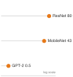
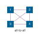
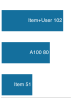

# Kiến trúc mạng {#sec-network-architectures}

::: {layout-narrow}
::: {.column-margin}

\chapterminitoc

:::

::: {.content-visible when-format="pdf"}
\noindent
{fig-alt="Trao đổi kiến trúc đẳng cự, trong đó một luồng biểu diễn phân nhánh thành các đường dẫn dày đặc, không gian, tuần tự và giống attention trước khi hợp nhất lại."}
:::

::: {.content-visible unless-format="pdf"}
{fig-alt="Trao đổi kiến trúc đẳng cự, trong đó một luồng biểu diễn phân nhánh thành các đường dẫn dày đặc, không gian, tuần tự và giống attention trước khi hợp nhất lại."}
:::

:::

## Mục đích {.unnumbered .unlisted}

\begin{marginfigure}
\mlsysstack{40}{25}{90}{35}{15}{0}{10}{10}
\end{marginfigure}

_Tại sao việc lựa chọn một kiến trúc mạng nơ-ron lại là một cam kết về hạ tầng cũng như một quyết định mô hình hóa?_

Việc lựa chọn một kiến trúc mạng nơ-ron vừa là một quyết định mô hình hóa vừa là một hợp đồng với vật lý. Cam kết này bắt đầu từ cấu trúc trong dữ liệu. Một kiến trúc phù hợp với cấu trúc đó có thể học với ít tham số và ví dụ hơn, trong khi một kiến trúc không phù hợp sẽ tốn thêm dữ liệu và thời gian máy để bù đắp cho mô hình tính toán sai. Tích chập, attention, hồi quy và tra cứu embedding không chỉ mã hóa các giả định khác nhau về dữ liệu; chúng tạo ra các mô hình tính toán, trạng thái và di chuyển dữ liệu khác nhau. Những mô hình đó quyết định liệu công việc có được song song hóa một cách gọn gàng hay không, liệu trạng thái trung gian có vừa với bộ nhớ hay không, và liệu huấn luyện và phục vụ (serving) có còn phải chăng ở quy mô yêu cầu hay không. Hai kiến trúc có thể mang lại chất lượng dự đoán tương tự nhưng lại áp đặt các dấu vết bộ nhớ và hồ sơ độ trễ khác nhau, đồng thời mở ra các cơ hội khác nhau cho các kỹ thuật hiệu quả sau này. Do đó, độ chính xác benchmark đơn thuần không thể tiết lộ thiết kế nào vẫn khả thi. Các cam kết kiến trúc cũng lan tỏa ra ngoài mô hình. Các pipeline dữ liệu áp dụng các cấu trúc đầu vào cụ thể, hạ tầng huấn luyện được cấp phát dựa trên hồ sơ tính toán của mô hình, các hệ thống phục vụ (serving) được điều chỉnh theo đường dẫn yêu cầu của nó, và giám sát kế thừa các chế độ lỗi của nó. Khi những phụ thuộc đó tích lũy, việc thay thế kiến trúc có thể có nghĩa là xây dựng lại phần lớn hệ thống xung quanh. Một quyết định kiến trúc chỉ hợp lý khi những lợi ích dự đoán của nó vẫn tương thích với toàn bộ ngữ cảnh triển khai. Theo thuật ngữ D·A·M, kiến trúc là đồng thiết kế thuật toán-máy móc ở gốc rễ, với đồ thị toán học xác định công việc mà máy phải thực hiện và ngân sách máy giới hạn những đồ thị nào vẫn thực tế.

::: {.content-visible when-format="pdf"}

\newpage

:::

::: {.callout-learning-objectives}

- Phân biệt các đặc điểm tính toán của MLP, CNN, RNN, Transformer và các hệ thống đề xuất kiểu DLRM
- Giải thích cách độ chệch (bias) quy nạp khai thác cấu trúc trong các loại dữ liệu khác nhau
- Phân tích độ phức tạp tính toán và khả năng mở rộng bộ nhớ trên các họ kiến trúc
- Xác định các khối xây dựng như kết nối bỏ qua (skip connections), chuẩn hóa và cổng (gating) cho phép huấn luyện sâu
- Áp dụng framework lựa chọn kiến trúc để khớp các đặc điểm dữ liệu với các thiết kế mô hình
- Đánh giá cách tính toán, truy cập bộ nhớ và di chuyển dữ liệu xác định hiệu quả ánh xạ phần cứng
- Phê bình các ngụy biện trong lựa chọn kiến trúc dưới các ràng buộc về độ trễ, băng thông và song song hóa

:::

## Các nguyên tắc kiến trúc {#sec-network-architectures-architectural-principles-engineering-tradeoffs-362e}

Một mô hình dày đặc tiêu tốn tham số và bộ nhớ vào các mối quan hệ mà một hình ảnh hiếm khi cần. Mạng nơ-ron tích chập (CNN) mã hóa tính cục bộ; perceptron đa lớp (MLP) thì không. Phép nhân ma trận, các hàm activation và tính toán gradient tạo thành các "động từ" của mạng nơ-ron. Các kiến trúc tập hợp những động từ đó thành các đồ thị tính toán\index{Architecture!computational graph}: các cấu trúc chuyên biệt được tối ưu hóa cho các loại dữ liệu và ràng buộc tính toán cụ thể. Theo hợp đồng silicon (nguyên tắc \ref{pri-silicon-contract}), mọi kiến trúc đều tạo ra một thỏa thuận ngầm với phần cứng, đánh đổi các mô hình tính toán để đạt hiệu quả trên các lớp bài toán cụ thể.

::: {.column-margin}
{width="100%" fig-alt="Danh sách dọc ba kiến trúc với dải chấm từ tối đến sáng: CNN (tối nhất, tiên nghiệm không gian mạnh), Transformer (giữa), MLP (sáng nhất, không có tiên nghiệm cấu trúc), được sắp xếp theo độ mạnh của độ chệch (bias) quy nạp."}

*Độ chệch (bias) quy nạp từ mạnh (CNN) đến yếu (MLP): tiên nghiệm mạnh hơn, cần ít dữ liệu hơn.*
:::

Mọi kiến trúc mạng nơ-ron đều quyết định cách tổ chức tính toán để phù hợp với cấu trúc vốn có trong dữ liệu. Hình ảnh có tính cục bộ không gian, ngôn ngữ có các phụ thuộc tuần tự, và các bản ghi dạng bảng thường thiếu một tổ chức không gian hoặc tuần tự cố định. Kiến trúc mã hóa các giả định về những mô hình này trực tiếp vào đồ thị tính toán, và những giả định đó ảnh hưởng đến số lượng tham số, mức độ sử dụng phần cứng và tính khả thi của việc triển khai. Do đó, lựa chọn kiến trúc là một bài toán kỹ thuật hệ thống\index{Architecture!systems engineering} ảnh hưởng trực tiếp đến các thuật ngữ của định luật sắt: số lượng phép toán $O$ và khối lượng di chuyển dữ liệu $D_{\text{vol}}$. Các giả định cấu trúc mà mỗi kiến trúc mã hóa được gọi là **độ chệch (bias) quy nạp**\index{Inductive bias!definition},[^fn-inductive-bias-architecture] và chúng đóng vai trò là khái niệm thống nhất cho toàn bộ chương này.

[^fn-inductive-bias-architecture]: **Độ chệch (bias) quy nạp**\index{Inductive bias!etymology}\index{Inductive bias!systems consequence}: Từ tiếng Latin *inducere*, "dẫn vào," việc mã hóa một giả định cấu trúc "dẫn" mô hình đến một không gian giải pháp nhỏ hơn, đó là lý do tại sao khái niệm này thống nhất toàn bộ chương: mọi kiến trúc được thảo luận ở đây—perceptron đa lớp (MLP), mạng nơ-ron tích chập (CNN), mạng nơ-ron hồi quy (RNN) và transformer—đều được định nghĩa bởi lựa chọn độ chệch (bias) của nó. Độ chệch (bias) cục bộ của CNN cắt giảm tham số theo cấp số nhân so với một MLP tương đương, trực tiếp thu hẹp các thuật ngữ $O$ và $D_{\text{vol}}$ của định luật sắt, trong khi attention toàn cục đánh đổi tính toán điểm số bậc hai để có kết nối tầm xa.

```{python}
#| echo: false
from mlsysim import *
from mlsysim.core.units import *

# ┌─────────────────────────────────────────────────────────────────────────────
# │ INDUCTIVE BIAS LOCALITY PARAMETER REDUCTION
# ├─────────────────────────────────────────────────────────────────────────────
# │ Context: Inductive bias definition quantitative significance.
# │
# │ Goal: Keep the CNN-vs.-MLP locality ratio computed at its first use.
# │ How: Compare an ImageNet-sized dense input connection with a 3x3 RGB filter.
# │
# └─────────────────────────────────────────────────────────────────────────────
from mlsysim.fmt import fmt_int, fmt, fmt_qty, fmt_qty_int, check, fmt_memory, fmt_bandwidth, fmt_flop_rate, fmt_power

class InductiveBiasLocalityCalc:
    """ImageNet-sized locality-bias parameter reduction for one feature detector."""

    # ┌── 1. LOAD (Constants) ──────────────────────────────────────────────
    img_dim = 224
    img_channels = 3
    kernel = 3

    # ┌── 2. EXECUTE (The Compute) ────────────────────────────────────────
    dense_input_weights = img_dim * img_dim * img_channels
    local_filter_weights = kernel * kernel * img_channels
    spatial_locality_reduction = dense_input_weights / local_filter_weights

    # ┌── 3. GUARD (Invariants) ──────────────────────────────────────────
    check(spatial_locality_reduction > 5_000, f"Expected ImageNet locality reduction above 5,000x, got {spatial_locality_reduction:.1f}x.")

    # ┌── 4. OUTPUT (Formatting) ─────────────────────────────────────────────
    spatial_locality_reduction_mult_str = fmt_multiple(spatial_locality_reduction, precision=1, commas=True)
```

```{=latex}
\vspace*{-1ex}
```
::: {#dfn-nn-architectures-inductive-bias .callout-definition title="Độ chệch (bias) quy nạp"}

***Độ chệch (bias) quy nạp***\index{Inductive bias!definition} là một ràng buộc cấu trúc được xây dựng trong kiến trúc mô hình, giới hạn không gian giả thuyết, cho phép tổng quát hóa từ dữ liệu hữu hạn bằng cách mã hóa các giả định cụ thể theo miền (như tính cục bộ không gian hoặc thứ tự tuần tự) trực tiếp vào đồ thị tính toán.

1.  **Ý nghĩa**: Inductive bias có thể giảm kích thước tập dữ liệu $(D)$ cần thiết cho khả năng tổng quát hóa. Đối với một bộ dò đặc trưng đầu ra, một kết nối dày đặc sử dụng $\mathcal{O}(N_{\text{pix}} C_{\text{in}})$ tham số, trong khi một bộ lọc tích chập dùng chung sử dụng $\mathcal{O}(K^2 C_{\text{in}})$ tham số và được áp dụng tại mọi vị trí, tiêu tốn $\mathcal{O}(N_{\text{pix}} K^2 C_{\text{in}})$ phép toán. Đối với một ảnh RGB $224{\times}224$, một bộ lọc $3{\times}3$ dùng chung do đó sử dụng ít hơn khoảng `{python} InductiveBiasLocalityCalc.spatial_locality_reduction_mult_str` tham số so với một bộ dò đặc trưng dày đặc, giúp giảm dung lượng lưu trữ tham số và thường là dữ liệu cần thiết để tránh overfitting.
2.  **Điểm khác biệt**: Không giống như chuẩn hóa (vốn trừng phạt độ phức tạp của giả thuyết tại thời điểm huấn luyện thông qua các số hạng L1/L2), inductive bias hạn chế không gian giả thuyết tại thời điểm thiết kế kiến trúc: một CNN biểu diễn các hàm không cục bộ kém trực tiếp hơn các mẫu cục bộ, trong khi chuẩn hóa ngăn cản sự phức tạp thông qua mục tiêu huấn luyện.
3.  **Cạm bẫy thường gặp**: Một quan niệm sai lầm phổ biến là inductive bias mạnh hơn luôn tốt hơn. Một độ chệch cục bộ mạnh (CNN) vượt trội trên dữ liệu không gian nhưng biểu diễn sự phụ thuộc tầm xa trong ngôn ngữ kém trực tiếp hơn so với cơ chế attention toàn cục, vốn hỗ trợ sự phụ thuộc tầm xa với chi phí tính toán điểm số $\mathcal{O}(S^2)$.

:::

::: {.column-margin}
{width="100%" fig-alt="Ngăn xếp D·A·M ba hộp dọc: Dữ liệu (xám, trên cùng), Thuật toán (cam, sáng, giữa), Máy (xám, dưới cùng). Hộp Thuật toán sáng đánh dấu trục kiến trúc."}

*Kiến trúc là trục thuật toán của D·A·M: nó đặt ra ngân sách số lượng phép toán.*
:::

Một CNN mã hóa một inductive bias về tính cục bộ không gian: các pixel lân cận quan trọng hơn các pixel ở xa. Một transformer cho phép mỗi phần tử chú ý đến bất kỳ phần tử nào khác, cho phép các mối quan hệ tầm xa với chi phí tính toán điểm số bậc hai. Những độ chệch này giúp các kiến trúc học hiệu quả bằng cách hạn chế không gian các hàm mà chúng biểu diễn. Nếu không có một độ chệch phù hợp, một mô hình có thể yêu cầu nhiều dữ liệu và tính toán hơn đáng kể để học cùng một cấu trúc. Khuôn khổ thống nhất trong @sec-network-architectures-architecture-selection-framework-a442 tập hợp các họ kiến trúc này lại với nhau một khi mỗi độ chệch đã xuất hiện trong thực tế.

Các hệ thống machine learning đối mặt với một sự đánh đổi kỹ thuật cốt lõi: **khả năng biểu diễn so với hiệu quả tính toán**\index{Architecture!representational power vs. efficiency}. Theo quy luật sắt của các hệ thống ML (nguyên tắc \ref{pri-iron-law}), lựa chọn kiến trúc là yếu tố quyết định chính của số hạng số lượng phép toán $O$. Cơ chế attention của transformer cho phép các mối quan hệ toàn cục nhưng tăng theo $\mathcal{O}(S^2)$ phép toán với độ dài chuỗi $S$; một CNN khai thác tính cục bộ không gian để giảm các phép toán xuống tỷ lệ tuyến tính theo số lượng vị trí không gian. Việc ghép nối các inductive bias phù hợp với dữ liệu của một khối lượng công việc (workload) đồng thời đặt ra một ngân sách số lượng phép toán có thể quản lý được định nghĩa thực tiễn của việc lựa chọn kiến trúc mạng nơ-ron.

::: {#exmp-nn-architectures-netflix-prize-ensemble .callout-example title="Tập hợp mô hình Netflix không được triển khai (2009)"}

**Bối cảnh**: Netflix đã trao giải thưởng lớn 1 triệu đô la vào năm 2009 cho việc cải thiện 10 phần trăm độ chính xác của đề xuất [@johnston2012netflixprize].

**Cơ chế**: Đưa cải tiến chiến thắng vào sản xuất đòi hỏi nỗ lực kỹ thuật đáng kể đúng vào thời điểm kinh doanh của Netflix đang chuyển từ DVD gửi thư sang phát trực tuyến. Sự thay đổi đó cũng tạo ra các tín hiệu xem phong phú hơn và thay đổi những gì cá nhân hóa cần tối ưu hóa.

**Tác động**: Độ chính xác bổ sung không biện minh được nỗ lực sản xuất, vì vậy Netflix đã không triển khai mã đoạt giải thưởng lớn.

**Giải pháp**: Netflix đã giữ lại hai thuật toán từ Giải thưởng Tiến bộ trước đó và chuyển hướng công việc đề xuất của mình sang cá nhân hóa trong kỷ nguyên phát trực tuyến.

**Bài học hệ thống**: Lợi ích từ chỉ số ngoại tuyến chỉ có giá trị khi chi phí tích hợp và mục tiêu của nó vẫn phù hợp với hệ thống sản xuất.

:::

Việc chọn một xương sống kiến trúc đặt ra bố cục bộ nhớ chính và mẫu tính toán cho phần cứng hạ nguồn. @Tbl-architecture-families đối chiếu năm họ mạng nơ-ron chính dựa trên các inductive bias không gian/thời gian, các phép toán tensor và đặc điểm truy cập bộ nhớ của chúng.

| **Architecture** | **Data Type**                 | **Core Innovation**            | **System Bottleneck**                           |
|:-----------------|:------------------------------|:-------------------------------|:------------------------------------------------|
| **MLPs**         | Tabular/Unstructured          | Dense connectivity             | Memory bandwidth                                |
| **CNNs**         | Spatial (images)              | Local filters + weight sharing | Compute throughput                              |
| **RNNs**         | Sequential (time series)      | Recurrent state                | Sequential dependencies                         |
| **Transformers** | Relational (language)         | Dynamic attention              | Quadratic score compute; optional $S^2$ storage |
| **DLRM**         | Categorical (recommendations) | Embedding tables               | Memory capacity (TB+)                           |

: **Các Họ Kiến trúc Mạng Nơ-ron**: Mỗi họ nhắm mục tiêu một cấu trúc dữ liệu riêng biệt và bộc lộ một nút thắt hệ thống riêng biệt. Cột nút thắt đọc trực tiếp từ quy luật sắt: MLP gây áp lực lên băng thông bộ nhớ thông qua các activation dày đặc, CNN gây áp lực lên thông lượng tính toán vì tích chập tái sử dụng các bộ lọc trên nhiều pixel, RNN gây áp lực lên các phụ thuộc tuần tự ngăn cản tính song song, transformer tính toán các tương tác điểm số bậc hai và có thể hiện thực hóa lưu trữ điểm số bậc hai, và DLRM gây áp lực lên dung lượng bộ nhớ ở quy mô terabyte thông qua các bảng embedding. {#tbl-architecture-families}

Năm kiến trúc mô hình cụ thể lặp lại xuyên suốt cuốn sách này như các mô hình hải đăng: các điểm tham chiếu nhất quán giúp gắn kết các khái niệm trừu tượng vào thực tế hệ thống cụ thể. Các ví dụ này là các triển khai cụ thể của các Nguyên mẫu Khối lượng công việc (Workload Archetypes) (Quái vật tính toán, Kẻ ngốn băng thông, v.v.) được giới thiệu trong @sec-ml-systems-workload-archetypes-fd10. Để hiểu *tại sao* những mô hình cụ thể này được chọn, hãy xem xét lịch sử tiến hóa của mô hình qua lăng kính của biên Pareto\index{Pareto frontier} (@fig-efficiency-frontier).

::: {#fig-efficiency-frontier fig-env="figure" fig-pos="htb" fig-cap="**Biên giới hiệu quả**: Độ chính xác Top-1 trên ImageNet so với Chi phí tính toán (GMACs). Các điểm đại diện được tổng hợp từ các báo cáo mô hình đã xuất bản cho AlexNet, VGG, ResNet, Inception, MobileNetV2, EfficientNet, ViT, Swin Transformer và ConvNeXt [@krizhevsky2012imagenet; @simonyan2014very; @he2016; @szegedy2015; @sandler2018; @tan2019efficientnet; @dosovitskiy2021image; @liu2021swin; @liu2022convnet]. 'Biên giới Pareto' nét đứt là một đường cong đánh đổi minh họa hơn là một lần chạy lại benchmark; độ chính xác chính xác và các giá trị tính toán được báo cáo khác nhau tùy theo biến thể mô hình, công thức huấn luyện, triển khai và quy ước đếm phép toán (phép nhân-tích lũy so với phép toán dấu phẩy động). Chú giải phân biệt sáu họ: CNN truyền thống (xám), CNN dày đặc (xanh lam), kiến trúc Mobile hiệu quả (xanh lục), các mô hình lớp EfficientNet (tím), CNN hiện đại (cam) và Transformer (đỏ). Biên giới này được dẫn đầu bởi các họ CNN hiệu quả và hiện đại; các Transformer đánh đổi chi phí tính toán đáng kể để mô hình hóa tầm xa linh hoạt mà không chiếm ưu thế, và ViT-B/16 nằm dưới biên giới." fig-alt="Biểu đồ phân tán độ chính xác top-1 trên ImageNet so với chi phí tính toán trên trục hoành logarit. Mười điểm mô hình được gắn nhãn sử dụng sáu màu cho các họ kiến trúc, và một đường nét đứt màu xám nối MobileNetV2, EfficientNet-B0, ConvNeXt-T và EfficientNet-B7."}

```{python}
#| echo: false
# ┌─────────────────────────────────────────────────────────────────────────────
# │ EFFICIENCY FRONTIER (FIGURE)
# ├─────────────────────────────────────────────────────────────────────────────
# │ Context: @fig-efficiency-frontier—model evolution and Pareto frontier
# │
# │ Goal: Plot ImageNet accuracy vs GMACs; show Dense CNN, Mobile, Transformer
# │       families; dashed Pareto frontier.
# │ Show: Scatter by family; model labels; log-scale x-axis.
# │ How: MODELS_DATA; pandas groupby; book_style.setup_plot().
# │
# └─────────────────────────────────────────────────────────────────────────────
# ┌── 1. CANVAS ────────────────────────────────────────────────────────────────
# │ Plot ImageNet accuracy vs GMACs; show Dense CNN, Mobile, Transformer
import pandas as pd
from binder.tools.figures import style as book_style

fig, ax, COLORS, plt = book_style.setup_plot(figsize=(10, 4.5))

# =============================================================================
# DATA
# =============================================================================

# ┌── 2. ARRAYS ────────────────────────────────────────────────────────────────
MODELS_DATA = [
    {'Model': 'AlexNet', 'Year': 2012, 'GMACs': 0.7, 'Accuracy': 63.3, 'Family': 'Legacy'},
    {'Model': 'VGG-16', 'Year': 2014, 'GMACs': 15.5, 'Accuracy': 71.5, 'Family': 'Legacy'},
    {'Model': 'ResNet-50', 'Year': 2015, 'GMACs': 4.1, 'Accuracy': 76.0, 'Family': 'Dense CNN'},
    {'Model': 'Inception-v3', 'Year': 2015, 'GMACs': 5.7, 'Accuracy': 78.8, 'Family': 'Dense CNN'},
    {'Model': 'MobileNetV2', 'Year': 2018, 'GMACs': 0.3, 'Accuracy': 72.0, 'Family': 'Mobile'},
    {'Model': 'EfficientNet-B0', 'Year': 2019, 'GMACs': 0.39, 'Accuracy': 77.1, 'Family': 'Efficient'},
    {'Model': 'EfficientNet-B7', 'Year': 2019, 'GMACs': 37.0, 'Accuracy': 84.3, 'Family': 'Efficient'},
    {'Model': 'ViT-B/16', 'Year': 2020, 'GMACs': 17.6, 'Accuracy': 77.9, 'Family': 'Transformer'},
    {'Model': 'Swin-T', 'Year': 2021, 'GMACs': 4.5, 'Accuracy': 81.3, 'Family': 'Transformer'},
    {'Model': 'ConvNeXt-T', 'Year': 2022, 'GMACs': 4.5, 'Accuracy': 82.1, 'Family': 'Modern CNN'},
]

# =============================================================================
# PLOT: The Efficiency Frontier
# =============================================================================
df = pd.DataFrame(MODELS_DATA)

color_map = {
    'Legacy': COLORS['grid'],
    'Dense CNN': COLORS['BlueLine'],
    'Mobile': COLORS['GreenLine'],
    'Efficient': COLORS['VioletLine'],
    'Transformer': COLORS['RedLine'],
    'Modern CNN': COLORS['OrangeLine'],
}

# Individual label settings
label_styles = {
    'AlexNet': {
        'xytext': (8, 2),
        'ha': 'left',
        'va': 'top',
    },
    'VGG-16': {
        'xytext': (8, 2),
        'ha': 'left',
        'va': 'top',
    },
    'ResNet-50': {
        'xytext': (0, -12),
        'ha': 'center',
        'va': 'center',
    },
    'Inception-v3': {
        'xytext': (0, -12),
        'ha': 'center',
        'va': 'center',
    },
    'MobileNetV2': {
        'xytext': (8, 2),
        'ha': 'left',
        'va': 'top',
    },
    'EfficientNet-B0': {
        'xytext': (8, -3),
        'ha': 'left',
        'va': 'top',
    },
    'EfficientNet-B7': {
        'xytext': (19, -14),
        'ha': 'right',
        'va': 'center',
    },
    'ViT-B/16': {
        'xytext': (0, -12),
        'ha': 'center',
        'va': 'center',
    },
    'Swin-T': {
        'xytext': (0, -12),
        'ha': 'center',
        'va': 'center',
    },
    'ConvNeXt-T': {
        'xytext': (0, 12),
        'ha': 'center',
        'va': 'center',
    },
}

default_label_style = {
    'xytext': (5, 5),
    'ha': 'left',
    'va': 'bottom',
    'fontsize': 8,
    'bbox': dict(facecolor='white', alpha=0.8, edgecolor='none', pad=0.5),
}

# ┌── 3. RENDER ────────────────────────────────────────────────────────────────
for family, group in df.groupby('Family'):
    ax.scatter(
        group['GMACs'],
        group['Accuracy'],
        label=family,
        c=color_map.get(family, COLORS['primary']),
        s=120,
        alpha=0.9,
        edgecolors='white',
        linewidth=1.2,
        zorder=3,
    )

for _, row in df.iterrows():
    model = row['Model']

    style = default_label_style.copy()
    style.update(label_styles.get(model, {}))

    ax.annotate(
        model,
        (row['GMACs'], row['Accuracy']),
        xytext=style['xytext'],
        textcoords='offset points',
        ha=style['ha'],
        va=style['va'],
        fontsize=style.get('fontsize', 8),
        bbox=style.get('bbox', None),
    )

pareto_models = ['MobileNetV2', 'EfficientNet-B0', 'ConvNeXt-T', 'EfficientNet-B7']
pareto_points = df[df['Model'].isin(pareto_models)].sort_values('GMACs')

ax.plot(pareto_points['GMACs'], pareto_points['Accuracy'], '--', color=COLORS['grid'], linewidth=1.5, zorder=1)

# ┌── 4. DECORATE ──────────────────────────────────────────────────────────────
ax.set_xscale('log')
ax.set_xlabel('Compute Cost (GMACs per Image)')
ax.set_ylabel('ImageNet Top-1 Accuracy (%)')
ax.legend(
    loc='lower right', title='Family', fontsize=8, frameon=True, facecolor='white', framealpha=0.95, edgecolor='gray', fancybox=True, borderpad=0.6
)
plt.show()
plt.close()
```

:::

Các mô hình này đóng vai trò là các khối lượng công việc (workload) chuẩn để hiểu các ràng buộc của hệ thống. Mỗi mô hình chiếm một vị trí riêng biệt trong sự đánh đổi giữa độ chính xác và chi phí tính toán, như được thể hiện trong @fig-efficiency-frontier. Biên giới được vẽ nên được hiểu là một bản đồ lịch sử của các bài báo kiến trúc tiêu biểu, chứ không phải là một bảng benchmark được kiểm soát. Nó theo dõi sự tiến triển từ các CNN dày đặc ưu tiên độ chính xác, qua MobileNets giảm tính toán trên mỗi đơn vị độ chính xác, đến các kiến trúc transformer đánh đổi chi phí tính toán đáng kể để mô hình hóa tầm xa linh hoạt. Các lựa chọn kiến trúc được đưa ra tại thời điểm thiết kế sẽ xác định vị trí của một hệ thống trên biên giới này.

### Danh sách các mô hình tiêu biểu: Tiểu sử mô hình {#sec-network-architectures-lighthouse-roster-model-biographies-a763}

Năm mô hình đóng vai trò tiêu biểu vì mỗi mô hình cô lập một nút thắt cổ chai của hệ thống lặp đi lặp lại: tính toán (ResNet-50), băng thông bộ nhớ (GPT-2), dung lượng bộ nhớ (DLRM), độ trễ edge (MobileNetV2) và công suất luôn bật cho phát hiện từ khóa (KWS). Các tiểu sử sau đây sẽ theo dõi bối cảnh lịch sử của từng mô hình và lý do tại sao nó trở thành một tài liệu tham khảo hữu ích.

ResNet-50 [@he2016]\index{ResNet-50} là mô hình tiêu biểu cho tác vụ thị giác chuyên sâu về tính toán. Mạng Residual (ResNet) đã giải quyết vấn đề suy giảm trong các mạng phẳng rất sâu: việc thêm các lớp có thể làm tăng lỗi huấn luyện mặc dù dung lượng đủ. Bằng cách giới thiệu "kết nối bỏ qua"\index{Skip connection!gradient flow} giúp cải thiện tối ưu hóa và luồng gradient, nó đã cho phép các mạng có 50, 100 hoặc thậm chí 1000 lớp. Kiến trúc ResNet đã giành chiến thắng trong cuộc thi ImageNet 2015 (với các mô hình 152 lớp rất sâu), và ResNet-50 đã trở thành một xương sống được sử dụng rộng rãi và khối lượng công việc (workload) benchmark cho thị giác máy tính. Từ góc độ hệ thống, đây là một khối lượng công việc (workload) có tính quy tắc cao, chuyên sâu về tính toán, gần như hoàn toàn bao gồm các tích chập dày đặc, khiến nó trở thành một thử nghiệm hữu ích cho thông lượng dấu phẩy động của GPU.

GPT-2 [@radford2019language]\index{GPT-2} là mô hình tiêu biểu cho tác vụ ngôn ngữ bị giới hạn băng thông. Generative Pre-trained Transformer 2 đã chứng minh rằng việc mở rộng một kiến trúc transformer chỉ có bộ giải mã đơn giản trên các tập dữ liệu lớn có thể tạo ra văn bản mạch lạc. Không giống như BERT, một transformer kiểu bộ mã hóa đọc ngữ cảnh theo cả hai hướng, GPT-2 tạo văn bản tuần tự (tự hồi quy[^fn-autoregressive-decoding-bandwidth]\index{Autoregressive generation}), tạo ra áp lực băng thông bộ nhớ đáng kể trong quá trình giải mã batch-one và batch nhỏ vì các trọng số mô hình được đọc cho mỗi bước giải mã. Nó đóng vai trò là nguyên mẫu của chúng tôi cho các mô hình ngôn ngữ lớn\index{LLM} như Llama và ChatGPT.

```{python}
#| echo: false
#| label: autoregressive-inference-cost

# ┌─────────────────────────────────────────────────────────────────────────────
# │ AUTOREGRESSIVE INFERENCE COST
# ├─────────────────────────────────────────────────────────────────────────────
# │ Context: GPT-2 biography footnote on per-token bandwidth pressure
# │
# │ Goal: Derive FP16 weight traffic and arithmetic intensity for one token.
# │ Show: Why autoregressive generation is bandwidth-bound.
# │ How: Use mlsysim GPT-2 model specs and FP16 weight bytes.
# │
# └─────────────────────────────────────────────────────────────────────────────

from mlsysim import Models
from mlsysim.fmt import fmt_int, fmt, fmt_count, fmt_params, check, fmt_arithmetic_intensity

# ┌── LEGO ───────────────────────────────────────────────
class AutoregressiveInferenceCost:
    """Bandwidth cost for GPT-2-style single-token autoregressive decoding."""

    # ┌── 1. LOAD (Constants) ──────────────────────────────────────────────
    model = Models.Language.GPT2

    # ┌── 2. EXECUTE (The Compute) ────────────────────────────────────────
    params_b = model.parameters.to(Bparam).magnitude
    fp16_weight = model.size_in_bytes(BYTES_FP16)
    flops_per_token = model.inference_flops.to(flop).magnitude
    fp16_weight_bytes = fp16_weight.to(byte).magnitude
    intensity_fp16 = flops_per_token / fp16_weight_bytes

    # ┌── 3. GUARD (Invariants) ──────────────────────────────────────────
    check(0.8 <= intensity_fp16 <= 1.2, f"Expected about 1 FLOP/byte for FP16 autoregressive GPT-2, got {intensity_fp16:.2f}.")

    # ┌── 4. OUTPUT (Formatting) ─────────────────────────────────────────────
    params_b_str = fmt_params(model.parameters, scale="B", precision=1, commas=False)
    fp16_weight_gb_str = fmt_memory(fp16_weight, unit=GB, precision=0, commas=False)
    intensity_fp16_str = fmt_arithmetic_intensity(intensity_fp16 * flop / byte, unit=flop / byte, precision=0, commas=False)
```

[^fn-autoregressive-decoding-bandwidth]: [offset=-38mm] **Tạo sinh tự hồi quy**\index{Autoregressive generation!bandwidth bottleneck}: Một chiến lược giải mã trong đó mỗi token đầu ra được điều kiện hóa bởi tất cả các token đã được tạo trước đó, yêu cầu một lượt truyền xuôi toàn bộ mô hình cho mỗi token; đối với một mô hình `{python} AutoregressiveInferenceCost.params_b_str`-tham số trong FP16, mô hình batch-one chỉ có trọng số được sử dụng ở đây đọc khoảng `{python} AutoregressiveInferenceCost.fp16_weight_gb_str` trọng số cho mỗi bước giải mã và tạo ra tỷ lệ công việc trên byte khoảng `{python} AutoregressiveInferenceCost.intensity_fp16_str`. Cường độ số học thấp này thường làm cho việc giải mã batch-one và batch nhỏ bị giới hạn băng thông; các batch lớn hơn có thể phân bổ lưu lượng trọng số. Trong quá trình tạo sinh, các hệ thống phục vụ (serving) cũng giữ lại trạng thái chú ý từ các token trước đó; @sec-network-architectures-attention-mechanisms-dynamic-pattern-processing-22df gọi trạng thái này là key-value cache.

DLRM [@naumov2019deep] là mô hình tiêu biểu cho tác vụ khuyến nghị thưa thớt. Meta đã mã nguồn mở DLRM để phơi bày một khối lượng công việc (workload) khác biệt so với CNN và transformer theo một cách quan trọng. Trong khi các mô hình thị giác và ngôn ngữ nặng về tính toán, các hệ thống khuyến nghị lại nặng về bộ nhớ. Chúng phải tra cứu sở thích của người dùng và mục trong các bảng embedding khổng lồ có thể đạt kích thước terabyte, tạo ra những thách thức độc đáo cho việc phục vụ (serving) quan trọng về độ trễ (@sec-model-serving). DLRM là một benchmark hữu ích cho dung lượng bộ nhớ và các mẫu truy cập bộ nhớ thưa thớt trong trung tâm dữ liệu.

::: {#lhs-nn-architectures-canonical-workloads .callout-lighthouse title="Các khối lượng công việc (workload) chuẩn"}

Trong kiến trúc máy tính, bộ xử lý *microprocessor without interlocked pipelined stages (MIPS)* thường được dùng để giảng dạy về pipelining, không phải vì nó là chip nhanh nhất hiện có, mà vì nó là hiện thân rõ ràng nhất của các nguyên tắc máy tính tập lệnh rút gọn (RISC). Tương tự, cuốn sách này sử dụng ResNet-50, GPT-2, DLRM, MobileNetV2 và KWS làm **các khối lượng công việc (workload) chuẩn tắc**\index{Canonical workload}. Bằng cách nghiên cứu những "ngọn hải đăng" này, chúng ta học được các nguyên tắc kỹ thuật về toán học, di chuyển bộ nhớ và tính cục bộ, những nguyên tắc này vẫn còn giá trị ngay cả khi các kiến trúc mô hình "hiện đại nhất" cụ thể phát triển.

:::

MobileNet [@howard2017mobilenets]\index{MobileNet} là ngọn hải đăng về hiệu quả trên edge. MobileNet đã thách thức xu hướng các mô hình ngày càng lớn hơn bằng cách ưu tiên hiệu quả. Nó đã phổ biến các tích chập tách sâu\index{Depthwise separable convolution!MobileNet} cho các mô hình thị giác hiệu quả, một đổi mới kiến trúc đã giảm FLOPs đi 8--9$\times$ cho các kernel $3{\times}3$ với tổn thất độ chính xác tối thiểu. Dấu chân tính toán nhỏ hơn đó đã làm cho MobileNet trở thành một lựa chọn tự nhiên cho các kỹ thuật nén và triển khai độ chính xác thấp hơn [lưu trữ và tính toán với ít bit hơn cho mỗi giá trị] được đề cập trong @sec-model-compression. Nó trở thành một họ tham chiếu để đồng thiết kế các mô hình thị giác với các ràng buộc về pin và độ trễ của điện thoại thông minh và thiết bị nhúng.

KWS [@warden2018speech]\index{Keyword spotting} là ngọn hải đăng TinyML luôn bật. Các mô hình phát hiện từ khóa (như những mô hình phát hiện "Hey Siri" hoặc "Ok Google") đại diện cho cực điểm của hiệu quả. Được thiết kế để chạy trên các vi điều khiển "luôn bật" với bộ nhớ cỡ kilobyte và ngân sách công suất milliwatt, các mô hình này (thường là CNN tách sâu) minh họa các ràng buộc của TinyML [@warden2020tinyml; @banbury2021micronets; @banbury2021mlperftiny]. Chúng buộc các kỹ sư phải đếm từng byte và chu kỳ, thúc đẩy lượng tử hoá cực đoan (INT8 và INT4) và phần cứng chuyên dụng. Cùng với nhau, những mô tả này thiết lập lý do tại sao các ngọn hải đăng không phải là một danh mục mô hình: mỗi ngọn hải đăng cô lập một dấu hiệu tắc nghẽn khác nhau mà phân tích cường độ số học có thể định lượng.

### Dấu hiệu khối lượng công việc (workload): Phổ cường độ số học {#sec-network-architectures-understanding-arithmetic-intensity-ade5}

ResNet-50 tái sử dụng các trọng số tích chập trên nhiều vị trí không gian, trong khi giải mã GPT-2/Llama kích thước batch một truyền tải trạng thái trọng số lớn và KV-cache cho từng token một. Sự tương phản đó thúc đẩy cường độ số học\index{Arithmetic intensity!FLOP/byte ratio}, tỷ lệ FLOP/byte được thiết lập trong @sec-neural-computation và được sử dụng với đường giới hạn hiệu năng phần cứng (hardware roofline) để đánh giá liệu một khối lượng công việc (workload) có khả năng bị giới hạn bởi tính toán hay bộ nhớ.

```{python}
#| echo: false
#| label: workload-signatures-calc
# ┌─────────────────────────────────────────────────────────────────────────────
# │ WORKLOAD SIGNATURES: ARITHMETIC INTENSITY
# ├─────────────────────────────────────────────────────────────────────────────
# │ Context: "Workload Signatures" section
# │
# │ Goal: Quantify the Arithmetic Intensity (I) for Lighthouse Models.
# │ Show: Why Transformers are memory-bound (I < 1) vs CNNs (I > 20).
# │ How: Calculate FLOP/byte ratio from mlsysim model specs using FP32 sizes.
# │
# └─────────────────────────────────────────────────────────────────────────────
from mlsysim import Models
from mlsysim.fmt import fmt_int, fmt_qty, check, fmt_arithmetic_intensity

# ┌── LEGO ───────────────────────────────────────────────
class WorkloadSignatures:
    """
    Namespace for Workload Signature calculation.
    Scenario: Comparing Arithmetic Intensity across architectures (FP32).
    """

    # ┌── 1. LOAD (Constants) ───────────────────────────────────────────────
    # Values from the mlsysim model registry, using FP32 weight bytes.
    resnet = Models.Vision.ResNet50
    gpt2 = Models.Language.GPT2
    mobilenet = Models.Vision.MobileNetV2

    resnet_flops = resnet.inference_flops.to(flop).magnitude
    resnet_bytes = resnet.size_in_bytes(BYTES_FP32).to(byte).magnitude
    gpt2_flops_token = gpt2.inference_flops.to(flop).magnitude
    gpt2_bytes = gpt2.size_in_bytes(BYTES_FP32).to(byte).magnitude
    mobilenet_flops = mobilenet.inference_flops.to(flop).magnitude
    mobilenet_bytes = mobilenet.size_in_bytes(BYTES_FP32).to(byte).magnitude

    # ┌── 2. EXECUTE (The Compute) ─────────────────────────────────────────
    resnet_i = resnet_flops / resnet_bytes
    gpt2_i = gpt2_flops_token / gpt2_bytes
    mobilenet_i = mobilenet_flops / mobilenet_bytes
    resnet_to_gpt2_ratio = resnet_i / gpt2_i

    # ┌── 3. GUARD (Invariants) ───────────────────────────────────────────
    check(resnet_i > gpt2_i * 50, f"ResNet intensity ({resnet_i:.1f}) should be >> GPT-2 ({gpt2_i:.1f}).")
    check(150 <= resnet_to_gpt2_ratio <= 170, f"Expected roughly 160x ResNet/GPT-2 intensity gap, got {resnet_to_gpt2_ratio:.1f}x.")

    # ┌── 4. OUTPUT (Formatting) ──────────────────────────────────────────────
    resnet_intensity_str = fmt_arithmetic_intensity(resnet_i * flop / byte, unit=flop / byte, commas=False)
    gpt2_intensity_str = fmt_arithmetic_intensity(gpt2_i * flop / byte, unit=flop / byte, precision=2, commas=False)
    mobilenet_intensity_str = fmt_arithmetic_intensity(mobilenet_i * flop / byte, unit=flop / byte, commas=False)
    resnet_to_gpt2_ratio_mult_str = fmt_multiple(resnet_to_gpt2_ratio, precision=1, commas=False)
```

::: {.column-margin}
```{=latex}
\vspace*{-47mm}
```
{width="100%" fig-alt="Ba thanh ngang xếp chồng trên thang logarit được gắn nhãn ResNet 80, MobileNet 43 và GPT-2 0.5 FLOP trên byte, thanh trên cùng dài hơn nhiều so với thanh dưới cùng."}

*Một đại diện chỉ dựa trên trọng số cho ResNet cường độ gấp ~160$\times$ so với GPT-2 kích thước batch một.*
:::

Những điểm tắc nghẽn này phản ánh toán học cơ bản, nhưng phép tính ở đây là một đại diện chỉ dựa trên trọng số chứ không phải là một phép đo hoàn chỉnh về lưu lượng bộ nhớ chính. Nó chia công việc dấu phẩy động cho số byte trọng số mô hình FP32, bỏ qua lưu lượng activation, trung gian và KV-cache. Batching có thể phân bổ lưu lượng trọng số trên các ví dụ hoặc token, trong khi di chuyển trạng thái bổ sung có thể làm giảm cường độ thực tế. @Sec-appdx-algorithm-foundations-computational-complexity-cheat-sheet-0c6c đưa ra các công thức FLOP và tham số cho mỗi phép toán được sử dụng trong đại diện. @Tbl-workload-signatures so sánh ba kịch bản ngọn hải đăng và cho thấy một khoảng cách xấp xỉ `{python} WorkloadSignatures.resnet_to_gpt2_ratio_mult_str` theo những giả định này.

| **Model Family**     | **Lighthouse** |                  **Intensity** $(I)$                   | **Hardware Affinity**      |
|:---------------------|:--------------:|:------------------------------------------------------:|:---------------------------|
| **Dense CNN**        |   ResNet-50    |  ~`{python} WorkloadSignatures.resnet_intensity_str`   | Compute-Rich (GPUs/TPUs)   |
| **Efficient Vision** |  MobileNetV2   | ~`{python} WorkloadSignatures.mobilenet_intensity_str` | Balanced (Mobile NPUs)     |
| **Transformer**      |  GPT-2 (Inf)   |   ~`{python} WorkloadSignatures.gpt2_intensity_str`    | Bandwidth-rich accelerator |

: **Dấu hiệu khối lượng công việc (workload) của các ngọn hải đăng**: Các đại diện cường độ FP32 chỉ dựa trên trọng số cho ba kịch bản mô hình. Các giá trị này cho thấy các áp lực tính toán và băng thông khác nhau nhưng không xác định một sự tương thích phần cứng cố định; các điểm tắc nghẽn thực tế phụ thuộc vào chế độ thực thi và cân bằng phần cứng. {#tbl-workload-signatures tbl-colwidths="[20,20,20,40]"}

Bảng này cung cấp một đầu vào hệ thống cho việc lựa chọn kiến trúc. Các yêu cầu tác vụ xác định những họ mô hình nào khả thi, trong khi kích thước batch, độ chính xác, độ dài chuỗi, triển khai, hành vi cache và phần cứng mục tiêu xác định liệu đại diện có dự đoán được điểm tắc nghẽn đã triển khai hay không. MobileNet thường phù hợp với các triển khai thị giác bị ràng buộc, và giải mã transformer kích thước batch một thường gây áp lực lớn lên băng thông bộ nhớ, nhưng cả hai lựa chọn đều đòi hỏi phải đo lường trong chế độ dự định.

Cột "Bottleneck" (Điểm tắc nghẽn) trong @tbl-lighthouse-comparison đáng được chú ý đặc biệt: nó xác định tài nguyên hệ thống nào (thông lượng tính toán, băng thông bộ nhớ, dung lượng bộ nhớ, độ trễ hoặc công suất) giới hạn hiệu suất cho mỗi lớp khối lượng công việc (workload). Theo các thuật ngữ của định luật sắt (@sec-introduction-iron-law-ml-systems-c32a), điểm tắc nghẽn xác định liệu $O$ (các phép toán) hay $D_{\text{vol}}$ (di chuyển dữ liệu) chi phối runtime. Những khác biệt này xác định chiến lược tối ưu hóa nào tỏ ra hiệu quả trong suốt các chương tiếp theo.

```{python}
#| echo: false
#| label: lighthouse-table-specs

# ┌─────────────────────────────────────────────────────────────────────────────
# │ LIGHTHOUSE TABLE SPECS
# ├─────────────────────────────────────────────────────────────────────────────
# │ Context: @tbl-lighthouse-comparison comparing five canonical workloads
# │
# │ Goal: Establish quantitative reference points for the five canonical workloads.
# │ Show: The diverse bottleneck profiles (Compute vs Memory) of lighthouse models.
# │ How: Retrieve model specs from Models and mlsysim constants.
# │
# └─────────────────────────────────────────────────────────────────────────────

from mlsysim import Hardware, Models
from mlsysim.fmt import fmt_int, fmt, check, fmt_flops, fmt_memory, fmt_params, fmt_ratio
from mlsysim.physics import model_memory

# ┌── LEGO ───────────────────────────────────────────────
class LighthouseSpecs:
    """
    Namespace for Lighthouse Model Comparison Table.
    Aggregates specs for ResNet, GPT-2, DLRM, MobileNet, and KWS.
    """

    # ┌── 1. LOAD (Constants) ───────────────────────────────────────────────
    m_resnet = Models.Vision.ResNet50
    m_gpt2 = Models.Language.GPT2
    m_dlrm = Models.Recommendation.DLRM
    m_mobilenet = Models.Vision.MobileNetV2
    m_kws = Models.Tiny.DS_CNN

    hw_a100 = Hardware.Cloud.A100

    # ┌── 2. EXECUTE (The Compute) ─────────────────────────────────────────
    # Step 1: ResNet-50
    resnet_params = m_resnet.parameters.to(Mparam).magnitude
    resnet_flops = m_resnet.inference_flops.to(GFLOPs).magnitude
    resnet_mem = m_resnet.size_in_bytes(BYTES_FP32)

    # Step 2: GPT-2 XL
    gpt2_params = m_gpt2.parameters.to(Bparam).magnitude
    gpt2_flops_token = m_gpt2.inference_flops.to(GFLOPs).magnitude
    gpt2_mem = m_gpt2.size_in_bytes(BYTES_FP32)

    # Step 3: DLRM
    dlrm_entries_b = m_dlrm.embedding_entries.to(count).magnitude / BILLION
    dlrm_mem = m_dlrm.model_size

    # Step 4: MobileNetV2
    mobilenet_params = m_mobilenet.parameters.to(Mparam).magnitude
    mobilenet_flops = m_mobilenet.inference_flops
    mobilenet_mem = m_mobilenet.size_in_bytes(BYTES_FP32)

    # Step 5: KWS (DS-CNN)
    kws_params_k = m_kws.parameters.to(Kparam).magnitude
    kws_flops = m_kws.inference_flops
    kws_mem = m_kws.size_in_bytes(BYTES_FP32)

    # Step 6: Ratios
    mobilenet_size_ratio = m_resnet.parameters.to(param).magnitude / m_mobilenet.parameters.to(param).magnitude
    mobilenet_flops_ratio = (m_resnet.inference_flops / m_mobilenet.inference_flops).to("").magnitude

    # Step 7: Reference Hardware
    a100_mem = hw_a100.memory.capacity

    # ┌── 3. GUARD (Invariants) ───────────────────────────────────────────
    # Ensure numbers match the book's narrative
    check(abs(resnet_flops - 8.2) <= 0.1, f"ResNet FLOPs {resnet_flops} != 8.2")
    check(abs(gpt2_params - 1.5) <= 0.1, f"GPT-2 Params {gpt2_params} != 1.5 billion")
    check(abs(mobilenet_params - 3.5) <= 0.1, f"MobileNet Params {mobilenet_params} != 3.5M")

    # ┌── 4. OUTPUT (Formatting) ──────────────────────────────────────────────
    resnet_params_m_str = fmt_params(m_resnet.parameters, scale="M", precision=1, commas=False)
    resnet_gflop_str = fmt_flops(m_resnet.inference_flops, unit=GFLOPs, precision=1)
    resnet_fp32_mb_str = fmt_memory(resnet_mem, unit=MB, precision=1, commas=True)

    gpt2_params_b_str = fmt_params(m_gpt2.parameters, scale="B", precision=1, commas=False)
    gpt2_fp32_gb_str = fmt_memory(gpt2_mem, unit=GB, precision=0, commas=True)
    gpt2_gflop_per_token_str = fmt_flops(m_gpt2.inference_flops, unit=GFLOPs, precision=0, per="token")

    # GPT-3 context
    gpt3_fp16_gb_str = fmt_memory(Models.Language.GPT3.size_in_bytes(BYTES_FP16), unit=GB, precision=0)

    dlrm_entries_b_str = fmt_params(m_dlrm.embedding_entries, scale="B", precision=0, commas=False)
    dlrm_model_size_gb_str = fmt_memory(dlrm_mem, unit=GB, precision=0, commas=True)

    mobilenet_params_m_str = fmt_params(m_mobilenet.parameters, scale="M", precision=1, commas=False)
    mobilenet_mflop_str = fmt_flops(mobilenet_flops, unit=MFLOPs, precision=0)
    mobilenet_fp32_mb_str = fmt_memory(mobilenet_mem, unit=MB, commas=True)
    mobilenet_size_ratio_mult_str = fmt_ratio(mobilenet_size_ratio, precision=1)
    mobilenet_flops_ratio_mult_str = fmt_ratio(mobilenet_flops_ratio, precision=1)

    kws_params_k_str = fmt_params(m_kws.parameters, scale="K", precision=0, commas=False)
    kws_mflop_str = fmt_flops(kws_flops, unit=MFLOPs, precision=0)
    kws_fp32_kb_str = fmt_memory(kws_mem, unit=KB, precision=0, commas=True)
```

| **Model**        | **Domain**  |                     **Params**                    |                    **FLOPs/Inf**                    |                     **Memory**                    | **Bottleneck** | **Role in Textbook**                   |
|:-----------------|:------------|:-------------------------------------------------:|:---------------------------------------------------:|:-------------------------------------------------:|:---------------|:---------------------------------------|
| **ResNet-50**    | Vision      |   `{python} LighthouseSpecs.resnet_params_m_str`  |     `{python} LighthouseSpecs.resnet_gflop_str`     |   `{python} LighthouseSpecs.resnet_fp32_mb_str`   | Compute        | Dense vision throughput                |
| **GPT-2 XL**     | Language    |    `{python} LighthouseSpecs.gpt2_params_b_str`   | `{python} LighthouseSpecs.gpt2_gflop_per_token_str` |    `{python} LighthouseSpecs.gpt2_fp32_gb_str`    | Mem. Bandwidth | Token-by-token serving                 |
| **DLRM**         | Recommender |   `{python} LighthouseSpecs.dlrm_entries_b_str`   |                         Low                         | `{python} LighthouseSpecs.dlrm_model_size_gb_str` | Mem. Capacity  | Embedding tables and capacity planning |
| **MobileNetV2**  | Edge Vision | `{python} LighthouseSpecs.mobilenet_params_m_str` |    `{python} LighthouseSpecs.mobilenet_mflop_str`   |  `{python} LighthouseSpecs.mobilenet_fp32_mb_str` | Latency        | Depthwise convolutions and efficiency  |
| **KWS (DS-CNN)** | Audio       |    `{python} LighthouseSpecs.kws_params_k_str`    |       `{python} LighthouseSpecs.kws_mflop_str`      |     `{python} LighthouseSpecs.kws_fp32_kb_str`    | Power          | Always-on power budget                 |

: **So sánh mô hình ngọn hải đăng**: Đặc điểm định lượng và vai trò sư phạm của năm khối lượng công việc (workload) chuẩn tắc. Bộ nhớ là lưu trữ trọng số FP32, và FLOPs tính trên mỗi suy luận ngoại trừ GPT-2 XL, được trích dẫn trên mỗi token được tạo; hàng DLRM báo cáo các mục bảng embedding thay vì các tham số dày đặc. Cột điểm tắc nghẽn chỉ ra ràng buộc hệ thống chính mà mỗi mô hình bộc lộ: các mô hình bị giới hạn bởi tính toán như ResNet gây áp lực lên thông lượng số học, trong khi các mô hình bị giới hạn bởi băng thông như GPT-2 gây áp lực lên tốc độ truyền bộ nhớ. {#tbl-lighthouse-comparison tbl-colwidths="[17,14,8,15,9,11,26]"}

Lựa chọn kiến trúc cuối cùng là một sự đánh đổi kỹ thuật giữa tính toán $(O)$ và di chuyển bộ nhớ $(D_{\text{vol}})$\index{Architecture!compute vs. memory trade-off}. Các cơ chế đằng sau các đặc trưng trong @tbl-workload-signatures giải thích tại sao mỗi đèn hiệu lại nằm ở vị trí đó trên phổ cường độ. ResNet-50\index{ResNet-50!arithmetic intensity} đạt được cường độ cao vì các lớp tích chập tái sử dụng mỗi trọng số nhiều lần trên các chiều không gian của một hình ảnh (các lớp bottleneck sâu hơn đạt 100--200+ FLOP/byte), do đó hiệu suất của nó bị giới hạn bởi tốc độ phần cứng có thể thực hiện tính toán. GPT-2\index{GPT-2!arithmetic intensity} nằm ở cực đối diện: mỗi token được tạo ra chỉ tạo ra một phép nhân ma trận-vector thay vì các phép toán ma trận-ma trận của xử lý theo batch, do đó hệ thống tải các trọng số khổng lồ từ bộ nhớ cho tính toán của một token duy nhất, và hiệu suất bị giới hạn bởi tốc độ bộ nhớ có thể di chuyển bit. MobileNet nằm giữa hai loại này ở cấp độ toàn mô hình, với các lớp depthwise riêng lẻ giảm xuống thấp hơn khi lưu lượng activation được tính đến: tích chập khả tách depthwise giảm tổng $O$ nhưng di chuyển nhiều dữ liệu hơn so với khối lượng công việc đó, điều này phù hợp tốt với phần cứng di động nhưng thường "bỏ đói" các GPU cao cấp được tối ưu hóa cho tính toán dày đặc.

::: {#chk-nn-architectures-arithmetic-intensity-architecture .callout-checkpoint title="Cường độ số học và kiến trúc"}

Ghép lựa chọn kiến trúc với ý nghĩa hệ thống của nó:

- [ ] **Tái sử dụng trọng số (CNN)**: việc tái sử dụng cùng một trọng số trên nhiều đầu vào thay đổi cường độ số học như thế nào?
- [ ] **Bảng embedding lớn (DLRM)**: các bảng embedding khổng lồ thay đổi sự cân bằng giữa di chuyển dữ liệu và tính toán như thế nào?
- [ ] **Giải mã tự hồi quy (GPT-2)**: tại sao việc tạo từng token một lại thay đổi bức tranh về batching và băng thông?

:::

Phổ này xác định liệu hệ thống cần một bộ xử lý nhanh hơn hay bộ nhớ nhanh hơn để cải thiện hiệu suất. Framework mà cuốn sách này sử dụng để định lượng các giới hạn này trên phần cứng cụ thể là **mô hình roofline**\index{Roofline model!definition}, mô hình này vẽ biểu đồ thông lượng đạt được so với cường độ số học để cho thấy khi nào một khối lượng công việc (workload) chuyển từ bị giới hạn bởi bộ nhớ sang bị giới hạn bởi tính toán. @Sec-appdx-machine-foundations-roofline-model-2529 cung cấp phân tích lý thuyết, với các ví dụ ứng dụng trong @sec-hardware-acceleration. @Sec-appdx-machine-foundations-concrete-example-a100-analysis-5b30 thực hiện phân loại cường độ-thành-nút thắt này thông qua một đặc tả bộ tăng tốc thực tế, tính toán điểm đỉnh của một A100 và cho thấy cùng một phép toán rơi vào hai phía của nó như thế nào.

Các đặc trưng đèn hiệu làm cho bước tiếp theo trở nên cụ thể: kiểm tra từng họ kiến trúc theo mẫu dữ liệu mà nó nhắm đến, tính toán mà nó thực hiện, ánh xạ phần cứng mà nó tạo ra và nút thắt mà nó bộc lộ. Lăng kính bốn phần này đảm bảo rằng mọi kiến trúc được đánh giá về chi phí vận hành, không chỉ về những gì nó học được.

## MLP: Xử lý mẫu dày đặc {#sec-network-architectures-multilayer-perceptrons-dense-pattern-processing-bc11}

Hãy xem xét bộ lọc thư rác của điện thoại thông minh: cho một tập hợp các đặc trưng được trích xuất từ một email (điểm uy tín người gửi, số lượng liên kết, sự hiện diện của các từ khóa nhất định), mô hình phải xuất ra một xác suất duy nhất: thư rác hay không. Nhiệm vụ phân loại này, nơi mọi đặc trưng đầu vào kết nối với mọi đầu ra, là lĩnh vực của các mạng kết nối đầy đủ. **MLP**\index{MLP!definition}[^fn-perceptron-rosenblatt-etymology] đại diện cho các kiến trúc kết nối đầy đủ được giới thiệu trong @sec-neural-computation, nay được xem xét qua lăng kính hệ thống bốn phần đã được thiết lập trước đó.

[^fn-perceptron-rosenblatt-etymology]: **Perceptron**\index{Perceptron!etymology}: Được hình thành từ "perception" (nhận thức) và hậu tố chỉ thiết bị "-tron" (như trong *cyclotron* và *klystron*), được đặt ra bởi Frank Rosenblatt\index{Rosenblatt, Frank} [@rosenblatt1957perceptron] cho đơn vị cơ bản của tính toán nơ-ron: một tổng có trọng số theo sau bởi một activation phi tuyến, mở rộng nơ-ron McCulloch-Pitts\index{McCulloch-Pitts neuron} trước đó. MLP được cấu tạo hoàn toàn từ các đơn vị này được sắp xếp trong các lớp kết nối đầy đủ, do đó hiệu quả của phép toán đơn lẻ này, một phép nhân-tích lũy, xác định thông lượng hệ thống. Các bộ tăng tốc hiện đại thực hiện hơn $10^{14}$ phép toán này mỗi giây, biến perceptron thành nguyên thủy tính toán\index{Perceptron!computational primitive} mà toàn bộ hệ sinh thái phần cứng ML được tối ưu hóa xung quanh.

MLP thể hiện một độ chệch quy nạp: *chúng không giả định cấu trúc có sẵn nào trong dữ liệu, cho phép bất kỳ đầu vào nào liên quan đến bất kỳ đầu ra nào*. Lựa chọn kiến trúc này cho phép tính linh hoạt tối đa bằng cách coi tất cả các mối quan hệ đầu vào là khả thi như nhau, khiến MLP trở nên linh hoạt nhưng tốn nhiều tính toán so với các lựa chọn thay thế chuyên biệt. Sức mạnh tính toán của chúng được thiết lập về mặt lý thuyết bởi Định lý Xấp xỉ Phổ quát (UAT)[^fn-uat-exponential-width] [@cybenko1989; @hornik1989], mà chúng ta đã gặp phải như một chú thích trong @sec-neural-computation. Định lý này phát biểu rằng một MLP đủ lớn với các hàm activation phi tuyến có thể xấp xỉ bất kỳ hàm liên tục nào trên một miền compact, với các trọng số và độ chệch (bias) phù hợp. Sự kết hợp giữa tính phổ quát lý thuyết và kết nối dày đặc đó là khái niệm kiến trúc được nắm bắt bởi *perceptron đa lớp*.

[^fn-uat-exponential-width]: **Định lý xấp xỉ phổ quát (UAT)**\index{Universal approximation theorem}: Định lý này cung cấp đảm bảo toán học cho độ chệch quy nạp "không cấu trúc có sẵn" của MLP bằng cách chứng minh rằng một mạng đủ rộng có thể xấp xỉ bất kỳ hàm liên tục nào. Vấn đề ở cấp độ hệ thống\index{Universal approximation theorem!systems consequence} là "đủ rộng" có thể yêu cầu số lượng nơ-ron tăng theo cấp số mũ với số chiều đầu vào, khiến đảm bảo lý thuyết trở nên không thể đạt được trong thực tế ngay cả đối với các đầu vào có kích thước vừa phải như hình ảnh $256{\times}256$.

```{python}
#| echo: false
#| label: mlp-definition-costs

# ┌─────────────────────────────────────────────────────────────────────────────
# │ MLP DEFINITION COSTS
# ├─────────────────────────────────────────────────────────────────────────────
# │ Context: MLP definition callout quantitative significance
# │
# │ Goal: Derive dense-layer and same-channel convolution parameter counts.
# │ Show: quadratic dense scaling and channel-mixing cost for 3x3 convolution.
# │ How: Direct parameter and FP16 weight-byte calculation.
# │
# └─────────────────────────────────────────────────────────────────────────────

from mlsysim.fmt import fmt_int, fmt, fmt_count, check

# ┌── LEGO ───────────────────────────────────────────────
class MLPDefinitionCosts:
    """Quantitative anchor for dense layer scaling in the MLP definition."""

    # ┌── 1. LOAD (Constants) ──────────────────────────────────────────────
    layer_width = 1024
    conv_kernel = 3

    # ┌── 2. EXECUTE (The Compute) ────────────────────────────────────────
    dense_params = layer_width * layer_width
    dense_fp16_memory = dense_params * BYTES_FP16
    conv_weights = conv_kernel * conv_kernel * layer_width * layer_width
    conv_weights_m = conv_weights / MILLION

    # ┌── 3. GUARD (Invariants) ──────────────────────────────────────────
    check(dense_params == 1_048_576, f"1024x1024 dense layer should have 1,048,576 weights, got {dense_params}.")
    check(abs(conv_weights_m - 9.4) < 0.1, f"3x3 1024-channel convolution should be about 9.4M weights, got {conv_weights_m:.1f}M.")

    # ┌── 4. OUTPUT (Formatting) ─────────────────────────────────────────────
    layer_width_str = fmt(layer_width, precision=0, commas=True)
    dense_params_str = fmt_count(dense_params, label="parameter")
    dense_fp16_mb_str = fmt_memory(dense_fp16_memory, unit=MB, precision=1, commas=False)
    conv_weights_m_str = fmt_count(conv_weights, scale="M", precision=1, commas=False, label="weight")
```

::: {#dfn-nn-architectures-multilayer-perceptrons .callout-definition title="Perceptron đa lớp"}

***Perceptron đa lớp***\index{MLP!definition} là các kiến trúc mạng nơ-ron truyền thẳng áp dụng các lớp kết nối đầy đủ theo trình tự, trong đó mọi nơ-ron trong một lớp kết nối với mọi nơ-ron trong lớp tiếp theo, không mã hóa bất kỳ giả định cấu trúc nào về miền đầu vào.

1.  **Ý nghĩa**: Việc thiếu thông tin tiên nghiệm về cấu trúc khiến các lớp dày đặc có số lượng tham số tăng theo hàm bậc hai theo chiều rộng lớp: một lớp duy nhất ánh xạ `{python} MLPDefinitionCosts.layer_width_str` đầu vào tới `{python} MLPDefinitionCosts.layer_width_str` đầu ra yêu cầu `{python} MLPDefinitionCosts.dense_params_str` tham số và khoảng `{python} MLPDefinitionCosts.dense_fp16_mb_str` bộ nhớ trọng số ở định dạng FP16. Một tích chập $3{\times}3$ ánh xạ `{python} MLPDefinitionCosts.layer_width_str` kênh đầu vào tới `{python} MLPDefinitionCosts.layer_width_str` kênh đầu ra có khoảng `{python} MLPDefinitionCosts.conv_weights_m_str`; lợi thế của tích chập đối với hình ảnh đến từ việc chia sẻ trọng số không gian giữa các vị trí, chứ không phải từ việc giảm ma trận trộn kênh. Điều này làm cho MLP không hiệu quả đối với các đầu vào có cấu trúc chiều cao như hình ảnh.
2.  **Điểm khác biệt**: Không giống như mạng nơ-ron tích chập, vốn khai thác tính cục bộ không gian để giảm số lượng tham số, MLP xử lý tất cả các phần tử đầu vào một cách đối xứng, khiến chúng trở thành kiến trúc được lựa chọn cho dữ liệu dạng bảng nơi không có cấu trúc không gian hoặc tuần tự.
3.  **Cạm bẫy thường gặp**: Một quan niệm sai lầm phổ biến là MLP quá đơn giản để quan trọng đối với các tác vụ phức tạp. MLP cung cấp một đường cơ sở dày đặc hữu ích, nhưng CNN, mạng hồi quy và transformer thêm các toán tử và mẫu kết nối mà không thể quy về chỉ chia sẻ trọng số.

:::

Trong thực tế, UAT giải thích *tại sao* MLP thành công trong nhiều tác vụ đa dạng, đồng thời tiết lộ khoảng cách giữa khả năng lý thuyết và triển khai thực tế. Định lý đảm bảo rằng một MLP nào đó có thể xấp xỉ bất kỳ hàm nào, nhưng không cung cấp hướng dẫn về kích thước mạng cần thiết hoặc cách xác định trọng số. Mặc dù MLP về mặt lý thuyết có thể giải quyết bất kỳ vấn đề nhận dạng mẫu nào, việc đó có thể đòi hỏi các mạng lớn không thực tế hoặc tính toán quá tốn kém. Sức mạnh lý thuyết này thúc đẩy việc lựa chọn MLP cho dữ liệu dạng bảng, hệ thống khuyến nghị và các vấn đề mà mối quan hệ đầu vào chưa được biết. Đồng thời, những hạn chế thực tế này đã thúc đẩy sự phát triển của các kiến trúc chuyên biệt khai thác cấu trúc dữ liệu để đạt hiệu quả tính toán, như @sec-network-architectures-cnns-spatial-pattern-processing-5b8d, @sec-network-architectures-rnns-sequential-pattern-processing-f804 và @sec-network-architectures-transformers-attentiononly-architecture-1b56 minh họa.

```{python}
#| echo: false
#| label: mlp-dimensionality-examples

# ┌─────────────────────────────────────────────────────────────────────────────
# │ MLP DIMENSIONALITY EXAMPLES
# ├─────────────────────────────────────────────────────────────────────────────
# │ Context: Learnability gap section illustrating sample complexity
# │
# │ Goal: Demonstrate the scalability limits of dense connections on image data.
# │ Show: How input dimension explodes from 784 (MNIST) to 65K (256 × 256).
# │ How: Calculate flattened vector sizes for standard image resolutions.
# │
# └─────────────────────────────────────────────────────────────────────────────

from mlsysim.fmt import fmt_int, fmt, fmt_count, check

# ┌── LEGO ───────────────────────────────────────────────
class MLPDim:
    """
    Namespace for MLP Dimensionality Examples.
    Scenario: Input vector size for flattened images.
    """

    # ┌── 1. LOAD (Constants) ───────────────────────────────────────────────
    mnist_w = Datasets.MNIST.image_width
    mnist_h = Datasets.MNIST.image_height

    std_w = 256
    std_h = 256

    # ┌── 2. EXECUTE (The Compute) ─────────────────────────────────────────
    mnist_dim = mnist_w * mnist_h
    std_dim = std_w * std_h

    # ┌── 4. OUTPUT (Formatting) ──────────────────────────────────────────────
    mlp_28_dim_str = fmt(mnist_dim, precision=0, commas=True)
    mlp_256_dim_str = fmt(std_dim, precision=0, commas=True)

# Note: Use MLPDim.mlp_28_dim_str directly.
```

### Khoảng cách khả năng học {#sec-network-architectures-learnability-gap-universal-approximation-enough-0624}

UAT nghe có vẻ dứt khoát, nhưng một khoảng cách cơ bản vẫn tồn tại giữa những gì MLP có thể biểu diễn và những gì chúng có thể học trong thực tế. Khoảng cách đó bắt nguồn từ sự khác biệt quan trọng giữa *những gì* một mạng *có thể biểu diễn* và *những gì* nó *có thể học*.

*Khả năng biểu diễn*\index{Representation capacity} đề cập đến các hàm mà một kiến trúc có thể biểu diễn với tài nguyên không giới hạn; UAT đã thiết lập trước đó đảm bảo MLP có khả năng biểu diễn phổ quát. Khả năng này đặc biệt hiệu quả nhờ *Giả thuyết Manifold*,[^fn-manifold-hypothesis-dimensionality] cho rằng dữ liệu chiều cao thực sự chiếm một cấu trúc đơn giản hơn nhiều. *Khả năng học*\index{Learnability} đề cập đến việc liệu gradient descent có thể tìm thấy các trọng số tốt với số lượng mẫu huấn luyện hữu hạn và ngân sách tính toán hay không. Một hàm có thể biểu diễn được nhưng thực tế lại không thể học được.

[^fn-manifold-hypothesis-dimensionality]: **Giả thuyết Manifold**\index{Manifold hypothesis}: Giả định rằng dữ liệu chiều cao nằm trên một bề mặt chiều thấp được nhúng trong không gian đầy đủ; một hình ảnh $256{\times}256$ nằm trong không gian `{python} MLPDim.mlp_256_dim_str` chiều, nhưng "hình ảnh mèo hợp lệ" chiếm một vùng cấu trúc nhỏ. Các mạng sâu dần dần mở ra manifold bị nhăn này thành các biểu diễn có thể tách rời tuyến tính. Hệ quả của hệ thống: nếu dữ liệu thực sự chiếm toàn bộ không gian, không kiến trúc nào có thể học từ các kích thước tập dữ liệu khả thi; cấu trúc manifold là điều làm cho ngân sách huấn luyện hữu hạn trở nên đủ. \index{Manifold hypothesis!learnability}

Sự khác biệt này giải quyết nghịch lý rõ ràng của xấp xỉ phổ quát và tiến bộ kiến trúc. Các kiến trúc chuyên biệt như ResNet và transformer cải thiện khả năng học bằng cách nhúng các độ chệch quy nạp phù hợp với cấu trúc dữ liệu, ngay cả khi làm như vậy hạn chế khả năng biểu diễn.

Ba yếu tố tạo ra *khoảng cách khả năng học*\index{Learnability gap}:

1. **Độ phức tạp mẫu**\index{Sample complexity}: UAT không đưa ra giới hạn về số lượng ví dụ huấn luyện cần thiết. Đối với hình ảnh $28{\times}28$, một MLP xử lý `{python} MLPDim.mlp_28_dim_str` pixel một cách độc lập, đòi hỏi số lượng mẫu tăng theo hàm mũ để học các tương quan không gian. Một CNN nhúng độ chệch cục bộ, giảm đáng kể yêu cầu về mẫu. Về mặt toán học, độ phức tạp mẫu có thể tăng theo hàm mũ với chiều đầu vào đối với MLP nhưng tăng theo hàm đa thức đối với các kiến trúc phù hợp với cấu trúc dữ liệu.
2. **Hiệu quả tham số**\index{Architecture!parameter efficiency}: UAT đảm bảo một chiều rộng nào đó là đủ, nhưng không cung cấp các giới hạn mang tính xây dựng. Một số lớp hàm yêu cầu chiều rộng tăng nhanh theo chiều đầu vào, trong khi các kiến trúc có cấu trúc thành phần phù hợp có thể biểu diễn chúng một cách nhỏ gọn hơn.
3. **Khó khăn tối ưu hóa**\index{Optimization difficulty}: Ngay cả khi các trọng số tối ưu tồn tại, gradient descent có thể không tìm thấy chúng. Các bề mặt hàm mất mát của MLP thể hiện cấu trúc tô-pô phức tạp mà không có hiệu ứng điều hòa của các ràng buộc kiến trúc. Các kiến trúc chuyên biệt giảm không gian tìm kiếm, giới thiệu các đối xứng mà gradient descent khai thác. benchmark MNIST\index{MNIST} cổ điển về chữ số viết tay minh họa cụ thể khoảng cách này giữa khả năng biểu diễn và khả năng học.

```{python}
#| echo: false
#| label: mnist-param-counts

# ┌─────────────────────────────────────────────────────────────────────────────
# │ MNIST PARAMETER COMPARISON
# ├─────────────────────────────────────────────────────────────────────────────
# │ Context: Callout "MNIST: Representation vs Learnability"
# │
# │ Goal: Contrast parameter efficiency between dense and convolutional layers.
# │ Scope: chapter-anchor — MNIST comparison callout and later CNN callback share exports.
# │ Show: The 50× reduction in parameter count achieved by spatial weight sharing.
# │ How: Compare a 20M parameter MLP to a 420K parameter CNN for the same task.
# │
# └─────────────────────────────────────────────────────────────────────────────

from mlsysim.fmt import fmt_int, fmt, fmt_math, fmt_count

# ┌── LEGO ───────────────────────────────────────────────
class MLPvsCNN:
    """
    Namespace for MNIST Parameter Comparison.
    Scenario: Comparing a naive MLP vs a CNN for the same task.
    """

    # ┌── 1. LOAD (Constants) ───────────────────────────────────────────────
    mnist_train_examples = int(Datasets.MNIST.training_examples.to(count).magnitude)
    mlp_in = Datasets.MNIST.image_width * Datasets.MNIST.image_height
    mlp_h = 4096
    mlp_out = Datasets.MNIST.num_classes

    # CNN: Conv(32) -> Pool -> Conv(64) -> Pool -> FC(128) -> 10
    c1_in_ch = 1  # MNIST grayscale input channel
    c1_k, c1_out = 3, 32
    c2_k, c2_out = 3, 64
    fc1_spatial = 7  # feature-map side after two 2x2 pools (28 -> 14 -> 7)
    fc1_in, fc1_out = c2_out * fc1_spatial * fc1_spatial, 128

    # ┌── 2. EXECUTE (The Compute) ─────────────────────────────────────────
    # Step 1: MLP Params
    mlp_p = (mlp_in * mlp_h) + (mlp_h * mlp_h) + (mlp_h * mlp_out)

    # Step 2: CNN Params
    cnn_p = (c1_k * c1_k * c1_in_ch * c1_out) + (c2_k * c2_k * c1_out * c2_out) + (fc1_in * fc1_out) + (fc1_out * mlp_out)

    ratio = mlp_p // cnn_p

    # ┌── 3. GUARD (Invariants) ───────────────────────────────────────────
    check(ratio >= 10, f"MLP ({mlp_p}) is not significantly larger than CNN ({cnn_p}). Ratio: {ratio}x")

    # ┌── 4. OUTPUT (Formatting) ──────────────────────────────────────────────
    # Count and multiplier formatters own compact suffixes and glyphs.
    mlp_params_str = fmt_count(round((mlp_p * param).to(Mparam).magnitude) * MILLION, scale='M', precision=0, commas=False)
    cnn_params_str = fmt_count((cnn_p * param).to(param).magnitude, scale='K', precision=1, commas=False)
    param_ratio_mult_str = fmt_multiple(ratio, precision=0, commas=False)
```

::: {#exmp-nn-architectures-mnist-representation-vs-learnability .callout-example title="MNIST: Biểu diễn so với khả năng học"}

**Tình huống**: Phân loại chữ số MNIST $28{\times}28$ sử dụng MLP kết nối đầy đủ so với CNN.

**Chẩn đoán**: Một MLP 3 lớp yêu cầu `{python} MLPvsCNN.mlp_params_str` tham số vì nó xử lý tất cả 784 pixel đầu vào một cách độc lập, bỏ qua cấu trúc không gian. Một CNN sử dụng các trường tiếp nhận cục bộ và chia sẻ trọng số, giảm tham số xuống còn `{python} MLPvsCNN.cnn_params_str` (ít hơn `{python} MLPvsCNN.param_ratio_mult_str` tham số).

**Bài học hệ thống**: Độ chệch quy nạp thúc đẩy hiệu quả tham số. Việc tích hợp tính cục bộ không gian vào kiến trúc mô hình giúp giảm lượng tham số theo nhiều bậc độ lớn, từ đó giảm áp lực băng thông bộ nhớ SRAM trong quá trình suy luận.

:::

Khoảng cách khả năng học thúc đẩy nguyên tắc thiết kế cốt lõi của chương này: nhúng các độ chệch quy nạp khớp với cấu trúc dữ liệu. Mỗi kiến trúc đánh đổi tính tổng quát lý thuyết lấy khả năng học thực tế. Định lý No Free Lunch[^fn-nfl-theorem-optimization]\index{No free lunch theorem} [@wolpert1997] chính thức hóa sự đánh đổi này: độ chệch giúp ích cho một tác vụ có thể gây hại cho tác vụ khác. Tính bất biến tịnh tiến\index{Translation invariance} của CNN hỗ trợ phân loại ảnh nhưng lại gây hại cho các tác vụ mà vị trí tuyệt đối quan trọng. Lựa chọn kiến trúc về cơ bản là hành động khớp độ chệch quy nạp với cấu trúc dữ liệu\index{Architecture!selection as bias matching}.

[^fn-nfl-theorem-optimization]: **Định lý No Free Lunch**\index{No free lunch theorem!architecture selection}: Kết quả năm 1997 của Wolpert và Macready đã chứng minh rằng không có thuật toán tối ưu hóa nào vượt trội hơn tìm kiếm ngẫu nhiên trên tất cả các bài toán có thể: tính trung bình trên mọi hàm có thể hình dung được, tất cả các thuật toán đều tương đương. Hệ quả đối với các hệ thống ML là một độ chệch quy nạp (tính cục bộ, tính đồng biến, attention) có thể cải thiện hiệu suất trên các bài toán khớp với độ chệch đó, đồng thời làm giảm hiệu suất khi các giả định của nó không đúng, biến việc lựa chọn kiến trúc thành một cam kết kỹ thuật đối với một lớp bài toán.

Những hiểu biết lý thuyết này chuyển đổi trực tiếp thành các quyết định kỹ thuật. Các độ chệch quy nạp phù hợp giúp giảm số lượng tham số (cho phép triển khai trên edge), tăng tốc hội tụ (giảm chi phí huấn luyện) và tạo ra các mẫu tính toán có cấu trúc ánh xạ hiệu quả lên phần cứng chuyên dụng (@sec-hardware-acceleration). Một MLP có `{python} MLPvsCNN.mlp_params_str` tham số không khả thi để triển khai trên edge trở thành một CNN có `{python} MLPvsCNN.cnn_params_str` tham số phù hợp một cách thoải mái, một sự giảm thiểu `{python} MLPvsCNN.param_ratio_mult_str` đạt được bằng cách khớp kiến trúc với cấu trúc dữ liệu. Câu hỏi tiếp theo là các yêu cầu xử lý mẫu cụ thể nào mà các kiến trúc dày đặc giải quyết.

### Nhu cầu xử lý mẫu {#sec-network-architectures-pattern-processing-needs-3c2a}

Các mô hình deep learning thường xuyên gặp phải các bài toán mà bất kỳ đặc trưng đầu vào nào cũng có thể ảnh hưởng đến bất kỳ đầu ra nào mà không có ràng buộc nội tại. Trong phân tích thị trường tài chính, bất kỳ chỉ số kinh tế nào cũng có thể ảnh hưởng đến bất kỳ kết quả thị trường nào. Trong xử lý ngôn ngữ tự nhiên, nghĩa của từ có thể phụ thuộc vào bất kỳ từ nào khác trong câu. Những kịch bản này đòi hỏi một mẫu kiến trúc có khả năng học các mối quan hệ tùy ý trên tất cả các đặc trưng đầu vào. Kiến trúc phải cung cấp các tương tác đặc trưng không giới hạn, trong đó mỗi đầu ra có thể phụ thuộc vào bất kỳ tổ hợp đầu vào nào, tầm quan trọng của đặc trưng được học, trong đó hệ thống xác định kết nối nào quan trọng thay vì dựa vào các mối quan hệ được quy định trước, và biểu diễn thích nghi, trong đó mạng định hình lại các biểu diễn nội bộ dựa trên chính dữ liệu.

Bài toán nhận dạng chữ số MNIST minh họa cụ thể sự không chắc chắn này. Mặc dù con người có thể tập trung vào các phần cụ thể của chữ số (các vòng trong số 'sáu' hoặc các đường cắt trong số 'tám'), nhưng các tổ hợp pixel quan trọng cho phân loại vẫn không xác định. Một số 'bảy' được viết với nét chân có thể chia sẻ các mẫu pixel với số 'hai', và các biến thể trong chữ viết tay có nghĩa là các đặc trưng phân biệt có thể xuất hiện ở bất cứ đâu trong ảnh. Sự không chắc chắn về mối quan hệ đặc trưng này đòi hỏi một phương pháp xử lý dày đặc, trong đó mọi pixel đều có thể ảnh hưởng đến quyết định phân loại—một cam kết kiến trúc dẫn trực tiếp đến nền tảng toán học của MLP.

### Cấu trúc thuật toán {#sec-network-architectures-algorithmic-structure-99f2}

Những nhu cầu xử lý mẫu này đòi hỏi một kiến trúc có khả năng liên hệ bất kỳ đầu vào nào với bất kỳ đầu ra nào. MLP giải quyết điều này bằng kết nối hoàn chỉnh giữa tất cả các nút. Yêu cầu kết nối này thể hiện qua một loạt các lớp kết nối đầy đủ, trong đó mỗi nơ-ron kết nối với mọi nơ-ron trong các lớp liền kề, mẫu kết nối "dày đặc" được giới thiệu trong @sec-neural-computation.

Kết nối dày đặc\index{Dense connectivity} chuyển đổi trực tiếp thành các lớp kết nối đầy đủ\index{Fully-connected layer} và các phép toán nhân ma trận, cơ sở toán học được giới thiệu trong @sec-neural-computation-matrix-multiplication-formulation-417c giúp MLP có thể tính toán được. @Fig-mlp cho thấy cách mỗi lớp biến đổi đầu vào của nó thông qua phép toán cốt lõi này.

::: {#fig-mlp fig-env="figure" fig-pos="htb" fig-cap="**Kiến trúc Perceptron Đa lớp**: Một mạng ba lớp trong đó mọi nơ-ron kết nối với tất cả các nơ-ron trong các lớp liền kề. Nơ-ron được tô sáng nhận các đóng góp có trọng số từ tất cả các đầu vào, minh họa mẫu kết nối dày đặc $\mathcal{O}(N \times M)$ được triển khai thông qua các phép nhân ma trận. Đối với phân loại MNIST, một đầu vào 784 chiều kết nối với 100 nơ-ron ẩn thông qua ma trận trọng số $784{\times}100$, yêu cầu 78.400 phép toán nhân-tích lũy trên mỗi mẫu. Phỏng theo [@reagen2017]." fig-alt="Mạng nơ-ron ba lớp với bốn nút đầu vào, năm nút ẩn và hai nút đầu ra. Các đường nối mọi nút với tất cả các nút trong các lớp liền kề. Một nút được tô sáng hiển thị các kết nối có trọng số từ tất cả các đầu vào."}

```{.tikz}
 \begin{tikzpicture}[line join=round,font=\sffamily]
\tikzset{%
Line/.style={line width=0.35pt,black!60}
}

\tikzset{
  box/.pic={
    \pgfkeys{/box/.cd, #1}
\foreach \x in {1,...,\columns}{
    \foreach \y in {1,...,\rows}{
        %
        \node[draw=black, fill=\ffill, minimum width=\cellsize,
                    minimum height=\cellheight, line width=\linewidth] (cell-\x-\y\br) at (\x*\cellsize,-\y*\cellheight) {};
    }
}
 } }

\pgfkeys{
  /box/.cd,
  cellsize/.store in=\cellsize,
  linewidth/.store in=\linewidth,
  cellheight/.store in=\cellheight,
  columns/.store in=\columns,
  br/.store in=\br,
  ffill/.store in=\ffill,
  rows/.store in=\rows,
  columns=1,
  rows=3,
  br=A,
  ffill=GreenL!22,
  cellsize=8mm,
  cellheight=8mm,
  linewidth=0.75pt
}
\def\radius{4mm}
\pic at (0,0) {box={columns=1,rows=4,br=A}};
\pic at (2,0) {box={columns=5,rows=4,br=B,}};
\pic at (7,4mm) {box={columns=1,rows=5,br=C}};
\pic at (9,4mm) {box={columns=2,rows=5,br=D}};
\pic at (12,-8mm) {box={columns=1,rows=2,br=E}};
%
\foreach \x in {1,...,4}{
\node[fill=green!80!black!80,minimum size=\cellsize,draw, line width=0.75pt]at(cell-2-\x B){};
}
\node[fill=green!80!black!80,minimum size=\cellsize,draw, line width=0.75pt]at(cell-1-2C){};

\begin{scope}[scale=1, every node/.append style={transform shape},
local bounding box=D1,shift={($(cell-1-3A)+(-4.5,-2.6)$)}]
\foreach \x in {1,...,5}{
\coordinate (2ball-\x) at (0,\x);
\shade[shading=ball,ball color=red!50!yellow] (0,\x) circle (\radius);
}
\shade[shading=ball,ball color=green!50!green] (0,4) circle (\radius);

\foreach \x/\i in {2.5/1,3.5/2}{
\coordinate (3ball-\i) at (2,\x);
\shade[shading=ball,ball color=red!50!yellow] (2,\x) circle (\radius)coordinate(3C\i);
}

\foreach \x/\i in  {1.5/1,2.5/2,3.5/3,4.5/4}{
\coordinate (1ball-\i) at (-2,\x);
\shade[shading=ball,ball color=red!50!yellow] (-2,\x) circle (\radius)coordinate(1C\i);
}
% Connect 1. and 2. column
\foreach \x in {1,2,3,4}{
  \foreach \y in {1,2,3,5}{
    \edef\from{1ball-\x}
    \edef\to{2ball-\y}
\path let
    \p1 = (\from),
    \p2 = (\to),
    \n1 = {atan2(\y2-\y1,\x2-\x1)}
  in
    coordinate (from) at ($ (\from) + (\n1:\radius) $)
    coordinate (to) at ($ (\to) + (\n1+180:\radius) $);
  \draw[Line] (from) -- (to);
  }
}
%red line
\foreach \x in {1,2,3,4}{
  \foreach \y in {4}{
    \edef\from{1ball-\x}
    \edef\to{2ball-\y}
\path let
    \p1 = (\from),
    \p2 = (\to),
    \n1 = {atan2(\y2-\y1,\x2-\x1)}
  in
    coordinate (from) at ($ (\from) + (\n1:\radius) $)
    coordinate (to) at ($ (\to) + (\n1+180:\radius) $);
  \draw[Line,red] (from) -- (to);
  }
}
% Connect 2. and 3. column
\foreach \x in {1,2,3,4,5}{
  \foreach \y in {1,2}{
    \edef\from{2ball-\x}
    \edef\to{3ball-\y}
\path let
    \p1 = (\from),
    \p2 = (\to),
    \n1 = {atan2(\y2-\y1,\x2-\x1)}
  in
    coordinate (from) at ($ (\from) + (\n1:\radius) $)
    coordinate (to) at ($ (\to) + (\n1+180:\radius) $);
  \draw[Line] (from) -- node[inner sep=0pt](L\x){}(to);
  }
}
%%
\draw[latex-](L5)--++(30:1)node[above]{Weighted Edge};
\draw[latex-](2ball-4)--++(180:2.5)node[left](NE){Neuron};
\draw[thick,latex-](cell-2-2B.center)--++(90:1.52)node[above]{Weighted Edge};
\draw[thick,latex-](cell-1-2C.center)--++(90:1.52)node[above]{Neuron};
%
\node[font=\huge]at($(cell-1-2A.south east)!0.5!(cell-1-2B.south west)$){$\times$};
\node[font=\huge]at($(cell-1-3C.east)!0.5!(cell-1-3D.west)$){$\times$};
%
\node[single arrow, draw=red, fill=red,
      minimum width = 10pt, single arrow head extend=3pt,
      minimum height=7mm]at($(cell-5-2B.south east)!0.5!(cell-1-3C.west)$){};
\node[single arrow, draw=red, fill=red,
      minimum width = 10pt, single arrow head extend=3pt,
      minimum height=7mm]at($(cell-2-3D.east)!0.5!(cell-1-1E.south west)$){};
\end{scope}

\path(NE.west)--++(270:4.0)coordinate(IL1)-|coordinate(HL1)($(1ball-1)!0.4!(2ball-1)$);
\path(NE)--++(270:4.0)-|coordinate(OL1)($(2ball-1)!0.55!(3ball-1)$);
\path(NE)--++(270:4.0)-|coordinate(OL2)($(3ball-1)!0.5!(cell-1-2A.south east)$);
\path(NE)--++(270:4.0)-|coordinate(IL2)($(3ball-1)!0.6!(cell-1-2A.south east)$);

\path[blue, line width=2pt](IL2)-|coordinate(HL2)($(cell-1-2A.south east)!0.7!(cell-1-2B.south west)$);
\path[blue, line width=2pt](IL2)-|coordinate(OL3)($(cell-1-3C.east)!0.5!(cell-1-3D.west)$);
\path[blue, line width=2pt](IL2)-|coordinate(OL4)(cell-1-2E.south east);

\draw[red,line width=2pt](IL1)--node[below,text=black]{Input Layer}(HL1);
\draw[cyan,line width=2pt](HL1)--node[below,text=black]{Hidden Layer}(OL1);
\draw[brown,line width=2pt](OL1)--node[below,text=black]{Output Layer}(OL2);
%
\draw[red,line width=2pt](IL2)--node[below,text=black]{Input Layer}(HL2);
\draw[cyan,line width=2pt](HL2)--node[below,text=black]{Hidden Layer}(OL3);
\draw[brown,line width=2pt](OL3)--node[below,text=black]{Output Layer}(OL4);
\end{tikzpicture}
```

:::

@Eq-dense-layer biểu thị phép biến đổi affine của lớp dày đặc tiếp theo là hàm activation của nó.
$$
\mathbf{h}^{(\ell)} = f\big(\mathbf{h}^{(\ell-1)}\mathbf{W}^{(\ell)} + \mathbf{b}^{(\ell)}\big)
$$ {#eq-dense-layer}

$\mathbf{h}^{(\ell)}$ biểu thị đầu ra của lớp $\ell$, $\mathbf{h}^{(\ell-1)}$ biểu thị đầu vào từ lớp trước đó, $\mathbf{W}^{(\ell)}$ biểu thị ma trận trọng số cho lớp $\ell$, $\mathbf{b}^{(\ell)}$ biểu thị vectơ độ chệch (bias), và $f(\cdot)$ biểu thị hàm activation; @sec-neural-computation-nonlinear-activation-functions-38bc phát triển chi tiết đơn vị tuyến tính chỉnh lưu (ReLU) và các phi tuyến tính liên quan. Phép biến đổi từng lớp này, mặc dù đơn giản về mặt khái niệm, tạo ra các mẫu tính toán mà hiệu quả của chúng phụ thuộc rất nhiều vào cách chúng ta tổ chức các phép toán này cho các cấu trúc bài toán khác nhau.

Kích thước của các phép toán này tiết lộ quy mô tính toán của quá trình xử lý mẫu dày đặc. Vector đầu vào $\mathbf{h}^{(0)} \in \mathbb{R}^{d_{\text{in}}}$ (được coi là một vector hàng trong công thức này) biểu diễn tất cả các đặc trưng đầu vào tiềm năng. Các ma trận trọng số $\mathbf{W}^{(\ell)} \in \mathbb{R}^{d_{\text{in}}} \times d_{\text{out}}$ nắm bắt tất cả các mối quan hệ đầu vào-đầu ra có thể có. Vector đầu ra $\mathbf{h}^{(\ell)} \in \mathbb{R}^{d_{\text{out}}}$ tạo ra các biểu diễn đã biến đổi. Một ví dụ bốn pixel biến việc ghi chép này thành phép tính số học.

::: {#exmp-nn-architectures-concrete-computation-example .callout-example title="Ví dụ tính toán cụ thể"}

Hãy xem xét một ảnh 4 pixel đơn giản hóa được xử lý bởi một lớp ẩn 3 nơ-ron:

**Đầu vào**: $\mathbf{h}^{(0)} = [0.8, 0.2, 0.9, 0.1]$ (4 cường độ pixel)

```{=latex}
\begingroup
\renewcommand{\arraystretch}{1.05}
```

**Ma trận trọng số**:
$$
\mathbf{W}^{(1)} = \begin{bmatrix} 0.5 & 0.1 & -0.2 \\ -0.3 & 0.8 & 0.4 \\ 0.2 & -0.4 & 0.6 \\ 0.7 & 0.3 & -0.1 \end{bmatrix}\quad (4{\times}3 \text{ matrix})
$$

**Tính toán**:
\begin{gather*}
\mathbf{z}^{(1)} = \mathbf{h}^{(0)}\mathbf{W}^{(1)} = \begin{bmatrix} 0.5{\times}0.8 + (-0.3)\times 0.2 + 0.2{\times}0.9 + 0.7{\times}0.1 \\ 0.1{\times}0.8 + 0.8{\times}0.2 + (-0.4)\times 0.9 + 0.3{\times}0.1 \\ (-0.2)\times 0.8 + 0.4{\times}0.2 + 0.6{\times}0.9 + (-0.1)\times 0.1 \end{bmatrix}
= \begin{bmatrix} 0.59 \\ -0.09 \\ 0.45 \end{bmatrix}
\end{gather*}
**Sau ReLU**: $\mathbf{h}^{(1)} = [0.59, 0, 0.45]$ (các giá trị âm được đặt về 0)

```{=latex}
\endgroup
```

**Hiểu biết về hệ thống**: Mỗi nơ-ron ẩn kết hợp tất cả các pixel đầu vào với các trọng số khác nhau, thể hiện sự tương tác đặc trưng không giới hạn. Các lớp dày đặc đạt được tính tổng quát bằng cách trả chi phí kết nối tối đa.

:::

Ví dụ MNIST làm cho quy mô này trở nên cụ thể. Đầu vào 784 chiều kết nối với mọi nơ-ron trong lớp ẩn đầu tiên. Một lớp ẩn với 100 nơ-ron yêu cầu một ma trận trọng số $784{\times}100$ (78.400 tham số), trong đó mỗi trọng số biểu thị một mối quan hệ có thể học được giữa một pixel đầu vào và một đặc trưng ẩn. Lớp đơn này là nền tảng cho phân tích tính toán xuyên suốt chương này.

Cấu trúc thuật toán này cho phép các mối quan hệ đặc trưng tùy ý đồng thời tạo ra các mẫu tính toán cụ thể mà các hệ thống máy tính phải đáp ứng. Kết nối dày đặc cung cấp khả năng xấp xỉ phổ quát đã được thiết lập trước đó nhưng giới thiệu sự dư thừa tính toán: trong khi sức mạnh lý thuyết của MLP cho phép mô hình hóa bất kỳ hàm liên tục nào với độ rộng đủ, sự linh hoạt này đòi hỏi nhiều tham số để học các mẫu tương đối đơn giản. Mọi đặc trưng đầu vào đều ảnh hưởng đến mọi đầu ra, mang lại khả năng biểu đạt tối đa với chi phí tính toán tối đa. Những đánh đổi này thúc đẩy các chiến lược nén sau này nhằm giảm yêu cầu tính toán trong khi vẫn duy trì khả năng của mô hình, và @sec-hardware-acceleration khám phá các triển khai dành riêng cho phần cứng khai thác cấu trúc hoạt động ma trận thông thường.

### Ánh xạ tính toán {#sec-network-architectures-computational-mapping-cf30}

@Sec-network-architectures-algorithmic-structure-99f2 định nghĩa *những gì* một MLP tính toán; ánh xạ tính toán tiết lộ *cách* phép tính đó chuyển đổi thành các hoạt động phần cứng. @Lst-mlp_layer_matrix minh họa cách ánh xạ này tiến triển từ trừu tượng toán học đến thực tế tính toán.

```{python}
#| echo: false
#| label: mnist-mlp-computation

# ┌─────────────────────────────────────────────────────────────────────────────
# │ MNIST MLP COMPUTATION COSTS
# ├─────────────────────────────────────────────────────────────────────────────
# │ Context: @lst-mlp_layer_matrix and prose about MLP memory access patterns
# │
# │ Goal: Quantify the compute and memory cost of a single neuron.
# │ Show: That basic MLP operations are bandwidth-heavy relative to compute.
# │ How: Calculate MACs and memory accesses for a standard dense layer.
# │
# └─────────────────────────────────────────────────────────────────────────────

from mlsysim.fmt import fmt_int, fmt, fmt_count, check, fmt_arithmetic_intensity

# ┌── LEGO ───────────────────────────────────────────────
class MLPLayerStats:
    """
    Namespace for MNIST MLP Computation Costs.
    Scenario: Single dense layer (784 -> 100).
    """

    # ┌── 1. LOAD (Constants) ───────────────────────────────────────────────
    input_dim = Datasets.MNIST.image_width * Datasets.MNIST.image_height  # 784
    hidden_dim = 100

    # ┌── 2. EXECUTE (The Compute) ─────────────────────────────────────────
    # MACs = Input * Output
    macs = input_dim * hidden_dim

    # Memory Accesses per Neuron = Input (read) + Weight (read)
    # Note: Output write is negligible compared to reads
    mem_acc_per_neuron = input_dim + input_dim  # 2 * input_dim
    dense_batch1_intensity = (2 * macs) / (4 * macs)  # FP32, batch size 1

    # ┌── 4. OUTPUT (Formatting) ──────────────────────────────────────────────
    mnist_mlp_macs_str = fmt_count(macs, precision=0, commas=True, label="MAC")
    mnist_neuron_mem_acc_str = fmt(mem_acc_per_neuron, precision=0, commas=True)
    dense_batch1_intensity_str = fmt_arithmetic_intensity(dense_batch1_intensity * flop / byte, unit=flop / byte, precision=1, commas=False)

# Note: Use MLPLayerStats.mnist_mlp_macs_str directly.
```

::: {#lst-mlp_layer_matrix lst-cap="**MLP Layer in Matrix Form**: Framework-level matrix operations hide $\mathcal{O}(B \times d_{\text{in}} \times d_{\text{out}})$ multiply-accumulate complexity behind a single function call, enabling hardware-optimized BLAS libraries to use dense matrix hardware efficiently."}

```{.python}
def mlp_layer_matrix(X, W, b):
    """MLP forward pass using framework-level matrix operations."""
    # X: input matrix (batch_size by num_inputs)
    # W: weight matrix (num_inputs by num_outputs)
    # b: bias vector (num_outputs)

    # Single GEMM call: frameworks dispatch to optimized BLAS/cuBLAS
    # For MNIST: 784 * 100 = 78,400 MACs per sample
    H = activation(matmul(X, W) + b)
    return H
```

:::

Hàm `mlp_layer_matrix` phản ánh trực tiếp phương trình toán học, sử dụng các phép toán ma trận cấp cao (`matmul`) để biểu diễn phép tính trong một dòng duy nhất trong khi trừu tượng hóa sự phức tạp bên dưới. Kiểu triển khai này đặc trưng cho các framework deep learning, nơi các thư viện tối ưu hóa quản lý phép tính thực tế.

Để hiểu ý nghĩa hệ thống của kiến trúc này, chúng ta phải xem xét "bên dưới" lời gọi framework cấp cao. Phép nhân ma trận một dòng thanh lịch `output = matmul(X, W)` là, từ góc độ phần cứng, một chuỗi các vòng lặp lồng nhau làm lộ ra các yêu cầu tính toán thực sự đối với hệ thống. Sự chuyển đổi từ mô hình logic sang thực thi vật lý này tiết lộ các mẫu quan trọng xác định quyền truy cập bộ nhớ, các chiến lược song song hóa và việc sử dụng phần cứng.

Triển khai thứ hai trong @lst-mlp_layer_compute làm lộ ra mẫu tính toán thực tế thông qua các vòng lặp lồng nhau, tiết lộ điều gì thực sự xảy ra khi chúng ta tính toán đầu ra của một lớp: chúng ta xử lý từng mẫu trong batch, tính toán từng nơ-ron đầu ra bằng cách tích lũy các đóng góp có trọng số từ tất cả các đầu vào. Sự chuyển đổi từ trừu tượng toán học sang tính toán cụ thể này làm lộ ra cách phép nhân ma trận dày đặc phân tách thành các vòng lặp lồng nhau của các phép toán đơn giản hơn. Vòng lặp ngoài xử lý từng mẫu trong batch, trong khi vòng lặp giữa tính toán các giá trị cho từng nơ-ron đầu ra. Trong vòng lặp trong cùng, hệ thống thực hiện các phép toán nhân-tích lũy lặp đi lặp lại,[^fn-mac-energy-cost] kết hợp từng đầu vào với trọng số tương ứng của nó.

[^fn-mac-energy-cost]: **MAC (nhân-tích lũy)**\index{MAC!definition}: Phép toán nguyên tử của mạng nơ-ron: nhân hai giá trị và cộng vào tổng đang chạy. Trong tài liệu tham khảo 45 nm của Horowitz, một phép nhân FP32 cộng với phép cộng tốn khoảng 4.6 pJ, trong khi một truy cập DRAM ngoài chip 32-bit tốn khoảng 640 pJ [@horowitz2014]. Các giá trị đặc trưng công nghệ này minh họa lý do tại sao việc di chuyển dữ liệu có thể chiếm ưu thế về năng lượng số học; chúng không phải là hằng số phổ quát cho phần cứng hiện tại. \index{MAC!energy cost}

::: {#lst-mlp_layer_compute lst-cap="**Dense Layer Computation**: Nested loops reveal $\mathcal{O}(B \times d_{\text{out}} \times d_{\text{in}})$ complexity where each output neuron requires num_inputs multiply-accumulate operations, so the reference MNIST input layer requires 78,400 MACs per sample."}

```{.python}
def mlp_layer_compute(X, W, b):
    """Explicit loop structure exposing MLP computational patterns."""
    # Loop 1: Process each sample independently (parallelizable)
    for batch in range(batch_size):
        # Loop 2: Compute each output neuron
        for out in range(num_outputs):
            Z[batch, out] = b[out]  # Initialize with bias

            # Loop 3: Accumulate weighted inputs (innermost loop)
            # This is the MAC operation: result += input * weight
            for in_ in range(num_inputs):
                Z[batch, out] += X[batch, in_] * W[in_, out]
            # Total per output: num_inputs MACs +
            # num_inputs memory reads

    H = activation(Z)  # Element-wise nonlinearity
    return H
```

:::

Trong lớp MNIST tham chiếu của chúng ta, mỗi nơ-ron đầu ra yêu cầu `{python} MLPLayerStats.mnist_mlp_macs_str` chia cho 100, hoặc 784, phép toán nhân-tích lũy và ít nhất `{python} MLPLayerStats.mnist_neuron_mem_acc_str` truy cập bộ nhớ (784 cho đầu vào, 784 cho trọng số). Các triển khai sản xuất gọi các thư viện ma trận được tối ưu hóa như Chương trình con Đại số Tuyến tính Cơ bản (BLAS),[^fn-blas-matrix-libraries] nhưng mẫu vòng lặp lồng nhau tương tự vẫn xác định vấn đề thiết kế hệ thống. Các kiến trúc phần cứng tăng tốc các phép toán ma trận này, bao gồm Tensor Cores của GPU[^fn-tensor-cores-alignment] và các bộ tăng tốc AI chuyên dụng, được đề cập trong @sec-hardware-acceleration.

[^fn-blas-matrix-libraries]: **BLAS (chương trình con đại số tuyến tính cơ bản)**\index{BLAS!neural networks}\index{BLAS!utilization}: API tiêu chuẩn này cho các phép toán ma trận cho phép sử dụng các thư viện được tối ưu hóa cao (ví dụ: cuBLAS) để tăng tốc 784 phép nhân-tích lũy trên mỗi nơ-ron. Ma trận $784{\times}100$ trong ví dụ MNIST có thể sử dụng phần cứng kém hiệu quả hơn so với các ma trận transformer lớn hơn, được căn chỉnh tốt vì việc sử dụng phụ thuộc vào hình dạng ma trận, batching, kiểu dữ liệu, thư viện và bộ tăng tốc.

[^fn-tensor-cores-alignment]: **Tensor Cores**\index{Tensor Core!mixed precision}: Các đơn vị chuyên biệt trong GPU của NVIDIA giúp tăng tốc hàng nghìn phép toán nhân-tích lũy bằng cách hợp nhất chúng thành các lệnh ma trận đơn lẻ, song song hóa cao. Tensor Cores hiệu quả nhất khi các chiều của ma trận đáp ứng bội số căn chỉnh cụ thể theo kiểu dữ liệu và kiến trúc; cuBLAS/cuDNN hiện đại vẫn có thể sử dụng Tensor Cores cho nhiều trường hợp không căn chỉnh, thường với hiệu quả thấp hơn hoặc đệm bên trong. Bài học kiến trúc này không phụ thuộc vào nhà cung cấp: các đơn vị ma trận chuyên biệt sẽ mang lại hiệu quả cao cho các khối lượng công việc (workload) nhân ma trận tổng quát (GEMM) dày đặc, được căn chỉnh và kém hiệu quả với các hình dạng nhỏ, không đều không thể lấp đầy các đơn vị. \index{Tensor Core!dimension constraints}

### Hàm ý hệ thống {#sec-network-architectures-system-implications-0550}

@Sec-network-architectures-computational-mapping-cf30 đã chỉ ra cách các phép toán MLP phân rã thành các vòng lặp lồng nhau của các phép toán nhân-tích lũy. Các ràng buộc cấp hệ thống phát sinh từ các mẫu này bao gồm ba khía cạnh: yêu cầu bộ nhớ, nhu cầu tính toán và di chuyển dữ liệu.

```{python}
#| echo: false
#| label: large-mlp-memory

# ┌─────────────────────────────────────────────────────────────────────────────
# │ LARGE MLP MEMORY SCALING
# ├─────────────────────────────────────────────────────────────────────────────
# │ Context: Memory Requirements paragraph showing M by N parameter scaling
# │
# │ Goal: Demonstrate the prohibitive memory scaling of large dense layers.
# │ Show: That a single 2048x2048 layer consumes 16 MB, limiting depth.
# │ How: Calculate parameter count and FP32 size for a wide MLP layer.
# │
# └─────────────────────────────────────────────────────────────────────────────

from mlsysim.fmt import fmt_int, fmt, fmt_count, check
from mlsysim.physics import model_memory

# ┌── LEGO ───────────────────────────────────────────────
class LargeMLP:
    """
    Namespace for Large MLP Memory Scaling.
    Scenario: The quadratic cost of dense layers (2048 -> 2048).
    """

    # ┌── 1. LOAD (Constants) ───────────────────────────────────────────────
    width = 2048

    # ┌── 2. EXECUTE (The Compute) ─────────────────────────────────────────
    params = width * width
    mem = params * BYTES_FP32

    # ┌── 3. GUARD (Invariants) ───────────────────────────────────────────
    check(params >= MILLION, f"{width}x{width} layer should be large (>1M params).")

    # ┌── 4. OUTPUT (Formatting) ──────────────────────────────────────────────
    dim_str = fmt(width, precision=0, commas=False)
    params_str = fmt_count(params, label="parameter", commas=True)
    mem_mb_str = fmt_memory(mem, unit=MB, precision=1, commas=False)

# Note: Use LargeMLP.dim_str directly.
```

Đối với xử lý mẫu dày đặc, chi phí bộ nhớ, tính toán và di chuyển dữ liệu đều đến từ cùng một nguồn: kết nối toàn phần (all-to-all). Việc sử dụng bộ nhớ chủ yếu do lưu trữ tham số. Lớp MNIST tham chiếu của chúng ta $(784{\times}100)$ chỉ yêu cầu 78.400 tham số, nhưng sự mở rộng theo $\mathcal{O}(M \times N)$ này trở nên quá lớn đối với các đầu vào có chiều cao. Một lớp đơn vị `{python} LargeMLP.dim_str` điển hình được kết nối với một lớp đơn vị `{python} LargeMLP.dim_str` yêu cầu `{python} LargeMLP.params_str` (`{python} LargeMLP.mem_mb_str` ở FP32). Vì mỗi trọng số được sử dụng chính xác một lần cho mỗi vector đầu vào, không có cơ hội tái sử dụng trọng số trong quá trình xử lý một mẫu đơn lẻ, khiến khối lượng công việc (workload) phụ thuộc nhiều vào dung lượng bộ nhớ và băng thông.

Phép tính cốt lõi là GEMV dày đặc, hoặc GEMM khi được xử lý theo batch. Phép tính này đều đặn và có thể song song hóa, nhưng cường độ số học (FLOP/byte) thấp đối với các batch nhỏ. **Kích thước batch**\index{Batch size} là số lượng mẫu đầu vào được xử lý cùng nhau; các batch lớn hơn sẽ phân bổ chi phí tải trọng số trên nhiều phép tính hơn. Các bộ xử lý hiện đại tối ưu hóa các lớp dày đặc bằng các đơn vị lệnh đơn, dữ liệu đa (SIMD) như AVX-512 trên CPU hoặc mảng tâm thu (systolic arrays) trên các Đơn vị Xử lý Tensor (TPU) và GPU, phân bổ chi phí điều khiển trên các khối lớn của phép tính số học song song.

Nút thắt cổ chai kết quả là sự di chuyển dữ liệu. Để tính toán 100 giá trị ẩn từ 784 đầu vào, hệ thống phải di chuyển $784{\times}100$ trọng số từ bộ nhớ đến các đơn vị tính toán. Áp dụng khuôn khổ cường độ số học từ @sec-network-architectures-understanding-arithmetic-intensity-ade5 cho lớp này mang lại khoảng `{python} MLPLayerStats.dense_batch1_intensity_str` cho thực thi FP32 với batch đơn. Theo một mô hình chỉ tính trọng số, trong đó mỗi trọng số được đọc FP32 một lần và bỏ qua lưu lượng đầu vào, đầu ra, độ chệch (bias) và cache, @eq-dense-intensity đưa ra tỷ lệ này, trong đó $M$ và $N$ là chiều rộng đầu vào và đầu ra.
$$
\text{Intensity} \approx \frac{2 \cdot M \cdot N \text{ FLOPs}}{4 \cdot M \cdot N \text{ bytes}} = 0.5 \text{ FLOP/byte}
$$ {#eq-dense-intensity}

Trên các bộ tăng tốc có điểm đỉnh ở hàng trăm FLOP/byte, lớp FP32 với batch đơn này bị giới hạn bởi băng thông bộ nhớ. Việc xử lý theo batch có thể tăng cường độ bằng cách phân bổ lưu lượng trọng số, nhưng điểm giao nhau phụ thuộc vào hình dạng ma trận, độ chính xác, cách triển khai và phần cứng. Đây là lý do tại sao các lớp kết nối đầy đủ có thể trở thành nút thắt cổ chai trong suy luận mặc dù thực hiện tổng số FLOP ít hơn các lớp tích chập.

::: {.column-margin}
```{=latex}
\vspace*{-30mm}
```
{width="100%" fig-alt="Hai thanh biểu đồ số lượng tham số theo thang log ngang được gắn nhãn FC 205M và Conv 37K, với thanh kết nối đầy đủ dài hơn nhiều."}

*Chia sẻ trọng số giúp tích chập tránh được sự bùng nổ tham số của kết nối đầy đủ.*
:::

*Kết nối dày đặc do đó di chuyển lượng dữ liệu tối đa với lượng tính toán tối thiểu.* Đối với dữ liệu có cấu trúc nội tại (như tính cục bộ không gian trong ảnh hoặc thứ tự thời gian trong chuỗi), các kiến trúc chuyên biệt có thể khai thác cấu trúc đó để đạt được cả độ chính xác và hiệu quả tốt hơn. Kiến trúc được thiết lập nhất như vậy là mạng nơ-ron tích chập.

## CNN: Xử lý mẫu không gian {#sec-network-architectures-cnns-spatial-pattern-processing-5b8d}

Giả định của MLP rằng mọi đầu vào có thể tương tác trực tiếp với mọi đầu ra tỏ ra đặc biệt tốn kém đối với dữ liệu có cấu trúc không gian như hình ảnh. Như so sánh MNIST trước đó đã chứng minh, CNN ví dụ sử dụng ít hơn `{python} MLPvsCNN.param_ratio_mult_str` tham số bằng cách khai thác tính cục bộ không gian thay vì xử lý từng pixel một cách độc lập.

**Mạng nơ-ron tích chập (CNN)**\index{CNN!definition}[^fn-convolution-etymology-locality] nổi lên như một giải pháp cho thách thức này [@lecun1998; @krizhevsky2012imagenet]. Hãy xem xét điều gì xảy ra khi xem một bức ảnh: hệ thống thị giác không nhận thức mọi pixel đồng thời trong mối quan hệ với mọi pixel khác. Thay vào đó, nó phát hiện các mẫu cục bộ (cạnh, kết cấu, góc) và tổng hợp chúng thành các đối tượng. CNN mã hóa cùng một hiểu biết này về mặt kiến trúc.

[^fn-convolution-etymology-locality]: **Tích chập**\index{Convolution!etymology}: Từ tiếng Latin *convolvere* ("cuộn lại với nhau"), mô tả một bộ lọc trượt qua một đầu vào, kết hợp các phần tử cục bộ tại mỗi vị trí. Việc "cuộn lại với nhau" này áp đặt một ràng buộc cục bộ là nguồn gốc của hiệu quả hoạt động: một kernel $5{\times}5$ duy nhất tái sử dụng 25 trọng số của nó tại mọi vị trí không gian, giảm một bộ phát hiện đặc trưng cho một hình ảnh đơn kênh 1 megapixel từ khoảng 1.000.000 trọng số xuống còn 25, ít hơn khoảng 40.000$\times$ tham số so với một bộ phát hiện kết nối đầy đủ. \index{Convolution!data reuse}

Tính cục bộ không gian tạo ra hai đổi mới quan trọng giúp tăng cường hiệu quả cho dữ liệu có cấu trúc không gian. Chia sẻ tham số cho phép cùng một bộ phát hiện đặc trưng được áp dụng trên các vị trí không gian khác nhau, giảm tham số từ hàng triệu xuống hàng nghìn đồng thời cải thiện khả năng tổng quát hóa. Kết nối cục bộ hạn chế các kết nối đến các vùng liền kề về mặt không gian, phản ánh nhận định rằng sự gần gũi về không gian tương quan với mức độ liên quan của đặc trưng. Cùng với nhau, những đổi mới này định nghĩa mạng nơ-ron tích chập là một họ kiến trúc.

:::: {#dfn-nn-architectures-convolutional-neural-networks .callout-definition title="Mạng nơ-ron tích chập"}

***Mạng nơ-ron tích chập (CNN)***\index{CNN!definition} là các kiến trúc khai thác tính bất biến dịch chuyển (translation equivariance) và tính cục bộ không gian (spatial locality) để chia sẻ các bộ lọc đã học trên tất cả các vị trí không gian, tách rời số lượng tham số khỏi độ phân giải đầu vào.

1.  **Ý nghĩa**: Chia sẻ trọng số\index{Weight sharing} giúp giảm đáng kể số lượng tham số. Một lớp tích chập $3{\times}3$ với 64 kênh đầu vào và 64 kênh đầu ra yêu cầu $3 \times 3 \times 64 \times 64 \approx 37{,}000$ tham số, bất kể ảnh đầu vào có kích thước $224{\times}224$ hay $1024{\times}1024$. Một lớp kết nối đầy đủ tương đương trên đầu vào $224{\times}224{\times}64$ sẽ yêu cầu $224^2 \times 64 \times 64 \approx 205$ triệu tham số, chênh lệch khoảng 5.575 lần. Khả năng mở rộng tham số không đổi này cho phép CNN xử lý đầu vào độ phân giải cao trong giới hạn bộ nhớ của một bộ tăng tốc duy nhất.
2.  **Điểm khác biệt**: Không giống như MLP, vốn kết nối mọi phần tử đầu vào với mọi phần tử đầu ra (kết nối toàn cục), CNN giới hạn mỗi đầu ra trong một vùng lân cận không gian cục bộ, mã hóa giả định rằng các pixel lân cận có liên quan nhiều hơn các pixel ở xa. Hạn chế này loại bỏ toàn bộ các lớp giả thuyết (hypothesis classes) ngay từ thời điểm thiết kế kiến trúc thay vì phạt chúng trong quá trình huấn luyện.
3.  **Sai lầm phổ biến**: Một quan niệm sai lầm thường gặp là CNN chỉ là các mô hình dành cho thị giác máy tính. Phép toán tích chập áp dụng cho bất kỳ dữ liệu nào có cấu trúc dạng lưới (grid-like topology)\index{Symmetry-aware architecture}: tích chập 1D xử lý dạng sóng âm thanh và chuỗi thời gian, tích chập 2D xử lý hình ảnh và phổ đồ, và tích chập 3D xử lý video và dữ liệu thể tích.

::::

Sự đánh đổi là rõ ràng: CNN hy sinh tính tổng quát lý thuyết của MLP để đạt được hiệu quả thực tế khi dữ liệu thể hiện cấu trúc đã biết. Trong khi MLP xử lý từng phần tử đầu vào một cách độc lập, CNN khai thác các mối quan hệ không gian để đạt được cả tiết kiệm tính toán và cải thiện độ chính xác trong các tác vụ thị giác.

### Nhu cầu xử lý mẫu {#sec-network-architectures-pattern-processing-needs-30b4}

Xử lý mẫu không gian giải quyết các kịch bản mà mối quan hệ giữa các điểm dữ liệu phụ thuộc vào vị trí tương đối hoặc sự gần kề của chúng. Hãy xem xét việc xử lý một hình ảnh tự nhiên: mối quan hệ của một pixel với các pixel lân cận rất quan trọng để phát hiện các cạnh, kết cấu và hình dạng. Các mẫu cục bộ này sau đó kết hợp theo thứ bậc để tạo thành các đặc trưng phức tạp hơn: các cạnh tạo thành hình dạng, hình dạng tạo thành đối tượng và đối tượng tạo thành cảnh. Pipeline trong @fig-cnn-spatial-processing minh họa cấu trúc thứ bậc này dưới dạng trực quan cụ thể.

::: {#fig-cnn-spatial-processing fig-env="figure" fig-pos="htb" fig-cap="**Trích xuất đặc trưng không gian**: Một hình ảnh ngựa vằn đi qua các giai đoạn tích chập, ReLU và gộp lặp lại, tạo thành các bản đồ đặc trưng ngày càng sâu hơn, sau đó là làm phẳng (flattening), các lớp kết nối đầy đủ và phân loại softmax trên Ngựa, Ngựa vằn và Chó."  fig-alt="Sơ đồ một hình ảnh ngựa vằn đi qua ba giai đoạn tích chập và ReLU với gộp, các bản đồ đặc trưng xếp chồng, một lớp làm phẳng, các lớp kết nối đầy đủ và đầu ra softmax được gắn nhãn Ngựa, Ngựa vằn và Chó."}

```{.tikz}
\begin{tikzpicture}[line join=round,font=\sffamily]
\tikzset{
 Line/.style={line width=0.5pt,black!50,text=black},
 LineD/.style={line width=0.5pt,black!50,text=black,dashed},
}

\tikzset{
channel/.pic={
\pgfkeys{/channel/.cd, #1}
\begin{scope}[yscale=\scalefac,xscale=\scalefac,every node/.append style={scale=\scalefac}]
\node[rectangle,draw=\channelcolor,line width=1pt,fill=\channelcolor!10,
minimum width=46,minimum height=56](\picname){};
\end{scope}
        }
}

\pgfkeys{
  /channel/.cd,
  channelcolor/.store in=\channelcolor,
  scalefac/.store in=\scalefac,
  picname/.store in=\picname,
  channelcolor=BrownLine,
  scalefac=1,
  picname=C
}
%circles sty
\tikzset{
circles/.pic={
\pgfkeys{/channel/.cd, #1}
\node[circle,draw=\channelcolor,line width=1pt,fill=\channelcolor!10,
minimum size=6mm](\picname){};
        }
}
%Zebra sty
\tikzset{
zebra/.pic={
\pgfkeys{/zebra/.cd, #1}
\definecolor{cfefefe}{RGB}{254,254,254}
\definecolor{c373435}{RGB}{55,52,53}
\begin{scope}[yscale=\globalscale,xscale=\globalscale,every node/.append style={scale=\globalscale}]
\path[fill=c373435,shift={(9.6358, -1.7033)}] (0.0, 31.4325).. controls (0.0427, 31.4009) and (0.0852, 31.369) .. (0.1273, 31.3366).. controls (0.1423, 31.3254) and (0.1573, 31.3141) .. (0.1728, 31.3026).. controls (0.2651, 31.2301) and (0.3393, 31.1462) .. (0.4151, 31.0574).. controls (0.4863, 30.9754) and (0.5596, 30.8955) .. (0.6333, 30.8157).. controls (0.6467, 30.8012) and (0.66, 30.7868) .. (0.6737, 30.7719).. controls (0.7542, 30.6847) and (0.8368, 30.6) .. (0.9211, 30.5164).. controls (0.9461, 30.4904) and (0.9461, 30.4904) .. (0.9717, 30.4639).. controls (0.9867, 30.4485) and (1.0016, 30.433) .. (1.017, 30.4172).. controls (1.0321, 30.4015) and (1.0471, 30.3858) .. (1.0627, 30.3696).. controls (1.1076, 30.325) and (1.1076, 30.325) .. (1.1857, 30.3047).. controls (1.1773, 30.338) and (1.169, 30.3713) .. (1.1604, 30.4056).. controls (1.0895, 30.6895) and (1.0185, 30.9733) .. (0.9475, 31.2572).. controls (0.9423, 31.2765) and (0.9371, 31.2958) .. (0.9317, 31.3157).. controls (0.9141, 31.3941) and (0.9166, 31.4684) .. (0.9211, 31.5483).. controls (0.9924, 31.6196) and (1.0315, 31.6099) .. (1.1311, 31.6111).. controls (1.5189, 31.6038) and (1.7672, 31.4046) .. (2.0276, 31.1361).. controls (2.5302, 30.5776) and (2.7987, 29.8516) .. (2.9904, 29.1373).. controls (3.0848, 28.7935) and (3.1926, 28.4518) .. (3.3106, 28.1153).. controls (3.3197, 28.0891) and (3.3197, 28.0891) .. (3.329, 28.0624).. controls (3.3457, 28.0158) and (3.3637, 27.9696) .. (3.3817, 27.9235).. controls (3.3965, 27.8817) and (3.3965, 27.8817) .. (3.4117, 27.839).. controls (3.4831, 27.7316) and (3.5705, 27.7011) .. (3.6876, 27.6539).. controls (3.7178, 27.6408) and (3.7178, 27.6408) .. (3.7487, 27.6275).. controls (3.8966, 27.5649) and (4.0474, 27.5172) .. (4.2019, 27.4737).. controls (4.1102, 27.846) and (4.0172, 28.2179) .. (3.9175, 28.5882).. controls (3.91, 28.6159) and (3.9026, 28.6436) .. (3.8949, 28.6721).. controls (3.8319, 28.9046) and (3.7693, 29.1311) .. (3.6727, 29.3522).. controls (3.6329, 29.4621) and (3.596, 29.5729) .. (3.5588, 29.6837).. controls (3.5098, 29.8269) and (3.4523, 29.9591) .. (3.3817, 30.093).. controls (3.333, 30.0443) and (3.3518, 29.9759) .. (3.3516, 29.911).. controls (3.3516, 29.8892) and (3.3517, 29.8673) .. (3.3517, 29.8448).. controls (3.3517, 29.8224) and (3.3517, 29.7999) .. (3.3517, 29.7768).. controls (3.3516, 29.7292) and (3.3517, 29.6815) .. (3.3518, 29.6339).. controls (3.3519, 29.5614) and (3.3518, 29.489) .. (3.3516, 29.4165).. controls (3.3516, 29.3702) and (3.3517, 29.3239) .. (3.3517, 29.2776).. controls (3.3517, 29.2453) and (3.3517, 29.2453) .. (3.3516, 29.2123).. controls (3.3521, 29.0889) and (3.362, 28.9717) .. (3.3817, 28.8495).. controls (3.3833, 28.806) and (3.384, 28.7624) .. (3.3834, 28.7189).. controls (3.3831, 28.6984) and (3.3829, 28.678) .. (3.3826, 28.657).. controls (3.3822, 28.6344) and (3.3822, 28.6344) .. (3.3817, 28.6114).. controls (3.2533, 28.7619) and (3.185, 28.9226) .. (3.1237, 29.1091).. controls (3.117, 29.1295) and (3.1103, 29.1498) .. (3.1034, 29.1708).. controls (2.925, 29.7222) and (2.7421, 30.3033) .. (2.7202, 30.8868).. controls (2.7192, 30.9105) and (2.7181, 30.9341) .. (2.717, 30.9585).. controls (2.7124, 31.1535) and (2.7119, 31.3674) .. (2.815, 31.5382).. controls (2.8862, 31.6082) and (2.9232, 31.6166) .. (3.0215, 31.6176).. controls (3.0495, 31.6169) and (3.0495, 31.6169) .. (3.078, 31.6162).. controls (3.1079, 31.6162) and (3.1079, 31.6162) .. (3.1383, 31.6162).. controls (3.2039, 31.6162) and (3.2694, 31.6151) .. (3.335, 31.6141).. controls (3.3805, 31.6138) and (3.426, 31.6137) .. (3.4716, 31.6135).. controls (3.5913, 31.613) and (3.711, 31.6117) .. (3.8307, 31.6103).. controls (3.9529, 31.6089) and (4.0751, 31.6083) .. (4.1973, 31.6076).. controls (4.4369, 31.6062) and (4.6766, 31.604) .. (4.9163, 31.6012).. controls (4.9378, 31.4702) and (4.943, 31.4044) .. (4.8898, 31.2837).. controls (4.8421, 31.0837) and (4.8146, 30.8783) .. (4.784, 30.6751).. controls (4.7798, 30.6479) and (4.7757, 30.6206) .. (4.7714, 30.5925).. controls (4.6406, 29.6875) and (4.6362, 28.7165) .. (4.8105, 27.8176).. controls (4.8151, 27.7934) and (4.8198, 27.7691) .. (4.8246, 27.7441).. controls (4.8499, 27.6171) and (4.8772, 27.4915) .. (4.9163, 27.3678).. controls (4.9244, 27.3406) and (4.9326, 27.3133) .. (4.941, 27.2852).. controls (5.0799, 27.0918) and (5.3945, 27.0356) .. (5.6125, 26.9643).. controls (5.6401, 26.9551) and (5.6678, 26.9458) .. (5.6962, 26.9362).. controls (5.8245, 26.8938) and (5.9465, 26.8586) .. (6.0805, 26.8387).. controls (6.0841, 27.0916) and (6.0745, 27.3411) .. (6.0578, 27.5934).. controls (6.0091, 28.3459) and (6.0394, 29.0783) .. (6.1069, 29.8285).. controls (6.1097, 29.8596) and (6.1125, 29.8908) .. (6.1154, 29.9229).. controls (6.1213, 29.9885) and (6.1273, 30.054) .. (6.1334, 30.1195).. controls (5.5664, 29.5624) and (5.3134, 28.8614) .. (5.2083, 28.0876).. controls (5.1945, 27.9896) and (5.1837, 27.9277) .. (5.128, 27.8441).. controls (5.0486, 27.8705) and (5.0486, 27.8705) .. (5.0205, 27.9238).. controls (4.7982, 28.558) and (4.7702, 29.2746) .. (4.8898, 29.9343).. controls (4.8957, 29.9715) and (4.9015, 30.0087) .. (4.9073, 30.0459).. controls (4.9939, 30.59) and (5.1647, 31.1603) .. (5.5777, 31.5483).. controls (5.6618, 31.5998) and (5.7256, 31.6079) .. (5.8235, 31.608).. controls (5.8514, 31.6082) and (5.8793, 31.6084) .. (5.908, 31.6085).. controls (5.953, 31.6084) and (5.953, 31.6084) .. (5.9988, 31.6082).. controls (6.0297, 31.6083) and (6.0605, 31.6083) .. (6.0923, 31.6084).. controls (6.1575, 31.6084) and (6.2226, 31.6083) .. (6.2878, 31.6081).. controls (6.3878, 31.6078) and (6.4879, 31.6081) .. (6.5879, 31.6084).. controls (6.6512, 31.6084) and (6.7144, 31.6083) .. (6.7777, 31.6082).. controls (6.8077, 31.6083) and (6.8378, 31.6084) .. (6.8688, 31.6085).. controls (6.8965, 31.6084) and (6.9242, 31.6082) .. (6.9528, 31.608).. controls (6.9773, 31.608) and (7.0018, 31.6079) .. (7.027, 31.6079).. controls (7.0859, 31.6012) and (7.0859, 31.6012) .. (7.1388, 31.5483).. controls (7.1293, 31.4369) and (7.0978, 31.344) .. (7.0535, 31.2421).. controls (7.0416, 31.2143) and (7.0296, 31.1865) .. (7.0172, 31.1578).. controls (7.0044, 31.1284) and (6.9916, 31.099) .. (6.9784, 31.0687).. controls (6.9519, 31.0068) and (6.9254, 30.9449) .. (6.8989, 30.883).. controls (6.8858, 30.8523) and (6.8726, 30.8217) .. (6.8591, 30.7901).. controls (6.657, 30.3214) and (6.657, 30.3214) .. (6.5302, 29.8285).. controls (6.6047, 29.8946) and (6.6473, 29.9684) .. (6.6956, 30.055).. controls (6.8695, 30.358) and (6.8695, 30.358) .. (6.98, 30.4899).. controls (6.9975, 30.4899) and (7.015, 30.4899) .. (7.033, 30.4899).. controls (7.0396, 30.5053) and (7.0462, 30.5206) .. (7.053, 30.5364).. controls (7.1877, 30.7796) and (7.478, 30.912) .. (7.7299, 30.9954).. controls (8.1759, 31.1044) and (8.8968, 31.0899) .. (9.3084, 30.8603).. controls (9.3067, 30.8137) and (9.3067, 30.8137) .. (9.2819, 30.7545).. controls (9.2203, 30.7164) and (9.1617, 30.6847) .. (9.0967, 30.6536).. controls (8.9312, 30.5703) and (8.7884, 30.478) .. (8.6469, 30.3576).. controls (8.625, 30.3412) and (8.6031, 30.3247) .. (8.5805, 30.3077).. controls (8.3838, 30.1407) and (8.3003, 29.9209) .. (8.2765, 29.6697).. controls (8.3561, 29.6457) and (8.398, 29.6394) .. (8.4772, 29.668).. controls (8.5016, 29.6811) and (8.5259, 29.6942) .. (8.551, 29.7077).. controls (8.5789, 29.7225) and (8.6069, 29.7372) .. (8.6356, 29.7524).. controls (8.6813, 29.7774) and (8.7269, 29.8023) .. (8.7724, 29.8274).. controls (9.4666, 30.2093) and (10.2314, 30.4734) .. (11.0329, 30.3266).. controls (11.097, 30.2975) and (11.1092, 30.263) .. (11.134, 30.1989).. controls (11.049, 30.1023) and (10.9533, 30.0499) .. (10.8396, 29.9938).. controls (10.5212, 29.8296) and (10.2005, 29.5968) .. (10.0657, 29.2515).. controls (10.0287, 29.1214) and (10.0299, 29.0228) .. (10.0889, 28.8975).. controls (10.2892, 28.6722) and (10.5797, 28.5947) .. (10.8694, 28.5585).. controls (10.9985, 28.5519) and (11.1272, 28.5506) .. (11.2564, 28.5504).. controls (11.3207, 28.5503) and (11.385, 28.5498) .. (11.4493, 28.5493).. controls (11.6319, 28.5479) and (11.8146, 28.547) .. (11.9972, 28.5464).. controls (12.9803, 28.5425) and (12.9803, 28.5425) .. (13.4094, 28.4526).. controls (13.452, 28.4443) and (13.4946, 28.436) .. (13.5371, 28.4277).. controls (13.9198, 28.3531) and (14.3389, 28.2446) .. (14.653, 28.0028).. controls (14.6878, 27.9443) and (14.6878, 27.9443) .. (14.7059, 27.897).. controls (14.6377, 27.8114) and (14.5751, 27.8014) .. (14.4694, 27.7829).. controls (13.8545, 27.6612) and (13.2491, 27.4341) .. (12.748, 27.0503).. controls (12.7392, 27.0329) and (12.7305, 27.0154) .. (12.7215, 26.9974).. controls (12.8098, 27.0097) and (12.8978, 27.0223) .. (12.9856, 27.038).. controls (13.6213, 27.1426) and (14.2736, 27.0902) .. (14.8911, 26.918).. controls (14.9199, 26.9102) and (14.9487, 26.9023) .. (14.9783, 26.8942).. controls (15.4527, 26.7567) and (16.2756, 26.4887) .. (16.5406, 26.0373).. controls (16.5463, 26.0223) and (16.5521, 26.0074) .. (16.558, 25.992).. controls (16.5315, 25.9655) and (16.5315, 25.9655) .. (16.4637, 25.9646).. controls (16.4337, 25.9656) and (16.4037, 25.9666) .. (16.3727, 25.9676).. controls (15.7533, 25.9821) and (15.1624, 25.9354) .. (14.6, 25.648).. controls (14.5826, 25.6306) and (14.5651, 25.6131) .. (14.5471, 25.5951).. controls (14.6676, 25.61) and (14.788, 25.6255) .. (14.9083, 25.6415).. controls (15.9588, 25.7788) and (16.89, 25.6242) .. (17.7543, 24.9708).. controls (18.3652, 24.4899) and (18.3652, 24.4899) .. (18.4303, 24.2506).. controls (18.4323, 24.2315) and (18.4344, 24.2125) .. (18.4365, 24.1928).. controls (18.3358, 24.1661) and (18.2779, 24.1685) .. (18.1802, 24.2028).. controls (17.8648, 24.2951) and (17.5116, 24.298) .. (17.193, 24.2193).. controls (17.1842, 24.2106) and (17.1755, 24.2018) .. (17.1665, 24.1928).. controls (17.1819, 24.1897) and (17.1973, 24.1865) .. (17.2132, 24.1832).. controls (17.5439, 24.1141) and (17.8621, 24.0379) .. (18.1719, 23.9018).. controls (18.189, 23.8943) and (18.2061, 23.8869) .. (18.2237, 23.8792).. controls (18.4411, 23.7823) and (18.6401, 23.6661) .. (18.835, 23.5297).. controls (18.8624, 23.5106) and (18.8624, 23.5106) .. (18.8904, 23.4911).. controls (19.0158, 23.4005) and (19.1233, 23.299) .. (19.2302, 23.1874).. controls (19.2521, 23.1661) and (19.2739, 23.1449) .. (19.2964, 23.1229).. controls (19.3182, 23.1006) and (19.34, 23.0782) .. (19.3625, 23.0551).. controls (19.3791, 23.0381) and (19.3957, 23.0212) .. (19.4128, 23.0037).. controls (19.43, 22.9852) and (19.4473, 22.9667) .. (19.4651, 22.9476).. controls (19.4814, 22.9304) and (19.4977, 22.9132) .. (19.5145, 22.8955).. controls (19.5477, 22.8435) and (19.5477, 22.8435) .. (19.5366, 22.7873).. controls (19.529, 22.7627) and (19.529, 22.7627) .. (19.5213, 22.7376).. controls (19.4998, 22.737) and (19.4783, 22.7363) .. (19.4562, 22.7356).. controls (19.3583, 22.7325) and (19.2604, 22.7293) .. (19.1624, 22.7261).. controls (19.1287, 22.725) and (19.0949, 22.724) .. (19.0601, 22.7229).. controls (19.0272, 22.7218) and (18.9944, 22.7207) .. (18.9606, 22.7195).. controls (18.9305, 22.7186) and (18.9005, 22.7176) .. (18.8695, 22.7166).. controls (18.7077, 22.7178) and (18.7077, 22.7178) .. (18.5688, 22.6583).. controls (18.5966, 22.6555) and (18.5966, 22.6555) .. (18.6249, 22.6526).. controls (18.7104, 22.6439) and (18.7959, 22.6345) .. (18.8813, 22.6252).. controls (18.925, 22.6208) and (18.925, 22.6208) .. (18.9695, 22.6164).. controls (19.4656, 22.5608) and (19.4656, 22.5608) .. (19.6007, 22.3937).. controls (19.6309, 22.3029) and (19.6325, 22.2297) .. (19.6337, 22.134).. controls (19.6344, 22.1022) and (19.6351, 22.0704) .. (19.6358, 22.0376).. controls (19.6223, 21.8917) and (19.5745, 21.8028) .. (19.4643, 21.7085).. controls (19.4312, 21.6825) and (19.3978, 21.6568) .. (19.3642, 21.6313).. controls (19.3465, 21.6176) and (19.3288, 21.6039) .. (19.3106, 21.5897).. controls (19.2576, 21.5487) and (19.2043, 21.5081) .. (19.1509, 21.4676).. controls (19.136, 21.4563) and (19.1212, 21.445) .. (19.106, 21.4333).. controls (18.9705, 21.3299) and (18.8332, 21.2293) .. (18.6945, 21.1303).. controls (18.496, 20.9865) and (18.3078, 20.83) .. (18.119, 20.6739).. controls (18.1021, 20.6599) and (18.0852, 20.646) .. (18.0677, 20.6317).. controls (18.0202, 20.5924) and (17.9728, 20.553) .. (17.9255, 20.5135).. controls (17.9044, 20.496) and (17.9044, 20.496) .. (17.8828, 20.4781).. controls (17.8105, 20.4172) and (17.7432, 20.3595) .. (17.6957, 20.277).. controls (17.7044, 20.2508) and (17.7131, 20.2246) .. (17.7221, 20.1976).. controls (17.7396, 20.1976) and (17.757, 20.1976) .. (17.775, 20.1976).. controls (17.775, 20.1802) and (17.775, 20.1627) .. (17.775, 20.1447).. controls (17.8451, 20.1072) and (17.9095, 20.0834) .. (17.9867, 20.0653).. controls (18.0264, 20.1127) and (18.0661, 20.1601) .. (18.1058, 20.2076).. controls (18.118, 20.2221) and (18.1301, 20.2366) .. (18.1427, 20.2516).. controls (18.213, 20.3358) and (18.2808, 20.4212) .. (18.3472, 20.5085).. controls (18.5772, 20.7975) and (18.854, 21.0633) .. (19.1509, 21.2824).. controls (19.1881, 21.3119) and (19.1881, 21.3119) .. (19.226, 21.342).. controls (19.2641, 21.3714) and (19.2641, 21.3714) .. (19.303, 21.4015).. controls (19.3258, 21.4192) and (19.3486, 21.437) .. (19.372, 21.4552).. controls (19.4544, 21.501) and (19.5078, 21.5017) .. (19.6007, 21.4941).. controls (19.6325, 21.4305) and (19.6319, 21.3878) .. (19.6339, 21.3168).. controls (19.6347, 21.2909) and (19.6354, 21.265) .. (19.6362, 21.2383).. controls (19.6388, 21.1187) and (19.6408, 20.9991) .. (19.6422, 20.8796).. controls (19.6432, 20.8168) and (19.6446, 20.7541) .. (19.6465, 20.6914).. controls (19.6656, 20.0634) and (19.6656, 20.0634) .. (19.4491, 19.811).. controls (19.4293, 19.7902) and (19.4094, 19.7693) .. (19.389, 19.7478).. controls (19.3653, 19.7155) and (19.3422, 19.6827) .. (19.3202, 19.6492).. controls (19.2937, 19.6113) and (19.2937, 19.6113) .. (19.2666, 19.5726).. controls (19.228, 19.5164) and (19.1894, 19.4601) .. (19.1509, 19.4039).. controls (19.1226, 19.3635) and (19.1226, 19.3635) .. (19.0938, 19.3222).. controls (19.0766, 19.2968) and (19.0594, 19.2713) .. (19.0417, 19.2451).. controls (19.0264, 19.2228) and (19.011, 19.2004) .. (18.9952, 19.1773).. controls (18.9582, 19.0967) and (18.9622, 19.0634) .. (18.9921, 18.9805).. controls (19.0305, 18.921) and (19.0305, 18.921) .. (19.0798, 18.8681).. controls (19.0955, 18.85) and (19.1112, 18.8318) .. (19.1274, 18.8131).. controls (19.1805, 18.7661) and (19.2139, 18.7528) .. (19.2832, 18.7424).. controls (19.3076, 18.7711) and (19.3076, 18.7711) .. (19.3325, 18.8003).. controls (19.3538, 18.8249) and (19.3752, 18.8494) .. (19.3973, 18.8747).. controls (19.4184, 18.8993) and (19.4396, 18.9238) .. (19.4614, 18.9491).. controls (19.5213, 19.007) and (19.5213, 19.007) .. (19.6007, 19.007).. controls (19.6378, 18.9328) and (19.6305, 18.8713) .. (19.6305, 18.7883).. controls (19.6307, 18.736) and (19.6307, 18.736) .. (19.6308, 18.6826).. controls (19.6308, 18.6443) and (19.6307, 18.606) .. (19.6306, 18.5677).. controls (19.6307, 18.5284) and (19.6307, 18.4892) .. (19.6307, 18.45).. controls (19.6308, 18.3676) and (19.6307, 18.2853) .. (19.6306, 18.2029).. controls (19.6304, 18.0977) and (19.6305, 17.9925) .. (19.6307, 17.8872).. controls (19.6308, 17.8061) and (19.6307, 17.725) .. (19.6307, 17.6439).. controls (19.6306, 17.6052) and (19.6307, 17.5664) .. (19.6307, 17.5276).. controls (19.6308, 17.4732) and (19.6307, 17.4187) .. (19.6305, 17.3643).. controls (19.6305, 17.3179) and (19.6305, 17.3179) .. (19.6305, 17.2706).. controls (19.627, 17.1776) and (19.6154, 17.088) .. (19.6007, 16.9962).. controls (19.5303, 17.0666) and (19.5157, 17.133) .. (19.4849, 17.2277).. controls (19.4791, 17.2454) and (19.4732, 17.2632) .. (19.4672, 17.2815).. controls (19.4297, 17.3966) and (19.3978, 17.5123) .. (19.3675, 17.6295).. controls (19.3066, 17.8478) and (19.2048, 18.0411) .. (19.098, 18.2397).. controls (19.0856, 18.2632) and (19.0732, 18.2868) .. (19.0604, 18.311).. controls (19.0301, 18.3675) and (18.9985, 18.4228) .. (18.9657, 18.4778).. controls (18.9551, 18.4957) and (18.9444, 18.5136) .. (18.9335, 18.532).. controls (18.6836, 18.9289) and (18.3109, 19.3624) .. (17.8809, 19.5626).. controls (17.9371, 19.4456) and (17.9969, 19.3328) .. (18.0632, 19.221).. controls (18.1598, 19.0572) and (18.2375, 18.8954) .. (18.3021, 18.7158).. controls (18.3269, 18.6471) and (18.3544, 18.5811) .. (18.3836, 18.5142).. controls (18.594, 17.9877) and (18.6766, 17.3934) .. (18.6809, 16.8296).. controls (18.6812, 16.8015) and (18.6814, 16.7735) .. (18.6817, 16.7446).. controls (18.6861, 16.1405) and (18.6833, 15.5539) .. (18.5688, 14.9589).. controls (18.5641, 14.933) and (18.5594, 14.9071) .. (18.5546, 14.8804).. controls (18.312, 13.5511) and (17.7228, 12.2625) .. (17.112, 11.0654).. controls (17.0696, 10.9821) and (17.028, 10.8985) .. (16.9863, 10.8148).. controls (16.9687, 10.7798) and (16.9512, 10.7447) .. (16.9336, 10.7096).. controls (16.9198, 10.6819) and (16.9198, 10.6819) .. (16.9057, 10.6537).. controls (16.8049, 10.4521) and (16.8049, 10.4521) .. (16.7677, 10.3778).. controls (16.7424, 10.3272) and (16.7172, 10.2767) .. (16.692, 10.2262).. controls (16.6383, 10.1186) and (16.5845, 10.0112) .. (16.5299, 9.9041).. controls (16.403, 9.6545) and (16.2853, 9.401) .. (16.169, 9.1462).. controls (16.11, 9.0171) and (16.0503, 8.8888) .. (15.9861, 8.7622).. controls (15.9243, 8.6399) and (15.8696, 8.5155) .. (15.8171, 8.3889).. controls (15.808, 8.3672) and (15.7989, 8.3454) .. (15.7895, 8.323).. controls (15.7266, 8.1717) and (15.6667, 8.0195) .. (15.609, 7.8662).. controls (15.5805, 7.7925) and (15.5495, 7.7205) .. (15.5178, 7.6481).. controls (15.4066, 7.3841) and (15.3225, 7.1088) .. (15.235, 6.8362).. controls (15.2262, 6.8087) and (15.2173, 6.7812) .. (15.2082, 6.7529).. controls (15.1416, 6.5418) and (15.0872, 6.329) .. (15.0366, 6.1135).. controls (15.0206, 6.0463) and (15.0046, 5.979) .. (14.9885, 5.9118).. controls (14.9771, 5.8637) and (14.9771, 5.8637) .. (14.9655, 5.8147).. controls (14.9245, 5.6433) and (14.8815, 5.4724) .. (14.8382, 5.3016).. controls (14.7936, 5.2822) and (14.7936, 5.2822) .. (14.7323, 5.2751).. controls (14.5388, 5.3943) and (14.3763, 5.5748) .. (14.2182, 5.7363).. controls (14.1598, 5.7948) and (14.1004, 5.8497) .. (14.0378, 5.9035).. controls (13.8399, 6.0736) and (13.6247, 6.2612) .. (13.5318, 6.5104).. controls (13.5217, 6.7793) and (13.7699, 7.0647) .. (13.9224, 7.2708).. controls (13.9938, 7.3675) and (14.0608, 7.4668) .. (14.1271, 7.5671).. controls (14.1381, 7.5837) and (14.1491, 7.6004) .. (14.1605, 7.6176).. controls (14.1822, 7.6503) and (14.2038, 7.6831) .. (14.2254, 7.7158).. controls (14.2711, 7.785) and (14.3174, 7.8538) .. (14.3636, 7.9226).. controls (15.2934, 9.3182) and (16.0576, 10.8348) .. (16.6109, 12.4189).. controls (16.6192, 12.4428) and (16.6276, 12.4666) .. (16.6362, 12.4912).. controls (17.4248, 14.7647) and (17.6521, 17.2033) .. (16.8755, 19.5097).. controls (16.869, 19.5294) and (16.8625, 19.5491) .. (16.8558, 19.5695).. controls (16.7013, 20.0339) and (16.488, 20.5234) .. (16.1875, 20.912).. controls (16.168, 20.9373) and (16.1484, 20.9627) .. (16.1282, 20.9888).. controls (15.9192, 21.265) and (15.9192, 21.265) .. (15.6319, 21.4412).. controls (15.6468, 21.4041) and (15.6468, 21.4041) .. (15.662, 21.3662).. controls (15.7408, 21.1657) and (15.809, 20.9651) .. (15.8634, 20.7566).. controls (15.8687, 20.7365) and (15.8739, 20.7164) .. (15.8793, 20.6957).. controls (16.1803, 19.5085) and (16.0444, 18.2323) .. (15.6848, 17.0755).. controls (15.6753, 17.0446) and (15.6657, 17.0136) .. (15.6559, 16.9817).. controls (15.5556, 16.6696) and (15.4186, 16.3755) .. (15.2715, 16.0833).. controls (15.2447, 16.0298) and (15.218, 15.9763) .. (15.1914, 15.9227).. controls (15.1742, 15.8884) and (15.157, 15.854) .. (15.1397, 15.8196).. controls (15.1244, 15.7889) and (15.109, 15.7582) .. (15.0932, 15.7266).. controls (15.0565, 15.6591) and (15.0187, 15.6006) .. (14.9705, 15.541).. controls (14.9792, 15.5322) and (14.9879, 15.5235) .. (14.9969, 15.5145).. controls (15.1472, 15.6272) and (15.2543, 15.7622) .. (15.3673, 15.9114).. controls (15.384, 15.9332) and (15.384, 15.9332) .. (15.401, 15.9555).. controls (15.8734, 16.5771) and (16.2425, 17.246) .. (16.4521, 18.0016).. controls (16.487, 18.0016) and (16.522, 18.0016) .. (16.558, 18.0016).. controls (16.619, 17.8518) and (16.6486, 17.7071) .. (16.6661, 17.5467).. controls (16.6683, 17.5259) and (16.6706, 17.5051) .. (16.6729, 17.4837).. controls (16.6961, 17.2545) and (16.6984, 17.0263) .. (16.6969, 16.7961).. controls (16.6968, 16.7742) and (16.6967, 16.7524) .. (16.6966, 16.7299).. controls (16.6924, 15.8716) and (16.5706, 15.0423) .. (16.3827, 14.2065).. controls (16.3775, 14.1836) and (16.3724, 14.1608) .. (16.3671, 14.1372).. controls (16.3523, 14.0715) and (16.3373, 14.0059) .. (16.3221, 13.9403).. controls (16.3177, 13.9211) and (16.3133, 13.9019) .. (16.3088, 13.8821).. controls (16.2808, 13.7626) and (16.2458, 13.6471) .. (16.2056, 13.5312).. controls (16.183, 13.4636) and (16.1649, 13.395) .. (16.147, 13.3261).. controls (15.9196, 12.4547) and (15.5711, 11.5897) .. (15.1292, 10.8049).. controls (15.1016, 10.7542) and (15.074, 10.7035) .. (15.0465, 10.6528).. controls (15.0343, 10.6307) and (15.0222, 10.6087) .. (15.0096, 10.5859).. controls (14.971, 10.5149) and (14.9336, 10.4432) .. (14.8963, 10.3714).. controls (14.783, 10.155) and (14.6566, 9.9495) .. (14.5207, 9.7466).. controls (14.5064, 9.7251) and (14.4921, 9.7035) .. (14.4773, 9.6813).. controls (14.2623, 9.3581) and (14.0383, 9.0454) .. (13.7961, 8.742).. controls (13.7549, 8.6902) and (13.7143, 8.6381) .. (13.6739, 8.5857).. controls (13.5476, 8.4224) and (13.4184, 8.2644) .. (13.2785, 8.1124).. controls (13.2278, 8.0572) and (13.1787, 8.001) .. (13.1299, 7.9441).. controls (12.758, 7.5189) and (12.758, 7.5189) .. (12.5611, 7.4827).. controls (12.3663, 7.5201) and (12.2599, 7.6712) .. (12.1394, 7.8151).. controls (12.1151, 7.8429) and (12.0908, 7.8706) .. (12.0663, 7.8982).. controls (11.3884, 8.6698) and (11.3884, 8.6698) .. (11.3721, 8.9793).. controls (11.4753, 9.0749) and (11.5697, 9.1088) .. (11.7045, 9.1364).. controls (12.1134, 9.2307) and (12.5127, 9.4189) .. (12.8163, 9.7144).. controls (12.8538, 9.7466) and (12.8538, 9.7466) .. (12.9067, 9.7466).. controls (12.9067, 9.7641) and (12.9067, 9.7815) .. (12.9067, 9.7995).. controls (12.9463, 9.8375) and (12.9463, 9.8375) .. (12.9977, 9.8789).. controls (13.0695, 9.9356) and (13.0695, 9.9356) .. (13.1184, 10.0112).. controls (13.1358, 10.0112) and (13.1533, 10.0112) .. (13.1713, 10.0112).. controls (13.1781, 10.0263) and (13.1849, 10.0414) .. (13.1919, 10.057).. controls (13.2275, 10.1232) and (13.2696, 10.1739) .. (13.3185, 10.2311).. controls (13.6357, 10.6229) and (13.8602, 11.0969) .. (14.0253, 11.5706).. controls (14.0446, 11.6257) and (14.0647, 11.6805) .. (14.0848, 11.7353).. controls (14.2021, 12.0621) and (14.2715, 12.3956) .. (14.3355, 12.7364).. controls (14.3414, 12.767) and (14.3414, 12.767) .. (14.3475, 12.7983).. controls (14.3996, 13.0664) and (14.4301, 13.3362) .. (14.4578, 13.6079).. controls (14.4611, 13.6396) and (14.4643, 13.6714) .. (14.4677, 13.7042).. controls (14.5104, 14.1443) and (14.5243, 14.5836) .. (14.5251, 15.0256).. controls (14.5253, 15.1093) and (14.5257, 15.193) .. (14.5262, 15.2766).. controls (14.5276, 15.5142) and (14.5289, 15.7518) .. (14.5293, 15.9894).. controls (14.5312, 16.9445) and (14.5771, 17.8761) .. (14.7574, 18.8154).. controls (14.8501, 19.3279) and (14.8392, 19.8694) .. (14.7588, 20.3828).. controls (14.7539, 20.4166) and (14.7491, 20.4503) .. (14.7441, 20.4851).. controls (14.5999, 21.3705) and (14.1325, 22.4098) .. (13.4265, 22.9919).. controls (13.3874, 23.0249) and (13.3508, 23.0609) .. (13.3146, 23.0972).. controls (12.9804, 23.4303) and (12.3476, 23.9381) .. (11.8748, 24.0076).. controls (11.9082, 23.8985) and (11.9488, 23.8047) .. (12.0065, 23.7064).. controls (12.022, 23.6796) and (12.0374, 23.6528) .. (12.0534, 23.6252).. controls (12.078, 23.5829) and (12.078, 23.5829) .. (12.103, 23.5396).. controls (12.2523, 23.2779) and (12.3828, 23.0161) .. (12.4906, 22.7347).. controls (12.5069, 22.6924) and (12.524, 22.6505) .. (12.5414, 22.6086).. controls (12.6398, 22.3615) and (12.6916, 22.0973) .. (12.748, 21.838).. controls (12.752, 21.8196) and (12.7561, 21.8011) .. (12.7603, 21.7821).. controls (12.9403, 20.941) and (12.9155, 20.0801) .. (12.9091, 19.2256).. controls (12.9072, 18.9709) and (12.9057, 18.7163) .. (12.9048, 18.4617).. controls (12.9043, 18.374) and (12.9036, 18.2863) .. (12.9027, 18.1986).. controls (12.8972, 17.6886) and (12.8972, 17.6886) .. (12.9879, 17.1889).. controls (13.0125, 17.102) and (13.0125, 17.102) .. (13.0125, 16.9962).. controls (13.0475, 16.9962) and (13.0824, 16.9962) .. (13.1184, 16.9962).. controls (13.1536, 17.2298) and (13.1794, 17.4636) .. (13.1994, 17.699).. controls (13.2025, 17.7347) and (13.2025, 17.7347) .. (13.2057, 17.7712).. controls (13.2444, 18.2421) and (13.2551, 18.7135) .. (13.2541, 19.1858).. controls (13.254, 19.2698) and (13.2541, 19.3538) .. (13.2543, 19.4377).. controls (13.2545, 19.934) and (13.244, 20.4301) .. (13.1878, 20.9236).. controls (13.1844, 20.9547) and (13.181, 20.9858) .. (13.1775, 21.0178).. controls (13.1543, 21.2212) and (13.1237, 21.4211) .. (13.08, 21.6211).. controls (13.0643, 21.7125) and (13.063, 21.7984) .. (13.0655, 21.891).. controls (13.0829, 21.8997) and (13.1004, 21.9084) .. (13.1184, 21.9174).. controls (13.5506, 21.5223) and (13.6926, 20.8788) .. (13.8063, 20.3299).. controls (13.811, 20.3084) and (13.8156, 20.2868) .. (13.8205, 20.2647).. controls (13.8692, 20.0237) and (13.8848, 19.7793) .. (13.9022, 19.5345).. controls (13.9039, 19.5103) and (13.9056, 19.486) .. (13.9074, 19.461).. controls (13.9625, 18.6631) and (13.947, 17.872) .. (13.9022, 17.0739).. controls (13.9005, 17.0441) and (13.8989, 17.0144) .. (13.8972, 16.9837).. controls (13.8795, 16.6751) and (13.8577, 16.3682) .. (13.8186, 16.0615).. controls (13.8075, 15.9735) and (13.7979, 15.8856) .. (13.7893, 15.7974).. controls (13.6662, 14.5487) and (13.4971, 13.2669) .. (13.0919, 12.0749).. controls (13.0813, 12.0435) and (13.0813, 12.0435) .. (13.0705, 12.0115).. controls (12.9151, 11.5616) and (12.6834, 11.137) .. (12.404, 10.752).. controls (12.3885, 10.7306) and (12.373, 10.7092) .. (12.357, 10.6871).. controls (12.1261, 10.3845) and (11.8488, 10.1145) .. (11.5309, 9.9053).. controls (11.5076, 9.8891) and (11.4843, 9.8729) .. (11.4603, 9.8561).. controls (11.2695, 9.7273) and (11.026, 9.5714) .. (10.7867, 9.5812).. controls (10.6418, 9.6126) and (10.5075, 9.7085) .. (10.3932, 9.7995).. controls (10.3932, 9.817) and (10.3932, 9.8344) .. (10.3932, 9.8524).. controls (10.3773, 9.859) and (10.3615, 9.8655) .. (10.3452, 9.8723).. controls (10.279, 9.9101) and (10.2482, 9.9469) .. (10.208, 10.0112).. controls (10.208, 10.0286) and (10.208, 10.0461) .. (10.208, 10.0641).. controls (10.1861, 10.0719) and (10.1861, 10.0719) .. (10.1638, 10.0798).. controls (10.0761, 10.1327) and (10.0225, 10.2086) .. (9.9616, 10.289).. controls (9.9488, 10.3055) and (9.9361, 10.3221) .. (9.9229, 10.3391).. controls (9.5795, 10.7872) and (9.5795, 10.7872) .. (9.5614, 10.9091).. controls (9.573, 10.9901) and (9.573, 10.9901) .. (9.629, 11.042).. controls (9.7097, 11.0991) and (9.792, 11.1464) .. (9.8789, 11.1935).. controls (10.1487, 11.3443) and (10.383, 11.5155) .. (10.5784, 11.7574).. controls (10.5992, 11.7794) and (10.5992, 11.7794) .. (10.6204, 11.8019).. controls (12.0703, 13.3371) and (11.8172, 16.1605) .. (11.7631, 18.1193).. controls (11.7306, 19.143) and (11.6123, 20.1657) .. (11.4104, 21.1698).. controls (11.3995, 21.2249) and (11.3891, 21.28) .. (11.3789, 21.3352).. controls (11.334, 21.5739) and (11.2725, 21.8054) .. (11.2052, 22.0384).. controls (11.1864, 22.1044) and (11.1684, 22.1706) .. (11.1505, 22.2369).. controls (10.8857, 23.2092) and (10.4531, 24.4364) .. (9.573, 25.013).. controls (9.5538, 25.0277) and (9.5346, 25.0423) .. (9.5148, 25.0574).. controls (9.347, 25.1823) and (9.1651, 25.2291) .. (8.9644, 25.2776).. controls (8.973, 25.2546) and (8.9817, 25.2315) .. (8.9906, 25.2078).. controls (9.2774, 24.426) and (9.301, 23.6084) .. (9.349, 22.7854).. controls (9.3608, 22.5842) and (9.374, 22.3831) .. (9.3877, 22.182).. controls (9.4139, 22.182) and (9.4401, 22.182) .. (9.4671, 22.182).. controls (9.5077, 22.4007) and (9.5319, 22.6165) .. (9.5456, 22.8384).. controls (9.5498, 22.9019) and (9.5541, 22.9654) .. (9.5584, 23.0288).. controls (9.565, 23.1276) and (9.5714, 23.2265) .. (9.5776, 23.3253).. controls (9.5837, 23.4215) and (9.5902, 23.5177) .. (9.5968, 23.614).. controls (9.5986, 23.6435) and (9.6003, 23.6731) .. (9.6021, 23.7036).. controls (9.604, 23.7311) and (9.606, 23.7587) .. (9.608, 23.7871).. controls (9.6103, 23.8233) and (9.6103, 23.8233) .. (9.6127, 23.8602).. controls (9.6282, 23.9401) and (9.6601, 23.9935) .. (9.7052, 24.0605).. controls (9.8303, 24.0117) and (9.8573, 23.933) .. (9.912, 23.8163).. controls (9.9593, 23.706) and (9.9986, 23.5947) .. (10.0343, 23.4801).. controls (10.0422, 23.455) and (10.0501, 23.4299) .. (10.0582, 23.404).. controls (10.133, 23.1584) and (10.1879, 22.9096) .. (10.2414, 22.6587).. controls (10.2928, 22.4188) and (10.3482, 22.1798) .. (10.4039, 21.9409).. controls (10.4207, 21.8685) and (10.4375, 21.7961) .. (10.4543, 21.7237).. controls (10.5448, 21.3337) and (10.6415, 20.9454) .. (10.7413, 20.5576).. controls (10.9615, 19.7013) and (11.1548, 18.858) .. (11.2328, 17.9751).. controls (11.2373, 17.9248) and (11.2421, 17.8745) .. (11.2473, 17.8243).. controls (11.368, 16.5998) and (11.254, 15.2749) .. (10.843, 14.1122).. controls (10.831, 14.0766) and (10.819, 14.0409) .. (10.807, 14.0052).. controls (10.6689, 13.6055) and (10.4713, 13.2266) .. (10.208, 12.8951).. controls (10.1928, 12.875) and (10.1777, 12.8548) .. (10.1621, 12.834).. controls (9.8871, 12.4702) and (9.5624, 12.1352) .. (9.1761, 11.8897).. controls (9.1593, 11.8783) and (9.1425, 11.8669) .. (9.1251, 11.8551).. controls (9.0165, 11.7855) and (8.9335, 11.7622) .. (8.8057, 11.7839).. controls (8.7101, 11.8837) and (8.6557, 11.9979) .. (8.5973, 12.1212).. controls (8.4292, 12.4648) and (8.2264, 12.7564) .. (7.9061, 12.9745).. controls (7.9061, 12.992) and (7.9061, 13.0094) .. (7.9061, 13.0274).. controls (7.8837, 13.0345) and (7.8613, 13.0416) .. (7.8383, 13.0489).. controls (7.7473, 13.0803) and (7.7473, 13.0803) .. (7.658, 13.1233).. controls (7.5512, 13.1639) and (7.462, 13.1892) .. (7.3505, 13.1597).. controls (7.1796, 13.0483) and (7.0743, 12.8909) .. (6.9701, 12.7198).. controls (6.5545, 12.0599) and (5.9521, 11.3477) .. (5.2073, 11.043).. controls (5.1313, 11.0381) and (5.1313, 11.0381) .. (5.075, 11.043).. controls (5.075, 11.1542) and (5.0786, 11.1669) .. (5.1428, 11.2481).. controls (5.1644, 11.2756) and (5.1644, 11.2756) .. (5.1864, 11.3036).. controls (5.2483, 11.378) and (5.3128, 11.4497) .. (5.3789, 11.5204).. controls (5.5, 11.6768) and (5.4932, 11.8599) .. (5.4719, 12.0485).. controls (5.3115, 13.0164) and (4.9245, 13.9905) .. (4.4665, 14.853).. controls (4.4486, 14.8872) and (4.4486, 14.8872) .. (4.4304, 14.9221).. controls (4.1572, 15.4961) and (4.1572, 15.4961) .. (3.6992, 15.9114).. controls (3.387, 15.9444) and (3.1476, 15.7759) .. (2.911, 15.5883).. controls (2.7833, 15.4779) and (2.6817, 15.3795) .. (2.6144, 15.2235).. controls (2.6144, 15.1885) and (2.6144, 15.1536) .. (2.6144, 15.1176).. controls (2.6324, 15.1174) and (2.6504, 15.1171) .. (2.6689, 15.1169).. controls (2.7516, 15.1154) and (2.8343, 15.1132) .. (2.917, 15.111).. controls (2.9595, 15.1105) and (2.9595, 15.1105) .. (3.0028, 15.1099).. controls (3.2432, 15.1025) and (3.4426, 15.047) .. (3.6228, 14.8819).. controls (3.7848, 14.7024) and (3.9243, 14.4948) .. (4.0362, 14.2808).. controls (4.0619, 14.2325) and (4.0892, 14.185) .. (4.1171, 14.1379).. controls (4.2634, 13.8908) and (4.3817, 13.636) .. (4.493, 13.3714).. controls (4.5041, 13.3449) and (4.5041, 13.3449) .. (4.5155, 13.3179).. controls (4.6964, 12.8855) and (4.8202, 12.4533) .. (4.9163, 11.9955).. controls (4.921, 11.9741) and (4.9258, 11.9527) .. (4.9307, 11.9307).. controls (4.9866, 11.618) and (5.0054, 11.2188) .. (4.8306, 10.9434).. controls (4.8152, 10.9239) and (4.7998, 10.9044) .. (4.784, 10.8843).. controls (4.77, 10.8664) and (4.756, 10.8486) .. (4.7415, 10.8301).. controls (4.5119, 10.5749) and (4.1668, 10.4382) .. (3.8314, 10.4049).. controls (3.7786, 10.408) and (3.7786, 10.408) .. (3.7257, 10.461).. controls (3.7387, 10.6101) and (3.7889, 10.7543) .. (3.8317, 10.8972).. controls (3.9315, 11.2433) and (3.9771, 11.5769) .. (3.9741, 11.9364).. controls (3.9737, 11.9973) and (3.9741, 12.0581) .. (3.9746, 12.119).. controls (3.9754, 12.6218) and (3.8642, 13.0858) .. (3.5873, 13.5105).. controls (3.5405, 13.583) and (3.5405, 13.583) .. (3.5106, 13.6441).. controls (3.4792, 13.7052) and (3.4435, 13.7126) .. (3.3817, 13.7418).. controls (3.3588, 13.7614) and (3.3359, 13.7811) .. (3.3123, 13.8013).. controls (2.8958, 14.1523) and (2.3405, 14.2901) .. (1.8207, 14.4033).. controls (1.7981, 14.4082) and (1.7754, 14.4132) .. (1.7521, 14.4183).. controls (0.9633, 14.584) and (0.1071, 14.5452) .. (-0.6664, 14.3239).. controls (-0.6886, 14.3177) and (-0.7108, 14.3116) .. (-0.7337, 14.3053).. controls (-1.1842, 14.1794) and (-1.6642, 14.0154) .. (-1.9893, 13.6624).. controls (-2.0128, 13.6379) and (-2.0363, 13.6133) .. (-2.0604, 13.588).. controls (-2.1466, 13.4693) and (-2.2132, 13.3428) .. (-2.2804, 13.2126).. controls (-2.2958, 13.1834) and (-2.2958, 13.1834) .. (-2.3115, 13.1536).. controls (-2.477, 12.8322) and (-2.6215, 12.4975) .. (-2.7574, 12.1626).. controls (-2.7813, 12.1055) and (-2.8076, 12.0505) .. (-2.836, 11.9955).. controls (-2.8709, 12.0043) and (-2.9059, 12.013) .. (-2.9418, 12.022).. controls (-2.9775, 12.8634) and (-2.631, 13.7777) .. (-2.0852, 14.4082).. controls (-1.8862, 14.6233) and (-1.6677, 14.7743) .. (-1.4073, 14.906).. controls (-1.372, 14.925) and (-1.372, 14.925) .. (-1.3359, 14.9445).. controls (-0.8845, 15.1828) and (-0.392, 15.3129) .. (0.1009, 15.4351).. controls (0.1223, 15.4405) and (0.1436, 15.4458) .. (0.1657, 15.4513).. controls (0.3828, 15.5045) and (0.6001, 15.5414) .. (0.8219, 15.5693).. controls (1.4813, 15.6529) and (2.0199, 15.7795) .. (2.535, 16.2289).. controls (2.5525, 16.2289) and (2.57, 16.2289) .. (2.588, 16.2289).. controls (2.5949, 16.2447) and (2.6019, 16.2605) .. (2.6091, 16.2767).. controls (2.6421, 16.3369) and (2.6744, 16.3703) .. (2.7252, 16.4157).. controls (3.1178, 16.7994) and (3.3179, 17.411) .. (3.4151, 17.9405).. controls (3.4215, 17.9607) and (3.428, 17.9808) .. (3.4346, 18.0016).. controls (3.514, 18.028) and (3.514, 18.028) .. (3.5934, 18.0016).. controls (3.6418, 17.9349) and (3.6418, 17.9349) .. (3.6942, 17.8478).. controls (3.7036, 17.8323) and (3.7129, 17.8168) .. (3.7225, 17.8009).. controls (3.7957, 17.6775) and (3.8601, 17.5507) .. (3.9227, 17.4217).. controls (3.9674, 17.3329) and (4.0163, 17.2474) .. (4.0663, 17.1615).. controls (4.1729, 16.9781) and (4.2676, 16.7897) .. (4.361, 16.5993).. controls (4.3861, 16.5484) and (4.4116, 16.4976) .. (4.4372, 16.4469).. controls (4.5415, 16.2405) and (4.642, 16.0326) .. (4.741, 15.8237).. controls (4.8426, 15.6096) and (4.9482, 15.3982) .. (5.0612, 15.1898).. controls (5.2174, 14.8998) and (5.347, 14.596) .. (5.4785, 14.2941).. controls (5.4859, 14.2773) and (5.4932, 14.2604) .. (5.5008, 14.2431).. controls (5.667, 13.8605) and (5.8184, 13.4717) .. (5.9496, 13.0756).. controls (5.9731, 13.0055) and (6.0003, 12.9393) .. (6.0308, 12.872).. controls (6.0402, 12.8513) and (6.0495, 12.8306) .. (6.0592, 12.8093).. controls (6.0662, 12.794) and (6.0732, 12.7787) .. (6.0805, 12.7628).. controls (6.1066, 12.7628) and (6.1328, 12.7628) .. (6.1598, 12.7628).. controls (6.1812, 13.1024) and (6.1217, 13.3906) .. (6.0275, 13.7153).. controls (6.021, 13.7383) and (6.0145, 13.7613) .. (6.0078, 13.7849).. controls (5.9303, 14.0581) and (5.8448, 14.3257) .. (5.7365, 14.5885).. controls (5.7259, 14.6147) and (5.7154, 14.6409) .. (5.7045, 14.6678).. controls (5.624, 14.8647) and (5.5356, 15.0574) .. (5.4455, 15.2499).. controls (5.4238, 15.297) and (5.4238, 15.297) .. (5.4016, 15.345).. controls (5.2971, 15.5715) and (5.1874, 15.795) .. (5.075, 16.0176).. controls (5.0496, 16.0682) and (5.0244, 16.1188) .. (4.9993, 16.1696).. controls (4.8082, 16.5554) and (4.614, 16.9407) .. (4.3987, 17.3137).. controls (4.2464, 17.579) and (4.119, 17.8566) .. (3.9902, 18.1339).. controls (3.98, 18.1557) and (3.9698, 18.1775) .. (3.9593, 18.1999).. controls (3.6552, 18.8506) and (3.4255, 19.5787) .. (3.668, 20.2931).. controls (3.6859, 20.3411) and (3.7057, 20.3885) .. (3.7257, 20.4358).. controls (3.7411, 20.4724) and (3.7411, 20.4724) .. (3.7568, 20.5099).. controls (3.8512, 20.7025) and (3.9877, 20.8722) .. (4.1172, 21.0423).. controls (4.3772, 21.3856) and (4.5281, 21.6628) .. (4.493, 22.1026).. controls (4.4116, 22.6537) and (3.8744, 23.0351) .. (3.4611, 23.3462).. controls (3.4352, 23.3657) and (3.4093, 23.3853) .. (3.3826, 23.4055).. controls (3.3583, 23.4236) and (3.334, 23.4416) .. (3.3089, 23.4603).. controls (3.2878, 23.476) and (3.2667, 23.4917) .. (3.2449, 23.5079).. controls (3.1643, 23.5617) and (3.0812, 23.6075) .. (2.9963, 23.6539).. controls (2.8852, 23.7164) and (2.7783, 23.7857) .. (2.6706, 23.8538).. controls (2.4505, 23.9917) and (2.2265, 24.1166) .. (1.9956, 24.2353).. controls (1.8741, 24.2979) and (1.7547, 24.364) .. (1.6355, 24.431).. controls (1.4487, 24.5356) and (1.2603, 24.6366) .. (1.0705, 24.7355).. controls (0.9318, 24.8078) and (0.7951, 24.8826) .. (0.6599, 24.9612).. controls (0.5978, 24.9938) and (0.5978, 24.9938) .. (0.4977, 24.9866).. controls (0.5006, 24.9232) and (0.5006, 24.9232) .. (0.5242, 24.8543).. controls (0.583, 24.8047) and (0.583, 24.8047) .. (0.6596, 24.7657).. controls (0.7022, 24.7419) and (0.7022, 24.7419) .. (0.7457, 24.7177).. controls (0.7763, 24.7011) and (0.8069, 24.6845) .. (0.8384, 24.6674).. controls (0.9015, 24.6324) and (0.9644, 24.597) .. (1.0273, 24.5616).. controls (1.0431, 24.5528) and (1.0588, 24.544) .. (1.075, 24.535).. controls (1.2171, 24.4554) and (1.3558, 24.3711) .. (1.4932, 24.2838).. controls (1.5127, 24.2715) and (1.5323, 24.2593) .. (1.5523, 24.2466).. controls (2.2859, 23.7792) and (2.8712, 23.152) .. (3.0832, 22.2899).. controls (3.1596, 21.9101) and (3.1046, 21.5413) .. (2.8966, 21.2149).. controls (2.6089, 20.7916) and (2.6089, 20.7916) .. (2.3631, 20.7301).. controls (2.3303, 20.7285) and (2.3303, 20.7285) .. (2.2969, 20.7268).. controls (2.3076, 20.8599) and (2.3343, 20.971) .. (2.3779, 21.0972).. controls (2.5684, 21.7482) and (2.3756, 22.4246) .. (2.0692, 23.003).. controls (1.9709, 23.1738) and (1.8544, 23.3389) .. (1.7148, 23.4785).. controls (1.6799, 23.4785) and (1.645, 23.4785) .. (1.609, 23.4785).. controls (1.5802, 23.2305) and (1.7161, 23.0008) .. (1.819, 22.7823).. controls (2.0574, 22.2723) and (2.2002, 21.7672) .. (2.0588, 21.203).. controls (1.9832, 20.9967) and (1.882, 20.8148) .. (1.6884, 20.7003).. controls (1.6225, 20.6799) and (1.5729, 20.6753) .. (1.5032, 20.6739).. controls (1.5013, 20.7927) and (1.5019, 20.9069) .. (1.5161, 21.0249).. controls (1.6052, 21.7946) and (1.4133, 22.5538) .. (1.0272, 23.22).. controls (0.9883, 23.2881) and (0.9525, 23.3577) .. (0.9161, 23.4272).. controls (0.848, 23.5506) and (0.772, 23.6604) .. (0.683, 23.7695).. controls (0.6725, 23.7825) and (0.6621, 23.7956) .. (0.6514, 23.809).. controls (0.5014, 23.9964) and (0.3542, 24.1626) .. (0.1538, 24.2987).. controls (0.1625, 24.255) and (0.1713, 24.2114) .. (0.1802, 24.1664).. controls (0.1977, 24.1664) and (0.2152, 24.1664) .. (0.2332, 24.1664).. controls (0.2757, 24.1155) and (0.3142, 24.065) .. (0.3522, 24.0109).. controls (0.3638, 23.9945) and (0.3755, 23.978) .. (0.3874, 23.9611).. controls (0.9778, 23.1065) and (1.2797, 22.0024) .. (1.1063, 20.9649).. controls (1.0176, 20.5769) and (1.0176, 20.5769) .. (0.9211, 20.5151).. controls (0.852, 20.5183) and (0.8227, 20.5348) .. (0.7718, 20.5814).. controls (0.622, 20.773) and (0.5205, 20.9836) .. (0.4184, 21.203).. controls (0.4063, 21.2286) and (0.4063, 21.2286) .. (0.394, 21.2546).. controls (0.1535, 21.7661) and (0.0085, 22.3104) .. (-0.1341, 22.8554).. controls (-0.2313, 23.2733) and (-0.2313, 23.2733) .. (-0.4018, 23.6637).. controls (-0.428, 23.6724) and (-0.4542, 23.6811) .. (-0.4812, 23.6901).. controls (-0.4952, 23.2432) and (-0.4668, 22.8308) .. (-0.3754, 22.3937).. controls (-0.3641, 22.3373) and (-0.3529, 22.2809) .. (-0.3417, 22.2245).. controls (-0.3248, 22.1392) and (-0.3078, 22.0539) .. (-0.2904, 21.9688).. controls (-0.2616, 21.8274) and (-0.2345, 21.686) .. (-0.211, 21.5436).. controls (-0.1426, 21.1301) and (-0.0084, 20.7433) .. (0.2332, 20.3977).. controls (0.2892, 20.3091) and (0.3106, 20.2369) .. (0.3033, 20.1316).. controls (0.2685, 19.998) and (0.1891, 19.8892) .. (0.1119, 19.7763).. controls (0.0689, 19.7132) and (0.0266, 19.6496) .. (-0.0156, 19.586).. controls (-0.2664, 19.2084) and (-0.2664, 19.2084) .. (-0.3508, 19.0868).. controls (-0.5871, 18.7374) and (-0.7502, 18.3324) .. (-0.9031, 17.9408).. controls (-1.08, 17.489) and (-1.2788, 17.0487) .. (-1.512, 16.6232).. controls (-1.5354, 16.5803) and (-1.5583, 16.5372) .. (-1.5811, 16.494).. controls (-1.7771, 16.1239) and (-2.0025, 15.7699) .. (-2.2539, 15.4351).. controls (-2.2822, 15.3973) and (-2.2822, 15.3973) .. (-2.3111, 15.3588).. controls (-2.3352, 15.3311) and (-2.3352, 15.3311) .. (-2.3598, 15.3028).. controls (-2.3772, 15.3028) and (-2.3947, 15.3028) .. (-2.4127, 15.3028).. controls (-2.3957, 15.4369) and (-2.337, 15.5483) .. (-2.2787, 15.6683).. controls (-2.2681, 15.6904) and (-2.2575, 15.7126) .. (-2.2466, 15.7354).. controls (-2.1776, 15.8785) and (-2.107, 16.0208) .. (-2.0356, 16.1627).. controls (-1.856, 16.5202) and (-1.7147, 16.8852) .. (-1.578, 17.2607).. controls (-1.5594, 17.3116) and (-1.5408, 17.3626) .. (-1.5222, 17.4135).. controls (-1.5095, 17.4485) and (-1.4967, 17.4835) .. (-1.484, 17.5184).. controls (-1.4076, 17.728) and (-1.3286, 17.936) .. (-1.2435, 18.1421).. controls (-0.7034, 19.4641) and (-0.7431, 20.6485) .. (-1.1691, 21.9968).. controls (-1.1928, 22.0523) and (-1.2187, 22.103) .. (-1.2485, 22.1555).. controls (-1.2841, 22.0844) and (-1.2811, 22.0257) .. (-1.2844, 21.946).. controls (-1.2865, 21.8965) and (-1.2865, 21.8965) .. (-1.2887, 21.846).. controls (-1.2894, 21.8283) and (-1.2901, 21.8105) .. (-1.2908, 21.7922).. controls (-1.2931, 21.7362) and (-1.2955, 21.6801) .. (-1.2979, 21.624).. controls (-1.3039, 21.4842) and (-1.3097, 21.3444) .. (-1.3154, 21.2046).. controls (-1.3673, 19.946) and (-1.3673, 19.946) .. (-1.4569, 19.4006).. controls (-1.4636, 19.358) and (-1.4636, 19.358) .. (-1.4705, 19.3146).. controls (-1.5318, 18.936) and (-1.5964, 18.5568) .. (-1.6983, 18.1868).. controls (-1.703, 18.169) and (-1.7077, 18.1512) .. (-1.7125, 18.1329).. controls (-1.8791, 17.5008) and (-2.1099, 16.8853) .. (-2.3598, 16.2818).. controls (-2.3763, 16.2415) and (-2.3928, 16.2012) .. (-2.4093, 16.1609).. controls (-2.4463, 16.0705) and (-2.4835, 15.9801) .. (-2.5209, 15.8899).. controls (-2.5381, 15.8484) and (-2.5553, 15.8069) .. (-2.5724, 15.7654).. controls (-2.6657, 15.5396) and (-2.7634, 15.3157) .. (-2.8613, 15.0919).. controls (-2.9114, 14.9775) and (-2.9612, 14.8631) .. (-3.0111, 14.7487).. controls (-3.031, 14.7031) and (-3.0508, 14.6575) .. (-3.0707, 14.6119).. controls (-3.0802, 14.5901) and (-3.0897, 14.5683) .. (-3.0995, 14.5458).. controls (-3.1251, 14.4871) and (-3.1507, 14.4284) .. (-3.1764, 14.3697).. controls (-3.3187, 14.0437) and (-3.4582, 13.7188) .. (-3.5724, 13.3817).. controls (-3.6782, 13.0745) and (-3.6782, 13.0745) .. (-3.7885, 13.001).. controls (-3.8147, 13.001) and (-3.8409, 13.001) .. (-3.8679, 13.001).. controls (-3.8344, 13.3762) and (-3.7514, 13.7302) .. (-3.6298, 14.0858).. controls (-3.6236, 14.1037) and (-3.6175, 14.1215) .. (-3.6112, 14.14).. controls (-3.4904, 14.4916) and (-3.3616, 14.8408) .. (-3.2285, 15.188).. controls (-3.084, 15.5663) and (-2.9545, 15.9475) .. (-2.836, 16.3347).. controls (-2.828, 16.3606) and (-2.82, 16.3865) .. (-2.8118, 16.4132).. controls (-2.7148, 16.7303) and (-2.6286, 17.0494) .. (-2.5499, 17.3715).. controls (-2.5384, 17.4184) and (-2.5384, 17.4184) .. (-2.5267, 17.4662).. controls (-2.4846, 17.6422) and (-2.4511, 17.8173) .. (-2.4252, 17.9963).. controls (-2.4128, 18.0798) and (-2.3988, 18.1629) .. (-2.3841, 18.2461).. controls (-2.3792, 18.2743) and (-2.3742, 18.3025) .. (-2.3691, 18.3315).. controls (-2.3612, 18.3761) and (-2.3612, 18.3761) .. (-2.3531, 18.4216).. controls (-2.3064, 18.688) and (-2.2638, 18.9548) .. (-2.2238, 19.2223).. controls (-2.0194, 20.5908) and (-2.0194, 20.5908) .. (-1.8323, 21.2141).. controls (-1.8041, 21.3091) and (-1.7792, 21.4043) .. (-1.7562, 21.5007).. controls (-1.75, 21.5265) and (-1.7438, 21.5523) .. (-1.7375, 21.5788).. controls (-1.7239, 21.6577) and (-1.7225, 21.7317) .. (-1.7248, 21.8116).. controls (-2.0479, 21.3494) and (-2.1314, 20.7162) .. (-2.2275, 20.1712).. controls (-2.3443, 19.513) and (-2.4733, 18.8565) .. (-2.6616, 18.2144).. controls (-2.684, 18.1369) and (-2.7054, 18.0591) .. (-2.7267, 17.9812).. controls (-3.094, 16.6455) and (-3.5442, 15.3318) .. (-4.1077, 14.0659).. controls (-4.1281, 14.0196) and (-4.1281, 14.0196) .. (-4.149, 13.9724).. controls (-4.2194, 13.8141) and (-4.292, 13.658) .. (-4.3706, 13.5037).. controls (-4.4666, 13.3044) and (-4.5535, 13.1034) .. (-4.6312, 12.8964).. controls (-4.658, 12.8255) and (-4.6859, 12.7553) .. (-4.7145, 12.6851).. controls (-4.8855, 12.2862) and (-4.8855, 12.2862) .. (-4.9527, 11.8633).. controls (-4.8372, 11.9275) and (-4.7399, 12.0061) .. (-4.6385, 12.0898).. controls (-3.9488, 12.6488) and (-3.9488, 12.6488) .. (-3.6215, 12.6735).. controls (-3.4931, 12.6518) and (-3.4536, 12.6195) .. (-3.3652, 12.5247).. controls (-3.2999, 12.4013) and (-3.2943, 12.2687) .. (-3.2809, 12.1321).. controls (-3.2783, 12.1067) and (-3.2756, 12.0814) .. (-3.2728, 12.0552).. controls (-3.2615, 11.9472) and (-3.2505, 11.8392) .. (-3.2396, 11.7312).. controls (-3.2061, 11.2741) and (-3.2061, 11.2741) .. (-3.1006, 10.8314).. controls (-3.0744, 10.8226) and (-3.0482, 10.8139) .. (-3.0212, 10.8049).. controls (-2.954, 10.8718) and (-2.8873, 10.9389) .. (-2.8216, 11.0073).. controls (-2.4422, 11.3985) and (-2.041, 11.6219) .. (-1.4902, 11.6312).. controls (-1.2272, 11.6119) and (-0.986, 11.5226) .. (-0.7391, 11.4355).. controls (-0.5363, 11.3656) and (-0.356, 11.3306) .. (-0.1406, 11.3291).. controls (-0.1038, 11.3286) and (-0.1038, 11.3286) .. (-0.0664, 11.328).. controls (0.1343, 11.3419) and (0.3158, 11.3948) .. (0.5045, 11.4616).. controls (0.5342, 11.4721) and (0.5342, 11.4721) .. (0.5646, 11.4828).. controls (0.6473, 11.5121) and (0.7299, 11.5414) .. (0.8122, 11.5718).. controls (1.1388, 11.6917) and (1.4976, 11.7949) .. (1.8355, 11.6532).. controls (2.1299, 11.4763) and (2.2675, 11.1929) .. (2.3529, 10.8739).. controls (2.4952, 10.2927) and (2.4547, 9.7198) .. (2.1646, 9.191).. controls (2.0469, 9.0048) and (1.8973, 8.8628) .. (1.7148, 8.7412).. controls (1.6437, 8.7511) and (1.6437, 8.7511) .. (1.5825, 8.7676).. controls (1.5883, 8.7967) and (1.594, 8.8258) .. (1.5999, 8.8558).. controls (1.6877, 9.3155) and (1.6826, 9.6779) .. (1.4569, 10.0972).. controls (1.3655, 10.2088) and (1.2685, 10.2862) .. (1.1243, 10.3141).. controls (0.9052, 10.3243) and (0.7115, 10.2375) .. (0.5104, 10.1608).. controls (0.327, 10.0924) and (0.1646, 10.0421) .. (-0.0314, 10.0376).. controls (-0.0636, 10.0361) and (-0.0636, 10.0361) .. (-0.0965, 10.0345).. controls (-0.4536, 10.0249) and (-0.7964, 10.0929) .. (-1.1418, 10.1745).. controls (-1.5242, 10.2639) and (-2.0073, 10.3712) .. (-2.3862, 10.2228).. controls (-2.454, 10.1778) and (-2.5152, 10.1299) .. (-2.5764, 10.0763).. controls (-2.6243, 10.0376) and (-2.6243, 10.0376) .. (-2.6773, 10.0376).. controls (-2.6849, 10.0174) and (-2.6925, 9.9972) .. (-2.7004, 9.9764).. controls (-2.7302, 9.9053) and (-2.7302, 9.9053) .. (-2.7831, 9.826).. controls (-2.8061, 9.6387) and (-2.7537, 9.5063) .. (-2.6508, 9.3497).. controls (-2.5202, 9.2026) and (-2.3449, 9.1342) .. (-2.1564, 9.0951).. controls (-2.112, 9.0855) and (-2.112, 9.0855) .. (-2.0667, 9.0758).. controls (-1.7821, 9.0288) and (-1.4985, 9.0273) .. (-1.2108, 9.0273).. controls (-1.1393, 9.0273) and (-1.0679, 9.0268) .. (-0.9964, 9.0263).. controls (-0.9503, 9.0262) and (-0.9042, 9.0261) .. (-0.858, 9.0261).. controls (-0.837, 9.0259) and (-0.816, 9.0257) .. (-0.7944, 9.0255).. controls (-0.4017, 9.0271) and (-0.0799, 9.1949) .. (0.2442, 9.4024).. controls (0.4749, 9.5488) and (0.6685, 9.649) .. (0.9475, 9.6143).. controls (1.1315, 9.5693) and (1.2432, 9.4488) .. (1.3395, 9.2918).. controls (1.453, 9.0514) and (1.4302, 8.7396) .. (1.356, 8.4898).. controls (1.2655, 8.2604) and (1.1102, 8.0243) .. (0.8946, 7.8945).. controls (0.8684, 7.9032) and (0.8422, 7.912) .. (0.8152, 7.921).. controls (0.8178, 7.9402) and (0.8203, 7.9594) .. (0.8229, 7.9793).. controls (0.8519, 8.2427) and (0.8522, 8.5058) .. (0.6923, 8.7294).. controls (0.6558, 8.7724) and (0.6558, 8.7724) .. (0.592, 8.8024).. controls (0.4894, 8.7898) and (0.4306, 8.7375) .. (0.3655, 8.6618).. controls (0.2845, 8.5402) and (0.2427, 8.4398) .. (0.2596, 8.2914).. controls (0.3083, 8.2207) and (0.3638, 8.1624) .. (0.4224, 8.0998).. controls (0.4848, 8.0067) and (0.5054, 7.9255) .. (0.4977, 7.8151).. controls (0.474, 7.7327) and (0.4384, 7.6586) .. (0.4002, 7.582).. controls (0.3804, 7.5396) and (0.3606, 7.4972) .. (0.3409, 7.4548).. controls (0.3313, 7.4347) and (0.3218, 7.4145) .. (0.3119, 7.3938).. controls (0.0997, 6.9432) and (0.09, 6.4757) .. (0.1061, 5.9872).. controls (0.1156, 5.6175) and (0.0274, 5.3356) .. (-0.1902, 5.037).. controls (-0.2015, 5.0205) and (-0.2127, 5.0041) .. (-0.2244, 4.9871).. controls (-0.4335, 4.7111) and (-0.7845, 4.5449) .. (-1.0898, 4.402).. controls (-1.3093, 4.2962) and (-1.5192, 4.1847) .. (-1.7238, 4.0527).. controls (-2.2356, 3.7497) and (-2.9711, 3.8431) .. (-3.5257, 3.9764).. controls (-3.7812, 4.0492) and (-3.9355, 4.1302) .. (-4.0895, 4.3491).. controls (-4.2852, 4.6193) and (-4.5275, 4.6561) .. (-4.8375, 4.7206).. controls (-5.1966, 4.7971) and (-5.4718, 4.9519) .. (-5.6935, 5.2487).. controls (-5.7782, 5.3816) and (-5.8244, 5.5037) .. (-5.8638, 5.6555).. controls (-5.9574, 5.9868) and (-6.0756, 6.1502) .. (-6.355, 6.3599).. controls (-6.5644, 6.519) and (-6.6929, 6.7326) .. (-6.8357, 6.9494).. controls (-6.9206, 7.0779) and (-7.0102, 7.2019) .. (-7.104, 7.324).. controls (-7.2016, 7.4719) and (-7.2428, 7.6075) .. (-7.2413, 7.7837).. controls (-7.2413, 7.8127) and (-7.2413, 7.8127) .. (-7.2413, 7.8422).. controls (-7.2367, 8.0148) and (-7.1942, 8.1679) .. (-7.1432, 8.3317).. controls (-7.0812, 8.5366) and (-7.0763, 8.7276) .. (-7.1108, 8.939).. controls (-7.155, 9.2981) and (-6.9501, 9.5809) .. (-6.7657, 9.8687).. controls (-6.549, 10.2078) and (-6.3522, 10.5526) .. (-6.2132, 10.9313).. controls (-6.2051, 10.9532) and (-6.1971, 10.975) .. (-6.1888, 10.9975).. controls (-6.1127, 11.2077) and (-6.0494, 11.4209) .. (-5.9868, 11.6354).. controls (-5.8001, 12.2716) and (-5.543, 12.8597) .. (-5.2437, 13.4508).. controls (-5.2346, 13.4688) and (-5.2254, 13.4869) .. (-5.216, 13.5055).. controls (-5.1974, 13.5422) and (-5.1788, 13.579) .. (-5.1602, 13.6158).. controls (-4.8918, 14.1458) and (-4.6348, 14.679) .. (-4.397, 15.2235).. controls (-4.3765, 15.2702) and (-4.3765, 15.2702) .. (-4.3556, 15.318).. controls (-4.0102, 16.0012) and (-4.0102, 16.0012) .. (-3.9338, 16.7371).. controls (-3.9496, 16.8237) and (-3.952, 16.9064) .. (-3.9538, 16.9944).. controls (-3.9546, 17.0308) and (-3.9554, 17.0671) .. (-3.9563, 17.1035).. controls (-3.9567, 17.1224) and (-3.9571, 17.1413) .. (-3.9575, 17.1608).. controls (-3.9755, 17.961) and (-4.0422, 18.7662) .. (-4.2978, 19.5296).. controls (-4.4066, 19.8813) and (-4.3228, 20.1471) .. (-4.1556, 20.4648).. controls (-4.0549, 20.6509) and (-3.9482, 20.8267) .. (-3.815, 20.9914).. controls (-3.7847, 21.0308) and (-3.7545, 21.0701) .. (-3.7244, 21.1096).. controls (-3.5528, 21.3342) and (-3.3793, 21.5576) .. (-3.2015, 21.7773).. controls (-3.15, 21.8407) and (-3.15, 21.8407) .. (-3.0973, 21.924).. controls (-3.0477, 21.9968) and (-3.0477, 21.9968) .. (-2.9948, 22.0233).. controls (-3.0062, 22.0683) and (-3.0062, 22.0683) .. (-3.0179, 22.1142).. controls (-3.0328, 22.2419) and (-2.9897, 22.3009) .. (-2.9151, 22.4011).. controls (-2.8636, 22.4715) and (-2.8181, 22.5435) .. (-2.7727, 22.6179).. controls (-2.5177, 23.0363) and (-2.2333, 23.4236) .. (-1.9009, 23.7838).. controls (-1.8837, 23.8025) and (-1.8665, 23.8213) .. (-1.8488, 23.8406).. controls (-1.8341, 23.856) and (-1.8195, 23.8714) .. (-1.8044, 23.8872).. controls (-1.7956, 23.9008) and (-1.7868, 23.9143) .. (-1.7777, 23.9283).. controls (-1.7971, 24.0156) and (-1.7971, 24.0156) .. (-1.8859, 24.0554).. controls (-1.9222, 24.0733) and (-1.9586, 24.0908) .. (-1.9951, 24.1082).. controls (-2.0145, 24.1177) and (-2.0339, 24.1272) .. (-2.0538, 24.137).. controls (-2.116, 24.1674) and (-2.1783, 24.1975) .. (-2.2407, 24.2276).. controls (-2.74, 24.4691) and (-2.74, 24.4691) .. (-2.9418, 24.6162).. controls (-2.9665, 24.6326) and (-2.9912, 24.649) .. (-3.0167, 24.6659).. controls (-3.3022, 24.8643) and (-3.5378, 25.0991) .. (-3.7294, 25.3891).. controls (-3.7498, 25.42) and (-3.7498, 25.42) .. (-3.7706, 25.4514).. controls (-3.9203, 25.6817) and (-4.0444, 25.9236) .. (-4.1672, 26.1689).. controls (-4.1896, 26.2131) and (-4.2121, 26.2573) .. (-4.2346, 26.3015).. controls (-4.4193, 26.6652) and (-4.6009, 27.0273) .. (-4.7327, 27.4141).. controls (-4.7429, 27.4438) and (-4.753, 27.4734) .. (-4.7634, 27.504).. controls (-4.9212, 27.9766) and (-4.9883, 28.4609) .. (-5.044, 28.9547).. controls (-5.064, 29.1186) and (-5.0976, 29.2677) .. (-5.1528, 29.4233).. controls (-5.2311, 29.6465) and (-5.2902, 29.8672) .. (-5.1908, 30.093).. controls (-5.1012, 30.2057) and (-5.0103, 30.2614) .. (-4.8733, 30.3047).. controls (-4.6102, 30.2993) and (-4.4086, 30.0462) .. (-4.2312, 29.877).. controls (-4.0441, 29.7018) and (-3.8382, 29.5586) .. (-3.6275, 29.4137).. controls (-3.5648, 29.3704) and (-3.5031, 29.3257) .. (-3.4412, 29.2811).. controls (-3.3331, 29.2056) and (-3.2216, 29.1362) .. (-3.1089, 29.0678).. controls (-3.0925, 29.0578) and (-3.0761, 29.0478) .. (-3.0593, 29.0375).. controls (-2.9526, 28.9738) and (-2.8453, 28.9227) .. (-2.7302, 28.876).. controls (-2.7302, 28.8585) and (-2.7302, 28.841) .. (-2.7302, 28.823).. controls (-2.2728, 28.6608) and (-2.2728, 28.6608) .. (-1.801, 28.716).. controls (-1.7385, 28.7507) and (-1.7274, 28.7857) .. (-1.6983, 28.8495).. controls (-1.7422, 28.8501) and (-1.7422, 28.8501) .. (-1.7869, 28.8507).. controls (-1.8953, 28.8522) and (-2.0038, 28.8543) .. (-2.1122, 28.8564).. controls (-2.1591, 28.8573) and (-2.2061, 28.8581) .. (-2.253, 28.8587).. controls (-2.3205, 28.8596) and (-2.3879, 28.8609) .. (-2.4554, 28.8624).. controls (-2.4764, 28.8626) and (-2.4974, 28.8628) .. (-2.519, 28.8629).. controls (-2.664, 28.8668) and (-2.664, 28.8668) .. (-2.7306, 28.9127).. controls (-2.7566, 28.9553) and (-2.7566, 28.9553) .. (-2.7599, 29.0165).. controls (-2.6995, 29.161) and (-2.5684, 29.2402) .. (-2.4309, 29.3059).. controls (-2.1305, 29.4279) and (-1.8295, 29.4202) .. (-1.5131, 29.3787).. controls (-1.517, 29.5068) and (-1.5816, 29.564) .. (-1.6683, 29.6483).. controls (-1.7638, 29.7293) and (-1.871, 29.7862) .. (-1.9811, 29.845).. controls (-2.2579, 29.9935) and (-2.2579, 29.9935) .. (-2.3333, 30.1195).. controls (-2.3316, 30.2038) and (-2.3316, 30.2038) .. (-2.3068, 30.2783).. controls (-2.1763, 30.3653) and (-2.0361, 30.3446) .. (-1.8835, 30.3312).. controls (-1.6756, 30.286) and (-1.481, 30.2045) .. (-1.2872, 30.1183).. controls (-1.2213, 30.0883) and (-1.2213, 30.0883) .. (-1.1427, 30.093).. controls (-1.128, 30.3741) and (-1.2641, 30.6273) .. (-1.4465, 30.8348).. controls (-1.5119, 30.9196) and (-1.5401, 30.9915) .. (-1.5379, 31.0985).. controls (-1.4969, 31.2297) and (-1.403, 31.3018) .. (-1.2855, 31.3666).. controls (-1.2502, 31.3845) and (-1.2147, 31.4021) .. (-1.179, 31.4193).. controls (-1.1603, 31.4284) and (-1.1416, 31.4376) .. (-1.1222, 31.447).. controls (-0.7376, 31.6298) and (-0.365, 31.6826) .. (0.0, 31.4325) -- cycle;

  \path[fill=cfefefe,shift={(14.314, -6.2706)}] (0.0, 31.4325).. controls (0.6926, 31.2194) and (1.1354, 30.7245) .. (1.4767, 30.1014).. controls (1.6588, 29.7498) and (1.7967, 29.3789) .. (1.905, 28.9983).. controls (1.9117, 28.9765) and (1.9184, 28.9546) .. (1.9253, 28.9321).. controls (2.048, 28.515) and (2.1013, 28.0823) .. (2.1564, 27.6523).. controls (2.2904, 26.5402) and (2.2904, 26.5402) .. (2.7951, 25.5599).. controls (3.4215, 24.7135) and (3.7723, 23.5423) .. (3.7932, 22.4932).. controls (3.7814, 22.4242) and (3.7576, 22.4008) .. (3.7042, 22.3573).. controls (3.6005, 22.4526) and (3.5284, 22.5497) .. (3.4627, 22.6748).. controls (3.4477, 22.7032) and (3.4477, 22.7032) .. (3.4324, 22.7322).. controls (3.3124, 22.9688) and (3.2245, 23.2184) .. (3.1325, 23.4668).. controls (2.9845, 23.8661) and (2.8168, 24.2552) .. (2.6202, 24.633).. controls (2.5912, 24.689) and (2.5627, 24.7452) .. (2.5342, 24.8015).. controls (2.4202, 25.0245) and (2.2979, 25.2286) .. (2.1431, 25.4265).. controls (2.1267, 25.4491) and (2.1103, 25.4718) .. (2.0934, 25.4952).. controls (2.0776, 25.5167) and (2.0618, 25.5382) .. (2.0456, 25.5604).. controls (2.0318, 25.5793) and (2.0181, 25.5981) .. (2.0039, 25.6176).. controls (1.9493, 25.6734) and (1.8992, 25.6933) .. (1.8256, 25.7175).. controls (1.9111, 25.2781) and (2.0126, 24.8422) .. (2.1332, 24.4111).. controls (2.1405, 24.3849) and (2.1478, 24.3587) .. (2.1554, 24.3317).. controls (2.2305, 24.0681) and (2.3162, 23.8083) .. (2.416, 23.5529).. controls (2.4239, 23.5325) and (2.4318, 23.5121) .. (2.44, 23.4911).. controls (2.4961, 23.3494) and (2.5578, 23.2118) .. (2.6237, 23.0743).. controls (2.7475, 22.8135) and (2.8542, 22.5451) .. (2.9633, 22.2779).. controls (2.9724, 22.2561) and (2.9814, 22.2343) .. (2.9907, 22.2118).. controls (3.1575, 21.8074) and (3.2811, 21.3937) .. (3.3685, 20.9649).. controls (3.3727, 20.9443) and (3.3769, 20.9236) .. (3.3813, 20.9024).. controls (3.5189, 20.1872) and (3.5242, 19.294) .. (3.1315, 18.6522).. controls (2.9376, 18.3711) and (2.9376, 18.3711) .. (2.831, 18.3356).. controls (2.8136, 18.3444) and (2.7961, 18.3531) .. (2.7781, 18.3621).. controls (2.7784, 18.3852) and (2.7787, 18.4083) .. (2.779, 18.4321).. controls (2.7885, 19.3512) and (2.7434, 20.2459) .. (2.5135, 21.1402).. controls (2.5073, 21.1648) and (2.5011, 21.1893) .. (2.4947, 21.2146).. controls (2.4741, 21.2957) and (2.4534, 21.3767) .. (2.4325, 21.4577).. controls (2.426, 21.483) and (2.4195, 21.5083) .. (2.4128, 21.5344).. controls (2.3782, 21.6671) and (2.3401, 21.7975) .. (2.2957, 21.9273).. controls (2.2742, 21.9906) and (2.2538, 22.0542) .. (2.2337, 22.1179).. controls (2.2265, 22.1406) and (2.2194, 22.1632) .. (2.212, 22.1865).. controls (2.2045, 22.2101) and (2.1971, 22.2337) .. (2.1894, 22.2581).. controls (2.134, 22.4336) and (2.0772, 22.6084) .. (2.0178, 22.7827).. controls (1.941, 23.0082) and (1.8725, 23.2339) .. (1.815, 23.4652).. controls (1.8101, 23.4846) and (1.8053, 23.504) .. (1.8003, 23.5239).. controls (1.7962, 23.5408) and (1.7921, 23.5576) .. (1.7879, 23.5749).. controls (1.7729, 23.6299) and (1.7729, 23.6299) .. (1.7467, 23.691).. controls (1.7192, 23.7612) and (1.7012, 23.829) .. (1.6845, 23.9025).. controls (1.6782, 23.9302) and (1.6719, 23.9578) .. (1.6654, 23.9863).. controls (1.6588, 24.0157) and (1.6522, 24.0451) .. (1.6454, 24.0754).. controls (1.635, 24.1212) and (1.635, 24.1212) .. (1.6244, 24.1678).. controls (1.6101, 24.2306) and (1.5959, 24.2934) .. (1.5817, 24.3562).. controls (1.5626, 24.4406) and (1.5434, 24.5249) .. (1.524, 24.6092).. controls (1.5183, 24.6342) and (1.5126, 24.6592) .. (1.5067, 24.6849).. controls (1.4956, 24.7338) and (1.4844, 24.7827) .. (1.4731, 24.8316).. controls (1.4443, 24.9579) and (1.4182, 25.0842) .. (1.394, 25.2115).. controls (1.2585, 25.84) and (0.9836, 26.6325) .. (0.4498, 27.0404).. controls (0.377, 27.0676) and (0.377, 27.0676) .. (0.3175, 27.0669).. controls (0.333, 26.845) and (0.432, 26.6454) .. (0.5156, 26.4418).. controls (0.6343, 26.1459) and (0.7029, 25.8439) .. (0.7673, 25.5323).. controls (0.7747, 25.4976) and (0.782, 25.463) .. (0.7894, 25.4283).. controls (0.8292, 25.236) and (0.863, 25.0429) .. (0.8963, 24.8493).. controls (1.0626, 23.8876) and (1.279, 22.9649) .. (1.6669, 22.0663).. controls (1.6745, 22.0485) and (1.6821, 22.0308) .. (1.6899, 22.0125).. controls (1.8005, 21.7545) and (1.9179, 21.5) .. (2.0373, 21.246).. controls (2.1352, 21.0377) and (2.2221, 20.827) .. (2.3019, 20.611).. controls (2.3107, 20.5879) and (2.3196, 20.5648) .. (2.3287, 20.541).. controls (2.3687, 20.4317) and (2.3955, 20.3554) .. (2.3548, 20.2406).. controls (2.3373, 20.2406) and (2.3199, 20.2406) .. (2.3019, 20.2406).. controls (2.2613, 20.2915) and (2.2252, 20.3419) .. (2.1894, 20.3961).. controls (2.178, 20.4133) and (2.1666, 20.4305) .. (2.1548, 20.4483).. controls (1.99, 20.7035) and (1.8516, 20.9743) .. (1.7103, 21.2429).. controls (1.6718, 21.3161) and (1.6329, 21.3891) .. (1.5937, 21.4619).. controls (1.2546, 22.0951) and (0.9523, 22.7497) .. (0.7123, 23.4269).. controls (0.6855, 23.5018) and (0.6579, 23.5764) .. (0.6301, 23.651).. controls (0.3557, 24.3932) and (0.0985, 25.1509) .. (0.2055, 25.9527).. controls (0.2489, 26.3477) and (0.2447, 26.815) .. (0.0, 27.1463).. controls (-0.0594, 27.2158) and (-0.1205, 27.2832) .. (-0.1827, 27.3502).. controls (-0.344, 27.5267) and (-0.344, 27.5267) .. (-0.344, 27.6754).. controls (-0.2136, 27.6846) and (-0.1373, 27.6597) .. (-0.0232, 27.5977).. controls (0.1468, 27.5062) and (0.2828, 27.4676) .. (0.4763, 27.4902).. controls (0.6696, 27.5689) and (0.7718, 27.7019) .. (0.8576, 27.8896).. controls (0.9764, 28.1869) and (1.0158, 28.4451) .. (1.0153, 28.7652).. controls (1.0153, 28.7826) and (1.0153, 28.8) .. (1.0153, 28.8179).. controls (1.0133, 29.4559) and (0.8545, 30.0395) .. (0.5821, 30.6123).. controls (0.5693, 30.6393) and (0.5565, 30.6664) .. (0.5433, 30.6943).. controls (0.4379, 30.9019) and (0.2933, 31.0653) .. (0.1251, 31.2251).. controls (0.0794, 31.2737) and (0.0794, 31.2737) .. (0.0794, 31.3267).. controls (0.0619, 31.3267) and (0.0444, 31.3267) .. (0.0265, 31.3267).. controls (0.0177, 31.3616) and (0.009, 31.3965) .. (0.0, 31.4325) -- cycle;
 \path[fill=c373435,shift={(29.21, -17.9123)}] (0.0, 31.4325).. controls (0.0087, 31.4325) and (0.0175, 31.4325) .. (0.0265, 31.4325).. controls (0.0527, 31.256) and (0.058, 31.0827) .. (0.0597, 30.9045).. controls (0.0601, 30.8733) and (0.0605, 30.8422) .. (0.0609, 30.8101).. controls (0.0642, 30.5231) and (0.0661, 30.236) .. (0.0674, 29.9489).. controls (0.0685, 29.7376) and (0.0703, 29.5262) .. (0.0731, 29.3149).. controls (0.0751, 29.1654) and (0.0761, 29.0159) .. (0.0764, 28.8663).. controls (0.0766, 28.7775) and (0.0774, 28.6887) .. (0.0789, 28.5999).. controls (0.086, 28.1667) and (0.0487, 27.8301) .. (-0.1547, 27.444).. controls (-0.2057, 27.3444) and (-0.2483, 27.2413) .. (-0.2918, 27.1383).. controls (-0.3089, 27.0988) and (-0.326, 27.0592) .. (-0.3432, 27.0198).. controls (-0.5233, 26.6047) and (-0.7021, 26.1893) .. (-0.8731, 25.7704).. controls (-0.8855, 25.7401) and (-0.8979, 25.7099) .. (-0.9107, 25.6787).. controls (-1.1705, 25.0427) and (-1.4208, 24.4033) .. (-1.5982, 23.7387).. controls (-1.6124, 23.686) and (-1.6273, 23.6335) .. (-1.6424, 23.5811).. controls (-1.8171, 22.9616) and (-1.9333, 22.311) .. (-1.9552, 21.6671).. controls (-1.9572, 21.6099) and (-1.9595, 21.5528) .. (-1.9618, 21.4956).. controls (-1.9876, 20.8733) and (-1.9801, 20.2545) .. (-1.9579, 19.6321).. controls (-2.0554, 19.578) and (-2.0554, 19.578) .. (-2.1305, 19.5888).. controls (-2.5077, 19.7143) and (-2.8375, 19.9278) .. (-3.0361, 20.2803).. controls (-3.6018, 21.5498) and (-2.9972, 23.5734) .. (-2.5854, 24.8135).. controls (-2.5667, 24.87) and (-2.5486, 24.9266) .. (-2.5306, 24.9833).. controls (-2.3429, 25.5673) and (-2.1064, 26.1343) .. (-1.8626, 26.6967).. controls (-1.8406, 26.7476) and (-1.8186, 26.7985) .. (-1.7966, 26.8494).. controls (-1.7161, 27.0356) and (-1.6334, 27.2206) .. (-1.5479, 27.4046).. controls (-1.0782, 28.4161) and (-0.6244, 29.4377) .. (-0.2836, 30.5009).. controls (-0.2707, 30.5405) and (-0.2575, 30.58) .. (-0.2439, 30.6194).. controls (-0.1914, 30.7721) and (-0.1538, 30.925) .. (-0.1201, 31.0828).. controls (-0.0923, 31.2071) and (-0.0534, 31.3168) .. (0.0, 31.4325) -- cycle;
 \path[fill=cfefefe,shift={(10.9538, -3.5454)}] (0.0, 31.4325).. controls (0.0144, 31.4215) and (0.0288, 31.4104) .. (0.0436, 31.3991).. controls (0.2828, 31.215) and (0.5137, 31.0226) .. (0.7408, 30.824).. controls (0.7633, 30.8045) and (0.7858, 30.785) .. (0.8089, 30.7649).. controls (1.1096, 30.5001) and (1.3978, 30.2174) .. (1.6404, 29.8979).. controls (1.6588, 29.8737) and (1.6773, 29.8496) .. (1.6962, 29.8246).. controls (2.2546, 29.0741) and (2.6347, 28.0396) .. (2.54, 27.0933).. controls (2.4992, 26.8752) and (2.3766, 26.7407) .. (2.196, 26.6171).. controls (2.027, 26.5405) and (1.8015, 26.533) .. (1.6226, 26.5845).. controls (1.4945, 26.6522) and (1.4295, 26.7868) .. (1.3774, 26.9179).. controls (1.2846, 27.2293) and (1.2512, 27.5631) .. (1.2187, 27.8854).. controls (1.0812, 29.2095) and (0.5342, 30.5144) .. (-0.5027, 31.3796).. controls (-0.8348, 31.6464) and (-1.2876, 32.0048) .. (-1.7297, 32.0262).. controls (-1.8284, 32.0142) and (-1.8804, 31.9963) .. (-1.9579, 31.9352).. controls (-2.0161, 31.8189) and (-1.9907, 31.6914) .. (-1.9543, 31.5724).. controls (-1.9408, 31.5404) and (-1.9272, 31.5085) .. (-1.9133, 31.4755).. controls (-1.9061, 31.4582) and (-1.8989, 31.441) .. (-1.8915, 31.4232).. controls (-1.8503, 31.3259) and (-1.8052, 31.2317) .. (-1.7562, 31.1382).. controls (-1.5804, 30.7951) and (-1.5381, 30.4247) .. (-1.527, 30.045).. controls (-1.5132, 29.5833) and (-1.4051, 29.2063) .. (-1.2171, 28.7867).. controls (-1.2089, 28.7682) and (-1.2007, 28.7498) .. (-1.1923, 28.7308).. controls (-0.923, 28.1282) and (-0.5943, 27.5209) .. (-0.1058, 27.0669).. controls (-0.0896, 27.0517) and (-0.0733, 27.0365) .. (-0.0565, 27.0209).. controls (0.3391, 26.6633) and (0.7449, 26.4731) .. (1.2668, 26.3938).. controls (1.4534, 26.3643) and (1.6085, 26.2822) .. (1.7738, 26.1945).. controls (1.867, 26.1455) and (1.9613, 26.0986) .. (2.0555, 26.0515).. controls (2.0736, 26.0424) and (2.0916, 26.0332) .. (2.1103, 26.0238).. controls (2.3077, 25.9245) and (2.5116, 25.8844) .. (2.7305, 25.9454).. controls (2.8558, 26.0093) and (2.9533, 26.1226) .. (3.0163, 26.2467).. controls (3.0647, 26.4118) and (3.0772, 26.5717) .. (3.0783, 26.743).. controls (3.0788, 26.7789) and (3.0788, 26.7789) .. (3.0794, 26.8156).. controls (3.0807, 26.8917) and (3.0816, 26.9677) .. (3.0824, 27.0437).. controls (3.0924, 27.9435) and (3.0924, 27.9435) .. (3.2279, 28.1781).. controls (3.2759, 28.2095) and (3.2759, 28.2095) .. (3.3338, 28.2046).. controls (3.4574, 28.1154) and (3.5312, 28.0255) .. (3.6, 27.8887).. controls (3.6089, 27.8713) and (3.6179, 27.8539) .. (3.6271, 27.836).. controls (3.7797, 27.5325) and (3.8678, 27.2114) .. (3.9423, 26.8817).. controls (3.9483, 26.8552) and (3.9544, 26.8287) .. (3.9606, 26.8014).. controls (4.048, 26.3766) and (3.9884, 25.941) .. (3.7835, 25.5587).. controls (3.7661, 25.5587) and (3.7486, 25.5587) .. (3.7306, 25.5587).. controls (3.7216, 25.5358) and (3.7216, 25.5358) .. (3.7124, 25.5124).. controls (3.6432, 25.3937) and (3.5316, 25.3257) .. (3.4027, 25.2822).. controls (2.838, 25.1636) and (2.2172, 25.4642) .. (1.7512, 25.7603).. controls (1.6384, 25.8316) and (1.5198, 25.8926) .. (1.4023, 25.9556).. controls (1.369, 25.9738) and (1.3357, 25.992) .. (1.3025, 26.0102).. controls (1.0993, 26.1204) and (0.8945, 26.2215) .. (0.683, 26.3145).. controls (-0.3525, 26.7725) and (-1.0957, 27.6557) .. (-1.5048, 28.7073).. controls (-1.5238, 28.7601) and (-1.5426, 28.813) .. (-1.561, 28.866).. controls (-1.5685, 28.8853) and (-1.576, 28.9045) .. (-1.5838, 28.9243).. controls (-1.6964, 29.2253) and (-1.7217, 29.5521) .. (-1.7446, 29.8698).. controls (-1.7837, 30.3842) and (-1.9075, 30.7726) .. (-2.1646, 31.2175).. controls (-2.2867, 31.4353) and (-2.343, 31.6857) .. (-2.3283, 31.9352).. controls (-2.2823, 32.098) and (-2.202, 32.2152) .. (-2.0622, 32.3099).. controls (-1.3873, 32.6018) and (-0.4928, 31.8124) .. (0.0, 31.4325) -- cycle;
 \path[fill=c373435,shift={(12.4883, -19.8967)}] (0.0, 31.4325).. controls (0.4026, 31.1094) and (0.6644, 30.6769) .. (0.7408, 30.1625).. controls (0.7498, 30.0169) and (0.7512, 29.8717) .. (0.7508, 29.7259).. controls (0.7507, 29.7058) and (0.7507, 29.6857) .. (0.7507, 29.665).. controls (0.7496, 29.3686) and (0.7381, 29.0941) .. (0.635, 28.8131).. controls (0.6285, 28.7952) and (0.6219, 28.7773) .. (0.6152, 28.7589).. controls (0.4533, 28.3267) and (0.1921, 27.9635) .. (-0.2099, 27.7256).. controls (-0.228, 27.7178) and (-0.246, 27.71) .. (-0.2646, 27.7019).. controls (-0.282, 27.7106) and (-0.2995, 27.7193) .. (-0.3175, 27.7283).. controls (-0.2983, 27.8981) and (-0.2476, 28.0461) .. (-0.1893, 28.2069).. controls (-0.0168, 28.7424) and (-0.0881, 29.495) .. (-0.3175, 30.0038).. controls (-0.4297, 30.2161) and (-0.6137, 30.3212) .. (-0.8311, 30.4069).. controls (-0.9821, 30.4513) and (-1.1388, 30.4588) .. (-1.2952, 30.4668).. controls (-1.3246, 30.4684) and (-1.3246, 30.4684) .. (-1.3546, 30.47).. controls (-1.4168, 30.4734) and (-1.479, 30.4767) .. (-1.5412, 30.48).. controls (-1.603, 30.4833) and (-1.6648, 30.4866) .. (-1.7266, 30.49).. controls (-1.7649, 30.4921) and (-1.8032, 30.4941) .. (-1.8414, 30.4961).. controls (-1.9447, 30.5017) and (-2.0473, 30.5099) .. (-2.1502, 30.5201).. controls (-2.4025, 30.5435) and (-2.656, 30.5409) .. (-2.9092, 30.5422).. controls (-2.9733, 30.5426) and (-3.0374, 30.5433) .. (-3.1014, 30.5444).. controls (-3.8667, 30.5564) and (-4.6118, 30.4475) .. (-5.2388, 29.9773).. controls (-5.2562, 29.9773) and (-5.2737, 29.9773) .. (-5.2917, 29.9773).. controls (-5.2917, 29.9598) and (-5.2917, 29.9424) .. (-5.2917, 29.9244).. controls (-5.371, 29.8715) and (-5.371, 29.8715) .. (-5.4289, 29.8814).. controls (-5.4447, 29.8868) and (-5.4606, 29.8923) .. (-5.4769, 29.8979).. controls (-5.4602, 30.0261) and (-5.4238, 30.1416) .. (-5.3777, 30.2617).. controls (-5.3669, 30.2898) and (-5.3669, 30.2898) .. (-5.356, 30.3184).. controls (-5.201, 30.7175) and (-4.991, 31.0269) .. (-4.6567, 31.3002).. controls (-4.632, 31.3206) and (-4.632, 31.3206) .. (-4.6069, 31.3414).. controls (-4.431, 31.468) and (-4.202, 31.5112) .. (-3.9952, 31.5648).. controls (-3.9474, 31.5779) and (-3.9474, 31.5779) .. (-3.8985, 31.5913).. controls (-3.7751, 31.622) and (-3.6518, 31.6346) .. (-3.5253, 31.6462).. controls (-3.4743, 31.6513) and (-3.4234, 31.6563) .. (-3.3724, 31.6614).. controls (-3.3326, 31.6652) and (-3.3326, 31.6652) .. (-3.292, 31.6692).. controls (-2.8183, 31.7156) and (-2.3492, 31.773) .. (-1.881, 31.859).. controls (-1.2033, 31.981) and (-0.5571, 31.8465) .. (0.0, 31.4325) -- cycle;
  \path[fill=cfefefe,shift={(15.9544, -6.7998)}] (0.0, 31.4325).. controls (0.429, 31.3142) and (0.7885, 31.027) .. (1.1248, 30.7464).. controls (1.1629, 30.7148) and (1.2014, 30.6835) .. (1.2408, 30.6534).. controls (2.1409, 29.9493) and (2.3426, 28.434) .. (2.5268, 27.3877).. controls (2.6413, 26.7449) and (2.8449, 26.151) .. (3.1244, 25.5627).. controls (3.4398, 24.8877) and (3.6943, 24.18) .. (3.81, 23.4421).. controls (3.8128, 23.4248) and (3.8156, 23.4076) .. (3.8185, 23.3898).. controls (4.0276, 22.0377) and (3.8589, 20.4072) .. (3.0661, 19.2691).. controls (3.0496, 19.2492) and (3.0332, 19.2293) .. (3.0163, 19.2088).. controls (2.9988, 19.2088) and (2.9813, 19.2088) .. (2.9633, 19.2088).. controls (2.957, 19.1934) and (2.9507, 19.1781) .. (2.9442, 19.1622).. controls (2.8254, 18.9536) and (2.5218, 18.7829) .. (2.2971, 18.7151).. controls (1.9091, 18.6115) and (1.9091, 18.6115) .. (1.7727, 18.6531).. controls (1.7849, 18.7789) and (1.8346, 18.8337) .. (1.9215, 18.9227).. controls (2.046, 19.0539) and (2.1489, 19.1907) .. (2.249, 19.341).. controls (2.2782, 19.3819) and (2.2782, 19.3819) .. (2.308, 19.4235).. controls (3.0328, 20.4481) and (3.4785, 21.9244) .. (3.2841, 23.1808).. controls (3.2794, 23.205) and (3.2746, 23.2291) .. (3.2697, 23.254).. controls (3.2548, 23.3337) and (3.2445, 23.413) .. (3.2343, 23.4934).. controls (3.2034, 23.6953) and (3.1395, 23.8811) .. (3.0692, 24.0721).. controls (3.0562, 24.1081) and (3.0432, 24.1441) .. (3.0302, 24.1801).. controls (2.93, 24.4557) and (2.8195, 24.7264) .. (2.7046, 24.9961).. controls (2.6259, 25.1812) and (2.5519, 25.3682) .. (2.4871, 25.5587).. controls (2.4747, 25.5944) and (2.4747, 25.5944) .. (2.462, 25.6308).. controls (2.3883, 25.8541) and (2.3477, 26.076) .. (2.313, 26.3077).. controls (2.2967, 26.416) and (2.2794, 26.5241) .. (2.2623, 26.6323).. controls (2.2589, 26.6537) and (2.2555, 26.6752) .. (2.252, 26.6973).. controls (2.0968, 27.6775) and (1.8539, 28.8107) .. (1.1377, 29.554).. controls (1.1115, 29.5627) and (1.0853, 29.5714) .. (1.0583, 29.5804).. controls (1.0764, 29.3979) and (1.1168, 29.2242) .. (1.1609, 29.0463).. controls (1.1753, 28.9867) and (1.1898, 28.9272) .. (1.2043, 28.8676).. controls (1.2254, 28.7814) and (1.2466, 28.6952) .. (1.2679, 28.609).. controls (1.3747, 28.1671) and (1.4492, 27.7339) .. (1.4288, 27.2785).. controls (1.3938, 27.2785) and (1.3589, 27.2785) .. (1.3229, 27.2785).. controls (1.3068, 27.3254) and (1.2909, 27.3722) .. (1.275, 27.4191).. controls (1.2661, 27.4452) and (1.2572, 27.4713) .. (1.248, 27.4982).. controls (1.1735, 27.7339) and (1.1214, 27.9673) .. (1.0815, 28.2112).. controls (0.8997, 29.2652) and (0.6696, 30.3867) .. (0.0468, 31.2789).. controls (0.0, 31.3531) and (0.0, 31.3531) .. (0.0, 31.4325) -- cycle;
  \path[fill=c373435,shift={(10.9266, -12.7988)}] (0.0, 31.4325).. controls (0.0521, 31.4326) and (0.0521, 31.4326) .. (0.1053, 31.4327).. controls (0.1232, 31.4326) and (0.1411, 31.4325) .. (0.1596, 31.4324).. controls (0.2133, 31.4321) and (0.267, 31.4324) .. (0.3207, 31.4327).. controls (0.4878, 31.4329) and (0.6498, 31.4259) .. (0.8152, 31.3988).. controls (1.0495, 31.3616) and (1.2823, 31.3668) .. (1.5188, 31.3692).. controls (1.5642, 31.3695) and (1.6097, 31.3698) .. (1.6552, 31.37).. controls (1.7652, 31.3705) and (1.8751, 31.3715) .. (1.9851, 31.3726).. controls (2.0008, 31.3103) and (2.0008, 31.3103) .. (2.0116, 31.2403).. controls (1.9714, 31.1778) and (1.9714, 31.1778) .. (1.9107, 31.1146).. controls (1.8888, 31.0912) and (1.8668, 31.0678) .. (1.8442, 31.0437).. controls (1.7734, 30.9757) and (1.7734, 30.9757) .. (1.7051, 30.9242).. controls (1.477, 30.7511) and (1.428, 30.5349) .. (1.345, 30.2726).. controls (1.22, 29.8972) and (0.9916, 29.5812) .. (0.6408, 29.3905).. controls (0.6217, 29.381) and (0.6025, 29.3715) .. (0.5828, 29.3617).. controls (0.5664, 29.3526) and (0.5499, 29.3435) .. (0.533, 29.3341).. controls (0.2352, 29.1994) and (-0.1775, 29.3308) .. (-0.4661, 29.4302).. controls (-0.715, 29.5151) and (-1.012, 29.5384) .. (-1.2614, 29.4446).. controls (-1.3627, 29.3946) and (-1.455, 29.3317) .. (-1.5476, 29.2672).. controls (-1.6132, 29.2294) and (-1.6132, 29.2294) .. (-1.7191, 29.2294).. controls (-1.7274, 29.3752) and (-1.7024, 29.4883) .. (-1.6463, 29.6213).. controls (-1.6383, 29.6406) and (-1.6303, 29.6598) .. (-1.6221, 29.6796).. controls (-1.5003, 29.957) and (-1.3216, 30.2056) .. (-1.1362, 30.4438).. controls (-1.0321, 30.5815) and (-0.9569, 30.7342) .. (-0.8786, 30.8875).. controls (-0.7386, 31.1518) and (-0.5698, 31.3078) .. (-0.285, 31.3999).. controls (-0.1855, 31.4252) and (-0.1023, 31.4323) .. (0.0, 31.4325) -- cycle;
  \path[fill=c373435,shift={(29.21, -24.0771)}] (0.0, 31.4325).. controls (0.0686, 31.3299) and (0.0603, 31.222) .. (0.0596, 31.1034).. controls (0.0597, 31.0806) and (0.0598, 31.0579) .. (0.0599, 31.0344).. controls (0.0601, 30.9581) and (0.0599, 30.8818) .. (0.0598, 30.8054).. controls (0.0598, 30.7508) and (0.0599, 30.6961) .. (0.06, 30.6414).. controls (0.0603, 30.4929) and (0.0602, 30.3443) .. (0.06, 30.1957).. controls (0.0599, 30.0404) and (0.06, 29.8852) .. (0.0601, 29.7299).. controls (0.0602, 29.4692) and (0.0601, 29.2084) .. (0.0598, 28.9477).. controls (0.0595, 28.6459) and (0.0596, 28.3441) .. (0.0599, 28.0423).. controls (0.0602, 27.7835) and (0.0602, 27.5247) .. (0.06, 27.2659).. controls (0.06, 27.1112) and (0.06, 26.9565) .. (0.0601, 26.8018).. controls (0.0603, 26.6564) and (0.0602, 26.511) .. (0.0599, 26.3657).. controls (0.0598, 26.3122) and (0.0598, 26.2587) .. (0.0599, 26.2052).. controls (0.0601, 26.1325) and (0.0599, 26.0597) .. (0.0596, 25.987).. controls (0.0598, 25.9656) and (0.0599, 25.9442) .. (0.06, 25.9222).. controls (0.059, 25.7765) and (0.059, 25.7765) .. (0.0, 25.7175).. controls (-0.1048, 25.7047) and (-0.2104, 25.7077) .. (-0.3158, 25.7076).. controls (-0.3452, 25.7069) and (-0.3746, 25.7063) .. (-0.4049, 25.7056).. controls (-0.433, 25.7055) and (-0.4612, 25.7054) .. (-0.4902, 25.7053).. controls (-0.529, 25.705) and (-0.529, 25.705) .. (-0.5685, 25.7046).. controls (-0.635, 25.7175) and (-0.635, 25.7175) .. (-0.6819, 25.7631).. controls (-0.7168, 25.8278) and (-0.7319, 25.8798) .. (-0.7443, 25.9521).. controls (-0.7487, 25.9774) and (-0.7531, 26.0027) .. (-0.7577, 26.0288).. controls (-0.7619, 26.0559) and (-0.7662, 26.0831) .. (-0.7706, 26.1111).. controls (-0.7751, 26.1394) and (-0.7797, 26.1678) .. (-0.7844, 26.197).. controls (-0.827, 26.478) and (-0.843, 26.7564) .. (-0.8467, 27.0404).. controls (-0.8471, 27.0679) and (-0.8475, 27.0954) .. (-0.8479, 27.1238).. controls (-0.8504, 27.3253) and (-0.8494, 27.5268) .. (-0.8467, 27.7283).. controls (-0.8465, 27.7517) and (-0.8463, 27.7751) .. (-0.8461, 27.7992).. controls (-0.8389, 28.4222) and (-0.7178, 29.0532) .. (-0.5821, 29.6598).. controls (-0.5763, 29.6856) and (-0.5706, 29.7114) .. (-0.5646, 29.738).. controls (-0.4862, 30.0849) and (-0.3977, 30.426) .. (-0.2847, 30.7633).. controls (-0.2634, 30.8274) and (-0.2432, 30.8917) .. (-0.223, 30.9561).. controls (-0.2093, 30.9992) and (-0.1956, 31.0422) .. (-0.1819, 31.0852).. controls (-0.1758, 31.1049) and (-0.1698, 31.1246) .. (-0.1635, 31.1449).. controls (-0.1261, 31.2598) and (-0.083, 31.3416) .. (0.0, 31.4325) -- cycle;
  \path[fill=c373435,shift={(12.6471, -13.7319)}] (0.0, 31.4325).. controls (0.0546, 31.4127) and (0.0546, 31.4127) .. (0.1058, 31.3796).. controls (0.2165, 31.0475) and (0.1603, 30.5457) .. (0.0529, 30.2154).. controls (0.0439, 30.1869) and (0.0349, 30.1585) .. (0.0256, 30.1291).. controls (-0.1444, 29.6437) and (-0.4649, 29.2748) .. (-0.8731, 28.9719).. controls (-0.9134, 28.9419) and (-0.9134, 28.9419) .. (-0.9546, 28.9114).. controls (-1.4719, 28.542) and (-2.222, 28.0825) .. (-2.884, 28.1252).. controls (-2.9415, 28.166) and (-2.9585, 28.195) .. (-2.9898, 28.2575).. controls (-2.9975, 28.6287) and (-2.853, 28.9115) .. (-2.6458, 29.21).. controls (-2.632, 29.2302) and (-2.6181, 29.2504) .. (-2.6039, 29.2712).. controls (-2.5915, 29.2859) and (-2.5792, 29.3007) .. (-2.5665, 29.3158).. controls (-2.549, 29.3158) and (-2.5315, 29.3158) .. (-2.5135, 29.3158).. controls (-2.5004, 29.3551) and (-2.5004, 29.3551) .. (-2.4871, 29.3952).. controls (-2.3591, 29.5232) and (-2.2095, 29.5762) .. (-2.031, 29.5843).. controls (-1.9679, 29.5839) and (-1.9049, 29.5831) .. (-1.8419, 29.582).. controls (-1.3902, 29.5746) and (-1.0436, 29.6944) .. (-0.7096, 30.0044).. controls (-0.377, 30.3525) and (-0.2264, 30.8219) .. (-0.0965, 31.2747).. controls (-0.0834, 31.319) and (-0.0684, 31.3626) .. (-0.0529, 31.406).. controls (-0.0355, 31.4148) and (-0.018, 31.4235) .. (0.0, 31.4325) -- cycle;
  \path[fill=cfefefe,shift={(13.8377, -12.5413)}] (0.0, 31.4325).. controls (0.048, 31.4184) and (0.048, 31.4184) .. (0.1058, 31.3796).. controls (0.1374, 31.3128) and (0.1618, 31.2514) .. (0.1845, 31.1817).. controls (0.1946, 31.1517) and (0.1946, 31.1517) .. (0.205, 31.1211).. controls (0.2713, 30.9195) and (0.3207, 30.7145) .. (0.3677, 30.5077).. controls (0.4525, 30.1369) and (0.5459, 29.7753) .. (0.6879, 29.4217).. controls (0.6959, 29.4012) and (0.7039, 29.3807) .. (0.7122, 29.3597).. controls (0.8815, 28.9283) and (1.0892, 28.5186) .. (1.3452, 28.1322).. controls (1.4385, 27.991) and (1.5262, 27.8465) .. (1.614, 27.7019).. controls (1.6291, 27.6776) and (1.6443, 27.6534) .. (1.66, 27.6284).. controls (1.937, 27.1742) and (2.1191, 26.6647) .. (2.3019, 26.1673).. controls (2.3134, 26.136) and (2.3249, 26.1047) .. (2.3368, 26.0724).. controls (2.5472, 25.4948) and (2.7599, 24.8971) .. (2.7533, 24.2755).. controls (2.7532, 24.2538) and (2.7531, 24.232) .. (2.753, 24.2096).. controls (2.7527, 24.1566) and (2.7522, 24.1036) .. (2.7517, 24.0506).. controls (2.7167, 24.0506) and (2.6818, 24.0506) .. (2.6458, 24.0506).. controls (2.64, 24.0686) and (2.6341, 24.0866) .. (2.6281, 24.1051).. controls (2.6011, 24.1879) and (2.5738, 24.2706) .. (2.5466, 24.3532).. controls (2.5374, 24.3815) and (2.5282, 24.4098) .. (2.5187, 24.439).. controls (2.4422, 24.6708) and (2.3522, 24.8853) .. (2.2341, 25.099).. controls (2.0868, 25.3702) and (1.9574, 25.6502) .. (1.8256, 25.9292).. controls (1.7909, 26.0025) and (1.7561, 26.0758) .. (1.7213, 26.1491).. controls (1.7005, 26.1931) and (1.6797, 26.237) .. (1.6589, 26.2809).. controls (1.6037, 26.3974) and (1.5469, 26.5128) .. (1.4884, 26.6276).. controls (1.3545, 26.8913) and (1.2363, 27.1608) .. (1.1195, 27.4323).. controls (1.0809, 27.5218) and (1.0422, 27.6113) .. (1.0035, 27.7007).. controls (0.9943, 27.722) and (0.9851, 27.7432) .. (0.9757, 27.7651).. controls (0.9269, 27.8778) and (0.8773, 27.99) .. (0.8261, 28.1015).. controls (0.7685, 28.2271) and (0.7157, 28.354) .. (0.6648, 28.4824).. controls (0.6557, 28.5051) and (0.6467, 28.5278) .. (0.6374, 28.5512).. controls (0.4091, 29.1292) and (0.1921, 29.7148) .. (0.0529, 30.3212).. controls (0.0485, 30.3378) and (0.044, 30.3543) .. (0.0395, 30.3714).. controls (-0.0228, 30.6039) and (-0.0307, 30.8321) .. (-0.0298, 31.072).. controls (-0.0299, 31.098) and (-0.03, 31.1241) .. (-0.0301, 31.1509).. controls (-0.03, 31.1758) and (-0.03, 31.2007) .. (-0.03, 31.2264).. controls (-0.0299, 31.2489) and (-0.0299, 31.2713) .. (-0.0299, 31.2945).. controls (-0.0265, 31.3531) and (-0.0265, 31.3531) .. (0.0, 31.4325) -- cycle;
  \path[fill=cfefefe,shift={(17.1715, -4.2863)}] (0.0, 31.4325).. controls (0.0262, 31.4238) and (0.0524, 31.415) .. (0.0794, 31.406).. controls (0.0715, 31.3891) and (0.0637, 31.3722) .. (0.0556, 31.3548).. controls (-0.0946, 30.9371) and (-0.0802, 30.48) .. (0.0265, 30.0567).. controls (0.0701, 30.0479) and (0.1138, 30.0392) .. (0.1588, 30.0302).. controls (0.1745, 30.0533) and (0.1902, 30.0763) .. (0.2064, 30.1001).. controls (0.3605, 30.3228) and (0.5261, 30.5235) .. (0.7144, 30.7181).. controls (0.7351, 30.74) and (0.7559, 30.7618) .. (0.7773, 30.7843).. controls (1.0405, 31.0553) and (1.0405, 31.0553) .. (1.1906, 31.1415).. controls (1.2168, 31.1327) and (1.243, 31.124) .. (1.27, 31.115).. controls (1.2255, 30.9772) and (1.1777, 30.8415) .. (1.1245, 30.7068).. controls (1.0131, 30.4238) and (0.9147, 30.1368) .. (0.8186, 29.8483).. controls (0.8083, 29.8175) and (0.8083, 29.8175) .. (0.7978, 29.786).. controls (0.704, 29.5043) and (0.6133, 29.2218) .. (0.5353, 28.9351).. controls (0.5093, 28.8444) and (0.4882, 28.7754) .. (0.4294, 28.7009).. controls (0.3358, 28.6691) and (0.282, 28.7054) .. (0.1935, 28.7453).. controls (0.1579, 28.7608) and (0.1223, 28.7761) .. (0.0867, 28.7914).. controls (0.0589, 28.8035) and (0.0589, 28.8035) .. (0.0306, 28.8158).. controls (-0.0631, 28.8549) and (-0.1587, 28.8876) .. (-0.2547, 28.9206).. controls (-0.3947, 28.9694) and (-0.5343, 29.0189) .. (-0.673, 29.0711).. controls (-0.7003, 29.0813) and (-0.7275, 29.0916) .. (-0.7556, 29.1021).. controls (-0.8202, 29.1306) and (-0.8202, 29.1306) .. (-0.8731, 29.1835).. controls (-0.8987, 29.7631) and (-0.643, 30.3818) .. (-0.382, 30.8851).. controls (-0.3705, 30.9074) and (-0.359, 30.9296) .. (-0.3472, 30.9526).. controls (-0.2528, 31.128) and (-0.1412, 31.2913) .. (0.0, 31.4325) -- cycle;
  \path[fill=cfefefe,shift={(23.3098, -6.7469)}] (0.0, 31.4325).. controls (-0.0586, 31.3426) and (-0.1127, 31.3028) .. (-0.2084, 31.2556).. controls (-0.6653, 31.0156) and (-1.1252, 30.6658) .. (-1.3091, 30.1657).. controls (-1.3271, 30.1021) and (-1.3271, 30.1021) .. (-1.3229, 30.0038).. controls (-1.045, 30.0514) and (-0.7838, 30.132) .. (-0.5242, 30.2419).. controls (-0.3037, 30.3347) and (-0.0753, 30.3815) .. (0.1588, 30.4271).. controls (0.1675, 30.4009) and (0.1762, 30.3747) .. (0.1852, 30.3477).. controls (0.0897, 30.2508) and (-0.0086, 30.1582) .. (-0.1091, 30.0666).. controls (-0.3839, 29.8139) and (-0.6385, 29.5538) .. (-0.8656, 29.2564).. controls (-0.9633, 29.1328) and (-0.9633, 29.1328) .. (-1.0425, 29.1218).. controls (-1.121, 29.1319) and (-1.1598, 29.153) .. (-1.2254, 29.1968).. controls (-1.5728, 29.4148) and (-1.9567, 29.5779) .. (-2.3259, 29.7559).. controls (-2.5126, 29.8459) and (-2.6989, 29.9367) .. (-2.884, 30.0302).. controls (-2.6167, 30.3973) and (-2.0189, 30.6001) .. (-1.6175, 30.7869).. controls (-1.4662, 30.8578) and (-1.3182, 30.9338) .. (-1.1708, 31.0125).. controls (-0.3239, 31.4626) and (-0.3239, 31.4626) .. (0.0, 31.4325) -- cycle;
  \path[fill=cfefefe,shift={(7.911, -10.6363)}] (0.0, 31.4325).. controls (0.0087, 31.4063) and (0.0175, 31.3801) .. (0.0265, 31.3531).. controls (0.0036, 31.311) and (0.0036, 31.311) .. (-0.0347, 31.2605).. controls (-0.2967, 30.883) and (-0.4675, 30.4651) .. (-0.6085, 30.0302).. controls (-0.6179, 30.0017) and (-0.6273, 29.9732) .. (-0.637, 29.9438).. controls (-0.8721, 29.2188) and (-1.0316, 28.4725) .. (-1.2024, 27.7303).. controls (-1.4478, 26.6642) and (-1.7264, 25.62) .. (-2.0867, 24.5866).. controls (-2.1118, 24.5144) and (-2.1367, 24.4422) .. (-2.1615, 24.3699).. controls (-2.2375, 24.1496) and (-2.321, 23.933) .. (-2.4086, 23.717).. controls (-2.4652, 23.5771) and (-2.5194, 23.4365) .. (-2.5714, 23.2949).. controls (-2.623, 23.1548) and (-2.6807, 23.0193) .. (-2.7441, 22.8842).. controls (-2.7944, 22.7701) and (-2.8366, 22.6532) .. (-2.8797, 22.5363).. controls (-2.921, 22.4247) and (-2.9656, 22.3161) .. (-3.0149, 22.2079).. controls (-3.1824, 21.8325) and (-3.3137, 21.4417) .. (-3.43, 21.0477).. controls (-3.4369, 21.0246) and (-3.4438, 21.0015) .. (-3.451, 20.9777).. controls (-3.464, 20.9338) and (-3.4768, 20.8897) .. (-3.4891, 20.8456).. controls (-3.5328, 20.6993) and (-3.5328, 20.6993) .. (-3.603, 20.6502).. controls (-3.6269, 20.6439) and (-3.6269, 20.6439) .. (-3.6513, 20.6375).. controls (-3.7504, 20.7367) and (-3.7356, 20.8546) .. (-3.7372, 20.9897).. controls (-3.737, 21.463) and (-3.5634, 21.8439) .. (-3.3685, 22.2663).. controls (-3.3478, 22.3112) and (-3.3478, 22.3112) .. (-3.3267, 22.3569).. controls (-3.2142, 22.5985) and (-3.0926, 22.8341) .. (-2.9666, 23.0688).. controls (-2.6168, 23.725) and (-2.3368, 24.4053) .. (-2.1084, 25.1123).. controls (-2.0999, 25.1384) and (-2.0999, 25.1384) .. (-2.0913, 25.1651).. controls (-1.9954, 25.463) and (-1.9116, 25.7618) .. (-1.8405, 26.0664).. controls (-1.7928, 26.2686) and (-1.7439, 26.4703) .. (-1.6931, 26.6718).. controls (-1.6891, 26.6877) and (-1.6851, 26.7036) .. (-1.681, 26.72).. controls (-1.6702, 26.7629) and (-1.6592, 26.8057) .. (-1.6482, 26.8485).. controls (-1.603, 27.0263) and (-1.5632, 27.2043) .. (-1.528, 27.3844).. controls (-1.5225, 27.412) and (-1.517, 27.4396) .. (-1.5113, 27.468).. controls (-1.4809, 27.6213) and (-1.4513, 27.7748) .. (-1.4225, 27.9284).. controls (-1.3399, 28.3681) and (-1.2568, 28.8043) .. (-1.128, 29.2334).. controls (-1.113, 29.2835) and (-1.0986, 29.3338) .. (-1.0844, 29.3841).. controls (-0.9, 30.0176) and (-0.5922, 30.9115) .. (-0.0794, 31.3531).. controls (-0.0619, 31.3531) and (-0.0445, 31.3531) .. (-0.0265, 31.3531).. controls (-0.0177, 31.3793) and (-0.009, 31.4055) .. (0.0, 31.4325) -- cycle;
  \path[fill=cfefefe,shift={(27.5696, -10.0542)}] (0.0, 31.4325).. controls (-0.102, 31.3532) and (-0.2026, 31.2884) .. (-0.3225, 31.239).. controls (-0.7359, 31.0648) and (-1.076, 30.771) .. (-1.3229, 30.4006).. controls (-1.3229, 30.3744) and (-1.3229, 30.3482) .. (-1.3229, 30.3212).. controls (-1.2307, 30.2905) and (-1.2003, 30.3007) .. (-1.1083, 30.326).. controls (-1.0818, 30.3331) and (-1.0553, 30.3403) .. (-1.028, 30.3476).. controls (-1.0004, 30.3553) and (-0.9727, 30.363) .. (-0.9442, 30.3709).. controls (-0.8898, 30.3857) and (-0.8353, 30.4006) .. (-0.7808, 30.4153).. controls (-0.7446, 30.4253) and (-0.7446, 30.4253) .. (-0.7076, 30.4355).. controls (-0.5179, 30.4826) and (-0.335, 30.4857) .. (-0.1406, 30.4866).. controls (-0.1104, 30.4872) and (-0.0802, 30.4877) .. (-0.0491, 30.4883).. controls (-0.0203, 30.4884) and (0.0086, 30.4885) .. (0.0383, 30.4887).. controls (0.0778, 30.4891) and (0.0778, 30.4891) .. (0.118, 30.4894).. controls (0.1948, 30.4787) and (0.2177, 30.4608) .. (0.2646, 30.4006).. controls (0.2031, 30.3319) and (0.1419, 30.2953) .. (0.0592, 30.2552).. controls (0.0342, 30.2428) and (0.0091, 30.2303) .. (-0.0167, 30.2175).. controls (-0.0567, 30.1977) and (-0.0567, 30.1977) .. (-0.0976, 30.1774).. controls (-0.4562, 29.9949) and (-0.7683, 29.7766) .. (-1.0528, 29.4916).. controls (-1.1257, 29.4374) and (-1.18, 29.4273) .. (-1.27, 29.4217).. controls (-1.3328, 29.4564) and (-1.3328, 29.4564) .. (-1.3758, 29.501).. controls (-1.3758, 29.5185) and (-1.3758, 29.536) .. (-1.3758, 29.554).. controls (-1.3905, 29.5604) and (-1.4051, 29.5669) .. (-1.4202, 29.5735).. controls (-1.4945, 29.6139) and (-1.5541, 29.6633) .. (-1.6189, 29.7177).. controls (-1.7062, 29.7901) and (-1.7935, 29.8619) .. (-1.8835, 29.931).. controls (-1.9605, 29.9903) and (-2.0363, 30.0509) .. (-2.1114, 30.1126).. controls (-2.382, 30.3361) and (-2.382, 30.3361) .. (-2.6723, 30.5329).. controls (-2.6625, 30.5983) and (-2.6538, 30.6312) .. (-2.6051, 30.6773).. controls (-1.9999, 31.0706) and (-1.26, 31.2621) .. (-0.5556, 31.3796).. controls (-0.5278, 31.3845) and (-0.4999, 31.3894) .. (-0.4712, 31.3945).. controls (-0.4294, 31.4017) and (-0.4294, 31.4017) .. (-0.3867, 31.4091).. controls (-0.3616, 31.4135) and (-0.3365, 31.4179) .. (-0.3106, 31.4225).. controls (-0.2059, 31.437) and (-0.1054, 31.436) .. (0.0, 31.4325) -- cycle;
  \path[fill=cfefefe,shift={(21.0079, -5.6621)}] (0.0, 31.4325).. controls (-0.1125, 31.347) and (-0.2258, 31.2636) .. (-0.3416, 31.1827).. controls (-0.6559, 30.962) and (-0.9326, 30.7363) .. (-1.1642, 30.4271).. controls (-1.187, 30.4) and (-1.187, 30.4) .. (-1.2103, 30.3724).. controls (-1.2532, 30.3166) and (-1.2532, 30.3166) .. (-1.2435, 30.2154).. controls (-1.2297, 30.2247) and (-1.2159, 30.234) .. (-1.2017, 30.2436).. controls (-0.9221, 30.4312) and (-0.6384, 30.608) .. (-0.344, 30.771).. controls (-0.3208, 30.7839) and (-0.2976, 30.7968) .. (-0.2737, 30.8101).. controls (-0.0767, 30.9144) and (0.1454, 31.0092) .. (0.3704, 31.0092).. controls (0.331, 30.8962) and (0.2501, 30.8539) .. (0.1521, 30.7958).. controls (-0.316, 30.5054) and (-0.7254, 30.1291) .. (-1.0848, 29.7127).. controls (-1.1464, 29.6444) and (-1.2082, 29.5763) .. (-1.2702, 29.5084).. controls (-1.3148, 29.4574) and (-1.3534, 29.4058) .. (-1.3924, 29.3506).. controls (-1.4131, 29.3304) and (-1.4338, 29.3102) .. (-1.4552, 29.2894).. controls (-1.5913, 29.2964) and (-1.6932, 29.3347) .. (-1.814, 29.3952).. controls (-2.0563, 29.5135) and (-2.306, 29.6125) .. (-2.5559, 29.7133).. controls (-2.6393, 29.7473) and (-2.722, 29.7827) .. (-2.8046, 29.8185).. controls (-2.7904, 29.9841) and (-2.6761, 30.0594) .. (-2.558, 30.162).. controls (-2.0741, 30.5656) and (-0.6512, 31.6346) .. (0.0, 31.4325) -- cycle;
  \path[fill=c373435,shift={(9.4652, -15.3015)}] (0.0, 31.4325).. controls (0.0296, 31.4236) and (0.0296, 31.4236) .. (0.0598, 31.4146).. controls (0.0674, 31.2325) and (0.0441, 31.0827) .. (-0.008, 30.9086).. controls (-0.0151, 30.8844) and (-0.0221, 30.8602) .. (-0.0295, 30.8352).. controls (-0.0947, 30.6204) and (-0.1806, 30.4228) .. (-0.2841, 30.224).. controls (-0.2972, 30.1977) and (-0.3102, 30.1714) .. (-0.3237, 30.1443).. controls (-0.413, 29.9709) and (-0.5187, 29.8094) .. (-0.6545, 29.6684).. controls (-0.672, 29.6684) and (-0.6895, 29.6684) .. (-0.7075, 29.6684).. controls (-0.7075, 29.6509) and (-0.7075, 29.6334) .. (-0.7075, 29.6155).. controls (-0.7398, 29.5819) and (-0.7398, 29.5819) .. (-0.7885, 29.541).. controls (-0.8076, 29.5247) and (-0.8267, 29.5084) .. (-0.8465, 29.4916).. controls (-0.8704, 29.4714) and (-0.8944, 29.4511) .. (-0.9191, 29.4302).. controls (-1.1438, 29.2385) and (-1.364, 29.0467) .. (-1.5678, 28.8325).. controls (-1.5976, 28.8016) and (-1.6287, 28.7718) .. (-1.66, 28.7423).. controls (-1.6774, 28.7423) and (-1.6949, 28.7423) .. (-1.7129, 28.7423).. controls (-1.72, 28.7264) and (-1.7271, 28.7105) .. (-1.7345, 28.6941).. controls (-1.7661, 28.636) and (-1.7945, 28.6056) .. (-1.8435, 28.5621).. controls (-2.2981, 28.1198) and (-2.557, 27.5144) .. (-2.7303, 26.915).. controls (-2.754, 26.8338) and (-2.7766, 26.7764) .. (-2.8241, 26.705).. controls (-2.8503, 26.7138) and (-2.8765, 26.7225) .. (-2.9035, 26.7315).. controls (-2.9187, 27.4924) and (-2.584, 28.1034) .. (-2.1011, 28.6634).. controls (-2.0876, 28.6791) and (-2.0741, 28.6948) .. (-2.0601, 28.7109).. controls (-2.0465, 28.7266) and (-2.0329, 28.7424) .. (-2.0189, 28.7586).. controls (-1.8953, 28.9025) and (-1.7797, 29.0516) .. (-1.6655, 29.203).. controls (-1.6339, 29.2445) and (-1.6017, 29.2854) .. (-1.5694, 29.3263).. controls (-1.2883, 29.6834) and (-1.0482, 30.0644) .. (-0.8205, 30.4572).. controls (-0.2361, 31.4605) and (-0.2361, 31.4605) .. (0.0, 31.4325) -- cycle;
  \path[fill=cfefefe,shift={(24.5004, -8.89)}] (0.0, 31.4325).. controls (-0.0108, 31.3431) and (-0.0308, 31.2934) .. (-0.0794, 31.2159).. controls (-0.1473, 31.1031) and (-0.1656, 30.9812) .. (-0.1588, 30.8504).. controls (-0.115, 30.7664) and (-0.115, 30.7664) .. (-0.0431, 30.7526).. controls (0.1238, 30.7386) and (0.291, 30.7457) .. (0.4583, 30.7503).. controls (0.4858, 30.7506) and (0.5133, 30.751) .. (0.5417, 30.7514).. controls (0.579, 30.7523) and (0.579, 30.7523) .. (0.6171, 30.7532).. controls (0.7012, 30.743) and (0.751, 30.7128) .. (0.8202, 30.6652).. controls (0.7381, 30.574) and (0.6538, 30.5224) .. (0.5457, 30.4651).. controls (0.4034, 30.3871) and (0.2742, 30.2999) .. (0.1472, 30.1989).. controls (0.1316, 30.1865) and (0.116, 30.1741) .. (0.0999, 30.1613).. controls (0.0196, 30.0965) and (-0.0563, 30.0288) .. (-0.1306, 29.9574).. controls (-0.2117, 29.8979) and (-0.2117, 29.8979) .. (-0.2998, 29.8999).. controls (-0.4123, 29.9283) and (-0.4634, 29.9677) .. (-0.549, 30.0451).. controls (-0.5767, 30.0695) and (-0.6045, 30.0937) .. (-0.6323, 30.118).. controls (-0.6461, 30.13) and (-0.6599, 30.1421) .. (-0.674, 30.1546).. controls (-0.7788, 30.2439) and (-0.8932, 30.3212) .. (-1.0054, 30.4006).. controls (-1.054, 30.4352) and (-1.1026, 30.4698) .. (-1.1512, 30.5044).. controls (-1.1832, 30.5272) and (-1.2152, 30.5499) .. (-1.2473, 30.5726).. controls (-1.3366, 30.636) and (-1.4233, 30.7018) .. (-1.5081, 30.771).. controls (-1.5045, 30.8176) and (-1.5045, 30.8176) .. (-1.4817, 30.8769).. controls (-1.415, 30.9279) and (-1.415, 30.9279) .. (-1.3279, 30.9794).. controls (-1.3125, 30.9885) and (-1.2971, 30.9977) .. (-1.2812, 31.0071).. controls (-1.1313, 31.0947) and (-0.9777, 31.1741) .. (-0.8202, 31.2473).. controls (-0.7998, 31.257) and (-0.7793, 31.2668) .. (-0.7583, 31.2769).. controls (-0.612, 31.3414) and (-0.4613, 31.3788) .. (-0.3059, 31.4143).. controls (-0.2744, 31.4216) and (-0.2744, 31.4216) .. (-0.2422, 31.4291).. controls (-0.0892, 31.4622) and (-0.0892, 31.4622) .. (0.0, 31.4325) -- cycle;
  \path[fill=c373435,shift={(12.7265, -9.7631)}] (0.0, 31.4325).. controls (0.303, 31.386) and (0.5704, 31.1017) .. (0.7491, 30.8686).. controls (0.9847, 30.5233) and (1.0565, 30.1612) .. (0.9799, 29.7508).. controls (0.8993, 29.3884) and (0.7212, 29.0409) .. (0.4283, 28.8065).. controls (0.1149, 28.6345) and (0.1149, 28.6345) .. (-0.0529, 28.6808).. controls (-0.0711, 28.7266) and (-0.0711, 28.7266) .. (-0.0794, 28.7867).. controls (-0.048, 28.8409) and (-0.048, 28.8409) .. (0.0, 28.9008).. controls (0.3172, 29.3315) and (0.4299, 29.8269) .. (0.3627, 30.3558).. controls (0.3071, 30.6919) and (0.1692, 30.9964) .. (0.0132, 31.2969).. controls (0.0001, 31.3242) and (-0.013, 31.3515) .. (-0.0265, 31.3796).. controls (-0.0177, 31.397) and (-0.009, 31.4145) .. (0.0, 31.4325) -- cycle;
  \end{scope}
          }
}

\pgfkeys{
  /zebra/.cd,
  globalscale/.store in=\globalscale,
  zebracolor/.store in=\zebracolor,
  zebracolor=BrownLine,
  globalscale=1,
}

\node[rectangle,draw=BrownLine,line width=1pt,fill=BrownLine!10,
minimum width=35mm,minimum height=30mm](ZEB){};
%
\begin{scope}[local bounding box=ZEBRA,shift={($(ZEB)+(-1.3,-1.45)$)}]
\pic {zebra={globalscale=0.09}};
\node[rectangle,draw=red,minimum width=8mm,minimum height=6mm,line width=1.5pt](REC1)
at($(ZEB.80)!0.47!(ZEB.280)$){};
\draw[Line,-latex](REC1.south)--++(270:2)node[below](KE){Kernel};
\end{scope}
%
\begin{scope}[local bounding box=CHANEL1,shift={($(ZEB)+(3.3,0.2)$)}]
\foreach \i in {1,2,3} {
\pic at ({\i*0.1}, {-0.1*\i}) {channel={scalefac=1.5,picname=\i-CH1}};
}
\end{scope}
%
\begin{scope}[local bounding box=CHANEL2,shift={($(CHANEL1)+(2.6,0.2)$)}]
\foreach \i in {1,2,3,4,5} {
\pic at ({\i*0.1}, {-0.1*\i}) {channel={scalefac=1.15,picname=\i-CH2}};
}
\end{scope}
%
\begin{scope}[local bounding box=CHANEL3,shift={($(CHANEL2)+(2.2,0.4)$)}]
\foreach \i in {1,...,8} {
\pic at ({\i*0.1}, {-0.1*\i}) {channel={scalefac=1.0,picname=\i-CH3}};
}
\end{scope}
\begin{scope}[local bounding box=CHANEL4,shift={($(CHANEL3)+(1.6,2.0)$)}]
\foreach \i in {1,...,10} {
\pic at ({\i*0.3}, {-0.3*\i}) {channel={scalefac=0.75,picname=\i-CH4}};
}
\end{scope}
\begin{scope}[local bounding box=CHANEL5,shift={($(CHANEL4)+(2.8,3.5)$)}]
\foreach \i in {1,...,11} {
\pic at ({\i*0}, {-0.6*\i}) {channel={scalefac=0.3,picname=\i-CH5}};
}
\end{scope}
%%%%
%11 neurons
\begin{scope}[local bounding box=CIRCLES,shift={($(CHANEL4)+(4.3,0)$)}]
\foreach \i in {1,...,11} {
  \pgfmathsetmacro{\y}{(6-\i)*0.8}
  \pic at (0,\y) {circles={channelcolor=VioletLine,picname=1CI\i,}};
}
%2row -7 neurons
\foreach \j in {1,...,7} {
  \pgfmathsetmacro{\y}{(4-\j)*0.8 + 0}
  \pic at (2.2,\y) {circles={channelcolor=VioletLine,picname=2CI\j}};
}
%3row -7 neurons
\foreach \j in {1,...,5} {
  \pgfmathsetmacro{\y}{(3-\j)*0.8 + 0}
  \pic at (4.0,\y) {circles={channelcolor=VioletLine,picname=3CI\j}};
}
%4row -7 neurons
\foreach \j in {1,...,3} {
  \pgfmathsetmacro{\y}{(2-\j)*0.8 + 0}
  \pic at (5.5,\y) {circles={channelcolor=VioletLine,picname=4CI\j}};
}
%
\foreach \i in {1,...,11}{
\draw[Line](\i-CH5)--(1CI\i);
}
\foreach \i in {1,...,11}{
  \foreach \j in {1,...,7}{
\draw[Line](1CI\i)--(2CI\j);
}}
\foreach \i in {1,...,7}{
  \foreach \j in {1,...,5}{
\draw[Line](2CI\i)--(3CI\j);
}}

\foreach \i in {1,...,5}{
  \foreach \j in {1,...,3}{
\draw[Line](3CI\i)--(4CI\j);
}}
\end{scope}
\node[rectangle,draw=GreenLine,line width=1pt,fill=GreenL,
minimum width=46,minimum height=80](OU)at($(CIRCLES.east)+(1.1,0)$){};
\draw[LineD](4CI1)--node[above]{0.2}($(OU.north east)!0.25!(OU.south east)$)coordinate(HO);
\draw[LineD](4CI2)--node[above]{0.7}($(OU.north east)!0.5!(OU.south east)$)coordinate(ZE);
\draw[LineD](4CI3)--node[above]{0.1}($(OU.north east)!0.75!(OU.south east)$)coordinate(DO);
\draw[thick](HO)--++(0:0.2)node[right](HORSE){Horse};
\draw[thick](ZE)--++(0:0.2)node[right]{Zebra};
\draw[thick](DO)--++(0:0.2)node[right]{Dog};
\node[above=6pt of OU]{Output};
\node[below=6pt of OU,align=center]{SoftMax Activation\\ Function};
%\draw[](ZEB.80)--(ZEB.280);
%%%
\node[rectangle,draw=red,minimum width=5mm,minimum height=6mm,line width=1.5pt](REC2)
at($(3-CH1.80)!0.27!(3-CH1.280)$){};
\node[rectangle,draw=red,minimum width=5mm,minimum height=6mm,line width=1.5pt](REC3)
at($(5-CH2.70)!0.7!(5-CH2.290)$){};
\node[rectangle,draw=red,minimum width=5mm,minimum height=6mm,line width=1.5pt](REC4)
at($(8-CH3.70)!0.3!(8-CH3.290)$){};
\draw[LineD](REC1.north east)--($(3-CH1.100)!0.7!(3-CH1.260)$);
\draw[LineD](REC1.south east)--($(3-CH1.100)!0.7!(3-CH1.260)$);
\draw[LineD](REC2.north east)--($(5-CH2.100)!0.3!(5-CH2.260)$);
\draw[LineD](REC2.south east)--($(5-CH2.100)!0.3!(5-CH2.260)$);
\draw[LineD](REC3.north east)--($(8-CH3.100)!0.3!(8-CH3.260)$);
\draw[LineD](REC3.south east)--($(8-CH3.100)!0.3!(8-CH3.260)$);
\draw[LineD](REC4.north east)--($(10-CH4.100)!0.3!(10-CH4.260)$);
\draw[LineD](REC4.south east)--($(10-CH4.100)!0.3!(10-CH4.260)$);
\draw[LineD](1-CH4.north west)--(1-CH5.north west);
\draw[LineD](1-CH4.north east)--(1-CH5.north west);
\draw[LineD](10-CH4.south west)--(11-CH5.south west);
\draw[LineD](10-CH4.south east)--(11-CH5.south west);
%Text
\node[below=6pt of 3-CH1,align=center]{Convolution\\ + \\ ReLU};
\node[below=10pt of 5-CH2,align=center]{Convolution\\ + \\ ReLU};
\node[below=10pt of 8-CH3,align=center]{Convolution\\ + \\ ReLU};
\node[below=4pt of 11-CH5,align=center]{Flatten\\ Layer};
\path[red](3-CH1.south west)--++(270:2.3)coordinate(FM1)-|coordinate(FM2)(10-CH4.south east);
\path[red](ZEB.south west)--++(270:3.8)coordinate(FE1)-|coordinate(FE2)(11-CH5.south west);
\path[red](ZEB.south west)--++(270:3.8)-|coordinate(CL1)(11-CH5.south east);
\path[red](ZEB.south west)--++(270:3.8)-|coordinate(CL2)(4CI1.east);
\path[red](ZEB.south west)--++(270:3.8)-|coordinate(PD1)(OU.south west);
\path[red](ZEB.south west)--++(270:3.8)-|coordinate(PD2)(HORSE.east);
\path[red](1CI11.south)--++(270:0.1)coordinate(FCL1)-|coordinate(FCL2)(4CI3.south);
%
\draw[latex-latex,line width=0.75pt](FM1)--node[above]{Feature Maps}(FM2);
\draw[BlueLine,decoration={brace,amplitude=9pt,mirror},decorate,line width=0.75pt]([yshift=0mm]FE1)--([yshift=0mm]FE2)
 node [midway,below=4mm,black] {Feature Extraction};
\draw[BlueLine,decoration={brace,amplitude=9pt,mirror},decorate,line width=0.75pt]([yshift=0mm]CL1)--([yshift=0mm]CL2)
 node [midway,below=4mm,black] {Classification};
\draw[BlueLine,decoration={brace,amplitude=9pt,mirror},decorate,line width=0.75pt]([yshift=0mm]PD1)--([yshift=0mm]PD2)
 node [midway,below=4mm,black] {Probabilistic Distribution};
 \draw[VioletLine,decoration={brace,amplitude=9pt,mirror},decorate,line width=0.75pt]([yshift=0mm]FCL1)--([yshift=0mm]FCL2)
 node [midway,below=3mm,black] {Fully Connected Layer};
 %text above
\path[red](ZEB.north)--++(90:0.7)coordinate(IN)-|coordinate(PO1)(1-CH1.north east);
\path[red](ZEB.north)--++(90:0.7)-|coordinate(PO2)(1-CH2.north east);
\path[red](ZEB.north)--++(90:0.7)-|coordinate(PO3)(1-CH3.north east);
\node at(IN){Input};
\node at(PO1){Pooling};
\node at(PO2){Pooling};
\node at(PO3){Pooling};
\end{tikzpicture}
```

:::

Quá trình xử lý thứ bậc này xuất hiện trên nhiều lĩnh vực: các mẫu pixel cục bộ tạo thành các cạnh kết hợp thành đối tượng (thị giác máy tính), các tương quan phân đoạn thời gian gần nhau xác định âm vị (ngôn ngữ), các tương quan cảm biến gần kề (mạng cảm biến) và nhận dạng mẫu mô (chẩn đoán hình ảnh y tế). Phương pháp này thành công không phải vì nó bắt chước bộ não, mà vì nó phản ánh cấu trúc thành phần của chính dữ liệu.

Tập trung vào xử lý hình ảnh để minh họa các nguyên tắc này, nếu chúng ta muốn phát hiện một con mèo trong ảnh, các mẫu không gian nhất định phải được nhận dạng: hình tam giác của tai, đường nét tròn của khuôn mặt, kết cấu của lông. Các mẫu này giữ nguyên ý nghĩa của chúng bất kể chúng xuất hiện ở đâu trong ảnh. Một con mèo vẫn là một con mèo dù nó xuất hiện ở góc trên bên trái hay góc dưới bên phải. Điều này chỉ ra hai yêu cầu chính đối với xử lý mẫu không gian: khả năng phát hiện các mẫu cục bộ và khả năng nhận dạng các mẫu này bất kể vị trí của chúng.[^fn-imagenet-scale-nn] Như @fig-cnn-spatial-processing minh họa, mạng nơ-ron tích chập đáp ứng cả hai yêu cầu thông qua trích xuất đặc trưng thứ bậc, nơi các mẫu đơn giản kết hợp thành các biểu diễn ngày càng phức tạp ở các lớp kế tiếp. CNN áp dụng các nguyên tắc xử lý không gian này vào thực tế thông qua chia sẻ tham số, kết nối cục bộ và tính bất biến dịch chuyển (translation equivariance),[^fn-translation-equivariance-shift] những đổi mới quan trọng được tiên phong bởi Yann LeCun\index{LeCun, Yann}[^fn-lecun-lenet-architecture] và @lecun1989.

[^fn-imagenet-scale-nn]: **ImageNet**\index{ImageNet!scale}: Tập dữ liệu đã xác thực hai yêu cầu xử lý không gian này ở quy mô lớn. Chiến thắng năm 2012 của AlexNet\index{AlexNet!ImageNet revolution} trong Thử thách Nhận dạng Hình ảnh Quy mô Lớn ImageNet đã giảm lỗi top-5 từ 26,2 phần trăm xuống 15,3 phần trăm trên thử thách 1000 lớp với khoảng 1,2 triệu hình ảnh huấn luyện [@krizhevsky2012imagenet]; bản phát hành ImageNet gốc chứa 3,2 triệu hình ảnh trên 5.247 synset [@deng2009]. Các kiến trúc tiếp theo đã cải thiện độ chính xác thông qua những thay đổi trong kiến trúc, tối ưu hóa, dữ liệu và ngân sách tính toán, minh họa sự tương tác giữa độ chệch quy nạp (inductive bias) và chi phí cơ sở hạ tầng. \index{ImageNet!systems consequence}

[^fn-lecun-lenet-architecture]: **Yann LeCun và LeNet**\index{LeCun, Yann!LeNet}: Kiến trúc của LeCun đã trực tiếp giải quyết vấn đề mở rộng quy mô khó khăn khi áp dụng các mạng dày đặc (dense networks) cho hình ảnh bằng cách thực thi các nguyên tắc kết nối cục bộ và chia sẻ tham số. Những ràng buộc này đã giảm số lượng tham số cho một lớp đầu vào giống hình ảnh (image-like input layer) hơn 95 phần trăm, cho phép LeNet-5 đạt được độ chính xác cấp sản xuất trên các tác vụ thương mại như đọc séc chỉ với khoảng 60.000 tham số tổng cộng. \index{LeCun, Yann!commercial deployment}

[^fn-translation-equivariance-shift]: **Tính tương biến tịnh tiến**\index{Translation equivariance}\index{Translation equivariance!systems trade-off}: Một thuộc tính vốn có của phép toán tích chập, trong đó việc dịch chuyển đầu vào đảm bảo một sự dịch chuyển không gian tương ứng trong bản đồ đặc trưng kết quả. Điều này khác biệt với *tính bất biến*, mà phép gộp (pooling) hoặc tổng hợp sau đó có thể xấp xỉ bằng cách loại bỏ dữ liệu vị trí chính xác. Ví dụ, phép gộp $2{\times}2$ với stride 2 làm giảm số lượng phần tử không gian đi 75 phần trăm.

### Cấu trúc thuật toán {#sec-network-architectures-algorithmic-structure-deb9}

@Eq-convolution tổng các tích bộ lọc cục bộ, theo kênh tại mỗi vị trí đầu ra.
$$
\mathbf{H}^{(\ell)}_{i,j,k} = f\left(\sum_{m}\sum_{n}\sum_{c} \mathbf{W}^{(\ell)}_{m,n,c,k}\mathbf{H}^{(\ell-1)}_{i+m,j+n,c} + \mathbf{b}^{(\ell)}_k\right)
$$ {#eq-convolution}

Phương trình này mô tả cách CNN xử lý dữ liệu không gian. $\mathbf{H}^{(\ell)}_{i,j,k}$ là đầu ra tại vị trí không gian $(i,j)$ trong kênh $k$ của lớp $\ell$. Tổng ba lần lặp qua các chiều của bộ lọc: $(m,n)$ quét kích thước bộ lọc không gian, và $c$ bao gồm các kênh đầu vào. $\mathbf{W}^{(\ell)}_{m,n,c,k}$ biểu thị trọng số bộ lọc, thu giữ các mẫu không gian cục bộ. Không giống như MLP kết nối tất cả đầu vào với đầu ra, CNN chỉ kết nối các vùng lân cận không gian cục bộ.

Phân tích sâu hơn ký hiệu, $(i,j)$ tương ứng với các vị trí không gian, $k$ là chỉ số kênh đầu ra, $c$ là chỉ số kênh đầu vào, và $(m,n)$ bao phủ trường tiếp nhận cục bộ.[^fn-receptive-field-growth] Không giống như phép nhân ma trận dày đặc của MLP, phép toán này áp dụng cùng một trọng số bộ lọc tại mỗi vị trí không gian.

[^fn-receptive-field-growth]: **Trường tiếp nhận**\index{Receptive field}: Vùng đầu vào ảnh hưởng đến một nơ-ron đầu ra cụ thể. Với các bộ lọc $3{\times}3$, trường tiếp nhận tăng thêm 2 pixel mỗi lớp, vì vậy một nơ-ron ở lớp 3 "nhìn thấy" một vùng $7{\times}7$. Tốc độ tăng trưởng này hạn chế chiều sâu kiến trúc: phát hiện các đối tượng trải rộng hơn 100 pixel trong một ảnh $224{\times}224$ yêu cầu hoặc các chồng sâu của các bộ lọc nhỏ (nhiều lớp hơn, nhiều bộ nhớ hơn cho activation) hoặc các kernel lớn hơn (nhiều tham số hơn mỗi lớp), một sự đánh đổi cơ bản giữa chiều sâu và chiều rộng trong thiết kế CNN. \index{Receptive field!depth trade-off}

Các lớp tích chập xử lý các vùng lân cận cục bộ (thường là $3{\times}3$ hoặc $5{\times}5$), tái sử dụng cùng trọng số tại mỗi vị trí không gian và duy trì cấu trúc không gian trong đầu ra. Cơ chế cửa sổ trượt trong @fig-cnn cho thấy một bộ lọc nhỏ di chuyển qua ảnh đầu vào và tính toán tích vô hướng tại mỗi vị trí để tạo ra một bản đồ đặc trưng\index{Feature map}. Phép toán này thu giữ các cấu trúc cục bộ trong khi duy trì tính tương biến tịnh tiến—cùng một bộ lọc phát hiện cùng một mẫu bất kể nó xuất hiện ở đâu. Để khám phá trực quan tương tác các mạng tích chập, dự án CNN Explainer [@wang2021] cung cấp một minh họa sâu sắc về cách các mạng này được xây dựng.

::: {#fig-cnn fig-env="figure" fig-pos="htb" fig-cap="**Phép toán tích chập**: Một trường tiếp nhận $3{\times}3$ màu cam trong một đầu vào $7{\times}7$ nét đứt ánh xạ tới một ô của đầu ra tích chập hợp lệ $5{\times}5$ màu tím. Áp dụng một bộ lọc $3{\times}3$ cho trường tiếp nhận đó yêu cầu 9 phép toán nhân-tích lũy cho mỗi kênh đầu vào đối với mỗi giá trị đầu ra. Đối với đầu vào RGB $224{\times}224$, chia sẻ tham số làm giảm kết nối đầu vào 150.528 trọng số dày đặc thành một bộ lọc cục bộ 27 trọng số, hay ít trọng số hơn khoảng 5.575$\times$, đồng thời mã hóa tính tương biến tịnh tiến: cùng một bộ phát hiện cạnh hoạt động tại bất kỳ vị trí nào trong ảnh." fig-alt="Một lưới đầu vào 7x7 nét đứt chứa một trường tiếp nhận 3x3 màu cam. Các đường màu xanh lam kết nối trường tiếp nhận đó với một ô được đánh dấu trong một lưới đầu ra 5x5 màu tím riêng biệt, như được tạo ra bởi phép tích chập hợp lệ với stride 1."}

```{.tikz}
\scalebox{0.7}{%
\begin{tikzpicture}[x={(-1,-0.4)}, y={(0.8,0.8)}, line join=round,font=\sffamily]
\makeatletter
\newif\ifboxdashed
\boxdashedfalse % default: not dashed

\tikzset{
  box/.pic={
    \pgfkeys{/box/.cd,#1}
    \coordinate (origin) at (0,0);
    % intersection points
    \foreach \x in {0,...,\columns}{
      \foreach \y in {0,...,\rows}{
        \coordinate (pt-\x-\y\br) at ($ (origin) + \x*\cellsize*(1,0) + \y*\cellheight*(0,1) $);
      }
    }
    % Drawing cells
    \foreach \x in {0,...,\numexpr\columns-1}{
      \foreach \y in {0,...,\numexpr\rows-1}{
        \draw[fill=\ffill, line width=\linewidth, \ifboxdashed dashed\fi]
          (pt-\x-\y\br) --
          (pt-\the\numexpr\x+1\relax-\y\br) --
          (pt-\the\numexpr\x+1\relax-\the\numexpr\y+1\relax\br) --
          (pt-\x-\the\numexpr\y+1\relax\br) -- cycle;
      }
    }
  }
}

\pgfkeys{
  /box/.cd,
  cellsize/.store in=\cellsize,
  linewidth/.store in=\linewidth,
  cellheight/.store in=\cellheight,
  columns/.store in=\columns,
  rows/.store in=\rows,
  br/.store in=\br,
  ffill/.store in=\ffill,
  dashed/.code={\boxdashedtrue},
  columns=1,
  rows=3,
  br=A,
  ffill=red,
  cellsize=0.5pt,
  cellheight=0.5pt,
  linewidth=0.5pt
}
\makeatother

\pic at (0,0.66) {box={columns=5,rows=5,br=A,ffill=violet!20,cellsize=0.3pt,cellheight=0.3pt,linewidth=0.5pt}};
\pic at (0.3,0.96) {box={columns=1,rows=1,br=B,ffill=violet!50,cellsize=0.3pt,cellheight=0.3pt,linewidth=0.5pt}};

\pic at (1,-4) {box={columns=7,rows=7,br=C,ffill=none,linewidth=0.5pt,dashed}};
\pic at (2,-3) {box={columns=3,rows=3,br=E,ffill=orange,linewidth=0.35pt}};
 \draw[blue](pt-0-0B)--(pt-0-0E);
\draw[blue](pt-0-1B)--(pt-0-3E);
\draw[blue](pt-1-1B)--(pt-3-3E);
\draw[blue](pt-1-0B)--(pt-3-0E);
\pic at (0,0.66) {box={columns=5,rows=5,br=A,ffill=violet!20,cellsize=0.3pt,cellheight=0.3pt,linewidth=0.35pt}};
\pic at (0.3,0.96) {box={columns=1,rows=1,br=B,ffill=violet!70,cellsize=0.3pt,cellheight=0.3pt,linewidth=0.35pt}};
\end{tikzpicture}}
```

:::

Để minh họa, hãy xem xét việc áp dụng một CNN cho các ảnh MNIST tương tự được sử dụng trong phân tích MLP của chúng ta. Mỗi lớp tích chập áp dụng một tập hợp các bộ lọc \index{Convolution!kernel} (ví dụ, $3{\times}3$) trượt qua đầu vào $28{\times}28$, tính toán các tổng có trọng số cục bộ. Với 32 bộ lọc và đệm để bảo toàn kích thước, lớp này tạo ra đầu ra $28{\times}28{\times}32$, trong đó mỗi vị trí không gian chứa 32 phép đo đặc trưng khác nhau của vùng lân cận cục bộ của nó. Điều này khác biệt rõ rệt với phương pháp MLP, nơi toàn bộ ảnh được làm phẳng thành một vectơ duy nhất trước khi xử lý.

Cấu trúc thuật toán này trực tiếp triển khai các yêu cầu để xử lý mẫu không gian, tạo ra các mẫu tính toán riêng biệt ảnh hưởng đến thiết kế hệ thống. Không giống như MLP, mạng tích chập bảo toàn tính cục bộ không gian, sử dụng các nguyên tắc trích xuất đặc trưng phân cấp đã được thiết lập trước đó. Các thuộc tính này thúc đẩy các tối ưu hóa kiến trúc trong các bộ tăng tốc AI, nơi các phép toán như tái sử dụng dữ liệu, phân ô (tiling) và tính toán bộ lọc song song là quan trọng đối với hiệu suất.

Tính chất tương biến tịnh tiến là trọng tâm để hiểu tại sao CNN hoạt động hiệu quả với dữ liệu không gian: dịch chuyển đầu vào sẽ dịch chuyển bản đồ đặc trưng đầu ra tương ứng. Bốn khía cạnh kết nối tính chất này với thiết kế hệ thống: sự khác biệt giữa tương biến và bất biến, công thức toán học, khái quát hóa lý thuyết nhóm và ý nghĩa triển khai.

Tương biến và bất biến là các khái niệm liên quan nhưng khác biệt, xác định cách các kiến trúc xử lý các phép biến đổi. Tương biến có nghĩa là biến đổi đầu vào tạo ra cùng một phép biến đổi ở đầu ra, như được định nghĩa trong @eq-equivariance:
$$
f(\mathcal{T}(\mathbf{x})) = \mathcal{T}(f(\mathbf{x}))
$$ {#eq-equivariance}

Đối với CNN với phép tịnh tiến $\mathcal{T}_v$ (dịch chuyển theo vectơ $v$), dưới phép tích chập stride 1, tránh các hiệu ứng biên (và trước bất kỳ phép gộp hoặc lấy mẫu xuống theo stride nào), nếu đầu vào dịch chuyển năm pixel sang phải, các bản đồ đặc trưng cũng dịch chuyển năm pixel sang phải. Thông tin vị trí được bảo toàn thông qua phép biến đổi. Ngược lại, bất biến có nghĩa là biến đổi đầu vào không làm thay đổi đầu ra, như được định nghĩa trong @eq-invariance:
$$
f(\mathcal{T}(\mathbf{x})) = f(\mathbf{x})
$$ {#eq-invariance}

**Gộp trung bình toàn cục**\index{Pooling!global average} trên toàn bộ bản đồ đặc trưng thể hiện tính bất biến tịnh tiến: dịch chuyển đầu vào không làm thay đổi đầu ra trung bình. Thông tin vị trí bị loại bỏ.

Equivariance quan trọng đối với việc học vì nó bảo toàn thông tin cần thiết cho các biểu diễn có cấu trúc. Hãy xem xét các mối quan hệ không gian: một bộ phát hiện đặc trưng phản ứng với một con mắt ở vị trí $(x, y)$ sẽ phản ứng với cùng một con mắt ở vị trí $(x+5, y)$, nhưng phản ứng sẽ di chuyển để phản ánh vị trí mới. Mạng có thể học các mối quan hệ không gian như "mắt ở trên mũi" vốn quan trọng cho việc phát hiện khuôn mặt. Tính bất biến hoàn toàn sẽ làm mất thông tin quan hệ này, chỉ còn lại "mắt và mũi đều có mặt ở đâu đó," điều này tỏ ra không đủ cho nhiều tác vụ.

Phát hiện đối tượng minh họa lý do tại sao Equivariance là cần thiết cho việc định vị. Đầu ra phát hiện là các hộp giới hạn như "ô tô tại $(100, 200)$ với kích thước $50{\times}80$", đòi hỏi các lớp equivariant để theo dõi vị trí xuyên suốt mạng trong khi các lớp cuối cùng bất biến xác định lớp. Lựa chọn kiến trúc này phù hợp với cấu trúc tác vụ: equivariance cho định vị, invariance cho phân loại.

Equivariance cũng hỗ trợ việc kết hợp theo thứ bậc. Các lớp đầu tiên phát hiện các cạnh một cách equivariant ở tất cả các vị trí, các lớp giữa kết hợp các cạnh thành các hình dạng trong khi vẫn duy trì equivariance, và các lớp cuối cùng có thể sử dụng tính bất biến một phần thông qua pooling để phân loại. Hệ thống phân cấp này hoạt động chính xác vì các đặc trưng trung gian duy trì cấu trúc không gian để kết hợp.

Những trực giác này có thể được hình thức hóa. Đối với một lớp tích chập với bộ lọc $\mathbf{w}$ và đầu vào $\mathbf{x}$, phép tích chập là
$$
(\mathbf{x} * \mathbf{w})[i, j] = \sum_{m,n} \mathbf{w}[m, n] \cdot \mathbf{x}[i + m, j + n].
$$
Áp dụng phép tịnh tiến $\mathcal{T}_v$ (dịch chuyển bởi $v = (v_1, v_2)$) cho đầu vào ta được $(\mathcal{T}_v \mathbf{x})[i, j] = \mathbf{x}[i - v_1, j - v_2]$. Thay thế vào phép tích chập và đánh chỉ mục lại sẽ cho ra
$$
((\mathcal{T}_v \mathbf{x}) * \mathbf{w})[i, j] = (\mathbf{x} * \mathbf{w})[i - v_1, j - v_2] = \mathcal{T}_v(\mathbf{x} * \mathbf{w})[i, j],
$$
điều này chứng minh tính equivariance tịnh tiến (translation equivariance), tùy thuộc vào quy ước biên đã chọn: $f(\mathcal{T}_v \mathbf{x}) = \mathcal{T}_v(f(\mathbf{x}))$.

Trong thực tế, sự tương phản rất rõ rệt: một lớp tích chập equivariant\index{Equivariance!translation} theo dõi một đặc trưng đã dịch chuyển đến vị trí mới của nó, bảo toàn các mối quan hệ không gian ("râu gần miệng," "tai trên mắt") mà sự nhận dạng phụ thuộc vào, trong khi một lớp gộp toàn cục (global pooling layer) bất biến trả về cùng một giá trị vô hướng (scalar) bất kể đặc trưng xuất hiện ở đâu, loại bỏ hoàn toàn thông tin vị trí. Ví dụ minh họa sau đây sẽ theo dõi sự dịch chuyển này thông qua các ma trận thực tế.

::: {#exmp-nn-architectures-equivariance-feature-detection .callout-example title="Equivariance: Phát hiện đặc trưng"}

```{=latex}
\begingroup
\renewcommand{\arraystretch}{1.2}
```
**Thiết lập**: Xem xét một ảnh $7{\times}7$ với một cạnh dọc tại cột 3:
$$
\mathbf{x} = \begin{bmatrix}
0 & 0 & 1 & 0 & 0 & 0 & 0 \\
0 & 0 & 1 & 0 & 0 & 0 & 0 \\
0 & 0 & 1 & 0 & 0 & 0 & 0 \\
0 & 0 & 1 & 0 & 0 & 0 & 0 \\
0 & 0 & 1 & 0 & 0 & 0 & 0 \\
0 & 0 & 1 & 0 & 0 & 0 & 0 \\
0 & 0 & 1 & 0 & 0 & 0 & 0
\end{bmatrix}
$$

Bộ lọc phát hiện cạnh dọc:
$$
\mathbf{w} = \begin{bmatrix}
-1 & 0 & 1 \\
-1 & 0 & 1 \\
-1 & 0 & 1
\end{bmatrix}
$$

**Tích chập ảnh gốc**:

```{=latex}
\renewcommand{\arraystretch}{1.15}
```

Bản đồ đặc trưng đầu ra cho thấy activation dương khi bộ lọc chuyển từ tối sang sáng (phía bên trái của cạnh) và activation âm khi nó chuyển từ sáng sang tối (phía bên phải):
$$
f(\mathbf{x}) = \begin{bmatrix}
3 & 0 & -3 & 0 & 0 \\
3 & 0 & -3 & 0 & 0 \\
3 & 0 & -3 & 0 & 0 \\
3 & 0 & -3 & 0 & 0 \\
3 & 0 & -3 & 0 & 0
\end{bmatrix}
$$

**Đầu vào đã dịch chuyển** (cạnh di chuyển đến cột 5):
$$
\mathcal{T}_2 \mathbf{x} = \begin{bmatrix}
0 & 0 & 0 & 0 & 1 & 0 & 0 \\
0 & 0 & 0 & 0 & 1 & 0 & 0 \\
0 & 0 & 0 & 0 & 1 & 0 & 0 \\
0 & 0 & 0 & 0 & 1 & 0 & 0 \\
0 & 0 & 0 & 0 & 1 & 0 & 0 \\
0 & 0 & 0 & 0 & 1 & 0 & 0 \\
0 & 0 & 0 & 0 & 1 & 0 & 0
\end{bmatrix}
$$

**Tích chập ảnh đã dịch chuyển**:
$$
f(\mathcal{T}_2 \mathbf{x}) = \begin{bmatrix}
0 & 0 & 3 & 0 & -3 \\
0 & 0 & 3 & 0 & -3 \\
0 & 0 & 3 & 0 & -3 \\
0 & 0 & 3 & 0 & -3 \\
0 & 0 & 3 & 0 & -3
\end{bmatrix} = \mathcal{T}_2(f(\mathbf{x}))
$$

**Hiểu biết về hệ thống**: Activation của đặc trưng dịch chuyển một lượng tương đương với đầu vào, thể hiện tính equivariance. Mạng biết cạnh nằm ở cột 5 trong ảnh đã dịch chuyển, chứ không chỉ là có một cạnh tồn tại ở đâu đó.

```{=latex}
\endgroup
```

:::

```{python}
#| echo: false
#| label: cnn-parameter-sharing

# ┌─────────────────────────────────────────────────────────────────────────────
# │ CNN PARAMETER SHARING COMPARISON
# ├─────────────────────────────────────────────────────────────────────────────
# │ Context: Parameter sharing prose and equivariance section
# │
# │ Goal: Quantify the massive efficiency gain of weight sharing.
# │ Show: The 5,000× parameter reduction of 3 × 3 convolution vs. dense connections.
# │ How: Compare weights per neuron for ImageNet-sized inputs.
# │
# └─────────────────────────────────────────────────────────────────────────────

from mlsysim.fmt import fmt_int, fmt, fmt_count, check

# ┌── LEGO ───────────────────────────────────────────────
class CNNSharing:
    """
    Namespace for CNN Parameter Sharing Comparison.
    Scenario: MLP vs CNN params for 224 × 224 × 3 input.
    """

    # ┌── 1. LOAD (Constants) ───────────────────────────────────────────────
    # ImageNet input dimensions
    img_dim = 224
    img_channels = 3  # RGB

    # CNN: 3x3 filter
    cnn_k = 3

    # ┌── 2. EXECUTE (The Compute) ─────────────────────────────────────────
    # MLP: fully connected to all pixels
    mlp_img_params = img_dim * img_dim * img_channels

    # CNN: 3x3 filter across all input channels
    cnn_filter_params = cnn_k * cnn_k * img_channels

    # Parameter reduction
    reduction = mlp_img_params / cnn_filter_params

    # ┌── 4. OUTPUT (Formatting) ──────────────────────────────────────────────
    mlp_input_pixels_str = fmt_count(mlp_img_params, label="input pixel")
    cnn_filter_params_str = fmt_count(cnn_filter_params, label="parameter", commas=False)
    cnn_param_reduction_mult_str = fmt_multiple(reduction, precision=1, commas=True)
```

Equivariance mang lại những hàm ý về hệ thống vượt ra ngoài sự thanh lịch toán học. Hiệu quả tham số là lợi ích trực tiếp nhất: equivariance thông qua chia sẻ tham số tạo ra sự giảm đáng kể kích thước mô hình. Hãy xem xét việc xử lý một ảnh RGB $224{\times}224$. Một MLP sẽ yêu cầu mỗi neuron ẩn kết nối với tất cả `{python} CNNSharing.mlp_input_pixels_str`. Một CNN với bộ lọc $3{\times}3$ chỉ cần `{python} CNNSharing.cnn_filter_params_str` cho mỗi bộ lọc, được tái sử dụng trên tất cả các vị trí $224{\times}224$. Điều này đại diện cho khoảng `{python} CNNSharing.cnn_param_reduction_mult_str` tham số ít hơn cho mỗi bộ phát hiện đặc trưng, và việc tiết kiệm bộ nhớ cho phép các mô hình lớn hơn và các batch lớn hơn trên phần cứng cố định.

Cấu trúc tính toán được tạo ra bởi equivariance tỏ ra có giá trị tương đương cho việc tối ưu hóa hệ thống. Mẫu cửa sổ trượt áp dụng cùng một phép toán tại mọi vị trí không gian, tạo ra tính toán đều đặn mà phần cứng có thể khai thác. Các pixel đầu vào được sử dụng bởi nhiều vị trí bộ lọc, cho phép tối ưu hóa im2col để tái cấu trúc dữ liệu cho các phép toán ma trận hiệu quả. Tính toán kết quả vốn dĩ thân thiện với SIMD, vì các GPU hiện đại có thể thực thi các lệnh giống hệt nhau trên các vị trí không gian một cách đồng thời. Tính đều đặn về cấu trúc này giải thích tại sao TPU và bộ tăng tốc AI bao gồm các đơn vị chuyên biệt cho tích chập: phép toán ánh xạ hiệu quả tới silicon chính xác vì equivariance tạo ra các mẫu có thể dự đoán được và song song hóa được.

Equivariance cũng cải thiện hiệu quả mẫu theo những cách có lợi cho toàn bộ pipeline huấn luyện. Khi một mạng học một bộ phát hiện cạnh tại một vị trí, equivariance đảm bảo rằng cùng bộ phát hiện đó hoạt động ở tất cả các vị trí một cách tự động. Huấn luyện không còn yêu cầu các ví dụ có cạnh ở mọi vị trí có thể, cung cấp một dạng tăng cường dữ liệu tích hợp. Các lợi ích hệ thống lan tỏa: ít dữ liệu huấn luyện hơn có nghĩa là giảm yêu cầu lưu trữ, huấn luyện nhanh hơn và tiêu thụ băng thông thấp hơn trong quá trình tải dữ liệu.

::: {#thrm-nn-architectures-group-equivariance .callout-theorem title="Công thức hóa equivariance nhóm"}

Từ góc độ lý thuyết nhóm, tính equivariance của phép tích chập đối với các phép tịnh tiến đại diện cho một trường hợp của một nguyên lý chung. Nhóm tịnh tiến $(\mathbb{R}^2, +)$ bao gồm tất cả các phép tịnh tiến 2D, đóng dưới phép hợp (tịnh tiến bởi $v$ sau đó bởi $u$ tương đương với tịnh tiến bởi $v + u$). Phép tích chập là equivariant đối với nhóm này. Nghiên cứu gần đây mở rộng framework này sang các nhóm đối xứng khác. @cohen2016group đã phát triển CNN Group-Equivariant\index{Group-equivariant CNN} xử lý các phép quay và phản xạ bằng cách xây dựng các bộ lọc equivariant đối với các nhóm quay. Điều này cho phép học các đặc trưng bất biến quay cho các tác vụ như ảnh vệ tinh hoặc ảnh y tế, nơi hướng không quyết định ý nghĩa.

Framework toán học tổng quát hóa một cách rõ ràng: đối với nhóm $G$ tác động lên không gian đầu vào $X$ và không gian đầu ra $Y$, một hàm $f: X \to Y$ là $G$-equivariant nếu:
$$
f(g \cdot \mathbf{x}) = g \cdot f(\mathbf{x}) \quad \forall g \in G, \mathbf{x} \in X
$$

Mạng CNN tiêu chuẩn là bất biến dịch chuyển (translation-equivariant), trong khi mạng bất biến xoay (rotation-equivariant) mở rộng điều này cho các nhóm xoay. Nguyên tắc kiến trúc tổng quát hóa: các đối xứng của dữ liệu nên được nhúng dưới dạng các bất biến trong kiến trúc. Đối với kỹ thuật hệ thống, việc xác định các đối xứng của dữ liệu trực tiếp định hướng lựa chọn kiến trúc: các kiến trúc bị ràng buộc hơn với các đối xứng mạnh hơn thường tạo ra các mô hình nhỏ hơn, và các bất biến chuyên biệt có thể yêu cầu các phép toán tùy chỉnh như tích chập xoay cần hỗ trợ phần cứng hoặc triển khai phần mềm hiệu quả.

:::

Trong thực tế, bất biến hoàn hảo thường bị hy sinh để đổi lấy hiệu quả tính toán hoặc sự ổn định huấn luyện. Đệm không đối xứng (asymmetric padding)\index{Convolution!padding} tại các biên ảnh làm mất tính bất biến dịch chuyển hoàn hảo, tương tự như lấy mẫu xuống theo bước nhảy (strided downsampling)\index{Convolution!stride}, vốn đưa vào lượng tử hoá nơi một dịch chuyển một pixel trong đầu vào tạo ra một dịch chuyển không nguyên trong đầu ra. Chuẩn hóa batch (Batch normalization), một lớp chuẩn hóa sau đó giúp ổn định các activation bằng cách sử dụng thống kê batch, cũng làm mất tính bất biến khi các thống kê đó được tính toán theo từng vị trí trong một số triển khai. Các mạng hiện đại chấp nhận những sai lệch này như những đánh đổi cần thiết, và sự mất mát nhỏ về độ tinh khiết lý thuyết hiếm khi ảnh hưởng đến hiệu suất thực tế.

::: {#chk-nn-architectures-spatial-inductive-bias .callout-checkpoint title="Độ chệch quy nạp không gian"}

Mạng CNN thành công vì chúng khớp với cấu trúc của dữ liệu ảnh. Hãy xác minh bạn hiểu cách thức như sau:

- [ ] **Chia sẻ tham số**: việc sử dụng cùng một bộ lọc trên toàn bộ ảnh làm giảm số lượng tham số theo cấp số nhân so với mạng MLP như thế nào?
- [ ] **Bất biến dịch chuyển**: tại sao việc dịch chuyển ảnh đầu vào lại dẫn đến một dịch chuyển tương ứng trong bản đồ đặc trưng?
- [ ] **Tích chập giới hạn bởi tính toán**: tại sao một lớp tích chập lại tái sử dụng mỗi trọng số bộ lọc đã tải trên nhiều vị trí đầu ra, khiến nó bị giới hạn bởi tính toán so với các lớp khác?

:::

Các tác vụ khác nhau đặt ra các yêu cầu khác nhau về việc duy trì bất biến ở đâu và đưa vào bất biến ở đâu. Phân loại ảnh chỉ cần nhãn lớp cuối cùng là bất biến; các lớp trung gian được lợi từ việc duy trì bất biến để bảo toàn thông tin không gian cho việc học đặc trưng phân cấp. Phát hiện đối tượng yêu cầu bất biến trong toàn bộ mạng vì tọa độ hộp giới hạn phải theo dõi vị trí đối tượng. Phân đoạn ngữ nghĩa đòi hỏi bất biến hoàn toàn đến lớp đầu ra vì các nhãn trên mỗi pixel phải căn chỉnh với các vị trí đầu vào. Tạo ảnh cũng yêu cầu bất biến để duy trì cấu trúc không gian trong đầu ra. Quyết định kiến trúc về việc đưa vào bất biến thông qua gộp (pooling) hoặc lấy trung bình toàn cục (global averaging) so với việc duy trì bất biến phản ánh các yêu cầu của tác vụ này và trực tiếp định hình thiết kế mạng.

Các yêu cầu cụ thể theo tác vụ trước đó minh họa nguyên tắc độ chệch quy nạp được định nghĩa trong @sec-network-architectures-architectural-principles-engineering-tradeoffs-362e: bằng cách hạn chế kết nối với các vùng lân cận cục bộ và chia sẻ tham số trên các vị trí không gian, mạng CNN mã hóa kiến thức tiên nghiệm về cấu trúc của dữ liệu thị giác—rằng các đặc trưng quan trọng là cục bộ và bất biến dịch chuyển. Ràng buộc kiến trúc này làm giảm không gian giả thuyết mà mạng phải tìm kiếm, cho phép học hiệu quả hơn từ dữ liệu hạn hạn chế so với các mạng kết nối đầy đủ.

Mạng CNN tự nhiên triển khai học biểu diễn phân cấp [@bengio2013] thông qua cấu trúc lớp của chúng. Các lớp ban đầu phát hiện các đặc trưng cấp thấp\index{Feature extraction!hierarchical} như cạnh và vân ảnh với các trường tiếp nhận nhỏ, trong khi các lớp sâu hơn kết hợp chúng thành các mẫu ngày càng phức tạp với các trường tiếp nhận lớn hơn. Tổ chức phân cấp này cho phép mạng CNN xây dựng các biểu diễn thành phần\index{Compositional representation}: các đối tượng phức tạp được biểu diễn dưới dạng các thành phần của các phần đơn giản hơn. Nền tảng toán học cho điều này xuất phát từ việc xếp chồng các lớp tích chập, tạo ra một cấu trúc phụ thuộc dạng cây, trong đó mỗi neuron sâu hơn phụ thuộc vào một vùng đầu vào ngày càng lớn; với các kernel nhỏ cố định, chiều dài cạnh của trường tiếp nhận tăng gần như tuyến tính theo độ sâu và diện tích trường tiếp nhận tăng gần như bậc hai cho đến khi nó bao phủ toàn bộ ảnh.

Việc chia sẻ tham số được giới thiệu trong @sec-network-architectures-pattern-processing-needs-30b4 làm giảm đáng kể độ phức tạp so với mạng MLP. Sự chia sẻ này thể hiện giả định rằng các đặc trưng hữu ích có thể xuất hiện ở bất cứ đâu trong ảnh, làm cho cùng một bộ phát hiện đặc trưng có giá trị trên tất cả các vị trí không gian.

### Ánh xạ tính toán {#sec-network-architectures-computational-mapping-824c}

Mức độ hiệu quả kiến trúc này được duy trì trong thực tế phụ thuộc vào cách tính toán cửa sổ trượt của tích chập được ánh xạ lên phần cứng. Các phép toán tích chập tạo ra các mẫu tính toán khác biệt so với phép nhân ma trận dày đặc của MLP. Mặc dù các framework cấp cao trừu tượng hóa điều này dưới dạng cửa sổ trượt, việc triển khai phần cứng cơ bản thường biến đổi bài toán để tận dụng các đơn vị nhân ma trận được tối ưu hóa cao.

Biến đổi phổ biến nhất là **im2col**\index{im2col} (ảnh sang cột), sắp xếp lại các mảng con ảnh đầu vào thành các cột của một ma trận lớn, cho phép phép tích chập được thực hiện dưới dạng một phép nhân ma trận tổng quát (GEMM) duy nhất. Thảo luận về các nguyên thủy tính toán sử dụng biến đổi này để kết nối cấu trúc CNN với phần cứng ma trận.

Cầu nối giữa mô hình logic và thực thi vật lý trở nên quan trọng để hiểu các yêu cầu hệ thống CNN. Mặc dù @lst-conv_layer_spatial cho thấy sự trừu tượng hóa cấp framework dưới dạng một lệnh gọi hàm đơn giản, phần cứng phải điều phối các mẫu di chuyển dữ liệu phức tạp và khai thác tính cục bộ không gian để đạt hiệu quả.

::: {#lst-conv_layer_spatial lst-cap="**Convolutional Layer Abstraction**: Framework-level convolution operations hide the complexity of sliding window computations, typically dispatching to cuDNN or MKL which internally handle im2col transformations or direct convolution algorithms."}

```{.python}
def conv_layer_spatial(input, kernel, bias):
    """Framework-level convolution.

    Single call dispatches to optimized kernel (often via im2col + GEMM).
    """
    # Convolution applies shared weights across all positions
    # For a 3x3 kernel on 28x28 input (padded): 9 MACs per position x 784 positions
    output = convolution(input, kernel) + bias
    return activation(output)
```

:::

@Lst-conv_layer_compute tiết lộ bảy vòng lặp lồng nhau xử lý từng vị trí không gian. Mặc dù đúng về mặt chức năng, việc triển khai ngây thơ này hiếm khi được sử dụng trong thực tế do tính cục bộ bộ nhớ kém. Thay vào đó, phương pháp im2col đánh đổi bộ nhớ (nhân đôi các pixel đầu vào chồng chéo) để lấy tính đều đặn trong tính toán, chuyển đổi các vòng lặp lồng nhau phức tạp thành một phép nhân ma trận được sắp xếp hợp lý, giúp bão hòa các đơn vị FP phần cứng.

Bảy vòng lặp lồng nhau cho thấy các khía cạnh khác nhau của tính toán. Cấu trúc vòng lặp được chia thành ba nhóm: các vòng lặp bên ngoài quản lý vị trí, xác định ảnh nào và vị trí nào trong ảnh; vòng lặp giữa xử lý các đặc trưng đầu ra, tính toán các mẫu đã học khác nhau; và các vòng lặp bên trong thực hiện tích chập thực tế, trượt cửa sổ kernel trên đầu vào.

Xem xét chi tiết quá trình này, hai vòng lặp bên ngoài (`for y` và `for x`) duyệt qua từng vị trí không gian trong bản đồ đặc trưng đầu ra. Tại mỗi vị trí, các giá trị được tính toán cho mỗi kênh đầu ra (vòng lặp `for out_channel`), đại diện cho các đặc trưng hoặc mẫu đã học khác nhau: 32 bộ phát hiện đặc trưng khác nhau.

::: {#lst-conv_layer_compute lst-cap="**Logical Convolution Computation**: Seven nested loops expose $\mathcal{O}(B \times H_{\text{img}} \times W_{\text{img}} \times C_{\text{out}} \times K_h \times K_w \times C_{\text{in}})$ complexity. While logically sound, this pattern is inefficient on hardware; production systems transform this into tiled matrix multiplications."}

```{.python}
def conv_layer_compute(input, kernel, bias):
    # Logical view of convolution (usually implemented via im2col +
    # GEMM)
    # Loop 1: Process each image in batch
    for image in range(batch_size):
        # Loop 2&3: Move across image spatially
        for y in range(height):
            for x in range(width):
                # Loop 4: Compute each output feature
                for out_channel in range(num_output_channels):
                    result = bias[out_channel]
                    # Loop 5&6: Move across kernel window
                    for ky in range(kernel_height):
                        for kx in range(kernel_width):
                            # Loop 7: Process each input feature
                            for in_channel in range(num_input_channels):
                                # ... MAC operations ...
```

:::

Ba vòng lặp bên trong thực hiện phép toán tích chập thực tế tại mỗi vị trí. Đối với mỗi giá trị đầu ra, chúng ta xử lý một vùng cục bộ $3{\times}3$ của đầu vào (các vòng lặp `ky` và `kx`) trên tất cả các kênh đầu vào (vòng lặp `for in_channel`). Điều này tạo ra hiệu ứng cửa sổ trượt, trong đó cùng một bộ lọc $3{\times}3$ di chuyển trên ảnh, thực hiện các phép nhân-tích lũy giữa các trọng số bộ lọc và các giá trị đầu vào cục bộ. Không giống như kết nối toàn cục của MLP, mẫu xử lý cục bộ này có nghĩa là mỗi giá trị đầu ra chỉ phụ thuộc vào một vùng lân cận nhỏ của đầu vào.

Với các bộ lọc $3{\times}3$ và 32 kênh đầu ra, mỗi vị trí đầu ra chỉ yêu cầu 9 phép toán nhân-tích lũy trên mỗi kênh đầu vào, so với 784 trong lớp MLP tham chiếu. Phép toán này lặp lại cho mọi vị trí không gian và mọi kênh đầu ra.

Mặc dù sử dụng ít phép toán hơn cho mỗi đầu ra, cấu trúc không gian tạo ra các mẫu truy cập bộ nhớ và tính toán khác nhau mà các hệ thống phải xử lý. Các mẫu này ảnh hưởng đến thiết kế hệ thống, tạo ra cả thách thức và cơ hội để tối ưu hóa. Việc hiểu các hàm ý cấp hệ thống này cho thấy lý do tại sao CNN thống trị thị giác máy tính mặc dù có vẻ đơn giản.

### Hàm ý hệ thống {#sec-network-architectures-system-implications-6b63}

Các phép biến đổi cửa sổ trượt và im2col được mô tả trong @sec-network-architectures-computational-mapping-824c cho thấy CNN tính toán *như thế nào*; phần này cho thấy *chi phí của phép tính đó* về bộ nhớ, tính toán và di chuyển dữ liệu. Các chi phí này phụ thuộc vào độ sâu của lớp, thời gian tồn tại của activation, và liệu các bản đồ đặc trưng có được cache trong SRAM hay tràn ra bộ nhớ băng thông cao (HBM).

```{python}
#| echo: false
#| label: cnn-system-implications

# ┌─────────────────────────────────────────────────────────────────────────────
# │ CNN SYSTEM IMPLICATIONS
# ├─────────────────────────────────────────────────────────────────────────────
# │ Context: Memory Requirements, Computation Needs, and Data Movement
# │          subsections of §System Implications for CNNs
# │
# │ Goal: Derive weight counts, activation counts, and spatial positions
# │       from architecture parameters so prose values stay consistent.
# │ Show: 576 weights (3×3×1×64), 3.2M activations (224×224×64), 50,176 positions.
# │ How:  Direct multiplication of kernel, channel, and spatial dimensions.
# │
# └─────────────────────────────────────────────────────────────────────────────

from mlsysim.fmt import fmt_int, fmt, check

# ┌── LEGO ───────────────────────────────────────────────
class CNNSysImpl:
    """
    Namespace for CNN System Implications calculations.
    Scenario: ImageNet (224×224) with 3×3 filters and 64 output channels.
    """

    # ┌── 1. LOAD (Constants) ───────────────────────────────────────────────
    IMAGE_DIM_RESNET = Datasets.ImageNet.image_width
    img_dim = IMAGE_DIM_RESNET  # 224
    kernel_size = 3
    c_out = 64  # output channels
    c_in_single = 1  # single input channel (for weight illustration)

    # ┌── 2. EXECUTE (The Compute) ─────────────────────────────────────────
    # Step 1: Weight parameters for single input channel: K × K × C_in × C_out
    weights_single_ch = kernel_size * kernel_size * c_in_single * c_out  # 576

    # Step 2: Spatial positions in the output feature map
    spatial_positions = img_dim * img_dim  # 50,176

    # Step 3: Activation values: H × W × C_out
    activations = img_dim * img_dim * c_out  # 3,211,264

    # ┌── 3. GUARD (Invariants) ──────────────────────────────────────────
    check(weights_single_ch == 576, f"Expected 576 weight params, got {weights_single_ch}")
    check(spatial_positions == 50_176, f"Expected 50,176 spatial positions, got {spatial_positions}")
    check(activations == 3_211_264, f"Expected 3,211,264 activations, got {activations}")

    # ┌── 4. OUTPUT (Formatting) ─────────────────────────────────────────────
    weights_single_ch_str = fmt(weights_single_ch, precision=0, commas=True)
    spatial_positions_str = fmt_count(spatial_positions, precision=0, commas=True)
    activations_str = fmt_count(activations, scale="M", precision=1)  # "3.2M"
```

#### Yêu cầu bộ nhớ {#sec-network-architectures-memory-requirements-a1a1}

Đối với các lớp tích chập, yêu cầu bộ nhớ tập trung vào hai thành phần chính: trọng số bộ lọc và bản đồ đặc trưng. Không giống như MLP yêu cầu lưu trữ các ma trận kết nối đầy đủ, CNN sử dụng các bộ lọc nhỏ, có thể tái sử dụng. Đối với một CNN điển hình xử lý ảnh ImageNet $224{\times}224$, một lớp tích chập với 64 bộ lọc kích thước $3{\times}3$ áp dụng cho một kênh đầu vào duy nhất chỉ yêu cầu lưu trữ `{python} CNNSysImpl.weights_single_ch_str` tham số trọng số; đối với nhiều kênh đầu vào, tích kernel và kênh tương tự vẫn nhỏ hơn đáng kể so với hàng triệu trọng số cần thiết cho xử lý kết nối đầy đủ tương đương. Hệ thống phải lưu trữ các bản đồ đặc trưng cho tất cả các vị trí không gian, tạo ra một yêu cầu bộ nhớ khác. Một đầu vào $224{\times}224$ với 64 kênh đầu ra yêu cầu lưu trữ `{python} CNNSysImpl.activations_str` giá trị activation.

Các mẫu truy cập bộ nhớ này gợi ý các cơ hội tối ưu hóa thông qua việc tái sử dụng trọng số và quản lý bản đồ đặc trưng cẩn thận. Các bộ xử lý tối ưu hóa các mẫu không gian này bằng cách cache trọng số bộ lọc để tái sử dụng trên các vị trí trong khi truyền dữ liệu bản đồ đặc trưng. CPU sử dụng hệ thống phân cấp cache của chúng để giữ các bộ lọc thường dùng thường trú, trong khi GPU sử dụng các kiến trúc bộ nhớ chuyên biệt được thiết kế cho các mẫu truy cập không gian của xử lý ảnh. Các nguyên tắc thiết kế kiến trúc chi tiết cho các bộ xử lý chuyên biệt này được đề cập trong @sec-hardware-acceleration.

#### Nhu cầu tính toán {#sec-network-architectures-computation-needs-85cd}

Phép tính cốt lõi trong CNN liên quan đến việc lặp lại áp dụng các bộ lọc nhỏ trên các vị trí không gian. Mỗi giá trị đầu ra yêu cầu một phép toán nhân-tích lũy cục bộ trên vùng bộ lọc. Đối với xử lý ImageNet với các bộ lọc $3{\times}3$ và 64 kênh đầu ra, việc tính toán một vị trí không gian liên quan đến `{python} CNNSysImpl.weights_single_ch_str` phép nhân-tích lũy trên mỗi kênh đầu vào, và điều này phải được lặp lại cho tất cả `{python} CNNSysImpl.spatial_positions_str` vị trí không gian. Mặc dù mỗi phép tính riêng lẻ liên quan đến ít phép toán hơn một lớp MLP, tổng tải tính toán vẫn lớn do sự lặp lại không gian.

Mẫu tính toán này trình bày các cơ hội tối ưu hóa khác so với MLP. Bản chất đều đặn, lặp đi lặp lại của các phép toán tích chập cho phép sử dụng phần cứng hiệu quả thông qua song song hóa có cấu trúc. Các bộ xử lý hiện đại khai thác mẫu này theo nhiều cách khác nhau. CPU sử dụng các lệnh SIMD[^fn-simd-vector-instructions] để xử lý nhiều vị trí bộ lọc cùng lúc, trong khi GPU song song hóa tính toán trên các vị trí không gian và kênh. Các kỹ thuật tối ưu hóa mô hình giúp giảm thêm các yêu cầu tính toán này, bao gồm tối ưu hóa tích chập chuyên biệt và các mẫu thưa thớt, được trình bày chi tiết trong @sec-model-compression.

[^fn-simd-vector-instructions]: **SIMD (single instruction, multiple data)**\index{SIMD!CNN inference}: Các lệnh CPU áp dụng cùng một phép toán cho nhiều phần tử dữ liệu cùng lúc; AVX-512 có thể xử lý 16 giá trị độ chính xác đơn trên mỗi lệnh vector; tốc độ tăng thực tế so với mã scalar cũng phụ thuộc vào thông lượng lệnh, vector hóa và truy cập bộ nhớ. Đối với suy luận CNN trên CPU edge không có quyền truy cập GPU, việc sử dụng SIMD có thể ảnh hưởng đến việc mô hình có đáp ứng các mục tiêu độ trễ thời gian thực hay không. Các framework như TFLite và Open Neural Network Exchange (ONNX) Runtime sử dụng các kernel tích chập được vector hóa để khai thác tính song song này. \index{SIMD!edge deployment}

#### Di chuyển dữ liệu {#sec-network-architectures-data-movement-36f6}

Mẫu cửa sổ trượt của các tích chập (convolution) tạo ra một hồ sơ di chuyển dữ liệu đặc trưng. Không giống như MLP, nơi mỗi trọng số (weight) được sử dụng một lần cho mỗi lượt truyền xuôi, các trọng số (weight) bộ lọc CNN được tái sử dụng nhiều lần khi bộ lọc trượt qua các vị trí không gian. Đối với xử lý ImageNet, mỗi trọng số (weight) bộ lọc $3{\times}3$ được tái sử dụng `{python} CNNSysImpl.spatial_positions_str` lần, một lần cho mỗi vị trí trong bản đồ đặc trưng (feature map) $224{\times}224$. Thách thức đặt ra là truyền các đặc trưng (feature) đầu vào qua đơn vị tính toán trong khi vẫn giữ trọng số (weight) bộ lọc ổn định.

Mẫu truy cập không gian có thể dự đoán được cho phép tối ưu hóa di chuyển dữ liệu chiến lược. Các chiến lược bộ nhớ đệm của CPU/GPU được mô tả trước đó áp dụng trực tiếp cho việc di chuyển dữ liệu: các frameworks điều phối tính toán để tối đa hóa `{python} CNNSysImpl.spatial_positions_str` lần sử dụng của mỗi trọng số (weight) bộ lọc và giảm thiểu các truy cập bản đồ đặc trưng (feature map) dư thừa, khai thác cùng một tính cục bộ không gian giúp CNN hiệu quả về bộ nhớ.

```{python}
#| echo: false
#| label: cnn-lighthouse-profile-recap

# ┌─────────────────────────────────────────────────────────────────────────────
# │ CNN LIGHTHOUSE PROFILE RECAP
# ├─────────────────────────────────────────────────────────────────────────────
# │ Context: Local ResNet-50 and MobileNetV2 lighthouse profile callouts
# │
# │ Goal: Recompute the CNN lighthouse quantities used in the adjacent tables.
# │ Scope: chapter-anchor — lighthouse callouts and chapter takeaway share these exports.
# │ Show: ResNet-50 compute scale and MobileNetV2's smaller parameter/FLOP budget.
# │ How: Retrieve local model specs from mlsysim and derive ratios.
# │
# └─────────────────────────────────────────────────────────────────────────────

from mlsysim import Models
from mlsysim.fmt import fmt_int, fmt, fmt_flops, fmt_params, check, fmt_percent

# ┌── LEGO ───────────────────────────────────────────────
class CNNLighthouseProfile:
    """Local quantitative recap for ResNet-50 and MobileNetV2 profile tables."""

    # ┌── 1. LOAD (Constants) ──────────────────────────────────────────────
    resnet = Models.Vision.ResNet50
    mobilenet = Models.Vision.MobileNetV2

    # ┌── 2. EXECUTE (The Compute) ────────────────────────────────────────
    resnet_params_m = resnet.parameters.to(Mparam).magnitude
    resnet_gflops = resnet.inference_flops.to(GFLOPs)
    resnet_fp32 = resnet.size_in_bytes(BYTES_FP32)
    mobilenet_params_m = mobilenet.parameters.to(Mparam).magnitude
    mobilenet_flops = mobilenet.inference_flops
    mobilenet_fp32 = mobilenet.size_in_bytes(BYTES_FP32)
    mobilenet_size_ratio = resnet.parameters.to(param).magnitude / mobilenet.parameters.to(param).magnitude
    mobilenet_flops_ratio = (resnet.inference_flops / mobilenet.inference_flops).to("").magnitude
    resnet_3x3_macs_g = 1.850
    resnet_total_macs_g = 3.858
    resnet_3x3_share_pct = resnet_3x3_macs_g / resnet_total_macs_g * 100

    # ┌── 3. GUARD (Invariants) ──────────────────────────────────────────
    check(abs(resnet_gflops - 8.2 * GFLOPs) <= 0.1 * GFLOPs, f"Expected ResNet-50 around 8.2 GFLOPs, got {resnet_gflops.to(GFLOPs).magnitude:.1f}.")
    check(
        10 <= mobilenet_flops_ratio <= 20, f"Expected MobileNetV2 to use roughly an order of magnitude fewer FLOPs, got {mobilenet_flops_ratio:.1f}x."
    )
    check(45 <= resnet_3x3_share_pct <= 50, f"Expected 3x3 convolutions to be about half of ResNet-50 MACs, got {resnet_3x3_share_pct:.1f}%.")

    # ┌── 4. OUTPUT (Formatting) ─────────────────────────────────────────────
    resnet_params_m_str = fmt_params(resnet.parameters, scale="M", precision=1, commas=False)
    resnet_gflop_str = fmt_flops(resnet_gflops, unit=GFLOPs, precision=1)
    resnet_fp32_mb_str = fmt_memory(resnet_fp32, unit=MB, precision=1, commas=True)
    mobilenet_params_m_str = fmt_params(mobilenet.parameters, scale="M", precision=1, commas=False)
    mobilenet_mflop_str = fmt_flops(mobilenet_flops, unit=MFLOPs, precision=0)
    mobilenet_fp32_mb_str = fmt_memory(mobilenet_fp32, unit=MB, commas=True)
    mobilenet_size_ratio_mult_str = fmt_multiple(mobilenet_size_ratio, precision=1, commas=True)
    mobilenet_flops_ratio_mult_str = fmt_multiple(mobilenet_flops_ratio, precision=1, commas=True)
    resnet_3x3_share_pct_str = fmt_percent(round(resnet_3x3_share_pct) / 100, precision=0, commas=False, style='symbol')
```

Các mẫu bộ nhớ, tính toán và di chuyển dữ liệu này hội tụ trong một mô hình đóng vai trò là điểm tham chiếu của chương cho các khối lượng công việc (workload) thị giác bị giới hạn bởi tính toán: kiến trúc ResNet-50.

::: {#lhs-nn-architectures-resnet-50-vision-lighthouse .callout-lighthouse title="ResNet-50 (ngọn hải đăng thị giác)"}

**Tại sao điều này quan trọng**: ResNet-50 là một điểm tham chiếu cho các khối lượng công việc (workload) thị giác thông thường, nặng về tích chập (convolution). Kiến trúc của nó gần như hoàn toàn bao gồm các lớp (layer) tích chập (convolution) dày đặc, làm cho nó có tính quy tắc cao và hiệu quả trên GPU. Dưới chế độ thực thi theo batch với tái sử dụng dữ liệu tốt, hiệu suất của ResNet-50 thường bị giới hạn bởi thông lượng (throughput) dấu phẩy động (FLOP/s), khiến nó trở thành một ngọn hải đăng hữu ích để giải thích song song dữ liệu, lượng tử hoá (quantization) và các chiến lược xử lý theo batch. @Tbl-nn-architectures-resnet50-profile tóm tắt các thuộc tính định lượng và hệ quả hệ thống của chúng:

```{=latex}
\begingroup
\renewcommand{\arraystretch}{1.2}
```

| **Property**    | **Value**                                                           | **System Implication**                                                                                                                     |
|:----------------|:--------------------------------------------------------------------|:-------------------------------------------------------------------------------------------------------------------------------------------|
| **Parameters**  | `{python} CNNLighthouseProfile.resnet_params_m_str`                 | `{python} CNNLighthouseProfile.resnet_fp32_mb_str` model size at FP32; fits comfortably in GPU memory.                                     |
| **FLOPs/Image** | `{python} CNNLighthouseProfile.resnet_gflop_str` $(224{\times}224)$ | $3{\times}3$ convolutions are the largest single kernel class at roughly `{python} CNNLighthouseProfile.resnet_3x3_share_pct_str` of MACs. |
| **Constraint**  | Compute-heavy when batched                                          | Limited by peak FLOP/s when weight and activation reuse are high; small-batch inference can move toward the memory-bound regime.           |
| **Bottleneck**  | FP Throughput                                                       | Benefits maximally from specialized Matrix Units (Tensor Cores).                                                                           |
| **Profile**     | High effective arithmetic intensity under reuse                     | Arithmetic intensity depends on batch size, convolution algorithm, and materialized memory traffic.                                        |

: **Hồ sơ Hệ thống ResNet-50**: Các thuộc tính định lượng của ngọn hải đăng thị giác và hệ quả hệ thống của chúng. Dưới chế độ tái sử dụng tích chập (convolution) theo batch, ResNet-50 có cường độ số học hiệu quả cao và thường bị giới hạn bởi tính toán, do đó thông lượng (throughput) FP cao nhất trên Tensor Cores thường đặt ra giới hạn trước khi băng thông (bandwidth) bộ nhớ làm điều đó. {#tbl-nn-architectures-resnet50-profile tbl-colwidths="[14,22,64]"}

```{=latex}
\endgroup
\vspace*{-2ex}
```
:::

Hồ sơ bị giới hạn bởi tính toán của ResNet-50 giả định tài nguyên phần cứng dồi dào, nhưng hầu hết các suy luận (inference) chạy trên các thiết bị có ngân sách công suất (power) nhỏ hơn ba bậc độ lớn so với GPU trung tâm dữ liệu (data center). MobileNetV2\index{MobileNetV2!latency-constrained deployment} chứng minh rằng đổi mới kiến trúc có thể nhắm đến chế độ này, đạt được độ chính xác cạnh tranh với một phần nhỏ chi phí tính toán.

::: {#lhs-nn-architectures-mobilenet-efficiency-lighthouse .callout-lighthouse title="MobileNetV2 (ngọn hải đăng hiệu quả)"}

**Tại sao điều này quan trọng**: MobileNetV2 đại diện cho các khối lượng công việc (workload) edge *bị giới hạn độ trễ (latency)*. Các tích chập (convolution) tách sâu của nó đánh đổi khả năng trộn kênh để lấy tốc độ, làm cho nó trở thành một cơ sở hữu ích cho các ứng dụng di động, thị giác nhúng và tìm kiếm kiến trúc mạng nơ-ron (NAS), tìm kiếm tự động trên các thiết kế mô hình (model). @Tbl-nn-architectures-mobilenet-profile tóm tắt các thuộc tính định lượng của ngọn hải đăng hiệu quả:

```{=latex}
\begingroup
\renewcommand{\arraystretch}{1.3}
```

| **Property**    | **Value**                                              | **System Implication**                                                                                                                               |
|:----------------|:-------------------------------------------------------|:-----------------------------------------------------------------------------------------------------------------------------------------------------|
| **Parameters**  | `{python} CNNLighthouseProfile.mobilenet_params_m_str` | `{python} CNNLighthouseProfile.mobilenet_fp32_mb_str` at FP32; `{python} CNNLighthouseProfile.mobilenet_size_ratio_mult_str` smaller than ResNet-50. |
| **FLOPs/Image** | `{python} CNNLighthouseProfile.mobilenet_mflop_str`    | `{python} CNNLighthouseProfile.mobilenet_flops_ratio_mult_str` fewer than ResNet-50 for similar accuracy.                                            |
| **Constraint**  | Latency Bound                                          | Single-image inference speed is the priority.                                                                                                        |
| **Bottleneck**  | Overhead/Memory Access                                 | Operator dispatch and memory access can dominate actual compute.                                                                                     |
| **Profile**     | Low Arithmetic Intensity                               | Memory access and control logic matter more than peak FLOP/s.                                                                                        |

: **Hồ sơ Hệ thống MobileNetV2**: Các thuộc tính định lượng của ngọn hải đăng hiệu quả và hệ quả hệ thống của chúng. Nhỏ hơn ResNet-50 khoảng một bậc độ lớn về cả tham số và FLOPs, các hình dạng hoạt động và cường độ số học của MobileNetV2 làm cho độ trễ (latency) của một hình ảnh đơn lẻ nhạy cảm với chi phí điều phối toán tử và truy cập bộ nhớ trên CPU di động. {#tbl-nn-architectures-mobilenet-profile tbl-colwidths="[14,25,61]"}

```{=latex}
\endgroup
```
:::

Các hồ sơ của ResNet-50 và MobileNetV2 tạo ra một kỳ vọng tự nhiên: một mô hình (model) với `{python} CNNLighthouseProfile.mobilenet_flops_ratio_mult_str` FLOPs ít hơn sẽ thực thi nhanh hơn tương ứng. Việc này có xảy ra hay không phụ thuộc vào hình dạng hoạt động, triển khai, cường độ số học và sự cân bằng roofline của phần cứng mục tiêu. MobileNetV2 có thể đạt được tốc độ tăng ít hơn tương ứng trên một số GPU trung tâm dữ liệu (data center) khi các kernel của nó sử dụng kém hiệu quả các đơn vị tính toán có sẵn.

Với lưu ý về ánh xạ phần cứng, hiệu quả kiến trúc của CNN cho phép tối ưu hóa hơn nữa thông qua các kỹ thuật chuyên biệt như tích chập (convolution) tách sâu và tỉa (pruning) [loại bỏ các trọng số (weight) hoặc kênh có giá trị thấp], được trình bày chi tiết trong @sec-model-compression. Các chiến lược tối ưu hóa này dựa trên các nguyên tắc cục bộ không gian, với @sec-hardware-acceleration trình bày chi tiết cách các bộ xử lý hiện đại khai thác các mẫu tái sử dụng dữ liệu vốn có của tích chập (convolution)\index{Convolution!hardware optimization}.

::: {#psp-nn-architectures-flops-speed .callout-perspective title="Quan niệm sai lầm: FLOPs bằng tốc độ"}

**Ngụy biện**: "MobileNetV2 có `{python} CNNLighthouseProfile.mobilenet_flops_ratio_mult_str` FLOPs ít hơn ResNet-50, nên nó phải chạy nhanh hơn `{python} CNNLighthouseProfile.mobilenet_flops_ratio_mult_str` lần."

**Giải pháp**: Trên một số GPU cao cấp, MobileNetV2 có thể chạy chậm hơn ResNet-50 mặc dù sử dụng ít phép toán hơn nhiều. Các tích chập (convolution) tách sâu của MobileNetV2 có cường độ số học thấp: chúng di chuyển nhiều dữ liệu hơn so với tính toán. Các GPU được tối ưu hóa cho các phép toán ma trận dày đặc có thể sử dụng kém hiệu quả các đơn vị tính toán của chúng trên các kernel này. FLOPs đo lường *công việc*; thông lượng (throughput) phụ thuộc vào mức độ *ánh xạ công việc đó vào phần cứng*. Sự không khớp giữa phần cứng và kiến trúc này tái diễn như một ngụy biện chung trong @sec-network-architectures-fallacies-pitfalls-96b4.

:::

### Các kiến trúc hiệu quả: Phát hiện từ khóa {#sec-network-architectures-efficient-architectures-keyword-spotting-0625}

Các hàm ý hệ thống trong @sec-network-architectures-system-implications-6b63 giả định các kiến trúc CNN tiêu chuẩn với các tích chập đầy đủ. Tuy nhiên, các tích chập tiêu chuẩn có độ phức tạp là $\mathcal{O}(N \times K^2 \times C_{\text{in}} \times C_{\text{out}})$, một chi phí thường quá cao đối với các thiết bị edge luôn bật được giới thiệu với hải đăng KWS của chúng tôi. Để thu hẹp khoảng cách này, các kiến trúc hiệu quả như **CNN tách biệt theo chiều sâu (DS-CNN)**\index{Depthwise separable convolution}\index{Convolution!depthwise separable} phân tách tích chập tiêu chuẩn thành hai phép toán ít tốn kém hơn. Sự phân tách này, được Sifre giới thiệu trong ngữ cảnh trích xuất đặc trưng [@sifre2014rigid] và được MobileNet phổ biến [@howard2017mobilenets], giảm chi phí bằng cách tách biệt tính toán không gian và tính toán theo kênh. Tích chập theo chiều sâu\index{Convolution!depthwise} áp dụng các bộ lọc cho từng kênh đầu vào một cách độc lập (tham số $K \times K \times C_{\text{in}}$), và tích chập điểm\index{Convolution!pointwise} sử dụng tích chập $1{\times}1$ để chiếu các kênh sang chiều đầu ra (tham số $1 \times 1 \times C_{\text{in}} \times C_{\text{out}}$). Sự phân tách này giảm số lượng tham số và FLOPs xuống một phần nhỏ khoảng $\frac{1}{C_{\text{out}}} + \frac{1}{K^2}$ của tích chập tiêu chuẩn (mang lại hệ số giảm khoảng $K^2 \times$, hoặc ~8–9$\times$ đối với bộ lọc $3 \times 3$ với $C_{\text{out}}$ lớn), giúp xử lý âm thanh thời gian thực khả thi trên phần cứng nhỏ.

::: {#lhs-nn-architectures-kws-tinyml-lighthouse .callout-lighthouse title="KWS (hải đăng TinyML)"}

**Tại sao điều này quan trọng**: Các mô hình phát hiện từ khóa (như DS-CNN) đại diện cho phân khúc *hạn chế công suất* của phổ. Được sử dụng trong các ứng dụng luôn bật như chuông cửa thông minh chỉ đánh thức một pipeline thị giác lớn hơn sau khi có kích hoạt âm thanh, các mô hình này phải chạy trên vi điều khiển với ngân sách công suất miliwatt.

KWS buộc các kỹ sư phải tính toán từng byte và chu kỳ. Đây là hải đăng cho lượng tử hoá cực đoan (INT8/INT4, chi tiết trong @sec-model-compression) và các nguyên thủy kiến trúc chuyên biệt (Tích chập tách biệt theo chiều sâu) đánh đổi khả năng biểu diễn lý thuyết để đạt hiệu quả tối đa trên mỗi watt.

:::

Từ các tích chập tiêu chuẩn nặng về tính toán của ResNet-50, qua các biến thể tách biệt theo chiều sâu hiệu quả của MobileNet, đến thiết kế hạn chế công suất cực đoan của KWS, CNN chứng minh cách các ràng buộc kiến trúc có thể biến các thách thức tính toán thành lợi ích hiệu quả cho dữ liệu có cấu trúc không gian. Tuy nhiên, giả định cốt lõi của chúng, rằng các phần tử lân cận là liên quan nhất, thất bại khi các mẫu phụ thuộc vào thứ tự thời gian hơn là sự gần gũi về không gian. Họ kiến trúc tiếp theo giải quyết chính xác hạn chế này.

## RNN: Xử lý mẫu tuần tự {#sec-network-architectures-rnns-sequential-pattern-processing-f804}

Mạng tích chập khai thác cấu trúc *không gian*: các pixel lân cận có mối quan hệ chặt chẽ hơn các pixel ở xa. Tuy nhiên, nhiều tín hiệu trong thế giới thực lại có cấu trúc *thời gian*: các từ trong một câu, các mẫu trong một luồng âm thanh, các giá trị đọc từ cảm biến theo thời gian. Xử lý chuỗi đòi hỏi các kiến trúc duy trì trạng thái qua các bước thời gian.

:::: {#dfn-nn-architectures-recurrent-neural-networks .callout-definition title="Mạng nơ-ron hồi quy"}

***Mạng nơ-ron hồi quy (RNN)***\index{RNN!definition} là các kiến trúc xử lý chuỗi duy trì một trạng thái ẩn $\mathbf{h}_t = f(\mathbf{h}_{t-1}, \mathbf{x}_t)$ được cập nhật ở mỗi bước thời gian, mã hóa giả định rằng đầu ra hiện tại phụ thuộc vào tất cả các đầu vào trước đó thông qua vector trạng thái có kích thước cố định này.

1.  **Ý nghĩa**: Trạng thái kích thước cố định cung cấp bộ nhớ suy luận $\mathcal{O}(1)$ bất kể độ dài chuỗi (xử lý một chuỗi 10.000 token yêu cầu cùng một lượng bộ nhớ như một chuỗi 10 token), nhưng quy tắc cập nhật tuần tự tạo ra một nút cổ chai tuần tự, nơi tất cả $S$ bước phải thực hiện theo thứ tự, đóng góp trực tiếp vào thành phần $L_{\text{lat}}$ của định luật sắt và khiến RNN không thể khai thác song song hóa GPU trên chiều thời gian trong quá trình huấn luyện.
2.  **Điểm khác biệt**: Không giống như các cơ chế attention, vốn truy cập toàn bộ lịch sử token đồng thời và hiện thực hóa một ma trận điểm $\mathcal{O}(S^2)$ khi xử lý một chuỗi đầy đủ, RNN nén lịch sử vào một trạng thái nút cổ chai, nghĩa là tín hiệu gradient phải lan truyền ngược qua tất cả $S$ bước—gây ra $\partial \mathcal{L} / \partial \mathbf{h}_0 \propto \prod_{t=1}^{S} \partial \mathbf{h}_t / \partial \mathbf{h}_{t-1}$, một tích của $S$ ma trận Jacobian mà biến mất hoặc bùng nổ theo cấp số nhân với độ dài chuỗi.
3.  **Sai lầm phổ biến**: Một quan niệm sai lầm thường gặp là RNN đã lỗi thời. Đối với suy luận theo luồng trên phần cứng hạn chế tài nguyên, nơi bộ nhớ attention $\mathcal{O}(S^2)$ là quá lớn, chẳng hạn như phát hiện từ khóa trên vi điều khiển, kích thước trạng thái $\mathcal{O}(1)$ của RNN vẫn là lựa chọn hợp lý về mặt hệ thống.
::::

::: {.column-margin}
```{=latex}
%\vspace*{-30mm}
```

{width="100%" fig-alt="Bộ nhớ trạng thái phẳng so với độ trễ nối tiếp tăng lên khi độ dài chuỗi tăng."}

*RNN giữ bộ nhớ trạng thái cố định, nhưng độ trễ tăng theo độ dài chuỗi.*
:::

Hạn chế này biểu hiện cụ thể trong các lĩnh vực như xử lý ngôn ngữ tự nhiên, nơi ý nghĩa từ phụ thuộc vào ngữ cảnh câu, và phân tích chuỗi thời gian, nơi các giá trị tương lai phụ thuộc vào các mẫu lịch sử. Dữ liệu tuần tự đặt ra một thách thức khác biệt so với xử lý không gian: các mẫu có thể trải dài qua các khoảng cách thời gian tùy ý, làm cho các kernel kích thước cố định trở nên không hiệu quả. Tích chập không gian khai thác nguyên tắc rằng các pixel lân cận thường có liên quan, nhưng các mối quan hệ thời gian hoạt động khác vì các kết nối quan trọng có thể trải dài hàng trăm hoặc hàng nghìn bước thời gian mà không có tương quan với sự gần gũi. Các kiến trúc truyền thẳng truyền thống, bao gồm CNN, xử lý từng đầu vào một cách độc lập và không thể duy trì ngữ cảnh thời gian cần thiết cho các phụ thuộc tầm xa này.

Các mạng nơ-ron hồi quy cổ điển, từ mạng hồi quy đơn giản của Elman đến các biến thể bộ nhớ dài-ngắn có cổng (LSTM), giải quyết hạn chế về kiến trúc này [@elman1990; @hochreiter1997] bằng một thiên kiến quy nạp thời gian: thứ tự quan trọng, và quá khứ ảnh hưởng đến hiện tại. Giả định về sự phụ thuộc tuần tự hướng dẫn việc đưa bộ nhớ vào làm thành phần cốt lõi của mô hình tính toán. Thay vì xử lý đầu vào một cách riêng lẻ, RNN duy trì một trạng thái nội bộ truyền thông tin từ các bước thời gian trước đó, cho phép mạng điều kiện hóa đầu ra hiện tại của nó dựa trên ngữ cảnh lịch sử. Kiến trúc này thể hiện một sự đánh đổi đặc trưng: trong khi CNN hy sinh tính tổng quát lý thuyết để đổi lấy hiệu quả không gian, các mạng nơ-ron hồi quy đưa vào các phụ thuộc tính toán gây khó khăn cho việc thực thi song song để đổi lấy khả năng xử lý theo thời gian.

### Nhu cầu xử lý mẫu {#sec-network-architectures-pattern-processing-needs-241d}

Xử lý mẫu tuần tự giải quyết các kịch bản mà việc diễn giải đầu vào hiện tại phụ thuộc vào thông tin trước đó. Hãy xem xét từ "bank": trong "river bank" (bờ sông) nó chỉ một bờ sông, nhưng trong "bank account" (tài khoản ngân hàng) nó chỉ một tổ chức tài chính. Việc diễn giải đúng không chỉ phụ thuộc vào bản thân từ đó mà còn vào các từ đứng trước nó. Sự phụ thuộc ngữ cảnh này phổ biến trong ngôn ngữ tự nhiên, nhận dạng giọng nói (nơi việc diễn giải âm vị phụ thuộc vào các âm thanh xung quanh), và dự báo tài chính (nơi các giá trị tương lai phụ thuộc vào các mẫu lịch sử).

Thách thức nằm ở việc duy trì và cập nhật ngữ cảnh liên quan theo thời gian. Sự hiểu văn bản của con người không bắt đầu lại với mỗi từ; thay vào đó, một sự hiểu biết liên tục phát triển khi thông tin mới đến. Dữ liệu chuỗi thời gian làm phức tạp thêm thách thức này với các mẫu trải dài trên các thang thời gian khác nhau, từ các phụ thuộc tức thời đến các xu hướng dài hạn. Do đó, một kiến trúc tuần tự hiệu quả phải duy trì trạng thái theo thời gian đồng thời cập nhật nó để phản ứng với các đầu vào mới: thu thập ngữ cảnh thời gian trong trạng thái nội bộ, cập nhật trạng thái đó khi các đầu vào mới đến, và học cách thông tin lịch sử nào vẫn còn liên quan cho các dự đoán hiện tại—tất cả trong khi vẫn đáp ứng các chuỗi có độ dài thay đổi mà MLP và CNN không thể xử lý một cách tự nhiên.

### Cấu trúc thuật toán {#sec-network-architectures-algorithmic-structure-9dea}

@Sec-network-architectures-pattern-processing-needs-241d yêu cầu một kiến trúc duy trì và cập nhật trạng thái theo thời gian. RNN giải quyết điều này thông qua các kết nối hồi quy, phân biệt chúng với MLP và CNN. Thay vì chỉ đơn thuần ánh xạ đầu vào thành đầu ra, RNN duy trì một trạng thái nội bộ được cập nhật ở mỗi bước thời gian, tạo ra một cơ chế bộ nhớ truyền thông tin về phía trước theo thời gian. Khả năng mô hình hóa phụ thuộc thời gian này đã được @elman1990 chứng minh một cách có ảnh hưởng, với các thí nghiệm của ông đã xác định cấu trúc trong dữ liệu phụ thuộc thời gian. Các RNN cơ bản gặp phải vấn đề gradient biến mất, hạn chế khả năng học các phụ thuộc dài hạn của chúng.

@Eq-rnn cập nhật trạng thái ẩn từ đầu vào hiện tại và trạng thái trước đó.
$$
\mathbf{h}_t = f(\mathbf{W}_{\text{hh}}\mathbf{h}_{t-1} + \mathbf{W}_{\text{hx}}\mathbf{x}_t + \mathbf{b}_h)
$$ {#eq-rnn}
trong đó $\mathbf{h}_t$ biểu thị trạng thái ẩn tại thời điểm $t$, $\mathbf{x}_t$ biểu thị đầu vào tại thời điểm $t$, $\mathbf{W}_{\text{hh}}$ chứa các trọng số hồi quy, $\mathbf{W}_{\text{hx}}$ chứa các trọng số đầu vào, $\mathbf{b}_h$ là vectơ độ chệch (bias) trạng thái ẩn, và $f$ là hàm activation. Phương trình sử dụng các vectơ cột; các danh sách sau này sử dụng các tensor batch theo hàng chính, do đó các phép nhân trọng số của chúng xuất hiện ở bên phải. So sánh các bảng bên trái và bên phải của @fig-rnn: bảng bên trái cho thấy vòng lặp hồi quy nhỏ gọn, trong khi bảng bên phải mở rộng nó qua các bước thời gian, làm rõ các phụ thuộc thời gian mà sự hồi quy này tạo ra.

::: {#fig-rnn fig-env="figure" fig-pos="htb" fig-cap="**Mở rộng Mạng Nơ-ron Hồi quy**: Bảng bên trái cho thấy vòng lặp hồi quy nhỏ gọn; bảng bên phải mở rộng điều này qua các bước thời gian. Ba ma trận trọng số được chia sẻ qua tất cả các bước: $\mathbf{W}_{\text{hx}}$ (đầu vào-sang-ẩn), $\mathbf{W}_{\text{hh}}$ (ẩn-sang-ẩn), và $\mathbf{W}_{\text{yh}}$ (ẩn-sang-đầu ra). Các ma trận này được tái sử dụng ở mỗi bước, do đó số lượng tham số không phụ thuộc vào độ dài chuỗi. Đối với trạng thái ẩn 128 chiều và đầu vào 100 chiều, mỗi bước thời gian yêu cầu 16.384 phép MAC cho các kết nối hồi quy cộng với 12.800 cho phép chiếu đầu vào." fig-alt="Trái: một nút ẩn màu xanh lá cây duy nhất với một vòng lặp tự thân từ ẩn đến ẩn. Phải: mở rộng qua ba bước thời gian hiển thị đầu vào màu tím, trạng thái ẩn màu xanh lá cây và đầu ra màu cam. Các mũi tên hiển thị các trọng số đầu vào-sang-ẩn, ẩn-sang-ẩn và ẩn-sang-đầu ra được chia sẻ qua tất cả các bước."}

```{.tikz}
\begin{tikzpicture}[line join=round,font=\large\sffamily]
\tikzset{%
Line/.style={line width=0.95pt,black!60,text=black}
}
\def\radius{7mm}
\def\di{1.4}
\foreach \x/\i/\f in {0/1/$\mathbf{h}$,5/2/$\mathbf{h}_{t-1}$,9/3/$\mathbf{h}_t$,13/4/$\mathbf{h}_{t+1}$}{
\coordinate (2ball-\i) at  (\di*\x,0);
\fill[fill=mygreen!50] (\di*\x,0) circle (\radius)node[]{\f};
}

\def\radiuss{6.0mm}
\def\du{3.1}
\foreach \x/\i/\f in {0/1/$\mathbf{y}$,5/2/$\mathbf{y}_{t-1}$,9/3/$\mathbf{y}_t$,13/4/$\mathbf{y}_{t+1}$}{
\coordinate (1ball-\i) at  (\di*\x,\du);
\fill[fill=myorange!50] (\di*\x,\du) circle (\radiuss)node[]{\f};
}

\foreach \x/\i/\f in {0/1/$\mathbf{x}$,5/2/$\mathbf{x}_{t-1}$,9/3/$\mathbf{x}_t$,13/4/$\mathbf{x}_{t+1}$}{
\coordinate (3ball-\i) at  (\di*\x,-0.9*\du);
\fill[fill=mypurple!50] (\di*\x,-0.9*\du) circle (\radiuss)node[]{\f};
}

\foreach \x/\f in {1/$\mathbf{W}_{\text{hx}}$,2/$\mathbf{W}_{\text{hx}}$,3/$\mathbf{W}_{\text{hx}}$,4/$\mathbf{W}_{\text{hx}}$}{
    \edef\from{3ball-\x}
    \edef\to{2ball-\x}
\path let
    \p1 = (\from),
    \p2 = (\to),
    \n1 = {atan2(\y2-\y1,\x2-\x1)}
  in
    coordinate (from) at ($ (\from) + (\n1:\radiuss) $)
    coordinate (to) at ($ (\to) + (\n1+180:\radius) $);
  \draw[Line,-{Latex[length=3.0mm]}] (from) --node[fill=white,pos=0.42]{\f} (to);
 }

\foreach \x/\f in {1/$\mathbf{W}_{\text{yh}}$,2/$\mathbf{W}_{\text{yh}}$,3/$\mathbf{W}_{\text{yh}}$,4/$\mathbf{W}_{\text{yh}}$}{
    \edef\from{2ball-\x}
    \edef\to{1ball-\x}
\path let
    \p1 = (\from),
    \p2 = (\to),
    \n1 = {atan2(\y2-\y1,\x2-\x1)}
  in
    coordinate (from) at ($ (\from) + (\n1:\radius) $)
    coordinate (to) at ($ (\to) + (\n1+180:\radiuss) $);
  \draw[Line,-{Latex[length=3.0mm]}] (from) --node[fill=white,pos=0.5]{\f} (to);
 }

\foreach \x/\f in {2/$\mathbf{W}_{\text{hh}}$,3/$\mathbf{W}_{\text{hh}}$}{
\pgfmathtruncatemacro{\newX}{\x + 1} %
    \edef\from{2ball-\x}
    \edef\to{2ball-\newX}
\path let
    \p1 = (\from),
    \p2 = (\to),
    \n1 = {atan2(\y2-\y1,\x2-\x1)}
  in
    coordinate (from) at ($ (\from) + (\n1:\radius) $)
    coordinate (to) at ($ (\to) + (\n1+180:\radius) $);
  \draw[Line,-{Latex[length=3.0mm]}] (from) --node[fill=white]{\f} (to);
 }

\draw[Line,-{Latex[length=3.0mm]},shorten <=6.96mm] (2ball-4)--node[fill=white,pos=0.6,inner sep=0.5pt]{$\mathbf{W}_{\text{hh}}$}++(0:2.25);
\draw[Line,-{Latex[length=3.0mm]},shorten <=6.96mm,shorten >=6.96mm] (2ball-1)--++(0:1.2)coordinate(A)--++(90:1)--
node[fill=white,pos=0.50,inner sep=1pt]{$\mathbf{W}_{\text{hh}}$}++(180:2.5)|-(2ball-1);

\node[single arrow, draw=none, fill=cyan!50, anchor=west,
      minimum width = 20pt, single arrow head extend=3pt,
      minimum height=7mm](AR)at($(A)+(0.1,0)$){\small unfold};
\draw[Line,-{Latex[length=3.0mm]},shorten >=6.96mm] (AR)--node[fill=white,pos=0.3,inner sep=0.5pt]{$\mathbf{W}_{\text{hh}}$}(2ball-2);
\end{tikzpicture}
```

:::

Trong xử lý chuỗi từ, mỗi từ có thể được biểu diễn dưới dạng một vectơ 100 chiều $(\mathbf{x}_t)$, với trạng thái ẩn 128 chiều $(\mathbf{h}_t)$. Ở mỗi bước thời gian, mạng kết hợp đầu vào hiện tại với trạng thái trước đó của nó để cập nhật sự hiểu biết tuần tự của nó, thiết lập một cơ chế bộ nhớ có khả năng thu thập các mẫu qua các bước thời gian.

Cấu trúc hồi quy này đáp ứng các yêu cầu xử lý tuần tự thông qua các kết nối duy trì trạng thái nội bộ và truyền thông tin về phía trước theo thời gian. Thay vì xử lý tất cả các đầu vào một cách độc lập, RNN xử lý dữ liệu tuần tự bằng cách cập nhật lặp đi lặp lại một **trạng thái ẩn**\index{Hidden state!definition} dựa trên đầu vào hiện tại và trạng thái ẩn trước đó. Kiến trúc này phù hợp với các tác vụ bao gồm mô hình hóa ngôn ngữ, nhận dạng giọng nói và dự báo chuỗi thời gian.

RNN triển khai một thuật toán đệ quy trong đó lời gọi hàm của mỗi bước thời gian phụ thuộc vào kết quả của lời gọi trước đó. Tương tự như các hàm đệ quy duy trì trạng thái thông qua ngăn xếp cuộc gọi, RNN duy trì trạng thái thông qua các vector ẩn của chúng. Công thức toán học $\mathbf{h}_t = f(\mathbf{h}_{t-1}, \mathbf{x}_t)$ song song trực tiếp với các định nghĩa hàm đệ quy trong đó `f(n) = g(f(n-1), input(n))`. Sự tương ứng này giải thích khả năng của RNN trong việc xử lý các chuỗi có độ dài thay đổi: giống như các thuật toán đệ quy xử lý các danh sách có độ dài tùy ý bằng cách áp dụng cùng một hàm một cách đệ quy, RNN xử lý các chuỗi bằng cách áp dụng cùng một phép tính lặp. Sự phụ thuộc tuần tự này có một hệ quả trực tiếp về phần cứng. Sự lặp lại áp đặt một sự phụ thuộc ở mỗi bước thời gian vì $\mathbf{h}_t$ không thể bắt đầu cho đến khi $\mathbf{h}_{t-1}$ có sẵn. Đường dẫn tới hạn $\mathcal{O}(S)$ kết quả giới hạn sự song song hóa giữa các bước thời gian. Việc sử dụng bộ tăng tốc thực tế phụ thuộc vào các chiều ẩn, kích thước batch, triển khai kernel, độ dài chuỗi và phần cứng.

Xử lý tuần tự tạo ra các nút thắt cổ chai tính toán nhưng tạo ra các đặc tính hiệu quả độc đáo cho việc sử dụng bộ nhớ. Chi phí bộ nhớ suy luận $\mathcal{O}(d_{\text{hidden}})$ của RNN (được phân tích chi tiết trong @sec-network-architectures-system-implications-18c3) không đổi theo độ dài chuỗi, trong khi cache khóa-giá trị của một transformer tự hồi quy tăng theo $\mathcal{O}(S \cdot d_{\text{model}})$, cho phép xử lý các chuỗi dài hàng nghìn bước trên phần cứng khiêm tốn. Tuy nhiên, trong quá trình huấn luyện với lan truyền ngược qua thời gian (BPTT)\index{Backpropagation!through time (BPTT)}, RNN phải lưu trữ các activation cho tất cả các bước thời gian, yêu cầu bộ nhớ $\mathcal{O}(S \cdot d_{\text{hidden}})$. Ma trận trọng số lặp thường chứa các kết nối có đóng góp tối thiểu vào các phụ thuộc thời gian, cho phép nén đáng kể thông qua các phương pháp được đề cập trong @sec-model-compression.

### Ánh xạ tính toán {#sec-network-architectures-computational-mapping-701d}

Xử lý tuần tự của RNN tạo ra các mẫu tính toán khác với cả MLP và CNN, mở rộng sự đa dạng kiến trúc đã thảo luận trong @sec-network-architectures-architectural-principles-engineering-tradeoffs-362e. Cách tiếp cận triển khai này cho thấy các phụ thuộc thời gian chuyển thành các yêu cầu tính toán cụ thể.

```{python}
#| echo: false
#| label: rnn-computation-costs

# ┌─────────────────────────────────────────────────────────────────────────────
# │ RNN COMPUTATION COSTS
# ├─────────────────────────────────────────────────────────────────────────────
# │ Context: @lst-rnn_layer_step caption showing per-step MAC counts
# │
# │ Goal: Decompose the computational cost of a recurrent step.
# │ Show: Why sequential dependencies and matrix-vector ops limit RNN throughput.
# │ How: Calculate MACs for input-to-hidden and hidden-to-hidden projections.
# │
# └─────────────────────────────────────────────────────────────────────────────

from mlsysim.fmt import fmt_int, fmt, fmt_count, check

# ┌── LEGO ───────────────────────────────────────────────
class RNNCompute:
    """
    Namespace for RNN Computation Costs.
    Scenario: Per-step MACs for a standard RNN layer (100 input, 128 hidden).
    """

    # ┌── 1. LOAD (Constants) ───────────────────────────────────────────────
    input_dim = 100
    hidden_dim = 128

    # ┌── 2. EXECUTE (The Compute) ─────────────────────────────────────────
    # Step 1: Recurrent: h_prev x W_hh (H x H)
    macs_recurrent = hidden_dim * hidden_dim

    # Step 2: Input: x_t x W_hx (I x H)
    macs_input = input_dim * hidden_dim

    macs_total = macs_recurrent + macs_input

    # ┌── 3. GUARD (Invariants) ───────────────────────────────────────────
    check(macs_recurrent > macs_input, f"Recurrent cost ({macs_recurrent}) should dominate Input cost ({macs_input}) for large hidden states.")

    # ┌── 4. OUTPUT (Formatting) ──────────────────────────────────────────────
    recurrent_str = fmt(macs_recurrent, precision=0, commas=True)
    input_str = fmt(macs_input, precision=0, commas=True)
    total_str = fmt(macs_total, precision=0, commas=True)
```

@Lst-rnn_layer_step minh họa cơ chế một bước thời gian sử dụng các phép toán ma trận cấp framework: kết hợp trạng thái ẩn trước đó với đầu vào hiện tại, thêm độ chệch (bias) và áp dụng activation để tạo ra trạng thái ẩn tiếp theo. Mã này cố ý chỉ xử lý một bước vì chi phí hệ thống không phải là bản thân bước đó, mà là chuỗi phụ thuộc ngăn cản việc thực thi song song theo thời gian.

::: {#lst-rnn_layer_step lst-cap="**RNN Layer Abstraction**: Framework-level implementation combining two matrix multiplications, $\mathbf{h}_{t-1}\mathbf{W}_{\text{hh}}$ and $\mathbf{x}_t\mathbf{W}_{\text{hx}}$, per time step. For 128-dimensional hidden state and 100-dimensional input, each step requires `{python} RNNCompute.recurrent_str` + `{python} RNNCompute.input_str` = `{python} RNNCompute.total_str` MACs, but sequential dependencies prevent parallelization across time."}

```{.python}
def rnn_layer_step(x_t, h_prev, W_hh, W_hx, b):
    # x_t: input at time t (batch_size × input_dim)
    # h_prev: previous hidden state (batch_size × hidden_dim)
    # W_hh: recurrent weights (hidden_dim × hidden_dim)
    # W_hx: input weights (input_dim × hidden_dim)
    h_t = activation(matmul(h_prev, W_hh) + matmul(x_t, W_hx) + b)
    return h_t
```

:::

Hàm xử lý một bước thời gian duy nhất, nhận đầu vào hiện tại `x_t` và trạng thái ẩn trước đó `h_prev`, cùng với hai ma trận trọng số: `W_hh` cho các kết nối ẩn-tới-ẩn và `W_hx` cho các kết nối đầu vào-tới-ẩn. Thông qua các phép toán nhân ma trận (`matmul`), nó hợp nhất trạng thái trước đó và đầu vào hiện tại để tạo ra trạng thái ẩn tiếp theo.

Phép lặp đơn giản $\mathbf{h}_t = \tanh(\mathbf{W}_{\text{hh}} \mathbf{h}_{t-1} + \mathbf{W}_{\text{hx}} \mathbf{x}_t + \mathbf{b})$ che giấu một cấu trúc tính toán với những thách thức độc đáo: các phụ thuộc tuần tự ngăn cản song song hóa, các mẫu truy cập bộ nhớ khác với mạng truyền thẳng, và các yêu cầu quản lý trạng thái ảnh hưởng đến thiết kế hệ thống. Việc triển khai chi tiết trong @lst-rnn_layer_compute tiết lộ thực tế tính toán bên dưới sự trừu tượng toán học. Cấu trúc vòng lặp lồng nhau của nó cho thấy cách xử lý tuần tự tạo ra cả hạn chế và cơ hội trong tối ưu hóa hệ thống.

::: {#lst-rnn_layer_compute lst-cap="**RNN Layer Computation**: Nested loops expose the sequential dependency structure. Loop 1 enables batch parallelism, but Loops 2-3 must complete before Loop 4's activation, and crucially, each time step depends on the previous step's output, creating $\mathcal{O}(S)$ sequential depth that prevents GPU parallelization across the time dimension."}

```{.python}
def rnn_layer_compute(x_t, h_prev, W_hh, W_hx, b):
    # Initialize next hidden state
    h_t = np.zeros_like(h_prev)

    # Loop 1: Process each sequence in the batch
    for batch in range(batch_size):
        # Loop 2: Compute recurrent contribution (h_prev × W_hh)
        for i in range(hidden_dim):
            for j in range(hidden_dim):
                h_t[batch, i] += h_prev[batch, j] * W_hh[j, i]

        # Loop 3: Compute input contribution (x_t × W_hx)
        for i in range(hidden_dim):
            for j in range(input_dim):
                h_t[batch, i] += x_t[batch, j] * W_hx[j, i]

        # Loop 4: Add bias and apply activation
        for i in range(hidden_dim):
            h_t[batch, i] = activation(h_t[batch, i] + b[i])

    return h_t
```

:::

Các vòng lặp lồng nhau trong `rnn_layer_compute` phơi bày mẫu tính toán cốt lõi của RNN. Vòng lặp một xử lý từng chuỗi trong batch một cách độc lập, cho phép song song hóa cấp batch. Trong mỗi mục batch, Vòng lặp hai tính toán cách trạng thái ẩn trước đó ảnh hưởng đến trạng thái tiếp theo thông qua các trọng số lặp $\mathbf{W}_{\text{hh}}$. Vòng lặp ba sau đó kết hợp thông tin mới từ đầu vào hiện tại thông qua các trọng số đầu vào $\mathbf{W}_{\text{hx}}$. Cuối cùng, Vòng lặp bốn thêm độ chệch (bias) và áp dụng hàm activation để tạo ra trạng thái ẩn mới.

Đối với một tác vụ xử lý chuỗi với chiều đầu vào 100 và chiều trạng thái ẩn 128, mỗi bước thời gian yêu cầu hai phép nhân ma trận: một phép $128{\times}128$ cho kết nối lặp và một phép $100{\times}128$ cho phép chiếu đầu vào. Trong khi các bước thời gian riêng lẻ có thể xử lý song song trên các phần tử batch, bản thân các bước thời gian phải thực thi tuần tự, tạo ra một mẫu tính toán với các đặc điểm song song hóa khác biệt cơ bản so với MLP hoặc CNN.

### Hàm ý hệ thống {#sec-network-architectures-system-implications-18c3}

RNN đưa ra một ràng buộc hệ thống không thể tránh khỏi: *sự phụ thuộc tuần tự*. Không giống như MLP và CNN, nơi sự song song hóa mở rộng theo số lượng neuron hoặc pixel, sự song song hóa của RNN bị giới hạn trên chiều chuỗi. Tăng tốc độ tính toán đỉnh hoặc băng thông bộ nhớ có thể tăng tốc mỗi bước, nhưng nó không thể loại bỏ chuỗi phụ thuộc dọc theo đường dẫn tới hạn tuần tự.

Phép tính cốt lõi $\mathbf{h}_t = \tanh(\mathbf{W}_{\text{hh}}\mathbf{h}_{t-1} + \mathbf{W}_{\text{hx}}\mathbf{x}_t)$ tạo ra một thứ tự nghiêm ngặt. Bước thời gian $t$ *không thể* bắt đầu cho đến khi bước $t-1$ hoàn thành. Nếu xử lý một tài liệu có 1.000 từ, hệ thống phải thực hiện 1.000 phép nhân ma trận-vector phụ thuộc. Phần cứng bổ sung có thể giảm độ trễ của mỗi phép nhân nhưng không thể song song hóa các bước thời gian phụ thuộc. Điều này giới hạn chiều rộng song song ở kích thước batch, trong khi CNN có thể khai thác sự song song hóa trên các chiều không gian, kênh và batch.

RNNs có hiệu quả bộ nhớ đặc biệt đối với các chuỗi dài trong quá trình suy luận. Chúng duy trì một vector trạng thái ẩn có kích thước cố định (ví dụ, 2 KB cho trạng thái 512 chiều) bất kể độ dài chuỗi là 10 hay 10.000. Việc mở rộng trạng thái theo $\mathcal{O}(d_{\text{hidden}})$ này trái ngược với cơ chế attention, sẽ được giới thiệu tiếp theo, vốn giữ lại trạng thái chuỗi tăng theo độ dài: cơ chế attention đầy đủ của transformer trong quá trình huấn luyện hoặc xử lý prompt lưu trữ các tương tác điểm số mở rộng theo $\mathcal{O}(S^2)$, trong khi phục vụ (serving) transformer tự hồi quy duy trì một cache khóa-giá trị $\mathcal{O}(S d_{\text{model}})$. Tuy nhiên, việc nén này phải trả giá: trạng thái kích thước cố định trở thành nút thắt thông tin, buộc mạng nơ-ron phải nén lịch sử tùy ý vào một vector nhỏ và dẫn đến các vấn đề gradient biến mất đã thúc đẩy sự ra đời của LSTM và cuối cùng là transformer.

RNN thể hiện tính cục bộ thời gian cao đối với trọng số (được tái sử dụng ở mỗi bước) nhưng tính cục bộ thấp đối với các activation. Các ma trận trọng số $\mathbf{W}_{\text{hh}}$ và $\mathbf{W}_{\text{hx}}$ nằm trong cache (hoặc bộ nhớ trên chip) trong toàn bộ thời gian xử lý chuỗi, đạt được cường độ số học cao nếu kích thước batch đủ lớn. Tuy nhiên, yêu cầu đọc và ghi trạng thái ẩn ở mỗi bước tạo ra một luồng cập nhật cường độ thấp liên tục có thể gây căng thẳng cho băng thông bộ nhớ nếu không được quản lý cẩn thận.

Sự căng thẳng giữa hiệu quả bộ nhớ và thực thi tuần tự đã định hình kỷ nguyên trước transformer. RNN nén các lịch sử dài tùy ý vào một trạng thái ẩn kích thước cố định, điều này hiệu quả về bộ nhớ nhưng tạo ra hai vấn đề phức tạp: sự phụ thuộc tuần tự\index{RNN!sequential dependency bottleneck} ngăn cản phần cứng song song hóa qua các bước thời gian, và trạng thái dung lượng cố định trở thành nút thắt thông tin nơi các đầu vào ban đầu mờ dần khi chuỗi dài ra (vấn đề gradient biến mất\index{Vanishing gradient problem}). Cùng với nhau, những hạn chế này đã thúc đẩy các kiến trúc có thể truy cập trực tiếp bất kỳ vị trí nào trong một chuỗi, mà không cần xử lý tất cả các phần tử trung gian. Khả năng truy cập trực tiếp đó, được phát triển trong @sec-network-architectures-attention-mechanisms-dynamic-pattern-processing-22df, chính là cơ chế attention. Các chiến lược phần cứng để quản lý các nút thắt tuần tự trong khối lượng công việc (workload) của RNN vẫn đang được sử dụng trong sản xuất, bao gồm song song hóa pipeline và hợp nhất toán tử, được phân tích trong @sec-hardware-acceleration-dataflow-optimization-strategies-ce52.

## Attention: Xử lý động {#sec-network-architectures-attention-mechanisms-dynamic-pattern-processing-22df}

Các nút thắt của RNN được phân tích trong @sec-network-architectures-system-implications-18c3 trở nên cụ thể hơn với một ví dụ đơn giản. Hãy xem xét câu "The cat, which was sitting by the window overlooking the garden, was sleeping." (Con mèo, đang ngồi bên cửa sổ nhìn ra vườn, thì đang ngủ.) Ở đây, "cat" và "sleeping" bị ngăn cách bởi nhiều từ trung gian, nhưng chúng tạo thành mối quan hệ chủ-vị cốt lõi. Một RNN sẽ xử lý tất cả các phần tử trung gian một cách tuần tự, có khả năng làm mất kết nối này trong trạng thái ẩn dung lượng cố định của nó. Hạn chế này thúc đẩy một giải pháp thay thế: một kiến trúc tính toán trực tiếp mức độ liên quan giữa hai vị trí bất kỳ bất kể khoảng cách.

Các cơ chế attention[^fn-bahdanau-dynamic-attention] giải quyết chính xác thách thức này [@bahdanau2015neural] bằng cách giới thiệu các mẫu kết nối động thích ứng dựa trên nội dung đầu vào. Thay vì dựa vào một biểu diễn có độ dài cố định duy nhất, cơ chế attention mã hóa-giải mã ban đầu tính toán mức độ liên quan giữa mỗi trạng thái giải mã và các vị trí nguồn của bộ mã hóa, sau đó trọng số hóa các tương tác đó một cách phù hợp.

[^fn-bahdanau-dynamic-attention]: **Attention của Bahdanau**\index{Attention mechanism!Bahdanau}: Phương pháp này đã phá vỡ nút thắt "vector độ dài cố định" của các mô hình tuần tự-sang-tuần tự trước đây bằng cách cho phép bộ giải mã truy vấn động tất cả các phần tử đầu vào ở mỗi bước đầu ra, tạo ra kết nối thích ứng như mô tả. Điều này đã thay thế ràng buộc cấu trúc của một kênh dung lượng cố định bằng một hệ thống trọng số dựa trên nội dung, được học. Sự đánh đổi cốt lõi là chấp nhận chi phí bộ nhớ tuyến tính, $\mathcal{O}(S)$, để lưu trữ tất cả các trạng thái đầu vào, đổi lấy việc khắc phục sự mất mát thông tin vốn có trong một vector duy nhất\index{Attention mechanism!information bottleneck}.

```{python}
#| echo: false
#| label: attention-definition-costs

# ┌─────────────────────────────────────────────────────────────────────────────
# │ ATTENTION DEFINITION COSTS
# ├─────────────────────────────────────────────────────────────────────────────
# │ Context: Attention definition quantitative significance
# │
# │ Goal: Anchor the per-head memory cost of a 4096-token attention matrix.
# │ Show: quadratic score storage in FP16.
# │ How: Calculate S x S x bytes_per_score.
# │
# └─────────────────────────────────────────────────────────────────────────────

from mlsysim.fmt import fmt_int, fmt, check

# ┌── LEGO ───────────────────────────────────────────────
class AttentionDefinitionCosts:
    """Per-head attention-score memory for the definition callout."""

    # ┌── 1. LOAD (Constants) ──────────────────────────────────────────────
    seq_len = 4096

    # ┌── 2. EXECUTE (The Compute) ────────────────────────────────────────
    score_count = seq_len * seq_len
    score_memory = score_count * BYTES_FP16

    # ┌── 3. GUARD (Invariants) ──────────────────────────────────────────
    check(
        33 * MB <= score_memory <= 34 * MB, f"4096^2 FP16 attention scores should be about 34 MB per head, got {score_memory.to(MB).magnitude:.1f}."
    )

    # ┌── 4. OUTPUT (Formatting) ─────────────────────────────────────────────
    seq_len_str = fmt(seq_len, precision=0, commas=True)
    score_count_str = fmt_count(score_count, scale="M", precision=1, commas=False)
    score_mb_str = fmt_memory(score_memory, unit=MB, precision=1, commas=False)
```

::: {#dfn-nn-architectures-attention-mechanisms .callout-definition title="Các cơ chế attention"}

***Các cơ chế attention***\index{Attention mechanism!definition} là các phép toán của mạng nơ-ron tính toán tổng có trọng số của các vector giá trị, trong đó các trọng số được suy ra từ các điểm số tương đồng đã học giữa một vector truy vấn và một tập hợp các vector khóa, cho phép định tuyến thông tin động, phụ thuộc vào nội dung giữa hai vị trí bất kỳ trong một chuỗi.

1.  **Ý nghĩa**: Attention kết nối hai token bất kỳ với độ sâu $\mathcal{O}(1)$ nhưng tính toán $S^2$ tương tác điểm số. Nếu các điểm số đó được hiện thực hóa, một chuỗi `{python} AttentionDefinitionCosts.seq_len_str` token với điểm số 16-bit tiêu thụ `{python} AttentionDefinitionCosts.score_mb_str` trên mỗi lớp trên mỗi head (khoảng `{python} AttentionDefinitionCosts.score_count_str` điểm số, mỗi điểm 2 byte), trực tiếp làm tăng các thành phần $D_{\text{vol}}$ và $\text{BW}$ của định luật sắt. Các kernel attention chính xác được lát gạch tránh giữ lại toàn bộ ma trận, nhưng việc tính toán điểm số dày đặc vẫn là bậc hai.
2.  **Điểm khác biệt**: Không giống như RNN, vốn nén tất cả ngữ cảnh trước đó vào một vector trạng thái kích thước cố định duy nhất, các cơ chế attention giữ lại các biểu diễn token và tính toán trực tiếp các điểm số liên quan. Trong quá trình huấn luyện hoặc điền đầy đủ chuỗi (full-sequence prefill), lượt xử lý ban đầu toàn bộ prompt, các tương tác điểm số tăng theo hàm bậc hai với độ dài chuỗi; trong quá trình phục vụ (serving) tự hồi quy, cache KV được lưu trữ, tức là các vector khóa và giá trị đã lưu từ các token trước đó, tăng theo $\mathcal{O}(S d_{\text{model}})$ trong khi mỗi token mới chú ý đến các khóa và giá trị trước đó.
3.  **Lỗi thường gặp**: Một quan niệm sai lầm phổ biến là cơ chế attention là một lược đồ trọng số đa năng có thể được áp dụng tự do. Tính toán điểm số bậc hai là một ràng buộc mở rộng quy mô khó khăn: tăng gấp đôi ngữ cảnh sẽ tăng gấp bốn lần tương tác điểm số. Các triển khai ngây thơ cũng tăng gấp bốn lần lưu trữ điểm số; các thuật toán chính xác dạng lát như FlashAttention tránh ma trận đầy đủ, trong khi các biến thể thưa thớt giảm số điểm số được tính toán.

:::

Mặc dù các cơ chế attention ban đầu được sử dụng làm thành phần trong các kiến trúc đệ quy, khả năng kết nối bất kỳ vị trí nào với bất kỳ vị trí nào khác của chúng đã làm cho cấu trúc đệ quy trở nên không cần thiết cho nhiều tác vụ chuỗi. Kiến trúc transformer[^fn-transformer-parallel-attention] [@vaswani2017] đã kết hợp attention với các lớp truyền thẳng, kết nối dư, chuẩn hóa và thông tin vị trí mà không có đệ quy. Sự thay đổi kiến trúc này đã đánh đổi đường dẫn tuần tự $\mathcal{O}(S)$ của RNN để có độ dài đường dẫn không đổi giữa các vị trí trong một lớp attention, cho phép song song hóa trên các vị trí chuỗi trên các bộ tăng tốc thông lượng cao.

[^fn-transformer-parallel-attention]: **Transformer**\index{Transformer!etymology}\index{Transformer!architectural shift}: Bài báo nền tảng, "Attention Is All You Need," đã đưa ra tuyên bố rõ ràng về hệ thống rằng một cơ chế attention song song có thể thay thế hoàn toàn quá trình xử lý đệ quy tuần tự. Sự đánh đổi kiến trúc này loại bỏ ràng buộc về độ dài đường dẫn $\mathcal{O}(S)$ của RNN đối với tính song song nhưng lại giới thiệu tính toán điểm số dày đặc $\mathcal{O}(S^2)$; các triển khai ngây thơ cũng hiện thực hóa lưu trữ điểm số $\mathcal{O}(S^2)$. Tính toán bậc hai này tiếp tục định hình kỹ thuật cửa sổ ngữ cảnh.

Kiến trúc transformer trong @sec-network-architectures-transformers-attentiononly-architecture-1b56 kế thừa mọi thuộc tính hệ thống quan trọng từ chính attention: định tuyến động, xử lý chuỗi song song và xây dựng điểm số bậc hai. Bước tiếp theo do đó là xác định loại vấn đề xử lý mẫu nào mà attention giải quyết trước khi coi transformer là một kiến trúc hoàn chỉnh.

### Nhu cầu xử lý mẫu {#sec-network-architectures-pattern-processing-needs-4b64}

Xử lý mẫu động giải quyết các kịch bản mà mối quan hệ giữa các phần tử không được cố định bởi kiến trúc mà thay vào đó phát sinh từ nội dung. Dịch ngôn ngữ minh họa thách thức này: khi dịch "the bank by the river," việc hiểu "bank" đòi hỏi phải chú ý đến "river," nhưng trong "the bank approved the loan," mối quan hệ quan trọng là với "approved" và "loan." Không giống như RNN xử lý thông tin tuần tự hoặc CNN sử dụng các mẫu không gian cố định, cần một kiến trúc có thể xác định động mối quan hệ nào là quan trọng. Sơ đồ giải quyết đại từ trong @fig-transformer-attention-visualized làm cho định tuyến động đó trở nên rõ ràng.

::: {#fig-transformer-attention-visualized fig-env="figure" fig-pos="htb" fig-cap="**Mẫu Attention Minh họa**: Một mẫu attention sơ đồ cho đại từ \"they.\" Độ dày đường biểu thị độ lớn trọng số attention giả định, với các liên kết mạnh hơn đến \"student,\" \"finish,\" và \"homework.\" Một lớp attention kết nối trực tiếp tất cả các vị trí và có thể tính toán các tương tác dày đặc của chúng một cách song song." fig-alt="Sơ đồ self-attention minh họa được gắn nhãn Lớp 4 Đầu 2 cho câu 'The student did not finish all the homework because they were tired.' Các token được liệt kê theo chiều dọc trong hai cột. Các đường màu xanh lam kết nối đại từ "}

```{.tikz}
\scalebox{0.9}{%
\begin{tikzpicture}[line join=round,font=\small\sffamily]
\tikzset{
  token/.style={rectangle, text width=24mm,minimum width=25mm, minimum height=6mm, draw=none, fill=cyan!50},
  highlight/.style={fill=violet!30},
  attention/.style={draw=cyan, line width=1.5pt, -{Latex[length=6pt]}},
}
% Left
\foreach \i/\clr/\txt in {
  1/cyan!50/The\_, 2/cyan!50/student\_, 3/cyan!30/did\_, 4/cyan!35/not\_,
  5/cyan!50/finish\_, 6/cyan!20/all\_, 7/cyan!20/the\_, 8/cyan!40/homework\_,
  9/cyan!10/because\_, 10/cyan!30/they\_, 11/cyan!30/were\_, 12/cyan!20/tired\_
} {
  \node[token,fill=\clr,align=right] (T\i l) at (0,-\i*0.62) {\txt};
}
% Right
\foreach \i/\txt in {
  1/The\_, 2/student\_, 3/did\_, 4/not\_,
  5/finish\_, 6/all\_, 7/the\_, 8/homework\_, 9/because\_,
  10/they\_, 11/were\_, 12/tired\_
} {
  \node[token,fill=white,align=left] (T\i r) at ($(T\i l) + (6.5cm, 0)$) {\txt};
}

% Highlight "they" on the right side
\path (T10l) ++(65mm, 0) node[token, highlight] (T10r) {they\_};

% Attention with "they"
\draw[attention] (T10r.west) -- (T2l.east); % student
\draw[attention,line width=0.5pt, opacity=0.75] (T10r.west) -- (T1l.east); % The
\draw[attention] (T10r.west) -- (T5l.east); % finish
\draw[attention, opacity=0.75] (T10r.west) -- (T8l.east); % homework
\foreach \i in {3,4,6,7,9,10,11,12}{
\draw[attention,line width=0.25] (T10r.west) -- (T\i l.east);
}
% Title
\node[above=14pt of current bounding box.north,align=center] (TS){The student did not finish all the homework because they were tired.};
\node[below=-3pt of TS,anchor=north] {\footnotesize Layer: 4 \quad Head: 2};
\end{tikzpicture}}
```

:::

Xử lý phụ thuộc đầu vào mở rộng vượt ra ngoài ngôn ngữ. Trong dự đoán cấu trúc protein, tương tác axit amin phụ thuộc vào tính chất hóa học và sắp xếp không gian, không chỉ vị trí chuỗi. Trong phân tích đồ thị, mạng tích chập đồ thị (GCN) tổng hợp các đặc trưng trên các láng giềng được quan sát của mỗi nút [@kipf2016semi]. Không giống như CNN, vốn truy cập bộ nhớ theo các bước không gian đều đặn, hoặc transformer, vốn làm việc với các tensor chuỗi dày đặc, tổng hợp láng giềng của GCN tuân theo cấu trúc kề không đều của đồ thị đầu vào. Mỗi bước thu thập chạm vào một tập hợp embedding nút cụ thể theo đầu vào, làm vô hiệu hóa các bộ tìm nạp trước cache và ngăn chặn truy cập bộ nhớ hợp nhất. Các mẫu thu thập láng giềng không đều do đó có thể ràng buộc việc thực thi vào băng thông bộ nhớ và lỗi cache thay vì thông lượng tính toán. Trong phân tích tài liệu, các kết nối giữa các phần phụ thuộc vào nội dung ngữ nghĩa hơn là sự gần kề.

Sự phụ thuộc đầu vào không ngụ ý kết nối tất cả-đến-tất cả. Attention dày đặc tính điểm mọi cặp phần tử chuỗi, trong khi GCN giới hạn tổng hợp vào các cạnh trong đồ thị được quan sát. Các đồ thị cụ thể theo đầu vào có thể yêu cầu các lịch trình thu thập khác nhau và thể hiện tính cục bộ khác nhau. Thách thức hệ thống chung là mẫu tính toán hoặc truy cập bộ nhớ phản ứng với đầu vào thay vì tuân theo một khuôn mẫu cố định. Ngay cả khi kích thước tensor vẫn cố định, các điểm số phụ thuộc nội dung xác định thông tin nào được nhấn mạnh. Attention cung cấp một cơ chế để học các mối quan hệ như vậy, và self-attention dày đặc tạo thành nền tảng của kiến trúc transformer.

Khi xử lý đại từ "they" trong câu, một cơ chế attention có thể gán trọng số lớn hơn cho ngữ cảnh như "student" và "finish," như độ dày đường sơ đồ minh họa. Tương tác trực tiếp này có thể biểu diễn các phụ thuộc tầm xa mà không cần xử lý đệ quy từng token trung gian.

### Cấu trúc thuật toán {#sec-network-architectures-algorithmic-structure-8468}

@Sec-network-architectures-pattern-processing-needs-4b64 yêu cầu tính toán các mối quan hệ động dựa trên nội dung. Các cơ chế attention đạt được điều này bằng cách tính toán các kết nối có trọng số giữa các phần tử dựa trên nội dung của chúng [@bahdanau2015neural], xử lý các mối quan hệ phát sinh từ chính dữ liệu thay vì được cố định bởi kiến trúc. Transformer sử dụng dạng tích vô hướng có tỷ lệ được giới thiệu bởi @vaswani2017:
$$
\text{Attention}(\mathbf{Q}, \mathbf{K}, \mathbf{V}) = \text{softmax}
\left(\frac{\mathbf{Q}\mathbf{K}^T}{\sqrt{d_k}}\right)\mathbf{V}
$$

Phương trình này thể hiện cơ chế attention tích vô hướng có tỉ lệ. $\mathbf{Q}$ (queries) và $\mathbf{K}$ (keys) được nhân ma trận để tính điểm tương đồng bằng tích vô hướng; @sec-appdx-algorithm-foundations-dot-product-similarity-7957 chính thức hóa tích vô hướng như một thước đo độ tương đồng. Các điểm số được chia cho $\sqrt{d_k}$ (chiều của key) để đảm bảo tính ổn định số học, sau đó được chuẩn hóa bằng softmax[^fn-softmax-normalization-reduction] để tạo ra các trọng số attention. Các trọng số này được áp dụng cho $\mathbf{V}$ (values) để tạo ra đầu ra. Kết quả là một tổ hợp có trọng số, trong đó mỗi vị trí nhận thông tin từ tất cả các vị trí liên quan dựa trên độ tương đồng về nội dung.

[^fn-softmax-normalization-reduction]: **Softmax**\index{Softmax function!systems}: Được đặt tên là phiên bản "mềm" (khả vi) của argmax, với nguồn gốc toán học từ cơ học thống kê của Boltzmann, softmax chuẩn hóa mỗi hàng truy vấn trên tất cả $S$ điểm số; một triển khai attention đơn giản sẽ hiện thực hóa ma trận $S{\times}S$ đầy đủ trước khi chuẩn hóa. Softmax trực tuyến và kỹ thuật tiling, như được sử dụng bởi FlashAttention, thay vào đó duy trì các thống kê chuẩn hóa đang chạy và tính toán attention chính xác mà không cần giữ lại toàn bộ ma trận đó trong HBM. Do đó, softmax yêu cầu một phép rút gọn trên mỗi hàng, nhưng nó không bắt buộc phải có bộ nhớ phụ bậc hai; việc tính toán điểm cặp dày đặc vẫn là bậc hai. \index{Softmax function!quadratic bottleneck}

Trong phương trình này, $\mathbf{Q}$ (queries), $\mathbf{K}$ (keys), và $\mathbf{V}$ (values)[^fn-attention-qkv-projections] đại diện cho các phép chiếu (projection) đã học của đầu vào. Đối với một chuỗi có độ dài $S$ với chiều $d$, phép toán này tạo ra một ma trận attention $S{\times}S$, xác định cách mỗi vị trí nên chú ý đến tất cả các vị trí khác.

[^fn-attention-qkv-projections]: **Query-key-value (QKV)**\index{Attention mechanism!query-key-value}\index{Query-key-value}: Thuật ngữ này được mượn từ lĩnh vực truy xuất thông tin, giải thích lý do tại sao phương trình sử dụng ba phép chiếu đã học riêng biệt để tính toán điểm cặp. Việc tạo ra các phép chiếu này yêu cầu ba ma trận trọng số độc lập, tiêu tốn $3 \times d_{\text{model}}^2$ tham số cho mỗi lớp. Hệ quả trực tiếp về hệ thống là "KV cache"\index{QKV!KV cache} cho suy luận tự hồi quy: tất cả các vector key và value trước đó phải được lưu trữ cho token tiếp theo, khiến bộ nhớ tăng tuyến tính ($\mathcal{O}(S)$) theo độ dài chuỗi và có khả năng chiếm ưu thế bộ nhớ phục vụ (serving memory) ở các ngữ cảnh dài hoặc độ đồng thời cao.

Phép toán attention bao gồm một số bước chính. Đầu tiên, nó tính toán các phép chiếu query, key và value cho mỗi vị trí trong chuỗi. Trong @fig-attention, mỗi ô trong ma trận attention $S{\times}S$ đại diện cho một tương tác query-key, và trong một mô hình đã huấn luyện, các mục nhập lớn nhất đánh dấu những vị trí nào chú ý mạnh nhất đến những vị trí nào khác. Cuối cùng, các trọng số attention này kết hợp các vector value để tạo ra đầu ra.

::: {#fig-attention fig-env="figure" fig-pos="htb" fig-cap="**Cơ chế Attention Query-Key-Value**: Đối với một chuỗi 6 token, các query (màu lục lam) khớp với các key (màu đỏ) để tạo ra một ma trận attention $6{\times}6$ với $\mathcal{O}(S^2)$ mục nhập. Màu ô chạy từ xanh lam đến đỏ trên lưới như một gradient minh họa chứ không phải là các trọng số được tính toán. Mỗi vị trí đầu ra tổng hợp thông tin từ tất cả các value (màu xanh lá cây) được trọng số hóa bởi hàng tương ứng của nó trong ma trận đó. Cấu trúc ma trận cho thấy cả mẫu tính toán (ba mươi sáu phép tính tương đồng) và nút thắt cổ chai bộ nhớ đơn giản (lưu trữ $S^2$ trọng số attention). Nguồn: Transformer Explainer [@cho2025]." fig-alt="Ma trận attention 6x6 với màu gradient minh họa từ xanh lam đến đỏ trên lưới. Các vector query màu lục lam đi vào từ bên trái, các vector key màu đỏ từ phía trên, các vector value màu xanh lá cây từ phía dưới. Các vector đầu ra thoát ra bên phải, cho thấy mẫu tổng hợp có trọng số."}

```{.tikz}
\scalebox{0.8}{%
\begin{tikzpicture}[line join=round,font=\sffamily\small]
\tikzset{%
   Line/.style={line width=1.1pt,BrownLine,text=black},
   LineB/.style={line width=1.1pt,cyan!99!red,text=black},
   LineR/.style={line width=1.1pt,red!99!black,text=black,rounded corners=7pt},
   LineBD/.style={line width=2pt,cyan!99!red,text=black,shorten <=126},
   LineBDE/.style={line width=2pt,BrownLine,text=black},
   LineBDD/.style={line width=2pt,GreenD,text=black,shorten <=126},
   LineBDG/.style={line width=2pt,red!99!black,text=black,shorten <=126}
}
  %
  \def\rows{6}
  \def\cols{6}
  \def\r{0.2}
  \def\xgap{0.07}
  \def\ygap{0.07}

\begin{scope}[local bounding box=CEN,shift={($(0,0)+(0,0)$)}]
  %Coordinates of the upper right corner (gradient of the gradient)
  \pgfmathsetmacro\dx{(\cols - 1)*(2*\r + \xgap)}
  \pgfmathsetmacro\dy{(\rows - 1)*(2*\r + \ygap)}
  \pgfmathsetmacro\dmax{max(sqrt(pow(\dx,2) + pow(\dy,2)), 0.0001)}

  \foreach \i [count=\c] in {0,...,\numexpr\rows-1} {
    \foreach \j  in {0,...,\numexpr\cols-1} {
\pgfmathtruncatemacro{\newX}{\j + 1} %
      % Circle position
      \pgfmathsetmacro\x{\j*(2*\r + \xgap)}
      \pgfmathsetmacro\y{-\i*(2*\r + \ygap)}

      % Distance to upper right corner
      \pgfmathsetmacro\ux{\dx - \x}
      \pgfmathsetmacro\uy{-\dy - \y}
      \pgfmathsetmacro\d{sqrt(pow(\ux,2) + pow(\uy,2))}
      \pgfmathsetmacro\norm{0.9 - min(\d/\dmax,1)} % Gradient intensity

      % Interpolation from blue (0,0,1) to light red (1,0.6,0.6)
      \pgfmathsetmacro\R{(1 - \norm)*0.2 + \norm*1.0}
      \pgfmathsetmacro\G{(1 - \norm)*0.42 + \norm*0.2}
      \pgfmathsetmacro\B{(1 - \norm)*1.0 + \norm*0.2}

      \definecolor{cellcol}{rgb}{\R,\G,\B}
      \fill[cellcol] (\x,-\y) circle(\r)coordinate(C\c\newX);
    }
  }
\end{scope}

\begin{scope}[on background layer]
  \foreach \i in{1,2,3,4,5,6}{
\draw[Line](C1\i)--(C6\i);
}

 \foreach \i in{1,3,4,5,6}{
\draw[Line](C\i 1)--(C\i 6);
}
\end{scope}
\begin{scope}[local bounding box=QUE,on background layer,shift={(0,0)}]
\node[below=2mm of CEN]{Attention};
  \foreach \i/\tt in{1/to,2/users,3/powers,4/em,5/visualization,6/Data}{
 \ifnum\i=2
    \path (C\i 1) ++(-5,0) node[left]{\tt};
    \draw[LineBD] (C\i 1)--++(-5,0);
  \else
    \draw[LineB]  (C\i 1)--++(-5,0) node[left]{\tt};
    \draw[LineBD] (C\i 1)coordinate(QW\i)--++(-5,0);
  \fi
}
\end{scope}
\node[above left=0mm and 23mm of QW6,cyan!90!black]{Query};

\coordinate(1D)at($(QW1)+(0,-1.0)$);
\coordinate(2D)at($(1D)+(0,-0.4)$);
\coordinate(3D)at($(1D)+(0,-0.8)$);
\coordinate(4D)at($(1D)+(0,-1.2)$);
\coordinate(5D)at($(1D)+(0,-1.6)$);
\coordinate(6D)at($(1D)+(0,-2.0)$);

 \foreach \i/\tt in{6/to,5/users,4/powers,3/em,2/visualization,1/Data}{
    \path (\i D) ++(-5,0) node[left]{\tt};
    \draw[LineBDD]  (\i D)coordinate(QD\i)--++(-5,0);
}
\node[above left=1mm and 23mm of QD1,GreenD]{Value};

\coordinate(1G)at($(QW6)+(0,1.0)$);
\coordinate(2G)at($(1G)+(0,0.4)$);
\coordinate(3G)at($(1G)+(0,0.8)$);
\coordinate(4G)at($(1G)+(0,1.2)$);
\coordinate(5G)at($(1G)+(0,1.6)$);
\coordinate(6G)at($(1G)+(0,2.0)$);
 \foreach \i/\tt in{1/to,2/users,3/powers,4/em,5/visualization,6/Data}{
    \path (\i G) ++(-5,0) node[left]{\tt};
    \draw[LineBDG]  (\i G)coordinate(QG\i)--++(-5,0)coordinate(GO\i);
}
\node[above left=0mm and 23mm of QG6,red!99!black]{Key};

\begin{scope}[on background layer,fill opacity=0.5]
 \foreach \i in{1,2,3,4,5,6}{
\draw[LineR](GO\i)-|(C6\i);
}
\end{scope}

\begin{scope}[fill opacity=0.4]
\fill[fill=blue!10](C66)++(0.25,0)to[out=350,in=180]++(355:5.0)coordinate(O1)
--++(270:1.65)coordinate(O2)to[out=185,in=10]($(C16)+(0.25,0)$)--cycle;
\fill[fill=green!20](O1)to[out=225,in=0](QD1)--++(180:4.3)--++(270:2.1)to[out=0,in=220](O2)--cycle;
 \end{scope}

\foreach \i[count=\x] in{0.01,0.2,0.4,0.6,0.8,0.99}{
\draw[LineBDE]($(O1)!\i!(O2)$)--coordinate(X\x)++(0.5,0);
}
\node[above=1mm of X1]{Out};

\end{tikzpicture}}
```

:::

Không giống như các ma trận trọng số cố định được tìm thấy trong các kiến trúc trước đây, trọng số attention được tính toán động cho mỗi đầu vào. Theo dõi các chiều ma trận trong @fig-attention-weightcalc để thấy phép tính động này diễn ra: ma trận embedding nhân với các ma trận trọng số QKV trong một phép toán batch duy nhất, và các phép chiếu kết quả thay đổi cho mỗi chuỗi đầu vào mới.

```{python}
#| echo: false
#| label: qkv-projection-costs

# ┌─────────────────────────────────────────────────────────────────────────────
# │ QKV PROJECTION COSTS
# ├─────────────────────────────────────────────────────────────────────────────
# │ Context: @fig-attention-weightcalc caption
# │
# │ Goal: Derive MAC count for the combined QKV projection.
# │ Show: 6 * 768 * 2304 = 10.6 million MACs.
# │ How: Matrix multiplication dimensions from the figure.
# │
# └─────────────────────────────────────────────────────────────────────────────

from mlsysim.fmt import fmt_int, fmt, fmt_count, check

# ┌── LEGO ───────────────────────────────────────────────
class QKVProjectionCosts:
    """MAC count for a 6-token GPT-2-style combined QKV projection."""

    # ┌── 1. LOAD (Constants) ──────────────────────────────────────────────
    tokens = 6
    d_model = 768
    qkv_dim = 2304

    # ┌── 2. EXECUTE (The Compute) ────────────────────────────────────────
    qkv_macs = tokens * d_model * qkv_dim
    qkv_macs_m = qkv_macs / MILLION

    # ┌── 3. GUARD (Invariants) ──────────────────────────────────────────
    check(qkv_macs == 10_616_832, f"QKV projection MAC count should be 10,616,832, got {qkv_macs}.")

    # ┌── 4. OUTPUT (Formatting) ─────────────────────────────────────────────
    qkv_macs_str = fmt_count(qkv_macs, scale="million", scale_style="word", precision=1, commas=False, label="MAC")
```

::: {#fig-attention-weightcalc fig-env="figure" fig-pos="htb" fig-cap="**Tính toán phép chiếu QKV**: Ma trận embedding ($6{\times}768$) nhân với các ma trận trọng số QKV ($768{\times}2304$) cộng với độ chệch (bias) để tạo ra các phép chiếu kết hợp ($6{\times}2304$). Chiều đầu ra 2304 chứa các phép chiếu query, key và value được nối (mỗi phép chiếu có 768 chiều). Phép nhân ma trận batch duy nhất này, yêu cầu $6{\times}768{\times}2304$ = `{python} QKVProjectionCosts.qkv_macs_str`, thay thế 3 phép toán chiếu riêng biệt để tăng hiệu quả. Nguồn: Transformer Explainer [@cho2025]." fig-alt="Sơ đồ ma trận embedding 6x768 nhân với ma trận trọng số QKV 768x2304, với độ chệch (bias) 2304 phần tử được thêm vào để tạo ra đầu ra 6x2304. Các nhãn token là Data, visualization, em, powers, users, và to; các khối ma trận được tô màu xanh lam, đỏ, xám và đen."}

```{.tikz}
\begin{tikzpicture}[line join=round,font=\small\sffamily]
\tikzset{
  pics/key/.style = {
    code = {
      % Triangle (arrow)
      \fill[#1] (0,0) -- (1,0.75) -- (0,1.5) -- cycle;

      % Vertical line on the right
      \draw[line width=3pt, #1] (1,0.1) -- (1,1.4);
    }
  },
  pics/key/.default = black % Default color
}

 \begin{scope}[local bounding box=QKV]
 \def\rows{15}
  \def\cols{25}
  \def\lastrows{7}  % number of rows in last column
  \def\size{0.1}

  \foreach \j in {0,...,\cols} {
    % Last column - number of rows
    \pgfmathsetmacro\maxrows{
      (\j == \cols) ? \lastrows : \rows
    }

    \foreach \i in {0,...,\rows} {
      \ifnum\i>\maxrows
        \relax %
      \else
        % Random blend: 30-60
        \pgfmathsetmacro\blend{rnd*60 + 30}
        %
        \ifnum\j<16
          \fill[blue!\blend!white] (\j*\size, -\i*\size) rectangle ++(\size, -\size);
        \else
          \fill[red!\blend!white] (\j*\size, -\i*\size) rectangle ++(\size, -\size);
        \fi
      \fi
    }
  }
 \coordinate (1topLeft) at (0, 0);
\pgfmathsetmacro\ycoord{-\rows*\size - \size}
\pgfmathsetmacro\xcoord{\cols*\size + \size}
\coordinate (1bottomLeft) at (0,{\ycoord});
\coordinate (1topRight) at ({\xcoord},0);
\coordinate (1bottomRight) at (\xcoord,\ycoord);
\end{scope}

\begin{scope}[local bounding box=LEFT,shift={($(0,0)+(-2.5,0)$)}]
  \def\numrects{5}
  \def\w{0.1}
  \def\h{0.4}
  \def\bluefrac{0.6}
  \foreach \i in {0,...,\numexpr\numrects-1} {
    \pgfmathsetmacro\blend{rnd*80 + 10}
    \pgfmathsetmacro\cutoff{\bluefrac * \numrects}
      \fill[black!\blend!white] (\i*\w, 0) rectangle ++(\w, \h);
  }
\coordinate (0bottomLeft) at (0, 0);
\coordinate (0topLeft) at (0,\h);
\coordinate (0topRight) at ({\numrects*\w},{\h});
\coordinate (0bottomRight) at ({\numrects*\w},0);
%%
\def\vi{7pt}
\node[align=right,anchor=east,left= 1pt of $(0bottomLeft)!0.5!(0topLeft)$](0DA){Data};
\node[align=right,below=\vi of 0DA.south east,anchor=east](0VI){visualization};
\node[align=right,below=\vi of 0VI.south east,anchor=east](0EM){em};
\node[align=right,below=\vi of 0EM.south east,anchor=east](0PO){powers};
\node[align=right,below=\vi of 0PO.south east,anchor=east](0US){users};
\node[align=right,below=\vi of 0US.south east,anchor=east](0TO){to};
\end{scope}

\begin{scope}[local bounding box=BIAS,shift={($(QKV)+(2.75,2.5)$)}]
  \def\numrects{27}
  \def\w{0.3}
  \def\h{0.1}

  \def\bluefrac{0.6}
    \foreach \i in {0,...,\numexpr\numrects-1} {
     % colors (4% do 60%)
    \pgfmathsetmacro\blend{rnd*60 + 4}
\fill[black!\blend!white] (0, -\i*\h) rectangle ++(\w, -\h);
  }
\coordinate (2topLeft) at (0, 0);
\coordinate (2bottomRight) at ({\w}, {-\numrects*\h});
\coordinate (2bottomLeft) at ({0}, {-\numrects*\h});
\coordinate (2topRight) at ({\w}, 0);
\end{scope}

\begin{scope}[local bounding box=RIGHT,shift={($(0,0)+(7.5,0)$)}]
  \def\numrects{17}
  \def\w{0.1}
  \def\h{0.4}
  \def\bluefrac{0.6}
  \foreach \i in {0,...,\numexpr\numrects-1} {
    \pgfmathsetmacro\blend{rnd*90 + 10}
    \pgfmathsetmacro\cutoff{\bluefrac * \numrects}
    \ifnum\i<\cutoff
      \fill[blue!\blend!white] (\i*\w, 0) rectangle ++(\w, \h);
    \else
      \fill[red!\blend!white] (\i*\w, 0) rectangle ++(\w, \h);
    \fi
  }
\coordinate (3bottomLeft) at (0, 0);
\coordinate (3topLeft) at (0,\h);
\coordinate (3topRight) at ({\numrects*\w},{\h});
\coordinate (3bottomRight) at ({\numrects*\w},0);
%%
\def\vi{7pt}
\node[align=right,anchor=east,left= 1pt of $(3bottomLeft)!0.5!(3topLeft)$](DA){Data};
\node[align=right,below=\vi of DA.south east,anchor=east](VI){visualization};
\node[align=right,below=\vi of VI.south east,anchor=east](EM){em};
\node[align=right,below=\vi of EM.south east,anchor=east](PO){powers};
\node[align=right,below=\vi of PO.south east,anchor=east](US){users};
\node[align=right,below=\vi of US.south east,anchor=east](TO){to};
\end{scope}
%%%%%
\node[align=center,above= 4pt of $(2topLeft)!0.5!(2topRight)$](2BI){Bias};
\node[above=5mm of 3topRight](Q1){QKV};
\path[red](Q1)-|coordinate(T1)($(1topLeft)!0.5!(1topRight)$);;
\node[]at(T1){QKV weights};
\path[red](Q1)-|coordinate(T0)(0topRight);
\node[]at(T0){Embedding};
%%
\node[below=25mm of 3bottomRight](Q2){matrix(6,2304)};
\path[red](Q2)-|coordinate(TT1)($(1bottomLeft)!0.5!(1bottomRight)$);
\node[]at(TT1){matrix(768,2304)};
\path[red](Q2)-|coordinate(TT2)(0bottomRight);
\node[]at(TT2){matrix(6,768)};
\path[red](Q2)-|coordinate(TT3)(2bottomRight);
\node[]at(TT3){vector(2304)};

\node[left= 20pt of $(1bottomLeft)!0.5!(1topLeft)$](PLUS){\LARGE $\times$};
\node[right= 20pt of $(1bottomRight)!0.5!(1topRight)$](PLUS){\LARGE +};
\node[right= 20pt of PLUS](JED){\LARGE=};
%%
\scoped[on background layer]
\node[outer sep=0pt,draw=BackLine,inner xsep=3mm,inner ysep=23,yshift=-7mm,
           fill=BackColor!20,fit=(0VI)(2BI)(Q2),line width=1pt](BB1){};
\node[above=5pt of  BB1.south,anchor=south]{$\displaystyle\sum\limits_{d=1}^{768}E_{id}\cdot W_{dj}+b_j=QKV_{ij}$};
%
\draw[outer sep=0pt,line width=1pt,draw=BackLine,fill=BackColor!45](BB1.north west)rectangle($(BB1.north east)+(0,1)$);
\coordinate (B) at ($(BB1.north west)+(0,1)$);
\coordinate (C) at ($(BB1.north east)+(0,1)$);
\node[right=5pt of $(BB1.north west)!0.5!(B)$]{\textbf{QKV Calculation}};

 \pic[shift={(-1,0)},scale=0.4,rotate=0] at ($(BB1.north east)!0.2!(C)$) {key=OliveLine!90!black};
\end{tikzpicture}
```

:::

### Ánh xạ tính toán {#sec-network-architectures-computational-mapping-13cd}

Self-attention mở rộng theo bậc hai với độ dài chuỗi $S$, tạo ra áp lực bộ nhớ HBM nghiêm trọng cho các đầu vào dài. @Lst-attention_layer_compute lấy các query, key và value đã được chiếu và đếm các phép toán nhân-tích lũy mà ma trận điểm tất cả các cặp và phép tổng hợp value yêu cầu.

```{python}
#| echo: false
#| label: attention-computation-costs

# ┌─────────────────────────────────────────────────────────────────────────────
# │ ATTENTION COMPUTATION COSTS
# ├─────────────────────────────────────────────────────────────────────────────
# │ Context: @lst-attention_layer_compute caption showing quadratic-by-width complexity
# │
# │ Goal: Demonstrate the quadratic compute cost of self-attention.
# │ Show: Why long sequences become computationally prohibitive.
# │ How: Calculate MACs for QK^T and AV operations at length 512.
# │
# └─────────────────────────────────────────────────────────────────────────────

from mlsysim.fmt import fmt_int, fmt, check

class AttentionComputeCosts:
    """Demonstrate quadratic compute cost of self-attention at sequence length 512."""

    # ┌── 1. LOAD (Constants) ──────────────────────────────────────────────
    seq_len = 512  # sequence length
    head_dim = 64  # dimension per head

    # ┌── 2. EXECUTE (The Compute) ────────────────────────────────────────
    score_macs = seq_len * seq_len * head_dim

    # ┌── 3. GUARD (Invariants) ──────────────────────────────────────────
    check(score_macs > MILLION, "Attention MACs should exceed 1M for seq_len=512.")

    # ┌── 4. OUTPUT (Formatting) ─────────────────────────────────────────────
    attn_score_macs_m_str = fmt_count(score_macs, scale="M", precision=1, commas=False, label="MAC")  # e.g. "16.8M MACs"
```

Việc chuyển đổi từ sự tinh tế toán học của cơ chế attention sang thực thi phần cứng cho thấy cái giá tính toán của kết nối động. Mặc dù phương trình attention $\text{Attention}(\mathbf{Q}, \mathbf{K}, \mathbf{V}) = \text{softmax}(\mathbf{Q}\mathbf{K}^T/\sqrt{d_k})\mathbf{V}$ có vẻ là một phép toán ma trận đơn giản, nhưng việc triển khai vật lý đòi hỏi phải điều phối số lượng phép tính cặp đôi bậc hai, tạo ra các yêu cầu hệ thống khác biệt so với các kiến trúc trước đây. Các vòng lặp lồng nhau trong `attention_layer_compute` bộc lộ đặc điểm tính toán này. Vòng lặp đầu tiên xử lý độc lập từng chuỗi trong batch. Vòng lặp thứ hai và thứ ba tính toán điểm attention giữa tất cả các cặp vị trí, tạo ra mô hình tính toán bậc hai khiến attention vừa mạnh mẽ vừa đòi hỏi nhiều tính toán. Vòng lặp thứ tư sử dụng các trọng số attention này để kết hợp các giá trị từ tất cả các vị trí, hoàn thành mô hình kết nối động định nghĩa các cơ chế attention.

::: {#lst-attention_layer_compute lst-cap="**Attention Computation**: Two implementations showing the same $\mathcal{O}(S^2\times d)$ complexity. The matrix form (top) uses optimized GEMM, while the nested loops (bottom) expose the quadratic pairwise comparisons: for sequence length 512 and dimension 64, computing attention scores requires $512{\times}512{\times}64$ = `{python} AttentionComputeCosts.attn_score_macs_m_str` per attention head, plus another `{python} AttentionComputeCosts.attn_score_macs_m_str` for value aggregation."}

```{.python}
def attention_layer_matrix(Q, K, V):
    # Q, K, V: (batch_size × seq_len × d_model)
    # Compute attention scores
    scores = matmul(Q, K.transpose(-2, -1)) / sqrt(d_k)
    weights = softmax(scores)  # Normalize scores
    output = matmul(weights, V)  # Combine values
    return output


def attention_layer_compute(Q, K, V):
    # Initialize outputs
    scores = np.zeros((batch_size, seq_len, seq_len))
    outputs = np.zeros_like(V)

    # Loop 1: Process each sequence in batch
    for b in range(batch_size):
        # Loop 2: Compute attention for each query position
        for i in range(seq_len):
            # Loop 3: Compare with each key position
            for j in range(seq_len):
                # Compute attention score
                for d in range(d_model):
                    scores[b, i, j] += Q[b, i, d] * K[b, j, d]
                scores[b, i, j] /= sqrt(d_k)

        # Apply softmax to scores
        for i in range(seq_len):
            scores[b, i] = softmax(scores[b, i])

        # Loop 4: Combine values using attention weights
        for i in range(seq_len):
            for j in range(seq_len):
                for d in range(d_model):
                    outputs[b, i, d] += scores[b, i, j] * V[b, j, d]

    return outputs
```

:::

### Hàm ý hệ thống {#sec-network-architectures-system-implications-05a3}

Các cơ chế attention thể hiện các mô hình cấp hệ thống đặc trưng khác biệt so với các kiến trúc trước đây thông qua các yêu cầu về kết nối động của chúng. Theo luật sắt (@sec-introduction-iron-law-ml-systems-c32a), attention chuyển điểm nghẽn từ đường dẫn tuần tự bị giới hạn bởi độ trễ của RNN sang các tương tác điểm bậc hai và di chuyển dữ liệu phụ thuộc vào triển khai. Các triển khai ngây thơ hiện thực hóa một ma trận attention $\mathcal{O}(S^2)$, trong khi các thuật toán xếp lát như FlashAttention tránh lưu trữ toàn bộ ma trận bằng cách tính toán lại và truyền các khối qua bộ nhớ nhanh hơn (xem @sec-appdx-algorithm-flash-attention để biết công thức đệ quy softmax trực tuyến từng bước và cách suy ra giảm I/O).

#### Yêu cầu bộ nhớ {#sec-network-architectures-memory-requirements-72c3}

Các cơ chế attention yêu cầu lưu trữ cho các phép chiếu truy vấn-khóa-giá trị và các biểu diễn đặc trưng trung gian. Một triển khai ngây thơ cũng hiện thực hóa một ma trận trọng số attention $S{\times}S$ cho mỗi chuỗi và head, tạo ra một nút thắt cổ chai bộ nhớ bậc hai bên cạnh các đầu vào và đầu ra $S{\times}d$. Đối với các chuỗi dài, các điểm tạm thời này có thể chiếm ưu thế trong bộ nhớ bộ tăng tốc mặc dù các ma trận chiếu đã học vẫn có kích thước cố định. Các kernel attention chính xác được xếp lát như FlashAttention truyền các khối điểm qua bộ nhớ nhanh hơn và tránh giữ lại toàn bộ ma trận trong HBM, trong khi vẫn tính toán $S^2$ tương tác dày đặc. Sự phân biệt này tách chi phí tính toán bậc hai không thể tránh khỏi đối với attention dày đặc khỏi việc lưu trữ điểm bậc hai tùy chọn. Một phép tính nhanh cho thấy bức tường lưu trữ ngây thơ xuất hiện nhanh như thế nào ở quy mô lớn.

::: {.column-margin}
{width="100%" fig-alt="Một đường cong phẳng sau đó uốn cong sắc nét lên trên như gậy khúc côn cầu; một chấm đánh dấu điểm uốn, và vùng bên phải điểm uốn được tô màu đỏ như một vùng nguy hiểm."}

*Tăng gấp đôi ngữ cảnh làm tăng gấp bốn lần tương tác điểm và lưu trữ điểm ngây thơ.*
:::

```{python}
#| echo: false
#| label: attention-quadratic-bottleneck

# ┌─────────────────────────────────────────────────────────────────────────────
# │ ATTENTION QUADRATIC BOTTLENECK
# ├─────────────────────────────────────────────────────────────────────────────
# │ Context: Callout "The Quadratic Bottleneck" showing naive score-memory scaling
# │
# │ Goal: Illustrate the naive score-storage wall for long-context transformers.
# │ Show: A materialized 100K-token attention matrix consumes 240 GB per layer.
# │ How: Calculate the size of the S×S attention matrix in FP16.
# │
# └─────────────────────────────────────────────────────────────────────────────

from mlsysim.fmt import fmt_int, fmt, check, fmt_sci

# ┌── LEGO ───────────────────────────────────────────────
class AttentionMemory:
    """
    Namespace for Quadratic Attention Memory Calculation.
    Scenario: Naively materialized score memory at a 100K context window.
    """

    # ┌── 1. LOAD (Constants) ───────────────────────────────────────────────
    seq_len = 100_000
    bytes_per_element = BYTES_FP16.to(byte).magnitude
    num_layers = 32
    num_heads = 12

    # ┌── 2. EXECUTE (The Compute) ─────────────────────────────────────────
    # Step 1: S^2 * heads
    elements = seq_len * seq_len * num_heads

    # Step 2: Memory
    single_layer_memory = elements * BYTES_FP16
    # Step 3: Use decimal GB for standard model size quotes.
    total_memory = single_layer_memory * num_layers

    # ┌── 3. GUARD (Invariants) ───────────────────────────────────────────
    check(total_memory >= 100 * GB, f"Materialized score memory ({total_memory.to(GB).magnitude:.1f} GB) is too small for a 'bottleneck'.")

    # ┌── 4. OUTPUT (Formatting) ──────────────────────────────────────────────
    seq_len_str = fmt(seq_len, precision=0)
    elements_str = fmt_sci(elements, precision=1)
    bytes_per_element_value_str = fmt(bytes_per_element, precision=0, commas=False)
    num_layers_str = fmt(num_layers, precision=0, commas=False)
    num_heads_str = fmt(num_heads, precision=0, commas=False)
    single_layer_gb_str = fmt_memory(single_layer_memory, unit=GB, precision=0, commas=False)
    total_gb_str = fmt_memory(total_memory, unit=GB, precision=0, commas=True)
```

::: {#nbk-nn-architectures-quadratic-bottleneck .callout-notebook title="Nút thắt cổ chai bậc hai"}

**Vấn đề**: Một ma trận attention được hiện thực hóa\index{Attention mechanism!quadratic bottleneck} yêu cầu bao nhiêu bộ nhớ ở độ dài chuỗi $S =$ `{python} AttentionMemory.seq_len_str` (cửa sổ ngữ cảnh)?

**Toán học**:

1.  **Kích thước ma trận**: Ma trận điểm attention $(\mathbf{Q}\mathbf{K}^T)$ có kích thước $S{\times}S$ cho mỗi head, trên $N_{\text{heads}}$ head (`{python} AttentionMemory.num_heads_str` head trong ví dụ này).
2.  **Phần tử**: `{python} AttentionMemory.seq_len_str` $\times$ `{python} AttentionMemory.seq_len_str` $\times$ `{python} AttentionMemory.num_heads_str` head = `{python} AttentionMemory.elements_str` phần tử.
3.  **Bộ nhớ**: Ở FP16 (`{python} AttentionMemory.bytes_per_element_value_str` byte/phần tử): `{python} AttentionMemory.elements_str` $\times$ `{python} AttentionMemory.bytes_per_element_value_str` byte = `{python} AttentionMemory.single_layer_gb_str`.
4.  **Các lớp được giữ lại**: `{python} AttentionMemory.single_layer_gb_str` mỗi lớp $\times$ `{python} AttentionMemory.num_layers_str` lớp được giữ lại = `{python} AttentionMemory.total_gb_str`.

```{=latex}
\vspace*{-1ex}
```
**Thông tin chuyên sâu về hệ thống**: Một ma trận attention được hiện thực hóa tiêu thụ `{python} AttentionMemory.single_layer_gb_str` mỗi lớp. Huấn luyện ngây thơ giữ lại tất cả các điểm của `{python} AttentionMemory.num_layers_str` lớp cho quá trình lan truyền ngược sẽ yêu cầu `{python} AttentionMemory.total_gb_str`, vượt xa dung lượng của bất kỳ GPU đơn lẻ nào. Bức tường bộ nhớ này thúc đẩy hai chiến lược triển khai rộng rãi được phát triển sau này: tránh hiện thực hóa toàn bộ ma trận bằng cách xếp lát phép tính, hoặc giảm số lượng điểm được tính toán ngay từ đầu.

:::

#### Tính toán và di chuyển dữ liệu {#sec-network-architectures-computation-needs-7a5d}

Tính toán attention được chia thành hai giai đoạn chính: tạo trọng số attention và áp dụng chúng cho các giá trị. Đối với mỗi lớp attention, hệ thống thực hiện nhiều phép toán nhân-tích lũy qua nhiều giai đoạn tính toán. Riêng các tương tác truy vấn-khóa đã yêu cầu $S \times S \times d$ phép nhân-tích lũy, với số lượng tương đương cần thiết để áp dụng trọng số attention cho các giá trị. Các phép tính bổ sung được yêu cầu cho các ma trận chiếu và các phép toán softmax. Mô hình tính toán này khác với các kiến trúc trước đây do khả năng mở rộng bậc hai theo độ dài chuỗi và nhu cầu thực hiện các phép tính mới cho mỗi đầu vào.

::: {#chk-nn-architectures-quadratic-scaling-intuition .callout-checkpoint title="Trực giác về mở rộng bậc hai"}

Mở rộng ngữ cảnh dài được định hình bởi chi phí của attention. Hãy kiểm tra trực giác của bạn:

- [ ] **Tăng trưởng bậc hai**: bạn có thể giải thích tại sao việc tăng gấp đôi độ dài chuỗi lại làm tăng gấp bốn lần các tương tác điểm dày đặc và một ma trận điểm được hiện thực hóa không?
- [ ] **Giới hạn xếp lát**: bạn có thể giải thích tại sao attention dày đặc ngữ cảnh dài vẫn đắt hơn ngay cả khi xếp lát loại bỏ việc lưu trữ toàn bộ ma trận không?
```{=latex}
\vspace*{-1ex}
```
:::

Việc di chuyển dữ liệu trong các cơ chế attention đặt ra những thách thức khác biệt so với tất cả các kiến trúc trước đây. Mỗi phép toán attention yêu cầu chiếu và di chuyển các vector query, key và value cho mọi vị trí, sau đó điều phối sự di chuyển của value trong quá trình kết hợp có trọng số. Một triển khai ngây thơ cũng lưu trữ và truy cập toàn bộ ma trận attention $S{\times}S$, khiến các điểm số trung gian trở thành một chi phí băng thông lớn; attention chính xác dạng lát (tiled exact attention) thay đổi mô hình lưu lượng này. Không giống như các mô hình truy cập không gian có thể dự đoán được của CNN hay truy cập tuần tự của RNN, attention di chuyển các điểm số và vector được tính toán động trên hệ thống phân cấp bộ nhớ, làm phức tạp các chiến lược cache đơn giản.

```{python}
#| echo: false
#| label: transformer-complexity-anchor
# ┌─────────────────────────────────────────────────────────────────────────────
# │ TRANSFORMER QUADRATIC SCALING ANCHOR
# ├─────────────────────────────────────────────────────────────────────────────
# │ Context: "The Quadratic Wall" perspective callout on BERT context limits.
# │
# │ Goal: Anchor naive score-memory growth when context length increases.
# │ Show: 4×, 16×, and 64× memory ratios for doubled/mid/long context lengths.
# │ How: Compute (S/S_base)² for representative sequence lengths.
# │
# └─────────────────────────────────────────────────────────────────────────────

from mlsysim.fmt import fmt, fmt_multiple, check

# ┌── LEGO ───────────────────────────────────────────────
class TransformerComplexityAnchor:
    """
    Namespace for Transformer quadratic scaling anchor.
    """

    # ┌── 1. LOAD (Constants) ───────────────────────────────────────────────
    base_seq_len = 512
    doubled_seq_len = 1024
    mid_seq_len = 2048
    long_seq_len = 4096

    # ┌── 2. EXECUTE (The Compute) ─────────────────────────────────────────
    scaling_ratio = (doubled_seq_len / base_seq_len) ** 2
    mid_context_ratio = (mid_seq_len / base_seq_len) ** 2
    long_context_ratio = (long_seq_len / base_seq_len) ** 2

    # ┌── 3. GUARD (Invariants) ───────────────────────────────────────────
    check(scaling_ratio == 4.0, f"Doubling context should cost 4x materialized score memory, got {scaling_ratio}.")
    check(mid_context_ratio == 16.0, f"2048 vs 512 context should cost 16x materialized score memory, got {mid_context_ratio}.")
    check(long_context_ratio == 64.0, f"4096 vs 512 context should cost 64x materialized score memory, got {long_context_ratio}.")

    # ┌── 4. OUTPUT (Formatting) ──────────────────────────────────────────────
    base_seq_len_str = fmt(base_seq_len, precision=0, commas=True)
    long_seq_len_str = fmt(long_seq_len, precision=0, commas=True)
    long_context_ratio_mult_str = fmt_multiple(long_context_ratio, precision=0, commas=False)
```

::: {#exmp-nn-architectures-quadratic-wall .callout-example title="Rào cản bậc hai"}

**Tình huống**: Các triển khai BERT ban đầu áp đặt giới hạn cứng 512 token cho độ dài chuỗi ngữ cảnh trong quá trình suy luận và prefill [@devlin2019].

**Chẩn đoán**: Self-attention tiêu chuẩn hiện thực hóa một ma trận điểm số $S \times S$ mở rộng theo bậc hai ($\mathcal{O}(S^2)$) trong bộ nhớ. Tăng độ dài chuỗi từ `{python} TransformerComplexityAnchor.base_seq_len_str` lên `{python} TransformerComplexityAnchor.long_seq_len_str` làm tăng bộ nhớ điểm số lên `{python} TransformerComplexityAnchor.long_context_ratio_mult_str`, gây ra lỗi tràn bộ nhớ GPU.

**Bài học về hệ thống**: Mở rộng bộ nhớ siêu tuyến tính biến độ phức tạp thuật toán thành các nút thắt cổ chai phần cứng. Phục vụ (serving) các chuỗi dài yêu cầu FlashAttention IO-tiling, sparse attention, hoặc cắt bớt token nghiêm ngặt để giới hạn dấu vết activation trên SRAM.

:::

Các đặc tính về bộ nhớ, tính toán và di chuyển dữ liệu của attention định hình thiết kế hệ thống và đặt ra câu hỏi liệu đệ quy (recurrence) có còn cần thiết hay không. Các triển khai transformer ban đầu thường áp đặt các cửa sổ ngữ cảnh ngắn vì các điểm số attention được hiện thực hóa có thể làm cạn kiệt bộ nhớ thiết bị. Mặc dù có chi phí này, attention kết nối bất kỳ hai vị trí nào với độ sâu không đổi và có thể thay thế đường xử lý tuần tự của các kiến trúc đệ quy. Sự đánh đổi này đã thúc đẩy kiến trúc transformer.

## Transformers: Xử lý chuỗi song song {#sec-network-architectures-transformers-attentiononly-architecture-1b56}

Attention cung cấp nguyên thủy tính toán cho việc định tuyến động, phụ thuộc vào nội dung giữa các vị trí, tuy nhiên ban đầu nó được xếp lớp trên các kiến trúc đệ quy, kế thừa nút thắt cổ chai tuần tự của chúng. **Kiến trúc transformer**\index{Transformer!definition} loại bỏ đệ quy bằng cách kết hợp attention với các lớp truyền thẳng (feed-forward layers), kết nối dư (residual connections), chuẩn hóa (normalization) và thông tin vị trí (positional information). Điều này cho phép tính toán song song trên các vị trí chuỗi trong quá trình xử lý toàn bộ chuỗi trong khi vẫn giữ được khả năng kết nối động. Sự đánh đổi này cũng tạo ra các chi phí hệ thống quan trọng: tính toán điểm số dày đặc bậc hai, trạng thái key-value tăng lên trong quá trình phục vụ (serving), và áp lực băng thông cao trong một số chế độ tạo sinh tự hồi quy.

::: {#dfn-nn-architectures-transformers .callout-definition title="Transformers"}

***Transformers***\index{Transformer!definition} là các kiến trúc mạng nơ-ron kết hợp self-attention, các lớp truyền thẳng, kết nối dư, chuẩn hóa và thông tin vị trí mà không có đệ quy, cho phép xử lý song song trên các vị trí chuỗi trong quá trình huấn luyện và prefill.

1.  **Ý nghĩa**: Song song hóa là lợi ích của hệ thống. Một RNN xử lý một chuỗi $S$-token thực hiện $S$ bước phụ thuộc. Một transformer có thể xử lý các vị trí của một chuỗi đầy đủ song song, và một lớp attention cung cấp độ dài đường dẫn không đổi giữa bất kỳ hai vị trí nào. Việc sử dụng ma trận phụ thuộc vào độ dài chuỗi, kích thước batch, kích thước mô hình, triển khai, kiểu dữ liệu và phần cứng. Dense attention tính toán $\mathcal{O}(S^2)$ tương tác điểm số; các triển khai ngây thơ cũng hiện thực hóa $\mathcal{O}(S^2)$ bộ nhớ điểm số.
2.  **Điểm khác biệt**: Không giống như attention được sử dụng bên trong một kiến trúc đệ quy (recurrent backbone), vốn kế thừa đường dẫn tuần tự $\mathcal{O}(S)$ của kiến trúc chủ, transformers sử dụng attention làm phép toán trộn chính giữa các vị trí và kết hợp nó với các lớp truyền thẳng theo vị trí (position-wise feed-forward layers) và các thành phần hỗ trợ.
3.  **Lỗi thường gặp**: Một quan niệm sai lầm phổ biến là transformers có "ngữ cảnh vô hạn." Độ dài ngữ cảnh bị giới hạn bởi hai chi phí bộ nhớ riêng biệt: ma trận điểm số attention\index{Attention matrix} trong quá trình huấn luyện và prefill, và cache KV tích lũy trong quá trình phục vụ (serving) tự hồi quy. Với ngữ cảnh dài, riêng cache có thể cạnh tranh với trọng số mô hình, đó là lý do tại sao nén cache KV và các tối ưu hóa phục vụ (serving) liên quan là các lĩnh vực kỹ thuật tích cực chứ không phải là các cải tiến tùy chọn.

:::

### Nhu cầu xử lý mẫu {#sec-network-architectures-pattern-processing-needs-9daf}

Các cơ chế attention lần đầu tiên xuất hiện như những bổ sung cho các kiến trúc hiện có, đặc biệt là các tác vụ sequence-to-sequence dựa trên RNN [@sutskever2014sequence; @bahdanau2015neural]. Những kiến trúc lai đó đã cải thiện khả năng kết nối động nhưng vẫn giữ nút thắt cổ chai đệ quy: song song hóa hạn chế và khó khăn với các chuỗi rất dài. Phần transformer bắt đầu từ quyết định kiến trúc loại bỏ hoàn toàn nút thắt cổ chai đó, sau đó theo dõi chi phí của quyết định đó thông qua bộ nhớ, băng thông và trạng thái phục vụ (serving).

Transformers, được giới thiệu trong bài báo "Attention Is All You Need" bởi @vaswani2017, thể hiện một thiên kiến quy nạp khác: self-attention cho phép tương tác tất cả-đến-tất cả, trong khi các cơ chế vị trí mã hóa thứ tự chuỗi. Thay vì thêm attention vào RNN, transformers đã xây dựng kiến trúc xung quanh self-attention như là phép toán trộn chính. Quyết định kiến trúc này đã đánh đổi hiệu quả tham số của CNN và tính đệ quy của RNN để lấy các tương tác linh hoạt và xử lý song song các chuỗi đầy đủ.

### Cấu trúc thuật toán {#sec-network-architectures-algorithmic-structure-60ef}

Đổi mới then chốt trong các transformer nằm ở việc chúng sử dụng các lớp tự chú ý. Trong cơ chế tự chú ý được các transformer sử dụng, các vector truy vấn, khóa và giá trị đều được suy ra từ cùng một chuỗi đầu vào. Đây là điểm khác biệt chính so với các cơ chế chú ý trước đây, nơi truy vấn có thể đến từ một bộ giải mã (decoder) trong khi các khóa và giá trị đến từ một bộ mã hóa (encoder). Bằng cách làm cho tất cả các thành phần tự tham chiếu, tự chú ý cho phép mô hình đánh giá tầm quan trọng của các vị trí khác nhau trong cùng một chuỗi khi mã hóa từng vị trí. Ví dụ, khi xử lý câu "The animal did not cross the street because it was too wide" (Con vật không băng qua đường vì nó quá rộng), tự chú ý cho phép mô hình liên kết "it" (nó) với "street" (đường), nắm bắt các sự phụ thuộc tầm xa mà các mô hình tuần tự truyền thống khó xử lý.

Cơ chế tự chú ý\index{Self-attention}\index{Attention mechanism!self-attention} khác với cơ chế chú ý trước đây ở một khía cạnh quan trọng: mọi truy vấn, khóa và giá trị đều được suy ra từ cùng một đầu vào $\mathbf{X}$, như @eq-self-attention đã làm rõ:
$$
\text{SelfAttention}(\mathbf{X}) = \text{softmax}
\left(\frac{\mathbf{X}\mathbf{W}_Q(\mathbf{X}\mathbf{W}_K)^T}{\sqrt{d_k}}\right)\mathbf{X}\mathbf{W}_V
$$ {#eq-self-attention}

Ở đây, $\mathbf{X}$ là chuỗi đầu vào, và $\mathbf{W}_Q$, $\mathbf{W}_K$, và $\mathbf{W}_V$ là các ma trận trọng số được học cho truy vấn, khóa và giá trị tương ứng. Công thức này làm nổi bật cách tự chú ý suy ra tất cả các thành phần của nó từ cùng một đầu vào, tạo ra một mẫu xử lý động, phụ thuộc vào nội dung.

Dựa trên nền tảng này, các transformer sử dụng cơ chế chú ý đa đầu (multi-head attention), mở rộng cơ chế tự chú ý bằng cách chạy nhiều hàm chú ý song song. Mỗi "đầu"\index{Attention head!specialization} bao gồm một tập hợp riêng biệt các phép chiếu truy vấn/khóa/giá trị có thể tập trung vào các khía cạnh khác nhau của đầu vào, cho phép mô hình cùng chú ý đến thông tin từ các không gian con biểu diễn khác nhau. Cấu trúc đa đầu này cung cấp cho mô hình khả năng biểu diễn phong phú hơn, cho phép nó nắm bắt đồng thời nhiều loại mối quan hệ khác nhau trong dữ liệu.

Mỗi đầu học một phép chiếu riêng biệt vào không gian con của riêng nó, và đầu ra của chúng được nối lại và trộn tuyến tính, như @eq-multihead-attention\index{Multi-head attention}\index{Attention mechanism!multi-head} đã chính thức hóa:
$$
\text{MultiHead}(\mathbf{Q}, \mathbf{K}, \mathbf{V}) = \text{Concat}(\text{head}_1, \ldots, \text{head}_{N_{\text{heads}}})\mathbf{W}^O
$$ {#eq-multihead-attention}
trong đó mỗi đầu chú ý được tính như sau:
$$
\text{head}_i = \text{Attention}(\mathbf{Q}\mathbf{W}_i^Q, \mathbf{K}\mathbf{W}_i^K, \mathbf{V}\mathbf{W}_i^V)
$$

Một thành phần quan trọng trong cả tự chú ý và chú ý đa đầu là hệ số tỉ lệ $\sqrt{d_k}$, đóng vai trò toán học quan trọng. Hệ số này ngăn các tích vô hướng trở nên quá lớn, điều này sẽ đẩy hàm softmax vào các vùng có gradient cực kỳ nhỏ. Nếu các thành phần truy vấn và khóa độc lập, có trung bình bằng 0 và phương sai bằng một, thì tích vô hướng của chúng có phương sai $d_k$, do đó việc chia cho $\sqrt{d_k}$ sẽ chuẩn hóa phương sai về một, duy trì gradient ổn định và cho phép học hiệu quả.[^fn-attention-variance-scaling]

[^fn-attention-variance-scaling]: **Tỉ lệ hóa chú ý $(\sqrt{d_k})$**\index{Attention mechanism!scaled dot-product}\index{Scaling!attention, numerical stability}: Chuẩn hóa này trực tiếp chống lại sự tăng trưởng tuyến tính về phương sai $(d_k)$ của tích vô hướng truy vấn-khóa, ngăn hàm softmax bão hòa nơi gradient sẽ biến mất. Hậu quả hệ thống nghiêm trọng nhất trong huấn luyện độ chính xác hỗn hợp: khi các activation trở nên lớn, các tích vô hướng không được tỉ lệ hóa có thể tạo ra các logit tràn khỏi phạm vi số thực 16-bit, gây mất ổn định hoặc dừng hoàn toàn quá trình học.

Ngoài cơ chế toán học, các cơ chế chú ý có thể được hiểu theo khái niệm là thực hiện một dạng hệ thống bộ nhớ truy cập theo nội dung\index{Attention mechanism!content-addressable memory}. Giống như các bảng băm truy xuất giá trị dựa trên khớp khóa, chú ý tính toán độ tương đồng giữa một truy vấn và tất cả các khóa có sẵn, sau đó truy xuất một tổ hợp có trọng số của các giá trị tương ứng. Độ tương đồng tích vô hướng $\mathbf{q}_i \cdot \mathbf{k}_j$ hoạt động như một hàm băm đo lường mức độ khớp của mỗi khóa với truy vấn. Chuẩn hóa softmax đảm bảo tổng các trọng số bằng một, thực hiện một cơ chế truy xuất xác suất. Mối liên hệ này giải thích tại sao chú ý chứng tỏ hiệu quả cho các tác vụ đòi hỏi truy xuất thông tin linh hoạt: nó cung cấp một xấp xỉ khả vi cho các thao tác tra cứu cơ sở dữ liệu.

Từ góc độ lý thuyết thông tin, các cơ chế chú ý thực hiện việc tổng hợp thông tin mượt mà. Các trọng số softmax tạo thành một phân phối xác suất trên các khóa, và entropy của phân phối đo lường mức độ tập trung hay phân tán của các trọng số đó [@cover2006]. Việc gán trọng số mượt mà này cho phép cơ chế kết hợp thông tin từ nhiều vị trí thay vì đưa ra quyết định truy xuất cứng nhắc.

Các cơ chế chú ý thể hiện sự dư thừa đáng kể (nhiều đầu học các mẫu tương tự), và thao tác softmax tạo ra sự nhạy cảm với độ chính xác giảm. Các thuộc tính này tạo cơ hội để tối ưu hóa thông qua tỉa (pruning), phân tích nhân tử, các mẫu chú ý thưa thớt và lượng tử hoá chuyên biệt, tất cả được đề cập trong @sec-model-compression.

Diễn giải theo lý thuyết thông tin này tiết lộ lý do tại sao chú ý hiệu quả cho việc xử lý chọn lọc. Cơ chế cân bằng hai mục tiêu cạnh tranh: tập trung khối lượng xác suất vào các vị trí có điểm cao trong khi duy trì đủ entropy để tránh một lựa chọn cứng nhắc dễ vỡ. Việc gán trọng số mượt mà này giúp các transformer xử lý các chuỗi dài và các phụ thuộc phức tạp.

Tự chú ý học các mẫu activation động trên toàn bộ chuỗi đầu vào. Không giống như CNN áp dụng các bộ lọc cố định hoặc RNN sử dụng các mẫu lặp lại cố định, chú ý học cách các phần tử nên kích hoạt cùng nhau dựa trên nội dung của chúng. Điều này tạo ra một dạng kết nối thích ứng, nơi cấu trúc liên kết mạng hiệu quả thay đổi cho mỗi đầu vào. Nghiên cứu gần đây đã chỉ ra rằng các đầu chú ý trong các mô hình đã huấn luyện thường chuyên biệt trong việc phát hiện các mẫu ngôn ngữ hoặc ngữ nghĩa cụ thể [@clark2019], cho thấy rằng cơ chế này tự nhiên khám phá các quy luật cấu trúc có thể diễn giải được trong dữ liệu.

Kiến trúc transformer áp dụng cơ chế tự chú ý này trong một cấu trúc rộng hơn, thường bao gồm các lớp truyền thẳng, chuẩn hóa lớp\index{Layer normalization!Transformer} và kết nối dư\index{Residual connection!Transformer}. @Fig-transformer cho thấy các token đầu vào đi vào các khối chú ý và truyền thẳng lặp lại, mỗi khối được bao bọc bởi các kết nối dư và chuẩn hóa, sau đó xuất hiện dưới dạng các biểu diễn được ngữ cảnh hóa. Bởi vì tất cả các vị trí có thể được xử lý song song thay vì tuần tự, kiến trúc này đánh đổi trạng thái đệ quy lấy các phép toán ma trận lớn, phù hợp tốt với huấn luyện trên bộ tăng tốc.

::: {#fig-transformer fig-env="figure" fig-pos="htb" fig-cap="**Kiến trúc Transformer (Bộ mã hóa-Giải mã)**: Kiến trúc hoàn chỉnh. Bộ mã hóa (bên trái, lặp lại $N_L$ lần) bao gồm chú ý đa đầu theo sau bởi các lớp truyền thẳng, mỗi lớp có kết nối dư (các mũi tên bỏ qua các khối) và chuẩn hóa lớp. Bộ giải mã (bên phải) thêm chú ý có mặt nạ để ngăn chặn việc chú ý đến các token tương lai trong quá trình tạo sinh tự hồi quy. Mã hóa vị trí (sóng sin) đưa thông tin thứ tự chuỗi vào, thông tin này không có trong phép toán chú ý bất biến hoán vị. Thiết kế này cho phép song song hóa huấn luyện trên tất cả các vị trí trong khi bộ giải mã duy trì quan hệ nhân quả tự hồi quy trong quá trình suy luận. Nguồn: [@vaswani2017]." fig-alt="Kiến trúc bộ mã hóa-giải mã. Bộ mã hóa: chú ý đa đầu, cộng-chuẩn hóa, truyền thẳng, cộng-chuẩn hóa, lặp lại N_L lần. Bộ giải mã thêm chú ý có mặt nạ. Sóng sin mã hóa vị trí tại đầu vào. Các kết nối bỏ qua bỏ qua các lớp con. Linear và softmax ở trên cùng."}

```{.tikz}
\scalebox{0.8}{%
\begin{tikzpicture}[font=\small\sffamily]
\tikzset{%
  do path picture/.style={%
    path picture={%
      \pgfpointdiff{\pgfpointanchor{path picture bounding box}{south west}}%
        {\pgfpointanchor{path picture bounding box}{north east}}%
      \pgfgetlastxy\x\y%
      \tikzset{x=\x/2,y=\y/2}%
      #1
    }
  },
  sin wave/.style={do path picture={
    \draw [line cap=round,line width=1.5pt] (-3/4,0)
      sin (-3/8,1/2) cos (0,0) sin (3/8,-1/2) cos (3/4,0);
  }},
  cross/.style={do path picture={
    \draw [line cap=round,line width=1.75pt] (-1,-1) -- (1,1) (-1,1) -- (1,-1);
  }},
  plus/.style={do path picture={
    \draw [line cap=round,line width=1.5pt] (-3/4,0) -- (3/4,0) (0,-3/4) -- (0,3/4);
  }}
}

\tikzset{%
  Box/.style={align=flush center,
    inner xsep=2pt,
    node distance=0.9,
    draw=RedLine,%GreenLine,
    line width=0.75pt,
    fill=magenta!05,
    minimum width=32mm, minimum height=10mm},
  Box2/.style={Box, draw=GreenD, fill=GreenL!25},
  Box3/.style={Box, draw=mybrown, fill=mybrown!06, minimum height=5.5mm, node distance=0.25},
  Box4/.style={Box, draw=myblue, fill=cyan!05},
  Box5/.style={Box, draw=myorange, fill=myorange!06, minimum height=6mm},
  Circ/.style={draw,circle,inner sep=1pt,thick,minimum size=7mm, fill=mygreen!10,
  font=\huge\sffamily\bfseries},
  Circ2/.style={draw=black ,circle,minimum size=10mm, fill=mygreen!10,thick},
  Txt/.style={align=center,font=\sffamily\footnotesize,text=black},
  Txt2/.style={font=\sffamily\fontsize{9pt}{9}\selectfont,text=black!60,align=left,},
  ALine/.style={draw=black!40,line width=0.6pt,{{Triangle[width=1.0*4pt,length=7pt]}-},shorten <=0pt,shorten >=0pt},
  LineA/.style={draw=black!40,line width=0.6pt,{-{Triangle[width=1.0*4pt,length=7pt]}},shorten <=0pt,shorten >=0pt},
  Line/.style={draw=black!40,line width=0.6pt,shorten <=0pt,shorten >=0pt},
}

%};%
\node[Box](LB1){Input\\ Embedding};
\node[above=0.55 of LB1,Circ, plus](LC1){};
\node[left=of LC1,Circ2,sin wave](LC2){};
\node[Box2,above=1.4 of LC1](LB2){Multi-Head\\ Attention};
\node[Box3,above=of LB2](LB3){Add \& Norm};
\node[Box4,above=of LB3](LB4){Feed \\ Forward};
\node[Box3,above=of LB4](LB5){Add \& Norm};
%
\node[left=1pt of LC2,Txt]{Positional\\ Encoding};
%arrows
\draw[ALine](LB1.south)--++(0,-7mm)node[below=-3pt]{Inputs};
\draw[LineA](LB1)--(LC1);
\draw[LineA](LC1)--coordinate[pos=0.4](LSR1)(LB2);
\draw[LineA](LC1)--++(0,11mm)-|(LB2.330);
\draw[LineA](LC1)--++(0,11mm)-|(LB2.210);
%
\draw[Line](LB2)--(LB3);
\draw[LineA](LB3)--coordinate[pos=0.4](LSR2)(LB4);
\draw[Line](LB4)--(LB5);
%
\draw[LineA](LSR1)--++(-25mm,0)coordinate(LC01)|-(LB3);
\draw[LineA](LSR2)--++(-25mm,0)coordinate(LC02)|-(LB5);
%
\draw[Line](LC1)--(LC2);
%%
\begin{scope}[on background layer]
\node[draw=BackLine,fill=BackColor!06,inner xsep=3mm,fit=(LC01)(LC02)(LB5)](BB1){};
\node[left=1pt of BB1.west]{$N_L\times$};
\end{scope}
%%%%%%%%%%%%%%
%right
%%%%%%%%%%%%%%
\node[Box,right=3.1 of LB1](RB1){Output\\ Embedding};
\node[above=0.55 of RB1,Circ, plus](RC1){};
\node[right=of RC1,Circ2,sin wave](RC2){};
\node[Box2,above=1.4 of RC1](RB2){Masked Multi-Head\\ Attention};
\node[Box3,above=of RB2](RB3){Add \& Norm};
\node[Box2,above=of RB3](RB4){Multi-Head\\ Attention};
\node[Box3,above=of RB4](RB5){Add \& Norm};
%
\node[Box4,above=of RB5](RB6){Feed \\ Forward};
\node[Box3,above=of RB6](RB7){Add \& Norm};
%
\node[Box5,above=0.5 of RB7](RB8){Linear};
\node[Box5,above=0.5 of RB8](RB9){Softmax};
%
\node[right=1pt of RC2,Txt]{Positional\\ Encoding};
%arrows
\draw[ALine](RB1.south)--++(0,-7mm)node[below=-3pt]{Outputs (shifted right)};
\draw[LineA](RB1)--(RC1);
\draw[LineA](RC1)--coordinate[pos=0.4](RSR1)(RB2);
\draw[LineA](RC1)--++(0,11mm)-|(RB2.330);
\draw[LineA](RC1)--++(0,11mm)-|(RB2.210);
%
\draw[Line](RB2)--(RB3);
\draw[LineA](RB3)--coordinate[pos=0.32](RSR2)(RB4);
\draw[Line](RB4)--(RB5);
%%
\draw[LineA](RB5)--coordinate[pos=0.4](RSR3)(RB6);
%
\draw[LineA](RSR1)--++(25mm,0)coordinate(RCO1)|-(RB3);
\draw[LineA](RSR2)--++(25mm,0)coordinate(RCO2)|-(RB5);
\draw[LineA](RSR3)--++(25mm,0)coordinate(RCO2)|-(RB7);

\draw[Line](RB6)--(RB7);
\draw[Line](RC1)--(RC2);
%
\draw[LineA](RB7)--(RB8);
\draw[LineA](RB8)--(RB9);
%
\begin{scope}[on background layer]
\node[draw=BackLine,fill=BackColor!06,inner xsep=3mm,fit=(RCO1)(RCO2)(RB7)](BB2){};
\node[right=1pt of BB2.east]{$N_L\times$};
\end{scope}
%%
\draw[LineA,line width=0.85pt,black](LB5)--++(0,15mm)--++(28.5mm,0)--++(0,-37mm)coordinate(PT1)
-|(RB4.330);
\draw[LineA,line width=0.85pt,black](PT1)-|(RB4.210);
\draw[LineA,line width=0.85pt,black](PT1)-|(RB4.270);
%
\draw[LineA](RB9.north)--++(0,5mm)node[above=-3pt]{Output Probabilities};
\end{tikzpicture}}
```

:::

### Ánh xạ tính toán {#sec-network-architectures-computational-mapping-aea3}

Mặc dù có những chi phí tính toán này, hiệu quả của cơ chế chú ý đã thúc đẩy nỗ lực kỹ thuật bền bỉ để đẩy giới hạn ngữ cảnh đi xa hơn nữa. @Fig-context-explosion là một sơ đồ tại một thời điểm: các báo cáo transformer được sử dụng rộng rãi ban đầu cho thấy các cửa sổ ngữ cảnh khoảng 512--2K token cho các mô hình kiểu BERT, GPT-2 và GPT-3 [@devlin2019; @radford2019language; @brown2020language], trong khi các thông báo sản phẩm và kỹ thuật sau này báo cáo các cửa sổ lớn hơn nhiều như GPT-4 Turbo (128K), Claude 2.1 (200K) và Gemini 1.5 (1M+) [@openai2023devday; @anthropic2023claude21; @google2024gemini15]. Hãy coi các tên sản phẩm này là các mốc quy mô đã lỗi thời: bài học hệ thống bền vững là ngữ cảnh dài hơn đánh đổi sự phức tạp của việc truy xuất và phân đoạn bên ngoài lấy ngân sách lớn hơn cho chú ý và KV-cache. Các kỹ thuật như FlashAttention [@dao2022], chú ý thưa và các đổi mới kiến trúc làm cho sự đánh đổi đó ít tốn kém hơn nhưng không làm mất đi khả năng mở rộng bộ nhớ.

::: {#fig-context-explosion fig-env="figure" fig-pos="htb" fig-cap="**Bùng nổ Cửa sổ Ngữ cảnh**: Dung lượng ngữ cảnh của mô hình (token, thang logarit) từ các mô hình ban đầu (512 đến 2K token) đến các kiến trúc ngữ cảnh dài hiện đại (128K đến 1M token). Khi ngữ cảnh mở rộng $1.000\times$, bộ nhớ của cơ chế chú ý cơ bản tăng $1.000.000\times$ ($\mathcal{O}(S^2)$), thúc đẩy sự phát triển của FlashAttention, chú ý thưa và các cơ chế chú ý tuyến tính." fig-alt="Biểu đồ đường từ năm 2018 đến 2024 với các token cửa sổ ngữ cảnh trên trục tung logarit. Các điểm được gắn nhãn chạy từ BERT ở 512 token qua GPT-2, GPT-3, LLaMA, Mistral-7B, GPT-4 Turbo và Claude 2.1 đến Gemini 1.5 ở 1 triệu token."}

```{python}
#| echo: false
# ┌─────────────────────────────────────────────────────────────────────────────
# │ CONTEXT WINDOW EXPLOSION (FIGURE)
# ├─────────────────────────────────────────────────────────────────────────────
# │ Context: @fig-context-explosion—context window scaling from BERT to Gemini
# │
# │ Goal: Plot log-scale context capacity over time; show exponential rise
# │       and annotate key systems milestones (FlashAttention, RingAttention).
# │ Show: Log10 scale (512 to 1M); point markers with labels; annotation callouts.
# │ How: matplotlib scatter + annotate; book_style.setup_plot().
# │
# └─────────────────────────────────────────────────────────────────────────────
# ┌── 1. CANVAS ────────────────────────────────────────────────────────────────
import numpy as np
from binder.tools.figures import style as book_style

fig, ax, COLORS, plt = book_style.setup_plot(figsize=(10, 4.2))

# ┌── 2. DATA ──────────────────────────────────────────────────────────────────
models = [
    (2018.8, 512, "BERT", "above"),
    (2019.1, 1024, "GPT-2", "below"),
    (2020.4, 2048, "GPT-3", "above"),
    (2023.15, 2048, "LLaMA", "right"),
    (2023.74, 32768, "Mistral-7B", "right"),
    (2023.8, 128000, "GPT-4 Turbo", "right"),
    (2023.9, 200000, "Claude 2.1", "above"),
    (2024.1, 1000000, "Gemini 1.5", "right"),
]

years = [m[0] for m in models]
tokens = [m[1] for m in models]

# ┌── 3. RENDER ────────────────────────────────────────────────────────────────
ax.plot(
    years,
    tokens,
    'o-',
    color=COLORS['BlueLine'],
    linewidth=2.5,
    markersize=7,
    markerfacecolor='white',
    markeredgewidth=2,
    markeredgecolor=COLORS['BlueLine'],
)

# Shaded background regions for context eras
ax.axhspan(100, 2048, alpha=0.3, color=COLORS['grid'], label='Standard Era (512–2K)')
ax.axhspan(2048, 32768, alpha=0.3, color=COLORS['BlueL'], label='Extended Era (2K–32K)')
ax.axhspan(32768, 2000000, alpha=0.3, color=COLORS['VioletL'], label='Long-Context Era (32K–1M+)')

# ┌── 4. ANNOTATIONS ───────────────────────────────────────────────────────────
LABEL_PLACEMENT = {
    "above": ((0, 10), "bottom", "center"),
    "below": ((0, -14), "top", "center"),
    "right": ((12, 0), "center", "left"),
}

for yr, tok, name, pos in models:
    offset, va, ha = LABEL_PLACEMENT[pos]

    # Format token count nicely
    if tok >= 1000000:
        tok_lbl = f"{tok/1000000:.0f}M"
    elif tok >= 1000:
        tok_lbl = f"{tok/1000:.0f}K"
    else:
        tok_lbl = str(tok)

    ax.annotate(
        f"{name} ({tok_lbl})",
        (yr, tok),
        xytext=offset,
        textcoords="offset points",
        ha=ha,
        va=va,
        fontsize=7.5,
        fontweight="bold",
        color=COLORS.get("text", "black"),
        bbox=dict(boxstyle="round,pad=0.15", facecolor="white", edgecolor="none", alpha=0.85),
    )

# Key systems milestones (vertical dashed lines)
ax.axvline(2022.4, color=COLORS['RedLine'], linestyle=':', alpha=0.7, linewidth=1.5)
ax.text(2022.45, 800, "FlashAttention\n(IO-aware)", fontsize=7, color=COLORS['RedLine'], fontweight='bold', va='bottom')

ax.axvline(2023.8, color=COLORS['VioletLine'], linestyle=':', alpha=0.7, linewidth=1.5)
ax.text(2023.85, 800, "RingAttention /\nLinear Attention", fontsize=7, color=COLORS['VioletLine'], fontweight='bold', va='bottom')

# ┌── 5. DECORATE ──────────────────────────────────────────────────────────────
ax.set_yscale('log')
ax.set_xlabel('Year')
ax.set_ylabel('Context Window (Tokens, log scale)')
ax.set_xlim(2018.3, 2024.9)
ax.set_ylim(200, 3000000)

ax.set_yticks([512, 2048, 8192, 32768, 128000, 1000000])
ax.set_yticklabels(['512', '2K', '8K', '32K', '128K', '1M'])

ax.legend(loc='upper left', fontsize=7.5, frameon=True, facecolor='white', framealpha=0.9)

plt.show()
plt.close()
```

:::

@Lst-self_attention_layer trình bày một cách triển khai điển hình, cho thấy cách tự chú ý tạo ra các truy vấn, khóa và giá trị từ cùng một chuỗi đầu vào.

Ánh xạ tính toán trước đó cho thấy cách các transformer xử lý toàn bộ chuỗi song song. Bức tranh thay đổi tại thời điểm suy luận, khi mô hình tạo ra các token từng cái một, một sự thay đổi mà @sec-network-architectures-system-implications-77ac định lượng hậu quả về mặt hệ thống thông qua ví dụ GPT-2 XL.

### Hàm ý hệ thống {#sec-network-architectures-system-implications-77ac}

Nút thắt cổ chai bậc hai được phân tích trong @sec-network-architectures-system-implications-05a3 biểu hiện khác nhau trên các chế độ thực thi. Huấn luyện toàn bộ chuỗi và prefill tính toán tất cả các vị trí token cùng lúc, trong khi giải mã tự hồi quy tạo ra từng token một. Các nút thắt cổ chai về tính toán, bộ nhớ và di chuyển dữ liệu của chúng phụ thuộc vào độ dài chuỗi, kích thước batch, kích thước mô hình, cách triển khai và phần cứng.

#### Huấn luyện: Bức tường tính toán bậc hai {#sec-network-architectures-training-quadratic-compute-wall-de9d}

Trong quá trình huấn luyện, tất cả các vị trí token có thể được xử lý song song, trong khi tính toán điểm của chú ý dày đặc tăng theo $\mathcal{O}(S^2)$. Đối với các chuỗi dài (ví dụ: 32k token), việc hiện thực hóa ma trận chú ý $32k{\times}32k$ yêu cầu hàng gigabyte bộ nhớ cho mỗi lớp trên nhiều đầu. Chi phí này thúc đẩy các tối ưu hóa như FlashAttention, phân mảnh tính toán để tránh hiện thực hóa toàn bộ ma trận trong HBM. Hệ thống phân cấp bộ nhớ phần cứng (HBM, SRAM, các tập tin thanh ghi) giúp việc phân mảnh này hiệu quả được trình bày chi tiết trong @sec-hardware-acceleration.

#### Giải mã tự hồi quy với batch nhỏ: Bức tường băng thông bộ nhớ {#sec-network-architectures-inference-memory-bandwidth-wall-98d1}

Giải mã tự hồi quy tạo ra từng token một và thường bị *giới hạn bởi băng thông bộ nhớ* ở batch một hoặc kích thước batch nhỏ. Để tạo ra một token, hệ thống thực hiện ba thao tác chính:

1.  Đọc trọng số mô hình, với khả năng tái sử dụng được xác định bởi việc phân batch và hệ thống phân cấp bộ nhớ (ví dụ: một mô hình 70 tỷ tham số lưu trữ 140 GB trọng số FP16; GPT-2 XL làm rõ chi phí của bước đầu tiên đó).
2.  Thực hiện các phép nhân ma trận-vector.
3.  Đọc/ghi KV Cache.

::: {#lst-self_attention_layer lst-cap="**Self-Attention and Multi-Head Attention**: Self-attention (top) derives $\mathbf{Q}$, $\mathbf{K}$, and $\mathbf{V}$ from the same input $\mathbf{X}$ through three projections, then computes attention as before. Multi-head attention (bottom) runs $N_{\text{heads}}$ parallel attention heads with dimension $d_k = d_{\text{model}}/N_{\text{heads}}$, then concatenates and projects. For GPT-2 (768-dim, 12 heads), each head operates on 64 dimensions, partitioning the projected feature dimension across heads while enabling diverse relationship patterns."}

```{.python}
def self_attention_layer(X, W_Q, W_K, W_V, d_k):
    # X: input tensor (batch_size × seq_len × d_model)
    # W_Q, W_K, W_V: weight matrices (d_model × d_k)

    Q = matmul(X, W_Q)
    K = matmul(X, W_K)
    V = matmul(X, W_V)

    scores = matmul(Q, K.transpose(-2, -1)) / sqrt(d_k)
    attention_weights = softmax(scores, dim=-1)
    output = matmul(attention_weights, V)

    return output

def multi_head_attention(X, W_Q, W_K, W_V, W_O, num_heads, d_k):
    outputs = []
    for i in range(num_heads):
        head_output = self_attention_layer(
            X, W_Q[i], W_K[i], W_V[i], d_k
        )
        outputs.append(head_output)

    concat_output = torch.cat(outputs, dim=-1)
    final_output = matmul(concat_output, W_O)

    return final_output
```

:::

```{python}
#| echo: false
#| label: kv-cache-sizing

# ┌─────────────────────────────────────────────────────────────────────────────
# │ KV CACHE SIZING
# ├─────────────────────────────────────────────────────────────────────────────
# │ Context: Transformer inference KV-cache footnote and serving pitfall
# │
# │ Goal: Derive per-request and concurrent KV-cache memory for FP16 serving.
# │ Show: 32 layers * 2 * 32 heads * 2048 tokens * 128 head dim * 2 bytes.
# │ How: Direct byte calculation using BYTES_FP16.
# │
# └─────────────────────────────────────────────────────────────────────────────

from mlsysim.fmt import fmt_int, fmt, check

# ┌── LEGO ───────────────────────────────────────────────
class KVCacheSizing:
    """FP16 KV-cache memory for a 32-layer, 32-head transformer serving request."""

    # ┌── 1. LOAD (Constants) ──────────────────────────────────────────────
    layers = 32
    kv_tensors = 2
    heads = 32
    seq_len = 2048
    head_dim = 128
    bytes_per_elem = BYTES_FP16.to(byte).magnitude

    # ┌── 2. EXECUTE (The Compute) ────────────────────────────────────────
    from mlsysim.physics import calc_kv_cache_size

    per_request_memory = calc_kv_cache_size(
        n_layers=layers, n_heads=heads, head_dim=head_dim, seq_len=seq_len, batch_size=1, bytes_per_elem=BYTES_FP16
    )
    concurrent_2_memory = per_request_memory * 2
    concurrent_4_memory = per_request_memory * 4
    concurrent_8_memory = per_request_memory * 8

    # ┌── 3. GUARD (Invariants) ──────────────────────────────────────────
    check(
        abs(per_request_memory.to(GB).magnitude - 1.07) < 0.01,
        f"Per-request KV cache should be about 1.07 GB, got {per_request_memory.to(GB).magnitude:.2f}.",
    )

    # ┌── 4. OUTPUT (Formatting) ─────────────────────────────────────────────
    layers_str = fmt(layers, precision=0, commas=False)
    kv_tensors_str = fmt(kv_tensors, precision=0, commas=False)
    bytes_per_elem_str = fmt(bytes_per_elem, precision=0, commas=False)
    heads_str = fmt(heads, precision=0, commas=False)
    seq_len_str = fmt(seq_len, precision=0, commas=True)
    head_dim_str = fmt(head_dim, precision=0, commas=False)
    per_request_gb_str = fmt_memory(per_request_memory, unit=GB, precision=2, commas=False)
    concurrent_2_gb_str = fmt_memory(concurrent_2_memory, unit=GB, precision=2, commas=False)
    concurrent_4_gb_str = fmt_memory(concurrent_4_memory, unit=GB, precision=2, commas=False)
    concurrent_8_gb_str = fmt_memory(concurrent_8_memory, unit=GB, precision=1, commas=False)
```

**KV cache**\index{KV cache!definition}\index{KV cache!linear growth}[^fn-kv-cache-depth] tăng trưởng tuyến tính theo độ dài chuỗi ($\mathcal{O}(N_L \times 2 \times N_{\text{heads}} \times S \times d_{\text{head}})$ mỗi yêu cầu, khác biệt với ma trận điểm chú ý $\mathcal{O}(S^2)$ trong quá trình huấn luyện), lưu trữ các vector khóa và giá trị cho tất cả các token trước đó để tránh tính toán lại chúng [@pope2023efficiently; @kwon2023]. Đối với ngữ cảnh dài, cache này có thể trở nên khổng lồ (ví dụ: 100+ GB), và mỗi bước giải mã đọc các khóa và giá trị trước đó. Áp lực băng thông kết quả phụ thuộc vào độ dài ngữ cảnh, việc phân batch, kiến trúc chú ý, bố cục cache và phần cứng.

[^fn-kv-cache-depth]: **Mở rộng bộ nhớ cache KV**\index{KV cache!mở rộng bộ nhớ}: Đối với một transformer 7 tỷ tham số ở định dạng FP16, trọng số mô hình tiêu thụ khoảng 14 GB; cache của một yêu cầu đơn lẻ cần `{python} KVCacheSizing.layers_str` lớp $\times$ `{python} KVCacheSizing.kv_tensors_str` (K,V) $\times$ `{python} KVCacheSizing.heads_str` head $\times$ `{python} KVCacheSizing.seq_len_str` vị trí $\times$ `{python} KVCacheSizing.head_dim_str` chiều $\times$ `{python} KVCacheSizing.bytes_per_elem_str` byte, hay khoảng `{python} KVCacheSizing.per_request_gb_str`. Với 8 người dùng đồng thời, cache là khoảng `{python} KVCacheSizing.concurrent_8_gb_str`, một sự bổ sung đáng kể vào trọng số, và tăng tuyến tính theo ngữ cảnh và sự đồng thời. Do đó, việc mở rộng thông lượng buộc phải lựa chọn các phương án như grouped-query attention [@ainslie2023], ngữ cảnh ngắn hơn, hoặc phân trang và chuyển tải KV [@kwon2023]. Phân trang và chuyển tải giúp bảo toàn đầu ra của mô hình, trong khi grouped-query attention thay đổi kiến trúc và ngữ cảnh ngắn hơn làm thay đổi thông tin có sẵn cho mô hình.

Việc triển khai này cho thấy ba đặc điểm tính toán chính. Tự chú ý (self-attention) cho phép xử lý song song trên tất cả các vị trí trong một chuỗi đầy đủ. Tính toán điểm dày đặc tăng theo hàm bậc hai với độ dài chuỗi, tạo ra nút thắt cổ chai cho chuỗi dài. Giải mã tự hồi quy (autoregressive decoding) thêm một sự phụ thuộc tuần tự và có thể bị giới hạn bởi băng thông ở kích thước batch nhỏ.

Việc xem xét các MLP, CNN, RNN, cơ chế chú ý và transformer này cho thấy mỗi họ giải quyết một mẫu khác nhau thông qua tương tác đặc trưng dày đặc, tính cục bộ không gian, sự phụ thuộc tuần tự hoặc các mối quan hệ phụ thuộc đầu vào. Các họ này không bao gồm mọi khối lượng công việc (workload) sản xuất. Các hệ thống khuyến nghị kết hợp tra cứu embedding thưa thớt, với dung lượng và phân phối truy cập định hình vị trí và caching, cùng với các lớp dày đặc vẫn yêu cầu tính toán và băng thông.

```{python}
#| echo: false
#| label: gpt2-bandwidth-lighthouse-recap

# ┌─────────────────────────────────────────────────────────────────────────────
# │ GPT-2 BANDWIDTH LIGHTHOUSE RECAP
# ├─────────────────────────────────────────────────────────────────────────────
# │ Context: Local GPT-2 XL bandwidth lighthouse profile
# │
# │ Goal: Recompute the per-token weight traffic and arithmetic intensity.
# │ Show: Autoregressive GPT-2 inference is memory-bandwidth bound.
# │ How: Use mlsysim GPT-2 specs and FP32/FP16 weight bytes.
# │
# └─────────────────────────────────────────────────────────────────────────────

from mlsysim import Models
from mlsysim.fmt import fmt_int, fmt, fmt_count, fmt_memory, fmt_params, fmt_flops, check, fmt_arithmetic_intensity

# ┌── LEGO ───────────────────────────────────────────────
class GPT2BandwidthProfile:
    """Local quantitative recap for GPT-2 autoregressive inference."""

    # ┌── 1. LOAD (Constants) ──────────────────────────────────────────────
    gpt2 = Models.Language.GPT2

    # ┌── 2. EXECUTE (The Compute) ────────────────────────────────────────
    gpt2_params_b = gpt2.parameters.to(Bparam).magnitude
    gpt2_flops_per_token = gpt2.inference_flops
    gpt2_fp32 = gpt2.size_in_bytes(BYTES_FP32)
    fp32_weight_bytes = gpt2_fp32.to(byte).magnitude
    fp16_weight_bytes = gpt2.size_in_bytes(BYTES_FP16).to(byte).magnitude
    flops_per_token = gpt2.inference_flops.to(flop).magnitude
    intensity_fp32 = flops_per_token / fp32_weight_bytes
    intensity_fp16 = flops_per_token / fp16_weight_bytes

    # ┌── 3. GUARD (Invariants) ──────────────────────────────────────────
    check(0.4 <= intensity_fp32 <= 0.6, f"Expected about 0.5 FLOP/byte with FP32 weights, got {intensity_fp32:.2f}.")
    check(0.8 <= intensity_fp16 <= 1.2, f"Expected about 1 FLOP/byte with FP16 weights, got {intensity_fp16:.2f}.")

    # ┌── 4. OUTPUT (Formatting) ─────────────────────────────────────────────
    gpt2_params_b_str = fmt_params(gpt2.parameters, scale="B", precision=1, commas=False)
    gpt2_fp32_gb_str = fmt_memory(gpt2_fp32, unit=GB, precision=0, commas=True)
    gpt2_gflop_per_token_str = fmt_flops(gpt2_flops_per_token, unit=GFLOPs, precision=0, per="token")
    intensity_fp32_str = fmt_arithmetic_intensity(intensity_fp32 * flop / byte, unit=flop / byte, precision=1, commas=False)
    intensity_fp16_str = fmt_arithmetic_intensity(round(intensity_fp16) * flop / byte, unit=flop / byte, precision=0, commas=False)
```

Sự kết hợp này quan trọng ở quy mô sản xuất: Meta báo cáo rằng các mô hình khuyến nghị chiếm phần lớn chu kỳ suy luận AI của họ [@gupta2020architectural], mặc dù các khối lượng công việc (workload) như vậy nhận được ít sự chú ý trong giới học thuật hơn so với các mô hình ngôn ngữ hoặc thị giác. @Sec-network-architectures-sparse-architectures-recommendation-systems-5d19 xem xét khuyến nghị như là mô hình cuối cùng của chương.

::: {#lhs-nn-architectures-gpt-2-xl-bandwidth-lighthouse .callout-lighthouse title="GPT-2 XL (ngọn hải đăng băng thông)"}

**Tại sao điều này quan trọng**: GPT-2 XL là ví dụ điển hình cho việc giải mã batch-one **bị giới hạn bởi băng thông bộ nhớ**\index{Băng thông bộ nhớ!khối lượng công việc bị giới hạn}. Trong mô hình chỉ có trọng số được sử dụng ở đây, mỗi bước giải mã đọc `{python} GPT2BandwidthProfile.gpt2_fp32_gb_str` trọng số FP32 và thực hiện các phép toán ma trận-vector. Cường độ số học thu được là khoảng `{python} GPT2BandwidthProfile.intensity_fp32_str` với trọng số FP32 hoặc `{python} GPT2BandwidthProfile.intensity_fp16_str` với trọng số FP16. Việc phân batch có thể khấu hao lưu lượng trọng số này, trong khi lưu lượng KV-cache và activation lại làm tăng thêm. @Tbl-nn-architectures-gpt2-profile tóm tắt các thuộc tính định lượng của ngọn hải đăng băng thông:

```{=latex}
\begingroup
\renewcommand{\arraystretch}{1.3}
```

| **Property**   | **Value**                                                | **System Implication**                                               |
|:---------------|:---------------------------------------------------------|:---------------------------------------------------------------------|
| **Parameters** | `{python} GPT2BandwidthProfile.gpt2_params_b_str`        | Weight loading dominates inference latency.                          |
| **Model Size** | `{python} GPT2BandwidthProfile.gpt2_fp32_gb_str` (FP32)  | Fits on one GPU but saturates HBM bandwidth.                         |
| **Compute**    | `{python} GPT2BandwidthProfile.gpt2_gflop_per_token_str` | Low per-token compute; bottleneck is data movement, not math.        |
| **Constraint** | Memory Bandwidth                                         | Weight-bound batch-one tokens/s depends strongly on HBM bandwidth.   |
| **Profile**    | Bandwidth-Bound (small-batch decoding)                   | Larger batches can amortize weight traffic and shift the bottleneck. |

: **Hồ sơ hệ thống GPT-2 XL**: Ước tính chỉ trọng số cho giải mã tự hồi quy batch-one. Theo các giả định này, mỗi bước đọc trọng số mô hình ở mức khoảng 0.5--1 FLOP/byte, do đó băng thông HBM hạn chế mạnh mẽ thông lượng tạo sinh. {#tbl-nn-architectures-gpt2-profile tbl-colwidths="[12,30,58]"}

```{=latex}
\endgroup
\vspace*{-2ex}
```
:::

## Kiến trúc thưa: RecSys {#sec-network-architectures-sparse-architectures-recommendation-systems-5d19}

Khi người dùng mở một dịch vụ streaming, hệ thống phải chọn một vài khuyến nghị từ một danh mục hàng triệu mục—trong vòng dưới 50 mili giây. Thách thức cơ bản là biểu diễn cả người dùng và mục dưới dạng vector dày đặc trong một không gian embedding chung, sau đó tính toán độ tương đồng ở quy mô lớn.

Không giống như các kiến trúc đã xem xét cho đến nay, thường bị giới hạn bởi tính toán hoặc băng thông, các mô hình khuyến nghị bị giới hạn duy nhất bởi dung lượng bộ nhớ do chúng phụ thuộc vào các bảng embedding khổng lồ. Sự khác biệt này giải thích tại sao cùng một GPU xử lý transformer hiệu quả lại có thể gặp khó khăn với các khối lượng công việc (workload) khuyến nghị.

### Nhu cầu xử lý mẫu {#sec-network-architectures-pattern-processing-needs-3c57}

Thách thức cốt lõi trong RecSys là xử lý các đặc trưng phân loại có tính đa dạng cao (high-cardinality categorical features)\index{Đặc trưng phân loại}. Một mô hình có thể cần xử lý ID người dùng (hàng tỷ người dùng duy nhất) và ID mục (hàng triệu video hoặc sản phẩm). Các ID thô không mang tính hình học: người dùng 1042 không "gần" người dùng 1043 theo bất kỳ nghĩa có ý nghĩa nào, và một mạng nơ-ron không thể suy luận sự tương đồng từ chính số nguyên đó.

Các embedding giải quyết vấn đề biểu diễn bằng cách ánh xạ mỗi ID tới một vector dày đặc được gọi là **embedding**\index{Embedding!định nghĩa}[^fn-embedding-table-lookups] [@mikolov2013efficient]. Chi phí hệ thống là mỗi lần tra cứu trở thành một thao tác đọc ngẫu nhiên vào một bảng có khả năng rất lớn. Do đó, các khối lượng công việc (workload) khuyến nghị kế thừa một vấn đề về dung lượng và băng thông trước khi các lớp mạng nơ-ron dày đặc bắt đầu.

[^fn-embedding-table-lookups]: **Embedding**\index{Embedding!từ nguyên}: Từ khái niệm toán học về việc nhúng một không gian vào một không gian khác: các embedding nơ-ron ánh xạ các token rời rạc (ID người dùng, từ) vào các không gian vector liên tục nơi sự tương đồng ngữ nghĩa trở thành sự gần gũi về mặt hình học. Word2vec đã phổ biến các embedding từ nơ-ron vào năm 2013. Đối với các hệ thống, các bảng embedding tạo ra một mẫu truy cập bộ nhớ đặc biệt: mỗi lần tra cứu là một thao tác đọc ngẫu nhiên vào một bảng có quy mô tiềm năng lên đến terabyte, tạo ra khối lượng công việc (workload) thưa thớt, bị giới hạn bởi băng thông, điều này làm cho DLRM khác biệt cơ bản so với các kiến trúc bị giới hạn bởi tính toán như ResNet. \index{Embedding!mẫu truy cập bộ nhớ}

### Cấu trúc thuật toán {#sec-network-architectures-algorithmic-structure-732e}

Kiến trúc DLRM\index{DLRM} [@naumov2019deep] chuẩn hóa mẫu này thành một pipeline bốn giai đoạn được chia thành các chế độ dày đặc và thưa thớt. Các đặc trưng liên tục như tuổi người dùng hoặc thời gian trong ngày đầu tiên đi qua một MLP phía dưới, một giai đoạn tốn nhiều tính toán nhưng nhẹ về bộ nhớ. Giai đoạn thưa thớt sau đó tra cứu các ID phân loại trong các bảng embedding, đây là nơi xuất hiện giới hạn dung lượng:

```{python}
#| echo: false
#| label: dlrm-embedding-size

# ┌─────────────────────────────────────────────────────────────────────────────
# │ DLRM EMBEDDING TABLE SIZE
# ├─────────────────────────────────────────────────────────────────────────────
# │ Context: DLRM architecture description, sparse features section
# │
# │ Goal: Demonstrate the memory capacity challenge of recommendation systems.
# │ Show: That a single user embedding table can exceed 500 GB.
# │ How: Calculate table size for 1 billion users with 128-dim vectors.
# │
# └─────────────────────────────────────────────────────────────────────────────

from mlsysim import Hardware
from mlsysim.fmt import fmt_int, fmt, check

# ┌── LEGO ───────────────────────────────────────────────
class DLRMEmbedding:
    """
    Namespace for DLRM Embedding Table calculation.
    Scenario: 1 billion users x 128 dim x FP32 = Capacity Wall.
    """

    # ┌── 1. LOAD (Constants) ───────────────────────────────────────────────
    num_users = 1_000_000_000
    embed_dim = 128
    bytes_per_param = BYTES_FP32
    a100_capacity = Hardware.Cloud.A100.memory.capacity

    # ┌── 2. EXECUTE (The Compute) ─────────────────────────────────────────
    table_memory = num_users * embed_dim * bytes_per_param

    # ┌── 3. GUARD (Invariants) ───────────────────────────────────────────
    check(
        table_memory >= a100_capacity,
        f"DLRM table ({table_memory.to(GB).magnitude:.1f} GB) fits on an A100. It must be larger to illustrate the capacity wall.",
    )

    # ┌── 4. OUTPUT (Formatting) ──────────────────────────────────────────────
    embed_table_gb_str = fmt_memory(table_memory, unit=GB, precision=0, commas=False)

# Note: Use DLRMEmbedding.embed_table_gb_str directly.
```

Các đặc trưng phân loại như ID người dùng hoặc ID vật phẩm được tra cứu trong các bảng embedding khổng lồ\index{Embedding!table}. Một bảng cho một tỷ người dùng với các vector 128 chiều yêu cầu $10^9 \times 128 \times 4$ byte $\approx$ `{python} DLRMEmbedding.embed_table_gb_str` bộ nhớ, khiến giai đoạn này ngốn bộ nhớ nhưng nhẹ về tính toán vì mỗi lần tra cứu về cơ bản là một thao tác sao chép bộ nhớ. Lớp tương tác\index{DLRM!interaction layer} sau đó kết hợp các vector dày đặc từ MLP với các vector embedding thưa thớt, thường thông qua các tích vô hướng để ghi nhận mối quan hệ người dùng-vật phẩm. Một MLP trên cùng cuối cùng xử lý các đặc trưng kết hợp để tạo ra một xác suất như tỷ lệ nhấp (click-through rate). Sự kết hợp giữa tính toán dày đặc và thưa thớt này khiến DLRM trở thành ngọn hải đăng khuyến nghị của chương; @sec-network-architectures-computational-mapping-b346 định lượng hồ sơ bị giới hạn bởi dung lượng (capacity-bound profile) phát sinh.

### Ánh xạ tính toán và các hàm ý hệ thống {#sec-network-architectures-computational-mapping-b346}

Ánh xạ tính toán của DLRM chia thành hai chế độ gây áp lực lên các hệ thống con phần cứng khác nhau. Các MLP dày đặc là các phép toán GEMM tiêu chuẩn, giống hệt với ánh xạ tính toán MLP đã thảo luận trong @sec-network-architectures-computational-mapping-cf30 và được xử lý hiệu quả bởi Tensor Cores. Tuy nhiên, các tra cứu embedding thưa thớt lại khác biệt về mặt định tính: chúng là các thao tác sao chép bộ nhớ dựa trên chỉ mục (thao tác gather) không có phép toán số học, khiến chúng hoàn toàn bị giới hạn bởi băng thông bộ nhớ ở cấp độ thao tác. Điều này khác biệt với ràng buộc dung lượng đã mô tả trước đó: tổng kích thước của các bảng embedding là yếu tố khiến mô hình bị giới hạn bởi dung lượng bộ nhớ, trong khi tốc độ của mỗi thao tác gather riêng lẻ là yếu tố khiến các thao tác tra cứu bị giới hạn bởi băng thông bộ nhớ. Vì mỗi mẫu huấn luyện truy cập một tập hợp các hàng embedding khác nhau, mẫu truy cập thực tế là ngẫu nhiên, vô hiệu hóa các chiến lược bộ nhớ đệm (caching) và tìm nạp trước (prefetching) có lợi cho CNN và MLP.

```{python}
#| echo: false
#| label: dlrm-lighthouse-profile-recap

# ┌─────────────────────────────────────────────────────────────────────────────
# │ DLRM LIGHTHOUSE PROFILE RECAP
# ├─────────────────────────────────────────────────────────────────────────────
# │ Context: Local DLRM recommendation lighthouse profile
# │
# │ Goal: Recompute capacity-focused quantities used in the adjacent DLRM prose.
# │ Show: DLRM is a memory-capacity workload, unlike ResNet/GPT-3 scale examples.
# │ How: Use local model specs and FP16/FP32 memory estimates.
# │
# └─────────────────────────────────────────────────────────────────────────────

from mlsysim import Models
from mlsysim.fmt import fmt_int, fmt, check, fmt_memory, fmt_params

# ┌── LEGO ───────────────────────────────────────────────
class DLRMLighthouseProfile:
    """Local quantitative recap for the DLRM capacity lighthouse."""

    # ┌── 1. LOAD (Constants) ──────────────────────────────────────────────
    dlrm = Models.Recommendation.DLRM
    resnet = Models.Vision.ResNet50
    gpt3 = Models.Language.GPT3

    # ┌── 2. EXECUTE (The Compute) ────────────────────────────────────────
    dlrm_model_size = dlrm.model_size
    resnet_fp32 = resnet.size_in_bytes(BYTES_FP32)
    gpt3_fp16 = gpt3.size_in_bytes(BYTES_FP16)
    bytes_fp32 = int(BYTES_FP32.to(byte).magnitude)

    # ┌── 3. GUARD (Invariants) ──────────────────────────────────────────
    check(dlrm_model_size > resnet_fp32, "DLRM profile should be larger than ResNet-50 weight memory.")
    check(gpt3_fp16 > 100 * GB, f"Expected GPT-3 FP16 weights to be larger than 100 GB, got {gpt3_fp16.to(GB).magnitude:.0f}.")

    # ┌── 4. OUTPUT (Formatting) ─────────────────────────────────────────────
    bytes_fp32_value_str = fmt(bytes_fp32, precision=0, commas=False)
    dlrm_entries_b_str = fmt_params(dlrm.embedding_entries, scale="B", precision=0, commas=False)
    dlrm_model_size_gb_str = fmt_memory(dlrm_model_size, unit=GB, precision=0, commas=True)
    resnet_fp32_mb_str = fmt_memory(resnet_fp32, unit=MB, precision=1, commas=True)
    gpt3_fp16_gb_str = fmt_memory(gpt3_fp16, unit=GB, precision=0, commas=True)
```

::: {#lhs-nn-architectures-dlrm-recommendation-lighthouse .callout-lighthouse title="DLRM (ngọn hải đăng khuyến nghị)"}

**Tại sao điều này quan trọng**: DLRM là ví dụ điển hình cho các khối lượng công việc bị **giới hạn bởi dung lượng bộ nhớ**\index{Memory!capacity-bound workload}. Các bảng embedding khổng lồ của nó thường vượt quá bộ nhớ của một bộ tăng tốc hoặc máy chủ đơn lẻ, vì vậy hệ thống phải quyết định nơi lưu trữ các bảng đó trước khi có thể tối ưu hóa thông lượng số học. Lớp tương tác sau đó thu thập các vector embedding được chọn và kết hợp chúng với các đặc trưng dày đặc, khiến dung lượng và sự di chuyển dữ liệu không đều trở thành các ràng buộc chi phối. Điều này tương phản rõ rệt với CNN (bị giới hạn bởi tính toán) và transformer (bị giới hạn bởi băng thông bộ nhớ), đòi hỏi các lựa chọn phần cứng và triển khai khác nhau. @Tbl-nn-architectures-dlrm-profile tóm tắt các thuộc tính định lượng của ngọn hải đăng khuyến nghị:

```{=latex}
\begingroup
\renewcommand{\arraystretch}{1.4}
```

| **Property**             | **Value**                                                      | **System Implication**                                                                                       |
|:-------------------------|:---------------------------------------------------------------|:-------------------------------------------------------------------------------------------------------------|
| **Embedding Parameters** | `{python} DLRMLighthouseProfile.dlrm_entries_b_str`            | Parameters $\times$ `{python} DLRMLighthouseProfile.bytes_fp32_value_str` bytes; dominates total model size. |
| **Model Size**           | `{python} DLRMLighthouseProfile.dlrm_model_size_gb_str` (FP32) | May exceed one device's fast memory.                                                                         |
| **Constraint**           | Memory Capacity                                                | Model size $> \text{Single GPU Memory}$.                                                                     |
| **Bottleneck**           | Irregular Data Movement                                        | Gather operations dominate sparse feature processing.                                                        |
| **Profile**              | Mixed (Sparse/Dense)                                           | Combines memory-heavy lookups with compute-heavy MLPs.                                                       |

: **Hồ sơ hệ thống DLRM**: Các thuộc tính định lượng của ngọn hải đăng khuyến nghị và hệ quả hệ thống của chúng. Các bảng embedding hàng tỷ mục đẩy mô hình vượt quá bộ nhớ của một thiết bị đơn lẻ, tạo ra một chế độ bị giới hạn bởi dung lượng mà định luật sắt không trực tiếp giải quyết. {#tbl-nn-architectures-dlrm-profile tbl-colwidths="[18,24,58]"}

```{=latex}
\endgroup
\vspace*{-2ex}
```
:::

Khi các bảng embedding vượt quá một thiết bị, dung lượng—chứ không phải số học—trở thành ràng buộc hệ thống đầu tiên. Một ResNet-50 (`{python} DLRMLighthouseProfile.resnet_fp32_mb_str`) hoặc thậm chí GPT-3 (`{python} DLRMLighthouseProfile.gpt3_fp16_gb_str`) có thể vừa trên một nút đơn, nhưng các mô hình khuyến nghị công nghiệp có thể đạt đến terabyte hoặc petabyte vì các bảng embedding khổng lồ của chúng. Theo thuật ngữ của định luật sắt (@sec-introduction-iron-law-ml-systems-c32a), cả $O$ lẫn $D_{\text{vol}}$ đều không phải là ràng buộc chính—chính dung lượng bộ nhớ thô giới hạn hệ thống, một chế độ mà định luật sắt không được thiết kế để nắm bắt.

::: {.column-margin}
{width="100%" fig-alt="Bốn phân vùng embedding được kết nối bằng các mũi tên trao đổi, cho thấy rằng các tra cứu đặc trưng thưa thớt có thể phụ thuộc vào dữ liệu được lưu trữ bên ngoài phân vùng cục bộ."}

*Các tra cứu embedding của DLRM có thể phụ thuộc vào các vector được lưu trữ bên ngoài phân vùng bộ nhớ cục bộ.*
:::

Do đó, kiến trúc này phá vỡ giả định về một thiết bị đơn lẻ vốn hiệu quả với các họ trước đó. Một nhà thiết kế có ba lựa chọn rộng, và mỗi lựa chọn thay đổi một phần khác nhau của hệ thống:

*   **Thu nhỏ các bảng**: Nén, băm (hashing) hoặc tỉa (pruning) có thể giảm áp lực dung lượng, nhưng các kỹ thuật này có thể làm mất thông tin về người dùng hoặc vật phẩm hiếm.
*   **Di chuyển các bảng**: Các embedding có thể nằm trong bộ nhớ CPU, bộ nhớ máy chủ (host memory) hoặc một hệ thống đặc trưng được hỗ trợ bởi bộ nhớ lưu trữ, nhưng mỗi lần tra cứu sau đó phải trả một chi phí di chuyển dữ liệu.
*   **Phân vùng các bảng**: Các bảng có thể được chia nhỏ trên nhiều tài nguyên bộ nhớ để không có thiết bị nào lưu trữ toàn bộ mô hình, nhưng mỗi yêu cầu có thể cần các vector từ nhiều phân vùng.

Về mặt kiến trúc, DLRM biến khuyến nghị thành một bài toán quản lý dung lượng trước khi nó trở thành một bài toán tối ưu hóa tính toán (ví dụ, với 100 triệu ID và 128 giá trị FP32 cho mỗi ID, một bảng embedding đã tiêu tốn phần lớn ngân sách của một bộ tăng tốc 80 GB). Các chiến lược thực thi tương ứng bao gồm phân vùng trong quá trình huấn luyện trong @sec-model-training và hỗ trợ phần cứng cho việc di chuyển dữ liệu nhanh chóng trong @sec-hardware-acceleration.

```{python}
#| echo: false
#| label: capacity-wall-calc

# ┌─────────────────────────────────────────────────────────────────────────────
# │ THE CAPACITY WALL CALCULATION
# ├─────────────────────────────────────────────────────────────────────────────
# │ Context: DLRM System Implications -- embedding table memory
# │
# │ Goal: Illustrate the "Capacity Wall" for large-scale recommendation.
# │ Show: That one embedding table can consume about 60% of A100 memory.
# │ How: Compare table size to GPU capacity in GB to motivate capacity planning.
# │
# └─────────────────────────────────────────────────────────────────────────────

from mlsysim import Hardware
from mlsysim.fmt import fmt_int, fmt, check, fmt_memory_capacity

# ┌── LEGO ───────────────────────────────────────────────
class CapacityWall:
    """
    Namespace for Capacity Wall Calculation.
    Scenario: 100M items x 128 dim embedding.
    """

    # ┌── 1. LOAD (Constants) ───────────────────────────────────────────────
    num_items = 100_000_000
    embed_dim = 128
    bytes_per_param = BYTES_FP32
    # nameplate magnitude in decimal GB: the prose shows the reader
    # `table size / capacity = share`, so both operands must be decimal
    a100_capacity = Hardware.Cloud.A100.memory.capacity.to(GiB).magnitude * GB

    # ┌── 2. EXECUTE (The Compute) ─────────────────────────────────────────
    table_memory = num_items * embed_dim * bytes_per_param
    utilization_pct = (table_memory / a100_capacity).to("").magnitude * 100

    # ┌── 3. GUARD (Invariants) ───────────────────────────────────────────
    check(50 <= utilization_pct <= 70, f"Capacity-wall example should consume roughly 60% of an 80 GB A100, got {utilization_pct:.1f}%.")

    # ┌── 4. OUTPUT (Formatting) ──────────────────────────────────────────────
    cw_num_items_str = fmt_count(num_items, scale="M", commas=False)
    cw_embed_dim_str = fmt(embed_dim, precision=0, commas=False)
    cw_bytes_per_param_str = fmt_int(bytes_per_param.to(byte).magnitude)
    cw_table_gb_str = fmt_memory(table_memory, unit=GB, precision=1, commas=False)
    cw_utilization_pct_str = fmt_percent(round(utilization_pct) / 100, precision=0, commas=False, style='prose')
    a100_mem_gb_str = fmt_memory_capacity(a100_capacity, unit=GB, precision=0, commas=False)

# Note: Use CapacityWall.cw_num_items_str directly.
```

::: {.column-margin}
{width="100%" fig-alt="Ba thanh bộ nhớ xếp chồng lên nhau: một bảng embedding vật phẩm đơn lẻ ở mức 51 GB nằm dưới thanh dung lượng A100 80 GB, nhưng một cặp vật phẩm-người dùng ở mức 102 GB vượt quá nó, không còn vừa trên một thiết bị."}

*Một bảng embedding vừa với A100 80 GB; bảng thứ hai vượt qua bức tường dung lượng.*
:::

::: {#nbk-nn-architectures-capacity-wall .callout-notebook title="Bức tường dung lượng"}

**Bài toán**: Hãy xem xét một hệ thống khuyến nghị cho một cửa hàng với `{python} CapacityWall.cw_num_items_str` vật phẩm sử dụng kích thước embedding là `{python} CapacityWall.cw_embed_dim_str`. Bảng vật phẩm riêng lẻ cần bao nhiêu bộ nhớ?

**Tính toán**:

1.  **Số mục trong bảng**: `{python} CapacityWall.cw_num_items_str` vật phẩm.
2.  **Kích thước vector**: `{python} CapacityWall.cw_embed_dim_str` phần tử.
3.  **Độ chính xác**: FP32 (`{python} CapacityWall.cw_bytes_per_param_str` byte mỗi phần tử).
4.  **Kích thước bảng**: `{python} CapacityWall.cw_num_items_str` vật phẩm $\times$ `{python} CapacityWall.cw_embed_dim_str` $\times$ `{python} CapacityWall.cw_bytes_per_param_str` byte ≈ `{python} CapacityWall.cw_table_gb_str`.
5.  **Tỷ lệ dung lượng**: `{python} CapacityWall.cw_table_gb_str` $\div$ `{python} CapacityWall.a100_mem_gb_str` = `{python} CapacityWall.cw_utilization_pct_str` dung lượng thiết bị.
6.  **Kiểm tra hai bảng**: Hai bảng ở mức `{python} CapacityWall.cw_utilization_pct_str` mỗi bảng vượt quá 100 phần trăm dung lượng thiết bị.

**Thông tin chuyên sâu về hệ thống**: Một bảng embedding duy nhất cho một đặc trưng (Items) đã tiêu thụ `{python} CapacityWall.cw_utilization_pct_str` của một GPU A100 `{python} CapacityWall.a100_mem_gb_str`. Việc thêm một bảng User có cùng kích thước có nghĩa là các bảng embedding không còn vừa trên một `{python} CapacityWall.a100_mem_gb_str`, thúc đẩy việc sử dụng các bảng nhỏ hơn, bộ nhớ ngoài thiết bị, hoặc phân vùng trên các tài nguyên bộ nhớ. DLRM bị *giới hạn dung lượng*: câu hỏi đầu tiên của chúng ta không phải là bộ tăng tốc có thể cung cấp bao nhiêu FLOPs, mà là trạng thái embedding có thể thực sự nằm ở đâu.

:::

Khi các bảng không còn vừa trên một thiết bị, các tra cứu thưa thớt sẽ vượt qua ranh giới bộ nhớ và mạng. Một yêu cầu có thể cần các hàng thuộc sở hữu của nhiều thiết bị, vì vậy MLP dày đặc của nó phải chờ trong khi hệ thống thu thập chúng. Trong một nút, việc trao đổi này gây áp lực lên kết nối nội bộ của bộ tăng tốc; giữa các nút, nó trở thành truyền thông nhiều-nhiều. Hệ quả kiến trúc là bố cục bộ nhớ của DLRM xác định mô hình truyền thông mà phục vụ (serving) và huấn luyện phải trả, tạo ra một vấn đề phối hợp quy mô toàn đội.

::: {#chk-nn-architectures-dlrm-sparse-scatter .callout-checkpoint title="DLRM và phân tán thưa thớt"}

Hệ thống khuyến nghị gây áp lực lên một phần khác của máy so với CNN hoặc transformer.

- [ ] **Giới hạn dung lượng**: bạn có thể giải thích tại sao các bảng embedding đẩy DLRM vào một chế độ dung lượng bộ nhớ mà trong đó "FLOPs" không phải là ràng buộc chính không?
- [ ] **Truy cập thưa thớt**: bạn có thể giải thích tại sao các tra cứu embedding hoạt động như các tập hợp bộ nhớ ngẫu nhiên (tái sử dụng thấp) và do đó chống lại việc lưu vào bộ nhớ đệm và tìm nạp trước không?
- [ ] **Logic đặt vị trí**: nếu một bảng embedding duy nhất không vừa trong bộ nhớ thiết bị nhanh, bạn có thể mô tả trạng thái nào phải di chuyển, thu nhỏ hoặc được phân vùng không?
- [ ] **Nút thắt di chuyển dữ liệu**: bạn có thể giải thích tại sao các tra cứu embedding thưa thớt có thể chiếm ưu thế ngay cả khi MLP dày đặc có chi phí FLOP khiêm tốn không?

:::

Năm họ kiến trúc được xem xét trước đó (MLP, CNN, RNN, transformer và các mô hình thưa thớt kiểu DLRM) dường như khác biệt về cơ bản, nhưng chúng chia sẻ một sự hội tụ đáng kinh ngạc: nhiều biến thể sâu hiện đại tái sử dụng một tập hợp nhỏ các nguyên thủy như phép chiếu dày đặc, chuẩn hóa, kết nối bỏ qua\index{Skip connection!cross-architecture portability}, và cơ chế cổng (gating)\index{Gating mechanism}. Mỗi khối transformer chứa một MLP truyền thẳng, và cơ chế cổng (gating), được phát minh cho RNN, tái xuất hiện trong định tuyến hỗn hợp chuyên gia. Các khối xây dựng này có tính di động: chúng có nguồn gốc từ một họ kiến trúc nhưng đã di chuyển rộng rãi vì các vấn đề chúng giải quyết (luồng gradient, ổn định activation, định tuyến tín hiệu) tái diễn trên các loại dữ liệu và độ chệch (bias) quy nạp. Đối với các kỹ sư hệ thống, tính di động này rất quan trọng vì nó tiết lộ những tối ưu hóa phần cứng nào chuyển giao giữa các khối lượng công việc (workload) và những tối ưu hóa nào vẫn mang tính đặc thù kiến trúc.

## Các Khối Xây Dựng Chung {#sec-network-architectures-architectural-building-blocks-aa3a}

Một khối transformer tái sử dụng một số ý tưởng có nguồn gốc từ nơi khác: phép chiếu dày đặc từ MLP, đường dẫn dư từ CNN sâu, chuẩn hóa để ổn định activation, và định tuyến kiểu gating trong các biến thể sau này. Năm họ kiến trúc khác biệt về các giả định dữ liệu của chúng, nhưng nhiều vấn đề kỹ thuật của chúng tái diễn, vì vậy câu hỏi thực tế là những khối xây dựng\index{Architecture!building blocks} và tối ưu hóa nào chuyển giao. @Tbl-dl-evolution cho thấy các nguyên thủy này tích lũy như thế nào khi các kiến trúc trở nên phức tạp hơn: mỗi kỷ nguyên thừa hưởng các công cụ của những người tiền nhiệm trong khi thêm một cơ chế cho nút thắt tiếp theo.

```{=latex}
\begingroup
%\renewcommand{\arraystretch}{1.25}
```

| **Building Block**    | **Born In**      | **Problem Solved**               | **Now Used In**                                                                                  |
|:----------------------|:-----------------|:---------------------------------|:-------------------------------------------------------------------------------------------------|
| **GEMM**              | MLPs             | Universal function approximation | All architectures (feedforward layers)                                                           |
| **Parameter Sharing** | CNNs             | Spatial efficiency               | Transformers (shared projections), RNNs (weight reuse across time)                               |
| **Skip Connections**  | ResNets (CNNs)   | Gradient flow at depth           | Transformers, DenseNets, U-Nets, many modern deep networks                                       |
| **Normalization**     | CNNs (BatchNorm) | Activation stability             | LayerNorm (Transformers), RMSNorm (root-mean-square normalization), GroupNorm (grouped channels) |
| **Gating**            | LSTMs (RNNs)     | Selective signal routing         | Transformers (mixture-of-experts routing), GRUs, highway networks                                |

: **Các Khối Xây Dựng Liên Kiến Trúc**: Các nguyên thủy kỹ thuật có nguồn gốc từ một họ kiến trúc và hiện tái diễn trên nhiều thiết kế hiện đại. Mỗi khối xây dựng giải quyết một vấn đề tái diễn (luồng gradient, ổn định activation, định tuyến tín hiệu), mặc dù không phải mọi kiến trúc đều sử dụng mọi nguyên thủy. {#tbl-dl-evolution tbl-colwidths="[15,18,32,35]"}

```{=latex}
\endgroup
```

Các khối xây dựng có tính di động đó được định hình bởi phần cứng có sẵn vào thời điểm đó. LeNet-5\index{LeNet-5} [@lecun1998] được huấn luyện trên CPU với các mạng đủ nhỏ để vừa trong megabyte bộ nhớ. AlexNet\index{AlexNet} đã huấn luyện mạng 60 triệu tham số của nó trên hai GPU GTX 580, ánh xạ các tích chập song song vào phần cứng đồ họa [@krizhevsky2012imagenet]. ResNet-152 [@he2016] trở nên có thể huấn luyện được vì các kết nối dư và chuẩn hóa batch đã cải thiện tối ưu hóa ở độ sâu, sử dụng cơ sở hạ tầng huấn luyện GPU có sẵn thay vì một ngưỡng dung lượng bộ nhớ cụ thể. Transformer [@vaswani2017] trở nên khả thi trên các GPU đương đại và sau đó mở rộng đáng kể khi băng thông bộ nhớ GPU/TPU và cơ sở hạ tầng huấn luyện phân tán được cải thiện. Mô hình này tiếp tục: mỗi khối xây dựng khai thác các tài nguyên tính toán mới có sẵn trong khi đẩy lùi giới hạn của các hệ thống hiện có.

### Các phép toán dày đặc: Đường cơ sở phổ quát {#sec-network-architectures-evolution-perceptron-multilayer-networks-d06e}

GEMM là nguyên thủy duy nhất được chia sẻ bởi mọi kiến trúc trong chương này. Trong khi @sec-network-architectures-multilayer-perceptrons-dense-pattern-processing-bc11 đã xem xét các MLP như bộ xử lý mẫu dày đặc, di sản kỹ thuật hệ thống của GEMM mở rộng vượt xa các MLP. Nó là lớp truyền thẳng bên trong mọi khối transformer, tích chập điểm $1{\times}1$ trong MobileNets, các phép chiếu đầu vào và lặp lại bên trong mọi ô RNN, và MLP dưới cùng trong mọi DLRM.

MLP đã giới thiệu cấu hình tính toán chủ yếu là GEMM, dẫn đến việc các nhà cung cấp GPU phát triển Tensor Core. Các mẫu truy cập bộ nhớ của thuật toán lan truyền ngược[^fn-backpropagation-activation-storage], với các lượt truyền xuôi và ngược xen kẽ lưu trữ các activation trung gian, đã ảnh hưởng đến các hệ thống phân cấp bộ nhớ của bộ tăng tốc. Mô hình xử lý theo batch được tiên phong cho huấn luyện MLP đã thiết lập tối ưu hóa thông lượng quy mô trung tâm dữ liệu, định hình cơ sở hạ tầng ML hiện đại. Những mẫu cơ bản này (các phép toán ma trận dày đặc, tối ưu hóa dựa trên gradient, xử lý theo batch) xuất hiện trong mọi kiến trúc được xem xét trong chương này, ngay cả khi bị che khuất bởi thuật ngữ chuyên biệt theo miền.

[^fn-backpropagation-activation-storage]: **Lan truyền ngược**\index{Lan truyền ngược!đánh đổi bộ nhớ}: Rumelhart, Hinton và Williams đã chỉ ra vào năm 1986 cách áp dụng hiệu quả quy tắc chuỗi để huấn luyện mạng nhiều lớp; huấn luyện chế độ ngược tiêu chuẩn giữ lại các activation truyền xuôi cần thiết cho lượt truyền ngược, do đó bộ nhớ activation thường tăng theo độ sâu của mạng. Checkpointing, tính toán lại và offloading có thể giảm các activation được lưu trữ bằng cách đánh đổi thêm tính toán hoặc di chuyển dữ liệu. Do đó, lưu trữ activation, chứ không phải lưu trữ trọng số, có thể là ràng buộc bộ nhớ quyết định kích thước batch tối đa khả thi trên một bộ tăng tốc nhất định. \index{Lan truyền ngược!lưu trữ activation}

Kết nối dày đặc cũng thiết lập đường cơ sở chi phí mà mọi kiến trúc tiếp theo đều phải điều hướng. Với $\mathcal{O}(n^2)$ tham số và phép toán cho các lớp có chiều rộng $n$, GEMM đặt ra điểm tham chiếu để các kiến trúc chuyên biệt chứng minh mức tăng hiệu quả. CNN đạt được xử lý không gian với $\mathcal{O}(k^2)$ tham số trên mỗi vị trí (trong đó $k$ là kích thước kernel), transformer đánh đổi hiệu quả tham số để tính toán động với độ phức tạp attention $\mathcal{O}(S^2)$, và các kiến trúc thưa thớt như DLRM khai thác tra cứu embedding để xử lý các chiều phân loại mà nếu không sẽ làm bùng nổ kích thước lớp dày đặc. Mỗi đổi mới đại diện cho một chiến lược khác nhau để thoát khỏi đường cơ sở kết nối dày đặc, nhưng không có cái nào thoát khỏi chính GEMM—nó xuất hiện lại bên trong mọi kiến trúc như là công cụ chính của biến đổi đặc trưng.

### Kết nối bỏ qua: Giải quyết vấn đề độ sâu {#sec-network-architectures-evolution-dense-spatial-processing-2761}

Chia sẻ tham số (ra đời trong CNN) đã làm cho mạng sâu hiệu quả, nhưng riêng hiệu quả không thể giải quyết các thách thức khi huấn luyện chúng. Khi các nhà thực hành cố gắng xây dựng CNN sâu hơn cho các tác vụ phức tạp hơn, họ đã gặp phải một rào cản mà giờ đây mọi kiến trúc sâu đều phải đối mặt: vấn đề luồng gradient. Nền tảng toán học cho các kết nối bỏ qua bắt đầu từ các chế độ lỗi của độ sâu: gradient biến mất, gradient bùng nổ, các hạn chế của ReLU và giải pháp residual đã cho phép các mạng vượt quá 100 lớp.

#### Vấn đề độ sâu {#sec-network-architectures-problem-depth-15bc}

Lan truyền ngược qua $N_L$ lớp\index{Độ sâu mạng!khó khăn huấn luyện} áp dụng quy tắc chuỗi lặp đi lặp lại; @sec-neural-computation-gradient-computation-backpropagation-dacf đưa ra dẫn xuất hình thức của lan truyền ngược và quy tắc chuỗi. Đối với một mạng sâu với các lớp $f_1, f_2, \ldots, f_{N_L}$, gradient của hàm mất mát $\mathcal{L}$ đối với các trọng số trong lớp 1 là:
$$
\frac{\partial \mathcal{L}}{\partial W_1} = \frac{\partial \mathcal{L}}{\partial a_{N_L}} \cdot \frac{\partial a_{N_L}}{\partial z_{N_L}} \cdot \frac{\partial z_{N_L}}{\partial a_{N_L-1}} \cdot \ldots \cdot \frac{\partial z_2}{\partial a_1} \cdot \frac{\partial a_1}{\partial z_1} \cdot \frac{\partial z_1}{\partial W_1}
$$
trong đó $z_\ell$ đại diện cho preactivation và $a_\ell = \sigma(z_\ell)$ là đầu ra postactivation của lớp $\ell$. Gradient trở thành tích của $N_L$ số hạng, mỗi số hạng phụ thuộc vào đạo hàm của hàm activation $\sigma'(z_\ell)$.

Gradient biến mất tạo ra một lỗi huấn luyện thầm lặng trong các kiến trúc sâu. Đối với các hàm activation sigmoid, đạo hàm là $\sigma'(z) = \sigma(z)(1 - \sigma(z))$, với giá trị cực đại $\sigma'(0) = 0.25$. Qua $N_L$ lớp, độ lớn gradient được nhân với xấp xỉ $(0.25)^{N_L}$. Với sự suy giảm cực độ như vậy, các lớp đầu tiên nhận được tín hiệu gradient vô cùng nhỏ. Cập nhật trọng số trở nên không đáng kể, ngăn chặn hiệu quả việc huấn luyện các lớp này.

Gradient bùng nổ \index{Vấn đề gradient bùng nổ} là đối trọng thảm khốc của gradient biến mất. Các giá trị riêng lớn trong ma trận Jacobian của lớp có thể khuếch đại hướng gradient lặp đi lặp lại qua độ sâu. Ví dụ, nếu mỗi ma trận Jacobian mở rộng một hướng chung khoảng 1.5 lần, thành phần đó sẽ tăng theo cấp số nhân. Sự tăng trưởng như vậy có thể tạo ra tràn số, giá trị không phải là số (NaN), cập nhật tham số cực đoan và phân kỳ huấn luyện. Không giống như gradient biến mất, vốn âm thầm ngăn cản việc học, gradient bùng nổ có thể gây ra lỗi huấn luyện ngay lập tức.

#### Phân tích định lượng: Mạng sâu đơn giản {#sec-network-architectures-quantitative-analysis-plain-deep-networks-f132}

Hãy xem xét việc huấn luyện một mạng tích chập sâu đơn giản trên CIFAR-10 mà không có các can thiệp kiến trúc. Ngay cả với các activation ReLU, có đạo hàm bằng một cho các đầu vào dương, quá trình tối ưu hóa có thể suy giảm khi độ sâu tăng lên. Bài báo ResNet gốc đã báo cáo rằng một mạng đơn giản 56 lớp có lỗi kiểm tra CIFAR-10 tệ hơn đáng kể so với một mạng đơn giản 20 lớp (khoảng 13.6 phần trăm so với 8.8 phần trăm), cho thấy rằng việc đơn giản thêm các lớp có thể làm cho quá trình tối ưu hóa tệ hơn mặc dù có khả năng biểu diễn lớn hơn [@he2016].

Vấn đề "suy giảm" này không phải là overfitting. Các mạng sâu hơn huấn luyện kém hơn các mạng nông, mâu thuẫn với trực giác rằng nhiều lớp hơn sẽ cung cấp khả năng biểu diễn lớn hơn.

#### Tại sao ReLU hữu ích nhưng không đủ {#sec-network-architectures-relu-helps-sufficient-9e69}

Activation ReLU\index{ReLU} ($\text{ReLU}(z) = \max(0, z)$) có đạo hàm:
$$
\text{ReLU}'(z) = \begin{cases}
1 & \text{if } z > 0 \\
0 & \text{if } z \leq 0
\end{cases}
$$

Thông qua các đường dẫn hoạt động $(z > 0)$, đạo hàm bằng 1, tránh suy giảm gradient từ hàm activation. Điều này thể hiện sự cải thiện đáng kể so với sigmoid, cho phép huấn luyện các mạng có 10–20 lớp.

Tuy nhiên, ReLU lại gây ra một vấn đề khác: nơ-ron chết\index{Dead neuron}\index{ReLU!dead neuron}. Khi $z \leq 0$, gradient chính xác bằng 0, chặn luồng gradient đi qua activation đó. Một nơ-ron được khởi tạo kém hoặc một cập nhật lớn có thể giữ cho một đơn vị ReLU âm trên toàn bộ dữ liệu huấn luyện, khiến nó bị "chết". ReLU cũng không giải quyết được các vấn đề về luồng gradient phát sinh từ chính các ma trận trọng số. Các giá trị suy biến nhỏ hơn nhiều hoặc lớn hơn nhiều so với một vẫn có thể làm suy yếu hoặc khuếch đại gradient qua các lớp sâu.

#### Giải pháp phần dư {#sec-network-architectures-residual-solution-69bf}

Các khối ResNet giới thiệu học phần dư\index{Residual learning} thông qua các kết nối tắt giúp biến đổi luồng gradient\index{Gradient!flow in residual networks}. @Eq-residual cộng đường dẫn đồng nhất $\mathbf{x}$ vào ánh xạ phần dư $\mathcal{F}(\mathbf{x})$.
$$
\mathbf{y} = \mathcal{F}(\mathbf{x}) + \mathbf{x}
$$ {#eq-residual}
trong đó $\mathcal{F}(\mathbf{x})$ biểu thị hàm phần dư (thường là hai lớp tích chập với chuẩn hóa batch và ReLU) và $\mathbf{x}$ là kết nối tắt đồng nhất.

::: {#thrm-nn-architectures-residual-jacobian-conditioning .callout-theorem title="Điều kiện hóa Jacobian phần dư"}

**Phân tích**: Xem xét mạng như một hợp thành của các hàm $\mathbf{x}_{\ell+1} = f_\ell(\mathbf{x}_\ell)$. Theo quy tắc chuỗi, gradient tại đầu vào là tích của các ma trận Jacobian của lớp $\mathbf{J}_\ell = \frac{\partial f_\ell}{\partial \mathbf{x}_\ell}$:
$$
\frac{\partial \mathcal{L}}{\partial \mathbf{x}_0} = \frac{\partial \mathcal{L}}{\partial \mathbf{x}_{N_L}} \cdot \prod_{\ell=1}^{N_L} \mathbf{J}_\ell
$$

Đối với các mạng thông thường, $\mathbf{J}_\ell$ là tùy ý. Cận $\left\|\prod_\ell \mathbf{J}_\ell\right\|_2 \leq \prod_\ell \|\mathbf{J}_\ell\|_2$ có nghĩa là các chuẩn dưới đơn vị đồng nhất buộc triệt tiêu; ngược lại, $\sigma_{\min}(\prod_\ell \mathbf{J}_\ell) \geq \prod_\ell \sigma_{\min}(\mathbf{J}_\ell)$ có nghĩa là các giá trị suy biến tối thiểu trên đơn vị đồng nhất buộc mở rộng. Các ma trận Jacobian hỗn hợp, không chuẩn phụ thuộc vào các vector suy biến cũng như các giá trị riêng, do đó bán kính phổ đơn thuần không xác định hành vi gradient.

Đối với ResNet, hàm lớp là $\mathbf{x}_{\ell+1} = \mathbf{x}_\ell + \mathcal{F}(\mathbf{x}_\ell)$, do đó Jacobian là:
$$
\mathbf{J}_\ell = \mathbf{I} + \frac{\partial \mathcal{F}}{\partial \mathbf{x}_\ell}
$$
trong đó $\mathbf{I}$ là ma trận đơn vị. Nếu $\varepsilon_\ell=\|\mathcal{F}'_\ell\|_2<1$, thì $1-\varepsilon_\ell \leq \sigma_{\min}(\mathbf{J}_\ell) \leq \sigma_{\max}(\mathbf{J}_\ell) \leq 1+\varepsilon_\ell$. Do đó, một khối có Jacobian phần dư nhỏ sẽ gần với ma trận đơn vị và được điều kiện hóa tốt cục bộ. Qua nhiều khối, những sai lệch này vẫn có thể tích lũy, vì vậy kết nối tắt cải thiện luồng gradient mà không đảm bảo độ lợi đơn vị hoặc ngăn chặn sự triệt tiêu.

:::

Trong quá trình lan truyền ngược, gradient chảy qua phép cộng này:
$$
\frac{\partial \mathcal{L}}{\partial \mathbf{x}} =
\frac{\partial \mathcal{L}}{\partial \mathbf{y}} \cdot
\frac{\partial \mathbf{y}}{\partial \mathbf{x}} =
\frac{\partial \mathcal{L}}{\partial \mathbf{y}} \cdot
\frac{\partial (\mathcal{F}(\mathbf{x}) + \mathbf{x})}{\partial \mathbf{x}}
$$

Áp dụng quy tắc chuỗi:
$$
\frac{\partial \mathcal{L}}{\partial \mathbf{x}} =
\frac{\partial \mathcal{L}}{\partial \mathbf{y}} \cdot
\left(\frac{\partial \mathcal{F}(\mathbf{x})}{\partial \mathbf{x}} + \mathbf{I}\right)
= \frac{\partial \mathcal{L}}{\partial \mathbf{y}} \cdot
\mathcal{F}'(\mathbf{x}) +
\frac{\partial \mathcal{L}}{\partial \mathbf{y}}
$$

Phương trình này tiết lộ hiểu biết quan trọng. Gradient chia thành hai đóng góp. Đóng góp phần dư, $\frac{\partial \mathcal{L}}{\partial \mathbf{y}}\mathcal{F}'(\mathbf{x})$, có thể nhỏ, trong khi số hạng đồng nhất đóng góp trực tiếp $\frac{\partial \mathcal{L}}{\partial \mathbf{y}}$. Đóng góp phần dư vẫn có thể triệt tiêu một phần số hạng đồng nhất, nhưng khi $\mathcal{F}'(\mathbf{x})$ nhỏ, Jacobian của khối vẫn gần với ma trận đơn vị và cải thiện điều kiện hóa. Đường dẫn cộng không đảm bảo gradient không bị suy yếu qua độ sâu tùy ý.

#### Luồng gradient qua nhiều khối {#sec-network-architectures-gradient-flow-multiple-blocks-c58c}

Qua $N_L$ khối phần dư, gradient trở thành:
$$
\frac{\partial \mathcal{L}}{\partial \mathbf{x}_0} =
\frac{\partial \mathcal{L}}{\partial \mathbf{x}_{N_L}} \cdot
\prod_{\ell=1}^{N_L}
\left(\mathcal{F}'_\ell(\mathbf{x}_\ell) + \mathbf{I}\right)
$$

Mỗi thừa số $(\mathcal{F}'_\ell + \mathbf{I})$ chứa số hạng đồng nhất, giữ cho thừa số gần với ma trận đơn vị khi Jacobian của nhánh phần dư nhỏ. Không giống như các mạng thông thường, vốn nhân các ma trận Jacobian lớp tùy ý, ResNet nhân các thừa số gần với ma trận đơn vị này. Các sai lệch vẫn có thể tích lũy, nhưng cấu trúc này cải thiện điều kiện hóa và giúp các mạng có hơn 100 lớp có thể huấn luyện được.

#### Xác nhận thực nghiệm ở 56 lớp {#sec-network-architectures-empirical-validation-50layer-comparison-77e9}

Các thí nghiệm ResNet CIFAR-10 cung cấp sự tương phản thực nghiệm: mạng phần dư tránh được sự suy giảm được thấy ở các mạng thông thường sâu hơn và đạt được lỗi huấn luyện và lỗi kiểm tra thấp hơn khi độ sâu tăng lên. Trong cùng một nhóm thí nghiệm, một mạng phần dư 56 lớp đạt lỗi kiểm tra khoảng 7.0 phần trăm, cải thiện so với mạng thông thường sâu hơn thay vì suy giảm theo độ sâu [@he2016]. Sự khác biệt quan trọng xuất hiện trong luồng gradient và tối ưu hóa: các đường tắt đồng nhất cung cấp cho các lớp sau một đường dẫn trực tiếp để tinh chỉnh các biểu diễn trước đó thay vì buộc mỗi lớp phải học một phép biến đổi hoàn chỉnh từ đầu.

Các kết nối tắt cải thiện luồng gradient nhưng có thể gây ra chi phí cấp hệ thống. Phép cộng $\mathbf{y} = \mathcal{F}(\mathbf{x}) + \mathbf{x}$ yêu cầu đầu vào phần dư phải khả dụng cho đến khi các đường dẫn hợp nhất. Chi phí bộ nhớ và runtime tăng thêm phụ thuộc vào thời gian tồn tại của tensor, checkpointing, hợp nhất, triển khai và kiến trúc; bản thân phép cộng thường nhỏ so với hàm phần dư $\mathcal{F}(\mathbf{x})$.

Các mạng phần dư đã tránh được sự suy giảm được quan sát trong các mạng thông thường tương đương [@he2016]. Không có độ sâu cố định nào mà tại đó các kết nối tắt trở nên cần thiết hoặc không đủ: khả năng huấn luyện cũng phụ thuộc vào khởi tạo, chuẩn hóa, tối ưu hóa, loại lớp và thiết kế phần dư [@he2016identity].

Những cải thiện về luồng gradient từ các kết nối tắt đã giải quyết một thách thức huấn luyện quan trọng nhưng để lại một thách thức khác: kiểm soát phân phối activation qua các lớp. Ngay cả khi các kết nối tắt cải thiện luồng gradient, các activation được điều kiện hóa kém vẫn có thể làm mất ổn định quá trình huấn luyện. Các kết nối tắt cung cấp một đường dẫn gradient trực tiếp; chuẩn hóa có thể giúp kiểm soát tỷ lệ activation. Sự khác biệt này giải thích tại sao nhiều kiến trúc sâu kết hợp chuẩn hóa với các kết nối tắt.

### Chuẩn hóa: Ổn định các activation ở độ sâu {#sec-network-architectures-normalization-layers-mathematical-foundations-0fb7}

Các kết nối tắt cải thiện luồng gradient đến các lớp đầu; chuẩn hóa giúp kiểm soát tỷ lệ activation. Giống như các kết nối tắt, chuẩn hóa là một khối cấu trúc linh hoạt: nó ra đời dưới dạng chuẩn hóa batch trong CNNs[^fn-batch-normalization-ioffe] [@ioffe2015batch], phát triển thành chuẩn hóa lớp cho transformers, và gần đây nhất được đơn giản hóa thành RMSNorm[^fn-rmsnorm-layer-efficiency] cho các mô hình ngôn ngữ lớn hiệu quả. Nhiều kiến trúc sâu hiện đại sử dụng một biến thể nào đó. Hiểu toán học của chuẩn hóa tiết lộ lý do tại sao các lớp này có thể cải thiện đáng kể quá trình huấn luyện mạng sâu.

[^fn-rmsnorm-layer-efficiency]: **RMSNorm (chuẩn hóa căn bậc hai trung bình)**\index{RMSNorm}\index{Normalization!RMSNorm}: Được giới thiệu bởi @zhang2019root tại NeurIPS, RMSNorm đơn giản hóa LayerNorm bằng cách chuẩn hóa chỉ bằng căn bậc hai trung bình, bỏ qua bước căn giữa theo giá trị trung bình. Trên các mô hình và triển khai được thử nghiệm trong bài báo, RMSNorm đã giảm tổng thời gian runtime từ 7–64 phần trăm so với LayerNorm. Các báo cáo về transformer kiểu LLaMA và Mixtral sử dụng RMSNorm [@touvron2023llama; @touvron2023llama2; @jiang2024mixtral], minh họa lý do tại sao một lượt giảm có thể quan trọng đối với độ trễ suy luận của transformer. \index{RMSNorm!efficiency}\index{RMSNorm!LLM adoption}

[^fn-batch-normalization-ioffe]: **Chuẩn hóa batch (BatchNorm)**\index{Batch normalization!training speedup}\index{Batch normalization!training-serving skew}: Lớp chuẩn hóa gốc [@ioffe2015batch], điều chỉnh lại các activation bằng cách sử dụng thống kê trên từng mini-batch. Trong một thử nghiệm ImageNet, nó đạt được độ chính xác mục tiêu với số bước huấn luyện ít hơn 14 lần. Sự phụ thuộc vào kích thước batch và độ lệch giữa huấn luyện và phục vụ (serving) (chuyển từ thống kê batch sang trung bình động khi suy luận) là những hạn chế của hệ thống đã thúc đẩy các giải pháp thay thế: LayerNorm loại bỏ sự phụ thuộc vào batch cho các transformer, và RMSNorm loại bỏ việc căn giữa theo giá trị trung bình.

#### Chuẩn hóa batch: Định nghĩa và công thức {#sec-network-architectures-batch-normalization-definition-formulation-8579}

Chuẩn hóa batch\index{Batch normalization}\index{Normalization!batch} chuẩn hóa các activation bằng cách sử dụng thống kê được tính toán trên mini-batch cho mỗi đặc trưng hoặc kênh trong quá trình huấn luyện. Đối với các activation kết nối đầy đủ, trục lấy trung bình là batch. Đối với các activation tích chập, các triển khai thường tính toán thống kê trên mỗi kênh trên cả batch và các vị trí không gian. Đối với một mini-batch $\mathcal{B} = \{x_1, \ldots, x_B\}$ các activation tại một lớp cụ thể, phép biến đổi diễn ra theo hai giai đoạn.

Đầu tiên, tính toán thống kê batch:
$$
\mu_{\mathcal{B}} = \frac{1}{B}\sum_{i=1}^{B} x_i \qquad \sigma_{\mathcal{B}}^2 = \frac{1}{B}\sum_{i=1}^{B} (x_i - \mu_{\mathcal{B}})^2
$$

Sau đó, trên batch, chuẩn hóa và áp dụng phép co giãn và dịch chuyển có thể học được. Bước chuẩn hóa trong @eq-batchnorm-normalize căn giữa và co giãn các activation, trong khi @eq-batchnorm-transform áp dụng các tham số có thể học được cho phép mạng khôi phục phép biến đổi đồng nhất nếu tối ưu:
$$
\hat{x}_i = \frac{x_i - \mu_{\mathcal{B}}}{\sqrt{\sigma_{\mathcal{B}}^2 + \epsilon}}
$$ {#eq-batchnorm-normalize}
$$
y_i = \gamma \hat{x}_i + \beta
$$ {#eq-batchnorm-transform}

Các tham số $\gamma$ (co giãn) và $\beta$ (dịch chuyển) được học trong quá trình huấn luyện, trong khi $\epsilon$ (thường là $10^{-5}$) ngăn chặn chia cho 0. Phép biến đổi affine khôi phục tính linh hoạt của co giãn và dịch chuyển đã học, nhưng $\gamma$ và $\beta$ cố định không thể đảo ngược chính xác các thống kê thay đổi cho mỗi batch. Chuẩn hóa thường cho phép tốc độ học lớn hơn trong một số kiến trúc và chế độ huấn luyện, điều này có thể tăng tốc hội tụ so với một mạng không chuẩn hóa có thể so sánh được.

::: {#thrm-nn-architectures-normalization-jacobian-conditioning .callout-theorem title="Điều kiện hóa Jacobian của chuẩn hóa"}

**Phân tích**: Cái nhìn toán học về lý do chuẩn hóa hỗ trợ huấn luyện nằm ở cách nó điều kiện hóa ma trận Jacobian\index{Jacobian matrix} của lớp. Đối với batch hiện tại, xét gradient của đầu ra đã chuẩn hóa theo đầu vào:
$$
\frac{\partial \hat{x}_i}{\partial x_j} = \frac{1}{\sqrt{\sigma_{\mathcal{B}}^2 + \epsilon}} \left( \delta_{ij} - \frac{1}{B} - \frac{(x_i - \mu_{\mathcal{B}})(x_j - \mu_{\mathcal{B}})}{B(\sigma_{\mathcal{B}}^2 + \epsilon)} \right)
$$
trong đó $\delta_{ij}$ là delta Kronecker. Ma trận Jacobian này liên kết các ví dụ trong batch, với tỷ lệ được đặt bởi $1/\sqrt{\sigma_{\mathcal{B}}^2+\epsilon}$; tỷ lệ affine $\gamma$ tiếp theo nhân với nó. Nó có các hướng bằng 0 liên quan đến bất biến dịch chuyển theo batch, vì vậy không có giới hạn giá trị riêng dương phổ quát như $[0.5,2.0]$.

Chuẩn hóa batch có thể cải thiện tối ưu hóa một cách thực nghiệm bằng cách chuẩn hóa các tỷ lệ trung gian, nhưng bản thân nó không ngăn chặn gradient biến mất hoặc bùng nổ trong toàn bộ mạng. Hiệu ứng định lượng của nó phụ thuộc vào kiến trúc, thống kê batch, tối ưu hóa và tham số hóa chứ không phải là một phạm vi gradient phổ quát từ hai đến bốn lần.

:::

#### Chuẩn hóa lớp: Độc lập kiến trúc {#sec-network-architectures-layer-normalization-architecture-independence-24ba}

Trong khi chuẩn hóa batch cho phép huấn luyện các CNN sâu hơn nhiều, nó đã đưa ra một sự phụ thuộc có vấn đề vào thống kê batch. Điều này tạo ra vấn đề cho kích thước batch nhỏ (thống kê nhiễu), độ dài chuỗi thay đổi (kích thước batch không tương thích) và suy luận (yêu cầu ước tính trung bình/phương sai động). Chuẩn hóa lớp\index{Layer normalization}\index{Normalization!layer} giải quyết những hạn chế này bằng cách chuẩn hóa trên các đặc trưng thay vì trên batch [@ba2016layer].

Đối với một vector đầu vào $\mathbf{x} \in \mathbb{R}^{d_{\text{model}}}$ với $d_{\text{model}}$ đặc trưng:
$$
\mu_{\text{LN}} = \frac{1}{d_{\text{model}}}\sum_{i=1}^{d_{\text{model}}} x_i \qquad \sigma_{\text{LN}}^2 = \frac{1}{d_{\text{model}}}\sum_{i=1}^{d_{\text{model}}} (x_i - \mu_{\text{LN}})^2
$$

@Eq-layernorm định nghĩa phép toán chuẩn hóa lớp hoàn chỉnh, trong đó $\odot$ biểu thị phép nhân từng phần tử:
$$
\text{LayerNorm}(\mathbf{x}) = \frac{\mathbf{x} - \mu_{\text{LN}}}{\sqrt{\sigma_{\text{LN}}^2 + \epsilon}} \odot \boldsymbol{\gamma} + \boldsymbol{\beta}
$$ {#eq-layernorm}

Chuẩn hóa lớp chuẩn hóa từng mẫu một cách độc lập, làm cho phép toán bất biến với kích thước batch và phù hợp cho các mô hình tự hồi quy nơi yêu cầu sự độc lập trên mỗi mẫu (thống kê batch sẽ làm rò rỉ thông tin giữa các mẫu). Sự khác biệt về kiến trúc này giải thích tại sao các transformer phổ biến áp dụng chuẩn hóa lớp: cơ chế tự chú ý xử lý các chuỗi có độ dài khác nhau, và tạo sinh tự hồi quy yêu cầu mỗi vị trí được chuẩn hóa độc lập với thành phần batch.

#### Phân tích so sánh: Khi nào sử dụng từng biến thể {#sec-network-architectures-comparative-analysis-use-variant-2130}

Lựa chọn giữa các biến thể chuẩn hóa phụ thuộc vào ngữ cảnh tính toán. @Tbl-normalization-comparison tóm tắt các đánh đổi chính. BatchNorm thường lưu trữ các tham số co giãn/dịch chuyển đã học cùng với các bộ đệm trung bình/phương sai động không học được; LayerNorm tính toán thống kê trên mỗi mẫu tại runtime và thường lưu trữ các tham số co giãn/dịch chuyển đã học nhưng không có bộ đệm thống kê động.

Các ràng buộc về kích thước batch xuất hiện vì chuẩn hóa batch ước tính thống kê từ các giá trị có sẵn cho mỗi kênh. Số lượng mẫu hiệu quả nhỏ có thể làm cho các thống kê đó bị nhiễu, nhưng ngưỡng phụ thuộc vào kiến trúc, kích thước không gian, tác vụ và triển khai. Ràng buộc này ảnh hưởng đến các kịch bản bị giới hạn bộ nhớ như hình ảnh độ phân giải cao hoặc các mô hình lớn.

Chi phí tính toán để tính giá trị trung bình và phương sai bổ sung $\mathcal{O}(B \times d_{\text{model}})$ phép toán trên mỗi lớp batch normalization cho kích thước batch $B$ và chiều đặc trưng $d_{\text{model}}$. Đối với layer normalization, chi phí là $\mathcal{O}(d_{\text{model}})$ trên mỗi mẫu. RMSNorm giảm chi phí này hơn nữa bằng cách loại bỏ phép tính giá trị trung bình.

| **Characteristic**        | **BatchNorm**                          | **LayerNorm**            | **RMSNorm**                   |
|:--------------------------|:---------------------------------------|:-------------------------|:------------------------------|
| **Normalization Axis**    | Batch and, for CNNs, spatial positions | Feature dimension        | Feature dimension             |
| **Batch Size Dependency** | High (noisy for small batches)         | None                     | None                          |
| **Typical Use Case**      | CNNs, vision models                    | Transformers, RNNs       | LLaMA, efficient transformers |
| **Computation Cost**      | Higher (mean + variance)               | Higher (mean + variance) | Lower (RMS only)              |
| **Training/Inference**    | Different (running stats)              | Identical                | Identical                     |

: **So sánh các biến thể chuẩn hóa**: Các kỹ thuật chuẩn hóa khác nhau đánh đổi giữa hiệu quả tính toán, độ nhạy cảm với kích thước batch và khả năng tương thích kiến trúc. RMSNorm [@zhang2019root], được sử dụng trong họ LLaMA và các kiến trúc transformer hiệu quả khác [@touvron2023llama; @touvron2023llama2], bỏ qua việc căn giữa theo giá trị trung bình: $\text{RMSNorm}(\mathbf{x}) = \mathbf{x} / \sqrt{\frac{1}{d_{\text{model}}}\sum_i x_i^2 + \epsilon} \cdot \boldsymbol{\gamma}$. {#tbl-normalization-comparison tbl-colwidths="[23,34,24,19]"}

Sự khác biệt trong vận hành giữa huấn luyện và suy luận đòi hỏi chuyển đổi chế độ rõ ràng cho batch normalization, vốn thể hiện hành vi khác nhau giữa huấn luyện (thống kê batch) và suy luận (thống kê tích lũy). Xử lý chế độ không chính xác là một nguồn phổ biến gây ra độ lệch huấn luyện-phục vụ (training-serving skew). Layer normalization hoạt động giống hệt nhau ở cả hai chế độ, đơn giản hóa việc triển khai.

Kết nối bỏ qua và chuẩn hóa giải quyết các vấn đề liên quan đến độ sâu—luồng gradient và độ ổn định activation, tương ứng. Khối xây dựng di động thứ ba, cơ chế cổng (gating), giải quyết một vấn đề hoàn toàn khác: *chọn lọc định tuyến thông tin* qua mạng.

### Cơ chế cổng (Gating): Kiểm soát luồng thông tin {#sec-network-architectures-evolution-sequence-processing-d809}

Các cơ chế cổng ra đời trong các mạng RNN, nơi các mô hình chuỗi ban đầu gặp phải 

[^fn-lstm-gating-mechanism]: **LSTM (bộ nhớ dài-ngắn hạn)**\index{LSTM!gating mechanism}: Được phát minh bởi Hochreiter\index{Hochreiter, Sepp} và Schmidhuber\index{Schmidhuber, Jürgen} vào năm 1997, LSTMs đã giới thiệu một 

[^fn-gru-gated-recurrence]: **GRU (đơn vị đệ quy có cổng)**\index{GRU!efficiency}: @cho2014 mô tả một đơn vị ẩn có cổng cho dịch máy mã hóa-giải mã sử dụng các cổng đặt lại và cập nhật để kiểm soát cách trạng thái ẩn được cập nhật. So với các cổng đầu vào, quên và đầu ra của LSTM cùng với cập nhật ô ứng cử viên, điều này mang lại một đệ quy có cổng đơn giản hơn. Bài học hệ thống rộng hơn: việc đơn giản hóa kiến trúc có thể giảm các phép toán trạng thái và ma trận khi nó vẫn giữ được hiệu suất tác vụ, một nguyên tắc tái diễn trong các thiết kế hướng đến hiệu quả từ MobileNet đến các transformer chưng cất. \index{GRU!parameter efficiency}

Cái nhìn sâu sắc chính là cơ chế cổng không phải là một kỹ thuật dành riêng cho RNN. Đó là một nguyên tắc chung của việc sử dụng một tín hiệu đã học để điều chỉnh một tín hiệu đã học khác. Mạng Highway đã áp dụng ý tưởng này cho các lớp truyền thẳng, cho phép mạng quyết định liệu có biến đổi đầu vào hay truyền nó qua, điều này khiến chúng trở thành tiền thân quan trọng của các kết nối bỏ qua. Cơ chế attention sử dụng cùng nguyên tắc ở cấp độ chuỗi: attention mã hóa-giải mã\index{Encoder-decoder!definition}\index{Architecture!encoder-decoder} [@bahdanau2015neural], ban đầu được giới thiệu cho dịch máy, học cách các vị trí nguồn nên ảnh hưởng đến từng vị trí đầu ra. Trong các transformer, các trọng số attention softmax trở thành tín hiệu định tuyến kiểm soát mức độ đóng góp của mỗi vị trí vào đầu ra, trong khi các biến thể quy mô lớn sau này mở rộng cùng ý tưởng này sang định tuyến chuyên gia rõ ràng. Tính di động của cơ chế cổng củng cố chủ đề trung tâm: các khối xây dựng quan trọng nhất không gắn liền với bất kỳ kiến trúc đơn lẻ nào mà giải quyết các vấn đề phổ quát—trong trường hợp này, vấn đề chọn lọc định tuyến thông tin qua các mạng sâu, phức tạp.

### Tổng hợp: Cách các transformer tái kết hợp mọi thứ {#sec-network-architectures-modern-architectures-synthesis-unification-c816}

Transformer tái kết hợp một số khối xây dựng đã thảo luận trước đó. Một khối transformer hoàn chỉnh kết hợp ý tưởng đường dẫn dư được minh họa trong @fig-example-skip-connection với các phép chiếu dày đặc, chuẩn hóa và cơ chế cổng attention. Các phép toán GEMM dày đặc trong các mạng truyền thẳng kiểu MLP xử lý các đặc trưng giữa các lớp attention. Các đường dẫn dư bao bọc mọi lớp con, cho phép luồng gradient qua các chồng sâu. LayerNorm, phát triển từ cùng một vấn đề ổn định mà BatchNorm đã giải quyết trong các CNN, ổn định các activation ở mỗi lớp con [@ba2016layer]. Các trọng số attention softmax sau đó điều khiển mức độ đóng góp của mỗi vị trí, trong khi các biến thể hỗn hợp chuyên gia mở rộng cùng ý tưởng định tuyến sang lựa chọn chuyên gia rõ ràng.

::: {#fig-example-skip-connection fig-env="figure" fig-pos="htb" fig-cap="**Khối kết nối dư**: Kết nối bỏ qua thực hiện $\mathbf{y} = \text{ReLU}(\mathcal{F}(\mathbf{x}) + \mathbf{x})$, tạo ra một đường tắt đồng nhất bỏ qua các lớp trọng số trước phi tuyến cuối cùng. Trong quá trình lan truyền ngược, gradient chảy qua cả đường dẫn dư (qua $\mathcal{F}'(\mathbf{x})$) và đường dẫn đồng nhất (qua $\mathbf{I}$ trước phi tuyến cuối cùng), giúp gradient đến được các lớp đầu tiên ngay cả trong các mạng có hơn 100 lớp. Mô hình kiến trúc này đã cho phép các CNN dư rất sâu và trở thành trung tâm trong các khối transformer và nhiều kiến trúc hiện đại khác." fig-alt="Hai khối lớp trọng số màu xanh lam với ReLU ở giữa. Một vector đầu vào đi vào từ bên trái, đi qua các lớp trọng số, sau đó cộng với một đường tắt đồng nhất (identity shortcut) bỏ qua cả hai lớp. Vòng tròn dấu cộng màu nâu kết hợp các đường dẫn. Đầu ra hiển thị tổng phần dư với ReLU cuối cùng."}

```{.tikz}
\begin{tikzpicture}[line join=round,font=\small\sffamily]
\tikzset{%
  Line/.style={line width=1.0pt,black!50,text=black},
  Box/.style={align=center,
    inner xsep=2pt,
    node distance=2,
    draw=BlueLine,
    line width=0.75pt,
    fill=BlueL,
    text width=24mm,
    minimum width=24mm, minimum height=10mm
  },
  op/.style={circle, draw=GreenLine, minimum size=9mm,fill=GreenL,line width=0.75pt},
  >={Latex[length=2mm]},line/.style={-latex, thick},
do path picture/.style={%
    path picture={%
      \pgfpointdiff{\pgfpointanchor{path picture bounding box}{south west}}%
        {\pgfpointanchor{path picture bounding box}{north east}}%
      \pgfgetlastxy\x\y%
      \tikzset{x=\x/2,y=\y/2}%
      #1
    }
  },
plus/.style={do path picture={
    \draw [black,line cap=round, line width=1pt] (-3/5,0) -- (3/5,0) (0,-3/5) -- (0,3/5);
  }}
}
%
\node[Box] (in) {Weight Layer};
\node[Box, right=5 of in] (hidden) {Weight Layer};
\node[op] (relu1) at ($(in)!0.5!(hidden)$) {ReLU};
\node[circle,draw,minimum size=7mm,node distance=1.65,right=of hidden,plus,
draw=BrownLine,fill=BrownL,line width=0.75pt] (add) {};
\node[op, below=0.7 of add] (relu2) {ReLU};
%
\draw[Line,-latex] (in) -- (relu1);
\draw[Line,-latex] (relu1) -- (hidden);
\draw[Line,-latex] (hidden) -- (add);
\draw[Line,-latex] (add) -- (relu2);
\draw[Line,-latex] (relu2) -- ++(1.7,0);
%  Feedback (identity)
\draw[Line,latex-] (in.west) --coordinate(SR) ++(-1.5,0) node[left] {$\mathbf{x}$};
\draw[Line,-latex] (SR) --++(0,0.9)  -| node[pos=0.25,above]{$\mathbf{x}$ identity}(add);
%
\node[below=2pt of relu2] {$\mathcal{F}(\mathbf{x}) + \mathbf{x}$};
\node[below=2pt of relu1] {$\mathcal{F}(\mathbf{x})$};
\end{tikzpicture}
```

:::

Sự tái kết hợp này không phải là ngẫu nhiên. Sự chuyển đổi từ RNN sang transformer thể hiện một sự thay đổi kỹ thuật mang tính quyết định từ quản lý trạng thái tuần tự sang song song. Việc thay thế các phụ thuộc bước thời gian bằng định tuyến toàn cục, phụ thuộc vào dữ liệu (cơ chế attention) đã chuyển các mô hình chuỗi từ độ phức tạp tuần tự $\mathcal{O}(S)$ sang $\mathcal{O}(1)$ bước tuần tự cho luồng thông tin giữa hai vị trí bất kỳ, cho phép tận dụng tối đa tính song song của bộ tăng tốc. Tuy nhiên, các khối xây dựng khác vẫn được giữ nguyên: GEMM, kết nối bỏ qua (skip connection) và chuẩn hóa vẫn là những yếu tố thiết yếu trên tất cả các họ.

Tính di động này lặp lại trong các kiến trúc sau này. Vision Transformer[^fn-vision-transformer-patching] điều chỉnh transformer cho hình ảnh trong khi vẫn duy trì cả bốn khối xây dựng [@dosovitskiy2021image]. Ví dụ, GPT-3 mở rộng các mẫu transformer này và sử dụng cơ chế attention thưa xen kẽ dày đặc và cục bộ theo dải, đồng thời vẫn dựa vào các nguyên thủy cốt lõi tương tự [@brown2020language]. Các thách thức và tối ưu hóa triển khai thực tế được khám phá trong @sec-model-compression.

[^fn-vision-transformer-patching]: **Vision transformer (ViT)**\index{Vision transformer}: Bài báo ViT năm 2020 của Google đã chia hình ảnh $224{\times}224$ thành các bản vá $16{\times}16$ (196 "token") và áp dụng cơ chế attention transformer tiêu chuẩn. ViT thay thế các phép tích chập cục bộ của CNN bằng cơ chế attention toàn cục $\mathcal{O}(S^2)$ trên các token bản vá. Trong nghiên cứu ban đầu, việc tiền huấn luyện quy mô lớn đã cải thiện khả năng cạnh tranh của ViT, minh họa cách dữ liệu và tính toán có thể bù đắp cho độ chệch (bias) quy nạp không gian yếu hơn [@dosovitskiy2021image]. \index{Vision transformer!compute trade-off}

@Tbl-primitive-comparison làm cho sự tổng hợp này trở nên cụ thể. Transformer giữ lại các phép toán GEMM cốt lõi phổ biến cho tất cả các kiến trúc nhưng giới thiệu các phép giảm (reduction) tất cả-đến-tất cả phụ thuộc vào nội dung thông qua cơ chế attention, kết hợp các phép toán broadcast của MLP với các phép toán gather và reduce của các kiến trúc động hơn.

| **Primitive Type** | **MLP**    | **CNN**        | **RNN**            | **Transformer**   |
|:-------------------|:-----------|:---------------|:-------------------|:------------------|
| **Computation**    | Dense GEMM | Convolution    | Sequential GEMM    | GEMM + Attention  |
| **Memory Access**  | Sequential | Strided        | Sequential + State | Tiled QKV streams |
| **Data Movement**  | Broadcast  | Sliding window | Temporal broadcast | Gather + Reduce   |
| **Parallelism**    | High       | High           | Low (time deps)    | High (positions)  |

: **Sử dụng Nguyên thủy trên các Kiến trúc**: Mọi kiến trúc đều sử dụng GEMM, nhưng chúng khác nhau về mẫu truy cập bộ nhớ, di chuyển dữ liệu (broadcast sang gather+reduce) và tính song song. Transformer kết hợp truy cập QKV được lát gạch dày đặc với các phép giảm (reduction) đặc trưng cho cơ chế attention, đó là lý do tại sao chúng gây áp lực lên cả đơn vị GEMM và đường dẫn giảm cùng một lúc. {#tbl-primitive-comparison}

Đối với các kỹ sư hệ thống, quan điểm khối xây dựng này tách biệt các tối ưu hóa di động khỏi các tối ưu hóa dành riêng cho kiến trúc. Việc lát gạch GEMM và tính toán độ chính xác hỗn hợp mang lại lợi ích cho mọi kiến trúc. Quản lý bộ nhớ kết nối bỏ qua (skip connection) áp dụng cho bất kỳ mạng dư nào. Hợp nhất kernel chuẩn hóa giúp ích cho cả CNN và transformer. Các tối ưu hóa dành riêng cho cơ chế attention vẫn gắn liền với mẫu bộ nhớ của cơ chế attention, nhưng ngay cả những tối ưu hóa đó cũng được xây dựng trên cùng các nguyên thủy GEMM và truy cập bộ nhớ cơ bản. Để hiểu tại sao các tối ưu hóa này lại có thể chuyển giao, @sec-network-architectures-systemlevel-building-blocks-41c5 hạ các lớp chia sẻ xuống các nguyên thủy mà máy thực thi.

## Các Nguyên thủy Tính toán {#sec-network-architectures-systemlevel-building-blocks-41c5}

Các khối xây dựng di động vẫn được hạ cấp xuống một tập hợp các phép toán nhỏ hơn; các nguyên thủy đó xác định phần cứng phải thực thi những gì. Một lượt truyền xuôi của ResNet-50 thực hiện hàng tỷ phép toán nhân-tích lũy; một lớp attention của transformer di chuyển gigabyte qua các hệ thống phân cấp bộ nhớ; một tra cứu DLRM phân tán các lần đọc ngẫu nhiên trên các bảng quy mô terabyte. Mặc dù có sự khác biệt về kiến trúc, cả ba đều quy về một tập hợp nhỏ các *nguyên thủy tính toán* mà phần cứng và phần mềm thực sự phải thực thi. Việc tổng hợp các hàm ý hệ thống theo từng kiến trúc từ các phần trước thành một cái nhìn thống nhất sẽ tiết lộ các cơ hội tối ưu hóa chung.

Mỗi nguyên thủy đại diện cho một phép toán không thể phân tách thêm mà vẫn giữ được các đặc điểm thiết yếu của nó. Việc hiểu các phép toán này sẽ tiết lộ nơi phát sinh các nút thắt cổ chai về hiệu suất trên phần cứng cụ thể và hướng dẫn các chiến lược tối ưu hóa được trình bày chi tiết trong @sec-hardware-acceleration.

### Các nguyên thủy tính toán cốt lõi {#sec-network-architectures-core-computational-primitives-b853}

Câu hỏi nguyên thủy cốt lõi là kiến trúc buộc hệ thống phải tối ưu hóa mẫu thực thi nào: toán học tensor dày đặc, tái sử dụng cục bộ lặp đi lặp lại, hay định tuyến phụ thuộc vào đầu vào. Phép nhân ma trận, các phép toán cửa sổ trượt và tính toán động lặp lại trên các họ vì mỗi phép toán đều giữ lại một hồ sơ hiệu suất riêng biệt khi được hạ cấp xuống phần cứng. Chúng là nguyên thủy theo nghĩa kỹ thuật: việc phân tách chúng thêm nữa sẽ xóa bỏ các đặc tính hiệu suất mà một hệ thống phải tối ưu hóa.

Phép nhân ma trận là đường dẫn toán học tensor dày đặc. Nhân một ma trận đầu vào với một ma trận trọng số sẽ tính toán các tổ hợp có trọng số, đây là phép toán cốt lõi của mạng nơ-ron (nhắc lại lớp MLP tham chiếu từ @sec-network-architectures-algorithmic-structure-99f2). Đường dẫn này xuất hiện ở khắp mọi nơi: MLP sử dụng nó trực tiếp cho các tính toán lớp, CNN có thể hạ cấp các phép tích chập thành phép nhân ma trận, và transformer sử dụng nó rộng rãi trong các cơ chế attention của chúng. @Fig-im2col-diagram cho thấy một cách sắp xếp theo hàng chính: mỗi vị trí cửa sổ trượt mở ra thành một hàng của ma trận đã biến đổi.

::: {#fig-im2col-diagram fig-env="figure" fig-pos="htb" fig-cap="**Biến đổi im2col**: Chuyển đổi phép tích chập thành GEMM bằng cách mở các bản vá hình ảnh thành một ma trận dày đặc. Hai bản đồ đặc trưng đầu vào $3{\times}3$ tạo ra bốn vị trí cửa sổ trượt, được biểu diễn ở đây dưới dạng các hàng của ma trận $4{\times}8$; hai kernel bộ lọc $2{\times}2$ xếp chồng lên nhau thành một cột $8{\times}1$. Tích của chúng tạo ra bốn vị trí đầu ra. Việc hạ cấp có thể khai thác các kernel ma trận được tối ưu hóa nhưng mở rộng bộ nhớ một lượng phụ thuộc vào kích thước kernel, bước nhảy (stride), đệm (padding) và cách triển khai, vì vậy lợi ích hiệu suất của nó phụ thuộc vào khối lượng công việc (workload)." fig-alt="Hai bản đồ đặc trưng đầu vào 3x3 và hai bộ lọc 2x2 cung cấp dữ liệu cho một phép nhân ma trận. Bốn mảng đầu vào được trải phẳng tạo thành các hàng của một ma trận 4x8, và các giá trị bộ lọc được xếp chồng tạo thành một cột 8x1. Tích của chúng tạo ra bốn đầu ra tích chập."}

```{.tikz}
\begin{tikzpicture}[line join=round,font=\sffamily\small]
\tikzset{
Line/.style={line width=1.0pt,VioletLine,text=black},
  mymatrix/.style={
    matrix of nodes,
    nodes={
      draw,
      fill=orange!40,
      minimum size=8mm,
      text centered,
      execute at begin node=\strut, % za vertikalno poravnanje
      text depth=0.25ex,
      text height=1.25ex,
    },
    column sep=-\pgflinewidth,
    row sep=-\pgflinewidth,
    nodes in empty cells
  }
}
%MA1
\begin{scope}[local bounding box=MA1,shift={(0,0)}]
    \matrix[mymatrix,
  column 1/.style={nodes={fill=cyan!30}},
  column 2/.style={nodes={fill=cyan!30}},
  column 3/.style={nodes={fill=cyan!30}},
  column 4/.style={nodes={fill=cyan!30}},](M1){%
1&  2 &4&5&10&11&13&14 \\
2& 3  &5&6&11&12&14&15 \\
4& 5  &7&8&13&14&16&17 \\
5& 6  &8&9&14&15&17&18 \\
      };
\node[draw=red,inner sep=-2pt,rounded corners=8pt,
yshift=0mm,fill=none,fit=(M1-1-1)(M1-1-4),line width=1.5pt](F1){};
\node[draw=red,inner sep=-2pt,rounded corners=8pt,
yshift=0mm,fill=none,fit=(M1-2-5)(M1-2-8),line width=1.5pt](F3){};
\node[above=3pt of M1]{Transformed GEMM};
\end{scope}
%MA2
\begin{scope}[local bounding box=MA2,shift={($(MA1.north west)+(-3,-1)$)}]
    \matrix[mymatrix,
 nodes={fill=green!40}](M2){%
1& 2 \\
3& 4 \\
      };
\node[draw=red,inner sep=-2pt,rounded corners=8pt,
yshift=0mm,fill=none,fit=(M2-1-1)(M2-2-2),line width=1.5pt](F5){};
\end{scope}
%MA3
\begin{scope}[local bounding box=MA3,shift={($(MA1.south west)+(-3,0.5)$)}]
    \matrix[mymatrix,
 nodes={
      fill=yellow!30}](M3){%
5& 6 \\
7& 8 \\
      };
\node[below=3pt of M3]{Filter Kernels};
\end{scope}
%MA4
\begin{scope}[local bounding box=MA4,shift={($(M2-2-1.north west)+(-2.75,0.5)$)}]
    \matrix[mymatrix,
 nodes={
      fill=cyan!30}](M4){%
1& 2&3 \\
4& 5&6 \\
7& 8&9 \\
      };
\node[draw=red,inner sep=-2pt,rounded corners=8pt,
yshift=0mm,fill=none,fit=(M4-1-1)(M4-2-2),line width=1.5pt](F2){};
\node[below=3pt of M4]{Input feature maps};
\end{scope}
%MA5
\begin{scope}[local bounding box=MA4,shift={($(M3-2-1.north west)+(-2.75,-0.5)$)}]
    \matrix[mymatrix,
 nodes={ fill=orange!40}](M5){%
10& 11&12 \\
13& 14&15 \\
16& 17&18 \\
      };
\node[draw=red,inner sep=-2pt,rounded corners=8pt,
yshift=0mm,fill=none,fit=(M5-1-2)(M5-2-3),line width=1.5pt](F4){};
\end{scope}
%MA6
\begin{scope}[local bounding box=MA6,shift={($(MA1.east)+(1.98,0)$)}]
    \matrix[mymatrix,
 nodes={fill=green!40},
row 5/.style={nodes={fill=yellow!30}},
row 6/.style={nodes={fill=yellow!30}},
row 7/.style={nodes={fill=yellow!30}},
row 8/.style={nodes={fill=yellow!30}}](M6){%
1\\ 2 \\ 3\\ 4 \\ 5\\ 6\\7\\8\\
      };
\node[draw=red,inner sep=-2pt,rounded corners=8pt,
yshift=0mm,fill=none,fit=(M6-1-1)(M6-4-1),line width=1.5pt](F6){};
\end{scope}
%%
\draw[Line,-latex](F5)--++(0,2.5)-|(F6);
\draw[Line,-latex](F2)--++(0,1.2)-|(F1);
\draw[Line,-latex](F4)--++(0,-2.0)-|(F3);
\node[font=\huge] at($(M1.east)!0.5!(M6.west)$){$\times$};
\coordinate(SR)at($(M2-2-2.south east)!0.65!(M3-1-2.north east)$);
\node[single arrow, draw=black,thick, fill=VioletL,
      minimum width = 20pt, single arrow head extend=3pt,
      minimum height=11mm]at($(SR)!0.5!(M1.west)$) {};
\end{tikzpicture}
```

:::

Kỹ thuật im2col[^fn-im2col-lowering-transformation] (ảnh sang cột) là cầu nối biến tính cục bộ của cửa sổ trượt thành đường dẫn nhân ma trận. Nó trải phẳng các mảng ảnh chồng lấn thành một ma trận dày đặc. Trong bố cục theo hàng chính ở @fig-im2col-diagram, mỗi vị trí cửa sổ trượt trở thành một hàng và các giá trị bộ lọc được xếp chồng tạo thành một cột; các quy ước chuyển vị cũng phổ biến. Điều này cho phép phép toán tích chập được biểu diễn dưới dạng một phép toán GEMM tiêu chuẩn.

Đánh đổi tối ưu hóa mang tính thực dụng: im2col tiêu tốn bộ nhớ để sử dụng các triển khai GEMM đã hoàn thiện như cuBLAS, MKL và OpenBLAS. Phép biến đổi nhân đôi dữ liệu tại những nơi các cửa sổ chồng lấn, và việc hạ cấp (lowering) có vượt trội hơn tích chập trực tiếp hay không phụ thuộc vào khối lượng công việc (workload), triển khai và phần cứng mục tiêu.

Độ thưa thớt có cấu trúc và không cấu trúc được đề cập trong @sec-model-compression-pruning-d1cb; thực thi thưa thớt nhận biết phần cứng và đồng thiết kế thuật toán-phần cứng được đề cập trong @sec-hardware-acceleration.

[^fn-im2col-lowering-transformation]: **im2col (ảnh sang cột)**\index{im2col!memory trade-off}: Thay vì là một thuật toán học mới, hạ cấp kiểu im2col là một kỹ thuật triển khai được sử dụng bởi các framework và thư viện CNN như Caffe và cuDNN [@jia2014; @chetlur2014cudnn]: nó chuyển đổi các phép tích chập thành các lệnh gọi GEMM tiêu chuẩn bằng cách trải phẳng các mảng chồng lấn thành các cột ma trận. Đánh đổi là bộ nhớ: trong một phép biến đổi $K{\times}K$ bước nhảy 1 được hiện thực hóa hoàn toàn đơn giản, các phần tử đầu vào bên trong có thể xuất hiện trong tối đa $K^2$ cột (9 lần đối với bộ lọc $3{\times}3$), mặc dù các biên, bước nhảy, đệm, xếp gạch và các thuật toán tích chập trực tiếp làm giảm sự mở rộng thực tế. Sự trao đổi bộ nhớ lấy sự đơn giản này giải thích tại sao các framework di động (TFLite, NNAPI) ưa chuộng tích chập trực tiếp, trong khi các GPU trung tâm dữ liệu với HBM dồi dào có thể sử dụng hạ cấp định hướng GEMM khi nó cải thiện thông lượng. \index{im2col!data center vs. mobile}

Các phép toán cửa sổ trượt là đường dẫn tái sử dụng cục bộ. Chúng tính toán các mối quan hệ cục bộ bằng cách áp dụng cùng một phép toán cho các khối dữ liệu. Một bộ lọc tích chập $3{\times}3$ trượt qua đầu vào, tạo ra một đầu ra cho mỗi vị trí cửa sổ (ví dụ: $26{\times}26$ cửa sổ cho đầu vào $28{\times}28$ với bước nhảy 1). Các bộ tăng tốc phần cứng hiện đại triển khai điều này thông qua các mẫu truy cập bộ nhớ chuyên biệt và các lược đồ đệm dữ liệu nhằm tối ưu hóa việc tái sử dụng dữ liệu. Ví dụ, TPU sử dụng mảng systolic\index{Systolic array!CNN data reuse}[^fn-systolic-array-architecture] nơi dữ liệu chảy một cách có hệ thống qua các phần tử xử lý, cho phép mỗi giá trị đầu vào được tái sử dụng qua nhiều phép tính mà không cần truy cập lặp đi lặp lại bộ nhớ ngoài chip.

[^fn-systolic-array-architecture]: **Mảng systolic**\index{Systolic array!etymology}\index{Systolic array!TPU}: Được đặt tên theo sự co bóp nhịp nhàng của tim, nhịp đập dữ liệu đồng bộ của mảng qua một lưới các bộ xử lý trực tiếp triển khai việc tái sử dụng dữ liệu hiệu quả được yêu cầu bởi các phép toán cửa sổ trượt. Bằng cách truyền các giá trị đầu vào giữa các bộ xử lý lân cận, một chuyến đi khứ hồi tốn kém đến DRAM ngoài chip được tránh cho mỗi phép nhân đơn lẻ trong tích chập. Điều này rất quan trọng đối với hiệu quả, vì một lần truy cập bộ nhớ ngoài chip có thể tiêu tốn năng lượng gấp hơn 100 lần so với một phép nhân-tích lũy dấu phẩy động, và còn nhiều hơn nữa so với số học độ chính xác thấp.

Việc gán trọng số phụ thuộc vào nội dung là một đường dẫn định tuyến thích ứng. Trong cơ chế chú ý transformer dày đặc, trọng số của mỗi truy vấn phụ thuộc vào đầu vào, nhưng hình dạng tensor và đồ thị tính toán dày đặc vẫn duy trì tính đều đặn và thường được triển khai bằng GEMM và các phép giảm xếp gạch. Cơ chế chú ý thưa thớt và định tuyến hỗn hợp chuyên gia ngoài ra còn có thể làm cho các phép toán được thực thi phụ thuộc vào dữ liệu.

Các kiến trúc thực tế kết hợp các đường dẫn này, đó là lý do tại sao lý luận cấp nguyên thủy là một công cụ thiết kế chứ không phải là một phân loại học. Một lớp transformer sử dụng các phép nhân ma trận có hình dạng $[S,d_{\text{model}}] \times [d_{\text{model}},d_{\text{proj}}]$ cho các phép chiếu đặc trưng và tính toán một mẫu điểm $S{\times}S$ cho cơ chế chú ý dày đặc. Một số biến thể sử dụng cửa sổ trượt hoặc định tuyến thưa thớt phụ thuộc dữ liệu. Sự tương tác giữa các nguyên thủy tạo ra các yêu cầu cụ thể đối với thiết kế hệ thống, từ tổ chức hệ thống phân cấp bộ nhớ đến lập lịch tính toán.

Các nguyên thủy tính toán cốt lõi ở trên giải thích tại sao một số tính năng phần cứng nhất định tồn tại (Tensor Cores cho phép nhân ma trận) và tại sao các framework phần mềm tổ chức các phép tính theo những cách cụ thể (gom các phép toán tương tự thành batch). Tuy nhiên, các nguyên thủy tính toán chỉ kể một phần câu chuyện: cách các phép toán truy cập bộ nhớ thường quyết định hiệu suất thực tế nhiều hơn bản thân các phép toán.

### Các nguyên thủy truy cập bộ nhớ {#sec-network-architectures-memory-access-primitives-5e8b}

Quyết định tối ưu hóa tiếp theo là liệu nguyên thủy có thể cung cấp dữ liệu cho các đơn vị tính toán một cách dự đoán được hay không. Truy cập bộ nhớ thường là nút thắt cổ chai chính trong các hệ thống ML: ngay cả một đơn vị nhân ma trận có khả năng thực hiện hàng nghìn phép toán mỗi chu kỳ cũng sẽ ở trạng thái chờ nếu dữ liệu không có sẵn kịp thời. Truy cập dữ liệu từ DRAM thường yêu cầu hàng trăm chu kỳ, trong khi tính toán trên chip chỉ yêu cầu một vài, khiến việc di chuyển dữ liệu trở thành một ràng buộc năng lượng bậc nhất.

Các mẫu truy cập liên quan là truy cập tuần tự\index{Memory access!sequential}, truy cập bước nhảy\index{Memory access!strided} và truy cập ngẫu nhiên\index{Memory access!random} vì chúng xác định mức độ mà hệ thống có thể dự đoán và tái sử dụng luồng bộ nhớ. Mỗi mẫu tạo ra các yêu cầu khác nhau đối với hệ thống bộ nhớ và mang lại các cơ hội tối ưu hóa khác nhau. Quan trọng là, mỗi mẫu phải chịu chi phí năng lượng khác nhau đáng kể dựa trên nguyên tắc đã nêu trước đó.

::: {#psp-nn-architectures-energy-cost-data-movement .callout-perspective title="Chi phí năng lượng của việc di chuyển dữ liệu"}

Một nguyên tắc hệ thống cốt lõi: *di chuyển dữ liệu tốn kém hơn tính toán trên đó*. Một phép toán nhân-tích lũy dấu phẩy động tiêu thụ khoảng 1–5 pJ tùy thuộc vào nút quy trình (ví dụ, ~4.6 pJ ở 45 nm [@horowitz2014]), trong khi việc tìm nạp một toán hạng 32-bit từ DRAM ngoài chip tốn hàng trăm pJ trong cùng mô hình tham chiếu. Ngay cả những ước tính thận trọng cũng cho thấy truy cập DRAM ngoài chip tốn kém gấp hàng chục đến hàng trăm lần so với các phép toán số học, điều này giải thích tại sao các mẫu truy cập bộ nhớ, chứ không chỉ số lượng FLOP, quyết định hiệu quả thực tế.

Hãy xem xét lại các kiến trúc trước đó dưới góc độ năng lượng này: MLP có khả năng tái sử dụng dữ liệu thấp (mỗi trọng số được tải một lần cho mỗi mẫu) và do đó năng lượng bị chi phối bởi lưu lượng DRAM. CNN tái sử dụng trọng số bộ lọc trên các vị trí không gian, phân bổ chi phí tải trên $H \times W$ ứng dụng; chính tính cục bộ khiến chúng bị giới hạn bởi tính toán cũng làm cho chúng tiết kiệm năng lượng. RNN tái sử dụng trọng số qua các bước thời gian (tái sử dụng theo thời gian cao) nhưng phải trả chi phí đọc/ghi trạng thái ẩn lặp lại ở mỗi bước. Transformer kết hợp tính toán điểm theo cặp với việc di chuyển key-value, làm cho attention toàn chuỗi dày đặc có độ phức tạp tính toán bậc hai; việc triển khai và tiling xác định lưu lượng bộ nhớ phụ trợ và năng lượng. Các hồ sơ năng lượng này theo dõi trực tiếp cột tắc nghẽn trong @tbl-lighthouse-comparison.

Nguyên tắc này là nền tảng cho các chiến lược tối ưu hóa sau này: @sec-model-compression-quantization-precision-cd46 cho thấy lượng tử hoá làm giảm số bit di chuyển trên mỗi giá trị, tỉa (pruning) loại bỏ việc di chuyển dữ liệu không cần thiết, và tiling giữ các tập làm việc trong các cache nhanh hơn, tiêu thụ ít năng lượng hơn.

:::

Truy cập tuần tự là mẫu đơn giản nhất, hiệu quả nhất và tiết kiệm năng lượng nhất. Hãy xem xét một MLP thực hiện phép nhân ma trận: nó truy cập các ma trận trọng số và vector đầu vào theo thứ tự liền kề. Mẫu này phù hợp tốt với các hệ thống bộ nhớ hiện đại; DRAM có thể hoạt động ở chế độ burst cho các lần đọc tuần tự (đạt tốc độ hàng trăm GB/s trong các GPU hiện đại), và các bộ prefetcher phần cứng có thể dự đoán và tìm nạp dữ liệu sắp tới một cách hiệu quả. Các framework phần mềm tối ưu hóa điều này bằng cách đảm bảo dữ liệu được sắp xếp liền kề trong bộ nhớ và căn chỉnh dữ liệu theo ranh giới dòng cache.

Truy cập bước nhảy (strided access) xuất hiện nổi bật trong CNN, nơi mỗi vị trí đầu ra cần truy cập một cửa sổ các giá trị đầu vào theo các khoảng đều đặn. Mỗi vị trí đầu ra yêu cầu truy cập chín giá trị đầu vào (cho bộ lọc $3{\times}3$) với một bước nhảy khớp với chiều rộng đầu vào. Mặc dù kém hiệu quả hơn truy cập tuần tự, phần cứng hỗ trợ điều này thông qua các chiến lược caching nhận biết mẫu và bộ điều khiển bộ nhớ chuyên dụng. Các framework phần mềm thường biến đổi các mẫu bước nhảy này thành truy cập tuần tự thông qua việc tổ chức lại bố cục dữ liệu, trong đó phép biến đổi im2col trong các deep learning framework chuyển đổi truy cập bước nhảy của tích chập thành các phép nhân ma trận hiệu quả.

Truy cập ngẫu nhiên đặt ra thách thức lớn nhất đối với hiệu quả hệ thống. Việc tra cứu embedding thưa thớt trong các mô hình khuyến nghị minh họa thách thức này. Mỗi yêu cầu có thể chạm vào một tập hợp các hàng bảng khác nhau, làm mất đi khả năng streaming có thể dự đoán và gây ra lỗi cache hoặc độ trễ bộ nhớ không đều. Attention transformer dày đặc thì khác. Trọng số của nó phụ thuộc vào nội dung, nhưng Q, K và V được lưu trữ trong các tensor liền kề và các kernel được tối ưu hóa sẽ tiling các tensor đó thông qua SRAM/thanh ghi trong khi giảm trên chuỗi. Do đó, thách thức hệ thống đối với attention dày đặc là cấu trúc tính toán điểm bậc hai và giảm, chứ không phải các lần tìm nạp địa chỉ ngẫu nhiên tùy ý.

@Tbl-arch-complexity định lượng cách các mẫu truy cập bộ nhớ khác nhau này đóng góp vào yêu cầu bộ nhớ tổng thể của mỗi kiến trúc, so sánh MLP, CNN, RNN và transformer về lưu trữ tham số, lưu trữ activation và hành vi mở rộng.

| **Architecture** | **Input Dependency**       | **Parameter Storage**                                                        | **Activation Storage**                                                                      | **Scaling Behavior** |
|:-----------------|:---------------------------|:-----------------------------------------------------------------------------|:--------------------------------------------------------------------------------------------|:---------------------|
| **MLP**          | Linear                     | $\mathcal{O}(N_{\text{in}} \times d_{\text{width}})$                         | $\mathcal{O}(B \times d_{\text{width}})$                                                    | Predictable          |
| **CNN**          | Constant w.r.t. resolution | $\mathcal{O}(K^2 C_{\text{in}} C_{\text{out}})$                              | $\mathcal{O}(B \times H_{\text{img}} \times W_{\text{img}} \times C)$                       | Efficient            |
| **RNN**          | Linear                     | $\mathcal{O}(d_{\text{hidden}}^2)$                                           | $\mathcal{O}(B \times S \times d_{\text{hidden}})$                                          | Challenging          |
| **Transformer**  | Quadratic attention        | $\mathcal{O}(d_{\text{model}}^2 + d_{\text{model}} d_{\text{ff}})$ per block | $\mathcal{O}(B \times S^2)$ attention, plus $\mathcal{O}(B S d_{\text{model}})$ activations | Problematic          |

: **Độ phức tạp truy cập bộ nhớ**: Các kiến trúc mạng nơ-ron khác nhau thể hiện các mẫu truy cập bộ nhớ và yêu cầu lưu trữ khác nhau, ảnh hưởng đến hiệu suất hệ thống và khả năng mở rộng. Lưu trữ tham số phụ thuộc vào kích thước mô hình, trong khi lưu trữ activation đại diện cho một chi phí runtime đáng kể. Thuật ngữ $\mathcal{O}(B S^2)$ của transformer mô tả các điểm attention được hiện thực hóa trong một triển khai ngây thơ; các kernel attention chính xác được tiling có thể tránh giữ lại toàn bộ ma trận đó. {#tbl-arch-complexity tbl-colwidths="[12,24,21,25,18]"}

Trong đó:

- $N_{\text{in}}$: Kích thước đầu vào
- $d_{\text{width}}$: Chiều rộng lớp
- $B$: Kích thước batch
- $K$: Kích thước kernel
- $C$: Số kênh
- $C_{\text{in}}, C_{\text{out}}$: Kênh đầu vào và đầu ra
- $H_{\text{img}}$: Chiều cao của bản đồ đặc trưng đầu vào (CNN)
- $W_{\text{img}}$: Chiều rộng của bản đồ đặc trưng đầu vào (CNN)
- $d_{\text{hidden}}$: Chiều của trạng thái ẩn RNN
- $S$: Độ dài chuỗi
- $d_{\text{model}}$: Chiều của mô hình Transformer

@Tbl-arch-complexity nắm bắt *nơi* dữ liệu tồn tại và cách các mẫu truy cập mở rộng. @tbl-computational-complexity bổ sung sau đó nắm bắt *lượng* tính toán mà mỗi kiến trúc yêu cầu, bao gồm FLOPs của forward-pass, tiềm năng song song hóa và điểm nghẽn kết quả. Cùng nhau, hai bảng này trả lời các câu hỏi hệ thống "cần bao nhiêu công việc?" và "hệ thống bộ nhớ xử lý nó như thế nào?", cung cấp một hồ sơ tài nguyên để đưa ra các quyết định thiết kế như chọn cấu hình hệ thống phân cấp bộ nhớ và phát triển các chiến lược tối ưu hóa bộ nhớ.

Tác động của các mẫu này trở nên rõ ràng khi chúng ta xem xét các cơ hội tái sử dụng dữ liệu. Trong CNN, mỗi pixel đầu vào tham gia vào nhiều cửa sổ tích chập (thường là chín lần cho bộ lọc $3{\times}3$), làm cho việc tái sử dụng dữ liệu hiệu quả trở nên cần thiết cho hiệu suất. Các GPU hiện đại cung cấp các hệ thống phân cấp cache đa cấp (L1, L2, bộ nhớ chia sẻ) để nắm bắt sự tái sử dụng này, trong khi các kỹ thuật phần mềm như loop tiling đảm bảo dữ liệu vẫn còn trong cache sau khi được tải.

Kích thước tập làm việc\index{Working set size}, lượng dữ liệu cần thiết đồng thời cho tính toán, thay đổi đáng kể giữa các kiến trúc. Một lớp MLP có thể chỉ cần vài trăm KB (trọng số cộng với các activation), trong khi một transformer xử lý các chuỗi dài có thể yêu cầu vài MB chỉ để lưu trữ các mẫu attention. Những khác biệt này ảnh hưởng trực tiếp đến các lựa chọn thiết kế phần cứng, như sự cân bằng giữa các đơn vị tính toán và bộ nhớ trên chip, và các tối ưu hóa phần mềm như checkpointing activation, giúp tiết kiệm bộ nhớ bằng cách tính toán lại các activation được chọn trong quá trình lan truyền ngược thay vì lưu trữ tất cả chúng, hoặc các kỹ thuật xấp xỉ attention.

| **Architecture** | **Parameters**                                                                                                            | **Forward Pass**                                                                                          | **Memory**                                                                                                              | **Parallelization**                     | **Bottleneck**                                                         |
|:-----------------|:--------------------------------------------------------------------------------------------------------------------------|:----------------------------------------------------------------------------------------------------------|:------------------------------------------------------------------------------------------------------------------------|:----------------------------------------|:-----------------------------------------------------------------------|
| **MLPs**         | $\mathcal{O}(d_{\text{in}} \times d_{\text{out}})$ per layer                                                              | $\mathcal{O}(d_{\text{in}} \times d_{\text{out}})$ per layer                                              | $\mathcal{O}(d_{\text{in}}d_{\text{out}})$ weights $\mathcal{O}(B d_{\text{out}})$ activations                          | Excellent Matrix ops parallel           | Memory bandwidth                                                       |
| **CNNs**         | $\mathcal{O}(k^2 \times c_{\text{in}} \times c_{\text{out}})$ per layer                                                   | $\mathcal{O}(H_{\text{img}} \times W_{\text{img}} \times k^2 \times c_{\text{in}} \times c_{\text{out}})$ | $\mathcal{O}(H_{\text{img}} \times W_{\text{img}} \times c)$ features $\mathcal{O}(k^2 \times c^2)$ weights             | Good Spatial independence               | Often compute throughput; bandwidth for depthwise or small-batch cases |
| **RNNs**         | $\mathcal{O}(d_{\text{hidden}}^2+d_{\text{hidden}} \times d_{\text{in}})$ total                                           | $\mathcal{O}(S \times d_{\text{hidden}}^2)$ for $S$ time steps                                            | $\mathcal{O}(d_{\text{hidden}})$ recurrent state (inference); $\mathcal{O}(S d_{\text{hidden}})$ activations (training) | Poor Sequential deps                    | Sequential deps                                                        |
| **Transformers** | $\mathcal{O}(d_{\text{model}}^2)$ QKV/O projections plus $\mathcal{O}(d_{\text{model}}d_{\text{ff}})$ feed-forward layers | $\mathcal{O}(S^2 \times d_{\text{model}} + S \times d_{\text{model}}^2)$ per layer                        | $\mathcal{O}(S^2)$ attention $\mathcal{O}(S \times d_{\text{model}})$ sequences                                         | Excellent (positions) Limited by memory | Memory $(S^2)$                                                         |

: **So sánh độ phức tạp tính toán**: Hành vi mở rộng và yêu cầu tài nguyên cho các kiến trúc mạng nơ-ron chính. Các biến: $d_{\text{in}}$ = chiều đầu vào, $d_{\text{out}}$ = chiều đầu ra, $d_{\text{model}}$ = chiều mô hình transformer, $d_{\text{hidden}}$ = chiều trạng thái ẩn của RNN, $k$ = kích thước kernel, $c$ = số kênh, $H_{\text{img}}, W_{\text{img}}$ = các chiều không gian, $S$ = độ dài chuỗi (số bước thời gian), $B$ = kích thước batch. Cột nút thắt cổ chai xác định yếu tố giới hạn hiệu suất chính trong các triển khai điển hình. Đối với transformer, số hạng bộ nhớ $\mathcal{O}(S^2)$ giả định các điểm attention được hiện thực hóa; các kernel attention chính xác được xếp lát có thể tránh việc giữ lại toàn bộ ma trận đó. {#tbl-computational-complexity tbl-colwidths="[12,18,16,20,18,16]"}

Việc hiểu các mẫu truy cập bộ nhớ này là rất cần thiết khi các kiến trúc phát triển. Ví dụ, sự chuyển đổi từ CNN sang transformer đã thúc đẩy sự phát triển của phần cứng với bộ nhớ trên chip lớn hơn và các chiến lược bộ nhớ đệm tiên tiến hơn để xử lý các tập làm việc tăng lên và các mẫu truy cập động hơn. Các kiến trúc trong tương lai có thể sẽ tiếp tục được định hình bởi các đặc điểm truy cập bộ nhớ của chúng cũng như các yêu cầu tính toán của chúng.

### Các nguyên thủy di chuyển dữ liệu {#sec-network-architectures-data-movement-primitives-5b39}

Các mẫu truy cập bộ nhớ mô tả nơi dữ liệu cư trú, nhưng một chiều bổ sung xác định hiệu suất hệ thống: luồng thông tin giữa các thành phần. Các nguyên thủy di chuyển dữ liệu đặc trưng hóa các luồng này. Như đã được thiết lập trong @sec-network-architectures-memory-access-primitives-5e8b, việc di chuyển dữ liệu thường chiếm ưu thế cả về ngân sách thời gian và năng lượng, khiến các mẫu luồng này trở thành các mục tiêu tối ưu hóa quan trọng.

Quyết định di chuyển dữ liệu là phân tán và hội tụ: liệu một giá trị phải đến nhiều người tiêu thụ, nhiều giá trị phải hội tụ, hay các giá trị khác nhau phải được định tuyến đến các đích khác nhau. @Fig-collective-comm phân tách bốn mẫu lặp lại: broadcast\index{Data movement!broadcast}, scatter\index{Data movement!scatter}, gather\index{Data movement!gather}, và reduction\index{Data movement!reduction}. Các phép toán broadcast gửi cùng một dữ liệu đến nhiều đích đồng thời. Trong phép nhân ma trận với kích thước batch 32, mỗi trọng số phải được broadcast để xử lý các đầu vào khác nhau song song. Phần cứng hiện đại hỗ trợ điều này thông qua các kết nối chuyên biệt và khả năng multicast phần cứng, với băng thông lên đến hàng trăm GB/s trong các kết nối bộ tăng tốc cao cấp, trong khi một số bộ tăng tốc cũng sử dụng các fabric broadcast trên chip chuyên dụng. Các framework phần mềm tối ưu hóa broadcast bằng cách tái cấu trúc các phép tính (như xếp lát ma trận\index{Matrix tiling}) để tối đa hóa việc tái sử dụng dữ liệu.

::: {#fig-collective-comm fig-env="figure" fig-pos="htb" fig-cap="**Các nguyên thủy di chuyển dữ liệu**: Bốn mẫu cơ bản điều khiển luồng thông tin trong tính toán mạng nơ-ron. Broadcast (trên cùng bên trái) nhân bản một giá trị duy nhất đến tất cả các đích, được sử dụng khi chia sẻ trọng số giữa các phần tử batch. Scatter (trên cùng bên phải) phân phối các phần tử riêng biệt đến các đích khác nhau, cho phép phân vùng công việc. Gather (dưới cùng bên trái) thu thập các giá trị phân tán đến một vị trí duy nhất, như trong attention pooling. Reduction (dưới cùng bên phải) kết hợp nhiều giá trị thông qua tổng hợp (tổng, max), xuất hiện trong đồng bộ hóa gradient và tính điểm attention. Chi phí năng lượng của việc di chuyển dữ liệu (xem @sec-network-architectures-memory-access-primitives-5e8b) khiến các mẫu này trở thành các mục tiêu tối ưu hóa quan trọng." fig-alt="Bốn sơ đồ với các nút và mũi tên. Broadcast: một hình vuông màu đỏ đến bốn nút. Scatter: bốn hình vuông màu đến bốn nút. Gather: bốn nút với các hình vuông màu đến một. Reduction: bốn nút màu kết hợp thông qua tổng hợp thành một."}
```{.tikz}
\begin{tikzpicture}[line join=round,font=\sffamily,scale=0.8, every node/.append style={transform shape}]
\definecolor{Ballcol}{RGB}{172,245,164}
\colorlet{Ballcol}{gray!20}%brown!60!black!20}%magenta!20!magenta!20}%orange!30}%blue!30!cyan!80}
\tikzset{%
LineA/.style={line width=0.75pt,black,-latex},
ALine/.style={line width=0.75pt,black,latex-}
}

\tikzset{
  box/.pic={
    \pgfkeys{/box/.cd, #1}
\foreach \x in {1,...,\columns}{
    \foreach \y in {1,...,\rows}{
        %
        \node[draw=none, fill=\ffill, minimum width=\cellsize, inner sep=0pt,
                    minimum height=\cellheight, line width=\llinewidth] (cell-\x-\y\br) at (\x*\cellsize,-\y*\cellheight) {};
      }
     }
   }
 }

\pgfkeys{
  /box/.cd,
  cellsize/.store in=\cellsize,
  llinewidth/.store in=\llinewidth,
  cellheight/.store in=\cellheight,
  columns/.store in=\columns,
  br/.store in=\br,
  ffill/.store in=\ffill,
  rows/.store in=\rows,
  columns=1,
  rows=3,
  br=A,
  ffill=red,
  cellsize=2mm,
  cellheight=5mm,
  llinewidth=0pt
}
\def\radius{6mm}

\begin{scope}[scale=1, every node/.append style={transform shape},
local bounding box=B1,shift={($(0,0)+(0,0)$)}]
\foreach \x in {1,2,3,4}{
\pgfmathsetmacro{\xcord}{1.6*\x}
\coordinate (1B-\x) at (\xcord,0);
\filldraw[fill=Ballcol] (\xcord,0) circle (\radius);
\pic[shift={(-0.20,0.5)}] at (1B-\x) {box={columns=1,rows=1,br=A,ffill=red}};
}
\pgfmathsetmacro{\xcenter}{(1.6*1 + 1.6*4)/2} %
\coordinate (1CB) at (\xcenter,-2.5);
\filldraw[fill=Ballcol]  (1CB) circle (\radius);
\pic[shift={({-0.20,0.5})}] at (1CB) {box={columns=1,rows=1,br=A,ffill=red}};

\foreach \x in {1}{
  \foreach \y in {1,2,3,4}{
    \edef\from{\x CB}
    \edef\to{1B-\y}
\path let
    \p1 = (\from),
    \p2 = (\to),
    \n1 = {atan2(\y2-\y1,\x2-\x1)}
  in
    coordinate (from) at ($ (\from) + (\n1:\radius) $)
    coordinate (to) at ($ (\to) + (\n1+180:\radius) $);
  \draw[LineA] (from) -- node[inner sep=0pt](L\x){}(to);
  }
}
\node[below=7mm of 1CB]{Broadcast};
\end{scope}

\begin{scope}[scale=1, every node/.append style={transform shape},
local bounding box=B2,shift={($(0,0)+(11,0)$)}]

\foreach \x/\col in {1/red,2/yellow,3/green,4/myblue}{
\pgfmathsetmacro{\xcord}{1.6*\x}
\coordinate (2B-\x) at (\xcord,0);
\filldraw[fill=Ballcol]  (\xcord,0) circle (\radius);
\pic[shift={(-0.20,0.5)}] at (2B-\x) {box={columns=1,rows=1,br=A,ffill=\col}};
}
\pgfmathsetmacro{\xcenter}{(1.6*1 + 1.6*4)/2} % Sredina između prve i četvrte lopte
\coordinate (2CB) at (\xcenter,-2.5);
\filldraw[fill=Ballcol]  (2CB) circle (\radius);

\foreach \x/\col in {1/red,2/yellow,3/green,4/myblue}{
\pgfmathsetmacro{\xcord}{0.2*\x}
\pic[shift={({-0.70,0.5})}] at ($(2CB)+(\xcord,0)$) {box={columns=1,rows=1,br=A,ffill=\col}};
}

\foreach \x in {2}{
  \foreach \y in {1,2,3,4}{
    \edef\from{\x CB}
    \edef\to{2B-\y}
\path let
    \p1 = (\from),
    \p2 = (\to),
    \n1 = {atan2(\y2-\y1,\x2-\x1)}
  in
    coordinate (from) at ($ (\from) + (\n1:\radius) $)
    coordinate (to) at ($ (\to) + (\n1+180:\radius) $);
  \draw[LineA] (from) -- node[inner sep=0pt](L\x){}(to);
  }
}
\node[below=7mm of 2CB]{Scatter};
\end{scope}
%%%%%
\begin{scope}[scale=1, every node/.append style={transform shape},
local bounding box=B3,shift={($(0,0)+(0,-4.75)$)}]

\foreach \x/\col in {1/red,2/yellow,3/green,4/myblue}{
\pgfmathsetmacro{\xcord}{1.6*\x}
\coordinate (3B-\x) at (\xcord,0);
\filldraw[fill=Ballcol]  (\xcord,0) circle (\radius);
\pic[shift={(-0.20,0.5)}] at (3B-\x) {box={columns=1,rows=1,br=A,ffill=\col}};
}
\pgfmathsetmacro{\xcenter}{(1.6*1 + 1.6*4)/2} % Sredina između prve i četvrte lopte
\coordinate (3CB) at (\xcenter,-2.5);
\filldraw[fill=Ballcol]  (3CB) circle (\radius);

\foreach \x/\col in {1/myred,2/yellow,3/green,4/myblue}{
\pgfmathsetmacro{\xcord}{0.2*\x}
\pic[shift={({-0.70,0.5})}] at ($(3CB)+(\xcord,0)$) {box={columns=1,rows=1,br=A,ffill=\col}};
}

\foreach \x in {3}{
  \foreach \y in {1,2,3,4}{
    \edef\from{\x CB}
    \edef\to{3B-\y}
\path let
    \p1 = (\from),
    \p2 = (\to),
    \n1 = {atan2(\y2-\y1,\x2-\x1)}
  in
    coordinate (from) at ($ (\from) + (\n1:\radius) $)
    coordinate (to) at ($ (\to) + (\n1+180:\radius) $);
  \draw[ALine] (from) -- node[inner sep=0pt](L\x){}(to);
  }
}
\node[below=7mm of 3CB]{Gather};
\end{scope}
%%%%%%%
\begin{scope}[scale=1, every node/.append style={transform shape},
local bounding box=B4,shift={($(0,0)+(11,-4.75)$)}]

\foreach \x/\col in {1/1,2/3,3/5,4/7}{
\pgfmathsetmacro{\xcord}{1.6*\x}
\coordinate (4B-\x) at (\xcord,0);
\filldraw[fill=Ballcol]  (\xcord,0) circle (\radius);
%\pic[shift={(-0.20,0.5)}] at (4B-\x) {box={columns=1,rows=1,br=A,ffill=\col}};
\node[]at(4B-\x){\large\col};
}
\pgfmathsetmacro{\xcenter}{(1.6*1 + 1.6*4)/2}
\coordinate (4CB) at (\xcenter,-2.5);
\filldraw[fill=Ballcol]  (4CB) circle (\radius);
\node[]at(4CB){\large 16};

\foreach \x in {4}{
  \foreach \y in {1,2,3,4}{
    \edef\from{\x CB}
    \edef\to{4B-\y}
\path let
    \p1 = (\from),
    \p2 = (\to),
    \n1 = {atan2(\y2-\y1,\x2-\x1)}
  in
    coordinate (from) at ($ (\from) + (\n1:\radius) $)
    coordinate (to) at ($ (\to) + (\n1+180:\radius) $);
  \draw[ALine] (from) -- node[inner sep=0pt](L\x){}(to);
  }
}
\node[below=7mm of 4CB]{Reduction};
\end{scope}
\end{tikzpicture}
```

:::

Các phép toán scatter phân phối các phần tử khác nhau đến các đích khác nhau. Khi song song hóa phép nhân ma trận $512{\times}512$ trên các lõi bộ tăng tốc, mỗi lõi nhận một tập con của phép tính. Việc song song hóa này quan trọng đối với hiệu suất nhưng đầy thách thức, vì xung đột bộ nhớ và mất cân bằng tải có thể làm giảm đáng kể hiệu quả. Phần cứng cung cấp các kết nối băng thông cao linh hoạt (thường ở mức hàng trăm GB/s trong một nút), trong khi các framework phần mềm sử dụng các thuật toán phân phối công việc chuyên biệt để duy trì mức sử dụng cao. Trong các mô hình ngôn ngữ lớn, các kiến trúc mixture-of-experts bộc lộ một mẫu scatter đòi hỏi nhiều hơn: một mạng cổng được học định tuyến mỗi token đến một tập con nhỏ các mạng con chuyên gia được phân tán trên các bộ tăng tốc, yêu cầu giao tiếp tất cả-đến-tất cả mở rộng theo số lượng thiết bị. Không giống như phân tán từ lát đến lõi có thể dự đoán được trong xếp lát ma trận, định tuyến chuyên gia phụ thuộc vào dữ liệu, vì vậy mất cân bằng tải giữa các chuyên gia là phổ biến và có thể khiến hầu hết dung lượng bộ tăng tốc ở trạng thái nhàn rỗi trong khi một số chuyên gia nóng trở thành nút thắt cổ chai. Chi phí giao tiếp này là một ràng buộc chính đối với việc mở rộng các mô hình như vậy lên hàng trăm chuyên gia.

Các phép toán gather thu thập dữ liệu từ nhiều nguồn. Attention transformer dày đặc kết hợp thông tin từ mọi vị trí khóa-giá trị, nhưng các triển khai hoạt động trên các tensor dày đặc thông thường và thường xếp lát các phép giảm này để tăng tính cục bộ. Thay vào đó, các phép gather ngẫu nhiên không đều phát sinh trong các khối lượng công việc (workload) như các embedding thưa thớt, các vùng lân cận đồ thị và định tuyến phụ thuộc vào dữ liệu.

Các phép toán rút gọn kết hợp nhiều giá trị thành một kết quả duy nhất thông qua các phép toán như tổng hợp. Khi tính toán điểm chú ý trong transformer hoặc đầu ra lớp trong MLP, việc rút gọn hiệu quả là rất cần thiết. Phần cứng triển khai các mạng rút gọn cấu trúc cây (giảm độ trễ từ $\mathcal{O}(n)$ xuống $\mathcal{O}(\log n)$), trong khi các framework phần mềm sử dụng các thuật toán rút gọn song song tối ưu có thể đạt được hiệu suất đỉnh gần lý thuyết.

Trong thực tế, các mẫu này kết hợp theo nhiều lớp. Đối với mỗi chuỗi và đầu chú ý trong một phép toán chú ý của transformer với độ dài chuỗi 512 và kích thước batch 32, tính toán bao gồm phát tán vector truy vấn (512$\times$64 phần tử), thu thập các khóa và giá trị liên quan (512$\times$512$\times$64 phần tử), và rút gọn điểm chú ý (512$\times$512 phần tử). Chiều batch nhân mỗi số lượng này với 32.

Sự phát triển từ CNN sang transformer đã làm tăng sự phụ thuộc vào các phép toán thu thập và rút gọn, thúc đẩy đổi mới phần cứng như các kết nối linh hoạt hơn và bộ nhớ trên chip lớn hơn. Khi các mô hình phát triển (một số hiện đã vượt quá 100 tỷ tham số), việc di chuyển dữ liệu hiệu quả trở thành một ràng buộc kiến trúc thay vì một suy nghĩ sau khi triển khai, dẫn đến các đổi mới như xử lý gần bộ nhớ và tối ưu hóa luồng dữ liệu có mục tiêu.

### Tác động của thiết kế hệ thống {#sec-network-architectures-system-design-impact-500a}

Các nguyên thủy tính toán, truy cập bộ nhớ và di chuyển dữ liệu đã khám phá trước đó trở thành các ràng buộc thiết kế hệ thống khi chúng buộc các tài nguyên phải được phân bổ trong silicon và phần mềm. Các khối lượng công việc (workload) nặng về ma trận biện minh cho các đơn vị tensor; các khối lượng công việc (workload) nặng về truy cập ngẫu nhiên và thu thập biện minh cho đầu tư vào hệ thống phân cấp bộ nhớ và kết nối. Cách các nguyên thủy này ảnh hưởng đến thiết kế phần cứng, tạo ra các nút thắt cổ chai phổ biến và thúc đẩy các đánh đổi biến việc lựa chọn kiến trúc thành lập kế hoạch hạ tầng.

Kết quả rõ ràng nhất là phần cứng chuyên dụng. Sự phổ biến của phép nhân ma trận và tích chập trong deep learning đã dẫn đến sự phát triển của TPU[^fn-tpu-systolic-execution] và Tensor Cores trong GPU, được thiết kế đặc biệt để thực hiện các phép toán này một cách hiệu quả. @Sec-hardware-acceleration xem xét cách các đơn vị chuyên dụng này ánh xạ các nguyên thủy kiến trúc lên silicon, từ mảng systolic cho GEMM đến công cụ luồng dữ liệu cho tích chập.

[^fn-tpu-systolic-execution]: **TPU (đơn vị xử lý tensor)**\index{TPU!domain-specific design}\index{TPU!performance per watt}: TPU đầu tiên của Google ánh xạ phép nhân ma trận lên một mảng systolic lớn, đánh đổi các tính năng đa năng như cache và luồng điều khiển phức tạp để lấy hiệu quả suy luận chuyên biệt theo miền [@jouppi2017]. Bài học kiến trúc cần thiết ở đây mang tính định tính: khi một nguyên thủy chiếm ưu thế trong một khối lượng công việc (workload), các đường dẫn dữ liệu chuyên dụng và tái sử dụng cục bộ có thể vượt trội hơn tính linh hoạt đa năng. @Sec-hardware-acceleration phát triển các lựa chọn độ chính xác, thông số kỹ thuật phần cứng và các đánh đổi về hiệu suất.

Hệ thống bộ nhớ cũng đã phát triển để đáp ứng các nguyên thủy deep learning. Nhu cầu hỗ trợ hiệu quả cả các mẫu truy cập tuần tự và ngẫu nhiên đã thúc đẩy sự phát triển của các hệ thống phân cấp bộ nhớ đa cấp. **HBM**\index{HBM!definition}—DRAM xếp chồng 3D cung cấp băng thông 2–3 TB/s, gấp hơn 20$\times$ RAM máy chủ tiêu chuẩn\index{HBM!bandwidth advantage}—đã trở nên phổ biến trong các bộ tăng tốc AI để hỗ trợ các yêu cầu di chuyển dữ liệu cao, đặc biệt đối với các phép toán như chú ý của transformer. Hệ thống phân cấp bộ nhớ trên chip đã tăng độ phức tạp, với nhiều cấp độ cache và **bộ nhớ scratchpad**\index{Scratchpad memory!definition}—SRAM do lập trình viên điều khiển\index{Scratchpad memory!explicit control} đánh đổi sự tiện lợi của cache để lấy sự di chuyển dữ liệu rõ ràng và tính cục bộ có thể dự đoán được—để hỗ trợ các kích thước tập làm việc đa dạng của các lớp mạng nơ-ron khác nhau.

Các nguyên thủy di chuyển dữ liệu đã đặc biệt ảnh hưởng đến thiết kế các kết nối và mạng trên chip. Nhu cầu hỗ trợ phát tán, thu thập và rút gọn hiệu quả đã dẫn đến sự phát triển của các kết nối linh hoạt hơn và băng thông cao hơn. Một số chip AI hiện có các mạng trên chip chuyên dụng được thiết kế để tăng tốc các mẫu di chuyển dữ liệu phổ biến trong mạng nơ-ron.

Ý nghĩa hệ thống của các nguyên thủy này bao gồm các cân nhắc về phần cứng, phần mềm và hiệu suất. @Tbl-sys-design-implications biến ánh xạ nguyên thủy-sang-hệ thống thành một danh sách kiểm tra thiết kế: mỗi hàng liên kết một nguyên thủy kiến trúc với hỗ trợ phần cứng, tối ưu hóa phần mềm và nút thắt cổ chai mà nó có xu hướng tạo ra. Mặc dù có phần cứng chuyên dụng mà các nguyên thủy này đã thúc đẩy, một số nút thắt cổ chai vẫn tồn tại. Băng thông bộ nhớ thường vẫn là một hạn chế chính, đặc biệt đối với các mô hình có tập làm việc lớn hoặc những mô hình yêu cầu truy cập ngẫu nhiên thường xuyên. Chi phí năng lượng cho việc di chuyển dữ liệu, đặc biệt là giữa bộ nhớ ngoài chip và các đơn vị xử lý, tiếp tục là một mối quan tâm đáng kể. Đối với các mô hình quy mô lớn, chi phí giao tiếp trong huấn luyện phân tán có thể trở thành nút thắt cổ chai, hạn chế hiệu quả mở rộng.

| **Primitive**                                      | **Hardware Impact**       | **Software Optimization** | **Key Challenges**         |
|:---------------------------------------------------|:--------------------------|:--------------------------|:---------------------------|
| **Matrix Multiplication**                          | Tensor Cores              | Batching, GEMM libraries  | Parallelization, precision |
| **Sliding Window**                                 | Specialized datapaths     | Data layout optimization  | Stride handling            |
| **Dynamic computation**\index{Dynamic computation} | Flexible routing          | Dynamic graph execution   | Load balancing             |
| **Sequential Access**                              | Burst mode DRAM           | Contiguous allocation     | Access latency             |
| **Random Access**                                  | Large caches              | Memory-aware scheduling   | Cache misses               |
| **Broadcast**                                      | Specialized interconnects | Operation fusion          | Bandwidth                  |
| **Gather/Scatter**                                 | High-bandwidth memory     | Work distribution         | Load balancing             |

: **Đồng thiết kế Nguyên thủy-Phần cứng**: Các hệ thống machine learning hiệu quả yêu cầu tích hợp chặt chẽ giữa các nguyên thủy thuật toán và phần cứng bên dưới. Các nguyên thủy phổ biến ánh xạ tới các tăng tốc phần cứng và tối ưu hóa phần mềm cụ thể, mỗi loại đặt ra những thách thức triển khai riêng biệt. Phần cứng chuyên dụng như Tensor Cores giải quyết các yêu cầu tính toán của phép nhân ma trận và cửa sổ trượt, trong khi các kỹ thuật phần mềm như batching và thực thi đồ thị động nâng cao hiệu suất hơn nữa. {#tbl-sys-design-implications tbl-colwidths="[22,26,26,26]"}

Cùng một ánh xạ nguyên thủy cũng xác định ngân sách năng lượng. Mỗi mẫu kiến trúc thể hiện các đặc tính năng lượng riêng biệt, thông báo các quyết định triển khai và chiến lược tối ưu hóa cho trung tâm dữ liệu và hệ thống edge.

```{python}
#| echo: false
#| label: energy-consumption-analysis

# ┌─────────────────────────────────────────────────────────────────────────────
# │ ENERGY CONSUMPTION ANALYSIS
# ├─────────────────────────────────────────────────────────────────────────────
# │ Context: Energy consumption patterns across architectures section
# │
# │ Goal: Contrast the energy cost of compute vs. data movement.
# │ Show: That DRAM access consumes over 100× more energy than an FP32 multiply.
# │ How: Compare picojoules per FLOP vs. a 32-bit DRAM read.
# │
# └─────────────────────────────────────────────────────────────────────────────

from mlsysim.fmt import fmt_int, fmt, check, fmt_qty, fmt_energy_per_flop

class EnergyConsumptionAnalysis:
    """Contrast energy cost of compute vs. data movement using Horowitz-style anchors."""

    # ┌── 1. LOAD (Constants) ──────────────────────────────────────────────
    ENERGY_FLOP_FP32_PJ = Hardware.Tech.Op.FlopFp32.energy
    ENERGY_DRAM_ACCESS_PJ = Hardware.Tech.Memory.DRAM.energy_per_access
    multiply_pj = ENERGY_FLOP_FP32_PJ.to(pJ / flop).magnitude  # pJ per FP32 multiply
    dram_pj = ENERGY_DRAM_ACCESS_PJ.to(pJ).magnitude  # pJ per 32-bit access

    # ┌── 2. EXECUTE (The Compute) ────────────────────────────────────────
    dram_to_flop_ratio = dram_pj / multiply_pj

    # ┌── 3. GUARD (Invariants) ──────────────────────────────────────────
    check(dram_to_flop_ratio > 100, "DRAM access should cost over 100x a reference FP32 FLOP.")

    # ┌── 4. OUTPUT (Formatting) ─────────────────────────────────────────────
    energy_multiply_pj_str = fmt_energy_per_flop(ENERGY_FLOP_FP32_PJ, precision=1, commas=False)
    energy_dram_pj_str = fmt_qty(ENERGY_DRAM_ACCESS_PJ, pJ, precision=0, commas=False)
    energy_ratio_mult_str = fmt_multiple(round(dram_to_flop_ratio), precision=0, commas=True)
```

::: {.column-margin}
```{=latex}
\vspace*{-28mm}
```
{width="100%" fig-alt="Hai thanh năng lượng thang log ngang ghi nhãn DRAM 640 pJ và phép nhân FP32 3.7 pJ, với thanh DRAM dài hơn nhiều."}

*Di chuyển một giá trị 32-bit từ DRAM tốn nhiều năng lượng hơn đáng kể so với một phép nhân FP32.*
:::

Các phép toán GEMM theo batch lớn trong MLP có thể đạt được cường độ số học xuất sắc, nhưng suy luận MLP batch nhỏ thường có khả năng tái sử dụng thấp và có thể tiêu tốn nhiều năng lượng vào việc di chuyển dữ liệu. Phép nhân FP32 tham chiếu tốn khoảng `{python} EnergyConsumptionAnalysis.energy_multiply_pj_str`, trong khi một lần truy cập DRAM 32-bit tốn `{python} EnergyConsumptionAnalysis.energy_dram_pj_str` [@horowitz2014], gấp khoảng `{python} EnergyConsumptionAnalysis.energy_ratio_mult_str` lần cho mỗi sự kiện. Tỷ lệ này riêng nó không chứng minh được sự thống trị hoàn toàn vì năng lượng của khối lượng công việc (workload) cũng phụ thuộc vào số lượng phép toán, số lượng truyền tải và khả năng tái sử dụng. Tuy nhiên, việc di chuyển dữ liệu vẫn có thể chiếm ưu thế trong suy luận có khả năng tái sử dụng thấp, khiến băng thông và tính cục bộ trở thành các mục tiêu năng lượng quan trọng. Khoảng cách năng lượng này đã thúc đẩy các nhà thiết kế bộ tăng tốc tối đa hóa dung lượng SRAM trên chip, giữ các trọng số và activation được tái sử dụng thường xuyên gần với bộ tính toán hơn và tránh được chi phí phạt của DRAM. Các kiến trúc giữ các tập làm việc hoặc các tile hoạt động của chúng trên chip, dù thông qua các ngân hàng SRAM xếp lát hay tích hợp quy mô wafer, đều giảm năng lượng suy luận bằng cách tránh các lần truyền tải ngoài chip lặp đi lặp lại.

Các phép toán tích chập giảm tiêu thụ năng lượng thông qua việc tái sử dụng dữ liệu nhưng thể hiện hiệu quả thay đổi tùy thuộc vào cách triển khai. Các triển khai tích chập dựa trên Im2col đánh đổi bộ nhớ lấy sự đơn giản; một quá trình hạ cấp được hiện thực hóa hoàn toàn có thể nhân dung lượng lưu trữ tạm thời và lưu lượng bộ nhớ, lên đến $K^2$ đối với các bộ lọc $K{\times}K$ bước nhảy 1 cách xa các biên. Các triển khai tích chập trực tiếp có thể đạt được hiệu quả năng lượng tốt hơn đáng kể bằng cách loại bỏ việc di chuyển dữ liệu dư thừa, đặc biệt đối với các kích thước kernel lớn hơn nơi sự trùng lặp của im2col là nghiêm trọng nhất.

Xử lý tuần tự trong RNN tạo ra cơ hội về hiệu quả năng lượng thông qua việc tái sử dụng dữ liệu theo thời gian. Dấu chân bộ nhớ không đổi của các trạng thái ẩn RNN cho phép các chiến lược bộ nhớ đệm tích cực có thể giảm đáng kể năng lượng truy cập DRAM cho các chuỗi dài bằng cách giữ trạng thái đệ quy trong SRAM trên chip. Các phụ thuộc tuần tự hạn chế cơ hội song song hóa, thường dẫn đến việc sử dụng phần cứng dưới mức tối ưu và năng lượng trên mỗi phép toán cao hơn.

Các cơ chế attention trong transformer có thể thể hiện mức tiêu thụ năng lượng cao trên mỗi phép toán do việc di chuyển dữ liệu và, trong các triển khai ngây thơ, các ma trận attention được lưu trữ (nút thắt cổ chai bậc hai từ @sec-network-architectures-system-implications-05a3). Việc di chuyển dữ liệu của attention có thể làm tăng năng lượng trên mỗi FLOP hữu ích so với phép nhân ma trận tiêu chuẩn, khiến việc xử lý chuỗi dài trở nên tốn kém nếu không có các triển khai như FlashAttention.

Các hồ sơ năng lượng này khiến việc hỗ trợ các phép toán nguyên thủy trở thành một sự đánh đổi trong triển khai. Tối ưu hóa cho các phép toán ma trận dày đặc phổ biến trong MLP và CNN có thể phải trả giá bằng sự linh hoạt cần thiết cho các tính toán động hơn trong các cơ chế attention. Hỗ trợ các tập làm việc lớn cho transformer có thể yêu cầu hy sinh hiệu quả năng lượng.

Sự cân bằng phù hợp phụ thuộc vào các khối lượng công việc (workload) mục tiêu và các kịch bản triển khai. Hiểu bản chất của từng phép toán nguyên thủy hướng dẫn việc phát triển các tối ưu hóa cả phần cứng và phần mềm trong các hệ thống ML, cho phép các nhà thiết kế đưa ra các quyết định sáng suốt về kiến trúc hệ thống và phân bổ tài nguyên.

Phân tích các mẫu kiến trúc, các phép toán nguyên thủy và các hàm ý hệ thống cung cấp nền tảng khái niệm để hiểu *cách* các kiến trúc hoạt động và *chi phí* của chúng. Vấn đề lựa chọn thực tế là chọn một kiến trúc cho một vấn đề cụ thể dưới các ràng buộc triển khai cụ thể. Quá trình lựa chọn này phải xem xét không chỉ hiệu suất thuật toán mà còn các ràng buộc triển khai được đề cập trong @sec-ml-systems và các yêu cầu vòng đời được giới thiệu trong @sec-ml-workflow.

## Framework Lựa chọn Kiến trúc {#sec-network-architectures-architecture-selection-framework-a442}

Một cảm biến giám sát động vật hoang dã có thể cần phân loại hình ảnh bẫy ảnh bằng năng lượng mặt trời, trong khi một dịch vụ đề xuất có thể cần truy xuất các embedding quy mô terabyte trong giới hạn ngân sách mili giây. Những ràng buộc triển khai đó ngay lập tức loại trừ nhiều kiến trúc khác có độ chính xác cao. Các họ đã được xem xét trước đây thể hiện các giả định cụ thể về cấu trúc dữ liệu và các mẫu tính toán: MLP giả định các mối quan hệ đặc trưng tùy ý, CNN khai thác tính cục bộ không gian, RNN nắm bắt các phụ thuộc thời gian và transformer mô hình hóa các mẫu quan hệ phức tạp. Vấn đề lựa chọn là khớp các giả định đó với một trường hợp sử dụng cụ thể trước khi tối ưu hóa mô hình.

Lựa chọn kiến trúc thành công đòi hỏi phải hiểu các nguyên tắc hơn là chạy theo xu hướng: khớp các đặc điểm dữ liệu với các điểm mạnh của kiến trúc, đánh giá các ràng buộc tính toán so với khả năng của hệ thống và cân bằng các yêu cầu về độ chính xác với thực tế triển khai. Framework được trình bày ở đây dựa trên các mẫu tính toán và hàm ý hệ thống được khám phá trong chương này, cùng với các mô hình triển khai từ @sec-ml-systems và các ràng buộc vòng đời từ @sec-ml-workflow. Logic lựa chọn tương tự cũng chi phối @sec-data-selection và @sec-ml-operations, nơi việc quản lý dữ liệu và các hoạt động sản xuất bổ sung các ràng buộc riêng của chúng.

### Ánh xạ dữ liệu-kiến trúc {#sec-network-architectures-datatoarchitecture-mapping-fddb}

Bước đầu tiên trong việc lựa chọn kiến trúc một cách có hệ thống liên quan đến ánh xạ dữ liệu-kiến trúc\index{Architecture!data-to-architecture mapping}: hiểu cách các loại dữ liệu khác nhau phù hợp với các điểm mạnh của kiến trúc. Các họ kiến trúc được giới thiệu trong @sec-network-architectures-architectural-principles-engineering-tradeoffs-362e cung cấp nền tảng: MLP cho dữ liệu dạng bảng với các mối quan hệ tùy ý, CNN cho dữ liệu không gian với các mẫu cục bộ, RNN cho dữ liệu tuần tự với các phụ thuộc thời gian, transformer cho dữ liệu quan hệ phức tạp nơi bất kỳ phần tử nào cũng có thể ảnh hưởng đến phần tử khác, và các kiến trúc embedding thưa thớt như DLRM cho dữ liệu đề xuất phân loại có tính đa dạng cao.

Sự phù hợp này không phải là ngẫu nhiên; nó phản ánh những đánh đổi tính toán cơ bản. Các kiến trúc phù hợp với đặc điểm dữ liệu có thể khai thác cấu trúc tự nhiên để đạt hiệu quả, trong khi các kiến trúc không phù hợp phải hoạt động ngược lại với các giả định thiết kế của chúng, dẫn đến hiệu suất kém hoặc tiêu thụ tài nguyên quá mức.

Trong thực tế, MLP vượt trội trong mô hình hóa tài chính, đo lường y tế và dự đoán có cấu trúc nơi các mối quan hệ đặc trưng chưa được biết *trước*. CNN thống trị nhận dạng hình ảnh, xử lý cảm biến 2D và phân tích tín hiệu nơi tính cục bộ không gian quan trọng. RNN vẫn hữu ích cho dự báo chuỗi thời gian và các tác vụ tuần tự đơn giản nơi bộ nhớ theo thời gian là cần thiết. Transformer được sử dụng rộng rãi cho dịch máy và hiểu ngôn ngữ [@vaswani2017; @devlin2019], và các biến thể lớn hỗ trợ các tác vụ suy luận dựa trên gợi ý [@wei2022cot]. Các kiến trúc thưa thớt kiểu DLRM là điểm khởi đầu tự nhiên cho các hệ thống khuyến nghị với ID người dùng, ID mục và các đặc trưng phân loại có tính đa dạng cao khác mà bảng embedding của chúng chiếm ưu thế về dung lượng bộ nhớ.

Ngoài việc khớp kiểu dữ liệu, các ràng buộc tính toán thường quyết định tính khả thi cuối cùng. Việc hiểu hành vi mở rộng của từng kiến trúc cho phép lập kế hoạch tài nguyên thực tế và ngăn ngừa các sự không khớp kiến trúc tốn kém trong quá trình triển khai.

### Các cân nhắc về độ phức tạp tính toán {#sec-network-architectures-computational-complexity-considerations-08da}

Việc lựa chọn kiến trúc phải tính đến các đánh đổi về tính toán và bộ nhớ quyết định tính khả thi của việc triển khai. Mỗi kiến trúc thể hiện các hành vi mở rộng riêng biệt tạo ra các nút thắt khác nhau khi kích thước vấn đề tăng lên, và việc hiểu các mẫu này cho phép lập kế hoạch tài nguyên thực tế.

Các phần trước đã phân tích từng kiến trúc thông qua lăng kính bốn phần gồm nhu cầu xử lý mẫu, cấu trúc thuật toán, ánh xạ tính toán và các hàm ý hệ thống. Như @tbl-computational-complexity đã chỉ ra trước đó cùng với @tbl-arch-complexity, việc xem xét các kiến trúc này từ cả góc độ mở rộng tính toán và truy cập bộ nhớ cho thấy các cơ hội tối ưu hóa và các cân nhắc thiết kế hệ thống khác nhau.

#### Khả năng mở rộng và các cân nhắc sản xuất {#sec-network-architectures-scalability-production-considerations-68dd}

Triển khai sản xuất đưa ra các ràng buộc vượt ra ngoài hiệu suất thuật toán: yêu cầu về độ trễ, giới hạn bộ nhớ, ngân sách năng lượng và nhu cầu chịu lỗi. Đây không phải là bốn bảng điểm độc lập. Hành vi sản xuất của mỗi họ kiến trúc bắt nguồn từ một thuộc tính cấu trúc duy nhất đã định nghĩa nó: kết nối dày đặc, tính cục bộ không gian, phụ thuộc tuần tự hoặc cơ chế attention toàn phần. Thuộc tính tương tự đã thiết lập độ chính xác của một họ cũng chi phối cách nó song song hóa, cách độ trễ của nó mở rộng và lượng bộ nhớ nó tiêu thụ.

MLP và CNN chiếm góc vận hành dễ dàng hơn vì chúng phần lớn không trạng thái trên các ví dụ và có thể mở rộng khi các đầu vào độc lập được chia trên các thiết bị. Hành vi độ trễ và bộ nhớ của chúng vẫn khác nhau. Độ trễ của MLP thường có thể dự đoán được từ kích thước lớp, điều này giúp nó đáp ứng các thỏa thuận mức dịch vụ nghiêm ngặt, trong khi độ trễ của CNN phụ thuộc nhiều hơn vào chiến lược triển khai, thuật toán tích chập, hình dạng mô hình, độ chính xác và hỗ trợ phần cứng. MLP yêu cầu bộ nhớ cố định tỷ lệ với kích thước mô hình; CNN bổ sung bộ nhớ bản đồ đặc trưng tăng theo độ phân giải đầu vào.

RNN và transformer tạo ra các chế độ sản xuất khó khăn hơn vì những lý do đối lập. RNN giữ một trạng thái ẩn nhỏ gọn, nhưng bước thời gian $t$ phụ thuộc vào bước thời gian $t-1$, do đó phần cứng bổ sung không thể loại bỏ đường dẫn tới hạn của chuỗi và trạng thái thời gian làm phức tạp việc khôi phục. Transformer song song hóa tốt trên các vị trí chuỗi và mang lại thông lượng cao cho các batch, nhưng nút thắt cổ chai attention bậc hai (@sec-network-architectures-system-implications-05a3) giới hạn kích thước batch hiệu quả, độ trễ yêu cầu đơn lẻ và tính thực tế của checkpoint khi quy mô mô hình tăng lên. Hiệu quả phần cứng thay đổi theo hình dạng hoạt động, kích thước batch, triển khai và bộ tăng tốc mục tiêu; các phụ thuộc tuần tự thường hạn chế việc sử dụng RNN, trong khi các batch transformer nhỏ thường sử dụng các đơn vị tính toán kém hiệu quả hơn các batch lớn. @Sec-model-training sau này chính thức hóa các chiến lược mở rộng tương ứng thành song song dữ liệu, song song mô hình, song song pipeline và song song tensor.

#### Ánh xạ phần cứng và các chiến lược tối ưu hóa {#sec-network-architectures-hardware-mapping-optimization-strategies-ec3b}

Các mẫu kiến trúc khác nhau yêu cầu các chiến lược tối ưu hóa riêng biệt để ánh xạ phần cứng hiệu quả, vì vậy việc tinh chỉnh hiệu suất bắt đầu bằng cách khớp hình dạng hoạt động với đường dẫn phần cứng. Các phép toán ma trận dày đặc trong MLP ánh xạ tự nhiên tới các đơn vị xử lý tensor và Tensor Core của GPU (@sec-hardware-acceleration trình bày chi tiết cách chúng ánh xạ tới các triển khai silicon cụ thể). Các phép toán này được hưởng lợi từ ba tối ưu hóa lặp lại: phân ô ma trận giữ các khối hoạt động gần các đơn vị tính toán, thường với kích thước ô như $64{\times}64$ cho cache L1, $256{\times}256$ cho cache L2 và các khối Tensor Core $16{\times}16$ trên GPU lớp Volta; tính toán độ chính xác hỗn hợp làm tăng số phép toán hữu ích mỗi giây khi độ chính xác cho phép; và hợp nhất phép toán giảm lưu lượng bộ nhớ bằng cách kết hợp các bước liền kề. @Sec-ml-frameworks sau này sẽ xem xét cách các framework dịch các phép toán cấp cao này thành các lần khởi chạy kernel được tối ưu hóa trên phần cứng cụ thể.

```{python}
#| echo: false
#| label: winograd-calc

# ┌─────────────────────────────────────────────────────────────────────────────
# │ WINOGRAD ALGORITHM REDUCTION
# ├─────────────────────────────────────────────────────────────────────────────
# │ Context: Footnote [^fn-winograd-minimal-filtering] explaining fast convolution algorithms
# │
# │ Goal: Demonstrate algorithmic acceleration of convolution.
# │ Show: The 2.25× multiplication reduction achieved by Winograd transformation.
# │ How: Compare standard 3x3 convolution ops to Winograd domain ops.
# │
# └─────────────────────────────────────────────────────────────────────────────

from mlsysim.fmt import fmt_int, fmt, check

# ┌── LEGO ───────────────────────────────────────────────
class WinogradCalc:
    """Compare direct and Winograd multiplies for one 2x2 output tile."""

    # ┌── 1. LOAD (Constants) ──────────────────────────────────────────────
    std_muls_3x3 = 36  # four outputs x nine multiplies
    winograd_muls = 16  # F(2x2, 3x3) elementwise multiplies

    # ┌── 2. EXECUTE (The Compute) ────────────────────────────────────────
    winograd_reduction = std_muls_3x3 / winograd_muls

    # ┌── 3. GUARD (Invariants) ──────────────────────────────────────────
    check(winograd_reduction > 1, "Winograd must reduce multiply count.")
    check(abs(winograd_reduction - 2.25) < 0.01, "Winograd F(2,3) must yield 2.25x reduction.")

    # ┌── 4. OUTPUT (Formatting) ─────────────────────────────────────────────
    winograd_reduction_mult_str = fmt_multiple(winograd_reduction, precision=2, commas=False)  # e.g. "2.25"
    std_muls_3x3_str = fmt(std_muls_3x3, precision=0, commas=False)  # e.g. "9"
    winograd_muls_str = fmt(winograd_muls, precision=0, commas=False)  # e.g. "4"
```

CNN được hưởng lợi từ các thuật toán tích chập chuyên biệt và tối ưu hóa bố cục dữ liệu khác biệt đáng kể so với các phép toán ma trận dày đặc. Các biến đổi Im2col chuyển đổi tích chập thành phép nhân ma trận nhưng có thể làm tăng bộ nhớ tạm thời và lưu lượng bộ nhớ, lên đến $K^2$ đối với các bộ lọc $K{\times}K$ stride-1 được hiện thực hóa hoàn toàn cách xa các biên. Các thuật toán Winograd[^fn-winograd-minimal-filtering] giảm số lượng phép nhân bằng `{python} WinogradCalc.winograd_reduction_mult_str` cho các tích chập $3{\times}3$ nhưng có thể khuếch đại lỗi số. Tích chập trực tiếp với các kernel tùy chỉnh có thể tránh việc hiện thực hóa im2col nhưng yêu cầu tinh chỉnh cụ thể cho kiến trúc.

[^fn-winograd-minimal-filtering]: **Thuật toán Winograd**\index{thuật toán Winograd!tích chập}\index{thuật toán Winograd!đánh đổi độ chính xác}: Đối với một ô đầu ra $2{\times}2$ với bộ lọc $3{\times}3$, phương pháp này đánh đổi `{python} WinogradCalc.std_muls_3x3_str` phép nhân trực tiếp lấy `{python} WinogradCalc.winograd_muls_str` phép nhân từng phần tử trong miền Winograd, cộng thêm các phép biến đổi và phép cộng bổ sung. Các phép biến đổi có thể khuếch đại lỗi làm tròn, do đó sự phù hợp với độ chính xác thấp phụ thuộc vào biến thể, cách triển khai và yêu cầu độ chính xác.

RNN yêu cầu các phương pháp tối ưu hóa khác nhau vì, như @sec-network-architectures-system-implications-18c3 đã xác định, đường dẫn tới hạn tuần tự của chúng không thể được rút ngắn bằng cách thêm phần cứng, do đó các đòn bẩy có sẵn sẽ tấn công chi phí phụ xung quanh đường dẫn đó. Khai triển vòng lặp (loop unrolling) loại bỏ chi phí điều khiển trên mỗi bước, giảm thuật ngữ độ trễ với chi phí kích thước mã lớn hơn và bộ nhớ activation. Vector hóa trạng thái (state vectorization) batch nhiều chuỗi độc lập qua cùng một bước, khôi phục thông lượng SIMD mà không rút ngắn đường dẫn tới hạn của bất kỳ chuỗi đơn lẻ nào. Song song hóa dạng sóng (wavefront parallelization) khai thác sự độc lập của các lượt truyền xuôi và ngược trong các mô hình hai chiều, gần như tăng gấp đôi mức sử dụng khi cấu trúc mô hình cho phép. Không có phương pháp nào trong số này loại bỏ sự phụ thuộc tuần tự; chúng chỉ phân bổ hoặc né tránh nó.

Cơ chế attention của Transformer đòi hỏi các tối ưu hóa chuyên biệt để giảm mức sử dụng bộ nhớ và độ phức tạp. Chủ đề chung là giữ các điểm attention gần các đơn vị tính toán hoặc tránh tính toán các điểm mà cấu trúc mô hình không cần. @Sec-model-training-flash-attention-ioaware-attention-optimization-3da0 xem xét FlashAttention[^fn-flashattention-tiling-kernel] như một ví dụ cụ thể về tiling, trong khi các mẫu attention thưa vẫn là một tối ưu hóa cấu trúc mô hình.

[^fn-flashattention-tiling-kernel]: **FlashAttention**\index{FlashAttention!nhận biết IO}: Một thuật toán nhận biết IO [@dao2022] tránh hiện thực hóa toàn bộ ma trận attention $S{\times}S$ trong HBM bằng cách hợp nhất tính toán vào một kernel duy nhất được lát (tiled) để vừa với SRAM. Kết quả: tăng tốc 2--4$\times$ thời gian thực và giảm bộ nhớ\index{FlashAttention!giảm bộ nhớ} từ $\mathcal{O}(S^2)$ xuống $\mathcal{O}(S)$, cho phép huấn luyện trên các chuỗi dài hơn 4--16$\times$ so với attention tiêu chuẩn. FlashAttention chứng minh rằng tối ưu hóa thuật toán cho việc di chuyển dữ liệu $(D_{\text{vol}})$ có thể mang lại tốc độ tăng lớn hơn so với việc tăng tính toán thô $(R_{\text{peak}})$ -- một sự xác nhận cụ thể cho thuật ngữ dữ liệu của định luật sắt.

Các mẫu độ phức tạp được trình bày chi tiết trong phần 

### Framework quyết định {#sec-network-architectures-decision-framework-a889}

Việc lựa chọn kiến trúc hiệu quả đòi hỏi phải cân bằng nhiều yếu tố cạnh tranh: đặc điểm dữ liệu, tài nguyên tính toán, yêu cầu hiệu suất và các ràng buộc triển khai. Trong thực tế, các nhóm thường đưa ra lựa chọn này dựa trên sự quen thuộc (

Lưu đồ quyết định trong @fig-dnn-fm-framework bắt đầu bằng việc xác định loại dữ liệu, phân nhánh đến các kiến trúc dày đặc tiềm năng (Transformer, RNN, CNN hoặc MLP), sau đó kiểm tra từng hình thoi ràng buộc. Các khối lượng công việc (workload) khuyến nghị có tính cardinality cao nằm ngoài lưu đồ này và nên được chuyển hướng đến họ embedding thưa/DLRM (@sec-network-architectures-sparse-architectures-recommendation-systems-5d19) trước khi áp dụng các kiểm tra về bộ nhớ, tính toán, tốc độ, độ chính xác và triển khai tương tự. Nếu bất kỳ kiểm tra nào thất bại, đường dẫn 

::: {#fig-dnn-fm-framework fig-env="figure" fig-pos="htb" fig-cap="**Framework Quyết định Lựa chọn Kiến trúc**: Một lưu đồ có hệ thống để chọn các kiến trúc mạng nơ-ron dày đặc dựa trên đặc điểm dữ liệu và các ràng buộc triển khai. Quá trình bắt đầu bằng việc xác định loại dữ liệu (văn bản/chuỗi/hình ảnh/dạng bảng) để chọn các ứng viên kiến trúc ban đầu (Transformer/RNN/CNN/MLP), sau đó đánh giá lặp lại ngân sách bộ nhớ, chi phí tính toán, tốc độ suy luận, mục tiêu độ chính xác và khả năng tương thích phần cứng. Các khối lượng công việc (workload) khuyến nghị có tính cardinality cao được xử lý riêng bởi họ embedding thưa (DLRM) trong @sec-network-architectures-sparse-architectures-recommendation-systems-5d19, sau đó quay lại các kiểm tra ràng buộc tương tự." fig-alt="Lưu đồ từ "}

```{.tikz}
\scalebox{1}{%
\begin{tikzpicture}[font=\small\sffamily]
\tikzset{%
Line/.style={line width=1.0pt,black!50,text=black},
LineA/.style={BrownLine!80, line width=1.0pt,{-{Triangle[width=0.7*6pt,length=1.40*6pt]}},text=black},
  Box/.style={inner xsep=2pt,
    node distance=7mm,
    draw=GreenLine, line width=0.75pt,
    fill=GreenL,
    text width=35mm,align=flush center,
    minimum width=35mm, minimum height=10mm
  },
    Box1/.style={Box, draw=RedLine, fill=RedL, node distance=30mm},
    Box2/.style={Box, draw=BlueLine, fill=BlueL!50, node distance=10mm,
    },
    RedT/.style={blue!55!black,font=\footnotesize\sffamily},
 decision/.style = {align=flush center,text width=42mm,minimum width=40mm,diamond, aspect=2.2, node distance=6mm,
                             inner xsep=-3pt,  inner ysep=-2.95ex,fill=VioletL2, draw=VioletLine},
}
\node[Box2](B1){Transformers: Attention mechanisms};
\node[Box2,right=of B1](B2){RNNs: Temporal dependencies};
\node[Box2,right=of B2](B3){CNNs: Local feature detection};
\node[Box2,right=of B3](B4){MLPs: Dense connectivity};
%start
\node[decision,node distance=15mm,above=of $(B2.north east)!0.5!(B3.north west)$](D1){What type\\ of data?};
\node[Box,above=of D1](B0){Start:\\ Define Problem};
%below
\node[Box,node distance=10mm,below=of $(B2.south east)!0.5!(B3.south west)$](D2){Check\\ Constraints};
\node[decision,below=of D2](D3){Memory\\ budget?};
\node[decision,below=of D3](D4){Computational\\ budget?};
\node[decision,below=of D4](D5){Inference\\ speed?};
\node[decision,below=of D5](D6){Accuracy\\ target?};
\node[decision,below=of D6](D7){Deployment \\ready?};
%End
\node[Box,below=of D7](AS){Architecture\\ Selected};
\node[Box1,right=of D7](SD){Scale down model or change architecture};
\node[Box1,left=2.5 of D6](IM){Increase model capacity or change architecture};
%arrows
\draw[LineA](B0)--(D1);
\draw[LineA](D1.south)--++(0,-3mm)-|node[right,align=left,pos=0.77]{Text, complex\\ relations}(B1);
\draw[LineA](D1.south)--++(0,-3mm)-|node[right,align=left,pos=0.75]{Time series,\\ sequences}(B2);
\draw[LineA](D1.south)--++(0,-3mm)-|node[right,align=left,pos=0.75]{Images, spatial\\ patterns}(B3);
\draw[LineA](D1.south)--++(0,-3mm)-|node[right,align=left,pos=0.75]{Tabular, features\\ unrelated}(B4);
\foreach \a in{1,2,3,4}{
\draw[LineA](B\a.south)--++(0,-4mm)-|(D2);
}
\draw[LineA](D2)--(D3);
\draw[LineA](D3)--node[right]{Yes}node[left,RedT]{Sufficient}(D4);
\draw[LineA](D4)--node[right]{Yes}node[left,RedT]{Acceptable}(D5);
\draw[LineA](D5)--node[right]{Yes}node[left,RedT]{Fast enough}(D6);
\draw[LineA](D6)--node[right]{Yes}node[left,RedT]{Met}(D7);
\draw[LineA](D7)--node[right]{Yes}node[left,RedT]{Hardware suitable}(AS);
%
\draw[LineA](D7)--node[above,pos=0,anchor=south west]{No}node[below,RedT,pos=0,anchor=north west]{Hardware issues}(SD);
\draw[LineA](D3)-|node[above,pos=0,anchor=south west]{No}node[below,RedT,pos=0,anchor=north west]{Insufficient}(SD);
\draw[LineA](D4)-|node[above,pos=0,anchor=south west]{No}node[below,RedT,pos=0,anchor=north west]{Too slow}(SD);
\draw[LineA](D5)-|node[above,pos=0,anchor=south west]{No}node[below,RedT,pos=0,anchor=north west]{Too slow}(SD);
%
\draw[LineA](D6)--node[above,pos=0,anchor=south east]{No}node[below,RedT,pos=0,anchor=north east]{Not met}(IM);
%
\draw[LineA](SD.east)--++(14mm,0)|-node[above,RedT,pos=0.8,anchor=south east]{Insufficient}(D1);
\draw[LineA](IM.west)--++(-10mm,0)|-(D1);
\end{tikzpicture}}
```

:::

Khi các ràng buộc yêu cầu thu nhỏ, các kỹ thuật nén mô hình trong @sec-model-compression cung cấp các phương pháp có hệ thống để giảm bộ nhớ, tính toán và độ trễ trong khi vẫn giữ được độ chính xác. Framework này được áp dụng qua ba bước theo thứ tự:

1.  **Phân tích dữ liệu**: Các loại mẫu trong dữ liệu cung cấp tín hiệu ban đầu mạnh nhất. Dữ liệu không gian tự nhiên phù hợp với CNN, dữ liệu tuần tự với RNN.
2.  **Xác thực ràng buộc lũy tiến**: Mỗi kiểm tra ràng buộc (bộ nhớ, ngân sách tính toán, tốc độ suy luận) hoạt động như một bộ lọc. Việc không vượt qua bất kỳ ràng buộc nào đòi hỏi phải thu nhỏ kiến trúc hiện tại hoặc xem xét một phương pháp tiếp cận khác biệt cơ bản.
3.  **Xử lý đánh đổi lặp đi lặp lại**: Khi các mục tiêu độ chính xác không đạt được, có thể cần thêm năng lực mô hình, đòi hỏi quay lại kiểm tra ràng buộc. Nếu phần cứng triển khai không thể hỗ trợ kiến trúc đã chọn, việc xem xét lại toàn bộ phương pháp kiến trúc có thể là cần thiết.

### Hệ thống phân cấp độ chệch quy nạp {#sec-network-architectures-unified-framework-inductive-biases-257d}

Framework quyết định cung cấp hướng dẫn thực tế cho việc lựa chọn kiến trúc, nhưng toàn bộ quá trình dựa trên một nguyên tắc thống nhất sâu sắc hơn: các kiến trúc đa dạng tạo thành một phổ các ràng buộc cấu trúc, hay độ chệch quy nạp. Năm họ kiến trúc, framework lựa chọn thực tế và các nguyên thủy tính toán được xem xét trong chương này đều chia sẻ nền tảng lý thuyết chung này, được giới thiệu trong @sec-network-architectures-architectural-principles-engineering-tradeoffs-362e. So sánh các độ chệch của chúng cho thấy một hệ thống phân cấp các hàm ý hệ thống mà không cần định nghĩa lại từng thuật ngữ.

Các kiến trúc khác nhau tạo thành một hệ thống phân cấp độ chệch quy nạp giảm dần\index{Inductive bias!hierarchy}. CNN thể hiện các ràng buộc mạnh nhất thông qua kết nối cục bộ, chia sẻ tham số và tính bất biến dịch chuyển, giảm đáng kể không gian tham số trong khi hạn chế tính linh hoạt đối với dữ liệu không gian. RNN thể hiện độ chệch vừa phải thông qua xử lý tuần tự và trọng số thời gian được chia sẻ. MLP duy trì độ chệch kiến trúc tối thiểu, đòi hỏi nhiều dữ liệu hơn để học cấu trúc mà các kiến trúc khác mã hóa rõ ràng. Transformer đại diện cho độ chệch quy nạp thích ứng, điều chỉnh động dựa trên dữ liệu thông qua các mẫu chú ý đã học.

Nhiều kiến trúc sâu triển khai học biểu diễn phân cấp\index{Hierarchical Representation Learning}, nhưng thông qua các cơ chế khác nhau: CNN thông qua mở rộng trường tiếp nhận lũy tiến (@sec-network-architectures-cnns-spatial-pattern-processing-5b8d), RNN thông qua tiến hóa trạng thái ẩn (@sec-network-architectures-rnns-sequential-pattern-processing-f804), và transformer thông qua cơ chế chú ý đa đầu (@sec-network-architectures-attention-mechanisms-dynamic-pattern-processing-22df). Tổ chức phân cấp này phản ánh một nguyên tắc chung: các mẫu phức tạp có thể được biểu diễn hiệu quả thông qua việc kết hợp các thành phần đơn giản hơn. Đối với kỹ thuật hệ thống, các mẫu tính toán phải kết hợp hiệu quả các đặc trưng cấp thấp hơn thành các trừu tượng cấp cao hơn, các hệ thống phân cấp bộ nhớ phải phù hợp với các hệ thống phân cấp biểu diễn để giảm thiểu di chuyển dữ liệu, các chiến lược song song hóa phải tôn trọng cấu trúc phụ thuộc phân cấp, và các bộ tăng tốc phần cứng phải hỗ trợ hiệu quả các phép toán ma trận triển khai việc kết hợp đặc trưng.

### Lựa chọn kiến trúc trong thực tế {#sec-network-architectures-putting-together-architecture-selection-practice-052f}

Một kịch bản giám sát động vật hoang dã thời gian thực tổng hợp các khái niệm của chương bằng cách áp dụng toàn bộ quy trình lựa chọn kiến trúc. Đầu tiên, một tính toán sơ bộ cho thấy ngưỡng thông lượng\index{Throughput ceiling} thúc đẩy việc lựa chọn phần cứng.

```{python}
#| echo: false
#| label: throughput-ceiling-calc

# ┌─────────────────────────────────────────────────────────────────────────────
# │ THE THROUGHPUT CEILING CALCULATION
# ├─────────────────────────────────────────────────────────────────────────────
# │ Context: Architecture Selection in Practice -- real-time vision constraints
# │
# │ Goal: Evaluate feasibility of real-time vision on standard GPUs.
# │ Show: That ResNet-50 at 30 FPS consumes negligible compute, leaving headroom.
# │ How: Compare required throughput to mid-range GPU capabilities.
# │
# └─────────────────────────────────────────────────────────────────────────────

from mlsysim.fmt import fmt, fmt_flop_rate, fmt_flops, fmt_multiple, fmt_fps, check

class ThroughputCeilingCalc:
    """Evaluate real-time vision feasibility: ResNet-50 at 30 FPS leaves ample headroom."""

    # ┌── 1. LOAD (Constants) ──────────────────────────────────────────────
    fps = 30  # target frame rate
    midrange_gpu_throughput = 10 * (TFLOP / second)  # reference mid-range GPU
    objdet_gflops = 100  # object detection model

    # ┌── 2. EXECUTE (The Compute) ────────────────────────────────────────
    resnet_flops = Models.Vision.ResNet50.inference_flops.to(GFLOPs)
    objdet_flops = objdet_gflops * GFLOPs
    sustained_throughput = fps * resnet_flops / second
    effective_throughput_low = midrange_gpu_throughput * 0.50  # 50% utilization
    effective_throughput_high = midrange_gpu_throughput * 0.60  # 60% utilization
    headroom = (effective_throughput_low / sustained_throughput).to("").magnitude

    objdet_sustained_throughput = fps * objdet_flops / second
    objdet_headroom = (effective_throughput_low / objdet_sustained_throughput).to("").magnitude

    # ┌── 3. GUARD (Invariants) ──────────────────────────────────────────
    check(headroom > 1, "ResNet-50 at 30 FPS must leave compute headroom on a mid-range GPU.")

    # ┌── 4. OUTPUT (Formatting) ─────────────────────────────────────────────
    tc_fps_str = fmt_fps(fps)
    tc_resnet_gflop_str = fmt_flops(resnet_flops, unit=GFLOPs, precision=1, commas=False)  # e.g. "8.2 GFLOP"
    tc_sustained_gflop_per_s_str = fmt_flop_rate(round(sustained_throughput), unit=GFLOPs / second, precision=0, commas=False)  # e.g. "246"
    tc_gpu_tflop_per_s_str = fmt_flop_rate(midrange_gpu_throughput, unit=TFLOP / second, precision=0, commas=False)
    tc_effective_low_tflop_per_s_str = fmt_flop_rate(effective_throughput_low, unit=TFLOP / second, precision=0, commas=False)
    tc_effective_high_tflop_per_s_str = fmt_flop_rate(effective_throughput_high, unit=TFLOP / second, precision=0, commas=False)
    tc_headroom_factor_mult_str = fmt_multiple(headroom, precision=1, commas=False)  # e.g. "20"
    tc_objdet_gflop_str = fmt_flops(objdet_flops, unit=GFLOPs, precision=0, commas=False)  # e.g. "100"
    tc_objdet_sustained_tflop_per_s_str = fmt_flop_rate(round(objdet_sustained_throughput), unit=TFLOP / second, precision=0, commas=False)
    tc_objdet_headroom_factor_mult_str = fmt_multiple(objdet_headroom, precision=1, commas=False)  # e.g. "2"
```

::: {#nbk-nn-architectures-throughput-ceiling .callout-notebook title="Ngưỡng thông lượng"}

**Bài toán**: Một ứng dụng thời gian thực phải xử lý `{python} ThroughputCeilingCalc.tc_fps_str` video với ResNet-50. Thông lượng tính toán duy trì cần thiết là bao nhiêu?

**Tính toán**:

1.  **Chi phí mô hình**: ResNet-50 yêu cầu khoảng `{python} ThroughputCeilingCalc.tc_resnet_gflop_str` cho mỗi ảnh $224{\times}224$.
2.  **Tốc độ khung hình**: `{python} ThroughputCeilingCalc.tc_fps_str` yêu cầu.
3.  **Thông lượng duy trì**: `{python} ThroughputCeilingCalc.tc_fps_str` $\times$ `{python} ThroughputCeilingCalc.tc_resnet_gflop_str` = `{python} ThroughputCeilingCalc.tc_sustained_gflop_per_s_str`.
4.  **Thông lượng hiệu quả**: `{python} ThroughputCeilingCalc.tc_gpu_tflop_per_s_str` đỉnh $\times$ 50--60 phần trăm sử dụng = `{python} ThroughputCeilingCalc.tc_effective_low_tflop_per_s_str`--`{python} ThroughputCeilingCalc.tc_effective_high_tflop_per_s_str`.
5.  **Khoảng dự phòng của ResNet-50**: `{python} ThroughputCeilingCalc.tc_effective_low_tflop_per_s_str` $\div$ `{python} ThroughputCeilingCalc.tc_sustained_gflop_per_s_str` = `{python} ThroughputCeilingCalc.tc_headroom_factor_mult_str`.
6.  **Kiểm tra mô hình phát hiện**: `{python} ThroughputCeilingCalc.tc_fps_str` $\times$ `{python} ThroughputCeilingCalc.tc_objdet_gflop_str` = `{python} ThroughputCeilingCalc.tc_objdet_sustained_tflop_per_s_str`, để lại `{python} ThroughputCeilingCalc.tc_objdet_headroom_factor_mult_str` khoảng dự phòng ở ước tính thông lượng hiệu quả thấp hơn.

**Thông tin chi tiết về hệ thống**: Một GPU tầm trung cung cấp `{python} ThroughputCeilingCalc.tc_gpu_tflop_per_s_str` đỉnh lý thuyết đạt được khoảng 50--60 phần trăm sử dụng trong kịch bản lập kế hoạch này, mang lại `{python} ThroughputCeilingCalc.tc_effective_low_tflop_per_s_str`--`{python} ThroughputCeilingCalc.tc_effective_high_tflop_per_s_str` hiệu quả. Đối với ResNet-50 ở `{python} ThroughputCeilingCalc.tc_fps_str`, hệ thống có `{python} ThroughputCeilingCalc.tc_headroom_factor_mult_str` khoảng dự phòng. Tuy nhiên, việc chuyển sang mô hình phát hiện đối tượng ở `{python} ThroughputCeilingCalc.tc_objdet_gflop_str` mỗi khung hình yêu cầu `{python} ThroughputCeilingCalc.tc_objdet_sustained_tflop_per_s_str` duy trì, chỉ còn lại `{python} ThroughputCeilingCalc.tc_objdet_headroom_factor_mult_str` khoảng dự phòng. Các ràng buộc kích thước batch hoặc xử lý đa luồng nhanh chóng đẩy hệ thống đến gần ngưỡng tính toán. ResNet-50 bị giới hạn bởi tính toán, nhưng biên độ phụ thuộc vào bộ tăng tốc và mức độ sử dụng đạt được.

:::

Ngưỡng thông lượng chuyển đổi một yêu cầu tính toán trừu tượng thành một tỷ lệ phần trăm sử dụng phần cứng cụ thể. Một triển khai thực tế bổ sung các ràng buộc vật lý mà chỉ riêng ngưỡng này không thể nắm bắt được.

#### Ví dụ minh họa: Giám sát động vật hoang dã thời gian thực {#sec-network-architectures-worked-wildlife-monitoring}

```{python}
#| echo: false
#| label: wildlife-model-sizing

# ┌─────────────────────────────────────────────────────────────────────────────
# │ WILDLIFE MONITORING MODEL SIZING
# ├─────────────────────────────────────────────────────────────────────────────
# │ Context: Real-time wildlife monitoring case study, candidate evaluation
# │
# │ Goal: Select a vision model for constrained edge deployment.
# │ Show: MobileNetV2 fits the memory and latency budget while KWS is too small.
# │ How: Compare local candidate specs, runtime memory, compute, and energy.
# │
# └─────────────────────────────────────────────────────────────────────────────

from mlsysim import Models, Datasets, TOPS, GOPS
from mlsysim.core.units import param
from mlsysim.fmt import (
    fmt_int,
    fmt,
    check,
    fmt_energy,
    fmt_flops,
    fmt_math,
    fmt_memory,
    fmt_magnitude,
    fmt_ops_rate,
    fmt_params,
    fmt_power,
    fmt_rate,
    fmt_time,
)

# ┌── LEGO ───────────────────────────────────────────────
class WildlifeModelSizing:
    """Candidate sizing for the edge wildlife monitoring case study."""

    # ┌── 1. LOAD (Constants) ──────────────────────────────────────────────
    resnet = Models.Vision.ResNet50
    mnv1_params_m = 4.2  # millions of params
    mnv1_flops_mflops = 1_138  # 569 MMAC at 224x224, using 2 FLOPs/MAC
    mnv2_params_m = 2.6  # millions of params for width multiplier 0.75
    mnv2_flops_mflops = 418  # 209 MMAC at 224x224, using 2 FLOPs/MAC

    inference_power_mw = 200  # milliwatts during inference
    inferences_per_day = 100  # trigger-based
    edge_ram_mb = 512
    os_buffers_mb = 50
    IMAGE_DIM_RESNET = Datasets.ImageNet.image_width
    image_dim = IMAGE_DIM_RESNET
    activation_channels = 64
    activation_bytes = 4
    target_latency_ms = 500
    edge_int8_tops = 0.002  # effective INT8 throughput in TOPS
    accuracy_target_pct = 90
    species_count = 50
    model_budget_mb = 100
    width_mult = 0.75

    # ┌── 2. EXECUTE (The Compute) ────────────────────────────────────────
    resnet_params_m = resnet.parameters.to(Mparam).magnitude
    resnet_gflops = resnet.inference_flops.to(GFLOPs)
    resnet_fp32 = resnet.size_in_bytes(BYTES_FP32)

    mnv1_fp32 = mnv1_params_m * MILLION * BYTES_FP32
    mnv1_int8 = mnv1_params_m * MILLION * BYTES_INT8
    mnv2_fp32 = mnv2_params_m * MILLION * BYTES_FP32
    mnv2_int8 = mnv2_params_m * MILLION * BYTES_INT8

    kws_example_params_k = Models.Tiny.DS_CNN.parameters.to(Kparam).magnitude
    kws_example_flops_mflops = Models.Tiny.DS_CNN.inference_flops.to(MFLOPs).magnitude

    activation_memory = image_dim * image_dim * activation_channels * activation_bytes * byte
    os_buffers = os_buffers_mb * MB
    edge_ram = edge_ram_mb * MB
    model_budget = model_budget_mb * MB
    inference_power = inference_power_mw * milliwatt
    total_runtime = mnv2_int8 + activation_memory + os_buffers
    compute_latency_ms = mnv2_flops_mflops / edge_int8_tops / THOUSAND
    compute_latency = compute_latency_ms * millisecond
    energy_per_inf = inference_power * compute_latency
    energy_per_day = inferences_per_day * energy_per_inf

    # ┌── 3. GUARD (Invariants) ──────────────────────────────────────────
    check(total_runtime < edge_ram, "MobileNetV2 runtime footprint must fit in 512 MB edge RAM.")
    check(compute_latency_ms < target_latency_ms, "MobileNetV2 estimated latency must meet 500 ms target.")

    # ┌── 4. OUTPUT (Formatting) ─────────────────────────────────────────────
    resnet_params_str = fmt_params(resnet.parameters, scale="M", precision=1, commas=False)
    resnet_gflop_str = fmt_flops(resnet_gflops, unit=GFLOPs, precision=1, commas=False)  # e.g. "8.2 GFLOP"
    resnet_fp32_mb_str = fmt_memory(resnet_fp32, unit=MB, precision=1, commas=False)
    mnv1_params_str = fmt_params(mnv1_params_m * MILLION * param, scale="M", precision=1, commas=False)
    mnv1_mflop_str = fmt_flops(mnv1_flops_mflops * MFLOPs, unit=MFLOPs, precision=0, commas=False)  # e.g. "1138 MFLOP"
    mnv1_fp32_mb_str = fmt_memory(mnv1_fp32, unit=MB, precision=1, commas=False)
    mnv1_int8_mb_str = fmt_memory(mnv1_int8, unit=MB, precision=1, commas=False)
    mnv2_params_str = fmt_params(mnv2_params_m * MILLION * param, scale="M", precision=1, commas=False)
    mnv2_mflop_str = fmt_flops(mnv2_flops_mflops * MFLOPs, unit=MFLOPs, precision=0, commas=False)  # e.g. "418 MFLOP"
    mnv2_mflop_value_str = fmt_magnitude(mnv2_flops_mflops * MFLOPs, unit=MFLOPs, precision=0, commas=False)
    mnv2_fp32_mb_str = fmt_memory(mnv2_fp32, unit=MB, precision=1, commas=False)
    mnv2_int8_mb_str = fmt_memory(mnv2_int8, unit=MB, precision=1, commas=False)
    kws_example_params_str = fmt_params(Models.Tiny.DS_CNN.parameters, scale="K", precision=0, commas=False)
    kws_example_mflop_str = fmt_flops(kws_example_flops_mflops * MFLOPs, unit=MFLOPs, precision=0, commas=False)  # e.g. "20 MFLOP"
    activation_mb_str = fmt_memory(activation_memory, unit=MB, precision=1, commas=False)
    os_buffers_mb_str = fmt_memory(os_buffers, unit=MB, precision=0, commas=False)
    total_runtime_mb_str = fmt_qty(total_runtime, MB, precision=1, commas=False)
    edge_ram_mb_str = fmt_memory(edge_ram, unit=MB, precision=0, commas=False)
    edge_int8_tops_value_str = fmt_magnitude(edge_int8_tops * TOPS, unit=TOPS, precision=3, commas=False)  # e.g. "0.002"
    edge_int8_gops_str = fmt_ops_rate(edge_int8_tops * TOPS, unit=GOPS, precision=0, commas=False)  # 0.002 TOPS -> 2 GOPS
    target_latency_ms_str = fmt_time(target_latency_ms, unit="millisecond", precision=0, commas=False)  # e.g. "500 ms"
    compute_latency_ms_str = fmt_time(round(compute_latency_ms), unit="millisecond", precision=0, commas=False)  # e.g. "209 ms"
    inference_power_mw_str = fmt_power(inference_power, unit=milliwatt, precision=0, commas=False)
    inferences_per_day_str = fmt_rate(inferences_per_day, "inferences/day", precision=0, commas=False)
    energy_mj_str = fmt_energy(energy_per_inf, unit=mJ, precision=1, commas=False)  # e.g. "41.8 mJ"
    energy_j_str = fmt_energy(energy_per_day, unit=J, precision=1, commas=False)  # e.g. "4.2 J"
    memory_check_math = fmt_math(
        f"\\underbrace{{\\text{{{mnv2_int8_mb_str}}}}}_{{\\text{{Model}}}} + "
        f"\\underbrace{{{image_dim} \\times {image_dim} \\times {activation_channels} \\times {activation_bytes} \\approx \\text{{{activation_mb_str}}}}}_{{\\text{{Activations}}}} + "
        f"\\underbrace{{\\text{{{os_buffers_mb_str}}}}}_{{\\text{{OS/Buffers}}}} = "
        f"\\text{{{total_runtime_mb_str}}} \\ll \\text{{{edge_ram_mb_str}}}~\\checkmark"
    )
    compute_check_math = fmt_math(
        f"\\frac{{{mnv2_mflop_value_str} \\times 10^6 \\text{{ INT8 ops}}}}{{{edge_int8_tops_value_str} \\times 10^{{12}} \\text{{ INT8 ops/s}}}} = "
        f"{compute_latency_ms_str} \\text{{ latency}} \\ll {target_latency_ms_str} \\text{{ target}}~\\checkmark"
    )
    accuracy_target_pct_str = fmt_percent(round(accuracy_target_pct) / 100, precision=0, commas=False, style='prose')
    species_count_str = fmt(species_count, precision=0, commas=False)
    model_budget_mb_str = fmt_memory(model_budget, unit=MB, precision=0, commas=False)
    width_mult_str = fmt_multiple(width_mult, precision=2, commas=False)
```

Nhiệm vụ là thiết kế một hệ thống ML nhận dạng các loài động vật hoang dã từ ảnh bẫy ảnh trong một công viên quốc gia. Hệ thống phải xử lý ảnh cục bộ mà không cần kết nối đám mây, hoạt động bằng nguồn pin trong sáu tháng và đạt độ chính xác `{python} WildlifeModelSizing.accuracy_target_pct_str` trên `{python} WildlifeModelSizing.species_count_str` loài mục tiêu. Quá trình ra quyết định dưới đây đi qua năm bước: đặc tả dữ liệu, phân tích các ràng buộc, đánh giá các kiến trúc ứng viên, xác thực dựa trên giới hạn phần cứng và đánh giá rủi ro triển khai.

Bước đầu tiên là đặc tả dữ liệu. Đầu vào là dữ liệu không gian (ảnh từ bẫy ảnh, thường có độ phân giải $1920{\times}1080$, được giảm mẫu xuống $224{\times}224$ để xử lý). Nhiệm vụ yêu cầu nhận dạng các mẫu thị giác (kết cấu lông, hình dạng cơ thể, dấu hiệu đặc trưng) có các đặc điểm sau:

- **Cục bộ về mặt không gian**: Nhận dạng loài dựa trên các đặc trưng cục bộ (hình dạng tai, mẫu sọc)
- **Bất biến tịnh tiến**: Một con nai ở trên cùng bên trái vẫn là một con nai ở dưới cùng bên phải
- **Phân cấp**: Các cạnh cấp thấp kết hợp thành kết cấu, sau đó là các bộ phận cơ thể, rồi đến toàn bộ con vật

Ba thuộc tính này (tính cục bộ không gian, tính bất biến tịnh tiến và cấu trúc phân cấp) trực tiếp chỉ ra một CNN, với độ chệch quy nạp phù hợp với chúng. Việc chọn một CNN nắm bắt các bất biến thị giác này một cách tự nhiên, tránh sự bùng nổ tham số của một MLP không ràng buộc.

Tiếp theo là phân tích ràng buộc. @Tbl-nn-architectures-wildlife-constraints liệt kê năm ràng buộc triển khai và các lựa chọn kiến trúc mà mỗi ràng buộc buộc phải có:

```{=latex}
\begingroup
\renewcommand{\arraystretch}{1.35}
```

| **Constraint**   | **Requirement**                | **Implication**                                          |
|:-----------------|:-------------------------------|:---------------------------------------------------------|
| **Connectivity** | None (offline)                 | All inference must run on-device                         |
| **Power**        | ~2 W average (solar + battery) | Rules out GPUs; must use low-power MCU or edge NPU       |
| **Latency**      | <500 ms per detection          | Allows batch size 1, no real-time streaming              |
| **Memory**       | 512 MB RAM, 2 GB storage       | Model, activations, and runtime buffers must fit locally |
| **Accuracy**     | 90%+ on 50 species             | Requires sufficient model capacity                       |

: **Các Ràng buộc Giám sát Động vật Hoang dã**: Năm ràng buộc triển khai và ý nghĩa của chúng đối với kịch bản bẫy ảnh. Không có kết nối loại trừ suy luận chỉ trên đám mây, trong khi các yêu cầu về công suất, độ trễ, bộ nhớ và độ chính xác phải được xác thực trên thiết bị mục tiêu. {#tbl-nn-architectures-wildlife-constraints tbl-colwidths="[16,33,51]"}

```{=latex}
\endgroup
```

Với các ràng buộc đã được cố định, bước thứ ba đánh giá các kiến trúc ứng viên dựa trên các mô hình tiêu biểu của chương:

- **ResNet-50** (`{python} WildlifeModelSizing.resnet_params_str` tham số, `{python} WildlifeModelSizing.resnet_gflop_str`): Quá tốn tính toán và công suất cho thiết bị này. Với `{python} WildlifeModelSizing.resnet_fp32_mb_str` FP32, nó cũng chỉ vừa đủ so với `{python} WildlifeModelSizing.model_budget_mb_str` mà triển khai này phân bổ cho trọng số mô hình trước khi tính đến trọng số độ chính xác thấp hơn, các activation và bộ đệm runtime. Các yếu tố cản trở chính là chi phí GFLOP và mức tiêu thụ công suất của nó, chứ không chỉ riêng bộ nhớ thô.
- **MobileNetV1** (`{python} WildlifeModelSizing.mnv1_params_str` tham số, `{python} WildlifeModelSizing.mnv1_mflop_str`): Đầy hứa hẹn. Nó cần `{python} WildlifeModelSizing.mnv1_fp32_mb_str` ở FP32, hoặc `{python} WildlifeModelSizing.mnv1_int8_mb_str` khi mỗi trọng số được lưu trữ dưới dạng số nguyên 8 bit (INT8). Các tích chập phân tách theo chiều sâu của nó tiết kiệm công suất.
- **KWS DS-CNN** (`{python} WildlifeModelSizing.kws_example_params_str` tham số, `{python} WildlifeModelSizing.kws_example_mflop_str`): Quá nhỏ. Được thiết kế cho âm thanh 12 lớp, dung lượng không đủ cho 50 loài thị giác.

Do đó, MobileNetV1 là họ mô hình phù hợp, và phiên bản kế nhiệm của nó thực hiện cùng một công việc với ít tài nguyên hơn. Các khối residual đảo ngược của MobileNetV2 đạt độ chính xác tương đương với số lượng tham số nhỏ hơn, vì vậy mô hình được chọn là một biến thể MobileNetV2 với hệ số nhân chiều rộng 0.75. Nó mang khoảng `{python} WildlifeModelSizing.mnv2_params_str` tham số (`{python} WildlifeModelSizing.mnv2_fp32_mb_str` FP32, `{python} WildlifeModelSizing.mnv2_int8_mb_str` với trọng số INT8) và tốn khoảng `{python} WildlifeModelSizing.mnv2_mflop_str` ở $224{\times}224$. Đây là một ứng viên khả thi cho bài toán 50 lớp; độ chính xác phải được đo lường trên dữ liệu mục tiêu. Nó phù hợp với ngân sách bộ nhớ với biên độ, và các tích chập phân tách theo chiều sâu của nó tiết kiệm công suất.

Bước thứ tư xác thực lựa chọn đó dựa trên phần cứng. Ngân sách bộ nhớ được kiểm tra:
$$
\text{`{python} WildlifeModelSizing.memory_check_math`}
$$

Ngân sách tính toán được giữ vững trên thiết bị mục tiêu, một ARM Cortex-A53 ở 1.2 GHz với NEON SIMD (~`{python} WildlifeModelSizing.edge_int8_gops_str` INT8):
`{python} WildlifeModelSizing.compute_check_math`

Công suất là kiểm tra cuối cùng. Công suất suy luận ước tính là ~`{python} WildlifeModelSizing.inference_power_mw_str` cho `{python} WildlifeModelSizing.compute_latency_ms_str`, hoặc `{python} WildlifeModelSizing.energy_mj_str` cho mỗi suy luận. Với `{python} WildlifeModelSizing.inferences_per_day_str`, đó là `{python} WildlifeModelSizing.energy_j_str`/ngày trước năng lượng cảm biến, chế độ ngủ, lưu trữ và giao tiếp; khả năng khả thi của tuổi thọ pin vẫn yêu cầu ngân sách thiết bị đầy đủ.

Bước thứ năm là đánh giá rủi ro. @Tbl-nn-architectures-wildlife-risks ghép nối các rủi ro hàng đầu về độ chính xác, nhiệt và độ bao phủ loài với biện pháp giảm thiểu kỹ thuật được chọn cho từng rủi ro:

```{=latex}
\begingroup
\renewcommand{\arraystretch}{1.3}
```

| **Risk**                             | **Mitigation**                                                                    |
|:-------------------------------------|:----------------------------------------------------------------------------------|
| **90% accuracy not achieved**        | Train on augmented dataset; consider EfficientNet-Lite if MobileNet insufficient  |
| **Thermal throttling in enclosure**  | Add passive heatsink; reduce inference frequency in high-temperature conditions   |
| **New species added postdeployment** | Expand or retrain the output head and plan an over-the-air (OTA) update mechanism |

: **Rủi ro Triển khai Bẫy Ảnh Động vật Hoang dã**: Các rủi ro hàng đầu về độ chính xác, nhiệt và độ bao phủ loài đối với triển khai MobileNetV2, được ghép nối với biện pháp giảm thiểu kỹ thuật được chọn cho từng rủi ro. {#tbl-nn-architectures-wildlife-risks}

```{=latex}
\endgroup
```

Do đó, giải pháp là MobileNetV2 (chiều rộng `{python} WildlifeModelSizing.width_mult_str`) với lưu trữ trọng số INT8, được triển khai trên hệ thống trên chip (SoC) Cortex-A53 với `{python} WildlifeModelSizing.edge_ram_mb_str` RAM. Thông tin chuyên sâu về hệ thống là kiến trúc này phù hợp với các ngân sách mô hình, tính toán và công suất hoạt động đã nêu, xử lý ảnh trong khoảng `{python} WildlifeModelSizing.compute_latency_ms_str` theo giả định thông lượng đã nêu và để lại khoảng trống bộ nhớ cho các hoạt động của hệ thống. Chúng ta vẫn phải xác thực các mục tiêu về độ chính xác và pin sáu tháng trong triển khai. Quyết định được thúc đẩy bởi việc khớp độ chệch quy nạp của CNN với các đặc điểm dữ liệu không gian, sau đó kiểm tra các ràng buộc phần cứng một cách định lượng.

Ví dụ thực hành này áp dụng các nguyên tắc kiến trúc của chương vào một quyết định kỹ thuật. Việc lựa chọn kiến trúc vẫn liên quan đến những đánh đổi phản trực giác. Một mô hình có ít FLOPs hơn có thể chạy chậm hơn trên một phần cứng nhất định. Một kiến trúc biểu cảm hơn có thể cho độ chính xác kém hơn đối với các vấn đề không khớp với độ chệch cảm ứng (bias) của nó. Một kiến trúc hoạt động tốt trong phòng thí nghiệm cũng có thể không đạt được mục tiêu trên phần cứng sản xuất với hệ thống phân cấp bộ nhớ khác. Các lỗi phổ biến nhất được liệt kê tiếp theo, mỗi lỗi đều dựa trên các nguyên tắc hệ thống được phát triển trong suốt chương này.

## Ngụy biện và Cạm bẫy {#sec-network-architectures-fallacies-pitfalls-96b4}

Lựa chọn kiến trúc là một quyết định hệ thống, không phải là lựa chọn bảng xếp hạng. Những sai lầm phổ biến trong phần này phát sinh khi các nhóm coi các họ kiến trúc là các công cụ độ chính xác có thể hoán đổi cho nhau trong khi bỏ qua độ chệch cảm ứng (bias), lưu lượng bộ nhớ, ánh xạ phần cứng và trạng thái triển khai.

```{python}
#| echo: false
#| label: mnist-architecture-fallacy-recap

# ┌─────────────────────────────────────────────────────────────────────────────
# │ MNIST ARCHITECTURE FALLACY RECAP
# ├─────────────────────────────────────────────────────────────────────────────
# │ Context: Fallacy that complex architectures always outperform simpler ones
# │
# │ Goal: Recompute the MNIST MLP-vs-CNN parameter comparison near its reuse.
# │ Show: Locality bias can reduce parameters while improving accuracy.
# │ How: Repeat the compact parameter-count arithmetic from the MNIST example.
# │
# └─────────────────────────────────────────────────────────────────────────────

from mlsysim.fmt import fmt_int, fmt, check, fmt_count

# ┌── LEGO ───────────────────────────────────────────────
class MNISTArchitectureRecap:
    """Local recap of the MNIST dense-vs-convolutional parameter comparison."""

    # ┌── 1. LOAD (Constants) ──────────────────────────────────────────────
    mlp_in = 784
    mlp_h = 4096
    mlp_out = 10
    c1_k, c1_out = 3, 32
    c2_k, c2_out = 3, 64
    fc1_in, fc1_out = 64 * 7 * 7, 128

    # ┌── 2. EXECUTE (The Compute) ────────────────────────────────────────
    mlp_params = (mlp_in * mlp_h) + (mlp_h * mlp_h) + (mlp_h * mlp_out)
    cnn_params = (c1_k * c1_k * 1 * c1_out) + (c2_k * c2_k * c1_out * c2_out) + (fc1_in * fc1_out) + (fc1_out * mlp_out)
    param_ratio = mlp_params // cnn_params

    # ┌── 3. GUARD (Invariants) ──────────────────────────────────────────
    check(param_ratio >= 10, f"Expected CNN parameter count to be much smaller than MLP, got {param_ratio}x.")

    # ┌── 4. OUTPUT (Formatting) ─────────────────────────────────────────────
    mlp_params_str = fmt_count((mlp_params * param).to(param).magnitude, scale='M', precision=1, commas=False)
    cnn_params_str = fmt_count((cnn_params * param).to(param).magnitude, scale='K', precision=1, commas=False)
    param_ratio_mult_str = fmt_multiple(param_ratio, precision=0, commas=False)
```

::: {.fallacy-pitfall}

**Ngụy biện**: *Các kiến trúc phức tạp hơn luôn hoạt động tốt hơn các kiến trúc đơn giản hơn.*

Các kỹ sư thường cho rằng transformer vượt trội hơn các kiến trúc đơn giản hơn trên tất cả các tác vụ. Trong sản xuất, sự tinh vi của kiến trúc phải phù hợp với độ phức tạp của vấn đề: thuật toán phải phù hợp với cả cấu trúc của dữ liệu và chi phí của máy. So sánh MNIST trong @sec-network-architectures-learnability-gap-universal-approximation-enough-0624 cho thấy CNN ví dụ sử dụng `{python} MNISTArchitectureRecap.param_ratio_mult_str` tham số ít hơn MLP ví dụ vì độ chệch cục bộ (bias) của nó phù hợp với cấu trúc hình ảnh. Độ chính xác, chi phí huấn luyện và độ trễ suy luận vẫn yêu cầu đo lường cho triển khai và tác vụ cụ thể.

:::

```{python}
#| echo: false
#| label: transformer-complexity-pitfall-recap

# ┌─────────────────────────────────────────────────────────────────────────────
# │ TRANSFORMER COMPLEXITY PITFALL RECAP
# ├─────────────────────────────────────────────────────────────────────────────
# │ Context: Pitfall about selecting architectures without computational analysis
# │
# │ Goal: Recompute the local quadratic attention-memory scaling example.
# │ Show: 2048-token attention scores need 16x the memory of 512-token scores.
# │ How: Square the sequence-length ratio.
# │
# └─────────────────────────────────────────────────────────────────────────────

from mlsysim.fmt import fmt_int, fmt, check

# ┌── LEGO ───────────────────────────────────────────────
class TransformerComplexityPitfall:
    """Local recap of quadratic attention-memory scaling for pitfalls prose."""

    # ┌── 1. LOAD (Constants) ──────────────────────────────────────────────
    base_seq_len = 512
    mid_seq_len = 2048

    # ┌── 2. EXECUTE (The Compute) ────────────────────────────────────────
    mid_context_ratio = (mid_seq_len / base_seq_len) ** 2

    # ┌── 3. GUARD (Invariants) ──────────────────────────────────────────
    check(mid_context_ratio == 16.0, f"Expected 2048 vs 512 attention memory to scale by 16x, got {mid_context_ratio:.0f}x.")

    # ┌── 4. OUTPUT (Formatting) ─────────────────────────────────────────────
    base_seq_len_str = fmt(base_seq_len, precision=0, commas=True)
    mid_seq_len_str = fmt(mid_seq_len, precision=0, commas=True)
    mid_context_ratio_mult_str = fmt_multiple(round(mid_context_ratio), precision=0, commas=False)
```

::: {.fallacy-pitfall}

**Cạm bẫy**: *Chọn kiến trúc chỉ dựa trên các chỉ số độ chính xác mà không phân tích các yêu cầu tính toán.*

Các nhà thực hành chọn kiến trúc từ các bài báo báo cáo độ chính xác hàng đầu, bỏ qua các hàm ý tính toán. RNN bộc lộ một đường dẫn tuần tự quan trọng hạn chế song song hóa, trong khi transformer đối mặt với tính toán điểm dày đặc bậc hai và, trong các triển khai ngây thơ (naive), lưu trữ điểm bậc hai. Do đó, độ dài chuỗi `{python} TransformerComplexityPitfall.mid_seq_len_str` yêu cầu `{python} TransformerComplexityPitfall.mid_context_ratio_mult_str` bộ nhớ điểm được hiện thực hóa nhiều hơn độ dài `{python} TransformerComplexityPitfall.base_seq_len_str`. Các hệ thống bỏ qua các đặc điểm này có thể không đạt được mục tiêu độ trễ, vượt quá ngân sách bộ nhớ và mang lại mức sử dụng phần cứng thấp hơn nhiều so với dự kiến.

:::

::: {.fallacy-pitfall}

**Ngụy biện**: *Một kiến trúc có một nút thắt cổ chai chiếm ưu thế trong quá trình huấn luyện và suy luận.*

Cùng một đồ thị tính toán có thể chiếm các chế độ hệ thống khác nhau. Huấn luyện và tiền điền transformer xử lý nhiều vị trí cùng nhau và có thể bị ràng buộc bởi tính toán attention dày đặc; giải mã tự hồi quy batch nhỏ liên tục truyền trọng số và trạng thái KV-cache và có thể bị ràng buộc bởi băng thông bộ nhớ. Batching, độ dài chuỗi, độ chính xác và bố cục cache có thể dịch chuyển ranh giới đó. Do đó, một benchmark từ một chế độ không thể xác định nút thắt cổ chai của chế độ khác; hãy đo lường từng cái theo quy luật sắt.

:::

::: {.fallacy-pitfall}

**Cạm bẫy**: *Kết hợp các mẫu kiến trúc mà không phân tích các hiệu ứng tương tác ở cấp độ hệ thống.*

Các kỹ sư thêm attention vào CNN hoặc tích chập vào transformer mong đợi lợi ích cộng thêm. Mỗi mẫu tạo ra các đặc điểm truy cập bộ nhớ riêng biệt: CNN khai thác tính cục bộ không gian thông qua các cửa sổ trượt, trong khi attention dày đặc giới thiệu tính toán điểm từ tất cả đến tất cả. Kết hợp chúng có thể làm tăng lưu lượng trung gian và phá vỡ tính cục bộ, do đó thông lượng của hệ lai không thể suy ra bằng cách cộng các lợi ích của các thành phần. Tương tự, việc thêm các kết nối hồi quy vào transformer cũng tái giới thiệu các phụ thuộc tuần tự. Các hệ lai thành công yêu cầu lập hồ sơ truy cập bộ nhớ và hành vi cache trước khi kết hợp các mẫu.

:::

```{python}
#| echo: false
#| label: a100-cluster-memory

# ┌─────────────────────────────────────────────────────────────────────────────
# │ A100 CLUSTER MEMORY
# ├─────────────────────────────────────────────────────────────────────────────
# │ Context: Pitfall about training vs deployment hardware mismatch
# │
# │ Goal: Contrast datacenter and edge memory capacities.
# │ Show: The memory gap between an 8-GPU A100 node and a Jetson Orin NX edge device.
# │ How: Multiply Hardware.Cloud.A100.memory.capacity by 8; compare to
# │      Hardware.Edge.JetsonOrinNX.memory.capacity from the registry.
# │
# └─────────────────────────────────────────────────────────────────────────────

from mlsysim import Hardware
from mlsysim.fmt import fmt_memory_capacity, fmt_memory, fmt_multiple, MarkdownStr, check
from mlsysim.core.units import GB

class A100ClusterMemory:
    """Contrast datacenter and edge memory: 8-GPU A100 node vs Jetson Orin NX."""

    # ┌── 1. LOAD (Registry) ───────────────────────────────────────────────
    a100 = Hardware.Cloud.A100
    edge_device = Hardware.Edge.JetsonOrinNX
    n_gpus = 8

    # ┌── 2. EXECUTE (The Compute) ────────────────────────────────────────
    a100_8x_mem = a100.memory.capacity * n_gpus
    edge_mem = edge_device.memory.capacity
    a100_8x_nominal_gb = a100_8x_mem.to(GB).magnitude
    # Read both sides in the same base; the branded label is still "GB".
    edge_nominal_gb = round(edge_mem.to(GB).magnitude)
    memory_reduction = a100_8x_nominal_gb / edge_nominal_gb

    # ┌── 3. GUARD (Invariants) ───────────────────────────────────────────
    check(
        memory_reduction >= 40,
        f"8x A100 node memory should exceed Jetson Orin NX by at least 40x, got {memory_reduction:.1f}x.",
    )

    # ┌── 4. OUTPUT (Formatting) ─────────────────────────────────────────────
    a100_8x_mem_gb_str = fmt_memory_capacity(a100_8x_mem, unit=GiB, precision=0, commas=False)
    edge_device_name_str = MarkdownStr(edge_device.name)
    edge_mem_gb_str = fmt_memory_capacity(edge_mem, unit=GiB, precision=0, commas=False)
    memory_reduction_mult_str = fmt_multiple(round(memory_reduction), precision=0, commas=False)
```

::: {.fallacy-pitfall}

**Ngụy biện**: *Các chiến thắng về kiến trúc trên phần cứng huấn luyện chuyển trực tiếp sang phần cứng triển khai.*

Các nhóm thiết kế cho các cụm GPU cao cấp, sau đó phát hiện ra lỗi triển khai trên phần cứng mục tiêu. Một kiến trúc khai thác 8$\times$ GPU A100 (tổng bộ nhớ `{python} A100ClusterMemory.a100_8x_mem_gb_str`) không thể triển khai không thay đổi sang một nút edge đại diện như `{python} A100ClusterMemory.edge_device_name_str` (bộ nhớ hệ thống `{python} A100ClusterMemory.edge_mem_gb_str`). Như @sec-network-architectures-decision-framework-a889 nhấn mạnh, lựa chọn kiến trúc phải phân tích toàn bộ ngăn xếp hệ thống vì ngân sách lưu trữ, độ trễ và công suất thay đổi theo mục tiêu triển khai.

:::

```{python}
#| echo: false
#| label: kv-cache-serving-pitfall-recap

# ┌─────────────────────────────────────────────────────────────────────────────
# │ KV CACHE SERVING PITFALL RECAP
# ├─────────────────────────────────────────────────────────────────────────────
# │ Context: Pitfall about estimating transformer serving memory from weights only
# │
# │ Goal: Recompute per-request and small-concurrency KV-cache memory locally.
# │ Show: KV cache adds material serving memory at modest concurrency.
# │ How: Multiply layers, K/V tensors, heads, sequence length, head dim, FP16 bytes.
# │
# └─────────────────────────────────────────────────────────────────────────────

from mlsysim import Hardware
from mlsysim.fmt import fmt_int, fmt, fmt_memory_capacity, fmt_qty_int, check
from mlsysim.core.units import GB, BYTES_FP16, byte

# ┌── LEGO ───────────────────────────────────────────────
class KVCacheServingPitfall:
    """Local recap of KV-cache serving memory for final pitfalls prose."""

    # ┌── 1. LOAD (Constants) ──────────────────────────────────────────────
    device_memory = Hardware.Cloud.A100.memory.capacity
    layers = 32
    kv_tensors = 2
    heads = 32
    seq_len = 2048
    head_dim = 128
    bytes_per_elem = BYTES_FP16.to(byte).magnitude

    # ┌── 2. EXECUTE (The Compute) ────────────────────────────────────────
    from mlsysim.physics import calc_kv_cache_size

    per_request_memory = calc_kv_cache_size(
        n_layers=layers, n_heads=heads, head_dim=head_dim, seq_len=seq_len, batch_size=1, bytes_per_elem=BYTES_FP16
    )
    concurrent_2_memory = per_request_memory * 2
    concurrent_4_memory = per_request_memory * 4

    # ┌── 3. GUARD (Invariants) ──────────────────────────────────────────
    check(
        abs(per_request_memory.to(GB).magnitude - 1.07) < 0.01,
        f"Expected per-request KV cache to be about 1.07 GB, got {per_request_memory.to(GB).magnitude:.2f}.",
    )

    # ┌── 4. OUTPUT (Formatting) ─────────────────────────────────────────────
    layers_str = fmt(layers, precision=0, commas=False)
    heads_str = fmt(heads, precision=0, commas=False)
    seq_len_str = fmt(seq_len, precision=0, commas=True)
    head_dim_str = fmt(head_dim, precision=0, commas=False)
    per_request_gb_str = fmt_qty_int(per_request_memory, GB, commas=False)
    concurrent_2_gb_str = fmt_qty_int(concurrent_2_memory, GB, commas=False)
    concurrent_4_gb_str = fmt_qty_int(concurrent_4_memory, GB, commas=False)
    device_memory_gb_str = fmt_memory_capacity(device_memory, unit=GiB, precision=0, commas=False)
```

::: {.fallacy-pitfall}

**Cạm bẫy**: *Bỏ qua sự tăng trưởng của KV cache khi ước tính chi phí phục vụ (serving) transformer.*

Các nhóm lập ngân sách triển khai transformer chỉ dựa trên bộ nhớ trọng số mô hình, bỏ qua bộ nhớ đệm khóa-giá trị (KV) được sử dụng trong quá trình tạo sinh tự hồi quy [@pope2023efficiently; @kwon2023]. Bộ nhớ đệm có kích thước tăng theo $\mathcal{O}(B \times N_L \times 2 \times N_{\text{heads}} \times S \times d_{\text{head}})$, trong đó $B$ là số lượng chuỗi đồng thời, $N_L$ là số lượng lớp, hệ số 2 lưu trữ khóa và giá trị, $N_{\text{heads}}$ là số lượng head, $S$ là độ dài chuỗi, và $d_{\text{head}}$ là chiều của head. Với ngữ cảnh dài hoặc độ đồng thời cao, chi phí này có thể trở thành một ràng buộc phục vụ (serving) then chốt. @Sec-network-architectures-inference-memory-bandwidth-wall-98d1 trình bày ví dụ về `{python} KVCacheServingPitfall.layers_str`-lớp, `{python} KVCacheServingPitfall.heads_str`-head của chương này từng bước một. Với các head có chiều `{python} KVCacheServingPitfall.head_dim_str`, chuỗi `{python} KVCacheServingPitfall.seq_len_str`-token và lưu trữ FP16, mỗi yêu cầu đồng thời giữ $\approx$ `{python} KVCacheServingPitfall.per_request_gb_str` bộ nhớ đệm KV. Với 2--4 người dùng, riêng bộ nhớ đệm tiêu thụ `{python} KVCacheServingPitfall.concurrent_2_gb_str`--`{python} KVCacheServingPitfall.concurrent_4_gb_str` trước khi tính đến chi phí của bộ cấp phát, activation và không gian làm việc. Những giá trị đó không làm cạn kiệt một thiết bị `{python} KVCacheServingPitfall.device_memory_gb_str`, nhưng chúng tiêu thụ một phần dung lượng dự trữ sau trọng số và tăng tuyến tính theo ngữ cảnh và độ đồng thời. Do đó, việc lập kế hoạch dung lượng phải tính toán ngân sách cho trọng số, bộ nhớ đệm và bộ đệm runtime cùng nhau, sau đó giảm độ đồng thời, ngữ cảnh hoặc dung lượng bộ nhớ đệm, hoặc tăng dung lượng bộ nhớ, khi tổng cộng gần bằng bộ nhớ thiết bị.

:::

## Tóm tắt {#sec-network-architectures-summary-e642}

*Kiến trúc là hạ tầng.* Việc lựa chọn giữa MLP, CNN, RNN, transformer và các mô hình khuyến nghị (DLRM) không chỉ là một siêu tham số thuật toán; nó cố định các thuật ngữ vật lý trong dạng tuần tự của định luật sắt của các hệ thống ML ($T_{\text{exec}} = D_{\text{vol}}/\text{BW} + O / (R_{\text{peak}} \cdot \eta_{\text{hw}}) + L_{\text{lat}}$). Bằng cách xem xét từng kiến trúc thông qua bốn khía cạnh của chúng ta (nhu cầu xử lý mẫu, cấu trúc thuật toán, ánh xạ tính toán và các hàm ý hệ thống), chúng ta thấy rằng độ chệch cảm ứng (inductive bias) toán học của một kiến trúc định hình mạnh mẽ thuật ngữ nào của định luật sắt có khả năng ràng buộc hiệu suất phần cứng.

Năm mô hình hải đăng được thiết lập ở đầu chương ánh xạ trực tiếp vào các giới hạn vật lý này. Việc tái sử dụng trọng số không gian của ResNet-50 làm tăng cường độ số học ($I = O/D_{\text{vol}}$), đẩy quá trình thực thi vào chế độ giới hạn tính toán ($O/R_{\text{peak}}$). Việc tạo sinh GPT-2 tự hồi quy theo batch nhỏ có cường độ số học thấp, ràng buộc quá trình thực thi với băng thông bộ nhớ ($D_{\text{vol}}/\text{BW}$). Các đệ quy thời gian của RNN áp đặt một đường dẫn tuần tự quan trọng không thể song song hóa làm tăng độ trễ tối thiểu ($L_{\text{lat}}$). Các embedding thưa của DLRM gặp phải giới hạn dung lượng nằm ngoài định luật sắt: các bảng của chúng có thể vượt quá bộ nhớ bộ tăng tốc trước khi bất kỳ thuật ngữ thực thi nào trở thành thử nghiệm khả thi đầu tiên. Cuối cùng, MobileNetV2 và KWS làm nổi bật việc số lượng FLOP thấp không đảm bảo thông lượng nếu các hình dạng hoạt động không thể bão hòa các đơn vị chức năng phần cứng.

::: {.callout-takeaways title="Kiến trúc là hạ tầng"}

* **Độ chệch cảm ứng (Inductive bias) là khái niệm thống nhất**: Mỗi kiến trúc mã hóa các giả định cấu trúc: tính cục bộ cho CNN, chuỗi cho RNN, ngữ cảnh toàn cục cho transformer. Những độ chệch (bias) này đánh đổi tính tổng quát để lấy hiệu quả mẫu và xác định những vấn đề mà một kiến trúc có thể giải quyết hiệu quả.
* **Cường độ số học giúp xác định nút thắt cổ chai**: So sánh cường độ số học của một khối lượng công việc (workload) với cân bằng roofline của phần cứng mục tiêu giúp xác định liệu tính toán hay băng thông bộ nhớ có khả năng trở thành ràng buộc.
* **Chi phí bậc hai là những ràng buộc vĩnh viễn**: Cơ chế attention dày đặc của transformer tính toán $\mathcal{O}(S^2)$ tương tác điểm. Các triển khai ngây thơ cũng sử dụng lưu trữ điểm bậc hai; cơ chế attention chính xác được lát gạch loại bỏ chi phí lưu trữ đó nhưng không loại bỏ tính toán dày đặc.
* **Các mô hình hải đăng cô lập các nút thắt cổ chai riêng biệt**: ResNet-50 (tính toán), GPT-2 (băng thông), DLRM (dung lượng), MobileNetV2 (độ trễ), KWS (công suất). Những nguyên mẫu này chẩn đoán ràng buộc vật lý nào chiếm ưu thế trong một hệ thống nhất định.
* **Độ sâu được hưởng lợi từ hỗ trợ kiến trúc**: Các kết nối bỏ qua (skip connections) và chuẩn hóa cải thiện tối ưu hóa trong các mạng rất sâu thay vì đóng vai trò là các điều kiện tiên quyết phổ quát vượt quá một độ sâu cố định. Những khối xây dựng này, ra đời trong CNN, được chuyển giao cho nhiều kiến trúc sâu, bao gồm cả transformer.
* **FLOPs không đồng nghĩa với tốc độ**: MobileNetV2 sử dụng ít hơn `{python} CNNLighthouseProfile.mobilenet_flops_ratio_mult_str` FLOPs so với ResNet-50 nhưng có thể chạy chậm hơn trên một số GPU của trung tâm dữ liệu khi các hình dạng hoạt động và cường độ số học của nó sử dụng kém các đơn vị tính toán có sẵn. Sự phù hợp giữa kiến trúc và phần cứng, chứ không phải chỉ số lượng phép toán, quyết định thông lượng.
* **Lựa chọn kiến trúc là lựa chọn triển khai**: Việc chọn một transformer thay vì một CNN quyết định các yêu cầu về bộ nhớ, độ trễ tối thiểu, mức độ sử dụng phần cứng và chi phí hạ tầng. Kiến trúc là ràng buộc của hệ thống.

:::

Độ chệch cảm ứng (inductive bias) và chi phí hệ thống là hai khía cạnh của cùng một lựa chọn. Các giả định giúp một mô hình tổng quát hóa từ các mẫu hạn chế, chẳng hạn như tính cục bộ, đệ quy hoặc tương tác token không giới hạn, cũng xác định hình dạng, khả năng tái sử dụng và vòng đời của dữ liệu trung gian. Do đó, một lựa chọn thuật toán lan truyền vào dung lượng bộ nhớ, băng thông và các yêu cầu lập lịch trước khi một framework chọn các kernel.

Lựa chọn kiến trúc ký kết một hợp đồng vật lý với phần cứng. Một CNN cam kết với tính cục bộ không gian và tái sử dụng trọng số; cơ chế attention dày đặc cam kết với việc tính toán điểm số $\mathcal{O}(S^2)$; và một RNN cam kết với các phụ thuộc bước thời gian nối tiếp. Những lựa chọn cấu trúc liên kết này cố định các thuật ngữ khối lượng công việc (workload) cơ bản $O$, $D_{\text{vol}}$, và $L_{\text{lat}}$, từ đó chi phối dung lượng bộ nhớ, nhu cầu băng thông và hiệu quả song song. Các kỹ thuật runtime có thể cải thiện hiệu quả thực hiện hợp đồng nhưng không thể xóa bỏ nó: cơ chế attention chính xác dạng lát loại bỏ việc lưu trữ điểm số trung gian mà không làm thay đổi giới hạn dưới số học bậc hai, trong khi song song hóa pipeline phân chia công việc lặp lại mà không loại bỏ đường dẫn bước thời gian nối tiếp. Do đó, các kỹ sư hệ thống có thể dự đoán các thay đổi nút thắt cổ chai có thể xảy ra trước khi triển khai bằng cách khớp độ chệch (bias) quy nạp của mô hình và hình học dữ liệu với vật lý của silicon.

::: {.callout-chapter-connection title="Từ bản thiết kế đến xây dựng"}

Các nguyên thủy tính toán thô (@sec-neural-computation) trở thành các hợp đồng kiến trúc cụ thể trong chương này. Làm thế nào một bản thiết kế trừu tượng trở thành một runtime có thể thực thi trên phần cứng vật lý? Kiến trúc cố định *công việc gì* phải được thực hiện; framework machine learning xác định *công việc đó được lên lịch và điều phối như thế nào*. @Sec-ml-frameworks xem xét cách PyTorch, TensorFlow và JAX chuyển đổi các đồ thị kiến trúc cấp cao thành các đồ thị tuần hoàn có hướng (DAGs) tính toán, đồ thị autograd và các nhân thiết bị được tối ưu hóa chạy trực tiếp trên silicon.

:::

<!-- This is here to make sure that quizzes are inserted properly before a part begins. -->

::: { .quiz-end }
:::
