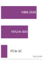
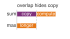
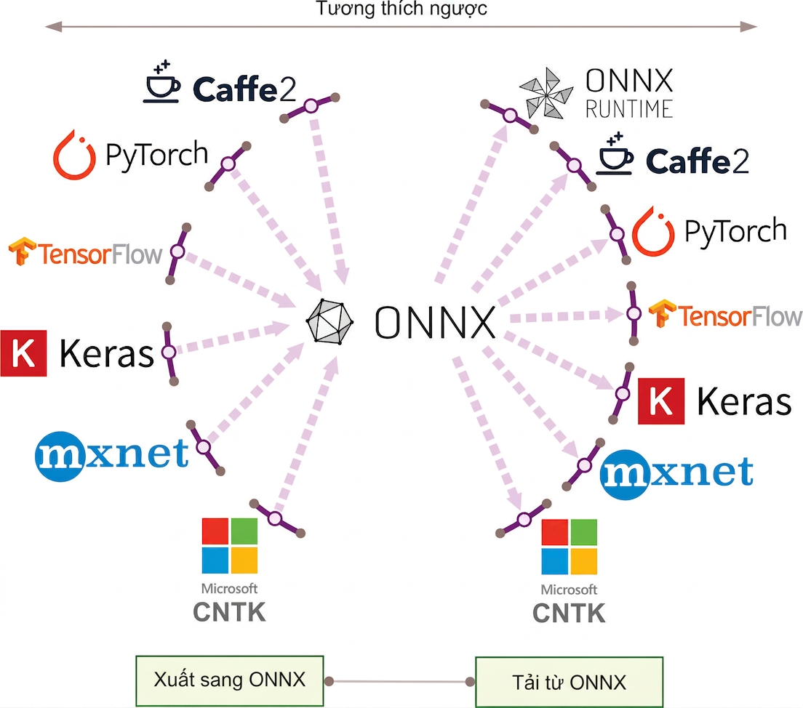

# Các Framework ML {#sec-ml-frameworks}

::: {layout-narrow}
::: {.column-margin}

\chapterminitoc

:::

::: {.content-visible when-format="pdf"}
\noindent
{fig-alt="Bản thiết kế phân lớp thể hiện ý định mô hình cấp cao được hạ cấp thông qua việc thu thập đồ thị, autograd, fusion và điều phối kernel thành công việc có thể thực thi."}
:::

::: {.content-visible unless-format="pdf"}
{fig-alt="Bản thiết kế phân lớp thể hiện ý định mô hình cấp cao được hạ cấp thông qua việc thu thập đồ thị, autograd, fusion và điều phối kernel thành công việc có thể thực thi."}
:::

:::

```{=latex}
\vspace*{-1ex}
```
## Mục đích {.unnumbered .unlisted}

\begin{marginfigure}
\mlsysstack{35}{90}{40}{45}{15}{0}{0}{10}
\end{marginfigure}

_Tại sao framework lại âm thầm ràng buộc mọi quyết định sau đó?_

Các phương trình mô hình không tự thực thi. Một framework dịch một kiến trúc thành công việc mà phần cứng có thể chạy, và quá trình dịch đó không trung lập. Nó quyết định khi nào các phép toán thực thi, trạng thái trung gian nào quá trình huấn luyện giữ lại, cách bộ nhớ được cấp phát, và những mục tiêu triển khai nào có thể sử dụng kết quả tạo ra. Những lựa chọn này định hình không chỉ tốc độ: chúng quyết định những gì có thể được gỡ lỗi trực tiếp, những gì trình biên dịch có thể tối ưu hóa, và liệu cùng một mô hình có tồn tại được trên con đường từ môi trường nghiên cứu đến một runtime sản xuất hay không. Do đó, các trừu tượng hóa giúp việc thử nghiệm thuận tiện lại tạo ra những cam kết lâu dài. Một khi một dự án tích lũy các checkpoint, module, bộ nạp dữ liệu, định dạng phục vụ (serving) và chuyên môn của nhóm xung quanh một framework, việc thay đổi nó trở thành một cuộc di chuyển hệ thống chứ không phải là một sự thay thế thư viện. Một framework phù hợp cho việc khám phá nhanh chóng có thể để lộ quá ít cấu trúc để triển khai hiệu quả, trong khi một đường dẫn thực thi bị ràng buộc có thể hy sinh sự linh hoạt cần thiết trong quá trình khám phá. Bởi vì thực thi, vi phân và trừu tượng hóa gặp nhau trong cùng một lớp phần mềm, một sự tiện lợi cục bộ có thể trở thành một hạn chế về hiệu suất hoặc tính di động ở giai đoạn sau. Câu hỏi kỹ thuật không phải là framework nào là tốt nhất toàn diện, mà là những đánh đổi nào mà khối lượng công việc (workload), nhóm và máy mục tiêu có thể chấp nhận cố định. Do đó, việc hiểu các framework là về việc suy luận thông qua các lựa chọn hệ thống đó hơn là học cú pháp API nhất thời. Theo thuật ngữ D·A·M, framework làm trung gian cho việc đồng thiết kế thuật toán-máy bằng cách biến ý định thuật toán và biểu diễn dữ liệu thành công việc có thể thực thi dưới các ràng buộc của máy.

::: {.callout-learning-objectives}

- Giải thích cách các framework làm trung gian cho việc đồng thiết kế thuật toán-máy thông qua thực thi, vi phân và trừu tượng hóa phần cứng
- So sánh các chiến lược thực thi bằng cách sử dụng chi phí điều phối, chi phí biên dịch và các ràng buộc triển khai
- Phân tích vi phân tự động và lưu trữ activation để chọn tính toán lại hoặc checkpointing
- Triển khai các mẫu trừu tượng hóa module cho việc khám phá tham số, hành vi chế độ, tuần tự hóa và các hook
- Tính toán FLOPs bước huấn luyện, lưu lượng bộ nhớ và chi phí điều phối để xác định các nút thắt cổ chai về fusion và bố cục
- Chọn TensorFlow, PyTorch, JAX hoặc các runtime edge dựa trên mô hình, phần cứng, nhóm và yêu cầu triển khai

:::

## Ba Vấn đề của Framework {#sec-ml-frameworks-three-problems-every-framework-must-solve-317d}

Một kiến trúc là một đồ thị các cam kết: một transformer cam kết hệ thống với attention, phép nhân ma trận, trạng thái activation và lưu lượng bộ nhớ. Framework là lớp biến đồ thị đó thành công việc mà máy có thể thực thi. Một vài lệnh gọi như `logits = model(tokens)`, `loss = criterion(logits, targets)` và `loss.backward()` ẩn chứa hàng tỷ phép toán dấu phẩy động trên các hệ thống phân cấp bộ nhớ, các gradient thông qua hàng triệu tham số qua vi phân tự động\index{Automatic differentiation!framework role}, hàng nghìn lần khởi chạy kernel GPU và gigabyte trạng thái trung gian. API trông đơn giản vì framework đang hoạt động như một trình biên dịch cho hợp đồng silicon.

Các kiến trúc chỉ định những phép tính mà mạng nơ-ron thực hiện, nhưng biết *cái gì* cần tính toán hoàn toàn khác với biết *cách* tính toán nó một cách hiệu quả. Cơ chế attention của một transformer yêu cầu phối hợp tính toán trên các hệ thống phân cấp bộ nhớ và các lõi bộ tăng tốc theo các mẫu mà các triển khai ngây thơ sẽ thực thi chậm hơn 100$\times$ so với các triển khai được tối ưu hóa. Việc triển khai các phép toán này từ đầu cho mỗi mô hình sẽ khiến deep learning không khả thi về mặt kinh tế. Các ML framework tồn tại để thu hẹp khoảng cách này bằng cách hạ cấp các đồ thị mô hình trừu tượng thành các pipeline thực thi phù hợp với phần cứng, giúp trích xuất hiệu suất tối đa từ silicon.

Một framework\index{ML framework!compiler analogy} đối với machine learning giống như một trình biên dịch đối với lập trình truyền thống. Một trình biên dịch C dịch mã dễ đọc của con người thành các lệnh máy được tối ưu hóa, quản lý cấp phát thanh ghi, lập lịch lệnh và bố cục bộ nhớ. Một ML framework dịch các định nghĩa mô hình cấp cao thành các kế hoạch thực thi dành riêng cho phần cứng, quản lý fusion toán tử, tái sử dụng bộ nhớ và đặt thiết bị. Sự tương đồng này không chỉ là phép ẩn dụ: các framework hiện đại thực sự bao gồm các trình biên dịch.

Mọi ML framework\index{ML framework!execution problem}\index{ML framework!differentiation problem}\index{ML framework!hardware abstraction problem}, bất kể API hay triết lý thiết kế, đều phải giải quyết ba vấn đề cốt lõi. Vấn đề đầu tiên là *vấn đề thực thi*: quyết định khi nào và cách thức tính toán chạy. Một framework có thể thực thi các phép toán ngay lập tức như đã viết (thực thi eager\index{Eager execution!definition}[^fn-eager-execution-tradeoff]) hoặc xây dựng một mô tả hoàn chỉnh trước\index{Deferred execution!graph construction}---một đồ thị tính toán\index{Computational graph!definition}[^fn-computational-graph-frameworks] (một biểu diễn có cấu trúc của các phép toán và sự phụ thuộc của chúng)---và tối ưu hóa trước khi thực thi (thực thi đồ thị). Lựa chọn này định hình khả năng gỡ lỗi, tiềm năng tối ưu hóa và tính linh hoạt trong triển khai.

Khi quá trình thực thi đã có hình dạng, framework phải giải quyết *vấn đề vi phân*: tính toán gradient tự động. Như đã thiết lập trong @sec-neural-computation, huấn luyện yêu cầu các đạo hàm của một hàm mất mát đối với hàng triệu hoặc hàng tỷ tham số, và vi phân thủ công dễ gây lỗi ở quy mô này. Do đó, các framework áp dụng các quy tắc đạo hàm đã đăng ký trên các thành phần phép toán được hỗ trợ trong khi quản lý số học dấu phẩy động và chi phí bộ nhớ của các giá trị đã lưu.

Vấn đề thứ ba là *trừu tượng hóa phần cứng*: nhắm mục tiêu nhiều loại phần cứng khác nhau từ một giao diện duy nhất. Định nghĩa mô hình tương tự phải có thể biểu diễn được trên CPU, GPU, Tensor Processing Units (TPU) và các thiết bị di động, mặc dù mỗi mục tiêu có các ràng buộc bộ nhớ và các mẫu thực thi tối ưu khác nhau. Trong phần liên quan đến GPU của vấn đề này, một số hệ sinh thái framework cung cấp các ngôn ngữ kernel tùy chỉnh để người dùng nâng cao có thể viết các kernel hiệu suất cao mà không cần chuyển hẳn sang CUDA cấp thấp [@tillet2019].

[^fn-computational-graph-frameworks]: **Đồ thị tính toán**\index{Computational graph!framework optimization}: Sự khác biệt "tối ưu hóa trước khi thực thi" trong câu kích hoạt là lựa chọn thiết kế then chốt. Việc nắm bắt chương trình dưới dạng cấu trúc dữ liệu cho phép một framework kết hợp các phép toán tương thích thành ít kernel GPU hơn trước khi thực thi, giảm chi phí khởi tạo và lưu lượng bộ nhớ trung gian. Chi phí kỹ thuật của khả năng hiển thị này là chương trình được thực thi khác với mã nguồn, khiến việc gỡ lỗi trở nên khó khăn hơn, một sự đánh đổi mà mọi framework dựa trên đồ thị phải biện minh so với lợi ích về hiệu suất.

[^fn-eager-execution-tradeoff]: **Thực thi tức thì (Eager execution)**\index{Eager execution!optimization trade-off}: Chế độ này thực thi từng phép toán ngay lập tức, cho phép gỡ lỗi trực tiếp bằng các công cụ tiêu chuẩn nhưng hy sinh cái nhìn tổng thể cần thiết cho các tối ưu hóa cấp đồ thị. Nếu không nắm bắt một vùng tính toán lớn hơn, một runtime thực thi tức thì không thể kết hợp các phép toán trong vùng đó hoặc lập kế hoạch bộ nhớ trước, để lại các cơ hội tối ưu hóa phụ thuộc vào khối lượng công việc (workload) cho các trình biên dịch như `torch.compile`.

Ba vấn đề này có mối liên hệ sâu sắc. Mô hình thực thi xác định *khi nào* quá trình vi phân xảy ra và *những tối ưu hóa nào* có thể thực hiện được. Lớp trừu tượng phải hỗ trợ cả hai kiểu thực thi trên tất cả các mục tiêu phần cứng. Giải quyết bất kỳ vấn đề nào một cách riêng lẻ dẫn đến các framework xuất sắc trong các ngữ cảnh hẹp nhưng thất bại trong triển khai rộng hơn. Bởi vì những vấn đề này cuối cùng là về việc chuyển đổi toán học thành thực thi phần cứng hiệu quả, một quan điểm hữu ích là xem các framework không phải là thư viện mà là trình biên dịch.

::: {#psp-frameworks-ml-compiler .callout-perspective title="Trình biên dịch ML"}

Trong bối cảnh định luật sắt (@sec-introduction-iron-law-ml-systems-c32a), một framework\index{ML framework!compiler for the silicon contract} là một trình biên dịch cho hợp đồng silicon\index{Silicon contract!framework compilation}.

"Mã nguồn" là kiến trúc mô hình (thuật ngữ $O$). Nhiệm vụ của framework là lấy toán học cấp cao này và biên dịch nó thành một chuỗi các lần khởi chạy kernel dành riêng cho phần cứng để:

1.  Giảm thiểu di chuyển dữ liệu $(D_{\text{vol}})$ thông qua các kỹ thuật như hợp nhất kernel.
2.  Tối đa hóa mức sử dụng $(\eta_{\text{hw}})$ bằng cách khớp các phép toán với các đơn vị phần cứng chuyên dụng như Tensor Cores.
3.  Giảm thiểu chi phí $(L_{\text{lat}})$ thông qua điều phối bất đồng bộ hiệu quả và nắm bắt đồ thị.

Việc chọn một framework có nghĩa là chọn trình biên dịch xác định *mức độ* hiệu quả của một mô hình khi sử dụng phần cứng; sự chính xác là quan trọng: một định nghĩa bao gồm cả ba trách nhiệm này sẽ phân biệt các framework thực sự với các thư viện số chỉ giải quyết một trách nhiệm.

:::

::: {#dfn-frameworks-machine-learning-frameworks .callout-definition title="Các framework machine learning"}

***Các framework machine learning***\index{ML framework!definition} là các hệ thống phần mềm chuyển đổi các định nghĩa mô hình toán học cấp cao thành các kế hoạch thực thi được tối ưu hóa cho phần cứng bằng cách quản lý đồ thị tính toán, vi phân tự động, điều phối kernel và cấp phát bộ nhớ trên toàn bộ hệ thống phân cấp phần cứng.

1.  **Ý nghĩa**: Các framework trực tiếp xác định thuật ngữ hiệu suất hệ thống $(\eta_{\text{hw}})$ trong định luật sắt. Hợp nhất toán tử được hỗ trợ bởi trình biên dịch, ví dụ, có thể loại bỏ các thao tác ghi và đọc tiếp theo các giá trị trung gian giữa các phép toán tương thích. Việc hợp nhất phép nhân ma trận, cộng độ chệch (bias) và đơn vị tuyến tính chỉnh lưu (ReLU) thay đổi cách cùng một phép toán tiếp cận phần cứng mà không thay đổi mô hình.
2.  **Điểm khác biệt**: Không giống như một thư viện số như NumPy, thường đánh giá từng phép toán khi nó được gọi, một framework machine learning có thể nắm bắt hoặc trì hoãn việc thực thi để phân tích một đồ thị tính toán lớn hơn và áp dụng các tối ưu hóa giữa các phép toán: hợp nhất toán tử, biến đổi bố cục bộ nhớ và lập lịch song song. Những tối ưu hóa đó đòi hỏi khả năng hiển thị vượt ra ngoài các phép toán được điều phối riêng lẻ.
3.  **Lỗi thường gặp**: Một quan niệm sai lầm phổ biến là các framework là các trình bao API có thể thay thế cho nhau. Việc lựa chọn framework xác định các đường dẫn trình biên dịch nào có sẵn. PyTorch có thể khôi phục tối ưu hóa cấp đồ thị từ mã thực thi tức thì (eager code) thông qua `torch.compile()`, trong khi TensorFlow và JAX thường dựa vào các đường dẫn biên dịch được hỗ trợ bởi XLA để chuyển đổi các phép toán xuống phần cứng mục tiêu. Việc chuyển từ thực thi tức thì sang đường dẫn trình biên dịch có thể thay đổi đáng kể thông lượng, nhưng lợi ích phụ thuộc vào cấu trúc mô hình, hình dạng, hỗ trợ toán tử và phần cứng.

:::

Ẩn dụ về trình biên dịch không chỉ mang tính trang trí. Một framework machine learning chuyển đổi ý định logic thành thực thi vật lý dưới các ràng buộc của định luật sắt, quyết định cách phân chia tính toán trên các hệ thống phân cấp bộ nhớ, khi nào nên đánh đổi độ chính xác số học để lấy thông lượng, và cách lập lịch các phép toán để thuật ngữ chiếm ưu thế (di chuyển dữ liệu, tính toán hoặc chi phí) được giảm thiểu. Framework là nơi vật lý chi phối được phát triển trong suốt cuốn sách này trở thành mã có thể thực thi được.

Quy mô của phép chuyển đổi này không hiển nhiên từ bề mặt API. Một lệnh gọi duy nhất đến `loss.backward()` kích hoạt việc ghi lại hoạt động, cấp phát bộ nhớ cho gradient, duyệt đồ thị theo thứ tự ngược và điều phối kernel tối ưu hóa phần cứng---một bộ máy mà ngay cả đối với một mạng ba lớp cũng sẽ đòi hỏi hàng trăm dòng tính toán thủ công. Đối với một mô hình ngôn ngữ hiện đại, framework còn điều phối hàng tỷ phép toán dấu phẩy động trên các bộ tăng tốc, điều phối các hệ thống phân cấp bộ nhớ, độ chính xác số học và, khi hệ thống mở rộng vượt quá một thiết bị, các thư viện giao tiếp. Xây dựng điều này từ đầu sẽ tốn kém đến mức không thể thực hiện được về mặt kinh tế đối với hầu hết các tổ chức, đó là lý do tại sao lịch sử của các framework ML là lịch sử của việc tự động hóa dần dần các lớp này.

Ba vấn đề---thực thi, vi phân và trừu tượng hóa---không xuất hiện đồng thời. Mỗi vấn đề phát sinh như một phản ứng đối với những hạn chế về khả năng mở rộng trong thế hệ công cụ trước đó. Theo dõi sự tiến hóa này giải thích tại sao các framework hiện đại được thiết kế như hiện tại và tại sao chúng thể hiện những đánh đổi cụ thể này.

## Thang trừu tượng hóa {#sec-ml-frameworks-frameworks-evolved-ac68}

Năm 1979, việc viết một phép nhân ma trận trong Fortran sử dụng phần cứng hiệu quả đòi hỏi kiến thức sâu sắc về dòng cache, lập lịch thanh ghi và đơn vị vector. Đến năm 2016, một dòng Python duy nhất (`torch.matmul(A, W)`) có thể điều phối đến một triển khai được tối ưu hóa cao mà không cần lập trình viên biết chi tiết về silicon. Sự nén nỗ lực đó không xảy ra trong một bước; nó tích lũy qua bốn thập kỷ trừu tượng hóa\index{ML framework!historical evolution}, mỗi lớp giải quyết một nút thắt cổ chai khiến thế hệ trước không thực tế để mở rộng. Kết quả là một **thang trừu tượng hóa**\index{Ladder of abstraction} trong đó mỗi bậc tự động hóa những gì bậc dưới nó đã phơi bày.

1.  **Giải quyết hiệu suất (1979–1992)**: **Basic linear algebra subprograms (BLAS)**\index{BLAS!historical foundation}[^fn-blas-routine-acceleration] ban đầu đã tiêu chuẩn hóa các nguyên thủy đại số tuyến tính cấp thấp có thể tái sử dụng [@lawson1979], trong khi LAPACK\index{LAPACK!framework foundation}[^fn-lapack-linear-algebra] [@bai2006] xây dựng các routine số học cấp cao hơn dựa trên nền tảng đó. Cùng nhau, các thư viện này đã giải quyết vấn đề về các nguyên thủy phần cứng: các giao diện ổn định cho phép các framework ủy quyền các hoạt động như `C = A @ B`[^fn-gemm-hardware-utilization] cho các triển khai chuyên biệt thay vì viết thủ công mã dành riêng cho silicon.
2.  **Giải quyết khả năng sử dụng (2005--2006)**: **NumPy**\index{NumPy!framework foundation}[^fn-numpy-array-abstraction] đã giải quyết vấn đề về tốc độ phát triển của lập trình viên. Bằng cách bọc các routine BLAS cấp thấp trong Python cấp cao [@harris2020], nó cho phép các nhà khoa học viết mã bằng một ngôn ngữ thân thiện trong khi thực thi nó bằng C/Fortran được tối ưu hóa. Mô hình 
3.  **Giải quyết vi phân (2007–hiện tại)**: Các **deep learning frameworks**\index{Deep learning framework!automatic differentiation} (Theano,[^fn-theano-framework-origin] TensorFlow [@abadi2016tensorflow], PyTorch [@paszke2019pytorch]) đã giải quyết vấn đề tính toán gradient. Trong khi NumPy yêu cầu đạo hàm thủ công các gradient lan truyền ngược (dễ gây lỗi và chậm), các framework này đã biến vi phân tự động thông qua đồ thị tính toán thành một khả năng tiêu chuẩn. Điều này đã biến quy tắc chuỗi thành một nguyên thủy phần mềm, cho phép các nhà nghiên cứu định nghĩa các lượt *chuyển tiếp* và nhận các lượt *chuyển ngược* một cách tự động.

[^fn-blas-routine-acceleration]: **BLAS (basic linear algebra subprograms)**\index{BLAS!performance foundation}: Đặc tả API năm 1979 tạo thành bậc thang thấp nhất của thang được mô tả ở đây; nó đã tiêu chuẩn hóa một tập hợp cố định các phép toán vector có thể gọi từ Fortran, tách biệt tên routine công khai khỏi các quyết định triển khai dành riêng cho máy bên dưới chúng. Mọi framework phía trên nó đều kế thừa phiên bản rộng hơn của thỏa thuận này: gọi một nguyên thủy đại số tuyến tính tiêu chuẩn từ bất kỳ ngôn ngữ nào và để một thư viện nhà cung cấp được tinh chỉnh nhắm mục tiêu silicon. Đối với phép nhân ma trận tổng quát (GEMM) hiện đại trên NVIDIA GPUs, đường dẫn được tinh chỉnh đó là cuBLAS chứ không phải chính đặc tả BLAS năm 1979 [@nvidia_cublas].

[^fn-lapack-linear-algebra]: **LAPACK (linear algebra package)**\index{LAPACK!higher-level numerical routines}: Mở rộng BLAS bằng cách cung cấp một API tiêu chuẩn cho các routine cấp cao hơn (SVD, phân tích giá trị riêng, bình phương nhỏ nhất) mà các nhà cung cấp triển khai bằng mã dành riêng cho chip được xếp lớp trên các kernel GEMM nhanh. Thiết kế phân lớp này là mẫu kiến trúc mà mọi framework ML kế thừa: các hoạt động cấp cao ủy quyền xuống các nguyên thủy được tinh chỉnh thủ công, do đó một lệnh gọi LAPACK được tối ưu hóa bởi nhà cung cấp có thể thực thi nhanh hơn hơn 10$\times$ so với một triển khai ngây thơ mà không cần tác giả framework viết một dòng mã dành riêng cho phần cứng nào.

[^fn-gemm-hardware-utilization]: **GEMM**\index{GEMM!hardware utilization}: Nguyên thủy ma trận-ma trận đằng sau `C = A @ B`. Các nhà cung cấp phần cứng tinh chỉnh thủ công GEMM cho các chip cụ thể của họ vì các lớp dày đặc, phép chiếu chú ý và hạ tích chập đều dựa vào phép nhân ma trận, biến routine này thành một ngưỡng hiệu suất cho nhiều framework phía trên nó trên thang. Cường độ số học cao của nó làm cho GEMM trở thành phép toán có khả năng tiếp cận thông lượng tính toán đỉnh cao nhất, trong khi các hình dạng nhỏ hoặc không thẳng hàng thường quay trở lại mức sử dụng thấp hơn nhiều.

[^fn-numpy-array-abstraction]: **NumPy (numerical Python)**\index{NumPy!framework lineage}: Năm 2005, Travis Oliphant đã hợp nhất hai thư viện mảng Python cạnh tranh (Numeric và Numarray) thành một gói duy nhất, mang đến cho cộng đồng tính toán khoa học một chuẩn mảng được hỗ trợ bởi BLAS vào thời điểm cần mở rộng quy mô. Hợp đồng "vector hóa" mà điều này tạo ra (viết logic bằng Python, thực thi các vòng lặp trong C/Fortran thông qua BLAS) đã trở thành khuôn mẫu thiết kế cho mọi machine learning framework sau này: các tensor của PyTorch và mảng của TensorFlow là hậu duệ trực tiếp, mở rộng cùng một trừu tượng mảng $n$-chiều sang GPU. Vai trò của Python trong cơ sở hạ tầng machine learning thừa hưởng phần lớn hình dạng của nó từ quyết định hợp nhất này.

[^fn-theano-framework-origin]: **Theano**\index{Theano!computational graph origin}: Được phát triển tại Viện Thuật toán Học tập Montreal (MILA) dưới sự chỉ đạo của Yoshua Bengio bắt đầu từ năm 2007, Theano là một framework Python ban đầu và có ảnh hưởng, biên dịch các biểu thức toán học ký hiệu thành mã CPU và GPU được tối ưu hóa thông qua đồ thị tính toán [@bergstra2010; @al2016theano]. Nó đã chứng minh rằng một đồ thị tính toán được định nghĩa bằng Python có thể được biên dịch để thực thi trên GPU mà không yêu cầu nhà nghiên cứu phải viết mã CUDA. Mila đã chấm dứt phát triển tích cực Theano vào năm 2017 [@milaTheanoDevelopment].

Các framework machine learning đã tiến hóa bằng cách dần dần trừu tượng hóa các chi tiết thực thi phần cứng thành các nguyên thủy API cấp cao hơn. Các framework thu hẹp khoảng cách giữa ý định toán học và thực tế silicon (@fig-mlfm-timeline), đưa phần mềm số học lên một tầm cao mới từ các hàm đại số tuyến tính cấp thấp đến các công cụ thực thi đồ thị được biên dịch.

::: {#fig-mlfm-timeline fig-env="figure" fig-pos="htb" fig-cap="**Sự tiến hóa của thư viện tính toán**: Dòng thời gian các cột mốc tính toán số học kéo dài từ năm 1979 đến 2018. Mỗi kỷ nguyên tự động hóa những gì lớp bên dưới đã phơi bày—từ các hàm phần cứng BLAS và LAPACK đến cú pháp vector hóa của NumPy và vi phân tự động dựa trên đồ thị trong các framework hiện đại—đánh đổi sự minh bạch cấp thấp để lấy tốc độ phát triển." fig-alt="Dòng thời gian ngang từ năm 1979 đến 2018 đánh dấu các cột mốc quan trọng: 1979 BLAS được giới thiệu, 1992 LAPACK mở rộng BLAS, 2006 NumPy trở thành xương sống số học của Python, 2007 Theano giới thiệu đồ thị tính toán, 2015 TensorFlow, 2016 PyTorch, 2018 JAX."}

```{.tikz}
\begin{tikzpicture}[node distance=1mm,outer sep=0pt,font=\small\sffamily]
\tikzset{%
    Line/.style={line width=1.0pt,black!50
},
  Box/.style={inner xsep=1pt,
    draw=none,
    fill=#1,
    anchor=west,
    text width=27mm,align=flush center,
    minimum width=28mm, minimum height=13mm
  },
  Box/.default=red
}
\definecolor{col1}{RGB}{128, 179, 255}
\definecolor{col2}{RGB}{255, 255, 128}
\definecolor{col3}{RGB}{204, 255, 204}
\definecolor{col4}{RGB}{230, 179, 255}
\definecolor{col5}{RGB}{255, 153, 204}
\definecolor{col6}{RGB}{245, 82, 102}
\definecolor{col7}{RGB}{255, 102, 102}

\node[Box={col1}](B1){1979};
\node[Box={col2!},right=of B1](B2){1992};
\node[Box={col3},right=of B2](B3){2006};
\node[Box={col4},right=of B3](B4){2007};
\node[Box={col5},right=of B4](B5){2015};
\node[Box={col6},right=of B5](B6){2016};
\node[Box={col7},right=of B6](B7){2018};
%%
\foreach \x in{1,2,...,7}
\draw[dashed,thick,-latex](B\x)--++(270:4.1);

\path[red]([yshift=-7mm]B1.south west)coordinate(P)-|coordinate(K)(B7.south east);

\draw[line width=2pt,-latex](P)--(K)--++(0:3mm);

\def\vi{1.4}
\node[Box={col1!50},below=\vi of B1](BB1){BLAS introduced};
\node[Box={col2!50},below=\vi of B2](BB2){LAPACK extends BLAS};
\node[Box={col3!50},below=\vi of B3](BB3){NumPy becomes Python's numerical backbone};
\node[Box={col4!50},below=\vi of B4](BB4){Theano introduces computational graphs};
\node[Box={col5!50},below=\vi of B5](BB5){TensorFlow popularizes static graphs};
\node[Box={col6!50},below=\vi of B6](BB6){PyTorch introduces dynamic graphs};
\node[Box={col7!50},below=\vi of B7](BB7){JAX introduces functional paradigms};
\end{tikzpicture}
```

:::

Mỗi thế hệ trừu tượng hóa các chi tiết đã tiêu tốn nỗ lực kỹ thuật ở thế hệ trước, nhưng mỗi trừu tượng hóa lại giới thiệu những đánh đổi mới. BLAS ẩn tối ưu hóa cấp hợp ngữ nhưng cố định giao diện. NumPy ẩn quản lý bộ nhớ nhưng yêu cầu vi phân thủ công. Các framework hiện đại ẩn tính toán gradient nhưng giới thiệu một lựa chọn giữa các mô hình thực thi. Mô hình sâu hơn là mọi trừu tượng hóa đều ẩn các chi tiết bằng cách duy trì một hợp đồng về hình dạng, kiểu dữ liệu, thiết bị và đôi khi là đơn vị; khi hợp đồng đó trở nên ngầm định, các thành phần đúng vẫn có thể kết hợp thành một hệ thống sai.

Với rủi ro hợp đồng đó, các framework hiện đại hội tụ vào ba vấn đề cốt lõi giống nhau: *cách* thực thi tính toán, *cách* vi phân nó, và *cách* trừu tượng hóa trên phần cứng. Vấn đề thực thi được ưu tiên hàng đầu vì giải pháp của nó quyết định những tối ưu hóa nào mà hai vấn đề còn lại có thể khai thác.

::: {#ws-frameworks-mars-climate-orbiter-units .callout-war-story title="Giao diện đã quên đơn vị của nó (1999)"}

**Bối cảnh**: Tàu quỹ đạo Mars Climate Orbiter của NASA phụ thuộc vào phần mềm mặt đất, phần mềm tàu vũ trụ, các đội điều hướng và giao diện nhà thầu đều đồng ý về ý nghĩa vật lý của các giá trị được trao đổi [@nasa1999marsclimateorbiter].

**Cơ chế**: Phần mềm mặt đất do Lockheed Martin cung cấp tính toán xung lực đẩy bằng đơn vị Anh (pound-lực giây), trong khi phần mềm điều hướng của JPL sử dụng các giá trị giả định đơn vị SI (newton-giây)—một sự không khớp đơn vị ngầm định 4.45$\times$.

**Tác động**: Vào ngày 23 tháng 9 năm 1999, tàu vũ trụ bị mất sau khi đi vào vùng che khuất. Điểm cận nhật đã điều chỉnh là 57 km, thay vì 226 km theo kế hoạch, được đánh giá là quá thấp để tồn tại.

**Phản ứng**: Hội đồng khuyến nghị kiểm tra tính nhất quán của đơn vị, kiểm toán đặc tả dữ liệu được truyền và xác minh đầu cuối mạnh mẽ hơn đối với phần mềm mặt đất.

**Bài học hệ thống**: Các trừu tượng của framework có giá trị vì chúng mang theo các hợp đồng: hình dạng, kiểu dữ liệu, vị trí thiết bị và đơn vị vật lý. Nếu những hợp đồng đó là ngầm định, hai đoạn mã đúng vẫn có thể kết hợp thành một hệ thống sai. Các framework machine learning gặp phải điều này bất cứ khi nào bố cục bộ nhớ tensor (chẳng hạn như NCHW so với NHWC), hệ số tỷ lệ lượng tử hoá hoặc các đơn vị đặc trưng vật lý khác nhau giữa các giai đoạn pipeline, tạo ra các đầu ra có vẻ hợp lý nhưng âm thầm làm hỏng suy luận hạ nguồn.

:::

## Vấn đề thực thi {#sec-ml-frameworks-execution-problem-e1e1}

Hãy xem xét hai kỹ sư viết cùng một mạng nơ-ron. Người thứ nhất gỡ lỗi tương tác, in hình dạng tensor sau mỗi thao tác, kiểm tra các giá trị trung gian và chạy từng bước mã bằng `pdb`. Người thứ hai đợi 30 giây để biên dịch, sau đó xem mô hình chạy nhanh hơn 3$\times$ trong khi mất đi cái nhìn trực tiếp, từng dòng về trạng thái trung gian. Cả hai đều đúng; họ đã đưa ra những lựa chọn khác nhau về **vấn đề thực thi**\index{Execution problem!definition}, câu hỏi liệu các thao tác có nên thực thi ngay lập tức như đã viết hay được ghi lại để thực thi sau. Lựa chọn này tạo ra một chuỗi các đánh đổi kỹ thuật định hình mọi khía cạnh của hành vi framework, từ quy trình gỡ lỗi đến các tùy chọn triển khai đến việc sử dụng phần cứng tối đa.

### Tại sao chiến lược thực thi lại quan trọng: Bức tường bộ nhớ {#sec-ml-frameworks-execution-strategy-matters-memory-wall-1ce8}

Để hiểu tại sao chiến lược thực thi lại quan trọng đến vậy, hãy quay lại khoảng cách ngày càng lớn giữa tính toán và băng thông được định lượng bằng phương trình tường bộ nhớ (@eq-memory-wall). Tốc độ tính toán của bộ xử lý đã tăng nhanh hơn băng thông bộ nhớ, tạo ra tường bộ nhớ\index{Memory wall!execution strategy impact}\index{Memory wall!framework execution}. Các bộ tăng tốc hiện đại có thể thực hiện các phép tính nhanh hơn nhiều so với khả năng tìm nạp dữ liệu của chúng. Các phép toán từng phần tử như ReLU chỉ sử dụng một phần rất nhỏ công suất tính toán đỉnh, không phải vì phần cứng chậm, mà vì chúng dành gần như toàn bộ thời gian để chờ dữ liệu. @Sec-appdx-machine-foundations-roofline-model-2529 chính thức hóa sự đánh đổi này, cho thấy chính xác khi nào các phép toán bị giới hạn bởi bộ nhớ so với bị giới hạn bởi tính toán.

Tường bộ nhớ phân loại các phép toán là bị giới hạn bởi tính toán\index{Compute-bound!operation classification} (bị giới hạn bởi thông lượng số học) hoặc bị giới hạn bởi bộ nhớ\index{Memory-bound!operation classification} (bị giới hạn bởi di chuyển dữ liệu). Hầu hết các loại phép toán mạng nơ-ron riêng lẻ (activations, chuẩn hóa, phép toán từng phần tử) đều bị giới hạn bởi bộ nhớ, mặc dù các phép nhân ma trận lớn chiếm ưu thế về tổng thời gian tính toán có thể bị giới hạn bởi tính toán.

Tối ưu hóa chính cho các phép toán bị giới hạn bởi bộ nhớ là hợp nhất kernel\index{Kernel fusion!definition}\index{Kernel fusion!optimizing memory-bound ops}, kết hợp nhiều phép toán thành một hàm GPU duy nhất (gọi là *kernel*)[^fn-kernel-gpu-dispatch] để tránh lưu lượng bộ nhớ trung gian. Việc hợp nhất một chuỗi các phép toán chuẩn hóa, dropout và activation vào một kernel có thể mang lại tốc độ tăng đáng kể bằng cách loại bỏ các ghi trung gian giữa các phép toán. Các kernel attention[^fn-flashattention-fusion-fw] sử dụng cùng nguyên tắc ở quy mô lớn hơn: thay vì hiện thực hóa toàn bộ ma trận attention trong bộ nhớ băng thông cao (HBM), một triển khai hợp nhất có thể giữ các khối gần các đơn vị tính toán, giảm số lần truy cập HBM lên tới 9$\times$, và tạo ra các cải thiện tốc độ cụ thể cho khối lượng công việc (workload) từ 15 phần trăm đến 3$\times$ [@dao2022].

[^fn-kernel-gpu-dispatch]: **Kernel (GPU)**\index{Operator kernel!GPU definition}: Trong lập trình GPU, một kernel là hàm được điều phối để thực thi song song trên hàng nghìn luồng. Mỗi lần khởi chạy kernel phát sinh 5--20 $\mu$s chi phí phụ ở phía CPU cho việc lắp ráp tham số và tín hiệu GPU, điều này có nghĩa là các phép toán nhỏ, không hợp nhất dành nhiều thời gian cho chi phí khởi chạy $(L_{\text{lat}})$ hơn là cho các phép tính số học hữu ích. Do đó, việc giảm số lượng kernel thông qua hợp nhất là một cách tấn công trực tiếp vào thành phần chi phí phụ của định luật sắt.

[^fn-flashattention-fusion-fw]: **Kernel attention hợp nhất**\index{Attention mechanism!fused kernel}: Một kernel attention hợp nhất kết hợp tích $\mathbf{Q}\mathbf{K}^T$, softmax và đầu ra trọng số giá trị thành một triển khai dạng lát (tiled) giữ các giá trị trung gian trong bộ nhớ trên chip thay vì hiện thực hóa toàn bộ ma trận attention trong HBM. FlashAttention\index{FlashAttention!framework fusion example} là ví dụ điển hình được giới thiệu trong @sec-network-architectures và báo cáo giảm tới 9$\times$ số lần truy cập HBM với các cải thiện tốc độ cụ thể cho khối lượng công việc (workload) từ 15 phần trăm đến 3$\times$ [@dao2022]. Bài học từ framework rộng hơn thuật toán cụ thể: hợp nhất có thể dịch chuyển vị trí của một phép toán trên Mô hình Roofline từ bị giới hạn bởi băng thông sang thực thi bị giới hạn bởi thông lượng bằng cách giảm các lượt truy cập khứ hồi qua bộ nhớ ngoài.

Các framework chỉ có thể hợp nhất các phép toán hiển thị cùng nhau. Các phép toán eager được điều phối riêng lẻ\index{Eager Execution!optimization limitations} che giấu các cơ hội tối ưu hóa giữa các phép toán, nhưng việc nắm bắt đồ thị có thể làm lộ chúng. Một đồ thị trì hoãn\index{Graph Execution!optimization advantages} cho phép framework tối ưu hóa tính toán đã nắm bắt. Do đó, chiến lược thực thi quyết định những tối ưu hóa nào có thể thực hiện được và phạm vi của chúng.

### Đồ thị tính toán {#sec-ml-frameworks-computational-graph-00f7}

Hợp nhất kernel là tối ưu hóa chính cho các phép toán bị giới hạn bởi bộ nhớ, nhưng hợp nhất đòi hỏi phải nhìn thấy nhiều phép toán cùng nhau. Các framework tạo điều kiện cho khả năng hiển thị này thông qua đồ thị tính toán\index{Computational graph!definition (DAG)}, một đồ thị có hướng không chu trình (DAG) trong đó các nút đại diện cho các phép toán và các cạnh đại diện cho các phụ thuộc dữ liệu. Đồ thị này là mô hình tính toán nội bộ của framework.

Các phép toán toán học có thể được tách rời khỏi thực thi vật lý thông qua các biểu diễn đồ thị. Đồ thị tính toán (@fig-comp-graph) làm nền tảng cho sự trừu tượng này: các biến tensor ánh xạ tới các nút dữ liệu trong khi các phép toán ánh xạ tới các nút biến đổi.

::: {#fig-comp-graph fig-env="figure" fig-pos="htb" fig-cap="**Đồ thị Tính toán Đơn giản**: Biểu diễn $z = f(x, y)$ dưới dạng đồ thị có hướng không chu trình tách rời các phụ thuộc toán học khỏi thứ tự thực thi vật lý, cung cấp bản thiết kế cấu trúc mà các framework yêu cầu để theo dõi gradient và lên lịch các phép toán trên các thiết bị." fig-alt="Đồ thị có hướng đơn giản với các nút x và y chảy vào hàm f(x,y) cho ra đầu ra z."}

```{.tikz}
\begin{tikzpicture}[font=\sffamily\small]
%
\tikzset{%
    Line/.style={line width=1.0pt,black!50,rounded corners
},
  Box/.style={align=flush center,
   shape=circle,
    inner xsep=1pt,
    node distance=1.4,
    draw=BlueLine,
    line width=0.75pt,
    fill=BlueL,
    minimum width=8mm,
  },
}
\node[Box,fill=GreenFill,draw=GreenLine,minimum width=15mm, ](B1){$f(x,y)$};
\node[Box,right=of B1,fill=GreenFill,draw=GreenLine](B2){$z$};
\node[Box,above left=-0.10 and 2 of B1,fill=GreenFill,draw=GreenLine](B3){$x$};
\node[Box,below left=-0.10 and 2 of B1,fill=GreenFill,draw=GreenLine](B4){y};
\draw[-latex,Line](B1)--(B2);
\draw[-latex,Line](B3)to[bend left=25](B1);
\draw[-latex,Line](B4)to[bend right=25](B1);
\end{tikzpicture}
```

:::

Các mô hình machine learning thực tế yêu cầu cấu trúc đồ thị phức tạp hơn nhiều. @Fig-mlfm-comp-graph mở rộng biểu diễn này để hiển thị đồ thị tính toán mạng nơ-ron cùng với các thành phần hệ thống suy luận về nó. Trong bảng bên trái, hãy chú ý cách dữ liệu chảy qua sáu nút phép toán trong một đồ thị có hướng không chu trình---đầu ra của mỗi nút trở thành đầu vào của nút tiếp theo. Bảng bên phải tiết lộ những gì framework thu được từ cấu trúc đồ thị rõ ràng này: nó có thể truy vấn cấu trúc để lập kế hoạch cấp phát bộ nhớ cho vòng đời của mỗi tensor, và nó có thể gán các phép toán cho các thiết bị dựa trên các phụ thuộc dữ liệu thay vì thứ tự thực thi. Thông tin quan trọng là đồ thị tồn tại độc lập với quá trình thực thi, cho phép framework tối ưu hóa trước khi bất kỳ phép tính số học nào xảy ra.

::: {#fig-mlfm-comp-graph fig-env="figure" fig-pos="htb" fig-cap="**Đồ thị Tính toán với Tương tác Hệ thống**: Một DAG mạng nơ-ron (trái) giao tiếp với các thành phần runtime của framework (phải). Bằng cách duy trì một biểu diễn đồ thị rõ ràng độc lập với quá trình thực thi, framework có thể phân tích vòng đời của tensor để tái sử dụng bộ nhớ và gán các phép toán cho các bộ tăng tốc mục tiêu trước khi thực hiện các phép tính số học." fig-alt="Phía bên trái hiển thị đồ thị tính toán với sáu nút thao tác được kết nối bằng các cạnh luồng dữ liệu. Phía bên phải hiển thị hộp thành phần hệ thống với các nút quản lý bộ nhớ và phân bổ thiết bị tương tác với đồ thị tính toán."}

```{.tikz}
\scalebox{0.9}{%
\begin{tikzpicture}[font=\sffamily\small]

\tikzset{
  Box/.style={ inner xsep=2pt,
    node distance=1.4,
    draw=none,
    line width=0.5pt,,
    fill=none,
    minimum width=27mm, minimum height=15mm
  },
    LineA/.style={violet!40,line width=5pt,{-{Triangle[width=1.0*11pt,length=1.0*8pt]}},shorten <=1pt,shorten >=1pt},
    graphpanel/.style={
        draw=olive!60!black,
        fill=olive!02,
        line width=0.9pt,
        rounded corners=4pt,
        inner sep=14pt,yshift=9pt
    },
    syspanel/.style={
        draw=orange!70!black,
        fill=orange!03,
        line width=0.9pt,
        rounded corners=4pt,
        inner sep=10pt
    },
    opnode/.style={
        circle,node distance=6mm,
        draw=BlueLine,,
        fill=cyan!15,
        minimum size=5mm,
        line width=0.9pt
    },
    compbox/.style={
        draw=orange!80!black,
        fill=orange!12,
        rounded corners=2pt,
        minimum width=2.7cm,
        minimum height=0.9cm,
        align=center,
        line width=0.8pt
    },
    flow/.style={
        -{Latex[length=2.2mm]},
        draw=BrownLine!75,
        line width=0.9pt
    },
}
%CPU style
\tikzset{
pics/cpu/.style = {
        code = {
        \pgfkeys{/channel/.cd, #1}
\begin{scope}[local bounding box = CPU,shift={($(0,0)+(0,0)$)},scale=\scalefac,every node/.append style={transform shape}]
\node[fill=\filllcolor,minimum width=66, minimum height=66,
            rounded corners=2,outer sep=2pt] (C1) {};
\node[fill=white,minimum width=54, minimum height=54] (C2) {};
\node[fill=\filllcolor!50,minimum width=44, minimum height=44] (C3) {\Large\bfseries GPU};

\foreach \x/\y in {0.11/1,0.26/2,0.41/3,0.56/4,0.71/5,0.85/6}{
\node[fill=\filllcolor,minimum width=4, minimum height=15,
           inner sep=0pt,anchor=south](GO\y)at($(C1.north west)!\x!(C1.north east)$){};
}
\foreach \x/\y in {0.11/1,0.26/2,0.41/3,0.56/4,0.71/5,0.85/6}{
\node[fill=\filllcolor,minimum width=4, minimum height=15,
           inner sep=0pt,anchor=north](DO\y)at($(C1.south west)!\x!(C1.south east)$){};
}
\foreach \x/\y in {0.11/1,0.26/2,0.41/3,0.56/4,0.71/5,0.85/6}{
\node[fill=\filllcolor,minimum width=15, minimum height=4,
           inner sep=0pt,anchor=east](LE\y)at($(C1.north west)!\x!(C1.south west)$){};
}
\foreach \x/\y in {0.11/1,0.26/2,0.41/3,0.56/4,0.71/5,0.85/6}{
\node[fill=\filllcolor,minimum width=15, minimum height=4,
           inner sep=0pt,anchor=west](DE\y)at($(C1.north east)!\x!(C1.south east)$){};
}
\end{scope}
    }
  }
}
\tikzset{
pics/dram/.style = {
        code = {
        \pgfkeys{/channel/.cd, #1}
\begin{scope}[shift={($(0,0)+(0,0)$)},scale=\scalefac,every node/.append style={transform shape}]
\node[draw=\drawcolor,fill=\filllcolor!70,line width=1.5*\Linewidth,inner sep=0pt,outer sep=0pt,
minimum width=56mm,minimum height=14mm](DRAM\picname)at(0,0){};
\node[draw=\drawcolor,fill=\filllcolor!30,line width=1.5*\Linewidth,inner sep=0pt,outer sep=0pt,anchor=north,
minimum width=52mm,minimum height=6mm](MDRAM\picname)at(DRAM\picname.south){};
%
\pgfmathsetmacro{\spacing}{56/(6+1)}
\foreach \i in {1,...,6} {
  \pgfmathsetmacro{\x}{\i * \spacing}
  \node[draw=\drawcolor,fill=\filllcolor!20,line width=\Linewidth, inner sep=0pt, outer sep=0pt,
        minimum width=6mm, minimum height=8mm]
        at ([xshift=\x mm]DRAM\picname.west) {};
}
%
\foreach \i in {1,...,19} {
  \pgfmathsetmacro{\x}{\i*(52/20)}
  \draw[draw=\drawcolor, line width=3*\Linewidth]
    ([xshift=\x mm,yshift=1pt]MDRAM\picname.south west) -- ++(0,2mm);
}
\end{scope}
    }
  }
}
\pgfkeys{
  /channel/.cd,
   Depth/.store in=\Depth,
  Height/.store in=\Height,
  Width/.store in=\Width,
  filllcirclecolor/.store in=\filllcirclecolor,
  filllcolor/.store in=\filllcolor,
  drawcolor/.store in=\drawcolor,
  drawcircle/.store in=\drawcircle,
  scalefac/.store in=\scalefac,
  Linewidth/.store in=\Linewidth,
  picname/.store in=\picname,
  filllcolor=BrownLine,
  filllcirclecolor=cyan!40,
  drawcolor=black,
  drawcircle=violet,
  scalefac=1,
  Linewidth=0.5pt,
  Depth=1.3,
  Height=0.8,
  Width=1.1,
  picname=C
}

    % graph nodes
    \node[opnode] (a)  {};
    \node[opnode,below left=of a] (b) {};
    \node[opnode,below right =of a] (c) {};
    \node[opnode,below=of b] (d)  {};
    \node[opnode,below =of c] (e) {};
    \node[opnode,below right=of d] (f) {};
    % edges
    \draw[flow] (a) -- (b);
    \draw[flow] (a) -- (c);
    \draw[flow] (b) -- (d);
    \draw[flow] (c) -- (e);
    \draw[flow] (d) -- (f);
    \draw[flow] (e) -- (f);
    % optional cross-edge
    \draw[flow] (b) -- (e);

    \node[opnode,minimum size=3mm,below left= 0.33 and 1.65of f] (l) {};
    \node[right=0pt of l,font=\sffamily\footnotesize](O){Operations};
    \draw[flow]($(O.east)+(1mm,0)$)--++(0:7mm)coordinate(A);
    \node[right=0pt of A,font=\sffamily\footnotesize](AA){Data flow};
    \scoped[on background layer]
    \node[graphpanel,fit=(a)(l)(O)(AA),inner xsep=6pt](FF){};
    \node[below=1pt of FF.north,font=\sffamily\bfseries\footnotesize]{Computational Graph};
%
   \node[right=29mm of FF.27,Box](MM){};
   \node[below=-6pt of MM](T1){Memory Management};
   \pic[shift={(0,0.1)}] at  (MM){dram={scalefac=0.43,picname=1,
   drawcolor=black,filllcolor=OrangeLine!50!,Linewidth=0.5pt}};
   \node[right=29mm of FF.338,Box](DP){};
      \node[below=1pt of DP](T2){Device Placement};
   \pic[shift={(0,0)}] at (DP) {cpu={scalefac=0.45,picname=1,
   drawcolor=RedLine,filllcolor=BlueLine!80!,Linewidth=0.5pt}};

   \scoped[on background layer]
   \node[fit=(MM)(T1)(T2),syspanel,yshift=1.0mm,inner xsep=6pt](DD){};
   \node[below=1pt of DD.north,font=\sffamily\bfseries\footnotesize]{System Components};

\draw[LineA](FF)--
node[above,pos=0.45,text=black!70,font=\sffamily\footnotesize]{Interacts with}
(DD);
\end{tikzpicture}}
```

:::

Biểu diễn đồ thị này không chỉ là một hình ảnh trực quan; nó là cấu trúc dữ liệu cho phép cả việc thực thi hiệu quả và vi phân tự động. Câu trả lời cho việc đồ thị này được xây dựng *khi nào* tạo ra một lựa chọn thiết kế với những hệ quả dây chuyền trên bốn khía cạnh. Gỡ lỗi được hưởng lợi từ khả năng hiển thị các giá trị trung gian và thực thi từng bước. Tối ưu hóa được hưởng lợi từ việc xem xét nhiều thao tác cùng lúc, điều này cho phép hợp nhất. Triển khai được hưởng lợi khi việc thực thi không còn phụ thuộc vào trình thông dịch Python. Tính linh hoạt được hưởng lợi khi luồng điều khiển có thể phụ thuộc vào các giá trị tensor đã tính toán.

Không có mô hình thực thi nào tối ưu hóa tất cả các khía cạnh này. Các framework phải chọn vị trí của mình trong không gian đánh đổi này, và các nhà thực hành phải hiểu những đánh đổi này để chọn công cụ phù hợp và viết mã hiệu quả. Ba nhóm thực thi sau đây là những câu trả lời khác nhau cho cùng một câu hỏi hệ thống: framework nên đánh đổi bao nhiêu khả năng hiển thị đồ thị để đổi lấy việc thực thi tức thì và gỡ lỗi?

### Ba chiến lược thực thi {#sec-ml-frameworks-three-execution-strategies-5934}

Biểu diễn đồ thị tính toán cho phép tối ưu hóa toàn cục, nhưng nó để lại một lựa chọn thiết kế quan trọng chưa được giải quyết: *khi nào* framework xây dựng đồ thị. Hãy xem xét một thao tác đơn giản như `y = x * 2`. Một cách tiếp cận thực hiện phép nhân ngay lập tức, lưu trữ kết quả vào `y`. Điều này tự nhiên và dễ gỡ lỗi, nhưng framework chỉ thấy một thao tác tại một thời điểm. Cách tiếp cận khác là trì hoãn việc thực thi, ghi lại ý định nhân và xây dựng một đồ thị các thao tác sẽ chạy sau khi được yêu cầu rõ ràng. Điều này ít trực quan hơn, nhưng framework thấy được toàn bộ quá trình tính toán, điều này cho phép tối ưu hóa.

Không có cách tiếp cận nào vượt trội; mỗi cách thể hiện những đánh đổi khác nhau giữa *tính linh hoạt* và *tiềm năng tối ưu hóa*. Các framework hiện đại đã khám phá ba chiến lược thực thi chính: thực thi eager với đồ thị động, đồ thị tính toán tĩnh và các cách tiếp cận lai kết hợp biên dịch đúng lúc (JIT) với phát triển eager. Mỗi chiến lược đều có những hàm ý hệ thống riêng biệt.

#### Thực thi eager với đồ thị động {#sec-ml-frameworks-eager-execution-dynamic-graphs-29c2}

Thực thi eager\index{Eager execution!define-by-run model} đánh giá từng thao tác ngay lập tức khi chương trình gọi nó, xây dựng đồ thị tính toán một cách động\index{Dynamic graph!eager execution} tại runtime. Một so sánh song song cho thấy điều này khác với thực thi dựa trên đồ thị ở cấp độ mã như thế nào.

::: {#exmp-frameworks-eager-vs-graph-execution-code-comparison .callout-example title="So sánh mã thực thi eager và đồ thị"}

**PyTorch (thực thi eager)**:
```{.python}
import torch

x = torch.tensor([1.0, 2.0])
y = x * 2
print(f"Intermediate value: {y}")  # Works immediately
z = y.sum()
```

**TensorFlow 1.x (đồ thị tĩnh)**:

```{.python}
import tensorflow as tf

x = tf.placeholder(tf.float32)
y = x * 2
# print(y) -> Prints Tensor("mul:0"...), not value!
z = tf.reduce_sum(y)

with tf.Session() as sess:
    result = sess.run(z, feed_dict={x: [1.0, 2.0]})
```

**Hiểu biết hệ thống**: Thực thi eager hiển thị các giá trị trung gian dưới dạng trạng thái runtime thông thường, giúp gỡ lỗi trực tiếp. Đồ thị tĩnh sắp xếp tính toán trước khi thực thi, điều này cho phép tối ưu hóa toàn bộ đồ thị nhưng thay đổi mô hình gỡ lỗi.

:::

Thực thi eager chạy các thao tác ngay lập tức khi gặp phải, xây dựng đồ thị tính toán một cách động trong quá trình thực thi. Khi một lập trình viên viết `y = x * 2`, phép nhân xảy ra ngay lập tức và kết quả có sẵn để sử dụng ngay.

Điều này mang lại sự linh hoạt của lập trình thông thường: các nhà phát triển có thể in các giá trị trung gian, sử dụng các câu lệnh điều kiện dựa trên kết quả đã tính toán và gỡ lỗi bằng các công cụ tiêu chuẩn. Framework ghi lại các thao tác khi chúng xảy ra, xây dựng một đồ thị động\index{Dynamic graph!definition}\index{Dynamic graph!runtime construction} phản ánh đường dẫn thực thi thực tế đã đi.

Để tính toán gradient, framework ghi lại lịch sử các thao tác trong cái gọi là autograd tape\index{Autograd tape!definition}\index{Autograd tape!dynamic graph construction},[^fn-autograd-tape-memory] một cấu trúc dữ liệu tạm thời được xây dựng trong quá trình thực thi. Mỗi thao tác tensor tạo ra một nút ghi lại: thao tác đã thực hiện, tham chiếu đến các tensor đầu vào và cách tính toán gradient. Các nút này tạo thành một DAG ghi lại đường dẫn thực tế đã đi trong quá trình thực thi lượt truyền xuôi thay vì một đồ thị được cố định trước. @Lst-autograd-tape-example cho thấy PyTorch ghi lại các thao tác khi chúng thực thi trong chế độ eager mặc định của nó như thế nào.

[^fn-autograd-tape-memory]: **Autograd tape**\index{Autograd tape!memory cost}: Một cấu trúc dữ liệu tạm thời được xây dựng trong quá trình thực thi truyền xuôi, nơi các nút ghi lại các thao tác, sự phụ thuộc và các hàm truyền ngược để đánh giá quy tắc chuỗi. Dấu chân bộ nhớ của nó tăng lên theo độ sâu mô hình và độ dài chuỗi khi các activation đã lưu tích lũy cho đến khi được giải phóng trong quá trình lan truyền ngược. Đối với các mô hình sâu, các framework giữ lại các activation được chọn và tính toán lại các activation khác thông qua checkpointing activation để ngăn chặn lỗi OOM.

::: {#lst-autograd-tape-example lst-cap="**Autograd Tape Construction**: Each operation executes immediately while recording a backward node to the autograd tape for later gradient computation."}

```{.python}
import torch

x = torch.tensor([1.0], requires_grad=True)
y = x * 2  # Executes immediately; records MulBackward node
z = y + 1  # Executes immediately; records AddBackward node
# The autograd tape exists NOW, built during execution
```

:::

Sau hai thao tác này, framework đã xây dựng một autograd tape với hai nút: một cho phép nhân và một cho phép cộng. Tape ghi lại rằng `z` phụ thuộc vào `y`, và `y` phụ thuộc vào `x`.

Gọi `z.backward()` duyệt qua tape này theo thứ tự tô pô ngược, áp dụng quy tắc chuỗi tại mỗi nút:

1. Tính $\frac{\partial z}{\partial z} = 1$ (gradient hạt giống)
2. Gọi `AddBackward0.backward()` $\rightarrow \frac{\partial z}{\partial y} = 1$
3. Gọi `MulBackward0.backward()` $\rightarrow \frac{\partial z}{\partial x} = 2$
4. Tích lũy gradient trong `x.grad`

Sau khi `backward()` hoàn tất, đồ thị autograd thường được giải phóng. Lượt truyền xuôi tiếp theo xây dựng một đồ thị mới. Các giá trị cần thiết cho gradient được lưu trong lượt truyền xuôi và vẫn còn tồn tại cho đến khi truyền ngược sử dụng chúng, vì vậy chi phí bộ nhớ của chúng trải dài cả hai giai đoạn thay vì chỉ xuất hiện trong quá trình truyền ngược.

::: {#exmp-frameworks-in-place-autograd-failure .callout-example title="Các thao tác tại chỗ có thể làm hỏng gradient"}

**Tình huống**: Một kỹ sư áp dụng một phép biến đổi tại chỗ (`x += 1`) trong một hàm activation PyTorch tùy chỉnh để giảm cấp phát bộ nhớ.

**Chẩn đoán**: Các thao tác tại chỗ ghi đè lên bộ nhớ tensor chứa các activation lượt truyền xuôi cần thiết cho autograd tape để tính toán gradient lượt truyền ngược, gây ra lỗi bộ đếm phiên bản runtime [@pytorchAutogradDocs].

**Bài học về hệ thống**: Vi phân tự động của framework phụ thuộc vào các bản ghi activation của lượt truyền xuôi bất biến. Các thay đổi bộ nhớ tại chỗ không được kiểm soát phá vỡ các phụ thuộc của băng autograd, buộc dừng thực thi framework runtime.

:::

Trong các framework thực thi tức thì (eager execution), các phép toán được đánh giá một cách mệnh lệnh khi mã máy chủ gặp chúng. Theo dõi vòng lặp thực thi trong @fig-mlfm-dynamic-graph-flow, theo chuỗi định nghĩa và điều phối gửi các phép toán riêng lẻ trực tiếp đến các hàng đợi luồng của thiết bị.

::: {#fig-mlfm-dynamic-graph-flow fig-env="figure" fig-pos="htb" fig-cap="**Luồng Thực thi Đồ thị Động**: Trong thực thi tức thì, mỗi phép toán được phát hành ngay khi chương trình gặp nó. Khối lượng công việc của bộ tăng tốc có thể thực thi không đồng bộ sau khi điều phối. Mô hình định nghĩa-theo-chạy này cho phép gỡ lỗi tự nhiên và luồng điều khiển phụ thuộc vào dữ liệu, đồng thời hạn chế tối ưu hóa trên các lệnh gọi Python." fig-alt="Sơ đồ luồng từ trái sang phải với Bắt đầu, Định nghĩa Phép toán dưới Điều phối Python, Thực thi Phép toán dưới Kernel GPU, một quyết định "Còn phép toán nào nữa không?", và Kết thúc. Một nhánh "Có" quay lại Định nghĩa Phép toán; một nhánh "Không" tiếp tục đến Kết thúc."}

```{.tikz}
\begin{tikzpicture}[line join=round,font=\sffamily\small]
\tikzset{%
  Line/.style={line width=0.75pt,black!50,text=black},
  Box/.style={align=flush center,
    inner xsep=2pt,
    node distance=0.75,
    draw=BlueLine,
    line width=0.75pt,
    fill=BlueL!30,
    %text width=35mm,
    minimum width=35mm, minimum height=11mm
  },
 decision/.style = {Box,diamond,text width=35mm,aspect=1.95, inner xsep=7pt,inner ysep=-2ex, fill=VioletL2!70,
 draw=VioletLine},
  startstop/.style = {Box,minimum width=25mm,  rounded corners=10pt, fill=red!10, draw=RedLine},
  LineA/.style={black!50,line width=1.5pt,{-{Triangle[width=1.0*5pt,length=1.0*5pt]}},shorten <=0pt,shorten >=0pt},
}

\tikzset{
pics/repeat/.style = {
        code = {
        \pgfkeys{/channel/.cd, #1}
\begin{scope}[shift={($(0,0)+(0,0)$)},scale=\scalefac,every node/.append style={transform shape}]
\def\w{4cm}
\def\h{15mm}
\def\r{6mm} % radius
\def\gap{4mm} % break lengths
\draw[\filllcirclecolor, -{Latex[length=10pt,width=15pt]},line width=\Linewidth]
  (\w,\h-\r) -- (\w,\r)
  arc[start angle=0, end angle=-90, radius=\r]
  -- (\gap,0);
%
  \draw[\filllcolor, -{Latex[length=10pt,width=15pt]},line width=\Linewidth]
  (0,\r) -- (0,\h-\r)
  arc[start angle=180, end angle=90, radius=\r]
  -- ({\w-\gap},\h);
\end{scope}
    }
  }
}
\tikzset{
pics/interpreter/.style = {
        code = {
        \pgfkeys{/channel/.cd, #1}
\def\ra{}
\begin{scope}[shift={($(0,0)+(0,0)$)},scale=\scalefac,every node/.append style={transform shape}]
\node[red,font=\Large\bfseries]at(-0.75,0.6){\textless\,/\,\textgreater};
\draw[line cap=round,line join=round,yellow,line width=\Linewidth](-1.15,-0.1)--(-0.95,-0.1);
\draw[line cap=round,line join=round,red,line width=\Linewidth](-0.7,-0.1)--(0.1,-0.1);

\draw[line cap=round,line join=round,yellow,line width=\Linewidth](-1.15,-0.5)--(0,-0.5);

\draw[line cap=round,line join=round,yellow,line width=\Linewidth](-1.15,-0.9)--(-0.75,-0.9);
\draw[line cap=round,line join=round,red,line width=\Linewidth](-0.45,-0.9)--(0.45,-0.9);
\draw[line cap=round,line join=round,cyan,line width=\Linewidth](0.75,-0.9)--(1.1,-0.9);

\draw[line cap=round,line join=round,yellow,line width=\Linewidth](-1.15,-1.3)--(-1,-1.3);
\draw[line cap=round,line join=round,red,line width=\Linewidth](-0.65,-1.3)--(-0.10,-1.3);
\draw[line cap=round,line join=round,cyan,line width=\Linewidth](0.2,-1.3)--(1.1,-1.3);
\end{scope}
    }
  }
}
%CPU
\tikzset{%
 pics/cpu/.style = {
        code = {
        \pgfkeys{/channel/.cd, #1}
\begin{scope}[local bounding box=FUNNEL,scale=\scalefac, every node/.append style={transform shape}]
\node[fill=\filllcolor,minimum width=66, minimum height=66,
            rounded corners=2,outer sep=2pt] (C1) {};
\node[fill=white,minimum width=54, minimum height=54] (C2) {};
\node[fill=\filllcolor!40,minimum width=44, minimum height=44] (C3) {\Large\bfseries GPU};

\foreach \x/\y in {0.11/1,0.26/2,0.41/3,0.56/4,0.71/5,0.85/6}{
\node[fill=\filllcolor,minimum width=3, minimum height=15,
           inner sep=0pt,anchor=south](GO\y)at($(C1.north west)!\x!(C1.north east)$){};
}
\foreach \x/\y in {0.11/1,0.26/2,0.41/3,0.56/4,0.71/5,0.85/6}{
\node[fill=\filllcolor,minimum width=3, minimum height=15,
           inner sep=0pt,anchor=north](DO\y)at($(C1.south west)!\x!(C1.south east)$){};
}
\foreach \x/\y in {0.11/1,0.26/2,0.41/3,0.56/4,0.71/5,0.85/6}{
\node[fill=\filllcolor,minimum width=15, minimum height=3,
           inner sep=0pt,anchor=east](LE\y)at($(C1.north west)!\x!(C1.south west)$){};
}
\foreach \x/\y in {0.11/1,0.26/2,0.41/3,0.56/4,0.71/5,0.85/6}{
\node[fill=\filllcolor,minimum width=15, minimum height=3,
           inner sep=0pt,anchor=west](DE\y)at($(C1.north east)!\x!(C1.south east)$){};
}
 \end{scope}
     }
  }
}
%start
\tikzset{%
 pics/start/.style = {
        code = {
        \pgfkeys{/channel/.cd, #1}
\begin{scope}[local bounding box=START,scale=\scalefac, every node/.append style={transform shape}]
\node[fill=\filllcolor,minimum width=6mm, minimum height=6mm,
            outer sep=2pt] (C1) {};
\node[isosceles triangle,isosceles triangle apex angle=45,xshift=-2.5pt,
    inner sep=1pt, fill=white,minimum size =3.5mm] (T1)at (C1){};
 \end{scope}
     }
  }
}
%check
\tikzset{pics/.cd,
checkmark/.style={code={
        \pgfkeys{/channel/.cd, #1}
\pgfgettransformentries{\tmpxx}{\tmp}{\tmp}{\tmp}{\tmp}{\tmp}
\draw[line width=\tmpxx*1pt,draw=none,fill=\filllcirclecolor,line join=bevel] (0,.35) -- (.25,0) to[bend left=5] (0.8,.6) to[bend
right=5] (.25,.18) -- cycle;}}}
\tikzset{%
 pics/checkI/.style = {
        code = {
        \pgfkeys{/channel/.cd, #1}
\begin{scope}[local bounding box=CHECK,scale=\scalefac, every node/.append style={transform shape}]
\node[fill=\filllcolor,minimum width=6mm, minimum height=6mm,
            outer sep=2pt] (C1) {};
\pic[shift={(-0.27,-0.19)},scale=0.7]{checkmark};
 \end{scope}
     }
  }
}
\pgfkeys{
  /channel/.cd,
   Depth/.store in=\Depth,
  Height/.store in=\Height,
  Width/.store in=\Width,
  filllcirclecolor/.store in=\filllcirclecolor,
  filllcolor/.store in=\filllcolor,
  drawcolor/.store in=\drawcolor,
  drawcircle/.store in=\drawcircle,
  scalefac/.store in=\scalefac,
  Linewidth/.store in=\Linewidth,
  picname/.store in=\picname,
  filllcolor=BrownLine,
  filllcirclecolor=violet!20,
  drawcolor=red,
  drawcircle=violet,
  scalefac=1,
  Linewidth=0.5pt,
  Depth=1.3,
  Height=0.8,
  Width=1.1,
  picname=C
}

\node[startstop](B1){};
\coordinate(GO1)at($(B1.north west)!0.33!(B1.north east)$);
\coordinate(T1)at($(GO1)!0.5!(B1.south east)$);
\node[align=center]at(T1){Start};
\begin{scope}
\coordinate(I1)at($(GO1)!0.5!(B1.south west)$);
\clip (B1.south west) rectangle (GO1);
%\fill[RedLine!30,rounded corners=10pt] (B1.south west) rectangle (B1.north east);
\end{scope}
\draw[dashed,RedLine,  line width=0.75pt,](GO1)--(GO1|-B1.south west);
\node[startstop,fill=none]{};
\pic[shift={(0,0)}] at  (I1){start={scalefac=1,picname=1,filllcolor=GreenLine, Linewidth=0.7pt}};
%Define
\node[Box,right=of B1](B2){};
\node[above=1pt of B2,text=black!70]{Python Dispatch};
\coordinate(GO2)at($(B2.north west)!0.3!(B2.north east)$);
%\fill[fill=BlueL!90](B2.south west)rectangle(GO2);
\coordinate(T2)at($(GO2)!0.5!(B2.south east)$);
\coordinate(I2)at($(GO2)!0.5!(B2.south west)$);
\node[align=center]at(T2){Define\\Operation};
\draw[dashed,BlueLine,  line width=0.75pt,](GO2)--(GO2|-B2.south west);
\node[Box,right=of B1,fill=none]{};
\pic[shift={(0.05,0.11)}] at  (I2){interpreter={scalefac=0.35,picname=1,
filllcolor=cyan!30!, Linewidth=1.5pt,filllcirclecolor=orange}};
 %Execute
\node[Box,right=of B2](B3){};
\node[above=1pt of B3,text=black!70]{GPU Kernel};
\coordinate(GO3)at($(B3.north west)!0.3!(B3.north east)$);
%\fill[fill=BlueL!90](B3.south west)rectangle(GO3);
\coordinate(T3)at($(GO3)!0.5!(B3.south east)$);
\coordinate(I3)at($(GO3)!0.5!(B3.south west)$);
\node[align=center]at(T3){Execute\\Operation};
\draw[dashed,BlueLine,  line width=0.75pt,](GO3)--(GO3|-B3.south west);
\node[Box,right=of B2,fill=none](B3){};
\pic[shift={(0,0)}] at  (I3){cpu={scalefac=0.23,picname=1,filllcolor=BrownLine, Linewidth=0.7pt}};
%More operations
\node[decision,right=of B3](B4){More\\operations?};
\path[red](B4.west)|-coordinate(SR4)(B4.south);
\pic[shift={(-0.30,-0.14)}] at  (SR4){repeat={scalefac=0.3,picname=1,filllcolor=RedLine,
Linewidth=4pt,filllcirclecolor=GreenLine}};
%End
\node[startstop,right=of B4](B5){};
\coordinate(GO5)at($(B5.north west)!0.33!(B5.north east)$);
\coordinate(T5)at($(GO5)!0.5!(B5.south east)$);
\coordinate(I5)at($(GO5)!0.5!(B5.south west)$);
\node[align=center]at(T5){End};
\begin{scope}
\clip (B5.south west) rectangle (GO5);
%\fill[RedLine!30,rounded corners=10pt] (B5.south west) rectangle (B5.north east);
\end{scope}
\draw[dashed,RedLine,  line width=0.75pt,](GO5)--(GO5|-B5.south west);
\node[startstop,right=of B4,fill=none](B5){};
\pic[shift={(0,0)}] at  (I5){checkI={scalefac=1,picname=1,filllcolor=GreenLine, filllcirclecolor=white,Linewidth=0.7pt}};
%arrows
\foreach \i in {1,2,3,4}{
\pgfmathtruncatemacro{\x}{\i + 1}
\draw[LineA](B\i)--coordinate[pos=0.3](SR\i)(B\x);
}
\node[above=0pt of SR4]{No};
\draw[LineA](B4.south)--node[right,pos=0.5]{Yes}++(270:0.55)-|(B2);
\end{tikzpicture}
```

:::

##### Hàm ý về hệ thống: Tính linh hoạt {.unnumbered}

Băng autograd động thể hiện hành vi phụ thuộc vào dữ liệu trực tiếp trong ngôn ngữ máy chủ. Các câu lệnh điều kiện và vòng lặp có thể phụ thuộc vào các giá trị tensor được tính toán trong quá trình thực thi, cho phép các thuật toán như tìm kiếm chùm (beam search), độ dài mạng nơ-ron hồi quy động, hoặc tính toán thích ứng điều chỉnh hành vi của chúng dựa trên kết quả trung gian. Đồ thị tĩnh cũng có thể biểu diễn luồng điều khiển phụ thuộc vào dữ liệu và các chiều động thông qua các phép toán đồ thị, nhưng thực thi tức thì làm cho các mẫu này tự nhiên hơn khi viết và gỡ lỗi trong Python. Bởi vì các phép toán được phát hành ngay lập tức, các nhà phát triển có thể in tensor, kiểm tra giá trị và sử dụng các trình gỡ lỗi tiêu chuẩn (`pdb`, breakpoints) để chẩn đoán lỗi giống như họ làm trong một chương trình Python khác.

##### Hàm ý về hệ thống: Chi phí phát sinh {.unnumbered}

Tính linh hoạt này đi kèm với chi phí hiệu suất liên quan trực tiếp đến định luật sắt (@sec-introduction-iron-law-ml-systems-c32a). Mỗi lượt truyền xuôi huấn luyện xây dựng một băng autograd động, thêm chi phí phát sinh điều phối Python phía máy chủ và công việc ghi đồ thị vào $L_{\text{lat}}$. Các phép toán đi qua bộ điều phối framework trước khi các kernel thiết bị được khởi chạy, do đó chi phí phát sinh trở nên đáng kể khi các kernel riêng lẻ ngắn. Thực thi tức thì một mình cũng thiếu một đồ thị tĩnh được nắm bắt toàn cục, ngăn trình biên dịch framework thực hiện hợp nhất kernel\index{Kernel fusion!static graph optimization} (kết hợp nhiều phép toán theo phần tử thành một lần khởi chạy kernel GPU duy nhất để loại bỏ các thao tác đọc/ghi HBM trung gian) hoặc cấp phát trước một vùng bộ nhớ tĩnh cho các activation trung gian ($D_{\text{vol}}$). Băng autograd giữ lại các giá trị được yêu cầu bởi các quy tắc ngược, gây thêm áp lực bộ nhớ cho đến khi các giá trị đó có thể được giải phóng. Tổng hợp lại, những chi phí này tạo ra một giới hạn hiệu suất trở nên rõ ràng khi các phép toán nhỏ hơn và chi phí phát sinh điều phối chiếm ưu thế trong tính toán.

```{python}
#| echo: false
#| label: dispatch-tax-calc
# ┌─────────────────────────────────────────────────────────────────────────────
# │ THE DISPATCH TAX CALCULATION
# ├─────────────────────────────────────────────────────────────────────────────
# │ Context: "The Dispatch Tax" section
# │
# │ Goal: Quantify the overhead of Python dispatch vs. GPU execution.
# │ Show: Why small models are overhead-bound (>90% tax) while large models are compute-bound (<10%).
# │ How: Compare a fixed 10 μs Python dispatch latency to varying kernel durations.
# │
# └─────────────────────────────────────────────────────────────────────────────
from mlsysim.fmt import fmt_int, fmt, check, fmt_percent

# ┌── LEGO ───────────────────────────────────────────────
class DispatchTax:
    """
    Namespace for The Dispatch Tax calculation.
    Scenario: Comparing overhead for small vs large operations.
    """

    # ┌── 1. LOAD (Constants) ───────────────────────────────────────────────
    from mlsysim.engine import calibration

    KERNEL_LAUNCH_LATENCY_US = calibration.KERNEL_LAUNCH_LATENCY_US
    python_overhead_us = KERNEL_LAUNCH_LATENCY_US  # Standard Python dispatch (μs)

    # Kernel Durations (μs)
    small_kernel_us = 1.0  # e.g. ReLU on 1024 elements
    large_kernel_us = 100.0  # e.g. large matrix multiply

    # ┌── 2. EXECUTE (The Compute) ─────────────────────────────────────────
    # Step 1: Dispatch Tax = Overhead / (Overhead + Execution)
    small_tax_pct = (python_overhead_us / (python_overhead_us + small_kernel_us)) * 100
    large_tax_pct = (python_overhead_us / (python_overhead_us + large_kernel_us)) * 100

    # ┌── 3. GUARD (Invariants) ───────────────────────────────────────────
    check(small_tax_pct > 90, f"Small op tax ({small_tax_pct:.1f}%) should be dominant.")
    check(large_tax_pct < 20, f"Large op tax ({large_tax_pct:.1f}%) should be low.")

    # ┌── 4. OUTPUT (Formatting) ──────────────────────────────────────────────
    python_overhead_str = fmt_int(python_overhead_us, commas=False)
    small_kernel_str = fmt_int(small_kernel_us, commas=False)
    large_kernel_str = fmt_int(large_kernel_us, commas=False)
    small_tax_pct_str = fmt_percent(round(small_tax_pct) / 100, precision=0, commas=False, style='prose')
    large_tax_pct_str = fmt_percent(round(large_tax_pct) / 100, precision=0, commas=False, style='prose')
```

##### Thuế điều phối: Chi phí phát sinh của Python so với thực tế GPU {#sec-ml-frameworks-dispatch-tax .unnumbered}

Giới hạn hiệu suất của thực thi tức thì được thúc đẩy bởi sự không khớp cơ bản của hệ thống: tốc độ của trình thông dịch phía máy chủ so với tốc độ của silicon phía thiết bị. Thuế điều phối\index{Dispatch tax!framework overhead}, được định nghĩa là tỷ lệ thời gian dành cho điều phối phía máy chủ (Python) so với thực thi thiết bị thực tế (GPU), định lượng sự không khớp này.

::: {.column-margin}
```{=latex}
\vspace*{-15mm}
```
{width="100%" fig-alt="Biểu đồ sparkline gồm hai nét phân kỳ theo kích thước phép toán. Một nét màu xanh lam phẳng đánh dấu chi phí điều phối Python cố định; một nét màu xanh lá cây tăng tốc phía trên nó khi khối lượng công việc hữu ích của thiết bị tăng lên, khoảng trống được tô bóng mở rộng sang phải."}

*Khi khối lượng công việc tăng lên, tính toán hữu ích vượt trội chi phí điều phối cố định; thuế giảm.*
:::

Trong mô hình thực thi tức thì minh họa được sử dụng ở đây, mỗi phép toán phải trả một "thuế" cố định khoảng `{python} DispatchTax.python_overhead_str` $\mu$s cho việc điều phối phía máy chủ, kiểm tra kiểu và khởi chạy kernel. Chi phí phát sinh thực tế thay đổi tùy theo framework, backend và phần cứng, nhưng trọng số tương đối của nó vẫn phụ thuộc vào kích thước phép toán. Đối với một phép toán nhỏ như ReLU trên một vector nhỏ, kernel có thể thực thi chỉ trong `{python} DispatchTax.small_kernel_str` $\mu$s, do đó thuế điều phối được mô hình hóa đạt `{python} DispatchTax.small_tax_pct_str` và GPU dành phần lớn thời gian chờ lệnh tiếp theo. Đối với một phép toán lớn như phép nhân ma trận lớn, kernel thực thi trong `{python} DispatchTax.large_kernel_str` $\mu$s, thuế điều phối được mô hình hóa giảm xuống `{python} DispatchTax.large_tax_pct_str`, và hệ thống trở nên bị giới hạn bởi tính toán (compute bound).

Thuế điều phối giải thích tại sao các mô hình với nhiều lớp nhỏ chạy chậm hơn đáng kể so với dự đoán của số lượng FLOP thô của chúng. @Sec-appdx-dam-taxonomy-bottleneck-diagnostic-3fc9 đặt triệu chứng này vào phân loại nút thắt cổ chai, phân loại một khối lượng công việc bị chi phối bởi điều phối là bị giới hạn bởi độ trễ (latency-bound) thay vì bị giới hạn bởi tính toán (compute-bound) và chỉ ra những tối ưu hóa nào thực sự thay đổi nó. Để tiếp cận thực thi hiệu quả, các framework phải chuyển từ *điều phối từng kernel* sang *thực thi cấp độ đồ thị*, nơi thuế điều phối được trả một lần cho toàn bộ đồ thị thay vì cho mỗi phép toán. Các chiến lược JIT lai và biên dịch trong @sec-ml-frameworks-hybrid-approaches-jit-compilation-8954 tồn tại chính xác để giải quyết chi phí phát sinh này.

Chi phí phát sinh của thực thi tức thì thúc đẩy một thiết kế ngược lại: nắm bắt toàn bộ tính toán trước khi thực thi bất kỳ phần nào của nó. Đây chính xác là những gì đồ thị tính toán tĩnh cung cấp.

#### Đồ thị tính toán tĩnh {#sec-ml-frameworks-static-computation-graphs-e100}

Thực thi đồ thị tĩnh\index{Static graph!define-then-run model} định nghĩa toàn bộ đồ thị tính toán\index{Computational graph!static} dưới dạng biểu diễn ký hiệu trước, sau đó thực thi riêng biệt. Mô hình thực thi "định nghĩa-rồi-chạy" này có nghĩa là đồ thị tồn tại trước khi bất kỳ tính toán nào xảy ra, cho phép tối ưu hóa trước thời điểm thực thi mạnh mẽ. Điểm mấu chốt là nếu framework nhìn thấy toàn bộ quá trình tính toán trước khi chạy, framework có thể phân tích, biến đổi và tối ưu hóa đồ thị một cách toàn cục---khả năng hiển thị này không có sẵn giữa các lệnh gọi eager riêng lẻ trừ khi một trình biên dịch nắm bắt chúng. @Sec-appdx-algorithm-foundations-operator-fusion-5d73 trình bày biến đổi toàn cục chuẩn tắc mà điều này cho phép: đối với $N$ phần tử, mỗi phần tử $b$ byte, việc hợp nhất một chuỗi $k$ phép toán từng phần tử vào một kernel làm giảm lưu lượng đọc-ghi lý tưởng từ $2kNb$ xuống $2Nb$ byte.

##### Thực thi hai pha {.unnumbered}

Đồ thị tĩnh thực hiện sự phân tách rõ ràng giữa việc xây dựng đồ thị và thực thi. @Lst-tf-static-graph minh họa hai pha này bằng TensorFlow 1.x, một ví dụ điển hình cho cách tiếp cận này. Nó cố tình chạy phép tính `x * 2` rồi `+ 1` tương tự như được trình bày trong thực thi eager ở @lst-autograd-tape-example, giữ nguyên phép toán số học để điều duy nhất thay đổi là *thời điểm* nó thực thi: định nghĩa ký hiệu tạo ra các phần giữ chỗ (placeholder) và các phép toán mà không tính toán, trong khi thực thi rõ ràng kích hoạt các phép toán số học thực tế.

::: {#lst-tf-static-graph lst-cap="**Static Graph Two-Phase Execution**: Graph construction (symbolic definition) is separated from execution (actual computation), enabling ahead-of-time optimization."}

```{.python}
# Phase 1: Graph Construction (symbolic, no computation)
import tensorflow.compat.v1 as tf

tf.disable_v2_behavior()

# Define graph symbolically
x = tf.placeholder(tf.float32, shape=[1])  # Just a placeholder
y = x * 2  # Not executed, just recorded
z = y + 1  # Still no execution
# At this point, nothing has been computed

# Phase 2: Graph Execution (actual computation)
with tf.Session() as sess:
    result = sess.run(z, feed_dict={x: [1.0]})
    # Now computation happens: result = [3.0]
```

:::

Biên dịch đồ thị tĩnh tách biệt việc xây dựng đồ thị khỏi việc thực thi tensor. Quan sát sự phân chia pha trong @fig-mlfm-static-graph, lưu ý cách định nghĩa đồ thị ký hiệu ở bên trái diễn ra trước quá trình tối ưu hóa trước thời điểm thực thi và thực thi runtime ở bên phải.

::: {#fig-mlfm-static-graph fig-env="figure" fig-pos="htb" fig-cap="**Vòng đời thực thi đồ thị tĩnh**: Việc tách biệt định nghĩa đồ thị ký hiệu (bên trái) khỏi thực thi cụ thể (bên phải) cung cấp khả năng hiển thị toàn cục về quá trình tính toán, cho phép các trình biên dịch áp dụng các tối ưu hóa trước thời điểm thực thi—như hợp nhất toán tử, tái sử dụng bộ đệm và biến đổi bố cục—trước khi bất kỳ tensor nào được hiện thực hóa." fig-alt="Sơ đồ luồng thể hiện hai pha. Pha định nghĩa: Định nghĩa các phép toán, khai báo biến, xây dựng đồ thị. Pha thực thi: Tải dữ liệu, chạy đồ thị, nhận kết quả. Các mũi tên nối các hộp từ trái sang phải."}

```{.tikz}
\begin{tikzpicture}[line join=round,font=\sffamily\small]
\tikzset{%
  Box/.style={align=flush center,
    inner xsep=2pt,
    node distance=0.65,
    draw=BlueLine,
    line width=0.75pt,
    fill=BlueL!30,
    %text width=35mm,
    minimum width=27mm, minimum height=14mm
  },
  Box2/.style={Box, draw=BrownLine, fill=BrownL!30,
  },
  LineA/.style={black!40,line width=6.5pt,{-{Triangle[width=1.0*12pt,length=1.0*5pt]}},shorten <=0pt,shorten >=0pt},
}

\tikzset{
pics/interpreter/.style = {
        code = {
        \pgfkeys{/channel/.cd, #1}
\def\ra{}
\begin{scope}[shift={($(0,0)+(0,0)$)},scale=\scalefac,every node/.append style={transform shape}]
\node[red,font=\Large\bfseries]at(-0.75,0.6){\textless\,/\,\textgreater};
\draw[line cap=round,line join=round,violet,line width=\Linewidth](-1.15,-0.1)--(-0.95,-0.1);
\draw[line cap=round,line join=round,red,line width=\Linewidth](-0.7,-0.1)--(0.1,-0.1);

\draw[line cap=round,line join=round,violet,line width=\Linewidth](-1.15,-0.5)--(0,-0.5);

\draw[line cap=round,line join=round,violet,line width=\Linewidth](-1.15,-0.9)--(-0.75,-0.9);
\draw[line cap=round,line join=round,red,line width=\Linewidth](-0.45,-0.9)--(0.45,-0.9);
\draw[line cap=round,line join=round,cyan,line width=\Linewidth](0.75,-0.9)--(1.1,-0.9);

\draw[line cap=round,line join=round,violet,line width=\Linewidth](-1.15,-1.3)--(-1,-1.3);
\draw[line cap=round,line join=round,red,line width=\Linewidth](-0.65,-1.3)--(-0.10,-1.3);
\draw[line cap=round,line join=round,cyan,line width=\Linewidth](0.2,-1.3)--(1.1,-1.3);
\end{scope}
    }
  }
}
%CPU
\tikzset{%
 pics/cpu/.style = {
        code = {
        \pgfkeys{/channel/.cd, #1}
\begin{scope}[local bounding box=FUNNEL,scale=\scalefac, every node/.append style={transform shape}]
\node[fill=\filllcolor,minimum width=66, minimum height=66,
            rounded corners=2,outer sep=2pt] (C1) {};
\node[fill=white,minimum width=54, minimum height=54] (C2) {};
\node[fill=\filllcolor!40,minimum width=44, minimum height=44] (C3) {\Large\bfseries GPU};

\foreach \x/\y in {0.11/1,0.26/2,0.41/3,0.56/4,0.71/5,0.85/6}{
\node[fill=\filllcolor,minimum width=3, minimum height=15,
           inner sep=0pt,anchor=south](GO\y)at($(C1.north west)!\x!(C1.north east)$){};
}
\foreach \x/\y in {0.11/1,0.26/2,0.41/3,0.56/4,0.71/5,0.85/6}{
\node[fill=\filllcolor,minimum width=3, minimum height=15,
           inner sep=0pt,anchor=north](DO\y)at($(C1.south west)!\x!(C1.south east)$){};
}
\foreach \x/\y in {0.11/1,0.26/2,0.41/3,0.56/4,0.71/5,0.85/6}{
\node[fill=\filllcolor,minimum width=15, minimum height=3,
           inner sep=0pt,anchor=east](LE\y)at($(C1.north west)!\x!(C1.south west)$){};
}
\foreach \x/\y in {0.11/1,0.26/2,0.41/3,0.56/4,0.71/5,0.85/6}{
\node[fill=\filllcolor,minimum width=15, minimum height=3,
           inner sep=0pt,anchor=west](DE\y)at($(C1.north east)!\x!(C1.south east)$){};
}
 \end{scope}
     }
  }
}
%graph style
\tikzset{
pics/graph3D/.style = {
        code = {
        \pgfkeys{/channel/.cd, #1}
\begin{scope}[local bounding box=GRAPH,scale=1, every node/.append style={transform shape}]
\def\dx{\Width}
\def\dy{\Height}
\def\dz{\Depth}
% koordinata donjeg levog ugla (početak bara)
\def\x{0}
\def\y{0.15}
\def\z{0}
% boje
\draw[draw=\filllcirclecolor,line width=1pt](-0.2,0)--(1.3,0);
\draw[draw=\filllcirclecolor,line width=1pt](-0.2,0)--(-0.2,1.2);
\filldraw[fill=\filllcolor!10, draw=\drawcolor] (\x,\y+\dy,\z) -- (\x,\y+\dy,\z+\dz) -- (\x+\dx,\y+\dy,\z+\dz) -- (\x+\dx,\y+\dy,\z) -- cycle; % gornja strana
\filldraw[fill=\filllcolor!50, draw=\drawcolor] (\x+\dx,\y,\z) -- (\x+\dx,\y,\z+\dz) -- (\x+\dx,\y+\dy,\z+\dz) -- (\x+\dx,\y+\dy,\z) -- cycle; % desna strana
\filldraw[fill=\filllcolor!60, draw=\drawcolor] (\x,\y,\z+\dz) -- (\x+\dx,\y,\z+\dz) -- (\x+\dx,\y+\dy,\z+\dz) -- (\x,\y+\dy,\z+\dz) -- cycle; % prednja strana
\end{scope}
    }
  }
}
\tikzset{mycylinder/.style={cylinder, shape border rotate=90, aspect=1.3, draw, fill=white,
minimum width=25mm,minimum height=11mm,line width=\Linewidth,node distance=-0.15},
pics/data/.style = {
        code = {
        \pgfkeys{/channel/.cd, #1}
\begin{scope}[local bounding box=STREAMING,scale=\scalefac, every node/.append style={transform shape}]
\node[mycylinder,fill=\filllcolor!50] (A) {};
\node[mycylinder, above=of A,fill=\filllcolor!30] (B) {};
\node[mycylinder, above=of B,fill=\filllcolor!10] (C) {};
\fill[\filllcolor!50!black]($(C.west)!0.12!(C.east)$)circle(3pt);
\fill[\filllcolor!50!black]($(B.west)!0.12!(B.east)$)circle(3pt);
\fill[\filllcolor!50!black]($(A.west)!0.12!(A.east)$)circle(3pt);
 \end{scope}
     }
  }
}
\tikzset{pics/brain/.style = {
        code = {
        \pgfkeys{/channel/.cd, #1}
\begin{scope}[local bounding box=BRAIN,scale=\scalefac, every node/.append style={transform shape}]
\fill[fill=\filllcolor!50](0.1,-0.5)to[out=0,in=180](0.33,-0.5)
to[out=0,in=270](0.45,-0.38)to(0.45,-0.18)
to[out=40,in=240](0.57,-0.13)to[out=110,in=310](0.52,-0.05)
to[out=130,in=290](0.44,0.15)to[out=90,in=340,distance=8](0.08,0.69)
to[out=160,in=80](-0.42,-0.15)to (-0.48,-0.7)to(0.07,-0.7)to(0.1,-0.5)
(-0.10,-0.42)to[out=310,in=180](0.1,-0.5);
\draw[draw=\drawcolor,line width=\Linewidth](0.1,-0.5)to[out=0,in=180](0.33,-0.5)
to[out=0,in=270](0.45,-0.38)to(0.45,-0.18)
to[out=40,in=240](0.57,-0.13)to[out=110,in=310](0.52,-0.05)
to[out=130,in=290](0.44,0.15)to[out=90,in=340,distance=8](0.08,0.69)
(-0.42,-0.15)to (-0.48,-0.7)
(0.07,-0.7)to(0.1,-0.5)
(-0.10,-0.42)to[out=310,in=180](0.1,-0.5);
\draw[fill=\filllcolor,line width=\Linewidth](-0.3,-0.10)to(0.08,0.60)
to[out=60,in=50,distance=3](-0.1,0.69)to[out=160,in=80](-0.26,0.59)to[out=170,in=90](-0.46,0.42)
to[out=170,in=110](-0.54,0.25)to[out=210,in=150](-0.54,0.04)
to[out=240,in=130](-0.52,-0.1)to[out=300,in=240]cycle;
\draw[fill=\filllcolor,line width=\Linewidth]
(-0.04,0.64)to[out=120,in=0](-0.1,0.69)(-0.19,0.52)to[out=120,in=330](-0.26,0.59)
(-0.4,0.33)to[out=150,in=280](-0.46,0.42)
%
(-0.44,-0.03)to[bend left=30](-0.34,-0.04)
(-0.33,0.08)to[bend left=40](-0.37,0.2) (-0.37,0.12)to[bend left=40](-0.45,0.14)
(-0.26,0.2)to[bend left=30](-0.24,0.13)
(-0.16,0.32)to[bend right=30](-0.27,0.3)to[bend right=30](-0.29,0.38)
(-0.13,0.49)to[bend left=30](-0.04,0.51);

\draw[rounded corners=0.8pt,\drawcircle,-{Circle[fill=\filllcirclecolor,length=2.5pt]}](-0.23,0.03)--(-0.15,-0.03)--(-0.19,-0.18)--(-0.04,-0.28);
\draw[rounded corners=0.8pt,\drawcircle,-{Circle[fill=\filllcirclecolor,length=2.5pt]}](-0.17,0.13)--(-0.04,0.05)--(-0.06,-0.06)--(0.14,-0.11);
\draw[rounded corners=0.8pt,\drawcircle,-{Circle[fill=\filllcirclecolor,length=2.5pt]}](-0.12,0.23)--(0.31,0.0);
\draw[rounded corners=0.8pt,\drawcircle,-{Circle[fill=\filllcirclecolor,length=2.5pt]}](-0.07,0.32)--(0.06,0.26)--(0.16,0.33)--(0.34,0.2);
\draw[rounded corners=0.8pt,\drawcircle,-{Circle[fill=\filllcirclecolor,length=2.5pt]}](-0.01,0.43)--(0.06,0.39)--(0.18,0.51)--(0.31,0.4);
\end{scope}
     }
  }
}
\tikzset{pics/brainMEM/.style = {
        code = {
        \pgfkeys{/channel/.cd, #1}
\begin{scope}[local bounding box=BRAIN,scale=\scalefac, every node/.append style={transform shape}]
\fill[fill=\filllcolor!50](0.1,-0.5)to[out=0,in=180](0.33,-0.5)%
to[out=0,in=270](0.45,-0.38)to(0.45,-0.18)
to[out=40,in=240](0.57,-0.13)to[out=110,in=310](0.52,-0.05)
to[out=130,in=290](0.44,0.15)to[out=90,in=340,distance=8](0.08,0.69)
to[out=160,in=80](-0.42,-0.15)to (-0.48,-0.7)to(0.07,-0.7)to(0.1,-0.5)
(-0.10,-0.42)to[out=310,in=180](0.1,-0.5);
\draw[draw=\drawcolor,line width=\Linewidth](0.1,-0.5)to[out=0,in=180](0.33,-0.5)
to[out=0,in=270](0.45,-0.38)to(0.45,-0.18)
to[out=40,in=240](0.57,-0.13)to[out=110,in=310](0.52,-0.05)
to[out=130,in=290](0.44,0.15)to[out=90,in=340,distance=8](0.08,0.69)
(-0.42,-0.15)to (-0.48,-0.7)
(0.07,-0.7)to(0.1,-0.5)
(-0.10,-0.42)to[out=310,in=180](0.1,-0.5);
%
\node[draw=\drawcolor,fill=\filllcirclecolor,line width=\Linewidth,rounded corners=3pt,minimum size=8mm](MR)at(-0.350,0.31){};
\node[draw=\drawcolor,fill=white,line width=1.5*\Linewidth,circle,inner sep=1pt,minimum size=2mm]
at($(MR.south)+(0,0.25)$){};
\node[fill=\filllcolor!50!blue!50,draw=\drawcolor,line width=\Linewidth,rectangle,anchor=north,
minimum width=5mm](MMR)at(MR.north){};
\draw[draw=\drawcolor,line width=\Linewidth](MMR.120)--(MMR.240);
\node[fill=black,minimum size=0.9mm,inner sep=1pt]at($(MMR.west)!0.75!(MMR.east)$){};
\end{scope}
     }
  }
}
\pgfkeys{
  /channel/.cd,
   Depth/.store in=\Depth,
  Height/.store in=\Height,
  Width/.store in=\Width,
  filllcirclecolor/.store in=\filllcirclecolor,
  filllcolor/.store in=\filllcolor,
  drawcolor/.store in=\drawcolor,
  drawcircle/.store in=\drawcircle,
  scalefac/.store in=\scalefac,
  Linewidth/.store in=\Linewidth,
  picname/.store in=\picname,
  filllcolor=BrownLine,
  filllcirclecolor=violet!20,
  drawcolor=red,
  drawcircle=violet,
  scalefac=1,
  Linewidth=0.5pt,
  Depth=0.2,
  Height=0.5,
  Width=0.25,
  picname=C
}

\node[Box,minimum width=30mm,](B1){};
\coordinate(GO1)at($(B1.north west)!0.38!(B1.north east)$);
\coordinate(T1)at($(GO1)!0.5!(B1.south east)$);
\coordinate(I1)at($(B1.west)!0.21!(B1.east)$);
\node[align=center,minimum width=30mm,]at(T1){Define\\ Operations};
%\draw[dashed,RedLine,  line width=0.75pt,](GO1)--(GO1|-B1.south west);
\node[Box,fill=none,minimum width=30mm,]{};
\pic[shift={(0.05,0.11)}] at  (I1){interpreter={scalefac=0.38,picname=1,
filllcolor=cyan!30!, Linewidth=1.5pt,filllcirclecolor=orange}};
%Declare Variables
\node[Box,right=of B1](B2){};
\coordinate(GO2)at($(B2.north west)!0.4!(B2.north east)$);
%\fill[fill=BlueL!90](B2.south west)rectangle(GO2);
\coordinate(T2)at($(GO2)!0.5!(B2.south east)$);
\coordinate(I2)at($(B2.west)!0.24!(B2.east)$);
\node[align=center]at(T2){Declare\\ Variables};
%\draw[dashed,BlueLine,  line width=0.75pt,](GO2)--(GO2|-B2.south west);
\node[Box,right=of B1,fill=none]{};
\pic[shift={(0,0)}] at  (I2){brainMEM={scalefac=0.68,drawcolor=black,
filllcirclecolor=green!70!black!30,picname=1,filllcolor=orange!30!, Linewidth=0.75pt}};
 %Build Graph
\node[Box,right=of B2](B3){};
\coordinate(GO3)at($(B3.north west)!0.4!(B3.north east)$);
%\fill[fill=BlueL!90](B3.south west)rectangle(GO3);
\coordinate(T3)at($(GO3)!0.5!(B3.south east)$);
\coordinate(I3)at($(B3.west)!0.22!(B3.east)$);
\node[align=center]at(T3){Build\\ Graph};
%\draw[dashed,BlueLine,  line width=0.75pt,](GO3)--(GO3|-B3.south west);
\node[Box,right=of B2,fill=none](B3){};
\pic[shift={(0,0)}] at  (I3){brain={scalefac=0.65,picname=1,drawcolor=black,filllcolor=orange!30!, Linewidth=0.65pt}};
%Load Data
\node[Box2,right=1.25 of B3](B4){};
\coordinate(GO4)at($(B4.north west)!0.34!(B4.north east)$);
%\fill[fill=BlueL!90](B3.south west)rectangle(GO3);
\coordinate(T4)at($(GO4)!0.5!(B4.south east)$);
\coordinate(I4)at($(B4.west)!0.22!(B4.east)$);
\node[align=center]at(T4){Load\\ Data};
%\draw[dashed,BlueLine,  line width=0.75pt,](GO4)--(GO4|-B4.south west);
\node[Box2,right=1.25 of B3,fill=none](B4){};
\pic[shift={(0,-0.33)}] at  (I4){data={scalefac=0.3,picname=1,filllcolor=red, Linewidth=0.6pt}};
%Run Graph
\node[Box2,right=of B4](B5){};
\coordinate(GO5)at($(B5.north west)!0.34!(B5.north east)$);
\coordinate(T5)at($(GO5)!0.5!(B5.south east)$);
\coordinate(I5)at($(B5.west)!0.24!(B5.east)$);
\node[align=center]at(T5){Run\\ Graph};
%\draw[dashed,RedLine,  line width=0.75pt,](GO5)--(GO5|-B5.south west);
\node[Box2,right=of B4,fill=none](B5){};
\pic[shift={(0,0)}] at  (I5){cpu={scalefac=0.3,picname=1,filllcolor=VioletLine, Linewidth=0.7pt}};
%Get Results
\node[Box2,right=of B5,minimum width=28mm](B6){};
\coordinate(GO6)at($(B6.north west)!0.4!(B6.north east)$);
\coordinate(T6)at($(GO6)!0.5!(B6.south east)$);
\coordinate(I6)at($(B6.west)!0.22!(B6.east)$);
\node[align=center,minimum width=28mm]at(T6){Get\\ Results};
%\draw[dashed,RedLine,  line width=0.75pt,](GO6)--(GO6|-B6.south west);
\node[Box2,right=of B5,fill=none,minimum width=28mm](B6){};
\begin{scope}[shift={($(I6)+(-0.25,-0.4)$)},scale=0.7, every node/.append style={transform shape}]
\pic[shift={(0,0)}] at  (0,0){graph3D={filllcirclecolor=black!60,scalefac=0.5,picname=1,drawcolor=black,filllcolor=red,Height=0.5,Linewidth=1.25pt}};
\pic[shift={(0.33,0)}] at  (0,0){graph3D={filllcirclecolor=none,scalefac=0.5,picname=2,drawcolor=black,filllcolor=blue,Height=1,Linewidth=1.25pt}};
\pic[shift={(0.66,0)}] at  (0,0){graph3D={filllcirclecolor=none,scalefac=0.5,picname=3,drawcolor=black,filllcolor=green,Height=0.25,Linewidth=1.25pt}};
\pic[shift={(0.99,0)}] at  (0,0){graph3D={filllcirclecolor=none,scalefac=0.5,picname=4,drawcolor=black,filllcolor=orange,Height=0.75,Linewidth=1.25pt}};
\end{scope}

%arrows
\foreach \i in {1,2,3,4,5}{
\pgfmathtruncatemacro{\x}{\i + 1}
\draw[LineA](B\i)--coordinate[pos=0.3](SR\i)(B\x);
}
\begin{scope}[on background layer]
\node[draw=orange,fit=(B1)(B3),inner xsep=3mm,inner ysep=7mm,yshift=3mm,
fill=orange!05](F1){};
\node[font=\sffamily\bfseries\small,below=1pt of F1.north]{Definition Phase};
\node[draw=GreenLine,fit=(B4)(B6),inner xsep=3mm,inner ysep=7mm,yshift=3mm,
fill=green!03](F2){};
\node[font=\sffamily\bfseries\small,below=1pt of F2.north]{Execution Phase};
\end{scope}
\end{tikzpicture}

```

:::

Sự khác biệt chính so với thực thi eager là trong quá trình xây dựng, `x`, `y` và `z` không phải là các tensor chứa giá trị mà là các nút ký hiệu trong một đồ thị. Các phép toán như `*` và `+` thêm các nút vào định nghĩa đồ thị mà không thực hiện bất kỳ phép toán số học nào. Dòng `print(y)` trong ví dụ mã sẽ cho thấy sự khác biệt này---nó sẽ in siêu dữ liệu của tensor, chứ không phải một giá trị đã được tính toán. Việc thực thi được kích hoạt rõ ràng thông qua `sess.run()`, tại thời điểm đó framework phân tích đồ thị hoàn chỉnh, tối ưu hóa nó và thực thi phiên bản đã tối ưu hóa với dữ liệu đầu vào được cung cấp.

##### Tối ưu hóa trước thời điểm thực thi {.unnumbered}

Vì framework có toàn bộ đồ thị trước khi thực thi, nó có thể thực hiện tối ưu hóa trước thời điểm thực thi\index{Ahead-of-time optimization} [tối ưu hóa đồ thị trước runtime] mà không có sẵn giữa các lệnh gọi eager không được nắm bắt. Cơ hội hợp nhất kernel\index{Kernel fusion!static graph optimization} được giới thiệu trong @sec-ml-frameworks-execution-strategy-matters-memory-wall-1ce8 trở nên khả thi ở đây: vì framework nhìn thấy `y = x * 2` và `z = y + 1` cùng nhau trong đồ thị, nó có thể hợp nhất chúng thành `z = x * 2 + 1`, loại bỏ `y` trung gian và giảm một nửa lưu lượng bộ nhớ lý tưởng. Khi biết hình dạng và vòng đời của tensor, trình biên dịch có thể lập kế hoạch bộ nhớ trước khi thực thi và tái sử dụng các bộ đệm có vòng đời không chồng chéo; các chiều động có thể yêu cầu giới hạn hoặc cấp phát runtime. Bố cục tensor cũng có thể được biến đổi toàn cục (ví dụ, NCHW sang NHWC) để phù hợp với ưu tiên phần cứng, mặc dù việc chuyển đổi bố cục vật lý vẫn có thể yêu cầu sao chép. Loại bỏ mã chết (DCE)[^fn-dce-graph-optimization]\index{Dead code elimination} loại bỏ các phép toán có kết quả không được sử dụng, và gập hằng số (constant folding)\index{Constant folding} tính toán trước các phép toán trên các giá trị hằng khi đầu vào của chúng đã biết. Các tối ưu hóa này ánh xạ trực tiếp đến các thuật ngữ của định luật sắt: hợp nhất kernel có thể giảm $D_{\text{vol}}$ bằng cách tránh ghi bộ nhớ trung gian, gập hằng số giảm công việc lặp lại, cấp phát theo kế hoạch có thể giảm chi phí runtime, và loại bỏ mã chết loại bỏ công việc và di chuyển dữ liệu liên quan khi có các tính toán không được sử dụng.

[^fn-dce-graph-optimization]: **Loại bỏ mã chết (DCE)**\index{Dead code elimination!graph optimization}: Loại bỏ các nút đồ thị có kết quả không ảnh hưởng đến đầu ra có thể quan sát được hoặc các tác dụng phụ. Trong đồ thị ML, mã chết phát sinh từ các nhánh không được sử dụng hoặc các tạo phẩm sau biến đổi; phân tích tác dụng phụ đảm bảo loại bỏ an toàn để ngăn chặn việc thực thi các phép toán chết và giảm chi phí khởi chạy kernel.

Các framework biên dịch như **XLA (accelerated linear algebra)**\index{XLA!definition}\index{XLA!graph compilation}[^fn-xla-graph-compiler] [@GoogleXLA] còn tiến xa hơn, biên dịch các đồ thị TensorFlow thành các tệp thực thi được tối ưu hóa cho phần cứng cụ thể.

[^fn-xla-graph-compiler]: **XLA (accelerated linear algebra)**\index{XLA!compilation speedup}: "Mã máy được tối ưu hóa" trong câu kích hoạt có nghĩa là XLA có thể hợp nhất các đồ thị con, chuyên biệt hóa bố cục và chuyển đổi các phép toán cấp cao thành mã dành riêng cho backend; hợp nhất giải quyết cả chi phí khởi chạy $(L_{\text{lat}})$ và ghi bộ nhớ trung gian $(D_{\text{vol}})$, nhưng tốc độ tăng thực tế phụ thuộc vào việc đồ thị có chứa đủ công việc có thể hợp nhất, bị giới hạn bởi bộ nhớ để trình biên dịch loại bỏ hay không. Các vùng lớn nặng GEMM có thể đã bị giới hạn bởi tính toán, trong khi các chuỗi phép toán từng phần tử nhỏ có thể hưởng lợi nhiều hơn vì hợp nhất loại bỏ các chuyến đi lặp lại qua bộ nhớ ngoài. Lợi ích không phải là một hệ số nhân cố định: XLA hữu ích khi nó có thể hợp nhất các phép toán, chuyên biệt hóa bố cục và hình dạng, và giảm chi phí khởi chạy hoặc bộ nhớ, do đó lợi ích phụ thuộc vào cấu trúc đồ thị, hỗ trợ backend và độ ổn định của hình dạng đầu vào.

##### Ý nghĩa hệ thống {.unnumbered}

Đồ thị tĩnh\index{Static graph!optimization benefits} có thể đạt hiệu suất cao thông qua tối ưu hóa trước thời hạn. Hợp nhất kernel giảm yêu cầu băng thông bộ nhớ khi lưu lượng trung gian là nút thắt cổ chai, và biên dịch dành riêng cho phần cứng có thể đạt mức sử dụng cao khi các hình dạng, toán tử và bố cục khớp với các đường dẫn backend hiệu quả.

Chi phí của hiệu suất này là sự linh hoạt bị giảm. Luồng điều khiển Python tiêu chuẩn (`if`, `for`) không thể phụ thuộc vào các giá trị tensor đã tính toán trong đồ thị tĩnh. TensorFlow cung cấp các nguyên thủy luồng điều khiển cấp đồ thị (`tf.cond` và `tf.while_loop`) hỗ trợ các điều kiện phụ thuộc vào dữ liệu, nhưng chúng yêu cầu cú pháp đặc biệt khác với Python tiêu chuẩn, khiến mã khó viết và khó hiểu hơn. Gỡ lỗi khó khăn vì các dấu vết ngăn xếp trỏ đến mã xây dựng đồ thị, không phải mã thực thi. Thông báo lỗi thường tham chiếu tên nút tượng trưng thay vì các thao tác thực tế đã thất bại.

#### Các phương pháp lai: Biên dịch JIT {#sec-ml-frameworks-hybrid-approaches-jit-compilation-8954}

**Biên dịch JIT**\index{JIT compilation!fidelity vs. generality} theo đuổi cả gỡ lỗi tức thì và tối ưu hóa đồ thị cùng lúc bằng cách thu thập tính toán tại runtime. Sự đánh đổi cốt lõi là *độ trung thực so với tính tổng quát*. Dò vết (tracing) thu thập đường dẫn thực thi trong một lần chạy mẫu, tạo ra độ trung thực cao với đường dẫn đó nhưng bỏ sót các nhánh không được thực hiện. Biên dịch cấp mã nguồn (scripting) phân tích cấu trúc chương trình được hỗ trợ, bảo toàn luồng điều khiển được hỗ trợ nhưng yêu cầu một tập con ngôn ngữ bị hạn chế. Cả hai phương pháp đều tạo ra một biểu diễn trung gian (IR)[^fn-ir-intermediate-representation] cho phép tối ưu hóa đồ thị như hợp nhất toán tử, gấp hằng số, loại bỏ mã chết và tái sử dụng bộ đệm.

[^fn-ir-intermediate-representation]: **Biểu diễn trung gian (IR)**\index{Intermediate representation!compiler pattern}: Từ "trung gian" thể hiện vai trò kiến trúc của định dạng này: một lớp độc lập với ngôn ngữ, tách rời frontend (thu thập Python) khỏi backend (tạo mã phần cứng), chính xác như cách LLVM IR tách rời các frontend C/Rust/Swift khỏi các backend x86/ARM. Các framework ML đã áp dụng mẫu trình biên dịch này vì nó giảm chi phí $\mathcal{O}(M \times N)$ để hỗ trợ $M$ frontend và $N$ backend xuống còn $\mathcal{O}(M + N)$: một cơ chế thu thập đồ thị duy nhất (TorchDynamo, tf2xla) có thể nhắm mục tiêu nhiều backend phần cứng mà không cần viết lại logic thu thập.

Sự đánh đổi giữa thực thi tức thì và biên dịch có một hệ quả trực tiếp theo quy luật sắt. Biên dịch JIT phân bổ $L_{\text{lat}}$ (chi phí điều phối) trên toàn bộ vùng được biên dịch. Các vùng được biên dịch càng dài thì chi phí phân bổ trên mỗi thao tác càng nhiều, điều này giải thích tại sao các điểm ngắt đồ thị\index{Graph break!causes and detection} lại quan trọng đối với hiệu suất: mỗi điểm ngắt buộc phải quay lại điều phối tức thì, đặt lại việc phân bổ.

Trong lịch sử, TorchScript của PyTorch\index{TorchScript!tracing and scripting} đã minh họa cả hai chiến lược [@pytorchTorchScriptDocs]. TorchScript hiện đã bị loại bỏ để ưu tiên các đường dẫn thu thập và xuất mới hơn như `torch.export` [@pytorchTorchScriptDocs; @pytorchExportDocs]; nó vẫn hữu ích ở đây như một minh họa cụ thể về dò vết và scripting cấp mã nguồn. Dò vết\index{JIT compilation!tracing} thực thi một hàm với các đầu vào ví dụ và ghi lại các thao tác tensor được quan sát trên đường dẫn đó. @Lst-torchscript-trace minh họa cách một module được dò vết có thể được tuần tự hóa và thực thi độc lập với trình thông dịch Python.

::: {#lst-torchscript-trace lst-cap="**TorchScript Tracing**: Captures tensor operations by executing a function with example inputs and recording the execution path into a static computation graph."}

```{.python}
import torch


def forward(x):
    y = x * 2
    z = y + 1
    return z


# Trace the function by running it once
x_example = torch.tensor([1.0])
traced = torch.jit.trace(forward, x_example)

# traced is now a compiled TorchScript module
# Can serialize: torch.jit.save(traced, "model.pt")
# Can optimize: fusion, constant folding
# Can run without Python interpreter
```

:::

Hạn chế quan trọng của dò vết cho thấy rõ ràng sự đánh đổi giữa độ trung thực và tính tổng quát. Một dấu vết ghi lại các thao tác từ một đường dẫn được quan sát thay vì bảo toàn luồng điều khiển Python tùy ý. @Lst-tracing-silent-failure minh họa rủi ro về tính đúng đắn do đó.

::: {#lst-tracing-silent-failure lst-cap="**Tracing a Data-Dependent Branch**: Tracing records the path taken by the example input. PyTorch commonly emits a `TracerWarning` when a tensor value is converted to a Python condition because the resulting trace may not generalize."}

```{.python}
def conditional_forward(x):
    if x.sum() > 0:  # Data-dependent condition
        return x * 2
    else:
        return x * 3


traced = torch.jit.trace(conditional_forward, torch.tensor([1.0]))
# Tracing captures ONLY the x.sum() > 0 branch
# If input later has sum <= 0, traced version
# still executes x * 2 branch
```

:::

Dò vết ghi lại nhánh được thực thi bởi đầu vào ví dụ. Trong ví dụ này, việc chuyển đổi điều kiện tensor thành một Boolean Python thường tạo ra `TracerWarning`; dấu vết kết quả vẫn có thể theo nhánh đã thu thập cho các đầu vào sau này yêu cầu nhánh khác. Do đó, việc coi các cảnh báo dò vết là lỗi về tính đúng đắn là điều cần thiết khi có luồng điều khiển Python phụ thuộc vào dữ liệu.

Giải pháp thay thế lịch sử của TorchScript, scripting\index{JIT compilation!scripting}, đã phân tích trực tiếp mã nguồn Python được hỗ trợ và biên dịch nó thành TorchScript IR mà không cần dò vết một đường dẫn mẫu [@pytorchTorchScriptDocs]. Trình biên dịch scripting bảo toàn cấu trúc phân nhánh được hỗ trợ nhưng chỉ chấp nhận một tập con Python bị hạn chế. Các dự án hiện tại nên tuân theo hướng dẫn `torch.export` và runtime mục tiêu được hỗ trợ thay vì chọn giữa dò vết TorchScript và scripting cho các pipeline triển khai mới [@pytorchExportDocs]. Trong quy trình làm việc TorchScript lịch sử, dò vết phù hợp với các mô hình truyền thẳng có đường dẫn tensor ổn định cho các đầu vào được hỗ trợ, trong khi scripting xử lý luồng điều khiển phụ thuộc vào dữ liệu được hỗ trợ mà không cần trình thông dịch Python. Ưu điểm chính của scripting là khả năng bảo toàn các điều kiện được hỗ trợ trong IR, như @lst-torchscript-conditional cho thấy.

::: {#lst-torchscript-conditional lst-cap="**Scripted Control Flow**: Unlike tracing, scripting preserves both branches of conditionals in the IR, enabling correct execution based on runtime input values."}

```{.python}
@torch.jit.script
def conditional_forward(x: torch.Tensor) -> torch.Tensor:
    if x.sum() > 0:
        return x * 2
    else:
        return x * 3


# Both branches preserved in IR
# Correct branch executes based on runtime input values
```

:::

Để hiểu những gì trình biên dịch tạo ra, @lst-torchscript-ir kiểm tra trực tiếp biểu diễn trung gian được tạo, nơi biểu thức Python duy nhất đã được hạ cấp thành các thao tác nguyên thủy có kiểu rõ ràng mà runtime có thể thực thi mà không cần trình thông dịch.

Scripting áp đặt các ràng buộc vì TorchScript phải phân tích mã mà Python thường thông dịch động. Chữ ký hàm và biến đôi khi cần chú thích kiểu, và các đối tượng Python không được hỗ trợ, các lệnh gọi thư viện hoặc lập trình siêu cấp có thể khiến quá trình biên dịch thất bại. @Tbl-tracing-vs-scripting tóm tắt sự đánh đổi thiết kế lịch sử này thay vì hướng dẫn triển khai hiện tại.

IR của TorchScript biểu diễn các phép toán bằng cách sử dụng không gian tên `aten` cho các phép toán tensor cốt lõi, không gian tên `prim` cho các nguyên thủy và luồng điều khiển, các kiểu tĩnh cho mọi giá trị, và dạng gán tĩnh một lần (SSA)\index{Static single assignment!compiler IR}, trong đó mỗi biến được gán chính xác một lần để đơn giản hóa phân tích của trình biên dịch. IR này cho phép các tối ưu hóa độc lập với Python: hợp nhất toán tử kết hợp các phép toán liền kề thành các kernel đơn lẻ, gấp hằng số đánh giá các biểu thức hằng số tại thời điểm biên dịch, loại bỏ mã chết loại bỏ các phép toán không sử dụng, và tối ưu hóa bộ nhớ tái sử dụng các bộ đệm khi có thể.

::: {#lst-torchscript-ir lst-cap="**TorchScript IR Inspection**: The generated intermediate representation shows primitive operations and constants, useful for debugging and understanding compilation results."}

```{.python}
@torch.jit.script
def example(x: torch.Tensor) -> torch.Tensor:
    return x * 2 + 1


# Inspect generated IR:
print(example.graph)
# graph(%x : Tensor):
#   %1 : int = prim::Constant[value=2]()
#   %2 : Tensor = aten::mul(%x, %1)
#   %3 : int = prim::Constant[value=1]()
#   %4 : Tensor = aten::add(%2, %3, %3)
#   return (%4)
```

:::

```{=latex}
\begingroup
\renewcommand{\arraystretch}{1.35}
```

| **Aspect**            | **Tracing**                  | **Scripting**                 |
|:----------------------|:-----------------------------|:------------------------------|
| **Input requirement** | Example inputs needed        | No inputs needed              |
| **Control flow**      | Cannot handle data-dependent | Supports data-dependent       |
| **Conversion ease**   | Simpler (just run function)  | Harder (restricted Python)    |
| **Type annotations**  | Not required                 | Required when inference fails |
| **Error detection**   | Runtime (wrong results)      | Compile time (syntax errors)  |
| **Best for**          | Feed-forward models          | Models with conditionals      |

: **Đánh đổi lịch sử giữa Truy vết và Tạo script trong TorchScript**: Truy vết ghi lại các phép toán từ các lần thực thi ví dụ, trong khi tạo script bảo toàn luồng điều khiển được hỗ trợ với cái giá là một tập con Python bị hạn chế. TorchScript hiện không còn được khuyến nghị cho các dự án mới. {#tbl-tracing-vs-scripting}

```{=latex}
\endgroup
```

#### Biên dịch hiện đại: JIT bắt đồ thị {#sec-ml-frameworks-modern-compilation-torchcompile-d025}

Các phương pháp tiếp cận trước đây buộc phải lựa chọn giữa thực thi eager linh hoạt và các đồ thị hiển thị với trình biên dịch. Biên dịch JIT hiện đại thu hẹp sự đánh đổi này bằng cách tự động bắt các vùng mã eager thành các đồ thị được tối ưu hóa\index{Graph compilation!eager-mode capture} với sự can thiệp hạn chế từ nhà phát triển.

Các hệ thống JIT bắt đồ thị tuân theo cùng một mẫu kiến trúc trên các framework. Lần thực thi đầu tiên quan sát các phép toán tensor, ghi lại một vùng đồ thị được bảo vệ bởi các giả định về hình dạng, kiểu dữ liệu (dtypes), bố cục và luồng điều khiển, hạ cấp vùng đó thành một biểu diễn trung gian, áp dụng các tối ưu hóa hợp nhất và bố cục, và lưu vào cache mã thực thi cho các lần gọi sau đó thỏa mãn các điều kiện bảo vệ tương tự. Mã Python không được hỗ trợ không biến mất; nó tạo thành một ranh giới đồ thị nơi thực thi quay trở lại runtime eager. `torch.compile` của PyTorch 2.0 [@ansel2024] là một ví dụ cụ thể của mẫu này, nhưng ý tưởng hệ thống rộng hơn API: biên dịch chỉ có lợi khi các vùng được bắt đủ dài và đủ ổn định để bù đắp chi phí bắt, hạ cấp, sinh mã và quản lý cache.

Điều này giải thích khi nào biên dịch có thể hữu ích. Chi phí điều phối tưởng chừng không đáng kể cho một phép toán---vài micro giây mỗi lần---sẽ tích lũy qua hàng nghìn phép toán trong một lượt truyền xuôi. Một ước tính hợp nhất đơn giản làm cho chi phí phụ trội trở nên rõ ràng.

```{python}
#| echo: false
#| label: fusion-speedup-calc

# ┌─────────────────────────────────────────────────────────────────────────────
# │ FUSION SPEEDUP CALCULATION
# ├─────────────────────────────────────────────────────────────────────────────
# │ Context: Callout "The Physics of Software Overhead" comparing eager vs compiled
# │
# │ Goal: Quantify the latency and bandwidth benefits of kernel fusion.
# │ Show: A 2× speedup from eliminating redundant kernel launches and memory traffic.
# │ How: Model dispatch and memory overhead for eager vs. fused Add+ReLU.
# │
# └─────────────────────────────────────────────────────────────────────────────

from mlsysim.fmt import check, fmt_multiple, fmt_time
from mlsysim import Ops
from mlsysim.core.units import microsecond, GiB

# ┌── LEGO ───────────────────────────────────────────────
class FusionSpeedup:
    """
    Namespace for Kernel Fusion Speedup calculation.
    Scenario: Comparing Eager (2 launches) vs Fused (1 launch) overheads.
    """

    # ┌── 1. LOAD (Constants) ───────────────────────────────────────────────
    python_dispatch = Ops.RuntimeOverheads.PythonDispatch
    kernel_launch = Ops.RuntimeOverheads.KernelLaunch

    eager_ops = 2
    fused_ops = 1

    eager_mem_factor = 4  # 2R + 2W
    fused_mem_factor = 2  # 1R + 1W (intermediate fused)

    # ┌── 2. EXECUTE (The Compute) ─────────────────────────────────────────
    launch_overhead = python_dispatch + kernel_launch

    eager_total_overhead = eager_ops * launch_overhead
    fused_total_overhead = fused_ops * launch_overhead

    speedup = (eager_total_overhead / fused_total_overhead).to("").magnitude
    bw_efficiency = eager_mem_factor / fused_mem_factor

    # ┌── 3. GUARD (Invariants) ───────────────────────────────────────────
    check(speedup >= 1.5, f"Fusion speedup ({speedup:.1f}x) is too small to justify compilation complexity.")

    # ┌── 4. OUTPUT (Formatting) ──────────────────────────────────────────────
    python_dispatch_us_str = fmt_time(python_dispatch, microsecond, precision=0, commas=False)
    kernel_launch_only_us_str = fmt_time(kernel_launch, microsecond, precision=0, commas=False)
    kernel_launch_us_str = fmt_time(launch_overhead, microsecond, precision=0, commas=False)

    eager_overhead_str = fmt_time(eager_total_overhead, microsecond, precision=0, commas=False)
    compiled_overhead_str = fmt_time(fused_total_overhead, microsecond, precision=0, commas=False)

    overhead_speedup_mult_str = fmt_multiple(round(speedup), precision=0, commas=False)
    bw_efficiency_mult_str = fmt_multiple(round(bw_efficiency), precision=0, commas=False)

# Note: Use FusionSpeedup.python_dispatch_us_str directly.
```

::: {#nbk-frameworks-physics-software-overhead .callout-notebook title="Vật lý của chi phí phụ trội phần mềm"}

**Liên hệ với định luật sắt**:
Thuật ngữ độ trễ $(L_{\text{lat}})$ trong định luật sắt bị chi phối bởi chi phí phụ trội phần mềm: điều phối các lệnh từ Python đến GPU. Mỗi phép toán phải trả chi phí điều phối Python khoảng ~`{python} FusionSpeedup.python_dispatch_us_str` cộng với chi phí khởi chạy kernel khoảng ~`{python} FusionSpeedup.kernel_launch_only_us_str`, tổng cộng chúng tạo nên chi phí phụ trội cho mỗi lần khởi chạy được áp dụng trong các kịch bản sau.

**Kịch bản một: Chế độ Eager (Bẫy "Phép toán nhỏ")**
Hãy xem xét một khối activation đơn giản, `y = relu(x + bias)`, trong đó mỗi tensor chứa $N$ phần tử, mỗi phần tử $b$ byte.

*   **Các phép toán**: Hai (Add, ReLU).
*   Thực thi:
    1.  Khởi chạy Kernel `Add`: chi phí phụ trội `{python} FusionSpeedup.kernel_launch_us_str`.
    2.  Đọc/Ghi Bộ nhớ: $2Nb$ byte.
    3.  Khởi chạy Kernel `ReLU`: chi phí phụ trội `{python} FusionSpeedup.kernel_launch_us_str`.
    4.  Đọc/Ghi Bộ nhớ: $2Nb$ byte.
*   **Tổng chi phí phụ trội**: `{python} FusionSpeedup.eager_overhead_str`.
*   **Tổng lưu lượng bộ nhớ**: $4Nb$ byte.

**Kịch bản hai: Chế độ biên dịch (Hợp nhất)**
Trình biên dịch hợp nhất điều này thành một kernel: `FusedAddRelu`.

*   Thực thi:
    1.  Khởi chạy Kernel `Fused`: chi phí phụ trội `{python} FusionSpeedup.compiled_overhead_str`.
    2.  Đọc/Ghi Bộ nhớ: $2Nb$ byte (kết quả trung gian nằm trên chip).
*   **Tổng chi phí phụ trội**: `{python} FusionSpeedup.compiled_overhead_str` (tăng tốc `{python} FusionSpeedup.overhead_speedup_mult_str`).
*   **Tổng lưu lượng bộ nhớ**: $2Nb$ byte (hiệu quả băng thông `{python} FusionSpeedup.bw_efficiency_mult_str`).

**Hiểu biết về hệ thống**:
Hợp nhất thắng lợi trên hai mặt cùng lúc. Gộp hai lần khởi chạy thành một giúp giảm một nửa chi phí phụ trội điều phối trên mỗi phép toán trong kịch bản này, và việc giữ kết quả trung gian trên chip cắt giảm lưu lượng bộ nhớ lý tưởng từ $4Nb$ xuống còn $2Nb$ byte. Đối với các phép toán từng phần tử nhỏ, việc tránh chuyến đi khứ hồi đến bộ nhớ ngoài có thể quan trọng hơn phép tính số học.

:::

@Fig-python-tax cho thấy rõ thuế điều phối: thực thi eager tạo ra các khoảng trống nơi GPU ở trạng thái nhàn rỗi trong khi Python điều phối kernel tiếp theo. Các vùng tính toán màu xanh lam ngắn; các vùng điều phối màu đỏ tương đối dài. Biên dịch hợp nhất các phép toán này thành một lần khởi chạy kernel duy nhất, thay thế nhiều khoảng trống điều phối bằng một khối điều phối và một khối tính toán hợp nhất.

::: {#fig-python-tax fig-env="figure" fig-pos="htb" fig-cap="**Thuế Python**: Các dòng thời gian thực thi cho thấy chế độ eager phải chịu độ trễ điều phối máy chủ ($L_{\text{lat}}$) lặp đi lặp lại giữa các kernel GPU ngắn, khiến bộ tăng tốc định kỳ nhàn rỗi. Biên dịch hợp nhất các phép toán này thành một lần khởi chạy kernel duy nhất, loại bỏ các khoảng trống điều phối trung gian và tối đa hóa mức độ chiếm dụng phần cứng." fig-alt="Biểu đồ Gantt về dòng thời gian thực thi. Chế độ eager cho thấy các khối điều phối Python màu đỏ và kernel GPU màu xanh lam xen kẽ. Chế độ biên dịch cho thấy một khối điều phối màu đỏ theo sau là một khối tính toán hợp nhất màu xanh lam."}

```{python}
#| echo: false
# ┌─────────────────────────────────────────────────────────────────────────────
# │ FIG-PYTHON-TAX
# ├─────────────────────────────────────────────────────────────────────────────
# │ Context: @fig-python-tax illustrating the Python dispatch overhead
# │
# │ Goal: Visualize the dispatch overhead of eager execution.
# │ Show: How the "Python Tax" creates idle gaps between GPU kernels.
# │ How: Plot a Gantt chart comparing alternating dispatch/compute vs. fused kernels.
# │
# └─────────────────────────────────────────────────────────────────────────────
# ┌── 1. CANVAS ────────────────────────────────────────────────────────────────
# │ Visualize the dispatch overhead of eager execution.
from binder.tools.figures import style as book_style

fig, ax, COLORS, plt = book_style.setup_plot(figsize=(8, 3.5))

# =============================================================================
# PLOT: The Python Tax
# =============================================================================

# ┌── 2. ARRAYS ────────────────────────────────────────────────────────────────
t_dispatch, t_compute, n_ops = 10, 1, 5

# Eager execution: alternating dispatch and compute
y_eager = 0.45
bar_height = 0.18

# ┌── 3. RENDER ────────────────────────────────────────────────────────────────
for i in range(n_ops):
    start = i * (t_dispatch + t_compute)
    ax.barh(y_eager, t_dispatch, left=start, height=bar_height, color=COLORS['RedLine'], alpha=0.6, label='Python Overhead' if i == 0 else "")
    ax.barh(y_eager, t_compute, left=start + t_dispatch, height=bar_height, color=COLORS['BlueLine'], alpha=0.8, label='GPU Kernel' if i == 0 else "")

# Compiled execution: one dispatch, one fused kernel
y_compiled = 0
t_fused_compute = t_compute * n_ops * 0.8
t_compiled_dispatch = 5
ax.barh(y_compiled, t_compiled_dispatch, left=0, height=bar_height, color=COLORS['RedLine'], alpha=0.6)
ax.barh(y_compiled, t_fused_compute, left=t_compiled_dispatch, height=bar_height, color=COLORS['BlueLine'], alpha=0.8)

# ┌── 4. DECORATE ──────────────────────────────────────────────────────────────
ax.set_yticks([y_compiled, y_eager])
ax.set_yticklabels(['Compiled/Fused', 'Eager Execution'], fontsize=9)
ax.set_xlabel('Execution Time (microseconds)', fontsize=9)

ax.legend(loc='lower right', fontsize=8, frameon=True, facecolor='white', framealpha=0.95, edgecolor='gray', fancybox=True, borderpad=0.6)
ax.text(
    30,
    (y_eager + y_compiled) / 2,
    "Gap = The Python Tax",
    color=COLORS['RedLine'],
    ha='center',
    va='center',
    fontsize=8,
    fontweight='bold',
    bbox=dict(facecolor='white', alpha=0.8, edgecolor='none', pad=0.5),
)
plt.show()
plt.close()
```

:::

Tự động hóa việc hợp nhất này là mục tiêu thiết kế đằng sau các trình biên dịch bắt đồ thị như `torch.compile` của PyTorch 2.0.[^fn-torch-compile-hybrid] Chúng bắt các vùng tensor eager và biên dịch chúng thành các kernel hợp nhất mà không yêu cầu kỹ sư phải viết CUDA tùy chỉnh.[^fn-cuda-dispatch-overhead]

[^fn-torch-compile-hybrid]: **`torch.compile`**\index{torch.compile!hybrid execution}: Đây là một triển khai PyTorch những năm 2020 của biên dịch JIT bắt đồ thị: chặn mã byte trích xuất các vùng tensor từ các chương trình eager, một biểu diễn trung gian mang các vùng đó đến các phần phụ trợ của trình biên dịch, và mã được tạo đã lưu vào cache được tái sử dụng trong khi các điều kiện bảo vệ vẫn còn hiệu lực.

[^fn-cuda-dispatch-overhead]: **CUDA (kiến trúc thiết bị tính toán hợp nhất)**\index{CUDA!dispatch overhead}: Nền tảng điện toán song song của NVIDIA (2007) đóng vai trò là lớp nền tảng giữa các thao tác Python cấp cao và silicon GPU; khi PyTorch thực thi `torch.matmul(A, W)`, lệnh gọi đi qua bộ điều phối của framework, chọn một kernel cuBLAS và khởi chạy nó trên GPU. Mỗi lần khởi chạy phát sinh 5--20 $\mu$s chi phí phụ ở phía CPU. Đối với các thao tác nhỏ, chi phí điều phối này $(L_{\text{lat}})$ vượt quá thời gian tính toán hữu ích, đó là lý do tại sao biên dịch (hợp nhất $N_{\text{ops}}$ thao tác thành một lần khởi chạy kernel) mang lại tốc độ tăng tỷ lệ thuận với việc giảm số lần khởi chạy thay vì giảm số phép toán số học.

Do đó, các câu hỏi kỹ thuật cốt lõi mang tính khái niệm, không đặc thù API. Một trình biên dịch thu thập cần một frontend xác định các vùng đồ thị trong một chương trình thực thi tức thì, một biểu diễn trung gian tách biệt phép tính được thu thập khỏi Python, và một backend chuyển vùng đó thành mã dành riêng cho phần cứng. Nó cũng cần một hệ thống bảo vệ (guard system): tạo phẩm đã biên dịch chỉ hợp lệ khi các giả định về hạng tensor, kiểu dữ liệu (dtype), bố cục (layout) và đường dẫn luồng điều khiển vẫn đúng. Khi một guard thất bại, runtime phải biên dịch lại hoặc quay về thực thi tức thì.

Điểm ngắt đồ thị (Graph breaks) đánh dấu ranh giới nơi quá trình biên dịch ngừng áp dụng. Luồng điều khiển Python phụ thuộc vào dữ liệu, các lệnh gọi thư viện không được hỗ trợ, I/O, các đối tượng Python tùy chỉnh và các hình dạng (shape) rất biến đổi đều rút ngắn các vùng đã biên dịch. Mỗi điểm ngắt tái tạo chi phí điều phối và có thể yêu cầu các tensor di chuyển giữa mã đã biên dịch và runtime thực thi tức thì. Đây là lý do tại sao phân tích điểm ngắt đồ thị thuộc về kỹ thuật hiệu năng: chỉ số liên quan không phải là liệu quá trình biên dịch có được bật hay không, mà là bao nhiêu phần của đường dẫn nóng (hot path) vẫn nằm trong các vùng đã biên dịch dài, ổn định.

Các backend chiếm các vị trí khác nhau trên phổ linh hoạt-hiệu năng. Một trình biên dịch **JIT**\index{Just-in-time compilation} theo dõi quá trình thực thi mô hình tại runtime để tạo các kernel được tối ưu hóa một cách động, phát sinh độ trễ khởi động ban đầu trong lần chạy đầu tiên. Một trình biên dịch **trước thời hạn (AOT)**\index{Ahead-of-time compilation} thay vào đó biên dịch phép tính được thu thập trước khi triển khai, chuyển quá trình biên dịch ra khỏi đường dẫn nóng và cho phép một runtime độc lập khi mục tiêu xuất hỗ trợ. Một backend JIT tổng quát tối ưu hóa các khối lượng công việc huấn luyện và phục vụ thông thường với chi phí biên dịch vừa phải; một backend suy luận chuyên biệt có thể áp dụng hợp nhất sâu hơn, hạ thấp độ chính xác và tự động điều chỉnh (autotuning) khi mục tiêu triển khai được cố định; một runtime di động hoặc nhúng trước thời hạn loại bỏ nhiều tính linh hoạt hơn nữa để đạt được dung lượng (footprint) và khả năng dự đoán. Cùng một quy tắc chi phối tất cả chúng: mục tiêu càng hẹp và đồ thị càng ổn định, trình biên dịch càng có thể thực hiện tối ưu hóa an toàn hơn.

Quy trình làm việc (workflow) kết quả là một quyết định về hệ thống. Tạo mẫu nhanh ưu tiên thực thi tức thì vì thay đổi kiến trúc và lỗi guard làm cho chi phí biên dịch lại trở nên rõ ràng. Các lần huấn luyện dài và suy luận khối lượng lớn phân bổ chi phí biên dịch trên nhiều lần thực thi, với điều kiện mô hình có hình dạng ổn định và ít điểm ngắt đồ thị. Gỡ lỗi thường bắt đầu ở chế độ thực thi tức thì vì lỗi ánh xạ trực tiếp đến mã nguồn; quá trình biên dịch được đưa vào lại sau khi hành vi mô hình chính xác và nút thắt hiệu năng có thể đo lường được.

##### So sánh các mô hình thực thi {.unnumbered}

@Tbl-framework-execution-models đối chiếu ba mô hình thực thi trên sáu khía cạnh, cho thấy cách biên dịch JIT lai có thể khôi phục tối ưu hóa cấp đồ thị trong các vùng được thu thập trong khi vẫn duy trì cơ chế quay về thực thi tức thì bên ngoài các vùng đó.

| **Aspect**               | **Eager + Autograd Tape** **(PyTorch default)** | **Static graph**\index{Static graph!definition} **(TensorFlow&nbsp;1.x)** | **JIT Compilation** **(torch.compile)** |
|:-------------------------|:------------------------------------------------|:--------------------------------------------------------------------------|:----------------------------------------|
| **Execution Model**      | Immediate                                       | Deferred                                                                  | Hybrid                                  |
| **Graph Construction**   | During forward pass                             | Before execution                                                          | First execution (cached)                |
| **Optimization**         | Per-operation kernels                           | Ahead-of-time                                                             | JIT compilation                         |
| **Dynamic Control Flow** | Python control flow                             | Graph control flow                                                        | Captured regions or breaks              |
| **Debugging**            | Easy (standard Python)                          | Difficult (symbolic)                                                      | Moderate (mixed)                        |
| **Performance**          | Baseline                                        | High (optimized)                                                          | High (compiled regions)                 |

: **Đánh đổi của Mô hình Thực thi**: Mỗi mô hình thực thi chiếm một vị trí riêng biệt trong không gian đánh đổi giữa tính linh hoạt và tối ưu hóa. Thực thi tức thì tối đa hóa tính linh hoạt khi gỡ lỗi nhưng hạn chế tối ưu hóa giữa các thao tác; đồ thị tĩnh tối đa hóa tối ưu hóa nhưng yêu cầu luồng điều khiển phải được biểu diễn trong đồ thị; biên dịch JIT lai biên dịch các vùng được thu thập trong khi quay về thực thi tức thì đối với các mẫu không được hỗ trợ. {#tbl-framework-execution-models tbl-colwidths="[25,25,25,25]"}

Giá trị chính của chế độ thực thi tức thì nằm trong vòng lặp lặp lại được định lượng trong @sec-ml-workflow-understanding-ml-lifecycle-ca87: nó cho phép sử dụng các trình gỡ lỗi Python tiêu chuẩn (như pdb) để kiểm tra các biến trong quá trình thực thi, trong khi gỡ lỗi chế độ đồ thị thường yêu cầu các công cụ framework chuyên biệt. Phản hồi tức thì này đẩy nhanh giai đoạn tạo mẫu của vòng đời ML.

Ngoài những đánh đổi cốt lõi về thực thi này, @tbl-mlfm-graphs làm nổi bật các khác biệt bổ sung ở cấp hệ thống giữa các phương pháp tĩnh và động.

Những đánh đổi này không phải là lựa chọn nhị phân. Các framework hiện đại cung cấp một phổ các tùy chọn, điều này đặt ra câu hỏi định lượng về vị trí trên phổ này mà một dự án nhất định nên hoạt động.

```{=latex}
\begingroup
\renewcommand{\arraystretch}{1.25}
```

| **Aspect**                       | **Static Graphs**                                    | **Dynamic Graphs**                            |
|:---------------------------------|:-----------------------------------------------------|:----------------------------------------------|
| **Memory Management**            | Precise allocation planning, optimized memory usage  | Flexible but potentially less efficient       |
| **Hardware Utilization**         | Can generate highly optimized hardware-specific code | May sacrifice hardware-specific optimizations |
| **Research Velocity**            | Slower iteration due to define-then-run requirement  | Faster prototyping and model experimentation  |
| **Integration with Legacy Code** | More separation between definition and execution     | Natural integration with imperative code      |

: **Các Đánh đổi Đồ thị Bổ sung**: Các khác biệt cấp hệ thống giữa đồ thị tĩnh và động bổ sung cho @tbl-framework-execution-models. Những đánh đổi này xuất hiện lại khi chọn framework trong @sec-ml-frameworks-selecting-framework-2949. {#tbl-mlfm-graphs tbl-colwidths="[20,41,39]"}

```{=latex}
\endgroup
```

### Các nguyên tắc định lượng của thực thi {#sec-ml-frameworks-compilation-continuum-principle-c106}

Các mô hình thực thi này tạo thành một phổ, và hai nguyên tắc định lượng giúp việc lựa chọn có thể đo lường được trong thực tế. Nguyên tắc liên tục biên dịch\index{Compilation continuum!principle} hỏi khi nào lợi ích biên dịch biện minh cho chi phí phát triển bằng cách so sánh các lần thực thi sản xuất với các lần lặp phát triển. Định luật chi phí điều phối cho thấy tại sao thực thi tức thì có thể dành nhiều thời gian hơn để điều phối các thao tác nhỏ so với việc tính toán chúng.

#### Nguyên tắc liên tục biên dịch {#sec-ml-frameworks-compilation-continuum-principle-7122}

Bài toán thực thi đòi hỏi một nguyên tắc định lượng về thời điểm một dự án nên biên dịch. Các mô hình thực thi tạo thành một chuỗi liên tục từ tính linh hoạt tối đa đến tối ưu hóa tối đa. @Eq-execution-continuum trình bày bốn vị trí trên trục đó, và mỗi mũi tên được gắn nhãn đặt tên cho cơ chế đưa một dự án tiến một bước sang phải về phía phần cứng.

$$
\text{Eager} \xrightarrow{\text{capture}} \text{Graph JIT} \xrightarrow{\text{export}} \text{AOT Runtime} \xrightarrow{\text{specialize}} \text{Hardware}
$$ {#eq-execution-continuum}

Mỗi bước dịch sang phải hy sinh tính linh hoạt để đổi lấy hiệu suất. Câu hỏi thực tế là *dự án* cụ thể nên được đặt ở đâu trên chuỗi liên tục này. Chiến lược biên dịch tối ưu phụ thuộc vào các lần thực thi sản xuất, các lần biên dịch lại trong quá trình phát triển và chi phí thời gian tương ứng của chúng, được kết hợp trong @eq-compilation-benefit:

$$
\text{Compilation Benefit} = \frac{N_{\text{prod}} \cdot (T_{\text{eager}} - T_{\text{compiled}})}{T_{\text{compile}} + N_{\text{dev}} \cdot T_{\text{compile}}}
$$ {#eq-compilation-benefit}

Trong đó:

- $N_{\text{prod}}$ = số lần thực thi sản xuất (số đếm không thứ nguyên: yêu cầu suy luận, bước huấn luyện)
- $N_{\text{dev}}$ = số lần lặp phát triển yêu cầu biên dịch lại (số đếm không thứ nguyên)
- $T_{\text{eager}}$ = thời gian cho mỗi lần thực thi ở chế độ eager (giây)
- $T_{\text{compiled}}$ = thời gian cho mỗi lần thực thi ở chế độ biên dịch (giây)
- $T_{\text{compile}}$ = thời gian cho mỗi lần biên dịch hoặc biên dịch lại (giây; giả định là hằng số)

Mô hình này giả định rằng tạo phẩm đã biên dịch vẫn hợp lệ giữa các thay đổi trong quá trình phát triển và rằng lần biên dịch ban đầu cũng như mỗi lần biên dịch lại có cùng chi phí; theo các giả định này, quy tắc quyết định là biên dịch khi $\text{Compilation Benefit} > 1$. Tỷ lệ này là không thứ nguyên.

```{python}
#| echo: false
#| label: compilation-benchmark-calc
# ┌─────────────────────────────────────────────────────────────────────────────
# │ COMPILATION BENCHMARK CALCULATION
# ├─────────────────────────────────────────────────────────────────────────────
# │ Context: @tbl-training-benchmark caption and the compile-vs-eager prose
# │          discussion of breakeven that follows (@eq-compile-breakeven).
# │
# │ Goal:    Quantify torch.compile and TensorRT speedups over eager mode
# │          across four representative models and compute ResNet-50 breakeven.
# │ Scope: chapter-anchor — the compilation pitfall reuses this scenario.
# │ Show:    Speedup ranges (min--max) and the ResNet-50 breakeven image count.
# │ How:     Tabulate per-model throughputs, derive ratios, and solve the
# │          breakeven equation for ResNet-50 at a reference compile cost.
# │
# └─────────────────────────────────────────────────────────────────────────────
from mlsysim.fmt import (
    check,
    fmt_count,
    fmt_multiple,
    fmt_multiple_range,
    fmt_percent,
    fmt_rate,
    fmt_time,
)

class CompilationBenchmark:
    # ┌── 1. LOAD (Constants) ──────────────────────────────────────────────
    throughput = {
        "ResNet-50": {"eager": 1450, "compile": 2150, "tensorrt": 3800, "compile_min_s": 15, "compile_max_s": 30},
        "BERT-Base": {"eager": 380, "compile": 520, "tensorrt": 890, "compile_min_s": 30, "compile_max_s": 60},
        "ViT-B/16": {"eager": 620, "compile": 950, "tensorrt": 1650, "compile_min_s": 25, "compile_max_s": 45},
        "GPT-2 (124M)": {"eager": 180, "compile": 260, "tensorrt": 420, "compile_min_s": 45, "compile_max_s": 90},
    }
    resnet = throughput["ResNet-50"]
    compile_time_ref_s = 30

    # ┌── 2. EXECUTE (The Compute) ────────────────────────────────────────
    torch_compile_speedups = [row["compile"] / row["eager"] for row in throughput.values()]
    tensorrt_speedups = [row["tensorrt"] / row["eager"] for row in throughput.values()]

    resnet_compile_speedup_pct = (resnet["compile"] / resnet["eager"] - 1) * 100
    resnet_tensorrt_speedup = resnet["tensorrt"] / resnet["eager"]
    resnet_breakeven_images = compile_time_ref_s / ((1 / resnet["eager"]) - (1 / resnet["compile"]))
    resnet_breakeven_images_rounded = round(resnet_breakeven_images, -3)

    # ┌── 3. GUARD (Invariants) ───────────────────────────────────────────
    check(130_000 <= resnet_breakeven_images <= 140_000, f"ResNet-50 breakeven drifted to {resnet_breakeven_images:,.0f} images.")
    check(45 <= resnet_compile_speedup_pct <= 50, f"ResNet-50 compile speedup drifted to {resnet_compile_speedup_pct:.1f}%.")
    check(min(torch_compile_speedups) > 1.3, "torch.compile examples should all improve over eager mode.")

    # ┌── 4. OUTPUT (Formatting) ──────────────────────────────────────────
    resnet_eager_img_per_s_str = fmt_rate(resnet["eager"], 'img/s', precision=0, commas=True)
    resnet_compile_img_per_s_str = fmt_rate(resnet["compile"], 'img/s', precision=0, commas=True)

    torch_compile_speedup_range_mult_str = fmt_multiple_range(min(torch_compile_speedups), max(torch_compile_speedups), precision=1, commas=False)
    tensorrt_speedup_range_mult_str = fmt_multiple_range(min(tensorrt_speedups), max(tensorrt_speedups), precision=1, commas=False)

    resnet_compile_speedup_pct_str = fmt_percent(resnet_compile_speedup_pct / 100, precision=1, commas=False, style='prose')
    resnet_tensorrt_speedup_mult_str = fmt_multiple(resnet_tensorrt_speedup, precision=1, commas=False)
    compile_time_ref_s_str = fmt_time(compile_time_ref_s, 'second', precision=0, commas=False)
    resnet_breakeven_images_str = fmt_count(resnet_breakeven_images_rounded, commas=True, label="image")
```

@Tbl-training-benchmark trình bày một kịch bản thông lượng giả định trên các chế độ thực thi và kiến trúc mô hình:

```{=latex}
\begingroup
\renewcommand{\arraystretch}{1.25}
```

| **Model**        | **Eager** **(examples/sec)** | **torch.compile** **(examples/sec)** | **TensorRT** **(examples/sec)** | **Compile Time** **(seconds)** |
|:-----------------|:----------------------------:|:------------------------------------:|:-------------------------------:|:------------------------------:|
| **ResNet-50**    |            1,450             |                2,150                 |              3,800              |             15--30             |
| **BERT-Base**    |             380              |                 520                  |               890               |             30--60             |
| **ViT-B/16**     |             620              |                 950                  |              1,650              |             25--45             |
| **GPT-2 (124M)** |             180              |                 260                  |               420               |             45--90             |

: **Thông lượng huấn luyện và suy luận minh họa**: Thông lượng giả định và đầu vào thời gian biên dịch để so sánh các chế độ thực thi trên GPU NVIDIA A100 với kích thước batch 32. Các giá trị này là giả định chứ không phải là các phép đo benchmark. Trong kịch bản này, bảng ngụ ý tốc độ tăng của torch.compile là `{python} CompilationBenchmark.torch_compile_speedup_range_mult_str` so với chế độ eager, trong khi TensorRT ngụ ý tốc độ tăng `{python} CompilationBenchmark.tensorrt_speedup_range_mult_str` nhưng yêu cầu thời gian biên dịch lâu hơn và chỉ dành cho suy luận. {#tbl-training-benchmark tbl-colwidths="[20,20,20,20,20]"}

```{=latex}
\endgroup
```

Những khác biệt về thông lượng này trên các chế độ thực thi đặt ra một câu hỏi thực tế—chiến lược thực thi framework nào phục vụ tốt nhất cho từng nguyên mẫu khối lượng công việc (workload). Chiến lược phù hợp phụ thuộc vào khối lượng công việc (workload), backend và thuật ngữ luật sắt chi phối, và @tbl-framework-archetype-strategy ánh xạ mỗi nguyên mẫu lặp lại tới một chiến lược thực thi ứng cử viên.

| **Archetype**                 | **Dominant Iron Law Term**                                                 | **Candidate Framework Strategy**         | **Rationale**                                                                                                                                                         |
|:------------------------------|:---------------------------------------------------------------------------|:-----------------------------------------|:----------------------------------------------------------------------------------------------------------------------------------------------------------------------|
| **ResNet-50 (Compute Beast)** | $\frac{O}{R_{\text{peak}} \cdot \eta_{\text{hw}}}$ (Compute)               | Compiled dense kernels                   | Regular dense kernels benefit from layout selection, precision lowering, and backend specialization; fusion helps most in surrounding memory- or launch-bound regions |
| **GPT-2 (Bandwidth Hog)**     | $\frac{D_{\text{vol}}}{\text{BW}}$ (Memory Bandwidth)                      | Fused attention + graph compilation      | Fused attention and compilation reduce HBM round-trips and improve cache reuse                                                                                        |
| **DLRM (Sparse Scatter)**     | $\frac{D_{\text{vol}}}{\text{BW}_{\text{random}}}+L_{\text{lat, network}}$ | Eager execution with specialized kernels | Embedding lookups are inherently irregular and dynamic; compilation gains are small                                                                                   |
| **DS-CNN (Tiny Constraint)**  | $L_{\text{lat}}$ (Overhead)                                                | Ahead-of-time microcontroller runtime    | Sub-ms inference; every microsecond of Python overhead is unacceptable                                                                                                |

: **Chiến lược thực thi Framework theo khối lượng công việc (workload)**: Các chiến lược thực thi ứng cử viên cho từng nguyên mẫu khối lượng công việc (workload), được căn chỉnh theo thuật ngữ luật sắt chi phối. {#tbl-framework-archetype-strategy tbl-colwidths="[17,28,22,33]"}

::: {#lhs-frameworks-framework-strategy-by-archetype .callout-lighthouse title="Chiến lược framework theo nguyên mẫu"}

Bốn nguyên mẫu lặp lại trong @tbl-framework-archetype-strategy theo dõi một nguyên tắc xuyên suốt framework: lợi ích biên dịch tăng theo mức độ tối ưu hóa của khối lượng công việc (workload).

**Thông tin chuyên sâu về hệ thống**: Trong kịch bản minh họa, các Compute Beast như hàng ResNet-50 trong @tbl-training-benchmark được hưởng lợi vì các kernel dày đặc của chúng bộc lộ bề mặt đáng kể cho việc lựa chọn bố cục, giảm độ chính xác và hợp nhất. Các khối lượng công việc (workload) Sparse Scatter như DLRM có thể thu được ít lợi ích hơn khi các tra cứu embedding không đều để lại phạm vi trình biên dịch hạn chế.

:::

Nguyên tắc này có ý nghĩa cụ thể trên ba chế độ. Trong tạo mẫu nghiên cứu ($N_{\text{dev}} \gg N_{\text{prod}}$), các nhóm nên duy trì chế độ eager. Nếu kiến trúc thay đổi sau mỗi vài phút, chi phí biên dịch có thể chiếm ưu thế. Theo giả định biên dịch 30 giây của kịch bản, mười lần biên dịch mỗi giờ tiêu tốn năm phút.

Đối với các lần huấn luyện dài ($N_{\text{prod}} \gg N_{\text{dev}}$), biên dịch có thể mang lại lợi ích vì chi phí một lần của nó được phân bổ trên nhiều bước. Trong kịch bản ResNet-50 giả định trong @tbl-training-benchmark, torch.compile cung cấp thông lượng cao hơn `{python} CompilationBenchmark.resnet_compile_speedup_pct_str` (`{python} CompilationBenchmark.resnet_compile_img_per_s_str` so với `{python} CompilationBenchmark.resnet_eager_img_per_s_str`). Sử dụng chi phí biên dịch `{python} CompilationBenchmark.compile_time_ref_s_str` của kịch bản, điều này sẽ có lợi sau điểm hòa vốn trong @eq-compile-breakeven:

$$
N_{\text{breakeven}} = \frac{T_{\text{compile}}}{T_{\text{eager}} - T_{\text{compiled}}}
$$ {#eq-compile-breakeven}

Đánh giá @eq-compile-breakeven với các giá trị ResNet-50 giả định cho kết quả xấp xỉ `{python} CompilationBenchmark.resnet_breakeven_images_str`, nằm trong phạm vi một lần huấn luyện duy nhất có độ dài thực tế.

Đối với suy luận sản xuất ($N_{\text{dev}} \approx 0$, $N_{\text{prod}} \rightarrow \infty$), các nhóm nên tối đa hóa biên dịch. Không có lần lặp phát triển nào và có khả năng hàng triệu yêu cầu, mọi tối ưu hóa đều quan trọng. Tự động điều chỉnh mạnh mẽ có thể đáng giá ngay cả khi biên dịch mất nhiều thời gian hơn, vì chi phí được phân bổ trong suốt vòng đời triển khai.

Ba chế độ này tạo ra các vùng riêng biệt trong không gian quyết định biên dịch. @Fig-compilation-continuum phác thảo các vùng này để các kỹ sư có thể xác định chiến lược nào thắng thế. Hãy chú ý đến các điểm giao nhau: đường eager dốc (chi phí mỗi lần thực thi cao nhất) cuối cùng vượt qua độ dốc vừa phải của JIT, trong khi đường biên dịch nhẹ nhàng nhất (chi phí mỗi lần thực thi thấp nhất nhưng đầu tư ban đầu lớn nhất) chỉ thắng thế sau điểm giao nhau thứ hai trong mô hình minh họa này. Các độ dốc cho thấy chi phí mỗi lần thực thi; các độ lệch dọc cho thấy chi phí biên dịch. Khối lượng thực thi và chi phí đo được của một dự án xác định chiến lược nào giảm thiểu tổng thời gian.

::: {#fig-compilation-continuum fig-env="figure" fig-pos="htb" fig-cap="**Chuỗi liên tục biên dịch**: Một mô hình chi phí minh họa cho thấy chi phí biên dịch một lần và chi phí mỗi lần thực thi tạo ra các vùng giao nhau eager, JIT và AOT khi số lần thực thi sản xuất tăng lên. Các vị trí giao nhau phụ thuộc vào chi phí biên dịch giả định và tốc độ mỗi lần thực thi." fig-alt="Đồ thị đường với các lần thực thi sản xuất trên trục x logarit và tổng thời gian theo đơn vị tùy ý trên trục y. Các đường eager màu xanh lam, JIT màu cam và AOT màu xanh lục tăng lên với độ dốc giảm dần từ các điểm bù ban đầu khác nhau. Các đường dọc chấm chấm đánh dấu các điểm giao nhau eager–JIT và JIT–AOT; các nhãn xác định vùng mà mỗi chiến lược có tổng thời gian thấp nhất."}

```{python}
#| echo: false
# ┌─────────────────────────────────────────────────────────────────────────────
# │ FIG-COMPILATION-CONTINUUM
# ├─────────────────────────────────────────────────────────────────────────────
# │ Context: @fig-compilation-continuum showing cost trade-offs across
# │          execution strategies (eager, JIT, AOT)
# │
# │ Goal: Visualize the total cost of ownership for different compilation strategies.
# │ Show: The crossover points where JIT and AOT beat eager execution.
# │ How: Plot total time (compile + execute) vs. production volume on a log scale.
# │
# └─────────────────────────────────────────────────────────────────────────────
# ┌── 1. CANVAS ────────────────────────────────────────────────────────────────
# │ Visualize the total cost of ownership for different compilation strategies.
import numpy as np
from binder.tools.figures import style as book_style

fig, ax, COLORS, plt = book_style.setup_plot(figsize=(8, 4))
# =============================================================================
# PLOT: The Compilation Continuum
# =============================================================================

# ┌── 2. ARRAYS ────────────────────────────────────────────────────────────────
x = np.logspace(2, 7, 200)  # 100 to 10,000,000 executions

# Cost models: compile_cost + per_exec_cost * x
y_eager = 0 + 10e-6 * x
y_jit = 10 + 5e-6 * x
y_aot = 30 + 2e-6 * x

# ┌── 3. RENDER ────────────────────────────────────────────────────────────────
ax.plot(x, y_eager, color=COLORS['BlueLine'], linewidth=2.5, label=r'Eager (no compile cost, high per-exec cost)')
ax.plot(x, y_jit, color=COLORS['OrangeLine'], linewidth=2.5, label=r'JIT (low compile cost, medium per-exec cost)')
ax.plot(x, y_aot, color=COLORS['GreenLine'], linewidth=2.5, label=r'AOT (high compile cost, low per-exec cost)')

# ┌── 4. DECORATE ──────────────────────────────────────────────────────────────
eager_jit_cross = 10 / (10e-6 - 5e-6)
jit_aot_cross = (30 - 10) / (5e-6 - 2e-6)

ax.axvline(eager_jit_cross, color=COLORS['OrangeLine'], linestyle=':', linewidth=1.2)
ax.axvline(jit_aot_cross, color=COLORS['GreenLine'], linestyle=':', linewidth=1.2)
ax.text(
    2e5,
    8,
    "Eager wins",
    color=COLORS['BlueLine'],
    ha='center',
    va='center',
    fontweight='normal',
    fontsize=9,
    bbox=dict(facecolor='white', alpha=0.8, edgecolor='none', pad=0.25),
)
ax.text(
    3.2e6,
    38,
    "JIT wins",
    color=COLORS['OrangeLine'],
    ha='center',
    va='center',
    fontweight='normal',
    fontsize=9,
    bbox=dict(facecolor='white', alpha=0.8, edgecolor='none', pad=0.25),
)
ax.text(
    8e6,
    62,
    "AOT wins",
    color=COLORS['GreenLine'],
    ha='center',
    va='center',
    fontweight='normal',
    fontsize=9,
    bbox=dict(facecolor='white', alpha=0.8, edgecolor='none', pad=0.25),
)

ax.set_xscale('log')
ax.set_xlabel(r'Production Executions ($N_{\text{prod}}$)', fontsize=9)
ax.set_ylabel('Total Time (arbitrary units)', fontsize=9)
ax.set_xlim(100, 1e7)
ax.set_ylim(0, 100)
ax.legend(loc='upper left', fontsize=8, frameon=True, facecolor='white', framealpha=0.95, edgecolor='gray', fancybox=True, borderpad=0.6)
plt.show()
plt.close()
```

:::

#### Định luật chi phí điều phối {#sec-ml-frameworks-dispatch-overhead-law-9e0a}

Một nguyên tắc thứ hai, định luật chi phí phụ trợ điều phối\index{Dispatch overhead!law}, xuất phát từ @eq-dispatch-overhead, xác định chế độ mà trong đó chi phí phụ trợ của framework, thay vì tính toán hoặc bộ nhớ, chiếm ưu thế về thời gian thực thi. Gọi $N_{\text{ops}}$ là số lượng phép toán (đếm), $t_{\text{dispatch}}$ là chi phí phụ trợ điều phối trên mỗi phép toán (giây), và $T_{\text{compute}}$ và $T_{\text{memory}}$ là tổng thời gian tính toán và bộ nhớ (giây). Tỷ lệ này sử dụng phép xấp xỉ cộng, không chồng chéo $T_{\text{hw}} \approx T_{\text{compute}} + T_{\text{memory}}$; khi việc thực thi chồng chéo các chi phí đó, thời gian phần cứng đo được nên thay thế tổng của chúng. Chi phí phụ trợ của framework chiếm ưu thế khi các phép toán nhỏ so với chi phí điều phối:

$$
\text{Overhead Ratio} = \frac{N_{\text{ops}} \cdot t_{\text{dispatch}}}{T_{\text{compute}} + T_{\text{memory}}}
$$ {#eq-dispatch-overhead}

Khi Tỷ lệ Chi phí phụ trợ $> 1$, mô hình bị giới hạn bởi chi phí phụ trợ. Biên dịch có thể mang lại lợi ích lớn nhất cho các khối lượng công việc (workload) bị giới hạn bởi chi phí phụ trợ vì việc hợp nhất làm giảm số lần điều phối. Dấu vết bước huấn luyện trong @sec-ml-frameworks-putting-together-anatomy-training-step-c7f1 minh họa hiệu ứng này từ đầu đến cuối, được xem trước bằng các số liệu sau.

```{python}
#| echo: false
#| label: dispatch-tax-overhead-ratio

# ┌─────────────────────────────────────────────────────────────────────────────
# │ DISPATCH TAX CALCULATION
# ├─────────────────────────────────────────────────────────────────────────────
# │ Context: Callout "The Dispatch Tax" comparing overhead-bound vs compute-bound
# │
# │ Goal: Demonstrate why compilation benefits small models disproportionately.
# │ Show: That small MLPs are overhead-bound, while GPT-3 is <0.05% overhead.
# │ How: Calculate the software-to-hardware execution time ratio for both cases.
# │
# └─────────────────────────────────────────────────────────────────────────────
from mlsysim import Ops
from mlsysim.core.units import microsecond
from mlsysim.fmt import fmt_int, fmt, check, fmt_count, fmt_math, fmt_percent, fmt_ratio, fmt_time

# ┌── LEGO ───────────────────────────────────────────────
class DispatchTaxSmallLarge:
    """
    Namespace for Dispatch Tax Calculation.
    Scenario: Comparing overhead impact on Small Ops vs Large Ops.
    """

    # ┌── 1. LOAD (Constants) ───────────────────────────────────────────────
    # Scenario 1: Small MLP (Overhead Bound)
    small_ops_count = 6
    # The per-op tax this chapter already taught the reader is Python dispatch
    # plus kernel launch. A local 5.0 literal here contradicted that and the
    # registry, understating the tax threefold.
    small_dispatch_us = (Ops.RuntimeOverheads.PythonDispatch + Ops.RuntimeOverheads.KernelLaunch).to(microsecond).magnitude
    small_hw_us = 2.6

    # Scenario 2: GPT-3 Layer (Compute Bound)
    large_hw_us = 100_000.0  # 100 ms
    large_dispatch_us = 50.0

    # ┌── 2. EXECUTE (The Compute) ─────────────────────────────────────────
    # Step 1: Small Model
    small_sw_total = small_ops_count * small_dispatch_us
    small_total_time = small_sw_total + small_hw_us
    small_overhead_ratio = small_sw_total / small_hw_us
    small_overhead_pct = (small_sw_total / small_total_time) * 100
    small_speedup_limit = small_total_time / small_hw_us

    # Step 2: Large Model
    large_overhead_ratio = large_dispatch_us / large_hw_us

    # ┌── 3. GUARD (Invariants) ───────────────────────────────────────────
    check(small_overhead_ratio >= 1.0, f"Small model ratio ({small_overhead_ratio:.1f}) implies it is NOT overhead bound.")
    check(large_overhead_ratio <= 0.01, f"Large model overhead ({large_overhead_ratio:.4f}) is too high.")

    # ┌── 4. OUTPUT (Formatting) ──────────────────────────────────────────────
    dispatch_n_ops_str = fmt_count(small_ops_count, precision=0, commas=False, label="op")
    dispatch_us_per_op_str = fmt_time(small_dispatch_us, 'microsecond', precision=0, commas=False, per="op")
    dispatch_hw_time_us_str = fmt_time(small_hw_us, 'microsecond', precision=1, commas=False)

    dispatch_sw_time_us_str = fmt_time(small_sw_total, 'microsecond', precision=0, commas=False)
    dispatch_ratio_small_str = fmt_ratio(small_overhead_ratio, precision=1, commas=False)
    dispatch_overhead_pct_str = fmt_percent(round(small_overhead_pct) / 100, precision=0, commas=False, style='prose')
    dispatch_compilation_speedup_mult_str = fmt_multiple(small_speedup_limit, precision=1, commas=False)

    gpt3_hw_time_us_str = fmt_time(large_hw_us, 'microsecond', precision=0)
    gpt3_hw_time_ms_str = fmt_time(round(large_hw_us / 1000), 'millisecond', precision=0, commas=False)
    gpt3_sw_time_us_str = fmt_time(large_dispatch_us, 'microsecond', precision=0, commas=False)
    dispatch_ratio_large_str = fmt_ratio(large_overhead_ratio, precision=4, commas=False)
    t_sw_math = fmt_math(f"T_{{\\text{{sw}}}} \\approx {large_dispatch_us:.0f} \\, \\mu s")
```

Tổng hợp trên $N_{\text{ops}}$ phép toán, chi phí điều phối trên mỗi phép toán $t_{\text{dispatch}}$ tích lũy thành một khoản phí trên mỗi lần gọi khi thực thi. Việc khoản phí đó có chiếm ưu thế hay không phụ thuộc vào cách thời gian thực thi phần cứng $T_{\text{hw}}$ so sánh với chi phí phụ trợ phần mềm $T_{\text{sw}}$ (cả hai đều được đo bằng giây), và các chế độ phân chia rõ rệt theo kích thước mô hình.

Ngụ ý của nguyên tắc này là các khối lượng công việc (workload) bao gồm các phép toán nhỏ có thể hưởng lợi không cân xứng từ việc biên dịch khi điều phối chiếm ưu thế trong quá trình thực thi. Chỉ riêng số lượng tham số mô hình không quyết định mức tăng.

Phân tích phí điều phối cho thấy các phép toán nhỏ trở nên bị giới hạn bởi chi phí phụ trợ khi thời gian điều phối vượt quá thời gian thực thi của thiết bị. Quan sát này quan trọng nhất ở rìa cực đoan của phổ triển khai, nơi bản thân runtime Python có thể vượt quá ngân sách tài nguyên của mục tiêu.

::: {#nbk-frameworks-dispatch-tax .callout-notebook title="Phí điều phối"}

**Vấn đề**: Khi nào chi phí phụ trợ của Python làm giảm hiệu suất?

**Kịch bản một: Mạng perceptron đa lớp (MLP) nhỏ (Bị giới hạn bởi chi phí phụ trợ)**

*   **Tính toán**: `{python} DispatchTaxSmallLarge.dispatch_n_ops_str` trên các phép toán ma trận/phần tử nhỏ.
*   **Thời gian phần cứng**: $T_{\text{hw}} \approx$ `{python} DispatchTaxSmallLarge.dispatch_hw_time_us_str` (chủ yếu là độ trễ bộ nhớ).
*   **Chi phí phụ trợ phần mềm**: $T_{\text{sw}} \approx$ `{python} DispatchTaxSmallLarge.dispatch_n_ops_str` $\times$ `{python} DispatchTaxSmallLarge.dispatch_us_per_op_str` = `{python} DispatchTaxSmallLarge.dispatch_sw_time_us_str`.
*   **Tỷ lệ**: `{python} DispatchTaxSmallLarge.dispatch_sw_time_us_str`/`{python} DispatchTaxSmallLarge.dispatch_hw_time_us_str` ≈ `{python} DispatchTaxSmallLarge.dispatch_ratio_small_str`.
*   **Kết quả mô hình nhỏ**: Hệ thống dành `{python} DispatchTaxSmallLarge.dispatch_overhead_pct_str` thời gian cho việc điều phối phía máy chủ và chi phí phụ trợ khởi chạy kernel. Loại bỏ tất cả chi phí phụ trợ điều phối được mô hình hóa sẽ mang lại tốc độ tăng tối đa là `{python} DispatchTaxSmallLarge.dispatch_compilation_speedup_mult_str`.

**Kịch bản hai: Lớp GPT-3 (Bị giới hạn bởi tính toán)**

*   **Tính toán**: Các phép nhân ma trận khổng lồ.
*   **Thời gian phần cứng**: $T_{\text{hw}} \approx$ `{python} DispatchTaxSmallLarge.gpt3_hw_time_ms_str` = `{python} DispatchTaxSmallLarge.gpt3_hw_time_us_str`.
*   **Chi phí phụ trợ phần mềm**: `{python} DispatchTaxSmallLarge.t_sw_math`.
*   **Tỷ lệ**: `{python} DispatchTaxSmallLarge.gpt3_sw_time_us_str`/`{python} DispatchTaxSmallLarge.gpt3_hw_time_us_str` ≈ `{python} DispatchTaxSmallLarge.dispatch_ratio_large_str`.
*   **Kết quả mô hình lớn**: Chi phí phụ trợ Python được mô hình hóa là không đáng kể. Biên dịch vẫn có thể cải thiện việc hợp nhất, bố cục hoặc chuyên môn hóa backend; việc loại bỏ điều phối đóng góp rất ít.

**Thông tin chuyên sâu về hệ thống**: Chi phí phụ trợ điều phối phụ thuộc vào chế độ. Biên dịch có thể giảm chi phí phụ trợ phía máy chủ cho các khối lượng công việc (workload) có phép toán nhỏ bằng cách hợp nhất các phép toán thành ít lần khởi chạy hơn, trong khi các mô hình lớn chủ yếu hưởng lợi từ các kernel hợp nhất và giảm di chuyển bộ nhớ.

:::

### Frameworks cho edge: TinyML và micro-runtimes {#sec-ml-frameworks-tinyml-micro-runtimes-2a1b}

Liên tục biên dịch đạt đến cực điểm ở vùng edge xa\index{Edge deployment!TinyML frameworks}. Trong khi các frameworks đám mây như PyTorch và TensorFlow 2.x ưu tiên tính linh hoạt thông qua thực thi eager, các hệ thống TinyML\index{TinyML!micro-runtimes}[^fn-tinyml-aot-extreme] hoạt động trên MCU với bộ nhớ kilobyte không thể chịu được chi phí phụ trợ của trình thông dịch Python hoặc một runtime hoàn toàn động.

[^fn-tinyml-aot-extreme]: **TinyML**\index{TinyML!memory planning}: Các hệ thống được thiết kế cho MCU không thể sử dụng trình thông dịch Python. Thay vào đó, micro-runtimes sử dụng các runtimes C/C++ nhỏ, lập kế hoạch bộ nhớ cố định và các toán tử dành riêng cho mô hình. TensorFlow Lite Micro vẫn dựa trên trình thông dịch: ứng dụng cung cấp một vùng tensor mà các bộ đệm của nó được lập kế hoạch và tái sử dụng mà không cần cấp phát heap sau khi thiết lập. Bộ nhớ có thể dự đoán được là bắt buộc vì việc vượt quá ngân sách thiết bị 256 KB có thể ngăn chặn quá trình khởi tạo hoặc suy luận.

::: {#lhs-frameworks-lighthouse-example-smart-doorbell-tinyml .callout-lighthouse title="Ví dụ điển hình: KWS trên TinyML"}

**Kịch bản**: Triển khai mô hình phát hiện từ khóa (KWS) của Chuông cửa thông minh, DS-CNN Tiny Constraint lighthouse, lên ARM Cortex-M4 với 256 KB RAM và 1 MB Flash.

**Ràng buộc**: Một runtime PyTorch và Python đầy đủ vượt quá ngân sách bộ nhớ của thiết bị theo cấp số nhân.

**Giải pháp framework**:
Các micro-frameworks như **TensorFlow Lite Micro (TFLM)**\index{TensorFlow Lite Micro!fixed memory arena} [@david2021tensorflow] giải quyết vấn đề này thông qua một runtime dựa trên trình thông dịch nhỏ với kỷ luật bộ nhớ cố định:

1.  **Vùng bộ nhớ cố định**: Ứng dụng cung cấp một vùng tensor liền kề, và framework lập kế hoạch và tái sử dụng các bộ đệm từ vùng đó thay vì dựa vào cấp phát động trong quá trình suy luận.
2.  Chọn kernel: Chỉ các kernel cụ thể được mô hình sử dụng (ví dụ: Conv2D, DepthwiseConv) mới cần được liên kết hoặc đăng ký với runtime.
3.  **Thực thi trình thông dịch nhỏ gọn**: MCU chạy một trình thông dịch C/C++ nhỏ trên một biểu diễn mô hình phẳng, với mô hình và vùng được liên kết khi khởi tạo thay vì được lắp ráp động tại runtime.

**Hợp đồng silicon**: Trên các thiết bị TinyML, hợp đồng bị ràng buộc chặt chẽ bởi bộ nhớ. Nhiệm vụ chính của framework là đảm bảo các activation trung gian của mô hình (tập hợp làm việc) nằm gọn trong SRAM nhỏ của MCU.

:::

Các micro-runtime này hy sinh tính linh hoạt động để giảm dung lượng và làm cho bộ nhớ có thể dự đoán được. Với các mô hình nhỏ gọn, phần cứng công suất thấp và chu kỳ hoạt động, nguyên tắc đó cho phép suy luận ở quy mô miliwatt với hầu hết các hoạt động di chuyển dữ liệu diễn ra trên chip.

Phổ các chiến lược thực thi, từ thực thi *eager* động đến biên dịch đồ thị tĩnh và các micro-runtime chuyên biệt, đòi hỏi các nhà phát triển phải đưa ra những đánh đổi có chủ đích. Các quyết định chế độ thực thi chính tóm tắt những lựa chọn kiến trúc này:

::: {#chk-frameworks-execution-models .callout-checkpoint title="Các mô hình thực thi"}

Việc lựa chọn chế độ thực thi quyết định cả tốc độ phát triển của lập trình viên và hiệu suất mô hình.

**Khả năng gỡ lỗi so với tốc độ**

- [ ] **Chế độ Eager (ưu tiên Python)**: tại sao việc thực thi từng phép toán một lại giúp gỡ lỗi dễ dàng nhưng tối ưu hóa khó khăn?
- [ ] **Chế độ đồ thị (ưu tiên trình biên dịch)**: tại sao việc xây dựng một đồ thị tĩnh lại cho phép hợp nhất kernel?

**Thỏa hiệp hiện đại**

- [ ] **Biên dịch JIT**: `torch.compile` làm thế nào để thu hẹp khoảng cách?
- [ ] **Ước tính chi phí điều phối**: nếu sáu phép toán mỗi phép chịu chi phí điều phối `{python} DispatchTaxSmallLarge.dispatch_us_per_op_str` của chương trong khi công việc phần cứng mất 2.6 $\mu$s, thì thuật ngữ nào chiếm ưu thế?

:::

Vấn đề thực thi xác định *khi nào* tính toán xảy ra và *những tối ưu hóa nào* có thể thực hiện được. Tuy nhiên, huấn luyện mạng nơ-ron đòi hỏi một khả năng mà không có bất kỳ lịch trình thông minh nào có thể cung cấp: khả năng tự động tính toán gradient.

Hãy xem xét những gì huấn luyện thực sự yêu cầu: đối với mỗi trong số hàng triệu tham số, tính toán xem một thay đổi nhỏ sẽ ảnh hưởng đến hàm mất mát như thế nào. Thực hiện điều này thủ công ngay cả đối với một mạng ba lớp đơn giản cũng đòi hỏi phải suy ra và triển khai hàng tá đạo hàm riêng. Đối với một transformer hiện đại với hàng tỷ tham số, vi phân thủ công là không thể về mặt kinh tế. Một framework thực thi hiệu quả nhưng không thể vi phân thì có thể chạy suy luận nhưng không thể học.

## Vấn đề vi phân {#sec-ml-frameworks-differentiation-problem-8b8a}

**Vấn đề vi phân**\index{Differentiation problem!definition} là nhiệm vụ tự động tính toán gradient[^fn-gradient-descent-memory]. Huấn luyện mạng nơ-ron đòi hỏi các đạo hàm của một hàm mất mát vô hướng $\mathcal{L}$ đối với hàng triệu hoặc hàng tỷ tham số, khiến việc vi phân thủ công trở nên không thực tế. Bởi vì một hàm mất mát vô hướng duy nhất phụ thuộc vào nhiều tham số, vi phân tự động chế độ ngược (AD)\index{Automatic differentiation!definition}[^fn-autodiff-reverse-mode] thường hiệu quả: một lần duyệt ngược tính toán tất cả các gradient tham số được yêu cầu, trong khi khôi phục cùng một gradient đầy đủ với chế độ thuận đòi hỏi một hướng tiếp tuyến cho mỗi tham số. Do đó, các framework ML lớn sử dụng AD chế độ ngược cho huấn luyện hàm mất mát vô hướng thông thường [@baydin2018].

[^fn-gradient-descent-memory]: **Vi phân tự động (AD)**\index{Automatic differentiation!reverse-mode memory cost}: Từ khóa "tự động" trong câu mở đầu là mấu chốt: AD cơ giới hóa quy tắc chuỗi như một phép duyệt đồ thị, loại bỏ việc tính toán đạo hàm thủ công vốn khiến việc mở rộng quy mô vượt ra ngoài các mạng đồ chơi trở nên không thực tế. Sự đánh đổi của hệ thống giúp điều này khả thi là lựa chọn chế độ ngược, tận dụng cấu trúc liên kết nhiều-đến-một của huấn luyện (nhiều tham số, một hàm mất mát vô hướng) để tính toán tất cả các gradient trong một lần truyền ngược duy nhất. Chế độ thuận sẽ yêu cầu một lần truyền cho mỗi tham số, khiến việc huấn luyện hàng tỷ tham số trở nên bất khả thi về mặt tính toán.

[^fn-autodiff-reverse-mode]: **AD chế độ ngược**\index{Automatic differentiation!reverse mode}: Sự bất đối xứng $\mathcal{O}(1)$ so với $\mathcal{O}(P)$ của chế độ ngược có một cái giá cụ thể: chế độ ngược giữ lại các giá trị phụ thuộc vào phép toán được yêu cầu bởi các quy tắc đạo hàm trong quá trình duyệt ngược. checkpoint activation thay đổi tập hợp đã lưu này bằng cách bỏ qua các giá trị được chọn và tính toán lại chúng trong quá trình truyền ngược.

Dựa trên thuật toán lan truyền ngược được giới thiệu trong @sec-neural-computation, kỹ thuật hệ thống của vi phân giải quyết cách các framework biểu diễn đồ thị tính toán, quản lý bộ nhớ cho các giá trị trung gian và điều phối quá trình truyền ngược hiệu quả trên các bộ tăng tốc. Vai trò của framework không phải là thực hiện phép tính vi tích phân mà là quản lý sổ sách ở quy mô lớn, điều này cần thiết cho các thuật toán huấn luyện được trình bày chi tiết trong @sec-model-training. @Lst-auto_diff_intro minh họa ý tưởng cốt lõi với một hàm ba phép toán đơn giản.

```{=latex}
\vspace*{-1.5ex}
```
::: {#lst-auto_diff_intro lst-cap="**Automatic Differentiation**: AD decomposes complex functions into elementary operations with known local derivatives, allowing frameworks to apply the chain rule over a recorded operation graph."}

```{.python}
def f(x):
    a = x * x  # Square
    b = sin(x)  # Sine
    c = a * b  # Product
    return c
```

:::

Các framework phân tách hàm này thành các phép toán cơ bản, mỗi phép toán có một đạo hàm cục bộ đã biết, và sau đó kết hợp các đạo hàm cục bộ này thông qua quy tắc chuỗi để tính toán gradient thông qua các phép hợp được hỗ trợ. Thách thức của hệ thống là triển khai điều này một cách hiệu quả: framework phải ghi lại đồ thị tính toán trong quá trình truyền thuận, lưu trữ các giá trị trung gian và thực thi quá trình truyền ngược với chi phí bộ nhớ tối thiểu. Các framework sản xuất giải quyết từng vấn đề này thông qua việc ghi đồ thị có cấu trúc, quản lý trạng thái trung gian và duyệt chế độ ngược.

### Vi phân chế độ thuận và ngược {#sec-ml-frameworks-forward-reverse-mode-differentiation-f70a}

Tồn tại hai phương pháp chính để vi phân tự động\index{Automatic differentiation!forward vs. reverse mode}, và sự lựa chọn giữa chúng (chế độ thuận so với chế độ ngược) quyết định liệu việc tính toán gradient có tỷ lệ thuận với số lượng hướng đầu vào hay đầu ra. Sự khác biệt này giải thích tại sao huấn luyện mạng nơ-ron thường dựa vào chế độ ngược. Chế độ thuận hữu ích để hiểu trước vì nó trực tiếp phơi bày việc ghi sổ; chế độ ngược sau đó xuất hiện như một phản ứng của hệ thống đối với hình dạng nhiều tham số, một hàm mất mát của huấn luyện mạng nơ-ron.

#### Chế độ thuận {#sec-ml-frameworks-forward-mode-c3ff}

Huấn luyện mạng nơ-ron thường sử dụng chế độ ngược (sẽ được đề cập tiếp theo), nhưng chế độ xuôi\index{Automatic differentiation!forward mode} làm sáng tỏ lý do tại sao chế độ ngược hiệu quả đối với hàm mất mát vô hướng với nhiều tham số. Vi phân tự động chế độ xuôi tính toán đạo hàm theo hướng cùng với phép tính gốc, theo dõi cách các thay đổi lan truyền từ đầu vào đến đầu ra. Cách tiếp cận này phản ánh việc tính toán đạo hàm thủ công, giúp dễ hiểu và triển khai một cách trực quan.

Chế độ xuôi lan truyền một tiếp tuyến cùng với mỗi giá trị gốc và không cần giữ lại một băng ngược để duyệt ngược sau này. Chi phí bộ nhớ và hoạt động của nó phụ thuộc vào phép tính và số lượng hướng tiếp tuyến được lan truyền. Một lần thực thi khởi tạo tạo ra một tích Jacobian-vector (JVP). Để khôi phục gradient đầy đủ đối với $P$ đầu vào độc lập, cần $P$ hướng tiếp tuyến, có thể được đánh giá riêng lẻ hoặc theo batch nhưng vẫn tỷ lệ với chiều đầu vào. Thay vào đó, chế độ ngược tính toán gradient hàm mất mát vô hướng trong một lần duyệt ngược mà chi phí của nó phụ thuộc vào các phép toán chứ không chỉ riêng số lượng tham số. Tính bất đối xứng này làm cho chế độ ngược trở thành lựa chọn tiêu chuẩn cho huấn luyện mạng nơ-ron, trong khi các JVP chế độ xuôi vẫn hữu ích khi số lượng hướng đầu vào nhỏ và trong các phương pháp vi phân bậc cao hơn.

Để thấy cơ chế một cách cụ thể, hãy xem xét việc tính toán cả giá trị và đạo hàm của $f(x) = x^2 \sin(x)$. @Lst-forward_mode_ad cho thấy cách chế độ xuôi lan truyền các phép tính đạo hàm cùng với mọi phép toán, áp dụng quy tắc chuỗi và quy tắc tích ở mỗi bước:

::: {#lst-forward_mode_ad lst-cap="**Forward Mode AD**: Propagates derivatives forward through the computation graph, computing one directional derivative per seeded forward pass."}

```{.python}
def f(x):  # Computing both value and derivative
    # Step 1: x -> x²
    a = x * x  # Value: x²
    da = 2 * x  # Derivative: 2x

    # Step 2: x -> sin(x)
    b = sin(x)  # Value: sin(x)
    db = cos(x)  # Derivative: cos(x)

    # Step 3: Combine using product rule
    result = a * b  # Value: x² * sin(x)
    dresult = a * db + b * da  # Derivative: x²*cos(x) + sin(x)*2x

    return result, dresult
```

:::

Chế độ xuôi đạt được phép tính đạo hàm có hệ thống này bằng cách bổ sung cho mỗi số giá trị đạo hàm của nó, tạo ra cái mà các nhà toán học gọi là "số kép"\index{Automatic differentiation!forward-mode dual numbers}\index{Dual number!forward mode AD}. @Lst-forward_mode_dual chạy cùng một hàm tại $x = 2.0$, do đó việc ghi chép trở nên cụ thể: mỗi giá trị trung gian mang theo đạo hàm của nó qua một lần truyền duy nhất.

::: {#lst-forward_mode_dual lst-cap="**Dual-Number Trace**: The forward-mode function of @lst-forward_mode_ad evaluated at $x = 2.0$. Each line keeps a value and its derivative, so one pass yields both $f(2.0)\approx 3.637$ and $f'(2.0)\approx 1.973$."}

```{.python}
x, dx = 2.0, 1.0  # seed: track the derivative with respect to x

a = x * x  # value:      4.0
da = 2 * x  # derivative: 4.0
b = sin(x)  # value:      0.9093
db = cos(x)  # derivative: -0.4161
c = a * b  # value:      3.637
dc = a * db + b * da  # derivative: 1.973
```

:::

Việc thực thi cặp đôi đó lan truyền một hướng tiếp tuyến khởi tạo cùng với các giá trị gốc. Chi phí của nó phụ thuộc vào các phép toán và cách triển khai chứ không chính xác là 2$\times$. Đối với một hàm mất mát vô hướng với $P$ tham số, việc khôi phục gradient đầy đủ thông qua chế độ xuôi yêu cầu $P$ hướng tiếp tuyến độc lập, có thể được đánh giá riêng lẻ hoặc theo batch nhưng vẫn tỷ lệ với chiều đầu vào.

Do đó, chế độ xuôi không hiệu quả đối với hình dạng huấn luyện thông thường là một hàm mất mát vô hướng và hàng triệu tham số. Nó vẫn hữu ích khi số lượng hướng đầu vào khởi tạo nhỏ và trong các phương pháp chế độ hỗn hợp cho các đạo hàm chuyên biệt như tích Jacobian-vector và Hessian-vector. Đối với mục tiêu huấn luyện hàm mất mát vô hướng thông thường, chế độ ngược đảo ngược tỷ lệ này: một lần duyệt ngược tính toán các gradient được yêu cầu cho tất cả các tham số ảnh hưởng đến hàm mất mát.

#### Chế độ ngược {#sec-ml-frameworks-reverse-mode-d328}

Các framework ML hiện đại thường sử dụng chế độ ngược\index{Automatic differentiation!reverse mode}\index{Automatic differentiation!reverse-mode backpropagation} cho huấn luyện hàm mất mát vô hướng vì tính bất đối xứng tính toán\index{Backpropagation!computational asymmetry}. Chế độ xuôi lan truyền đạo hàm cho các hướng đầu vào được chọn, trong khi một lần duyệt ngược lan truyền các adjoint từ hàm mất mát vô hướng đến tất cả các tham số được yêu cầu. Lợi thế này tăng theo số lượng tham số, mặc dù chi phí thực tế cũng phụ thuộc vào đồ thị và các quy tắc đạo hàm.

Tính bất đối xứng này làm cho chế độ ngược trở thành lựa chọn tiêu chuẩn cho huấn luyện mạng nơ-ron, trong khi chế độ xuôi và chế độ hỗn hợp vẫn hữu ích cho các dạng đạo hàm khác. Chế độ ngược chạy trên cùng một hàm ba phép toán $f(x) = x^2\sin(x)$ từ @lst-auto_diff_intro, trong đó $x$ đến đầu ra qua hai đường dẫn riêng biệt: bình phương và sin. @Algo-reverse-mode-ad-trace nêu rõ hợp đồng chế độ ngược tổng quát trước khi một dấu vết đã thực hiện làm cho một đầu vào cụ thể hiển thị.

```{python}
#| echo: false
# ┌── LEGO ───────────────────────────────────────────────
# │ Goal: GPT-3 parameter count for reverse-mode scaling prose below.
from mlsysim import Models, Bparam
from mlsysim.fmt import fmt_params

class GPT3ReverseModeParams:
    """GPT-3 parameter count for reverse-mode AD scaling."""

    # ┌── 1. LOAD (Constants) ──────────────────────────────────────────────
    model = Models.Language.GPT3

    # ┌── 2. EXECUTE (The Compute) ────────────────────────────────────────
    params_b = model.parameters.to(Bparam).magnitude

    # ┌── 4. OUTPUT (Formatting) ─────────────────────────────────────────────
    gpt3_params_b_str = fmt_params(model.parameters, scale="B", precision=0, commas=False)
```

```pseudocode
#| label: algo-reverse-mode-ad-trace
#| pdf-line-number: true
#| pdf-right-comment: false
#| html-comment-delimiter: "▷"

\begin{algorithm}
\caption{Reverse-mode automatic differentiation}
\begin{algorithmic}
\Require directed acyclic graph with scalar output $y$; nodes $v_1,\dots,v_n$ in topological order; a local derivative rule for each node
\Ensure adjoints $\bar{v}_i = \partial y / \partial v_i$ for the requested input or parameter nodes
\For{$i = 1$ to $n$}
    \State compute $v_i$, record dependencies, and save values requested by its derivative rule \Comment{forward pass}
\EndFor
\State $\bar{v}_i \gets 0$ for all $i$; $\bar{y} \gets 1$
\For{$i = n$ down to $1$}
    \For{each parent $u$ of $v_i$}
        \State $\bar{u} \gets \bar{u} + \bar{v}_i \, \partial v_i / \partial u$ \Comment{accumulate via the chain rule}
    \EndFor
    \State release stored values once every rule that needs them has run
\EndFor
\State \Return the adjoints for the requested nodes
\end{algorithmic}
\end{algorithm}
```

Cấu trúc của @algo-reverse-mode-ad-trace cũng chính là chi phí của nó. Lượt truyền xuôi ghi lại các phụ thuộc đồ thị và giữ lại các giá trị được yêu cầu bởi các quy tắc ngược cho đến khi lượt duyệt ngược tiêu thụ chúng. Do đó, chế độ ngược đánh đổi bộ nhớ activation và đồ thị để có gradient hiệu quả của một đầu ra vô hướng. Checkpointing có thể lưu ít giá trị hơn và tính toán lại chúng sau này.

Đối với hàm cụ thể trong @lst-auto_diff_intro với $x=2.0$, chúng ta ghi lại $a=x^2=4.0$, $b=\sin(x)\approx0.9093$, và $c=ab\approx3.637$ trong lượt truyền xuôi. Khởi tạo $\bar{c}=1.0$, phép nhân ngược cho $\bar{a}=0.9093$ và $\bar{b}=4.0$; đường dẫn bình phương đóng góp $0.9093\cdot4.0\approx3.6372$ vào $\bar{x}$, và đường dẫn sin thêm $4.0\cos(2.0)\approx-1.6646$. Đạo hàm cuối cùng là $\partial c/\partial x=\bar{x}\approx1.973$.

Quan sát quan trọng là lượt truyền ngược duy nhất này đã tính toán $\partial c/\partial x$ bất kể có bao nhiêu đường dẫn kết nối $x$ với $c$. Trong một mạng nơ-ron, mỗi trọng số có thể ảnh hưởng đến hàm mất mát thông qua hàng nghìn đường dẫn qua các lớp, và chế độ ngược xử lý tất cả chúng trong một lần duyệt. Đây là lý do tại sao việc huấn luyện một mô hình `{python} GPT3ReverseModeParams.gpt3_params_b_str`-tham số như GPT-3 là khả thi: các lượt truyền ngược $\mathcal{O}(1)$ của chế độ ngược so với số lượng tham số giúp việc tính toán gradient có thể xử lý được.

Việc chuyển đổi sự tinh tế toán học này thành một hệ thống hoạt động đòi hỏi phải giải quyết một vấn đề kỹ thuật cụ thể: lượt truyền ngược cần các giá trị được tính toán trong lượt truyền xuôi, vì vậy framework phải quyết định lưu trữ cái gì, khi nào lưu trữ và khi nào giải phóng nó. Các framework hiện đại thực hiện điều này thông qua đồ thị tính toán và tích lũy gradient tự động.[^fn-gradient-accumulation-batch]

[^fn-gradient-accumulation-batch]: **Gradient accumulation**\index{Gradient accumulation!memory trade-off}: Framework xử lý một batch logic lớn thành các mini-batch nhỏ hơn, giải phóng các activation đã lưu của mỗi mini-batch sau khi truyền ngược (backward) trong khi tích lũy gradient có kích thước bằng tham số. Việc xử lý 4.096 mẫu trong các mini-batch 64 mẫu có thể giảm đỉnh activation phụ thuộc vào batch lên tới 64$\times$ khi bộ nhớ activation tăng tuyến tính theo kích thước batch; trọng số, gradient, trạng thái optimizer và các chi phí cố định khác không giảm. Đánh đổi là cần nhiều công việc tuần tự hơn trước mỗi lần cập nhật optimizer.

@Lst-reverse_simple_nn minh họa điều này với một mạng hai lớp, cho thấy cả phép tính truyền xuôi (forward computation) lưu trữ các giá trị trung gian và phép truyền ngược (backward pass) tiêu thụ chúng để tạo ra gradient cho mọi tham số cùng một lúc.

::: {#lst-reverse_simple_nn lst-cap="**Reverse Mode in a Neural Network**: The forward pass computes and stores intermediate values; the backward pass walks the computation in reverse to produce gradients for every parameter."}

```{.python}
def simple_network(x, w1, w2):
    hidden = x * w1  # First layer
    activated = max(0, hidden)  # ReLU activation
    output = activated * w2  # Second layer
    return output


# --- Forward pass stores intermediates ---
x, w1, w2 = 1.0, 2.0, 3.0
hidden = x * w1
activated = max(0, hidden)
output = activated * w2

# --- Backward pass consumes them ---
d_output = 1.0  # Seed gradient
d_w2 = activated  # = 2.0
d_activated = w2  # = 3.0
d_hidden = d_activated * (1 if hidden > 0 else 0)  # ReLU gate: 3.0
d_w1 = x * d_hidden  # = 3.0
d_x = w1 * d_hidden  # = 6.0
```

:::

Ba yêu cầu triển khai xuất hiện từ ví dụ này. Thứ nhất, framework phải theo dõi các phụ thuộc giữa các phép toán để xác định thứ tự duyệt ngược chính xác. Thứ hai, các giá trị trung gian (ẩn, đã kích hoạt) phải tồn tại trong bộ nhớ cho đến khi phép truyền ngược tiêu thụ chúng. Thứ ba, mọi phép toán đều cần cả một triển khai truyền xuôi (forward implementation) và một quy tắc truyền ngược (backward rule) tương ứng. Những yêu cầu này định nghĩa bề mặt kỹ thuật của bất kỳ hệ thống AD nào, và yêu cầu thứ hai, sự tồn tại của bộ nhớ, hóa ra lại là chi phí chiếm ưu thế.

```{python}
#| echo: false
#| label: gpt3-memory-footprint

# ┌─────────────────────────────────────────────────────────────────────────────
# │ GPT-3 MEMORY FOOTPRINT
# ├─────────────────────────────────────────────────────────────────────────────
# │ Context: @sec-ml-frameworks-memory-management-strategies-b008—opening
# │          paragraph establishing memory as the binding training constraint
# │
# │ Goal: Quantify GPT-3 FP16 weight memory (350 GB) to show that a 175-billion-param
# │       model far exceeds any single GPU's capacity.
# │ Show: "175 billion parameters → 350 GB"—inline in opening prose paragraph.
# │ How: model_memory() formula; m_as(Bparam) for param count extraction.
# │
# └─────────────────────────────────────────────────────────────────────────────
from mlsysim.physics import model_memory
from mlsysim import Models, Bparam, BYTES_FP16, GB
from mlsysim.fmt import fmt, fmt_qty, check, fmt_params

# ┌── LEGO ───────────────────────────────────────────────
class GPT3MemoryFootprint:
    """GPT-3 FP16 weight memory to show single-GPU capacity is exceeded."""

    # ┌── 1. LOAD (Constants) ──────────────────────────────────────────────
    params_b = Models.Language.GPT3.parameters.to(Bparam).magnitude  # 175 billion

    # ┌── 2. EXECUTE (The Compute) ────────────────────────────────────────
    fp16_gb = model_memory(Models.Language.GPT3.parameters, BYTES_FP16, GB)  # 350 GB
    fp16 = fp16_gb * GB

    # ┌── 4. OUTPUT (Formatting) ─────────────────────────────────────────────
    gpt3_params_b_str = fmt_params(Models.Language.GPT3.parameters, scale="B", precision=0, commas=False)
    gpt3_fp16_gb_str = fmt_qty(fp16, GB, precision=0, commas=False)  # e.g. "350 GB"
```

#### Các chiến lược quản lý bộ nhớ {#sec-ml-frameworks-memory-management-strategies-b008}

Một mô hình `{python} GPT3MemoryFootprint.gpt3_params_b_str` tham số ở định dạng FP16 yêu cầu `{python} GPT3MemoryFootprint.gpt3_fp16_gb_str` chỉ riêng cho trọng số, vượt quá bộ nhớ của một GPU đơn lẻ. AD chế độ ngược cũng lưu các giá trị truyền xuôi (forward values) phụ thuộc vào phép toán cho truyền ngược (backward). Trong một mạng 100 lớp minh họa với một batch 64 hình ảnh, riêng các activation có thể thêm 8--12 GB cùng với trọng số, gradient và trạng thái optimizer. Do đó, dung lượng bộ nhớ có thể đặt ra giới hạn khả thi ngay cả khi có sẵn khả năng tính toán.

Dấu vết của các activation đã lưu tích lũy qua các lớp. @Lst-reverse_memory cho thấy mỗi lớp được thêm vào có thể đóng góp một tensor activation khác mà phải tồn tại cho đến khi phép truyền ngược (backward pass) đạt đến nó.

::: {#lst-reverse_memory lst-cap="**Activation Persistence Across Layers**: The marked intermediates represent values retained for backward; peak saved-activation memory depends on their number and sizes."}

```{.python}
def deep_network(x, w1, w2, w3):
    # Forward pass - must store intermediates
    hidden1 = x * w1
    activated1 = max(0, hidden1)  # Store for backward
    hidden2 = activated1 * w2
    activated2 = max(0, hidden2)  # Store for backward
    output = activated2 * w3
    return output
```

:::

Các framework giải quyết rào cản bộ nhớ này bằng hai chiến lược chính. Đầu tiên là checkpointing activation\index{Activation checkpointing!definition}\index{Activation checkpointing!memory-compute trade-off} (còn gọi là gradient checkpointing): thay vì lưu trữ mọi activation, framework giữ các giá trị biên được chọn và tính toán lại các giá trị trung gian bị thiếu trong quá trình truyền ngược (backward pass). Tại thời điểm này, ý tưởng hệ thống quan trọng là hợp đồng runtime, chứ không phải chính sách vị trí. Framework coi một số activation là các checkpoint bền vững và coi phần còn lại là các giá trị có thể được tạo lại khi quá trình duyệt ngược (backward traversal) đạt đến chúng; @sec-model-training-gradient-accumulation-checkpointing-mechanics-fb09 sau đó sẽ xem xét cách các hệ thống huấn luyện chọn các checkpoint. @Lst-checkpoint-recompute làm cho hợp đồng runtime hiển thị: phép truyền xuôi (forward pass) chỉ giữ các ranh giới phân đoạn, và phép truyền ngược (backward pass) chạy lại từng phân đoạn để tạo lại các activation mà nó đã bỏ qua thay vì đọc chúng từ bộ nhớ.

::: {#lst-checkpoint-recompute lst-cap="**Activation Checkpointing**: The forward pass stores only segment boundaries; the backward pass re-runs each segment to regenerate the dropped activations, trading recomputation for memory."}

```{.python}
# Standard backward: every forward activation stays resident
h1 = layer1(x)  # kept for backward
h2 = layer2(h1)  # kept for backward
out = layer3(h2)  # kept for backward

# Checkpointed: keep only the boundary h1 and drop h2. The
# backward pass re-runs the wrapped segment to regenerate
# h2 on demand instead of holding it in memory.
h1 = layer1(x)  # boundary: kept
out = checkpoint(
    lambda a: layer3(layer2(a)), h1
)  # h2 recomputed in backward
```

:::

Chiến lược thứ hai là *hợp nhất phép toán* (operation fusion)\index{Kernel fusion}\index{Kernel fusion!eliminating intermediate allocations}.[^fn-operation-fusion-bandwidth] Thay vì thực hiện phép nhân ma trận, cộng độ chệch (bias) và ReLU dưới dạng ba phép toán riêng biệt tạo ra kết quả trung gian, các framework có thể hợp nhất các công việc tương thích thành một kernel duy nhất. Điều này có thể tăng tốc các phần bị giới hạn bởi bộ nhớ bằng cách giữ các giá trị trung gian trong các thanh ghi hoặc cache.

[^fn-operation-fusion-bandwidth]: **Hợp nhất phép toán** (Operation fusion)\index{Kernel fusion!bandwidth reduction}: Khi các phép toán tương thích thực thi dưới dạng các kernel riêng biệt, các kết quả trung gian có thể được ghi vào HBM và đọc lại bởi kernel tiếp theo. Việc hợp nhất có thể giữ các giá trị đó trên chip và tránh các lần truyền tương ứng. Lợi ích đạt được phụ thuộc vào các phép toán, hình dạng, trình biên dịch và phần cứng.

Phép truyền ngược (backward pass) tự nó được hưởng lợi từ việc tối ưu hóa dành riêng cho phần cứng. Thay vì dịch trực tiếp định nghĩa toán học của gradient tích chập thành mã, các framework triển khai các kernel truyền ngược (backward kernels) chuyên biệt khai thác các mẫu truy cập bộ nhớ và khả năng phần cứng của các bộ tăng tốc hiện đại [@chetlur2014cudnn]. Những tối ưu hóa này, checkpointing, hợp nhất và các kernel chuyên biệt, hoạt động cùng nhau để làm cho việc huấn luyện trở nên khả thi đối với các kiến trúc mà nếu không sẽ làm cạn kiệt bộ nhớ GPU chỉ trong một lần truyền xuôi (forward pass).

### Triển khai tự động vi phân của framework {#sec-ml-frameworks-framework-implementation-automatic-differentiation-1407}

Checkpointing, hợp nhất và các kernel chuyên biệt giải quyết các vấn đề hệ thống của AD. Các framework thường phơi bày các cơ chế này thông qua các API cấp cao. Một vòng lặp huấn luyện PyTorch---`optimizer.zero_grad()`, truyền xuôi (forward pass), `loss.backward()`, `optimizer.step()`---dường như là bốn lời gọi hàm. Tuy nhiên, đằng sau mỗi lời gọi, framework theo dõi các phép toán trong quá trình truyền xuôi (forward pass), xây dựng và duy trì đồ thị tính toán, quản lý bộ nhớ cho các giá trị trung gian, lên lịch tính toán gradient và giao tiếp với các bộ tăng tốc phần cứng. Cơ chế đồ thị tương tự mở rộng sang các kịch bản nâng cao: các lời gọi `torch.autograd.grad` lồng nhau tính toán đạo hàm bậc hai cho các kỹ thuật như gradient descent tự nhiên, và các ngữ cảnh độ chính xác hỗn hợp (`autocast`\index{autocast!mixed-precision context}) chọn các kernel độ chính xác giảm cho các phép toán tốn nhiều tính toán trong khi vẫn duy trì FP32 để ổn định số học.

#### Các thành phần nội bộ của PyTorch autograd {#sec-ml-frameworks-pytorch-autograd-internals-4fa0}

Hệ thống autograd\index{Autograd!engine, internals}\index{PyTorch!autograd system} là thành phần framework giải quyết bài toán vi phân được mô tả trong @sec-ml-frameworks-three-problems-every-framework-must-solve-317d. Ba nguyên tắc hệ thống chi phối thiết kế của nó: cấu trúc dữ liệu cho phép tính toán gradient hiệu quả, chi phí bộ nhớ để duy trì cấu trúc dữ liệu đó và các cơ chế điều khiển mà hệ thống sản xuất yêu cầu. Việc hiểu các nguyên tắc này giải thích tại sao quá trình huấn luyện có thể tiêu thụ nhiều bộ nhớ hơn đáng kể so với suy luận chỉ dựa trên trọng số cho cùng một mô hình, và tại sao các framework cung cấp các cơ chế cụ thể để quản lý chi phí đó.

##### Cấu trúc đồ thị liên kết ngược {.unnumbered}

Trong lượt truyền xuôi, hệ thống autograd xây dựng một đồ thị liên kết ngược\index{Autograd!reverse-linked graph} gồm các nút `Function`\index{Gradient function node!computation graph}. Mỗi nút ghi lại thao tác được thực hiện và lưu trữ các tham chiếu đến các tensor mà nó cần để tính toán gradient. Đồ thị này là cấu trúc dữ liệu giúp vi phân tự động chế độ ngược trở nên khả thi: bất kể một mô hình có bao nhiêu tham số, một lượt truyền ngược duy nhất qua đồ thị này sẽ tính toán tất cả các gradient. Đối với một mô hình có $P$ tham số, AD chế độ ngược yêu cầu $\mathcal{O}(1)$ lượt truyền ngược (so với $\mathcal{O}(P)$ đối với chế độ xuôi), đó là lý do tại sao mọi framework chính đều triển khai phương pháp này.

Cụ thể, mỗi tensor được tạo ra bởi một phép toán khả vi sẽ lưu trữ một thuộc tính `grad_fn` trỏ đến `Function` đã tạo ra nó. Mỗi `Function` liên kết với các đầu vào của nó thông qua `next_functions`, tạo thành một chuỗi từ hàm mất mát trở lại các tham số lá. @Lst-grad-fn-chain minh họa cấu trúc này cho một tính toán đơn giản:

::: {#lst-grad-fn-chain lst-cap="**Reverse-Linked Graph Structure**: Each tensor's `grad_fn` links to the `Function` that created it, forming a reverse chain from output to leaf parameters that enables $\mathcal{O}(1)$ backward passes."}

```{.python}
import torch

x = torch.tensor([2.0], requires_grad=True)
y = x * 3
z = y.pow(2)


# Traverse the reverse-linked graph
print(z.grad_fn)  # PowBackward0
print(z.grad_fn.next_functions)  # -> MulBackward0
print(
    z.grad_fn.next_functions[0][0].next_functions
)  # -> AccumulateGrad (leaf)
```

:::

Việc duyệt qua cho thấy chuỗi: `PowBackward0` (cho `z = y**2`) liên kết với `MulBackward0` (cho `y = x * 3`), kết thúc tại `AccumulateGrad` cho tensor lá `x`. Các tensor lá là các điểm cuối của đồ thị nơi gradient tích lũy vào thuộc tính `.grad` thay vì lan truyền xa hơn. Định dạng tuple `(Function, index)` theo dõi đầu ra nào của một phép toán đa đầu ra mà mỗi kết nối tương ứng.

Một cấu trúc autograd liên kết ngược có một ý nghĩa hệ thống quan trọng: toàn bộ đồ thị phải nằm trong bộ nhớ từ thời điểm một tensor được tạo cho đến khi lượt truyền ngược tiêu thụ nó. Bản thân đồ thị nhẹ (con trỏ và siêu dữ liệu), nhưng các tensor mà nó tham chiếu thì không, vì vậy mức tiêu thụ bộ nhớ tỷ lệ với độ sâu của mô hình.

##### Đánh đổi bộ nhớ-tính toán {#sec-ml-frameworks-principle-2-memorycompute-tradeoff-19f2}

Mọi giá trị được lưu cho lượt truyền ngược tồn tại cho đến khi quy tắc đạo hàm của nó tiêu thụ nó. Các giá trị đã lưu này là một lý do chính khiến huấn luyện sử dụng nhiều bộ nhớ hơn suy luận, cùng với gradient và trạng thái optimizer. Các phép toán khác nhau lưu các đầu vào hoặc đầu ra khác nhau, và checkpointing có thể thay thế một số lưu trữ bằng tính toán lại.

```{python}
#| echo: false
#| label: resnet50-memory-breakdown

# ┌─────────────────────────────────────────────────────────────────────────────
# │ RESNET-50 MEMORY BREAKDOWN
# ├─────────────────────────────────────────────────────────────────────────────
# │ Context: @sec-ml-frameworks-pytorch-autograd-internals-4fa0—
# │          "The memory-compute trade-off" subsection
# │
# │ Goal: Compare an illustrative ResNet-50 training peak with FP32 weight storage
# │       without treating weight bytes as complete inference memory.
# │ Show: "~102 MB FP32 weights vs. 8.4–12.4 GB illustrative training peak"—inline
# │       and in "The Administrative Tax" callout (@sec-ml-frameworks-tensor-structure-dimensions-4a14).
# │ How: model.size_in_bytes() helpers; m_as(MB/Mparam) for unit extraction.
# │
# └─────────────────────────────────────────────────────────────────────────────
from mlsysim import Models, BYTES_ADAM_STATE, BYTES_FP32, GB, MB, MILLION, Mparam
from mlsysim.fmt import fmt_count, fmt_multiple_range, fmt_qty, check

# ┌── LEGO ───────────────────────────────────────────────
class ResNetMemory:
    """
    Namespace for ResNet-50 Memory Breakdown.
    Scenario: Comparing an illustrative training peak with FP32 weight storage.
    """

    # ┌── 1. LOAD (Constants) ───────────────────────────────────────────────
    model = Models.Vision.ResNet50
    activations_min = 8 * GB  # scenario assumption: saved-activation low end
    activations_max = 12 * GB  # scenario assumption: saved-activation high end

    # ┌── 2. EXECUTE (The Compute) ─────────────────────────────────────────
    params_m = model.parameters.to(Mparam).magnitude

    fp32 = model.size_in_bytes(BYTES_FP32)
    adam = model.size_in_bytes(BYTES_ADAM_STATE)

    # The prose presents the training peak as the sum of its four components, so
    # derive it here. A hardcoded 10-15 GB did not follow from 8-12 GB of
    # activations plus weights, gradients, and Adam state.
    training_min = activations_min + fp32 + fp32 + adam
    training_max = activations_max + fp32 + fp32 + adam

    # Decimal GB → MB is ×1000 (book-prose §1: decimal units in prose).
    training_ratio_min = (training_min / fp32).to_base_units().magnitude
    training_ratio_max = (training_max / fp32).to_base_units().magnitude

    # ┌── 3. GUARD (Invariants) ───────────────────────────────────────────
    check(
        training_min > activations_min and training_max > activations_max,
        "The training peak must exceed saved activations alone.",
    )

    # ┌── 4. OUTPUT (Formatting) ──────────────────────────────────────────────
    resnet_params_m_str = fmt_count(params_m * MILLION, scale='M', precision=1, commas=False)
    resnet_fp32_mb_str = fmt_qty(fp32, MB, precision=1, commas=False)
    resnet_adam_mb_str = fmt_qty(adam, MB, precision=1, commas=False)

    resnet_act_min_gb_str = fmt_qty(activations_min, GB, precision=0, commas=False)
    resnet_act_max_gb_str = fmt_qty(activations_max, GB, precision=0, commas=False)
    resnet_training_min_gb_str = fmt_qty(training_min, GB, precision=1, commas=False)
    resnet_training_max_gb_str = fmt_qty(training_max, GB, precision=1, commas=False)
    resnet_training_ratio_range_mult_str = fmt_multiple_range(training_ratio_min, training_ratio_max, precision=1, commas=False)
```

::: {.column-margin}
{width="100%" fig-alt="Thang bộ nhớ dọc so sánh dấu chân bộ nhớ huấn luyện ResNet-50 minh họa khoảng 8 đến 12 GB với khoảng 102 MB lưu trữ trọng số FP32."}

*Đỉnh huấn luyện minh họa làm lu mờ riêng việc lưu trữ trọng số.*
:::

Xem xét một kịch bản huấn luyện ResNet-50\index{ResNet-50!training memory footprint} mẫu với `{python} ResNetMemory.resnet_params_m_str` tham số (~`{python} ResNetMemory.resnet_fp32_mb_str` trọng số FP32), kích thước batch 64 và ảnh $224{\times}224$. Với `{python} ResNetMemory.resnet_act_min_gb_str`--`{python} ResNetMemory.resnet_act_max_gb_str` các activation đã lưu, gradient thêm vào ~`{python} ResNetMemory.resnet_fp32_mb_str`, và hai bộ đệm moment FP32 của thuật toán Ước lượng Moment Thích ứng (Adam) thêm vào ~`{python} ResNetMemory.resnet_adam_mb_str`. Tổng hợp bốn thành phần đó cho một kịch bản huấn luyện `{python} ResNetMemory.resnet_training_min_gb_str`--`{python} ResNetMemory.resnet_training_max_gb_str`, khoảng `{python} ResNetMemory.resnet_training_ratio_range_mult_str` so với riêng việc lưu trữ trọng số FP32. Đây không phải là so sánh với bộ nhớ suy luận hoàn chỉnh, vốn cũng bao gồm các activation và không gian làm việc runtime.

Ví dụ cho thấy tại sao dung lượng huấn luyện không thể ước tính chỉ từ trọng số. Cả hai đều phụ thuộc vào các phép toán, triển khai và tái sử dụng bộ nhớ, như được suy ra trong @sec-appdx-algorithm-foundations-true-cost-training-memory-e54e cho phương trình trạng thái huấn luyện bốn thành phần ($M_{\text{total}} = M_{\text{weights}} + M_{\text{gradients}} + M_{\text{optimizer}} + M_{\text{activations}}$) và bộ nhớ runtime bổ sung.

Các framework cung cấp ba cơ chế chính để quản lý sự đánh đổi này ở cấp độ đồ thị. Checkpointing gradient\index{Activation checkpointing!recomputation strategy} [@chen2016training] thay đổi những gì đồ thị bảo toàn: thay vì lưu tất cả các activation, framework lưu các giá trị biên được chọn và xây dựng lại các giá trị trung gian bị thiếu trong lượt truyền ngược. Theo thuật ngữ luật sắt, checkpointing làm tăng số hạng $O$ (tính toán lại) để giảm số hạng $D_{\text{vol}}$ (lưu lượng bộ nhớ). Tách tensor cung cấp một cơ chế bổ sung: gọi `.detach()` trên một tensor sẽ thay đổi các cạnh đồ thị nào tham gia vào quá trình vi phân, ngăn framework lưu các activation thông qua đường dẫn đó. Điều này thiết yếu cho học chuyển giao, nơi các lớp được huấn luyện trước không nên tích lũy gradient, và nó làm giảm số hạng $D_{\text{vol}}$ bằng cách loại bỏ việc lưu trữ activation không cần thiết. Huấn luyện độ chính xác hỗn hợp đưa ra một cách tiếp cận thứ ba: lưu trữ các activation và phép toán ma trận được chọn ở định dạng độ chính xác thấp hơn để framework giảm di chuyển dữ liệu trong khi vẫn bảo toàn công việc nhạy cảm về mặt số học ở FP32. @Sec-model-training phát triển các cơ chế đồ thị này thành các quyết định về kích thước.

##### Khả năng mở rộng và kiểm soát {.unnumbered}

Hệ thống huấn luyện trong sản xuất yêu cầu kiểm soát chi tiết luồng gradient vượt ra ngoài lượt truyền ngược mặc định. Trong thực tế, có ba loại kiểm soát phát sinh. Thứ nhất, **tính toán gradient có chọn lọc**\index{Selective gradient computation}: học chuyển giao và tinh chỉnh (fine-tuning) yêu cầu đóng băng các tập con của tham số, mà framework hỗ trợ thông qua các cờ `requires_grad=False` và cơ chế `.detach()` đã mô tả trước đó. Thứ hai, **kiểm tra và sửa đổi gradient**\index{Gradient inspection}: gỡ lỗi gradient biến mất hoặc bùng nổ, triển khai cắt gradient trên từng tensor, và ghi nhật ký thống kê gradient đều yêu cầu chặn gradient giữa quá trình tính toán, mà các framework cung cấp thông qua các API hook. Thứ ba, **quy tắc vi phân tùy chỉnh**\index{Custom differentiation rule}: các phép toán không có trong thư viện tích hợp của framework (các kernel CUDA tùy chỉnh, các hàm activation mới lạ, các phép toán dành riêng cho miền) yêu cầu triển khai forward và backward do người dùng định nghĩa.

Các cơ chế kiểm soát này có chung một thiết kế hệ thống: chúng là các phần mở rộng dựa trên callback mà công cụ autograd gọi tại các điểm cụ thể trong quá trình duyệt đồ thị, mà không sửa đổi thuật toán vi phân cốt lõi. Mô hình khả năng mở rộng này cho phép framework duy trì một lượt truyền ngược được tối ưu hóa duy nhất trong khi hỗ trợ thao tác gradient phức tạp tùy ý. Trong thực tế, sự kiểm soát này xuất hiện thông qua một vài cơ chế PyTorch lặp lại: đồ thị được giữ lại, gradient tích lũy, quy tắc backward tùy chỉnh, hook và tách an toàn. @Tbl-autograd-control ánh xạ từng cơ chế với những gì nó kiểm soát và chi phí của nó.

| **Mechanism**                                                           | **What it controls**                                                                                          | **Cost or hazard**                                                                                             |
|:------------------------------------------------------------------------|:--------------------------------------------------------------------------------------------------------------|:---------------------------------------------------------------------------------------------------------------|
| **`retain_graph=True`**\index{Graph retention!multiple backward passes} | Keeps saved graph state available for another backward traversal                                              | Retains memory that would otherwise be released; the amount depends on the graph and saved values              |
| **Gradient accumulation**                                               | Successive backward passes sum into `.grad` until `zero_grad()` resets them, enabling large effective batches | Forgetting the reset silently mixes gradients across optimization steps                                        |
| **Custom `autograd.Function`**                                          | User-defined forward and backward rules for operations outside the built-in library                           | Moves the differentiation contract (what to save, how to differentiate) to the implementer                     |
| **Gradient hooks**\index{Gradient hook!inspection and modification}     | Inspecting or modifying gradients mid-traversal (clipping, logging, debugging)                                | Runs arbitrary Python per registered tensor on every backward pass                                             |
| **`.detach()`**\index{Gradient flow!tensor detachment}                  | Cuts gradient flow at a chosen boundary (frozen layers, inference outputs)                                    | The legacy `.data` attribute bypasses autograd and silently corrupts gradients; clone before in-place mutation |

: **Cơ chế kiểm soát Autograd**: Các điểm mở rộng lặp lại mà công cụ autograd cung cấp trong quá trình duyệt đồ thị, những gì mỗi cơ chế kiểm soát và chi phí bộ nhớ hoặc độ chính xác mà mỗi cơ chế mang lại. {#tbl-autograd-control tbl-colwidths="[20,42,38]"}

Một cơ chế đáng được xem xét kỹ hơn vì nó thể hiện rõ nhất hợp đồng vi phân. Các hàm autograd tùy chỉnh\index{Custom autograd function!backward implementation} chuyển một phần của hợp đồng đó từ framework sang người triển khai: nhà phát triển chỉ định rõ ràng những gì cần lưu cho lượt truyền ngược và cách tính toán gradient. @Lst-custom-autograd-function minh họa mô hình này.

::: {#lst-custom-autograd-function lst-cap="**Custom Autograd Function**: Implement forward and backward methods to define custom differentiable operations, explicitly specifying tensors to save for gradient computation."}

```{.python}
class MultiplyAdd(torch.autograd.Function):
    @staticmethod
    def forward(ctx, x, y, z):
        # Save tensors needed for backward
        ctx.save_for_backward(x, y)
        return x * y + z

    @staticmethod
    def backward(ctx, grad_output):
        # Retrieve saved tensors
        x, y = ctx.saved_tensors

        # Compute gradients using chain rule
        grad_x = grad_output * y  # dL/dx = dL/dout * dout/dx
        grad_y = grad_output * x  # dL/dy = dL/dout * dout/dy
        grad_z = grad_output  # dL/dz = dL/dout * 1

        return grad_x, grad_y, grad_z


# Usage
x = torch.tensor([2.0], requires_grad=True)
y = torch.tensor([3.0], requires_grad=True)
z = torch.tensor([1.0], requires_grad=True)

output = MultiplyAdd.apply(x, y, z)
output.backward()

print(
    x.grad, y.grad, z.grad
)  # tensor([3.]), tensor([2.]), tensor([1.])
```

:::

Ba nguyên tắc này liên hệ trực tiếp đến vai trò của framework như một trình biên dịch cho hợp đồng silicon. Đồ thị liên kết ngược xác định các phép toán mà lượt truyền ngược phải thực thi (số hạng $O$). Sự đánh đổi giữa bộ nhớ và tính toán chi phối lượng dữ liệu mà framework phải di chuyển qua hệ thống phân cấp bộ nhớ (số hạng $D_{\text{vol}}$). Các cơ chế mở rộng, đến lượt mình, cho phép các kỹ sư điều chỉnh cả hai số hạng cho khối lượng công việc (workload) cụ thể của họ. Sự tương tác giữa quản lý bộ nhớ autograd và độ chính xác số học dẫn tự nhiên đến huấn luyện hỗn hợp độ chính xác, điều này tiếp tục giảm số hạng $D_{\text{vol}}$.

#### Hỗ trợ huấn luyện hỗn hợp độ chính xác {#sec-ml-frameworks-mixedprecision-training-support-d31d}

Độ chính xác hỗn hợp\index{Mixed-precision training!FP16 vs. FP32 trade-offs} khai thác sự bất đối xứng phần cứng để cải thiện đồng thời hai số hạng của định luật sắt: Tensor Core\index{Tensor Core!mixed-precision acceleration} thực hiện phép nhân ma trận FP16 với thông lượng cao hơn so với các lõi CUDA FP32 (tăng $R_{\text{peak}}$ và giảm số hạng tính toán $O/(R_{\text{peak}} \cdot \eta_{\text{hw}})$), trong khi các activation FP16 giảm một nửa dung lượng bộ nhớ (giảm $D_{\text{vol}}$). Cải thiện đồng thời cả hai số hạng là hiếm; hầu hết các tối ưu hóa đều cải thiện một số hạng này bằng cách hy sinh số hạng kia.

Các API độ chính xác hỗn hợp tự động sử dụng độ chính xác giảm cho các phép toán chuyên sâu về tính toán đủ điều kiện và độ chính xác cao hơn khi chính sách backend yêu cầu. Phép nhân ma trận và tích chập thường sử dụng FP16 trên các GPU được hỗ trợ, trong khi các phép toán nhạy cảm có thể sử dụng FP32; các lựa chọn chính xác phụ thuộc vào phép toán, thiết bị và framework. Điều này có thể bảo toàn chất lượng mô hình và cải thiện tốc độ trên phần cứng phù hợp. Vì FP16 có dải động hẹp hơn FP32, gradient có thể bị tràn dưới (underflow) trong quá trình lan truyền ngược. Loss scaling\index{Loss Scaling!gradient underflow prevention} giải quyết vấn đề này bằng cách nhân loss trước lượt truyền ngược, sau đó chia gradient cho cùng một hệ số sau đó.

Các framework cũng hỗ trợ nhiều chế độ độ chính xác bao gồm FP16, BF16,[^fn-bf16-dynamic-range] và TF32, chế độ tính toán Tensor Core của NVIDIA cho các phép toán ma trận FP32 giữ nguyên dải số mũ FP32 trong khi sử dụng độ chính xác phần định trị thấp hơn. Mỗi chế độ tạo ra một sự đánh đổi khác nhau giữa dải và độ chính xác. BF16 duy trì dải động của FP32, đơn giản hóa quá trình huấn luyện bằng cách loại bỏ hầu hết các vấn đề tràn dưới gradient và thường loại bỏ nhu cầu loss scaling. @Sec-model-training-mixedprecision-training-9218 xem xét chi tiết cơ chế của huấn luyện hỗn hợp độ chính xác, bao gồm các thuật toán loss scaling, phân tích tiết kiệm bộ nhớ và các cân nhắc về độ ổn định số học. @Lst-autocast-usage minh họa API độ chính xác hỗn hợp của PyTorch: trình quản lý ngữ cảnh `autocast` tự động chọn FP16 cho các phép toán chuyên sâu về tính toán trong khi `GradScaler` ngăn chặn tràn dưới gradient bằng cách điều chỉnh động các giá trị loss.

[^fn-bf16-dynamic-range]: **Lý do thiết kế BF16**\index{BF16!design rationale}: Được phát triển bởi Google Brain khoảng năm 2018 đặc biệt cho sự ổn định huấn luyện TPU, BF16 bảo toàn dải số mũ tám bit của FP32 trong khi giảm một nửa dung lượng bộ nhớ—một sự đánh đổi rõ ràng giữa độ chính xác phần định trị (7 bit so với 10 bit của FP16) để lấy dải động. Giá trị dương chuẩn nhỏ nhất của FP16 xấp xỉ $6.10 \times 10^{-5}$, nhưng các giá trị dưới chuẩn mở rộng đến xấp xỉ $5.96 \times 10^{-8}$; loss scaling đặc biệt quan trọng trên phần cứng hoặc trong các chế độ làm tròn các giá trị dưới chuẩn đó về 0. Số mũ khớp FP32 của BF16 phần lớn tránh được loại tràn dưới gradient này, loại bỏ nhu cầu loss scaling trong hầu hết các khối lượng công việc (workload), đó là lý do tại sao BF16 và FP16 không thể hoán đổi cho nhau: BF16 được ưu tiên khi sự ổn định huấn luyện quan trọng; FP16 được ưu tiên khi độ chính xác số học quan trọng hơn sự ổn định gradient.

::: {#lst-autocast-usage lst-cap="**Mixed-Precision API**: Modern frameworks provide automatic mixed-precision support through context managers that handle precision selection and numerical stability."}

```{.python}
import torch
from torch.amp import autocast, GradScaler

model = MyModel().cuda()
optimizer = torch.optim.Adam(model.parameters())
scaler = GradScaler("cuda")

for inputs, targets in dataloader:
    inputs, targets = inputs.cuda(), targets.cuda()
    optimizer.zero_grad()

    # Framework automatically selects precision per operation
    with autocast(device_type="cuda", dtype=torch.float16):
        outputs = model(inputs)
        loss = criterion(outputs, targets)

    # GradScaler handles gradient scaling for numerical stability
    scaler.scale(loss).backward()
    scaler.step(optimizer)
    scaler.update()
```

:::

Huấn luyện BF16 thường không yêu cầu loss scaling. So sánh @lst-bf16-training với @lst-autocast-usage từng dòng, việc khởi tạo `GradScaler` và các lệnh gọi `scale`, `step`, `update` của nó đều biến mất: phạm vi số mũ khớp FP32 của BF16 làm giảm rủi ro tràn số dưới của gradient thường buộc phải dùng loss scaling, do đó vòng lặp trở lại thành một lượt truyền ngược thông thường.

::: {#lst-bf16-training lst-cap="**BF16 Training**: BF16 maintains FP32's dynamic range, often avoiding the loss scaling used for FP16 training."}

```{.python}
# BF16 training typically does not require loss scaling
with torch.autocast(device_type="cuda", dtype=torch.bfloat16):
    outputs = model(inputs)
    loss = criterion(outputs, targets)
loss.backward()  # No GradScaler needed
optimizer.step()
```

:::

##### Trạng thái optimizer và checkpointing {.unnumbered}

```{python}
#| echo: false
#| label: model-7b-optimizer-state

# ┌─────────────────────────────────────────────────────────────────────────────
# │ 7-BILLION-PARAMETER MODEL OPTIMIZER STATE MEMORY
# ├─────────────────────────────────────────────────────────────────────────────
# │ Context: @sec-ml-frameworks-pytorch-autograd-internals-4fa0 Optimizer State
# │          and Checkpointing subsection discussing Adam memory overhead
# │
# │ Goal: Quantify the memory overhead of Adam optimizer state for a 7-billion-param
# │       model: FP16 weights (14 GB) + Adam state (56 GB) = ~70 GB total,
# │       showing that optimizer state dominates training memory.
# │ Show: "~70 GB total (14 GB weights + 56 GB optimizer state)"—inline in
# │       Optimizer State prose; model_7b_fp16_gb_str reused later in nn.Module
# │       serialization and Fallacies sections.
# │ How: model_memory() for both BYTES_FP16 and BYTES_ADAM_STATE quantities.
# │
# │ Note: PERSISTENT—Model7B.model_7b_fp16_gb_str reused at line ~3170
# │       (System-Level Operations memory manager paragraph), line ~3267
# │       (nn.Module hierarchical serialization paragraph), line ~4130
# │       (Fallacies: batch size Fallacy).
# │
# └─────────────────────────────────────────────────────────────────────────────
from mlsysim.physics import model_memory
from mlsysim.fmt import fmt_qty, check
from mlsysim import Models, BYTES_ADAM_STATE, BYTES_FP16, GB

# ┌── LEGO ───────────────────────────────────────────────
class Model7B:
    """
    Namespace for 7-billion-parameter model memory.
    Scenario: Optimizer state overhead.
    """

    # ┌── 1. LOAD (Constants) ───────────────────────────────────────────────
    params = Models.Language.Llama2_7B.parameters

    # ┌── 2. EXECUTE (The Compute) ─────────────────────────────────────────
    fp16 = params * BYTES_FP16
    adam = params * BYTES_ADAM_STATE
    total = fp16 + adam

    # ┌── 4. OUTPUT (Formatting) ──────────────────────────────────────────────
    model_7b_fp16_gb_str = fmt_qty(fp16, GB, precision=0, commas=False)
    model_7b_adam_gb_str = fmt_qty(adam, GB, precision=0, commas=False)
    model_7b_total_gb_str = fmt_qty(total, GB, precision=0, commas=False)

# Note: Use Model7B.model_7b_total_gb_str directly.
```

Tiếp tục huấn luyện sau khi bị gián đoạn yêu cầu khôi phục đồng thời trọng số mô hình và trạng thái optimizer: bộ đệm động lượng, tốc độ học thích ứng và thống kê gradient. Đối với Adam, trạng thái optimizer bổ sung khoảng 4$\times$ bộ nhớ trọng số FP16 (hai trạng thái FP32 cho mỗi tham số), do đó trọng số cộng với trạng thái optimizer yêu cầu khoảng 5$\times$ dấu chân bộ nhớ trọng số FP16. Một mô hình 7 tỷ tham số do đó yêu cầu tổng cộng khoảng `{python} Model7B.model_7b_total_gb_str` (`{python} Model7B.model_7b_fp16_gb_str` trọng số + `{python} Model7B.model_7b_adam_gb_str` trạng thái optimizer). Kích thước checkpoint do đó giới hạn tốc độ phục hồi sau lỗi, kết nối khả năng chịu lỗi trực tiếp với số hạng $D_{\text{vol}}$ của định luật sắt.

@Sec-model-training đề cập đến các yêu cầu bộ nhớ optimizer và chiến lược tối ưu hóa cho huấn luyện quy mô lớn, nơi kích thước checkpoint trở thành một ràng buộc giới hạn. Các framework cung cấp giao diện `state_dict()` để truy cập trạng thái optimizer cho việc tuần tự hóa (@lst-state-dict-interface), và việc tiếp tục huấn luyện yêu cầu tải cả tham số mô hình và trạng thái optimizer (@lst-checkpoint-save-load).

::: {#lst-state-dict-interface lst-cap="**State Dictionary Interface**: Optimizers expose internal state through state_dict(), enabling serialization of momentum buffers and adaptive learning rate estimates for checkpointing."}

```{.python}
import torch
import torch.nn as nn
import torch.optim as optim

model = nn.Linear(10, 5)
optimizer = optim.Adam(model.parameters(), lr=0.001)

# After training steps, optimizer accumulates state
loss = model(torch.randn(3, 10)).sum()
loss.backward()
optimizer.step()

# Access state for checkpointing
state = optimizer.state_dict()
# Contains: {'state': {...}, 'param_groups': [{'lr': 0.001, ...}]}
```

:::

Toán học của vi phân tự động đã được thiết lập hàng thập kỷ trước sự trỗi dậy của deep learning. Điều thay đổi là kỹ thuật hệ thống. Trước khi có tự động hóa framework, việc triển khai tính toán gradient cho một lớp kết nối đầy đủ duy nhất có nghĩa là viết các hàm truyền xuôi và truyền ngược riêng biệt, theo dõi thủ công các giá trị trung gian và xác minh tính đúng đắn toán học trên hàng chục phép toán. Một transformer hiện đại liên quan đến hàng trăm phép toán với các phụ thuộc phức tạp; việc đạo hàm gradient thủ công cho attention, chuẩn hóa lớp và kết nối dư sẽ đòi hỏi hàng tháng làm việc cẩn thận cho mỗi biến thể kiến trúc.

::: {#lst-checkpoint-save-load lst-cap="**Checkpoint Save and Load**: Save both model parameters and optimizer state to properly resume training with correct momentum and adaptive learning rate values."}

```{.python}
# Saving checkpoint
checkpoint = {
    "epoch": epoch,
    "model_state_dict": model.state_dict(),
    "optimizer_state_dict": optimizer.state_dict(),
}
torch.save(checkpoint, "checkpoint.pt")

# Resuming training
checkpoint = torch.load("checkpoint.pt")
model.load_state_dict(checkpoint["model_state_dict"])
optimizer.load_state_dict(checkpoint["optimizer_state_dict"])
```

:::

Bước đột phá là biến quá trình thủ công này thành cơ sở hạ tầng phần mềm. Một phép nhân ma trận duy nhất yêu cầu các tính toán gradient khác nhau tùy thuộc vào đầu vào nào cần gradient, hình dạng tensor, khả năng phần cứng và ràng buộc bộ nhớ. Các hệ thống Autograd xử lý những biến thể này một cách minh bạch, đó là lý do tại sao tốc độ đổi mới kiến trúc tăng tốc sau khi các framework trưởng thành. Toán học không thay đổi; kỹ thuật phần mềm đã làm cho toán học trở nên thực tế để áp dụng ở quy mô lớn.

#### Quản lý bộ nhớ trong tính toán gradient {#sec-ml-frameworks-memory-management-gradient-computation-bb77}

Các chiến lược bộ nhớ từ @sec-ml-frameworks-reverse-mode-d328 (checkpointing, tích lũy gradient) tồn tại vì vi phân chế độ ngược yêu cầu bảo toàn lịch sử tính toán. Như @lst-reverse_memory đã chứng minh, mỗi lớp thêm một tensor activation tồn tại cho đến khi lượt truyền ngược tiêu thụ nó, tạo ra một sóng bộ nhớ đạt đỉnh vào đầu quá trình lan truyền ngược và giảm dần khi các gradient được tính toán. Các framework hiện đại tự động theo dõi vòng đời của từng giá trị trung gian, giải phóng bộ nhớ ngay khi nó không còn cần thiết. Tuy nhiên, ngay cả với việc theo dõi vòng đời chính xác, một vấn đề sâu sắc hơn vẫn còn: chi phí thu nhận bộ nhớ từ GPU ngay từ đầu.

Chi phí cấp phát bộ nhớ GPU thô cung cấp một bài học kỹ thuật quan trọng: các hệ thống sản xuất yêu cầu trừu tượng hóa bộ nhớ. Cấp phát thiết bị có thể gây ra chi phí đáng kể và đồng bộ hóa. Do đó, các framework hiện đại sử dụng **bộ cấp phát bộ nhớ đệm**\index{Memory management!caching allocators} để giữ lại và tái sử dụng các khối thiết bị thay vì yêu cầu bộ nhớ cho mỗi tensor. Gộp làm giảm các lệnh gọi cấp phát và có thể giảm thiểu phân mảnh, nhưng nó không thể ngăn chặn phân mảnh trong mọi kiểu cấp phát.

::: {#psp-frameworks-caching-allocator-utilization .callout-perspective title="Bộ cấp phát bộ nhớ đệm và sử dụng"}

Các bộ cấp phát bộ nhớ đệm chủ yếu giảm chi phí cấp phát và cải thiện việc tái sử dụng khối. Hai điểm cần xem xét vẫn còn:

1.  Độ trễ cấp phát: Tái sử dụng một khối được lưu vào bộ đệm tránh các lệnh gọi cấp phát thiết bị lặp lại, mà chi phí và hành vi đồng bộ hóa của chúng phụ thuộc vào bộ cấp phát và runtime.
2.  Phân mảnh: Các lớp kích thước và chia khối cải thiện việc tái sử dụng nhưng có thể để lại dung lượng trống trong các khối không đáp ứng được yêu cầu.

Lỗi hết bộ nhớ có thể phản ánh các cấp phát đang hoạt động, các khối được bộ cấp phát dành riêng, phân mảnh hoặc một tiến trình khác. `nvidia-smi` báo cáo mức sử dụng cấp thiết bị và bản thân nó không đủ để chẩn đoán bộ cấp phát của framework; cần có thống kê bộ nhớ dành riêng cho bộ cấp phát.

:::

#### Thách thức tích hợp hệ thống sản xuất {#sec-ml-frameworks-production-system-integration-challenges-cd6e}

Một lần lặp huấn luyện có thể chạy chậm hơn trong môi trường sản xuất so với trong một hồ sơ độc lập vì toàn bộ bước phối hợp với bộ cấp phát bộ nhớ, trình quản lý thiết bị, bộ lập lịch phép toán, pipeline dữ liệu và optimizer. Chi phí toàn hệ thống bao gồm công việc mà một benchmark vi mô của phép toán hoặc hồ sơ kernel độc lập không đo lường được. Tính toán gradient khởi chạy các kernel bộ tăng tốc và có thể yêu cầu cấp phát, đồng bộ hóa hoặc di chuyển dữ liệu theo đồ thị và triển khai. Những tương tác này có thể chi phối các khối lượng công việc (workload) phép toán nhỏ và vẫn có thể đo lường được ở quy mô lớn. Khoảng cách giữa những gì lập trình viên viết (một vòng lặp huấn luyện năm dòng) và những gì hệ thống thực thi (cấp phát, khởi chạy kernel và các điểm đồng bộ hóa) là mâu thuẫn trung tâm của thiết kế hệ thống AD.

Mức độ nghiêm trọng của chi phí phụ trội này phụ thuộc vào một lựa chọn kiến trúc sâu hơn: cách hệ thống AD ghi lại và phát lại tính toán ngay từ đầu. Một framework xây dựng vết động tại runtime phải trả chi phí ghi sổ theo từng phép toán trên mỗi lượt truyền xuôi, và bộ cấp phát bộ nhớ đệm của nó phải đáp ứng các mẫu cấp phát có thể thay đổi theo quá trình thực thi. Ngược lại, một framework thu thập một tính toán ổn định có thể lập kế hoạch trước cho các bộ đệm và tái sử dụng bộ nhớ trên các đồ thị truyền xuôi và truyền ngược vì nó có thể suy luận về vòng đời trước khi thực thi. Lợi ích phụ thuộc vào phạm vi thu thập, vòng đời của tensor, hình dạng và hỗ trợ từ backend.

::: {#psp-frameworks-tape-based-vs-transform-based-autodiff .callout-perspective title="Vi phân tự động dựa trên băng so với dựa trên biến đổi"}

**PyTorch (dựa trên băng)**\index{Automatic differentiation!tape-based vs. transform-based}: Ghi lại các phép toán trên một "băng" động trong lượt truyền xuôi. Điều này linh hoạt và dễ gỡ lỗi nhưng khiến trình biên dịch khó nhìn thấy toàn bộ đồ thị cùng lúc để tối ưu hóa toàn cục.

**JAX (dựa trên biến đổi)**: Coi vi phân tự động là một biến đổi hàm cấp cao (`grad(f)`). JAX theo dõi một hàm thuần túy cho các chữ ký đầu vào trừu tượng, cho phép các biến đổi tương thích như `jit(grad(f))` hoặc `vmap(grad(f))` kết hợp trước khi hạ cấp. Điều này phơi bày một chương trình đã biến đổi lớn hơn cho các trình biên dịch bộ tăng tốc mà không đảm bảo một kernel duy nhất hoặc lợi thế tốc độ phổ quát.

:::

Hệ thống AD theo dõi các phụ thuộc để nó có thể duyệt qua các nhánh đồ thị độc lập theo một thứ tự hợp lệ và tích lũy gradient một cách chính xác. Các tác vụ máy chủ độc lập hoặc các luồng thiết bị được quản lý rõ ràng có thể phơi bày tính đồng thời, nhưng công việc autograd PyTorch thông thường trên CUDA tuân theo ngữ nghĩa luồng của framework thay vì tự động gán mọi nhánh độc lập cho một luồng riêng biệt. Sự chồng chéo thực tế phụ thuộc vào lập lịch runtime, các phụ thuộc và tài nguyên thiết bị có sẵn.

Các thách thức về bộ nhớ và tích hợp hệ thống được kiểm tra trong @sec-ml-frameworks-memory-management-strategies-b008 (bộ cấp phát bộ nhớ đệm, lưu trữ activation và chi phí phụ trội của checkpoint) ảnh hưởng đến tất cả các framework. Tuy nhiên, *cách* các framework triển khai vi phân tự động ngay từ đầu lại khác biệt đáng kể, với những hệ quả đối với cả tiềm năng tối ưu hóa và trải nghiệm nhà phát triển. Sự khác biệt giữa autodiff dựa trên băng và dựa trên biến đổi nắm bắt sự phân kỳ kiến trúc này. JAX[^fn-jax-functional-transforms] minh họa cho phương pháp dựa trên biến đổi, nơi các biến đổi hàm có thể kết hợp thay thế việc ghi băng theo kiểu mệnh lệnh.

[^fn-jax-functional-transforms]: **JAX**\index{JAX!composable transformations}: JAX phơi bày `grad`, `jit` và `vmap` dưới dạng các biến đổi trên các hàm; chúng có thể được kết hợp khi các hợp đồng đầu vào và đầu ra của chúng khớp nhau, nhưng thứ tự quan trọng: vector hóa gradient nói chung không phải là cùng một phép toán với việc vi phân một kết quả có giá trị vector. Biên dịch có thể tạo ra các vùng hợp nhất, các lời gọi thư viện và nhiều kernel thay vì một kernel phổ quát. Các hàm đã biến đổi nên là hàm thuần túy; các tác dụng phụ của Python có thể xảy ra trong quá trình theo dõi nhưng không được biểu diễn trong chương trình đã biên dịch, trong khi các callback được hỗ trợ thể hiện các hiệu ứng runtime có chủ ý.

#### Các framework khác nhau triển khai AD như thế nào {#sec-ml-frameworks-different-frameworks-implement-ad-2f8e}

Các mô hình thực thi được đề cập trong @sec-ml-frameworks-execution-problem-e1e1, cụ thể là eager, đồ thị tĩnh và lai, trực tiếp định hình cách mỗi framework triển khai vi phân tự động:

- PyTorch\index{PyTorch!autograd implementation} [@paszke2019pytorch] xây dựng băng autograd của nó một cách động trong quá trình thực thi truyền xuôi, cung cấp khả năng gỡ lỗi tức thì với chi phí là tối ưu hóa cấp đồ thị. Cơ chế chuỗi `grad_fn` được trình bày chi tiết trong @sec-ml-frameworks-pytorch-autograd-internals-4fa0 cho phép luồng điều khiển linh hoạt nhưng yêu cầu lưu trữ toàn bộ đồ thị cho đến khi hoàn thành lượt truyền ngược.
- TensorFlow\index{TensorFlow!symbolic differentiation} [@abadi2016tensorflow] (trong phiên bản 1.x của nó) thực hiện vi phân ký hiệu trong quá trình xây dựng đồ thị, cho phép tối ưu hóa trước thời hạn. TensorFlow 2.x hiện đại sử dụng thực thi eager theo mặc định nhưng cung cấp `tf.function` để biên dịch đồ thị khi hiệu suất là quan trọng [@tensorflowFunctionGuide].
- JAX\index{JAX!transform-based AD} [@frostig2018compiling] biến đổi các hàm thay vì theo dõi các phép toán. Biến đổi `jax.grad()` trả về một hàm mới tính toán gradient, cho phép kết hợp với `jax.vmap()` để vector hóa và `jax.jit()` để biên dịch. Phương pháp này yêu cầu các hàm thuần túy nhưng cho phép các biến đổi chương trình có thể kết hợp, xâu chuỗi vi phân, vector hóa và biên dịch trong một biểu thức duy nhất.

Sự khác biệt trong triển khai autodiff xác định mức độ hiển thị gỡ lỗi, tối ưu hóa trình biên dịch và khả năng di động khi triển khai mà một nhóm có thể mong đợi từ mỗi framework. Một căng thẳng lặp đi lặp lại xuyên suốt mọi quyết định thiết kế AD: tính đúng đắn toán học đòi hỏi lưu trữ lịch sử tính toán, nhưng phần cứng áp đặt giới hạn bộ nhớ nghiêm ngặt. Mỗi framework giải quyết căng thẳng này khác nhau, chọn activation nào để checkpoint, phép toán nào để hợp nhất và mức độ tích cực để đánh đổi tính toán lại lấy bộ nhớ. Những lựa chọn này xác định mô hình nào có thể huấn luyện trên phần cứng nào, khiến thiết kế hệ thống AD trở thành một trong những quyết định kỹ thuật quan trọng nhất trong bất kỳ framework nào.

::: {#chk-frameworks-systems-cost-gradients .callout-checkpoint title="Chi phí hệ thống của gradient"}

Huấn luyện vốn dĩ đắt hơn suy luận vì Vi phân Tự động.

**Thực tế tính toán**

- [ ] **AD chế độ ngược**: tại sao nó hiệu quả cho một hàm mất mát vô hướng với nhiều tham số?
- [ ] **Thuế activation**: bạn có thể giải thích bộ nhớ giá trị đã lưu phụ thuộc vào độ sâu đồ thị, hình dạng tensor và checkpointing như thế nào không?

**Cơ chế tối ưu hóa**

- [ ] **Checkpoint gradient**: tính toán lại activation giúp tiết kiệm bộ nhớ như thế nào?

:::

Các vấn đề thực thi và vi phân cùng nhau tạo nên vòng lặp huấn luyện: mô hình thực thi xác định thời điểm tính toán diễn ra, trong khi vi phân tự động tính toán các đạo hàm thúc đẩy quá trình học. Tuy nhiên, cả hai vấn đề này đều ngầm giả định một điều không thể coi là hiển nhiên: rằng cùng một mã có thể chạy trên nhiều phần cứng đa dạng. Một mô hình được huấn luyện trên NVIDIA A100 phải phục vụ suy luận trên CPU ARM của điện thoại di động, TPU của Google, hoặc một vi điều khiển với kilobyte bộ nhớ. Lệnh gọi `torch.matmul` tương tự phải điều phối đến cuBLAS trên một thiết bị và một kernel ARM NEON được tinh chỉnh thủ công trên thiết bị khác. Sự đa dạng phần cứng này tạo ra vấn đề thứ ba.

## Vấn đề Trừu tượng hóa {#sec-ml-frameworks-abstraction-problem-37a5}

Sự đa dạng phần cứng\index{Hardware abstraction!framework design} này có tính nền tảng về kiến trúc. GPU cung cấp khả năng song song hóa dồi dào theo định hướng thông lượng nhưng có ngữ nghĩa bộ nhớ và thực thi khác với CPU. TPU ưu tiên các chương trình tensor thông thường và các hình dạng hiển thị với trình biên dịch. Một vi điều khiển có kilobyte trong khi máy chủ có gigabyte. Do đó, **vấn đề trừu tượng hóa**\index{Abstraction problem!definition} đòi hỏi các framework phải ẩn đi sự phức tạp này đằng sau một giao diện lập trình duy nhất, đồng thời vẫn cho phép tận dụng hiệu quả các khả năng độc đáo của từng mục tiêu.

Vấn đề được phân tách thành hai chiều tương tác\index{Hardware abstraction!two dimensions (data, execution)}. Chiều thứ nhất là *biểu diễn dữ liệu*: cách các framework mã hóa tensor, tham số và trạng thái tính toán dưới các dạng thức hoạt động trên nhiều phần cứng. Chiều thứ hai là *ánh xạ thực thi*: cách các thao tác cấp cao được dịch thành các triển khai dành riêng cho phần cứng. Những chiều này không phải là những mối quan tâm độc lập. Cách dữ liệu được biểu diễn (bố cục bộ nhớ, độ chính xác, vị trí thiết bị) ảnh hưởng trực tiếp đến *những* chiến lược thực thi nào có thể thực hiện được. Một tensor được lưu trữ theo định dạng hàng chính (row-major) trên GPU đòi hỏi các kernel khác với tensor theo định dạng cột chính (column-major) trên CPU. Một mô hình được lượng tử hóa thành INT8 cho phép các đường dẫn thực thi hoàn toàn khác so với FP32.

Giải quyết vấn đề trừu tượng hóa đòi hỏi cơ sở hạ tầng phần mềm phức tạp: các biểu diễn tensor mã hóa cả ngữ nghĩa toán học và các ràng buộc phần cứng, các biểu diễn trung gian cho phép biên dịch dành riêng cho phần cứng, và các hệ thống runtime quản lý việc di chuyển dữ liệu trên hệ thống phân cấp bộ nhớ. Để cụ thể hóa điều này, hãy theo dõi những gì phải xảy ra khi một lập trình viên viết `model(input)`. Framework phải giải quyết năm quyết định liên tiếp nhanh chóng: biểu diễn dữ liệu (hình dạng tensor, bố cục bộ nhớ, độ chính xác số học), vị trí thiết bị (hệ thống phân cấp băng thông kết nối bộ nhớ CPU, GPU và bộ tăng tốc), cung cấp đầu vào (các pipeline dữ liệu duy trì hàng trăm MB/s để giữ cho bộ tăng tốc được cung cấp dữ liệu), tổ chức mô hình (các tham số, bộ đệm và các mô-đun con phải di chuyển cùng nhau), và thực thi kernel (điều phối, lập lịch và tối ưu hóa tài nguyên). Những quyết định này được xây dựng từ vùng chứa dữ liệu lên đến lớp thực thi phần cứng. Vị trí phân tán xem trước cùng một ranh giới trừu tượng: các framework hiển thị các phạm vi vị trí để các thành phần hệ thống có thể quản lý ranh giới thiết bị, trong khi @sec-model-training phân tích các thuật toán mở rộng và chi phí giao tiếp giúp các phạm vi đó hiệu quả.

### Cấu trúc dữ liệu và các trừu tượng tensor {#sec-ml-frameworks-data-structures-tensor-abstractions-9cbf}

```{python}
#| echo: false
#| label: resnet50-params-intro

# ┌─────────────────────────────────────────────────────────────────────────────
# │ RESNET-50 PARAMETERS FOR ABSTRACTION SECTION
# ├─────────────────────────────────────────────────────────────────────────────
# │ Context: Introducing tensor abstractions with concrete model scale
# │
# │ Goal: Motivate the need for sophisticated framework data structures.
# │ Show: That 25.6M parameters must be managed without manual pointers.
# │ How: Retrieve ResNet-50 parameter count from mlsysim.core.units.
# │
# └─────────────────────────────────────────────────────────────────────────────
from mlsysim import Models, Mparam
from mlsysim.fmt import fmt, fmt_qty, check, fmt_params

# ┌── LEGO ───────────────────────────────────────────────
class ResNetAbstraction:
    """
    Namespace for ResNet-50 parameter scale in abstraction section.
    """

    # ┌── 1. LOAD (Constants) ──────────────────────────────────────────────
    params = Models.Vision.ResNet50.parameters

    # ┌── 2. EXECUTE (The Compute) ────────────────────────────────────────
    params_m = params.to(Mparam).magnitude

    # ┌── 3. GUARD (Invariants) ──────────────────────────────────────────
    check(params_m > 20, f"ResNet-50 parameter count too low: {params_m:.1f}M")

    # ┌── 4. OUTPUT (Formatting) ──────────────────────────────────────────────
    resnet_params_m_str = fmt_params(params, scale="M", precision=1, commas=False)
```

Một lượt truyền xuôi ResNet-50 chạm tới `{python} ResNetAbstraction.resnet_params_m_str` tham số, tạo ra các activation trung gian ở mỗi lớp, và phải điều phối bộ nhớ trên các không gian địa chỉ CPU và GPU. Các framework tổ chức tất cả dữ liệu này để một lệnh gọi `model(input)` duy nhất thực thi hàng triệu thao tác mà không cần lập trình viên quản lý một con trỏ nào, bằng cách giải quyết bốn vấn đề theo trình tự: định nghĩa một vùng chứa dữ liệu phổ quát (tensor), đặt nó trên thiết bị phù hợp (quản lý bộ nhớ), cung cấp dữ liệu đủ nhanh (các pipeline dữ liệu), và điều phối kernel phần cứng phù hợp (các thao tác cốt lõi). Con đường này chạy từ biểu diễn dữ liệu đến thực thi phần cứng.

Đồ thị tính toán chỉ định luồng *logic* của các thao tác, nhưng cấu trúc dữ liệu xác định cách các thao tác đó truy cập và thao tác dữ liệu trong bộ nhớ *vật lý*. Sự phân biệt này quan trọng vì cùng một thao tác toán học có thể khác nhau về thông lượng theo một bậc độ lớn tùy thuộc vào việc dữ liệu có liền kề trong cache, được ghim để truyền truy cập bộ nhớ trực tiếp (DMA) hay phân tán trên các trang.

Bước đầu tiên là chính vùng chứa dữ liệu. Cấu trúc dữ liệu của framework phải duy trì băng thông bộ nhớ (hàng trăm GB/s trên các GPU hiện đại), phù hợp với các kiến trúc từ chuỗi 1D đến tensor video 5D, và ẩn quản lý thiết bị đằng sau các API rõ ràng. Tensor là câu trả lời phổ quát.

#### Tensor {#sec-ml-frameworks-tensors-1cb7}

Nền tảng của biểu diễn dữ liệu của mọi framework là một trừu tượng duy nhất: tensor\index{Tensor!n-dimensional arrays}\index{Tensor!etymology}, một mảng n chiều ghép nối các giá trị số với thông tin cần thiết để diễn giải và đặt chúng.

```{python}
#| echo: false
#| label: tensor-footprint-calc

# ┌─────────────────────────────────────────────────────────────────────────────
# │ TENSOR FOOTPRINT CALCULATION
# ├─────────────────────────────────────────────────────────────────────────────
# │ Context: Tensor definition callout
# │
# │ Goal: Make the 1024 × 1024 FP32 tensor footprint explicit in binary and
# │       decimal units.
# │ Show: 1024 × 1024 × 4 bytes ≈ 4.2 MB.
# │ How: Multiply shape by BYTES_FP32 and format in MB.
# │
# └─────────────────────────────────────────────────────────────────────────────
from mlsysim import BYTES_FP32, MB
from mlsysim.fmt import fmt, check, fmt_qty

# ┌── LEGO ───────────────────────────────────────────────
class TensorFootprint:
    """Memory footprint for a contiguous 1024 × 1024 FP32 tensor."""

    # ┌── 1. LOAD (Constants) ──────────────────────────────────────────────
    rows = 1024
    cols = 1024
    dtype_bytes = BYTES_FP32

    # ┌── 2. EXECUTE (The Compute) ────────────────────────────────────────
    footprint = rows * cols * dtype_bytes

    # ┌── 3. GUARD (Invariants) ──────────────────────────────────────────
    check(4.1 < footprint.to(MB).magnitude < 4.2, f"Expected about 4.2 MB, got {footprint.to(MB).magnitude}.")

    # ┌── 4. OUTPUT (Formatting) ─────────────────────────────────────────────
    tensor_1024_fp32_mb_str = fmt_qty(footprint, MB, precision=1, commas=False)
```

Mọi tính toán trong mạng nơ-ron đều hoạt động trên tensor.[^fn-tensor-hardware-contract] Các batch huấn luyện, bản đồ activation, đạo hàm tham số và trạng thái optimizer đều là tensor. Biểu diễn thống nhất này cho phép các framework tối ưu hóa một cấu trúc dữ liệu duy nhất cho phần cứng thay vì quản lý các vùng chứa riêng biệt cho từng vai trò.

[^fn-tensor-hardware-contract]: **Tensor**\index{Tensor!hardware contract}: Trong toán học, tensor tuân theo các định luật biến đổi tọa độ; các framework ML sử dụng thuật ngữ này rộng hơn cho các mảng đa chiều mang theo hình dạng, kiểu dữ liệu (dtype), bước nhảy (strides), vị trí thiết bị và thường là siêu dữ liệu vi phân tự động. Một phép chuyển vị thường tạo ra một view có bước nhảy, trong khi thao tác reshape có thể trả về một view hoặc một bản sao tùy thuộc vào bố cục. Những ngữ nghĩa lưu trữ này làm cho bố cục trở nên liên quan đến việc lựa chọn kernel và di chuyển dữ liệu.

::: {#dfn-frameworks-tensor .callout-definition title="Tensor"}

***Tensor***\index{Tensor!definition} là các mảng $n$-chiều với siêu dữ liệu về hình dạng, kiểu dữ liệu, bước nhảy và thiết bị. Các runtime của framework sử dụng thông tin này để chọn các thao tác và kernel phần cứng tương thích.

1.  **Ý nghĩa**: Một tensor FP32 liền kề có hình dạng $[1024, 1024]$ chiếm $1024{\times}1024{\times}4 = 4{,}194{,}304$ byte (khoảng `{python} TensorFootprint.tensor_1024_fp32_mb_str`). Một dạng xem không liền kề có thể được chấp nhận trực tiếp bởi một kernel có bước nhảy hoặc có thể yêu cầu hiện thực hóa khi một phép toán đòi hỏi một bố cục liền kề được hỗ trợ.
2.  **Điểm khác biệt**: Các mảng NumPy cũng mang siêu dữ liệu về hình dạng (shape), kiểu dữ liệu (dtype) và bước nhảy (stride). Các tensor của framework còn tích hợp việc đặt trên thiết bị, vi phân tự động và điều phối bộ tăng tốc.
3.  **Lỗi thường gặp**: Các phép toán tensor có thể trả về một cấp phát mới, một dạng xem chia sẻ bộ nhớ hiện có, hoặc một cập nhật tại chỗ, tùy thuộc vào phép toán và biến thể API. Tính toán bộ nhớ phải phân biệt các trường hợp này.

:::

Trừu tượng hóa tensor tiêu thụ nhiều bộ nhớ hơn đáng kể so với những gì trọng số mô hình đơn thuần gợi ý. Các kỹ sư ước tính bộ nhớ chỉ từ số lượng tham số sẽ cấp phát tương ứng và gặp lỗi hết bộ nhớ có vẻ khó hiểu. Một tính toán bộ nhớ nhanh chóng làm cho chi phí ẩn trở nên rõ ràng: gradient, động lượng của optimizer và các activation được lưu trữ đi kèm với mỗi tensor trọng số.

```{python}
#| echo: false
#| label: admin-tax-calc
# ┌─────────────────────────────────────────────────────────────────────────────
# │ ADMINISTRATIVE TAX CALCULATION
# ├─────────────────────────────────────────────────────────────────────────────
# │ Context: Callout "The Administrative Tax" explaining hidden memory costs
# │
# │ Goal: Demonstrate the hidden memory costs of large-scale training.
# │ Show: That a 2 GB model requires ~19 GB of VRAM during training.
# │ How: Sum gradients, optimizer states, and activations for a 1-billion-parameter model.
# │
# └─────────────────────────────────────────────────────────────────────────────
from mlsysim import BILLION, BYTES_ADAM_STATE, BYTES_FP16, GB, param
from mlsysim.fmt import fmt, fmt_qty, check, fmt_math

# ┌── LEGO ───────────────────────────────────────────────
class AdminTax:
    """
    Namespace for Administrative Tax Calculation.
    Scenario: Memory overhead for 1-billion-parameter model.
    """

    # ┌── 1. LOAD (Constants) ───────────────────────────────────────────────
    params_count = 1 * BILLION * param
    batch_size = 32
    layers = 100
    seq_len = 1024
    width = 1024
    saved_tensors_per_layer = 1

    # ┌── 2. EXECUTE (The Compute) ─────────────────────────────────────────
    weights = params_count * BYTES_FP16
    grads = weights
    opt = params_count * BYTES_ADAM_STATE

    # Step 1: Activation approximation: Batch * Layers * Sequence * Width * saved tensors * FP16
    act_bytes = batch_size * layers * seq_len * width * saved_tensors_per_layer * BYTES_FP16

    total = weights + grads + opt + act_bytes
    tax = total - weights

    # ┌── 3. GUARD (Invariants) ───────────────────────────────────────────
    check(tax.to(GB).magnitude > 15, f"Administrative tax ({tax.to(GB).magnitude:.1f} GB) unexpectedly low.")

    # ┌── 4. OUTPUT (Formatting) ──────────────────────────────────────────────
    admin_weights_gb_str = fmt_qty(weights, GB, precision=0, commas=False)
    admin_grads_gb_str = fmt_qty(grads, GB, precision=0, commas=False)
    admin_opt_gb_str = fmt_qty(opt, GB, precision=0, commas=False)
    admin_act_gb_str = fmt_qty(act_bytes, GB, precision=1, commas=False)
    admin_tax_gb_str = fmt_qty(tax, GB, precision=1, commas=False)
    admin_batch_str = fmt(batch_size, precision=0, commas=False)
    admin_layers_str = fmt(layers, precision=0, commas=False)
    admin_seq_len_str = fmt(seq_len, precision=0, commas=False)
    admin_width_str = fmt(width, precision=0, commas=False)
    admin_saved_tensors_str = fmt(saved_tensors_per_layer, precision=0, commas=False)

    admin_act_calc_math = fmt_math(
        f"{admin_batch_str} \\times {admin_layers_str} \\times {admin_seq_len_str} \\times {admin_width_str} \\times {admin_saved_tensors_str} \\times 2 \\approx \\mathbf{{{admin_act_gb_str}}}"
    )
```

```{python}
#| echo: false
# ┌── LEGO ───────────────────────────────────────────────
# │ Goal: ResNet-50 illustrative training-peak/weight-storage ratio for admin-tax callout.
from mlsysim import Models
from mlsysim.fmt import fmt_multiple_range

class ResNetAdminTaxRatio:
    """ResNet-50 illustrative training peak vs. FP32 weight-storage ratio."""

    # ┌── 1. LOAD (Constants) ──────────────────────────────────────────────
    # Cross-cell dependency: the peak is read from ResNetMemory (defined in
    # @sec-ml-frameworks-pytorch-autograd-internals-4fa0, earlier in this
    # chapter) so the two call sites cannot drift apart.
    model = Models.Vision.ResNet50
    training_min = ResNetMemory.training_min
    training_max = ResNetMemory.training_max

    # ┌── 2. EXECUTE (The Compute) ────────────────────────────────────────
    fp32 = model.size_in_bytes(BYTES_FP32)
    training_ratio_min = (training_min / fp32).to_base_units().magnitude
    training_ratio_max = (training_max / fp32).to_base_units().magnitude

    # ┌── 4. OUTPUT (Formatting) ─────────────────────────────────────────────
    resnet_training_ratio_range_mult_str = fmt_multiple_range(training_ratio_min, training_ratio_max, precision=1, commas=False)
```

::: {#nbk-frameworks-administrative-tax .callout-notebook title="Chi phí quản lý"}

Phân tích minh họa ResNet-50 trong @sec-ml-frameworks-pytorch-autograd-internals-4fa0 lớn hơn ~`{python} ResNetAdminTaxRatio.resnet_training_ratio_range_mult_str` so với chỉ riêng bộ nhớ lưu trữ trọng số FP32. Kịch bản sau đây mở rộng tính toán sang gradient, trạng thái của optimizer và các activation đã lưu ở quy mô tỷ tham số.

**Bài toán**: Trạng thái huấn luyện thêm bao nhiêu bộ nhớ ngoài trọng số FP16 trong kịch bản tỷ tham số này?

**Tính toán**:

1.  Trọng số mô hình: `{python} AdminTax.admin_weights_gb_str`.
2.  Gradient: `{python} AdminTax.admin_grads_gb_str` (cùng kích thước với trọng số).
3.  Trạng thái của optimizer (Adam): `{python} AdminTax.admin_opt_gb_str` ($4 \times$ bộ nhớ trọng số FP16 cho động lượng và vận tốc được lưu trữ ở định dạng FP32).
4.  Các activation: Đối với kích thước batch là `{python} AdminTax.admin_batch_str` và một mạng `{python} AdminTax.admin_layers_str`-lớp, AD chế độ ngược giữ lại các giá trị phụ thuộc vào phép toán được yêu cầu bởi các quy tắc đạo hàm; checkpoint activation có thể bỏ qua các giá trị được chọn và tính toán lại chúng trong quá trình truyền ngược.
    $$ \text{Activations} \approx B \times N_L \times S \times d_{\text{model}} \times n_{\text{saved}} \times 2 \text{ bytes} $$
    Đối với một chuỗi token `{python} AdminTax.admin_seq_len_str`, trạng thái ẩn có độ rộng `{python} AdminTax.admin_width_str` và `{python} AdminTax.admin_saved_tensors_str` tensor đã lưu trên mỗi lớp: `{python} AdminTax.admin_act_calc_math`. Các thành phần attention được hiện thực hóa có thể thêm một thành phần $B \times N_{\text{heads}} \times S^2$ riêng biệt, đó là lý do tại sao các kernel attention tiết kiệm bộ nhớ rất quan trọng.

**Hiểu biết về hệ thống**: Một mô hình `{python} AdminTax.admin_weights_gb_str` mang trạng thái huấn luyện bền vững trước khi batch đầu tiên được xử lý (gradient `{python} AdminTax.admin_grads_gb_str` + trạng thái của optimizer `{python} AdminTax.admin_opt_gb_str`). Trong một bước huấn luyện, các activation phụ thuộc vào batch thêm `{python} AdminTax.admin_act_gb_str` nữa, nâng chi phí quản lý đỉnh điểm lên ~`{python} AdminTax.admin_tax_gb_str` ngoài trọng số. Trong quá trình huấn luyện, di chuyển dữ liệu bao gồm việc lưu và truy xuất các activation này.

:::

#### Cấu trúc và chiều của tensor {#sec-ml-frameworks-tensor-structure-dimensions-4a14}

Các tensor cấu trúc dữ liệu số bằng cách thêm các trục tổ chức vào bố cục bộ nhớ tuyến tính. Theo dõi sự mở rộng hạng từ trái sang phải trong @fig-tensor-data-structure-a, quan sát cách các vô hướng hạng 0 phát triển thành các tensor thể tích hạng 3.

::: {#fig-tensor-data-structure-a fig-env="figure" fig-pos="htb" fig-cap="**Hệ thống phân cấp hạng tensor**: Các hạng tensor tăng dần (0 đến 3) tổng quát hóa việc lập chỉ mục đa chiều từ vô hướng đến tensor thể tích. Mỗi hạng bổ sung thêm một trục tổ chức mà framework phải tuyến tính hóa thành các địa chỉ bộ nhớ vật lý thông qua các bước nhảy (stride)." fig-alt="Bốn hình dạng thể hiện hạng tensor từ trái sang phải: một hộp đơn được gắn nhãn Hạng 0, một cột số dọc được gắn nhãn Hạng 1, một lưới số 2D được gắn nhãn Hạng 2 và một khối lập phương 3D được gắn nhãn Hạng 3."}

```{.tikz}
\scalebox{0.9}{%
\begin{tikzpicture}[font=\small\sffamily]
\begin{scope}
\pgfmathsetmacro{\cubex}{2.5}
\pgfmathsetmacro{\cubey}{2.5}
\pgfmathsetmacro{\cubez}{2.5}
\draw[BrownLine,fill=BrownL!40] (0,0,0) -- ++(-\cubex,0,0) -- ++(0,-\cubey,0) -- ++(\cubex,0,0) -- cycle;
\draw[BrownLine,fill=BrownL] (0,0,0) -- ++(0,0,-\cubez)coordinate(G) -- ++(0,-\cubey,0) -- ++(0,0,\cubez) -- cycle;
\draw[BrownLine,fill=BrownL!70] (0,0,0) -- ++(-\cubex,0,0) -- ++(0,0,-\cubez) -- ++(\cubex,0,0) -- cycle;
\path[red] (-\cubex,-\cubey,0)coordinate(A) -- (0,-\cubey,0)coordinate(B);
\node[below=0.3of $(A)!0.5!(B)$]{Rank 3};
\end{scope}

\begin{scope}[shift={(-5.5,-0.77)}]
\node[draw=BrownLine,fill=BrownL!40,rectangle,%anchor=north west,
minimum width=98,minimum height=98](R){};
\node[right=2pt of $(R.north west)!0.1!(R.south west)$]{1 \ldots ~2};
\node[right=2pt of $(R.north west)!0.24!(R.south west)$]{3 \ldots  ~5};
\node[right=2pt of $(R.north west)!0.39!(R.south west)$]{5 \ldots ~3};
\node[right=2pt of $(R.north west)!0.58!(R.south west)$]{$\vdots$ \phantom{\ldots~} $\vdots$};
\node[right=2pt of $(R.north west)!0.9!(R.south west)$]{3 \ldots ~3};
\node[below=0.3of $(R.south west)!0.5!(R.south east)$]{Rank 2};
\end{scope}

\begin{scope}[shift={(-8.75,-0.77)}]
\node[draw=BrownLine,fill=BrownL!40,rectangle,%anchor=north west,
minimum width=18,minimum height=98](R){};
\node[right=2pt of $(R.north west)!0.1!(R.south west)$]{1};
\node[right=2pt of $(R.north west)!0.24!(R.south west)$]{3};
\node[right=2pt of $(R.north west)!0.39!(R.south west)$]{5};
\node[right=2pt of $(R.north west)!0.58!(R.south west)$]{$\vdots$};
\node[right=2pt of $(R.north west)!0.9!(R.south west)$]{3};
\node[below=0.3of $(R.south west)!0.5!(R.south east)$](R1){Rank 1};
\end{scope}

\begin{scope}[shift={(-10.5,-0.77)}]
\node[draw=BrownLine,fill=BrownL!40,rectangle,%anchor=north west,
minimum width=18,minimum height=18](3R){0};
\end{scope}
\path[red](R1)-|coordinate(P)(3R);
\node[]at(P){Rank 0};
\end{tikzpicture}}
```

:::

Trong các ứng dụng thị giác, đầu vào hình ảnh thô ánh xạ trực tiếp vào bố cục tensor đa chiều. Kiểm tra cấu trúc tensor hạng 3 trong @fig-tensor-data-structure-b, quan sát cách các kênh màu đỏ, xanh lá và xanh dương xếp chồng lên nhau dọc theo chiều kênh.

Các tensor của framework mang nhiều hơn các con số thô. Mỗi tensor lưu trữ **siêu dữ liệu tensor**\index{Tensor!metadata}, thông tin runtime được sử dụng để xác thực các phép toán và chọn các đường dẫn thực thi nhanh: một bộ giá trị *hình dạng* (ví dụ: `[64, 3, 224, 224]` cho một batch hình ảnh), một *kiểu dữ liệu (dtype)* (các giá trị cố định của framework như `float32`, `float16` hoặc `int8`), và một thẻ *thiết bị* (CPU, cuda:0). Ví dụ, một phép nhân ma trận kiểm tra tính tương thích hình dạng tại thời điểm điều phối và sử dụng dtype để định tuyến đến kernel phần cứng chính xác, cho dù đó là GEMM FP32 tiêu chuẩn hay đường dẫn Tensor Core FP16.

::: {#fig-tensor-data-structure-b fig-env="figure" fig-pos="htb" fig-cap="**Hình ảnh dưới dạng Tensor RGB**: Phân tách một hình ảnh màu 2D thành các chiều cao, rộng và kênh được xếp chồng tạo thành một tensor hạng 3. Trong các hệ thống ML, thứ tự của các chiều này (chẳng hạn như kênh trước (channel-first) so với kênh sau (channel-last)) xác định tính cục bộ của truy cập bộ nhớ và hiệu quả cache trong các phép toán tích chập." fig-alt="Ba lưới xếp chồng màu đỏ, xanh lá và xanh dương đại diện cho các kênh RGB. Các nhãn chiều cho thấy chiều rộng ba pixel, chiều cao ba pixel và ba kênh màu, tạo thành một tensor hạng 3 cho dữ liệu hình ảnh."}

```{.tikz}
\scalebox{0.75}{%
\begin{tikzpicture}[font=\sffamily\Large]
%
\tikzset{
    Line/.style={line width=1.0pt,black!70,font=\sffamily\footnotesize
},
  Box/.style={align=flush center,
    inner xsep=4pt,
    node distance=0,
    draw=white,
    line width=0.75pt,
    fill=red!80,
    minimum width=10mm,
    minimum height=10mm
  },
}
\node[Box](B1){\textbf{6}};
\node[Box,right=of B1](B2){\textbf{2}};
\node[Box,right=of B2](B3){\textbf{5}};
\node[Box,below=of B1](B4){\textbf{32}};
\node[Box,right=of B4](B5){\textbf{15}};
\node[Box,right=of B5](B6){\textbf{4}};
\node[Box,below=of B4](B7){\textbf{1}};
\node[Box,right=of B7](B8){\textbf{8}};
\node[Box,right=of B8](B9){\textbf{3}};
%%
\node[Box,fill= OliveLine, draw= white,above=of B2](2B1){\textbf{8}};
\node[Box,fill= OliveLine, draw= white,right=of 2B1](2B2){\textbf{7}};
\node[Box,fill= OliveLine, draw= white,right=of 2B2](2B3){\textbf{5}};
\node[Box,fill= OliveLine, draw= white,below=of 2B3](2B4){\textbf{1}};
\node[Box,fill= OliveLine, draw= white,below=of 2B4](2B5){\textbf{2}};
%%
\node[Box,fill= BlueLine!80, draw= white,above=of 2B2](3B1){\textbf{2}};
\node[Box,fill= BlueLine!80, draw= white,right=of 3B1](3B2){\textbf{1}};
\node[Box,fill= BlueLine!80, draw= white,right=of 3B2](3B3){\textbf{9}};
\node[Box,fill= BlueLine!80, draw= white,below=of 3B3](3B4){\textbf{4}};
\node[Box,fill= BlueLine!80, draw= white,below=of 3B4](3B5){\textbf{3}};
%
\draw[dashed,Line,latex-latex]([yshift=-3mm]B7.south west)--
            node[below=1mm]{Width: 3 Pixels}([yshift=-3mm]B9.south east);
\draw[dashed,Line,latex-latex]([xshift=-4mm]B7.south west)--
            node[left]{Height: 3 Pixels}([xshift=-4mm]B1.north west);
\draw[dashed,Line,latex-latex,shorten <=2mm]([xshift=-4mm]B1.north west)--
            node[left=3mm,pos=0.6]{3 Color Channels}([xshift=-4mm]3B1.north west);
\end{tikzpicture}}
```

:::

Việc triển khai bố cục bộ nhớ\index{Memory layout!stride patterns} đặt ra những thách thức riêng biệt trong thiết kế tensor. Trong khi các tensor cung cấp sự trừu tượng hóa dữ liệu đa chiều, bộ nhớ vật lý của máy tính vẫn là tuyến tính. Các mẫu bước nhảy (stride)\index{Tensor!stride patterns}\index{Memory layout!row-major vs. column-major} giải quyết sự khác biệt này bằng cách tạo ra các ánh xạ giữa các chỉ số tensor đa chiều và các địa chỉ bộ nhớ tuyến tính. Các mẫu này ảnh hưởng đáng kể đến hiệu suất tính toán bằng cách xác định các mẫu truy cập bộ nhớ trong các phép toán tensor. @Fig-tensor-memory-layout làm rõ điều này với một tensor $2{\times}3$: theo dõi sáu giá trị giống nhau khi chúng ánh xạ vào hai thứ tự tuyến tính khác nhau---hàng chính (row-major) và cột chính (column-major)---và lưu ý cách các giá trị bước nhảy thay đổi để bù trừ.

::: {#fig-tensor-memory-layout fig-env="figure" fig-pos="htb" fig-cap="**Bố cục bộ nhớ Tensor**: Một tensor $2{\times}3$ có thể được lưu trữ trong bộ nhớ tuyến tính bằng cách sử dụng thứ tự kiểu hàng chính (C-style) hoặc kiểu cột chính (Fortran-style). Bước nhảy (Strides) định nghĩa số phần tử cần bỏ qua trong mỗi chiều khi di chuyển trong bộ nhớ, cho phép các framework tính toán địa chỉ bộ nhớ cho tensor[i,j] dưới dạng base_address + i $\times$ stride[0] + j $\times$ stride[1]. Việc lựa chọn bố cục bộ nhớ ảnh hưởng đáng kể đến hiệu suất cache và hiệu quả tính toán." fig-alt="Trái: Lưới tensor 2×3 với các giá trị 1–6. Phải: Hai mảng tuyến tính hiển thị bố cục kiểu hàng chính (1,2,3,4,5,6) và bố cục kiểu cột chính (1,4,2,5,3,6). Dưới: Tính toán bước nhảy cho kiểu hàng chính [3,1] và kiểu cột chính [1,2]."}

```{.tikz}
\begin{tikzpicture}[font=\footnotesize\sffamily]
% Define colors
\definecolor{col1}{RGB}{135, 206, 250}
\definecolor{col2}{RGB}{255, 182, 193}
\definecolor{col3}{RGB}{152, 251, 152}
% 2x3 tensor visualization (LEFT SIDE)
\foreach \row in {0,1} {
  \foreach \col in {0,1,2} {
    \pgfmathsetmacro{\val}{\row * 3 + \col + 1}
    \node[draw, minimum width=15mm, minimum height=10mm,
          fill=col1!50](B\row\col) at (\col*1.7, 1-\row*1.2) {\val};
  }
}
\node[above=2pt of B01]{\textbf{2D Tensor ($2{\times}3$)}};
\path[red](B02.north east)--++(3.5,0)coordinate(CR);
\path[red](B12.340)--++(3.5,0)coordinate(ZE);
% Row-major memory layout (RIGHT SIDE)
\foreach \i in {0,1,2,3,4,5} {
  \pgfmathsetmacro{\val}{\i + 1}
  \node[draw, minimum width=11mm, minimum height=8mm,
        anchor=north west,fill=col2!50](CB\i) at ($(CR)+(\i*1.1, 0)$) {\val};
  \node[below=0pt of CB\i, font=\tiny\sffamily]  {[\i]};
}
\node[above=2pt of CB2.north east]{\textbf{Row-Major Layout}};
% Column-major memory layout (RIGHT SIDE)
\foreach \i in {0,1,2,3,4,5} {
  \pgfmathtruncatemacro{\val}{mod(\i,2)*3 + int(\i/2) + 1}
  \node[draw, minimum width=11mm, minimum height=8mm,
         anchor=north west,fill=col3!50](ZE\i) at ($(ZE)+(\i*1.1, 0)$) {\val};
  \node[below=0pt of ZE\i, font=\tiny\sffamily] {[\i]};
}
\node[above=2pt of ZE2.north east]{\textbf{Column-Major Layout}};
% Strides explanation (BOTTOM)
\node[anchor=north west,align=left,inner sep=0pt,font=\fontsize{9pt}{12}\selectfont\sffamily]
at ($(B10.south west)+(0,-0.3)$) {%
\textbf{Stride Calculation:}\\
Row-major strides: [3, 1]\\
Column-major strides: [1, 2]\\
Element [i,j] offset = i$\times$ stride[0] + j$\times$ stride[1]
};
\end{tikzpicture}
```

:::

Việc lựa chọn bước nhảy trở thành lựa chọn về hiệu suất. Bố cục kiểu hàng chính (được sử dụng bởi NumPy, PyTorch) lưu trữ các phần tử theo từng hàng, giúp các phép toán theo hàng thân thiện hơn với cache. Bố cục kiểu cột chính (được sử dụng bởi một số thư viện BLAS) lưu trữ các phần tử theo từng cột, tối ưu hóa các mẫu truy cập theo cột. Các giá trị bước nhảy mã hóa thông tin bố cục này: trong bố cục kiểu hàng chính cho một tensor $2{\times}3$, việc di chuyển đến hàng tiếp theo yêu cầu bỏ qua ba phần tử (stride[0] = 3), trong khi di chuyển đến cột tiếp theo yêu cầu bỏ qua một phần tử (stride[1] = 1).

Những chi tiết về bố cục bộ nhớ này có ý nghĩa trực tiếp đến hiệu suất, nhưng không có thứ tự nào là vượt trội hơn một cách phổ biến. Truy cập hiệu quả phụ thuộc vào chiều mà một phép toán đi qua, các bố cục được kernel hỗ trợ, vector hóa và hệ thống phân cấp bộ nhớ mục tiêu. Một bố cục không khớp có thể yêu cầu truy cập theo bước nhảy hoặc chuyển đổi, trong khi một kernel được thiết kế cho bố cục đó có thể truy cập nó một cách hiệu quả.

dtype\index{Tensor!data types (dtypes)} là đòn bẩy cấp tensor giúp cân bằng giữa dải số và di chuyển dữ liệu. Lựa chọn tiêu chuẩn trong machine learning là độ chính xác FP32, được thể hiện trong các framework thông qua các literal dtype như `float32`, mang lại sự cân bằng giữa độ chính xác và hiệu quả. Các framework hiện đại mở rộng điều này với nhiều kiểu số cho các nhu cầu khác nhau. Các kiểu số nguyên hỗ trợ các phép toán lập chỉ mục và embedding. Các kiểu độ chính xác giảm như FP16 cho phép triển khai di động hiệu quả. Độ chính xác INT8 cho phép suy luận nhanh trên phần cứng chuyên dụng. Việc lựa chọn kiểu số ảnh hưởng đến cả hành vi mô hình và hiệu quả tính toán: huấn luyện mạng nơ-ron thường yêu cầu độ chính xác FP32 cho các phép tích lũy quan trọng để duy trì các tính toán gradient ổn định, trong khi các tác vụ suy luận thường có thể sử dụng độ chính xác thấp hơn\index{Quantization!inference precision} (các literal dtype của framework như `int8` hoặc thậm chí `int4`, tương ứng với INT8 và INT4), giúp giảm mức sử dụng bộ nhớ và tăng tốc độ xử lý. Các phương pháp huấn luyện độ chính xác hỗn hợp kết hợp những lợi ích này bằng cách sử dụng FP32 cho các phép tích lũy quan trọng trong khi thực hiện hầu hết các tính toán ở độ chính xác thấp hơn.

Chuyển đổi kiểu trở thành một điểm khác nơi sự trừu tượng gặp gỡ vật lý. Thao tác trên các tensor với các kiểu khác nhau đòi hỏi các quy tắc chuyển đổi rõ ràng để bảo toàn tính đúng đắn về số học. Những chuyển đổi này gây ra chi phí tính toán và rủi ro mất độ chính xác. Các framework cung cấp khả năng ép kiểu nhưng dựa vào các nhà phát triển để duy trì độ chính xác số học trong các phép toán.

Tensor giải quyết vấn đề biểu diễn dữ liệu bằng cách mã hóa hình dạng, bố cục và độ chính xác vào một trừu tượng duy nhất. Tuy nhiên, một tensor có hình dạng hoàn hảo nhưng nằm trên thiết bị sai, hoặc một tensor phải vượt qua khoảng cách băng thông PCIe-to-HBM để đến được GPU, có thể xóa bỏ mọi tối ưu hóa bố cục. Vấn đề tiếp theo là vị trí: dữ liệu nằm ở đâu và di chuyển như thế nào.

#### Quản lý thiết bị và bộ nhớ {#sec-ml-frameworks-device-memory-management-9404}

```{python}
#| echo: false
#| label: device-bandwidth-hierarchy

# ┌─────────────────────────────────────────────────────────────────────────────
# │ DEVICE BANDWIDTH HIERARCHY
# ├─────────────────────────────────────────────────────────────────────────────
# │ Context: Device and Memory Management section introducing bandwidth costs
# │
# │ Goal: Quantify the bandwidth hierarchy across system interconnects.
# │ Show: The ~64× bandwidth gap between PCIe (32 GB/s) and HBM (~2 TB/s).
# │ How: Compare transfer rates for standard interfaces and on-chip memory.
# │
# └─────────────────────────────────────────────────────────────────────────────
from mlsysim import GB, Hardware, MB, TB, TFLOP, millisecond, second
from mlsysim.fmt import fmt, check, fmt_memory, fmt_multiple, fmt_time, fmt_qty

# ┌── LEGO ───────────────────────────────────────────────
class DeviceBandwidthHierarchy:
    """
    Namespace for Device Bandwidth Hierarchy.
    Scenario: Comparing PCIe vs NVLink vs HBM speeds.
    """

    # ┌── 1. LOAD (Constants) ───────────────────────────────────────────────
    tensor_4mb = 4 * MB  # scenario assumption

    # ┌── 2. EXECUTE (The Compute) ─────────────────────────────────────────
    pcie3 = Hardware.Cloud.V100.interconnect.bandwidth  # PCIe Gen3 x16 canon
    pcie4 = Hardware.Cloud.A100.interconnect.bandwidth
    nvlink_a100 = Hardware.Cloud.A100.nvlink.bandwidth
    nvlink_a100_per_direction = nvlink_a100 / 2
    a100_bw = Hardware.Cloud.A100.memory.bandwidth
    a100_flops_fp16 = Hardware.Cloud.A100.compute.peak_flops

    # Transfer times for 4 MB tensor
    pcie3_4mb = (tensor_4mb / pcie3).to(millisecond)
    pcie4_4mb = (tensor_4mb / pcie4).to(millisecond)
    nvlink_4mb = (tensor_4mb / nvlink_a100_per_direction).to(millisecond)
    hbm_4mb = (tensor_4mb / a100_bw).to(millisecond)

    # 1 GB transfer cost analysis
    pcie4_1gb = ((1 * GB) / pcie4).to(millisecond)
    pcie4_1gb_equiv_ops = pcie4_1gb.to(second) * Hardware.Cloud.A100.compute.peak_flops

    pcie_to_hbm_gap = (a100_bw / pcie4).to_base_units().magnitude

    # ┌── 3. GUARD (Invariants) ───────────────────────────────────────────
    check(60 <= pcie_to_hbm_gap <= 70, f"PCIe-to-HBM bandwidth gap drifted to {pcie_to_hbm_gap:.1f}x.")

    # ┌── 4. OUTPUT (Formatting) ──────────────────────────────────────────────
    pcie3_gb_per_s_str = fmt_qty(pcie3, GB / second, precision=1, commas=False)
    pcie3_4mb_ms_str = fmt_time(pcie3_4mb, millisecond, precision=3, commas=False)
    pcie4_gb_per_s_str = fmt_qty(pcie4, GB / second, precision=0, commas=False)
    pcie4_bidir_gb_per_s_str = fmt_qty(pcie4 * 2, GB / second, precision=0, commas=False)
    nvlink_a100_gb_per_s_str = fmt_qty(nvlink_a100, GB / second, precision=0, commas=False)
    nvlink_a100_per_direction_gb_per_s_str = fmt_qty(nvlink_a100_per_direction, GB / second, precision=0, commas=False)
    a100_bw_gb_per_s_str = fmt_qty(a100_bw, GB / second, precision=0, commas=False)
    a100_bw_tb_per_s_str = fmt_qty(a100_bw, TB / second, precision=2, commas=False)
    a100_fp16_tflop_per_s_str = fmt_qty(a100_flops_fp16, TFLOP / second, precision=0, commas=False)
    pcie4_4mb_ms_str = fmt_time(pcie4_4mb, millisecond, precision=3, commas=False)
    nvlink_4mb_ms_str = fmt_time(nvlink_4mb, millisecond, precision=3, commas=False)
    hbm_4mb_ms_str = fmt_time(hbm_4mb, millisecond, precision=3, commas=False)
    pcie4_1gb_ms_str = fmt_time(pcie4_1gb, millisecond, precision=1, commas=False)
    pcie_to_hbm_gap_mult_str = fmt_multiple(pcie_to_hbm_gap, precision=1, commas=False)
```

Tensor và bố cục bộ nhớ của chúng thiết lập những gì framework tính toán. Dữ liệu đó thực sự nằm ở đâu\index{Memory management!device placement}, và cách nó di chuyển giữa các vị trí\index{Device management!CPU-GPU transfers}, quyết định liệu tính toán diễn ra với tốc độ tối đa hay chậm chạp.

##### Frameworks như giao diện hệ điều hành {#sec-ml-frameworks-os-interface}

Trong khi API cấp cao tập trung vào toán học, phần backend của framework hoạt động như hệ điều hành của Ngăn xếp Máy đơn (Single-Machine Stack). Nó quản lý hai tài nguyên quan trọng của một nút đơn: lập lịch tính toán và di chuyển dữ liệu.

CUDA Runtime\index{CUDA!runtime, OS layer} đóng vai trò là lớp hệ điều hành này, cung cấp các nguyên thủy cấp thấp để khởi chạy kernel và quản lý bộ nhớ thiết bị. Framework phối hợp với runtime này để triển khai **DMA**\index{DMA!PCIe data movement interface} qua bus PCIe\index{PCIe!host-device interconnect}. Khoảng cách băng thông giữa máy chủ (CPU) và thiết bị (GPU) là "Nút thắt cổ chai tải dữ liệu" chính: @sec-appdx-machine-foundations-bandwidth-vs-latency-5320 mô hình hóa quá trình truyền này, tách biệt hai ràng buộc, $T = L_{\text{lat}} + D_{\text{vol}}/\text{BW}$, quyết định liệu một chiến lược tải dữ liệu nhất định bị giới hạn bởi độ trễ trên mỗi lần truyền hay bởi băng thông duy trì. Các framework giảm thiểu điều này thông qua bộ nhớ được ghim (pinned memory)\index{Pinned memory!definition} (bộ nhớ máy chủ bị khóa trang), cho phép truyền DMA mà không cần dàn xếp bộ nhớ có thể phân trang. Giao diện "HW/OS" này là thứ giúp các vòng lặp huấn luyện có thông lượng cao trở nên khả thi trên một máy đơn.

Mỗi tensor nằm trên một thiết bị cụ thể, và các phép toán giữa các thiết bị phát sinh chi phí truyền tải có thể chiếm ưu thế trong thời gian thực thi. PCIe 4.0 cung cấp `{python} DeviceBandwidthHierarchy.pcie4_gb_per_s_str` giữa CPU và GPU, trong khi HBM2e cung cấp `{python} DeviceBandwidthHierarchy.a100_bw_tb_per_s_str` bên trong GPU. Khoảng cách băng thông `{python} DeviceBandwidthHierarchy.pcie_to_hbm_gap_mult_str` này có nghĩa là một lần truyền tensor đặt sai vị trí có thể xóa bỏ toàn bộ tốc độ tăng cường từ việc tăng tốc GPU.

::: {.column-margin}
{width="100%" fig-alt="Thang băng thông dọc trên trục log: HBM ở 2.039 GB/s nằm xa phía trên NVLink ở 600 GB/s, NVLink lại nằm xa phía trên PCIe ở 32 GB/s, trải dài khoảng 64 lần từ kết nối chậm nhất đến nhanh nhất."}

*Băng thông kết nối trải dài ~64$\times$: HBM vượt xa NVLink, NVLink vượt xa PCIe.*
:::

Việc đặt thiết bị quan trọng đối với thiết kế framework bởi vì framework phải theo dõi vị trí của mỗi tensor và đảm bảo rằng các phép toán chỉ kết hợp các tensor trên cùng một thiết bị. Khi dữ liệu cần di chuyển, framework phải quyết định liệu có nên chặn thực thi hay chồng chéo việc truyền dữ liệu với các công việc khác. Những quyết định này, vốn vô hình đối với hầu hết người dùng, có thể chuyển một vòng lặp huấn luyện từ việc bị giới hạn bởi truyền dữ liệu sang việc tận dụng phần cứng cao hơn đáng kể.

Ba nguyên tắc hệ thống chi phối việc quản lý thiết bị và bộ nhớ hiệu quả: hiểu rõ hệ thống phân cấp băng thông giới hạn việc di chuyển dữ liệu, chồng chéo tính toán với giao tiếp để che giấu độ trễ truyền dữ liệu, và sử dụng đồng bộ hóa chi tiết để duy trì tính đúng đắn mà không làm giảm tính đồng thời, được hỗ trợ bởi phân tích định lượng dựa trên thuật ngữ di chuyển dữ liệu của định luật sắt. Hệ thống phân cấp băng thông cung cấp ràng buộc đầu tiên.

Chi phí di chuyển dữ liệu giữa các thiết bị thay đổi theo cấp số nhân tùy thuộc vào bộ kết nối.[^fn-nvlink-bandwidth-hierarchy] @Tbl-device-transfer-overhead cho thấy thời gian truyền dữ liệu cho một tensor float32 $1000{\times}1000$ (4 MB)---gần bằng kích thước của một activation tensor điển hình trong một mô hình có kích thước vừa phải. Các con số này cho thấy tại sao việc đặt thiết bị bất cẩn có thể xóa bỏ mọi tăng tốc từ việc tăng tốc GPU.

[^fn-nvlink-bandwidth-hierarchy]: **NVLink**\index{NVLink!bandwidth hierarchy}: Bộ kết nối GPU-to-GPU băng thông cao của NVIDIA (xem @sec-hardware-acceleration), cung cấp băng thông hai chiều `{python} DeviceBandwidthHierarchy.nvlink_a100_gb_per_s_str` (NVLink 3.0 trên A100) so với `{python} DeviceBandwidthHierarchy.pcie4_bidir_gb_per_s_str` cho PCIe 4.0 x16. Lợi thế băng thông gấp ~10$\times$ này quyết định liệu song song hóa tensor, chia một phép tính tensor lớn trên nhiều GPU, có thực tế hay không đối với một kích thước mô hình nhất định: Các GPU chỉ được kết nối bằng PCIe có thể làm cho thuật ngữ giao tiếp $D_{\text{vol}}/\text{BW}$ chiếm ưu thế trong tổng thời gian huấn luyện, xóa bỏ lợi ích của việc tính toán bổ sung.

| **Interconnect** |                                                                             **Bandwidth**                                                                             |                   **Transfer Time**                   | **Path**       |
|:-----------------|:---------------------------------------------------------------------------------------------------------------------------------------------------------------------:|:-----------------------------------------------------:|:---------------|
| **PCIe 3.0 x16** |                                                         `{python} DeviceBandwidthHierarchy.pcie3_gb_per_s_str`                                                        |  `{python} DeviceBandwidthHierarchy.pcie3_4mb_ms_str` | Host to device |
| **PCIe 4.0 x16** |                                                         `{python} DeviceBandwidthHierarchy.pcie4_gb_per_s_str`                                                        |  `{python} DeviceBandwidthHierarchy.pcie4_4mb_ms_str` | Host to device |
| **NVLink 3.0**   | `{python} DeviceBandwidthHierarchy.nvlink_a100_per_direction_gb_per_s_str` per direction (`{python} DeviceBandwidthHierarchy.nvlink_a100_gb_per_s_str` bidirectional) | `{python} DeviceBandwidthHierarchy.nvlink_4mb_ms_str` | GPU to GPU     |
| **GPU Memory**   |                                                        `{python} DeviceBandwidthHierarchy.a100_bw_gb_per_s_str`                                                       |   `{python} DeviceBandwidthHierarchy.hbm_4mb_ms_str`  | On device      |

: **Chi phí truyền thiết bị**: Thời gian truyền cho một tensor 4 MB qua các bộ kết nối khác nhau. Băng thông PCIe được hiển thị là đơn hướng (điển hình cho các lần truyền GPU), với hoạt động song công toàn phần cung cấp tổng băng thông gấp 2$\times$. Băng thông NVLink là hai chiều (300 GB/s mỗi chiều). Những chi phí truyền này có thể chiếm ưu thế trong các phép toán nhẹ, khiến việc đặt thiết bị trở nên quan trọng. {#tbl-device-transfer-overhead tbl-colwidths="[25,25,20,30]"}

Những con số này liên quan trực tiếp đến định luật sắt về hiệu suất. Mỗi lần truyền giữa các thiết bị đóng góp vào $(D_{\text{vol}}/\text{BW})$ với một phần nhỏ băng thông trên thiết bị. Chia 1 GB cho băng thông đỉnh PCIe 4.0 đã nêu cho ra `{python} DeviceBandwidthHierarchy.pcie4_1gb_ms_str`, một giới hạn dưới chỉ dựa trên băng thông, bỏ qua chi phí giao thức, khởi chạy, đồng bộ hóa, cấu trúc liên kết và tranh chấp. Các lần truyền có thể chiếm ưu thế trong các khối lượng công việc (workload) nhẹ hoặc batch nhỏ, vì vậy độ trễ triển khai phải được đo lường thay vì suy ra chỉ từ băng thông đỉnh.

Mỗi tensor nên nằm trên thiết bị nơi nó sẽ được sử dụng, và việc truyền dữ liệu chỉ nên xảy ra khi không thể tránh khỏi. Các framework theo dõi vị trí thiết bị cho mỗi tensor và báo lỗi khi các phép toán cố gắng kết hợp các tensor từ các thiết bị khác nhau, thực thi nguyên tắc này ở cấp độ API.

##### Chồng chéo tính toán và giao tiếp {.unnumbered}

Khi việc truyền dữ liệu là không thể tránh khỏi, tối ưu hóa tiếp theo là che giấu độ trễ của chúng\index{Asynchronous execution!hiding transfer latency} bằng cách thực thi chúng đồng thời với tính toán\index{CUDA!stream overlap}. Các GPU hiện đại chứa các đơn vị phần cứng độc lập để tính toán (các cụm SM) và truyền dữ liệu (các công cụ sao chép), cho phép thực thi đồng thời thực sự. Trừu tượng hóa framework phơi bày sự song song phần cứng này là CUDA stream\index{CUDA!stream definition}: một hàng đợi thực thi độc lập nơi các phép toán thực thi tuần tự trong một stream nhưng đồng thời trên các stream khác nhau.

Nếu không có kiểm soát đồng thời rõ ràng, GPU sẽ tuần tự hóa tất cả các phép toán trên một stream mặc định duy nhất, khiến các đơn vị thực thi nhàn rỗi trong khi việc truyền dữ liệu hoàn tất. Bằng cách đặt các lần truyền dữ liệu trên một stream và tính toán trên một stream khác, độ trễ hiệu quả tiếp cận mức tối thiểu lý thuyết là $\max(\text{compute\_time}, \text{transfer\_time})$ thay vì tổng của chúng. Chồng chéo dựa trên stream che giấu hiệu quả hình phạt $D_{\text{vol}}/\text{BW}$ khi tính toán là phép toán dài hơn (xem @lst-overlap-compute-transfer).

::: {.column-margin}
{width="100%" fig-alt="Hai hàng được căn chỉnh: thực thi tuần tự phải trả chi phí sao chép cộng tính toán, trong khi thực thi chồng chéo chỉ phải trả chi phí cho giai đoạn tối đa dài hơn."}

*Chồng chéo sao chép và tính toán tốn chi phí max(sao chép, tính toán), không phải tổng của chúng.*
:::

Cờ `non_blocking=True` yêu cầu một bản sao bất đồng bộ đối với máy chủ khi backend hỗ trợ. Đối với các bản sao từ máy chủ đến thiết bị, bộ nhớ được ghim (pinned memory)\index{Pinned memory!DMA transfer} thường được yêu cầu để chồng chéo việc truyền dữ liệu với các công việc khác của thiết bị; bộ nhớ có thể phân trang có thể được dàn dựng nội bộ, và hành vi chặn máy chủ của lệnh gọi phụ thuộc vào triển khai. Chồng chéo đúng cách cũng yêu cầu phần cứng tương thích, tài nguyên thực thi riêng biệt và quản lý phụ thuộc rõ ràng.

Mô hình đồng bộ hóa tương tự xuất hiện khi các giai đoạn mô hình chồng chéo trên các microbatch. @Lst-pipeline-parallelism-streams cho thấy mỗi giai đoạn chạy trên stream riêng của nó, với các sự kiện chỉ thực thi các phụ thuộc nhà sản xuất-người tiêu dùng cần thiết cho tính đúng đắn.

::: {#lst-overlap-compute-transfer lst-cap="**Overlapping Computation and Transfer**: Separate streams can overlap eligible copies and computation when dependencies are synchronized correctly. Pinned host memory generally enables host-to-device copies to overlap with other device work."}

```{.python}
compute_stream = torch.cuda.Stream()
transfer_stream = torch.cuda.Stream()

# Transfer next batch while computing
# current batch
with torch.cuda.stream(transfer_stream):
    next_batch = next_batch_cpu.to("cuda", non_blocking=True)

with torch.cuda.stream(compute_stream):
    output = model(current_batch)
    loss = criterion(output, labels)

# Pinned host memory can enable transfer overlap
x_pinned = torch.randn(1000, 1000).pin_memory()
x_gpu = x_pinned.to("cuda", non_blocking=True)  # Asynchronous

# A pageable source may require staging and
# should not be assumed to overlap
y_regular = torch.randn(1000, 1000)
y_gpu = y_regular.to("cuda", non_blocking=True)
```

:::

::: {#lst-pipeline-parallelism-streams lst-cap="**Stage Overlap with Streams**: Overlap multiple model stages across microbatches using streams and events for inter-stage synchronization."}

```{.python}
# Pipeline parallelism: place stages on separate GPUs
devices = [torch.device(f"cuda:{i}") for i in range(3)]
stages = [
    Stage1().to(devices[0]),
    Stage2().to(devices[1]),
    Stage3().to(devices[2]),
]
streams = [torch.cuda.Stream(device=device) for device in devices]
events = [
    [torch.cuda.Event() for _ in range(num_microbatches)]
    for _ in stages
]
outputs = [[None] * num_microbatches for _ in stages]

for mb in range(num_microbatches):
    for stage_idx, (stage, stream, device) in enumerate(
        zip(stages, streams, devices)
    ):
        with torch.cuda.device(device), torch.cuda.stream(stream):
            if stage_idx > 0:
                # Wait for previous stage to complete
                # this microbatch
                events[stage_idx - 1][mb].wait()
                stage_input = outputs[stage_idx - 1][mb].to(
                    device, non_blocking=True
                )
            else:
                stage_input = inputs[mb].to(device, non_blocking=True)

            outputs[stage_idx][mb] = stage(stage_input)
            events[stage_idx][mb].record()
```

:::

Nguyên tắc chồng chéo này mở rộng một cách tự nhiên sang chồng chéo giai đoạn mô hình trong một nút đơn. Các giai đoạn mô hình khác nhau trên các GPU riêng biệt có thể xử lý các microbatch khác nhau đồng thời, với tính toán của mỗi giai đoạn chồng chéo với việc tiếp nhận dữ liệu của giai đoạn tiếp theo (xem @lst-pipeline-parallelism-streams). @Sec-model-training sau này sẽ đặt tên và phân tích các chiến lược huấn luyện phân tán được xây dựng từ mô hình lập lịch này; ở đây, việc triển khai nút đơn là đủ để phơi bày nguyên tắc đồng bộ hóa vẫn tồn tại ở quy mô lớn hơn. Khi tính toán và giao tiếp chồng chéo, thách thức còn lại là đảm bảo tính đúng đắn khi các phép toán hoàn thành không theo thứ tự.

##### Đồng bộ hóa và tính đúng đắn {.unnumbered}

Thực thi đồng thời đưa ra các ràng buộc về thứ tự. Khi đầu ra của một luồng trở thành đầu vào của luồng khác, hệ thống phải thực thi mối quan hệ *happens-before* mà không cần thiết phải tuần tự hóa các công việc độc lập. Có hai cơ chế đồng bộ hóa\index{Synchronization!device vs. stream} tồn tại, với những tác động hiệu suất khác biệt đáng kể.

Đồng bộ hóa thiết bị hoàn toàn (`torch.cuda.synchronize()`) chặn tất cả các luồng và CPU cho đến khi mọi thao tác được xếp hàng hoàn tất. Điều này tạo ra một điểm tuần tự hóa toàn cục, loại bỏ tất cả lợi ích của sự chồng chéo. Các sự kiện CUDA\index{Synchronization event!inter-stream}\index{Synchronization event!fine-grained} cung cấp một giải pháp thay thế: đồng bộ hóa chi tiết (fine-grained synchronization) chỉ chặn luồng phụ thuộc, cho phép các luồng khác và CPU tiếp tục thực thi (xem @lst-cuda-events).

::: {#lst-cuda-events lst-cap="**CUDA Events for Synchronization**: Events enable fine-grained producer-consumer patterns between streams without blocking the entire device."}

```{.python}
# Create streams and event
stream1 = torch.cuda.Stream()
stream2 = torch.cuda.Stream()
event = torch.cuda.Event()

# Stream 1: producer
with torch.cuda.stream(stream1):
    result1 = expensive_computation(data1)
    event.record()  # Mark completion point

# Stream 2: consumer (waits only for stream1's event)
with torch.cuda.stream(stream2):
    event.wait()  # Block stream2 until event is recorded
    result2 = dependent_computation(result1)  # Safe to use result1
```

:::

Sự khác biệt về hiệu suất giữa các phương pháp này không phải là tăng dần mà là khác biệt về loại. Đồng bộ hóa hoàn toàn sau mỗi thao tác biến một pipeline đồng thời thành một pipeline tuần tự, hoàn toàn phủ nhận sự song song hóa phần cứng mà các luồng phơi bày. Đồng bộ hóa dựa trên sự kiện bảo toàn mô hình thực thi đồng thời trong khi chỉ thực thi các phụ thuộc mà tính đúng đắn yêu cầu.

Nguyên tắc đặt thiết bị bảo vệ hệ thống phân cấp băng thông khỏi lưu lượng PCIe ngẫu nhiên. Mỗi tensor mang một thuộc tính thiết bị, và các framework thực thi một bất biến nghiêm ngặt: các thao tác chỉ có thể kết hợp các tensor trên cùng một thiết bị. Một RuntimeError sẽ xảy ra khi trộn lẫn các tensor cuda:0 và cuda:1, ngăn chặn các chuyển đổi ngầm giữa các thiết bị.

Cơ chế di chuyển là tường minh. Tensor `.to()` trả về tensor gốc khi dtype và thiết bị của nó đã khớp với yêu cầu; nếu không, nó trả về một bản sao đã chuyển đổi trừ khi `copy=True` buộc phải tạo bản sao. Module `.to()` sửa đổi các tham số và bộ đệm đã đăng ký tại chỗ và trả về module.

Nguyên tắc hiệu suất xuất phát từ khoảng cách băng thông: cấp phát các tensor trên thiết bị đích ngay từ đầu thay vì tạo chúng trên CPU rồi chuyển đi, tái sử dụng bộ nhớ GPU qua các lần lặp thay vì cấp phát lại, và đặt các đầu vào, nhãn và tham số mô hình cùng trên một thiết bị để loại bỏ các chuyển đổi ngầm. Với `{python} DeviceBandwidthHierarchy.pcie4_gb_per_s_str`, việc vi phạm bất kỳ nguyên tắc nào trong số này sẽ chèn các chuyển đổi PCIe vào đường dẫn quan trọng, có thể chiếm ưu thế trong một lần lặp huấn luyện mà lẽ ra sẽ chạy ở tốc độ `{python} DeviceBandwidthHierarchy.a100_bw_tb_per_s_str` trên thiết bị.

Cùng một nguyên tắc đồng bộ hóa có một cạm bẫy vận hành: mã gỡ lỗi thường để `torch.cuda.synchronize()` trong đường dẫn nóng (hot path), biến một pipeline chồng chéo thành một pipeline tuần tự. Khi sự chồng chéo vẫn kém, việc lập hồ sơ (profiling) phải tách biệt các tắc nghẽn lập lịch (scheduling stalls) khỏi sự kém hiệu quả của kernel. NVIDIA Nsight Systems\index{Nsight Systems!profiling tool} (`nsys profile`) hiển thị hoạt động của CPU, các kernel GPU và các chuyển đổi bộ nhớ trên một dòng thời gian. NVIDIA Nsight Compute\index{Nsight Compute!profiling tool} (`ncu`) sau đó giải thích hành vi của kernel bằng các bộ đếm phần cứng.

@Tbl-nsight-metrics là bản đồ chẩn đoán cho bước thứ hai đó. SM có nghĩa là bộ đa xử lý luồng (streaming multiprocessor), khối GPU lập lịch các nhóm luồng; một warp là một nhóm luồng đã được lập lịch.

| **Metric**             | **Meaning**                | **Optimization Target**            |
|:-----------------------|:---------------------------|:-----------------------------------|
| **SM Occupancy**       | Active warps/maximum warps | Increase parallelism if low        |
| **Memory Throughput**  | Achieved/peak bandwidth    | Optimize memory access patterns    |
| **Compute Throughput** | Achieved/peak FLOP/s       | Reduce memory bottlenecks          |
| **Tensor Core Active** | Time in Tensor Core ops    | Verify mixed-precision utilization |

: **Các chỉ số Nsight Compute**: Các chỉ số chính để chẩn đoán các kernel ML. Giải thích từng giá trị dựa trên tính phù hợp của khối lượng công việc (workload) và mục đích của kernel; Nsight Systems xác định kernel nào chiếm ưu thế trong runtime, và Nsight Compute tiết lộ lý do tại sao các kernel đó hoạt động kém hiệu quả. {#tbl-nsight-metrics}

#### Các pipeline dữ liệu và tải dữ liệu {#sec-ml-frameworks-domainspecific-data-organizations-48d9}

```{python}
#| echo: false
#| label: dataloader-throughput-calc
# ┌─────────────────────────────────────────────────────────────────────────────
# │ DATALOADER THROUGHPUT CALCULATIONS
# ├─────────────────────────────────────────────────────────────────────────────
# │ Context: Domain-Specific Data Organizations section on sustaining GPU throughput
# │
# │ Goal: Quantify the data ingestion requirements for high-speed training.
# │ Show: That sustaining 1000 images/s requires 150 MB/s continuous throughput.
# │ How: Calculate bandwidth from image resolution, batch size, and rate.
# │
# └─────────────────────────────────────────────────────────────────────────────
from mlsysim import BYTES_FP32, GB, Hardware, MB, byte, millisecond, second
from mlsysim.fmt import fmt, check, fmt_percent, fmt_qty, fmt_rate, fmt_time

# ┌── LEGO ───────────────────────────────────────────────
class DataloaderThroughput:
    """
    Namespace for Dataloader Throughput.
    Scenario: GPU data ingestion requirements.
    """

    # ┌── 1. LOAD (Constants) ───────────────────────────────────────────────
    img_per_sec = 1000
    img_res = 224
    img_channels = 3
    batch_size = 64

    # ┌── 2. EXECUTE (The Compute) ─────────────────────────────────────────
    # Step 1: Throughput requirement
    dataloader = img_per_sec * img_res * img_res * img_channels * (byte / second)

    # Step 2: Batch transfer
    batch_bytes = batch_size * img_res * img_res * img_channels * BYTES_FP32
    batch_transfer = (batch_bytes / Hardware.Cloud.A100.interconnect.bandwidth).to(millisecond)
    # Step 3: PCIe Ref
    pcie4 = Hardware.Cloud.A100.interconnect.bandwidth

    # ┌── 3. GUARD (Invariants) ───────────────────────────────────────────
    check(dataloader.to(MB / second).magnitude > 100, f"Throughput requirement ({dataloader.to(MB / second).magnitude:.1f} MB/s) too low.")

    # ┌── 4. OUTPUT (Formatting) ──────────────────────────────────────────────
    img_res_str = fmt(img_res, precision=0, commas=False)
    dataloader_mb_per_s_str = fmt_qty(dataloader, MB / second, precision=1, commas=False)
    batch_mb_str = fmt_qty(batch_bytes, MB, precision=1, commas=False)
    batch_transfer_ms_str = fmt_time(batch_transfer, millisecond, precision=1, commas=False)
    pcie4_gb_per_s_str = fmt_qty(pcie4, GB / second, precision=0, commas=False)
```

::: {.column-margin}
{width="100%" fig-alt="Các nút điều chỉnh của DataLoader được ánh xạ tới sự song song hóa CPU, độ sâu prefetch và DMA."}

*Mỗi nút điều chỉnh của DataLoader giải quyết một nút thắt đầu vào cụ thể.*
:::

Các luồng và sự kiện giải quyết việc đặt và di chuyển bằng cách chồng chéo các chuyển đổi với tính toán để GPU hiếm khi bị tắc nghẽn bởi một tensor duy nhất. Tuy nhiên, chỉ riêng việc lập lịch không thể giúp ích nếu dữ liệu đến quá chậm ngay từ đầu. Ràng buộc tiếp theo là việc cung cấp đầu vào: dữ liệu phải đến đủ nhanh để duy trì thông lượng. Nguyên tắc hệ thống cốt lõi rất đơn giản: pipeline dữ liệu\index{Data pipeline!throughput optimization} phải duy trì tốc độ tiêu thụ của bộ tăng tốc. Một GPU xử lý 1.000 hình ảnh mỗi giây ở độ phân giải `{python} DataloaderThroughput.img_res_str` nhân `{python} DataloaderThroughput.img_res_str` yêu cầu khoảng `{python} DataloaderThroughput.dataloader_mb_per_s_str` thông lượng hình ảnh uint8 thô được duy trì. Nếu pipeline không thể duy trì tốc độ này, bộ tăng tốc sẽ ở trạng thái nhàn rỗi và thuật ngữ hiệu suất sử dụng hiệu quả trong định luật sắt sẽ giảm xuống dưới 1.

Các framework giải quyết yêu cầu thông lượng này thông qua ba cơ chế. Cơ chế đầu tiên là *các tiến trình worker song song*: DataLoader\index{DataLoader!throughput optimization} tạo ra nhiều tiến trình CPU, mỗi tiến trình độc lập tải và tiền xử lý các mẫu. Khi việc truy cập bộ nhớ, giải mã, tăng cường (augmentation) hoặc chuẩn hóa làm cho một tiến trình tải quá chậm để cấp dữ liệu cho bộ tăng tốc, nhiều worker có thể chồng chéo thời gian chờ I/O với tiền xử lý. Khi pipeline đầu vào đáp ứng được nhu cầu, các worker bổ sung sẽ làm tăng chi phí chung (overhead) thay vì tăng thông lượng. Khi `num_workers > 0`, DataLoader phân phối các chỉ mục mẫu cho các worker thông qua một hàng đợi chia sẻ, và các worker đẩy các mẫu đã hoàn thành vào một hàng đợi dữ liệu mà tiến trình chính sẽ tập hợp thành các batch.

Cơ chế thứ hai là prefetching\index{Prefetching!data loader pipeline}. Khi đa xử lý được bật, `prefetch_factor` kiểm soát số lượng batch mà mỗi worker chuẩn bị trước. Bốn worker với `prefetch_factor=2` có thể duy trì tới tám batch đã được prefetch, làm tăng khả năng công việc đầu vào chồng chéo với tính toán của bộ tăng tốc. Prefetching không thể đảm bảo rằng bộ tăng tốc sẽ không bao giờ bị tắc nghẽn; việc lưu trữ, giải mã, tăng cường (augmentation) và tranh chấp (contention) vẫn có thể làm cho quá trình sản xuất chậm hơn quá trình tiêu thụ. Chi phí là bộ nhớ host bổ sung tỷ lệ thuận với dữ liệu được xếp hàng.

Cơ chế thứ ba là *bộ nhớ được ghim (pinned memory) cho các truyền DMA*. Tùy chọn `pin_memory=True` đặt các batch vào bộ nhớ máy chủ được khóa trang (page-locked host memory), điều này có thể tránh việc dàn dựng bộ nhớ có thể phân trang (pageable-memory staging) và cho phép các bản sao từ máy chủ đến thiết bị chồng lấn với công việc của thiết bị. Đối với một batch gồm 64 ảnh FP32 có kích thước $224{\times}224{\times}3$ (`{python} DataloaderThroughput.batch_mb_str`), chia cho thông lượng đỉnh PCIe 4.0 x16 đã nêu sẽ cho `{python} DataloaderThroughput.batch_transfer_ms_str`; đây là giới hạn dưới chỉ dựa trên băng thông, không phải độ trễ truyền được ghim đã đo. Lợi ích thực tế so với bộ nhớ có thể phân trang phụ thuộc vào nền tảng, kích thước batch, pipeline và mức độ chồng lấn. Các trang được ghim cũng làm giảm bộ nhớ hệ thống có thể phân trang.

Cấu hình DataLoader chỉ hữu ích khi mỗi tham số được gắn với một nút thắt cổ chai. Trong cấu hình này, `num_workers` cho phép tải song song, `prefetch_factor` kiểm soát độ sâu của pipeline và `pin_memory` cho phép truyền DMA. Số lượng worker là một sự đánh đổi giữa thông lượng và bộ nhớ, không phải là một hằng số phổ quát. Một điểm khởi đầu thực tế là đặt `num_workers` bằng số lõi CPU có sẵn, sau đó điều chỉnh dựa trên việc tải là bị giới hạn bởi I/O (I/O-bound) hay bị giới hạn bởi CPU (CPU-bound). Đối với các khối lượng công việc (workload) bị giới hạn bởi I/O như đọc ảnh từ bộ nhớ mạng, nhiều worker hơn sẽ chồng lấn độ trễ đĩa và cải thiện thông lượng. Đối với các khối lượng công việc (workload) bị giới hạn bởi CPU liên quan đến việc tăng cường dữ liệu nặng, lợi ích sẽ bão hòa khi tất cả các lõi được sử dụng. Quá nhiều worker sẽ lãng phí bộ nhớ, vì mỗi worker duy trì một bản sao của đối tượng Dataset.

Khi thông lượng đủ cao, việc quản lý tiến trình worker trở thành một ràng buộc về tính đúng đắn. PyTorch gán cho mỗi worker một seed PyTorch riêng biệt. Một `worker_init_fn` vẫn hữu ích khi mã tập dữ liệu hoặc mã tăng cường dữ liệu cũng sử dụng NumPy hoặc module `random` của Python, như @lst-dataloader-throughput minh họa. Trạng thái Python được chia sẻ thường là cục bộ theo tiến trình, vì vậy các sửa đổi trong một worker không tự động lan truyền đến các worker khác hoặc tiến trình chính; cần có bộ nhớ được chia sẻ rõ ràng hoặc được ánh xạ bộ nhớ khi các worker phải chia sẻ trạng thái có thể thay đổi.

Việc lựa chọn Dataset là một quyết định khác về thông lượng vì nó xác định cách các mẫu có thể được lên lịch. PyTorch hỗ trợ hai mô hình tập dữ liệu. Các tập dữ liệu *kiểu bản đồ*\index{Dataset!map-style} triển khai `__len__` và `__getitem__`, cho phép truy cập ngẫu nhiên vào các mẫu theo chỉ mục---mô hình này hoạt động tốt cho các tập dữ liệu vừa với bộ nhớ hoặc hỗ trợ truy cập ngẫu nhiên hiệu quả trên đĩa. Các tập dữ liệu *kiểu lặp*\index{Dataset!iterable-style} thay vào đó triển khai `__iter__`, trả về các mẫu tuần tự cho các nguồn dữ liệu streaming mà việc truy cập ngẫu nhiên là không thực tế. Các tập dữ liệu kiểu bản đồ hỗ trợ xáo trộn dựa trên sampler, trong khi các tập dữ liệu kiểu lặp phải triển khai bất kỳ thứ tự hoặc xáo trộn đệm nào bên trong iterator hoặc nguồn dữ liệu.

::: {#lst-dataloader-throughput lst-cap="**DataLoader Throughput Configuration**: Each parameter addresses a specific throughput bottleneck. `num_workers` parallelizes I/O and preprocessing across CPU cores, `prefetch_factor` controls pipeline depth, and `pin_memory` enables DMA transfers to the GPU."}

```{.python}
import random

import numpy as np
import torch
from torch.utils.data import DataLoader


def seed_worker(worker_id):
    worker_seed = torch.initial_seed() % 2**32
    np.random.seed(worker_seed)
    random.seed(worker_seed)


loader = DataLoader(
    dataset,
    batch_size=64,
    shuffle=True,
    num_workers=4,  # Parallel worker processes (mechanism 1)
    prefetch_factor=2,  # Batches prepared ahead per worker (mechanism 2)
    pin_memory=True,  # Page-locked memory for DMA (mechanism 3)
    worker_init_fn=seed_worker,  # Reproducible augmentation per worker
)

# Pipeline effect: while GPU processes batch N,
# 4 workers load batches N+1..N+8 into pinned memory,
# ready for DMA transfer when the GPU finishes.
```

:::

**Collation**\index{Collation!batch assembly} là nơi cuối cùng mà các lựa chọn biểu diễn ảnh hưởng đến thông lượng. Tham số `collate_fn` xác định cách các mẫu riêng lẻ được kết hợp thành các batch. Collation mặc định xếp chồng các tensor dọc theo một chiều batch mới, điều này hoạt động khi tất cả các mẫu có hình dạng giống hệt nhau. Đối với dữ liệu có độ dài thay đổi như chuỗi văn bản, collation tùy chỉnh xử lý việc đệm, sắp xếp theo độ dài hoặc tạo mặt nạ chú ý---ảnh hưởng trực tiếp đến cả việc sử dụng bộ nhớ và thông lượng huấn luyện.

```{python}
#| echo: false
#| label: gpt3-parameter-structures

# ┌─────────────────────────────────────────────────────────────────────────────
# │ GPT-3 PARAMETER STRUCTURES
# ├─────────────────────────────────────────────────────────────────────────────
# │ Context: @sec-ml-frameworks-abstraction-problem-37a5 "Parameter Structures"
# │          subsection; values used in two prose paragraphs and @fig-3d-parallelism
# │
# │ Goal: Quantify GPT-3 FP16 storage (350 GB) to motivate parameter sharding
# │       across multiple devices and multi-GPU parallelism strategies.
# │ Show: "175 billion parameters require 350 GB in FP16"—inline in prose before
# │       @fig-3d-parallelism and in "Parameter Structures" sub-paragraph.
# │ How: model_memory() formula; m_as(Bparam) for param count extraction.
# │
# └─────────────────────────────────────────────────────────────────────────────
from mlsysim.physics import model_memory
from mlsysim import Models, Bparam, BYTES_FP16, GB
from mlsysim.fmt import fmt, fmt_qty, check, fmt_params

# ┌── LEGO ───────────────────────────────────────────────
class GPT3ParameterStructures:
    """GPT-3 FP16 storage to motivate parameter sharding across devices."""

    # ┌── 1. LOAD (Constants) ──────────────────────────────────────────────
    params_b = Models.Language.GPT3.parameters.to(Bparam).magnitude  # 175 billion

    # ┌── 2. EXECUTE (The Compute) ────────────────────────────────────────
    fp16_gb = model_memory(Models.Language.GPT3.parameters, BYTES_FP16, GB)  # 350 GB
    fp16 = fp16_gb * GB

    # ┌── 4. OUTPUT (Formatting) ─────────────────────────────────────────────
    gpt3_params_b_str = fmt_params(Models.Language.GPT3.parameters, scale="B", precision=0, commas=False)
    gpt3_fp16_gb_str = fmt_qty(fp16, GB, precision=0, commas=False)  # e.g. "350 GB"
```

DataLoaders, Datasets và các hàm collation giải quyết việc cung cấp đầu vào bằng cách duy trì thông lượng ở tốc độ bộ tăng tốc thông qua song song hóa, prefetching và DMA. Tuy nhiên, các cấu trúc này chỉ xử lý dữ liệu phù du: các mẫu chảy qua pipeline một lần mỗi epoch và bị loại bỏ. Trách nhiệm tiếp theo của framework là trạng thái bền vững, đặc biệt là các trọng số của mô hình khi các trọng số đó vượt quá bộ nhớ của bất kỳ thiết bị đơn lẻ nào.

#### Cấu trúc tham số {.unnumbered}

Một mô hình quy mô GPT-3 lưu trữ `{python} GPT3ParameterStructures.gpt3_params_b_str` tham số, chiếm `{python} GPT3ParameterStructures.gpt3_fp16_gb_str` trong FP16. Việc quản lý các tham số này trên các thiết bị, giữ cho gradient được đồng bộ hóa và duy trì trạng thái optimizer (riêng trạng thái Adam có thể thêm khoảng 4$\times$ bộ nhớ trọng số FP16, như sổ tay Administrative Tax đã chỉ ra) là một trách nhiệm cốt lõi của framework. Vì các tham số tồn tại trong suốt quá trình huấn luyện và suy luận, các framework tổ chức chúng thành các cấu trúc nhỏ gọn nhằm giảm thiểu bộ nhớ đồng thời cho phép truy cập đọc và ghi nhanh chóng. Trong quá trình huấn luyện đa GPU, các framework có thể sao chép các tham số trên các thiết bị để tính toán song song trong khi vẫn giữ một bản sao chính được đồng bộ hóa; các hệ thống máy chủ tham số (parameter-server systems) là một thiết kế hiệu quả về giao tiếp để các worker đọc và ghi các tham số được chia sẻ toàn cục [@li2014communication]. Việc đồng bộ hóa các mô hình hàng tỷ tham số có thể yêu cầu truyền hàng chục GB gradient mỗi bước, đó là lý do tại sao các framework cung cấp các backend giao tiếp có thể đồng bộ hóa các tensor một cách hiệu quả. @Sec-model-training sau này sẽ nêu tên các phép toán tập thể cụ thể và các chiến lược mở rộng quy mô.

Các cấu trúc tham số cũng phải thích ứng với các yêu cầu độ chính xác khác nhau. Huấn luyện thường sử dụng FP32 để ổn định gradient, nhưng suy luận và huấn luyện quy mô lớn ngày càng sử dụng FP16 hoặc INT8. Các framework triển khai chuyển đổi kiểu và quản lý độ chính xác hỗn hợp để cho phép các tối ưu hóa này mà không ảnh hưởng đến độ chính xác số học.

#### Các ngữ cảnh thực thi phân tán {.unnumbered}

Đồ thị tính toán định nghĩa *những gì* cần tính toán, nhưng *ở đâu* và *cách thức* tính toán đó chạy trên các thiết bị là công việc của các ngữ cảnh thực thi\index{Distributed training!execution contexts}. Trên một nút đơn, các ngữ cảnh thực thi quản lý các luồng và sự kiện CUDA (được giới thiệu trong @sec-ml-frameworks-device-memory-management-9404) để chồng lấn tính toán và truyền dữ liệu trên các GPU.

Khi huấn luyện mở rộng vượt ra ngoài một máy, những trừu tượng tương tự này mở rộng sang các nhóm thiết bị được đặt tên. Các framework sử dụng các cấu trúc như `ProcessGroup`\index{ProcessGroup!distributed execution} (PyTorch) hoặc `Mesh` (JAX) để mô tả các tensor và phép toán nào thuộc về nhau, dựa vào các thư viện giao tiếp như NCCL để thực thi các phép toán nguyên thủy tập thể—chẳng hạn như **ring-AllReduce**\index{AllReduce!collective communication} để tổng hợp gradient và **AllGather**\index{AllGather!collective communication} để thu thập tham số. Runtime quản lý các phép toán nguyên thủy này để tối đa hóa việc sử dụng kết nối: các liên kết NVLink nội nút cung cấp băng thông hai chiều lên tới $900\text{ GB/s}$ mỗi GPU, trong khi các mạng InfiniBand hoặc Ethernet liên nút giảm xuống còn $50\text{--}400\text{ Gbps}$ ($6.25\text{--}50\text{ GB/s}$), khiến hiệu quả giao tiếp tập thể trở thành nút thắt cổ chai chính trong việc mở rộng quy mô huấn luyện phân tán. Ý tưởng quan trọng của framework là ranh giới trừu tượng: mã người dùng đặt tên cho các mối quan hệ vị trí, và framework bảo toàn các mối quan hệ đó trong khi đường dẫn phần cứng thay đổi bên dưới.

Các khái niệm này xuất hiện ở đây vì chúng định hình thiết kế API của framework ngay cả trước khi sách yêu cầu người đọc suy luận về các thuật toán huấn luyện phân tán. Các chi tiết về đồng bộ hóa gradient, cấu trúc liên kết giao tiếp và khả năng chịu lỗi sẽ được xây dựng trên những nền tảng này sau. Hiện tại, điểm duy nhất cần thiết là khả năng biểu đạt vị trí: khi các mô hình vượt quá bộ nhớ của một thiết bị, các framework phải cung cấp cho hệ thống huấn luyện nhiều hơn một cách để đặt công việc. Chẳng hạn, một mô hình quy mô GPT-3 không thể vừa trên một GPU—chỉ riêng `{python} GPT3ParameterStructures.gpt3_params_b_str` tham số của nó đã yêu cầu `{python} GPT3ParameterStructures.gpt3_fp16_gb_str` ở định dạng FP16, vượt xa bộ nhớ của bất kỳ GPU nào. @Fig-3d-parallelism xem trước ý tưởng đặt vị trí của framework mà chưa yêu cầu toàn bộ cơ chế huấn luyện phân tán: một hệ thống có thể chia công việc trên các nhóm lớp, trên các batch được nhân bản, hoặc trong các tensor rất lớn. @Sec-model-training-scaling-training-systems-adfd sau này sẽ chính thức hóa các chiều này thành các chiến lược huấn luyện và phân tích chi phí giao tiếp của chúng.

::: {#fig-3d-parallelism fig-env="figure" fig-pos="htb" fig-cap="**Các Chiều Đặt Thiết Bị**: Một lưới gồm tám cụm bộ tăng tốc được sắp xếp thành hai hàng và bốn cột, mỗi cụm chứa các đơn vị tính toán xếp chồng lên nhau. Các dấu ngoặc nhọn xem trước ba cách mà một framework có thể đặt công việc khi một mô hình không còn vừa trên một thiết bị: trên các nhóm lớp, trên các batch được nhân bản, và trong các tensor rất lớn." fig-alt="Lưới gồm 8 cụm GPU trong hai hàng và bốn cột. Một dấu ngoặc ngang biểu thị việc chia tách trên các nhóm lớp, một dấu ngoặc dọc biểu thị các nhóm batch được nhân bản, và một dấu ngoặc sâu biểu thị việc chia tách trong các tensor lớn."}

```{.tikz}
\resizebox{0.6\textwidth}{!}{
\begin{tikzpicture}[line cap=round,line join=round,font=\small\sffamily]
\tikzset{
pics/square/.style = {
        code = {
        \pgfkeys{/channel/.cd, #1}
\begin{scope}[local bounding box=SQUARE,scale=\scalefac,every node/.append style={transform shape}]
% Right Face
\draw[fill=\channelcolor!70,line width=\Linewidth]
(\Depth,0,0)coordinate(\picname-ZDD)--(\Depth,\Width,0)--(\Depth,\Width,\Height)--(\Depth,0,\Height)--cycle;
% Front Face
\draw[fill=\channelcolor!40,line width=\Linewidth]
(0,0,\Height)coordinate(\picname-DL)--(0,\Width,\Height)coordinate(\picname-GL)--
(\Depth,\Width,\Height)coordinate(\picname-GD)--(\Depth,0,\Height)coordinate(\picname-DD)--(0,0,\Height);
% Top Face
\draw[fill=\channelcolor!20,line width=\Linewidth]
(0,\Width,0)coordinate(\picname-ZGL)--(0,\Width,\Height)coordinate(\picname-ZGL)--
(\Depth,\Width,\Height)--(\Depth,\Width,0)coordinate(\picname-ZGD)--cycle;
\end{scope}
    }
  }
}
\pgfkeys{
  /channel/.cd,
  Depth/.store in=\Depth,
  Height/.store in=\Height,
  Width/.store in=\Width,
  channelcolor/.store in=\channelcolor,
  drawchannelcolor/.store in=\drawchannelcolor,
  scalefac/.store in=\scalefac,
  Linewidth/.store in=\Linewidth,
  picname/.store in=\picname,
  Depth=1.6,
  Height=1.1,
  Width=1.4,
  channelcolor=BrownLine,
  drawchannelcolor=BrownLine,
  scalefac=1,
  Linewidth=1.0pt,
  picname=C
}
\def\ras{0.95}
\def\dis{2.2}
\begin{scope}[local bounding box=BELOW,shift={($(0,0)+(0,0)$)},scale=1,every node/.append style={transform shape}]
\begin{scope}[local bounding box=GPU0,shift={($(0,0)+(0,0)$)},scale=1,every node/.append style={transform shape}]
 \foreach \i in {1,...,4} {
 \pic[shift={(0,0)}] at  ({-\i*\ras}, {-\ras*\i}) {square={scalefac=1,picname=4,channelcolor=BlueLine,Linewidth=0.7pt}};
  }
\end{scope}
\begin{scope}[local bounding box=GPU8,shift={($(0,0)+(\dis,0)$)},scale=1,every node/.append style={transform shape}]
 \foreach \i in {1,...,4} {
 \pic[shift={(0,0)}] at  ({-\i*\ras}, {-\ras*\i}) {square={scalefac=1,picname=12,channelcolor=RedLine,Linewidth=0.7pt}};
  }
\end{scope}
\begin{scope}[local bounding box=GPU16,shift={($(0,0)+(2*\dis,0)$)},scale=1,every node/.append style={transform shape}]
 \foreach \i in {1,...,4} {
 \pic[shift={(0,0)}] at  ({-\i*\ras}, {-\ras*\i}) {square={scalefac=1,picname=20,channelcolor=GreenLine,Linewidth=0.7pt}};
  }
\end{scope}
\begin{scope}[local bounding box=GPU16,shift={($(0,0)+(3*\dis,0)$)},scale=1,every node/.append style={transform shape}]
 \foreach \i in {1,...,4} {
 \pic[shift={(0,0)}] at  ({-\i*\ras}, {-\ras*\i}) {square={scalefac=1,picname=28-\i,channelcolor=OrangeLine,Linewidth=0.7pt}};
  }
\end{scope}
\end{scope}
%%%%ABOVE
\begin{scope}[local bounding box=ABOVE,shift={($(0,0)+(0,2.2)$)},scale=1,every node/.append style={transform shape}]
\begin{scope}[local bounding box=GPU0,shift={($(0,0)+(0,0)$)},scale=1,every node/.append style={transform shape}]
 \foreach \i in {1,...,4} {
 \pic[shift={(0,0)}] at  ({-\i*\ras}, {-\ras*\i}) {square={scalefac=1,picname=0,channelcolor=OliveLine,Linewidth=0.7pt}};
  }
\end{scope}
\begin{scope}[local bounding box=GPU8,shift={($(0,0)+(1*\dis,0)$)},scale=1,every node/.append style={transform shape}]
 \foreach \i in {1,...,4} {
 \pic[shift={(0,0)}] at  ({-\i*\ras}, {-\ras*\i}) {square={scalefac=1,picname=8,channelcolor=pink,Linewidth=0.7pt}};
  }
\end{scope}
\begin{scope}[local bounding box=GPU16,shift={($(0,0)+(2*\dis,0)$)},scale=1,every node/.append style={transform shape}]
 \foreach \i in {1,...,4} {
 \pic[shift={(0,0)}] at  ({-\i*\ras}, {-\ras*\i}) {square={scalefac=1,picname=16,channelcolor=green!70!,Linewidth=0.7pt}};
  }
\end{scope}
\begin{scope}[local bounding box=GPU16,shift={($(0,0)+(3*\dis,0)$)},scale=1,every node/.append style={transform shape}]
 \foreach \i in {1,...,4} {
 \pic[shift={(0,0)}] at  ({-\i*\ras}, {-\ras*\i}) {square={scalefac=1,picname=24,channelcolor=red,Linewidth=0.7pt}};
  }
\end{scope}
\end{scope}
\node[]at($(28-4-GL)!0.5!(28-4-DD)$){GPU 28};
%
\foreach \i in {0,8,16,24,4,12,20} {
\node[]at($(\i-GL)!0.5!(\i-DD)$){GPU \i};
}
\draw[thick,decoration={brace,amplitude=5pt,mirror},decorate]([yshift=-2mm]4-DL)--
([yshift=-2mm]28-4-DD) node [midway,below=2mm] {Across layer groups};
\draw[thick,decoration={brace,amplitude=5pt},decorate]([xshift=-2mm]4-DL)--
([xshift=-2mm]0-GL) node [midway,above=5mm, sloped,pos=0.9,anchor=east] {Across replicas};
\draw[thick,decoration={brace,amplitude=5pt,mirror},decorate]([xshift=2mm]28-4-DD)--
([xshift=2mm]28-1-ZDD)node[midway, below=4mm, anchor=west, sloped,pos=0.25] {Within tensors};
\end{tikzpicture}}
```

:::

Các cấu trúc dữ liệu đã được xem xét cho đến nay—tensor, trình quản lý thiết bị, các pipeline dữ liệu, cấu trúc tham số và ngữ cảnh thực thi phân tán—định nghĩa *dữ liệu* mà một framework quản lý là gì và *nơi* nó tồn tại. Vấn đề trừu tượng còn lại là thực thi: điều gì thực sự chạy trên phần cứng.

### Các phép toán cốt lõi {#sec-ml-frameworks-core-operations-914f}

Khi một kỹ sư viết `y = torch.matmul(x, w)`, khoảng cách giữa Python và GPU lớn hơn vẻ ngoài của nó. Khoảng cách giữa một dòng Python duy nhất và hàng nghìn luồng GPU song song được bắc cầu bởi ba nhóm phép toán\index{Operator kernel!dispatch hierarchy} hoạt động phối hợp. @Fig-mlfm-core-ops hiển thị toàn bộ ngăn xếp: các phép toán trừu tượng phần cứng quản lý việc thực thi dành riêng cho nền tảng, các phép toán số học cơ bản thực hiện tính toán toán học, và các phép toán cấp hệ thống điều phối lập lịch, bộ nhớ và tài nguyên trên toàn đồ thị. Văn xuôi sau đó sẽ đi theo sự xây dựng đó từ đường dẫn kernel dành riêng cho phần cứng đến điều phối hệ thống.

::: {#fig-mlfm-core-ops fig-env="figure" fig-pos="htb" fig-cap="**Ngăn xếp Các Phép toán Cốt lõi**: Ba tầng chức năng bắc cầu mã Python cấp cao đến thực thi vật lý. Các phép toán phần cứng quản lý việc điều phối kernel cấp thấp và truyền bộ nhớ, các phép toán số học cơ bản thực thi các quy trình GEMM dày đặc và từng phần tử, và các phép toán cấp hệ thống điều phối lập lịch đồ thị và vòng đời bộ nhớ trên các bộ tăng tốc." fig-alt="Ba hộp được nhóm lại, nối từ trái sang phải bằng các mũi tên. Cấp hệ thống: Lập lịch, quản lý bộ nhớ, tối ưu hóa tài nguyên. Số học: GEMM, BLAS, các phép toán từng phần tử. Phần cứng: Quản lý kernel, trừu tượng hóa bộ nhớ, kiểm soát thực thi."}

```{.tikz}
\begin{tikzpicture}[font=\sffamily\small]
%
\tikzset{Line/.style={line width=1.0pt,black!50
},
  Box/.style={align=flush center,
    inner xsep=2pt,
    node distance=0.15,
    draw=BlueLine,
    line width=0.75pt,
    fill=BlueL,
    text width=38mm,
    minimum width=30mm,
    minimum height=8.0mm
  },
  Box2/.style={Box,
    draw=OrangeLine,
    fill=OrangeL,
    text width=46mm,
    minimum width=30mm,
  },
}
\begin{scope}[local bounding box=box1]
\node[Box,](B1){Scheduling};
\node[Box,below=of B1](B2){Memory Management};
\node[Box,below=of B2](B3){Resource Optimization};
%
\scoped[on background layer]
\node[draw=BackLine,inner xsep=4mm,inner ysep=5mm,yshift=3mm,
           fill=BackColor,fit=(B1)(B2)(B3),line width=0.75pt](BB1){};
\node[below=2pt of  BB1.north,anchor=north]{System-Level Operations};
\end{scope}

\begin{scope}[local bounding box=box2,shift={(5.3,0)}]
\node[Box,fill=BrownL,draw=BrownLine,](B1){GEMM Operations};
\node[Box,fill=BrownL,draw=BrownLine,below=of B1](B2){BLAS Operations};
\node[Box,fill=BrownL,draw=BrownLine,below=of B2](B3){Element-wise Operations};
%
\scoped[on background layer]
\node[draw=BackLine,inner xsep=4mm,inner ysep=5mm,yshift=3mm,
           fill=BackColor,fit=(B1)(B2)(B3),line width=0.75pt](BB2){};
\node[below=2pt of  BB2.north,anchor=north]{Basic Numerical Operations};
\end{scope}

\begin{scope}[local bounding box=box3,shift={(11,0)}]
\node[Box2,fill=OrangeL,draw=OrangeLine,](B1){Compute Kernel Management};
\node[Box2,fill=OrangeL,draw=OrangeLine,below=of B1](B2){Memory Abstraction};
\node[Box2,fill=OrangeL,draw=OrangeLine,below=of B2](B3){Execution Control};
%
\scoped[on background layer]
\node[draw=BackLine,inner xsep=4mm,inner ysep=5mm,yshift=3mm,
           fill=BackColor,fit=(B1)(B2)(B3),line width=0.75pt](BB3){};
\node[below=2pt of  BB3.north,anchor=north]{Hardware Operations};
\end{scope}

\foreach \x/\y in{1/2,2/3}
\draw[-latex,Line](box\x)--(box\y);
\end{tikzpicture}
```

:::

#### Các phép toán trừu tượng phần cứng {#sec-ml-frameworks-hardware-abstraction-operations-1204}

Lớp trừu tượng phần cứng cô lập mã framework khỏi các chi tiết dành riêng cho nền tảng. Nó giải quyết ba vấn đề cụ thể: chọn kernel tính toán phù hợp, di chuyển dữ liệu qua hệ thống phân cấp bộ nhớ, và điều phối việc thực thi trên các đơn vị xử lý.

##### Quản lý kernel tính toán {.unnumbered}

```{python}
#| echo: false
#| label: kernel-dispatch-anchor
# ┌─────────────────────────────────────────────────────────────────────────────
# │ KERNEL DISPATCH A100 ANCHOR
# ├─────────────────────────────────────────────────────────────────────────────
# │ Context: Compute kernel management paragraph immediately below.
# │
# │ Goal: Keep the A100 FP16 Tensor Core peak local to the dispatch example.
# │ Show: A100 dense FP16 Tensor Core throughput in TFLOP/s.
# │ How: Read the hardware constant and format it for prose.
# │
# └─────────────────────────────────────────────────────────────────────────────
from mlsysim import Hardware, TFLOP, TFLOPs, second
from mlsysim.fmt import fmt_qty, check

# ┌── LEGO ───────────────────────────────────────────────
class KernelDispatchAnchor:
    """A100 Tensor Core peak used in the kernel-dispatch example."""

    # ┌── 1. LOAD (Constants) ───────────────────────────────────────────────
    a100_tflops_fp16 = Hardware.Cloud.A100.compute.peak_flops.to(TFLOPs / second).magnitude
    a100_flops_fp16 = Hardware.Cloud.A100.compute.peak_flops

    # ┌── 2. EXECUTE (The Compute) ─────────────────────────────────────────
    # Direct hardware-constant lookup.

    # ┌── 3. GUARD (Invariants) ───────────────────────────────────────────
    check(a100_tflops_fp16 > 300, "A100 FP16 Tensor Core peak should exceed 300 TFLOP/s.")

    # ┌── 4. OUTPUT (Formatting) ─────────────────────────────────────────────
    a100_fp16_tflop_per_s_str = fmt_qty(a100_flops_fp16, TFLOP / second, precision=0, commas=False)
```

Trình quản lý kernel điều phối\index{Kernel dispatch!hardware selection} mỗi phép toán được hỗ trợ đến một triển khai cho backend hiện tại. Đối với phép nhân ma trận, đây có thể là một backend BLAS CPU như Intel oneMKL hoặc OpenBLAS [@intelOneMKL; @openblasDocs], cuBLAS\index{cuBLAS!kernel selection} trên GPU NVIDIA [@nvidia_cublas], hoặc các lệnh tensor dành riêng cho bộ tăng tốc. Việc lựa chọn phụ thuộc vào các chiều, dtype, bố cục, backend và các heuristic của thư viện. Một phép toán GEMM FP16 $4096{\times}4096$ trên A100\index{A100!Tensor Core throughput} có thể sử dụng đường dẫn Tensor Core với hiệu suất đỉnh được công bố ở đây là `{python} KernelDispatchAnchor.a100_fp16_tflop_per_s_str` [@choquette2021; @NVIDIA2020]. Nếu backend không có triển khai cho một toán tử, việc thực thi có thể quay lại, được phân vùng hoặc thất bại, tùy thuộc vào framework và runtime.

##### Trừu tượng hóa hệ thống bộ nhớ {.unnumbered}

Lớp trừu tượng bộ nhớ di chuyển các tensor giữa bộ nhớ host có thể phân trang hoặc được ghim, bộ nhớ thiết bị và bộ nhớ hợp nhất, đồng thời chuyển đổi bố cục dữ liệu để phù hợp với ưu tiên phần cứng. Ví dụ, một lớp tích chập có thể lưu trữ các activation ở định dạng NCHW\index{Memory layout!NCHW vs. NHWC} (batch, kênh, chiều cao, chiều rộng) trên các GPU NVIDIA nhưng chuyển đổi sang NHWC cho backend Metal của Apple. Yêu cầu căn chỉnh khác nhau từ 4 byte trên CPU đến 128 byte trên một số bộ tăng tốc, và truy cập không căn chỉnh có thể giảm một nửa băng thông bộ nhớ hiệu quả. Runtime cũng duy trì thứ tự phụ thuộc khi nhiều đơn vị thực thi truy cập cùng một tensor, ngăn chặn các race trong quá trình hoạt động đồng thời.

##### Kiểm soát thực thi {.unnumbered}

Bộ điều khiển thực thi điều phối công việc trên nhiều đơn vị xử lý và không gian bộ nhớ. Trên một GPU hiện đại, runtime đồ thị hoặc việc sử dụng stream rõ ràng có thể chồng chéo các kernel độc lập khi phân tích phụ thuộc chứng minh chúng đã sẵn sàng và các kernel để lại đủ tài nguyên chưa sử dụng để chạy đồng thời. Thực thi stream mặc định eager thường tuần tự hóa công việc này thay vì đó. Bộ điều khiển chèn các rào cản đồng bộ hóa khi các phụ thuộc dữ liệu yêu cầu, theo dõi việc hoàn thành sự kiện để kích hoạt các hoạt động phụ thuộc, và chuyển các lỗi phần cứng (lỗi ECC, watchdog timeout) đến đường dẫn xử lý lỗi của framework.

```{python}
#| echo: false
#| label: resnet50-gflops
# ┌─────────────────────────────────────────────────────────────────────────────
# │ RESNET-50 GFLOPs FOR GEMM DISCUSSION
# ├─────────────────────────────────────────────────────────────────────────────
# │ Context: Basic Numerical Operations section discussing GEMM dominance
# │
# │ Goal: Demonstrate the computational dominance of GEMM in vision models.
# │ Show: That ResNet-50 performs 8.2 GFLOPs per forward pass when a MAC
# │       counts as two FLOPs.
# │ How: Retrieve ResNet-50 GFLOPs from mlsysim.core.units.
# │
# └─────────────────────────────────────────────────────────────────────────────
from mlsysim import GFLOPs, Models
from mlsysim.fmt import fmt_flops, check

# ┌── LEGO ───────────────────────────────────────────────
class ResNetGFLOPS:
    """
    Namespace for ResNet GFLOPs.
    Scenario: Compute intensity check.
    """

    # ┌── 1. LOAD (Constants) ───────────────────────────────────────────────
    flops = Models.Vision.ResNet50.inference_flops

    # ┌── 2. EXECUTE (The Compute) ─────────────────────────────────────────
    gflops = flops.to(GFLOPs).magnitude

    # ┌── 4. OUTPUT (Formatting) ──────────────────────────────────────────────
    resnet_gflop_str = fmt_flops(flops, unit=GFLOPs, precision=1, commas=False)
```

#### Các phép toán số học cơ bản {#sec-ml-frameworks-basic-numerical-operations-5516}

Với trừu tượng hóa phần cứng quản lý các chi tiết cụ thể của nền tảng, các framework xây dựng một lớp các phép toán toán học lên trên. GEMM\index{GEMM!matrix multiplication}\index{Tensor!operations, GEMM} chiếm ưu thế trong tính toán ML. @Sec-appdx-algorithm-foundations-general-matrix-multiply-gemm-b55d suy ra cách cường độ số học của GEMM\index{GEMM!arithmetic intensity} thay đổi theo kích thước ma trận, dự đoán liệu một lớp nhất định bị giới hạn bởi tính toán hay bộ nhớ trước khi bất kỳ profiler nào chạy. Phép toán $\mathbf{C} = \alpha \mathbf{A}\mathbf{W} + \beta \mathbf{C}$ chiếm phần lớn các phép toán số học trong mạng nơ-ron: một lượt chuyển tiếp ResNet-50 duy nhất thực hiện xấp xỉ `{python} ResNetGFLOPS.resnet_gflop_str`, gần như tất cả đều quy về GEMM. Các framework tối ưu hóa GEMM thông qua **tiling** nhận biết cache\index{Tiling!definition} (chia ma trận thành các khối vừa với cache L1/L2), mở vòng lặp để song song hóa cấp lệnh, và các kernel cụ thể theo hình dạng. Các lớp kết nối đầy đủ sử dụng GEMM dày đặc tiêu chuẩn, trong khi các lớp tích chập sử dụng biến đổi im2col để định hình lại các patch đầu vào thành các cột ma trận, chuyển đổi tích chập thành GEMM.

Ngoài GEMM, các framework triển khai các phép toán BLAS\index{BLAS!vector and matrix operations} (AXPY cho phép cộng vector, GEMV cho các tích ma trận-vector) và các phép toán theo phần tử\index{Element-wise operation!memory bandwidth} (hàm activation, chuẩn hóa). Các phép toán theo phần tử *rẻ riêng lẻ* nhưng *đắt tổng thể* do băng thông bộ nhớ. Mỗi phép toán đọc và ghi toàn bộ tensor, vì vậy một chuỗi năm phép toán theo phần tử trên một tensor 100 MB di chuyển 1 GB dữ liệu. Kết hợp năm phép toán đó thành một kernel duy nhất giảm lưu lượng bộ nhớ xuống 200 MB, tiết kiệm băng thông 5$\times$ trực tiếp chuyển thành thực thi nhanh hơn.

Độ chính xác số học bổ sung một chiều khác. Huấn luyện trong FP32 sử dụng 4 byte cho mỗi tham số; lượng tử hóa sang INT8 giảm xuống còn 1 byte, cắt giảm bộ nhớ 4$\times$ và cho phép cải thiện thông lượng 2--4$\times$ trên phần cứng có tăng tốc INT8. Huấn luyện thường giữ các tích lũy nhạy cảm về mặt số học ở độ chính xác cao hơn, trong khi suy luận thường có thể chạy nhiều phép toán trong FP16 hoặc INT8 với ít mất mát chất lượng. Các framework duy trì các triển khai kernel riêng biệt cho mỗi định dạng độ chính xác và xử lý các quy trình làm việc trong đó các lớp khác nhau hoạt động ở các độ rộng bit khác nhau trong một lượt chuyển tiếp duy nhất.

#### Các phép toán cấp hệ thống {#sec-ml-frameworks-systemlevel-operations-6a1c}

Trừu tượng hóa phần cứng và các phép toán số học cung cấp các khối xây dựng; các phép toán cấp hệ thống điều phối chúng. Lớp hệ thống kết nối lập lịch, quản lý bộ nhớ và tối ưu hóa tài nguyên thành một công cụ thực thi mạch lạc.

Bộ lập lịch phép toán sử dụng các phụ thuộc đồ thị để xác định các thứ tự thực thi hợp lệ và khả năng đồng thời. Chụp tĩnh có thể phơi bày nhiều cấu trúc phụ thuộc hơn trước khi thực thi, trong khi các runtime eager khám phá công việc một cách tăng dần. Cả hai khả năng hiển thị đều không đảm bảo một lịch trình tối ưu hoặc thực thi đồng thời: sự chồng chéo phụ thuộc vào các stream, quyết định của trình biên dịch và runtime, khả năng sẵn có của tài nguyên và bản thân các phép toán.

```{python}
#| echo: false
#| label: module-memory-anchor
# ┌─────────────────────────────────────────────────────────────────────────────
# │ MODULE MEMORY ANCHOR
# ├─────────────────────────────────────────────────────────────────────────────
# │ Context: System-level operations and nn.Module introduction below.
# │
# │ Goal: Keep 7-billion-parameter FP16 and ResNet-50 parameter counts local to module prose.
# │ Show: A 7-billion-parameter FP16 checkpoint is 14 GB; ResNet-50 has about 25.6M params.
# │ How: Use model_memory() and the ResNet-50 digital twin.
# │
# └─────────────────────────────────────────────────────────────────────────────
from mlsysim import Models, BYTES_FP16, GB
from mlsysim.physics import model_memory
from mlsysim.fmt import fmt_qty, check

# ┌── LEGO ───────────────────────────────────────────────
class Module7bRuntimeMemory:
    """7-billion-parameter FP16 weight memory for system-level memory manager prose."""

    # ┌── 1. LOAD (Constants) ───────────────────────────────────────────────
    model_7b_params = Models.Language.Llama2_7B.parameters

    # ┌── 2. EXECUTE (The Compute) ─────────────────────────────────────────
    model_7b_fp16 = model_7b_params * BYTES_FP16

    # ┌── 3. GUARD (Invariants) ───────────────────────────────────────────
    check(round(model_7b_fp16.to(GB).magnitude) == 14, "7-billion-parameter FP16 weights should be about 14 GB.")

    # ┌── 4. OUTPUT (Formatting) ─────────────────────────────────────────────
    model_7b_fp16_gb_str = fmt_qty(model_7b_fp16, GB, precision=0, commas=False)
```

Trình quản lý bộ nhớ cấp phát và thu hồi bộ nhớ GPU trong suốt vòng đời của đồ thị tính toán. Các tham số mô hình (một mô hình 7 tỷ tham số tiêu thụ xấp xỉ `{python} Module7bRuntimeMemory.model_7b_fp16_gb_str` trong FP16) tồn tại trong suốt quá trình huấn luyện, trong khi các tensor activation chỉ tồn tại cho đến khi lượt truyền ngược tiêu thụ chúng. Bộ cấp phát caching của PyTorch duy trì một pool bộ nhớ, chia nhỏ và tái sử dụng các khối đã giải phóng mà không trả chúng về CUDA, điều này tránh các lệnh gọi `cudaMalloc` lặp lại có thể tốn hàng chục micro giây và có thể tệ hơn khi chúng đồng bộ hóa thiết bị. Đối với các mô hình vượt quá bộ nhớ GPU, trình quản lý có thể áp dụng checkpointing bằng cách loại bỏ các activation đã chọn trong lượt truyền tiến và tính toán lại chúng trong lượt truyền ngược. Câu hỏi chính sách---nên giữ activation nào, và chấp nhận bao nhiêu tính toán lại---thuộc về pipeline huấn luyện; trừu tượng hóa framework là thứ làm cho chính sách đó có thể thực thi được.

::: {#chk-frameworks-hardware-abstraction .callout-checkpoint title="Trừu tượng hóa phần cứng"}

Vấn đề trừu tượng hóa là cầu nối giữa *mã di động* và *thực thi hiệu quả*.

- [ ] **Hai chiều**: bạn có thể phân biệt biểu diễn dữ liệu (bố cục, kiểu dữ liệu, vị trí) với ánh xạ thực thi (lựa chọn kernel, lập lịch), và giải thích cách chúng ràng buộc lẫn nhau không?
- [ ] **Điều phối Kernel**: bạn có thể giải thích tại sao cùng một phép toán cấp cao (ví dụ, GEMM) cần nhiều triển khai (đường dẫn vector CPU so với đường dẫn Tensor Core GPU) và cách các hình dạng/kiểu dữ liệu ảnh hưởng đến lựa chọn không?
- [ ] **Trừu tượng hóa bộ nhớ**: bạn có thể giải thích tại sao các framework sử dụng bộ cấp phát bộ nhớ đệm (caching allocators) và các phép biến đổi bố cục (layout transforms) (NCHW$\leftrightarrow$NHWC) thay vì gọi bộ cấp phát thiết bị (device allocators) trên mỗi tensor không?
- [ ] **Kiểm soát thực thi**: bạn có thể mô tả những gì runtime đang thực hiện khi nó chồng chéo các công việc độc lập (luồng) và chỉ chèn đồng bộ hóa ở những nơi mà các phụ thuộc yêu cầu không?

:::

Bộ optimizer tài nguyên tích hợp các quyết định lập lịch và bộ nhớ với việc lựa chọn kernel backend. Các thư viện nhân ma trận chọn giữa các triển khai GEMM lát gạch (tiled GEMM) tùy theo hình dạng, kiểu dữ liệu (dtype), bố cục, không gian làm việc (workspace) và phần cứng. Winograd thay vào đó là một phép biến đổi dành riêng cho tích chập, và Strassen không phải là một lựa chọn thay thế thông thường được chọn bởi các bộ điều phối GEMM ML chính thống. Một lịch trình kém có thể khiến tài nguyên nhàn rỗi, trong khi sự phân mảnh vùng bộ nhớ (memory-pool fragmentation) hoặc trạng thái hoạt động quá mức (excessive live state) có thể gây ra lỗi hết bộ nhớ ngay cả khi tổng dung lượng thiết bị dường như đủ.

```{python}
#| echo: false
# ┌── LEGO ───────────────────────────────────────────────
# │ Goal: ResNet-50 parameter count for nn.Module introduction prose below.
from mlsysim import Models, Mparam
from mlsysim.fmt import fmt, check, fmt_params

class ResNetModuleParams:
    """ResNet-50 parameter count for nn.Module abstraction introduction."""

    # ┌── 1. LOAD (Constants) ──────────────────────────────────────────────
    resnet50 = Models.Vision.ResNet50

    # ┌── 2. EXECUTE (The Compute) ────────────────────────────────────────
    resnet_params_m = resnet50.parameters.to(Mparam).magnitude

    # ┌── 3. GUARD (Invariants) ──────────────────────────────────────────
    check(25 <= resnet_params_m <= 26, "ResNet-50 parameter count should be about 25.6M.")

    # ┌── 4. OUTPUT (Formatting) ─────────────────────────────────────────────
    resnet_params_m_str = fmt_params(resnet50.parameters, scale="M", precision=1, commas=False)
```

Các phần trước đã xem xét những gì xảy ra bên dưới bề mặt API: các tensor quản lý bố cục dữ liệu, các luồng chồng chéo tính toán với giao tiếp, và bộ điều phối kernel định tuyến các hoạt động đến phần cứng. Các cơ chế này hoạt động ở cấp độ của từng tensor và hoạt động---những nguyên liệu thô của tính toán machine learning. Tuy nhiên, các nhà thực hành hiếm khi viết mã ở cấp độ này. Một ResNet-50\index{ResNet-50!module hierarchy} có `{python} ResNetModuleParams.resnet_params_m_str` tham số được tổ chức thành hàng chục lớp; việc theo dõi thủ công từng tensor, đăng ký nó với một optimizer và xử lý vị trí thiết bị sẽ dễ gây lỗi và tẻ nhạt. Vấn đề trừu tượng hóa không được giải quyết hoàn toàn chỉ bằng các cơ chế cấp phần cứng; nó cũng yêu cầu một mô hình lập trình tổ chức các nguyên thủy cấp thấp này thành các API rõ ràng mà các nhà thực hành thực sự sử dụng.

Các hoạt động riêng lẻ---phép nhân ma trận, các activation, các chuẩn hóa---là các nguyên tử của tính toán deep learning. Tuy nhiên, việc xây dựng các mô hình từ các hoạt động riêng lẻ sẽ giống như xây một ngôi nhà từ các nguyên tử riêng lẻ. Các framework cần một sự trừu tượng hóa tổ chức cho phép các kỹ sư kết hợp các hoạt động thành các khối xây dựng có thể tái sử dụng, có thể lồng vào nhau. Sự trừu tượng hóa đó là *module*.

## Trừu tượng hóa nn.Module {#sec-ml-frameworks-nnmodule-abstraction-2622}

Nửa phần cứng của vấn đề trừu tượng hóa---các tensor, kernel, luồng và trình quản lý bộ nhớ---giúp các hoạt động riêng lẻ nhanh chóng trên nhiều loại silicon khác nhau. Tuy nhiên, một ResNet-50 chứa năm mươi lớp, mỗi lớp có nhiều tensor tham số, bộ đệm và các hành vi phụ thuộc vào chế độ. Việc kết nối thủ công từng tensor với thiết bị chính xác, đăng ký nó với một optimizer, chuyển đổi hành vi dropout giữa huấn luyện và suy luận, và tuần tự hóa trạng thái để checkpoint trên mỗi lớp sẽ khiến các nhà thực hành bị ngập trong công việc sổ sách không liên quan gì đến thiết kế mô hình. Lớp trên của vấn đề trừu tượng hóa là về tổ chức: kết hợp hàng nghìn nguyên thủy cấp thấp\index{Module abstraction!hierarchical composition} thành các API rõ ràng, có thể kết hợp mà các nhà thực hành thực sự sử dụng.

Mọi framework lớn đều trả lời câu hỏi này thông qua một *trừu tượng hóa module* gói gọn các tham số, tính toán chuyển tiếp (forward computation) và quản lý trạng thái vào một đơn vị có thể tái sử dụng duy nhất. `nn.Module` của PyTorch\index{Module abstraction!PyTorch nn.Module}[^fn-nn-module-composition] cung cấp một nghiên cứu điển hình mang tính hướng dẫn vì các mẫu thiết kế của nó lặp lại trên các framework: Keras sử dụng các trừu tượng hóa lớp tương tự [@chollet2018keras], Flax của JAX sử dụng các cấu trúc module tương tự, và API chức năng của TensorFlow chia sẻ các điểm tương đồng về mặt khái niệm. Ba nguyên tắc thiết kế bền vững lặp lại bất kể cú pháp hay mô hình lập trình.

[^fn-nn-module-composition]: **nn.Module**\index{nn.Module!parameter management}: Tuyên bố "các mẫu thiết kế lặp lại" đúng vì `nn.Module` giải quyết một vấn đề tổ chức phổ quát: nó tự động đăng ký bất kỳ submodule hoặc tham số được gán nào vào một cây phân cấp, cho phép một lệnh gọi `.to('cuda')` duy nhất đệ quy đặt hàng triệu tham số lên một GPU. Các lớp của Keras, các module Flax của JAX và `tf.Module` của TensorFlow đều triển khai cùng một mẫu duyệt cây. Nếu không có nó, việc quản lý trạng thái mô hình sẽ yêu cầu công việc sổ sách thủ công tăng tuyến tính theo chiều sâu kiến trúc, một chi phí trở nên quá lớn đối với các mô hình có hàng trăm lớp.

### Khám phá tham số tự động {#sec-ml-frameworks-nn-module-parameter-discovery-4a91}

Một mạng nơ-ron hiện đại có thể chứa hàng triệu tham số có thể huấn luyện được trải rộng trên hàng chục lớp. Nếu không có tự động hóa, một lập trình viên sẽ cần liệt kê mọi tensor tham số và chuyển nó cho optimizer theo cách thủ công, một quy trình dễ gây lỗi và không mở rộng tốt với độ phức tạp của mô hình. Các framework giải quyết vấn đề này thông qua **khám phá tham số tự động**\index{nn.Module!parameter discovery}: hệ thống duyệt qua cây module, thu thập mọi tensor tham số để optimizer có thể cập nhật chúng trong một lần gọi duy nhất.

Đây là một vấn đề duyệt cây ở cốt lõi của nó. `Module.__setattr__` của PyTorch đăng ký một `nn.Parameter` được gán hoặc `nn.Module` con\index{Parameter!registration, automatic tracking} vào các ánh xạ nội bộ của module. Một lệnh gọi đến `.parameters()` đệ quy duyệt qua các submodule đã đăng ký và trả về các tham số đã đăng ký. Các framework khác cũng cung cấp các cây tham số hoặc tập hợp tương tự, mặc dù cơ chế của chúng khác nhau.

Hậu quả về mặt hệ thống là đáng kể. Khám phá tham số tự động cung cấp cho optimizer một tập hợp tham số hoàn chỉnh hoặc các nhóm tham số, cho phép các đường dẫn cập nhật theo nhóm, foreach hoặc hợp nhất khi framework và backend hỗ trợ chúng. Lợi ích tức thì là tính đúng đắn và khả năng kết hợp: các submodule mới được gắn vào tham gia vào việc di chuyển thiết bị, tuần tự hóa và xây dựng optimizer mà không cần đăng ký thủ công riêng biệt. Nó cũng cho phép các đường dẫn cập nhật được tối ưu hóa hoạt động trên các tập hợp tham số mà không cần mã người dùng cho từng tham số. @Lst-parameter_registration minh họa cơ chế cốt lõi: gán thuộc tính kích hoạt đăng ký, và `.parameters()` trả về tất cả các tensor được khám phá.

Sự phân biệt giữa *tham số* và *bộ đệm* minh họa một sự tinh tế của việc khám phá. Các tham số đã đăng ký xuất hiện trong `.parameters()` dù có thể huấn luyện hay bị đóng băng; `requires_grad` kiểm soát riêng biệt việc autograd có tích lũy gradient cho chúng hay không. Các bộ đệm đã đăng ký\index{nn.Module!registered buffer} di chuyển cùng với module và có thể xuất hiện trong từ điển trạng thái của nó nhưng bị loại trừ khỏi `.parameters()` và quá trình khám phá optimizer thông thường. Thống kê chạy của chuẩn hóa batch là một trường hợp sử dụng bộ đệm phổ biến.

::: {#lst-parameter_registration lst-cap="**Parameter Registration**: Automatic parameter tracking through attribute assignment enables optimizer access to all trainable weights without manual enumeration."}

```{.python}
import torch
import torch.nn as nn


class CustomLayer(nn.Module):
    def __init__(self, input_size, output_size):
        super().__init__()
        self.weight = nn.Parameter(
            torch.randn(output_size, input_size)
        )
        self.bias = nn.Parameter(torch.randn(output_size))
        self.register_buffer("running_mean", torch.zeros(output_size))

    def forward(self, x):
        return torch.matmul(x, self.weight.t()) + self.bias


layer = CustomLayer(10, 20)
# Framework discovers both parameters automatically:
for name, param in layer.named_parameters():
    print(f"{name}: shape {param.shape}")
```

:::

@Tbl-frameworks-parameter-discovery-apis cho thấy cùng một nguyên tắc biểu hiện khác nhau giữa các framework. Mặc dù có sự khác biệt về cú pháp, tất cả các framework đều giải quyết cùng một vấn đề: cho phép các optimizer khám phá và cập nhật các tham số có thể huấn luyện trong khi vẫn bảo toàn trạng thái không thể huấn luyện qua các lượt truyền xuôi.

| **Framework**                                       | **Parameter Access**                                         | **Nontrainable State**                                     |
|:----------------------------------------------------|:-------------------------------------------------------------|:-----------------------------------------------------------|
| PyTorch                                             | `model.parameters()`                                         | `register_buffer()`                                        |
| **Keras**                                           | `layer.trainable_weights`                                    | `layer.non_trainable_weights`                              |
| **JAX/Flax**\index{Flax!JAX neural network library} | `variables["params"]` after `variables = model.init(key, x)` | Separate variable collections (for example, `batch_stats`) |
| TensorFlow                                          | `module.trainable_variables`                                 | `module.non_trainable_variables`                           |

: **API Khám phá Tham số giữa các Framework**: Mỗi framework cung cấp một giao diện khác nhau để phân biệt các tham số có thể huấn luyện với các bộ đệm không thể huấn luyện, nhưng cả bốn đều giải quyết cùng một vấn đề cơ bản là cho phép các optimizer tìm thấy các trọng số để cập nhật trong khi vẫn bảo toàn trạng thái (thống kê chạy, tensor đóng băng) qua các lượt truyền xuôi. Trên cả bốn hàng, mẫu bền vững bao gồm một bộ truy cập tham số có thể huấn luyện cho optimizer và một kênh trạng thái không thể huấn luyện riêng biệt cho các giá trị phải tồn tại nhưng không được nhận gradient. {#tbl-frameworks-parameter-discovery-apis tbl-colwidths="[23,39,38]"}

### Hành vi phụ thuộc chế độ { .unnumbered}

Huấn luyện và suy luận yêu cầu hành vi tính toán khác nhau\index{nn.Module!train vs. eval modes} từ cùng một đồ thị mô hình. Trong quá trình huấn luyện, các lớp dropout\index{Dropout!training vs. inference} ngẫu nhiên đặt các phần tử về 0 với xác suất $p_{\text{drop}} = \Pr(\text{drop})$ để điều chuẩn hóa mạng, trong khi trong quá trình suy luận, các lớp đó phải thực hiện ánh xạ đồng nhất để tạo ra các đầu ra xác định. Chuẩn hóa batch\index{Batch normalization!mode-dependent behavior} sử dụng thống kê theo batch trong quá trình huấn luyện nhưng chuyển sang thống kê chạy tích lũy trong quá trình suy luận. Nếu những thay đổi hành vi này được giao cho lập trình viên, việc quên một lần chuyển đổi chế độ duy nhất sẽ tạo ra các dự đoán sai một cách âm thầm trong sản phẩm.

Các framework giải quyết vấn đề này bằng một *cờ trạng thái* lan truyền qua hệ thống phân cấp module. Một lệnh gọi `.eval()` duy nhất trên module gốc sẽ đệ quy đặt `self.training = False` trên mọi module con, và mỗi lớp truy vấn cờ này để chọn hành vi của nó. Đây là một ví dụ về một nguyên tắc hệ thống rộng hơn: cùng một đồ thị tính toán phải tạo ra hành vi thực thi khác nhau tùy thuộc vào ngữ cảnh. Các trình biên dịch đối mặt với thách thức tương tự khi cùng một mã nguồn phải tạo ra các bản dựng gỡ lỗi (với kiểm tra giới hạn và bảng ký hiệu) so với các bản dựng phát hành (với tối ưu hóa mạnh mẽ). Mẫu lan truyền cờ đảm bảo tính đúng đắn bằng cách tập trung quyết định chế độ ở gốc thay vì yêu cầu phối hợp từng lớp.

Nguyên tắc này mở rộng đến việc đóng băng tham số\index{Parameter freezing!transfer learning} cho học chuyển giao. Việc đặt `requires_grad=False` ngăn autograd tích lũy gradient trong các tham số đó và loại bỏ bộ lưu trữ gradient của chúng. Nó không nhất thiết loại bỏ tính toán ngược của lớp vì gradient vẫn có thể cần phải đi qua các hoạt động của nó để đến các đầu vào có thể huấn luyện hoặc các tham số trước đó. Do đó, việc tiết kiệm phụ thuộc vào vị trí của vùng đóng băng và các tensor nào yêu cầu gradient.

### Cấu trúc phân cấp và tuần tự hóa {#sec-ml-frameworks-nn-module-hierarchical-composition-6c13}

Các mô hình phức tạp được cấu tạo từ các module con có thể tái sử dụng\index{nn.Module!hierarchical composition}, tạo ra một cấu trúc cây. Một ResNet không được triển khai như một khối hoạt động nguyên khối mà là một hệ thống phân cấp: module gốc chứa một chuỗi các khối residual, mỗi khối chứa các lớp tích chập và các lớp chuẩn hóa, và mỗi lớp chứa các tensor tham số. Cấu trúc phân cấp này phải hỗ trợ hai hoạt động quan trọng được cụ thể hóa trong @lst-nested_modules: thu thập tham số đệ quy để huấn luyện và **tuần tự hóa trạng thái**\index{Model serialization!state dictionary pattern} để tạo checkpoint và triển khai.

::: {#lst-nested_modules lst-cap="**Nested Module Composition**: Hierarchical module composition enables recursive parameter collection and a flat state mapping across the module tree."}

```{.python}
import torch
import torch.nn as nn


class ResidualBlock(nn.Module):
    def __init__(self, channels):
        super().__init__()
        self.conv1 = nn.Conv2d(channels, channels, 3, padding=1)
        self.bn1 = nn.BatchNorm2d(channels)
        self.conv2 = nn.Conv2d(channels, channels, 3, padding=1)
        self.bn2 = nn.BatchNorm2d(channels)

    def forward(self, x):
        residual = x
        x = torch.relu(self.bn1(self.conv1(x)))
        x = self.bn2(self.conv2(x))
        return torch.relu(x + residual)


class ResNet(nn.Module):
    def __init__(self, num_blocks, channels=64):
        super().__init__()
        self.conv_in = nn.Conv2d(3, channels, 7, padding=3)
        self.blocks = nn.ModuleList(
            [ResidualBlock(channels) for _ in range(num_blocks)]
        )
        self.fc = nn.Linear(channels, 10)

    def forward(self, x):
        x = self.conv_in(x)
        for block in self.blocks:
            x = block(x)
        x = x.mean(dim=[2, 3])  # Global average pooling
        return self.fc(x)


model = ResNet(num_blocks=4)
total = sum(p.numel() for p in model.parameters())
print(f"Total parameters: {total}")
# state_dict() flattens the tree: 'blocks.0.conv1.weight', etc.
print(list(model.state_dict().keys())[:4])
```

:::

Cấu trúc phân cấp phản ánh hệ thống phân cấp bộ nhớ phần cứng theo một cách liên quan đến hệ thống: các tham số của mỗi module con có thể được tải độc lập, cho phép đặt trên các thiết bị khác nhau. Khi một mô hình quá lớn đối với một GPU duy nhất, framework có thể gán các cây con khác nhau của hệ thống phân cấp module cho các thiết bị khác nhau, với cấu trúc cây cung cấp các ranh giới phân vùng tự nhiên.

```{python}
#| echo: false
# ┌── LEGO ───────────────────────────────────────────────
# │ Goal: 7-billion-parameter FP16 checkpoint size for state_dict prose below.
from mlsysim.physics import model_memory
from mlsysim import Models, BYTES_FP16, GB
from mlsysim.fmt import fmt_qty, check

class Module7bCheckpointSize:
    """7-billion-parameter FP16 checkpoint size for state_dict serialization prose."""

    # ┌── 1. LOAD (Constants) ──────────────────────────────────────────────
    model_7b_params = Models.Language.Llama2_7B.parameters

    # ┌── 2. EXECUTE (The Compute) ────────────────────────────────────────
    model_7b_fp16 = model_7b_params * BYTES_FP16

    # ┌── 3. GUARD (Invariants) ──────────────────────────────────────────
    check(round(model_7b_fp16.to(GB).magnitude) == 14, "7-billion-parameter FP16 checkpoint should be about 14 GB.")

    # ┌── 4. OUTPUT (Formatting) ─────────────────────────────────────────────
    model_7b_fp16_gb_str = fmt_qty(model_7b_fp16, GB, precision=0, commas=False)
```

Phương thức `state_dict()` tạo ra một ánh xạ có thứ tự mà các khóa có dấu chấm (ví dụ: `blocks.0.conv1.weight`) mã hóa vị trí trong hệ thống phân cấp module. Một checkpoint cho 7 tỷ tham số FP16 chứa khoảng `{python} Module7bCheckpointSize.model_7b_fp16_gb_str` tải trọng trọng số trước siêu dữ liệu hoặc trạng thái bổ sung, nhưng định dạng tệp và đường dẫn lưu trữ xác định cách các byte đó được tuần tự hóa. `load_state_dict()` sao chép các giá trị tham số và bộ đệm phù hợp vào một module đã được xây dựng và báo cáo các khóa bị thiếu hoặc không mong muốn theo cài đặt nghiêm ngặt của nó; nó không tái tạo hệ thống phân cấp module. Trao đổi giữa các framework yêu cầu một biểu diễn đồ thị và toán tử tương thích ngoài các trọng số.

Cấu trúc phân cấp cũng cho phép duyệt cấp module cho các hoạt động có hệ thống. Các phương thức như `.named_modules()` lặp qua toàn bộ cây, hỗ trợ các phép biến đổi hàng loạt như thay thế tất cả các lớp BatchNorm bằng GroupNorm hoặc áp dụng khởi tạo Xavier cho mọi lớp Linear. Các hoạt động duyệt này phụ thuộc vào cùng một cấu trúc cây cho phép khám phá tham số, minh họa cách một quyết định thiết kế duy nhất lan truyền lợi ích trên nhiều trường hợp sử dụng.

Ba nguyên tắc này—khám phá tham số tự động, hành vi phụ thuộc chế độ và cấu trúc phân cấp với tuần tự hóa—không dành riêng cho PyTorch. Mọi framework đều phải giải quyết chúng. Các lớp của Keras, các module Flax của JAX, và ngay cả các phương pháp tiếp cận hàm đều giải quyết cùng một vấn đề về quản lý tham số, theo dõi trạng thái và thiết kế có tính cấu trúc. Sự khác biệt không nằm ở *những vấn đề* chúng giải quyết mà ở *cách* chúng ưu tiên giữa các giải pháp cạnh tranh. Hai mẫu thực tế cho thấy các nguyên tắc này trở thành các điều khiển hệ thống như thế nào: đóng băng tham số có chọn lọc giúp giảm công việc gradient không cần thiết cho học chuyển giao (@lst-parameter_freezing), và các hook module cung cấp khả năng kiểm tra không xâm lấn (@lst-module_hooks).

::: {#lst-parameter_freezing lst-cap="**Parameter Freezing**: Demonstrates selective parameter freezing for transfer learning, where pretrained layers remain fixed while new layers train."}

```{.python}
from torchvision.models import ResNet18_Weights, resnet18

# Freeze all parameters in a pretrained
# model
pretrained_model = resnet18(weights=ResNet18_Weights.DEFAULT)

for param in pretrained_model.parameters():
    param.requires_grad = False

# Replace final layer with trainable parameters
pretrained_model.fc = nn.Linear(512, 10)  # New layer is trainable

# Only fc.parameters() will receive
# gradients during training
optimizer = torch.optim.Adam(
    filter(lambda p: p.requires_grad, pretrained_model.parameters()),
    lr=0.001,
)
```

:::

Các hook module\index{Module hook!forward and backward} là đối tác kiểm tra của việc đóng băng tham số: chúng chặn các phép tính trung gian mà không sửa đổi mã mô hình, cho phép chẩn đoán luồng gradient và giám sát activation. @Lst-module_hooks minh họa cả hai loại hook.

Cùng nhau, các mẫu này—khám phá tham số, đóng băng và hook—chứng minh cách ba nguyên tắc được chuyển thành các API thực tế. Các mẫu `nn.Module` này minh họa cách tiếp cận của PyTorch đối với vấn đề trừu tượng hóa. Tuy nhiên, PyTorch chỉ là một trong số các framework lớn, và các lựa chọn của nó (trạng thái có thể thay đổi, kế thừa lớp, thực thi eager theo mặc định) không phải là những điểm thiết kế hợp lệ duy nhất. TensorFlow tập trung trạng thái khác nhau, và JAX tránh hoàn toàn trạng thái có thể thay đổi. Đây không phải là những khác biệt API hời hợt; chúng phản ánh những câu trả lời khác biệt sâu sắc cho ba vấn đề mở đầu của chương.

::: {#lst-module_hooks lst-cap="**Module Hooks**: Shows forward and backward hooks for inspecting activations and gradients during training."}

```{.python}
import torch
import torch.nn as nn

model = nn.Sequential(nn.Linear(10, 20), nn.ReLU(), nn.Linear(20, 5))


# Forward hook to inspect activations
def forward_hook(module, input, output):
    print(
        f"Layer: {module.__class__.__name__}, "
        f"Output shape: {output.shape}, "
        f"mean={output.mean():.3f}, "
        f"std={output.std():.3f}"
    )


# Backward hook to inspect gradients
def backward_hook(module, grad_input, grad_output):
    print(f"Gradient norm: {grad_output[0].norm():.3f}")


# Register hooks on specific layer
handle_fwd = model[0].register_forward_hook(forward_hook)
handle_bwd = model[0].register_full_backward_hook(backward_hook)

# Execute forward and backward pass
x = torch.randn(32, 10)
y = model(x)
loss = y.sum()
loss.backward()

# Remove hooks when done
handle_fwd.remove()
handle_bwd.remove()
```

:::

## Phân tích Nền tảng Framework {#sec-ml-frameworks-major-framework-platform-analysis-fe96}

Một nhóm có thể tạo mẫu nhanh chóng nhưng không thể triển khai mô hình kết quả, hoặc triển khai đáng tin cậy nhưng không thể gỡ lỗi các lỗi huấn luyện, đã gặp phải sự đánh đổi trong thiết kế framework chứ không phải thiếu một lời gọi API. Mỗi framework lớn\index{ML framework!platform comparison} đều giải quyết cả ba vấn đề cốt lõi nhưng nhấn mạnh một con đường khác nhau để giải quyết chúng. TensorFlow kết hợp phát triển eager với việc nắm bắt đồ thị và một hệ sinh thái triển khai rộng lớn; PyTorch bắt đầu với thực thi eager và thêm các đường dẫn nắm bắt, biên dịch và xuất; JAX tổ chức vi phân, vector hóa và biên dịch dưới dạng các phép biến đổi hàm có thể kết hợp. Đây là những điểm nhấn kiến trúc, không phải khả năng độc quyền, và giá trị của chúng phụ thuộc vào khối lượng công việc (workload) và mục tiêu triển khai.

::: {.column-margin}
{width="100%" fig-alt="TensorFlow, PyTorch và JAX được ánh xạ theo điểm nhấn thiết kế mạnh nhất của chúng."}

*Mỗi framework tối ưu hóa cho một nút thắt cổ chai hệ thống khác nhau.*
:::

### TensorFlow: Phát triển eager với triển khai đồ thị {#sec-ml-frameworks-tensorflow-ecosystem-063c}

Kiến trúc của TensorFlow\index{TensorFlow!graph-first architecture} trải dài từ phát triển eager đến tối ưu hóa dựa trên đồ thị trên các phần cứng từ TPU đám mây đến vi điều khiển. TensorFlow 2 thực thi eager theo mặc định. Các hàm nhạy cảm về hiệu suất có thể được nắm bắt bằng `tf.function`, và các định dạng triển khai định tuyến tính toán đã nắm bắt đến các runtime máy chủ, di động và trình duyệt. Con đường kép này bảo toàn các khả năng đồ thị sản xuất được kế thừa từ TensorFlow 1.x mà không yêu cầu mọi chương trình TensorFlow 2 phải xây dựng một đồ thị hoàn chỉnh trước khi chạy.

Trong một `tf.function` đã được nắm bắt, TensorFlow có thể áp dụng các tối ưu hóa đồ thị như gộp hằng số (constant folding), hợp nhất toán tử (operator fusion) và lập kế hoạch bố cục (layout planning). @Fig-tensorflow-architecture ánh xạ pipeline huấn luyện-đến-triển khai rộng hơn từ tiền xử lý dữ liệu và huấn luyện phân tán đến xuất SavedModel\index{SavedModel!TensorFlow export format}, TensorFlow Serving\index{TensorFlow Serving!production deployment}, TensorFlow Lite, TensorFlow.js\index{TensorFlow.js!browser deployment} và các liên kết ngôn ngữ.

::: {#fig-tensorflow-architecture fig-env="figure" fig-pos="htb" fig-cap="**Pipeline Huấn luyện-đến-Triển khai của TensorFlow**: Định dạng SavedModel đóng vai trò là ranh giới tách rời trung tâm giữa huấn luyện và triển khai. Nó nắm bắt cấu trúc đồ thị, trọng số và chữ ký từ các thiết lập huấn luyện không đồng nhất (bên trái) và xuất chúng trực tiếp đến các runtime cụ thể của mục tiêu (bên phải)—bao gồm TF Serving, TF Lite và TF.js—mà không yêu cầu Python trong môi trường sản xuất." fig-alt="Sơ đồ hai cột. Huấn luyện: tiền xử lý dữ liệu, tf.keras, TensorFlow Hub, Premade Estimators, Distribution Strategy trên CPU/GPU/TPU. Triển khai qua SavedModel đến TensorFlow Serving, Lite, JS và các liên kết ngôn ngữ."}

```{.tikz}
\begin{tikzpicture}[font=\sffamily\small]
%
\tikzset{Line/.style={line width=1.0pt,black!50
},
  Box/.style={align=flush center,
    inner xsep=4pt,
    node distance=0.6,
    draw=BlueLine,
    line width=0.75pt,
    fill=BlueL,,
    minimum height=10mm
  },
}

\node[Box,text width=70mm,fill= BrownL,
            draw= BrownLine](B1){\textbf{Read \& Preprocess Data}\\ tf.data, feature columns};
\node[Box,fill= BrownL,draw= BrownLine,below=of B1.south west,minimum width=20mm,
             anchor=north west](B2){\textbf{tf.keras}};
\node[Box,fill= BrownL,draw= BrownLine,below=of B1.south east,,minimum width=20mm,
             anchor=north east](B3){\textbf{Premade}\\\textbf{Estimators}};
\node[Box,fill= BrownL,draw= BrownLine,
              minimum width=20mm](B4)at($(B2.east)!0.5!(B3.west)$){\textbf{TensorFlow}\\\textbf{Hub}};
%
\node[Box,text width=70mm,fill= BrownL,below=of B4,
            draw= BrownLine](B5){\textbf{Distribution Strategy}};
\node[Box,fill= BrownL,draw= BrownLine,below=of B5.south west,minimum width=18mm,
             anchor=north west](B6){\textbf{CPU}};
\node[Box,fill= BrownL,draw= BrownLine,below=of B5.south east,minimum width=18mm,
             anchor=north east](B7){\textbf{TPU}};
\node[Box,fill= BrownL,draw= BrownLine,minimum width=18mm](B8)at($(B6.east)!0.5!(B7.west)$){\textbf{GPU}};
%
\node[Box,fill= BlueL,draw= BlueLine,right=1.0 of $(B1.east)!0.5!(B7.east)$](B9){\textbf{SavedModel}};
%
\def\di{4.35}
\node[Box,text width=50mm,fill= RedL,right=\di of B1,
            draw= RedLine](L1){\textbf{TensorFlow Serving}\\ Cloud, on-prem};
\node[Box,text width=50mm,fill= RedL,right=\di of B3,
            draw= RedLine](L2){\textbf{TensorFlow Lite}\\ Android, iOS, Raspberry Pi};
\node[Box,text width=50mm,fill= RedL,right=\di of B5,
            draw= RedLine](L3){\textbf{TensorFlow.js}\\ Browser and Node Server};
\node[Box,text width=50mm,fill= RedL,right=\di of B7,
            draw= RedLine](L4){\textbf{Other Language Bindings}\\ C, Java, Go, C\#, Rust, R,\ldots};
%
\node[above=2mm of B1]{\textbf{TRAINING}};
\node[above=2mm of L1]{\textbf{DEPLOYMENT}};
%
\draw[latex-,Line](B2)--(B1.south-|B2);
\draw[latex-,Line](B3)--(B1.south-|B3);
\draw[-latex,Line](B4)--(B2);
\draw[-latex,Line](B4)--(B3);
\draw[-latex,Line](B2)--(B5.north-|B2);
\draw[-latex,Line](B3)--(B5.north-|B3);
\draw[latex-,Line](B6)--(B5.south-|B6);
\draw[latex-,Line](B7)--(B5.south-|B7);
\draw[latex-,Line](B8)--(B5.south-|B8);
\draw[Line](B6)--++(270:0.8)-|(B7);
\draw[-latex,Line](B8)-++(270:1.1)-|(B9);
\foreach \x in {1,2,3,4}
\draw[-latex,Line](B9.east)--(L\x.west);
\end{tikzpicture}
```

:::

Trong khi TensorFlow 2.0 giới thiệu thực thi eager để thu hẹp khoảng cách giữa nghiên cứu và sản xuất, TensorFlow 2.x vẫn cung cấp `tf.function` như là đường dẫn chuyển đổi đồ thị cho mã nhạy cảm về hiệu suất [@tensorflowFunctionGuide]. Sức mạnh cốt lõi của nó vẫn là đường dẫn biên dịch mạnh mẽ từ nghiên cứu đến triển khai quy mô toàn cầu. @Sec-model-training và @sec-model-serving sau này sẽ xem xét cơ sở hạ tầng mở rộng và sản xuất sử dụng các đường dẫn xuất này.

### PyTorch: Tiêu chuẩn nghiên cứu eager {#sec-ml-frameworks-pytorch-85cd}

Trong khi cách tiếp cận ưu tiên đồ thị của TensorFlow ưu tiên *tối ưu hóa sản xuất*, PyTorch\index{PyTorch!research-first design} lại thực hiện sự đánh đổi ngược lại: nó ưu tiên *trải nghiệm nhà phát triển*. Kiến trúc của PyTorch đại diện cho một câu trả lời khác biệt rõ rệt cho vấn đề thực thi, được xây dựng trên các đồ thị động\index{PyTorch!eager execution default} (hoặc "Define-by-Run"). Thay vì xây dựng một bản thiết kế trước khi thực thi, PyTorch xây dựng đồ thị tính toán ngay lập tức khi mã chạy. Facebook AI Research (FAIR) đã áp dụng thiết kế này vì các nhà nghiên cứu cần phản hồi ngay lập tức khi thử nghiệm các kiến trúc mới lạ; chu trình định nghĩa-sau-đó-chạy của các đồ thị tĩnh đã tạo ra độ trễ biên dịch làm chậm quá trình tạo mẫu nhanh chóng cần thiết cho các quy trình làm việc nghiên cứu.

Cách tiếp cận của PyTorch phù hợp với nghiên cứu thăm dò vì lý do tương tự: nó coi deep learning như lập trình Python tiêu chuẩn. Các nhà phát triển có thể sử dụng các vòng lặp, câu lệnh điều kiện và trình gỡ lỗi Python (như `pdb`) trực tiếp trong quá trình truyền tiến của mô hình, không cần cú pháp đặc biệt, không cần bước biên dịch riêng biệt và không cần chờ xem mã có hoạt động hay không. Thực thi eager cho phép lặp lại nhanh chóng và thiết kế mô hình trực quan, điều này rất cần thiết khi các kiến trúc và mục tiêu huấn luyện vẫn đang thay đổi.

Giải pháp của PyTorch cho vấn đề vi phân là autograd dựa trên băng ghi (@sec-ml-frameworks-pytorch-autograd-internals-4fa0): linh hoạt và dễ gỡ lỗi, nhưng khó tối ưu hóa toàn cục hơn vì băng ghi được xây dựng lại sau mỗi lần lặp. Giải pháp của nó cho vấn đề trừu tượng thì thực dụng hơn là toàn diện: hỗ trợ GPU mạnh mẽ thông qua cuBLAS và cuDNN, với các đường dẫn triển khai bao gồm `torch.export`, ExecuTorch nhắm mục tiêu edge, Open Neural Network Exchange (ONNX) và các runtime chuyên biệt.

Do đó, đánh đổi là một đường dẫn triển khai bị phân mảnh hơn. Vì đồ thị là động, framework không thể dễ dàng thực hiện các tối ưu hóa toàn cục trước khi thực thi. Một mô hình hoạt động hoàn hảo trong quá trình phát triển có thể gặp phải các rào cản hiệu suất trong sản xuất khi chi phí điều phối chiếm ưu thế đối với các thao tác nhỏ. Để thu hẹp khoảng cách từ nghiên cứu đến sản xuất này, PyTorch đã giới thiệu các đường dẫn chụp đồ thị và biên dịch, từ TorchScript trong lịch sử đến `torch.compile` và các quy trình xuất, cho phép các nhà phát triển chụp một mô hình động và biến nó thành một biểu diễn được tối ưu hóa để triển khai. Sự phát triển này cho thấy một framework thực thi ngay lập tức (eager) có thể di chuyển về phía cuối sản xuất của chuỗi biên dịch trong khi vẫn giữ được trải nghiệm tương tác đã thúc đẩy thiết kế.

### JAX: Công cụ biến đổi hàm {#sec-ml-frameworks-jax-functional-transformation-engine-242e}

Thực thi ngay lập tức (eager execution) của PyTorch và biên dịch đồ thị của TensorFlow đại diện cho hai điểm trên một phổ, nhưng cả hai đều chia sẻ một di sản lập trình mệnh lệnh\index{Imperative programming!framework heritage} nơi tính toán diễn ra như một chuỗi các thao tác có trạng thái. JAX đại diện cho một cách tiếp cận hướng người dùng khác biệt hoàn toàn, được xây dựng trên các nguyên tắc lập trình hàm\index{JAX!pure functions requirement} và các biến đổi chương trình có thể kết hợp\index{JAX!functional transformations}\index{JAX!composable program transformations} thay vì các băng ghi cấp đối tượng hoặc API đồ thị do người dùng tạo [@bradbury2018jax]. Được phát triển bởi Google Research, JAX đặc biệt hữu ích cho các công việc yêu cầu vi phân tùy chỉnh, nghiên cứu tối ưu hóa nâng cao và huấn luyện phân tán quy mô lớn.

Kiến trúc của JAX coi vi phân, vector hóa và biên dịch là các biến đổi trên các hàm. Hàm `jax.grad`\index{jax.grad!composable transformation} trả về một hàm tính toán đạo hàm, sau đó có thể được biến đổi lại khi các giao diện tương thích. Ví dụ, `vmap(grad(f))` có thể tính toán đạo hàm trên từng ví dụ và `jit(vmap(grad(f)))` có thể biên dịch phép tính batch đó. Thứ tự biến đổi có ý nghĩa ngữ nghĩa chứ không phải tùy ý.

Mô hình hàm của JAX chuyển mô hình lập trình từ "theo dõi trạng thái thông qua các đối tượng" sang "biến đổi các hàm thuần túy". Trong khi PyTorch và TensorFlow chủ yếu phơi bày autograd thông qua các băng ghi động hoặc các đường dẫn biên dịch đồ thị, JAX yêu cầu người dùng viết các hàm Python thuần túy và sau đó áp dụng các biến đổi cho các hàm đó. Vi phân tự động, vector hóa và biên dịch JIT đều là các *biến đổi chương trình* có thể kết hợp. @Lst-jax-transformations minh họa cách tiếp cận này.

::: {#lst-jax-transformations lst-cap="**JAX Function Transformations**: JAX treats differentiation, vectorization, and compilation as composable function transformations rather than user-authored graph operations."}

```{.python}
import jax
import jax.numpy as jnp


def loss_fn(params, x, y):
    pred = jnp.dot(x, params["w"]) + params["b"]
    return jnp.mean((pred - y) ** 2)


# Transform: compute gradients
grad_fn = jax.grad(loss_fn)

# Transform: vectorize over batch dimension
batched_grad = jax.vmap(grad_fn, in_axes=(None, 0, 0))

# Transform: compile to XLA
fast_batched_grad = jax.jit(batched_grad)

# Compose all three: fast, batched gradient computation
```

:::

Cách tiếp cận hàm này yêu cầu **hàm thuần túy**\index{Pure function!JAX} (không có tác dụng phụ) và **dữ liệu bất biến**\index{Immutable data!JAX} (mảng không thể được sửa đổi tại chỗ). Những ràng buộc này có vẻ hạn chế khi đến từ mô hình đối tượng có thể thay đổi của PyTorch, nhưng chúng cho phép các đảm bảo chính thức: trình biên dịch có thể sắp xếp lại, hợp nhất và song song hóa các thao tác một cách an toàn vì đầu ra của hàm chỉ phụ thuộc vào đầu vào. Hạn chế chính là đặc trưng; sự thuần túy là điều làm cho việc kết hợp biến đổi trở nên khả thi.

Công suất của JAX xuất phát từ sự kết hợp. `jax.grad`\index{JAX!gradient transformation} trả về một hàm gradient; `jax.vmap`\index{JAX!automatic vectorization}\index{Vectorization!automatic batching} có thể vector hóa một hàm tương thích trên các trục được ánh xạ; và `jax.jit`\index{JAX!JIT compilation} có thể theo dõi và biên dịch một hàm đã biến đổi ổn định cho một chữ ký đối số cụ thể. `jax.pmap`\index{JAX!device-parallel mapping} ánh xạ một hàm trên các thiết bị, nhưng việc đồng bộ hóa hoặc tổng hợp gradient phải được thể hiện bằng các tập hợp như `lax.psum` hoặc `lax.pmean`. Các biến đổi này kết hợp theo loại và ngữ nghĩa của chúng, và các thứ tự khác nhau có thể tính toán các đại lượng khác nhau.

Cùng một lõi tối giản ủy quyền các trừu tượng mạng nơ-ron cho các thư viện đồng hành (Flax, Haiku, Equinox) và tối ưu hóa cho Optax. Sự tách biệt này phản ánh triết lý hàm: lõi cung cấp các biến đổi, trong khi các thư viện xây dựng các trừu tượng thông thường trên đó. Đánh đổi là sự sẵn sàng cho sản xuất không chỉ phụ thuộc vào mô hình biến đổi, mà còn phụ thuộc vào sự trưởng thành của các thư viện xung quanh, các đường dẫn xuất và các công cụ vận hành cho môi trường mục tiêu.

Các ràng buộc hàm mà JAX áp đặt trở thành lợi thế trong các lĩnh vực cụ thể. Vi phân tùy chỉnh---gradient bậc cao hơn, các quy tắc tích vector-Jacobian (VJP) và tích Jacobian-vector (JVP) tùy chỉnh---kết hợp một cách rõ ràng vì các hàm thuần túy làm cho các quy tắc vi phân có thể dự đoán được. Nghiên cứu về các thuật toán tối ưu hóa được hưởng lợi từ các biến đổi cho phép các nhà nghiên cứu thao tác tính toán gradient một cách tự nhiên như cách họ thao tác dữ liệu. Các khối lượng công việc (workload) bộ tăng tốc nặng về biên dịch sử dụng XLA\index{JAX!XLA compilation} để khai thác nhiều hơn khi chương trình có thể được biểu diễn theo phong cách hàm này. Tính toán khoa học với các yêu cầu AD được hưởng lợi từ tính thuần túy của hàm cho phép suy luận toán học về mã. JAX đòi hỏi đầu tư ban đầu nhiều hơn PyTorch: mô hình hàm có một đường cong học tập, quản lý trạng thái yêu cầu các mẫu rõ ràng và gỡ lỗi mã đã biên dịch khó hơn thực thi ngay lập tức (eager execution). Các nhóm nên chọn JAX khi thế mạnh của nó phù hợp với yêu cầu dự án, chứ không phải là lựa chọn mặc định.

### Đánh đổi của framework dưới sự đo lường {#sec-ml-frameworks-quantitative-platform-performance-analysis-816d}

Các phần trước đã mô tả triết lý thiết kế của từng framework theo các thuật ngữ định tính: đồ thị-trước so với thực thi-ngay-lập-tức-trước, có trạng thái so với hàm. So sánh hữu ích không phải là framework nào nhanh nhất một cách trừu tượng, vì câu trả lời đó thay đổi tùy theo hình dạng mô hình, kích thước batch, phần cứng backend và cấu hình trình biên dịch. So sánh hữu ích là mỗi thiết kế cho phép hệ thống nhìn thấy và tối ưu hóa điều gì. Do đó, @Tbl-mlfm-comparison ánh xạ TensorFlow, PyTorch và JAX trở lại ba vấn đề của framework: khả năng hiển thị thực thi, mô hình vi phân và đường dẫn trừu tượng hóa phần cứng.

| **Aspect**                    | TensorFlow                               | PyTorch                                      | JAX                                  |
|:------------------------------|:-----------------------------------------|:---------------------------------------------|:-------------------------------------|
| **Graph Type**                | Static roots, dynamic front end in 2.x   | Dynamic                                      | Functional transformations           |
| **Programming Model**         | Imperative front end, graph capture path | Imperative                                   | Functional                           |
| **Core Data Structure**       | Tensor with framework-managed state      | Tensor with framework-managed state          | Immutable array                      |
| **Execution Mode**            | Eager by default, graph for optimization | Eager by default                             | Trace and just-in-time compilation   |
| **Automatic Differentiation** | Reverse mode over captured computation   | Reverse mode over an eager tape              | Forward and reverse transformations  |
| **Hardware Abstraction**      | Broad deployment runtimes and XLA paths  | Native GPU path plus export/compile runtimes | XLA-centered accelerator compilation |
| **Optimization Risk**         | Graph capture and operator coverage      | Graph breaks after eager development         | Purity, shape stability, and tracing |

: **Đánh đổi trong Thiết kế Framework**: Mỗi cột phản ánh một câu trả lời riêng biệt cho ba vấn đề cốt lõi. TensorFlow đặt triển khai và thu thập đồ thị làm trọng tâm, PyTorch đặt thực thi ngay lập tức và gỡ lỗi làm trọng tâm, còn JAX đặt biến đổi hàm và khả năng hiển thị của trình biên dịch làm trọng tâm. Bảng này là một bản đồ chẩn đoán, không phải là bảng xếp hạng benchmark. {#tbl-mlfm-comparison tbl-colwidths="[28,24,24,24]"}

Ý nghĩa của việc đo lường rất đơn giản: lập hồ sơ cho ràng buộc mà mỗi framework làm cho rõ ràng nhất. Trong PyTorch, hãy kiểm tra xem việc điều phối ngay lập tức hay các lỗi đồ thị có chiếm ưu thế hay không. Trong TensorFlow, hãy kiểm tra xem đồ thị đã thu thập có bao gồm các toán tử và mục tiêu triển khai hay không. Trong JAX, hãy kiểm tra xem các hình dạng và tính thuần khiết có cho phép XLA biên dịch chương trình thực sự được thực thi hay không. Một so sánh hoặc bảng xếp hạng cấp framework có thể định hướng một quyết định, nhưng nó không thể thay thế việc lập hồ sơ cho khối lượng công việc (workload) cụ thể trên phần cứng mục tiêu.

Cùng một mạng đơn giản cho thấy mỗi triết lý thiết kế định hình mã như thế nào. @Lst-framework-hello-world triển khai một mạng nơ-ron, một lớp tuyến tính duy nhất ánh xạ mười đầu vào thành một đầu ra, trên cả ba framework.

Ba triển khai này giải quyết cùng một vấn đề toán học nhưng tiết lộ những câu trả lời khác biệt cho ba vấn đề. Sự khác biệt không phải là hình thức; chúng định hình quy trình gỡ lỗi, các tùy chọn triển khai và tiềm năng tối ưu hóa.

PyTorch liên kết trạng thái và tính toán với nhau thông qua kế thừa lớp (`nn.Module`), giải quyết vấn đề thực thi thông qua đánh giá ngay lập tức: đồ thị được xây dựng khi Python chạy, giúp các trình gỡ lỗi tiêu chuẩn và luồng điều khiển hoạt động tự nhiên. Nếu không có việc thu thập đồ thị, một optimizer không thể thấy toàn bộ quá trình tính toán trước khi thực thi bắt đầu.

TensorFlow/Keras cũng thực thi ngay lập tức theo mặc định trong TensorFlow 2, trong khi các mô hình có cấu trúc có thể được thu thập bằng `tf.function` và xuất ra các runtime triển khai được hỗ trợ. Tính di động vẫn phụ thuộc vào phạm vi bao phủ của toán tử và việc chuyển đổi cho từng mục tiêu.

JAX coi mô hình là một hàm thuần túy[^fn-pure-function-jax] với dữ liệu bất biến và không có trạng thái nội bộ. Trong mô hình này, `grad`, `vmap` (vector hóa tự động) và `jit` (biên dịch đúng lúc[^fn-jit-compilation-tradeoff]) là các phép biến đổi có thể kết hợp trên các hàm không trạng thái thay vì các phương thức gắn liền với một hệ thống đối tượng có thể thay đổi. Chi phí là việc quản lý tham số rõ ràng và một mô hình lập trình có thể không quen thuộc với các kỹ sư đến từ các framework có trạng thái.

[^fn-jit-compilation-tradeoff]: **Biên dịch đúng lúc (JIT)**\index{Biên dịch JIT!chuyên biệt hóa hình dạng}: Theo dõi một hàm cho một chữ ký đối số và hạ cấp nó thành mã thực thi dành riêng cho backend; lần gọi đầu tiên phải trả chi phí theo dõi và biên dịch; các lần gọi sau tương thích có thể sử dụng lại mã thực thi đã được cache. Các hình dạng, kiểu dữ liệu, thiết bị hoặc đối số tĩnh mới có thể kích hoạt một lần biên dịch khác. Cả thời gian biên dịch và chi phí gọi đã được cache đều phụ thuộc vào chương trình, backend và phần cứng.

[^fn-pure-function-jax]: **Hàm thuần túy**\index{Hàm thuần túy!yêu cầu JIT}: Trả về các đầu ra được xác định bởi đầu vào của nó mà không dựa vào các tác dụng phụ không được theo dõi; Các phép biến đổi của JAX được thiết kế cho các hàm thuần túy. Các hiệu ứng Python thông thường có thể chạy trong quá trình theo dõi nhưng không được biểu diễn trong tính toán đã biên dịch, và mã không thuần túy có thể thất bại hoặc hoạt động không mong muốn. Việc in trong runtime hoặc các hiệu ứng bên ngoài yêu cầu các cơ chế được hỗ trợ như `jax.debug.print` hoặc các hàm gọi lại; việc lấy mẫu ngẫu nhiên yêu cầu các khóa được quản lý rõ ràng.

::: {#lst-framework-hello-world lst-cap="**Framework Comparison: Hello World**: The same simple neural network implemented in PyTorch (object-oriented), TensorFlow/Keras (declarative), and JAX (functional), illustrating each framework's distinct design philosophy."}

```{.python}
# PyTorch - Dynamic, Pythonic
import torch.nn as nn


class SimpleNet(nn.Module):
    def __init__(self):
        super().__init__()
        self.fc = nn.Linear(10, 1)

    def forward(self, x):
        return self.fc(x)


# TensorFlow/Keras - High-level API
import tensorflow as tf

model = tf.keras.Sequential(
    [tf.keras.layers.Dense(1, input_shape=(10,))]
)

# JAX - Functional approach
import jax.numpy as jnp
from jax import random


def simple_net(params, x):
    return jnp.dot(x, params["w"]) + params["b"]


key = random.PRNGKey(0)
key_w, key_b = random.split(key)
params = {
    "w": random.normal(key_w, (10, 1)),
    "b": random.normal(key_b, (1,)),
}
```

:::

Không có framework nào tối đa hóa cả ba mục tiêu cùng lúc, và chương trình mười dòng làm cho sự đánh đổi này hiển thị rõ ràng trong mã nguồn thay vì bị chôn vùi trong nội bộ trình biên dịch: trạng thái nằm ở đâu, khi nào đồ thị tồn tại và trình biên dịch được phép nhìn thấy gì. Giá trị cốt lõi là khả năng hiển thị của trình biên dịch so với độ trễ lặp lại của con người. Thu thập đồ thị và biên dịch trước thời hạn có thể giảm chi phí runtime và di chuyển dữ liệu trung gian; đánh giá ngay lập tức rút ngắn vòng lặp lặp lại của con người, nằm ngoài phương trình runtime bất di bất dịch, với cái giá là khả năng hiển thị của trình biên dịch cho đến khi một đường dẫn thu thập đồ thị được sử dụng; tính thuần túy của hàm cho XLA nhiều tự do hơn để biến đổi một chương trình được theo dõi ổn định. Mỗi triết lý cũng định hình cú pháp mã, quy trình làm việc của nhóm, thực hành gỡ lỗi và các pipeline triển khai, do đó chi phí di chuyển tăng lên cùng với các tích hợp và giả định cụ thể của dự án.

### Bản đồ ràng buộc runtime {#sec-ml-frameworks-quantitative-framework-efficiency-comparison-3b77}

Nguyên tắc tương tự mở rộng ra ngoài ba framework đa năng. Các họ runtime khác nhau vì chúng loại bỏ các mức độ linh hoạt khác nhau để đổi lấy khả năng hiển thị của trình biên dịch, các tệp nhị phân nhỏ hơn hoặc thực thi dành riêng cho phần cứng. Do đó, @Tbl-framework-efficiency-matrix là một bản đồ ràng buộc: mỗi hàng cho thấy runtime từ bỏ điều gì, đường dẫn tối ưu hóa nào được kích hoạt và chế độ lỗi nào cần kiểm tra trước khi cam kết.

```{=latex}
\begingroup
\renewcommand{\arraystretch}{1.25}
```

| **Runtime family**              | **Where it fits**              | **Constraint anchor**                                             | **Optimization path**                         | **Constraint to test**                     |
|:--------------------------------|:-------------------------------|:------------------------------------------------------------------|:----------------------------------------------|:-------------------------------------------|
| **PyTorch eager**               | Research and iteration         | Baseline latency; full Python/runtime footprint                   | Dynamic graphs, eager debugging               | Dispatch overhead and missing graph view   |
| **Compiled PyTorch/TensorFlow** | Server training and serving    | Workload-dependent gains when graph capture is clean              | Graph capture, fusion, layout planning        | Operator coverage and graph breaks         |
| **TensorFlow Lite/Core ML**     | Mobile and edge inference      | Target-specific mobile latency and package-size budgets           | Quantization, static graphs, NPU delegates    | Target-specific conversion constraints     |
| **TF Lite Micro/microTVM**      | Microcontroller inference      | Target-specific microcontroller RAM and flash budgets             | Static allocation, INT8 kernels               | Selected operators and constrained memory  |
| **ONNX Runtime**                | Cross-framework serving        | Backend-dependent; can match native runtimes for supported graphs | Standard graph format, execution providers    | Export gaps and custom-operator fallbacks  |
| **TensorRT/TVM**                | Hardware-specialized inference | Target-dependent gains over untuned eager baselines               | Kernel fusion, precision lowering, autotuning | Narrower target and conversion assumptions |

: **Bản đồ Ràng buộc Runtime**: Đọc mỗi hàng từ trái sang phải như một sự đánh đổi, trong đó một họ từ bỏ sự linh hoạt, đạt được một đường dẫn tối ưu hóa và có một cách thất bại mới. Cột giữa ghi lại vị trí của một họ so với một đường cơ sở thực thi ngay lập tức chưa được tinh chỉnh chứ không phải là một kết quả đo lường, vì vậy độ trễ, mức sử dụng bộ nhớ, năng lượng và mức độ sử dụng vẫn phải được đo lường cho mô hình, phần cứng, độ chính xác, kích thước batch và cấu hình trình biên dịch cụ thể. {#tbl-framework-efficiency-matrix tbl-colwidths="[17,18,25,19,21]"}

```{=latex}
\endgroup
```

Bản đồ này cho thấy một mẫu hệ thống hơn là một bảng xếp hạng sản phẩm. Mỗi bước tiến tới một runtime chuyên biệt hơn đều đánh đổi sự linh hoạt để có một kế hoạch thực thi dễ dự đoán hơn. Các runtime suy luận chuyên biệt như TensorRT\index{TensorRT!hardware utilization} và Apache TVM\index{Apache TVM!ML compiler} có thể mang lại những cải thiện đáng kể về độ trễ khi mô hình chuyển đổi trơn tru và mục tiêu triển khai đã biết. Các runtime di động và vi điều khiển giảm dung lượng bằng cách loại bỏ các cơ chế huấn luyện và dựa vào đồ thị tĩnh, lượng tử hoá, ủy quyền nền tảng hoặc vùng nhớ cố định. Một delegate là một plugin runtime chuyển các toán tử được hỗ trợ đến một bộ tăng tốc mục tiêu và quay lại khi toán tử không được hỗ trợ. Câu hỏi kỹ thuật luôn là những gì đã được loại bỏ để tối ưu hóa có thể thực hiện được, bởi vì các toán tử không được hỗ trợ, hình dạng động hoặc ngắt đồ thị có thể xóa bỏ lợi thế mong đợi.

Những khoảng cách hiệu quả này trở thành các ràng buộc cứng ngoài phòng máy chủ. Khoảng cách độ trễ gấp nhiều lần giữa thực thi tức thời và một công cụ suy luận chuyên biệt là một cơ hội tối ưu hóa trên một GPU đám mây. Trên một vi điều khiển, một framework vượt quá dung lượng bộ nhớ của thiết bị không thể chạy. Tiêu chí lựa chọn chuyển từ độ trễ thô sang việc liệu framework có phù hợp với giới hạn bộ nhớ và runtime hay không.

## Mục tiêu Triển khai {#sec-ml-frameworks-deployment-targets-13f1}

Khi các mô hình ML chuyển từ máy chủ đám mây sang thiết bị edge\index{Deployment target!cloud to edge spectrum}, các khoảng cách hiệu quả được đo lường trong @sec-ml-frameworks-quantitative-platform-performance-analysis-816d chuyển từ cơ hội tối ưu hóa thành các ràng buộc triển khai cứng. Lựa chọn framework\index{Edge deployment!framework selection} phải đánh giá lại đáng kể ba vấn đề cốt lõi ở edge\index{Edge deployment!three problems reweighting}. Vấn đề thực thi chuyển từ việc lựa chọn giữa thực thi tức thời và thực thi đồ thị sang việc phù hợp với tính toán trong giới hạn độ trễ và bộ nhớ của mục tiêu. Vấn đề vi phân thường biến mất hoàn toàn, vì các thiết bị edge chỉ chạy suy luận. Vấn đề trừu tượng hóa trở nên gay gắt hơn khi các hệ thống nhắm mục tiêu bộ xử lý ARM hoặc x86, NPU di động hoặc TPU edge, và vi điều khiển với bộ nhớ kilobyte.

@Tbl-deployment-frameworks tiếp tục bản đồ ràng buộc tương tự trên toàn phổ từ đám mây đến edge: mỗi hàng xác định các giả định runtime phù hợp với giới hạn mục tiêu.

| **Environment**              | **Runtime assumptions that usually fit** | **Optimization lever**                       | **Binding constraint**               |
|:-----------------------------|:-----------------------------------------|:---------------------------------------------|:-------------------------------------|
| **Cloud/Server**             | Full training/serving frameworks         | Graph compilation, batching, lower precision | Throughput, cost                     |
| **Edge**                     | Static graph or portable serving runtime | Static graphs, lower-precision kernels       | Workload-specific latency and memory |
| **Mobile**                   | App-integrated runtime with delegates    | Accelerator delegates, compact model formats | Battery, thermal, app size limits    |
| **Microcontroller (TinyML)** | Tiny runtime with fixed allocation       | Static allocation, small integer kernels     | Tight RAM, no dynamic memory         |

: **Bản đồ Ràng buộc Mục tiêu Triển khai**: Các giả định runtime, đòn bẩy tối ưu hóa và ràng buộc ràng buộc cho từng cấp triển khai, từ máy chủ đám mây đến vi điều khiển. {#tbl-deployment-frameworks tbl-colwidths="[15,35,25,25]"}

@Tbl-deployment-frameworks cho thấy tại sao mục tiêu triển khai là một ràng buộc cứng chứ không phải là một bước đóng gói muộn. Mô hình KWS của Chuông cửa thông minh từ @sec-ml-frameworks-tinyml-micro-runtimes-2a1b là một ví dụ điển hình cho cấp vi điều khiển: một runtime với vùng nhớ cố định và dung lượng C/C++ nhỏ gọn không phải là một sự ưu tiên mà là một điều kiện để phù hợp với thiết bị. Ràng buộc này tạo ra vấn đề framework thực tế mà ONNX giải quyết: các tổ chức thường huấn luyện trong một môi trường nhưng triển khai vào một môi trường khác có các giả định runtime nghiêm ngặt hơn.

Định dạng **ONNX**\index{ONNX!definition}\index{ONNX!cross-framework portability}[^fn-onnx-format-portability] giải quyết sự phân mảnh này bằng cách cho phép tính di động của mô hình trên nhiều runtime [@bai2019onnx]: huấn luyện trong PyTorch, xuất qua ONNX và triển khai qua ONNX Runtime hoặc một backend cụ thể cho phần cứng. TensorFlow Lite có đường dẫn chuyển đổi riêng thay vì là mục tiêu ONNX trực tiếp trong các quy trình làm việc thông thường. Các định dạng trao đổi tiêu chuẩn giảm công việc chuyển đổi thủ công khi di chuyển giữa môi trường phát triển và sản xuất, nhưng chúng không loại bỏ việc kiểm tra khả năng tương thích, các khoảng trống về phạm vi toán tử hoặc công việc kernel tùy chỉnh. @Fig-onnx thể hiện mô hình tương tác kiểu nan hoa và trung tâm\index{ONNX!hub-and-spoke interoperability} này---hãy chú ý cách ONNX nằm ở trung tâm, chấp nhận các mô hình từ sáu công cụ hiển thị ở bên trái và cung cấp chúng cho ONNX Runtime cùng các công cụ tương thích hiển thị ở bên phải. Các lựa chọn nén và phục vụ trong @sec-model-compression và @sec-model-serving nằm trên ranh giới xuất này.

[^fn-onnx-format-portability]: **ONNX**\index{ONNX!framework portability}: Sự "phân mảnh" mà ONNX giải quyết là framework được sử dụng để phát triển mô hình có thể không phù hợp với runtime tối ưu nhất cho mục tiêu triển khai. ONNX định nghĩa một biểu diễn đồ thị độc lập với phần cứng, tách rời hai yếu tố này, giảm số tháng công sức kỹ sư cho việc chuyển đổi mô hình thủ công mà lẽ ra sẽ cần mỗi khi mục tiêu triển khai thay đổi. Sự đánh đổi được chấp nhận là việc xuất ONNX có thể làm mất các tối ưu hóa dành riêng cho framework hoặc các toán tử tùy chỉnh, đòi hỏi các triển khai dự phòng.

::: {#fig-onnx fig-env="figure" fig-pos="htb" fig-cap="**Khả năng Tương tác của Framework**: Các nan hoa hướng vào đại diện cho việc xuất sang định dạng ONNX chung, trong khi các nan hoa hướng ra đại diện cho việc tải vào các công cụ và runtime tương thích; tính di động đòi hỏi sự hỗ trợ ở cả hai phía của ranh giới đó." fig-alt="Sơ đồ trung tâm với ONNX ở giữa. Phía bên trái (xuất): PyTorch, TensorFlow, Keras, Caffe2, MXNet, Microsoft CNTK với các mũi tên hướng vào. Phía bên phải (tải): ONNX Runtime cộng với sáu framework tương tự với các mũi tên hướng ra."}

{width=66%}

:::

ONNX giảm chi phí phân mảnh framework, nhưng nó không loại bỏ quyết định lựa chọn ban đầu. Câu hỏi còn lại là làm thế nào để chọn một framework cho các ràng buộc của một dự án cụ thể.

## Lựa chọn Framework {#sec-ml-frameworks-selecting-framework-2949}

Lựa chọn framework\index{Framework selection!trade-off analysis}\index{Framework selection!constrained optimization} là một bài toán tối ưu hóa có ràng buộc trên ba vấn đề framework tương tự. Câu hỏi không phải là framework nào là "tốt nhất"; mà là mô hình thực thi, hệ thống vi phân và đường dẫn trừu tượng hóa nào có thể tồn tại dưới các ràng buộc của dự án.

### Không gian đánh đổi trong lựa chọn framework {#sec-ml-frameworks-framework-selection-tradeoff-space-c76e}

Việc lựa chọn framework liên quan đến ba mâu thuẫn có mối liên hệ với nhau. Đầu tiên là giữa tốc độ phát triển và hiệu suất sản xuất: thực thi eager ưu tiên tốc độ lặp, trong khi biên dịch đồ thị ưu tiên tối ưu hóa runtime. Các nhóm nghiên cứu cần kiểm tra mười biến thể kiến trúc mỗi ngày không thể chấp nhận mất vài phút biên dịch giữa các thử nghiệm; các nhóm sản xuất triển khai một mô hình duy nhất trong nhiều tháng không thể chấp nhận tổn thất thông lượng do điều phối eager. Điểm tối ưu thay đổi khi một dự án đi qua vòng đời của nó.

Mâu thuẫn giữa tốc độ và hiệu suất này trực tiếp dẫn đến mâu thuẫn thứ hai, tính linh hoạt so với độ sâu tối ưu hóa. Thực thi eager làm cho luồng điều khiển ngôn ngữ máy chủ trở nên tự nhiên nhưng giới hạn phạm vi trình biên dịch cho đến khi một vùng lớn hơn được nắm bắt. Đồ thị tĩnh có thể biểu diễn luồng điều khiển phụ thuộc vào dữ liệu thông qua các phép toán đồ thị đồng thời phơi bày nhiều phần hơn của chương trình để hợp nhất và tạo mã dành riêng cho phần cứng. Như @tbl-mlfm-graphs đã chứng minh, sự đánh đổi này ảnh hưởng đến quản lý bộ nhớ, mức độ sử dụng và quy trình gỡ lỗi. Đây không phải là một quyết định thiết kế đơn lẻ mà là một ràng buộc trên toàn hệ thống.

Mâu thuẫn giữa tính linh hoạt và tối ưu hóa, đến lượt nó, bộc lộ mâu thuẫn thứ ba: độ rộng của hệ sinh thái so với chuyên môn hóa. Các framework đa năng bao gồm các tập hợp phép toán rộng nhưng thường hoạt động kém hơn các runtime chuyên biệt đối với các khối lượng công việc (workload) mà các runtime đó có thể tối ưu hóa sâu. TensorRT, TVM và các hệ thống tương tự tối ưu hóa cho các mục tiêu triển khai hẹp hơn thông qua hợp nhất, lựa chọn độ chính xác và lập lịch dành riêng cho phần cứng [@nvidia2024tensorrt; @chen2018tvm]. ONNX thu hẹp một phần khoảng cách này thông qua trao đổi tiêu chuẩn hóa [@bai2019onnx]. Việc chuyên môn hóa runtime vẫn phải được đánh giá riêng: runtime càng chuyên biệt thì càng phụ thuộc vào phạm vi chuyển đổi, các toán tử được hỗ trợ và hành vi dự phòng.

::: {#psp-frameworks-framework-selection-constraints .callout-perspective title="Các ràng buộc khi lựa chọn framework"}

Thay vì tìm kiếm framework "tốt nhất", việc lựa chọn hiệu quả trước tiên loại bỏ các ứng cử viên không thể đáp ứng các ràng buộc cứng: mục tiêu triển khai, các phép toán cần thiết, đường dẫn trình biên dịch và chuyên môn của nhóm. Chỉ sau đó, các ưu tiên mềm như hiệu suất, tốc độ phát triển và hệ sinh thái mới nên được dùng để xếp hạng các ứng cử viên còn lại.

:::

Hệ sinh thái TensorFlow minh họa cách các trục này tương tác một cách cụ thể. Ba biến thể của nó (TensorFlow\index{TensorFlow!full framework}, TensorFlow Lite\index{TensorFlow Lite!mobile deployment}, TensorFlow Lite Micro\index{TensorFlow Lite Micro!microcontroller deployment}) theo dõi một triết lý thiết kế duy nhất trên các ràng buộc ngày càng chặt chẽ hơn, một mẫu hình có thể khái quát hóa cho bất kỳ họ framework nào. @Tbl-tf-comparison theo dõi các đánh đổi.

|                                    | TensorFlow | **TensorFlow Lite** | **TensorFlow Lite for Microcontrollers** |
|:-----------------------------------|:----------:|:-------------------:|:----------------------------------------:|
| **Training**                       |    Yes     |       Limited       |                    No                    |
| **Inference**                      |    Yes     |         Yes         |                   Yes                    |
| **Operator Coverage**              |   Broad    |  Inference-focused  |          Model-selected subset           |
| **Native Lower-Precision Tooling** |    Yes     |         Yes         |                   Yes                    |

: **Hỗ trợ mô hình của các biến thể TensorFlow**: Bốn hàng cho thấy mỗi biến thể có thể biểu diễn những gì, chứ không phải kích thước của nó. Khả năng huấn luyện biến mất qua các cấp độ trong khi suy luận và các công cụ độ chính xác thấp vẫn còn nguyên vẹn, điều này khiến phạm vi toán tử trở thành hàng phân biệt: rộng trong TensorFlow, tập trung vào suy luận trong TensorFlow Lite và giảm xuống chỉ còn các toán tử mà một mô hình chọn trong TensorFlow Lite Micro. Kích thước tệp nhị phân và dung lượng bộ nhớ xuất hiện trong @tbl-tf-hw-comparison. {#tbl-tf-comparison tbl-colwidths="[28,26,20,26]"}

Nguyên tắc là ràng buộc lũy tiến dẫn đến tối ưu hóa lũy tiến: ít phép toán được hỗ trợ hơn cho phép các tệp nhị phân nhỏ hơn, ngân sách bộ nhớ chặt chẽ hơn và thực thi độ chính xác thấp tập trung vào triển khai. Ba chiều cấu trúc phân tích này: yêu cầu mô hình định nghĩa các phép toán được hỗ trợ, các phụ thuộc phần mềm định nghĩa môi trường runtime và các ràng buộc phần cứng định nghĩa các giới hạn vật lý.

### Tiêu chí lựa chọn framework {#sec-ml-frameworks-model-requirements-2e01}

Ba chiều cấu trúc việc đánh giá framework một cách có hệ thống: những gì mô hình yêu cầu (các phép toán được hỗ trợ và ngữ nghĩa đồ thị), những gì môi trường phần mềm cung cấp (hệ điều hành, quản lý bộ nhớ, ủy quyền bộ tăng tốc) và những gì phần cứng cho phép về mặt vật lý (tính toán, bộ nhớ, công suất). Mỗi chiều đóng vai trò như một bộ lọc: các ràng buộc cứng loại bỏ các ứng cử viên, và các ưu tiên mềm xếp hạng các ứng cử viên còn lại.

#### Yêu cầu mô hình {#sec-ml-frameworks-model-requirements-ca8b}

Câu hỏi đầu tiên là liệu một framework có thể biểu diễn các mô hình mà một dự án yêu cầu hay không. Hãy xem xét @tbl-tf-comparison. Phạm vi toán tử thu hẹp từ TensorFlow đầy đủ sang TensorFlow Lite và sau đó đến tập con được mô hình chọn liên kết vào TensorFlow Lite Micro. Mỗi lần giảm bớt sẽ thu hẹp khả năng huấn luyện và các phép toán đa năng trong khi tập trung vào các công cụ triển khai. Nguyên tắc kỹ thuật là khả năng biểu đạt thuật toán và hiệu quả máy móc đánh đổi lẫn nhau. Ít phép toán được hỗ trợ hơn cho phép tạo mã chặt chẽ hơn, các tệp nhị phân nhỏ hơn và các đường dẫn tối ưu hóa dành riêng cho phần cứng. Mô hình ràng buộc lũy tiến này áp dụng cho bất kỳ họ framework nào, không chỉ TensorFlow. Nằm trên phạm vi toán tử là một trục riêng biệt với sự đánh đổi của riêng nó, đó là liệu đồ thị được nắm bắt tĩnh trước khi thực thi hay được lắp ráp động tại runtime.

::: {#psp-frameworks-dynamic-vs-static-computational-graphs .callout-perspective title="Đồ thị tính toán động so với tĩnh"}

Sự phân biệt đồ thị tĩnh so với động (được xem xét trong @sec-ml-frameworks-execution-problem-e1e1) có ý nghĩa trực tiếp đối với phân tích yêu cầu mô hình. Đồ thị tĩnh yêu cầu luồng điều khiển và hành vi động phải được biểu diễn dưới các dạng mà runtime đồ thị hiểu được, điều này cho phép tối ưu hóa trước thời hạn cho việc triển khai. Thực thi eager tuân theo luồng điều khiển Python thông thường một cách trực tiếp, trong khi các đường dẫn nắm bắt đồ thị như `torch.compile` và `tf.function`\index{tf.function!graph compilation} khôi phục các cơ hội tối ưu hóa khi chúng có thể biểu diễn chương trình được thực thi.

:::

#### Các phụ thuộc phần mềm {#sec-ml-frameworks-software-dependencies-5245}

Khi các yêu cầu mô hình được đáp ứng, framework phải tích hợp với môi trường phần mềm mục tiêu. @Tbl-tf-sw-comparison tiết lộ cách các yêu cầu hệ điều hành, quản lý bộ nhớ và hỗ trợ bộ tăng tốc khác nhau giữa các biến thể TensorFlow.

|                         |       TensorFlow      |        **TensorFlow Lite**        |   **TensorFlow Lite for Microcontrollers**   |
|:------------------------|:---------------------:|:---------------------------------:|:--------------------------------------------:|
| **Needs an OS**         |          Yes          |                Yes                |                      No                      |
| **Model Access**        | Filesystem or service | Platform-specific storage mapping | Platform-specific compiled or mapped storage |
| **Accelerator Support** |          Yes          |             Delegates             |      Optimized kernels and integrations      |

: **So sánh Khả năng của các Biến thể TensorFlow**: Khả năng của TensorFlow, TensorFlow Lite và TensorFlow Lite Micro về sự phụ thuộc vào hệ điều hành, quản lý bộ nhớ và tăng tốc phần cứng. Các ràng buộc tăng dần giữa các biến thể cho phép lựa chọn theo ngữ cảnh triển khai, từ máy chủ quy mô đầy đủ đến các thiết bị edge bị hạn chế tài nguyên. {#tbl-tf-sw-comparison tbl-colwidths="[28,24,24,24]"}

Các điểm khác biệt chính tuân theo cùng một mô hình ràng buộc tăng dần. TensorFlow Lite Micro loại bỏ hoàn toàn yêu cầu về hệ điều hành, cho phép thực thi trên phần cứng trần trên các vi điều khiển (mặc dù nó tích hợp với các RTOS như FreeRTOS và Zephyr khi có sẵn). Cách mỗi runtime Lite truy cập một mô hình phụ thuộc vào nền tảng và sự tích hợp. TensorFlow Lite sử dụng các delegates cho các bộ tăng tốc được hỗ trợ, trong khi TensorFlow Lite Micro có thể sử dụng các kernel DSP hoặc bộ tăng tốc được tối ưu hóa cho nền tảng mà không cần cơ chế delegate tiêu chuẩn. Mỗi sự phụ thuộc phần mềm được loại bỏ là một mục tiêu triển khai đạt được.

#### Các ràng buộc phần cứng {#sec-ml-frameworks-hardware-constraints-e449}

Chỉ riêng khả năng tương thích phần mềm không đảm bảo việc triển khai; framework phải phù hợp với các giới hạn phần cứng vật lý. @Tbl-tf-hw-comparison trình bày chiều ràng buộc cuối cùng này.

Kích thước tệp nhị phân và dung lượng bộ nhớ phụ thuộc vào bản dựng được chọn, các toán tử, delegates, mô hình và cấu hình runtime. Hỗ trợ kiến trúc bộ xử lý chuyển từ bộ xử lý x86, GPU và TPU trong các trung tâm dữ liệu, qua các nền tảng Arm Cortex-A ở cấp độ di động/edge, đến các bộ xử lý Arm Cortex-M, DSP và MCU trong các hệ thống nhúng. Đây không phải là các cấp độ kỹ thuật tùy ý---chúng phản ánh các ràng buộc vật lý (Rào cản ánh sáng, bức tường công suất, bức tường bộ nhớ) phân chia phổ triển khai thành các mô hình riêng biệt (@sec-ml-systems-deployment-spectrum-71be). Bài học kỹ thuật này tổng quát hóa vượt ra ngoài TensorFlow: mọi họ framework trải rộng các cấp độ triển khai đều thực hiện các đánh đổi tương tự giữa khả năng và dung lượng tài nguyên, và công việc của framework là làm cho những đánh đổi đó dễ điều hướng hơn là vô hình.

|                             | TensorFlow                                | **TensorFlow Lite**                        | **TensorFlow Lite for Microcontrollers** |
|:----------------------------|:------------------------------------------|:-------------------------------------------|:-----------------------------------------|
| **Base Binary Size**        | Build- and package-dependent              | Build- and delegate-dependent              | Model- and operator-selection-dependent  |
| **Base Memory Footprint**   | Model-, runtime-, and allocator-dependent | Model-, delegate-, and allocator-dependent | Fixed arena plus runtime state           |
| **Optimized Architectures** | x86, TPUs, GPUs                           | Arm Cortex-A, x86                          | Arm Cortex-M, DSPs, MCUs                 |

: **Mục tiêu Phần cứng của TensorFlow**: Các biến thể TensorFlow nhắm đến phần cứng ngày càng bị ràng buộc hơn, chuyển từ x86, GPU và TPU sang các nền tảng Arm Cortex-A và sau đó là các bộ xử lý Arm Cortex-M, DSP và MCU. Kích thước tệp nhị phân thực tế và dung lượng bộ nhớ phụ thuộc vào bản dựng, các toán tử được chọn, delegates, mô hình và cấu hình runtime. {#tbl-tf-hw-comparison tbl-colwidths="[24,26,25,25]"}

#### Các yếu tố đánh giá sẵn sàng cho sản xuất {#sec-ml-frameworks-productionready-evaluation-factors-e088}

Ngoài sự đánh đổi giữa tính biểu cảm và hiệu quả này, các thông số kỹ thuật thiết lập các điều kiện cần nhưng chưa đủ để lựa chọn. Các triển khai sản xuất cũng yêu cầu đánh giá chi phí di chuyển, gánh nặng bảo trì và độ tin cậy triển khai.

Những ràng buộc phần cứng này dẫn đến các đánh đổi hiệu suất gắn chặt. Độ trễ suy luận, dung lượng bộ nhớ, tiêu thụ công suất và mức độ sử dụng phần cứng phụ thuộc vào mô hình và thiết bị mục tiêu chứ không chỉ riêng họ runtime. Thực thi độ chính xác thấp hơn có thể giảm bộ nhớ, độ trễ và năng lượng với chi phí biên độ số học, và việc lựa chọn framework quyết định các đòn bẩy tối ưu hóa nào có sẵn. Khả năng mở rộng đưa ra một mối quan ngại khác. Triển khai nhất quán từ vi điều khiển đến máy chủ, chuyển đổi mượt mà từ nguyên mẫu sang sản xuất và quản lý phiên bản trên các đội thiết bị đã triển khai đều phụ thuộc vào chuỗi công cụ triển khai của framework. Phương pháp luận ba chiều được minh họa ở đây (yêu cầu mô hình, sự phụ thuộc phần mềm và ràng buộc phần cứng) áp dụng cho bất kỳ hệ sinh thái framework nào, không chỉ TensorFlow.

### Hỗ trợ phát triển và đánh giá khả năng tồn tại lâu dài {#sec-ml-frameworks-development-support-longterm-viability-assessment-d1d7}

Khả năng tồn tại của framework trong một triển khai sản xuất kéo dài năm năm phụ thuộc vào việc hệ sinh thái có giữ cho các đường dẫn thực thi, vi phân và trừu tượng hóa đã chọn có thể bảo trì được hay không. Thành phần cộng đồng rất quan trọng vì nó quyết định vấn đề nào nhận được sự chú ý của kỹ thuật: các hệ sinh thái nặng về nghiên cứu có xu hướng cải thiện thử nghiệm và khả năng tái tạo trước tiên, các hệ sinh thái nặng về sản xuất có xu hướng cải thiện phục vụ (serving), giám sát và khả năng tương thích trước tiên, và các hệ sinh thái chuyên biệt nhỏ hơn có xu hướng phát triển các khả năng toán học hoặc trình biên dịch hẹp hơn nhanh hơn so với các công cụ triển khai rộng rãi.

Tính hữu dụng thực tế của một framework thường phụ thuộc nhiều hơn vào các đường dẫn xung quanh này hơn là vào API tensor cốt lõi. Trung tâm mô hình, công cụ theo dõi thử nghiệm, serving runtimes, các dịch vụ ML đám mây và các định dạng trao đổi có thể giảm sự phụ thuộc nhà cung cấp hoặc làm sâu sắc thêm tối ưu hóa, nhưng mỗi yếu tố cũng thêm một sự phụ thuộc cần được duy trì. Những hiệu ứng tổng hợp này làm cho việc di chuyển framework ngày càng khó hơn: các pipeline CI/CD, cơ sở hạ tầng giám sát, các tích hợp đám mây và các toán tử tùy chỉnh biến một lựa chọn API thành một cam kết vận hành. Các chỉ số khả năng tồn tại có thể đo lường được do đó là sự đa dạng của người đóng góp, lịch sử tương thích ngược, nguồn nhân lực có sẵn và chi phí duy trì một đường thoát thông qua các định dạng tiêu chuẩn hóa như ONNX, các pipeline dữ liệu không phụ thuộc framework và các tùy chỉnh được ghi lại.

Ba vấn đề cốt lõi cho đến nay đã xuất hiện riêng lẻ: thực thi, vi phân và trừu tượng hóa được xem xét từng cái một, với các lựa chọn framework và tiêu chí lựa chọn được xếp lớp lên trên. Một bước huấn luyện duy nhất là nơi ba vấn đề này va chạm. Theo dõi một quy trình từ đầu đến cuối cho thấy cách thực thi framework, vi phân và trừu tượng hóa phần cứng hoạt động như một hệ thống tích hợp.

## Cấu trúc của một Bước huấn luyện {#sec-ml-frameworks-putting-together-anatomy-training-step-c7f1}

Tám câu lệnh Python có thể thực thi làm cho thực thi eager so với đồ thị, autodiff chế độ ngược, các trừu tượng hóa tensor và điều phối kernel tương tác bên trong một bước huấn luyện duy nhất\index{Training!step, anatomy}. Theo dõi bước đó qua ngăn xếp PyTorch cho thấy cách bộ máy thực thi, vi phân và trừu tượng hóa hoạt động đồng thời.

@Lst-training-step-anatomy trình bày một lần lặp huấn luyện tối thiểu cho một perceptron đa lớp hai lớp. Mặc dù chỉ có tám câu lệnh thực thi, đoạn mã này vận dụng toàn bộ ngăn xếp framework: cấp phát tensor, điều phối kernel, ghi lại autograd, tính toán gradient và cập nhật tham số. Theo dõi từng giai đoạn sẽ cho thấy ba vấn đề đang hoạt động và kết nối các nguyên tắc định lượng được phát triển trong @sec-ml-frameworks-three-problems-every-framework-must-solve-317d với việc thực thi cụ thể.

::: {#lst-training-step-anatomy lst-cap="**Training Step Anatomy**: A minimal training iteration for a two-layer MLP, exercising tensor allocation, kernel dispatch, autograd recording, gradient computation, and parameter updates."}

```{.python}
# Single training step for a 2-layer MLP
x = torch.randn(32, 784, device="cuda")  # Input batch
y = torch.randint(0, 10, (32,), device="cuda")  # Labels

# Forward pass
optimizer.zero_grad()
h = torch.relu(x @ W1 + b1)  # Hidden layer
logits = h @ W2 + b2  # Output layer
loss = F.cross_entropy(logits, y)

# Backward pass
loss.backward()

# Parameter update
optimizer.step()
```

:::

```{python}
#| echo: false
#| label: training-step-dims
# ┌─────────────────────────────────────────────────────────────────────────────
# │ TRAINING STEP DIMENSIONS
# ├─────────────────────────────────────────────────────────────────────────────
# │ Context: Phase 1 prose references matrix dimensions inline
# │
# │ Goal: Define model dimensions for the training step example.
# │ Show: The matrix sizes for a 2-layer MLP (784 -> 256 -> 10).
# │ How: Set constants for input batch, hidden layers, and output classes.
# │
# └─────────────────────────────────────────────────────────────────────────────
from mlsysim.fmt import fmt_qty, check

# ┌── LEGO ───────────────────────────────────────────────
class TrainingStepDims:
    """Model dimensions for the two-layer MLP training step example."""

    # ┌── 1. LOAD (Constants) ──────────────────────────────────────────────
    image_side = 28

    # ┌── 2. EXECUTE (The Compute) ────────────────────────────────────────
    input_features = image_side * image_side

    # ┌── 3. GUARD (Invariants) ──────────────────────────────────────────
    check(input_features == 784, f"MNIST flattened input should be 784, got {input_features}.")

    # ┌── 4. OUTPUT (Formatting) ──────────────────────────────────────────────
    train_batch_str = fmt(32, precision=0, commas=False)
    train_input_str = fmt(input_features, precision=0, commas=False)
    train_hidden_str = fmt(256, precision=0, commas=False)
```

### Giai đoạn 1: Lan truyền tiến (giải quyết vấn đề thực thi) {.unnumbered}

Trong quá trình lan truyền tiến\index{Forward pass!kernel dispatch}, khi `h = torch.relu(x @ W1 + b1)` được thực thi, cơ chế thực thi tức thì của PyTorch kích hoạt tính toán ngay lập tức:

1.  **Điều phối Python**\index{Python dispatch!overhead}: Trình thông dịch Python gọi `torch.matmul`, sau đó được định tuyến qua bộ điều phối của PyTorch để chọn phần phụ trợ CUDA, thêm chi phí phụ ở mức micro giây trước khi công việc trên thiết bị bắt đầu.
2.  Chọn kernel\index{Kernel dispatch!BLAS kernel selection}: cuBLAS chọn một kernel GEMM được tối ưu hóa dựa trên kích thước ma trận (`{python} TrainingStepDims.train_batch_str` $\times$ `{python} TrainingStepDims.train_input_str` $\times$ `{python} TrainingStepDims.train_hidden_str`). Đối với các kích thước này, nó có thể chọn một thuật toán xếp lát được tối ưu hóa cho bộ nhớ cache L2.
3.  Khởi chạy kernel: Kernel đã chọn được xếp hàng đợi vào bộ đệm lệnh của GPU, thêm vài micro giây chi phí phụ khởi chạy trong khi CPU tiếp tục ngay lập tức thông qua thực thi không đồng bộ.
4.  Thực thi trên GPU: Kernel tải W1 từ HBM[^fn-hbm-capacity-constraint] vào bộ nhớ cache L2, thực hiện phép nhân ma trận trong Tensor Cores khi có sẵn và ghi kết quả trở lại HBM; đối với GEMM nhỏ này, khối lượng công việc (workload) thường chỉ kéo dài vài micro giây.
5.  Ghi lại Autograd: Đồng thời, công cụ autograd của PyTorch ghi lại một nút `MmBackward` trên băng, lưu trữ các tham chiếu đến `x` và `W1` để tính toán gradient.

```{python}
#| echo: false
#| label: hbm-capacity-footnote-anchor
# ┌─────────────────────────────────────────────────────────────────────────────
# │ HBM CAPACITY FOOTNOTE ANCHOR
# ├─────────────────────────────────────────────────────────────────────────────
# │ Context: HBM capacity footnote immediately below.
# │
# │ Goal: Keep the A100 HBM capacity local to the training-step narrative.
# │ Show: A100 HBM capacity as a branded hardware-memory prose anchor.
# │ How: Read the A100 memory capacity constant and format it for prose.
# │
# └─────────────────────────────────────────────────────────────────────────────
from mlsysim import GB, Hardware
from mlsysim.fmt import check, fmt_memory_capacity

# ┌── LEGO ───────────────────────────────────────────────
class HbmCapacityFootnote:
    """Local A100 HBM capacity anchor for the training-step footnote."""

    # ┌── 1. LOAD (Constants) ───────────────────────────────────────────────
    a100_mem = Hardware.Cloud.A100.memory.capacity

    # ┌── 2. EXECUTE (The Compute) ─────────────────────────────────────────
    # Direct hardware-constant lookup.

    # ┌── 3. GUARD (Invariants) ───────────────────────────────────────────
    check(a100_mem.to(GB).magnitude >= 80, "A100 HBM capacity anchor should be at least 80 GB.")

    # ┌── 4. OUTPUT (Formatting) ─────────────────────────────────────────────
    a100_mem_gb_str = fmt_memory_capacity(a100_mem, unit=GiB, precision=0, commas=False)
```

[^fn-hbm-capacity-constraint]: **HBM (bộ nhớ băng thông cao)**\index{HBM!capacity constraint}: Cung cấp băng thông 2--3 TB/s trên các GPU hiện đại, biến nó thành tầng bộ nhớ cấp dữ liệu trực tiếp nhất cho các phép toán của bộ tăng tốc; băng thông HBM quyết định liệu các hoạt động có bị giới hạn bởi bộ nhớ hay giới hạn bởi tính toán, và dung lượng `{python} HbmCapacityFootnote.a100_mem_gb_str` của nó trên A100\index{A100!HBM capacity} đặt ra giới hạn cứng cho tổng trạng thái huấn luyện trực tiếp. Các trọng số, activations, gradient, trạng thái optimizer và không gian làm việc tạm thời phải vừa vặn trong quá trình thực thi. Khi không đủ, framework phải dùng đến việc chuyển tải, tính toán lại có chọn lọc hoặc đặt trên nhiều thiết bị, mỗi cách đều làm tăng độ phức tạp cho những gì lập trình viên coi là một lệnh gọi `loss.backward()` duy nhất.

Phép cộng độ chệch (bias) và ReLU tuân theo các mô hình tương tự, mỗi phép toán thêm một nút vào băng autograd.

### Giai đoạn 2: Lan truyền ngược (giải quyết vấn đề vi phân) {.unnumbered}

Gọi `loss.backward()`\index{Backward pass!triggering gradient computation} kích hoạt một quá trình lan truyền ngược bốn giai đoạn:

1. **Duyệt băng**\index{Autograd tape!reverse traversal}: Công cụ autograd duyệt đồ thị đã ghi theo thứ tự tô-pô ngược.
2. Tính toán Gradient: Đối với mỗi nút, nó gọi hàm backward đã đăng ký, trong đó $W_1$ và $W_2$ là các ma trận trọng số lớp tạo thành một phần của các tham số mô hình $\theta$. Duyệt ngược lại, `CrossEntropyBackward` tính toán $\frac{\partial \mathcal{L}}{\partial \text{logits}}$ sử dụng đạo hàm softmax; `MmBackward` cho $W_2$ tính toán $\frac{\partial \mathcal{L}}{\partial W_2} = h^T \cdot \frac{\partial \mathcal{L}}{\partial \text{logits}}$ cùng với $\frac{\partial \mathcal{L}}{\partial h}$; `ReluBackward` áp dụng mặt nạ đạo hàm ReLU (bằng 0 khi $h \leq 0$); và `MmBackward` cho $W_1$ tính toán $\frac{\partial \mathcal{L}}{\partial W_1}$. Ví dụ này không yêu cầu gradient cho tensor đầu vào `x`.
3. Tích lũy Gradient: Các gradient được tích lũy vào các thuộc tính `.grad` của các tensor lá.
4. Quản lý Bộ nhớ: Khi các tensor đã lưu của một nút backward không còn cần thiết và không có tham chiếu nào khác giữ chúng, framework có thể giải phóng trạng thái đó để tái sử dụng bộ nhớ.

Cùng nhau, các giai đoạn lan truyền ngược này biến đồ thị lan truyền tiến đã ghi thành gradient đồng thời giải phóng trạng thái trung gian ngay khi nó không còn cần thiết.

### Giai đoạn 3: Phân tích lưu lượng bộ nhớ (vật lý đang hoạt động) {.unnumbered}

Áp dụng @eq-dispatch-overhead cho bước này, @tbl-training-step-roofline phân tích FLOPs, lưu lượng bộ nhớ và cường độ số học cho từng thao tác:

```{python}
#| echo: false
#| label: training-step-calc

# ┌─────────────────────────────────────────────────────────────────────────────
# │ TRAINING STEP FLOPs AND MEMORY ANALYSIS
# ├─────────────────────────────────────────────────────────────────────────────
# │ Context: Training Step Anatomy table showing FLOPs and memory per operation
# │
# │ Goal: Quantify the arithmetic intensity of each operation in a forward pass.
# │      MatMul has high AI (~15), ReLU has near-zero AI (0.125)—demonstrating
# │      why element-wise ops are memory-bound and benefit most from fusion.
# │
# └─────────────────────────────────────────────────────────────────────────────
from mlsysim import KB, KFLOPs, MB, MFLOPs, byte, flop
from mlsysim.fmt import check, fmt_arithmetic_intensity, fmt_flops, fmt_math, fmt_qty

# ┌── LEGO ───────────────────────────────────────────────
class TrainingStepCalc:
    """FLOPs and memory analysis for each operation in a two-layer MLP training step."""

    # ┌── 1. LOAD (Constants) ──────────────────────────────────────────────
    _batch = 32
    _input = 784
    _hidden = 256
    _output = 10

    # ┌── 2. EXECUTE (The Compute) ────────────────────────────────────────
    # Step 1: MatMul 1: [32, 784] @ [784, 256]
    mm1_flops = 2 * _batch * _input * _hidden * flop  # ~12.8M FLOPs
    mm1_mem = (_batch * _input + _input * _hidden + _batch * _hidden) * 4 * byte  # FP32

    # Step 2: ReLU: [32, 256]
    relu_flops = _batch * _hidden * flop  # ~8K FLOPs
    relu_mem = (_batch * _hidden) * 2 * 4 * byte  # read + write

    # Step 3: MatMul 2: [32, 256] @ [256, 10]
    mm2_flops = 2 * _batch * _hidden * _output * flop  # ~164K FLOPs
    mm2_mem = (_batch * _hidden + _hidden * _output + _batch * _output) * 4 * byte

    # Step 4: Cross Entropy: [32, 10]
    # Simplified operation-equivalent estimate: one exp, accumulation, and normalization per logit.
    ce_flops = _batch * _output * 3 * flop
    ce_mem = (_batch * _output) * 2 * 4 * byte

    # Step 5: Illustrative backward model (2x forward work, 3x forward memory traffic)
    forward_flops = mm1_flops + relu_flops + mm2_flops + ce_flops
    forward_mem = mm1_mem + relu_mem + mm2_mem + ce_mem
    bwd_flops = 2 * forward_flops
    bwd_mem = 3 * forward_mem
    bwd_ai = (bwd_flops / bwd_mem).to(flop / byte).magnitude

    # ┌── 3. GUARD (Invariants) ──────────────────────────────────────────
    check(
        (mm1_flops / mm1_mem).to(flop / byte).magnitude > (relu_flops / relu_mem).to(flop / byte).magnitude,
        "MatMul must have higher arithmetic intensity than ReLU.",
    )
    check(bwd_flops > forward_flops, "Backward FLOPs should exceed forward FLOPs in this approximation.")
    check(7 <= bwd_ai <= 9, f"Backward arithmetic intensity ({bwd_ai:.1f}) drifted from the expected range.")

    # ┌── 4. OUTPUT (Formatting) ─────────────────────────────────────────────
    train_mm1_dims_math = fmt_math(f"2 \\times {_batch} \\times {_input}{{\\times}}{_hidden}")
    train_relu_dims_math = fmt_math(f"{_batch}{{\\times}}{_hidden}")
    train_mm2_dims_math = fmt_math(f"2 \\times {_batch} \\times {_hidden}{{\\times}}{_output}")
    train_mm1_mflop_str = fmt_flops(mm1_flops, unit=MFLOPs, commas=False)
    train_mm1_mem_mb_str = fmt_qty(mm1_mem, MB, precision=1, commas=False)
    train_mm1_ai_str = fmt_arithmetic_intensity((mm1_flops / mm1_mem), unit=flop / byte, commas=False)

    train_relu_kflop_str = fmt_flops(relu_flops, unit=KFLOPs, commas=False)
    train_relu_mem_kb_str = fmt_qty(relu_mem, KB, precision=1, commas=False)
    train_relu_ai_str = fmt_arithmetic_intensity((relu_flops / relu_mem), unit=flop / byte, precision=3, commas=False)

    train_mm2_kflop_str = fmt_flops(mm2_flops, unit=KFLOPs, commas=False)
    train_mm2_mem_kb_str = fmt_qty(mm2_mem, KB, precision=1, commas=False)
    train_mm2_ai_str = fmt_arithmetic_intensity((mm2_flops / mm2_mem), unit=flop / byte, commas=False)

    train_ce_kflop_str = fmt_flops(ce_flops, unit=KFLOPs, commas=False)
    train_ce_mem_kb_str = fmt_qty(ce_mem, KB, precision=1, commas=False)
    train_ce_ai_str = fmt_arithmetic_intensity((ce_flops / ce_mem), unit=flop / byte, commas=False)

    train_bwd_mflop_str = fmt_flops(bwd_flops, unit=MFLOPs, commas=False)
    train_bwd_mem_mb_str = fmt_qty(bwd_mem, MB, precision=1, commas=False)
    train_bwd_ai_str = fmt_arithmetic_intensity((bwd_flops / bwd_mem), unit=flop / byte, commas=False)
```

| **Component**                            |                                           **Modeled Work**                                          |                 **Memory Traffic**                |            **Arithmetic Intensity**           |
|:-----------------------------------------|:---------------------------------------------------------------------------------------------------:|:-------------------------------------------------:|:---------------------------------------------:|
| **MatMul (x @ W1)**                      |  `{python} TrainingStepCalc.train_mm1_dims_math` = `{python} TrainingStepCalc.train_mm1_mflop_str`  |  `{python} TrainingStepCalc.train_mm1_mem_mb_str` |  `{python} TrainingStepCalc.train_mm1_ai_str` |
| **ReLU**                                 | `{python} TrainingStepCalc.train_relu_dims_math` = `{python} TrainingStepCalc.train_relu_kflop_str` | `{python} TrainingStepCalc.train_relu_mem_kb_str` | `{python} TrainingStepCalc.train_relu_ai_str` |
| **MatMul (h @ W2)**                      |  `{python} TrainingStepCalc.train_mm2_dims_math` = `{python} TrainingStepCalc.train_mm2_kflop_str`  |  `{python} TrainingStepCalc.train_mm2_mem_kb_str` |  `{python} TrainingStepCalc.train_mm2_ai_str` |
| **Cross-entropy (simplified)**           |                           ~`{python} TrainingStepCalc.train_ce_kflop_str`                           |  `{python} TrainingStepCalc.train_ce_mem_kb_str`  |  `{python} TrainingStepCalc.train_ce_ai_str`  |
| **Backward (assumed 2$\times$ forward)** |                           ~`{python} TrainingStepCalc.train_bwd_mflop_str`                          |  `{python} TrainingStepCalc.train_bwd_mem_mb_str` |  `{python} TrainingStepCalc.train_bwd_ai_str` |

: **Phân tích Roofline theo từng thao tác**: Ước tính công việc phân tích và lưu lượng bộ nhớ cho một bước huấn luyện MLP hai lớp. Hàng cross-entropy gán một thao tác tương đương cho mỗi phép lũy thừa, tích lũy và chuẩn hóa trên mỗi logit, trong khi hàng backward giả định công việc gấp đôi và lưu lượng bộ nhớ gấp ba lần so với lan truyền tiến. Đây là các giả định mô hình chứ không phải số lượng lệnh đo được. Các thao tác MatMul có cường độ số học cao hơn nhiều so với các thao tác theo từng phần tử, trong khi các mô hình ReLU và cross-entropy đơn giản hóa vẫn nhạy cảm với bộ nhớ. {#tbl-training-step-roofline tbl-colwidths="[27,33,18,22]"}

Cột cường độ số học là cột chẩn đoán. Các phép nhân ma trận tái sử dụng toán hạng đủ để tiến gần đến ngưỡng tính toán, trong khi ReLU và cross-entropy di chuyển quá ít công việc trên mỗi byte để thoát khỏi chế độ giới hạn bởi bộ nhớ và chi phí phụ khởi chạy. Đây là lý do tại sao việc hợp nhất và giảm điều phối lại quan trọng ngay cả khi mô hình được viết bằng mã tensor cấp cao.

```{python}
#| echo: false
#| label: mnist-training-step-calc

# ┌─────────────────────────────────────────────────────────────────────────────
# │ MNIST TRAINING STEP ROOFLINE ANALYSIS
# ├─────────────────────────────────────────────────────────────────────────────
# │ Context: Showing that small model training is overhead-bound, not compute-bound
# │
# │ Goal: On an A100, this small FP32 step's FLOPs and memory each take ~2 μs, but
# │      Assume 12 ops at the chapter's per-op dispatch tax. The step is overhead-bound!
# │      This explains why torch.compile provides 2-3x speedup for small models.
# │
# └─────────────────────────────────────────────────────────────────────────────
from mlsysim import Hardware, MB, MFLOPs, TB, TFLOP, byte, flop, microsecond, second
from mlsysim.fmt import fmt, check, fmt_count, fmt_flops, fmt_qty, fmt_time

class MnistTrainingStepCalc:
    """MNIST overhead-bound analysis: dispatch dominates compute and memory on A100."""

    # ┌── 1. LOAD (Constants) ──────────────────────────────────────────────
    _batch = 32
    _input = 784
    _hidden = 256
    _output = 10
    n_ops = 12  # Illustrative launch-count assumption
    us_per_op = (
        (Ops.RuntimeOverheads.PythonDispatch + Ops.RuntimeOverheads.KernelLaunch).to(microsecond).magnitude
    )  # the chapter's per-op tax, from the registry
    peak_flops = Hardware.Cloud.A100.compute.precision_flops["fp32"]
    mem_bw = Hardware.Cloud.A100.memory.bandwidth
    # ┌── 2. EXECUTE (The Compute) ────────────────────────────────────────
    mm1_flops = 2 * _batch * _input * _hidden * flop
    mm1_mem = (_batch * _input + _input * _hidden + _batch * _hidden) * 4 * byte
    relu_flops = _batch * _hidden * flop
    relu_mem = (_batch * _hidden) * 2 * 4 * byte
    mm2_flops = 2 * _batch * _hidden * _output * flop
    mm2_mem = (_batch * _hidden + _hidden * _output + _batch * _output) * 4 * byte
    ce_flops = _batch * _output * 3 * flop
    ce_mem = (_batch * _output) * 2 * 4 * byte
    forward_flops = mm1_flops + relu_flops + mm2_flops + ce_flops
    forward_mem = mm1_mem + relu_mem + mm2_mem + ce_mem
    bwd_flops = 2 * forward_flops
    bwd_mem = 3 * forward_mem
    total_flops = forward_flops + bwd_flops
    mem_traffic = forward_mem + bwd_mem
    t_compute = (total_flops / peak_flops).to(microsecond)
    t_memory = (mem_traffic / mem_bw).to(microsecond)
    t_overhead_us = n_ops * us_per_op  # dominant term
    # ┌── 3. GUARD (Invariants) ──────────────────────────────────────────
    check(
        t_overhead_us > 10 * max(t_compute.to(microsecond).magnitude, t_memory.to(microsecond).magnitude),
        f"Expected overhead to dominate, got overhead={t_overhead_us:.1f} μs, compute={t_compute.to(microsecond).magnitude:.2f} μs, memory={t_memory.to(microsecond).magnitude:.2f} μs.",
    )
    # ┌── 4. OUTPUT (Formatting) ─────────────────────────────────────────────
    mnist_t_compute_us_str = fmt_time(t_compute, microsecond, precision=1, commas=False)
    mnist_t_memory_us_str = fmt_time(t_memory, microsecond, precision=1, commas=False)
    mnist_t_overhead_us_str = fmt_time(t_overhead_us, microsecond, precision=0, commas=False)
    mnist_total_mflop_str = fmt_flops(total_flops, unit=MFLOPs, precision=1, commas=False)
    mnist_mem_traffic_mb_str = fmt_qty(mem_traffic, MB, precision=1, commas=False)
    mnist_n_ops_str = fmt_count(n_ops, precision=0, commas=False, label="op")
    mnist_us_per_op_str = fmt_time(us_per_op, 'microsecond', precision=0, commas=False)
    a100_peak_tflop_per_s_str = fmt_qty(peak_flops, TFLOP / second, precision=1, commas=False)
    a100_mem_bw_tb_per_s_str = fmt_qty(mem_bw, TB / second, precision=2, commas=False)
```

Mô hình ước tính khoảng ~`{python} MnistTrainingStepCalc.mnist_total_mflop_str` công việc và ~`{python} MnistTrainingStepCalc.mnist_mem_traffic_mb_str` lưu lượng bộ nhớ. Để có được các cận dưới lý tưởng, chúng ta chia các ước tính này cho tốc độ đỉnh của A100:

- $T_{\text{compute}} \approx$ `{python} MnistTrainingStepCalc.mnist_total_mflop_str`/`{python} MnistTrainingStepCalc.a100_peak_tflop_per_s_str` FP32 ≈ `{python} MnistTrainingStepCalc.mnist_t_compute_us_str`
- $T_{\text{bộ nhớ}} \approx$ `{python} MnistTrainingStepCalc.mnist_mem_traffic_mb_str`/`{python} MnistTrainingStepCalc.a100_mem_bw_tb_per_s_str` ≈ `{python} MnistTrainingStepCalc.mnist_t_memory_us_str`
- Giả sử `{python} MnistTrainingStepCalc.mnist_n_ops_str` lần khởi chạy kernel, $T_{\text{chi phí phát sinh}} \approx$ `{python} MnistTrainingStepCalc.mnist_n_ops_str` $\times$ `{python} MnistTrainingStepCalc.mnist_us_per_op_str` ≈ `{python} MnistTrainingStepCalc.mnist_t_overhead_us_str`

Với các giả định về số lần khởi chạy và chi phí mỗi lần khởi chạy đã nêu, bước huấn luyện được mô hình hóa bị giới hạn bởi chi phí phát sinh\index{Overhead-bound!small model training}. Các mô hình nhỏ thường nhạy cảm với chi phí điều phối Python và khởi chạy kernel, điều này dẫn đến ba thực tiễn sản xuất phổ biến đều nhằm mục đích giảm thuật ngữ điều phối thay vì thay đổi công việc toán học của mô hình:

- `torch.compile` có thể tăng tốc các khối lượng công việc (workload) có ít thao tác thuận lợi bằng cách hợp nhất các thao tác và giảm số lần khởi chạy kernel
- Tăng kích thước batch giúp phân bổ chi phí phát sinh trên mỗi batch
- Các thao tác lớn hơn, dày đặc tính toán có thể phân bổ chi phí phát sinh điều phối

### Giai đoạn 4: Trừu tượng hóa phần cứng (giải quyết vấn đề trừu tượng hóa) {.unnumbered}

Cùng một mã Python chạy trên các phần cứng khác nhau thông qua các lớp trừu tượng, mỗi lớp kết hợp một thư viện backend với một cơ chế thực thi dành riêng cho phần cứng, như @tbl-framework-backends tóm tắt.

Mỗi backend triển khai ngữ nghĩa thao tác tensor chung với các tối ưu hóa dành riêng cho phần cứng. Do đó, một lệnh gọi `loss.backward()` duy nhất có thể kích hoạt các đường dẫn mã khác nhau tùy thuộc vào phần cứng. Độ chính xác dấu phẩy động, thứ tự giảm, lựa chọn kernel và các thao tác không xác định có thể tạo ra sự khác biệt số học giữa các backend, vì vậy sự tương đương phải được đánh giá trong phạm vi dung sai được tài liệu hóa và đảm bảo tính xác định của framework.

| **Hardware**                                        | **Backend library**                                    | **Execution mechanism**                                           |
|:----------------------------------------------------|:-------------------------------------------------------|:------------------------------------------------------------------|
| **CUDA GPU**\index{GPU backend!CUDA implementation} | cuBLAS [@nvidia_cublas; @choquette2021]                | GEMM kernels and CUDA streams for async execution                 |
| **CPU**\index{CPU backend!optimized BLAS libraries} | Intel oneMKL or OpenBLAS [@intelOneMKL; @openblasDocs] | Thread-level parallelism around optimized kernels                 |
| **TPU**\index{TPU!XLA compilation}                  | XLA [@GoogleXLA]                                       | Compilation to TPU-specific high-level optimizer (HLO) operations |
| **Apple Silicon**                                   | Metal Performance Shaders                              | MPS backend                                                       |

: **Các Backend Phần cứng Đằng sau Một Đường dẫn Mã Duy nhất**: Mỗi backend triển khai các thao tác tensor giống nhau thông qua một thư viện và cơ chế thực thi khác nhau, do đó mã Python giống hệt nhau được ánh xạ tới các silicon khác nhau. {#tbl-framework-backends tbl-colwidths="[15,44,41]"}

Dấu vết chi tiết này qua một bước huấn luyện duy nhất cho thấy mức độ tương tác sâu sắc của ba vấn đề cốt lõi. Ngay cả mã đơn giản cũng sử dụng toàn bộ ngăn xếp framework, và các quyết định tưởng chừng nhỏ---đặt thiết bị, kích thước batch, chế độ biên dịch---ảnh hưởng dây chuyền qua các lớp thực thi, vi phân và trừu tượng theo những cách khó dự đoán nếu không có hiểu biết cấp hệ thống. Những cạm bẫy sau đây là các chế độ lỗi phổ biến khi thiếu cái nhìn hệ thống đó.

::: {#psp-frameworks-three-problems-action .callout-perspective title="Ba vấn đề trong thực tế"}

Dấu vết này tiết lộ ba vấn đề một cách cụ thể:

- Thực thi: Chế độ Eager cho phép gỡ lỗi từng dòng nhưng phát sinh chi phí điều phối
- Vi phân: Băng Autograd ghi lại các thao tác trong quá trình forward, phát lại theo thứ tự ngược lại trong quá trình backward
- Trừu tượng hóa: Cùng một mã chạy trên GPU/CPU/TPU thông qua các triển khai kernel dành riêng cho backend

Hiểu luồng này cho phép tối ưu hóa có thông tin: hợp nhất các thao tác để giảm chi phí phát sinh, sử dụng kích thước batch phù hợp và khớp quy mô mô hình với khả năng phần cứng.

:::

## Ngụy biện và Cạm bẫy {#sec-ml-frameworks-fallacies-pitfalls-61ef}

Lựa chọn framework liên quan đến những đánh đổi tinh tế mà trực giác từ kỹ thuật phần mềm thông thường không còn hiệu quả. Bức tường bộ nhớ, các ràng buộc hợp nhất kernel và sự đa dạng của mục tiêu triển khai tạo ra những cạm bẫy làm lãng phí nỗ lực kỹ thuật và khiến các hệ thống sản xuất không đạt được mục tiêu độ trễ.

::: {.fallacy-pitfall}

**Ngụy biện**: *"Tất cả các framework đều cung cấp hiệu suất tương đương cho cùng một kiến trúc mô hình."*

Các kỹ sư cho rằng ResNet-50 mang lại hiệu suất giống hệt nhau giữa các framework vì toán học là như nhau, quên rằng hiệu suất là một thuộc tính nổi bật của thiết kế đồng thời thuật toán-máy. Trong sản xuất, việc triển khai rất quan trọng. Thực thi được biên dịch có thể cải thiện các khối lượng công việc (workload) eager được hỗ trợ, và các công cụ suy luận chuyên biệt phần cứng như TensorRT hoặc TVM có thể giảm độ trễ so với các đường cơ sở eager chưa được điều chỉnh khi chuyển đổi sạch sẽ. Sự khác biệt phát sinh từ độ sâu hợp nhất kernel, các chiến lược tối ưu hóa đồ thị, các mẫu truy cập bộ nhớ, hỗ trợ độ chính xác và các thư viện backend khác nhau giữa các framework. Các tổ chức giả định sự tương đương có thể bỏ lỡ các thỏa thuận mức dịch vụ về độ trễ và đòi hỏi các cuộc di chuyển framework tốn kém vào phút chót.

:::

::: {.fallacy-pitfall}

**Cạm bẫy**: *Chọn framework dựa trên sự phổ biến thay vì yêu cầu dự án.*

Các kỹ sư cho rằng framework phổ biến nhất hoạt động cho bất kỳ dự án nào. Trong thực tế, các ràng buộc triển khai chiếm ưu thế. Một runtime di động như ExecuTorch hoặc TensorFlow Lite và một runtime vi điều khiển như TensorFlow Lite Micro đưa ra các giả định khác nhau về cấp phát bộ nhớ, phạm vi toán tử và ủy quyền phần cứng; cái trước nhắm đến điện thoại có bộ nhớ quy mô GB, trong khi cái sau thường nhắm đến các thiết bị có hàng trăm KB RAM, thường dưới 256 KB cho các triển khai TinyML nhỏ. Các nhóm tạo mẫu ứng dụng edge mà không kiểm tra runtime cuối cùng có thể đối mặt với tình trạng phình to bộ nhớ vượt quá dung lượng thiết bị hoặc một cuộc di chuyển framework muộn sau khi phát triển hoàn tất. Đánh giá các mục tiêu triển khai theo @sec-ml-frameworks-deployment-targets-13f1 trước khi chọn một framework huấn luyện.

:::

::: {.fallacy-pitfall}

**Ngụy biện**: *"Các trừu tượng hóa framework loại bỏ nhu cầu về kiến thức hệ thống."*

Các kỹ sư cho rằng các API cấp cao tự động xử lý tất cả các tối ưu hóa. Mô hình Roofline\index{Roofline model!compute vs. memory bound} (@sec-appdx-machine-foundations-roofline-model-2529) chứng minh điều ngược lại. Các thao tác từng phần tử như ReLU thực hiện ít phép toán trên mỗi byte di chuyển, do đó lưu lượng bộ nhớ và chi phí khởi chạy có thể chiếm ưu thế ngay cả trên các bộ tăng tốc có khả năng tính toán dồi dào. @Sec-ml-frameworks-execution-strategy-matters-memory-wall-1ce8 giải thích cách sự mất cân bằng này có thể khiến tài nguyên tính toán không hoạt động. Các kỹ sư phải xác định tài nguyên giới hạn trước khi chọn các tối ưu hóa hợp nhất, batching, bố cục hoặc độ chính xác.

:::

::: {.fallacy-pitfall}

**Cạm bẫy**: *Bỏ qua sự phụ thuộc nhà cung cấp từ các định dạng dành riêng cho framework.*

Kỹ sư cho rằng việc di chuyển framework là đơn giản vì các mô hình "chỉ là toán học." Việc chuyển đổi TensorFlow SavedModel sang PyTorch có thể yêu cầu viết lại các thao tác tùy chỉnh, xác thực sự tương đương về số học trên các bộ kiểm thử lớn, và huấn luyện lại khi các thao tác không có sự tương đương chính xác. ONNX (@sec-ml-frameworks-deployment-targets-13f1) cải thiện tính di động, nhưng các toán tử tùy chỉnh, hình dạng động và các tối ưu hóa dành riêng cho backend vẫn có thể yêu cầu công việc thủ công. Các tổ chức bỏ qua điều này trong quá trình lựa chọn framework ban đầu sẽ phải đối mặt với các cuộc di chuyển tốn kém khi các yêu cầu triển khai thay đổi hoặc khi các framework tốt hơn xuất hiện.

:::

::: {.fallacy-pitfall}

**Ngụy biện**: *Việc lựa chọn framework huấn luyện độc lập với hạ tầng sản xuất.*

Kỹ sư cho rằng việc lựa chọn framework huấn luyện độc lập với hạ tầng triển khai. Trên thực tế, sự không khớp giữa framework và hạ tầng có thể gây ra chi phí vận hành đáng kể. Một số ngăn xếp phục vụ (serving stack) cung cấp khả năng hoán đổi mô hình nguyên tử, trong khi những ngăn xếp khác yêu cầu khởi động lại tiến trình hoặc container trừ khi kiến trúc triển khai thêm định tuyến phiên bản xung quanh chúng. Một số framework và runtime hiển thị các hook giám sát trực tiếp; những framework khác yêu cầu công cụ tùy chỉnh. Đây là những hệ quả sơ bộ của các lớp phục vụ (serving) và vận hành được phát triển trong @sec-model-serving và @sec-ml-operations; bài học rút ra là phải đánh giá toàn bộ ngăn xếp triển khai trong quá trình lựa chọn framework, bao gồm hạ tầng phục vụ (serving), giám sát và công cụ vận hành.

:::

```{python}
#| echo: false
#| label: model-7b-memory

# ┌─────────────────────────────────────────────────────────────────────────────
# │ 7-BILLION-PARAMETER MODEL MEMORY FOOTPRINT
# ├─────────────────────────────────────────────────────────────────────────────
# │ Context: Fallacy about batch size being free optimization
# │
# │ Goal: Dispel the myth that "small" models leave infinite room for batching.
# │ Show: That FP16 weights consume a meaningful share of A100 HBM before training starts.
# │ How: Calculate weight memory for 7 billion parameters in FP16.
# │
# └─────────────────────────────────────────────────────────────────────────────
from mlsysim.physics import model_memory
from mlsysim.fmt import check, fmt_memory, fmt_memory_capacity
from mlsysim import Models, BYTES_FP16, GB, Hardware

class Model7BMemory:
    """7-billion-parameter FP16 weight memory to show batch-size myth under capacity constraints."""

    # ┌── 1. LOAD (Constants) ──────────────────────────────────────────────
    params = Models.Language.Llama2_7B.parameters
    a100_mem = Hardware.Cloud.A100.memory.capacity
    # ┌── 2. EXECUTE (The Compute) ────────────────────────────────────────
    fp16 = params * BYTES_FP16  # 14 GB
    remaining = a100_mem - fp16
    # ┌── 3. GUARD (Invariants) ──────────────────────────────────────────
    check(
        remaining.to(GB).magnitude > 60,
        f"7-billion-parameter FP16 weights leave less A100 memory than expected: {remaining.to(GB).magnitude:.1f} GB.",
    )
    # ┌── 4. OUTPUT (Formatting) ─────────────────────────────────────────────
    model_7b_fp16_gb_str = fmt_memory(fp16, unit=GB, commas=False)
    a100_remaining_7b_gb_str = fmt_memory(remaining, unit=GB, commas=False)
    a100_mem_gb_str = fmt_memory_capacity(a100_mem, unit=GiB, precision=0, commas=False)
```

::: {.fallacy-pitfall}

**Cạm bẫy**: *Tăng kích thước batch mà không mô hình hóa bộ nhớ activation.*

Kỹ sư cho rằng nếu có bộ nhớ, các batch lớn hơn luôn cải thiện thông lượng. Các mini-batch lớn hơn có thể phân bổ chi phí điều phối cố định, nhưng chúng cũng làm tăng bộ nhớ activation phải duy trì hoạt động trong quá trình huấn luyện. Một mô hình 7 tỷ tham số ở định dạng FP16 tiêu thụ `{python} Model7BMemory.model_7b_fp16_gb_str`, để lại `{python} Model7BMemory.a100_remaining_7b_gb_str` trên một A100 `{python} Model7BMemory.a100_mem_gb_str` trước khi tính đến các trạng thái huấn luyện khác. Tăng kích thước batch từ 8 lên 32 làm tăng gấp bốn lần dấu vết activation phụ thuộc vào batch; cơ chế attention của transformer thêm một số hạng $\mathcal{O}(S^2)$ lớn theo độ dài chuỗi, làm cho mỗi mẫu trở nên tốn kém. Áp lực bộ nhớ gây ra có thể kích hoạt các chiến lược tính toán lại mà công việc bổ sung của chúng làm giảm thông lượng mặc dù batch lớn hơn. Các nhóm mù quáng tối đa hóa kích thước batch có thể đạt được thông lượng thấp hơn so với các batch nhỏ hơn tránh các đường dẫn quản lý bộ nhớ này; @sec-model-training-gradientbased-optimization-methods-9798 chính thức hóa mục tiêu thông lượng.

:::

```{python}
#| echo: false
#| label: compilation-overhead-calc

# ┌─────────────────────────────────────────────────────────────────────────────
# │ COMPILATION OVERHEAD BREAK-EVEN ANALYSIS
# ├─────────────────────────────────────────────────────────────────────────────
# │ Context: Pitfall about treating compilation overhead as negligible
# │
# │ Goal: Demonstrate that compilation costs can outweigh execution benefits.
# │ Show: That frequent recompilation makes eager mode over 40× faster than compiled.
# │ How: Reuse the local ResNet-50 throughput table values, then model total
# │      time = (compile_time * recompiles) + (exec_time * samples).
# │
# └─────────────────────────────────────────────────────────────────────────────
from mlsysim.fmt import fmt, check, fmt_multiple, fmt_percent, fmt_rate, fmt_time

class CompilationOverheadCalc:
    """Break-even analysis showing frequent recompilation negates compiled-mode throughput gains."""

    # ┌── 1. LOAD (Constants) ──────────────────────────────────────────────
    n_images = 10_000  # small experiment
    # ResNet-50 numbers come from the earlier CompilationBenchmark cell (single source of truth).
    eager_throughput = CompilationBenchmark.resnet["eager"]  # images/sec (ResNet-50 eager)
    compiled_throughput = CompilationBenchmark.resnet["compile"]  # images/sec (ResNet-50 compiled)
    compile_min_s = CompilationBenchmark.resnet["compile_min_s"]
    compile_max_s = CompilationBenchmark.resnet["compile_max_s"]
    n_recompilations = 10  # code changes
    compilation_time_s = compile_max_s  # seconds per compile
    # ┌── 2. EXECUTE (The Compute) ────────────────────────────────────────
    resnet_compile_speedup_pct = (compiled_throughput / eager_throughput - 1) * 100
    eager_total = n_images / eager_throughput  # ~6.9 s
    compiled_total = n_images / compiled_throughput + n_recompilations * compilation_time_s  # ~304.7 s
    compiled_slowdown = compiled_total / eager_total
    # ┌── 3. GUARD (Invariants) ──────────────────────────────────────────
    check(45 <= resnet_compile_speedup_pct <= 50, f"ResNet-50 compile speedup drifted to {resnet_compile_speedup_pct:.1f}%.")
    check(compiled_slowdown > 40, f"Expected frequent recompilation to be >40x slower, got {compiled_slowdown:.1f}x.")
    # ┌── 4. OUTPUT (Formatting) ─────────────────────────────────────────────
    resnet_compile_speedup_pct_str = fmt_percent(resnet_compile_speedup_pct / 100, precision=1, commas=False, style='prose')
    compile_min_s_str = fmt_time(compile_min_s, 'second', precision=0, commas=False)
    compile_max_s_str = fmt_time(compile_max_s, 'second', precision=0, commas=False)
    n_images_str = fmt(n_images, precision=0)  # e.g. "10,000"
    n_recompilations_str = fmt(n_recompilations, precision=0, commas=False)  # e.g. "10"
    eager_throughput_img_per_s_str = fmt_rate(eager_throughput, "img/s", precision=0)  # e.g. "1,450 img/s"
    compiled_throughput_img_per_s_str = fmt_rate(compiled_throughput, "img/s", precision=0)  # e.g. "2,150 img/s"
    compilation_time_s_str = fmt_time(compilation_time_s, 'second', precision=0, commas=False)  # e.g. "30 s"
    eager_total_s_str = fmt_time(eager_total, 'second', precision=1, commas=False)  # e.g. "6.9 s"
    compiled_total_s_str = fmt_time(compiled_total, 'second', precision=1, commas=False)  # e.g. "304.7 s"
    compiled_slowdown_mult_str = fmt_multiple(compiled_slowdown, precision=1, commas=False)
```

::: {.fallacy-pitfall}

**Ngụy biện**: *Chi phí biên dịch là không đáng kể.*

Kỹ sư cho rằng chi phí biên dịch là chi phí một lần và sẽ nhanh chóng mang lại lợi ích. Các giá trị giả định trong @tbl-training-benchmark gán cho ResNet-50 thông lượng biên dịch cao hơn và một khoảng thời gian biên dịch từ `{python} CompilationOverheadCalc.compile_min_s_str` đến `{python} CompilationOverheadCalc.compile_max_s_str` cho mỗi thay đổi đồ thị. Với những giả định đó, một thử nghiệm `{python} CompilationOverheadCalc.n_images_str` hình ảnh với `{python} CompilationOverheadCalc.n_recompilations_str` thay đổi mã sẽ hoàn thành trong `{python} CompilationOverheadCalc.eager_total_s_str` ở chế độ eager và `{python} CompilationOverheadCalc.compiled_total_s_str` ở chế độ biên dịch, bao gồm chi phí biên dịch lại. Do đó, quy trình làm việc đã biên dịch chậm hơn khoảng `{python} CompilationOverheadCalc.compiled_slowdown_mult_str` trong kịch bản tạo mẫu nhanh minh họa này. Các nhóm bật biên dịch trong quá trình tạo mẫu nhanh có thể lãng phí thời gian chờ đợi các lần biên dịch lại làm mất đi lợi ích về thông lượng.

:::

::: {.fallacy-pitfall}

**Cạm bẫy**: *Sử dụng một chính sách thực thi cho cả khám phá và sản xuất.*

Chế độ framework phù hợp phụ thuộc vào vòng lặp. Trong quá trình khám phá, thực thi eager và các kiểm thử nhỏ giúp rút ngắn phản hồi bằng cách tránh các lần chụp đồ thị và biên dịch lại lặp đi lặp lại. Trong quá trình phục vụ (serving) sản xuất hoặc các lần huấn luyện dài, biên dịch có thể phân bổ chi phí thiết lập trên nhiều yêu cầu hoặc mẫu. Các yếu tố quyết định là thời lượng và độ ổn định của khối lượng công việc (workload): biên dịch có lợi khi cấu trúc đồ thị và hình dạng lặp lại, trong khi việc thay đổi luồng điều khiển hoặc hình dạng đầu vào có thể làm mất hiệu lực các tạo phẩm đã được cache và khởi động lại quá trình phân bổ. Các nhóm nên chọn chính sách dựa trên độ trễ lặp đo được và thông lượng trạng thái ổn định. Một chính sách cho cả hai giai đoạn hoặc làm chậm quá trình lặp nghiên cứu hoặc để thông lượng sản xuất không được sử dụng.

:::

## Tóm tắt {#sec-ml-frameworks-summary-07f0}

Các framework machine learning tồn tại để giải quyết ba vấn đề cơ bản mà nếu không có chúng thì deep learning sẽ không thực tế. Thứ nhất là thực thi: quyết định khi nào và cách thức tính toán chạy. Các framework điều hướng sự đánh đổi giữa thực thi eager (ngay lập tức, có thể gỡ lỗi, linh hoạt) và thực thi đồ thị (trì hoãn, có thể tối ưu hóa, có thể triển khai), trong khi các phương pháp lai hiện đại như `torch.compile` cố gắng cung cấp cả sự linh hoạt trong quá trình phát triển và tối ưu hóa cho sản xuất. Thứ hai là vi phân: tính toán gradient tự động. Các framework triển khai vi phân tự động chế độ ngược áp dụng quy tắc chuỗi trên các thành phần thao tác được hỗ trợ, tạo ra các đạo hàm tuân theo số học dấu phẩy động và quy tắc đạo hàm của từng thao tác. Nguyên thủy phần mềm này giúp việc huấn luyện các mô hình tỷ tham số trở nên khả thi thông qua một lệnh gọi `loss.backward()`. Thứ ba là trừu tượng hóa: nhắm mục tiêu đến nhiều phần cứng khác nhau từ một giao diện duy nhất. Các framework cung cấp các trừu tượng tensor, các biểu diễn trung gian và các hệ thống runtime giúp ẩn đi sự phức tạp của phần cứng đồng thời cho phép sử dụng hiệu quả trên CPU, GPU, TPU và các bộ tăng tốc chuyên dụng.

Những vấn đề này liên kết với nhau và bị ràng buộc bởi định luật sắt về hiệu năng (@sec-introduction-iron-law-ml-systems-c32a): chiến lược thực thi xác định chi phí điều phối $(L_{\text{lat}})$, phép vi phân xác định lưu lượng bộ nhớ $(D_{\text{vol}})$, và trừu tượng hóa xác định tỷ lệ sử dụng phần cứng $(\eta_{\text{hw}})$. Rào cản bộ nhớ có thể làm cho việc di chuyển dữ liệu tốn kém hơn tính toán, giải thích tại sao các framework đầu tư vào hợp nhất kernel, tính toán lại có chọn lọc, thực thi độ chính xác thấp hơn và các pipeline biên dịch.

::: {.callout-takeaways title="Lớp giữa toán học và phần cứng"}

* **Mọi framework giải quyết ba vấn đề**: Thực thi xác định cách chạy, phép vi phân xác định cách huấn luyện, và trừu tượng hóa xác định cách biểu diễn. TensorFlow kết nối việc thu thập đồ thị với các đường dẫn triển khai rộng rãi, PyTorch kết nối lặp lại kiểu eager với các đường dẫn thu thập và xuất, và JAX tổ chức phép vi phân và biên dịch dưới dạng các phép biến đổi hàm có thể kết hợp. Đây là những cam kết về hạ tầng, không phải là các lựa chọn công cụ.
* **Rào cản bộ nhớ thúc đẩy tối ưu hóa**: Khả năng tính toán đã tăng trưởng nhanh hơn nhiều so với băng thông bộ nhớ trong nhiều thập kỷ, làm rộng thêm khoảng cách tích lũy giới hạn việc di chuyển dữ liệu. Hợp nhất kernel, tính toán lại có chọn lọc, thực thi độ chính xác thấp hơn và tối ưu hóa bố cục dữ liệu đều nhắm vào thành phần di chuyển dữ liệu $(D_{\text{vol}})$ trong định luật sắt, chứ không phải thành phần tính toán.
* **Biên dịch phải khấu hao chi phí thiết lập**: Nguyên lý liên tục biên dịch trong @eq-compilation-benefit định lượng khi nào lợi ích thực thi vượt quá chi phí biên dịch. Các đồ thị thay đổi nhanh chóng thường ưu tiên chế độ eager, trong khi các đồ thị ổn định được thực thi lặp lại có thể hưởng lợi từ biên dịch lũy tiến từ JIT sang AOT. Định luật chi phí điều phối trong @eq-dispatch-overhead giải thích tại sao các phép toán nhỏ có thể hưởng lợi không cân xứng khi biên dịch được tái sử dụng.
* **Các trừu tượng hóa module tự động hóa quản lý trạng thái**: Tự động khám phá tham số, hành vi phụ thuộc chế độ và cấu trúc phân cấp với tuần tự hóa xuất hiện trên các framework chính, cho phép tối ưu hóa hàng triệu tham số trong một bước optimizer duy nhất bất kể cú pháp API.
* **Các ràng buộc triển khai nên định hướng lựa chọn**: Các công cụ suy luận, runtime di động và runtime vi điều khiển đánh đổi phạm vi hỗ trợ toán tử, cấp phát bộ nhớ, biên dịch và tăng tốc theo những cách khác nhau. Khoảng cách giữa suy luận eager và suy luận chuyên biệt, hoặc giữa bộ nhớ máy chủ và bộ nhớ vi điều khiển, là những ràng buộc kiến trúc. Đánh giá mục tiêu triển khai trước khi chọn một framework.

:::

Hiểu biết về nội bộ framework thay đổi cách các kỹ sư tiếp cận việc gỡ lỗi và tối ưu hóa hiệu năng. Khi một tác vụ huấn luyện chạy chậm hơn dự kiến, các kỹ sư hiểu về đồ thị thực thi có thể xác định liệu nút thắt cổ chai nằm ở chi phí chế độ eager, hợp nhất kernel không đủ, hay bố cục bộ nhớ không tối ưu. Khi triển khai thất bại trên phần cứng mục tiêu, pipeline biên dịch sẽ tiết lộ liệu vấn đề là hỗ trợ toán tử, khả năng tương thích lượng tử hoá, hay cấu hình runtime. Kiến thức này rất cần thiết để chẩn đoán và giải quyết các vấn đề hiệu năng trong các hệ thống sản xuất.

Một framework tự thể hiện mình như một sự tiện lợi, một cách viết mô hình sạch sẽ hơn, và chính điều đó khiến ảnh hưởng của nó dễ bị bỏ qua. Công việc thực sự của nó là dịch toán học thành các phép toán máy, và không có bản dịch nào là miễn phí: mọi lựa chọn nó đưa ra (thực thi eager hay đồ thị, khi nào hợp nhất kernel, độ chính xác nào cần giữ, biên dịch bao nhiêu) đều chuyển chi phí giữa các thành phần của định luật sắt thay vì loại bỏ nó. Do đó, cái trông giống như một API thực chất là một quyết định cố định về nơi hệ thống sẽ chi tiêu, được đưa ra chủ yếu trước khi kỹ sư bắt đầu làm việc. Framework không thể giảm nhẹ gánh nặng mà định luật sắt đặt ra; nó chỉ có thể quyết định thành phần nào trong ba thành phần sẽ gánh chịu gánh nặng đó.

::: {.callout-chapter-connection title="Từ phòng điều khiển đến nhà máy điện"}

Các framework là nền tảng phần mềm dịch các kiến trúc trừu tượng thành các kernel có thể thực thi. Đồ thị tính toán, băng autograd và các pipeline điều phối kernel là các công cụ trong phòng điều khiển: chúng cung cấp cho các kỹ sư khả năng quan sát và kiểm soát quá trình huấn luyện. Bộ máy đã được xây dựng, nhưng mọi quyết định ngân sách mà nó phơi bày vẫn chưa được đưa ra: những activation nào cần checkpoint khi bộ nhớ cạn kiệt, kích thước batch mà phần cứng cho phép là bao nhiêu, và tại thời điểm nào một thiết bị duy nhất không còn đủ nữa. @Sec-model-training là nơi những chi phí đó đến hạn, mở rộng việc thực thi framework, phép vi phân và bộ máy quản lý bộ nhớ thành các hệ thống huấn luyện cung cấp sức mạnh cho AI hiện đại.

:::

::: { .quiz-end }
:::
