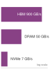
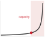

# Huấn luyện mô hình {#sec-model-training}

::: {layout-narrow}
::: {.column-margin}

\chapterminitoc

:::

::: {.content-visible when-format="pdf"}
\noindent
{fig-alt="Mặt cắt phối cảnh của quá trình huấn luyện minh họa một lượt truyền xuôi (forward pass) lưu các *activation*, một tín hiệu lỗi, truyền ngược trả các *gradient*, và cập nhật *trọng số*."}
:::

::: {.content-visible unless-format="pdf"}
{fig-alt="Mặt cắt phối cảnh của quá trình huấn luyện minh họa một lượt truyền xuôi (forward pass) lưu các *activation*, một tín hiệu lỗi, truyền ngược trả các *gradient*, và cập nhật *trọng số*."}
:::

:::

## Mục đích {.unnumbered .unlisted}

\begin{marginfigure}
\mlsysstack{50}{25}{45}{90}{12}{10}{0}{20}
\end{marginfigure}

_Tại sao việc *huấn luyện* một *mô hình* lại có thể tốn kém gấp nhiều lần so với một lần *suy luận*?_

*Suy luận* thực hiện một lượt truyền xuôi (forward pass) khi *dữ liệu* đi qua *mạng nơ-ron*, và đưa ra dự đoán. *Huấn luyện* thêm lượt truyền ngược (backward pass) và bước *optimizer*, giữ trạng thái trung gian, rồi lặp lại quy trình này trên nhiều ví dụ và các bước tối ưu. Các *optimizer* cũng có thể duy trì ước tính động lượng (momentum) và phương sai (variance) với yêu cầu lưu trữ thậm chí lớn hơn cả *trọng số mô hình*. Tỷ lệ chi phí phụ thuộc vào *mô hình*, *khối lượng công việc (workload)*, thời lượng *huấn luyện* và khối lượng *suy luận*, nhưng một lần chạy *huấn luyện* thường đắt hơn nhiều bậc so với một lần *suy luận*. Phòng thí nghiệm huấn luyện trong ba ngày có thể khám phá nhiều thiết kế hơn phòng mất một tháng. Một bước nhanh hơn không làm *huấn luyện* nhanh hơn nếu nó làm chậm hội tụ, nên *thông lượng* chỉ có ý nghĩa khi gắn với thời gian đạt chất lượng mục tiêu. Qua các thí nghiệm lặp lại, những thay đổi nhỏ về hội tụ hoặc mức sử dụng cũng có thể tích lũy thành khác biệt lớn về lịch trình và chi phí. Thách thức hệ thống cốt lõi là giữ cho các *bộ tăng tốc* luôn có *dữ liệu* và phép tính hữu ích, mà không cạn bộ nhớ hay mất thời gian đồng bộ. Can thiệp nào hữu ích còn tùy vào nút thắt ở tính toán, bộ nhớ, *dữ liệu* hay truyền thông, nên phải phân tích hiệu năng (profiling) trước khi mở rộng (scaling) hay tối ưu. *Kích thước batch*, độ chính xác số, *checkpointing*, tải *dữ liệu* và mức song song cần được xem là các quyết định gắn kết với nhau, không phải các nút chỉnh độc lập. Với kỹ sư hệ thống, *huấn luyện* là nơi phần cứng và song song quyết định một lần chạy có khớp với giới hạn bộ nhớ, lịch và ngân sách hay không, và liệu vòng lặp tối ưu lặp lại sẽ tăng tốc hay khựng lại. Theo thuật ngữ D·A·M, mỗi quyết định về độ chính xác và mức song song là sự thương lượng giữa toán học của tối ưu hóa và vật lý của thực thi.

::: {.content-visible when-format="pdf"}

\newpage

:::

::: {.callout-learning-objectives}

- Giải thích tính bất đối xứng trong chi phí *huấn luyện* qua các hạng mục: chi phí forward, backward, trạng thái *optimizer*, *dữ liệu* và chi phí theo vòng lặp.
- Tính toán *FLOPS*, bộ nhớ *activation*, trạng thái *optimizer* và chi phí đô la cho quá trình *huấn luyện mạng nơ-ron*.
- So sánh SGD, Adam và AdamW theo hành vi hội tụ (convergence behavior), phụ trội bộ nhớ và chi phí tính toán.
- Chẩn đoán các điểm nghẽn trong quá trình huấn luyện (do giới hạn về tính toán, bộ nhớ hoặc dữ liệu) bằng cách sử dụng phân tích roofline và các bằng chứng từ việc phân tích hiệu năng.
- Áp dụng độ chính xác hỗn hợp, checkpointing, tích lũy gradient và FlashAttention để đáp ứng các giới hạn về bộ nhớ và thông lượng của bộ tăng tốc.
- Thiết kế các pipeline huấn luyện trên một máy, áp dụng các kỹ thuật như tìm nạp trước, chồng lấn, tạo batch và phân tích hiệu năng lại một cách có hệ thống.
- Đánh giá khi nào cần mở rộng hệ thống ra nhiều máy, dựa trên các ràng buộc về bộ nhớ, thời gian chạy, giao tiếp, năng lượng và chi phí.
```{=latex}
\vspace*{-1ex}
```
:::

```{python}
#| echo: false
from mlsysim import *
from mlsysim.core.units import *

# ┌─────────────────────────────────────────────────────────────────────────────
# │ TRAINING SYSTEMS FUNDAMENTALS
# ├─────────────────────────────────────────────────────────────────────────────
# │ Context: §Training Systems Fundamentals, §Iron Law, §3AM Gradient Explosion
# │
# │ Goal: Provide cost, scale, FLOP, and model-spec constants for the opening
# │       sections of the chapter (Fundamentals through Iron Law).
# │ Show: Training cost asymmetry, GPT-2/3 specs, failure scenario numbers.
# │ How:  Retrieve model specs from Digital Twins; format costs and FLOPs.
# │
# └─────────────────────────────────────────────────────────────────────────────
from mlsysim import Hardware, Models, ReferenceStats
from mlsysim.fmt import (
    fmt_int,
    fmt,
    fmt_count,
    fmt_sci,
    fmt_sci_flops,
    fmt_math,
    check,
    fmt_bandwidth,
    fmt_flop_rate,
    fmt_memory,
    fmt_params,
    fmt_usd,
)

class TrainingScenarios:
    # ┌── 1. LOAD (Constants) ──────────────────────────────────────────────
    # 2026-06-07: all GPT-2/GPT-4 anchors now come from MLSysIM (registry-first
    # rule) — these were chapter-local literals before.
    gpt2_model = Models.Language.GPT2
    gpt2_cost_2019 = ReferenceStats.TrainingCostAnchors.Gpt2Cost2019
    gpt4_cost_est = ReferenceStats.TrainingCostAnchors.Gpt4CostEstimate
    gpt2_fwd_flops = gpt2_model.inference_flops
    gpt2_total_flops = gpt2_model.training_ops
    adam_example_model = Models.Language.Llama2_7B
    adam_example_params = adam_example_model.parameters

    # ┌── 2. EXECUTE (The Compute) ────────────────────────────────────────
    adam_inference = adam_example_model.size_in_bytes(BYTES_FP16)
    adam_grad = adam_example_model.size_in_bytes(BYTES_FP16)
    adam_master = adam_example_model.size_in_bytes(BYTES_FP32)
    adam_moments = adam_example_model.size_in_bytes(BYTES_ADAM_STATE)
    adam_training_state = adam_inference + adam_grad + adam_master + adam_moments
    adam_training_memory_multiplier = (adam_training_state / adam_inference).to("").magnitude

    # ┌── 3. GUARD (Invariants) ───────────────────────────────────────────
    check(adam_training_memory_multiplier == 8, "Mixed-precision Adam training state should be 8x FP16 inference weights")
    # Prose says "over a hundred billion such passes" at ~3x the forward cost
    # each; keep the stated total budget consistent with that narrative
    # (2026-06-07: budget was 1e19, contradicting both the pass count and the
    # \$50K 2019 cost anchor by ~100x).
    implied_passes = gpt2_total_flops / (gpt2_fwd_flops * 3)
    check(1e11 <= implied_passes < 1e12, f"FLOP budget implies {implied_passes:.1e} passes; prose claims over a hundred billion")

    # ┌── 4. OUTPUT (Formatting) ──────────────────────────────────────────
    gpt2_training_cost_2019_str = fmt_usd(gpt2_cost_2019, precision=0, commas=True)
    gpt4_training_cost_est_str = fmt_usd(gpt4_cost_est, scale="M", precision=0, commas=False)
    gpt2_fwd_flops_str = fmt_sci(gpt2_fwd_flops)
    gpt2_total_flops_str = fmt_sci_flops(gpt2_total_flops)
    gpt2_implied_passes_billion_str = fmt_int(implied_passes / BILLION, commas=False)
    adam_example_params_b_str = fmt_params(adam_example_params, precision=0)
    adam_inference_gb_str = fmt_memory(adam_inference, unit=GB, precision=0, commas=False)
    adam_grad_gb_str = fmt_memory(adam_grad, unit=GB, precision=0, commas=False)
    adam_master_gb_str = fmt_memory(adam_master, unit=GB, precision=0, commas=False)
    adam_moments_gb_str = fmt_memory(adam_moments, unit=GB, precision=0, commas=False)
    adam_training_state_gb_str = fmt_memory(adam_training_state, unit=GB, precision=0, commas=False)
    adam_training_memory_mult_str = fmt_multiple(adam_training_memory_multiplier, precision=0, commas=False)

    # Hardware specs used in the staged-pipeline narrative and MFU callout
    nvlink_h100_gb_per_s_str = fmt_bandwidth(Hardware.Cloud.H100.nvlink.bandwidth, unit=GB / second, precision=0, commas=False)
    a100_fp16_tflop_per_s_str = fmt_flop_rate(
        Hardware.Cloud.A100.compute.peak_flops,
        unit=TFLOP / second,
        precision=0,
        commas=False,
    )
```

## Các nguyên tắc cơ bản của hệ thống huấn luyện {#sec-model-training-training-systems-fundamentals-05d2}

Việc chạy một mô hình một lần và huấn luyện nó từ đầu đại diện cho hai thái cực về chi phí trên đường cong chi phí hệ thống. Các framework cung cấp nền tảng để thực thi: các đồ thị tính toán sẽ lên lịch các phép toán, vi phân tự động giúp tính toán gradient, và các lớp trừu tượng phần cứng hỗ trợ nhiều loại bộ tăng tốc khác nhau. Những cơ chế này giúp thực hiện một bước huấn luyện đơn lẻ; còn các hệ thống huấn luyện sẽ giúp quá trình này lặp lại được ở quy mô lớn. Cùng một vòng lặp truyền xuôi/truyền ngược/cập nhật có thể chạy hàng nghìn hoặc hàng triệu lần, đồng thời vẫn giữ lại các activations, cấp dữ liệu cho các bộ tăng tốc và đảm bảo nằm trong các giới hạn thực tế về bộ nhớ, thời gian và ngân sách.

::: {.column-margin}
{width="100%" fig-alt="Đường cong gần như phẳng, uốn lên tại một điểm gối (knee) được đánh dấu, rồi tăng rất dốc qua vùng tô bóng ở phía bên phải."khuỷu" rõ rệt, rồi tăng vọt qua một vùng tô bóng ở phía bên phải."}

*Chi phí huấn luyện duy trì ổn định trên các quy mô, sau đó bùng nổ vượt qua điểm uốn quy mô lớn.*
:::

Chương này sử dụng một ước tính sơ bộ từ nguồn bên ngoài, khoảng `{python} TrainingScenarios.gpt2_training_cost_2019_str` cho việc huấn luyện mô hình quy mô GPT-2, và một ước tính công khai gần `{python} TrainingScenarios.gpt4_training_cost_est_str` cho một lần chạy huấn luyện thuộc lớp GPT-4.[^fn-training-cost-scaling] Cả hai con số này đều không được công bố là hóa đơn huấn luyện đã kiểm toán. Sự **bất đối xứng về chi phí huấn luyện**\index{Training cost asymmetry!definition}\index{Training!cost asymmetry}\index{Training!inference vs. training} này phản ánh sự khác biệt giữa việc đánh giá một mô hình đã huấn luyện cho một yêu cầu cụ thể và việc thực hiện lặp đi lặp lại các phép tính truyền xuôi, truyền ngược và cập nhật trên toàn bộ tập dữ liệu huấn luyện.

[^fn-training-cost-scaling]: [offset=8mm] **Quy mô chi phí huấn luyện**\index{Training cost!scaling trajectory}: Tỷ lệ khoảng 2.000$\times$ giữa hai mốc chi phí trong chương này minh họa cách số lượng tham số, ngân sách token huấn luyện, thế hệ phần cứng và các cụm bộ tăng tốc có thể nhân lên; đây không phải là một phép so sánh có kiểm soát giữa các khoản chi huấn luyện đã công bố. Báo cáo GPT-2 của OpenAI mô tả mô hình và thiết lập huấn luyện nhưng không công bố chi phí huấn luyện [@radford2019language]. Chi tiết huấn luyện GPT-4 cũng không được công bố, nên con số cho lớp GPT-4 được nêu rõ là một ước tính trong ngành, dựa trên các báo cáo công khai và phân tích cơ sở hạ tầng độc lập [@knight2023giantmodels; @semianalysisGPT4].

Đối với GPT-2, chương này sử dụng khoảng `{python} TrainingScenarios.gpt2_fwd_flops_str` phép toán dấu phẩy động trên mỗi token cho một lượt truyền xuôi, theo cách hạch toán dựa trên tham số gắn với kiến trúc trong báo cáo kỹ thuật GPT-2 [@radford2019language]. Tổng ngân sách `{python} TrainingScenarios.gpt2_total_flops_str` tương đương khoảng `{python} TrainingScenarios.gpt2_implied_passes_billion_str` tỷ vị trí token, khi tổng công việc truyền xuôi và truyền ngược được xấp xỉ bằng ba lần chi phí của lượt truyền xuôi. Ước tính hạch toán này không ngụ ý rằng GPT-2 đã thực hiện từng ấy yêu cầu suy luận hoàn chỉnh. Quy mô đó khiến kỹ thuật hệ thống huấn luyện trở thành một lĩnh vực riêng, và cho thấy việc tiếp cận cơ sở hạ tầng huấn luyện có thể hạn chế mức độ tham gia vào phát triển AI như thế nào.

```{=latex}
\vspace*{-1ex}
```
::: {#dfn-training-training-systems .callout-definition title="Hệ thống huấn luyện"}

***Hệ thống huấn luyện machine learning***\index{Training systems!definition}\index{Training!systems} là các hệ thống phần mềm-phần cứng thực hiện vòng lặp tối ưu hóa lặp đi lặp lại (gồm lượt truyền xuôi, tính toán hàm mất mát, lượt truyền ngược và cập nhật tham số) nhằm tối thiểu hóa một hàm mất mát trên một tập dữ liệu huấn luyện.

1.  Ý nghĩa: Trong thiết lập Adam (Adaptive Moment Estimation) tiêu chuẩn với độ chính xác hỗn hợp, chi phí bộ nhớ cho huấn luyện là `{python} TrainingScenarios.adam_training_memory_mult_str` lần chi phí bộ nhớ cho suy luận trên mỗi tham số. Cụ thể, một mô hình có `{python} TrainingScenarios.adam_example_params_b_str` tham số cần ít nhất `{python} TrainingScenarios.adam_inference_gb_str` (trọng số FP16) + `{python} TrainingScenarios.adam_grad_gb_str` (gradient FP16) + `{python} TrainingScenarios.adam_master_gb_str` (trọng số master FP32) + `{python} TrainingScenarios.adam_moments_gb_str` (các moment thứ nhất và thứ hai của Adam ở FP32) = `{python} TrainingScenarios.adam_training_state_gb_str`, chưa tính phần lưu trữ activation. Chính hệ số này khiến một mô hình chạy suy luận trên một GPU lại cần nhiều GPU để huấn luyện.
2.  Điểm khác biệt: Khác với các hệ thống suy luận chỉ thực hiện một lần truyền xuôi rồi bỏ các activation trung gian, lan truyền ngược tiêu chuẩn phải lưu trữ các tensor cần cho lượt truyền ngược, tạo ra nhu cầu bộ nhớ tăng theo chiều sâu của mô hình và kích thước batch.
3.  Cạm bẫy thường gặp: Một hiểu lầm phổ biến là thất bại khi huấn luyện là vấn đề tính toán. Trên thực tế, lỗi thường gặp là hết bộ nhớ (OOM), tức vấn đề quản lý bộ nhớ: các tensor được lưu cho lan truyền ngược tích lũy trong lượt truyền xuôi và có thể làm cạn kiệt bộ nhớ trước khi tính được gradient đầu tiên.

:::

```{python}
#| echo: false
from mlsysim import Models

# ┌── LEGO ───────────────────────────────────────────────
# │ Goal: GPT-2 weight, Adam, and layer counts for memory-pressure prose.
from mlsysim.fmt import fmt_count, fmt_memory, fmt_params

class TrainingMemoryPressure:
    gpt2 = Models.Language.GPT2
    gpt2_params = gpt2.parameters
    gpt2_layers = gpt2.layers
    gpt2_params_fp32 = gpt2.size_in_bytes(BYTES_FP32)
    gpt2_adam = gpt2.size_in_bytes(BYTES_ADAM_STATE)

    # ┌── 4. OUTPUT (Formatting) ─────────────────────────────────────────────
    gpt2_params_b_str = fmt_params(gpt2_params)
    gpt2_params_gb_fp32_str = fmt_memory(gpt2_params_fp32, unit=GB, precision=0, commas=False)
    gpt2_adam_gb_str = fmt_memory(gpt2_adam, unit=GB, precision=0, commas=False)
```

Ba đặc điểm sau đây phân biệt khối lượng công việc (workload) huấn luyện với tính toán mục đích chung:

- **Cường độ tính toán**\index{Training!computational intensity}: Ngân sách `{python} TrainingScenarios.gpt2_total_flops_str` trải qua nhiều ngày thời gian thực đòi hỏi phần cứng phải duy trì thông lượng ở mức PFLOP/s, trong khi thông lượng thực tế với mô hình lớn thường thấp hơn nhiều so với mức đỉnh lý thuyết [@narayanan2021; @chowdhery2022palm].
- **Áp lực bộ nhớ**\index{Training!memory pressure}: Để lưu trữ `{python} TrainingMemoryPressure.gpt2_params_b_str` trọng số, cần `{python} TrainingMemoryPressure.gpt2_params_gb_fp32_str` bộ nhớ ở dạng FP32; optimizer Adam thêm hai tensor trạng thái cho mỗi tham số\index{Optimizer state!memory overhead}, tiêu tốn thêm `{python} TrainingMemoryPressure.gpt2_adam_gb_str`. Bộ nhớ cho activation còn phụ thuộc vào khối lượng công việc (workload), kiến trúc, độ dài chuỗi, kích thước batch, độ chính xác và checkpointing; tổng trạng thái kết hợp có thể vượt quá dung lượng của một bộ tăng tốc duy nhất.
- **Phụ thuộc dữ liệu**: Mỗi lần cập nhật gradient phụ thuộc vào kết quả của lần trước, tạo ra các nút thắt cổ chai tuần tự và hạn chế mức độ song song mà hệ thống có thể khai thác.

Mỗi thách thức dẫn đến một hướng khắc phục khác nhau. *Cường độ tính toán* thúc đẩy hệ thống hướng tới việc tận dụng bộ tăng tốc tốt hơn và dùng số học với độ chính xác thấp hơn. *Áp lực bộ nhớ* kêu gọi các kỹ thuật như gradient checkpointing,[^fn-activation-checkpointing-tradeoff] một ứng dụng cụ thể của *rematerialization* (bỏ và tính lại các giá trị trung gian để tiết kiệm bộ nhớ, từ @sec-ml-frameworks) nhằm đánh đổi việc tính toán lại để giảm lưu trữ activation, và huấn luyện độ chính xác hỗn hợp\index{Mixed-precision training!definition},[^fn-mixed-precision-training] giúp giảm bộ nhớ cho trọng số và activation. *Phụ thuộc dữ liệu* thúc đẩy thiết kế các pipeline chồng chéo tính toán với di chuyển dữ liệu, xây trên thông lượng tải dữ liệu đã được tối ưu trong @sec-data-engineering để bộ tăng tốc không phải chờ batch tiếp theo. Chương này tập trung vào huấn luyện trên máy đơn và một nút đa GPU; mở rộng lên hàng trăm máy qua ranh giới mạng sẽ phát sinh các thách thức về giao tiếp và chịu lỗi nằm ngoài phạm vi của chương.

### Pipeline hệ thống theo giai đoạn: Xác định "bong bóng bộ tăng tốc" {#sec-model-training-staged-pipeline}

Một hệ thống huấn luyện không chỉ là một vòng lặp; đó là một **pipeline hệ thống theo giai đoạn**\index{Training pipeline!staged system workflow}. Để tận dụng bộ tăng tốc ở mức cao, ta cần phân tích huấn luyện như một dây chuyền sản xuất, nơi bốn giai đoạn riêng biệt phối hợp để giữ các ALU luôn bận rộn:

1.  **Tải & Tiền xử lý dữ liệu** (CPU/Lưu trữ): Lấy các bit thô từ Non-Volatile Memory Express (NVMe), giải mã, và tăng cường dữ liệu trên các lõi CPU.
2.  **Truyền từ host sang thiết bị** (PCIe): Di chuyển batch đã xử lý qua bus PCIe vào bộ nhớ GPU bằng truy cập bộ nhớ trực tiếp.
3.  **Lượt truyền xuôi/ngược** (bộ tăng tốc): Lan truyền activation và gradient qua các lớp trên GPU.
4.  **Đồng bộ tham số** (liên kết): Trao đổi gradient giữa các bộ tăng tốc qua fabric hiện có. NVLink cung cấp lên đến `{python} TrainingScenarios.nvlink_h100_gb_per_s_str` trong cấu hình H100 được dùng về sau, trong khi các hệ thống khác có thể dùng PCIe hoặc kết nối mạng.

Bất kỳ chênh lệch thông lượng nào giữa các giai đoạn này đều tạo ra các **bong bóng bộ tăng tốc**\index{Accelerator!bubbles, pipeline idleness} — những khoảng thời gian một số tài nguyên của bộ tăng tốc bị nhàn rỗi hoặc không được tận dụng hết vì phải chờ giai đoạn khác. Kỹ sư hệ thống giảm các bong bóng này bằng các kỹ thuật như tìm nạp trước không đồng bộ và chồng chéo pipeline, với mục tiêu có sẵn batch kế tiếp trước khi bước hiện tại cần đến. @Sec-model-training-identifying-bottlenecks-f57f phát triển các công cụ định lượng để đo và giảm các bong bóng này.

[^fn-activation-checkpointing-tradeoff]: **Gradient checkpointing (activation checkpointing)**\index{Activation checkpointing!memory-compute trade-off}: Trong lan truyền ngược, các giá trị forward cần cho mỗi quy tắc backward được giữ lại. Checkpointing sẽ lưu một số giá trị đã chọn và tính lại các giá trị khác trong quá trình lan truyền ngược, đổi thêm lượng tính toán để giảm bộ nhớ activation. Cách đặt checkpoint theo $\sqrt{N_L}$ cùng với chi phí tính toán lại tương ứng mô tả lịch trình cổ điển do @chen2016training phân tích, không phải mọi cách triển khai checkpointing. @Sec-model-training-optimal-checkpoint-placement-strategy-4a0d sẽ đi qua lịch trình này cho số lượng lớp của GPT-2.

[^fn-mixed-precision-training]: **Huấn luyện độ chính xác hỗn hợp**\index{Mixed-precision training!trade-off}: Kỹ thuật này dùng độ chính xác thấp hơn cho một số phép tính và lưu trữ, nhưng vẫn giữ độ chính xác cao hơn ở những chỗ cần tích lũy hoặc khi phạm vi số bắt buộc. Một công thức phổ biến với FP16 là duy trì FP32 master weights\index{FP32 master weights!mixed-precision training} và áp dụng loss scaling để giảm hiện tượng tràn dưới của gradient [@micikevicius2017mixed]. BF16 ("Brain Floating Point," từ Google Brain [@google_bfloat16]) có dải số mũ 8 bit giống FP32 nên thường không cần loss scaling động, dù độ chính xác của trạng thái và phép tích lũy còn phụ thuộc vào optimizer và cách triển khai.

Chương này đi theo chuỗi phụ thuộc đó. Trước hết là quy luật sắt về hiệu suất huấn luyện, một ứng dụng chuyên biệt của quy luật sắt chung (@sec-introduction-iron-law-ml-systems-c32a), tách bạch tổng số phép toán, thông lượng đỉnh và mức sử dụng. Phương trình này đóng vai trò như hệ thống tính toán cho phần nền tảng toán học tiếp theo: coi tính toán mạng nơ-ron như một khối lượng công việc (workload), hành vi của optimizer, cơ chế lan truyền ngược và cường độ số học. Khi các chi phí đã hiện rõ, chương chuyển sang chính pipeline huấn luyện, nơi tải dữ liệu, lan truyền xuôi, lan truyền ngược và cập nhật tham số lần lượt ràng buộc nhau. Các phần tối ưu hóa sau đó nhắm vào các hạng mục đã lộ ra qua phép “hạch toán”: huấn luyện độ chính xác hỗn hợp, FlashAttention, tích lũy gradient, checkpointing và prefetch dữ liệu. Việc mở rộng vượt quá một bộ tăng tốc được trình bày sau cùng, khi các đòn bẩy trên một máy đơn đã cho thấy chi phí giao tiếp là nút thắt cổ chai kế tiếp.

Trước khi chính thức hóa quy luật sắt, hãy xem các ràng buộc này tương tác ra sao trong thực tế. Framework lý thuyết rất quan trọng vì thất bại rất tốn kém: chỉ một lần bùng nổ gradient cũng có thể xóa sạch kết quả của nhiều ngày tính toán, trị giá hàng nghìn đô la.

::: {#ws-training-palm-loss-spikes .callout-war-story title="Các đỉnh tổn thất của PaLM (2022)"}

**Bối cảnh**: Quá trình huấn luyện PaLM với 540 tỷ tham số sử dụng 6.144 chip Tensor Processing Unit (TPU) v4 trên hai Pod, mỗi Pod 3.072 chip, kết nối qua mạng trung tâm dữ liệu của Google, và gặp các đợt tăng đột biến mất ổn định huấn luyện nghiêm trọng, điều không xuất hiện ở các lần chạy nhỏ hơn [@chowdhery2022palm].

**Kiểu lỗi**: Tổn thất huấn luyện tăng đột biến khoảng 20 lần dù đã cắt gradient. Các đỉnh này xuất hiện rất thất thường, đôi khi xảy ra muộn trong quá trình huấn luyện, không thấy ở các mô hình nhỏ hơn, và chưa xác định được biện pháp giảm thiểu có cơ sở.

**Tác động**: Mỗi lần khôi phục đều làm mất tiến độ gần đây của một lần chạy 6.144 chip rất tốn kém. Do đó, checkpoint có thể tái lập và thứ tự dữ liệu có thể lặp lại là các điều kiện tiên quyết để chạy lại.

**Phản ứng**: Các kỹ sư khởi động lại huấn luyện từ một checkpoint không bị hỏng khoảng 100 bước trước mỗi đỉnh và bỏ qua khoảng 200–500 batch dữ liệu quanh khoảng thời gian xảy ra lỗi.

**Bài học hệ thống**: Khả năng chịu lỗi trong vận hành trực tiếp chi phối hệ số sử dụng $\eta_{\text{hw}}$ trong quy luật sắt về hiệu suất huấn luyện (@eq-training-iron-law). Cơ chế tự động phát hiện đỉnh tổn thất, tần suất checkpoint và bỏ qua batch là các thành phần hệ thống cốt lõi để bảo vệ hiệu suất tính toán của cụm.

:::

## Quy luật sắt về hiệu suất huấn luyện {#sec-model-training-iron-law-training-performance-a53f}

Các đợt tăng đột biến của loss trong PaLM cho thấy một vấn đề lớn hơn: sự mất ổn định ở quy mô tiên phong không phải chuyện hiếm, mà là hệ quả có thể dự đoán khi đồng thời đẩy mạnh cường độ tính toán, áp lực bộ nhớ và phụ thuộc vào dữ liệu. Mỗi yếu tố trong ba yếu tố này có thể quản lý riêng, nhưng sự tương tác giữa chúng tạo ra các kiểu lỗi mà chỉ khôi phục vận hành thôi thì không ngăn được. Để chẩn đoán yếu tố nào chi phối một lỗi cụ thể, và định lượng chi phí của từng yếu tố, cần phân tích chính thức thời gian huấn luyện thành các thành phần vật lý của nó.

Quy luật sắt\index{Training!iron law of training performance}\index{Iron law of training performance!utilization gap} chính là framework tổ chức đó: nó phân tích thời gian huấn luyện sao cho mỗi kỹ thuật tối ưu hóa tương ứng với một hạng mục cụ thể trong phương trình. Đây là một ứng dụng chuyên biệt của quy luật sắt chung cho các hệ thống ML đã được giới thiệu trong @sec-introduction-iron-law-ml-systems-c32a, tập trung vào việc tối đa hóa thông lượng tính toán.

::: {#dfn-training-iron-law-training-performance .callout-definition title="Quy luật sắt về hiệu suất huấn luyện"}

***Quy luật sắt về hiệu suất huấn luyện***\index{Iron law of training performance!definition} biểu diễn thời gian huấn luyện dựa trên số lượng phép toán trong khối lượng công việc (workload) và thông lượng hiệu quả đạt được:
$$T_{\text{train}} = \frac{O}{R_{\text{peak}} \times \eta_{\text{hw}}}$$ {#eq-training-iron-law}

Ở đây $\eta_{\text{hw}}$ là hệ số sử dụng hiệu quả tổng thể, bằng tỉ lệ giữa tốc độ vận hành mô hình đạt được và mức đỉnh phần cứng liên quan. Đình trệ dữ liệu, giao tiếp, đồng bộ hóa, chi phí khởi chạy và các kernel kém hiệu quả đều làm giảm hệ số này. Tìm nạp trước (prefetching) và chồng lấp (overlap) có thể che bớt một phần các chi phí đó nhưng không đảm bảo loại bỏ được chúng.

1.  Ý nghĩa: Ba yếu tố này chỉ ra ba đòn bẩy tối ưu hóa riêng biệt: $O$ (có thể giảm bằng thay đổi thuật toán, dùng ít token huấn luyện hơn, hoặc áp dụng các phương pháp nén mô hình như tỉa (pruning) và chưng cất), $R_{\text{peak}}$ (thay đổi theo phần cứng và độ chính xác được chọn), và $\eta_{\text{hw}}$ (hệ số sử dụng hiệu quả và mục tiêu chính của hệ thống; @narayanan2021 đo được 44 đến 52 phần trăm thông lượng đỉnh lý thuyết trên các mô hình GPT huấn luyện trên các cụm A100). @Sec-model-compression định nghĩa các kỹ thuật nén; ở đây, chúng chỉ nhằm chỉ ra những phương pháp đó được hạch toán ở đâu.
2.  Điểm khác biệt: Định luật sắt tổng quát tách riêng di chuyển dữ liệu, tính toán và độ trễ. Phiên bản áp dụng cho huấn luyện này lại gộp mọi nguồn gây mất thông lượng vào $\eta_{\text{hw}}$, nên hữu ích cho việc lập ngân sách nhưng không đủ để chẩn đoán xem thành phần gốc nào là nguyên nhân.
3.  Lỗi thường gặp: Một hiểu lầm phổ biến là $\eta_{\text{hw}}$ cố định theo phần cứng. Thực tế, hiệu quả hệ thống là thuộc tính của pipeline: bão hòa băng thông bộ nhớ, chi phí khởi chạy kernel và các rào cản đồng bộ hóa đều độc lập làm giảm $\eta_{\text{hw}}$. Muốn biết yếu tố nào chi phối, cần profiling thay vì chỉ đọc thông số phần cứng.

:::

@Eq-training-iron-law nêu ra ba đòn bẩy để cải thiện: giảm tổng số phép toán bằng đổi mới thuật toán, tăng thông lượng đỉnh bằng cách tận dụng phần cứng tốt hơn, hoặc cải thiện mức sử dụng bằng cách điều phối pipeline hiệu quả hơn. Mỗi kỹ thuật tối ưu hóa trong chương này kéo một hoặc nhiều đòn bẩy đó, như được tóm tắt trong @tbl-iron-law-mapping.

```{=latex}
\begingroup
\renewcommand{\arraystretch}{1.3}
```

| **Technique**                   | **Term Affected**               | **Mechanism**                                                                  |
|:--------------------------------|:--------------------------------|:-------------------------------------------------------------------------------|
| **Mixed Precision (FP16/BF16)** | Peak Throughput ↑               | Uses supported lower-precision hardware paths                                  |
| **Data Prefetching**            | Utilization ↑                   | Reduces accelerator idle time waiting for data                                 |
| **Gradient Checkpointing**      | Memory ↓, Operations ↑          | Reduces saved activations by recomputing selected values                       |
| **Gradient Accumulation**       | Memory ↓, Synchronization ↓     | Builds an effective batch from serialized micro-batches                        |
| **Operator Fusion**             | Memory Traffic ↓, Overhead ↓    | Avoids intermediate transfers and reduces kernel launches                      |
| **FlashAttention**              | Memory Traffic ↓, Utilization ↑ | Same asymptotic FLOPs, much lower HBM IO; backward recomputation may add FLOPs |

: **Ánh xạ tối ưu hóa theo định luật sắt**: Ánh xạ các kỹ thuật tối ưu hóa vào các thuật ngữ của định luật sắt. Hiểu kỹ thuật tác động đến thuật ngữ nào sẽ giúp chọn chiến lược tối ưu hóa phù hợp. {#tbl-iron-law-mapping tbl-colwidths="[25,27,48]"}

```{=latex}
\endgroup
```

Một lưu ý: định luật sắt tập trung vào hiệu quả thực thi—tức phần cứng xử lý một khối lượng công việc (workload) nhất định nhanh đến mức nào. Nó không phản ánh các yếu tố phía dữ liệu như chất lượng dữ liệu, kích thước tập dữ liệu, hay thiết kế chương trình huấn luyện (curriculum design), vốn quyết định tổng số phép toán $O$ cần để đạt độ chính xác mục tiêu. Một tập dữ liệu sạch hơn hoặc phối trộn dữ liệu tốt hơn có thể giảm số epoch cần thiết, làm giảm $O$ mà không phải đụng gì đến phần cứng. Khi giữ nguyên khối lượng công việc (workload), câu hỏi là làm sao thực thi nó nhanh nhất có thể.

Thông lượng huấn luyện thực tế luôn thấp hơn đỉnh số học mỗi khi các kernel, việc phân phối dữ liệu hoặc giao tiếp khiến tài nguyên bị nhàn rỗi. Mở rộng sang nhiều bộ tăng tốc sẽ phát sinh thêm chi phí giao tiếp—một sự đánh đổi được định lượng trong @sec-model-training-scaling-training-systems-adfd.

::: {#chk-training-physics-training .callout-checkpoint title="Vật lý của quá trình huấn luyện"}

Tốc độ huấn luyện được quyết định bởi mức độ tận dụng hiệu năng đỉnh của phần cứng.

**Khoảng cách tận dụng**

- [ ] **Đỉnh so với thực tế**: tại sao mức tận dụng end-to-end duy trì lại luôn thấp hơn đỉnh số học?
- [ ] **Tổn thất tận dụng**: những chỗ tắc trong pipeline đã nêu trước làm giảm $\eta_{\text{hw}}$ là gì, và chỗ nào có thể được che giấu nhờ prefetching hoặc overlap?
- [ ] **Bậc độ lớn**: một lần chạy tiên phong cần cỡ $10^{23}$ FLOPs với mức tận dụng $\eta_{\text{hw}}$ thấp hơn nhiều so với 1. Ước tính đòn bẩy nào rút ngắn thời gian thực (wall-clock time) nhiều hơn—tăng gấp đôi $R_{\text{peak}}$ hay tăng gấp đôi $\eta_{\text{hw}}$—và tại sao định luật sắt cho rằng hai yếu tố này không thể thay thế cho nhau trong thực tế.

:::

Định luật sắt cung cấp một framework tĩnh để suy luận về hiệu suất huấn luyện, nhưng lịch sử của deep learning cho thấy ràng buộc then chốt đã dịch chuyển theo thời gian khi phần cứng và thuật toán cùng tiến hóa. Năm 1986, Rumelhart và cộng sự phổ biến lan truyền ngược cho các mạng nơ-ron nhiều lớp [@rumelhart1986]. Năm 2012, AlexNet huấn luyện một bộ phân loại ImageNet trong năm đến sáu ngày trên hai GPU [@krizhevsky2012imagenet], cho thấy khả năng song song của mạng nơ-ron rất phù hợp với phần cứng đồ họa. Đến năm 2017, các transformer\index{Transformer!training evolution} [@vaswani2017] chuyển trọng tâm sang mô hình hóa chuỗi quy mô lớn và các kernel trên bộ tăng tốc có thông lượng cao. GPT-3\index{GPT-3!training compute} năm 2020 tiêu thụ khoảng $3.14 \times 10^{23}$ FLOPs [@brown2020language], khiến mức tận dụng $(\eta_{\text{hw}})$ trở nên cực kỳ quan trọng. Đến năm 2023, hiệu quả huấn luyện được cải thiện nhờ các kỹ thuật được xem xét trong chương này: FlashAttention giảm lưu lượng bộ nhớ đồng thời cải thiện $\eta_{\text{hw}}$; gradient checkpointing đánh đổi thêm $O$ để đổi lấy dung lượng bộ nhớ; mixed precision tăng $R_{\text{peak}}$. Mỗi cải tiến giải quyết một nút thắt cụ thể theo định luật sắt.

```{python}
#| echo: false
#| label: gpt2-lighthouse-hardware-calc
from mlsysim.fmt import fmt_sci_flops, fmt_memory, fmt_params

# ┌─────────────────────────────────────────────────────────────────────────────
# │ GPT-2 LIGHTHOUSE + V100 HARDWARE SPECS
# ├─────────────────────────────────────────────────────────────────────────────
# │ Context: §Running Example: Training GPT-2, §GPT-2 Attention Layer
# │          Computation (notebook), §Activation Memory Requirements,
# │          §Gradient Accumulation walkthrough.
# │
# │ Goal: Provide GPT-2 weight/dataset sizes, DLRM scale, and V100 hardware
# │       specs for the lighthouse table and GPT-2 FLOP notebook.
# │ Show: GPT-2 lighthouse table specs; V100 throughput in system implication.
# │ How:  Hard-coded model sizes; V100 specs from Hardware Digital Twin.
# │
# └─────────────────────────────────────────────────────────────────────────────

# ── GPT-2 Lighthouse Sizes + DLRM Scale ──────────────────────────────────
class GPT2LighthouseSpecs:
    # ┌── 1. LOAD ──────────────────────────────────────────────────────────────
    gpt2_model = Models.Language.GPT2
    gpt2_params = gpt2_model.parameters
    gpt2_total_flops = gpt2_model.training_ops
    gpt2_weights_fp16 = gpt2_model.size_in_bytes(BYTES_FP16)
    gpt2_weights_fp32 = gpt2_model.size_in_bytes(BYTES_FP32)
    gpt2_dataset_size = gpt2_model.training_dataset_size
    dlrm_model = Models.Recommendation.DLRM
    dlrm_params_min = dlrm_model.parameter_range_min
    dlrm_params_max = dlrm_model.parameter_range_max

    # ┌── 4. OUTPUT ────────────────────────────────────────────────────────────
    gpt2_params_b_str = fmt_params(gpt2_params)
    gpt2_total_flops_str = fmt_sci_flops(gpt2_total_flops)
    gpt2_weights_fp16_gb_str = fmt_memory(gpt2_weights_fp16, unit=GB, precision=0, commas=False)
    gpt2_weights_fp32_gb_str = fmt_memory(gpt2_weights_fp32, unit=GB, precision=0, commas=False)
    gpt2_dataset_size_gb_str = fmt_memory(gpt2_dataset_size, unit=GB, precision=0, commas=False)
    dlrm_params_min_b_str = fmt_params(dlrm_params_min, precision=0)
    dlrm_params_max_t_str = fmt_params(dlrm_params_max, precision=0)
```

### Ví dụ chạy xuyên suốt: Huấn luyện GPT-2 {#sec-model-training-running-example-training-gpt2-19cd}

Trong suy luận, GPT-2\index{GPT-2!training lighthouse} đóng vai trò "lighthouse" cho Bandwidth Hog. Ở đây, nó tiếp tục là khối lượng công việc (workload) ổn định của chương để kiểm tra từng chi phí và tối ưu hóa huấn luyện.

::: {#lhs-training-lighthouse-example-training-gpt-2 .callout-lighthouse title="Ví dụ lighthouse: Huấn luyện GPT-2"}

**Bối cảnh**:
GPT-2 (1.5 tỷ tham số) được chọn làm nghiên cứu tình huống chính vì đủ lớn để bộc lộ rõ các ràng buộc đáng kể về tính toán, activation và trạng thái của optimizer, đồng thời vẫn dễ phân tích hơn so với các mô hình ở quy mô tiên phong. Việc có cần huấn luyện phân tán hay không phụ thuộc vào độ chính xác, trạng thái của optimizer, bộ nhớ activation, khả năng phần cứng và thời gian huấn luyện mục tiêu. @Tbl-training-gpt2-lighthouse-specs ánh xạ từng thuộc tính của mô hình tới ràng buộc hệ thống mà nó tạo ra:

```{=latex}
\begingroup
\renewcommand{\arraystretch}{1.3}
```

| **Property**     |                         **Specification**                         | **Systems Implication**                                                                                                                                        |
|:-----------------|:-----------------------------------------------------------------:|:---------------------------------------------------------------------------------------------------------------------------------------------------------------|
| **Parameters**   |       `{python} GPT2LighthouseSpecs.gpt2_params_b_str` (XL)       | Requires ~`{python} GPT2LighthouseSpecs.gpt2_weights_fp16_gb_str` (FP16) or ~`{python} GPT2LighthouseSpecs.gpt2_weights_fp32_gb_str` (FP32) for weights alone. |
| **Architecture** |                        48 Layers, 1600 Dim                        | Deep pipeline creates heavy activation memory pressure.                                                                                                        |
| **Dataset**      | WebText (`{python} GPT2LighthouseSpecs.gpt2_dataset_size_gb_str`) | Preprocessing, shuffling, and delivery must sustain the selected training configuration.                                                                       |
| **Compute**      |       ~ `{python} GPT2LighthouseSpecs.gpt2_total_flops_str`       | Training duration depends on achieved throughput and accelerator count.                                                                                        |

: **Thông số kỹ thuật của mô hình GPT-2 (1.5 tỷ tham số) làm ví dụ điển hình**: Bảng này trình bày số lượng tham số, độ sâu kiến trúc, kích thước tập dữ liệu và tổng lượng tính toán cần cho huấn luyện, cùng với những tác động của chúng lên hệ thống. Mỗi hàng ghép một thuộc tính của mô hình với ràng buộc kỹ thuật tương ứng—như bộ nhớ cho trọng số, áp lực lên bộ nhớ activation do pipeline sâu, yêu cầu về thông lượng I/O và nhu cầu song song hoá. {#tbl-training-gpt2-lighthouse-specs tbl-colwidths="[20,26,54]"}

```{=latex}
\endgroup
```

**Cơ chế**:
Huấn luyện GPT-2 gắn với tổng số phép toán $O \approx 6 \cdot P \cdot D_{\text{tokens}}$, hay `{python} GPT2LighthouseSpecs.gpt2_total_flops_str`, cùng với một yêu cầu bộ nhớ trạng thái nghiêm ngặt $M_{\text{state}} = M_{\text{weights}} + M_{\text{grads}} + M_{\text{opt}} + M_{\text{act}}$. Để cân bằng thời gian thực thi $T_{\text{train}} = \frac{O}{R_{\text{peak}} \cdot \eta_{\text{hw}}}$, ta cần phối hợp việc nạp dữ liệu, bộ nhớ cho activation và thông lượng tính toán sao cho phù hợp với dung lượng bộ nhớ băng thông cao (HBM) của bộ tăng tốc.

:::

Không phải mọi khối lượng công việc huấn luyện đều bị giới hạn bởi khả năng tính toán. Các mô hình khuyến nghị như DLRM\index{DLRM!embedding bottleneck} chủ yếu dùng các bảng embedding khổng lồ\index{Embedding table!capacity bottleneck} (từ `{python} GPT2LighthouseSpecs.dlrm_params_min_b_str` đến `{python} GPT2LighthouseSpecs.dlrm_params_max_t_str` tham số, phần lớn là embedding), khiến chúng bị giới hạn bởi băng thông bộ nhớ thay vì bởi khả năng tính toán. Với những khối lượng công việc như vậy, bài toán mở rộng đầu tiên thường là dung lượng: phải chia các bảng embedding qua nhiều thiết bị để mô hình có thể chứa vừa. Phần còn lại của chương này tập trung vào huấn luyện các mô hình dày đặc, chuyên sâu về tính toán, lấy GPT-2 làm ví dụ chính.

Hệ thống huấn luyện giữ vai trò then chốt trong pipeline machine learning: chúng nhận dữ liệu đã được chuẩn bị từ các công đoạn kỹ thuật thượng nguồn (@sec-data-engineering) và tạo ra các mô hình đã huấn luyện để các hệ thống tiếp theo triển khai và giám sát. Chất lượng dữ liệu ảnh hưởng trực tiếp đến độ ổn định huấn luyện, còn hiệu quả huấn luyện quyết định tốc độ lặp trong quá trình phát triển mô hình. Áp lực này xuất hiện ở ba quy mô. Ở quy mô dữ liệu, các tập dữ liệu cỡ petabyte đòi hỏi pipeline I/O hiệu quả và lưu trữ phân tán. Ở quy mô mô hình, các mô hình hàng tỷ tham số buộc hệ thống phải quyết định: nhân bản mô hình trên các batch theo song song dữ liệu\index{Distributed training!data parallelism}[^fn-training-data-parallelism], hay chia mô hình ra nhiều thiết bị theo song song mô hình\index{Distributed training!model parallelism}.[^fn-training-model-parallelism] Ở quy mô hạ tầng, điều phối hàng nghìn bộ tăng tốc làm phát sinh chi phí giao tiếp có thể lấn át thời gian huấn luyện. Chính vì vậy, các hợp đồng quy trình làm việc từ @sec-ml-workflow rất quan trọng trong giai đoạn huấn luyện: các quyết định điều phối sẽ định hình cả tốc độ lặp của nghiên cứu lẫn chi phí hệ thống.

[^fn-training-data-parallelism]: **Song song dữ liệu**\index{Data parallelism!communication overhead}: Phương pháp này nhân bản toàn bộ mô hình trên mọi thiết bị và chỉ chia nhỏ dữ liệu. Mỗi thiết bị tính gradient độc lập, sau đó phép toán AllReduce đồng bộ hóa chúng—tăng khối lượng giao tiếp tỉ lệ thuận với kích thước mô hình ở mỗi bước. Thuế đồng bộ hóa này giới hạn hiệu quả mở rộng: khi giao tiếp trở thành nút thắt cổ chai, tăng gấp đôi số bộ tăng tốc hiếm khi rút ngắn một nửa thời gian huấn luyện.

[^fn-training-model-parallelism]: **Song song mô hình**\index{Model parallelism!pipeline bubbles}: Phương pháp này phân chia các lớp của mô hình qua nhiều thiết bị khi mô hình vượt quá bộ nhớ của một thiết bị. Các activation phải được truyền giữa các thiết bị tại mỗi ranh giới phân chia, và cách chia đơn giản tạo ra các "bong bóng pipeline", khiến các thiết bị phía sau phải chờ và nhàn rỗi. Kỹ thuật pipelining microbatch, như trong GPipe và PipeDream\index{PipeDream!pipeline parallelism}, giúp khôi phục phần lớn hiệu quả bị mất này [@huang2019gpipe; @narayanan2019].

Corpus WebText `{python} GPT2LighthouseSpecs.gpt2_dataset_size_gb_str` của GPT-2 nằm ở phía thấp của phổ quy mô dữ liệu này. Những corpus lớn hơn có thể làm thay đổi bản chất của đường dữ liệu.

::: {#psp-training-10-gb-10-tb-scale-factor .callout-perspective title="Hệ số tỷ lệ từ 10 GB đến 10 TB"}

Trong chế độ thường trú trong bộ nhớ, toàn bộ tập dữ liệu có thể nằm gọn trong RAM hệ thống. Nhờ đó, hệ thống tránh phải đọc lặp lại từ lưu trữ sau khi đã đưa vào cache, dù chi phí tiền xử lý và truyền tải vẫn còn. Ngược lại, trong chế độ streaming, tập dữ liệu vượt quá bộ nhớ cục bộ. Khi đó, hệ thống phải điều phối việc đọc từ lưu trữ, tiền xử lý, cache và phân phối dữ liệu xuyên suốt quá trình huấn luyện. Tùy giai đoạn nào đang giới hạn thông lượng, thiết kế phù hợp có thể gồm nhiều worker, cơ chế tìm nạp trước (prefetching), cache cục bộ hoặc lưu trữ phân tán.

Vì vậy, việc mở rộng quy mô không chỉ làm thay đổi lượng dữ liệu; nó còn biến đổi cả nguyên lý hoạt động của hệ thống.

:::

Những thách thức về mở rộng quy mô này dẫn đến các yêu cầu cụ thể cho quy trình làm việc. Các quy trình huấn luyện gồm nhiều giai đoạn phụ thuộc lẫn nhau—như tiền xử lý dữ liệu, các lượt truyền xuôi (forward pass) và truyền ngược (backward pass), cùng cập nhật tham số—mở rộng các khái niệm về mạng nơ-ron đã trình bày trong @sec-neural-computation. Các ràng buộc của hệ thống thường đặt ra giới hạn hiệu suất: các bộ tăng tốc có tỷ lệ tính toán trên băng thông cao thường bị nghẽn bởi băng thông bộ nhớ, vì việc di chuyển dữ liệu giữa các tầng bộ nhớ chậm hơn chính các phép tính [@patterson2017hardware]. Trong các hệ thống phân tán, việc đồng bộ giữa các thiết bị gây thêm độ trễ, và hiệu suất liên kết (NVLink\index{NVLink!training interconnect}, InfiniBand\index{InfiniBand!interconnect performance}) ảnh hưởng then chốt đến thông lượng.[^fn-transformer-compute-scaling]

Ranh giới giữa phần cứng và phần mềm, điều mà các framework đã nêu trong @sec-ml-frameworks, là trọng tâm ở đây. Kỹ thuật huấn luyện độ chính xác hỗn hợp (mixed-precision training) xuất hiện khi người ta nhận ra phần cứng Tensor Core có thể tăng tốc các phép toán với độ chính xác thấp hơn. Kỹ thuật gradient checkpointing ra đời từ các hạn chế về dung lượng bộ nhớ. Kỹ sư hệ thống huấn luyện cần ghép các lựa chọn thuật toán đó với những giới hạn vật lý của máy.

[^fn-transformer-compute-scaling]: **Độ nhạy của kết nối nội bộ trong huấn luyện Transformer**\index{Training!transformer, interconnect sensitivity}: Do self-attention có độ phức tạp bộ nhớ và tính toán $\mathcal{O}(S^2)$, kích thước activation tăng theo độ dài chuỗi. Với song song pipeline, activation phải đi qua các thiết bị tại ranh giới phân vùng mô hình; còn song song dữ liệu phải đồng bộ gradient với khối lượng tỉ lệ theo số tham số. Vì vậy, chi phí giao tiếp phụ thuộc vào chiến lược song song, cấu trúc liên kết, kích thước thông điệp và mức độ chồng chéo, khiến việc chọn kết nối nội bộ trở thành một quyết định hàng đầu trong hệ thống huấn luyện.

Những thách thức mở rộng này có một điểm chung: mọi nút thắt đều quy về chi phí của các phép toán cụ thể. Phép nhân ma trận dày đặc là một kernel hệ thống đã được nghiên cứu kỹ [@goto2008], trong khi hàm activation tiêu tốn băng thông bộ nhớ và trạng thái của optimizer làm tăng dung lượng bộ nhớ thường trú. Thiết kế hệ thống để thực thi các phép toán này ở quy mô lớn bắt đầu từ việc hạch toán riêng từng loại chi phí.

## Nền tảng toán học {#sec-model-training-mathematical-foundations-d894}

Phép nhân ma trận chỉ là $\mathbf{C} = \mathbf{A}\mathbf{B}$ về mặt ký hiệu, nhưng khi huấn luyện GPT-2, phép toán này được lặp đi lặp lại trên các ma trận quá lớn để có thể nằm trọn trong lớp bộ nhớ nhanh nhất. Tensor Cores tăng tốc các phép toán ma trận phù hợp, còn các lựa chọn như rectified linear unit (ReLU) hay sigmoid ảnh hưởng đến chi phí, cơ hội hợp nhất (fusion), và hành vi bộ nhớ của các kernel xử lý từng phần tử xung quanh. @Sec-neural-computation đã chỉ ra *những gì* các phép toán mạng nơ-ron thực hiện và *vì sao* chúng cho phép học; câu hỏi ở góc độ hệ thống là *chúng tốn bao nhiêu*\index{Training!mathematical foundations}\index{Training!computational cost} về FLOPs, bộ nhớ và băng thông khi các phép toán đó chạy ở quy mô lớn.

Bốn khía cạnh sau định hình phân tích chi phí này:

- Số lượng FLOPs của các phép toán ma trận chi phối quá trình huấn luyện mạng nơ-ron dày đặc.
- Yêu cầu bộ nhớ để đồng thời lưu trữ activation và trạng thái optimizer.
- Nhu cầu băng thông quyết định liệu các phép toán bị giới hạn bởi tính toán hay bởi bộ nhớ.
- Phân loại cường độ số học để định hướng lựa chọn chiến lược tối ưu hóa.

Tổng hợp lại, những khía cạnh này cung cấp ngôn ngữ chung để phân tích cường độ tính toán, áp lực bộ nhớ và các phụ thuộc dữ liệu đã được giới thiệu trong @sec-model-training-training-systems-fundamentals-05d2.

### Tính toán mạng nơ-ron {#sec-model-training-neural-network-computation-5660}

Huấn luyện mạng nơ-ron gồm các phép toán ma trận lặp đi lặp lại và các biến đổi phi tuyến. Những phép toán này đơn giản về mặt ý niệm nhưng lại kéo theo các thách thức ở cấp hệ thống, vốn chi phối hạ tầng huấn luyện hiện đại. Sự ra đời của lan truyền ngược\index{Backpropagation!historical introduction}[^fn-backpropagation-rumelhart-provenance] bởi @rumelhart1986 và sự phát triển của các thư viện tính toán ma trận hiệu quả như Basic Linear Algebra Subprograms (BLAS)\index{BLAS!matrix computation foundation}[^fn-blas-gemm-acceleration] [@dongarra1988] đã đặt nền móng cho các kiến trúc huấn luyện hiện đại.

[^fn-backpropagation-rumelhart-provenance]: **Nguồn gốc của lan truyền ngược**\index{Backpropagation!provenance}: Thuật toán này được @linnainmaa1970representation phát triển độc lập cho vi phân tự động của các chương trình máy tính và bởi @werbos1974beyond trong một luận án tiến sĩ của Harvard về mô hình hóa kinh tế—hơn một thập kỷ trước khi @rumelhart1986 phổ biến nó cho mạng nơ-ron. Sự chậm trễ giữa việc phát triển và áp dụng rộng rãi lại tái diễn trong lịch sử hệ thống ML: cơ chế attention đã có trước transformer hàng thập kỷ, nhưng Transformer năm 2017 cho thấy các mô hình dùng nhiều attention có thể huấn luyện hiệu quả trên các hệ thống GPU đương đại; về sau, các cụm TPU và GPU cho phép triển khai ở quy mô lớn hơn nhiều. Pha lan truyền ngược của một framework duyệt đồ thị tính toán theo thứ tự topo ngược và áp dụng quy tắc chuỗi; các đồ thị con độc lập có thể bộc lộ công việc song song trong quá trình duyệt đó.

[^fn-blas-gemm-acceleration]: **BLAS (các chương trình con đại số tuyến tính cơ bản)**\index{BLAS!training compute hierarchy}: Đặc tả BLAS ban đầu chuẩn hóa các phép toán vector có thể gọi từ Fortran và có thể tái sử dụng [@lawson1979]; các phần mở rộng BLAS sau đó bổ sung các thủ tục ma trận–vector và ma trận–ma trận, hình thành hệ thống phân cấp Level 1, Level 2 và Level 3 quen thuộc [@dongarra1988]. Trong huấn luyện, các phép toán Level 3 chiếm ưu thế chính vì cường độ tính toán cao của chúng---$\mathcal{O}(n)$ FLOP/byte---giúp duy trì mức sử dụng tài nguyên tính toán cao. Các framework thường chuyển các phép nhân ma trận dày đặc sang các thư viện tối ưu như cuBLAS và oneDNN, hoặc dùng các kernel do trình biên dịch tạo ra.

#### Các phép toán trong mạng nơ-ron {#sec-model-training-mathematical-operations-neural-networks-ddac}

Lan truyền tiến\index{Forward propagation!layer computation}, trong trường hợp đơn giản nhất, gồm hai thao tác: nhân ma trận và áp dụng hàm activation. Phép nhân ma trận thực hiện biến đổi tuyến tính tại mỗi lớp. Ở lớp $\ell$, phép tính có thể được mô tả như sau (theo quy ước vector hàng được thiết lập trong @sec-neural-computation):
$$
\mathbf{A}^{(\ell)} = f\left(\mathbf{A}^{(\ell-1)}\mathbf{W}^{(\ell)} + \mathbf{b}^{(\ell)}\right)
$$
trong đó:

* $\mathbf{A}^{(\ell-1)}$ biểu thị các activation từ lớp trước (hoặc lớp đầu vào đối với lớp đầu tiên), với mỗi hàng là một mẫu trong batch,
* $\mathbf{W}^{(\ell)} \in \mathbb{R}^{n_{\ell-1} \times n_\ell}$ là ma trận trọng số tại lớp $\ell$, chứa các tham số mà mạng học được,
* $\mathbf{b}^{(\ell)}$ là vector độ chệch (bias) cho lớp $\ell$,
* $f(\cdot)$ là hàm activation được áp dụng theo từng phần tử (ví dụ: ReLU, sigmoid) để đưa tính phi tuyến vào mô hình.

#### Các phép toán ma trận {#sec-model-training-matrix-operations-1f21}

@Sec-neural-computation-matrix-multiplication-formulation-417c đã chỉ ra rằng quá trình lan truyền tiến thực chất rút gọn thành chuỗi các phép nhân ma trận, và @sec-network-architectures-core-computational-primitives-b853 đã liệt kê các phép toán cơ bản mà mọi kiến trúc đều dùng, bao gồm: nhân ma trận tổng quát, tích chập và attention động. Khi huấn luyện, các mẫu hình này được phóng đại: mỗi phép toán không chỉ chạy một lần mà hàng tỷ lần, và mỗi lượt truyền tiến đi kèm một lượt truyền ngược, làm chi phí tính toán tăng gần gấp đôi. Hiểu rõ phép toán ma trận nào chiếm ưu thế — và kích thước của chúng thay đổi ra sao giữa lượt truyền tiến và truyền ngược — sẽ cho thấy *vì sao* các thiết kế hệ thống và tối ưu hóa cụ thể đã xuất hiện cho quá trình huấn luyện.

Sự thống trị của phép nhân ma trận\index{Matrix multiplication!training operations} đã thúc đẩy cả đổi mới về thuật toán lẫn phần cứng. Ban đầu, các hệ thống mạng nơ-ron dựa vào các thư viện đại số tuyến tính tiêu chuẩn chạy trên CPU, nhưng quy mô huấn luyện hiện đại đòi hỏi các tối ưu hóa chuyên biệt. Thuật toán Strassen\index{Strassen's algorithm!matrix multiplication}[^fn-strassen-matrix-multiplication] đã giảm độ phức tạp $\mathcal{O}(n^3)$ của phương pháp trực tiếp xuống xấp xỉ $\mathcal{O}(n^{2.807})$ [@strassen1969], và các thư viện tăng tốc phần cứng hiện đại như cuBLAS\index{cuBLAS!hardware-accelerated linear algebra} [@nvidia_cublas] tiếp tục đẩy giới hạn hiệu quả tính toán.

[^fn-strassen-matrix-multiplication]: **Thuật toán Strassen**\index{Strassen's algorithm!practical crossover}: Thuật toán này đạt độ phức tạp $\mathcal{O}(n^{2.807})$ bằng cách thay một trong tám phép nhân con bằng các phép cộng, nhưng các hệ thống huấn luyện hiếm khi tận dụng được. Đệ quy làm gián đoạn các mẫu truy cập bộ nhớ đều đặn mà Tensor Cores khai thác, và các lỗi làm tròn tích lũy qua hàng tỷ vòng lặp huấn luyện có thể khiến quá trình hội tụ trở nên bất ổn. Trên thực tế, các thư viện nhân ma trận tổng quát phổ biến như cuBLAS thường để các phép nhân ma trận chủ đạo trong huấn luyện cho các kernel $\mathcal{O}(n^3)$ dạng khối được tối ưu hóa cao, tận dụng phần cứng tốt hơn so với các biến thể Strassen đệ quy.

Nhu cầu tính toán lớn này đã dẫn đến các tối ưu hóa ở cấp hệ thống: các phép tính ma trận dạng khối được song song hóa trên nhiều đơn vị, và các tầng phân cấp bộ nhớ được thiết kế phù hợp với cách truy cập dữ liệu ở cả truyền xuôi lẫn truyền ngược. Khi kiến trúc mạng nơ-ron phát triển, cả ma trận trọng số và activation đều phải luôn sẵn sàng cho lan truyền ngược, và phần cứng cũng tiến hóa để phục vụ các phép nhân dày đặc này trong giới hạn ngân sách bộ nhớ ngày càng tăng. Để minh họa cụ thể quy mô của các phép toán này, hãy xem xét các phép tính của lớp attention trong mô hình GPT-2 lighthouse của chúng ta.

```{python}
#| echo: false
#| label: gpt2-flop-calc

# ┌─────────────────────────────────────────────────────────────────────────────
# │ GPT-2 FLOP CALCULATION
# ├─────────────────────────────────────────────────────────────────────────────
# │ Context: GPT-2 Attention Layer Computation callout—FLOP breakdown for
# │          QKV projections, attention scores, FFN, and total training compute
# │
# │ Goal: Decompose transformer computation into individual matrix operations.
# │ Show: That FFN FLOPs dominate Attention FLOPs at standard sequence lengths.
# │ How: Calculate FLOPs for projections, attention scores, and FFN blocks.
# │
# └─────────────────────────────────────────────────────────────────────────────
from mlsysim import Hardware, Models
from mlsysim.fmt import fmt_int, fmt, fmt_count, fmt_ratio, check, fmt_time, fmt_flops, fmt_flop_rate

# ┌── LEGO ───────────────────────────────────────────────
class GPT2Compute:
    """
    Namespace for GPT-2 Compute Breakdown.
    Scenario: Training GPT-2 XL (1.5B) for 50k steps.
    """

    # ┌── 1. LOAD (Constants) ───────────────────────────────────────────────
    # Architecture (GPT-2 XL)
    model = Models.Language.GPT2
    hidden_dim = Models.Language.GPT2.hidden_dim
    layers = Models.Language.GPT2.layers
    heads = Models.Language.GPT2.heads  # GPT-2 XL
    head_dim = hidden_dim // heads

    # Training Config
    batch = 32
    seq_len = 1024
    steps = 50_000

    # Hardware (V100)
    v100_peak_flops = Hardware.Cloud.V100.compute.peak_flops

    # ┌── 2. EXECUTE (The Compute) ─────────────────────────────────────────
    # A. Attention Layer
    # Step 1: QKV: 3 * (Batch * Seq * Hidden * Hidden)
    macs_qkv = 3 * (batch * seq_len * hidden_dim * hidden_dim)
    flops_qkv = 2 * macs_qkv

    # Step 2: Attention matmuls (QK^T and Attn×V): Batch * Heads * Seq * Seq * HeadDim each
    macs_score = batch * heads * seq_len * seq_len * head_dim
    flops_score = 2 * macs_score
    flops_attn_pair = 2 * flops_score

    # Step 3: Output projection (Attn output → hidden)
    macs_out_proj = batch * seq_len * hidden_dim * hidden_dim
    flops_out_proj = 2 * macs_out_proj

    # Step 4: FFN (Hidden -> 4*Hidden -> Hidden)
    macs_ffn = 2 * (batch * seq_len * hidden_dim * (4 * hidden_dim))
    flops_ffn = 2 * macs_ffn

    # Step 5: Total per Layer (Forward)
    flops_layer_fwd = flops_qkv + flops_attn_pair + flops_out_proj + flops_ffn

    # Step 6: Total Step (Forward + Backward)
    flops_step_fwd = flops_layer_fwd * layers
    flops_step_total = flops_step_fwd * 3

    # Step 7: Total Training
    flops_training_total = flops_step_total * steps
    flops_layer_fwd_qty = flops_layer_fwd * flop
    flops_step_total_qty = flops_step_total * flop
    flops_training_total_qty = flops_training_total * flop

    # Step 8: Time
    v100_time = (flops_step_total_qty / v100_peak_flops).to(second)

    # ┌── 3. GUARD (Invariants) ───────────────────────────────────────────
    check(flops_training_total >= QUADRILLION, f"Training FLOPs ({flops_training_total:.1e}) too low.")

    # ┌── 4. OUTPUT (Formatting) ──────────────────────────────────────────────
    qkv_billion_str = fmt_int(flops_qkv / BILLION, commas=False)
    # The callout prints QK^T and Attn x V as equal halves of a pair total, so the
    # pair is derived from the *displayed* single value. Rounding each independently
    # at integer precision printed 107 + 107 = 215.
    attn_qk_billion_value = round(flops_score / BILLION, 1)
    attn_qk_billion_str = fmt(attn_qk_billion_value, precision=1, commas=False)
    attn_pair_billion_str = fmt(2 * attn_qk_billion_value, precision=1, commas=False)
    out_proj_billion_str = fmt_int(flops_out_proj / BILLION, commas=False)

    total_layer_gflop_str = fmt_flops(flops_layer_fwd_qty, unit=GFLOPs, precision=2, commas=False)

    per_step_tflop_str = fmt_flops(flops_step_total_qty, unit=TFLOPs, precision=1, commas=False)
    total_pflop_str = fmt_flops(flops_training_total_qty, unit=PFLOPs, precision=1, commas=False)
    v100_time_s_str = fmt_time(v100_time, second, precision=1, commas=False)

    # Formula structure constants
    mac_factor = 2
    n_projections = 3
    ffn_coeff = 2 * 2 * 4  # 2 MAC × 2 linear layers × 4 expansion

    # Context exports
    batch_str = fmt(batch, precision=0, commas=False)
    seq_len_str = fmt(seq_len, precision=0, commas=False)
    hidden_str = fmt(hidden_dim, precision=0, commas=False)
    head_dim_str = fmt(head_dim, precision=0, commas=False)
    n_layers_gpt2_str = fmt(layers, precision=0, commas=False)
    training_steps_str = fmt_count(steps, label="step")
    mac_factor_str = fmt_ratio(mac_factor, precision=0, commas=False)
    n_projections_str = fmt(n_projections, precision=0, commas=False)
    ffn_coeff_str = fmt(ffn_coeff, precision=0, commas=False)
```

Chỉ một lớp GPT-2 cũng đủ để minh họa rõ ràng quy mô của các phép tính này.

::: {#nbk-training-gpt-2-attention-layer-computation .callout-notebook title="Phép tính của lớp attention trong GPT-2"}

Mỗi lớp GPT-2 thực hiện các phép tính attention, qua đó cho thấy rõ nhu cầu về phép nhân ma trận dày đặc. Ví dụ, với một lớp transformer của GPT-2 (khi gộp tất cả các head) có kích thước batch $B$ = `{python} GPT2Compute.batch_str`, độ dài chuỗi $S$ = `{python} GPT2Compute.seq_len_str`, và chiều ẩn $d$ = `{python} GPT2Compute.hidden_str`:

**Phép chiếu Query, Key, Value** (ba phép biến đổi tuyến tính tạo đầu vào cho attention—gồm 3 phép nhân ma trận riêng biệt):
\begin{gather*}
\text{FLOPs} = `{python} GPT2Compute.mac_factor_str` \times `{python} GPT2Compute.n_projections_str` \times (B \times S \times d \times d)
\\
= `{python} GPT2Compute.mac_factor_str` \times `{python} GPT2Compute.n_projections_str` \times (`{python} GPT2Compute.batch_str` \times `{python} GPT2Compute.seq_len_str` \times `{python} GPT2Compute.hidden_str` \times `{python} GPT2Compute.hidden_str`) \approx `{python} GPT2Compute.qkv_billion_str` \text{ billion FLOPs}
\end{gather*}
**Các phép nhân ma trận trong Attention** ($\mathbf{Q}\mathbf{K}^\top$ và $\mathbf{A}_{\text{attn}}\mathbf{V}$):
\begin{gather*}
\text{FLOPs}_{QK} = `{python} GPT2Compute.mac_factor_str` \times B \times N_{\text{heads}} \times S \times S \times d_{\text{head}}
= `{python} GPT2Compute.attn_qk_billion_str` \text{ billion FLOPs}
\\
\text{FLOPs}_{\text{Attn}\times V} = \text{FLOPs}_{QK};\quad
\text{pair total} \approx `{python} GPT2Compute.attn_pair_billion_str` \text{ billion FLOPs}
\end{gather*}
**Phép chiếu đầu ra** (từ đầu ra attention $\rightarrow$ chiều ẩn):
$$
\text{FLOPs} = `{python} GPT2Compute.mac_factor_str` \times B \times S \times d \times d \approx `{python} GPT2Compute.out_proj_billion_str` \text{ billion FLOPs}
$$
**Mạng truyền thẳng** (hai phép biến đổi tuyến tính với hệ số mở rộng 4):
$$
\text{FLOPs} \approx `{python} GPT2Compute.ffn_coeff_str` \times B \times S \times d^2
$$
**Quy mô tính toán**

- Tổng số phép tính truyền xuôi trên mỗi lớp (QKV `{python} GPT2Compute.qkv_billion_str` + attention `{python} GPT2Compute.attn_pair_billion_str` + phép chiếu đầu ra `{python} GPT2Compute.out_proj_billion_str` + FFN): ~`{python} GPT2Compute.total_layer_gflop_str`
- Với `{python} GPT2Compute.n_layers_gpt2_str` lớp trong GPT-2: ~`{python} GPT2Compute.per_step_tflop_str` cho mỗi bước huấn luyện
- Trong kịch bản minh họa với `{python} GPT2Compute.training_steps_str` bước huấn luyện: ~`{python} GPT2Compute.total_pflop_str`

```{python}
#| echo: false
#| label: training-hardware-v100
# ┌─────────────────────────────────────────────────────────────────────────────
# │ V100 HARDWARE SPECS FOR GPT-2 COMPUTE NOTEBOOK
# ├─────────────────────────────────────────────────────────────────────────────
# │ Context: GPT-2 Attention Layer Computation notebook — Systems insight line.
# │
# │ Goal: Provide V100 peak throughput for the training-step time estimate.
# │ Show: FP16/FP32 TFLOP/s in the Systems insight paragraph.
# │ How:  V100 specs from Hardware Digital Twin.
# │
# └─────────────────────────────────────────────────────────────────────────────
from mlsysim.fmt import fmt_bandwidth, fmt_flop_rate, fmt_memory, fmt_memory_capacity

class TrainingHardware:
    v100 = Hardware.Cloud.V100
    v100_fp16_tflop_per_s_str = fmt_flop_rate(v100.compute.peak_flops, unit=TFLOP / second, precision=0, commas=False)
    v100_fp32_tflop_per_s_str = fmt_flop_rate(v100.compute.precision_flops["fp32"], unit=TFLOP / second, precision=1, commas=False)
    v100_bw_gb_per_s_str = fmt_bandwidth(v100.memory.bandwidth, unit=GB / second, precision=0, commas=False)
    v100_mem_gb_str = fmt_memory_capacity(v100.memory.capacity, unit=GiB, precision=0, commas=False)
```

**Góc nhìn hệ thống**: Một GPU V100\index{V100} (đạt `{python} TrainingHardware.v100_fp16_tflop_per_s_str` khi dùng Tensor Cores, và `{python} TrainingHardware.v100_fp32_tflop_per_s_str` khi không dùng) sẽ cần `{python} GPT2Compute.v100_time_s_str` để hoàn thành một bước huấn luyện attention cộng FFN theo ước tính mô hình, ở mức sử dụng 100% (đỉnh lý thuyết; thông lượng thực tế sẽ thấp hơn). Vì vậy, để đạt một bước huấn luyện 180 đến 220 ms, đây đã là một bài toán giới hạn dưới cần nhiều bộ tăng tốc: chỉ tính toán lý thuyết thôi đã cần khoảng 12 đến 15 V100, và các hệ thống thực tế còn cần thêm khoảng đệm cho tổn thất mức sử dụng, truyền thông và overhead của pipeline.

:::

Việc đếm FLOP này không phải chuyện lý thuyết suông. Đây là phần tính toán cụ thể của “định luật sắt”, và chúng giải thích vì sao chi phí huấn luyện tăng theo một hàm có thể dự đoán dựa trên kiến trúc mô hình và độ dài chuỗi, chứ không phải một đặc tính ngẫu nhiên, khó lường.

#### Các phép toán ma trận-vector và theo batch {#sec-model-training-matrixvector-operations-dbd8}

Không phải mọi phép toán trong mạng nơ-ron đều là nhân ma trận-ma trận lớn. Các lớp chuẩn hóa, phép cộng độ chệch (bias), và một số phép tính lặp nhất định lại là các phép toán ma trận-vector. Dù đơn giản hơn về mặt tính toán so với nhân ma trận-ma trận, những phép toán này đặt ra thách thức riêng cho hệ thống: chúng tận dụng phần cứng kém hiệu quả do khả năng song song hóa hạn chế. Một vector đơn lẻ không tạo đủ việc để giữ hàng nghìn lõi của bộ tăng tốc bận rộn cùng lúc. Đặc điểm này ảnh hưởng đến cả thiết kế phần cứng lẫn quyết định về kiến trúc mô hình, đặc biệt trong các mạng xử lý đầu vào tuần tự hoặc tính thống kê của lớp.

Nhận ra những hạn chế của các phép toán ma trận-vector, việc giới thiệu batching\index{Batching!hardware utilization} đã thay đổi cách tính toán ma trận trong mạng nơ-ron. Bằng cách xử lý nhiều đầu vào cùng lúc, các hệ thống huấn luyện chuyển các phép toán ma trận-vector thành các phép toán ma trận-ma trận hiệu quả hơn. Cách tiếp cận này cải thiện mức tận dụng phần cứng nhưng làm tăng nhu cầu bộ nhớ để lưu trữ kết quả trung gian. Các triển khai hiện đại phải cân bằng kích thước batch với bộ nhớ khả dụng, từ đó dẫn đến các tối ưu hóa cụ thể trong quản lý bộ nhớ và lập lịch tính toán.

Việc chuyển từ các phép toán ma trận-vector sang các phép toán ma trận-ma trận theo batch giúp giải thích các lựa chọn thiết kế phần cứng trong các bộ tăng tốc hiện đại. TPU đầu tiên của Google\index{TPU!matrix unit design}, vốn được thiết kế cho suy luận, đã tích hợp một đơn vị ma trận chuyên biệt cùng hệ thống phân cấp bộ nhớ để xử lý các phép toán ma trận dày đặc [@jouppi2017]. Ở một quy mô lớn hơn, quá trình huấn luyện GPT-3 đã dùng các bộ tăng tốc phân tán để thực thi các mẫu nhân ma trận-ma trận xuất hiện khi sử dụng các batch lớn [@brown2020language].

::: {#psp-training-why-gpus-dominate-training .callout-perspective title="Tại sao GPU thống trị huấn luyện"}

Các phép toán ma trận được mô tả trong @sec-model-training-matrix-operations-1f21 giải thích trực tiếp kiến trúc phần cứng dùng để huấn luyện tại các trung tâm dữ liệu. GPU đã trở thành trung tâm của huấn luyện quy mô lớn vì ba lý do sau:

- Các phép tính độc lập của từng phần tử trong phép nhân ma trận rất phù hợp để tận dụng hàng nghìn lõi GPU (ví dụ, NVIDIA A100 có 6,912 lõi CUDA).
- Các đơn vị phần cứng chuyên biệt như Tensor Cores mang lại thông lượng đỉnh cao hơn đáng kể cho các phép toán ma trận độ chính xác thấp mà chúng hỗ trợ.
- Các mẫu tính toán ma trận theo khối giúp tận dụng hiệu quả hệ thống phân cấp bộ nhớ của GPU (gồm cache L1/L2, bộ nhớ chia sẻ và bộ nhớ toàn cục).

Khi một kịch bản GPT-2 minh họa sau này giả định mức tăng tốc 2.4$\times$ trên V100 với độ chính xác hỗn hợp, thì việc Tensor Cores tăng tốc các phép nhân ma trận đủ điều kiện là một nguồn đóng góp. Tỷ lệ đầu-cuối đạt được còn phụ thuộc vào các phép toán không phải ma trận, lưu lượng bộ nhớ, cũng như chi phí nhập liệu và giao tiếp.

:::

Các phép nhân ma trận chiếm phần lớn chi phí tính toán khi huấn luyện, nhưng mạng nơ-ron cần nhiều hơn các biến đổi tuyến tính. Xen giữa các phép toán ma trận của mỗi lớp, các hàm activation đưa vào tính phi tuyến, giúp mạng học được các mẫu phức tạp. Dù trông đơn giản hơn so với phép nhân ma trận, cách triển khai của các hàm này vẫn có thể ảnh hưởng đáng kể đến hiệu quả huấn luyện khi mở rộng quy mô.

#### Các hàm activation {#sec-model-training-activation-functions-faa7}

Các hàm activation\index{Activation function!training efficiency} như sigmoid, tanh, ReLU\index{ReLU!hardware efficiency} và softmax đưa vào tính phi tuyến, đồng thời đặc tính triển khai của chúng cũng định hình hiệu năng hệ thống huấn luyện. Từ góc độ hệ thống, lựa chọn hàm activation quyết định chi phí tính toán, mức tận dụng phần cứng và mẫu truy cập bộ nhớ trong quá trình lan truyền ngược.

Câu hỏi cốt lõi với kỹ sư hệ thống ML không phải là *các hàm này làm gì về mặt toán học*, mà là *chi phí của chúng thay đổi thế nào khi mở rộng*. Các benchmark và đánh đổi dưới đây hướng đến một luận điểm hệ thống. Vì các activation theo từng phần tử di chuyển nhiều byte dữ liệu hơn là thực hiện phép tính, kernel của chúng thường bị giới hạn bởi băng thông bộ nhớ hơn là bởi năng lực tính toán số học. Do đó, những khác biệt theo từng phép dưới đây ít quan trọng hơn so với mức độ mà các con số ban đầu gợi ra.

Chi phí của các activation có thể tích lũy qua nhiều phần tử và lớp, nhưng mức đóng góp của chúng vào tổng thời gian phụ thuộc vào hình dạng tensor, việc hợp nhất (fusion), cách triển khai, độ chính xác và phần cứng. @Fig-activation-perf lưu lại một ảnh chụp thời gian minh họa trên Apple M2 trong quá trình phát triển chương này. Cấu hình benchmark khi đo không được ghi lại, nên các giá trị đó không nên coi là bằng chứng có thể tái lập hay áp dụng sang hệ thống khác. Trên các bộ tăng tốc, kernel của activation thường bị giới hạn bởi lưu lượng truy cập bộ nhớ, ranh giới hợp nhất và thông lượng của các hàm chuyên biệt hơn là bởi độ trễ lệnh CPU vô hướng. Cùng một activation có thể chạy như một kernel độc lập, được hợp nhất với toán tử kế cận, hoặc dùng một phép xấp xỉ do trình biên dịch chọn. Vì vậy, thời gian đo theo từng phép riêng lẻ không thể dự đoán chi phí của nó bên trong một bước huấn luyện đã biên dịch.

::: {#fig-activation-perf fig-env="figure" fig-pos="htb" fig-cap="**Ảnh chụp thời gian activation minh họa**: Ảnh chụp thời gian trên một hệ thống Apple M2 đời cũ so sánh bốn cách triển khai activation trong một cấu hình benchmark không được ghi lại. Biểu đồ giữ nguyên mối quan hệ tương đối ban đầu nhưng không đưa ra các tỷ lệ hiệu năng có thể dùng rộng rãi. Trục y bị cắt để bắt đầu từ 0.40 s, nên chiều cao các cột khiến khác biệt trông lớn hơn thực tế." fig-alt="Biểu đồ cột có nhãn Thời gian thực thi (giây), với các cột cho Sigmoid ở 1.10, Tanh ở 0.61, ReLU ở 0.45 và Softmax ở 0.91; trục dọc bắt đầu từ 0.40 giây."}

```{.tikz}
\scalebox{0.9}{%
\begin{tikzpicture}[font=\small\sffamily]
% Standard color definitions
\definecolor{BlueLine}{HTML}{006395}
\definecolor{GreenLine}{HTML}{008F45}
\definecolor{RedLine}{HTML}{CB202D}
\definecolor{OrangeLine}{HTML}{CC5500}

\begin{axis}[
    ylabel={Execution Time (seconds)},
    ymin=0.40,
    width=100mm,
    height=57mm,
    axis lines=left,
    axis line style={thick,-latex},
    ytick={0.4,0.5,...,1.1},
    yticklabel style={font=\footnotesize\sffamily,
    /pgf/number format/.cd, fixed, fixed zerofill, precision=2},
    xticklabel style={font=\footnotesize\sffamily},
    ylabel style={font=\footnotesize\sffamily},
    ymax=1.15,
    enlarge x limits=0.2,
    tick style={draw=black,thin},
    tick align=outside,
    major tick length=1mm,
    xtick={1,2,3,4},
    xticklabels={Sigmoid,Tanh,ReLU,Softmax},
    every axis plot/.append style={
          ybar,
          bar width=0.55,
          bar shift=0pt,
          fill
        }]
      \addplot[RedLine] coordinates {(1,1.1)};
      \addplot[BlueLine] coordinates {(2,0.61)};
      \addplot[GreenLine] coordinates {(3,0.45)};
      \addplot[OrangeLine] coordinates {(4,0.91)};
\end{axis}
\end{tikzpicture}}
```

:::

Các bộ tăng tốc hiện đại có thể triển khai các hàm này bằng lệnh gốc, xấp xỉ đa thức, tra cứu hoặc các kernel hợp nhất. ReLU chỉ cần một phép so ngưỡng đơn giản, trong khi các biểu thức chính xác của sigmoid, tanh và Gaussian Error Linear Unit (GELU)\index{GELU} đòi hỏi nhiều phép toán số học hơn hoặc hỗ trợ hàm đặc biệt. Khác biệt về độ trễ thực tế còn tùy yếu tố đang giới hạn: tính toán số học, lưu lượng bộ nhớ hay chi phí khởi chạy. ReLU có thể tạo ra các giá trị 0 để hệ thống phía sau tận dụng, nhưng mức độ thưa phụ thuộc vào phân phối activation và mô hình đã huấn luyện. Softmax\index{Softmax!global normalization}[^fn-softmax-cross-entropy] thêm bước gộp giảm và chuẩn hóa theo trục được chọn. Những phụ thuộc này cần sự phối hợp, dù các triển khai tối ưu hóa vẫn có tính song song cao.

[^fn-softmax-cross-entropy]: **Softmax**\index{Softmax!memory access pattern}: Để tính toán softmax ổn định về số học, cần thực hiện lấy giá trị lớn nhất, lũy thừa, gộp tổng và chuẩn hóa theo trục đã chọn. Các kernel song song hiện thực hóa các giai đoạn này bằng các phép giảm được phối hợp. FlashAttention tái cấu trúc phép tính attention lớn hơn để duy trì thống kê softmax trong khi các tile vẫn nằm gần các đơn vị tính toán.

@Tbl-compare-activations tóm tắt cách các hành vi này chuyển thành các ràng buộc hệ thống.

| **Function** | **Key Advantages**                                             | **Key Disadvantages**                                                | **System Implications**                                                            |
|:-------------|:---------------------------------------------------------------|:---------------------------------------------------------------------|:-----------------------------------------------------------------------------------|
| **Sigmoid**  | Smooth; bounded output in $(0, 1)$.                            | Gradients saturate at large magnitudes; output is not zero-centered. | Uses exponential or approximation kernels whose cost depends on the target.        |
| **Tanh**     | Smooth; zero-centered output in $(-1, 1)$.                     | Gradients saturate at large magnitudes.                              | Uses special-function or approximation kernels similar in structure to sigmoid.    |
| **ReLU**     | Simple threshold operation; nonsaturating for positive inputs. | Can produce persistently inactive units.                             | Often inexpensive and fusible; exploitable sparsity depends on downstream support. |
| **Softmax**  | Produces a normalized distribution over an axis.               | Requires reductions and cross-element coordination.                  | Parallel implementations coordinate maximum, sum, and normalization stages.        |

: **So sánh các hàm activation trong hệ thống**: Các hàm activation khác nhau về hành vi toán học, chi phí kernel, cơ hội hợp nhất và mẫu truy cập bộ nhớ. {#tbl-compare-activations tbl-colwidths="[10,28,23,39]"}

ReLU vẫn phổ biến vì đơn giản và hiệu quả, trong khi softmax rất cần thiết khi một mô hình phải chuẩn hóa điểm thành xác suất. GPT-2 minh họa một lựa chọn khác qua GELU, tức Gaussian Error Linear Unit.

```{python}
#| echo: false
#| label: gpt2-gelu-bridge
# ┌─────────────────────────────────────────────────────────────────────────────
# │ GPT-2 GELU ACTIVATION—BRIDGE
# ├─────────────────────────────────────────────────────────────────────────────
# │ Context: GELU Activation Function callout
# │ Goal:    Bridge class-level values to module-level exports
```

::: {#psp-training-gpt-2-gelu-activation-function .callout-perspective title="Lựa chọn activation GELU"}

Ngoài các hàm activation nền tảng đã được đề cập trong @sec-neural-computation (Sigmoid, Tanh, ReLU), các kiến trúc hiện đại ngày càng dùng những lựa chọn mượt hơn. GPT-2 sử dụng activation GELU [@radford2019language], Gaussian Error Linear Unit do @hendrycks2016gaussian giới thiệu và thường được triển khai bằng phép xấp xỉ dựa trên tanh phổ biến trong công thức đó. Định nghĩa chính xác của nó là:
$$
\text{GELU}(x) = x \cdot \Phi(x) = x \cdot \frac{1}{2}\left[1 + \text{erf}\left(\frac{x}{\sqrt{2}}\right)\right]
$$
trong đó $\Phi(x)$ là hàm phân phối tích lũy của phân phối chuẩn tắc.

GELU áp dụng cơ chế scaling mượt và phụ thuộc vào đầu vào, thay vì ngưỡng cứng như ReLU. Nó là hàm xác định, dù được biểu diễn thông qua hàm phân phối tích lũy Gaussian. Việc GELU có cải thiện chất lượng mô hình so với một activation khác hay không là đặc tính thực nghiệm của kiến trúc và quy trình huấn luyện, không phải là một đảm bảo chung.

GELU chính xác dùng `erf`, còn các triển khai phổ biến dùng phép xấp xỉ dựa trên tanh như @lst-gelu-approx. Phép xấp xỉ này làm thay đổi chi phí tính toán và tạo ra một sai khác số học nhỏ so với hàm chính xác. Tác động tổng thể phụ thuộc vào việc hợp nhất (fusion), kích thước tensor, độ chính xác, cách triển khai kernel và tỷ lệ thời gian runtime dành cho các kernel activation, nên không có tỷ lệ GELU-to-ReLU cố định nào áp dụng cho mọi hệ thống.

:::

::: {#lst-gelu-approx lst-cap="**GELU Approximation**: Fast approximation avoids expensive erf() computation while preserving activation properties."}

```{.python}
# Fast GELU approximation used in production systems
# Avoids expensive erf() computation while
# preserving activation properties
gelu_approx = (
    0.5 * x * (1 + tanh(sqrt(2 / pi) * (x + 0.044715 * x**3)))
)
```

:::

Phép xấp xỉ GELU cho thấy một bức tranh rộng hơn: chi phí tính toán không phải lúc nào cũng là mối quan tâm hàng đầu. Với các hàm activation, nút thắt cổ chai thực sự thường là băng thông bộ nhớ chứ không phải các phép toán. Sự phân biệt giữa phép toán bị giới hạn bởi tính toán (compute-bound) và bị giới hạn bởi bộ nhớ (memory-bound) ảnh hưởng trực tiếp đến ưu tiên tối ưu hóa và sẽ lặp lại xuyên suốt phần phân tích các nút thắt cổ chai khi huấn luyện.

Nhân ma trận dày đặc có thể tái sử dụng các toán hạng qua nhiều phép nhân-tích lũy, trong khi một activation elementwise không được hợp nhất (unfused) thường làm rất ít việc cho mỗi giá trị đọc và ghi. Khoảng cách về cường độ tính toán này thường khiến các kernel activation đơn lẻ nhạy với băng thông bộ nhớ. Hợp nhất (fusion) có thể loại bỏ lưu lượng bộ nhớ trung gian, và thông lượng của các hàm đặc biệt vẫn quan trọng đối với những kernel mà phép toán của chúng không được che giấu hoàn toàn. Vì vậy, thay một activation bằng activation khác không tạo ra tác động cố định lên thời gian thực (wall-clock time).

::: {#psp-training-memory-bandwidth-bottlenecks .callout-perspective title="Nút thắt cổ chai về băng thông bộ nhớ"}

Các activation function cho thấy một nguyên lý hệ thống quan trọng: không phải mọi phép toán đều bị ràng buộc bởi tính toán. Trong khi phép nhân ma trận có thể làm bão hòa các đơn vị tính toán của bộ tăng tốc, activation function thường trở nên bị giới hạn bởi băng thông bộ nhớ\index{Băng thông bộ nhớ!nút thắt cổ chai của activation function} vì ba lý do:

- Các phép toán elementwise thực hiện rất ít phép tính cho mỗi lần truy cập bộ nhớ; ví dụ, ReLU chỉ thực hiện một phép trên mỗi lần tải dữ liệu.
- Các phép toán đơn giản thường hoàn thành nhanh hơn thời gian truyền dữ liệu từ bộ nhớ, nên lợi ích của xử lý song song bị hạn chế.
- Khả năng tính toán của bộ tăng tốc đã tăng nhanh hơn băng thông bộ nhớ ngoài, làm tăng áp lực phải tái sử dụng dữ liệu gần các đơn vị tính toán.

Đó là lý do tại sao chỉ riêng số phép toán vô hướng không thể dự đoán được độ trễ của kernel của activation. Khi xác định liệu băng thông bộ nhớ có giới hạn thông lượng hay không, lượt truyền xuôi phải tính đến cả việc hợp nhất, lưu trữ activation, cũng như chi phí đánh giá hàm.

:::

Các phép toán trong lượt truyền xuôi cùng với đặc điểm tính toán của chúng tạo nên khối lượng công việc (workload) mà các hệ thống huấn luyện cần xử lý: phép nhân ma trận chiếm phần lớn FLOPS, còn các activation function bị giới hạn bởi băng thông bộ nhớ. Tuy nhiên, một mạng nơ-ron chỉ thực hiện dự đoán thì không học được gì cả. Quá trình huấn luyện đòi hỏi cập nhật các tham số của mô hình để các dự đoán sau này chính xác hơn. Lượt truyền xuôi tạo ra một giá trị mất mát (loss value) cho biết mức độ sai lệch của các dự đoán hiện tại; câu hỏi lúc này chuyển từ *bao nhiêu* chi phí tính toán sang *cách* sử dụng kết quả đó để cải thiện.

### Các thuật toán tối ưu hóa {#sec-model-training-optimization-algorithms-c6a9}

Các thuật toán tối ưu hóa, dựa trên giá trị mất mát và thông tin gradient mà nó tạo ra, xác định mỗi tham số cần thay đổi thế nào để giảm lỗi trong tương lai. Các thuật toán này điều khiển quỹ đạo học tập, biến gradient thành cập nhật tham số để đưa mô hình tới hiệu suất tốt hơn, và lựa chọn chúng có tác động trực tiếp tới hiệu quả tính toán, yêu cầu bộ nhớ và khả năng mở rộng ở cấp hệ thống. Trọng tâm ở đây là bản thân các thuật toán trong quá trình huấn luyện: chúng dùng gradient ra sao, giữ lại bao nhiêu trạng thái, và cách các quy tắc cập nhật tương tác với ngân sách phần cứng (hardware budget).

#### Các phương pháp tối ưu hóa dựa trên gradient {#sec-model-training-gradientbased-optimization-methods-9798}

@Sec-neural-computation-parameter-update-algorithms-b592 giới thiệu gradient descent như thuật toán tối ưu cơ bản: lặp dần điều chỉnh các tham số theo hướng dốc nhất. Nền tảng khái niệm này giả định các mạng nơ-ron nhỏ gọn chạy trên một thiết bị duy nhất. Ở quy mô phần cứng lớn, gradient descent và các biến thể của nó phải tương tác với những ràng buộc vật lý thực tế. Phép toán tưởng chừng gọn gàng để chỉnh các trọng số lại trở thành một bài toán hệ thống đáng kể khi mô hình có hàng tỷ tham số và dữ liệu huấn luyện đạt tới hàng terabyte.

##### Gradient descent {#sec-model-training-gradient-descent-4034}

Gradient descent\index{Gradient descent!tối ưu hóa tham số}\index{Gradient descent!nền tảng huấn luyện}\index{Gradient descent!từ nguyên}\index{Gradient descent!tính toán full-batch} là nền tảng toán học của việc huấn luyện mạng nơ-ron, lặp dần điều chỉnh tham số để tối thiểu hóa một hàm mất mát. Trong các hệ thống huấn luyện, phép toán này được chuyển thành những mẫu tính toán cụ thể. Mỗi vòng lặp, hệ thống phải thực hiện bốn thao tác phụ thuộc:

1. Tính các activation ở lượt truyền xuôi
2. Tính giá trị hàm mất mát
3. Tính gradient thông qua lan truyền ngược
4. Cập nhật tham số bằng các giá trị gradient

Nhu cầu tính toán của gradient descent tăng theo cả kích thước mô hình và kích thước tập dữ liệu. Để tính gradient, hệ thống phải lưu các activation trung gian trong lượt truyền xuôi để phục vụ lan truyền ngược. Lượng bộ nhớ các activation này tiêu thụ tỉ lệ thuận với độ sâu của mạng và số lượng ví dụ đang được xử lý.

Phương pháp gradient descent truyền thống xử lý toàn bộ tập dữ liệu trước mỗi lần cập nhật tham số. Chẳng hạn, với một tập huấn luyện có một triệu ví dụ, hệ thống phải tính gradient tổng hợp trên tất cả các ví dụ đó rồi mới thực hiện một bước. Gọi $D$ là số lượng ví dụ trong tập dữ liệu huấn luyện, $B_{\text{micro}}$ là số ví dụ cư trú trong một lượt truyền xuôi/ngược, và $T_{\text{forward+backward per example}}$ là thời gian bình quân cho lượt truyền xuôi/ngược trên mỗi ví dụ dưới chế độ thực thi micro-batch đã chọn. Kỹ thuật tích lũy gradient (gradient accumulation) kết hợp nhiều micro-batch thành một batch hiệu quả lớn hơn. Mối quan hệ về bộ nhớ đỉnh trong @eq-gd-memory và mối quan hệ về thời gian mỗi bước trong @eq-gd-time thể hiện rõ khác biệt về cách triển khai:
$$ \text{Peak Activation Memory} \propto B_{\text{micro}} \times \text{Activation Memory per Example} $$ {#eq-gd-memory}
$$ T_{\text{step}} \propto D \times T_{\text{forward+backward per example}} $$ {#eq-gd-time}

@Sec-appdx-algorithm-foundations-true-cost-training-memory-e54e trình bày chi tiết phân tích này bằng cách dẫn xuất phương trình đầy đủ cho bộ nhớ huấn luyện, bao gồm cả chi phí cho trạng thái của optimizer. Huấn luyện full-batch không nhất thiết phải lưu đồng thời activation của mọi ví dụ nếu tập dữ liệu được truyền theo luồng hoặc chia thành các micro-batch; bộ nhớ đỉnh do số ví dụ đồng thời giữ trong bộ nhớ quyết định. Bài toán hệ thống vẫn rất nghiêm trọng: xử lý $D=1{,}000{,}000$ ví dụ trước mỗi lần cập nhật tạo ra các vòng lặp phải xử lý đến hàng triệu ví dụ, làm giảm tốc độ mô hình học từ dữ liệu.

Các biến thể thân thiện với phần cứng nới lỏng yêu cầu phải có gradient chính xác trên toàn bộ tập dữ liệu ở mỗi lần cập nhật. Cụ thể, stochastic gradient descent (SGD)\index{Stochastic gradient descent!gradient estimation}\index{Stochastic gradient descent!etymology}\index{Stochastic gradient descent!Robbins and Monro}[^fn-sgd-robbins-monro] ước tính gradient từ các ví dụ được lấy mẫu hoặc các mini-batch thay vì từ toàn bộ tập dữ liệu. Cách làm này làm thay đổi tần suất cập nhật và phương sai của gradient, đồng thời cho phép mỗi lần cập nhật chỉ hoạt động trên một tập làm việc có kích thước giới hạn.

[^fn-sgd-robbins-monro]: **Stochastic gradient descent\index{Gradient descent!gradient noise}**\index{Stochastic gradient descent!memory-utilization trade-off}: "Stochastic" từ tiếng Hy Lạp *stochastikos* ("có thể đoán"); thay vì chờ gradient chính xác trên toàn bộ tập dữ liệu, SGD cập nhật từ các ví dụ được lấy mẫu hoặc các mini-batch. Cả phương pháp full-batch và stochastic đều có thể truyền dữ liệu qua các micro-batch có kích thước giới hạn, nên bộ nhớ activation đỉnh của chúng do micro-batch đang cư trú quyết định, không chỉ phụ thuộc vào kích thước tập dữ liệu. Khác biệt trung tâm giữa chúng là có bao nhiêu gradient được lấy mẫu đóng góp vào mỗi lần cập nhật tham số.

Tuy nhiên, xử lý từng ví dụ đơn lẻ tạo ra những thách thức hệ thống mới. Các bộ tăng tốc hiện đại đạt hiệu năng cao nhờ tính toán song song, xử lý đồng thời nhiều phần tử dữ liệu. Cập nhật theo từng ví dụ khiến phần lớn tài nguyên tính toán nhàn rỗi, dẫn đến hiệu quả sử dụng phần cứng thấp. Việc cập nhật tham số thường xuyên cũng làm tăng yêu cầu băng thông bộ nhớ, vì các trọng số phải được đọc và ghi cho từng ví dụ thay vì dàn đều các thao tác này trên nhiều ví dụ.

##### Xử lý mini-batch {#sec-model-training-minibatch-processing-4eb0}

Mini-batch gradient descent\index{Mini-batch processing!accelerator efficiency} là một thỏa hiệp thực tế giữa full-batch và stochastic, một kiểu đồng thiết kế thuật toán-phần cứng tính gradient trên các batch nhỏ gồm nhiều ví dụ, phù hợp với kiến trúc của các bộ tăng tốc hiện đại [@dean2012large]. Kích thước batch $B$ là một tham số hệ thống then chốt, ảnh hưởng đến cả hiệu quả tính toán và yêu cầu bộ nhớ.

::: {#dfn-training-batch-processing .callout-definition title="Xử lý batch"}

***Xử lý batch***\index{Batch processing!definition} gom nhiều ví dụ huấn luyện vào các phép toán tensor, giúp phân bổ chi phí cố định cho mỗi bước trên $B$ ví dụ và có thể bộc lộ nhiều công việc song song hơn. Tăng $B$ có thể cải thiện occupancy và arithmetic intensity, nhưng không đảm bảo mọi phép toán đều trở thành compute bound.

1.  Ý nghĩa: Thông lượng thường tăng theo kích thước batch cho đến khi phần cứng được sử dụng đủ mức mục tiêu, trong khi số lượng và chất lượng các cập nhật cần để hội tụ lại đi theo một đường cong khác, phụ thuộc vào khối lượng công việc (workload). Goyal và cộng sự đã trình diễn một công thức huấn luyện ResNet-50 trên ImageNet với $B=8{,}192$ bằng cách dùng quy tắc điều chỉnh tốc độ học tuyến tính và warmup [@goyal2017accurate]. Kết quả đó chỉ là một minh họa cho cấu hình cụ thể, không phải một kích thước batch tới hạn áp dụng cho mọi trường hợp\index{Critical batch size!throughput-convergence limit}.
2.  Điểm khác biệt: Một cập nhật mini-batch lấy trung bình gradient trên $B$ ví dụ. Với các mẫu độc lập và có phân phối tương tự, độ lệch chuẩn của trung bình này giảm xấp xỉ theo $1/\sqrt{B}$. Cập nhật này xử lý nhiều dữ liệu hơn so với cập nhật từng ví dụ, nên lượng dữ liệu di chuyển và thời gian của nó phụ thuộc vào mức độ tái sử dụng, cách triển khai, và việc kích thước batch thay đổi số lượng cập nhật cần thiết như thế nào.
3.  Sai lầm phổ biến: Nhiều người cho rằng quy tắc điều chỉnh tốc độ học tuyến tính (nhân $\eta$ với $B/B_0$) luôn hiệu quả ở mọi kích thước batch. Thực tế, đây là một công thức huấn luyện thường cần warmup và xác thực thực nghiệm, và phạm vi hữu ích của nó phụ thuộc vào mô hình, dữ liệu, optimizer, và độ chính xác mục tiêu.

:::

Mối quan hệ giữa kích thước batch và hiệu suất hệ thống cho thấy các đánh đổi giữa phần cứng và phần mềm. Phân rã trong @eq-batch-memory-decomposition tách phần bộ nhớ cố định cho tham số và gradient khỏi một thành phần activation phụ thuộc vào batch:
$$
\text{Memory Required} = \text{Parameter Memory}
                         + \text{Gradient Memory}
                         + B \times \text{Activation Memory}
$$ {#eq-batch-memory-decomposition}

Vì thành phần activation tỷ lệ theo $B$ trong khi bộ nhớ dành cho tham số và gradient giữ nguyên, nên nếu tăng gấp đôi kích thước batch thì tập làm việc của activation cũng tăng gấp đôi. Do đó, một mô hình chạy thoải mái với batch nhỏ có thể làm cạn 40--80 GB HBM trên một bộ tăng tốc huấn luyện cao cấp khi tăng kích thước batch. @Sec-model-training-memory-management-c1ec phân tích ngân sách bộ nhớ này theo từng lớp cho \mbox{ResNet-50.}

Các batch lớn hơn có thể giúp tính toán hiệu quả hơn nhờ tăng mức độ song song và cải thiện mẫu truy cập bộ nhớ. Hiệu quả sử dụng bộ tăng tốc thể hiện rõ sự đánh đổi này: các batch lớn hơn thường phơi bày nhiều công việc song song hơn cho bộ tăng tốc, trong khi các batch rất nhỏ có thể khiến các đơn vị tính toán không được lấp đầy. Các quy tắc điều chỉnh tuyến tính cho huấn luyện batch lớn (điều chỉnh tốc độ học tỷ lệ thuận với mức tăng kích thước batch) có thể giúp duy trì tốc độ hội tụ trong một phạm vi đã được kiểm chứng thực nghiệm [@goyal2017accurate].

Điều này cho thấy một chủ đề trung tâm trong các hệ thống huấn luyện: sự đánh đổi giữa giới hạn bộ nhớ và hiệu suất tính toán trên trục phần cứng-phần mềm. Các hệ thống huấn luyện phải chọn kích thước batch để tối đa hóa việc sử dụng phần cứng nhưng vẫn nằm trong giới hạn bộ nhớ. Lựa chọn tối ưu thường đòi hỏi tích lũy gradient khi giới hạn bộ nhớ không cho phép dùng các batch lớn một cách hiệu quả, chấp nhận xử lý tuần tự các micro-batch và một phần chi phí bổ sung để đạt cùng kích thước batch hiệu quả.

#### Các optimizer thích nghi và dựa trên động lượng {#sec-model-training-adaptive-momentumbased-optimizers-f079}

SGD cơ bản áp dụng một tốc độ học cho mọi tham số, điều này có thể làm việc tối ưu hóa trở nên khó khăn khi thang của gradient khác nhau đáng kể giữa các chiều. Momentum\index{Optimizer!momentum-based methods}\index{Optimizer!adaptive learning rate} làm mượt các cập nhật bằng lịch sử gradient, RMSprop điều chỉnh kích thước bước theo từng tham số, và Adam kết hợp theo dõi moment thứ nhất với điều chỉnh tỷ lệ thích nghi [@kingma2014adam]. Các phương pháp này tiêu thụ gradient do lan truyền ngược tính ra; chúng không quyết định các gradient đó có đúng hay không. Hành vi hội tụ của chúng phụ thuộc vào mô hình và công thức huấn luyện, trong khi trạng thái bổ sung mà chúng duy trì tạo ra chi phí bộ nhớ và tính toán cụ thể.

##### Các phương pháp dựa trên động lượng {#sec-model-training-momentumbased-methods-504c}

Các phương pháp Momentum\index{Momentum!optimization physics}\index{Momentum!memory overhead}[^fn-momentum-polyak-acceleration] giải quyết vấn đề dao động của SGD bằng cách tích lũy một vector vận tốc qua nhiều vòng lặp, làm mượt các hướng gradient nhiễu. Từ góc độ hệ thống, việc làm mượt này có giá: hệ thống huấn luyện phải duy trì một vector vận tốc có cùng số chiều với vector tham số. Vì vậy, tổng dung lượng lưu trữ cho tham số cộng với trạng thái phụ trợ này sẽ gấp đôi dung lượng dành cho tham số, chưa kể đến gradient và activation.

[^fn-momentum-polyak-acceleration]: **Momentum**\index{Momentum!memory overhead}: Thuật ngữ này được mượn từ vật lý, nơi động lượng (khối lượng $\times$ vận tốc) mô tả xu hướng một vật thể tiếp tục chuyển động. Sự tương đồng này giải thích cho thiết kế này, vì vận tốc tích lũy giúp làm mượt các gradient nhiễu và có thể giảm số vòng lặp cần để hội tụ. Về mặt hệ thống, chi phí là một giá trị vận tốc bổ sung cho mỗi tham số, trong khi Adam duy trì hai giá trị moment cho mỗi tham số.

##### Các phương pháp tốc độ học thích nghi {#sec-model-training-adaptive-learning-rate-methods-1328}

Trong khi momentum làm mượt hướng của gradient, nó không xử lý được sự khác nhau về độ lớn gradient giữa các tham số. RMSprop\index{RMSprop!adaptive step sizes}[^fn-rmsprop-hinton-optimizer] khắc phục điều này bằng cách duy trì trung bình động của bình phương gradient cho từng tham số, nhờ đó tự động giảm kích thước bước cho các tham số có lịch sử gradient lớn. Việc thích nghi theo từng tham số này đòi hỏi lưu trữ trung bình động $s_t$, tạo ra chi phí bộ nhớ tương tự như các phương pháp dùng momentum. Các phép toán theo phần tử trong RMSprop cũng bổ sung thêm bước tính toán so với gradient descent cơ bản.

[^fn-rmsprop-hinton-optimizer]: **RMSprop**\index{RMSprop!origin and Adam inheritance}: Được Geoffrey Hinton đề xuất trong Bài giảng 6e của khóa Coursera năm 2012 của ông—chưa từng được công bố trên một bài báo bình duyệt—khiến nó có lẽ là optimizer có ảnh hưởng nhất được phổ biến qua một bộ slide. RMSprop chia tốc độ học cho trung bình động của độ lớn gradient gần đây, từ đó điều chỉnh kích thước bước theo từng tham số. Cơ chế thích nghi theo từng tham số này được Adam kế thừa thành moment thứ hai $v_t$, góp phần trực tiếp vào chi phí bộ nhớ 3$\times$ của Adam được mô tả trong @sec-model-training-optimization-algorithm-system-implications-f9f2.

##### Tối ưu hóa Adam {#sec-model-training-adam-optimization-5c42}

Adam\index{Adam optimizer!convergence properties}\index{Adam optimizer!Kingma and Ba}[^fn-adam-optimizer-memory] kết hợp lợi ích của cả momentum và RMSprop: momentum làm mượt gradient để giảm nhiễu trong cập nhật, còn RMSprop tự điều chỉnh bước theo từng tham số. Khi dùng Adam, ta duy trì hai giá trị trung bình động cho mỗi tham số. Cụ thể, $m_t$ và $v_t$ là các bộ đệm moment thứ nhất và thứ hai; $\beta_1$ và $\beta_2$ là các hệ số suy giảm tương ứng; và $\epsilon$ là hằng số ổn định số học ở mẫu số:
\begin{gather*}
m_t = \beta_1 m_{t-1} + (1-\beta_1)\nabla \mathcal{L}(\theta_t)
\\[0.5ex]
v_t = \beta_2 v_{t-1} + (1-\beta_2)\big(\nabla \mathcal{L}(\theta_t)\big)^2
\\[0.5ex]
\hat{m}_t = \frac{m_t}{1-\beta_1^t}, \qquad \hat{v}_t = \frac{v_t}{1-\beta_2^t}
\\[0.5ex]
\theta_{t+1} = \theta_t - \eta \frac{\hat{m}_t}{\sqrt{\hat{v}_t} + \epsilon}
\end{gather*}

```{python}
#| echo: false
#| label: adam-memory-calc

# ┌─────────────────────────────────────────────────────────────────────────────
# │ ADAM MEMORY CALCULATION
# ├─────────────────────────────────────────────────────────────────────────────
# │ Context: Adam optimization section—memory overhead discussion
# │
# │ Goal: Quantify the memory overhead of second-order optimization.
# │ Show: That Adam's state vectors (m_t, v_t) triple the parameter memory footprint.
# │ How: Calculate total bytes for weight, momentum, and variance vectors.
# │
# └─────────────────────────────────────────────────────────────────────────────
from mlsysim.physics import memory_from_params
from mlsysim.fmt import fmt_memory

# ┌── LEGO ───────────────────────────────────────────────
class AdamMemory:
    """
    Namespace for Adam Memory Overhead Calculation.
    Scenario: Memory cost for a generic 100M parameter model.
    """

    # ┌── 1. LOAD (Constants) ───────────────────────────────────────────────
    params = 100 * Mparam  # scenario assumption
    vectors = 2  # m_t, v_t

    # ┌── 2. EXECUTE (The Compute) ─────────────────────────────────────────
    # Overhead = params * 2 vectors * 4 bytes
    overhead = memory_from_params(params, vectors * BYTES_FP32 / param)

    # ┌── 4. OUTPUT (Formatting) ──────────────────────────────────────────────
    adam_overhead_mb_str = fmt_memory(overhead, unit=MB, precision=0, commas=False)

# Note: Use AdamMemory.adam_overhead_mb_str directly.
```

Adam có tác động đến hệ thống lớn hơn các phương pháp trước. optimizer phải lưu thêm hai vector ($m_t$ và $v_t$) cho mỗi tham số, khiến tổng dung lượng tham số cộng trạng thái của optimizer tăng gấp ba. Ví dụ, với một mô hình có 100 triệu tham số, chỉ riêng các vector phụ trợ này đã tiêu tốn thêm `{python} AdamMemory.adam_overhead_mb_str` bộ nhớ, chưa kể dung lượng lưu trữ trọng số.

```{python}
#| echo: false
#| label: optimizer-scenarios-calc
# ┌── LEGO ───────────────────────────────────────────────
# │ Goal: SGD iteration ranges and Adam memory for a 7B-parameter model.
from mlsysim.physics import memory_from_params
from mlsysim.fmt import fmt, check, fmt_count_range, fmt_memory, fmt_params

class OptimizerScenarios:
    sgd_iters_min = 50_000
    sgd_iters_max = 500_000
    adam_7b_params = 7 * Bparam

    adam_7b_weights = memory_from_params(adam_7b_params, BYTES_FP16 / param)
    adam_7b_gradients = adam_7b_weights
    adam_7b_master_weights = memory_from_params(adam_7b_params, BYTES_FP32 / param)
    adam_7b_moments = memory_from_params(adam_7b_params, BYTES_ADAM_STATE / param)
    adam_7b_state = adam_7b_weights + adam_7b_gradients + adam_7b_master_weights + adam_7b_moments

    adam_7b_state_value = adam_7b_state.to(GB).magnitude
    check(adam_7b_state_value == 112, f"7-billion-parameter mixed-precision Adam state should be 112 GB, got {adam_7b_state_value}")

    # ┌── 4. OUTPUT (Formatting) ──────────────────────────────────────────
    adam_7b_params_str = fmt_params(adam_7b_params, precision=0)
    adam_7b_state_gb_str = fmt_memory(adam_7b_state, unit=GB, precision=0, commas=False)
```

[^fn-adam-optimizer-memory]: **Adam (adaptive moment estimation)**\index{Adam optimizer!memory overhead}: Hai trung bình động này là moment thứ nhất (momentum) và moment thứ hai (phương sai không chuẩn hóa) của các gradient, được lưu cho từng tham số của mô hình. Với một mô hình `{python} OptimizerScenarios.adam_7b_params_str`, chỉ riêng các tensor moment FP32 của Adam đã tốn 56 GB. Toàn bộ trạng thái huấn luyện mixed-precision chuẩn (trước khi tính toán các activation) là `{python} OptimizerScenarios.adam_7b_state_gb_str` nếu tính cả các trọng số FP16, gradient FP16, trọng số chính FP32 và các moment Adam.

#### Tác động hệ thống của thuật toán tối ưu hóa {#sec-model-training-optimization-algorithm-system-implications-f9f2}

Việc lựa chọn thuật toán tối ưu hóa tạo ra các kiểu tính toán và truy cập bộ nhớ đặc thù, ảnh hưởng đến hiệu quả huấn luyện. Bộ nhớ phụ trợ mà optimizer cần dùng tăng dần từ SGD (không có trạng thái phụ trợ) qua Momentum (một vector vận tốc) đến Adam (hai vector moment), như được định lượng trong @tbl-optimizer-properties. Những chi phí bộ nhớ này cần được cân nhắc với lợi ích về khả năng hội tụ[^fn-convergence-rate-bounds]. Adam có thể cần ít vòng lặp hơn cho một số khối lượng công việc (workload), nhưng chi phí bộ nhớ và tính toán trên mỗi vòng lặp có thể làm giảm tốc độ huấn luyện trên các hệ thống hạn chế bộ nhớ. Ở quy mô GPT-2, chi phí này trở thành một ràng buộc bộ nhớ bậc nhất.

[^fn-convergence-rate-bounds]: **Hội tụ**\index{Convergence!time-memory trade-off}: Một lần chạy đạt tiêu chí dừng khi chỉ số huấn luyện hoặc kiểm định không còn cải thiện đủ để biện minh cho việc tiếp tục. Số bước cần thiết phụ thuộc vào mô hình, dữ liệu, optimizer, lịch, kích thước batch và chất lượng mục tiêu. Ít bước hơn có thể giảm thời gian thực tế và chi phí, nhưng các optimizer thích nghi bổ sung trạng thái; bộ nhớ và lưu lượng dữ liệu của trạng thái này phải được tính vào ngân sách hệ thống.

```{=latex}
\begingroup
\renewcommand{\arraystretch}{1.25}
```

| **Property**                    |         **SGD**          |     **Momentum**     |         **RMSprop**         |                 **Adam**                |
|:--------------------------------|:------------------------:|:--------------------:|:---------------------------:|:---------------------------------------:|
| **Memory Overhead**             |           None           |    Velocity terms    |      Squared gradients      |   Both velocity and squared gradients   |
| **Parameter + optimizer state** |        1$\times$         |      2$\times$       |          2$\times$          |                3$\times$                |
| **Dense State Access**          | Parameters and gradients |    Adds velocity     | Adds squared-gradient state |   Adds first- and second-moment state   |
| **Update Work**                 |  Lowest auxiliary work   | Adds momentum update |    Adds adaptive scaling    | Adds moment updates and bias correction |
| **Hardware Efficiency**         |          Varies          |        Varies        |            Varies           |                  Varies                 |
| **Convergence Behavior**        |          Varies          |        Varies        |            Varies           |                  Varies                 |

: **Dung lượng bộ nhớ của Optimizer**: Các thuật toán optimizer khác nhau tạo ra chi phí trạng thái phụ trợ khác nhau do phải lưu các giá trị trung gian như velocity và bình phương gradient. Dòng hệ số nhân tính số tham số cộng với trạng thái phụ trợ của optimizer, và không tính gradient lẫn activation; để có tổng bộ nhớ huấn luyện đầy đủ, cần cộng rõ ràng các phần đó. Những đánh đổi này chi phối các triển khai bị hạn chế tài nguyên và việc huấn luyện mô hình quy mô lớn. {#tbl-optimizer-properties tbl-colwidths="[26,10,13,17,34]"}

```{=latex}
\endgroup
```

Các chi phí được định lượng trong @tbl-optimizer-properties tạo ra một cân nhắc trong thiết kế. Hai bộ đệm moment của Adam có thể cải thiện tối ưu hóa cho một khối lượng công việc (workload) nhất định, nhưng bộ nhớ chúng tiêu tốn có thể làm giảm kích thước mô hình hoặc kích thước batch có thể chạy trên một bộ tăng tốc. AdamW\index{AdamW!decoupled weight decay}[^fn-adamw-decoupled-decay] [@loshchilov2019adamw] tách weight decay khỏi cập nhật gradient thích nghi của Adam, mà không cần thêm một tensor trạng thái riêng cho từng tham số.

[^fn-adamw-decoupled-decay]: **AdamW (Adam với weight decay tách rời)**\index{AdamW!decoupled weight decay}: Regularization $L_2$ chuẩn đi vào gradient và do đó bị Adam tái tỷ lệ theo cập nhật thích nghi. AdamW áp dụng weight decay như một bước cập nhật tham số riêng biệt, khôi phục sự phân biệt dự định giữa việc điều chỉnh tỷ lệ gradient thích nghi và suy giảm trọng số [@loshchilov2019adamw]. Nó dùng cấu trúc bộ đệm moment giống Adam, dù hiệu quả lên chất lượng mô hình vẫn phụ thuộc vào khối lượng công việc (workload).

```{python}
#| echo: false
#| label: gpt2-optimizer-memory-calc

# ┌─────────────────────────────────────────────────────────────────────────────
# │ GPT-2 OPTIMIZER MEMORY CALCULATION
# ├─────────────────────────────────────────────────────────────────────────────
# │ Context: GPT-2 Optimizer Memory Requirements callout—FP32 vs AMP memory
# │
# │ Goal: Quantify the dominance of optimizer state in the memory budget.
# │ Show: That mixed-precision Adam requires more memory than pure FP32 SGD.
# │ How: Compare weight, gradient, and state bytes for GPT-2.
# │
# └─────────────────────────────────────────────────────────────────────────────
from mlsysim import Hardware, Models
from mlsysim.fmt import check, fmt, fmt_memory, fmt_memory_capacity, fmt_params

# ┌── LEGO ───────────────────────────────────────────────
class GPT2Optimizer:
    """
    Namespace for GPT-2 Optimizer Memory.
    Scenario: FP32 vs Mixed Precision (AMP) baselines.
    """

    # ┌── 1. LOAD (Constants) ───────────────────────────────────────────────
    model = Models.Language.GPT2
    v100_mem = Hardware.Cloud.V100.memory.capacity

    # ┌── 2. EXECUTE (The Compute) ─────────────────────────────────────────
    model_params = model.parameters

    # Per-parameter byte widths (FP32 master copy; Adam keeps two FP32 states)
    bytes_fp32 = int(BYTES_FP32.to(byte).magnitude)
    adam_bytes = int((2 * BYTES_FP32).to(byte).magnitude)

    # FP32 Baseline
    param_fp32 = model.size_in_bytes(BYTES_FP32)
    grad_fp32 = model.size_in_bytes(BYTES_FP32)
    adam_m_fp32 = model.size_in_bytes(BYTES_FP32)
    adam_v_fp32 = model.size_in_bytes(BYTES_FP32)
    total_static_fp32 = param_fp32 + grad_fp32 + adam_m_fp32 + adam_v_fp32

    # AMP (FP16)
    param_fp16 = model.size_in_bytes(BYTES_FP16)
    grad_fp16 = model.size_in_bytes(BYTES_FP16)
    master_fp32 = model.size_in_bytes(BYTES_FP32)
    # Optimizer remains FP32
    total_static_amp = param_fp16 + grad_fp16 + master_fp32 + adam_m_fp32 + adam_v_fp32

    # ┌── 4. OUTPUT (Formatting) ──────────────────────────────────────────────
    model_params_b_str = fmt_params(model_params)
    bytes_fp32_value_str = fmt(bytes_fp32, precision=0, commas=False)
    adam_bytes_value_str = fmt(adam_bytes, precision=0, commas=False)
    param_fp32_gb_str = fmt_memory(param_fp32, unit=GB, precision=0, commas=False)
    grad_fp32_gb_str = fmt_memory(grad_fp32, unit=GB, precision=0, commas=False)
    adam_state_gb_str = fmt_memory(adam_m_fp32 + adam_v_fp32, unit=GB, precision=0, commas=False)
    total_static_fp32_gb_str = fmt_memory(total_static_fp32, unit=GB, precision=0, commas=False)
    total_static_amp_gb_str = fmt_memory(total_static_amp, unit=GB, precision=0, commas=False)
    v100_mem_capacity_gb_str = fmt_memory_capacity(v100_mem, unit=GiB, precision=0, commas=False)

# Note: Use GPT2Optimizer.param_fp32_gb_str directly.
```

::: {#nbk-gpt2-optimizer .callout-notebook title="Yêu cầu bộ nhớ của optimizer GPT-2"}

Một cấu hình huấn luyện GPT-2 XL tiêu biểu dùng Adam optimizer\index{Adam optimizer!memory overhead} với năm siêu tham số:

- β₁ = 0.9 (suy giảm động lượng)
- β₂ = 0.999 (suy giảm moment thứ hai)
- Tốc độ học: Tăng dần từ 0 lên 2.5e-4 trong 500 bước đầu, sau đó suy giảm cosine
- Suy giảm trọng số: 0.01
- Cắt gradient: cắt theo chuẩn toàn cục 1.0

**Toán học**:

Đối với `{python} GPT2Optimizer.model_params_b_str` tham số của GPT-2 ở FP32 (mỗi tham số `{python} GPT2Optimizer.bytes_fp32_value_str` byte), bộ nhớ được chia thành bốn thành phần:

- Tham số: `{python} GPT2Optimizer.model_params_b_str` $\times$ `{python} GPT2Optimizer.bytes_fp32_value_str` byte = `{python} GPT2Optimizer.param_fp32_gb_str`
- Gradient: `{python} GPT2Optimizer.model_params_b_str` $\times$ `{python} GPT2Optimizer.bytes_fp32_value_str` byte = `{python} GPT2Optimizer.grad_fp32_gb_str`
- Trạng thái Adam (m, v): `{python} GPT2Optimizer.model_params_b_str` $\times$ `{python} GPT2Optimizer.adam_bytes_value_str` byte = `{python} GPT2Optimizer.adam_state_gb_str`
- Tổng bộ nhớ tĩnh: `{python} GPT2Optimizer.total_static_fp32_gb_str`

Điều này giải thích vì sao chỉ riêng trạng thái huấn luyện tĩnh `{python} GPT2Optimizer.total_static_fp32_gb_str` của GPT-2 đã gần chạm ngưỡng dung lượng `{python} GPT2Optimizer.v100_mem_capacity_gb_str` của một V100, ngay cả trước khi tính phần lưu activation.

**Các quyết định hệ thống do optimizer chi phối**

1. Huấn luyện với độ chính xác hỗn hợp (FP16) làm giảm độ chính xác tính toán, nhưng vẫn phải giữ các trọng số gốc (master weights) ở FP32, nên bộ nhớ tĩnh vẫn khoảng ~`{python} GPT2Optimizer.total_static_amp_gb_str`.
2. Kỹ thuật tích lũy gradient (chia batch hiệu quả thành nhiều micro-batch nhỏ hơn) cho phép dùng kích thước batch hiệu quả $B=512$ dù bộ nhớ bị giới hạn.

**Góc nhìn hệ thống**: Cấu hình minh họa này cho thấy các bộ đệm moment của Adam là yếu tố giới hạn dung lượng. Mọi lợi ích về khả năng hội tụ so với SGD hoặc momentum cần được đo trong điều kiện khớp về mô hình, dữ liệu, lịch trình, kích thước batch và tiêu chí dừng.

:::

#### Giao diện optimizer của framework và lập lịch {#sec-model-training-framework-optimizer-interface-82ff}

Sau khi định lượng bộ nhớ của optimizer, giao diện framework trở nên quan trọng vì nó quyết định khi nào trạng thái đó được đọc, ghi, xoá và giữ lại qua các bước. Vòng lặp huấn luyện tách tính toán gradient khỏi cập nhật tham số, để hệ thống có thể tích luỹ gradient, đồng bộ chúng hoặc hoãn cập nhật mà không thay đổi các phương trình của optimizer. @Lst-adam-training minh họa Adam optimization\index{Adam optimization|see{Adam optimizer}} tham gia vào chu trình này ở đâu.

::: {#lst-adam-training lst-cap="**Adam Training Loop**: Standard four-step optimization cycle with gradient clearing, forward pass, backward pass, and parameter update."}

```{.python}
import torch
import torch.nn as nn
import torch.optim as optim

# Initialize Adam optimizer with model parameters and learning rate
optimizer = optim.Adam(
    model.parameters(), lr=0.001, betas=(0.9, 0.999)
)
loss_function = nn.CrossEntropyLoss()

# Standard training loop implementing the four-step optimization cycle
for epoch in range(num_epochs):
    for batch_idx, (data, targets) in enumerate(dataloader):
        # Step 1: Clear accumulated gradients from previous iteration
        optimizer.zero_grad()

        # Step 2: Forward pass - compute model predictions
        predictions = model(data)
        loss = loss_function(predictions, targets)

        # Step 3: Backward pass - compute gradients via autodiff
        loss.backward()

        # Step 4: Parameter update - apply Adam optimization equations
        optimizer.step()
```

:::

Lời gọi `optimizer.zero_grad()` đánh dấu ranh giới giữa một lần cập nhật và lần tiếp theo. Gradient được tích lũy\index{Gradient accumulation!framework behavior} qua các lời gọi `backward()`, nên việc xóa chúng rõ ràng sẽ tránh để gradient cũ lẫn vào batch tiếp theo. Hành vi tích lũy này về sau hữu ích khi cần kích thước batch hiệu quả lớn, nhưng chỉ khi vòng lặp huấn luyện chủ động kiểm soát ranh giới.

Phương thức `optimizer.step()` là ranh giới còn lại: nó tiêu thụ các gradient hiện tại và thay đổi trạng thái bền (persistent) của optimizer. Đối với Adam optimization, lời gọi này thực hiện ước tính động lượng, theo dõi bình phương gradient, hiệu chỉnh độ chệch (bias), và cập nhật tham số. @Algo-adam-update làm cho trạng thái ẩn trở nên rõ ràng để chi phí bộ nhớ vẫn hiển thị thay vì biến mất sau một lời gọi API.

::: {.column-margin}
{width="100%" fig-alt="Một thanh biểu diễn bộ nhớ dạng xếp chồng đơn giản được chia thành tham số, gradient và trạng thái moment của Adam theo tỷ lệ 1:1:2. Activations, không gian làm việc và bất kỳ bản sao trọng số chính nào đều không tính."}

*Trong cách nhìn đơn giản hóa về trạng thái tĩnh này, hai bộ đệm moment của Adam chiếm gấp đôi dung lượng lưu trữ tham số.*
:::

```pseudocode
#| label: algo-adam-update
#| pdf-line-number: true
#| pdf-right-comment: false
#| html-comment-delimiter: "▷"
\begin{algorithm}
\caption{Adam parameter update (one optimizer step)}
\begin{algorithmic}
\Require gradient $g_t = \nabla\mathcal{L}(\theta_t)$; step $t$; rate $\eta$; decays $\beta_1,\beta_2$; constant $\epsilon$
\Ensure updated parameter $\theta_{t+1}$; moment buffers $m_t, v_t$ carried to the next step
\State $m_t \gets \beta_1 m_{t-1} + (1-\beta_1)\, g_t$ \Comment{first moment (momentum)}
\State $v_t \gets \beta_2 v_{t-1} + (1-\beta_2)\, g_t^2$ \Comment{uncentered second moment}
\State $\hat{m}_t \gets m_t / (1-\beta_1^{t})$; $\hat{v}_t \gets v_t / (1-\beta_2^{t})$ \Comment{bias correction}
\State $\theta_{t+1} \gets \theta_t - \eta\, \hat{m}_t / (\sqrt{\hat{v}_t} + \epsilon)$ \Comment{parameter update}
\end{algorithmic}
\end{algorithm}
```

Bước 1 và 2 duy trì hai bộ đệm moment cho mỗi tham số, nên tổng dung lượng của tham số cộng với trạng thái optimizer đạt khoảng 3$\times$ dung lượng tham số trước khi tính đến gradient, activations và trọng số chính FP32. Các framework quản lý bộ cấp phát và cách truy cập các trạng thái optimizer này, nhưng không loại bỏ được chi phí. Mỗi bước Adam đọc gradient, tham số, moment thứ nhất và moment thứ hai, rồi ghi lại các moment và tham số đã cập nhật. Lớp trừu tượng giúp giảm gánh nặng triển khai; tuy vậy, ngân sách hệ thống vẫn phải chi cho hai tensor bổ sung này, vốn phải chiếm bộ nhớ và di chuyển qua hệ thống phân cấp ở mỗi bước.

#### Tích hợp lập lịch tốc độ học {#sec-model-training-learning-rate-scheduling-integration-451b}

Hook lập lịch tốc độ học\index{Learning rate scheduling!definition}\index{Learning rate!scheduling}\index{Learning rate!warmup}\index{Learning rate!cosine decay} của framework thay đổi quỹ đạo của optimizer mà không thêm trạng thái theo từng tham số. Nó điều chỉnh tốc độ học $\eta$ trong quá trình huấn luyện, cho phép hệ thống định hình hành vi hội tụ trong khi vẫn giữ nguyên các phương trình nền của optimizer.

Các lịch như cosine annealing\index{Cosine annealing!learning rate schedule}, suy giảm hàm mũ hoặc giảm theo từng bước thực hiện quỹ đạo đó bằng cách thay đổi kích thước bước theo thời gian. Một bộ lập lịch có thể theo dõi bước hiện tại, epoch, giai đoạn warmup, hoặc các trạng thái khác cần được khôi phục từ một checkpoint. Nó thay đổi $\eta$ mà không làm thay đổi các phương trình cập nhật cơ bản của optimizer; @sec-ml-frameworks trình bày giao diện bộ lập lịch để tích hợp phần này. Sự tách biệt này cho phép kỹ sư hệ thống kết hợp các thuật toán tối ưu hóa cơ bản (SGD, Adam) với các chiến lược lập lịch (cosine annealing, linear warmup) mà không phải viết lại quy tắc cập nhật.

Các thuật toán tối ưu hóa ở phần trước chỉ ra cách cập nhật tham số khi đã có gradient, và chúng coi các gradient đó như đã được cung cấp sẵn. SGD, momentum và Adam đều giả định các véc-tơ gradient đã sẵn sàng. Trên thực tế, tính toán gradient cho một mạng nơ-ron với hàng tỷ tham số tự nó đã là một thách thức lớn về tính toán và bộ nhớ. Chính chi phí tính gradient, chứ không phải chi phí của một bước optimizer, mới là nguyên nhân khiến huấn luyện đắt đỏ hơn suy luận rất nhiều.

### Cơ chế lan truyền ngược {#sec-model-training-backpropagation-mechanics-0b64}

Lan truyền ngược\index{Lan truyền ngược!chi phí tính toán}\index{Lan truyền ngược!yêu cầu bộ nhớ} giải quyết bài toán tính gradient bằng cách lần ngược các tín hiệu lỗi qua mạng, quy trách nhiệm một cách có hệ thống cho từng tham số đối với lỗi dự đoán cuối cùng. Yêu cầu về bộ nhớ và tính toán của phương pháp này cho thấy vì sao các hệ thống huấn luyện phải đối mặt với những giới hạn tài nguyên lớn như vậy.

Thuật toán lan truyền ngược tính gradient bằng cách di chuyển ngược một cách có hệ thống qua đồ thị tính toán\index{Tự động vi phân!đồ thị tính toán} của một mạng nơ-ron. @Sec-neural-computation-gradient-computation-backpropagation-dacf thiết lập nền tảng toán học: quy tắc chuỗi\index{Quy tắc chuỗi!nền tảng lan truyền ngược} phân rã phép tính gradient thành các phép toán theo từng lớp, với mỗi lớp nhận tín hiệu điều chỉnh tỷ lệ với đóng góp của nó vào lỗi cuối cùng. Nếu các khái niệm như "đồ thị tính toán" hay "luồng gradient" còn lạ lẫm, bạn nên xem lại phép tương tự dây chuyền lắp ráp trong nhà máy ở phần đó.

Ở quy mô hệ thống, câu hỏi chuyển từ *lan truyền ngược tính toán cái gì* sang *nó tốn kém bao nhiêu*. Các phép tính ở mỗi lớp (từ @sec-model-training-mathematical-operations-neural-networks-ddac) tạo ra các activation cần được giữ lại cho bước lan truyền ngược. Để tính $\frac{\partial \mathcal{L}}{\partial \mathbf{W}^{(\ell)}}$, ta phải truy cập các activation đã lưu này. Điều đó dẫn đến phương trình bộ nhớ huấn luyện\index{Huấn luyện!phương trình bộ nhớ} mà kỹ thuật gradient checkpointing\index{Gradient checkpointing!giảm bộ nhớ} sẽ khai thác sau này.

```{python}
#| echo: false
#| label: gpt2-activation-memory-calc

# ┌─────────────────────────────────────────────────────────────────────────────
# │ GPT-2 ACTIVATION MEMORY CALCULATION
# ├─────────────────────────────────────────────────────────────────────────────
# │ Context: Backpropagation Mechanics section and Activation Memory
# │          Requirements callout—per-layer and total activation memory
# │
# │ Goal: Decompose the transformer training memory footprint.
# │ Show: That activations scale with batch size and eventually dwarf weights.
# │ How: Calculate memory for attention, FFN, and optimizer states.
# │
# └─────────────────────────────────────────────────────────────────────────────
from mlsysim import Hardware, Models
from mlsysim.fmt import fmt, check, fmt_count, fmt_memory, fmt_memory_capacity, fmt_percent
from mlsysim.physics import calc_activation_memory

# ┌── LEGO ───────────────────────────────────────────────
class GPT2ActivationMemory:
    """
    Namespace for Activation Memory breakdown.
    Scenario: Comparing Activations vs Parameters for GPT-2 XL training.
    """

    # ┌── 1. LOAD (Constants) ───────────────────────────────────────────────
    # Architecture
    model = Models.Language.GPT2
    hidden_dim = Models.Language.GPT2.hidden_dim
    layers = Models.Language.GPT2.layers
    heads = Models.Language.GPT2.heads
    head_dim = hidden_dim // heads

    # Config
    batch_size = 4
    seq_len = 1024
    bytes_per_val = BYTES_FP16.to(byte).magnitude

    # Derived
    ffn_dim = hidden_dim * 4

    # Hardware
    v100_mem = Hardware.Cloud.V100.memory.capacity

    # ┌── 2. EXECUTE (The Compute) ─────────────────────────────────────────
    # Use library formula for activations
    total_act = calc_activation_memory(
        n_layers=layers, seq_len=seq_len, batch_size=batch_size, hidden_dim=hidden_dim, n_heads=heads, precision_bytes=bytes_per_val, strategy="none"
    )

    # Individual parts for formatting (approximate for display)
    attn_act = batch_size * seq_len * hidden_dim * 4 * BYTES_FP16
    ffn_act = batch_size * seq_len * ffn_dim * BYTES_FP16
    # Attention-score buffers (Korthikanti et al. 2023): QK^T scores, softmax
    # output, and dropout mask together cost 5*a*S^2*B bytes per layer at FP16 —
    # the dominant term, and exactly what selective recomputation discards.
    attn_scores = (5 * heads * seq_len * seq_len * batch_size) * byte
    layernorm = 10.0 * MB
    per_layer = attn_act + ffn_act + attn_scores + layernorm

    # Step 5: C. Parameters & State
    params = model.size_in_bytes(BYTES_FP16)
    grad = params
    master = model.size_in_bytes(BYTES_FP32)
    opt = model.size_in_bytes(BYTES_ADAM_STATE)

    peak = total_act + params + grad + master + opt

    # Step 6: D. Optimizations
    ckpt_act = calc_activation_memory(
        n_layers=layers,
        seq_len=seq_len,
        batch_size=batch_size,
        hidden_dim=hidden_dim,
        n_heads=heads,
        precision_bytes=bytes_per_val,
        strategy="selective",
    )
    ckpt_reduction_pct = (1 - ckpt_act / total_act).to("").magnitude
    ckpt_peak = ckpt_act + params + grad + master + opt
    act_fp32 = total_act * 2

    # ┌── 3. GUARD (Invariants) ───────────────────────────────────────────
    total_act_value = total_act.to(GB).magnitude
    params_value = params.to(GB).magnitude
    check(total_act_value >= params_value, f"Activations ({total_act_value:.1f}G) should exceed Params ({params_value:.1f}G).")
    check(ckpt_peak > v100_mem, "Selective recomputation scenario should remain above raw V100 capacity before workspace")

    # ┌── 4. OUTPUT (Formatting) ──────────────────────────────────────────────
    batch_size_str = fmt(batch_size, precision=0, commas=False)
    seq_len_str = fmt(seq_len, precision=0, commas=False)
    n_layers_str = fmt_count(layers, commas=False, label="layer")
    hidden_dim_str = fmt(hidden_dim, precision=0, commas=False)
    ffn_dim_str = fmt(ffn_dim, precision=0, commas=False)

    attn_act_mb_str = fmt_memory(attn_act, unit=MB, precision=1, commas=False)
    ffn_act_mb_str = fmt_memory(ffn_act, unit=MB, precision=1, commas=False)
    attn_scores_mb_str = fmt_memory(attn_scores, unit=MB, precision=1, commas=False)
    heads_str = fmt(heads, precision=0, commas=False)
    layernorm_mb_str = fmt_memory(layernorm, unit=MB, precision=0, commas=False)
    per_layer_mb_str = fmt_memory(per_layer, unit=MB, precision=1, commas=False)

    total_act_gb_str = fmt_memory(total_act, unit=GB, precision=1, commas=False)
    params_gb_str = fmt_memory(params, unit=GB, precision=0, commas=False)
    grad_gb_str = fmt_memory(grad, unit=GB, precision=0, commas=False)
    master_gb_str = fmt_memory(master, unit=GB, precision=0, commas=False)
    opt_gb_str = fmt_memory(opt, unit=GB, precision=0, commas=False)
    peak_gb_str = fmt_memory(peak, unit=GB, precision=1, commas=False)
    v100_mem_capacity_gb_str = fmt_memory_capacity(v100_mem, unit=GiB, precision=0, commas=False)

    ckpt_reduction_str = fmt_percent(ckpt_reduction_pct, precision=1, commas=False, style="prose")
    ckpt_act_gb_str = fmt_memory(ckpt_act, unit=GB, commas=False)
    ckpt_peak_gb_str = fmt_memory(ckpt_peak, unit=GB, precision=1, commas=False)
    act_fp32_gb_str = fmt_memory(act_fp32, unit=GB, precision=1, commas=False)

# Note: Use GPT2ActivationMemory.total_act_gb_str directly.
```

Một mạng ba lớp đơn giản xử lý MNIST cần vài kilobyte để lưu activation. GPT-2 khi xử lý một batch duy nhất cần hơn `{python} GPT2ActivationMemory.total_act_gb_str`, vượt quá sức chứa của hầu hết các bộ tăng tốc. Khoảng cách đó chính là thách thức kỹ thuật mà chương này sẽ giải quyết. @Sec-appdx-algorithm-foundations-true-cost-training-memory-e54e trình bày cách lan truyền ngược làm phát sinh các chi phí bộ nhớ này, cùng với phương trình bộ nhớ huấn luyện đầy đủ ($M_{\text{total}} = M_{\text{weights}} + M_{\text{gradients}} + M_{\text{optimizer}} + M_{\text{activations}}$). Các hệ thống huấn luyện hiện đại dùng tự động vi phân (xem @sec-ml-frameworks) để tự động xử lý việc tính gradient, nhưng các mẫu bộ nhớ và tính toán cơ bản vẫn do kỹ sư hệ thống chịu trách nhiệm quản lý.

::: {.column-margin}
```{=latex}
\vspace*{-33mm}
```
{width="100%" fig-alt="Biểu đồ ba bậc so sánh: activation của MNIST (cỡ kilobyte), trần 32 GB HBM của V100, và bộ nhớ activation của GPT-2 nằm trên mức trần đó."}

*Bộ nhớ activation trải từ các bài toán MNIST nhỏ đến huấn luyện ở quy mô GPT.*
:::

#### Yêu cầu bộ nhớ activation {#sec-model-training-activation-memory-requirements-f44c}

Các hệ thống huấn luyện giữ lại các giá trị trung gian\index{Bộ nhớ activation!lưu trữ lượt truyền xuôi}\index{Bộ nhớ activation!yêu cầu lưu trữ} mà các quy tắc lan truyền ngược yêu cầu. Bộ giá trị cần lưu chính xác tùy thuộc vào phép toán, chiến lược hợp nhất (fusion) và tính toán lại (recomputation). Trạng thái huấn luyện gồm một số nhóm riêng biệt:

* các giá trị từ lượt truyền xuôi được lưu lại, cần thiết cho các quy tắc lan truyền ngược,
* các tham số mô hình,
* các gradient tham số, và
* trạng thái optimizer và các bản sao tham số có độ chính xác cao hơn (nếu có).

Xét một batch các ví dụ huấn luyện đi qua một mạng. Lượt truyền xuôi sẽ tính toán và lưu trữ:
\begin{gather*}
\mathbf{Z}^{(\ell)} = \mathbf{A}^{(\ell-1)}\mathbf{W}^{(\ell)} + \mathbf{b}^{(\ell)}
\\
\mathbf{A}^{(\ell)} = f(\mathbf{Z}^{(\ell)})
\end{gather*}

Một cách triển khai thông thường có thể giữ lại $\mathbf{Z}^{(\ell)}$, $\mathbf{A}^{(\ell)}$, hoặc các đầu vào và đầu ra khác theo quy tắc đạo hàm. Fused kernels và recomputation cho phép chỉ lưu một tập nhỏ hơn. Các activation phụ thuộc vào kích thước batch vẫn tạo áp lực nhân bội lên bộ nhớ, trong khi chi phí của optimizer tăng theo số lượng tham số. Phép tính cho GPT-2 phân tách áp lực này thành các chi phí theo từng lớp cho attention, feed-forward và trạng thái huấn luyện.

```{python}
#| echo: false
#| label: gpt2-activation-memory-bridge
# ┌─────────────────────────────────────────────────────────────────────────────
# │ GPT-2 ACTIVATION MEMORY—BRIDGE
# ├─────────────────────────────────────────────────────────────────────────────
# │ Context: Activation Memory Breakdown callout
# │ Goal:    Bridge class-level values to module-level exports
```

::: {#nbk-training-gpt-2-activation-memory-breakdown .callout-notebook title="Phân tích bộ nhớ activation của GPT-2"}

Đối với GPT-2 với kích thước batch $B$ = `{python} GPT2ActivationMemory.batch_size_str`, độ dài chuỗi $S$ = `{python} GPT2ActivationMemory.seq_len_str`, chiều ẩn $d$ = `{python} GPT2ActivationMemory.hidden_dim_str`, và `{python} GPT2ActivationMemory.n_layers_str`:

**Toán học**:

- Activation của attention: $B \times S \times d \times 4$ (Q, K, V, đầu ra) = `{python} GPT2ActivationMemory.batch_size_str` $\times$ `{python} GPT2ActivationMemory.seq_len_str` $\times$ `{python} GPT2ActivationMemory.hidden_dim_str` $\times$ $4 \times 2$ byte (FP16) = `{python} GPT2ActivationMemory.attn_act_mb_str`
- Activation của FFN: $B \times S \times (4d)$ (mở rộng trung gian) = `{python} GPT2ActivationMemory.batch_size_str` $\times$ `{python} GPT2ActivationMemory.seq_len_str` $\times$ `{python} GPT2ActivationMemory.ffn_dim_str` $\times$ 2 byte = `{python} GPT2ActivationMemory.ffn_act_mb_str`
- Điểm attention: $5 \times N_{\text{heads}} \times S^2 \times B$ byte cho các bộ đệm điểm $S{\times}S$, softmax và dropout. Với `{python} GPT2ActivationMemory.heads_str` head, hạng mục này đạt `{python} GPT2ActivationMemory.attn_scores_mb_str` trên mỗi lớp—thành phần chiếm ưu thế, tăng theo bậc hai theo độ dài chuỗi, và chính là phần mà selective recomputation loại bỏ.
- Trạng thái chuẩn hóa lớp: Tối thiểu (~`{python} GPT2ActivationMemory.layernorm_mb_str` trên mỗi lớp).
- Tổng cộng trên mỗi lớp: ~`{python} GPT2ActivationMemory.per_layer_mb_str` (attention + FFN + điểm attention + trạng thái chuẩn hóa lớp).

**Kết quả**:

- Tổng bộ nhớ activation (ước tính của thư viện, bao gồm các bộ đệm residual-stream và framework ngoài các mục đã liệt kê ở trên): `{python} GPT2ActivationMemory.total_act_gb_str`
- Tham số (FP16): `{python} GPT2ActivationMemory.params_gb_str`
- Gradient: `{python} GPT2ActivationMemory.grad_gb_str`
- Trọng số chính (FP32): `{python} GPT2ActivationMemory.master_gb_str`
- Trạng thái moment Adam (FP32): `{python} GPT2ActivationMemory.opt_gb_str`
- Mức sử dụng bộ nhớ đỉnh khi huấn luyện: ~`{python} GPT2ActivationMemory.peak_gb_str`

Điều này vượt quá dung lượng `{python} GPT2ActivationMemory.v100_mem_capacity_gb_str` của một V100 đơn lẻ.

**Giải pháp**:

1. Tính toán lại activation có chọn lọc: Bỏ các giá trị trung gian của attention và tính lại chúng khi lan truyền ngược, giảm thành phần activation được mô hình hóa này đi `{python} GPT2ActivationMemory.ckpt_reduction_str` còn ~`{python} GPT2ActivationMemory.ckpt_act_gb_str`; phần việc bổ sung phụ thuộc vào cách triển khai.
2. Offload activation sang CPU: Lưu một số activation trong RAM của CPU và chuyển lại trong pha lan truyền ngược.
3. Độ chính xác hỗn hợp: activation FP16 (đã áp dụng) so với FP32 (sẽ là `{python} GPT2ActivationMemory.act_fp32_gb_str`).
4. Giảm kích thước micro-batch và tích lũy gradient: Ghép nhiều lượt truyền tiến/lùi phù hợp bộ nhớ để tạo thành một batch hiệu quả lớn hơn.

**Systems insight**: Ngay cả sau khi tính lại có chọn lọc, tổng activation được mô hình hóa cộng với trạng thái tĩnh vẫn khoảng `{python} GPT2ActivationMemory.ckpt_peak_gb_str`, hơi vượt quá dung lượng thô `{python} GPT2ActivationMemory.v100_mem_capacity_gb_str` của V100, trước khi tính không gian làm việc và chi phí bộ cấp phát. Vì vậy, với biểu diễn này, vẫn cần tính toán lại hoàn toàn, sharding, offload, hoặc dùng micro-batch nhỏ hơn.

:::

Phần phân tích này cho thấy các quyết định kỹ thuật thực tế phải cân nhắc khi bộ nhớ của bộ tăng tốc không đủ. Nguyên tắc đánh đổi giữa việc lưu activation, tính lại, và kích thước batch cũng là nền tảng cho phân tích bộ nhớ–tính toán ở phần tiếp theo.

::: {#chk-training-memory-compute-trade-off .callout-checkpoint title="Sự đánh đổi giữa bộ nhớ và tính toán"}

Để huấn luyện các mô hình lớn, chúng ta cần quản lý “bức tường bộ nhớ” (tức nút cổ chai băng thông đã được giới thiệu ở @sec-neural-computation và nhắc lại ở @sec-ml-frameworks-execution-strategy-matters-memory-wall-1ce8).

**Nút cổ chai**

- [ ] Bộ nhớ activation: Bạn có hiểu vì sao các activation được lưu cho lan truyền ngược có thể chiếm chủ yếu bộ nhớ và, với một số cấu trúc mô hình cùng công thức huấn luyện, chúng có thể vượt kích thước tham số hơn 10 lần không?
- [ ] Chiến lược tối ưu hóa: Bạn có thể giải thích cách kỹ thuật gradient checkpointing đánh đổi tính toán (tính lại activation) để lấy dung lượng bộ nhớ như thế nào không?
- [ ] **Ước tính bộ nhớ**: Đối với mô hình GPT-2 (1.5 tỷ tham số) dùng độ chính xác hỗn hợp, hãy ước tính (với một chữ số có nghĩa) giá trị của từng thành phần trong @eq-total-training-memory: trọng số, gradient, trạng thái optimizer và các activation ở kích thước batch 32. Thành phần nào lớn nhất, và liệu tổng này có vừa với bộ tăng tốc 32 GB không?

**Giới hạn khi mở rộng**

- [ ] **Ràng buộc về kích thước batch**: Tại sao dung lượng bộ nhớ giới hạn kích thước batch tối đa, và kỹ thuật tích lũy gradient giải quyết điều này như thế nào mà không tăng thêm bộ nhớ?

:::

#### Sự đánh đổi giữa bộ nhớ và tính toán {#sec-model-training-memorycomputation-tradeoffs-411e}

Các hệ thống huấn luyện cần cân bằng giữa việc sử dụng bộ nhớ\index{Training!memory management} và hiệu quả tính toán\index{Memory-computation tradeoff!training systems}. Mỗi lượt truyền xuôi (forward) tạo ra các giá trị mà lượt truyền ngược có thể cần. Với một mô hình mạng đơn giản gồm $N_L$ lớp, ký hiệu $s_\ell$ là số byte trạng thái trung gian được lưu trên mỗi ví dụ ở lớp $\ell$, và $a_\ell$ là số byte đầu ra activation được lưu trên mỗi ví dụ. Theo quy ước tính theo mỗi ví dụ này, dung lượng lưu trữ của chúng tỷ lệ tuyến tính với kích thước batch và được xấp xỉ bằng @eq-activation-memory-per-batch:

$$ \text{Memory per batch} = B \times \sum_{\ell=1}^{N_L} (s_\ell + a_\ell) $$ {#eq-activation-memory-per-batch}

Yêu cầu bộ nhớ này còn cộng dồn với bộ nhớ dành cho trọng số, gradient và optimizer đã thảo luận trong @sec-model-training-optimization-algorithm-system-implications-f9f2. @Eq-total-training-memory đưa ra cách phân rã trạng thái huấn luyện về mặt khái niệm:
$$ \text{Total Memory} = \text{Memory}_{\text{weights}} + \text{Memory}_{\text{gradients}} + \text{Memory}_{\text{optimizer}} + \text{Memory per batch} $$ {#eq-total-training-memory}

Đỉnh bộ nhớ runtime có thể vượt quá tổng này vì các không gian làm việc tạm, bộ đệm giao tiếp, hành vi của bộ cấp phát và phần sổ sách của framework cũng chiếm bộ nhớ. Để giảm phần activation, các hệ thống huấn luyện có thể chủ động tính lại các giá trị trung gian trong lượt truyền ngược thay vì lưu trữ chúng. Cách này tăng khối lượng tính toán nhưng cho phép huấn luyện các mạng sâu hơn hoặc dùng batch lớn hơn trên phần cứng hạn chế bộ nhớ [@chen2016training]. @Algo-gradient-checkpointing làm rõ sự đánh đổi này: lượt truyền xuôi chỉ giữ activation tại một tập lớp checkpoint thưa, còn lượt truyền ngược sẽ tính lại phần còn lại khi cần.

```pseudocode
#| label: algo-gradient-checkpointing
#| pdf-line-number: true
#| pdf-right-comment: false
#| html-comment-delimiter: "▷"
\begin{algorithm}
\caption{Gradient checkpointing (activation recomputation)}
\begin{algorithmic}
\Require $N_L$-layer network; checkpoint set $\mathcal{C} \subseteq \{1,\dots,N_L\}$ (e.g., every $\sqrt{N_L}$ layers)
\Ensure parameter gradients, at reduced peak activation memory
\For{$\ell = 1$ to $N_L$}
    \State forward layer $\ell$; store its activation only if $\ell \in \mathcal{C}$ \Comment{drop the rest}
\EndFor
\For{$\ell = N_L$ down to $1$}
    \If{the activation of layer $\ell$ was dropped}
        \State recompute the forward segment from the nearest stored checkpoint through layer $\ell$
    \EndIf
    \State compute the layer's gradient; free the activation
\EndFor
\State \Return the accumulated gradients
\end{algorithmic}
\end{algorithm}
```

Nếu đặt các checkpoint cách nhau mỗi $\sqrt{N_L}$ lớp, ta có thể giảm đỉnh bộ nhớ activation từ $\mathcal{O}(N_L)$ xuống $\mathcal{O}(\sqrt{N_L})$ bằng cách làm thêm phần truyền xuôi trên các đoạn giữa checkpoint trong pha lan truyền ngược. Đây là đòn bẩy giúp huấn luyện một mạng quá lớn so với bộ nhớ của bộ tăng tốc, đánh đổi thành phần phép tính trong định luật sắt để lấy dung lượng activation.

Hiệu quả của các chiến lược quản lý bộ nhớ này phụ thuộc nhiều vào kiến trúc phần cứng nền tảng. Các hệ thống bộ tăng tốc, với thông lượng tính toán cao nhưng băng thông bộ nhớ hạn chế\index{Accelerator!memory bandwidth limitations}, thường đối mặt với các điểm nghẽn khác so với hệ thống CPU. Hạn chế về băng thông bộ nhớ trên các bộ tăng tốc đồng nghĩa rằng, ngay cả khi có đủ dung lượng lưu trữ, việc di chuyển dữ liệu giữa bộ nhớ và các đơn vị tính toán có thể trở thành yếu tố hạn chế hiệu suất chính [@jouppi2017].

Những cân nhắc phần cứng này định hướng cách triển khai lan truyền ngược trong các hệ thống huấn luyện hiện đại. Các thuật toán chuyên biệt, tiết kiệm bộ nhớ cho các phép toán như tích chập, tính gradient theo từng ô (tiles) hoặc từng đoạn (chunks), thích ứng với băng thông bộ nhớ sẵn có. Quản lý bộ nhớ động\index{ML framework!dynamic memory management} theo dõi vòng đời của các giá trị trung gian trong toàn bộ đồ thị tính toán, giải phóng bộ nhớ ngay khi các tensor không còn cần thiết cho các phép tính tiếp theo [@paszke2019pytorch].

Truyền xuôi, tính toán gradient và cập nhật tham số xác định *những gì* các hệ thống huấn luyện phải tính. Tuy nhiên, chỉ tên của một phép toán thôi không cho biết *nơi* hệ thống bị tắc nghẽn. Kích thước ma trận, fusion, độ chính xác, cách triển khai và phần cứng quyết định liệu tính toán hay di chuyển dữ liệu là nút thắt. Cường độ số học là công cụ phân tích tiếp theo.

### Cường độ số học {#sec-model-training-arithmetic-intensity-training-bottlenecks-4446}

Cường độ số học\index{Arithmetic intensity!training operations}\index{Roofline model!training bottlenecks} là tỉ lệ giữa khối lượng tính toán và lượng dữ liệu phải di chuyển, cho thấy một phép toán bị giới hạn bởi thông lượng tính toán hay băng thông bộ nhớ:
$$
\text{Arithmetic Intensity} = \frac{\text{FLOPs}}{\text{bytes moved}}
$$

Các phép toán có cường độ số học cao là các phép toán bị giới hạn bởi tính toán: hiệu năng của chúng bị chi phối bởi thông lượng tính toán của bộ xử lý. Ngược lại, các phép toán có cường độ số học thấp bị giới hạn bởi bộ nhớ: chúng tốn nhiều thời gian di chuyển dữ liệu hơn là tính toán. @Sec-appdx-machine-foundations-roofline-model-2529 trình bày định nghĩa chính thức của Mô hình Roofline và cách tính điểm đỉnh của phần cứng.[^fn-ridge-point-precision]

[^fn-ridge-point-precision]: **Điểm đỉnh và độ chính xác**\index{Ridge point!precision dependence}: Điểm đỉnh của Mô hình Roofline – ngưỡng cường độ số học phân tách các phép toán bị giới hạn bởi bộ nhớ và các phép toán bị giới hạn bởi tính toán – sẽ thay đổi theo độ chính xác số học. Trên cùng một bộ tăng tốc, dùng đường Tensor Core với độ chính xác thấp hơn có thể phơi bày thông lượng số học cao hơn nhiều trong khi băng thông bộ nhớ gần như không đổi, từ đó đẩy điểm đỉnh lên đáng kể. Vì vậy, chuyển từ thực thi kiểu TF32 sang BF16 kiểu hỗn hợp có thể làm thay đổi kỹ thuật tối ưu hóa nào mang lại hiệu quả, khiến lựa chọn độ chính xác gắn liền với phân tích Roofline.

@Tbl-training-arithmetic-intensity tóm tắt các xu hướng chung, không phải các phép đo cố định. Phép nhân ma trận dày đặc có thể tái sử dụng toán hạng đủ nhiều để đạt cường độ số học cao, trong khi các kernel xử lý từng phần tử (elementwise) và kernel rút gọn (reduction) độc lập thường thực hiện ít công việc hơn trên mỗi byte dữ liệu di chuyển. Điểm đỉnh của phần cứng mục tiêu sẽ quyết định chế độ hoạt động tương ứng.

| **Operation**            | **Arithmetic-intensity tendency**                             | **Classification condition**                         |
|:-------------------------|:--------------------------------------------------------------|:-----------------------------------------------------|
| **Dense MatMul (large)** | High when shapes and tiling provide substantial operand reuse | Compute-bound only when intensity exceeds the ridge  |
| **Activation functions** | Usually low as standalone elementwise kernels                 | Often memory-sensitive unless fusion removes traffic |
| **LayerNorm/BatchNorm**  | Reduction and elementwise work with multiple tensor passes    | Depends on fusion, shape, and target ridge point     |
| **Attention softmax**    | Reduction and normalization over the attention axis           | Depends on materialization, tiling, and fusion       |

: **Điều kiện phân loại phép toán huấn luyện**: Các họ phép toán thường có xu hướng cường độ số học giống nhau, nhưng để phân loại phải so sánh bản triển khai đã đo đạc với điểm đỉnh của phần cứng mục tiêu. Các kernel nhạy với bộ nhớ có thể hưởng lợi từ việc giảm lưu lượng dữ liệu hoặc tăng hợp nhất (fusion), trong khi các kernel bị giới hạn bởi tính toán sẽ hưởng lợi từ việc tăng thêm thông lượng số học. {#tbl-training-arithmetic-intensity tbl-colwidths="[34,33,33]"}

Hiệu suất phần cứng trong huấn luyện mô hình phụ thuộc trực tiếp vào cường độ số học của kernel. Xác định các điểm vận hành trong @fig-training-roofline dọc theo trục cường độ số học theo thang logarit, rồi so sánh các toán tử bị giới hạn bởi băng thông bộ nhớ (nằm trên phần trần dốc) với các toán tử bị giới hạn bởi tính toán (nằm trên phần đỉnh phẳng).

::: {#fig-training-roofline fig-env="figure" fig-pos="htb" fig-cap="**Roofline huấn luyện minh họa**: Một sơ đồ roofline của A100, với các tọa độ tác vụ giả định, cho thấy cường độ số học làm thay đổi mức trần hiệu năng có thể đạt đến thế nào. Các điểm này không phải là hồ sơ của một lần chạy GPT-2 cụ thể. FlashAttention được vẽ dịch sang phải vì nó giảm lưu lượng truy cập HBM; việc một kernel attention thực tế có vượt qua điểm ridge hay không còn phụ thuộc vào shape, độ chính xác, phần cứng và cách triển khai."đỉnh" (ridge) hay không còn tùy thuộc vào hình dạng dữ liệu, độ chính xác, phần cứng và cách triển khai." fig-alt="Đường roofline dạng log-log trên A100 với các điểm giả định cho Softmax, LayerNorm, attention tiêu chuẩn, MatMul và FlashAttention; một mũi tên chỉ từ attention tiêu chuẩn sang FlashAttention ở mức cường độ số học cao hơn."}

```{python}
#| echo: false
# ┌─────────────────────────────────────────────────────────────────────────────
# │ TRAINING ROOFLINE (FIGURE)
# ├─────────────────────────────────────────────────────────────────────────────
# │ Context: @fig-training-roofline—hardware utilization and ridge point
# │
# │ Goal: Map GPT-2 training ops (MatMul, LayerNorm, Softmax, Attention) onto
# │       roofline; show FlashAttention moving attention above ridge.
# │ Show: Log-log roofline; memory-bound vs compute-bound regions; op scatter.
# │ How: A100 peak specs; y = min(bw*x, peak_flops); book_style.setup_plot().
# │
# └─────────────────────────────────────────────────────────────────────────────
# ┌── 1. CANVAS ────────────────────────────────────────────────────────────────
# │ Map GPT-2 training ops (MatMul, LayerNorm, Softmax, Attention) onto
import numpy as np
from binder.tools.figures import style as book_style

fig, ax, COLORS, plt = book_style.setup_plot(figsize=(8, 3.15))
# —Plot: Training Roofline Model ---

# ┌── 2. ARRAYS ────────────────────────────────────────────────────────────────
peak_flops = Hardware.Cloud.A100.compute.peak_flops.to(TFLOPs / second).magnitude  # 312 TFLOP/s
peak_bw = Hardware.Cloud.A100.memory.bandwidth.to(TB / second).magnitude  # ~2.04 TB/s
ridge = peak_flops / peak_bw

# Shade regions

# ┌── 3. RENDER ────────────────────────────────────────────────────────────────
ax.axvspan(1, ridge, color=COLORS['RedLine'], alpha=0.05, lw=0)
ax.axvspan(ridge, 600, color=COLORS['GreenLine'], alpha=0.05, lw=0)

x = np.logspace(0, np.log10(600), 100)
y_mem = peak_bw * x
y_compute = np.full_like(x, peak_flops)
y = np.minimum(y_mem, y_compute)

ax.plot(x, y, color=COLORS['BlueLine'], linewidth=2.5, label='A100 Roofline')
ax.vlines(ridge, 1, peak_flops, colors=COLORS['BlueLine'], linestyles='--', alpha=0.6)

# ┌── 4. DECORATE ──────────────────────────────────────────────────────────────
ax.text(
    ridge * 0.9,
    2,
    f"Ridge: {ridge:.0f}",
    rotation=90,
    color=COLORS['BlueLine'],
    fontsize=9,
    ha='right',
    bbox=dict(facecolor='white', alpha=0.8, edgecolor='none', pad=0.5),
)
ax.text(
    400,
    390,
    f"A100 Peak\n({peak_flops:.0f} TFLOP/s)",
    color=COLORS['BlueLine'],
    fontsize=8,
    fontweight='bold',
    ha='center',
    bbox=dict(facecolor='white', alpha=0.8, edgecolor='none', pad=0.5),
)

ops = [
    {'name': 'Softmax', 'x': 5, 'y': 10, 'color': COLORS['RedLine'], 'offset': (22, -13)},
    {'name': 'LayerNorm', 'x': 10, 'y': 20, 'color': COLORS['RedLine'], 'offset': (25, -14)},
    {'name': 'Std Attention', 'x': 50, 'y': 100, 'color': COLORS['OrangeLine'], 'offset': (-35, 7)},
    {'name': 'MatMul', 'x': 200, 'y': 312, 'color': COLORS['GreenLine'], 'offset': (-15, 9)},
    {'name': 'FlashAttn', 'x': 300, 'y': 312, 'color': COLORS['GreenLine'], 'offset': (25, -12)},
]

for op in ops:
    ax.scatter(op['x'], op['y'], color=op['color'], s=100, zorder=3, edgecolors='white')
    ax.annotate(
        op['name'],
        (op['x'], op['y']),
        xytext=op['offset'],
        textcoords='offset points',
        ha='center',
        fontsize=9,
        fontweight='normal',
        color=op['color'],
        bbox=dict(facecolor='white', alpha=0.7, edgecolor='none', pad=1),
    )

ax.annotate("", xy=(300, 300), xytext=(50, 95), arrowprops=dict(arrowstyle="->", color=COLORS['VioletLine'], shrinkA=7, shrinkB=5, lw=2.0))
ax.text(
    250,
    105,
    "FlashAttention",
    color=COLORS['VioletLine'],
    rotation=17,
    fontsize=8,
    fontweight='bold',
    ha='right',
    bbox=dict(facecolor='white', alpha=0.8, edgecolor='none', pad=0.5),
)
ax.text(
    3,
    3e1,
    "Memory-bound",
    color=COLORS['RedLine'],
    style='italic',
    fontsize=8,
    ha='center',
    fontweight='bold',
    bbox=dict(facecolor='white', alpha=0.8, edgecolor='none', pad=0.5),
)
ax.text(
    185,
    3e1,
    "Compute-bound",
    color=COLORS['GreenLine'],
    style='italic',
    fontsize=8,
    fontweight='bold',
    bbox=dict(facecolor='white', alpha=0.8, edgecolor='none', pad=0.5),
)

ax.set_xscale('log')
ax.set_yscale('log')
ax.set_xlim(1, 600)
ax.set_ylim(1, 700)
ax.set_xlabel('Arithmetic Intensity (FLOP/byte)', fontsize=10)
ax.set_ylabel('Attainable TFLOP/s', fontsize=10)
plt.show()
plt.close()
```

:::

```{python}
#| echo: false
#| label: attn-intensity-calc
# ┌─────────────────────────────────────────────────────────────────────────────
# │ ATTENTION ARITHMETIC INTENSITY CALCULATION
# ├─────────────────────────────────────────────────────────────────────────────
# │ Context: Arithmetic Intensity section—attention layer intensity for
# │          roofline analysis (GPT-2 Small variant)
# │
# │ Goal: Derive the arithmetic intensity of the attention mechanism.
# │ Show: That GPT-2 Small attention falls below the A100 ridge point.
# │ How: Apply the H/8 formula using standard transformer dimensions.
# │
# │
# │ Note: The prose following this cell references a100_fp16_tflop_per_s_str,
# │       a100_bw_tb_per_s_str, a100_ridge_flops_per_byte_str, h100_fp16_tflop_per_s_str,
# │       h100_bw_tb_per_s_str, h100_ridge_flops_per_byte_str—all defined in training-setup.
# └─────────────────────────────────────────────────────────────────────────────
from mlsysim.fmt import fmt, fmt_arithmetic_intensity

# ┌── LEGO ───────────────────────────────────────────────
class AttentionIntensity:
    """
    Namespace for Attention Intensity.
    Scenario: Materialized attention-score intensity.
    """

    # ┌── 1. LOAD (Constants) ───────────────────────────────────────────────
    h_small = Models.Language.GPT2_Small.hidden_dim  # GPT-2 Small
    heads_small = Models.Language.GPT2_Small.heads
    head_dim = h_small // heads_small

    # ┌── 2. EXECUTE (The Compute) ─────────────────────────────────────────
    # Materialized score attention: QK^T costs 2*S*S*d_head FLOPs per head,
    # while writing and later reading the S*S FP16 score matrix costs 4 bytes.
    intensity = (head_dim / 2) * flop / byte

    # ┌── 4. OUTPUT (Formatting) ──────────────────────────────────────────────
    attn_intensity_str = fmt_arithmetic_intensity(intensity, commas=False)
    H_small_str = fmt(h_small, precision=0, commas=False)
    heads_small_str = fmt(heads_small, precision=0, commas=False)
    head_dim_str = fmt(head_dim, precision=0, commas=False)

# Note: Use AttentionIntensity.attn_intensity_str directly.
```

Để hình dung rõ các mối quan hệ này, hãy xem sơ đồ roofline trong @fig-training-roofline. Điểm “ridge” đánh dấu “khớp gối” nơi vùng bị giới hạn bởi bộ nhớ (có độ dốc) gặp vùng bị giới hạn bởi tính toán (nằm ngang). Một triển khai nằm bên trái điểm này được xem là bị giới hạn bởi băng thông theo các giả định của roofline; còn nếu nằm bên phải thì bị giới hạn bởi tính toán. Các điểm tác vụ trong sơ đồ này chỉ mang tính minh họa cách diễn giải mô hình, không phải là tọa độ đo lường thực tế của GPT-2.

Hãy xem xét một lớp attention GPT-2\index{Arithmetic intensity!attention layer} hiện thực hóa ma trận điểm attention $S{\times}S$. Với mỗi head, tích $\mathbf{Q}\mathbf{K}^\top$ tốn xấp xỉ $2S^2d_{\text{head}}$ FLOPs, còn ghi ma trận điểm FP16 rồi đọc lại sẽ di chuyển khoảng $4S^2$ byte. Chỉ tính lưu lượng của ma trận điểm đó cho ra xấp xỉ $d_{\text{head}}/2$. Với GPT-2 Small ($d_{\text{model}}=$ `{python} AttentionIntensity.H_small_str` trên `{python} AttentionIntensity.heads_small_str` head, nên $d_{\text{head}}=$ `{python} AttentionIntensity.head_dim_str`), cách tính rút gọn này cho ra `{python} AttentionIntensity.attn_intensity_str`. Một phân tích kernel đầy đủ còn phải tính cả lưu lượng Q và K, công việc softmax, các lần đọc/ghi bổ sung, tái sử dụng cache và fusion. Lưu lượng dữ liệu của ma trận điểm được hiện thực hóa, có độ phức tạp $\mathcal{O}(S^2)$, vẫn là thành phần mà FlashAttention nhắm tối ưu.

Các bộ tăng tốc có những điểm ridge đặc trưng trên phần cứng, nơi các phép toán chuyển từ bị giới hạn bởi bộ nhớ sang bị giới hạn bởi tính toán. Một bộ tăng tốc điển hình trong trung tâm dữ liệu có điểm ridge đủ cao, đến mức các phép toán cường độ thấp như softmax trong attention được hiện thực hóa vẫn bị giới hạn bởi bộ nhớ, ngay cả khi các phép nhân ma trận lớn đã bị giới hạn bởi tính toán. Các phép toán dưới điểm ridge bị giới hạn bởi bộ nhớ; trên điểm ridge, chúng bị giới hạn bởi tính toán.

::: {#psp-training-peak-flops-vs-sustained-performance .callout-perspective title="FLOP/s đỉnh và hiệu suất duy trì"}

Giá trị TFLOP/s cao nhất (peak TFLOP/s) là giới hạn trên về mặt tính toán, chứ không phải là dự đoán về hiệu suất thực tế mà ứng dụng có thể duy trì. Với một bản triển khai bị giới hạn hoàn toàn bởi băng thông, việc chỉ tăng giới hạn tính toán sẽ không cải thiện được giới hạn roofline. Huấn luyện độ chính xác hỗn hợp\index{Mixed-precision training!FP16/BF16} có thể vừa cho phép các đường tính toán nhanh hơn, vừa giảm lượng dữ liệu truyền tải cho các tensor được lưu trữ và truyền ở độ chính xác thấp hơn. Lợi ích thực tế phụ thuộc vào việc kernel có hỗ trợ hay không, chi phí chuyển đổi, các yêu cầu về mặt số học và tài nguyên nào đang là nút thắt. Vì vậy, tối ưu hóa theo hướng roofline cần đo lường bản triển khai trước khi quyết định hợp nhất các phép toán, thay đổi độ chính xác hay bổ sung tính toán.

:::

Kích thước batch\index{Batch size!arithmetic intensity effect} có thể ảnh hưởng đến cường độ tính toán và mức độ sử dụng tài nguyên bằng cách thay đổi hình dạng ma trận cũng như khả năng tái sử dụng dữ liệu của một kernel. Không có một ngưỡng chung nào, chẳng hạn batch 32, để phân biệt rõ ràng giữa việc thực thi bị giới hạn bởi bộ nhớ hay bởi tính toán. Sự chuyển đổi này phụ thuộc vào loại phép toán, kích thước, cách triển khai, độ chính xác và phần cứng.

Phân tích này giúp lựa chọn chiến lược tối ưu hóa phù hợp. Với các phép toán bị giới hạn bởi bộ nhớ (memory-bound), giảm lượng dữ liệu di chuyển bằng cách hợp nhất các toán tử (operator fusion), giảm độ chính xác (reduced precision) hoặc cải tiến thuật toán như FlashAttention sẽ đem lại lợi ích lớn nhất. Còn với các phép toán bị giới hạn bởi tính toán (compute-bound), tăng thông lượng thông qua Tensor Cores và thực thi song song lại quan trọng hơn. Sự phân biệt này mang tính thực dụng: trường hợp đầu tiên hỏi làm sao di chuyển ít byte dữ liệu hơn, còn trường hợp thứ hai hỏi làm sao giữ cho nhiều đơn vị tính toán luôn bận rộn.

Trong @fig-training-roofline, FlashAttention[^fn-flashattention-tiling-sram] nêu bật ý tưởng cốt lõi của thiết kế thuật toán nhận biết IO. Thay vì tạo và lưu toàn bộ ma trận attention $S{\times}S$ trong HBM, FlashAttention xử lý theo các ô (tile) vừa với SRAM tốc độ cao. Nhờ vậy, FlashAttention giảm bộ nhớ phụ trợ cho attention từ $\mathcal{O}(S^2)$ xuống $\mathcal{O}(S)$ và cắt giảm mạnh lưu lượng truy cập HBM. Công trình gốc báo cáo mức tăng tốc lên tới 3$\times$ trên các khối lượng công việc (workload) đã được đánh giá [@dao2022], với mức lợi còn phụ thuộc vào hình dạng tensor, phần cứng và baseline. Thuật toán và các điều kiện áp dụng sẽ được phân tích chi tiết trong @sec-model-training-flash-attention-ioaware-attention-optimization-3da0.

[^fn-flashattention-tiling-sram]: **FlashAttention**\index{FlashAttention!I/O-aware design}: Cơ chế chính là xử lý attention theo các ô nhỏ đủ để nằm gọn trong SRAM nhanh trên chip của bộ tăng tốc, tránh phải ghi toàn bộ ma trận trung gian $S{\times}S$ vào HBM chậm hơn. Giới hạn IO của HBM chính xác phụ thuộc vào kích thước ô và dung lượng SRAM, nhưng hiệu ứng thực tế là giảm mạnh lưu lượng truy cập bộ nhớ và nhu cầu lưu trữ các activation phụ trợ. Công trình gốc báo cáo mức tăng tốc lên tới 3$\times$ tùy thuộc vào khối lượng công việc (workload).

Phân tích cường độ số học trong phần này cho thấy cách xác định tài nguyên nào đang giới hạn một triển khai cụ thể. Phép nhân ma trận dày đặc thường rơi vào vùng bị giới hạn bởi tính toán khi kích thước cho phép tái sử dụng đủ nhiều, trong khi các kernel chuẩn hóa và activation độc lập thường nhạy với bộ nhớ. FlashAttention minh họa cách một thuật toán có thể giảm luân chuyển dữ liệu và tăng cường độ số học, dù chế độ cuối cùng vẫn phụ thuộc vào khối lượng công việc (workload).

Tối ưu từng phép toán riêng lẻ là cần thiết nhưng chưa đủ. Một phép nhân ma trận được tinh chỉnh hoàn hảo cũng vô ích nếu bộ tăng tốc phải rảnh rỗi chờ batch dữ liệu tiếp theo. Cơ sở toán học đã xây dựng trước đó trong chương này đã định lượng chi phí của từng phần---phép nhân ma trận tiêu tốn hàng nghìn tỷ FLOPs, các hàm activation bị nghẽn bởi băng thông bộ nhớ, và trạng thái của optimizer làm tăng gấp ba lần yêu cầu bộ nhớ. Câu hỏi tiếp theo là *làm thế nào* để phối hợp các phần này thành một pipeline sao cho không giai đoạn nào bỏ đói các giai đoạn khác.

## Kiến trúc Pipeline {#sec-model-training-pipeline-architecture-81c9}

Một bước huấn luyện không phải là một thao tác đơn lẻ mà là một chuỗi giai đoạn phụ thuộc nhau\index{Training pipeline!architecture}\index{Training pipeline!data flow}. Cụ thể, dữ liệu phải được tải trước khi bắt đầu tính toán; các lượt truyền xuôi (forward pass) phải hoàn tất trước khi các lượt truyền ngược (backward pass) bắt đầu; và các gradient phải được tính xong trước khi tham số có thể cập nhật. Tốc độ của giai đoạn chậm nhất quyết định tốc độ của toàn bộ hệ thống.

Pipeline cấp hệ thống điều phối các giai đoạn này trên phần cứng thực với các ràng buộc về bộ nhớ và băng thông có hạn. @Sec-ml-frameworks đã giới thiệu cách các framework như PyTorch và TensorFlow cung cấp API để định nghĩa mô hình và thực hiện các lượt truyền xuôi; tại đây, các lời gọi API đó trở thành một phần của kiến trúc lớn hơn, gồm tải dữ liệu, tiền xử lý, truyền sang bộ tăng tốc và cập nhật tham số—tạo thành một pipeline thống nhất thay vì các thao tác rời rạc.

Việc điều phối này không phải một quy trình khối đơn, mà là ba hệ thống con liên kết, mỗi hệ thống có trách nhiệm và nhu cầu tài nguyên riêng. @Fig-training-pipeline minh họa cách chúng kết nối: pipeline dữ liệu phụ trách nạp và tiền xử lý\index{Data pipeline!ingestion and preprocessing}, vòng lặp huấn luyện chạy các lượt truyền xuôi, truyền ngược và cập nhật tham số, còn pipeline đánh giá định kỳ đo chất lượng mô hình\index{Evaluation pipeline!validation metrics}. Luồng giữa các thành phần này là nơi xuất hiện nút thắt cổ chai—các điểm kết nối phơi bày những ràng buộc then chốt.

::: {#fig-training-pipeline fig-env="figure" fig-pos="htb" fig-cap="**Tổng quan hệ thống huấn luyện**: Vòng đời huấn luyện phối hợp chuẩn bị dữ liệu, tính toán xuôi/ngược cốt lõi và đánh giá xác thực. Các giao diện giữa ba pipeline này là các ranh giới đồng bộ hóa quan trọng, nơi độ trễ I/O hoặc việc tạm dừng đánh giá có thể làm giảm mức tận dụng bộ tăng tốc." fig-alt="Sơ đồ khối với các hộp: pipeline dữ liệu, vòng lặp huấn luyện và pipeline đánh giá. Các mũi tên kết nối ba giai đoạn này và cho thấy luồng phản hồi quay trở lại quá trình huấn luyện."}

```{.tikz}
\begin{tikzpicture}[line join=round,
    font=\small\sffamily,
    box/.style={
        draw=none,%BlueLine,
        fill=none,%BlueL,
        rounded corners=2pt,
        align=center,
        minimum height=1.4cm,
        minimum width=3.2cm,
        line width=0.75pt,
        font=\small\sffamily
    },
    arrow/.style={
        ->,
        color=GrayLine,
        line width=1.0pt,
        >=latex
    },
    label_text/.style={
        font=\footnotesize\sffamily,
        align=center,
        color=TextBlack
    },
    node distance=2.0cm,
satellite/.style = {circle, draw=none, semithick, fill=#1,
                    text width=26mm, inner sep=1pt, align=flush center,
                    minimum size=28mm,minimum height=12mm},
arr/.style = {-{Triangle[length=5mm,width=2mm]}, color=#1,
                    line width=1mm, shorten <=1mm, shorten >=1mm},
]

%graph style
\tikzset{
pics/graph/.style = {
        code = {
        \pgfkeys{/channel/.cd, #1}
\begin{scope}[local bounding box=GRAPH,scale=1, every node/.append style={transform shape}]
\def\dx{\Width}
\def\dy{\Height}
\def\dz{\Depth}
% koordinata donjeg levog ugla (početak bara)
\def\x{0}
\def\y{0.15}
\def\z{0}
% boje
\draw[draw=\filllcirclecolor,line width=1pt](-0.2,0)--(1.3,0);
\draw[draw=\filllcirclecolor,line width=1pt](-0.2,0)--(-0.2,1.2);
\filldraw[fill=\filllcolor!10, draw=\drawcolor] (\x,\y+\dy,\z) -- (\x,\y+\dy,\z+\dz) -- (\x+\dx,\y+\dy,\z+\dz) -- (\x+\dx,\y+\dy,\z) -- cycle; % gornja strana
\filldraw[fill=\filllcolor!50, draw=\drawcolor] (\x+\dx,\y,\z) -- (\x+\dx,\y,\z+\dz) -- (\x+\dx,\y+\dy,\z+\dz) -- (\x+\dx,\y+\dy,\z) -- cycle; % desna strana
\filldraw[fill=\filllcolor!60, draw=\drawcolor] (\x,\y,\z+\dz) -- (\x+\dx,\y,\z+\dz) -- (\x+\dx,\y+\dy,\z+\dz) -- (\x,\y+\dy,\z+\dz) -- cycle; % prednja strana
\end{scope}
    }
  }
}
%brain
\tikzset{pics/brain/.style = {
        code = {
        \pgfkeys{/channel/.cd, #1}
\begin{scope}[local bounding box=BRAIN,scale=\scalefac, every node/.append style={transform shape}]
\draw[fill=\filllcolor,line width=\Linewidth](-0.3,-0.10)to(0.08,0.60)
to[out=60,in=50,distance=3](-0.1,0.69)to[out=160,in=80](-0.26,0.59)to[out=170,in=90](-0.46,0.42)
to[out=170,in=110](-0.54,0.25)to[out=210,in=150](-0.54,0.04)
to[out=240,in=130](-0.52,-0.1)to[out=300,in=240]cycle;
\draw[fill=\filllcolor,line width=\Linewidth]
(-0.04,0.64)to[out=120,in=0](-0.1,0.69)(-0.19,0.52)to[out=120,in=330](-0.26,0.59)
(-0.4,0.33)to[out=150,in=280](-0.46,0.42)
%
(-0.44,-0.03)to[bend left=30](-0.34,-0.04)
(-0.33,0.08)to[bend left=40](-0.37,0.2) (-0.37,0.12)to[bend left=40](-0.45,0.14)
(-0.26,0.2)to[bend left=30](-0.24,0.13)
(-0.16,0.32)to[bend right=30](-0.27,0.3)to[bend right=30](-0.29,0.38)
(-0.13,0.49)to[bend left=30](-0.04,0.51);
\draw[rounded corners=0.8pt,\drawcircle,-{Circle[fill=\filllcolor,length=7.5pt]},line width=\Linewidth](-0.23,0.03)--(-0.15,-0.03)--(-0.19,-0.18)--(-0.04,-0.28);
\draw[rounded corners=0.8pt,\drawcircle,-{Circle[fill=\filllcolor,length=7.5pt]},line width=\Linewidth](-0.17,0.13)--(-0.04,0.05)--(-0.06,-0.06)--(0.14,-0.11);
\draw[rounded corners=0.8pt,\drawcircle,-{Circle[fill=\filllcolor,length=7.5pt]},line width=\Linewidth](-0.12,0.23)--(0.31,0.0);
\draw[rounded corners=0.8pt,\drawcircle,-{Circle[fill=\filllcolor,length=7.5pt]},line width=\Linewidth](-0.07,0.32)--(0.06,0.26)--(0.16,0.33)--(0.34,0.2);
\draw[rounded corners=0.8pt,\drawcircle,-{Circle[fill=\filllcolor,length=7.5pt]},line width=\Linewidth](-0.01,0.43)--(0.06,0.39)--(0.18,0.51)--(0.31,0.4);
\coordinate(PO)at(-0.1,0.2);
\node[circle,draw=white,line width=1pt,fill=\filllcirclecolor,minimum size=5mm,inner sep=0pt](LV)at(PO){};
\node[draw=none,rotate=40,rounded corners=3pt,rectangle,minimum width=1.2mm,inner sep=1pt,
fill=\filllcirclecolor,minimum height=6mm,anchor=north]at(PO){};
\node[circle,draw=none,fill=white,minimum size=3.0mm,inner sep=0pt](LM)at(PO){};
\node[font=\tiny\bfseries]at(LM){...};
\end{scope}
     }
  }
}
%data
\tikzset{mycylinder/.style={cylinder, shape border rotate=90, aspect=1.3, draw, fill=white,
minimum width=25mm,minimum height=11mm,line width=\Linewidth,node distance=-0.15},
pics/data/.style = {
        code = {
        \pgfkeys{/channel/.cd, #1}
\begin{scope}[local bounding box=STREAMING,scale=\scalefac, every node/.append style={transform shape}]
\node[mycylinder,fill=\filllcolor!50] (A) {};
\node[mycylinder, above=of A,fill=\filllcolor!30] (B) {};
\node[mycylinder, above=of B,fill=\filllcolor!10] (C) {};
 \end{scope}
     }
  }
}
%%%
\pgfkeys{
  /channel/.cd,
  Depth/.store in=\Depth,
  Height/.store in=\Height,
  Width/.store in=\Width,
  filllcirclecolor/.store in=\filllcirclecolor,
  filllcolor/.store in=\filllcolor,
  drawcolor/.store in=\drawcolor,
  drawcircle/.store in=\drawcircle,
  scalefac/.store in=\scalefac,
  Linewidth/.store in=\Linewidth,
  picname/.store in=\picname,
 tiecolor/.store in=\tiecolor,
  bodycolor/.store in=\bodycolor,
  stetcolor/.store in=\stetcolor,
  tiecolor=red,      % default tie color
  bodycolor=blue!30,  % default body color
  stetcolor=green,  % default stet color
  filllcolor=BrownLine,
  filllcirclecolor=violet!20,
  drawcolor=black,
  drawcircle=violet,
  scalefac=1,
  Linewidth=0.5pt,
  Depth=0.2,
  Height=0.5,
  Width=0.25,
  picname=C
}

%training Loop
\node (s1) [satellite=magenta!90!black!10] at (0,0) {};
\pic[shift={(0.2,-0.3)}] at  (s1){brain={scalefac=1.7,picname=1,
filllcolor=orange!30!, filllcirclecolor=cyan!55!black!60, Linewidth=1.5pt}};
\node[box, below=1pt of s1] (s1t) {Training Loop\\
\footnotesize\sffamily Forward Pass, Loss,\\Backward Pass};
%Data pipeline
\node (s2) [satellite=brown!90!black!15] at (-6.65,0) {};
\pic[shift={(0.05,-0.55)}] at  (s2){data={scalefac=0.5,picname=1,filllcolor=BlueLine,
Linewidth=1.0pt}};
\node[box, below=1pt of s2] (data) {Data Pipeline\\
\footnotesize\sffamily Ingestion, Preprocessing,\\Batching};
%Evaluation
\node (s3) [satellite=cyan!20] at (6.65,0) {};
%graph
\begin{scope}[local bounding box=GRAPH1,shift={($(s3)+(-0.55,-0.6)$)},scale=1.2, every node/.append style={transform shape}]
\pic[shift={(0,0)}] at  (0,0){graph={filllcirclecolor=black!60,scalefac=0.5,picname=1,drawcolor=black,filllcolor=red,Height=0.5,Linewidth=1.25pt}};
\pic[shift={(0.33,0)}] at  (0,0){graph={filllcirclecolor=none,scalefac=0.5,picname=2,drawcolor=black,filllcolor=red,Height=1,Linewidth=1.25pt}};
\pic[shift={(0.66,0)}] at  (0,0){graph={filllcirclecolor=none,scalefac=0.5,picname=3,drawcolor=black,filllcolor=red,Height=0.25,Linewidth=1.25pt}};
\pic[shift={(0.99,0)}] at  (0,0){graph={filllcirclecolor=none,scalefac=0.5,picname=4,drawcolor=black,filllcolor=red,Height=0.75,Linewidth=1.25pt}};
\end{scope}
\node[box, below=1pt of s3] (eval) {Evaluation Pipeline\\
\footnotesize\sffamily Validation and Metrics};

\draw[arr=cyan,shorten >=1pt] (s2) --coordinate[pos=0.45](AR1) (s1);
\draw[arr=cyan,shorten >=1pt] (s1.10) --coordinate[pos=0.45](AR2) (s3.170);
\draw[arr=green!70!black,shorten >=1pt] (s3.190) --coordinate[pos=0.45](AR3) (s1.350);
% Data -> Training (top arrow)
\node[label_text,above=5pt of AR1]{Processed Batches};
% Training -> Evaluation (top arrow, shifted up)
\node[label_text,above=5pt of AR2]{Evaluation Metrics};
% Evaluation -> Training (bottom arrow, feedback)
\node[label_text,below=5pt of AR3]{Feedback};
\end{tikzpicture}

```

:::

### Tổng quan kiến trúc {#sec-model-training-architectural-overview-5fc6}

Mỗi lần lặp huấn luyện gồm ba hệ thống con chạy tuần tự: một pipeline dữ liệu nạp, biến đổi và gom batch từ dữ liệu thô; một vòng lặp huấn luyện thực hiện pha truyền xuôi, tính gradient và cập nhật tham số; và một pipeline đánh giá đo chất lượng mô hình trên dữ liệu được giữ lại. Chuỗi hệ thống con này định hình pipeline huấn luyện của chương. Hiểu rõ vai trò từng hệ thống con giúp xác định nơi xuất hiện nút thắt hiệu suất và nơi các tối ưu hóa ở cấp hệ thống tạo ra tác động lớn nhất.

Để hiểu một hệ thống huấn luyện, cách dễ nhất là xem xét từ các ranh giới của nó vào bên trong. Pipeline dữ liệu nạp các bản ghi thô từ bộ lưu trữ, áp dụng các biến đổi như thay đổi kích thước, *tăng cường dữ liệu* (augmentation) và chuẩn hóa, rồi ghép các ví dụ kết quả thành các batch; chuẩn hóa đầu vào là một trợ giúp huấn luyện lâu đời [@lecun2012]. Pipeline đánh giá nằm ở ranh giới còn lại. Theo các khoảng thời gian có thể cấu hình, nó đưa dữ liệu xác thực được giữ lại qua mô hình hiện tại, tính các số đo như độ chính xác hoặc hàm mất mát, và bộc lộ các vấn đề hội tụ như overfitting, tức là khi hàm mất mát huấn luyện giảm nhưng hàm mất mát xác thực lại tăng. Vì việc đánh giá tiêu tốn thời gian của bộ tăng tốc, nên tần suất đánh giá là một sự đánh đổi giữa phản hồi chi tiết hơn và thông lượng huấn luyện.

Cơ chế cốt lõi của quá trình học trong mạng nơ-ron là xâu chuỗi dự đoán truyền xuôi, lan truyền ngược sai số và tối ưu hóa tham số trong một vòng lặp kín. Hãy theo dõi luồng dữ liệu tuần hoàn trong @fig-training-loop qua ba giai đoạn liên tiếp: pha truyền xuôi, tính toán gradient và cập nhật trọng số.

::: {#fig-training-loop fig-env="figure" fig-pos="htb" fig-cap="**The Iterative Training Loop**: Mỗi lần lặp thực hiện lần lượt dự đoán, tính gradient bằng lan truyền ngược, và cập nhật bằng optimizer. Các tham số sau khi được cập nhật sẽ quay lại phục vụ cho pha truyền xuôi tiếp theo, còn batch tiếp theo là một đầu vào riêng. Sự phụ thuộc dữ liệu và việc dữ liệu phải lưu trú trong bộ nhớ quyết định thời gian thực thi tối thiểu và mức sàn bộ nhớ của mỗi bước." fig-alt="Sơ đồ luồng với ba bước có nhãn. Bước 1 Dự đoán: Batch huấn luyện đi vào Pha truyền xuôi (Mô hình) để tạo ra Nhãn dự đoán. Bước 2 Gradient: Nhãn dự đoán và Nhãn chuẩn được đưa vào Hàm mất mát (Tính toán lỗi), sau đó đi qua Pha truyền ngược (Quy tắc chuỗi) để tính Gradient tham số. Bước 3 Cập nhật: Gradient tham số được đưa vào Optimizer (Adam/SGD) để Cập nhật tham số. Một mũi tên nét đứt nối từ Cập nhật tham số quay lại Pha truyền xuôi (Mô hình), được gắn nhãn Next Iteration."}

```{.tikz}
\begin{tikzpicture}[
    box/.style 2 args={
        draw=#2,
        fill=#1,
        rounded corners=0pt,
        align=center,
        minimum height=10mm,
        minimum width=22mm,
        line width=0.75pt,
        font=\footnotesize\sffamily
    },
    box_lg/.style 2 args={
        box={#1}{#2},
        minimum width=22mm
    },
    box_blue/.style ={
        box={BlueL}{BlueLine},
        minimum width=25mm
    },
    arrow/.style={
        ->,
        color=GrayLine,
        line width=1.2pt,
        >=latex
    },
    dash_arrow/.style={
        arrow,
        dashed
    },
    node distance=1.4cm and 1.9cm
]

% Row 1: Predict
\node[box={GreenL}{GreenLine}] (batch) {Training\\Batch};
\node[box_blue, right=of batch] (forward) {Forward Pass\\(Model)};
\node[box={GreenL}{GreenLine}, right=of forward] (pred) {Predicted\\Labels};
% Row 2: Gradients
\node[box_lg={RedL}{RedLine}, below=8mm of pred] (loss) {Loss Function\\(Error Calculation)};
\node[box_blue, below=8mm of forward] (grads) {Backward Pass\\(Chain Rule)};
\node[box={GreenL}{GreenLine}, below=8mm of batch] (backward) {Parameter\\Gradients};
%labels
\node[box={GreenL}{GreenLine}, right=of loss] (truth) {Ground\\Truth};
\node[above=0.1cm of truth, font=\footnotesize\sffamily\itshape, color=gray] {Labels};
% Row 3: Update
\node[box_lg={OrangeL}{OrangeLine}, below=8mm of backward] (optim) {Optimizer\\(Adam/SGD)};
\node[box_blue, below=8mm of grads] (update) {Update\\Parameters};
% Connections
\draw[arrow] (batch) -- (forward);
\draw[arrow] (forward) -- (pred);
\draw[arrow] (pred) -- (loss);
\draw[dash_arrow] (truth) -- (loss);
\draw[arrow] (loss) -- (grads);
\draw[arrow] (grads) -- (backward);
\draw[arrow] (backward) -- (optim);
\draw[arrow] (optim) -- (update);
% Updated parameters feed the model, while each new batch remains a separate input.
\draw[dash_arrow] (update.east) -- ++(0.5,0) coordinate(a)
    -- (a |- optim.south) -- ++(0,-0.35) coordinate(b)
    node[right, font=\footnotesize\sffamily\itshape,
color=gray, pos=0] {Next Iteration}
    -- (b -| backward.west) -- ++(-0.8,0) coordinate(c)
    -- (c |- batch.south) -- ++(0,-0.10) coordinate(d)
    -- (d -| forward.south) -- (forward.south);
% Step labels
\node[above=1pt of forward, font=\small\sffamily\bfseries, color=TextBlack] {Step 1: Predict};
\node[above=1pt of grads, font=\small\sffamily\bfseries, color=TextBlack] {Step 2: Gradients};
\node[above=1pt of $(optim.north east)!0.5!(update.north west)$,
font=\small\sffamily\bfseries, color=TextBlack] {Step 3: Update};
\end{tikzpicture}
```

:::

Mỗi lần lặp sẽ thực hiện pha truyền xuôi, tính toán hàm mất mát, pha truyền ngược và cập nhật tham số, như đã trình bày trong @sec-model-training-mathematical-foundations-d894. Câu hỏi về hệ thống ở đây không phải là *các phép toán này tính gì* (đã nói trước đó), mà là *cách chúng phối hợp như một pipeline*, trong đó nút thắt ở bất kỳ giai đoạn nào cũng sẽ giới hạn thông lượng tổng thể.

Quá trình này lặp lại qua các batch và epoch\index{Epoch!training cycle}, dần dần tinh chỉnh mô hình để cải thiện độ chính xác dự đoán. Vòng lặp này gắn chặt với các giai đoạn xung quanh: việc chuẩn bị dữ liệu có thể chồng lắp với tính toán bằng cách tiền xử lý batch tiếp theo trong khi batch hiện tại đang huấn luyện, còn bước đánh giá sẽ tạm thời dừng cập nhật gradient để đo chất lượng trên tập xác thực. Sự tích hợp này giúp giảm tối đa thời gian nhàn rỗi của tài nguyên hệ thống, nhưng bất kỳ mất cân bằng nào, như pipeline dữ liệu chậm hoặc lịch đánh giá quá dày, cũng sẽ kéo giảm thông lượng tổng thể.

### Pipeline dữ liệu {#sec-model-training-data-pipeline-8e71}

Trong tổng quan kiến trúc, pipeline dữ liệu được xác định là thành phần đầu tiên của hệ thống huấn luyện. Hiệu quả của pipeline này trực tiếp quyết định liệu các tài nguyên bộ tăng tốc đắt tiền được khai thác tối đa hay phải nhàn rỗi chờ dữ liệu. Ở đây, chúng ta tập trung vào các khía cạnh hệ thống của việc di chuyển và tiền xử lý dữ liệu; còn công việc kỹ thuật dữ liệu ở phía trước được trình bày trong @sec-data-engineering.

Pipeline dữ liệu chạy trên CPU đóng vai trò cầu nối giữa nơi lưu trữ dữ liệu thô và quá trình tính toán của bộ tăng tốc. @Fig-data-pipeline phân tách kiến trúc này thành ba vùng riêng biệt.

::: {#fig-data-pipeline fig-env="figure" fig-pos="htb" fig-cap="**Luồng dữ liệu từ CPU đến GPU**: Dữ liệu huấn luyện đi qua các vùng lưu trữ, tiền xử lý trên CPU và thực thi trên GPU. Mỗi giai đoạn đều có thể trở thành điểm giới hạn thông lượng. Cụ thể, băng thông đọc đĩa, độ trễ biến đổi và truyền PCIe từ host sang device phải cùng nhau duy trì tốc độ tiêu thụ của GPU để giữ các bộ tăng tốc ở mức sử dụng tối đa." fig-alt="Sơ đồ khối cho thấy dữ liệu đi qua ba vùng: vùng lưu trữ với dữ liệu thô, vùng tiền xử lý trên CPU với các giai đoạn định dạng, xử lý và tạo batch, và vùng huấn luyện trên GPU với ba worker GPU."}

```{.tikz}
\begin{tikzpicture}[font=\small\sffamily, >=stealth]
\tikzset{
Box/.style={align=center, inner xsep=2pt,draw=GreenLine, line width=1pt,fill=none,
minimum width=27mm, minimum height=25mm,node distance=1.0},
LineA/.style={violet!50,line width=4.0pt,{-{Triangle[width=1.5*6pt,length=2.0*5pt]}},shorten <=1pt,shorten >=1pt},
ALine/.style={black!50, line width=1.1pt,{{Triangle[width=0.9*6pt,length=1.2*6pt]}-}},
Larrow/.style={fill=violet!50, single arrow,  inner sep=2pt, single arrow head extend=3pt,
            single arrow head indent=0pt,minimum height=10mm, minimum width=3pt},
Text2/.style={font=\sffamily\bfseries\small,align=center}
}

%file_transfer
\tikzset{
pics/fileT/.style = {
        code = {
        \pgfkeys{/channel/.cd, #1}
\begin{scope}[shift={($(0,0)+(0,0)$)},scale=\scalefac,every node/.append style={transform shape}]
\draw[fill=\filllcirclecolor,draw=\drawcolor,line width=\Linewidth](-0.53,0.8)--(-0.22,0.5)--(-0.22,-0.54)
arc[start angle=360, end angle=270, radius=1mm]
--(-1.18,-0.65)arc[start angle=270, end angle=180, radius=1mm]--  (-1.28,0.7)
 arc[start angle=180, end angle=90, radius=1mm]--(-0.53,0.8);
 \draw[draw=\drawcolor,line width=\Linewidth](-0.53,0.8)|-(-0.22,0.5);
%right
\draw[fill=\filllcolor,line width=\Linewidth,draw=\drawcolor](0.72,0.8)--(1.03,0.5)--(1.03,-0.54)
arc[start angle=360, end angle=270, radius=1mm]
--(0.07,-0.65)arc[start angle=270, end angle=180, radius=1mm]--  (-0.03,0.7)
 arc[start angle=180, end angle=90, radius=1mm]--(0.72,0.8);
 \draw[draw=\drawcolor,line width=\Linewidth](0.72,0.8)|-(1.03,0.5);
 %
 \fill[\filllcirclecolor,](-0.450,0)--(0.220,0)--(0.220,0.13)--(0.6220,-0.1)--(0.220,-0.33)--(0.220,-0.2)--(-0.32,-0.2);
\draw[draw=\drawcolor,line width=\Linewidth](-0.450,0)--(0.220,0)--(0.220,0.13)--(0.6220,-0.1)--(0.220,-0.33)--(0.220,-0.2)--(-0.32,-0.2);
\fill[\filllcolor](0.220,0)--(-0.450,0)--(-0.450,-0.13)--(-0.880,0.1)--(-0.450,0.33)--(-0.450,0.19)--(0.1,0.19);
\draw[draw=\drawcolor,line width=\Linewidth](0.220,0)--(-0.450,0)--(-0.450,-0.13)--(-0.880,0.1)--(-0.450,0.33)--(-0.450,0.19)--(0.1,0.19);
%
\end{scope}
    }
  }
}
%dataP
\tikzset{mycylinder/.style={cylinder, shape border rotate=90, aspect=1.3, draw, fill=white,
minimum width=25mm,minimum height=11mm,line width=\Linewidth,node distance=-0.15},
pics/dataP/.style = {
        code = {
        \pgfkeys{/channel/.cd, #1}
\begin{scope}[local bounding box=DATA,scale=\scalefac, every node/.append style={transform shape}]
\node[mycylinder,fill=\filllcolor!50] (A) {};
\node[mycylinder, above=of A,fill=\filllcolor!50] (B) {};
\node[mycylinder, above=of B,fill=\filllcolor!10] (C) {};
\fill[\filllcolor!50!black]($(C.west)!0.12!(C.east)$)circle(3pt);
\fill[\filllcolor!50!black]($(B.west)!0.12!(B.east)$)circle(3pt);
\fill[\filllcolor!50!black]($(A.west)!0.12!(A.east)$)circle(3pt);
%
\draw[draw=\drawcolor,line width=2.5*\Linewidth](B.east)--++(17mm,0);
\node[draw=\drawcolor,line width=\Linewidth,minimum width=9mm,fill=white,minimum height=22mm](BD)at($(B.east)+(8mm,0)$){};
\node[draw=\drawcolor,line width=\Linewidth,minimum width=5mm,minimum height=8mm,fill=white](BDM)at($(BD.east)+(5mm,0)$){};
\node[circle,draw=orange,line width=\Linewidth,minimum size=5mm]at($(BD.north)!0.2!(BD.south)$){};
\node[rectangle,draw=blue,line width=\Linewidth,minimum size=5mm]at($(BD.north)!0.5!(BD.south)$){};
\node[circle,draw=green,line width=\Linewidth,minimum size=5mm]at($(BD.north)!0.8!(BD.south)$){};
\end{scope}
     }
  }
}
%gear
\tikzset{
  pics/gear/.style args={#1/#2/#3/#4/#5/#6/#7}{
   code={
           \pgfkeys{/channel/.cd, #7}
\begin{scope}[shift={($(0,0)+(0,0)$)},scale=\scalefac,every node/.append style={transform shape}]
    \pgfmathtruncatemacro{\N}{#1}%
    \def\rin{#2}\def\rout{#3}\def\aA{#4}\def\aOff{#5}\def\rcut{#6}%
    \path[draw=\drawcolor,fill=\filllcolor]
      (0:\rin)
      \foreach \i [evaluate=\i as \n using (\i-1)*360/\N] in {1,...,\N}{%
        arc (\n:\n+\aA:\rin)
        -- (\n+\aA+\aOff:\rout)
        arc (\n+\aA+\aOff:\n+360/\N-\aOff:\rout)
        -- (\n+360/\N:\rin)
      } -- cycle;
      \draw[draw=none,fill=white](0,0) circle[radius=\rcut];
\end{scope}
  }}
}
%square-block
\tikzset{
pics/squareB/.style = {
        code = {
        \pgfkeys{/channel/.cd, #1}
\begin{scope}[line join=round,local bounding box=SQUARE,scale=\scalefac,every node/.append style={transform shape}]
% Right Face
\draw[fill=\filllcolor!70,line width=\Linewidth]
(\Depth,0,0)coordinate(\picname-ZDD)--(\Depth,\Width,0)--(\Depth,\Width,\Height)--(\Depth,0,\Height)--cycle;
% Front Face
\draw[fill=\filllcolor!40,line width=\Linewidth]
(0,0,\Height)coordinate(\picname-DL)--(0,\Width,\Height)coordinate(\picname-GL)--
(\Depth,\Width,\Height)coordinate(\picname-GD)--(\Depth,0,\Height)coordinate(\picname-DD)--(0,0,\Height);
% Top Face
\draw[fill=\filllcolor!20,line width=\Linewidth]
(0,\Width,0)coordinate(\picname-ZGL)--(0,\Width,\Height)coordinate(\picname-ZGL)--
(\Depth,\Width,\Height)--(\Depth,\Width,0)coordinate(\picname-ZGD)--cycle;
\end{scope}
    }
  }
}
%stackedS
\tikzset{%
 pics/stackedS/.style = {
        code = {
        \pgfkeys{/channel/.cd, #1}
\begin{scope}[local bounding box=FUNNEL,scale=\scalefac, every node/.append style={transform shape}]
%plats

\draw[fill=\filllcolor,line width=\Linewidth,draw=\drawcolor](0,-0.2)--(-0.67,0.13)--(0,0.47)--(0.67,0.13)--cycle;
\draw[fill=\filllcirclecolor,line width=\Linewidth,draw=\drawcolor](0,0)--(-0.67,0.33)--(0,0.67)--(0.67,0.33)--cycle;
\draw[fill=\filllcolor,line width=\Linewidth,draw=\drawcolor](0,0.2)--(-0.67,0.53)--(0,0.87)--(0.67,0.53)--cycle;
\draw[fill=\filllcirclecolor,line width=\Linewidth,draw=\drawcolor](0,0.4)--(-0.67,0.73)--(0,1.07)--(0.67,0.73)--cycle;
\end{scope}
     }
  }
}
%CPU2
\tikzset{%
 pics/cpu2/.style = {
        code = {
        \pgfkeys{/channel/.cd, #1}
\begin{scope}[local bounding box=CHIP,scale=\scalefac, every node/.append style={transform shape}]
\node[fill=\filllcolor,minimum width=15mm, minimum height=15mm,inner sep=0pt,
            rounded corners=2,outer sep=2pt] (C1) {};
\node[fill=white,minimum width=11mm, minimum height=11mm,inner sep=0pt,] (C2) {};
\node[fill=\filllcolor!40,minimum width=7mm, minimum height=7mm,inner sep=0pt,] (C3) {};
\foreach \x in {0.2,0.5,0.8}{
\draw[line width=2*\Linewidth,draw=\drawcolor,
-{Circle[fill=white,length=4.5pt]}]($(C1.north west)!\x!(C1.north east)$)--++(0,5mm);
}
\foreach \x in {0.2,0.5,0.8}{
\draw[line width=2*\Linewidth,draw=\drawcolor,
-{Circle[fill=white,length=4.5pt]}]($(C1.south west)!\x!(C1.south east)$)--++(0,-5mm);
}
\foreach \x in {0.2,0.5,0.8}{
\draw[line width=2*\Linewidth,draw=\drawcolor,
-{Circle[fill=white,length=4.5pt]}]($(C1.north west)!\x!(C1.south west)$)--++(-5mm,0);
}
\foreach \x in {0.2,0.5,0.8}{
\draw[line width=2*\Linewidth,draw=\drawcolor,
-{Circle[fill=white,length=4.5pt]}]($(C1.north east)!\x!(C1.south east)$)--++(5mm,0);
}
 \end{scope}
     }
  }
}
\pgfkeys{
  /channel/.cd,
  Depth/.store in=\Depth,
  Height/.store in=\Height,
  Width/.store in=\Width,
  filllcirclecolor/.store in=\filllcirclecolor,
  filllcolor/.store in=\filllcolor,
  drawcolor/.store in=\drawcolor,
  drawcircle/.store in=\drawcircle,
  scalefac/.store in=\scalefac,
  Linewidth/.store in=\Linewidth,
  picname/.store in=\picname,
  filllcolor=BrownLine,
  filllcirclecolor=cyan,
  drawcolor=black,
  drawcircle=violet,
  scalefac=1,
  Linewidth=0.5pt,
  Depth=1.3,
  Height=0.8,
  Width=1.1,
  picname=C
}

%Raw Data  (Disk/S3)
\node[Box](B1){};
%\fill[fill=none](B1.north west) rectangle ($(B1.north east)!0.6!(B1.south east)$)coordinate(B1DE);
\fill[green!20](B1.south east) rectangle ($(B1.north west)!0.6!(B1.south west)$)coordinate(B1LE);
\node[Box,draw=mygreen](){};
\node[Text2](T1)at($(B1.south east)!0.5!(B1LE)$){Raw Data \\(Disk/S3)};
\coordinate(Q1)at($(B1.north east)!0.5!(B1LE)$);
\pic[shift={(-0.35,-0.45)}] at  (Q1){dataP={scalefac=0.4,filllcirclecolor=violet!20,filllcolor=BlueLine, Linewidth=0.7pt}};
%Format Conversion
\node[Box, right=of B1](B2){};
\fill[cyan!20](B2.south east) rectangle ($(B2.north west)!0.6!(B2.south west)$)coordinate(B2LE);
\node[Box, right=of B1,draw=myblue](B2){};
\node[Text2]at($(B2.south east)!0.5!(B2LE)$){Format\\ Conversion};
\coordinate(Q2)at($(B2.north east)!0.5!(B2LE)$);
\pic[shift={(0.11,0)}] at  (Q2){fileT={scalefac=0.8,picname=1,drawcolor=black,
filllcolor=magenta!40,Linewidth=0.7pt, filllcirclecolor=white}};
%Preprocessing\\ (Augment)
\node[Box, right=of B2](B3){};
\fill[cyan!20](B3.south east) rectangle ($(B3.north west)!0.6!(B3.south west)$)coordinate(B3LE);
\node[Box, right=of B2,draw=myblue](B3){};
\node[Text2]at($(B3.south east)!0.5!(B3LE)$){Preprocessing\\ (Augment)};
\coordinate(Q3)at($(B3.north east)!0.5!(B3LE)$);
\pic[shift={(0,0)}] at (Q3) {gear={14/1.4/1.7/8/4/0.7/scalefac=0.35,drawcolor=mybrown,filllcolor=mybrown}};
%Batching
\node[Box, right=of B3](B4){};
\fill[cyan!20](B4.south east) rectangle ($(B4.north west)!0.6!(B4.south west)$)coordinate(B4LE);
\node[Box, right=of B3,draw=myblue](B4){};
\node[Text2]at($(B4.south east)!0.5!(B4LE)$){Batching};
\coordinate(Q4)at($(B4.north east)!0.5!(B4LE)$);
%\pic[rotate=0,shift={(-0.55,-0.5)}] at  (Q4){squareB={scalefac=0.5,picname=1,filllcolor=myblue, Linewidth=0.5pt}};
%\pic[rotate=0,shift={(0.1,-0.5)}] at  (Q4){squareB={scalefac=0.5,filllcolor=myblue, Linewidth=0.5pt}};
%\pic[rotate=0,shift={(-0.23,0.05)}] at  (Q4){squareB={scalefac=0.5,filllcolor=myblue, Linewidth=0.5pt}};
\pic[shift={(0,-0.450)}] at  (Q4){stackedS={scalefac=1,picname=1,Linewidth=1.0pt,
 filllcolor=cyan!90!black!40!,drawcolor=black,filllcirclecolor=myorange}};
%GPU 1
\node[Box, right=1.65 of B4](B5){};
\fill[fill=white](B5.north west) rectangle ($(B5.north east)!0.6!(B5.south east)$);
\fill[black!15](B5.south east) rectangle ($(B5.north west)!0.6!(B5.south west)$)coordinate(B5LE);
\node[Box, right=1.65of B4,draw=black](B5){};
\node[Text2]at($(B5.south east)!0.5!(B5LE)$){GPU 1};
\coordinate(Q5)at($(B5.north east)!0.5!(B5LE)$);
\pic[shift={(0.,0)}] at  (Q5){cpu2={scalefac=0.5, drawcolor=BlueLine, filllcolor=BlueLine, Linewidth=0.5pt}};
%
\begin{scope}[on background layer]
\node[Box, below right=1.6 and 0.6 of B5.north west](B5B){};
\fill[black!15](B5B.south east) rectangle ($(B5B.north west)!0.6!(B5B.south west)$)coordinate(B5LEB);
\node[Text2]at($(B5B.south east)!0.5!(B5LEB)$){GPU 3};
\node[Box, below right=1.6 and 0.6 of B5.north west,draw=black]{};
%%
\node[Box, below right=0.8 and 0.3 of B5.north west](B5A){};
\fill[fill=white](B5A.north west) rectangle ($(B5A.north east)!0.6!(B5A.south east)$);
\fill[black!15](B5A.south east) rectangle ($(B5A.north west)!0.6!(B5A.south west)$)coordinate(B5LEA);
\node[Text2]at($(B5A.south east)!0.5!(B5LEA)$){GPU 2};
\node[Box, below right=0.8 and 0.3 of B5.north west,draw=black]{};
\end{scope}
%arrows
\foreach \i in {1,2,3,4}{
\pgfmathtruncatemacro{\x}{\i + 1} %
\draw[LineA](B\i)--coordinate[pos=0.47](SR\i)(B\x);
}
\node[above=2pt of SR4]{Data};
%
\node[draw=mygreen,thick,inner sep=2mm,dashed,fit=(B1)](BB1){};
\node[below=0pt of BB1,mygreen]{Storage Zone};
\node[draw=myblue,thick,inner sep=2mm,dashed,fit=(B2)(B4)](BB2){};
\node[below=0pt of BB2,myblue]{CPU Preprocessing Zone};
%
\node[draw=black,thick,inner sep=2mm,dashed,fit=(B5)(B5A)(B5B)](BB3){};
\node[below=0pt of BB3,black]{GPU Training Zone};
\end{tikzpicture}
```

:::

Các vùng này quan trọng vì mỗi vùng đều có thể trở thành giai đoạn chậm nhất. Lưu trữ cung cấp các ví dụ thô từ đĩa, thường là tệp hình ảnh cho thị giác máy tính hoặc tệp văn bản cho xử lý ngôn ngữ tự nhiên. Tiền xử lý trên CPU sau đó chuyển đổi định dạng, áp dụng thay đổi kích thước, chuẩn hóa hoặc tăng cường dữ liệu, và gom các ví dụ thành batch dưới dạng các tensor mà bộ tăng tốc có thể tiêu thụ.

Vùng huấn luyện GPU tiêu thụ các batch đã tiền xử lý này trên nhiều bộ tăng tốc để thực hiện tính toán song song. Vì vậy, việc chuyển đổi định dạng, xử lý và tạo batch không phải là các bước phụ trợ; chúng là các điểm nghẽn thông lượng. Nếu bất kỳ bước nào trong số này chạy chậm hơn vòng lặp huấn luyện, các tài nguyên bộ tăng tốc đắt tiền sẽ nhàn rỗi trong khi pipeline dữ liệu cố gắng bắt kịp.

#### Các thành phần cốt lõi {#sec-model-training-core-components-d28d}

Thông lượng của pipeline dữ liệu\index{Data pipeline!storage throughput} cuối cùng bị giới hạn bởi tốc độ truy xuất dữ liệu huấn luyện từ hệ thống lưu trữ. Các phương pháp kỹ thuật dữ liệu từ @sec-data-engineering, bao gồm việc lựa chọn định dạng dữ liệu (Parquet, TFRecord, Arrow), các chiến lược phân vùng và tối ưu hóa tính cục bộ của dữ liệu, đều ảnh hưởng trực tiếp đến các đặc tính lưu trữ này. Những ràng buộc về lưu trữ này sẽ lan truyền khắp hệ thống huấn luyện.

Thông lượng lưu trữ bị giới hạn bởi yếu tố chậm hơn trong hai ràng buộc phần cứng, được thể hiện trong @eq-storage-throughput:
$$R_{\text{storage}} =\min(\text{BW}_{\text{disk}}, \text{BW}_{\text{network}})$$ {#eq-storage-throughput}
trong đó $\text{BW}_{\text{disk}}$ là băng thông đĩa vật lý, còn $\text{BW}_{\text{network}}$ là băng thông mạng cho các hệ thống lưu trữ phân tán. Trong thực tế, khối lượng công việc (workload) huấn luyện hiếm khi đạt được mức tối đa lý thuyết này vì việc xáo trộn dữ liệu\index{Data shuffling!random access penalty} có thể biến các thao tác đọc tuần tự lớn thành các truy cập nhỏ hơn, kém hiệu quả hơn. Thông lượng lưu trữ hiệu quả có thể được mô tả bằng công thức $R_{\text{storage,eff}} = R_{\text{storage}} \times F_{\text{access}}$, trong đó $F_{\text{access}}$ phụ thuộc vào kích thước bản ghi, cách bố trí tệp, cơ chế bộ nhớ đệm và phần cứng lưu trữ. Chính sự hao hụt này giải thích tại sao kỹ thuật thiết kế pipeline dữ liệu lại quan trọng: nếu không có cách bố trí dữ liệu cẩn thận, cơ chế tìm nạp trước (prefetching) và bộ đệm (buffering) phù hợp, các bộ tăng tốc có thể phải ngồi chờ lưu trữ.

#### Tiền xử lý {#sec-model-training-preprocessing-523c}

Sau khi lưu trữ, bước tiền xử lý chuyển các đầu vào thô thành các tensor sẵn sàng cho mô hình. Các pipeline dữ liệu trong @sec-data-engineering thường trích xuất và nạp dữ liệu thô, rồi biến đổi theo yêu cầu trong quá trình huấn luyện. Trong điều kiện lý tưởng khi các worker hoạt động độc lập và có thể mở rộng tuyến tính, thông lượng tiền xử lý tăng theo số lượng worker, như trong @eq-preprocess-throughput:
$$R_{\text{preprocessing}} = \frac{N_{\text{workers}}}{T_{\text{transform}}}$$ {#eq-preprocess-throughput}
trong đó $N_{\text{workers}}$ là số luồng xử lý song song, mỗi luồng thực hiện các biến đổi mất $T_{\text{transform}}$ giây. Các kiến trúc huấn luyện thường dùng nhiều worker để đảm bảo tiền xử lý theo kịp tốc độ tiêu thụ của bộ tăng tốc. Ví dụ, một luồng đơn lẻ mất 30 ms để tăng cường hình ảnh cho mỗi batch sẽ không thể cung cấp đủ dữ liệu cho một bộ tăng tốc chỉ mất 10 ms để tính một lượt truyền xuôi (forward pass).

Dữ liệu đã tiền xử lý sau đó phải được chuyển sang bộ tăng tốc trước khi bắt đầu tính toán. Vì vậy, thông lượng huấn luyện tổng thể bị giới hạn bởi giai đoạn chậm nhất trong ba giai đoạn, như @eq-training-bottleneck nêu rõ:
$$R_{\text{training}} =\min\left(R_{\text{preprocessing}}, \frac{\text{BW}_{\text{GPU transfer}}}{D_{\text{vol}}^{(\text{batch})}}, \frac{R_{\text{compute}}}{O_{\text{batch}}}\right)$$ {#eq-training-bottleneck}
trong đó $D_{\text{vol}}^{(\text{batch})}$ là số byte đầu vào trên mỗi batch và $O_{\text{batch}}$ là khối lượng công việc truyền xuôi–truyền ngược cho mỗi batch, tính bằng FLOPs. Vì vậy, mỗi thành phần đều được biểu diễn theo số batch mỗi giây trước khi lấy giá trị nhỏ nhất.

```{python}
#| echo: false
#| label: pipeline-throughput-hardware-recap
# ┌─────────────────────────────────────────────────────────────────────────────
# │ PIPELINE THROUGHPUT HARDWARE RECAP
# ├─────────────────────────────────────────────────────────────────────────────
# │ Context: Core Components min-of-three throughput discussion.
# │
# │ Goal: Keep the accelerator compute-capacity figure local to pipeline prose.
# │ Show: A100 FP16 Tensor Core peak throughput.
# │ How: Read the A100 hardware twin and format peak FLOP rate.
# │
# └─────────────────────────────────────────────────────────────────────────────
from mlsysim import Hardware
from mlsysim.fmt import check, fmt_bandwidth

class PipelineThroughputHardware:
    # ┌── 1. LOAD (Constants) ──────────────────────────────────────────────
    a100 = Hardware.Cloud.A100

    # ┌── 2. EXECUTE (The Compute) ────────────────────────────────────────
    a100_tflops_fp16 = a100.compute.peak_flops.to(TFLOPs / second).magnitude

    # ┌── 3. GUARD (Invariants) ───────────────────────────────────────────
    check(a100_tflops_fp16 == 312.0, f"Expected 312 TFLOP/s A100 FP16 peak, got {a100_tflops_fp16}")

    # ┌── 4. OUTPUT (Formatting) ──────────────────────────────────────────
    a100_fp16_tflop_per_s_str = fmt_qty(a100_tflops_fp16 * (TFLOP / second), TFLOP / second, precision=0, commas=False)
```

```{python}
#| echo: false
#| label: gpt2-data-pipeline-calc

# ┌─────────────────────────────────────────────────────────────────────────────
# │ GPT-2 DATA PIPELINE CALCULATION
# ├─────────────────────────────────────────────────────────────────────────────
# │ Context: GPT-2 Language Model Data Pipeline callout—pipeline stage
# │          analysis for tokenization, transfer, and multi-worker optimization
# │
# │ Goal: Decompose the data loading pipeline into measurable stages.
# │ Show: That tokenization can become a CPU bottleneck for language models.
# │ How: Calculate latency for tokenization and PCIe transfer phases.
# │
# └─────────────────────────────────────────────────────────────────────────────
from mlsysim import Hardware, Models
from mlsysim.core.units import GB, KB, THOUSAND, byte, flop, millisecond, second
from mlsysim.fmt import fmt_int, fmt, fmt_time, fmt_count, fmt_rate, fmt_memory, fmt_bandwidth, fmt_math, fmt_percent, check

# ┌── LEGO ───────────────────────────────────────────────
class GPT2DataPipeline:
    """
    Namespace for Data Pipeline Bottleneck Analysis.
    Scenario: Tokenization vs PCIe Transfer speed.
    """

    # ┌── 1. LOAD (Constants) ───────────────────────────────────────────────
    batch_size = 32
    seq_len = 1024
    token_rate = 500_000  # tokens/s/core
    workers = 8
    dataset = Models.Language.GPT2.training_dataset_size
    bpe_vocab = 50_257
    f_access = 0.1
    utilization_pct = 95
    n_v100_gpus = 32

    pcie_bw = Hardware.Cloud.V100.interconnect.bandwidth
    # Same Gen4 device as the sequential figure quoted beside it (2026-06-07:
    # was Gen3, so 7 GB/s sequential sat next to a Gen3-derived 0.35 GB/s).
    random_access_bw = Hardware.Tech.Storage.NvmeGen4.bandwidth * f_access

    # ┌── 2. EXECUTE (The Compute) ─────────────────────────────────────────
    tokens_per_batch = batch_size * seq_len
    tokenization_ms = (tokens_per_batch / token_rate) * THOUSAND

    batch_bytes = tokens_per_batch * 8 * byte  # int64

    transfer_time = (batch_bytes / pcie_bw).to(second)

    parallel_token_ms = tokenization_ms / workers
    # Single-core host preparation: the stage trace's tokenization plus
    # PCIe transfer. Stated in the Systems insight, so derive it here.
    prep_ms = tokenization_ms + transfer_time.to(millisecond).magnitude
    hidden_dim = Models.Language.GPT2.hidden_dim
    layers = Models.Language.GPT2.layers
    heads = Models.Language.GPT2.heads
    head_dim = hidden_dim // heads
    macs_qkv = 3 * (batch_size * seq_len * hidden_dim * hidden_dim)
    flops_qkv = 2 * macs_qkv
    macs_score = batch_size * heads * seq_len * seq_len * head_dim
    flops_score = 2 * macs_score
    flops_attn_pair = 2 * flops_score
    macs_out_proj = batch_size * seq_len * hidden_dim * hidden_dim
    flops_out_proj = 2 * macs_out_proj
    macs_ffn = 2 * (batch_size * seq_len * hidden_dim * (4 * hidden_dim))
    flops_ffn = 2 * macs_ffn
    flops_layer_fwd = flops_qkv + flops_attn_pair + flops_out_proj + flops_ffn
    flops_step_total = flops_layer_fwd * layers * 3
    gpt2_step_flops = flops_step_total * flop
    cluster_peak = n_v100_gpus * Hardware.Cloud.V100.compute.peak_flops
    ideal_step_time = gpt2_step_flops / cluster_peak
    effective_step_time = ideal_step_time / (utilization_pct / 100)
    throughput_samples = batch_size / effective_step_time.to(second).magnitude
    # Without prefetching the host and the accelerator run back to back,
    # so the step budget carries both terms.
    step_ms = effective_step_time.to(millisecond).magnitude
    serial_utilization = round(step_ms / (prep_ms + step_ms), 2)

    # ┌── 3. GUARD (Invariants) ────────────────────────────────────────
    check(
        0.3 < serial_utilization < 0.8,
        f"Serial utilization drifted to {serial_utilization:.0%}; the callout's"
        " argument needs preparation to be a large but not total share of the step.",
    )

    # ┌── 4. OUTPUT (Formatting) ──────────────────────────────────────────────
    tokens_per_batch_str = fmt_count(tokens_per_batch, scale="K", precision=1, commas=False, label="token")
    batch_size_seq_str = fmt_count(batch_size, label="sequence", commas=False)
    seq_len_token_str = fmt_count(seq_len, label="token", commas=True)
    b_assign_math = fmt_math(f"B={batch_size}")
    s_assign_math = fmt_math(f"S={seq_len}")
    token_rate_tokens_per_s_str = fmt_rate(token_rate, "tokens/s", scale="K", precision=0, commas=False)
    tokenization_ms_str = fmt_time(tokenization_ms, 'millisecond', precision=1, commas=False)
    batch_kb_str = fmt_memory(batch_bytes, unit=KB, precision=1, commas=False)
    pcie_gen3_gb_per_s_str = fmt_bandwidth(pcie_bw, unit=GB / second, precision=2, commas=False)
    transfer_ms_str = fmt_time(transfer_time, millisecond, precision=3, commas=False)
    n_cpu_workers_str = fmt(workers, precision=0, commas=False)
    parallel_tokenization_ms_str = fmt_time(parallel_token_ms, 'millisecond', precision=1, commas=False)
    dataset_gb_str = fmt_memory(dataset, unit=GB, precision=0, commas=False)
    bpe_vocab_str = fmt_int(bpe_vocab, commas=True)
    random_access_gb_per_s_str = fmt_bandwidth(random_access_bw, unit=GB / second, precision=2, commas=False)
    f_access_str = fmt(f_access, precision=1, commas=False)
    utilization_pct_str = fmt_percent(utilization_pct / 100, precision=0, commas=False, style='prose')
    throughput_samples_str = fmt_int(throughput_samples, commas=False)
    n_v100_gpus_str = fmt(n_v100_gpus, precision=0, commas=False)
    accelerator_step_ms_str = fmt_time(effective_step_time, millisecond, precision=1, commas=False)
    prep_ms_str = fmt_time(prep_ms, 'millisecond', precision=1, commas=False)
    serial_utilization_pct_str = fmt_percent(serial_utilization, precision=0, commas=False, style='prose')

# Note: Use GPT2DataPipeline.tokenization_ms_str directly.
```

```{python}
#| echo: false
from mlsysim.core.units import GB, second

# ┌── LEGO ───────────────────────────────────────────────
# │ Goal: NVMe sequential read bandwidth for GPT-2 data pipeline callout.
from mlsysim.fmt import fmt_bandwidth

class StorageBandwidthNvme:
    nvme_bw = Hardware.Tech.Storage.NvmeGen4.bandwidth

    # ┌── 4. OUTPUT (Formatting) ──────────────────────────────────────────
    nvme_bw_gb_per_s_str = fmt_bandwidth(nvme_bw, unit=GB / second, precision=0, commas=False)
```

::: {#exmp-training-gpt-2-language-model-data-pipeline .callout-example title="Pipeline dữ liệu của mô hình ngôn ngữ GPT-2"}

**Kịch bản**: Định lượng truy cập bộ nhớ lưu trữ, tokenization trên CPU, và truyền PCIe từ host sang device để cung cấp dữ liệu cho một cụm GPU V100 `{python} GPT2DataPipeline.n_v100_gpus_str` đang huấn luyện GPT-2.

**Trình tự các giai đoạn**:

1. **Lưu trữ văn bản thô**: WebText đóng góp khoảng `{python} GPT2DataPipeline.dataset_gb_str` văn bản thô. Tốc độ đọc tuần tự từ NVMe SSD đạt `{python} StorageBandwidthNvme.nvme_bw_gb_per_s_str`. Khi lấy mẫu tài liệu với hệ số truy cập `{python} GPT2DataPipeline.f_access_str`, băng thông lưu trữ khi truy cập ngẫu nhiên giảm còn `{python} GPT2DataPipeline.random_access_gb_per_s_str`, dẫn đến $T_{\text{read}} = D_{\text{vol}} / \text{BW}_{\text{storage}} \approx 0.1\text{ ms}$.
2. **Tokenization**: Bộ tokenizer BPE\index{Byte pair encoding!tokenization} (bộ từ vựng `{python} GPT2DataPipeline.bpe_vocab_str`) chuyển văn bản thành ID token. Với kích thước batch $B =$ `{python} GPT2DataPipeline.b_assign_math` và độ dài chuỗi $S =$ `{python} GPT2DataPipeline.s_assign_math` (tổng `{python} GPT2DataPipeline.tokens_per_batch_str`), một nhân CPU xử lý `{python} GPT2DataPipeline.token_rate_tokens_per_s_str` sẽ mất $T_{\text{tokenize}} \approx$ `{python} GPT2DataPipeline.tokenization_ms_str` cho mỗi batch.
3. **Batching và padding**: Quá trình padding và packing tạo một tensor int64 có kích thước `{python} GPT2DataPipeline.batch_size_seq_str` $\times$ `{python} GPT2DataPipeline.seq_len_token_str`, tương đương `{python} GPT2DataPipeline.batch_kb_str` cho mỗi batch.
4. **Truyền PCIe**: Truyền tensor qua bus PCIe Gen3 x16 (băng thông `{python} GPT2DataPipeline.pcie_gen3_gb_per_s_str`) mất $T_{\text{transfer}} =$ `{python} GPT2DataPipeline.transfer_ms_str`, nên chi phí truyền qua bus là không đáng kể.

**Thông tin chuyên sâu về hệ thống**: Khâu chuẩn bị trên CPU một nhân ($T_{\text{prep}} \approx$ `{python} GPT2DataPipeline.prep_ms_str`) chiếm phần lớn ngân sách mỗi bước của bộ tăng tốc ($T_{\text{step}} \approx$ `{python} GPT2DataPipeline.accelerator_step_ms_str$), nên một pipeline nối tiếp phải trả cả hai chi phí ở mỗi bước và $\eta_{\text{hw}}$ giảm xuống khoảng `{python} GPT2DataPipeline.serial_utilization_pct_str`. Nếu chuẩn bị còn chậm hơn, bộ tăng tốc sẽ không có dữ liệu để chạy. Mở rộng lên `{python} GPT2DataPipeline.n_cpu_workers_str` tiến trình worker song song giúp giảm độ trễ tokenization xuống $T_{\text{tokenize}} / N_{\text{worker}} \approx$ `{python} GPT2DataPipeline.parallel_tokenization_ms_str`, đồng thời prefetching chồng chéo $T_{\text{prep}}$ với $T_{\text{step}}$ để khôi phục mức sử dụng phần cứng về `{python} GPT2DataPipeline.utilization_pct_str`, đạt thông lượng `{python} GPT2DataPipeline.throughput_samples_str` mẫu toàn cục mỗi giây trên `{python} GPT2DataPipeline.n_v100_gpus_str` GPU V100.

:::

```{=latex}
\vspace*{0.5ex}
```

Mối quan hệ min-of-three này\index{Training bottleneck!min-of-three relationship} chi phối thiết kế pipeline huấn luyện, vì thông lượng của hệ thống bằng với thông lượng của nút thắt cổ chai. Một bộ tăng tốc với năng lực tính toán `{python} PipelineThroughputHardware.a100_fp16_tflop_per_s_str` vẫn không tạo ra công việc hữu ích khi phải chờ dữ liệu. Ngược lại, một pipeline dữ liệu tối ưu hoàn hảo cũng không giúp gì nếu bộ tăng tốc đã bão hòa tính toán. Thiết kế pipeline cân bằng là điều chỉnh năng lực tiền xử lý, băng thông truyền và thông lượng tính toán sao cho không giai đoạn nào chi phối thời gian mỗi vòng lặp. Áp dụng phân tích thông lượng này cho mô hình GPT-2 lighthouse cho thấy nút thắt của pipeline dữ liệu nằm ở đâu trong huấn luyện mô hình ngôn ngữ.

Thông lượng của pipeline dữ liệu không phải là dòng chảy duy nhất có thể khiến bộ tăng tốc bị “đói”. Huấn luyện đa GPU còn thêm một luồng lưu lượng thứ hai: đồng bộ hóa gradient sau mỗi bước, và khi thời gian đồng bộ vượt quá thời gian tính toán, giao tiếp trở thành rào cản giới hạn. @Sec-model-training-scaling-beyond-single-node-a671 định lượng bức tường mạng này tại thời điểm quá trình huấn luyện vượt qua ranh giới nút.

#### Hệ quả đối với hệ thống {#sec-model-training-system-implications-2539}

Pipeline dữ liệu và bộ máy tính toán tạo thành một hệ thống ghép nối, trong đó thông lượng bằng với thành phần chậm hơn, như @eq-system-throughput nêu:
$$R_{\text{system}} =\min(R_{\text{pipeline}}, R_{\text{compute}})$$ {#eq-system-throughput}

Mối quan hệ này kéo theo hệ quả trực tiếp. Khi $R_{\text{pipeline}} < R_{\text{compute}}$, bộ tăng tốc sẽ nhàn rỗi vì phải chờ dữ liệu, và mức sử dụng bộ tăng tốc giảm theo tỷ lệ, như @eq-gpu-utilization cho thấy:
$$\text{Accelerator Utilization} = \min\left(1, \frac{R_{\text{pipeline}}}{R_{\text{compute}}}\right) \times 100\%$$ {#eq-gpu-utilization}

Một mô hình ResNet-50 chạy trên phần cứng bộ tăng tốc hiện đại có thể xử lý 1.000 hình ảnh mỗi giây, nhưng nếu pipeline dữ liệu chỉ cung cấp 200 hình ảnh mỗi giây, mức sử dụng bộ tăng tốc sẽ giảm xuống 20%—tức là bộ tăng tốc nhàn rỗi 80% thời gian. Nâng cấp lên phần cứng nhanh hơn cũng không giúp gì trong trường hợp này; một bộ tăng tốc có thể xử lý 2.000 hình ảnh mỗi giây cũng chỉ đạt 10% mức sử dụng với cùng pipeline. Thiết kế hệ thống cân bằng nhằm đảm bảo bộ tăng tốc luôn được cung cấp dữ liệu, thay vì phải chờ các giai đoạn phía trước.

#### Luồng dữ liệu {#sec-model-training-data-flows-0b2e}

Dữ liệu huấn luyện đi qua ba tầng của hệ thống phân cấp bộ nhớ\index{Memory hierarchy!ML training tiers} trên đường từ đĩa đến bộ tăng tốc. Sự chênh lệch băng thông giữa các tầng này, lên tới ba bậc độ lớn, là thách thức cốt lõi trong thiết kế pipeline dữ liệu. Tốc độ truyền dữ liệu hiệu quả qua hệ thống phân cấp bộ nhớ bị giới hạn bởi liên kết chậm nhất, như @eq-memory-hierarchy-bandwidth cho thấy:
$$R_{\text{memory}} =\min(\text{BW}_{\text{storage}}, \text{BW}_{\text{system}}, \text{BW}_{\text{accelerator}})$$ {#eq-memory-hierarchy-bandwidth}

::: {.column-margin}
{width="100%" fig-alt="Ba cấp độ băng thông cho đường dẫn dữ liệu huấn luyện: lưu trữ NVMe khoảng 7 GB/s, DRAM hệ thống khoảng 50 GB/s, và HBM của V100 khoảng 900 GB/s."}

*Băng thông tăng dần theo thứ tự lưu trữ → DRAM → HBM trong hệ thống phân cấp bộ nhớ.*
:::

```{python}
#| echo: false
#| label: memory-hierarchy-bandwidth-recap
# ┌─────────────────────────────────────────────────────────────────────────────
# │ MEMORY HIERARCHY BANDWIDTH RECAP
# ├─────────────────────────────────────────────────────────────────────────────
# │ Context: Data Flows memory-tier hierarchy.
# │
# │ Goal: Keep every bandwidth figure in the hierarchy prose local and pinned
# │       to the registry tiers rather than hand-typed.
# │ Show: Local NVMe storage, system memory, and V100 HBM bandwidth in GB/s.
# │ How: Read the storage tech tiers and the V100 hardware twin.
# │
# └─────────────────────────────────────────────────────────────────────────────
from mlsysim import Hardware
from mlsysim.fmt import check, fmt_bandwidth

class MemoryHierarchyBandwidth:
    # ┌── 1. LOAD (Constants) ──────────────────────────────────────────────
    v100 = Hardware.Cloud.V100
    nvme = Hardware.Tech.Storage.NvmeGen4
    system_memory = Hardware.Tech.Storage.SystemMemory

    # ┌── 2. EXECUTE (The Compute) ────────────────────────────────────────
    v100_bw = v100.memory.bandwidth
    nvme_bw = nvme.bandwidth
    system_memory_bw = system_memory.bandwidth

    # ┌── 3. GUARD (Invariants) ───────────────────────────────────────────
    check(v100_bw.to(GB / second).magnitude > 0, "V100 memory bandwidth must be positive")
    check(
        nvme_bw.to(GB / second).magnitude < system_memory_bw.to(GB / second).magnitude < v100_bw.to(GB / second).magnitude,
        "Bandwidth must increase from storage to system memory to accelerator HBM",
    )

    # ┌── 4. OUTPUT (Formatting) ──────────────────────────────────────────
    v100_bw_gb_per_s_str = fmt_bandwidth(v100_bw, unit=GB / second, precision=0, commas=False)
    nvme_bw_gb_per_s_str = fmt_bandwidth(nvme_bw, unit=GB / second, precision=0, commas=False)
    system_memory_bw_gb_per_s_str = fmt_bandwidth(system_memory_bw, unit=GB / second, precision=0, commas=False)
```

Lưu trữ NVMe cục bộ cung cấp `{python} MemoryHierarchyBandwidth.nvme_bw_gb_per_s_str`, bộ nhớ hệ thống đạt `{python} MemoryHierarchyBandwidth.system_memory_bw_gb_per_s_str`, và HBM của bộ tăng tốc đạt `{python} MemoryHierarchyBandwidth.v100_bw_gb_per_s_str` hoặc cao hơn. Mỗi tầng nhanh hơn tầng bên dưới nó khoảng một bậc độ lớn. Điều đó có nghĩa là dữ liệu di chuyển thoải mái trong bộ nhớ của bộ tăng tốc nhưng sẽ gặp nút thắt cổ chai nghiêm trọng khi phải lấy từ đĩa. Hệ thống phân cấp băng thông xếp tầng này giải thích tại sao thời gian lặp của một hệ thống được pipeline tốt được chi phối bởi *giá trị lớn nhất* của độ trễ các thành phần thay vì *tổng* của chúng, như @eq-iteration-time chỉ ra:
$$T_{\text{iteration}} =\max(T_{\text{fetch}}, T_{\text{process}}, T_{\text{transfer}})$$ {#eq-iteration-time}

Khi các giai đoạn pipeline chồng lấp đúng cách (tức là lấy batch tiếp theo từ lưu trữ trong khi tiền xử lý batch hiện tại và chuyển batch trước đó đến bộ tăng tốc), thời gian lặp sẽ bằng thời gian của giai đoạn chậm nhất, thay vì tổng thời gian của tất cả các giai đoạn. Sự chồng lấp này chính là điều mà prefetching đạt được, biến một nút thắt cổ chai nối tiếp thành một pipeline song song, nơi mỗi tầng hoạt động đồng thời trên các batch khác nhau.

#### Các kiến trúc thực tế {#sec-model-training-practical-architectures-d54d}

```{python}
#| echo: false
from mlsysim.core.units import GB, second

# ┌── LEGO ───────────────────────────────────────────────
# │ Goal: NVMe theoretical and sustained bandwidth for practical-architectures prose.
from mlsysim.fmt import fmt_bandwidth

class StorageBandwidthPractical:
    nvme_bw = Hardware.Tech.Storage.NvmeGen4.bandwidth
    nvme_bw_sustained = nvme_bw * 0.5

    # ┌── 4. OUTPUT (Formatting) ─────────────────────────────────────────────
    nvme_bw_gb_per_s_str = fmt_bandwidth(nvme_bw, unit=GB / second, precision=0, commas=False)
    nvme_bw_sustained_gb_per_s_str = fmt_bandwidth(nvme_bw_sustained, unit=GB / second, precision=2, commas=False)
```

Một thiết bị NVMe\index{NVMe!storage bandwidth} với băng thông danh định `{python} StorageBandwidthPractical.nvme_bw_gb_per_s_str` có thể duy trì `{python} StorageBandwidthPractical.nvme_bw_sustained_gb_per_s_str` nếu khối lượng công việc (workload) đạt một nửa mức đỉnh. Các lệnh đọc ngẫu nhiên nhỏ và việc xáo trộn dữ liệu có thể làm giảm thông lượng hơn nữa; mức phạt này phụ thuộc vào kích thước truy cập, độ sâu hàng đợi, bố cục tệp và bộ nhớ đệm.

Để các bộ tăng tốc luôn được cấp đủ dữ liệu dù băng thông bị giảm, kiến trúc pipeline duy trì đồng thời nhiều bộ đệm dữ liệu: bộ đệm prefetch (tải các batch tiếp theo), bộ đệm xử lý (giữ dữ liệu đang biến đổi), và bộ đệm truyền tải (chuẩn bị dữ liệu cho bộ tăng tốc tiêu thụ). Tổng bộ nhớ phía máy chủ cần thiết sẽ tỷ lệ với dung lượng bộ nhớ trên mỗi batch $M_{\text{batch}}$ theo @eq-buffer-memory:
$$M_{\text{required}} = (N_{\text{prefetch}} + N_{\text{processing}} + N_{\text{transfer}}) \times M_{\text{batch}}$$ {#eq-buffer-memory}

Để tránh làm bộ tăng tốc bị đói dữ liệu, thời gian phục vụ tiền xử lý trung bình trên mỗi batch phải thỏa mãn @eq-pipeline-condition.
$$T_{\text{preprocessing}} \leq T_{\text{compute}}$$ {#eq-pipeline-condition}

Nếu tiền xử lý mất 40 ms mỗi batch trên một worker, trong khi bộ tăng tốc tiêu thụ một batch mỗi 10 ms, thì để đạt scaling lý tưởng cần tối thiểu bốn worker. Yêu cầu thực tế còn phụ thuộc vào bộ lưu trữ, mức độ tranh chấp CPU và chi phí biến đổi; @sec-model-training-data-prefetching-pipeline-overlapping-e984 phân tích prefetching và các worker song song.

```{python}
#| echo: false
#| label: forward-pass-dimensions-calc
# ┌─────────────────────────────────────────────────────────────────────────────
# │ FORWARD PASS DIMENSIONS + WAVE QUANTIZATION
# ├─────────────────────────────────────────────────────────────────────────────
# │ Context: §Forward Pass (Compute Operations), §Wave Quantization
# │          (tbl-wave-quantization), §Backward Pass (bwd dims).
# │
# │ Goal: Provide layer dimensions, convolution parameters, wave quantization
# │       scenarios, and backward-pass dimension strings.
# │ Show: Matrix operation sizes; wave quantization efficiency table;
# │       backward-pass tensor shapes.
# │ How:  Hard-coded architectural dimensions; derived fmt_math strings.
# │
# └─────────────────────────────────────────────────────────────────────────────
from mlsysim.fmt import fmt, fmt_count, fmt_flops, fmt_math, check, MarkdownStr

class TrainingDimensions:
    # ┌── 1. LOAD (Constants) ──────────────────────────────────────────────
    layer_dim_h = 512
    layer_dim_w = 1024
    layer_batch = 64

    # Convolution parameters
    conv_batch = 64
    conv_h = 224
    conv_w = 224
    conv_c = 3
    conv_k = 7
    conv_filters = 64

    # Backward-pass dimension strings
    bwd_input_dims_str = MarkdownStr("64 × 224 × 224 × 3")
    bwd_grad_dims_str = MarkdownStr("64 × 112 × 112 × 64")
    bwd_kernel_dims_str = MarkdownStr("7 × 7 × 3 × 64")

    # Wave Quantization Scenarios
    wave_warp = 32
    wave_batch_32 = 32
    wave_batch_33 = 33
    wave_batch_64 = 64
    wave_batch_65 = 65

    # ┌── 2. EXECUTE (The Compute) ────────────────────────────────────────
    layer_macs_m = layer_dim_h * layer_dim_w * layer_batch / MILLION
    layer_flops_m = 2 * layer_macs_m
    conv_spatial = conv_h - conv_k + 1
    conv_ops_per_pos = conv_k * conv_k * conv_c

    wave_warps_32 = (wave_batch_32 + wave_warp - 1) // wave_warp
    wave_warps_33 = (wave_batch_33 + wave_warp - 1) // wave_warp
    wave_warps_64 = (wave_batch_64 + wave_warp - 1) // wave_warp
    wave_warps_65 = (wave_batch_65 + wave_warp - 1) // wave_warp
    wave_util_33 = wave_batch_33 / (wave_warps_33 * wave_warp) * 100
    wave_util_65 = wave_batch_65 / (wave_warps_65 * wave_warp) * 100
    wave_time_33 = wave_warps_33 / wave_warps_32
    wave_time_65 = wave_warps_65 / wave_warps_64

    # ┌── 3. GUARD (Invariants) ───────────────────────────────────────────
    check(conv_ops_per_pos == 147, f"7x7x3 conv MACs should be 147, got {conv_ops_per_pos}")
    check(wave_warps_33 == 2 and wave_warps_65 == 3, "Warp boundary examples should launch partially filled extra warps")

    # Formatted Outputs—layer + conv
    layer_dim_h_str = fmt(layer_dim_h, precision=0, commas=False)
    layer_dim_width_str = fmt(layer_dim_w, precision=0, commas=False)
    layer_batch_str = fmt(layer_batch, precision=0, commas=False)
    layer_macs_str = fmt_count(layer_macs_m * MILLION, scale="million", scale_style="word", precision=1, commas=False, label="MAC")
    layer_mflop_str = fmt_flops(layer_flops_m * MFLOPs, unit=MFLOPs, precision=1, commas=False)
    conv_batch_str = fmt(conv_batch, precision=0, commas=False)
    conv_h_str = fmt(conv_h, precision=0, commas=False)
    conv_width_str = fmt(conv_w, precision=0, commas=False)
    conv_c_str = fmt(conv_c, precision=0, commas=False)
    conv_k_str = fmt(conv_k, precision=0, commas=False)
    conv_ops_per_pos_str = fmt_count(
        conv_ops_per_pos,
        precision=0,
        commas=False,
        label="multiply-accumulate operation",
        plural_label="multiply-accumulate operations",
    )
    conv_filters_str = fmt(conv_filters, precision=0, commas=False)
    conv_spatial_str = fmt(conv_spatial, precision=0, commas=False)

    # Formatted Outputs—wave quantization
    wave_batch_32_str = fmt(wave_batch_32, precision=0, commas=False)
    wave_batch_33_str = fmt(wave_batch_33, precision=0, commas=False)
    wave_batch_64_str = fmt(wave_batch_64, precision=0, commas=False)
    wave_batch_65_str = fmt(wave_batch_65, precision=0, commas=False)
    wave_warps_32_value_str = fmt(wave_warps_32, precision=0, commas=False)
    wave_warps_33_value_str = fmt(wave_warps_33, precision=0, commas=False)
    wave_warps_64_value_str = fmt(wave_warps_64, precision=0, commas=False)
    wave_warps_65_value_str = fmt(wave_warps_65, precision=0, commas=False)
    wave_util_33_str = fmt_percent(wave_util_33 / 100, precision=1, commas=False, style='symbol')
    wave_util_65_str = fmt_percent(wave_util_65 / 100, precision=1, commas=False, style='symbol')
    wave_time_33_factor_mult_str = fmt_multiple(wave_time_33, precision=0, commas=False)
    wave_time_65_factor_mult_str = fmt_multiple(wave_time_65, precision=1, commas=False)

    # MD Math strings
    layer_dims_math = fmt_math(f"{layer_dim_h} \\times {layer_dim_w}")
    conv_input_dims_math = fmt_math(f"{conv_batch} \\times {conv_h} \\times {conv_w} \\times {conv_c}")
    conv_kernel_dims_math = fmt_math(f"{conv_k} \\times {conv_k}")
    conv_spatial_dims_math = fmt_math(f"{conv_spatial} \\times {conv_spatial}")
    buffer_dims_math = fmt_math(f"1024\\times 1024")
```

### Lượt truyền xuôi {#sec-model-training-forward-pass-9695}

Các batch đã chuẩn bị đi vào vòng lặp huấn luyện qua lượt truyền xuôi\index{Forward pass!compute operations}\index{Forward pass!memory management}, nơi dữ liệu đầu vào lan truyền qua mô hình để tạo ra dự đoán. Về mặt khái niệm, luồng xử lý tuân theo phép biến đổi từng lớp $\mathbf{A}^{(\ell)} = f\left(\mathbf{A}^{(\ell-1)}\mathbf{W}^{(\ell)} + \mathbf{b}^{(\ell)}\right)$ đã trình bày trước đó, nhưng khi triển khai ở cấp hệ thống, cần lên lịch các kernel, di chuyển các activation và lưu giữ đủ trạng thái cho lan truyền ngược.

#### Các thao tác tính toán {#sec-model-training-compute-operations-83ee}

Lượt truyền xuôi điều phối các mẫu tính toán đã giới thiệu ở @sec-model-training-matrix-operations-1f21 và tối ưu chúng cho các phép toán mạng nơ-ron cụ thể. Dựa trên nền tảng phép nhân ma trận\index{Matrix multiplication!dense operations}, hệ thống phải thực thi hiệu quả các phép nhân-tích lũy với độ phức tạp $N \times M \times B$ cho mỗi lớp. Cụ thể, các lớp điển hình có kích thước `{python} TrainingDimensions.layer_dims_math`, khi xử lý các batch gồm `{python} TrainingDimensions.layer_batch_str` mẫu, sẽ thực hiện khoảng `{python} TrainingDimensions.layer_macs_str` phép nhân-tích lũy, tương đương khoảng `{python} TrainingDimensions.layer_mflop_str` theo quy ước mỗi MAC bằng hai FLOPs.

::: {#psp-training-wave-quantization-tail-effects .callout-perspective title="Hiện tượng lượng tử hoá theo sóng và hiệu ứng đuôi"}

Một lỗi phổ biến trong các hệ thống ML là bỏ qua đơn vị thực thi cố định của các kernel GPU. Việc thực thi trên GPU được lượng tử hoá thành các "sóng"\index{Wave quantization!accelerator utilization}\index{Wave quantization!tail effects}\index{Batch size!hardware alignment} công việc. Tuy nhiên, đơn vị liên quan ở đây là cách kernel ánh xạ luồng (thread) hoặc tile, chứ không nhất thiết là một mẫu (sample) trên mỗi luồng.

**Hiệu ứng sóng**: Một GPU NVIDIA thực thi công việc theo các *warp* gồm 32 luồng. Trong trường hợp đặc biệt minh hoạ, nếu một tác vụ độc lập được gán cho một luồng, thì 32 tác vụ sẽ lấp đầy một *warp*. Ngược lại, 33 tác vụ sẽ cần đến một *warp* thứ hai, nhưng *warp* này sẽ gần như trống. Các kernel mạng nơ-ron thường ánh xạ mỗi mẫu tới nhiều luồng, vì vậy kích thước batch đơn thuần không quyết định mức độ tận dụng này.

**Hiệu ứng đuôi ở quy mô lớn**: Trên một GPU lớn như H100 với 132 Bộ xử lý luồng (SM - Streaming Multiprocessors), nơi mỗi SM lập lịch cho các nhóm *warp*, phần cứng có thể xử lý hàng nghìn luồng trong một "sóng". Nếu tổng khối lượng công việc (workload) chỉ hơi vượt quá một ranh giới sóng (ví dụ: 1.01 sóng), phần cứng sẽ phải đợi một sóng gần như trống hoàn thành trước khi tác vụ tiếp theo bắt đầu.

@Tbl-training-wave-quantization định lượng cho ví dụ minh hoạ về một tác vụ trên mỗi luồng. Tuy nhiên, đây không phải là một mô hình hiệu suất tổng quát cho kích thước batch.

```{=latex}
\begingroup
\renewcommand{\arraystretch}{1.35}
```

| **Independent Work Items**                      |                    **Warps Needed**                   |              **Lane Utilization**              |                      **Relative Time**                      |
|:------------------------------------------------|:-----------------------------------------------------:|:----------------------------------------------:|:-----------------------------------------------------------:|
| `{python} TrainingDimensions.wave_batch_32_str` | `{python} TrainingDimensions.wave_warps_32_value_str` |                      100%                      |                          1$\times$                          |
| `{python} TrainingDimensions.wave_batch_33_str` | `{python} TrainingDimensions.wave_warps_33_value_str` | `{python} TrainingDimensions.wave_util_33_str` | ~`{python} TrainingDimensions.wave_time_33_factor_mult_str` |
| `{python} TrainingDimensions.wave_batch_64_str` | `{python} TrainingDimensions.wave_warps_64_value_str` |                      100%                      |                          1$\times$                          |
| `{python} TrainingDimensions.wave_batch_65_str` | `{python} TrainingDimensions.wave_warps_65_value_str` | `{python} TrainingDimensions.wave_util_65_str` | ~`{python} TrainingDimensions.wave_time_65_factor_mult_str` |

: **Minh hoạ phép tính phần đuôi của warp**: Với cách ánh xạ mỗi luồng xử lý một tác vụ, số lượng tác vụ chỉ vừa vượt ngưỡng 32 luồng sẽ khởi chạy một warp không được lấp đầy hoàn toàn. Ví dụ, 33 tác vụ sẽ cần hai warp, trong khi 64 tác vụ cũng chỉ cần hai warp đó nhưng được lấp đầy hoàn toàn. Trong thực tế, các kernel huấn luyện sẽ ánh xạ các tensor tới các luồng và tile tuỳ theo cách triển khai cụ thể, thường gán nhiều luồng cho mỗi mẫu dữ liệu, nên không thể suy ra các giá trị này chỉ dựa vào kích thước batch. Do đó, việc phân tích hiệu năng (profiling) là cần thiết để xác định ánh xạ thực tế và các ranh giới sóng của kernel. {#tbl-training-wave-quantization tbl-colwidths="[25,25,25,25]"}

```{=latex}
\endgroup
```

**Quy tắc kỹ thuật**: Hãy căn chỉnh kích thước tensor và tile sao cho phù hợp với cách kernel được ánh xạ lên phần cứng, sau đó benchmark các kích thước batch tiềm năng. Một công cụ phân tích hiệu năng (profiler) có thể phát hiện các warp hoặc sóng bị lấp đầy một phần; riêng kích thước batch thì không thể.

Hiểu rõ các hiệu ứng đuôi này là khác biệt giữa người thực hành chỉ chỉnh bằng thử-sai và kỹ sư thiết kế theo phần cứng.

:::

Các kiến trúc mạng nơ-ron hiện đại không chỉ dừng lại ở các phép toán ma trận cơ bản mà còn mở rộng sang các mẫu tính toán chuyên biệt. Chẳng hạn, mạng tích chập\index{Convolution!computational cost} thực hiện các phép toán với kernel một cách có hệ thống trên các tensor đầu vào. Hãy xem xét một tensor đầu vào điển hình có kích thước `{python} TrainingDimensions.conv_input_dims_math` (kích thước batch $\times$ chiều cao $\times$ chiều rộng $\times$ kênh) được xử lý bởi `{python} TrainingDimensions.conv_kernel_dims_math` kernel. Mỗi vị trí yêu cầu `{python} TrainingDimensions.conv_ops_per_pos_str`, và với `{python} TrainingDimensions.conv_filters_str` bộ lọc hoạt động trên `{python} TrainingDimensions.conv_spatial_dims_math` chiều không gian, khối lượng tính toán trở nên rất lớn.

Các kiến trúc Transformer giới thiệu cơ chế attention\index{Attention mechanism!similarity computation} (xem @sec-network-architectures) để tính toán điểm tương đồng giữa các chuỗi. Các phép toán này kết hợp phép nhân ma trận với chuẩn hóa softmax, đòi hỏi các phép toán broadcasting và reduction hiệu quả trên các độ dài chuỗi khác nhau. Mẫu tính toán ở đây khác biệt đáng kể so với phép tích chập, do đó yêu cầu các bộ tăng tốc phần cứng phải có chiến lược thực thi linh hoạt.

Trong các mạng này, các phép toán theo phần tử đóng vai trò hỗ trợ. Các hàm activation như ReLU và sigmoid khi được triển khai riêng lẻ sẽ biến đổi các giá trị một cách độc lập và thường bị giới hạn bởi băng thông bộ nhớ hơn là khả năng tính toán (xem @sec-model-training-arithmetic-intensity-training-bottlenecks-4446). Chuẩn hóa batch cũng gặp những thách thức tương tự: nó tính toán thống kê và chuẩn hóa các giá trị theo các chiều của batch, đồng thời tạo ra các điểm đồng bộ trong pipeline tính toán.

Các bộ tăng tốc phần cứng hiện đại, đặc biệt là GPU, tối ưu hóa các phép tính đa dạng này thông qua song song hóa quy mô lớn. Để đạt hiệu suất cao nhất, cần chú ý kỹ đến kiến trúc phần cứng. GPU xử lý dữ liệu theo các nhóm luồng có kích thước cố định, gọi là warps\index{Warp!GPU execution unit}[^fn-warp-execution-model] trên kiến trúc NVIDIA hoặc wavefronts trên kiến trúc AMD. Kích thước ma trận hiệu quả phụ thuộc vào cách ánh xạ thread-block và tile của kernel, bao gồm cả các yêu cầu căn chỉnh do các lệnh Tensor Core đặt ra.

[^fn-warp-execution-model]: **Warp**\index{Warp!etymology and hardware constraint}: Thuật ngữ này xuất phát từ ngành dệt may, trong đó "warp" là tập hợp các sợi chỉ được căng chặt trên khung dệt, còn con thoi dệt ngang qua chúng. NVIDIA đã dùng thuật ngữ này vì các luồng GPU trong một warp thực hiện cùng một lệnh một cách đồng bộ, tương tự như các sợi chỉ song song di chuyển cùng nhau trên khung dệt. Một warp của NVIDIA chứa 32 luồng.

Các thư viện như cuDNN\index{cuDNN!optimized implementations} [@chetlur2014cudnn] giải quyết những thách thức này bằng cách cung cấp các triển khai tối ưu cho từng loại phép toán. Những hệ thống này tự động chọn thuật toán dựa trên kích thước đầu vào, khả năng phần cứng và các ràng buộc bộ nhớ. Quá trình lựa chọn cân bằng giữa hiệu quả tính toán và mức sử dụng bộ nhớ, thường cần đo lường thực nghiệm để xác định cấu hình tối ưu cho từng thiết lập phần cứng cụ thể [@nvidia2023cudnn896]. Những cách thức tận dụng phần cứng này củng cố mối quan hệ giữa kích thước batch và mức độ sử dụng tài nguyên đã được đề cập trong @sec-model-training-gradientbased-optimization-methods-9798: sự giằng co giữa kích thước batch lớn hơn (tận dụng tài nguyên tốt hơn) và các ràng buộc bộ nhớ (buộc phải dùng batch nhỏ hơn) xuyên suốt mọi tầng thiết kế hệ thống huấn luyện.

#### Quản lý bộ nhớ {#sec-model-training-memory-management-c1ec}

Quản lý bộ nhớ\index{Memory management!VRAM requirements}\index{GPU memory!training constraints} trở nên then chốt ở pha truyền xuôi, vì các activation trung gian cần được lưu lại để phục vụ bước lan truyền ngược sau đó. Trước khi xem cách các framework quản lý bộ nhớ trong truyền xuôi, hữu ích là ước tính tổng VRAM cần cho huấn luyện. Một ví dụ cụ thể với mô hình 7 tỷ tham số trên GPU 24 GB cho thấy cách trọng số, gradient, trạng thái optimizer và các activation cộng dồn.

```{python}
#| echo: false
#| label: vram-requirements-calc

# ┌─────────────────────────────────────────────────────────────────────────────
# │ VRAM REQUIREMENTS CALCULATION
# ├─────────────────────────────────────────────────────────────────────────────
# │ Context: Estimating VRAM Requirements callout--will a
# │          7-billion-parameter model fit on a 24 GB GPU for training?
# │
# │ Goal: Demonstrate the standard VRAM estimation formula for training.
# │ Show: That model state alone can exceed consumer GPU capacity.
# │ How: Sum weights, gradients, optimizer states, and activations for a
# │      7-billion-parameter model.
# │
# └─────────────────────────────────────────────────────────────────────────────
from mlsysim.fmt import fmt_int, fmt, fmt_count, fmt_memory, fmt_multiple, fmt_params, MarkdownStr

# ┌── LEGO ───────────────────────────────────────────────
class VRAMRequirements:
    """
    Namespace for VRAM Requirements Calculation.
    Scenario: Can a 7-billion-parameter model be trained on a 24 GB GPU?
    """

    # ┌── 1. LOAD (Constants) ───────────────────────────────────────────────
    model = Models.Language.Llama2_7B
    params = model.parameters
    gpu_capacity = 24 * GB  # scenario assumption

    bytes_fp16_value = BYTES_FP16.to(byte).magnitude
    bytes_adam_value = BYTES_ADAM_STATE.to(byte).magnitude

    # Activation example (matches Llama-2-7B shape)
    batch = 1
    seq = 2048
    hidden = model.hidden_dim
    layers = model.layers

    # ┌── 2. EXECUTE (The Compute) ─────────────────────────────────────────
    from mlsysim.physics import calc_activation_memory

    # Weights and State
    weights = model.size_in_bytes(BYTES_FP16)
    gradients = weights
    master_weights = model.size_in_bytes(BYTES_FP32)
    optimizer = model.size_in_bytes(BYTES_ADAM_STATE)
    subtotal = weights + gradients + master_weights + optimizer

    # Activations using library formula
    total_act = calc_activation_memory(
        n_layers=layers, seq_len=seq, batch_size=batch, hidden_dim=hidden, n_heads=model.heads, precision_bytes=int(bytes_fp16_value), strategy="none"
    )
    activation_factor = round((total_act / (batch * seq * hidden * layers * BYTES_FP16)).to("").magnitude)

    # ┌── 4. OUTPUT (Formatting) ──────────────────────────────────────────────
    vram_params_b_str = fmt_params(params, precision=0)
    vram_gpu_capacity_gb_str = fmt_memory(gpu_capacity, unit=GB, precision=0, commas=False)
    vram_fp16_bytes_value_str = fmt_int(bytes_fp16_value, commas=False)
    vram_weights_gb_str = fmt_memory(weights, unit=GB, precision=0, commas=False)
    vram_gradients_gb_str = fmt_memory(gradients, unit=GB, precision=0, commas=False)
    vram_master_weights_gb_str = fmt_memory(master_weights, unit=GB, precision=0, commas=False)
    vram_optimizer_gb_str = fmt_memory(optimizer, unit=GB, precision=0, commas=False)
    vram_subtotal_gb_str = fmt_memory(subtotal, unit=GB, precision=0, commas=False)

    vram_seq_str = fmt(seq, precision=0, commas=False)
    vram_hidden_str = fmt(hidden, precision=0, commas=False)
    vram_layers_str = fmt_count(layers, commas=False, label="layer")
    vram_activation_factor_mult_str = fmt_multiple(activation_factor, precision=0, commas=False)
    vram_activations_gb_str = fmt_memory(total_act, unit=GB, precision=1, commas=False)
    vram_batch_str = fmt(batch, precision=0, commas=False)
```

::: {#nbk-training-estimating-vram-requirements .callout-notebook title="Ước tính dung lượng VRAM cần thiết"}

**Bài toán**: Liệu một mô hình có `{python} VRAMRequirements.vram_params_b_str` tham số có thể được huấn luyện trên một GPU `{python} VRAMRequirements.vram_gpu_capacity_gb_str` không?

**Cho trước**: `{python} VRAMRequirements.vram_params_b_str` tham số, trọng số và gradient ở định dạng FP16, trọng số chính và trạng thái Adam ở định dạng FP32, cùng với bộ nhớ GPU `{python} VRAMRequirements.vram_gpu_capacity_gb_str`.

**Phép tính**:

1.  **Trọng số (FP16)**: `{python} VRAMRequirements.vram_params_b_str` $\times$ `{python} VRAMRequirements.vram_fp16_bytes_value_str` byte = `{python} VRAMRequirements.vram_weights_gb_str`.
2.  **Gradients (FP16)**: Có cùng kích thước với trọng số = `{python} VRAMRequirements.vram_gradients_gb_str`.
3.  **Trạng thái huấn luyện FP32**: Trọng số gốc cần `{python} VRAMRequirements.vram_master_weights_gb_str`; động lượng và phương sai của Adam cần thêm `{python} VRAMRequirements.vram_optimizer_gb_str`.
4.  **Tổng phụ (trước khi tính đến các activation)**: `{python} VRAMRequirements.vram_weights_gb_str` + `{python} VRAMRequirements.vram_gradients_gb_str` + `{python} VRAMRequirements.vram_master_weights_gb_str` + `{python} VRAMRequirements.vram_optimizer_gb_str` = `{python} VRAMRequirements.vram_subtotal_gb_str`, con số này đã vượt quá dung lượng VRAM của một GPU `{python} VRAMRequirements.vram_gpu_capacity_gb_str`.
5.  Các activation: Một ước tính đơn giản cho transformer là Batch $\times$ SeqLen $\times$ Hidden $\times$ Layers $\times$ Bytes $\times$ một hệ số activation để tính phần attention, multilayer perceptron và các giá trị trung gian của chuẩn hóa được giữ lại. Với Batch = `{python} VRAMRequirements.vram_batch_str`, Seq = `{python} VRAMRequirements.vram_seq_str`, Hidden = `{python} VRAMRequirements.vram_hidden_str`, `{python} VRAMRequirements.vram_layers_str`, và một hệ số activation khoảng `{python} VRAMRequirements.vram_activation_factor_mult_str`, các activation được giữ lại sẽ chiếm thêm `{python} VRAMRequirements.vram_activations_gb_str`.

**Góc nhìn hệ thống**: Để huấn luyện toàn bộ tham số, ta cần phân vùng hoặc chuyển trạng thái qua các hệ thống như song song dữ liệu phân mảnh hoàn toàn (FSDP) hoặc ZeRO. Trọng số cơ sở đã lượng tử hóa giúp giảm bộ nhớ cho tinh chỉnh (fine-tuning) hiệu quả tham số, nhưng không thể tái tạo công thức mixed-precision cho huấn luyện toàn bộ tham số này.

:::

Chỉ bộ nhớ activation tăng xấp xỉ tuyến tính theo kích thước batch (@eq-activation-memory-per-batch); còn trạng thái mô hình và optimizer thì cố định. Điểm phức tạp thực tế nằm ở cách các chi phí này tương tác với nhau qua các lớp.

```{python}
#| echo: false
#| label: resnet-memory-scaling-calc

# ┌─────────────────────────────────────────────────────────────────────────────
# │ RESNET-50 MEMORY SCALING CALCULATION
# ├─────────────────────────────────────────────────────────────────────────────
# │ Context: Memory scaling discussion—batch size trade-offs and GPT-3
# │          parameter memory, activation checkpointing motivation
# │
# │ Goal: Demonstrate memory scaling with batch size and model parameters.
# │ Show: That doubling batch size can push memory usage into the "Danger Zone".
# │ How: Calculate memory footprint for ResNet-50 and GPT-3.
# │
# └─────────────────────────────────────────────────────────────────────────────
from mlsysim.fmt import fmt, check, fmt_count, fmt_memory, fmt_memory_capacity, fmt_params, fmt_percent

# ┌── LEGO ───────────────────────────────────────────────
class ResNetMemoryScaling:
    """
    Namespace for ResNet-50 Memory Scaling.
    Scenario: Impact of batch size on total memory footprint.
    """

    # ┌── 1. LOAD (Constants) ───────────────────────────────────────────────
    # ResNet-50 Conv1 output: 112 × 112 × 64
    first_conv_h, first_conv_w, first_conv_c = 112, 112, 64

    # Empirical values
    act_b32 = 8 * GB
    grad_b32 = 4 * GB
    a100_mem = Hardware.Cloud.A100.memory.capacity

    # GPT-3
    gpt3 = Models.Language.GPT3
    gpt3_params = gpt3.parameters

    # ┌── 2. EXECUTE (The Compute) ─────────────────────────────────────────
    # Conv1 size
    first_conv = first_conv_h * first_conv_w * first_conv_c * BYTES_FP32
    param_mem = Models.Vision.ResNet50.size_in_bytes(BYTES_FP32)

    # Batch 32 (compare totals against nominal A100 capacity)
    total_mem_b32 = act_b32 + grad_b32 + param_mem
    # The prose prints the branded capacity ("80 GB"), so the share divides the two
    # displayed magnitudes rather than the underlying quantities. Dividing by 80 GiB
    # (85.9 GB) while displaying the decimal label printed 14.1 percent under a
    # sentence from which the reader computes 15.1. A book-wide decimal/binary unit
    # convention is being decided separately and may revisit this line.
    pct_a100 = total_mem_b32.to(GB).magnitude / a100_mem.to(GiB).magnitude

    # Batch 64 (Doubling acts/grads)
    act_b64 = act_b32 * 2
    grad_b64 = grad_b32 * 2
    total_mem_b64 = act_b64 + grad_b64 + param_mem

    # GPT-3 Params
    gpt3_fp32 = gpt3.size_in_bytes(BYTES_FP32)
    gpt3_fp16 = gpt3.size_in_bytes(BYTES_FP16)

    # ┌── 3. GUARD (Invariants) ───────────────────────────────────────────
    param_value = param_mem.to(GB).magnitude
    check(0.10 <= param_value <= 0.11, f"ResNet-50 FP32 parameters should be about 0.10 GB, got {param_value:.3f}")

    # ┌── 4. OUTPUT (Formatting) ──────────────────────────────────────────────

    total_mem_b32_gb_str = fmt_memory(total_mem_b32, unit=GB, precision=1, commas=False)
    pct_a100_str = fmt_percent(pct_a100, precision=1, commas=False, style='prose')

    act_gb_b64_str = fmt_memory(act_b64, unit=GB, precision=0, commas=False)
    grad_gb_b64_str = fmt_memory(grad_b64, unit=GB, precision=0, commas=False)
    total_mem_b64_gb_str = fmt_memory(total_mem_b64, unit=GB, precision=1, commas=False)

    gpt3_fp32_gb_str = fmt_memory(gpt3_fp32, unit=GB, precision=0, commas=False)
    gpt3_fp16_gb_str = fmt_memory(gpt3_fp16, unit=GB, precision=0, commas=False)
    gpt3_params_b_str = fmt_params(gpt3_params, precision=0)

    # Context Exports
    resnet_input_dim = 224
    resnet_batch_32 = 32
    resnet_batch_64 = 64
    resnet_layers = 50
    bytes_fp32 = BYTES_FP32.to(byte).magnitude
    gpu_mem_range_min = 40 * GB
    gpu_mem_range_max = 80 * GB
    mid_layer_filters = 256
    bwd_filters = 64
    bwd_total_grad = 3.2 * GB
    resnet_input_dim_str = fmt(resnet_input_dim, precision=0, commas=False)
    resnet_batch_32_str = fmt(resnet_batch_32, precision=0, commas=False)
    resnet_batch_64_str = fmt(resnet_batch_64, precision=0, commas=False)
    resnet_conv1_h_str = fmt(first_conv_h, precision=0, commas=False)
    resnet_conv1_width_str = fmt(first_conv_w, precision=0, commas=False)
    resnet_conv1_c_str = fmt(first_conv_c, precision=0, commas=False)
    resnet_conv1_mb_str = fmt_memory(first_conv, unit=MB, precision=1, commas=False)
    resnet_layers_str = fmt_count(resnet_layers, commas=False, label="layer")
    act_gb_b32_str = fmt_memory(act_b32, unit=GB, precision=0, commas=False)
    grad_gb_b32_str = fmt_memory(grad_b32, unit=GB, precision=0, commas=False)
    param_mb_str = fmt_memory(param_mem, unit=MB, precision=1, commas=False)
    a100_mem_capacity_gb_str = fmt_memory_capacity(a100_mem, unit=GiB, precision=0, commas=False)
    bytes_fp32_value_str = fmt(bytes_fp32, precision=0, commas=False)
    gpu_mem_range_min_gb_str = fmt_memory(gpu_mem_range_min, unit=GB, precision=0, commas=False)
    gpu_mem_range_max_gb_str = fmt_memory(gpu_mem_range_max, unit=GB, precision=0, commas=False)

    # Backward pass context (from original text logic)
    mid_layer_filters_value_str = fmt(mid_layer_filters, precision=0, commas=False)
    bwd_filters_value_str = fmt(bwd_filters, precision=0, commas=False)
    bwd_total_grad_gb_str = fmt_memory(bwd_total_grad, unit=GB, precision=1, commas=False)

# Note: Use ResNetMemoryScaling.total_mem_b32_gb_str directly.
```

Hãy xét một mô hình lớn tiêu biểu như ResNet-50\index{ResNet-50!activation memory} (kiến trúc phân loại ảnh phổ biến), xử lý ảnh ở độ phân giải `{python} ResNetMemoryScaling.resnet_input_dim_str` $\times$ `{python} ResNetMemoryScaling.resnet_input_dim_str` với kích thước batch `{python} ResNetMemoryScaling.resnet_batch_32_str`. Lớp tích chập đầu tiên tạo ra các bản đồ activation kích thước `{python} ResNetMemoryScaling.resnet_conv1_h_str` $\times$ `{python} ResNetMemoryScaling.resnet_conv1_width_str` $\times$ `{python} ResNetMemoryScaling.resnet_conv1_c_str`; với mỗi ảnh ở độ chính xác đơn (`{python} ResNetMemoryScaling.bytes_fp32_value_str` byte), cần khoảng `{python} ResNetMemoryScaling.resnet_conv1_mb_str` bộ nhớ. Khi mạng đi qua `{python} ResNetMemoryScaling.resnet_layers_str` lớp, nhu cầu bộ nhớ tích lũy tăng đáng kể: tổng activation của toàn bộ truyền xuôi khoảng `{python} ResNetMemoryScaling.act_gb_b32_str`; truyền ngược cần thêm `{python} ResNetMemoryScaling.grad_gb_b32_str` bộ nhớ làm việc cho activation (tổng theo thực nghiệm, không bao gồm gradient tham số được lưu trữ); và tham số mô hình tiêu tốn `{python} ResNetMemoryScaling.param_mb_str`. Tổng cộng, `{python} ResNetMemoryScaling.total_mem_b32_gb_str` này chiếm khoảng `{python} ResNetMemoryScaling.pct_a100_str` dung lượng bộ nhớ `{python} ResNetMemoryScaling.a100_mem_capacity_gb_str` của một GPU A100\index{A100} cho một batch duy nhất.

Các quy luật mở rộng bộ nhớ cho thấy những đánh đổi quan trọng trong việc tận dụng phần cứng. Tăng gấp đôi kích thước batch lên `{python} ResNetMemoryScaling.resnet_batch_64_str` làm tăng bộ nhớ activation cho truyền xuôi lên `{python} ResNetMemoryScaling.act_gb_b64_str` và bộ nhớ làm việc cho activation của truyền ngược lên `{python} ResNetMemoryScaling.grad_gb_b64_str`, tổng cộng `{python} ResNetMemoryScaling.total_mem_b64_gb_str`, khiến khoảng trống bộ nhớ còn lại cho các mô hình sâu hơn, đầu vào lớn hơn và trạng thái optimizer bị thu hẹp. Huấn luyện các mô hình lớn ở quy mô GPT-3 (`{python} ResNetMemoryScaling.gpt3_params_b_str` tham số, đại diện cho các mô hình ngôn ngữ lớn hiện nay) cần khoảng `{python} ResNetMemoryScaling.gpt3_fp32_gb_str` chỉ riêng cho tham số ở FP32 (`{python} ResNetMemoryScaling.gpt3_fp16_gb_str` ở FP16), nên phải dùng các chiến lược bộ nhớ phân tán trên nhiều nút có bộ nhớ lớn.

Các GPU cao cấp dùng cho huấn luyện thường có bộ nhớ từ `{python} ResNetMemoryScaling.gpu_mem_range_min_gb_str` đến `{python} ResNetMemoryScaling.gpu_mem_range_max_gb_str`. Bộ nhớ này phải đủ chỗ cho activation, tham số mô hình, gradient và trạng thái của optimizer. Có hai kỹ thuật trực tiếp giải quyết ràng buộc này: activation checkpointing\index{Activation checkpointing!recomputation trade-off} đánh đổi việc tính toán lại để giảm lượng activation cần lưu, và huấn luyện hỗn hợp độ chính xác (mixed-precision training) giảm một nửa bộ nhớ cho mỗi giá trị bằng cách dùng FP16 thay vì FP32. Cả hai kỹ thuật này sẽ được xem xét chi tiết trong @sec-model-training-pipeline-optimizations-cd9d; ở đây, điểm mấu chốt là dung lượng bộ nhớ, chứ không phải thông lượng, thường quyết định kích thước batch tối đa khả thi và độ sâu của mô hình. Trong thực tế, người làm thường bắt đầu với kích thước batch lớn khi phát triển ban đầu trên các mạng nhỏ hơn, rồi giảm dần khi chuyển sang các kiến trúc sâu hơn hoặc khi phần cứng bị hạn chế bộ nhớ.

Pha lan truyền ngược\index{Backward pass!gradient computation}\index{Backward pass!memory operations} đảo ngược luồng này, tính gradient với chi phí xấp xỉ gấp đôi pha truyền xuôi (@sec-model-training-backpropagation-mechanics-0b64). Chi phí bộ nhớ theo từng lớp tăng nhanh trên toàn mạng: ở các phần sâu hơn của ResNet-50, các lớp tích chập giữa mạng dùng `{python} ResNetMemoryScaling.mid_layer_filters_value_str` bộ lọc thay vì `{python} ResNetMemoryScaling.bwd_filters_value_str` ở phần đầu, nhưng kích thước bản đồ không gian nhỏ hơn giúp bù bớt bộ nhớ activation, trong khi lượng tính toán tích chập phụ thuộc vào kích thước kernel cùng số kênh vào và ra. Trên `{python} ResNetMemoryScaling.resnet_layers_str`, tập làm việc của pha lan truyền ngược minh họa đạt khoảng `{python} ResNetMemoryScaling.bwd_total_grad_gb_str` trước khi tính đến trạng thái của optimizer và các cập nhật tham số. Các quan hệ phụ thuộc quyết định thứ tự tính gradient theo từng lớp, dù các runtime có thể chồng lấp các kernel độc lập và việc truyền gradient. Đỉnh bộ nhớ phản ánh các activation giữ lại từ pha truyền xuôi, các gradient, không gian làm việc tạm thời và lịch cấp phát của framework, chứ không chỉ do độ rộng của một lớp đơn lẻ.

### Cập nhật tham số và các optimizer {#sec-model-training-parameter-updates-optimizers-b1a4}

```{=latex}
\noindent
\begin{minipage}{1\linewidth}
```
Sau khi pha lan truyền ngược tính xong gradient, hệ thống phải cấp phát và quản lý bộ nhớ cho cả tham số và gradient, rồi thực hiện tính toán cập nhật\index{Parameter update!optimizer step}\index{Training!weight update}. Việc chọn optimizer quyết định quy tắc cập nhật toán học và tài nguyên hệ thống cần cho quá trình huấn luyện. @Lst-param_update minh họa phần lan truyền ngược/cập nhật trong chu trình cập nhật tham số của PyTorch: sau khi pha truyền xuôi tính toán dự đoán và hàm mất mát đo lường sai số, `loss.backward()` sẽ điền gradient vào các tensor tương ứng và `optimizer.step()` áp dụng quy tắc cập nhật cho tất cả tham số dựa trên optimizer đã cấu hình (Adam, SGD, v.v.).

::: {#lst-param_update lst-cap="**Parameter Update**: Computes gradients and applies an optimizer step to model parameters. Repeating this cycle seeks to minimize the training objective, although improvement is not guaranteed on every step or epoch."}

```{.python}
loss.backward()  # Compute gradients
optimizer.step()  # Update parameters
```

:::

```{=latex}
\end{minipage}

```

Các thao tác này kích hoạt một chuỗi truy cập bộ nhớ và phép tính. Hệ thống phải nạp tham số từ bộ nhớ, tính toán cập nhật bằng các gradient đã lưu, rồi ghi các tham số đã chỉnh sửa trở lại bộ nhớ. Các optimizer khác nhau có yêu cầu bộ nhớ và kiểu tính toán khác nhau, ảnh hưởng trực tiếp đến hiệu suất hệ thống và mức dùng tài nguyên.

#### Bộ nhớ của optimizer trong vòng lặp huấn luyện {#sec-model-training-optimizer-memory-training-loop-4383}

Hệ thống phân cấp bộ nhớ của optimizer được thiết lập trong @tbl-optimizer-properties thể hiện rõ trong mỗi vòng lặp huấn luyện. Mỗi lần cập nhật tham số bao gồm việc đọc giá trị hiện tại của tham số, truy cập gradient, tính toán quy tắc cập nhật, và ghi các tham số đã thay đổi trở lại bộ nhớ. Với Adam, còn phải cập nhật và truy cập các bộ đệm momentum và variance, gây ra lưu lượng truy cập bộ nhớ đáng kể cho các mô hình lớn.

```{python}
#| echo: false
#| label: optimizer-state-recap
# ┌─────────────────────────────────────────────────────────────────────────────
# │ OPTIMIZER STATE RECAP
# ├─────────────────────────────────────────────────────────────────────────────
# │ Context: Optimizer memory in the training loop.
# │
# │ Goal: Keep the GPT-2 Adam-state memory figure local to optimizer-loop prose.
# │ Show: GPT-2 parameter count and FP32 Adam moment memory.
# │ How: Read the GPT-2 model twin and compute two FP32 moment tensors.
# │
# └─────────────────────────────────────────────────────────────────────────────
from mlsysim import Models
from mlsysim.physics import model_memory
from mlsysim.fmt import check, fmt_memory, fmt_params

class OptimizerStateRecap:
    # ┌── 1. LOAD (Constants) ──────────────────────────────────────────────
    model = Models.Language.GPT2

    # ┌── 2. EXECUTE (The Compute) ────────────────────────────────────────
    model_params = model.parameters
    adam_state = 2 * model.size_in_bytes(BYTES_FP32)

    # ┌── 3. GUARD (Invariants) ───────────────────────────────────────────
    adam_state_value = adam_state.to(GB).magnitude
    check(10 <= adam_state_value <= 13, f"GPT-2 Adam state should be about 12 GB, got {adam_state_value:.1f}")

    # ┌── 4. OUTPUT (Formatting) ──────────────────────────────────────────
    model_params_b_str = fmt_params(model_params)
    adam_state_gb_str = fmt_memory(adam_state, unit=GB, precision=0, commas=False)
```

Ở quy mô hàng tỷ tham số, trạng thái optimizer chiếm phần lớn ngân sách bộ nhớ. Như được định lượng trong ví dụ GPT-2 (@sec-model-training-optimization-algorithm-system-implications-f9f2), một mô hình `{python} OptimizerStateRecap.model_params_b_str` cần `{python} OptimizerStateRecap.adam_state_gb_str` chỉ riêng cho trạng thái của Adam ở FP32, ngoài các tham số và gradient, và còn chưa tính activation. Thách thức này đã thúc đẩy các biến thể optimizer tiết kiệm bộ nhớ. Adafactor phân rã trạng thái moment bậc hai [@shazeer2018adafactor], các optimizer 8-bit lượng tử hóa các thống kê của optimizer [@dettmers2022eightbit], và GaLore tính toán cập nhật trong một không gian hạng thấp. Hãy so sánh các thanh bộ nhớ trong @fig-galore-llm-memory-breakdown để thấy GaLore giải quyết hạn chế này thế nào: bằng cách tính toán cập nhật trong không gian nén [@zhao2024galorememoryefficientllmtraining], kỹ thuật này giảm phần bộ nhớ vốn bị trạng thái optimizer chi phối xuống chỉ còn một phần nhỏ so với ban đầu, cho phép huấn luyện các mô hình lớn hơn trên phần cứng cố định.

::: {#fig-galore-llm-memory-breakdown fig-env="figure" fig-pos="htb" fig-cap="**Phân tích chi tiết lượng bộ nhớ chiếm dụng**: Lượng bộ nhớ mà một mô hình LLaMA 7 tỷ tham số sử dụng với bốn cấu hình optimizer tiết kiệm bộ nhớ (BF16 Adam, Adafactor, 8-bit Adam và 8-bit GaLore), được chia thành các thành phần: trọng số, activation, trạng thái optimizer, gradient của trọng số và các thành phần khác. Đường đứt nét màu đỏ thể hiện giới hạn bộ nhớ 24 GB của RTX 4090. Adam FP32 tiêu chuẩn (không xuất hiện trong các thanh vì cần hơn 70 GB cho mô hình này) không thể vừa trên một GPU 24 GB; các thanh cho thấy mức giảm bộ nhớ tương đối, nhưng ngay cả tổng nhỏ nhất minh họa vẫn vượt đường 24 GB, trong đó 8-bit GaLore thu nhỏ trạng thái optimizer mạnh nhất." fig-alt="Biểu đồ thanh ngang chồng cho thấy lượng bộ nhớ minh họa của mô hình LLaMA 7 tỷ tham số với bốn cấu hình optimizer tiết kiệm bộ nhớ. Các thành phần gồm: thành phần khác, gradient của trọng số, trạng thái optimizer, activation và trọng số. Đường đứt nét màu đỏ thể hiện giới hạn bộ nhớ 24 GB của RTX 4090."}

```{.tikz}
\begin{tikzpicture}[font=\small\sffamily]
% Standard color definitions
\definecolor{BlueLine}{HTML}{006395}
\definecolor{BlueL}{HTML}{D1E6F3}
\definecolor{GreenLine}{HTML}{008F45}
\definecolor{GreenL}{HTML}{D4EFDF}
\definecolor{RedLine}{HTML}{CB202D}
\definecolor{RedL}{HTML}{F5D2D5}
\definecolor{OrangeLine}{HTML}{CC5500}
\definecolor{OrangeL}{HTML}{FFE5CC}
\definecolor{GrayLine}{HTML}{666666}
\definecolor{GrayL}{HTML}{E0E0E0}

\begin{axis}[
    xbar stacked,
    legend style={
        legend columns=1,
        at={(axis cs:65,2.2)},
        anchor=north west,
        cells={anchor=west},
        row sep=1pt,
        draw=none,
        font=\fontsize{7pt}{7}\sffamily
    },
    xmajorgrids=true,
    grid style=dashed,
    ytick=data,
    axis y line*=none,
    axis x line*=bottom,
    tick label style={font=\footnotesize\sffamily},
    label style={font=\footnotesize\sffamily},
    xtick={0,20,40,60,80},
    width=120mm,
   % height=90mm,
    bar width=7mm,
    xlabel={Memory Cost (GB)},
    yticklabels={8-bit GaLore, 8-bit Adam, Adafactor, BF16},
    xmin=0,
    xmax=85,
    ymax=3.35,
    area legend,
    y=10mm,
    enlarge y limits={abs=0.55},
]
\addplot[GrayLine,fill=GrayL] coordinates {(1,0) (2,1) (3,2) (5,3)};
\addplot[OrangeLine,fill=OrangeL] coordinates {(4,0) (6,1) (8,2) (10,3)};
\addplot[GreenLine,fill=GreenL] coordinates {(6,0) (8,1) (10,2) (15,3)};
\addplot[BlueLine,fill=BlueL] coordinates {(12,0) (15,1) (20,2) (25,3)};
\addplot[violet!70,fill=violet!30] coordinates {(8,0) (10,1) (15,2) (20,3)};

\legend{Others, Weight Gradient, Optimizer State, Activation, Weights}
\draw[dashed,RedLine,ultra thick] (axis cs:24,-0.5) -- (axis cs:24,3.5)
node[above right=0pt, RedLine, font=\footnotesize\bfseries\sffamily,
fill=white, fill opacity=0.85, text opacity=1, inner sep=2pt, pos=1] {24 GB Limit (RTX 4090)};
\end{axis}
\end{tikzpicture}
```

:::

Các thanh biểu đồ làm rõ thứ hạng: BF16 Adam vượt xa nhất so với ngưỡng ngân sách của một GPU, còn Adafactor, 8-bit Adam và 8-bit GaLore lần lượt giảm dần phần vượt mức. Ngay cả tổng nhỏ nhất được minh họa vẫn trên 24 GB, nên ta vẫn cần thêm một kỹ thuật tiết kiệm bộ nhớ khác.

#### Kích thước batch và cập nhật tham số {#sec-model-training-batch-size-parameter-updates-4d0b}

Nếu tăng kích thước batch mà không điều chỉnh lại lịch tốc độ học, quá trình hội tụ có thể kém hiệu quả. Hãy so sánh các đường biểu diễn loss minh họa trong @fig-linear-scaling-failure, bạn sẽ thấy tốc độ học cố định làm chậm hội tụ so với lần chạy có tốc độ học được điều chỉnh trong kịch bản này.

::: {#fig-linear-scaling-failure fig-env="figure" fig-pos="htb" fig-cap="**Kịch bản mở rộng tuyến tính minh họa**: Các đường cong loss tổng hợp trong quá trình huấn luyện (đơn vị tùy ý) so sánh một đường cơ sở dùng batch 32 với một đường dùng batch 256, áp dụng tốc độ học cố định hoặc được điều chỉnh tuyến tính. Các đường cong này minh họa lý do tại sao khi tăng kích thước batch có thể cần điều chỉnh lại; chúng không phải dữ liệu đo lường thực tế, cũng không đảm bảo rằng mở rộng tuyến tính sẽ giữ nguyên khả năng hội tụ." fig-alt="Biểu đồ đường tổng hợp thể hiện loss theo epoch. Đường cơ sở dùng batch 32 và lần chạy dùng batch 256 với tốc độ học được điều chỉnh hội tụ nhanh hơn so với lần chạy minh họa dùng batch 256 với tốc độ học cố định."}

```{python}
#| echo: false
# ┌─────────────────────────────────────────────────────────────────────────────
# │ LINEAR SCALING FAILURE (FIGURE)
# ├─────────────────────────────────────────────────────────────────────────────
# │ Context: @fig-linear-scaling-failure—batch size and learning rate scaling
# │
# │ Goal: Contrast baseline, large-batch-naive (slow convergence), and scaled learning rate
# │       curves; show the optimization gap and **linear scaling rule** correction.
# │ Show: Loss vs epochs; three curves; "Optimization Gap" annotation.
# │ How: Exponential decay curves; book_style.setup_plot().
# │
# └─────────────────────────────────────────────────────────────────────────────
# ┌── 1. CANVAS ────────────────────────────────────────────────────────────────
# │ Contrast baseline, large-batch-naive (slow convergence), and scaled learning rate
import numpy as np
from binder.tools.figures import style as book_style

fig, ax, COLORS, plt = book_style.setup_plot(figsize=(8, 3.75))

# —Plot: The **linear scaling failure** ---

# ┌── 2. ARRAYS ────────────────────────────────────────────────────────────────
epochs = np.arange(0, 1000)
loss_base = 2.0 * np.exp(-0.01 * epochs) + 0.2
loss_large_naive = 2.0 * np.exp(-0.00125 * epochs) + 0.2
loss_large_scaled = 2.0 * np.exp(-0.009 * epochs) + 0.25
gap_epoch = 800
gap_fixed = loss_large_naive[gap_epoch]
gap_scaled = loss_large_scaled[gap_epoch]

# ┌── 3. RENDER ────────────────────────────────────────────────────────────────
ax.plot(epochs, loss_base, '-', color=COLORS['BlueLine'], label='Batch 32')
ax.plot(epochs, loss_large_naive, '--', color=COLORS['grid'], label='Batch 256 (fixed learning rate)')
ax.plot(epochs, loss_large_scaled, '-', color=COLORS['GreenLine'], label='Batch 256 (scaled learning rate)')

# ┌── 4. DECORATE ──────────────────────────────────────────────────────────────
ax.annotate(
    "",
    xy=(gap_epoch, gap_scaled),
    xytext=(gap_epoch, gap_fixed),
    arrowprops=dict(arrowstyle="<->", color=COLORS['RedLine'], shrinkA=0, shrinkB=0),
)
ax.text(
    gap_epoch + 12,
    (gap_fixed + gap_scaled) / 2,
    "Optimization Gap",
    fontsize=9,
    va='center',
    bbox=dict(facecolor='white', alpha=0.8, edgecolor='none', pad=0.5),
)
ax.set_xlabel('Epochs', fontsize=10)
ax.set_ylabel('Loss (arb. units)', fontsize=10)
ax.legend(loc='upper right', fontsize=8, frameon=True, facecolor='white', framealpha=0.95, edgecolor='gray', fancybox=True, borderpad=0.6)
plt.show()
plt.close()
```

:::

Với một tập dữ liệu cố định, nếu tăng gấp đôi kích thước batch toàn cục, số lần cập nhật trong mỗi epoch sẽ giảm một nửa. **Quy tắc mở rộng tuyến tính**\index{Linear scaling rule!large batch training} ($\eta_{\text{new}} = k \times \eta_{\text{base}}$) là một công thức thực nghiệm hữu ích trong một số khoảng kích thước batch, thường được kết hợp với warmup tốc độ học, nhưng không đảm bảo hội tụ hay khả năng khái quát hóa tương đương. @Fig-linear-scaling-failure dùng các đường cong tổng hợp đã được chuẩn hóa để minh họa hiệu ứng mong muốn.

Ngoài các tác động đến hội tụ, kích thước batch còn tương tác với các chiến lược huấn luyện phân tán. Batch toàn cục lớn hơn làm giảm số bước optimizer và số lần đồng bộ hóa gradient trong mỗi epoch, trong khi khối lượng truyền tải của mỗi lần đồng bộ hóa đầy đủ chủ yếu do kích thước gradient của tham số mô hình quyết định, chứ không phải kích thước batch. Trong môi trường phân tán, kích thước batch cục bộ và toàn cục sẽ ràng buộc mức độ song song dữ liệu và tần suất cập nhật tham số. Kỹ thuật tích lũy gradient (@sec-model-training-gradient-accumulation-checkpointing-0c47) tách kích thước batch hiệu quả khỏi số mẫu trong một micro-batch, nhưng vẫn cần tinh chỉnh kích thước batch hiệu quả.

```{python}
#| echo: false
#| label: utility-bill-calc
# ┌─────────────────────────────────────────────────────────────────────────────
# │ UTILITY BILL CALCULATION
# ├─────────────────────────────────────────────────────────────────────────────
# │ Context: The Utility Bill callout--Llama 2 70-billion-parameter
# │          training cost analysis
# │
# │ Goal: Demonstrate the economic scale of training a large language model.
# │ Show: Rental vs. purchase economics for a 1,000-GPU cluster.
# │ How: Calculate total FLOPs, wall-clock time, and breakeven point.
# │
# └─────────────────────────────────────────────────────────────────────────────
from mlsysim import Hardware
from mlsysim.fmt import (
    fmt,
    fmt_usd,
    fmt_math,
    check,
    fmt_count,
    fmt_time,
    fmt_flop_rate,
    fmt_params,
    fmt_percent,
    fmt_tokens,
)

# ┌── LEGO ───────────────────────────────────────────────
class LlamaTraining:
    """
    Namespace for "The Utility Bill" callout.
    Scenario: Training a Llama 2 70-billion-parameter model on `Systems.Clusters.Training_1K`.
    """

    # ┌── 1. LOAD (Constants) ───────────────────────────────────────────────
    model = Models.Language.Llama2_70B
    params = model.parameters.to(param).magnitude
    tokens = model.training_tokens.to(count).magnitude
    scaling_factor = Literature.Chinchilla.ComputeConstant

    # Hardware: H100 Cluster
    peak_flops = Hardware.Cloud.H100.compute.peak_flops
    utilization = Literature.Training.MfuHigh
    num_gpus = Systems.Clusters.Training_1K.total_accelerators

    # Economics
    rental_rate = Infrastructure.Pricing.Cloud.GpuTrainingUtilityScenarioPerHour.rate.to(USD / hour).magnitude
    purchase_price = Infrastructure.Pricing.Capital.H100GpuPurchaseUsd.rate.to(USD).magnitude

    # ┌── 2. EXECUTE (The Compute) ─────────────────────────────────────────
    # Step 1: Compute Logic
    effective_flops = peak_flops * utilization
    total_flops = scaling_factor * params * tokens
    # Step 2: total_flops is absolute, TFLOPs is 1e12
    time_seconds = total_flops / effective_flops.to(flop / second).magnitude

    # Step 3: Time Conversions
    time_years = time_seconds / SEC_PER_YEAR_LEAP
    cluster_days = time_seconds / (num_gpus * SEC_PER_DAY)

    # Step 4: Economic Logic
    rental_cost = num_gpus * HOURS_PER_DAY * cluster_days * rental_rate
    purchase_cost = num_gpus * purchase_price
    breakeven_runs = purchase_cost / rental_cost

    # ┌── 3. GUARD (Invariants) ───────────────────────────────────────────
    check(rental_cost < purchase_cost, f"Renting (${rental_cost:,.0f}) is more expensive than buying (${purchase_cost:,.0f}) for 1 run!")
    check(breakeven_runs >= 3, f"Breakeven ({breakeven_runs:.1f}) is too low, weakens 'Cloud for bursty' argument.")

    # ┌── 4. OUTPUT (Formatting) ──────────────────────────────────────────────
    # Helper for scientific notation parts
    _flops_raw = f"{total_flops:.1e}"
    flops_mantissa = _flops_raw.split("e+")[0]
    flops_exp = int(_flops_raw.split("e+")[1])

    _time_raw = f"{time_seconds:.2e}"
    time_mantissa = _time_raw.split("e+")[0]
    time_exp = int(_time_raw.split("e+")[1])

    # Formatted strings
    ub_years_str = fmt_time(time_years, 'year', precision=1, commas=False, style='word')
    ub_cluster_days_str = fmt_time(cluster_days, 'day', precision=1, commas=False, style='word')
    ub_rental_usd_str = fmt_usd(rental_cost, precision=2, commas=False, scale="M")
    ub_purchase_usd_str = fmt_usd(purchase_cost, precision=1, commas=False, scale="M")
    ub_breakeven_str = fmt(breakeven_runs, precision=1, commas=False)

    ub_params_b_str = fmt_params(model.parameters, precision=0)
    ub_tokens_t_str = fmt_tokens(model.training_tokens, scale="T", precision=0, commas=False)
    ub_tokens_t_scalar_str = fmt(tokens / TRILLION, precision=0, commas=False)
    ub_peak_tflop_per_s_str = fmt_flop_rate(peak_flops, unit=TFLOP / second, precision=0, commas=True)
    ub_utilization_pct_str = fmt_percent(utilization, precision=0, commas=False, style='prose')
    ub_effective_tflop_per_s_str = fmt_flop_rate(effective_flops, unit=TFLOP / second, precision=1, commas=False)
    ub_num_gpus_str = fmt_count(num_gpus, label="GPU")
    ub_rental_rate_str = fmt_usd(rental_rate, precision=0, commas=False, per="hr")
    ub_purchase_price_str = fmt_usd(purchase_price, precision=0, commas=True)
    ub_training_factor_str = fmt(scaling_factor, precision=0, commas=False)
    ub_forward_flops_per_param_token_str = fmt(2, precision=0, commas=False)

    # Pre-composed math expressions (avoids Pandoc \(...\) + {python} parsing failure)
    ub_compute_math = fmt_math(
        f"6 \\times {model.parameters.to(Bparam).magnitude:.0f} \\times 10^9 \\times {ub_tokens_t_scalar_str} \\times 10^{{12}}"
        f" \\approx {flops_mantissa} \\times 10^{{{flops_exp}}}"
    )
    ub_effective_scalar_str = fmt(effective_flops.to(TFLOP / second).magnitude, precision=1, commas=False)
    ub_time_math = fmt_math(
        f"{flops_mantissa} \\times 10^{{{flops_exp}}} / ({ub_effective_scalar_str} \\times 10^{{12}})"
        f" \\approx {time_mantissa} \\times 10^{{{time_exp}}}"
    )

# Note: Use LlamaTraining.ub_rental_usd_str directly.
```

::: {#nbk-utility-bill .callout-notebook title="Chi phí vận hành"}

**Bài toán**: Với các giả định đơn giản hóa dưới đây, giữa việc thuê và mua một cụm 1.024 H100 để huấn luyện mô hình Llama 2 70 tỷ tham số trong một lần chạy, phương án nào rẻ hơn?

**Tính toán**:

1.  Khối lượng công việc (workload): Mô hình Llama 2 70B (`{python} LlamaTraining.ub_params_b_str` tham số, `{python} LlamaTraining.ub_tokens_t_str` token).
2.  **Tính toán cần thiết**: `{python} LlamaTraining.ub_compute_math` FLOPs. Hệ số dẫn `{python} LlamaTraining.ub_training_factor_str` xuất phát từ cách hạch toán của chương: khoảng `{python} LlamaTraining.ub_forward_flops_per_param_token_str` FLOPs trên mỗi tham số và mỗi token trong lượt truyền xuôi (hai FLOPs cho mỗi phép nhân-tích lũy). Khi tính cả lượt truyền ngược, vốn tốn khoảng gấp đôi lượt truyền xuôi, tổng chi phí được nhân ba.
3.  Phần cứng: NVIDIA H100 (Đỉnh: `{python} LlamaTraining.ub_peak_tflop_per_s_str` FP16). Tỷ lệ sử dụng giả định: `{python} LlamaTraining.ub_utilization_pct_str` (`{python} LlamaTraining.ub_effective_tflop_per_s_str`).
4.  Thời gian: `{python} LlamaTraining.ub_time_math` giây ≈ `{python} LlamaTraining.ub_years_str` (trên một GPU).
5.  **Cụm**: Với `{python} LlamaTraining.ub_num_gpus_str` GPU, thời gian sẽ là `{python} LlamaTraining.ub_cluster_days_str`.

**Phân tích kinh tế**:

*   **Thuê (`{python} LlamaTraining.ub_rental_rate_str`)**: `{python} LlamaTraining.ub_num_gpus_str` $\times$ 24 giờ $\times$ `{python} LlamaTraining.ub_cluster_days_str` $\times$ `{python} LlamaTraining.ub_rental_rate_str` ≈ `{python} LlamaTraining.ub_rental_usd_str`.
*   **Mua (`{python} LlamaTraining.ub_purchase_price_str` mỗi GPU)**: `{python} LlamaTraining.ub_num_gpus_str` $\times$ `{python} LlamaTraining.ub_purchase_price_str` = `{python} LlamaTraining.ub_purchase_usd_str`.

**Thông tin chuyên sâu về hệ thống**: Trong kịch bản đơn giản hóa về mức độ sử dụng và giá cả này, chi phí mua tương đương khoảng `{python} LlamaTraining.ub_breakeven_str` lần thuê. So sánh chi phí sở hữu thực tế còn phải tính đến mạng cho cụm, hệ thống máy chủ, cơ sở vật chất, công suất, nhân sự, khấu hao, tài chính và mức độ sử dụng đạt được giữa các lần chạy.

:::

Mọi quyết định về kích thước batch và độ chính xác cho đến nay đều nhằm tối ưu thời gian thực; ở quy mô lớn, thời gian đó được tính bằng đô la. Chi phí tính toán trở thành một ràng buộc then chốt, định hình mọi quyết định huấn luyện, từ chọn phần cứng đến quy mô cụm. Phép tính ở đây chuyển chi phí đó thành bài toán thuê hay mua cho một lần huấn luyện thực tế.

Phần này đã trình bày *những gì* về cấu trúc của các hệ thống huấn luyện, và các nền tảng toán học trong @sec-model-training-mathematical-foundations-d894 đã định lượng FLOPs, bộ nhớ và băng thông mà mỗi giai đoạn cần. Tuy nhiên, biết những gì phải diễn ra không cho ta biết *đâu* là chỗ hệ thống đang yếu. Một pipeline huấn luyện chỉ nhanh bằng giai đoạn chậm nhất của nó: nếu tải dữ liệu mất 50 ms và tính toán mất 100 ms, tối ưu hóa tính toán 20% chỉ tiết kiệm 20 ms; nhưng nếu nút thắt cổ chai lại là khâu tải dữ liệu, cùng từng ấy công sức kỹ thuật sẽ không tiết kiệm được gì. Trước khi áp dụng các kỹ thuật tối ưu hóa, cần dùng các công cụ chẩn đoán để xác định chính xác yếu tố nào thực sự giới hạn hiệu suất.

## Xác định nút thắt cổ chai {#sec-model-training-identifying-bottlenecks-f57f}

Biết sơ đồ tổng thể không đồng nghĩa với chẩn đoán\index{Training bottleneck!profiling}. Việc biết rằng các phép toán attention tiêu thụ 50% FLOPs và việc tải dữ liệu chiếm 25% thời gian thực tế vẫn không cho biết nên xử lý ràng buộc nào trước; điều đó còn tùy vào tài nguyên nào thực sự bị bão hòa\index{Training bottleneck!compute-bound vs. memory-bound} trong lúc chạy.

Để biến hiểu biết từ sơ đồ tổng thể thành các quyết định tối ưu hóa khả thi, phương pháp chẩn đoán cần bắt đầu bằng một thước đo có ý nghĩa về hiệu suất huấn luyện. Tỷ lệ sử dụng bộ tăng tốc thô có thể gây hiểu lầm, vì bộ tăng tốc vẫn có thể hoạt động khi thực hiện tính toán lại, đệm, hoặc các công việc khác nằm ngoài phần tính FLOPs của mô hình. Tỷ lệ sử dụng FLOPs của mô hình (MFU)\index{Model FLOPs utilization!origin}[^fn-mfu-hardware-utilization] cung cấp phép so sánh đó.

```{python}
#| echo: false
#| label: mfu-example-calc
from mlsysim.fmt import fmt, fmt_count, fmt_flop_rate, fmt_params, fmt_percent, fmt_ratio, fmt_time, check

class MFUExampleCalc:
    """MFU example for a 7-billion-parameter transformer processing 1024 tokens per step."""

    # LOAD
    model = Models.Language.Llama2_7B
    params_b = model.parameters.to(Bparam).magnitude
    params = model.parameters.to(param).magnitude
    flops_per_param_token = Literature.Chinchilla.ComputeConstant
    tokens_per_step = 1024
    step_time = 1.2 * second  # scenario assumption
    a100_flops = Hardware.Cloud.A100.compute.peak_flops

    # EXECUTE
    useful_flops = params * flops_per_param_token * tokens_per_step * flop
    available_flops = (a100_flops * step_time).to(flop)
    mfu = (useful_flops / available_flops).to("").magnitude
    lost_fraction = 1 - mfu

    # GUARD
    check(0.10 <= mfu <= 0.12, f"MFU example should be about 11 percent, got {mfu:.3f}")

    # OUTPUT
    params_b_str = fmt_params(model.parameters, precision=0)
    tokens_per_step_str = fmt_count(tokens_per_step, label="token")
    flops_per_param_token_value_str = fmt(flops_per_param_token, precision=0, commas=False)
    step_time_s_str = fmt_time(step_time, second, precision=1, commas=False, style="word", attributive=True)
    a100_tflop_per_s_str = fmt_flop_rate(a100_flops, unit=TFLOP / second, precision=0, commas=False)
    mfu_str = fmt_ratio(mfu, precision=2, commas=False)
    mfu_pct_str = fmt_percent(mfu, precision=1, commas=False, style='prose')
    lost_pct_str = fmt_percent(lost_fraction, precision=1, commas=False, style='prose')
```

[^fn-mfu-hardware-utilization]: **Tỷ lệ sử dụng FLOPs của mô hình (MFU)**\index{Model FLOPs utilization!PaLM benchmark}: Bài báo PaLM [@chowdhery2022palm] định nghĩa MFU là thông lượng quan sát được chia cho thông lượng tối đa lý thuyết ở FLOPs đỉnh. Lần chạy với 540 tỷ tham số của họ báo cáo MFU đạt 46.2% trên 6,144 chip TPU v4. Phần còn lại không được tính vào tử số dựa trên FLOPs của mô hình; bản thân MFU cũng không chỉ ra bao nhiêu đến từ lưu lượng bộ nhớ, giao tiếp, các khoảng chờ trong pipeline, tính toán lại, hay các công việc khác.

::: {#dfn-training-model-flops-utilization-mfu .callout-definition title="Tỷ lệ sử dụng FLOPs của mô hình (MFU)"}

***Tỷ lệ sử dụng FLOPs của mô hình (MFU)***\index{Model FLOPs utilization!definition} là một chỉ số hiệu suất, được tính bằng công thức $\text{MFU} = O_{\text{model}} / (R_{\text{peak}} \cdot T_{\text{step}})$. Ở đây, $O_{\text{model}}$ là số FLOPs hữu ích mỗi bước của mô hình (gồm forward và backward, không tính phần tái tính (rematerialization)), còn $T_{\text{step}}$ là thời gian đo thực tế cho mỗi bước huấn luyện. MFU cho biết phần thông lượng đỉnh của phần cứng thực sự dành cho các phép tính hữu ích của mô hình.

1.  Ý nghĩa: MFU giúp cụ thể hóa khái niệm "thông lượng hiệu quả" trong định luật sắt. Ví dụ, với một mô hình transformer có `{python} MFUExampleCalc.params_b_str` tham số, xử lý `{python} MFUExampleCalc.tokens_per_step_str` token mỗi bước trên A100 (đạt đỉnh `{python} MFUExampleCalc.a100_tflop_per_s_str` trên Tensor Core FP16/BF16), nếu thời gian một bước là `{python} MFUExampleCalc.step_time_s_str`, thì MFU sẽ là tỷ lệ giữa FLOPs của mô hình và ngân sách FLOPs ở tốc độ đỉnh khả dụng, xấp xỉ `{python} MFUExampleCalc.mfu_str` (`{python} MFUExampleCalc.mfu_pct_str`). Phần `{python} MFUExampleCalc.lost_pct_str` còn lại không được ghi nhận vào FLOPs của mô hình, và có thể do lưu lượng bộ nhớ, giao tiếp, các khoảng chờ (bubbles), các thao tác ngoài mô hình, hoặc thời gian nhàn rỗi. Việc một giá trị MFU có tốt hay không phụ thuộc vào mô hình, phần cứng, độ chính xác và chiến lược song song hóa; để chẩn đoán cần có hồ sơ hiệu năng (profile) cụ thể thay vì một ngưỡng chung.
2.  Sự khác biệt: Báo cáo mức sử dụng phần cứng cho biết các khối xử lý của thiết bị có đang hoạt động hay không, trong khi MFU ghi nhận theo ước tính phân tích về FLOPs của mô hình dùng ở tử số. Vì vậy, MFU có thể loại trừ việc tính toán lại và padding, ngay cả khi các thao tác này vẫn khiến thiết bị bận rộn. So sánh giữa các bộ tăng tốc vẫn nhạy với thông số thông lượng đỉnh được chọn và quy ước đếm FLOPs.
3.  Sai lầm phổ biến: Nhiều người nghĩ rằng đạt 100% MFU là mục tiêu thực tế và có thể duy trì. Lưu lượng bộ nhớ, giao tiếp và các công việc không phải phép toán ma trận khiến chạy end-to-end luôn thấp hơn mức đỉnh, nhưng không tồn tại trần chung 55–65% cho mọi trường hợp. Giá trị báo cáo còn tùy vào mô hình, độ chính xác, batch, phần cứng và cách định nghĩa MFU, và có thể cải thiện nhờ FlashAttention cùng việc tinh chỉnh cẩn thận.

:::

Các nút thắt cổ chai trong quá trình huấn luyện có thể được phân tích theo ba nhóm, tương ứng với phân loại D·A·M\index{DAM Taxonomy@D·A·M Taxonomy!bottleneck classification} (Dữ liệu, Thuật toán, Máy). Phần @sec-appdx-dam-taxonomy cung cấp framework chẩn đoán đầy đủ, ma trận khắc phục sự cố và Thẻ điểm D·A·M. Bảng @Tbl-dam-training-bottlenecks liên kết từng trục với một nút thắt cổ chai phổ biến trong huấn luyện, các triệu chứng dễ nhận biết và các kỹ thuật tối ưu hóa liên quan. Đây là điểm khởi đầu để chẩn đoán, không phải ánh xạ cố định.

| **D·A·M Axis** | **Bottleneck** | **Symptoms**                                                                                                          | **Primary Solutions**                                                  |
|:---------------|:---------------|:----------------------------------------------------------------------------------------------------------------------|:-----------------------------------------------------------------------|
| **Algorithm**  | Compute-bound  | High arithmetic-unit activity; additional bandwidth does not improve throughput; arithmetic throughput is limiting    | Reduced precision, more efficient algorithms, faster compute hardware  |
| **Machine**    | Memory-bound   | High memory-bandwidth use relative to arithmetic throughput; kernels stall on data movement                           | Operator fusion, memory-efficient attention, reduced precision formats |
| **Data**       | Data-bound     | Periodic accelerator utilization drops to near-zero; CPU fully busy during gaps; pipeline cannot feed GPU fast enough | Prefetching, pipeline overlap, faster storage, DataLoader parallelism  |

: **Áp dụng phân loại D·A·M cho các nút thắt cổ chai trong huấn luyện**: Mỗi hàng liên kết một trục D·A·M với một nút thắt cổ chai phổ biến cùng các triệu chứng đặc trưng. Profiling sẽ chỉ ra yếu tố giới hạn của khối lượng công việc (workload) và hướng dẫn người thực hiện tới kỹ thuật tối ưu hóa phù hợp. {#tbl-dam-training-bottlenecks tbl-colwidths="[12,16,40,32]"}

Trong thực tế, nhóm nút thắt data-bound (liên quan đến dữ liệu) thường bị chẩn đoán sai.

::: {#exmp-training-gil-locked-gpu .callout-example title="GPU bị khóa GIL"}

**Tình huống**: Một nhóm kỹ sư xây dựng một pipeline tải dữ liệu PyTorch, dùng `threading` Python tiêu chuẩn cho khâu tiền xử lý hình ảnh bị giới hạn bởi CPU (CPU-bound), và giữ khóa trình thông dịch toàn cục (GIL).

**Chẩn đoán**: GIL tuần tự hóa các luồng tiền xử lý ở cấp độ Python này, khiến thời gian chuẩn bị trên máy chủ ($T_{\text{prep}} \approx 250 \text{ ms}$) vượt xa thời gian thực thi của GPU ($T_{\text{step}} \approx 12 \text{ ms}$), làm mức sử dụng phần cứng giảm mạnh xuống $\eta_{\text{hw}} \approx 4.6\%$.

**Bài học về hệ thống**: Các tác vụ CPU của Python giữ GIL có thể tuần tự hóa luồng và làm GPU bị đói; các thao tác native có thể giải phóng GIL. Dùng tiến trình worker (`num_workers > 0`) để tránh bị trình thông dịch tuần tự hóa, còn NVIDIA DALI có thể chuyển các tác vụ phù hợp ra khỏi máy chủ.

:::

Các công cụ profiling cho biết nút thắt cổ chai nào đang chi phối một khối lượng công việc (workload) cụ thể. Hình @Fig-tf-bottleneck-trace minh họa tình trạng data-bound được nêu trong phần chú thích: các khoảng trắng giữa những khối tính toán lặp lại cho thấy các đoạn thời gian không có kernel GPU trên dòng thời gian của thiết bị.

::: {#fig-tf-bottleneck-trace fig-env="figure" fig-pos="htb" fig-cap="**Dấu vết profiler của nút thắt data-bound**: Trong dấu vết dòng thời gian này, các khối tính toán GPU rời rạc bị ngăn cách bởi những khoảng trắng nổi bật. Các khoảng nhàn rỗi này cho thấy các luồng của bộ tăng tốc bị đình trệ khi chờ CPU chuẩn bị batch và truyền dữ liệu từ máy chủ sang thiết bị, tạo nên dấu hiệu đặc trưng của một pipeline bị giới hạn bởi đầu vào." fig-alt="Ảnh chụp màn hình chế độ xem trace của TensorFlow với nhiều hàng luồng trên thiết bị, các khối tính toán nhiều màu lặp lại, những khoảng trắng giữa các khối, và bên dưới là các hàng thể hiện các operation của TensorFlow ở phía host."}


:::

Bốn công cụ được tích hợp trong các framework machine learning cung cấp phân tích chi tiết các nút thắt cổ chai\index{Training profiler!bottleneck analysis}\index{Training profiler!timeline visualization}\index{GPU profiler!system-level analysis}\index{GPU profiler!kernel-level analysis}. @Tbl-training-profiler-tools tách riêng các công cụ dòng thời gian ở cấp framework khỏi các công cụ thực thi ở cấp GPU, vì mỗi loại để lộ những dấu hiệu sự cố khác nhau.

```{=latex}
\begingroup
\renewcommand{\arraystretch}{1.3}
```

| **Tool**                                | **Scope**                         | **Best signal**                                                                    |
|:----------------------------------------|:----------------------------------|:-----------------------------------------------------------------------------------|
| **PyTorch Profiler** (`torch.profiler`) | Framework-level operation trace   | Time spent in each operation, memory allocation patterns, and GPU kernel execution |
| **TensorFlow Profiler**                 | Framework-level training timeline | Input pipeline bottlenecks and device placement                                    |
| **NVIDIA Nsight Systems**               | System-level GPU trace            | Kernel execution, memory transfers, and synchronization points                     |
| **NVIDIA Nsight Compute**               | Kernel-level GPU analysis         | Arithmetic intensity, memory throughput, and occupancy                             |

: **Các công cụ lập hồ sơ để tìm nút thắt cổ chai trong huấn luyện**: Các profiler của framework cho thấy timeline hoạt động và các điểm tắc ở input pipeline, trong khi các công cụ NVIDIA Nsight hiển thị thực thi GPU ở cấp hệ thống và hành vi bộ nhớ ở cấp kernel. {#tbl-training-profiler-tools tbl-colwidths="[24,26,50]"}

```{=latex}
\endgroup
```

Quy trình profiling tuân theo một khuôn mẫu có hệ thống: chạy một vòng lặp huấn luyện đại diện khi bật profiling, xem timeline để tìm các khoảng trống (nghẽn do dữ liệu), kiểm tra mức sử dụng băng thông bộ nhớ (nghẽn do bộ nhớ hay do tính toán), rồi xác định nút thắt chính trước khi chọn kỹ thuật tối ưu hóa.

Trong thực tế, các dấu hiệu đặc trưng từ @tbl-dam-training-bottlenecks hiện rõ trong dấu vết của profiler: mức độ sử dụng bộ tăng tốc, mức bão hòa băng thông bộ nhớ, và tỷ lệ hoạt động CPU so với GPU đều chỉ ra một lớp nút thắt cổ chai cụ thể. Những dấu hiệu này tương ứng với các kỹ thuật tối ưu hóa cụ thể: prefetching cho nút thắt do dữ liệu, mixed precision và operator fusion cho nút thắt do bộ nhớ, và cải tiến thuật toán hoặc nâng cấp phần cứng cho nút thắt do tính toán. Khi đã có một framework chẩn đoán trong tay, bước tiếp theo là xem xét chi tiết từng kỹ thuật tối ưu hóa: nó làm gì, nhắm vào thành phần nào trong luật sắt, và khi nào kết quả profiling cho thấy nên áp dụng.

```{python}
#| echo: false
#| label: utilization-gap-calc
from mlsysim.fmt import fmt_flop_rate, fmt_percent, fmt_time

# ┌─────────────────────────────────────────────────────────────────────────────
# │ UTILIZATION GAP SCENARIO
# ├─────────────────────────────────────────────────────────────────────────────
# │ Context: §Systematic Optimization Framework (profiling split),
# │          §Data Prefetching (sequential vs overlapped pipeline times).
# │
# │ Goal: Provide utilization-gap figures and profiling/pipeline timing data.
# │ Show: GPU advertised vs real TFLOP/s; profiling time breakdown;
# │       sequential vs overlapped pipeline speedup.
# │ How:  Hard-coded scenario values.
# │
# └─────────────────────────────────────────────────────────────────────────────

class UtilizationGap:
    # ┌── 1. LOAD ──────────────────────────────────────────────────────────────
    gpu = Hardware.Cloud.A100
    gpu_advertised_flops = gpu.compute.peak_flops
    gpu_real_flops_min = gpu_advertised_flops * Literature.Training.MfuLow
    gpu_real_flops_max = gpu_advertised_flops * Literature.Training.MfuHigh

    # ┌── 4. OUTPUT ────────────────────────────────────────────────────────────
    mfu_low_str = fmt_percent(Literature.Training.MfuLow, precision=0, commas=False, style='prose')
    mfu_high_str = fmt_percent(Literature.Training.MfuHigh, precision=0, commas=False, style='prose')
    gpu_advertised_tflop_per_s_str = fmt_flop_rate(gpu_advertised_flops, unit=TFLOP / second, precision=0, commas=False)
    gpu_real_min_tflop_per_s_str = fmt_flop_rate(gpu_real_flops_min, unit=TFLOP / second, precision=None, commas=False)
    gpu_real_max_tflop_per_s_str = fmt_flop_rate(gpu_real_flops_max, unit=TFLOP / second, precision=None, commas=False)

# ── Profiling + Pipeline Timing ─────────────────────────────────────────────
class ProfilingScenarios:
    # ┌── 1. LOAD ──────────────────────────────────────────────────────────────
    gpt2_attn_time_pct = 50
    gpt2_data_time_pct = 25
    gpt2_compute_time_pct = 25
    profile_data_pct = 40
    profile_compute_pct = 35
    profile_mem_pct = 25
    seq_pipeline_time = 105
    opt_pipeline_time = 55
    pipeline_speedup_pct = (1 - opt_pipeline_time / seq_pipeline_time) * 100

    # ┌── 4. OUTPUT ────────────────────────────────────────────────────────────
    gpt2_attn_time_pct_str = fmt_percent(round(gpt2_attn_time_pct) / 100, precision=0, commas=False, style='prose')
    gpt2_data_time_pct_str = fmt_percent(round(gpt2_data_time_pct) / 100, precision=0, commas=False, style='prose')
    gpt2_compute_time_pct_str = fmt_percent(round(gpt2_compute_time_pct) / 100, precision=0, commas=False, style='prose')
    profile_data_pct_str = fmt_percent(round(profile_data_pct) / 100, precision=0, commas=False, style='prose')
    profile_compute_pct_str = fmt_percent(round(profile_compute_pct) / 100, precision=0, commas=False, style='prose')
    profile_mem_pct_str = fmt_percent(round(profile_mem_pct) / 100, precision=0, commas=False, style='prose')
    seq_pipeline_time_min_str = fmt_time(seq_pipeline_time, 'minute', precision=0, commas=False)
    opt_pipeline_time_min_str = fmt_time(opt_pipeline_time, 'minute', precision=0, commas=False)
    pipeline_speedup_pct_str = fmt_percent(pipeline_speedup_pct / 100, precision=1, commas=False, style='prose')
```

## Tối ưu hóa pipeline {#sec-model-training-pipeline-optimizations-cd9d}

Profiling cho biết *chỗ nào* trong hệ thống huấn luyện hoạt động chưa hiệu quả; phân loại D·A·M (@sec-appdx-dam-taxonomy) cho thấy *loại* nút thắt cổ chai nào đang giới hạn thông lượng. Câu hỏi còn lại là *làm thế nào* để khắc phục. Bốn kỹ thuật tối ưu hóa\index{Training optimization!technique selection}, mỗi kỹ thuật nhắm vào một loại nút thắt cổ chai cụ thể, cùng với một framework có tính hệ thống\index{Training optimization!systematic framework} để phối hợp chúng, là lời giải.

Ngay cả các kiến trúc pipeline được thiết kế tốt cũng hiếm khi đạt thông lượng đỉnh phần cứng nếu không có tối ưu hóa chuyên biệt. Để minh họa quy mô của khoảng cách này, áp dụng mức sử dụng model-FLOP `{python} UtilizationGap.mfu_low_str` đến `{python} UtilizationGap.mfu_high_str` lên thông lượng đỉnh `{python} UtilizationGap.gpu_advertised_tflop_per_s_str` của A100 sẽ cho ra thông lượng model-FLOP thực tế chỉ `{python} UtilizationGap.gpu_real_min_tflop_per_s_str`--`{python} UtilizationGap.gpu_real_max_tflop_per_s_str`. Đây là các giá trị kịch bản được suy ra, không phải các phép đo được báo cáo cho một khối lượng công việc (workload) trên A100. Các hệ thống mô hình lớn đã công bố cũng ghi nhận khoảng cách tương tự giữa thông lượng đỉnh và thông lượng thực tế [@narayanan2021; @chowdhery2022palm]. Các hệ thống như SuperNeurons minh họa một khía cạnh của vấn đề này: các nút thắt cổ chai ở quản lý bộ nhớ có thể khiến các mạng lớn không huấn luyện hiệu quả, trừ khi runtime chủ động tối ưu hóa lưu trữ và truyền activation [@wang2019superneurons]. @Tbl-optimization-roadmap mở rộng phân loại nút thắt cổ chai dựa trên D·A·M từ @tbl-dam-training-bottlenecks bằng cách ánh xạ mỗi nút thắt cổ chai tới kỹ thuật tối ưu hóa cụ thể để xử lý nó.

```{=latex}
\begingroup
\renewcommand{\arraystretch}{1.3}
```

| **Bottleneck**               | **Primary Solution(s)**                          |
|:-----------------------------|:-------------------------------------------------|
| **Data Movement Latency**    | Prefetching & Pipeline Overlapping               |
| **Compute Throughput**       | Mixed-Precision Training                         |
| **Memory Capacity**          | Gradient Accumulation & Activation Checkpointing |
| **Memory Bandwidth (Attn.)** | FlashAttention (IO-aware tiling)                 |

: **Lộ trình kỹ thuật tối ưu hóa**: Mỗi loại nút thắt cổ chai chính đều có các giải pháp nhắm mục tiêu để xử lý các ràng buộc hiệu suất cụ thể, bằng cách đối chiếu kỹ thuật với kết quả profiling để tối ưu hóa có hệ thống. {#tbl-optimization-roadmap}

```{=latex}
\endgroup
```

Những nút thắt cổ chai này thể hiện khác nhau theo quy mô hệ thống (một mô hình 100 GB sẽ chịu các ràng buộc khác so với một mô hình 1 GB), nhưng cách nhận diện và khắc phục thì dựa trên các nguyên tắc nhất quán. Độ trễ luân chuyển dữ liệu xuất hiện khi các batch huấn luyện không kịp đi từ hệ lưu trữ, qua tiền xử lý, đến các đơn vị tính toán đủ nhanh để giữ các bộ tăng tốc luôn hoạt động. Giới hạn về thông lượng tính toán xảy ra khi các phép toán chạy dưới mức hiệu năng đỉnh của phần cứng do lựa chọn độ chính xác chưa tối ưu hoặc kernel kém hiệu quả. Hạn chế về dung lượng bộ nhớ giới hạn cả kích thước mô hình và kích thước batch mà hệ thống có thể xử lý, trực tiếp giới hạn độ phức tạp của mô hình và hiệu quả huấn luyện.

Những nút thắt này tương tác với nhau, minh họa nguyên lý bảo toàn độ phức tạp từ Phần I: gỡ một ràng buộc có thể làm lộ ra ràng buộc khác. Khi tải dữ liệu trở thành nút thắt cổ chai, GPU phải ngồi chờ batch. Khi dung lượng bộ nhớ eo hẹp, phải giảm kích thước batch, từ đó có thể làm giảm hiệu suất GPU. Với một hồ sơ GPT-2 giả định, giả sử attention chiếm `{python} ProfilingScenarios.gpt2_attn_time_pct_str` thời gian, tải dữ liệu chiếm `{python} ProfilingScenarios.gpt2_data_time_pct_str`, và các phép toán nặng tính toán khác chiếm `{python} ProfilingScenarios.gpt2_compute_time_pct_str`. Hồ sơ này gợi ý nên đánh giá attention tiết kiệm bộ nhớ, prefetching, và giảm độ chính xác; sau đó đo lại để xem thay đổi nào quan trọng nhất. Bài toán tối ưu hóa là xác định nút thắt hiện tại và chọn kỹ thuật xử lý nó mà không tạo ra một ràng buộc còn tệ hơn ở chỗ khác.

### Framework tối ưu hóa có hệ thống {#sec-model-training-systematic-optimization-framework-83b0}

Ví dụ về profile cho thấy tối ưu hóa phải bắt đầu từ bằng chứng, không phải sở thích. Tối ưu hóa hiệu quả cần một cách làm có hệ thống, áp dụng cho mọi quy mô hệ thống và kiến trúc mô hình: profile để xác định nút thắt; chọn kỹ thuật phù hợp với các ràng buộc đã tìm ra; và phối hợp các giải pháp để xử lý nhiều nút thắt cùng lúc mà không gây xung đột.

Giai đoạn phân tích hiệu năng sử dụng các công cụ như PyTorch Profiler\index{PyTorch!profiler}, TensorFlow Profiler\index{TensorFlow!profiler} hoặc NVIDIA Nsight Systems\index{NVIDIA Nsight Systems} để cho thấy thời gian được dùng vào đâu trong các vòng lặp huấn luyện. Đây là các cách phân tích hiệu năng đã được giới thiệu ở phần tổng quan, nay được áp dụng có hệ thống để định lượng nút thắt nào chiếm ưu thế. Kết quả có thể cho thấy `{python} ProfilingScenarios.profile_data_pct_str` thời gian dành cho tải dữ liệu, `{python} ProfilingScenarios.profile_compute_pct_str` cho tính toán và `{python} ProfilingScenarios.profile_mem_pct_str` cho các thao tác bộ nhớ, từ đó chỉ ra tải dữ liệu là mục tiêu tối ưu hóa chính.

Giai đoạn lựa chọn ghép các kỹ thuật tối ưu hóa với các nút thắt đã xác định. Mỗi kỹ thuật nhắm vào những ràng buộc cụ thể. Ví dụ, tìm nạp trước giúp giảm độ trễ khi di chuyển dữ liệu; huấn luyện độ chính xác hỗn hợp vừa cải thiện thông lượng tính toán vừa giảm áp lực bộ nhớ; còn tích lũy gradient thì quản lý các giới hạn về bộ nhớ. Để lựa chọn đúng, cần hiểu loại nút thắt cùng với đặc điểm phần cứng, kiến trúc mô hình và cấu hình huấn luyện, vì các yếu tố này ảnh hưởng đến hiệu quả của từng kỹ thuật.

Giai đoạn kết hợp phối nhiều kỹ thuật để cộng hưởng lợi ích. Tìm nạp trước và huấn luyện độ chính xác hỗn hợp bổ trợ cho nhau (một kỹ thuật xử lý tải dữ liệu, kỹ thuật kia xử lý tính toán và bộ nhớ) nên có thể áp dụng đồng thời. Tuy nhiên, một số tổ hợp có thể xung đột: tìm nạp trước quá mạnh làm tăng áp lực bộ nhớ, dễ mâu thuẫn với các cấu hình bị giới hạn bộ nhớ. Muốn kết hợp thành công, cần hiểu rõ các tương tác và phụ thuộc giữa các kỹ thuật.

Framework có hệ thống này (phân tích hiệu năng, lựa chọn, kết hợp) được áp dụng cho bốn kỹ thuật tối ưu hóa cốt lõi sẽ trình bày tiếp theo. Tìm nạp trước nhắm vào độ trễ khi di chuyển dữ liệu. Huấn luyện độ chính xác hỗn hợp giải quyết cả thông lượng và các ràng buộc về bộ nhớ. FlashAttention giảm lưu lượng bộ nhớ cho attention. Tích lũy gradient quản lý giới hạn bộ nhớ của batch bằng cách tuần tự hóa các micro-batch, trong khi checkpointing đánh đổi tính toán lại để giảm dung lượng lưu trữ activation. Kết quả phân tích hiệu năng nên quyết định thứ tự đánh giá các kỹ thuật này, và mỗi kỹ thuật đều cần phân tích chi phí-lợi ích, bao gồm cả công sức triển khai và gỡ lỗi.

@Fig-optimization-flowchart cung cấp một cây quyết định giúp triển khai framework có hệ thống này. Các nhánh dẫn từ kết quả profiling, qua bước xác định nút thắt cổ chai, đến lựa chọn kỹ thuật, bảo đảm nỗ lực tối ưu hóa nhắm đúng ràng buộc thực sự thay vì những vấn đề mang tính chủ quan.

::: {#fig-optimization-flowchart fig-env="figure" fig-pos="htb" fig-cap="**Lưu đồ Quyết định Tối ưu hóa Huấn luyện**: Một lộ trình heuristic từ các tín hiệu profiling đến các tối ưu hóa ứng viên. Bắt đầu bằng mức sử dụng bộ tăng tốc, rồi phân biệt áp lực bộ nhớ với bão hòa tính toán trước khi chọn cách can thiệp. Các ngưỡng 70% mức sử dụng và 90% bộ nhớ chỉ là giá trị minh họa để sàng lọc ban đầu, không phải định nghĩa phổ quát về thực thi bị giới hạn bởi dữ liệu, bộ nhớ, hay tính toán." fig-alt="Lưu đồ heuristic này bắt đầu từ một lần chạy huấn luyện đã được profiling và sử dụng các ngưỡng minh họa về mức sử dụng bộ tăng tốc và áp lực bộ nhớ để gợi ý các tối ưu hóa ứng viên trước khi profiling lại."}

```{.tikz}
\begin{tikzpicture}[font=\small\sffamily, line width=0.8pt]
% Color palette aligned with chapter diagrams
\definecolor{BlueLine}{HTML}{006395}
\definecolor{BlueL}{HTML}{D1E6F3}
\definecolor{GreenLine}{HTML}{008F45}
\definecolor{GreenL}{HTML}{D4EFDF}
\definecolor{RedLine}{HTML}{CC0000}
\definecolor{RedL}{HTML}{F5D6D6}
\definecolor{VioletLine}{HTML}{702082}
\definecolor{VioletL}{HTML}{D8C2DE}

\tikzset{
  Flow/.style={->, >=latex, draw=black!65, line width=0.85pt},
  StartStop/.style={
    draw=VioletLine, fill=VioletL2, rounded corners=12pt,
    minimum width=3.9cm, minimum height=0.9cm, align=center, font=\small\sffamily
  },
  Decision/.style={
    draw=BlueLine, fill=cyan!10, diamond, aspect=2.2,inner sep= -1ex,
    minimum width=4.3cm, minimum height=2cm, align=center, font=\small\sffamily
  },
  Bottleneck/.style={
    draw=GreenLine, fill=GreenL!50,
    minimum width=3.5cm, minimum height=1.1cm, align=center, font=\small\sffamily
  },
  Action/.style={
    draw=RedLine, fill=magenta!10,
    minimum width=3.5cm, minimum height=1.1cm, align=center, font=\small\sffamily
  },
  BranchLabel/.style={font=\scriptsize\sffamily, fill=white, inner sep=1.2pt}
}

% Nodes
\node[StartStop] (profile) at (0,0) {Profile Training Run};
\node[Decision,below =0.6 of profile] (util) {Accelerator\\ Util $<70\%$?};
% Data Branch (Left)
\node[Bottleneck, left=2.5 of util] (data) {Data-Bound};
\node[Action,below = 0.7 of data ] (prefetch)  {Apply Prefetching \&\\Pipeline Overlap};

% Memory Check (Center)
\node[Decision,below=1.6 of util] (memq)  {OOM Errors or\\Mem $>90\%$?};

% Memory Branch (Left-Center)
\node[Bottleneck,left =2.50 of memq] (memb)  {Memory-Bound};
\node[Action,below =0.7 of memb] (memact)  {Mixed Precision, \\Checkpointing,\\Accumulation};
% Compute Branch (Right)
\node[Bottleneck,right= 2.50 of memq] (compb) {Compute-Bound};
\node[Action,below =0.7 of compb] (compact) {Increase Batch Size,\\Optimize Kernels};
% End Node
\node[StartStop,below =2.0 of memq] (reprofile) {Re-profile \& Iterate};
% Main flow connections
\draw[Flow] (profile.south) -- (util.north);
\draw[Flow] (util) --node[above=1pt,pos=0.2, BranchLabel] {Yes}(data) ;
\draw[Flow] (util.south) -- (memq.north) node[pos=0.1, right=1pt,BranchLabel] {No};
\draw[Flow] (data.south) -- (prefetch.north);
\draw[Flow] (memq) -- node[above=1pt,pos=0.2, BranchLabel] {Yes}(memb);
\draw[Flow] (memq.east) --node[above=1pt,pos=0.2, BranchLabel] {No} (compb);
\draw[Flow] (memb.south) -- (memact.north);
\draw[Flow] (compb.south) -- (compact.north);
\draw[Flow] (memact.south)--++(0,-0.5)|-(reprofile);
\draw[Flow] (compact.south)--++(0,-0.5)|-(reprofile);
%
\draw[Flow] (prefetch.west)--++(-0.5,0)|-(reprofile);
\end{tikzpicture}

```

:::

Lưu đồ này cho thấy một nhận định then chốt: tối ưu hóa là một quá trình lặp. Sau khi áp dụng một kỹ thuật, việc profiling lại thường cho thấy một nút thắt khác trở nên chiếm ưu thế. Một hệ thống bị giới hạn bởi dữ liệu, sau khi thêm tìm nạp trước, có thể chuyển thành bị giới hạn bởi bộ nhớ, khi đó cần áp dụng kỹ thuật tiếp theo trong cây quyết định. Việc tinh chỉnh lặp đi lặp lại sẽ tiếp tục cho đến khi profiling cho thấy tài nguyên được sử dụng cân bằng hoặc đạt thông lượng huấn luyện ở mức chấp nhận được.

### Tìm nạp dữ liệu trước và chồng chéo {#sec-model-training-data-prefetching-pipeline-overlapping-e984}

Các kỹ thuật prefetching\index{Data prefetching!accelerator utilization}\index{Data prefetching!buffer management} và overlapping\index{Pipeline!overlapping, latency hiding} minh họa cách framework có hệ thống này vận hành trong thực tế, nhằm vào các nút thắt do độ trễ di chuyển dữ liệu bằng cách phối hợp truyền dữ liệu với tính toán. Tối ưu hóa này hiệu quả nhất khi profiling cho thấy các đơn vị tính toán vẫn nhàn rỗi trong lúc chờ truyền dữ liệu hoàn tất.

Huấn luyện các mô hình machine learning kéo theo việc di chuyển nhiều dữ liệu giữa hệ lưu trữ, bộ nhớ và các đơn vị tính toán. Data pipeline hoạt động theo chuỗi truyền tuần tự: từ ổ đĩa vào bộ nhớ CPU, từ bộ nhớ CPU sang bộ nhớ GPU, rồi qua các đơn vị xử lý của GPU. Trong huấn luyện machine learning, thao tác "Đọc" hiếm khi chỉ là lấy tệp từ đĩa: với workload xử lý ảnh, nó bao gồm giải mã JPEG, cắt ngẫu nhiên (random crops) và điều chỉnh màu sắc (color jitter) trên các lõi CPU trước khi tensor sẵn sàng để truyền; với workload ngôn ngữ, nó bao gồm tokenization, subword encoding và sequence padding. @Fig-fetching-naive cho thấy sự kém hiệu quả của truyền dữ liệu tuần tự: GPU nhàn rỗi trong lúc thao tác tệp (Open 1, Open 2), và các bước huấn luyện chỉ bắt đầu sau khi xong đọc và tiền xử lý, khiến tài nguyên tính toán đắt tiền bị bỏ phí trong một phần đáng kể của mỗi epoch.

```{python}
#| echo: false
#| label: pipeline-timing-recap
from mlsysim.fmt import fmt_time

# ┌─────────────────────────────────────────────────────────────────────────────
# │ PIPELINE TIMING RECAP (PREFETCHING FIGURES)
# ├─────────────────────────────────────────────────────────────────────────────
# │ Context: §Data Prefetching sequential vs. overlapped figure captions.
# │
# │ Goal: Keep pipeline timing strings local to prefetching figures.
# └─────────────────────────────────────────────────────────────────────────────

class PipelineTimingRecap:
    seq_pipeline_time = 95
    opt_pipeline_time = 65
    pipeline_speedup_pct = (1 - opt_pipeline_time / seq_pipeline_time) * 100

    seq_pipeline_time_min_str = fmt_time(seq_pipeline_time, 'minute', precision=0, commas=False)
    opt_pipeline_time_min_str = fmt_time(opt_pipeline_time, 'minute', precision=0, commas=False)
    pipeline_speedup_pct_str = fmt_percent(pipeline_speedup_pct / 100, precision=1, commas=False, style='prose')
```

Prefetching khắc phục những điểm kém hiệu quả này bằng cách tải dữ liệu vào bộ nhớ trước thời điểm nó được lên lịch tính toán. Trong khi batch hiện tại đang được xử lý, data pipeline của các framework như `tf.data` sẽ đồng thời tải và chuẩn bị các batch kế tiếp, duy trì nguồn dữ liệu sẵn sàng cung cấp liên tục [@murray2021].

::: {#fig-fetching-naive fig-env="figure" fig-pos="htb" fig-cap="**Minh họa việc tìm nạp dữ liệu tuần tự**: Với các khoảng thời gian giả định cho từng giai đoạn, các thao tác mở tệp, đọc và huấn luyện được thực thi tuần tự, và GPU nhàn rỗi trong lúc thao tác tệp. Lịch trình này kéo dài khoảng `{python} PipelineTimingRecap.seq_pipeline_time_min_str` và đóng vai trò đường cơ sở để so sánh mức chồng lấp." fig-alt="Biểu đồ Gantt minh họa với các hàng Open, Read, Train và Epoch. Các thao tác chạy tuần tự, kết thúc ở mốc 95 phút trên trục thời gian được đánh dấu đến 01:35."}

```{.tikz}
\begin{tikzpicture}[
  font=\small\sffamily,
  line width=0.75pt,
  execute at begin picture={
    %
    \def\W{128mm}   % total width of the diagram (time axis)
    \def\Tmax{95}   % total duration (units on x-axis)
    \def\rowH{9mm}  % row height
    %
    \pgfmathsetlengthmacro{\Xunit}{\W/\Tmax}
    \tikzset{x=\Xunit, y=\rowH}
  }
]
\tikzset{%
  box/.style={rounded corners=0pt, draw, line width=.5pt},
  open/.style ={box, fill=cOpen,  draw=gray!80},
  read/.style ={box, fill=cRead,  draw=BlueLine},
  train/.style={box, fill=cTrain, draw=GreenLine},
  epoch/.style={box, fill=cEpoch, draw=OrangeLine},
  tick/.style={draw=gray!50, line width=.25pt},
  gridline/.style={draw=gray!25, line width=.2pt},
}
% ---------------------------
% SETTINGS
% ---------------------------
% Standard color definitions
\definecolor{BlueLine}{HTML}{006395}
\definecolor{BlueL}{HTML}{D1E6F3}
\definecolor{GreenLine}{HTML}{008F45}
\definecolor{GreenL}{HTML}{D4EFDF}
\definecolor{OrangeLine}{HTML}{CC5500}
\definecolor{OrangeL}{HTML}{FFE5CC}
% Colors
\colorlet{cOpen}{gray!20}
\colorlet{cRead}{cyan!15}
\colorlet{cTrain}{GreenL!80}
\colorlet{cEpoch}{orange!10}
% ---------------------------
% COORDINATES OF ROWS (from top to bottom)
% ---------------------------
% y = 3: Open, 2: Read, 1: Train, 0: Epoch
\def\yOpen{3}
\def\yRead{2}
\def\yTrain{1}
\def\yEpoch{0}

% ---------------------------
%  BACKGROUND GRID (vertical lines)
% ---------------------------
% Every 5 min a thin line, every 15 min a little darker
\foreach \t in {0,5,...,\Tmax} {
  \draw[gridline] (\t, -0.4) -- (\t, 4.2);
}
\foreach \t in {0,15,...,\Tmax} {
  \draw[tick] (\t, -0.4) -- (\t, 4.2);
}

% ---------------------------
%LEFT LINE MARKS
% ---------------------------
\node[anchor=east] at (0,\yOpen+0.5)  {$\,$Open};
\node[anchor=east] at (0,\yRead+0.5)  {$\,$Read};
\node[anchor=east] at (0,\yTrain+0.5) {$\,$Train};
\node[anchor=east] at (0,\yEpoch+0.5) {$\,$Epoch};

% ---------------------------
% LEVE OZNAKE REDOVA
% ---------------------------
% \bar{stil}{y}{start}{end}{tekst}
\renewcommand{\Bar}[5]{%
  \path (#3, #2+0.18) coordinate (A);
  \path (#4, #2+0.82) coordinate (B);
  \draw[#1] (A) rectangle (B);
  \node[font=\scriptsize\sffamily, anchor=center] at ($ (A)!0.5!(B) $) {#5};
}
% ---------------------------
% BARS
% ---------------------------
% Open
\Bar{open}{\yOpen}{0}{7.5}{Open 1}
\Bar{open}{\yOpen}{60}{67.5}{Open 2}
% Read
\Bar{read}{\yRead}{7.5}{20}{Read 1}
\Bar{read}{\yRead}{20}{30}{Read 2}
\Bar{read}{\yRead}{67.5}{80}{Read 3}
% Train
\Bar{train}{\yTrain}{30}{45}{Train 1}
\Bar{train}{\yTrain}{45}{60}{Train 2}
\Bar{train}{\yTrain}{80}{95}{Train 3}
% Epoch
\Bar{epoch}{\yEpoch}{0}{60}{Epoch 1}
\Bar{epoch}{\yEpoch}{60}{95}{Epoch 2}

% ---------------------------
% LOWER TIME AXIS (labels on 15 min)
% ---------------------------
\def\yAxis{-0.55}

\foreach \t/\lbl in {
  0/00:00,
  15/00:15,
  30/00:30,
  45/00:45,
  60/01:00,
  75/01:15,
  90/01:30,
  95/01:35
}{
  \node[font=\scriptsize\sffamily, anchor=north] at (\t,\yAxis+0.20) {\lbl};
}
\end{tikzpicture}
```

:::

Kỹ thuật chồng chéo (overlapping) mở rộng tìm nạp trước bằng cách phối hợp nhiều giai đoạn của pipeline để chạy đồng thời. Hệ thống xử lý batch hiện tại trong khi đồng thời chuẩn bị các batch kế tiếp qua các bước tải và tiền xử lý dữ liệu. Hãy so sánh các lịch minh họa trong @fig-fetching-naive và @fig-fetching-optimized. Với các thời lượng giai đoạn giả định, chồng chéo giúp rút thời gian hoàn thành từ khoảng `{python} PipelineTimingRecap.seq_pipeline_time_min_str` xuống `{python} PipelineTimingRecap.opt_pipeline_time_min_str`, tức giảm `{python} PipelineTimingRecap.pipeline_speedup_pct_str`. Lợi ích thực tế tùy thuộc độ cân bằng giữa các giai đoạn và mức độ đồng thời sẵn có.

::: {#fig-fetching-optimized fig-env="figure" fig-pos="htb" fig-cap="**Tìm nạp dữ liệu chồng chéo minh họa**: Việc mở và đọc tệp diễn ra song song với quá trình huấn luyện trên bộ tăng tốc, đồng thời vẫn giữ nguyên thời lượng của từng giai đoạn như lịch trình tuần tự. Lịch trình minh họa này kéo dài khoảng `{python} PipelineTimingRecap.opt_pipeline_time_min_str`, so với `{python} PipelineTimingRecap.seq_pipeline_time_min_str` của lịch trình tuần tự." fig-alt="Biểu đồ Gantt minh họa với các hàng Mở, Đọc, Huấn luyện và Epoch. Các giai đoạn có thời lượng như lịch trình tuần tự được xếp chồng chéo, và lịch trình kết thúc ở phút 65."}

```{.tikz}
\begin{tikzpicture}[
  font=\small\sffamily,
  line width=0.75pt,
  execute at begin picture={
    %
    \def\W{140mm}   % total width of the diagram (time axis)
    \def\Tmax{65}   % total duration (units on x-axis)
    \def\rowH{9mm}  % row height
    %
    \pgfmathsetlengthmacro{\Xunit}{\W/\Tmax}
    \tikzset{x=\Xunit, y=\rowH}
  }
]
\tikzset{%
  box/.style={rounded corners=0pt, draw, line width=.5pt},
  open/.style ={box, fill=cOpen,  draw=gray!80},
  read/.style ={box, fill=cRead,  draw=BlueLine},
  train/.style={box, fill=cTrain, draw=GreenLine},
  epoch/.style={box, fill=cEpoch, draw=OrangeLine},
  tick/.style={draw=gray!50, line width=.25pt},
  gridline/.style={draw=gray!25, line width=.2pt},
}
% ---------------------------
% SETTINGS
% ---------------------------
% Standard color definitions
\definecolor{BlueLine}{HTML}{006395}
\definecolor{BlueL}{HTML}{D1E6F3}
\definecolor{GreenLine}{HTML}{008F45}
\definecolor{GreenL}{HTML}{D4EFDF}
\definecolor{OrangeLine}{HTML}{CC5500}
\definecolor{OrangeL}{HTML}{FFE5CC}
% Colors
\colorlet{cOpen}{gray!20}
\colorlet{cRead}{cyan!15}
\colorlet{cTrain}{GreenL!80}
\colorlet{cEpoch}{orange!10}
% ---------------------------
% COORDINATES OF ROWS (from top to bottom)
% ---------------------------
% y = 3: Open, 2: Read, 1: Train, 0: Epoch
\def\yOpen{3}
\def\yRead{2}
\def\yTrain{1}
\def\yEpoch{0}

% ---------------------------
%  BACKGROUND GRID (vertical lines)
% ---------------------------
% Every 5 min a thin line, every 15 min a little darker
\foreach \t in {0,5,...,\Tmax} {
  \draw[gridline] (\t, -0.4) -- (\t, 4.2);
}
\foreach \t in {0,15,...,\Tmax} {
  \draw[tick] (\t, -0.4) -- (\t, 4.2);
}
% ---------------------------
%LEFT LINE MARKS
% ---------------------------
\node[anchor=east] at (0,\yOpen+0.5)  {$\,$Open};
\node[anchor=east] at (0,\yRead+0.5)  {$\,$Read};
\node[anchor=east] at (0,\yTrain+0.5) {$\,$Train};
\node[anchor=east] at (0,\yEpoch+0.5) {$\,$Epoch};

% ---------------------------
% LEVE OZNAKE REDOVA
% ---------------------------
% \bar{stil}{y}{start}{end}{tekst}
\renewcommand{\Bar}[5]{%
  \path (#3, #2+0.18) coordinate (A);
  \path (#4, #2+0.82) coordinate (B);
  \draw[#1] (A) rectangle (B);
  \node[font=\scriptsize\sffamily, anchor=center] at ($ (A)!0.5!(B) $) {#5};
}
% ---------------------------
% BARS
% ---------------------------
% Open
\Bar{open}{\yOpen}{0}{7.5}{Open 1}
\Bar{open}{\yOpen}{30}{37.5}{Open 2}
% Read
\Bar{read}{\yRead}{7.5}{20}{Read 1}
\Bar{read}{\yRead}{20}{30}{Read 2}
\Bar{read}{\yRead}{37.5}{50}{Read 3}
% Train
\Bar{train}{\yTrain}{20}{35}{Train 1}
\Bar{train}{\yTrain}{35}{50}{Train 2}
\Bar{train}{\yTrain}{50}{65}{Train 3}

% Epoch
\Bar{epoch}{\yEpoch}{0}{65}{Epochs (Overlapped)}
% ---------------------------
% LOWER TIME AXIS (labels on 15 min)
% ---------------------------
\def\yAxis{-0.55}

\foreach \t/\lbl in {
  0/00:00,
  15/00:15,
  30/00:30,
  45/00:45,
  60/01:00,
  65/01:05
}{
  \node[font=\scriptsize\sffamily, anchor=north] at (\t,\yAxis+0.20) {\lbl};
}
\end{tikzpicture}
```

:::

#### Cơ chế tìm nạp trước {#sec-model-training-prefetching-mechanics-2ba2}

```{python}
#| echo: false
#| label: prefetching-scenarios-calc
# ┌─────────────────────────────────────────────────────────────────────────────
# │ PREFETCHING SCENARIOS
# ├─────────────────────────────────────────────────────────────────────────────
# │ Context: §Prefetching Mechanics, §Practical Considerations.
# │
# │ Goal: Provide preprocessing timing and prefetch-buffer memory values.
# │ Show: DataLoader worker/prefetch settings and host-memory trade-off.
# │ How:  Derive buffer size from batch/image shape and precision byte width.
# │
# └─────────────────────────────────────────────────────────────────────────────
from mlsysim.fmt import fmt, fmt_math, check, MarkdownStr, fmt_time, fmt_memory

class PreprocessingScenarios:
    # ┌── 1. LOAD ──────────────────────────────────────────────────────────────
    crop_time_ms = 10
    jitter_time_ms = 15
    norm_time_ms = 5
    num_workers = 4
    prefetch_factor = 2
    buffer_batch_size = 256
    buffer_image_res = 1024
    buffer_channels = 3
    buffer_bytes_per_value = BYTES_FP32.to(byte).magnitude

    # ┌── 2. EXECUTE ───────────────────────────────────────────────────────────
    total_preprocess_ms = crop_time_ms + jitter_time_ms + norm_time_ms
    prefetch_buffer_batches = num_workers * prefetch_factor
    buffer_batch_mem = (buffer_batch_size * buffer_image_res**2 * buffer_channels * buffer_bytes_per_value) * byte
    buffer_total_mem = buffer_batch_mem * prefetch_buffer_batches

    # ┌── 3. GUARD ─────────────────────────────────────────────────────────────
    check(total_preprocess_ms == 30, f"Preprocessing time mismatch: {total_preprocess_ms} != 30 ms")
    check(prefetch_buffer_batches == 8, f"Expected 8 in-flight batches, got {prefetch_buffer_batches}")
    buffer_total_value = buffer_total_mem.to(GB).magnitude
    check(buffer_total_value > 20, f"Total prefetch memory ({buffer_total_value:.1f} GB) unexpectedly low.")

    # ┌── 4. OUTPUT ────────────────────────────────────────────────────────────
    num_workers_str = MarkdownStr("num_workers = 4")
    prefetch_factor_str = MarkdownStr("prefetch_factor = 2")
    prefetch_buffer_batches_str = fmt(prefetch_buffer_batches, precision=0, commas=False)
    crop_time_ms_str = fmt_time(crop_time_ms, 'millisecond', precision=0, commas=False)
    jitter_time_ms_str = fmt_time(jitter_time_ms, 'millisecond', precision=0, commas=False)
    norm_time_ms_str = fmt_time(norm_time_ms, 'millisecond', precision=0, commas=False)
    total_preprocess_ms_str = fmt_time(total_preprocess_ms, 'millisecond', precision=0, commas=False)
    buffer_batch_size_str = fmt(buffer_batch_size, precision=0, commas=False)
    buffer_image_res_str = fmt(buffer_image_res, precision=0, commas=False)
    buffer_dims_math = fmt_math(f"{buffer_image_res}\\times {buffer_image_res}")
    buffer_batch_mem_gb_str = fmt_memory(buffer_batch_mem, unit=GB, precision=1, commas=False)
    buffer_total_mem_gb_str = fmt_memory(buffer_total_mem, unit=GB, precision=1, commas=True)
```

Tìm nạp trước chỉ phát huy khi profile cho thấy việc di chuyển dữ liệu nằm trên critical path. Dữ liệu huấn luyện vẫn phải qua các bước truy xuất, biến đổi và thực thi mô hình; tối ưu hóa chỉ thay đổi thời điểm các giai đoạn đó chạy. Một pipeline chưa tối ưu sẽ xếp chúng tuần tự, khiến GPU rảnh trong lúc tải và tiền xử lý dữ liệu. Các data loader tránh điểm nghẽn này bằng cách chuẩn bị batch kế tiếp trong các luồng hoặc tiến trình riêng, trong khi batch hiện tại đang huấn luyện.

Kỹ thuật chồng chéo mở rộng cùng ý tưởng này cho toàn bộ pipeline. Khi GPU xử lý một batch, tiền xử lý bắt đầu cho batch kế tiếp, đồng thời việc tải dữ liệu khởi động cho batch sau nữa. Mục tiêu là giữ mỗi giai đoạn luôn bận, để giai đoạn chậm nhất không còn bắt các giai đoạn khác phải chờ.

Các framework machine learning (được giới thiệu trong @sec-ml-frameworks) cung cấp các biến điều khiển cho phép cân chỉnh sự đánh đổi này. @Lst-dataloader_usage minh họa cách cấu hình DataLoader của PyTorch\index{DataLoader!tham số cấu hình}, trong đó `{python} PreprocessingScenarios.num_workers_str` thiết lập mức độ song song của tiền xử lý, còn `{python} PreprocessingScenarios.prefetch_factor_str` duy trì một bộ đệm với `{python} PreprocessingScenarios.prefetch_buffer_batches_str` batch sẵn sàng để bộ tăng tốc sử dụng.

::: {#lst-dataloader_usage lst-cap="**DataLoader Prefetch Configuration**: Four workers with a prefetch factor of two maintain up to eight batches in the host-side prefetch window."}

```{.python}
loader = DataLoader(
    dataset, batch_size=32, num_workers=4, prefetch_factor=2
)
```

:::

Các tham số `num_workers` và `prefetch_factor` không phải là các tuỳ chọn hiệu năng chung. Chúng quyết định mức độ song song của CPU và độ sâu bộ đệm, tức là chuyển áp lực từ thời gian nhàn rỗi của bộ tăng tốc sang bộ nhớ phía host và việc lập lịch CPU.

Quản lý bộ đệm là trọng tâm của sự đánh đổi. Bộ đệm quá nhỏ sẽ khiến GPU phải chờ khâu chuẩn bị dữ liệu, làm tái xuất hiện thời gian nhàn rỗi mà prefetching nhắm tới để loại bỏ. Ngược lại, bộ đệm quá lớn tiêu tốn bộ nhớ lẽ ra có thể dùng cho tham số mô hình hoặc batch lớn hơn. Cấu hình hợp lý cần phối hợp việc chuẩn bị trên CPU, I/O lưu trữ và tính toán trên GPU sao cho mỗi tài nguyên đều có công việc sẵn sàng ngay khi nó có thể sử dụng. Các kỹ thuật này phát huy hiệu quả lớn nhất khi truy cập lưu trữ chậm, tiền xử lý phức tạp, hoặc tập dữ liệu lớn.

#### Các cân nhắc thực tế {#sec-model-training-pipeline-practical-considerations-4ba0}

Các bộ đệm prefetch và độ sâu chồng chéo đều có thể điều chỉnh, nên cùng một cơ chế có thể thích ứng với bất kỳ giai đoạn nào đang là nút thắt cổ chai, dù đó là lưu trữ chậm, băng thông mạng hạn chế hay thông lượng tính toán. Prefetching và chồng chéo mang lại lợi ích lớn nhất khi tiền xử lý nằm trên đường găng nhưng vẫn có thể chạy đồng thời với tính toán của mô hình. Ví dụ, trong một pipeline xử lý ảnh, cắt ngẫu nhiên (`{python} PreprocessingScenarios.crop_time_ms_str`), nhiễu màu (`{python} PreprocessingScenarios.jitter_time_ms_str`) và chuẩn hóa (`{python} PreprocessingScenarios.norm_time_ms_str`) tổng cộng mất `{python} PreprocessingScenarios.total_preprocess_ms_str` cho mỗi batch. Chồng chéo có thể che khuất tối đa phần thời gian tính toán của bộ tăng tốc chạy đồng thời; phần vượt quá vẫn nằm trên đường găng. Các khối lượng công việc (workload) NLP cũng hưởng lợi tương tự khi tokenization và xử lý subword nếu không sẽ chặn vòng lặp huấn luyện.

Đánh đổi chính là bộ nhớ: các bộ đệm prefetch tiêu tốn bộ nhớ máy chủ, hoặc bộ nhớ thiết bị (khi dùng hàng đợi riêng trên thiết bị), tỷ lệ thuận với độ sâu bộ đệm và kích thước batch. Với kích thước batch `{python} PreprocessingScenarios.buffer_batch_size_str` và ảnh độ phân giải cao (`{python} PreprocessingScenarios.buffer_dims_math` pixels), một batch được đệm sẽ cần khoảng `{python} PreprocessingScenarios.buffer_batch_mem_gb_str`. Với `{python} PreprocessingScenarios.num_workers_str` và `{python} PreprocessingScenarios.prefetch_factor_str`, cửa sổ prefetch gồm `{python} PreprocessingScenarios.prefetch_buffer_batches_str` batch có thể giữ khoảng `{python} PreprocessingScenarios.buffer_total_mem_gb_str`. Việc chỉnh các tham số này cần thử nghiệm thực tế: quá nhiều worker sẽ tranh chấp tài nguyên CPU, lưu trữ và bộ nhớ; còn đệm không đủ sẽ làm dữ liệu bị khựng. Hãy bắt đầu với số worker vừa phải, tăng dần trong khi đo thông lượng và bộ nhớ, và dừng khi thêm worker không còn giúp giảm thời gian bộ tăng tốc rảnh. Khi pipeline đầu vào đã vượt nhu cầu tính toán, prefetch sâu hơn chỉ làm phức tạp thêm mà không cải thiện thông lượng.

### Huấn luyện độ chính xác hỗn hợp {#sec-model-training-mixedprecision-training-9218}

Trong khi prefetch tối ưu hóa luân chuyển dữ liệu, huấn luyện độ chính xác hỗn hợp\index{Mixed-precision training!memory savings} xử lý cả các giới hạn về thông lượng tính toán lẫn dung lượng bộ nhớ. Cách làm là dùng định dạng độ chính xác thấp hơn khi phù hợp, đồng thời giữ độ chính xác cao hơn cho một số phép tích lũy hoặc cập nhật. @Sec-appdx-machine-foundations-numerical-representations-c889 so sánh các đánh đổi giữa độ chính xác và dải biểu diễn của FP32, FP16\index{FP16!dynamic range limitation}, BF16, FP8 và INT8. Một công thức huấn luyện thường kết hợp FP32 với FP16 hoặc BF16; thường không dùng FP16 và BF16 thay thế nhau trong cùng một luồng. Tác động lên tốc độ, bộ nhớ và độ chính xác sẽ phụ thuộc vào khối lượng công việc (workload) và phần cứng [@micikevicius2017mixed; @google_bfloat16; @kalamkar2019].

```{python}
#| echo: false
#| label: mixed-precision-intro-calc
# ┌── LEGO ───────────────────────────────────────────────
# │ Goal: FP16/FP32 byte widths and 1B-parameter weight memory.
from mlsysim.physics import memory_from_params
from mlsysim.fmt import fmt, check, fmt_memory, fmt_multiple, fmt_percent

class MixedPrecisionIntro:
    model_params = 1 * Bparam
    bytes_fp16 = int(BYTES_FP16.to(byte).magnitude)
    bytes_fp32 = int(BYTES_FP32.to(byte).magnitude)
    model_1b_fp32 = memory_from_params(model_params, BYTES_FP32 / param)
    model_1b_fp16 = memory_from_params(model_params, BYTES_FP16 / param)

    model_1b_fp32_value = model_1b_fp32.to(GB).magnitude
    model_1b_fp16_value = model_1b_fp16.to(GB).magnitude
    check(model_1b_fp32_value == 4, f"1B FP32 parameters should be 4 GB, got {model_1b_fp32_value}")
    check(model_1b_fp16_value == 2, f"1B FP16 parameters should be 2 GB, got {model_1b_fp16_value}")

    # ┌── 4. OUTPUT (Formatting) ─────────────────────────────────────────────
    bytes_fp16_value_str = fmt(bytes_fp16, precision=0, commas=False)
    bytes_fp32_value_str = fmt(bytes_fp32, precision=0, commas=False)
    model_1b_fp32_gb_str = fmt_memory(model_1b_fp32, unit=GB, precision=0, commas=False)
    model_1b_fp16_gb_str = fmt_memory(model_1b_fp16, unit=GB, precision=0, commas=False)
```

Trọng số FP32 lưu trong một mạng nơ-ron dùng `{python} MixedPrecisionIntro.bytes_fp32_value_str` byte cho mỗi tham số, còn trọng số FP16 và BF16 dùng `{python} MixedPrecisionIntro.bytes_fp16_value_str` byte. Với một mô hình có $10^9$ tham số, tensor trọng số giảm từ `{python} MixedPrecisionIntro.model_1b_fp32_gb_str` xuống `{python} MixedPrecisionIntro.model_1b_fp16_gb_str`. Tổng bộ nhớ huấn luyện giảm ít hơn nếu quy trình vẫn giữ FP32 master weights, trạng thái của optimizer, hoặc một số activation được chọn.

Những khác biệt số học giữa các định dạng này quyết định cách dùng của chúng. @Tbl-precision-comparison cho thấy số mũ 8-bit của BF16\index{BF16!exponent range preservation} cho phạm vi số mũ bình thường gần tương đương FP32, trong khi số mũ 5-bit của FP16 cho giá trị bình thường dương tối thiểu khoảng $6.1 \times 10^{-5}$ và giá trị hữu hạn tối đa $65{,}504$. Các giá trị dưới chuẩn của FP16 kéo dài đến $6 \times 10^{-8}$, dù cách xử lý tùy phép toán và chế độ phần cứng. Về độ chính xác, FP32 khoảng bảy chữ số thập phân, FP16 khoảng ba, còn BF16 khoảng hai đến ba. Vì vậy, BF16 đánh đổi độ chính xác phần định trị để lấy phạm vi số mũ rộng hơn, thường giúp đơn giản hóa huấn luyện học sâu.

```{python}
#| echo: false
from mlsysim import Hardware
from mlsysim.core.units import TFLOPs, second

# ┌── LEGO ───────────────────────────────────────────────
# │ Goal: A100 FP16:FP32 peak ratio for @tbl-precision-comparison.
from mlsysim.fmt import fmt, check, fmt_qty

class MixedPrecisionHardwareTable:
    a100 = Hardware.Cloud.A100
    a100_fp16_speedup = a100.compute.peak_flops.to(TFLOPs / second).magnitude / a100.compute.precision_flops['fp32'].to(TFLOPs / second).magnitude

    check(15 <= a100_fp16_speedup <= 17, f"A100 FP16:FP32 peak ratio should be about 16x, got {a100_fp16_speedup:.1f}")

    # ┌── 4. OUTPUT (Formatting) ──────────────────────────────────────────
    a100_fp16_speedup_mult_str = fmt_multiple(a100_fp16_speedup, precision=0, commas=False)
```

| **Property**                   |  **FP32**  |                              **FP16**                             |                              **BF16**                             |
|:-------------------------------|:----------:|:-----------------------------------------------------------------:|:-----------------------------------------------------------------:|
| **Exponent bits**              |     8      |                                 5                                 |                                 8                                 |
| **Mantissa bits**              |     23     |                                 10                                |                                 7                                 |
| **Min normal value**           | $10^{-38}$ |                        $6.1 \times 10^{-5}$                       |                             $10^{-38}$                            |
| **A100 peak throughput ratio** | 1$\times$  | `{python} MixedPrecisionHardwareTable.a100_fp16_speedup_mult_str` | `{python} MixedPrecisionHardwareTable.a100_fp16_speedup_mult_str` |

: **So sánh định dạng độ chính xác**: Việc chọn giữa FP16 và BF16 tùy thuộc vào việc phạm vi động (điểm mạnh của BF16) hay độ chính xác (lợi thế của FP16) quan trọng hơn với khối lượng công việc (workload) cụ thể. Các giá trị bình thường tối thiểu nêu ra là ngưỡng thực tế cho huấn luyện, vì nhiều GPU có thể đưa các giá trị dưới chuẩn về 0. Trên A100, Tensor Cores FP16 và BF16 đạt `{python} MixedPrecisionHardwareTable.a100_fp16_speedup_mult_str}` lần đỉnh hiệu năng của CUDA core FP32. {#tbl-precision-comparison tbl-colwidths="[40,20,20,20]"}

Việc chọn định dạng phụ thuộc vào đặc điểm mô hình và hỗ trợ phần cứng. Phạm vi số mũ rộng hơn của BF16 giúp giảm lo ngại tràn và dưới tràn, còn FP16 có nhiều bit phần định trị hơn nhưng thường cần loss scaling. Các chính sách autocast của framework và các kernel hợp nhất sẽ chọn tích lũy ở độ chính xác cao hơn cho những phép toán nhạy cảm về số học khi cần; các phép toán thường gặp gồm giảm loss, softmax, chuẩn hóa và cập nhật optimizer, nhưng kiểu dữ liệu thực thi chính xác phụ thuộc vào từng triển khai.

@Fig-mixed-precision minh họa một quy trình FP16 độ chính xác hỗn hợp thông thường. Theo đó, các trọng số chính FP32 được ép kiểu để tính toán ở độ chính xác thấp hơn. Loss được điều chỉnh tỷ lệ trước khi lan truyền ngược, và các gradient được khôi phục tỷ lệ trước khi cập nhật FP32. Các triển khai framework hiện đại có thể lưu trữ hoặc tích lũy một số tensor theo những cách khác nhau, và với BF16, quy trình thường bỏ qua bước điều chỉnh tỷ lệ loss do định dạng này có phạm vi số mũ rộng hơn.

::: {#fig-mixed-precision fig-env="figure" fig-pos="htb" fig-cap="**Huấn luyện FP16 Độ chính xác Hỗn hợp Thông thường**: Một sơ đồ sáu bước điển hình: ép kiểu các trọng số chính FP32 để tính toán ở độ chính xác thấp hơn, điều chỉnh tỷ lệ loss, tính các gradient đã được điều chỉnh tỷ lệ, rồi khôi phục tỷ lệ của chúng để cập nhật ở định dạng FP32. Các triển khai framework có thể khác nhau, và BF16 thường không cần đến nhánh điều chỉnh tỷ lệ loss này." fig-alt="Chu trình FP16 độ chính xác hỗn hợp điển hình, trong đó các trọng số chính FP32 được dùng cho tính toán ở độ chính xác thấp hơn, và các gradient đã được điều chỉnh tỷ lệ được khôi phục tỷ lệ trước khi cập nhật ở định dạng FP32."}

```{.tikz}
\begin{tikzpicture}[font=\footnotesize\sffamily, line width=0.75pt, node distance=1.2cm]
% Standard color definitions
\definecolor{BlueLine}{HTML}{006395}
\definecolor{BlueL}{HTML}{D1E6F3}
\definecolor{GreenLine}{HTML}{008F45}
\definecolor{GreenL}{HTML}{D4EFDF}
\definecolor{RedLine}{HTML}{CB202D}
\definecolor{RedL}{HTML}{F5D2D5}
\definecolor{OrangeLine}{HTML}{CC5500}
\definecolor{OrangeL}{HTML}{FFE5CC}

\tikzset{
  Box/.style={
    rectangle, draw=black!50, line width=0.75pt,
    text width=25mm, align=center,
    minimum height=10mm
  },
  FP32Box/.style={
    Box, draw=BlueLine, fill=cyan!10
  },
  FP16Box/.style={
    Box, draw=GreenLine, fill=GreenL!60
  },
  ScaledBox/.style={
    Box, draw=RedLine, fill=magenta!10
  },
  Line/.style={
    draw=black!40, line width=1.0pt, ->,>=latex
  },
  StepLabel/.style={
    fill=white, inner sep=2pt, font=\scriptsize\bfseries\sffamily
  }
}

% Nodes
\node[FP32Box] (grad32) {FP32\\ Gradients};
\node[FP32Box, right=2.5 of grad32] (master) {FP32 Master\\ Weights};
\node[FP16Box, below=0.85 of master] (weights16) {FP16\\ Weights};
\node[FP16Box, below=0.85 of weights16] (forward) {Forward Pass\\ (FP16 Loss)};
\node[ScaledBox, left=2.5 of forward] (scaled) {Scaled Loss\\ (FP32)};
\node[ScaledBox, above=0.85 of scaled] (grad16) {Scaled FP16\\ Gradients};

% Cycle Connections
\draw[Line] (master) -- node[StepLabel,pos=0.42] {1. Cast} (weights16);
\draw[Line] (weights16) -- node[StepLabel,pos=0.42] {2. Forward} (forward);
\draw[Line] (forward) -- node[StepLabel] {3. Scale} (scaled);
\draw[Line] (scaled) -- node[StepLabel,pos=0.42] {4. Backprop} (grad16);
\draw[Line] (grad16) -- node[StepLabel,pos=0.42] {5. Copy \& Unscale} (grad32);
\draw[Line, dashed] (grad32) -- node[StepLabel] {6. Update} (master);

\end{tikzpicture}
```

:::

Các kiến trúc phần cứng hiện đại được thiết kế đặc biệt để tăng tốc các phép tính với độ chính xác giảm. NVIDIA Tensor Cores được giới thiệu cho các phép toán FP16 độ chính xác hỗn hợp [@nvidia_tensors_fp16_2017], và sau đó Tensor Cores dòng A100 bổ sung hỗ trợ BF16 [@NVIDIA2020]. TPU của Google hỗ trợ sẵn BF16, vì định dạng này được thiết kế đặc biệt cho khối lượng công việc (workload) machine learning [@google_bfloat16]. Những tối ưu hóa kiến trúc này thường mang lại thông lượng tính toán cao hơn đáng kể cho các phép toán độ chính xác giảm so với FP32, giúp huấn luyện độ chính xác hỗn hợp đặc biệt hiệu quả trên phần cứng hiện đại.

Huấn luyện độ chính xác hỗn hợp biến những khả năng phần cứng đó thành một cơ chế chia tách độ chính xác số học. Các phép nhân ma trận và tích chập đủ điều kiện sẽ dùng đầu vào FP16 hoặc BF16 trên các Tensor Core, trong khi các phép giảm, tích lũy và cập nhật tham số được chọn vẫn giữ độ chính xác cao hơn. Hiệu suất tăng nhờ cả tính toán số học lẫn di chuyển dữ liệu. Các kernel dùng độ chính xác thấp hơn có thể chạy với thông lượng cao hơn, và activation hoặc gradient nhỏ hơn giúp giảm lưu lượng bộ nhớ khi được lưu hoặc truyền ở định dạng đó. Tuy vậy, độ chính xác cao hơn vẫn cần thiết ở các trường hợp như phép giảm rộng, cập nhật tham số nhỏ, hoặc chuẩn hóa nhạy cảm, vì các phép này dễ tích lũy lỗi làm tròn. Sự phân chia này không mang tính phổ quát. Các framework chọn dtype cho từng phép; các kernel có thể tích lũy ở FP32; BF16 thường không cần loss scaling; và các optimizer có thể giữ các trọng số và trạng thái “master” ở FP32. Vì vậy, huấn luyện độ chính xác hỗn hợp sẽ điều phối định dạng xuyên suốt bước huấn luyện, thay vì chạy mọi phép toán bằng một độ chính xác thấp duy nhất.

#### Loss scaling {#sec-model-training-loss-scaling-f9f5}

Một trong những thách thức chính với FP16 là dải động bị thu hẹp,[^fn-fp16-dynamic-range] làm tăng khả năng các giá trị gradient trở nên quá nhỏ để biểu diễn chính xác. Loss scaling\index{Loss scaling!gradient underflow prevention}\index{Mixed-precision training!loss scaling} giải quyết vấn đề này bằng cách tạm thời phóng đại các giá trị gradient trong quá trình lan truyền ngược. Cụ thể, giá trị loss được nhân với một hệ số lớn (ví dụ: $2^{10}$) trước khi tính gradient, giúp chúng nằm trong phạm vi FP16 có thể biểu diễn.

[^fn-fp16-dynamic-range]: **FP16 (số thực dấu phẩy động bán chính xác)**\index{FP16!dynamic range limitation}: Dải giá trị bình thường bị thu hẹp của nó là do dùng 5 bit cho phần mũ, so với 8 bit trong FP32; giá trị dương nhỏ nhất trong dải bình thường là khoảng $6.1 \times 10^{-5}$, nhưng các giá trị dưới chuẩn có thể xuống đến khoảng $6 \times 10^{-8}$. Cách xử lý tràn dưới (underflow) phụ thuộc vào phép toán và chế độ phần cứng. Loss scaling giúp giảm khả năng các gradient nhỏ bị làm tròn hoặc bị đặt về 0.

Các framework machine learning cung cấp sẵn hỗ trợ cho huấn luyện với độ chính xác hỗn hợp\index{Mixed-precision training!FP16/BF16}. Thư viện `torch.amp` (automatic mixed precision)\index{Automatic mixed precision!framework support} của PyTorch tự động chọn độ chính xác cho từng phép toán và có thể áp dụng loss scaling khi cần.

#### Lợi ích của độ chính xác hỗn hợp {#sec-model-training-mixedprecision-benefits-d57b}

```{python}
#| echo: false
#| label: mixed-precision-benefits-calc
# ┌── LEGO ───────────────────────────────────────────────
# │ Goal: 50% weight-memory savings for 1B-parameter transformer example.
from mlsysim.physics import memory_from_params
from mlsysim.fmt import check, fmt_memory, fmt_percent

class MixedPrecisionBenefits:
    model_params = 1 * Bparam
    model_1b_fp32 = memory_from_params(model_params, BYTES_FP32 / param)
    model_1b_fp16 = memory_from_params(model_params, BYTES_FP16 / param)
    mp_mem_savings = 1 - (model_1b_fp16 / model_1b_fp32).to("").magnitude

    model_1b_fp32_value = model_1b_fp32.to(GB).magnitude
    check(model_1b_fp32_value == 4, f"1B FP32 parameters should be 4 GB, got {model_1b_fp32_value}")

    # ┌── 4. OUTPUT (Formatting) ──────────────────────────────────────────
    mp_mem_savings_pct_str = fmt_percent(mp_mem_savings, precision=0, commas=False, style='prose')
    model_1b_fp32_gb_str = fmt_memory(model_1b_fp32, unit=GB, precision=0, commas=False)
    model_1b_fp16_gb_str = fmt_memory(model_1b_fp16, unit=GB, precision=0, commas=False)
```

Lợi ích của độ chính xác hỗn hợp thể hiện trên ba khía cạnh và trong thực tế các lợi ích này thường cộng dồn:

- **Bộ nhớ trọng số**: Giảm `{python} MixedPrecisionBenefits.mp_mem_savings_pct_str`. Cụ thể, trọng số của một mô hình transformer có một tỷ tham số sẽ cần `{python} MixedPrecisionBenefits.model_1b_fp32_gb_str` khi dùng FP32, nhưng chỉ cần `{python} MixedPrecisionBenefits.model_1b_fp16_gb_str` khi dùng FP16 hoặc BF16. Tổng lượng bộ nhớ tiết kiệm được khi huấn luyện còn phụ thuộc vào việc giữ lại các trạng thái có độ chính xác cao hơn.
- **Thông lượng tính toán**: Có thể tăng khi các phép toán phù hợp sử dụng các đường dẫn Tensor Core có thông lượng cao hơn (@sec-model-training-mixedprecision-hardware-support-d7c1).
- **Băng thông giao tiếp**: Có thể giảm khi chiến lược phân tán truyền các tensor ở độ chính xác thấp hơn; tuy vậy, một số chiến lược vẫn thực hiện reduce hoặc truyền gradient ở FP32.

Những lợi ích này cộng dồn: người thực hành có thể đồng thời tăng gấp đôi kích thước batch (nhờ tiết kiệm bộ nhớ), tăng tốc mỗi lần lặp (nhờ thông lượng Tensor Core cao hơn), và giảm thời gian đồng bộ gradient (do tensor nhỏ hơn). Trên GPT-2, hiệu ứng tổng hợp này thể hiện rõ ở cả ngân sách bộ nhớ và thông lượng huấn luyện.

```{python}
#| echo: false
from mlsysim import Hardware, Models

# ┌── LEGO ───────────────────────────────────────────────
# │ Goal: GPT-2 FP32 vs FP16 vs checkpointed training memory in callout below.
from mlsysim.fmt import fmt, check, fmt_memory, fmt_memory_capacity, fmt_params
from mlsysim.physics import calc_activation_memory

class MixedPrecisionMemory:
    batch_size = 4  # matches the walkthrough configuration (fits a V100)
    contrast_batch_size = 32  # the scale-out motivator: no single GPU suffices
    seq_len = 1024
    bytes_per_val = BYTES_FP16.to(byte).magnitude
    checkpoint_factor = 4

    act_fp16 = calc_activation_memory(
        n_layers=Models.Language.GPT2.layers,
        seq_len=seq_len,
        batch_size=batch_size,
        hidden_dim=Models.Language.GPT2.hidden_dim,
        n_heads=Models.Language.GPT2.heads,
        precision_bytes=bytes_per_val,
        strategy="none",
    )
    act_fp32 = act_fp16 * 2
    act_fp16_b32 = calc_activation_memory(
        n_layers=Models.Language.GPT2.layers,
        seq_len=seq_len,
        batch_size=contrast_batch_size,
        hidden_dim=Models.Language.GPT2.hidden_dim,
        n_heads=Models.Language.GPT2.heads,
        precision_bytes=bytes_per_val,
        strategy="none",
    )

    p_fp32 = Models.Language.GPT2.size_in_bytes(BYTES_FP32)
    g_fp32 = p_fp32
    opt_fp32 = Models.Language.GPT2.size_in_bytes(BYTES_ADAM_STATE)
    total_fp32 = p_fp32 + act_fp32 + g_fp32 + opt_fp32

    p_fp16 = Models.Language.GPT2.size_in_bytes(BYTES_FP16)
    g_fp16 = p_fp16
    master_fp32 = p_fp32
    total_mp = p_fp16 + g_fp16 + act_fp16 + master_fp32 + opt_fp32

    act_ckpt = act_fp16 / checkpoint_factor
    total_ckpt = p_fp16 + g_fp16 + act_ckpt + master_fp32 + opt_fp32
    total_ckpt_b32 = p_fp16 + g_fp16 + (act_fp16_b32 / checkpoint_factor) + master_fp32 + opt_fp32
    v100_capacity = Hardware.Cloud.V100.memory.capacity

    total_mp_value = total_mp.to(GB).magnitude
    total_fp32_value = total_fp32.to(GB).magnitude
    check(total_mp < total_fp32, f"Mixed Precision ({total_mp_value:.1f}G) did not save memory vs FP32 ({total_fp32_value:.1f}G).")
    check(total_ckpt < total_mp, "Checkpointing should further reduce memory.")
    check(
        abs((p_fp32 + act_fp32 + g_fp32 + opt_fp32 - total_fp32).to(GB).magnitude) < 0.1,
        "FP32 total must equal sum of parameters, activations, gradients, and optimizer states.",
    )
    # The callout's two pedagogical claims, pinned as invariants:
    check(total_ckpt < v100_capacity, "Batch-4 AMP+checkpointing total must fit a 32 GB V100 (the callout's 'fits' claim).")
    check(total_ckpt_b32 > v100_capacity, "Batch-32 total must exceed a single V100 (the callout's scale-out contrast).")

    # ┌── 4. OUTPUT (Formatting) ──────────────────────────────────────────
    gpt2_b_str = fmt_params(Models.Language.GPT2.parameters)
    mp_batch_size_str = fmt(batch_size, precision=0, commas=False)
    fp32_act_gb_str = fmt_memory(act_fp32, unit=GB, precision=1, commas=False)
    fp16_act_gb_str = fmt_memory(act_fp16, unit=GB, precision=1, commas=False)
    fp32_p_gb_str = fmt_memory(p_fp32, unit=GB, precision=0, commas=False)
    fp32_g_gb_str = fmt_memory(g_fp32, unit=GB, precision=0, commas=False)
    fp32_pg_gb_str = fmt_memory(p_fp32 + g_fp32, unit=GB, precision=0, commas=False)
    fp32_opt_gb_str = fmt_memory(opt_fp32, unit=GB, precision=0, commas=False)
    fp32_t_gb_str = fmt_memory(total_fp32, unit=GB, precision=1, commas=False)
    fp16_p_gb_str = fmt_memory(p_fp16, unit=GB, precision=0, commas=False)
    fp16_g_gb_str = fmt_memory(g_fp16, unit=GB, precision=0, commas=False)
    master_gb_str = fmt_memory(master_fp32, unit=GB, precision=0, commas=False)
    mp_opt_gb_str = fmt_memory(opt_fp32, unit=GB, precision=0, commas=False)
    fp16_t_gb_str = fmt_memory(total_mp, unit=GB, precision=1, commas=False)
    ckpt_act_gb_str = fmt_memory(act_ckpt, unit=GB, commas=False)
    ckpt_total_gb_str = fmt_memory(total_ckpt, unit=GB, commas=False)
    ckpt_total_b32_gb_str = fmt_memory(total_ckpt_b32, unit=GB, precision=1, commas=False)
    contrast_batch_size_str = fmt(contrast_batch_size, precision=0, commas=False)
    v100_capacity_gb_str = fmt_memory_capacity(v100_capacity, unit=GiB, precision=0, commas=False)
```

::: {#nbk-training-gpt-2-mixed-precision-memory .callout-notebook title="Tiết kiệm bộ nhớ khi dùng độ chính xác hỗn hợp cho GPT-2"}

**Vấn đề**: Liệu GPT-2 XL (1.5B parameters) có thể huấn luyện trên một GPU V100 duy nhất không? Và độ chính xác hỗn hợp kết hợp với gradient checkpointing giúp tiết kiệm bao nhiêu bộ nhớ?

**Cấu hình cơ sở FP32**:

- Tham số và gradient (FP32): `{python} MixedPrecisionMemory.fp32_pg_gb_str` (`{python} MixedPrecisionMemory.fp32_p_gb_str` tham số + `{python} MixedPrecisionMemory.fp32_g_gb_str` gradient)
- Activations (batch = `{python} MixedPrecisionMemory.mp_batch_size_str`): ~`{python} MixedPrecisionMemory.fp32_act_gb_str`
- Trạng thái optimizer (Adam m, v ở định dạng FP32): `{python} MixedPrecisionMemory.fp32_opt_gb_str`
- Tổng cộng: ~`{python} MixedPrecisionMemory.fp32_t_gb_str` (vượt quá dung lượng của bất kỳ GPU đơn lẻ nào)

**Độ chính xác hỗn hợp FP16**:

- Tham số (FP16): `{python} MixedPrecisionMemory.gpt2_b_str` tham số, mỗi tham số 2 byte = `{python} MixedPrecisionMemory.fp16_p_gb_str`
- Activations (FP16): ~`{python} MixedPrecisionMemory.fp16_act_gb_str`
- Gradients (FP16): `{python} MixedPrecisionMemory.fp16_g_gb_str`
- Trọng số master FP32: `{python} MixedPrecisionMemory.master_gb_str` (dùng để các cập nhật của optimizer chính xác hơn)
- Trạng thái optimizer (Adam m, v ở FP32): `{python} MixedPrecisionMemory.mp_opt_gb_str`
- Tổng: ~`{python} MixedPrecisionMemory.fp16_t_gb_str` (vẫn chặt, nhưng có thể xoay xở với các tối ưu)

**Độ chính xác hỗn hợp + giảm activation bốn lần (minh họa)**:

- Activations giảm còn ~`{python} MixedPrecisionMemory.ckpt_act_gb_str` nhờ tái tính toán có chọn lọc
- Tổng dung lượng tensor ước tính: ~`{python} MixedPrecisionMemory.ckpt_total_gb_str`, so với dung lượng V100 `{python} MixedPrecisionMemory.v100_capacity_gb_str`, trước khi tính không gian làm việc tạm và chi phí của bộ cấp phát

**Góc nhìn hệ thống**: Mixed precision giảm một nửa các tensor tham số và gradient trong công thức này; checkpointing thì đánh đổi việc tái tính toán để giảm lưu trữ activation. Với kích thước batch `{python} MixedPrecisionMemory.mp_batch_size_str`, ước tính tensor đơn giản hóa gần chạm dung lượng V100, nên khi chạy thực tế có thể vẫn phải giảm thêm bộ nhớ sau khi tính đến không gian làm việc và cách bộ cấp phát hoạt động. Với batch `{python} MixedPrecisionMemory.contrast_batch_size_str`, ước tính tương tự cần ~`{python} MixedPrecisionMemory.ckpt_total_b32_gb_str`, là động lực cho các kỹ thuật mở rộng quy mô ở phần sau của chương.

:::

Chỉ tiết kiệm bộ nhớ thôi không đảm bảo huấn luyện đúng hoặc ổn định. Dải động hạn chế của FP16 đòi hỏi các lựa chọn triển khai cụ thể để gradient vẫn biểu diễn được và các cập nhật trọng số không bị thành 0.

```{python}
#| echo: false
from mlsysim.fmt import fmt, MarkdownStr, fmt_int, fmt_multiple, fmt_time, fmt_usd

# ┌── LEGO ───────────────────────────────────────────────
# │ Goal: Loss-scaling exponent, gradient range, learning rate, and V100
# │       training cost figures for the mixed-precision implementation and
# │       throughput-cost notebooks.
class MixedPrecisionLossScaling:
    loss_scale_exp = 15
    grad_range_min_exp = -6
    grad_range_max_exp = 3
    n_v100_gpus = 32
    fp32_weeks = 2
    fp16_weeks = 1.2
    fp32_cost_usd = 50_000
    fp16_cost_usd = 28_000
    savings_usd = fp32_cost_usd - fp16_cost_usd
    savings_days = (fp32_weeks - fp16_weeks) * 7
    savings_weeks = fp32_weeks - fp16_weeks
    wallclock_speedup = fp32_weeks / fp16_weeks

    # ┌── 4. OUTPUT (Formatting) ──────────────────────────────────────────
    n_v100_gpus_str = fmt_count(n_v100_gpus, commas=False, label="GPU")
    fp32_weeks_str = fmt_time(fp32_weeks, 'week', precision=0, commas=False, style='word')
    fp16_weeks_str = fmt_time(fp16_weeks, 'week', precision=1, commas=False, style='word')
    fp32_cost_str = fmt_usd(fp32_cost_usd, precision=0, commas=True)
    fp16_cost_str = fmt_usd(fp16_cost_usd, precision=0, commas=True)
    savings_cost_str = fmt_usd(savings_usd, precision=0, commas=True)
    savings_days_str = fmt_time(savings_days, 'day', precision=1, commas=False, style='word')
    savings_weeks_str = fmt_time(savings_weeks, 'week', precision=1, commas=False, style='word')
    wallclock_speedup_mult_str = fmt_multiple(wallclock_speedup, precision=1, commas=False)
```

Có ba chi tiết triển khai hỗ trợ mixed precision FP16 truyền thống:

- **Loss scaling**: Nhân loss trước bước lan truyền ngược để giảm khả năng các gradient nhỏ bị underflow. Bộ điều chỉnh tỷ lệ động sẽ thay đổi hệ số dựa trên việc phát hiện gradient không hữu hạn, thay vì dựa vào một giá trị hoặc dải khởi tạo chung.
- **FP32 master weights**\index{FP32 master weights!optimizer stability}: Trong các công thức dùng chúng, các cập nhật được bảo toàn thay vì bị làm tròn mất nếu áp trực tiếp lên trọng số FP16.
- **Chính sách Autocast**\index{Selective FP32 computation!mixed precision}: Cho phép chọn độ chính xác thấp hoặc cao cho từng phép toán. Thông thường, reductions, normalization và softmax dùng tích lũy ở độ chính xác cao hơn, nhưng chính sách cụ thể còn tùy framework và kernel.

Khi đã có các cơ chế ổn định này, lợi ích của mixed precision có thể đo được rõ ràng qua thông lượng và chi phí.

Mixed precision không tự động. Dải số mũ hạn chế của FP16 có thể gây overflow hoặc underflow, và cách xử lý số dưới chuẩn (subnormal) khác nhau theo phép toán và phần cứng. Dynamic loss scaling xử lý các lỗi do dải gradient, trong khi việc theo dõi các loss, gradient và activation không hữu hạn vẫn là điều thiết yếu. BF16 giữ nguyên dải số mũ của FP32 và thường tránh được loss scaling, nhưng mantissa ngắn hơn vẫn làm thay đổi hành vi làm tròn. Với các khối lượng công việc (workload) nhỏ hoặc không do Tensor Core chi phối, chi phí chuyển đổi và scaling có thể lớn hơn lợi ích hiệu suất; khi đó, profiling—chứ không phải một ngưỡng số lượng tham số—sẽ quyết định kết quả.

```{python}
#| echo: false
#| label: mixed-precision-speedup-calc
# ┌─────────────────────────────────────────────────────────────────────────────
# │ MIXED PRECISION SPEEDUP CALCULATION
# ├─────────────────────────────────────────────────────────────────────────────
# │ Context: Mixed Precision Training callout—computational speedup section
# │
# │ Goal: Contrast throughput between full and mixed precision formats.
# │ Show: The 3x speedup gained from hardware tensor cores in mixed precision mode.
# │ How: Compare benchmarked samples per second on V100 hardware.
# │
# └─────────────────────────────────────────────────────────────────────────────
from mlsysim.fmt import fmt_multiple, fmt_rate, check

class MixedPrecisionSpeedup:
    """V100 throughput comparison for FP32 vs FP16 mixed precision."""

    # ┌── 1. LOAD (Constants) ───────────────────────────────────────────────
    throughput_fp32 = 90.0
    throughput_fp16 = 220.0

    # ┌── 2. EXECUTE (The Compute) ─────────────────────────────────────────
    speedup = throughput_fp16 / throughput_fp32

    # ┌── 3. GUARD (Invariants) ───────────────────────────────────────────
    check(speedup >= 2.0, f"Speedup ({speedup:.1f}x) is too small to justify mixed precision complexity.")

    # ┌── 4. OUTPUT (Formatting) ──────────────────────────────────────────────
    v100_mp_speedup_mult_str = fmt_multiple(speedup, precision=1, commas=False)
    throughput_fp32_samples_per_s_str = fmt_rate(throughput_fp32, "samples/s", precision=0, commas=False)
    throughput_fp16_samples_per_s_str = fmt_rate(throughput_fp16, "samples/s", precision=0, commas=False)
```

::: {#nbk-training-gpt-2-mixed-precision-throughput-cost .callout-notebook title="Thông lượng và chi phí của GPT-2 với độ chính xác hỗn hợp"}

**Bài toán**: Với các giả định minh họa về thông lượng và chi phí sau đây cho một tác vụ GPT-2 XL, sự khác biệt về tốc độ và chi phí khi dùng mixed precision FP16 là gì?

**Thông lượng V100 giả định**:

- Thông lượng FP32: ~`{python} MixedPrecisionSpeedup.throughput_fp32_samples_per_s_str`
- Thông lượng FP16: ~`{python} MixedPrecisionSpeedup.throughput_fp16_samples_per_s_str`
- Tăng tốc: `{python} MixedPrecisionSpeedup.throughput_fp16_samples_per_s_str` ÷ `{python} MixedPrecisionSpeedup.throughput_fp32_samples_per_s_str` ≈ `{python} MixedPrecisionSpeedup.v100_mp_speedup_mult_str` huấn luyện nhanh hơn

Tác động chi phí trên một cụm gồm `{python} MixedPrecisionLossScaling.n_v100_gpus_str`:

- Chi phí FP32 giả định: `{python} MixedPrecisionLossScaling.fp32_cost_str` trong `{python} MixedPrecisionLossScaling.fp32_weeks_str`
- Chi phí FP16 giả định: `{python} MixedPrecisionLossScaling.fp16_cost_str` trong `{python} MixedPrecisionLossScaling.fp16_weeks_str`
- Lợi ích thời gian thực (wall-clock gain): `{python} MixedPrecisionLossScaling.fp32_weeks_str` ÷ `{python} MixedPrecisionLossScaling.fp16_weeks_str` ≈ `{python} MixedPrecisionLossScaling.wallclock_speedup_mult_str`, thấp hơn mức tăng tốc thông lượng `{python} MixedPrecisionSpeedup.v100_mp_speedup_mult_str`, vì lịch trình giả định có phần công việc mà các kernel FP16 không tăng tốc.
- Thời gian tiết kiệm: `{python} MixedPrecisionLossScaling.fp32_weeks_str` − `{python} MixedPrecisionLossScaling.fp16_weeks_str` = `{python} MixedPrecisionLossScaling.savings_weeks_str` (`{python} MixedPrecisionLossScaling.savings_days_str`)
- Chi phí tiết kiệm được: `{python} MixedPrecisionLossScaling.fp32_cost_str` − `{python} MixedPrecisionLossScaling.fp16_cost_str` = `{python} MixedPrecisionLossScaling.savings_cost_str`

**Kiểm định chất lượng**: Việc so sánh chi phí chỉ hợp lệ nếu một lần chạy kiểm định có kiểm soát cho thấy công thức FP16 đáp ứng cùng tiêu chí chấp nhận như đường cơ sở FP32. Kịch bản này không giả định một mức chênh lệch perplexity cụ thể.

**Thông tin chuyên sâu về hệ thống**: Theo các giả định này, cùng một cụm gồm `{python} MixedPrecisionLossScaling.n_v100_gpus_str` thay đổi từ `{python} MixedPrecisionLossScaling.fp32_weeks_str` và `{python} MixedPrecisionLossScaling.fp32_cost_str` sang `{python} MixedPrecisionLossScaling.fp16_weeks_str` và `{python} MixedPrecisionLossScaling.fp16_cost_str`. Đây là phép tính theo kịch bản, không phải tuyên bố benchmark; một quyết định thực tế đòi hỏi phải đo lường thông lượng, chi phí tính cước, và kiểm định chất lượng cho khối lượng công việc (workload) mục tiêu.

:::

```{python}
#| echo: false
from mlsysim import Hardware
from mlsysim.core.units import TFLOP, TFLOPs, PFLOP, PFLOPs, GB, TB, second

# ┌── LEGO ───────────────────────────────────────────────
# │ Goal: A100/H100 peak throughput and bandwidth for hardware-support prose.
from mlsysim.fmt import check, fmt_bandwidth, fmt_flop_rate, fmt_multiple

class MixedPrecisionHardwareDetail:
    a100 = Hardware.Cloud.A100
    h_h100 = Hardware.Cloud.H100

    a100_flops_fp32 = a100.compute.precision_flops["fp32"]
    a100_flops_fp16 = a100.compute.peak_flops
    a100_bw = a100.memory.bandwidth
    h100_flops_fp16 = h_h100.compute.peak_flops
    h100_flops_fp8 = h_h100.compute.precision_flops["fp8"]

    a100_fp16_speedup = (a100_flops_fp16 / a100_flops_fp32).to("").magnitude
    h100_fp8_speedup_vs_fp16 = (h100_flops_fp8 / h100_flops_fp16).to("").magnitude
    # FP32 peak TFLOP/s × 4 bytes/FLOP → TB/s if every FLOP needs fresh data
    fp32_bw_demand = a100_flops_fp32 * BYTES_FP32 / flop

    check(15 <= a100_fp16_speedup <= 17, f"A100 FP16:FP32 peak ratio should be about 16x, got {a100_fp16_speedup:.1f}")
    check(1.9 <= h100_fp8_speedup_vs_fp16 <= 2.1, f"H100 FP8:FP16 peak ratio should be about 2x, got {h100_fp8_speedup_vs_fp16:.1f}")

    # ┌── 4. OUTPUT (Formatting) ──────────────────────────────────────────
    a100_fp32_tflop_per_s_str = fmt_flop_rate(a100_flops_fp32, unit=TFLOP / second, precision=1, commas=False)
    a100_fp16_tflop_per_s_str = fmt_flop_rate(a100_flops_fp16, unit=TFLOP / second, precision=0, commas=False)
    a100_bw_gb_per_s_str = fmt_bandwidth(a100_bw, unit=GB / second, precision=0, commas=True)
    a100_fp16_speedup_mult_str = fmt_multiple(a100_fp16_speedup, precision=0, commas=False)
    h100_fp8_tflop_per_s_str = fmt_flop_rate(h100_flops_fp8, unit=TFLOP / second, precision=0, commas=True)
    h100_fp16_pflop_per_s_str = fmt_flop_rate(h100_flops_fp16, unit=PFLOP / second, precision=2, commas=False)
    h100_fp8_pflop_per_s_str = fmt_flop_rate(h100_flops_fp8, unit=PFLOP / second, precision=2, commas=False)
    h100_fp8_speedup_vs_fp16_mult_str = fmt_multiple(round(h100_fp8_speedup_vs_fp16), precision=0, commas=False)
    fp32_bw_demand_tb_per_s_str = fmt_bandwidth(fp32_bw_demand, unit=TB / second, precision=0, commas=False)
```

#### Hỗ trợ phần cứng cho độ chính xác hỗn hợp {#sec-model-training-mixedprecision-hardware-support-d7c1}

Hiểu cách phần cứng hiện đại triển khai số học giảm độ chính xác giúp giải thích vì sao độ chính xác hỗn hợp không chỉ thay đổi dung lượng bộ nhớ mà còn cả thời gian thực (wall-clock time). Lợi ích hiệu năng từ phép tính FP16 và BF16 đến từ các đơn vị phần cứng chuyên dụng, thiết kế cho các phép toán tensor độ chính xác thấp.[^fn-tensor-core-training] Các đơn vị này đánh đổi phạm vi số hoặc độ chính xác để đạt thông lượng ma trận cao hơn nhiều, trong khi công thức huấn luyện vẫn giữ các phép tích lũy nhạy cảm về mặt số học ở các định dạng an toàn hơn.

[^fn-tensor-core-training]: **Tensor Core**\index{Tensor Core!training throughput}: Một đơn vị nhân–tích lũy ma trận chuyên dụng hỗ trợ đầu vào giảm độ chính xác và tích lũy ở độ chính xác cao hơn. Các hình dạng ô (tile shapes), ràng buộc căn chỉnh (alignment constraints) và tỷ lệ thông lượng đỉnh (peak-throughput ratios) được hỗ trợ khác nhau tùy kiến trúc, kiểu dữ liệu (dtype), chế độ thưa (sparsity mode) và kernel của thư viện.

NVIDIA giới thiệu Tensor Cores\index{Tensor Core!mixed precision acceleration} trong kiến trúc Volta (2017) như các đơn vị nhân ma trận được tối ưu cho khối lượng công việc (workload) dùng độ chính xác hỗn hợp. Khác với các nhân CUDA tiêu chuẩn xử lý phép toán vô hướng hoặc vector nhỏ, Tensor Cores thực hiện phép nhân–tích lũy ma trận $4{\times}4$\index{Tensor Core!matrix multiply-accumulate} chỉ trong một chu kỳ xung nhịp. Với đầu vào FP16, một Tensor Core duy nhất thực hiện:
$$
\mathbf{D}_{\text{tc}} = \mathbf{A}_{\text{tc}} \times \mathbf{B}_{\text{tc}} + \mathbf{C}_{\text{acc}}
$$
trong đó $\mathbf{A}_{\text{tc}}$ và $\mathbf{B}_{\text{tc}}$ là đầu vào FP16, còn $\mathbf{C}_{\text{acc}}$ và $\mathbf{D}_{\text{tc}}$ có thể dùng tích lũy FP32. Tích lũy với độ chính xác cao hơn giúp giảm lỗi làm tròn, nhưng không loại bỏ hoàn toàn lỗi số hay hiện tượng triệt tiêu.

Các con số đỉnh giúp ta hình dung rõ ràng giới hạn trên. GPU NVIDIA A100\index{A100} đạt thông lượng FP32 là `{python} MixedPrecisionHardwareDetail.a100_fp32_tflop_per_s_str` trên các nhân CUDA tiêu chuẩn, và thông lượng Tensor Core FP16 hoặc BF16 là `{python} MixedPrecisionHardwareDetail.a100_fp16_tflop_per_s_str`, cho tỉ lệ tốc độ đỉnh `{python} MixedPrecisionHardwareDetail.a100_fp16_speedup_mult_str`. Các bộ tăng tốc\index{H100} dòng H100 bổ sung Tensor Cores FP8 ở mức `{python} MixedPrecisionHardwareDetail.h100_fp8_tflop_per_s_str` (không dùng sparsity), khoảng `{python} MixedPrecisionHardwareDetail.h100_fp8_speedup_vs_fp16_mult_str` so với tốc độ Tensor Core FP16/BF16 của H100. Đây là các trần phần cứng, không phải cam kết hiệu năng huấn luyện end-to-end: phép nhân ma trận vốn phù hợp để ánh xạ lên Tensor Cores, nhưng vẫn còn chi phí di chuyển dữ liệu, các kernel không phải Tensor Core, giao tiếp, *loss scaling* và phần việc của *optimizer*. Cơ chế *attention* của một *transformer* khi tính $\mathbf{Q}\mathbf{K}^T$ cho một *tensor* có kích thước *batch* $B$, số *head* $N_{\text{heads}}$, độ dài chuỗi $S$, và chiều *head* $d_{\text{head}}$ cần $2 \times B \times N_{\text{heads}} \times S^2 \times d_{\text{head}}$ FLOPs; phần này có thể tăng tốc mạnh, còn mức tăng tốc thực tế của cả bước phụ thuộc vào các phần còn lại.

Brain Float 16 (BF16)\index{BF16!dynamic range preservation}\index{BF16!hardware support} giữ nguyên phần số mũ 8 bit như FP32, nhưng giảm phần trị xuống còn 7 bit. Thiết kế này ưu tiên giữ dải động hơn là độ chính xác, điều này quan trọng với học dựa trên gradient, nơi các giá trị có thể trải rộng qua nhiều bậc độ lớn. TPU của Google hỗ trợ BF16 trực tiếp, còn kiến trúc Ampere (A100) của NVIDIA và các thế hệ mới hơn hỗ trợ đầy đủ ở mức phần cứng.

Lợi thế về dải động của BF16 so với FP16 xuất hiện khi gradient hoặc giá trị trung gian vượt ra ngoài dải giá trị bình thường của FP16. Giá trị dương bình thường nhỏ nhất của FP16 là $6.1 \times 10^{-5}$, còn mức dưới chuẩn nhỏ nhất của nó xấp xỉ $6 \times 10^{-8}$.[^fn-fp16-subnormal-underflow] Giá trị dương bình thường nhỏ nhất của BF16 xấp xỉ $10^{-38}$, bằng với dải số mũ của FP32. Nhờ vậy, BF16 thường không cần đến loss scaling như FP16, dù độ chính xác khi tích lũy và làm tròn vẫn rất quan trọng.

[^fn-fp16-subnormal-underflow]: **Xử lý số dưới chuẩn FP16**\index{FP16!subnormal flushing}: Chuẩn IEEE FP16 có thể biểu diễn các số dưới chuẩn (subnormal) từ dưới $6.1 \times 10^{-5}$ xuống đến khoảng $6 \times 10^{-8}$. Tuy nhiên, một số thao tác hoặc chế độ của bộ tăng tốc sẽ đưa các giá trị đầu vào hoặc kết quả dưới chuẩn về 0. Cần kiểm tra kỹ hành vi này đối với phần cứng và kernel mục tiêu.

Kiến trúc Hopper (H100) của NVIDIA hỗ trợ FP8\index{FP8!hardware acceleration} với hai định dạng. E4M3 dùng bốn bit số mũ và ba bit phần trị (ưu tiên độ chính xác cho trọng số và activations trong lượt truyền xuôi), trong khi E5M2\index{FP8!E4M3 and E5M2 formats} dùng năm bit số mũ và hai bit phần trị (ưu tiên dải động cho gradient trong lượt truyền ngược).

Huấn luyện với FP8 giúp tăng gấp đôi thông lượng của Tensor Core một lần nữa (`{python} MixedPrecisionHardwareDetail.h100_fp8_pflop_per_s_str` trên H100 ở chế độ dense so với `{python} MixedPrecisionHardwareDetail.h100_fp16_pflop_per_s_str` cho FP16 ở chế độ dense, không có sparsity). Tuy nhiên, độ chính xác rất hạn chế của FP8 đòi hỏi các hệ số tỉ lệ theo từng tensor phải được duy trì ở độ chính xác cao hơn, làm tăng độ phức tạp thuật toán. @Tbl-precision-decision-tree tóm tắt khi nào mỗi độ chính xác phù hợp:

| **Precision** | **When to Use**                                      |   **Hardware Requirement** |
|:--------------|:-----------------------------------------------------|---------------------------:|
| **FP8**       | Throughput-oriented training with validated scaling  |     Supported FP8 hardware |
| **BF16**      | Wide exponent range without FP16 loss scaling        | Supported BF16 accelerator |
| **FP16**      | Higher mantissa precision with managed loss scaling  | Supported FP16 accelerator |
| **FP32**      | Higher precision or unsupported lower-precision path |                        GPU |

: **Hướng dẫn lựa chọn độ chính xác**: Việc chọn định dạng phụ thuộc vào hỗ trợ phần cứng, độ phủ của kernel, hành vi số học và kết quả xác thực. FP8 yêu cầu chiến lược scaling rõ ràng; BF16 có dải số mũ rộng hơn FP16; FP16 thường cần loss scaling; và FP32 vẫn được dùng cho các phép toán nhạy cảm hoặc khi các đường dẫn độ chính xác thấp hơn chưa được hỗ trợ. {#tbl-precision-decision-tree}

Quyết định bắt đầu từ yêu cầu của khối lượng công việc (workload) và phần cứng sẵn có, và kết thúc bằng xác thực thực nghiệm. Không có định dạng nào đúng cho mọi lớp kiến trúc.

Giảm độ chính xác giúp tăng tốc tính toán và giảm nút thắt băng thông bộ nhớ. Các GPU hiện đại ngày càng bị giới hạn bởi năng lực tính toán hơn là băng thông ở các phép toán ma trận lớn, nhưng việc di chuyển dữ liệu vẫn giới hạn hiệu năng với các phép toán nhỏ. Thông số của A100 minh họa điều này:

- Băng thông HBM2e: `{python} MixedPrecisionHardwareDetail.a100_bw_gb_per_s_str`
- Thông lượng FP32 (`{python} MixedPrecisionHardwareDetail.a100_fp32_tflop_per_s_str`): nhu cầu băng thông ở kịch bản xấu nhất là `{python} MixedPrecisionHardwareDetail.fp32_bw_demand_tb_per_s_str` nếu mỗi FLOP cần dữ liệu mới
- Yêu cầu thực tế (khi có tái sử dụng dữ liệu): Thấp hơn nhiều, nhưng bị giới hạn bởi băng thông đối với các phép toán có cường độ số học thấp

Sử dụng FP16 hoặc BF16 giúp giảm một nửa số byte lưu cho mỗi giá trị so với FP32, nhưng lưu lượng bộ nhớ thực tế còn phụ thuộc vào caching, fusion, định dạng bộ tích lũy và các chuyển đổi bổ sung. Vì vậy, các phép toán bị giới hạn bởi băng thông có thể tăng tốc ngay cả khi không dùng phép tính trên Tensor Core, dù mức tăng còn tùy khối lượng công việc (workload) chứ không đồng nghĩa với việc tự động tăng gấp đôi.

Các framework hiện đại ẩn bớt độ phức tạp phần cứng bằng cách tự động định tuyến phép toán (@sec-ml-frameworks). Framework runtime quyết định phép toán nào hưởng lợi từ việc giảm độ chính xác và phép toán nào cần FP32 để đảm bảo ổn định số học. Automatic mixed precision của PyTorch quản lý việc lựa chọn độ chính xác và loss scaling một cách minh bạch (@lst-mixed-precision).

```{python}
#| echo: false
#| label: cross-gen-precision-calc

# ┌─────────────────────────────────────────────────────────────────────────────
# │ CROSS-GENERATION PRECISION CALCULATION
# ├─────────────────────────────────────────────────────────────────────────────
# │ Context: Mixed-Precision Hardware Support section—cross-generation GPU
# │          throughput comparison for GPT-2 training
# │
# │ Goal: Demonstrate the compound impact of hardware and precision scaling.
# │ Show: The 20× speedup delivered by hardware-software co-design.
# │ How: Compare throughput across three GPU generations and four numerical formats.
# │
# └─────────────────────────────────────────────────────────────────────────────
from mlsysim import Models
from mlsysim.fmt import fmt_int, fmt, check, fmt_count, fmt_rate

# ┌── LEGO ───────────────────────────────────────────────
class CrossGenPrecisionCalc:
    """Cross-generation GPU throughput speedup: V100 FP32 baseline."""

    # ┌── 1. LOAD (Constants) ──────────────────────────────────────────────
    v100_fp32_sps = 18  # samples/sec
    v100_fp16_sps = 45  # samples/sec
    a100_bf16_sps = 165  # samples/sec
    h100_fp8_sps = 380  # samples/sec
    gpt2_params_b = Models.Language.GPT2.parameters.to(Bparam).magnitude

    # ┌── 2. EXECUTE (The Compute) ────────────────────────────────────────
    v100_fp16_speedup = v100_fp16_sps / v100_fp32_sps
    a100_over_v100 = a100_bf16_sps / v100_fp32_sps
    h100_over_v100 = h100_fp8_sps / v100_fp32_sps

    # ┌── 4. OUTPUT (Formatting) ─────────────────────────────────────────────
    v100_fp32_sps_str = fmt_rate(v100_fp32_sps, 'samples/s', precision=0, commas=False)
    v100_fp16_sps_str = fmt_rate(v100_fp16_sps, 'samples/s', precision=0, commas=False)
    a100_bf16_sps_str = fmt_rate(a100_bf16_sps, 'samples/s', precision=0, commas=False)
    h100_fp8_sps_str = fmt_rate(h100_fp8_sps, 'samples/s', precision=0, commas=False)
    gpt2_params_b_str = fmt_count(gpt2_params_b * BILLION, scale='B', precision=1, commas=False)
```

Ngữ cảnh `autocast` áp dụng một chính sách dtype do framework quy định cho các phép toán đủ điều kiện; điều đó không có nghĩa mọi phép toán ma trận đều ở độ chính xác thấp, hay mọi phép chuẩn hóa và hàm mất mát đều chạy ở FP32. Ví dụ này dùng FP16 cùng bộ điều chỉnh tỉ lệ gradient. Với BF16, công thức thường bỏ bước điều chỉnh tỉ lệ gradient. @Tbl-hw-precision-strategy tóm tắt các tùy chọn phổ biến trên các thế hệ GPU, nhưng lựa chọn cuối cùng cần được kiểm chứng trên khối lượng công việc (workload).

::: {#lst-mixed-precision lst-cap="**Mixed-Precision Training**: Autocast selects eligible lower-precision operations, while gradient scaling is enabled for the FP16 path and omitted for BF16."}

```{.python}
import torch

model = TransformerModel().cuda()
optimizer = torch.optim.Adam(model.parameters(), lr=1e-4)
amp_dtype = (
    torch.float16
)  # torch.bfloat16 usually does not need loss scaling
scaler = torch.amp.GradScaler(
    "cuda", enabled=(amp_dtype == torch.float16)
)

for inputs, targets in dataloader:
    optimizer.zero_grad()

    # Automatic precision selection per operation
    with torch.amp.autocast("cuda", dtype=amp_dtype):
        output = model(inputs)
        loss = criterion(output, targets)

    # Scale loss to prevent gradient underflow
    scaler.scale(loss).backward()

    # Unscale gradients before optimizer step
    scaler.step(optimizer)
    scaler.update()  # Adjust scaling factor dynamically
```

:::

| **Architecture**  | **Recommended Precision**    | **Key Considerations**                                                                                               |
|:------------------|:-----------------------------|:---------------------------------------------------------------------------------------------------------------------|
| **V100 (Volta)**  | FP16 with loss scaling       | No native BF16 Tensor Core path; clipping depends on the training recipe                                             |
| **A100 (Ampere)** | BF16 or FP16                 | BF16 avoids FP16 loss scaling; TF32 can accelerate eligible FP32 matrix operations                                   |
| **H100 (Hopper)** | BF16, FP16, or validated FP8 | FP8 requires an FP8-aware recipe; `{python} MixedPrecisionHardwareDetail.h100_fp8_tflop_per_s_str` is a peak ceiling |

: **Chiến lược độ chính xác theo kiến trúc GPU**: V100 hỗ trợ huấn luyện dùng Tensor Core FP16, A100 bổ sung hỗ trợ BF16 gốc, và H100 bổ sung các đường FP8; việc sử dụng chúng cần được xác thực theo từng công thức cụ thể. {#tbl-hw-precision-strategy tbl-colwidths="[13,28,59]"}

Một kịch bản GPT-2 minh họa trên một GPU (`{python} CrossGenPrecisionCalc.gpt2_params_b_str`) cho thấy thông lượng giả định có thể thay đổi theo phần cứng và độ chính xác: `{python} CrossGenPrecisionCalc.v100_fp32_sps_str` cho V100 FP32, `{python} CrossGenPrecisionCalc.v100_fp16_sps_str` cho V100 FP16, `{python} CrossGenPrecisionCalc.a100_bf16_sps_str` cho A100 BF16, và `{python} CrossGenPrecisionCalc.h100_fp8_sps_str` cho H100 FP8. Các giá trị này là đầu vào của kịch bản, chứ không phải một benchmark đa thế hệ được kiểm soát, vì các phiên bản phần mềm, kernel, kích thước batch và công thức FP8 cũng thay đổi. Bài học về hệ thống là các thuật toán độ chính xác thấp và phần cứng chuyên dụng phải được đánh giá cùng nhau.

### FlashAttention: Tối ưu hóa attention nhận biết I/O {#sec-model-training-flash-attention-ioaware-attention-optimization-3da0}

Huấn luyện độ chính xác hỗn hợp xử lý hai nút thắt: thông lượng tính toán, vì Tensor Cores chạy nhanh hơn với FP16, và dung lượng bộ nhớ, vì mỗi giá trị dùng ít byte hơn. Tuy nhiên, với các mô hình transformer trong quá trình huấn luyện, một nút thắt thứ ba thường chi phối: băng thông bộ nhớ. Các ma trận trung gian của attention tăng theo bình phương kích thước phải liên tục được tải và lưu trong lượt truyền xuôi và được truy cập lại trong lan truyền ngược. Ngay cả khi giảm độ chính xác, khối lượng truy cập bộ nhớ quá lớn có thể khiến các đơn vị tính toán nhàn rỗi trong khi bộ xử lý chờ dữ liệu.

FlashAttention\index{FlashAttention!I/O-aware algorithm}\index{FlashAttention!memory bandwidth optimization}\index{Out-of-memory error!training constraint}[^fn-flashattention-dao-origin] [@dao2022] giải quyết nút thắt băng thông này bằng cách tối ưu hóa cách dữ liệu luân chuyển giữa các tầng bộ nhớ. Xử lý attention theo các ô có kích thước cỡ SRAM giúp tránh phải tạo toàn bộ ma trận $S{\times}S$ trong HBM và giảm lưu lượng truyền tải mà không làm thay đổi kết quả toán học. Nghiên cứu ban đầu báo cáo tốc độ tăng tới 3$\times$ trên các khối lượng công việc (workload) được đánh giá; mức tăng phụ thuộc vào hình dạng tensor, phần cứng và bản triển khai baseline.

[^fn-flashattention-dao-origin]: **FlashAttention**\index{FlashAttention!origin and engineering insight}: Được giới thiệu bởi @dao2022, phương pháp này giữ nguyên chính xác attention trong khi giảm lưu lượng HBM bằng cách chia ô theo kích thước phù hợp với SRAM. Điểm mấu chốt là coi attention như một bài toán I/O: tránh phải tạo toàn bộ ma trận điểm $S{\times}S$ trong HBM, đồng thời vẫn giữ phép tính điểm dày đặc $\mathcal{O}(S^2)$. Hiệu suất của FlashAttention phụ thuộc vào hình dạng tensor, phần cứng và bản triển khai baseline. FlashAttention-2 [@dao2023flashattention2] tiếp tục cải thiện khả năng song song và phân chia công việc, báo cáo đạt 50--73% mức đỉnh lý thuyết trên A100.

#### Nút thắt bộ nhớ của cơ chế attention tiêu chuẩn {#sec-model-training-standard-attention-memory-bottleneck-6f39}

Cơ chế self-attention tiêu chuẩn\index{Attention!memory bottleneck}\index{Attention!quadratic complexity} (@sec-network-architectures) tính toán mối quan hệ giữa tất cả các vị trí trong một chuỗi. Với một chuỗi đầu vào dài $S$, cơ chế này tính một ma trận attention $S{\times}S$ theo @eq-attention:

$$ \text{Attention}(\mathbf{Q}, \mathbf{K}, \mathbf{V}) = \text{softmax}\left(\frac{\mathbf{Q}\mathbf{K}^T}{\sqrt{d_k}}\right)\mathbf{V} $$ {#eq-attention}

Ở đây, $\mathbf{Q}$, $\mathbf{K}$, và $\mathbf{V}$ là các ma trận query, key, và value cho chuỗi, còn $d_k$ là chiều vector key dùng để chia tỷ lệ các tích vô hướng trước softmax. Số hạng $\mathbf{Q}\mathbf{K}^T$ tạo ra ma trận điểm $S{\times}S$, đó là lý do attention trở thành một bài toán I/O ngay cả khi các phép toán số học có thể ánh xạ tốt lên Tensor Cores.

```{python}
#| echo: false
#| label: attention-memory-calc

# ┌─────────────────────────────────────────────────────────────────────────────
# │ ATTENTION MEMORY CALCULATION
# ├─────────────────────────────────────────────────────────────────────────────
# │ Context: Standard Attention Memory Bottleneck section—memory cost of
# │          materializing the S×S attention matrix
# │
# │ Goal: Quantify the quadratic memory cost of standard attention.
# │ Show: That intermediate attention matrices can consume gigabytes of VRAM.
# │ How: Calculate total bytes for S×S scores across multiple attention heads.
# │
# └─────────────────────────────────────────────────────────────────────────────
from mlsysim.fmt import fmt, fmt_count, MarkdownStr, fmt_memory

# ┌── LEGO ───────────────────────────────────────────────
class AttentionMemoryCalc:
    """Quadratic memory cost of materializing the S×S attention matrix."""

    # ┌── 1. LOAD (Constants) ──────────────────────────────────────────────
    seq_len = 4096
    embed_dim = 64  # per head
    n_heads = 16

    # ┌── 2. EXECUTE (The Compute) ────────────────────────────────────────
    attn_matrix = seq_len**2 * BYTES_FP32
    total_attn = attn_matrix * n_heads

    # ┌── 4. OUTPUT (Formatting) ─────────────────────────────────────────────
    fa_seq_len_str = fmt(seq_len, precision=0)
    embed_dim_str = fmt(embed_dim, precision=0, commas=False)
    fa_n_heads_str = fmt_count(n_heads, commas=False, label="head")
    attn_matrix_mb_str = fmt_memory(attn_matrix, unit=MB, precision=1, commas=False)
    total_attn_gb_str = fmt_memory(total_attn, unit=GB, precision=1, commas=False)
    # Scalar byte width inside the formula; the prose supplies the word "bytes"
    # (2026-06-07: was the closed "4 B" string, rendering "4 B$ bytes").
    bytes_fp32_scalar_str = fmt(BYTES_FP32.to(byte).magnitude, precision=0, commas=False)
    attn_bytes_formula_str = fmt_math(f"{fa_seq_len_str}^2 \\times {bytes_fp32_scalar_str}")
```

Nút thắt bộ nhớ xuất phát từ việc tạo và lưu trữ các ma trận trung gian $S{\times}S$ cho điểm số và xác suất. Với độ dài chuỗi `{python} AttentionMemoryCalc.fa_seq_len_str` và chiều embedding `{python} AttentionMemoryCalc.embed_dim_str` (điển hình cho một head attention), riêng ma trận điểm số attention đã cần `{python} AttentionMemoryCalc.attn_bytes_formula_str` bytes = `{python} AttentionMemoryCalc.attn_matrix_mb_str` trong FP32. Với `{python} AttentionMemoryCalc.fa_n_heads_str`, lượng này tăng thành `{python} AttentionMemoryCalc.total_attn_gb_str` chỉ cho các ma trận attention trung gian, chưa tính keys, queries, values hay các tensor đầu ra.

Hệ thống phân cấp bộ nhớ GPU mở ra cơ hội cho attention nhận biết I/O. HBM\index{HBM!memory bandwidth} cung cấp dung lượng lớn ngoài chip, trong khi SRAM trên chip tuy nhỏ hơn nhiều nhưng có băng thông cao hơn đáng kể và độ trễ thấp hơn. Các triển khai attention tạo và lưu trữ các giá trị trung gian bậc hai trong HBM sẽ phải ghi và sau đó đọc lại chúng trong quá trình lan truyền ngược. Phần thời gian dành cho các lần truyền này phụ thuộc vào độ dài chuỗi, kích thước head, dtype, phần cứng và cách triển khai kernel; đây không phải là thuộc tính cố định của các mô hình ở quy mô GPT-2.

Quá trình lan truyền ngược cần thông tin từ các xác suất attention, nhưng một triển khai có thể chọn lưu các giá trị trung gian đó hoặc tính toán lại chúng. Đối với $\mathbf{A}_{\text{attn}} = \text{softmax}(\mathbf{Z}_{\text{attn}})$ và $\mathbf{Z}_{\text{attn}} = \mathbf{Q}\mathbf{K}^T/\sqrt{d_k}$, một biểu thức gradient là:
$$
\frac{\partial \mathcal{L}}{\partial \mathbf{Q}} = \frac{1}{\sqrt{d_k}} \cdot \text{dsoftmax}\!\left(\frac{\partial \mathcal{L}}{\partial \mathbf{A}_{\text{attn}}},\, \mathbf{A}_{\text{attn}}\right) \cdot \mathbf{K}
$$
trong đó $\text{dsoftmax}$ biểu thị tích Jacobian-vector của softmax. Một triển khai thông thường có thể lưu ma trận xác suất cho phép tính này; việc lưu cả xác suất và điểm thô không phải là yêu cầu về mặt toán học. Thay vào đó, FlashAttention lưu các thống kê chuẩn hóa nhỏ gọn và tính toán lại các khối điểm số và xác suất đã được chia ô trong quá trình lan truyền ngược, từ đó tránh phải lưu trữ đầy đủ các giá trị trung gian bậc hai trong HBM.

#### Attention nhận biết I/O thông qua chia ô {#sec-model-training-ioaware-attention-tiling-f02f}

FlashAttention loại bỏ nhu cầu tạo toàn bộ ma trận attention $S{\times}S$ trong HBM bằng cách tính attention theo từng phần với kỹ thuật chia ô\index{FlashAttention!tiling strategy}\index{Tiling!attention computation}. Cụ thể, thay vì tính cả ma trận attention cùng lúc, thuật toán chia các tensor $\mathbf{Q}$, $\mathbf{K}$ và $\mathbf{V}$ thành các ô (tile) đủ nhỏ để vừa trong SRAM tốc độ cao, tính điểm attention cho từng ô, rồi tích lũy kết quả dần dần.

Ý tưởng thuật toán chính dựa trên cấu trúc toán học của cơ chế softmax attention. Cụ thể, attention tiêu chuẩn tính như sau:
$$
\text{Attention}(\mathbf{Q}, \mathbf{K}, \mathbf{V}) = \text{softmax}\left(\frac{\mathbf{Q}\mathbf{K}^T}{\sqrt{d_k}}\right)\mathbf{V}
$$

@Algo-streaming-attention phân rã phép tính này bằng cách chia các truy vấn (query) và khóa/giá trị (key/value) thành những ô đủ nhỏ để vừa trong SRAM, rồi xử lý tuần tự các ô khóa/giá trị trong khi duy trì các thống kê softmax đang chạy, cần để ghép từng ô đầu ra, mà không bao giờ hình thành toàn bộ ma trận điểm số.

::: {.column-margin}
{width="100%" fig-alt="So sánh hai bậc bộ nhớ: một ma trận attention kích thước $4096{\times}4096$ đầy đủ (khoảng 64 MB) và một ô SRAM kích thước $128{\times}128$ (khoảng 64 KB)."}

*FlashAttention thay ma trận attention đầy đủ bằng các ô SRAM nhỏ.*
:::

Không có ma trận điểm số hoặc xác suất $S{\times}S$ đầy đủ nào được ghi vào HBM. Ví dụ, một ô điểm số FP32 kích thước $128{\times}128$ chiếm 65.5 KB, trong khi một ma trận $4096{\times}4096$ chiếm 67.1 MB. Các đầu vào, đầu ra và các thống kê đang chạy khác vẫn tồn tại, nên ô (tile) không nhất thiết là tensor lớn nhất trong toàn bộ kernel.

```pseudocode
#| label: algo-streaming-attention
#| pdf-line-number: true
#| pdf-right-comment: false
#| html-comment-delimiter: "▷"
\begin{algorithm}
\caption{FlashAttention: tiled attention with online softmax}
\begin{algorithmic}
\Require queries $\mathbf{Q}$, keys $\mathbf{K}$, values $\mathbf{V}$ for a length-$S$ sequence; tile size $b$
\Ensure attention output $\mathbf{Y}$, without materializing the $S\times S$ score matrix
\For{each query tile $\mathbf{Q}_i$}
    \State in SRAM: $\mathbf{Y}_i^{\text{acc}} \gets \mathbf{0}$, $m_i \gets -\infty$, $l_i \gets 0$
    \For{each key/value tile $(\mathbf{K}_j, \mathbf{V}_j)$}
        \State load $\mathbf{Q}_i, \mathbf{K}_j, \mathbf{V}_j$ into SRAM; $\mathbf{Z}_{ij} \gets \mathbf{Q}_i \mathbf{K}_j^\top / \sqrt{d_k}$
        \State $m_i' \gets \max(m_i,\operatorname{rowmax}(\mathbf{Z}_{ij}))$ \Comment{new stable max}
        \State $\mathbf{Y}_i^{\text{acc}} \gets \mathbf{Y}_i^{\text{acc}}\odot e^{m_i-m_i'} + e^{\mathbf{Z}_{ij}-m_i'}\mathbf{V}_j$
        \State $l_i \gets l_i\odot e^{m_i-m_i'} + \operatorname{rowsum}(e^{\mathbf{Z}_{ij}-m_i'})$; $m_i \gets m_i'$
        \State discard $\mathbf{Z}_{ij}$ \Comment{never written to HBM}
    \EndFor
    \State $\mathbf{Y}_i \gets \mathbf{Y}_i^{\text{acc}} / l_i$; write $\mathbf{Y}_i$ to HBM
\EndFor
\end{algorithmic}
\end{algorithm}
```

Thuật toán softmax trực tuyến\index{Online softmax!incremental computation} cho phép thực hiện cách chia nhỏ này. Softmax truyền thống yêu cầu biết mọi đầu vào trước khi tính bất kỳ đầu ra nào: $\text{softmax}(x)_i = e^{x_i} / \sum_j e^{x_j}$. FlashAttention dùng một công thức tính tăng dần, cập nhật các thống kê softmax khi có khối mới đến: theo dõi giá trị lớn nhất đang chạy $m$ (để ổn định số học) và mẫu số $l$ khi xử lý từng khối, rồi chuẩn hóa lại các kết quả đã tích lũy tương ứng.

#### Phân tích độ phức tạp về bộ nhớ và IO {#sec-model-training-memory-io-complexity-analysis-5da5}

FlashAttention cải thiện cả bộ nhớ activation và IO bộ nhớ\index{FlashAttention!IO complexity reduction}, vốn là các chi phí bị giới hạn bởi băng thông trong attention. Cơ chế attention tiêu chuẩn cần bộ nhớ $\mathcal{O}(S^2)$ để lưu các ma trận điểm số $\mathbf{Z}_{\text{attn}}$ và ma trận xác suất attention $\mathbf{A}_{\text{attn}}$ cho toàn bộ vị trí trong chuỗi. FlashAttention giảm lượng activation phải lưu xuống $\mathcal{O}(S)$ bằng cách chỉ giữ các tensor đầu vào và đầu ra $(\mathbf{Q}, \mathbf{K}, \mathbf{V}, \mathbf{Y})$ cùng một bộ đệm SRAM nhỏ cho khối hiện tại.

```{python}
#| echo: false
#| label: flash-attention-calc

# ┌─────────────────────────────────────────────────────────────────────────────
# │ FLASH ATTENTION CALCULATION
# ├─────────────────────────────────────────────────────────────────────────────
# │ Context: Memory and IO Complexity Analysis section—standard vs Flash
# │          Attention memory per head
# │
# │ Goal: Contrast memory requirements between standard and FlashAttention.
# │ Show: The order-of-magnitude reduction in peak memory achieved via tiling.
# │ How: Compare S×S matrix size to 3×S×d input tensor size.
# │
# └─────────────────────────────────────────────────────────────────────────────
from mlsysim.fmt import fmt_multiple, fmt_memory

# ┌── LEGO ───────────────────────────────────────────────
class FlashAttentionCalc:
    """Standard vs FlashAttention per-head memory comparison."""

    # ┌── 1. LOAD (Constants) ──────────────────────────────────────────────
    fa_n = 4096  # sequence length
    fa_d = 64  # head dimension

    # ┌── 2. EXECUTE (The Compute) ────────────────────────────────────────
    # Standard attention: n^2 attention matrix
    fa_standard = fa_n**2 * BYTES_FP32

    # FlashAttention: 3 input tensors (Q, K, V) each n x d
    fa_flash = 3 * fa_n * fa_d * BYTES_FP32

    # Reduction factor
    fa_reduction = (fa_standard / fa_flash).to("").magnitude

    # ┌── 4. OUTPUT (Formatting) ─────────────────────────────────────────────
    fa_standard_mb_str = fmt_memory(fa_standard, unit=MB, precision=1, commas=False)
    fa_flash_mb_str = fmt_memory(fa_flash, unit=MB, precision=1, commas=False)
    fa_reduction_mult_str = fmt_multiple(fa_reduction, precision=1, commas=False)
```

Với $S = 4096$, $d_{\text{head}} = 64$: Cơ chế attention tiêu chuẩn yêu cầu $4096^2 \times 4$ byte = `{python} FlashAttentionCalc.fa_standard_mb_str` cho mỗi head. FlashAttention chỉ yêu cầu $(3 \times 4096{\times}64) \times 4$ byte ≈ `{python} FlashAttentionCalc.fa_flash_mb_str` cho mỗi head, tức là giảm đi `{python} FlashAttentionCalc.fa_reduction_mult_str` lần.

Mẫu IO cũng thay đổi vì cùng lý do. Cơ chế attention tiêu chuẩn đọc $\mathbf{Q}$, $\mathbf{K}$ và $\mathbf{V}$ từ HBM, ghi các ma trận điểm số, xác suất và đầu ra trong lượt truyền xuôi, rồi đọc lại các ma trận đã lưu đó trong lượt truyền ngược trước khi ghi $d\mathbf{Q}$, $d\mathbf{K}$ và $d\mathbf{V}$. Lưu lượng HBM phát sinh cũng chứa cùng số hạng $\mathcal{O}(S^2)$ vốn làm lượng activation phải lưu trở nên lớn. FlashAttention tạo các khối điểm số và xác suất trong SRAM và không bao giờ ghi toàn bộ các tensor $S \times S$ xuống HBM. Trong lượt truyền ngược, nó tính lại các khối cần thiết thay vì đọc các ma trận đầy đủ đã lưu. Độ phức tạp IO HBM chính xác phụ thuộc vào kích thước khối và lượng SRAM sẵn có, vì các khối key và value được truyền lặp lại qua các khối query, nên cận này không chỉ đơn thuần là $\mathcal{O}(S \cdot d)$.

Với độ dài chuỗi lớn, FlashAttention giảm lưu lượng HBM bằng cách tránh ghi và đọc lại các ma trận điểm số và xác suất $S \times S$. Với $S = 4096$ và $d_{\text{head}} = 64$, dung lượng bộ nhớ activation giảm từ hàng trăm MB cho mỗi head (khi lưu trữ các ma trận attention) xuống còn vài MB (khi xử lý đầu vào và đầu ra theo từng khối), còn mức giảm băng thông chính xác phụ thuộc vào phần cứng và cách chia khối của kernel.

Cả hai cách đều cần số FLOPS tiệm cận $\mathcal{O}(S^2 d)$ cho attention dày đặc. Ở lượt truyền ngược, FlashAttention tính lại các trung gian attention theo từng ô (tiled) từ các đầu vào đã lưu và các thống kê chuẩn hóa, thay vì lưu toàn bộ ma trận điểm số và ma trận xác suất. Nhờ giảm lưu lượng HBM, kernel có thể trở nên giới hạn bởi tính toán (compute-bound) và đạt tăng tốc ròng; tuy vậy, nút thắt cuối cùng vẫn phụ thuộc vào hình dạng dữ liệu và phần cứng.

#### Triển khai và khai thác phần cứng {#sec-model-training-implementation-hardware-utilization-20a8}

FlashAttention đạt hiệu năng bằng cách khai thác hiệu quả hệ thống phân cấp bộ nhớ của GPU. Các framework hiện đại có thể điều phối các phép toán attention phù hợp giữa các triển khai fused và fallback, tùy theo phần cứng, đầu vào và bố trí dữ liệu; profiling xác thực đường chạy nào đã được dùng và liệu nó có hữu ích hay không. @Lst-flash-attention-comparison đối chiếu các triển khai attention tiêu chuẩn và tối ưu hóa.

::: {#lst-flash-attention-comparison lst-cap="**Attention Implementation Comparison**: Standard attention materializes the full $S{\times}S$ matrix in HBM, while FlashAttention uses PyTorch's optimized implementation or the dedicated flash-attn library."}

```{.python}
import torch
import torch.nn.functional as F


# Standard attention (materializes n-by-n matrix)
def standard_attention(q, k, v):
    # q, k, v: [batch, heads, seq_len, head_dim]
    scores = torch.matmul(q, k.transpose(-2, -1)) / (
        q.size(-1) ** 0.5
    )
    attn = F.softmax(scores, dim=-1)  # n-by-n matrix in HBM
    output = torch.matmul(attn, v)
    return output


# FlashAttention (no n-by-n materialization)
def flash_attention(q, k, v):
    # Can use FlashAttention when inputs and hardware are eligible
    output = F.scaled_dot_product_attention(q, k, v)
    return output


# Explicit FlashAttention 2 (flash-attn library)
from flash_attn import flash_attn_func


def flash_attn_2(q, k, v):
    # q, k, v: [batch, seq_len, heads, head_dim]
    # Different layout for optimized memory access
    output = flash_attn_func(q, k, v)
    return output
```

:::

#### Kết quả benchmark {#sec-model-training-benchmark-results-2c3f}

Lợi ích của FlashAttention trở nên rõ ràng khi đo trên phần cứng thực. @dao2022 báo cáo tăng tốc huấn luyện end-to-end cho các mô hình kiểu GPT và các benchmark riêng cho kernel attention, cho thấy IO-aware attention giúp giảm lưu lượng bộ nhớ và cải thiện runtime. @Tbl-flashattention-benchmarks dùng một kịch bản minh họa kiểu A100 để cho thấy cùng một mô hình hệ thống; các số về thời gian và bộ nhớ ở đây chỉ là giá trị đại diện dùng trong chương, không phải giá trị @dao2022 báo cáo nguyên văn.

```{python}
#| echo: false
#| label: flash-attention-speedup-calc

# ┌─────────────────────────────────────────────────────────────────────────────
# │ FLASH ATTENTION SPEEDUP CALCULATION
# ├─────────────────────────────────────────────────────────────────────────────
# │ Context: Benchmark Results section—FlashAttention forward/backward
# │          speedups at 2048-token sequence length
# │
# │ Goal: Convert benchmark timings into wall-clock speedup ratios.
# │ Show: That FlashAttention speedup is more pronounced in the backward pass.
# │ How: Divide standard attention latency by FlashAttention latency.
# │
# └─────────────────────────────────────────────────────────────────────────────
from mlsysim.fmt import fmt_int, fmt, check, fmt_time
from mlsysim.core.units import ms

# ┌── LEGO ───────────────────────────────────────────────
class FlashAttentionSpeedup:
    """
    Namespace for FlashAttention Speedup Calculation.
    Scenario: Benchmark comparison at 2048 sequence length.
    """

    # ┌── 1. PARAMETERS ────────────────────────────────────────────────────────
    seq_2048 = 2048  # sequence length for this benchmark row
    std_fwd_2048 = 45  # ms (illustrative benchmark)
    flash_fwd_2048 = 15  # ms
    std_bwd_2048 = 120  # ms
    flash_bwd_2048 = 35  # ms

    # ┌── 2. CALCULATION ───────────────────────────────────────────────────────
    flash_fwd_speedup = std_fwd_2048 / flash_fwd_2048
    flash_bwd_speedup = std_bwd_2048 / flash_bwd_2048

    # ┌── 3. INVARIANTS ────────────────────────────────────────────────────────
    check(flash_fwd_speedup > 1.0, f"FlashAttention fwd speedup must be > 1.0, got {flash_fwd_speedup}")
    check(flash_bwd_speedup > 1.0, f"FlashAttention bwd speedup must be > 1.0, got {flash_bwd_speedup}")

    # ┌── 4. OUTPUT (Formatting) ─────────────────────────────────────────────
    flash_fwd_speedup_mult_str = fmt_multiple(flash_fwd_speedup, precision=0, commas=False)
    flash_bwd_speedup_mult_str = fmt_multiple(flash_bwd_speedup, precision=1, commas=False)
    # 2048-row table values (single-sourced with the speedup inputs above)
    seq_2048_str = fmt(seq_2048, precision=0, commas=False)
    std_fwd_2048_ms_str = fmt_time(std_fwd_2048 * ms, 'millisecond', precision=0, commas=False)
    flash_fwd_2048_ms_str = fmt_time(flash_fwd_2048 * ms, 'millisecond', precision=0, commas=False)
    std_bwd_2048_ms_str = fmt_time(std_bwd_2048 * ms, 'millisecond', precision=0, commas=False)
    flash_bwd_2048_ms_str = fmt_time(flash_bwd_2048 * ms, 'millisecond', precision=0, commas=False)

# Export for prose
```

::: {tbl-colwidths="[14,14,14,15,14,15,14]"}

| **Sequence Length**                           |                 **Standard Forward**                 |                   **Flash Forward**                    |                **Standard Backward**                 |                   **Flash Backward**                   | **Memory (Standard)** | **Memory (Flash)** |
|:----------------------------------------------|:----------------------------------------------------:|:------------------------------------------------------:|:----------------------------------------------------:|:------------------------------------------------------:|:---------------------:|:------------------:|
| 512                                           |                        12 ms                         |                          8 ms                          |                        35 ms                         |                         18 ms                          |         4.2 GB        |       2.8 GB       |
| `{python} FlashAttentionSpeedup.seq_2048_str` | `{python} FlashAttentionSpeedup.std_fwd_2048_ms_str` | `{python} FlashAttentionSpeedup.flash_fwd_2048_ms_str` | `{python} FlashAttentionSpeedup.std_bwd_2048_ms_str` | `{python} FlashAttentionSpeedup.flash_bwd_2048_ms_str` |         18 GB         |        6 GB        |
| 4096                                          |                         OOM                          |                         32 ms                          |                         OOM                          |                         85 ms                          |        $>40$ GB       |       12 GB        |
| 8192                                          |                         OOM                          |                         68 ms                          |                         OOM                          |                         180 ms                         |        $>80$ GB       |       24 GB        |

: **So sánh Benchmark FlashAttention**: Minh họa thời gian thực thi mỗi lần gọi và mức bộ nhớ đỉnh cho attention tiêu chuẩn so với FlashAttention trên cấu hình kiểu A100 40 GB, theo các độ dài chuỗi khác nhau. Ký hiệu OOM (Out Of Memory) đánh dấu các cấu hình mà attention tiêu chuẩn vượt quá giới hạn 40 GB; dòng 8192 token cũng cho thấy attention tiêu chuẩn sẽ vượt quá 80 GB. {#tbl-flashattention-benchmarks}

:::

Trong kịch bản minh họa cấu hình kiểu A100 40 GB này, attention tiêu chuẩn sẽ hết bộ nhớ khi vượt quá 2048 token, trong khi FlashAttention xử lý được chuỗi dài tới 8192 token. Ngay cả ở 2048 token, khi cả hai đều chạy được, FlashAttention vẫn đạt tăng tốc lượt truyền xuôi `{python} FlashAttentionSpeedup.flash_fwd_speedup_mult_str` và tăng tốc lượt truyền ngược `{python} FlashAttentionSpeedup.flash_bwd_speedup_mult_str`.

Các phiên bản tiếp theo tiếp tục cải thiện hiệu suất: FlashAttention-2\index{FlashAttention!2, improved parallelism} [@dao2023flashattention2] đạt tăng tốc thêm 1.5--2$\times$ nhờ khả năng song song tốt hơn và phân bổ thanh ghi hiệu quả hơn, trong khi FlashAttention-3\index{FlashAttention!3, FP8 tensor cores} [@shah2024flashattention3] tận dụng các lõi tensor FP8 và các thao tác bộ nhớ bất đồng bộ trên GPU dòng Hopper, báo cáo đạt khoảng 740 TFLOP/s trên H100, tức khoảng 75% mức đỉnh lý thuyết.

#### Khi nào nên sử dụng FlashAttention {#sec-model-training-use-flash-attention-375d}

Đối với huấn luyện transformer với các chuỗi dài, FlashAttention thường là cách triển khai attention đầu tiên nên thử. Nó thường trở nên thiết yếu khi độ dài chuỗi khiến attention tiêu chuẩn gặp nút thắt cổ chai về dung lượng hoặc băng thông HBM, đặc biệt quanh ngưỡng vài nghìn token khi các ma trận attention $S{\times}S$ chiếm ưu thế về bộ nhớ. Các GPU dòng A100 và H100 với SRAM trên chip tốc độ cao sẽ hưởng lợi nhiều nhất. Hiệu quả của FlashAttention giảm đối với chuỗi ngắn, khi chi phí tiling không bù được lợi ích; trên các kiến trúc GPU cũ hơn không có băng thông SRAM tương đương; và đối với các kiến trúc không dùng attention, như mạng nơ-ron tích chập và perceptron đa lớp.

Trong thực tế, các framework deep learning xử lý phần lớn việc tích hợp FlashAttention, nhưng quyết định sử dụng vẫn phụ thuộc vào bố cục (layout), độ chính xác (precision) và ngân sách bộ nhớ. Hàm `scaled_dot_product_attention` của PyTorch có thể tự động gọi FlashAttention khi phần cứng, đầu vào và các ràng buộc backend cho phép; còn attention tự viết tay phải dùng một primitive tương thích. Có ba kiểm tra thực tế để xác định FlashAttention có phù hợp hay không:

1. Đảm bảo bố cục tensor khớp với kỳ vọng của thư viện (bộ nhớ liền kề, thứ tự chiều chính xác)
2. Sử dụng FP16 hoặc BF16 để đạt tăng tốc tối đa (FlashAttention được tối ưu hóa cho mixed precision)
3. Kết hợp với gradient checkpointing khi cần tiết kiệm thêm bộ nhớ activation.

Việc tích hợp thường chỉ là thay đổi một dòng mã duy nhất---thay thế lời gọi attention thủ công bằng `F.scaled_dot_product_attention` (xem @lst-flash-attention-comparison). Quyết định kỹ thuật vẫn dựa trên nguyên tắc đã được thiết lập từ phân tích roofline: sử dụng primitive được tối ưu hóa khi nút thắt cổ chai là lưu lượng HBM, và để thư viện quản lý việc tiling và lập lịch SRAM cần thiết để loại bỏ nút thắt đó.

#### Hệ quả ở cấp hệ thống và các nguyên tắc rộng hơn {#sec-model-training-systems-implications-broader-principles-c4f0}

FlashAttention minh họa một nguyên tắc kỹ thuật hệ thống cơ bản: **thiết kế thuật toán nhận biết IO**\index{I/O-aware design!algorithm optimization}\index{Memory bandwidth!bottleneck mitigation}. Nhiều bộ tăng tốc có dư dả năng lực tính toán so với băng thông bộ nhớ. Với một kernel bị giới hạn bởi băng thông, lưu lượng dữ liệu có thể chi phối runtime ngay cả khi FLOPS không đổi.

Nguyên tắc này không chỉ áp dụng cho attention. Trong phép nhân ma trận nhận biết IO, các thuật toán tiling\index{Tiling!algorithms, matrix computation} như trong CUTLASS giảm lưu lượng DRAM bằng cách tối đa hóa tái sử dụng dữ liệu trong các cache nhanh. Một phép nhân ma trận $m{\times}m$ ngây thơ thực hiện $\mathcal{O}(m^3)$ FLOPS với lưu lượng bộ nhớ $\mathcal{O}(m^2)$, trong khi các thuật toán chia khối vẫn duy trì $\mathcal{O}(m^3)$ FLOPS nhưng giảm lỗi cache nhờ tận dụng tính cục bộ của dữ liệu.

Nguyên tắc di chuyển byte tương tự cũng xuất hiện trong huấn luyện phân tán hiệu quả về truyền thông, nơi nén gradient\index{Gradient compression!definition} đánh đổi tính toán bổ sung (nén/giải nén) để giảm mức tiêu thụ băng thông mạng. Các thiết bị edge công suất thấp với băng thông bộ nhớ hạn chế còn hưởng lợi nhiều hơn từ các thuật toán nhận biết IO. Việc chấp nhận tăng thêm 10% phép tính để giảm một nửa lưu lượng bộ nhớ có thể tiệm cận mức giảm năng lượng 2$\times$ trong giới hạn khi việc di chuyển dữ liệu chiếm toàn bộ ngân sách; và sẽ thấp hơn mức đó bất cứ khi nào phần tính toán chiếm tỷ trọng đáng kể, vì giảm một nửa một hạng cộng trong tổng không thể làm tổng đó giảm quá một nửa. Phần này thiết lập heuristic nhận biết IO; các thiết lập triển khai phân tán và edge đều áp dụng cùng một logic di chuyển byte.

FlashAttention đã thay đổi đáng kể khả năng huấn luyện mô hình trong thực tế. Bằng cách tránh tạo tường minh các ma trận attention $\mathcal{O}(S^2)$, nó mang lại ba khả năng sau:

- **Chuỗi dài hơn**: Trong cấu hình minh họa này, cho phép tăng độ dài ngữ cảnh lên 4 lần trên cùng phần cứng, ví dụ chuyển GPT-2 trên A100 từ ngữ cảnh 2K lên 8K.
- **Kích thước batch lớn hơn**: Trong cùng cấu hình, tăng gấp đôi kích thước batch nhờ bộ nhớ được giải phóng, có thể cải thiện mức độ tận dụng; tác động đến hội tụ vẫn cần được kiểm chứng.
- **Mô hình sâu hơn**: Giảm bộ nhớ activation, nhờ đó nhiều lớp hơn có thể nằm trong cùng ngân sách bộ nhớ.

Trong kịch bản attention-only của chương này, kernel được tối ưu hóa đã đẩy ranh giới ngữ cảnh từ 2K lên 8K token; việc huấn luyện đầy đủ mô hình 7 tỷ tham số vẫn phụ thuộc vào trạng thái, sharding, kích thước batch và các activation khác.

Kỹ thuật này cho thấy các thuật toán cấp hệ thống có thể tận dụng hệ thống phân cấp bộ nhớ để giảm mạnh bộ nhớ dành cho activation và tăng tốc tùy theo khối lượng công việc (workload), vượt xa việc chỉ mở rộng phần cứng. Việc coi băng thông bộ nhớ là ràng buộc chính, còn năng lực tính toán thì dồi dào, là một khuynh hướng lặp lại trong tối ưu hóa hiệu suất ML.

FlashAttention xử lý nút thắt băng thông bộ nhớ trong lúc tính toán, nhưng còn một loại ràng buộc bộ nhớ khác: dung lượng lớn cần để lưu đồng thời activation và trạng thái optimizer. Khi mô hình hoặc kích thước batch vượt quá dung lượng bộ nhớ GPU, hai kỹ thuật bổ trợ sẽ đánh đổi giữa tính toán và bộ nhớ.

### Tích lũy gradient và checkpointing {#sec-model-training-gradient-accumulation-checkpointing-0c47}

Huấn luyện các mô hình lớn đòi hỏi nhiều bộ nhớ cho activation, gradient và tham số. Khi bộ nhớ hạn chế kích thước batch hoặc độ phức tạp của mô hình, tích lũy gradient[^fn-gradient-accumulation-training]\index{Gradient accumulation!memory efficiency} tạo ra một batch hiệu dụng lớn hơn từ các micro-batch tuần tự, còn checkpointing thì loại bỏ và tính toán lại các activation được chọn. Những kỹ thuật này trở thành công cụ tiêu chuẩn khi bộ nhớ là ràng buộc chính.

#### Cơ chế tích lũy gradient và checkpointing {#sec-model-training-gradient-accumulation-checkpointing-mechanics-fb09}

Tích lũy gradient và activation checkpointing dựa trên các nguyên tắc khác nhau, nhưng cả hai đều nhằm tối ưu hóa việc dùng bộ nhớ trong huấn luyện bằng cách điều chỉnh cách xử lý truyền xuôi và truyền ngược. Tích lũy gradient thay đổi số lượng ví dụ góp vào một lần cập nhật; còn checkpointing thì thay đổi những activation nào được giữ lại trong bộ nhớ giữa lượt truyền xuôi và truyền ngược.

##### Tích lũy gradient {#sec-model-training-gradient-accumulation-308f}

Để huấn luyện batch lớn trên các bộ tăng tốc bị giới hạn bộ nhớ, hệ thống chia batch hiệu dụng thành các micro-batch tuần tự nhỏ hơn. Trong @fig-grad-accumulation, hãy theo dõi cách các vector gradient của micro-batch $\delta_1, \delta_2, \delta_3$ tích lũy thành một tensor gradient hợp nhất trước khi kích hoạt một lần cập nhật optimizer.

::: {#fig-grad-accumulation fig-env="figure" fig-pos="htb" fig-cap="**Tích lũy Gradient**: Ba micro-batch, mỗi cái tính loss và gradient độc lập, rồi cộng lại thành một gradient chung để cập nhật tham số. Cách này mô phỏng huấn luyện với một batch lớn gấp ba lần mà không cần đủ bộ nhớ để giữ tất cả mẫu cùng lúc." fig-alt="Sơ đồ khối minh họa ba batch tính loss và gradient riêng. Mũi tên đi từ batch 1, 2, 3 qua các khối loss đến các khối gradient, rồi gộp thành một đầu ra gradient tổng."}

```{.tikz}
\begin{tikzpicture}[  font=\small\sffamily]
\tikzset{Line/.style={line width=1.0pt,black!50,text=black
},
  Box/.style={inner xsep=2pt,
    draw=VioletLine2,
    line width=0.75pt,
    node distance=0.9,
    fill=VioletL2,
    align=flush center,
    text width=19mm,
    minimum width=19mm,
    minimum height=7.5mm
  },
}
\node[Box,fill=RedL,draw=RedLine](B2){Batch 2};
\node[Box,right=of B2,fill=RedL,draw=RedLine](L2){$\mathcal{L}_2$};

\node[Box,node distance=2.8,right=of L2](D2){$\delta_2$};
\node[Box,node distance=1.9,right=of D2,
           fill=OrangeL,draw=OrangeLine](Z){$\delta_1+\delta_2+\delta_3$};
%
\node[Box,above=0.3 of B2,fill=GreenL,draw=GreenLine](B1){Batch 1};
\node[Box,above=0.3 of L2,fill=GreenL,draw=GreenLine](L1){$\mathcal{L}_1$};
\node[Box,below=0.3 of B2,fill=BlueL,draw=BlueLine](B3){Batch 3};
\node[Box,below=0.3 of L2,fill=BlueL,draw=BlueLine](L3){$\mathcal{L}_3$};
%
\node[Box,above=0.3 of D2](D1){$\delta_1$};
\node[Box,below=0.3 of D2](D3){$\delta_3$};
%

\scoped[on background layer]
\node[draw=BackLine,inner xsep=4mm,
line width=0.75pt,
inner ysep=4mm,
fill=BackColor,yshift=2mm,
fit=(B1)(L3)](BB1){};
\node[below=1pt of BB1.north,anchor=north]{Losses};
%
\scoped[on background layer]
\node[draw=BackLine,inner xsep=4mm,
line width=0.75pt,
inner ysep=4mm,
fill=BackColor,yshift=2mm,
fit=(D1)(D3)](BB2){};
\node[below=1pt of BB2.north,anchor=north]{Gradients};
%
\scoped[on background layer]
\node[dashed,draw=red,inner xsep=5mm,
line width=0.75pt,
inner ysep=5mm,
fill=white,yshift=1mm,xshift=-2mm,
fit=(Z)](BB3){};
\node[below right=1pt of BB3.north west,anchor=north west]{Sum};
%
\foreach \x in {1,2,3} {
\draw[-latex,Line] (B\x) -- (L\x);
\draw[-latex,Line] (L\x)--node[above]{$\frac{\partial \mathcal{L}_\x}{\partial x}$} (D\x);
}
\draw[-latex,Line] (D2)--(Z);
\draw[-latex,Line] (D1)-|(Z);
\draw[-latex,Line] (D3)-|(Z);
\end{tikzpicture}
```

:::

Trong PyTorch, tích lũy gradient thường được thực hiện bằng cách chia loss của mỗi micro-batch cho số bước tích lũy, và chỉ gọi `optimizer.step()` sau khi xử lý xong toàn bộ batch hiệu quả. Với quy ước lấy trung bình này, không cần điều chỉnh learning rate chỉ vì tích lũy. Triển khai gồm năm bước:

1. Thực hiện forward pass cho một micro-batch.
2. Tính gradient trong backward pass.
3. Tích lũy gradient vào bộ đệm (buffer) mà chưa cập nhật tham số mô hình.
4. Lặp lại bước 1–3 cho tất cả micro-batch trong batch hiệu quả.
5. Sau khi xử lý xong mọi micro-batch, dùng gradient đã tích lũy để cập nhật tham số mô hình.

Tích lũy gradient có thể tái tạo gradient của một batch lớn hơn dưới các giả định được kiểm soát. Với kích thước batch hiệu quả $B = k \times b$, trong đó $k$ là số bước tích lũy và $b$ là kích thước micro-batch, @eq-gradient-accumulation-equivalence xác nhận rằng gradient tích lũy bằng gradient của batch thực tế:
$$
\nabla \mathcal{L}_B = \frac{1}{B}\sum_{i=1}^{B} \nabla \mathcal{L}_i = \frac{1}{k}\sum_{j=1}^{k}\left(\frac{1}{b}\sum_{i \in \mathcal{B}_j} \nabla \mathcal{L}_i\right)
$$ {#eq-gradient-accumulation-equivalence}

Sự tương đương này đúng khi việc tính toán cho từng ví dụ là như nhau và loss được lấy trung bình nhất quán. Vế phải cho thấy lấy trung bình $k$ gradient của các micro-batch (mỗi cái tính trên $b$ ví dụ) cho kết quả như khi tính gradient trên toàn bộ $B = kb$ ví dụ cùng lúc. Tuy nhiên, các lớp có trạng thái như BatchNorm, các phép toán ngẫu nhiên như dropout và data augmentation, thứ tự cộng dồn với độ chính xác hữu hạn, và các lịch trình phụ thuộc vào bước có thể làm mất tính tương đương tuyệt đối. Vì vậy, tích lũy batch lớn vẫn cần được kiểm chứng.

Tích lũy gradient là đánh đổi bộ nhớ lấy thời gian tính toán. @Tbl-gradient-accumulation-tradeoffs tách lợi ích về bộ nhớ khỏi các chi phí tính toán và lập lịch còn lại.

```{=latex}
\begingroup
\renewcommand{\arraystretch}{1.3}
```

| **Dimension**   | **Effect**                                                                                                                                    |
|:----------------|:----------------------------------------------------------------------------------------------------------------------------------------------|
| **Memory**      | $\mathcal{O}(b)$ instead of $\mathcal{O}(B)$, yielding a $k\times$ reduction in activation memory                                             |
| **Computation** | Unchanged total FLOPs, as all $B$ examples are still processed                                                                                |
| **Time**        | $k$ micro-batch forward and backward passes precede each optimizer step; smaller micro-batches can reduce utilization and add launch overhead |

: **Các đánh đổi khi tích lũy gradient**: Tích lũy giúp giảm bộ nhớ activations đang chiếm dụng và giữ nguyên tổng lượng tính toán ở cấp độ ví dụ. Chi phí thời gian thực phụ thuộc vào hiệu quả của micro-batch, chi phí khởi chạy kernel, và việc đồng bộ hóa phân tán có được hoãn đến lúc áp dụng bản cập nhật tích lũy hay không. {#tbl-gradient-accumulation-tradeoffs tbl-colwidths="[20,80]"}

```{=latex}
\endgroup
```

Tích lũy giữ nguyên tổng lượng tính toán ở cấp độ ví dụ, nhưng có thể làm thay đổi hiệu quả vì micro-batch nhỏ sử dụng bộ tăng tốc khác đi và phải khởi chạy kernel thường xuyên hơn. Với tích lũy `no_sync()` phân tán, chỉ đồng bộ gradient một lần sau $k$ micro-batch cục bộ, thay vì sau mỗi micro-batch. Mô hình trong @eq-gradient-accumulation-overhead cho thời gian cho mỗi lần cập nhật:
$$
T_{\text{effective}} = \sum_{j=1}^{k} T_{\text{micro},j} + T_{\text{sync}} + T_{\text{update}}
$$ {#eq-gradient-accumulation-overhead}

Ở đây, $T_{\text{micro},j}$ là thời gian truyền xuôi/truyền ngược đo được cho micro-batch $j$, $T_{\text{sync}}$ là thời gian đồng bộ hóa phải trả cho bản cập nhật tích lũy, và $T_{\text{update}}$ là thời gian thực hiện một bước của optimizer.

Độ trễ thời gian thực so với việc xử lý toàn bộ effective batch một lần là phụ thuộc vào khối lượng công việc (workload). Cần đo đạc thực tế, không thể suy ra chỉ từ hệ số giảm bộ nhớ.

Khi tích lũy gradient được kết hợp với song song dữ liệu phân tán trên nhiều máy, sẽ phát sinh thêm các cân nhắc về thời điểm đồng bộ gradient và cách tính kích thước batch hiệu quả trên toàn cụm. Các tài liệu chuyên sâu về hệ thống phân tán bàn kỹ hơn về các mẫu này.

##### Activation checkpointing {#sec-model-training-activation-checkpointing-2ee1}

Activation checkpointing\index{Activation checkpointing!memory-compute trade-off}\index{Activation checkpointing!optimal placement} giảm sử dụng bộ nhớ trong lượt truyền ngược bằng cách loại bỏ và tính toán lại có chọn lọc các activations. Trong huấn luyện tiêu chuẩn, các activations từ lượt truyền xuôi được lưu trong bộ nhớ để dùng khi tính gradient trong quá trình lan truyền ngược. Tuy nhiên, những activations này có thể tiêu tốn hàng gigabyte bộ nhớ, đặc biệt trong các mạng sâu.

Bộ nhớ cho activations có thể được giảm bằng cách đánh đổi FLOPS lấy băng thông bộ nhớ trong quá trình lan truyền ngược. Hãy so sánh lượt truyền xuôi ở hàng trên cùng của @fig-activation-checkpointing với lượt truyền ngược ở hàng dưới cùng, bạn sẽ thấy các activation trung gian bị loại bỏ và được tính toán lại khi cần từ các tensor checkpoint màu xanh lá cây đặc.

::: {#fig-activation-checkpointing fig-env="figure" fig-pos="htb" fig-cap="**Activation Checkpointing**: Đổi bộ nhớ lấy việc tính toán lại trong lan truyền ngược giúp huấn luyện các mạng nơ-ron sâu hơn. Bằng cách chỉ lưu một phần các activation ở lượt truyền xuôi và tính lại phần còn lại khi cần, kỹ thuật này giảm đỉnh bộ nhớ nhưng đổi lại tăng thời gian huấn luyện." fig-alt="Sơ đồ hai hàng minh họa activation checkpointing. Hàng trên: lượt truyền xuôi với các nút được checkpoint (tô kín) và các nút bị loại bỏ (nét đứt). Hàng dưới: lượt truyền ngược tính lại các activation đã bị loại bỏ từ các checkpoint."}

```{.tikz}
\begin{tikzpicture}[line cap=round,line join=round,font=\small\sffamily]
% Standard color definitions
\definecolor{GreenLine}{HTML}{008F45}
\definecolor{GreenL}{HTML}{D4EFDF}
\definecolor{OrangeLine}{HTML}{CC5500}
\definecolor{OrangeL}{HTML}{FFE5CC}

\tikzset{
  Line/.style={line width=1.0pt, black!40, -latex},
  Node/.style={circle, draw=black!60, line width=0.75pt, minimum size=8mm},
  Checkpoint/.style={Node, fill=GreenL, draw=GreenLine},
  Discarded/.style={Node, dashed, fill=gray!10, draw=gray!40},
  Recomputed/.style={Node, fill=OrangeL, draw=OrangeLine},
  Label/.style={font=\footnotesize\bfseries\sffamily, anchor=east, xshift=-0.5cm}
}

% Forward Pass
\node[Label] at (0, 1.2) {Forward Pass};
\node[Checkpoint] (f1) at (1, 1.2) {};
\node[Discarded] (f2) at (3, 1.2) {};
\node[Discarded] (f3) at (5, 1.2) {};
\node[Checkpoint] (f4) at (7, 1.2) {};
\node[Discarded] (f5) at (9, 1.2) {};

\draw[Line] (f1) -- (f2);
\draw[Line] (f2) -- (f3);
\draw[Line] (f3) -- (f4);
\draw[Line] (f4) -- (f5);

% Backward Pass
\node[Label] at (0, 0) {Backward Pass};
\node[Checkpoint] (b1) at (1, 0) {};
\node[Recomputed] (b2) at (3, 0) {};
\node[Recomputed] (b3) at (5, 0) {};
\node[Checkpoint] (b4) at (7, 0) {};
\node[Recomputed] (b5) at (9, 0) {};

\draw[Line] (b5) -- (b4);
\draw[Line] (b4) -- (b3);
\draw[Line] (b3) -- (b2);
\draw[Line] (b2) -- (b1);

% Annotations
\node[below=0.2 of b1, font=\tiny\sffamily] {Stored};
\node[below=0.2 of b2, font=\tiny\sffamily] {Recomputed};
\node[below=0.2 of b4, font=\tiny\sffamily] {Stored};

\end{tikzpicture}
```

:::

Triển khai này giữ rõ ràng phép đánh đổi về dung lượng. Hệ thống chia mô hình thành các phân đoạn, chỉ giữ activation tại ranh giới phân đoạn trong lượt truyền xuôi và tính lại các activation trung gian trong lượt truyền ngược khi cần.

Các framework như PyTorch cung cấp công cụ như `torch.utils.checkpoint` để đơn giản hóa quy trình này, nhưng chi phí tính lại vẫn còn. Checkpointing hiệu quả nhất với các kiến trúc sâu gồm hàng chục hoặc hàng trăm lớp, như transformer hoặc các mạng tích chập lớn, khi lưu trữ activation vượt quá khả năng của GPU trước khi thông lượng tính toán bị bão hòa.

Sự kết hợp giữa tích lũy gradient và checkpointing cho phép huấn luyện các mô hình lớn hơn, phức tạp hơn. Tích lũy gradient xử lý các ràng buộc bộ nhớ liên quan đến kích thước batch, còn checkpointing tối ưu hóa bộ nhớ cho các activation trung gian. Cùng nhau, chúng mở rộng phạm vi mô hình có thể huấn luyện trên phần cứng hiện có.

#### Chiến lược đặt checkpoint tối ưu {#sec-model-training-optimal-checkpoint-placement-strategy-4a0d}

Với một mạng có $N_L$ lớp, mỗi lớp lưu $A$ byte activation, @tbl-checkpoint-tradeoffs định lượng cách số lượng và vị trí checkpoint quyết định sự đánh đổi giữa bộ nhớ và tính toán. Các chiến lược checkpointing dưới tuyến tính có thể giảm mức tiêu thụ bộ nhớ từ $\mathcal{O}(N_L)$ xuống $\mathcal{O}(\sqrt{N_L})$ trong khi chỉ tăng một phần nhỏ tổng thời gian tính toán, giúp huấn luyện các mô hình sâu hơn nhiều trên phần cứng hiện có.

| **Strategy**            |        **Memory Cost**        | **Recompute Cost**    |
|:------------------------|:-----------------------------:|:----------------------|
| **No checkpointing**    |         $N_L \times A$        | 0 forward ops         |
| **Retain one boundary** |              $A$              | $(N_L-1)$ forward ops |
| **k checkpoints**       | $k\times A + (N_L/k)\times A$ | $(N_L-k)$ forward ops |

: **Sự đánh đổi giữa Bộ nhớ và Tính toán khi sử dụng Checkpointing**: Các chiến lược checkpoint khác nhau đánh đổi giữa việc tiết kiệm bộ nhớ và chi phí tính toán lại. Số lượng checkpoint tối ưu sẽ cân bằng các yếu tố này. {#tbl-checkpoint-tradeoffs}

Nếu ta đặt đạo hàm của tổng chi phí bộ nhớ $(k \times A + (N_L/k) \times A)$ bằng 0, điểm tối ưu nằm tại $k_{\text{optimal}} = \sqrt{N_L}$. Trong sơ đồ checkpointing $\sqrt{N_L}$ phổ biến, cách này đánh đổi khoảng một phần ba chi phí tính toán forward để đạt mức sử dụng bộ nhớ tối thiểu theo mô hình đơn giản hóa này. Với GPT-2 có 48 lớp transformer, sự khác biệt rất rõ: không checkpointing thì bộ nhớ bằng $48 \times A$ (lưu trữ activation đầy đủ). Checkpointing tối ưu ($\sqrt{48}$ xấp xỉ bảy checkpoint) cần bộ nhớ khoảng $7 \times A + (48/7) \times A \approx 14 \times A$, tiết kiệm 71% bộ nhớ với khoảng 33% chi phí tính toán bổ sung.

Không phải tất cả phép toán đều tốn kém như nhau khi tính lại, nên checkpointing có chọn lọc là hợp lý. @Tbl-selective-checkpoint-placement so sánh các trường hợp mà bộ nhớ activation đủ lớn để việc tính lại trở nên đáng làm.

| **Layer type**          | **Memory cost**                                                         | **Recompute cost**                 | **Checkpointing strategy**                                           |
|:------------------------|:------------------------------------------------------------------------|:-----------------------------------|:---------------------------------------------------------------------|
| **Attention blocks**    | Shape-dependent; materialized attention can add quadratic intermediates | High and sequence-length-dependent | Checkpoint block boundaries when saved state justifies recomputation |
| **Feed-forward blocks** | Often dominated by expanded hidden activations                          | High and width-dependent           | Checkpoint when expanded activations dominate memory                 |
| **Normalization**       | Small standalone outputs                                                | Low                                | Usually handled within a larger checkpointed block                   |

: **Đặt Checkpoint có Chọn lọc**: Kỹ thuật này so sánh trạng thái được lưu tại ranh giới của một khối với lượng công việc cần để tái tạo lại trạng thái đó. Chi phí của attention và feed-forward phụ thuộc vào độ dài chuỗi, chiều rộng, cách triển khai kernel và việc liệu attention tiết kiệm bộ nhớ đã được sử dụng hay chưa. {#tbl-selective-checkpoint-placement tbl-colwidths="[18,34,18,30]"}

Nguyên tắc thực tế là nên dành việc tính lại cho các lớp tiêu tốn nhiều bộ nhớ, thay vì cho các phép toán có activation vốn rẻ để giữ lại.

#### Lợi ích về bộ nhớ và tính toán {#sec-model-training-memory-computational-benefits-9372}

Tích lũy gradient tạo ra một batch hiệu quả lớn hơn so với micro-batch đang ở trong bộ nhớ mà không cần lưu đồng thời tất cả activation của nó. Một batch hiệu quả lớn hơn giúp giảm phương sai lấy mẫu nhưng không đảm bảo hội tụ nhanh hơn hay khả năng tổng quát hóa tốt hơn. Kỹ thuật này đặc biệt hữu ích khi batch hiệu quả mong muốn không thể vừa trong bộ nhớ cùng một lúc.

[^fn-gradient-accumulation-training]: **Tích lũy gradient**\index{Tích lũy gradient!đánh đổi bộ nhớ-tính toán}: Kỹ thuật này cộng hoặc tính trung bình các gradient từ $k$ micro-batch trước khi thực hiện một bước optimizer. Nó giúp giảm bộ nhớ activation cần thiết so với việc xử lý cùng một batch hiệu quả đó trong một lần, đồng thời vẫn giữ nguyên tổng số phép tính ở cấp độ từng mẫu dữ liệu. Runtime và tính tương đương số học phụ thuộc vào hiệu quả của micro-batch, việc đồng bộ hóa, các lớp có trạng thái, các phép toán ngẫu nhiên, độ chính xác và chuẩn hóa hàm mất mát.

Kỹ thuật activation checkpointing giúp giảm đáng kể bộ nhớ dành cho các activation trung gian trong forward pass, nhờ đó cho phép huấn luyện các mô hình sâu hơn. Bằng cách loại bỏ và tính toán lại activation khi cần, checkpointing giải phóng bộ nhớ cho các mô hình lớn hơn, thêm lớp, hoặc xử lý dữ liệu độ phân giải cao hơn. Sự đánh đổi này đặc biệt quan trọng trong các kiến trúc như transformers, vốn đòi hỏi rất nhiều bộ nhớ cho các phép tính trung gian.

Cả hai kỹ thuật này đều cải thiện khả năng mở rộng bằng cách giảm nhu cầu bộ nhớ trước khi phải bổ sung phần cứng. Trở lại với ví dụ lighthouse \ref{lhs-training-lighthouse-example-training-gpt-2}, tích lũy gradient là tối quan trọng để đạt kích thước batch mục tiêu trong giới hạn bộ nhớ của V100.

```{python}
#| echo: false
#| label: grad-accum-calc

# ┌─────────────────────────────────────────────────────────────────────────────
# │ GRADIENT ACCUMULATION CALCULATION
# ├─────────────────────────────────────────────────────────────────────────────
# │ Context: Gradient Accumulation callout—memory constraints and cost
# │          comparison (accumulation vs naive multi-GPU)
# │
# │ Goal: Demonstrate how gradient accumulation emulates large batch sizes.
# │ Show: The wall-clock and hourly-burn trade-off from reducing cluster size.
# │ How: Compare equal-work costs for naive scaling and serialized accumulation.
# │
# └─────────────────────────────────────────────────────────────────────────────
from mlsysim.fmt import fmt_usd, fmt, fmt_count, check, MarkdownStr, fmt_memory, fmt_memory_capacity, fmt_multiple

# ┌── LEGO ───────────────────────────────────────────────
class GradientAccumulation:
    """
    Namespace for Gradient Accumulation Calculation.
    Scenario: Cost comparison of naive scaling vs gradient accumulation.
    """

    # ┌── 1. PARAMETERS ────────────────────────────────────────────────────────
    micro_batch = 4
    effective_batch = 512
    gpus_accum = 8
    accum_steps = 16
    gpu_hourly_rate = 16  # $/hour per accelerator
    naive_training_hours = 14 * 24  # 2 weeks
    v100_mem = Hardware.Cloud.V100.memory.capacity

    # ┌── 2. CALCULATION ───────────────────────────────────────────────────────
    gpus_naive = effective_batch // micro_batch
    batch_per_gpu = micro_batch * accum_steps
    global_batch_accum = gpus_accum * batch_per_gpu

    # Cost comparison
    naive_hourly = gpu_hourly_rate * gpus_naive
    accum_hourly = gpu_hourly_rate * gpus_accum
    hourly_burn_reduction = naive_hourly - accum_hourly
    hourly_burn_reduction_pct = hourly_burn_reduction / naive_hourly * 100

    # Equal-work idealization: one quarter as many GPUs takes four times as long.
    ideal_time_ratio = gpus_naive / gpus_accum
    accum_training_hours = naive_training_hours * ideal_time_ratio
    accum_total = gpus_accum * gpu_hourly_rate * accum_training_hours
    naive_total = gpus_naive * gpu_hourly_rate * naive_training_hours

    # ┌── 3. INVARIANTS ────────────────────────────────────────────────────────
    check(global_batch_accum == effective_batch, f"Global batch {global_batch_accum} != effective batch {effective_batch}")
    check(hourly_burn_reduction > 0, "Gradient accumulation should reduce hourly burn")
    check(accum_total == naive_total, "Equal accelerator work should have equal idealized cost")

    # ┌── 4. OUTPUT (Formatting) ─────────────────────────────────────────────
    gpus_naive_str = fmt_count(gpus_naive, commas=False, label="GPU")
    batch_per_gpu_str = fmt(batch_per_gpu, precision=0, commas=False)
    micro_batch_str = fmt(micro_batch, precision=0, commas=False)
    effective_batch_str = fmt(effective_batch, precision=0, commas=False)
    gpus_accum_str = fmt_count(gpus_accum, commas=False, label="GPU")
    gpu_hourly_rate_str = fmt_usd(gpu_hourly_rate, precision=0, commas=False, per="hour")
    naive_hourly_usd_str = fmt_usd(naive_hourly, precision=0, per="hour")
    accum_hourly_usd_str = fmt_usd(accum_hourly, precision=0, per="hour")
    hourly_burn_reduction_str = fmt_usd(hourly_burn_reduction, precision=0, per="hour")
    hourly_burn_reduction_pct_str = fmt_percent(hourly_burn_reduction_pct / 100, precision=1, commas=False, style='prose')
    accum_total_usd_str = fmt_usd(accum_total, commas=False, scale="K")
    ideal_time_ratio_mult_str = fmt_multiple(ideal_time_ratio, precision=0, commas=False)
    accum_steps_count_str = fmt(accum_steps, precision=0, commas=False)
    v100_mem_capacity_gb_str = fmt_memory_capacity(v100_mem, unit=GiB, precision=0, commas=False)
    local_grad_eqn_str = MarkdownStr(
        rf"\frac{{1}}{{{accum_steps}}}\sum_{{j=1}}^{{{accum_steps}}} "
        rf"\left[\frac{{1}}{{{micro_batch}}}\sum_{{k=1}}^{{{micro_batch}}} "
        rf"\nabla \mathcal{{L}}(x_{{jk}})\right]"
    )
    global_grad_eqn_str = MarkdownStr(
        rf"\frac{{1}}{{{gpus_accum}}}\sum_{{g=1}}^{{{gpus_accum}}} "
        rf"\nabla \mathcal{{L}}_{{\text{{local}}}}^{{(g)}}, \qquad "
        rf"B_{{\text{{global}}}} = {gpus_accum} \times {batch_per_gpu} = {effective_batch}"
    )

# Export for prose
```

::: {#nbk-training-gpt-2-gradient-accumulation-strategy .callout-notebook title="Chiến lược tích lũy gradient cho GPT-2"}

Kịch bản minh họa ở quy mô GPT-2 này sử dụng giá và thời lượng giả định để cho thấy cách tích lũy gradient; nó không nhằm tái hiện chi phí huấn luyện thực tế trong quá khứ của GPT-2.

**Giới hạn bộ nhớ**

- Theo công thức tính bộ nhớ đơn giản hóa của chương này, một GPU V100 với `{python} GradientAccumulation.v100_mem_capacity_gb_str` có thể chứa một micro-batch $B=4$.
- Do đó, một batch hiệu quả $B=512$ sẽ cần 512 ÷ 4 = `{python} GradientAccumulation.gpus_naive_str`.

**Cấu hình tích lũy**

- Dùng `{python} GradientAccumulation.gpus_accum_str` và tích lũy `{python} GradientAccumulation.accum_steps_count_str` micro-batch, mỗi micro-batch chứa `{python} GradientAccumulation.micro_batch_str` mẫu.
- Mỗi bộ tăng tốc xử lý `{python} GradientAccumulation.micro_batch_str` $\times$ `{python} GradientAccumulation.accum_steps_count_str` = `{python} GradientAccumulation.batch_per_gpu_str` mẫu cho mỗi lần cập nhật, tạo ra một batch hiệu quả toàn cục là `{python} GradientAccumulation.gpus_accum_str` $\times$ `{python} GradientAccumulation.batch_per_gpu_str` = `{python} GradientAccumulation.effective_batch_str`.

Trong thiết lập phân tán, có thể dùng ngữ cảnh `no_sync()` để hoãn AllReduce đến micro-batch cuối cùng.

**Phân tích đánh đổi**

- Thời gian wall-clock (lý tưởng): `{python} GradientAccumulation.ideal_time_ratio_mult_str` dài hơn vì ít bộ tăng tốc hơn đang thực hiện cùng một khối lượng tính toán
- Chi phí bộ nhớ: tích lũy thường tái sử dụng các bộ đệm gradient tham số, dù vẫn cần dung lượng cho việc quản lý và lưu trữ tạm thời
- Giao tiếp: cả hai cấu hình đều đồng bộ một lần cho mỗi lần cập nhật 512 mẫu, nhưng số lượng thiết bị tham gia và cấu trúc liên kết khác nhau
- Chi phí cho cùng khối lượng công việc: `{python} GradientAccumulation.accum_total_usd_str` theo cả hai phương án, trước khi tính đến tác động của mức sử dụng và giao tiếp

**Vì sao cách này hiệu quả**: Với các điều kiện tương đương nêu ở trên, các gradient trung bình theo từng ví dụ có thể cộng dồn. Mỗi bộ tăng tốc trước tiên tích lũy gradient cục bộ trên `{python} GradientAccumulation.batch_per_gpu_str` ví dụ của nó:
$$
`{python} GradientAccumulation.local_grad_eqn_str`
$$

AllReduce sau đó tính trung bình các gradient cục bộ đó trên `{python} GradientAccumulation.gpus_accum_str`, tạo ra batch hiệu quả toàn cục:
$$
`{python} GradientAccumulation.global_grad_eqn_str`
$$

**So sánh vận hành**

Cấu hình resident:

- `{python} GradientAccumulation.gpus_naive_str` $\times$ `{python} GradientAccumulation.micro_batch_str` examples = `{python} GradientAccumulation.effective_batch_str` ví dụ resident mỗi lần cập nhật
- Đồng bộ hóa gradient diễn ra trên `{python} GradientAccumulation.gpus_naive_str`
- Chi phí hàng giờ: `{python} GradientAccumulation.gpus_naive_str` $\times$ `{python} GradientAccumulation.gpu_hourly_rate_str` = `{python} GradientAccumulation.naive_hourly_usd_str`

Cấu hình tích lũy:

- `{python} GradientAccumulation.gpus_accum_str` $\times$ (`{python} GradientAccumulation.micro_batch_str` examples $\times$ `{python} GradientAccumulation.accum_steps_count_str` micro-batches) = `{python} GradientAccumulation.effective_batch_str` ví dụ mỗi lần cập nhật
- Đồng bộ hóa gradient diễn ra một lần mỗi lần cập nhật trên `{python} GradientAccumulation.gpus_accum_str`
- Chi phí hàng giờ: `{python} GradientAccumulation.gpus_accum_str` $\times$ `{python} GradientAccumulation.gpu_hourly_rate_str` = `{python} GradientAccumulation.accum_hourly_usd_str`
- Mức giảm theo giờ: `{python} GradientAccumulation.hourly_burn_reduction_str`, hoặc `{python} GradientAccumulation.hourly_burn_reduction_pct_str`

**Ngưỡng chất lượng**

- Phải khớp bộ ví dụ và thứ tự của chúng, cách chuẩn hóa loss, trạng thái của optimizer và lịch bước, cùng hành vi của các lớp ngẫu nhiên.
- Hãy so sánh hàm mất mát hoặc perplexity trên tập giữ lại và quỹ đạo tối ưu hóa qua nhiều lần chạy, thay vì cho rằng chỉ riêng batch hiệu quả đã đảm bảo chất lượng tương đương.
- Hãy chờ đợi những sai khác làm tròn nhỏ do thay đổi thứ tự cộng; yêu cầu hội tụ trong một ngưỡng dung sai đã công bố, thay vì trùng khớp từng bit. Ở đây không giả định bất kỳ kết quả perplexity nào.

**Góc nhìn hệ thống**: Tích lũy giúp giảm số lượng bộ tăng tốc và mức tiêu tốn theo giờ, nhưng với mở rộng lý tưởng thì tổng giờ sử dụng bộ tăng tốc được giữ nguyên; chi phí thực tế còn phụ thuộc vào mức sử dụng và giao tiếp.

:::

@Lst-gradient-accumulation-loop đặt một AllReduce sau mười sáu micro-batch cục bộ, qua đó làm rõ ranh giới đồng bộ.

::: {#lst-gradient-accumulation-loop lst-cap="**Gradient Accumulation Training Loop**: Sixteen local micro-batches accumulate before one AllReduce and optimizer update."}

```{.python}
optimizer.zero_grad()
for step in range(16):  # Accumulation steps
    micro_batch = next(dataloader)  # 4 samples
    loss = model(micro_batch) / 16  # Average effective-batch loss
    loss.backward()  # Accumulate gradients
# Now gradients represent 64 local samples
all_reduce(gradients, op=SUM)  # Sum across 8 GPUs
gradients /= 8  # Convert the sum to the global mean
optimizer.step()  # Update with effective batch=512
```

:::

#### Những lưu ý thực tiễn {#sec-model-training-gradient-accumulation-practical-considerations-a5a4}

Tích lũy gradient đặc biệt hữu ích khi kích thước batch tối ưu vượt quá dung lượng bộ nhớ GPU. Các mô hình ngôn ngữ Transformer thường dùng batch hiệu dụng lên đến hàng trăm nghìn đến hàng triệu token; nếu bộ nhớ chỉ cho phép ít chuỗi hơn trên mỗi thiết bị, tích lũy sẽ giúp thu hẹp khoảng cách mà không cần thêm phần cứng. Activation checkpointing bổ trợ cho điều này bằng cách cho phép xây dựng các kiến trúc sâu hơn, và thường được dùng trong huấn luyện ở quy mô Transformer, cũng như trong các cấu hình hai mạng tiêu tốn nhiều activation như mạng đối kháng tạo sinh.

Cả hai kỹ thuật đều có những đánh đổi rõ ràng. Activation checkpointing sẽ tính toán lại các activation đã loại bỏ trong quá trình lan truyền ngược; với segment checkpointing thông thường, mỗi activation bị loại bỏ thường được tái tạo một lần, trong khi các lịch đệ quy có thể ứng xử khác. Gradient accumulation làm giảm tần suất cập nhật tham số vì mỗi lần cập nhật diễn ra sau $k$ micro-batch. Khi chia loss của mỗi micro-batch cho $k$, gradient tích lũy tuân theo quy ước lấy trung bình theo batch hiệu dụng. Nếu cộng dồn loss thay vì chia, cần hiệu chỉnh lại gradient trước bước optimizer, hoặc điều chỉnh tương ứng quy ước về tốc độ học. Các framework và mã nguồn có thể dùng những quy ước khác nhau, khiến việc chuẩn hóa trở thành nguồn gây ra nhiều lỗi khó phát hiện.

### So sánh các kỹ thuật tối ưu hóa {#sec-model-training-optimization-technique-comparison-a89a}

@Tbl-optimization tổng hợp ba trong bốn chiến lược tối ưu hóa cốt lõi, đồng thời đối chiếu mục tiêu chính, cơ chế và các đánh đổi của chúng. FlashAttention bổ sung cho các chiến lược này bằng cách giải quyết nút thắt băng thông bộ nhớ của attention thông qua tiling nhận biết IO, giảm bộ nhớ phụ trợ cho attention từ $\mathcal{O}(S^2)$ xuống $\mathcal{O}(S)$ và báo cáo mức tăng tốc tới 3$\times$ trên các khối lượng công việc (workload) đã được đánh giá. Việc chọn chiến lược phù hợp phụ thuộc vào nút thắt được phát hiện qua profiling.

Các kỹ thuật này nhắm vào những ràng buộc khác nhau. Prefetching giúp xử lý tình trạng thiếu dữ liệu, mixed precision có thể tăng tốc các phép tính phù hợp và giảm nhu cầu lưu trữ tensor, FlashAttention giảm lưu lượng truy cập bộ nhớ của attention, còn gradient accumulation cho phép dùng các batch hiệu dụng mà nếu không sẽ vượt quá bộ nhớ activation. Lợi ích của từng kỹ thuật phụ thuộc vào nút thắt được đo đạc, và áp dụng một kỹ thuật không đảm bảo sẽ loại bỏ ràng buộc đầu-cuối.

| **Aspect**                    | **Prefetching and Overlapping**                                    | **Mixed-Precision Training**                                             | **Gradient Accumulation and Checkpointing**                              |
|:------------------------------|:-------------------------------------------------------------------|:-------------------------------------------------------------------------|:-------------------------------------------------------------------------|
| **Primary Goal**              | Minimize data transfer delays and maximize accelerator utilization | Reduce tensor storage and accelerate eligible lower-precision operations | Overcome memory limitations during backpropagation and parameter updates |
| **Key Mechanism**             | Asynchronous data loading and parallel processing                  | Combining lower- and higher-precision computation                        | Simulating larger batch sizes and selective activation storage           |
| **Memory Impact**             | Increases memory usage for prefetch buffer                         | Can reduce weights, activations, and communicated tensors                | Reduces resident activations; parameter-gradient size is unchanged       |
| **Computation Speed**         | Improves by reducing idle time                                     | Can accelerate eligible FP16/BF16 operations on supported hardware       | May slow down due to recomputations in checkpointing                     |
| **Scalability**               | Highly scalable, especially for large datasets                     | Enables training of larger models                                        | Allows training deeper models on limited hardware                        |
| **Hardware Requirements**     | Benefits from fast storage and multi-core CPUs                     | Supported lower-precision accelerator paths                              | Works on standard hardware                                               |
| **Implementation Complexity** | Moderate (requires tuning of prefetch parameters)                  | Low to moderate (with framework support)                                 | Moderate (requires careful segmentation and accumulation)                |
| **Main Benefits**             | Reduces training time, improves hardware utilization               | Faster training, larger models, reduced memory usage                     | Enables larger batch sizes and deeper models                             |
| **Primary Challenges**        | Tuning buffer sizes, increased memory usage                        | Potential numerical instability; FP16 may require loss scaling           | Increased computational overhead, slower parameter updates               |
| **Ideal Use Cases**           | Large datasets, complex preprocessing                              | Large-scale models, especially in NLP and computer vision                | Memory-constrained batches or activation-heavy models                    |

: **Các Chiến lược Tối ưu hóa**: Bảng so sánh prefetching, mixed precision, và việc kết hợp gradient accumulation với checkpointing. Kỹ thuật đầu tiên nhắm vào các điểm tắc ở đầu vào; kỹ thuật thứ hai thay đổi cách lưu trữ và các phép tính phù hợp; kỹ thuật thứ ba đánh đổi việc giữ ít activation thường trú hơn lấy overhead từ micro-batch hoặc việc tính toán lại. {#tbl-optimization}

Bảng này so sánh các kỹ thuật một cách riêng lẻ; phần hướng dẫn về GPT-2 sẽ minh họa cách các kỹ thuật đó kết hợp với nhau khi một mô hình cần vừa với bộ nhớ, chạy đủ nhanh và nằm trong một giới hạn chi phí thực tế.

### Hướng dẫn tối ưu hóa GPT-2 {#sec-model-training-putting-together-gpt2-optimization-walkthrough-def7}

Lộ trình kiểm tra tính khả thi về bộ nhớ khi huấn luyện GPT-2 (1,5 tỷ tham số) trên một GPU V100 duy nhất cho thấy các tối ưu hóa này phối hợp ra sao, trước khi chúng ta mở rộng phân tích thời gian, năng lượng và chi phí cho một lần huấn luyện trên 32 GPU V100.

```{python}
#| echo: false
#| label: gpt2-walkthrough-calc

# ┌─────────────────────────────────────────────────────────────────────────────
# │ GPT-2 WALKTHROUGH CALCULATION
# ├─────────────────────────────────────────────────────────────────────────────
# │ Context: GPT-2 Optimization on V100 callout—three-step memory reduction
# │          walkthrough (FP32 → AMP → gradient checkpointing)
# │
# │ Goal: Illustrate the cumulative impact of all chapter optimizations.
# │ Show: The incremental effect of mixed precision and checkpointing on peak VRAM.
# │ How: Calculate memory footprint across three distinct optimization tiers.
# │
# └─────────────────────────────────────────────────────────────────────────────
from mlsysim.fmt import fmt, check, fmt_memory, fmt_memory_capacity
from mlsysim.physics import calc_activation_memory

# ┌── LEGO ───────────────────────────────────────────────
class GPT2WalkthroughCalc:
    """Three-step memory reduction: FP32 → AMP → gradient checkpointing."""

    # ┌── 1. LOAD (Constants) ──────────────────────────────────────────────
    batch_size = 4
    seq_len = 1024
    bytes_per_val = BYTES_FP16.to(byte).magnitude
    act_fp16 = calc_activation_memory(
        n_layers=Models.Language.GPT2.layers,
        seq_len=seq_len,
        batch_size=batch_size,
        hidden_dim=Models.Language.GPT2.hidden_dim,
        n_heads=Models.Language.GPT2.heads,
        precision_bytes=bytes_per_val,
        strategy="none",
    )
    act_fp32 = act_fp16 * 2
    checkpoint_factor = 4  # checkpoint every 4 layers → 4× reduction
    recompute_overhead_pct = 33  # empirical: ~33% more compute

    # ┌── 2. EXECUTE (The Compute) ────────────────────────────────────────
    # Step 1: FP32 Baseline
    params_fp32 = Models.Language.GPT2.size_in_bytes(BYTES_FP32)
    grads_fp32 = params_fp32
    adam_fp32 = 2 * params_fp32  # m and v states
    total_fp32 = params_fp32 + grads_fp32 + adam_fp32 + act_fp32

    # Step 2: Mixed Precision (AMP)
    params_fp16 = Models.Language.GPT2.size_in_bytes(BYTES_FP16)
    grads_fp16 = params_fp16
    master_weights = params_fp32  # FP32 copy for optimizer
    adam_amp = adam_fp32  # Adam states stay FP32
    total_amp = params_fp16 + grads_fp16 + master_weights + adam_amp + act_fp16

    # Step 3: Gradient Checkpointing
    static_mem = params_fp16 + grads_fp16 + master_weights + adam_amp
    act_ckpt = act_fp16 / checkpoint_factor
    total_ckpt = static_mem + act_ckpt

    v100_mem = Hardware.Cloud.V100.memory.capacity

    # ┌── 3. GUARD (Invariants) ───────────────────────────────────────────
    total_ckpt_value = total_ckpt.to(GB).magnitude
    v100_mem_value = v100_mem.to(GB).magnitude
    check(total_fp32 > v100_mem, "FP32 GPT-2 walkthrough should exceed V100 memory.")
    check(total_amp > v100_mem, "AMP GPT-2 walkthrough should still exceed V100 memory.")
    check(total_ckpt < v100_mem, f"Checkpointed GPT-2 walkthrough should fit V100: {total_ckpt_value:.1f} GB vs {v100_mem_value:.1f} GB.")

    # Improvement calculations
    amp_reduction = 1 - (total_amp / total_fp32).to("").magnitude
    memory_reduction = (total_fp32 / total_ckpt).to("").magnitude

    # Step 4 profile breakdown (naive vs optimized)
    util_naive_pct = 45
    data_naive_pct = 40
    compute_naive_pct = 35
    mem_xfer_naive_pct = 25
    util_optim_pct = 85
    overhead_pct = 15

    # Batch-32 summary cross-reference (matches @tbl-gpt2-summary)
    summary_batch = 32
    summary_act_fp16 = calc_activation_memory(
        n_layers=Models.Language.GPT2.layers,
        seq_len=seq_len,
        batch_size=summary_batch,
        hidden_dim=Models.Language.GPT2.hidden_dim,
        n_heads=Models.Language.GPT2.heads,
        precision_bytes=bytes_per_val,
        strategy="none",
    )
    summary_act_fp32 = summary_act_fp16 * 2
    summary_b_param = Models.Language.GPT2.size_in_bytes(BYTES_FP32)
    summary_o_param = Models.Language.GPT2.size_in_bytes(BYTES_FP16)
    summary_b_total = summary_b_param + summary_b_param + 2 * summary_b_param + summary_act_fp32
    summary_o_total = summary_o_param + summary_o_param + summary_b_param + 2 * summary_b_param + summary_act_fp16 / checkpoint_factor

    # ┌── 4. OUTPUT (Formatting) ─────────────────────────────────────────────
    total_fp32_gb_str = fmt_memory(total_fp32, unit=GB, precision=1, commas=False)
    total_amp_gb_str = fmt_memory(total_amp, unit=GB, precision=1, commas=False)
    total_ckpt_gb_str = fmt_memory(total_ckpt, unit=GB, commas=False)
    v100_mem_capacity_gb_str = fmt_memory_capacity(v100_mem, unit=GiB, precision=0, commas=False)
    memory_reduction_mult_str = fmt_multiple(memory_reduction, precision=1, commas=False)
    amp_reduction_pct_str = fmt_percent(amp_reduction, precision=1, commas=False, style='prose')
    recompute_overhead_pct_str = fmt_percent(recompute_overhead_pct / 100, precision=0, commas=False, style='prose')
    checkpoint_factor_mult_str = fmt_multiple(checkpoint_factor, precision=0, commas=False)
    util_naive_pct_str = fmt_percent(util_naive_pct / 100, precision=0, commas=False, style='prose')
    data_naive_pct_str = fmt_percent(data_naive_pct / 100, precision=0, commas=False, style='prose')
    compute_naive_pct_str = fmt_percent(compute_naive_pct / 100, precision=0, commas=False, style='prose')
    mem_xfer_naive_pct_str = fmt_percent(mem_xfer_naive_pct / 100, precision=0, commas=False, style='prose')
    util_optim_pct_str = fmt_percent(util_optim_pct / 100, precision=0, commas=False, style='symbol')
    util_optim_pct_prose_str = fmt_percent(util_optim_pct / 100, precision=0, commas=False, style='prose')
    summary_b_total_mem_gb_str = fmt_memory(summary_b_total, unit=GB, precision=1, commas=False)
    summary_o_total_mem_gb_str = fmt_memory(summary_o_total, unit=GB, precision=1, commas=False)
```

::: {#nbk-training-gpt-2-optimization-v100 .callout-notebook title="Tối ưu hóa GPT-2 trên V100"}

**Bước 1**: Xác định mức sử dụng bộ nhớ cơ sở.

Phân tích bắt đầu với GPT-2 XL có 1,5 tỷ tham số, kích thước batch 4, độ dài chuỗi 1024, dùng tensor FP32 toàn bộ, và một bộ nạp dữ liệu đồng bộ một luồng. Đây là cấu hình cố ý giới hạn: đủ nhỏ để bàn trên một V100, nhưng đủ lớn để lỗi đầu tiên xảy ra ngay và rất rõ ràng. Hướng dẫn này dùng kích thước batch 4, cùng cấu hình với phần mixed precision (tính toán sơ bộ \ref{nbk-training-gpt-2-mixed-precision-memory}). Bảng @tbl-gpt2-summary báo cáo các giá trị tương đương ở batch 32 (`{python} GPT2WalkthroughCalc.summary_b_total_mem_gb_str` cho FP32 cơ sở, `{python} GPT2WalkthroughCalc.summary_o_total_mem_gb_str` sau tối ưu), vốn vượt quá một GPU duy nhất ngay cả sau tối ưu. Ở kích thước batch 4, cấu hình FP32 cơ sở cần `{python} GPT2WalkthroughCalc.total_fp32_gb_str`, nên lần chạy sẽ vượt giới hạn máy trên V100 `{python} GPT2WalkthroughCalc.v100_mem_capacity_gb_str` trước khi thông lượng trở thành vấn đề.

**Bước 2**: Áp dụng mixed precision.

Biện pháp đầu tiên tập trung vào khả năng phù hợp bộ nhớ, không phải tốc độ. Mixed precision thay đổi hạng mục đầu tiên trong ngân sách bộ nhớ và giảm mức chiếm dụng xuống `{python} GPT2WalkthroughCalc.total_amp_gb_str`, tức giảm `{python} GPT2WalkthroughCalc.amp_reduction_pct_str`, nhưng vẫn chưa vừa.

**Bước 3**: Thêm gradient checkpointing.

Gradient checkpointing tác động vào một hạng mục khác bằng cách lưu ít activation hơn và tính lại chúng trong quá trình lan truyền ngược. Kịch bản này giả định giảm `{python} GPT2WalkthroughCalc.checkpoint_factor_mult_str` lần bộ nhớ dành cho activation, đưa tổng tensor (bản đơn giản hóa) xuống `{python} GPT2WalkthroughCalc.total_ckpt_gb_str`. Phần chi phí tính toán tăng thêm `{python} GPT2WalkthroughCalc.recompute_overhead_pct_str` tuân theo mô hình đơn giản hóa với các lớp có kích thước bằng nhau; khi chạy thực tế, phải đo cả bộ nhớ và thời gian, kể cả các không gian làm việc tạm thời.

**Bước 4**: Xem xét một hồ sơ thông lượng minh họa.

Làm cho mô hình vừa bộ nhớ chỉ là bước chẩn đoán đầu tiên. Giả sử một hồ sơ tiếp theo báo cáo các giá trị kịch bản sau:

- Mức sử dụng bộ tăng tốc: `{python} GPT2WalkthroughCalc.util_naive_pct_str`
- Tải dữ liệu: chiếm `{python} GPT2WalkthroughCalc.data_naive_pct_str` thời gian của mỗi vòng lặp
- Tính toán: chiếm `{python} GPT2WalkthroughCalc.compute_naive_pct_str` thời gian của mỗi vòng lặp.
- Truyền dữ liệu giữa các bộ nhớ: chiếm `{python} GPT2WalkthroughCalc.mem_xfer_naive_pct_str` thời gian của mỗi vòng lặp.

Những phép đo giả định này sẽ chuyển hướng điều tra tiếp theo từ khía cạnh dung lượng máy sang khía cạnh dữ liệu (theo D·A·M), nên tối ưu hóa bộ nhớ thêm sẽ không phải là can thiệp đầu tiên theo thời gian thực.

**Bước 5**: Áp dụng prefetching và tối ưu hóa pipeline dữ liệu.

Giải pháp đề xuất là chồng chéo việc chuẩn bị đầu vào với quá trình thực thi trên bộ tăng tốc. Ở đây, cấu hình data loader với tám worker, pinned memory và prefetch factor = 2 được giả định sẽ tăng mức sử dụng bộ tăng tốc lên `{python} GPT2WalkthroughCalc.util_optim_pct_prose_str`. Một hồ sơ thực tế phải xác nhận mức cải thiện và chỉ ra phần overhead còn lại.

@Tbl-training-gpt2-final-profile so sánh cấu hình cơ bản (chưa tối ưu) với cấu hình đã được tối ưu hóa:

```{=latex}
\begingroup
\renewcommand{\arraystretch}{1.3}
```

| **Metric**                  |                    **Naive**                     |                   **Optimized**                   |                          **Improvement**                           |
|:----------------------------|:------------------------------------------------:|:-------------------------------------------------:|:------------------------------------------------------------------:|
| **Memory**                  | `{python} GPT2WalkthroughCalc.total_fp32_gb_str` |  `{python} GPT2WalkthroughCalc.total_ckpt_gb_str` | `{python} GPT2WalkthroughCalc.memory_reduction_mult_str` reduction |
| **Accelerator utilization** |                       N/A                        | `{python} GPT2WalkthroughCalc.util_optim_pct_str` |                             Trainable                              |
| **Throughput**              |                       N/A                        |                   1,200 tokens/s                  |                                 —                                  |
| **Time per epoch**          |                       N/A                        |                     8.3 hours                     |                                 —                                  |

: **Hồ sơ tối ưu hóa GPT-2 minh họa**: Các số liệu bộ nhớ cho batch-4 được tính trong phần hướng dẫn; mức sử dụng, thông lượng và thời gian epoch là các giá trị giả định theo kịch bản, không phải kết quả benchmark. @Tbl-gpt2-summary báo cáo tổng số liệu cho kịch bản batch-32. {#tbl-training-gpt2-final-profile tbl-colwidths="[31,23,23,23]"}

```{=latex}
\endgroup
```

**Thông tin chuyên sâu về hệ thống**: Nếu việc phân tích lại hiệu năng xác nhận rằng dung lượng và tắc nghẽn đầu vào không còn là yếu tố hạn chế, thì quyết định tối ưu hóa tiếp theo nên dựa trên nút thắt cổ chai mới được quan sát, thay vì mặc định rằng quá trình chạy bị giới hạn bởi tính toán.

:::

Nghiên cứu điển hình này minh họa vì sao tối ưu hóa huấn luyện là một quy trình chẩn đoán lặp, chứ không phải một tập hợp mẹo vặt. Mỗi can thiệp đều giải quyết nút thắt cổ chai lộ ra từ phép đo trước đó: kỹ thuật mixed precision giúp giảm bộ nhớ lưu trữ tensor nhưng không tự nó giải quyết được vấn đề dung lượng; checkpointing chấp nhận thêm `{python} GPT2WalkthroughCalc.recompute_overhead_pct_str` chi phí tính toán để đạt được `{python} GPT2WalkthroughCalc.memory_reduction_mult_str` mức giảm bộ nhớ; và prefetching chỉ thực sự có ý nghĩa sau khi mô hình có thể chạy và việc phân tích hiệu năng cho thấy tình trạng thiếu dữ liệu. Vòng lặp có hệ thống gồm các bước: phân tích hiệu năng, xác định nút thắt cổ chai, áp dụng kỹ thuật phù hợp và phân tích lại hiệu năng, đã biến tối ưu hóa từ thử-sai thành một quy trình kỹ thuật bài bản.

### Tóm tắt tác động của tối ưu hóa {#sec-model-training-optimization-impact-summary-0213}

Nghiên cứu điển hình về GPT-2 cho thấy các kỹ thuật nhắm mục tiêu có thể phối hợp với nhau như thế nào. Các giá trị bộ nhớ của nó tuân theo mô hình tensor của chương, trong khi các đầu vào về thời gian, công suất, giá điện và cường độ carbon của lưới điện chỉ xác định một kịch bản vận hành mang tính minh họa, chứ không phải kết quả đo lường của một lần chạy GPT-2.

```{python}
#| echo: false
#| label: gpt2-summary-calc

# ┌─────────────────────────────────────────────────────────────────────────────
# │ GPT-2 SUMMARY CALCULATION
# ├─────────────────────────────────────────────────────────────────────────────
# │ Context: GPT-2 Training Optimization Summary table (@tbl-gpt2-summary)—
# │          baseline vs optimized metrics across memory, time, energy, cost
# │
# │ Goal: Compiles the cumulative impact of all optimization techniques into
# │      a single comparison table, showing students the end-to-end effect of
# │      mixed precision + checkpointing on a real model.
# │
# └─────────────────────────────────────────────────────────────────────────────
from mlsysim.fmt import (
    fmt_usd,
    fmt,
    check,
    fmt_carbon_intensity,
    fmt_emissions,
    fmt_memory,
    fmt_qty_int,
    fmt_time,
)
from mlsysim.physics import calc_activation_memory, carbon_from_energy
from mlsysim.core.units import kilogram, kWh, metric_ton, USD

# ┌── LEGO ───────────────────────────────────────────────
class GPT2SummaryCalc:
    """GPT-2 optimization summary table: FP32 baseline vs AMP + checkpointing."""

    batch_size = 32
    seq_len = 1024
    bytes_per_val = BYTES_FP16.to(byte).magnitude
    checkpoint_factor = 4
    act_fp16 = calc_activation_memory(
        n_layers=Models.Language.GPT2.layers,
        seq_len=seq_len,
        batch_size=batch_size,
        hidden_dim=Models.Language.GPT2.hidden_dim,
        n_heads=Models.Language.GPT2.heads,
        precision_bytes=bytes_per_val,
        strategy="none",
    )
    act_fp32 = act_fp16 * 2

    b_param = Models.Language.GPT2.size_in_bytes(BYTES_FP32)
    b_grad = b_param
    b_master = 0 * GB
    b_opt = 2 * b_param
    b_act = act_fp32
    b_time = 14.0 * HOURS_PER_DAY * hour  # scenario assumption

    o_param = Models.Language.GPT2.size_in_bytes(BYTES_FP16)
    o_grad = o_param
    o_master = b_param
    o_opt = b_opt
    o_act = act_fp16 / checkpoint_factor
    o_time = 8.4 * HOURS_PER_DAY * hour  # scenario assumption
    gpu_count = 32
    host_cpu_power = 200 * watt  # scenario assumption
    pue = Infrastructure.Grids.US_Avg.pue
    electricity_rate = 0.10 * USD / kWh  # scenario assumption
    grid_kg_co2_per_kwh = Infrastructure.Grids.US_Avg.carbon_intensity_kg_kwh

    b_total_mem = b_param + b_grad + b_master + b_opt + b_act
    o_total_mem = o_param + o_grad + o_master + o_opt + o_act
    hosts = gpu_count // Systems.Nodes.DGX_H100.accelerators_per_node
    cluster_power = (gpu_count * Hardware.Cloud.V100.tdp) + (hosts * host_cpu_power)

    b_energy = (cluster_power * b_time * pue).to(kWh)
    o_energy = (cluster_power * o_time * pue).to(kWh)
    b_cost = (b_energy * electricity_rate).to(USD)
    o_cost = (o_energy * electricity_rate).to(USD)
    grid_ci = grid_kg_co2_per_kwh * (kilogram / kWh)
    b_carbon = carbon_from_energy(b_energy, grid_ci).to(metric_ton)
    o_carbon = carbon_from_energy(o_energy, grid_ci).to(metric_ton)
    energy_reduction = 1 - (o_energy / b_energy).to("").magnitude

    # ┌── 4. OUTPUT (Formatting) ──────────────────────────────────────────
    b_param_gb_str = fmt_memory(b_param, unit=GB, precision=0, commas=False)
    b_grad_gb_str = fmt_memory(b_grad, unit=GB, precision=0, commas=False)
    b_master_gb_str = fmt_memory(b_master, unit=GB, precision=0, commas=False)
    b_opt_gb_str = fmt_memory(b_opt, unit=GB, precision=0, commas=False)
    b_act_gb_str = fmt_memory(b_act, unit=GB, precision=1, commas=False)
    b_total_mem_gb_str = fmt_memory(b_total_mem, unit=GB, precision=1, commas=False)
    b_time_days_str = fmt_time(b_time, "day", precision=0, commas=False, style="word")
    b_energy_kwh_str = fmt_qty_int(b_energy, kWh, commas=True)
    b_cost_str = fmt_usd(b_cost, precision=1, commas=True)
    b_carbon_tonnes_str = fmt_emissions(b_carbon, unit=metric_ton, precision=1, commas=False)

    o_param_gb_str = fmt_memory(o_param, unit=GB, precision=0, commas=False)
    o_grad_gb_str = fmt_memory(o_grad, unit=GB, precision=0, commas=False)
    o_master_gb_str = fmt_memory(o_master, unit=GB, precision=0, commas=False)
    o_opt_gb_str = fmt_memory(o_opt, unit=GB, precision=0, commas=False)
    o_act_gb_str = fmt_memory(o_act, unit=GB, precision=1, commas=False)
    o_total_mem_gb_str = fmt_memory(o_total_mem, unit=GB, precision=1, commas=False)
    o_time_days_str = fmt_time(o_time, "day", precision=1, commas=False, style="word")
    o_energy_kwh_str = fmt_qty_int(o_energy, kWh, commas=True)
    o_cost_str = fmt_usd(o_cost, precision=1, commas=True)
    o_carbon_tonnes_str = fmt_emissions(o_carbon, unit=metric_ton, precision=1, commas=False)
    energy_reduction_pct_str = fmt_percent(round(energy_reduction, 4), precision=0, commas=False, style='prose')
    grid_ci_kg_per_kwh_str = fmt_carbon_intensity(grid_ci, unit=kilogram / kWh, precision=2, commas=False)
    electricity_rate_str = fmt_usd(electricity_rate, precision=2, commas=False, per="kWh")
```

@Tbl-gpt2-summary tổng hợp các kết quả được suy ra từ những giả định ở cấp cụm đó.

| **Metric**                                                             |                 **FP32 Baseline**                 |                   **Optimized**                   | **Technique Applied**                                                     |
|:-----------------------------------------------------------------------|:-------------------------------------------------:|:-------------------------------------------------:|:--------------------------------------------------------------------------|
| **Parameters**                                                         |     `{python} GPT2SummaryCalc.b_param_gb_str`     |     `{python} GPT2SummaryCalc.o_param_gb_str`     | Mixed precision (FP16)                                                    |
| **Gradients**                                                          |      `{python} GPT2SummaryCalc.b_grad_gb_str`     |      `{python} GPT2SummaryCalc.o_grad_gb_str`     | Mixed precision (FP16)                                                    |
| **Master Weights**                                                     |     `{python} GPT2SummaryCalc.b_master_gb_str`    |     `{python} GPT2SummaryCalc.o_master_gb_str`    | AMP Overhead                                                              |
| **Optimizer State (Adam)**                                             |      `{python} GPT2SummaryCalc.b_opt_gb_str`      |      `{python} GPT2SummaryCalc.o_opt_gb_str`      | Unchanged (FP32 moments)                                                  |
| **Activations (batch=32)**                                             |      `{python} GPT2SummaryCalc.b_act_gb_str`      |      `{python} GPT2SummaryCalc.o_act_gb_str`      | Gradient checkpointing + FP16                                             |
| **Total Memory**                                                       | **`{python} GPT2SummaryCalc.b_total_mem_gb_str`** | **`{python} GPT2SummaryCalc.o_total_mem_gb_str`** | —                                                                         |
| **Training Time (32 V100s)**                                           |     `{python} GPT2SummaryCalc.b_time_days_str`    |     `{python} GPT2SummaryCalc.o_time_days_str`    | Data prefetching + utilization                                            |
| **Energy Consumption**                                                 |    `{python} GPT2SummaryCalc.b_energy_kwh_str`    |    `{python} GPT2SummaryCalc.o_energy_kwh_str`    | Assumed constant cluster power over each duration                         |
| **Electricity Cost (`{python} GPT2SummaryCalc.electricity_rate_str`)** |       `{python} GPT2SummaryCalc.b_cost_str`       |       `{python} GPT2SummaryCalc.o_cost_str`       | —                                                                         |
| **Carbon Footprint**                                                   |   `{python} GPT2SummaryCalc.b_carbon_tonnes_str`  |   `{python} GPT2SummaryCalc.o_carbon_tonnes_str`  | Regional grid average (`{python} GPT2SummaryCalc.grid_ci_kg_per_kwh_str`) |

: **Kịch bản huấn luyện GPT-2 minh họa**: Mô hình tensor cung cấp các tổng bộ nhớ đã nêu. Thời lượng huấn luyện, công suất cụm cố định, PUE, giá điện và cường độ carbon của lưới điện là các giả định cho kịch bản này; theo các giả định đó, runtime ngắn hơn sẽ làm giảm năng lượng tiêu thụ và phát thải theo vị trí một cách tương ứng. {#tbl-gpt2-summary tbl-colwidths="[30,18,18,34]"}

```{python}
#| echo: false
from mlsysim.fmt import fmt_int

# ┌─────────────────────────────────────────────────────────────────────────────
# │ OPTIMIZATION SUMMARY CALCULATION
# ├─────────────────────────────────────────────────────────────────────────────
# │ Context: Summary paragraph after GPT-2 optimization table—overall
# │          improvement ratios
# │
# │ Goal: Distills the optimization table into three headline numbers (memory
# │      reduction, time speedup, energy savings) for the summary prose.
# │
# └─────────────────────────────────────────────────────────────────────────────
from mlsysim.fmt import fmt, check, fmt_multiple, fmt_percent
from mlsysim.physics import calc_activation_memory

# ┌── LEGO ───────────────────────────────────────────────
class OptimizationSummaryCalc:
    """Headline improvement ratios from GPT-2 optimization walkthrough."""

    batch_size = 32
    seq_len = 1024
    bytes_per_val = BYTES_FP16.to(byte).magnitude
    checkpoint_factor = 4
    act_fp16 = calc_activation_memory(
        n_layers=Models.Language.GPT2.layers,
        seq_len=seq_len,
        batch_size=batch_size,
        hidden_dim=Models.Language.GPT2.hidden_dim,
        n_heads=Models.Language.GPT2.heads,
        precision_bytes=bytes_per_val,
        strategy="none",
    )
    act_fp32 = act_fp16 * 2

    b_param = Models.Language.GPT2.size_in_bytes(BYTES_FP32)
    naive_mem = 4 * b_param + act_fp32
    optimized_mem = 2 * b_param + b_param + 2 * b_param + (act_fp16 / checkpoint_factor)
    naive_days = 14.0
    optimized_days = 8.4
    gpu_count = 32
    host_cpu_power_w = 200
    pue = Infrastructure.Grids.US_Avg.pue
    cluster_power = gpu_count * Hardware.Cloud.V100.tdp + ((gpu_count // Systems.Nodes.DGX_H100.accelerators_per_node) * host_cpu_power_w * watt)
    naive_energy = (cluster_power * naive_days * HOURS_PER_DAY * hour * pue).to(kWh)
    optimized_energy = (cluster_power * optimized_days * HOURS_PER_DAY * hour * pue).to(kWh)

    mem_reduction = (naive_mem / optimized_mem).to("").magnitude
    energy_reduction = 1 - (optimized_energy / naive_energy).to("").magnitude
    time_speedup = naive_days / optimized_days

    # ┌── 4. OUTPUT (Formatting) ──────────────────────────────────────────
    mem_reduction_mult_str = fmt_multiple(round(mem_reduction), precision=0, commas=False)
    energy_reduction_pct_str = fmt_percent(energy_reduction, precision=0, commas=False, style='prose')
    time_speedup_mult_str = fmt_multiple(time_speedup, precision=1, commas=False)
```

Như @tbl-gpt2-summary cho thấy, các đầu vào giả định tạo ra tỷ lệ giảm bộ nhớ `{python} OptimizationSummaryCalc.mem_reduction_mult_str`, tỷ lệ thời gian thực (wall-clock) `{python} OptimizationSummaryCalc.time_speedup_mult_str`, và mức giảm năng lượng `{python} OptimizationSummaryCalc.energy_reduction_pct_str` khi giả định công suất được mô hình hóa không đổi. Trong thực tế, năng lượng và chi phí phải được tính từ runtime và công suất đo được, vì mức sử dụng cao hơn có thể làm thay đổi lượng điện năng tiêu thụ của cụm.

Các công cụ tối ưu hóa trên một máy cần cho chương này đến đây là hết. Độ chính xác hỗn hợp tăng thông lượng Tensor Core có thể đạt được. FlashAttention giảm lưu lượng bộ nhớ HBM. Gradient checkpointing đánh đổi tính toán lấy bộ nhớ. Prefetching có thể che giấu độ trễ tải dữ liệu. Kết hợp lại, các phương pháp này có thể huấn luyện các mô hình quy mô GPT-2 nhanh hơn đáng kể so với một hệ thống cơ bản chưa được tối ưu, nhưng với ngân sách tính toán đã nêu trong chương, việc huấn luyện vẫn không thể hoàn thành trên một GPU hiện đại chỉ trong vài ngày.

Một số mô hình sẽ không vừa trên một thiết bị, và một số lần huấn luyện vẫn kéo dài không thực tế ngay cả sau khi đã tối ưu hóa trên một máy. Khi quá trình huấn luyện vẫn vượt quá ngân sách thời gian hoặc bộ nhớ cho phép, lựa chọn tiếp theo là phân tán tính toán trên nhiều thiết bị. Bước chuyển này tạo ra các nút thắt cổ chai mới, gồm chi phí giao tiếp, chi phí đồng bộ và yêu cầu về khả năng chịu lỗi.

## Mở rộng quy mô hệ thống huấn luyện {#sec-model-training-scaling-training-systems-adfd}

```{python}
#| echo: false
from mlsysim import Hardware, Models

# ┌── LEGO ───────────────────────────────────────────────
# │ Goal: Recap optimized GPT-2 memory and V100 capacity for scaling intro.
from mlsysim.fmt import fmt_memory, fmt_memory_capacity, check
from mlsysim.physics import calc_activation_memory

class GPT2SummaryScalingRecap:
    batch_size = 32  # the scale-out contrast configuration
    fit_batch_size = 4  # the walkthrough configuration that fits a V100
    seq_len = 1024
    checkpoint_factor = 4
    act_fp16 = calc_activation_memory(
        n_layers=Models.Language.GPT2.layers,
        seq_len=seq_len,
        batch_size=batch_size,
        hidden_dim=Models.Language.GPT2.hidden_dim,
        n_heads=Models.Language.GPT2.heads,
        precision_bytes=BYTES_FP16.to(byte).magnitude,
        strategy="none",
    )
    act_fp16_b4 = calc_activation_memory(
        n_layers=Models.Language.GPT2.layers,
        seq_len=seq_len,
        batch_size=fit_batch_size,
        hidden_dim=Models.Language.GPT2.hidden_dim,
        n_heads=Models.Language.GPT2.heads,
        precision_bytes=BYTES_FP16.to(byte).magnitude,
        strategy="none",
    )
    act_fp32 = act_fp16 * 2
    b_param = Models.Language.GPT2.size_in_bytes(BYTES_FP32)
    b_grad = b_param
    b_master = 0 * GB
    b_opt = 2 * b_param
    b_act = act_fp32
    b_total_mem = b_param + b_grad + b_master + b_opt + b_act
    o_param = Models.Language.GPT2.size_in_bytes(BYTES_FP16)
    o_grad = o_param
    o_master = b_param
    o_opt = b_opt
    o_act = act_fp16 / checkpoint_factor
    o_total_mem = o_param + o_grad + o_master + o_opt + o_act
    o_total_mem_b4 = o_param + o_grad + o_master + o_opt + (act_fp16_b4 / checkpoint_factor)
    v100_mem = Hardware.Cloud.V100.memory.capacity
    check(o_total_mem_b4 < v100_mem, "Batch-4 optimized total must fit a single V100 (the recap's claim).")
    check(o_total_mem > v100_mem, "Batch-32 optimized total must exceed a single V100 (the scale-out motivation).")

    # ┌── 4. OUTPUT (Formatting) ──────────────────────────────────────────
    b_total_mem_gb_str = fmt_memory(b_total_mem, unit=GB, precision=1, commas=False)
    o_total_mem_gb_str = fmt_memory(o_total_mem, unit=GB, precision=1, commas=False)
    o_total_mem_b4_gb_str = fmt_memory(o_total_mem_b4, unit=GB, commas=False)
    v100_mem_capacity_gb_str = fmt_memory_capacity(v100_mem, unit=GiB, precision=0, commas=False)
```

Phân tích GPT-2 mô phỏng cách độ chính xác hỗn hợp và checkpointing giảm ngân sách bộ nhớ cho tensor ở batch 4 xuống `{python} GPT2SummaryScalingRecap.o_total_mem_b4_gb_str`, gần với dung lượng `{python} GPT2SummaryScalingRecap.v100_mem_capacity_gb_str` của V100, trước khi tính vùng làm việc và chi phí bộ cấp phát. Ở batch 32, tổng dung lượng mô phỏng giảm từ `{python} GPT2SummaryScalingRecap.b_total_mem_gb_str` xuống `{python} GPT2SummaryScalingRecap.o_total_mem_gb_str` nhưng vẫn vượt quá V100. Các bộ tăng tốc có bộ nhớ lớn hơn có thể nới rộng ranh giới này. Tuy nhiên, một mô hình 70 tỷ tham số cần khoảng 140 GB chỉ riêng cho các trọng số FP16 và còn nhiều hơn đáng kể cho trạng thái huấn luyện đầy đủ tham số, nên cần chia mảnh (sharding), offload hoặc dùng nhiều thiết bị.

::: {.column-margin}
{width="100%" fig-alt="Ngưỡng dung lượng GPU 80 GB, trong khi 70 tỷ trọng số FP16 đã vượt quá mức này."}

*Một số mô hình đã vượt quá bộ nhớ của một GPU trước khi các yếu tố khác kịp ảnh hưởng.*
:::

Khi khối lượng công việc (workload) đã chọn vẫn vượt quá bộ nhớ hoặc lịch thực thi của một thiết bị, phân tán nó lên nhiều thiết bị sẽ cộng dồn bộ nhớ và năng lực tính toán. Các cách ứng phó khác gồm giảm kích thước mô hình, batch, độ dài chuỗi hoặc phạm vi huấn luyện; offloading state (chuyển bớt trạng thái); và dùng các phương pháp thích ứng hiệu quả về tham số. Việc mở rộng vượt khỏi một thiết bị\index{Training!scaling strategies} thường bắt đầu với cấu hình đa GPU trong một máy, và có thể mở rộng ra nhiều nút (node). Các chiến lược song song hóa chính đòi hỏi những đánh đổi khác nhau về giao tiếp; phần triển khai huấn luyện phân tán chi tiết nằm ngoài phạm vi chương này.

Không phải mọi khối lượng công việc (workload) đều hưởng lợi như nhau khi thêm GPU. Mối quan hệ giữa phần tính toán hữu ích, giao tiếp, mất cân bằng và đồng bộ hóa quyết định hiệu quả mở rộng. @Fig-communication-tax mô hình hóa sự đánh đổi này theo kiểu Amdahl, trong đó phần chi phí không mở rộng tạo ra trần thông lượng. Khoảng cách ngày càng lớn giữa tăng tốc tuyến tính lý tưởng và tăng tốc thực tế đạt được trực quan hóa thuế giao tiếp\index{Communication tax!definition} phải trả khi mở rộng quy mô.

::: {#fig-communication-tax fig-env="figure" fig-pos="htb" fig-cap="**Thuế giao tiếp**: Một mô hình theo kiểu Amdahl so sánh mở rộng tuyến tính lý tưởng với các khối lượng công việc (workload) có phần giao tiếp và đồng bộ hóa không mở rộng khác nhau. Chi phí giao tiếp thực tế phụ thuộc vào số lượng thiết bị, cấu trúc liên kết mạng, kích thước thông điệp và hiệu quả chồng chéo." fig-alt="Biểu đồ log-log của tăng tốc mô hình hóa theo số lượng GPU. So sánh mở rộng tuyến tính lý tưởng với ba đường cong, mỗi đường dùng một tỷ lệ phần giao tiếp không mở rộng ngày càng lớn."}

```{python}
#| echo: false
# ┌─────────────────────────────────────────────────────────────────────────────
# │ COMMUNICATION TAX (FIGURE)
# ├─────────────────────────────────────────────────────────────────────────────
# │ Context: @fig-communication-tax—scaling efficiency vs communication
# │
# │ Goal: Plot effective throughput vs GPU count for compute-bound, balanced,
# │       and bandwidth-bound workloads; show communication tax shaded region.
# │ Show: Log-log axes; ideal linear vs three r-values; speedup = N/(1+(N-1)*r).
# │ How: N = [1..256]; fill_between for tax region; book_style.setup_plot().
# │
# └─────────────────────────────────────────────────────────────────────────────
# ┌── 1. CANVAS ────────────────────────────────────────────────────────────────
# │ Plot effective throughput vs GPU count for compute-bound, balanced,
import numpy as np
from binder.tools.figures import style as book_style
from mlsysim.physics import calc_strong_scaling_speedup

fig, ax, COLORS, plt = book_style.setup_plot(figsize=(8, 3.3))

# —Plot: The communication tax ---

# ┌── 2. ARRAYS ────────────────────────────────────────────────────────────────
N = np.array([1, 2, 4, 8, 16, 32, 64, 128, 256])

scenarios = [
    {'r': 0.0, 'name': 'Ideal Linear', 'color': COLORS['grid'], 'style': '--', 'marker': None},
    {'r': 0.05, 'name': 'Compute Bound (ResNet)', 'color': COLORS['BlueLine'], 'style': '-', 'marker': 'o'},
    {'r': 0.15, 'name': 'Balanced (LLM + NVLink)', 'color': COLORS['GreenLine'], 'style': '-', 'marker': 's'},
    {'r': 0.40, 'name': 'Bandwidth Bound (Slow Net)', 'color': COLORS['RedLine'], 'style': '-', 'marker': '^'},
]

# ┌── 3. RENDER ────────────────────────────────────────────────────────────────
for sc in scenarios:
    speedup = np.vectorize(calc_strong_scaling_speedup)(N, sc['r'])
    if sc['marker']:
        ax.plot(N, speedup, sc['style'], color=sc['color'], label=sc['name'], linewidth=2.0, marker=sc['marker'], markersize=6)
    else:
        ax.plot(N, speedup, sc['style'], color=sc['color'], label=sc['name'], linewidth=2)

ideal_speedup = N
worst_speedup = np.vectorize(calc_strong_scaling_speedup)(N, 0.40)
ax.fill_between(N, ideal_speedup, worst_speedup, color=COLORS['RedL'], alpha=0.15)

# ┌── 4. DECORATE ──────────────────────────────────────────────────────────────
ax.set_xscale('log', base=2)
ax.set_yscale('log', base=2)
ax.set_xticks(N)
ax.set_xticklabels(N)
ax.set_yticks(N)
ax.set_yticklabels(N)

ax.annotate(
    "The communication tax",
    xy=(128, 128 / (1 + 127 * 0.40)),
    xytext=(16, 1.1),
    arrowprops=dict(facecolor=COLORS['RedLine'], arrowstyle='->', shrinkB=5, lw=1),
    color=COLORS['RedLine'],
    fontsize=9,
    fontweight='normal',
    bbox=dict(facecolor='white', alpha=0.9, edgecolor='none', pad=4),
)

ax.set_xlabel(r'Number of GPUs ($N_{\mathrm{GPU}}$)', fontsize=10)
ax.set_ylabel('Effective Speedup (x)', fontsize=10)
ax.legend(loc='upper left', fontsize=8, frameon=True, facecolor='white', framealpha=0.95, edgecolor='gray', fancybox=True, borderpad=0.6)
plt.show()
plt.close()
```

:::

Khoảng cách ngày càng rộng giữa đường cong màu đỏ và đường lý tưởng nét đứt chính là thuế giao tiếp; mục tiêu của các chiến lược phân tán trong @sec-model-training-singlenode-multigpu-training-c87f là thu hẹp khoảng cách này.

### Huấn luyện đa GPU trên một nút {#sec-model-training-singlenode-multigpu-training-c87f}

Huấn luyện đa GPU\index{Training!multi-GPU configuration} trên một nút — phạm vi của cuốn sách này — có trước các hệ thống phân tán quy mô lớn. AlexNet[^fn-alexnet-two-gpu] [@krizhevsky2012imagenet] nổi tiếng vì tách mô hình trên hai GPU GTX 580 do giới hạn bộ nhớ 3 GB khiến mạng quá lớn để huấn luyện trên một GPU. Việc tách này cũng biến kết nối giữa các GPU thành một quyết định kiến trúc. Cấu hình đa GPU trên một nút vẫn là điểm khởi đầu hữu ích vì nó giới thiệu các chiến lược song song hóa cốt lõi mà không phải gánh độ phức tạp của giao tiếp mạng.

[^fn-alexnet-two-gpu]: **AlexNet (2012)**\index{AlexNet!multi-GPU origin}: Bài báo báo cáo 60 triệu tham số và mức trần 3 GB cho một GPU, nhưng không quy giới hạn này cho một thành phần bộ nhớ cụ thể. Thiết kế song song hóa mô hình của AlexNet phân bổ khoảng một nửa số kernel cho mỗi GPU và chỉ cho phép giao tiếp ở các lớp được chọn, thể hiện sự đánh đổi giữa dung lượng bộ nhớ và giao tiếp.

Hai chiến lược nền tảng, song song hóa dữ liệu và song song hóa mô hình, tương ứng với hai cách phân chia khác nhau về bản chất: song song hóa dữ liệu sao chép mô hình và phân chia dữ liệu, còn song song hóa mô hình phân chia trạng thái hoặc phép tính của mô hình. Sự khác biệt này quyết định yêu cầu bộ nhớ, kiểu giao tiếp và hành vi mở rộng.

#### Song song hóa dữ liệu {#sec-model-training-data-parallelism-ad1c}

Song song hóa dữ liệu\index{Data parallelism!gradient synchronization}\index{Data parallelism!framework implementation} sao chép toàn bộ mô hình trên mỗi GPU, trong đó mỗi GPU sẽ xử lý các batch dữ liệu khác nhau. Sau khi tính toán gradient cục bộ, các GPU đồng bộ hóa bằng cách lấy trung bình các gradient\index{Data parallelism!gradient averaging}. @Fig-train-data-parallelism cho thấy luồng dữ liệu: dữ liệu đầu vào được chia thành các batch không trùng lặp, mỗi bộ tăng tốc tính toán truyền xuôi và truyền ngược một cách độc lập, rồi các gradient được gộp lại trước khi cập nhật mô hình dùng chung.

::: {#fig-train-data-parallelism fig-env="figure" fig-pos="htb" fig-cap="**Song song hóa dữ liệu**: Mỗi GPU giữ một bản sao đầy đủ của mô hình, xử lý một phần dữ liệu khác nhau và đồng bộ hóa các gradient. Thông lượng có thể tăng gần tuyến tính, nhưng chỉ khi chi phí tính toán lấn át các chi phí đồng bộ, nạp dữ liệu đầu vào và mất cân bằng tải." fig-alt="Sơ đồ minh họa dữ liệu đầu vào được chia thành bốn batch, mỗi batch được gán cho một GPU để thực hiện tính toán xuôi và ngược, sau đó các gradient sẽ được tổng hợp lại."}

```{.tikz}
\begin{tikzpicture}[font=\small\sffamily]
\tikzset{
 Box/.style={draw=none,minimum width=41mm, minimum height=20mm, node distance=20mm and -16mm},
 Arr/.style={-{Triangle[width=10pt,length=8pt]}, line width=5pt,cyan!40,shorten >=1pt, shorten <=2pt},
 Box2/.style={align=flush center, inner xsep=2pt,draw=none,
  font=\footnotesize\sffamily, line width=0.75pt, fill=OrangeL!30, text width=41mm,
    minimum width=36mm, minimum height=7mm},
  Box3/.style = {Box2,draw=none,fill=cyan!10},
  Box4/.style = {Box2,draw=none,fill=GreenFill!60},
  Box5/.style = {Box2,draw=none,fill=magenta!10},
  LineA/.style = {violet!60,{Circle[line width=1.0pt,fill=white,length=5.5pt]}-,line width=1.5pt,shorten <=-3pt},
  Arr/.style={-{Triangle[width=9pt,length=7pt]}, line width=3pt,black!40,shorten >=1pt, shorten <=2pt},
  Txt/.style = {font=\footnotesize\sffamily,black!80,align=center}
}

\tikzset{mycylinder/.style={cylinder, shape border rotate=90, aspect=1.3, draw, fill=white,
minimum width=25mm,minimum height=11mm,line width=\Linewidth,node distance=-0.15},
pics/dataP/.style = {
        code = {
        \pgfkeys{/channel/.cd, #1}
\begin{scope}[local bounding box=STREAMING,scale=\scalefac, every node/.append style={transform shape}]
\node[mycylinder,fill=\filllcolor!50] (A) {};
\node[mycylinder, above=of A,fill=\filllcolor!50] (B) {};
\node[mycylinder, above=of B,fill=\filllcolor!10] (C) {};
\fill[\filllcolor!50!black]($(C.west)!0.12!(C.east)$)circle(3pt);
\fill[\filllcolor!50!black]($(B.west)!0.12!(B.east)$)circle(3pt);
\fill[\filllcolor!50!black]($(A.west)!0.12!(A.east)$)circle(3pt);
%
\draw[draw=\drawcolor,line width=2.5*\Linewidth](B.east)--++(17mm,0);
\node[draw=\drawcolor,line width=\Linewidth,minimum width=9mm,fill=white,minimum height=22mm](BD)at($(B.east)+(8mm,0)$){};
\node[draw=\drawcolor,line width=\Linewidth,minimum width=5mm,minimum height=8mm,fill=white](BDM)at($(BD.east)+(5mm,0)$){};
\node[circle,draw=orange,line width=\Linewidth,minimum size=5mm]at($(BD.north)!0.2!(BD.south)$){};
\node[rectangle,draw=blue,line width=\Linewidth,minimum size=5mm]at($(BD.north)!0.5!(BD.south)$){};
\node[circle,draw=green,line width=\Linewidth,minimum size=5mm]at($(BD.north)!0.8!(BD.south)$){};
\end{scope}
     }
  }
}
%CPU3
\tikzset{%
 pics/cpu3/.style = {
        code = {
        \pgfkeys{/channel/.cd, #1}
\begin{scope}[local bounding box=CHIP,scale=\scalefac, every node/.append style={transform shape}]
\node[fill=\filllcolor,draw=\drawcolor,minimum width=8mm, minimum height=8mm,inner sep=0pt,
            rounded corners=1pt,line width=2*\Linewidth,outer sep=2pt] (C1) {};
\foreach \x in {0.2,0.5,0.8}{
\draw[line width=1.3*\Linewidth,draw=\drawcolor,
-{Circle[fill=white,length=4.5pt]}]($(C1.north west)!\x!(C1.south west)$)--++(-3mm,0);
}
\foreach \x in {0.2,0.5,0.8}{
\draw[line width=1.3*\Linewidth,draw=\drawcolor,
-{Circle[fill=white,length=4.5pt]}]($(C1.north east)!\x!(C1.south east)$)--++(3mm,0);
}
%dole
\foreach \x in {0.2,0.5,0.8}{
\draw[line width=1.3*\Linewidth,draw=\drawcolor,
-{Circle[fill=white,length=4.5pt]}]($(C1.south west)!\x!(C1.south east)$)--++(0,-3mm);
}
  \draw[draw=\drawcolor,,-{Triangle[width=3.5pt,length=4pt]}, shorten >=-1pt,line width=1.1*\Linewidth,]
  ($(C1.north)+(2mm,2.25mm)$)+(180:1.75mm) arc (180:490:1.75mm);
% \draw[draw=\drawcolor,-{Triangle[width=3.5pt,length=4pt]}, shorten >=-1pt,line width=1.1*\Linewidth,]
%($(C1.south)+(0mm,-2.5mm)$) +(90:1.75mm)arc (90:380:1.75mm);
 \end{scope}
     }
  }
}
%data folder with arrws
\tikzset{%
 pics/arrowD/.style = {
        code = {
        \pgfkeys{/channel/.cd, #1}
\begin{scope}[local bounding box=DATAFOLDER,scale=\scalefac, every node/.append style={transform shape},
LinE/.style={\filllcirclecolor,line width=3.0pt,
{{Triangle[width=1.5*5pt,length=2.0*5pt]}-},shorten <=3pt,shorten >=1pt}
]
\node[fill=\filllcolor,circle,inner sep=1pt,minimum size=7mm](C1R){};
\draw[LinE](C1R.south)--++(270:2);
\draw[LinE](C1R.north)--++(270:-2);
\draw[LinE](C1R.west)--++(0:-2);
\draw[LinE](C1R.east)--++(0:2);
 \end{scope}
     }
  }
}
\tikzset{%
 pics/stackedA/.style = {
        code = {
        \pgfkeys{/channel/.cd, #1}
\begin{scope}[local bounding box=FUNNEL,scale=\scalefac, every node/.append style={transform shape}]
%plats
\draw[fill=\filllcirclecolor,line width=\Linewidth,draw=\drawcolor](0,-0.4)--(-0.67,-0.07)--(0,0.27)--(0.67,-0.07)--cycle;
\draw[fill=\filllcolor,line width=\Linewidth,draw=\drawcolor](0,-0.2)--(-0.67,0.13)--(0,0.47)--(0.67,0.13)--cycle;
\draw[fill=\filllcirclecolor,line width=\Linewidth,draw=\drawcolor](0,0)--(-0.67,0.33)--(0,0.67)--(0.67,0.33)--cycle;
\draw[fill=\filllcolor,line width=\Linewidth,draw=\drawcolor](0,0.2)--(-0.67,0.53)--(0,0.87)--(0.67,0.53)--cycle;
\draw[fill=\filllcirclecolor,line width=\Linewidth,draw=\drawcolor](0,0.4)--(-0.67,0.73)--(0,1.07)--(0.67,0.73)--cycle;
\node[draw=none,circle,minimum size=20mm](SREDI)at(0,0.33){};
\def\Rad{10mm}
 \draw[draw=mygreen,-{Triangle[width=3.5pt,length=6pt]}, shorten >=-1pt,line width=1.25*\Linewidth,]
(SREDI)+(100:\Rad) arc (100:260:\Rad);
 \draw[draw=myorange,-{Triangle[width=3.5pt,length=6pt]}, shorten >=-1pt,line width=1.25*\Linewidth,]
(SREDI)+(280:\Rad)arc (280:440:\Rad);
\end{scope}
     }
  }
}
\pgfkeys{
  /channel/.cd,
   Depth/.store in=\Depth,
  Height/.store in=\Height,
  Width/.store in=\Width,
  filllcirclecolor/.store in=\filllcirclecolor,
  filllcolor/.store in=\filllcolor,
  drawcolor/.store in=\drawcolor,
  drawcircle/.store in=\drawcircle,
  scalefac/.store in=\scalefac,
  Linewidth/.store in=\Linewidth,
  picname/.store in=\picname,
  filllcolor=BrownLine,
  filllcirclecolor=violet!20,
  drawcolor=black,
  drawcircle=violet,
  scalefac=1,
  Linewidth=0.5pt,
  Depth=1.3,
  Height=0.8,
  Width=1.1,
  picname=C
}

%Input Data
\node[Box, fill=white](B1){};
\pic[shift={(-0.56,-0.6)}] at  (B1){dataP={scalefac=0.56,picname=1,filllcirclecolor=violet!20,filllcolor=BlueLine, Linewidth=0.7pt}};
\draw[mybrown,line width=1.5pt](B1.south west)--coordinate(1S1)(B1.south east);
\node[Box2,anchor=north,below= 0.2 of B1](T1){Input Data};
%%%%%%%%%%%%%%%%%%%%%
%second row
%%%%%%%%%%%%%%%%%%%%%
%Batch 2
\node[Box, fill=white,below left=1.7 and -1.7  of B1](2B2){};
\pic[shift={(0,0)}] at  (2B2){cpu3={scalefac=1.1,drawcolor=BlueLine, filllcolor=white, Linewidth=1pt}};
\draw[mybrown,line width=1.5pt](2B2.south west)--coordinate(2S2)(2B2.south east);
\node[Box3,anchor=north,below= 0.2 of 2B2](2T2){Batch 2\\ GPU 2
Forward \& Backward};
%Batch 3
\node[Box, fill=white,below right=1.7 and -1.7  of B1](2B3){};
\pic[shift={(0,0)}] at  (2B3){cpu3={scalefac=1.1,drawcolor=BlueLine, filllcolor=white, Linewidth=1pt}};
\draw[mybrown,line width=1.5pt](2B3.south west)--coordinate(2S3)(2B3.south east);
\node[Box3,anchor=north,below= 0.2 of 2B3](2T3){Batch 3\\ GPU 3
Forward \& Backward};
%Batch 4
\node[Box, fill=white, right=0.6 of 2B3](2B4){};
\pic[shift={(0,0)}] at  (2B4){cpu3={scalefac=1.1,drawcolor=BlueLine, filllcolor=white, Linewidth=1pt}};
\draw[mybrown,line width=1.5pt](2B4.south west)--coordinate(2S4)(2B4.south east);
\node[Box3,anchor=north,below= 0.2 of 2B4](2T4){Batch 4\\ GPU 4
Forward \& Backward};
%Batch 1
\node[Box, fill=white, left=0.6 of 2B2](2B1){};
\pic[shift={(0,0)}] at  (2B1){cpu3={scalefac=1.1,drawcolor=BlueLine, filllcolor=white, Linewidth=1pt}};
\draw[mybrown,line width=1.5pt](2B1.south west)--coordinate(2S1)(2B1.south east);
\node[Box3,anchor=north,below= 0.2 of 2B1](2T1){Batch 1\\ GPU 1
Forward \& Backward};
%%%%%%%%%%%%%%%%%%%%%
%third row
%%%%%%%%%%%%%%%%%%%%%
%Gradient Sync / All-Reduce
\node[Box, fill=white,below =5.7 of B1](3B1){};
\pic[shift={(0,0.1)},rotate=45] at  (3B1){arrowD={scalefac=0.45,picname=1,Linewidth=1.0pt,
 filllcolor=mygreen,drawcolor=BrownLine,filllcirclecolor=mypurple}};
\draw[mybrown,line width=1.5pt](3B1.south west)--coordinate(3S1)(3B1.south east);
\node[Box4,anchor=north,below= 0.2 of 3B1](3T1){Gradient Sync / AllReduce};
%%%%%%%%%%%%%%%%%%%%%
%fourth row
%%%%%%%%%%%%%%%%%%%%%
%Model Update
\node[Box, fill=white,below =1.6 of 3B1](4B1){};
\pic[shift={(0,-0.24)}] at  (4B1){stackedA={scalefac=0.9,Linewidth=1.0pt,
 filllcolor=cyan!90,drawcolor=none,filllcirclecolor=myred!35}};
\draw[mybrown,line width=1.5pt](4B1.south west)--coordinate(4S1)(4B1.south east);
\node[Box5,anchor=north,below= 0.2 of 4B1](4T1){Model Update};
%
%fitting
\begin{scope}[on background layer]
%\node[draw=brown,inner sep=3mm,dashed,line width=1pt,fit=(T1)(1S1)(B1)](F1){};
%\node[anchor=south east,font=\small\sffamily\bfseries]at(F1.north east){ML System Implementations};
%
\node[draw=myblue,inner sep=3mm,inner ysep=1mm,yshift=-0.25mm,
dashed,line width=1pt,fit=(2T1)(2T4)(2B3)](F2){};
%\node[anchor=south east,font=\small\sffamily\bfseries]at(F2.north east){Core System Principles};
%
%\node[draw=mygreen,inner sep=3mm,dashed,line width=1pt,fit=(3T1)(3B1)](F3){};
%\node[anchor=south east,font=\small\sffamily\bfseries]at(F3.north east){System Considerations};
%
\end{scope}
%arrows
\draw[Arr](T1)--(F2);
\draw[Arr](F2)--(3B1);
\draw[Arr](3T1)--(4B1);
\end{tikzpicture}
```

:::

Sự hấp dẫn của song song dữ liệu nằm ở tính đơn giản và hiệu quả. Mỗi GPU chạy cùng một phép tính forward-backward trên các phần dữ liệu khác nhau, và các bản sao thống nhất gradient trước khi cập nhật tham số. Các triển khai hiện đại thường gom các phép reduce thành từng bucket và chồng lấp chúng với quá trình lan truyền ngược. Nhờ vậy, song song dữ liệu là lựa chọn ưu tiên đầu tiên khi mô hình vừa với bộ nhớ GPU. `DistributedDataParallel` của PyTorch và `MirroredStrategy` của TensorFlow tự động hóa đồng bộ hóa, giúp mô hình lập trình gần như giống với huấn luyện trên một GPU, dù vẫn có giao tiếp ở mỗi vòng lặp.

Song song dữ liệu không phân mảnh có một ràng buộc cứng: mỗi GPU phải giữ một bản sao mô hình hoàn chỉnh và thường kèm trạng thái optimizer cục bộ. Ví dụ, một mô hình 7 tỷ tham số đã cần 14 GB chỉ riêng cho trọng số FP16, chưa tính gradient, trạng thái optimizer hay activation. Song song dữ liệu phân mảnh (như Zero Redundancy Optimizer, hay ZeRO) phân tán các trạng thái đó lên nhiều thiết bị: ZeRO-1 phân mảnh trạng thái optimizer, ZeRO-2 phân mảnh gradient, và ZeRO-3 (hoặc FSDP) phân mảnh tham số mô hình. Nếu không, mô hình vượt quá bộ nhớ cục bộ sẽ cần đến phân vùng pipeline hoặc tensor.

#### Song song mô hình {#sec-model-training-model-parallelism-c97e}

Song song mô hình\index{Model parallelism!memory constraints}\index{Distributed training!scaling efficiency}\index{Model parallelism!layer-wise partitioning} là kỹ thuật phân chia bản thân mô hình ra nhiều GPU, cần thiết khi mô hình vượt quá bộ nhớ của một GPU. AlexNet dùng một dạng đơn giản: một số lớp nằm trên GPU 1, các lớp khác trên GPU 2, với activation được truyền qua lại giữa chúng. @Fig-model-parallelism minh họa đường đi forward và backward: dữ liệu di chuyển qua các phân vùng mô hình trên các thiết bị khác nhau, còn gradient đi ngược lại trong quá trình huấn luyện.

::: {#fig-model-parallelism fig-env="figure" fig-pos="htb" fig-cap="**Song song mô hình**: Mô hình được phân chia trên nhiều thiết bị, với các activation trung gian được truyền qua lại giữa chúng. Điều này cho phép huấn luyện các mô hình lớn hơn bộ nhớ của một GPU duy nhất, nhưng phải đánh đổi bằng các phụ thuộc tuần tự." fig-alt="Sơ đồ minh họa dữ liệu đầu vào luân chuyển qua các phần của mô hình trên các thiết bị khác nhau, với lượt truyền xuôi (forward pass) đi từ trái sang phải và lượt truyền ngược (backward pass) quay về từ phải sang trái."}

```{.tikz}
\begin{tikzpicture}[line join=round,font=\sffamily\small]
\tikzset{%
  Box/.style={align=flush center,
    inner xsep=2pt,
    node distance=0.65,
    draw=VioletLine,
    line width=0.75pt,
    fill=VioletL2!13,
    %text width=35mm,
    minimum width=35mm, minimum height=15mm
  },
  Box2/.style={Box, draw=myblue, fill=myblue!03,
  },
  LineA/.style={mybrown!50,line width=1.5pt,{-{Triangle[width=1.0*5pt,length=1.0*8pt]}},
  shorten <=2pt,shorten >=2pt},
  LineAA/.style={myorange!50,line width=1.5pt,{-{Triangle[width=1.0*5pt,length=1.0*8pt]}},
  shorten <=2pt,shorten >=2pt},
  LineA2/.style={black!25,line width=1.25pt,{-{Triangle[width=1.0*5pt,length=1.0*8pt]}},
  shorten <=0pt,shorten >=0pt},
}

\tikzset {
pics/output/.style = {
        code = {
        \pgfkeys{/channel/.cd, #1}
\begin{scope}[local bounding box=CLO,scale=\scalefac,, every node/.append style={transform shape}]
\node[draw=\drawcolor,line width=\Linewidth,rounded corners=2pt,
rectangle,minimum width=10mm,minimum height=13mm](REC){};
\node[rectangle,draw=none,fill=white,minimum width=10.5mm,minimum height=5mm,anchor=west]{};
\node[single arrow, draw=orange,fill=orange,inner sep=2pt,\filllcirclecolor,
      minimum width = 5mm, single arrow head extend=3pt,
      minimum height=10mm,anchor=west,
      rotate=0]at(0,0) {};
\end{scope}
}
}
}
 \tikzset{mycylinder/.style={cylinder, shape border rotate=90, aspect=1.3, draw, fill=white,
minimum width=25mm,minimum height=11mm,line width=\Linewidth,node distance=-0.15},
pics/data/.style = {
        code = {
        \pgfkeys{/channel/.cd, #1}
\begin{scope}[local bounding box=STREAMING,scale=\scalefac, every node/.append style={transform shape}]
\node[mycylinder,fill=\filllcolor!50] (A) {};
\node[mycylinder, above=of A,fill=\filllcolor!30] (B) {};
\node[mycylinder, above=of B,fill=\filllcolor!10] (C) {};
\fill[\filllcolor!50!black]($(C.west)!0.12!(C.east)$)circle(3pt);
\fill[\filllcolor!50!black]($(B.west)!0.12!(B.east)$)circle(3pt);
\fill[\filllcolor!50!black]($(A.west)!0.12!(A.east)$)circle(3pt);
 \end{scope}
     }
  }
}
%CPU3
\tikzset{%
 pics/cpu3/.style = {
        code = {
        \pgfkeys{/channel/.cd, #1}
\begin{scope}[local bounding box=CHIP,scale=\scalefac, every node/.append style={transform shape}]
\node[fill=\filllcolor,draw=\drawcolor,minimum width=10mm, minimum height=10mm,inner sep=0pt,
            rounded corners=1pt,line width=2*\Linewidth,outer sep=2pt] (C1) {};
\foreach \x in {0.2,0.5,0.8}{
\draw[line width=1.3*\Linewidth,draw=\drawcolor,
-{Circle[fill=white,length=3.5pt]}]($(C1.north west)!\x!(C1.south west)$)--++(-3mm,0);
}
\foreach \x in {0.2,0.5,0.8}{
\draw[line width=1.3*\Linewidth,draw=\drawcolor,
-{Circle[fill=white,length=3.5pt]}]($(C1.north east)!\x!(C1.south east)$)--++(3mm,0);
}
%dole
\foreach \x in {0.2,0.5,0.8}{
\draw[line width=1.3*\Linewidth,draw=\drawcolor,
-{Circle[fill=white,length=3.5pt]}]($(C1.south west)!\x!(C1.south east)$)--++(0,-3mm);
}
%gore
\foreach \x in {0.2,0.5,0.8}{
\draw[line width=1.3*\Linewidth,draw=\drawcolor,
-{Circle[fill=white,length=3.5pt]}]($(C1.north west)!\x!(C1.north east)$)--++(0,3mm);
}
 \end{scope}
     }
  }
}
\pgfkeys{
  /channel/.cd,
   Depth/.store in=\Depth,
  Height/.store in=\Height,
  Width/.store in=\Width,
  filllcirclecolor/.store in=\filllcirclecolor,
  filllcolor/.store in=\filllcolor,
  drawcolor/.store in=\drawcolor,
  drawcircle/.store in=\drawcircle,
  scalefac/.store in=\scalefac,
  Linewidth/.store in=\Linewidth,
  picname/.store in=\picname,
  filllcolor=BrownLine,
  filllcirclecolor=violet!20,
  drawcolor=red,
  drawcircle=violet,
  scalefac=1,
  Linewidth=0.5pt,
  Depth=0.2,
  Height=0.5,
  Width=0.25,
  picname=C
}

%Input Data
\node[Box](B1){};
\coordinate(GO1)at($(B1.north west)!0.38!(B1.north east)$);
\coordinate(T1)at($(GO1)!0.5!(B1.south east)$);
\coordinate(I1)at($(B1.west)!0.21!(B1.east)$);
\node[align=center]at(T1){Input Data};
\node[Box,fill=none]{};
\pic[shift={(0,-0.38)}] at  (I1){data={scalefac=0.35,picname=1,filllcolor=mygreen, Linewidth=0.6pt}};
%Device 1
\node[Box2,right=of B1](B2){};
\coordinate(GO2)at($(B2.north west)!0.38!(B2.north east)$);
\coordinate(T2)at($(GO2)!0.5!(B2.south east)$);
\coordinate(I2)at($(B2.west)!0.21!(B2.east)$);
\node[align=center]at(T2){Device 1 \\ Layers 1-16};
\node[Box,fill=none]{};
\pic[shift={(0,0)}] at  (I2){cpu3={scalefac=0.67,drawcolor=BrownLine, filllcolor=white, Linewidth=0.75pt}};
%Device 2
\node[Box2,right=of B2](B3){};
\coordinate(GO3)at($(B3.north west)!0.38!(B3.north east)$);
\coordinate(T3)at($(GO3)!0.5!(B3.south east)$);
\coordinate(I3)at($(B3.west)!0.21!(B3.east)$);
\node[align=center]at(T3){Device 2\\ Layers 17-32};
\node[Box,fill=none]{};
\pic[shift={(0,0)}] at  (I3){cpu3={scalefac=0.67,drawcolor=BrownLine, filllcolor=white, Linewidth=0.75pt}};
%Device 3
\node[Box2,right=of B3](B4){};
\coordinate(GO4)at($(B4.north west)!0.38!(B4.north east)$);
\coordinate(T4)at($(GO4)!0.5!(B4.south east)$);
\coordinate(I4)at($(B4.west)!0.21!(B4.east)$);
\node[align=center]at(T4){Device 3\\ Layers 33-48};
\node[Box,fill=none]{};
\pic[shift={(0,0)}] at  (I4){cpu3={scalefac=0.67,drawcolor=BrownLine, filllcolor=white, Linewidth=0.75pt}};
%Output
\node[Box,right=of B4](B5){};
\coordinate(GO5)at($(B5.north west)!0.38!(B5.north east)$);
\coordinate(T5)at($(GO5)!0.5!(B5.south east)$);
\coordinate(I5)at($(B5.west)!0.21!(B5.east)$);
\node[align=center]at(T5){Output};
\node[Box,fill=none]{};
\pic[shift={(0,0)}] at  (I5){output={scalefac=0.7,filllcirclecolor=orange!80,drawcolor=BlueLine,
 filllcirclecolor=mygreen, Linewidth=5.0pt}};
%
\node[inner xsep=0pt,above=4mm of B1.north,anchor=south ](GT1){Forward pass};
\node[inner xsep=0pt,above=4.3mm of B3.north,anchor=south](GT2){Activations};
\node[inner xsep=0pt,above=4mm of B5.north,anchor=south ](GT3){Output};
\draw[LineA](GT1)--(GT2);
\draw[LineA](GT2)--(GT3);
%
\node[inner xsep=0pt,rectangle,minimum height=4mm,draw=none,
below=4mm of B1.south,anchor=north](DT1){Backward pass};
\node[inner xsep=0pt,rectangle,minimum height=4mm,draw=none,
below=4.3mm of B3.south,anchor=north](DT2){Gradients};
\node[inner xsep=0pt,rectangle,minimum height=4mm,draw=none,
below=4mm of B5.south,anchor= north](DT3){Loss gradient};
\draw[LineAA](DT3.west)--(DT2.east);
\draw[LineAA](DT2.west)--(DT1.east);
%
\foreach \i  in {1,2,3,4}{
\pgfmathtruncatemacro{\x}{\i + 1} %
\draw[LineA2](B\i)--(B\x);
}
\end{tikzpicture}

```

:::

::: {#psp-training-data-vs-model-parallelism .callout-perspective title="Song song dữ liệu và song song mô hình"}

Khi phân chia một khối lượng công việc (workload) trên $N_{\text{GPU}}$ thiết bị, ta có thể chia theo các ví dụ, trạng thái mô hình, các lớp, hoặc các phép toán tensor. Với một mô hình có $P$ tham số và kích thước batch $B$, song song dữ liệu và song song mô hình là hai điểm xuất phát.

**Song song dữ liệu (chia batch)**: Với một batch toàn cục cố định, mỗi worker trong số $N_{\text{GPU}}$ xử lý khoảng $1/N_{\text{GPU}}$ số ví dụ, nhưng mỗi worker vẫn giữ một bản sao mô hình và thường cả trạng thái huấn luyện đi kèm. Trao đổi gradient dày đặc có chi phí tỷ lệ với $P$ cho mỗi lần cập nhật. Khả năng mở rộng sẽ kém lý tưởng khi kích thước batch cục bộ nhỏ dần hoặc chi phí đồng bộ và đầu vào tăng.

**Song song mô hình (chia tính toán mô hình)**: Mỗi bộ tăng tốc lưu trữ và tính một phần của mô hình. Nếu chia đều, mỗi worker có thể gần khoảng $P/N_{\text{GPU}}$ tham số, nhưng các embedding, bộ đệm, mất cân bằng và trạng thái nhân bản sẽ làm sai khác ước tính này. Truyền thông phụ thuộc vào cách chia: pipeline song song theo lớp trao đổi activation tại ranh giới các giai đoạn, còn song song tensor thực hiện các phép tập thể bên trong các lớp đã phân chia.

**Góc nhìn hệ thống**: Song song dữ liệu là lựa chọn đơn giản nhất khi mỗi worker đủ chứa toàn bộ trạng thái huấn luyện và cần tăng thông lượng. Khi không còn đủ chỗ, cần phân vùng trạng thái mô hình, pipeline hoặc tensor, và thường kết hợp cùng song song dữ liệu.

:::

Khi một mô hình vượt quá dung lượng bộ nhớ của một bộ tăng tốc duy nhất, độ sâu của mô hình có thể được phân chia trên nhiều thiết bị nối tiếp. Hãy xem xét cách gán các giai đoạn pipeline trong @fig-layers-blocks, và quan sát cách các nhóm khối transformer liền kề được ánh xạ lên các thiết bị riêng biệt dọc theo chuỗi thực thi.

::: {#fig-layers-blocks fig-env="figure" fig-pos="htb" fig-cap="**Phân chia mô hình theo lớp**: Việc phân phối các lớp transformer liên tiếp trên các thiết bị nối tiếp sẽ giới hạn truyền thông mạng ở các activation trung gian (lượt truyền xuôi) và các gradient tại ranh giới (lượt truyền ngược). Tuy nhiên, do phụ thuộc tuần tự giữa các lớp, các thiết bị phía sau sẽ rỗi trong các lượt truyền xuôi, trừ khi các micro-batch được xếp theo pipeline." fig-alt="Sơ đồ cho thấy các khối transformer 1 – 6 trên Thiết bị 1, các khối 7 – 12 trên Thiết bị 2, các khối 13 – 18 trên Thiết bị 3, và các khối 19 – 24 trên Thiết bị 4."}

```{.tikz}
\begin{tikzpicture}[font=\sffamily\small]

\tikzset{
  Box/.style={ inner xsep=2pt,
    node distance=1.4,
    draw=none,
    line width=0.5pt,,
    fill=none,
    minimum width=22mm, minimum height=10mm
  },
    LineA/.style={myblue!40,line width=3pt,{-{Triangle[width=1.0*6pt,length=1.0*8pt]}},shorten <=1pt,shorten >=1pt},
}
%CPU2
\tikzset{%
 pics/cpu3/.style = {
        code = {
        \pgfkeys{/channel/.cd, #1}
\begin{scope}[local bounding box=CHIP,scale=\scalefac, every node/.append style={transform shape}]
\node[fill=\filllcolor,draw=\drawcolor,minimum width=8mm, minimum height=8mm,inner sep=0pt,
            rounded corners=1pt,line width=2.5*\Linewidth,outer sep=2pt] (C1) {};
\foreach \x in {0.2,0.5,0.8}{
\draw[line width=1.3*\Linewidth,draw=\drawcolor,
-{Circle[fill=white,length=3.2pt]}]($(C1.north west)!\x!(C1.south west)$)--++(-3mm,0);
}
\foreach \x in {0.2,0.5,0.8}{
\draw[line width=1.1*\Linewidth,draw=\drawcolor,
-{Circle[fill=white,length=3.2pt]}]($(C1.north east)!\x!(C1.south east)$)--++(3mm,0);
}
%dole
\foreach \x in {0.2,0.5,0.8}{
\draw[line width=1.1*\Linewidth,draw=\drawcolor,
-{Circle[fill=white,length=3.2pt]}]($(C1.south west)!\x!(C1.south east)$)--++(0,-3mm);
}
%gore
\foreach \x in {0.2,0.5,0.8}{
\draw[line width=1.1*\Linewidth,draw=\drawcolor,
-{Circle[fill=white,length=3.2pt]}]($(C1.north west)!\x!(C1.north east)$)--++(0,3mm);
}
 \end{scope}
     }
  }
}
\tikzset{%
 pics/stackedS/.style = {
        code = {
        \pgfkeys{/channel/.cd, #1}
\begin{scope}[local bounding box=STACKED,scale=\scalefac, every node/.append style={transform shape}]
%plats

\draw[fill=\filllcolor,line width=\Linewidth,draw=\drawcolor](0,-0.2)--(-0.67,0.13)--(0,0.47)--(0.67,0.13)--cycle;
\draw[fill=\filllcirclecolor,line width=\Linewidth,draw=\drawcolor](0,0)--(-0.67,0.33)--(0,0.67)--(0.67,0.33)--cycle;
\draw[fill=\filllcolor,line width=\Linewidth,draw=\drawcolor](0,0.2)--(-0.67,0.53)--(0,0.87)--(0.67,0.53)--cycle;
\draw[fill=\filllcirclecolor,line width=\Linewidth,draw=\drawcolor](0,0.4)--(-0.67,0.73)--(0,1.07)--(0.67,0.73)--cycle;
\end{scope}
     }
  }
}
\pgfkeys{
  /channel/.cd,
   Depth/.store in=\Depth,
  Height/.store in=\Height,
  Width/.store in=\Width,
  filllcirclecolor/.store in=\filllcirclecolor,
  filllcolor/.store in=\filllcolor,
  drawcolor/.store in=\drawcolor,
  drawcircle/.store in=\drawcircle,
  scalefac/.store in=\scalefac,
  Linewidth/.store in=\Linewidth,
  picname/.store in=\picname,
  filllcolor=BrownLine,
  filllcirclecolor=cyan!40,
  drawcolor=black,
  drawcircle=violet,
  scalefac=1,
  Linewidth=0.5pt,
  Depth=1.3,
  Height=0.8,
  Width=1.1,
  picname=C
}
%device 1
\begin{scope}[local bounding box=D1,shift={($(0,0)+(0,0)$)}]
\node[Box](MM){};
\node[below=1pt of MM](T1){Blocks 1-6};
\pic[shift={(0,-0.35)}] at  (MM){stackedS={scalefac=0.8,Linewidth=1.0pt,
 filllcolor=cyan!90!black!40!,drawcolor=black,filllcirclecolor=orange}};
%
\node[below=3mm of T1,Box](DP){};
\node[below=1pt of DP](T2){GPU 1};
\pic[shift={(0,0)}] at  (DP){cpu3={scalefac=0.7, drawcolor=BlueLine, filllcolor=white, Linewidth=0.75pt}};

\scoped[on background layer]
\node[fit=(MM)(T1)(T2),draw=red,yshift=4mm,inner xsep=2mm,inner ysep=5mm,
fill=BackColor!10,draw=myolive](DD){};
\node[below=1pt of DD.north,font=\sffamily\bfseries\footnotesize]{Device 1};
\end{scope}
%device 2
\begin{scope}[local bounding box=D2,shift={($(0,0)+(4.5,0)$)}]
\node[Box](MM){};
\node[below=1pt of MM](T1){Blocks 7-12};
\pic[shift={(0,-0.35)}] at  (MM){stackedS={scalefac=0.8,Linewidth=1.0pt,
 filllcolor=cyan!90!black!40!,drawcolor=black,filllcirclecolor=orange}};
%
\node[below=3mm of T1,Box](DP){};
\node[below=1pt of DP](T2){GPU 2};
\pic[shift={(0,0)}] at  (DP){cpu3={scalefac=0.7, drawcolor=BlueLine, filllcolor=white, Linewidth=0.75pt}};

\scoped[on background layer]
\node[fit=(MM)(T1)(T2),draw=red,yshift=4mm,inner xsep=2mm,inner ysep=5mm,
fill=BackColor!10,draw=myolive](DD){};
\node[below=1pt of DD.north,font=\sffamily\bfseries\footnotesize]{Device 2};
\end{scope}
%device 3
\begin{scope}[local bounding box=D3,shift={($(0,0)+(9,0)$)}]
\node[Box](MM){};
\node[below=1pt of MM](T1){Blocks 13-18};
\pic[shift={(0,-0.35)}] at  (MM){stackedS={scalefac=0.8,Linewidth=1.0pt,
 filllcolor=cyan!90!black!40!,drawcolor=black,filllcirclecolor=orange}};
%
\node[below=3mm of T1,Box](DP){};
\node[below=1pt of DP](T2){GPU 3};
\pic[shift={(0,0)}] at  (DP){cpu3={scalefac=0.7, drawcolor=BlueLine, filllcolor=white, Linewidth=0.75pt}};

\scoped[on background layer]
\node[fit=(MM)(T1)(T2),draw=red,yshift=4mm,inner xsep=2mm,inner ysep=5mm,
fill=BackColor!10,draw=myolive](DD){};
\node[below=1pt of DD.north,font=\sffamily\bfseries\footnotesize]{Device 3};
\end{scope}
%device 4
\begin{scope}[local bounding box=D4,shift={($(0,0)+(13.5,0)$)}]
\node[Box](MM){};
\node[below=1pt of MM](T1){Blocks 19-24};
\pic[shift={(0,-0.35)}] at  (MM){stackedS={scalefac=0.8,Linewidth=1.0pt,
 filllcolor=cyan!90!black!40!,drawcolor=black,filllcirclecolor=orange}};
%
\node[below=3mm of T1,Box](DP){};
\node[below=1pt of DP](T2){GPU 4};
\pic[shift={(0,0)}] at  (DP){cpu3={scalefac=0.7, drawcolor=BlueLine, filllcolor=white, Linewidth=0.75pt}};

\scoped[on background layer]
\node[fit=(MM)(T1)(T2),draw=red,yshift=4mm,inner xsep=2mm,inner ysep=5mm,
fill=BackColor!10,draw=myolive](DD){};
\node[below=1pt of DD.north,font=\sffamily\bfseries\footnotesize]{Device 4};
\end{scope}

 \foreach \i [evaluate=\i as \t using int(\i+1)] in {1,2,3}{
\draw[LineA](D\i)--
node[above,pos=0.45,text=black!50,font=\sffamily
\fontsize{9pt}{7}\selectfont]{Activations}
(D\t);
}
\end{tikzpicture}
```

:::

Thách thức của song song mô hình là thời gian nhàn rỗi. Khi Thiết bị 1 tính các lớp 1–6, các Thiết bị 2–4 phải chờ activations. Trong backward pass, tình thế đảo ngược: Thiết bị 4 chạy trước còn các thiết bị khác đợi. Hiện tượng "pipeline bubble" này cho thấy, ngay cả khi phân chia cẩn thận, cách song song mô hình đơn giản vẫn có thể lãng phí nhiều thời gian của bộ tăng tốc. Pipeline parallelism được dùng để khắc phục sự kém hiệu quả này, như phần thảo luận về các chiến lược phân tán sẽ trình bày.

```{python}
#| echo: false
#| label: single-node-interconnect-recap
# ┌─────────────────────────────────────────────────────────────────────────────
# │ SINGLE-NODE INTERCONNECT RECAP
# ├─────────────────────────────────────────────────────────────────────────────
# │ Context: Data/model parallelism and scaling beyond a single node.
# │
# │ Goal: Keep the NVLink bandwidth figure local to distributed-training prose.
# │ Show: H100-generation NVLink bandwidth.
# │ How: Read the Hardware.Cloud.H100.nvlink.bandwidth constant and format GB/s.
# │
# └─────────────────────────────────────────────────────────────────────────────
from mlsysim.fmt import fmt, check, fmt_qty

class SingleNodeInterconnect:
    # ┌── 1. LOAD (Constants) ──────────────────────────────────────────────
    nvlink_h100 = Hardware.Cloud.H100.nvlink.bandwidth

    # ┌── 2. EXECUTE (The Compute) ────────────────────────────────────────
    nvlink_h100_effective = nvlink_h100

    # ┌── 3. GUARD (Invariants) ───────────────────────────────────────────
    check(nvlink_h100_effective.to(GB / second).magnitude > 0, "NVLink bandwidth must be positive")

    # ┌── 4. OUTPUT (Formatting) ──────────────────────────────────────────
    nvlink_h100_gb_per_s_str = fmt_bandwidth(nvlink_h100_effective, unit=GB / second, precision=0, commas=False)
```

Trong một node, các GPU có thể giao tiếp qua các liên kết băng thông cao như NVLink\index{NVLink!GPU interconnect}\index{NVLink!gradient synchronization}[^fn-nvlink-switch-fabric] (đạt tới `{python} SingleNodeInterconnect.nvlink_h100_gb_per_s_str` băng thông hai chiều tổng hợp cho cấu hình H100 minh họa). Băng thông tập thể hiệu quả còn phụ thuộc vào cấu trúc liên kết và mức độ tranh chấp, nên thường thấp hơn thông số băng thông cộng dồn trên giấy. Song song dữ liệu truyền các gradient, còn song song mô hình theo lớp truyền các activations tại ranh giới phân vùng. Việc chọn chiến lược cần so sánh chi phí tính toán, bộ nhớ và truyền thông của nó trên cấu trúc liên kết thực tế.

[^fn-nvlink-switch-fabric]: **NVLink**\index{NVLink!training interconnect}: Công nghệ kết nối GPU băng thông cao của NVIDIA. Cấu trúc liên kết và thế hệ của NVLink quyết định băng thông giữa một cặp GPU cụ thể và cho các phép toán tập thể. Một chiến lược song song chỉ hữu ích khi chi phí truyền thông và đồng bộ hóa của nó nhỏ hơn thời gian hữu ích mà nó giúp tiết kiệm.

### Mở rộng vượt khỏi một node đơn {#sec-model-training-scaling-beyond-single-node-a671}

Khi huấn luyện đa GPU trong một node vẫn chưa đủ, huấn luyện phân tán\index{Distributed training!communication overhead} sẽ mở rộng sang nhiều máy. Điều này thêm một tầng giao tiếp chậm hơn hoặc dễ tranh chấp hơn, và khiến máy chủ, bộ chuyển mạch, định tuyến và xử lý lỗi trở thành một phần ảnh hưởng đến hiệu suất huấn luyện. Khoảng cách băng thông trở nên quan trọng vì cập nhật song song dữ liệu đồng bộ biến việc giảm gradient thành một bài toán di chuyển dữ liệu lặp lại.

::: {#psp-training-physics-synchronization .callout-perspective title="Vật lý của đồng bộ hóa"}

Hãy nhớ lại bất biến năng lượng-di chuyển\index{Energy-movement invariant!distributed training} ở @sec-data-engineering: di chuyển dữ liệu có thể tốn nhiều năng lượng và thời gian hơn đáng kể so với tính toán cục bộ. Trong huấn luyện phân tán, sự bất đối xứng này góp phần vào chi phí giao tiếp\index{Distributed training!communication tax}.

Việc đồng bộ hóa gradient giữa các GPU đòi hỏi truyền hàng megabyte dữ liệu qua mạng hoặc PCIe chỉ trong vài mili giây. Phần giao tiếp không được ẩn đi sẽ làm giảm mức sử dụng tài nguyên, còn năng lượng tiêu thụ cho giao tiếp làm tăng ngân sách năng lượng của lần chạy; đây là hai loại chi phí khác nhau. Các kỹ thuật như độ chính xác hỗn hợp (@sec-model-training-mixedprecision-training-9218) và nén gradient giúp giảm lượng dữ liệu nhờ dùng định dạng ít bit hơn, tận dụng tính thưa, lượng tử hoá hoặc mã hóa, từ đó giải quyết cả hai áp lực trên.

:::

Trong một nút (node), các liên kết nhanh có thể cho phép chồng lấp một phần đồng bộ hóa gradient với tính toán lan truyền ngược. Khi vượt ra ngoài ranh giới giữa các nút, ta phải đi qua một lớp liên kết khác mà băng thông và độ trễ hiệu dụng phụ thuộc vào cấu trúc liên kết và cách triển khai các phép toán tập thể. Trong song song dữ liệu đồng bộ, AllReduce\index{AllReduce!gradient synchronization}\index{Ring AllReduce!bandwidth optimization}[^fn-allreduce-ring-synchronization] tổng hợp gradient từ các worker; ở quy mô đủ lớn, thời gian giao tiếp không được ẩn đi của nó có thể chi phối cả bước.

Một phép tính ngắn cho thấy kiến trúc mạng liên nút nhanh chóng trở thành ràng buộc chính như thế nào.

```{python}
#| echo: false
#| label: network-wall-calc
# ┌─────────────────────────────────────────────────────────────────────────────
# │ NETWORK WALL CALCULATION
# ├─────────────────────────────────────────────────────────────────────────────
# │ Context: The Network Wall callout—network communication overhead for
# │          gradient synchronization in distributed training
# │
# │ Goal: Quantify network communication overhead in distributed training.
# │ Show: That AllReduce time can exceed computation time for large models.
# │ How: Calculate synchronization latency over a 100 Gbps network.
# │
# └─────────────────────────────────────────────────────────────────────────────
from mlsysim.fmt import fmt_bandwidth, fmt_count, fmt_memory, fmt_multiple, fmt_params, fmt_percent, fmt_ratio, fmt_time, check

# ┌── LEGO ───────────────────────────────────────────────
class NetworkWall:
    """
    Namespace for Network Wall Calculation.
    Scenario: Gradient synchronization bottleneck.
    """

    # ┌── 1. LOAD (Constants) ───────────────────────────────────────────────
    model = Models.Language.Llama2_7B
    params = model.parameters
    network_bw = Systems.Fabrics.Ethernet_100G.bandwidth  # 100 Gbps
    nvlink_h100 = Hardware.Cloud.H100.nvlink.bandwidth
    n_gpus = Systems.Nodes.DGX_H100.accelerators_per_node

    # ┌── 2. EXECUTE (The Compute) ─────────────────────────────────────────
    # Gradient Size = 7 billion * 2 bytes = 14 GB
    gradient_size = model.size_in_bytes(BYTES_FP16)
    from mlsysim.physics import calc_ring_allreduce_time, calc_ring_allreduce_data_factor

    # Ring AllReduce sends 2(N_GPU-1)/N_GPU copies of the gradient per worker.
    allreduce_factor = calc_ring_allreduce_data_factor(n_gpus)
    allreduce = allreduce_factor * gradient_size

    # Time = Ring AllReduce formula (bandwidth-only here)
    # Using the shared helper keeps the communication model consistent.
    time = calc_ring_allreduce_time(gradient_size, n_gpus, network_bw, 0 * second)

    # The Systems lesson quotes the resulting hardware efficiency, so derive it
    # here rather than restating a second, independently rounded number.
    compute_time = 1 * second
    hw_efficiency = (compute_time / (compute_time + time)).to("").magnitude

    # ┌── 3. GUARD (Invariants) ────────────────────────────────────────────
    check(0 < hw_efficiency < 1, "Hardware efficiency must be a fraction")

    # ┌── 4. OUTPUT (Formatting) ──────────────────────────────────────────────
    model_params_b_str = fmt_params(params, precision=0)
    n_gpus_str = fmt_count(n_gpus, label="GPU")
    gradient_size_gb_str = fmt_memory(gradient_size, unit=GB, precision=0, commas=False)
    allreduce_factor_mult_str = fmt_multiple(allreduce_factor, precision=2, commas=False)
    allreduce_factor_value_str = fmt_ratio(allreduce_factor, precision=2, commas=False)
    allreduce_gb_str = fmt_memory(allreduce, unit=GB, precision=1, commas=False)
    network_time_s_str = fmt_time(time, second, precision=2, commas=False)
    network_bw_gb_per_s_str = fmt_bandwidth(network_bw, unit=GB / second, precision=1, commas=False)
    nvlink_h100_gb_per_s_str = fmt_bandwidth(nvlink_h100, unit=GB / second, precision=0, commas=False)
    compute_time_s_str = fmt_time(compute_time, second, precision=0, commas=False)
    hw_efficiency_pct_str = fmt_percent(hw_efficiency, precision=1, commas=False, style='prose')

# Note: Use NetworkWall.network_time_s_str directly.
```

::: {#nbk-network-wall .callout-notebook title="Bức tường mạng"}

**Vấn đề**: Một nhóm mở rộng huấn luyện lên `{python} NetworkWall.n_gpus_str` GPU, mỗi GPU trên một nút riêng, được kết nối bằng liên kết 100 Gbps. Liệu mạng có trở thành nút thắt cổ chai không?

**Cơ chế**: Với một mô hình `{python} NetworkWall.model_params_b_str` tham số và gradient FP16:

1. **Kích thước gradient** (FP16): `{python} NetworkWall.gradient_size_gb_str` mỗi bước.
2. **Chi phí AllReduce**: Ring AllReduce chuyền các mảnh gradient quanh một vòng logic, nên mỗi worker rốt cuộc phải gửi đi lượng dữ liệu gần bằng hai bản sao đầy đủ của gradient: $2(N_{\text{GPU}}-1)/N_{\text{GPU}}$. Con số này bằng `{python} NetworkWall.allreduce_factor_mult_str` khi có `{python} NetworkWall.n_gpus_str` GPU. Như vậy, tổng dữ liệu cần truyền là `{python} NetworkWall.allreduce_factor_value_str` $\times$ `{python} NetworkWall.gradient_size_gb_str` = `{python} NetworkWall.allreduce_gb_str`.
3. **Giới hạn dưới (chỉ xét băng thông)**: Với băng thông hiệu dụng `{python} NetworkWall.network_bw_gb_per_s_str` cho mỗi worker trên kết nối 100 Gbps, độ trễ đồng bộ là $T_{\text{comm}} = D_{\text{comm}} / \text{BW}_{\text{net}} =$ `{python} NetworkWall.allreduce_gb_str` / `{python} NetworkWall.network_bw_gb_per_s_str` $=$ `{python} NetworkWall.network_time_s_str`.
4. **So sánh với thời gian tính toán**: Nếu phần tính toán forward và backward không được chồng lấp mất khoảng $T_{\text{compute}} \approx$ `{python} NetworkWall.compute_time_s_str`, thì độ trễ truyền thông $T_{\text{comm}} \approx$ `{python} NetworkWall.network_time_s_str` sẽ chiếm ưu thế.

**Bài học về hệ thống**: Mạng trở thành một “bức tường”\index{AllReduce!network wall} khi $T_{\text{comm}} > T_{\text{compute}}$, làm hiệu suất của bộ tăng tốc $\eta_{\text{hw}} = \frac{T_{\text{compute}}}{T_{\text{compute}} + T_{\text{comm}}}$ tụt mạnh, chỉ còn khoảng `{python} NetworkWall.hw_efficiency_pct_str`. Các cách giảm thiểu gồm nén gradient (giảm $D_{\text{comm}}$), các primitive AllReduce dạng vòng (ring AllReduce) [@sergeev2018horovod], và các cấu trúc liên kết phân cấp để giữ những lần truyền dữ liệu tần suất cao trong liên kết nội nút tốc độ cao (NVLink ở `{python} NetworkWall.nvlink_h100_gb_per_s_str` so với `{python} NetworkWall.network_bw_gb_per_s_str` giữa các nút).

:::

Khi huấn luyện vượt qua ranh giới giữa các nút, chiến lược phải điều chỉnh tần suất giao tiếp cho phù hợp với băng thông sẵn có. Pipeline parallelism\index{Pipeline parallelism!micro-batching}\index{Pipeline parallelism!micro-batch scheduling} xử lý thời gian nhàn rỗi trong cách phân chia theo lớp bằng micro-batching. Khi một giai đoạn đang xử lý một micro-batch về sau, giai đoạn tiếp theo có thể xử lý một micro-batch trước đó. Lịch thực thi quyết định mỗi giai đoạn phải giữ lại bao nhiêu activation của micro-batch cho tới khi thực hiện lan truyền ngược; điều này có thể làm tăng nhu cầu bộ nhớ, nhưng không phải thiết bị nào cũng lưu toàn bộ activation của mô hình cho mọi micro-batch đang trong pipeline. GPipe[^fn-gpipe-pipeline-parallelism] và PipeDream đã đưa ra các lịch thực thi có ảnh hưởng cho sự đánh đổi này [@huang2019gpipe; @narayanan2019].

[^fn-gpipe-pipeline-parallelism]: **GPipe (2019)**\index{GPipe!pipeline parallelism}: GPipe áp dụng chiến lược micro-batching đã mô tả, sắp xếp thực thi so le để lấp đầy các "khoảng trống" nhàn rỗi trong song song mô hình kiểu đơn giản, qua đó tăng mức sử dụng [@huang2019gpipe]. Sự đánh đổi chính mà GPipe quản lý là thêm bộ nhớ để lưu các activation của nhiều micro-batch đang trong pipeline. Nó giữ nguyên hành vi huấn luyện với batch lớn bằng cách tích lũy gradient trước khi cập nhật trọng số; bài báo báo cáo rằng thông lượng của Transformer mở rộng gần như tuyến tính khi số micro-batch ít nhất gấp bốn lần số phân vùng.

Song song hóa tensor\index{Tensor parallelism!operation splitting}\index{Tensor parallelism!intra-layer splitting} tiếp cận ở mức hạt mịn hơn: thay vì gán cả lớp cho từng thiết bị, nó chia nhỏ từng phép toán ra nhiều thiết bị. (Song song hóa chuỗi mở rộng nguyên tắc này bằng cách chia nhỏ các tensor activation theo chiều chuỗi và phân mảnh chúng trên nhiều thiết bị trong quá trình huấn luyện transformer chuỗi dài.) Xét một lớp feed-forward của transformer với phép nhân ma trận lớn $\mathbf{Y} = \mathbf{X}\mathbf{W}$. Song song hóa tensor chia ma trận trọng số $\mathbf{W}$ theo cột trên các GPU, để mỗi bộ tăng tốc tính một phần của đầu ra. Sau đó, các phần này được gom lại để tạo thành đầu ra hoàn chỉnh. Chiến lược này đặc biệt hiệu quả với các lớp attention và feed-forward rất lớn trong các transformer lớn, khi một phép toán đơn lẻ có thể liên quan đến các ma trận quá lớn so với bộ nhớ của một GPU. Megatron-LM cho thấy song song hóa tensor cho phép huấn luyện các mô hình với hàng tỷ tham số bằng cách phân phối từng đầu attention và các khối feed-forward trên nhiều thiết bị [@shoeybi2019megatron].

Các chiến lược lai kết hợp những cách tiếp cận này vì mỗi cách có đặc tính mở rộng khác nhau. @Tbl-hybrid-parallelism-placement đưa ra một quy tắc kinh nghiệm phụ thuộc cấu trúc liên kết: đặt các trao đổi giao tiếp thường xuyên nhất lên các liên kết nhanh nhất, còn các đồng bộ ít thường xuyên hơn thì đặt lên các tầng chậm hơn.

Quy tắc sắp xếp này không tùy tiện; nó ánh xạ tần suất giao tiếp tới tầng băng thông nhanh nhất hiện có.

| **Strategy**             | **Typical placement**      | **Communication pattern**                                    |
|:-------------------------|:---------------------------|:-------------------------------------------------------------|
| **Tensor parallelism**   | Within a node              | Frequent communication that exploits NVLink's high bandwidth |
| **Pipeline parallelism** | Across nodes within a rack | Moderate communication at layer boundaries                   |
| **Data parallelism**     | Across racks               | Gradient synchronization once per iteration                  |

: **Sắp xếp song song hóa lai**: Một quy tắc kinh nghiệm phổ biến là đặt song song hóa tensor trong phạm vi các nút, song song hóa pipeline trong phạm vi các giá đỡ, và song song hóa dữ liệu giữa các giá đỡ. Việc sắp xếp thực tế còn phụ thuộc vào mô hình và cấu trúc liên kết. {#tbl-hybrid-parallelism-placement tbl-colwidths="[19,25,56]"}

Các hệ thống song song dữ liệu cũng dựa vào các phép toán tập thể như AllReduce để gộp gradient từ nhiều thiết bị. Chi tiết triển khai các thuật toán tập thể, các mẫu hình giao tiếp kiểu máy chủ tham số và ngang hàng, cơ chế chịu lỗi, cùng phân tích hiệu quả mở rộng cho các phiên huấn luyện chạy trên hàng nghìn GPU là một lĩnh vực chuyên biệt, xây dựng trên những nền tảng đã trình bày ở đây.

[^fn-allreduce-ring-synchronization]: **AllReduce**\index{AllReduce!ring topology}: Một primitive giao tiếp tập thể dùng để cộng dữ liệu từ tất cả thiết bị rồi phân phối kết quả trở lại cho từng thiết bị. Ring AllReduce là một cách triển khai phổ biến: các thiết bị truyền các mảnh gradient quanh một vòng logic, nhờ vậy mỗi bên chỉ gửi và nhận các phần dữ liệu (chunks) có kích thước giới hạn thay vì phải gửi/nhận toàn bộ mọi tensor gradient cùng lúc. Đây là primitive giao tiếp giúp huấn luyện song song theo dữ liệu ở quy mô lớn trở nên khả thi, nhưng mô hình chi phí chi tiết sẽ để dành ở phần huấn luyện phân tán.

### Sự tiến hóa của hạ tầng huấn luyện {#sec-model-training-evolution-training-infrastructure-f3a6}

Các chiến lược song song hóa trong @sec-model-training-singlenode-multigpu-training-c87f và @sec-model-training-scaling-beyond-single-node-a671 là một đầu mút của một tiến trình tiến hóa hạ tầng dài hơn\index{Training!infrastructure evolution}. Các hệ thống huấn luyện có hình hài như hiện nay vì hạ tầng tính toán đã trải qua bốn kỷ nguyên riêng biệt, mỗi kỷ nguyên được định hình bởi các khối lượng công việc (workload) chủ đạo. Hình @Fig-evolution-systems đặt các kỷ nguyên đó trên một trục thời gian, còn Bảng @tbl-computing-eras so sánh các khối lượng công việc (workload), mẫu sử dụng bộ nhớ và mô hình xử lý của chúng.

Huấn luyện mạng nơ-ron kết hợp các yêu cầu từ nhiều lĩnh vực tiền nhiệm. Giống HPC, nó cần thông lượng dấu phẩy động lớn; và giống điện toán quy mô kho dữ liệu\index{Warehouse-scale computing!training evolution}, các chạy lớn đòi hỏi phối hợp và xử lý lỗi giữa nhiều máy. Nhiều công việc quy mô lớn hiện nay dùng các phép tập hợp đồng bộ ở mỗi bước của optimizer, nhưng cũng có các máy chủ tham số bất đồng bộ, phương pháp cập nhật cục bộ và những sơ đồ đồng bộ hóa khác. Việc trao đổi dữ liệu khối lượng lớn lặp đi lặp lại trong các công thức huấn luyện đồng bộ phổ biến đã thúc đẩy sự ra đời của các cụm bộ tăng tốc với kết nối băng thông cao và các ngăn xếp phần mềm được tối ưu cho giao tiếp tập thể.

::: {#fig-evolution-systems fig-env="figure" fig-pos="htb" fig-cap="**Sự tiến hóa của hệ thống tính toán**: Bốn kỷ nguyên chồng lấn đặt các cột mốc hệ thống tiêu biểu theo thời gian. Sự chồng lấn này rất quan trọng: siêu điện toán AI được xây dựng dựa trên, chứ không thay thế, các phương pháp số song song của HPC và sự phối hợp phân tán của điện toán quy mô kho dữ liệu." fig-alt="Dòng thời gian từ thập niên 1950 đến 2020 cho thấy tiến hóa từ máy tính lớn (mainframe) qua HPC và điện toán ở quy mô kho dữ liệu đến siêu điện toán AI với GPU và TPU."}

```{.tikz}
\begin{tikzpicture}[font=\small\sf,node distance=0pt,xscale=2]
\tikzset{
  Box/.style={inner xsep=2pt, draw=black!80, line width=0.75pt,
    fill=black!10, anchor=south, rounded corners=2pt,
    font=\sf\footnotesize, align=center, minimum height=5mm},
}
\definecolor{col1}{RGB}{240,240,255}
\definecolor{col2}{RGB}{255, 255, 205}
\def\du{199mm}
\def\vi{15mm}
\node[fill=green!10,draw=none,minimum width=\du,
name path=G4,anchor=south west, minimum height=\vi](B1)at(-19.0mm,3mm){};
\node[right=2mm of B1.west,anchor=west,align=left]{AI Hypercomputing\\ Era};
\node[fill=col2,draw=none,minimum width=\du,
name path=G3,anchor=south west, minimum height=\vi](Z)at(B1.north west){};
\node[right=2mm of Z.west,anchor=west,align=left]{Warehouse Scale\\ Computing};
\node[fill=red!10,draw=none,minimum width=\du,
anchor=south west, minimum height=\vi](B2)at (Z.north west){};
\node[right=2mm of B2.west,anchor=west,align=left]{High-Performance\\ Computing};
\node[fill=col1,draw=none,minimum width=\du,
name path=G1,anchor=south west, minimum height=\vi](V)at(B2.north west){};
\node[right=2mm of V.west,anchor=west,align=left]{Mainframe};
\def\hi{6.75}
\draw[thick,name path=V1](0mm,0)node[below]{1950}--++(90:\hi);
\draw[thick,name path=V2](10mm,0)node[below]{1960}--++(90:\hi);
\draw[thick,name path=V3](20mm,0)node[below]{1970}--++(90:\hi);
\draw[thick,name path=V4](30mm,0)node[below]{1980}--++(90:\hi);
\draw[thick,name path=V5](40mm,0)node[below]{1990}--++(90:\hi);
\draw[thick,name path=V6](50mm,0)node[below]{2000}--++(90:\hi);
\draw[thick,name path=V7](60mm,0)node[below]{2010}--++(90:\hi);
\draw[thick,name path=V8](70mm,0)node[below]{2020}--++(90:\hi);
\def\fa{2}
\path [name intersections={of=V1 and G1,by={A,B}}];
\node[Box, minimum width=20mm, anchor=south west, xshift=-\fa*5mm]at([yshift=1pt]B){ENIAC};
\path [name intersections={of=V3 and G1,by={C,D}}];
\node[Box, minimum width=20mm, anchor=north west, xshift=-\fa*6mm]at([yshift=-1pt]C){IBM\\ System/360};
\node[Box, minimum width=40mm, anchor=north west, xshift=-\fa*6mm]at([yshift=-1pt]D){CDC 6600};
\path [name intersections={of=V4 and G3,by={E,F}}];
\node[Box, minimum width=30mm, anchor=south west, xshift=-\fa*4mm]at([yshift=1pt]E){Cray-1};
\path [name intersections={of=V6 and G3,by={G,H}}];
\node[Box, minimum width=20mm, anchor=north west, xshift=0mm]at([yshift=-1pt]G){Google Data\\ Centers};
\path [name intersections={of=V7 and G3,by={I,J}}];
\node[Box, minimum width=22mm, anchor=south west, xshift=-\fa*5mm]at([yshift=1pt]J){AWS};
\path [name intersections={of=V8 and G4,by={K,L}}];
\node[Box, minimum width=20mm, anchor=north west, xshift=-\fa*5mm]at([yshift=-1pt]K){NVIDIA GPU};
\node[Box,minimum width=2mm, anchor=south, xshift=-\fa*0mm]at([yshift=1pt]L){};
\node[minimum width=20mm, anchor=south west, xshift=-\fa*5mm]at([yshift=1pt]L){Google TPUs};
\end{tikzpicture}
```

:::

Sự phát triển kiến trúc này cho thấy các hệ thống huấn luyện đã kế thừa từ những mô hình tính toán trước đó như thế nào. Như @tbl-computing-eras chỉ ra, các hệ thống HPC đặt nền tảng cho tính toán số song song, còn các hệ thống ở quy mô kho dữ liệu chứng minh khả năng xử lý phân tán ở quy mô lớn. Các mạng nơ-ron hiện đại kết hợp cập nhật tham số cường độ cao, các kiểu truy cập bộ nhớ phức tạp và tính toán phân tán có phối hợp, nên kiến trúc phải hòa trộn các yếu tố của cả hai truyền thống.

Trong thực tế, khi cấu hình một job huấn luyện đa-GPU, chúng ta cần chọn giữa các chiến lược song song hóa được phát triển để xử lý các kiểu tính toán khác nhau. Hiểu rõ các chiến lược này, những đánh đổi, chi phí giao tiếp và các tình huống lỗi sẽ giúp quyết định khi nào thêm phần cứng thật sự hữu ích và khi nào nó chỉ làm mọi thứ phức tạp hơn.

| **Era**               | **Primary Workload**        | **Memory Patterns**           | **Processing Model**         |
|:----------------------|:----------------------------|:------------------------------|:-----------------------------|
| **Mainframe**         | Sequential batch processing | Simple memory hierarchy       | Single instruction stream    |
| **HPC**               | Scientific simulation       | Regular array access          | Synchronized parallel        |
| **Warehouse-scale**   | Internet services           | Sparse, irregular access      | Independent parallel tasks   |
| **AI Hypercomputing** | Neural network training     | Parameter-heavy, mixed access | Hybrid parallel, distributed |

: **Đặc điểm kỷ nguyên tính toán**: Mỗi kỷ nguyên tính toán đều được tối ưu hóa cho các kiểu khối lượng công việc (workload) khác nhau, và các hệ thống huấn luyện hiện đại kế thừa những yêu cầu này từ nhiều thế hệ trước. Siêu điện toán AI kết hợp độc đáo khả năng tính toán số song song của HPC với xử lý phân tán ở quy mô kho dữ liệu, đồng thời bổ sung hỗ trợ chuyên biệt cho tối ưu hóa dựa trên gradient và quản lý trạng thái tham số khổng lồ – những yếu tố cốt lõi trong huấn luyện mạng nơ-ron. {#tbl-computing-eras}

### Khi nào nên mở rộng: Giới hạn vật lý {#sec-model-training-scale-physical-ceiling-e06c}

Với vốn từ về các chiến lược song song hóa (dữ liệu, mô hình, pipeline, tensor và lai), biết *cách* mở rộng khác với biết *khi nào* nên mở rộng\index{Training!scaling threshold}\index{Training!memory exhaustion threshold}. Huấn luyện phân tán làm tăng đáng kể độ phức tạp. Trước khi chấp nhận điều đó, người thực hành nên đánh giá các kỹ thuật khả dụng trên một máy đơn, gắn với ràng buộc đã đo được:

1. Huấn luyện độ chính xác hỗn hợp: Hãy sử dụng các chế độ độ chính xác thấp hơn được hỗ trợ (@sec-model-training-mixedprecision-training-9218) khi việc xác thực cho thấy hành vi số học vẫn chấp nhận được.
2. Tích lũy gradient: Sử dụng kỹ thuật tích lũy (@sec-model-training-gradient-accumulation-checkpointing-0c47) để mô phỏng kích thước batch lớn hơn.
3. Activation checkpointing: Thực hiện checkpointing (@sec-model-training-gradient-accumulation-checkpointing-mechanics-fb09) để đánh đổi tài nguyên tính toán lấy bộ nhớ.
4. **Tối ưu hóa pipeline dữ liệu**: Tối ưu hóa pipeline dữ liệu (@sec-model-training-data-prefetching-pipeline-overlapping-e984) khi khối lượng công việc đầu vào nằm trên đường găng.

@Tbl-scaling-decision biến nguyên tắc này thành một bảng tra cứu, sử dụng các giới hạn tài nguyên đã đo lường làm khóa, thay vì các ngưỡng số tham số chung.

| **Observed constraint**                                  | **Candidate approach**                 | **Rationale**                                             |
|:---------------------------------------------------------|:---------------------------------------|:----------------------------------------------------------|
| Training state fits one device and time is acceptable    | Single GPU                             | Minimizes communication and operational complexity        |
| State or throughput exceeds one device but fits one node | Single multi-GPU node                  | Uses fast local interconnects before crossing the network |
| Required state or schedule exceeds one node              | Multi-node cluster                     | Adds aggregate memory or compute at a communication cost  |
| Input service rate is below accelerator demand           | Parallel or distributed input pipeline | Adds input throughput where profiling shows it is needed  |

: **Hướng dẫn Quyết định Mở rộng Hệ thống**: Hãy chọn cấu hình phân tán ít phức tạp nhất mà vẫn đáp ứng được các yêu cầu về bộ nhớ, thông lượng và tiến độ đã đo lường. Kiến trúc mô hình, trạng thái huấn luyện, pipeline đầu vào, phần cứng và topology đều ảnh hưởng đến ranh giới này. {#tbl-scaling-decision}

Chỉ khi profiling cho thấy các nút thắt cổ chai vẫn tồn tại dù đã tối ưu hóa, chúng ta mới nên cân nhắc các cách tiếp cận đa thiết bị. Mọi thiết bị phần cứng đều có một giới hạn vật lý: một khối lượng công việc yêu cầu $10^{24}$ FLOPs không thể hoàn thành trên một bộ tăng tốc duy nhất trong một lịch trình huấn luyện hợp lý, cho dù bộ tăng tốc đó được tinh chỉnh kỹ lưỡng đến đâu. Việc chuyển sang huấn luyện đa thiết bị trở nên cần thiết khi một trong ba giới hạn cứng sau đây bị chạm tới:

- **Cạn kiệt bộ nhớ**: Các trọng số mô hình, gradient, trạng thái optimizer và activation vượt quá VRAM của một GPU đơn lẻ. Một mô hình 70 tỷ tham số yêu cầu khoảng 140 GB ở FP16 chỉ tính riêng trọng số, vượt quá cấu hình 80 GB của các bộ tăng tốc A100 và H100 SXM và để lại rất ít hoặc không còn dung lượng trống trên các biến thể dung lượng cao hơn như H100 NVL (94 GB) và H200 (141 GB) khi tính cả trạng thái huấn luyện.
- **Thời gian thực tế huấn luyện**\index{Training!wall-clock time limit}: Thời gian ước tính trên một thiết bị vượt quá thời hạn thực tế của dự án. Với $10^{15}$ FLOP/s duy trì, một khối lượng công việc yêu cầu $10^{24}$ FLOPs sẽ mất khoảng 32 năm.
- **Thông lượng đầu vào**: Pipeline đầu vào không thể duy trì tốc độ tiêu thụ tổng hợp của bộ tăng tốc. Kích thước tập dữ liệu một mình không quyết định giới hạn này; việc tái sử dụng, nén, tính cục bộ, chi phí biến đổi và băng thông lưu trữ đều quan trọng.

Ba giới hạn này mang tính kỹ thuật, nhưng việc mở rộng hệ thống còn đi kèm với chi phí lớn hơn cả sự phức tạp và dung lượng. Việc thêm thiết bị làm tăng mức tiêu thụ năng lượng và tác động môi trường của quá trình huấn luyện, do đó, tối ưu hóa hiệu quả không chỉ là vấn đề về hiệu suất mà còn là mối quan tâm về môi trường.

```{python}
#| echo: false
#| label: carbon-footprint-calc

# ┌─────────────────────────────────────────────────────────────────────────────
# │ CARBON FOOTPRINT CALCULATION
# ├─────────────────────────────────────────────────────────────────────────────
# │ Context: The Carbon Footprint of Training callout—energy and CO2
# │          analysis for training a 7-billion-parameter model on 1024 A100s
# │
# │ Goal: Quantify the environmental impact of large-scale training.
# │ Show: Energy consumption in household-months and CO2 tonnage.
# │ How: Calculate total J from GPU TDP and training duration.
# │
# └─────────────────────────────────────────────────────────────────────────────
from mlsysim.fmt import (
    fmt_int,
    fmt,
    fmt_count,
    check,
    MarkdownStr,
    fmt_time,
    fmt_energy,
    fmt_emissions,
    fmt_flop_rate,
    fmt_power,
)

# ┌── LEGO ───────────────────────────────────────────────
class TrainingCarbonFootprint:
    """
    Namespace for Carbon Footprint Calculation.
    Scenario: Energy and CO2 analysis for training a 7-billion-parameter model.
    """

    # ┌── 1. LOAD (Constants) ───────────────────────────────────────────────
    cf_model = Models.Language.Llama2_7B
    cf_params = cf_model.parameters.to(param).magnitude
    cf_tokens = TRILLION  # illustrative 1T-token scenario (full pretrain: cf_model.training_tokens)
    cf_scaling_factor = Literature.Chinchilla.ComputeConstant
    cf_sustained_flops = Hardware.Cloud.A100.compute.peak_flops * Literature.Training.MfuHigh
    cf_num_gpus = Systems.Clusters.Training_1K.total_accelerators
    cf_gpu_tdp = Hardware.Cloud.A100.tdp
    cf_cpu_tdp_per_host = 200 * watt  # scenario assumption: CPU power per host

    # ┌── 2. EXECUTE (The Compute) ─────────────────────────────────────────
    cf_hosts = cf_num_gpus // Systems.Nodes.DGX_H100.accelerators_per_node

    # Step 1: Compute time
    cf_total_flops = cf_scaling_factor * cf_params * cf_tokens
    cf_time_seconds = cf_total_flops / (cf_sustained_flops.to(flop / second).magnitude * cf_num_gpus)
    cf_time_hours = cf_time_seconds / SEC_PER_HOUR
    cf_time_days = cf_time_hours / HOURS_PER_DAY

    # Step 2: Energy
    cf_gpu_power = cf_num_gpus * cf_gpu_tdp
    cf_cpu_power = cf_hosts * cf_cpu_tdp_per_host
    cf_total_power = cf_gpu_power + cf_cpu_power
    # Step 3: W * hours / 1000 = kWh
    cf_energy = (cf_total_power * cf_time_hours * hour).to(kWh)

    # Step 4: Optimization dividend: halving time saves half the energy
    cf_energy_saved = cf_energy / 2
    cf_us_grid = Infrastructure.Grids.US_Avg
    cf_co2 = (cf_energy_saved * cf_us_grid.carbon_intensity_kg_kwh * kilogram / kWh).to(metric_ton)

    # Step 5: US household average ~900 kWh/month
    cf_household_months = cf_energy.to(kWh).magnitude / 900

    # Step 6: Scientific notation decomposition for total FLOPs
    _cf_flops_sci = f"{cf_total_flops:.1e}"
    cf_flops_mantissa_str = fmt(float(_cf_flops_sci.split("e+")[0]), precision=1, commas=False)
    cf_flops_exp_str = fmt_int(_cf_flops_sci.split("e+")[1], commas=False)

    # ┌── 3. GUARD (Invariants) ───────────────────────────────────────────
    check(abs(cf_time_days - 3.04) < 0.1, f"Expected ~3 days training time, got {cf_time_days:.2f}")
    check(cf_energy.to(kWh).magnitude > 0, "Energy consumption must be positive")

    # ┌── 4. OUTPUT (Formatting) ──────────────────────────────────────────────
    cf_params_b_str = fmt_count(cf_params, scale='B', precision=0, commas=False, scale_style='word')
    cf_tokens_str = fmt_count(cf_tokens, scale='T', precision=0, commas=False, scale_style='word')
    cf_num_gpus_str = fmt_count(cf_num_gpus, label="GPU")
    cf_hosts_str = fmt_count(cf_hosts, commas=False, label="host")
    cf_cpu_tdp_per_host_w_str = fmt_power(cf_cpu_tdp_per_host, unit=watt, precision=0, commas=False)
    cf_gpu_tdp_w_str = fmt_power(cf_gpu_tdp, unit=watt, precision=0, commas=False)
    cf_time_days_str = fmt_time(cf_time_days, 'day', precision=2, commas=False, style='word')
    cf_time_hours_str = fmt_time(round(cf_time_hours), 'hour', precision=0, commas=False, style='word')
    cf_energy_kwh_str = fmt_energy(cf_energy, unit=kWh, precision=1, commas=True)
    cf_energy_saved_kwh_str = fmt_energy(cf_energy_saved, unit=kWh, precision=1, commas=True)
    cf_co2_str = fmt_emissions(cf_co2, unit=metric_ton, precision=1, commas=False)
    cf_household_months_str = fmt_time(cf_household_months, 'month', precision=1, commas=False, style='word')
    cf_flops_eqn_str = fmt_math(f"{cf_flops_mantissa_str} \\times 10^{{{cf_flops_exp_str}}}")
    cf_sustained_tflop_per_s_str = fmt_flop_rate(cf_sustained_flops, unit=TFLOP / second, precision=0, commas=False)

# Export for prose
```

::: {#nbk-training-carbon-footprint-training .callout-notebook title="Dấu chân carbon của quá trình huấn luyện"}

**Bối cảnh**: Huấn luyện các mô hình lớn cần rất nhiều năng lượng và tài nguyên tính toán. Giới hạn vật lý\index{Scaling!physical ceiling} xuất hiện trong hệ quả năng lượng của định luật sắt ($E_{\text{total}} = P_{\text{fleet}} \cdot T_{\text{train}}$), cho thấy quy mô tác động môi trường:

1.  Khối lượng công việc (workload): Huấn luyện một mô hình có `{python} TrainingCarbonFootprint.cf_params_b_str` tham số với `{python} TrainingCarbonFootprint.cf_tokens_str` token.
2.  Tính toán: $O \approx$ `{python} TrainingCarbonFootprint.cf_flops_eqn_str`.
3.  Hiệu suất: `{python} TrainingCarbonFootprint.cf_sustained_tflop_per_s_str` duy trì trên A100 (thermal design power `{python} TrainingCarbonFootprint.cf_gpu_tdp_w_str`).
4.  **Thời gian thực thi**: $T_{\text{train}} \approx$ `{python} TrainingCarbonFootprint.cf_time_days_str` trên `{python} TrainingCarbonFootprint.cf_num_gpus_str`.
5.  **Dấu chân năng lượng**: $E_{\text{total}} = P_{\text{cluster}} \cdot T_{\text{train}} = (N_{\text{GPU}} \cdot P_{\text{GPU}} + N_{\text{host}} \cdot P_{\text{host}}) \cdot T_{\text{train}}$ được tính thành (`{python} TrainingCarbonFootprint.cf_num_gpus_str` $\times$ `{python} TrainingCarbonFootprint.cf_gpu_tdp_w_str` + `{python} TrainingCarbonFootprint.cf_hosts_str` $\times$ `{python} TrainingCarbonFootprint.cf_cpu_tdp_per_host_w_str`) $\times$ `{python} TrainingCarbonFootprint.cf_time_hours_str` $\approx$ `{python} TrainingCarbonFootprint.cf_energy_kwh_str`.

**Tác động**: Năng lượng tiêu thụ tương đương `{python} TrainingCarbonFootprint.cf_household_months_str` mức dùng điện trung bình của một hộ gia đình.

**Bài học về hệ thống**: Tăng gấp đôi thông lượng phần cứng $\eta_{\text{hw}}$ với công suất cluster $P_{\text{cluster}}$ không đổi sẽ giảm một nửa thời gian thực thi $T_{\text{train}}$ và tổng năng lượng $E_{\text{total}}$. Với cường độ carbon trung bình của lưới điện, tăng gấp đôi hiệu suất giúp tiết kiệm ~`{python} TrainingCarbonFootprint.cf_energy_saved_kwh_str` điện và tránh phát thải `{python} TrainingCarbonFootprint.cf_co2_str`. Các cuộc kiểm toán môi trường phải đo $E_{\text{total}} = \int P(t) dt$ thay vì chỉ dựa vào các chỉ số sử dụng GPU.

:::

Mở rộng không xóa bỏ ràng buộc đang chi phối mà chỉ chuyển nó sang dạng khác: song song dữ liệu mang lại thông lượng, song song mô hình mang lại dung lượng bộ nhớ, song song pipeline cải thiện mức độ tận dụng, và song song tensor giúp khả thi ở cấp độ lớp; đổi lại, mỗi cách đều làm tăng chi phí giao tiếp và phối hợp. Các chi tiết triển khai của huấn luyện phân tán nhiều nút — bao gồm các phép giao tiếp tập thể, cơ chế chịu lỗi và lập lịch co giãn — dựa trực tiếp trên các nguyên tắc cho máy đơn đã trình bày xuyên suốt chương này, và được bàn sâu trong các tài liệu về hệ thống phân tán nâng cao.

::: {#chk-training-scaling-decisions .callout-checkpoint title="Các quyết định mở rộng"}

Khi mở rộng, bạn thường đổi tắc nghẽn tính toán lấy tắc nghẽn giao tiếp.

- [ ] **Giới hạn cứng**: bạn có xác định được giới hạn nào đang chi phối một lần huấn luyện cụ thể không: dung lượng bộ nhớ, thời gian thực thi (wall-clock time), hay tốc độ phục vụ đầu vào?
- [ ] **Ưu tiên một nút**: bạn có giải thích được vì sao nên khai thác hết các kỹ thuật như độ chính xác hỗn hợp, tích lũy, checkpointing và tải trước trên một thiết bị trước khi thêm thiết bị không?
- [ ] **Song song dữ liệu so với song song mô hình**: với một mô hình không vừa trên một GPU, bạn có thể giải thích vì sao song song dữ liệu thất bại và song song mô hình cần phân chia những gì không?
- [ ] Communication tax: Bạn có giải thích được vì sao hiệu suất mở rộng giảm khi số GPU tăng, và đại lượng nào (tỷ lệ đồng bộ hóa) quyết định trần hiệu suất không?
- [ ] **Giới hạn mở rộng**: nếu phần đồng bộ hóa không thể song song hóa chiếm 10% thời gian mỗi bước, hãy ước tính trần tăng tốc khi số GPU rất lớn, và điểm gần đúng mà từ đó việc tăng gấp đôi thiết bị không còn đáng nữa.

:::

```{python}
#| echo: false
#| label: fallacies-pitfalls-setup

# ┌─────────────────────────────────────────────────────────────────────────────
# │ FALLACIES AND PITFALLS SETUP
# ├─────────────────────────────────────────────────────────────────────────────
# │ Context: Fallacies and Pitfalls section—quantitative values for all
# │          fallacy/pitfall examples (model scaling, distributed training,
# │          hyperparameters, mixed precision, memory-compute trade-offs,
# │          data pipeline)
# │
# │ Goal: Provides concrete numbers for each fallacy/pitfall so the discussion
# │      is grounded in realistic scenarios rather than hand-waving.
# │
# └─────────────────────────────────────────────────────────────────────────────
from mlsysim.physics import memory_from_params
from mlsysim.fmt import (
    fmt_int,
    fmt,
    check,
    fmt_count,
    fmt_memory,
    fmt_multiple,
    fmt_params,
    fmt_percent,
    fmt_range,
    fmt_time,
)

class FallaciesPitfallsSetup:
    """Quantitative values for all Fallacies and Pitfalls examples."""

    # ┌── 1. LOAD (Constants) ──────────────────────────────────────────────

    # Fallacy 1: Model scaling without data
    fp_model_20b_params = 20 * Bparam  # scenario assumption
    fp_model_7b_params = Models.Language.Llama2_7B.parameters
    fp_model_20b_fp16 = memory_from_params(fp_model_20b_params, BYTES_FP16 / param)
    fp_model_20b_grad = memory_from_params(fp_model_20b_params, BYTES_FP16 / param)
    fp_model_20b_master = memory_from_params(fp_model_20b_params, BYTES_FP32 / param)
    fp_model_20b_optim = memory_from_params(fp_model_20b_params, BYTES_ADAM_STATE / param)
    fp_model_20b_total = fp_model_20b_fp16 + fp_model_20b_grad + fp_model_20b_master + fp_model_20b_optim
    fp_data_threshold_m = 100  # million examples
    fp_overfit_degrade_min = 5
    fp_overfit_degrade_max = 10

    # Pitfall 2: Distributed training overhead
    fp_gpu_count = 8  # scenario assumption: 8-GPU scaling example
    fp_sync_overhead_min = 30
    fp_sync_overhead_max = 50
    fp_actual_speedup_min = 4
    fp_actual_speedup_max = 6
    fp_single_gpu_hours = 24
    fp_cluster_hours = 36

    # Fallacy 3: Hyperparameter scaling
    fp_batch_small = 512
    fp_lr_small = 0.1
    fp_batch_large = 4096
    fp_batch_ratio = fp_batch_large / fp_batch_small
    fp_lr_large = fp_lr_small * fp_batch_ratio
    fp_failure_days_min = 3
    fp_failure_days_max = 5

    # Pitfall 4: Mixed precision
    fp_mp_speedup_theoretical = 2.0
    fp_mp_speedup_v100 = 2.4
    fp_training_hours = 48
    fp_divergence_step = 10000

    # Pitfall 5: Memory-computation trade-off
    fp_util_batch_256 = 90
    fp_util_batch_16_min = 60
    fp_util_batch_16_max = 70
    fp_effective_batch = 512
    fp_physical_batch = 64
    fp_util_grad_accum = 85
    fp_util_native = 90
    fp_util_diff = fp_util_native - fp_util_grad_accum
    fp_memory_reduction = int(fp_effective_batch / fp_physical_batch)
    fp_time_extension_min = 20
    fp_time_extension_max = 40

    # Pitfall 6: Data pipeline
    fp_io_idle_min = 30
    fp_io_idle_max = 50
    fp_io_profile_pct = 40
    fp_prefetch_time_before = 105
    fp_prefetch_time_after = 55
    fp_prefetch_reduction = 100 * (fp_prefetch_time_before - fp_prefetch_time_after) / fp_prefetch_time_before

    # ┌── 2. GUARD (Invariants) ───────────────────────────────────────────
    check(fp_model_20b_total > fp_model_20b_fp16, "Total memory must exceed weights alone")
    check(fp_actual_speedup_max < fp_gpu_count, "Actual speedup must be less than GPU count (Amdahl)")
    check(47 <= fp_prefetch_reduction <= 48, f"Prefetch reduction should be ~47.6% (105→55 min), got {fp_prefetch_reduction:.1f}%")

    # ┌── 4. OUTPUT (Formatting) ──────────────────────────────────────────────
    fp_model_20b_params_str = fmt_params(fp_model_20b_params, precision=0)
    fp_model_7b_params_str = fmt_params(fp_model_7b_params, precision=0)
    fp_model_20b_total_gb_str = fmt_memory(fp_model_20b_total, unit=GB, precision=0, commas=False)
    fp_model_20b_fp16_gb_str = fmt_memory(fp_model_20b_fp16, unit=GB, precision=0, commas=False)
    fp_model_20b_grad_gb_str = fmt_memory(fp_model_20b_grad, unit=GB, precision=0, commas=False)
    fp_model_20b_master_gb_str = fmt_memory(fp_model_20b_master, unit=GB, precision=0, commas=False)
    fp_model_20b_optim_gb_str = fmt_memory(fp_model_20b_optim, unit=GB, precision=0, commas=False)
    fp_data_threshold_m_str = fmt_count(
        fp_data_threshold_m * MILLION,
        scale="M",
        precision=0,
        commas=False,
        scale_style="word",
    )
    fp_gpu_count_str = fmt_count(fp_gpu_count, commas=False, label="GPU")
    fp_gpu_ideal_speedup_mult_str = fmt_multiple(fp_gpu_count, precision=0, commas=False)
    fp_sync_overhead_range_str = fmt_percent_range(
        round(fp_sync_overhead_min) / 100, round(fp_sync_overhead_max) / 100, precision=0, commas=False, style="prose"
    )
    fp_actual_speedup_range_mult_str = fmt_multiple_range(fp_actual_speedup_min, fp_actual_speedup_max, precision=0, commas=False)
    fp_single_gpu_hours_str = fmt_time(fp_single_gpu_hours, 'hour', precision=0, commas=False, style='word')
    fp_cluster_hours_str = fmt_time(fp_cluster_hours, 'hour', precision=0, commas=False, style='word')
    fp_batch_small_str = fmt(fp_batch_small, precision=0, commas=False)
    fp_lr_small_str = fmt(fp_lr_small, precision=1, commas=False)
    fp_batch_large_str = fmt(fp_batch_large, precision=0, commas=True)
    fp_lr_large_str = fmt(fp_lr_large, precision=1, commas=False)
    fp_failure_days_range_str = fmt_range(
        fp_failure_days_min,
        fp_failure_days_max,
        precision=0,
        commas=False,
    )
    fp_mp_speedup_v100_mult_str = fmt_multiple(fp_mp_speedup_v100, precision=1, commas=False)
    fp_training_hours_str = fmt_time(fp_training_hours, 'hour', precision=0, commas=False, style='word')
    fp_divergence_step_str = fmt(fp_divergence_step, precision=0, commas=True)
    fp_util_batch_256_str = fmt_percent(round(fp_util_batch_256) / 100, precision=0, commas=False, style='prose')
    fp_util_batch_16_range_str = fmt_percent_range(
        round(fp_util_batch_16_min) / 100, round(fp_util_batch_16_max) / 100, precision=0, commas=False, style="prose"
    )
    fp_effective_batch_str = fmt(fp_effective_batch, precision=0, commas=False)
    fp_physical_batch_str = fmt(fp_physical_batch, precision=0, commas=False)
    fp_util_diff_str = fmt_percent(round(fp_util_diff) / 100, precision=0, commas=False, style='prose')
    fp_memory_reduction_mult_str = fmt_multiple(fp_memory_reduction, precision=0, commas=False)
    fp_overfit_degrade_min_str = fmt_percent(round(fp_overfit_degrade_min) / 100, precision=0, commas=False, style='prose')
    fp_overfit_degrade_max_str = fmt_percent(round(fp_overfit_degrade_max) / 100, precision=0, commas=False, style='prose')
    fp_time_extension_range_str = fmt_percent_range(
        round(fp_time_extension_min) / 100, round(fp_time_extension_max) / 100, precision=0, commas=False, style="prose"
    )
    fp_io_idle_range_str = fmt_percent_range(round(fp_io_idle_min) / 100, round(fp_io_idle_max) / 100, precision=0, commas=False, style="prose")
    fp_prefetch_time_before_s_str = fmt_time(fp_prefetch_time_before, "minute", precision=0, commas=False)
    fp_prefetch_time_after_s_str = fmt_time(fp_prefetch_time_after, "minute", precision=0, commas=False)
    fp_prefetch_reduction_str = fmt_percent(fp_prefetch_reduction / 100, precision=1, commas=False, style='prose')

# Export for prose
```

## Những ngụy biện và cạm bẫy {#sec-model-training-fallacies-pitfalls-cf7d}

Tiến trình từ tối ưu trên một GPU đến song song đa thiết bị cho thấy mỗi kỹ thuật đều có đánh đổi và ràng buộc mới. Cách tiếp cận trong chương này định lượng chi phí bằng “định luật sắt”, chẩn đoán tắc nghẽn bằng cách lập hồ sơ hiệu năng, áp dụng các tối ưu hóa có mục tiêu, và chỉ mở rộng khi cần. Những ngụy biện và cạm bẫy dưới đây tổng hợp các lỗi thường gặp, gây lãng phí tài nguyên tính toán, làm chậm tiến độ nghiên cứu, hoặc dẫn đến thất bại trong huấn luyện ở môi trường sản xuất.

::: {.fallacy-pitfall}

**Ngụy biện**: *Mô hình lớn hơn luôn mang lại hiệu suất tốt hơn.*

Đôi khi các nhóm coi việc tăng quy mô như một đòn bẩy luôn mang lại kết quả tốt hơn: nếu một mô hình 7 tỷ tham số chạy tốt, thì mô hình 20 tỷ tham số chắc chắn sẽ tốt hơn. Một mô hình `{python} FallaciesPitfallsSetup.fp_model_20b_params_str` cần khoảng `{python} FallaciesPitfallsSetup.fp_model_20b_total_gb_str` dung lượng cho trạng thái huấn luyện (không tính activation) theo công thức **Mixed-precision Adam**\index{Mixed-precision Adam!storage model} đã nêu (`{python} FallaciesPitfallsSetup.fp_model_20b_fp16_gb_str` tham số FP16 + `{python} FallaciesPitfallsSetup.fp_model_20b_grad_gb_str` gradient FP16 + `{python} FallaciesPitfallsSetup.fp_model_20b_master_gb_str` trọng số chính FP32 + `{python} FallaciesPitfallsSetup.fp_model_20b_optim_gb_str` trạng thái của Adam). Việc nó có vượt trội hơn mô hình `{python} FallaciesPitfallsSetup.fp_model_7b_params_str` hay không còn phụ thuộc vào số lượng và chất lượng dữ liệu, tài nguyên tính toán dành cho huấn luyện, cách tối ưu hóa và đánh giá. Không có ngưỡng chung về số lượng ví dụ hay hình phạt độ chính xác nào chỉ dựa trên số lượng tham số.

:::

::: {.fallacy-pitfall}

**Cạm bẫy**: *Giả định rằng huấn luyện phân tán tự động tăng tốc phát triển.*

Nhiều bộ tăng tốc hơn không đảm bảo huấn luyện nhanh hơn, vì giao tiếp, batch cục bộ nhỏ hơn, các hạn chế ở đầu vào và mất cân bằng có thể làm tiêu hao lợi ích. Trong một kịch bản minh họa với `{python} FallaciesPitfallsSetup.fp_gpu_count_str` bộ tăng tốc, đồng bộ hóa chiếm `{python} FallaciesPitfallsSetup.fp_sync_overhead_range_str` thời gian mỗi bước, và mức tăng tốc chỉ đạt `{python} FallaciesPitfallsSetup.fp_actual_speedup_range_mult_str` thay vì mức lý tưởng `{python} FallaciesPitfallsSetup.fp_gpu_ideal_speedup_mult_str`. Đây là các giá trị giả định; quyết định cần dựa trên thời gian thực tế từ đầu đến cuối và hiệu quả mở rộng đo được.

:::

::: {.fallacy-pitfall}

**Ngụy biện**: *Siêu tham số có thể áp dụng trực tiếp từ thí nghiệm quy mô nhỏ sang huấn luyện quy mô lớn.*

Tốc độ học phù hợp với kích thước batch `{python} FallaciesPitfallsSetup.fp_batch_small_str` có thể không còn phù hợp với kích thước batch `{python} FallaciesPitfallsSetup.fp_batch_large_str`. Theo quy tắc mở rộng tuyến tính [@goyal2017accurate], tốc độ học sẽ tăng từ `{python} FallaciesPitfallsSetup.fp_lr_small_str` lên `{python} FallaciesPitfallsSetup.fp_lr_large_str` cho sự thay đổi gấp tám lần này, thường đi kèm với giai đoạn khởi động (warmup). Tuy nhiên, đây chỉ là một phương pháp thực nghiệm, không phải yêu cầu bắt buộc hay đảm bảo hội tụ. Khi chạy ở quy mô lớn, cần xác thực đồng thời tốc độ học, lịch trình, trạng thái của optimizer và kích thước batch hiệu quả.

:::

::: {.fallacy-pitfall}

**Cạm bẫy**: *Coi huấn luyện độ chính xác hỗn hợp như một tùy chọn bật/tắt đơn thuần mà không cần xác thực.*

Các đầu vào V100 minh họa của chương cho thấy mức tăng tốc `{python} FallaciesPitfallsSetup.fp_mp_speedup_v100_mult_str`, nhưng đây không phải là một benchmark. FP16 thường yêu cầu loss scaling [@micikevicius2017mixed], trong khi BF16 thường không cần [@google_bfloat16; @kalamkar2019] (xem @sec-model-training-mixedprecision-training-9218). Cả hai cách làm này đều có thể thay đổi hành vi số, vì vậy cần phải xác thực thông lượng và khả năng hội tụ trên khối lượng công việc (workload) mục tiêu.

:::

::: {.fallacy-pitfall}

**Ngụy biện**: *Bộ nhớ và tính toán có thể được tối ưu hóa độc lập.*

Bộ nhớ *và* tính toán có mối liên hệ chặt chẽ: trong profile minh họa này, mức sử dụng bộ tăng tốc giảm từ `{python} FallaciesPitfallsSetup.fp_util_batch_256_str` ở batch 256 xuống `{python} FallaciesPitfallsSetup.fp_util_batch_16_range_str` ở batch 16. Tích lũy gradient (effective batch `{python} FallaciesPitfallsSetup.fp_effective_batch_str`, physical batch `{python} FallaciesPitfallsSetup.fp_physical_batch_str`) đánh đổi `{python} FallaciesPitfallsSetup.fp_util_diff_str` hiệu suất để lấy mức giảm bộ nhớ `{python} FallaciesPitfallsSetup.fp_memory_reduction_mult_str`. Điều chỉnh các tham số này một cách độc lập sẽ kéo dài thời gian huấn luyện thêm `{python} FallaciesPitfallsSetup.fp_time_extension_range_str` (xem @sec-model-training-gradient-accumulation-checkpointing-0c47).

:::

::: {.fallacy-pitfall}

**Cạm bẫy**: *Lập ngân sách bộ nhớ huấn luyện như thể nó chỉ chứa trọng số mô hình.*

Chỉ ước tính bộ nhớ huấn luyện dựa trên trọng số sẽ bỏ qua gradient, trạng thái của optimizer, master weights (nếu dùng), activations, vùng làm việc tạm và overhead của bộ phân bổ bộ nhớ. Trong công thức Adam độ chính xác hỗn hợp ở chương này, trọng số FP16 (2 byte), gradient FP16 (2), master weights FP32 (4) và hai moment FP32 (8) cộng lại thành 16 byte cho mỗi tham số, trước khi tính activations. Các optimizer khác và chiến lược sharding sẽ làm thay đổi ngân sách này. Bộ nhớ cho activations còn phụ thuộc vào kích thước batch, độ dài chuỗi, kiến trúc, kernel và checkpointing; vì vậy không có hệ số nhân phổ quát nào so với bộ nhớ của trọng số.

:::

```{=latex}
\vspace*{-0.5ex}
```
::: {.fallacy-pitfall}

**Ngụy biện**: *Bộ tăng tốc luôn là nút thắt cổ chai của quá trình huấn luyện.*

Tải dữ liệu thường tạo ra thời gian nhàn rỗi, nhưng nhiều nhóm lại ưu tiên tối ưu phần tính toán trước. Trong ví dụ minh họa này, prefetching kết hợp chồng chéo pipeline giúp giảm wall-clock time đi `{python} FallaciesPitfallsSetup.fp_prefetch_reduction_str` (từ `{python} FallaciesPitfallsSetup.fp_prefetch_time_before_s_str` xuống `{python} FallaciesPitfallsSetup.fp_prefetch_time_after_s_str`) bằng cách chồng lấn việc tải dữ liệu với tính toán (xem @sec-model-training-data-prefetching-pipeline-overlapping-e984). Hãy profile trước khi mặc định cho rằng GPU là nút thắt cổ chai.

:::

```{=latex}
\vspace*{-0.5ex}
```
::: {.fallacy-pitfall}

**Cạm bẫy**: *Tối ưu hóa kernel trước khi phân tích hiệu năng của pipeline đầu vào.*

Việc tinh chỉnh ở mức kernel rất hấp dẫn vì mức sử dụng GPU dễ quan sát, nhưng một bộ tăng tốc bị “đói” dữ liệu có thể trông giống như đang hoạt động kém hiệu quả. Trước khi đổi độ chính xác, viết lại kernel, hoặc thêm GPU, hãy đo thông lượng của dataloader, thời gian tiền xử lý trên host, thời gian chờ lưu trữ, và mức độ chồng lấn khi truyền dữ liệu từ host sang thiết bị. Nếu bộ tăng tốc đang phải chờ các batch, cách tối ưu hóa nhanh nhất là cấp dữ liệu ổn định và liên tục cho nó, thay vì chỉ làm các kernel nhanh hơn đôi chút.

:::

## Tóm tắt {#sec-model-training-summary-2d06}

Huấn luyện kết hợp thuật toán, quản lý bộ nhớ và bộ tăng tốc phần cứng để biến dữ liệu thành tham số mô hình. Ở quy mô lớn, lan truyền tiến và lan truyền ngược phải phối hợp chặt chẽ các phép toán ma trận, cấp phát bộ nhớ và gradient, trong các ràng buộc về phần cứng và hiệu suất.

Các kỹ thuật như prefetching, mixed precision, FlashAttention, gradient accumulation và checkpointing giải quyết các ràng buộc khác nhau về thông lượng, bộ nhớ và độ chính xác số. Hãy ghép đúng kỹ thuật với ràng buộc chi phối; khi một máy đã hết dư địa, song song dữ liệu, song song mô hình, song song pipeline và song song tensor sẽ đổi lấy quy mô lớn hơn bằng cái giá là độ phức tạp tăng lên.

Sự đồng thiết kế này định hình huấn luyện quy mô lớn: các mẫu ma trận đã thúc đẩy GPU Tensor Cores; các framework phơi bày chúng qua các API mixed precision; và các kỹ thuật như huấn luyện FP16 tiếp tục ảnh hưởng đến phần cứng về sau. Việc hạch toán FLOP và bộ nhớ hỗ trợ so sánh các optimizer, ước tính chi phí, và quyết định liệu thêm phần cứng có giúp ích hay chỉ đơn giản là dời nút thắt cổ chai sang chỗ khác.

```{python}
#| echo: false
from mlsysim import Models

# ┌── LEGO ───────────────────────────────────────────────
# │ Goal: Recap GPT-2 optimized memory for chapter takeaways and connection.
from mlsysim.fmt import fmt_memory
from mlsysim.physics import calc_activation_memory, model_memory

class GPT2SummaryChapterRecap:
    batch_size = 4  # the walkthrough configuration whose optimized total fits a V100
    seq_len = 1024
    checkpoint_factor = 4
    act_fp16_gb = (
        calc_activation_memory(
            n_layers=Models.Language.GPT2.layers,
            seq_len=seq_len,
            batch_size=batch_size,
            hidden_dim=Models.Language.GPT2.hidden_dim,
            n_heads=Models.Language.GPT2.heads,
            precision_bytes=2,
            strategy="none",
        )
        .to(GB)
        .magnitude
    )
    act_fp32_gb = act_fp16_gb * 2
    b_param = model_memory(Models.Language.GPT2.parameters, BYTES_FP32, GB)
    b_total_mem = 4 * b_param + act_fp32_gb
    o_param = model_memory(Models.Language.GPT2.parameters, BYTES_FP16, GB)
    o_total_mem = 2 * o_param + b_param + 2 * b_param + (act_fp16_gb / checkpoint_factor)

    # ┌── 4. OUTPUT (Formatting) ─────────────────────────────────────────────
    b_total_mem_gb_str = fmt_memory(b_total_mem * GB, unit=GB, commas=False)
    o_total_mem_gb_str = fmt_memory(o_total_mem * GB, unit=GB, commas=False)
    act_fp16_gb_str = fmt_memory(act_fp16_gb * GB, unit=GB, commas=False)
    act_ckpt_gb_str = fmt_memory((act_fp16_gb / checkpoint_factor) * GB, unit=GB, commas=False)
```

::: {.callout-takeaways title="Vì sao huấn luyện tốn hàng triệu đô la"}

* **Chi phí huấn luyện là một quy luật bất biến**: $T_{\text{train}} = \frac{O}{R_{\text{peak}} \times \eta_{\text{hw}}}$ khiến mọi tối ưu hóa đều phải được hạch toán rõ ràng: giảm khối lượng công việc (workload), tăng thông lượng hiệu quả, hoặc cải thiện mức độ sử dụng. Nếu thay đổi không tác động vào thành phần chi phối, nó chỉ chuyển chi phí sang chỗ khác trong vòng lặp huấn luyện.
* **Bộ nhớ quyết định liệu optimizer có thể chạy được hay không**: Adam mixed precision tiêu chuẩn cần bộ nhớ gấp 8 lần bộ nhớ trọng số suy luận FP16 trong cách biểu diễn đã nêu, chưa tính đến các activation. Trạng thái của optimizer và các activation phụ thuộc batch—chứ không chỉ riêng trọng số—mới quyết định việc huấn luyện có “vừa” bộ nhớ hay không.
* **Profile để chọn đúng giải pháp**: Lập profile, chẩn đoán, khắc phục, rồi lập profile lại. Tác vụ bị giới hạn bởi tính toán (compute-bound) cần cải thiện phép toán hoặc thuật toán; tác vụ bị giới hạn bởi bộ nhớ (memory-bound) cần ít trạng thái hơn hoặc giảm lưu lượng truy cập; tác vụ bị giới hạn bởi dữ liệu hoặc truyền thông (data- và communication-bound) cần thay đổi pipeline hoặc cách song song hóa.
* **Các kernel nhận thức về độ chính xác và IO giúp dịch chuyển nút thắt cổ chai**: FP16 với tích lũy FP32 có thể cải thiện thông lượng và sử dụng bộ nhớ, trong khi FlashAttention tránh phải vật hóa toàn bộ ma trận $S{\times}S$ trong HBM; mức lợi ích thực tế còn tùy khối lượng công việc (workload) và phần cứng.
* **Checkpointing đổi bộ nhớ lấy tính toán lại**: Bằng cách lưu ít activation hơn và tính lại chúng trong quá trình lan truyền ngược, kỹ thuật này cắt bộ nhớ dành cho activation 3–4× trong phần walkthrough, cụ thể từ `{python} GPT2SummaryChapterRecap.act_fp16_gb_str` xuống `{python} GPT2SummaryChapterRecap.act_ckpt_gb_str` ở batch 4. Hãy dùng checkpointing khi nút thắt là bộ nhớ, không phải tính toán.
* **Các tối ưu hóa kết hợp có thể giúp trì hoãn việc mở rộng quy mô**: Với GPT-2 batch 4, việc kết hợp độ chính xác hỗn hợp và checkpointing có thể chuyển tổng bộ nhớ `{python} GPT2SummaryChapterRecap.b_total_mem_gb_str` thành giá trị mô hình hóa `{python} GPT2SummaryChapterRecap.o_total_mem_gb_str` (chưa tính các không gian làm việc tạm thời). Hãy ưu tiên các đòn bẩy cục bộ phù hợp trước khi chấp nhận chi phí truyền thông phân tán và vận hành.

:::

Theo quy luật sắt, một tác vụ chậm sẽ được phân loại là bị giới hạn bởi tính toán (cần cải thiện các phép toán hoặc thuật toán), bị giới hạn bởi bộ nhớ (cần giảm trạng thái hoặc lưu lượng), bị giới hạn bởi dữ liệu (cần sửa pipeline đầu vào), hoặc bị giới hạn bởi truyền thông (cần điều chỉnh tích lũy hoặc song song hóa). Chỉ nên tăng batch khi phần cứng chưa được lấp đầy. Việc tuân thủ kỷ luật này giúp tránh chữa triệu chứng bằng cách thêm phần cứng, và giữ cho việc lặp vẫn thực tế khi chi phí tăng.

Trong huấn luyện, quy luật sắt trở thành công cụ dùng hằng ngày. Độ chính xác hỗn hợp làm thay đổi thông lượng và lưu lượng bộ nhớ; checkpointing đổi bộ nhớ lấy tính toán lại; mở rộng quy mô làm tăng truyền thông. Nhiệm vụ của kỹ sư là xác định thành phần chi phối và áp dụng can thiệp ít tốn kém nhất để thay đổi nó.

::: {.callout-chapter-connection title="Từ huấn luyện đến lựa chọn dữ liệu"}

Huấn luyện tạo ra các tham số đã học bằng cách tiêu tốn tính toán cho mọi ví dụ; ngay cả lần chạy đã tối ưu trong chương này vẫn cần `{python} GPT2SummaryChapterRecap.o_total_mem_gb_str` bộ nhớ. Khi vòng lặp huấn luyện đã hiệu quả, câu hỏi tiếp theo là liệu mỗi ví dụ có xứng với chi phí đó hay không. Các mẫu lặp lại hoặc ít thông tin vẫn tiêu tốn cùng một forward pass, lan truyền ngược, cập nhật optimizer và truyền thông như những ví dụ giúp tăng độ bao phủ hoặc sửa điểm yếu.

@Sec-data-selection vì vậy chuyển hướng từ khâu thực thi sang khâu thiết kế khối lượng công việc (workload). Phần này xem xét cách mức độ dư thừa, tính đại diện, độ bất định và độ bao phủ lớp quyết định những ví dụ nào nên đưa vào một ngân sách huấn luyện hữu hạn. Một tập con hữu ích phải giảm khối lượng công việc mà không loại bỏ các trường hợp hiếm hoặc làm lệch phân phối huấn luyện. Khi giữ được cân bằng đó, một tập con được chọn lọc kỹ có thể tiệm cận độ chính xác khi dùng toàn bộ tập dữ liệu, đồng thời giảm chi phí cho mỗi epoch và giúp có thể tiến hành thêm các thí nghiệm với chi phí chấp nhận được. Mục tiêu tối ưu hóa không còn chỉ là hệ thống xử lý một ví dụ hiệu quả đến mức nào, mà còn là hệ thống nên xử lý những ví dụ nào.

:::

<!-- This is here to make sure that quizzes are inserted properly before a part begins. -->

::: { .quiz-end }
:::

```{=latex}
\part{key:vol1_optimize}
```
