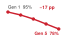

# Lựa chọn dữ liệu {#sec-data-selection}

::: {layout-narrow}
::: {.column-margin}

\chapterminitoc

:::

::: {.content-visible when-format="pdf"}
\noindent
{fig-alt="Sơ đồ phối cảnh cho thấy nhiều khối lập phương rải rác đi qua một bảng chấm điểm và hai cổng. Một luồng màu xanh lá nhỏ hơn đi vào một khối xử lý màu xanh lam, còn một luồng màu đỏ rẽ xuống dưới. Các nhãn gồm khan hiếm, điểm, chọn, tín hiệu và chi phí."}
:::

::: {.content-visible unless-format="pdf"}
{fig-alt="Sơ đồ phối cảnh cho thấy nhiều khối lập phương rải rác đi qua một bảng chấm điểm và hai cổng. Một luồng màu xanh lá nhỏ hơn đi vào một khối xử lý màu xanh lam, còn một luồng màu đỏ rẽ xuống dưới. Các nhãn gồm khan hiếm, điểm, chọn, tín hiệu và chi phí."}
:::

:::

## Mục đích {.unnumbered .unlisted}

\begin{marginfigure}
\mlsysstack{0}{0}{25}{50}{0}{0}{0}{90}
\end{marginfigure}

_Làm sao một tập con được chọn kỹ có thể giữ lại phần lớn giá trị của một tập dữ liệu lớn hơn nhiều?_

Trong huấn luyện, ta phải trả chi phí để thu thập, gán nhãn, chấm điểm, di chuyển và xử lý các ví dụ, dù giá trị học tập của chúng không đồng đều. Các tập dữ liệu lớn thường có mẫu dư thừa, nhiễu hoặc lệch mục tiêu, còn những vùng khan hiếm lại thiếu đúng các trường hợp mà mô hình cần. Chọn dữ liệu biến sự không đồng nhất đó thành một bài toán tối ưu hệ thống. Nó có thể loại bỏ công việc tránh được trước khi huấn luyện, hướng việc gán nhãn và các bước huấn luyện vào những trường hợp giàu thông tin hơn khi quá trình học diễn ra, hoặc tạo thêm ví dụ còn thiếu khi nút thắt là sự khan hiếm. Cách làm này cũng cho phép đầu tư một lần vào học biểu diễn có thể tái sử dụng, khi chi phí đó có thể được phân bổ cho nhiều tác vụ hạ lưu. Vì vậy, mục tiêu không phải là có tập dữ liệu nhỏ nhất, mà là đạt chất lượng mục tiêu với chi phí đầu-cuối thấp nhất, đồng thời không bỏ sót các trường hợp hiếm, các nhóm thiếu đại diện, hay phạm vi bao phủ liên quan đến triển khai. Mỗi chiến lược đều có chi phí phụ của riêng nó: các ví dụ cần được chấm điểm, tạo ra, xáo trộn, lưu trữ hoặc xác thực, và những chi phí này có thể xóa sạch phần tiết kiệm mà chúng hứa hẹn. Phải đánh giá từ đầu đến cuối, vì lợi ích ở khâu gán nhãn hay huấn luyện có thể bị xóa bởi độ trễ của bước chọn lọc, truy cập lưu trữ, hoặc phối hợp phân tán. Một phương pháp chỉ xứng đáng khi lượng học mà nó bảo toàn hoặc tạo ra vượt quá công sức để áp dụng. Sự phân biệt này đặc biệt quan trọng trong các thí nghiệm lặp lại, nơi những giảm tải hữu ích có thể tích lũy, và trong quá trình thích nghi, nơi giá trị của một ví dụ thay đổi theo mô hình và phân phối mục tiêu. Kỹ thuật dữ liệu đã khẳng định rằng dữ liệu là mã nguồn của các hệ thống ML; chọn dữ liệu đặt câu hỏi: bằng chứng nào hữu ích lúc này và bằng chứng nào còn thiếu? Theo thuật ngữ D·A·M, đó là đồng thiết kế dữ liệu-thuật toán: định hình tín hiệu huấn luyện để mỗi đơn vị công việc của máy mang lại nhiều học hữu ích hơn.

::: {.content-visible when-format="pdf"}

\newpage

:::

::: {.callout-learning-objectives}

- Giải thích chọn dữ liệu như một quá trình đồng thiết kế dữ liệu-thuật toán, nhằm giảm tổng khối lượng công việc trước khi huấn luyện bắt đầu.
- Tính toán tỷ lệ giữa thông tin và tài nguyên tính toán để quyết định liệu việc thêm các ví dụ có giúp cải thiện hiệu quả học tập trên mỗi FLOP hay không.
- So sánh các phương pháp như loại bỏ trùng lặp, chọn tập lõi (coreset selection), và tỉa (pruning) dựa trên chất lượng nhằm giảm bớt dữ liệu tiền huấn luyện dư thừa.
- Thiết kế các chiến lược curriculum, active learning, hoặc dùng dữ liệu tổng hợp để thay đổi giá trị của dữ liệu trong khi huấn luyện.
- Áp dụng bất đẳng thức chọn lọc để kiểm tra xem chi phí phụ của chọn lọc có thấp hơn chi phí huấn luyện trên toàn bộ tập dữ liệu hay không.
- Đánh giá các pipeline chọn lọc phân tán theo các ràng buộc về tính cục bộ lưu trữ, tính nhất quán và mức độ sử dụng GPU.
- Chọn khoản đầu tư cho chọn dữ liệu dựa trên ROI, khấu hao và các chẩn đoán về đường biên tối ưu tính toán.

:::

## Kiến thức nền tảng về chọn dữ liệu {#sec-data-selection-data-selection-fundamentals-e839}

Trong quá trình huấn luyện, hệ thống phải trả chi phí theo quy luật sắt cho mỗi ví dụ mà nó xử lý, nhưng không phải ví dụ nào cũng mang lại tín hiệu học tập xứng đáng với chi phí đó. Chọn dữ liệu\index{Data selection!definition} trao cho một tập dữ liệu sạch, được xây dựng tốt một mục tiêu ở cấp hệ thống: giữ lại những ví dụ đóng góp nhiều tín hiệu học tập nhất trên mỗi đơn vị tính toán. Kỹ thuật dữ liệu giúp tập dữ liệu đáng tin cậy nhờ nhãn chính xác, lược đồ nhất quán và các bản ghi được quản lý. Chọn dữ liệu tối ưu hóa giá trị của tập dữ liệu bằng cách rút ra lượng học tập tối đa từ số mẫu tối thiểu, qua đó trực tiếp làm nhỏ đi hạng mục tổng số thao tác $(O)$ trong quy luật sắt\index{Iron law of ML systems!total operations reduction via data selection} (nguyên tắc \ref{pri-iron-law}). Sự khác biệt này rất quan trọng: chất lượng hỏi dữ liệu có đúng không, còn giá trị hỏi liệu dữ liệu đúng có xứng đáng với tài nguyên tính toán bỏ ra để xử lý hay không.

::: {.column-margin}
```{=latex}
\vspace*{-18mm}
```
{width="100%" fig-alt="Hai đường xu hướng có nhãn 'tính toán' và 'dữ liệu' tách xa nhau, mở ra một vùng tô đỏ."}

*Nguồn cung tính toán có thể vượt quá nguồn cung dữ liệu chất lượng cao.*
:::

Việc tăng lượng dữ liệu huấn luyện từ lâu đã là cách chuẩn để cải thiện mô hình. Các quy luật mở rộng (scaling laws)\index{Scaling laws!data-compute asymmetry}[^fn-scaling-laws-origin] [@kaplan2020scaling; @hoffmann2022chinchilla] định lượng mức độ hiệu suất mô hình có thể cải thiện theo kích thước tập dữ liệu, và các nhóm đã đáp lại bằng cách thu thập, tạo thêm nhiều ví dụ. Tuy nhiên, các cụm bộ tăng tốc có thể mở rộng năng lực tính toán khả dụng nhanh hơn nguồn cung văn bản và hình ảnh mới, chất lượng cao do con người tạo ra. Phần lớn nội dung công khai, dễ tiếp cận trên web đã được đưa vào các tập dữ liệu huấn luyện lớn, và năng lực gán nhãn của chuyên gia tăng trưởng chậm. Sự bất đối xứng này chính là **bức tường dữ liệu**\index{Data wall!definition},[^fn-data-wall-scaling] và nó chuyển sự chú ý từ việc thu thập thêm dữ liệu sang việc khai thác nhiều giá trị hơn từ dữ liệu hiện có. Các phần sau sẽ trình bày các phương pháp chọn lọc và mô hình chi phí cần thiết để đưa ra lựa chọn đó.

[^fn-scaling-laws-origin]: **Các quy luật mở rộng**\index{Scaling laws!power-law origin}: Jared Kaplan và các đồng nghiệp tại Johns Hopkins và OpenAI đã chứng minh thực nghiệm vào năm 2020 rằng độ lỗi của mô hình ngôn ngữ tuân theo các quan hệ theo luật lũy thừa với kích thước mô hình, kích thước tập dữ liệu và ngân sách tính toán trong các điều kiện họ nghiên cứu [@kaplan2020scaling]. Số mũ dữ liệu mà họ khớp được xấp xỉ $\alpha = 0.095$ trong $\mathcal{L} \propto D^{-\alpha}$. Giá trị này không phổ quát, nhưng dạng hiệu quả giảm dần giúp ta suy luận khi nào việc chọn lọc trở nên hiệu quả về chi phí hơn so với việc thu thập.

```{python}
#| echo: false
#| label: scaling-asymmetry-calc

# ┌─────────────────────────────────────────────────────────────────────────────
# │ SCALING ASYMMETRY TABLE
# ├─────────────────────────────────────────────────────────────────────────────
# │ Context: @tbl-scaling-asymmetry in "Data Selection Fundamentals" section
# │
# │ Goal: Quantify the growth rate gap between compute and data.
# │ Show: That compute grows 10×/3yr while data only grows 2×/5yr.
# │ How: Contrast historical growth factors for TFLOP/s and high-quality tokens.
# │
# │ Scope: chapter-anchor — opening scaling-asymmetry table is reused by the
# │        fallacies section as the chapter's data-wall callback.
# └─────────────────────────────────────────────────────────────────────────────
from mlsysim.fmt import check, fmt_multiple, fmt_time

# ┌── LEGO ───────────────────────────────────────────────
class ScalingAsymmetry:
    """
    Namespace for Scaling Asymmetry Table.
    Scenario: Comparing growth rates of Compute vs Data.
    """

    # ┌── 1. LOAD (Constants) ───────────────────────────────────────────────
    # Hardware: 10x every 3 years (approx 2.15x/year)
    gpu_growth_factor = 10.0
    gpu_period_years = 3.0

    # Data: 2x every 5 years (approx 1.15x/year)
    web_growth_factor = 2.0
    web_period_years = 5.0

    # Labels: 1.5x every 5 years (approx 1.08x/year)
    label_growth_factor = 1.5
    label_period_years = 5.0

    # ┌── 2. EXECUTE (The Compute) ─────────────────────────────────────────
    # Step 1: Annualized growth rates: Rate = Factor^(1/Period)
    gpu_annual = gpu_growth_factor ** (1.0 / gpu_period_years)
    web_annual = web_growth_factor ** (1.0 / web_period_years)

    # Step 2: Divergence
    gap_ratio = gpu_annual / web_annual

    # ┌── 3. GUARD (Invariants) ───────────────────────────────────────────
    check(gap_ratio >= 1.5, f"GPU growth ({gpu_annual:.2f}x/yr) is not fast enough vs. Data ({web_annual:.2f}x/yr). Gap: {gap_ratio:.2f}x")

    # ┌── 4. OUTPUT (Formatting) ──────────────────────────────────────────────
    gpu_growth_mult_str = fmt_multiple(round(gpu_growth_factor), precision=0, commas=False)
    # Custom "years" suffix uses fmt_int() suffix discipline.
    gpu_period_years_str = fmt_time(round(gpu_period_years), 'year', precision=0, commas=False, style='word')

    web_data_growth_mult_str = fmt_multiple(round(web_growth_factor), precision=0, commas=False)
    web_data_period_years_str = fmt_time(round(web_period_years), 'year', precision=0, commas=False, style='word')

    label_data_growth_mult_str = fmt_multiple(label_growth_factor, precision=1, commas=False)
    label_data_period_years_str = fmt_time(round(label_period_years), 'year', precision=0, commas=False, style='word')
```

@Tbl-scaling-asymmetry sử dụng một kịch bản tăng trưởng minh họa, trong đó năng lực tính toán của GPU tăng `{python} ScalingAsymmetry.gpu_growth_mult_str` mỗi `{python} ScalingAsymmetry.gpu_period_years_str`, trong khi dữ liệu chất lượng cao có thể tiếp cận được lại tăng chậm hơn. Đây là các tham số đầu vào của kịch bản, không phải các tốc độ phổ quát đã được đo lường.

| **Resource**            |                                                                                                   **Growth Rate** | **Implication**                                                                   |
|:------------------------|------------------------------------------------------------------------------------------------------------------:|:----------------------------------------------------------------------------------|
| **GPU Compute**         |               ~`{python} ScalingAsymmetry.gpu_growth_mult_str` / `{python} ScalingAsymmetry.gpu_period_years_str` | Hardware throughput can rise quickly in a given era                               |
| **Training Data (Web)** |     ~`{python} ScalingAsymmetry.web_data_growth_mult_str` / `{python} ScalingAsymmetry.web_data_period_years_str` | High-quality web text is finite; much already scraped                             |
| **Labeled Data**        | ~`{python} ScalingAsymmetry.label_data_growth_mult_str` / `{python} ScalingAsymmetry.label_data_period_years_str` | Human annotation throughput is inherently bounded                                 |
| **Synthetic Data**      |                                                                                                 Potentially large | Bounded by generator quality (models trained on model-generated data can degrade) |

: **Bất đối xứng về khả năng mở rộng trong tài nguyên ML**: Trong kịch bản mở rộng được minh họa, năng lực tính toán tăng nhanh hơn nguồn cung dữ liệu chất lượng cao, tạo ra sự mất cân bằng giữa tính toán và dữ liệu, khiến việc lựa chọn dữ liệu trở nên có giá trị. {#tbl-scaling-asymmetry .striped .hover tbl-colwidths="[16,13,71]"}

[^fn-data-wall-scaling]: **Bức tường dữ liệu**\index{Data wall!scaling constraint}: Khác với khả năng tính toán (có thể mở rộng bằng cách đầu tư vốn) hay thuật toán (có thể cải thiện nhờ nghiên cứu), kho văn bản chất lượng cao do con người tạo ra tăng trưởng chậm. Các dự báo cập nhật của Epoch AI ước tính rằng, theo các giả định về mức tiêu thụ được mô tả trong bài báo, các mô hình có thể sử dụng các tập dữ liệu có kích thước xấp xỉ bằng tổng lượng văn bản công khai do con người tạo ra trong giai đoạn 2026–2032 [@villalobos2022will]. Điều quan trọng đối với thiết kế hệ thống không phải là một mốc thời gian cố định; vấn đề là dữ liệu có thể trở thành một ràng buộc về nguồn cung chứ không chỉ đơn thuần là bài toán kinh tế. Ràng buộc này tác động trực tiếp đến tổng số phép toán $(O)$: khi dữ liệu chất lượng trở nên khan hiếm, thêm compute sẽ cho hiệu quả giảm dần, bất kể thông lượng phần cứng.

Việc mở rộng kích thước tập dữ liệu cuối cùng sẽ chạm trần nguồn cung hữu hạn của lời nói và văn bản chất lượng cao do con người tạo ra. Hãy theo dõi quỹ đạo trên thang log trong @fig-running-out-of-human-data để thấy yêu cầu huấn luyện của mô hình nền tảng tiến gần đến giới hạn trên ước tính của dữ liệu công khai sẵn có như thế nào.

Vì vậy, khoảng cách giữa những gì compute có thể xử lý và những gì dữ liệu chất lượng cao có thể truy cập hỗ trợ được là một biến số của hệ thống, không phải một quy luật cố định. Trong kịch bản minh họa ở @tbl-scaling-asymmetry, nguồn cung compute tăng nhanh hơn dữ liệu chất lượng cao có thể truy cập, nên ngân sách cho bộ tăng tốc có thể vượt xa kho ngữ liệu, khiến hệ thống dồi dào compute nhưng bị hạn chế bởi dữ liệu. Để duy trì tính phù hợp của mô hình, cần liên tục làm mới kho ngữ liệu huấn luyện theo thời gian khi thế giới thay đổi; và khi chất lượng dữ liệu chứ không phải thời gian bộ tăng tốc trở thành nút thắt, việc lựa chọn dữ liệu thông minh là then chốt.

::: {#fig-running-out-of-human-data fig-env="figure" fig-pos="htb" fig-cap="**Tăng trưởng tập dữ liệu tiếp cận giới hạn**: Một số tập dữ liệu của mô hình nền tảng đã tăng trưởng đến mức gần bằng ước tính tổng lượng văn bản công khai chất lượng cao. Dự báo này nên được hiểu là một kịch bản ràng buộc theo mốc thời gian, không phải một dự báo cố định: lựa chọn dữ liệu, tạo dữ liệu tổng hợp, học đa phương thức, cấp phép và chính sách lọc đều có thể làm thay đổi nguồn cung khả dụng." fig-alt="Biểu đồ đường theo thang logarit thể hiện kích thước tập dữ liệu từ 100 triệu đến 1 triệu tỷ token theo từng năm, từ 2012 đến 2028. Một đường xu hướng màu xanh dương đi lên, với các mốc đánh dấu cho GPT-3, Chinchilla, Llama 2 và Llama 3. Một dải màu cam từ 100 nghìn tỷ đến 1 triệu tỷ token được gắn nhãn High-Quality Public Text Stock, và một chú thích màu đỏ Public Data Exhaustion chỉ về phía đường xu hướng."Kho văn bản công khai chất lượng cao", và một chú thích màu đỏ "Cạn kiệt dữ liệu công khai" chỉ vào đường xu hướng."}
```{.tikz}
\begin{tikzpicture}[font=\sffamily\small]

\pgfplotsset{
  layers/axis lines on top/.define layer set={
    axis background,
    axis grid,
    axis ticks,
    axis tick labels,
    pre main,
    main,
    axis lines,
    axis descriptions,
    axis foreground,
  }{/pgfplots/layers/standard},
}

\begin{axis}[
   /pgf/number format/.cd,
   tick label style={/pgf/number format/assume math mode=true},
   ticklabel style={font=\footnotesize\sffamily},
   1000 sep={}, % uklanja zareze
  yticklabel style={
  /pgf/number format/.cd,
  sci,
  sci generic={mantissa e exponent},
  precision=1
},
    width=15cm,
    height=75mm,
    xmin=2012, xmax=2028.5,
    ymin=1e8, ymax=1.4e15,
    ymode=log,
    log basis y=10,
    xtick={2012,2014,2016,2018,2020,2022,2024,2026,2028},
    ytick={1e8,1e9,1e10,1e11,1e12,1e13,1e14,1e15},
    yticklabels={10\textsuperscript{8},10\textsuperscript{9},
    10\textsuperscript{10},10\textsuperscript{11},
    10\textsuperscript{12},10\textsuperscript{13},
    10\textsuperscript{14},10\textsuperscript{15}},
    xlabel={Year},
    ylabel={Dataset Size (Tokens)},
    axis lines*=left,
    axis line style={gray!70,line width=1pt},
 % axis on top=true,
    set layers=axis lines on top,
    tick style={gray!70},
    tick label style={font=\sffamily\footnotesize},
    ylabel style={font=\small\sffamily,align=center,yshift=-1.2mm},
    xlabel style={font=\small\sffamily},
    grid=both,
    major grid style={gray!12},
    minor grid style={gray!6},
    clip=false,
    major tick style={thin,black},
   tick align=outside,
   major tick length=4pt,
]

%—shaded public text stock band ---
\addplot[
    draw=none,
    fill=myorange!07
] coordinates {
    (2012,1e14)
    (2028,1e14)
    (2028,1e15)
    (2012,1e15)
}; %\closedcycle

\node[
    anchor=center,
    align=center,
    text=myorange!75!black,
    font=\footnotesize\sffamily
] at (axis cs:2015.5,3e14)
{High-Quality Public Text Stock\\(Books, Papers, Code, Web)};

%—scaling line ---
\addplot[
    BlueLine,
    line width=1.5pt,
] coordinates {
    (2017.15,1e9)
    (2026.60,1e15)
};

%—data points ---
\addplot[
    only marks,
    mark=*,
    mark size=2.5,
    BlueLine,
    draw=white,line width=0.95pt
] coordinates {
    (2019.0,1.4e10)   % unlabeled low point
    (2020.0,3.0e11)   % GPT-3
    (2022.0,1.4e12)   % Chinchilla
    (2023.0,2.0e12)   % Llama 2
    (2024.0,1.5e13)   % Llama 3
};

%—point labels ---
\node[anchor=west, text=BlueLine, font=\sffamily\footnotesize]
    at (axis cs:2018.5,3.0e11) {GPT-3};

\node[anchor=west, text=BlueLine, font=\sffamily\footnotesize]
    at (axis cs:2022.0,9.0e11) {Chinchilla};

\node[anchor=west, text=BlueLine, font=\sffamily\footnotesize]
    at (axis cs:2023.1,2.0e12) {Llama 2};

\node[anchor=west, text=BlueLine, font=\sffamily\footnotesize]
    at (axis cs:2024.15,1.5e13) {Llama 3};

%—red curved arrow and label ---
\node[
    anchor=west,
    text=myred,
    font=\sffamily\footnotesize
](PD) at (axis cs:2015.4,1.2e12)
{Projected Data Limit};
\coordinate(PO)at(axis cs:2025.05,1.05e14);
\end{axis}
\draw[myred,line width=0.75pt, <-,>=latex]
(PO)
to[bend right=15]
(PD);
\end{tikzpicture}
```
:::

Bất đối xứng giữa *compute* và *dữ liệu* có thể đảo ngược thứ tự ưu tiên tối ưu hóa. Khi *dữ liệu* dồi dào còn *compute* khan hiếm, các thuật toán hiệu quả có thể rút thêm độ chính xác từ số chu kỳ GPU hạn chế. Khi *compute* dồi dào nhưng *dữ liệu chất lượng* khan hiếm, lựa chọn dữ liệu có thể giúp học được nhiều hơn từ mỗi mẫu. Lựa chọn dữ liệu diễn ra ở thượng nguồn, trước các tối ưu hóa về mô hình và máy. Bằng cách tỉa (pruning) phần dư thừa và chọn các mẫu có giá trị cao, khối lượng công việc (workload) được giảm ngay trước khi đi vào mô hình hoặc tới phần cứng, trực tiếp thu nhỏ hạng mục tổng số phép toán $(O)$ trong "quy luật sắt". Đó là lý do cách nhìn hệ thống xem lựa chọn dữ liệu là giảm khối lượng công việc ở thượng nguồn, thay vì một heuristic trong mô hình hóa. Với các nhóm mà ngân sách bộ tăng tốc vượt quá kho ngữ liệu đã tuyển chọn, nút thắt cổ chai chuyển từ quyền truy cập GPU sang chất lượng, tính hợp pháp và độ đa dạng của dữ liệu huấn luyện.

Bộ công cụ kỹ thuật cho lựa chọn dữ liệu thông minh tuân theo một thứ tự tối ưu hóa có chủ đích\index{Data selection!optimization ordering}: trước hết hỏi liệu một mẫu có đáng để xử lý không, rồi mới hỏi cách xử lý phần khối lượng công việc (workload) còn lại cho hiệu quả. Lựa chọn dữ liệu hiện thực hóa nguyên tắc "ưu tiên lợi ích lớn nhất" bằng cách tìm việc có thể tránh trước, rồi mới đơn giản hóa hoặc tăng tốc phần việc còn lại. Tỉa tĩnh (static pruning)\index{Static pruning!definition} loại bỏ các mẫu ít giá trị trước khi tính bất kỳ gradient nào. Lựa chọn động (dynamic selection)\index{Dynamic selection!definition} điều chỉnh "khẩu phần" dữ liệu trong quá trình huấn luyện thông qua curriculum learning và active learning. Tạo dữ liệu tổng hợp (synthetic generation)\index{Synthetic data generation!definition} tạo mẫu giá trị cao bằng tăng cường (augmentation), mô phỏng, hoặc các ví dụ do "giáo viên" tạo khi dữ liệu thực tế trở nên khan hiếm.

Mỗi giai đoạn có thể tăng mật độ thông tin của dữ liệu đi vào mô hình, miễn là các cải thiện chất lượng đo được đủ bù chi phí phát sinh. Cả ba giai đoạn này tạo thành một bộ công cụ bổ trợ nhau: tỉa (pruning) giảm *những gì* pipeline chứa, lựa chọn tập trung vào *cách* pipeline sử dụng chúng, còn tổng hợp mở rộng *những gì* pipeline có thể truy cập. Để so sánh các kỹ thuật này, chúng ta cần một định nghĩa lựa chọn dữ liệu theo góc nhìn hệ thống, cùng với một cách đo lường hiệu quả của nó.

### Định nghĩa lựa chọn dữ liệu {#sec-data-selection-defining-data-selection-ef2f}

pipeline ba giai đoạn cần một thước đo để kỹ sư so sánh các mẫu trước khi tiêu tốn thời gian của bộ tăng tốc cho chúng. Một hình ảnh trùng lặp, một bản ghi sai nhãn, và một trường hợp biên hiếm có thể tốn cùng một lượng tính toán cho lượt truyền xuôi và truyền ngược, nhưng không mang lại cùng mức tín hiệu học tập. Vì vậy, lựa chọn dữ liệu bắt đầu bằng cách nêu rõ giá trị của từng mẫu so với chi phí tính toán. Tỷ lệ thông tin-tính toán (information-compute ratio) đo giá trị này dưới dạng tín hiệu học tập thu được trên mỗi đơn vị tính toán trong quá trình huấn luyện, được trình bày trong @sec-data-selection-informationcompute-ratio-8c0b.

::: {#dfn-data-selection-data-selection .callout-definition title="Lựa chọn dữ liệu"}

***Lựa chọn dữ liệu***\index{Data selection!definition} là quá trình tối đa hóa tỷ lệ thông tin-tính toán (ICR) của một tập dữ liệu huấn luyện.

1.  **Ý nghĩa**: Kỹ thuật này giúp xác định dữ liệu đáng giữ lại, cần ưu tiên hoặc cần tạo mới cho mục tiêu đặt ra, đồng thời giảm tổng số phép toán $(O)$ khi có thể loại bỏ các mẫu dư thừa hoặc nhiễu mà vẫn giữ đủ độ bao phủ cần thiết.
2.  **Điểm khác biệt**: Không giống data engineering vốn tập trung vào độ sạch và tính nhất quán của dữ liệu, lựa chọn dữ liệu chú trọng vào mức độ cung cấp thông tin và sự đa dạng của các mẫu.
3.  **Cạm bẫy thường gặp**: Một ngộ nhận phổ biến là càng nhiều dữ liệu càng tốt. Thêm dữ liệu chất lượng thấp có thể kém hiệu quả hơn nhiều so với một tập nhỏ nhưng được chọn lọc kỹ. Vì vậy, khối lượng dữ liệu giữ lại phải được đánh giá cùng với độ bao phủ và chất lượng mục tiêu.

:::

Để cụ thể, hãy xét việc huấn luyện một mô hình ngôn ngữ tự hồi quy\index{LLM} thuộc họ lighthouse như GPT-2\index{GPT-2!data selection}/Llama\index{Llama!data selection}, được nêu trong @sec-network-architectures-lighthouse-roster-model-biographies-a763. Kịch bản này dùng một mô hình 70 tỷ tham số để làm rõ khoảng cách giữa tính toán và dữ liệu ở quy mô lớn.

```{python}
#| echo: false
#| label: gpt-llama-calc

import mlsysim.core.units as c
from mlsysim import Hardware, Infrastructure, Models, Systems
from mlsysim.engine import calibration
from mlsysim.fmt import check, fmt, fmt_count, fmt_multiple, fmt_percent, fmt_time, fmt_usd

class ComputeDataGap:
    # LOAD
    h100_count = Systems.Clusters.Training_10K.total_accelerators
    months = 3
    filtered_corpus_tokens = 5e12 * c.count
    public_text_stock = 300e12 * c.count
    sustained_mfu = calibration.REFERENCE_MFU_SUSTAINED
    training_flops_per_token = 6 * Models.Language.Llama2_70B.parameters.to(c.param) * c.flop / c.param
    training_duration = months * c.DAYS_PER_MONTH * c.HOURS_PER_DAY * c.hour

    # EXECUTE
    total_flops = h100_count * Hardware.Cloud.H100.compute.peak_flops.to(c.flop / c.second) * training_duration.to(c.second) * sustained_mfu
    tokens_capacity = (total_flops / training_flops_per_token).to(c.count)
    corpus_reuse_ratio = (tokens_capacity / filtered_corpus_tokens).to("").magnitude
    cluster_cost = h100_count * training_duration.to(c.hour) * Infrastructure.Pricing.Cloud.GpuTrainingPerHour.rate.to(c.USD / c.hour)

    # GUARD
    check(public_text_stock > tokens_capacity, "Public stock estimate should exceed the example training run capacity.")
    check(corpus_reuse_ratio > 10, f"Cluster should be able to traverse the filtered corpus many times; got {corpus_reuse_ratio:.1f}x.")

    # OUTPUT
    h100_count_str = fmt(h100_count, precision=0, commas=True)
    tokens_capacity_str = fmt_count(tokens_capacity, scale='T', precision=1, commas=False)
    filtered_corpus_tokens_str = fmt_count(filtered_corpus_tokens, scale='T', commas=False)
    public_text_stock_str = fmt_count(public_text_stock, scale='T', commas=False)
    corpus_reuse_ratio_mult_str = fmt_multiple(corpus_reuse_ratio, precision=1, commas=False)
    training_months_str = fmt_time(months, 'month', precision=0, commas=False, style='word')
    sustained_mfu_pct_str = fmt_percent(sustained_mfu, precision=0, commas=False, style='prose')
    cluster_cost_m_str = fmt_usd(cluster_cost, precision=1, commas=False, scale="M")
```

Ngân sách tính toán (sử dụng `{python} ComputeDataGap.h100_count_str` GPU H100 trong `{python} ComputeDataGap.training_months_str`) tương đương khoảng `{python} ComputeDataGap.cluster_cost_m_str` theo mức giá huấn luyện trên đám mây của chương này. Ngân sách này có thể xử lý khoảng `{python} ComputeDataGap.tokens_capacity_str` token ở mức `{python} ComputeDataGap.sustained_mfu_pct_str` hiệu suất sử dụng FLOPs của mô hình duy trì. Ước tính lượng văn bản công khai do con người tạo ra, đã điều chỉnh về chất lượng và độ lặp, vào khoảng `{python} ComputeDataGap.public_text_stock_str` token, lớn hơn nhiều so với một tập web đã tuyển chọn duy nhất. Tuy vậy, nút thắt thực tế hẹp hơn: bao nhiêu trong số đó thực sự có thể truy cập, sử dụng hợp pháp, chất lượng cao, đã khử trùng lặp và hữu ích cho phân phối mục tiêu. Nếu một nhóm chỉ có sẵn một tập dữ liệu đã lọc (`{python} ComputeDataGap.filtered_corpus_tokens_str`) để dùng ngay, thì ngân sách tính toán này đã có thể xử lý tập đó khoảng `{python} ComputeDataGap.corpus_reuse_ratio_mult_str` lần. Khi đó, nhóm có ba lựa chọn:

- **Lặp lại epoch**: Nhóm có thể huấn luyện trên cùng dữ liệu qua nhiều epoch, nhưng hiệu quả sẽ giảm dần khi ví dụ bị dùng lại; số epoch hữu ích phụ thuộc vào khối lượng công việc (workload).
- **Hạ thấp ngưỡng chất lượng**: Nhóm có thể đưa thêm dữ liệu vào, nhưng các token chất lượng thấp có thể làm giảm chất lượng mô hình.
- **Đầu tư vào lựa chọn dữ liệu**: Nhóm có thể cải thiện lọc dữ liệu, thiết kế chương trình học và tăng cường dữ liệu tổng hợp để học được nhiều hơn từ mỗi token.

Theo những giả định này, tiêu chí quyết định nghiêng về chọn lọc dữ liệu hơn là mua thêm thời gian dùng bộ tăng tốc.

Cơ hội này áp dụng cho nhiều kiến trúc mô hình, dù nút thắt và mức giảm an toàn khác nhau. Không giống ngọn hải đăng ResNet-50\index{ResNet-50!data selection} bị giới hạn bởi khả năng tính toán, các mô hình GPT-2/Llama có thể bị giới hạn bởi băng thông bộ nhớ trong suy luận và bị giới hạn bởi khả năng tính toán trong huấn luyện. Khi một phương pháp chọn lọc đã được kiểm chứng loại bỏ ví dụ hoặc token mà không thêm các bước bù đắp, ít mẫu hơn sẽ đồng nghĩa với ít FLOPs huấn luyện hơn. Vì vậy, cách đặt vấn đề phù hợp là theo hệ thống, không chỉ thuần thống kê.

### Góc nhìn hệ thống {#sec-data-selection-systems-perspective-bd61}

Bức tường dữ liệu cho thấy *tại sao* việc chọn lọc dữ liệu quan trọng; còn góc nhìn hệ thống chỉ ra *cách* tiếp cận hiệu quả. Khung tư duy ML truyền thống tập trung đạt cùng mức độ chính xác với ít mẫu hơn, xoay quanh độ phức tạp mẫu thống kê và lý thuyết khái quát hóa. Dù đúng, cách nhìn đó vẫn bỏ lỡ bức tranh lớn.

Ngược lại, một *khung tư duy hệ thống*\index{Data selection!systems vs. ML framing} cho việc chọn lọc dữ liệu đặt câu hỏi làm thế nào để giảm tổng chi phí để đạt hiệu suất mục tiêu trong toàn bộ vòng đời ML. Sự dịch chuyển này đưa trọng tâm từ các đường cong độ chính xác sang tiêu thụ tài nguyên, như @tbl-ml-vs-systems-framing minh họa.

| **ML Framing**                        |                         **Systems Framing** |
|:--------------------------------------|--------------------------------------------:|
| **"Fewer samples for same accuracy"** |             "Fewer FLOPs for same accuracy" |
| **"Better generalization"**           | "Lower training cost (time, money, energy)" |
| **"Sample complexity bounds"**        |            "End-to-end resource efficiency" |
| **"Learning theory"**                 |                          "Cost engineering" |

: **Góc nhìn ML so với Hệ thống về Lựa chọn Dữ liệu**: Khung tư duy ML tối ưu hóa độ phức tạp mẫu; khung tư duy hệ thống tối ưu hóa tổng chi phí tài nguyên trên toàn bộ pipeline. {#tbl-ml-vs-systems-framing .striped .hover}

Khung tư duy hệ thống hé lộ các cơ hội tối ưu hóa mà khung tư duy ML không thấy. Để hiểu *tại sao*, hãy xem *cách* việc chọn lọc dữ liệu tương tác với định luật sắt đã được giới thiệu trong @sec-introduction-iron-law-ml-systems-c32a.

```{python}
#| echo: false
#| label: data-selection-savings-calc

# ┌─────────────────────────────────────────────────────────────────────────────
# │ IRON LAW SAVINGS CALCULATION
# ├─────────────────────────────────────────────────────────────────────────────
# │ Context: "Data Selection and the Iron Law" callout
# │
# │ Goal: Demonstrate the multiplicative impact of data selection.
# │ Show: That dataset reduction compounds with hardware and model optimizations.
# │ How: Contrast additive vs. multiplicative speedup factors for an 8x total gain.
# │
# └─────────────────────────────────────────────────────────────────────────────
from mlsysim.fmt import fmt_percent, fmt, fmt_usd, check
from mlsysim import Infrastructure
from mlsysim.core.units import MILLION, USD, hour

# ┌── LEGO ───────────────────────────────────────────────
class IronLawSavings:
    """
    Namespace for Iron Law Multiplicative Savings.
    Scenario: 2x Data Selection * 2x Compression * 2x Hardware = 8x Total.
    """

    # ┌── 1. LOAD (Constants) ───────────────────────────────────────────────
    budget_m = 100  # $100M training run

    # Optimization factors
    factor_data = 2.0
    factor_model = 2.0
    factor_hw = 2.0

    # Derived
    data_pruning_pct = (1 - (1 / factor_data)) * 100

    # ┌── 2. EXECUTE (The Compute) ─────────────────────────────────────────
    # Step 1: Multiplicative effect
    total_speedup = factor_data * factor_model * factor_hw

    # Step 2: Savings
    compute_savings_m = budget_m * (data_pruning_pct / 100.0)

    # ┌── 3. GUARD (Invariants) ───────────────────────────────────────────
    additive_sum = factor_data + factor_model + factor_hw
    check(total_speedup > additive_sum, f"Multiplicative speedup ({total_speedup}x) should exceed additive sum ({additive_sum}).")

    # ┌── 4. OUTPUT (Formatting) ──────────────────────────────────────────────
    training_cost_m_str = fmt_usd((budget_m) * MILLION, precision=0, commas=False, scale="M")
    dataset_reduction_pct_str = fmt_percent(data_pruning_pct / 100, precision=0, commas=False, style='prose')
    compute_savings_m_str = fmt_usd((compute_savings_m) * MILLION, precision=0, commas=False, scale="M")
    combined_factor_mult_str = fmt_multiple(round(total_speedup), precision=0, commas=False)
    factor_data_mult_str = fmt_multiple(round(factor_data), precision=0, commas=False)
    factor_model_mult_str = fmt_multiple(round(factor_model), precision=0, commas=False)
    factor_hw_mult_str = fmt_multiple(round(factor_hw), precision=0, commas=False)
    additive_sum_mult_str = fmt_multiple(round(additive_sum), precision=0, commas=False)
```

::: {#psp-data-selection-data-selection-iron-law .callout-perspective title="Chọn lọc dữ liệu và định luật sắt"}

Trong định luật sắt của hệ thống ML $(T = \frac{D_{\text{vol}}}{\text{BW}} + \frac{O}{R_{\text{peak}} \cdot \eta_{\text{hw}}} + L_{\text{lat}})$, chọn lọc dữ liệu làm giảm số lượng ví dụ hoặc token đi vào khối lượng công việc (workload). Các tối ưu hóa ở cấp độ mô hình sau đó làm giảm số phép toán trên mỗi lần truyền thuận/ngược, và các tối ưu hóa ở cấp độ máy làm tăng $R_{\text{peak}}$ (thông lượng đỉnh) và $\eta_{\text{hw}}$ (mức sử dụng). Việc chọn lọc dữ liệu loại bỏ phần việc trước khi các tối ưu hóa ở các bước sau phải thực hiện.

Điều này khiến chọn lọc dữ liệu mang giá trị theo hệ số nhân trong định luật sắt\index{Iron law of ML systems!multiplicative savings from data selection}: khi cả ba lớp tối ưu hóa cùng tác động vào cùng một điểm nghẽn, giảm kích thước tập dữ liệu `{python} IronLawSavings.factor_data_mult_str` lần, cùng với số phép toán trên mỗi mẫu ít hơn `{python} IronLawSavings.factor_model_mult_str` lần và thông lượng hiệu quả cao hơn `{python} IronLawSavings.factor_hw_mult_str` lần, sẽ mang lại tổng mức giảm chi phí `{python} IronLawSavings.combined_factor_mult_str` lần, chứ không phải `{python} IronLawSavings.additive_sum_mult_str`.

:::

Hãy xét bài toán giảm chi phí huấn luyện. Khi số epoch, kích thước batch và lượng công việc trên mỗi mẫu giữ nguyên, việc giảm kích thước tập dữ liệu đi `{python} IronLawSavings.dataset_reduction_pct_str` sẽ giúp giảm một nửa số lần truyền xuôi (forward pass), truyền ngược (backward pass) và cập nhật gradient. Với kịch bản `{python} IronLawSavings.training_cost_m_str` dùng ở đây, điều đó tương ứng với mức tiết kiệm tính toán `{python} IronLawSavings.compute_savings_m_str`. Các lịch trình thêm epoch hoặc tăng số bước sẽ làm giảm mức tiết kiệm này.

Khoản tiết kiệm tính toán sẽ lan sang toàn bộ ngăn xếp hạ tầng. Các tập dữ liệu lớn tiêu tốn hàng petabyte lưu trữ và bão hòa băng thông mạng trong huấn luyện phân tán; khử trùng lặp\index{Deduplication!storage and I/O cost reduction} và lựa chọn coreset giúp giảm chi phí lưu trữ, đồng thời loại bỏ các nút thắt I/O có thể khiến các cụm GPU đắt tiền bị nhàn rỗi. Khoản tiết kiệm còn mở rộng sang bài toán chi phí gán nhãn: gán nhãn bởi chuyên gia có thể còn tốn hơn chi phí tính toán, và học chủ động\index{Active learning!labeling cost reduction} cùng các phương pháp bán giám sát có thể giảm đáng kể ngân sách gán nhãn trong những bối cảnh thuận lợi. Tác động môi trường cũng cộng dồn thêm: với các lần huấn luyện chi phối bởi tính toán, giảm số lượng ví dụ sẽ giảm tiêu thụ năng lượng tỷ lệ với phần công việc được cắt giảm, miễn là tập con được chọn vẫn giữ nguyên độ chính xác. Các tập dữ liệu được tuyển chọn nhỏ hơn cũng giúp tăng tốc độ lặp. Một nhóm có thể lặp trong vài giờ thay vì vài ngày sẽ có lợi thế tích lũy rõ rệt trong phát triển mô hình.

Những lợi ích dây chuyền này cho thấy một điểm rộng hơn: nhà nghiên cứu ML thường đóng khung vấn đề dưới góc độ độ phức tạp mẫu (sample complexity), còn kỹ sư hệ thống lại nhìn thành chi phí trên mỗi điểm độ chính xác (cost-per-accuracy-point) trên toàn bộ pipeline, từ thu thập dữ liệu đến triển khai. Bộ công cụ của kỹ sư hệ thống cho bài toán này gồm các kỹ thuật để tối thiểu hóa tổng chi phí, các chỉ số để định lượng hiệu quả, và các mẫu kiến trúc để hiện thực hóa lựa chọn dữ liệu ở quy mô lớn.

### Tỷ lệ thông tin - tính toán {#sec-data-selection-informationcompute-ratio-8c0b}

Khung hệ thống trong @sec-data-selection-systems-perspective-bd61 đòi hỏi một thước đo định lượng. Việc lựa chọn dữ liệu tạo ra một ranh giới giữa độ chính xác và chi phí\index{Information-compute ratio!accuracy-cost frontier}: giữ tất cả ví dụ sẽ tối đa hóa độ bao phủ nhưng lãng phí tài nguyên tính toán vì dư thừa, còn tỉa (pruning) quá mạnh thì tiết kiệm tính toán nhưng mất tín hiệu. Chúng ta cần một cách đo lường vị trí của từng mẫu trên ranh giới đó. Thước đo là lượng thông tin mỗi mẫu đóng góp cho quá trình huấn luyện của mô hình, tính trên mỗi đơn vị tài nguyên tính toán. Chúng ta chính thức hóa nó thành **tỷ lệ thông tin-tính toán**\index{Information-compute ratio!definition}.

@Fig-optimization-triad trình bày lại phân loại D·A·M dưới dạng một bản đồ tối ưu hóa, trong đó lựa chọn dữ liệu đóng vai trò tối ưu hóa đầu vào: giảm tổng khối lượng công việc (workload) trước khi dữ liệu đi vào mô hình hoặc phần cứng. Phía mô hình hỏi mỗi ví dụ cần bao nhiêu phép toán. Phía máy hỏi phần cứng thực thi các phép toán đó nhanh đến mức nào. Phía dữ liệu hỏi liệu ví dụ đó có nên được xử lý hay không. Ba edge của tam giác thể hiện các nút thắt cổ chai chính: *compute bound* mô tả các hệ thống bị giới hạn bởi thông lượng tính toán, *I/O bound* mô tả các hệ thống bị giới hạn bởi việc di chuyển dữ liệu, và *sample efficiency* mô tả các hệ thống bị giới hạn bởi lượng thông tin trong dữ liệu huấn luyện.

::: {#fig-optimization-triad fig-env="figure" fig-pos="htb" fig-cap="**Phân loại D·A·M dưới dạng Bản đồ Tối ưu hóa**: Hiệu suất machine learning được tổ chức quanh Thuật toán (Mô hình), Lựa chọn Dữ liệu và Máy (phần cứng). Các edge của tam giác gắn nhãn mối quan hệ compute-bound, I/O-bound và sample-efficiency, trong khi lựa chọn dữ liệu giúp giảm khối lượng công việc (workload) trước khi mô hình hoặc phần cứng thực thi." fig-alt="Sơ đồ tam giác với ba trụ cột quanh nhãn 'Hiệu suất ML' ở trung tâm: Thuật toán (Mô hình) ở trên cùng, Máy (phần cứng) ở dưới bên trái, và Lựa chọn Dữ liệu ở dưới bên phải. Các mũi tên cong đi dọc theo từng edge của tam giác, được gắn nhãn Compute Bound (giữa Thuật toán và Máy), I/O Bound (giữa Máy và Lựa chọn Dữ liệu), và Sample Efficiency (giữa Lựa chọn Dữ liệu và Thuật toán)."}
```{.tikz}
\scalebox{0.8}{%
\begin{tikzpicture}[line join=round,font=\sffamily\footnotesize]
\tikzset{%
Box2/.style={align=flush center, inner sep=0pt,draw=none,fill=none,minimum height=8mm },
planet/.style = {circle, draw=none,semithick, fill=yellow!10,line width=1.5pt,
                    font=\sffamily\bfseries,
                    minimum size=27mm, inner sep=1mm,align=flush center},
satellite/.style = {circle, draw=#1, dashed, thick, fill=none,%#1!10,
                    text width=26mm, inner sep=1pt, align=flush center,minimum size=28mm,minimum height=12mm},
TxtC/.style = {font=\footnotesize\sffamily,text width=50mm,align=flush center},
LineA/.style = {violet!60,{Kite[line width=1.1pt,fill=white,round,length=9pt,width=7pt]}-,line width=1.5pt,shorten <=-3pt},
ALineA/.style={{Triangle[width=14pt,length=10pt]}-{Triangle[width=14pt,length=10pt]}, line width=7pt,cyan!40}
}

\tikzset{mycylinder/.style={cylinder, shape border rotate=90, aspect=1.3, draw, fill=white,
minimum width=25mm,minimum height=11mm,line width=\Linewidth,node distance=-0.15},
pics/data/.style = {
        code = {
        \pgfkeys{/channel/.cd, #1}
\begin{scope}[local bounding box=STREAMING,scale=\scalefac, every node/.append style={transform shape}]
\node[mycylinder,fill=\filllcolor!50] (A) {};
\node[mycylinder, above=of A,fill=\filllcolor!30] (B) {};
\node[mycylinder, above=of B,fill=\filllcolor!10] (C) {};
\fill[\filllcolor!50!black]($(C.west)!0.12!(C.east)$)circle(3pt);
\fill[\filllcolor!50!black]($(B.west)!0.12!(B.east)$)circle(3pt);
\fill[\filllcolor!50!black]($(A.west)!0.12!(A.east)$)circle(3pt);
 \end{scope}
     }
  }
}

%funnel
\tikzset{%
 pics/funnel/.style = {
        code = {
        \pgfkeys{/channel/.cd, #1}
\begin{scope}[local bounding box=FUNNEL,scale=\scalefac, every node/.append style={transform shape}]
\draw[fill=\filllcolor!50,line width=\Linewidth,draw=\drawcolor](-0.12,-0.81)--(-0.19,-0.25)--(-0.7,0.41)--(0.7,0.41)--(0.19,-0.25)--(0.12,-0.81)--cycle;
\draw[fill=\filllcolor!50,line width=\Linewidth,draw=\drawcolor](-0.19,-0.25)--(0.08,-0.25);
\draw[fill=\filllcolor!50,line width=\Linewidth,draw=\drawcolor](0.16,-0.09)--(0.41,0.31);
%
\node[line width=\Linewidth,draw=\drawcolor,fill=\filllcolor!50,inner sep=1pt,
rectangle,rounded corners=0.5pt,minimum width=16mm,minimum height=5pt]at(0,0.5){};
%
\foreach \i in{-0.5,0,0.5}{
\node[single arrow, line width=0.8*\Linewidth,draw=black,fill=\filllcirclecolor, rotate=270,inner sep=1pt,
      minimum width =9pt, single arrow head extend=2pt,
      minimum height=5mm]at(\i,0.9) {}; % length of arrow
   }
\node[single arrow,line width=0.8*\Linewidth,draw=black,fill=\filllcirclecolor, rotate=270,inner sep=1pt,
      minimum width =11pt, single arrow head extend=2pt,
      minimum height=5mm]at(0,-1.1) {}; % length of arrow
 \end{scope}
     }
  }
}
%CPU
\tikzset{%
 pics/cpu/.style = {
        code = {
        \pgfkeys{/channel/.cd, #1}
\begin{scope}[local bounding box=FUNNEL,scale=\scalefac, every node/.append style={transform shape}]
\node[fill=\filllcolor,minimum width=66, minimum height=66,
            rounded corners=2,outer sep=2pt] (C1) {};
\node[fill=white,minimum width=54, minimum height=54] (C2) {};
\node[fill=\filllcolor!40,minimum width=44, minimum height=44] (C3) {\large CPU};

\foreach \x/\y in {0.11/1,0.26/2,0.41/3,0.56/4,0.71/5,0.85/6}{
\node[fill=\filllcolor,minimum width=3, minimum height=15,
           inner sep=0pt,anchor=south](GO\y)at($(C1.north west)!\x!(C1.north east)$){};
}
\foreach \x/\y in {0.11/1,0.26/2,0.41/3,0.56/4,0.71/5,0.85/6}{
\node[fill=\filllcolor,minimum width=3, minimum height=15,
           inner sep=0pt,anchor=north](DO\y)at($(C1.south west)!\x!(C1.south east)$){};
}
\foreach \x/\y in {0.11/1,0.26/2,0.41/3,0.56/4,0.71/5,0.85/6}{
\node[fill=\filllcolor,minimum width=15, minimum height=3,
           inner sep=0pt,anchor=east](LE\y)at($(C1.north west)!\x!(C1.south west)$){};
}
\foreach \x/\y in {0.11/1,0.26/2,0.41/3,0.56/4,0.71/5,0.85/6}{
\node[fill=\filllcolor,minimum width=15, minimum height=3,
           inner sep=0pt,anchor=west](DE\y)at($(C1.north east)!\x!(C1.south east)$){};
}
 \end{scope}
     }
  }
}
\tikzset{
pics/algorithm/.style = {
        code = {
        \pgfkeys{/channel/.cd, #1}
\begin{scope}[shift={($(0,0)+(0,0)$)},scale=\scalefac,every node/.append style={transform shape}]
\node[fill=\filllcolor!60,draw=\drawcolor,line width=\Linewidth,rectangle,minimum size=2.5mm,
rounded corners=1pt,inner sep=1pt](B2)at(0,-0.47){};
\node[fill=\filllcolor!30,draw=\drawcolor,line width=\Linewidth,rectangle,minimum size=2.5mm,
rounded corners=1pt,inner sep=1pt](B3)at(-0.6,-0.47){};
\node[fill=\filllcolor!30,draw=\drawcolor,line width=\Linewidth,rectangle,minimum size=2.5mm,
rounded corners=1pt,inner sep=1pt](B1)at(0.6,-0.47){};
%
\node[fill=\filllcolor!99!violet!80,draw=\drawcolor,line width=\Linewidth,rectangle,
minimum width=8.5mm,minimum height=3mm,
rounded corners=2pt,inner sep=1pt](B0)at(0,0.53){};
\draw[draw=\drawcolor,shorten >=4pt,shorten <=4pt,line width=1.5*\Linewidth]
($(B0.north west)!0.33!(B0.south west)$)--($(B0.north east)!0.33!(B0.south east)$);
\draw[draw=\drawcolor,shorten >=4pt,shorten <=4pt,line width=1.5*\Linewidth]
($(B0.north west)!0.66!(B0.south west)$)--($(B0.north east)!0.66!(B0.south east)$);
\draw[draw=\drawcolor,rounded corners](B1)|-(B0);
\draw[draw=\drawcolor,rounded corners](B3)|-(B0);
\draw[draw=\drawcolor,rounded corners](B2)--(B0);
\node[fill=\filllcirclecolor!60,draw=\drawcolor,line width=\Linewidth,rectangle,minimum size=2.5mm,
rounded corners=1pt,inner sep=1pt,rotate=45](R2){};
\node[fill=\filllcirclecolor!30,draw=\drawcolor,line width=\Linewidth,rectangle,minimum size=2.5mm,
rounded corners=1pt,inner sep=1pt,rotate=45](R1) at (-0.6,0){};
\node[fill=\filllcirclecolor!30,draw=\drawcolor,line width=\Linewidth,rectangle,minimum size=2.5mm,
rounded corners=1pt,inner sep=1pt,rotate=45](R3) at (0.6,0){};
\end{scope}
    }
  }
}
%vaga
\tikzset{
pics/vaga/.style = {
        code = {
        \pgfkeys{/channel/.cd, #1}
\begin{scope}[shift={($(0,0)+(0,0)$)},scale=\scalefac,every node/.append style={transform shape}]
\node[rectangle,minimum width=2mm,minimum height=22mm,
draw=none, fill=\filllcolor,line width=\Linewidth](1R) at (0,-0.95){};
\fill[fill=\filllcolor!60!black](230:2.8)arc(230:310:2.8)--cycle;%circle(2.9);
%LT
\node [semicircle, shape border rotate=180,  anchor=chord center,
      minimum size=11mm, draw=none, fill=\filllcirclecolor](LT) at (-2,-0.5) {};
\node [circle,  minimum size=4mm, draw=none, fill=\filllcirclecolor](T1) at (-2,1.25) {};
\draw[draw=\drawcolor,,line width=1.2*\Linewidth,shorten <=3pt,shorten >=3pt](T1)--(LT);
\draw[draw=\drawcolor,,line width=1.2*\Linewidth,shorten <=3pt,shorten >=3pt](T1)--(LT.30);
\draw[draw=\drawcolor,,line width=1.2*\Linewidth,shorten <=3pt,shorten >=3pt](T1)--(LT.150);
%DT
\node [semicircle, shape border rotate=180,  anchor=chord center,
      minimum size=11mm, draw=none, fill=\filllcirclecolor!70!black](DT) at (2,-0.5) {};
\node [circle,  minimum size=4mm, draw=none, fill=\filllcirclecolor!70!black](T2) at (2,1.25) {};
\draw[draw=\drawcolor,line width=1.2*\Linewidth,shorten <=3pt,shorten >=3pt](T2)--(DT);
\draw[draw=\drawcolor,,line width=1.2*\Linewidth,shorten <=3pt,shorten >=3pt](T2)--(DT.30);
\draw[draw=\drawcolor,,line width=1.2*\Linewidth,shorten <=3pt,shorten >=3pt](T2)--(DT.150);
%
\node[draw=none,rectangle,minimum width=32mm,minimum height=1.5mm,inner sep=0pt,
fill=\filllcolor!60!black]at(0,1.25){};
\node[draw=white,fill=\filllcolor,line width=2*\Linewidth,ellipse,minimum width=9mm,  minimum height=15mm](EL)at(0,0.85){};
\node[draw=white,fill=\filllcolor!60!black,line width=2*\Linewidth,,circle,minimum size=10mm](2C)at(0,2.05){};
\end{scope}
    }
  }
}
\pgfkeys{
  /channel/.cd,
   Depth/.store in=\Depth,
  Height/.store in=\Height,
  Width/.store in=\Width,
  filllcirclecolor/.store in=\filllcirclecolor,
  filllcolor/.store in=\filllcolor,
  drawcolor/.store in=\drawcolor,
  drawcircle/.store in=\drawcircle,
  scalefac/.store in=\scalefac,
  Linewidth/.store in=\Linewidth,
  picname/.store in=\picname,
  filllcolor=BrownLine,
  filllcirclecolor=violet!20,
  drawcolor=black,
  drawcircle=violet,
  scalefac=1,
  Linewidth=0.5pt,
  Depth=1.3,
  Height=0.8,
  Width=1.1,
  picname=C
}
\definecolor{Siva}{RGB}{161,152,130}
\def\radius{3.15}
%planet
\node (p)   [planet]    {};
\node[TxtC,below=0pt of p]{ML\\ Performance};
%satellites

\foreach \i/\j/\sho [count=\k from 0] in {
magenta!70!/{Algorithms (Model)}/105pt,
Siva/{Data Selection}/105pt,
cyan/{Machine (Hardware)}/105pt
%violet!75!/{\textbf{Embodiment}\\{\footnotesize No grounding}}/11pt%,
%orange/\textbf{Alignment}\\ {\footnotesize Value loading}/11pt
}
{
\def\startangle{90}
%Satelit
\pgfmathsetmacro{\angle}{\startangle - \k * (360/3)}
\node (s\k) [satellite=\i, font=\footnotesize\sffamily] at (\angle:\radius+\sho) {};
\node[TxtC,below=0pt of s\k]{\j};
%Arrows
%\draw[arr=\i,shorten >=\sho] (p) --coordinate[pos=0.35](AR\k) (s\k);
}

 \pic[shift={(0,0)}] at  (0,0){vaga={scalefac=0.35,picname=1,filllcolor=BlueLine,  Linewidth=1.0pt,filllcirclecolor=orange}};
 %algorithm
 \pic[shift={(0,0)}] at  (s0){algorithm={scalefac=1.2,picname=1,
drawcolor=black,filllcolor=orange!80!, Linewidth=0.75pt,filllcirclecolor=green}};
%data
\begin{scope}[local bounding box=DATA1,shift={($(0,-0.66)+(s1)$)},
scale=0.6, every node/.append style={transform shape}]
\pic[shift={(0,0)}] at  (0,0){data={scalefac=1,picname=1,filllcolor=BlueLine, Linewidth=0.7pt}};
\node[draw=black!70,line width=1pt,yshift=-3mm,fill=white,circle,minimum size=18mm](CIR)at(A.north east){};
\pic[shift={(0,0)}] at  (CIR){funnel={scalefac=0.6,picname=1,Linewidth=0.5pt,
 filllcolor=BrownL,drawcolor=black,filllcirclecolor=green}};
 \end{scope}
  %machine - CPU
 \pic[shift={(0,0)}] at  (s2){cpu={scalefac=0.55,picname=1,filllcolor=BrownLine, Linewidth=0.7pt}};
 %Arrows
 \draw[ALineA] (60:\radius) arc[radius=\radius, start angle=60, end angle= 0];
\coordinate (AR1) at (30:\radius);

\draw[ALineA] (300:\radius) arc[radius=\radius, start angle=300, end angle= 240];
\coordinate (AR2) at (270:\radius);

\draw[ALineA] (180:\radius) arc[radius=\radius, start angle=180, end angle= 120];
\coordinate (AR3) at (150:\radius);
%%%%%%%%%
 \path[LineA](AR1)--++(0:1.0)coordinate(MA);
 \node[Box2,anchor=west](T1)at(MA){Sample Efficiency};
 \draw[violet!50,line width=2pt](T1.north west)to[bend right=25]coordinate(AR11)(T1.south west);
 \draw[LineA](AR1)--(AR11);

 \path[LineA](AR2)--++(270:0.65)coordinate(MA2);
 \node[Box2,anchor=west,rotate=90](T2)at(MA2){};%Sample Efficiency
  \node[anchor=north](T222)at(MA2){I/O Bound};
 \draw[violet!50,line width=2pt](T2.north west)to[bend left=25]coordinate(AR22)(T2.south west);
 \draw[LineA](AR2)--(AR22);

 \path[LineA](AR3)--++(0:-1.0)coordinate(MA1);
 \node[Box2,anchor=east,align=right](T3)at(MA1){Compute Bound};
 \draw[violet!50,line width=2pt](T3.north east)to[bend left=25]coordinate(AR33)(T3.south east);
 \draw[LineA](AR3)--(AR33);
 \end{tikzpicture}}
```

:::

Chúng ta có thể chính thức hóa điều này thành ICR, trong đó $I$ là nội dung thông tin:
$$\text{ICR} = \frac{\Delta I}{\Delta \text{FLOPs}}$$

ICR càng cao thì mỗi FLOP dùng cho huấn luyện càng mang lại nhiều hiệu quả học hơn; nâng ICR là mục tiêu của mọi kỹ thuật trong chương này. Tử số của ICR không thể quan sát trực tiếp trong môi trường triển khai, nên các kỹ sư ước tính thông qua các chỉ báo gián tiếp: mức cải thiện trên tập kiểm định (validation) cho mỗi đơn vị tính toán, diện tích dưới đường cong học tập, mức giảm loss trên dữ liệu giữ lại (held-out data), điểm số mẫu dựa trên độ bất định hoặc gradient, và kiểm tra độ bao phủ trên các lát cắt liên quan đến triển khai. Những chỉ báo này không hoàn hảo, nhưng chúng giúp câu hỏi về hệ thống trở nên đo được trước khi một lượt huấn luyện tiêu hết ngân sách.

### Ranh giới ICR: Khi dữ liệu trở thành một khoản thuế {#sec-data-selection-icr-frontier}

::: {.column-margin}
```{=latex}
\vspace*{-30mm}
```
{width="100%" fig-alt="Một đường cong giữ ở mức thấp và gần như phẳng trước khi bẻ gãy và dốc lên mạnh. Một chấm đánh dấu điểm uốn, và vùng bên phải điểm uốn được tô màu đỏ."}

*Khi vượt qua ranh giới này, dữ liệu trở thành một khoản thuế: chi phí tính toán tăng lên, nhưng khả năng học hỏi lại bị đình trệ.*
:::

Tỷ lệ thông tin-tính toán (ICR) không cố định; nó tuân theo quy luật lợi suất giảm dần. **Ranh giới ICR**\index{Information-compute ratio!frontier} là điểm mà tín hiệu học tập cận biên từ dữ liệu bổ sung giảm dần về gần bằng không.

Để minh họa quy luật lợi suất giảm dần, ta đặt $I(D)$ là lượng thông tin của một tập dữ liệu có kích thước $D$ và giả sử $I(D) \propto \log D$. Đây là một mô hình phân tích đơn giản hóa, không phải là một định luật phổ quát. Nếu chi phí tính toán tỷ lệ tuyến tính với số phép toán trên mỗi mẫu $O_{\text{sample}}$, tức $C(D) = O_{\text{sample}} \cdot D$, thì ICR tương ứng sẽ tuân theo @eq-icr-decay:
$$\text{ICR}(D) = \frac{\frac{d}{dD} I(D)}{\frac{d}{dD} C(D)} \approx \frac{1/D}{O_{\text{sample}}} = \frac{1}{O_{\text{sample}} \cdot D}$$ {#eq-icr-decay}

Theo mô hình minh họa này, sự suy giảm theo $1/(O_{\text{sample}} \cdot D)$ tạo ra bức tường dữ liệu\index{Data wall!zero learning signal}. Vượt quá một ranh giới phụ thuộc vào khối lượng công việc (workload), dữ liệu bổ sung có thể mang lại rất ít học thêm nhưng vẫn làm tăng chi phí tính toán. Khi đó, dữ liệu trở thành một **thuế dữ liệu**\index{Data tax!definition} làm phình số hạng $O$ trong định luật sắt mà không đem lại cải thiện tương xứng cho tử số (độ chính xác) của RoC (lợi tức trên tính toán, xem @sec-introduction-roc-invariant). Điểm uốn ở đây là một sự đánh đổi thực tế giữa hiệu suất mục tiêu và chi phí cận biên, chứ không phải là giá trị ICR tối đa về mặt toán học trong mô hình này.

Việc lựa chọn dữ liệu biến hạng mục tổng số phép toán $(O)$ trong định luật iron law từ một hằng số cố định thành một biến số. Khi ICR đo được tăng gấp 2 (2$\times$), số FLOPs cần để đạt cùng mức cải thiện đo được sẽ giảm còn một nửa. Điều này chỉ mang lại mức giảm thời gian lý tưởng tương đương với việc tăng thông lượng gấp 2 (2$\times$) khi khối lượng công việc (workload) bị giới hạn bởi tính toán và phần công việc tiết kiệm nằm trên đường găng. ICR tập trung riêng vào phần tính toán; framework mô hình hóa chi phí trong @sec-data-selection-cost-modeling-9b02 mở rộng cùng lập luận này sang chi phí thu thập, gán nhãn và lưu trữ dữ liệu.

Một batch dữ liệu thô ngẫu nhiên có thể có ICR thấp nếu chứa ví dụ dư thừa, nhiễu hoặc những ví dụ mà mô hình đã học thành thạo. Các pipeline dữ liệu hiệu suất cao (@fig-data-selection-pipeline) có thể cải thiện ICR qua ba giai đoạn: tỉa (pruning) tĩnh trước khi huấn luyện, lựa chọn động trong quá trình huấn luyện và tạo dữ liệu tổng hợp theo yêu cầu. Để minh họa, hãy xét việc tính ICR trên một tác vụ cụ thể là lựa chọn coreset: một tập con được chọn có chủ đích nhằm giữ lại tín hiệu học của toàn bộ tập dữ liệu. @Sec-data-selection-coreset-selection-algorithms-2c74 định nghĩa các phương pháp chấm điểm EL2N và GraNd dùng để xây dựng các tập con này, và @sec-data-selection-measurement-framework-733b cung cấp framework đo lường hoàn chỉnh để đánh giá các cải thiện hiệu suất này, bao gồm một công cụ chẩn đoán ranh giới tối ưu về tính toán có thể gợi ý liệu quá trình huấn luyện đang bị giới hạn bởi dữ liệu hay bởi tính toán.

::: {#fig-data-selection-pipeline fig-cap="**The Data Selection Pipeline**: Một cách tiếp cận có cấu trúc để tăng giá trị dữ liệu. Dữ liệu thô trước hết được tỉa (pruning) (Tỉa Tĩnh), sau đó được chọn trong quá trình huấn luyện (Lựa chọn Động), và cuối cùng được tổng hợp (Tạo Dữ liệu Tổng hợp). Mỗi giai đoạn có thể tăng Information-Compute Ratio (ICR) nếu mức cải thiện chất lượng xứng đáng với chi phí tính toán bỏ ra." fig-alt="Sơ đồ luồng: Dữ liệu thô -> 1. Tỉa Tĩnh (trước huấn luyện) -> 2. Lựa chọn Động (trong quá trình huấn luyện) -> 3. Tạo Dữ liệu Tổng hợp (theo yêu cầu) -> Mô hình có ICR cao, với các mũi tên cho biết luồng dữ liệu giữa các giai đoạn."}
```{.tikz}
\begin{tikzpicture}[font=\small\sffamily, >=stealth]
\tikzset{
Box/.style={align=center, inner xsep=2pt,draw=GreenLine, line width=1pt,fill=none,
minimum width=24mm, minimum height=25mm,node distance=1.5},
LineA/.style={violet!50,line width=4.0pt,{-{Triangle[width=1.5*6pt,length=2.0*5pt]}},shorten <=1pt,shorten >=1pt},
ALine/.style={black!50, line width=1.1pt,{{Triangle[width=0.9*6pt,length=1.2*6pt]}-}},
Larrow/.style={fill=violet!50, single arrow,  inner sep=2pt, single arrow head extend=3pt,
            single arrow head indent=0pt,minimum height=10mm, minimum width=3pt}
}
\tikzset{%
 pics/inbox/.style = {
        code = {
        \pgfkeys{/channel/.cd, #1}
\begin{scope}[local bounding box=INBOX,scale=\scalefac, every node/.append style={transform shape}]
\node[line width=\Linewidth,draw=\drawcolor,fill=\filllcolor!50,
rectangle,rounded corners=3pt,minimum width=14mm,minimum height=10mm]at(0,0.3){};
\node[line width=\Linewidth,draw=\drawcolor,fill=\filllcolor,
rectangle,rounded corners=3pt,minimum width=15mm,minimum height=10mm]at(0,0.1){};
\node[line width=\Linewidth,draw=\drawcolor,fill=\filllcolor!50,
,rectangle,rounded corners=3pt,minimum width=17mm,minimum height=10mm]
at(0,-0.1){};
\draw[line width=\Linewidth,draw=\drawcolor,fill=\filllcirclecolor,,rounded corners=2pt](-0.92,0.05)--
(-0.92,-0.78)--(0.92,-0.78)--(0.92,0.05)--(0.40,0.05)--(0.32,-0.2)--(-0.29,-0.2)--(-0.40,0.05)--cycle;

\node[single arrow, line width=\Linewidth,draw=black,fill=cyan!90!black!30, rotate=270,
      minimum width = 15pt, single arrow head extend=6pt,
      minimum height=10mm]at(0,0.5) {}; % length of arrow
 \end{scope}
     }
  }
}
%target
\tikzset{
pics/target/.style = {
        code = {
        \pgfkeys{/channel/.cd, #1}
\begin{scope}[shift={($(0,0)+(0,0)$)},scale=\scalefac,every node/.append style={transform shape}]
\definecolor{col1}{RGB}{62,100,125}
\definecolor{col2}{RGB}{219,253,166}
\colorlet{col1}{\filllcolor}
\colorlet{col2}{\filllcirclecolor}
\foreach\i/\col [count=\k]in {22mm/col1,17mm/col2,12mm/col1,7mm/col2,2.5mm/col1}{
\node[circle,inner sep=0pt,draw=\drawcolor,fill=\col,minimum size=\i,line width=\Linewidth](C\k){};
}
\draw[thick,fill=brown,xscale=-1](0,0)--++(111:0.13)--++(135:1)--++(225:0.1)--++(315:1)--cycle;
\path[green,xscale=-1](0,0)--(135:0.85)coordinate(XS1);
\draw[thick,fill=yellow,xscale=-1](XS1)--++(80:0.2)--++(135:0.37)--++(260:0.2)--++(190:0.2)--++(315:0.37)--cycle;
\end{scope}
    }
  }
}
%brain
\tikzset{pics/brain/.style = {
        code = {
        \pgfkeys{/channel/.cd, #1}
\begin{scope}[local bounding box=BRAIN,scale=\scalefac, every node/.append style={transform shape}]
\fill[fill=\filllcolor!50](0.1,-0.5)to[out=0,in=180](0.33,-0.5)
to[out=0,in=270](0.45,-0.38)to(0.45,-0.18)
to[out=40,in=240](0.57,-0.13)to[out=110,in=310](0.52,-0.05)
to[out=130,in=290](0.44,0.15)to[out=90,in=340,distance=8](0.08,0.69)
to[out=160,in=80](-0.42,-0.15)to (-0.48,-0.7)to(0.07,-0.7)to(0.1,-0.5)
(-0.10,-0.42)to[out=310,in=180](0.1,-0.5);
\draw[draw=\drawcolor,line width=\Linewidth](0.1,-0.5)to[out=0,in=180](0.33,-0.5)
to[out=0,in=270](0.45,-0.38)to(0.45,-0.18)
to[out=40,in=240](0.57,-0.13)to[out=110,in=310](0.52,-0.05)
to[out=130,in=290](0.44,0.15)to[out=90,in=340,distance=8](0.08,0.69)
(-0.42,-0.15)to (-0.48,-0.7)
(0.07,-0.7)to(0.1,-0.5)
(-0.10,-0.42)to[out=310,in=180](0.1,-0.5);
\draw[fill=\filllcolor,line width=\Linewidth](-0.3,-0.10)to(0.08,0.60)
to[out=60,in=50,distance=3](-0.1,0.69)to[out=160,in=80](-0.26,0.59)to[out=170,in=90](-0.46,0.42)
to[out=170,in=110](-0.54,0.25)to[out=210,in=150](-0.54,0.04)
to[out=240,in=130](-0.52,-0.1)to[out=300,in=240]cycle;
\draw[fill=\filllcolor,line width=\Linewidth]
(-0.04,0.64)to[out=120,in=0](-0.1,0.69)(-0.19,0.52)to[out=120,in=330](-0.26,0.59)
(-0.4,0.33)to[out=150,in=280](-0.46,0.42)
%
(-0.44,-0.03)to[bend left=30](-0.34,-0.04)
(-0.33,0.08)to[bend left=40](-0.37,0.2) (-0.37,0.12)to[bend left=40](-0.45,0.14)
(-0.26,0.2)to[bend left=30](-0.24,0.13)
(-0.16,0.32)to[bend right=30](-0.27,0.3)to[bend right=30](-0.29,0.38)
(-0.13,0.49)to[bend left=30](-0.04,0.51);

\draw[rounded corners=0.8pt,\drawcircle,-{Circle[fill=\filllcirclecolor,length=2.5pt]}](-0.23,0.03)--(-0.15,-0.03)--(-0.19,-0.18)--(-0.04,-0.28);
\draw[rounded corners=0.8pt,\drawcircle,-{Circle[fill=\filllcirclecolor,length=2.5pt]}](-0.17,0.13)--(-0.04,0.05)--(-0.06,-0.06)--(0.14,-0.11);
\draw[rounded corners=0.8pt,\drawcircle,-{Circle[fill=\filllcirclecolor,length=2.5pt]}](-0.12,0.23)--(0.31,0.0);
\draw[rounded corners=0.8pt,\drawcircle,-{Circle[fill=\filllcirclecolor,length=2.5pt]}](-0.07,0.32)--(0.06,0.26)--(0.16,0.33)--(0.34,0.2);
\draw[rounded corners=0.8pt,\drawcircle,-{Circle[fill=\filllcirclecolor,length=2.5pt]}](-0.01,0.43)--(0.06,0.39)--(0.18,0.51)--(0.31,0.4);
\end{scope}
     }
  }
}
%starS
\tikzset{
 mystar/.style={shape=star,star points=4,inner sep=1pt,
 minimum size=#1,star point ratio=2.1,rounded corners=#1/20},
pics/starS/.style = {
        code = {
        \pgfkeys{/channel/.cd, #1}
\begin{scope}[shift={($(0,0)+(0,0)$)},scale=\scalefac,every node/.append style={transform shape}]
\node[fill=\filllcolor,mystar={13mm}] at (0,0) {};
\node[fill=\filllcolor,mystar={8mm}] at (-0.75,0.6) {};
\node[fill=\filllcolor,mystar={4mm}] at (-0.2,1.0) {};
\node[fill=\filllcolor,mystar={5mm}] at (-0.8,-0.3) {};
\end{scope}
    }
  }
}
%funnel
\tikzset{%
 pics/funnel/.style = {
        code = {
        \pgfkeys{/channel/.cd, #1}
\begin{scope}[local bounding box=FUNNEL,scale=\scalefac, every node/.append style={transform shape}]
\draw[fill=\filllcolor,line width=\Linewidth,draw=\drawcolor](-0.12,-0.81)--(-0.19,-0.25)--(-0.7,0.41)--(0.7,0.41)--(0.19,-0.25)--(0.12,-0.81)--cycle;
\draw[fill=\filllcolor,line width=\Linewidth,draw=\drawcolor](-0.19,-0.25)--(0.08,-0.25);
\draw[fill=\filllcolor,line width=\Linewidth,draw=\drawcolor](0.16,-0.09)--(0.41,0.31);
%
\node[line width=\Linewidth,draw=\drawcolor,fill=\filllcolor,inner sep=1pt,
rectangle,rounded corners=2pt,minimum width=16mm,minimum height=5pt]at(0,0.5){};
%
\foreach \i in{-0.5,0,0.5}{
\node[single arrow, line width=0.8*\Linewidth,draw=black,fill=\filllcirclecolor, rotate=270,inner sep=1pt,
      minimum width =9pt, single arrow head extend=2pt,
      minimum height=5mm]at(\i,0.9) {}; % length of arrow
   }
\node[single arrow,line width=0.8*\Linewidth,draw=black,fill=\filllcirclecolor, rotate=270,inner sep=1pt,
      minimum width =11pt, single arrow head extend=2pt,
      minimum height=5mm]at(0,-1.1) {}; % length of arrow
 \end{scope}
     }
  }
}
\pgfkeys{
  /channel/.cd,
   Depth/.store in=\Depth,
  Height/.store in=\Height,
  Width/.store in=\Width,
  filllcirclecolor/.store in=\filllcirclecolor,
  filllcolor/.store in=\filllcolor,
  drawcolor/.store in=\drawcolor,
  drawcircle/.store in=\drawcircle,
  scalefac/.store in=\scalefac,
  Linewidth/.store in=\Linewidth,
  picname/.store in=\picname,
  filllcolor=BrownLine,
  filllcirclecolor=violet!20,
  drawcolor=black,
  drawcircle=violet,
  scalefac=1,
  Linewidth=0.5pt,
  Depth=1.3,
  Height=0.8,
  Width=1.1,
  picname=C
}
%Raw Data
\node[Box](B1){};
\fill[green!07](B1.north west) rectangle ($(B1.north east)!0.6!(B1.south east)$)coordinate(B1DE);
\fill[green!20](B1.south east) rectangle ($(B1.north west)!0.6!(B1.south west)$)coordinate(B1LE);
\node[Box](){};
\tikzset{Text2/.style={font=\sffamily\bfseries\small,align=center}}
\node[Text2]at($(B1.south west)!0.5!(B1DE)$){Raw Data};
\coordinate(Q1)at($(B1.north west)!0.5!(B1DE)$);
\pic[shift={(0,0)}] at  (Q1){inbox={scalefac=0.7,picname=1,Linewidth=1.0pt,
 filllcolor=BrownL,drawcolor=black,filllcirclecolor=orange!70!yellow!80}};
%Static Pruning
\node[Box, right=of B1](B2){};
\fill[cyan!07](B2.north west) rectangle ($(B2.north east)!0.6!(B2.south east)$)coordinate(B2DE);
\fill[cyan!20](B2.south east) rectangle ($(B2.north west)!0.6!(B2.south west)$)coordinate(B2LE);
\node[Box, right=of B1,draw=BlueD](B2){};
\node[Text2]at($(B2.south west)!0.5!(B2DE)$){1. Static\\ Pruning};
\coordinate(Q2)at($(B2.north west)!0.5!(B2DE)$);
\pic[shift={(0,0)}] at  (Q2){funnel={scalefac=0.53,picname=1,Linewidth=0.5pt,
 filllcolor=green!70!orange!70,drawcolor=black,filllcirclecolor=red!70!blue!80}};
%%Dynamic Selection
\node[Box, right=of B2](B3){};
\fill[violet!07](B3.north west) rectangle ($(B3.north east)!0.6!(B3.south east)$)coordinate(B3DE);
\fill[violet!20](B3.south east) rectangle ($(B3.north west)!0.6!(B3.south west)$)coordinate(B3LE);
\node[Box, right=of B2,draw=violet](B3){};
\node[Text2]at($(B3.south west)!0.5!(B3DE)$){2. Dynamic\\ Selection};
\coordinate(Q3)at($(B3.north west)!0.5!(B3DE)$);
 \pic[shift={(0,0)}] at  (Q3){target={scalefac=0.55,picname=1,drawcolor=BlueD,
filllcolor=cyan!90!,Linewidth=0.7pt, filllcirclecolor=cyan!20}};
%Synthetic Gen
\node[Box, right=of B3](B4){};
\fill[orange!07](B4.north west) rectangle ($(B4.north east)!0.6!(B4.south east)$)coordinate(B4DE);
\fill[orange!20](B4.south east) rectangle ($(B4.north west)!0.6!(B4.south west)$)coordinate(B4LE);
\node[Box, right=of B3,draw=OrangeLine](B4){};
\node[Text2]at($(B4.south west)!0.5!(B4DE)$){3. Synthetic\\ Gen};
\coordinate(Q4)at($(B4.north west)!0.5!(B4DE)$);
\pic[shift={(0.15,-0.23)}] at  (Q4){starS={scalefac=0.7,picname=1,filllcolor=violet!90!}};
%Model
\node[Box, right=1.95 of B4](B5){};
\fill[black!05](B5.north west) rectangle ($(B5.north east)!0.6!(B5.south east)$)coordinate(B5DE);
\fill[black!15](B5.south east) rectangle ($(B5.north west)!0.6!(B5.south west)$)coordinate(B5LE);
\node[Box, right=1.95 of B4,draw=black](B5){};
\node[Text2]at($(B5.south west)!0.5!(B5DE)$){Model};
\coordinate(Q5)at($(B5.north west)!0.5!(B5DE)$);
\pic[shift={(0,0)}] at  (Q5){brain={scalefac=0.9,picname=1,filllcolor=orange!30!, Linewidth=0.95pt}};
%arrows
\foreach \i in{1,2,3}{
\pgfmathtruncatemacro{\X}{\i + 1} %
\draw[LineA](B\i)--(B\X);
}
\draw[LineA,font=\footnotesize\sffamily,text=black!70](B4)--node[above]{High ICR}(B5);
\node[below =2pt of B2,text=black!70]{Pretraining};
\node[below =2pt of B3,text=black!70]{During Training};
\node[below =2pt of B4,text=black!70]{On-Demand};
\end{tikzpicture}
```

:::

::: {#chk-data-selection-data-selection-efficiency .callout-checkpoint title="Hiệu suất lựa chọn dữ liệu"}

Mục tiêu của lựa chọn dữ liệu là tối đa hóa ICR.

Kiểm tra chỉ số:

- [ ] **Ứng dụng ICR**: với hai lần chạy huấn luyện có mức tăng độ chính xác như nhau nhưng ngân sách tính toán khác nhau, bạn có xác định được lần chạy nào có ICR cao hơn không?
- [ ] **Hiệu suất dữ liệu**: theo một giao thức đánh giá cố định, bạn có thể giải thích khi nào một tập dữ liệu nhỏ hơn 50 phần trăm nhưng có ICR cao hơn 2$\times$ sẽ cho cùng mức tăng đo được trong khi chỉ tốn một nửa FLOPs huấn luyện không?

Kiểm tra pipeline:

- [ ] **Ba giai đoạn**: bạn có thể liên hệ tỉa (pruning) tĩnh, lựa chọn động và tạo tổng hợp với vòng đời huấn luyện không?

:::

Câu hỏi thực tế là khoảng cách hiệu suất có thể lớn đến mức nào trong một khối lượng công việc (workload) nơi kích thước tập dữ liệu, chi phí mô hình và chiến lược lựa chọn tương tác với các ngân sách FLOP cụ thể. Kịch bản ResNet-50 quy mô ImageNet dưới đây sử dụng các mức tăng độ chính xác giả định để minh họa phép tính; đây không phải là kết quả EL2N đã được báo cáo.

```{python}
#| echo: false
#| label: data-selection-setup

# ┌─────────────────────────────────────────────────────────────────────────────
# │ ICR CORESET COMPARISON
# ├─────────────────────────────────────────────────────────────────────────────
# │ Context: "Computing ICR: Coresets" callout example
# │
# │ Goal: Make the Information-Compute Ratio (ICR) concrete.
# │ Show: That coresets achieve 1.8× higher ICR by focusing on difficult samples.
# │ How: Compare learning-per-FLOP for random sampling vs. coreset selection.
# │ Scope: chapter-anchor
# │
# └─────────────────────────────────────────────────────────────────────────────
from mlsysim import Datasets, Models
from mlsysim.core.units import GFLOPs, count, flop
from mlsysim.fmt import fmt_percent, fmt, fmt_math, check, fmt_flops, fmt_pp, fmt_sci_flops, fmt_count, sci_latex

class IcrCoresetComparison:
    """Illustrative learning-per-FLOP comparison for random and selected data."""

    # ┌── 1. LOAD (Constants) ──────────────────────────────────────────────
    imagenet_size = Datasets.ImageNet.training_examples.to(count)
    acc_gain_random_pp = 5.0  # percentage-point gain per epoch
    acc_gain_coreset_pp = 4.5  # percentage points with 50% coreset
    coreset_fraction_value = 0.5  # keep 50% of data

    # ┌── 2. EXECUTE (The Compute) ────────────────────────────────────────
    m_resnet = Models.Vision.ResNet50
    resnet50_fwd_flops = m_resnet.inference_flops.to(GFLOPs)
    resnet50_fwdbwd_flops = (m_resnet.inference_flops * 3).to(GFLOPs)
    full_epoch_flops = imagenet_size * resnet50_fwdbwd_flops

    icr_random_value = acc_gain_random_pp / full_epoch_flops.to(flop).magnitude

    coreset_size = imagenet_size * coreset_fraction_value
    coreset_flops = coreset_size * resnet50_fwdbwd_flops
    icr_coreset_value = acc_gain_coreset_pp / coreset_flops.to(flop).magnitude
    icr_ratio_value = icr_coreset_value / icr_random_value
    acc_diff_pp = acc_gain_random_pp - acc_gain_coreset_pp

    # ┌── 3. GUARD (Invariants) ──────────────────────────────────────────
    check(icr_ratio_value > 1.0, f"Coreset ICR ({icr_ratio_value:.2f}) should exceed random ICR.")
    check(coreset_fraction_value < 1.0, "Coreset fraction must be less than 1.")

    # ┌── 4. OUTPUT (Formatting) ─────────────────────────────────────────────
    resnet50_fwd_gflop_str = fmt_flops(resnet50_fwd_flops, unit=GFLOPs, precision=1)
    resnet50_fwdbwd_gflop_str = fmt_flops(resnet50_fwdbwd_flops, unit=GFLOPs, precision=1)
    full_epoch_flops_str = fmt_sci_flops(full_epoch_flops, precision=2)
    icr_random_math = fmt_math(sci_latex(icr_random_value, precision=1))
    imagenet_size_str = fmt_count(imagenet_size, scale='M', precision=2)
    # Custom "K" suffix on a divided count uses fmt() suffix discipline.
    coreset_size_str = fmt_count(coreset_size, scale='K', precision=1, commas=False)
    coreset_flops_str = fmt_sci_flops(coreset_flops, precision=1)
    icr_coreset_math = fmt_math(sci_latex(icr_coreset_value, precision=1))
    icr_ratio_mult_str = fmt_multiple(icr_ratio_value, precision=1, commas=False)
    acc_gain_random_str = fmt_pp(acc_gain_random_pp, precision=0)
    acc_gain_coreset_str = fmt_pp(acc_gain_coreset_pp, precision=1)
    acc_diff_str = fmt_pp(acc_diff_pp, precision=1)
    coreset_pct_str = fmt_percent(coreset_fraction_value, precision=0, commas=False, style='prose')
    acc_perf_pct_str = fmt_percent(acc_gain_coreset_pp / acc_gain_random_pp, precision=0, commas=False, style='prose')
```

::: {#nbk-data-selection-computing-icr-coresets .callout-notebook title="Tính toán ICR: Coresets"}

**Bài toán**: Huấn luyện mô hình ResNet-50 lighthouse từ @sec-network-architectures-lighthouse-roster-model-biographies-a763 trên ImageNet trong một epoch tiêu tốn `{python} IcrCoresetComparison.full_epoch_flops_str`. Với các mức tăng độ chính xác giả định của kịch bản, việc giữ lại `{python} IcrCoresetComparison.coreset_pct_str` của dữ liệu sẽ làm thay đổi tỷ lệ thông tin-tính toán như thế nào? Phép tính này giả định công việc xử lý mỗi mẫu là cố định và không tính chi phí lựa chọn.

**Thiết lập**:

- Tập dữ liệu: ImageNet (`{python} IcrCoresetComparison.imagenet_size_str`)
- Mô hình: ResNet-50 lighthouse (~`{python} IcrCoresetComparison.resnet50_fwd_gflop_str` mỗi lượt truyền xuôi, xấp xỉ `{python} IcrCoresetComparison.resnet50_fwdbwd_gflop_str` cho một bước huấn luyện bao gồm truyền xuôi và truyền ngược, tùy thuộc vào cách triển khai)
- Một epoch: `{python} IcrCoresetComparison.imagenet_size_str` $\times$ `{python} IcrCoresetComparison.resnet50_fwdbwd_gflop_str` = `{python} IcrCoresetComparison.full_epoch_flops_str`
- Cải thiện độ chính xác giả định mỗi epoch (trong giai đoạn huấn luyện ban đầu): `{python} IcrCoresetComparison.acc_gain_random_str`

**Lựa chọn ngẫu nhiên (đường cơ sở)**:

- Xử lý tất cả `{python} IcrCoresetComparison.imagenet_size_str` mẫu một cách đồng đều
- Mức tăng độ chính xác: `{python} IcrCoresetComparison.acc_gain_random_str`
- $\text{ICR}_{\text{random}}$ = `{python} IcrCoresetComparison.acc_gain_random_str` / (`{python} IcrCoresetComparison.full_epoch_flops_str`) = `{python} IcrCoresetComparison.icr_random_math` trên mỗi FLOP

**EL2N Coreset** (Error L2-Norm, một điểm số động lực huấn luyện được phát triển trong @sec-data-selection-coreset-selection-algorithms-2c74; sử dụng `{python} IcrCoresetComparison.coreset_pct_str` dữ liệu):

- Xử lý `{python} IcrCoresetComparison.coreset_size_str` mẫu được chọn
- Mức tăng độ chính xác giả định: `{python} IcrCoresetComparison.acc_gain_coreset_str` (tương đương `{python} IcrCoresetComparison.acc_perf_pct_str` so với mức tăng của toàn bộ dữ liệu)
- Tính toán: `{python} IcrCoresetComparison.coreset_size_str` $\times$ `{python} IcrCoresetComparison.resnet50_fwdbwd_gflop_str` = `{python} IcrCoresetComparison.coreset_flops_str`
- $\text{ICR}_{\text{coreset}}$ = `{python} IcrCoresetComparison.acc_gain_coreset_str` / (`{python} IcrCoresetComparison.coreset_flops_str`) = `{python} IcrCoresetComparison.icr_coreset_math` trên mỗi FLOP

**Nhận định từ góc nhìn hệ thống**: Theo các giả định này, tập con được chọn đạt ICR cao hơn `{python} IcrCoresetComparison.icr_ratio_mult_str` trong khi mức tăng độ chính xác nhỏ hơn `{python} IcrCoresetComparison.acc_diff_str`. Một quyết định thực tế cần các mức tăng đo được, chi phí lựa chọn và kiểm tra độ bao phủ.

:::

pipeline tối ưu hóa ba giai đoạn (tỉa (pruning) tĩnh, lựa chọn động và tạo tổng hợp) cung cấp các kỹ thuật cụ thể để cải thiện ICR. Tỉa (pruning) tĩnh, giai đoạn đầu tiên, loại bỏ các ví dụ trước khi huấn luyện bắt đầu; mức giảm an toàn phụ thuộc vào tập dữ liệu, mô hình, phương pháp lựa chọn và chỉ số mục tiêu.

## Tỉa (pruning) tĩnh {#sec-data-selection-static-pruning-a390}

Giai đoạn đầu tiên của pipeline diễn ra hoàn toàn trước khi huấn luyện bắt đầu, loại bỏ các mẫu giá trị thấp để ít mẫu hơn đi đến mô hình. Tỉa (pruning) tĩnh\index{Static pruning!pretraining filtration} và lọc trước huấn luyện (pretraining filtration) có thể giảm tổng khối lượng tính toán mà không cần sửa đổi vòng lặp huấn luyện hoặc kiến trúc mô hình, nhưng tác động của chúng tới chất lượng cuối cùng phải được đo lường.

### Lập luận ủng hộ các tập dữ liệu nhỏ hơn {#sec-data-selection-case-smaller-datasets-215e}

Các nghiên cứu chọn dữ liệu cho thấy một số tập dữ liệu có thể giảm bớt mà không làm giảm độ chính xác đo được. Nhiều dữ liệu hơn có thể cải thiện hiệu suất, nhưng các tập dữ liệu lớn cũng có thể chứa lượng dư thừa đáng kể\index{Data redundancy!empirical evidence}. Các nghiên cứu thực nghiệm về chọn coreset và tỉa dữ liệu (data pruning) đã chứng minh hiệu ứng này trên một số benchmark tiêu chuẩn.

Trên CIFAR-10, @paul2021deep báo cáo rằng EL2N tỉa (pruning) có thể loại bỏ một nửa dữ liệu huấn luyện mà không làm giảm độ chính xác. Trên ImageNet-1K, @ganguli2022 cho thấy một thước đo nguyên mẫu tự giám sát loại bỏ 20% dữ liệu mà không làm suy giảm hiệu suất. Xu hướng này cũng xuất hiện ở mô hình ngôn ngữ: các kho ngữ liệu thu thập từ web như The Pile[^fn-the-pile-diversity] và C4[^fn-c4-dataset-filtering] chứa đủ nội dung trùng lặp và theo mẫu đến mức khử trùng lặp trở thành một vấn đề ở cấp hệ thống. Trong các tập dữ liệu được @lee2022 nghiên cứu, việc loại bỏ các bản gần trùng lặp ảnh hưởng đến 3.04% của C4 và 13.63% của RealNews, và huấn luyện với dữ liệu đã khử trùng lặp giúp giảm hiện tượng ghi nhớ trong khi vẫn giữ nguyên hoặc cải thiện perplexity.

[^fn-the-pile-diversity]: **The Pile**\index{Pile, The!data diversity}: Một kho ngữ liệu tiếng Anh khoảng 886 GB (nguồn báo cáo là 825 gibibytes), tổng hợp từ 22 tập dữ liệu con, gồm PubMed, ArXiv, GitHub, Project Gutenberg, Common Crawl, Stack Exchange, Wikipedia và bằng sáng chế USPTO [@gao2020pile]. Thiết kế đa nguồn khiến đây là ví dụ điển hình về đa dạng dữ liệu: mỗi nhóm nguồn có mức độ trùng lặp, chất lượng và phạm vi bao phủ miền khác nhau, nên các pipeline chọn lọc phải giữ được phạm vi bao phủ đồng thời loại bỏ văn bản dư thừa.

[^fn-c4-dataset-filtering]: **C4 (Colossal Clean Crawled Corpus)**\index{C4!quality filtering}: C4 áp dụng lọc trên dữ liệu Common Crawl, gồm phát hiện ngôn ngữ, khử trùng lặp các đoạn ba câu bị lặp và loại bỏ các trang không vượt qua kiểm tra chất lượng theo heuristic, tạo ra khoảng 750 GB văn bản tiếng Anh đã được làm sạch [@Raffel2020exploring]. Việc lọc có chi phí tính toán riêng và có thể loại bỏ cả tài liệu hữu ích, nên cần đo lường ROI và tác động đến chất lượng thay vì suy luận chỉ từ kích thước kho ngữ liệu.

Các lợi ích được báo cáo phụ thuộc vào từng benchmark. Hiệu quả tỉa (pruning) phụ thuộc vào mức dư thừa vốn có của tập dữ liệu, thuật toán chọn lọc và kiến trúc mô hình; hãy xác thực kết quả trên tác vụ cụ thể trước khi áp dụng tỉa (pruning) mạnh mẽ trong môi trường sản phẩm.

Các điểm dữ liệu riêng lẻ không nhất thiết có giá trị như nhau cho quá trình huấn luyện. Sự không đồng nhất này một phần đến từ cách các bộ phân loại học các đường biên quyết định. Nhiều mẫu nằm xa đường biên: một bức ảnh một con chó trong điều kiện ánh sáng tốt có thể trở nên dễ với mô hình sau khi nó học được các đặc trưng chính, trong khi các trường hợp mơ hồ hoặc ít được đại diện vẫn mang tính thông tin. Chất lượng nhãn\index{Data quality!noise penalty on convergence}\index{Convergence!rate, clean vs. noisy data} cũng ảnh hưởng đến yêu cầu về dữ liệu. Trong một mô hình nhiễu đối xứng nhị phân đơn giản, tỷ lệ lật nhãn $\rho$ sẽ làm giảm hệ số kích thước mẫu hiệu quả\index{Effective Sample Size!label noise penalty} xuống còn $(1 - 2\rho)^2$; ở $\rho = 10\%$, để đạt được giới hạn như dữ liệu sạch, cần khoảng $1/(1-2\rho)^2 \approx 1.56\times$ số mẫu. Notebook dưới đây dùng một mô hình đường cong học tập khác để minh họa một **hệ số nhân chất lượng dữ liệu**\index{Data quality multiplier!label noise penalty} khác; lưu ý rằng không có hệ số nhân nào mang tính phổ quát.

```{python}
#| echo: false
#| label: data-quality-multiplier-calc

# ┌─────────────────────────────────────────────────────────────────────────────
# │ DATA QUALITY MULTIPLIER
# ├─────────────────────────────────────────────────────────────────────────────
# │ Context: "The Data Quality Multiplier" callout (Case for Smaller Datasets)
# │
# │ Goal: Illustrate how different assumed scaling rates affect sample needs.
# │ Show: A conditional toy scenario with a 100× gap at 1% error.
# │ How: Contrast sample requirements for clean vs. noisy datasets.
# │
# └─────────────────────────────────────────────────────────────────────────────
from mlsysim.fmt import fmt_percent, fmt, check

# ┌── LEGO ───────────────────────────────────────────────
class QualityMultiplier:
    """
    Namespace for Data Quality Multiplier.
    Illustrative scenario: Clean error scales as 1/N and noisy error as 1/sqrt(N).
    """

    # ┌── 1. LOAD (Constants) ───────────────────────────────────────────────
    epsilon = 0.01  # 1% Target Error

    # ┌── 2. EXECUTE (The Compute) ─────────────────────────────────────────
    # Step 1: Clean: Error ~ 1/N  => N ~ 1/Error
    n_clean = 1.0 / epsilon

    # Step 2: Noisy: Error ~ 1/sqrt(N) => N ~ 1/Error^2
    n_noisy = 1.0 / (epsilon**2)

    ratio = n_noisy / n_clean

    # ┌── 3. GUARD (Invariants) ───────────────────────────────────────────
    check(ratio >= 50, f"Noisy penalty ({ratio:.1f}x) is too small to justify cleaning investment.")

    # ┌── 4. OUTPUT (Formatting) ──────────────────────────────────────────────
    epsilon_str = fmt(epsilon, precision=2, commas=False)
    epsilon_pct_str = fmt_percent(epsilon, precision=0, commas=False, style='prose')
    n_clean_str = fmt(n_clean, precision=0, commas=False)
    n_noisy_str = fmt(n_noisy, precision=0, commas=True)
    ratio_mult_str = fmt_multiple(round(ratio), precision=0, commas=False)
```

::: {#nbk-data-selection-data-quality-multiplier .callout-notebook title="Hệ số nhân chất lượng dữ liệu"}

**Vấn đề**: Cần thêm bao nhiêu dữ liệu nhiễu để đạt cùng mức lỗi mục tiêu như dữ liệu sạch?

**Toán học**: Trong mô hình minh họa này, lỗi dữ liệu sạch tỷ lệ $\mathcal{O}(1/D)$, vì vậy $D_{\text{clean}} \propto 1/\epsilon$. Lỗi dữ liệu nhiễu tỷ lệ $\mathcal{O}(1/\sqrt{D})$, nên $D_{\text{noisy}} \propto 1/\epsilon^2$. Đối với lỗi mục tiêu $\epsilon$ = `{python} QualityMultiplier.epsilon_str` (`{python} QualityMultiplier.epsilon_pct_str`):

*   $D_{\text{clean}}$ ≈ `{python} QualityMultiplier.n_clean_str`
*   $D_{\text{noisy}}$ ≈ `{python} QualityMultiplier.n_noisy_str`

**Kết quả**: Theo các giả định này, dữ liệu nhiễu cần số mẫu gấp `{python} QualityMultiplier.ratio_mult_str` lần ở mức lỗi mục tiêu.

**Thông tin chuyên sâu về hệ thống**: Ở đây, việc làm sạch dữ liệu đóng vai trò như một bộ tăng tốc tính toán với hiệu quả gấp `{python} QualityMultiplier.ratio_mult_str` lần; hệ số nhân thực tế phụ thuộc vào khối lượng công việc (workload).

:::

### Thuật toán chọn coreset {#sec-data-selection-coreset-selection-algorithms-2c74}

Câu hỏi thực tế tiếp theo là làm sao xác định nên giữ những mẫu nào. **Chọn coreset**\index{Coreset!definition}\index{Static pruning!coreset selection}[^fn-coreset-geometry-selection] biến quyết định tỉa (pruning) tĩnh thành một bài toán độ phủ: giữ lại tập con nhỏ nhất nhưng vẫn bảo toàn các thuộc tính thống kê của toàn bộ tập dữ liệu.

[^fn-coreset-geometry-selection]: **Coreset (tập lõi)**: Trong hình học tính toán, một tập con nhỏ có thể xấp xỉ một mục tiêu hình học cụ thể trong một mức sai số được kiểm soát [@agarwal2005geometric]. Trong machine learning, ý tưởng này được dùng như một nguyên tắc chọn mẫu, nhưng việc bảo đảm cho một embedding và mục tiêu về khoảng cách không tự khẳng định độ chính xác của mạng nơ-ron. Tập con được giữ lại vẫn cần được kiểm chứng trên tác vụ mục tiêu.

Hệ thống phải quyết định phân bổ ngân sách chọn mẫu vào đâu: vào các độ đo độ phủ rẻ giúp giữ cấu trúc phân phối, hay vào các điểm số dựa trên động lực huấn luyện tốn kém hơn nhưng nhắm tốt hơn vào ranh giới quyết định. Quyết định này cũng cần một hàng rào bảo vệ trước khi áp dụng bất kỳ điểm số nào: các lớp, nhóm nhân khẩu học, khoảng thời gian và các chế độ lỗi hiếm gặp nhưng quan trọng khi triển khai đều cần có mức đại diện tối thiểu, vì ngay cả tập con có ICR trung bình cao nhất vẫn có thể loại bỏ những ví dụ định nghĩa rủi ro trong môi trường sản xuất.

Các phương pháp dựa trên hình học chọn các mẫu để bao phủ một biểu diễn đã chọn mà không cần huấn luyện mô hình mục tiêu. Thuật toán $k$-Center\index{k-center!coreset selection},[^fn-k-center-coverage] với mục tiêu kiểu định vị cơ sở, chọn các mẫu sao cho khoảng cách tối đa từ mọi điểm đến tâm được chọn gần nhất (theo embedding và metric đã chọn) được giảm xuống.

[^fn-k-center-coverage]: **thuật toán k-center**\index{k-center!coverage guarantee}: Chiến lược tham lam của thuật toán này lặp lại việc chọn điểm xa nhất so với các tâm hiện có, theo embedding và metric đã chọn. Sener và Savarese dùng khung tập lõi này cho học chủ động với mạng nơ-ron tích chập [@sener2018active]. Giới hạn bao phủ thu được áp dụng cho mục tiêu hình học đó, chứ không trực tiếp cho độ chính xác ở các tác vụ tiếp theo hay việc bảo toàn các lớp hiếm.

Herding\index{Herding!coreset selection} đi theo một hướng khác. Quy trình gốc của Welling lặp lại việc xây dựng các mẫu giả đại diện sao cho thống kê đặc trưng của chúng xấp xỉ các moment quan sát được [@welling2009]. Các mục tiêu khớp moment liên quan có thể dẫn dắt việc chọn tập con từ một tập cố định. Các phương pháp này hấp dẫn về mặt tính toán vì chúng hoạt động trên các biểu diễn đặc trưng, nhưng điểm số của chúng vốn dĩ không nhận biết nhãn.

Các phương pháp dựa trên diễn biến huấn luyện dùng một mô hình proxy để nhận diện những ví dụ có thể quan trọng. GraNd (Gradient Normed)\index{GraNd!gradient-based coreset scoring} và **EL2N (chuẩn L2 của lỗi)**\index{EL2N!definition}[^fn-el2n-grand-scoring] chấm điểm các mẫu theo độ lớn gradient hoặc lỗi dự đoán ngay từ giai đoạn đầu huấn luyện [@paul2021deep]. Điểm cao thường chỉ ra những ví dụ mô hình proxy thấy khó, nhưng cũng có thể là nhiễu hoặc không đại diện, nên cần kiểm tra độ bao phủ và chất lượng. Cùng nghiên cứu này còn cho thấy điểm số có thể chuyển giao hiệu quả giữa nhiều kiến trúc, giúp lựa chọn dữ liệu dựa trên mô hình proxy bớt tốn kém. Các sự kiện quên\index{Forgetting events!coreset selection}[^fn-forgetting-events-pruning] theo dõi tần suất một mẫu được phân loại đúng rồi sau đó lại bị phân loại sai trong quá trình huấn luyện [@toneva2019empirical].

[^fn-el2n-grand-scoring]: **EL2N (chuẩn L2 của lỗi) và GraNd (gradient normed)**\index{EL2N!proxy transferability}: Các phương pháp này chấm điểm các mẫu dựa trên sai số hoặc chuẩn gradient ngay ở giai đoạn đầu huấn luyện, nhằm nhận diện những mẫu mà mô hình thấy khó nhất. Tính khả thi của cách tiếp cận này phụ thuộc vào *khả năng chuyển giao*, nghĩa là điểm số từ một mô hình proxy nhỏ có thể dùng để hướng dẫn chọn dữ liệu cho một mô hình mục tiêu lớn hơn nhiều. Ví dụ, một mô hình proxy được huấn luyện trong năm epoch có thể tạo điểm số để tuyển chọn một tập dữ liệu cho một lần chạy huấn luyện sản xuất đủ 90 epoch [@paul2021deep].

[^fn-forgetting-events-pruning]: **Các sự kiện quên**\index{Forgetting events!pruning trade-off}: Phương pháp này nhận diện các ví dụ giá trị bằng cách theo dõi khi nào mô hình "quên" chúng—tức chuyển từ phân loại đúng sang phân loại sai trong quá trình huấn luyện. Đổi lại, chi phí phân tích rất cao vì cần một lần huấn luyện đầy đủ. Tuy vậy, các điểm số quan trọng thu được có thể chuyển giao đáng tin cậy từ các mô hình proxy nhỏ sang các mô hình mục tiêu lớn (ví dụ, ResNet-18 sang ResNet-50), và đây chính là yếu tố khiến chiến lược "lựa chọn dựa trên mô hình proxy với chi phí thấp" khả thi [@toneva2019empirical].

Các phương pháp dựa trên hình học và dựa trên động lực huấn luyện tối ưu các đại lượng thay thế khác nhau, nên thứ hạng chất lượng của chúng phụ thuộc vào tập dữ liệu, cách biểu diễn, mô hình mục tiêu và ngân sách tính điểm. Hãy đọc phép so sánh này như một bảng ngân sách lựa chọn: một điểm số chỉ hữu ích khi mức tăng chất lượng mục tiêu mà nó mang lại xứng đáng với chi phí để tính điểm đó.

Mỗi thuật toán trong @tbl-coreset-comparison nằm ở một điểm khác nhau trong bài toán đánh đổi giữa tài nguyên tính toán và thông tin của framework ICR. @Fig-coreset-selection minh họa một chiến lược dựa trên độ bất định, chứ không phải mọi phương pháp tập lõi. Lấy mẫu ngẫu nhiên xuất hiện ở bên trái; còn biểu đồ bên phải dồn ngân sách lựa chọn về gần ranh giới quyết định được minh họa. Các phương pháp dựa trên hình học có thể thay vào đó ưu tiên phủ đều khắp không gian embedding.

| **Method**     | **Compute Cost**                        | **Requires Training** | **Best For**          | **Limitation**            |
|:---------------|:----------------------------------------|:----------------------|:----------------------|:--------------------------|
| **k-Center**   | $\mathcal{O}(D^2)$ or $\mathcal{O}(DK)$ | No                    | Coverage, exploration | Ignores label information |
| **Herding**    | $\mathcal{O}(DK)$                       | No                    | Distribution matching | Assumes Gaussian-like     |
| **GraNd**      | $\mathcal{O}(\text{epochs} \times D)$   | Yes (few epochs)      | Decision boundaries   | Requires proxy training   |
| **Forgetting** | $\mathcal{O}(\text{full training})$     | Yes (full)            | Hard examples         | Expensive to compute      |
| **EL2N**       | $\mathcal{O}(\text{epochs} \times D)$   | Yes (few epochs)      | Uncertainty sampling  | Best with proxy model     |

: **So sánh Thuật toán Lựa chọn Tập Lõi**: $D =$ kích thước tập dữ liệu, $K =$ kích thước tập lõi. Các phương pháp dựa trên hình học và dựa trên động lực huấn luyện tối ưu các đại lượng thay thế khác nhau, nên thứ hạng chất lượng của chúng phụ thuộc vào tập dữ liệu, cách biểu diễn, mô hình mục tiêu và ngân sách tính điểm. {#tbl-coreset-comparison .striped .hover tbl-colwidths="[10,20,20,25,25]"}

::: {#fig-coreset-selection fig-env="figure" fig-pos="htb" fig-cap="**Lựa chọn Dựa trên Độ Bất Định (Minh họa)**: Cả hai biểu đồ đều chọn năm mẫu, chỉ thay đổi cách phân bổ chứ không thay đổi ngân sách. Lấy mẫu ngẫu nhiên phân bố các lựa chọn đó khắp không gian đặc trưng; chiến lược dựa trên độ bất định minh họa thì dồn chúng vào dải tô bóng quanh ranh giới quyết định hiện tại." fig-alt="Hai biểu đồ phân tán x1–x2 đặt cạnh nhau, gồm các điểm màu xanh lam và đỏ được ngăn cách bởi một đường chéo nét đứt. Biểu đồ bên trái, Random Sampling, khoanh tròn năm điểm rải khắp biểu đồ bằng màu cam. Biểu đồ bên phải, Coreset Selection, tô một dải bất định màu vàng quanh ranh giới và khoanh tròn năm điểm gần đó bằng màu xanh lá cây."}

```{.tikz}
\scalebox{0.9}{%
\begin{tikzpicture}[font=\small\sffamily,x=9mm,y=8mm]
% Left plot: Random Sampling
\begin{scope}
    \node[font=\small\sffamily] at (2.15, 5.0) {Random Sampling};

    % Decision boundary
    \draw[thick, dashed, gray] (0, 0) -- (5, 5);

    % Class A points (below line) - circles
    \foreach \x/\y in {0.5/0.2, 1.0/0.5, 0.8/1.2, 1.5/0.8, 2.0/1.0,
                       2.5/1.5, 1.2/0.3, 0.3/0.8, 1.8/1.5, 2.2/0.5,
                       3.0/2.0, 3.5/2.5, 2.8/1.8, 3.2/1.2, 4.0/2.8} {
        \fill[blue!60] (\x, \y) circle (2pt);
    }

    % Class B points (above line) - triangles
    \foreach \x/\y in {0.5/1.5, 1.0/2.0, 0.3/2.5, 1.5/2.5, 2.0/3.0,
                       2.5/3.5, 1.2/3.2, 0.8/3.8, 1.8/3.5, 2.2/4.0,
                       3.0/4.0, 3.5/4.5, 2.8/3.8, 3.2/4.2, 4.0/4.5} {
        \fill[red!60] (\x, \y) circle (2pt);
    }

    % Randomly selected (circled) - some easy, some hard
    \foreach \x/\y in {0.5/0.2, 1.5/2.5, 3.0/2.0, 0.8/3.8, 2.2/0.5} {
        \draw[thick, orange] (\x, \y) circle (5pt);
    }

    % Axis
    \draw[->,>=Latex,thick] (0, 0) -- (5.2, 0) node[right, font=\footnotesize\sffamily] {$x_1$};
    \draw[->,>=Latex,thick] (0, 0) -- (0, 5.2) node[above, font=\footnotesize\sffamily] {$x_2$};

    % Label
    \node[font=\footnotesize\sffamily, orange] at (2.5, -0.5) {Selected (random)};
\end{scope}

% Right plot: Coreset Selection
\begin{scope}[xshift=7cm]
    \node[font=\small\sffamily] at (2.15, 5.0) {Coreset Selection};

    % Decision boundary
    \draw[thick, dashed, gray] (0, 0) -- (5, 5);

    % Uncertainty band near boundary
    \fill[yellow!20] (0, 0) -- (0, 1) -- (4, 5) -- (5, 5) -- (5, 4) -- (1, 0) -- cycle;
        \node[font=\fontsize{7pt}{8}\sffamily, fill=white, inner sep=1pt] at (3.5, 3.25) {High uncertainty};

    % Class A points (below line) - circles
    \foreach \x/\y in {0.5/0.2, 1.0/0.5, 0.8/1.2, 1.5/0.8, 2.0/1.0,
                       2.5/1.5, 1.2/0.3, 0.3/0.8, 1.8/1.5, 2.2/0.5,
                       3.0/2.0, 3.5/2.5, 2.8/1.8, 3.2/1.2, 4.0/2.8} {
        \fill[blue!60] (\x, \y) circle (2pt);
    }

    % Class B points (above line) - triangles
    \foreach \x/\y in {0.5/1.5, 1.0/2.0, 0.3/2.5, 1.5/2.5, 2.0/3.0,
                       2.5/3.5, 1.2/3.2, 0.8/3.8, 1.8/3.5, 2.2/4.0,
                       3.0/4.0, 3.5/4.5, 2.8/3.8, 3.2/4.2, 4.0/4.5} {
        \fill[red!60] (\x, \y) circle (2pt);
    }

    % Coreset selected (near boundary) - circled
    \foreach \x/\y in {0.8/1.2, 2.5/1.5, 3.0/2.0, 1.0/2.0, 2.0/3.0} {
        \draw[thick, green!60!black] (\x, \y) circle (5pt);
    }

    % Axis
    \draw[->,>=Latex,thick] (0, 0) -- (5.2, 0) node[right, font=\footnotesize\sffamily] {$x_1$};
    \draw[->,>=Latex,thick] (0, 0) -- (0, 5.2) node[above, font=\footnotesize\sffamily] {$x_2$};

    % Label
    \node[font=\footnotesize\sffamily, green!60!black] at (2.5, -0.5) {Selected (boundary)};
\end{scope}
\end{tikzpicture}}
```

:::

EL2N kết hợp với một mô hình proxy nhỏ\index{Proxy model!practical workflow} mang lại sự cân bằng thực tế giữa chi phí chấm điểm và chất lượng lựa chọn. Cách làm là huấn luyện một mô hình nhẹ trong vài epoch, tính điểm EL2N, rồi chọn một tập con đáp ứng các kiểm tra về độ bao phủ và chất lượng. Mô hình proxy phải đưa ra các xếp hạng có thể chuyển giao sang mô hình mục tiêu, và khoản đầu tư này chỉ đáng giá khi mức tiết kiệm ở bước huấn luyện phía sau vượt chi phí lựa chọn ban đầu. Một kịch bản cụ thể sẽ minh họa quy trình này, mà không khẳng định rằng tập con 10 phần trăm sẽ giữ nguyên độ chính xác.

```{python}
#| echo: false
#| label: coreset-practice-calc

# ┌─────────────────────────────────────────────────────────────────────────────
# │ CORESET PRACTICE EXAMPLE
# ├─────────────────────────────────────────────────────────────────────────────
# │ Context: "Coreset Selection in Practice" callout
# │
# │ Goal: Outline a practical workflow for 10× data reduction.
# │ Show: How a 5-epoch proxy model can identify the most informative 10% of a dataset.
# │ How: Model the selection of 100K high-uncertainty samples from a 1M image pool.
# │
# └─────────────────────────────────────────────────────────────────────────────
from mlsysim.core.units import count
from mlsysim.fmt import fmt_percent, fmt, fmt_count, check

class CoresetPractice:
    """Practical 10× coreset workflow: 5-epoch proxy selects 100K from 1M images."""

    # ┌── 1. LOAD (Constants) ──────────────────────────────────────────────
    train_image_count = 1_000_000 * count  # scenario assumption: 1M training images
    coreset_fraction_value = 0.1  # keep 10%
    proxy_epoch_count = 5  # proxy training epochs

    # ┌── 2. EXECUTE (The Compute) ────────────────────────────────────────
    coreset_image_count = train_image_count * coreset_fraction_value

    # ┌── 3. GUARD (Invariants) ──────────────────────────────────────────
    check(coreset_image_count == 100_000 * count, f"Expected 100k coreset images, got {coreset_image_count}")
    check(coreset_fraction_value < 1.0, "Coreset fraction must be less than 1.")

    # ┌── 4. OUTPUT (Formatting) ─────────────────────────────────────────────
    n_train_images_str = fmt_count(train_image_count, scale="M", precision=0, scale_style="word")
    coreset_fraction_pct_str = fmt_percent(coreset_fraction_value, precision=0, commas=False, style='prose')
    n_coreset_str = fmt_count(coreset_image_count, precision=0, commas=True)
    n_epochs_proxy_str = fmt(proxy_epoch_count, precision=0, commas=False)
```

::: {#exmp-data-selection-coreset-selection-practice .callout-example title="Lựa chọn tập lõi trong thực tế"}

**Kịch bản**: Một nhóm kỹ thuật đặt mục tiêu chọn một tập lõi `{python} CoresetPractice.n_coreset_str` (`{python} CoresetPractice.coreset_fraction_pct_str`) từ `{python} CoresetPractice.n_train_images_str` ảnh huấn luyện để tăng tốc vòng lặp phát triển mô hình.

**Chẩn đoán**: Lấy mẫu ngẫu nhiên đơn giản dễ làm rơi các lớp hiếm và các ví dụ ở ranh giới quyết định. Huấn luyện một mô hình proxy nhẹ trong `{python} CoresetPractice.n_epochs_proxy_str` epoch để tính điểm lỗi EL2N, nhờ đó giữ lại các mẫu có độ bất định cao, tức những mẫu gần ranh giới quyết định.

**Bài học về hệ thống**: Chọn coreset dựa trên mô hình proxy thay thế một số lần duyệt toàn bộ dữ liệu bằng tính điểm có mục tiêu. Cách này chỉ giúp tăng tốc huấn luyện mô hình chính khi xếp hạng từ proxy chuyển giao được và các kiểm tra độ bao phủ giữ lại các lớp hiếm cùng các trường hợp edge.

:::

@Lst-el2n-coreset minh họa cách tính điểm EL2N và chọn một coreset bằng một mô hình proxy nhẹ. Cơ chế này dùng một lượng nhỏ tài nguyên tính toán để thăm dò nhằm xác định các mẫu có độ bất định cao gần ranh giới quyết định. Sau đó, mô hình chính được huấn luyện trên tập con đã giữ lại, thay vì trên các ví dụ dễ và dư thừa. Lưu ý ví dụ này yêu cầu một dataloader không xáo trộn để mỗi vị trí điểm số luôn khớp với chỉ mục tương ứng trong tập dữ liệu.

Việc tính điểm bằng proxy biến độ bất định thành các chỉ mục mẫu có thể tái sử dụng: `compute_el2n_scores` đo xem những mẫu nào vẫn khiến một mô hình mới huấn luyện ngắn bị nhầm lẫn, và `select_coreset` giữ lại các ví dụ giàu thông tin đó cho toàn bộ quá trình huấn luyện.

::: {#lst-el2n-coreset lst-cap="**EL2N-Based Coreset Selection**: The `compute_el2n_scores` function trains a proxy model for a few epochs, then measures prediction error via L2 distance from one-hot labels. High scores identify samples the proxy finds difficult, including potentially noisy examples. The `select_coreset` function illustrates ranking by this score; production use also requires coverage, noise, and target-quality validation."}

```{.python}
def compute_el2n_scores(model, dataloader, num_epochs=5):
    """Compute EL2N scores.

    Returns L2 norm of (prediction - one_hot_label).
    """
    # Train proxy model for a few epochs to get meaningful predictions
    train_proxy(model, dataloader, num_epochs)

    scores = []
    model.eval()
    for x, y in dataloader:
        logits = model(x)
        probs = softmax(logits, dim=1)
        # One-hot encode labels
        one_hot = zeros_like(probs).scatter_(1, y.unsqueeze(1), 1)
        # EL2N score = L2 distance from confident prediction
        el2n = (probs - one_hot).norm(dim=1)  # High = uncertain
        scores.extend(el2n.tolist())
    return scores


def select_coreset(scores, dataset, fraction=0.1):
    """Select top-k highest-scoring (most uncertain) samples."""
    k = int(len(dataset) * fraction)
    # Sort by score descending (highest uncertainty first)
    indices = argsort(scores, descending=True)[:k]
    return Subset(dataset, indices)


# Illustrative 10% subset; validate accuracy and coverage before use
scores = compute_el2n_scores(proxy_model, full_loader)
coreset = select_coreset(scores, full_dataset, fraction=0.1)
train_full_model(model, coreset)
```

:::

### Khử trùng lặp dữ liệu {#sec-data-selection-data-deduplication-6c20}

Trong khi chọn coreset tập trung giữ lại các mẫu có nhiều thông tin, một cách tiếp cận bổ trợ nhắm vào các mẫu trùng lặp — những mẫu làm tăng chi phí tính toán nhưng không thêm tín hiệu học. Khử trùng lặp\index{Deduplication!data selection optimization} có thể mang lại hiệu quả ngay tức thì, đặc biệt với các bản sao chính xác hoặc gần giống, và không cần huấn luyện mô hình. Điều này khiến nó trở thành một trong những tối ưu dễ áp dụng nhất trong lựa chọn dữ liệu. Tuy nhiên, cần kiểm định các ngưỡng gần trùng lặp để pipeline không loại bỏ các tín hiệu về phân phối hữu ích.

Hình thức khử trùng lặp đơn giản nhất\index{Deduplication!hash-based, exact matching} (đã được giới thiệu như một giai đoạn trong pipeline kỹ thuật dữ liệu tại @sec-data-engineering-systematic-data-processing-aebc, và ở đây được xem như một đòn bẩy tối ưu hóa) dùng các phương pháp dựa trên hàm băm để tìm trùng khớp chính xác. Bằng cách tính một hàm băm mật mã (MD5 hoặc SHA-256) cho mỗi mẫu và loại bỏ những mẫu có hàm băm giống hệt, ta có thể loại bỏ các bản sao giống hệt từng byte, vốn thường tích lũy trong các tập dữ liệu lớn thu thập từ web. Quá trình này có chi phí tính toán thấp, tăng tuyến tính theo kích thước tập dữ liệu và có thể dễ dàng chạy song song.

Phát hiện gần trùng lặp dùng để xử lý nội dung khác nhau ở cấp độ byte nhưng vẫn có mức chồng lấp đáng kể theo token hoặc shingle ký tự. Với văn bản, MinHash\index{MinHash!near-duplicate detection}[^fn-minhash-jaccard-dedup] kết hợp Locality-Sensitive Hashing\index{Locality-sensitive hashing!near-duplicate detection}[^fn-lsh-hashing-dedup] (LSH) ước lượng hiệu quả độ tương đồng Jaccard[^fn-jaccard-similarity-dedup]. Cách này phát hiện nội dung chỉnh sửa nhẹ nhưng có độ chồng lấp cao, tuy nhiên không xác lập được sự tương đương ngữ nghĩa giữa các diễn đạt khác nhau.

[^fn-jaccard-similarity-dedup]: **Độ tương đồng Jaccard**\index{Jaccard similarity!deduplication}: Được định nghĩa là $|A \cap B| / |A \cup B|$, có giá trị từ 0 (không giao) đến 1 (giống hệt). Trong khử trùng lặp, chỉ số này so sánh các tập shingle giữa những tài liệu có độ dài khác nhau. Cần hiệu chỉnh ngưỡng theo định nghĩa shingle, kho ngữ liệu (corpus) và chất lượng downstream, vì không có một ngưỡng chung nào tách bạch hoàn toàn giữa bản sao và các tài liệu liên quan hợp lệ.

[^fn-lsh-hashing-dedup]: **Băm nhạy cảm cục bộ (LSH)**\index{Locality-sensitive hashing!probabilistic bucketing}: LSH băm các chữ ký MinHash vào các bucket sao cho các chữ ký tương tự dễ đụng nhau hơn. Khâu tạo ứng viên giúp tránh phải so sánh mọi cặp, còn runtime và bộ nhớ phụ thuộc vào độ rộng chữ ký, cách chia theo dải (banding), kích thước bucket, và số lượng ứng viên cần xác minh.

[^fn-minhash-jaccard-dedup]: **MinHash**\index{MinHash!signature compression}: Thuật toán này do @broder1997resemblance đề xuất để phát hiện các trang web trùng lặp cho AltaVista. Nó tạo các chữ ký gọn bằng các hàm băm ngẫu nhiên sao cho các tài liệu tương tự sẽ cho ra các chữ ký giống nhau với xác suất cao. Mỗi chữ ký nén một tài liệu thành một sketch kích thước cố định, cho phép ước lượng độ tương đồng theo cặp trong thời gian $\mathcal{O}(s)$ với $s$ là kích thước sketch.

Đối với hình ảnh, băm nhận thức\index{Perceptual hashing!image deduplication} tạo các chữ ký bền trước những biến đổi nhỏ như đổi kích thước và nén, giúp nhận diện các ứng viên tương tự về mặt thị giác dù được lưu ở các định dạng khác nhau. Tính tương đồng dựa trên embedding\index{Deduplication!embedding-based} có thể tìm các ứng viên lân cận về ngữ nghĩa bằng cách tính các biểu diễn đậm đặc (CLIP[^fn-clip-embedding-dedup] [@radford2021learning] cho hình ảnh, sentence transformers cho văn bản). Tuy nhiên, mức độ gần gũi này không tự chứng minh đó là bản sao trùng lặp, và cách làm này cũng tốn kém hơn về mặt tính toán.

[^fn-clip-embedding-dedup]: **CLIP (Contrastive Language-Image Pretraining)**\index{Contrastive Language-Image Pretraining!semantic deduplication}\index{CLIP|see{Contrastive Language-Image Pretraining}}: Được huấn luyện trên 400 triệu cặp hình ảnh–văn bản, CLIP ánh xạ các hình ảnh và văn bản liên quan về ngữ nghĩa vào cùng một không gian embedding [@radford2021learning]. Embedding có thể dùng để truy hồi các ứng viên cần rà soát, nhưng sự gần gũi về ngữ nghĩa không phải là bằng chứng cho thấy hai mẫu là bản sao trùng lặp. Việc tạo embedding cũng tốn kém đáng kể hơn so với tính toán băm nhận thức, với tỷ lệ chi phí phụ thuộc vào mô hình và phần cứng.

Khử trùng lặp có thể giảm việc mô hình ghi nhớ nội dung lặp lại và tránh tiêu tốn FLOPs cho các bản sao trùng khít hoặc gần giống. Nó cũng có thể làm thay đổi trọng số thực nghiệm có chủ đích của tập dữ liệu, nên cần xác thực các ngưỡng và chất lượng ở các bước sau, thay vì mặc định rằng mọi bản sao đều có hại.

Bối cảnh khử trùng lặp cũng khác khi các ví dụ được giữ lại dùng để lập chỉ mục một biểu diễn có trạng thái, thay vì chỉ thuộc về tập dữ liệu huấn luyện.

::: {#lhs-data-selection-dlrm-embedding-deduplication .callout-lighthouse title="DLRM và khử trùng lặp embedding"}

Mô hình DLRM tiêu biểu của chúng tôi từ @sec-network-architectures-lighthouse-roster-model-biographies-a763 bị giới hạn bởi dung lượng bộ nhớ, với các bảng embedding tiêu tốn hàng terabyte lưu trữ cho hàng tỷ ID người dùng/mục. Phần lớn dung lượng này bị lãng phí vào *các embedding lạnh* (cold embeddings) – tức là các ID hiếm khi xuất hiện trong dữ liệu huấn luyện.

Việc lựa chọn dữ liệu cho DLRM có thể bao gồm khử trùng lặp tương tác\index{Interaction deduplication} và tỉa (pruning) embedding\index{Embedding pruning} đối với các ID lạnh. Việc loại bỏ các tương tác lặp lại giúp giảm số lượng ví dụ huấn luyện, nhưng chỉ thu nhỏ bảng embedding khi các ID biến mất, hoặc khi chính sách cấp phát, băm (hashing) hay chia sẻ thay đổi.

:::

### Tỉa (pruning) dữ liệu theo chất lượng {#sec-data-selection-data-pruning-quality-3d69}

Khử trùng lặp loại bỏ các mẫu dư thừa, nhưng vẫn còn một nhóm dữ liệu có vấn đề thứ ba: các mẫu gây hại trực tiếp cho quá trình huấn luyện. Tỉa (pruning) dựa trên chất lượng\index{Pruning!quality, label error detection} loại bỏ các mẫu không đóng góp tín hiệu có ý nghĩa hoặc đưa vào thông tin mâu thuẫn khiến quá trình tối ưu hóa bị nhiễu loạn.

Phát hiện lỗi nhãn có thể là một hình thức tỉa (pruning) theo chất lượng có tác động lớn. Các công cụ như Cleanlab\index{Cleanlab!label error detection} xác định các mẫu mà nhãn được gán có thể không chính xác dựa trên các đặc điểm về độ tin cậy của mô hình trong suốt quá trình huấn luyện. Một mẫu mà mô hình luôn dự đoán là lớp A nhưng được gán nhãn lớp B có thể là trường hợp biên khó, sự dịch chuyển phân phối, điểm mù của mô hình hoặc lỗi chú thích. Điểm số này nên kích hoạt việc xem xét thay vì xóa tự động; các lỗi đã xác nhận sau đó có thể được sửa hoặc loại bỏ.

Loại bỏ điểm ngoại lệ\index{Pruning!outlier removal} xử lý một dạng bệnh lý khác: các mẫu nằm xa mọi tâm cụm trong không gian đặc trưng. Những điểm như vậy có thể báo hiệu nhiễu, lỗi gán nhãn hoặc hỏng hóc, nhưng cũng có thể là các trường hợp edge hiếm gặp định hình rủi ro khi triển khai. Mấu chốt là phân biệt các ngoại lệ có giá trị thông tin với các mẫu không hợp lệ, dùng ngưỡng bảo thủ và xem xét ở cấp độ slice trước khi loại bỏ.

Lọc mẫu ít thông tin\index{Pruning!low-information filtering} áp dụng các quy tắc theo miền để loại bỏ những mẫu không đủ tín hiệu cho việc học. Với tập văn bản, điều này thường là loại bỏ văn bản lộn xộn có độ phức tạp cao\index{Perplexity!filtering, low-information text removal} (độ phức tạp là thước đo của mô hình ngôn ngữ về mức độ bất ngờ của văn bản, nên giá trị cao báo hiệu chuỗi không mạch lạc) và, trong một số pipeline, cả văn bản rập khuôn hoặc lặp lại có độ phức tạp thấp. Với các tập dữ liệu hình ảnh, việc lọc nhắm vào các mẫu mờ, hỏng hoặc gần như đồng nhất vì chúng cung cấp rất ít thông tin trực quan.

Cùng nhau, ba kỹ thuật tỉa (pruning) tĩnh—lựa chọn coreset, loại bỏ trùng lặp và lọc chất lượng—có thể giảm khối lượng công việc trước khi huấn luyện. Khi số lượng epoch, kích thước batch và khối lượng công việc trên mỗi mẫu được giữ cố định, giảm tập dữ liệu 50 phần trăm đồng nghĩa với việc giảm 50 phần trăm số lần truyền xuôi, truyền ngược và cập nhật gradient. Các lịch huấn luyện thêm epoch hoặc bước để bù trừ sẽ làm giảm mức tiết kiệm đó.

Tỉa (pruning) tĩnh trả lời câu hỏi *nên giữ lại những gì*, nhưng xem câu trả lời là cố định. Một khi tập dữ liệu đã tỉa được chốt, mỗi epoch sẽ huấn luyện trên đúng tập con đó. Tuy nhiên, độ hữu ích của một mẫu có thể thay đổi khi mô hình học: những ví dụ thách thức một mô hình còn non có thể trở nên dễ sau đủ lần cập nhật gradient. Các kỹ thuật lựa chọn động khắc phục hạn chế này bằng cách điều chỉnh dữ liệu huấn luyện ở từng giai đoạn, dựa trên những gì mô hình đã nắm vững.

## Lựa chọn động {#sec-data-selection-dynamic-selection-edaa}

Ở giai đoạn đầu huấn luyện, mô hình hưởng lợi từ phạm vi bao phủ rộng với nhiều ví dụ dễ để xây dựng các biểu diễn đặc trưng ổn định. Về sau, chính những ví dụ đó tạo ra ít tín hiệu gradient mới, trong khi các mẫu khó hơn, nằm gần ranh giới quyết định, lại giá trị hơn cho việc tinh chỉnh. Lựa chọn động\index{Dynamic selection!training-time optimization} khai thác sự thay đổi trong tỷ lệ thông tin/tính toán này bằng cách điều chỉnh dữ liệu đưa vào sao cho phù hợp với trạng thái hiện tại của mô hình.

### Học theo chương trình (Curriculum learning): Từ dễ đến khó {#sec-data-selection-curriculum-learning-easy-hard-2c4e}

Kỹ thuật lựa chọn động đầu tiên, **học theo chương trình (curriculum learning)**\index{Dynamic selection!curriculum learning}\index{Curriculum learning!difficulty scorer and pacing function}[^fn-curriculum-learning-order] [@bengio2009; @soviany2022], sắp xếp thứ tự mà dữ liệu được trình bày cho mô hình. Thay vì xáo trộn ngẫu nhiên, kỹ thuật này bắt đầu với các ví dụ đơn giản và dần dần đưa vào các ví dụ phức tạp hơn, phản ánh cách con người học: nắm vững kiến thức cơ bản trước khi bước sang phần khó hơn.

[^fn-curriculum-learning-order]: **Học theo chương trình (Curriculum learning)**\index{Curriculum learning!optimization landscape}\index{Curriculum learning!etymology}: Từ tiếng Latin *currere* ("chạy"), ban đầu có nghĩa là "lộ trình cần hoàn thành"—một phép ẩn dụ rất phù hợp với kỹ thuật này: dữ liệu huấn luyện giống như một lộ trình được thực hiện theo thứ tự có chủ ý, bắt đầu từ những phần dễ. Học theo chương trình có thể đóng vai trò như một phương pháp tiếp nối trong tối ưu hóa phi lồi: các ví dụ dễ hơn sẽ định hình quỹ đạo tối ưu hóa ở giai đoạn đầu, trước khi các ví dụ khó hơn được đưa vào. Từ góc độ hệ thống, ICR của một mẫu có thể thay đổi trong quá trình huấn luyện, qua đó thúc đẩy việc thay đổi cách pha trộn các ví dụ theo thời gian.

Curriculum learning có thể thay đổi quỹ đạo tối ưu hóa bằng cách kiểm soát những gradient nào chiếm ưu thế ở mỗi giai đoạn. Các ví dụ dễ có thể cung cấp tín hiệu ổn định sớm, trong khi các ví dụ được chấm là khó có thể chứa thông tin ranh giới hữu ích, nhiễu nhãn hoặc các điểm ngoại lệ. Lịch trình từ dễ đến khó có thể làm cho quá trình huấn luyện mượt hơn với một số khối lượng công việc (workload), nhưng lợi ích còn tùy thuộc vào điểm đánh giá độ khó, quy tắc điều chỉnh tốc độ, mô hình và dữ liệu; vì vậy, @tbl-curriculum-benchmarks coi các con số tiết kiệm chỉ mang tính minh họa chứ không phải là đảm bảo.

Để triển khai học theo chương trình, cần hai thành phần: một bộ chấm điểm độ khó để xếp hạng các mẫu, và một hàm điều chỉnh tốc độ\index{Pacing function!linear warmup} để kiểm soát tốc độ đưa các mẫu khó vào. Một lựa chọn phổ biến là điều chỉnh tốc độ tuyến tính:
$$
\text{samples}_{n_{\text{epoch}}} = \texttt{sort\_by\_difficulty}[:D \cdot \min(1, n_{\text{epoch}}/N_{\text{warmup}})]
$$
trong đó $n_{\text{epoch}}$ là số epoch hiện tại, $D$ là kích thước đầy đủ của tập dữ liệu, và $N_{\text{warmup}}$ là số epoch khởi động trước khi toàn bộ tập dữ liệu được sử dụng. Trong các epoch đầu, việc huấn luyện chỉ diễn ra trên phần dễ nhất của dữ liệu, với kích thước $D \cdot (n_{\text{epoch}}/N_{\text{warmup}})$. Sau giai đoạn khởi động, quá trình huấn luyện tiếp tục trên toàn bộ tập dữ liệu.

Bộ chấm điểm độ khó là một lựa chọn ở tầng hệ thống, vì nó đánh đổi chi phí tính toán để thăm dò với chất lượng sắp thứ tự, như @tbl-difficulty-scoring cho thấy. Chấm điểm theo loss và độ tin cậy cho thứ tự tốt hơn nhưng phải chạy suy luận thêm; các heuristic tránh tính toán nhưng đòi hỏi kiến thức miền; còn self-paced đưa việc thích ứng vào ngay vòng lặp huấn luyện.

| **Strategy**          | **Difficulty Score**                      | **Best For**                                |
|:----------------------|:------------------------------------------|:--------------------------------------------|
| **Loss-Based**        | Loss from probe model (low = easy)        | General-purpose; requires probe training    |
| **Confidence-Based**  | Teacher model confidence (high = easy)    | When teacher available; distillation setups |
| **Domain Heuristics** | Sentence length, image complexity         | No extra compute; domain knowledge required |
| **Self-Paced**        | Current model's loss (updated each epoch) | Adaptive; no probe needed                   |

: **Chiến lược chấm điểm độ khó cho học tập theo chương trình (Curriculum Learning)**: Các hàng trong bảng so sánh nguồn tín hiệu của từng bộ chấm điểm với các yêu cầu hệ thống hoặc sự đánh đổi mà nó mang lại. {#tbl-difficulty-scoring .striped .hover}

```{python}
#| echo: false
#| label: curriculum-benchmarks-calc

# ┌─────────────────────────────────────────────────────────────────────────────
# │ CURRICULUM LEARNING BENCHMARKS
# ├─────────────────────────────────────────────────────────────────────────────
# │ Context: @tbl-curriculum-benchmarks (Curriculum Learning section)
# │
# │ Goal: Illustrate how epoch reductions can differ across workloads.
# │ Show: A hypothetical comparison, not reported benchmark measurements.
# │ How: Calculate reductions from scenario epoch counts.
# │
# └─────────────────────────────────────────────────────────────────────────────
from mlsysim.fmt import fmt_percent, fmt, check

class CurriculumBenchmarks:
    """Illustrative curriculum-learning epoch scenarios."""

    # ┌── 1. LOAD (Constants) ──────────────────────────────────────────────
    cifar10_baseline_epochs = 150
    cifar10_curriculum_epochs = 115

    cifar100_baseline_epochs = 220
    cifar100_curriculum_epochs = 180

    imagenet_baseline_epochs = 90
    imagenet_curriculum_epochs = 80

    mentornet_baseline_epochs = 90
    mentornet_curriculum_epochs = 70

    # ┌── 2. EXECUTE (The Compute) ────────────────────────────────────────
    cifar10_speedup_pct = (cifar10_baseline_epochs - cifar10_curriculum_epochs) / cifar10_baseline_epochs * 100
    cifar100_speedup_pct = (cifar100_baseline_epochs - cifar100_curriculum_epochs) / cifar100_baseline_epochs * 100
    imagenet_speedup_pct = (imagenet_baseline_epochs - imagenet_curriculum_epochs) / imagenet_baseline_epochs * 100
    mentornet_speedup_pct = (mentornet_baseline_epochs - mentornet_curriculum_epochs) / mentornet_baseline_epochs * 100

    # ┌── 3. GUARD (Invariants) ──────────────────────────────────────────
    check(cifar10_speedup_pct > imagenet_speedup_pct, "CIFAR-10 (more redundant) should show larger speedup than ImageNet.")
    check(
        all(p > 0 for p in [cifar10_speedup_pct, cifar100_speedup_pct, imagenet_speedup_pct, mentornet_speedup_pct]),
        "All epoch reductions must be positive.",
    )

    # ┌── 4. OUTPUT (Formatting) ─────────────────────────────────────────────
    cifar10_speedup_str = fmt_percent(cifar10_speedup_pct / 100, precision=1, commas=False, style='symbol')
    cifar100_speedup_str = fmt_percent(cifar100_speedup_pct / 100, precision=1, commas=False, style='symbol')
    imagenet_speedup_str = fmt_percent(imagenet_speedup_pct / 100, precision=1, commas=False, style='symbol')
    mentornet_speedup_str = fmt_percent(mentornet_speedup_pct / 100, precision=1, commas=False, style='symbol')
    cifar10_speedup_prose_str = fmt_percent(cifar10_speedup_pct / 100, precision=1, commas=False, style='prose')
    cifar100_speedup_prose_str = fmt_percent(cifar100_speedup_pct / 100, precision=1, commas=False, style='prose')
    imagenet_speedup_prose_str = fmt_percent(imagenet_speedup_pct / 100, precision=1, commas=False, style='prose')
    # Surface suffix-bearing aliases for prose; raw int attributes kept above
    # for the arithmetic at lines 1514–1517.
    cifar10_baseline_epochs_str = fmt(cifar10_baseline_epochs, precision=0, commas=False)
    cifar10_curriculum_epochs_str = fmt(cifar10_curriculum_epochs, precision=0, commas=False)
    cifar100_baseline_epochs_str = fmt(cifar100_baseline_epochs, precision=0, commas=False)
    cifar100_curriculum_epochs_str = fmt(cifar100_curriculum_epochs, precision=0, commas=False)
    imagenet_baseline_epochs_str = fmt(imagenet_baseline_epochs, precision=0, commas=False)
    imagenet_curriculum_epochs_str = fmt(imagenet_curriculum_epochs, precision=0, commas=False)
    mentornet_baseline_epochs_str = fmt(mentornet_baseline_epochs, precision=0, commas=False)
    mentornet_curriculum_epochs_str = fmt(mentornet_curriculum_epochs, precision=0, commas=False)
```

@Tbl-curriculum-benchmarks sử dụng số lượng epoch giả định để minh họa cách tính toán mức tiết kiệm có thể đạt được khi áp dụng học theo chương trình trên các khối lượng công việc (workload) khác nhau. Các giá trị này chỉ mang tính minh họa, không phải là kết quả đo lường thực tế từ các nghiên cứu về học theo chương trình đã được trích dẫn.

| **Dataset**   | **Model** | **Pacing Strategy**    | **Epochs to Target Acc.**                                                                                                                  |                        **Epoch Reduction**                         |
|:--------------|:---------:|:-----------------------|:-------------------------------------------------------------------------------------------------------------------------------------------|:------------------------------------------------------------------:|
| **CIFAR-10**  | ResNet-18 | Linear warmup          | `{python} CurriculumBenchmarks.cifar10_curriculum_epochs_str` vs. `{python} CurriculumBenchmarks.cifar10_baseline_epochs_str` baseline     |  `{python} CurriculumBenchmarks.cifar10_speedup_str` fewer epochs  |
| **CIFAR-100** | ResNet-32 | Self-paced             | `{python} CurriculumBenchmarks.cifar100_curriculum_epochs_str` vs. `{python} CurriculumBenchmarks.cifar100_baseline_epochs_str` baseline   | `{python} CurriculumBenchmarks.cifar100_speedup_str` fewer epochs  |
| **ImageNet**  | ResNet-50 | Loss-based             | `{python} CurriculumBenchmarks.imagenet_curriculum_epochs_str` vs. `{python} CurriculumBenchmarks.imagenet_baseline_epochs_str` baseline   | `{python} CurriculumBenchmarks.imagenet_speedup_str` fewer epochs  |
| **ImageNet**  | ResNet-50 | Learned (noisy labels) | `{python} CurriculumBenchmarks.mentornet_curriculum_epochs_str` vs. `{python} CurriculumBenchmarks.mentornet_baseline_epochs_str` baseline | `{python} CurriculumBenchmarks.mentornet_speedup_str` fewer epochs |

: **Minh họa giảm số epoch trong học tập theo chương trình**: Bảng này áp dụng một quy tắc độ chính xác mục tiêu cho số lượng epoch giả định của cả phương pháp cơ sở và phương pháp học theo chương trình. Nó chỉ minh họa phép tính, chứ không nhằm xếp hạng các tập dữ liệu hay phương pháp. {#tbl-curriculum-benchmarks .striped .hover tbl-colwidths="[20,20,20,20,20]"}

Tình huống này cho thấy rằng những cải thiện hữu ích từ việc sắp xếp chương trình học cần được đo lường dựa trên một chỉ số mục tiêu cố định. Thứ tự sắp xếp này phụ thuộc vào từng tác vụ cụ thể: *anti-curriculum*\index{Anti-curriculum!hard examples first} sẽ đưa các ví dụ khó lên trước, trong khi *học tập tự điều chỉnh (self-paced learning)*\index{Self-paced learning!adaptive difficulty} điều chỉnh độ khó dựa trên loss hiện tại của mô hình. Không có thứ tự nào luôn vượt trội trong mọi tình huống.

### Học tập tích cực (Active learning): Con người trong vòng lặp {#sec-data-selection-active-learning-humanintheloop-6932}

Học tập theo chương trình tối ưu hóa thứ tự đưa mẫu vào huấn luyện, nhưng giả định mọi mẫu đều đã có nhãn. Giả định này không còn đúng trong các lĩnh vực chuyên biệt, nơi việc gán nhãn đòi hỏi nhiều chuyên môn, thời gian hoặc chi phí. Thay vì gán nhãn hết ngay từ đầu, học tập tích cực (active learning)\index{Active learning!definition}\index{Dynamic selection!active learning}[^fn-active-learning-queries] [@settles2012; @ren2021] chuyển mục tiêu tối ưu hóa: từ chọn các mẫu đã có nhãn để huấn luyện sang chọn những mẫu chưa có nhãn đáng để gán nhãn.

[^fn-active-learning-queries]: **Học tập tích cực (Active learning)**\index{Active learning!labeling cost reduction}: Thành phần "tích cực" ở đây chính là thuật toán tự chọn ra các mẫu chưa có nhãn mà chuyên gia cần gán nhãn tiếp theo. Điều này chuyển vấn đề từ tối ưu hóa tính toán (huấn luyện trên dữ liệu có sẵn) sang một bài toán tài chính: tối đa hóa mức cải thiện của mô hình trên mỗi đô la chi cho việc gán nhãn bởi chuyên gia. Việc truy vấn các ví dụ mang lại nhiều thông tin nhất có thể giảm đáng kể nhu cầu gán nhãn so với lấy mẫu ngẫu nhiên, nhưng hiệu quả này phụ thuộc vào tác vụ, mô hình và oracle.

Học tập tích cực biến việc thu thập dữ liệu từ một hoạt động tĩnh thành một quy trình truy vấn lặp. Hãy lần theo vòng lặp trong @fig-active-learning-loop, để thấy cách các chỉ số về độ không chắc chắn của mô hình chọn ra các mẫu chưa có nhãn có giá trị cao để chuyên gia gán nhãn.

Hiệu quả của học tập tích cực phụ thuộc rất nhiều vào chiến lược truy vấn được dùng để chọn mẫu cần gán nhãn [@settles2009active; @settles2012; @ren2021]. Cách tiếp cận đơn giản nhất là lấy mẫu dựa trên độ không chắc chắn (*uncertainty sampling*)\index{Uncertainty sampling!active learning query strategy}. Kỹ thuật này chọn những mẫu mà mô hình kém tự tin nhất, ví dụ, các dự đoán có xác suất gần 0.5 đối với bài toán phân loại nhị phân. Cách này không tốn nhiều tài nguyên tính toán khi chỉ dùng một mô hình, nhưng có thể khiến các truy vấn tập trung quá mức vào một vùng dữ liệu mơ hồ. Kỹ thuật truy vấn theo ủy ban (*Query-by-committee*)\index{Query-by-committee!active learning strategy} mở rộng ý tưởng này bằng cách huấn luyện nhiều mô hình và chọn những mẫu mà các mô hình này bất đồng nhiều nhất, nhờ đó nắm bắt được sự không chắc chắn về mặt nhận thức (epistemic uncertainty) mà một mô hình đơn lẻ có thể bỏ qua.

Với những ai sẵn sàng đầu tư nhiều tài nguyên tính toán hơn, kỹ thuật thay đổi mô hình dự kiến (*expected model change*)\index{Expected Model Change!active learning query strategy} sẽ chọn các mẫu mà nếu được gán nhãn, sẽ tạo ra cập nhật gradient lớn nhất cho mô hình. Đây là một lựa chọn thay thế có cơ sở lý thuyết vững chắc nhưng đòi hỏi chi phí tính toán cao. Kỹ thuật lấy mẫu đa dạng (*diversity sampling*)\index{Diversity Sampling!active learning query strategy} bổ trợ cho các phương pháp dựa trên độ không chắc chắn bằng cách chọn những mẫu khác biệt với dữ liệu đã gán nhãn hiện có, nhằm tăng độ bao phủ thay vì dồn mọi truy vấn quanh cùng một vùng mơ hồ.

Học chủ động đặc biệt hữu ích trong các lĩnh vực cần chuyên môn để gán nhãn. Ví dụ, trong chẩn đoán hình ảnh, một hệ thống AI đọc X-quang có thể tự tin với các bệnh phổ biến nhưng lại thiếu chắc chắn ở những ca hiếm. Bằng cách tập trung gán nhãn của con người vào các trường hợp mơ hồ này, học chủ động giúp tận dụng hiệu quả thời gian chuyên gia vốn tốn kém, đồng thời tăng tốc cải thiện mô hình.

::: {#fig-active-learning-loop fig-cap="**Vòng lặp kín của học chủ động**: Chu trình lựa chọn này đánh đổi tài nguyên tính toán để chấm điểm proxy lấy các truy vấn được chọn từ tập chưa gán nhãn đưa cho *oracle* (chuyên gia) gán nhãn. Các tiêu chí về độ không chắc chắn, đa dạng và độ bao phủ nhằm thu được nhiều thông tin hơn trên mỗi lần gán nhãn so với việc lấy mẫu không chủ đích." fig-alt="Chu trình năm khối: *Unlabeled Pool* trỏ sang *Selection Strategy* với *Query*, rồi xuống *Oracle (Human)* với *Uncertainty*, xuống *Training Set* với *Labels*, sang trái *Model* với *Train*, và quay lên *Unlabeled Pool* bằng mũi tên *Update* nét đứt."}
```{.tikz}
\scalebox{0.9}{\begin{tikzpicture}[font=\small\sffamily]
\tikzset{
Box2/.style={align=flush center, inner sep=2pt,draw=none,fill=black!70,
font=\fontsize{8pt}{8}\sffamily\bfseries,text=white,minimum width=20mm, minimum height=5mm },
Box/.style={align=center, inner xsep=2pt,draw=black!70, line width=1pt,node distance=12mm,
fill=none, minimum width=25mm, minimum height=20mm},
Circle1/.style={circle,  minimum size=33mm, draw=none, fill=BrownLine!20},
LineD/.style={BrownLine!60!black!20,line width=4.0pt,dashed,dash pattern=on 5pt off 2pt,
{-{Triangle[width=1.5*6pt,length=2.0*5pt]}},shorten <=5pt,shorten >=1pt},
LineA/.style={BrownLine!80!black!40,line width=4.0pt,
{-{Triangle[width=1.5*6pt,length=2.0*5pt]}},shorten <=5pt,shorten >=1pt},
ALineA/.style={violet!60,{Circle[line width=1.1pt,fill=white,round,length=5pt,width=5pt]}-,
line width=1.5pt,shorten <=-3pt,shorten >=-6pt}
}

%dataS
\tikzset{%
 pics/dataS/.style = {
        code = {
        \pgfkeys{/channel/.cd, #1}
\begin{scope}[local bounding box=FUNNEL,scale=\scalefac, every node/.append style={transform shape}]
%plats
\draw[fill=\filllcolor,line width=\Linewidth,draw=\drawcolor](0,-0.3)--(-0.67,0.03)--(0,0.37)--(0.67,0.03)--cycle;
\draw[fill=\filllcirclecolor,line width=\Linewidth,draw=\drawcolor](0,0)--(-0.67,0.33)--(0,0.67)--(0.67,0.33)--cycle;
\draw[fill=\filllcolor,line width=\Linewidth,draw=\drawcolor](0,0.3)--(-0.67,0.63)--(0,0.97)--(0.67,0.63)--cycle;
%left
\draw[line width=\Linewidth,draw=\drawcolor](-0.39,1.21)--++(210:0.55)--++(270:1.22)--(-0.39,-0.56);
\fill[line width=\Linewidth,fill=\filllcirclecolor!60!violet!,draw=green,draw=\drawcolor](-0.39,1.21)circle(3pt);
\fill[line width=\Linewidth,fill=\filllcolor,draw=green,draw=\drawcolor](-0.39,-0.56)circle(3pt);
%right
\draw[line width=\Linewidth,draw=\drawcolor](0.39,1.21)--++(330:0.55)--++(270:1.22)--(0.39,-0.56);
\fill[line width=\Linewidth,fill=\filllcirclecolor!60!violet!,draw=green,draw=\drawcolor](0.39,1.21)circle(3pt);
\fill[line width=\Linewidth,fill=\filllcolor,draw=green,draw=\drawcolor](0.39,-0.56)circle(3pt);
\end{scope}
     }
  }
}
%graph style
\tikzset{
pics/graph/.style = {
        code = {
        \pgfkeys{/channel/.cd, #1}
\begin{scope}[local bounding box=GRAPH,line join=round,scale=1, every node/.append style={transform shape}]
\def\dx{\Width}
\def\dy{\Height}
\def\dz{\Depth}
%
\def\x{0}
\def\y{0.15}
\def\z{0}
% colors
\draw[draw=\filllcirclecolor,line width=1pt](-0.2,0)--(1.3,0);
\draw[draw=\filllcirclecolor,line width=1pt](-0.2,0)--(-0.2,1.2);
\filldraw[fill=\filllcolor!10, draw=\drawcolor] (\x,\y+\dy,\z) -- (\x,\y+\dy,\z+\dz) -- (\x+\dx,\y+\dy,\z+\dz) -- (\x+\dx,\y+\dy,\z) -- cycle; % gornja strana
\filldraw[fill=\filllcolor!50, draw=\drawcolor] (\x+\dx,\y,\z) -- (\x+\dx,\y,\z+\dz) -- (\x+\dx,\y+\dy,\z+\dz) -- (\x+\dx,\y+\dy,\z) -- cycle; % desna strana
\filldraw[fill=\filllcolor!60, draw=\drawcolor] (\x,\y,\z+\dz) -- (\x+\dx,\y,\z+\dz) -- (\x+\dx,\y+\dy,\z+\dz) -- (\x,\y+\dy,\z+\dz) -- cycle; % prednja strana
\end{scope}
    }
  }
}
 %person style
 \tikzset{
 pics/man/.style = {
        code = {
        \pgfkeys{/channel/.cd, #1}
\begin{scope}[local bounding box=PERSON,scale=\scalefac, every node/.append style={transform shape}]
     % tie
    \draw[draw=\tiecolor,fill=\tiecolor] (0.0,-1.1)--(0.16,-0.87)--(0.09,-0.46)--(0.13,-0.37)--(0.0,-0.28)
                   --(-0.13,-0.37)--(-0.09,-0.46)--(-0.16,-0.87)--cycle;
    % ears
    \draw[fill=black] (0.74,0.95) to[out=20,in=80](0.86,0.80) to[out=250,in=330](0.65,0.65) to[out=70,in=260] cycle;
    \draw[fill=black] (-0.76,0.96) to[out=170,in=110](-0.85,0.80) to[out=290,in=190](-0.65,0.65) to[out=110,in=290] cycle;

    % head
    \draw[fill=black] (0,0) to[out=180,in=290](-0.72,0.84) to[out=110,in=190](-0.56,1.67)
                      to[out=70,in=110](0.68,1.58) to[out=320,in=80](0.72,0.84) to[out=250,in=0] cycle;
    % face
    \draw[fill=white] (0,0.11) to[out=175,in=290](-0.53,0.65) to[out=110,in=265](-0.61,1.22)
                      to[out=80,in=235](-0.50,1.45) to[out=340,in=215](0.50,1.47)
                      to[out=310,in=85](0.60,0.92) to[out=260,in=2] cycle;
    \draw[fill=black] (-0.50,1.45) to[out=315,in=195](0.40,1.25) to[out=340,in=10](0.37,1.32)
                      to[out=190,in=310](-0.40,1.49) -- cycle;
    % neck
    \draw[line width=1.0pt] (-0.62,-0.2) to[out=50,in=290] (-0.5,0.42);
    \draw[line width=1.0pt] (0.62,-0.2) to[out=130,in=250] (0.5,0.42);
    % body
    \draw[draw=\bodycolor,fill=\bodycolor,line width=\Linewidth] (0.0,-1.0) to[out=150,in=290](-0.48,-0.14) to[out=200,in=50](-1.28,-0.44)
                   to[out=240,in=80](-1.55,-2.06) -- (1.55,-2.06)
                   to[out=100,in=300](1.28,-0.44) to[out=130,in=340](0.49,-0.14)
                   to[out=245,in=30] cycle;
    % right stet
    \draw[line width=3pt,\stetcolor] (0.8,-0.32) to[bend left=7](0.78,-0.64)
         to[out=350,in=80](0.98,-1.35) to[out=250,in=330](0.72,-1.60);
    \draw[line width=3pt,\stetcolor] (0.43,-1.53) to[out=180,in=240](0.3,-1.15)
         to[out=60,in=170](0.78,-0.64);
    % left stet
    \draw[line width=3pt,\stetcolor] (-0.75,-0.31) to[bend right=20](-0.65,-1.45);
    \node[fill=\stetcolor,circle,minimum size=5pt] at (-0.65,-1.45) {};
    % eyes
    \node[circle,fill=black,inner sep=2pt] at (0.28,0.94) {};
    \node[circle,fill=black,inner sep=2pt] at (-0.28,0.94) {};
     % mouth
    \draw[line width=1.1pt] (-0.25,0.5) to[bend right=40](0.25,0.5);
 \end{scope}
     }
  }
}
%target
\tikzset{
pics/target/.style = {
        code = {
        \pgfkeys{/channel/.cd, #1}
\begin{scope}[shift={($(0,0)+(0,0)$)},scale=\scalefac,every node/.append style={transform shape}]
\definecolor{col1}{RGB}{62,100,125}
\definecolor{col2}{RGB}{219,253,166}
\colorlet{col1}{\filllcolor}
\colorlet{col2}{\filllcirclecolor}
\foreach\i/\col [count=\k]in {22mm/col1,17mm/col2,12mm/col1,7mm/col2,2.5mm/col1}{
\node[circle,inner sep=0pt,draw=\drawcolor,fill=\col,minimum size=\i,line width=\Linewidth](C\k){};
}
\draw[thick,fill=brown,xscale=-1](0,0)--++(111:0.13)--++(135:1)--++(225:0.1)--++(315:1)--cycle;
\path[green,xscale=-1](0,0)--(135:0.85)coordinate(XS1);
\draw[thick,fill=yellow,xscale=-1](XS1)--++(80:0.2)--++(135:0.37)--++(260:0.2)--++(190:0.2)--++(315:0.37)--cycle;
\end{scope}
    }
  }
}
%AI style
\tikzset{
pics/llm/.style = {
        code = {
        \pgfkeys{/channel/.cd, #1}
\begin{scope}[shift={($(0,0)+(0,0)$)},scale=\scalefac,every node/.append style={transform shape}]
\node[circle,minimum size=12mm,draw=\drawcolor, fill=\filllcolor!70,line width=1.25*\Linewidth](C\picname) at (0,0){};
\def\startangle{90}
\def\radius{1.15}
\def\radiusI{1.1}
\foreach \i [evaluate=\i as \j using \i+1] [count =\k] in {0,2,4,6,8} {
\pgfmathsetmacro{\angle}{\startangle - \i * (360/8)}
\draw[draw=black,-{Circle[black ,fill=\filllcirclecolor,length=5.5pt,line width=0.5*\Linewidth]},line width=1.5*\Linewidth](C\picname)--++(\startangle - \i*45:\radius) ;
\node[circle,draw=black,fill=\filllcirclecolor!80!red!50,inner sep=3pt,line width=0.5*\Linewidth](2C\k)at(\startangle - \j*45:\radiusI) {};
}
\draw[line width=1.5*\Linewidth](2C1)--++(-0.5,0)|-(2C2);
\draw[line width=1.5*\Linewidth](2C3)--++(0.5,0)|-(2C4);
\node[circle,,minimum size=12mm,draw=\drawcolor, fill=\filllcolor!70,line width=0.5*\Linewidth]at (0,0){};
\end{scope}
    }
  }
}
%brain
\tikzset{pics/brain/.style = {
        code = {
        \pgfkeys{/channel/.cd, #1}
\begin{scope}[local bounding box=BRAIN,scale=\scalefac, every node/.append style={transform shape}]
\draw[fill=\filllcolor,line width=\Linewidth](-0.3,-0.10)to(0.08,0.60)
to[out=60,in=50,distance=3](-0.1,0.69)to[out=160,in=80](-0.26,0.59)to[out=170,in=90](-0.46,0.42)
to[out=170,in=110](-0.54,0.25)to[out=210,in=150](-0.54,0.04)
to[out=240,in=130](-0.52,-0.1)to[out=300,in=240]cycle;
\draw[fill=\filllcolor,line width=\Linewidth]
(-0.04,0.64)to[out=120,in=0](-0.1,0.69)(-0.19,0.52)to[out=120,in=330](-0.26,0.59)
(-0.4,0.33)to[out=150,in=280](-0.46,0.42)
%
(-0.44,-0.03)to[bend left=30](-0.34,-0.04)
(-0.33,0.08)to[bend left=40](-0.37,0.2) (-0.37,0.12)to[bend left=40](-0.45,0.14)
(-0.26,0.2)to[bend left=30](-0.24,0.13)
(-0.16,0.32)to[bend right=30](-0.27,0.3)to[bend right=30](-0.29,0.38)
(-0.13,0.49)to[bend left=30](-0.04,0.51);
\draw[thick,rounded corners=0.8pt,\drawcircle,-{Circle[fill=\filllcolor,length=2.5pt]}](-0.23,0.03)--(-0.15,-0.03)--(-0.19,-0.18)--(-0.04,-0.28);
\draw[thick,rounded corners=0.8pt,\drawcircle,-{Circle[fill=\filllcolor,length=2.5pt]}](-0.17,0.13)--(-0.04,0.05)--(-0.06,-0.06)--(0.14,-0.11);
\draw[thick,rounded corners=0.8pt,\drawcircle,-{Circle[fill=\filllcolor,length=2.5pt]}](-0.12,0.23)--(0.31,0.0);
\draw[thick,rounded corners=0.8pt,\drawcircle,-{Circle[fill=\filllcolor,length=2.5pt]}](-0.07,0.32)--(0.06,0.26)--(0.16,0.33)--(0.34,0.2);
\draw[thick,rounded corners=0.8pt,\drawcircle,-{Circle[fill=\filllcolor,length=2.5pt]}](-0.01,0.43)--(0.06,0.39)--(0.18,0.51)--(0.31,0.4);
\end{scope}
     }
  }
}
\pgfkeys{
  /channel/.cd,
   Depth/.store in=\Depth,
  Height/.store in=\Height,
  Width/.store in=\Width,
  filllcirclecolor/.store in=\filllcirclecolor,
  filllcolor/.store in=\filllcolor,
  drawcolor/.store in=\drawcolor,
  drawcircle/.store in=\drawcircle,
  scalefac/.store in=\scalefac,
  Linewidth/.store in=\Linewidth,
  picname/.store in=\picname,
  tiecolor/.store in=\tiecolor,
  bodycolor/.store in=\bodycolor,
  stetcolor/.store in=\stetcolor,
  tiecolor=red,      % default tie color
  bodycolor=blue!30,  % default body color
  stetcolor=green,  % default stet color
  filllcolor=BrownLine,
  filllcirclecolor=violet!20,
  drawcolor=black,
  drawcircle=violet,
  scalefac=1,
  Linewidth=0.5pt,
  Depth=0.2,
  Height=0.5,
  Width=0.25,
  picname=C
}
%Unlabeled Pool
\node[Box,dashed](B1){};
\pic[shift={(0,-0.28)}] at  (B1){dataS={scalefac=0.9,picname=1,Linewidth=1.0pt,
 filllcolor=cyan!90!black!40!,drawcolor=black,filllcirclecolor=orange}};
 \draw[ALineA,draw=black!70](B1.south west)--++(200:0.45)
 node[below=1pt,Box2]{Unlabeled Pool};
%Selection Strategy
\node[Box,right=3 of B1,draw=BlueLine](B2){};
 \pic[shift={(0,0)}] at  (B2){target={scalefac=0.7,picname=1,
 drawcolor=BlueD,filllcolor=green!90!black,Linewidth=0.7pt, filllcirclecolor=green!20}};
\draw[ALineA,draw=BlueLine](B2.south west)--++(200:0.45)
 node[below=1pt,Box2,fill=BlueLine]{Selection Strategy};
%Oracle (Human)
\node[Box,below=of B2,draw=OrangeLine](B3){};
 %persons 1
\begin{scope}[local bounding box=PERSON1,shift={($(B3)+(-0.5,-0.17)$)},scale=1, every node/.append style={transform shape}]
\pic at (1.0,0) {man={scalefac=0.32,tiecolor=green, bodycolor=RedLine,stetcolor=RedLine, Linewidth=0.5pt}};
\pic at (0.25,0.16) {man={scalefac=0.4,tiecolor=orange, bodycolor=BlueLine,stetcolor=BlueLine, Linewidth=0.5pt}};
\end{scope}
\draw[ALineA,draw=OrangeLine](B3.south west)--++(200:0.45)
 node[below=1pt,Box2,fill=OrangeLine]{Oracle (Human)};
%Training Set
\node[Box,below=of B3,draw=GreenD](B4){};
\begin{scope}[local bounding box=GRAPH1,shift={($(B4)+(-0.67,-0.75)$)},
scale=1.3, every node/.append style={transform shape}]
\pic[shift={(0,0)}] at  (0,0){graph={filllcirclecolor=black!60,scalefac=0.5,picname=1,drawcolor=black,filllcolor=red,Height=0.5,Linewidth=1.25pt}};
\pic[shift={(0.33,0)}] at  (0,0){graph={filllcirclecolor=none,scalefac=0.5,picname=2,drawcolor=black,filllcolor=violet,Height=1,Linewidth=1.25pt}};
\pic[shift={(0.66,0)}] at  (0,0){graph={filllcirclecolor=none,scalefac=0.5,picname=3,drawcolor=black,filllcolor=green!60!black,Height=0.25,Linewidth=1.25pt}};
\pic[shift={(0.99,0)}] at  (0,0){graph={filllcirclecolor=none,scalefac=0.5,picname=4,drawcolor=black,filllcolor=cyan,Height=0.75,Linewidth=1.25pt}};
\end{scope}
\draw[ALineA,draw=GreenD](B4.south west)--++(200:0.45)
 node[below=1pt,Box2,fill=GreenD]{Training Set};
%Model
\node[Box,left=3 of B4,draw=RedLine](B5){};
%AI
\pic[shift={(0,0)}] at  (B5){llm={scalefac=0.8,picname=1,drawcolor=GreenD,filllcolor=GreenD!20!, Linewidth=1pt,filllcirclecolor=red}};
%brain
\pic[shift={(0.12,-0.18)}] at  (C1){brain={scalefac=0.81,picname=2,filllcolor=orange!30!, filllcirclecolor=cyan!55!black!60, Linewidth=0.75pt}};
\draw[ALineA,draw=RedLine](B5.south west)--++(200:0.45)
 node[below=1pt,Box2,fill=RedLine]{Model};
%arrows
\draw[LineA,BrownLine!80!black!70](B1)--node[above,font=\footnotesize\sffamily,text=black!70]{Query}(B2);
\draw[LineA](B2)--node[right,font=\footnotesize\sffamily,text=black!70]{Uncertainty}(B3);
\draw[LineA](B3)--node[right,font=\footnotesize\sffamily,text=black!70]{Labels}(B4);
\draw[LineA](B4)--node[above,font=\footnotesize\sffamily,text=black!70]{Train}(B5);
\draw[LineD](B5)--node[left,font=\footnotesize\sffamily,text=black!70]{Update}(B1);
\end{tikzpicture}}
```
:::

Tác động kinh tế có thể rất lớn trong các lĩnh vực chuyên môn, nơi chi phí gán nhãn và thời gian xử lý có thể vượt trội so với chi phí tính toán dùng để chấm điểm các ứng viên. Các chiến lược truy vấn này điều khiển từng vòng lặp học chủ động trong @fig-active-learning-loop, và một so sánh ngân sách đơn giản cho thấy học chủ động có thể giảm chi phí gán nhãn và khối lượng huấn luyện với các giả định đã nêu.

```{python}
#| echo: false
#| label: active-learning-roi-calc

# ┌─────────────────────────────────────────────────────────────────────────────
# │ ACTIVE LEARNING ROI CALCULATION
# ├─────────────────────────────────────────────────────────────────────────────
# │ Context: "The Active Learning ROI" callout (medical imaging scenario)
# │
# │ Goal: Quantify active learning against the budget-matched random baseline.
# │      At $5/label, the $500K budget buys 100K random labels. Active learning
# │      uses 50K labels ($250K), saving $250K and halving per-epoch work.
# │
# └─────────────────────────────────────────────────────────────────────────────
from mlsysim.core.units import USD, count, ureg
from mlsysim.fmt import fmt_percent, fmt, check, fmt_time, fmt_count, fmt_usd, fmt_multiple, fmt_math

class ActiveLearningRoi:
    """Medical imaging active learning: 2× label ratio and $250K budget savings."""

    # ┌── 1. LOAD (Constants) ──────────────────────────────────────────────
    unlabeled_scan_count = 1_000_000 * count  # scenario assumption: scans in pool
    cost_per_label = 5.00 * (USD / count)  # scenario assumption: specialist label cost
    budget = 500_000 * USD  # scenario assumption: available budget
    deadline = 1 * ureg.month  # scenario assumption: time constraint
    active_scan_count = 50_000 * count  # scenario assumption: samples needed with AL

    # ┌── 2. EXECUTE (The Compute) ────────────────────────────────────────
    cost_all = unlabeled_scan_count * cost_per_label
    random_scan_count = (budget / cost_per_label).to(count)

    cost_active = active_scan_count * cost_per_label
    cost_active_under_budget = (budget - cost_active) / budget
    speedup_value = (random_scan_count / active_scan_count).to("").magnitude
    cost_saving = budget - cost_active
    over_budget_ratio_value = (cost_all / budget).to("").magnitude

    # ┌── 3. GUARD (Invariants) ──────────────────────────────────────────
    check(cost_active < budget, "Active learning cost must be within budget.")
    check(speedup_value > 1.0, "Active learning must require fewer labels than naive labeling.")

    # ┌── 4. OUTPUT (Formatting) ─────────────────────────────────────────────
    n_unlabeled_str = fmt_count(unlabeled_scan_count, scale="Million")

    cost_per_label_value_str = fmt_usd(cost_per_label.to(USD / count).magnitude, precision=0, commas=False)

    # For prose text: $5/label
    cost_per_label_str = fmt_usd(
        cost_per_label.to(USD / count).magnitude,
        precision=0,
        commas=False,
        per="label",
    )

    # For math expressions: $5/\text{label}
    cost_per_label_math_expr = f"{cost_per_label_value_str}/\\text{{label}}"

    budget_str = fmt_usd(budget, precision=0, commas=True)
    cost_all_str = fmt_usd(cost_all, precision=0, commas=True)
    n_random_str = fmt_count(random_scan_count, precision=0, commas=True)
    n_active_str = fmt_count(active_scan_count, precision=0, commas=True)
    cost_active_str = fmt_usd(cost_active, precision=0, commas=True)
    cost_active_pct_str = fmt_percent(cost_active_under_budget, precision=0, commas=False, style='prose')
    speedup_mult_str = fmt_multiple(round(speedup_value), precision=0, commas=False)
    cost_saving_str = fmt_usd(cost_saving, precision=0, commas=True)
    over_budget_ratio_mult_str = fmt_multiple(round(over_budget_ratio_value), precision=0, commas=False)
    deadline_months_str = fmt_time(deadline, 'month', precision=0, commas=False, style='word')

    baseline_calc_math = fmt_math(f"{budget_str} \\div {cost_per_label_math_expr} = {n_random_str}")

    cost_active_calc_math = fmt_math(f"{n_active_str} \\times {cost_per_label_math_expr} = {cost_active_str}")

    training_work_calc_math = fmt_math(f"{n_random_str} \\div {n_active_str} = {speedup_mult_str}")

    savings_calc_math = fmt_math(f"{budget_str} - {cost_active_str} = {cost_saving_str}")
```

::: {#nbk-data-selection-active-learning-roi .callout-notebook title="Lợi tức đầu tư (ROI) của học chủ động"}

**Vấn đề**: Một nhóm bệnh viện có `{python} ActiveLearningRoi.n_unlabeled_str` ảnh quét chưa có nhãn, chi phí gán nhãn bởi chuyên gia là `{python} ActiveLearningRoi.cost_per_label_str`, ngân sách `{python} ActiveLearningRoi.budget_str` và thời hạn `{python} ActiveLearningRoi.deadline_months_str`. Lấy mẫu theo độ không chắc chắn ảnh hưởng đến chi phí gán nhãn và khối lượng huấn luyện trên mỗi epoch ra sao so với ngưỡng cơ sở ngẫu nhiên khớp ngân sách?

**Kịch bản A: Gán nhãn đơn giản**

- **Chi phí**: Gán nhãn tất cả `{python} ActiveLearningRoi.n_unlabeled_str` ảnh quét sẽ tiêu tốn `{python} ActiveLearningRoi.cost_all_str` (vượt quá ngân sách `{python} ActiveLearningRoi.over_budget_ratio_mult_str` lần).
- **Ngưỡng cơ sở tương ứng với ngân sách**: `{python} ActiveLearningRoi.baseline_calc_math` ảnh quét ngẫu nhiên.
- **Kết quả gán nhãn đơn giản**: Lựa chọn ngẫu nhiên không đảm bảo bao phủ các bệnh lý hiếm gặp.

```{=latex}
\vspace*{-2.5ex}
```
**Kịch bản B: Học chủ động**

- **Chiến lược**: Lấy mẫu theo độ không chắc chắn chọn `{python} ActiveLearningRoi.n_active_str` ảnh quét để chuyên gia gán nhãn.
- **Chi phí**: `{python} ActiveLearningRoi.cost_active_calc_math` (`{python} ActiveLearningRoi.cost_active_pct_str` dưới mức ngân sách).
- **Công sức huấn luyện**: Ít hơn `{python} ActiveLearningRoi.training_work_calc_math` ví dụ mỗi epoch so với đường cơ sở ngẫu nhiên có cùng ngân sách.
- **Kết quả học chủ động**: Việc đạt mức tương đương với `{python} ActiveLearningRoi.n_random_str` ảnh quét ngẫu nhiên cần được kiểm chứng thực nghiệm.

```{=latex}
\vspace*{-2.5ex}
```
**Góc nhìn hệ thống**: So với đường cơ sở ngẫu nhiên có cùng ngân sách, việc chọn mẫu giúp tiết kiệm `{python} ActiveLearningRoi.savings_calc_math`; độ chính xác vẫn cần được kiểm chứng thực nghiệm.

:::

Việc chọn mẫu có mục tiêu có thể giảm khối lượng gán nhãn cần thiết để đạt một chỉ số mong muốn. Hãy so sánh hai đường cong độ chính xác minh họa trong @fig-active-learning-multiplier, chú ý khoảng cách theo chiều ngang giữa phương pháp lấy mẫu theo độ không chắc chắn chủ động và đường cơ sở chọn ngẫu nhiên khi số lượng mẫu tăng.

::: {#fig-active-learning-multiplier fig-env="figure" fig-pos="htb" fig-cap="**Hệ số nhân của Học chủ động**: Độ chính xác của **mô hình** được biểu diễn theo số lượng mẫu có **nhãn** trên trục logarit. Trong kịch bản minh họa này, học chủ động (đường màu xanh lá cây liền nét) đạt độ chính xác tương đương nhưng cần ít **nhãn** hơn so với lấy mẫu ngẫu nhiên (đường màu xám nét đứt); mũi tên cho thấy chênh lệch hiệu quả về **nhãn** khoảng 4$\times$ khi độ chính xác gần 90%." fig-alt="Biểu đồ đường thể hiện số lượng mẫu có **nhãn** (từ 100 đến 10.000) trên trục hoành (x) theo thang logarit, và độ chính xác trên trục tung (y). Đường cong học chủ động màu xanh lá cây nằm phía trên đường cong lấy mẫu ngẫu nhiên màu xám nét đứt; vùng giữa hai đường cong được tô màu xanh lá cây. Một mũi tên ngang gần mức độ chính xác 90% được ghi chú là hiệu quả **dữ liệu** gấp 4 lần."}

```{python}
#| echo: false

# ┌─────────────────────────────────────────────────────────────────────────────
# │ ACTIVE LEARNING MULTIPLIER FIGURE
# ├─────────────────────────────────────────────────────────────────────────────
# │ Context: @fig-active-learning-multiplier (Active Learning section)
# │
# │ Goal: Visualize the data efficiency advantage of active learning.
# │ Show: That active learning reaches 90% accuracy 4× faster than random sampling.
# │ How: Plot learning curves showing accuracy vs. labeled sample count.
# │
# └─────────────────────────────────────────────────────────────────────────────
# ┌── 1. CANVAS ────────────────────────────────────────────────────────────────
# │ Visualize the data efficiency advantage of active learning.
import numpy as np
from binder.tools.figures import style as book_style

fig, ax, COLORS, plt = book_style.setup_plot(figsize=(10, 4.0))
# —Plot: Active Learning vs Random Sampling ---

# ┌── 2. ARRAYS ────────────────────────────────────────────────────────────────
samples = np.logspace(2, 4, 100)
acc_random = 50 + 40 * np.log10(samples / 100 + 1) / np.log10(101)
acc_active = 50 + 45 * (1 - np.exp(-samples / 1000))
acc_active = np.minimum(acc_active, 95)
acc_random = np.minimum(acc_random, 95)

# ┌── 3. RENDER ────────────────────────────────────────────────────────────────
ax.plot(samples, acc_random, '--', color=COLORS['grid'], label='Random Sampling', linewidth=2)
ax.plot(samples, acc_active, '-', color=COLORS['GreenLine'], label='Active Learning', linewidth=2.5)
ax.fill_between(samples, acc_random, acc_active, color=COLORS['GreenL'], alpha=0.3)

# ┌── 4. DECORATE ──────────────────────────────────────────────────────────────
ax.set_xscale('log')
ax.set_xlabel('Labeled Samples')
ax.set_ylabel('Accuracy (%)')
ax.annotate("", xy=(2500, 90), xytext=(9000, 90), arrowprops=dict(arrowstyle="->", color='black'))
ax.text(5000, 91, "4× Data Efficiency", ha='center', fontsize=9, bbox=dict(facecolor='white', alpha=0.8, edgecolor='none', pad=0.5))

ax.legend(loc='upper left', fontsize=8, frameon=True, facecolor='white', framealpha=0.95, edgecolor='gray', fancybox=True, borderpad=0.6)
plt.show()
plt.close()
```

:::

Hình này theo dõi một trục khác so với phép tính trong phần tính toán sơ bộ \ref{nbk-data-selection-active-learning-roi}. Nó minh họa hiệu quả về **nhãn**, còn ô chú thích tính toán chi phí gán **nhãn** theo các giả định khác. Học chủ động cũng phát sinh chi phí chấm điểm, thu thập và **huấn luyện** lại **mô hình** nhiều lần, nên tiết kiệm tổng thể đầu-cuối có thể nhỏ hơn khoảng cách về số lượng **nhãn**.

Học chủ động không chỉ giúp tiết kiệm chi phí gán **nhãn**: một quy tắc truy vấn phù hợp có thể tập trung rà soát vào các ví dụ **mô hình** còn không chắc chắn, các ví dụ đa dạng, hoặc các ví dụ liên quan đến lỗi.

::: {#exmp-data-selection-mining-hard-negatives .callout-example title="Khai thác mẫu âm khó trong chuông cửa thông minh"}

**Kịch bản**: Một bộ phát hiện thị giác trên chuông cửa thông minh nhận liên tục các luồng video, trong đó chủ yếu là cảnh nền trống (âm tính dễ) và các tư thế người đi bộ thông thường.

**Chẩn đoán**: Việc lấy mẫu khung hình ngẫu nhiên có thể bỏ sót những dương tính giả hiếm gặp như tượng, đống quần áo hay bóng có hình người. Học chủ động sẽ chuyển các dự đoán không chắc chắn ("Người: 51%") và các lỗi trong vận hành được chọn mẫu đến người đánh giá để họ gán **nhãn** một cách có trọng tâm.

**Bài học hệ thống**: Khai thác âm tính khó có thể cải thiện hiệu quả gán **nhãn** bằng cách dành công sức xem xét cho các dương tính giả bị nghi ngờ và các âm tính khó khác. Luồng truy vấn vẫn cần được kiểm tra về tính đa dạng và độ bao phủ để không loại trừ những trường hợp mà **mô hình** rất tự tin nhưng lại sai có hệ thống.

:::

### Học bán giám sát: Sử dụng **dữ liệu** không có **nhãn** {#sec-data-selection-semisupervised-learning-using-unlabeled-data-51fc}

```{python}
#| echo: false
#| label: clinical-labeling-economics-calc

# ┌─────────────────────────────────────────────────────────────────────────────
# │ CLINICAL LABELING ECONOMICS
# ├─────────────────────────────────────────────────────────────────────────────
# │ Context: Semi-supervised learning footnote [^fn-labeling-economic-cost] in
# │          @sec-data-selection-semisupervised-learning-using-unlabeled-data-51fc.
# │
# │ Goal:    Quantify the cost gap between labeling a 1% seed set vs. the full
# │          chest X-ray pool that motivates semi-supervised learning.
# │ Show:    Specialist hours and dollar ranges for seed vs. full labeling, and
# │          the work-weeks of radiologist time the full pool would require.
# │ How:     Multiply scan counts by review-rate and hourly-rate ranges; convert
# │          full-pool hours into full-time work-weeks.
# │
# └─────────────────────────────────────────────────────────────────────────────
import math

from mlsysim.fmt import check, fmt, fmt_percent, fmt_time_range, fmt_range, fmt_usd_range

class ClinicalLabelingEconomics:
    # LOAD
    labeled_scans = 500
    full_pool_scans = 50_000
    review_rate_low = 50
    review_rate_high = 80
    hourly_rate_low = 150
    hourly_rate_high = 300
    workweek_hours = 40

    # EXECUTE
    labeling_rate = labeled_scans / full_pool_scans
    unlabeled_scans = full_pool_scans - labeled_scans
    labeled_hours_low = labeled_scans / review_rate_high
    labeled_hours_high = labeled_scans / review_rate_low
    labeled_cost_low = labeled_hours_low * hourly_rate_low
    labeled_cost_high = labeled_hours_high * hourly_rate_high

    full_hours_low = full_pool_scans / review_rate_high
    full_hours_high = full_pool_scans / review_rate_low
    full_cost_low = full_hours_low * hourly_rate_low
    full_cost_high = full_hours_high * hourly_rate_high
    full_weeks_low = full_hours_low / workweek_hours
    full_weeks_high = full_hours_high / workweek_hours
    labeled_hours_low_display = math.ceil(labeled_hours_low)
    labeled_hours_high_display = math.ceil(labeled_hours_high)
    labeled_cost_low_display = round(labeled_cost_low, -3)
    labeled_cost_high_display = round(labeled_cost_high, -3)
    full_cost_low_display = round(full_cost_low, -3)
    full_cost_high_display = round(full_cost_high, -3)

    # GUARD
    check(labeled_cost_low < labeled_cost_high, "Initial labeling cost range must be ordered.")
    check(full_cost_low > labeled_cost_high, "Full labeling must cost far more than the 1% seed set.")

    # OUTPUT
    labeled_scans_str = fmt(labeled_scans, precision=0, commas=True)
    full_pool_scans_str = fmt(full_pool_scans, precision=0, commas=True)
    labeling_rate_pct_str = fmt_percent(labeling_rate, precision=0, commas=False, style='prose')
    unlabeled_scans_str = fmt(unlabeled_scans, precision=0, commas=True)
    review_rate_range_str = fmt_range(review_rate_low, review_rate_high, precision=0, commas=False)
    hourly_rate_range_str = fmt_usd_range(
        hourly_rate_low,
        hourly_rate_high,
        precision=0,
        commas=False,
        repeat_symbol=False,
        per="hour",
    )
    labeled_hours_range_str = fmt_time_range(
        labeled_hours_low_display,
        labeled_hours_high_display,
        "hour",
        precision=0,
        commas=False,
        style="word",
    )
    labeled_cost_range_str = fmt_usd_range(
        labeled_cost_low_display,
        labeled_cost_high_display,
        precision=0,
        commas=True,
        repeat_symbol=False,
    )
    full_hours_range_str = fmt_range(full_hours_low, full_hours_high, precision=0, commas=True)
    full_weeks_range_str = fmt_time_range(
        full_weeks_low,
        full_weeks_high,
        "week",
        precision=(1, 0),
        commas=False,
        style="word",
    )
    full_cost_range_str = fmt_usd_range(
        full_cost_low_display,
        full_cost_high_display,
        precision=0,
        commas=True,
        repeat_symbol=False,
    )
```

Hãy xem xét một kịch bản minh họa trong lĩnh vực hình ảnh y tế: có tổng cộng `{python} ClinicalLabelingEconomics.full_pool_scans_str` ảnh X-quang ngực. Trong số đó, `{python} ClinicalLabelingEconomics.labeled_scans_str` ảnh đã được các bác sĩ X-quang xem xét và gán nhãn[^fn-labeling-economic-cost], đạt tỷ lệ gán nhãn là `{python} ClinicalLabelingEconomics.labeling_rate_pct_str`. Tập khởi tạo đó có đủ hay không tùy thuộc vào nhiệm vụ và phân phối. Học bán giám sát có thể tận dụng `{python} ClinicalLabelingEconomics.unlabeled_scans_str` hình ảnh còn lại, miễn là tập chưa có nhãn này khớp với phân phối mục tiêu và phương pháp được xác thực trên dữ liệu đã gán nhãn.

[^fn-labeling-economic-cost]: **Kinh tế học gán nhãn lâm sàng minh họa**\index{Gán nhãn dữ liệu!kinh tế học lâm sàng}: Các khoảng tốc độ xem xét và mức trả theo giờ là giả định cho kịch bản này, không phải số liệu thực tế được báo cáo. Với các giả định đó, gán nhãn `{python} ClinicalLabelingEconomics.labeled_scans_str` ảnh sẽ cần `{python} ClinicalLabelingEconomics.labeled_hours_range_str` thời gian và tốn `{python} ClinicalLabelingEconomics.labeled_cost_range_str`; còn gán nhãn toàn bộ `{python} ClinicalLabelingEconomics.full_pool_scans_str` ảnh sẽ tốn `{python} ClinicalLabelingEconomics.full_cost_range_str`. Phép tính này minh họa vì sao học bán giám sát có thể hấp dẫn khi nhãn chuyên gia đắt đỏ, nhưng thời gian xem xét thực tế, quá trình phân xử, tỷ lệ hiện mắc và các yêu cầu xác thực vẫn phải được đo lường.

Học chủ động (active learning) tối ưu hóa việc chọn mẫu cần gán nhãn, nhưng vẫn đòi hỏi con người chú thích từng ví dụ được chọn. Học bán giám sát\index{Học bán giám sát!định nghĩa} mạnh tay hơn: khai thác tín hiệu học từ dữ liệu chưa có nhãn. Nó dùng một tập con đã gán nhãn để dẫn dắt việc học trên một kho dữ liệu chưa có nhãn lớn hơn, và có thể đạt độ chính xác gần như học có giám sát hoàn toàn với số nhãn ít hơn đáng kể; dù vậy, kết quả còn tùy vào nhiệm vụ, phân phối và phương pháp.

Ý tưởng cốt lõi của học bán giám sát là: dữ liệu chưa có nhãn tuy không thể trực tiếp dạy phép ánh xạ từ đầu vào sang đầu ra, nhưng chứa thông tin cấu trúc về phân phối đầu vào $p(x)$, giúp thu hẹp không gian giả thuyết. Với các giả định về tính trơn và cấu trúc cụm, một ranh giới quyết định cắt qua vùng mật độ dày sẽ gán nhãn khác nhau cho các đầu vào ở gần nhau và kém hợp lý hơn một ranh giới nằm trong vùng mật độ thấp. Các phương pháp bán giám sát tận dụng những giả định này, và cần đối chiếu chúng với nhiệm vụ mục tiêu.

Ba kỹ thuật chính hiện thực hóa ý tưởng này. Kỹ thuật gán nhãn giả (Pseudo-labeling)\index{Pseudo-labeling!semi-supervised technique}[^fn-pseudo-labeling-ssl] là cách trực tiếp nhất: huấn luyện mô hình trên dữ liệu đã gán nhãn, dùng chính mô hình để tạo "nhãn giả" cho những dự đoán không nhãn có độ tin cậy cao, rồi huấn luyện lại trên cả hai. Ngưỡng tin cậy là then chốt: đặt quá thấp sẽ đưa nhiễu nhãn vào và làm suy giảm việc học, còn đặt quá cao sẽ lãng phí những dữ liệu tiềm ẩn hữu ích.

[^fn-pseudo-labeling-ssl]: **Gán nhãn giả (Pseudo-labeling)**\index{Pseudo-labeling!semi-supervised learning}: Kỹ thuật này sử dụng các dự đoán có độ tin cậy cao của chính mô hình đã huấn luyện làm nhãn chuẩn cho dữ liệu chưa có nhãn; hiệu quả của kỹ thuật này dựa vào một vòng lặp thuận lợi\index{Virtuous cycle!definition}: các dự đoán chính xác trên các ví dụ chưa có nhãn dễ mở rộng tập huấn luyện, cải thiện mô hình, từ đó cho phép dự đoán chính xác hơn trên các ví dụ khó hơn. Ngược lại, khi thất bại cũng tự củng cố theo chiều hướng xấu: các nhãn giả sai củng cố lỗi thông qua *độ chệch xác nhận (confirmation bias)*\index{Pseudo-labeling!confirmation bias}, khiến ngưỡng tin cậy trở thành một tham số hệ thống trọng yếu. Đặt quá thấp sẽ tích lũy nhiễu nhãn qua các vòng huấn luyện; đặt quá cao sẽ lãng phí dữ liệu chưa có nhãn vốn có thể đóng góp tín hiệu học.

Kỹ thuật điều chuẩn nhất quán (Consistency regularization)\index{Consistency regularization!semi-supervised technique}[^fn-consistency-reg-ssl] tiếp cận từ một hướng khác: buộc mô hình tạo ra các dự đoán tương tự cho những phiên bản đã được tăng cường của cùng một đầu vào. Một bộ phân loại vững nên bất biến trước các biến đổi thực tế như cắt xén, xoay hoặc thay đổi màu sắc. Các phương pháp như FixMatch\index{Semi-supervised learning!consistency plus pseudo-labeling}[^fn-fixmatch-semi-supervised] kết hợp cả hai cách tiếp cận: chỉ gán nhãn giả cho các mẫu mà dự đoán trên bản không tăng cường đủ tự tin, đồng thời huấn luyện mô hình để dự đoán các nhãn này trên những phiên bản được tăng cường mạnh của cùng hình ảnh.

[^fn-consistency-reg-ssl]: **Điều chuẩn nhất quán (Consistency regularization)**\index{Consistency regularization!compute trade-off}: Phương pháp này dựa trên giả định về độ trơn: nếu hai đầu vào $x_1$ và $x_2$ gần nhau trong không gian đầu vào, thì nhãn của chúng cũng nên gần nhau. Mục tiêu huấn luyện là giảm thiểu độ lệch giữa dự đoán của mô hình trên một đầu vào và trên phiên bản đã được tăng cường của đầu vào đó. Về mặt khái niệm, điều này khác với tăng cường dữ liệu (vốn chỉ tạo thêm ví dụ huấn luyện) ở chỗ nó ràng buộc tính nhất quán của dự đoán như một thành phần trong hàm mất mát, ngay cả với dữ liệu không nhãn khi nhãn "đúng" chưa biết. Hệ quả ở cấp hệ thống là cần thêm tính toán để tạo và so sánh các dự đoán dưới nhiều biến đổi khác nhau, một sự đánh đổi có lợi trong bối cảnh giàu tài nguyên tính toán nhưng thiếu nhãn.

[^fn-fixmatch-semi-supervised]: **FixMatch**\index{FixMatch!label-compute trade-off}: Phương pháp này tạo nhãn giả bằng cách dùng một hình ảnh được tăng cường yếu, rồi huấn luyện mô hình để dự đoán cùng nhãn đó cho một phiên bản tăng cường mạnh của hình ảnh. Việc huấn luyện dựa trên tính nhất quán này được kiểm soát bởi một ngưỡng độ tin cậy: chỉ dùng nhãn giả nếu dự đoán của mô hình trên bản tăng cường yếu có độ tin cậy rất cao (ví dụ, >0.95) [@sohn2020fixmatch]. Điều này thể hiện sự đánh đổi trực tiếp ở cấp hệ thống giữa việc tăng chi phí tính toán cho huấn luyện và giảm số lượng nhãn thủ công cần có; mức độ đánh đổi phụ thuộc vào mô hình cơ sở và mô hình chi phí.

Lan truyền nhãn (Label propagation)\index{Label propagation!graph-based semi-supervised} là một cách tiếp cận thứ ba dựa trên suy luận đồ thị: xây dựng một đồ thị tương đồng trên tất cả mẫu và lan truyền nhãn từ các nút đã có nhãn sang các nút lân cận. Phương pháp này đặc biệt hiệu quả khi không gian đặc trưng có cấu trúc cụm rõ ràng.

```{python}
#| echo: false
#| label: fixmatch-calc

# ┌─────────────────────────────────────────────────────────────────────────────
# │ FIXMATCH LABEL EFFICIENCY
# ├─────────────────────────────────────────────────────────────────────────────
# │ Context: "FixMatch on CIFAR-10" callout and @tbl-fixmatch-cifar10
# │
# │ Goal: Quantify the trade-off between labels and compute in SSL.
# │ Show: That trading 5× more compute for 200× fewer labels yields 8× total savings.
# │ How: Compare labeling and compute costs for FixMatch vs. supervised baseline.
# │
# │ How: Compare label counts, accuracy, and total cost for supervised vs. FixMatch.
# │
# └─────────────────────────────────────────────────────────────────────────────
from mlsysim.fmt import fmt_percent, fmt, fmt_usd, fmt_multiple, fmt_count, check

class FixmatchLabelEfficiency:
    """FixMatch CIFAR-10: 200× label reduction for ~8× total cost savings."""

    # ┌── 1. LOAD (Constants) ──────────────────────────────────────────────
    cifar10_full_labels = int(Datasets.CIFAR10.training_examples.to(count).magnitude)

    cifar10_fixmatch_4k_labels = 4000
    cifar10_fixmatch_4k_acc = 95.7

    cifar10_fixmatch_250_labels = 250
    cifar10_fixmatch_250_acc = 94.9

    cifar10_fixmatch_40_labels = 40
    cifar10_fixmatch_40_acc = 88.6

    cifar10_num_classes = Datasets.CIFAR10.num_classes
    cost_label = 1  # $/label
    cost_gpu_hr = Infrastructure.Pricing.Cloud.LowCostGpuPerHour.rate.to(USD / hour).magnitude

    supervised_labels = 4000
    supervised_compute_cost = 50

    fixmatch_labels = 250
    fixmatch_compute_cost = 250  # 5x more training

    # ┌── 2. EXECUTE (The Compute) ────────────────────────────────────────
    cifar10_fixmatch_4k_eff = cifar10_full_labels / cifar10_fixmatch_4k_labels
    cifar10_fixmatch_250_eff = cifar10_full_labels / cifar10_fixmatch_250_labels
    cifar10_fixmatch_40_eff = cifar10_full_labels / cifar10_fixmatch_40_labels

    supervised_label_cost = supervised_labels * cost_label
    supervised_total = supervised_label_cost + supervised_compute_cost

    fixmatch_label_cost = fixmatch_labels * cost_label
    fixmatch_total = fixmatch_label_cost + fixmatch_compute_cost

    fixmatch_compute_multiplier_value = fixmatch_compute_cost / supervised_compute_cost
    cost_reduction = supervised_total / fixmatch_total
    labels_per_class_250 = cifar10_fixmatch_250_labels // cifar10_num_classes

    # ROI baseline: FixMatch vs. 4,000-label supervised baseline
    roi_label_efficiency = supervised_labels / fixmatch_labels

    # Label budgets as a fraction of the full training set
    cifar10_full_fraction = cifar10_full_labels / cifar10_full_labels
    cifar10_fixmatch_4k_fraction = cifar10_fixmatch_4k_labels / cifar10_full_labels
    cifar10_fixmatch_250_fraction = cifar10_fixmatch_250_labels / cifar10_full_labels
    cifar10_fixmatch_40_fraction = cifar10_fixmatch_40_labels / cifar10_full_labels

    # ┌── 3. GUARD (Invariants) ──────────────────────────────────────────
    check(cost_reduction > 1.0, "FixMatch must be cheaper than supervised baseline.")
    check(cifar10_fixmatch_250_eff > 1.0, "FixMatch must require fewer labels than full supervision.")
    check(labels_per_class_250 == 25, f"250 CIFAR-10 labels should be 25 per class, got {labels_per_class_250}.")

    # ┌── 4. OUTPUT (Formatting) ─────────────────────────────────────────────
    supervised_label_cost_str = fmt_usd(supervised_label_cost, precision=0, commas=True)
    supervised_total_usd_str = fmt_usd(supervised_total, precision=0, commas=True)
    fixmatch_label_cost_str = fmt_usd(fixmatch_label_cost, precision=0, commas=True)
    fixmatch_total_usd_str = fmt_usd(fixmatch_total, precision=0, commas=True)
    cost_reduction_mult_str = fmt_multiple(cost_reduction, precision=1, commas=False)
    fixmatch_compute_mult_str = fmt_multiple(round(fixmatch_compute_multiplier_value), precision=0, commas=False)
    cifar10_full_labels_str = fmt(cifar10_full_labels, precision=0, commas=True)
    cifar10_fixmatch_4k_labels_str = fmt(cifar10_fixmatch_4k_labels, precision=0, commas=True)
    cifar10_fixmatch_250_labels_str = fmt(cifar10_fixmatch_250_labels, precision=0, commas=True)
    labels_per_class_250_str = fmt(labels_per_class_250, precision=0, commas=False)
    cifar10_fixmatch_40_labels_str = fmt(cifar10_fixmatch_40_labels, precision=0, commas=True)
    # Surface suffix-bearing aliases for prose; raw float/int attributes
    # remain above for the arithmetic at lines 2048–2060 and the check at 2064.
    cifar10_fixmatch_4k_acc_str = fmt_percent(cifar10_fixmatch_4k_acc / 100, precision=1, commas=False, style='symbol')
    cifar10_fixmatch_250_acc_str = fmt_percent(cifar10_fixmatch_250_acc / 100, precision=1, commas=False, style='symbol')
    cifar10_fixmatch_250_acc_prose_str = fmt_percent(cifar10_fixmatch_250_acc / 100, precision=1, commas=False, style='prose')
    cifar10_fixmatch_40_acc_str = fmt_percent(cifar10_fixmatch_40_acc / 100, precision=1, commas=False, style='symbol')
    cifar10_fixmatch_4k_efficiency_factor_mult_str = fmt_multiple(cifar10_fixmatch_4k_eff, precision=1, commas=False)
    cifar10_fixmatch_250_efficiency_factor_mult_str = fmt_multiple(round(cifar10_fixmatch_250_eff), precision=0, commas=False)
    cifar10_fixmatch_40_efficiency_factor_mult_str = fmt_multiple(round(cifar10_fixmatch_40_eff), precision=0, commas=False)
    supervised_compute_cost_str = fmt_usd(supervised_compute_cost, precision=0, commas=False)
    fixmatch_compute_cost_str = fmt_usd(fixmatch_compute_cost, precision=0, commas=False)
    roi_label_efficiency_mult_str = fmt_multiple(round(roi_label_efficiency), precision=0, commas=False)
    cost_label_str = fmt_usd(cost_label, precision=0, commas=False)
    cost_gpu_hr_str = fmt_usd(cost_gpu_hr, precision=2, commas=False)
    cifar10_full_labels_k_str = fmt_count(cifar10_full_labels, scale='K', precision=0, commas=False)
    cifar10_full_frac_pct_str = fmt_percent(cifar10_full_fraction, precision=0, commas=False, style='symbol')
    cifar10_fixmatch_4k_frac_pct_str = fmt_percent(cifar10_fixmatch_4k_fraction, precision=0, commas=False, style='symbol')
    cifar10_fixmatch_250_frac_pct_str = fmt_percent(cifar10_fixmatch_250_fraction, precision=1, commas=False, style='symbol')
    cifar10_fixmatch_250_frac_pct_prose_str = fmt_percent(cifar10_fixmatch_250_fraction, precision=1, commas=False, style='prose')
    cifar10_fixmatch_40_frac_pct_str = fmt_percent(cifar10_fixmatch_40_fraction, precision=2, commas=False, style='symbol')
```

::: {#exmp-data-selection-fixmatch-cifar-10 .callout-example title="FixMatch trên CIFAR-10"}

**Kịch bản**: Một pipeline phân loại hình ảnh bán giám sát được huấn luyện trên tập dữ liệu CIFAR-10, chỉ sử dụng `{python} FixmatchLabelEfficiency.cifar10_fixmatch_250_labels_str` mẫu có nhãn (`{python} FixmatchLabelEfficiency.labels_per_class_250_str` mỗi lớp) cùng với dữ liệu không nhãn [@sohn2020fixmatch].

**Chẩn đoán**: Tập dữ liệu huấn luyện CIFAR-10 được gán nhãn đầy đủ chứa `{python} FixmatchLabelEfficiency.cifar10_full_labels_k_str` nhãn. FixMatch tạo các nhãn giả có độ tin cậy cao (ngưỡng >0.95) trên các ảnh không nhãn được tăng cường yếu và buộc tính nhất quán trên các biến thể tăng cường mạnh, đạt độ chính xác `{python} FixmatchLabelEfficiency.cifar10_fixmatch_250_acc_prose_str` trong thí nghiệm được trích dẫn.

**Bài học hệ thống**: Học bán giám sát là một sự đánh đổi: chấp nhận tốn thêm tài nguyên tính toán cho quá trình huấn luyện để giảm số nhãn thủ công cần tạo. Dựa trên các giả định về chi phí gán nhãn trong chương này, kịch bản FixMatch giúp giảm chi phí chuẩn bị tập dữ liệu xuống `{python} FixmatchLabelEfficiency.cost_reduction_mult_str` lần; mức tiết kiệm tổng thể còn phụ thuộc vào chi phí dữ liệu không nhãn và chi phí tính toán.

:::

Trong học bán giám sát, sự đánh đổi về hệ thống là thay công gán nhãn bằng việc tăng tính toán trên cả mẫu có nhãn và không nhãn. Có thể tiệm cận độ chính xác của học có giám sát đầy đủ với ít nhãn hơn, nhưng mức giảm nhãn và mức tăng tính toán không mang tính phổ quát. Một so sánh trên CIFAR-10 minh họa cụ thể sự đánh đổi này (@tbl-fixmatch-cifar10).

Hiệu quả đạt được là rất lớn, nhưng học bán giám sát không phải lúc nào cũng áp dụng được. Kỹ thuật này giả định dữ liệu chưa có nhãn cùng phân phối với dữ liệu đã có nhãn, và sẽ gặp khó khi: dữ liệu chưa có nhãn chứa mẫu ngoài phân phối (mô hình tự tin gán nhãn sai); mất cân bằng lớp nghiêm trọng (nhãn giả khuếch đại độ chệch (bias) của lớp đa số); hoặc tập dữ liệu đã gán nhãn không bao phủ đủ mọi lớp (không thể lan truyền nhãn tới các lớp chưa xuất hiện). Hãy luôn đánh giá trên một tập giữ lại (held-out set) có nhãn thật để phát hiện sự lệch phân phối.

| **Label Budget**                                                                                                                              | **Method**        |                           **Accuracy**                          |                                                                              **Label Efficiency** |
|:----------------------------------------------------------------------------------------------------------------------------------------------|:------------------|:---------------------------------------------------------------:|--------------------------------------------------------------------------------------------------:|
| **`{python} FixmatchLabelEfficiency.cifar10_full_labels_str` (`{python} FixmatchLabelEfficiency.cifar10_full_frac_pct_str`)**                 | Full training set |                               ---                               |                                                                             Label-count reference |
| **`{python} FixmatchLabelEfficiency.cifar10_fixmatch_4k_labels_str` (`{python} FixmatchLabelEfficiency.cifar10_fixmatch_4k_frac_pct_str`)**   | FixMatch          |  `{python} FixmatchLabelEfficiency.cifar10_fixmatch_4k_acc_str` |  `{python} FixmatchLabelEfficiency.cifar10_fixmatch_4k_efficiency_factor_mult_str` more efficient |
| **`{python} FixmatchLabelEfficiency.cifar10_fixmatch_250_labels_str` (`{python} FixmatchLabelEfficiency.cifar10_fixmatch_250_frac_pct_str`)** | FixMatch          | `{python} FixmatchLabelEfficiency.cifar10_fixmatch_250_acc_str` | `{python} FixmatchLabelEfficiency.cifar10_fixmatch_250_efficiency_factor_mult_str` more efficient |
| **`{python} FixmatchLabelEfficiency.cifar10_fixmatch_40_labels_str` (`{python} FixmatchLabelEfficiency.cifar10_fixmatch_40_frac_pct_str`)**   | FixMatch          |  `{python} FixmatchLabelEfficiency.cifar10_fixmatch_40_acc_str` |  `{python} FixmatchLabelEfficiency.cifar10_fixmatch_40_efficiency_factor_mult_str` more efficient |

: **Hiệu quả nhãn của FixMatch trên CIFAR-10**: Với `{python} FixmatchLabelEfficiency.cifar10_fixmatch_250_labels_str` nhãn (chiếm `{python} FixmatchLabelEfficiency.cifar10_fixmatch_250_frac_pct_prose_str` của tập dữ liệu), FixMatch đạt độ chính xác `{python} FixmatchLabelEfficiency.cifar10_fixmatch_250_acc_prose_str` trong khi dùng ít nhãn hơn `{python} FixmatchLabelEfficiency.cifar10_fixmatch_250_efficiency_factor_mult_str` lần so với toàn bộ tập huấn luyện. {#tbl-fixmatch-cifar10 .striped .hover tbl-colwidths="[25,25,25,25]"}

Mặc dù có những hạn chế trên, học bán giám sát có thể giảm nhu cầu về nhãn mà vẫn giữ độ chính xác trên các tác vụ phù hợp. Giữa các kỹ thuật, chọn coreset và khử trùng lặp (deduplication) giúp loại bớt các mẫu ít giá trị trước khi huấn luyện; học theo chương trình (curriculum learning) thay đổi thứ tự đưa dữ liệu vào; học chủ động (active learning) chọn những mẫu cần con người gán nhãn; và học bán giám sát trích xuất thêm tín hiệu từ một kho dữ liệu chưa có nhãn. Mỗi kỹ thuật đều có thể giảm phụ thuộc vào nhãn đặc thù của tác vụ, nhưng không kỹ thuật nào loại bỏ nhu cầu đánh giá dựa trên nhãn. Tiến trình này gợi mở một khả năng liên quan: nhãn đặc thù tác vụ có thể không cần thiết cho giai đoạn tiền huấn luyện. Chính cấu trúc của dữ liệu—chẳng hạn hình ảnh mèo giống các hình ảnh mèo khác, và các câu mạch lạc tuân theo quy tắc ngữ pháp—có thể cung cấp tín hiệu giám sát, trong khi chất lượng ở giai đoạn sau vẫn cần được đánh giá phù hợp với tác vụ.

## Học tự giám sát {#sec-data-selection-selfsupervised-learning-7518}

GPT được huấn luyện để dự đoán token kế tiếp trong một chuỗi. BERT được huấn luyện để điền các token bị che (masked token). Cả hai mục tiêu tiền huấn luyện này đều không cần nhãn thủ công gắn với từng tác vụ. **Học tự giám sát**\index{Self-supervised learning!definition}[^fn-self-supervised-paradigm] tổng quát hóa nhận định đó: bằng cách thiết kế các *tác vụ tiền đề (pretext task)* khai thác cấu trúc của dữ liệu để tự tạo tín hiệu giám sát, các mô hình có thể học các biểu diễn có thể tái sử dụng từ dữ liệu chưa có nhãn ở quy mô lớn. Trong khi học chủ động (active learning) và học bán giám sát (semi-supervised learning) giúp giảm nhu cầu về nhãn, SSL đổi cách tiếp cận bằng việc coi chính cấu trúc chưa có nhãn là tín hiệu tiền huấn luyện. Trong sơ đồ ba giai đoạn, điều này khiến SSL không phải là một giai đoạn lựa chọn thứ tư, mà là sự mở rộng của nguồn dữ liệu sẵn có: câu hỏi chuyển từ việc chọn những mẫu đã gán nhãn nào để huấn luyện sang cách các mẫu chưa gán nhãn có thể hỗ trợ tiền huấn luyện. Nó giải quyết một khía cạnh của thách thức về dữ liệu trong @sec-data-selection-icr-frontier bằng cách mở rộng điều gì được tính là tín hiệu huấn luyện, đồng thời vẫn giữ nguyên các yêu cầu về chất lượng tập dữ liệu, cấp phép, phạm vi bao phủ và đánh giá bằng nhãn.

[^fn-self-supervised-paradigm]: **Học tự giám sát**\index{Self-supervised learning!iron law restructuring}: Tác vụ tiền đề (pretext task), chẳng hạn như dự đoán token tiếp theo hoặc token bị che, cung cấp tín hiệu giám sát được lấy từ chính dữ liệu. Điều này giúp giảm sự phụ thuộc vào nhãn của con người dành riêng cho tác vụ nhưng có thể đòi hỏi lượng tính toán tiền huấn luyện đáng kể. Việc phân bổ chi phí (amortization) phụ thuộc vào mức độ mô hình được tái sử dụng rộng rãi.

Nhãn là một dạng giám sát; một tác vụ tiền đề (pretext task) cũng có thể rút ra tín hiệu để học từ cấu trúc của dữ liệu, như @tbl-self-supervised-tasks tóm tắt.

| **Modality**    | **Self-Supervised Task** |                      **Supervision Signal** |
|:----------------|:-------------------------|--------------------------------------------:|
| **Text**        | Masked language modeling |                 Predict [MASK] from context |
| **Text**        | Next-token prediction    |              Predict next token in sequence |
| **Images**      | Contrastive learning     | Same image (augmented) vs. different images |
| **Images**      | Masked autoencoding      |                  Reconstruct masked patches |
| **Multi-modal** | CLIP-style alignment     |                      Match image-text pairs |

: **Các tác vụ tiền đề tự giám sát theo loại hình**: Mỗi tác vụ lấy tín hiệu giám sát từ cấu trúc dữ liệu thay vì nhãn của con người, cho phép tiền huấn luyện trên các tập dữ liệu lớn chưa gán nhãn. {#tbl-self-supervised-tasks .striped .hover tbl-colwidths="[30,30,40]"}

Các tác vụ tiền đề (pretext task)\index{Pretext Task!self-supervised learning} tự động tạo tín hiệu giám sát. Mục tiêu masked-token\index{Masked Language Modeling!pretext task} có thể khuyến khích mô hình học cấu trúc ngữ pháp và ngữ nghĩa; dự đoán token tiếp theo\index{Next-Token Prediction!pretext task} dạy cấu trúc tiếp nối; và các mục tiêu ảnh tương phản khuyến khích các đặc trưng thị giác bất biến với những phép biến đổi đã chọn\index{Contrastive Learning!pretext task}. Các cách tiếp cận này dựa trên các họ mạng nơ-ron tích chập và transformer trong @sec-network-architectures, nhưng cách tính chi phí trong hệ thống mới là điều quan trọng: học tự giám sát loại bỏ phần chú thích đặc thù tác vụ khỏi khâu tiền huấn luyện, chứ không loại bỏ chi phí dữ liệu. Tiền huấn luyện có thể bắt đầu trên các tập dữ liệu chưa gán nhãn mà không phải chờ nhãn ở cấp ví dụ, nhưng các khâu thu thập, lọc, cấp phép, lưu trữ và xử lý vẫn phải thực hiện. Việc tách tiền huấn luyện khỏi khâu gán nhãn hạ nguồn tái định hình kinh tế của machine learning khi biểu diễn có thể chuyển giao giữa các tác vụ; phần thích ứng và đánh giá dành riêng cho từng tác vụ vẫn có yêu cầu dữ liệu riêng.

### Kinh tế học của việc phân bổ chi phí {#sec-data-selection-economics-amortization-98bb}

Để hiểu *tại sao* học tự giám sát trở thành trung tâm của nhiều quy trình làm việc với mô hình nền tảng (foundation model), chúng ta cần xem xét cấu trúc kinh tế của nó. Mô hình nền tảng là một mô hình cơ sở được tiền huấn luyện trên phạm vi rộng, có thể tái sử dụng và thích ứng với nhiều tác vụ hạ nguồn thông qua tinh chỉnh (fine-tuning). Sự chuyển dịch này mang lại tiết kiệm chi phí cụ thể nhờ *phân bổ chi phí*\index{Cost amortization!self-supervised pretraining}, trong đó phần tiền huấn luyện tốn kém được thực hiện một lần rồi dùng lại cho nhiều ứng dụng khác nhau (@tbl-cost-amortization).

| **Approach**                   | **Labels per Task** | **Compute per Task**  |     **Data Acquisition** |
|:-------------------------------|:--------------------|:----------------------|-------------------------:|
| **Train from scratch**         | 100K–1M labeled     | 100% full training    | Task-specific collection |
| **Fine-tune foundation model** | 100–1K labeled      | 1–5% of full training | Reuse pretraining corpus |

: **Minh họa phân bổ chi phí của mô hình nền tảng**: Các phạm vi về nhãn và tài nguyên tính toán ở đây là giả định cho kịch bản này. Chúng cho thấy vì sao việc tái sử dụng có thể làm giảm chi phí biên cho mỗi tác vụ khi có thể chuyển giao biểu diễn, chứ không phải một tỷ lệ tinh chỉnh (fine-tuning) áp dụng chung cho mọi trường hợp. {#tbl-cost-amortization .striped .hover}

```{python}
#| echo: false
#| label: foundation-cost-calc

# ┌─────────────────────────────────────────────────────────────────────────────
# │ FOUNDATION MODEL COST AMORTIZATION
# ├─────────────────────────────────────────────────────────────────────────────
# │ Context: "Economics of Amortization" section and @tbl-cost-amortization
# │
# │ Goal: Demonstrate the economic shift toward foundation models.
# │ Show: That fine-tuning yields a 100× label reduction and 20× marginal compute drop.
# │ How: Contrast total costs for 10 tasks trained from scratch vs. fine-tuned.
# │
# └─────────────────────────────────────────────────────────────────────────────
from mlsysim.core.units import USD, count, hour
from mlsysim.fmt import fmt_percent, fmt, fmt_count, fmt_usd, check

class FoundationCostAmortization:
    """Foundation model amortization: 10 tasks, 100× label reduction, 20× marginal compute drop."""

    # ┌── 1. LOAD (Constants) ──────────────────────────────────────────────
    scratch_compute_per_task = 1000 * hour  # scenario assumption: GPU-hours per task
    task_count = 10  # number of tasks
    pretrain_compute = 10000 * hour  # scenario assumption: one-time GPU-hours
    finetune_compute_per_task = 50 * hour  # scenario assumption: GPU-hours per task
    labels_per_task_scratch = 100_000 * count  # scenario assumption: labels from scratch
    cost_per_label = 1 * (USD / count)  # scenario assumption: label price
    labels_per_task_finetune = 1_000 * count  # scenario assumption: labels for fine-tuning

    # ┌── 2. EXECUTE (The Compute) ────────────────────────────────────────
    scratch_compute_total = scratch_compute_per_task * task_count
    foundation_compute_total = pretrain_compute + (finetune_compute_per_task * task_count)

    label_cost_scratch_total = labels_per_task_scratch * cost_per_label * task_count
    label_cost_finetune_total = labels_per_task_finetune * cost_per_label * task_count

    label_cost_reduction = label_cost_scratch_total / label_cost_finetune_total
    marginal_compute_reduction = (scratch_compute_per_task / finetune_compute_per_task).to("").magnitude
    crossover_tasks_value = (pretrain_compute / (scratch_compute_per_task - finetune_compute_per_task)).to("").magnitude

    # ┌── 3. GUARD (Invariants) ──────────────────────────────────────────
    check(label_cost_reduction > 1.0, "Fine-tuning must require fewer labels than scratch training.")
    check(marginal_compute_reduction > 1.0, "Fine-tuning marginal compute must be less than scratch training.")
    check(abs(crossover_tasks_value - 10.53) < 0.1, f"Expected ~10.5 crossover tasks, got {crossover_tasks_value:.2f}")

    # ┌── 4. OUTPUT (Formatting) ─────────────────────────────────────────────
    n_tasks_str = fmt(task_count, precision=0, commas=False)
    cost_per_label_str = fmt_usd(cost_per_label.to(USD / count).magnitude, precision=0, commas=False)
    labels_per_task_scratch_str = fmt_count(labels_per_task_scratch, precision=0, commas=True)
    # Currency prefix + M/K suffixes use fmt() prefix/suffix discipline.
    label_cost_scratch_total_str = fmt_usd(label_cost_scratch_total, precision=0, commas=False, scale="M")
    cost_scratch_per_task_str = fmt_count(
        scratch_compute_per_task.to(hour).magnitude, precision=0, commas=True, label="GPU-hour", plural_label="GPU-hours"
    )
    cost_scratch_total_str = fmt_count(scratch_compute_total.to(hour).magnitude, precision=0, commas=True, label="GPU-hour", plural_label="GPU-hours")
    cost_foundation_total_str = fmt_count(
        foundation_compute_total.to(hour).magnitude, precision=0, commas=True, label="GPU-hour", plural_label="GPU-hours"
    )
    labels_per_task_finetune_str = fmt_count(labels_per_task_finetune, precision=0, commas=True)
    label_cost_finetune_total_str = fmt_usd(label_cost_finetune_total, precision=0, commas=False, scale="K")
    cost_finetune_value_str = fmt_count(
        finetune_compute_per_task.to(hour).magnitude, precision=0, commas=True, label="GPU-hour", plural_label="GPU-hours"
    )
    cost_pretrain_value_str = fmt_count(pretrain_compute.to(hour).magnitude, precision=0, commas=True, label="GPU-hour", plural_label="GPU-hours")
    marginal_compute_reduction_mult_str = fmt_multiple(marginal_compute_reduction, precision=0, commas=False)
    crossover_tasks_str = fmt(crossover_tasks_value, precision=1, commas=False)
    label_cost_reduction_factor_mult_str = fmt_multiple(label_cost_reduction, precision=0, commas=True)
```

Để minh họa sự chuyển đổi kinh tế này, hãy xem xét một công ty đang xây dựng `{python} FoundationCostAmortization.n_tasks_str` bộ phân loại chuyên biệt. Theo các giả định của kịch bản, mỗi tác vụ nếu huấn luyện từ đầu sẽ cần `{python} FoundationCostAmortization.labels_per_task_scratch_str` nhãn, với chi phí `{python} FoundationCostAmortization.cost_per_label_str` cho mỗi nhãn, tổng chi phí nhãn cho tất cả các tác vụ là `{python} FoundationCostAmortization.label_cost_scratch_total_str`. Gánh nặng tính toán được mô phỏng là `{python} FoundationCostAmortization.cost_scratch_total_str`.

Trong kịch bản tinh chỉnh (fine-tuning), công ty chi `{python} FoundationCostAmortization.cost_pretrain_value_str` một lần cho huấn luyện trước. Sau đó, mỗi tác vụ được gán `{python} FoundationCostAmortization.labels_per_task_finetune_str` nhãn và cần `{python} FoundationCostAmortization.cost_finetune_value_str` chi phí tính toán. Trên tổng `{python} FoundationCostAmortization.n_tasks_str` tác vụ, chi phí nhãn cho tinh chỉnh (fine-tuning) là `{python} FoundationCostAmortization.label_cost_finetune_total_str`.

Với các đầu vào này, chi phí gán nhãn giảm `{python} FoundationCostAmortization.label_cost_reduction_factor_mult_str` lần, và chi phí tính toán cận biên cho mỗi tác vụ giảm `{python} FoundationCostAmortization.marginal_compute_reduction_mult_str` lần. Đây là hệ quả của các giá trị kịch bản đã chọn, trong khi tổng chi phí tính toán chỉ trở nên có lợi sau khi đủ tác vụ hạ nguồn để khấu hao chi phí huấn luyện trước.

Cấu trúc chi phí này cho thấy tinh chỉnh (fine-tuning) có thể kinh tế khi một mô hình đã huấn luyện trước được chuyển giao cho nhiều ứng dụng hạ nguồn. Kết quả phụ thuộc vào chi phí huấn luyện trước, số lần tái sử dụng và yêu cầu thích ứng của từng tác vụ.

Đầu tư vào huấn luyện trước mô hình nền tảng làm thay đổi căn bản kinh tế của các tác vụ hạ nguồn. Hãy so sánh các biểu đồ cột chi phí đặt cạnh nhau trong @fig-amortization-comparison: bên trái là chi phí huấn luyện lại từ đầu lặp đi lặp lại, còn bên phải là chi phí huấn luyện trước đã được khấu hao kèm tinh chỉnh (fine-tuning) chi phí thấp.

::: {#fig-amortization-comparison fig-env="figure" fig-pos="htb" fig-cap="**Khấu hao chi phí trong mô hình nền tảng**: Huấn luyện từ đầu (bên trái) cần `{python} FoundationCostAmortization.cost_scratch_per_task_str` cho mỗi tác vụ (tổng `{python} FoundationCostAmortization.cost_scratch_total_str` cho `{python} FoundationCostAmortization.n_tasks_str` tác vụ). Cách tiếp cận mô hình nền tảng (bên phải) trả trước `{python} FoundationCostAmortization.cost_pretrain_value_str` để tiền huấn luyện, nhưng đưa chi phí cho mỗi tác vụ tiếp theo xuống còn `{python} FoundationCostAmortization.cost_finetune_value_str`. Ở `{python} FoundationCostAmortization.n_tasks_str` tác vụ, tổng chi phí của hai phương pháp là tương đương (`{python} FoundationCostAmortization.cost_scratch_total_str` so với `{python} FoundationCostAmortization.cost_foundation_total_str`), nhưng chi phí biên trên mỗi tác vụ giảm `{python} FoundationCostAmortization.marginal_compute_reduction_mult_str` lần, và điểm giao nơi mô hình nền tảng bắt đầu có lợi hơn rơi vào khoảng `{python} FoundationCostAmortization.crossover_tasks_str` tác vụ. Vì vậy, ảnh chụp tại mốc `{python} FoundationCostAmortization.n_tasks_str` tác vụ vẫn nằm ngay dưới điểm hòa vốn." fig-alt="Hai biểu đồ cột đặt cạnh nhau. Bên trái (huấn luyện từ đầu) cho thấy các cột giờ GPU bằng nhau cho mỗi tác vụ, cộng lại thành chi phí huấn luyện từ đầu. Bên phải (mô hình nền tảng) có một cột tiền huấn luyện rất cao, sau đó là các cột tinh chỉnh (fine-tuning) ngắn cho từng tác vụ."}

```{python}
#| echo: false

# ┌─────────────────────────────────────────────────────────────────────────────
# │ COST AMORTIZATION COMPARISON (FIGURE)
# ├─────────────────────────────────────────────────────────────────────────────
# │ Context: @fig-amortization-comparison—foundation model cost structure
# │
# │ Goal: Contrast train-from-scratch (10×1,000 hrs) vs foundation model
# │       (10,000 upfront + 10×50 fine-tune); show crossover at ~11 tasks.
# │ Show: Side-by-side bar charts; total labels; 20× per-task marginal drop.
# │ How: matplotlib subplots; stacked/grouped bars; book_style.set_book_style().
# │
# └─────────────────────────────────────────────────────────────────────────────
# ┌── 1. CANVAS ────────────────────────────────────────────────────────────────
# │ Contrast train-from-scratch (10×1,000 hrs) vs foundation model
import numpy as np
import matplotlib.pyplot as plt
from binder.tools.figures import style as book_style

# ┌── 2. ARRAYS ────────────────────────────────────────────────────────────────
book_style.set_book_style()
COLORS = book_style.COLORS
fig, (ax1, ax2) = plt.subplots(1, 2, figsize=(10, 4.1))

tasks = np.arange(1, 11)

# Left: Train from Scratch
ax1.bar(tasks, [1] * 10, color=COLORS['RedL'], edgecolor=COLORS['RedLine'], linewidth=0.8, width=0.6)
ax1.set_title('Train from Scratch', fontweight='bold', fontsize=11)
ax1.set_xlabel('Task Number')
ax1.set_ylabel('Cost (1000 GPU-hours)')
ax1.set_ylim(0, 12)
ax1.set_xticks(tasks)
ax1.set_yticks([0, 2, 4, 6, 8, 10])
ax1.spines['top'].set_visible(False)
ax1.spines['right'].set_visible(False)
ax1.grid(False)
ax1.text(5.5, 11, 'Total: 10,000 GPU-hours', ha='center', fontsize=9, fontweight='bold', color=COLORS['RedLine'])

# Right: Foundation Model

# ┌── 3. RENDER ────────────────────────────────────────────────────────────────
fm_tasks = np.arange(0, 11)
fm_labels = ['Pre'] + [str(i) for i in range(1, 11)]
pre_train = [10] + [0] * 10
fine_tune = [0] + [0.05] * 10

ax2.bar(fm_tasks, pre_train, color=COLORS['BlueL'], edgecolor=COLORS['BlueLine'], linewidth=0.8, width=0.6, label='Pre-training')
ax2.bar(fm_tasks, fine_tune, bottom=pre_train, color=COLORS['GreenL'], edgecolor=COLORS['GreenLine'], linewidth=0.8, width=0.6, label='Fine-tuning')
ax2.set_title('Foundation Model', fontweight='bold', fontsize=11)
ax2.set_xlabel('Task Number')
ax2.set_ylim(0, 12)
ax2.set_xticks(fm_tasks)
ax2.set_xticklabels(fm_labels)
ax2.set_yticks([0, 2, 4, 6, 8, 10])
ax2.spines['top'].set_visible(False)
ax2.spines['right'].set_visible(False)
ax2.grid(False)
ax2.legend(loc='upper right', fontsize=8, frameon=True, facecolor='white', framealpha=0.95, edgecolor='gray', fancybox=True, borderpad=0.6)
ax2.text(5.5, 11, 'Total: 10,500 GPU-hours', ha='center', fontsize=9, fontweight='bold', color=COLORS['BlueLine'])

plt.tight_layout()
plt.show()
plt.close()

# ┌── 4. DECORATE ──────────────────────────────────────────────────────────────
```

:::

### Cách tiếp cận mô hình nền tảng {#sec-data-selection-foundation-model-paradigm-f0f1}

Xét về khấu hao chi phí, học tự giám sát có thể được lợi, dù mỗi phương pháp SSL lại nằm ở một điểm khác nhau trên đường biên chi phí–hiệu quả. Các thí nghiệm SimCLR gốc\index{SimCLR!batch requirements}\index{Contrastive Learning!batch-based methods} [@chen2020simclr] đạt hiệu quả cao với batch lớn tới 4.096. Trong khi đó, MoCo\index{MoCo!queue-based dictionary} [@he2020] dùng một “từ điển” dựa trên hàng đợi và bộ mã hóa động lượng để tách số lượng mẫu âm khỏi kích thước mini-batch. Các phương pháp masked modeling có những đánh đổi riêng giữa bộ nhớ và số bước. Tiền huấn luyện sinh tuân theo quy luật lũy thừa thực nghiệm theo dữ liệu, tham số và tài nguyên tính toán, nên trở nên hấp dẫn khi chi phí được phân bổ cho nhiều tác vụ hạ nguồn. Các phương pháp này dựa trên các họ kiến trúc được giới thiệu trong @sec-network-architectures. Điều quan trọng với lựa chọn dữ liệu là tiền huấn luyện tự giám sát có thể tăng giá trị của lượng dữ liệu có nhãn hạn chế khi biểu diễn học được chuyển giao tốt.

Khi chi phí tiền huấn luyện được tái sử dụng cho nhiều tác vụ, học tự giám sát (SSL) hỗ trợ **khuôn mẫu mô hình nền tảng**\index{Foundation model!definition}\index{Self-supervised learning!foundation model paradigm}[^fn-foundation-model-risk] [@bommasani2021opportunities]. Các nguyên tắc lựa chọn dữ liệu đã thảo luận trong chương này (như lựa chọn coreset, học theo chương trình, học chủ động) vẫn phù hợp trong khuôn mẫu này. Việc tuyển chọn tập dữ liệu tiền huấn luyện áp dụng các kỹ thuật khử trùng lặp và lọc chất lượng tương tự ở quy mô web, và lựa chọn dữ liệu để tinh chỉnh (fine-tuning) sẽ quyết định những ví dụ có nhãn nào giúp tối đa hóa hiệu suất của tác vụ hạ nguồn.

::: {.column-margin}
{width="100%" fig-alt="Một nút nguồn màu đỏ ở bên trái tỏa ra thành nhiều mũi tên, dẫn đến một số nút tác vụ hạ nguồn màu xanh ở bên phải."}

*Một lỗi trong tập dữ liệu tiền huấn luyện sẽ lan sang nhiều tác vụ hạ nguồn.*
:::

[^fn-foundation-model-risk]: **Mô hình nền tảng**\index{Foundation model!homogenization risk}: Tên gọi này nhấn mạnh rằng các mô hình này là nền chung cho nhiều tác vụ hạ nguồn, nhưng cũng tạo ra một điểm lỗi duy nhất. Các khiếm khuyết trong dữ liệu tiền huấn luyện của mô hình nền tảng (độ chệch (bias), lỗi thực tế, nội dung riêng tư bị ghi nhớ) sẽ lan sang mọi ứng dụng xây dựng dựa trên nó. Từ góc nhìn hệ thống, rủi ro đồng nhất này khiến chất lượng khâu chọn dữ liệu trong tiền huấn luyện có phạm vi ảnh hưởng cực lớn: một lỗi chọn lọc mà trong cách huấn luyện từ đầu (train-from-scratch paradigm) chỉ ảnh hưởng một tác vụ, nay có thể ảnh hưởng đến hàng nghìn triển khai hạ nguồn.

Học tự giám sát giải quyết nút thắt nhãn bằng cách học từ cấu trúc dữ liệu thay vì dựa vào gán nhãn thủ công, nhưng bản thân nó không thể giải quyết tình trạng khan hiếm dữ liệu. Các lớp hiếm có thể có quá ít ví dụ, edge cases có thể không bao giờ xuất hiện ngoài thực tế, và các ràng buộc về quyền riêng tư có thể ngăn việc thu thập mẫu dữ liệu thực. Giai đoạn thứ ba của pipeline chọn dữ liệu lấp khoảng trống này bằng cách tạo dữ liệu mới theo nhu cầu, thay vì chọn hoặc biên tập dữ liệu sẵn có.

## Tạo dữ liệu tổng hợp {#sec-data-selection-synthetic-data-generation-415c}

Một đội robot có thể cần các ví dụ va chạm hiếm gặp, một mô hình y tế có thể cần các ca mà bệnh viện không thể chia sẻ, và một mô hình nhận diện từ khóa (wake-word) có thể cần hàng nghìn nhà bếp ồn ào trước khi sản phẩm ra đời. Kỹ thuật tỉa (pruning) tĩnh loại bỏ dư thừa trước khi huấn luyện. Chọn lọc động tập trung tài nguyên tính toán vào các mẫu nhiều thông tin nhất trong quá trình huấn luyện, và tiền huấn luyện tự giám sát đưa yêu cầu về nhãn xuống 0, định nghĩa lại cái gì được xem là dữ liệu huấn luyện thay vì thêm một giai đoạn mới. Giai đoạn thứ ba, cũng là cuối cùng, của pipeline chọn dữ liệu — tạo dữ liệu tổng hợp\index{Synthetic data generation!three-stage pipeline} — đi theo hướng ngược lại: thay vì bớt đi hay chọn từ dữ liệu sẵn có, nó tạo ra các mẫu mới giá trị cao khi dữ liệu thực khan hiếm, đắt đỏ, hoặc thiếu đa dạng. Chiến lược này chuyển từ *curation* sang *creation*.

### Tăng cường dữ liệu: Tổng hợp dựa trên biến đổi {#sec-data-selection-data-augmentation-transformationbased-synthesis-3aa7}

Tăng cường dữ liệu\index{Data augmentation!definition} là hình thức tạo dữ liệu tổng hợp chi phí thấp nhất: nó mở rộng một tập dữ liệu bằng cách áp dụng các phép biến đổi lên các mẫu hiện có. Vì nhiều phép biến đổi giữ nguyên ý nghĩa của nhãn trong khi tạo đầu vào mới, nên việc tăng cường dữ liệu hiệu quả nhân lên độ đa dạng của tập huấn luyện mà không cần thu thập thêm dữ liệu.

Đối với dữ liệu hình ảnh, việc tăng cường dữ liệu cần phù hợp với các tính bất biến mà mô hình triển khai phải học [@shorten2019]. Các phép biến đổi hình học như xoay, lật, cắt và thay đổi tỷ lệ tạo ra biến thiên không gian, giúp mô hình vững vàng hơn trước các thay đổi về góc nhìn. Các phép biến đổi quang học điều chỉnh độ sáng, độ tương phản, độ bão hòa và sắc độ để mô phỏng các điều kiện ánh sáng và đặc điểm máy ảnh khác nhau. Các kỹ thuật tiên tiến hơn như Cutout\index{Cutout!image augmentation}[^fn-cutout-data-augmentation] (áp dụng các mặt nạ hình chữ nhật ngẫu nhiên), MixUp\index{MixUp!image augmentation} [@zhang2018mixup] (trộn hai hình ảnh và nhãn của chúng), và CutMix\index{CutMix!image augmentation}[^fn-cutmix-data-augmentation] (dán các mảnh giữa các ảnh) đẩy việc tăng cường đi xa hơn bằng cách tạo ra các ví dụ huấn luyện hoàn toàn tổng hợp, giúp điều hòa quá trình học của mô hình.

[^fn-cutout-data-augmentation]: **Cutout**\index{Cutout!augmentation efficiency}: Ngẫu nhiên che các vùng hình vuông trên ảnh đầu vào trong quá trình huấn luyện, buộc mô hình nhận diện đối tượng từ thông tin một phần thay vì dựa vào một vùng phân biệt duy nhất [@devries2017cutout]. Khác với dropout (vốn đặt các *neuron* về 0 trong không gian đặc trưng), Cutout hoạt động trong không gian đầu vào. Các thử nghiệm Cutout ban đầu cho thấy mức tăng 0.3--2.0 điểm phần trăm trên các bộ dữ liệu CIFAR-10/100 và SVHN với chi phí tính toán không đáng kể, biến đây thành một kỹ thuật tăng cường có ICR cao khi tính bất biến kiểu bị che khuất phù hợp với bài toán: cung cấp nhiều thông tin hơn trên mỗi mẫu với chi phí gần như bằng 0 cho pipeline.

[^fn-cutmix-data-augmentation]: **CutMix**\index{CutMix!label mixing}: Thay thế vùng bị đặt về 0 trong Cutout bằng một miếng từ một ảnh huấn luyện khác, đồng thời trộn nhãn theo tỷ lệ diện tích của miếng đó (ví dụ, nếu 30 phần trăm ảnh A được thay bằng ảnh B thì nhãn sẽ là 70/30) [@yun2019cutmix]. Cách làm này khắc phục điểm yếu của Cutout: các vùng đặt về 0 làm lãng phí thông tin pixel vốn có thể chứa tín hiệu học. Bài báo về CutMix báo cáo cải thiện top-1 trên ImageNet thêm 2.28 điểm phần trăm với ResNet-50 và 1.70 điểm phần trăm với ResNet-101, đồng thời cải thiện cả khả năng định vị. Phương pháp này mang lại regular hóa mạnh hơn so với chỉ dùng riêng lẻ Cutout hoặc MixUp, trong khi gần như không làm tăng chi phí cho pipeline dữ liệu.

Tăng cường văn bản có những thách thức khác vì ngôn ngữ là rời rạc chứ không liên tục. Dịch ngược\index{Back-translation!text augmentation}[^fn-back-translation-nlp] là một giải pháp cho dịch máy: dịch văn bản đơn ngữ ở ngôn ngữ đích sang ngôn ngữ nguồn rồi ghép cặp nguồn tổng hợp này với đích gốc. Các cách đơn giản hơn gồm thay thế từ đồng nghĩa và chèn hoặc xóa ngẫu nhiên, nhưng các biến đổi này có thể làm đổi nghĩa nên phải được kiểm chứng theo từng tác vụ.

[^fn-back-translation-nlp]: **Dịch ngược**\index{Back-translation!pipeline latency}: Trong phương pháp được mô tả bởi @sennrich2016backtranslation, văn bản đơn ngữ của ngôn ngữ đích được dịch sang ngôn ngữ nguồn, và nguồn tổng hợp này được ghép với đích gốc (không đổi) để huấn luyện dịch máy. Sự đánh đổi của hệ thống là độ trễ, vì mỗi nguồn tổng hợp đều cần suy luận mô hình dịch. Các pipeline có thể tiền tính các ví dụ này ngoại tuyến, thay vì tạo trực tiếp trong bộ nạp dữ liệu.

Thay vì tự thiết kế các chính sách tăng cường dữ liệu, AutoAugment[^fn-autoaugment-policy-search] dùng học tăng cường để tìm ra chiến lược tăng cường phù hợp với từng tập dữ liệu, còn RandAugment[^fn-randaugment-simple-search] đơn giản hóa bằng cách lấy mẫu từ một tập biến đổi cố định. Sự đánh đổi giữa chi phí tính toán và chất lượng phụ thuộc vào cả kiến trúc mục tiêu lẫn các bất biến cần có khi triển khai.

[^fn-autoaugment-policy-search]: **AutoAugment**\index{AutoAugment!search cost}: Xem việc thiết kế chính sách tăng cường dữ liệu như một bài toán tìm kiếm trong học tăng cường: một bộ điều khiển chọn các phép toán (xoay, tịnh tiến, biến dạng xiên, cân bằng), độ lớn của chúng và xác suất áp dụng để tối đa hóa độ chính xác trên tập xác thực [@cubuk2019]. Cuộc tìm kiếm ban đầu trên ImageNet tốn khoảng 15.000 giờ GPU, từ đó thôi thúc các phương pháp sau này thu hẹp không gian tìm kiếm.

[^fn-randaugment-simple-search]: **RandAugment**\index{RandAugment!hyperparameter simplicity}: Thu gọn quá trình tìm kiếm chính sách của AutoAugment thành hai siêu tham số: số phép biến đổi $N$ và độ lớn dùng chung $M$ [@cubuk2020]. Với không gian tìm kiếm nhỏ này, RandAugment đạt hiệu suất tương đương hoặc vượt AutoAugment trên các benchmark đã công bố với chi phí tìm kiếm thấp hơn nhiều, nên thực tế hơn khi không thể biện minh cho 15.000 giờ GPU để tìm kiếm chính sách.

::: {#lhs-data-selection-mobilenet-aggressive-augmentation .callout-lighthouse title="MobileNetV2 và tăng cường dữ liệu mạnh"}

Mô hình MobileNetV2 lighthouse của chúng ta trong @sec-network-architectures-lighthouse-roster-model-biographies-a763 cho thấy tăng cường dữ liệu có thể bổ trợ tốt cho một kiến trúc bị giới hạn tài nguyên. Các phép tích chập phân tách theo chiều sâu (depthwise separable convolution) giúp giảm đáng kể chi phí tính toán và số tham số so với các tích chập tiêu chuẩn tương đương, trong khi tăng cường dữ liệu có thể cải thiện khả năng tổng quát hóa khi tập dữ liệu huấn luyện còn hạn chế.

Mức độ tăng cường phù hợp phụ thuộc vào tập dữ liệu, mô hình và các bất biến cần thiết khi triển khai. Các kỹ thuật như cắt ảnh (cropping) và RandAugment có thể tăng độ đa dạng khi huấn luyện mà không làm tăng năng lực mô hình ở thời gian suy luận, nhưng cần đo lường độ mạnh của chúng và độ chính xác đạt được cho khối lượng công việc (workload) mục tiêu.

:::

### Tổng hợp sinh tạo: Tạo ra các mẫu mới {#sec-data-selection-generative-synthesis-creating-new-samples-a43d}

Tăng cường dữ liệu chỉ biến đổi các mẫu có sẵn; còn tạo dữ liệu tổng hợp đi xa hơn bằng cách tạo ví dụ mới bằng các mô hình sinh tạo hoặc trình mô phỏng. Cách làm này hữu ích trong ba tình huống phổ biến:

- **Dữ liệu nhạy cảm về quyền riêng tư**: Các ví dụ tổng hợp có thể giảm tiếp xúc trực tiếp với dữ liệu thực, nhưng vẫn cần kiểm tra quyền riêng tư để tránh hiện tượng ghi nhớ hoặc rò rỉ thông tin.
- **Các trường hợp hiếm gặp (edge cases)**: Các ví dụ tổng hợp có thể bao quát các tình huống lỗi, như các kịch bản lái xe tự hành, vốn cần được kiểm tra nhưng hiếm khi xuất hiện tự nhiên.
- **Thu thập tốn kém**: Các ví dụ tổng hợp có thể bổ sung cho các lĩnh vực như robot học hoặc thí nghiệm khoa học, nơi mỗi mẫu dữ liệu thực đòi hỏi tài nguyên vật lý.

Sơ đồ phân phối trong @fig-domain-gap cho thấy rủi ro cốt lõi của chiến lược này: các ví dụ tổng hợp có thể rất nhiều nhưng vẫn không khớp với dữ liệu khi triển khai.

::: {#fig-domain-gap fig-env="figure" fig-pos="htb" fig-cap="**Vấn đề Khoảng cách Miền (Domain Gap)**: Dữ liệu tổng hợp (màu xanh) và dữ liệu thực (màu cam) có các phân phối đặc trưng bị dịch chuyển. Đường biên tổng hợp màu đỏ nét đứt và đường biên dữ liệu thực màu xanh lá cây nét chấm minh họa rằng một đường biên được học từ phân phối này có thể không phù hợp với phân phối kia." fig-alt="Biểu đồ mật độ trên không gian đặc trưng cho thấy một phân phối tổng hợp màu xanh chồng lấn tập trung gần giá trị 0 và một phân phối thực màu cam tập trung gần giá trị 3. Một đường thẳng đứng màu đỏ nét đứt gần 1.5 được gán nhãn 'Đường biên tổng hợp', một đường thẳng đứng màu xanh lá cây nét chấm xuất hiện tại giá trị 3, và một mũi tên hai đầu màu tím, được gán nhãn 'Khoảng cách Miền (Domain Gap)', nối hai tâm phân phối này."}

```{.tikz}
\begin{tikzpicture}[font=\small\sffamily]
\begin{axis}[
    width=11cm, height=50mm,
    xlabel={Feature Space},
    ylabel={Density},
    xmin=-3, xmax=7.25,
    ymin=0, ymax=0.7,
    axis lines=left,
    axis line style={thick,-latex},
    axis on top,
    xtick=\empty,
    ytick=\empty,
    ylabel style={font=\footnotesize\sffamily},
    xlabel style={font=\footnotesize\sffamily},
   % legend style={at={(0.98,0.98)}, anchor=north east, font=\footnotesize\sffamily, draw=none},
legend style={at={(0.85,0.92)}, anchor=north},
  legend cell align=left,
  legend style={fill=BrownL!30,draw=BrownLine,row sep=1.15pt,
  font=\fontsize{7pt}{7}\selectfont\sffamily},
    clip=false
]
    % Synthetic data distribution (centered at 0)
    \addplot[line width=1.25pt, blue, domain=-3:4, samples=100, fill=blue!20, fill opacity=0.5]
        {0.4*exp(-0.5*(x)^2)};
    \addlegendentry{Synthetic}

    % Real data distribution (centered at 3, slightly different shape)
    \addplot[line width=1.25pt, orange, domain=0:7, samples=100, fill=orange!20, fill opacity=0.5]
        {0.35*exp(-0.4*(x-3)^2)};
    \addlegendentry{Real}

    % Decision boundary learned from synthetic
    \draw[thick, dashed, red] (axis cs: 1.5, 0) -- (axis cs: 1.5, 0.6)
    node[red, font=\footnotesize\sffamily, fill=white,above=0pt,inner sep=1pt] {Synthetic boundary};

    % Ideal boundary for real data
    \draw[thick, dotted, green!60!black] (axis cs: 3, 0) -- (axis cs: 3, 0.50);
 %   \draw[thick, dotted, green!60!black] (axis cs: 0, 0) -- (axis cs: 0, 0.50);

    % Domain gap annotation
    \draw[latex-latex, thick, purple] (axis cs: 0, 0.48) --
    node[purple, font=\footnotesize\sffamily, fill=white, inner sep=1pt]{Domain Gap} (axis cs: 3, 0.48);

\end{axis}
\end{tikzpicture}
```

:::

Việc lựa chọn giữa các phương pháp tạo sinh là một đánh đổi giữa chi phí và độ chân thực. Mạng đối kháng tạo sinh (GANs)\index{GAN!synthetic data generation} huấn luyện một bộ tạo sinh đối kháng với một bộ phân biệt trong thiết lập huấn luyện đối kháng, tạo ra hình ảnh chân thực thông qua sự cạnh tranh; ví dụ, StyleGAN tạo ra các khuôn mặt chân thực như ảnh, giúp mở rộng các tập dữ liệu nhận dạng khuôn mặt. Các mô hình khuếch tán\index{Diffusion model!text-to-image synthesis} sử dụng khử nhiễu lặp để tạo ra hình ảnh chất lượng cao; các hệ thống như Stable Diffusion[^fn-stable-diffusion-synthesis] hỗ trợ tạo các ví dụ huấn luyện theo mục tiêu từ mô tả ngôn ngữ tự nhiên thông qua tổng hợp văn bản thành hình ảnh. Cuối cùng, các công cụ mô phỏng như CARLA cho xe tự lái hoặc Unity và Unreal cho robot cung cấp kết xuất dựa trên vật lý, có thể tạo ra số lượng lớn các kịch bản có nhãn với trạng thái trình mô phỏng đã biết, nên đặc biệt hữu ích cho các ứng dụng an toàn quan trọng, nơi cần bao quát các trường hợp edge.

### Thu hẹp khoảng cách miền {#sec-data-selection-bridging-domain-gap-100b}

[^fn-stable-diffusion-synthesis]: **Stable Diffusion**\index{Stable Diffusion!generation cost}: Thực hiện khử nhiễu lặp trong không gian tiềm ẩn đã nén, cho phép tạo các ví dụ chuyển văn bản thành hình ảnh theo mục tiêu [@rombach2022]. Vì quá trình tạo sinh lặp của nó tốn nhiều tài nguyên tính toán hơn đáng kể so với các phép biến đổi hình học, nên phù hợp với những trường hợp mà tính mới lạ quan trọng hơn thông lượng trên mỗi mẫu.

Việc dựa vào tạo dữ liệu tổng hợp tiềm ẩn những rủi ro nghiêm trọng về sự khớp phân phối.[^fn-domain-gap-shift] Hãy xem xét ánh xạ trong không gian đặc trưng tại @fig-domain-gap, và lưu ý cách các đường biên quyết định được huấn luyện trên dữ liệu tổng hợp bị dịch chuyển ra xa các cụm trong triển khai thực tế.

[^fn-domain-gap-shift]: **Khoảng cách miền**\index{Domain gap!training-serving skew}: Là sự khác biệt thống kê giữa các phân phối dữ liệu tổng hợp và dữ liệu thực, có thể đo lường bằng các chỉ số như độ lệch trung bình tối đa (MMD) hoặc Khoảng cách Frechet Inception (FID). Trong các hệ thống ML, khoảng cách này biểu hiện thành độ lệch huấn luyện-phục vụ (training-serving skew): một mô hình được huấn luyện bằng trình mô phỏng có thể kiểm chứng tốt trên dữ liệu tổng hợp, nhưng lại âm thầm thất bại khi gặp dữ liệu triển khai thực tế.

Hai chiến lược bổ sung được dùng để giải quyết sự không khớp phân phối này. Ngẫu nhiên hóa miền (Domain randomization)\index{Domain randomization!bridging synthetic-real gap}[^fn-domain-randomization-sim] là một cách tiếp cận mạnh: thay vì cố gắng khớp chính xác với thế giới thực, nó huấn luyện trên dữ liệu tổng hợp rất đa dạng bằng cách ngẫu nhiên hóa ánh sáng, kết cấu, nền và các tham số camera trong quá trình tạo.

[^fn-domain-randomization-sim]: **Ngẫu nhiên hóa miền (Domain randomization)**\index{Domain randomization!rendering trade-off}: Tạo ra dữ liệu tổng hợp đa dạng có chủ đích bằng cách ngẫu nhiên hóa kết cấu, màu sắc, ánh sáng và các thuộc tính vật lý. Mục tiêu không phải là photorealism; chỉ cần đủ mức đa dạng để tăng độ bao phủ các điều kiện triển khai, chuyển nút thắt cổ chai chi phí từ độ trung thực kết xuất sang độ bao phủ.

Mục tiêu là để các điều kiện triển khai rơi vào phạm vi biến thiên đã thấy trong quá trình huấn luyện, nhưng chỉ ngẫu nhiên hóa thôi thì không bao giờ đảm bảo được độ bao phủ. Phương pháp này có thể hiệu quả trong robot học và xe tự hành khi trình mô phỏng bao quát các yếu tố vật lý và thị giác liên quan, và kết quả được xác thực trên dữ liệu thực.

Thích nghi miền\index{Domain adaptation!feature alignment} đi theo hướng ngược lại: căn chỉnh rõ ràng các phân phối dữ liệu tổng hợp và thực. Các phương pháp căn chỉnh đặc trưng vừa huấn luyện trên dữ liệu tổng hợp, vừa giảm thiểu khoảng cách giữa các phân phối đặc trưng tổng hợp và thực, thường dùng huấn luyện đối kháng để học các biểu diễn bất biến theo miền. Tinh chỉnh (fine-tuning) là con đường đơn giản hơn: huấn luyện trước trên lượng dữ liệu tổng hợp dồi dào để học các đặc trưng tổng quát, rồi tinh chỉnh (fine-tuning) trên một tập dữ liệu thực nhỏ để thích nghi với điều kiện triển khai. Tự huấn luyện kết hợp các ý tưởng này bằng cách dùng một mô hình đã huấn luyện bằng dữ liệu tổng hợp để gán nhãn giả cho dữ liệu thực chưa có nhãn, rồi huấn luyện lại trên tập dữ liệu gộp đã có nhãn.

Trong thực tế, trộn dữ liệu tổng hợp với dữ liệu thực giúp có một điểm neo từ dữ liệu thực, đồng thời vẫn giữ được phần nào độ bao phủ của dữ liệu tổng hợp. Tuy nhiên, tỷ lệ trộn tốt nhất sẽ phụ thuộc vào khối lượng công việc (workload). @Tbl-synthetic-mix tóm tắt các đánh đổi giữa những tỷ lệ trộn khác nhau.

| **Synthetic Fraction**       | **Representative Outcome**                          |
|:-----------------------------|:----------------------------------------------------|
| **100% synthetic**           | No real-data anchor; validate the domain gap        |
| **80% synthetic + 20% real** | Lower real-data demand; validate on deployment data |
| **50% synthetic + 50% real** | More real-data anchoring; higher collection cost    |
| **100% real**                | No synthetic-to-real gap; highest collection cost   |

: **Tỷ lệ trộn dữ liệu tổng hợp với dữ liệu thực**: Dữ liệu tổng hợp thuần túy có thể bị lệch phân phối, còn dữ liệu thực thuần túy thì rất đắt. Tỷ lệ tối ưu sẽ thay đổi tùy theo lĩnh vực, độ chân thực của bộ mô phỏng, họ mô hình và quy trình kiểm định. Vì vậy, hãy xem bảng này như một khung kịch bản tham khảo, chứ không phải một công thức áp dụng cho mọi trường hợp. {#tbl-synthetic-mix .striped .hover}

```{python}
#| echo: false
#| label: kws-data-selection-calc

# ┌─────────────────────────────────────────────────────────────────────────────
# │ KWS DATA SELECTION ECONOMICS
# ├─────────────────────────────────────────────────────────────────────────────
# │ Context: "KWS data selection" callout-example in the synthetic-data section
# │          immediately below this cell.
# │
# │ Goal:    Anchor the seed/augmentation/noise-injection sample counts and the
# │          recording cost for the Keyword Spotting Lighthouse data pipeline.
# │ Show:    Seed sample count, augmented total, target sample count, full
# │          recording cost range, and seed fraction of the target.
# │ How:     Multiply speakers by utterances and augmentation factor; multiply
# │          target samples by the per-sample recording cost range.
# │
# └─────────────────────────────────────────────────────────────────────────────
from mlsysim.fmt import check, fmt, fmt_percent, fmt_rate, fmt_text, fmt_usd_range

class KwsDataSelectionCalc:
    # LOAD
    speakers = 50
    utterances_per_speaker = 10
    augmentation_multiplier = 10
    target_samples = 10_000
    cost_per_sample_low = 2
    cost_per_sample_high = 5

    # EXECUTE
    seed_samples = speakers * utterances_per_speaker
    augmented_samples = seed_samples * augmentation_multiplier
    full_cost_low = target_samples * cost_per_sample_low
    full_cost_high = target_samples * cost_per_sample_high
    seed_cost_pct = seed_samples / target_samples * 100

    # GUARD
    check(seed_samples == 500, "Seed recording count should remain 50 speakers × 10 utterances.")
    check(seed_cost_pct <= 5, "Seed recording should stay near 5% of full recording cost.")

    # OUTPUT
    speakers_str = fmt(speakers, precision=0, commas=False)
    utterances_per_speaker_str = fmt_rate(utterances_per_speaker, "utterances/speaker", precision=0, commas=False)
    seed_samples_str = fmt(seed_samples, precision=0, commas=True)
    augmented_samples_str = fmt(augmented_samples, precision=0, commas=True)
    target_samples_str = fmt(target_samples, precision=0, commas=True)
    target_samples_plus_str = fmt_text(target_samples_str, "+")
    full_cost_range_str = fmt_usd_range(
        full_cost_low,
        full_cost_high,
        scale="K",
        precision=0,
        commas=False,
        repeat_symbol=False,
    )
    cost_per_sample_range_str = fmt_usd_range(
        cost_per_sample_low,
        cost_per_sample_high,
        precision=0,
        commas=False,
        repeat_symbol=False,
        per="sample",
    )
    augmentation_mult_str = fmt_multiple(round(augmentation_multiplier), precision=0, commas=False)
    seed_cost_pct_str = fmt_percent(seed_cost_pct / 100, precision=0, commas=False, style='prose')
```

::: {#exmp-data-selection-kws-data-selection .callout-example title="Lựa chọn dữ liệu KWS"}

**Kịch bản**: Một hệ thống phát hiện từ khóa (KWS) nhúng được thiết kế để triển khai trên vi điều khiển SRAM 256 KB, yêu cầu `{python} KwsDataSelectionCalc.target_samples_plus_str` mẫu âm thanh.

**Chẩn đoán**: Việc ghi âm thủ công `{python} KwsDataSelectionCalc.target_samples_str` phát ngôn thực từ nhiều người nói và trong các môi trường âm thanh đa dạng sẽ tốn `{python} KwsDataSelectionCalc.full_cost_range_str`. Để mở rộng quy mô tập dữ liệu từ `{python} KwsDataSelectionCalc.seed_samples_str` mẫu ban đầu, ta có thể thiết lập một pipeline 5 giai đoạn: bản ghi ban đầu $\to$ tăng cường dữ liệu $\to$ thêm nhiễu $\to$ khai thác âm tính khó $\to$ mô phỏng TTS.

**Bài học hệ thống**: Các chiến lược dữ liệu theo lớp có thể giúp giảm chi phí thu thập cho các hệ thống ML triển khai trên edge với tài nguyên hạn chế. Trong kịch bản này, tăng cường dữ liệu và thêm nhiễu đã giảm chi phí thu thập trực tiếp xuống còn `{python} KwsDataSelectionCalc.seed_cost_pct_str` so với ước tính ghi âm đầy đủ; tuy vậy, độ chính xác mục tiêu và độ bao phủ âm học vẫn cần được kiểm định.

:::

Kịch bản phát hiện từ khóa cho thấy tăng cường dữ liệu, thêm nhiễu và mô phỏng có thể mở rộng một tập hạt giống nhỏ, nhưng cùng chiến lược này sẽ rủi ro hơn khi mẫu đến từ các mô hình sinh đã được huấn luyện. Trong huấn luyện đệ quy, *suy sụp mô hình*\index{Model collapse!recursive synthetic training}[^fn-model-collapse-mechanism] có thể khuếch đại lỗi và làm giảm đa dạng qua các thế hệ. Vì vậy, dữ liệu tổng hợp cần có nguồn gốc rõ ràng, được kiểm soát tỷ lệ pha trộn và phải được kiểm chứng đối chiếu với dữ liệu triển khai thực tế, thay vì mặc định rằng cứ tạo thêm mẫu là tốt.

[^fn-model-collapse-mechanism]: **Suy sụp mô hình**\index{Model collapse!tail distribution compression}: Được @shumailov2024 phân tích chính thức, hiện tượng này xảy ra vì các mô hình sinh có xu hướng thể hiện thiếu các phân phối đuôi — tức các mẫu hiếm nhưng quan trọng, ít khi xuất hiện trong dữ liệu huấn luyện. Khi thế hệ $n+1$ được huấn luyện trên đầu ra của thế hệ $n$, mỗi thế hệ kế tiếp lại nén các đuôi mạnh hơn, khiến dữ liệu ngày càng đồng nhất. Sự suy giảm có thể diễn ra rất nhanh trong thiết lập huấn luyện đệ quy, nên phần Sai lầm của chương này cảnh báo không nên huấn luyện hoàn toàn bằng dữ liệu tổng hợp.

### Chưng cất tri thức: Nén thông tin {#sec-data-selection-knowledge-distillation-compressing-information-ce68}

Trong khi tăng cường dữ liệu (@sec-data-selection-data-augmentation-transformationbased-synthesis-3aa7) và tổng hợp bằng mô hình sinh (@sec-data-selection-generative-synthesis-creating-new-samples-a43d) tạo ra các mẫu đầu vào mới, thì một dạng tổng hợp khác tạo ra các mục tiêu do mô hình thầy tạo. **Chưng cất tri thức**\index{Knowledge distillation!teacher-generated targets}[^fn-distillation-dark-knowledge] [@hinton2015distilling; @gou2021] huấn luyện một mô hình học trò bằng đầu ra của mô hình thầy, cùng với hoặc thay cho các nhãn cứng. Các mục tiêu mềm có thể bộc lộ xác suất tương đối giữa các lớp mà nhãn one-hot bỏ qua, dù giá trị của chúng còn phụ thuộc vào chất lượng mô hình thầy, nhiệt độ và mức độ phù hợp với nhiệm vụ.

[^fn-distillation-dark-knowledge]: **Chưng cất tri thức**\index{Knowledge distillation!information density}: Các xác suất mềm từ mô hình thầy có thể hé lộ những mối quan hệ giữa các lớp mà nhãn one-hot bỏ qua. Tham số nhiệt độ\index{Knowledge distillation!temperature parameter} kiểm soát mức độ “mềm” của các xác suất này; cần được tinh chỉnh vì làm mịn quá mức có thể xóa đi những khác biệt hữu ích. Chưng cất tri thức thêm một lượt suy luận của mô hình thầy và không đảm bảo chỉ số ICR cao hơn, trừ khi tín hiệu được truyền giúp cải thiện mô hình học trò đủ để bù đắp chi phí đó.

Một dự đoán của mô hình thầy, chẳng hạn [0.7, 0.2, 0.1], cho thấy các ưu tiên tương đối mà một nhãn one-hot [1, 0, 0] bỏ qua. Mô hình học trò có thể hưởng lợi từ tín hiệu này khi mô hình thầy chính xác và phù hợp với phân phối mục tiêu. Ở quy mô lớn, các mục tiêu do mô hình thầy tạo ra sẽ thêm một lượt suy luận và đòi hỏi kiểm soát chất lượng; mọi lợi thế về chi phí hoặc chất lượng của mô hình học trò đều phải được cân đối với chi phí phát sinh để tạo ra các mục tiêu đó.

Tổng hợp lại, tăng cường dữ liệu, tạo sinh dữ liệu và chưng cất tri thức hoàn thành giai đoạn thứ ba của pipeline lựa chọn dữ liệu. Trong khi tỉa (pruning) tĩnh loại bỏ dữ liệu dư thừa và lựa chọn động tập trung tài nguyên tính toán vào các mẫu có giá trị cao, thì tạo sinh dữ liệu lấp đầy khoảng trống bằng cách tạo ra những mẫu chưa từng tồn tại. Để chọn đúng sự kết hợp kỹ thuật từ ba giai đoạn pipeline này, chúng ta cần một framework quyết định có cấu trúc.

## Framework quyết định {#sec-data-selection-decision-framework-0261}

Khi ngân sách gán nhãn, dữ liệu dư thừa, các lớp hiếm, quyền riêng tư và tốc độ hội tụ đều quan trọng cùng lúc, người thực hành trước tiên cần xác định ràng buộc nào đang chi phối. Mỗi giai đoạn có thể nâng tỉ lệ thông tin-tính toán nếu lợi ích chất lượng đo được xứng đáng với chi phí: tỉa (pruning) loại bỏ các mẫu ít giá trị trước khi huấn luyện, lựa chọn động tập trung tài nguyên tính toán vào các mẫu có giá trị cao trong quá trình huấn luyện, và tạo sinh tạo ra các mẫu giá trị cao mới khi cần (@tbl-data-selection).

| **Stage**                | **When Applied** | **Techniques**                                        | **Illustrative Outcome**                             |
|:-------------------------|:-----------------|:------------------------------------------------------|:-----------------------------------------------------|
| **Static pruning**       | Before training  | Coreset Selection, Deduplication, Quality Filtering   | 30–50% dataset reduction                             |
| **Dynamic selection**    | During training  | Curriculum Learning, Active Learning, Semi-Supervised | 10–30% faster curricula; 2--100$\times$ fewer labels |
| **Synthetic generation** | On-demand        | Augmentation, Generative Models, Distillation         | 2--10$\times$ effective data expansion               |

: **pipeline lựa chọn dữ liệu ba giai đoạn**: Các khoảng giá trị này chỉ minh họa các kết quả có thể đạt được, chứ không phải là những kỳ vọng có thể áp dụng chung. Lợi ích thực tế sẽ phụ thuộc vào tập dữ liệu, mô hình, phương pháp lựa chọn và chỉ số mục tiêu cụ thể. {#tbl-data-selection .striped .hover tbl-colwidths="[23,21,28,28]"}

Khi ràng buộc chi phối đã được xác định, @tbl-technique-selection so sánh kỹ thuật nào thay đổi ràng buộc đó và vì sao.

| **Constraint**                 | **Candidate Technique**   | **Why**                                              |
|:-------------------------------|:--------------------------|:-----------------------------------------------------|
| **Limited labeling budget**    | Active Learning           | Maximizes label ROI by selecting informative samples |
| **High redundancy in data**    | Deduplication + Coreset   | Removes waste before training begins                 |
| **Rare classes or edge cases** | Synthetic Generation      | Creates samples that do not exist in raw data        |
| **Slow convergence**           | Curriculum Learning       | Improves gradient quality in early training          |
| **Privacy requirements**       | Privacy-audited synthesis | Reduce direct use of real records; verify leakage    |
| **Large model, small dataset** | Knowledge Distillation    | Use teacher model's knowledge as "data"              |

: **Hướng dẫn lựa chọn kỹ thuật theo ràng buộc chính**: Các kỹ thuật lựa chọn dữ liệu tiềm năng được đối chiếu với ràng buộc tài nguyên chi phối trong pipeline ML. Bảng này là bước khởi đầu để chẩn đoán; các điều kiện tiên quyết và ROI (lợi tức đầu tư) đo được sẽ quyết định lựa chọn cuối cùng. {#tbl-technique-selection .striped .hover}

@Tbl-technique-selection đối chiếu từng ràng buộc với các kỹ thuật tương ứng, nhưng trên thực tế, các dự án thường phải đối mặt với nhiều ràng buộc cùng lúc. Cây quyết định trong @fig-technique-decision-tree giúp cấu trúc quá trình lựa chọn một cách có thứ bậc: bạn bắt đầu bằng cách xác định nút thắt cổ chai chính, sau đó đi theo các nhánh để thu hẹp phạm vi lựa chọn.

::: {#fig-technique-decision-tree fig-pos="htb" fig-cap="**Cây quyết định lựa chọn dữ liệu**: Cây bắt đầu từ nút thắt cổ chai chính—chi phí gán nhãn, chi phí tính toán hoặc khan hiếm dữ liệu—và thu hẹp từng nhánh dựa trên các pool sẵn có, oracle, dữ liệu dư thừa, giáo viên hoặc bộ mô phỏng. Các lá của cây nêu ra các kỹ thuật ứng viên; những dự án có nhiều ràng buộc chặt có thể cần theo hơn một nhánh."giáo viên" (teachers) hoặc các bộ mô phỏng. Các nút lá của cây sẽ chỉ ra các kỹ thuật tiềm năng; những dự án có nhiều ràng buộc cùng lúc có thể cần áp dụng nhiều hơn một nhánh." fig-alt="Cây quyết định này bắt đầu từ nút thắt cổ chai chính, với các nhánh tương ứng là chi phí gán nhãn, chi phí tính toán và khan hiếm dữ liệu. Nhánh chi phí gán nhãn sẽ dẫn đến học tự giám sát, học chủ động hoặc học bán giám sát, tùy thuộc vào việc có sẵn pool và oracle hay không. Nhánh chi phí tính toán, thông qua dữ liệu dư thừa, sẽ dẫn đến các giải pháp như loại bỏ trùng lặp, chọn coreset hoặc học theo chương trình (curriculum learning). Nhánh khan hiếm dữ liệu, tùy thuộc vào việc có giáo viên hoặc bộ mô phỏng, sẽ dẫn đến các kỹ thuật như chưng cất tri thức, tạo dữ liệu tổng hợp hoặc tăng cường dữ liệu."}
```{.tikz}
\begin{tikzpicture}[font=\small\sffamily]
  \tikzset{
     Decision/.style={draw=BlueD,fill=cyan!10, trapezium,aspect=2,inner sep=-1.2ex,
     text width=30mm,line width=1pt,
                        diamond, minimum width=32mm, minimum height=20mm, align= flush center,
                        node distance=15mm and 25mm},
    Leaf/.style={
      rectangle,
      draw=GreenLine,
      fill=green!90!black!10,
      align=center,
      line width=1pt,minimum width=23mm,
      minimum height=1cm,
      font=\footnotesize\sffamily
    },
    Arrow/.style={->, >=Latex,line width=1pt, color=black!70}
  }
\def\be{8mm}
% Root
\node[Decision] (D1) {Primary\\bottleneck?};
% Left
\node[Decision, below left= 17mm and 31mm of D1] (D2) {Labeling\\cost};
\node[Decision, below = \be of D2] (D3) {Oracle\\available?};
\node[Leaf, left=14mm of D2] (B1){Self-\\Supervised};
\node[Leaf, below=7mm of D3] (B2){Active\\Learning};
\node[Leaf, left=14mm of D3] (B3){Semi-\\Supervised};
%right
\node[Decision, below right=17mm and 31mm  of D1] (D4) {Data\\scarcity};
\node[Decision, below = \be of D4] (D5) {Simulator\\available?};
\node[Leaf, right=14mm of D4] (B6){Knowledge\\Distillation};
\node[Leaf, right=14mm of D5] (B7){Data\\Augmentation};
\node[Leaf, below=7mm of D5] (B8){Synthetic\\Generation};
%center
\node[Decision, below = 7mm of D1] (D6) {Compute\\cost};
\node[Decision, below = \be of D6] (D7) {Redundant\\data?};
\node[Leaf, below=7mm of $(D3.south)!0.6!(D7.south)$] (B4){Dedup +\\Coreset};
\node[Leaf, below=7mm of $(D7.south)!0.4!(D5.south)$] (B5){Curriculum\\Learning};
%%arrows
\draw[Arrow](D1)-|node[above, pos=0.25, font=\scriptsize\sffamily] {Labeling $\$\$\$$}(D2);
\draw[Arrow](D1)-|node[above, pos=0.25, font=\scriptsize\sffamily] {Not enough data}(D4);
\draw[Arrow](D1)--node[right, pos=0.25, font=\scriptsize\sffamily] {Compute $\$\$\$$}(D6);
\draw[Arrow] (D2) -- node[above, pos=0.45, font=\scriptsize\sffamily] {Large pool} (B1);
\draw[Arrow](D2)--(D3);
\draw[Arrow](D3)--node[right, pos=0.25, font=\scriptsize\sffamily] {Yes}(B2);
\draw[Arrow](D3)--node[above, pos=0.25, font=\scriptsize\sffamily] {No}(B3);
%
\draw[Arrow](D7.west)-|node[above, pos=0.25, font=\scriptsize\sffamily] {High}(B4.120);
\draw[Arrow](D7.east)-|node[above, pos=0.25, font=\scriptsize\sffamily] {Low}(B5.65);
%
\draw[Arrow](D5)--node[right, pos=0.25, font=\scriptsize\sffamily] {Yes}(B8);
\draw[Arrow](D5)--node[above, pos=0.25, font=\scriptsize\sffamily] {No}(B7);

\draw[Arrow] (D4) -- node[above, pos=0.45, font=\scriptsize\sffamily] {Teacher} (B6);

\draw[Arrow](D4)--node[right, pos=0.25, font=\scriptsize\sffamily] {Domain}(D5);

\draw[Arrow](D6)--(D7);
\end{tikzpicture}
```

:::

### Quy trình ra quyết định {.unnumbered}

Mỗi lộ trình đòi hỏi một đánh giá có cấu trúc, vì cùng một biểu hiện trên tập dữ liệu có thể chỉ ra các nút thắt cổ chai khác nhau. Việc lựa chọn kỹ thuật bắt đầu bằng cách xác định ràng buộc chính, sau đó kiểm tra xem dữ liệu, nhãn và cơ sở hạ tầng cần thiết cho phương pháp đã chọn có sẵn hay không.

#### Bước 1: Đánh giá nút thắt cổ chai {.unnumbered}

Xác định ràng buộc tài nguyên nào đang hạn chế nghiêm trọng nhất pipeline huấn luyện:

- **Chi phí gán nhãn**: Các kỹ thuật tăng hiệu quả sử dụng nhãn như học chủ động, học bán giám sát và học tự giám sát giúp tối đa hóa giá trị thu được từ mỗi lượt gán nhãn thủ công.
- **Chi phí tính toán**: Việc chọn coreset và loại bỏ trùng lặp có thể giảm số lượng mẫu cần xử lý, trong khi một lộ trình huấn luyện đã được kiểm chứng có thể giảm số bước cần thiết để đạt được chỉ số mong muốn.
- **Khan hiếm dữ liệu**: Các phương pháp tạo dữ liệu như tăng cường, tổng hợp và chưng cất giúp mở rộng tập huấn luyện hiệu dụng, vượt xa những gì việc thu thập thô có thể cung cấp.

Bước chẩn đoán này giúp việc chọn kỹ thuật bám sát ràng buộc tài nguyên then chốt, thay vì chạy theo thuật toán quen thuộc nhất.

#### Bước 2: Kiểm tra các điều kiện tiên quyết {.unnumbered}

Sau khi xác định nút thắt cổ chai, hãy kiểm tra xem các kỹ thuật tương ứng có khả thi với cơ sở hạ tầng và dữ liệu hiện có hay không. Mỗi phương pháp đều có những yêu cầu cụ thể cần được đáp ứng trước khi triển khai (@tbl-technique-prerequisites).

```{=latex}
\begingroup
\renewcommand{\arraystretch}{1.3}
```

| **Technique**                                        | **Prerequisites**                                           |
|:-----------------------------------------------------|:------------------------------------------------------------|
| **Active Learning**                                  | Access to oracle, unlabeled pool, retraining infrastructure |
| **Coreset selection**\index{Coreset!data efficiency} | Proxy model or embedding extractor, full dataset accessible |
| **Curriculum Learning**                              | Difficulty scoring method, pacing schedule                  |
| **Semi-Supervised**                                  | Some labeled data, unlabeled data from same distribution    |
| **Self-Supervised**                                  | Large unlabeled corpus, pretraining compute budget          |
| **Augmentation**                                     | Domain knowledge of invariances, augmentation library       |
| **Synthetic Generation**                             | Generative model or simulator, domain gap mitigation        |

: **Các điều kiện tiên quyết của kỹ thuật**: Mỗi kỹ thuật đều có các yêu cầu cụ thể về cơ sở hạ tầng và dữ liệu cần được xác minh trước khi triển khai. Một kỹ thuật dù có lợi ích lý thuyết rất lớn nhưng không đáp ứng các điều kiện tiên quyết sẽ thất bại trong thực tế. Do đó, danh sách kiểm tra này là bước đầu tiên trong việc lựa chọn kỹ thuật. {#tbl-technique-prerequisites .striped .hover}

```{=latex}
\endgroup
```

#### Bước 3: Ước tính ROI {.unnumbered}

Trước khi phân bổ nguồn lực kỹ thuật, hãy ước tính lợi tức đầu tư (ROI) của từng kỹ thuật ứng viên:
$$
\text{ROI} = \frac{\text{(Baseline Cost)} - \text{(Technique Cost + Implementation Cost)}}{\text{Technique Cost + Implementation Cost}}
$$

Một kỹ thuật dù có lợi ích lý thuyết cao nhưng chi phí triển khai lớn có thể mang lại ROI thấp hơn so với một phương pháp đơn giản hơn. Khử trùng lặp chính xác thường là một lựa chọn ban đầu tiết kiệm chi phí, vì việc băm rất đơn giản và dễ xác định các byte lặp lại. Tuy nhiên, lợi ích về sau vẫn phụ thuộc vào mức độ dư thừa của corpus và việc gán trọng số mẫu có chủ đích. Học chủ động đòi hỏi quyền truy cập oracle, cơ sở hạ tầng để huấn luyện lại và phát triển thuật toán lựa chọn, nên ROI của nó phụ thuộc nhiều vào có bao nhiêu chu kỳ gán nhãn để khấu hao khoản đầu tư đó.

#### Bước 4: Kết hợp các kỹ thuật {.unnumbered}

Các kỹ thuật trong chương này không loại trừ lẫn nhau, nhưng việc kết hợp chúng không đảm bảo sẽ mang lại lợi ích cộng dồn. Một quy trình làm việc khả thi có thể là: khử trùng lặp corpus thô, áp dụng phương pháp coreset nhận biết độ bao phủ, sắp xếp các mẫu đã chọn theo một chương trình học đã được kiểm chứng, và tăng cường chúng tại runtime. Một biểu diễn được huấn luyện trước có thể cung cấp một điểm khởi đầu khác so với khởi tạo ngẫu nhiên. Mỗi bước bổ sung đều phải chứng minh được hiệu quả của nó, vì các bộ lọc chồng chéo có thể loại bỏ cùng một ví dụ, trong khi chi phí phụ trợ của chúng vẫn tiếp tục cộng dồn.

*Các giai đoạn có thể cộng dồn hiệu quả khi tác động của chúng không chồng chéo và chi phí phụ trợ vẫn nhỏ; mức tiết kiệm tổng hợp phải được đo lường, không nên chỉ giả định.*

Framework ra quyết định này trả lời câu hỏi *cái gì* trong chọn dữ liệu: loại bớt mẫu nào, khi nào nên chọn động, và làm thế nào để tổng hợp dữ liệu mới. Hiểu các lựa chọn thuật toán là cần thiết, nhưng chỉ có thuật toán thì không tự động làm huấn luyện nhanh hơn. Một thuật toán coreset được thiết kế hoàn hảo nhưng mất 10 giờ để chọn mẫu cho một phiên huấn luyện chỉ kéo dài hai giờ thì không mang lại lợi ích thực tế. Tương tự, một chiến lược curriculum learning yêu cầu quét toàn bộ tập dữ liệu để xác định thứ hạng độ khó có thể khiến GPU nhàn rỗi trong khi CPU tính điểm. *Cách* triển khai quan trọng không kém *cái gì* trong lựa chọn thuật toán.

Khoảng cách giữa sự tinh gọn của thuật toán và giá trị thực tế đặt ra nhiều thách thức hệ thống: ngăn chi phí chọn mẫu làm triệt tiêu lợi ích lý thuyết, xử lý các kiểu I/O không tuần tự khiến logic nạp trước (prefetch) bị rối, và phối hợp các quyết định chọn mẫu giữa các worker phân tán mà không tạo ra nút thắt đồng bộ. Các mẫu kỹ thuật dưới đây sẽ nối liền khoảng cách giữa lý thuyết chọn dữ liệu và thực tiễn sản xuất.

## Kỹ thuật chọn dữ liệu {#sec-data-selection-selection-engineering-a4eb}

Một vòng lặp active learning ngây thơ, mỗi epoch lại quét toàn bộ tập dữ liệu để chọn các mẫu "tốt" nhất, có thể biến một bài huấn luyện vốn bị giới hạn bởi tính toán thành nút thắt cổ chai do I/O. **Kỹ thuật chọn dữ liệu**\index{Selection engineering!definition} bắt đầu từ nơi framework ra quyết định kết thúc: sau khi xác định sẽ áp dụng những thuật toán nào, phần kỹ thuật phải đảm bảo chúng mang lại tốc độ như đã hứa trên phần cứng và các pipeline dữ liệu thực tế. Các mẫu kiến trúc ngăn thất bại này chính là cách triển khai chọn dữ liệu trong môi trường sản xuất.

### Nút thắt cổ chai do chọn dữ liệu {#sec-data-selection-selection-bottleneck-4d00}

```{python}
#| echo: false
#| label: selection-bottleneck-anchor

# ┌─────────────────────────────────────────────────────────────────────────────
# │ SELECTION BOTTLENECK ANCHOR
# ├─────────────────────────────────────────────────────────────────────────────
# │ Context: Selection bottleneck paragraph immediately below.
# │
# │ Goal: Keep the candidate-pool and coreset values local to the bottleneck prose.
# │ Show: A 1M-image pool, 2.8-hour full-model scoring pass, and 10% coreset.
# │ How: Format the same scenario used by the selection inequality worked example.
# │
# └─────────────────────────────────────────────────────────────────────────────
from mlsysim.core.units import count, hour
from mlsysim.core.units import count, day, hour
from mlsysim.fmt import fmt, check, fmt_percent, fmt_count, fmt_time

# ┌── LEGO ───────────────────────────────────────────────
class SelectionBottleneckAnchor:
    """Local anchor for the selection-latency bottleneck scenario."""

    # ┌── 1. LOAD (Constants) ───────────────────────────────────────────────
    dataset_image_count = 1_000_000 * count  # scenario assumption: candidate images
    scoring_time = 2.8 * hour  # scenario assumption: full-model scoring pass
    coreset_pct = 10

    # ┌── 2. EXECUTE (The Compute) ─────────────────────────────────────────
    # Values are the scenario constants for the prose below.

    # ┌── 3. GUARD (Invariants) ───────────────────────────────────────────
    check(scoring_time > 2 * hour, "Full-model scoring should be hours, not minutes.")
    check(coreset_pct == 10, "Worked example assumes a 10% coreset.")

    # ┌── 4. OUTPUT (Formatting) ─────────────────────────────────────────────
    dataset_size_str = fmt_count(dataset_image_count, scale='M', commas=False)
    scoring_time_hours_str = fmt_time(scoring_time, 'hour', precision=1, commas=False, style='word')
    coreset_pct_str = fmt_percent(coreset_pct / 100, precision=0, commas=False, style='prose')
```

Lựa chọn dữ liệu động tạo ra một nút thắt cổ chai mới: độ trễ khi chọn\index{Latency!selection, dynamic selection bottleneck}. Một bộ nạp (loader) thông thường tuân theo kế hoạch lấy mẫu cố định, trong khi active learning hoặc giáo trình thích ứng có thể phải đánh giá hàm chọn $f(x)$ trên một tập ứng viên lớn trước khi tạo các batch tiếp theo. Cụ thể, việc chấm điểm một tập dữ liệu `{python} SelectionBottleneckAnchor.dataset_size_str` bằng một mô hình lớn có thể mất `{python} SelectionBottleneckAnchor.scoring_time_hours_str`, dễ làm mất lợi ích tiết kiệm từ một coreset `{python} SelectionBottleneckAnchor.coreset_pct_str` nếu không dùng một mô hình proxy nhỏ hơn. Bài toán đánh đổi ở cấp hệ thống yêu cầu chi phí lựa chọn phải thấp hơn khối lượng công việc (workload) huấn luyện mà tập con giúp tiết kiệm; nếu không, số mẫu giảm nhưng tổng chi phí đầu-cuối lại tăng.

Với một chỉ số mục tiêu cố định, tổng chi phí cho phần lựa chọn và huấn luyện trên tập con phải thấp hơn huấn luyện trên toàn bộ dữ liệu. Gọi $T_{\text{selection}}$ là thời gian wall-clock dùng để chấm điểm tập ứng viên, $T_{\text{train}}(D)$ là thời gian huấn luyện wall-clock cho một tập dữ liệu kích thước $D$, và $D_{\text{subset}}$, $D_{\text{total}}$ lần lượt là số mẫu giữ lại và tổng số mẫu. @Eq-selection-inequality thể hiện điều kiện hòa vốn này, còn gọi là **bất đẳng thức chọn mẫu**\index{Selection inequality!definition}.
$$ T_{\text{selection}} + T_{\text{train}}(D_{\text{subset}}) < T_{\text{train}}(D_{\text{total}}) $$ {#eq-selection-inequality}

Nếu $f(x)$ liên tục chấm điểm tập ứng viên bằng một mô hình lớn, việc chấm lại nhiều lần và phối hợp có thể ăn hết phần tiết kiệm từ huấn luyện và dẫn tới ROI âm. Một kịch bản cụ thể sẽ minh họa sự đánh đổi này.

Tương đương, ta có thể tách phần phụ trội cho phép của bước lựa chọn: $T_{\text{selection}} < T_{\text{train}}(D_{\text{total}}) - T_{\text{train}}(D_{\text{subset}})$. Phần phụ trội cho phép vì thế phụ thuộc vào mức khối lượng công việc (workload) huấn luyện mà tập con tiết kiệm được; không có một tỷ lệ cố định áp dụng cho mọi khối lượng công việc.

```{python}
#| echo: false
#| label: selection-inequality-calc

from mlsysim.fmt import fmt_int

# ┌─────────────────────────────────────────────────────────────────────────────
# │ SELECTION INEQUALITY WORKED EXAMPLE
# ├─────────────────────────────────────────────────────────────────────────────
# │ Context: "Selection Inequality in Practice" callout
# │
# │ Goal: Demonstrate the selection inequality with a concrete 1M image scenario.
# │ Show: That proxy scoring (0.6 hrs) is essential to preserve coreset efficiency gains.
# │ How: Contrast total training time for full-model vs. proxy scoring.
# │
# └─────────────────────────────────────────────────────────────────────────────
from mlsysim.core.units import count, hour, second
from mlsysim.fmt import fmt_percent, fmt_int, fmt, check, fmt_count, fmt_time

class SelectionInequalityCalc:
    """1M image scenario: proxy scoring (0.6 hrs) preserves 90% compute savings vs full-model scoring."""

    # ┌── 1. LOAD (Constants) ──────────────────────────────────────────────
    image_count = 1_000_000 * count  # scenario assumption: total images
    coreset_image_count = 100_000 * count  # scenario assumption: 10% coreset
    training_epoch_count = 100  # training epochs
    resnet50_time_per_image = 0.01 * (second / count)  # scenario assumption: full-model scoring latency
    resnet18_time_per_image = 0.002 * (second / count)  # scenario assumption: proxy scoring latency
    trap_selection_time = 50 * hour  # scenario assumption: 7B model scoring
    coreset_fraction_value = coreset_image_count / image_count

    # ┌── 2. EXECUTE (The Compute) ────────────────────────────────────────
    score_a_time = image_count * resnet50_time_per_image
    train_a_time = coreset_image_count * training_epoch_count * resnet50_time_per_image
    total_a_time = score_a_time + train_a_time

    score_b_time = image_count * resnet18_time_per_image
    train_b_time = train_a_time
    total_b_time = score_b_time + train_b_time

    baseline_time = image_count * training_epoch_count * resnet50_time_per_image

    savings_a_time = baseline_time - total_a_time
    savings_a_fraction = savings_a_time / baseline_time
    savings_b_time = baseline_time - total_b_time
    savings_b_fraction = savings_b_time / baseline_time
    b_beats_a_time = total_a_time - total_b_time

    trap_total_time = trap_selection_time + train_a_time
    trap_overhead_fraction = trap_selection_time / (baseline_time - trap_total_time)

    score_b_hrs_value = score_b_time.to(hour).magnitude

    # ┌── 3. GUARD (Invariants) ──────────────────────────────────────────
    check(savings_b_fraction > savings_a_fraction, "Proxy selection must outperform full-model selection.")
    check(total_b_time < baseline_time, "Selection + subset training must beat full training.")
    check(score_b_hrs_value < 1.0, f"Proxy scoring should take under 1 hour, got {score_b_hrs_value:.2f} h.")

    # ┌── 4. OUTPUT (Formatting) ─────────────────────────────────────────────
    score_a_s_str = fmt_time(score_a_time, 'second', precision=0, commas=True)
    score_a_hrs_str = fmt_time(score_a_time, 'hour', precision=1, commas=False)
    train_a_s_str = fmt_time(train_a_time, 'second', precision=0, commas=True)
    # Every hour value renders at one decimal. Rounding each to a whole hour
    # independently broke the arithmetic on the page: the totals printed 31 and 28
    # under a line claiming a two-hour gap, and 278 - 28 printed as 249.
    train_a_hrs_str = fmt_time(train_a_time, 'hour', precision=1, commas=False)
    total_a_hrs_str = fmt_time(total_a_time, 'hour', precision=1, commas=False)
    score_b_s_str = fmt_time(score_b_time, 'second', precision=0, commas=True)
    score_b_hrs_str = fmt_time(score_b_hrs_value, 'hour', precision=1, commas=False)
    total_b_hrs_str = fmt_time(total_b_time, 'hour', precision=1, commas=False)
    baseline_s_str = fmt_time(baseline_time, 'second', precision=0, commas=True)
    baseline_hrs_str = fmt_time(baseline_time, 'hour', precision=1, commas=False)
    savings_a_hours_str = fmt_time(savings_a_time, 'hour', precision=1, commas=False)
    savings_a_pct_str = fmt_percent(savings_a_fraction, precision=0, commas=False, style='prose')
    savings_b_hours_str = fmt_time(savings_b_time, 'hour', precision=1, commas=False)
    savings_b_pct_str = fmt_percent(savings_b_fraction, precision=1, commas=False, style='prose')
    b_beats_a_hours_str = fmt_time(b_beats_a_time, 'hour', precision=1, commas=False)
    trap_total_hours_str = fmt_time(trap_total_time, 'hour', precision=1, commas=False)
    trap_pct_str = fmt_percent(trap_overhead_fraction, precision=0, commas=False, style='prose')
    n_images_str = fmt_count(image_count, scale='M', commas=False)
    n_coreset_str = fmt_count(coreset_image_count, scale='K', commas=False)
    n_epochs_str = fmt(training_epoch_count, precision=0, commas=False)
    coreset_pct_str = fmt_percent(coreset_fraction_value, precision=0, commas=False, style='prose')
    resnet50_time_per_image_s_str = fmt_time(resnet50_time_per_image, 'second', precision=2, commas=False, per='image')
    resnet18_time_per_image_s_str = fmt_time(resnet18_time_per_image, 'second', precision=3, commas=False, per='image')
    trap_sel_hrs_str = fmt_time(trap_selection_time, 'hour', precision=0, commas=False)
```

::: {#exmp-data-selection-selection-inequality-practice .callout-example title="Bất đẳng thức chọn mẫu trong thực tế"}

**Kịch bản**: Một nhóm thị giác máy tính chọn một coreset `{python} SelectionInequalityCalc.n_coreset_str` (`{python} SelectionInequalityCalc.coreset_pct_str`) từ `{python} SelectionInequalityCalc.n_images_str` ảnh để giảm thời gian huấn luyện trên một cụm bộ tăng tốc.

**Chẩn đoán**: Chấm điểm bằng mô hình đầy đủ (Tùy chọn A: ResNet-50) thêm `{python} SelectionInequalityCalc.score_a_hrs_str` chi phí chọn mẫu, làm giảm khoản tiết kiệm ròng xuống còn `{python} SelectionInequalityCalc.savings_a_hours_str`. Chấm điểm bằng mô hình proxy (Tùy chọn B: ResNet-18) giảm chi phí chọn mẫu xuống `{python} SelectionInequalityCalc.score_b_hrs_str`, tiết kiệm tổng cộng `{python} SelectionInequalityCalc.savings_b_hours_str` giờ thực tế.

**Bài học về hệ thống**: Chọn coreset chỉ giúp giảm độ trễ huấn luyện khi chi phí chọn mẫu nhỏ hơn khoản tiết kiệm khi so với huấn luyện trên toàn bộ tập dữ liệu. Chấm điểm bằng mô hình proxy giúp bảo toàn khoản tiết kiệm FLOP ròng bằng cách giữ chi phí chấm điểm mẫu thấp hơn nhiều so với chi phí truyền xuôi của mô hình đầy đủ.

:::

Việc chọn dữ liệu chỉ cải thiện hiệu quả đầu cuối nếu chi phí của nó nhỏ hơn thời gian huấn luyện được tiết kiệm trên tập dữ liệu rút gọn. Hãy so sánh ba thanh thời gian xếp chồng minh họa trong @fig-selection-inequality, và bạn sẽ thấy một hàm chọn mẫu đắt đỏ có thể tiêu tốn hết mọi khoản tiết kiệm có được từ việc huấn luyện trên tập con.

::: {#fig-selection-inequality fig-env="figure" fig-pos="htb" fig-cap="**Bất đẳng thức chọn mẫu**: Việc chọn dữ liệu chỉ cải thiện hiệu quả đầu cuối nếu tổng chi phí chọn mẫu cộng với huấn luyện trên tập con nhỏ hơn việc huấn luyện trên toàn bộ tập dữ liệu. Một hàm chọn mẫu nhẹ (ví dụ: mô hình proxy, embedding đã được cache) giữ chi phí chọn mẫu thấp; ngược lại, một hàm chọn mẫu đắt đỏ (ví dụ: truyền xuôi bằng mô hình đầy đủ) có thể xóa sạch khoản tiết kiệm." fig-alt="Biểu đồ thanh xếp chồng so sánh ba phương pháp: Baseline hiển thị một thanh cao duy nhất (100) cho huấn luyện đầy đủ; Chọn mẫu hiệu quả hiển thị hai thanh xếp chồng ngắn (5 chi phí chọn mẫu cộng 40 huấn luyện tập con) tổng cộng 45, kèm chú thích tiết kiệm 55 phần trăm; Chọn mẫu đắt đỏ hiển thị hai thanh xếp chồng (60 chi phí chọn mẫu cộng 40 huấn luyện tập con) tổng cộng 100, kèm chú thích Không tiết kiệm."}

```{python}
#| echo: false

# ┌─────────────────────────────────────────────────────────────────────────────
# │ SELECTION INEQUALITY FIGURE
# ├─────────────────────────────────────────────────────────────────────────────
# │ Context: @fig-selection-inequality (Selection Bottleneck section)
# │
# │ Goal: Visualize the total training cost components under selection.
# │ How: Plot stacked bars for baseline, efficient, and expensive selection scenarios.
# │
# └─────────────────────────────────────────────────────────────────────────────
# ┌── 1. CANVAS ────────────────────────────────────────────────────────────────
# │ Visualize the total training cost components under selection.
import numpy as np
from binder.tools.figures import style as book_style

fig, ax, COLORS, plt = book_style.setup_plot(figsize=(10, 3.8))

# —Plot: Selection Inequality Stacked Bars ---

# ┌── 2. ARRAYS ────────────────────────────────────────────────────────────────
categories = ['Baseline', 'Efficient Selection', 'Expensive Selection']
full_train_cost = np.array([100, 0, 0])
selection_overhead = np.array([0, 5, 60])
subset_train_cost = np.array([0, 40, 40])

x = np.arange(len(categories))
width = 0.3

# ┌── 3. RENDER ────────────────────────────────────────────────────────────────
p1 = ax.bar(x, full_train_cost, width, label='Full Training', color=COLORS['BlueFill'], edgecolor=COLORS['BlueLine'])
p2 = ax.bar(x, selection_overhead, width, bottom=full_train_cost, label='Selection Overhead', color=COLORS['OrangeL'], edgecolor=COLORS['OrangeLine'])
p3 = ax.bar(
    x,
    subset_train_cost,
    width,
    bottom=full_train_cost + selection_overhead,
    label='Subset Training',
    color=COLORS['GreenFill'],
    edgecolor=COLORS['GreenLine'],
)

# ┌── 4. DECORATE ──────────────────────────────────────────────────────────────
ax.set_ylabel('Total Time (Normalized)')
ax.set_xticks(x)
ax.set_xticklabels(categories)
ax.set_ylim(0, 117)
# ax.legend(loc='upper right', ncol=3, fontsize=9)
ax.legend(loc='upper left', ncol=3, fontsize=8, frameon=True, facecolor='white', framealpha=0.95, edgecolor='gray', fancybox=True, borderpad=0.6)
ax.annotate("", xy=(1, 45), xytext=(1, 100), arrowprops=dict(arrowstyle="<->", color=COLORS['GreenLine'], lw=1))
ax.text(
    1.05,
    72,
    "55% Savings",
    color=COLORS['GreenLine'],
    fontweight='bold',
    fontsize=9,
    va='center',
    bbox=dict(facecolor='white', alpha=0.8, edgecolor='none', pad=0.5),
)
ax.annotate("", xy=(1.85, 100), xytext=(0.15, 100), arrowprops=dict(arrowstyle="-", linestyle="--", color=COLORS['grid']))
ax.text(
    2,
    103,
    "No Savings!",
    color=COLORS['RedLine'],
    fontweight='bold',
    fontsize=9,
    ha='center',
    bbox=dict(facecolor='white', alpha=0.8, edgecolor='none', pad=0.5),
)
plt.show()
plt.close()
```

:::

Hệ quả trong @fig-selection-inequality là rất rõ ràng. Chi phí chọn mẫu có thể làm mất lợi ích của việc huấn luyện trên một tập con nhỏ hơn. Chi phí này còn đội lên khi việc chọn mẫu chạy ở mỗi epoch thay vì chỉ một lần; nếu việc chấm điểm mỗi epoch tiến sát khối lượng công việc huấn luyện được tiết kiệm nhờ tập con, lợi thế ròng sẽ biến mất.

### Thấu hiểu phần cứng: Cái giá của truy cập ngẫu nhiên {#sec-data-selection-hardware-empathy-random-access-penalty-ef16}

Bất đẳng thức lựa chọn giải quyết phần chi phí tính toán, nhưng một số chiến lược lựa chọn cũng làm thay đổi kiểu I/O. Lấy mẫu dựa trên chỉ mục có thể biến các lượt đọc shard tuần tự lớn thành các lượt đọc phân tán nhỏ hơn, làm giảm hiệu quả của đọc trước và batching. Tác động này phụ thuộc vào kích thước bản ghi, độ sâu hàng đợi, trạng thái cache, tầng lưu trữ và thiết kế bộ tải dữ liệu. @Tbl-io-performance minh họa một phép so sánh 4 KB trên một thiết bị duy nhất, chứ không phải một benchmark cho pipeline huấn luyện. Vì vậy, chi phí lựa chọn bao gồm cả kiểu truy cập mà nó gây ra. Các tập con có cùng kích thước có thể mang lại mức tiết kiệm thời gian thực tế khác nhau, tùy thuộc vào việc chúng giữ được các lượt đọc tuần tự hay làm chúng bị phân mảnh.

Các hệ thống có thể giảm nhẹ bất lợi này bằng mô hình proxy, embedding được cache và truy xuất có sử dụng chỉ mục. Một proxy nhỏ hơn chỉ có thể giảm chi phí chấm điểm nếu thứ hạng của nó chuyển giao được sang mô hình mục tiêu. Suy luận với độ chính xác thấp hơn có thể tiếp tục giảm chi phí đó khi runtime, mô hình và mức độ trung thực thứ hạng yêu cầu cho phép. Các chỉ mục embedding như FAISS\index{Vector index!embedding-based selection}[^fn-faiss-similarity-search] thay thế một số lượt quét toàn bộ bằng truy xuất chính xác hoặc xấp xỉ; chi phí và độ thu hồi của truy xuất này phụ thuộc vào cấu hình chỉ mục. Những cách tiếp cận này tách quá trình lựa chọn khỏi quá trình huấn luyện mô hình mục tiêu để mỗi phần có thể được đo lường độc lập.

[^fn-faiss-similarity-search]: **FAISS (Facebook AI Similarity Search)**\index{Facebook AI Similarity Search!selection infrastructure}\index{FAISS|see{Facebook AI Similarity Search}}: Cung cấp khả năng tìm kiếm độ tương đồng được tăng tốc bằng GPU, sử dụng các thiết kế chỉ mục chính xác, xấp xỉ và trong miền nén [@johnson2019billion]. Johnson, Douze và Jegou báo cáo việc xây dựng đồ thị gồm hàng tỷ vector trên nhiều GPU, cho thấy vì sao hạ tầng chỉ mục vector lại quan trọng đối với lựa chọn ở quy mô web. Đối với các pipeline lựa chọn dữ liệu, lập chỉ mục kiểu FAISS hỗ trợ truy xuất $k$-láng giềng gần nhất cho việc lựa chọn coreset, khử trùng lặp dựa trên embedding và phân cụm phân tầng để lấy mẫu cân bằng. Nếu không có hạ tầng này, lựa chọn dựa trên embedding thường sẽ phải quay về các lượt quét toàn bộ corpus tốn kém.

```{python}
#| echo: false
#| label: random-access-penalty-calc

# ┌─────────────────────────────────────────────────────────────────────────────
# │ RANDOM-ACCESS PENALTY ACROSS STORAGE TIERS
# ├─────────────────────────────────────────────────────────────────────────────
# │ Context: @tbl-io-performance ("The Cost of Randomness") in the selection
# │          I/O-bottleneck discussion immediately above the table.
# │
# │ Goal:    Quantify the throughput gap between sequential and random 4 KB
# │          reads across HDD, SATA SSD, and NVMe SSD storage tiers.
# │ Show:    Sequential throughput, random IOPS, derived random throughput, and
# │          the sequential-vs-random penalty factor for each tier.
# │ How:     Convert IOPS at 4 KB reads to MB/s, then divide sequential by
# │          random throughput to get the penalty factor.
# │
# └─────────────────────────────────────────────────────────────────────────────
from mlsysim import Systems
from mlsysim.core.units import KB, MB, second
from mlsysim.fmt import fmt_int, check, fmt, fmt_bandwidth, fmt_rate

class RandomAccessPenalty:
    # LOAD
    hdd = Systems.Storage.Hdd7200Rpm
    sata = Systems.Storage.SataSsd
    nvme = Systems.Storage.LocalNvmeGen3
    random_read_q = 4 * KB  # scenario assumption: standard small random-read size
    hdd_seq_q = hdd.bandwidth
    hdd_iops = hdd.iops
    sata_seq_q = sata.bandwidth
    sata_iops = sata.iops
    nvme_seq_q = nvme.bandwidth
    nvme_iops = nvme.iops

    # EXECUTE
    hdd_random_q = hdd_iops * random_read_q / second
    sata_random_q = sata_iops * random_read_q / second
    nvme_random_q = nvme_iops * random_read_q / second
    hdd_penalty = (hdd_seq_q / hdd_random_q).to("").magnitude
    sata_penalty = (sata_seq_q / sata_random_q).to("").magnitude
    nvme_penalty = (nvme_seq_q / nvme_random_q).to("").magnitude

    # GUARD
    check(hdd_penalty > sata_penalty > nvme_penalty, "Random penalty should shrink as storage latency improves.")
    check(nvme_random_q < nvme_seq_q, "Random NVMe throughput should remain below sequential throughput.")

    # OUTPUT
    hdd_seq_mb_per_s_str = fmt_bandwidth(hdd_seq_q, unit=MB / second, precision=0, commas=False)
    hdd_iops_str = fmt_rate(hdd_iops, "IOPS", precision=0, commas=False)
    hdd_random_mb_per_s_str = fmt_bandwidth(hdd_random_q, unit=MB / second, precision=1, commas=False)
    hdd_penalty_factor_mult_str = fmt_multiple(round(hdd_penalty), precision=0, commas=False)

    sata_seq_mb_per_s_str = fmt_bandwidth(sata_seq_q, unit=MB / second, precision=0, commas=False)
    sata_iops_str = fmt_rate(sata_iops, "IOPS", scale='K', commas=False)
    sata_random_mb_per_s_str = fmt_bandwidth(sata_random_q, unit=MB / second, precision=0, commas=False)
    sata_penalty_factor_mult_str = fmt_multiple(sata_penalty, precision=1, commas=False)

    nvme_seq_mb_per_s_str = fmt_bandwidth(nvme_seq_q, unit=MB / second, precision=0, commas=True)
    nvme_iops_str = fmt_rate(nvme_iops, "IOPS", scale='K', commas=False)
    nvme_random_mb_per_s_str = fmt_bandwidth(nvme_random_q, unit=MB / second, precision=0, commas=True)
    nvme_penalty_factor_mult_str = fmt_multiple(nvme_penalty, precision=2, commas=False)
```

| **Storage Tier** |               **Sequential Throughput**               |             **Random I/O (IOPS)**             |              **Random Throughput (approx)**              |                      **Random Penalty**                     |
|:-----------------|:-----------------------------------------------------:|:---------------------------------------------:|:--------------------------------------------------------:|:-----------------------------------------------------------:|
| **HDD (7.2k)**   |  ~`{python} RandomAccessPenalty.hdd_seq_mb_per_s_str` |  ~`{python} RandomAccessPenalty.hdd_iops_str` | ~`{python} RandomAccessPenalty.hdd_random_mb_per_s_str`  |  `{python} RandomAccessPenalty.hdd_penalty_factor_mult_str` |
| **SATA SSD**     | ~`{python} RandomAccessPenalty.sata_seq_mb_per_s_str` | ~`{python} RandomAccessPenalty.sata_iops_str` | ~`{python} RandomAccessPenalty.sata_random_mb_per_s_str` | `{python} RandomAccessPenalty.sata_penalty_factor_mult_str` |
| **NVMe SSD**     | ~`{python} RandomAccessPenalty.nvme_seq_mb_per_s_str` | ~`{python} RandomAccessPenalty.nvme_iops_str` | ~`{python} RandomAccessPenalty.nvme_random_mb_per_s_str` | `{python} RandomAccessPenalty.nvme_penalty_factor_mult_str` |
| **Cloud (S3)**   |                Configuration-dependent                |              Not IOPS-comparable              |                 Configuration-dependent                  |                     Potentially extreme                     |

: **Minh họa về độ phạt khi đọc nhỏ**: Các mốc thiết bị Registry so sánh băng thông tuần tự với các lượt đọc ngẫu nhiên 4 KB theo phép quy đổi IOPS đơn giản hóa. Thông lượng thực tế còn phụ thuộc vào kích thước yêu cầu, độ sâu hàng đợi, mức độ đồng thời, cơ chế cache và cấu hình dịch vụ; dòng đám mây trong bảng chỉ là một kịch bản mang tính định tính. {#tbl-io-performance .striped .hover tbl-colwidths="[11,25,20,24,20]"}

Bộ tải dữ liệu\index{Data loading!shard-based sequential I/O} cũng cần điều chỉnh kiến trúc. Các định dạng tập dữ liệu phân mảnh đóng gói nhiều mẫu thành các khối có thể đọc tuần tự; WebDataset và FFCV là những ví dụ cụ thể. Bộ đệm xáo trộn\index{Shuffle buffer!approximate random sampling} là một thiết kế đồng bộ giữa dữ liệu và hệ thống: bộ tải đọc các phân mảnh tuần tự lớn vào bộ nhớ, rồi lấy mẫu ngẫu nhiên trong bộ đệm, vừa giữ được thông lượng I/O tuần tự vừa đạt lợi ích thống kê của lấy mẫu ngẫu nhiên. Trong huấn luyện đa bộ tăng tốc, mỗi worker duy trì bộ đệm xáo trộn riêng trên một phân mảnh không chồng chéo, nên việc ngẫu nhiên hóa là cục bộ thay vì toàn cục; các lớp hiếm hoặc trường hợp biên chỉ xuất hiện trong vài phân mảnh sẽ được bao phủ không đồng đều giữa các worker, trừ khi coreset được phân tầng trước và các phân mảnh được cân bằng trước khi phân phối.

::: {#chk-data-selection-selection-inequality .callout-checkpoint title="Bất đẳng thức lựa chọn"}

Lựa chọn dữ liệu không miễn phí. Nó đưa thêm một hạng mới vào định luật sắt và một chi phí I/O mới.

Kiểm tra phương trình:

- [ ] **Chi phí lựa chọn**: bạn có thể giải thích tại sao $T_{\text{selection}} + T_{\text{train}}(\text{subset})$ phải nhỏ hơn $T_{\text{train}}(\text{full})$ để kỹ thuật này giảm thời gian huấn luyện đầu cuối?
- [ ] **Quản lý chi phí phát sinh**: các mô hình proxy và embedding đã được cache giữ $T_{\text{selection}}$ thấp như thế nào?

Hệ quả về hệ thống:

- [ ] **Các mẫu I/O**: tại sao truy cập không tuần tự cho lựa chọn động có thể giảm thông lượng của bộ tải dữ liệu so với đọc tuần tự?

:::

### Lặp lại dữ liệu (Data echoing): Phân bổ dần chi phí I/O {#sec-data-selection-data-echoing-amortizing-io-costs-b4e0}

Các tối ưu hóa chúng ta đã bàn chủ yếu giải quyết vấn đề băng thông I/O. Tuy nhiên, các pipeline lựa chọn dữ liệu hiện đại lại tạo thêm một nút thắt khác: sức mạnh tính toán của CPU. Việc tạo dữ liệu tổng hợp và tăng cường mạnh đã chuyển giới hạn từ tốc độ đọc ghi đĩa sang thông lượng của bước tăng cường. Các phép tăng cường nặng như xoay 3D, MixUp, hoặc tổng hợp sinh tức thì (on-the-fly generative synthesis) có thể khiến GPU nhàn rỗi nếu CPU không kịp tạo mẫu. Khi pipeline dữ liệu tạo mẫu chậm hơn tốc độ GPU có thể tiêu thụ, mức sử dụng GPU giảm và thời gian huấn luyện kéo dài, làm mất đi các lợi ích hiệu suất từ việc lựa chọn dữ liệu thông minh hơn.

Kỹ thuật lặp lại dữ liệu (Data echoing)\index{Data echoing!amortizing I/O costs}[^fn-data-echoing-pipeline] [@choi2020dataechoing] sử dụng lại dữ liệu nhiều lần trước khi lấy các mẫu mới, đánh đổi tính mới của dữ liệu để tăng mức sử dụng bộ tăng tốc khi pipeline đầu vào chậm hơn quá trình huấn luyện. Nếu lặp trước bước tăng cường ngẫu nhiên, mỗi lần lặp có thể tạo ra các đầu vào biến đổi khác nhau, trong khi lặp ở các bước sau trong pipeline có thể lặp lại đúng các tensor.

[^fn-data-echoing-pipeline]: **Lặp lại dữ liệu (Data echoing)**\index{Data echoing!GPU utilization}: Điều quan trọng là *chèn điểm lặp ở đâu* trong pipeline. Lặp trước bước tăng cường (lặp ở phần đầu pipeline\index{Upstream echoing!definition}) cho phép áp dụng các phép tăng cường ngẫu nhiên khác nhau ở mỗi lượt lặp, còn lặp sau bước tăng cường sẽ đưa các tensor giống hệt nhau vào bộ tăng tốc. Hệ số lặp hữu ích và mức tăng tốc đạt được phụ thuộc vào khối lượng công việc (workload), kích thước batch, điểm chèn và chính sách xáo trộn [@choi2020dataechoing].

Hệ số lặp lại tối ưu phụ thuộc vào tỷ lệ $R$ giữa thời gian xử lý ở các bước đầu pipeline và thời gian huấn luyện ở các bước sau:
$$
R = \frac{T_{\text{data pipeline}}}{T_{\text{GPU training}}}
$$

Nếu $R > 1$ (pipeline dữ liệu là nút thắt), một hệ số lặp $e < R$ có thể khôi phục một phần chu kỳ nhàn rỗi của GPU, còn $e \geq R$ có thể tận dụng hết công suất GPU nếu các mẫu lặp vẫn hữu ích về mặt thống kê. Tăng $e$ vượt $R$ không cải thiện mức sử dụng và có thể làm giảm độ đa dạng mẫu. Nếu $R < 1$ (GPU là nút thắt), lặp lại dữ liệu không mang lại lợi ích. Một kịch bản thực tế sẽ minh họa rõ các đánh đổi này.

::: {.column-margin}
{width="100%" fig-alt="Một đường cong ngưỡng với một điểm đánh dấu màu đỏ nét đứt, ghi nhãn $e = R$; vùng vượt ngưỡng được gọi là vùng lặp lại quá mức (over-echo zone)."}

*Mức sử dụng pipeline bão hòa khi tiến gần ngưỡng tỉ lệ; giá trị thống kê vẫn phụ thuộc vào khối lượng công việc (workload).*
:::

```{python}
#| echo: false
#| label: data-echoing-calc

from mlsysim.fmt import fmt_int

# ┌─────────────────────────────────────────────────────────────────────────────
# │ DATA ECHOING ROI CALCULATION
# ├─────────────────────────────────────────────────────────────────────────────
# │ Context: "Worked Example: Data Echoing ROI" callout
# │
# │ Goal: Demonstrate when data echoing provides positive ROI.
# │ How: Calculate GPU utilization and training duration with and without echoing.
# │
# └─────────────────────────────────────────────────────────────────────────────
from mlsysim.core.units import count, second
from mlsysim.fmt import fmt_percent, fmt_ratio, check, fmt_time, fmt_rate, fmt, fmt_math

class DataEchoingRoi:
    """ImageNet heavy augmentation: echo factor 2 cuts training from 107 hrs to 53 hrs."""

    # ┌── 1. LOAD (Constants) ──────────────────────────────────────────────
    pipeline_throughput = 300 * (count / second)  # scenario assumption: CPU-bound images/sec
    gpu_throughput = 800 * (count / second)  # scenario assumption: GPU image/sec capacity
    echo_epoch_count = 90  # standard ImageNet epochs
    imagenet_size = Datasets.ImageNet.training_examples.to(count)
    echo_factor_value = 2  # repeat each batch 2x

    # ┌── 2. EXECUTE (The Compute) ────────────────────────────────────────
    ratio_r_value = (gpu_throughput / pipeline_throughput).to("").magnitude
    gpu_idle_fraction = 1 - pipeline_throughput / gpu_throughput

    no_echo_throughput = pipeline_throughput
    no_echo_time = echo_epoch_count * imagenet_size / no_echo_throughput
    gpu_util_no_echo = pipeline_throughput / gpu_throughput

    echo_throughput = pipeline_throughput * echo_factor_value
    echo_time = echo_epoch_count * imagenet_size / echo_throughput

    # ┌── 3. GUARD (Invariants) ──────────────────────────────────────────
    check(ratio_r_value > 1.0, "Pipeline must be slower than GPU for echoing to help.")
    check(echo_time < no_echo_time, "Echoing must reduce training time.")

    # ┌── 4. OUTPUT (Formatting) ─────────────────────────────────────────────
    pipeline_throughput_images_per_s_str = fmt_rate(pipeline_throughput, "images/s", precision=0, commas=False)
    gpu_throughput_images_per_s_str = fmt_rate(gpu_throughput, "images/s", precision=0, commas=False)
    pipeline_ratio_str = fmt_ratio(ratio_r_value, precision=2, commas=False)
    idle_pct_str = fmt_percent(gpu_idle_fraction, precision=1, commas=False, style='prose')
    no_echo_sec_str = fmt_time(round(no_echo_time.to(second).magnitude), 'second', precision=0, commas=True, style='word')
    no_echo_hrs_str = fmt_time(no_echo_time, 'hour', precision=1, commas=False, style='word')
    # Unrounded: idle_pct_str prints the complement, and rounding utilization to a
    # whole percent made the printed pair sum to 100.5 percent.
    gpu_util_str = fmt_percent(gpu_util_no_echo.to("").magnitude, precision=1, commas=False, style='prose')
    echo_sec_str = fmt_time(round(echo_time.to(second).magnitude), 'second', precision=0, commas=True, style='word')
    echo_hrs_str = fmt_time(echo_time, 'hour', precision=1, commas=False, style='word')
    echo_factor_str = fmt_ratio(echo_factor_value, precision=0, commas=False)
    effective_throughput_images_per_s_str = fmt_rate(echo_throughput, "images/s", precision=0, commas=False)
    epoch_count_str = fmt(echo_epoch_count, precision=0, commas=False)
    # Whole numerator pre-rendered as a math string (inline {python} does not
    # evaluate inside $...$): "$90 \times 1.28\text{M}$".
    epochs_images_math = fmt_math(f"{echo_epoch_count} \\times {imagenet_size.to(count).magnitude / 1e6:.2f}\\text{{M}}")
```

::: {#nbk-data-selection-worked-example-data-echoing-roi .callout-notebook title="Ví dụ tính toán: ROI của data echoing"}

**Tình huống**: Huấn luyện ResNet-50 trên ImageNet với tăng cường mạnh (RandAugment + MixUp).

**Các phép đo**:

- Thông lượng pipeline dữ liệu: `{python} DataEchoingRoi.pipeline_throughput_images_per_s_str` (đọc, giải mã, tăng cường trên CPU)
- Thông lượng huấn luyện trên GPU: `{python} DataEchoingRoi.gpu_throughput_images_per_s_str` (forward + backward pass)
- Tỷ lệ $R = T_{\text{pipeline}} / T_{\text{GPU}}$ = (1/`{python} DataEchoingRoi.pipeline_throughput_images_per_s_str`) / (1/`{python} DataEchoingRoi.gpu_throughput_images_per_s_str`) = `{python} DataEchoingRoi.gpu_throughput_images_per_s_str`/`{python} DataEchoingRoi.pipeline_throughput_images_per_s_str` ≈ `{python} DataEchoingRoi.pipeline_ratio_str` (GPU chờ `{python} DataEchoingRoi.idle_pct_str` thời gian)

**Không có echoing**:

- Thông lượng thực tế: `{python} DataEchoingRoi.pipeline_throughput_images_per_s_str` (bị giới hạn bởi pipeline dữ liệu)
- Thời gian huấn luyện cho `{python} DataEchoingRoi.epoch_count_str` epochs là: `{python} DataEchoingRoi.epochs_images_math` / `{python} DataEchoingRoi.pipeline_throughput_images_per_s_str` = `{python} DataEchoingRoi.no_echo_sec_str` (`{python} DataEchoingRoi.no_echo_hrs_str`)
- Mức sử dụng GPU: `{python} DataEchoingRoi.gpu_util_str`

**Với hệ số echo**: $e$ = `{python} DataEchoingRoi.echo_factor_str`.

- Mỗi batch được xử lý hai lần với các kỹ thuật tăng cường dữ liệu khác nhau
- Thông lượng thực tế: `{python} DataEchoingRoi.effective_throughput_images_per_s_str` (vẫn chưa đạt đến khả năng tối đa của GPU)
- Số lượng ảnh duy nhất được xử lý mỗi giây: `{python} DataEchoingRoi.pipeline_throughput_images_per_s_str` (không thay đổi)
- Thời gian huấn luyện: `{python} DataEchoingRoi.epochs_images_math` / `{python} DataEchoingRoi.effective_throughput_images_per_s_str` = `{python} DataEchoingRoi.echo_sec_str` (`{python} DataEchoingRoi.echo_hrs_str`) nếu dữ liệu echoing có giá trị tương đương

**Đánh đổi**: Cần lưu ý rằng các mẫu lặp lại không nhất thiết hữu ích bằng các mẫu mới. Bài báo về data echoing đánh giá các yếu tố như hệ số echo, điểm chèn và cách xáo trộn, vì những lựa chọn này quyết định liệu việc tái sử dụng có giữ được hiệu suất dự đoán của mô hình hay không. Cụ thể, trong một cấu hình ResNet-50/ImageNet nhận dữ liệu qua mạng, @choi2020dataechoing báo cáo giảm 3.25$\times$ thời gian thực (wall-clock) để đạt được chỉ số mục tiêu.

**Góc nhìn hệ thống**: Data echoing có thể đánh đổi độ đa dạng mẫu lấy mức tận dụng bộ tăng tốc khi pipeline đầu vào là nút thắt cổ chai. Cần đo lường hệ số echo phù hợp cho từng khối lượng công việc (workload), vì nó phụ thuộc vào kích thước batch, điểm chèn, tăng cường dữ liệu, xáo trộn và chỉ số mục tiêu.

:::

Echoing có thể tạo ra các mối tương quan khi cùng một ví dụ xuất hiện trong hoặc giữa các batch gần nhau, nên khi triển khai phải giữ mức xáo trộn đủ tốt và xác nhận chỉ số mục tiêu. @choi2020dataechoing không quan sát thấy tương tác tiêu cực với chuẩn hóa batch trong các thí nghiệm ResNet-50 và Single Shot MultiBox Detector (SSD), nhưng kết quả đó không đảm bảo mọi khối lượng công việc (workload) đều có hành vi giống nhau.

Các mẫu thiết kế trong phần này giúp việc lựa chọn dữ liệu có thể triển khai được. Lựa chọn proxy có thể giảm chi phí chấm điểm khi thứ hạng của nó chuyển giao được sang mô hình mục tiêu. Các định dạng phân mảnh và bộ đệm xáo trộn dung hòa giữa lấy mẫu ngẫu nhiên và truy cập lưu trữ tuần tự, trong khi data echoing có thể tận dụng thời gian nhàn rỗi của bộ tăng tốc khi khâu đầu vào là nút thắt cổ chai. Mỗi mẫu tác động đến một phần khác nhau của pipeline, và mỗi mẫu vẫn cần đo lường theo workload về chất lượng và thời gian end-to-end.

Các mẫu kỹ thuật giải quyết câu hỏi *làm thế nào*, nhưng vẫn còn một câu hỏi cơ bản: có nên đầu tư vào lựa chọn dữ liệu hay không. Ví dụ, một pipeline loại bỏ dữ liệu trùng lặp tốn 50.000 đô la để xây dựng nhưng chỉ tiết kiệm 10.000 đô la cho mỗi lần huấn luyện sẽ cần một mô hình chi phí để biện minh.

## Mô hình hóa chi phí {#sec-data-selection-cost-modeling-9b02}

Quyết định đầu tư như vậy đòi hỏi mô hình hóa chi phí\index{Cost modeling!data selection economics} và các câu trả lời định lượng. Người thực hành phải xác định nên gán nhãn thêm 10.000 mẫu hay mua thêm giờ GPU, khi nào active learning tự bù chi phí, và khoản đầu tư vào hạ tầng khử trùng lặp dữ liệu mang lại ROI ra sao.

### Định lượng chi phí dữ liệu và ROI {#sec-data-selection-quantifying-data-costs-roi-f0b4}

Để trả lời những câu hỏi này, chúng ta cần hiểu rõ chi phí của dữ liệu huấn luyện. Tổng chi phí dữ liệu\index{Total cost of data!formula} bao trùm toàn bộ vòng đời từ thu thập, chuẩn bị đến sử dụng dữ liệu, vượt xa phạm vi phí lưu trữ. @Tbl-cost-components phân tách bốn thành phần chi phí. Gán nhãn thường là thành phần mà lựa chọn dữ liệu có thể tác động trực tiếp nhất, trong khi lưu trữ và xử lý thường tăng mang tính cơ học theo dung lượng giữ lại và số lượt huấn luyện.
$$
C_{\text{total}} = C_{\text{acquire}} + C_{\text{label}} + C_{\text{store}} + C_{\text{process}}
$$
```{=latex}
\begingroup
\renewcommand{\arraystretch}{1.25}
```

| **Component**            |                                 **Formula**                                  |                        **Illustrative Range** |
|:-------------------------|:----------------------------------------------------------------------------:|----------------------------------------------:|
| **$C_{\text{acquire}}$** |                         $D \times c_{\text{sample}}$                         | \$0.001–\$10/sample (web scrape vs. licensed) |
| **$C_{\text{label}}$**   |                 $D_{\text{labeled}} \times c_{\text{label}}$                 |        \$0.01–\$200/sample (crowd vs. expert) |
| **$C_{\text{store}}$**   |  $D_{\text{vol,store}} \times c_{\text{storage}} \times T_{\text{months}}$   |                        \$0.02–\$0.10/GB/month |
| **$C_{\text{process}}$** | $D \times N_{\text{epochs}} \times O_{\text{sample}} \times c_{\text{FLOP}}$ |                Proportional to training FLOPs |

: **Tổng chi phí dữ liệu huấn luyện**: Bốn thành phần chi phí này bao phủ toàn bộ vòng đời dữ liệu. Cụ thể, $D$ là tổng số mẫu, $D_{\text{labeled}}$ là tập con đã gán nhãn, $D_{\text{vol,store}}$ là dung lượng dữ liệu lưu trữ (tính bằng byte), $T_{\text{months}}$ là thời gian lưu giữ (tháng), $N_{\text{epochs}}$ là số epoch, và $O_{\text{sample}}$ là khối lượng công việc huấn luyện trên mỗi mẫu. Các khoảng giá trị này là mốc tham chiếu theo kịch bản, không phải mức giá thị trường chung. {#tbl-cost-components .striped .hover tbl-colwidths="[25,30,45]"}

```{=latex}
\endgroup
```

Sự kết hợp của bốn thành phần chi phí này trở nên cụ thể khi đánh giá một lần chạy huấn luyện mô hình thị giác ở quy mô ImageNet.

```{python}
#| echo: false
#| label: cost-breakdown-calc

# ┌─────────────────────────────────────────────────────────────────────────────
# │ TRAINING COST BREAKDOWN
# ├─────────────────────────────────────────────────────────────────────────────
# │ Context: "Cost Breakdown: ImageNet-Scale Training" callout
# │
# │ Goal: Demonstrate that data costs often exceed compute costs.
# │ How: Calculate total costs for raw data, labeling, storage, and training.
# │
# └─────────────────────────────────────────────────────────────────────────────
from mlsysim import Infrastructure
from mlsysim.core.units import GB, USD, count, hour, ureg
from mlsysim.fmt import fmt_percent, fmt_usd, check, fmt_count, fmt_qty, fmt_time

class CostBreakdown:
    """ImageNet-scale cost breakdown: data (~83%) still leads compute (~17%) once the
    whole training campaign, not a single run, is priced."""

    # ┌── 1. LOAD (Constants) ──────────────────────────────────────────────
    raw_data_cost = 50000 * USD  # scenario assumption: licensed dataset
    label_count = 1_200_000 * count  # scenario assumption: images to label
    cost_per_label = Infrastructure.Pricing.Labeling.CrowdHigh.rate / count
    storage_rate = Infrastructure.Pricing.Storage.S3StandardLowPerTbMonth.rate
    gpu_rate = Infrastructure.Pricing.Cloud.GpuTrainingPerHour.rate
    storage_size = 150 * GB  # scenario assumption: retained training data
    storage_duration = 12 * ureg.month  # scenario assumption: retention time
    train_epoch_count = 100
    train_gpu_count = 8  # scenario assumption: 8-GPU training job
    train_duration = 24 * hour  # scenario assumption: runtime of ONE run
    # The dataset is paid for once; the accelerators are not. A published model
    # is the survivor of a campaign of hyperparameter sweeps, restarts, and
    # ablations, so pricing a single run understates compute by that factor.
    # 30 is a deliberately conservative campaign size for this scenario.
    train_run_count = 30  # scenario assumption: runs in the training campaign

    # ┌── 2. EXECUTE (The Compute) ────────────────────────────────────────
    label_cost = label_count * cost_per_label
    storage_cost = (storage_size * storage_rate * storage_duration).to(USD)
    train_gpu_hours_per_run = train_gpu_count * train_duration
    train_gpu_hours = train_gpu_hours_per_run * train_run_count
    train_compute_cost = (train_gpu_hours * gpu_rate).to(USD)
    total_cost = raw_data_cost + label_cost + storage_cost + train_compute_cost

    p_data = (raw_data_cost + label_cost + storage_cost) / total_cost
    p_compute = train_compute_cost / total_cost

    # ┌── 3. GUARD (Invariants) ──────────────────────────────────────────
    check(p_data > p_compute, "Data costs must dominate compute costs in this scenario.")
    check(abs((p_data + p_compute).to("").magnitude - 1.0) < 0.001, "Data + compute percentages must sum to 100%.")
    # Every Amount in the table must be reproducible from the operands printed
    # beside it, so each derived cost is checked against its published rate.
    check(
        abs(storage_cost.to(USD).magnitude - 36.0) < 1e-9,
        f"Storage should be 150 GB x $0.02/GB/month x 12 months = $36, got {storage_cost.to(USD).magnitude:.2f}.",
    )
    check(
        abs(train_compute_cost.to(USD).magnitude - 23_040.0) < 1e-9,
        f"Training should be 30 runs x 192 GPU-hours x $4.00/h = $23,040, " f"got {train_compute_cost.to(USD).magnitude:.2f}.",
    )
    check(
        abs(label_cost.to(USD).magnitude - 60_000.0) < 1e-9,
        f"Labels should be 1.2M x $0.05 = $60,000, got {label_cost.to(USD).magnitude:.2f}.",
    )

    # ┌── 4. OUTPUT (Formatting) ─────────────────────────────────────────────
    c_raw_usd_str = fmt_usd(raw_data_cost, precision=0)
    c_label_usd_str = fmt_usd(label_cost, precision=0)
    c_store_usd_str = fmt_usd(storage_cost, precision=0, commas=False)
    c_train_usd_str = fmt_usd(train_compute_cost, precision=0)
    train_run_count_str = fmt_count(train_run_count, label="run")
    c_total_usd_str = fmt_usd(total_cost, precision=0)
    p_data_str = fmt_percent(p_data, precision=1, commas=False, style='symbol')
    p_compute_str = fmt_percent(p_compute, precision=1, commas=False, style='symbol')
    n_labels_str = fmt_count(label_count, scale='M', precision=1)
    cb_cost_per_label_str = fmt_usd(cost_per_label.to(USD / count).magnitude, precision=2, commas=False, per="label")
    storage_size_str = fmt_qty(storage_size, GB, precision=0, commas=False)
    storage_duration_str = fmt_time(storage_duration, ureg.month, precision=0, commas=False, style="word")
    cb_storage_rate_str = fmt_usd(storage_rate.to(USD / GB / ureg.month).magnitude, precision=2, commas=False, per="GB/month")
    cb_gpu_rate_str = fmt_usd(gpu_rate.to(USD / hour).magnitude, precision=0, commas=False, per="GPU-hour")
    train_epoch_count_str = fmt_count(train_epoch_count, label="epoch", plural_label="epochs")
    train_gpu_count_str = fmt_count(train_gpu_count, label="A100")
    train_duration_str = fmt_time(train_duration, hour, precision=0, commas=False)
    train_gpu_hours_str = fmt_count(
        train_gpu_hours.to(hour).magnitude,
        label="GPU-hour",
        plural_label="GPU-hours",
    )
```

::: {#nbk-data-selection-cost-breakdown-imagenet-scale-training .callout-notebook title="Phân tích chi phí: Huấn luyện mô hình quy mô ImageNet"}

@Tbl-data-selection-imagenet-cost-breakdown liệt kê chi tiết một kịch bản minh họa về chi phí thu thập, gán nhãn, lưu trữ và tính toán ở quy mô ImageNet. Tỷ lệ thu được dựa trên các giả định đã nêu về cấp phép, chú thích, lưu trữ, runtime và chi phí tính toán; đây không phải tỷ lệ điển hình cho mọi khối lượng công việc (workload) có giám sát.

| **Cost Component**                                                                                                                                                                                                       | **Calculation**                                                                                                                                        |                                        **Amount**                                        |
|:-------------------------------------------------------------------------------------------------------------------------------------------------------------------------------------------------------------------------|:-------------------------------------------------------------------------------------------------------------------------------------------------------|:----------------------------------------------------------------------------------------:|
| **Raw data (`{python} CostBreakdown.n_labels_str` images)**                                                                                                                                                              | Licensed dataset, flat fee                                                                                                                             |                          `{python} CostBreakdown.c_raw_usd_str`                          |
| **Labels (crowd annotation)**                                                                                                                                                                                            | `{python} CostBreakdown.n_labels_str` $\times$ `{python} CostBreakdown.cb_cost_per_label_str`                                                          |                         `{python} CostBreakdown.c_label_usd_str`                         |
| **Storage (cloud object store)**                                                                                                                                                                                         | `{python} CostBreakdown.storage_size_str` $\times$ `{python} CostBreakdown.cb_storage_rate_str` $\times$ `{python} CostBreakdown.storage_duration_str` |                         `{python} CostBreakdown.c_store_usd_str`                         |
| **Training campaign (`{python} CostBreakdown.train_run_count_str`, each `{python} CostBreakdown.train_epoch_count_str` in `{python} CostBreakdown.train_duration_str` on `{python} CostBreakdown.train_gpu_count_str`)** | `{python} CostBreakdown.train_gpu_hours_str` $\times$ `{python} CostBreakdown.cb_gpu_rate_str`                                                         |                         `{python} CostBreakdown.c_train_usd_str`                         |
| **Total**                                                                                                                                                                                                                |                                                                                                                                                        |                       **`{python} CostBreakdown.c_total_usd_str`**                       |
| **Data vs. Compute ratio**                                                                                                                                                                                               |                                                                                                                                                        | `{python} CostBreakdown.p_data_str` data, `{python} CostBreakdown.p_compute_str` compute |

: **Phân tích chi phí minh họa quy mô ImageNet**: Chi phí thu thập, gán nhãn, lưu trữ và tính toán được liệt kê theo các giả định kịch bản đã nêu. Mỗi khoản được tính từ mức giá hiển thị bên cạnh, sử dụng các mức giá gán nhãn đám đông, lưu trữ đối tượng và cloud-GPU được công bố trong sách. Trong phép tính này, chi phí dữ liệu chiếm ưu thế vì đã bao gồm cấp phép và chú thích, trong khi lần chạy huấn luyện tương đối ngắn. {#tbl-data-selection-imagenet-cost-breakdown tbl-colwidths="[30,38,32]"}

**Góc nhìn hệ thống**: Trong các khối lượng công việc (workload) thị giác có giám sát, chi phí thu thập và gán nhãn dữ liệu có thể áp đảo chi phí tính toán, như dưới các giả định này. Con số chi phí tính toán ở đây là cho cả chiến dịch huấn luyện, không chỉ một lần chạy: mô hình được công bố thường là kết quả của nhiều lượt quét (sweeps), khởi động lại và thử nghiệm loại bỏ (ablations). Nếu chỉ tính chi phí cho một lần chạy, bạn sẽ đánh giá thiếu chi phí tính toán khoảng 30 lần. Dù vậy, chi phí thu thập và gán nhãn vẫn chiếm phần lớn. Số lần chạy cũng chỉ là một giả định như các giả định khác, nên một phép tính ROI đầy đủ phải nêu rõ giả định này và định giá cả hai loại chi phí, thay vì mặc định bên nào chiếm ưu thế.

:::

### Framework ROI cho các kỹ thuật lựa chọn dữ liệu {#sec-data-selection-roi-framework-data-selection-techniques-dade}

Hiểu rõ tổng chi phí giúp chúng ta ra quyết định hợp lý về việc nên đầu tư vào kỹ thuật tăng hiệu quả nào. Mỗi kỹ thuật đều có cả chi phí (công sức triển khai, chi phí tính toán phát sinh) và lợi ích (giảm yêu cầu dữ liệu, huấn luyện nhanh hơn). Để so sánh những đánh đổi này, chúng ta cần một framework chung: Lợi tức đầu tư\index{Return on investment!data selection framework} (ROI).
$$
\text{ROI} = \frac{\text{Savings} - \text{Investment}}{\text{Investment}} \times 100\%
$$

Thách thức là định lượng chính xác cả hai phía. @Tbl-roi-profiles tóm tắt các hạng mục chi phí và lợi ích cần đo lường; thứ hạng của chúng phụ thuộc vào tập dữ liệu, tác vụ và hạ tầng hiện có.

```{=latex}
\begingroup
\renewcommand{\arraystretch}{1.35}
```

| **Technique**         | **Investment (Cost)**                                   | **Savings (Benefit)**                                        |
|:----------------------|:--------------------------------------------------------|:-------------------------------------------------------------|
| **Deduplication**     | One-time compute for hashing + infrastructure           | Reduced storage and repeated-sample processing               |
| **Coreset Selection** | Proxy model training + selection compute                | Fewer retained samples if target quality and coverage hold   |
| **Active Learning**   | Inference on unlabeled pool + human-in-the-loop latency | Lower labeling demand when query selection transfers         |
| **Data Augmentation** | CPU/GPU cycles for transforms                           | Effective dataset size increase without new data acquisition |

: **Hồ sơ ROI cho các kỹ thuật chọn dữ liệu**: Bảng này chỉ ra chi phí và các khoản tiết kiệm có thể có. Không kỹ thuật nào đảm bảo ROI dương; mỗi kỹ thuật phải thỏa mãn bất đẳng thức lựa chọn trong điều kiện khối lượng công việc (workload) được đo lường. {#tbl-roi-profiles .striped .hover tbl-colwidths="[18,39,43]"}

```{=latex}
\endgroup
```

### Phân tích điểm hòa vốn {#sec-data-selection-breakeven-analysis-9a38}

Các phép tính ROI giả định rằng kỹ thuật đạt được lợi ích như kỳ vọng, nhưng kết quả thực tế có thể khác. Với bất kỳ kỹ thuật nào, tồn tại một **điểm hòa vốn**\index{Break-even point!data selection ROI} nơi chi phí đầu tư bằng với khoản tiết kiệm. Dưới ngưỡng này, kỹ thuật tốn nhiều hơn mức nó tiết kiệm; trên ngưỡng này, kỹ thuật tạo ra giá trị. Xác định ngưỡng này giúp quyết định liệu một kỹ thuật có phù hợp cho dự án cụ thể hay không.

```{python}
#| echo: false
#| label: breakeven-calc

# ┌─────────────────────────────────────────────────────────────────────────────
# │ ACTIVE LEARNING BREAK-EVEN ANALYSIS
# ├─────────────────────────────────────────────────────────────────────────────
# │ Context: "Break-Even Analysis" section (Example: Active Learning Break-Even)
# │
# │ Goal: Calculate the break-even point for active learning investments.
# │      $50/round inference cost, active learning achieves target accuracy with
# │      2,000 labels + $500 inference vs random sampling's 5,000 labels. The
# │      144% ROI shows active learning is economically justified when labeling
# │      exceeds inference cost.
# │
# └─────────────────────────────────────────────────────────────────────────────
from mlsysim.fmt import fmt_count, fmt_percent, fmt, check, fmt_usd, fmt_math

class BreakevenCalc:
    """Active learning break-even: 2K labels + $500 inference achieves same accuracy as 5K random labels."""

    # ┌── 1. LOAD (Constants) ──────────────────────────────────────────────
    cost_label = 10  # $/label
    n_initial = 1000  # initial labeled set
    n_queries_per_round = 100  # samples per round
    cost_inference = 50  # $/round (scoring pool)
    n_random = 5000  # random sampling needs
    n_active = 2000  # active learning needs
    n_rounds = 10  # AL query rounds

    # ┌── 2. EXECUTE (The Compute) ────────────────────────────────────────
    cost_random_total = n_random * cost_label
    cost_active_label = n_active * cost_label
    cost_active_inference = n_rounds * cost_inference
    cost_active_total = cost_active_label + cost_active_inference

    roi_pct = (cost_random_total - cost_active_total) / cost_active_total * 100

    # ┌── 3. GUARD (Invariants) ──────────────────────────────────────────
    check(cost_random_total > cost_active_total, "Active learning must be cheaper than random sampling.")
    check(abs(roi_pct - 143.9) < 1.0, f"Expected ~144% ROI, got {roi_pct:.1f}%")

    # ┌── 4. OUTPUT (Formatting) ─────────────────────────────────────────────
    cost_label_str = fmt_usd(cost_label, precision=0, commas=False, per="sample")
    n_initial_str = fmt(n_initial, precision=0, commas=True)
    cost_initial_str = fmt_usd(n_initial * cost_label, precision=0, commas=True)
    n_queries_str = fmt_count(n_queries_per_round, label="query", commas=False)
    cost_inference_str = fmt_usd(cost_inference, precision=0, commas=False)
    be_n_random_str = fmt(n_random, precision=0, commas=True)
    be_n_active_str = fmt(n_active, precision=0, commas=True)
    n_rounds_str = fmt(n_rounds, precision=0, commas=False)
    cost_random_total_str = fmt_usd(cost_random_total, precision=0, commas=True)
    cost_active_label_str = fmt_usd(cost_active_label, precision=0, commas=True)
    cost_active_inference_str = fmt_usd(cost_active_inference, precision=0, commas=True)
    cost_active_total_str = fmt_usd(cost_active_total, precision=0, commas=True)
    # "%"-glyph math form for the ROI worked-calc line (this value is only consumed inside that calculation).
    roi_pct_math = fmt_math(rf"{roi_pct:.1f}\%")
```

Giả sử chi phí gắn nhãn là `{python} BreakevenCalc.cost_label_str`, học chủ động bắt đầu từ `{python} BreakevenCalc.n_initial_str` mẫu đã gắn nhãn (`{python} BreakevenCalc.cost_initial_str`), thực hiện `{python} BreakevenCalc.n_queries_str` truy vấn mỗi vòng với chi phí suy luận `{python} BreakevenCalc.cost_inference_str`. Trong khi đó, baseline gắn nhãn ngẫu nhiên cần `{python} BreakevenCalc.be_n_random_str` mẫu để đạt độ chính xác mục tiêu. Nếu học chủ động đạt độ chính xác mục tiêu chỉ với `{python} BreakevenCalc.be_n_active_str` mẫu đã gắn nhãn, ROI được suy ra bằng cách so sánh chi phí gắn nhãn và chi phí tính toán.
\begin{gather*}
\text{Random labeling cost} = \text{`{python} BreakevenCalc.be_n_random_str`} \times \text{`{python} BreakevenCalc.cost_label_str`} = \text{`{python} BreakevenCalc.cost_random_total_str`}
\\
\text{Active learning cost} = \text{`{python} BreakevenCalc.be_n_active_str`} \times \text{`{python} BreakevenCalc.cost_label_str`} + \text{`{python} BreakevenCalc.n_rounds_str` rounds} \times \text{`{python} BreakevenCalc.cost_inference_str`} = \text{`{python} BreakevenCalc.cost_active_total_str`}
\\
\text{ROI} = \frac{\text{`{python} BreakevenCalc.cost_random_total_str`} - \text{`{python} BreakevenCalc.cost_active_total_str`}}{\text{`{python} BreakevenCalc.cost_active_total_str`}}= \text{`{python} BreakevenCalc.roi_pct_math`}
\end{gather*}

Điểm hòa vốn đạt được khi chi phí nhãn tiết kiệm được bằng với chi phí bổ sung cho việc lựa chọn. Giảm 20% khối lượng gắn nhãn vẫn có thể dẫn đến ROI âm nếu việc chấm điểm và huấn luyện lại tốn kém.

### Phân bổ chi phí qua nhiều lần huấn luyện {#sec-data-selection-amortization-across-training-runs-f6b8}

Phân tích điểm hòa vốn chỉ phản ánh tại một thời điểm, nhưng nhiều khoản đầu tư vào việc lựa chọn dữ liệu thường kéo dài qua nhiều dự án. Các kỹ thuật có chi phí ban đầu cao sẽ mang lại lợi ích đáng kể khi lợi ích của chúng được cộng dồn qua nhiều lần huấn luyện lặp lại. **Lợi tức đầu tư phân bổ (ROI)**\index{Return on investment!amortized} xem xét yếu tố thời gian này, như @tbl-dedup-costs và @tbl-amortized-roi minh họa cho một pipeline loại bỏ dữ liệu trùng lặp:
$$
\text{Amortized ROI} = \frac{N_{\text{runs}} \times \text{Per-Run Savings} - \text{One-Time Investment}}{\text{One-Time Investment}} \times 100\%
$$

```{python}
#| echo: false
#| label: amortization-calc

# ┌─────────────────────────────────────────────────────────────────────────────
# │ DEDUPLICATION AMORTIZATION
# ├─────────────────────────────────────────────────────────────────────────────
# │ Context: "Amortization: The Time Value of Data Selection" section
# │
# │ Goal: Demonstrate how infrastructure ROI depends on model reuse.
# │ How: Calculate amortized ROI for data deduplication infrastructure over time.
# │
# └─────────────────────────────────────────────────────────────────────────────
from mlsysim.fmt import fmt_percent, fmt, check, fmt_usd

class DeduplicationAmortization:
    """Deduplication pipeline ROI: negative at 1 run, highly profitable at 50 runs."""

    # ┌── 1. LOAD (Constants) ──────────────────────────────────────────────
    cost_build = 50000  # $ engineering time
    cost_compute_once = 5000  # $ one-time MinHash compute
    savings_per_run = 10000  # $ saved per training run

    # ┌── 2. EXECUTE (The Compute) ────────────────────────────────────────
    cost_investment = cost_build + cost_compute_once
    runs = [1, 5, 10, 50]
    # Step 1: For-loop (not list comprehension)—class bodies cannot access class attrs in comprehension scopes
    rois = []
    for _r in runs:
        rois.append((_r * savings_per_run - cost_investment) / cost_investment)

    # ┌── 3. GUARD (Invariants) ──────────────────────────────────────────
    check(rois[0] < 0, "Single-run ROI must be negative (investment not yet recovered).")
    check(rois[3] > 0, "50-run ROI must be positive (highly profitable).")

    # ┌── 4. OUTPUT (Formatting) ─────────────────────────────────────────────
    cost_build_str = fmt_usd(cost_build, precision=0, commas=True)
    cost_compute_once_str = fmt_usd(cost_compute_once, precision=0, commas=True)
    savings_per_run_str = fmt_usd(savings_per_run, precision=0, commas=True, per="run")
    # ROI is a signed rate of change (negative at 1 run, >800% at 50): opt into
    # fmt_percent's wider domain explicitly so the guard still catches blunders.
    roi_1_str = fmt_percent(rois[0], precision=1, commas=False, style='symbol', allow_negative=True, max_ratio=9)
    roi_5_str = fmt_percent(rois[1], precision=1, commas=False, style='symbol', allow_negative=True, max_ratio=9)
    roi_10_str = fmt_percent(rois[2], precision=1, commas=False, style='symbol', allow_negative=True, max_ratio=9)
    roi_50_str = fmt_percent(rois[3], precision=1, commas=False, style='symbol', allow_negative=True, max_ratio=9)
```

```{=latex}
\begingroup
\renewcommand{\arraystretch}{1.3}
```

| **Component**                             |                                                               **Cost** |
|:------------------------------------------|-----------------------------------------------------------------------:|
| **Build deduplication pipeline**          | `{python} DeduplicationAmortization.cost_build_str` (engineering time) |
| **Compute MinHash signatures (one-time)** |             `{python} DeduplicationAmortization.cost_compute_once_str` |
| **Per-run savings**                       |               `{python} DeduplicationAmortization.savings_per_run_str` |

: **Các thành phần chi phí cơ sở hạ tầng cho việc loại bỏ dữ liệu trùng lặp**: Khoản đầu tư một lần bao gồm công sức kỹ thuật và tài nguyên tính toán ban đầu; khoản tiết kiệm trên mỗi lần chạy sẽ tích lũy dần theo mỗi lần huấn luyện tiếp theo trên dữ liệu đã được loại bỏ trùng lặp. {#tbl-dedup-costs .striped .hover}

```{=latex}
\endgroup
```

Xu hướng ROI trong @tbl-amortized-roi cho thấy những trường hợp nào nên ưu tiên đầu tư vào cơ sở hạ tầng. Ba điều kiện sau đây thường giúp tăng lợi nhuận từ các khoản đầu tư vào việc lựa chọn dữ liệu:

- **Các lần huấn luyện lặp lại**: Việc tìm kiếm siêu tham số, các lần lặp mô hình và huấn luyện lại theo lịch trình đều tái sử dụng cùng một cơ sở hạ tầng lựa chọn dữ liệu nhiều lần.
- **Tập dữ liệu được chia sẻ**: Một tập dữ liệu đã được làm sạch hoặc loại bỏ dữ liệu trùng lặp có thể hỗ trợ nhiều nhóm hoặc nhiều kiến trúc mô hình.
- **Các kỹ thuật có thể tái sử dụng rộng rãi**: Các phương pháp như loại bỏ dữ liệu trùng lặp có thể áp dụng cho nhiều mô hình, trong khi các coreset chuyên biệt cho từng tác vụ thì có thể không.

| **Number of Runs** |                                                    **Amortized ROI** |
|:-------------------|---------------------------------------------------------------------:|
| **1 run**          |            `{python} DeduplicationAmortization.roi_1_str` (net loss) |
| **5 runs**         |     `{python} DeduplicationAmortization.roi_5_str` (near break-even) |
| **10 runs**        |          +`{python} DeduplicationAmortization.roi_10_str` (positive) |
| **50 runs**        | +`{python} DeduplicationAmortization.roi_50_str` (highly profitable) |

: **ROI phân bổ qua nhiều lần huấn luyện**: Với mức chi phí và tiết kiệm trong kịch bản này, một pipeline khử trùng lặp có thể bị lỗ ở lần dùng đầu tiên nhưng sẽ có lãi khi được tái sử dụng đủ nhiều lần chạy. Các khoản đầu tư hạ tầng nên được đánh giá theo vòng đời kỳ vọng của chúng, thay vì chỉ nhìn vào một lần sử dụng. {#tbl-amortized-roi .striped .hover}

Khử trùng lặp có thể là một khoản đầu tư có tính chuyển giao cao, vì mọi mô hình dùng cùng tập dữ liệu sẽ kế thừa các thay đổi về lưu trữ và nội dung lặp lại, dù tác động chất lượng vẫn có thể khác theo từng tác vụ. Các coreset chuyên cho từng tác vụ có thể kém ổn định hơn khi chuyển giữa các kiến trúc, hạn chế khả năng phân bổ chi phí của chúng. Với các lần chạy một lần, những kỹ thuật đơn giản như lấy mẫu ngẫu nhiên hoặc tăng cường dữ liệu cơ bản có thể mang lại ROI tốt hơn so với các phương pháp đòi hỏi nhiều hạ tầng.

Vì vậy, quyết định đầu tư quy về việc tách thực tế giữa các quy trình có khả năng tái sử dụng cao nhưng bị giới hạn dữ liệu và các quy trình dùng một lần đã được tuyển chọn sẵn.

Tất cả các phép tính ROI này đều giả định một máy duy nhất. Trong sản xuất, huấn luyện ML phân tán dữ liệu cho nhiều worker, kéo theo chi phí điều phối có thể làm giảm hoặc khuếch đại lợi nhuận đó: một thuật toán coreset thiết kế cho một GPU có thể hành xử khác khi tập dữ liệu của nó được chia nhỏ cho hàng trăm worker.

## Lựa chọn phân tán {#sec-data-selection-distributed-selection-d03e}

Các phần trước trong chương này đã sử dụng cách tiếp cận tập trung, trong đó một tiến trình có thể thấy toàn bộ tập dữ liệu, tính các thống kê tổng thể và điều phối việc lựa chọn. Cách trừu tượng hóa này cho phép các phương pháp coreset xếp hạng tất cả các mẫu, các chương trình học (curricula) thiết lập một thứ tự chung, và học chủ động so sánh một nhóm ứng viên chung. Huấn luyện phân tán\index{Distributed training!data selection challenges} phá vỡ trừu tượng này khi dữ liệu được chia thành nhiều phần và điểm số được cập nhật ở các trạng thái mô hình khác nhau. Hai vấn đề khó nảy sinh: xấp xỉ một lựa chọn toàn cục từ các góc nhìn cục bộ, và giữ cho các xếp hạng trong thời gian huấn luyện có thể so sánh được khi mô hình thay đổi.

Việc lựa chọn phân tán có giữ trung thực với tập dữ liệu toàn cục hay trượt thành các heuristic cục bộ trên từng phân mảnh phụ thuộc vào mức phối hợp giữa các worker mà mỗi kỹ thuật đòi hỏi, so với băng thông sẵn có để duy trì phối hợp đó. Vì vậy, cần đánh giá bài toán lựa chọn ở ranh giới nơi giá trị thống kê gặp cách chia shard và tính cục bộ.

Đây là hai yêu cầu độc lập. Một coreset có thể vẫn đại diện nhưng chi phí điều phối quá cao; ngược lại, một phương pháp cục bộ theo shard, dù rẻ và dễ mở rộng, có thể bỏ sót có hệ thống các nhóm hiếm chỉ thấy ở toàn bộ tập dữ liệu (global corpus). Do đó, một thiết kế phân tán cần hai tiêu chí đánh giá (acceptance tests): thứ nhất, so sánh chất lượng dữ liệu được chọn với một tham chiếu tập trung hoặc có thể kiểm chứng (auditable reference); thứ hai, so sánh chi phí lựa chọn với tổng thời gian huấn luyện mà nó giúp tiết kiệm. Chỉ đạt một trong hai tiêu chí là không đủ.

### Chiến lược lựa chọn phân tán {#sec-data-selection-strategies-distributed-selection-6119}

Trong một bố trí song song dữ liệu cơ bản, mỗi worker xử lý một shard riêng và việc đồng bộ hóa mô hình được xử lý tách biệt. Việc lựa chọn dữ liệu có thể thêm các phụ thuộc giữa các shard đó\index{Selection dependency!distributed training} (@tbl-selection-dependencies).

Các phụ thuộc lựa chọn này có thể được giải bằng nhiều kiến trúc, mỗi kiến trúc chọn một điểm khác nhau trong không gian đánh đổi giữa tính nhất quán và khả năng mở rộng. Cách trực tiếp nhất là tập trung khâu lựa chọn, còn huấn luyện thì phân tán. Một nút điều phối thực hiện lựa chọn trên toàn bộ tập dữ liệu, rồi phân phát các chỉ mục đã chọn cho các worker. Cách này giữ chất lượng lựa chọn nhưng tạo ra một nút thắt cổ chai duy nhất:

```
Coordinator: score_all_samples() → selected_indices
Broadcast: selected_indices → all workers
Workers: train on subset(local_shard, selected_indices)
```

| **Technique**           | **Single-Node Assumption**      | **Distributed Challenge**                    |
|:------------------------|:--------------------------------|:---------------------------------------------|
| **Coreset Selection**   | Global view of dataset          | Each worker sees only its shard              |
| **Active Learning**     | Centralized uncertainty scoring | Scoring requires model synchronization       |
| **Curriculum Learning** | Global difficulty ordering      | Workers may have different "hardest" samples |
| **Deduplication**       | Hash table fits in memory       | Distributed hash tables add latency          |

: **Các Phụ thuộc Lựa chọn trong Huấn luyện Phân tán**: Bảng này bắt đầu từ cách tiếp cận tập trung phổ biến của từng kỹ thuật, sau đó chỉ ra vấn đề phối hợp phát sinh khi dữ liệu bị phân mảnh. Các phiên bản phân tán có thể chấp nhận một mức độ sai khác nhất định, thay vì phải tái tạo chính xác kết quả như khi thực hiện tập trung. {#tbl-selection-dependencies .striped .hover}

Ngữ nghĩa vẫn rõ ràng, nhưng nút điều phối trở thành điểm lỗi duy nhất và có thể gây nghẽn băng thông. Chi phí đó có chấp nhận được hay không phụ thuộc vào khối lượng lựa chọn, tần suất làm mới, đường truyền mạng và kích thước cụm.

Để giải quyết hạn chế về khả năng mở rộng này, phương pháp lựa chọn phân cấp\index{Hierarchical selection!distributed coreset} phân tán luôn việc tính toán lựa chọn. Mỗi worker thực hiện lựa chọn cục bộ trên shard của mình, rồi một bộ điều phối gộp kết quả:

```
Workers: local_selected = select_top_k(local_shard)
Coordinator: global_selected = merge_and_rerank(all local_selected)
Broadcast: final_indices → all workers
```

Lựa chọn cục bộ theo shard giúp giảm tải cho bộ điều phối, nhưng phải đánh đổi về chất lượng: hạn ngạch cục bộ và phân bố điểm có thể không giữ được xếp hạng toàn cục hoặc bỏ sót các nhóm hiếm phân tán không đều giữa các shard. Vì vậy, bước hợp nhất cần có chuẩn hóa, ràng buộc độ bao phủ, hoặc một lượt xử lý toàn cục thứ hai.

Khi ngay cả các phương pháp phân cấp cũng trở nên quá tốn kém, lựa chọn toàn cục xấp xỉ là phương án dự phòng. Các phương pháp này đánh đổi độ chính xác để đạt khả năng mở rộng, bằng các thuật toán xấp xỉ phân tán. Ví dụ, MinHash phân tán\index{MinHash!distributed, cross-shard deduplication} cho phép khử trùng lặp bằng cách để mỗi worker tự tính chữ ký MinHash; sau đó các chữ ký được tổng hợp để tìm các bản ghi gần trùng giữa các shard mà không cần bất kỳ nút đơn lẻ nào phải thấy toàn bộ dữ liệu. Tương tự, lấy mẫu theo độ bất định phân tán cho phép các worker tính điểm bất định cục bộ, còn ngưỡng toàn cục được xác định dựa trên thống kê phân phối điểm thay vì xếp hạng chính xác.

### Những thách thức về tính nhất quán trong học chủ động {#sec-data-selection-consistency-challenges-active-learning-59c9}

Các chiến lược lựa chọn xấp xỉ giả định tiêu chí lựa chọn là tĩnh, nhưng học chủ động lại thêm một phức tạp: mô hình thay đổi ngay trong quá trình lựa chọn. Hãy hình dung khi Worker A chấm điểm các mẫu bằng mô hình ở bước $t$, trong khi Worker B đồng thời cập nhật mô hình lên bước $t+1$. Lúc này, điểm của Worker A đã cũ và có thể chọn những mẫu mà mô hình đã cập nhật sẽ xếp hạng khác đi.

Vì vậy, lịch chấm điểm không chỉ quyết định chi phí của một truy vấn mà còn định nghĩa ý nghĩa của nó. Một hệ thống có thể tái lập sẽ phiên bản hóa đồng bộ checkpoint của mô hình, snapshot của tập ứng viên, quy tắc chấm điểm và các chỉ mục đã chọn. Nhờ đó, hệ thống có thể đo được mức độ đồng thuận trong xếp hạng suy giảm theo tuổi của checkpoint và chọn khoảng thời gian làm mới dựa trên bằng chứng đó, thay vì một số bước tùy tiện.

Có một số chiến lược để giảm thiểu vấn đề lỗi thời này, mỗi chiến lược có đặc tính chi phí phụ trội khác nhau:

- **Chấm điểm đồng bộ**\index{Synchronous scoring!active learning}: Tất cả các worker tạm dừng huấn luyện và chấm điểm đồng thời. Cách này đảm bảo tính nhất quán nhưng phải trả giá lớn về mức sử dụng GPU.
- **Làm mới điểm định kỳ**\index{Periodic score refresh!active learning}: Các worker chấm điểm lại sau mỗi $k$ epoch thay vì sau mỗi batch, đánh đổi độ mới của điểm để giảm chi phí phụ trội.
- **Lựa chọn vững với checkpoint**: Hệ thống chọn các mẫu có độ không chắc chắn cao khi xét trên nhiều checkpoint của mô hình, giúp các quyết định lựa chọn vẫn hợp lệ khi mô hình tiếp tục thay đổi.

Một kịch bản minh họa với cụm GPU 8 nút cho thấy cách các chiến lược làm mới này tương tác với băng thông lưu trữ và hiệu suất tính toán.

```{python}
#| echo: false
#| label: distributed-overhead-calc

# ┌─────────────────────────────────────────────────────────────────────────────
# │ DISTRIBUTED CORESET SELECTION OVERHEAD
# ├─────────────────────────────────────────────────────────────────────────────
# │ Context: "Distributed Coreset Selection" callout (8x A100 cluster example)
# │
# │ Goal: Quantify the end-to-end overhead of distributed coreset selection.
# │ How: Sum latencies for embedding, deduplication, scoring, and selection phases.
# │
# └─────────────────────────────────────────────────────────────────────────────
from mlsysim import *

class DistributedOverheadCalc:
    """8× A100 cluster coreset selection: 67-minute total overhead for 10× training speedup."""

    # ┌── 1. LOAD (Constants) ──────────────────────────────────────────────
    t_embed = 20 * minute  # scenario assumption: parallel embedding
    t_dedup = 15 * minute  # scenario assumption: distributed hash
    t_score = 30 * minute  # scenario assumption: parallel proxy scoring
    t_select = 2 * minute  # scenario assumption: centralized selection
    coreset_fraction = 0.10  # scenario selection target
    dedup_fraction = 0.15  # scenario duplicate-removal fraction
    local_top_fraction = 0.20  # scenario local candidate fraction
    imagenet_images = Datasets.ImageNet.training_examples.to(count).magnitude
    workers = 8  # scenario A100 worker count

    # ┌── 2. EXECUTE (The Compute) ────────────────────────────────────────
    t_total_overhead = t_embed + t_dedup + t_score + t_select

    # ┌── 3. GUARD (Invariants) ──────────────────────────────────────────
    check(60 * minute < t_total_overhead < 80 * minute, f"Expected 67 min total overhead, got {t_total_overhead}")
    check(t_score == max(t_embed, t_dedup, t_score, t_select), "Scoring must be the dominant overhead phase.")

    # ┌── 4. OUTPUT (Formatting) ─────────────────────────────────────────────
    # Time formatter owns the minute display.
    t_embed_min_str = fmt_time(t_embed, 'minute', precision=0, commas=False, style='word')
    t_dedup_min_str = fmt_time(t_dedup, 'minute', precision=0, commas=False, style='word')
    t_score_min_str = fmt_time(t_score, 'minute', precision=0, commas=False, style='word')
    t_select_min_str = fmt_time(t_select, 'minute', precision=0, commas=False, style='word')
    t_total_overhead_min_str = fmt_time(t_total_overhead, 'minute', precision=0, commas=False, style='word')
    coreset_pct_str = fmt_percent(coreset_fraction, precision=0, commas=False, style='prose')
    dedup_pct_str = fmt_percent(dedup_fraction, precision=0, commas=False, style='prose')
    local_top_pct_str = fmt_percent(local_top_fraction, precision=0, commas=False, style='prose')
    imagenet_images_m_str = fmt_count(imagenet_images, scale="M", precision=1, commas=False)
    workers_str = fmt_count(workers, precision=0, commas=False)
```

::: {#exmp-data-selection-distributed-coreset-selection .callout-example title="Lựa chọn coreset phân tán"}

**Kịch bản**: Một cụm GPU A100 8 nút chọn một coreset `{python} DistributedOverheadCalc.coreset_pct_str` từ tập dữ liệu ImageNet (`{python} DistributedOverheadCalc.imagenet_images_m_str` ảnh) thông qua các worker phân tán.

**Chẩn đoán**: Chấm điểm coreset tập trung trên một nút đơn tạo ra nút thắt cổ chai về bộ nhớ và tính toán. Dàn dựng pipeline phân tán (embedding cục bộ theo phân mảnh $\to$ loại bỏ trùng lặp song song $\to$ chấm điểm EL2N cục bộ $\to$ hợp nhất top-$k$ tập trung) xử lý việc chọn tập dữ liệu trong `{python} DistributedOverheadCalc.t_total_overhead_min_str`.

**Bài học về hệ thống**: Lựa chọn coreset phân tán có thể loại bỏ giới hạn chấm điểm do bộ nhớ của một nút đơn, như minh họa trong @fig-distributed-coreset-architecture. Phân mảnh embedding và chấm điểm giúp dàn đều công việc trên toàn cụm, trong khi hợp nhất tập trung vẫn là chi phí phối hợp và phải tuân thủ bất đẳng thức lựa chọn.

:::

::: {#fig-distributed-coreset-architecture fig-env="figure" fig-pos="htb" fig-cap="**Kiến trúc Lựa chọn Coreset Phân tán**: Chấm điểm cục bộ song song theo từng phân đoạn giúp giảm khối lượng công việc cho bộ điều phối hợp nhất thứ hạng tập trung. Các worker gửi điểm EL2N cục bộ lên trên; bộ điều phối hợp nhất các điểm này và phát đi các chỉ số coreset cuối cùng. Thiết kế này chỉ có lợi khi chi phí phối hợp thấp hơn thời gian huấn luyện tiết kiệm được nhờ coreset." fig-alt="Sơ đồ kiến trúc với một Nút Điều phối lớn ở phía trên ba hộp worker đại diện gắn nhãn Worker 0, Worker 1 và Worker N, được ngăn cách bằng dấu ba chấm. Bộ điều phối liệt kê một chỉ mục embedding FAISS toàn cầu, các lựa chọn cục bộ đã hợp nhất và phát đi các chỉ số coreset cuối cùng. Các mũi tên đôi cho thấy điểm số cục bộ đi lên từ các worker và các chỉ số coreset cuối cùng đi xuống."}

```{.tikz}
\scalebox{0.85}{%
\begin{tikzpicture}[font=\small\sffamily]
\tikzset{
  ScoreLine/.style={-{Triangle[width=6pt,length=6pt]}, line width=1.2pt,BrownLine!70,text=black},
  IndexLine/.style={-{Triangle[width=6pt,length=6pt]}, line width=1.2pt,BlueLine!75,text=black},
  Box/.style={inner xsep=2pt, draw=BlueD, line width=0.75pt,fill=BlueL!70,
    text width=70mm,align=left,minimum width=110mm, minimum height=18mm},
   Box2/.style={Box, draw=GreenLine,fill=green!80!black!10,align= flush center,
   text width=23mm,minimum width=23mm, minimum height=16mm},
   Text/.style={right,fill=none,text=black!70,font=\footnotesize\sffamily,align=left},
}

% Coordinator node
\node[Box] (B0) {};
\node[draw=none,fill=BlueD,text=white,below=0pt of B0.north] (BB0) {\textbf{Coordinator Node}};
\node[draw=none,align=left,anchor=south]at($(B0.south)+(0,2pt)$){%
    \textbullet\ Maintains global embedding index (FAISS)\\
    \textbullet\ Merges local selections\\
    \textbullet\ Broadcasts final coreset indices};

% Worker 1
\node[Box2,below=of B0.south] (W0){};
\node[Box2,below=0pt of W0.north,minimum height=6mm,
fill=GreenLine,text=white] (WW0){\textbf{Worker 1}};
\node[align=center]at($(WW0.south)!0.5!(W0.south)$){150K images\\
    Local EL2N};
% Worker 0
\node[Box2,below=of B0.194] (W1){};
\node[Box2,below=0pt of W1.north,minimum height=6mm,
fill=GreenLine,text=white] (WW1){\textbf{Worker 0}};
\node[align=center]at($(WW1.south)!0.5!(W1.south)$){150K images\\
    Local EL2N};
% Worker N
\node[Box2,below=of B0.346] (W2){};
\node[Box2,below=0pt of W2.north,minimum height=6mm,
fill=GreenLine,text=white] (WW2){\textbf{Worker N}};
\node[align=center]at($(WW2.south)!0.5!(W2.south)$){150K images\\
    Local EL2N};
% Bidirectional coordination: local scores flow up; final coreset indices flow down.
\foreach \i in{0,1,2}{
\draw[ScoreLine] ([xshift=-1.7mm]W\i.north) -- ([xshift=-1.7mm]W\i.north |- B0.south);
\draw[IndexLine] ([xshift=1.7mm]W\i.north |- B0.south) -- ([xshift=1.7mm]W\i.north);
}
\node at ($(W1)!0.5!(W0)$) {\Large$\cdots$};
\node at ($(W2)!0.5!(W0)$) {\Large$\cdots$};
\end{tikzpicture}}
```

:::

ROI dương có thể nhanh chóng bị bào mòn khi các worker phải phối hợp thường xuyên trong quá trình huấn luyện. Lựa chọn phân tán tạo ra một chi phí phối hợp\index{Coordination Tax!distributed data selection}, mức độ của nó phụ thuộc vào nội dung đồng bộ và tần suất đồng bộ. Chi phí này phải nhỏ hơn thời gian huấn luyện tiết kiệm được; nếu tiến sát ngưỡng, hãy đơn giản hóa chiến lược hoặc tăng khoảng thời gian làm mới.

Một ràng buộc khác xuất phát từ cấu trúc liên kết mạng của cụm\index{Distributed Selection!network topology constraints}. Việc đồng bộ gradient có thể dùng các phép collective trên bộ tăng tốc qua các liên kết chuyên dụng, trong khi vector embedding, mảng điểm và chỉ số coreset có thể đi theo đường dẫn qua host hoặc lưu trữ. Đường đi thực tế phụ thuộc vào kiến trúc hệ thống. Vì vậy, lưu lượng phục vụ lựa chọn có thể bộc lộ các nút thắt cổ chai ở CPU, card giao diện mạng, lưu trữ, hoặc mạng collective mà chỉ riêng profile huấn luyện không cho thấy.

Các hệ thống ML thực tế kết hợp đồng thời lựa chọn dữ liệu với hiệu quả ở cấp mô hình, thông lượng ở cấp máy, và huấn luyện phân tán. Những tối ưu hóa này tương tác theo những cách có thể khuếch đại hoặc làm suy yếu lẫn nhau, và hiểu rõ các tương tác đó là điều thiết yếu để thiết kế pipeline đầu cuối hiệu quả.

## Tương tác xuyên lớp {#sec-data-selection-crosslayer-interactions-1f39}

Lựa chọn dữ liệu không tồn tại tách biệt. Một mô hình được huấn luyện bằng coreset có thể được đơn giản hóa để triển khai sau này. Một pipeline học theo lộ trình sẽ chạy trên các bộ tăng tốc chuyên dụng. Một tập dữ liệu học chủ động sẽ đi vào huấn luyện phân tán. Những tương tác xuyên lớp này\index{Cross-layer interaction!cross-optimization effects} có thể gia tăng lợi ích hoặc tạo ra các xung đột bất ngờ. Hiểu các tương tác này giúp người làm thực tế thiết kế hệ thống hiệu quả đầu cuối thay vì tối ưu các thành phần một cách riêng lẻ.

### Hiệu quả cấp mô hình {#sec-data-selection-model-compression-9aef}

Hiệu quả cấp mô hình giảm kích thước hoặc chi phí tính toán của mô hình đã huấn luyện nhờ các kỹ thuật như tỉa (pruning), biểu diễn độ chính xác thấp hơn, và chưng cất. Tập dữ liệu huấn luyện có thể ảnh hưởng đến biểu diễn đã học, từ đó ảnh hưởng đến kết quả nén về sau; tuy vậy, một tập dữ liệu nhỏ hơn hoặc được chọn lọc không đảm bảo mô hình sẽ dễ nén hơn. @Sec-model-compression và @sec-hardware-acceleration sẽ quay lại bàn về các hệ quả phần cứng của việc đơn giản hóa mô hình.

::: {#psp-data-selection-sparsity-latency-trap .callout-perspective title="Bẫy độ trễ vì tính thưa"}

**Bối cảnh**: Lợi thế về khả năng nén nhờ chọn lọc dữ liệu thường được tính bằng số phép toán số học. Tuy nhiên, nghiên cứu về nén mô hình liên tục cho thấy tỉa (pruning) dễ làm giảm số phép toán hơn nhiều so với việc giảm thời gian thực thi.

**Chế độ lỗi**: Số lượng FLOPs có thể giảm mạnh, nhưng độ trễ suy luận vẫn giữ nguyên hoặc thậm chí tăng. Phần cứng nhân ma trận dày đặc hoạt động hiệu quả với bố cục dữ liệu đều đặn và khả năng tái sử dụng cao, trong khi ma trận thưa yêu cầu truy cập bộ nhớ không tuần tự, kiểm tra siêu dữ liệu và nhảy địa chỉ. Nếu mẫu thưa không khớp với nền tảng thực thi, chi phí quản lý tính thưa có thể lớn hơn lợi ích từ việc giảm phép toán.

**Hiểu biết về hệ thống**: FLOPs *không phải* là độ trễ. Giảm 99% số phép toán có thể không giảm thời gian nếu các phép toán còn lại bị giới hạn bởi băng thông bộ nhớ hoặc sử dụng cache kém hiệu quả. Cần tối ưu hóa đúng nút thắt cổ chai của phần cứng, thay vì chỉ dựa vào một chỉ số trừu tượng [@hoefler2021sparsity].

:::

Cơ chế này liên quan đến cách mô hình mã hóa thông tin. Một mô hình được huấn luyện trên dữ liệu lặp lại có thể học các đặc trưng dư thừa mà quá trình tỉa (pruning) sẽ loại bỏ sau này. Chi phí tính toán để học các đặc trưng đó đã bị lãng phí, rồi lại bị loại bỏ trong quá trình nén. Ngược lại, một mô hình được huấn luyện trên các mẫu đa dạng, giàu thông tin có thể học các biểu diễn gọn, không dư thừa ngay từ đầu, giúp việc nén về sau dễ đánh giá và đôi khi dễ áp dụng hơn. Hãy coi đây là một giả thuyết kỹ thuật cần đo lường sau khi tuyển chọn, chứ không phải là đặc tính chắc chắn đúng cho mọi tập dữ liệu đã chọn. Lựa chọn dữ liệu và hiệu quả cấp mô hình là các công cụ bổ trợ, nhưng cần đánh giá tương tác của chúng một cách đồng thời bằng cách so sánh chất lượng nén và hiệu suất triển khai sau khi tuyển chọn, thay vì mặc định có một thứ tự ưu tiên.

### Thông lượng cấp máy {#sec-data-selection-hardware-acceleration-cf40}

Trong khi hiệu quả cấp mô hình quyết định phần công việc còn lại sau huấn luyện, thì thông lượng cấp máy quyết định mức độ hiệu quả của chính quá trình huấn luyện. Các bộ tăng tốc chuyên dụng, tối ưu hóa kernel và thực thi song song giúp tăng thông lượng hiệu quả. Lựa chọn dữ liệu ảnh hưởng đến việc nút thắt cổ chai nào của máy trở nên chi phối, và mối quan hệ này tinh tế hơn nhiều so với những phép tính tăng tốc đơn giản gợi ý, như @tbl-bottleneck-shifts minh họa.

| **Observed Condition**                  | **Possible Bottleneck**        | **Candidate Response**                    |
|:----------------------------------------|:-------------------------------|:------------------------------------------|
| **Input rate below accelerator demand** | Storage, decode, or host link  | Sharding, prefetching, parallel decode    |
| **Low-intensity training kernels**      | Accelerator memory bandwidth   | Fusion, reduced traffic, lower precision  |
| **Dynamic scoring dominates iteration** | Selection compute or index I/O | Proxy models, cached scores or embeddings |

: **Chẩn đoán nút thắt sau khi chọn dữ liệu**: Việc thay đổi tập dữ liệu và cách thức truy cập có thể làm lộ một nút thắt khác, nhưng chỉ riêng kích thước tập dữ liệu không quyết định tài nguyên giới hạn. Hãy profile lại pipeline và chọn cách xử lý phù hợp với tình trạng đo được. {#tbl-bottleneck-shifts .striped .hover}

Vì vậy, việc chọn dữ liệu có thể đẩy hệ thống từ một vùng nút thắt này sang vùng nút thắt khác. Một kỹ thuật giảm kích thước tập dữ liệu đi 80% có thể làm lộ ra độ trễ của pipeline đầu vào, chi phí tính toán cho khâu chọn lọc, hoặc khả năng tính toán thực sự của GPU là nút thắt tiếp theo; mỗi trường hợp sẽ cần các tối ưu hóa khác nhau. Trước khi áp dụng các biện pháp giảm dữ liệu mạnh, hãy profile hệ thống để hiểu rõ đang nhắm tới nút thắt nào.

### Huấn luyện phân tán {#sec-data-selection-distributed-training-9266}

Phân tích nút thắt phần cứng trong @sec-data-selection-hardware-acceleration-cf40 giả định huấn luyện trên một máy đơn. Khi mở rộng ra nhiều máy, các tương tác trở nên phức tạp hơn, vì việc lựa chọn dữ liệu ảnh hưởng tới các chiến lược song song khác nhau theo những cách riêng biệt.

Khi số lượng worker, kích thước batch và số epoch cố định, giữ lại ít mẫu hơn đồng nghĩa với ít lần đồng bộ gradient hơn và giảm trao đổi dữ liệu trong suốt quá trình chạy. Tuy nhiên, các lịch theo bước hoặc bù số epoch có thể làm mất lợi ích này. Các shard nhỏ hơn cho mỗi worker cũng có thể cải thiện tính cục bộ, dù hiệu ứng I/O thực tế còn phụ thuộc vào thứ tự truy cập, kích thước bản ghi, dung lượng cache và cách sharding.

Cần cân nhắc các lợi ích này với những thách thức của lựa chọn dữ liệu phân tán đã nêu trong @sec-data-selection-distributed-selection-d03e. Một kỹ thuật hiệu quả trên một GPU có thể phát sinh chi phí điều phối quá lớn khi áp dụng trên 1.000 worker, làm mất đi các lợi ích về hiệu quả.

### Ngăn xếp tối ưu hóa {#sec-data-selection-optimization-stack-ba66}

Các tiểu mục trước phân tích các tương tác cặp, nhưng hệ thống sản xuất áp dụng tất cả các tối ưu hóa này cùng lúc. Hãy theo dõi toàn bộ ngăn xếp tối ưu hóa\index{Optimization stack!multiplicative effects} trong @fig-optimization-stack, từ dữ liệu đến triển khai: mỗi giai đoạn trong pipeline có thể khuếch đại hoặc làm suy yếu tác động của các giai đoạn khác.

::: {#fig-optimization-stack fig-env="figure" fig-pos="htb" fig-cap="**Ngăn xếp tối ưu hóa**: Dữ liệu đi qua bước lựa chọn và huấn luyện trước khi mô hình thu được bước vào giai đoạn nén và triển khai. Những thay đổi ở giai đoạn đầu sẽ lan truyền tác động về chất lượng và chi phí xuống các giai đoạn sau, nhưng giảm dữ liệu huấn luyện không tự động làm mô hình hay phần cứng triển khai đơn giản hơn." fig-alt="Pipeline hai hàng. Hàng trên cùng thể hiện các bước: dữ liệu thô, lựa chọn dữ liệu, dữ liệu đã được chọn lọc, huấn luyện và một mô hình. Hàng dưới cùng thể hiện các bước: mô hình, nén, một mô hình nhỏ gọn, phần cứng và một hệ thống đã triển khai."}
```{.tikz}
\begin{tikzpicture}[font=\small\sffamily]
\tikzset{
Box/.style={align=center, inner xsep=2pt,draw=GreenLine, line width=1pt,
node distance=10mm,fill=none, minimum width=28mm, minimum height=20mm},
Box1/.style={Box,draw=OrangeLine,fill=none},
BoxD/.style={Box,font=\footnotesize\sffamily\bfseries,anchor=south,draw=none,text=white,fill=GreenLine,minimum height=5mm},
BoxD1/.style={Box,font=\footnotesize\sffamily\bfseries,anchor=south,draw=none,text=white,fill=OrangeLine,minimum height=5mm},
Circle1/.style={circle,  minimum size=33mm, draw=none, fill=BrownLine!20},
LineD/.style={BrownLine!60!black!20,line width=4.0pt,dashed,dash pattern=on 5pt off 2pt,
{-{Triangle[width=1.5*6pt,length=2.0*5pt]}},shorten <=5pt,shorten >=1pt},
LineA/.style={BrownLine!80!black!40,line width=4.0pt,
{-{Triangle[width=1.5*6pt,length=2.0*5pt]}},shorten <=1pt,shorten >=1pt},
ALineA/.style={violet!60,{Circle[line width=1.1pt,fill=white,round,length=5pt,width=5pt]}-,
line width=1.5pt,shorten <=-3pt,shorten >=-6pt}
}

%dataS
\tikzset{%
 pics/dataS/.style = {
        code = {
        \pgfkeys{/channel/.cd, #1}
\begin{scope}[local bounding box=FUNNEL,scale=\scalefac, every node/.append style={transform shape}]
%plats
\draw[fill=\filllcolor,line width=\Linewidth,draw=\drawcolor](0,-0.3)--(-0.67,0.03)--(0,0.37)--(0.67,0.03)--cycle;
\draw[fill=\filllcirclecolor,line width=\Linewidth,draw=\drawcolor](0,0)--(-0.67,0.33)--(0,0.67)--(0.67,0.33)--cycle;
\draw[fill=\filllcolor,line width=\Linewidth,draw=\drawcolor](0,0.3)--(-0.67,0.63)--(0,0.97)--(0.67,0.63)--cycle;
%left
\draw[line width=\Linewidth,draw=\drawcolor](-0.39,1.21)--++(210:0.55)--++(270:1.22)--(-0.39,-0.56);
\fill[line width=\Linewidth,fill=\filllcirclecolor!60!violet!,draw=green,draw=\drawcolor](-0.39,1.21)circle(3pt);
\fill[line width=\Linewidth,fill=\filllcolor,draw=green,draw=\drawcolor](-0.39,-0.56)circle(3pt);
\draw[line width=\Linewidth,draw=\drawcolor](0.39,1.21)--++(330:0.55)--++(270:1.22)--(0.39,-0.56);
\fill[line width=\Linewidth,fill=\filllcirclecolor!60!violet!,draw=green,draw=\drawcolor](0.39,1.21)circle(3pt);
\fill[line width=\Linewidth,fill=\filllcolor,draw=green,draw=\drawcolor](0.39,-0.56)circle(3pt);
\end{scope}
     }
  }
}
%AI style
\tikzset{
pics/llm/.style = {
        code = {
        \pgfkeys{/channel/.cd, #1}
\begin{scope}[shift={($(0,0)+(0,0)$)},scale=\scalefac,every node/.append style={transform shape}]
\node[circle,minimum size=12mm,draw=\drawcolor, fill=\filllcolor!70,line width=1.25*\Linewidth](C\picname) at (0,0){};
\def\startangle{90}
\def\radius{1.15}
\def\radiusI{1.1}
\foreach \i [evaluate=\i as \j using \i+1] [count =\k] in {0,2,4,6,8} {
\pgfmathsetmacro{\angle}{\startangle - \i * (360/8)}
\draw[draw=black,-{Circle[black ,fill=\filllcirclecolor,length=5.5pt,line width=0.5*\Linewidth]},line width=1.5*\Linewidth](C\picname)--++(\startangle - \i*45:\radius) ;
\node[circle,draw=black,fill=\filllcirclecolor!80!red!50,inner sep=3pt,line width=0.5*\Linewidth](2C\k)at(\startangle - \j*45:\radiusI) {};
}
\draw[line width=1.5*\Linewidth](2C1)--++(-0.5,0)|-(2C2);
\draw[line width=1.5*\Linewidth](2C3)--++(0.5,0)|-(2C4);
\node[circle,,minimum size=12mm,draw=\drawcolor, fill=\filllcolor!70,line width=0.5*\Linewidth]at (0,0){};
\end{scope}
    }
  }
}
%brain
\tikzset{pics/brain/.style = {
        code = {
        \pgfkeys{/channel/.cd, #1}
\begin{scope}[local bounding box=BRAIN,scale=\scalefac, every node/.append style={transform shape}]
\draw[fill=\filllcolor,line width=\Linewidth](-0.3,-0.10)to(0.08,0.60)
to[out=60,in=50,distance=3](-0.1,0.69)to[out=160,in=80](-0.26,0.59)to[out=170,in=90](-0.46,0.42)
to[out=170,in=110](-0.54,0.25)to[out=210,in=150](-0.54,0.04)
to[out=240,in=130](-0.52,-0.1)to[out=300,in=240]cycle;
\draw[fill=\filllcolor,line width=\Linewidth]
(-0.04,0.64)to[out=120,in=0](-0.1,0.69)(-0.19,0.52)to[out=120,in=330](-0.26,0.59)
(-0.4,0.33)to[out=150,in=280](-0.46,0.42)
%
(-0.44,-0.03)to[bend left=30](-0.34,-0.04)
(-0.33,0.08)to[bend left=40](-0.37,0.2) (-0.37,0.12)to[bend left=40](-0.45,0.14)
(-0.26,0.2)to[bend left=30](-0.24,0.13)
(-0.16,0.32)to[bend right=30](-0.27,0.3)to[bend right=30](-0.29,0.38)
(-0.13,0.49)to[bend left=30](-0.04,0.51);
\draw[thick,line width=\Linewidth,rounded corners=0.8pt,\drawcircle,-{Circle[fill=\filllcolor,length=2.5pt]}](-0.23,0.03)--(-0.15,-0.03)--(-0.19,-0.18)--(-0.04,-0.28);
\draw[thick,line width=\Linewidth,rounded corners=0.8pt,\drawcircle,-{Circle[fill=\filllcolor,length=2.5pt]}](-0.17,0.13)--(-0.04,0.05)--(-0.06,-0.06)--(0.14,-0.11);
\draw[thick,line width=\Linewidth,rounded corners=0.8pt,\drawcircle,-{Circle[fill=\filllcolor,length=2.5pt]}](-0.12,0.23)--(0.31,0.0);
\draw[thick,line width=\Linewidth,rounded corners=0.8pt,\drawcircle,-{Circle[fill=\filllcolor,length=2.5pt]}](-0.07,0.32)--(0.06,0.26)--(0.16,0.33)--(0.34,0.2);
\draw[thick,line width=\Linewidth,rounded corners=0.8pt,\drawcircle,-{Circle[fill=\filllcolor,length=2.5pt]}](-0.01,0.43)--(0.06,0.39)--(0.18,0.51)--(0.31,0.4);
\end{scope}
     }
  }
}
%funnel
\tikzset{%
 pics/funnel/.style = {
        code = {
        \pgfkeys{/channel/.cd, #1}
\begin{scope}[local bounding box=FUNNEL,scale=\scalefac, every node/.append style={transform shape}]
\draw[fill=\filllcolor!50,line width=\Linewidth,draw=\drawcolor](-0.12,-0.81)--(-0.19,-0.25)--(-0.7,0.41)--(0.7,0.41)--(0.19,-0.25)--(0.12,-0.81)--cycle;
\draw[fill=\filllcolor!50,line width=\Linewidth,draw=\drawcolor](-0.19,-0.25)--(0.08,-0.25);
\draw[fill=\filllcolor!50,line width=\Linewidth,draw=\drawcolor](0.16,-0.09)--(0.41,0.31);
%
\node[line width=\Linewidth,draw=\drawcolor,fill=\filllcolor!50,inner sep=1pt,
rectangle,rounded corners=2pt,minimum width=16mm,minimum height=5pt]at(0,0.5){};
%
\foreach \i in{-0.5,0,0.5}{
\node[single arrow, line width=0.8*\Linewidth,draw=black,fill=cyan!90!black!30, rotate=270,inner sep=1pt,
      minimum width =9pt, single arrow head extend=2pt,
      minimum height=5mm]at(\i,0.9) {}; % length of arrow
   }
\node[single arrow,line width=0.8*\Linewidth,draw=black,fill=cyan!90!black!30, rotate=270,inner sep=1pt,
      minimum width =11pt, single arrow head extend=2pt,
      minimum height=5mm]at(0,-1.1) {}; % length of arrow
 \end{scope}
     }
  }
}
\tikzset{
pics/algorithm/.style = {
        code = {
        \pgfkeys{/channel/.cd, #1}
\begin{scope}[shift={($(0,0)+(0,0)$)},scale=\scalefac,every node/.append style={transform shape}]
\node[fill=\filllcolor!60,draw=\drawcolor,line width=\Linewidth,rectangle,minimum size=2.5mm,
rounded corners=1pt,inner sep=1pt](\picname-B2)at(0,-0.47){};
\node[fill=\filllcolor!30,draw=\drawcolor,line width=\Linewidth,rectangle,minimum size=2.5mm,
rounded corners=1pt,inner sep=1pt](\picname-B3)at(-0.6,-0.47){};
\node[fill=\filllcolor!30,draw=\drawcolor,line width=\Linewidth,rectangle,minimum size=2.5mm,
rounded corners=1pt,inner sep=1pt](\picname-B1)at(0.6,-0.47){};
%
\node[fill=\filllcolor!99!violet!80,draw=\drawcolor,line width=\Linewidth,rectangle,
minimum width=8.5mm,minimum height=3mm,
rounded corners=2pt,inner sep=1pt](\picname-B0)at(0,0.53){};
\draw[draw=\drawcolor,shorten >=4pt,shorten <=4pt,line width=1.5*\Linewidth]
($(\picname-B0.north west)!0.33!(\picname-B0.south west)$)--($(\picname-B0.north east)!0.33!(\picname-B0.south east)$);
\draw[draw=\drawcolor,shorten >=4pt,shorten <=4pt,line width=1.5*\Linewidth]
($(\picname-B0.north west)!0.66!(\picname-B0.south west)$)--($(\picname-B0.north east)!0.66!(\picname-B0.south east)$);
\draw[draw=\drawcolor,rounded corners](\picname-B1)|-(\picname-B0);
\draw[draw=\drawcolor,rounded corners](\picname-B3)|-(\picname-B0);
\draw[draw=\drawcolor,rounded corners](\picname-B2)--(\picname-B0);
\node[fill=\filllcirclecolor!60,draw=\drawcolor,line width=\Linewidth,rectangle,minimum size=2.5mm,
rounded corners=1pt,inner sep=1pt,rotate=45](R2){};
\node[fill=\filllcirclecolor!30,draw=\drawcolor,line width=\Linewidth,rectangle,minimum size=2.5mm,
rounded corners=1pt,inner sep=1pt,rotate=45](R1) at (-0.6,0){};
\node[fill=\filllcirclecolor!30,draw=\drawcolor,line width=\Linewidth,rectangle,minimum size=2.5mm,
rounded corners=1pt,inner sep=1pt,rotate=45](R3) at (0.6,0){};
\end{scope}
    }
  }
}
%CPU
\tikzset{%
 pics/cpu/.style = {
        code = {
        \pgfkeys{/channel/.cd, #1}
\begin{scope}[local bounding box=FUNNEL,scale=\scalefac, every node/.append style={transform shape}]
\node[fill=\filllcolor,minimum width=66, minimum height=66,
            rounded corners=2,outer sep=2pt] (C1) {};
\node[fill=white,minimum width=54, minimum height=54] (C2) {};
\node[fill=\filllcolor!40,minimum width=44, minimum height=44] (C3) {\large CPU};

\foreach \x/\y in {0.11/1,0.26/2,0.41/3,0.56/4,0.71/5,0.85/6}{
\node[fill=\filllcolor,minimum width=3, minimum height=15,
           inner sep=0pt,anchor=south](GO\y)at($(C1.north west)!\x!(C1.north east)$){};
}
\foreach \x/\y in {0.11/1,0.26/2,0.41/3,0.56/4,0.71/5,0.85/6}{
\node[fill=\filllcolor,minimum width=3, minimum height=15,
           inner sep=0pt,anchor=north](DO\y)at($(C1.south west)!\x!(C1.south east)$){};
}
\foreach \x/\y in {0.11/1,0.26/2,0.41/3,0.56/4,0.71/5,0.85/6}{
\node[fill=\filllcolor,minimum width=15, minimum height=3,
           inner sep=0pt,anchor=east](LE\y)at($(C1.north west)!\x!(C1.south west)$){};
}
\foreach \x/\y in {0.11/1,0.26/2,0.41/3,0.56/4,0.71/5,0.85/6}{
\node[fill=\filllcolor,minimum width=15, minimum height=3,
           inner sep=0pt,anchor=west](DE\y)at($(C1.north east)!\x!(C1.south east)$){};
}
 \end{scope}
     }
  }
}
\tikzset{
pics/llm1/.style = {
        code = {
        \pgfkeys{/channel/.cd, #1}
\begin{scope}[shift={($(0,0)+(0,0)$)},scale=\scalefac,every node/.append style={transform shape}]
\node[circle,minimum size=13mm,draw=\drawcolor, fill=\filllcolor!70,line width=\Linewidth](C\picname) at (0,0){\bfseries LLM};
\def\startangle{110}
\def\radius{1.75}
\def\radiusI{1.4}
\foreach \i [evaluate=\i as \j using \i+1] in {0,2,4,6,8} {
\pgfmathsetmacro{\angle}{\startangle - \i * (360/10)}
\draw[draw=\drawcolor,line width=0.7*\Linewidth,-{Circle[\drawcolor,fill=\filllcirclecolor,length=7.0pt]}](C\picname)--++(\startangle - \i*36:\radius) ;
\draw[draw=\drawcolor,line width=0.7*\Linewidth,-{Circle[\drawcolor,fill=\filllcirclecolor!80!red!50,length=4.5pt]}](C\picname)--++(\startangle - \j*36:\radiusI) ;
}
\end{scope}
    }
  }
}
\tikzset{
pics/rocket/.style = {
        code = {
        \pgfkeys{/channel/.cd, #1}
\begin{scope}[shift={($(0,0)+(0,0)$)},scale=\scalefac,every node/.append style={transform shape}]
%vrh
\draw[fill=\filllcolor,draw=\drawcolor,line width=\Linewidth](-0.26,0.5)to[bend right=12](0.26,0.5)to[bend right=7] (0,0.85)to[bend right=7] cycle;
%krila
\draw[fill=\filllcolor!70!red,,draw=\drawcolor,line width=\Linewidth,rounded corners=1pt](-0.2,-0.7)--(-0.45,-0.9)--(-0.567,-0.4)--(-0.3,-0.17)--cycle;
\draw[fill=\filllcolor!70!red,draw=\drawcolor,line width=\Linewidth,rounded corners=1pt](0.2,-0.7)--(0.45,-0.9)--(0.567,-0.4)--(0.3,-0.17)--cycle;
%rep
\draw[fill=\filllcolor,draw=\drawcolor,line width=\Linewidth](0.16,-0.76)--(0.22,-0.9)--(-0.2,-0.9)--(-0.15,-0.76)--cycle;
%body
\draw[fill=\filllcolor,draw=\drawcolor,line width=\Linewidth](-0.2,-0.7)--(0.2,-0.7)to[out=75,in=320](0,0.85)to[out=220,in=105] cycle;
%krug
\node[circle,draw=\drawcolor,minimum size=4mm,fill=\filllcirclecolor,line width=\Linewidth]{};
\draw[draw=\drawcolor](0,-0.99)--(0,-1.3);
\draw[draw=\drawcolor](-0.11,-0.99)--(-0.11,-1.2);
\draw[draw=\drawcolor](0.11,-0.99)--(0.11,-1.2);
\end{scope}
    }
  }
}
\tikzset{mycylinder/.style={cylinder, shape border rotate=90, aspect=1.3, draw, fill=white,
minimum width=25mm,minimum height=11mm,line width=\Linewidth,node distance=-0.15},
pics/data/.style = {
        code = {
        \pgfkeys{/channel/.cd, #1}
\begin{scope}[local bounding box=STREAMING,scale=\scalefac, every node/.append style={transform shape}]
\node[mycylinder,fill=\filllcolor!50] (A) {};
\node[mycylinder, above=of A,fill=\filllcolor!30] (B) {};
\node[mycylinder, above=of B,fill=\filllcolor!10] (C) {};
\fill[\filllcolor!50!black]($(C.west)!0.12!(C.east)$)circle(3pt);
\fill[\filllcolor!50!black]($(B.west)!0.12!(B.east)$)circle(3pt);
\fill[\filllcolor!50!black]($(A.west)!0.12!(A.east)$)circle(3pt);
 \end{scope}
     }
  }
}
\tikzset{%
 pics/dataFolderS/.style = {
        code = {
        \pgfkeys{/channel/.cd, #1}
\begin{scope}[local bounding box=DATAFOLDER,scale=\scalefac, every node/.append style={transform shape},
LinE/.style={\filllcirclecolor,line width=2.0pt,
{{Triangle[width=1.5*3pt,length=2.0*3pt]}-},shorten <=1pt,shorten >=1pt},
ELin/.style={\filllcirclecolor,line width=2.0pt,
{-{Triangle[width=1.5*3pt,length=2.0*3pt]}},shorten <=1pt,shorten >=1pt},]
\draw[line width=\Linewidth,draw=\drawcolor,rounded corners=0.1pt,fill=\filllcolor!20] (0,0) -- (-0.20,2.45)coordinate(\picname-GL)--
(0.4,2.45)to[out=360,in=180](0.9,2.1)-- (2.5,2.1)--(2.5,0)--cycle ;
\draw[line width=\Linewidth,draw=\drawcolor,rounded corners=2pt,
fill=\filllcolor!50] (0,0)coordinate(\picname-DL) -- (2.8,0)
coordinate(\picname-DD)-- (3,1.8) -- (0.2,1.8) -- cycle;
\draw[LinE](\picname-DD)--++(330:2.0);
\draw[LinE](-0.3,1.8)--++(150:2.0);
\draw[LinE](3,1.8)--++(30:2.0);
\draw[LinE](\picname-DL)--++(210:2.0);
 \end{scope}
     }
  }
}
\pgfkeys{
  /channel/.cd,
   Depth/.store in=\Depth,
  Height/.store in=\Height,
  Width/.store in=\Width,
  filllcirclecolor/.store in=\filllcirclecolor,
  filllcolor/.store in=\filllcolor,
  drawcolor/.store in=\drawcolor,
  drawcircle/.store in=\drawcircle,
  scalefac/.store in=\scalefac,
  Linewidth/.store in=\Linewidth,
  picname/.store in=\picname,
  tiecolor/.store in=\tiecolor,
  bodycolor/.store in=\bodycolor,
  stetcolor/.store in=\stetcolor,
  tiecolor=red,      % default tie color
  bodycolor=blue!30,  % default body color
  stetcolor=green,  % default stet color
  filllcolor=BrownLine,
  filllcirclecolor=violet!20,
  drawcolor=black,
  drawcircle=violet,
  scalefac=1,
  Linewidth=0.5pt,
  Depth=0.2,
  Height=0.5,
  Width=0.25,
  picname=C
}
%Unlabeled Pool
\node[Box](B1){};
\node[BoxD](BB1)at(B1.south){Raw Data};
\coordinate(S1)at($(B1.north)!0.5!(BB1.north)$);
\pic[shift={(0,-0.22)}] at  (S1){dataS={scalefac=0.6,picname=1,Linewidth=1.0pt,
 filllcolor=red!90!black!40!,drawcolor=black,filllcirclecolor=cyan}};
 % Data Selection
 \node[Box1,right=of B1](B2){};
\node[BoxD1](BB2)at(B2.south){Data Selection};
\coordinate(S2)at($(B2.north)!0.5!(BB2.north)$);
\pic[shift={(0,0.05)}] at  (S2){funnel={scalefac=0.53,picname=1,Linewidth=0.5pt,
 filllcolor=BrownL,drawcolor=black,filllcirclecolor=orange!70!yellow!80}};

 % Curated Data
 \node[Box,right=of B2](B3){};
\node[BoxD](BB3)at(B3.south){Curated Data};
\coordinate(S3)at($(B3.north)!0.5!(BB3.north)$);
\pic[shift={(0,-0.45)}] at  (S3){data={scalefac=0.4,picname=1,filllcolor=magenta, Linewidth=0.7pt}};
% Training
 \node[Box1,right=of B3](B4){};
\node[BoxD1](BB4)at(B4.south){Training};
\coordinate(S4)at($(B4.north)!0.5!(BB4.north)$);
\pic[shift={(0,-0.04)}] at  (S4){algorithm={scalefac=0.9,picname=1,
drawcolor=black,filllcolor=cyan!50!, Linewidth=0.75pt,filllcirclecolor=green}};

 % Model
 \node[Box,below right=0 and 1 of B4](B5){};
\node[BoxD](BB5)at(B5.south){Model};
\coordinate(S5)at($(B5.north)!0.5!(BB5.north)$);
%AI
\pic[shift={(0,0)}] at  (S5){llm={scalefac=0.6,picname=1,drawcolor=GreenD,
filllcolor=GreenD!20!, Linewidth=0.7pt,filllcirclecolor=red}};
%brain
\pic[shift={(0.09,-0.13)}] at  (C1){brain={scalefac=0.6,picname=2,filllcolor=orange!30!,
filllcirclecolor=cyan!55!black!60, Linewidth=0.5pt}};
% Compression
 \node[Box1,below left=0 and 1 of B5](B6){};
\node[BoxD1](BB6)at(B6.south){Compression};
\coordinate(S6)at($(B6.north)!0.5!(BB6.north)$);
\pic[shift={(-0.32,-0.27)}] at  (S6){dataFolderS={scalefac=0.29,picname=1,Linewidth=0.5pt,
 filllcolor=BrownLine,drawcolor=BrownLine,filllcirclecolor=RedLine}};
% Compact Model
 \node[Box,left=of B6](B7){};
\node[BoxD](BB7)at(B7.south){Compact Model};
\coordinate(S7)at($(B7.north)!0.5!(BB7.north)$);
\pic[shift={(0,0)}] at  (S7){llm1={scalefac=0.38,drawcolor=black,filllcolor=orange!50!, Linewidth=1.0pt,filllcirclecolor=violet!70!}};
% Hardware
 \node[Box1, left=of B7](B8){};
\node[BoxD1](BB8)at(B8.south){Hardware};
\coordinate(S8)at($(B8.north)!0.5!(BB8.north)$);
\pic[shift={(0,0)}] at  (S8){cpu={scalefac=0.35,picname=1,filllcolor=BlueLine, Linewidth=0.7pt}};
% Deployed System
 \node[Box, left=of B8](B9){};
\node[BoxD](BB9)at(B9.south){Deployed System};
\coordinate(S9)at($(B9.north)!0.5!(BB9.north)$);
\pic[shift={(0,0.1)}] at  (S9){rocket={scalefac=0.6,picname=1,
drawcolor=black,filllcolor=cyan!10!, Linewidth=0.75pt,filllcirclecolor=red}};
%arrows
\foreach \i in {1,2,3,6,7,8}{
\pgfmathtruncatemacro{\x}{\i + 1} %
\draw[LineA](B\i)--(B\x);
}
\draw[LineA](B4)-|(B5);
\draw[LineA](B5)|-(B6);
 \end{tikzpicture}
```

:::

Pipeline trong @fig-optimization-stack cho thấy vì sao việc lựa chọn dữ liệu giữ vị trí chiến lược ở đầu ngăn xếp tối ưu hóa. Khi lịch huấn luyện được giữ cố định, giảm 50% tập dữ liệu có thể giảm một nửa khối lượng huấn luyện ở cấp độ mẫu. Tuy nhiên, bản thân việc này không làm thu nhỏ mô hình đã huấn luyện, đơn giản hóa nén, hay nới lỏng yêu cầu về phần cứng phục vụ (serving). Mỗi giai đoạn hạ nguồn sẽ thừa hưởng mọi lợi ích về hiệu quả hoặc tổn thất về chất lượng từ các quyết định ở thượng nguồn, và lựa chọn kém có thể buộc phải bù đắp bằng cách huấn luyện lâu hơn hoặc đơn giản hóa mô hình ít quyết liệt hơn.

Để định lượng hiệu ứng nhân này, cần xác định xem giảm 50% tập dữ liệu có thực sự mang lại 50% tiết kiệm tính toán hay không, hay liệu nó đã vô tình làm giảm chất lượng mô hình theo những cách chỉ bộc lộ khi vận hành thực tế. Trả lời câu hỏi này đòi hỏi một measurement framework chặt chẽ: các chỉ số phải nắm bắt được cả lợi ích về hiệu suất và chi phí về chất lượng của các quyết định lựa chọn dữ liệu.

## Measurement Framework {#sec-data-selection-measurement-framework-733b}

Ngăn xếp đa lớp khiến một measurement framework\index{Measurement framework!data selection metrics} là điều bắt buộc: mọi kỹ thuật lựa chọn dữ liệu đều tuyên bố cải thiện hiệu quả, nhưng chỉ đo lường chặt chẽ mới tách bạch được tiết kiệm thực sự khỏi chi phí bị dịch chuyển hoặc tổn thất chất lượng ẩn. Các chỉ số cốt lõi trong @sec-data-selection-core-metrics-32e9 liên kết việc giảm số lượng mẫu với độ chính xác, chi phí và phạm vi triển khai, nhờ đó một tập dữ liệu nhỏ hơn được đánh giá dựa trên những gì nó giữ lại, chứ không chỉ dựa trên những gì nó loại bỏ.

### Các chỉ số cốt lõi {#sec-data-selection-core-metrics-32e9}

Các chỉ số cốt lõi liên hệ việc giảm số lượng mẫu với chất lượng mô hình, thay vì chỉ báo cáo riêng độ chính xác. Chúng đo lường khả năng học trên mỗi mẫu, hiệu suất trên mỗi dữ liệu và mức độ nén ở độ chính xác mục tiêu.

#### Hiệu suất trên mỗi dữ liệu {.unnumbered}

Chỉ số trực tiếp nhất, **hiệu suất trên mỗi dữ liệu (PPD)**\index{Performance-per-data!metric definition}, đo mức tăng độ chính xác trên mỗi mẫu:
$$
\text{PPD}(n) = \frac{\text{Accuracy}(n) - \text{Accuracy}(0)}{n}
$$
trong đó $n$ là số lượng mẫu huấn luyện. PPD cao hơn cho thấy mức cải thiện trung bình lớn hơn trên mỗi mẫu trong khoảng thời gian đã nêu. Cần đo hình dạng của đường cong này vì lợi suất giảm dần và thời điểm chúng bắt đầu đều phụ thuộc vào khối lượng công việc (workload).

#### Diện tích dưới đường cong học tập {.unnumbered}

Thay vì so sánh tại một điểm duy nhất, **diện tích dưới đường cong học tập**\index{Area under the learning curve!definition} (AULC) tích hợp hiệu suất trên tất cả các kích thước tập dữ liệu:
$$
\text{AULC} = \int_0^D \text{Accuracy}(n) \, dn
$$
trong đó $n$ là kích thước tập dữ liệu và $D$ là tổng kích thước tập dữ liệu.

Với cùng một chỉ số và cùng phạm vi tích hợp, AULC cao hơn nghĩa là chiến lược đạt hiệu suất tốt hơn với ít mẫu hơn. Khi so sánh, phải dùng cùng giới hạn trên $D$ hoặc chuẩn hóa tích phân.

#### Tỷ lệ nén dữ liệu {.unnumbered}

Với các phương pháp coreset, **tỷ lệ nén dữ liệu**\index{Data compression ratio!definition} (DCR) đo mức độ giảm dữ liệu đạt được ở độ chính xác mục tiêu:
$$
\text{DCR} = \frac{D_{\text{full}}}{D_{\text{coreset}}} \text{ at } \text{Accuracy}_{\text{target}}
$$

DCR là 5$\times$ nghĩa là coreset đạt độ chính xác mục tiêu với 20% dữ liệu.

### Biên tối ưu tính toán {#sec-data-selection-computeoptimal-frontier-24ba}

Trong khi các chỉ số cốt lõi ở @sec-data-selection-core-metrics-32e9 dùng để đánh giá từng kỹ thuật riêng lẻ, chúng ta cũng cần một phép chẩn đoán ở cấp cao hơn để kiểm tra xem chiến lược huấn luyện tổng thể bị giới hạn bởi dữ liệu hay bởi năng lực tính toán. Các thí nghiệm về luật tỉ lệ của mạng nơ-ron [@kaplan2020scaling; @hoffmann2022chinchilla] đã khớp các mối quan hệ theo luật lũy thừa cho những họ mô hình, tập dữ liệu và phạm vi tính toán cụ thể. Các phép quét có kiểm soát có thể dùng các mối quan hệ đã khớp đó để so sánh cách phân bổ mô hình và dữ liệu, nhưng không có một tỉ lệ duy nhất nào có thể chẩn đoán mọi lần chạy huấn luyện.

Nghiên cứu Chinchilla\index{Chinchilla!compute-optimal training}[^fn-chinchilla-scaling-law] [@hoffmann2022chinchilla] đã khớp một cân bằng tối ưu theo tính toán giữa kích thước mô hình và dữ liệu huấn luyện trong phạm vi thí nghiệm của họ. Các cách phân bổ lệch khỏi cân bằng đã khớp đó sử dụng ngân sách tính toán của nghiên cứu kém hiệu quả hơn.

[^fn-chinchilla-scaling-law]: **Chinchilla**\index{Chinchilla!compute-optimal scaling}: Chinchilla là một mô hình ngôn ngữ 70 tỷ tham số, được huấn luyện trên 1,4 nghìn tỷ token. Trong các thí nghiệm do @hoffmann2022chinchilla báo cáo, nó vượt trội hơn GPT-3 (lớn hơn) trên hầu hết các tác vụ được đánh giá, với ngân sách tính toán huấn luyện tương đương. Phép phân bổ tối ưu theo tính toán được khớp trong nghiên cứu này cho thấy số tham số và số token được tăng với tốc độ gần như ngang nhau trong phạm vi thí nghiệm; đây không phải là một chỉ dẫn phổ quát áp dụng cho mọi kiến trúc, tập dữ liệu hoặc quy trình huấn luyện.

Sự cân bằng tối ưu xác định một **biên tối ưu tính toán**\index{Compute-optimal frontier!Chinchilla scaling laws}: mức hiệu suất tốt nhất có thể đạt được ở mỗi ngân sách tính toán khi dữ liệu và kích thước mô hình được cân bằng hợp lý. @Fig-compute-optimal-frontier phác thảo phép chẩn đoán này như một biên khái niệm, không phải kết quả khớp từ Chinchilla.

::: {#fig-compute-optimal-frontier fig-env="figure" fig-pos="H" fig-cap="**Biên tối ưu tính toán minh họa**: Đường cong màu xanh lá cây là một biên khái niệm dựa trên compute đã chuẩn hóa, không phải kết quả khớp từ Chinchilla. Các điểm nằm bên dưới đường cong này minh họa những phép phân bổ mà một phép quét có kiểm soát theo kích thước mô hình và số token có thể xác định là bị giới hạn bởi dữ liệu hoặc tính toán." fig-alt="Biểu đồ bán log với compute huấn luyện đã chuẩn hóa từ $10^0$ đến $10^3$ trên trục hoành (logarit) và hiệu suất mô hình từ 50 đến 100 trên trục tung. Một đường biên tối ưu tính toán màu xanh lá cây bao quanh vùng kém tối ưu được tô xám. Các điểm màu cam (thiếu dữ liệu) và đỏ (thiếu tính toán) nằm dưới đường cong có các mũi tên nét đứt lần lượt ghi 'Lựa chọn dữ liệu tốt hơn' và 'Huấn luyện thêm'; một điểm Tối ưu màu tím nằm trên đường cong."}

```{python}
#| echo: false

# ┌─────────────────────────────────────────────────────────────────────────────
# │ COMPUTE-OPTIMAL FRONTIER (FIGURE)
# ├─────────────────────────────────────────────────────────────────────────────
# │ Context: @fig-compute-optimal-frontier—Measuring Data Selection section
# │
# │ Goal: Plot compute-optimal frontier curve; show data-starved vs compute-
# │       starved operating points and arrows toward frontier.
# │ Show: Log-log axes; green frontier curve; orange/red/purple points; labels.
# │ How: Exponential saturation curve; scatter + annotate; book_style.setup_plot().
# │
# └─────────────────────────────────────────────────────────────────────────────
# ┌── 1. CANVAS ────────────────────────────────────────────────────────────────
# │ Plot compute-optimal frontier curve; show data-starved vs. compute-
import numpy as np
from binder.tools.figures import style as book_style

fig, ax, COLORS, plt = book_style.setup_plot(figsize=(10, 3.6))

# Compute-optimal frontier curve

# ┌── 2. ARRAYS ────────────────────────────────────────────────────────────────
x = np.logspace(0, 3, 200)
y = 95 - 45 * np.exp(-0.8 * np.log(x))

# Suboptimal region fill

# ┌── 3. RENDER ────────────────────────────────────────────────────────────────
ax.fill_between(x, 50, y, color='gray', alpha=0.08)

# Frontier curve
ax.plot(x, y, color=COLORS['GreenLine'], linewidth=2.5, label='Compute-optimal frontier', zorder=3)

# Data-starved point
ax.scatter([100], [72], color=COLORS['OrangeLine'], s=100, zorder=4, edgecolors='white')

# ┌── 4. DECORATE ──────────────────────────────────────────────────────────────
ax.annotate('', xy=(100, 83), xytext=(100, 73), arrowprops=dict(arrowstyle='->', color=COLORS['OrangeLine'], lw=1.5, linestyle='dashed'))
ax.text(
    110,
    78,
    'Better data\nselection',
    fontsize=8,
    color=COLORS['OrangeLine'],
    va='center',
    bbox=dict(facecolor='white', edgecolor='none', alpha=0.9, pad=2),
)
ax.text(
    100,
    70,
    'Data-starved',
    fontsize=9,
    fontweight='bold',
    color=COLORS['OrangeLine'],
    ha='center',
    va='center',
    bbox=dict(facecolor='white', edgecolor='none', alpha=0.9, pad=2),
)

# Compute-starved point
ax.scatter([10], [62], color=COLORS['RedLine'], s=100, zorder=4, edgecolors='white')
ax.annotate('', xy=(28, 74), xytext=(11, 63), arrowprops=dict(arrowstyle='->', color=COLORS['RedLine'], lw=1.5, linestyle='dashed'))
ax.text(
    12,
    68,
    'More\ntraining',
    fontsize=8,
    color=COLORS['RedLine'],
    va='bottom',
    ha='center',
    bbox=dict(facecolor='white', edgecolor='none', alpha=0.9, pad=2),
)
ax.text(
    10,
    60,
    'Compute-starved',
    fontsize=9,
    fontweight='bold',
    color=COLORS['RedLine'],
    ha='center',
    va='center',
    bbox=dict(facecolor='white', edgecolor='none', alpha=0.9, pad=2),
)

# Optimal point—lands exactly on the frontier curve y = 95 - 45 * x^-0.8 at x = 300.
ax.scatter([300], [94.6], color=COLORS['VioletLine'], s=100, zorder=4, edgecolors='white')
ax.text(
    295,
    92.7,
    'Optimal',
    fontsize=9,
    fontweight='bold',
    color=COLORS['VioletLine'],
    ha='center',
    va='center',
    bbox=dict(facecolor='white', edgecolor='none', alpha=0.9, pad=2),
)

# Suboptimal region label
ax.text(25, 54, 'Suboptimal region', fontsize=9, color='gray', bbox=dict(facecolor='white', edgecolor='none', alpha=0.9, pad=2))

ax.set_xscale('log')
ax.set_xlabel('Training Compute (normalized units)')
ax.set_ylabel('Model Performance (Accuracy)')
ax.set_xlim(1, 1000)
ax.set_ylim(50, 100)
ax.set_xticks([1, 10, 100, 1000])
ax.set_xticklabels(['$10^0$', '$10^1$', '$10^2$', '$10^3$'])
ax.set_yticks([50, 60, 70, 80, 90, 100])
ax.legend(loc='upper left', fontsize=8, frameon=True, facecolor='white', framealpha=0.95, edgecolor='gray', fancybox=True, borderpad=0.6)
plt.show()
plt.close()
```

:::

Khi so sánh với một đường biên được khớp từ các phép quét có kiểm soát, vị trí của mỗi điểm có thể gợi ý thí nghiệm tiếp theo. Một phép phân bổ bị giới hạn bởi dữ liệu sẽ thúc đẩy kiểm tra chất lượng, độ bao phủ hoặc cách chọn tập dữ liệu; một phép phân bổ bị giới hạn bởi tính toán sẽ thúc đẩy kiểm tra thông lượng hiệu quả, thời lượng, hoặc kích thước mô hình. Các điểm mang tính khái niệm trong @fig-compute-optimal-frontier không tự chẩn đoán được một lần chạy thực tế, và các điểm gần một đường biên đã khớp vẫn phụ thuộc vào họ mô hình, dữ liệu, mục tiêu, và dải compute dùng để ước tính đường biên đó.

```{python}
#| echo: false
#| label: chinchilla-diagnostic-calc

# ┌─────────────────────────────────────────────────────────────────────────────
# │ CHINCHILLA D/P DIAGNOSTIC ANCHORS
# ├─────────────────────────────────────────────────────────────────────────────
# │ Context: "Interpreting the Chinchilla result" subsection and the
# │          [^fn-chinchilla-token-ratio] footnote.
# │
# │ Goal:    Anchor the GPT-3 / Llama 2 70B reference D/P ratios.
# │ Show:    Reference D/P ratios for both models and the
# │          token-count growth implied by doubling the compute budget.
# │ How:     Divide training tokens by parameter counts for each reference
# │          model; compute sqrt(2) - 1 for the doubling growth percent.
# │
# └─────────────────────────────────────────────────────────────────────────────
import math

import mlsysim.core.units as c
from mlsysim.fmt import fmt_percent, fmt_ratio

# ┌── LEGO ───────────────────────────────────────────────
class ChinchillaDiagnostic:
    # LOAD
    from mlsysim import Models

    m_gpt3 = Models.Language.GPT3
    m_llama2 = Models.Language.Llama2_70B

    tokens_per_param_opt = 20
    llama2_70b_training_tokens = 2.0 * c.TRILLION * c.count
    compute_multiplier = 2.0

    # EXECUTE
    gpt3_dn_ratio = (Models.Language.GPT3.training_tokens.to(c.count) / m_gpt3.parameters.to(c.param)).to("").magnitude
    llama2_dn_ratio = (llama2_70b_training_tokens / m_llama2.parameters.to(c.param)).to("").magnitude
    doubling_token_growth_pct = (math.sqrt(compute_multiplier) - 1) * 100

    # ┌── 4. OUTPUT (Formatting) ─────────────────────────────────────────────
    tokens_per_param_opt_str = fmt_ratio(tokens_per_param_opt, precision=0, commas=False)
    gpt3_dn_ratio_str = fmt_ratio(gpt3_dn_ratio, precision=1, commas=False)
    llama2_dn_ratio_str = fmt_ratio(llama2_dn_ratio, precision=1, commas=False)
    doubling_token_growth_pct_str = fmt_percent(doubling_token_growth_pct / 100, precision=1, commas=False, style='prose')
```

#### Diễn giải kết quả Chinchilla {.unnumbered}

Trong miền Chinchilla đã được khớp thực nghiệm, số tham số mô hình tối ưu theo chi phí tính toán và số token huấn luyện tăng lên với tốc độ xấp xỉ ngang nhau.[^fn-chinchilla-token-ratio] Kết hợp kết quả thực nghiệm đó với phép xấp xỉ chi phí tính toán của transformer dày đặc, ta suy ra $D_{\text{opt}} \propto \sqrt{C}$. Vì vậy, khi tăng gấp đôi chi phí tính toán, số token sẽ tăng thêm khoảng $\sqrt{2} - 1$, tức `{python} ChinchillaDiagnostic.doubling_token_growth_pct_str`, theo các giả định này. Tỷ lệ `{python} ChinchillaDiagnostic.tokens_per_param_opt_str` token trên mỗi tham số thường được trích dẫn như một mốc tham chiếu hữu ích từ nghiên cứu đó, chứ không phải một tối ưu phổ quát.

[^fn-chinchilla-token-ratio]: [offset=-1mm] **Token trên mỗi tham số**\index{Chinchilla!tokens-per-parameter diagnostic}: Tỷ lệ $D/P$ so sánh số token huấn luyện với số tham số mô hình; GPT-3 sử dụng khoảng `{python} ChinchillaDiagnostic.gpt3_dn_ratio_str` token trên mỗi tham số [@brown2020language], trong khi Llama 2 70B sử dụng khoảng `{python} ChinchillaDiagnostic.llama2_dn_ratio_str` [@touvron2023llama2]. Các tỷ lệ mang tính mô tả này không cho biết liệu một trong hai lần chạy có tối ưu về chi phí tính toán dưới một kiến trúc, tập dữ liệu, mục tiêu, hoặc ngân sách phần cứng khác hay không. Để chẩn đoán điều đó, cần thực hiện các thử nghiệm quét có kiểm soát về kích thước mô hình và số token.

#### Áp dụng chẩn đoán {.unnumbered}

Nếu một lần huấn luyện kém hơn kỳ vọng, kéo dài cùng một lần chạy có thể cho thấy các bước tối ưu hóa bổ sung còn hữu ích hay không, nhưng một điểm bão hòa tự thân không cho biết có thiếu dữ liệu. Lịch tốc độ học, giới hạn của thuật toán tối ưu, dung lượng mô hình và chất lượng dữ liệu đều có thể tạo ra bão hòa. Một chẩn đoán đáng tin cậy cần so sánh các lần chạy được kiểm soát, trong đó thay đổi kích thước mô hình, số token và phân bổ chi phí tính toán, đồng thời giữ cố định giao thức đánh giá.

Trong @fig-ppd-curve, hai đường cong tách nhau: một chiến lược chọn mẫu hiệu quả về dữ liệu (màu xanh lam) đạt đến điểm bão hòa hiệu suất với ít mẫu hơn so với lấy mẫu ngẫu nhiên (màu xám). Khoảng cách theo chiều ngang thể hiện mức giảm số mẫu và có thể chuyển thành tiết kiệm chi phí tính toán nếu khối lượng công việc trên mỗi mẫu và lịch huấn luyện giữ cố định; khoảng cách theo chiều dọc, được đánh dấu bằng mũi tên đỏ, thể hiện mức hiệu suất tăng thêm tại một kích thước tập dữ liệu cố định.

::: {#fig-ppd-curve fig-env="figure" fig-pos="htb" fig-cap="**Minh họa lợi ích giảm dần của dữ liệu**: Đường cong hiệu quả dữ liệu tổng hợp (màu xanh lam) đạt cùng mức bão hòa với ít mẫu hơn so với lấy mẫu ngẫu nhiên (màu xám). Mũi tên đỏ theo chiều dọc đánh dấu khoảng cách hiệu suất được mô hình hóa tại một kích thước tập dữ liệu cố định; các đường cong đo đạc thực tế không nhất thiết có hình dạng này." fig-alt="Biểu đồ đường với Kích thước tập dữ liệu (% tổng) trên trục hoành (x) và Độ chính xác mô hình (%) trên trục tung (y). Đường nét đứt màu xám (Random Sampling) tăng dần, trong khi đường màu xanh lam (Efficient Selection) tăng dốc hơn và chạm cùng mức bão hòa sớm hơn; vùng giữa hai đường được tô xanh nhạt. Một mũi tên hai chiều màu đỏ theo chiều dọc được gắn nhãn 'Khoảng cách hiệu suất (cùng ngân sách dữ liệu)'."}

```{python}
#| echo: false

# ┌─────────────────────────────────────────────────────────────────────────────
# │ DIMINISHING RETURNS FIGURE
# ├─────────────────────────────────────────────────────────────────────────────
# │ Context: @fig-ppd-curve (Measuring Data Selection section)
# │
# │ Goal: Visualize the performance benefits of data selection.
# │ Show: That efficient selection reaches the accuracy plateau faster than random sampling.
# │ How: Plot exponential saturation curves for random vs. curated datasets.
# │
# └─────────────────────────────────────────────────────────────────────────────
# ┌── 1. CANVAS ────────────────────────────────────────────────────────────────
# │ Visualize the performance benefits of data selection.
import numpy as np
from binder.tools.figures import style as book_style

fig, ax, COLORS, plt = book_style.setup_plot(figsize=(10, 4.0))

# —Plot: Efficient vs Random Data Selection ---

# ┌── 2. ARRAYS ────────────────────────────────────────────────────────────────
x = np.linspace(0, 100, 200)
y_random = 95 * (1 - np.exp(-0.04 * x))
y_efficient = 95 * (1 - np.exp(-0.15 * x))

# ┌── 3. RENDER ────────────────────────────────────────────────────────────────
ax.plot(x, y_random, '--', color=COLORS['grid'], label='Random Sampling', linewidth=2)
ax.plot(x, y_efficient, '-', color=COLORS['BlueLine'], label='Efficient Selection', linewidth=2.5)
ax.fill_between(x, y_random, y_efficient, color=COLORS['BlueL'], alpha=0.1)

# ┌── 4. DECORATE ──────────────────────────────────────────────────────────────
ax.set_xlabel('Dataset Size (% of Total)')
ax.set_ylabel('Model Accuracy (%)')
ax.set_xlim(0, 100)
ax.set_ylim(0, 100)

idx = 40
x_val, y_eff, y_rnd = x[idx], y_efficient[idx], y_random[idx]
ax.annotate("", xy=(x_val, y_eff), xytext=(x_val, y_rnd), arrowprops=dict(arrowstyle="<->", color=COLORS['RedLine'], lw=1.0))
ax.text(
    x_val + 0.7,
    (y_eff + y_rnd) / 1.88,
    "Performance Gap\n(Same Data Budget)",
    color=COLORS['RedLine'],
    fontsize=8,
    va='center',
    fontweight='bold',
    bbox=dict(facecolor='white', alpha=0.8, edgecolor='none', pad=0.3),
)

ax.legend(loc='lower right', fontsize=8, frameon=True, facecolor='white', framealpha=0.95, edgecolor='gray', fancybox=True, borderpad=0.6)
plt.show()
plt.close()
```

:::

Với người thực hành, các chỉ số trong phần này trả lời câu hỏi rất thực tế: khi nào nên dừng thu thập dữ liệu để chuyển sang tuyển chọn, và khi nào việc thêm mẫu chỉ lãng phí tài nguyên tính toán thay vì cải thiện độ chính xác. Tuy nhiên, biết rằng một chiến lược hiệu quả không đồng nghĩa với việc xác nhận rằng tập dữ liệu đã được tuyển chọn vẫn giữ được chất lượng mô hình.

Các kỹ thuật chọn dữ liệu ngầm xếp hạng giá trị của từng mẫu, và để xác nhận rằng một tập dữ liệu đã tuyển chọn vẫn giữ được chất lượng mô hình, cần benchmark có hệ thống theo ba chiều. Các chỉ số về độ bao phủ xác nhận rằng chọn tập lõi vẫn bảo toàn tính đại diện cho các lớp và các nhóm nhân khẩu học. Các chỉ số căn chỉnh phân phối (như KL divergence và population stability index, được định nghĩa tại @sec-appdx-data-foundations-measuring-drift-divergence-a6dd) phát hiện liệu tập huấn luyện đã tuyển chọn có lệch khỏi phân phối ở môi trường triển khai hay không. Các chỉ số chất lượng nhãn (inter-annotator agreement, confident learning) xác nhận rằng active learning không đưa vào các lỗi gán nhãn mang tính hệ thống. Việc giảm 50% tập dữ liệu chỉ có ý nghĩa nếu benchmark xác nhận mô hình vẫn đạt mục tiêu về độ chính xác, hiệu chỉnh và độ bền vững. @Sec-benchmarking sau đó khái quát các ý này thành các giao thức đánh giá mô hình và dữ liệu rộng hơn; ở đây, ý hẹp hơn: một tập dữ liệu đã tuyển chọn phải được kiểm chứng đối với phân phối của tác vụ, chứ không chỉ dựa vào tỷ lệ giảm kích thước.

Bản thân mục tiêu xác thực cũng có thể không đáng tin cậy. Một nghiên cứu tái lập được trích dẫn nhiều đã cho thấy độ chính xác benchmark có thể đánh giá quá cao những gì một mô hình đã học. Đây là lý do tại sao tập đánh giá cũng cần được soi xét kỹ như tập huấn luyện đã được tuyển chọn.

::: {#exmp-data-selection-benchmark-replication-gap .callout-example title="Khoảng cách tái lập benchmark"}

**Tình huống**: Khi được đánh giá trên các tập kiểm thử mới thu thập, các bộ phân loại đã ghi nhận mức giảm độ chính xác từ 3 đến 15 điểm phần trăm trên CIFAR-10 và từ 11 đến 14 điểm trên ImageNet [@recht2019imagenet].

**Chẩn đoán**: Tập dữ liệu được tái lập chứa các hình ảnh khó hơn một chút so với các tập kiểm thử gốc. Nghiên cứu cho thấy tính thích nghi theo benchmark không lý giải được khoảng cách này, dù việc lặp lại sử dụng một tập kiểm thử cố định vẫn là rủi ro chung trong đánh giá.

**Bài học về hệ thống**: Cách xây dựng tập đánh giá ảnh hưởng đến khả năng tổng quát hóa đo được. Các pipeline lựa chọn dữ liệu nên xác thực các tập con đã được tuyển chọn bằng các tập kiểm thử được thu thập độc lập và phù hợp với môi trường triển khai, thay vì chỉ tin vào một benchmark đã bị dùng đi dùng lại quá lâu.

:::

Bài học này áp dụng trực tiếp cho lựa chọn dữ liệu: lợi ích hiệu quả đo trên một benchmark duy nhất có thể tan biến khi áp dụng cho dữ liệu mới thu thập. Vì vậy, một tập con được tuyển chọn phải trụ vững trên nhiều phân phối kiểm thử độc lập trước khi có thể tin cậy vào tỷ lệ giảm kích thước của nó.

::: {#lhs-data-selection-lighthouse-data-selection .callout-lighthouse title="Lựa chọn dữ liệu Lighthouse"}

Các nguyên tắc lựa chọn dữ liệu áp dụng cho cả năm mô hình lighthouse, nhưng ràng buộc chính sẽ quyết định kỹ thuật dùng. @Tbl-data-selection-lighthouse-priorities gán cho mỗi khối lượng công việc (workload) một mức độ ưu tiên: ví dụ, ResNet-50, vốn bị giới hạn bởi tính toán, hưởng lợi từ chọn coreset; GPT-2/Llama, bị giới hạn bởi bộ nhớ, hưởng lợi từ loại bỏ dữ liệu trùng lặp; còn mô hình KWS nhỏ thì hưởng lợi từ tăng cường và tổng hợp dữ liệu.

```{=latex}
\begingroup
\renewcommand{\arraystretch}{1.35}
```

| **Lighthouse**       | **Primary Bottleneck** | **Data Selection Priority**                                                      |
|:---------------------|:-----------------------|:---------------------------------------------------------------------------------|
| **ResNet-50**        | Compute                | Coreset selection directly reduces training FLOPs                                |
| **GPT-2/Llama**      | Memory bandwidth       | Deduplication reduces corpus size; curriculum learning improves token efficiency |
| **MobileNetV2**      | Latency/Power          | Validate augmentation against the target model and deployment invariances        |
| **DLRM**             | Memory capacity        | Interaction deduplication and embedding pruning reduce table size                |
| **Keyword Spotting** | Extreme constraints    | Augmentation and synthesis create datasets from minimal seeds                    |

: **Ưu tiên lựa chọn dữ liệu theo Lighthouse**: Nút thắt chính và mức độ ưu tiên lựa chọn dữ liệu được đề xuất cho mỗi khối lượng công việc (workload) lighthouse. Sự kết hợp này gợi ý một giả thuyết cần được kiểm tra; chỉ riêng ràng buộc tài nguyên chính không đảm bảo rằng một kỹ thuật sẽ hiệu quả. {#tbl-data-selection-lighthouse-priorities}

```{=latex}
\endgroup
```

Với các mô hình này, lựa chọn dữ liệu không phải một kỹ thuật đơn lẻ mà là tối ưu hóa hệ thống, được điều chỉnh theo tài nguyên nào đang bị hạn chế nhất.

:::

Các công cụ đo lường và các ví dụ lighthouse cho thấy lựa chọn dữ liệu, khi áp dụng đúng, có thể đạt được điều gì. Tuy vậy, các kỹ thuật này đi kèm những đánh đổi phản trực giác, và người thực hành thường rơi vào những cái bẫy dễ đoán trước.

## Ngụy biện và Cạm bẫy {#sec-data-selection-fallacies-pitfalls-f4d0}

Lựa chọn dữ liệu có các lợi suất giảm dần mang tính phản trực giác, đi ngược lại trực giác "càng nhiều càng tốt" trong machine learning truyền thống. Các lỗi sau thuộc ba nhóm: các ngụy biện về mặt khái niệm về những gì lựa chọn dữ liệu có thể đạt được; các cạm bẫy triển khai phát sinh khi chiến lược đúng đắn chạm vào thực tế kỹ thuật; và các lỗi chuyển giao xảy ra khi kết quả benchmark được áp dụng một cách thiếu cân nhắc sang các miền mới.

```{python}
#| echo: false
#| label: fp-fallacy-calc

# ┌─────────────────────────────────────────────────────────────────────────────
# │ FALLACIES CALCULATIONS
# ├─────────────────────────────────────────────────────────────────────────────
# │ Context: Fallacies and Pitfalls section — fallacy prose below
# │
# │ Goal: Quantitative backing for data-selection fallacies.
# │ Show: Diminishing returns, synthetic collapse, scale ROI, benchmark transfer.
# │ How: Pre-compute comparative stats for accuracy and cost scenarios.
# │
# └─────────────────────────────────────────────────────────────────────────────
from mlsysim.core.units import USD, count
from mlsysim.fmt import fmt_percent, fmt, fmt_pp, check, fmt_count, fmt_usd

# ┌── LEGO ───────────────────────────────────────────────
class FpFallacyCalc:
    """Quantitative backing for Fallacies in the F&P section."""

    # ┌── 1. LOAD (Constants) ──────────────────────────────────────────────
    data_1m_count = 1_000_000 * count
    data_10m_count = 10_000_000 * count
    acc_gain_10x_pp = 4.0
    curated_sample_count = 100_000 * count
    raw_sample_count = 1_000_000 * count
    curated_accuracy_pct = 92.0
    raw_accuracy_pct = 88.0
    synthetic_gen1_acc_pct = 95.0
    synthetic_gen5_acc_pct = 78.0
    optimal_synthetic_mix_min_pct = 50
    optimal_synthetic_mix_max_pct = 80
    training_run_cost = 100_000_000 * USD  # scenario assumption: large-scale training run
    efficiency_gain_pct_value = 10
    cifar10_coreset_pct_value = 50
    cifar10_acc_retained_pct = 98
    imagenet_acc_retained_pct = 95
    medical_acc_retained_pct = 72

    # ┌── 2. EXECUTE (The Compute) ────────────────────────────────────────
    curated_cost_ratio_value = (raw_sample_count / curated_sample_count).to("").magnitude
    data_scale_value = (data_10m_count / data_1m_count).to("").magnitude
    synthetic_acc_drop_pp = synthetic_gen1_acc_pct - synthetic_gen5_acc_pct
    savings = training_run_cost * efficiency_gain_pct_value / 100

    # ┌── 3. GUARD (Invariants) ──────────────────────────────────────────
    check(curated_accuracy_pct > raw_accuracy_pct, "Curated small dataset must outperform raw large dataset.")
    check(abs(synthetic_acc_drop_pp - 17.0) < 0.1, f"Expected 17 pp accuracy drop, got {synthetic_acc_drop_pp}")

    # ┌── 4. OUTPUT (Formatting) ─────────────────────────────────────────────
    data_1m_str = fmt_count(data_1m_count, scale='M')
    data_10m_str = fmt_count(data_10m_count, scale='M')
    acc_gain_10x_str = fmt_pp(acc_gain_10x_pp, precision=0)
    synthetic_gen1_acc_str = fmt_percent(synthetic_gen1_acc_pct / 100, precision=0, commas=False, style='prose')
    synthetic_gen5_acc_str = fmt_percent(synthetic_gen5_acc_pct / 100, precision=0, commas=False, style='prose')
    synthetic_acc_drop_pp_str = fmt_pp(synthetic_acc_drop_pp, precision=0, commas=False, attributive=True)
    optimal_synthetic_mix_str = fmt_percent_range(
        optimal_synthetic_mix_min_pct / 100, optimal_synthetic_mix_max_pct / 100, precision=0, commas=False, style="prose"
    )
    training_run_cost_str = fmt_usd(training_run_cost, precision=0, commas=False, scale='M')
    efficiency_gain_pct_str = fmt_percent(efficiency_gain_pct_value / 100, precision=0, commas=False, style='prose')
    savings_str = fmt_usd(savings, precision=0, commas=False, scale='M')
```

::: {.fallacy-pitfall}

**Ngụy biện**: *Dữ liệu là dầu mỏ mới, vì vậy càng nhiều càng tốt.*

Nhiều dữ liệu hơn không đồng nghĩa với mức tăng độ chính xác tỷ lệ thuận, vì các đường cong học tập thường cho thấy lợi suất giảm dần. So sánh số trong phần này chỉ mang tính minh họa, không phải số đo thực tế: giả định chuyển từ `{python} FpFallacyCalc.data_1m_str` lên `{python} FpFallacyCalc.data_10m_str` mẫu chỉ thu được `{python} FpFallacyCalc.acc_gain_10x_str` độ chính xác tăng thêm. @Tbl-scaling-asymmetry cũng dùng các tốc độ tăng trưởng theo kịch bản. Các nhóm nên tự đo đường cong học tập và chi phí tính toán biên cho dữ liệu của mình, thay vì suy diễn từ các giá trị ví dụ này.

:::

::: {.fallacy-pitfall}

**Cạm bẫy**: *Thay việc kiểm định trên dữ liệu thực bằng việc chỉ dùng dữ liệu huấn luyện tổng hợp.*

Các kỹ sư thường cho rằng các mô hình sinh (generative models) có thể thay thế việc thu thập dữ liệu bằng vô số ví dụ được tạo ra với chi phí cận biên rất thấp. Việc chỉ huấn luyện bằng dữ liệu tổng hợp có thể thất bại theo hai cơ chế. Thứ nhất, @sec-data-selection-bridging-domain-gap-100b và @tbl-synthetic-mix cho thấy vấn đề chênh lệch miền (domain gap): dữ liệu được tạo có thể lệch khỏi phân phối thực tế khi triển khai, khiến ranh giới quyết định mà mô hình học được (minh họa trong @fig-domain-gap) phân loại sai đầu vào ngoài đời thực. Thứ hai, huấn luyện lặp trên dữ liệu do chính mô hình tạo ra có thể dẫn đến hiện tượng sụp đổ mô hình (model collapse) [@shumailov2024]: trong ví dụ minh họa này, độ chính xác giảm từ `{python} FpFallacyCalc.synthetic_gen1_acc_str` xuống `{python} FpFallacyCalc.synthetic_gen5_acc_str` sau năm thế hệ, tức giảm `{python} FpFallacyCalc.synthetic_acc_drop_pp_str` điểm phần trăm. Khoảng tỷ lệ dữ liệu tổng hợp tối ưu minh họa (`{python} FpFallacyCalc.optimal_synthetic_mix_str`) phụ thuộc vào khối lượng công việc (workload) cụ thể và phải được kiểm chứng bằng dữ liệu triển khai thực tế.

:::

::: {.column-margin}
```{=latex}
\vspace*{-20mm}
```
{width="100%" fig-alt="Một đường màu đỏ duy nhất cho thấy độ chính xác giảm từ 95 phần trăm ở thế hệ thứ nhất xuống 78 phần trăm ở thế hệ thứ năm, tức là giảm 17 điểm phần trăm."}

*Việc huấn luyện lặp đi lặp lại bằng dữ liệu tổng hợp làm giảm dần độ chính xác qua các thế hệ.*
:::

::: {.fallacy-pitfall}

**Ngụy biện**: *Lựa chọn dữ liệu chỉ đơn thuần là làm sạch dữ liệu.*

Các kỹ sư đôi khi nhầm lẫn giữa chất lượng dữ liệu (bao gồm loại bỏ lỗi) và giá trị của dữ liệu đối với một tác vụ và quy trình huấn luyện cụ thể. Hình @Fig-coreset-selection minh họa một chiến lược dựa trên độ không chắc chắn, trong khi @sec-data-selection-coreset-selection-algorithms-2c74 cũng trình bày các mục tiêu hình học. Khác biệt ICR `{python} IcrCoresetComparison.icr_ratio_mult_str` trong kịch bản này là một trường hợp minh họa, không phải kết quả tổng quát cho EL2N hay GraNd. Làm sạch nhằm xử lý khiếm khuyết dữ liệu; còn lựa chọn dữ liệu đánh giá giá trị học tập và chi phí của các ví dụ được giữ lại.

:::

::: {.fallacy-pitfall}

**Cạm bẫy**: *Coi lựa chọn dữ liệu chỉ là một chiến thuật dựa vào ngân sách.*

Người thực hành có thể xem việc chọn lọc dữ liệu chỉ liên quan đến TinyML hoặc các nhóm bị giới hạn ngân sách. Thực ra, nó áp dụng ở mọi nơi mà chất lượng của các ví dụ, chứ không phải khối lượng dữ liệu thô, mới là yếu tố hạn chế việc học. Một mức tăng hiệu quả `{python} FpFallacyCalc.efficiency_gain_pct_str` trong một lần chạy huấn luyện tốn `{python} FpFallacyCalc.training_run_cost_str` sẽ tiết kiệm `{python} FpFallacyCalc.savings_str` theo các giả định của kịch bản này. Bức tường dữ liệu (@fig-running-out-of-human-data) đặc biệt dễ thấy ở quy mô lớn, khi năng lực tính toán vượt xa lượng dữ liệu có thể truy cập, hợp pháp và liên quan đến mục tiêu. @Sec-data-selection-amortization-across-training-runs-f6b8 cho thấy vì sao việc tái sử dụng có thể khiến hạ tầng chọn lọc trở nên kinh tế, ngay cả với các nhóm được tài trợ tốt.

Những ngộ nhận về khái niệm thường dẫn đến các chiến lược sai lệch. Gây hại không kém là những cạm bẫy triển khai nảy sinh khi chiến lược đúng phải đối mặt với hiện thực kỹ thuật lộn xộn.
:::

```{python}
#| echo: false
#| label: fp-pitfall-calc

# ┌─────────────────────────────────────────────────────────────────────────────
# │ PITFALLS CALCULATIONS
# ├─────────────────────────────────────────────────────────────────────────────
# │ Context: Fallacies and Pitfalls section — pitfall prose below
# │
# │ Goal: Quantitative backing for data-selection implementation pitfalls.
# │ Show: Selection overhead, rare-class pruning, AL latency, metric mismatch.
# │ How: Pre-compute timing, sampling, and accuracy scenarios.
# │
# └─────────────────────────────────────────────────────────────────────────────
from mlsysim.fmt import check, fmt_percent, fmt_count, fmt_time

# ┌── LEGO ───────────────────────────────────────────────
class FpPitfallCalc:
    """Quantitative backing for Pitfalls in the F&P section."""

    # ┌── 1. LOAD (Constants) ──────────────────────────────────────────────
    selection_time_bad = 10 * hour  # scenario assumption: expensive selection
    training_time = 2 * hour  # scenario assumption: subset training run
    full_training_time = 8 * hour  # scenario assumption: full training run
    selection_time_good = 0.5 * hour  # scenario assumption: proxy scoring
    total_sample_count = 1_000_000 * count
    rare_class_pct_value = 0.1
    coreset_pct_value = 10
    min_sample_threshold = 150 * count
    al_latency = 14 * day  # scenario assumption: annotation turnaround
    model_drift_epoch_count = 10
    batch_size_small_count = 100
    batch_size_large_count = 1000
    coreset_size_pct_value = 10
    rare_class_acc_pct = 45
    majority_class_acc_pct = 97

    # ┌── 2. EXECUTE (The Compute) ────────────────────────────────────────
    selection_overhead_ratio_value = (selection_time_bad / training_time).to("").magnitude
    selection_overhead_good_fraction = selection_time_good / full_training_time
    rare_class_count = total_sample_count * rare_class_pct_value / 100
    expected_rare_in_coreset = rare_class_count * coreset_pct_value / 100

    # ┌── 3. GUARD (Invariants) ──────────────────────────────────────────
    check(expected_rare_in_coreset < min_sample_threshold, "Random coreset should drop rare class below minimum threshold.")

    # ┌── 4. OUTPUT (Formatting) ─────────────────────────────────────────────
    selection_time_bad_hours_str = fmt_time(selection_time_bad, 'hour', precision=0, commas=False, style='word')
    training_time_hours_str = fmt_time(
        training_time,
        "hour",
        precision=0,
        commas=False,
        style="word",
        attributive=True,
    )
    selection_overhead_ratio_mult_str = fmt_multiple(round(selection_overhead_ratio_value), precision=0, commas=False)
    selection_time_good_min_str = fmt_time(selection_time_good, 'minute', precision=0, commas=False, style='word')
    selection_overhead_good_pct_str = fmt_percent(selection_overhead_good_fraction, precision=1, commas=False, style='prose')
    full_training_time_hours_str = fmt_time(full_training_time, 'hour', precision=0, commas=False, style='word')
    total_samples_str = fmt_count(total_sample_count, scale='M')
    rare_class_pct_str = fmt_percent(rare_class_pct_value / 100, precision=1, commas=False, style='prose')
    rare_class_count_str = fmt_count(rare_class_count, precision=0, commas=True)
    fp_coreset_pct_str = fmt_percent(coreset_pct_value / 100, precision=0, commas=False, style='prose')
    expected_rare_in_coreset_str = fmt_count(expected_rare_in_coreset, precision=0, commas=False)
    min_samples_threshold_str = fmt_count(min_sample_threshold, precision=0, commas=False)
    al_latency_days_str = fmt_time(al_latency, 'day', precision=0, commas=False, style='word', attributive=True)
    coreset_size_pct_str = fmt_percent(coreset_size_pct_value / 100, precision=0, commas=False, style='prose')
```

::: {.fallacy-pitfall}

**Ngụy biện**: *Chi phí chọn lọc quá nhỏ để làm thay đổi hiệu quả kinh tế của quá trình huấn luyện.*

Xét một kịch bản: toàn bộ lần chạy mất `{python} FpPitfallCalc.full_training_time_hours_str`, còn huấn luyện trên coreset mất `{python} FpPitfallCalc.training_time_hours_str`, nên chi phí chọn lọc phải được bù từ số giờ tiết kiệm. Nếu một thuật toán coreset phức tạp cần `{python} FpPitfallCalc.selection_time_bad_hours_str` để chọn lọc, thì chi phí này bằng `{python} FpPitfallCalc.selection_overhead_ratio_mult_str` lần thời gian chạy huấn luyện trên coreset mà nó cho phép, và còn vượt cả thời gian của lần chạy đầy đủ vốn muốn tránh, dẫn đến ROI âm. @Eq-selection-inequality xác định ranh giới. Hãy dùng các mô hình proxy gọn nhẹ hoặc embeddings đã được cache khi chúng vẫn giữ được chất lượng chọn lọc. Trong so sánh minh họa, việc chấm điểm EL2N dựa trên proxy hoàn tất trong `{python} FpPitfallCalc.selection_time_good_min_str`, tức `{python} FpPitfallCalc.selection_overhead_good_pct_str` so với mốc lần chạy đầy đủ, và thỏa mãn bất đẳng thức.

:::

::: {.fallacy-pitfall}

**Cạm bẫy**: *Tỉa (pruning) các lớp hiếm đến mức chúng biến mất hoàn toàn.*

Việc chọn lọc quá tay mà không có ràng buộc theo nhóm có thể loại bỏ các lớp hiếm, vì mục tiêu tối ưu hóa theo tổn thất trung bình thường gán trọng số thấp cho chúng. Trong một tập dữ liệu `{python} FpPitfallCalc.total_samples_str` với `{python} FpPitfallCalc.rare_class_pct_str` mẫu thuộc lớp hiếm (`{python} FpPitfallCalc.rare_class_count_str` ví dụ), một tập con `{python} FpPitfallCalc.fp_coreset_pct_str` không phân tầng chỉ kỳ vọng giữ lại `{python} FpPitfallCalc.expected_rare_in_coreset_str` ví dụ như vậy, thấp hơn mục tiêu `{python} FpPitfallCalc.min_samples_threshold_str` mẫu của kịch bản. **Importance sampling**\index{Importance sampling!gradient variance} có thể gán lại trọng số cho các mẫu hiếm, nhưng trọng số lớn có thể làm tăng phương sai của gradient. @Sec-data-selection-coreset-selection-algorithms-2c74 vì vậy khuyến nghị đảm bảo số lượng tối thiểu theo lớp hoặc theo các phân đoạn liên quan đến triển khai trước khi tối ưu hóa phần ngân sách chọn lọc còn lại.

:::

::: {.fallacy-pitfall}

**Ngụy biện**: *Việc loại bỏ trùng lặp dữ liệu huấn luyện là đủ để làm cho đánh giá đáng tin cậy.*

Một số tập dữ liệu mô hình ngôn ngữ tiêu chuẩn có trùng lặp train-test ở mức đo được; một nghiên cứu về loại bỏ trùng lặp cho thấy hơn 4% ví dụ trong tập xác thực của các tập dữ liệu được đánh giá bị ảnh hưởng [@lee2022]. Vì vậy, chỉ khử trùng lặp dữ liệu huấn luyện là chưa đủ: các tập đánh giá cũng phải được đối chiếu với kho dữ liệu huấn luyện. Điều này mở rộng nguyên tắc hiệu chỉnh ngưỡng trong @sec-data-selection-data-deduplication-6c20 sang toàn bộ các phần tách của tập dữ liệu. Các nhóm nên kiểm chứng tác động vì cả ngưỡng gần trùng lặp và phân bố theo miền đều quan trọng.

:::

::: {.fallacy-pitfall}

**Cạm bẫy**: *Học chủ động mà không xem xét độ trễ chú thích.*

Các phân tích học chủ động thường trừu tượng hóa và bỏ qua thời gian phản hồi của oracle. Trong các quy trình chú thích thực tế, thời gian xử lý có thể ảnh hưởng đến mức hữu ích của một batch truy vấn. Độ trễ `{python} FpPitfallCalc.al_latency_days_str` và kích thước batch trong phần chú thích này chỉ mang tính minh họa; kích thước batch phù hợp phụ thuộc vào năng lực chú thích đo được, nhịp cập nhật mô hình và yêu cầu đa dạng. Vì vậy, ROI của học chủ động phụ thuộc cả vào chi phí nhãn và thời gian hoàn thành.

:::

::: {.fallacy-pitfall}

**Ngụy biện**: *Nếu một kỹ thuật hoạt động tốt trên ImageNet, nó sẽ hoạt động tốt trên tập dữ liệu của tôi.*

Hiệu quả lựa chọn dữ liệu phụ thuộc vào độ dư thừa của tập dữ liệu, tính đại diện, mô hình và chỉ số mục tiêu. Kết quả từ CIFAR-10 hoặc ImageNet không xác định được một tỉ lệ tỉa (pruning) an toàn cho dữ liệu y tế, vệ tinh hay các dữ liệu theo miền khác; đồng thời cũng không thể giả định rằng những tập dữ liệu theo miền này có dư thừa gần bằng không. Hãy bắt đầu với một mức chuẩn đã đo lường, thay đổi tỉ lệ phần dữ liệu được giữ lại, và đánh giá chất lượng cả tổng thể lẫn theo từng lát cắt (slice) trước khi cắt giảm mạnh.

:::

::: {.fallacy-pitfall}

**Cạm bẫy**: *Tối ưu hóa các chỉ số lựa chọn dữ liệu thay vì các chỉ số triển khai.*

Một kịch bản thất bại minh họa là dùng coreset `{python} FpPitfallCalc.coreset_size_pct_str`, vốn hoạt động tốt với các lớp chiếm đa số nhưng kém trên các nhóm con hiếm. @Sec-data-selection-core-metrics-32e9 định nghĩa các chỉ số hiệu quả, còn @sec-data-selection-measurement-framework-733b yêu cầu đánh giá theo phân tầng. Việc lựa chọn phải bảo toàn các nhóm nhân khẩu học, các lớp hiếm và các kiểu lỗi trong triển khai, ngay cả khi điều đó làm giảm PPD trung bình.

:::

## Tóm tắt {#sec-data-selection-summary-cf3e}

Những ngộ nhận và cạm bẫy này xuất hiện khi người làm machine learning coi lựa chọn dữ liệu chỉ là một bài toán thuật toán, tách khỏi bối cảnh hệ thống nơi nó vận hành. Đôi khi các tập dữ liệu nhỏ, được tuyển chọn kỹ, lại cho kết quả tốt hơn các tập dữ liệu khổng lồ, vì lựa chọn dữ liệu là một vấn đề thuộc về *hệ thống*, không chỉ là vấn đề *thống kê*. Cách tiếp cận này giải quyết câu hỏi đầu tiên trong trật tự tối ưu bằng cách giảm khối lượng công việc ngay từ đầu. Trong machine learning truyền thống, bài toán được đặt là cần bao nhiêu mẫu để đạt độ chính xác mục tiêu; còn theo góc nhìn hệ thống, mục tiêu là tối thiểu hóa tổng chi phí trên toàn bộ pipeline.

Khung tư duy hệ thống này trở nên khả thi nhờ chỉ số ICR, bất đẳng thức lựa chọn và framework mô hình chi phí. Mục tiêu là giảm thiểu tổng chi phí về tính toán, lưu trữ, gán nhãn, năng lượng và thời gian, thay vì chỉ tối đa hóa độ chính xác.

pipeline tối ưu hóa ba giai đoạn xử lý các pha khác nhau của bài toán chi phí này: tỉa (pruning) tĩnh loại bỏ dữ liệu dư thừa trước khi huấn luyện bằng cách chọn coreset và loại bỏ trùng lặp; lựa chọn động ưu tiên các ví dụ giàu thông tin trong quá trình huấn luyện thông qua học theo chương trình (curriculum learning) và học chủ động (active learning); và tạo dữ liệu tổng hợp (synthetic generation) để tạo ra dữ liệu khi không có dữ liệu gốc, bằng các kỹ thuật tăng cường (augmentation), mô phỏng (simulation) và chưng cất (distillation). Gộp lại, các chiến lược này giúp vượt qua "bức tường dữ liệu" (data wall) – sự bất cân xứng giữa năng lực tính toán tăng rất nhanh và tốc độ tăng của dữ liệu chất lượng cao thì chậm.

Học tự giám sát nằm ở một đầu của phổ lựa chọn dữ liệu: tiền huấn luyện chuyển nhiều tín hiệu học vào một mô hình có thể tái sử dụng, nhờ đó các tác vụ hạ nguồn thường cần ít nhãn đặc thù hơn. Hiệu quả kinh tế được cải thiện khi chi phí tiền huấn luyện được phân bổ cho đủ nhiều tác vụ.

Đưa các kỹ thuật này vào sản xuất đòi hỏi kỹ thuật hệ thống: bất đẳng thức lựa chọn trong @eq-selection-inequality đóng vai trò điều kiện gác cổng cho mọi kỹ thuật; các mô hình proxy và bộ nạp dữ liệu phân đoạn (shard-based data loaders) giúp dung hòa thuật toán lựa chọn với phần cứng lưu trữ; còn data echoing có thể tận dụng các chu kỳ GPU nhàn rỗi khi dịch vụ đầu vào là nút thắt. framework mô hình hóa chi phí (gồm tổng chi phí dữ liệu, phân tích ROI và ngưỡng hòa vốn) cung cấp công cụ định lượng để đánh giá kỹ thuật nào đáng đầu tư cho một khối lượng công việc (workload) nhất định, trong khi các chỉ số cốt lõi (PPD, AULC, DCR) cùng một biên giới tối ưu tính toán (compute-optimal frontier) đã được fit giúp người thực hành kiểm tra xem huấn luyện đang bị giới hạn bởi dữ liệu hay bởi tính toán.

::: {.callout-takeaways title="Tuyển chọn, đừng tích lũy"}

* **Lựa chọn tối ưu hóa chi phí hệ thống**: Mục tiêu là giảm tổng chi phí trên toàn bộ pipeline (tính toán, lưu trữ, gán nhãn, năng lượng), chứ không chỉ đơn thuần là "ít mẫu hơn nhưng vẫn giữ nguyên độ chính xác". Tỷ lệ thông tin-tính toán định lượng lượng học thu được trên mỗi FLOP tiêu tốn. Lợi ích về thời gian của chỉ số này chỉ tương đương với cải thiện thông lượng khi thỏa các giả định tương ứng bị giới hạn bởi tính toán (compute-bound).
* **Bắt đầu với loại bỏ trùng lặp**: Loại bỏ trùng lặp chính xác thường là kỹ thuật khởi đầu có rủi ro thấp nhất vì nó xóa các byte lặp lại mà không cần một bước chấm điểm đã được huấn luyện. Chỉ áp dụng loại bỏ trùng lặp gần giống và loại bỏ trùng lặp ngữ nghĩa sau khi đã xác thực ngưỡng dựa trên các chỉ số chất lượng hạ nguồn.
* **Bất đẳng thức lựa chọn chi phối mọi kỹ thuật**: $T_{\text{selection}} + T_{\text{train}}(\text{tập con}) < T_{\text{train}}(\text{toàn bộ})$. Chi phí lựa chọn phải thấp hơn thời gian huấn luyện tiết kiệm được nhờ tập con. Mô hình proxy và embedding được cache có thể giữ $T_{\text{selection}}$ thấp; ngược lại, các thuật toán lựa chọn đắt đỏ có thể “ăn” hết phần tiết kiệm mà chúng hứa hẹn.
* **Lựa chọn động điều chỉnh “khẩu phần dữ liệu” khi mô hình học**: Curriculum learning thay đổi thứ tự trình bày, còn active learning thay đổi mẫu nào được gán nhãn. Cả hai có thể cải thiện hiệu quả nếu quy tắc chấm điểm, độ bao phủ và chi phí làm mới của chúng được xác thực.
* **Huấn luyện trước tự giám sát có thể dàn trải chi phí thích nghi**: Huấn luyện trước một lần rồi tinh chỉnh (fine-tuning) nhiều lần sẽ dàn trải chi phí huấn luyện trước cho các tác vụ tiếp theo. Kịch bản minh họa giả định giảm nhãn 100$\times$ và giảm 20$\times$ chi phí tính toán biên; mức tiết kiệm thực tế phụ thuộc vào chất lượng chuyển giao và mức độ tái sử dụng.
* **Dữ liệu tổng hợp là phần bổ sung, không phải thay thế**: Tỷ lệ 50–80% dữ liệu tổng hợp chỉ mang tính minh họa và phụ thuộc vào khối lượng công việc (workload) cụ thể, không phải mức tối ưu chung. Huấn luyện chỉ bằng dữ liệu tổng hợp có nguy cơ làm sập mô hình và suy giảm chất lượng do khoảng cách miền (domain gap).
* **Giảm khối lượng công việc (workload) được xác thực sẽ mang lại lợi ích tích lũy về sau**: Khi việc chọn lọc loại bỏ an toàn các ví dụ hoặc token mà không cần thêm bước bù trừ, thì những phần việc đó sẽ không còn xuất hiện ở các bước tối ưu hóa mô hình hoặc hệ thống sau này. Chấm điểm động và tổng hợp cũng phát sinh chi phí riêng, nên tổng mức tiết kiệm phải được đo lường chứ không nên mặc định.

:::

Các kỹ thuật được trình bày trong chương này (loại bỏ trùng lặp, chọn coreset, curriculum learning, active learning và tạo dữ liệu tổng hợp) là bộ công cụ để vượt qua “bức tường dữ liệu”. Khi được kiểm chứng cho khối lượng công việc (workload) cụ thể, chúng có thể giảm chi phí gán nhãn, số vòng lặp, lưu trữ hoặc huấn luyện, đồng thời vẫn duy trì độ bao phủ cần thiết cho khả năng tổng quát hóa.

Câu trả lời cho câu hỏi mở đầu chương là: các ví dụ có thể khác nhau đáng kể về giá trị học tập. Một số tập dữ liệu benchmark có thể loại bỏ một nửa số ví dụ mà không ghi nhận mất mát nào, nếu áp dụng phương pháp chọn lọc đã được thẩm định. Trong khi đó, cách tỉa (pruning) mạnh tay hơn thường đánh đổi thêm mức tiết kiệm lấy một phần suy giảm chất lượng. Chọn lọc dữ liệu là phương pháp luận nhằm phân biệt các ví dụ giàu thông tin, có tính đại diện với những ví dụ dư thừa hoặc gây hại, đồng thời không loại bỏ các trường hợp hiếm nhưng quan trọng khi triển khai. Thông qua D·A·M, đây là đồng thiết kế dữ liệu-thuật toán diễn ra ở giai đoạn đầu, trước mọi thứ khác, vì khi loại bỏ an toàn một mẫu khỏi huấn luyện, sẽ không còn tối ưu hoá hạ nguồn nào phải gánh khoản chi phí đó.

::: {.callout-chapter-connection title="Từ dữ liệu đến thuật toán"}

Việc chọn lọc dữ liệu thay đổi *những gì* hệ thống học từ; ngay cả dữ liệu tốt nhất cũng không thể làm cho một mô hình kém hiệu quả chạy nhanh trên phần cứng bị hạn chế. @Sec-model-compression chuyển trọng tâm sang *cách* hệ thống biểu diễn những gì nó học, bằng cách áp dụng tỉa (pruning), lượng tử hoá (quantization) và chưng cất tri thức (knowledge distillation) để giảm chi phí tính toán của chính tạo phẩm của mô hình.

:::

<!-- This is here to make sure that quizzes are inserted properly before a part begins. -->

::: { .quiz-end }
:::

```{python}
#| echo: false
#| label: chapter-end
```
