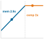

# Nén mô hình {#sec-model-compression}

::: {layout-narrow}
::: {.column-margin}

\chapterminitoc

:::

::: {.content-visible when-format="pdf"}
\noindent
{fig-alt="Sơ đồ phối cảnh một “xưởng” nén, nơi một mô hình lớn đi qua các trạm tỉa (pruning), chưng cất và lượng tử hoá trước khi vừa với khung giới hạn của thiết bị."}
:::

::: {.content-visible unless-format="pdf"}
{fig-alt="Sơ đồ phối cảnh một “xưởng” nén, nơi một mô hình lớn đi qua các trạm tỉa (pruning), chưng cất và lượng tử hoá trước khi vừa với khung giới hạn của thiết bị."}
:::

:::

## Mục đích {.unnumbered .unlisted}

\begin{marginfigure}
\mlsysstack{30}{25}{90}{25}{45}{0}{0}{10}
\end{marginfigure}

_Tại sao các mô hình thắng benchmark hiếm khi trở thành các mô hình chạy trong sản xuất?_

Quá trình huấn luyện tạo ra một mô hình có năng lực, nhưng chỉ năng lực thôi chưa đủ để đảm bảo khả năng triển khai. Cloud, Edge, Mobile và TinyML đều áp đặt những ràng buộc mà các benchmark nghiên cứu thường bỏ qua: ngân sách bộ nhớ tính bằng megabyte thay vì gigabyte, mục tiêu độ trễ tính bằng mili giây thay vì giây, và giới hạn công suất tính bằng miliwatt thay vì kilowatt. Nghiên cứu tối ưu hoá độ chính xác trên các tập kiểm thử độc lập; sản xuất tối ưu hoá độ chính xác trên mỗi đô la, mỗi watt và mỗi mili giây. Các mô hình thắng benchmark thường lớn hơn, chậm hơn và ngốn nhiều tài nguyên hơn mức môi trường sản xuất cho phép. Để thu hẹp khoảng cách đó, cần một kỷ luật nén có hệ thống: đánh đổi những khả năng mà triển khai không cần lấy các ràng buộc không thể vi phạm. Nhiều mô hình đã được huấn luyện mang nhiều độ chính xác số học, nhiều kết nối hoặc dung lượng hơn so với nhu cầu của ngữ cảnh triển khai, và có thể loại bớt phần dư thừa mà vẫn giữ được hành vi cần thiết. Tuy nhiên, biểu diễn nhỏ hơn không tự động đồng nghĩa nhanh hơn. Ngăn xếp phần cứng và phần mềm phải khai thác được độ chính xác hoặc cấu trúc mới; nếu không, việc giảm kích thước chỉ trên danh nghĩa có thể chỉ chuyển nút thắt cổ chai mà độ trễ vẫn không đổi. Khi áp dụng đúng, nén có thể giảm mạnh kích thước mô hình, biến một sản phẩm nghiên cứu chỉ chạy trong trung tâm dữ liệu thành một tài sản sản xuất chạy được trên điện thoại, cảm biến hoặc vi điều khiển. Kỷ luật này không chỉ để làm mô hình nhỏ đi, mà là để làm ra đúng mô hình phù hợp với môi trường vật lý của nó. Theo thuật ngữ D·A·M, nén là đồng thiết kế thuật toán-máy ngay trên chính mô hình, viết lại cấu trúc toán học của nó để khớp với các ràng buộc vật lý của máy.

::: {.content-visible when-format="pdf"}

\newpage

:::

::: {.callout-learning-objectives}

- Giải thích nén là một dạng đồng thiết kế thuật toán-máy, trong đó chúng ta đánh đổi dung lượng dư thừa để đáp ứng các ràng buộc về bộ nhớ, độ trễ và năng lượng.
- So sánh tỉa (pruning), chưng cất, lượng tử hoá và tìm kiếm kiến trúc theo loại ràng buộc tài nguyên mà mỗi kỹ thuật nới lỏng.
- Tính mức giảm bộ nhớ tham số, mức giảm độ chính xác biểu diễn và mức độ thưa để ước tính mức lợi nén tốt nhất có thể.
- Áp dụng các chiến lược sau huấn luyện, nhận biết lượng tử hoá (quantization-aware) và chỉ trọng số, dưới các ràng buộc về độ chính xác và phần cứng.
- Chọn tỉa (pruning) có cấu trúc và các toán tử sao cho ánh xạ được vào các nhân (kernels) của bộ tăng tốc hiện có.
- Thiết kế các pipeline nén, sắp xếp thứ tự tỉa (pruning), chưng cất và lượng tử hoá để giữ vững độ chính xác khi triển khai.
- Đánh giá độ trễ, năng lượng và độ chính xác đo được trên phần cứng mục tiêu, thay vì chỉ dựa vào số lượng phép tính FLOP.

:::

## Framework tối ưu hoá {#sec-model-compression-optimization-framework-9e21}

```{python}
#| echo: false
# ┌── LEGO ───────────────────────────────────────────────
# │ Goal: LLM scale vs smartphone and MCU memory for deployment-gap prose.
from mlsysim import *
from mlsysim.core.units import *
from mlsysim import Models, Platforms
from mlsysim.physics import memory_from_params
from mlsysim.physics.quantities import token_throughput
from mlsysim.fmt import fmt, fmt_int, fmt_qty, fmt_qty_int, fmt_memory_capacity, check

class CompressionDeploymentScale:
    llm_7b_params = Models.Language.Llama2_7B.parameters.to(Bparam).magnitude
    bytes_fp16 = BYTES_FP16.to(byte).magnitude

    llm_7b_mem_fp16 = memory_from_params(llm_7b_params * Bparam, bytes_fp16 * byte / param)
    llm_7b_mem_fp16_gb = llm_7b_mem_fp16.to(GB).magnitude
    llm_175b_params = Models.Language.GPT3.parameters.to(Bparam).magnitude
    llm_175b_mem_fp16 = memory_from_params(llm_175b_params * Bparam, bytes_fp16 * byte / param)
    llm_175b_mem_fp16_gb = llm_175b_mem_fp16.to(GB).magnitude
    smartphone_ram = Platforms.Mobile.ram
    mcu_ram_kb = Platforms.Tiny.ram.to(KB).magnitude
    mcu_ram = mcu_ram_kb * KB

    check(llm_7b_mem_fp16 > smartphone_ram, "7-billion-parameter model must exceed smartphone RAM to illustrate the deployment gap.")

    # ┌── 4. OUTPUT (Formatting) ─────────────────────────────────────────────
    llm_7b_str = fmt(llm_7b_params, precision=0, commas=False)
    llm_7b_mem_gb_str = fmt_qty(llm_7b_mem_fp16, GB, precision=0, commas=False)
    llm_175b_str = fmt(llm_175b_params, precision=0, commas=False)
    llm_175b_mem_gb_str = fmt_qty(llm_175b_mem_fp16, GB, precision=0, commas=False)
    smartphone_ram_gb_str = fmt_memory_capacity(smartphone_ram, unit=GiB, precision=0, commas=False)
    mcu_ram_kb_str = fmt_memory_capacity(Platforms.Tiny.ram, unit=KiB, precision=0, commas=False)
```

::: {.column-margin}
{width="100%" fig-alt="Thang log theo chiều dọc với các thanh màu xanh: ở trên cùng là dung lượng lưu trữ trọng số FP16 175B, cao vượt xa thanh RAM điện thoại; và thanh RAM điện thoại lại cao vượt xa thanh RAM của một vi điều khiển nhỏ ở dưới cùng."}

*Các trọng số Frontier lớn hơn rất nhiều so với bộ nhớ của điện thoại và vi điều khiển; nén giúp thu hẹp khoảng cách này.*
:::

Một mô hình ngôn ngữ với `{python} CompressionDeploymentScale.llm_7b_str` tỷ tham số cần `{python} CompressionDeploymentScale.llm_7b_mem_gb_str` chỉ để lưu trữ các trọng số ở FP16. Thiết bị mục tiêu để triển khai là một điện thoại thông minh với `{python} CompressionDeploymentScale.smartphone_ram_gb_str` RAM, dung lượng này phải chia sẻ cho hệ điều hành, các ứng dụng và cả mô hình. *Về mặt toán học, điều này là bất khả thi.* Dù có kỹ thuật tinh vi đến mấy, phép tính này cũng không thay đổi: `{python} CompressionDeploymentScale.llm_7b_mem_gb_str` *không thể* vừa vặn trong `{python} CompressionDeploymentScale.smartphone_ram_gb_str`. Thế nhưng, người dùng vẫn kỳ vọng mô hình chạy nhạy, ngoại tuyến, và không làm cạn pin chỉ trong một giờ. Mỗi yêu cầu chỉ có một khoảng thời gian rất ngắn để nạp dữ liệu, thực hiện tính toán và trả kết quả; khoảng cách khi triển khai còn bao gồm cả dung lượng bộ nhớ, năng lượng và khả năng chạy ngoại tuyến. Khoảng cách này không phải là một bất tiện nhỏ, mà là thách thức mang tính quyết định của nén mô hình.

Hãy nhớ lại 'hợp đồng silicon' (nguyên tắc \ref{pri-silicon-contract}), thỏa thuận hiệu suất giữa mô hình và phần cứng của nó. Thông lượng tính toán, băng thông bộ nhớ, dung lượng bộ nhớ và chi phí cố định quyết định tài nguyên nào sẽ trở thành nút thắt cổ chai trước. Trong huấn luyện, hợp đồng này thường được đẩy lên cao hơn. Các nhà nghiên cứu có thể chọn kiến trúc lớn hơn, độ chính xác số học cao hơn và thêm các lớp sâu hơn khi cụm GPU chịu được các yêu cầu đó. Huấn luyện cũng phải mang theo gradient, trạng thái của optimizer và một khoảng đệm số học mà một đường dẫn triển khai chỉ chạy forward có thể không cần. Trong @sec-model-training-mixedprecision-training-9218, độ chính xác hỗn hợp cải thiện hiệu quả huấn luyện trong khi vẫn giữ hành vi số học cần thiết để học. Nén đi xa hơn cho triển khai bằng cách hạ độ chính xác xuống INT8 hoặc thấp hơn khi đường thực thi mục tiêu hỗ trợ. Việc triển khai có thể đảo ngược các ưu tiên của huấn luyện: môi trường sản xuất có thể nhỏ hơn, bị giới hạn về công suất và nhạy với độ trễ, ngay cả khi mô hình được phát triển mà không có những giới hạn này. Nếu lựa chọn dữ liệu tối ưu hóa những gì mô hình học từ đó, thì nén tối ưu hóa những gì mô hình đã huấn luyện mang vào môi trường đó. **nén mô hình**\index{Model compression!definition} là một quá trình có hệ thống nhằm 'đàm phán lại' hợp đồng silicon cho một ngữ cảnh thực thi mới, giảm dung lượng bộ nhớ, chi phí tính toán hoặc mức tiêu thụ năng lượng trong khi vẫn giữ được hành vi mà ứng dụng yêu cầu.

Quy mô của việc 'đàm phán lại' này biến tối ưu hóa mô hình thành một ngành kỹ thuật bài bản, không phải tập hợp các mẹo tùy tiện. Một mô hình `{python} CompressionDeploymentScale.llm_175b_str` tỷ tham số tiêu thụ hơn `{python} CompressionDeploymentScale.llm_175b_mem_gb_str` chỉ riêng ở định dạng FP16, trong khi một vi điều khiển chỉ có `{python} CompressionDeploymentScale.mcu_ram_kb_str` SRAM. Thu hẹp khoảng cách sáu bậc độ lớn đòi hỏi các phương pháp có hệ thống với những đánh đổi có thể dự đoán, không phải thử và sai. Mỗi kỹ thuật tối ưu hóa đều loại bỏ một phần nào đó khỏi mô hình (tham số dư thừa, độ chính xác số học hoặc độ phức tạp kiến trúc), và chúng ta phải hiểu rõ chính xác những gì bị mất, những gì được giữ lại, cũng như cách các mất mát này cộng dồn khi kết hợp nhiều kỹ thuật.

Nén hoạt động theo ba hướng bổ trợ nhau. Tối ưu hóa cấu trúc loại bỏ phần dư ngay trong mô hình: **Pruning**\index{Pruning!definition} (tỉa) loại bỏ các tham số ít ảnh hưởng, knowledge distillation (chưng cất tri thức) chuyển giao hành vi vào một kiến trúc nhỏ hơn, và neural architecture search (tìm kiếm kiến trúc) khám phá các thiết kế theo mục tiêu đặt ra. Tối ưu hóa độ chính xác giảm số bit của các trọng số và activation; ví dụ, chuyển từ FP32 sang INT8 giúp giảm bốn lần số byte thô cho mỗi giá trị biểu diễn. Các đơn vị ma trận độ chính xác thấp được phần cứng hỗ trợ cũng có thể tăng tốc phép toán. Tối ưu hóa ở cấp phần cứng ánh xạ kết quả lên bộ xử lý đích bằng các kỹ thuật như hợp nhất (fusion) và tính thưa (sparsity) được hỗ trợ. Ba hướng này tạo thành một chồng tối ưu hóa (optimization stack): thay đổi cấu trúc quyết định những phép toán nào tồn tại, thay đổi độ chính xác quyết định số byte trên mỗi giá trị, còn phần việc ở cấp phần cứng quyết định liệu các khoản tiết kiệm mang tính lý thuyết đó có trở thành các đường thực thi được hỗ trợ hay không. Một người thực hành có thể tỉa các bộ lọc của ResNet-50, lượng tử hóa phần còn lại xuống INT8, và hợp nhất batch normalization vào phép tích chập. Lợi ích chỉ cộng dồn khi các biến đổi giải tỏa những nút thắt khác nhau và runtime hỗ trợ đồ thị kết quả. Vì vậy, mỗi lớp cần được đo lường riêng. @Sec-hardware-acceleration-tensor-cores-771f giải thích các cơ chế của bộ tăng tốc đằng sau các đường dẫn độ chính xác thấp.

Các hệ thống cụ thể giúp những đánh đổi này đo được một cách rõ ràng: ResNet-50 và MobileNetV2 (các mô hình chủ đạo của chúng tôi từ @sec-network-architectures-lighthouse-roster-model-biographies-a763) cho các khối lượng công việc (workload) về thị giác, các mô hình ngôn ngữ dựa trên transformer cho các tác vụ chuỗi, DLRM cho áp lực bộ nhớ trong hệ thống khuyến nghị [@naumov2019deep], và mạng nơ-ron tích chập tách sâu (depthwise-separable CNN) gọi là DS-CNN cho nhận dạng từ khóa trong TinyML [@zhang2017hello]. Tái sử dụng các mô hình này cho phép chúng ta so sánh các kỹ thuật trong những điều kiện nhất quán, khiến các đánh đổi giữa độ chính xác, độ trễ, bộ nhớ và năng lượng trở nên cụ thể thay vì trừu tượng.

```{python}
#| echo: false
# ┌── LEGO ───────────────────────────────────────────────
# │ Goal: INT8 weight-memory reduction for iron-law definition item.
from mlsysim import Models
from mlsysim.fmt import fmt, fmt_qty, check, fmt_count

class CompressionIronLawQuant:
    bytes_fp16 = BYTES_FP16.to(byte).magnitude
    bytes_int8 = BYTES_INT8.to(byte).magnitude
    llm_175b_params = Models.Language.GPT3.parameters.to(Bparam).magnitude
    llm_175b_mem_fp16_gb = llm_175b_params * bytes_fp16
    llm_175b_mem_int8_gb = llm_175b_params * bytes_int8
    llm_175b_mem_fp16 = llm_175b_mem_fp16_gb * GB
    llm_175b_mem_int8 = llm_175b_mem_int8_gb * GB
    llm_175b_fp16_int8_reduction = llm_175b_mem_fp16_gb / llm_175b_mem_int8_gb

    check(llm_175b_fp16_int8_reduction == 2, "FP16-to-INT8 weight memory should halve.")

    # ┌── 4. OUTPUT (Formatting) ─────────────────────────────────────────────
    llm_175b_str = fmt(llm_175b_params, precision=0, commas=False)
    llm_175b_mem_gb_str = fmt_qty(llm_175b_mem_fp16, GB, precision=0, commas=False)
    llm_175b_mem_int8_gb_str = fmt_qty(llm_175b_mem_int8, GB, precision=0, commas=False)
    llm_175b_fp16_int8_reduction_mult_str = fmt_multiple(round(llm_175b_fp16_int8_reduction), precision=0, commas=False)
```

::: {#dfn-model-compression-model-compression .callout-definition title="Nén mô hình"}

***Nén mô hình***\index{Model compression!definition} là nhóm kỹ thuật giúp giảm chi phí tính toán và dung lượng bộ nhớ của một mô hình đã được huấn luyện bằng cách loại bỏ các tham số dư thừa (tỉa (pruning)), giảm độ chính xác số (lượng tử hoá), hoặc chuyển giao hành vi đã học sang một kiến trúc nhỏ hơn (chưng cất (distillation)), đồng thời vẫn giữ tối đa độ chính xác dự đoán.

1.  **Ý nghĩa**: Nén trực tiếp làm giảm các hạng mục di chuyển dữ liệu và tính toán trong định luật sắt. Lượng tử hoá INT8 cho một LLM có `{python} CompressionIronLawQuant.llm_175b_str` tỷ tham số sẽ giảm bộ nhớ lưu trữ trọng số từ `{python} CompressionIronLawQuant.llm_175b_mem_gb_str` (FP16) xuống `{python} CompressionIronLawQuant.llm_175b_mem_int8_gb_str`, tương đương mức giảm `{python} CompressionIronLawQuant.llm_175b_fp16_int8_reduction_mult_str` lần $D_{\text{vol}}$. Các đơn vị ma trận chuyên dụng cho độ chính xác thấp có thể tăng thông lượng tính toán nếu kernel và layout dùng đúng đường dẫn INT8 được hỗ trợ. Tỉa (pruning) không cấu trúc đến độ thưa 50% sẽ giảm một nửa số phần tử khác 0, nhưng số phép toán thực thi chỉ giảm khi runtime có thể bỏ qua các số 0 đó thông qua định dạng thưa hoặc kernel được hỗ trợ.
2.  **Điểm khác biệt**: Khác với các phương pháp nén sau huấn luyện như tỉa (pruning) và lượng tử hoá, tìm kiếm kiến trúc nơ-ron (NAS) khám phá các kiến trúc hiệu quả ngay từ đầu bằng cách duyệt một không gian thiết kế. Ở đây, NAS được xem như một kỹ thuật tối ưu hoá cấu trúc có liên quan: nó thay đổi biểu diễn trước khi huấn luyện thay vì nén một mô hình đã hoàn thiện.
3.  **Cạm bẫy thường gặp**: Các kỹ thuật nén không tự động kết hợp với nhau mà không gây ảnh hưởng lẫn nhau. Tỉa (pruning) làm thay đổi phân bố trọng số và mẫu hình thao tác; lượng tử hoá thêm các ràng buộc về hiệu chuẩn và kernel. Kết hợp chúng có thể làm giảm độ chính xác hoặc không mang lại tăng tốc nếu không được kiểm chứng chung.

:::

Ngăn xếp tối ưu hoá đi từ biểu diễn, sang số học, rồi đến thực thi. Bối cảnh triển khai quyết định ràng buộc nào trói chặt trước; các phương pháp cấu trúc thay đổi phép tính, các phương pháp về độ chính xác thay đổi cách biểu diễn từng giá trị, và các phương pháp kiến trúc quyết định liệu phiên bản đã nén có thực sự ánh xạ tốt sang thực thi hiệu quả trên phần cứng hay không. Việc lựa chọn và kết hợp kỹ thuật nên tuân theo thứ tự các ràng buộc đó, thay vì chọn theo một danh sách cố định.

Ba chiều này tạo thành một thứ bậc tự nhiên. Quá trình tối ưu hoá trước hết xác định *những* phép tính mô hình nên thực hiện (biểu diễn), tiếp theo là *độ chính xác* cần thiết để thực hiện chúng (số học), và cuối cùng là *mức độ hiệu quả* khi chạy trên phần cứng vật lý (triển khai). @Fig-3-sections minh hoạ tiến trình này từ các mối quan tâm ở phía phần mềm đến thực thi ở cấp độ phần cứng.

::: {#fig-3-sections fig-env="figure" fig-pos="htb" fig-cap="**Ngăn xếp Tối ưu hoá**: Tối ưu hoá mô hình diễn tiến từ biểu diễn ở tầng phần mềm (tỉa (pruning), chưng cất tri thức, NAS) xuống đến độ chính xác số học (lượng tử hoá), rồi tới thực thi trên phần cứng (hợp nhất kernel, bộ máy xử lý dữ liệu thưa). Hạ dần mức trừu tượng đưa các tối ưu hoá tiến gần hơn tới silicon, nơi các quyết định về biểu diễn sẽ quyết định mức hiệu quả thực thi có thể đạt." fig-alt="Ba hộp chữ nhật xếp chồng, được gắn nhãn từ trên xuống dưới: biểu diễn mô hình hiệu quả, biểu diễn số học hiệu quả, và thực thi trên phần cứng hiệu quả. Một mũi tên thẳng đứng bao trùm cả chồng hộp, với chú thích 'Nhiều phần mềm hơn' ở trên cùng và 'Nhiều phần cứng hơn' ở dưới cùng."}

```{.tikz}
\resizebox{.5\textwidth}{!}{
\begin{tikzpicture}[font=\small\sffamily]
\tikzset{
  Box/.style={inner xsep=2pt,
  draw=black!90,
  line width=0.75pt,
  anchor=west,
  text width=54mm,align=flush center,
  minimum width=54mm, minimum height=8mm
  },
}
\node[Box,fill=red!30,anchor=south west](B1)at (0.33,0.5){Efficient Hardware Implementation};
\node[Box,fill=red!20,node distance=0.15,above=of B1](B2){Efficient Numerics Representation};
\node[Box,fill=red!10,node distance=0.15,above=of B2](B3){Efficient Model Representation};
\draw[latex-latex,line width=0.75pt](0,0.20)--(0,3.7);

\node[left=1.4 of B1,rotate=90,anchor=north,align=center,font=\footnotesize\sffamily]{More\\ hardware};
\node[left=1.4 of B3,rotate=90,anchor=north,align=center,font=\footnotesize\sffamily]{More \\software};
\end{tikzpicture}}
```

:::

```{python}
#| echo: false
#| label: nas-search-cost-calc
from mlsysim.fmt import fmt, fmt_count, fmt_multiple, fmt_time, check

class NASCostCalc:
    # ┌── 1. LOAD (Constants) ──────────────────────────────────────────────
    gpus = 800
    days = 28
    weight_sharing_reduction = 1000

    # ┌── 2. EXECUTE (The Compute) ────────────────────────────────────────
    gpu_days = gpus * days
    gpu_hours = gpu_days * HOURS_PER_DAY

    # ┌── 3. GUARD (Invariants) ───────────────────────────────────────────
    check(gpu_days == 22_400, "NAS GPU-day arithmetic changed unexpectedly.")
    check(gpu_hours == 537_600, "NAS GPU-hour arithmetic changed unexpectedly.")

    # ┌── 4. OUTPUT (Formatting) ──────────────────────────────────────────
    gpus_str = fmt_count(gpus, label="GPU")
    days_str = fmt_time(days, "day", precision=0, commas=False, style="word")
    gpu_days_str = fmt_count(gpu_days, label='GPU-day', plural_label='GPU-days')
    gpu_hours_str = fmt_count(gpu_hours, label='GPU-hour', plural_label='GPU-hours')
    weight_sharing_reduction_mult_str = fmt_multiple(weight_sharing_reduction, precision=0, commas=True)
```

Lớp trên cùng, *biểu diễn mô hình hiệu quả*, tập trung loại bỏ phần dư thừa trong cấu trúc mô hình. Các kỹ thuật như tỉa (pruning), chưng cất tri thức và tìm kiếm kiến trúc mạng nơ-ron (NAS)[^fn-nas-search-cost] giúp giảm số lượng tham số hoặc phép toán cần thiết, từ đó xử lý vấn đề dung lượng bộ nhớ và độ phức tạp tính toán ở cấp độ thuật toán.

[^fn-nas-search-cost]: **Tìm kiếm kiến trúc mạng nơ-ron (NAS)**\index{NAS!search cost}: @zoph2017neural tại Google Brain đã dùng học tăng cường để tìm ra kiến trúc với chi phí `{python} NASCostCalc.gpu_days_str` (`{python} NASCostCalc.gpus_str` cho `{python} NASCostCalc.days_str`), tương đương `{python} NASCostCalc.gpu_hours_str`. Các cách tiếp cận chia sẻ trọng số như Efficient Neural Architecture Search (ENAS) sau đó đã giảm chi phí tìm kiếm khoảng `{python} NASCostCalc.weight_sharing_reduction_mult_str` bằng cách chia sẻ tham số giữa các kiến trúc ứng cử viên [@pham2018efficient]. NAS có tính đến phần cứng và các phương pháp mở rộng quy mô sau đó đã biến đầu ra tìm kiếm thành các họ kiến trúc triển khai được như EfficientNet và MobileNetV3 [@tan2019efficientnet; @howard2019].

Lớp giữa — biểu diễn số hiệu quả — tối ưu hoá cách lưu trữ và xử lý các giá trị số. **Lượng tử hoá**\index{Quantization!definition} và huấn luyện độ chính xác hỗn hợp giảm độ rộng bit của trọng số và activation (ví dụ, từ số thực dấu phẩy động 32-bit xuống số nguyên 8-bit), giúp chạy nhanh hơn và dùng ít bộ nhớ hơn trên phần cứng chuyên dụng.

Lớp dưới cùng — triển khai phần cứng hiệu quả — xem liệu các phép toán còn lại có ánh xạ hiệu quả lên bộ xử lý mục tiêu hay không. Hợp nhất toán tử, hỗ trợ độ thưa, và lập lịch nhận biết phần cứng giúp căn chỉnh tính toán với các cấp bậc bộ nhớ và các đơn vị vector hoặc ma trận; việc phân tích hiệu năng (profiling) xác định liệu chúng có cải thiện mức độ sử dụng tài nguyên hoặc thông lượng hay không.

Những chiều này phụ thuộc lẫn nhau. Tỉa (pruning) giảm độ phức tạp nhưng có thể cần thay đổi kiến trúc để đạt hiệu quả phần cứng. Lượng tử hoá giảm độ chính xác nhưng làm thay đổi hành vi số và các đường thực thi khả dụng. Một chiến lược hữu ích có thể kết hợp kỹ thuật ở các lớp khi chúng giải quyết các ràng buộc khác nhau. Với người thực hành cần hướng dẫn ngay, @sec-model-compression-decision-framework-0d69 ánh xạ các ràng buộc triển khai tới các kỹ thuật ứng viên. Các phần tiếp theo cung cấp nền tảng kỹ thuật cần thiết để đánh giá những lựa chọn đó.

Tầm quan trọng tương đối của từng chiều thay đổi theo mục tiêu triển khai. Hệ thống đám mây có thể chấp nhận mô hình lớn hơn nhưng đòi hỏi thông lượng; thiết bị di động ưu tiên bộ nhớ và năng lượng; hệ thống nhúng đối mặt với các ràng buộc chặt chẽ trên mọi tài nguyên cùng lúc. Hiểu rõ những ngữ cảnh triển khai này sẽ định hướng ưu tiên các chiều tối ưu hoá.

## Ngữ cảnh triển khai {#sec-model-compression-deployment-context-0d88}

Khung tối ưu hoá ở trên xác định ba chiều nén, nhưng chiều nào quan trọng nhất còn tuỳ nơi mô hình sẽ chạy. Một GPU trong trung tâm dữ liệu với 80 GB bộ nhớ băng thông cao (HBM) có các ràng buộc chi phối khác so với một điện thoại thông minh dùng RAM chia sẻ, hay một vi điều khiển chỉ có vài trăm kilobyte SRAM. @Tbl-deployment-scenarios tóm tắt các ràng buộc chính trong các môi trường triển khai khác nhau.

```{python}
#| echo: false
#| label: deployment-scenario-latency-calc
# ┌─────────────────────────────────────────────────────────────────────────────
# │ DEPLOYMENT SCENARIO LATENCY ENVELOPES
# ├─────────────────────────────────────────────────────────────────────────────
# │ Context: @tbl-deployment-scenarios—the Latency column.
# │
# │ Goal: Pin each deployment context's latency envelope to the Platforms
# │       registry so the compression targets match the tier definitions.
# │ Show: Cloud, combined mobile/edge, and TinyML latency ranges.
# │ How: Parse the Platforms tier envelopes; the mobile/edge row spans the
# │      union of the two tiers it merges.
# │
# └─────────────────────────────────────────────────────────────────────────────
from mlsysim import *

class DeploymentScenarioLatency:
    """Latency envelopes for the cloud, mobile/edge, and TinyML compression targets."""

    # ┌── 1. LOAD (Constants) ──────────────────────────────────────────────
    cloud_min_ms, cloud_max_ms = [int(v) for v in Platforms.Cloud.latency_range_ms.split("-")]
    edge_min_ms, edge_max_ms = [int(v) for v in Platforms.Edge.latency_range_ms.split("-")]
    mobile_min_ms, mobile_max_ms = [int(v) for v in Platforms.Mobile.latency_range_ms.split("-")]
    tiny_min_ms, tiny_max_ms = [int(v) for v in Platforms.Tiny.latency_range_ms.split("-")]

    # ┌── 2. EXECUTE (The Compute) ─────────────────────────────────────────
    # The table merges mobile and edge into one row, so span both envelopes.
    mobile_edge_min_ms = min(mobile_min_ms, edge_min_ms)
    mobile_edge_max_ms = max(mobile_max_ms, edge_max_ms)

    # ┌── 3. GUARD (Invariants) ────────────────────────────────────────────
    check(tiny_max_ms <= mobile_edge_max_ms <= cloud_max_ms, "Latency envelopes must widen from TinyML to cloud.")
    check(mobile_edge_min_ms <= mobile_min_ms, "Merged mobile/edge row must span the mobile envelope.")

    # ┌── 4. OUTPUT (Formatting) ───────────────────────────────────────────
    cloud_latency_range_str = fmt_range(cloud_min_ms, cloud_max_ms, precision=0, commas=False, unit="ms")
    mobile_edge_latency_range_str = fmt_range(mobile_edge_min_ms, mobile_edge_max_ms, precision=0, commas=False, unit="ms")
    tiny_latency_range_str = fmt_range(tiny_min_ms, tiny_max_ms, precision=0, commas=False, unit="ms")
```

```{=latex}
\begingroup
%\renewcommand{\arraystretch}{1.25}
```

| **Context**     |      **Memory**      |                            **Latency**                             | **Power** | **Primary Goal** |
|:----------------|:--------------------:|:------------------------------------------------------------------:|:----------|:-----------------|
| **Cloud**       |      tens of GB      |    `{python} DeploymentScenarioLatency.cloud_latency_range_str`    | Flexible  | Throughput, cost |
| **Mobile/Edge** | hundreds of MB to GB | `{python} DeploymentScenarioLatency.mobile_edge_latency_range_str` | W-scale   | Size, latency    |
| **TinyML**      |        KB–MB         |    `{python} DeploymentScenarioLatency.tiny_latency_range_str`     | mW        | Size, energy     |

: **Các ràng buộc triển khai**: Mỗi ngữ cảnh triển khai sẽ có những ưu tiên tối ưu hóa khác nhau. {#tbl-deployment-scenarios tbl-colwidths="[20,22,16,14,28]"}

```{=latex}
\endgroup
```

### Các kịch bản triển khai {#sec-model-compression-deployment-scenarios-70c9}

Suy luận trên đám mây thường ưu tiên thông lượng (yêu cầu/giây/đô la), trong đó các lộ trình lượng tử hoá được hỗ trợ có thể tăng mật độ phục vụ (serving) và hợp nhất toán tử có thể giảm độ trễ cho mỗi yêu cầu [@choudhary2020; @dean2018]. Các triển khai trên thiết bị di động và edge phải gói gọn trong bộ nhớ thiết bị, đồng thời đáp ứng các mục tiêu thời gian thực. Ví dụ, một ứng dụng camera xử lý 30 fps có 33 ms cho mỗi khung hình; vượt ngưỡng độ trễ này có thể quyết định tính năng đó có vận hành thời gian thực hay không.

Trong TinyML, việc tối ưu hoá trở thành một yêu cầu bắt buộc khi triển khai. Một vi điều khiển chỉ với vài trăm kilobyte RAM *không thể* chạy một mô hình 100 MB, bất kể độ chính xác. Mô hình phải nằm trong giới hạn phần cứng, nếu không thì không thể triển khai [@banbury2020benchmarking]. Thiết bị di động có dư địa hơn, nhưng một tối ưu hoá vượt ngưỡng bộ nhớ, độ trễ hoặc nhiệt có thể quyết định tính năng đó có được phát hành hay không.

Áp lực ở thời điểm triển khai này không phải điều mới. AlexNet, mô hình mang tính bước ngoặt đã giành chiến thắng trong thử thách ImageNet năm 2012, đã gặp rào cản bộ nhớ trong quá trình huấn luyện, và kiến trúc của nó đã ghi dấu lựa chọn thiết kế hai GPU.

::: {#exmp-model-compression-alexnet-2012 .callout-example title="AlexNet tách mô hình trên hai GPU (2012)"}

**Ngữ cảnh**: Năm 2012, Alex Krizhevsky, Ilya Sutskever và Geoffrey Hinton đặt mục tiêu huấn luyện một mô hình thị giác với 60 triệu tham số trên tập dữ liệu ImageNet [@krizhevsky2012imagenet].

**Cơ chế**: Một GPU NVIDIA GTX 580 chỉ cung cấp 3 GB bộ nhớ GDDR5—không đủ để lưu trữ 240 MB trọng số của mô hình cùng với các activation FP32 ($M_{\text{act}}$) và trạng thái của optimizer ($M_{\text{state}}$) khi huấn luyện trên một GPU duy nhất.

**Tác động**: Mô hình hoàn toàn không thể được huấn luyện trên một thiết bị duy nhất, nên trần bộ nhớ đã tác động ngược lên chính thiết kế mạng thay vì chỉ là vấn đề mua sắm phần cứng.

**Giải pháp**: Họ phân hoạch mô hình trên hai GPU GTX 580 3 GB và giới hạn các kết nối xuyên GPU để tập làm việc (working set) nằm trong giới hạn bộ nhớ của từng thiết bị ($M_{\text{peak}} \le 3\text{ GB}$). Kiến trúc hai tháp này đạt tỷ lệ lỗi top-5 là 15.3%, với biên độ 10.8 điểm phần trăm.

**Bài học về hệ thống**: Các giới hạn về dung lượng bộ nhớ đã luôn là một thách thức đối với deep learning ngay từ buổi đầu. Các chiến lược triển khai mô hình (tỉa (pruning), lượng tử hoá) đang giải quyết đúng những giới hạn vật lý từng buộc AlexNet phải chia tách mô hình.

:::

Áp lực bộ nhớ từng định hình kiến trúc của AlexNet cũng xuất hiện trong các ràng buộc sản phẩm hằng ngày, khi mô hình phải chạy trên phần cứng di động phổ thông.

::: {#exmp-model-compression-mobilenet-win .callout-example title="Một ví dụ minh họa về thành công của MobileNet"}

**Kịch bản**: Triển khai một mô hình phân đoạn video làm mờ nền theo thời gian thực trên điện thoại Android tầm trung, ở 30 FPS.

**Chẩn đoán**: Một mô hình MobileNetV3 FP32 chưa nén chỉ đạt 8 FPS, vượt quá các giới hạn về độ trễ và công suất nhiệt của thiết bị. Lượng tử hoá trọng số sang INT8 cho phép NPU/DSP di động thực thi phép nhân ma trận số nguyên.

**Bài học về hệ thống**: Ở đây, INT8 cắt dung lượng tham số thô xuống còn 1/4, và đường dẫn số nguyên được hỗ trợ giúp tăng tốc suy luận từ 8 FPS lên 35 FPS. Dù vậy, tốc độ và công suất vẫn cần được đo trực tiếp trên thiết bị.

:::

```{python}
#| echo: false
#| label: model-device-comparison
# ┌─────────────────────────────────────────────────────────────────────────────
# │ MODEL-DEVICE MEMORY COMPARISON
# ├─────────────────────────────────────────────────────────────────────────────
# │ Context: @tbl-model-vs-device and deployment gap discussion
# │
# │ Goal: Contrast model requirements with device memory capacities.
# │ Show: The 6-order-of-magnitude gap from Cloud to TinyML.
# │ How: List VRAM and RAM constraints for standard hardware tiers.
# │
# └─────────────────────────────────────────────────────────────────────────────
from mlsysim import Models, Platforms
from mlsysim.fmt import fmt, fmt_int, fmt_multiple, fmt_qty, fmt_qty_int, fmt_memory

def _overflow_ratio(model_mem, device_mem):
    """Return how many times a model exceeds a device memory envelope."""
    return model_mem.to(byte).magnitude / device_mem.to(byte).magnitude

class ModelDeviceComparison:
    """Contrast model requirements with device memory: 6-order-of-magnitude deployment gap."""

    # ┌── 1. LOAD (Constants) ──────────────────────────────────────────────
    # Device capacities
    cloud_mem = Platforms.Cloud.ram
    mobile_mem = Platforms.Mobile.ram
    tiny_mem = Platforms.Tiny.ram

    # Model sizes (decimal — match the underlying byte-count math)
    dlrm_mem = Models.Recommendation.DLRM.model_size
    gpt2_mem = Models.Language.GPT2.size_in_bytes(BYTES_FP32)
    resnet_mem = Models.Vision.ResNet50.size_in_bytes(BYTES_FP32)
    mobilenet_mem = Models.Vision.MobileNetV2.size_in_bytes(BYTES_FP32)
    mobilenet_int8_mem = Models.Vision.MobileNetV2.size_in_bytes(BYTES_INT8)
    dscnn_mem = Models.Tiny.DS_CNN.size_in_bytes(BYTES_INT8)

    # ┌── 2. EXECUTE (The Compute) ────────────────────────────────────────
    dlrm_mobile_overflow = _overflow_ratio(dlrm_mem, mobile_mem)
    dlrm_tiny_overflow = _overflow_ratio(dlrm_mem, tiny_mem)
    gpt2_mobile_overflow = _overflow_ratio(gpt2_mem, mobile_mem)
    gpt2_tiny_overflow = _overflow_ratio(gpt2_mem, tiny_mem)
    resnet_tiny_overflow = _overflow_ratio(resnet_mem, tiny_mem)
    mobilenet_tiny_overflow = _overflow_ratio(mobilenet_mem, tiny_mem)
    mobilenet_int8_tiny_ratio = _overflow_ratio(mobilenet_int8_mem, tiny_mem)
    dscnn_tiny_overflow = _overflow_ratio(dscnn_mem, tiny_mem)

    # ┌── 3. GUARD (Invariants) ──────────────────────────────────────────
    # DS-CNN always fits TinyML—sanity check
    assert dscnn_tiny_overflow < 1, "DS-CNN must fit in TinyML device."
    assert gpt2_mobile_overflow < 1, "GPT-2 XL should fit in mobile memory for this simplified table."
    assert 6 <= mobilenet_int8_tiny_ratio <= 8, "MobileNetV2 INT8 should exceed TinyML by about 7x."

    # ┌── 4. OUTPUT (Formatting) ─────────────────────────────────────────────
    # Typed formatters own the units and multiplier glyphs in the table.
    dlrm_gb_str = fmt_qty(dlrm_mem, GB, precision=0, commas=False)
    gpt2_gb_str = fmt_qty(gpt2_mem, GB, precision=0, commas=False)
    resnet_mb_str = fmt_qty(resnet_mem, MB, precision=1, commas=False)
    mobilenet_mb_str = fmt_memory(mobilenet_mem, unit=MB, commas=False)
    mobilenet_int8_mb_str = fmt_qty(mobilenet_int8_mem, MB, precision=1, commas=False)
    dscnn_kb_str = fmt_qty(dscnn_mem, KB, precision=0, commas=False)
    cloud_cap_gb_str = fmt_qty_int(cloud_mem, GB, commas=False, approx=True)
    mobile_cap_gb_str = fmt_memory_capacity(mobile_mem, unit=GiB, precision=0, commas=False)
    tiny_cap_kb_str = fmt_memory_capacity(tiny_mem, unit=KiB, precision=0, commas=False, approx=True)
    dlrm_mobile_overflow_mult_str = fmt_multiple(dlrm_mobile_overflow)
    dlrm_tiny_overflow_mult_str = fmt_multiple(dlrm_tiny_overflow)
    gpt2_tiny_overflow_mult_str = fmt_multiple(gpt2_tiny_overflow)
    resnet_tiny_overflow_mult_str = fmt_multiple(resnet_tiny_overflow)
    mobilenet_tiny_overflow_mult_str = fmt_multiple(mobilenet_tiny_overflow)
    mobilenet_int8_tiny_ratio_mult_str = fmt_multiple(mobilenet_int8_tiny_ratio, precision=1, commas=False)
```

Khoảng cách giữa yêu cầu của mô hình và khả năng của thiết bị cho thấy nén là điều bắt buộc khi triển khai trên hệ thống hạn chế tài nguyên.

### Cân bằng các đánh đổi {#sec-model-compression-balancing-tradeoffs-6ae3}
@Tbl-model-vs-device định lượng khoảng cách triển khai này bằng cách dùng các mô hình tiêu biểu (lighthouse models) từ @sec-network-architectures-lighthouse-roster-model-biographies-a763: ngay cả MobileNetV2 ở độ chính xác INT8 cũng vượt quá bộ nhớ thiết bị TinyML khoảng `{python} ModelDeviceComparison.mobilenet_int8_tiny_ratio_mult_str`. Sự không tương thích này khiến **đánh đổi giữa độ chính xác và hiệu quả**\index{Model compression!accuracy-efficiency trade-off} trở nên không thể tránh khỏi. Tăng dung lượng mô hình thường cải thiện độ chính xác dự đoán nhưng cũng làm tăng chi phí tính toán, khiến suy luận chậm hơn và tốn nhiều tài nguyên hơn. Những cải thiện đó đồng thời kéo theo thách thức về dấu chân bộ nhớ, độ trễ suy luận, mức tiêu thụ công suất và hiệu quả huấn luyện.

::: {#psp-model-compression-compression-accuracy-tradeoff-curve .callout-perspective title="Đường cong đánh đổi giữa nén và độ chính xác"}

Biên đánh đổi này không đồng nhất: các kỹ thuật bảo toàn cấu trúc thường nằm ở phần trên, gần như không mất độ chính xác mà vẫn mang lại tăng tốc thực sự; trong khi các can thiệp cấu trúc mạnh mẽ nằm ở phần dưới, nơi mỗi mức lợi ích bổ sung đều phải trả giá bằng mức phạt độ chính xác ngày càng lớn.

Quyết định kỹ thuật nằm ở chỗ chọn điểm dừng. Nên dừng nén tại "điểm uốn" của đường cong, nơi mà mức mất chính xác tăng thêm bắt đầu vượt quá mức tăng hiệu quả tăng thêm. Vượt qua điểm này, mô hình xuống cấp nhanh hơn là tăng tốc.

:::

| **Model**              |               **Runtime Weight Memory**                |              **Artifact Weight Storage**               | **Cloud (`{python} ModelDeviceComparison.cloud_cap_gb_str`)** |   **Mobile (`{python} ModelDeviceComparison.mobile_cap_gb_str`)**   |      **TinyML (`{python} ModelDeviceComparison.tiny_cap_kb_str`)**       |
|:-----------------------|:------------------------------------------------------:|:------------------------------------------------------:|:-------------------------------------------------------------:|:-------------------------------------------------------------------:|:------------------------------------------------------------------------:|
| **DLRM**               |      `{python} ModelDeviceComparison.dlrm_gb_str`      |      `{python} ModelDeviceComparison.dlrm_gb_str`      |                               ok                              | no (`{python} ModelDeviceComparison.dlrm_mobile_overflow_mult_str`) |    no (`{python} ModelDeviceComparison.dlrm_tiny_overflow_mult_str`)     |
| **GPT-2 XL**           |      `{python} ModelDeviceComparison.gpt2_gb_str`      |      `{python} ModelDeviceComparison.gpt2_gb_str`      |                               ok                              |                                  ok                                 |    no (`{python} ModelDeviceComparison.gpt2_tiny_overflow_mult_str`)     |
| **ResNet-50**          |     `{python} ModelDeviceComparison.resnet_mb_str`     |     `{python} ModelDeviceComparison.resnet_mb_str`     |                               ok                              |                                  ok                                 |   no (`{python} ModelDeviceComparison.resnet_tiny_overflow_mult_str`)    |
| **MobileNetV2**        |   `{python} ModelDeviceComparison.mobilenet_mb_str`    |   `{python} ModelDeviceComparison.mobilenet_mb_str`    |                               ok                              |                                  ok                                 |  no (`{python} ModelDeviceComparison.mobilenet_tiny_overflow_mult_str`)  |
| **MobileNetV2 (INT8)** | `{python} ModelDeviceComparison.mobilenet_int8_mb_str` | `{python} ModelDeviceComparison.mobilenet_int8_mb_str` |                               ok                              |                                  ok                                 | no (`{python} ModelDeviceComparison.mobilenet_int8_tiny_ratio_mult_str`) |
| **DS-CNN (KWS, INT8)** |     `{python} ModelDeviceComparison.dscnn_kb_str`      |     `{python} ModelDeviceComparison.dscnn_kb_str`      |                               ok                              |                                  ok                                 |                                    ok                                    |

: **Khoảng cách triển khai**: So sánh yêu cầu về trọng số của mô hình với dung lượng thiết bị phổ biến. DLRM đại diện cho áp lực embedding trong các mô hình khuyến nghị [@naumov2019deep]; DS-CNN đại diện cho trường hợp phát hiện từ khoá trong TinyML [@zhang2017hello]. Ngay cả MobileNetV2 sau khi được lượng tử hoá sang INT8 cũng vượt quá giới hạn `{python} ModelDeviceComparison.tiny_cap_kb_str` của thiết bị TinyML tới `{python} ModelDeviceComparison.mobilenet_int8_tiny_ratio_mult_str` lần, trong khi bộ nhận dạng từ khoá DS-CNN được thiết kế chuyên biệt thì vừa vặn sau khi lượng tử hoá INT8. Trong cách tính chỉ dựa trên trọng số này, bộ nhớ trọng số lúc runtime được coi là bằng với dung lượng lưu trữ trọng số của artifact; các chi phí như activation, không gian làm việc, đóng gói và siêu dữ liệu đều không được tính đến. Các số trong ngoặc đơn cho biết mô hình vượt quá bộ nhớ thiết bị bao nhiêu lần. {#tbl-model-vs-device tbl-colwidths="[22,17,16,14,13,18]"}

Sự đánh đổi này biểu hiện khác nhau tuỳ ngữ cảnh triển khai. Huấn luyện cần tài nguyên tính toán tăng theo kích thước mô hình; còn suy luận phải đáp ứng nghiêm ngặt các ràng buộc về độ trễ và công suất trong các ứng dụng thời gian thực. Hiểu rõ mỗi kỹ thuật tối ưu hoá nằm ở đâu trên biên Pareto giữa nén và độ chính xác là điều thiết yếu để lựa chọn kỹ thuật một cách sáng suốt.

@Tbl-optimization-tradeoffs tóm tắt các kỹ thuật tối ưu hoá chính, lợi ích cho hệ thống và chi phí phía ML. Đây là những mối quan hệ mang tính thực nghiệm—kết quả thực tế còn phụ thuộc vào kiến trúc mô hình, tác vụ và việc triển khai cẩn thận.

| **Technique**                | **Systems Gain**                          | **ML Cost**          | **Typical Impact**     | **Region** |
|:-----------------------------|:------------------------------------------|:---------------------|:-----------------------|:----------:|
| **Operator Fusion**          | 10–30% latency reduction                  | None                 | No accuracy loss       |     1      |
| **FP32 → BF16**              | 2$\times$ memory, ~2$\times$ throughput   | Minimal              | $<0.1\%$ accuracy drop |     1      |
| **FP16 → INT8**              | 2$\times$ memory, 2--4$\times$ throughput | Quantization error   | 0.5–1% accuracy drop   |     2      |
| **50% Pruning**              | ~2$\times$ smaller model                  | Capacity loss        | 0.5–1% accuracy drop   |     2      |
| **Knowledge Distillation**   | 2--10$\times$ smaller student             | Capability ceiling   | 1–3% accuracy drop     |     2      |
| **4-bit Quantization**       | 4$\times$ memory reduction                | Significant error    | 2–5% accuracy drop     |    2–3     |
| **90% Pruning**              | ~10$\times$ smaller model                 | Severe capacity loss | 5–15% accuracy drop    |     3      |
| **↑ Batch Size (8$\times$)** | Higher throughput, better GPU util        | Generalization gap   | Requires LR scaling    |     —      |

: **Các đánh đổi tối ưu hoá**: Vùng 1 = Bữa trưa miễn phí, Vùng 2 = Đánh đổi hiệu quả, Vùng 3 = Vùng nguy hiểm. Kích thước batch ảnh hưởng đến động lực của quá trình huấn luyện hơn là trực tiếp đến chất lượng mô hình. Đây là những phạm vi kỹ thuật tiêu biểu, được tổng hợp từ các công trình đã xuất bản về runtime suy luận, lượng tử hoá, tỉa (pruning), lượng tử hoá LLM bit thấp và chưng cất [@nvidia2024tensorrt; @jacob2018; @han2015deep; @lin2023awq; @hinton2015distilling]; kết quả thực tế có thể khác nhau tuỳ kiến trúc, tác vụ, dữ liệu hiệu chuẩn và chất lượng triển khai. {#tbl-optimization-tradeoffs tbl-colwidths="[22,27,19,23,9]"}

Các kỹ thuật bảo toàn cấu trúc mô hình, như hợp nhất (fusion) và giảm độ chính xác, thường "miễn phí" hoặc ít tốn kém. Ngược lại, các kỹ thuật thay đổi cấu trúc, như tỉa (pruning) và chưng cất, mang lại mức tiết kiệm lớn hơn nhưng đòi hỏi tinh chỉnh cẩn thận. Mỗi ngữ cảnh triển khai áp đặt một ràng buộc chủ đạo khác nhau, ví dụ như dung lượng bộ nhớ trên thiết bị di động, độ trễ trong hệ thống thời gian thực, hay năng lượng trên các cảm biến chạy bằng pin. Ngăn xếp tối ưu hóa sẽ lần theo các ràng buộc đó xuống các tầng thấp hơn. Các phương pháp cấu trúc thay đổi những phép tính được thực hiện, giảm số tham số và số phép toán của mô hình để đáp ứng ngân sách bộ nhớ và tính toán chặt chẽ hơn. Các kỹ thuật về độ chính xác giảm số bit dùng để biểu diễn mỗi giá trị, trực tiếp thu nhỏ bộ nhớ và tăng tốc phép toán số học. Các phương pháp kiến trúc cải thiện hiệu quả thực thi của phần phép toán còn lại trên phần cứng thực, giúp thu hẹp khoảng cách giữa mức tiết kiệm lý thuyết và hiệu suất đo được.

::: {#chk-model-compression-efficiency-frontier .callout-checkpoint title="Đường biên hiệu quả"}

Tối ưu hóa là việc đánh đổi tài nguyên này lấy tài nguyên khác.

**Các đánh đổi**

- [ ] **Độ chính xác so với chi phí**: so sánh một tối ưu hóa bảo toàn cấu trúc và một tối ưu hóa thay đổi cấu trúc bằng cách nêu rõ tài nguyên mỗi loại tiết kiệm và rủi ro chất lượng mà nó gây ra.
- [ ] **"Bữa trưa miễn phí"**: Bạn có thể chỉ ra vị trí nào trên đường biên nén–độ chính xác mà một kỹ thuật có thể tăng hiệu quả mà không làm giảm độ chính xác không, và giải thích tại sao vùng đó tồn tại?
- [ ] **Điểm uốn**: Giải thích tại sao nên dừng tối ưu hóa triệt để khi tổn thất độ chính xác biên lớn hơn mức tăng hiệu quả biên.

:::

## Tối ưu hóa cấu trúc {#sec-model-compression-structural-optimization-ee93}

Các mạng nơ-ron hiện đại thường có nhiều tham số hơn mức cần cho triển khai.[^fn-overparameterization-compute-scale] Phần dung lượng thừa vẫn tiêu tốn bộ nhớ, tính toán và năng lượng. Tối ưu hóa cấu trúc nhắm vào khía cạnh đầu tiên trong framework của chúng ta, **biểu diễn mô hình hiệu quả**\index{Model compression!efficient model representation}, bằng cách thay đổi *những gì* mô hình tính toán. Mặc dù dung lượng bổ sung có thể hỗ trợ tối ưu hóa trong quá trình huấn luyện, các tham số không cải thiện mô hình khi triển khai vẫn làm phát sinh chi phí triển khai.

[^fn-overparameterization-compute-scale]: **Tham số hoá quá mức**\index{Overparameterization!compression rationale}: @zhang2017rethinking đã chứng minh rằng các mạng đủ lớn để học trên tập dữ liệu ImageNet cũng có thể ghi nhớ cả những nhãn hoàn toàn ngẫu nhiên, cho thấy khả năng huấn luyện có thể vượt xa cấu trúc thực sự cần cho các nhãn tự nhiên. Các nghiên cứu về tỉa (pruning) sau đó chỉ ra hệ quả khi triển khai: các mô hình đã huấn luyện thường chứa nhiều tham số có thể loại bỏ hoặc làm thưa với mức mất mát nhiệm vụ nhỏ, miễn là quá trình tỉa (pruning) và tinh chỉnh (fine-tuning) được thực hiện cẩn thận [@gale2019state; @blalock2020state]. Sự dư thừa này không phải là một hằng số 10$\times$ áp dụng cho mọi trường hợp; nó phụ thuộc vào kiến trúc, tập dữ liệu, mẫu thưa và sự hỗ trợ của runtime.

Mọi kỹ thuật trong chương này đều tuân theo cùng một heuristic kỹ thuật: **bảo toàn độ phức tạp**\index{Conservation of complexity!structural optimization}. Nén hiếm khi loại bỏ hẳn chi phí. Nó chỉ chuyển dịch chi phí giữa các trục Dữ liệu, Thuật toán và Máy. Ví dụ, tỉa (pruning) có thể giảm số tham số nhưng yêu cầu runtime khai thác cấu trúc thưa; chưng cất tri thức có thể giảm chi phí suy luận nhưng thêm một pha huấn luyện thầy-trò; lượng tử hoá có thể giảm việc di chuyển dữ liệu nhưng đánh đổi bằng độ chính xác số học. Nhiệm vụ của kỹ sư là chuyển độ phức tạp đến nơi có chi phí thấp nhất, dựa trên các ràng buộc khi triển khai.

Thách thức là loại bỏ phần dư thừa mà không làm mất điều cốt lõi. Mỗi kỹ thuật đều chuyển dịch độ phức tạp. Tỉa (pruning) giảm số lượng tham số nhưng yêu cầu phần cứng khai thác các mẫu thưa và xử lý truy cập bộ nhớ không đều. Chưng cất tri thức tạo ra một mô hình triển khai nhỏ hơn bằng cách tốn thêm tài nguyên tính toán trong quá trình huấn luyện. Tìm kiếm kiến trúc mạng nơ-ron (NAS) giảm công sức thiết kế của con người bằng cách dành nhiều ngân sách hơn cho tìm kiếm tự động. Vì vậy, tối ưu hoá cấu trúc đặt ra câu hỏi: độ phức tạp nên nằm ở đâu cho một mục tiêu triển khai cụ thể?[^fn-pareto-frontier-compression]

[^fn-pareto-frontier-compression]: **Biên Pareto**\index{Pareto frontier!compression trade-off}: Được đặt theo tên nhà kinh tế học người Ý Vilfredo Pareto (1848--1923), người quan sát rằng 80 phần trăm đất đai của Ý thuộc sở hữu của 20 phần trăm dân số. Trong tối ưu hóa đa mục tiêu, biên Pareto là tập nghiệm mà khi cải thiện một mục tiêu (ví dụ: tốc độ) thì tất yếu phải hy sinh mục tiêu khác (ví dụ: độ chính xác). EfficientNet bám theo đường biên này một cách cụ thể: từ B0 (77.1 phần trăm độ chính xác, 390 triệu FLOPs) đến B7 (84.4 phần trăm, 37 tỷ FLOPs)—tức tăng 95$\times$ lượng tính toán để đổi lấy thêm 7.3 điểm phần trăm độ chính xác, cho thấy mức độ dốc của sự đánh đổi ở rìa biên [@tan2019efficientnet].

Ba kỹ thuật này giải quyết thách thức bằng các cách tiếp cận bổ trợ. Tỉa (pruning) loại bỏ các tham số ít ảnh hưởng khỏi một mô hình hiện có. Chưng cất tri thức chuyển giao các năng lực đã học của một mô hình lớn sang một kiến trúc nhỏ hơn. NAS tự động hóa thiết kế kiến trúc từ đầu, xây dựng cấu trúc tối ưu cho các ràng buộc cụ thể [@hutter2019automl]. Trong thực tế, các kỹ thuật này thường được kết hợp: một kiến trúc do NAS thiết kế, được chưng cất từ một mô hình thầy lớn, rồi được tỉa (pruning) để triển khai cuối cùng. Ở đây, chúng ta bàn về tỉa (pruning) trước vì nó phơi bày trực diện sự đánh đổi cấu trúc cốt lõi: loại bỏ tham số chỉ hữu ích khi cấu trúc thu được là thứ runtime có thể khai thác.

### Tỉa (pruning) {#sec-model-compression-pruning-d1cb}

```{python}
#| echo: false
#| label: mobilenet-pruning-stats
# ┌─────────────────────────────────────────────────────────────────────────────
# │ MOBILENET PRUNING STATISTICS
# ├─────────────────────────────────────────────────────────────────────────────
# │ Context: "Pruning in Practice" section - MobileNet example
# │
# │ Goal: Demonstrate realistic pruning gains for a mobile-class model.
# │ Show: About 86% pruning with significant size reduction (14 MB to 2 MB).
# │ How: Compute pruning fraction from before/after model sizes.
# │
# └─────────────────────────────────────────────────────────────────────────────
from mlsysim.fmt import fmt, fmt_qty, check

# ┌── LEGO ───────────────────────────────────────────────
class MobileNetCompressionAnchor:
    """
    Namespace for MobileNet pruning anchor.
    """

    # ┌── 1. LOAD (Constants) ──────────────────────────────────────────────
    original_size_mb = 14
    pruned_size_mb = 2
    original_size = original_size_mb * MB
    pruned_size = pruned_size_mb * MB

    # ┌── 2. EXECUTE (The Compute) ────────────────────────────────────────
    pruning_pct = (1 - pruned_size_mb / original_size_mb) * 100

    # ┌── 3. GUARD (Invariants) ──────────────────────────────────────────
    check(80 <= pruning_pct <= 90, "MobileNet pruning anchor should be near 85%.")

    # ┌── 4. OUTPUT (Formatting) ───────────────────────────────────────────
    # Typed formatters own the percent and memory-unit display policy.
    pruning_pct_str = fmt_percent(pruning_pct / 100, precision=1, commas=False, style='prose')
    original_size_mb_str = fmt_qty(original_size, MB, precision=0, commas=False)
    pruned_size_mb_str = fmt_qty(pruned_size, MB, precision=0, commas=False)
```

Để minh họa một kịch bản triển khai, hãy xét một MobileNet được huấn luyện để phân loại ảnh trên thiết bị theo dõi sức khỏe đeo tay. Mô hình đã huấn luyện có kích thước `{python} MobileNetCompressionAnchor.original_size_mb_str`, nhưng vi điều khiển đích chỉ có 2 MB bộ nhớ flash. Huấn luyện lại một kiến trúc nhỏ hơn từ đầu sẽ cần hàng tuần thu thập và thẩm định dữ liệu—mà lịch trình sản phẩm không cho phép. Giả sử profiling cho thấy khoảng `{python} MobileNetCompressionAnchor.pruning_pct_str` trọng số của mô hình gần bằng 0 và đóng góp rất ít trên tập thẩm định. Loại bỏ các trọng số đó và tinh chỉnh (fine-tuning) phần còn lại trong vài epoch có thể tạo ra một mô hình gọn còn `{python} MobileNetCompressionAnchor.pruned_size_mb_str` với mức suy giảm độ chính xác chấp nhận được. Những con số này nhằm cố định bài toán đánh đổi kỹ thuật, chứ không phải là một benchmark chung cho MobileNet.

Tỉa (pruning)[^fn-pruning-lecun-1989] trực tiếp giải quyết các ràng buộc về hiệu quả bộ nhớ bằng cách loại bỏ những tham số hoặc cấu trúc đóng góp ít cho mục tiêu khi triển khai. Nhiều mạng đã được huấn luyện có dung lượng có thể bỏ đi, nhưng tỷ lệ an toàn phụ thuộc vào kiến trúc, tác vụ, kiểu tỉa (pruning) và quy trình khôi phục. Các câu hỏi trung tâm là *tỉa (pruning) cái gì* (trọng số riêng lẻ hay cả cấu trúc), *làm sao* ước tính phần có thể bỏ (dựa vào độ lớn, gradient, hay activation), và *khi nào* tỉa (pruning) (sau huấn luyện, trong khi huấn luyện, hoặc thậm chí ngay từ lúc khởi tạo). @Sec-hardware-acceleration-nm-structured-sparsity-mechanics-9a71 giải thích phía phần cứng; bài học hệ thống ở đây là: các số 0 chỉ có giá trị khi luồng thực thi có thể bỏ qua chúng.

[^fn-pruning-lecun-1989]: **Optimal Brain Damage**\index{Pruning!Optimal Brain Damage}: Được giới thiệu bởi @lecun1990optimal, phương pháp này giúp giảm số tham số xuống còn 1/4—và tiết kiệm bộ nhớ tương ứng—trong một bộ nhận dạng chữ viết tay bằng cách dùng xấp xỉ đường chéo của thông tin đạo hàm bậc hai (Hessian) để ước tính mức tăng tổn thất khi loại bỏ từng trọng số. Một ma trận Hessian đầy đủ có $\mathcal{O}(n^2)$ phần tử với $n$ tham số, nhưng Optimal Brain Damage tránh phải lưu toàn bộ ma trận bằng cách chỉ xấp xỉ đường chéo của nó. Ở quy mô hiện đại, tỉa (pruning) vẫn ưu tiên các tiêu chí rẻ hơn như độ lớn, vì ngay cả ước tính độ cong đường chéo cũng làm tăng chi phí huấn luyện.

::: {#dfn-model-compression-pruning .callout-definition title="Tỉa (pruning)"}

***Tỉa (pruning)***\index{Pruning!definition} là một kỹ thuật nén mô hình, làm thưa không gian tham số bằng cách loại bỏ các trọng số đóng góp rất ít thông tin vào bề mặt tổn thất.

1.  **Ý nghĩa**: Kỹ thuật này có thể chuyển các ma trận dày đặc thành cấu trúc thưa, giúp giảm dung lượng bộ nhớ và tổng khối lượng dữ liệu $(D_{\text{vol}})$ khi biểu diễn thưa, siêu dữ liệu và quy trình khôi phục vẫn giữ được chất lượng chấp nhận được.
2.  **Điểm khác biệt**: Khác với lượng tử hoá, vốn giảm độ chính xác của mọi trọng số, tỉa (pruning) giảm số lượng trọng số bằng cách xác định và loại bỏ phần dư thừa.
3.  **Cạm bẫy thường gặp**: Một hiểu lầm phổ biến là tỉa (pruning) sẽ "tự động" tăng tốc thực thi. Thực tế, nếu không có hỗ trợ chuyên biệt cho thực thi dạng thưa, các ma trận thưa thu được thậm chí có thể chạy chậm hơn ma trận dày đặc do mẫu truy cập bộ nhớ không đều; chỉ số $R_{\text{peak}}$ cao hơn thôi không đủ để làm cho một bố trí thưa không đều trở nên hiệu quả.

:::

Chúng ta tìm một phiên bản thưa thớt của các tham số mô hình $\hat{\mathbf{W}}$ sao cho mức tăng lỗi dự đoán (loss) là nhỏ nhất, đồng thời vẫn đáp ứng ngân sách tham số cố định $k$. Việc phát biểu mục tiêu này bằng toán học giúp làm rõ cả mục tiêu lẫn lý do vì sao cần các nghiệm gần đúng:
$$
\min_{\hat{\mathbf{W}}} \mathcal{L}(\hat{\mathbf{W}}) \quad \text{subject to} \quad \|\hat{\mathbf{W}}\|_0 \leq k
$$
trong đó $\|\hat{\mathbf{W}}\|_0$ là **chuẩn L0**\index{L0 norm!parameter count} (đếm số tham số khác 0). Bài toán tối ưu hóa có ràng buộc số lượng phần tử này mang tính tổ hợp, nên trong thực tế người ta dùng các kỹ thuật phỏng đoán[^fn-heuristic-magnitude-pruning] như **tỉa (pruning) dựa trên độ lớn**\index{Magnitude-based pruning!definition}. @Lst-pruning_example minh họa cách tiếp cận này: loại bỏ các trọng số có giá trị tuyệt đối nhỏ để biến một ma trận trọng số đặc thành biểu diễn thưa thớt như trong @fig-sparse-matrix.

[^fn-heuristic-magnitude-pruning]: **Phương pháp phỏng đoán**\index{Heuristic!pruning}: Từ tiếng Hy Lạp *heuriskein* (khám phá), cùng gốc với "eureka" của Archimedes. Trong tỉa (pruning), phỏng đoán phổ biến nhất là: độ lớn càng lớn thì càng quan trọng. Cách này hiệu quả về thực nghiệm nhưng dễ tạo ra bẫy hệ thống: tỉa (pruning) dựa trên độ lớn áp dụng toàn cục có thể loại bỏ phần lớn tham số ở các lớp thừa tham số, trong khi các lớp nút cổ chai quan trọng hầu như vẫn nguyên, tạo cảm giác nén mạnh nhưng vẫn giữ nhiều chi phí tính toán và bộ nhớ ở những lớp quan trọng [@blalock2020state]. Đây là lý do các chu trình tỉa (pruning) - huấn luyện lại lặp nhiều lần với ngân sách theo từng lớp thường an toàn hơn so với tỉa (pruning) theo độ lớn kiểu toàn cục và ngây thơ: mỗi chu trình cho phép mạng phân bổ lại tầm quan trọng trước lần cắt tiếp theo.

::: {#lst-pruning_example lst-cap="**Magnitude-Based Pruning**: Removes weights below a threshold to create sparse matrices, reducing the number of nonzero parameters from 9 to 4 $(k=4)$."}

```{.python}
import torch

# Original dense weight matrix
weights = torch.tensor(
    [[0.8, 0.1, -0.7], [0.05, -0.9, 0.03], [-0.6, 0.02, 0.4]]
)

# Simple magnitude-based pruning: keep only the 4 largest weights
threshold = 0.5
mask = torch.abs(weights) >= threshold
pruned_weights = weights * mask

print("Original:", weights)
print("Pruned (4 nonzeros):", pruned_weights)
```

:::

::: {#fig-sparse-matrix fig-env="figure" fig-pos="htb" fig-cap="**Chuyển đổi Ma trận Thưa thớt**: Tỉa (pruning) dựa trên độ lớn thay các trọng số dưới một ngưỡng giá trị số bằng các giá trị 0 tuyệt đối (ô màu trắng), đồng thời giữ lại các kết nối có độ lớn cao (ô màu). Độ thưa thớt này giúp giảm số lượng tham số, nhưng để tăng tốc xử lý trên phần cứng, cần chuyển các giá trị 0 không có cấu trúc này sang các định dạng lưu trữ thưa thớt hoặc dùng các nhân thực thi chuyên dụng." fig-alt="Hai ma trận 11×11 đặt cạnh nhau. Ma trận bên trái hiển thị các trọng số đặc với các ô màu thể hiện độ lớn. Ma trận bên phải là phiên bản thưa thớt, đa số ô màu trắng (giá trị 0) và chỉ các giá trị có độ lớn cao được tô màu."}

```{.tikz}
\begin{tikzpicture}[line join=round,font=\sffamily\footnotesize]
\tikzset{%
cell/.style={draw=black!80,line width=0.5pt, minimum size=\cellsize,
    minimum height=\cellheight}
}
\definecolor{Blue1}{RGB}{84,131,217}
\definecolor{Blue2}{RGB}{145,177,237}
\definecolor{Blue3}{RGB}{201,217,247}
\definecolor{Blue4}{RGB}{227,235,250}
\colorlet{Blue1}{RedFill}
\colorlet{Blue2}{RedFill}
\colorlet{Blue3}{RedFill}
\colorlet{Blue4}{RedFill}
\def\columns{3}
\def\rows{3}
\def\cellsize{8mm}
\def\cellheight{8mm}

%%LEFT
\begin{scope}[local bounding box=M1,shift={(0,0)}]
\def\columns{11}
\def\rows{11}
\def\br{M1}
\foreach \x in {1,...,\columns}{
    \foreach \y in {1,...,\rows}{
        %
\node[draw=black!80, fill=Blue4, minimum width=\cellsize,
                    minimum height=\cellheight, line width=0.5pt] (cell-\x-\y\br) at (\x*\cellsize,-\y*\cellheight) {0.01};
    }
}
%1
\foreach \c/\n/\f in {3/-1.9/Blue3,5/1.76/Blue3,8/3.75/Blue2,2/0.02/Blue4,4/0.02/Blue4,9/0.02/Blue4}{
\node[cell,fill=\f]at(cell-\c-1M1){\n};
}
%2
\foreach \c/\n/\f in {1/7.93/Blue1,4/0.68/Blue3,7/-1.1/Blue3,2/0.02/Blue4,5/0.02/Blue4,9/0.02/Blue4}{
\node[cell,fill=\f]at(cell-\c-2M1){\n};
}
%3
\foreach \c/\n/\f in {3/5.2/Blue2,4/0.2/Blue3,9/-6.2/Blue2,1/0.02/Blue4,5/0.02/Blue4,8/0.02/Blue4,10/0.02/Blue4}{
\node[cell,fill=\f]at(cell-\c-3M1){\n};
}
%4
\foreach \c/\n/\f in {9/-2.5/Blue3,2/0.02/Blue4,7/0.02/Blue4}{
\node[cell,fill=\f]at(cell-\c-4M1){\n};
}
%5
\foreach \c/\n/\f in {1/0.32/Blue3,3/-3.5/Blue3,5/0.88/Blue3,7/0.02/Blue4,9/0.02/Blue4,11/0.02/Blue4}{
\node[cell,fill=\f]at(cell-\c-5M1){\n};
}
 %6
\foreach \c/\n/\f in {4/2.4/Blue3,6/-3.1/Blue2,11/8.26/Blue1,2/0.02/Blue4,3/0.02/Blue4,5/0.02/Blue4,9/0.02/Blue4}{
\node[cell,fill=\f]at(cell-\c-6M1){\n};
}
%7
 \foreach \c/\n/\f in {1/0.96/Blue2,2/9.77/Blue1,3/0.92/Blue3,7/8.5/Blue1,8/6.6/Blue2}{
\node[cell,fill=\f]at(cell-\c-7M1){\n};
}
%8
\foreach \c/\n/\f in {2/0.8/Blue2,1/0.03/Blue4,4/0.03/Blue4,7/0.03/Blue4,6/0.02/Blue4,8/0.02/Blue4,9/0.02/Blue4,11/0.02/Blue4}{
\node[cell,fill=\f]at(cell-\c-8M1){\n};
}
%9
\foreach \c/\n/\f in {8/0.7/Blue3,9/14.8/Blue1,11/0.91/Blue3,2/0.02/Blue4,4/0.02/Blue4,7/0.03/Blue4}{
\node[cell,fill=\f]at(cell-\c-9M1){\n};
}
 %10
 \foreach \c/\n/\f in {7/-0.38/Blue2,11/10.1/Blue1,1/0.02/Blue4,2/0.02/Blue4,5/0.02/Blue4,10/0.03/Blue4}{
\node[cell,fill=\f,inner sep=0pt]at(cell-\c-10M1){\n};
}
 %11
 \foreach \c/\n/\f in {3/16.3/Blue1,6/2.9/Blue2,10/-5.4/Blue2,2/0.03/Blue4,4/0.03/Blue4,9/0.02/Blue4}{
\node[cell,fill=\f,inner sep=0pt]at(cell-\c-11M1){\n};
}
\end{scope}

%%RIGHT
\begin{scope}[local bounding box=M2,shift={(11,0)}]
\def\columns{11}
\def\rows{11}
\def\br{M2}

\foreach \x in {1,...,\columns}{
    \foreach \y in {1,...,\rows}{
        %
        \node[draw=black!80, fill=white, minimum width=\cellsize,
                    minimum height=\cellheight, line width=0.5pt] (cell-\x-\y\br) at (\x*\cellsize,-\y*\cellheight) {0};
    }
}
\node[cell,fill=Blue3]at(cell-3-1M2){-1.9};
\node[cell,fill=Blue3]at(cell-5-1M2){1.76};
\node[cell,fill=Blue2]at(cell-8-1M2){3.75};
%2
\node[cell,fill=Blue1]at(cell-1-2M2){7.93};
\node[cell,fill=Blue3]at(cell-4-2M2){0.68};
\node[cell,fill=Blue3]at(cell-7-2M2){-1.1};
%3
\node[cell,fill=Blue2]at(cell-3-3M2){5.2};
\node[cell,fill=Blue3]at(cell-4-3M2){0.2};
\node[cell,fill=Blue2]at(cell-9-3M2){-6.2};
%4
 \node[cell,fill=Blue3]at(cell-9-4M2){-2.5};
%5
\node[cell,fill=Blue3]at(cell-1-5M2){0.32};
\node[cell,fill=Blue3]at(cell-3-5M2){-3.5};
\node[cell,fill=Blue3]at(cell-5-5M2){0.88};
%6
\node[cell,fill=Blue3]at(cell-4-6M2){2.4};
\node[cell,fill=Blue2]at(cell-6-6M2){-3.1};
\node[cell,fill=Blue1]at(cell-11-6M2){8.26};
%7
\node[cell,fill=Blue2]at(cell-1-7M2){0.96};
\node[cell,fill=Blue1]at(cell-2-7M2){9.77};
\node[cell,fill=Blue3]at(cell-3-7M2){0.92};
\node[cell,fill=Blue1]at(cell-7-7M2){8.5};
\node[cell,fill=Blue2]at(cell-8-7M2){6.6};
%8
 \node[cell,fill=Blue2]at(cell-2-8M2){0.8};
%9
\node[cell,fill=Blue3]at(cell-8-9M2){0.7};
\node[cell,fill=Blue1]at(cell-9-9M2){14.8};
\node[cell,fill=Blue3]at(cell-11-9M2){0.91};
%10
\node[cell,fill=Blue2]at(cell-7-10M2){-0.38};
\node[cell,fill=Blue1]at(cell-11-10M2){10.1};
%11
\node[cell,fill=Blue1]at(cell-3-11M2){16.3};
\node[cell,fill=Blue2]at(cell-6-11M2){2.9};
\node[cell,fill=Blue2]at(cell-10-11M2){-5.4};
\end{scope}
\node[above=0.2 of M1,align=center,
            font=\sffamily\normalsize]{Weight matrix \\ (before pruning)};
\node[above=0.2 of M2,align=center,
            font=\sffamily\normalsize]{Weight matrix \\ (after pruning -- very sparse)};
\path[draw=OrangeLine, line width=2mm, -{Triangle[length=4mm, bend]},
shorten >=1.1mm, shorten <=1.15mm](cell-11-1M1.north east) to [bend left] (cell-1-1M2.north west);
\end{tikzpicture}
```

:::

Hãy chú ý: ma trận thưa ở bên phải chỉ giữ lại các giá trị có độ lớn cao (các ô màu), còn các trọng số gần bằng 0 thì bị đưa về đúng 0. Với những mô hình phù hợp để tỉa (pruning), phần lớn thông tin hữu ích vẫn có thể được giữ lại dù đã loại bỏ nhiều trọng số có độ lớn nhỏ. Quan sát này là động lực cho tỉa (pruning) dựa trên độ lớn như một quy tắc thực nghiệm hữu ích.

Để việc tỉa (pruning) khả thi về mặt tính toán, các phương pháp thực tế thường thay ràng buộc L0 cứng bằng chuẩn hóa mềm như chuẩn L1 $(\lambda_{\text{L1}} \| \mathbf{W} \|_1)$, trong đó $\lambda_{\text{L1}}$ kiểm soát mức phạt độ thưa và $\mathbf{W}$ là tensor trọng số được chuẩn hóa. Cách này khiến các giá trị nhỏ dần, để sau đó có thể ngưỡng hoá về 0. Trong thực tế, thường dùng **tỉa (pruning) lặp**\index{Iterative pruning!definition}, trong đó các tham số được loại bỏ theo nhiều bước, xen kẽ với tinh chỉnh (fine-tuning) nhằm khôi phục độ chính xác đã mất [@gale2019state; @blalock2020state].

#### Cấu trúc mục tiêu {#sec-model-compression-target-structures-1230}

Việc chọn tỉa (pruning) gì phụ thuộc vào ràng buộc phần cứng của môi trường triển khai và tài nguyên nào đang là nút thắt cổ chai. Khi dung lượng bộ nhớ là ràng buộc chính, **tỉa (pruning) neuron**\index{Pruning!neuron} có thể giúp giảm tải trực tiếp ở các mô hình mà các lớp kết nối đầy đủ chiếm phần lớn không gian lưu trữ tham số: loại bỏ toàn bộ neuron cùng các trọng số và độ chệch (bias) liên quan sẽ làm giảm bề rộng lớp và số lượng tham số. Trước hết cần profiling để xác định rằng chính các lớp này, chứ không phải embedding, activation hay thành phần khác, mới là nút thắt cổ chai thực sự.

Khi độ trễ suy luận tích chập trên các bộ tăng tốc phổ thông là nút thắt cổ chai, **tỉa (pruning) kênh**\index{Pruning!channel} (còn gọi là tỉa (pruning) bộ lọc) là một lựa chọn mạnh. Loại bỏ toàn bộ kênh hoặc bộ lọc sẽ giảm độ sâu bản đồ đặc trưng và số phép nhân-tích lũy ở các lớp tiếp theo. Mạng con thu được vẫn dày đặc và đều đặn, nên có thể ánh xạ lên các kernel GPU và TPU (Tensor Processing Unit) thông thường mà không cần định dạng thưa (sparse) phi cấu trúc. Độ trễ đạt được vẫn phụ thuộc vào các kích thước, kernel và lưu lượng bộ nhớ sau cùng.

Khi một mô hình có các giai đoạn có thể loại bỏ, **tỉa (pruning) lớp**\index{Pruning!layer} sẽ loại bỏ trọn một lớp khỏi mạng. Mỗi lần loại bỏ cắt đi toàn bộ tính toán của giai đoạn đó, nhưng đồng thời làm giảm độ sâu biểu diễn và có thể thay đổi hình dạng tensor, các đường tắt (residual), hoặc các giao diện ở các phần sau. Các lớp còn lại phải gánh chức năng đã mất, thường thông qua tinh chỉnh (fine-tuning) hoặc huấn luyện lại. Vì vậy, số phép toán tiết kiệm được trên danh nghĩa không đảm bảo giảm độ trễ tương ứng: việc viết lại đồ thị, hình dạng kernel và lưu lượng bộ nhớ vẫn chi phối thực thi. Tỉa (pruning) lớp đòi hỏi xác thực tác vụ cẩn thận và end-to-end profiling. So sánh song song trong @fig-channel-layer-pruning cho thấy vì sao tỉa (pruning) kênh và tỉa (pruning) lớp có chi phí triển khai khác nhau.

::: {#fig-channel-layer-pruning fig-env="figure" fig-pos="htb" fig-cap="**Tỉa kênh so với Tỉa lớp**: Tỉa (pruning) mang tính cấu trúc hoạt động ở các mức độ chi tiết kiến trúc khác nhau. Tỉa kênh (bên trái) loại bỏ các lát (slice) của bản đồ đặc trưng trong các lớp tích chập, đồng thời vẫn giữ nguyên cấu trúc tổng thể của mạng và thực thi dày đặc; trong khi tỉa lớp (bên phải) loại bỏ cả một giai đoạn tính toán, đòi hỏi phải đấu nối lại đồ thị và có nguy cơ mất nhiều năng lực biểu diễn hơn để đổi lấy mức tiết kiệm trên mỗi phép toán lớn hơn." fig-alt="Hai sơ đồ đặt cạnh nhau minh họa tỉa kênh (bên trái) và tỉa lớp (bên phải). Mỗi sơ đồ mô tả một CNN ba giai đoạn, với các bản đồ đặc trưng được biểu diễn dưới dạng khối 3D nối bằng đường đứt nét. Các phần tô đỏ chỉ ra các kênh hoặc lớp đã bị tỉa."}

```{.tikz}
\begin{tikzpicture}[line join=round,font=\small\sffamily]
\colorlet{PrunedGreen}{green!30!red}
\tikzset{
 Line/.style={line width=0.5pt,black!50,dashed},
 cubes/.pic={
\pgfkeys{/cubes/.cd, #1}
\begin{scope}[scale=\scalefac,every node/.style={scale=1*\scalefac}]
\pgfmathsetmacro{\cubex}{0.1}
\pgfmathsetmacro{\cubey}{1.5}
\pgfmathsetmacro{\cubez}{1.3}
\coordinate (\picname-tl) at (-\cubex,0,0); % top-left point
\coordinate (\picname-tr) at (0,0,0); % top-right point
\coordinate (\picname-br) at (0,-\cubey,0); % bottom-right point
\coordinate (\picname-bl) at (-\cubex,-\cubey,0); % bottom-left point
\coordinate (\picname-ztl) at (-\cubex,0,-\cubez); % ztop-left point
\coordinate (\picname-ztr) at (0,0,-\cubez); % ztop-right point
\coordinate (\picname-zbr) at (0,-\cubey,-\cubez); % zbottom-right point
\coordinate (\picname-zbl) at (-\cubex,-\cubey,-\cubez); %z bottom-left point
%front
\draw[draw=\drawcubecolor,fill=\cubecolor!15, \ifboxdashed dashed\fi] (0,0,0) -- ++(-\cubex,0,0) -- ++(0,-\cubey,0) -- ++(\cubex,0,0) -- cycle;
%right
\draw[draw=\drawcubecolor,fill=\cubecolor!30, \ifboxdashed dashed\fi] (0,0,0) -- ++(0,0,-\cubez) -- ++(0,-\cubey,0) -- ++(0,0,\cubez) -- cycle;
%top
\draw[draw=\drawcubecolor,fill=\cubecolor!20, \ifboxdashed dashed\fi] (0,0,0) -- ++(-\cubex,0,0) -- ++(0,0,-\cubez) -- ++(\cubex,0,0) -- cycle;
            \end{scope}
        }
}
\makeatletter
\newif\ifboxdashed
\boxdashedfalse % default: not dashed
\makeatother

\pgfkeys{
  /cubes/.cd,
  cubecolor/.store in=\cubecolor,
  drawcubecolor/.store in=\drawcubecolor,
  scalefac/.store in=\scalefac,
  picname/.store in=\picname, % ← nova linija
  cubecolor=red,
  drawcubecolor=BrownLine,
  scalefac=1,
  dashed/.is if=boxdashed,
  dashed/.default=true,
  picname=C
}
\newcommand{\Desno}[1]{
\foreach \i /\da in {1,...,9} {
   \pic at ({\i*0.22}, {-0.022*\i}) {cubes={cubecolor=BrownLine,picname=\i-cube#1}};
}
}
\newcommand{\Levo}[1]{
\foreach \i /\da in {1,2,3} {
\pic at ({\i*0.25}, {-0.025*\i}) {cubes={scalefac=1.65,cubecolor=BrownLine,picname=\i-cube#1}};
}
}
\newcommand{\Sredina}[2]{
\foreach \i /\clr/\dclr/\da in {#2} {
\pic at ({\i*0.22}, {-0.022*\i}) {cubes={scalefac=1.35, drawcubecolor=\dclr,
cubecolor=\clr,picname=\i-cube#1,\da}};
}
}
%%%%%%%%%%%%%%%%%%%%%%
\begin{scope}[local bounding box=ROW1,shift={(0,0)}]
\begin{scope}[local bounding box=G1,shift={(0,0)}]
 \Desno{1}
\end{scope}
\begin{scope}[local bounding box=G2,shift={(-4,0.5)}]
\Sredina{2}{1/BrownLine/BrownLine/,
2/red/red/,
3/BrownLine/BrownLine/,
4/BrownLine/BrownLine/,
5/BrownLine/BrownLine/,
6/BrownLine/BrownLine/,
7/BrownLine/BrownLine/,
8/BrownLine/BrownLine/,
9/BrownLine/BrownLine/}
\end{scope}
\begin{scope}[local bounding box=G3,shift={(-7,0.8)}]
\Levo{3}
\end{scope}
\draw[Line] (1-cube1-bl) -- (9-cube2-br);
 \draw[Line] (1-cube1-tl) -- (9-cube2-tr);
 \scoped[on background layer]
\draw[Line] (1-cube1-zbl) -- (9-cube2-zbr);
 \draw[Line] (1-cube1-ztl) -- (9-cube2-ztr);
 %
 \draw[Line] (1-cube2-bl) -- (3-cube3-br);
 \draw[Line] (1-cube2-tl) -- (3-cube3-tr);
 \scoped[on background layer]
\draw[Line] (1-cube2-zbl) -- (3-cube3-zbr);
 \draw[Line] (1-cube2-ztl) -- (3-cube3-ztr);
\end{scope}
%%%%%%%%%%%%%%%%
\begin{scope}[local bounding box=ROW2,shift={(0,-4.5)}]
\begin{scope}[local bounding box=G1,shift={(0,0)}]
 \Desno{1}
\end{scope}
\begin{scope}[local bounding box=G2,shift={(-4,0.5)}]
\Sredina{2}{1/BrownLine/BrownLine/,
2/PrunedGreen/red/dashed,
3/BrownLine/BrownLine/,
4/BrownLine/BrownLine/,
5/BrownLine/BrownLine/,
6/BrownLine/BrownLine/,
7/BrownLine/BrownLine/,
8/BrownLine/BrownLine/,
9/BrownLine/BrownLine/}
\end{scope}
\begin{scope}[local bounding box=G3,shift={(-7,0.8)}]
\Levo{3}
\end{scope}
\draw[Line] (1-cube1-bl) -- (9-cube2-br);
 \draw[Line] (1-cube1-tl) -- (9-cube2-tr);
 \scoped[on background layer]
\draw[Line] (1-cube1-zbl) -- (9-cube2-zbr);
 \draw[Line] (1-cube1-ztl) -- (9-cube2-ztr);
 %
 \draw[Line] (1-cube2-bl) -- (3-cube3-br);
 \draw[Line] (1-cube2-tl) -- (3-cube3-tr);
 \scoped[on background layer]
\draw[Line] (1-cube2-zbl) -- (3-cube3-zbr);
 \draw[Line] (1-cube2-ztl) -- (3-cube3-ztr);
\end{scope}
%%%%%%%%%%%%%%%%
\begin{scope}[local bounding box=ROW3,shift={(0,-9)}]
\begin{scope}[local bounding box=G1,shift={(0,0)}]
 \Desno{1}
\end{scope}
\begin{scope}[local bounding box=G2,shift={(-4,0.5)}]
\Sredina{2}{1/BrownLine/BrownLine/,
2/BrownLine/BrownLine/,
3/BrownLine/BrownLine/,
4/BrownLine/BrownLine/,
5/BrownLine/BrownLine/,
6/BrownLine/BrownLine/,
7/BrownLine/BrownLine/,
8/BrownLine/BrownLine/}
\end{scope}
\begin{scope}[local bounding box=G3,shift={(-7,0.8)}]
\Levo{3}
\end{scope}
\draw[Line] (1-cube1-bl) -- (8-cube2-br);
 \draw[Line] (1-cube1-tl) -- (8-cube2-tr);
 \scoped[on background layer]
\draw[Line] (1-cube1-zbl) -- (8-cube2-zbr);
 \draw[Line] (1-cube1-ztl) -- (8-cube2-ztr);
 %
 \draw[Line] (1-cube2-bl) -- (3-cube3-br);
 \draw[Line] (1-cube2-tl) -- (3-cube3-tr);
 \scoped[on background layer]
\draw[Line] (1-cube2-zbl) -- (3-cube3-zbr);
 \draw[Line] (1-cube2-ztl) -- (3-cube3-ztr);
\end{scope}
\node[draw,
      single arrow, draw=red, fill=red,rotate=-90,
      minimum width=8pt, single arrow head extend=3pt,
      minimum height=13mm, line width=1pt] (ST1)
      at($(ROW1.south)!0.75!(ROW2.north)$){};
\node[below right=1pt and 12pt of ST1.south,align=center,anchor=west]{Prune the selected\\ channel (in red)};
\node[draw,
      single arrow, draw=green!90!black, fill=green!90!black,rotate=-90,
      minimum width=8pt, single arrow head extend=3pt,
      minimum height=13mm, line width=1pt] (ST2)
      at($(ROW2.south)!0.75!(ROW3.north)$){};
\node[below right=1pt and 12pt of ST2.south,align=center,anchor=west]{Reconfigure model's\\
architecture to adjust \\ to the changes};
\node[above=2pt of ROW1]{\textbf{Channel/Filter Pruning}};
%%%%%%%%%%%%%%%%%%%%%%%%%%%%%%%
%RIGHT
\begin{scope}[local bounding box=RROW1,shift={(11,0)}]
\begin{scope}[local bounding box=G1,shift={(0,0)}]
 \Desno{1}
\end{scope}
\begin{scope}[local bounding box=G2,shift={(-4,0.5)}]
\Sredina{2}{1/red/red/,
2/red/red/,
3/red/red/,
4/red/red/,
5/red/red/,
6/red/red/,
7/red/red/,
8/red/red/,
9/red/red/}
\end{scope}
\begin{scope}[local bounding box=G3,shift={(-7,0.8)}]
\Levo{3}
\end{scope}
\draw[Line] (1-cube1-bl) -- (9-cube2-br);
 \draw[Line] (1-cube1-tl) -- (9-cube2-tr);
 \scoped[on background layer]
\draw[Line] (1-cube1-zbl) -- (9-cube2-zbr);
 \draw[Line] (1-cube1-ztl) -- (9-cube2-ztr);
 %
 \draw[Line] (1-cube2-bl) -- (3-cube3-br);
 \draw[Line] (1-cube2-tl) -- (3-cube3-tr);
 \scoped[on background layer]
\draw[Line] (1-cube2-zbl) -- (3-cube3-zbr);
 \draw[Line] (1-cube2-ztl) -- (3-cube3-ztr);
\end{scope}
%%%%%%%%%%%%%%%%
\begin{scope}[local bounding box=RROW2,shift={(11,-4.5)}]
\begin{scope}[local bounding box=RG1,shift={(0,0)}]
 \Desno{1}
\end{scope}
\begin{scope}[local bounding box=RG2,shift={(-4,0.5)}]
\Sredina{2}{1/PrunedGreen/red/dashed,
2/PrunedGreen/red/dashed,
3/PrunedGreen/red/dashed,
4/PrunedGreen/red/dashed,
5/PrunedGreen/red/dashed,
6/PrunedGreen/red/dashed,
7/PrunedGreen/red/dashed,
8/PrunedGreen/red/dashed,
9/PrunedGreen/red/dashed}
\end{scope}
\begin{scope}[local bounding box=RG3,shift={(-7,0.8)}]
\Levo{3}
\end{scope}
\draw[Line] (1-cube1-bl) -- (9-cube2-br);
 \draw[Line] (1-cube1-tl) -- (9-cube2-tr);
 \scoped[on background layer]
\draw[Line] (1-cube1-zbl) -- (9-cube2-zbr);
 \draw[Line] (1-cube1-ztl) -- (9-cube2-ztr);
 %
 \draw[Line] (1-cube2-bl) -- (3-cube3-br);
 \draw[Line] (1-cube2-tl) -- (3-cube3-tr);
 \scoped[on background layer]
\draw[Line] (1-cube2-zbl) -- (3-cube3-zbr);
 \draw[Line] (1-cube2-ztl) -- (3-cube3-ztr);
\end{scope}
%%%%%%%%%%%%%%%%
\begin{scope}[local bounding box=RROW3,shift={(11,-9)}]
\begin{scope}[local bounding box=RG1,shift={(-2,0)}]
 \Desno{1}
\end{scope}
\begin{scope}[local bounding box=RG3,shift={(-5.5,0.8)}]
\Levo{3}
\end{scope}
\draw[Line] (1-cube1-bl) -- (3-cube3-br);
 \draw[Line] (1-cube1-tl) -- (3-cube3-tr);
 \scoped[on background layer]
\draw[Line] (1-cube1-zbl) -- (3-cube3-zbr);
 \draw[Line] (1-cube1-ztl) -- (3-cube3-ztr);
 %
\end{scope}
 \node[draw,
      single arrow, draw=red, fill=red,rotate=-90,
      minimum width=8pt, single arrow head extend=3pt,
      minimum height=13mm, line width=1pt] (RST1)
      at($(RROW1.south)!0.75!(RROW2.north)$){};
\node[below right=1pt and 12pt of RST1.south,align=center,anchor=west]{Prune the entire layer\\
(all channels in red)};
\node[draw,
      single arrow, draw=green!90!black, fill=green!90!black,rotate=-90,
      minimum width=8pt, single arrow head extend=3pt,
      minimum height=13mm, line width=1pt] (RST2)
      at($(RROW2.south)!0.75!(RROW3.north)$){};
\node[below right=1pt and 12pt of RST2.south,align=center,anchor=west]{Reconfigure model's\\
architecture to adjust \\ to the changes};
\node[above=2pt of RROW1]{\textbf{Layer Pruning}};
\draw[violet!30,line width=2pt]($(ROW1.north east)!0.5!(RROW1.north west)$)--
($(ROW3.south east)!0.26!(RROW3.south west)$);
\end{tikzpicture}
```

:::

Để thấy hai cách tiếp cận này khác nhau thế nào trong thực tế, hãy so sánh hai phần của @fig-channel-layer-pruning. Khi một kênh bị tỉa, kiến trúc mô hình cần được điều chỉnh để phù hợp với thay đổi cấu trúc đó. Cụ thể, số kênh đầu vào ở các lớp tiếp theo phải được sửa đổi, kéo theo việc thay đổi độ sâu của các bộ lọc áp dụng cho lớp có kênh bị loại bỏ. Ngược lại, tỉa lớp loại bỏ toàn bộ các kênh trong một lớp, nên cần những thay đổi kiến trúc lớn hơn. Khi đó, các kết nối giữa những lớp còn lại phải được cấu hình lại để bỏ qua lớp đã bị loại. Dù áp dụng cách tỉa nào, tinh chỉnh (fine-tuning) vẫn rất quan trọng để thích ứng phần mạng còn lại và khôi phục hiệu suất.

#### Tỉa không cấu trúc {#sec-model-compression-unstructured-pruning-1c47}

**Tỉa không cấu trúc**\index{Pruning!unstructured} loại bỏ từng trọng số riêng lẻ nhưng vẫn giữ nguyên kiến trúc mạng tổng thể. Trong quá trình huấn luyện, một số kết nối trở nên dư thừa, đóng góp rất ít vào đầu ra cuối cùng. Tỉa các kết nối yếu này làm giảm số lượng phần tử khác 0 và, sau khi khôi phục, có thể giữ được hầu hết chất lượng tác vụ.

Để chính thức hóa quá trình này, ta giả sử $\mathbf{W} \in \mathbb{R}^{m \times n}$ là ma trận trọng số trong một lớp cụ thể. Việc tỉa sẽ loại bỏ một tập con các trọng số bằng cách áp dụng một mặt nạ nhị phân $\mathbf{M} \in \{0,1\}^{m \times n}$, từ đó tạo ra ma trận trọng số đã tỉa:
$$
\hat{\mathbf{W}} = \mathbf{M} \odot \mathbf{W}
$$
trong đó $\odot$ là tích Hadamard theo từng phần tử. Mặt nạ $\mathbf{M}$ được xây dựng dựa trên một tiêu chí tỉa, thường là độ lớn của trọng số. Một cách tiếp cận phổ biến là tỉa dựa trên độ lớn, loại bỏ một phần $\rho_{\text{sparse}}$ các trọng số có độ lớn nhỏ nhất bằng cách định nghĩa một ngưỡng $\delta_{\text{prune}}$ như sau:
$$
M_{i,j} =
\begin{cases}
1, & \text{if } |W_{i,j}| > \delta_{\text{prune}} \\
0, & \text{otherwise}
\end{cases}
$$
trong đó $\delta_{\text{prune}}$ được chọn để đảm bảo rằng chỉ còn lại $(1 - \rho_{\text{sparse}})$ phần các trọng số có độ lớn lớn nhất. Phương pháp này giả định rằng các trọng số có độ lớn lớn hơn đóng góp nhiều hơn vào chức năng của mạng, nên được ưu tiên giữ lại.

Tỉa không cấu trúc làm giảm số lượng tham số khác 0. Việc giảm này chỉ thật sự tiết kiệm bộ nhớ lưu trữ mô hình khi các số 0 được mã hóa theo định dạng thưa, với chi phí siêu dữ liệu thấp hơn các giá trị bị lược bỏ. Nếu không, một tensor dày đặc có các số 0 được che bằng mask vẫn chiếm dung lượng lưu trữ như ban đầu.

Tuy nhiên, tỉa không cấu trúc không nhất thiết cải thiện hiệu suất tính toán trên phần cứng hiện đại. Các bộ tăng tốc tiêu chuẩn được tối ưu cho phép nhân ma trận dày đặc, và một ma trận trọng số thưa thường không thể tận dụng tối đa tăng tốc phần cứng trừ khi có các kernel tính toán thưa chuyên biệt. Vì vậy, tỉa không cấu trúc chủ yếu có lợi cho lưu trữ mô hình hơn là tăng tốc suy luận.

#### Tỉa có cấu trúc {#sec-model-compression-structured-pruning-9692}

Nếu tỉa không cấu trúc loại bỏ từng trọng số riêng lẻ, thì **tỉa có cấu trúc**\index{Pruning!structured} [@li2017pruning] loại bỏ toàn bộ các đơn vị tính toán: nơ-ron, bộ lọc, kênh hoặc lớp. Cách tiếp cận này có thể tạo ra các tensor dày đặc nhỏ hơn, vẫn dùng được các kernel của bộ tăng tốc thông thường. Vì vậy, việc chuyển thành giảm độ trễ thường dễ hơn so với độ thưa không cấu trúc tùy ý, dù vẫn cần đo lường các yếu tố như hình dạng mới, hành vi bộ nhớ và chất lượng tác vụ.

Nơ-ron, bộ lọc và các lớp có thể đóng góp rất khác nhau vào dự đoán của mô hình. Một số thành phần có thể mang thông tin dư thừa hoặc ít ảnh hưởng, nhưng chỉ nên loại bỏ khi việc xác thực cho thấy cấu trúc còn lại vẫn giữ được hành vi yêu cầu. Xác định đúng những cấu trúc đó vẫn là thách thức cốt lõi.

Các chiến lược tỉa nhận biết phần cứng, chẳng hạn **độ thưa có cấu trúc N:M**,[^fn-nm-sparsity-a100] áp đặt các mẫu cụ thể (ví dụ: đảm bảo 2 trong mỗi 4 trọng số là 0) để phù hợp với khả năng của các bộ tăng tốc chuyên biệt. Chương này dùng mẫu 2:4 làm ví dụ cho kỹ thuật nén; @sec-hardware-acceleration-nm-structured-sparsity-mechanics-9a71 sau đó sẽ minh họa cách các Tensor Core thưa khai thác mẫu này.

[^fn-nm-sparsity-a100]: **Độ thưa có cấu trúc N:M**\index{Structured sparsity!N:M pattern}: Được giới thiệu thương mại cùng với GPU A100 của NVIDIA (2020), mẫu 2:4 được chọn vì nó giảm một nửa số phép toán nhân-tích lũy, đồng thời giữ siêu dữ liệu vị trí đủ nhỏ để phù hợp với đường dẫn Sparse Tensor Core [@NVIDIA2020; @choquette2021]. Tỷ lệ cố định này là một ràng buộc của phần cứng, không phải tối ưu toán học: đường dẫn Sparse Tensor Core của A100 tăng tốc cho các toán hạng thưa 2:4, mang lại thông lượng tính toán tăng tới 2$\times$ so với thực thi dày đặc khi các kernel và bố cục thỏa mãn ràng buộc này. Các tỷ lệ khác không được tăng tốc bởi đường dẫn phần cứng chuyên biệt này, cho thấy thiết kế silicon giới hạn những mẫu độ thưa nào có thể thật sự mang lại tăng tốc.

Các phương pháp tỉa (pruning) thường phải đánh đổi giữa việc giảm số tham số và tính đều đặn khi thực thi trên phần cứng. Hãy so sánh ba phần trong @fig-structured-unstructured: phần bên trái minh họa việc loại bỏ các trọng số một cách không đều, trong khi các phần ở giữa và bên phải cho thấy việc loại bỏ nơ-ron và kênh có cấu trúc.

::: {#fig-structured-unstructured fig-env="figure" fig-pos="htb" fig-cap="**Tỉa không cấu trúc so với Tỉa có cấu trúc**: Sự đánh đổi giữa tính đều đặn và khả năng nén ở các mức độ tỉa khác nhau. Tỉa không cấu trúc (bên trái) loại bỏ tùy ý các kết nối riêng lẻ và cần một biểu diễn thưa cùng kernel phù hợp để thay đổi cách thực thi. Ngược lại, tỉa có cấu trúc các nơ-ron (giữa) hoặc các kênh tích chập (phải) có thể tạo ra các tensor dày đặc nhỏ hơn, vẫn tương thích với các kernel tiêu chuẩn. Tuy nhiên, độ trễ thực tế còn phụ thuộc vào hình dạng thu được và runtime. Nguồn: [@qi2021]." fig-alt="Sơ đồ ba phần. Bên trái minh họa tỉa (pruning) không cấu trúc, thể hiện bằng các kết nối đứt nét trong một mạng nơ-ron. Phần giữa và bên phải minh họa tỉa (pruning) có cấu trúc: phần giữa là một mạng kết nối đầy đủ với các nơ-ron đã bị tỉa, còn phần bên phải là một CNN với các bộ lọc đã bị tỉa, được biểu thị bằng các hình vuông đứt nét."}

```{.tikz}
\begin{tikzpicture}[line join=round,font=\small\sffamily]
\tikzset{
 Line/.style={line width=0.5pt,black!50,text=black},
  LineD/.style={line width=0.5pt,black!50,text=black,dashed},
}
\makeatletter
\newif\ifboxdashed
\boxdashedfalse % default: not dashed
\makeatother

\tikzset{
channel/.pic={
\pgfkeys{/channel/.cd, #1}
\node[rectangle,draw=\channelcolor,line width=1pt,fill=\channelcolor!10,
minimum size=56,\ifboxdashed dashed\fi](\picname){};
\node[rectangle,draw=BrownLine,line width=0.5pt,fill=white,
minimum size=18](\smallpicname){};
        }
}

\tikzset{
circles/.pic={
\pgfkeys{/channel/.cd, #1}
\node[circle,draw=\channelcolor,line width=1pt,fill=\channelcolor!10,
minimum size=9mm,\ifboxdashed dashed\fi](\picname){};
        }
}

\tikzset{
channelw/.pic={
\pgfkeys{/channel/.cd, #1}
\node[rectangle,draw=\channelcolor,line width=1pt,fill=\channelcolor!10,
minimum size=56,\ifboxdashed dashed\fi](\picname){};
        }
}

\pgfkeys{
  /channel/.cd,
  channelcolor/.store in=\channelcolor,
  scalefac/.store in=\scalefac,
  picname/.store in=\picname,
  smallpicname/.store in=\smallpicname,
  channelcolor=BrownLine,
  scalefac=1,
  dashed/.is if=boxdashed,
  dashed/.default=true,
  picname=C
}

\begin{scope}[local bounding box=CHANEL1,shift={(0,0)}]
\foreach \i/\da in {1/dashed,2/,3/dashed,4/} {
\pic at ({-\i*0.8}, {-0.8*\i}) {channel={picname=\i-CH1,smallpicname=\i-SCH1,\da}};
}
\end{scope}

\begin{scope}[local bounding box=CHANEL2,shift={(4.5,0)}]
\foreach \i/\da in {2/dashed,3/} {
\pic at ({-\i*0.8}, {-0.8*\i}) {channelw={picname=\i-CH2,smallpicname=\i-SCH2,\da}};
}
\end{scope}
\node[below =5pt of CHANEL2,align=center]{Convolutional\\ neural network};
\draw[Line](4-SCH1.center)--++(120:3.2)coordinate(CE1);
\draw[Line](2-SCH1.north)--(CE1);
\draw[Line](1-SCH1.north)--(CE1)node[above,align=center,text=black]{Convolutional\\ kernel};
%%
\coordinate(CE2)at ($(3-CH2.north west)!0.35!(3-CH2.south east)$);
\coordinate(CE3)at ($(3-CH2.north east)!0.2!(3-CH2.south west)$);
\coordinate(CE4)at ($(1-CH1.north east)!0.15!(1-CH1.south west)$);

\draw[Line](4-SCH1.north east)--(CE2);
\draw[Line](4-SCH1.south east)--(CE2);
\foreach \i in {1,2,3}{
\draw[Line](\i-SCH1.east)--(CE2);
}
\draw[Line](CE3)--++(80:1.8)node[above]{Channels}--(CE4);
%%
\begin{scope}[local bounding box=CIRCLE1,shift={($(CHANEL1)+(-5.6,0)$)}]
\foreach \i/\da in {1/,2/dashed,3/} {
  \pgfmathsetmacro{\y}{(2-\i)*1.5}
  \pic at (0,\y) {circles={channelcolor=OrangeLine,picname=1CL\i,\da}};
}
%right -2 neurons
\foreach \j/\da in {1/dashed,2/} {
  \pgfmathsetmacro{\y}{(1-\j)*1.5 + 0.6}
  \pic at (1.8,\y) {circles={channelcolor=OrangeLine,picname=1CR\j,\da}};
}
\end{scope}

\draw[Line](1CL3)--(1CR2);
\draw[Line](1CL1)--(1CR2);
\foreach \i in {1,2,3}{
  \foreach \j in {1,2}{
\draw[LineD](1CL\i)--(1CR\j);
}}

\scoped[on background layer]
\node[draw=BlueLine,inner xsep=8,inner ysep=9,yshift=-2mm,
minimum height=57mm,
           fill=BlueL!20,fit=(CIRCLE1)(CHANEL1)(CHANEL2),line width=1.0pt](BB1){};
\node[above=2pt of BB1.south,anchor=south]{Structured pruning};
%%
\begin{scope}[local bounding box=CIRCLE2,shift={($(CIRCLE1)+(-4.6,0)$)}]
\foreach \i/\da in {1/,2/,3/} {
  \pgfmathsetmacro{\y}{(2-\i)*1.5}
  \pic at (0,\y) {circles={channelcolor=OrangeLine,picname=2CL\i,\da}};
}
%right -2 neurons
\foreach \j/\da in {1/,2/} {
  \pgfmathsetmacro{\y}{(1-\j)*1.5 + 0.6}
  \pic at (1.8,\y) {circles={channelcolor=OrangeLine,picname=2CR\j,\da}};
}
\draw[Line](2CL3)--(2CR1);
\draw[Line](2CL1)--(2CR2);
\draw[Line](2CL2)--(2CR2);

\foreach \i in {1,2,3}{
  \foreach \j in {1,2}{
\draw[LineD](2CL\i)--(2CR\j);
}}
\end{scope}
\scoped[on background layer]
\node[draw=OliveLine,inner xsep=10,inner ysep=9,yshift=-2mm,
minimum height=57mm,
           fill=yellow!10,fit=(CIRCLE2),line width=1.0pt](BB1){};
\node[above=2pt of BB1.south,anchor=south]{Unstructured pruning};
\end{tikzpicture}
```

:::

Ngược lại, tỉa (pruning) có cấu trúc (minh họa ở phần giữa và bên phải của @fig-structured-unstructured) sẽ loại bỏ toàn bộ nơ-ron hoặc bộ lọc nhưng vẫn giữ nguyên cấu trúc tổng thể của mạng. Ở phần giữa, một mạng kết nối đầy đủ sau khi tỉa vẫn giữ bản chất kết nối đầy đủ nhưng có ít nơ-ron hơn. Ở bên phải, tỉa có cấu trúc được áp dụng cho một CNN bằng cách loại bỏ các nhân tích chập hoặc toàn bộ kênh (các hình vuông đứt nét). Cách làm này duy trì các phép tích chập cốt lõi của CNN đồng thời giảm tải tính toán, giúp phù hợp hơn với các bộ tăng tốc phần cứng.

Một cách tiếp cận phổ biến trong tỉa (pruning) có cấu trúc là xếp hạng toàn bộ nơ-ron hoặc bộ lọc dựa trên độ lớn của các trọng số liên quan. Một chuẩn nhóm thấp là một chỉ báo rẻ và đơn giản cho thấy tầm quan trọng thấp, nhưng không phải bằng chứng rằng đơn vị đó có thể bỏ đi. Điểm số có thể dùng chuẩn $\ell_1$ hoặc $\ell_2$ trên các trọng số của mỗi đơn vị; các nhóm có điểm dưới một ngưỡng chọn sẵn sẽ là ứng viên để tỉa. Cần xếp hạng theo từng lớp vì các thang đo thô có thể khác nhau giữa các lớp. Phương pháp này không cần một lượt dữ liệu đại diện, nhưng việc tính điểm, chọn ngưỡng, triển khai đồ thị đã rút gọn, và xác thực hoặc tinh chỉnh (fine-tuning) kết quả vẫn phát sinh chi phí kỹ thuật và tính toán.

Một chiến lược khác là **tỉa (pruning) dựa trên activation**\index{Activation-based pruning!definition}, trong đó đánh giá activation của nơ-ron hoặc bộ lọc trên một tập dữ liệu. Các đơn vị có activation luôn yếu trên các đầu vào đại diện sẽ trở thành ứng viên loại bỏ, kèm theo các kiểm tra ablation hoặc tinh chỉnh (fine-tuning). Cách tiếp cận này nắm bắt hành vi phụ thuộc đầu vào thay vì chỉ dựa vào các trọng số tĩnh. Tuy vậy, việc xếp hạng vẫn có thể bỏ sót các đầu vào hiếm nhưng quan trọng, phụ thuộc vào cách điều chỉnh tỷ lệ activation, hoặc thay đổi sau khi các đơn vị ở phía trước bị loại bỏ. Vì vậy, tỉa (pruning) dựa trên activation đòi hỏi dữ liệu profiling mang tính đại diện và cần được xác thực sau khi các cấu trúc đã chọn bị loại bỏ.

**Tỉa (pruning) dựa trên gradient**\index{Gradient-based pruning!definition} sử dụng đạo hàm của hàm mất mát để ước tính việc loại bỏ một nơ-ron hoặc bộ lọc sẽ làm thay đổi hàm mục tiêu như thế nào. Một điểm số bậc nhất nhỏ chỉ ra một ứng viên tại checkpoint hiện tại và trên dữ liệu đã lấy mẫu; điều đó không khẳng định sự không liên quan vĩnh viễn hay bao quát mọi tương tác giữa các đơn vị. Các tiêu chí dựa trên gradient có thể kết hợp giá trị của một đơn vị với gradient của nó để xếp hạng mức thay đổi mất mát cục bộ kỳ vọng. Khác với các tiêu chí chỉ dựa vào độ lớn của trọng số, chúng cần tính lan truyền ngược và thường được tích hợp vào quá trình huấn luyện hoặc tinh chỉnh (fine-tuning). Kết quả sau khi tỉa vẫn cần được kiểm chứng ở cấp độ tác vụ vì điểm số này chỉ là một xấp xỉ cục bộ.

Các tiêu chí này đánh đổi giữa chi phí đo lường và độ sát với hành vi của mô hình. Điểm số độ lớn ít tốn kém và là một đường cơ sở hữu ích, nhưng bỏ qua phân phối đầu vào. Điểm số activation đưa vào các đầu vào đại diện và chỉ ra các đơn vị ít hoạt động trên khối lượng công việc (workload) đó, trong khi điểm số dựa trên gradient còn xét đến bề mặt mất mát cục bộ với chi phí huấn luyện bổ sung. Không tiêu chí nào vượt trội trên mọi mô hình, và cũng không tiêu chí nào chứng minh rằng việc loại bỏ là vô hại. Một so sánh chuẩn mực sẽ tỉa đến cùng một mục tiêu cấu trúc, áp dụng cùng một ngân sách phục hồi (recovery budget), và đo chất lượng tác vụ sau khi loại bỏ. Sau đó, cần lập hồ sơ (profile) đồ thị đã xuất, vì một điểm số tầm quan trọng tốt hơn có thể giữ được chất lượng nhưng lại tạo ra các cấu trúc mà runtime mục tiêu không thực thi hiệu quả. Do đó, lựa chọn phụ thuộc vào dữ liệu và tài nguyên tính toán sẵn có, cấu trúc đang bị loại bỏ, và biên độ chất lượng của quá trình triển khai.

#### Tỉa (pruning) động {#sec-model-compression-dynamic-pruning-b794}

Các phương pháp tỉa (pruning) truyền thống, dù không cấu trúc hay có cấu trúc, đều tạo ra một mặt nạ **Static pruning**\index{Pruning!static} hoặc một mạng con cố định trong quá trình triển khai, ngay cả khi mặt nạ này được học dần trong quá trình huấn luyện. Ngược lại, **dynamic pruning**\index{Pruning!dynamic} điều chỉnh những phép tính nào được kích hoạt dựa trên dữ liệu đầu vào hoặc động lực huấn luyện, nên mạng con được thực thi có thể thay đổi theo thời gian.

Tỉa (pruning) động có thể tận dụng các kỹ thuật thưa tại runtime, trong đó mô hình chọn tham số hoặc cấu trúc dựa trên đặc điểm của đầu vào. Chẳng hạn, tỉa (pruning) theo điều kiện activation sẽ vô hiệu hóa các nơ-ron hoặc kênh cho những đầu vào cụ thể [@hu2023]. Độ thưa phụ thuộc đầu vào này chỉ giảm được phần việc phải thực thi khi bộ điều khiển và runtime có thể bỏ qua phần đó với chi phí thấp hơn so với thực thi theo một đường đặc (dense path).

Ví dụ, hãy xét một mạng nơ-ron tích chập xử lý các ảnh có độ phức tạp khác nhau. Trong quá trình suy luận trên một ảnh đơn giản chủ yếu gồm các vùng đồng nhất, một số bộ lọc tích chập có thể tạo ra activation không đáng kể. Một chính sách động có thể nhận diện các bộ lọc ứng viên và tạm thời loại chúng khỏi quá trình tính toán. Việc loại bỏ này làm giảm khối lượng công việc danh nghĩa, nhưng chi phí của bộ điều khiển, việc thực thi không đều (irregular execution), và bất kỳ thay đổi nào về chất lượng vẫn tính vào kết quả cuối cùng. Phương pháp này chỉ hữu ích trong các ứng dụng nhạy cảm với độ trễ khi mức độ khác biệt giữa các đầu vào đủ lớn để bù đắp các chi phí đó. @Sec-benchmarking trình bày các chiến lược đo lường để đánh giá những cải thiện hiệu quả như vậy; ở đây, yêu cầu then chốt là đo cả tốc độ và độ chính xác trên cùng một khối lượng công việc (workload) mục tiêu và trên toàn bộ phân phối đầu vào.

Một lớp tỉa (pruning) động khác hoạt động trong quá trình huấn luyện, dần đưa vào và điều chỉnh độ thưa trong suốt quá trình tối ưu hóa. Tỉa (pruning) độ lớn dần dần (gradual magnitude pruning) bắt đầu từ một mạng đặc (dense) và từng bước tăng tỷ lệ tham số bị tỉa, đồng thời tinh chỉnh (fine-tuning) các trọng số còn lại. Các biến thể huấn luyện thưa thớt động (dynamic sparse training) còn cho phép mạng phục hồi khỏi suy giảm năng lực do tỉa (pruning) gây ra bằng cách mọc lại các kết nối về sau được chứng minh là quan trọng trong quá trình huấn luyện.

Tỉa động có thể phân bổ lượng công việc khác nhau cho các đầu vào khác nhau và có thể kích hoạt lại năng lực mà một mặt nạ tĩnh khi triển khai đã loại bỏ vĩnh viễn. Những đặc điểm này tạo ra cơ hội, chứ không đảm bảo mang lại hiệu quả hay độ chính xác. Bộ điều khiển nằm trên đường xử lý chính, các tuyến phụ thuộc đầu vào có thể làm phân mảnh các batch, và không gian hành vi mở rộng đòi hỏi xác thực nhiều hơn. Trong huấn luyện, có thể cần thêm các hàm mất mát liên quan đến định tuyến hoặc các kỹ thuật điều chuẩn để chính sách thực sự dùng các đường dẫn rẻ hơn. Triển khai sản xuất phải theo dõi tần suất từng tuyến, các đuôi độ trễ (latency tails) và chất lượng theo tuyến; @sec-ml-operations sau này sẽ trình bày các thực hành giám sát và rollback đó. Vì vậy, tỉa động chỉ phù hợp khi độ phức tạp của đầu vào biến đổi đủ lớn để bù đắp chi phí điều khiển và chi phí xử lý theo batch, chứ không phải là lựa chọn mặc định thay cho tỉa tĩnh.

#### Các đánh đổi của tỉa {#sec-model-compression-pruning-tradeoffs-fada}

Ba phương pháp tỉa nằm ở các vị trí khác nhau trên trục đánh đổi giữa tính đều đặn và độ chi tiết. Tỉa không cấu trúc có thể loại bỏ các trọng số riêng lẻ và do đó đạt được độ thưa ở mức rất chi tiết, nhưng các bộ tăng tốc cần các định dạng thưa và kernel phù hợp để bỏ qua các số 0 đó. Tỉa có cấu trúc loại bỏ các kênh, bộ lọc hoặc lớp và có thể tạo ra các phép toán dày đặc nhỏ hơn mà phần cứng thông thường đã hỗ trợ. Tỉa động làm cho cấu trúc thực thi phụ thuộc vào đầu vào, thêm chi phí điều khiển và batching để đổi lấy khả năng phân bổ có điều kiện. @Tbl-pruning tóm tắt những khác biệt trong triển khai này.

Các danh mục này mô tả cách thực thi khi triển khai, chứ không phải các thuật toán huấn luyện loại trừ lẫn nhau. Một mạng con có cấu trúc có thể được huấn luyện với lịch trình động rồi đóng băng để phục vụ (serving); hãy phân loại tạo phẩm dựa trên những gì runtime của nó thực sự thực thi.

| **Aspect**                 | **Unstructured Pruning**                                                                | **Structured Pruning**                                                         | **Dynamic Pruning**                                           |
|:---------------------------|:----------------------------------------------------------------------------------------|:-------------------------------------------------------------------------------|:--------------------------------------------------------------|
| **What is removed?**       | Individual weights in the model                                                         | Entire neurons, channels, filters, or layers                                   | Adjusts pruning based on runtime conditions                   |
| **Model structure**        | Sparse weight matrices; original architecture remains unchanged                         | Model architecture is modified; pruned layers are fully removed                | Structure adapts dynamically                                  |
| **Impact on memory**       | Reduces the nonzero count; storage falls only with an appropriate sparse representation | Reduces model storage by removing entire components                            | Varies based on real-time pruning                             |
| **Impact on computation**  | Dense work remains unless a supported sparse path skips zeros                           | Reduces nominal FLOPs; latency depends on resulting shapes and kernels         | Varies with routing policy and controller overhead            |
| **Hardware compatibility** | Requires sparse formats and matching execution support                                  | Produces dense subnetworks, but awkward shapes can still underutilize hardware | Requires adaptive inference engines                           |
| **Fine-tuning required?**  | Often used to recover accuracy after pruning                                            | Often used after structural modification                                       | Depends on how the routing policy and subnetworks are trained |
| **Use cases**              | Memory-efficient model compression for cloud deployment                                 | Real-time inference optimization, mobile/edge AI, and efficient training       | Adaptive AI applications, real-time systems                   |

: **Các chiến lược tỉa**: Tỉa không cấu trúc loại bỏ các trọng số riêng lẻ nhưng cần lưu trữ thưa và các kernel phù hợp để mang lại lợi ích khi triển khai; tỉa có cấu trúc loại bỏ toàn bộ các thành phần ánh xạ trực tiếp hơn tới phần cứng dày đặc, trong khi tỉa động thêm thích ứng runtime và chi phí kèm theo. {#tbl-pruning tbl-colwidths="[20,29,30,21]"}

#### Các chiến lược tỉa {#sec-model-compression-pruning-strategies-03f7}

Bên cạnh ba nhóm lớn là tỉa không cấu trúc, có cấu trúc và động, các quy trình tỉa khác nhau có thể ảnh hưởng đến hiệu quả của mô hình và khả năng giữ lại độ chính xác. Hai chiến lược tỉa phổ biến là tỉa lặp và tỉa một lần, mỗi cách đều có lợi ích và đánh đổi riêng.

##### Tỉa lặp {#sec-model-compression-iterative-pruning-ee12}

Tỉa lặp giúp hạn chế việc độ chính xác sụt giảm mạnh bằng cách xen kẽ bước loại bỏ cấu trúc với các chu kỳ huấn luyện lại. Hãy theo dõi quy trình ba hàng trong @fig-iterative-pruning để thấy độ chính xác giảm xuống rồi phục hồi ra sao sau mỗi giai đoạn tinh chỉnh (fine-tuning).

::: {#fig-iterative-pruning fig-env="figure" fig-pos="htb" fig-cap="**Hiệu suất tỉa lặp**: Ba hàng minh họa các chu kỳ tỉa-rồi-tinh chỉnh liên tiếp. Mỗi chu kỳ loại bỏ hai trong số hai mươi hai kênh ban đầu. Độ chính xác giảm từ 0.995 xuống 0.971 sau lần tỉa đầu tiên, phục hồi lên 0.992 sau tinh chỉnh (fine-tuning), và ổn định ở mức 0.991 sau cả ba chu kỳ. Kết quả là độ chính xác giảm 0.4% trong khi số kênh giảm 27%." fig-alt="Quy trình ba hàng minh họa tỉa lặp. Mỗi hàng hiển thị kiến trúc CNN, bước tỉa với mũi tên đỏ, ô ghi mức giảm độ chính xác, biểu tượng bánh răng cho giai đoạn tinh chỉnh (fine-tuning), và phần phục hồi độ chính xác. Các giá trị tiến từ 0.995 đến độ chính xác cuối 0.991."}

```{.tikz}
\begin{tikzpicture}[line join=round,font=\sffamily]
\tikzset{
 Line/.style={line width=0.5pt,black!50,dashed},
 cubes/.pic={
\pgfkeys{/cubes/.cd, #1}
\begin{scope}[scale=\scalefac,every node/.style={scale=1*\scalefac}]
\pgfmathsetmacro{\cubex}{0.08}
\pgfmathsetmacro{\cubey}{1.6}
\pgfmathsetmacro{\cubez}{1.6}
%front
\coordinate (\picname-tl) at (-\cubex,0,0); % top-left point
\coordinate (\picname-tr) at (0,0,0); % top-right point
\coordinate (\picname-br) at (0,-\cubey,0); % bottom-right point
\coordinate (\picname-bl) at (-\cubex,-\cubey,0); % bottom-left point
\coordinate (\picname-ztl) at (-\cubex,0,-\cubez); % ztop-left point
\coordinate (\picname-ztr) at (0,0,-\cubez); % ztop-right point
\coordinate (\picname-zbr) at (0,-\cubey,-\cubez); % zbottom-right point
\coordinate (\picname-zbl) at (-\cubex,-\cubey,-\cubez); %z bottom-left point
\draw[draw=\cubecolor,fill=\cubecolor!15, \ifboxdashed dashed\fi] (0,0,0) -- ++(-\cubex,0,0) -- ++(0,-\cubey,0) -- ++(\cubex,0,0) -- cycle;
%right
\draw[draw=\cubecolor,fill=\cubecolor!30, \ifboxdashed dashed\fi] (0,0,0) -- ++(0,0,-\cubez) -- ++(0,-\cubey,0) -- ++(0,0,\cubez) -- cycle;
%top
\draw[draw=\cubecolor,fill=\cubecolor!20, \ifboxdashed dashed\fi] (0,0,0) -- ++(-\cubex,0,0) -- ++(0,0,-\cubez) -- ++(\cubex,0,0) -- cycle;
            \end{scope}
        }
}
\makeatletter
\newif\ifboxdashed
\boxdashedfalse % default: not dashed
\makeatother

\pgfkeys{
  /cubes/.cd,
  cubecolor/.store in=\cubecolor,
  scalefac/.store in=\scalefac,
  picname/.store in=\picname, % ← nova linija
  cubecolor=red,
  scalefac=1,
  dashed/.is if=boxdashed,
  dashed/.default=true,
  picname=C
}
\newcommand{\Iteration}[8]{%
\begin{scope}[local bounding box=G1,shift={(0,0)}]
\foreach \i in {#1} {
  \pgfmathsetmacro\colorname{%
    ifthenelse(\i==#2 || \i==#3 ,
      "red", "BrownLine")}
\pic at ({\i*0.15}, {-0.02*\i}) {cubes={cubecolor=\colorname,picname=\i-cube1}};
}
\end{scope}

\begin{scope}[local bounding box=G2,shift={(-2.75,0.4)}]
\foreach \i in {#5} {
  \pgfmathsetmacro\colorname{%
    ifthenelse(\i==#6 || \i==#7,
      "red", "BrownLine")}
\pic at ({\i*0.18}, {-0.02*\i}) {cubes={scalefac=1.35,cubecolor=\colorname,picname=\i-cube2}};
}
\end{scope}

\begin{scope}[local bounding box=G3,shift={(-5.5,0.6)}]
\foreach \i in {1,2,3} {
  \pgfmathsetmacro\colorname{%
    ifthenelse(\i==13 || \i==14,"red", "BrownLine")}
\pic at ({\i*0.30}, {-0.02*\i}) {cubes={scalefac=1.5,cubecolor=\colorname,picname=\i-cube3}};
}
\end{scope}

\begin{scope}[local bounding box=G4,shift={(-7.75,1.0)}]
\foreach \i in {1} {
  \pgfmathsetmacro\colorname{%
    ifthenelse(\i==13 || \i==14,"red", "BrownLine")}
\pic at ({\i*0.25}, {-0.02*\i}) {cubes={scalefac=1.8,cubecolor=\colorname,picname=\i-cube4}};
}
\end{scope}
\draw[Line] (1-cube1-bl) -- (6-cube2-br);
 \draw[Line] (1-cube1-tl) -- (6-cube2-tr);
 \scoped[on background layer]
\draw[Line] (1-cube1-zbl) -- (6-cube2-zbr);
 \draw[Line] (1-cube1-ztl) -- (6-cube2-ztr);
 %
 \draw[Line] (1-cube2-bl) -- (3-cube3-br);
 \draw[Line] (1-cube2-tl) -- (3-cube3-tr);
 \scoped[on background layer]
\draw[Line] (1-cube2-zbl) -- (3-cube3-zbr);
 \draw[Line] (1-cube2-ztl) -- (3-cube3-ztr);
 %
  \draw[Line] (1-cube3-bl) -- (1-cube4-br);
 \draw[Line] (1-cube3-tl) -- (1-cube4-tr);
 \scoped[on background layer]
\draw[Line] (1-cube3-zbl) -- (1-cube4-zbr);
 \draw[Line] (1-cube3-ztl) -- (1-cube4-ztr);

\scoped[on background layer]
\node[draw=BlueLine,inner xsep=8,inner ysep=14,yshift=0mm,
           fill=BlueL!10,fit=(G1)(G4),line width=1.0pt](BB1){};
\node[fill=BlueL,below left=5.5pt and 11pt of  BB1.north east,anchor=north east,align=center]{
Starting Accuracy:\\ \textbf{#4}};
\node[above=1pt of  BB1.north west,anchor=south west,align=left]{\large #8};
}

%%%%%%
% #1 number of teeth
% #2 radius intern
% #3 radius extern
% #4 angle from start to end of the first arc
% #5 angle to decale the second arc from the first
% #6 inner radius to cut off
\newcommand{\gear}[6]{%
  (0:#2)
  \foreach \i [evaluate=\i as \n using {\i-1)*360/#1}] in {1,...,#1}{%
    arc (\n:\n+#4:#2) {[rounded corners=1.5pt] -- (\n+#4+#5:#3)
    arc (\n+#4+#5:\n+360/#1-#5:#3)} --  (\n+360/#1:#2)
  }%
  (0,0) circle[radius=#6];
}
\newcommand{\Test}[2]{%
\begin{scope}[local bounding box=GEAR,shift={($(BB1.east)+(8,0)$)},
scale=1.0, every node/.append style={transform shape}]
\def\ra{20mm}
\tikzset{%
 Arrow/.style={-{Triangle[width=15pt,length=8pt]}, line width=7pt,}
}
\draw[Arrow,violet!60] (-80:0.5*\ra)
arc[radius=0.5*\ra, start angle=-80, end angle= 80]coordinate(K1);
\draw[Arrow,orange!80!black!90] (100:0.5*\ra)
arc[radius=0.5*\ra, start angle=100, end angle= 260]coordinate(K2);
\node[circle,minimum size=\ra](KR){};

\fill[draw=none,fill=black,even odd rule,xshift=-2mm]\gear{10}{0.23}{0.28}{10}{2}{0.1};
\fill[draw=none,fill=black,even odd rule,xshift=3mm,yshift=2mm]\gear{10}{0.18}{0.22}{10}{2}{0.08};

\scoped[on background layer]
\node[draw=BlueLine,minimum width=27mm,minimum height=29mm,
           fill=BlueL!20,fit=(K1)(K2)(KR),line width=1.0pt](BB3){};
\end{scope}
%
\begin{scope}[local bounding box=TA1,shift={($(BB1.east)+(3.25,0)$)},
scale=1.0, every node/.append style={transform shape}]
\node[draw=BrownLine,
minimum width=27mm,minimum height=29mm,
           fill=brown!10,line width=1.0pt](BB2){};
\node[below=0.2 of BB2.north](TTA1){\textbf{Test Accuracy:}};
\node[below right= 0.7 and -0.6 of TTA1, draw,
      single arrow, draw=red, fill=red, rotate=-90,
      minimum width=8pt, single arrow head extend=3pt,
      minimum height=9mm, line width=1pt] (ST1) {};
\node[left=0.3 of ST1,anchor=north east](BR1){\large\textbf{#1}};
\end{scope}
%%
\begin{scope}[local bounding box=TA2,shift={($(BB3.east)+(2.5,0)$)},
scale=1.0, every node/.append style={transform shape}]
\node[draw=GreenLine,
minimum width=27mm,minimum height=29mm,
           fill=yellow!10,line width=1.0pt](BB4){};
\node[below=0.2 of BB4.north](TTA1){\textbf{Test Accuracy:}};
\node[below right= 1.1 and -0.9 of TTA1, draw,
      single arrow, draw=GreenLine, fill=GreenL!90!black, rotate=90,
      minimum width=8pt, single arrow head extend=3pt,
      minimum height=9mm, line width=1pt] (ST1) {};

\node[left=0.3 of ST1,anchor=south east](BR1){\large\textbf{#2}};
\end{scope}
     \node[draw,
      single arrow, draw=red, fill=red,
      minimum width=8pt, single arrow head extend=3pt,
      minimum height=16mm, line width=1pt] (ST1)
      at($(BB1.east)!0.5!(BB2.west)$){};
      \node[draw,
      single arrow, draw=VioletLine, fill=VioletL,
      minimum width=8pt, single arrow head extend=3pt,
      minimum height=16mm, line width=1pt] (ST2)
      at($(BB2.east)!0.5!(BB3.west)$){};
      \node[draw,
      single arrow, draw=GreenLine, fill=GreenL!90!black,
      minimum width=8pt, single arrow head extend=3pt,
      minimum height=9mm, line width=1pt] (ST3)
      at($(BB3.east)!0.5!(BB4.west)$){};
\node[align=center,above=3pt of ST1]{Prune\\ selected\\ channels};
\node[align=center,above=3pt of ST2]{Fine-tune\\ on new\\ structure};
}

%%%%%%%%%%%%%%%%%%%%
%#1 number of plants - first group
%#2 and #3 red plants - first group
%#4 starting accuracy - first group
%#5 number of plants - second group
%#6 and #7 red plants - second group
%#8 iteration name
%\Iteration{#1}{#1}{#2}{#3}{#4}{#5}{#6}{#7}{#8}
%%%%%%%%%%%%%%%%%%%%%%%
\begin{scope}[local bounding box=ROW1,shift={(0,0)}]
\Iteration{1,...,12}{3}{4}{0.995}{1,...,6}{5}{6}{1st Iteration}\Test{0.971}{0.992};
\end{scope}
\begin{scope}[local bounding box=ROW2,shift={(0,-6)}]
\Iteration{1,2,5,6,...,12}{3}{4}{0.992}{1,...,6}{3}{4}{2nd Iteration}\Test{0.956}{0.993};
\end{scope}
\begin{scope}[local bounding box=ROW3,shift={(0,-12)}]
\Iteration{1,2,5,6,...,12}{9}{10}{0.993}{1,2,5,6}{3}{4}{3rd Iteration}\Test{0.967}{0.991};
\end{scope}
\end{tikzpicture}
```

:::

Hãy theo dõi ba hàng của @fig-iterative-pruning để thấy quá trình dần dần này trên một mạng nơ-ron tích chập, nơi sáu kênh được tỉa. Thay vì loại bỏ tất cả kênh cùng lúc, tỉa lặp loại bỏ hai kênh mỗi lần trong ba chu kỳ. Sau mỗi bước tỉa, mô hình được tinh chỉnh (fine-tuning) để phục hồi hiệu suất. Lần lặp đầu tiên, việc loại bỏ hai kênh làm độ chính xác giảm từ 0.995 xuống 0.971, nhưng tinh chỉnh (fine-tuning) sau đó đưa độ chính xác trở lại 0.992. Sau thêm hai chu kỳ tỉa và tinh chỉnh, mô hình cuối cùng đạt độ chính xác 0.991, chỉ giảm 0.4% so với ban đầu, đồng thời số kênh giảm 27%. Bằng cách phân bổ các thay đổi cấu trúc qua nhiều lần lặp, mạng vẫn giữ được khả năng hoạt động trong khi tăng hiệu quả tính toán.

##### Tỉa một lần {#sec-model-compression-oneshot-pruning-12a1}

**Tỉa một lần**\index{One-shot pruning!definition} loại bỏ nhiều thành phần kiến trúc trong một bước duy nhất, sau đó là một giai đoạn tinh chỉnh (fine-tuning) kéo dài để phục hồi độ chính xác của mô hình. Cách tiếp cận mạnh mẽ này giúp nén mô hình nhanh, nhưng có nguy cơ làm giảm độ chính xác nhiều hơn vì mạng phải thích nghi với các thay đổi cấu trúc lớn cùng lúc.

Hãy áp dụng tỉa (pruning) một lần cho cùng mạng trong ví dụ tỉa lặp. Thay vì loại bỏ hai kênh mỗi lần qua nhiều vòng lặp, tỉa một lần sẽ xóa cùng lúc cả sáu kênh. So sánh quy trình một hàng trong @fig-oneshot-pruning với trường hợp tỉa lặp: loại bỏ đồng thời 27% số kênh của mạng khiến độ chính xác giảm mạnh, từ 0.995 xuống 0.914. Ngay cả sau tinh chỉnh (fine-tuning), mạng chỉ phục hồi lên 0.943, tức vẫn kém 5% so với mạng gốc chưa tỉa. Dù cả tỉa lặp và tỉa một lần rốt cuộc tạo ra cấu trúc mạng giống hệt nhau, cách làm từ từ của tỉa lặp giúp giữ hiệu suất mô hình tốt hơn.

::: {#fig-oneshot-pruning fig-env="figure" fig-pos="htb" fig-cap="**Tác động của tỉa (pruning) một lần**: Toàn bộ sáu kênh (27%) được loại bỏ đồng thời, làm độ chính xác giảm từ 0.995 xuống 0.914. Tinh chỉnh (fine-tuning) chỉ phục hồi lên 0.943, vẫn là mức giảm 5% so với độ chính xác ban đầu." fig-alt="Quy trình một hàng minh họa tỉa (pruning) một lần. Mạng CNN với sáu kênh được đánh dấu đỏ để tỉa, sau đó độ chính xác giảm từ 0.995 xuống 0.914, rồi đến các bước tinh chỉnh (fine-tuning) và phục hồi một phần lên 0.943."}

```{.tikz}
\begin{tikzpicture}[line join=round,font=\sffamily]
\tikzset{
    Line/.style={line width=0.5pt,black!50,dashed},
 cubes/.pic={
   \pgfkeys{/cubes/.cd, #1}
\begin{scope}[scale=\scalefac,every node/.style={scale=1*\scalefac}]
\pgfmathsetmacro{\cubex}{0.08}
\pgfmathsetmacro{\cubey}{1.6}
\pgfmathsetmacro{\cubez}{1.6}
%front
\coordinate (\picname-tl) at (-\cubex,0,0); % top-left point
\coordinate (\picname-tr) at (0,0,0); % top-right point
\coordinate (\picname-br) at (0,-\cubey,0); % bottom-right point
\coordinate (\picname-bl) at (-\cubex,-\cubey,0); % bottom-left point
\coordinate (\picname-ztl) at (-\cubex,0,-\cubez); % ztop-left point
\coordinate (\picname-ztr) at (0,0,-\cubez); % ztop-right point
\coordinate (\picname-zbr) at (0,-\cubey,-\cubez); % zbottom-right point
\coordinate (\picname-zbl) at (-\cubex,-\cubey,-\cubez); %z bottom-left point
\draw[draw=\cubecolor,fill=\cubecolor!15, \ifboxdashed dashed\fi] (0,0,0) -- ++(-\cubex,0,0) -- ++(0,-\cubey,0) -- ++(\cubex,0,0) -- cycle;
%right
\draw[draw=\cubecolor,fill=\cubecolor!30, \ifboxdashed dashed\fi] (0,0,0) -- ++(0,0,-\cubez) -- ++(0,-\cubey,0) -- ++(0,0,\cubez) -- cycle;
%top
\draw[draw=\cubecolor,fill=\cubecolor!20, \ifboxdashed dashed\fi] (0,0,0) -- ++(-\cubex,0,0) -- ++(0,0,-\cubez) -- ++(\cubex,0,0) -- cycle;
            \end{scope}
        }
}
\makeatletter
\newif\ifboxdashed
\boxdashedfalse % default: not dashed
\makeatother

\pgfkeys{
  /cubes/.cd,
  cubecolor/.store in=\cubecolor,
  scalefac/.store in=\scalefac,
  picname/.store in=\picname, % ← nova linija
  cubecolor=red,
  scalefac=1,
  dashed/.is if=boxdashed,
  dashed/.default=true,
  picname=C
}
\begin{scope}[local bounding box=G1,shift={(0,0)}]
\foreach \i in {1,...,12} {
  \pgfmathsetmacro\colorname{%
    ifthenelse(\i==3 || \i==4 || \i==9 || \i==10,
      "red", "BrownLine")}
\pic at ({\i*0.15}, {-0.02*\i}) {cubes={cubecolor=\colorname,picname=\i-cube1}};
}
\end{scope}

\begin{scope}[local bounding box=G2,shift={(-2.75,0.4)}]
\foreach \i in {1,...,6} {
  \pgfmathsetmacro\colorname{%
    ifthenelse(\i==3 || \i==4,
      "red", "BrownLine")}
\pic at ({\i*0.18}, {-0.02*\i}) {cubes={scalefac=1.35,cubecolor=\colorname,picname=\i-cube2}};
}
\end{scope}

\begin{scope}[local bounding box=G3,shift={(-5.5,0.6)}]
\foreach \i in {1,2,3} {
  \pgfmathsetmacro\colorname{%
    ifthenelse(\i==13 || \i==14,"red", "BrownLine")}
\pic at ({\i*0.30}, {-0.02*\i}) {cubes={scalefac=1.5,cubecolor=\colorname,picname=\i-cube3}};
}
\end{scope}

\begin{scope}[local bounding box=G4,shift={(-7.75,1.0)}]
\foreach \i in {1} {
  \pgfmathsetmacro\colorname{%
    ifthenelse(\i==13 || \i==14,"red", "BrownLine")}
\pic at ({\i*0.25}, {-0.02*\i}) {cubes={scalefac=1.8,cubecolor=\colorname,picname=\i-cube4}};
}
\end{scope}
\draw[Line] (1-cube1-bl) -- (6-cube2-br);
 \draw[Line] (1-cube1-tl) -- (6-cube2-tr);
 \scoped[on background layer]
\draw[Line] (1-cube1-zbl) -- (6-cube2-zbr);
 \draw[Line] (1-cube1-ztl) -- (6-cube2-ztr);
 %
 \draw[Line] (1-cube2-bl) -- (3-cube3-br);
 \draw[Line] (1-cube2-tl) -- (3-cube3-tr);
 \scoped[on background layer]
\draw[Line] (1-cube2-zbl) -- (3-cube3-zbr);
 \draw[Line] (1-cube2-ztl) -- (3-cube3-ztr);
 %
  \draw[Line] (1-cube3-bl) -- (1-cube4-br);
 \draw[Line] (1-cube3-tl) -- (1-cube4-tr);
 \scoped[on background layer]
\draw[Line] (1-cube3-zbl) -- (1-cube4-zbr);
 \draw[Line] (1-cube3-ztl) -- (1-cube4-ztr);

\scoped[on background layer]
\node[draw=BlueLine,inner xsep=8,inner ysep=14,yshift=0mm,
           fill=BlueL!10,fit=(G1)(G4),line width=1.0pt](BB1){};
\node[fill=BlueL,below left=5.5pt and 11pt of  BB1.north east,anchor=north east,align=center]{
Starting Accuracy:\\ \textbf{0.995}};
\node[above=1pt of  BB1.north west,anchor=south west,align=left]{\large One-shot (a single iteration)};

\begin{scope}[local bounding box=GEAR,
shift={($(BB1.east)+(8,0)$)},
scale=1.0, every node/.append style={transform shape}]
\def\ra{20mm}
\tikzset{%
 Arrow/.style={-{Triangle[width=15pt,length=8pt]}, line width=7pt,}
}
\draw[Arrow,violet!60] (-80:0.5*\ra)
arc[radius=0.5*\ra, start angle=-80, end angle= 80]coordinate(K1);
\draw[Arrow,orange!80!black!90] (100:0.5*\ra)
arc[radius=0.5*\ra, start angle=100, end angle= 260]coordinate(K2);
\node[circle,minimum size=\ra](KR){};

% #1 number of teeth
% #2 radius intern
% #3 radius extern
% #4 angle from start to end of the first arc
% #5 angle to decale the second arc from the first
% #6 inner radius to cut off
\newcommand{\gear}[6]{%
  (0:#2)
  \foreach \i [evaluate=\i as \n using {\i-1)*360/#1}] in {1,...,#1}{%
    arc (\n:\n+#4:#2) {[rounded corners=1.5pt] -- (\n+#4+#5:#3)
    arc (\n+#4+#5:\n+360/#1-#5:#3)} --  (\n+360/#1:#2)
  }%
  (0,0) circle[radius=#6];
}

\fill[draw=none,fill=black,even odd rule,xshift=-2mm]\gear{10}{0.23}{0.28}{10}{2}{0.1};
\fill[draw=none,fill=black,even odd rule,xshift=3mm,yshift=2mm]\gear{10}{0.18}{0.22}{10}{2}{0.08};

\scoped[on background layer]
\node[draw=BlueLine,%inner xsep=8,inner ysep=8,yshift=0mm,
minimum width=27mm,minimum height=29mm,
           fill=BlueL!20,fit=(K1)(K2)(KR),line width=1.0pt](BB3){};
\end{scope}

%%
\begin{scope}[local bounding box=TA1,
shift={($(BB1.east)+(3.25,0)$)},
scale=1.0, every node/.append style={transform shape}]
\node[draw=BrownLine,
minimum width=27mm,minimum height=29mm,
           fill=brown!10,line width=1.0pt](BB2){};
\node[below=0.2 of BB2.north](TTA1){\textbf{Test Accuracy:}};
\node[below right= 0.7 and -0.9 of TTA1, draw,
      single arrow, draw=red, fill=red, rotate=-90,
      minimum width=8pt, single arrow head extend=3pt,
      minimum height=9mm, line width=1pt] (ST1) {};

\node[below right= 0.7 and -0.9 of TTA1, draw, xshift=6mm,
      single arrow, draw=red, fill=red, rotate=-90,
      minimum width=8pt, single arrow head extend=3pt,
      minimum height=9mm, line width=1pt] (ST2) {};
\node[left=0.3 of ST1,anchor=north east](BR1){\large\textbf{0.914}};
\end{scope}
%%
\begin{scope}[local bounding box=TA2,
shift={($(BB3.east)+(2.5,0)$)},
scale=1.0, every node/.append style={transform shape}]
\node[draw=GreenLine,
minimum width=27mm,minimum height=29mm,
           fill=yellow!10,line width=1.0pt](BB4){};
\node[below=0.2 of BB4.north](TTA1){\textbf{Test Accuracy:}};
\node[below right= 1.1 and -0.9 of TTA1, draw,
      single arrow, draw=GreenLine, fill=GreenL!90!black, rotate=90,
      minimum width=8pt, single arrow head extend=3pt,
      minimum height=9mm, line width=1pt] (ST1) {};

\node[left=0.3 of ST1,anchor=south east](BR1){\large\textbf{0.943}};
\end{scope}

\node[draw,
      single arrow, draw=red, fill=red,
      minimum width=8pt, single arrow head extend=3pt,
      minimum height=16mm, line width=1pt] (ST1)
      at($(BB1.east)!0.5!(BB2.west)$){};
      \node[draw,
      single arrow, draw=VioletLine, fill=VioletL,
      minimum width=8pt, single arrow head extend=3pt,
      minimum height=16mm, line width=1pt] (ST2)
      at($(BB2.east)!0.5!(BB3.west)$){};
      \node[draw,
      single arrow, draw=GreenLine, fill=GreenL!90!black,
      minimum width=8pt, single arrow head extend=3pt,
      minimum height=9mm, line width=1pt] (ST3)
      at($(BB3.east)!0.5!(BB4.west)$){};
\node[align=center,above=3pt of ST1]{Prune\\ selected\\ channels};
\node[align=center,above=3pt of ST2]{Fine-tune\\ on new\\ structure};
\end{tikzpicture}
```

:::

Việc lựa chọn giữa các chiến lược này phụ thuộc vào ba yếu tố liên quan chặt chẽ. Thứ nhất, *mục tiêu độ thưa* (sparsity target): các mục tiêu giảm cao thường cần cách tiếp cận lặp để giữ độ chính xác, còn các mục tiêu vừa phải có thể đạt bằng phương pháp một lần. Thứ hai, *tài nguyên sẵn có*: tỉa (pruning) lặp đòi hỏi nhiều tính toán cho nhiều vòng tinh chỉnh (fine-tuning), trong khi phương pháp một lần đánh đổi độ chính xác lấy tốc độ. Thứ ba, *thời gian triển khai* (deployment) và *nền tảng mục tiêu*: phương pháp một lần cho phép triển khai (deployment) nhanh hơn, nhưng một số kiến trúc phần cứng hỗ trợ tốt hơn các mẫu thưa cụ thể, nên khi đủ thời gian, cách tiếp cận lặp thường có lợi hơn.

#### Giả thuyết vé số (Lottery ticket hypothesis) {#sec-model-compression-lottery-ticket-hypothesis-1b3d}

Các chiến lược tỉa (pruning) trong chương này có chung một giả định: chúng bắt đầu với một mạng đã được huấn luyện và sau đó xác định các tham số cần loại bỏ. Mối quan hệ giữa cấu trúc mạng và khả năng huấn luyện có thể sâu sắc hơn những gì các chiến lược tỉa (pruning) gợi ý: tỉa (pruning) có thể tiết lộ các mạng con hiệu quả vốn đã ẩn trong mô hình dày đặc, thay vì chỉ đơn thuần xóa đi các trọng số không cần thiết sau khi huấn luyện.

Quan điểm này dẫn đến Giả thuyết vé số (Lottery Ticket Hypothesis)[^fn-lottery-ticket-sparsity] (LTH), thách thức các quy trình tỉa (pruning) truyền thống: trong các mạng nơ-ron lớn tồn tại những mạng con nhỏ, được khởi tạo thuận lợi (những "vé trúng thưởng"), khi huấn luyện độc lập có thể đạt độ chính xác tương đương mô hình đầy đủ. Thay vì coi tỉa (pruning) là một bước nén sau huấn luyện, LTH gợi ý dùng nó như một cơ chế để phát hiện các mạng con hiệu quả này ngay từ giai đoạn đầu của quá trình huấn luyện [@rachwan2022winning].

[^fn-lottery-ticket-sparsity]: **Giả thuyết vé số (Lottery ticket hypothesis)**\index{Lottery ticket hypothesis!etymology}: Được đặt tên dựa trên trực giác rằng việc huấn luyện một mạng lớn giống như mua nhiều vé số—hầu hết đều thua, nhưng một vài "vé trúng thưởng" (các mạng con thưa với khởi tạo thuận lợi) có thể tự huấn luyện để đạt độ chính xác tương đương. @frankle2019lottery đã thiết lập giả thuyết này trên các mạng thị giác và mạng kết nối đầy đủ cỡ nhỏ; các công trình sau đó đã khảo sát và mở rộng ý tưởng này sang các bối cảnh lớn hơn [@rachwan2022winning]. Về mặt hệ thống, điều này gợi ý rằng một phần bộ nhớ và tính toán dùng để huấn luyện các mạng dày đặc có thể là chi phí thừa có thể nhận diện được; tuy nhiên, lợi ích thực tế còn phụ thuộc vào việc liệu mạng con trúng thưởng có thể được tìm ra trước khi phải chi phần lớn chi phí huấn luyện ban đầu hay không.

Các thí nghiệm LTH ban đầu kiểm tra giả thuyết này bằng một quy trình tỉa (pruning) lặp. Hãy theo dõi chu trình trong @fig-winning-ticket: huấn luyện một mạng, tỉa bỏ các trọng số có độ lớn thấp, và đặt các trọng số còn lại về trạng thái khởi tạo ban đầu thay vì ngẫu nhiên hóa lại. Lặp chu trình này có thể cô lập một mạng con thưa mà, trong các thiết lập đã báo cáo, khi huấn luyện có thể đạt độ chính xác tương đương mạng ban đầu [@frankle2019lottery]. Tuy nhiên, thành công của quy trình còn tùy thuộc vào kiến trúc, quy mô, optimizer và ngân sách huấn luyện.

::: {#fig-winning-ticket fig-env="figure" fig-pos="htb" fig-cap="**Chu trình lặp vé số (Lottery Ticket Iteration Cycle)**: Quy trình ban đầu lặp lại các bước: huấn luyện, tỉa (pruning) các trọng số có độ lớn thấp, và đặt các trọng số còn lại về trạng thái ban đầu $\boldsymbol{\theta}_0$. Chu trình này kiểm tra xem mạng con thưa thu được có thể đạt hiệu suất tương đương mô hình cơ sở dày đặc khi được huấn luyện độc lập hay không; kết quả là thực nghiệm chứ không được bảo đảm." fig-alt="Sơ đồ luồng dạng chu kỳ với bốn giai đoạn: mạng dày đặc, huấn luyện đến khi hội tụ, tỉa các trọng số nhỏ nhất, và đặt lại các trọng số còn lại về giá trị khởi tạo ban đầu. Các mũi tên tạo thành một vòng lặp lặp đi lặp lại, dùng để kiểm tra mạng con 'vé trúng thưởng'."}

```{.tikz}
\begin{tikzpicture}[line join=round,font=\small\sffamily]
\tikzset{
Line/.style={line width=0.5pt,black!50,text=black},
LineD/.style={-{Triangle[width=7pt,length=8pt]},red,line width=1.25pt},
}

\begin{scope}[local bounding box=CIRCLES,shift={($(0,0)+(-5.6,0)$)}]
\tikzset{
circles/.pic={
\pgfkeys{/channel/.cd, #1}
\node[circle,draw=\channelcolor,line width=\linewidth,fill=\channelcolor!10,
minimum size=9mm](\picname){};
        }
}
\pgfkeys{
  /channel/.cd,
  linewidth/.store in=\linewidth,
  channelcolor/.store in=\channelcolor,
  scalefac/.store in=\scalefac,
  picname/.store in=\picname,
  channelcolor=BlueLine,
  scalefac=1,
  linewidth=0.3pt,
  picname=C
}

\def\vi{1.75}
\foreach \i in {1,...,7} {
  \pgfmathsetmacro{\y}{(7-\i)*\vi}
  \pic at (0,\y) {circles={channelcolor=VioletLine2!70!,picname=2CI\i}};
}
 %
\foreach \i in {2,4,6} {
  \pgfmathsetmacro{\y}{(7-\i)*\vi}
  \pic at (0,\y) {circles={channelcolor=red,linewidth=1pt}};
}
\foreach \i in {1,...,7} {
  \pgfmathsetmacro{\y}{(7-\i)*\vi}
  \pic at (3.5,\y) {circles={channelcolor=VioletLine2!70!,,picname=3CI\i}};
}
\foreach \i in {2,5} {
  \pgfmathsetmacro{\y}{(7-\i)*\vi}
  \pic at (3.5,\y) {circles={channelcolor=red,linewidth=1pt}};
}
%right -2 neurons
\foreach \j in {1,...,2} {
  \pgfmathsetmacro{\y}{(4-\j)*\vi + 0.6}
  \pic at (6,\y) {circles={channelcolor=red,linewidth=1pt,picname=4CI\j}};
}
%left -4 neurons
\foreach \j in {1,...,4} {
  \pgfmathsetmacro{\y}{(5-\j)*\vi + 0.6}
  \pic at (-2.85,\y) {circles={channelcolor=red,linewidth=1pt,picname=1CI\j}};
}
\foreach \i in {1,...,4} {
  \foreach \j in {1,...,7} {
\draw[VioletLine2!70!,](1CI\i )--(2CI\j);
}}
\foreach \i in {1,...,7} {
  \foreach \j in {1,...,7} {
\draw[VioletLine2!70!,](2CI\i )--(3CI\j);
}}
\foreach \i in {1,...,7} {
  \foreach \j in {1,...,2} {
\draw[VioletLine2!70!,](3CI\i )--(4CI\j);
}}
\draw[LineD](1CI1)--(2CI2);
\draw[LineD](1CI1)--(2CI4);
\draw[LineD](1CI2)--(2CI4);
\draw[LineD](1CI3)--(2CI6);
\draw[LineD](1CI4)--(2CI6);
\draw[LineD](1CI4)--(2CI2);
\draw[LineD](2CI2)--(3CI2);
\draw[LineD](2CI4)--(3CI5);
\draw[LineD](2CI6)--(3CI5);
\draw[LineD](2CI6)--(3CI2);
\draw[LineD](3CI2)--(4CI1);
\draw[LineD](3CI2)--(4CI2);
\draw[LineD](3CI5)--(4CI1);
\draw[LineD](3CI5)--(4CI2);
\end{scope}
%%%%%%%%%%%%%%
%left figure
\begin{scope}[local bounding box=krug,shift={($(CIRCLES)+(-11.2,-2.1)$)}]
\def\ra{65mm}
\draw[{Triangle[width=18pt,length=8pt]}-, line width=10pt,violet!60] (1:0.5*\ra)
arc[radius=0.5*\ra, start angle=1, end angle= 57];
\draw[{Triangle[width=18pt,length=8pt]}-, line width=10pt,cyan!80!black!90] (123:0.5*\ra)
arc[radius=0.5*\ra, start angle=123, end angle= 180];
\draw[{Triangle[width=18pt,length=8pt]}-, line width=10pt,orange!70] (245:0.53*\ra)
arc[radius=0.53*\ra, start angle=245, end angle= 290];
\node[]at(0,0){\large Iterate};
%%top
\begin{scope}[local bounding box=GEAR,shift={($(90: 0.5*\ra)+(0,-0.75)$)},
scale=1.0, every node/.append style={transform shape}]
% #1 number of teeth
% #2 radius intern
% #3 radius extern
% #4 angle from start to end of the first arc
% #5 angle to decale the second arc from the first
% #6 inner radius to cut off
\newcommand{\gear}[6]{%
  (0:#2)
  \foreach \i [evaluate=\i as \n using {\i-1)*360/#1}] in {1,...,#1}{%
    arc (\n:\n+#4:#2) {[rounded corners=1.5pt] -- (\n+#4+#5:#3)
    arc (\n+#4+#5:\n+360/#1-#5:#3)} --  (\n+360/#1:#2)
  }%
  (0,0) circle[radius=#6];
}
\fill[draw=none,fill=green!40!black,even odd rule,xshift=-2mm]\gear{12}{0.4}{0.33}{10}{2}{0.1};
\fill[draw=none,fill=green!40!black,even odd rule,xshift=4mm,yshift=4mm]\gear{10}{0.22}{0.28}{10}{2}{0.08};
\node[align=center](TTN) at (0,1.25){Train the network\\ until convergence};
\node[align=center](TTN1) at (0,-0.5){};

\scoped[on background layer]
\node[draw=BlueLine,minimum width=27mm,minimum height=27mm,
           fill=BlueL!20,fit=(TTN1)(TTN),line width=1.0pt](5BB3){};
\end{scope}
%%right
\begin{scope}[local bounding box=PRUNE,shift={($(330: 0.5*\ra)+(0,-0.5)$)},
scale=1.0, every node/.append style={transform shape}]
\node[align=center](TTN) at (0,1.25){Prune a \\percentage of\\ the lowest weights};
\node[align=center](TTN1) at (0,-0.5){};

\begin{scope}[local bounding box=MC,shift={($(TTN)+(-0.2,-0.5)$)},
scale=1.0, every node/.append style={transform shape}]

\foreach \i in {1,...,3}{
  \pgfmathsetmacro{\y}{(-\i)*0.37}
  \node[circle,draw, minimum size=2.5mm,inner sep=0pt,fill=red](2K\i) at(0,\y){};
}
\foreach \i in {1,...,3}{
  \pgfmathsetmacro{\y}{(-\i)*0.37}
  \node[circle,draw, minimum size=2.5mm,inner sep=0pt,fill=brown](3K\i) at(0.6,\y){};
}
\foreach \i in {1,...,2}{
  \pgfmathsetmacro{\y}{-(3.5-\i)*0.37}
  \node[circle,draw, minimum size=2.5mm,inner sep=0pt,fill=cyan](1K\i) at(-0.6,\y){};
}
\foreach \i in {1}{
  \pgfmathsetmacro{\y}{-(3.0-\i)*0.37}
  \node[circle,draw, minimum size=2.5mm,inner sep=0pt,fill=green!40!black](4K\i) at(1.2,\y){};
}
\foreach \i in {1,...,2}{
  \foreach \j in {1,...,3}{
\draw[Line](1K\i)--(2K\j);
}}
\foreach \i in {1,...,3}{
  \foreach \j in {1,...,3}{
\draw[Line](2K\i)--(3K\j);
}}\foreach \i in {1,...,3}{
  \foreach \j in {1}{
\draw[Line](3K\i)--(4K\j);
}}
\end{scope}
\scoped[on background layer]
\node[draw=BlueLine,minimum width=30mm,minimum height=27mm,
           fill=BlueL!20,fit=(TTN1)(TTN),line width=1.0pt](6BB3){};
\end{scope}
%%left
\begin{scope}[local bounding box=PUMPE,shift={($(210: 0.5*\ra)+(0,-0.3)$)},
scale=1.0, every node/.append style={transform shape}]
\node[align=center](TTN) at (0,1.25){Reset weights\\ to initial values};
\node[align=center](TTN1) at (0,-0.5){};
\scoped[on background layer]
\node[draw=BlueLine,yshift=-1mm,
minimum width=30mm,minimum height=27mm,
           fill=BlueL!20,fit=(TTN1)(TTN),line width=1.0pt](BB3){};
%
\begin{scope}[local bounding box=RESETA,shift={($(TTN)+(0.25,-1.2)$)}]
\def\ra{12mm}
\tikzset{%
 Arrow/.style={{Triangle[width=15pt,length=8pt]}-, line width=7pt,}
}
\draw[Arrow,violet!60] (-80:0.5*\ra)
arc[radius=0.5*\ra, start angle=-80, end angle= 80]coordinate(K1);
\node[circle,minimum size=\ra](KR){};
\end{scope}
\node[]at(-0.50,0){$\left[\begin{array}{c} 0.5\\ 0.08\\ 0.45\\ 0.98\end{array}\right]$};
\end{scope}
\end{scope}
%%%%TOP
\begin{scope}[local bounding box=KOCKICE,shift={($(GEAR)+(0,3.2)$)},
scale=1.0, every node/.append style={transform shape}]
\node[align=center](TTN) at (0,1.25){Randomly\\ initialize\\ the weights};
\node[align=center](TTN1) at (0,-0.5){};
\scoped[on background layer]
\node[draw=RedLine,yshift=-1mm,
minimum width=30mm,minimum height=27mm,
           fill=RedL!20,fit=(TTN1)(TTN),line width=1.0pt](2BB3){};
%
\begin{scope}[local bounding box=VK,shift={($(TTN)+(0.2,-1.0)$)},
scale=0.15, every node/.append style={transform shape}]
\pgfmathsetmacro{\cubex}{4}
\pgfmathsetmacro{\cubey}{4}
\pgfmathsetmacro{\cubez}{3}
\draw[fill=yellow!10] (0,0,0) -- ++(-\cubex,0,0) -- ++(0,-\cubey,0) -- ++(\cubex,0,0) -- cycle;
\draw[fill=yellow!60] (0,0,0) -- ++(0,0,-\cubez) -- ++(0,-\cubey,0) -- ++(0,0,\cubez) -- cycle;
\draw[fill=yellow!30] (0,0,0) -- ++(-\cubex,0,0) -- ++(0,0,-\cubez) -- ++(\cubex,0,0) -- cycle;
 \node[circle,draw, minimum size=5mm,inner sep=0pt,fill=green!40!black]
at($(0,0,0)!0.5!(-\cubex,-\cubey,0)$){};
 \node[circle,draw, minimum size=5mm,inner sep=0pt,fill=green!40!black]
at($(0,0,0)!0.22!(-\cubex,-\cubey,0)$){};
 \node[circle,draw, minimum size=5mm,inner sep=0pt,fill=green!40!black]
at($(0,0,0)!0.78!(-\cubex,-\cubey,0)$){};
 \node[circle,draw, minimum size=5mm,inner sep=0pt,fill=green!40!black]
at($(-\cubex,0,0)!0.78!(0,-\cubey,0)$){};
 \node[circle,draw, minimum size=5mm,inner sep=0pt,fill=green!40!black]
at($(-\cubex,0,0)!0.22!(0,-\cubey,0)$){};
%
 \node[ellipse,draw, minimum width=6mm,minimum height=3mm,inner sep=0pt,fill=green!40!black]
at($(0,0,0)!0.5!(-\cubex,0,-\cubez)$){};
 \node[ellipse,draw, minimum width=3mm,minimum height=6mm,inner sep=0pt,fill=green!40!black]
at($(0,0,0)!0.3!(0,-\cubey,-\cubez)$){};
 \node[ellipse,draw, minimum width=3mm,minimum height=6mm,inner sep=0pt,fill=green!40!black]
at($(0,0,0)!0.7!(0,-\cubey,-\cubez)$){};
\end{scope}
\end{scope}
\path[red](2BB3.north east)--++(0:3.9)coordinate(GO)|-coordinate(DO)(6BB3.south east);
\draw[brown!60,line width=2pt,dash pattern={on 10pt off 8pt}](GO)--(DO);
\node[draw,
      single arrow, draw=VioletLine, fill=VioletL,rotate=270,
      minimum width=8pt, single arrow head extend=3pt,
      minimum height=8mm, line width=1pt] (1ST2)
      at($(KOCKICE.south)!0.45!(GEAR.north)$){};
%
      \node[draw, align=left,anchor=south west,
      single arrow, draw=BlueLine, fill=BlueL,
      minimum width=8pt, single arrow head extend=10pt,
      minimum height=8mm, line width=1pt] (2ST2)
      at($(KOCKICE.east)+(2.26,-0.5)$){Remaining structure\\constitutes the winning\\
      lottery ticket subnetwork};
\end{tikzpicture}
```

:::

Giả thuyết Lottery Ticket Hypothesis cho rằng có thể tồn tại các mạng con nhỏ gọn, có thể huấn luyện được bên trong một khởi tạo thừa tham số. Quan sát này thúc đẩy nghiên cứu về huấn luyện thưa trực tiếp, nhưng quy trình khám phá chuẩn không loại bỏ chi phí huấn luyện dày đặc: vẫn phải chạy một hoặc nhiều lần dày đặc hoặc bán dày đặc để tìm 'vé'. Vì vậy, kết quả này nhấn mạnh vai trò của khởi tạo, đồng thời đặt ra câu hỏi thực tế cho hệ thống: liệu có thể xác định mạng con trước khi tiêu tốn phần lớn ngân sách huấn luyện ban đầu hay không?

Quy trình lặp này cũng tách riêng hai yếu tố mà việc tỉa một lần thường gộp chung: những trọng số nào được giữ lại và mức huấn luyện phục hồi sau mỗi lần cắt. Trong một số bối cảnh, các bước tỉa nhỏ hơn cho mạng nhiều cơ hội phục hồi hơn; ở những bối cảnh khác, các chu kỳ bổ sung lại không tương xứng với chi phí. Vì vậy, khi so sánh triển khai, cần đồng thời đo lường chất lượng cuối cùng, chi phí tìm kiếm hoặc huấn luyện lại, và mức tiết kiệm runtime thực sự đạt được.

Trong thực tế, một pipeline kiểu LTH nên được so sánh với việc huấn luyện ngay từ đầu một mô hình dày đặc nhỏ hơn, với tỉa một lần kèm phục hồi, và với các phương pháp huấn luyện thưa trực tiếp. Việc hạch toán phải bao gồm mọi lần chạy khám phá dày đặc hoặc bán dày đặc, việc quay lại checkpoint, các chu kỳ tỉa, và các giai đoạn phục hồi—không chỉ riêng mạng con cuối cùng. Một 'vé trúng thưởng' là kết quả huấn luyện; nó chỉ trở thành thắng lợi về hệ thống khi tổng thời gian sử dụng bộ tăng tốc, kích thước tạo phẩm cuối cùng, độ trễ mục tiêu, và chất lượng tác vụ đều vượt trội so với các lựa chọn khác.

#### Tỉa trong thực tế {#sec-model-compression-pruning-practice-8059}

LTH đưa ra một góc nhìn lý thuyết thuyết phục về tỉa (pruning), nhưng các triển khai thực tế vẫn phải tạo ra artifact cho runtime mà hệ thống triển khai có thể tận dụng. Việc tỉa ở cấp độ framework chỉ hữu ích khi nó tạo ra một artifact triển khai mà runtime có thể dùng: một mô hình dày đặc nhỏ hơn, một mô hình thưa có cấu trúc, hoặc một định dạng thưa đi kèm các kernel tương ứng. Tỉa trong quá trình huấn luyện thường bắt đầu bằng cách áp dụng mặt nạ: tensor gốc vẫn giữ nguyên, nhưng một mặt nạ nhị phân sẽ đặt các trọng số được chọn về 0 trong lượt truyền tiến. Cơ chế này có thể dẫn dắt quá trình học, nhưng tự nó không đảm bảo độ trễ thấp hơn hay dùng ít bộ nhớ hơn. Lợi ích khi triển khai chỉ xuất hiện khi cấu trúc bị mặt nạ che đó được chuyển thành artifact mà runtime phục vụ (serving) thực sự tải.

Ranh giới artifact này là nơi tách bạch các chiến lược tỉa (pruning). Tỉa không cấu trúc loại bỏ từng trọng số riêng lẻ và cần các kernel thưa cùng định dạng lưu trữ phù hợp để biến các giá trị 0 thành tốc độ xử lý. Tỉa có cấu trúc loại bỏ cả kênh, head, neuron hoặc khối, từ đó định hình lại các tensor thành các phép toán dày đặc nhỏ hơn mà các bộ tăng tốc thông thường đã thực thi tốt. Tỉa dần dần trong quá trình tinh chỉnh (fine-tuning) bổ sung một lịch trình huấn luyện: độ thưa tăng dần theo thời gian để các trọng số còn lại có thể phục hồi độ chính xác khi dung lượng bị cắt giảm. Do đó, việc kiểm tra hệ thống cần cụ thể: xác định cái gì được tỉa, xác định định dạng runtime, và xác minh rằng phần cứng mục tiêu có các kernel biến độ thưa đó thành lợi ích thực tế.

Những đánh đổi này trở nên cụ thể khi xem xét các triển khai thực tế. Một số dòng mô hình giảm chi phí triển khai bằng kiến trúc thay vì tỉa (pruning) hậu kỳ: MobileNet dùng tích chập phân tách theo chiều sâu cho thị giác trên thiết bị di động và nhúng [@howard2017mobilenets], còn EfficientNet dùng mở rộng kết hợp để cải thiện cân bằng giữa độ chính xác và hiệu quả trong điều kiện tài nguyên hạn chế [@tan2019efficientnet]. Tỉa (pruning) vẫn là một đòn bẩy tối ưu hóa riêng. Các transformer kiểu BERT[^fn-bert-pruning-scale] đã được tỉa bằng cách loại bỏ các head chú ý dư thừa hoặc các chiều trung gian, trong khi các phương pháp chưng cất riêng như DistilBERT và TinyBERT huấn luyện các mô hình học viên dày đặc nhỏ hơn nhưng vẫn giữ lại phần lớn hiệu suất của BERT [@sanh2019distilbert; @jiao2020].

[^fn-bert-pruning-scale]: **Tỉa (pruning) BERT**\index{BERT!compression techniques}: 12 đầu chú ý trên mỗi lớp của BERT có thể chứa mức dư thừa đáng kể—@michel2019are cho thấy trên MultiNLI rằng có thể loại bỏ nhiều đầu mà hiệu năng không thay đổi đáng kể về mặt thống kê. Tỷ lệ có thể loại bỏ phụ thuộc vào từng lớp và từng tác vụ, nên tỉa (pruning) khi triển khai phải đo cả chất lượng tác vụ lẫn việc cấu trúc mới có thật sự giảm khối lượng xử lý ở runtime hay không.

Tỉa (pruning) có một hạn chế cố hữu: bắt đầu từ một kiến trúc sẵn có và cắt bớt các phần. Mô hình đã được tỉa kế thừa cấu trúc từ mô hình gốc—cùng loại lớp, cùng kiểu kết nối, chỉ là ít tham số hơn. Bản thân kiến trúc gốc có thể không hiệu quả khi triển khai. Người làm thực tế có thể cần một mô hình với cấu trúc hoàn toàn khác, chẳng hạn một transformer sáu lớp thay vì 12 lớp, nhưng vẫn giữ được các khả năng của mô hình gốc.

Nếu triển khai yêu cầu một kiến trúc khác, câu hỏi tiếp theo là một mô hình nhỏ hơn có thể tiếp thu hành vi mà mô hình gốc đã học như thế nào. Chưng cất tri thức trả lời câu hỏi đó bằng cách dùng mô hình lớn hơn làm nguồn giám sát thay vì chính nó là mô hình triển khai.

### Chưng cất tri thức {#sec-model-compression-knowledge-distillation-1842}

Giả sử một mô hình hỏi đáp y tế vượt quá ngân sách bộ nhớ và độ trễ của máy chủ GPU đơn của bệnh viện. Việc làm thưa các trọng số hiện có có thể vẫn để lại một dạng biểu diễn không được hệ thống hỗ trợ, hoặc kiến trúc vẫn quá lớn so với mục tiêu; vì vậy triển khai có thể đòi hỏi một mô hình nhỏ hơn về căn bản. Chưng cất tri thức giải quyết lớp vấn đề này bằng cách huấn luyện một "học viên" nhỏ gọn để tái tạo hành vi của một "giáo viên" lớn hơn, thường giữ được phần lớn hiệu năng tác vụ của giáo viên với chi phí suy luận thấp hơn [@hinton2015distilling; @sanh2019distilbert]. Thuật ngữ *chưng cất* mượn từ hóa học, nơi quá trình chiết xuất một tinh chất cô đặc từ một hỗn hợp lớn hơn,[^fn-distillation-etymology-chemistry] nhưng điểm mấu chốt về mặt hệ thống là: các dự đoán của giáo viên có thể mang thông tin vượt ra ngoài các nhãn huấn luyện thô.

::: {#dfn-model-compression-knowledge-distillation .callout-definition title="Chưng cất tri thức"}

***Chưng cất tri thức***\index{Knowledge distillation!definition} là một kỹ thuật nén mô hình huấn luyện một mô hình *học viên*\index{Knowledge distillation!student model} nhỏ hơn để tái tạo hành vi của một mô hình *giáo viên*\index{Knowledge distillation!teacher model} lớn hơn, đã được huấn luyện trước.

1.  **Ý nghĩa**: Chưng cất chuyển gánh chi phí từ các lần suy luận lặp lại sang một giai đoạn huấn luyện bổ sung. Một mô hình học viên có thể nhỏ hơn đáng kể so với mô hình giáo viên nhưng vẫn giữ được hiệu suất tác vụ hữu ích; chẳng hạn, DistilBERT báo cáo ít hơn 40% tham số, suy luận nhanh hơn 60%, và đạt 97% hiệu suất hiểu ngôn ngữ của BERT [@sanh2019distilbert]. Sự đánh đổi này đặc biệt có giá trị khi chi phí huấn luyện học viên được phân bổ qua nhiều truy vấn trong môi trường triển khai.
2.  **Điểm khác biệt**: Khác với tỉa (pruning), vốn loại bỏ tham số khỏi một kiến trúc hiện có, và lượng tử hoá (quantization), vốn giảm độ chính xác số, chưng cất huấn luyện một kiến trúc dày đặc mới. Mô hình học viên kế thừa hành vi từ phân phối đầu ra của mô hình giáo viên hoặc từ các biểu diễn trung gian, thay vì kế thừa toàn bộ số lượng tham số hay cấu trúc các lớp của mô hình giáo viên.
3.  **Cạm bẫy thường gặp**: Một hiểu lầm phổ biến là chưng cất là nén không mất mát. Thực tế, mô hình học viên bị giới hạn bởi năng lực của chính nó, chất lượng của mô hình giáo viên, và mức độ phù hợp giữa dữ liệu dùng để chưng cất với phân phối dữ liệu khi triển khai; một học viên có thể tái hiện trung thực cả lỗi lẫn tri thức của giáo viên.

:::

Các mô hình giáo viên truyền đạt kiến thức ngữ nghĩa bằng cách tạo ra các phân phối xác suất liên tục cho các lớp đầu ra. Hãy xem biểu đồ cột xác suất trong @fig-kd-targets. Bạn sẽ thấy xác suất của các lớp không phải mục tiêu thể hiện sự tương đồng về cấu trúc giữa các lớp như thế nào.

[^fn-distillation-etymology-chemistry]: **Chưng cất**\index{Knowledge distillation!etymology}: Tên gọi này được mượn từ quá trình hóa học dùng để tách hỗn hợp. Trong nén mô hình, mô hình học viên học từ phân phối đầu ra đã được làm mềm hoặc các biểu diễn nội bộ của mô hình giáo viên, thay vì sao chép các tham số của nó. Các mục tiêu mềm (soft targets) có thể mã hóa mối quan hệ giữa các lớp, nhưng mô hình học viên chỉ học được những gì mục tiêu và dữ liệu huấn luyện của nó thể hiện. Phép ẩn dụ này hữu ích nhưng không nên hiểu theo nghĩa đen: tham số nhiệt độ xuất phát từ việc điều chỉnh hàm softmax, và sự đánh đổi giữa kích thước và chất lượng phụ thuộc vào mô hình học viên, dữ liệu, mục tiêu, và quy trình huấn luyện [@hinton2015distilling]. Việc tiết kiệm khi triển khai đến từ kiến trúc của mô hình học viên, chứ không phải từ chính phép ẩn dụ.

::: {#fig-kd-targets fig-env="figure" fig-pos="htb" fig-cap="**Phân phối mục tiêu mềm (Soft Target Distribution)**: Mức độ tin cậy tương đối của mô hình thầy cho thấy những lớp nào gần nhau về ngữ nghĩa (ví dụ: mèo so với chó), nhờ đó cung cấp tín hiệu giám sát phong phú hơn nhiều so với một nhãn "đúng" nhị phân đơn thuần." fig-alt="Biểu đồ cột thể hiện phân phối xác suất trên ba lớp động vật: Mèo 85 phần trăm, Chó 10 phần trăm, Cáo 5 phần trăm."}

```{.tikz}
\begin{tikzpicture}[font=\small\sffamily]
\definecolor{Softmax}{HTML}{FDAE61}
\definecolor{ReLU}{HTML}{ABDDA4}
\definecolor{Tanh}{HTML}{2B83BA}
\begin{axis}[
  width=85mm,
  height=53mm,
   axis line style={draw=none},
    ylabel={Probability},
    xlabel={Animal},
    ymin=0,
    axis lines=left,
   axis line style={thick,-latex},
 ytick={0,20,40,60,80,100},
  yticklabels={0\%,20\%,40\%,60\%,80\%,100\%},
    tick label style={/pgf/number format/assume math mode=true},
    yticklabel style={font=\fontsize{7pt}{7}\selectfont\sffamily,
    /pgf/number format/.cd, fixed, fixed zerofill, precision=2},
    xticklabel style={font=\fontsize{7pt}{7}\selectfont\sffamily},
    ylabel style={font=\footnotesize\sffamily},
    xlabel style={font=\footnotesize\sffamily},
    ymax=101,
    enlarge x limits=0.3,
   y tick style={draw=none},
    x tick style={draw=black,thin},
    tick align=outside,
    major tick length=1mm,
    bar width=30pt,
     grid=both,
    major grid style={thin,black!60},
    minor tick num=1,
    xtick={1,2,3},
    xticklabels={Cat,Dog,Fox},
nodes near coords={\pgfmathprintnumber{\pgfplotspointmeta}\%},
    every node near coord/.append style={yshift=0pt,
  font=\scriptsize\sffamily, anchor=south,black,
  /pgf/number format/assume math mode=true,fill=white,
   /pgf/number format/.cd, fixed, fixed zerofill, precision=2,zerofill=false},
    every axis plot/.append style={
          ybar,
          bar width=0.55,
          bar shift=0pt,
          fill
        }]
      \addplot[red]coordinates {(1,85)};
      \addplot[Tanh]coordinates{(2,10)};
      \addplot[ReLU]coordinates{(3,5)};
\end{axis}
\end{tikzpicture}
```

:::

Chưng cất tri thức đánh giá mô hình học trò dựa trên cả dự đoán của mô hình thầy và mục tiêu ground-truth. Hãy theo dõi luồng huấn luyện hai nhánh trong @fig-kd-overview, lưu ý cách hàm mất mát chưng cất mềm và hàm mất mát học trò cứng kết hợp để dẫn dắt việc tối ưu hóa tham số.

Về mặt vận hành, quy trình có bốn quyết định trước khi bắt đầu huấn luyện: chọn một mô hình thầy với hành vi mong muốn; chọn một mô hình học trò có kiến trúc gọn, phù hợp với mục tiêu triển khai; chạy mô hình thầy trên dữ liệu hiệu chuẩn hoặc dữ liệu tác vụ để tạo ra các mục tiêu mềm; và chọn nhiệt độ cùng trọng số hàm mất mát để cân bằng giữa việc bắt chước mô hình thầy và học từ các nhãn cứng. Bước xác thực không chỉ kiểm tra độ chính xác. Một mô hình chưng cất thành công phải giữ được hiệu chuẩn, hành vi theo từng nhóm con, và độ trễ trên phần cứng mục tiêu, vì mô hình học trò có thể thừa hưởng lỗi của mô hình thầy cũng dễ như thừa hưởng độ bất định hữu ích của nó.

::: {#fig-kd-overview fig-env="figure" fig-pos="htb" fig-cap="**Quy trình làm việc chưng cất tri thức (Knowledge Distillation Workflow)**: Một mẫu đầu vào đi qua cả mạng lưới thầy và học trò. Mô hình thầy tạo ra các nhãn mềm thông qua softmax được điều chỉnh nhiệt độ, trong khi đầu ra của mô hình học trò được so sánh với cả nhãn mềm (hàm mất mát chưng cất) và nhãn cứng (hàm mất mát học trò)." fig-alt="Sơ đồ khối thể hiện chưng cất tri thức. Đầu vào đi vào cả mô hình thầy và mô hình học trò. Mô hình thầy xuất ra các nhãn mềm thông qua softmax được điều chỉnh nhiệt độ. Đầu ra của mô hình học trò được đưa vào hàm mất mát chưng cất và hàm mất mát học trò."}

```{.tikz}
\begin{tikzpicture}[font=\small\sffamily]
\tikzset{%
helvetica/.style={align=flush center,font=\small\sffamily},
Line/.style={line width=1.0pt,black!50},
Box/.style={inner xsep=2pt,
    node distance=0.7,
    draw=GreenLine,
    line width=0.75pt,
    fill=GreenL,
    align=flush center,
    minimum width=15mm, minimum height=10mm
  },
Box2/.style={Box, minimum width=25mm, minimum height=10mm}
}

\node[Box,fill=BrownL,draw=BrownLine](B1){Layer 1};
\node[Box,right=of B1,fill=BrownL,draw=BrownLine](B2){Layer 2};
\node[, node distance=0.7,right=of B2,fill=none,draw=none,
           font=\Large\bfseries](B0){$\cdots$};
\node[Box,right=of B0,fill=BrownL,draw=BrownLine](B3){Layer $N_{L,\text{student}}$};
\draw[Line,-latex](B1)--(B2);
\draw[Line,-latex](B2)--(B0);
\draw[Line,-latex](B0)--(B3);
\scoped[on background layer]
\node[draw=BrownLine,inner xsep=4mm,inner ysep=5mm,
yshift=2.5mm,fill=none,fit=(B1)(B3),line width=0.75pt](BB2){};
\node[below=4pt of  BB2.north,inner sep=0pt,
anchor=north]{Student (distilled) model};
%%
\node[Box,above=1.95 of B1,fill=RedL,draw=RedLine](GB1){Layer 1};
\node[Box,right=of GB1,fill=RedL,draw=RedLine](GB2){Layer 2};
\node[, node distance=0.7,right=of GB2,fill=none,draw=none,
           font=\Large\bfseries](GB0){$\cdots$};
\node[Box,right=of GB0,fill=RedL,draw=RedLine](GB3){Layer $N_{L,\text{teacher}}$};
\draw[Line,-latex](GB1)--(GB2);
\draw[Line,-latex](GB2)--(GB0);
\draw[Line,-latex](GB0)--(GB3);
\scoped[on background layer]
\node[draw=red,inner xsep=4mm,inner ysep=5mm,
yshift=2.5mm,fill=none,fit=(GB1)(GB3),line width=0.75pt](GBB2){};
\node[below=4pt of  GBB2.north,inner sep=0pt,
anchor=north]{Teacher model};
%%
\node[Box, rounded corners=7pt, left=2of $(GB1)!0.5!(B1)$](IN){Input x};
\draw[Line,-latex](IN.east)--++(0:0.4)|-(GB1);
\draw[Line,-latex](IN.east)--++(0:0.4)|-(B1);
%%
\node[Box2, right= 1.3of GB3,fill=OliveL,draw=OliveLine](S1){Softmax ($T_{\text{distill}}=t$)};
\node[Box2,above right=0 and 1.3 of B3,fill=OliveL,draw=OliveLine](S2){Softmax ($T_{\text{distill}}=t$)};
\node[Box2,below right=0 and 1.3 of B3,fill=OliveL,draw=OliveLine](S3){Softmax ($T_{\text{distill}}=1$)};
%
\node[Box2, right= 0.65of S1,fill=BlueL,draw=BlueLine](SL1){Soft labels};
\node[Box2, right= 0.65of S2,fill=BlueL,draw=BlueLine](SL2){Soft predictions};
\node[Box2, right= 0.65of S3,fill=BlueL,draw=BlueLine](SL3){Hard predictions};
\node[Box, rounded corners=7pt, below =1.0of SL3.250](HL){Hard\\ label y};
%
\node[Box,right=1.5of $(SL1)!0.5!(SL2)$,fill=OliveL,draw=OliveLine](L1){Loss Fn};
\node[Box,below right=0.2 and 0.2of SL3,fill=OliveL,draw=OliveLine](L2){Loss Fn};
%%
\node[left=2pt of L1,align=right,violet]{Distillation\\ loss};
\node[left=2pt of L2,align=right,violet]{Student\\ loss};
\node[below=2pt of HL,align=center]{(Ground truth)};
%
\draw[Line,-latex](GB3)--(S1);
\draw[Line,-latex](S1)--(SL1);
\draw[Line,-latex](SL1)-|(L1);
\draw[Line,-latex](SL2)-|(L1);
%
\draw[Line,-latex](B3.east)--++(0:0.74)|-(S2);
\draw[Line,-latex](B3.east)--++(0:0.74)|-(S3);
\draw[Line,-latex](S2)--(SL2);
\draw[Line,-latex](S3)--(SL3);
\draw[Line,-latex](SL3)-|(L2);
\draw[Line,-latex](L2)|-(HL);
%
\end{tikzpicture}
```

:::

#### Toán học chưng cất {#sec-model-compression-distillation-mathematics-4af6}

Bắt đầu từ chuẩn hóa softmax được giới thiệu trong @sec-neural-computation-nonlinear-activation-functions-38bc, chúng ta sử dụng một **tham số nhiệt độ**\index{Knowledge distillation!temperature parameter}[^fn-temperature-boltzmann-scaling] $T_{\text{distill}}$ để làm mềm phân phối xác suất. Đầu ra softmax cho lớp $i$ trở thành:
$$
p_i^{(T_{\text{distill}})} = \frac{\exp(z_i/T_{\text{distill}})}{\sum_j \exp(z_j/T_{\text{distill}})}
$$

[^fn-temperature-boltzmann-scaling]: **Nhiệt độ (softmax)**\index{Temperature!softmax distillation}: Thuật ngữ này bắt nguồn từ phân phối Boltzmann trong cơ học thống kê. Chia logit cho một nhiệt độ lớn hơn 1 sẽ cho ra một phân phối mềm hơn, giúp bộc lộ các xác suất tương đối giữa những lớp không phải đích. Ở $T_{\text{distill}}{=}1$, kết quả là softmax tiêu chuẩn. Tăng nhiệt độ làm giảm chênh lệch giữa các logit, nhưng không đảm bảo các xác suất được bộc lộ sẽ thực sự giúp mô hình học trò. Mức làm mềm hữu ích phụ thuộc vào thang logit, độ hiệu chuẩn của mô hình thầy, năng lực của mô hình học trò, cách đặt trọng số cho hàm mất mát, và cả hệ số $T_{\text{distill}}^2$ đi kèm. Vì vậy, nhiệt độ thường được chọn dựa trên thực nghiệm thay vì cố định trong một khoảng chung cho mọi bài toán.

Giá trị $T_{\text{distill}}$ cao hơn sẽ làm phẳng phân phối softmax và có thể làm lộ **dark knowledge**\index{Dark knowledge!class correlations}—những quan hệ tương đối giữa các lớp, ví dụ mô hình thầy gán xác suất cho chó cao hơn xe tải đối với một bức ảnh mèo. Phạm vi giá trị hữu ích được tinh chỉnh theo từng mô hình và mục tiêu. Hàm mất mát tổng $\mathcal{L}_{\text{distill}}$ cân bằng giữa entropy chéo tiêu chuẩn và độ phân kỳ KL:[^fn-kl-divergence-distillation]

[^fn-kl-divergence-distillation]: **Độ phân kỳ KL (KL divergence)**\index{Kullback-Leibler divergence!distillation loss}: Được Solomon Kullback và Richard Leibler giới thiệu năm 1951, $\mathcal{D}_{\text{KL}}(p \lVert q)$ đo số bit bổ sung cần để mã hóa các mẫu từ phân phối $p$ bằng một mã được tối ưu cho $q$. Hệ quả bất đối xứng quan trọng: $\mathcal{D}_{\text{KL}}(\text{teacher} \lVert \text{student})$ phạt nặng mô hình học trò nếu nó gán xác suất bằng 0 cho những đầu ra mà mô hình thầy cho là có khả năng, buộc học trò phải giữ bao phủ rộng phân phối của thầy, kể cả các "nhãn mềm" xác suất thấp mang theo độ bất định mà thầy đã học. Quá trình chưng cất có thể ảnh hưởng đến hiệu chuẩn, và cần được đánh giá riêng.

$$
\mathcal{L}_{\text{distill}} = (1 - \gamma_{\text{KD}}) \mathcal{L}_{\text{CE}}(\mathbf{p}_{\text{student}}, y) + \gamma_{\text{KD}} T_{\text{distill}}^2 \mathcal{D}_{\text{KL}}(\mathbf{p}_{\text{teacher}}^{(T_{\text{distill}})} \lVert \mathbf{p}_{\text{student}}^{(T_{\text{distill}})})
$$

Ở đây $\mathbf{p}_{\text{teacher}}^{(T_{\text{distill}})}$ và $\mathbf{p}_{\text{student}}^{(T_{\text{distill}})}$ lần lượt là các phân phối xác suất của mô hình thầy và mô hình học trò, được tính với $T_{\text{distill}}$. $y$ là nhãn cứng, và $\gamma_{\text{KD}} \in [0,1]$ là trọng số cân giữa thành phần nhãn cứng và thành phần chưng cất. Hệ số $T_{\text{distill}}^2$ bù cho việc nhiệt độ làm giảm độ lớn gradient trong cách thiết lập này. Mô hình học trò thu được vẫn cần được đánh giá về chất lượng nhiệm vụ, hiệu chuẩn, bộ nhớ và độ trễ.

##### Cải thiện hiệu quả và các đánh đổi {#sec-model-compression-efficiency-gains-tradeoffs-fb5b}

Lợi thế triển khai chính của chưng cất so với tỉa (pruning) không cấu trúc là nó có thể tạo ra một mô hình *dày đặc* nhỏ hơn. Một mô hình học trò dày đặc dùng các kernel thông thường, thay vì yêu cầu một đường thực thi dành riêng cho dữ liệu thưa. Điều này không có nghĩa là mọi mô hình học trò dày đặc đều nhanh: độ sâu, độ rộng, độ dài chuỗi, các toán tử, định dạng số và runtime vẫn quyết định đồ thị thực thi. Ví dụ, DistilBERT đạt 97% hiệu suất hiểu ngôn ngữ của BERT với ít hơn 40% tham số và suy luận nhanh hơn 60%.[^fn-distilbert-model-deployment] Nguyên tắc tương tự có thể áp dụng khi ghép một kiến trúc thị giác máy tính gọn nhẹ như MobileNet với giám sát từ mô hình thầy [@howard2017mobilenets; @hinton2015distilling]. Kiến trúc cung cấp mẫu thực thi, còn chưng cất cung cấp tín hiệu huấn luyện; nhưng cả hai đều không thay thế được việc đo lường thực tế. Mô hình học trò có thể kế thừa những hành vi hữu ích của mô hình thầy, nhưng cũng có thể kế thừa lỗi của thầy, nên việc chuyển giao này phải được kiểm chứng trên phân phối triển khai.

[^fn-distilbert-model-deployment]: **DistilBERT**\index{DistilBERT!deployment metrics}: Mô hình được báo cáo có 66 triệu tham số so với 110 triệu của BERT-Base, nhỏ hơn 40% và nhanh hơn 60%, đồng thời giữ 97% hiệu suất hiểu ngôn ngữ của nó. Bộ nhớ tuyệt đối và độ trễ vẫn phụ thuộc vào định dạng số, kích thước batch, độ dài chuỗi, runtime và phần cứng [@sanh2019distilbert].

Chưng cất cũng có thể kết hợp với các kỹ thuật nén khác, nhưng bằng chứng phải gắn với kỹ thuật cụ thể đang dùng. Với tỉa (pruning), @gordon2020 cho thấy BERT có thể được tỉa trong giai đoạn tiền huấn luyện rồi chuyển sang các tác vụ downstream, thay vì phải tỉa riêng cho từng tác vụ. Các mô hình học trò đã chưng cất cũng có thể ghép với tỉa (pruning) hoặc lượng tử hoá trong các pipeline triển khai, nhưng các tổ hợp đó cần được kiểm chứng cho tác vụ và phần cứng mục tiêu.

Tuy nhiên, các hạn chế là có thật. Chưng cất cần suy luận từ mô hình thầy và huấn luyện mô hình học trò, nên chi phí ban đầu có thể cao hơn một lượt tỉa (pruning) ngắn sau huấn luyện, dù một pipeline tỉa (pruning) lặp cũng có thể tốn kém. Hiệu quả phụ thuộc vào chất lượng mô hình thầy và năng lực mô hình học trò: học trò quá nhỏ có thể không tái tạo được hành vi cần thiết, còn học trò quá lớn có thể không đạt mục tiêu triển khai. @Sec-benchmarking cung cấp một framework đánh giá rộng hơn; ở bối cảnh cụ thể, quyết định nên so sánh chất lượng tác vụ, kích thước mô hình, độ trễ và tổng chi phí huấn luyện.

@Tbl-kd-pruning đối chiếu các đánh đổi chính giữa chưng cất tri thức và tỉa (pruning) trên các trục: mức giữ chính xác, chi phí huấn luyện, tốc độ suy luận, khả năng tương thích phần cứng và độ phức tạp triển khai. DistilBERT và MobileBERT cho thấy thiết kế lại kiến trúc kết hợp chưng cất; tỉa (pruning) có thể được kết hợp với chưng cất trong các pipeline tối ưu hoá khác, nhưng các mô hình này chủ yếu nên được hiểu là các ví dụ về mô hình học trò dày đặc.

| **Criterion**              | **Knowledge Distillation**                                        | **Pruning**                                                                   |
|:---------------------------|:------------------------------------------------------------------|:------------------------------------------------------------------------------|
| **Accuracy retention**     | Model- and student-dependent; often strong with a capable teacher | Model- and sparsity-dependent                                                 |
| **Training cost**          | Higher – Requires teacher inference and student training          | Often lower – Requires pruning and usually fine-tuning                        |
| **Inference speed**        | Often favorable for a smaller dense student                       | Depends – Structured pruning is efficient, unstructured needs special support |
| **Hardware compatibility** | High – Works on standard accelerators                             | Limited – Sparse models may need specialized execution                        |
| **Implementation effort**  | More involved: teacher inference, student objective, and training | Varies: choose a criterion, prune, fine-tune, and export                      |

: **Chưng cất vs. Tỉa (Pruning)**: Chưng cất đầu tư thêm công sức huấn luyện và thiết kế học trò để tạo ra một mô hình dày đặc nhỏ hơn; tỉa (pruning) chỉnh sửa một mô hình sẵn có, nhưng kết quả thưa cần bộ nhớ và kernel tương thích để hiện thực hoá lợi ích khi triển khai. {#tbl-kd-pruning}

Chưng cất tri thức thường được dùng cùng với tỉa (pruning) và lượng tử hoá để có mô hình sẵn sàng triển khai. Cách chưng cất tương tác với các kỹ thuật bổ trợ này quyết định hiệu quả của các pipeline tối ưu hoá nhiều giai đoạn.

Tỉa (pruning) chỉnh sửa một tham số hóa sẵn có, còn chưng cất chuyển hành vi sang một kiến trúc mô hình học sinh đã chọn. Cả hai không trực tiếp biểu diễn tensor trọng số đặc bằng các nhân tố hạng thấp. Với ma trận minh họa $4096{\times}4096$, một phân tích hạng 128 chỉ lưu trữ 6.25% số tham số vô hướng so với ma trận đặc; độ chính xác của phép xấp xỉ này phụ thuộc vào phổ giá trị suy biến của ma trận. Các phương pháp xấp xỉ có cấu trúc tận dụng dạng dư thừa toán học này.

### Các phép xấp xỉ có cấu trúc {#sec-model-compression-structured-approximations-4798}

Xấp xỉ có cấu trúc phục vụ một lựa chọn triển khai khác so với tỉa (pruning) hoặc chưng cất: khi trọng số của một lớp có dư thừa về mặt toán học, biểu diễn trực tiếp phần dư thừa đó có thể rẻ hơn so với lưu trữ toàn bộ tensor đặc gốc. Các phương pháp này phân tách các ma trận trọng số và tensor lớn thành các thành phần có số chiều nhỏ hơn, vì các biểu diễn có số chiều cao thường chấp nhận các xấp xỉ hạng thấp, gọn nhẹ. Phân tích hạng thấp và phân tách tensor là những chiến lược bổ sung để đạt được nén.

```{python}
#| echo: false
#| label: lowrank-bandwidth-calc
# ┌─────────────────────────────────────────────────────────────────────────────
# │ LOW-RANK BANDWIDTH CALCULATION
# ├─────────────────────────────────────────────────────────────────────────────
# │ Context: SVD footnote and "The Bandwidth-Compute Trade-off" callout
# │
# │ Goal: Demonstrate memory savings from low-rank factorization.
# │ Show: The 16× storage reduction achieved by rank-128 SVD on a 4096×4096 matrix.
# │ How: Contrast weight counts for full vs. factored matrix representations.
# │
# └─────────────────────────────────────────────────────────────────────────────
from mlsysim.fmt import fmt, fmt_qty, check

# ┌── LEGO ───────────────────────────────────────────────
class LowRankFactorization:
    """
    Namespace for Low-Rank Factorization Bandwidth calculation.
    Scenario: Factoring a 4096-by-4096 matrix into rank 128 components.
    """

    # ┌── 1. LOAD (Constants) ───────────────────────────────────────────────
    mat_dim = 4096
    rank_k = 128
    bytes_per_param = 4  # FP32

    # ┌── 2. EXECUTE (The Compute) ─────────────────────────────────────────
    # Step 1: Full Matrix: N * N
    full_params = mat_dim * mat_dim
    full = memory_from_params(full_params * param, bytes_per_param * byte / param)

    # Step 2: Factored: 2 * N * K
    factored_params = 2 * mat_dim * rank_k
    factored = memory_from_params(factored_params * param, bytes_per_param * byte / param)

    data_reduction = (full / factored).to("").magnitude

    # ┌── 3. GUARD (Invariants) ───────────────────────────────────────────
    check(data_reduction > 10, f"Low-rank reduction ({data_reduction:.1f}x) is too low for K=128.")

    # ┌── 4. OUTPUT (Formatting) ──────────────────────────────────────────────
    mat_dim_str = fmt(mat_dim, precision=0, commas=False)
    rank_k_value_str = fmt(rank_k, precision=0, commas=False)
    full_mb_str = fmt_qty(full, MB, precision=1, commas=False)
    factored_mb_str = fmt_qty(factored, MB, precision=1, commas=False)
    data_reduction_mult_str = fmt_multiple(round(data_reduction), precision=0, commas=False)
```

#### Phân tích hạng thấp {#sec-model-compression-lowrank-factorization-955e}

**Phân tích ma trận hạng thấp (LRMF)**\index{Low-rank factorization!definition} xấp xỉ các ma trận trọng số bằng các biểu diễn có hạng thấp hơn. Với một ma trận $\mathbf{A} \in \mathbb{R}^{m \times n}$, LRMF tìm các ma trận $\mathbf{U} \in \mathbb{R}^{m \times k}$ và $\mathbf{V} \in \mathbb{R}^{n \times k}$ sao cho:
$$
\mathbf{A} \approx \mathbf{U}\mathbf{V}^T
$$
trong đó $k \ll m, n$ là hạng của phép xấp xỉ. Việc này thường được tính bằng phân tích giá trị suy biến (SVD),[^fn-svd-rank-tradeoff] chỉ giữ lại $k$ giá trị suy biến hàng đầu.

[^fn-svd-rank-tradeoff]: **Phân tích giá trị suy biến (SVD)**\index{Singular value decomposition!rank-bandwidth trade-off}: Định lý Eckart-Young (1936) chứng minh rằng giữ lại $k$ giá trị suy biến hàng đầu cho một xấp xỉ hạng-$k$ tối ưu theo chuẩn Frobenius và chuẩn phổ (spectral norm). Vấn đề đánh đổi chính trong hệ thống là liệu chi phí tính toán cao, chỉ trả một lần cho phép phân tích này—$\mathcal{O}(mn \cdot \min(m,n))$—có được bù đắp bởi tiết kiệm bộ nhớ và băng thông khi dùng mô hình nhỏ hơn trong các lần gọi suy luận lặp lại hay không.

Câu hỏi khi triển khai là việc giảm số trọng số lưu trữ và khối lượng phép toán ma trận–vector có đủ lớn để biện minh cho việc thực hiện thêm một phép nhân theo thừa số thứ hai hay không.

::: {#psp-model-compression-bandwidth-compute-tradeoff .callout-perspective title="Đánh đổi băng thông-tính toán"}

Phân tích hạng thấp có thể giảm cả khối lượng tính toán và băng thông khi hạng giữ lại nhỏ, dù nó thêm một phép nhân thứ hai do tách thừa số và có thể phát sinh chi phí khởi chạy kernel. Lưu trữ một ma trận kích thước `{python} LowRankFactorization.mat_dim_str` nhân `{python} LowRankFactorization.mat_dim_str` cần `{python} LowRankFactorization.full_mb_str` (ở FP32). Nạp ma trận này cho một lần suy luận sẽ tạo ra lưu lượng bộ nhớ đáng kể, đặc biệt khi thực thi bị giới hạn bởi băng thông bộ nhớ vật lý.

Nếu chúng ta phân tích nó với hạng $k$ = `{python} LowRankFactorization.rank_k_value_str`, ta lưu hai ma trận (`{python} LowRankFactorization.mat_dim_str` nhân `{python} LowRankFactorization.rank_k_value_str` và `{python} LowRankFactorization.rank_k_value_str` nhân `{python} LowRankFactorization.mat_dim_str`), tổng cộng chỉ `{python} LowRankFactorization.factored_mb_str`, tức giảm `{python} LowRankFactorization.data_reduction_mult_str` lần số giá trị lưu trữ. Khi suy luận dùng trực tiếp hai thừa số này, phép tính ma trận–vector cũng giảm từ $\mathcal{O}(mn)$ xuống $\mathcal{O}(k(m+n))$ với $k$ nhỏ. Việc triển khai chỉ nhanh hơn nếu chi phí cho hai phép nhân theo thừa số và lưu lượng dữ liệu trung gian của chúng nhỏ hơn kernel dày đặc ban đầu. Nếu ta vật liệu hóa tường minh $\mathbf{U}\mathbf{V}^T$, sẽ tốn thêm $\mathcal{O}(mkn)$ khối lượng tính toán và làm mất ý nghĩa của việc phân tích.

:::

Sự đánh đổi giữa băng thông và tính toán này là phiên bản cục bộ của *bức tường bộ nhớ*: quá trình thực thi bị nghẽn do di chuyển các trọng số hơn là do nhân chúng. @Sec-hardware-acceleration-understanding-ai-memory-wall-3ea9 sau đó sẽ xem xét hiện tượng tương tự từ phía phần cứng.

Các ma trận chiếu trọng số lớn có thể được nén thành các biểu diễn hạng thấp mà không cần tạo lại ma trận đầy đủ hạng. Hãy xem phân rã ma trận trong @fig-matrix-factorization, bạn sẽ thấy ma trận đầy đủ $\mathbf{M}$ được tách thành các thừa số hạng $k$ là $\mathbf{L}_k$ và $\mathbf{R}_k^T$ như thế nào.

::: {#fig-matrix-factorization fig-env="figure" fig-pos="htb" fig-cap="**Phân tích thừa số hạng thấp**: Một ma trận trọng số $\mathbf{M}$ kích thước $m{\times}n$ được xấp xỉ bằng hai thừa số nhỏ hơn. Trong sơ đồ, chúng được ký hiệu là $\mathbf{L}_k$ $(m{\times}k)$ và $\mathbf{R}_k^T$ $(k{\times}n)$, tương ứng với $\mathbf{U}_k$ và $\mathbf{V}_k^T$ trong phần ký hiệu xung quanh. Số tham số lưu trữ giảm từ $m \times n$ xuống còn $m \times k + k \times n$. Đồng thời, một phép nhân dense ban đầu được tách thành hai phép nhân với các thừa số." fig-alt="Ba hộp chữ nhật minh họa phép phân tích ma trận. Một ma trận $\mathbf{M}$ lớn kích thước $m \times n$ xấp xỉ bằng tích của một ma trận $\mathbf{L}_k$ hẹp hơn (kích thước $m \times k$) và một ma trận chuyển vị $\mathbf{R}_k^T$ rộng hơn (kích thước $k \times n$)."}

```{.tikz}
\begin{tikzpicture}[font=\small\sffamily]
\tikzset{
  Box/.style={inner xsep=2pt,
  draw=black!90,node distance=0.8,
  line width=0.65pt,
  anchor=west,
  align=flush center,
  minimum width=12mm,
  minimum height=17mm
  },
}
\node[Box,fill=red!30](B1)at (0.33,0.5){\textit{M}};
\node[Box,fill=Brown!20,minimum width=8mm,
             right=of B1](B2){\textit{L\textsubscript{k}}};
\node[Box,fill=BlueL!90,minimum width=12mm,   minimum height=8mm,
             right=of B2](B3){\textit{R\textsubscript{k}\kern-3pt\textsuperscript{T}}};
\node[]at($(B1)!0.53!(B2)$){$\boldsymbol{\approx}$};
\node[]at($(B2)!0.47!(B3)$){$\boldsymbol{\times}$};
\node[below=2pt of B1]{\textit{m $\boldsymbol{\times}$ n}};
\node[below=2pt of B2]{\textit{m $\boldsymbol{\times}$ k}};
\node[below=2pt of B3]{\textit{k $\boldsymbol{\times}$ n}};
\end{tikzpicture}
```

:::

LRMF áp dụng trực tiếp cho các lớp kết nối đầy đủ và cũng có thể áp dụng cho các tensor trọng số tích chập sau khi được sắp xếp lại hình dạng cho phù hợp. Dung lượng lưu trữ giảm từ $\mathcal{O}(mn)$ xuống $\mathcal{O}(mk + kn)$, trong khi quá trình suy luận thực hiện hai phép nhân với các thừa số. Việc chọn hạng $k$ cần cân bằng giữa lợi ích nén và tiết kiệm tính toán với lỗi xấp xỉ và chi phí phụ trội của kernel.

#### Phân rã tensor {#sec-model-compression-tensor-decomposition-5e9e}

**Phân rã tensor**\index{Tensor decomposition!definition} mở rộng việc phân tích thừa số sang các tensor đa chiều, thường gặp trong các lớp tích chập và cơ chế chú ý. Khi triển khai, cần cân nhắc xem việc tiết kiệm lưu trữ nhờ biểu diễn tensor hạng thấp có bù đắp được chi phí tái tạo và suy luận hay không. @Fig-tensor-decomposition phân tách một tensor 3D thành các ma trận thừa số, cho thấy mỗi thành phần hạng 1 đóng góp như thế nào vào việc tái tạo. Lựa chọn phương pháp phân rã phụ thuộc vào bậc của tensor, hạng mục tiêu và chi phí suy luận.

::: {#fig-tensor-decomposition fig-env="figure" fig-pos="htb" fig-cap="**Phân rã Tensor**: Một tensor ba chiều $y\in\mathbb{R}^{M{\times}N{\times}T}$ được xấp xỉ bằng các ma trận thừa số U, X và V. Các vector thừa số nổi bật $\mathbf{u}_i$, $\mathbf{x}_t$ và $\mathbf{v}_j$ kết hợp theo hạng R để tái tạo phần tử $y_{ijt}$. Việc mở rộng xấp xỉ hạng thấp từ hai chiều lên ba chiều mang theo cùng lập luận về lưu trữ và tính toán vào các lớp tích chập. Nguồn: [@gholami2022]." fig-alt="Một tensor ba chiều y với kích thước M nhân N nhân T, cùng các ma trận thừa số U, X và V chuyển vị. Các vector thừa số nổi bật $u_i$, $x_t$ và $v_j$ kết hợp theo chiều hạng để tái tạo phần tử $y_{ijt}$ của tensor."}

```{.tikz}
\scalebox{0.75}{%
\begin{tikzpicture}[line width=0.35pt,line join=round]

\begin{scope}
\newcommand{\Depth}{3}
\newcommand{\Height}{3}
\newcommand{\Width}{3}
\coordinate (O) at (0,0,0);
\coordinate (A) at (0,\Width,0);
\coordinate (B) at (0,\Width,\Height);
\coordinate (C) at (0,0,\Height);
\coordinate (D) at (\Depth,0,0);
\coordinate (E) at (\Depth,\Width,0);
\coordinate (F) at (\Depth,\Width,\Height);
\coordinate (G) at (\Depth,0,\Height);

\draw[GreenLine,fill=GreenFill] (O) -- (C) -- (G) -- (D) -- cycle;% Bottom Face
\draw[GreenLine,fill=GreenFill] (O) -- (A) -- (E) -- (D) -- cycle;% Back Face
\draw[GreenLine,fill=GreenFill] (O) -- (A) -- (B) -- (C) -- cycle;% Left Face
\draw[GreenLine,fill=none] (D) -- (E) -- (F) -- (G) -- cycle;% Right Face
\draw[GreenLine,fill=none] (C) -- (B) -- (F) -- (G) -- (C);% Front Face
\draw[GreenLine,fill=none] (A) -- (B) -- (F) -- (E) -- cycle;% Top Face
%
\draw[GreenLine,line width=0.75pt](B)--(C)--(G)--(F)--(B)
(A)--(E)--(D)--(G)
(B)--(A) (F)--(E);
\path [every edge/.append style={line width=0.75pt,draw=blue, |-|}](C)+(0,-7pt)coordinate (C2)
edge [auto, text=blue, "$N$"']  (C2 -|G)
(G) +(4.5pt,-4.5pt) coordinate (G2) edge [text=blue,"$T$"'] ([xshift=4.5pt,yshift=-4.5pt]D)
(C) +(-7pt,0) coordinate (C1) edge [blue,"$M$"] (C1 |- B);
\end{scope}

\begin{scope}[shift={(0.75,0.75)},line width=0.5pt]
\newcommand{\Depth}{0.4}
\newcommand{\Height}{0.4}
\newcommand{\Width}{0.4}
\coordinate (MO) at (0,0,0);
\coordinate (MA) at (0,\Width,0);
\coordinate (MB) at (0,\Width,\Height);
\coordinate (MC) at (0,0,\Height);
\coordinate (MD) at (\Depth,0,0);
\coordinate (ME) at (\Depth,\Width,0);
\coordinate (MF) at (\Depth,\Width,\Height);
\coordinate (MG) at (\Depth,0,\Height);

\draw[RedLine,fill=RedFill] (MO) -- (MC) -- (MG) -- (MD) -- cycle;% Bottom Face
\draw[RedLine,fill=RedFill] (MO) -- (MA) -- (ME) -- (MD) -- cycle;% Back Face
\draw[RedLine,fill=RedFill] (MO) -- (MA) -- (MB) -- (MC) -- cycle;% Left Face
\draw[RedLine,fill=none] (MD) -- (ME) -- (MF) -- (MG) -- cycle;% Right Face
\draw[RedLine,fill=none] (MC) -- (MB) -- (MF) -- (MG) -- cycle;% Front Face
\draw[RedLine,fill=none] (MA) -- (MB) -- (MF) -- (ME) -- cycle;% Top Face
\draw[latex-]($(MC)!0.5!(MG)$)--++(260:0.81)node[below,text=black]{$(i,j,t)$-th};
\node[RedLine,below right=0pt and 0pt of MG]{$\boldsymbol{y_{ijt}}$};
%
\draw[RedLine,line width=0.75pt](MB)--(MC)--(MG)--(MF)--(MB)
(MA)--(ME)--(MD)--(MG)
(MB)--(MA) (MF)--(ME);
%
\node[below=0.8of $(C)!0.5!(G)$]{$y\in\mathbb{R}^{M\times N\times T}$};
\end{scope}

%the second
\begin{scope}[shift={(5,-0.50)}]
\newcommand{\Depth}{1}
\newcommand{\Height}{0.5}
\newcommand{\Width}{3}
\coordinate (O2) at (0,0,0);
\coordinate (A2) at (0,\Width,0);
\coordinate (B2) at (0,\Width,\Height);
\coordinate (C2) at (0,0,\Height);
\coordinate (D2) at (\Depth,0,0);
\coordinate (E2) at (\Depth,\Width,0);
\coordinate (F2) at (\Depth,\Width,\Height);
\coordinate (G2) at (\Depth,0,\Height);

\draw[BrownLine,fill=brown!07] (O2) -- (C2) -- (G2) -- (D2) -- cycle;% Bottom Face
\draw[BrownLine,fill=brown!07] (O2) -- (A2) -- (E2) -- (D2) -- cycle;% Back Face
\draw[BrownLine,fill=brown!07] (O2) -- (A2) -- (B2) -- (C2) -- cycle;% Left Face
\draw[BrownLine,fill=none] (D2) -- (E2) -- (F2) -- (G2) -- cycle;% Right Face
\draw[BrownLine,fill=none] (C2) -- (B2) -- (F2) -- (G2) -- cycle;% Front Face
\draw[BrownLine,fill=none] (A2) -- (B2) -- (F2) -- (E2) -- cycle;% Top Face
\draw[BrownLine,line width=0.75pt](B2)--(C2)--(G2)--(F2)--(B2)
(A2)--(E2)--(D2)--(G2)
(B2)--(A2) (F2)--(E2);
%
\node[below=0.3 of $(C2)!0.5!(G2)$]{$U\in\mathbb{R}^{M\times R}$};
\end{scope}

%the second small
\begin{scope}[shift={(5,0.950)},line width=0.5pt]
\newcommand{\Depth}{1}
\newcommand{\Height}{0.5}
\newcommand{\Width}{0.4}
\coordinate (MO2) at (0,0,0);
\coordinate (MA2) at (0,\Width,0);
\coordinate (MB2) at (0,\Width,\Height);
\coordinate (MC2) at (0,0,\Height);
\coordinate (MD2) at (\Depth,0,0);
\coordinate (ME2) at (\Depth,\Width,0);
\coordinate (MF2) at (\Depth,\Width,\Height);
\coordinate (MG2) at (\Depth,0,\Height);

\draw[RedLine,fill=magenta!10] (MO2) -- (MC2) -- (MG2) -- (MD2) -- cycle;% Bottom Face
\draw[RedLine,fill=magenta!10] (MO2) -- (MA2) -- (ME2) -- (MD2) -- cycle;% Back Face
\draw[RedLine,fill=magenta!10] (MO2) -- (MA2) -- (MB2) -- (MC2) -- cycle;% Left Face
\draw[RedLine,fill=none] (MD2) -- (ME2) -- (MF2) -- (MG2) -- cycle;% Right Face
\draw[RedLine,fill=none] (MC2) -- (MB2) -- (MF2) -- (MG2) -- cycle;% Front Face
\draw[RedLine,fill=none] (MA2) -- (MB2) -- (MF2) -- (ME2) -- cycle;% Top Face
\draw[BrownLine,fill=none,line width=0.75pt] (F2) -- (G2) -- cycle;% Right Face
\draw[RedLine,line width=0.75pt](MB2)--(MC2)--(MG2)--(MF2)--(MB2)
(MA2)--(ME2)--(MD2)--(MG2)
(MB2)--(MA2) (MF2)--(ME2);
%
\node[RedLine,left=1pt of $(MB2)!0.5!(MC2)$](UI){$\boldsymbol{u_i}$};
\node[left=0.17 of UI,font=\Large]{$\boldsymbol{\approx}$};
\end{scope}

%%%%%%%%
%the threed
\begin{scope}[shift={(7,4)}]
\newcommand{\Depth}{1}
\newcommand{\Height}{3}
\newcommand{\Width}{0.5}
\coordinate (O3) at (0,0,0);
\coordinate (A3) at (0,\Width,0);
\coordinate (B3) at (0,\Width,\Height);
\coordinate (C3) at (0,0,\Height);
\coordinate (D3) at (\Depth,0,0);
\coordinate (E3) at (\Depth,\Width,0);
\coordinate (F3) at (\Depth,\Width,\Height);
\coordinate (G3) at (\Depth,0,\Height);

\draw[BlueLine,fill=BlueFill] (O3) -- (C3) -- (G3) -- (D3) -- cycle;% Bottom Face
\draw[BlueLine,fill=BlueFill] (O3) -- (A3) -- (E3) -- (D3) -- cycle;% Back Face
\draw[BlueLine,fill=BlueFill] (O3) -- (A3) -- (B3) -- (C3) -- cycle;% Left Face
\draw[BlueLine,fill=none] (D3) -- (E3) -- (F3) -- (G3) -- cycle;% Right Face
\draw[BlueLine,fill=none] (C3) -- (B3) -- (F3) -- (G3) -- cycle;% Front Face
\draw[BlueLine,fill=none] (A3) -- (B3) -- (F3) -- (E3) -- cycle;% Top Face
\draw[BlueLine,line width=0.75pt](B3)--(C3)--(G3)--(F3)--(B3)
(A3)--(E3)--(D3)--(G3)
(B3)--(A3) (F3)--(E3);
%
\node[right=0.3 of $(G3)!0.5!(D3)$]{$X\in\mathbb{R}^{T\times R}$};
\end{scope}

%the threed small
\begin{scope}[shift={(6.55,3.55)}]
\newcommand{\Depth}{1}
\newcommand{\Height}{0.4}
\newcommand{\Width}{0.5}
\coordinate (MO3) at (0,0,0);
\coordinate (MA3) at (0,\Width,0);
\coordinate (MB3) at (0,\Width,\Height);
\coordinate (MC3) at (0,0,\Height);
\coordinate (MD3) at (\Depth,0,0);
\coordinate (ME3) at (\Depth,\Width,0);
\coordinate (MF3) at (\Depth,\Width,\Height);
\coordinate (MG3) at (\Depth,0,\Height);

\draw[RedLine,fill=magenta!10] (MO3) -- (MC3) -- (MG3) -- (MD3) -- cycle;% Bottom Face
\draw[RedLine,fill=magenta!10] (MO3) -- (MA3) -- (ME3) -- (MD3) -- cycle;% Back Face
\draw[RedLine,fill=magenta!10] (MO3) -- (MA3) -- (MB3) -- (MC3) -- cycle;% Left Face
\draw[RedLine,fill=none] (MD3) -- (ME3) -- (MF3) -- (MG3) -- cycle;% Right Face
\draw[RedLine,fill=none] (MC3) -- (MB3) -- (MF3) -- (MG3) -- cycle;% Front Face
\draw[RedLine,fill=none] (MA3) -- (MB3) -- (MF3) -- (ME3) -- cycle;% Top Face
\draw[RedLine,line width=0.75pt](MB3)--(MC3)--(MG3)--(MF3)--(MB3)
(MA3)--(ME3)--(MD3)--(MG3)
(MB3)--(MA3) (MF3)--(ME3);
%
\draw[BlueLine,fill=none,line width=0.75pt] (F3) -- (E3) -- cycle;% Right Face
%
\node[right=0.3 of $(G3)!0.5!(D3)$]{$X\in\mathbb{R}^{T\times R}$};
\node[RedLine,left=2pt of $(MB3)!0.9!(MA3)$](UI){$\boldsymbol{x_t}$};
\end{scope}

%%%%%%%%%%%%%%%%%%%%%
%%%%%%%%
%the fourth
\begin{scope}[shift={(7,1)}]
\newcommand{\Depth}{3}
\newcommand{\Height}{0.4}
\newcommand{\Width}{1}
\coordinate (O4) at (0,0,0);
\coordinate (A4) at (0,\Width,0);
\coordinate (B4) at (0,\Width,\Height);
\coordinate (C4) at (0,0,\Height);
\coordinate (D4) at (\Depth,0,0);
\coordinate (E4) at (\Depth,\Width,0);
\coordinate (F4) at (\Depth,\Width,\Height);
\coordinate (G4) at (\Depth,0,\Height);

\draw[OliveLine,fill=yellow!10] (O4) -- (C4) -- (G4) -- (D4) -- cycle;% Bottom Face
\draw[OliveLine,fill=yellow!10] (O4) -- (A4) -- (E4) -- (D4) -- cycle;% Back Face
\draw[OliveLine,fill=yellow!10] (O4) -- (A4) -- (B4) -- (C4) -- cycle;% Left Face
\draw[OliveLine,fill=none] (D4) -- (E4) -- (F4) -- (G4) -- cycle;% Right Face
\draw[OliveLine,fill=none] (C4) -- (B4) -- (F4) -- (G4) -- cycle;% Front Face
\draw[OliveLine,fill=none] (A4) -- (B4) -- (F4) -- (E4) -- cycle;% Top Face
\draw[OliveLine,line width=0.75pt](B4)--(C4)--(G4)--(F4)--(B4)
(A4)--(E4)--(D4)--(G4)
(B4)--(A4)  (F4)--(E4);
%
\node[below=0.6 of $(C4)!0.5!(G4)$]{$V^{\mathsf T}\in\mathbb{R}^{R\times N}$};
\end{scope}
%
%the fourth small
\begin{scope}[shift={(8.8,1)}]
\newcommand{\Depth}{0.4}
\newcommand{\Height}{0.4}
\newcommand{\Width}{1}
\coordinate (MO4) at (0,0,0);
\coordinate (MA4) at (0,\Width,0);
\coordinate (MB4) at (0,\Width,\Height);
\coordinate (MC4) at (0,0,\Height);
\coordinate (MD4) at (\Depth,0,0);
\coordinate (ME4) at (\Depth,\Width,0);
\coordinate (MF4) at (\Depth,\Width,\Height);
\coordinate (MG4) at (\Depth,0,\Height);

\draw[RedLine,fill=magenta!10] (MO4) -- (MC4) -- (MG4) -- (MD4) -- cycle;% Bottom Face
\draw[RedLine,fill=magenta!10] (MO4) -- (MA4) -- (ME4) -- (MD4) -- cycle;% Back Face
\draw[RedLine,fill=magenta!10] (MO4) -- (MA4) -- (MB4) -- (MC4) -- cycle;% Left Face
\draw[RedLine,fill=none] (MD4) -- (ME4) -- (MF4) -- (MG4) -- cycle;% Right Face
\draw[RedLine,fill=none] (MC4) -- (MB4) -- (MF4) -- (MG4) -- cycle;% Front Face
\draw[RedLine,fill=none] (MA4) -- (MB4) -- (MF4) -- (ME4) -- cycle;% Top Face
\draw[RedLine,line width=0.75pt](MB4)--(MC4)--(MG4)--(MF4)--(MB4)
(MA4)--(ME4)--(MD4)--(MG4)
(MB4)--(MA4)  (MF4)--(ME4);
\node[RedLine,below=2pt of $(MC4)!0.5!(MG4)$](UI){$\boldsymbol{v_j}$};
%
\draw[OliveLine,fill=none,line width=0.75pt] (B4) -- (F4) -- cycle;% Right Face
\end{scope}
\end{tikzpicture}}
```

:::

Các họ phân rã tensor chính khác nhau ở cách biểu diễn. **Phân rã CP**\index{CP decomposition!definition} biểu diễn một tensor như tổng các thành phần hạng 1, $\mathcal{X} \approx \sum_{r=1}^{k} \mathbf{u}_r \otimes \mathbf{v}_r \otimes \mathbf{w}_r$ [@lebedev2015speeding]. **Phân rã Tucker**\index{Tucker decomposition!definition} giữ một tensor lõi nhỏ cùng các ma trận nhân tố, $\mathcal{X} \approx \mathcal{G} \times _1 \mathbf{U} \times _2 \mathbf{V} \times _3 \mathbf{W}$. **Tensor-train (TT)**\index{Tensor decomposition!Tensor-Train} biểu diễn một tensor bậc cao dưới dạng chuỗi các lõi bậc thấp hơn. Tính hữu ích của mỗi phương pháp phụ thuộc vào lựa chọn hạng, mức tiết kiệm tham số, sai số xấp xỉ và các kernel có sẵn.

Phân rã tensor được áp dụng cho các bộ lọc tích chập (xấp xỉ các tensor trọng số 4D), cơ chế chú ý trong transformer và các lớp embedding trong các mô hình xử lý ngôn ngữ tự nhiên (NLP). Các đánh đổi tương tự như LRMF: cân bằng giữa nén và mất thông tin, cùng chi phí tính toán tăng thêm do các phép co tensor trong quá trình suy luận. @Tbl-lrmf-tensor so sánh LRMF và phân rã tensor theo cấu trúc dữ liệu áp dụng, cơ chế nén và chi phí tính toán.

```{=latex}
\begingroup
\renewcommand{\arraystretch}{1.3}
```

| **Feature**                   | **Low-Rank Matrix Factorization (LRMF)**                            | **Tensor Decomposition**                                                                                     |
|:------------------------------|:--------------------------------------------------------------------|:-------------------------------------------------------------------------------------------------------------|
| **Applicable Data Structure** | Two-dimensional matrices                                            | Multi-dimensional tensors                                                                                    |
| **Compression Mechanism**     | Factorizes a matrix into two or more lower-rank matrices            | Decomposes a tensor into multiple lower-rank components                                                      |
| **Common Methods**            | Singular Value Decomposition (SVD), Alternating Least Squares (ALS) | CP Decomposition, Tucker Decomposition, Tensor-Train (TT)                                                    |
| **Compute cost**              | Depends on the factorization method, selected rank, and kernels     | Depends on the decomposition, selected ranks, optimization procedure, and tensor-contraction kernels         |
| **Storage Reduction**         | Reduces storage from $\mathcal{O}(mn)$ to $\mathcal{O}(mk + kn)$    | Depends on the decomposition and selected ranks; stores factor matrices and, for some methods, a core tensor |
| **Inference execution**       | Replaces one dense operation with two factor operations             | Introduces tensor contractions whose latency depends on available kernels                                    |
| **Primary Use Cases**         | Fully connected layers, embeddings, recommendation systems          | Convolutional filters, attention mechanisms, multi-modal learning                                            |
| **Implementation Complexity** | Easier to implement, often involves direct factorization methods    | More complex, requiring iterative optimization and rank selection                                            |

: **Phân rã ma trận và tensor**: LRMF áp dụng cho ma trận hai chiều, còn phân rã tensor mở rộng các biểu diễn hạng thấp sang các tensor đa chiều; mức lưu trữ và độ trễ thực tế phụ thuộc vào lựa chọn hạng và hỗ trợ kernel. {#tbl-lrmf-tensor tbl-colwidths="[26,37,37]"}

```{=latex}
\endgroup
```

Trong thực tế, có thể kết hợp LRMF và phân rã tensor: các lớp fully connected được nén bằng LRMF, còn các kernel tích chập dùng phân rã tensor. Lựa chọn phụ thuộc vào cấu trúc mô hình và việc bộ nhớ hay độ trễ là ràng buộc chính.

Tỉa (pruning) và phân rã làm thay đổi các biểu diễn mô hình hiện có, trong khi chưng cất chuyển hành vi sang mô hình học sinh đã chọn. Tìm kiếm kiến trúc mạng nơ-ron đi theo hướng khác: khám phá các kiến trúc hiệu quả ngay từ thiết kế.

### Tìm kiếm kiến trúc mạng nơ-ron {#sec-model-compression-neural-architecture-search-cf12}

Tỉa (pruning), chưng cất và phân rã (factorization) đều bắt đầu từ các lựa chọn kiến trúc do con người quyết định. Việc chọn một cấu hình đủ cạnh tranh có thể đòi hỏi rất nhiều thử nghiệm, và khi khám phá thủ công, bạn có thể bỏ sót những ứng viên hữu ích [@elsken2019]. **Tìm kiếm kiến trúc mạng nơ-ron (NAS)**\index{NAS!definition} tự động hóa một phần quy trình này bằng cách khám phá một không gian kiến trúc và các mục tiêu đã xác định. NAS dựa trên học tăng cường thời kỳ đầu tối ưu hóa độ chính xác trên tập xác thực [@zoph2017neural]; các phương pháp chia sẻ trọng số giúp giảm chi phí đánh giá ứng viên [@pham2018efficient]; và NAS nhận biết phần cứng bổ sung độ trễ thiết bị hoặc hiệu quả nền tảng vào mục tiêu tối ưu hóa [@tan2019].

```{=latex}
\Needspace{25\baselineskip}
```

Vòng lặp phản hồi ba giai đoạn trong @fig-nas-flow cho thấy NAS hoạt động ra sao. NAS[^fn-nas-hardware-aware] định nghĩa một không gian tìm kiếm gồm các thành phần kiến trúc và các ràng buộc, áp dụng một chiến lược như học tăng cường [@zoph2017neural], tìm kiếm tiến hóa hoặc tối ưu hóa dựa trên gradient, và đánh giá các ứng viên theo các mục tiêu về độ chính xác và hiệu quả. Mỗi lần đánh giá sẽ dẫn hướng quá trình tìm kiếm tới những vùng hứa hẹn hơn trong không gian kiến trúc. Quy trình này có thể tìm ra các kiến trúc cạnh tranh, đồng thời giảm lượng công việc khám phá thủ công cần thiết.

[^fn-nas-hardware-aware]: **NAS nhận biết phần cứng**\index{NAS!hardware-aware}: Tối ưu hóa độ trễ đo được thay vì FLOPS, vốn có thể chênh lệch 3--5$\times$ khi truy cập bộ nhớ hoặc hỗ trợ toán tử chi phối. @tan2019 đưa độ trễ thiết bị vào quá trình tìm kiếm và tìm ra các kiến trúc nhanh hơn 1.8$\times$ so với MobileNetV2, đồng thời đạt độ chính xác cao hơn.

::: {#fig-nas-flow fig-env="figure" fig-pos="htb" fig-cap="**Quy trình Tìm kiếm Kiến trúc Mạng nơ-ron**: Một vòng lặp tối ưu hóa tự động để khám phá kiến trúc. Chiến lược tìm kiếm lấy mẫu các mạng con ứng viên từ một không gian tìm kiếm được định nghĩa trước, trong khi công cụ ước tính hiệu suất đánh giá các ứng viên dựa trên độ chính xác mục tiêu và các ràng buộc phần cứng (như độ trễ hoặc năng lượng), rồi phản hồi các tín hiệu phần thưởng để dẫn hướng việc khám phá tiếp theo tới các thiết kế tối ưu Pareto." fig-alt="Lưu đồ ba hộp minh họa quy trình NAS. Hộp Không gian Tìm kiếm cung cấp đầu vào cho hộp Chiến lược Tìm kiếm, và hộp này trao đổi thông tin về kiến trúc cùng ước tính hiệu suất với hộp Chiến lược Ước tính Hiệu suất trong một vòng lặp phản hồi."}

```{.tikz}
\begin{tikzpicture}[line join=round,font=\sffamily\small]
\tikzset{%
    Line/.style={line width=1.0pt,black!50,text=black},
Box/.style={align=center,
    inner xsep=2pt,
    node distance=2.7,
    draw=BlueLine,
    line width=0.75pt,
    fill=BlueL,
    text width=32mm,
    minimum width=32mm, minimum height=10mm
  },
Box2/.style={Box,fill=VioletL2,draw=VioletLine},
Circ/.style={draw=none,fill=none,circle,minimum size=30mm},
Arr/.style={-{Triangle[width=10pt,length=6pt]}, line width=5pt,violet!40,
shorten <=-8pt,shorten >=-8pt},
 }

%griddot
\tikzset{
pics/griddot/.style = {
        code = {
        \pgfkeys{/channel/.cd, #1}
\begin{scope}[shift={($(0,0)+(0,0)$)},line cap=round,scale=\scalefac,every node/.append style={transform shape}]
\node[draw=\drawcolor,line width=0.4*\Linewidth,fill=\filllcolor,rectangle,minimum height=20mm,
minimum width=20mm](RE){};

\draw[draw=\drawcolor,line width =\Linewidth,shorten >=5pt,shorten <=5pt]
(RE.150)--coordinate[pos=0.66](D1)(RE.30);
\node[draw=\drawcolor,fill=cyan,line width=\Linewidth,circle,minimum size=13,inner sep=2pt]at(D1){};);
\draw[draw=\drawcolor,line width =\Linewidth,shorten >=5pt,shorten <=5pt]
(RE.180)--coordinate[pos=0.33](D2)(RE.0);
\node[draw=\drawcolor,fill=violet!50,line width=\Linewidth,circle,minimum size=13,inner sep=2pt]at(D2){};);
\draw[draw=\drawcolor,line width =\Linewidth,shorten >=5pt,shorten <=5pt]
(RE.210)--coordinate[pos=0.66](D1)(RE.330);
\node[draw=\drawcolor,fill=red,line width=\Linewidth,circle,minimum size=13,inner sep=2pt]at(D1){};);
\end{scope}
    }
  }
}
%patharrow
\tikzset{
pics/patharrow/.style = {
        code = {
        \pgfkeys{/channel/.cd, #1}
\begin{scope}[shift={($(0,0)+(0,0)$)},scale=\scalefac,every node/.append style={transform shape}]
\node[draw=\drawcolor,line width=1.5pt,fill=\filllcolor,rectangle,
minimum width=20mm,minimum height=20mm](RE){};
\node[draw=\drawcolor,fill=\filllcirclecolor,line width=3pt,circle,minimum size=18,inner sep=2pt,]
at($(RE.south east)!0.75)!(RE.north west)$){};
\node [font=\bfseries\fontsize{32pt}{32}\selectfont,text=\drawcolor,
rotate=45,line width=3pt]at($(RE.south east)!0.23)!(RE.north west)$){+};
%
\draw[draw=black,
-{Latex[length=6mm,width=6mm,round,open,fill=\filllcirclecolor,line width=2.5pt]},
line width=3pt,shorten <=4pt](RE.240)--++(0,0.58)
arc[start angle=180, end angle=90, radius=3mm]
--++(0.43,0)
arc[start angle=270, end angle=360, radius=3mm]
--++(0,0.7);
\end{scope}
    }
  }
}
%graph
\tikzset{pics/graph/.style = {
        code = {
        \pgfkeys{/channel/.cd, #1}
\begin{scope}[local bounding box=GRAPH,scale=\scalefac, every node/.append style={transform shape}]
\draw[line width=2*\Linewidth,draw = \drawcolor](-0.20,0)--(2,0);
\draw[line width=2*\Linewidth,draw = \drawcolor](-0.20,0)--(-0.20,2);
\foreach \i/\vi[count=\k] in {0/5,0.5/8,1/11,1.5/15}{
\node[draw, minimum width  =4mm, minimum height = \vi mm, inner sep = 0pt,
      draw = \filllcolor, fill=\filllcolor!20, line width=\Linewidth,anchor=south west](COM\k)at(\i,0.2){};
}
\draw[line width=2*\Linewidth,draw =\filllcolor!70!black!80,->,>=Latex]
($(COM1.north west)+(0,0.15)$)--($(COM2.north west)+(0,0.5)$)
--++(0,-0.35)--($(COM3.north west)+(0,0.5)$)
--++(0,-0.35)--($(COM4.north west)+(0,0.4)$)
;
 \end{scope}
     }
  }
}
\pgfkeys{
  /channel/.cd,
   Dual/.store in=\Dual,
   Depth/.store in=\Depth,
  Height/.store in=\Height,
  Width/.store in=\Width,
  Smile/.store in=\Smile,
  Level/.store in=\Level,
  filllcirclecolor/.store in=\filllcirclecolor,
  filllcolor/.store in=\filllcolor,
  drawcolor/.store in=\drawcolor,
  drawcircle/.store in=\drawcircle,
  scalefac/.store in=\scalefac,
  Linewidth/.store in=\Linewidth,
  picname/.store in=\picname,
  filllcolor=BrownLine,
  filllcirclecolor=cyan,
  drawcolor=black,
  drawcircle=violet,
  scalefac=1,
  Dual=adual,
  Smile=smile,
  Level=0.52,
  Linewidth=0.5pt,
  Depth=1.3,
  Height=0.8,
  Width=1.1,
  picname=C
}

\node[Circ](C1){};
\pic[shift={(0,0)}] at  (C1){patharrow={scalefac=1.0,picname=1,drawcolor=orange,
filllcolor=orange!05!,Linewidth=0.7pt, filllcirclecolor=green!60}};
\node[below =-7pt of C1](B1){Search Space  $\mathcal{A}$};

\node[Circ,right=4 of C1](C2){};
\pic[shift={(0,0)}] at  (C2){griddot={scalefac=1,picname=1,drawcolor=BlueD,
filllcolor=green!10!,Linewidth=2.75pt, filllcirclecolor=cyan!20}};
\node[below =-7pt of C2](B2){Search Strategy};

\node[Circ,right=4 of C2](C3){};
\pic[shift={(-0.80,-0.9)}] at  (C3){graph={scalefac=1,picname=1,filllcolor=BlueLine, Linewidth=1.0pt}};
\node[below =-7pt of C3,align=center](B3){Performance Estimation Strategy};
 \scoped[on background layer]
\node[draw=BackLine,inner xsep=5mm,inner ysep=5mm,minimum height=37mm,
yshift=5.5mm,fill=BackColor!10,fit=(C2)(C3)(B3),line width=1pt](BB1){};
\node[below=4pt of BB1.north,inner sep=0pt,
anchor=north,align=center]{One-shot approach:\\
learning model architecture parameters and weights together};
\draw[Arr](C1)--(C2);
\draw[Arr](C2.15)--node[text=black,above=2pt,align=center]{Architecture  $A\in\mathcal{A}$}(C3.165);
\draw[Arr](C3.195)--node[text=black,below,align=center]{Performance\ estimate of $A$}(C2.345);
\end{tikzpicture}
```

:::

#### Bài toán tối ưu hóa NAS {#sec-model-compression-nas-optimization-problem-7f8e}

Hiệu quả của NAS phụ thuộc vào ba quyết định thiết kế: những kiến trúc nào cần tìm kiếm (không gian tìm kiếm), cách khám phá không gian đó một cách hiệu quả (chiến lược tìm kiếm), và cách đánh giá mức độ phù hợp của từng kiến trúc tiềm năng để triển khai. Bài toán tối ưu hóa này bắt đầu với một vấn đề "con gà và quả trứng": chúng ta không thể biết một kiến trúc tốt đến mức nào cho đến khi huấn luyện nó, nhưng quá trình huấn luyện lại rất tốn kém. Điều này dẫn đến hai quyết định lồng nhau: chọn những phép toán nào để đưa vào (tức là kiến trúc) và tìm bộ trọng số tốt nhất cho các phép toán đó (tức là trọng số). Kiến trúc định nghĩa *cái gì* cần tối ưu, còn trọng số định nghĩa *mức độ hiệu quả* mà kiến trúc đó có thể đạt được.

Do đó, NAS là một **bài toán tối ưu hóa hai cấp**\index{NAS!bi-level optimization}:[^fn-bilevel-optimization-nas] vòng lặp bên ngoài tìm kiếm không gian kiến trúc $\mathcal{A}$, trong khi vòng lặp bên trong huấn luyện các kiến trúc tiềm năng để đánh giá hiệu suất. Một cách hình thức, chúng ta tìm kiếm kiến trúc tối ưu $\alpha^*$ sao cho hàm mất mát trên tập kiểm định $\mathcal{L}_{\text{val}}$ được tối thiểu hóa, đồng thời phải tuân thủ các ràng buộc $C$ (độ trễ, bộ nhớ):
$$
\alpha^* = \operatorname{arg\,min}_{\alpha \in \mathcal{A}} \mathcal{L}_{\text{val}}(\theta^*(\alpha), \alpha) \quad \text{subject to} \quad C(\alpha) \leq C_{\text{max}}
$$
trong đó $\theta^*(\alpha)$ đại diện cho các tham số tối ưu của mô hình cho kiến trúc $\alpha$, được tìm ra bằng cách tối thiểu hóa hàm mất mát trên tập huấn luyện:
$$
\theta^*(\alpha) = \operatorname{arg\,min}_{\theta} \mathcal{L}_{\text{train}}(\theta, \alpha)
$$

[^fn-bilevel-optimization-nas]: **Tối ưu hóa hai cấp**\index{NAS!bi-level optimization cost}: Một cách phát biểu mà trong đó một bài toán tối ưu hóa nằm bên trong một bài toán khác. Trong NAS, vòng lặp bên ngoài chọn một kiến trúc, trong khi vòng lặp bên trong huấn luyện các trọng số của kiến trúc tiềm năng đó. Vì vậy, các phương pháp ban đầu phải trả toàn bộ chi phí huấn luyện cho mỗi kiến trúc được đánh giá. Chính sự lồng ghép này là lý do tại sao các phương pháp NAS ban đầu đòi hỏi tới 22.400 ngày GPU; các phương pháp chia sẻ trọng số tận dụng một lần huấn luyện cho nhiều kiến trúc, nhờ đó giảm chi phí tìm kiếm xuống khoảng 1.000$\times$.

Thách thức cốt lõi nằm ở chi phí của vòng lặp bên trong: đánh giá mỗi kiến trúc ứng viên đòi hỏi huấn luyện tốn kém. Chỉ với 10 lựa chọn trên 20 lớp, không gian tìm kiếm đã có $10^{20}$ kiến trúc, khiến việc tìm kiếm vét cạn là bất khả thi. Các phương pháp NAS hiệu quả giải quyết vấn đề này bằng cách thu hẹp không gian tìm kiếm, dùng chiến lược tìm kiếm nhanh hơn, hoặc tăng tốc khâu đánh giá.

#### Thiết kế không gian tìm kiếm {#sec-model-compression-search-space-design-62db}

Không gian tìm kiếm xác định phạm vi kiến trúc mà NAS có thể khám phá. Một không gian tìm kiếm được thiết kế tốt sẽ lồng ghép kiến thức chuyên môn để tập trung vào các vùng hứa hẹn, đồng thời vẫn đủ linh hoạt để phát hiện các mẫu mới lạ.

Thay vì tìm kiếm toàn bộ kiến trúc mạng, nhiều hệ thống NAS tìm kiếm các khối tính toán có thể tái sử dụng, hay còn gọi là các *cell*, có thể xếp chồng để tạo thành mạng hoàn chỉnh. Một *cell* tích chập có thể chọn các phép toán như tích chập $3{\times}3$, tích chập $5{\times}5$, tích chập tách biệt theo chiều sâu, gộp cực đại, hoặc các kết nối đồng nhất. Một *cell* đơn giản với bốn nút và hai phép toán trên mỗi *edge* tạo ra xấp xỉ 10.000 thiết kế *cell*, dễ xử lý hơn nhiều so với tìm kiếm toàn bộ kiến trúc. NASNet minh họa cách tiếp cận này, khám phá các *cell* chuẩn và *cell* giảm có thể tái sử dụng, rồi xếp chồng để tạo thành các mạng hoàn chỉnh ở nhiều kích thước mô hình khác nhau.

Việc thiết kế không gian tìm kiếm cũng có thể trực tiếp tích hợp các ràng buộc về triển khai. Hardware-aware NAS (NAS nhận biết phần cứng) coi độ trễ, bộ nhớ hoặc năng lượng trên nền tảng mục tiêu là các mục tiêu chính, thay vì chỉ tối ưu hóa độ chính xác và FLOPS [@zhang2020fast]. MobileNetV3 được tinh chỉnh cho CPU trên điện thoại di động thông qua hardware-aware NAS, kết hợp thêm NetAdapt [@howard2019]. Cách tiếp cận hardware-aware này nhắm vào hành vi triển khai đo được, thay vì chỉ dựa vào số FLOPS.

#### Các chiến lược tìm kiếm {#sec-model-compression-search-strategies-84ad}

Các chiến lược tìm kiếm xác định cách khám phá không gian kiến trúc một cách hiệu quả mà không cần liệt kê hết tất cả khả năng. @Tbl-nas-strategies so sánh các đánh đổi giữa chi phí tìm kiếm, mức đa dạng kiến trúc và các đảm bảo về tính tối ưu cho mỗi cách tiếp cận.

| **Strategy**                | **Search Efficiency** | **When to Use**                     | **Key Challenge**                       |
|:----------------------------|:----------------------|:------------------------------------|:----------------------------------------|
| **Reinforcement Learning**  | 22,400 GPU-days       | Novel domains, unconstrained search | High computational cost                 |
| **Evolutionary Algorithms** | 3,150 GPU-days        | Parallel infrastructure available   | Requires large populations              |
| **Gradient-Based (DARTS)**  | 1--4 GPU-days         | Limited compute budget              | May converge to suboptimal local minima |

: **So sánh Chiến lược Tìm kiếm NAS**: So sánh các đánh đổi tiêu biểu giữa hiệu quả tìm kiếm, các trường hợp sử dụng và những hạn chế của các phương pháp NAS khác nhau. Các chi phí này là các kết quả phụ thuộc phương pháp từ những tìm kiếm học tăng cường và tiến hóa giai đoạn đầu, cũng như từ DARTS, chứ không phải phạm vi chung cho mỗi chiến lược [@zoph2017neural; @real2019; @liu2019darts]. {#tbl-nas-strategies tbl-colwidths="[23,18,34,25]"}

NAS dựa trên học tăng cường xem việc tìm kiếm kiến trúc như một chuỗi quyết định tuần tự: một bộ điều khiển tạo ra các kiến trúc và nhận phần thưởng dựa trên độ chính xác. Bộ điều khiển này (thường là mạng bộ nhớ dài ngắn hạn) học cách đề xuất các kiến trúc tốt hơn thông qua tối ưu hóa policy gradient. Cách tiếp cận này đã khám phá ra các kiến trúc hiệu suất cao như NASNet, nhưng vòng lặp trong rất tốn kém vì mỗi phần thưởng đều đòi hỏi phải huấn luyện một kiến trúc ứng viên; @zoph2017neural đã đánh giá khoảng 12.800 kiến trúc, tổng cộng 22.400 ngày GPU. Chi phí khổng lồ này đã thúc đẩy NAS thực tế chuyển sang chia sẻ trọng số và dùng các bộ dự đoán hiệu suất chi phí thấp hơn.

Các thuật toán tiến hóa duy trì một quần thể kiến trúc ứng viên và lặp lại các đột biến (thay đổi phép toán, thêm kết nối) cùng với lai ghép (kết hợp các kiến trúc cha mẹ) để tạo ra thế hệ con. Chọn lọc dựa trên độ thích nghi giữ lại các kiến trúc hiệu suất cao cho thế hệ tiếp theo, nhờ đó các thành phần hữu ích như kết nối bỏ qua (skip connections) hoặc tích chập khả tách theo chiều sâu (depthwise separable convolutions) có thể được tái tổ hợp thay vì phải khám phá lại từ đầu. AmoebaNet sử dụng tiến hóa để đạt kết quả dẫn đầu sau 3.150 ngày GPU [@real2019], cho thấy cả giá trị của tìm kiếm dựa trên quần thể và nhu cầu liên tục về các tác vụ proxy, chia sẻ trọng số, hoặc song song hóa quy mô lớn để kiểm soát chi phí tìm kiếm.

Các phương pháp dựa trên gradient như DARTS (Differentiable Architecture Search) [@liu2019darts] biểu diễn không gian tìm kiếm dưới dạng nới lỏng liên tục, trong đó mọi phép toán khả dĩ đều là tổ hợp có trọng số. Thay vì lấy mẫu rời rạc, DARTS tối ưu đồng thời trọng số kiến trúc và trọng số mô hình bằng gradient descent. Bằng cách làm cho quá trình tìm kiếm khả vi, DARTS giảm chi phí tìm kiếm từ hàng trăm xuống chỉ còn một đến bốn ngày GPU, dù dạng nới lỏng liên tục này có thể bỏ sót các mẫu kiến trúc rời rạc mà các phương pháp tìm kiếm rời rạc tìm ra.

NAS nhận biết phần cứng không chỉ dừng ở việc dùng FLOPs làm thước đo hiệu quả thay thế, mà trực tiếp tối ưu các chỉ số triển khai thực tế. Quá trình tìm kiếm của MnasNet tích hợp một mô hình dự đoán độ trễ được huấn luyện trên hàng nghìn cặp kiến trúc-độ trễ đo trên điện thoại di động thực. Mục tiêu tìm kiếm kết hợp độ chính xác và độ trễ thông qua một tích có trọng số:
$$
\text{Reward}(\alpha) = \text{Accuracy}(\alpha) \times \left(\frac{L_{\text{lat,target}}}{L_{\text{lat}}(\alpha)}\right)^\beta
$$
trong đó $L_{\text{lat}}(\alpha)$ là độ trễ đo được, $L_{\text{lat,target}}$ là ràng buộc độ trễ, và $\beta$ điều chỉnh sự đánh đổi giữa độ chính xác và độ trễ. Công thức này phạt các kiến trúc vượt quá mục tiêu độ trễ, đồng thời khuyến khích các kiến trúc đạt độ chính xác cao trong phạm vi ngân sách. Trong không gian tìm kiếm MnasNet đã báo cáo, việc thay đổi tỷ lệ mở rộng của khối residual đảo ngược cho thấy sự đánh đổi độ chính xác–độ trễ mạnh hơn so với mở rộng đồng đều, minh họa cách tìm kiếm có thể phơi bày các thiết kế không đồng đều mà một phép quét thủ công hẹp có thể không kiểm thử.

#### Khi nào nên sử dụng NAS {#sec-model-compression-use-nas-2b47}

Tìm kiếm kiến trúc nơ-ron (NAS) có thể phát hiện ra các kiến trúc vượt trội so với thiết kế thủ công, nhưng chi phí tính toán cao đòi hỏi cân nhắc kỹ xem khi nào khoản đầu tư đó đáng giá. NAS có thể đáng công cho các nền tảng phần cứng mới với những ràng buộc khác thường, như các kiến trúc bộ tăng tốc mới hoặc thiết bị edge bị giới hạn tài nguyên, nơi các kiến trúc hiện có tối ưu chưa tốt. NAS cũng hợp lý ở quy mô triển khai mà những cải thiện hiệu quả nhỏ đủ bù chi phí tìm kiếm ban đầu, hoặc khi một họ kiến trúc cho đám mây, edge và di động cho phép phân bổ chi phí của một lần tìm kiếm cho nhiều biến thể.

Ngược lại, NAS tùy chỉnh khó biện minh khi các ràng buộc triển khai tiêu chuẩn đã có sẵn các họ kiến trúc được tối ưu tốt. Nếu ngân sách tính toán chỉ vài ngày GPU, thì các tìm kiếm quy mô lớn bằng học tăng cường hoặc tiến hóa là không khả thi; các phương pháp khả vi hoặc chia sẻ trọng số như DARTS có thể vẫn làm được, nhưng vẫn cần chứng minh về quy mô triển khai và chi phí xác thực. Yêu cầu thay đổi nhanh cũng làm suy yếu lập luận, vì mục tiêu có thể đổi khác trước khi hoàn tất tìm kiếm và xác thực.

Với đa số người làm thực tế, các kiến trúc do NAS khám phá hoặc hỗ trợ như EfficientNet [@tan2019efficientnet], MobileNetV3 [@howard2019] và MnasNet [@tan2019] là các chuẩn tham chiếu mạnh trước khi chi tiền cho một đợt tìm kiếm từ đầu. Dẫu vậy, chất lượng chuyển giao vẫn phụ thuộc vào tác vụ và phần cứng. Hãy dành NAS tùy chỉnh cho các ràng buộc bất thường hoặc các quy mô triển khai đủ lớn để phân bổ chi phí tìm kiếm và xác thực.

#### Ví dụ về kiến trúc {#sec-model-compression-architecture-examples-b1ce}

Các nghiên cứu về NAS đã chỉ ra các mẫu thiết kế có thể tái sử dụng trong không gian tìm kiếm của chúng. EfficientNet đồng thời mở rộng chiều sâu, chiều rộng và độ phân giải bằng các hệ số kết hợp, và báo cáo sự đánh đổi tốt hơn giữa độ chính xác và hiệu quả trên toàn bộ dòng mô hình của nó [@tan2019efficientnet]. MobileNetV3 kết hợp tìm kiếm có nhận thức về phần cứng và NetAdapt để đạt các mục tiêu về độ trễ trên điện thoại [@howard2019], trong khi FBNet đưa độ trễ đặc trưng của thiết bị vào mục tiêu tìm kiếm cho CPU di động [@wu2019]. Những kết quả này cho thấy quá trình tìm kiếm đã tìm ra gì trong các không gian, mục tiêu và phép đo cụ thể; chúng không khẳng định rằng tìm kiếm tự động luôn vượt trội hơn thiết kế thủ công tỉ mỉ.

Ngoài các mạng tích chập, NAS còn được áp dụng cho các kiến trúc transformer, bao gồm việc tìm kiếm các mô hình ngôn ngữ và thị giác gọn nhẹ dưới các ràng buộc về tính toán hoặc bộ nhớ. Bài học về hệ thống rút ra không phải là khẳng định rằng tìm kiếm luôn vượt trội hơn thiết kế thủ công, mà cụ thể hơn: khi độ trễ, bộ nhớ hoặc năng lượng được đưa vào mục tiêu và được đo trên chính nền tảng triển khai, quá trình tìm kiếm sẽ đánh giá các ứng viên theo đúng tài nguyên mà triển khai thực tế bị giới hạn. Kết quả vẫn phụ thuộc vào không gian tìm kiếm, chất lượng proxy, ngân sách tối ưu hóa và lần huấn luyện lại cuối cùng.

Các kỹ thuật cấu trúc đã đề cập đến nay (tỉa (pruning), chưng cất, phân tách và NAS) đều tối ưu hóa *loại* phép tính mà mô hình thực hiện, bao gồm tham số nào tồn tại, kết nối nào được giữ lại và kiến trúc được tổ chức ra sao. Các kỹ thuật này có thể giảm đáng kể số lượng tham số và số FLOPs lý thuyết. Dù hiệu quả cấu trúc thế nào, mọi trọng số và activation còn lại vẫn cần được lưu trữ và xử lý ở một độ chính xác số học nhất định.

::: {#chk-model-compression-structural-optimization .callout-checkpoint title="Chọn một phương pháp cấu trúc"}

Các phương pháp cấu trúc phân bổ lại chi phí triển khai theo những cách khác nhau.

- [ ] **Tỉa (pruning) có cấu trúc so với không có cấu trúc**: so sánh cách mỗi kiểu tương tác với quá trình thực thi trên GPU và TPU.
- [ ] **Chưng cất so với tỉa (pruning)**: giải thích tại sao một mô hình học sinh dày đặc có thể duy trì độ chính xác tốt hơn so với tỉa (pruning) mạnh tay, dù cần huấn luyện bổ sung.
- [ ] **Lựa chọn NAS**: xác định khi nào các ràng buộc cụ thể về phần cứng và quy mô triển khai khiến việc tìm kiếm kiến trúc hợp lý hơn thiết kế thủ công.

:::

Điều này đưa chúng ta đến chiều thứ hai trong framework tối ưu hoá: độ chính xác dùng để thực hiện các phép tính còn lại. Các phương pháp mang tính cấu trúc có thể giảm tổng dung lượng lưu trữ và số phép toán; tối ưu hoá độ chính xác thì thay đổi số byte và phép toán gắn với mỗi giá trị được biểu diễn. Một giá trị dấu phẩy động 32-bit chiếm 4 byte, còn một số nguyên 8-bit chiếm 1 byte, chưa tính đến siêu dữ liệu về scale hay đóng gói. Với suy luận bị giới hạn bởi băng thông, biểu diễn nhỏ hơn có thể giảm lưu lượng trọng số và độ trễ khi runtime ánh xạ mô hình tới các kernel hiệu quả ở độ chính xác thấp. Chi phí về độ chính xác có thể nhỏ trong một số khối lượng công việc (workload) INT8 được hiệu chuẩn tốt, nhưng vẫn phải đo cho mô hình, tác vụ và phần cứng mục tiêu [@jacob2018; @gholami2022].

Lượng tử hoá thường là thử nghiệm triển khai đầu tiên hấp dẫn vì nó giữ nguyên kiến trúc và có thể áp dụng sau huấn luyện. Đòn bẩy của nó lớn nhất khi lưu lượng trọng số hoặc activation là nút thắt và mục tiêu có các kernel hiệu quả ở độ chính xác thấp; nếu không, nó có thể làm artifact nhỏ đi mà không tăng tốc yêu cầu.

## Lượng tử hoá và Độ chính xác {#sec-model-compression-quantization-precision-cd46}

```{python}
#| echo: false
#| label: quantization-memory-anchor
# ┌─────────────────────────────────────────────────────────────────────────────
# │ QUANTIZATION MEMORY ANCHOR
# ├─────────────────────────────────────────────────────────────────────────────
# │ Context: Quantization and Precision opening paragraph.
# │
# │ Goal: Keep the 7-billion-parameter FP16 weight-footprint comparison local to quantization prose.
# │ Show: 7 billion parameters at FP16 require 14 GB, exceeding an 8 GB smartphone RAM budget.
# │ How: Multiply parameter count by bytes per FP16 parameter.
# │
# └─────────────────────────────────────────────────────────────────────────────
from mlsysim import Models
from mlsysim.fmt import fmt, fmt_qty, check, fmt_memory_capacity

# ┌── LEGO ───────────────────────────────────────────────
class QuantizationMemoryAnchor:
    """Local 7-billion-parameter FP16 memory anchor for quantization motivation."""

    # ┌── 1. LOAD (Constants) ───────────────────────────────────────────────
    llm_7b_params_b = Models.Language.Llama2_7B.parameters.to(Bparam).magnitude
    bytes_fp16 = 2

    # ┌── 2. EXECUTE (The Compute) ─────────────────────────────────────────
    llm_7b_mem_fp16 = memory_from_params(llm_7b_params_b * Bparam, bytes_fp16 * byte / param)
    llm_7b_mem_fp16_gb = llm_7b_mem_fp16.to(GB).magnitude
    smartphone_ram = Platforms.Mobile.ram

    # ┌── 3. GUARD (Invariants) ───────────────────────────────────────────
    check(llm_7b_mem_fp16 > smartphone_ram, "7-billion-parameter FP16 weights should exceed the smartphone RAM anchor.")

    # ┌── 4. OUTPUT (Formatting) ─────────────────────────────────────────────
    llm_7b_str = fmt(llm_7b_params_b, precision=0, commas=False)
    llm_7b_mem_gb_str = fmt_qty(llm_7b_mem_fp16, GB, precision=0, commas=False)
    smartphone_ram_gb_str = fmt_memory_capacity(smartphone_ram, unit=GiB, precision=0, commas=False)
```

Phần framework đã nêu rõ khoảng cách mà nén phải thu hẹp: một mô hình ngôn ngữ với `{python} QuantizationMemoryAnchor.llm_7b_str` tỷ tham số ở FP16 cần `{python} QuantizationMemoryAnchor.llm_7b_mem_gb_str`, trong khi thiết bị điện thoại thông minh mục tiêu chỉ có `{python} QuantizationMemoryAnchor.smartphone_ram_gb_str` RAM dùng chung. Tỉa (pruning) có thể đạt mức thưa thớt trên 70%, nhưng số 0 không khiến một artifact triển khai lưu trữ dày đặc nhỏ lại [@han2016deep]. Một đòn bẩy bổ sung là giảm số bit dùng để biểu diễn mỗi tham số, và câu hỏi mở mà phần này trả lời là có thể cắt giảm độ chính xác đến đâu trước khi độ chính xác sụp đổ. Lượng tử hoá, quá trình giảm độ chính xác số, là một trong những tối ưu hoá tác động lớn nhất cho triển khai, vì nó đánh đổi bit lấy tốc độ và hiệu quả với mức mất độ chính xác phụ thuộc vào mô hình.

::: {#dfn-model-compression-quantization .callout-definition title="Lượng tử hoá"}

***Lượng tử hoá***\index{Quantization!definition} là một kỹ thuật nén mô hình giúp giảm độ trung thực thông tin bằng cách ánh xạ các giá trị liên tục có độ chính xác cao sang một tập rời rạc có độ chính xác thấp hơn.

1.  **Ý nghĩa**: Chuyển đổi FP32 sang INT8 giảm dung lượng thô trên mỗi giá trị được lượng tử hoá đi 4$\times$. Kích thước artifact thực tế, lưu lượng và độ trễ còn phụ thuộc vào scale, siêu dữ liệu, cách đóng gói, phạm vi toán tử và các kernel mục tiêu.
2.  **Điểm khác biệt**: Khác với tỉa (pruning) làm giảm số lượng tham số, lượng tử hoá giảm độ rộng bit của các trọng số và/hoặc activation được chọn.
3.  **Hiểu lầm thường gặp**: Nhiều người nghĩ lượng tử hoá chỉ là "làm tròn". Thực ra, đây là một phép ánh xạ có mất mát, đòi hỏi ước tính phạm vi cẩn thận và thường cần huấn luyện nhận biết lượng tử hoá (QAT) để giảm thiểu tác động của nó đến độ chính xác.

:::

Lượng tử hoá[^fn-quantization-shannon-theory] áp dụng cho mọi trọng số và activation của mạng nơ-ron, vốn được lưu ở một độ chính xác số nhất định: FP32 (32 bit), FP16 (16 bit), INT8 (8 bit), hoặc thấp hơn. Vì vậy, độ rộng bit trở thành một tham số hệ thống cực kỳ quan trọng. Nó giới hạn kích thước dữ liệu thô và dung lượng cache chiếm dụng, ảnh hưởng đến nhu cầu băng thông khi các giá trị vẫn được đóng gói, và định hình các đánh đổi giữa diện tích chip và thông lượng của các bộ xử lý ma trận chuyên dụng (@sec-hardware-acceleration-numerics-ai-acceleration-f7be).

[^fn-quantization-shannon-theory]: **Lượng tử hoá**\index{Quantization!information-theoretic origin}: Bắt nguồn từ lý thuyết của Shannon về việc biểu diễn tín hiệu liên tục bằng các giá trị rời rạc [@shannon1948], việc giảm từ FP32 xuống INT8 sẽ rút từ hơn bốn tỷ giá trị có thể biểu diễn xuống chỉ còn 256. Các mạng nơ-ron thường chấp nhận được sự giảm độ chính xác này vì các trọng số đã huấn luyện tập trung thông tin vào độ lớn tương đối, chứ không phải độ chính xác tuyệt đối: suy luận INT8 có thể duy trì gần với mức độ chính xác ban đầu (full-precision) nếu có hiệu chuẩn phù hợp hoặc huấn luyện nhận biết lượng tử hoá, trong khi INT4 và các phương pháp dùng ít bit hơn sẽ phụ thuộc nhiều hơn vào kiến trúc và phương pháp cụ thể [@jacob2018; @gholami2022; @shen2020; @lin2023awq]. Hệ quả ở mức hệ thống là tính khả thi của lượng tử hoá phải được kiểm chứng cho từng mô hình và từng tác vụ, chứ không thể chỉ dựa vào các benchmark tổng hợp để giả định.

Ba thuộc tính hệ thống có thể thay đổi. Thứ nhất, dung lượng dữ liệu trọng số thô giảm 4$\times$ khi chuyển từ FP32 sang INT8, trước khi tính đến siêu dữ liệu về scale và đóng gói. Thứ hai, lưu lượng trọng số cũng có thể giảm tương tự khi các giá trị vẫn được đóng gói xuyên suốt đường đi bộ nhớ, giúp tăng tốc các trường hợp suy luận bị giới hạn băng thông, như giải mã một số mô hình ngôn ngữ lớn (LLM) với batch thấp. Thứ ba, chi phí tính toán cũng có thể giảm nếu nền tảng hỗ trợ các kernel INT8 hiệu quả; ngược lại, các toán tử không được hỗ trợ, các bước chuyển đổi hoặc các đường dẫn dự phòng có thể làm mất đi một phần lợi ích này [@gupta2015deep; @wang2019benchmarking].

Cái giá về độ chính xác thay đổi theo mô hình, tác vụ, bộ lượng tử hoá, dữ liệu hiệu chỉnh và độ rộng bit. Nhiều mô hình suy luận CNN chịu được INT8 khá tốt; còn các mô hình transformer, mô hình tiếng nói và các lớp có nhiều giá trị ngoại lai có thể cần mức độ chi tiết khác nhau, độ chính xác hỗn hợp, hoặc các phương pháp nhận biết huấn luyện. Các cách tiếp cận chính là **lượng tử hoá sau huấn luyện**\index{Post-training quantization!definition} (PTQ), **huấn luyện nhận biết lượng tử hoá**\index{Quantization-aware training!definition} (QAT) và **lượng tử hoá cực đoan**\index{Quantization!extreme (INT4, binary)} (dành cho triển khai với bit thấp hơn). Chúng khác nhau về chi phí huấn luyện và mức độ kiểm soát, chứ không có một trật tự bảo đảm về độ chính xác.

Tính khả thi của mỗi phương pháp phụ thuộc vào việc một mô hình cụ thể có thể giảm bớt bao nhiêu độ chính xác trước khi chất lượng suy giảm. @Fig-quantization-free-lunch minh hoạ một mẫu hình định tính thường gặp: một đoạn bằng phẳng khi việc giảm độ chính xác ở mức vừa phải hầu như không gây ảnh hưởng đáng kể, tiếp theo là một cú tụt phụ thuộc vào từng mô hình. Độ rộng bit tại các ranh giới này không mang tính phổ quát.

::: {#fig-quantization-free-lunch fig-env="figure" fig-pos="htb" fig-cap="**Các Chế độ Lượng tử hoá Minh hoạ**: Các đường cong mô tả một đoạn ổn định về chất lượng, sau đó là một cú tụt về độ chính xác khi độ rộng bit giảm. Các điểm chuyển tiếp này chỉ mang tính minh hoạ; các ranh giới thực tế phụ thuộc vào mô hình, phân bố của các lớp, bộ lượng tử hoá, phương pháp hiệu chỉnh hoặc huấn luyện, và tác vụ đánh giá." fig-alt="Biểu đồ đường minh hoạ mối quan hệ giữa độ chính xác và độ chính xác số. Hai đường cong ví dụ gần như phẳng trên một phần phạm vi, rồi giảm tại các ngưỡng bit thấp khác nhau. Các vùng tô bóng đánh dấu một đoạn tổn thất thấp và một cú tụt phụ thuộc vào từng mô hình."}

```{python}
#| echo: false
# ┌─────────────────────────────────────────────────────────────────────────────
# │ THE QUANTIZATION FREE LUNCH (FIGURE)
# ├─────────────────────────────────────────────────────────────────────────────
# │ Context: @fig-quantization-free-lunch in Quantization and Precision section
# │
# │ Goal: Visualize the accuracy-vs-precision trade-off.
# │ Show: The "Free Lunch Zone" above 4 bits and the "cliff" below it.
# │ How: Plot model accuracy across bit-widths (FP32 to 1-bit).
# │
# └─────────────────────────────────────────────────────────────────────────────
# ┌── 1. CANVAS ────────────────────────────────────────────────────────────────
# │ Visualize the accuracy-vs-precision trade-off.
import numpy as np
from binder.tools.figures import style as book_style

fig, ax, COLORS, plt = book_style.setup_plot(figsize=(10, 4.1))

# —Data ---

# ┌── 2. ARRAYS ────────────────────────────────────────────────────────────────
bits = np.array([32, 16, 8, 4, 3, 2])
acc_cnn = np.array([76.1, 76.1, 76.0, 74.5, 55.0, 10.0])
acc_trans = np.array([84.0, 84.0, 83.5, 78.0, 40.0, 10.0])

# —Plot ---

# ┌── 3. RENDER ────────────────────────────────────────────────────────────────
ax.plot(bits, acc_cnn, 'o-', color=COLORS['BlueLine'], label='CNN (ResNet-50)', markersize=5)
ax.plot(bits, acc_trans, 's-', color=COLORS['RedLine'], label='Transformer (BERT)', markersize=5)

ax.invert_xaxis()

# ┌── 4. DECORATE ──────────────────────────────────────────────────────────────
ax.set_xlabel('Precision (Bits)', labelpad=12)
ax.set_ylabel('Model Accuracy (%)')
ax.set_xticks(bits)
ax.set_xticklabels(['FP32', 'FP16', 'INT8', 'INT4', 'INT3', 'INT2'], rotation=90)

ax.axvspan(33, 7, color=COLORS['GreenL'], alpha=0.3)
ax.text(20, 50, "Free Lunch Zone\n(<1 percent Loss)", color=COLORS['GreenLine'], fontweight='bold', ha='center', fontsize=9)
ax.axvspan(3.5, 1, color=COLORS['RedL'], alpha=0.3)
ax.text(3.0, 83, "The Cliff", color=COLORS['RedLine'], fontweight='bold', ha='center', fontsize=9)
ax.legend(loc='lower left', fontsize=8, frameon=True, facecolor='white', framealpha=0.95, edgecolor='gray', fancybox=True, borderpad=0.6)
plt.show()
plt.close()
```

:::

### Độ chính xác số và năng lượng {#sec-model-compression-precision-energy-cc8e}

Độ chính xác số vừa là quyết định về năng lượng, vừa là quyết định về lưu trữ. Các biểu diễn số hiệu quả giúp giảm yêu cầu lưu trữ, độ trễ tính toán và công suất tiêu thụ, có lợi cho AI di động, hệ thống nhúng và suy luận trên đám mây. Có thể tinh chỉnh mức độ chính xác số theo khả năng phần cứng cụ thể để tối đa hoá thông lượng trên các bộ tăng tốc AI như GPUs, TPUs, NPUs và chip AI edge.

```{python}
#| echo: false
# ┌── LEGO ───────────────────────────────────────────────
# │ Goal: Horowitz energy hierarchy for quantization physics callout.
from mlsysim.fmt import fmt, check, fmt_energy_per_byte, fmt_energy_per_op, fmt_qty
from mlsysim.core.units import pJ, byte, flop

class QuantizationEnergyPhysics:
    # Energy values sourced from the mlsysim registry (Hardware.Tech).
    ENERGY_DRAM_ACCESS_PJ = Hardware.Tech.Memory.DRAM.energy_per_access
    ENERGY_DRAM_PJ_PER_BYTE = Hardware.Tech.Memory.DRAM.energy_per_byte
    ENERGY_FLOP_FP32_PJ = Hardware.Tech.Op.FlopFp32.energy
    ENERGY_OP_INT8_PJ = Hardware.Tech.Op.OpInt8.energy
    ENERGY_ADD_FP32_PJ = Hardware.Tech.Op.AddFp32.energy
    ENERGY_ADD_INT8_PJ = Hardware.Tech.Op.AddInt8.energy

    bytes_fp32 = BYTES_FP32.to(byte).magnitude
    bytes_int8 = BYTES_INT8.to(byte).magnitude

    energy_dram = ENERGY_DRAM_ACCESS_PJ
    energy_dram_per_byte = ENERGY_DRAM_PJ_PER_BYTE
    energy_int8_fetch = energy_dram_per_byte * BYTES_INT8
    energy_dram_read_bytes = energy_dram.to(pJ).magnitude / energy_dram_per_byte.to(pJ / byte).magnitude
    energy_dram_read_bits = energy_dram_read_bytes * 8
    energy_flop_fp32 = ENERGY_FLOP_FP32_PJ
    energy_op_int8 = ENERGY_OP_INT8_PJ
    energy_add_fp32 = ENERGY_ADD_FP32_PJ.to(pJ / flop).magnitude
    energy_add_int8 = ENERGY_ADD_INT8_PJ.to(pJ / flop).magnitude
    energy_float_add_ratio = energy_add_fp32 / energy_add_int8
    energy_dram_read_ratio = energy_dram.to(pJ).magnitude / energy_add_int8
    # Multiply-energy ratio, derived from the two multiply costs quoted in the
    # callout. Distinct from EnergyRatio.int8_fp32_energy_ratio later in this
    # chapter, which adds the accumulate step and therefore lands near 20x.
    int8_multiply_energy_reduction = (energy_flop_fp32 / energy_op_int8).to("").magnitude

    check(bytes_fp32 / bytes_int8 == 4, "FP32-to-INT8 memory reduction should be 4x.")
    check(energy_dram_read_ratio > 10_000, "DRAM reads should exceed INT8 add energy by more than four orders of magnitude.")
    check(abs(energy_dram_read_bits - 32) < 1e-9, "The 640 pJ DRAM access should correspond to a 32-bit read under the per-byte constant.")
    check(
        abs(energy_int8_fetch.to(pJ).magnitude - energy_dram_per_byte.to(pJ / byte).magnitude) < 1e-9,
        "One INT8 weight fetch should equal one byte of DRAM energy.",
    )

    # ┌── 4. OUTPUT (Formatting) ─────────────────────────────────────────────
    energy_dram_pj_str = fmt_qty(energy_dram, pJ, precision=0, commas=False)
    energy_dram_read_bits_value_str = fmt(energy_dram_read_bits, precision=0, commas=False)
    energy_flop_fp32_pj_per_op_str = fmt_energy_per_op(energy_flop_fp32, precision=1, commas=False)
    energy_op_int8_pj_per_op_str = fmt_energy_per_op(energy_op_int8, precision=1, commas=False)
    energy_float_add_ratio_mult_str = fmt_multiple(round(energy_float_add_ratio), precision=0, commas=False)
    energy_dram_read_ratio_mult_str = fmt_multiple(energy_dram_read_ratio, precision=1, commas=True)
    int8_multiply_energy_reduction_mult_str = fmt_multiple(int8_multiply_energy_reduction, precision=1, commas=False)
    mem_reduction_ratio_mult_str = fmt_multiple(round(bytes_fp32 / bytes_int8), precision=0, commas=False)
```

::: {#psp-model-compression-physics-quantization .callout-perspective title="Vật lý của lượng tử hoá"}

Bất biến năng lượng-di chuyển $(E_{\text{move}} \gg E_{\text{compute}})$ có nghĩa là, trong vật lý của silicon, mỗi bit được truy xuất đều mang một chi phí năng lượng [@horowitz2014]. @Sec-appdx-machine-foundations-numbers-know-b531 tổng hợp các tỷ lệ năng lượng tham chiếu, và @sec-appdx-machine-foundations-numerical-representations-c889 so sánh các đánh đổi giữa các định dạng số.

Theo định luật sắt $(T = \frac{D_{\text{vol}}}{\text{BW}} + \frac{O}{R_{\text{peak}} \cdot \eta_{\text{hw}}} + L_{\text{lat}})$, giảm độ rộng bit chỉ làm thay đổi các thành phần di chuyển dữ liệu và tính toán ở những đoạn thực thi dùng cách biểu diễn mới. Một mô hình giá trị đóng gói bậc một đưa ra hai so sánh hữu ích:

1.  **Di chuyển bộ nhớ $(D_{\text{vol}} \times E_{\text{move}})$**: Một luồng INT8 đóng gói chứa số bit giá trị thô chỉ bằng một phần tư so với FP32. Ước tính năng lượng tương ứng giả định rằng các giao dịch đầy đủ được phân bổ đều cho các giá trị đóng gói; cache, siêu dữ liệu, căn chỉnh và kích thước giao dịch sẽ ảnh hưởng đến chi phí thực tế.
2.  **Công việc tính toán $(O \times E_{\text{compute}})$**: Một phép nhân 32-bit tốn khoảng ≈ `{python} QuantizationEnergyPhysics.energy_flop_fp32_pj_per_op_str`. Một phép nhân INT8 tốn khoảng ≈ `{python} QuantizationEnergyPhysics.energy_op_int8_pj_per_op_str`.

@Tbl-model-compression-energy-hierarchy chuẩn hoá các chi phí này theo một phép cộng số nguyên 8-bit, qua đó làm rõ khoảng cách bốn bậc độ lớn giữa số học và truy cập DRAM.

Đối với khối lượng công việc (workload) suy luận, chuyển từ FP32 sang INT8 tiết kiệm `{python} QuantizationEnergyPhysics.mem_reduction_ratio_mult_str` dung lượng lưu trữ giá trị thô, trong khi hai chi phí nhân ở trên cho thấy mức giảm năng lượng nhân lý tưởng là `{python} QuantizationEnergyPhysics.int8_multiply_energy_reduction_mult_str`. Tổng năng lượng đầu-cuối còn bao gồm bộ nhớ, điều khiển, cảm biến và công suất nhàn rỗi. @Sec-appdx-machine-foundations-roofline-model-2529 mô tả mối quan hệ này một cách hình thức: workload có ít phép toán số học trên mỗi byte là bị giới hạn bởi bộ nhớ, nên thu nhỏ di chuyển dữ liệu là yếu tố chi phối; workload có nhiều phép toán số học trên mỗi byte là bị giới hạn bởi tính toán, nên tiết kiệm số học quan trọng hơn. Chỉ riêng tỷ lệ số học không thể dự đoán được tuổi thọ pin của thiết bị.

Những nguyên lý vật lý này cũng đúng ở quy mô trung tâm dữ liệu: các hệ thống huấn luyện phân tán dùng độ chính xác thấp hơn để giảm chi phí giao tiếp gradient, một chủ đề được trình bày trong @sec-model-training-mixedprecision-training-9218. @Sec-hardware-acceleration sẽ quay lại các cơ chế trên silicon tận dụng những chênh lệch năng lượng này.

:::

Để hiểu *tại sao* các vấn đề số học lại quan trọng đến vậy, hãy chuyển góc nhìn từ thuật toán xuống mức năng lượng và luân chuyển dữ liệu ở tầng silicon. Ở mức đó, mỗi bit vừa là một lựa chọn lưu trữ vừa là một chi phí năng lượng.

Những khoản tiết kiệm này giải thích vì sao các hệ thống tận dụng lượng tử hoá, chứ không trả lời vì sao các mạng nơ-ron có thể chịu được nó. Mức chịu đựng về mặt số học phụ thuộc vào độ vững của từng mô hình và từng lớp trước nhiễu loạn, trong khi lợi ích về phần cứng vẫn phụ thuộc vào việc giữ được độ chính xác của tác vụ. Phần lượng tử hoá sẽ trình bày chi tiết hai câu hỏi: một mô hình có thể giảm bao nhiêu độ chính xác trước khi độ chính xác sụp đổ, và mức tăng tốc thực sự đạt được là bao nhiêu.

```{python}
#| echo: false
#| label: compression-energy-costs
# ┌─────────────────────────────────────────────────────────────────────────────
# │ ENERGY COSTS BY PRECISION FORMAT
# ├─────────────────────────────────────────────────────────────────────────────
# │ Context: @sec-model-compression-energy-costs-d1d5 opening paragraph
# │          (energy per addition at FP32, FP16, INT32, INT8).
# │
# │ Goal:    Provide per-operation energy costs across precision formats.
# │ Show:    Energy per add for FP32, FP16, INT32, INT8 (Horowitz 2014).
# │ How:     Retrieve constants from mlsysim.core.units and format for prose.
# │
# └─────────────────────────────────────────────────────────────────────────────
from mlsysim.core.units import pJ, flop
from mlsysim.fmt import check, fmt_energy_per_op

class EnergyCosts:
    """Energy per addition operation across numerical precisions (Horowitz 2014)."""

    # ┌── 1. LOAD (Constants) ──────────────────────────────────────────────
    # Energy values sourced from the mlsysim registry (Hardware.Tech.Op).
    ENERGY_ADD_FP32_PJ = Hardware.Tech.Op.AddFp32.energy
    ENERGY_ADD_FP16_PJ = Hardware.Tech.Op.AddFp16.energy
    ENERGY_ADD_INT32_PJ = Hardware.Tech.Op.AddInt32.energy
    ENERGY_ADD_INT8_PJ = Hardware.Tech.Op.AddInt8.energy

    energy_add_fp32_pj = ENERGY_ADD_FP32_PJ.to(pJ / flop).magnitude
    energy_add_fp16_pj = ENERGY_ADD_FP16_PJ.to(pJ / flop).magnitude
    energy_add_int32_pj = ENERGY_ADD_INT32_PJ.to(pJ / flop).magnitude
    energy_add_int8_pj = ENERGY_ADD_INT8_PJ.to(pJ / flop).magnitude

    # ┌── 2. EXECUTE—(values are direct from constants) ─────────────────

    # ┌── 3. GUARD (Invariants) ──────────────────────────────────────────
    check(energy_add_fp32_pj > energy_add_int8_pj, "FP32 add must cost more energy than INT8 add.")

    # ┌── 4. OUTPUT (Formatting) ─────────────────────────────────────────────
    energy_add_fp32_pj_per_op_str = fmt_energy_per_op(ENERGY_ADD_FP32_PJ, commas=False)
    energy_add_fp16_pj_per_op_str = fmt_energy_per_op(ENERGY_ADD_FP16_PJ, commas=False)
    energy_add_int32_pj_per_op_str = fmt_energy_per_op(ENERGY_ADD_INT32_PJ, commas=False)
    energy_add_int8_pj_per_op_str = fmt_energy_per_op(ENERGY_ADD_INT8_PJ, commas=False)
```

#### Chi phí năng lượng {#sec-model-compression-energy-costs-d1d5}

@Tbl-model-compression-energy-hierarchy tóm tắt khoảng cách kinh điển về năng lượng giữa phép toán số học và việc di chuyển dữ liệu; độ mịn của độ chính xác còn kéo giãn thêm khoảng cách này. @Fig-quantized-energy đưa ra chi phí năng lượng tiêu biểu ở cấp độ phép toán, trên nhiều định dạng và dọc theo phân cấp SRAM: một phép cộng số nguyên 32-bit tốn `{python} EnergyCosts.energy_add_int32_pj_per_op_str`, trong khi phép cộng số nguyên 8-bit chỉ tốn `{python} EnergyCosts.energy_add_int8_pj_per_op_str`. Các phép toán dấu phẩy động cũng theo cùng xu hướng: một phép cộng dấu phẩy động 32-bit tiêu thụ khoảng `{python} EnergyCosts.energy_add_fp32_pj_per_op_str`, còn phép cộng dấu phẩy động 16-bit cần `{python} EnergyCosts.energy_add_fp16_pj_per_op_str`. So với phép cộng INT8 chỉ tốn 0.03 pJ, các lần đọc SRAM ở mức 5 đến 50 pJ tiêu tốn năng lượng gấp khoảng 167 đến 1.667 lần. Khoảng chênh lệch gấp mười lần giữa các cấp SRAM cho thấy toán hạng nằm ở đâu quan trọng không kém cách nó được tính. Truy cập DRAM còn tốn kém hơn nữa. Những mức tiết kiệm này sẽ cộng dồn đáng kể khi áp dụng cho các mô hình lớn chạy hàng tỷ phép toán. Vì vậy, giảm dấu chân năng lượng của mô hình góp phần vào triển khai AI bền vững và dễ tiếp cận: nó giúp giảm thiểu tác động môi trường của huấn luyện và suy luận machine learning quy mô lớn khi khối lượng công việc (workload) AI ngày càng tăng [@patterson2021carbon], đồng thời mở rộng phạm vi ứng dụng của machine learning vào các môi trường tài nguyên hạn chế, từ y tế nông thôn đến các hệ thống tự hành hoạt động thực địa.

| **Operation**   |                              **Bit-Width**                               |                         **Relative Energy**                          |
|:----------------|:------------------------------------------------------------------------:|:--------------------------------------------------------------------:|
| **Integer Add** |                                  8-bit                                   |                              1$\times$                               |
| **Float Add**   |                                  32-bit                                  | `{python} QuantizationEnergyPhysics.energy_float_add_ratio_mult_str` |
| **DRAM Read**   | `{python} QuantizationEnergyPhysics.energy_dram_read_bits_value_str`-bit | `{python} QuantizationEnergyPhysics.energy_dram_read_ratio_mult_str` |

: **Thứ bậc năng lượng**: Chi phí năng lượng tương đối của các phép toán số học và thao tác bộ nhớ điển hình, được chuẩn hoá theo phép cộng số nguyên 8-bit. Một phép cộng số thực 32-bit tốn năng lượng gấp `{python} QuantizationEnergyPhysics.energy_float_add_ratio_mult_str` lần so với phép cộng số nguyên 8-bit tương ứng, nhưng một lần đọc DRAM `{python} QuantizationEnergyPhysics.energy_dram_read_bits_value_str` bit lại tốn gấp `{python} QuantizationEnergyPhysics.energy_dram_read_ratio_mult_str` lần, khiến truy cập DRAM cao hơn hơn bốn bậc độ lớn so với tính toán trên chip. Chính khoảng cách này giải thích vì sao việc giảm độ rộng bit, qua đó giảm dữ liệu phải di chuyển, chi phối ngân sách năng lượng của suy luận nhiều hơn rất nhiều so với những gì chỉ riêng tiết kiệm từ phép toán số học gợi ý [@horowitz2014]. {#tbl-model-compression-energy-hierarchy tbl-colwidths="[34,33,33]"}

::: {#fig-quantized-energy fig-env="figure" fig-pos="htb" fig-cap="**Năng lượng trên mỗi phép toán theo độ chính xác**: Ở công nghệ 45 nm, chi phí năng lượng điển hình dao động từ 0,03 pJ cho một phép cộng INT8, đến 3,10 pJ cho một phép nhân INT32, và từ 5 đến 50 pJ cho các thao tác đọc SRAM được minh họa. Đường chéo đánh dấu thao tác đọc 8 KB có năng lượng xấp xỉ gấp 167 lần so với phép cộng INT8; toàn bộ dải đọc SRAM trải từ khoảng 167 đến 1.667 lần mức cơ sở này. Các số liệu năng lượng từ [@horowitz2014]." fig-alt="Biểu đồ cột thể hiện năng lượng tiêu thụ của các thao tác điển hình ở công nghệ 45 nanomet. Một phép cộng INT8 tiêu thụ 0,03 picojoule, một phép nhân INT32 tiêu thụ 3,10 picojoule, và các thao tác đọc SRAM dao động từ 5 đến 50 picojoule. Đường chéo đánh dấu thao tác đọc SRAM 8 KB có năng lượng xấp xỉ gấp 167 lần so với phép cộng INT8; toàn bộ dải năng lượng của SRAM trải từ khoảng 167 đến 1.667 lần mức cơ sở đó."}

```{.tikz}
\begin{tikzpicture}[font=\small\sffamily]
\definecolor{Softmax}{HTML}{FDAE61}
\definecolor{ReLU}{HTML}{ABDDA4}
\definecolor{Tanh}{HTML}{2B83BA}
%RIGHT
 \begin{scope}[local bounding box=RR2,shift={(7,0)}]
\begin{axis}[
    axis line style={draw=none},
    width=105mm,
    height=75mm,
    xlabel={Operation},
    ylabel={Energy (pJ)},
    title={Representative 45 nm energy per operation},
    title style={yshift=-4pt},
    ymin=-1.1,ymax=53,
    ytick={0,10,...,50},
    tick label style={/pgf/number format/assume math mode=true},
    yticklabel style={font=\footnotesize\sffamily,
    /pgf/number format/.cd, fixed, fixed zerofill, precision=1},
    xticklabel style={font=\fontsize{7pt}{7}\selectfont\sffamily,rotate=25,anchor=north east},
    ylabel style={font=\footnotesize\sffamily},
    enlarge x limits=0.1,
    grid=both,
    minor tick num=1,
    major grid style={black!60},
    tick style={draw=none},
    nodes near coords,
    every node near coord/.append style={yshift=2pt,
  font=\scriptsize\sffamily, anchor=south,black,
  /pgf/number format/assume math mode=true,fill=white,
   /pgf/number format/.cd, fixed, fixed zerofill, precision=2,zerofill=false,},
    major tick length=1mm,
    xtick={1,2,3,4,5,6,7,8},
    xticklabels={Integer ADD (8b), Integer ADD (16b), Integer ADD (32b),
                Integer MULT (8b), Integer MULT (32b),
                8 KB SRAM Read (32b), 32 KB SRAM Read (32b), 1 MB SRAM Read (32b) },
    every axis plot/.append style={
          ybar,
          bar width=9mm,
          bar shift=0pt,
          fill
        }]
      \addplot[VioletLine]coordinates {(1,0.03)};
      \addplot[BrownLine]coordinates{(2,0.05)};
      \addplot[BlueLine]coordinates{(3,0.1)};
      \addplot[Softmax]coordinates{(4,0.2)};
      \addplot[Softmax]coordinates {(5,3.1)};
      \addplot[Tanh]coordinates{(6,5)};
      \addplot[ReLU]coordinates{(7,10)};
      \addplot[RedLine]coordinates{(8,50)};
%
\coordinate(L)at(axis cs:1,0.03);
\coordinate(D)at(axis cs:6,5);
\coordinate(S1)at(axis cs:0,27);
\coordinate(S2)at(axis cs:2,30);
\end{axis}
\node[fill=white,text=red,font=\bfseries\large\sffamily] at (S2) {$\approx 167\times$};
\draw[red,-latex,line width=2pt](L)--(D);
\end{scope}
%LEFT
\path[red](S1)--++(180:5)coordinate(S);
%%
\begin{scope}[local bounding box=RR1,shift={(S)}]
\colorlet{col1}{BrownLine!35}
\colorlet{col2}{BrownLine!15}
\colorlet{col3}{BrownLine!5}
\matrix(T)[%nodes in empty cells,
  matrix of nodes,
  row sep =3\pgflinewidth,
  column sep = 3\pgflinewidth,
  nodes={text height=1.5ex,text depth=0.25ex, text width=2mm, draw=white,
  line width=0.25pt, font=\footnotesize\sffamily},
  row 1/.style={nodes={align=center,fill=col1}},
  column 2/.style = {nodes={text width=40mm,align=left}},
  column 3/.style = {nodes={text width=20mm,align=center}},
  ]
  {
&\textbf{Operation}&\textbf{Energy (pJ)}\\
1&|[fill=col3]| Integer ADD (8b) &|[fill=col3]| 0.03\\
2&|[fill=col2]| Integer ADD (16b)&|[fill=col2]| 0.05\\
3&|[fill=col3]| Integer ADD (32b)&|[fill=col3]| 0.10\\
4&|[fill=col2]| Integer MULT (8b)&|[fill=col2]| 0.20\\
5&|[fill=col3]| Integer MULT (32b)&|[fill=col3]|3.10\\
6&|[fill=col2]| 8 KB SRAM Read (32b)&|[fill=col2]|5.00\\
7&|[fill=col3]| 32 KB SRAM Read (32b)&|[fill=col3]|10.00\\
8&|[fill=col2]| 1 MB SRAM Read (32b)&|[fill=col2]|50.00\\
  };
\end{scope}
\end{tikzpicture}

```

:::

```{python}
#| echo: false
#| label: energy-dividend-calc
# ┌── LEGO ───────────────────────────────────────────────
# │ Goal: Contrast bit-reduction vs energy-reduction in quantization.
from mlsysim.core.units import pJ, flop, byte
from mlsysim.fmt import fmt, fmt_energy_per_op, fmt_multiple, fmt_qty, check

class EnergyDividend:
    # Energy values sourced from the mlsysim registry (Hardware.Tech).
    ENERGY_ADD_FP32_PJ = Hardware.Tech.Op.AddFp32.energy
    ENERGY_ADD_INT8_PJ = Hardware.Tech.Op.AddInt8.energy
    ENERGY_DRAM_ACCESS_PJ = Hardware.Tech.Memory.DRAM.energy_per_access
    ENERGY_DRAM_PJ_PER_BYTE = Hardware.Tech.Memory.DRAM.energy_per_byte
    ENERGY_OP_INT8_PJ = Hardware.Tech.Op.OpInt8.energy

    e_add_fp32 = ENERGY_ADD_FP32_PJ.to(pJ / flop).magnitude
    e_add_int8 = ENERGY_ADD_INT8_PJ.to(pJ / flop).magnitude
    e_dram = ENERGY_DRAM_ACCESS_PJ.to(pJ).magnitude
    e_dram_per_byte = ENERGY_DRAM_PJ_PER_BYTE.to(pJ / byte).magnitude
    dram_read_bits = (e_dram / e_dram_per_byte) * 8
    e_int8_mac = ENERGY_OP_INT8_PJ.to(pJ / flop).magnitude + e_add_int8

    dividend = e_add_fp32 / e_add_int8
    dram_read_vs_int8_mac = e_dram / e_int8_mac

    check(dividend >= 25, f"INT8 should be ~30x more efficient than FP32. Ratio: {dividend:.1f}")
    check(dram_read_vs_int8_mac > 1000, "A DRAM read should dominate INT8 MAC energy by orders of magnitude.")
    check(abs(dram_read_bits - 32) < 1e-9, "The 640 pJ DRAM access should correspond to a 32-bit read under the per-byte constant.")

    # ┌── 4. OUTPUT (Formatting) ─────────────────────────────────────────────
    energy_add_fp32_pj_per_op_str = fmt_energy_per_op(ENERGY_ADD_FP32_PJ, commas=False)
    energy_add_int8_pj_per_op_str = fmt_energy_per_op(ENERGY_ADD_INT8_PJ, commas=False)
    energy_dividend_factor_mult_str = fmt_multiple(round(dividend), precision=0, commas=False)
    energy_dram_pj_str = fmt_qty(ENERGY_DRAM_ACCESS_PJ, pJ, precision=0, commas=False)
    dram_read_bits_value_str = fmt(dram_read_bits, precision=0, commas=False)
    dram_read_vs_int8_mac_mult_str = fmt_multiple(dram_read_vs_int8_mac, precision=1, commas=True)
```

### Lợi ích năng lượng: INT8 so với FP32 {#sec-model-compression-energy-dividend}

Giảm dung lượng bộ nhớ thường là động lực chính cho việc lượng tử hoá, nhưng các phép tính số học với độ chính xác thấp hơn cũng có thể mang lại **lợi ích năng lượng**\index{Energy dividend!quantization efficiency}. Việc chuyển từ FP32 sang INT8 giảm đúng 4$\times$ tải dữ liệu thô; tỷ lệ năng lượng ở cấp độ phép toán có thể còn lớn hơn, trong khi năng lượng đầu-cuối vẫn phụ thuộc vào khối lượng công việc (workload) và thiết bị.

Hệ thống phân cấp năng lượng trong phần framework đã cho thấy sự bất đối xứng này. Trong mô hình công nghệ tham chiếu được sử dụng ở đây, một phép cộng FP32 tốn `{python} EnergyDividend.energy_add_fp32_pj_per_op_str`, trong khi một phép cộng INT8 tốn `{python} EnergyDividend.energy_add_int8_pj_per_op_str`, với tỉ lệ ở cấp độ phép toán là `{python} EnergyDividend.energy_dividend_factor_mult_str`. Tỉ lệ đó không phải là dự đoán tuổi thọ pin ở cấp độ thiết bị: truy cập bộ nhớ, độ chính xác tích luỹ, điều khiển, cảm biến và công suất nhàn rỗi vẫn còn đó. Tuy vậy, nó cho thấy vì sao nhiều bộ tăng tốc bổ sung các đơn vị chuyên biệt cho độ chính xác thấp, và vì sao lượng tử hoá có thể cần thiết khi năng lượng cho số học hoặc bộ nhớ trở thành điểm nghẽn.

::: {.column-margin}
```{=latex}
\vspace*{-47mm}
```
{width="100%" fig-alt="Ba hộp xếp chồng lên nhau được gắn nhãn D Dữ liệu, A Thuật toán và M Máy, trong đó hộp M Máy được tô sáng."}

*Lượng tử hoá chỉ mang lại lợi ích khi trục Máy có các đơn vị số nguyên phù hợp.*
:::

Những lợi ích năng lượng này mang ý nghĩa khác đối với các mô hình mà dung lượng bộ nhớ, chứ không phải tính toán, là ràng buộc chính.

Các mô hình khuyến nghị chuyển lập luận năng lượng tương tự thành một bài toán bố trí: lượng tử hoá phải làm cho đối tượng bộ nhớ chính đủ nhỏ để phù hợp với máy phục vụ nó.

::: {#lhs-model-compression-dlrm-embedding-quantization .callout-lighthouse title="DLRM và lượng tử hoá embedding"}

DLRM lighthouse (@sec-network-architectures-sparse-architectures-recommendation-systems-5d19) nêu ra một bài toán nén, trong đó dung lượng bộ nhớ — chứ không phải thông lượng tính toán hay băng thông bộ nhớ — mới là ràng buộc chính [@naumov2019deep]. Các bảng embedding của mô hình có thể lên tới hàng terabyte, vượt xa bộ nhớ GPU.

Với DLRM, lượng tử hoá không nhằm tính toán nhanh hơn; mục tiêu là tăng mật độ lưu trữ. Giảm độ chính xác của bảng embedding từ FP32 xuống INT8 (hoặc thấp hơn) có thể giảm chiếm dụng bộ nhớ 4--8$\times$, cho phép các bảng lớn hơn vừa trên ít GPU hơn, miễn là độ chính xác và các kernel tra cứu chịu được độ chính xác thấp hơn. Đây là một tối ưu hoá mật độ thông tin thuần tuý: chúng ta nén bảng tra cứu để *máy* (vật lý) có thể chứa *thuật toán* (logic).

:::

Kết hợp DLRM và TinyML lighthouse tiếp theo cho thấy hai lý do khác nhau khiến lượng tử hoá quan trọng. DLRM dùng độ chính xác thấp hơn để các bảng cực lớn vừa bộ nhớ; còn TinyML dùng độ chính xác thấp hơn để mỗi lần suy luận nằm trong ngân sách năng lượng và SRAM rất nhỏ. Ngoài phần tiết kiệm tính toán trực tiếp, giảm độ chính xác số học còn giảm năng lượng tiêu thụ của bộ nhớ, vốn thường chiếm phần lớn tổng công suất hệ thống. Biểu diễn ở độ chính xác thấp hơn giúp giảm nhu cầu lưu trữ dữ liệu và giảm băng thông bộ nhớ, dẫn tới ít lần truy cập bộ nhớ hơn và hiệu quả hơn. Truy cập bộ nhớ, đặc biệt là DRAM ngoài chip, tốn năng lượng hơn nhiều so với các phép toán số học: lần đọc DRAM `{python} EnergyDividend.dram_read_bits_value_str`-bit đại diện trong chương này tiêu tốn `{python} EnergyDividend.energy_dram_pj_str`, trong khi các thao tác trên cache và phép toán số học chỉ ở mức picojoule. Do đó, tổng năng lượng của một lệnh có thể bị chi phối bởi kiểu truy cập bộ nhớ hơn là bởi phần tính toán.[^fn-int8-energy-deployment]

[^fn-int8-energy-deployment]: **Tác động năng lượng của INT8**\index{Quantization!energy impact}: Việc truy cập bộ nhớ chi phối năng lượng ở mức rất lớn: dựa trên các hằng số Horowitz được dùng ở đây, một lần đọc DRAM `{python} EnergyDividend.dram_read_bits_value_str`-bit tốn khoảng `{python} EnergyDividend.dram_read_vs_int8_mac_mult_str` lần năng lượng so với một phép nhân-tích lũy INT8 [@horowitz2014]. Lượng tử hoá từ FP32 xuống INT8 giải quyết sự chênh lệch này trên cả hai mặt: vừa giảm 4$\times$ số byte cần di chuyển, vừa khiến số học trên mỗi thao tác rẻ hơn—mặc dù mức tiết kiệm năng lượng thực tế còn phụ thuộc vào hệ thống phân cấp bộ nhớ, các kernel và khối lượng công việc (workload).

```{python}
#| echo: false
#| label: model-compression-kws-quant-imperative

# ┌─────────────────────────────────────────────────────────────────────────────
# │ KWS (DS-CNN) QUANTIZATION IMPERATIVE
# ├─────────────────────────────────────────────────────────────────────────────
# │ Context: @lhs-model-compression-tinyml-quantization-imperative — the
# │          TinyML lighthouse contrasting DS-CNN's FP32 vs INT8 footprint
# │          against the tiny-tier SRAM budget.
# │
# │ Goal: Show that the purpose-built DS-CNN keyword spotter does NOT fit the
# │       tiny-tier SRAM budget at FP32 and DOES fit at INT8 — the misfit IS
# │       the quantization imperative the callout teaches.
# │ Show: FP32 footprint (800 KB), INT8 footprint (200 KB), 512 KB budget.
# │ How: Models.Tiny.DS_CNN.size_in_bytes at 4 B and 1 B per parameter,
# │      compared against Platforms.Tiny.ram.
# │
# └─────────────────────────────────────────────────────────────────────────────
from mlsysim.fmt import fmt_qty, fmt_memory_capacity, check
from mlsysim.core.units import byte, KB

class KwsQuantImperative:
    # ┌── 1. LOAD (Constants) ──────────────────────────────────────────────
    ds_cnn = Models.Tiny.DS_CNN
    tiny_ram = Platforms.Tiny.ram

    # ┌── 2. EXECUTE (The Compute) ────────────────────────────────────────
    fp32_size = ds_cnn.size_in_bytes(4 * byte)
    int8_size = ds_cnn.size_in_bytes(1 * byte)

    # ┌── 3. GUARD (Invariants) ───────────────────────────────────────────
    check(fp32_size > tiny_ram, "FP32 DS-CNN must exceed the tiny-tier SRAM budget — that misfit is the point of this callout")
    check(int8_size < tiny_ram, "INT8 DS-CNN must fit the tiny-tier SRAM budget")

    # ┌── 4. OUTPUT (Formatting) ──────────────────────────────────────────
    fp32_kb_str = fmt_qty(fp32_size, KB, precision=0, commas=False)
    int8_kb_str = fmt_qty(int8_size, KB, precision=0, commas=False)
    budget_kb_str = fmt_memory_capacity(tiny_ram, unit=KiB, precision=0, commas=False)
```

::: {#lhs-model-compression-tinyml-quantization-imperative .callout-lighthouse title="Tính cấp thiết của lượng tử hoá trong TinyML"}

Mô hình DS-CNN, một ví dụ điển hình trong phát hiện từ khóa (KWS), nằm ở phía cực kia của định luật sắt so với DLRM [@zhang2017hello]. Ngân sách TinyML điển hình là khoảng `{python} KwsQuantImperative.budget_kb_str` SRAM, và ngay cả DS-CNN được thiết kế chuyên cho phát hiện từ khóa cũng vượt quá giới hạn này khi dùng FP32: các trọng số của nó chiếm `{python} KwsQuantImperative.fp32_kb_str`. Khi lượng tử hoá xuống INT8, cùng một mạng thu nhỏ còn `{python} KwsQuantImperative.int8_kb_str` và vẫn dư chỗ cho các bộ đệm runtime. Với một vi điều khiển cho chuông cửa thông minh nghiêm ngặt hơn, 256 KB SRAM chỉ còn khoảng 100 KB dành cho trọng số mô hình sau khi trừ đi bộ đệm runtime, cửa sổ âm thanh và trạng thái trích xuất đặc trưng, từ đó thúc đẩy các phương án nén INT4 hoặc nhị phân mạnh hơn.

Ở FP32, ngay cả kiến trúc DS-CNN nhỏ gọn cũng phải di chuyển số byte trọng số thô nhiều gấp 4$\times$ so với INT8, và đường dẫn số học cũng có thể tốn kém hơn ngay cả trên phần cứng có các đơn vị số nguyên hiệu quả. Với một thiết bị luôn bật dùng pin cúc áo, mức giảm này góp phần kéo dài tuổi thọ pin, nhưng chi phí cho cảm biến, đánh thức, trích xuất đặc trưng và công suất nhàn rỗi có thể chi phối. Ở đây, lượng tử hoá giúp giảm hạng mục di chuyển dữ liệu của mô hình và có thể cải thiện hạng mục tính toán $(O / (R_{\text{peak}} \cdot \eta_{\text{hw}}))$ khi đường dẫn số nguyên được hỗ trợ.

:::

Giảm độ chính xác số giúp nâng cao hiệu quả trên hai phương diện: tính toán nhanh hơn và di chuyển dữ liệu ít hơn. Lợi ích kép này đặc biệt giá trị với các bộ tăng tốc và thiết bị edge, nơi băng thông bộ nhớ và hiệu suất năng lượng là những ràng buộc then chốt.

#### Cải thiện hiệu suất {#sec-model-compression-performance-gains-0656}

@Fig-quantization-impact so sánh các phương án FP32 và INT8 mang tính minh họa. Các thanh ghép đôi không phải phép đo độ trễ trên cùng một nền tảng; phần lưu trữ cho thấy mức giảm chính xác 4$\times$ từ 32 xuống 8 bit.

::: {#fig-quantization-impact fig-env="figure" fig-pos="htb" fig-cap="**Kịch bản lượng tử hoá minh họa**: Các thanh ghép đôi tách biệt các phương án FP32 và INT8. Phần bên phải hiển thị dung lượng lưu trữ trọng số thô, trong đó giảm mỗi trọng số từ 32 xuống 8 bit giúp giảm chính xác bốn lần; phần bên trái hiển thị các thay đổi độ trễ mang tính minh họa, phụ thuộc vào kiến trúc." fig-alt="Hai biểu đồ thanh ghép đôi so sánh FP32 và INT8. Biểu đồ bên trái hiển thị thời gian suy luận minh họa, tính bằng mili giây, cho Inception v3, MobileNet v1 và ResNet v2. Biểu đồ bên phải hiển thị dung lượng lưu trữ trọng số thô, tính bằng megabyte, trong đó mỗi thanh INT8 chỉ bằng một phần tư thanh FP32."}

```{.tikz}
\begin{tikzpicture}[font=\small\sffamily]
\definecolor{other}{HTML}{D7191C}
\definecolor{WeightGradient}{HTML}{FDAE61}
\definecolor{Optimization}{HTML}{ABDDA4}
\definecolor{Activation}{HTML}{2B83BA}

\pgfplotsset{
  mybarstyle/.style={
   /pgf/number format/.cd,
   1000 sep={},
    width=75mm,
    height=62mm,
    axis line style={draw=none},
    ybar=1pt, ymin=0,
    bar width=8mm,
    title style={font=\fontsize{8pt}{8}\selectfont\sffamily,yshift=-4pt},
    symbolic x coords={Inception\_v3,MobileNet\_v1, ResNet\_v2},
    xtick=data,
    xticklabels={Inception v3,MobileNet v1,ResNet v2},
   legend style={at={(0.85,0.9)}, anchor=north},
   legend cell align=left,
   legend style={fill=BrownL!40,draw=BrownLine,row sep=1.85pt,
   font=\fontsize{7pt}{7}\selectfont\sffamily},
    enlarge x limits=0.2,
    tick label style={/pgf/number format/assume math mode=true},
    ticklabel style={font=\footnotesize\sffamily},
    grid=major,
    major grid style={black!60},
   every node near coord/.append style={yshift=2pt,
   /pgf/number format/assume math mode=true,
    font=\fontsize{6pt}{6}\selectfont\sffamily, anchor=south},
    %
    yticklabel style={font=\fontsize{7pt}{8}\selectfont\sffamily},
    xticklabel style={font=\fontsize{7pt}{8}\selectfont\sffamily,yshift=-3pt},
    ylabel style={font=\footnotesize\sffamily},
    xlabel style={font=\footnotesize\sffamily},
 }
}
\begin{scope}[local bounding box=RR,shift={(0,0)}]
\begin{axis}[mybarstyle,
    ymin=0,
    ytick={0,250,500,750,1000,1250},
    ylabel={Inference Time (ms)},
    title={Inference Time},
   nodes near coords={\pgfmathprintnumber{\pgfplotspointmeta}~ms},
    ]
    \addplot [fill=WeightGradient!80,draw=none] coordinates {
        ({Inception\_v3},800)
        ({MobileNet\_v1},700)
        ({ResNet\_v2},300)};
    \addplot [fill=Activation!90,draw=none] coordinates {
        ({Inception\_v3},500)
        ({MobileNet\_v1},30)
        ({ResNet\_v2},70)};
\end{axis}
 \end{scope}
 %%%%RIGHT
 \begin{scope}[local bounding box=RR2,shift={(7.5,0)}]
\begin{axis}[mybarstyle,
  ymin=0,
  ymax=150,
  ytick={0,25,50,75,100,125,150},
  ylabel={Weight Storage (MB)},
  title={Weight Storage},
  nodes near coords={\pgfmathprintnumber{\pgfplotspointmeta}~MB},
    ]
    \addplot [fill=WeightGradient!80,draw=none] coordinates {
        ({Inception\_v3},135)
        ({MobileNet\_v1},45)
        ({ResNet\_v2},24)};
    \addplot [fill=Activation!90,draw=none] coordinates {
        ({Inception\_v3},33.75)
        ({MobileNet\_v1},11.25)
        ({ResNet\_v2},6)};

\legend{FP32,INT8}
\coordinate (legend) at (axis description cs:0.85,0.9);
\end{axis}
\node[fill=white,above=1pt of legend,anchor=south,
 font=\fontsize{8pt}{8}\selectfont\sffamily]{Precision};
 \end{scope}
 \node[draw=none,inner sep=0pt,fit=(RR)(RR2)](BB){};
 \node[above=-1pt of BB]{Impact of Quantization on Inference Time and Model Size};
  \node[below=-2pt of BB]{Model};
  \end{tikzpicture}
```

:::

Để hình dung rõ hơn những lợi ích này, hãy xem xét phần tiết kiệm nhờ lượng tử hoá khi triển khai một mô hình ngôn ngữ lớn hiện đại ở độ chính xác thấp hơn.

```{python}
#| echo: false
#| label: quant-savings-calc
# ┌─────────────────────────────────────────────────────────────────────────────
# │ QUANTIZATION SAVINGS CALCULATION
# ├─────────────────────────────────────────────────────────────────────────────
# │ Context: Callout "Quantization Savings"—Llama 3 8-billion-parameter deployment
# │
# │ Goal: Demonstrate storage savings from LLM quantization.
# │ Show: That INT4 compression enables an 8-billion-parameter model to fit on an 8 GB GPU.
# │ How: Calculate total weight bytes for FP16 vs. INT4 precision.
# │
# └─────────────────────────────────────────────────────────────────────────────
from mlsysim import Models
from mlsysim.fmt import fmt_int, fmt, fmt_params, fmt_qty, fmt_qty_int, check

# ┌── LEGO ───────────────────────────────────────────────
class QuantizationSavings:
    """
    Namespace for Quantization Savings calculation.
    Scenario: FP16 vs INT4 storage for an 8-billion-parameter model.
    """

    # ┌── 1. LOAD (Constants) ───────────────────────────────────────────────
    params_b = round(Models.Language.Llama3_8B.parameters.to(Bparam).magnitude)
    bytes_fp16 = BYTES_FP16.to(byte).magnitude
    bytes_int4 = BYTES_INT4.to(byte).magnitude

    # ┌── 2. EXECUTE (The Compute) ─────────────────────────────────────────
    fp16_size_gb = params_b * bytes_fp16
    int4_size_gb = params_b * bytes_int4
    fp16_size = fp16_size_gb * GB
    int4_size = int4_size_gb * GB
    ratio = fp16_size_gb / int4_size_gb

    # ┌── 3. GUARD (Invariants) ───────────────────────────────────────────
    check(ratio == 4.0, f"FP16/INT4 ratio should be exactly 4.0, got {ratio}")
    check(
        BYTES_FP32.to(byte).magnitude / BYTES_INT8.to(byte).magnitude == 4.0,
        "Narrative Violation: INT8 compression ratio is no longer exactly 4x! Got ratio.",
    )

    # ┌── 4. OUTPUT (Formatting) ──────────────────────────────────────────────
    llm_params_b_str = fmt_params(params_b * Bparam, scale="B", precision=0, commas=False)
    llm_params_b_value_str = fmt(params_b, precision=0, commas=False)
    fp16_bytes_value_str = fmt_int(bytes_fp16, commas=False)
    int4_bytes_value_str = fmt(bytes_int4, precision=1, commas=False)
    fp16_size_gb_str = fmt_qty_int(fp16_size, GB, commas=False)
    int4_size_gb_str = fmt_qty_int(int4_size, GB, commas=False)
    compression_ratio_mult_str = fmt_multiple(round(ratio), commas=False, precision=0)
```

::: {#nbk-model-compression-quantization-savings .callout-notebook title="Tiết kiệm nhờ lượng tử hoá"}

**Vấn đề**: Để triển khai Llama 3 `{python} QuantizationSavings.llm_params_b_str`, chúng ta cần lưu trữ `{python} QuantizationSavings.llm_params_b_str` tham số trên thiết bị. Mô hình này tiêu thụ bao nhiêu bộ nhớ khi dùng FP16 so với INT4, và liệu lượng tử hoá có giúp giảm kích thước đủ để vừa với một GPU phổ thông không?

**FP16**

- **Kích thước trọng số thô**: `{python} QuantizationSavings.llm_params_b_value_str` $\times 10^9 \times$ `{python} QuantizationSavings.fp16_bytes_value_str` byte (16-bit) = `{python} QuantizationSavings.fp16_size_gb_str`
- **Runtime budget**: 16 GB không còn dư địa; thiết bị 24 GB là khả thi.

**INT4**

- **Kích thước trọng số thô**: `{python} QuantizationSavings.llm_params_b_value_str` $\times 10^9 \times$ `{python} QuantizationSavings.int4_bytes_value_str` byte (INT4) = `{python} QuantizationSavings.int4_size_gb_str`
- **Runtime budget**: `{python} QuantizationSavings.int4_size_gb_str` để lại khoảng 4 GB trên thiết bị 8 GB cho siêu dữ liệu, cache, activations và không gian làm việc.

:::

Ngoài tiết kiệm lưu trữ, lượng tử hoá còn tăng tốc tính toán nhờ khả năng song song của phần cứng. Tốc độ được cải thiện vì các bộ xử lý hiện đại có thể gói nhiều phép toán hơn vào cùng tài nguyên phần cứng khi xử lý kiểu dữ liệu nhỏ hơn. Một ước lượng dựa trên việc “đóng gói” thanh ghi giúp làm rõ hiệu ứng này.

```{python}
#| echo: false
#| label: simd-throughput-calc
# ┌─────────────────────────────────────────────────────────────────────────────
# │ SIMD THROUGHPUT CALCULATION
# ├─────────────────────────────────────────────────────────────────────────────
# │ Context: Callout "The SIMD Multiplier"
# │
# │ Goal: Demonstrate the throughput gain from hardware SIMD parallelism.
# │ Show: That INT8 quantization yields a 4× speedup on fixed-width registers.
# │ How: Calculate operations-per-register for 32-bit vs. 8-bit types.
# │
# └─────────────────────────────────────────────────────────────────────────────
from mlsysim.fmt import fmt, fmt_qty, check

# ┌── LEGO ───────────────────────────────────────────────
class SIMDThroughput:
    """
    Namespace for SIMD Throughput calculation.
    Scenario: Comparing ops per register for FP32 vs INT8.
    """

    # ┌── 1. LOAD (Constants) ───────────────────────────────────────────────
    register_bits = SIMD_REGISTER_BITS
    fp32_bits = FP32_BITS
    int8_bits = INT8_BITS

    # ┌── 2. EXECUTE (The Compute) ─────────────────────────────────────────
    ops_fp32 = register_bits // fp32_bits
    ops_int8 = register_bits // int8_bits
    gain = ops_int8 // ops_fp32

    # ┌── 3. GUARD (Invariants) ───────────────────────────────────────────
    check(gain == 4, f"INT8 vs FP32 should yield 4x ops, got {gain}x")

    # ┌── 4. OUTPUT (Formatting) ──────────────────────────────────────────────
    simd_fp32_elements_value_str = fmt(ops_fp32, precision=0, commas=False)
    simd_int8_elements_value_str = fmt(ops_int8, precision=0, commas=False)
    simd_gain_mult_str = fmt_multiple(gain, precision=0, commas=False)
    simd_register_bits_value_str = fmt(register_bits, precision=0, commas=False)
    simd_fp32_bits_value_str = fmt(fp32_bits, precision=0, commas=False)
    simd_int8_bits_value_str = fmt(int8_bits, precision=0, commas=False)
```

::: {#nbk-model-compression-simd-multiplier .callout-notebook title="Hệ số nhân SIMD"}

**Vấn đề**: Một lớp bị giới hạn bởi tính toán chạy INT8 thay vì FP32 trên cùng bộ xử lý. Tốc độ được cải thiện đến từ đâu?

**Cơ chế**: Single instruction, multiple data (SIMD). Một lõi CPU hoặc GPU xử lý dữ liệu bằng các thanh ghi vector có độ rộng cố định (ví dụ, AVX-512 rộng 512 bit).

**Phép toán**:

1.  **Độ rộng thanh ghi**: `{python} SIMDThroughput.simd_register_bits_value_str` bit.
2.  **Dung lượng FP32**: `{python} SIMDThroughput.simd_register_bits_value_str`/`{python} SIMDThroughput.simd_fp32_bits_value_str` = `{python} SIMDThroughput.simd_fp32_elements_value_str` phần tử trên mỗi lệnh vector.
3.  **Dung lượng INT8**: `{python} SIMDThroughput.simd_register_bits_value_str`/`{python} SIMDThroughput.simd_int8_bits_value_str` = `{python} SIMDThroughput.simd_int8_elements_value_str` phần tử trên mỗi lệnh vector.

**Kết quả**: Khi chuyển sang INT8, chúng ta có thể đóng gói số phần tử nhiều gấp `{python} SIMDThroughput.simd_gain_mult_str` lần vào cùng một thanh ghi.
$\text{Tăng thông lượng} = \text{Số phần tử INT8/lệnh} / \text{Số phần tử FP32/lệnh}$ = `{python} SIMDThroughput.simd_int8_elements_value_str`/`{python} SIMDThroughput.simd_fp32_elements_value_str` = `{python} SIMDThroughput.simd_gain_mult_str`

**Góc nhìn hệ thống**: Lượng tử hoá có thể mang lại mức tăng tốc lên tới `{python} SIMDThroughput.simd_gain_mult_str` trên các lớp bị giới hạn bởi tính toán, chỉ nhờ việc đóng gói vector. Điều này đúng ngay cả khi các lệnh vector INT8 có thông lượng tương đương FP32, và còn chưa tính đến phần tiết kiệm băng thông bộ nhớ.

:::

Tuy nhiên, việc giảm độ chính xác số đi kèm với những đánh đổi. Các định dạng độ chính xác thấp hơn có thể gây ra sự không ổn định số và nhiễu lượng tử hoá, từ đó ảnh hưởng đến độ chính xác của mô hình. @Fig-quantization-error-dist minh họa phân bố phần dư được tổng hợp từ các giá trị có thang đo khác nhau và có thể bị cắt ngưỡng. Với một bộ lượng tử hoá đồng nhất lý tưởng, lỗi làm tròn trong phạm vi sẽ bị giới hạn trong khoảng $[-\Delta/2, \Delta/2]$; các lỗi nằm ngoài khoảng này phát sinh do cắt ngưỡng hoặc do tổng hợp các kích thước bước khác nhau. Một số kiến trúc, chẳng hạn như các mô hình NLP lớn dựa trên transformer, chịu được lượng tử hoá tốt, trong khi những kiến trúc khác có thể bị suy giảm đáng kể. Do đó, việc chọn độ chính xác số phù hợp đòi hỏi cân bằng giữa các ràng buộc về độ chính xác, hỗ trợ phần cứng và lợi ích về hiệu quả.

::: {#fig-quantization-error-dist fig-env="figure" fig-pos="htb" fig-cap="**Phần dư lượng tử hoá tổng hợp minh hoạ**: Phân bố phần dư tổng hợp minh hoạ trên các thang đo không đồng nhất và các giá trị đã bị cắt xén. Với một bộ lượng tử hoá đồng nhất không cắt xén, lỗi làm tròn được giới hạn trong khoảng $[-\Delta/2, \Delta/2]$; các đuôi cho thấy việc cắt xén hoặc tổng hợp qua các kích thước bước khác nhau." fig-alt="Biểu đồ tần suất minh hoạ của phần dư lượng tử hoá tổng hợp có tâm gần số không, với các đuôi thể hiện việc cắt xén hoặc tổng hợp từ các giá trị dùng các kích thước bước lượng tử hoá khác nhau."}

```{.tikz}
\begin{tikzpicture}[font=\small\sffamily]
\definecolor{barfill}{cmyk}{0.7, 0.4, 0, 0}
\begin{axis}[
  width=16cm,
  height=82mm,
  xmin=-3, xmax=3,
  ymin=0, ymax=1.06,
  axis lines=left,
  xtick={-3,-2,-1,0,1,2,3},
  xticklabels={$-$3,$-$2,$-$1,0,+1,+2,+3},
  ytick={0,0.25,0.5,0.75,1.0},
  ymajorgrids=true,
  grid style={draw=black!10},
  tick align=outside,
  tick style={black},
  tick label style={/pgf/number format/assume math mode=true},
  xlabel={\bfseries Quantization Error},
  ylabel={\bfseries\sffamily Relative Density},
  title={\bfseries Quantization Error Distribution},
  title style={yshift=1pt},
  clip=false
]

% ------------------------------------------------------------
% 1) Histogram bars (approx. values, symmetric)
%    x = bin center, y = bar height
% ------------------------------------------------------------
\addplot[ybar, line width=0.7pt,bar width=12.5pt, draw=BlueD, fill=barfill!80]
table[row sep=\\]{
x    y\\
-2.2 0.10\\
-2.0 0.16\\
-1.8 0.23\\
-1.6 0.31\\
-1.4 0.43\\
-1.2 0.56\\
-1.0 0.7\\
-0.8 0.80\\
-0.6 0.9\\
-0.4 0.97\\
-0.2 0.99\\
 0.0 1.0\\
 0.2 0.99\\
 0.4 0.95\\
 0.6 0.87\\
 0.8 0.75\\
 1.0 0.64\\
 1.2 0.52\\
 1.4 0.40\\
 1.6 0.3\\
 1.8 0.22\\
 2.0 0.15\\
 2.2 0.10\\
};

% ------------------------------------------------------------
% 2) Red tail overlays (bars in tails)
%    left tail: x <= -2.2, right tail: x >= 2.0
% ------------------------------------------------------------
\addplot[ybar, bar width=12.5pt, draw=red!70!black, fill=red!35, fill opacity=0.65]
table[row sep=\\]{
x    y\\
-2.8 0.03\\
-2.6 0.04\\
-2.4 0.06\\
};

\addplot[ybar, bar width=12.5pt, draw=red!70!black, fill=red!35, fill opacity=0.65]
table[row sep=\\]{
x    y\\
 2.4 0.06\\
 2.6 0.04\\
 2.8 0.03\\
};

% ------------------------------------------------------------
% 3) Smooth curve (normal-like) in dark red
% ------------------------------------------------------------
\addplot[line width=2pt, red!70!black, smooth, domain=-3:3, samples=200]
{exp(-0.5*x^2)}; % scaled to peak ~1

% ------------------------------------------------------------
% 4) Center dashed line around 0 (slightly to the right like the figure)
% ------------------------------------------------------------
\addplot[black!35, dashed, white,line width=1pt]
coordinates {(0.0,0) (0.0,1.0)};
% ------------------------------------------------------------
% 5) Annotations (Tail errors) with dashed arrows
% ------------------------------------------------------------
\draw[red!70!black, dashed, <-, >=Latex,line width=1pt]
(axis cs:-2.55,0.08) --  (axis cs:-2.4,0.27)
node[above=2pt,anchor=south,align=center,
text=red!70!black, font=\sffamily\bfseries]{Tail errors};
%
\draw[red!70!black, dashed, <-, >=Latex,line width=1pt]
(axis cs:2.55,0.08) --  (axis cs:2.35,0.27)
node[above=40pt,anchor=north,align=center,text=red!70!black, font=\sffamily\bfseries]{Tail errors}
node[above=27pt,anchor=north,align=center,text=black!50, font=\footnotesize\sffamily\itshape]{affect model\\
accuracy};

\node[font=\itshape\small\sffamily\itshape,text=black!70] at (rel axis cs:0.5,1.01)
{Illustrative aggregate residual density};

\node[font=\itshape\footnotesize\sffamily\itshape,text=black!70] at (rel axis cs:0.5,.-0.21)
{Most quantization errors are near zero; tail errors introduce cumulative noise};
\end{axis}
\end{tikzpicture}
```

:::

Để thấy mất độ chính xác biểu hiện thế nào trong thực tế, hãy xem phân bố phần dư tiêu biểu trong @fig-quantization-error-dist: đa số giá trị được lượng tử hoá với lỗi nhỏ, trong khi cắt xén hoặc chọn thang đo không đồng nhất có thể tạo ra phần dư lớn hơn, ảnh hưởng đến độ chính xác của mô hình. Hiểu nhiễu này là cần thiết, nhưng người thực hành rốt cuộc quan tâm đến tăng tốc đầu-cuối, và mức tăng tốc do lượng tử hoá phụ thuộc vào việc khối lượng công việc (workload) bị giới hạn bởi tính toán (compute-bound) hay bởi bộ nhớ (memory-bound).

```{python}
#| echo: false
#| label: compression-a100-int8-speedup
# ┌─────────────────────────────────────────────────────────────────────────────
# │ A100 INT8 SPEEDUP CONSTANTS
# ├─────────────────────────────────────────────────────────────────────────────
# │ Context: "The Quantization Speedup (Compute-Bound)" callout immediately
# │          below; also referenced in the energy efficiency section
# │          via bandwidth_bound_speedup_mult_str.
# │
# │ Goal:    Quantify the throughput gain from INT8 on a reference accelerator.
# │ Show:    INT8 vs FP16 throughput as a speedup factor.
# │ How:     Read reference specs from mlsysim.core.units; compute ratio.
# │
# └─────────────────────────────────────────────────────────────────────────────
from mlsysim.fmt import check, fmt_multiple, fmt_flop_rate, fmt_ops_rate

class A100Int8Speedup:
    """A100 Tensor Core throughput: FP16 vs INT8."""

    # ┌── 1. LOAD (Constants) ──────────────────────────────────────────────
    a100_tflops_fp16 = Hardware.Cloud.A100.compute.peak_flops.to(TFLOPs / second).magnitude
    a100_tops_int8 = Hardware.Cloud.A100.compute.precision_flops["int8"].to(TOPS).magnitude
    bandwidth_bound_speedup = 2  # FP16 -> INT8 memory-traffic-dominated case

    # ┌── 2. EXECUTE (The Compute) ────────────────────────────────────────
    a100_int8_speedup = int(a100_tops_int8 / a100_tflops_fp16)

    # ┌── 3. GUARD (Invariants) ──────────────────────────────────────────
    check(a100_int8_speedup >= 2, "A100 INT8 should be at least 2x faster than FP16.")

    # ┌── 4. OUTPUT (Formatting) ─────────────────────────────────────────────
    a100_int8_speedup_mult_str = fmt_multiple(a100_int8_speedup, precision=0, commas=False)
    bandwidth_bound_speedup_mult_str = fmt_multiple(bandwidth_bound_speedup, precision=0, commas=False)
    a100_fp16_tflop_per_s_str = fmt_flop_rate(Hardware.Cloud.A100.compute.peak_flops, unit=TFLOP / second, precision=0, commas=False)
    a100_int8_tops_str = fmt_ops_rate(Hardware.Cloud.A100.compute.precision_flops["int8"], unit=TOPS, precision=0, commas=False)
```

::: {#nbk-model-compression-quantization-speedup-compute-bound .callout-notebook title="Tăng tốc nhờ lượng tử hoá (khi bị giới hạn bởi tính toán)"}

**Vấn đề**: Một phép nhân ma trận bị giới hạn bởi tính toán (compute-bound) (ví dụ, trong một khối perceptron đa lớp (multilayer perceptron) của transformer) chuyển từ FP16 sang INT8. Mức tăng tốc dự kiến là bao nhiêu?

**Tính toán**: Trên phần cứng hiện đại có các đơn vị INT8 chuyên dụng:

1. **Đường thông lượng số nguyên**: Bộ tăng tốc A100 tham chiếu có các đơn vị ma trận INT8 chuyên dụng đạt thông lượng `{python} A100Int8Speedup.a100_int8_tops_str`, so với `{python} A100Int8Speedup.a100_fp16_tflop_per_s_str` trên đường FP16 [@NVIDIA2020; @choquette2021]. Mức tăng thông lượng tối đa chính là tỷ lệ giữa các thông số này: `{python} A100Int8Speedup.a100_int8_tops_str` ÷ `{python} A100Int8Speedup.a100_fp16_tflop_per_s_str` ≈ `{python} A100Int8Speedup.a100_int8_speedup_mult_str`.
2. **Băng thông bộ nhớ**: Trọng số INT8 có kích thước bằng một nửa, nên tải chúng từ bộ nhớ chỉ mất một nửa thời gian.
3. **Hiệu ứng tổng hợp**: Với các phép toán bị giới hạn bởi tính toán, tăng tốc chủ yếu đến từ thông lượng tính toán: khoảng ~`{python} A100Int8Speedup.a100_int8_speedup_mult_str` lần.

**Góc nhìn hệ thống**: Mức tăng tốc từ lượng tử hoá phụ thuộc vào nút thắt cổ chai. Với các phép toán bị giới hạn bởi tính toán (compute-bound) (kích thước batch lớn, cường độ số học $I$ cao), bạn sẽ thấy tốc độ tăng khoảng ~`{python} A100Int8Speedup.a100_int8_speedup_mult_str` nhờ các đơn vị INT8 nhanh hơn. Lợi ích này đến từ đường xử lý ma trận số nguyên, không phải từ việc giảm lưu lượng bộ nhớ. Ngược lại, với trường hợp bị giới hạn bởi băng thông (bandwidth-bound), việc giảm một nửa số byte phải di chuyển (từ FP16 xuống INT8) mang lại tốc độ tăng tới `{python} A100Int8Speedup.bandwidth_bound_speedup_mult_str`, và nếu giảm thêm độ rộng bit thì mức tăng còn cao hơn nữa, như ví dụ tiếp theo sẽ trình bày.

:::

Trường hợp bổ sung là bị giới hạn bởi băng thông, khi đó mức tăng tốc đi theo mức giảm số byte di chuyển trên mỗi token, chứ không theo thông lượng số học đỉnh.

```{python}
#| echo: false
#| label: quant-speedup-calc
# ┌─────────────────────────────────────────────────────────────────────────────
# │ QUANTIZATION SPEEDUP CALCULATION
# ├─────────────────────────────────────────────────────────────────────────────
# │ Context: Callout "The Quantization Speedup"
# │
# │ Goal: Demonstrate the bandwidth-driven speedup from quantization.
# │ Show: How INT4 weight compression changes total traffic when the FP16 KV cache remains.
# │ How: Calculate attainable throughput for FP16 vs. INT4 on a 7-billion-parameter model.
# │
# └─────────────────────────────────────────────────────────────────────────────
from mlsysim import Models
from mlsysim.fmt import fmt_int, fmt, fmt_params, fmt_qty, fmt_qty_int, check, fmt_time, fmt_rate, fmt_memory
from mlsysim.core.units import ms
from mlsysim.physics import memory_from_params
from mlsysim.physics.quantities import token_throughput

# ┌── LEGO ───────────────────────────────────────────────
class QuantizationSpeedup:
    """
    Namespace for Quantization Speedup calculation.
    Scenario: Deploying a 7-billion-parameter LLM on a bandwidth-constrained device.
    """

    # ┌── 1. LOAD (Constants) ───────────────────────────────────────────────
    model = Models.Language.Llama2_7B
    params_b = model.parameters.to(Bparam).magnitude
    bytes_fp16 = BYTES_FP16.to(byte).magnitude
    bytes_int4 = BYTES_INT4.to(byte).magnitude

    device_ram_gb = 16
    device_ram = device_ram_gb * GB
    mem_bw = Hardware.Tech.Storage.SystemMemory.bandwidth
    context_tokens = 4096
    batch_size = 1
    kv_heads = model.kv_heads or model.heads
    head_dim = model.hidden_dim // model.heads
    kv_cache = model.get_kv_cache_size(seq_len=context_tokens, batch_size=batch_size, precision=BYTES_FP16)
    kv_cache_gb = kv_cache.to(GB).magnitude

    # ┌── 2. EXECUTE (The Compute) ─────────────────────────────────────────
    # Step 1: Sizes
    fp16_size = memory_from_params(params_b * Bparam, bytes_fp16 * byte / param)
    fp16_size_gb = fp16_size.to(GB).magnitude
    fp16_total_gb = fp16_size_gb + kv_cache_gb
    fp16_total = fp16_total_gb * GB

    int4_size = memory_from_params(params_b * Bparam, bytes_int4 * byte / param)
    int4_size_gb = int4_size.to(GB).magnitude
    int4_total_gb = int4_size_gb + kv_cache_gb
    int4_total = int4_total_gb * GB

    # Step 2: Latency (Bandwidth Bound)
    fp16_latency = fp16_total / mem_bw
    int4_latency = int4_total / mem_bw

    # Step 3: Throughput (tokens/s)
    fp16_toks = token_throughput(1 * count, fp16_latency).to(count / second).magnitude
    int4_toks = token_throughput(1 * count, int4_latency).to(count / second).magnitude

    speedup = int4_toks / fp16_toks

    # ┌── 3. GUARD (Invariants) ───────────────────────────────────────────
    check(2.7 <= speedup <= 3.0, f"INT4 weights with an FP16 KV cache should yield about 2.9x here, got {speedup:.1f}x")
    check(bytes_fp16 / bytes_int4 == 4, "FP16-to-INT4 weight traffic should fall by 4x.")
    check(kv_cache_gb > 2, "Llama2-7B 4K FP16 KV cache should exceed 2 GB under the full-head cache model.")
    check(fp16_total > device_ram, "FP16 weights plus KV cache should exceed the 16 GB device capacity.")

    # ┌── 4. OUTPUT (Formatting) ──────────────────────────────────────────────
    params_b_str = fmt_params(model.parameters, scale="B", precision=0, commas=False)
    params_b_value_str = fmt(params_b, precision=0, commas=False)
    bytes_fp16_value_str = fmt_int(bytes_fp16, commas=False)
    bytes_int4_value_str = fmt(bytes_int4, precision=1, commas=False)
    device_ram_gb_str = fmt_qty(device_ram, GB, precision=0, commas=False)
    mem_bw_gb_per_s_str = fmt_qty_int(mem_bw, GB / second, commas=False)
    context_tokens_str = fmt_int(context_tokens)
    kv_layers_str = fmt_int(model.layers, commas=False)
    kv_heads_str = fmt_int(kv_heads, commas=False)
    kv_head_dim_str = fmt_int(head_dim, commas=False)
    kv_bytes_str = fmt_int(bytes_fp16, commas=False)
    kv_cache_gb_str = fmt_memory(kv_cache, unit=GB, precision=1, commas=False)

    fp16_size_gb_str = fmt_qty_int(fp16_size, GB, commas=False)
    fp16_total_gb_str = fmt_memory(fp16_total, unit=GB, precision=1, commas=False)
    fp16_latency_ms_str = fmt_time(round(fp16_latency.to(ms).magnitude), 'millisecond', precision=0, commas=False)
    fp16_tokens_per_s_str = fmt_rate(fp16_toks, 'tokens/s', precision=1, commas=False)

    int4_size_gb_str = fmt_qty(int4_size, GB, precision=1, commas=False)
    int4_total_gb_str = fmt_memory(int4_total, unit=GB, precision=1, commas=False)
    int4_latency_ms_str = fmt_time(round(int4_latency.to(ms).magnitude), 'millisecond', precision=0, commas=False)
    int4_tokens_per_s_str = fmt_rate(round(int4_toks), 'tokens/s', precision=0, commas=False)
    speedup_mult_str = fmt_multiple(speedup, commas=False, precision=1)
```

Kết quả là một mức tăng tốc do băng thông chi phối: ít bit di chuyển hơn trên mỗi token thì sẽ có nhiều token/giây hơn.

::: {#nbk-model-compression-quantization-speedup .callout-notebook title="Mức tăng tốc từ lượng tử hoá"}

**Bài toán**: Một kịch bản triển khai yêu cầu chạy một LLM `{python} QuantizationSpeedup.params_b_str` tham số trên thiết bị có `{python} QuantizationSpeedup.device_ram_gb_str` RAM. Các trọng số đang ở định dạng FP16 (`{python} QuantizationSpeedup.bytes_fp16_value_str` byte).

**Tính toán**:

1.  **Kích thước mô hình**: `{python} QuantizationSpeedup.params_b_value_str` $\times 10^9 \times$ `{python} QuantizationSpeedup.bytes_fp16_value_str` byte = `{python} QuantizationSpeedup.fp16_size_gb_str`.
2.  **KV cache**: Một KV cache FP16 với `{python} QuantizationSpeedup.context_tokens_str` token sẽ dùng hai tensor (keys và values) trải rộng qua `{python} QuantizationSpeedup.kv_layers_str` lớp, `{python} QuantizationSpeedup.kv_heads_str` KV head, `{python} QuantizationSpeedup.kv_head_dim_str` chiều trên mỗi head, và `{python} QuantizationSpeedup.kv_bytes_str` byte cho mỗi giá trị, tổng cộng cần khoảng `{python} QuantizationSpeedup.kv_cache_gb_str`.
3.  **Tổng bộ nhớ**: `{python} QuantizationSpeedup.fp16_size_gb_str` + `{python} QuantizationSpeedup.kv_cache_gb_str` = `{python} QuantizationSpeedup.fp16_total_gb_str`. Con số này vượt quá dung lượng thiết bị, ngay cả khi chưa tính bộ nhớ hệ điều hành và vùng làm việc.
4.  **Chi phí băng thông**: Trong mô hình đơn giản hoá nơi toàn bộ cache đều phải truy cập, tải trọng số cộng với KV cache ở tốc độ `{python} QuantizationSpeedup.mem_bw_gb_per_s_str` sẽ mất `{python} QuantizationSpeedup.fp16_latency_ms_str` cho mỗi token. Tương ứng là `{python} QuantizationSpeedup.fp16_tokens_per_s_str`, quá chậm cho trò chuyện.

**Khắc phục (INT4)**:

1.  **Lượng tử hoá**: Chuyển trọng số sang INT4 (`{python} QuantizationSpeedup.bytes_int4_value_str` byte).
2.  **Kích thước mới**: `{python} QuantizationSpeedup.params_b_value_str` $\times 10^9 \times$ `{python} QuantizationSpeedup.bytes_int4_value_str` byte = `{python} QuantizationSpeedup.int4_size_gb_str` trọng số, hoặc `{python} QuantizationSpeedup.int4_total_gb_str` bao gồm KV cache FP16 không đổi.
3.  **Tốc độ mới**: Tải toàn bộ mất `{python} QuantizationSpeedup.int4_latency_ms_str`. Tốc độ tăng lên `{python} QuantizationSpeedup.int4_tokens_per_s_str`.

**Thông tin chuyên sâu về hệ thống**: Lượng tử hoá trọng số giúp cấu hình này đáp ứng giới hạn và mang lại mức tăng tốc `{python} QuantizationSpeedup.speedup_mult_str` trong mô hình lưu lượng đã nêu, thấp hơn 4$\times$ vì lưu lượng KV-cache FP16 không đổi.

:::

::: {.column-margin}
{width="100%" fig-alt="Đồ thị roofline thu nhỏ với một điểm khối lượng công việc (workload) trên đoạn dốc bị giới hạn bởi bộ nhớ, gắn nhãn mem 2.9x, và một điểm khối lượng công việc trên trần bị giới hạn bởi năng lực tính toán, gắn nhãn comp 2x."}

*Tốc độ tăng khi lượng tử hoá phụ thuộc vào việc băng thông bộ nhớ hay thông lượng tính toán đang là yếu tố hạn chế.*
:::

### So sánh định dạng số {#sec-model-compression-numerical-format-comparison-8fa2}

Việc lựa chọn định dạng số cần dựa trên phạm vi số và đường xử lý phần cứng sao cho vẫn giữ được độ chính xác trong khi giảm số byte phải truyền, thay vì chỉ cố giảm độ rộng bit một cách mù quáng. @Tbl-numerics so sánh các định dạng độ chính xác số thường dùng trong machine learning, mỗi định dạng có các đánh đổi riêng về hiệu quả lưu trữ, tốc độ tính toán và mức tiêu thụ năng lượng. Các định dạng như FP8 và TF32 còn tối ưu hóa hiệu suất tốt hơn nữa, đặc biệt trên các bộ tăng tốc AI.

Các định dạng FP16 và BF16 có thể mang lại mức cải thiện hiệu suất vừa phải, còn việc giữ được độ chính xác phụ thuộc vào mô hình, tác vụ và phương pháp huấn luyện. Nhiều bộ tăng tốc AI, như NVIDIA Tensor Cores và TPU, có hỗ trợ chuyên dụng cho phép tính FP16, giúp thực hiện phép toán ma trận nhanh hơn so với FP32. BF16 giữ số mũ 8 bit của FP32 nhưng chỉ có mantissa 7 bit, nên duy trì dải động tương tự trong khi giảm độ chính xác. FP16 có giá trị hữu hạn tối đa là 65,504, giá trị chuẩn dương nhỏ nhất khoảng $6.1\times10^{-5}$, và các giá trị phi chuẩn xuống đến khoảng $6.0\times10^{-8}$. Trong huấn luyện FP16, người ta thường dùng *loss scaling* và tích lũy ở FP32 để xử lý underflow/overflow, trong khi dải số mũ rộng hơn của BF16 giúp giảm rủi ro này.

| **Precision Format**             | **Bit-Width** | **Storage Reduction (vs. FP32)** |             **Compute Speed (vs. FP32)**            |         **Power Effect**         | **Use Cases**                                               |
|:---------------------------------|:-------------:|:--------------------------------:|:---------------------------------------------------:|:--------------------------------:|:------------------------------------------------------------|
| **FP32**                         |     32-bit    |       Baseline (1$\times$)       |                 Baseline (1$\times$)                |             Baseline             | Training & inference (general-purpose)                      |
| **FP16**                         |     16-bit    |        2$\times$ smaller         | Up to 2$\times$ peak on selected supported hardware | Hardware- and workload-dependent | Accelerated training, inference (NVIDIA Tensor Cores, TPUs) |
| **BF16 (Brain Floating Point)**  |     16-bit    |        2$\times$ smaller         |           Hardware- and workload-dependent          | Hardware- and workload-dependent | Training on TPUs, transformer-based models                  |
| **TF32 (TensorFloat-32)**        |     19-bit    |      None (stored as FP32)       |  Up to 8$\times$ peak on NVIDIA Ampere Tensor Cores | Hardware- and workload-dependent | Training on NVIDIA GPUs                                     |
| **FP8 (Floating-Point 8-bit)**   |     8-bit     |        4$\times$ smaller         |           Hardware- and workload-dependent          | Hardware- and workload-dependent | Efficient training/inference (H100, AI accelerators)        |
| **INT8 (8-bit Integer)**         |     8-bit     |        4$\times$ smaller         |           Hardware- and workload-dependent          | Hardware- and workload-dependent | Quantized inference (Edge AI, mobile AI, NPUs)              |
| **INT4 (4-bit Integer)**         |     4-bit     |        8$\times$ smaller         |           Hardware- and workload-dependent          | Hardware- and workload-dependent | Ultra-low-power AI, experimental quantization               |
| **Binary/Ternary (1-bit/2-bit)** |    1–2-bit    |      16--32$\times$ smaller      |           Hardware- and workload-dependent          | Hardware- and workload-dependent | Extreme efficiency (binary/ternary neural networks)         |

: **Các định dạng độ chính xác số**: Tỷ lệ lưu trữ phản ánh độ rộng của giá trị thô; tốc độ tính toán và tác động đến công suất phụ thuộc vào mức hỗ trợ của phần cứng và hành vi của khối lượng công việc (workload). {#tbl-numerics tbl-colwidths="[15,12,13,18,18,24]"}

Hãy so sánh ba bố cục bit trong @fig-3float để thấy rõ các bit được đặt ở đâu—và vì sao sự đánh đổi giữa độ chính xác và dải số lại khác nhau rõ rệt giữa các định dạng.

::: {#fig-3float fig-env="figure" fig-pos="htb" fig-cap="**Bố cục bit dấu phẩy động**: Cách phân bổ bit thể hiện sự đánh đổi giữa dải động và độ chính xác của phần định trị. FP32 sử dụng 8 bit mũ và 23 bit phần lẻ. BF16 giữ lại 8 bit mũ của FP32 và do đó có dải số tương tự, nhưng giảm phần lẻ xuống còn 7 bit. FP16 sử dụng 5 bit mũ và 10 bit phần lẻ, cung cấp độ chính xác phần định trị cao hơn BF16 nhưng có dải số hẹp hơn, điều này có thể đòi hỏi kỹ thuật *loss scaling* trong quá trình huấn luyện." fig-alt="Ba sơ đồ bố cục bit nằm ngang. FP32 gồm 1 bit dấu, 8 bit mũ và 23 bit phần lẻ. FP16 gồm 1 bit dấu, 5 bit mũ và 10 bit phần lẻ. BF16 gồm 1 bit dấu, 8 bit mũ và 7 bit phần lẻ."}

```{.tikz}
\begin{tikzpicture}[font=\small\sffamily]
\definecolor{col1}{RGB}{239,230,197}
\definecolor{col2}{RGB}{245,208,122}
\definecolor{col3}{RGB}{242,162,57}
\colorlet{col1}{VioletL}
\colorlet{col2}{RedL}
\colorlet{col3}{RedLine!50}
\tikzset{
  Box/.style={inner xsep=2pt,
  %rounded corners,
  node distance=0,
  draw=black!90,
    line width=0.75pt,
    anchor=west,
    align=flush center,
    minimum width=54mm, minimum height=11mm
  },
}

\node[Box,fill=col1,anchor=south west,minimum width=30
](B1){\textbf{1-bit}\\sign};
\node[Box,fill=col2,right=of B1,minimum width=160
](B2){\textbf{8-bit} exponent};
 \node[Box,fill=col3,right=of B2,minimum width=470,name path=GG,
](B3){\textbf{23-bit} mantissa};
\node[left=2mmof B1]{\textbf{FP32}};

\begin{scope}[shift={(0,-1.7)}]
\node[Box,fill=col1,anchor=south west,minimum width=30
](BB1){\textbf{1-bit}\\sign};
\node[Box,fill=col2,right=of BB1,minimum width=100
](BB2){\textbf{5-bit} exponent};
 \node[Box,fill=col3,right=of BB2,minimum width=200
](BB3){\textbf{10-bit} mantissa};
\node[left=2mmof BB1]{\textbf{FP16}};
\end{scope}

\begin{scope}[shift={(0,-3.4)}]
\node[Box,fill=col1,anchor=south west,minimum width=30
](DB1){\textbf{1-bit}\\sign};
\node[Box,fill=col2,right=of DB1,minimum width=160
](DB2){\textbf{8-bit} exponent};
 \node[Box,fill=col3,right=of DB2,minimum width=140
](DB3){\textbf{7-bit} mantissa};
\node[left=2mmof DB1]{\textbf{BF16}};
\end{scope}

\draw[dashed,line width=0.75pt](DB3.south east)--++(270:0.5);
\draw[dashed,line width=0.75pt,name path=D](DB3.south east)--++(90:6);
%\node[Box,fill=cyan!10,minimum width=640](B13){S};

\path [name intersections={of=D and GG,by={X,Y}}];

\draw[align=center,
text width=62mm,
decoration={brace,amplitude=13pt},
decorate,thick] ([yshift=5mm,xshift=0mm]B1.north west) -- ([yshift=5mm]X)
node [midway,above=5mm] {\textbf{16 bits}};

\draw[align=center,
text width=62mm,
decoration={brace,amplitude=13pt},
decorate,thick] ([yshift=5mm,xshift=0mm]X) -- ([yshift=5mm]B3.north east)
node [midway,above=5mm] {\textbf{16 bits}};
\end{tikzpicture}
```

:::

Độ chính xác INT8 mang lại cải thiện hiệu quả mạnh hơn cho các khối lượng công việc suy luận. Nhiều mô hình đã được lượng tử hoá sử dụng INT8 để suy luận, giúp giảm 4× dung lượng lưu trữ giá trị thô so với FP32; mức tăng tốc thực tế còn tùy thuộc vào sự hỗ trợ của phần cứng, các kernel và đặc điểm của khối lượng công việc. INT8 được dùng rộng rãi trong AI di động và AI nhúng, nơi các hạn chế về năng lượng rất đáng kể.

Mạng nhị phân và tam phân đại diện cho mức cực đoan của lượng tử hoá, khi các trọng số và activation bị giới hạn ở một bit (nhị phân) hoặc một tập tam phân nhỏ. Biểu diễn thô của chúng rất nhỏ gọn, nhưng dung lượng lưu trữ và năng lượng thực tế còn phụ thuộc vào cách đóng gói và sự hỗ trợ của phần cứng, và chất lượng tác vụ ngày càng phụ thuộc vào phương pháp. Ví dụ nhận dạng từ khóa của chúng tôi (@sec-network-architectures-efficient-architectures-keyword-spotting-0625) minh họa một tình huống mà việc nén cực đoan có thể cần thiết để phù hợp với ngân sách thiết bị SRAM `{python} ModelDeviceComparison.tiny_cap_kb_str`. INT8 là một điểm khởi đầu tiềm năng; các biểu diễn INT4, nhị phân hoặc tam phân sẽ đánh đổi thêm khả năng biểu diễn số để đáp ứng những ràng buộc chặt chẽ hơn nữa về bộ nhớ và công suất.

```{python}
#| echo: false
#| label: compression-energy-ratio
# ┌─────────────────────────────────────────────────────────────────────────────
# │ INT8 VS FP32 MAC ENERGY RATIO
# ├─────────────────────────────────────────────────────────────────────────────
# │ Context: @sec-model-compression-precision-energy-cc8e concluding
# │          energy-ratio paragraph ("~Nx less energy than FP32").
# │
# │ Goal:    Compute the full MAC (multiply + add) energy ratio INT8 vs FP32.
# │ Show:    That INT8 MACs use ~20x less energy than FP32 MACs.
# │ How:     Sum multiply + add energies for each precision; divide.
# │
# └─────────────────────────────────────────────────────────────────────────────
from mlsysim.fmt import fmt, check
from mlsysim.physics import calc_amdahls_speedup

class EnergyRatio:
    """INT8 vs FP32 MAC energy ratio (multiply + add)."""

    # ┌── 1. LOAD (Constants) ──────────────────────────────────────────────
    # Energy values sourced from the mlsysim registry (Hardware.Tech.Op).
    ENERGY_FLOP_FP32_PJ = Hardware.Tech.Op.FlopFp32.energy
    ENERGY_OP_INT8_PJ = Hardware.Tech.Op.OpInt8.energy
    ENERGY_ADD_FP32_PJ = Hardware.Tech.Op.AddFp32.energy
    ENERGY_ADD_INT8_PJ = Hardware.Tech.Op.AddInt8.energy

    energy_mul_fp32_pj = ENERGY_FLOP_FP32_PJ.to(pJ / flop).magnitude
    energy_add_fp32_pj = ENERGY_ADD_FP32_PJ.to(pJ / flop).magnitude
    energy_op_int8_pj = ENERGY_OP_INT8_PJ.to(pJ / flop).magnitude
    energy_add_int8_pj = ENERGY_ADD_INT8_PJ.to(pJ / flop).magnitude

    # ┌── 2. EXECUTE (The Compute) ────────────────────────────────────────
    fp32_mac_pj = energy_mul_fp32_pj + energy_add_fp32_pj  # ~4.6 pJ
    int8_mac_pj = energy_op_int8_pj + energy_add_int8_pj  # ~0.23 pJ
    int8_fp32_energy_ratio = fp32_mac_pj / int8_mac_pj

    # ┌── 3. GUARD (Invariants) ──────────────────────────────────────────
    check(int8_fp32_energy_ratio > 1, "FP32 MAC must cost more energy than INT8 MAC.")

    # ┌── 4. OUTPUT (Formatting) ─────────────────────────────────────────────
    int8_fp32_energy_ratio_mult_str = fmt_multiple(round(int8_fp32_energy_ratio), precision=0, commas=False)
```

Phân tích năng lượng củng cố thêm động cơ cho lượng tử hoá: dùng ít bit hơn sẽ giảm di chuyển dữ liệu trong bộ nhớ và hạ năng lượng cho số học, nhưng chỉ đúng khi bộ xử lý đích có các đơn vị độ chính xác thấp tương ứng. Chẳng hạn, một phép nhân–tích luỹ INT8 hoàn chỉnh tiêu thụ ít hơn khoảng `{python} EnergyRatio.int8_fp32_energy_ratio_mult_str` năng lượng so với phép FP32 tương đương. Các bộ tăng tốc có Tensor Cores, đơn vị FP8/INT8, TPUs hoặc NPUs có thể cộng gộp mức tiết kiệm tính toán với lưu lượng truy cập bộ nhớ thấp hơn, trong khi các CPU đa năng không có đường dẫn độ chính xác thấp hiệu quả có thể mất phần lớn lợi ích vào thao tác đóng gói (packing), giải lượng tử hoá (dequantization) hoặc dự phòng vô hướng (scalar fallback). Hệ quả thực tế là mức độ chính xác là một quyết định ở cấp mô hình–phần cứng, không phải một cờ phần mềm.

### Các chiến lược giảm độ chính xác {#sec-model-compression-precision-reduction-strategies-db83}

Khi điều kiện phần cứng đã được xác định, câu hỏi đặt ra là *làm thế nào* để giảm độ chính xác mà không làm suy giảm độ chính xác của mô hình. Lượng tử hoá đơn giản (naive quantization) sẽ tạo ra các lỗi làm giảm chất lượng dự đoán, nên người thực hành cần các chiến lược có cấu trúc để kiểm soát *nơi nào* và *cách thức* giảm độ chính xác.

Có ba phương pháp tạo thành một thang bậc phức tạp. *Lượng tử hoá sau huấn luyện* (PTQ) giảm độ chính xác sau khi huấn luyện, không đòi hỏi huấn luyện lại và chỉ tốn rất ít công sức kỹ thuật. *Huấn luyện nhận biết lượng tử hoá* (QAT) tích hợp các hiệu ứng lượng tử hoá vào quá trình huấn luyện, nhờ đó *mô hình* có thể thích nghi với độ chính xác thấp hơn mà vẫn giữ được độ chính xác cao. *Huấn luyện độ chính xác hỗn hợp* gán các mức độ chính xác khác nhau cho các phép toán khác nhau, điều chỉnh độ chính xác sao cho phù hợp với độ nhạy của từng *lớp*. @Fig-quantization-roadmap minh họa các kỹ thuật lượng tử hoá này theo ba cấp độ tăng dần, dựa trên độ phức tạp khi triển khai, yêu cầu tài nguyên và các trường hợp sử dụng mục tiêu.

::: {#fig-quantization-roadmap fig-env="figure" fig-pos="htb" fig-cap="**Lộ trình độ phức tạp của lượng tử hoá**: Các cấp độ này sắp xếp các kỹ thuật dựa trên công sức kỹ thuật và công sức xác thực điển hình, chứ không phải dựa trên độ chính xác được đảm bảo. PTQ là điểm khởi đầu với chi phí thấp; QAT và độ chính xác hỗn hợp bổ sung huấn luyện hoặc kiểm soát kernel; còn các phương pháp INT4, nhị phân và tam phân đòi hỏi việc xác thực ngày càng cụ thể theo từng *mô hình* và phần cứng. Một triển khai có thể dừng lại ở bất kỳ cấp độ nào ngay khi nó đáp ứng các tiêu chí đã đo lường về chất lượng, *độ trễ*, bộ nhớ và năng lượng, và một cấp độ phức tạp hơn không tự động tốt hơn." fig-alt="Sơ đồ phân tầng ba cấp. Cấp *Nền tảng* gồm PTQ và INT8 cơ bản. Cấp *Sản xuất* bổ sung QAT và độ chính xác hỗn hợp. Cấp *Biên giới nghiên cứu* thể hiện lượng tử hoá INT4, nhị phân và tam phân, với độ phức tạp khi triển khai và xác thực tăng dần."}

```{.tikz}
\begin{tikzpicture}[line join=round,font=\sffamily]
\tikzset{
Box/.style={align=flush center,
    inner xsep=2pt,
    node distance=1.4,
    draw=OrangeLine,
    line width=0.75pt,
    rounded corners,
    fill=OrangeL!40,
    text width=61mm,
    minimum width=58mm, minimum height=22mm
  }
  }

\tikzset{%
planet/.style = {circle, draw=yellow!50!red!90,semithick, fill=yellow!30,line width=1.5pt,
                    font=\sffamily\bfseries,
                    minimum size=24mm, inner sep=1mm,align=flush center},
satelliteI/.style = {circle, draw=none, semithick, node distance=5,%fill=#1!10,
                    text width=35mm, inner sep=1pt, align=flush center,minimum size=20mm,minimum height=12mm},
satellite/.style = {circle, draw=none, semithick, fill=#1!10,
                    text width=26mm, inner sep=1pt, align=flush center,minimum size=20mm,minimum height=12mm},
TxtC/.style = {font=\sffamily,text width=44mm,align=flush center},
arr/.style = {-{Triangle[length=3mm,width=6mm]}, color=#1!60,
                    line width=3mm, shorten <=1mm, shorten >=1mm},
Line/.style = {},
LineA/.style = {violet!60,{Circle[line width=1.5pt,fill=white,length=7.5pt]}-,line width=2.0pt,shorten <=-4pt},
LineAA/.style={violet!30,dashed, line width=1.0pt,{-{Triangle[width=1.0*6pt,length=1.6*6pt]}},shorten <=3pt,shorten >=2pt}
}

\tikzset{pics/brain/.style = {
        code = {
        \pgfkeys{/channel/.cd, #1}
\begin{scope}[local bounding box=BRAIN,scale=\scalefac, every node/.append style={transform shape}]
\draw[fill=\filllcolor,line width=\Linewidth](-0.3,-0.10)to(0.08,0.60)
to[out=60,in=50,distance=3](-0.1,0.69)to[out=160,in=80](-0.26,0.59)to[out=170,in=90](-0.46,0.42)
to[out=170,in=110](-0.54,0.25)to[out=210,in=150](-0.54,0.04)
to[out=240,in=130](-0.52,-0.1)to[out=300,in=240]cycle;
\draw[fill=\filllcolor,line width=\Linewidth]
(-0.04,0.64)to[out=120,in=0](-0.1,0.69)(-0.19,0.52)to[out=120,in=330](-0.26,0.59)
(-0.4,0.33)to[out=150,in=280](-0.46,0.42)
%
(-0.44,-0.03)to[bend left=30](-0.34,-0.04)
(-0.33,0.08)to[bend left=40](-0.37,0.2) (-0.37,0.12)to[bend left=40](-0.45,0.14)
(-0.26,0.2)to[bend left=30](-0.24,0.13)
(-0.16,0.32)to[bend right=30](-0.27,0.3)to[bend right=30](-0.29,0.38)
(-0.13,0.49)to[bend left=30](-0.04,0.51);
\draw[rounded corners=0.8pt,line width=2*\Linewidth,\drawcircle,-{Circle[fill=\filllcolor,length=5.5pt]}](-0.23,0.03)--(-0.15,-0.03)--(-0.19,-0.18)--(-0.04,-0.28);
\draw[rounded corners=0.8pt,line width=2*\Linewidth,\drawcircle,-{Circle[fill=\filllcolor,length=5.5pt]}](-0.17,0.13)--(-0.04,0.05)--(-0.06,-0.06)--(0.14,-0.11);
\draw[rounded corners=0.8pt,line width=2*\Linewidth,\drawcircle,-{Circle[fill=\filllcolor,length=5.5pt]}](-0.12,0.23)--(0.31,0.0);
\draw[rounded corners=0.8pt,line width=2*\Linewidth,\drawcircle,-{Circle[fill=\filllcolor,length=5.5pt]}](-0.07,0.32)--(0.06,0.26)--(0.16,0.33)--(0.34,0.2);
\draw[rounded corners=0.8pt,line width=2*\Linewidth,\drawcircle,-{Circle[fill=\filllcolor,length=5.5pt]}](-0.01,0.43)--(0.06,0.39)--(0.18,0.51)--(0.31,0.4);
\coordinate(PO)at(-0.1,0.2);
\node[circle,draw=white,line width=1pt,fill=\filllcirclecolor,minimum size=5mm,inner sep=0pt](LV)at(PO){};
\node[draw=none,rotate=40,rounded corners=2pt,rectangle,minimum width=1.2mm,inner sep=1pt,
fill=\filllcirclecolor,minimum height=6mm,anchor=north]at(PO){};
\node[circle,draw=none,fill=white,minimum size=3.0mm,inner sep=0pt](LM)at(PO){};
\node[font=\tiny\bfseries]at(LM){...};
\end{scope}
     }
  }
}
\tikzset{pics/factory/.style = {
        code = {
        \pgfkeys{/channel/.cd, #1}
\begin{scope}[local bounding box=FACTORY,scale=\scalefac, every node/.append style={transform shape}]
\node[rectangle,draw=\drawcolor,fill=\filllcolor!50,minimum height=15,minimum width=23,,line width=\Linewidth](R1){};
\draw[fill=\filllcolor!50,line width=1.0pt]($(R1.40)+(0,-0.01)$)--++(110:0.2)--++(180:0.12)|-($(R1.40)+(0,-0.01)$);
\draw[,line width=\Linewidth,fill=green](-0.68,-0.27)--++(88:1.10)--++(0:0.15)--(-0.48,-0.27)--cycle;
\draw[line width=2.5pt](-0.8,-0.27)--(0.55,-0.27);

\foreach \x in{0.25,0.45,0.65}{
\node[rectangle,fill=black,minimum height=2,minimum width=5,thick,inner sep=0pt]
at ($(R1.north)!\x!(R1.south)$){};
}
\foreach \x in{0.25,0.45,0.65}{
\node[rectangle,fill=black,minimum height=2,minimum width=5,thick,inner sep=0pt]
at ($(R1.130)!\x!(R1.230)$){};
}
\foreach \x in{0.25,0.45,0.65}{
\node[rectangle,fill=black,minimum height=2,minimum width=5,thick,inner sep=0pt]
at ($(R1.50)!\x!(R1.310)$){};
}
\end{scope}
     }
  }
}
%brick
\tikzset{
  cigla/.style={ inner sep=0pt,anchor=west,
    node distance=1.4pt,
    draw=none,
    line width=0.1pt,
    rounded corners=1pt,
    fill=\filllcolor,
    minimum width=4mm, minimum height=2mm
  },
    cigla1/.style={cigla,fill=\filllcirclecolor},
pics/brick/.style = {
        code = {
        \pgfkeys{/channel/.cd, #1}
\begin{scope}[shift={($(0,0)+(0,0)$)},scale=\scalefac,every node/.append style={transform shape}]
\path[clip] (-1.05,-0.52)rectangle (0.71,0.45);
\node[cigla](C1) at (-1.03,-0.4){};
\node[cigla1,right= of C1](C2){};
\node[cigla,right= of C2](C3){};
\node[cigla1,right= of C3](C4){};
%
\node[cigla,above right= of C1,anchor=south](C11){};
\node[cigla1,right= of C11](C12){};
\node[cigla,right= of C12](C13){};
\node[cigla1,right= of C13](C14){};
%
\node[cigla,above right= of C11,anchor=south](C21){};
\node[cigla1,right= of C21](C22){};
\node[cigla,right= of C22](C23){};
%
\node[cigla,above right= of C21,anchor=south](C31){};
\node[cigla1,right= of C31](C32){};
\node[cigla,right= of C32](C33){};
\end{scope}
    }
  }
}
\pgfkeys{
  /channel/.cd,
   Depth/.store in=\Depth,
  Height/.store in=\Height,
  Width/.store in=\Width,
  filllcirclecolor/.store in=\filllcirclecolor,
  filllcolor/.store in=\filllcolor,
  drawcolor/.store in=\drawcolor,
  drawcircle/.store in=\drawcircle,
  scalefac/.store in=\scalefac,
  Linewidth/.store in=\Linewidth,
  picname/.store in=\picname,
  filllcolor=BrownLine,
  filllcirclecolor=violet!20,
  drawcolor=black,
  drawcircle=violet,
  scalefac=1,
  Linewidth=0.5pt,
  Depth=1.3,
  Height=0.8,
  Width=1.1,
  picname=C
}

\def\radius{3.2}
\def\startangle{90}

\node[satelliteI,fill=green!79!black!10](S1){};
\node[satelliteI,fill=red!10,right=of S1](S2){};
\node[satelliteI,fill=gray!10,right=of S2](S3){};
%logos
\pic[shift={(0.15,-0.5)}] at  (S3){brain={scalefac=2.3,picname=1,filllcolor=orange!30!, filllcirclecolor=cyan!55!black!60, Linewidth=0.5pt}};
\pic[shift={(0.2,-0.40)}] at  (S2){factory={scalefac=1.8,picname=1,filllcolor=brown!, Linewidth=0.5pt}};
\pic[shift={(0.15,0.15)}] at  (S1) {brick={scalefac=1.5,picname=1,filllcolor=red!70!black!80, Linewidth=1.0pt,filllcirclecolor=red!90!black!50}};
 \def\ra{26mm}
\foreach \i [count=\k from 1] in{180,180,180}{
\pgfmathtruncatemacro{\newX}{\i + 90} %
\draw[Line,line width=2.6pt,violet]
   (S\k)+(\i:0.7*\ra) arc[start angle=\i, end angle=\newX, radius=0.7*\ra];
}
\draw[LineA](S1.240)--++(200:2.15)coordinate(MA);
 \node[Box,anchor=north](FO)at(MA){\textbf{Foundational}\\ Post-Training Quantization
FP32/FP16/INT8 Basic Calibration};
 \draw[LineA](S2.240)--++(200:2.15)coordinate(ST);
 \node[Box,anchor=north](PR)at(ST){\textbf{Production}\\ Quantization-Aware Training
Mixed-Precision Per-Channel Quantization};
 \draw[LineA](S3.240)--++(200:2.15)coordinate(ST1);
 \node[Box,anchor=north](RE)at(ST1){\textbf{Research Frontier}\\ INT4/INT2
Binary/Ternary Networks Extreme Quantization};
%
\node[TxtC,below=5pt of FO]{Quick deployment\\ Minimal training cost\\ 0.5-2\% accuracy loss};
\node[TxtC,below=5pt of PR]{Production systems\\ Requires retraining\\ 0.2-1\% accuracy loss};
\node[TxtC,below=5pt of RE]{Extreme constraints\\ Architectural changes \\ 2-10\% accuracy loss};
%
\draw[-{Triangle[width=18pt,length=8pt]}, line width=10pt,cyan!40,shorten >=5pt, shorten <=5pt]
(S1)--node[above,text=black]{Increasing}(S2);
\draw[-{Triangle[width=18pt,length=8pt]}, line width=10pt,cyan!40,shorten >=5pt, shorten <=5pt]
(S2)--node[above,text=black]{Complexity}(S3);
 \end{tikzpicture}
```

:::

Lộ trình này là công cụ sắp xếp thứ tự triển khai, không phải là cách phân loại các định dạng số. PTQ đứng trước vì nó thay đổi cách biểu diễn với chi phí huấn luyện tối thiểu; QAT và độ chính xác hỗn hợp được đưa vào cấp sản xuất vì cần hỗ trợ từ vòng lặp huấn luyện hoặc kernel; các phương pháp INT4, nhị phân và tam phân nằm ở tuyến đầu nghiên cứu vì các giả định về độ chính xác và phần cứng trở nên phụ thuộc vào kiến trúc.

#### Lượng tử hoá sau huấn luyện {#sec-model-compression-posttraining-quantization-bb5b}

Lượng tử hoá sau huấn luyện (PTQ) giảm độ chính xác số sau khi huấn luyện bằng cách chuyển các *trọng số* hoặc *activation* được chọn từ FP32 sang các biểu diễn độ chính xác thấp hơn như INT8 mà không cần huấn luyện lại hoàn toàn [@choukroun2019]. Phương pháp này đáng tin cậy trong việc giảm kích thước giá trị thô; *độ trễ* và năng lượng chỉ cải thiện khi đồ thị xuất ra được ánh xạ tới các kernel độ chính xác thấp hiệu quả [@wu2020integer].

Ưu điểm chính của PTQ là chi phí tính toán thấp: không yêu cầu huấn luyện lại và thường không cần tập dữ liệu huấn luyện có nhãn, dù hiệu chuẩn activation thường cần một tập dữ liệu hiệu chuẩn đại diện nhỏ. Tuy nhiên, giảm độ chính xác sẽ tạo ra lỗi lượng tử hoá, có thể làm giảm độ chính xác, đặc biệt với các tác vụ đòi hỏi độ chính xác số học cao. Các framework machine learning như TensorFlow Lite, runtime Open Neural Network Exchange và PyTorch đều có hỗ trợ PTQ tích hợp.

Cơ chế cốt lõi của PTQ là **lượng tử hoá đồng nhất**\index{Uniform quantization!definition}, ánh xạ các giá trị dấu phẩy động sang các mức số nguyên rời rạc bằng một hệ số tỷ lệ cố định. Vì khoảng giữa các mức lượng tử là không đổi, lượng tử hoá đồng nhất giúp đơn giản hoá việc triển khai và cho phép phần cứng thực thi hiệu quả. Với dạng đối xứng trình bày ở đây, $s$ được chọn từ giá trị tuyệt đối lớn nhất để các số nguyên kết quả nằm trong khoảng mục tiêu. Giá trị lượng tử hoá $q$ được tính như sau:
$$
q = \text{round} \left(\frac{x}{s} \right)
$$
trong đó:

- $q$ là biểu diễn số nguyên đã được lượng tử hoá,
- $x$ là giá trị dấu phẩy động gốc,
- $s$ là một hệ số tỷ lệ dùng để ánh xạ khoảng giá trị dấu phẩy động sang khoảng giá trị số nguyên khả dụng.

@Lst-quantization_example minh họa lượng tử hoá đồng nhất từ FP32 sang INT8, giảm kích thước dữ liệu thô từ 32 xuống 8 bit cho mỗi trọng số, đồng thời đo lường lỗi lượng tử hoá phát sinh; siêu dữ liệu về tỷ lệ và chi phí đóng gói không được tính đến. Khi một mô hình đã được lượng tử hoá, runtime có thể sử dụng các phép toán số nguyên nếu được hỗ trợ [@gholami2022].

::: {#lst-quantization_example lst-cap="**Uniform Quantization**: Converts FP32 weights to INT8, reducing raw per-weight payload from 32 to 8 bits while measuring quantization error; scale metadata and packing overhead are excluded."}

```{.python}
import torch

# Original FP32 weights
weights_fp32 = torch.tensor(
    [0.127, -0.084, 0.392, -0.203], dtype=torch.float32
)
print(f"Original FP32: {weights_fp32}")
print(f"Memory per weight: 32 bits")

# Simple uniform quantization to INT8 (-128 to 127)
# Step 1: Find scale factor
max_val = weights_fp32.abs().max()
scale = max_val / 127  # 127 is max positive INT8 value

# Step 2: Quantize using our formula q = round(x/s)
weights_int8 = torch.round(weights_fp32 / scale).to(torch.int8)
print(f"Quantized INT8: {weights_int8}")
print(f"Memory per weight: 8 bits (reduced from 32)")

# Step 3: Dequantize to verify
weights_dequantized = weights_int8.float() * scale
print(f"Dequantized: {weights_dequantized}")
print(
    f"Quantization error: "
    f"{(weights_fp32 - weights_dequantized).abs().mean():.6f}"
)
```

:::

Một lựa chọn khác là lượng tử hoá không đồng nhất, phân bổ độ chính xác chi tiết hơn cho các khoảng giá trị số có mật độ dày hơn. Cách này có thể giúp giữ độ chính xác cho các mô hình có phân bố trọng số tập trung quanh một số giá trị cụ thể. Các phương án không đồng nhất đòi hỏi hiệu chuẩn phức tạp hơn và ít phổ biến trong môi trường sản xuất, nhưng có thể hiệu quả với các mô hình đặc biệt nhạy cảm với thay đổi độ chính xác.

PTQ là một thử nghiệm ban đầu hữu ích cho nhiều mô hình thị giác, ngôn ngữ và giọng nói, nhưng độ nhạy khác nhau theo kiến trúc, lớp và phân bố. Khi cấu hình PTQ đồng nhất không đạt mục tiêu chất lượng, các lựa chọn tiếp theo gồm: tăng mức độ chi tiết, dùng độ chính xác hỗn hợp, phương pháp chỉ dựa trên trọng số, cải thiện hiệu chuẩn, hoặc dùng QAT.

##### Hiệu chuẩn {#sec-model-compression-calibration-c650}

Một khía cạnh quan trọng của PTQ là bước hiệu chuẩn, bước này ước tính khoảng cắt $[\alpha, \beta]$ cho các tensor đã được lượng tử hoá. Nếu khoảng cắt không phù hợp, có thể cắt mất các giá trị quan trọng hoặc lãng phí mức số nguyên cho các giá trị ngoại lai. Hiệu chuẩn giúp giảm lỗi này trên phân bố dữ liệu mẫu, nhưng không đảm bảo hiệu suất trên dữ liệu khi triển khai.

Lượng tử hoá sau huấn luyện (PTQ) dựa vào dữ liệu hiệu chuẩn mang tính đại diện để ước tính các ngưỡng cắt cho tensor. Hãy thực hiện theo pipeline từng bước trong @fig-ptq-calibration và quy trình từng lớp trong @algo-ptq-calibration, quan sát cách các bộ quan sát activation tạo ra siêu dữ liệu về tỷ lệ (scale metadata) để phục vụ thực thi runtime đã được lượng tử hoá.

```pseudocode
#| label: algo-ptq-calibration
#| pdf-line-number: true
#| pdf-right-comment: false
#| html-comment-delimiter: "▷"
\begin{algorithm}
\caption{Post-training quantization calibration}
\begin{algorithmic}
\Require pretrained model $f_\theta$; representative calibration set $C$; bit width $b$; granularity (layer/group/channel); method (max, entropy, percentile)
\Ensure quantized weights and per-group range metadata $\{(\alpha_g, \beta_g, s_g, z_g)\}$
\State attach observers to weights and selected activation tensors, at the chosen granularity
\For{each batch in $C$} \Comment{calibration pass}
    \State run $f_\theta$ in inference; record per-group value distributions
\EndFor
\For{each quantization group $g$}
    \State select clipping range $[\alpha_g, \beta_g]$ by the chosen method
    \State derive scale $s_g$, zero-point $z_g$ mapping $[\alpha_g, \beta_g]$ into the $b$-bit integer range
\EndFor
\State quantize static weights; export activation range metadata for inference
\State if accuracy falls below the production threshold, widen ranges, change granularity, or move to QAT
\end{algorithmic}
\end{algorithm}
```

::: {#fig-ptq-calibration fig-env="figure" fig-pos="htb" fig-cap="**Pipeline Lượng tử hoá Sau Huấn luyện**: PTQ chuyển một mô hình FP32 đã được huấn luyện sang INT8 mà không cần huấn luyện lại. Dữ liệu hiệu chuẩn mang tính đại diện được đưa qua mô hình để ghi lại các khoảng activation $[\alpha, \beta]$, từ đó tính hệ số tỷ lệ $S$ và tham số điểm 0 $Z$ để lượng tử hoá các tham số trước khi triển khai." fig-alt="Sơ đồ luồng dọc gồm bốn ô nối nhau bằng mũi tên. Mô hình đã được huấn luyện và dữ liệu hiệu chuẩn đi vào bước hiệu chuẩn, sau đó chuyển sang bước lượng tử hoá, và cuối cùng tạo ra mô hình đã lượng tử hoá."}

```{.tikz}
\begin{tikzpicture}[font=\footnotesize\sffamily]
\tikzset{
  Box/.style={inner xsep=2pt,
   node distance=0.4,
    draw=black!90,
    line width=0.75pt,
    anchor=west,
    align=flush center,
    minimum width=64mm,
    minimum height=6.25mm
  },
Line/.style={line width=1.0pt,black!50,-latex}
}

\node[Box,fill=GreenL](B1){Quantized model};
\node[Box,fill=BlueL,above=of B1](B2){Quantization};
\node[Box,fill=BlueL,above=of B2](B3){Calibration};
\node[Box,fill=GreenL,above=of B3.north west,minimum width=30mm,
anchor= south west](B4){Pre-trained model};
\node[Box,fill=BrownL,above=of B3.north east,minimum width=30mm,
anchor= south east](B5){Calibration data};
\draw[Line](B2)--(B1);
\draw[Line](B3)--(B2);
\draw[Line](B4)--(B4|-B3.north);
\draw[Line](B5)--(B5|-B3.north);
\end{tikzpicture}
```

:::

Một lần hiệu chuẩn duy nhất trên $C$ giúp tránh phải huấn luyện lại. Lượng tử hoá trọng số từ FP32 sang INT8 cắt giảm 4× kích thước các giá trị trọng số thô được lưu trữ, trước khi cộng thêm scale, zero-point và metadata đóng gói. Đổi lại, việc cố định các khoảng activation tĩnh trong vòng lặp có nguy cơ bị bão hòa hoặc lãng phí các mức số nguyên khi tập hiệu chuẩn không bao phủ các đuôi của dữ liệu triển khai. Sau đó, bước lượng tử hoá chuyển các tham số mô hình sang định dạng độ chính xác thấp hơn, tạo ra mô hình lượng tử hoá cuối cùng.

Ví dụ, hãy xem xét việc lượng tử hoá các activation thành số nguyên 8-bit. Ánh xạ một khoảng cắt giá trị thực quá rộng không cần thiết vào dải $-128,\ldots,127$ sẽ lãng phí độ phân giải. Bước hiệu chuẩn sẽ đưa một tập dữ liệu đại diện qua mô hình và từ đó chọn khoảng cắt giá trị thực cùng với scale.

Các phương pháp hiệu chuẩn phổ biến bao gồm **max**\index{Quantization calibration!max method} (sử dụng giá trị tuyệt đối lớn nhất và dễ bị ảnh hưởng bởi các giá trị ngoại lai), **entropy**\index{Quantization calibration!entropy method} (chọn dải bằng cách tối thiểu hóa mục tiêu KL-divergence), và **percentile**\index{Quantization calibration!percentile method} (cắt bớt một phần đuôi đã chọn). Hình @Fig-resnet-activations-histogram minh họa vì sao việc xử lý các giá trị ngoại lai lại quan trọng: những đuôi dài của activation có thể làm giãn rộng dải giá trị, khiến phần lớn các giá trị trong phân bố không còn đủ mức số nguyên để biểu diễn.

::: {#fig-resnet-activations-histogram fig-env="figure" fig-pos="htb" fig-cap="**Phân bố Activation**: Các activation của lớp ResNet-50 có đuôi dài và chứa các giá trị ngoại lai. Nếu không được xử lý cẩn thận, điều này có thể dẫn đến việc sử dụng độ chính xác kém hiệu quả. Nguồn: [@wu2020integer]." fig-alt="Biểu đồ tần suất các giá trị activation của ResNet50 cho thấy phân bố lệch phải. Hầu hết các giá trị tập trung gần 0, với một đuôi dài kéo dài đến các giá trị ngoại lai khoảng 2.1."}

```{.tikz}
\begin{tikzpicture}[font=\small\sffamily]
\definecolor{barfill}{cmyk}{0.7, 0.4, 0, 0}
\begin{axis}[
  width=16cm,
  height=62mm,
  xmin=0, xmax=2.5,
  ymin=0, ymax=1.06,
  axis lines=left,
  xtick={0,0.5,1,1.5,2,2.5},
  xticklabels={0.0,0.5,1.0,1.5,2.0,2.5},
  ytick={0,0.25,0.5,0.75,1.0},
  ymajorgrids=true,
  grid style={draw=black!10},
  tick align=outside,
  tick style={black},
  tick label style={/pgf/number format/assume math mode=true},
  xlabel={\bfseries Activation Value},
  ylabel={\bfseries\sffamily Frequency},
  title={\bfseries ResNet-50 Layer Activation Distribution},
  title style={yshift=1pt},
  clip=false,   %enlarge x limits=0.02,
]

% ------------------------------------------------------------
% 1) Histogram bars (approx. values, symmetric)
%    x = bin center, y = bar height
% ------------------------------------------------------------
\addplot[ybar, line width=0.7pt,bar width=15pt, draw=BlueD, fill=barfill!80]
table[row sep=\\]{
x    y\\
0.05 1\\
0.15 0.95\\
0.25 0.91\\
0.35 0.84\\
0.45 0.74\\
0.55 0.6\\
0.65 0.47\\
0.75 0.36\\
0.85 0.28\\
0.95 0.21\\
1.05 0.16\\
1.15 0.12\\
};
% ------------------------------------------------------------
% 2) Red tail overlays (bars in tails)
%    left tail: x <= -2.2, right tail: x >= 2.0
% ------------------------------------------------------------
\addplot[ybar, bar width=15pt, draw=red!70!black, fill=red!35, fill opacity=0.65]
table[row sep=\\]{
x    y\\
1.25 0.09\\
1.35 0.06\\
1.45 0.04\\
1.55 0.035\\
1.65 0.03\\
1.75 0.025\\
1.85 0.02\\
1.95 0.015\\
2.05 0.01\\
};

\node[font=\itshape\small\sffamily\itshape,text=black!70] at (rel axis cs:0.5,1.01)
{Right-skewed distribution with long tail challenging quantization range selection};

\node[font=\itshape\footnotesize\sffamily\itshape,text=black!70] at (rel axis cs:0.5,.-0.27)
{Most values cluster near zero; long tail requires careful calibration range selection};
% ------------------------------------------------------------
% 3) Center dashed line around 0 (slightly to the right like the figure)
% ------------------------------------------------------------
\addplot[black!35, dashed, GreenD,line width=1pt]
coordinates {(1.1,0) (1.1,1.0)};
% ------------------------------------------------------------
% 4) Annotations (Tail errors) with dashed arrows
% ------------------------------------------------------------
\node[align=left,text=GreenD, font=\small\sffamily\bfseries,
anchor=north west]at (axis cs:1.15,0.96){99th percentile\\
{\sffamily\itshape clip here}};
%
\draw[red!70!black, dashed, <-, >=Latex,line width=1pt]
(axis cs:1.15,0.13) --  (axis cs:1.6,0.4)
node[right=5pt,align=left,text=red!70!black,
font=\small\sffamily\bfseries]{Outlier tail\\
{\color{black!70}\footnotesize\sffamily\itshape Skews quantization range}\\[-2pt]
{\color{black!70}\footnotesize\sffamily\itshape if not clipped}};
\end{axis}
\end{tikzpicture}

```

:::

Các dải hiệu chuẩn có thể là **đối xứng**\index{Quantization!symmetric} (dải đối xứng quanh 0, thường có zero-point bằng 0) hoặc **không đối xứng**\index{Quantization!asymmetric} (một scale với zero-point thường khác 0, hữu ích khi các phân bố bị lệch). Việc lựa chọn phương pháp và dải này ảnh hưởng đáng kể đến độ chính xác của mô hình đã lượng tử hoá.

##### Điều chỉnh dải lượng tử hoá {#sec-model-compression-tuning-quantization-ranges-439d}

Một thách thức lớn trong lượng tử hoá sau huấn luyện là chọn dải hiệu chuẩn $[\alpha, \beta]$ sao cho phù hợp để ánh xạ các giá trị dấu phẩy động sang biểu diễn có độ chính xác thấp hơn. Việc lựa chọn dải này ảnh hưởng trực tiếp đến lỗi lượng tử hoá và, từ đó, đến độ chính xác của mô hình đã lượng tử hoá. @Fig-calibration-ranges đối chiếu hai chiến lược hiệu chuẩn chính: hiệu chuẩn đối xứng và hiệu chuẩn không đối xứng.

::: {#fig-calibration-ranges fig-env="figure" fig-pos="htb" fig-cap="**Lựa chọn dải hiệu chuẩn**: So sánh các ánh xạ lượng tử hoá afin đối xứng và không đối xứng. Lượng tử hoá đối xứng (bên trái) buộc giá trị 0 thực được ánh xạ thành giá trị 0 nguyên, giới hạn dải lựa chọn ở $[-\alpha, \alpha]$, đánh đổi bằng việc lãng phí dải động khi phân bố activation bị lệch. Ngược lại, lượng tử hoá không đối xứng (bên phải) sử dụng một độ lệch điểm không $Z$ rõ ràng để ánh xạ hiệu quả các dải không cân tâm $[\alpha, \beta]$." fig-alt="Hai sơ đồ ánh xạ đặt cạnh nhau. Bên trái minh họa hiệu chuẩn đối xứng, trong đó dải từ –1 đến 1 được ánh xạ sang dải từ –127 đến 127, với điểm không được căn chỉnh. Bên phải minh họa hiệu chuẩn không đối xứng, trong đó dải từ –0.5 đến 1.5 được ánh xạ với điểm không bị dịch chuyển."}

```{.tikz}
\begin{tikzpicture}[line join=round,font=\large\sffamily]
\tikzset{
Line/.style={line width=1.0pt,red,text=black},
LineT/.style={black,line width=0.5pt,-latex,shorten >=2pt},
LineD/.style={dashed,black,line width=0.75pt},
}
%\node[]at(-0.7,1.7){ \includegraphics[scale=1.0]{1}};
\def\go{2.8}
\begin{scope}[local bounding box=RIGHT,shift={($(10.5,0)+(0,0)$)}]

\coordinate(RD1)at(0,0);
\coordinate(RD2)at(2.3,0);
\coordinate(RD3)at(4.42,0);
\coordinate(RD4)at(5.67,0);
\coordinate(RD5)at(8.79,0);
\coordinate(RG1)at(0.33,\go);
\coordinate(RGG1)at($(RG1)+(-0.5,0)$);
\coordinate(RG2)at(1.81,\go);
\coordinate(RG3)at(3.15,\go);
\coordinate(RG4)at(4.43,\go);
\coordinate(RG5)at(5.09,\go);
\coordinate(RG6)at(6.87,\go);
\coordinate(RG7)at(8.23,\go);
\coordinate(RGG7)at($(RG7)+(0.5,0)$);
\draw[LineD,latex-latex](RGG1)--(RGG7)node[right,text=black]{$r$};
\draw[Line](RD1)--(RD5)node[right=3pt,text=black]{$Q$};
\draw[Line](RG2)node[above=2pt]{$\alpha=-0.5$}--(RG6);
\draw[LineT](RG2)--(RD1)node[below=2pt]{$-128$};
\draw[LineT](RG1)--(RD1);
\draw[LineT](RG3)node[above=2pt]{$0$}--(RD2)node[below=2pt]{$-z$};
\draw[LineT](RG4)node[above=2pt]{$s z$}--(RD3)node[below=2pt]{$0$};
\draw[LineT](RG5)--(RD4);
\draw[LineT](RG6)node[above=2pt]{$\beta=1.5$}--(RD5);
\draw[LineT](RG7)--(RD5)node[below=2pt]{$127$};
\foreach \i/\cl in {1/red,2/red,3/green!70!black,4/red,5/red,6/red,7/red} {
\fill[\cl](RG\i)circle(2.5pt);
}
\foreach \i/\cl in {1/red,2/red,3/green!70!black,4/red,5/red} {
\fill[\cl](RD\i)circle(2.5pt);
}\end{scope}

\begin{scope}[local bounding box=LEFT,shift={($(0,0)+(0,0)$)}]
\coordinate(D1)at(0,0);
\coordinate(D2)at(2.3,0);
\coordinate(D3)at(4.42,0);
\coordinate(D4)at(5.67,0);
\coordinate(D5)at(8.79,0);
\coordinate(G1)at(0.33,\go);
\coordinate(GG1)at($(G1)+(-0.5,0)$);
\coordinate(G2)at(1.81,\go);
\coordinate(G3)at(3.15,\go);
\coordinate(G4)at(4.43,\go);
\coordinate(G5)at(5.09,\go);
\coordinate(G6)at(6.87,\go);
\coordinate(G7)at(8.23,\go);
\coordinate(GG7)at($(G7)+(0.5,0)$);
\draw[LineD,latex-latex](GG1)--(GG7)node[right,text=black]{$r$};
\draw[Line](D1)--(D5)node[right=3pt,text=black]{$Q$};
\draw[Line](G2)node[above=2pt]{$\alpha=-1$}--(G6);
\draw[LineT](G2)--(D1)node[below=2pt]{$-127$};
\draw[LineT](G1)--(D1);
\draw[LineT](G3)--(D2);
\draw[LineT](G4)node[above=2pt]{$0$}--(D3)node[below=2pt]{$0$};
\draw[LineT](G5)--(D4);
\draw[LineT](G6)node[above=2pt]{$\beta=1$}--(D5);
\draw[LineT](G7)--(D5)node[below=2pt]{$127$};
\foreach \i/\cl in {1/red,2/red,3/red,4/green!70!black,5/red,6/red,7/red} {
\fill[\cl](G\i)circle(2.5pt);
}
\foreach \i/\cl in {1/red,2/red,3/green!70!black,4/red,5/red} {
\fill[\cl](D\i)circle(2.5pt);
}
\end{scope}
\end{tikzpicture}
```

:::

Các hệ số tỷ lệ có thể được gán đối xứng quanh điểm không hoặc được điều chỉnh động để phù hợp với các phân bố activation bị lệch. Hãy so sánh hai sơ đồ ánh xạ cạnh nhau trong @fig-calibration-ranges, quan sát cách điểm không được giữ ở bên trái so với việc sử dụng dải không đối xứng ở bên phải.

##### Độ chi tiết {#sec-model-compression-granularity-93b3}

Sau khi xác định phạm vi cắt bớt, bước tối ưu hoá tiếp theo là điều chỉnh độ chi tiết của phạm vi đó nhằm giữ được nhiều độ chính xác nhất có thể. Trong các mạng CNN, trọng số của mỗi bộ lọc tích chập có thể có các dải giá trị khác nhau. Quá trình lượng tử hoá cần tính đến những khác biệt này để bảo toàn hiệu suất của mô hình.

```{python}
#| echo: false
#| label: quantization-math-calc
# ┌─────────────────────────────────────────────────────────────────────────────
# │ QUANTIZATION MATH: SCALE AND ZERO-POINT
# ├─────────────────────────────────────────────────────────────────────────────
# │ Context: "Calculating Scale and Zero-Point" callout
# │
# │ Goal: Demonstrate the derivation of affine quantization parameters.
# │ Show: How to map a floating-point range to the 8-bit integer domain.
# │ How: Calculate scale and zero-point for a representative distribution.
# │
# └─────────────────────────────────────────────────────────────────────────────
from mlsysim.fmt import fmt_int, fmt, fmt_math, check

class QuantizationMathCalc:
    """Derive affine quantization parameters: scale and zero-point for [-1.0, 3.0] → UINT8."""

    # ┌── 1. LOAD (Constants) ──────────────────────────────────────────────
    alpha = -1.0  # activation range min
    beta = 3.0  # activation range max
    bits = 8  # target bit-width
    x_val = 0.0  # value to quantize

    # ┌── 2. EXECUTE (The Compute) ────────────────────────────────────────
    # Step 1: 1. Scale: s = (beta - alpha) / (2^b - 1)
    int_steps = 2**bits - 1
    scale = (beta - alpha) / int_steps

    # Step 2: 2. Zero-point: z = round(-alpha/s)
    zp_quotient = -alpha / scale
    zero_point = round(zp_quotient)

    # Step 3: 3. Quantize: x_q = clamp(round(x/s) + z, 0, 2^b - 1)
    x_q_raw = round(x_val / scale) + zero_point
    x_q = max(0, min(int_steps, x_q_raw))

    # Step 4: 4. Dequantize: x_recon = (x_q - z) * s
    x_recon = (x_q - zero_point) * scale

    # ┌── 3. GUARD (Invariants) ──────────────────────────────────────────
    check(0.001 < scale < 0.05, f"Expected scale in valid range (0.001..0.05), got {scale}")
    check(0 <= zero_point <= int_steps, "Zero-point must be in valid integer range.")
    check(abs(x_recon - x_val) < scale, "Reconstruction error must be less than one step size.")
    check(round(zp_quotient) == zero_point, "Displayed zero-point must match rounded quotient.")

    # ┌── 4. OUTPUT (Formatting) ─────────────────────────────────────────────
    alpha_str = fmt_int(alpha, commas=False)
    beta_str = fmt_int(beta, commas=False)
    range_str = fmt_int(beta - alpha, commas=False)
    steps_str = fmt(int_steps, precision=0, commas=False)
    scale_str = fmt(scale, precision=4, commas=False)
    zp_quotient_str = fmt(zp_quotient, precision=2, commas=False)
    scale_fraction_raw = rf"\frac{{{range_str}}}{{{steps_str}}}"
    scale_fraction_math = fmt_math(scale_fraction_raw)
    steps_math = fmt_math(f"2^{bits} - 1")
    zero_point_str = fmt_int(zero_point, commas=False)
    x_val_str = fmt_int(x_val, commas=False)
    x_q_str = fmt_int(x_q, commas=False)
    x_recon_str = fmt_int(x_recon, commas=False)
    alpha_math = fmt_math(rf"\alpha = {alpha_str}")
    beta_math = fmt_math(rf"\beta = {beta_str}")
    range_math = fmt_math(rf"\beta - \alpha = {range_str}")
    scale_math = fmt_math(rf"s = {scale_fraction_raw} \approx {scale_str}")

    zero_point_math = fmt_math(
        rf"z = \text{{round}}(-(\alpha)/s)"
        rf" = \text{{round}}\!\left(-({alpha_str})/{scale_fraction_raw}\right)"
        rf" = \text{{round}}({zp_quotient_str})"
        rf" = {zero_point_str}"
    )
```

::: {#nbk-model-compression-scale-zero-point .callout-notebook title="Tính toán hệ số tỷ lệ và điểm không"}

**Công thức lượng tử hoá afin**\index{Quantization!affine}: Một ánh xạ afin chuyển đổi một dải số thực dấu phẩy động $[\alpha, \beta]$ có chứa điểm không thành một dải số nguyên $[0, 2^b-1]$ (ví dụ, UINT8) theo cách xây dựng sau.

**Phân tích**:
Chúng ta cần một ánh xạ tuyến tính $x \approx s(x_q - z)$, trong đó $s$ là **hệ số tỷ lệ**\index{Quantization!scale} (kích thước bước) và $z$ là **điểm không**\index{Quantization!zero-point} (giá trị số nguyên tương ứng với điểm không thực). Quá trình lượng tử hoá afin gồm ba bước:

1.  **Tính toán hệ số tỷ lệ $(s)$**: Chia dải giá trị thực cho dải giá trị số nguyên bằng cách sử dụng @eq-quant-scale.
    $$s = \frac{\beta - \alpha}{2^b - 1}$$ {#eq-quant-scale}

2.  **Tính điểm không $(z)$**: Dịch dải giá trị để số 0 thực ánh xạ tới một số nguyên theo @eq-quant-zero-point.
    $$z = \text{round}\left(\frac{-\alpha}{s}\right)$$ {#eq-quant-zero-point}

3.  **Lượng tử hoá $(x \to x_q)$** theo @eq-quantize:
    $$x_q = \text{clamp}\left(\text{round}\left(\frac{x}{s} + z\right), 0, 2^b - 1\right)$$ {#eq-quantize}

```{=latex}
\vspace*{-2ex}
```
**Kịch bản**:
Giả sử activations có dải giá trị từ `{python} QuantizationMathCalc.alpha_math` đến `{python} QuantizationMathCalc.beta_math`, và độ chính xác mục tiêu là UINT8 $(b=8)$.

* **Dải giá trị**: `{python} QuantizationMathCalc.range_math`.
* **Số mức**: `{python} QuantizationMathCalc.steps_math` = `{python} QuantizationMathCalc.steps_str`.
* **Hệ số tỷ lệ**: `{python} QuantizationMathCalc.scale_math`.
* **Điểm không**: `{python} QuantizationMathCalc.zero_point_math`.

**Góc nhìn hệ thống**: Giá trị thực $0.0$ được biểu diễn bằng số nguyên `{python} QuantizationMathCalc.zero_point_str`, nhờ đó zero-padding (phổ biến trong CNN) được biểu diễn chính xác, tránh "quantization drift" khi phần đệm làm phát sinh nhiễu khác 0.

:::

Dùng chung một hệ số tỷ lệ lượng tử hoá cho cả lớp có thể làm tăng lỗi cắt bớt hoặc lỗi làm tròn khi dải giá trị giữa các kênh khác nhau. Hãy quan sát sự biến thiên dải bộ lọc trong @fig-quantization-granularity, đối chiếu giới hạn chia sẻ theo lớp với các hệ số tỷ lệ độc lập theo kênh.

::: {#fig-quantization-granularity fig-env="figure" fig-pos="htb" fig-cap="**Biến thiên phạm vi lượng tử hoá**: Các bộ lọc tích chập khác nhau có thể có phạm vi trọng số khác nhau, nên lượng tử hoá theo từng bộ lọc giúp giảm lỗi lượng tử hoá. Các ngưỡng cắt khác nhau minh hoạ lựa chọn giữa một phạm vi chung cho toàn lớp và các phạm vi riêng cho từng kênh. Nguồn: [@gholami2022]." fig-alt="Có bốn hàng hiển thị các bộ lọc CNN với phân phối trọng số Gaussian. Mỗi bộ lọc có các ngưỡng cắt khác nhau, được biểu thị bằng các đường nét đứt màu đỏ và xanh lam. Cắt ngưỡng theo lớp dùng cùng một phạm vi; còn cắt ngưỡng theo kênh dùng phạm vi riêng cho từng bộ lọc."}

```{.tikz}
\resizebox{.8\textwidth}{!}{%
\begin{tikzpicture}[line join=round,font=\sffamily]
\tikzset{%
helvetica/.style={align=flush center,font=\small\sffamily},
Line/.style={line width=1.0pt,black!50,text=black},
Box/.style={inner xsep=2pt,
    node distance=1.2,
    draw=VioletLine2,
    line width=0.75pt,
    fill=VioletL2,
    text width=27mm,align=flush center,
    minimum width=27mm, minimum height=10mm
  },
}
\pgfmathdeclarefunction{agausss}{2}{%
  \pgfmathparse{1/(#2*sqrt(2*pi))*exp(-((x-#1)^2)/(2*#2^2))}%
}
\pgfmathdeclarefunction{gauss}{3}{%
\pgfmathparse{1/(#3*sqrt(2*pi))*exp(-((#1-#2)^2)/(2*#3^2))}%
}
%first row
\begin{scope}
\begin{scope}[local bounding box=F1,line width=0.5pt]
\newcommand{\Depth}{1.3}
\newcommand{\Height}{1.3}
\newcommand{\Width}{1.3}
\coordinate (O2) at (0,0,0);
\coordinate (A2) at (0,\Width,0);
\coordinate (B2) at (0,\Width,\Height);
\coordinate (C2) at (0,0,\Height);
\coordinate (D2) at (\Depth,0,0);
\coordinate (E2) at (\Depth,\Width,0);
\coordinate (F2) at (\Depth,\Width,\Height);
\coordinate (G2) at (\Depth,0,\Height);

\draw[fill=GreenL] (D2) -- (E2) -- (F2) -- (G2) -- cycle;% Right Face
\draw[fill=GreenL] (C2) -- (B2) -- (F2) -- (G2) -- (C2);% Front Face
\draw[fill=GreenL] (A2) -- (B2) -- (F2) -- (E2) -- cycle;% Top Face
%
\draw($(C2)!0.33!(G2)$)--($(B2)!0.33!(F2)$)--($(A2)!0.33!(E2)$);
\draw($(C2)!0.66!(G2)$)--($(B2)!0.66!(F2)$)--($(A2)!0.66!(E2)$);
\draw($(B2)!0.33!(C2)$)--($(F2)!0.33!(G2)$)--($(E2)!0.33!(D2)$);
\draw($(B2)!0.66!(C2)$)--($(F2)!0.66!(G2)$)--($(E2)!0.66!(D2)$);
\draw($(B2)!0.33!(A2)$)--($(F2)!0.33!(E2)$)--($(G2)!0.33!(D2)$);
\draw($(B2)!0.66!(A2)$)--($(F2)!0.66!(E2)$)--($(G2)!0.66!(D2)$);
\node[below=0.1of $(C2)!0.5!(G2)$]{Filter 1};
\end{scope}

\begin{scope}[line width=0.5pt,shift={(4.5,-1)},scale=0.7]
\draw[line width=2pt] plot[domain=-3.9:3.9,samples=51,
            smooth,xscale=0.5,yscale=2.0] (\x,{2*exp(-\x*\x/3});
\draw[red,dashed](3.2,0)--(3.2,4);
\draw[red,dashed](-3.2,0)--(-3.2,4);
\end{scope}

\begin{scope}[line width=0.5pt,shift={(10,-1)},scale=0.7]
\draw[line width=2pt] plot[domain=-3.9:3.9,samples=51,
             smooth,xscale=0.5,yscale=2.0] (\x,{2*exp(-\x*\x/3});
\draw[blue,dashed](1.95,0)--(1.95,4);
\draw[blue,dashed](-1.95,0)--(-1.95,4);
\end{scope}
\end{scope}
%%%%%%%%%%%%%%%%%%%%%%%%%%
%second row
\begin{scope}[shift={(0,-2.75)}]
\begin{scope}[line width=0.5pt]
\newcommand{\Depth}{1.3}
\newcommand{\Height}{1.3}
\newcommand{\Width}{1.3}
\coordinate (O2) at (0,0,0);
\coordinate (A2) at (0,\Width,0);
\coordinate (B2) at (0,\Width,\Height);
\coordinate (C2) at (0,0,\Height);
\coordinate (D2) at (\Depth,0,0);
\coordinate (E2) at (\Depth,\Width,0);
\coordinate (F2) at (\Depth,\Width,\Height);
\coordinate (G2) at (\Depth,0,\Height);

\draw[fill=white] (D2) -- (E2) -- (F2) -- (G2) -- cycle;% Right Face
\draw[fill=white] (C2) -- (B2) -- (F2) -- (G2) -- (C2);% Front Face
\draw[fill=white] (A2) -- (B2) -- (F2) -- (E2) -- cycle;% Top Face
%
\draw($(C2)!0.33!(G2)$)--($(B2)!0.33!(F2)$)--($(A2)!0.33!(E2)$);
\draw($(C2)!0.66!(G2)$)--($(B2)!0.66!(F2)$)--($(A2)!0.66!(E2)$);
\draw($(B2)!0.33!(C2)$)--($(F2)!0.33!(G2)$)--($(E2)!0.33!(D2)$);
\draw($(B2)!0.66!(C2)$)--($(F2)!0.66!(G2)$)--($(E2)!0.66!(D2)$);
\draw($(B2)!0.33!(A2)$)--($(F2)!0.33!(E2)$)--($(G2)!0.33!(D2)$);
\draw($(B2)!0.66!(A2)$)--($(F2)!0.66!(E2)$)--($(G2)!0.66!(D2)$);
\node[below=0.1of $(C2)!0.5!(G2)$]{Filter 2};
\end{scope}

\begin{scope}[line width=0.5pt,shift={(4.5,-1)},scale=0.7]
\draw[line width=2pt] plot[domain=-3:3,samples=51,
            smooth,xscale=0.8,yscale=1.5] (\x,{2*exp(-\x*\x/3});
\draw[red,dashed](3.2,0)--(3.2,3.5);
\draw[red,dashed](-3.2,0)--(-3.2,3.5);
\end{scope}

\begin{scope}[line width=0.5pt,shift={(10,-1)},scale=0.7]
\draw[line width=2pt] plot[domain=-3:3,samples=51,
             smooth,xscale=0.8,yscale=1.5] (\x,{2*exp(-\x*\x/3});
\draw[blue,dashed](2.4,0)--(2.4,3.5);
\draw[blue,dashed](-2.4,0)--(-2.4,3.5);
\end{scope}
\end{scope}
%%%%%%%%%%%%%%%%%%%%%%%%%
%third row
\begin{scope}[shift={(0,-5.5)}]
\begin{scope}[local bounding box=SF3,line width=0.5pt]
\newcommand{\Depth}{1.3}
\newcommand{\Height}{1.3}
\newcommand{\Width}{1.3}
\coordinate (O2) at (0,0,0);
\coordinate (A2) at (0,\Width,0);
\coordinate (B2) at (0,\Width,\Height);
\coordinate (C2) at (0,0,\Height);
\coordinate (D2) at (\Depth,0,0);
\coordinate (E2) at (\Depth,\Width,0);
\coordinate (F2) at (\Depth,\Width,\Height);
\coordinate (G2) at (\Depth,0,\Height);

\draw[fill=white] (D2) -- (E2) -- (F2) -- (G2) -- cycle;% Right Face
\draw[fill=white] (C2) -- (B2) -- (F2) -- (G2) -- (C2);% Front Face
\draw[fill=white] (A2) -- (B2) -- (F2) -- (E2) -- cycle;% Top Face
%
\draw($(C2)!0.33!(G2)$)--($(B2)!0.33!(F2)$)--($(A2)!0.33!(E2)$);
\draw($(C2)!0.66!(G2)$)--($(B2)!0.66!(F2)$)--($(A2)!0.66!(E2)$);
\draw($(B2)!0.33!(C2)$)--($(F2)!0.33!(G2)$)--($(E2)!0.33!(D2)$);
\draw($(B2)!0.66!(C2)$)--($(F2)!0.66!(G2)$)--($(E2)!0.66!(D2)$);
\draw($(B2)!0.33!(A2)$)--($(F2)!0.33!(E2)$)--($(G2)!0.33!(D2)$);
\draw($(B2)!0.66!(A2)$)--($(F2)!0.66!(E2)$)--($(G2)!0.66!(D2)$);
\node[below=0.1of $(C2)!0.5!(G2)$](F3){Filter 3};
\end{scope}

\begin{scope}[local bounding box=S1,line width=0.5pt,shift={(4.5,-0.5)},scale=0.7]
\draw[line width=2pt] plot[domain=-4:4,samples=51,
             smooth,xscale=0.8] (\x,{1.7*exp(-\x*\x/3});
\draw[red,dashed](3.2,0)--(3.2,2);
\draw[red,dashed](-3.2,0)--(-3.2,2);
\end{scope}

\begin{scope}[local bounding box=S2,line width=0.5pt,shift={(10,-0.5)},scale=0.7]
\draw[line width=2pt] plot[domain=-4:4,samples=51,
            smooth,xscale=0.8] (\x,{1.7*exp(-\x*\x/3});
\draw[blue,dashed](3.2,0)--(3.2,2);
\draw[blue,dashed](-3.2,0)--(-3.2,2);
\end{scope}
\end{scope}
%%%%%%%%%%%%%%%%%%%%%%%%%%
%fourth row
\begin{scope}[shift={(0,-8.65)}]
\begin{scope}[local bounding box=SFC,line width=0.5pt]
\newcommand{\Depth}{1.3}
\newcommand{\Height}{1.3}
\newcommand{\Width}{1.3}
\coordinate (CO2) at (0,0,0);
\coordinate (CA2) at (0,\Width,0);
\coordinate (CB2) at (0,\Width,\Height);
\coordinate (CC2) at (0,0,\Height);
\coordinate (CD2) at (\Depth,0,0);
\coordinate (CE2) at (\Depth,\Width,0);
\coordinate (CF2) at (\Depth,\Width,\Height);
\coordinate (CG2) at (\Depth,0,\Height);

\draw[fill=white] (CD2) -- (CE2) -- (CF2) -- (CG2) -- cycle;% Right Face
\draw[fill=white] (CC2) -- (CB2) -- (CF2) -- (CG2) -- (CC2);% Front Face
\draw[fill=white] (CA2) -- (CB2) -- (CF2) -- (CE2) -- cycle;% Top Face
%
\draw($(CC2)!0.33!(CG2)$)--($(CB2)!0.33!(CF2)$)--($(CA2)!0.33!(CE2)$);
\draw($(CC2)!0.66!(CG2)$)--($(CB2)!0.66!(CF2)$)--($(CA2)!0.66!(CE2)$);
\draw($(CB2)!0.33!(CC2)$)--($(CF2)!0.33!(CG2)$)--($(CE2)!0.33!(CD2)$);
\draw($(CB2)!0.66!(CC2)$)--($(CF2)!0.66!(CG2)$)--($(CE2)!0.66!(CD2)$);
\draw($(CB2)!0.33!(CA2)$)--($(CF2)!0.33!(CE2)$)--($(CG2)!0.33!(CD2)$);
\draw($(CB2)!0.66!(CA2)$)--($(CF2)!0.66!(CE2)$)--($(CG2)!0.66!(CD2)$);
\node[below=0.1of $(CC2)!0.5!(CG2)$](FC){Filter C};
\end{scope}

\begin{scope}[local bounding box=S3,line width=0.5pt,shift={(4.5,-1)},scale=0.7]
\draw[line width=2pt] plot[domain=-3:3,samples=51,
             smooth,xscale=0.8,yscale=1.5] (\x,{2*exp(-\x*\x/3});
\draw[red,dashed](3.2,0)coordinate(X2)--(3.2,3.5);
\draw[red,dashed](-3.2,0)coordinate(X1)--(-3.2,3.5);
\node[below=0.35of $(X1)!0.5!(X2)$,align=center]{Layerwise\\ Quantization};
\end{scope}

\begin{scope}[local bounding box=S4,line width=0.5pt,shift={(10,-1)},scale=0.7]
\draw[line width=2pt] plot[domain=-3:3,samples=51,
            smooth,xscale=0.8,yscale=1.5] (\x,{2*exp(-\x*\x/3});
\draw[blue,dashed](2.4,0)coordinate(D2)--(2.4,3.5);
\draw[blue,dashed](-2.4,0)coordinate(D1)--(-2.4,3.5);
\node[below=0.35of $(D1)!0.5!(D2)$,align=center]{Channelwise\\ Quantization};
\end{scope}
\node[rotate=90,font=\Large\bfseries]at($(S1)!0.42!(S3)$){...};
\node[rotate=90,font=\Large\bfseries]at($(S2)!0.42!(S4)$){...};
\node[rotate=90,font=\Large\bfseries]at($(SF3)!0.48!(SFC)$){...};
\end{scope}
%%%%
%diagram
\begin{scope}[local bounding box=DI,line width=0.5pt,shift={(-5,-1)}]
\node[Box](B1){Layer $N_L$};
\node[Box,below=of B1](B2){Layer $N_L-1$};
\node[Box,node distance=2.2,,below=of B2](B3){Layer 2};
\node[Box,below=of B3,fill=RedL,draw=RedLine](B4){Layer 1};
\node[rotate=90,font=\Large\bfseries](B0)at($(B2)!0.5!(B3)$){...};
\draw[Line,-latex](B4)--(B3);
\draw[Line,-latex](B3)--(B0);
\draw[Line,-latex](B0)--(B2);
\draw[Line,-latex](B2)--(B1);
\draw[Line,-latex](B1)--++(90:1.3)node[above]{Output: $\hat{y}$};
\draw[Line,latex-](B4)--++(270:1.3)node[below]{Input: $x$};
\end{scope}
\draw[dashed,red,thick](B4.north east)--(F1.north west);
\draw[dashed,red,thick](B4.south east)--(FC.south west);
\end{tikzpicture}}
```

:::

Độ hạt của lượng tử hoá là bài toán đánh đổi giữa chi phí hiệu chuẩn, siêu dữ liệu và lỗi biểu diễn. Phạm vi cục bộ hơn có thể giữ thông tin tốt hơn khi các kênh khác nhau, nhưng không tự động cải thiện độ chính xác và có thể thiếu đường dẫn kernel hiệu quả. Mỗi hệ số tỷ lệ bổ sung cũng phải được lưu trữ, tải và áp dụng theo độ hạt mà backend hỗ trợ. @Tbl-quantization-granularity tóm tắt bốn mức phổ biến, từ một phạm vi chung cho cả lớp đến các phạm vi cục bộ trong một bộ lọc.

| **Level**                                               | **Range sharing**                  | **Trade-off**                                                                                     |
|:--------------------------------------------------------|:-----------------------------------|:--------------------------------------------------------------------------------------------------|
| **Layerwise**\index{Quantization!layerwise}             | One range per layer                | Simple but suboptimal when filter ranges vary widely                                              |
| **Groupwise**\index{Quantization!groupwise}             | Filters grouped with shared ranges | Used in Q-BERT [@shen2020] for transformer attention layers                                       |
| **Channelwise**\index{Quantization!channelwise}         | One range per filter               | Common default; balances quantization error against scale metadata and implementation overhead    |
| **Sub-channelwise**\index{Quantization!sub-channelwise} | Ranges within each filter          | More local ranges can reduce quantization error but increase metadata and implementation overhead |

: **Các mức độ chi tiết của lượng tử hoá**: Độ chi tiết là sự đánh đổi giữa chi phí hiệu chuẩn và độ chính xác, từ một khoảng duy nhất cho cả lớp đến các khoảng con cho từng bộ lọc. {#tbl-quantization-granularity tbl-colwidths="[15,29,56]"}

Lượng tử hoá theo kênh thường cải thiện độ chính xác so với lượng tử hoá theo lớp khi các kênh có phạm vi khác nhau, nhưng phải đánh đổi bằng metadata tỉ lệ (scale) bổ sung và yêu cầu hỗ trợ triển khai. Khi đã chọn mức độ chi tiết, câu hỏi tiếp theo là nên lượng tử hoá thành phần nào. Mạng nơ-ron có hai thành phần số chính: các trọng số tĩnh được học trong huấn luyện và các activations động được tính trong suy luận. Mỗi thành phần có những thách thức lượng tử hoá riêng.

##### Trọng số và activations {#sec-model-compression-weights-vs-activations-5efb}

Để thực hiện suy luận với độ chính xác thấp, cần chuyển đổi các đầu vào dấu phẩy động trước khi thực thi kernel và lượng tử hoá lại các đầu ra tích lũy trung gian. Hãy theo dõi các giai đoạn pipeline được mã hóa màu trong @fig-weight-activations-quantization, và quan sát cách các khối chuyển đổi INT8 màu tím đưa dữ liệu vào phép nhân ma trận SIMD số nguyên, trước giai đoạn tích lũy 32-bit màu đỏ.

::: {#fig-weight-activations-quantization fig-env="figure" fig-pos="htb" fig-cap="**Pipeline nhân ma trận đã lượng tử hoá**: Các giai đoạn tính toán được mã hóa màu. Trọng số dấu phẩy động và đầu vào activations được lượng tử hoá thành INT8 (màu tím), đưa vào phép nhân ma trận SIMD/Tensor Core số nguyên (màu xanh lam), tích lũy trong các thanh ghi 32-bit (màu đỏ), và được lượng tử hoá lại thành INT8 (màu xanh lá cây) trước khi activation phi tuyến tính. Từ khóa học HarvardX TinyML." fig-alt="Sơ đồ phép nhân ma trận. Các hộp màu tím lượng tử hoá đầu vào dấu phẩy động thành INT8 trước khi nhân ma trận; một khối màu xanh lam thực hiện phép nhân; các hộp màu đỏ hiển thị các tensor đầu ra trung gian và cuối cùng; và một khối màu xanh lá cây lượng tử hoá lại trước khi activation."}

```{.tikz}
\begin{tikzpicture}[font=\small\sffamily]
\tikzset{%
helvetica/.style={align=flush center,font=\small\sffamily},
Line/.style={line width=1.0pt,black!50,text=black},
Box/.style={inner xsep=2pt,
    node distance=0.5,
    draw=BlueLine,
    line width=0.75pt,
    fill=BlueL,
    text width=19mm,align=flush center,
    minimum width=19mm, minimum height=9mm
  },
}

\node[Box](B1){Matrix\\ Multiplication};
\node[Box,right=of B1,fill=RedL,draw=RedLine](B2){INT32\\ Output};
\node[Box,right=of B2,fill=GreenL,draw=GreenLine](B3){Requantization};
\node[Box,node distance=1.4,right=of B3,fill=BrownL,draw=BrownLine](B4){Activation};
\node[Box,right=of B4,fill=RedL,draw=RedLine](B5){INT8\\ Output};
\node[Box,above left=0.2 and 0 of B1,fill=VioletL2,draw=VioletLine2](GB2){Quantization};
\node[Box,left=of GB2,fill=VioletL2,draw=VioletLine2](GB1){Float input};
\node[Box,below left=0.2 and 0 of B1,fill=VioletL2,draw=VioletLine2](DB2){Quantization};
\node[Box,left=of DB2,fill=VioletL2,draw=VioletLine2](DB1){Float input};
%%%
\begin{scope}[font=\fontsize{7pt}{7}\selectfont\sffamily,scale=0.75,shift={($(B4)+(0,-3.25)$)}]
\draw[line width=0.5pt, -{Latex[length=6pt,width=4pt]}] (-3,0)--(3,0)node[below, xshift=-0.12cm]{$x$};
\draw[line width=0.5pt, -{Latex[length=6pt,width=4pt]}] (0,-1.8)--(0,2.2)node[left, yshift=-0.15cm]{$y$};
\draw[xscale=1, yscale=1, line width=1.25pt, domain=-2.9:2.9,smooth,
            variable=\x, BlueLine] plot ({\x},{rad(atan(\x))});
\draw[line width=0.5pt] (0,1.4)--(2.95,1.4);
\draw[line width=0.5pt] (0,-1.4)--(-2.95,-1.4);
\draw[line width=0.5pt] (-0.1,1.4)node[left]{1}--(0,1.4);
\draw[line width=0.5pt] (-0.1,0.7)node[left]{0.5}--(0.1,0.7);
\draw[line width=0.5pt] (-0.1,-0.7)--(0.1,-0.7)node[right]{–0.5};
\draw[line width=0.5pt] (-0.1,-1.4)--(0,-1.4)node[right]{–1};
%
\draw[red, line width=1.0pt](-2.9,0.1)to[out=0,in=180](2.9,1.3);
\draw[green!90!red!90, line width=1.0pt](0,0)--++(190:3);
\draw[VioletLine,line width=1.0pt](0,0)--++(45:3);
\end{scope}
%%
\draw[Line,-latex](GB1)--(GB2);
\draw[Line,-latex](GB2)-|node[above,pos=0.3]{INT8}(B1);
\draw[Line,-latex](DB1)--(DB2);
\draw[Line,-latex](DB2)-|node[below,pos=0.3]{INT8}(B1);
\draw[Line,-latex](B1)--(B2);
\draw[Line,-latex](B2)--(B3);
\draw[Line,-latex](B3)--node[above]{INT8}(B4);
\draw[Line,-latex](B4)--(B5);
\end{tikzpicture}
```

:::

Lượng tử hoá activation ánh xạ đầu ra của các lớp sang một biểu diễn có độ chính xác thấp hơn trong quá trình suy luận. Việc này giúp giảm kích thước dữ liệu trung gian và có thể giảm chi phí tính toán trên phần cứng có đường dẫn số nguyên hiệu quả, nhưng cũng đưa thêm sai số giữa các lớp. Chẳng hạn, một CNN có thể chuyển các bản đồ đặc trưng FP32 sang INT8 trước các phép tích chập tiếp theo. Lợi ích lớn nhất xuất hiện khi các toán tử liên tiếp vẫn ở trên đường dẫn số nguyên; những toán tử bị lượng tử hoá đơn lẻ có thể phải trả chi phí chuyển đổi mà không giảm đủ khối lượng công việc. Vì vậy, việc lượng tử hoá activation có cải thiện độ trễ hay không còn tùy vào các kernel được hỗ trợ, cách xử lý hệ số tỉ lệ, vòng đời của tensor, và các ranh giới lượng tử hoá/dequantize còn lại trong đồ thị đã xuất.

Các phương pháp nhận biết activation, như **lượng tử hoá trọng số nhận biết activation (AWQ)**\index{Quantization!activation-aware weight (AWQ)}[^fn-awq-salient-weights], nhắm đến lưu lượng trọng số trong suy luận LLM. Cách tiếp cận này phù hợp với GPT-2/Llama lighthouse khi quá trình giải mã bị giới hạn bởi việc tải trọng số của mô hình. Bằng cách bảo vệ một phần nhỏ các kênh trọng số quan trọng dựa trên độ lớn của activation, AWQ hỗ trợ lượng tử hoá trọng số ở mức INT4 mà vẫn kiểm soát được mức suy giảm hiệu năng tác vụ. Các trọng số bit thấp được đóng gói có thể giảm lưu lượng bộ nhớ cần thiết trong quá trình tạo token, miễn là runtime cung cấp một kernel tương ứng [@lin2023awq].

[^fn-awq-salient-weights]: **Lượng tử hoá trọng số nhận biết activation (AWQ)**\index{Quantization!AWQ bandwidth reduction}: Mức độ quan trọng (salience) được xác định bởi độ lớn của activation, chứ không phải độ lớn của trọng số—một khác biệt đáng chú ý vì một trọng số nhỏ nhân với một activation lớn vẫn có thể tạo ra đóng góp lớn vào đầu ra. AWQ bảo vệ khoảng 1% các kênh trọng số quan trọng bằng cách điều chỉnh tỉ lệ dựa trên activation, đồng thời lượng tử hoá phần lớn trọng số còn lại sang định dạng bit thấp. Nhờ đó, một tập trọng số FP16 với 7 tỷ tham số vốn chiếm khoảng 14 GB có thể tiến tới footprint trọng số lớp INT4 khoảng 3.5 GB, chưa tính siêu dữ liệu, hệ số tỉ lệ và chi phí đóng gói phụ thuộc kernel [@lin2023awq].

##### Lượng tử hoá tĩnh và lượng tử hoá động {#sec-model-compression-static-vs-dynamic-quantization-4791}

Sau khi xác định loại và độ chi tiết của dải cắt, người làm phải quyết định *khi nào* tính các dải này. Có hai cách tiếp cận chính để lượng tử hoá activation: lượng tử hoá tĩnh và lượng tử hoá động.

Trong **lượng tử hoá tĩnh**\index{Static quantization!definition}, dải cắt được tính trước và giữ cố định trong suốt suy luận. Cách này không tốn chi phí ước tính dải trong runtime. Các phép lượng tử hoá, lượng tử hoá lại hoặc giải lượng tử vẫn có thể cần. Tuy nhiên, dải cố định có thể làm giảm độ chính xác so với lượng tử hoá động. Cách triển khai phổ biến là chạy các đầu vào hiệu chuẩn để tính dải activation điển hình [@jacob2018; @yao2021hawq].

**Lượng tử hoá động**\index{Dynamic quantization!definition} thay vào đó tính một dải ngay trong runtime cho các tensor được chọn. Dải này có thể điều chỉnh theo đầu vào hiện tại, thay vì chỉ dựa vào một phân phối hiệu chuẩn, nhờ đó giảm lỗi do cắt cụt. Đổi lại là công việc trong runtime để ước tính dải và chuyển đổi; tác động ròng lên chất lượng và độ trễ phụ thuộc vào các toán tử và backend.

Các quyết định về thời điểm và mức độ chi tiết này gắn liền với việc chọn phương pháp lượng tử hoá tổng thể. Bảng @Tbl-quantization_methods so sánh lượng tử hoá sau huấn luyện, huấn luyện nhận biết lượng tử hoá, và lượng tử hoá động; mỗi phương pháp có điểm mạnh và đánh đổi riêng cho các kịch bản triển khai khác nhau.

| **Method**                            | **Engineering effort**                                 | **Accuracy preservation**                | **Input adaptability**  | **Reach for it when**                                                          |
|:--------------------------------------|:-------------------------------------------------------|:-----------------------------------------|:------------------------|:-------------------------------------------------------------------------------|
| **Post-training quantization (PTQ)**  | Low: no retraining                                     | Model-dependent; parameters do not adapt | Fixed calibration range | a calibrated model meets the measured accuracy and performance targets         |
| **Quantization-aware training (QAT)** | High: additional training with quantization simulation | Often stronger when PTQ falls short      | Fixed calibration range | PTQ misses the accuracy target and the training budget allows                  |
| **Dynamic quantization**              | Moderate: ranges recomputed at runtime                 | Model-dependent; range fits each input   | Per-input range         | activation ranges vary widely across inputs and runtime overhead is acceptable |

: **So sánh các Phương pháp Lượng tử hoá**: Việc lựa chọn xoay quanh ba câu hỏi chính: ngân sách kỹ thuật, ngưỡng độ chính xác, và mức độ biến thiên của dữ liệu đầu vào; không nên chỉ dựa vào một danh sách kiểm các đặc trưng. {#tbl-quantization_methods tbl-colwidths="[16,22,22,15,25]"}

PTQ là điểm khởi đầu ít tốn công; QAT tiêu tốn ngân sách huấn luyện khi PTQ không đạt mục tiêu độ chính xác, còn lượng tử hoá động thì tiêu tốn công việc trong runtime để theo dõi các dải phụ thuộc đầu vào. Trước khi sang các kỹ thuật nâng cao, một checkpoint nhanh giúp kiểm tra mức độ hiểu về các chế độ lượng tử hoá cốt lõi.

::: {#chk-model-compression-quantization-gate .callout-checkpoint title="Hiệu chuẩn và lựa chọn dải giá trị"}

Lượng tử hoá chỉ thành công khi chính sách dải phù hợp với dữ liệu triển khai và các ràng buộc runtime.

**Thiết kế dải giá trị**

- [ ] **Dữ liệu hiệu chuẩn**: giải thích cách một tập dữ liệu hiệu chuẩn không đại diện có thể gây ra lỗi cắt cụt hoặc làm lãng phí các mức số nguyên.
- [ ] **Độ chi tiết**: so sánh các dải theo từng tensor và theo từng kênh, dựa trên sự đánh đổi giữa lỗi và lượng siêu dữ liệu mà mỗi cách tạo ra.
- [ ] **Dải tĩnh và dải động**: chọn chính sách dải khi phân phối activation biến đổi theo đầu vào và chi phí runtime bị giới hạn.

**Ước tính hệ thống**

- [ ] **Lợi ích của lượng tử hoá**: Đối với một mô hình 7 tỷ tham số được chạy từ HBM, hãy ước tính bộ nhớ trọng số FP16 so với INT4 và mức tăng thông lượng giải mã gần đúng khi suy luận bị giới hạn bởi băng thông bộ nhớ.

:::

##### PTQ trong thực tế {#sec-model-compression-ptq-practice-2800}

Các phần trước đã cho thấy sự đánh đổi cốt lõi của PTQ: tính đơn giản so với khả năng kiểm soát độ chính xác. PTQ không cần huấn luyện lại, nên thường là điểm khởi đầu phổ biến để tối ưu hoá triển khai. Việc hiệu chuẩn có đủ hay không phụ thuộc vào mô hình, dữ liệu, bộ lượng tử hoá, phần cứng mục tiêu và yêu cầu độ chính xác đo được.

Hạn chế của PTQ là nó không cập nhật các tham số mô hình để khôi phục phần độ chính xác bị mất. Nếu mô hình đã lượng tử hoá không đạt ngưỡng chất lượng yêu cầu, người dùng có thể hiệu chuẩn lại, thay đổi mức độ chi tiết hoặc bộ lượng tử hoá, dùng độ chính xác hỗn hợp, hoặc áp dụng huấn luyện nhận biết lượng tử hoá. QAT tích hợp các ràng buộc về độ chính xác trực tiếp vào quá trình huấn luyện bằng cách sử dụng một **bộ ước lượng thẳng (STE)**\index{Straight-through estimator!gradient approximation} để truyền gradient qua các toán tử lượng tử hoá không khả vi. Cách này cho phép các trọng số thích ứng với các biểu diễn ít bit trong quá trình huấn luyện lại, từ đó khôi phục độ chính xác, nhưng phải chịu chi phí tính toán huấn luyện đầy đủ ($O_{\text{train}}$) và tinh chỉnh siêu tham số.

#### Huấn luyện nhận biết lượng tử hoá {#sec-model-compression-quantizationaware-training-4032}

Huấn luyện nhận biết lượng tử hoá tích hợp trực tiếp nhiễu làm tròn số vào đồ thị tối ưu hoá. Hãy theo dõi pipeline huấn luyện trong @fig-qat để thấy cách các nút lượng tử hoá giả mô phỏng số học độ chính xác thấp trong pha chuyển tiếp, trong khi các bộ ước lượng thẳng giữ nguyên cập nhật gradient ở pha lan truyền ngược.

::: {#fig-qat fig-env="figure" fig-pos="htb" fig-cap="**Pipeline Huấn luyện Nhận biết Lượng tử hoá**: QAT chèn các nút lượng tử hoá giả vào đồ thị chuyển tiếp (forward graph) để mô phỏng lỗi cắt và làm tròn ở độ chính xác thấp trong quá trình huấn luyện. Lan truyền ngược cập nhật các trọng số chính dạng dấu phẩy động bằng cách sử dụng các bộ ước lượng thẳng (STE), cho phép các tham số mạng thích ứng với nhiễu số trước khi xuất ra các thang đo số nguyên cố định cho suy luận." fig-alt="Lưu đồ dọc thể hiện quy trình QAT. Mô hình đã huấn luyện trước được đưa vào bước lượng tử hoá, tiếp đến là bước huấn luyện lại/tinh chỉnh (fine-tuning) với dữ liệu huấn luyện đầu vào, và tạo ra mô hình đã lượng tử hoá cuối cùng."}

```{.tikz}
\begin{tikzpicture}[font=\footnotesize\sffamily]
\tikzset{
  Box/.style={inner xsep=2pt,
   node distance=0.5,
    draw=black!90,
    line width=0.75pt,
    anchor=west,
    align=flush center,
    minimum width=64mm,
    minimum height=7.5mm
  },
Line/.style={line width=1.0pt,black!50,-latex}
}
\node[Box,fill=GreenL](B1){Quantized model};
\node[Box,fill=BlueL,above=of B1](B2){Retraining/Finetuning};
\node[Box,fill=BlueL,above=of B2.north west,minimum width=30mm,
anchor= south west](B3){Quantization};
\node[Box,fill=GreenL,above=of B3.north east,minimum width=30mm,
anchor= south east](B4){Pre-trained model};
\node[Box,fill=none,above=of B2.north east,minimum width=30mm,
draw=none,anchor= south east](B5){};
\draw[Line](B2)--(B1);
\draw[Line](B4)--(B4|-B3.north);
\draw[Line](B3)--(B3|-B2.north);
\path[red](B2.north east)|-coordinate(A)(B4.north east);
\path[blue](A)-|(B5.south west)coordinate(B);
\draw[line width=0.75pt, draw=black!90, fill=OrangeL]
(A) rectangle (B) node[pos=0.5] {Training data};
\coordinate(S)at($(B)!0.5!(B5.south east)$);
\draw[Line](S)--(S|-B2.north);
\end{tikzpicture}

```

:::

QAT có thể tái sử dụng thông tin hiệu chuẩn từ một lượt PTQ trước đó. Hãy lần theo pipeline hai giai đoạn trong @fig-ptq-qat: PTQ ước tính các hệ số tỷ lệ và phạm vi từ dữ liệu hiệu chuẩn mà không cần tính toán gradient. QAT sau đó bắt đầu từ các trọng số đã được huấn luyện trước và tinh chỉnh (fine-tuning) với lượng tử hoá mô phỏng, cho phép các trọng số thích nghi với các ràng buộc độ chính xác thấp thông qua lan truyền ngược. Chi phí huấn luyện và độ chính xác thu được vẫn phụ thuộc vào khối lượng công việc (workload).

::: {#fig-ptq-qat fig-env="figure" fig-pos="htb" fig-cap="**Pipeline PTQ sang QAT**: Bước hiệu chuẩn PTQ có thể khởi tạo các phạm vi và hệ số tỷ lệ trước khi QAT tinh chỉnh (fine-tuning) các trọng số đã huấn luyện trước bằng lượng tử hoá mô phỏng. Dữ liệu hiệu chuẩn được cấp cho giai đoạn PTQ, và dữ liệu huấn luyện được cấp cho QAT." fig-alt="Sơ đồ luồng dọc với hai giai đoạn được nhóm lại. Giai đoạn PTQ cho thấy mô hình đã huấn luyện trước qua các bước lượng tử hoá và hiệu chuẩn. Giai đoạn QAT cho thấy bước tinh chỉnh (fine-tuning). Dữ liệu hiệu chuẩn được cấp cho PTQ; dữ liệu huấn luyện được cấp cho QAT."}

```{.tikz}
\scalebox{0.8}{
\begin{tikzpicture}[font=\small\sffamily]

\tikzset{%
helvetica/.style={align=flush center,font=\small\sffamily},
Line/.style={line width=1.0pt,black!50},
Box/.style={inner xsep=2pt,
    node distance=0.6,
    draw=GreenLine,
    line width=0.75pt,
    fill=GreenL,
    text width=27mm,align=flush center,
    minimum width=27mm, minimum height=9mm
  },
}

\node[Box](B1){Pretrained model};
\node[Box,below=of B1,fill=RedL,draw=RedLine](B2){Quantize model};
\node[Box,below=of B2,fill=RedL,draw=RedLine](B3){Calibrate model};
\node[Box,below=of B3](B4){PTQ model};
\node[Box,below=of B4,fill=RedL,draw=RedLine](B5){Fine-tune model};
\node[Box,below=of B5](B6){QAT model};
%
\node[Box,node distance=1.6,left=of B3,fill=BlueL,draw=BlueLine](B7){Calibrate data};
\node[Box,node distance=1.6,left=of B5,fill=BlueL,draw=BlueLine](B8){Training data};

\foreach \x in{1,...,5}{
\pgfmathtruncatemacro{\newX}{\x + 1}
\draw[Line,-latex](B\x)--(B\newX);
}
\draw[Line,-latex](B7)--(B3);
\draw[Line,-latex](B8)--(B5);
\scoped[on background layer]
\node[draw=BackLine,inner xsep=5mm,inner ysep=3mm,
yshift=0mm,
fill=BackColor,fit=(B2)(B3)(B7),line width=0.75pt](BB1){};
\node[below=4pt of  BB1.north,inner sep=0pt,
anchor=north,fill=BackColor]{PTQ};

\scoped[on background layer]
\node[draw=BackLine,inner xsep=5mm,inner ysep=3mm,
yshift=0mm,
fill=OliveL!30,fit=(B5)(B8),line width=0.75pt](BB2){};
\node[below=4pt of  BB2.north,inner sep=0pt,
anchor=north,fill=BackColor]{QAT};
\end{tikzpicture}}
```

:::

##### Các phép toán trong quá trình huấn luyện {#sec-model-compression-training-mathematics-699e}

Trong lan truyền tiến, các trọng số và activation được lượng tử hoá rồi giải lượng tử hoá để mô phỏng độ chính xác giảm. Giả sử $x$ là một giá trị độ chính xác đầy đủ, $s$ là hệ số tỷ lệ dùng để ánh xạ các giá trị dấu phẩy động vào một phạm vi độ chính xác thấp hơn, và $q$ là giá trị lượng tử hoá mô phỏng. Quá trình này thường được biểu diễn như sau:
$$
q = \text{round} \left(\frac{x}{s} \right) \times s
$$
trong đó $q$ là giá trị lượng tử hoá mô phỏng, $x$ là trọng số hoặc activation có độ chính xác đầy đủ, và $s$ là hệ số tỷ lệ dùng để ánh xạ các giá trị dấu phẩy động sang số nguyên có độ chính xác thấp hơn.

Mặc dù lan truyền tiến sử dụng các giá trị đã lượng tử hoá, các phép tính gradient trong quá trình lan truyền ngược vẫn giữ độ chính xác đầy đủ. Straight-Through Estimator (STE) thực hiện điều này,[^fn-ste-gradient-trick] bằng cách xấp xỉ gradient của hàm lượng tử hoá, coi phép làm tròn như thể có đạo hàm bằng một. Về bản chất, STE giả định lượng tử hoá là hàm đồng nhất trong lan truyền ngược, cho phép gradient đi qua không đổi ngay cả qua các phép toán không khả vi. Cách tiếp cận này ngăn gradient bị cản trở bởi tính không khả vi của phép lượng tử hoá, từ đó cho phép huấn luyện mô hình hiệu quả [@bengio2013estimating].

[^fn-ste-gradient-trick]: **Bộ ước lượng straight-through (STE)**\index{Bộ ước lượng thẳng!huấn luyện nhận biết lượng tử hoá}: Được @bengio2013estimating đề xuất, STE dùng hàm đồng nhất thay cho gradient thực của phép làm tròn, vốn gần như bằng 0 ở hầu hết mọi nơi vì làm tròn là hàm hằng theo từng đoạn. Biến thể STE dạng đồng nhất thường sao chép gradient từ phía trên xuống qua bộ lượng tử hoá. Đây là một heuristic có độ chệch (bias), không phải đạo hàm thực.

Tích hợp các hiệu ứng lượng tử hoá ngay trong quá trình huấn luyện giúp mô hình điều chỉnh trọng số và phạm vi activation để thích nghi với lỗi do độ chính xác thấp được mô phỏng. QAT có thể khôi phục phần chất lượng mà cách làm sau huấn luyện làm mất, đặc biệt khi dùng độ rộng bit rất thấp; tuy nhiên mức lợi ích còn tùy vào mô hình, bộ lượng tử hoá, cách hiệu chuẩn và quy trình huấn luyện [@krishnamoorthi2018quantizing].

##### Các nút lượng tử hoá giả và cách triển khai {#sec-model-compression-fake-quantization-nodes-implementation-e822}

Triển khai QAT dựa trên các phép lượng tử hoá giả, mô phỏng lượng tử hoá trong lan truyền tiến trong khi vẫn giữ độ chính xác đầy đủ để tính gradient. Các phép này chèn các cặp lượng tử hoá–giải lượng tử hoá vào đồ thị tính toán, tạo ra mô phỏng hành vi lúc suy luận ngay trong thời gian huấn luyện.

Một nút lượng tử hoá giả phải tái hiện đúng các lỗi mà runtime suy luận sẽ gặp, nên ba phép toán của nó mô hình hoá đường dẫn triển khai trong quá trình huấn luyện:

1. **Lượng tử hoá**: Ánh xạ giá trị dấu phẩy động sang mức lượng tử hoá rời rạc
2. **Cắt xén (Clipping)**: Áp đặt các ràng buộc phạm vi dựa trên độ rộng bit
3. **Giải lượng tử hoá**: Chuyển về dấu phẩy động cho các phép toán tiếp theo

Về mặt toán học, với lượng tử hoá đối xứng và độ rộng bit $b$, cho một giá trị đầu vào dấu phẩy động $x$:
$$
\begin{aligned}
q_{\text{level}} &= \text{clip}\left(\text{round}\left(\frac{x}{s}\right), -2^{b-1}, 2^{b-1} - 1\right) \\
x_{\text{fake}} &= q_{\text{level}} \times s
\end{aligned}
$$
trong đó $s = \frac{\max(|x|)}{2^{b-1} - 1}$ là hệ số tỷ lệ được tính từ phân phối đầu vào, và $x_{\text{fake}}$ là đầu ra lượng tử hoá giả mô phỏng các giá trị INT8 nhưng vẫn ở định dạng dấu phẩy động.

Với lượng tử hoá bất đối xứng hỗ trợ số nguyên không dấu, giả sử phạm vi quan sát đã được mở rộng để bao gồm số 0:
$$
\begin{aligned}
s &= \frac{\max(x) - \min(x)}{2^b - 1} \\
z &= \text{round}\left(-\frac{\min(x)}{s}\right) \\
q_{\text{level}} &= \text{clip}\left(\text{round}\left(\frac{x}{s} + z\right), 0, 2^b - 1\right) \\
x_{\text{fake}} &= (q_{\text{level}} - z) \times s
\end{aligned}
$$
trong đó $z$ là zero-point offset cho phép biểu diễn phạm vi bất đối xứng.

@Lst-qat-conv-forward minh hoạ đường dẫn lan truyền tiến của QAT: lượng tử hoá giả được áp dụng cho đầu vào và trọng số trước khi tích chập, mô phỏng số học INT8 trong khi vẫn giữ các tensor dấu phẩy động để huấn luyện.

::: {#lst-qat-conv-forward lst-cap="**QAT Convolution Forward Pass**: Fake-quantizes activations and weights before convolution to simulate deployment numerics during training."}

```{.python}
# Forward pass with fake quantization
def qat_conv_forward(x, weight):
    # Fake quantize input activations
    x_scale = compute_scale(x, bits=8, symmetric=False)
    x_zero = compute_zero_point(x, x_scale, bits=8)
    x_quant = fake_quantize(x, x_scale, x_zero, bits=8)

    # Fake quantize weights (typically symmetric)
    w_scale = compute_scale(weight, bits=8, symmetric=True)
    w_quant = fake_quantize(weight, w_scale, zero=0, bits=8)

    # Convolution with fake-quantized values
    output = conv2d(x_quant, w_quant)
    return output
```

:::

Điểm mấu chốt của lượng tử hoá giả là cách xử lý gradient trong quá trình lan truyền ngược. Vì các phép làm tròn và cắt (clipping) không khả vi, chúng ta cần xấp xỉ gradient bằng bộ ước lượng thẳng (straight-through estimator):
$$
\frac{\partial x_{\text{fake}}}{\partial x} = \begin{cases}
1 & \text{if } x \in [x_{\text{min}}, x_{\text{max}}] \\
0 & \text{otherwise}
\end{cases}
$$
Cách xấp xỉ này xem hàm lượng tử hoá như hàm đồng nhất trong phạm vi hợp lệ, cho phép gradient đi qua không đổi qua các nút lượng tử hoá giả, trừ các giá trị vượt quá giới hạn cắt. Trong quá trình lan truyền ngược, gradient full-precision $\frac{\partial \mathcal{L}}{\partial x_{\text{fake}}}$ sẽ truyền trực tiếp về $x$ đối với các giá trị nằm trong phạm vi lượng tử hoá. Với các giá trị nằm ngoài phạm vi, bộ ước lượng kiểu mặt nạ cắt sẽ chặn gradient đi qua bộ lượng tử hoá theo cả hai chiều.

Trong thực tế, các framework như PyTorch và TensorFlow triển khai lượng tử hoá giả dưới dạng các toán tử autograd tuỳ chỉnh. Lượt truyền tiến thực hiện vòng lượng tử hoá - giải lượng tử hoá, còn lượt truyền ngược áp dụng STE. Cách xử lý scale phụ thuộc vào phương pháp: các observer có thể theo dõi phân phối rồi đóng băng sau, hoặc scale có thể được học. Chuẩn hoá theo batch (Batch normalization) cũng cần được xử lý nhất quán với quá trình triển khai; các quy trình làm việc phổ biến thường gộp hoặc hợp nhất nó với các phép toán liền kề và đóng băng các thống kê của nó trước khi xuất.

##### Đánh đổi của QAT {#sec-model-compression-qat-tradeoffs-e8ef}

Ưu điểm chính của QAT[^fn-qat-accuracy-gap] là khả năng kiểm soát chất lượng tốt hơn ở độ chính xác thấp. Khi tích hợp nhiễu lượng tử hoá mô phỏng trong quá trình huấn luyện hoặc tinh chỉnh (fine-tuning), mô hình có thể thích nghi với đường dẫn tính toán ở môi trường triển khai. Các bộ xử lý có đơn vị số nguyên chuyên dụng khi đó có thể tận dụng số học INT8 để suy luận nhanh hơn hoặc tiết kiệm năng lượng hơn, miễn là các toán tử được xuất được hỗ trợ [@wu2020integer; @gholami2022]. Lợi ích này cần được so sánh với PTQ cho cùng một mô hình và mục tiêu, bao gồm chi phí huấn luyện bổ sung và mọi khác biệt về hiệu chuẩn, mức độ bao phủ đồ thị hoặc lựa chọn kernel.

[^fn-qat-accuracy-gap]: **Huấn luyện nhận biết lượng tử hoá (QAT)**\index{Quantization-aware training!accuracy preservation}: QAT mô phỏng hành vi ở độ chính xác thấp trong quá trình huấn luyện hoặc tinh chỉnh (fine-tuning), nhờ đó các cập nhật trọng số có thể thích nghi với lỗi cắt (clipping) và làm tròn. Các nghiên cứu về BERT báo cáo rằng các phương pháp nhận biết quá trình huấn luyện hoặc nhận biết Hessian có thể giữ độ chính xác gần với các kết quả cơ sở (baseline) GLUE (General Language Understanding Evaluation) ở độ chính xác đầy đủ hơn so với các cách làm sau huấn luyện đơn giản hơn trong bối cảnh họ đánh giá [@zafrir2019; @shen2020]. Mức chênh lệch chính xác phụ thuộc vào mô hình, tác vụ, bộ lượng tử hoá, độ rộng bit, ngân sách huấn luyện và phân phối đánh giá; một kết quả benchmark sát hơn là cơ sở để cân nhắc thử QAT, chứ không đảm bảo rằng chi phí huấn luyện bổ sung hay runtime xuất ra sẽ đáp ứng mục tiêu sản xuất.

Cái giá phải trả là độ phức tạp kỹ thuật tăng thêm. QAT chèn lượng tử hoá mô phỏng vào quá trình huấn luyện, nên các nhóm phải xác thực lược đồ lượng tử hoá, hành vi của hệ số tỉ lệ (scale), và khả năng phục hồi độ chính xác trên mô hình mục tiêu. Chi phí phụ trợ này có thể khiến QAT kém khả thi với các mô hình rất lớn khi ngân sách huấn luyện đã eo hẹp. @choukroun2019 minh họa hướng đi bổ sung sau huấn luyện: lượng tử hoá suy luận với độ rộng bit thấp cho các mạng nơ-ron đã được huấn luyện trước, không cần huấn luyện lại toàn bộ.

Trong thực tế, lựa chọn giữa PTQ và QAT thường theo một quy tắc quyết định đơn giản. Bắt đầu với PTQ và đo độ chính xác trên tập xác thực. Nếu độ chính xác đạt ngưỡng sản xuất, không cần gánh thêm chi phí kỹ thuật cho QAT. Nếu PTQ không đạt, hãy đầu tư vào QAT để bù phần thiếu hụt. Một cách tiếp cận lai — bắt đầu bằng hiệu chuẩn PTQ và chỉ tinh chỉnh (fine-tuning) QAT cho các lớp quan trọng về độ chính xác — thường mang lại cân bằng tốt.

PTQ và QAT thường nhắm tới độ chính xác 8-bit hoặc 4-bit, nhưng khả năng giữ độ chính xác còn phụ thuộc vào mô hình, tác vụ và phương pháp lượng tử hoá. Tuy vậy, một số kịch bản triển khai đòi hỏi nén mạnh tay hơn nữa, đẩy độ chính xác tới giới hạn mà mạng nơ-ron có thể chịu được.

### Lượng tử hoá cực hạn {#sec-model-compression-extreme-quantization-aba4}

Lượng tử hoá cực đoan được dùng cho các ca triển khai nơi ngay cả INT8 hay INT4 cũng không đáp ứng nổi ngân sách bộ nhớ hoặc năng lượng. Các kỹ thuật này dùng biểu diễn nhị phân (hai giá trị, thường đóng gói 1 bit mỗi giá trị) hoặc biểu diễn tam phân (ba giá trị, cần tối thiểu 2 bit mỗi giá trị) để giảm sử dụng bộ nhớ và chi phí tính toán [@courbariaux2015binaryconnect; @Zhu2017]. **Nhị phân hoá**\index{Binarization!definition} buộc các trọng số và activation chỉ nhận hai giá trị (thường là -1 và +1, hoặc 0 và 1), giúp giảm kích thước mô hình và tăng tốc suy luận trên phần cứng chuyên dụng cho mạng nơ-ron nhị phân [@Rastegari2016]. Tuy nhiên, ràng buộc này hạn chế khả năng biểu đạt của mô hình và có thể làm giảm độ chính xác trên các tác vụ như nhận dạng hình ảnh hoặc xử lý ngôn ngữ tự nhiên [@Hubara2018].

**Tam phân hoá**\index{Ternarization!definition} mở rộng nhị phân hoá bằng cách cho phép ba giá trị (-1, 0, +1), mang lại thêm linh hoạt trong biểu diễn [@Zhu2017]. Giá trị 0 cũng giúp tạo ra tính thưa. Cả hai kỹ thuật này đều cần các phương pháp xấp xỉ gradient như Straight-Through Estimator (STE) để xử lý các phép toán lượng tử hoá không thể lấy đạo hàm trong quá trình huấn luyện [@bengio2013estimating], và việc tích hợp QAT giúp giảm thiểu mất mát độ chính xác [@Choi2019].

#### Thách thức và hạn chế {#sec-model-compression-challenges-limitations-a99c}

Mặc dù cho phép machine learning với công suất cực thấp trên các hệ thống nhúng và thiết bị di động, nhị phân hoá và tam phân hoá vẫn đối mặt với nhiều thách thức đáng kể. Việc duy trì hiệu suất rất khó khi mức lượng tử hoá quá mạnh như vậy, và để tăng tốc cần có các kernel đóng gói bit được tối ưu hoá hoặc hỗ trợ phần cứng chuyên dụng [@umuroglu2017].

Mất mát độ chính xác vẫn là mối lo trọng yếu. Các phương pháp nhị phân và tam phân được cân nhắc khi các biểu diễn độ chính xác cao hơn không đáp ứng được ngân sách bộ nhớ hoặc năng lượng, và hệ thống mục tiêu hỗ trợ thực thi bit-packed hiệu quả [@Rastegari2016; @Hubara2018; @Zhu2017; @umuroglu2017]. Mức độ phù hợp của chúng phụ thuộc vào tác vụ, kiến trúc, phương pháp huấn luyện, định dạng đóng gói và kernel—chứ không gắn với một lớp thiết bị cố định nào. Ngân sách SRAM ở quy mô KWS có thể là động lực để thử nghiệm, nhưng điều đó không đảm bảo trước rằng trọng số nhị phân hoặc tam phân sẽ giữ được chất lượng chấp nhận được. Hãy so sánh chúng với INT8, INT4, tỉa (pruning) và các thay đổi kiến trúc trên cùng một khối lượng công việc (workload), rồi đo tổng kích thước artifact, độ trễ, năng lượng và chất lượng tác vụ trên hệ thống mục tiêu.

Trước khi bàn tới hiệu quả kiến trúc, cần kiểm tra xem độ rộng bit, phép toán phần cứng và lựa chọn QAT/PTQ có đều xuất phát từ các ràng buộc khi triển khai hay không.

::: {#chk-model-compression-quantization-precision .callout-checkpoint title="Checkpoint về lượng tử hoá và độ chính xác"}

Hãy tự kiểm tra mức hiểu của bạn về lượng tử hoá trước khi chuyển sang hiệu quả kiến trúc:

- [ ] **Bộ nhớ INT8 so với năng lượng**: Bạn có thể giải thích tại sao lượng tử hoá INT8 giúp giảm bộ nhớ khoảng 4$\times$ nhưng lại có thể giảm năng lượng nhiều hơn 4$\times$ không? Hãy xem xét chi phí năng lượng của các đơn vị số học dấu phẩy động so với các đơn vị số học số nguyên.
- [ ] **QAT so với PTQ**: Bạn có hiểu lợi thế chính của huấn luyện nhận thức lượng tử hoá (QAT) so với lượng tử hoá sau huấn luyện (PTQ) không, và khi nào thì chi phí huấn luyện thêm là hợp lý?
- [ ] **Tăng tốc theo độ rộng bit**: Bạn có thể giải thích tại sao lượng tử hoá trọng số giúp tăng tốc gần như tuyến tính khi giảm độ rộng bit đối với suy luận LLM bị giới hạn bởi băng thông bộ nhớ không? Hãy nghĩ xem tài nguyên nào là nút thắt cổ chai trong quá trình tạo tự hồi quy.

:::

```{python}
#| echo: false
#| label: theory-practice-speedup-calc
# ┌─────────────────────────────────────────────────────────────────────────────
# │ THEORY VS. PRACTICE COMPRESSION SPEEDUP
# ├─────────────────────────────────────────────────────────────────────────────
# │ Context: @sec-model-compression-architectural-efficiency-8dd3 opening
# │          and the paragraph immediately following this cell.
# │
# │ Goal:    Illustrate the gap between idealized and realized compression speedup.
# │ Show:    An 8x paper target (2x pruning x 4x INT8 quantization) alongside
# │          a hypothetical 1.5x realized outcome.
# │ How:     Multiply scenario pruning and quantization factors, then compare
# │          them with the hypothetical outcome.
# │
# └─────────────────────────────────────────────────────────────────────────────
from mlsysim.fmt import check, fmt_multiple, fmt_percent

class TheoryPracticeSpeedup:
    # ┌── 1. LOAD (Constants) ──────────────────────────────────────────────
    pruning_speedup = 2.0  # 50% structured pruning ideal
    quant_speedup = 4.0  # theoretical INT8 memory-width reduction from FP32
    measured_speedup = 1.5  # hypothetical realized outcome

    # ┌── 2. EXECUTE (The Compute) ────────────────────────────────────────
    theoretical_speedup = pruning_speedup * quant_speedup
    realized_fraction_pct = measured_speedup / theoretical_speedup * 100

    # ┌── 3. GUARD (Invariants) ───────────────────────────────────────────
    check(theoretical_speedup == 8.0, "Expected paper speedup anchor should be 8x.")
    check(measured_speedup < theoretical_speedup, "Measured speedup should remain below idealized paper speedup.")

    # ┌── 4. OUTPUT (Formatting) ──────────────────────────────────────────
    pruning_speedup_mult_str = fmt_multiple(round(pruning_speedup), precision=0, commas=False)
    quant_speedup_mult_str = fmt_multiple(round(quant_speedup), precision=0, commas=False)
    theoretical_speedup_mult_str = fmt_multiple(round(theoretical_speedup), precision=0, commas=False)
    measured_speedup_mult_str = fmt_multiple(measured_speedup, precision=1, commas=False)
    realized_fraction_pct_str = fmt_percent(realized_fraction_pct / 100, precision=1, commas=False, style='prose')
```

Hai hướng tối ưu hoá đầu tiên trả lời những câu hỏi khác nhau: tối ưu hoá cấu trúc (tỉa (pruning), chưng cất, NAS) xác định *những gì* cần tính, còn tối ưu hoá độ chính xác (lượng tử hoá) xác định *độ chính xác* để biểu diễn và thực thi. Mức tiết kiệm “trên giấy” phải được nêu bằng đúng tài nguyên mà chúng thật sự thay đổi—số phần tử khác 0, FLOPs, hoặc số byte thô—trước khi quy đổi các mức giảm đó thành độ trễ hoặc năng lượng.

Tuy nhiên, người làm thực tế thường thấy có khoảng cách giữa lý thuyết và thực tiễn. Kịch bản minh hoạ này kết hợp hệ số tỉa (pruning) 50% với giảm độ rộng bit xuống INT8 cho mục tiêu ước tính sơ bộ `{python} TheoryPracticeSpeedup.theoretical_speedup_mult_str`, rồi giả định rằng chỉ đạt `{python} TheoryPracticeSpeedup.measured_speedup_mult_str` trong thực tế. Con số này chỉ xấp xỉ `{python} TheoryPracticeSpeedup.realized_fraction_pct_str` so với mục tiêu trên lý thuyết. Kịch bản này cho thấy vì sao *nén trên lý thuyết không đồng nghĩa với tăng tốc tương ứng*. Việc tối ưu hoá phải vượt ra ngoài bản thân mô hình, tới cách các phép tính được thực thi trên phần cứng vật lý.

Khoảng cách này đến từ nhiều nguồn. Ma trận thưa lưu dưới định dạng dày đặc sẽ lãng phí băng thông bộ nhớ vì phải tải cả các số 0—phần cứng không thể bỏ qua những giá trị mà nó không biết là 0. Những phép toán lẽ ra có thể chạy song song lại chạy tuần tự khi có phụ thuộc dữ liệu hoặc cách triển khai không cho phép chồng lấp. Một mô hình có độ sâu cố định áp cùng số lớp cho mọi đầu vào, dù một số trường hợp có thể kết thúc sớm hơn. Thu hẹp khoảng cách giữa "tối ưu hóa trên giấy" và "tối ưu hóa trong thực tế" là trọng tâm của chiều tối ưu hóa thứ ba: **Hiệu quả kiến trúc**\index{Hiệu quả kiến trúc!khoảng cách lý thuyết-thực tế}. Chiều này xem xét liệu các tối ưu hóa về cấu trúc và độ chính xác có chuyển thành tăng tốc thực sự khi kiểu tính toán gặp khả năng của phần cứng hay không.

## Hiệu quả kiến trúc {#sec-model-compression-architectural-efficiency-8dd3}

Hiệu quả kiến trúc bắt đầu từ dấu vết thực thi. Phần trước đã định lượng khoảng cách giữa mức tăng tốc trên giấy và mức tăng tốc đo được; một trình phân tích hiệu năng cho biết nó thất thoát ở đâu: các tensor thưa vẫn có thể đi qua các kernel dày đặc, các toán tử độ chính xác thấp có thể cần các bước chuyển đổi mà phần cứng không che giấu được, và các lớp nhỏ có thể tốn nhiều thời gian hơn cho việc khởi chạy kernel và truyền dữ liệu trung gian thay vì làm phép tính số học. Mô hình đã nhỏ hơn trên giấy, nhưng dấu vết thực thi vẫn bắt máy thực hiện một chuỗi truy cập bộ nhớ và thao tác kém hiệu quả.

Nếu tối ưu hóa biểu diễn quyết định *những gì* cần tính và tối ưu hóa độ chính xác quyết định *độ chính xác* khi tính, thì hiệu quả kiến trúc quyết định *cách* các phép tính đó khớp với máy. Các nút thắt đo được sẽ chỉ ra phản ứng kiến trúc nào hữu ích. Thiết kế nhận biết phần cứng điều chỉnh mô hình trước khi huấn luyện để các lớp của nó phù hợp với khung triển khai. Khai thác tính thưa giúp các kernel nhìn thấy các trọng số đã loại bỏ để có thể bỏ qua chúng. Tính toán động cho phép các đầu vào dễ rời sớm thay vì phải trả giá cho trường hợp xấu nhất. Hợp nhất toán tử giúp giảm lưu lượng bộ nhớ khi các phép toán liền kề nếu không sẽ phải ghi rồi đọc lại cùng một tensor.

### Thiết kế nhận biết phần cứng {#sec-model-compression-hardwareaware-design-c561}

Thiết kế nhận biết phần cứng phải bắt đầu trước cả nén. Nếu thiết bị mục tiêu không thể cấp dữ liệu liên tục cho các kernel tích chập, không thể lưu trữ activation mà không bị tràn, hoặc không thể đáp ứng ngân sách công suất ở độ phân giải đầu vào đã chọn, thì tỉa (pruning) và lượng tử hoá chỉ là chữa phần ngọn. Bản thân kiến trúc phải bộc lộ đúng kiểu công việc mà phần cứng có thể thực thi hiệu quả. Điều đó có nghĩa là chọn hình dạng lớp, quy tắc mở rộng và mẫu toán tử với băng thông bộ nhớ, tính song song và năng lượng được xem như các ràng buộc hạng nhất, thay vì chỉ là các kiểm tra ở bước triển khai sau đó.

#### Nguyên tắc thiết kế hiệu quả {#sec-model-compression-efficient-design-principles-b015}

Bước thiết kế đầu tiên là xác định tài nguyên giới hạn mà trace cho thấy. Một mô hình có thể không đạt mục tiêu vì mỗi lớp đều quá tốn kém, vì một họ tích chập chiếm phần lớn phép tính, vì activation hoặc tham số không khớp với hệ thống phân cấp bộ nhớ, hoặc vì kiến trúc ứng cử viên bỏ qua các toán tử ưa thích của nền tảng. @Tbl-hardware-efficient-design sắp xếp các cách ứng phó phổ biến theo nút thắt cổ chai mà chúng giải quyết, thay vì theo họ mô hình.

| **Observed bottleneck**       | **Architectural response**                                                                                                                         | **Example networks** |
|:------------------------------|:---------------------------------------------------------------------------------------------------------------------------------------------------|:---------------------|
| **Over-budget model scaling** | Adjust depth, width, and resolution together so the model stays within the latency, memory, and power envelope.                                    | EfficientNet, RegNet |
| **Redundant computation**     | Replace expensive dense operations with factorized or grouped operations that preserve useful channel mixing at lower arithmetic cost.             | MobileNet, ResNeXt   |
| **Memory pressure**           | Reduce parameter and activation storage, or reuse features so the working set fits the available cache, SRAM, or device memory.                    | DenseNet, SqueezeNet |
| **Platform mismatch**         | Include measured device latency, operator support, and power behavior in the architecture search or design loop instead of optimizing FLOPs alone. | MobileNetV3, MnasNet |

: **Nguyên tắc Thiết kế Nhận biết Phần cứng**: Trace khi phân tích hiệu năng sẽ cho biết phản ứng kiến trúc nào là phù hợp. MobileNet đối phó với tính toán tích chập dư thừa bằng các tích chập tách sâu (depthwise separable convolutions), DenseNet và SqueezeNet đối phó với áp lực bộ nhớ bằng cách tái sử dụng các đặc trưng và giảm số lượng tham số, và NAS nhận biết phần cứng tích hợp trực tiếp hành vi nền tảng đo được vào mục tiêu tìm kiếm. {#tbl-hardware-efficient-design tbl-colwidths="[23,56,21]"}

Những cách ứng phó này có liên hệ với nhau. Việc giảm FLOPS cho tích chập bằng các tích chập tách sâu[^fn-depthwise-separable-mobile] chỉ hữu ích nếu runtime mục tiêu có các kernel hiệu quả cho các toán tử sinh ra. Thu nhỏ mô hình bằng các lớp giảm tham số chỉ hữu ích nếu lưu trữ activation hoặc lưu lượng bộ nhớ là một phần của vấn đề đã được đo lường. Vì vậy, thiết kế nhận biết phần cứng không thay thế việc phân tích hiệu năng; nó đưa thông tin profiling lên sớm hơn, ngay vào kiến trúc.

[^fn-depthwise-separable-mobile]: **Tích chập tách sâu**\index{Tích chập tách sâu!hiệu quả trên thiết bị di động}: Kỹ thuật này giảm chi phí tính toán bằng cách tách một tích chập tiêu chuẩn thành hai bước: depthwise (theo từng kênh) và pointwise $(1{\times}1)$. Các kiến trúc MobileNet dùng cách tách này để đánh đổi dung lượng mô hình và độ chính xác, nhằm giảm số phép tính khi chạy thị giác trên thiết bị [@howard2017mobilenets; @sandler2018].

#### Tối ưu hóa điều chỉnh tỷ lệ {#sec-model-compression-scaling-optimization-6ad9}

Phản ứng thiết kế đầu tiên mang tính tổng thể: nếu mọi giai đoạn trong cấu hình đều vượt ngân sách, vấn đề không nằm ở một lớp đơn lẻ; mà là mô hình đã được scale sai so với bao tải triển khai. Khi đó, nhiệm vụ thiết kế là phân bổ dung lượng trên ba trục: chiều sâu, chiều rộng và độ phân giải đầu vào, thay vì chỉ chọn một con số tham số. Chiều sâu làm tăng khối lượng công việc tuần tự và nhu cầu lưu trữ activation. Chiều rộng mở ra nhiều công việc song song hơn nhưng tiêu tốn bộ nhớ hơn. Độ phân giải cải thiện chi tiết không gian, đồng thời tăng số vị trí mà mỗi phép tích chập phải xử lý. Cân bằng đúng phụ thuộc vào máy: một bộ tăng tốc có khả năng song song cao thường tận dụng tốt chiều rộng, còn một thiết bị edge nhỏ có thể bị chi phối bởi dung lượng bộ nhớ và năng lượng cho mỗi lần truy cập.

Về mặt toán học, tổng số FLOPs cho một mô hình tích chập có thể được xấp xỉ như sau:
$$
\text{FLOPs} \propto N_L \cdot w^2 \cdot r^2,
$$
trong đó $N_L$ là chiều sâu (số lớp), $w$ là chiều rộng, và $r$ là độ phân giải đầu vào. Biểu thức này cho thấy vì sao naive scaling không hiệu quả: tăng đồng thời chiều rộng và độ phân giải sẽ nhanh chóng nhân khối lượng công việc, và mô hình thu được có thể vượt quá băng thông bộ nhớ hoặc giới hạn công suất, ngay cả khi số lượng tham số có vẻ hợp lý.

Điều chỉnh tỷ lệ tổng hợp (compound scaling) biến bài toán cân bằng này thành một quy tắc thiết kế có kiểm soát. Thay vì điều chỉnh chiều sâu, chiều rộng và độ phân giải một cách độc lập, compound scaling tăng cả ba chiều theo các tỷ lệ cố định $(\alpha, \beta, \gamma)$ so với một mô hình cơ sở:
$$
N_L = \alpha^\phi N_{L,0}, \quad w = \beta^\phi w_0, \quad r = \gamma^\phi r_0
$$
Ở đây, $\phi$ là hệ số điều chỉnh tỷ lệ, và $\alpha$, $\beta$, $\gamma$ là các hệ số được rút ra từ các phép đo thực nghiệm về độ chính xác và hiệu quả. Quy tắc này quan trọng vì nó ngăn một chiều tiêu tốn hết ngân sách trước khi các chiều khác kịp đóng góp thêm độ chính xác hữu ích.

EfficientNet (@sec-model-compression-neural-architecture-search-cf12) đã chứng minh nguyên tắc này bằng cách dùng tìm kiếm để tìm một kiến trúc cơ sở, rồi scale kiến trúc đó với các hệ số cân bằng cho chiều sâu, chiều rộng và độ phân giải [@tan2019efficientnet]. Bài học không phải là mọi lần triển khai đều nên dùng EfficientNet. Điều quan trọng về mặt hệ thống là: scale là một quyết định phân bổ tài nguyên. Cùng một mục tiêu độ chính xác có thể dẫn tới những đánh đổi khác nhau giữa chiều sâu, chiều rộng và độ phân giải, tùy tài nguyên nào bị hạn chế trên nền tảng mục tiêu. Phần benchmark sau sẽ chính thức hóa cách đo lường các đánh đổi đó; còn ở đây, nguyên tắc thiết kế là scale các chiều theo đúng tài nguyên đang giới hạn.

Lập luận này không chỉ áp dụng cho các mô hình tích chập. Các lớp Transformer, đầu attention, độ dài chuỗi và chiều rộng embedding đóng vai trò tương tự chiều sâu, chiều rộng và độ phân giải: mỗi yếu tố đều tăng năng lực mô hình, nhưng lại tạo áp lực khác nhau lên tính toán, băng thông bộ nhớ hoặc lưu trữ activation. Scale có cân nhắc phần cứng sẽ gắn các chiều đó với nút thắt cổ chai đã đo được, thay vì coi kích thước mô hình chỉ là một con số đơn lẻ.

#### Giảm tính toán {#sec-model-compression-computation-reduction-13de}

Nếu phân tích hiệu năng cho thấy một nhóm nhỏ toán tử tích chập chi phối phần lớn phép tính số học, thì giảm đều toàn bộ mô hình là lãng phí. Cách tốt hơn là thay chính toán tử tốn kém đó. Các kiến trúc hiệu quả hiện đại làm điều này bằng cách phân tách các phép tính dày đặc thành những phần rẻ hơn nhưng vẫn giữ được khả năng biểu diễn cần cho độ chính xác.

Tích chập tách sâu (*depthwise separable convolution*), được MobileNet phổ biến, là một ví dụ điển hình cho cách tiếp cận này. Nó tách tích chập tiêu chuẩn thành hai giai đoạn: tích chập sâu (*depthwise convolution*) – áp dụng các bộ lọc riêng cho từng kênh đầu vào một cách độc lập, và tích chập điểm (*pointwise convolution*) – tức tích chập $1{\times}1$ để trộn đầu ra giữa các kênh. Với kích thước batch bằng một, bước nhảy đơn vị (*unit stride*), đệm (*padding*) giữ nguyên kích thước không gian $h{\times}w$, và một kernel vuông có bề rộng $k$, độ phức tạp tính toán của tích chập tiêu chuẩn với $C_{\text{in}}$ kênh đầu vào và $C_{\text{out}}$ kênh đầu ra là:
$$
\mathcal{O}(h w C_{\text{in}} C_{\text{out}} k^2)
$$
trong đó $k$ là kích thước kernel. Tích chập tách sâu giảm độ phức tạp này xuống còn:
$$
\mathcal{O}(h w C_{\text{in}} k^2) + \mathcal{O}(h w C_{\text{in}} C_{\text{out}})
$$
Điều này loại bỏ hệ số $k^2$ khỏi các phép toán trộn kênh và thường đạt mức giảm FLOP 5–10 lần. Lợi ích đo theo thời gian thực phụ thuộc vào mức hỗ trợ kernel và hành vi bộ nhớ: một runtime di động với các kernel tích chập depthwise được tối ưu có thể chuyển phần lớn mức giảm tính toán này thành tiết kiệm độ trễ, còn một backend hỗ trợ kém có thể khiến các phép toán đã phân tách bị triển khai thành nhiều kernel nhỏ bị giới hạn bởi băng thông bộ nhớ.

Các mẫu phân tách khác cũng phản ứng theo cùng một chẩn đoán. Tích chập theo nhóm (grouped convolutions), như trong ResNeXt, chia các bản đồ đặc trưng thành các nhóm độc lập rồi mới gộp lại, giúp giảm công việc dư thừa giữa các kênh. Các lớp bottleneck, như trong ResNet, dùng tích chập $1{\times}1$ để giảm số chiều đặc trưng trước các phép toán đắt đỏ. SqueezeNet cũng dùng ý tưởng $1{\times}1$ này để giảm số tham số. Những kỹ thuật này chỉ thực sự cải thiện hiệu quả khi chúng cắt giảm được phần phép toán đang chi phối chi phí thực thi; lợi ích sẽ giảm nhiều nếu lưu lượng bộ nhớ, overhead khi khởi chạy, hoặc các kernel không được hỗ trợ trở thành nút thắt cổ chai mới.

Giảm khối lượng tính toán chỉ là một hướng xử lý. Khi profiling chỉ ra dung lượng bộ nhớ hoặc việc di chuyển dữ liệu mới là tài nguyên giới hạn trên thiết bị mục tiêu, kiến trúc phải trực tiếp xử lý nút thắt cổ chai về bộ nhớ đó.

#### Tối ưu hóa bộ nhớ {#sec-model-compression-memory-optimization-8c43}

Khi profile chỉ ra vấn đề nằm ở bộ nhớ thay vì tính toán, kiến trúc phải giảm working set hoặc số lần truy cập bộ nhớ đắt đỏ. Activations, bản đồ đặc trưng và tham số có thể vượt quá cache, SRAM, bộ nhớ của bộ tăng tốc hoặc bộ nhớ thiết bị edge ngay cả khi số FLOP vẫn ở mức chấp nhận được. Vì vậy, các kiến trúc hiệu quả bộ nhớ cố gắng giữ lại thông tin hữu ích trong khi lưu trữ hoặc di chuyển ít dữ liệu hơn.

DenseNet minh họa hướng tiếp cận tái sử dụng đặc trưng [@huang2017]. Trong một mạng tích chập truyền thống, mỗi lớp tính ra một tập bản đồ đặc trưng mới, làm tăng dung lượng bộ nhớ activation khi mạng sâu hơn. DenseNet nối các lớp để các phép tính về sau có thể tái sử dụng các bản đồ đặc trưng trước đó thay vì học lại các biểu diễn tương tự. Trong một mạng tích chập tiêu chuẩn với $N_L$ lớp, nếu mỗi lớp tạo ra $g$ bản đồ đặc trưng mới, tổng số bản đồ đặc trưng tăng tuyến tính:
$$
\mathcal{O}(N_L g)
$$

DenseNet giảm trùng lặp tham số nhờ tái sử dụng đặc trưng, nhưng việc nối các đặc trưng được giữ lại có thể làm tăng lưu trữ activation và lưu lượng truy cập bộ nhớ. Tập làm việc và runtime cần được đo trên phần cứng mục tiêu.

Checkpointing activation bổ sung cho tái sử dụng đặc trưng bằng cách đánh đổi tính toán lấy bộ nhớ trong quá trình huấn luyện. Với $N_L$ lớp có quy mô tương đương, mỗi lớp cần $A_{\text{layer}}$ bộ nhớ để lưu activation, việc đặt checkpoint cách đều sẽ giảm lượng activation phải lưu từ $\mathcal{O}(N_L A_{\text{layer}})$ xuống $\mathcal{O}(\sqrt{N_L}\,A_{\text{layer}})$, đồng thời các activation bị lược bỏ sẽ được tính lại trong lan truyền ngược. Trong bối cảnh nén, checkpointing cho phép huấn luyện các mô hình lớn hơn trong cùng ngân sách bộ nhớ cố định, từ đó tạo thêm dư địa cho tỉa (pruning) hoặc chưng cất (distillation) về sau.

Giảm tham số áp dụng cùng cách suy luận cho lưu trữ. SqueezeNet dùng các tích chập $1{\times}1$ để giảm số kênh đầu vào trước khi áp dụng tích chập tiêu chuẩn, khiến lớp tốn kém này làm việc trên một biểu diễn nhỏ hơn [@iandola2016squeezenet]. Số lượng tham số trong một lớp tích chập tiêu chuẩn là:
$$
\mathcal{O}(C_{\text{in}} C_{\text{out}} k^2)
$$

Bằng cách giảm $C_{\text{in}}$ nhờ tích chập $1{\times}1$, SqueezeNet giảm số tham số, đạt mục tiêu độ chính xác mức AlexNet của bài báo với số tham số ít hơn AlexNet rất nhiều. Sự đánh đổi này hấp dẫn khi ràng buộc triển khai là bộ nhớ flash, kích thước tải xuống của mô hình hoặc băng thông tham số; nhưng kém quyết định hơn khi bộ nhớ activation hoặc overhead của toán tử chi phối.

Vì vậy, tái sử dụng đặc trưng, checkpointing activation và giảm tham số không thể thay thế lẫn nhau. Mỗi kỹ thuật tác động đến một phần khác nhau của bài toán bộ nhớ. Tái sử dụng đặc trưng giảm các biểu diễn dư thừa, checkpointing giảm bộ nhớ activation trong huấn luyện, và các nút thắt $1{\times}1$ giảm việc di chuyển tham số. Lựa chọn đúng phụ thuộc vào thành phần bộ nhớ nào trong hồ sơ đo đạc đang là ràng buộc.

Ngoài việc giảm lượng dữ liệu phải lưu, hiệu quả còn tăng đáng kể nếu tối ưu cách các phép toán truy cập bộ nhớ. Kỹ thuật tiếp theo giải quyết điều này bằng cách gộp nhiều phép toán để giảm lưu lượng truy cập bộ nhớ.

#### Hợp nhất toán tử {#sec-model-compression-operator-fusion-ac1d}

Hãy xét một lớp mạng nơ-ron điển hình: tích chập, tiếp theo là chuẩn hóa batch, rồi đến activation ReLU. Nếu không hợp nhất, mỗi phép toán sẽ ghi đầu ra vào bộ nhớ toàn cục của GPU, rồi phép toán kế tiếp lại đọc nó lên. Như vậy sẽ có ba lượt khứ hồi bộ nhớ, trong khi lẽ ra toàn bộ có thể tính ngay trong các thanh ghi nhanh trên chip. Hợp nhất các phép toán này vào một kernel duy nhất cho phép trình biên dịch và công cụ suy luận loại bỏ các giao dịch bộ nhớ dư thừa, từ đó cải thiện cả thông lượng và độ trễ với các khối lượng công việc (workload) bị giới hạn bởi bộ nhớ [@chen2018tvm; @nvidia2024tensorrt].

::: {#dfn-model-compression-operator-fusion .callout-definition title="Hợp nhất toán tử"}

***Hợp nhất toán tử***\index{Operator fusion!definition} là một kỹ thuật tối ưu hóa ở cấp trình biên dịch và runtime, kết hợp các phép toán tensor liền kề thành một kernel hợp nhất duy nhất để giữ các giá trị trung gian trong thanh ghi hoặc bộ nhớ trên chip, thay vì phải ghi ra rồi đọc lại từ bộ nhớ toàn cục của bộ tăng tốc.

1.  **Ý nghĩa**: Xét một chuỗi lý tưởng gồm $N$ phép toán trên từng phần tử của cùng một tensor dung lượng $M$ byte, các kernel riêng lẻ sẽ phải di chuyển khoảng $2NM$ byte dữ liệu. Ngược lại, một kernel hợp nhất có thể giảm xuống gần $2M$ byte bằng cách giữ các giá trị trung gian ngay trên chip. Tuy nhiên, lưu lượng dữ liệu thực tế còn bao gồm các trọng số, cache, căn chỉnh và dữ liệu tràn (spills), vì vậy cần profiling để xác nhận mức giảm.
2.  **Điểm khác biệt**: Không như tỉa (pruning), lượng tử hoá hay chưng cất, hợp nhất toán tử không thay đổi tham số, độ chính xác hay kiến trúc của mô hình. Kỹ thuật này chỉ thay đổi lịch thực thi của các phép toán tương đương về mặt toán học, nhờ đó vẫn giữ nguyên đầu ra của mô hình, đồng thời cải thiện độ trễ và thông lượng đối với các khối lượng công việc (workload) bị giới hạn bởi bộ nhớ.
3.  **Cạm bẫy thường gặp**: Một ngộ nhận phổ biến là hợp nhất càng nhiều càng tốt. Việc hợp nhất bị giới hạn bởi phụ thuộc dữ liệu, hình dạng tensor, áp lực lên thanh ghi và dung lượng cache; hợp nhất quá mức có thể làm giảm mức sử dụng tài nguyên (occupancy) hoặc buộc phải tràn dữ liệu về bộ nhớ, khiến lợi ích bị triệt tiêu.

:::

Các mạng nơ-ron hiện đại là chuỗi các phép toán như tích chập, chuẩn hóa batch, hàm activation và các phép toán trên từng phần tử. Khi chạy độc lập, mỗi phép toán cần bốn bước:

1. Tải các tensor đầu vào từ bộ nhớ toàn cục
2. Thực hiện tính toán
3. Ghi các tensor đầu ra trở lại bộ nhớ toàn cục
4. Khởi chạy kernel tiếp theo

Chu trình đọc-tính toán-ghi này tạo ra các nút thắt băng thông bộ nhớ đối với các phép toán có cường độ số học thấp (FLOP/byte). Đối với một chuỗi lý tưởng gồm $N$ phép toán trên cùng một tensor trung gian kích thước $M$ byte, lưu lượng dữ liệu không hợp nhất sẽ là:
$$
D_{\text{vol,unfused}} = 2NM
$$
trong đó mỗi phép toán đọc và ghi tensor trung gian một lần. Nếu chuỗi này được phép hợp nhất và các giá trị trung gian vẫn nằm trên chip, thì lưu lượng dữ liệu có thể tiệm cận mức:
$$
D_{\text{vol,fused}} = 2M
$$
bằng cách chỉ đọc đầu vào trung gian một lần và chỉ ghi đầu ra cuối cùng một lần. Các yếu tố như trọng số, đầu vào phụ trợ, hiệu ứng cache và tràn thanh ghi không nằm trong giới hạn đơn giản này. Tuy vậy, một số mẫu suy luận vẫn xấp xỉ giới hạn này đủ gần để việc hợp nhất trở nên đáng kể.

##### Hợp nhất tích chập-BatchNorm-ReLU {.unnumbered}

Mẫu Conv-BN-ReLU phổ biến trong @lst-conv-bn-relu-fusion có thể thay thế ba lần khởi chạy và các lượt truyền dữ liệu trung gian bằng một đường dẫn hợp nhất duy nhất, khi trình biên dịch có thể gộp batch normalization và kết hợp activation một cách hợp lệ.

::: {#lst-conv-bn-relu-fusion lst-cap="**Conv-BN-ReLU Fusion**: Combining three operations into a single kernel reduces memory traffic from 6 transfers to 2, eliminating intermediate memory writes."}

```{.python}
# Pseudocode: runtime APIs and fusion legality are
# implementation-dependent.
# === UNFUSED: 3 kernel launches, 6 memory transfers ===
conv_out = conv2d(input, weight)
bn_out = batch_norm(conv_out, ...)
relu_out = relu(bn_out)


# === FUSED: 1 kernel launch, 2 memory transfers ===
def conv_bn_relu_fused(input, weight, gamma, beta, mean, var):
    # Read input and weight once
    conv = conv2d(input, weight)

    # Apply batch norm in registers (no memory write)
    bn = gamma * (conv - mean) / sqrt(var + eps) + beta

    # Apply ReLU in registers (no memory write)
    output = relu(bn)

    # Write final result once
    return output
```

:::

```{python}
#| echo: false
#| label: conv-fusion-calc
# ┌─────────────────────────────────────────────────────────────────────────────
# │ CONV-BN-RELU FUSION TRANSFER REDUCTION
# ├─────────────────────────────────────────────────────────────────────────────
# │ Context: Operator fusion prose, after @lst-conv-bn-relu-fusion
# │
# │ Goal: Demonstrate the memory traffic reduction from Conv-BN-ReLU fusion.
# │ Show: A 3× reduction in data movement (6 transfers to 2).
# │ How: Calculate memory read/write counts for fused vs. unfused execution.
# │
# └─────────────────────────────────────────────────────────────────────────────
from mlsysim.fmt import fmt, check, fmt_math

class ConvFusionCalc:
    """Demonstrate 3x memory traffic reduction from Conv-BN-ReLU fusion (6 transfers → 2)."""

    unfused_transfers = 6
    fused_transfers = 2
    conv_channels = 256
    conv_spatial = 28
    bytes_per_element = 4

    transfer_reduction = unfused_transfers / fused_transfers
    eliminated_traffic_mb = 4 * conv_channels * conv_spatial * conv_spatial * bytes_per_element / MILLION

    check(transfer_reduction == 3, "Conv-BN-ReLU fusion must yield exactly 3x transfer reduction.")

    transfer_reduction_mult_str = fmt_multiple(round(transfer_reduction), precision=0, commas=False)
    conv_bn_relu_mem_math = fmt_math(
        f"4 \\times 256 \\times 28 \\times 28 \\times 4 \\text{{ bytes}} \\approx \\text{{{eliminated_traffic_mb:.1f} MB}}"
    )
```

::: {.column-margin}
{width="100%" fig-alt="Hai thanh ngang màu xanh được gắn nhãn Không hợp nhất: 6 và Hợp nhất: 2; thanh hợp nhất dài bằng một phần ba."}

*Hợp nhất toán tử giảm số lần truyền bộ nhớ từ sáu xuống hai.*
:::

Các phép toán số học không đổi, nhưng lưu lượng truyền bộ nhớ giảm từ 6 còn 2 lần truyền (mức giảm `{python} ConvFusionCalc.transfer_reduction_mult_str`). Đối với một lớp ResNet-50 có 256 kênh và kích thước không gian $28{\times}28$, điều này loại bỏ `{python} ConvFusionCalc.conv_bn_relu_mem_math` lưu lượng bộ nhớ trung gian trên mỗi lớp.

Nguyên tắc này còn vượt ra ngoài CNN. Hợp nhất độ chệch (bias) và activation trong phép nhân ma trận tổng quát (GEMM) giúp loại bỏ thao tác ghi trung gian trong các lớp tuyến tính của transformer, bằng cách tính các phép toán theo phần tử ngay trong thanh ghi, ngay sau khi tạo ra từng phần tử đầu ra của phép nhân ma trận. Tương tự, kỹ thuật attention tiling, như trong FlashAttention,[^fn-flashattention-kernel-fusion] làm giảm lưu lượng HBM bằng cách xử lý attention theo các ô có kích thước cỡ SRAM và tránh phải tạo ra toàn bộ ma trận attention $S{\times}S$, như đã được trình bày chi tiết trong @sec-model-training-flash-attention-ioaware-attention-optimization-3da0.

[^fn-flashattention-kernel-fusion]: **FlashAttention**\index{FlashAttention!SRAM tiling}: Kỹ thuật này cho thấy sức mạnh của hợp nhất toán tử đối với attention bị giới hạn bởi bộ nhớ, bằng cách chia nhỏ tính toán theo ô trên SRAM, tránh phải tạo toàn bộ ma trận attention và báo cáo mức tăng tốc gấp nhiều lần trên các chuỗi dài [@dao2022]. Điều này minh họa cách hợp nhất toán tử chuyển hóa các nút thắt do bộ nhớ: phép toán số học vẫn tương đương, nhưng mẫu truy cập bộ nhớ thay đổi. Nhờ đó, attention với ngữ cảnh dài hơn trở nên khả thi trên phần cứng vốn không đủ khả năng cho phép toàn bộ ma trận trung gian.

```{python}
#| echo: false
#| label: fusion-calc
# ┌── LEGO ───────────────────────────────────────────────
# │ Goal: Conv-BN-ReLU bandwidth and kernel-launch savings for fusion prose.
from mlsysim.fmt import fmt, fmt_int, fmt_qty, fmt_qty_int, check, fmt_time
from mlsysim.core.units import microsecond

class FusionCalc:
    conv_channels = 256
    conv_spatial = 28
    bytes_per_element = 4
    weights_mb = 2.4
    bn_params_mb = 0.002
    kernels_unfused = 159
    kernels_fused = 53
    latency_per_kernel_us = 10
    v100_bw = Hardware.Cloud.V100.memory.bandwidth

    feat_map_mb = conv_channels * conv_spatial * conv_spatial * bytes_per_element / MILLION
    feat_map = feat_map_mb * MB
    weights = weights_mb * MB
    bn_params = bn_params_mb * MB
    unfused_conv_mb = feat_map_mb * 2 + weights_mb
    unfused_conv = unfused_conv_mb * MB
    unfused_conv_display = round(unfused_conv_mb) * MB
    unfused_bn_mb = feat_map_mb * 2 + bn_params_mb
    unfused_bn = unfused_bn_mb * MB
    unfused_relu_mb = feat_map_mb * 2
    unfused_relu = unfused_relu_mb * MB
    total_unfused_mb = unfused_conv_mb + unfused_bn_mb + unfused_relu_mb
    total_unfused = total_unfused_mb * MB
    total_fused_mb = feat_map_mb * 2 + weights_mb
    total_fused = total_fused_mb * MB
    total_fused_display = round(total_fused_mb) * MB
    bandwidth_reduction_pct = (1 - total_fused_mb / total_unfused_mb) * 100
    saved_latency_ms = (kernels_unfused - kernels_fused) * latency_per_kernel_us / THOUSAND
    unfused_time = total_unfused / v100_bw
    fused_time = total_fused / v100_bw
    fusion_speedup = (unfused_time / fused_time).to("").magnitude

    check(bandwidth_reduction_pct > 40, "Fusion should reduce bandwidth by more than 40%.")
    check(fusion_speedup > 1, "Fused execution must be faster than unfused.")

    # ┌── 4. OUTPUT (Formatting) ─────────────────────────────────────────────
    feat_map_kb_str = fmt_qty(feat_map, KB, precision=1, commas=False)
    weights_mb_str = fmt_qty(weights, MB, precision=1, commas=False)
    bn_params_kb_str = fmt_qty(bn_params, KB, precision=0, commas=False)
    unfused_conv_mb_str = fmt_qty_int(unfused_conv_display, MB, commas=False)
    unfused_bn_mb_str = fmt_qty(unfused_bn, MB, precision=1, commas=False)
    unfused_relu_mb_str = fmt_qty(unfused_relu, MB, precision=1, commas=False)
    total_unfused_mb_str = fmt_qty(total_unfused, MB, precision=1, commas=False)
    total_fused_mb_str = fmt_qty_int(total_fused_display, MB, commas=False)
    bandwidth_reduction_pct_str = fmt_percent(bandwidth_reduction_pct / 100, precision=1, commas=False, style='prose')
    kernels_unfused_str = fmt(kernels_unfused, precision=0, commas=False)
    kernels_fused_str = fmt(kernels_fused, precision=0, commas=False)
    unfused_time_us_str = fmt_time(round(unfused_time.to(microsecond).magnitude), "microsecond", precision=0, commas=False, style="word")
    fused_time_us_str = fmt_time(fused_time, "microsecond", precision=1, commas=False, style="word")
    fusion_speedup_mult_str = fmt_multiple(fusion_speedup, precision=2, commas=False)
```

Phân tích băng thông bộ nhớ giúp chúng ta định lượng rõ ràng lợi ích của việc hợp nhất này. Hãy xét một chuỗi Conv-BN-ReLU chạy trên một bản đồ đặc trưng $28{\times}28{\times}256$ (`{python} FusionCalc.feat_map_kb_str`). Nếu không hợp nhất, mỗi phép toán sẽ tự thực hiện một lượt truy cập bộ nhớ: Conv đọc đầu vào (`{python} FusionCalc.feat_map_kb_str`) cùng trọng số (`{python} FusionCalc.weights_mb_str`) và ghi đầu ra (`{python} FusionCalc.feat_map_kb_str`), tổng là `{python} FusionCalc.unfused_conv_mb_str`. Tiếp theo, BN đọc đầu ra đó, cộng thêm các tham số của nó (`{python} FusionCalc.bn_params_kb_str`) rồi lại ghi, tốn `{python} FusionCalc.unfused_bn_mb_str`. ReLU lặp lại quy trình này, tốn thêm `{python} FusionCalc.unfused_relu_mb_str`. Tổng lưu lượng bộ nhớ khi không hợp nhất là `{python} FusionCalc.total_unfused_mb_str`. Ngược lại, khi hợp nhất, cả chuỗi chỉ cần đọc đầu vào và trọng số một lần rồi ghi kết quả cuối cùng một lần, chỉ cần `{python} FusionCalc.total_fused_mb_str` — tức giảm `{python} FusionCalc.bandwidth_reduction_pct_str` băng thông.

```{python}
#| echo: false
#| label: compression-v100-specs
# ┌── LEGO ───────────────────────────────────────────────
# │ Goal: V100 bandwidth and compute specs for fusion timing prose.
from mlsysim.fmt import fmt_qty

class V100Specs:
    v100_bw = Hardware.Cloud.V100.memory.bandwidth

    # ┌── 4. OUTPUT (Formatting) ─────────────────────────────────────────────
    v100_bw_gb_per_s_str = fmt_qty(v100_bw, GB / second, precision=0, commas=False)
```

Với băng thông HBM theo mô hình là `{python} V100Specs.v100_bw_gb_per_s_str`, lượng truyền tải này suy ra các cận dưới lý tưởng lần lượt là `{python} FusionCalc.unfused_time_us_str` trước khi hợp nhất và `{python} FusionCalc.fused_time_us_str` sau khi hợp nhất, tức tỷ lệ `{python} FusionCalc.fusion_speedup_mult_str` chỉ riêng cho thành phần truyền tải dữ liệu. Đây chưa phải là độ trễ đầy đủ của một lớp, vì còn phải tính cả thời gian tính toán tích chập, hiệu ứng cache và chi phí khởi chạy.

Như @tbl-fusion-speedup cho thấy, lợi ích của việc hợp nhất thay đổi theo khối lượng công việc (workload). Các phép toán bị giới hạn bởi bộ nhớ hưởng lợi nhiều nhất, trong khi các phép toán bị giới hạn bởi tính toán chỉ cải thiện rất ít.

```{=latex}
\begingroup
\renewcommand{\arraystretch}{1.3}
```

| **Workload**                | **Relative Fusion Benefit** | **Why**                                                       |
|:----------------------------|:---------------------------:|:--------------------------------------------------------------|
| **Element-wise operations** |             High            | Highly memory bound, low arithmetic intensity                 |
| **Conv-BN-Act patterns**    |           Moderate          | Mixed memory/compute characteristics                          |
| **GEMM-based operations**   |             Low             | Compute bound; fusion reduces the memory-bound tail           |
| **Attention mechanisms**    |             High            | Long sequences amplify avoided attention-intermediate traffic |

: **Lợi ích minh họa của hợp nhất toán tử theo khối lượng công việc (workload)**: Các khối lượng công việc bị giới hạn bởi bộ nhớ thường hưởng lợi nhiều hơn so với các khối lượng công việc bị giới hạn bởi tính toán; mức lợi ích thực tế còn phụ thuộc vào đồ thị, runtime, hình dạng chuỗi và phần cứng. {#tbl-fusion-speedup tbl-colwidths="[34,18,48]"}

```{=latex}
\endgroup
```

Hợp nhất cũng giúp giảm chi phí khởi chạy kernel. Mỗi lần khởi chạy kernel CUDA đều gây ra độ trễ ở thang micro giây. Trong một đồ thị giả định có năm mươi ba bộ ba Conv-BN-ReLU đủ điều kiện, thực thi không hợp nhất sẽ khởi chạy `{python} FusionCalc.kernels_unfused_str` kernel, còn thực thi hợp nhất chỉ khởi chạy `{python} FusionCalc.kernels_fused_str` kernel, tiết kiệm chi phí khởi chạy lặp lại bên cạnh việc giảm lưu lượng truy cập bộ nhớ. Tuy nhiên, ResNet-50 không có đủ năm mươi ba bộ ba trực tiếp như vậy vì các phép cộng dư (residual additions) làm gián đoạn nhiều mẫu này.

Việc triển khai hợp nhất bao trùm toàn bộ ngăn xếp phần mềm, từ khớp mẫu ở cấp framework, qua các tối ưu hóa trình biên dịch như Accelerated Linear Algebra (XLA), TVM và TensorRT, đến hợp nhất ở runtime thích ứng với hình dạng đầu vào và đặc tính phần cứng. Quá trình này trở nên dễ quản lý khi một framework có thể xuất hoặc truy vết các phép tính liên quan dưới dạng một đồ thị, trong đó các nút là các thao tác tensor và các cạnh ghi lại phụ thuộc dữ liệu. Trình biên dịch khi đó có thể so khớp các mẫu hợp lệ như Conv→BN→ReLU và viết lại thành các thao tác đã hợp nhất, đồng thời kiểm tra hình dạng, alias và các ràng buộc số. Luồng điều khiển động, thay đổi tại chỗ (in-place mutation) hoặc các thao tác không được hỗ trợ có thể ngăn việc viết lại đồ thị, nên kế hoạch đã xuất ra cần được kiểm tra thay vì mặc định chấp nhận. @Sec-hardware-acceleration-kernel-fusion-7faf phân tích chi tiết các khía cạnh trình biên dịch và phần cứng của hợp nhất, bao gồm áp lực thanh ghi, so khớp đồ thị và các đánh đổi đặc thù nền tảng trên các bộ tăng tốc GPU, TPU và edge.

Hợp nhất toán tử tối ưu cách các thao tác thực thi bằng cách giảm lưu lượng truy cập bộ nhớ giữa các bước tính toán cố định. Một hướng bổ sung đặt lại giả định rằng không nhất thiết mọi bước tính toán đều phải chạy. Từ đó hình thành các phương pháp tính toán thích ứng, thay đổi lượng công việc thực hiện dựa trên đặc điểm của dữ liệu đầu vào.

### Các phương pháp tính toán thích ứng {#sec-model-compression-adaptive-computation-methods-d164}

Các kỹ thuật trước đó (thiết kế nhận biết phần cứng và hợp nhất toán tử) tối ưu hóa một đồ thị thực thi cố định, nên khi không có điều khiển phụ thuộc đầu vào, mọi đầu vào đều đi theo cùng một lộ trình đã được lên lịch. Lấy ví dụ phân loại ảnh: một bức ảnh mèo trên nền đơn giản có thể đạt độ tin cậy cao sớm hơn so với một con mèo bị che khuất một phần trong căn phòng bừa bộn. **Suy luận thích ứng**\index{Adaptive inference!definition} thách thức giả định đường đi cố định bằng cách biến suy luận thành một vòng lặp điều khiển: đo lường độ tin cậy hoặc ngữ cảnh, chọn một lộ trình hoặc điểm dừng, và chấp nhận chi phí phát sinh từ quyết định đó. Sự linh hoạt này có thể giảm khối lượng công việc trung bình khi bộ điều khiển tách bạch đáng tin cậy các đầu vào cần mức tính toán khác nhau và runtime thực thi các lộ trình đó hiệu quả, nhưng cũng kéo theo chi phí cho định tuyến, batching, hiệu chuẩn và đánh giá.

#### Cơ chế động {#sec-model-compression-dynamic-schemes-e9ff}

Khi các đầu vào có độ khó khác nhau, một ngân sách tính toán cố định có thể dùng nhiều công hơn mức một số trường hợp cần. Các cơ chế động điều chỉnh lộ trình suy luận để giảm lượng tính toán trung bình trong khi vẫn giữ sẵn lộ trình đầy đủ. Việc giữ sẵn đó không tự động bảo đảm chất lượng trong trường hợp xấu nhất; chính sách thoát hoặc định tuyến phải được hiệu chuẩn và đánh giá. Câu hỏi thiết kế là bộ điều khiển có thể thay đổi những gì: độ sâu, lộ trình, mạng con chuyên gia, hay một ngân sách tính toán liên tục.

Biến điều khiển đầu tiên là độ sâu. **Thoát sớm**\index{Adaptive computation!early exit} gắn các bộ phân loại nhẹ vào các lớp trung gian và dừng lại khi độ tin cậy đủ cao [@teerapittayanon2016]. BranchyNet hiện thực hóa ý tưởng này với nhiều điểm thoát, còn các transformer thị giác đa thoát thì gắn cùng một quy tắc quyết định vào các lớp transformer. Các đầu vào thỏa mãn tiêu chí thoát có thể bỏ qua các lớp sau; mức tiết kiệm về độ trễ hoặc năng lượng phải lớn hơn chi phí của các bộ phân loại thoát và việc định tuyến.

Sự đánh đổi của hệ thống phụ thuộc vào nơi đặt các điểm thoát. Các triển khai trên thiết bị di động và edge có thể giảm cả khối lượng công việc và độ trễ khi các bộ phân loại sớm có chi phí thấp [@hu2020triple]. Các triển khai trên GPU và TPU phải cân bằng lợi ích từ các lớp tiết kiệm được với chi phí định tuyến và sự phân mảnh batch [@chen2024eellm]. @Fig-early-exit-transformers phác họa logic quyết định: mỗi lớp tinh chỉnh biểu diễn, bộ ước lượng độ tin cậy quyết định có thoát hay không, và các đầu vào còn lại tiếp tục đi tiếp.

::: {#fig-early-exit-transformers fig-env="figure" fig-pos="htb" fig-cap="**Kiến trúc Thoát sớm**: Các lớp Transformer điều chỉnh linh hoạt quá trình tính toán bằng cách phân loại đầu ra của từng lớp và cho phép dừng sớm nếu đạt độ tin cậy cần thiết, giúp giảm độ trễ và công suất trung bình khi nhiều đầu vào có thể thoát trước lớp cuối cùng. Nguồn: [@xin2021]." fig-alt="Sơ đồ luồng với đầu vào được đưa qua n lớp Transformer theo thứ tự. Mỗi lớp kết nối với một bộ phân loại, bộ ước lượng độ tin cậy và điểm thoát. Các mũi tên chỉ ra các nhánh tiếp tục khi độ tin cậy thấp."}

```{.tikz}
\begin{tikzpicture}[font=\small\sffamily]
\tikzset{%
Line/.style={line width=1.0pt,black!50,text=black},
Box/.style={inner xsep=2pt,
    node distance=1.7,
    draw=GreenLine,
    line width=0.75pt,
    fill=GreenL,
    text width=25mm,align=flush center,
    minimum width=25mm, minimum height=8mm
  },
}

\node[Box, ellipse,text width=14mm,minimum width=12mm,inner ysep=-1pt,
             minimum height=10mm, fill=RedL,draw=RedLine](B1){Input};
\node[Box,right=of B1](B2){Transformer 1};
\node[Box,right=of B2](B3){Transformer 2};
\node[Box, node distance=2.5,right=of B3](B4){Transformer $n$};
\node[font=\tiny\sffamily](B0)at($(B3)!0.5!(B4)$){$\bullet$ $\bullet$ $\bullet$};
%
\def\di{0.45}
\node[Box,node distance=\di,below=of B2,fill=VioletL2,draw=VioletLine](C1){Classifier 1};
\node[Box,node distance=\di,below=of C1,fill=BlueL,draw=BlueLine](C2){Confidence/LTE};
\node[Box,node distance=\di,below=of C2,ellipse,text width=14mm,minimum width=12mm,
             minimum height=10mm, fill=RedL,draw=RedLine](C3){Exit};
%
\node[Box,node distance=\di,below=of B3,fill=VioletL2,draw=VioletLine](2C1){Classifier 2};
\node[Box,node distance=\di,below=of 2C1,fill=BlueL,draw=BlueLine](2C2){Confidence/LTE};
\node[Box,node distance=\di,below=of 2C2,ellipse,text width=14mm,minimum width=12mm,
             minimum height=10mm, fill=RedL,draw=RedLine](2C3){Exit};
%
\node[Box,node distance=\di,below=of B4,fill=VioletL2,draw=VioletLine](3C1){Classifier $n$};
\node[Box,node distance=\di,below=of 3C1,fill=BlueL,draw=BlueLine](3C2){Confidence/LTE};
\node[Box,node distance=\di,below=of 3C2,ellipse,text width=14mm,minimum width=12mm,
             minimum height=10mm, fill=RedL,draw=RedLine](3C3){Exit};
%
\node[font=\tiny\sffamily](2B0)at($(2C1)!0.5!(3C1)$){$\bullet$ $\bullet$ $\bullet$};
\node[font=\tiny\sffamily](3B0)at($(2C2)!0.5!(3C2)$){$\bullet$ $\bullet$ $\bullet$};
\draw[Line,-latex](B1)--(B2);
\draw[Line,-latex](B2)--(B3);
\draw[Line,-latex](B3)--(B0);
\draw[Line,-latex](B0)--(B4);
%
\draw[Line,-latex](B2)--(C1);
\draw[Line,-latex](C1)--(C2);
\draw[Line,-latex](C2)--(C3);
%
\draw[Line,-latex](B3)--(2C1);
\draw[Line,-latex](2C1)--(2C2);
\draw[Line,-latex](2C2)--(2C3);
%
\draw[Line,-latex](B4)--(3C1);
\draw[Line,-latex](3C1)--(3C2);
\draw[Line,-latex](3C2)--(3C3);
%
\draw[Line,-latex](C2)-|node[left=6pt,pos=0.8,rotate=90]{Continue}($(B2)!0.5!(B3)$);
\draw[Line,-latex](2C2.east)-|node[right=9pt,pos=0.35,rotate=90]{Continue}($(B3)!0.68!(B0)$);
\end{tikzpicture}
```

:::

Thoát sớm quyết định đi tiếp bao xa trên một nhánh. Biến điều khiển tiếp theo là tuyến. **Tính toán có điều kiện**\index{Conditional computation!definition} quyết định đường dẫn, lớp, đơn vị hoặc chuyên gia nào nên chạy cho một đầu vào cụ thể [@bengio2015conditional]. Tín hiệu điều khiển có thể bỏ qua phần việc, thay đổi phép tính đang áp dụng, hoặc định tuyến các biểu diễn qua những cấu trúc khác nhau; trong mọi trường hợp, mô hình trở thành một đồ thị thực thi phụ thuộc vào đầu vào thay vì một chuỗi lớp cố định.

Các cơ chế tiêu biểu giúp cụ thể hóa phạm vi đó. SkipNet dùng một cổng nhẹ để bỏ qua các lớp CNN khi đầu vào đơn giản và chạy toàn bộ mạng khi đầu vào khó [@wang2018skipnet]. Dynamic Filter Networks điều chỉnh chính các bộ lọc dựa trên đầu vào, thích ứng quá trình trích xuất đặc trưng tại runtime thay vì chỉ đơn thuần bỏ qua phép toán [@jia2016dynamic]. Capsule Networks dùng định tuyến để gán các capsule cấp thấp cho các capsule cấp cao dựa trên mức độ đồng thuận; trong trường hợp đó, định tuyến hỗ trợ học biểu diễn phần - toàn thể hơn là nhằm đảm bảo giảm số phép toán [@sabour2017dynamic]. Vì vậy, câu hỏi của hệ thống không chỉ là định tuyến có khả thi hay không, mà còn là quyết định định tuyến có tiết kiệm thời gian và năng lượng nhiều hơn chi phí nó tiêu tốn hay không.

Ở cấp mạng con, định tuyến trở thành bài toán chọn chuyên gia. Framework **Mixture-of-Experts (MoE)**\index{MoE!definition} dùng một mạng cổng (gating network) để chọn một tập con nhỏ các mạng con chuyên gia, thay vì kích hoạt toàn bộ mô hình [@shazeer2017outrageously]. Chẳng hạn, một câu hỏi về toán học và một câu hỏi về lịch sử có thể dùng các chuyên gia khác nhau, trong khi vẫn chia sẻ cùng dung lượng tổng thể của mô hình. Switch Transformer của Google[^fn-switch-transformer-scaling] hiện thực hóa ý tưởng này trong các transformer bằng cách thay lớp feedforward dày đặc bằng một lớp định tuyến theo chuyên gia [@fedus2022switch]. Lợi ích là đạt dung lượng tham số lớn mà không tăng tương ứng chi phí tính toán trên mỗi token; đổi lại, toàn bộ nhóm chuyên gia vẫn phải cư trú trong bộ nhớ dù mỗi token chỉ chạy một phần nhỏ, kèm theo chi phí cân bằng tải, chi phí định tuyến và batching phức tạp hơn. Chương này xem xét MoE ở quy mô một hệ thống đơn; còn với các triển khai quy mô lớn, các chuyên gia được phân bố phân tán trên nhiều máy.

[^fn-switch-transformer-scaling]: **Switch Transformer**\index{Switch Transformer!scaling trade-off}: @fedus2022switch có thể mở rộng tới khoảng 1.6 nghìn tỷ tham số tổng cộng, trong khi định tuyến mỗi token đến một chuyên gia. Trong một thử nghiệm được ghép tương ứng về chi phí tính toán, Switch-Base với 64 chuyên gia đạt mục tiêu chất lượng của T5-Base chỉ trong khoảng một phần bảy thời gian huấn luyện; ở phép so sánh ở mức hàng nghìn tỷ tham số, báo cáo cho thấy tốc độ nhanh hơn khoảng 4$\times$ so với T5-XXL. Việc định tuyến mỗi token đến một chuyên gia giúp giảm giao tiếp so với định tuyến top-$k$, nhưng mất cân bằng tải đòi hỏi các hàm mất mát phụ trợ và các hệ số dung lượng (capacity factors). Sự đánh đổi này—dung lượng tham số khổng lồ với chi phí tính toán trên mỗi token thấp, nhưng cần kỹ thuật hệ thống phức tạp để cân bằng tải—định hình không gian thiết kế của MoE.

Kiến trúc MoE thưa thay thế các mạng feedforward (FFN) nguyên khối bằng các mạng con được định tuyến động. Hãy so sánh cấu trúc khối transformer ở bên trái của @fig-switch-transformer với bộ định tuyến dùng cổng (gating router) được mở rộng ở bên phải, và lưu ý rằng mỗi token đầu vào chỉ kích hoạt một khối FFN chuyên gia.

::: {#fig-switch-transformer fig-env="figure" fig-pos="htb" fig-cap="**Kiến trúc Switch Transformer**: Việc thay thế các lớp FFN dày đặc bằng một lớp FFN chuyển mạch (Switching FFN layer) (bên trái) cho phép định tuyến thưa có điều kiện. Một mạng điều khiển (gating network) định tuyến mỗi token đến một chuyên gia duy nhất (bên phải) trong một nhóm lớn, tách biệt dung lượng mô hình tổng thể (tham số) khỏi chi phí tính toán trên mỗi token (FLOPS). Nguồn: [@fedus2022switch]." fig-alt="Sơ đồ hai phần. Bên trái hiển thị khối Switch Transformer với cơ chế tự chú ý, add-normalize, lớp FFN chuyển mạch, rồi add-normalize. Bên phải là hình phóng to với bộ định tuyến chọn một trong bốn chuyên gia FFN cho mỗi token dựa trên xác suất."}

```{.tikz}
\begin{tikzpicture}[line join=round,font=\small\sffamily]
\tikzset{%
Line/.style={line width=1.0pt,black!50,text=black},
Box/.style={inner xsep=2pt,
    node distance=0.8,
    draw=GreenLine,
    line width=0.75pt,
    fill=GreenL,
    text width=75mm,align=flush center,
    minimum width=75mm, minimum height=8mm
  },
Box2/.style={inner xsep=2pt,
    node distance=0.15,
    draw=VioletLine,
    line width=0.75pt,
    fill=VioletL2,
    text width=10mm,align=flush center,
    minimum width=10mm, minimum height=7mm
  },
Box3/.style={inner xsep=2pt,
    node distance=0.8,
    draw=VioletLine,
    line width=0.75pt,
    fill=VioletL2,
    text width=33mm,align=flush center,
    minimum width=33mm, minimum height=8mm
  },
do path picture/.style={%
    path picture={%
      \pgfpointdiff{\pgfpointanchor{path picture bounding box}{south west}}%
        {\pgfpointanchor{path picture bounding box}{north east}}%
      \pgfgetlastxy\x\y%
      \tikzset{x=\x/2,y=\y/2}%
      #1
    }
  },
  cross/.style={do path picture={
    \draw [line cap=round] (-1,-1) -- (1,1) (-1,1) -- (1,-1);
  }},
plus/.style={do path picture={
    \draw [line cap=round] (-3/4,0) -- (3/4,0) (0,-3/4) -- (0,3/4);
  }}
}

\node[Box,fill=RedL,draw=RedLine](P1){Self-Attention};
\node[Box,above=0.4 of P1,fill=BrownL,draw=BrownLine](P2){Add + Normalize};
\node[Box,node distance=6.5,above=of P2,fill=BrownL,draw=BrownLine](P3){Add + Normalize};
\draw[Line,-latex](P2.172)coordinate(DPR1)--++(90:1)coordinate(PR1);
\draw[Line,-latex](P2.8)coordinate(DPR2)--++(90:1)coordinate(PR2);
\draw[Line,-latex](P3.172)coordinate(DAN1)--++(90:0.5)coordinate(AN1);
\draw[Line,-latex](P3.8)coordinate(DAN2)--++(90:0.5)coordinate(AN2);
\draw[Line,-latex](P1.172)--(P1.172|-P2.south);
\draw[Line,-latex](P1.8)--(P1.8|-P2.south);
%%%Router-1
\begin{scope}[local bounding box=R1,line width=0.5pt,shift={($(PR1)+(-0.4,0.2)$)}]
\newcommand{\Depth}{1.3}
\newcommand{\Height}{0.7}
\newcommand{\Width}{0.4}
\coordinate (O2) at (0,0,0);
\coordinate (A2) at (0,\Width,0);
\coordinate (B2) at (0,\Width,\Height);
\coordinate (C2) at (0,0,\Height);
\coordinate (D2) at (\Depth,0,0);
\coordinate (E2) at (\Depth,\Width,0);
\coordinate (F2) at (\Depth,\Width,\Height);
\coordinate (G2) at (\Depth,0,\Height);

\draw[fill=GreenL] (D2) -- (E2) -- (F2) -- (G2) -- cycle;% Right Face
\draw[fill=GreenL] (C2) -- (B2) -- (F2) -- (G2) -- (C2);% Front Face
\draw[fill=GreenL] (A2) -- (B2) -- (F2) -- (E2) -- cycle;% Top Face
%
\node[]at($(B2)!0.5!(G2)$){Router};

\begin{scope}[local bounding box=BB1,line width=0.5pt,inner sep=3.6pt]
\def\dx{0.25}
\def\dy{0.5}
\def\dz{0.2}
% bottom-left corner coordinate (bar origin)
\def\x{0}
\def\y{0.21}
\def\z{0}

% boje
%\filldraw[fill=blue!30, draw=black] (\x,\y,\z) -- (\x,\y,\z+\dz) -- (\x,\y+\dy,\z+\dz) -- (\x,\y+\dy,\z) -- cycle; % leva strana
\filldraw[fill=red!10, draw=black] (\x,\y+\dy,\z) -- (\x,\y+\dy,\z+\dz) -- (\x+\dx,\y+\dy,\z+\dz) -- (\x+\dx,\y+\dy,\z) -- cycle; % gornja strana
%\filldraw[fill=blue!20, draw=black] (\x,\y,\z) -- (\x,\y,\z+\dz) -- (\x+\dx,\y,\z+\dz) -- (\x+\dx,\y,\z) -- cycle; % donja strana
%\filldraw[fill=blue!40, draw=black] (\x,\y,\z) -- (\x+\dx,\y,\z) -- (\x+\dx,\y+\dy,\z) -- (\x,\y+\dy,\z) -- cycle; % zadnja strana
\filldraw[fill=red!50, draw=black] (\x+\dx,\y,\z) -- (\x+\dx,\y,\z+\dz) -- (\x+\dx,\y+\dy,\z+\dz) -- (\x+\dx,\y+\dy,\z) -- cycle; % desna strana
\filldraw[fill=red!60, draw=black] (\x,\y,\z+\dz) -- (\x+\dx,\y,\z+\dz) -- (\x+\dx,\y+\dy,\z+\dz) -- (\x,\y+\dy,\z+\dz) -- cycle; % prednja strana
\end{scope}

\begin{scope}[local bounding box=BB1,shift={(0.25,0)}]
\def\dx{0.25}
\def\dy{1.0}
\def\dz{0.2}
%
\def\x{0}
\def\y{0.21}
\def\z{0}
\filldraw[fill=red!10, draw=black] (\x,\y+\dy,\z)coordinate(NB1) -- (\x,\y+\dy,\z+\dz) -- (\x+\dx,\y+\dy,\z+\dz) -- (\x+\dx,\y+\dy,\z) -- cycle; % gornja strana
\filldraw[fill=red!50, draw=black] (\x+\dx,\y,\z) -- (\x+\dx,\y,\z+\dz) -- (\x+\dx,\y+\dy,\z+\dz) -- (\x+\dx,\y+\dy,\z) -- cycle; % desna strana
\filldraw[fill=red!60, draw=black] (\x,\y,\z+\dz) -- (\x+\dx,\y,\z+\dz) -- (\x+\dx,\y+\dy,\z+\dz) -- (\x,\y+\dy,\z+\dz) -- cycle; % prednja strana
\end{scope}
\begin{scope}[local bounding box=BB1,shift={(0.5,0)}]
\def\dx{0.25}
\def\dy{0.2}
\def\dz{0.2}
%
\def\x{0}
\def\y{0.21}
\def\z{0}
%
\filldraw[fill=red!10, draw=black] (\x,\y+\dy,\z) -- (\x,\y+\dy,\z+\dz) -- (\x+\dx,\y+\dy,\z+\dz) -- (\x+\dx,\y+\dy,\z) -- cycle; % gornja strana
\filldraw[fill=red!50, draw=black] (\x+\dx,\y,\z) -- (\x+\dx,\y,\z+\dz) -- (\x+\dx,\y+\dy,\z+\dz) -- (\x+\dx,\y+\dy,\z) -- cycle; % desna strana
\filldraw[fill=red!60, draw=black] (\x,\y,\z+\dz) -- (\x+\dx,\y,\z+\dz) -- (\x+\dx,\y+\dy,\z+\dz) -- (\x,\y+\dy,\z+\dz) -- cycle; % prednja strana
\end{scope}
\begin{scope}[local bounding box=BB1,shift={(0.75,0)}]
\def\dx{0.25}
\def\dy{0.6}
\def\dz{0.2}
%
\def\x{0}
\def\y{0.21}
\def\z{0}
%
\filldraw[fill=red!10, draw=black] (\x,\y+\dy,\z) -- (\x,\y+\dy,\z+\dz) -- (\x+\dx,\y+\dy,\z+\dz) -- (\x+\dx,\y+\dy,\z) -- cycle; % gornja strana
\filldraw[fill=red!50, draw=black] (\x+\dx,\y,\z) -- (\x+\dx,\y,\z+\dz) -- (\x+\dx,\y+\dy,\z+\dz) -- (\x+\dx,\y+\dy,\z) -- cycle; % desna strana
\filldraw[fill=red!60, draw=black] (\x,\y,\z+\dz) -- (\x+\dx,\y,\z+\dz) -- (\x+\dx,\y+\dy,\z+\dz) -- (\x,\y+\dy,\z+\dz) -- cycle; % prednja strana
\end{scope}
\end{scope}
%%%%%%%%%%%%%%%%%%
%%%Router-2
\begin{scope}[local bounding box=R1,line width=0.5pt,shift={($(PR2)+(-0.4,0.2)$)}]
\newcommand{\Depth}{1.3}
\newcommand{\Height}{0.7}
\newcommand{\Width}{0.4}
\coordinate (O2) at (0,0,0);
\coordinate (A2) at (0,\Width,0);
\coordinate (B2) at (0,\Width,\Height);
\coordinate (C2) at (0,0,\Height);
\coordinate (D2) at (\Depth,0,0);
\coordinate (E2) at (\Depth,\Width,0);
\coordinate (F2) at (\Depth,\Width,\Height);
\coordinate (G2) at (\Depth,0,\Height);

\draw[fill=GreenL] (D2) -- (E2) -- (F2) -- (G2) -- cycle;% Right Face
\draw[fill=GreenL] (C2) -- (B2) -- (F2) -- (G2) -- (C2);% Front Face
\draw[fill=GreenL] (A2) -- (B2) -- (F2) -- (E2) -- cycle;% Top Face
%
\node[]at($(B2)!0.5!(G2)$){Router};

\begin{scope}[local bounding box=BB1,line width=0.5pt,inner sep=3.6pt]
\def\dx{0.25}
\def\dy{1.1}
\def\dz{0.2}
%
\def\x{0}
\def\y{0.21}
\def\z{0}

%
\filldraw[fill=red!10, draw=black] (\x,\y+\dy,\z) coordinate(NB2)-- (\x,\y+\dy,\z+\dz) -- (\x+\dx,\y+\dy,\z+\dz) -- (\x+\dx,\y+\dy,\z) -- cycle; % gornja strana
\filldraw[fill=red!50, draw=black] (\x+\dx,\y,\z) -- (\x+\dx,\y,\z+\dz) -- (\x+\dx,\y+\dy,\z+\dz) -- (\x+\dx,\y+\dy,\z) -- cycle; % desna strana
\filldraw[fill=red!60, draw=black] (\x,\y,\z+\dz) -- (\x+\dx,\y,\z+\dz) -- (\x+\dx,\y+\dy,\z+\dz) -- (\x,\y+\dy,\z+\dz) -- cycle; % prednja strana
\end{scope}

\begin{scope}[local bounding box=BB1,shift={(0.25,0)}]
\def\dx{0.25}
\def\dy{0.6}
\def\dz{0.2}
%
\def\x{0}
\def\y{0.21}
\def\z{0}
\filldraw[fill=red!10, draw=black] (\x,\y+\dy,\z) -- (\x,\y+\dy,\z+\dz) -- (\x+\dx,\y+\dy,\z+\dz) -- (\x+\dx,\y+\dy,\z) -- cycle; % gornja strana
\filldraw[fill=red!50, draw=black] (\x+\dx,\y,\z) -- (\x+\dx,\y,\z+\dz) -- (\x+\dx,\y+\dy,\z+\dz) -- (\x+\dx,\y+\dy,\z) -- cycle; % desna strana
\filldraw[fill=red!60, draw=black] (\x,\y,\z+\dz) -- (\x+\dx,\y,\z+\dz) -- (\x+\dx,\y+\dy,\z+\dz) -- (\x,\y+\dy,\z+\dz) -- cycle; % prednja strana
\end{scope}
\begin{scope}[local bounding box=BB1,shift={(0.5,0)}]
\def\dx{0.25}
\def\dy{0.3}
\def\dz{0.2}
%
\def\x{0}
\def\y{0.21}
\def\z{0}
%
\filldraw[fill=red!10, draw=black] (\x,\y+\dy,\z) -- (\x,\y+\dy,\z+\dz) -- (\x+\dx,\y+\dy,\z+\dz) -- (\x+\dx,\y+\dy,\z) -- cycle; % gornja strana
\filldraw[fill=red!50, draw=black] (\x+\dx,\y,\z) -- (\x+\dx,\y,\z+\dz) -- (\x+\dx,\y+\dy,\z+\dz) -- (\x+\dx,\y+\dy,\z) -- cycle; % desna strana
\filldraw[fill=red!60, draw=black] (\x,\y,\z+\dz) -- (\x+\dx,\y,\z+\dz) -- (\x+\dx,\y+\dy,\z+\dz) -- (\x,\y+\dy,\z+\dz) -- cycle; % prednja strana
\end{scope}
\begin{scope}[local bounding box=BB1,shift={(0.75,0)}]
\def\dx{0.25}
\def\dy{0.15}
\def\dz{0.2}
%
\def\x{0}
\def\y{0.21}
\def\z{0}
%
\filldraw[fill=red!10, draw=black] (\x,\y+\dy,\z) -- (\x,\y+\dy,\z+\dz) -- (\x+\dx,\y+\dy,\z+\dz) -- (\x+\dx,\y+\dy,\z) -- cycle; % gornja strana
\filldraw[fill=red!50, draw=black] (\x+\dx,\y,\z) -- (\x+\dx,\y,\z+\dz) -- (\x+\dx,\y+\dy,\z+\dz) -- (\x+\dx,\y+\dy,\z) -- cycle; % desna strana
\filldraw[fill=red!60, draw=black] (\x,\y,\z+\dz) -- (\x+\dx,\y,\z+\dz) -- (\x+\dx,\y+\dy,\z+\dz) -- (\x,\y+\dy,\z+\dz) -- cycle; % prednja strana
\end{scope}
\end{scope}
%%%%%%%%%%%%%%%%%
%FFN left
\begin{scope}[local bounding box=SFFN1,line width=0.5pt,shift={($(NB1)+(-1.85,1.55)$)}]
\node[Box2](FFN1){FFN1};
\node[Box2,right=of FFN1,line width=1.5pt](FFN2){FFN2};
\node[Box2,right=of FFN2](FFN3){FFN3};
\node[Box2,right=of FFN3](FFN4){FFN4};
\end{scope}
%FFN right
\begin{scope}[local bounding box=SFFN2,line width=0.5pt,shift={($(SFFN1)+(3.9,0)$)}]
\node[Box2,line width=1.5pt](2FFN1){FFN1};
\node[Box2,right=of 2FFN1](2FFN2){FFN2};
\node[Box2,right=of 2FFN2](2FFN3){FFN3};
\node[Box2,right=of 2FFN3](2FFN4){FFN4};
\end{scope}
\node[draw,circle,line width=0.75pt, above=1.2 of $(FFN2)!0.5!(FFN3)$,cross,minimum width=6mm](CI1){};
\node[draw,circle,line width=0.75pt, above=1.2 of $(2FFN2)!0.5!(2FFN3)$,cross,minimum width=6mm](CI2){};
%
\draw[Line,-latex](NB1)--++(90:0.5)-|(FFN2);
\draw[Line,-latex](NB2)--++(90:0.5)-|(2FFN1);
\draw[Line,-latex,dashed,rounded corners=8pt](NB1)--
node[below,pos=0.5]{$p = 0.65$}++(180:2.7)|-(CI1.west);
\draw[Line,-latex,dashed,rounded corners=8pt](NB2)--
node[below,pos=0.5]{$p = 0.8$}++(0:3.2)|-(CI2.east);
\draw[Line,-latex](CI1)--(CI1|-P3.south);
\draw[Line,-latex](CI2)--(CI2|-P3.south);
\draw[Line,-latex](FFN2)--++(90:0.7)-|(CI1);
\draw[Line,-latex](2FFN1)--++(90:0.7)-|(CI2);
%%%
%fitting
\scoped[on background layer]
\node[draw=BackLine,inner xsep=7mm,inner ysep=3mm,
yshift=0mm,fill=BackColor!70,fit=(FFN1)(2FFN4)(CI2)(R1),line width=0.75pt](GBB2){};
%%below Router to Add +Normalize
\draw[Line,-latex]($(DPR1)!0.25!(PR1)$)--++(180:3.8)|-(P3);
\draw[Line,-latex]($(DPR2)!0.25!(PR2)$)--++(0:3.8)|-(P3);
%%%Above Add + Normalize
\begin{scope}[local bounding box=Y1,line width=0.5pt,shift={($(AN1)+(-1.2,0)$)}]
\def\side{0.4}
\foreach \i/\col in {0/white,1/green!40,2/white,3/green!40,4/white,5/green!40}{
    \draw[fill=\col,thick] (\i*\side,0) rectangle ++(\side,\side);
}
\end{scope}
\node[left=2pt of Y1]{$y_1$};
\begin{scope}[local bounding box=Y2,line width=0.5pt,shift={($(AN2)+(-1.2,0)$)}]
\def\side{0.4}
\foreach \i/\col in {0/white,1/green!40,2/white,3/green!40,4/white,5/green!40}{
    \draw[fill=\col,thick] (\i*\side,0) rectangle ++(\side,\side);
}
\end{scope}
\node[left=2pt of Y2]{$y_2$};
%%below Self-Attention
\draw[Line,latex-](P1.188)coordinate(GSA1)--++(270:0.7)coordinate(SA1);
\node[draw,circle,line width=0.75pt, below=0 of SA1,cross,minimum width=6mm](CI3){};
\draw[Line,latex-](P1.352)coordinate(GSA2)--++(270:0.7)coordinate(SA2);
\node[draw,circle,line width=0.75pt, below=0 of SA2,cross,minimum width=6mm](CI4){};
\draw[Line,latex-](CI3.south)coordinate(GDCI3)--++(270:0.7)coordinate(DCI3);
\draw[Line,latex-](CI4.south)coordinate(GDCI4)--++(270:0.7)coordinate(DCI4);%
%
\node[left=2pt of CI3,align=center]{Positional\\ embedding};
\node[left=2pt of CI4,align=center]{Positional\\ embedding};
%
\begin{scope}[local bounding box=X1,line width=0.5pt,shift={($(DCI3)+(-1.2,-0.14)$)}]
\def\side{0.4}
\foreach \i/\col in {0/white,1/green!40,2/white,3/green!40,4/white,5/green!40}{
    \draw[fill=\col,thick] (\i*\side,0) rectangle ++(\side,\side);
}
\end{scope}
\node[left=2pt of X1]{$x_1$};
\node[below=2pt of X1]{More};
\begin{scope}[local bounding box=X2,line width=0.5pt,shift={($(DCI4)+(-1.2,-0.14)$)}]
\def\side{0.4}
\foreach \i/\col in {0/white,1/green!40,2/white,3/green!40,4/white,5/green!40}{
    \draw[fill=\col,thick] (\i*\side,0) rectangle ++(\side,\side);
}
\end{scope}
\node[left=2pt of X2]{$x_2$};
\node[below=2pt of X2]{Parameters};
%
\draw[Line,-latex]($(GSA1)!0.5!(SA1)$)--++(180:3.8)|-(P2);
\draw[Line,-latex]($(GSA2)!0.5!(SA2)$)--++(0:3.8)|-(P2);
%%%%%%%%%%%%
%left diagram
\begin{scope}[local bounding box=LD,line width=0.5pt,shift={(-13,1.8)}]
\node[Box3,fill=RedL,draw=RedLine](2P1){Self-Attention};
\node[Box3,above=of 2P1,fill=BrownL,draw=BrownLine](2P2){Add + Normalize};
\node[Box3,above=of 2P2,fill=BackColor,draw=BackLine](2P3){Switching FFN Layer};
\node[Box3,above=of 2P3,fill=BrownL,draw=BrownLine](2P4){Add + Normalize};
%
\draw[Line,-latex](2P1)--(2P2);
\draw[Line,-latex](2P2)--(2P3);
\draw[Line,-latex](2P3)--(2P4);
\draw[Line,-latex](2P4)--++(90:1)node[above]{$y$};
\draw[Line,latex-](2P1)--++(270:1)node[below]{$x$};
\draw[blue,dashed,thick]($(2P1.south east)+(0.2,-0.2)$)--++(310:5);
\draw[blue,dashed,thick]($(2P4.north east)+(0.2,-0.2)$)--++(40:5);
\end{scope}
\end{tikzpicture}
```

:::

Tính toán có điều kiện dựa trên cổng rất hiệu quả trong các bài toán đa tác vụ và học chuyển giao, nơi đầu vào được hưởng lợi từ các đường dẫn xử lý chuyên biệt. Tuy nhiên, cổng này giờ là một phần của đường xử lý quan trọng trong hệ thống. Để triển khai hiệu quả trên GPU, TPU hoặc thiết bị edge, cần lập lịch và tạo batch cho các activation của chuyên gia để việc chuyên biệt hóa không khiến các làn của bộ tăng tốc bị nhàn rỗi [@lepikhin2021gshard].

Thoát sớm và tính toán có điều kiện đều đưa ra các lựa chọn rời rạc: thoát hay tiếp tục, kích hoạt chuyên gia này hay chuyên gia khác. Suy luận thích ứng coi mức tính toán như một núm vặn, liên tục điều chỉnh độ sâu và phân bổ tài nguyên dựa trên độ tin cậy và độ phức tạp của tác vụ [@yang2020]. Fast Neural Networks điều chỉnh số lượng lớp đang hoạt động từ ước lượng độ phức tạp theo thời gian thực [@wu2019fast], trong khi dynamic layer scaling tăng dần độ sâu khi độ bất định vẫn cao. Ví dụ lái xe tự hành làm rõ sự đánh đổi này: phát hiện làn đường có thể chỉ cần đường dẫn nông, còn theo dõi đa đối tượng dày đặc có thể cần xử lý sâu hơn. Hệ thống chỉ thật sự có lợi nếu tín hiệu điều khiển rẻ, các đường dẫn được định tuyến vẫn giữ độ chính xác, và runtime vẫn có thể batch đủ công việc tương tự để giữ phần cứng luôn bận rộn.

#### Thách thức triển khai {#sec-model-compression-implementation-challenges-1184}

Những lợi ích về hiệu quả từ tính toán động đi kèm với yêu cầu bản thân vòng lặp điều khiển phải đúng, chi phí thấp và phù hợp với phần cứng. Việc huấn luyện khó hơn vì các quyết định cổng rời rạc không thể tối ưu bằng lan truyền ngược tiêu chuẩn nếu thiếu học tăng cường, các nới lỏng liên tục, hoặc regularization giúp ổn định gradient giữa các đường dẫn khác nhau. Khi đó, chi phí runtime trở thành phép thử thực tế: một cổng tiết kiệm được một lớp nhưng lại thêm đồng bộ, lưu lượng bộ nhớ hoặc độ trễ xếp hàng có thể thua kém baseline dày đặc (dense baseline). Mức độ tận dụng phần cứng càng làm vấn đề phức tạp vì các bộ tăng tốc hiện đại ưa các batch đều đặn, dễ dự đoán; khi mỗi đầu vào đi theo một đường dẫn khác nhau, một số làn sẽ nhàn rỗi trừ khi runtime gom nhóm các đường dẫn tương tự thành batch hoặc dùng các kernel chuyên biệt. @Sec-hardware-acceleration-dynamic-kernel-execution-33fc sẽ xem xét các chiến lược runtime nhận biết phần cứng cho các mẫu thực thi thích ứng này.

Các rủi ro về chất lượng cũng quan trọng không kém, vì chính sách điều khiển quyết định đầu vào nào được tính toán. Một cổng hiệu chỉnh kém có thể phân bổ thiếu cho những đầu vào hiếm nhưng quan trọng, tạo ra độ chệch (bias) đúng ngay ở những nơi mà độ bao phủ quan trọng nhất. Nếu đầu vào đối kháng hoặc bị lỗi có thể tác động đến cổng, chính sách này có thể trở thành đòn bẩy gây suy giảm chất lượng hoặc từ chối dịch vụ bằng cách lái công việc sang các đường dẫn rẻ bỏ sót ca khó, hoặc các đường dẫn đắt khiến dịch vụ quá tải. Vì vậy, đánh giá không thể chỉ báo cáo FLOPs trung bình: cần bao gồm phân bố đường dẫn, độ trễ đuôi, độ chính xác theo độ khó của đầu vào, độ ổn định định tuyến và khả năng tái tạo khi các batch thay đổi. Vượt qua những thách thức này đòi hỏi các kỹ thuật huấn luyện vững chắc, các chiến lược thực thi nhận biết phần cứng và các framework đánh giá tính đến co giãn thích ứng. Trong khi tính toán động quyết định có thực hiện một số phép toán nhất định hay không, thì khai thác độ thưa thớt giải quyết một câu hỏi bổ sung: làm thế nào để tăng tốc tính toán khi nhiều toán hạng bằng 0.

### Khai thác độ thưa thớt {#sec-model-compression-sparsity-exploitation-48a6}

Nhắc lại rằng tỉa (pruning) (từ @sec-model-compression-pruning-d1cb) chèn các số 0 vào ma trận trọng số. Khai thác tính thưa đặt ra câu hỏi: làm sao tăng tốc tính toán khi xuất hiện các số 0 đó? Tỉa (pruning) tạo ra các số 0 hoặc loại bỏ cấu trúc; các định dạng thưa có thể giảm lưu trữ, và các kernel phù hợp có thể giảm lượng tính toán. **Độ thưa thớt**\index{Sparsity!definition}[^fn-sparsity-hardware-gap] trong machine learning chỉ tình huống mà một phần đáng kể các phần tử trong một tensor, như ma trận trọng số hoặc tensor activation, bằng 0 hoặc gần 0.

[^fn-sparsity-hardware-gap]: **Độ thưa thớt**\index{Sparsity!hardware gap}: Từ tiếng Latin *sparsus* (phân tán), phân từ quá khứ của *spargere* (phân tán); trong machine learning, các kỹ thuật điều chuẩn L1 như lasso có thể tạo ra các số 0 chính xác thay vì chỉ các giá trị nhỏ [@tibshirani1996regression]. Phần mềm có thể biểu diễn các mẫu thưa tùy ý, trong khi thực thi phần cứng hiệu quả thường yêu cầu một định dạng được hỗ trợ hoặc mẫu có cấu trúc (ví dụ: độ thưa thớt 2:4 của NVIDIA). Khoảng cách giữa độ thưa thớt có thể biểu diễn và độ thưa thớt có thể thực thi chính là sự khác biệt giữa nén về mặt lý thuyết và tốc độ tăng tốc đạt được trong thực tế.

Một cách hình thức hơn, với ma trận trọng số thưa $\mathbf{W}_{\text{sparse}} \in \mathbb{R}^{m \times n}$, tỷ lệ độ thưa thớt $\rho_{\text{sparse}}$ có thể được viết như sau:
$$
\rho_{\text{sparse}} = \frac{\Vert \mathbf{1}_{\{(\mathbf{W}_{\text{sparse}})_{ij} = 0\}} \Vert_0}{m \times n}
$$
trong đó $\mathbf{1}_{\{(\mathbf{W}_{\text{sparse}})_{ij} = 0\}}$ là hàm chỉ thị nhận giá trị 1 nếu phần tử $(i,j)$ bằng 0 và 0 nếu không, còn $\Vert \cdot \Vert_0$ là chuẩn L0, đếm số phần tử khác 0. Giá trị 0 chính xác có thể biểu diễn bằng số thực dấu phẩy động; tuy vậy, các định nghĩa dùng ngưỡng cũng gom các giá trị có độ lớn nhỏ khi phương pháp tỉa (pruning) xem chúng có thể loại bỏ. Khi đó, tỷ lệ độ thưa thớt theo ngưỡng là:
$$
\rho_{\text{sparse},\epsilon} = \frac{\Vert \mathbf{1}_{\{|(\mathbf{W}_{\text{sparse}})_{ij}| < \epsilon\}} \Vert_0}{m \times n}
$$
trong đó $\epsilon$ là một ngưỡng nhỏ.

Độ thưa thớt chính xác có thể xuất hiện trong quá trình huấn luyện nhờ điều chuẩn hoặc được đưa vào có chủ đích bằng tỉa (pruning), vốn ép một số phần tử về 0. Nó chỉ mang lại lợi ích về bộ nhớ, tính toán hoặc năng lượng khi định dạng lưu trữ và đường thực thi có thể bỏ qua các số 0 đó với chi phí thấp hơn so với thực thi dày đặc (dense). Điều kiện này đặc biệt quan trọng trên các thiết bị bị giới hạn tài nguyên, nơi siêu dữ liệu chỉ mục và các truy cập không đều đặn tiêu tốn cùng băng thông và công suất vốn khan hiếm.

#### Các loại độ thưa thớt {#sec-model-compression-sparsity-types-793d}

Quyết định về phần cứng bắt đầu từ mẫu phân bố các số 0. Trong mạng nơ-ron, độ thưa thớt có hai loại chính: không cấu trúc và có cấu trúc.

Độ thưa thớt không cấu trúc xuất hiện khi các trọng số riêng lẻ được đặt về 0 mà không theo một mẫu cụ thể nào, thường thông qua tỉa (pruning) dựa trên độ lớn. Mặc dù rất linh hoạt, loại thưa thớt này kém hiệu quả trên phần cứng vì thiếu cấu trúc có thể dự đoán.[^fn-sparsity-vectorization-penalty] Khai thác nó đòi hỏi phần cứng hoặc các tối ưu hóa phần mềm chuyên biệt.

[^fn-sparsity-vectorization-penalty]: **Độ thưa thớt không cấu trúc và sự lãng phí tài nguyên của SIMD**\index{Sparsity!SIMD vectorization}: Các CPU và GPU hiện đại xử lý dữ liệu theo nhóm vector hoặc tensor; độ thưa thớt không cấu trúc làm phân tán các phần tử khác 0 một cách không đều trong bộ nhớ, nên một thao tác tải vector có thể trả về chủ yếu là các phần tử 0 nhưng vẫn phải chịu đủ chi phí truy cập bộ nhớ. Bộ xử lý không thể bỏ qua các phần tử 0 nếu chưa biết vị trí các phần tử khác 0, và siêu dữ liệu cần để trả lời câu hỏi đó cũng tiêu tốn băng thông. Đây là lý do tại sao độ thưa thớt có cấu trúc có thể mang lại tăng tốc ở mức thưa thớt thấp hơn so với độ thưa thớt không cấu trúc tùy ý, trong khi độ thưa thớt không cấu trúc thường cần tỷ lệ số 0 rất cao và các kernel chuyên biệt trước khi phần tiết kiệm phép toán có thể bù đắp chi phí phụ của việc lập chỉ mục và sử dụng làn (lane utilization) [@hoefler2021sparsity].

Độ thưa thớt có cấu trúc loại bỏ các nhóm đều đặn như bộ lọc, nơ-ron, kênh, khối hoặc các mẫu cố định trong nhóm. Tính đều đặn giúp việc lưu trữ và thực thi dễ dự đoán hơn, nhưng việc tăng tốc vẫn phụ thuộc vào việc hệ thống đích có hỗ trợ cấu trúc đó hay không và liệu các hình dạng kết quả có dùng hiệu quả các đơn vị tính toán của nó hay không. Vì vậy, đây là một lựa chọn tiềm năng, chứ không phải ưu tiên mặc định, khi việc triển khai cần sử dụng tài nguyên có thể dự đoán.

#### Các phương pháp khai thác độ thưa thớt {#sec-model-compression-sparsity-utilization-methods-04c3}

Một mô hình thưa với 90% trọng số bằng 0 vẫn có thể tiêu tốn gần như toàn bộ chi phí tính toán trên phần cứng không được thiết kế cho truy cập bộ nhớ không đều. Câu hỏi then chốt là làm thế nào để biến các số 0 trên lý thuyết thành tăng tốc thực sự. Bộ xử lý *không thể* bỏ qua một phép nhân nếu nó chưa biết toán hạng bằng 0 — mà để biết điều đó, nó phải tải toán hạng từ bộ nhớ trước. Thu hẹp khoảng cách này cần các cách tận dụng chuyên biệt và hỗ trợ phần cứng để có thể bỏ qua hiệu quả các phép tính có giá trị 0 [@hoefler2021sparsity]. Công trình tỉa (pruning) của Han và cộng sự [-@han2015deep] là một ví dụ kinh điển về việc biến mạng dày đặc thành mạng thưa bằng cách loại bỏ các kết nối không quan trọng, nhưng mức tăng tốc trên bộ tăng tốc còn phụ thuộc vào việc mẫu thưa thu được có khớp với các định dạng mà phần cứng hỗ trợ hay không.

Cách tận dụng đơn giản nhất là phép toán ma trận thưa, trong đó chỉ lưu các giá trị khác 0 và dùng chỉ số của chúng để bỏ qua số học trên các số 0. Hãy xem sự khác biệt: nhân một ma trận dày đặc $4{\times}4$ với một vector thường cần 16 phép nhân, trong khi một cài đặt nhận biết độ thưa chỉ tính sáu tích khác 0, đồng thời xử lý thêm siêu dữ liệu về độ thưa:
$$
\begin{bmatrix}
2 & 0 & 0 & 1 \\
0 & 3 & 0 & 0 \\
4 & 0 & 5 & 0 \\
0 & 0 & 0 & 6
\end{bmatrix}
\begin{bmatrix} x_1 \\ x_2 \\ x_3 \\ x_4 \end{bmatrix}
=
\begin{bmatrix} 2x_1 + x_4 \\ 3x_2 \\ 4x_1 + 5x_3 \\ 6x_4 \end{bmatrix}
$$

Vì vậy, lựa chọn triển khai không chỉ đơn giản là muốn ít tham số hơn; mà là lựa chọn giữa các cách biểu diễn mà runtime có thể thực thi hiệu quả. Kỹ thuật xấp xỉ hạng thấp, đã nêu trước đó trong @sec-model-compression-lowrank-factorization-955e, thay thế một ma trận dày đặc bằng các thừa số dày đặc nhỏ hơn, còn khai thác độ thưa thì bỏ qua các trọng số đúng bằng 0. Huấn luyện nhận biết độ thưa và sparse gradient descent có thể giúp mô hình học hoặc duy trì các mẫu số 0, nhưng tăng tốc ở runtime chỉ xuất hiện khi cách biểu diễn được triển khai dùng các định dạng và kernel có khả năng bỏ qua số 0. Đó là lý do tại sao câu hỏi thiết kế tiếp theo không chỉ là ma trận thưa đến mức nào, mà còn là các số 0 có cấu trúc như thế nào.

#### Các mẫu có cấu trúc {#sec-model-compression-structured-patterns-c3f4}

Để thật sự tăng tốc nhờ độ thưa, cần phần cứng có thể bỏ qua nhanh các phép tính cho giá trị 0. Các kiến trúc bộ xử lý khác nhau xử lý các mẫu thưa với mức hiệu quả khác nhau—chẳng hạn, Ampere Sparse Tensor Cores khai thác các mẫu có cấu trúc 2:4 ở mức tinh, trong khi các mảng systolic yêu cầu các cấu trúc khối dày đặc; cơ chế phần cứng được trình bày trong @sec-hardware-acceleration-nm-structured-sparsity-mechanics-9a71. Các thư viện phần mềm như cuSPARSE có thể thu hẹp khoảng cách này bằng cách tái cấu trúc các phép tính thưa thành những mẫu mà phần cứng hiện tại xử lý hiệu quả. Ví dụ, MegaBlocks [@gale2022megablocksefficientsparsetraining] tái cấu trúc quá trình huấn luyện Mixture of Experts thưa thành các phép toán khối thưa, nhóm công việc expert-token đã được định tuyến vào các ô dày đặc để các kernel chuyên biệt vẫn duy trì mức sử dụng bộ tăng tốc cao, ngay cả với những mẫu độ thưa không đều.

Một mẫu thưa chỉ mang lại tăng tốc phần cứng khi nó đủ đều để kernel có thể dự đoán. Hai định dạng nổi bật thể hiện rõ tính đều đặn này là ma trận khối thưa và các mẫu độ thưa N:M. Ma trận khối thưa tách riêng các khối 0 và các khối con dày đặc (khác 0), nhờ đó các phép toán trên ma trận thưa lớn có thể được biểu diễn lại thành ít phép toán dày đặc hơn trên các ma trận con. Cấu trúc này cho phép lưu trữ các ma trận con dày đặc hiệu quả hơn, đồng thời vẫn giữ tương thích kích thước cho các phép nhân ma trận hoặc vector. Ví dụ, @fig-block-sparse-gemm cho thấy thư viện cuSPARSE của NVIDIA [@nvidia_cusparse_block] hỗ trợ các phép toán và lưu trữ ma trận khối thưa. Một số công trình khác, như ma trận Monarch [@dao2022monarchexpressivestructuredmatrices], phát triển dựa trên cách tiếp cận độ thưa theo khối này để đạt cân bằng tốt hơn giữa khả năng biểu đạt của ma trận và hiệu quả tính toán/bộ nhớ.

::: {#fig-block-sparse-gemm fig-env="figure" fig-pos="htb" fig-cap="**Biểu diễn khối thưa**: Việc nhóm các trọng số khác 0 thành các khối con dày đặc (các ô $3\times3$) và lưu thêm một mảng chỉ mục phụ trợ cho phép tính toán ma trận thưa bằng các kernel GEMM theo khối con thông thường, qua đó khôi phục căn chỉnh bộ nhớ GPU tốt và mức tận dụng Tensor Core cao. Dựa trên tài liệu cuSPARSE của NVIDIA [@nvidia_cusparse_block]." fig-alt="Lưới các khối ma trận 3×3 với các sắc độ khác nhau cho biết các ma trận con dày đặc. Mảng chỉ mục kèm theo hiển thị vị trí các khối khác 0. Các khối màu xám biểu thị 0, còn các khối màu biểu thị các ma trận con dày đặc được lưu trữ riêng."}

```{.tikz}
\scalebox{0.6}{\begin{tikzpicture}[line join=round,font=\sffamily]
\tikzset{%
helvetica/.style={align=flush center,font=\small\sffamily},
Line/.style={line width=1.0pt,black!50,text=black},
}
\definecolor{Blue1}{RGB}{23,68,150}
\definecolor{Blue2}{RGB}{84,131,217}
\definecolor{Blue3}{RGB}{145,177,237}
\def\columns{3}
\def\rows{3}
\def\cellsize{5mm}
\def\cellheight{5mm}

\begin{scope}[local bounding box=BL1]
\begin{scope}[local bounding box=matrica1]
\def\rowone{Blue2,Blue3,Blue2}
\def\rowtwo{Blue2,Blue1,Blue2}
\def\rowthree{Blue2,Blue2,Blue2}
\def\br{A}
%
\foreach \x in {1,...,\columns}{
    \foreach \y in {1,...,\rows}{
        %
        \node[draw=white, line width=1pt,fill=black!10, minimum width=\cellsize,
                    minimum height=\cellheight, line width=0.5pt] (cell-\x-\y\br) at (\x*\cellsize,-\y*\cellheight) {};
    }
}

%
\foreach \color [count=\x] in \rowone {
    \node[fill=\color,draw=white,line width=1pt, minimum size=\cellsize,
    minimum height=\cellheight] at (cell-\x-1\br) {};
}
\foreach \color [count=\x] in \rowtwo {
    \node[fill=\color,draw=white,line width=1pt, minimum size=\cellsize,
               minimum height=\cellheight] at (cell-\x-2\br) {};
}
\foreach \color [count=\x] in \rowthree {
    \node[fill=\color,draw=white,line width=1pt, minimum size=\cellsize,
               minimum height=\cellheight] at (cell-\x-3\br) {};
}

%countur line
\draw[line width=2pt,black!80]
    (0.5*\cellsize,-0.5*\cellheight) rectangle
    (\columns*\cellsize+0.5*\cellsize,-\rows*\cellheight-0.5*\cellheight);
\end{scope}
%%%%%%
\begin{scope}[shift={(1.5,0)}]
\def\rowone{Blue1,Blue2,Blue2}
\def\rowtwo{Blue3,Blue2,Blue1}
\def\rowthree{Blue2,Blue1,Blue2}
\def\br{B}
%
\foreach \x in {1,...,\columns}{
    \foreach \y in {1,...,\rows}{
        %
        \node[draw=white, line width=1pt,fill=black!10, minimum width=\cellsize,
                    minimum height=\cellheight, line width=0.5pt] (cell-\x-\y\br) at (\x*\cellsize,-\y*\cellheight) {};
    }
}

%
\foreach \color [count=\x] in \rowone {
    \node[fill=\color,draw=white,line width=1pt, minimum size=\cellsize,
    minimum height=\cellheight] at (cell-\x-1\br) {};
}
\foreach \color [count=\x] in \rowtwo {
    \node[fill=\color,draw=white,line width=1pt, minimum size=\cellsize,
               minimum height=\cellheight] at (cell-\x-2\br) {};
}
\foreach \color [count=\x] in \rowthree {
    \node[fill=\color,draw=white,line width=1pt, minimum size=\cellsize,
               minimum height=\cellheight] at (cell-\x-3\br) {};
}

%countur line
\draw[line width=2pt,black!80]
    (0.5*\cellsize,-0.5*\cellheight) rectangle
    (\columns*\cellsize+0.5*\cellsize,-\rows*\cellheight-0.5*\cellheight);
\end{scope}
%%%%%%
\begin{scope}[shift={(3.0,0)}]
\def\br{C}
%
\foreach \x in {1,...,\columns}{
    \foreach \y in {1,...,\rows}{
        %
        \node[draw=white, line width=1pt,fill=black!10, minimum width=\cellsize,
                    minimum height=\cellheight, line width=0.5pt] (cell-\x-\y\br) at (\x*\cellsize,-\y*\cellheight) {};
    }
}
%countur line
\draw[line width=2pt,black!80]
    (0.5*\cellsize,-0.5*\cellheight) rectangle
    (\columns*\cellsize+0.5*\cellsize,-\rows*\cellheight-0.5*\cellheight);
\end{scope}
%%%%%%%%
%second row
\begin{scope}[shift={(0,-1.5)}]
\def\rowone{Blue1,Blue3,Blue3}
\def\rowtwo{Blue1,Blue2,Blue2}
\def\rowthree{Blue2,Blue1,Blue2}
\def\br{D}
%
\foreach \x in {1,...,\columns}{
    \foreach \y in {1,...,\rows}{
        %
        \node[draw=white, line width=1pt,fill=black!10, minimum width=\cellsize,
                    minimum height=\cellheight, line width=0.5pt] (cell-\x-\y\br) at (\x*\cellsize,-\y*\cellheight) {};
    }
}

%
\foreach \color [count=\x] in \rowone {
    \node[fill=\color,draw=white,line width=1pt, minimum size=\cellsize,
    minimum height=\cellheight] at (cell-\x-1\br) {};
}
\foreach \color [count=\x] in \rowtwo {
    \node[fill=\color,draw=white,line width=1pt, minimum size=\cellsize,
               minimum height=\cellheight] at (cell-\x-2\br) {};
}
\foreach \color [count=\x] in \rowthree {
    \node[fill=\color,draw=white,line width=1pt, minimum size=\cellsize,
               minimum height=\cellheight] at (cell-\x-3\br) {};
}

%countur line
\draw[line width=2pt,black!80]
    (0.5*\cellsize,-0.5*\cellheight) rectangle
    (\columns*\cellsize+0.5*\cellsize,-\rows*\cellheight-0.5*\cellheight);
\end{scope}
\begin{scope}[shift={(1.5,-1.5)}]
\def\br{E}
%
\foreach \x in {1,...,\columns}{
    \foreach \y in {1,...,\rows}{
        %
        \node[draw=white, line width=1pt,fill=black!10, minimum width=\cellsize,
                    minimum height=\cellheight, line width=0.5pt] (cell-\x-\y\br) at (\x*\cellsize,-\y*\cellheight) {};
    }
}

%countur line
\draw[line width=2pt,black!80]
    (0.5*\cellsize,-0.5*\cellheight) rectangle
    (\columns*\cellsize+0.5*\cellsize,-\rows*\cellheight-0.5*\cellheight);
\end{scope}
\begin{scope}[shift={(3,-1.5)}]
\def\rowone{Blue1,Blue2,Blue2}
\def\rowtwo{Blue2,Blue1,Blue2}
\def\rowthree{Blue2,Blue2,Blue1}
\def\br{E}
%
\foreach \x in {1,...,\columns}{
    \foreach \y in {1,...,\rows}{
        %
        \node[draw=white, line width=1pt,fill=black!10, minimum width=\cellsize,
                    minimum height=\cellheight, line width=0.5pt] (cell-\x-\y\br) at (\x*\cellsize,-\y*\cellheight) {};
    }
}

%
\foreach \color [count=\x] in \rowone {
    \node[fill=\color,draw=white,line width=1pt, minimum size=\cellsize,
    minimum height=\cellheight] at (cell-\x-1\br) {};
}
\foreach \color [count=\x] in \rowtwo {
    \node[fill=\color,draw=white,line width=1pt, minimum size=\cellsize,
               minimum height=\cellheight] at (cell-\x-2\br) {};
}
\foreach \color [count=\x] in \rowthree {
    \node[fill=\color,draw=white,line width=1pt, minimum size=\cellsize,
               minimum height=\cellheight] at (cell-\x-3\br) {};
}

%countur line
\draw[line width=2pt,black!80]
    (0.5*\cellsize,-0.5*\cellheight) rectangle
    (\columns*\cellsize+0.5*\cellsize,-\rows*\cellheight-0.5*\cellheight);
\end{scope}
%%third row
\begin{scope}[shift={(0,-3)}]
\def\br{H}
%
\foreach \x in {1,...,\columns}{
    \foreach \y in {1,...,\rows}{
        %
        \node[draw=white, line width=1pt,fill=black!10, minimum width=\cellsize,
                    minimum height=\cellheight, line width=0.5pt] (cell-\x-\y\br) at (\x*\cellsize,-\y*\cellheight) {};
    }
}

%countur line
\draw[line width=2pt,black!80]
    (0.5*\cellsize,-0.5*\cellheight) rectangle
    (\columns*\cellsize+0.5*\cellsize,-\rows*\cellheight-0.5*\cellheight);
\end{scope}
\begin{scope}[shift={(1.5,-3)}]
\def\rowone{Blue2,Blue1,Blue3}
\def\rowtwo{Blue2,Blue2,Blue1}
\def\rowthree{Blue1,Blue2,Blue2}
\def\br{E}
%
\foreach \x in {1,...,\columns}{
    \foreach \y in {1,...,\rows}{
        %
        \node[draw=white, line width=1pt,fill=black!10, minimum width=\cellsize,
                    minimum height=\cellheight, line width=0.5pt] (cell-\x-\y\br) at (\x*\cellsize,-\y*\cellheight) {};
    }
}

%
\foreach \color [count=\x] in \rowone {
    \node[fill=\color,draw=white,line width=1pt, minimum size=\cellsize,
    minimum height=\cellheight] at (cell-\x-1\br) {};
}
\foreach \color [count=\x] in \rowtwo {
    \node[fill=\color,draw=white,line width=1pt, minimum size=\cellsize,
               minimum height=\cellheight] at (cell-\x-2\br) {};
}
\foreach \color [count=\x] in \rowthree {
    \node[fill=\color,draw=white,line width=1pt, minimum size=\cellsize,
               minimum height=\cellheight] at (cell-\x-3\br) {};
}

%countur line
\draw[line width=2pt,black!80]
    (0.5*\cellsize,-0.5*\cellheight) rectangle
    (\columns*\cellsize+0.5*\cellsize,-\rows*\cellheight-0.5*\cellheight);
\end{scope}
\begin{scope}[shift={(3,-3)}]
\def\rowone{Blue2,Blue3,Blue2}
\def\rowtwo{Blue3,Blue1,Blue1}
\def\rowthree{Blue2,Blue3,Blue2}
\def\br{E}
%
\foreach \x in {1,...,\columns}{
    \foreach \y in {1,...,\rows}{
        %
        \node[draw=white, line width=1pt,fill=black!10, minimum width=\cellsize,
                    minimum height=\cellheight, line width=0.5pt] (cell-\x-\y\br) at (\x*\cellsize,-\y*\cellheight) {};
    }
}

%
\foreach \color [count=\x] in \rowone {
    \node[fill=\color,draw=white,line width=1pt, minimum size=\cellsize,
    minimum height=\cellheight] at (cell-\x-1\br) {};
}
\foreach \color [count=\x] in \rowtwo {
    \node[fill=\color,draw=white,line width=1pt, minimum size=\cellsize,
               minimum height=\cellheight] at (cell-\x-2\br) {};
}
\foreach \color [count=\x] in \rowthree {
    \node[fill=\color,draw=white,line width=1pt, minimum size=\cellsize,
               minimum height=\cellheight] at (cell-\x-3\br) {};
}

%countur line
\draw[line width=2pt,black!80]
    (0.5*\cellsize,-0.5*\cellheight) rectangle
    (\columns*\cellsize+0.5*\cellsize,-\rows*\cellheight-0.5*\cellheight);
\end{scope}
\end{scope}
\node[below=0.2 of BL1,align=center]{Block sparse\\ weights};
\newcommand{\zeroentry}{%
    \tikz[baseline=0.8ex]{
\node[draw=black, line width=1.2pt,fill=black!10, minimum width=0.8*\cellsize,
                    minimum height=0.8*\cellheight] (cell-G)  {};
}}
\node[above=0.2 of BL1,align=center]{\zeroentry ~~= zero entry};

%%%%%%%%%%%%
%%right matrix
\begin{scope}[local bounding box=BL2,shift={(6,0)}]
\begin{scope}
\def\rowone{Blue2,Blue3,Blue2}
\def\rowtwo{Blue2,Blue1,Blue2}
\def\rowthree{Blue2,Blue2,Blue2}
\def\br{A2}
%
\foreach \x in {1,...,\columns}{
    \foreach \y in {1,...,\rows}{
        %
        \node[draw=white, line width=1pt,fill=black!10, minimum width=\cellsize,
                    minimum height=\cellheight, line width=0.5pt] (cell-\x-\y\br) at (\x*\cellsize,-\y*\cellheight) {};
    }
}
%
\foreach \color [count=\x] in \rowone {
    \node[fill=\color,draw=white,line width=1pt, minimum size=\cellsize,
    minimum height=\cellheight] at (cell-\x-1\br) {};
}
\foreach \color [count=\x] in \rowtwo {
    \node[fill=\color,draw=white,line width=1pt, minimum size=\cellsize,
               minimum height=\cellheight] at (cell-\x-2\br) {};
}
\foreach \color [count=\x] in \rowthree {
    \node[fill=\color,draw=white,line width=1pt, minimum size=\cellsize,
               minimum height=\cellheight] at (cell-\x-3\br) {};
}

%countur line
\draw[line width=2pt,black!80]
    (0.5*\cellsize,-0.5*\cellheight) rectangle
    (\columns*\cellsize+0.5*\cellsize,-\rows*\cellheight-0.5*\cellheight);
\end{scope}
%%%%%%
\begin{scope}[shift={(1.5,0)}]
\def\rowone{Blue1,Blue2,Blue2}
\def\rowtwo{Blue3,Blue2,Blue1}
\def\rowthree{Blue2,Blue1,Blue2}
\def\br{B2}
%
\foreach \x in {1,...,\columns}{
    \foreach \y in {1,...,\rows}{
        %
        \node[draw=white, line width=1pt,fill=black!10, minimum width=\cellsize,
                    minimum height=\cellheight, line width=0.5pt] (cell-\x-\y\br) at (\x*\cellsize,-\y*\cellheight) {};
    }
}

%
\foreach \color [count=\x] in \rowone {
    \node[fill=\color,draw=white,line width=1pt, minimum size=\cellsize,
    minimum height=\cellheight] at (cell-\x-1\br) {};
}
\foreach \color [count=\x] in \rowtwo {
    \node[fill=\color,draw=white,line width=1pt, minimum size=\cellsize,
               minimum height=\cellheight] at (cell-\x-2\br) {};
}
\foreach \color [count=\x] in \rowthree {
    \node[fill=\color,draw=white,line width=1pt, minimum size=\cellsize,
               minimum height=\cellheight] at (cell-\x-3\br) {};
}

%countur line
\draw[line width=2pt,black!80]
    (0.5*\cellsize,-0.5*\cellheight) rectangle
    (\columns*\cellsize+0.5*\cellsize,-\rows*\cellheight-0.5*\cellheight);
\end{scope}
%%%%%%
%second row
\begin{scope}[shift={(0,-1.5)}]
\def\rowone{Blue1,Blue3,Blue3}
\def\rowtwo{Blue1,Blue2,Blue2}
\def\rowthree{Blue2,Blue1,Blue2}
\def\br{C2}
%
\foreach \x in {1,...,\columns}{
    \foreach \y in {1,...,\rows}{
        %
        \node[draw=white, line width=1pt,fill=black!10, minimum width=\cellsize,
                    minimum height=\cellheight, line width=0.5pt] (cell-\x-\y\br) at (\x*\cellsize,-\y*\cellheight) {};
    }
}

%
\foreach \color [count=\x] in \rowone {
    \node[fill=\color,draw=white,line width=1pt, minimum size=\cellsize,
    minimum height=\cellheight] at (cell-\x-1\br) {};
}
\foreach \color [count=\x] in \rowtwo {
    \node[fill=\color,draw=white,line width=1pt, minimum size=\cellsize,
               minimum height=\cellheight] at (cell-\x-2\br) {};
}
\foreach \color [count=\x] in \rowthree {
    \node[fill=\color,draw=white,line width=1pt, minimum size=\cellsize,
               minimum height=\cellheight] at (cell-\x-3\br) {};
}

%countur line
\draw[line width=2pt,black!80]
    (0.5*\cellsize,-0.5*\cellheight) rectangle
    (\columns*\cellsize+0.5*\cellsize,-\rows*\cellheight-0.5*\cellheight);
\end{scope}
\begin{scope}[shift={(1.5,-1.5)}]
\def\rowone{Blue1,Blue2,Blue2}
\def\rowtwo{Blue2,Blue1,Blue2}
\def\rowthree{Blue2,Blue2,Blue1}
\def\br{D2}
%
\foreach \x in {1,...,\columns}{
    \foreach \y in {1,...,\rows}{
        %
        \node[draw=white, line width=1pt,fill=black!10, minimum width=\cellsize,
                    minimum height=\cellheight, line width=0.5pt] (cell-\x-\y\br) at (\x*\cellsize,-\y*\cellheight) {};
    }
}

%
\foreach \color [count=\x] in \rowone {
    \node[fill=\color,draw=white,line width=1pt, minimum size=\cellsize,
    minimum height=\cellheight] at (cell-\x-1\br) {};
}
\foreach \color [count=\x] in \rowtwo {
    \node[fill=\color,draw=white,line width=1pt, minimum size=\cellsize,
               minimum height=\cellheight] at (cell-\x-2\br) {};
}
\foreach \color [count=\x] in \rowthree {
    \node[fill=\color,draw=white,line width=1pt, minimum size=\cellsize,
               minimum height=\cellheight] at (cell-\x-3\br) {};
}

%countur line
\draw[line width=2pt,black!80]
    (0.5*\cellsize,-0.5*\cellheight) rectangle
    (\columns*\cellsize+0.5*\cellsize,-\rows*\cellheight-0.5*\cellheight);
\end{scope}
%%third row
\begin{scope}[shift={(0,-3)}]
\def\rowone{Blue2,Blue1,Blue3}
\def\rowtwo{Blue2,Blue2,Blue1}
\def\rowthree{Blue1,Blue2,Blue2}
\def\br{E2}
%
\foreach \x in {1,...,\columns}{
    \foreach \y in {1,...,\rows}{
        %
        \node[draw=white, line width=1pt,fill=black!10, minimum width=\cellsize,
                    minimum height=\cellheight, line width=0.5pt] (cell-\x-\y\br) at (\x*\cellsize,-\y*\cellheight) {};
    }
}

%
\foreach \color [count=\x] in \rowone {
    \node[fill=\color,draw=white,line width=1pt, minimum size=\cellsize,
    minimum height=\cellheight] at (cell-\x-1\br) {};
}
\foreach \color [count=\x] in \rowtwo {
    \node[fill=\color,draw=white,line width=1pt, minimum size=\cellsize,
               minimum height=\cellheight] at (cell-\x-2\br) {};
}
\foreach \color [count=\x] in \rowthree {
    \node[fill=\color,draw=white,line width=1pt, minimum size=\cellsize,
               minimum height=\cellheight] at (cell-\x-3\br) {};
}

%countur line
\draw[line width=2pt,black!80]
    (0.5*\cellsize,-0.5*\cellheight) rectangle
    (\columns*\cellsize+0.5*\cellsize,-\rows*\cellheight-0.5*\cellheight);
\end{scope}
\begin{scope}[shift={(1.5,-3)}]
\def\rowone{Blue2,Blue3,Blue2}
\def\rowtwo{Blue3,Blue1,Blue1}
\def\rowthree{Blue2,Blue3,Blue2}
\def\br{F2}
%
\foreach \x in {1,...,\columns}{
    \foreach \y in {1,...,\rows}{
        %
        \node[draw=white, line width=1pt,fill=black!10, minimum width=\cellsize,
                    minimum height=\cellheight, line width=0.5pt] (cell-\x-\y\br) at (\x*\cellsize,-\y*\cellheight) {};
    }
}

%
\foreach \color [count=\x] in \rowone {
    \node[fill=\color,draw=white,line width=1pt, minimum size=\cellsize,
    minimum height=\cellheight] at (cell-\x-1\br) {};
}
\foreach \color [count=\x] in \rowtwo {
    \node[fill=\color,draw=white,line width=1pt, minimum size=\cellsize,
               minimum height=\cellheight] at (cell-\x-2\br) {};
}
\foreach \color [count=\x] in \rowthree {
    \node[fill=\color,draw=white,line width=1pt, minimum size=\cellsize,
               minimum height=\cellheight] at (cell-\x-3\br) {};
}

%countur line
\draw[line width=2pt,black!80]
    (0.5*\cellsize,-0.5*\cellheight) rectangle
    (\columns*\cellsize+0.5*\cellsize,-\rows*\cellheight-0.5*\cellheight);
\end{scope}
\end{scope}

%%%%%%%%%%%
%%third matrix-other color
\begin{scope}[local bounding box=BL3,shift={(9.5,0.5)}]
\def\columns{2}
\def\rows{1}
\def\cellsize{5mm}
\def\cellheight{15mm}
\begin{scope}
\def\rowone{OrangeL,OrangeL}
\def\br{A3}
%
\foreach \x in {1,...,\columns}{
    \foreach \y in {1,...,\rows}{
        %
        \node[draw=white, line width=1pt,fill=white, minimum width=\cellsize,
                    minimum height=\cellheight, line width=0.5pt] (cell-\x-\y\br) at (\x*\cellsize,-\y*\cellheight) {};
    }
}
\foreach \color [count=\x] in \rowone {
    \node[fill=\color,draw=black!80,line width=2pt, minimum size=\cellsize,
    minimum height=\cellheight] at (cell-\x-1\br) {};
}
%countur line
\draw[line width=2pt,black!80]
    (0.5*\cellsize,-0.5*\cellheight) rectangle
    (\columns*\cellsize+0.5*\cellsize,-\rows*\cellheight-0.5*\cellheight);
\end{scope}
\begin{scope}[shift={(0,-1.5)}]
\def\rowone{OrangeL,OrangeL}
\def\br{B3}
%
\foreach \x in {1,...,\columns}{
    \foreach \y in {1,...,\rows}{
        %
        \node[draw=white, line width=1pt,fill=white, minimum width=\cellsize,
                    minimum height=\cellheight, line width=0.5pt] (cell-\x-\y\br) at (\x*\cellsize,-\y*\cellheight) {};
    }
}
\foreach \color [count=\x] in \rowone {
    \node[fill=\color,draw=black!80,line width=2pt, minimum size=\cellsize,
    minimum height=\cellheight] at (cell-\x-1\br) {};
}
%countur line
\draw[line width=2pt,black!80]
    (0.5*\cellsize,-0.5*\cellheight) rectangle
    (\columns*\cellsize+0.5*\cellsize,-\rows*\cellheight-0.5*\cellheight);
\end{scope}
\begin{scope}[shift={(0,-3)}]
\def\rowone{OrangeL,OrangeL}
\def\br{C3}
%
\foreach \x in {1,...,\columns}{
    \foreach \y in {1,...,\rows}{
        %
        \node[draw=white, line width=1pt,fill=white, minimum width=\cellsize,
                    minimum height=\cellheight, line width=0.5pt] (cell-\x-\y\br) at (\x*\cellsize,-\y*\cellheight) {};
    }
}
\foreach \color [count=\x] in \rowone {
    \node[fill=\color,draw=black!80,line width=2pt, minimum size=\cellsize,
    minimum height=\cellheight] at (cell-\x-1\br) {};
}
%countur line
\draw[line width=2pt,black!80]
    (0.5*\cellsize,-0.5*\cellheight) rectangle
    (\columns*\cellsize+0.5*\cellsize,-\rows*\cellheight-0.5*\cellheight);
\end{scope}
\end{scope}
\node[below=0.2 of BL2,align=center](NZ){Non-zero\\ data values};
\node[below=0.2 of BL3,align=center](BI){Block\\ indices};
\scoped[on background layer]
\node[draw=none,inner xsep=0mm,inner ysep=0mm,
yshift=0mm,fill=none,fit=(NZ)(BI),line width=0.75pt](BB1){};
\node[below=2pt of BB1](IR){Internal representation};

\coordinate(XA)at($(cell-1-1A2.north west)+(0.5,0.5)$);
\coordinate(XA1)at($(cell-1-3E2.south west)+(0.5,-1.5)$);
\coordinate(XB)at($(cell-1-1A3.north east)+(0,0.5)$);
\coordinate(XB1)at($(cell-1-1C3.south east)+(0.5,-1.5)$);
%\fill[red](cell-1-1A2.north west)circle(2pt);
\draw[line width=3.5pt,violet!30,rounded corners=20pt](XA)--++(180:1.3)|-(XA1);
\draw[line width=3.5pt,violet!30,rounded corners=20pt](XB)--++(0:1.3)|-(XB1);
%
\coordinate(T1)at($(cell-1-1A2.north west)+(-0.2,0.2)$);
\coordinate(T2)at($(cell-2-1A3.north east)+(0.2,0.2)$);
\coordinate(T3)at($(cell-2-1A3.south east)+(0.2,-0.2)$);
\coordinate(T4)at($(cell-1-1A3.south west)+(-0.2,-0.2)$);
\coordinate(T5)at($(cell-1-1A2.south west)+(-0.2,-0.2)$);
\draw[line width=3.5pt,red](T1)-|(T3)--(T4)|-(T5)--(T1);
%\fill[blue](T5)circle(2pt);

%%%%%%%%%%%
%%third matrix-other color
\begin{scope}[local bounding box=BL4,shift={(13,0)}]
\def\columns{4}
\def\rows{9}
\begin{scope}
\def\br{A4}
%
\foreach \x in {1,...,\columns}{
    \foreach \y in {1,...,\rows}{
        %
        \node[line width=2pt,draw=black!80, fill=GreenL, minimum width=\cellsize,
                    minimum height=\cellheight] (cell-\x-\y\br) at (\x*\cellsize,-\y*\cellheight) {};
    }
}
\end{scope}
\end{scope}
%%%%%%%%%%%
%%above matrix
\begin{scope}[local bounding box=BL5,shift={(13,6)}]
\def\columns{4}
\def\rows{9}
\begin{scope}
\def\br{A5}
%
\foreach \x in {1,...,\columns}{
    \foreach \y in {1,...,\rows}{
        %
        \node[line width=2pt,draw=black!80, fill=BrownL, minimum width=\cellsize,
                    minimum height=\cellheight] (cell-\x-\y\br) at (\x*\cellsize,-\y*\cellheight) {};
    }
}
\end{scope}
\end{scope}
\node[below=0.2 of BL4,align=center](OA){Output\\ activations};

\node[draw=red,inner xsep=1.5mm,inner ysep=1.5mm,outer sep=0pt,
yshift=0mm,fill=none,fit=(cell-1-1A4),line width=3.5pt](BB2){};
\draw[red,line width=1.5pt](BB2)--++(135:2)node[above left]{Dot Product};
\node[draw=red,inner xsep=1.5mm,inner ysep=1.5mm,outer sep=0pt,
yshift=0mm,fill=none,fit=(cell-1-1A5)(cell-1-9A5),line width=3.5pt](BB3){};
%
\node[single arrow, draw=black,thick, fill=VioletL,
      minimum width = 20pt, single arrow head extend=3pt,
      minimum height=10mm]at($(BL3)!0.52!(BL4)$) {};
\node[single arrow, draw=black,thick, fill=VioletL,
      minimum width = 20pt, single arrow head extend=3pt,
      minimum height=9mm,rotate=270]at($(BL5)!0.5!(BL4)$) {};
\node[left=2mm of BB3,align=center,red]{Input\\activations};
\end{tikzpicture}}
```

:::

Tương tự, tính thưa $N$:$M$ giữ lại tối đa $N$ phần tử khác 0 trong mỗi nhóm gồm $M$ phần tử liên tiếp; tỉa (pruning) theo hướng phần cứng thường ép giữ chính xác $N$ giá trị để mọi nhóm có cùng biểu diễn [@zhou2021learningnmfinegrainedstructured]. Định dạng xác định này cho phép một kernel được hỗ trợ dự đoán bố cục giá trị và siêu dữ liệu, đồng thời giữ được nhiều dung lượng hơn so với việc loại bỏ cả kênh hoặc khối. Sự đều đặn đó tạo ra một phương án dung hòa có thể triển khai giữa mặt nạ tùy ý và phép tính dày đặc, nhưng chỉ áp dụng cho các đích có đường thực thi tương ứng. @Fig-2-4-gemm so sánh phép nhân ma trận dày đặc và 2:4, trong khi STEP xem xét cách học các mặt nạ $N$:$M$ tổng quát hơn cho suy luận [@lu2023steplearningnmstructured].

Ở cấp độ bộ tăng tốc, quy tắc theo mẫu cụ thể tương tự vẫn đúng: hỗ trợ phần cứng là một hợp đồng giữa định dạng thưa và đường thực thi.

::: {#fig-2-4-gemm fig-env="figure" fig-pos="htb" fig-cap="**GEMM độ thưa có cấu trúc 2:4**: Trái: phép nhân ma trận dày đặc tiêu chuẩn trên Tensor Cores sử dụng các hàng 8 phần tử đầy đủ. Phải: phép nhân thưa 2:4 giữ lại hai phần tử khác 0 trong mỗi nhóm bốn phần tử và dùng các chỉ số nén để chọn các phần tử tương ứng từ ma trận dày đặc bên phải. Một vòng lặp bên trong thưa được hỗ trợ có thể giảm một nửa số giá trị cần nhân, nhưng cách xử lý siêu dữ liệu và phần còn lại của đường thực thi sẽ quyết định mức tăng tốc đầu-cuối. Nguồn: blog PyTorch [@pytorch_sparsity_blog]." fig-alt="So sánh song song GEMM dày đặc và GEMM thưa 2:4 trên Tensor Cores. Bên trái minh họa phép nhân một hàng dày đặc 8 phần tử. Bên phải minh họa một hàng thưa với hai giá trị được giữ lại trên mỗi nhóm bốn phần tử và các chỉ số nén chọn các phần tử tương ứng từ ma trận dày đặc bên phải."}

```{.tikz}
\begin{tikzpicture}[line join=round,font=\sffamily]
\tikzset{%
 mysnake/.style={postaction={draw,decorate,decoration={snake,amplitude=3pt,segment length=19pt}}},
helvetica/.style={align=flush center,font=\small\sffamily},
Line/.style={line width=1.0pt,black!50,text=black},
Box/.style={inner sep=5pt,
    node distance=0.8,
    draw=VioletLine,
    line width=0.75pt,
    fill=VioletL2,
    text width=43mm,align=flush center,
    minimum width=43mm, minimum height=7mm
  },
do path picture/.style={%
    path picture={%
      \pgfpointdiff{\pgfpointanchor{path picture bounding box}{south west}}%
        {\pgfpointanchor{path picture bounding box}{north east}}%
      \pgfgetlastxy\x\y%
      \tikzset{x=\x/2,y=\y/2}%
      #1
    }
  },
  cross/.style={do path picture={
    \draw [line cap=round] (-1,-1) -- (1,1) (-1,1) -- (1,-1);
  }},
}
\definecolor{Blue1}{RGB}{23,68,150}
\definecolor{Blue2}{RGB}{84,131,217}
\definecolor{Blue3}{RGB}{145,177,237}
\def\columns{3}
\def\rows{3}
\def\cellsize{5mm}
\def\cellheight{5mm}

\begin{scope}[local bounding box=LEFT]
\node[draw,circle,line width=0.75pt,cross,minimum width=6mm](CI1){};
\node[draw=black, line width=1.2pt,fill=GreenL, minimum width=0.9*\cellsize,
                    minimum height=0.9*\cellheight,below=0.5 of CI1](AR) {};
\node[right=1mm of AR](AR1){Accumulator (result)};

\begin{scope}[local bounding box=M3,shift={(-0.2,1.5)}]
\def\columns{8}
\def\rows{1}
\def\br{M3}
%
\foreach \x in {1,...,\columns}{
    \foreach \y in {1,...,\rows}{
        %
        \node[draw=black!80, fill=BrownL, minimum width=\cellsize,
                    minimum height=\cellheight, line width=2pt] (cell-\x-\y\br) at (\x*\cellsize,-\y*\cellheight) {};
    }
}
\end{scope}
\begin{scope}[local bounding box=M1,shift={(-4.5,1.5)}]
\def\columns{8}
\def\rows{1}
\def\br{M1}
\def\rowone{Blue1,Blue2,Blue3,Blue1,Blue3,Blue1,Blue2,Blue3}
%
\foreach \x in {1,...,\columns}{
    \foreach \y in {1,...,\rows}{
        %
        \node[draw=black!80, fill=BrownL, minimum width=\cellsize,
                    minimum height=\cellheight, line width=1pt] (cell-\x-\y\br) at (\x*\cellsize,-\y*\cellheight) {};
    }
}
\foreach \color [count=\x] in \rowone {
    \node[fill=\color,draw=black!80,line width=2pt, minimum size=\cellsize,
    minimum height=\cellheight] at (cell-\x-1\br) {};
}
\end{scope}

\draw[Line,-latex](CI1)--(AR);
\draw[Line,-latex](M3)|-(CI1);
\draw[Line,-latex](M1)|-(CI1);
%%fitting
\scoped[on background layer]
\node[draw=BackLine,inner xsep=3mm,inner ysep=11mm,
yshift=8mm,fill=BackColor!50,fit=(AR1)(M1)(M3),line width=0.75pt](BB1){};
\node[anchor=north west,align=center]at(BB1.north west){Dense operation\\ on Tensor Core};

%%below matrix Blue
\begin{scope}[local bounding box=DM1,shift={(0.2,-2.5)}]
\def\columns{8}
\def\rows{8}
\def\br{DM1}
\def\rowone{Blue1,Blue2,Blue3,Blue1,Blue3,Blue1,Blue2,Blue3}
\def\rowtwo{Blue3,Blue2,Blue3,Blue2,Blue3,Blue3,Blue1,Blue1}
\def\rowthree{Blue2,Blue1,Blue2,Blue3,Blue3,Blue2,Blue2,Blue1}
\def\rowfour{Blue2,Blue3,Blue2,Blue3,Blue1,Blue2,Blue3,Blue3}
\def\rowfive{Blue2,Blue2,Blue3,Blue1,Blue3,Blue1,Blue2,Blue3}
\def\rowsix{Blue2,Blue3,Blue1,Blue3,Blue1,Blue3,Blue2,Blue2}
\def\rowseven{Blue3,Blue3,Blue2,Blue1,Blue2,Blue2,Blue3,Blue3}
\def\rowosam{Blue3,Blue2,Blue3,Blue2,Blue3,Blue1,Blue2,Blue1}

\foreach \x in {1,...,\columns}{
    \foreach \y in {1,...,\rows}{
        %
        \node[draw=black!80, fill=BrownL, minimum width=\cellsize,
                    minimum height=\cellheight, line width=2pt] (cell-\x-\y\br) at (\x*\cellsize,-\y*\cellheight) {};
    }
}

%
\foreach \color [count=\x] in \rowone {
    \node[fill=\color,draw=black!80,line width=2pt, minimum size=\cellsize,
    minimum height=\cellheight] at (cell-\x-1\br) {};
}
\foreach \color [count=\x] in \rowtwo {
    \node[fill=\color,draw=black!80,line width=2pt, minimum size=\cellsize,
               minimum height=\cellheight] at (cell-\x-2\br) {};
}
\foreach \color [count=\x] in \rowthree {
    \node[fill=\color,draw=black!80,line width=2pt, minimum size=\cellsize,
               minimum height=\cellheight] at (cell-\x-3\br) {};
}
\foreach \color [count=\x] in \rowfour {
    \node[fill=\color,draw=black!80,line width=2pt, minimum size=\cellsize,
               minimum height=\cellheight] at (cell-\x-4\br) {};
}
\foreach \color [count=\x] in \rowfive {
    \node[fill=\color,draw=black!80,line width=2pt, minimum size=\cellsize,
               minimum height=\cellheight] at (cell-\x-5\br) {};
}
\foreach \color [count=\x] in \rowsix {
    \node[fill=\color,draw=black!80,line width=2pt, minimum size=\cellsize,
               minimum height=\cellheight] at (cell-\x-6\br) {};
}
\foreach \color [count=\x] in \rowseven {
    \node[fill=\color,draw=black!80,line width=2pt, minimum size=\cellsize,
               minimum height=\cellheight] at (cell-\x-7\br) {};
}
\foreach \color [count=\x] in \rowosam {
    \node[fill=\color,draw=black!80,line width=2pt, minimum size=\cellsize,
               minimum height=\cellheight] at (cell-\x-8\br) {};
}
\end{scope}

%
\draw[|-|,thick]([yshift=-5.5]cell-1-8DM1.south west)--node[below=0pt,
                       font=\sffamily\small]{K}([yshift=-5.5]cell-8-8DM1.south east);
\node[left=1mm of DM1.west,rotate=90,anchor=south]{A matrix (Dense)};
\draw[|-|,thick]([xshift=7.5]cell-8-8DM1.south east)--node[right=0pt,
                       font=\sffamily\small]{M}([xshift=7.5]cell-8-1DM1.north east);
%

\node[below=22pt of DM1](SP){\textbf{Dense $M\times N\times K$ GEMM}};
%%%last matrix Green
\begin{scope}[local bounding box=DM3,shift={(6,-2.5)}]
\def\columns{4}
\def\rows{8}
\def\br{DM3}

\foreach \x in {1,...,\columns}{
    \foreach \y in {1,...,\rows}{
        %
        \node[draw=black!80, fill=GreenL, minimum width=\cellsize,
                    minimum height=\cellheight, line width=2pt] (cell-\x-\y\br) at (\x*\cellsize,-\y*\cellheight) {};
    }
}
\end{scope}
%
%
\node[below=0.35 of DM3,align=center](CM){C matrix\\ (Dense)};
\draw[|-|,thick]([yshift=9.5]cell-1-1DM3.north west)--node[above=0pt,
                       font=\sffamily\small]{N}([yshift=9.5]cell-4-1DM3.north east);
\draw[|-|,thick]([xshift=7.5]cell-4-8DM3.south east)--node[right=0pt,
                       font=\sffamily\small]{M}([xshift=7.5]cell-4-1DM3.north east);
%

%
%fitting
\node[draw=red,inner xsep=1.2mm,inner ysep=1.2mm,outer sep=0pt,
yshift=0mm,fill=none,fit=(cell-1-1DM1)(cell-8-1DM1),line width=3.5pt](BB3){};
\draw[red,line width=1.5pt](BB3)--(BB1.south);
\node[draw=red,inner xsep=1.0mm,inner ysep=1.0mm,outer sep=0pt,
yshift=0mm,fill=none,fit=(cell-1-1DM3),line width=3.5pt](BB3){};
\draw[red,line width=1.5pt](BB3)--(BB1.south east);
%%%last upper matrix brown
\begin{scope}[local bounding box=DM4,shift={(6,3.5)}]
\def\columns{4}
\def\rows{8}
\def\br{DM4}

\foreach \x in {1,...,\columns}{
    \foreach \y in {1,...,\rows}{
        %
        \node[draw=black!80, fill=BrownL, minimum width=\cellsize,
                    minimum height=\cellheight, line width=2pt] (cell-\x-\y\br) at (\x*\cellsize,-\y*\cellheight) {};
    }
}
\end{scope}
%
\node[above=0.2 of DM4,align=center](BM){Right-hand matrix\\ (Dense)};
\draw[|-|,thick]([xshift=7.5]cell-4-8DM4.south east)--node[right=0pt,
                       font=\sffamily\small]{K}([xshift=7.5]cell-4-1DM4.north east);
%fitting
\node[draw=red,inner xsep=1.2mm,inner ysep=1.2mm,outer sep=0pt,
yshift=0mm,fill=none,fit=(cell-1-1DM4)(cell-1-8DM4),line width=3.5pt](BB4){};
\draw[red,line width=1.5pt](BB4)--(BB1.east);
\node[draw=red,inner xsep=1.0mm,inner ysep=1.0mm,outer sep=0pt,
yshift=0mm,fill=none,fit=(cell-1-1DM3),line width=3.5pt](BB3){};
\draw[red,line width=1.5pt](BB3)--(BB1.south east);
\end{scope}
%%%%%%%%%%
%right part
%%%%%%%%%%%%
\begin{scope}[local bounding box=RIGHT,shift={(15.15,0)}]
\node[draw,circle,line width=0.75pt,cross,minimum width=6mm](CI1){};
\node[draw=black, line width=1.2pt,fill=GreenL, minimum width=0.9*\cellsize,
                    minimum height=0.9*\cellheight,below=0.5 of CI1](AR) {};
\node[right=1mm of AR](AR1){Accumulator (result)};

\begin{scope}[local bounding box=M3,shift={(1,1.5)}]
\def\columns{4}
\def\rows{1}
\def\br{M3}
%
\foreach \x in {1,...,\columns}{
    \foreach \y in {1,...,\rows}{
        %
        \node[draw=black!80, fill=BrownL, minimum width=\cellsize,
                    minimum height=\cellheight, line width=2pt] (cell-\x-\y\br) at (\x*\cellsize,-\y*\cellheight) {};
    }
}
\end{scope}

\begin{scope}[local bounding box=M2,shift={(-1.3,1.5)}]
\def\columns{4}
\def\rows{1}
\def\br{M2}
\def\cellsize{2.5mm}
%
\foreach \x in {1,...,\columns}{
    \foreach \y in {1,...,\rows}{
        %
        \node[draw=black!80, fill=OrangeL, minimum width=\cellsize,
                    minimum height=\cellheight, line width=2pt] (cell-\x-\y\br) at (\x*\cellsize,-\y*\cellheight) {};
    }
}
\end{scope}
\begin{scope}[local bounding box=M1,shift={(-3.8,1.5)}]
\def\columns{4}
\def\rows{1}
\def\br{M1}
\def\rowone{Blue2,Blue3,Blue1,Blue3}
%
\foreach \x in {1,...,\columns}{
    \foreach \y in {1,...,\rows}{
        %
        \node[draw=black!80, fill=BrownL, minimum width=\cellsize,
                    minimum height=\cellheight, line width=1pt] (cell-\x-\y\br) at (\x*\cellsize,-\y*\cellheight) {};
    }
}
\foreach \color [count=\x] in \rowone {
    \node[fill=\color,draw=black!80,line width=2pt, minimum size=\cellsize,
    minimum height=\cellheight] at (cell-\x-1\br) {};
}
\end{scope}
\node[Box,above=of M3)](CM){Choose matching K/2 elements out of K elements};
%%
\begin{scope}[local bounding box=M4,shift={($(CM.north)+(-2.3,1.5)$)}]
\def\columns{8}
\def\rows{1}
\def\br{M4}
\def\rowone{BrownL,BrownL!20,BrownL!20,BrownL,BrownL!20,BrownL,BrownL,BrownL!20}
%
\foreach \x in {1,...,\columns}{
    \foreach \y in {1,...,\rows}{
        %
        \node[draw=black!80, fill=BrownL, minimum width=\cellsize,
                    minimum height=\cellheight, line width=1pt] (cell-\x-\y\br) at (\x*\cellsize,-\y*\cellheight) {};
    }
}
\foreach \color [count=\x] in \rowone {
    \node[fill=\color,draw=black!80,line width=2pt, minimum size=\cellsize,
    minimum height=\cellheight] at (cell-\x-1\br) {};
}
\end{scope}
%\fill[red](cell-8-1M4)circle(2pt);
\foreach \x in{1,...,8}{
\draw[Line,-latex](cell-\x-1M4)--(cell-\x-1M4|-CM.north);
}
\foreach \x in{1,...,4}{
\draw[Line,latex-](cell-\x-1M3)--(cell-\x-1M3|-CM.south);
}
\draw[Line,-latex](CI1)--(AR);
\draw[Line,-latex](M3)|-(CI1);
\draw[Line,-latex](M1)|-(CI1);
\draw[Line,-latex](M2)|-node[left,pos=0.3]{Select}(CM);
%%fitting
\scoped[on background layer]
\node[draw=BackLine,inner xsep=3mm,inner ysep=3mm,
yshift=0mm,fill=BackColor!50,fit=(AR1)(M1)(M4)(CM),line width=0.75pt](BB1){};
\node[anchor=north west,align=center]at(BB1.north west){Sparse operation\\ on Tensor Core};

%%below matrix Blue
\begin{scope}[local bounding box=DM1,shift={(0.2,-2.5)}]
\def\columns{4}
\def\rows{8}
\def\br{DM1}
\def\rowone{Blue2,Blue3,Blue1,Blue3}
\def\rowtwo{Blue2,Blue3,Blue1,Blue2}
\def\rowthree{Blue2,Blue1,Blue3,Blue2}
\def\rowfour{Blue2,Blue3,Blue1,Blue3}
\def\rowfive{Blue3,Blue1,Blue1,Blue2}
\def\rowsix{Blue2,Blue2,Blue1,Blue3}
\def\rowseven{Blue3,Blue1,Blue2,Blue3}
\def\rowosam{Blue3,Blue2,Blue1,Blue2}

\foreach \x in {1,...,\columns}{
    \foreach \y in {1,...,\rows}{
        %
        \node[draw=black!80, fill=BrownL, minimum width=\cellsize,
                    minimum height=\cellheight, line width=2pt] (cell-\x-\y\br) at (\x*\cellsize,-\y*\cellheight) {};
    }
}

%
\foreach \color [count=\x] in \rowone {
    \node[fill=\color,draw=black!80,line width=2pt, minimum size=\cellsize,
    minimum height=\cellheight] at (cell-\x-1\br) {};
}
\foreach \color [count=\x] in \rowtwo {
    \node[fill=\color,draw=black!80,line width=2pt, minimum size=\cellsize,
               minimum height=\cellheight] at (cell-\x-2\br) {};
}
\foreach \color [count=\x] in \rowthree {
    \node[fill=\color,draw=black!80,line width=2pt, minimum size=\cellsize,
               minimum height=\cellheight] at (cell-\x-3\br) {};
}
\foreach \color [count=\x] in \rowfour {
    \node[fill=\color,draw=black!80,line width=2pt, minimum size=\cellsize,
               minimum height=\cellheight] at (cell-\x-4\br) {};
}
\foreach \color [count=\x] in \rowfive {
    \node[fill=\color,draw=black!80,line width=2pt, minimum size=\cellsize,
               minimum height=\cellheight] at (cell-\x-5\br) {};
}
\foreach \color [count=\x] in \rowsix {
    \node[fill=\color,draw=black!80,line width=2pt, minimum size=\cellsize,
               minimum height=\cellheight] at (cell-\x-6\br) {};
}
\foreach \color [count=\x] in \rowseven {
    \node[fill=\color,draw=black!80,line width=2pt, minimum size=\cellsize,
               minimum height=\cellheight] at (cell-\x-7\br) {};
}
\foreach \color [count=\x] in \rowosam {
    \node[fill=\color,draw=black!80,line width=2pt, minimum size=\cellsize,
               minimum height=\cellheight] at (cell-\x-8\br) {};
}
\end{scope}
\node[below=0.7 of DM1,align=center](NZ){Non-zero data\\ values};
\draw[|-|,thick]([yshift=-5.5]cell-1-8DM1.south west)--node[below=0pt,
                       font=\sffamily\small]{K/2}([yshift=-5.5]cell-4-8DM1.south east);
\node[left=1mm of DM1.west,rotate=90,anchor=south]{A matrix (Sparse)};
\begin{scope}[local bounding box=DM2,shift={(3.4,-2.5)}]
\def\columns{4}
\def\rows{8}
\def\br{DM2}
\def\cellsize{2.5mm}

\foreach \x in {1,...,\columns}{
    \foreach \y in {1,...,\rows}{
        %
        \node[draw=black!80, fill=OrangeL, minimum width=\cellsize,
                    minimum height=\cellheight, line width=2pt] (cell-\x-\y\br) at (\x*\cellsize,-\y*\cellheight) {};
    }
}
\end{scope}
%
\node[below=0.7 of DM2,align=center](2B){2-bits\\ indices};
\draw[|-|,thick]([yshift=-5.5]cell-1-8DM2.south west)--node[below=0pt,
                       font=\sffamily\small]{K/2}([yshift=-5.5]cell-4-8DM2.south east);
\draw[|-|,thick]([xshift=9.5]cell-4-8DM2.south east)--node[right=0pt,
                       font=\sffamily\small]{M}([xshift=9.5]cell-4-1DM2.north east);
%
\node[draw=none,inner xsep=0mm,inner ysep=0mm,
yshift=0mm,fill=none,fit=(NZ)(2B),line width=0.75pt](BB2){};
\node[below=2pt of BB2](SP){\textbf{Sparse $M\times N\times K$ GEMM}};
%%%last matrix Green
\begin{scope}[local bounding box=DM3,shift={(6,-2.5)}]
\def\columns{4}
\def\rows{8}
\def\br{DM3}

\foreach \x in {1,...,\columns}{
    \foreach \y in {1,...,\rows}{
        %
        \node[draw=black!80, fill=GreenL, minimum width=\cellsize,
                    minimum height=\cellheight, line width=2pt] (cell-\x-\y\br) at (\x*\cellsize,-\y*\cellheight) {};
    }
}
\end{scope}
%
%
\node[below=0.7 of DM3,align=center](CM){C matrix\\ (Dense)};
\draw[|-|,thick]([yshift=9.5]cell-1-1DM3.north west)--node[above=0pt,
                       font=\sffamily\small]{N}([yshift=9.5]cell-4-1DM3.north east);
\draw[|-|,thick]([xshift=7.5]cell-4-8DM3.south east)--node[right=0pt,
                       font=\sffamily\small]{M}([xshift=7.5]cell-4-1DM3.north east);
%
%fitting
\node[draw=red,inner xsep=1.2mm,inner ysep=1.2mm,outer sep=0pt,
yshift=0mm,fill=none,fit=(cell-1-1DM1)(cell-4-1DM2),line width=3.5pt](BB3){};
\draw[red,line width=1.5pt](BB3)--(BB1.south);
\node[draw=red,inner xsep=1.0mm,inner ysep=1.0mm,outer sep=0pt,
yshift=0mm,fill=none,fit=(cell-1-1DM3),line width=3.5pt](BB3){};
\draw[red,line width=1.5pt](BB3)--(BB1.south east);
%%%last upper matrix brown
\begin{scope}[local bounding box=DM4,shift={(6,3.5)}]
\def\columns{4}
\def\rows{8}
\def\br{DM4}

\foreach \x in {1,...,\columns}{
    \foreach \y in {1,...,\rows}{
        %
        \node[draw=black!80, fill=BrownL, minimum width=\cellsize,
                    minimum height=\cellheight, line width=2pt] (cell-\x-\y\br) at (\x*\cellsize,-\y*\cellheight) {};
    }
}
\end{scope}
%
\node[above=0.2 of DM4,align=center](BM){Right-hand matrix\\ (Dense)};
\draw[|-|,thick]([xshift=7.5]cell-4-8DM4.south east)--node[right=0pt,
                       font=\sffamily\small]{K}([xshift=7.5]cell-4-1DM4.north east);
\node[left=1mm of DM1.west,rotate=90,anchor=south]{A matrix (Sparse)};
%fitting
\node[draw=red,inner xsep=1.2mm,inner ysep=1.2mm,outer sep=0pt,
yshift=0mm,fill=none,fit=(cell-1-1DM4)(cell-1-8DM4),line width=3.5pt](BB4){};
\draw[red,line width=1.5pt](BB4)--(BB1.east);
\node[draw=red,inner xsep=1.0mm,inner ysep=1.0mm,outer sep=0pt,
yshift=0mm,fill=none,fit=(cell-1-1DM3),line width=3.5pt](BB3){};
\draw[red,line width=1.5pt](BB3)--(BB1.south east);
\end{scope}
\path[]($(RIGHT)!0.5!(LEFT)$)--++(90:6)coordinate(GO);
\path[]($(RIGHT)!0.5!(LEFT)$)--++(270:6)coordinate(DO);
\path[VioletLine!60,mysnake,line width=1pt](GO)--(DO);
\end{tikzpicture}
```

:::

Các đường dẫn Sparse Tensor Core được hỗ trợ trên NVIDIA Ampere và các thế hệ sau có thể tăng tốc độ cho độ thưa 2:4 bằng cách bỏ qua các số 0 được quy định sẵn và mang theo siêu dữ liệu gọn, với mức cải thiện tốc độ tính toán thưa lý tưởng lên đến $2\times$ [@NVIDIA2020]. Ngược lại, **tỉa (pruning) không cấu trúc**\index{Unstructured pruning!hardware limitations} đặt các trọng số đơn lẻ bất kỳ về 0. Những vị trí lẻ tẻ này có thể làm gián đoạn memory coalescing và giảm mức sử dụng lane, còn siêu dữ liệu theo định dạng Compressed Sparse Row (CSR) hoặc Coordinate (COO) thì làm tăng nhu cầu lưu trữ và gây ra các truy cập có bước không đều (non-unit-stride). Do đó, một mô hình thưa không cấu trúc có thể chạy chậm hơn mô hình dày đặc tương ứng khi chi phí siêu dữ liệu và việc sử dụng tài nguyên kém hiệu quả lớn hơn lợi ích từ việc bỏ bớt phép toán. TPU là một đối chứng hữu ích cho tăng tốc bằng mảng systolic dày đặc [@jouppi2021], nhưng tăng tốc cho thưa vẫn phụ thuộc vào một đường dẫn phần cứng và phần mềm cụ thể, chứ không chấp nhận mặt nạ tùy ý. Các mảng cổng lập trình trường (FPGA) có thể hiện thực các định dạng thưa đặc thù theo ứng dụng, nhưng hiệu quả còn phụ thuộc vào luồng dữ liệu (dataflow) và ngân sách tài nguyên đã chọn; khả năng lập trình không phải là bảo chứng chung cho tăng tốc thưa.

Trên mọi nền tảng, các phép toán thưa có thể giảm yêu cầu băng thông bộ nhớ và mức tiêu thụ năng lượng nếu biểu diễn thưa và các kernel thực sự bỏ qua việc di chuyển dữ liệu, chứ không chỉ bỏ bớt phép tính. Lợi ích này còn tăng khi kết hợp với lượng tử hoá: một mô hình INT8 thưa có thể cần ít lưu lượng truy cập bộ nhớ hơn so với việc chỉ dùng riêng lẻ từng kỹ thuật, miễn là chi phí định dạng đủ nhỏ [@hoefler2021sparsity; @gale2020].

#### Thách thức và hạn chế {#sec-model-compression-challenges-limitations-975f}

::: {.column-margin}
{width="100%" fig-alt="Đường cong tốc độ tăng tốc gần như nằm ngang trước khi tăng lên trong một vùng tô bóng, được gắn nhãn là điểm hòa vốn phụ thuộc kernel; không có tỷ lệ độ thưa chung nào được đánh dấu."}

*Độ thưa không cấu trúc chỉ mang lại lợi ích sau khi vượt qua một điểm hòa vốn đặc thù phần cứng và kernel.*
:::

Sự ràng buộc giữa định dạng và phần cứng cũng giải thích vì sao độ thưa thường gây thất vọng trong thực tế. Thách thức cốt lõi là khoảng cách giữa mức tăng tốc theo lý thuyết và thực tế. Việc tỉa (pruning) không cấu trúc loại bỏ từng trọng số dựa trên độ quan trọng, tạo ra các mẫu không đều mà các đường xử lý dày đặc trên bộ tăng tốc thông thường không tận dụng được; muốn bỏ qua các số 0 đó cần có biểu diễn thưa và kernel phù hợp. Bản thân quá trình tỉa (pruning) làm tăng chi phí huấn luyện hoặc phân tích, vì xác định trọng số có thể loại bỏ có thể đòi hỏi ước tính độ quan trọng phức tạp trên các mô hình lớn. Ngay cả khi đã đạt độ thưa, các định dạng lưu trữ phải thêm chỉ mục, mà chi phí của chúng có thể bù mất lợi ích từ số giá trị lưu giữ và phép toán số học giảm đi. @Sec-appdx-algorithm-foundations-sparse-matrix-formats-0bd0 trình bày chi tiết bố cục hàng thưa nén và định lượng cách siêu dữ liệu trên mỗi phần tử khác 0 khiến hiệu quả bộ nhớ phụ thuộc vào mật độ. Điểm hòa vốn về hiệu suất thay đổi theo hình dạng tensor, định dạng thưa, kernel, kích thước batch và phần cứng; không có ngưỡng độ thưa chung cho mọi trường hợp.

Sự đánh đổi giữa độ chính xác và hiệu quả đòi hỏi phải đo lường ở nhiều mức độ thưa khác nhau. Một mô hình có thể chịu được một mức độ thưa với tác động đo được rất nhỏ, rồi suy giảm mạnh chỉ sau một bước tỉa (pruning) bổ sung tương đối nhỏ. Điểm vận hành là mức độ thưa hữu ích cao nhất mà tại đó cả chất lượng tác vụ và hiệu suất triển khai đều đáp ứng các ngưỡng yêu cầu.

Hiệu quả năng lượng không được đảm bảo. Dù phép toán thưa giảm số phép toán số học, chi phí lập chỉ mục thưa và truy cập bộ nhớ không đều có thể làm tăng mức tiêu thụ công suất trên phần cứng không được tối ưu cho các mẫu thưa. Trên thiết bị edge có ngân sách công suất hạn chế, những chi phí này có thể lớn hơn lợi ích đạt được.

Cuối cùng, lợi ích của độ thưa thay đổi theo từng lớp, mô hình và mục tiêu thực thi. Một khối lượng công việc (workload) mà các tensor hữu ích vẫn dày đặc, hoặc một mục tiêu không có đường thực thi thưa tương ứng, có thể không thấy cải thiện, thậm chí còn tụt lùi sau khi tính đến chi phí siêu dữ liệu và truy cập không đều.

#### Các tối ưu hóa kết hợp {#sec-model-compression-combined-optimizations-99fd}

Tỉa (pruning), lượng tử hoá, hợp nhất toán tử, tính toán động và thực thi thưa cùng chia sẻ trọng số, cách biểu diễn và tài nguyên vật lý. Khi một kỹ thuật đơn lẻ không đáp ứng được mọi ràng buộc, quá trình triển khai có thể kết hợp nhiều kỹ thuật. Tuy nhiên, kết quả kết hợp không được đảm bảo sẽ vượt hơn kỹ thuật đơn lẻ tốt nhất. Mỗi phép biến đổi có thể làm thay đổi độ chính xác, hình dạng, phân phối và các nút thắt cổ chai mà phép biến đổi tiếp theo giả định. Vì vậy, việc kết hợp đòi hỏi đo lường chung cả chất lượng lẫn hiệu năng, thay vì chỉ dựa vào tỉ lệ nén được hứa hẹn [@hoefler2021sparsity].

Mối liên hệ giữa độ thưa và tỉa (pruning) là trực tiếp nhất: tỉa (pruning) tạo ra độ thưa, nhưng chính *kiểu mẫu* của độ thưa quyết định hiệu quả phần cứng. Loại bỏ toàn bộ bộ lọc hoặc lớp có thể tạo ra các tensor đặc nhỏ hơn, trong khi các kiểu mẫu cố định theo nhóm có thể ánh xạ vào các kernel thưa được hỗ trợ. Tỉa (pruning) không cấu trúc tạo ra các kiểu mẫu không đều, đòi hỏi định dạng và kernel chuyên biệt để đạt tăng tốc [@elsen2020; @gale2019state].

Kết hợp độ thưa với lượng tử hoá có thể nhân đôi (hoặc hơn) mức giảm tải dữ liệu thô, nhưng biểu diễn khi triển khai sẽ mang cả siêu dữ liệu về độ thưa và lượng tử hoá. Các GPU có sparse tensor cores chuyên dụng có thể tăng tốc các kiểu mẫu có cấu trúc được hỗ trợ, trong khi kết quả trên CPU phụ thuộc vào định dạng được chọn, kernel thưa độ chính xác thấp, hình dạng tensor và chi phí đánh chỉ mục [@NVIDIA2020; @hoefler2021sparsity; @gale2020].

Một chủ đề xuyên suốt trong mọi cách kết hợp là sự phù hợp với phần cứng. Các thiết kế mô hình hiệu quả như tích chập tách sâu [@howard2017mobilenets], tính toán động và độ thưa chỉ phát huy tác dụng khi phần cứng mục tiêu hỗ trợ các kiểu hoạt động mà chúng tạo ra [@hoefler2021sparsity]. Việc chọn các tổ hợp kỹ thuật đòi hỏi hiểu rõ khả năng của nền tảng mục tiêu, như đã trình bày trong @sec-hardware-acceleration.

Những thách thức khi phối hợp độ thưa với các kỹ thuật khác gợi mở một nguyên tắc rộng hơn: các kỹ thuật tối ưu hoá hiếm khi thành công khi áp dụng riêng lẻ, và hiệu quả của chúng phụ thuộc vào thứ tự áp dụng cũng như sự phù hợp với phần cứng.

::: {#psp-model-compression-optimization-composition-problem .callout-perspective title="Vấn đề kết hợp tối ưu hoá"}

Các kỹ thuật tối ưu hoá không hoạt động độc lập mà tương tác thông qua các biểu diễn và tài nguyên vật lý dùng chung. Tỉa (pruning) làm thay đổi phân bố các giá trị còn lại, hình dạng của tensor hoặc định dạng thưa; lượng tử hoá thêm các hệ số tỉ lệ và thay đổi các kernel khả dụng; hợp nhất (fusion) quyết định những trung gian nào được vật hoá và có thể làm thay đổi hồ sơ (profile) từng biện minh cho các lựa chọn trước đó. Vì vậy, để tối ưu hoá hiệu quả, ta phải xem sự kết hợp giữa mô hình, runtime và phần cứng như một hệ thống gắn kết. Cần đo lường hệ thống này sau mỗi lần biến đổi và xem lại trình tự khi xuất hiện nút thắt mới. Điều này cho thấy nén (compression) vừa là bài toán kỹ thuật hệ thống, vừa là bài toán của machine learning.

:::

## Lựa chọn kỹ thuật {#sec-model-compression-technique-selection-ba16}

Biết *cách* mỗi kỹ thuật hoạt động là cần thiết nhưng chưa đủ; câu hỏi thực tế là *chọn* kỹ thuật nào cho mục tiêu triển khai cụ thể và sắp xếp theo trình tự ra sao. Ví dụ, một kỹ sư triển khai một mô hình transformer phải quyết định khi mô hình vượt quá bộ nhớ thiết bị 3×, độ trễ suy luận cao hơn mục tiêu mức dịch vụ 4×, và ngân sách công suất chỉ cho phép tối đa 2 W duy trì. Việc chọn lượng tử hoá trước, tỉa (pruning) trước, chưng cất sang một kiến trúc nhỏ hơn, hay kết hợp các kỹ thuật phụ thuộc vào ràng buộc nào đang chi phối, mức mất độ chính xác chấp nhận được, và kỹ sư có bao nhiêu thời gian. Framework dưới đây cấu trúc hoá quyết định đó.

Trước khi quyết định trình tự, hãy tách các đòn bẩy chính theo những gì chúng thay đổi. Tỉa (pruning) làm thay đổi mẫu hình thao tác và chỉ nhanh khi cấu trúc kết quả ánh xạ được vào các kernel. Lượng tử hoá thay đổi độ rộng bit và thường là đòn bẩy đầu tiên cho bộ nhớ và băng thông. Chưng cất thay đổi chính mô hình bằng cách huấn luyện một mô hình học sinh dense nhỏ hơn. @Tbl-optimization-comparison tóm tắt các đánh đổi bậc nhất; các phần tiếp theo sẽ tinh chỉnh lựa chọn theo ràng buộc, hỗ trợ phần cứng, và ngân sách kỹ thuật.

```{=latex}
\begingroup
\renewcommand{\arraystretch}{1.3}
```

| **Technique**    | **Primary Goal**       |   **Quality Risk**  |      **Training Cost**      | **Hardware Dependency** | **Candidate Use**               |
|:-----------------|:-----------------------|:-------------------:|:---------------------------:|:-----------------------:|:--------------------------------|
| **Pruning**      | Reduce FLOPs/size      |  Pattern-dependent  |  Often includes fine-tuning | High for sparse speedup | Removable structures/weights    |
| **Quantization** | Reduce bytes/precision | Bit-width-dependent | Low for PTQ; higher for QAT |  High for runtime speed | Memory- or bandwidth-bound path |
| **Distillation** | Train smaller model    |  Student-dependent  |   Teacher and student run   | Low for dense execution | A new training run is feasible  |

: **Đánh đổi giữa các kỹ thuật tối ưu hóa**: Các hàng này liệt kê những lựa chọn tiềm năng ban đầu, chứ không phải kết quả chắc chắn. Rủi ro về chất lượng và chi phí huấn luyện phụ thuộc vào mô hình và phương pháp cụ thể, trong khi mức độ phụ thuộc phần cứng quyết định việc tỉa (pruning) hay lượng tử hoá có làm thay đổi độ trễ hay không. Tỉa (pruning) có thể loại bỏ cấu trúc hoặc tạo ra các tensor thưa, lượng tử hoá trực tiếp giảm số byte của giá trị thô, còn chưng cất thì cần thực hiện suy luận trên mô hình giáo viên và một lượt huấn luyện cho mô hình học sinh để tạo ra một mô hình dày đặc thông thường. Cuối cùng, các lựa chọn này vẫn phải được đánh giá trên cùng một tác vụ và so với các ngưỡng của hệ thống đã triển khai. {#tbl-optimization-comparison tbl-colwidths="[13,13,16,20,16,22]"}

```{=latex}
\endgroup
```

### Ánh xạ ràng buộc vào kỹ thuật {#sec-model-compression-mapping-constraints-techniques-ff2c}

Ràng buộc chi phối nên quyết định nhóm kỹ thuật tối ưu hóa trước khi nhóm chọn một kỹ thuật cụ thể. @Tbl-constraint-opt-mapping liên kết mỗi ràng buộc hệ thống với khía cạnh biểu diễn, độ chính xác hoặc kiến trúc có khả năng giảm nhẹ ràng buộc đó nhất, để việc lựa chọn kỹ thuật bắt đầu từ điểm nghẽn khi triển khai thay vì từ phương pháp nén quen thuộc nhất.

| **System Constraint**      | **Model Representation** | **Numerical Precision** | **Architectural Efficiency** |
|:---------------------------|:------------------------:|:-----------------------:|:----------------------------:|
| **Computational Cost**     |            ✓             |       $\triangle$       |              ✓               |
| **Memory and Storage**     |            ✓             |            ✓            |         $\triangle$          |
| **Latency and Throughput** |            ✓             |       $\triangle$       |              ✓               |
| **Energy Efficiency**      |            ✓             |            ✓            |              ✓               |
| **Scalability**            |            ✓             |       $\triangle$       |              ✓               |

: **Các khía cạnh tối ưu hóa**: Các ràng buộc của hệ thống định hướng tối ưu hóa theo ba khía cạnh chính: biểu diễn mô hình, độ chính xác tính toán và hiệu quả kiến trúc, mỗi khía cạnh giải quyết những hạn chế tài nguyên và mục tiêu hiệu suất khác nhau. Ký hiệu ✓ chỉ một đòn bẩy trực tiếp, còn $\triangle$ chỉ lợi ích phụ thuộc vào khối lượng công việc (workload) hoặc phần cứng; ví dụ, số học độ chính xác thấp chỉ hữu ích khi bộ tăng tốc và runtime cung cấp đường hỗ trợ tương ứng. {#tbl-constraint-opt-mapping}

Mặc dù mỗi ràng buộc hệ thống chủ yếu tương ứng với một hoặc nhiều khía cạnh tối ưu hóa, nhưng mối quan hệ không hẳn là một-một. Nhiều kỹ thuật tối ưu hóa có thể tác động đồng thời lên nhiều ràng buộc. Cấu trúc tối ưu hóa mô hình theo ba khía cạnh này giúp người thực hành phân tích các đánh đổi hiệu quả hơn và chọn các tối ưu hóa phù hợp nhất với yêu cầu triển khai.

### Framework ra quyết định {#sec-model-compression-decision-framework-0d69}

Ràng buộc chính của đích triển khai sẽ quyết định nên ưu tiên kỹ thuật nào, vì mỗi tối ưu hoá nhắm tới một nút thắt tài nguyên khác nhau. Khi kích thước mô hình là ràng buộc chính – như với cập nhật qua mạng (over-the-air updates) hoặc thiết bị bị giới hạn lưu trữ – lượng tử hoá (quantization) là cách trực tiếp nhất để giảm tải dữ liệu thô. So với lưu trữ ở FP32, lượng tử hoá sau huấn luyện (post-training quantization) sang INT8 cắt 4$\times$ số byte trọng số thô và không cần huấn luyện lại; mức ảnh hưởng chất lượng phụ thuộc vào từng mô hình. INT4 cắt tải thô 8$\times$, với chất lượng cũng phụ thuộc vào mô hình, tác vụ và phương pháp. Khi mức suy giảm đó không chấp nhận được, có thể chưng cất (distillation) sang một kiến trúc nhỏ hơn rồi lượng tử hoá; tuy vậy, cả mô hình học sinh (student) lẫn tạo phẩm low-precision cuối cùng đều phải đạt ngưỡng yêu cầu của tác vụ.

Khi độ trễ bị giới hạn bởi năng lực tính toán (compute-bound), tối ưu hoá cần giảm khối lượng công việc phải thực thi hoặc cải thiện tốc độ mà đích triển khai thực hiện chúng. Tỉa (pruning) có cấu trúc có thể loại bỏ các kênh hoặc bộ lọc, tạo ra các phép toán dense nhỏ hơn; tuy nhiên, các kích thước “khó chịu” hoặc một nút thắt bộ nhớ mới có thể hạn chế lợi ích đo theo thời gian thực (wall-clock). Nếu đích triển khai hỗ trợ thực thi INT8, lượng tử hoá cũng có thể cải thiện thông lượng số học (arithmetic throughput). Các kiến trúc thoát sớm (early-exit architectures) bổ sung một tuỳ chọn có điều kiện khi độ khó của đầu vào biến thiên đủ để bù chi phí phân loại, định tuyến và batching.

Việc tạo sinh LLM với batch nhỏ thường gặp một nút thắt riêng: giải mã tự hồi quy có thể bị chi phối bởi *băng thông bộ nhớ* hơn là *compute*, vì mỗi lần sinh token phải tải các ma trận trọng số nhưng thực hiện tương đối ít phép toán. Lượng tử hoá chỉ trọng số (weight-only quantization) — dùng trọng số INT4 hoặc INT8 với activation FP16 — khi đó có thể mang lại tăng tốc gần tỷ lệ thuận với mức giảm số byte trọng số, cho đến khi lưu lượng KV-cache, overhead runtime hoặc batch lớn hơn làm dịch chuyển nút thắt.

Khi năng lượng hoặc công suất là ràng buộc, lượng tử hoá là một lựa chọn đáng cân nhắc vì nó có thể giảm năng lượng cho các phép tính số học và bộ nhớ. Trong khi đó, tỉa (pruning) có cấu trúc có thể giảm số lượng phép toán. Các lợi ích này có thể cộng hưởng khi các dạng đã tỉa, các kernel độ chính xác thấp và đường dẫn bộ nhớ vẫn giữ được hiệu quả. Ngoài ra, đo lường end-to-end cũng cần bao gồm cả điều khiển, bộ nhớ, cảm biến, truyền thông và công suất nhàn rỗi.

Những lựa chọn này cũng phụ thuộc vào ngân sách kỹ thuật hiện có. Nếu PTQ không đạt mục tiêu chất lượng và việc tinh chỉnh (fine-tuning) là khả thi, QAT có thể phục hồi một phần khoảng cách ở cùng độ chính xác. Chưng cất (distillation) trở nên hấp dẫn khi một mô hình học sinh (student) dạng dense đáng để đánh đổi chi phí suy luận của mô hình giáo viên (teacher) và một lần huấn luyện riêng. NAS tuỳ chỉnh trở nên hợp lý khi có các ràng buộc bất thường và quy mô triển khai đủ lớn để biện minh cho việc tìm kiếm. Các thử nghiệm nhanh nên bắt đầu từ các đường cơ sở đã đo và các biến đổi có thể đảo ngược như PTQ đã hiệu chuẩn; chỉ thêm các phương pháp có xét tới huấn luyện khi khoảng cách quan sát được đủ lớn để đáng chi phí, thay vì giả định trước các mốc thời gian cố định theo giờ hoặc ngày.

Framework quyết định này cung cấp các điểm khởi đầu để chọn từng kỹ thuật cụ thể. Để kiểm chứng rằng kỹ thuật đã chọn thực sự đạt mục tiêu, cần profiling và đo lường có hệ thống, điều được trình bày chi tiết tại @sec-model-compression-efficiency-measurement-2424. Tuy nhiên, các triển khai trong thực tế hiếm khi chỉ dựa vào một kỹ thuật. Kết hợp tỉa (pruning) với lượng tử hoá, hoặc chưng cất (distillation) với thiết kế theo phần cứng, sẽ tạo ra các hiệu ứng tương tác có thể khuếch đại lợi ích hoặc gây suy giảm độ chính xác ngoài mong đợi. Phần tiếp theo sẽ bàn về cách sắp xếp và kết hợp các kỹ thuật một cách hiệu quả.

## Các chiến lược tối ưu hóa {#sec-model-compression-optimization-strategies-f2f6}

```{python}
#| echo: false
#| label: bert-compression-calc
# ┌─────────────────────────────────────────────────────────────────────────────
# │ BERT-BASE MOBILE COMPRESSION RATIO
# ├─────────────────────────────────────────────────────────────────────────────
# │ Context: BERT-Base compression headline (pruning + distillation + quantization)
# │
# │ Goal: Pin the 16x footprint reduction shared across this section.
# │ How: ratio = round(full_mb / compressed_mb) from measured footprints.
# │
# │ Scope: chapter-anchor — BERT compression is the chapter's running
# │        optimization-strategy example and is recalled in the summary.
# └─────────────────────────────────────────────────────────────────────────────
from mlsysim.fmt import check, fmt_multiple, fmt_percent, fmt_qty_int
from mlsysim.core.units import MB

class BertCompression:
    """BERT-Base mobile compression: 440 MB to 28 MB via pruning, distillation, quantization."""

    # ┌── 1. LOAD (Constants) ──────────────────────────────────────────────
    full_mb = 440  # scenario: BERT-Base FP32 footprint
    compressed_mb = 28  # scenario: final compressed footprint
    attention_prune = 0.30  # scenario: structured-pruning share
    ffn_trim = 0.40  # scenario: FFN-width trim
    parameter_reduction = 0.75  # scenario: total structural reduction
    baseline_accuracy = 0.762  # scenario: task accuracy before compression
    pruned_accuracy = 0.751  # scenario: post-pruning accuracy
    distilled_accuracy = 0.759  # scenario: post-distillation recovery
    final_accuracy = 0.756  # scenario: final INT8 accuracy
    quant_memory_reduction = 4  # scenario: INT8 memory reduction
    mobile_speedup = 12  # scenario: mobile CPU speedup
    wrong_order_loss = 0.021  # scenario: loss if quantization precedes pruning

    # ┌── 2. EXECUTE (The Compute) ────────────────────────────────────────
    full_size = full_mb * MB
    compressed_size = compressed_mb * MB
    compression_ratio = round(full_mb / compressed_mb)
    final_accuracy_loss = baseline_accuracy - final_accuracy

    # ┌── 3. GUARD (Invariants) ───────────────────────────────────────────
    check(full_mb > compressed_mb, "Compressed model must be smaller than the original.")
    check(compression_ratio == 16, f"BERT compression should round to 16x, got {compression_ratio}.")
    check(final_accuracy_loss < wrong_order_loss, "Sequenced compression should lose less accuracy than quantization-first compression.")

    # ┌── 4. OUTPUT (Formatting) ─────────────────────────────────────────────
    full_mb_str = fmt_qty_int(full_size, MB, commas=False)
    compressed_mb_str = fmt_qty_int(compressed_size, MB, commas=False)
    compression_ratio_mult_str = fmt_multiple(compression_ratio, precision=0, commas=False)
    attention_prune_pct_str = fmt_percent(attention_prune, precision=0, commas=False, style="prose")
    ffn_trim_pct_str = fmt_percent(ffn_trim, precision=0, commas=False, style="prose")
    parameter_reduction_pct_str = fmt_percent(parameter_reduction, precision=0, commas=False, style="prose")
    baseline_accuracy_pct_str = fmt_percent(baseline_accuracy, precision=1, commas=False, style="prose")
    pruned_accuracy_pct_str = fmt_percent(pruned_accuracy, precision=1, commas=False, style="prose")
    distilled_accuracy_pct_str = fmt_percent(distilled_accuracy, precision=1, commas=False, style="prose")
    final_accuracy_pct_str = fmt_percent(final_accuracy, precision=1, commas=False, style="prose")
    quant_memory_reduction_mult_str = fmt_multiple(quant_memory_reduction, precision=0, commas=False)
    mobile_speedup_mult_str = fmt_multiple(mobile_speedup, precision=0, commas=False)
    final_accuracy_loss_pct_str = fmt_percent(final_accuracy_loss, precision=1, commas=False, style="prose")
    wrong_order_loss_pct_str = fmt_percent(wrong_order_loss, precision=1, commas=False, style="prose")
```

Pipeline BERT di động minh hoạ của chương này giảm dung lượng (footprint) của BERT-Base từ `{python} BertCompression.full_mb_str` xuống `{python} BertCompression.compressed_mb_str`, đạt tỷ lệ dung lượng thô `{python} BertCompression.compression_ratio_mult_str`. Việc này được thực hiện theo các giai đoạn: thay đổi cấu trúc, chưng cất (distillation) và lượng tử hoá. Đây là một kịch bản minh hoạ về cách tính toán và sắp xếp các bước, chứ không phải một triển khai thực tế đã được báo cáo. Mỗi giai đoạn tác động vào một đối tượng khác nhau: tỉa (pruning) thay đổi cấu trúc, chưng cất (distillation) huấn luyện một mô hình nhỏ hơn theo hành vi của mô hình giáo viên, và lượng tử hoá thay đổi biểu diễn số. Chất lượng và runtime tổng thể vẫn cần được đo lường.

::: {#exmp-model-compression-bert-base-mobile-deployment-pipeline .callout-example title="Pipeline triển khai BERT-Base di động"}

**Kịch bản**: Một triển khai được mô hình hoá bắt đầu từ mô hình ngôn ngữ BERT-Base 110 triệu tham số cho thiết bị di động hạn chế tài nguyên; DistilBERT cung cấp bằng chứng liên quan rằng có thể huấn luyện các mô hình học sinh (student) transformer nhỏ hơn [@sanh2019distilbert].

**Chẩn đoán**: Tỉa cấu trúc, huấn luyện mô hình học sinh và lượng tử hoá tương tác thông qua hình dạng tensor và các phân phối đã học. Áp dụng chúng độc lập hoặc theo một thứ tự cố định giả định có thể khiến không đạt mục tiêu chất lượng hoặc runtime cuối cùng.

**Bài học hệ thống**: Trong pipeline được mô hình hoá này, giảm cấu trúc, chưng cất (distillation) và QAT tạo ra tỷ lệ dung lượng (footprint) `{python} BertCompression.compression_ratio_mult_str` (từ `{python} BertCompression.full_mb_str` xuống `{python} BertCompression.compressed_mb_str`) với mức suy giảm chất lượng tác vụ `{python} BertCompression.final_accuracy_loss_pct_str`. Khi triển khai thực tế, cần đo lường từng sản phẩm trung gian, vì một thứ tự áp dụng khác có thể hiệu quả hơn cho mô hình hoặc runtime khác.

:::

Thứ tự áp dụng rất quan trọng vì các phương pháp này tương tác thông qua cùng các trọng số và activation. Tỉa (pruning) làm thay đổi phân phối phần còn lại và hình dạng tensor, nên bước lượng tử hoá sau đó có thể trở nên dễ hoặc khó hơn tuỳ vào dải giá trị, điểm ngoại lệ, định dạng và kernel. Chưng cất (distillation) có thể khôi phục hành vi trong một mô hình student được chọn, nhưng nó thêm một mục tiêu và một lần huấn luyện riêng, chứ không bảo đảm sẽ khôi phục được. @Fig-compression-methods báo cáo một phép so sánh từ nghiên cứu nén đã trích dẫn; nó có thể gợi ý các chuỗi ứng cử viên, nhưng không thiết lập một thứ tự phổ quát giữa tỉa (pruning), lượng tử hoá và phân rã giá trị suy biến (SVD). Hãy đánh giá mọi tạo phẩm trung gian để khi có lỗi, có thể quy về đúng phép biến đổi đã gây ra.

::: {#fig-compression-methods fig-env="figure" fig-pos="htb" fig-cap="**Các phương pháp nén trong một thiết lập cụ thể được báo cáo**: So sánh được trích dẫn biểu diễn sự thay đổi độ chính xác theo tỉ lệ kích thước mô hình, áp dụng cho tỉa (pruning), lượng tử hoá, kết hợp của chúng và SVD. Trong thiết lập này, tỉa (pruning) kết hợp với lượng tử hoá đạt tỉ lệ nhỏ nhất trong khi vẫn giữ độ chính xác gần mức cơ sở; tuy nhiên, thứ tự này phụ thuộc vào từng mô hình và cách triển khai. Nguồn: [@han2016deep]." fig-alt="Biểu đồ đường thể hiện sự thay đổi độ chính xác theo tỉ lệ kích thước mô hình, với bốn chuỗi dữ liệu cho: tỉa (pruning) kết hợp lượng tử hoá, tỉa (pruning) riêng, lượng tử hoá riêng và SVD. Trong thiết lập được báo cáo này, phương pháp kết hợp đạt tỉ lệ kích thước nhỏ nhất trong khi vẫn giữ độ chính xác gần mức cơ sở."}

```{.tikz}
\begin{tikzpicture}[font=\small\sffamily]
\definecolor{other}{HTML}{D7191C}
\definecolor{WeightGradient}{HTML}{FDAE61}
\definecolor{Optimization}{HTML}{ABDDA4}
\definecolor{Activation}{HTML}{2B83BA}
\begin{axis}[name=boundary,
 axis line style={draw=none},
  width=14cm,
  height=7cm,
  xlabel={Model Size Ratio after Compression},
  ylabel={Accuracy Change},
  xmin=2, xmax=20,
  ymin=-4.5, ymax=0.5,
  xtick={2,5,8,11,14,17,20},
  xticklabel={\pgfmathprintnumber{\tick}\%},
  ytick={-4.5,-4,-3.5,-3,...,0.5},
  yticklabel={\pgfmathprintnumber{\tick}\%},
    legend style={
    at={(0.5,1.05)},
    anchor=south,
    legend columns=4,
    font=\footnotesize\sffamily,
    /tikz/every even column/.append style={column sep=0.5cm}
  },
  axis line style={black},
  tick align=outside,
  tick label style={/pgf/number format/assume math mode=true},
  ticklabel style={font=\footnotesize\sffamily},
  grid=both,
  grid style={line width=.4pt, draw=gray!80},
  %major grid style={line width=.4pt,draw=gray!50},
  clip=false,
  enlargelimits=false,
  legend style={fill=BrownL!40,draw=none,row sep=1.85pt,
 font=\fontsize{7pt}{7}\selectfont\sffamily},
  forget plot,
]

% Pruning + Quantization (red, circle)
    \addplot+[
      scatter,
      scatter src=explicit symbolic,
      line width=1.5pt,
      draw= Activation,
      smooth,
      mark size=2.5pt,
      %
      mark options={fill=white,draw= Activation},
      scatter/classes={
        a={mark=none},
        b={mark=*}
      },
    ]
    table[row sep=crcr, meta=class] {
  x      y        class\\
  2.74   -4.7     a\\
  2.71   -1.82    b\\
  2.75   -1.25    b\\
  2.90   -0.60    b\\
  3.11   -0.24    b\\
  3.32   -0.10    b\\
  3.69   -0.01    b\\
  4.25    0.010   b\\
  5.00    0.02    b\\
  5.70    0.02    b\\
  6.39    0.02    b\\
  7.37    0.02    b\\
    };
      \addlegendimage{
      Activation,
      line width=1.25pt,
      mark=*,
      mark options={fill=white,draw=Activation},
      mark size=2.5pt
    }
\addlegendentry{Pruning + Quantization}

% Pruning Only (purple, triangle)
    \addplot+[
      scatter,
      scatter src=explicit symbolic,
      line width=1.5pt,
      draw= green!70!black,
      smooth,
      mark size=3.5pt,
      %
      mark options={fill=white,draw= green!70!black,},
      scatter/classes={
        a={mark=none},
        b={mark=triangle*}
      },
    ]
    table[row sep=crcr, meta=class] {
  x      y        class\\
  4.05   -4.7     a\\
  4.25   -4.2     b\\
  5.29   -1.99    b\\
  6.25   -1.04    b\\
  7.15   -0.6     b\\
  8.35   -0.28    b\\
  10.01  -0.073   b\\
  11.15   0.005   b\\
  12.55   0.05    b\\
    };
      \addlegendimage{
      green!70!black,
      line width=1.25pt,
      mark=triangle*,
      mark options={fill=white,draw=green!70!black},
      mark size=3.5pt
    }
     \addlegendentry{Pruning Only}
% Quantization Only
    \addplot+[
      scatter,
      scatter src=explicit symbolic,
      line width=1.5pt,
      draw=orange,
      smooth,
      mark size=2.5pt,
      %
      mark options={fill=white,draw=orange},
      scatter/classes={
        a={mark=none},
        b={mark=square*}
      },
    ]
    table[row sep=crcr, meta=class] {
      x      y        class\\
      6.45   -4.7     a\\
      6.48   -3.66    b\\
      6.65   -2.21    b\\
      7.19   -1.06    b\\
      8.07   -0.58    b\\
      9.9    -0.3      b\\
      13.03  -0.13    b\\
      16.07  -0.05    b\\
      19.3    0.01    b\\
      20.4    0.02    a\\
    };
%
    \addlegendimage{
      orange,
      line width=1.25pt,
      mark=square*,
      mark options={fill=white,draw=orange},
      mark size=2.5pt
    }
\addlegendentry{Quantization Only}
% SVD
    \addplot+[
      scatter,
      scatter src=explicit symbolic,
      line width=1.5pt,
      draw=RedLine,
      smooth,
      mark size=3.5pt,
      %
      mark options={fill=white,draw=RedLine},
      scatter/classes={
        a={mark=none},
        b={mark=diamond*}
      },
    ]
    table[row sep=crcr, meta=class] {
      x      y       class\\
      14.19  -4.7    a\\
      15.09  -2.58   b\\
      15.7   -1.86   a\\
      16.9   -1.35   a\\
      19.62  -0.83   b\\
      20.4   -0.73   a\\
    };
    % Legend
    \addlegendimage{
      RedLine,
      line width=1.25pt,
      mark=diamond*,
      mark options={fill=white,draw=RedLine},
      mark size=3.5pt
    }
    \addlegendentry{SVD}
\end{axis}
\end{tikzpicture}
```

:::

Một mobile BERT pipeline làm rõ sự phụ thuộc vào thứ tự bằng cách kết hợp tỉa (pruning), chưng cất (distillation) và lượng tử hoá cho cùng một mục tiêu triển khai.

## Đo lường hiệu quả {#sec-model-compression-efficiency-measurement-2424}

@Sec-model-compression-architectural-efficiency-8dd3 đã chỉ ra khoảng cách giữa tỉ lệ nén trên giấy và mức tăng tốc mà mô hình thực sự đạt được. Khoảng cách này tạo ra yêu cầu phải đo lường. INT8 có kích thước tensor thô nhỏ hơn FP32 tới 4$\times$, nhưng độ trễ phải được đo trên phần cứng mục tiêu. Tăng tốc thực tế phụ thuộc vào ảnh hưởng của hệ thống phân cấp bộ nhớ, cách triển khai kernel và cách phần cứng được sử dụng – những yếu tố mà chỉ lý thuyết thôi thì không thể dự đoán. Vì vậy, để chuyển tỉ lệ nén thành các cải thiện có thể đo được, cần lập hồ sơ hiệu năng (profiling) và đánh giá một cách có hệ thống. Ba câu hỏi sau sẽ định hướng cho phân tích này: *nên tập trung* nỗ lực tối ưu hóa vào đâu, *làm thế nào* để đo lường xem các tối ưu hóa có đạt mục tiêu hay không, và *làm thế nào* để xác nhận rằng các kỹ thuật kết hợp thực sự mang lại lợi ích như mong đợi.

### Lập hồ sơ hiệu năng (profiling) và phân tích cơ hội {#sec-model-compression-profiling-opportunity-analysis-477f}

Tối ưu hóa bắt đầu bằng việc lập hồ sơ hiệu năng (profiling) để xác định những thành phần nào tiêu thụ nhiều tài nguyên tính toán nhất và có tiềm năng tối ưu hóa lớn nhất. Bước đầu tiên mang tính quyết định là xác định xem việc tối ưu hóa mô hình có thực sự cải thiện hiệu suất hệ thống hay không, vì tính toán của mô hình thường chỉ chiếm một phần nhỏ trong tổng chi phí của hệ thống trong môi trường sản xuất.

Các mô hình machine learning hiện đại cho thấy mức tiêu thụ tài nguyên không đồng đều: các lớp, phép toán hoặc đường dẫn dữ liệu cụ thể có thể đóng góp vượt trội vào mức sử dụng bộ nhớ, chi phí tính toán hoặc độ trễ. Hiểu rõ các mẫu tiêu thụ này là điều then chốt để ưu tiên nỗ lực tối ưu hóa và đạt tác động tối đa với mức suy giảm độ chính xác tối thiểu.

Để profiling hiệu năng hiệu quả, trước hết cần thiết lập các phép đo chuẩn (baseline) trên các khía cạnh liên quan. Mức tiêu thụ bộ nhớ — gồm phần tĩnh (tham số mô hình và bộ đệm) và phần cấp phát động trong lúc suy luận — quyết định liệu mô hình có thể chạy vừa trên thiết bị mục tiêu hay không. Các nút thắt về tính toán, được đo cả bằng FLOPs và thời gian thực thi thực tế (wall-clock), cho thấy những lớp nào chi phối ngân sách suy luận. Với thiết bị chạy pin và triển khai trên edge, hồ sơ tiêu thụ công suất quyết định tính khả thi vận hành: một mô hình làm cạn pin điện thoại trong một giờ thì không dùng được, dù độ chính xác có cao đến đâu. Các phép đo độ trễ end-to-end giúp xác định những phép toán nào góp nhiều nhất vào độ trễ suy luận, và thường chỉ ra rằng các phép toán bị giới hạn bởi băng thông bộ nhớ, như layer normalization, chiếm thời gian thực tế không tương xứng so với số FLOP của chúng.

```{python}
#| echo: false
#| label: amdahl-compression-calc
# ┌─────────────────────────────────────────────────────────────────────────────
# │ AMDAHL CEILING FOR MODEL COMPRESSION
# ├─────────────────────────────────────────────────────────────────────────────
# │ Context: "FLOPs reduction != proportional speedup" warning callout in
# │          @sec-model-compression-profiling-opportunity-analysis-477f.
# │
# │ Goal:    Bound end-to-end speedup when model inference is a minority of
# │          total latency.
# │ Show:    A 20 percent model-time fraction caps overall speedup at 1.25x.
# │ How:     Apply Amdahl's Law with model_fraction as the accelerable share.
# │
# └─────────────────────────────────────────────────────────────────────────────
from mlsysim.fmt import fmt, check

class AmdahlCompression:
    # ┌── 1. LOAD (Constants) ──────────────────────────────────────────────
    flops_reduction = 0.50
    model_fraction = 0.20

    # ┌── 2. EXECUTE (The Compute) ────────────────────────────────────────
    non_model_fraction = 1 - model_fraction
    max_speedup = calc_amdahls_speedup(model_fraction, float("inf"))

    # ┌── 3. GUARD (Invariants) ───────────────────────────────────────────
    check(0 < flops_reduction < 1, "FLOPs-reduction comparison should be a fractional optimization target.")
    check(abs(max_speedup - 1.25) < 1e-12, "Amdahl example should yield 1.25x maximum speedup.")

    # ┌── 4. OUTPUT (Formatting) ──────────────────────────────────────────
    flops_reduction_pct_str = fmt_percent(flops_reduction, precision=0, commas=False, style='prose')
    model_fraction_pct_str = fmt_percent(model_fraction, precision=0, commas=False, style='prose')
    non_model_pct_str = fmt_percent(non_model_fraction, precision=0, commas=False, style='prose')
    max_speedup_mult_str = fmt_multiple(max_speedup, precision=2, commas=False)
```

Cần có một lưu ý quan trọng khi diễn giải các chỉ số profiling thành các ước tính tối ưu hoá.

::: {.column-margin}
{width="100%" fig-alt="Một thanh ngang xếp chồng có một đoạn màu xám hẹp bên trái ghi 'Mô hình 20 phần trăm' và một đoạn màu xanh lam rộng chiếm phần còn lại ghi 'Khác 80 phần trăm'; nhãn phía trên bên phải ghi 'tối đa 1.25x'."}

*Nén sẽ đụng trần end-to-end khi phần việc ngoài mô hình chiếm ưu thế trong pipeline.*
:::

Hãy xem xét một hồ sơ Vision Transformer (ViT) giả định cho triển khai trên edge. Giả sử các lớp attention tiêu thụ 65% tổng FLOPs; layer normalization chiếm 8% độ trễ dù chỉ 2% FLOPs; và head phân loại ở cuối chỉ dùng 1% tính toán nhưng chiếm 15% bộ nhớ tham số. Những con số này nhằm gợi ý thí nghiệm chứ không áp đơn thuốc sẵn. Các thử nghiệm gợi ý gồm: tỉa (pruning) có cấu trúc được phần cứng hỗ trợ cho attention, lượng tử hoá INT8 cho head phân loại kèm theo kiểm chứng độ chính xác, và runtime fusion quanh layer normalization.

::: {#psp-model-compression-flops-speedup .callout-perspective title="Giảm FLOPs không tỉ lệ thuận với mức tăng tốc."}

Giảm FLOPs của một mô hình đi `{python} AmdahlCompression.flops_reduction_pct_str` không đảm bảo độ trễ cũng giảm `{python} AmdahlCompression.flops_reduction_pct_str`. Các phép toán bị giới hạn bởi bộ nhớ ít hưởng lợi từ việc giảm số phép tính, vì thời gian của chúng do việc di chuyển dữ liệu quyết định, không phải phép nhân. Điều quan trọng là Định luật Amdahl áp dụng ở cấp độ hệ thống (@sec-appdx-machine-foundations-amdahls-law-gustafsons-law-b741 dẫn ra dạng strong-scaling): nếu suy luận mô hình chỉ chiếm `{python} AmdahlCompression.model_fraction_pct_str` tổng độ trễ end-to-end (phần `{python} AmdahlCompression.non_model_pct_str` còn lại dành cho tải dữ liệu, tiền xử lý và hậu xử lý), thì ngay cả khi tối ưu hoá mô hình là hoàn hảo, tốc độ tăng tổng thể tối đa cũng chỉ là `{python} AmdahlCompression.max_speedup_mult_str`. Trong phục vụ (serving) mô hình ngôn ngữ, tokenization và truyền qua mạng có thể chiếm phần không thuộc mô hình; tương tự, giải mã, thay đổi kích thước và chuẩn hoá ảnh có thể chiếm phần này trong các pipeline thị giác. Hãy profile toàn bộ đường đi trên phần cứng mục tiêu trước khi ước tính lợi ích của tối ưu hoá.

:::

Ngoài các phép đo cơ bản, tối ưu hoá hiện đại đòi hỏi hiểu mô hình nhạy cảm thế nào với các kiểu thay đổi khác nhau. Không phải tất cả tham số đều đóng góp như nhau vào độ chính xác. Phân tích độ nhạy theo lớp (*layer-wise sensitivity analysis*) cho thấy những thành phần nào của mạng quan trọng nhất để duy trì độ chính xác, từ đó hướng dẫn ta chọn nơi áp dụng tỉa (pruning) hay lượng tử hoá mạnh tay, và nơi nên dùng cách tiếp cận thận trọng hơn.

### Đo lường hiệu quả tối ưu hoá {#sec-model-compression-measuring-optimization-effectiveness-a3b2}

Tối ưu hoá cần các framework đo lường nghiêm ngặt, vượt ra ngoài những chỉ số độ chính xác đơn thuần để phản ánh đầy đủ tác động của các quyết định tối ưu hoá. Một hệ đo lường hiệu quả phải đồng thời xem xét nhiều mục tiêu: bảo toàn độ chính xác, tăng hiệu quả tính toán, giảm nhu cầu bộ nhớ, cải thiện độ trễ và tiết kiệm năng lượng. Cân bằng các mục tiêu thường mâu thuẫn này đòi hỏi phân tích đánh đổi cẩn trọng.

Framework đo lường cần thiết lập các mốc cơ sở rõ ràng trước khi áp dụng bất kỳ tối ưu hóa nào. Các mốc cơ sở về độ chính xác không chỉ dừng ở độ chính xác phân loại tổng thể, mà còn phải bao gồm hiệu chuẩn (liệu mức tin cậy có khớp với độ chính xác quan sát được), hiệu suất theo lát cắt trên các nhóm đầu vào hoặc nhóm người dùng quan trọng, và độ vững trước các biến thể đầu vào. Các mốc cơ sở về hiệu quả cần ghi nhận chi phí tính toán (FLOPs, băng thông bộ nhớ), thời gian thực thi trên các nền tảng phần cứng, đỉnh sử dụng bộ nhớ và hồ sơ tiêu thụ năng lượng.

```{python}
#| echo: false
#| label: resnet50-int8-measurement-calc
# ┌─────────────────────────────────────────────────────────────────────────────
# │ RESNET-50 INT8 QUANTIZATION ILLUSTRATIVE METRICS
# ├─────────────────────────────────────────────────────────────────────────────
# │ Context: @sec-model-compression-measuring-optimization-effectiveness-a3b2
# │          baseline-vs-postquantization paragraph.
# │
# │ Goal:    Provide before/after values for an illustrative INT8 quantization
# │          evaluation framework.
# │ Show:    Accuracy drop, latency speedup, model-size reduction, and energy
# │          scenario for ResNet-50 FP32 -> INT8 on V100, plus per-class
# │          degradation, calibration error, and CPU contrast.
# │ How:     Combine scenario inputs with modeled system values, then derive
# │          drops and ratios.
# │
# └─────────────────────────────────────────────────────────────────────────────
import warnings
from mlsysim.fmt import (
    check,
    fmt_multiple,
    fmt_percent,
    fmt_pp,
    fmt_qty,
    fmt_time,
)

# ┌── LEGO ───────────────────────────────────────────────
class ResNet50Int8Metrics:
    # ┌── 1. LOAD (Constants) ──────────────────────────────────────────────
    from mlsysim import Models, Hardware, Engine
    from mlsysim.solvers import CompressionModel

    m = Models.Vision.ResNet50
    h = Hardware.Cloud.V100

    # Scenario inputs, not measurements from a single benchmark run
    fp32_top1 = 76.1
    int8_top1 = 75.8
    per_class_min_drop = 0.1
    per_class_max_drop = 1.2
    calibration_error_fp32 = 2.1
    calibration_error_int8 = 3.4
    cpu_speedup = 1.2

    # ┌── 2. EXECUTE (The Compute) ────────────────────────────────────────
    # The V100 registry has only fp32 in precision_flops; the generic solver
    # fallback makes this an illustrative model rather than a V100 benchmark.
    # Suppress the fallback warning for FP32 base metrics.
    _prev_filters = warnings.filters[:]
    warnings.filterwarnings("ignore", message="Precision.*not in", category=UserWarning)
    from mlsysim.solvers import SingleNodeModel

    p_fp32 = SingleNodeModel().solve(m, h, batch_size=1, precision="fp32")
    warnings.filters[:] = _prev_filters

    # Use CompressionModel to construct an internally consistent INT8 scenario
    c_int8 = CompressionModel().solve(m, h, method="quantization", target_bitwidth=8)

    fp32_latency = p_fp32.latency
    int8_latency = fp32_latency / c_int8.inference_speedup
    fp32_size = p_fp32.memory_footprint
    int8_size = fp32_size / c_int8.compression_ratio
    fp32_energy = p_fp32.energy
    int8_energy = fp32_energy / c_int8.inference_speedup

    top1_drop = fp32_top1 - int8_top1
    latency_speedup = (fp32_latency / int8_latency).to("").magnitude
    size_reduction = (fp32_size / int8_size).to("").magnitude
    energy_improvement = (fp32_energy / int8_energy).to("").magnitude

    # ┌── 3. GUARD (Invariants) ───────────────────────────────────────────
    check(0 < top1_drop < 1, "INT8 accuracy drop should be sub-point.")
    check(latency_speedup > 1.0, "INT8 should provide speedup over FP32.")
    check(size_reduction > 3, "INT8 size reduction should be close to 4x.")
    check(cpu_speedup < latency_speedup, "GPU INT8 speedup should exceed CPU speedup.")

    # ┌── 4. OUTPUT (Formatting) ──────────────────────────────────────────
    fp32_top1_str = fmt_percent(fp32_top1 / 100, precision=1, commas=False, style='symbol')
    int8_top1_str = fmt_percent(int8_top1 / 100, precision=1, commas=False, style='symbol')
    fp32_latency_ms_str = fmt_time(fp32_latency, 'millisecond', precision=2, commas=False)
    int8_latency_ms_str = fmt_time(int8_latency, 'millisecond', precision=2, commas=False)
    fp32_size_mb_str = fmt_qty(fp32_size, MB, precision=1, commas=False)
    int8_size_mb_str = fmt_qty(int8_size, MB, precision=1, commas=False)
    fp32_energy_j_str = fmt_qty(fp32_energy, joule, precision=2, commas=False)
    int8_energy_j_str = fmt_qty(int8_energy, joule, precision=2, commas=False)
    calibration_error_fp32_str = fmt_percent(calibration_error_fp32 / 100, precision=1, commas=False, style='symbol')
    calibration_error_int8_str = fmt_percent(calibration_error_int8 / 100, precision=1, commas=False, style='symbol')
    top1_drop_pp_str = fmt_pp(top1_drop, precision=1, commas=False, style="symbol")
    size_reduction_mult_str = fmt_multiple(round(size_reduction), precision=0, commas=False)
    energy_improvement_mult_str = fmt_multiple(round(energy_improvement), precision=0, commas=False)
```

::: {.column-margin}
{width="100%" fig-alt="Hai đường biểu diễn chạy từ FP32 đến INT8, mỗi đường kết thúc bằng một dấu chấm. Đường biểu diễn kích thước mô hình giảm mạnh và được ghi chú là nhỏ hơn 4 lần; đường biểu diễn độ chính xác gần như nằm ngang và được ghi chú là ~tương tự."}

*Một hồ sơ INT8 minh họa phải xác thực cả kích thước và độ chính xác.*
:::

Việc lượng tử hoá ResNet-50 từ FP32 sang INT8 nên được đánh giá dưới dạng hồ sơ hệ thống trước và sau, chứ không chỉ là một con số độ chính xác đơn thuần. @Tbl-resnet50-int8-profile sử dụng các đầu vào theo kịch bản, không phải các phép đo từ một *benchmark* V100, để minh họa các chiều tài nguyên quyết định tính khả thi của việc triển khai.

Vì các giá trị này chỉ mang tính minh họa, các quyết định sản xuất đòi hỏi các phép đo tương tự trên khối lượng công việc (workload) và phần cứng mục tiêu.

Với các mốc cơ sở toàn diện này, framework đo lường phải theo dõi tác động của tối ưu hóa một cách có hệ thống. Thay vì đánh giá từng kỹ thuật riêng lẻ, áp dụng framework \mbox{ba chiều} của chúng ta đòi hỏi hiểu cách các phương pháp khác nhau tương tác khi kết hợp. Việc áp dụng tuần tự có thể mang lại lợi ích cộng dồn hoặc gây ra những tương tác bất ngờ làm giảm hiệu quả tổng thể. @Sec-benchmarking-compression-validation-efficiencyquality-frontier-e9c4 sau đó sẽ mở rộng điều này thành một framework đánh giá đầy đủ về hiệu quả và chất lượng.

```{=latex}
\begingroup
%\renewcommand{\arraystretch}{1.3}
```

| **Metric**               | **FP32 baseline**                                         | **INT8 result**                                                                                               | **Deployment reading**                                                |
|:-------------------------|:----------------------------------------------------------|:--------------------------------------------------------------------------------------------------------------|:----------------------------------------------------------------------|
| **Top-1 accuracy**       | `{python} ResNet50Int8Metrics.fp32_top1_str`              | `{python} ResNet50Int8Metrics.int8_top1_str` (`{python} ResNet50Int8Metrics.top1_drop_pp_str` drop)           | Aggregate accuracy mostly holds, but subgroup checks still matter.    |
| **Modeled V100 latency** | `{python} ResNet50Int8Metrics.fp32_latency_ms_str`        | `{python} ResNet50Int8Metrics.int8_latency_ms_str`                                                            | GPU latency improves when the runtime maps INT8 to fast kernels.      |
| **Model size**           | `{python} ResNet50Int8Metrics.fp32_size_mb_str`           | `{python} ResNet50Int8Metrics.int8_size_mb_str` (`{python} ResNet50Int8Metrics.size_reduction_mult_str`)      | The artifact becomes easier to cache, transmit, and deploy on edge.   |
| **Energy/inference**     | `{python} ResNet50Int8Metrics.fp32_energy_j_str`          | `{python} ResNet50Int8Metrics.int8_energy_j_str` (`{python} ResNet50Int8Metrics.energy_improvement_mult_str`) | Lower precision reduces both arithmetic and memory-movement energy.   |
| **Calibration error**    | `{python} ResNet50Int8Metrics.calibration_error_fp32_str` | `{python} ResNet50Int8Metrics.calibration_error_int8_str`                                                     | Confidence calibration can drift even when accuracy looks acceptable. |

: **Hồ sơ triển khai INT8 ResNet-50 minh họa**: Các giá trị này tạo thành một kịch bản được mô hình hóa, chứ không phải là các phép đo từ một lần chạy phần cứng thực tế. Một hồ sơ thực tế phải đo độ chính xác, độ trễ, kích thước artifact, năng lượng và hiệu chuẩn trên hệ thống mục tiêu. {#tbl-resnet50-int8-profile tbl-colwidths="[21,19,24,36]"}

```{=latex}
\endgroup
```

Đo lường nghiêm ngặt cho biết liệu các tối ưu hóa có thành công hay không, nhưng bản thân các phép đo này cần có công cụ để thực hiện. Profiling, lượng tử hoá, tỉa (pruning) và triển khai đều phụ thuộc vào các framework phần mềm, nhằm tự động hóa những quy trình làm việc vốn phức tạp đến mức khó có thể làm thủ công.

## Công cụ triển khai {#sec-model-compression-implementation-tools-4990}

Việc lượng tử hoá thủ công một mô hình 175 tỷ tham số — chèn hệ số tỉ lệ tại ranh giới giữa các lớp, quản lý tích luỹ với độ chính xác hỗn hợp, và hiệu chuẩn khoảng giá trị activation — sẽ đòi hỏi sửa đổi hàng nghìn dòng mã mô hình. Nếu không có công cụ từ framework, ngay cả lượng tử hoá INT8 sau huấn luyện tưởng như đơn giản cũng phải chèn thủ công các phép toán lượng tử hoá khắp toàn bộ mạng; còn tỉa (pruning) thì phải thao tác trực tiếp lên các tensor trọng số. Khi mô hình mở rộng, cả hai cách đều trở nên phức tạp đến mức gần như không khả thi.

Việc chọn công cụ nên theo lớp nào chịu trách nhiệm cho phép biến đổi đó. API của framework hữu ích khi mô hình vẫn đang được huấn luyện, hiệu chuẩn hoặc tỉa (pruning) vì chúng có thể quan sát được trọng số, activation, gradient và trạng thái huấn luyện. Công cụ trình biên dịch và runtime trở nên cần thiết sau khi xuất mô hình, khi đồ thị đã tối ưu hoá phải khớp với một bộ tăng tốc cụ thể. Ranh giới này là lý do thực tế khiến hạ tầng phần mềm quan trọng: nó ghi lại dữ liệu hiệu chuẩn, lịch tỉa (pruning), cài đặt lượng tử hoá và các thư viện runtime đã tạo ra artifact, thay vì để quá trình nén là một chuỗi chỉnh sửa thủ công không thể lặp lại.

Hạ tầng phần mềm thu được sẽ biến các kỹ thuật tối ưu hoá mang tính lý thuyết thành công cụ thực tiễn cho môi trường sản xuất. Trong chương này, yêu cầu vận hành là khả năng tái lập. @Sec-ml-operations sau đó mở rộng cùng yêu cầu này thành quản lý phiên bản mô hình, giám sát, quản lý artifact và quy trình rollback; ở đây, điểm hẹp hơn là một mô hình nén phải có khả năng truy vết từ checkpoint huấn luyện, qua bản xuất đã hiệu chuẩn, đến artifact runtime.

### API và công cụ tối ưu hóa mô hình {#sec-model-compression-model-optimization-apis-tools-1849}

Ở lớp phát triển mô hình, API của framework hữu ích nhất cho các phép biến đổi cần truy cập trạng thái huấn luyện, dữ liệu hiệu chuẩn hoặc tensor trọng số trước khi xuất. TensorFlow, PyTorch và MXNet cung cấp các API khác nhau nhưng đảm nhiệm cùng một vai trò trong hệ thống. Chúng chèn hành vi lượng tử hoá vào đồ thị, biến đổi hoặc mask trọng số để tỉa (pruning), và giữ lại đủ siêu dữ liệu để có thể tái tạo artifact đã tối ưu hoá. @Sec-ml-frameworks sẽ xem xét các framework; phần này chỉ cần ranh giới hướng tới nén.

Huấn luyện nhận biết lượng tử hoá là ví dụ rõ ràng nhất vì nó phải thay đổi đồ thị huấn luyện nhưng không làm thay đổi mục tiêu toán học. Phép biến đổi này sẽ chèn hành vi lượng tử hoá và giải lượng tử hoá xung quanh các tensor được chọn, cho phép gradient tiếp tục đi qua đường dẫn độ chính xác thấp được mô phỏng, và ghi lại cấu hình cần thiết cho việc chuyển đổi sau đó. @Lst-qat_example minh hoạ cơ chế này mà không phụ thuộc vào một API framework cụ thể nào.

::: {#lst-qat_example lst-cap="**Quantization-Aware Training**: Mechanism-level transformation that trains through simulated low-precision behavior and exports the calibration metadata needed for deployment."}

```{.text}
choose target precision and calibration policy
insert quantize/dequantize boundaries around selected tensors
train with simulated low-precision values while keeping gradient flow intact
record scales, zero points, accumulator precision, and unsupported operations
export the calibrated graph and metadata as one reproducible artifact
```

:::

Mẫu biến đổi tương tự cũng áp dụng cho tỉa (pruning). Bước tối ưu hoá sẽ quản lý trực tiếp tensor trọng số, áp dụng một mặt nạ hoặc quy tắc loại bỏ có cấu trúc, và ghi lại các tham số đã bị loại bỏ, nhờ đó quá trình tinh chỉnh (fine-tuning) và xuất sau đó sẽ hoạt động trên đúng mô hình mong muốn. @Lst-pytorch_pruning minh hoạ ranh giới artifact cho cả tỉa (pruning) không cấu trúc và có cấu trúc.

::: {#lst-pytorch_pruning lst-cap="**Pruning Artifact Boundary**: Applies unstructured or structured removal rules, then records the mask and fine-tuning context needed to reproduce the compressed model."}

```{.text}
choose pruning granularity: individual weights, channels, blocks, or attention heads
score candidate parameters by magnitude, sensitivity, or validation loss impact
remove or mask the selected structure according to the hardware-compatible rule
fine-tune the compressed model against the original validation target
export weights, masks, sparsity pattern, and calibration evidence together
```

:::

Giá trị kỹ thuật nằm ở khả năng lặp lại, chứ không phải ở lời gọi API. Các API tối ưu hoá tích hợp sẵn cung cấp các điểm kiểm soát được chuẩn hoá để thử nghiệm: các nhóm có thể thay đổi lượng tỉa, chế độ lượng tử hoá, dữ liệu hiệu chuẩn và lịch trình tinh chỉnh (fine-tuning) trong khi vẫn giữ cố định phần còn lại của pipeline huấn luyện. Chính khả năng lặp lại đó cho phép người thực hành so sánh các chiến lược khác nhau, thay vì phải gỡ lỗi các lần viết lại đồ thị đơn lẻ.

### Thư viện tối ưu hoá dành riêng cho phần cứng {#sec-model-compression-hardwarespecific-optimization-libraries-3ab1}

Sau khi mô hình rời khỏi framework huấn luyện, các thư viện chuyên biệt cho phần cứng sẽ đảm nhiệm bước chuyển đổi cuối cùng: biến đổi một đồ thị đã tỉa, lượng tử hoá hoặc hợp nhất thành các kernel mà nền tảng mục tiêu có thể thực thi hiệu quả. Các thư viện như TensorRT, XLA, OpenVINO và TVM thực hiện việc chuyển đổi này cho các nền tảng mục tiêu. @Sec-hardware-acceleration giải thích các tính năng của bộ tăng tốc mà các công cụ này nhắm đến; điều quan trọng là quá trình nén chưa hoàn chỉnh cho đến khi đồ thị đã xuất được ánh xạ tới các kernel mà thiết bị thực sự có thể chạy tốt.

Lớp runtime kiểm tra liệu phần nén thể hiện có phải là nén có thể thực thi hay không. Một mô hình đã tỉa cần các kernel nhận biết độ thưa thớt, nếu không nó vẫn có thể chạy như tính toán dense. Một mô hình đã lượng tử hoá cần các kernel INT8 hoặc INT4, xử lý scale và các bố cục mà thiết bị hỗ trợ. Một mô hình đã hợp nhất cần một mẫu toán tử mà trình biên dịch có thể kết hợp hợp lệ mà không làm thay đổi hành vi số học. Những yêu cầu này giải thích tại sao việc tích hợp framework tự thân nó là chưa đủ: tạo phẩm phải vượt qua được bước chuyển đổi thành một kế hoạch thực thi chuyên biệt cho phần cứng.

### Trực quan hoá chẩn đoán {#sec-model-compression-diagnostic-visualization}

Vì vậy, ranh giới của chuỗi công cụ là rõ ràng: các API của framework tạo và hiệu chỉnh mô hình đã nén; các thư viện tối ưu hoá phần cứng điều chỉnh mô hình đó cho nền tảng thực thi; và trực quan hoá chẩn đoán đặt câu hỏi liệu việc tối ưu hoá có làm hỏng mô hình, chứ không chỉ xem nó có nhỏ lại hay không. Các chương về benchmarking và MLOps sau này sẽ chỉ ra cách xác thực và vận hành tạo phẩm đã xuất ở quy mô hệ thống; trong chương này, câu hỏi chẩn đoán tại chỗ là liệu lượng tử hoá, tỉa (pruning), hoặc độ thưa thớt có làm thay đổi các phân bố bên trong theo cách đe doạ độ chính xác hay không.

Biểu đồ tần suất lỗi lượng tử hoá cho thấy lỗi được phân bố rộng hay tập trung vào các giá trị ngoại lai. Trực quan hoá activation giúp phát hiện cắt xén, tràn và bão hoà. @Fig-color-mapping nhóm theo sơ đồ các kernel tích chập lớp đầu tiên dựa trên mẫu hình ảnh. Các kernel gần bằng không hoặc các bộ lọc có activation luôn không đáng kể—không chỉ đơn thuần là các bộ lọc trông đồng nhất—là ứng viên để tỉa (pruning), nên việc chẩn đoán phải kết hợp trực quan hoá trọng số với hành vi activation đã đo lường. Các bộ quan sát và công cụ gỡ lỗi của framework có thể hiển thị các phạm vi lượng tử hoá và lỗi tensor, trong khi trình kiểm tra của trình biên dịch hoặc runtime có thể cho thấy đồ thị và các kernel mà mô hình đã xuất thực sự thực thi.

::: {#fig-color-mapping fig-env="figure" fig-pos="htb" fig-cap="**Các Mẫu Bộ Lọc Tích Chập Lớp Đầu Tiên**: Một lưới $8\times5$ nhóm các kernel được cách điệu theo các mẫu cạnh, màu sắc, tần số, hỗn hợp và trông đồng nhất. Chỉ vẻ ngoài thôi không đủ để kết luận một kernel không hoạt động; tỉa (pruning) đòi hỏi bằng chứng về activation hoặc tầm quan trọng đã đo lường, bên cạnh phương sai trọng số thấp." fig-alt="Lưới gồm 40 bộ lọc tích chập lớp đầu tiên được cách điệu, sắp xếp thành tám cột và năm hàng. Hàng cuối cùng trông gần như đồng nhất nhưng được gán nhãn là cần bằng chứng activation, chứ không bị xếp là không hoạt động chỉ dựa vào vẻ ngoài."}

```{.tikz}
\begin{tikzpicture}[x=13mm,y=13mm,line join=round,font=\sffamily\footnotesize]

\definecolor{cBlue1}{RGB}{83,130,180}
\definecolor{cBlue11}{RGB}{96,128,160}
\definecolor{cBlue2}{RGB}{111,148,185}
\definecolor{cBlue3}{RGB}{155,182,205}
\definecolor{cBlue4}{RGB}{70,98,135}
\definecolor{cBlue44}{RGB}{80,104,112}
\definecolor{cBlue5}{RGB}{120,150,185}
\definecolor{cBlue55}{RGB}{128,160,160}

\definecolor{cOrange1}{RGB}{202,114,61}
\definecolor{cOrange2}{RGB}{214,164,95}
\definecolor{cOrange3}{RGB}{227,150,77}
\definecolor{cOrange33}{RGB}{224,144,80}
\definecolor{cOrange4}{RGB}{193,153,94}

\definecolor{cGreen1}{RGB}{88,154,86}
\definecolor{green11}{RGB}{192,224,192}
\definecolor{cGreen2}{RGB}{139,170,93}
\definecolor{cGreen3}{RGB}{148,182,145}
\definecolor{cGreen4}{RGB}{110,161,109}
\definecolor{cGreen5}{RGB}{162,185,162}

\definecolor{cPurple1}{RGB}{128,100,164}
\definecolor{cPurple2}{RGB}{150,133,184}
\definecolor{cPurple3}{RGB}{174,124,160}
\definecolor{cPurple4}{RGB}{199,173,193}
\definecolor{cPurple44}{RGB}{192,176,208}

\definecolor{cBrown1}{RGB}{173,146,121}
\definecolor{cBrown11}{RGB}{144,112,96}
\definecolor{cBrown2}{RGB}{201,176,145}
\definecolor{cBrown22}{RGB}{160,128,96}
\definecolor{cBrown3}{RGB}{168,141,120}
\definecolor{cBrown4}{RGB}{175,160,142}
\definecolor{cBrown44}{RGB}{160,144,128}
\definecolor{cBrown5}{RGB}{209,189,171}

\definecolor{cGray1}{RGB}{190,190,190}
\definecolor{cGray2}{RGB}{170,170,170}
\definecolor{cGray3}{RGB}{155,155,155}
\definecolor{cGray4}{RGB}{145,145,145}
\definecolor{cGray5}{RGB}{180,180,180}

\definecolor{khaki}{RGB}{208,192,160}
\definecolor{khaki1}{RGB}{208,208,176}
\definecolor{olive1}{RGB}{160,176,96}
\definecolor{rose}{RGB}{180,180,180}
\definecolor{blue1}{RGB}{80,144,192}
\definecolor{siva1}{RGB}{208,208,208}
\definecolor{rose1}{RGB}{192,160,160}
\definecolor{rose2}{RGB}{224,192,192}
%------------------------------------------------
% Dimensions
%------------------------------------------------
\def\T{1.00} % of tile page
\def\S{1.25} % step between tiles
\def\RC{3pt} % corner rounding radius

%------------------------------------------------
% Basic single tile macro
% #1,#2 = position
% #3 = base color
% #4 = content inside the tile
%------------------------------------------------
\newcommand{\Tile}[4]{%
  \begin{scope}[shift={(#1,#2)}]
    \clip[rounded corners=\RC] (0,0) rectangle (\T,\T);
    \fill[#3] (0,0) rectangle (\T,\T);
    #4
    \draw[rounded corners=\RC,draw=black!15,line width=0.3pt]
      (0,0) rectangle (\T,\T);
  \end{scope}
}

%------------------------------------------------
% Auxiliary forms
%------------------------------------------------
\newcommand{\HalfH}[2]{%
  \fill[#1] (0,0.5*\T) rectangle (\T,\T);
  \fill[#2] (0,0) rectangle (\T,0.5*\T);
}

\newcommand{\HalfHI}[2]{%
  \fill[#1] (0,0.5*\T) rectangle (\T,\T);
  \fill[#2] (0,0) rectangle (\T,0.25*\T);
  \fill[#2] (0,0.75*\T) rectangle (\T,1*\T);
}

\newcommand{\HalfV}[2]{%
  \fill[#1] (0,0) rectangle (0.5*\T,\T);
  \fill[#2] (0.5*\T,0) rectangle (\T,\T);
}

\newcommand{\DiagLR}[2]{% diagonal /
  \fill[#1] (0,0) rectangle (\T,\T);
  \fill[#2] (0,0) -- (\T,0) -- (\T,\T) -- cycle;
}

\newcommand{\DiagRL}[2]{% diagonal \
  \fill[#1] (0,0) rectangle (\T,\T);
  \fill[#2] (0,\T) -- (\T,\T) -- (\T,0) -- cycle;
}

\newcommand{\StripeH}[2]{%
  \fill[#1] (0,0) rectangle (\T,\T);
  \fill[#2] (0,0.25*\T) rectangle (\T,0.5*\T);
  \fill[#2] (0,0.75*\T) rectangle (\T,1*\T);
}

\newcommand{\StripeHI}[2]{%
  \fill[#1] (0,0) rectangle (\T,\T);
  \fill[#2] (0,0.33*\T) rectangle (\T,0.66*\T);
%  \fill[#2] (0,0.75*\T) rectangle (\T,1*\T);
}

\newcommand{\StripeHII}[2]{%
  \fill[#1] (0,0) rectangle (\T,\T);
  \fill[#2] (0,0.3*\T) rectangle (\T,0.7*\T);
}

\newcommand{\StripeHIII}[2]{%
  \fill[#1] (0,0) rectangle (\T,\T);
  \fill[#2] (0,0.25*\T) rectangle (\T,0.75*\T);
}

\newcommand{\StripeHV}[2]{%
  \fill[#1] (0,0) rectangle (\T,\T);
  \fill[#2] (0,0*\T) rectangle (0.25*\T,\T);
  \fill[#2] (0.5,0*\T) rectangle (0.75*\T,\T);
}

\newcommand{\StripeV}[2]{%
  \fill[#1] (0,0) rectangle (\T,\T);
  \fill[#2] (0.33*\T,0) rectangle (0.67*\T,\T);
}

\newcommand{\StripeVtwo}[2]{%
  \fill[#1] (0,0) rectangle (\T,\T);
  \fill[#2] (0.22*\T,0) rectangle (0.34*\T,\T);
  \fill[#2] (0.66*\T,0) rectangle (0.78*\T,\T);
}

\newcommand{\StripeVtwoI}[2]{%
  \fill[#1] (0,0) rectangle (\T,\T);
  \fill[#2] (0*\T,0) rectangle (0.25*\T,\T);
  \fill[#2] (0.75*\T,0) rectangle (1*\T,\T);
}

\newcommand{\StripeHtwo}[2]{%
  \fill[#1] (0,0) rectangle (\T,\T);
  \fill[#2] (0,0.18*\T) rectangle (\T,0.30*\T);
  \fill[#2] (0,0.70*\T) rectangle (\T,0.82*\T);
}

\newcommand{\StripeHtwoI}[2]{%
  \fill[#1] (0,0) rectangle (\T,\T);
  %\fill[#2] (0,0.18*\T) rectangle (\T,0.30*\T);
  \fill[#2] (0,0.0*\T) rectangle (\T,0.05*\T);
  \fill[#2] (0,0.25*\T) rectangle (\T,0.4*\T);
  \fill[#2] (0,0.60*\T) rectangle (\T,0.75*\T);
  \fill[#2] (0,0.95*\T) rectangle (\T,1*\T);
}

\newcommand{\CircleC}[2]{%
  \fill[#2] (0.5*\T,0.5*\T) circle[radius=0.28*\T];
}

\newcommand{\CircleCC}[2]{%
  \fill[#2] (0.5*\T,0.5*\T) circle[radius=0.33*\T];
}

\newcommand{\CircleCCC}[2]{%
  \fill[#2] (0.5*\T,0.5*\T) circle[radius=0.4*\T];
}

\newcommand{\DonutC}[3]{%
  \fill[#2] (0.5*\T,0.5*\T) circle[radius=0.34*\T];
  \fill[#3] (0.5*\T,0.5*\T) circle[radius=0.14*\T];
}

\newcommand{\SquareC}[2]{%
  \fill[#2,rounded corners=2pt] (0.26*\T,0.26*\T) rectangle (0.74*\T,0.74*\T);
}

\newcommand{\TriDown}[2]{%
  \fill[#1] (0,0) rectangle (\T,\T);
  \fill[#2] (0,\T) -- (\T,\T) -- (0.5*\T,0) -- cycle;
}

\newcommand{\TriUp}[2]{%
  \fill[#1] (0,0) rectangle (\T,\T);
  \fill[#2] (0,0) -- (\T,0) -- (0.5*\T,\T) -- cycle;
}

\newcommand{\FourQ}[2]{%
  \fill[#1] (0,0) rectangle (\T,\T);
  \fill[#2] (0,0.5*\T) rectangle (0.5*\T,\T);
  \fill[#2] (0.5*\T,0) rectangle (\T,0.5*\T);
}

%------------------------------------------------
% Row 1
%------------------------------------------------
\Tile{0*\S}{4*\S}{white}{\HalfH{cBlue1}{cOrange1}}
\Tile{1*\S}{4*\S}{white}{\HalfV{cGreen1}{red!65!black}}
\Tile{2*\S}{4*\S}{white}{\DiagLR{cBlue2}{cOrange2}}
\Tile{3*\S}{4*\S}{white}{\DiagRL{cPurple3}{cGreen2}}
\Tile{4*\S}{4*\S}{cBlue2}{\SquareC{cBlue2}{yellow!60!red!40}}
\Tile{5*\S}{4*\S}{cBlue4!90}{\StripeHtwoI{cBlue4!90}{siva1}}
\Tile{6*\S}{4*\S}{cOrange1}{\CircleCC{cOrange1}{cOrange33}}
\Tile{7*\S}{4*\S}{cBlue4}{\CircleCC{cBlue4}{blue1}}

%------------------------------------------------
% Row 2
%------------------------------------------------
\Tile{0*\S}{3*\S}{cGray1}{\StripeH{cGray1}{cPurple1}}
\Tile{1*\S}{3*\S}{cBrown2}{\StripeHV{brown!40!white}{cBrown22}}
\Tile{2*\S}{3*\S}{cGreen3}{\TriDown{cGreen3}{green11}}
\Tile{3*\S}{3*\S}{cBrown4}{\DonutC{cBrown4}{khaki!50!white}{cBrown11}}
\Tile{4*\S}{3*\S}{cBlue5!70!gray}{\StripeVtwoI{cBlue55}{cBlue44}}
\Tile{5*\S}{3*\S}{cBrown3}{\DiagLR{cBrown5}{cBrown3}}
\Tile{6*\S}{3*\S}{cBlue3}{\StripeHII{cBlue3}{cBlue1}}
\Tile{7*\S}{3*\S}{khaki!45}{\CircleCC{khaki1}{olive1}}

%------------------------------------------------
% Row 3
%------------------------------------------------
\Tile{0*\S}{2*\S}{cBrown2}{\HalfHI{cBrown2}{cBrown3}}
\Tile{1*\S}{2*\S}{cBlue4}{\TriDown{cBlue4}{cBlue3}}
\Tile{2*\S}{2*\S}{rose1}{\CircleC{rose1}{rose2}}
\Tile{3*\S}{2*\S}{cGreen3}{\FourQ{cGreen3}{cGreen4}}
\Tile{4*\S}{2*\S}{cPurple2}{\StripeHI{cPurple2}{cPurple44}}
\Tile{5*\S}{2*\S}{cBlue5}{\CircleCCC{cBlue5}{cBlue3}}
\Tile{6*\S}{2*\S}{cOrange2!75}{\DiagRL{cOrange2!75}{cOrange4}}
\Tile{7*\S}{2*\S}{cBrown5}{\StripeV{cBrown5}{cBrown44}}

%------------------------------------------------
% Row 4
%------------------------------------------------
\Tile{0*\S}{1*\S}{cBrown4!55}{\SquareC{cBrown4!55}{cBrown4}}
\Tile{1*\S}{1*\S}{cBlue1}{\DiagRL{cBlue11}{cBlue2!50}}
\Tile{2*\S}{1*\S}{cGreen2!55!gray}{\HalfH{cGreen2!55!gray}{cGreen2!35}}
\Tile{3*\S}{1*\S}{cBlue3!80}{\CircleC{cBlue3!80}{cBlue4!70}}
\Tile{4*\S}{1*\S}{cBrown5!80}{\TriUp{cBrown5!80}{cBrown3}}
\Tile{5*\S}{1*\S}{cGreen5}{\HalfV{cGreen1}{cGreen5}}
\Tile{6*\S}{1*\S}{cPurple4}{\StripeVtwoI{cPurple4}{cPurple3}}
\Tile{7*\S}{1*\S}{cBlue3}{\StripeHIII{cBlue3}{cBlue1}}
%------------------------------------------------
% Red 5 (gray row)
%------------------------------------------------
\Tile{0*\S}{0*\S}{cGray1}{\SquareC{cGray1}{cGray3}}
\Tile{1*\S}{0*\S}{cGray4}{}
\Tile{2*\S}{0*\S}{cGray5}{}
\Tile{3*\S}{0*\S}{cGray2}{}
\Tile{4*\S}{0*\S}{cGray3}{}
\Tile{5*\S}{0*\S}{cGray5}{}
\Tile{6*\S}{0*\S}{cGray2}{}
\Tile{7*\S}{0*\S}{cGray5}{}
%------------------------------------------------
%Labeling
%------------------------------------------------
\node[align=left,anchor=west]at(8*\S,4.4*\S){\textbf{\color{crimson}Oriented edges}\\
\textit{\color{black!50}Gabor-like filters}};
\node[align=left,anchor=west]at(8*\S,3.4*\S){\textbf{\color{crimson}Color blobs}\\
\textit{\color{black!50}Chromatic features}};
\node[align=left,anchor=west]at(8*\S,2.4*\S){\textbf{\color{crimson}Frequency}\\
\textit{\color{black!50}Texture patterns}};
\node[align=left,anchor=west]at(8*\S,1.4*\S){\textbf{\color{crimson}Mixed features}\\
\textit{\color{black!50}Center-surround}};
\node[align=left,anchor=west]at(8*\S,0.4*\S){\textbf{\color{crimson}Uniform-looking}\\
\textit{\color{black!50}Check activations}};
%
\node[align=center,anchor=north]at(3.86*\S,-0.3*\S){
\textit{\color{black!50}First-layer convolutional filters ($8{\times}5$ grid); activity measurements determine pruning candidates}};

\node[align=center,anchor=south]at(3.86*\S,5.0*\S){\textbf{Convolutional Kernel Weights}\\
\textit{\color{black!50}First-layer filters learn oriented edges, color blobs, and frequency patterns}};

\end{tikzpicture}

```

:::

Chẩn đoán độ thưa thớt trả lời một câu hỏi khi triển khai: những lớp nào thực sự đã đủ thưa để runtime có thể tận dụng? @Fig-sparse-heat-map minh hoạ cách một bản đồ nhiệt theo khối ở từng lớp có thể cho thấy độ thưa thớt tập trung ở đâu, trong khi các biểu đồ xu hướng theo dõi sự tiến triển của độ thưa thớt qua các lần lặp tỉa (pruning). Việc lập hồ sơ kernel vẫn cần xác định liệu kiểu phân bố này có mang lại tăng tốc hay không. TensorBoard, Netron và SparseML cung cấp các công cụ này.

::: {#fig-sparse-heat-map fig-env="figure" fig-pos="htb" fig-cap="**Phân Bố Độ Thưa Thớt Theo Lớp**: Bản đồ nhiệt ở cấp độ khối minh họa việc loại bỏ tham số không đồng đều. Các ô tối hơn cho thấy mật độ thưa thớt cao hơn, qua đó cho biết lớp nào trong mạng vẫn giữ các đặc trưng dày đặc và lớp nào tập trung các trọng số có giá trị 0 để tiết kiệm bộ nhớ hoặc lập lịch các kernel thưa." fig-alt="Minh họa bản đồ nhiệt của một mạng nơ-ron đã tỉa (pruning) với các khối ma trận trọng số. Các vùng tối hơn cho thấy độ thưa thớt cao hơn, tức là nơi nhiều trọng số đã bị loại bỏ. Các vùng sáng hơn hiển thị các trọng số được giữ lại."}

```{.tikz}
\begin{tikzpicture}[x=13mm,y=13mm,line join=round,font=\sffamily\footnotesize]

%====================================================
% PRECISELY DEFINED COLORS
%====================================================
%row1
\definecolor{col11}{RGB}{220,230,240}
\definecolor{col12}{RGB}{200,215,230}
\definecolor{col13}{RGB}{215,225,235}
\definecolor{col14}{RGB}{225,232,240}
\definecolor{col15}{RGB}{210,222,234}
\definecolor{col16}{RGB}{220,228,238}
\definecolor{col17}{RGB}{205,218,232}
\definecolor{col18}{RGB}{218,226,236}
%row2
\definecolor{col21}{RGB}{180,200,220}
\definecolor{col22}{RGB}{170,191,215}
\definecolor{col23}{RGB}{190,201,222}
\definecolor{col24}{RGB}{175,198,218}
\definecolor{col25}{RGB}{185,202,220}
\definecolor{col26}{RGB}{165,190,212}
\definecolor{col27}{RGB}{178,196,216}
\definecolor{col28}{RGB}{172,194,214}
%row3
\definecolor{col31}{RGB}{140,170,200}
\definecolor{col32}{RGB}{120,155,185}
\definecolor{col33}{RGB}{150,178,205}
\definecolor{col34}{RGB}{130,162,192}
\definecolor{col35}{RGB}{145,175,202}
\definecolor{col36}{RGB}{125,158,190}
\definecolor{col37}{RGB}{135,165,195}
\definecolor{col38}{RGB}{142,172,200}
%row4
\definecolor{col41}{RGB}{100,140,175}
\definecolor{col42}{RGB}{110,148,182}
\definecolor{col43}{RGB}{90,132,168}
\definecolor{col44}{RGB}{105,142,178}
\definecolor{col45}{RGB}{95,135,170}
\definecolor{col46}{RGB}{85,128,165}
\definecolor{col47}{RGB}{108,145,180}
\definecolor{col48}{RGB}{98,138,172}
%row5
\definecolor{col51}{RGB}{70,115,155}
\definecolor{col52}{RGB}{60,105,145}
\definecolor{col53}{RGB}{80,122,160}
\definecolor{col54}{RGB}{55,100,140}
\definecolor{col55}{RGB}{65,110,150}
\definecolor{col56}{RGB}{50,95,135}
\definecolor{col57}{RGB}{75,118,158}
\definecolor{col58}{RGB}{58,102,142}
%row6
\definecolor{col61}{RGB}{40,80,120}
\definecolor{col62}{RGB}{30,70,108}
\definecolor{col63}{RGB}{35,75,115}
\definecolor{col64}{RGB}{25,65,105}
\definecolor{col65}{RGB}{38,78,118}
\definecolor{col66}{RGB}{22,62,100}
\definecolor{col67}{RGB}{32,72,110}
\definecolor{col68}{RGB}{28,68,106}
%row7
\definecolor{col71}{RGB}{20,55,90}
\definecolor{col72}{RGB}{15,48,82}
\definecolor{col73}{RGB}{22,58,92}
\definecolor{col74}{RGB}{12,45,78}
\definecolor{col75}{RGB}{18,52,86}
\definecolor{col76}{RGB}{10,42,75}
\definecolor{col77}{RGB}{16,50,84}
\definecolor{col78}{RGB}{14,46,80}
%row8
\definecolor{col81}{RGB}{8,38,70}
\definecolor{col82}{RGB}{12,42,75}
\definecolor{col83}{RGB}{6,35,66}
\definecolor{col84}{RGB}{10,40,72}
\definecolor{col85}{RGB}{5,33,64}
\definecolor{col86}{RGB}{8,36,68}
\definecolor{col87}{RGB}{14,44,76}
\definecolor{col88}{RGB}{7,34,65}
%row9
\definecolor{col91}{RGB}{60,105,145}
\definecolor{col92}{RGB}{80,122,160}
\definecolor{col93}{RGB}{40,85,125}
\definecolor{col94}{RGB}{70,115,155}
\definecolor{col95}{RGB}{50,95,135}
\definecolor{col96}{RGB}{65,110,150}
\definecolor{col97}{RGB}{55,100,140}
\definecolor{col98}{RGB}{75,118,158}
%row10
\definecolor{col101}{RGB}{130,165,195}
\definecolor{col102}{RGB}{140,172,200}
\definecolor{col103}{RGB}{120,158,188}
\definecolor{col104}{RGB}{135,168,198}
\definecolor{col105}{RGB}{125,162,192}
\definecolor{col106}{RGB}{118,155,185}
\definecolor{col107}{RGB}{132,166,196}
\definecolor{col108}{RGB}{128,163,193}
%row11
\definecolor{col111}{RGB}{55,100,140}
\definecolor{col112}{RGB}{45,90,130}
\definecolor{col113}{RGB}{65,108,148}
\definecolor{col114}{RGB}{40,85,125}
\definecolor{col115}{RGB}{50,95,135}
\definecolor{col116}{RGB}{35,80,120}
\definecolor{col117}{RGB}{60,105,145}
\definecolor{col118}{RGB}{42,88,128}
%row12
\definecolor{col121}{RGB}{50, 95,135}
\definecolor{col122}{RGB}{40,85,125}
\definecolor{col123}{RGB}{60,105,145}
\definecolor{col124}{RGB}{35,80,120}
\definecolor{col125}{RGB}{45,90,130}
\definecolor{col126}{RGB}{30,75,115}
\definecolor{col127}{RGB}{55,100,140}
\definecolor{col128}{RGB}{38,82,133}
%legend
\definecolor{leg1}{RGB}{220,230,240}
\definecolor{leg2}{RGB}{160,190,215}
\definecolor{leg3}{RGB}{90,135,170}
\definecolor{leg4}{RGB}{40,80,120}
\definecolor{leg5}{RGB}{8,38,70}

%====================================================
% GEOMETRY
%====================================================
\def\BoxW{1.13}
\def\BoxH{0.52}
\def\GapX{0.20}
\def\GapY{0.2}
\def\StartY{0.10}

\pgfmathsetmacro{\RI}{\StartY}
\pgfmathsetmacro{\RII}{\StartY-(\BoxH+\GapY)}
\pgfmathsetmacro{\RIII}{\StartY-2*(\BoxH+\GapY)}
\pgfmathsetmacro{\RIV}{\StartY-3*(\BoxH+\GapY)}
\pgfmathsetmacro{\RV}{\StartY-4*(\BoxH+\GapY)}
\pgfmathsetmacro{\RVI}{\StartY-5*(\BoxH+\GapY)}
\pgfmathsetmacro{\RVII}{\StartY-6*(\BoxH+\GapY)}
\pgfmathsetmacro{\RVIII}{\StartY-7*(\BoxH+\GapY)}
\pgfmathsetmacro{\RIX}{\StartY-8*(\BoxH+\GapY)}
\pgfmathsetmacro{\RX}{\StartY-9*(\BoxH+\GapY)}
\pgfmathsetmacro{\RXI}{\StartY-10*(\BoxH+\GapY)}
\pgfmathsetmacro{\RXII}{\StartY-11*(\BoxH+\GapY)}
\pgfmathsetmacro{\GridW}{8*\BoxW + 7*\GapX}
\pgfmathsetmacro{\CenterX}{0.5*\GridW}

%====================================================
% JEDAN BOKS
% #1=x, #2=y, #3=color name
%====================================================
\newcommand{\OneBoxColor}[3]{%
  \path[
    rounded corners=2.8pt,
    fill=#3,
    draw=none
  ] (#1,#2) rectangle ++(\BoxW,\BoxH);
}

%====================================================
% ENTIRE ROW
% #1=y
% #2=label
% #3=list of 8 colors
\newcommand{\DrawRowColors}[3]{%
  \node[
    anchor=east,
    font=\sffamily\bfseries\small,
    text=black!85
  ] at (-0.25,#1+0.5*\BoxH) {#2};

  \foreach \clr [count=\i from 0] in {#3}{%
    \pgfmathsetmacro{\xx}{\i*(\BoxW+\GapX)}
    \OneBoxColor{\xx}{#1}{\clr}
  }%
}

%====================================================
% TITLE
%====================================================
\node[
  font=\sffamily\bfseries\normalsize,
  text=black!80
] at (\CenterX,1.85)
{Weight Sparsity Distribution Across Layers};

\node[
  font=\sffamily\itshape\normalsize,
  text=black!55
] at (\CenterX,1.45)
{Darker shades indicate higher sparsity (more weights pruned)};

\node[
  font=\sffamily\itshape\small,
  text=black!55
] at (\CenterX,-9.51)
{Sparsity varies by layer type: early conv layers retain features; FC layers tolerate aggressive pruning};

%====================================================
% COLUMN TITLE
%====================================================
\foreach \txt [count=\i from 0] in {Block 1,Block 2,Block 3,Block 4,Block 5,Block 6,Block 7,Block 8}{
  \pgfmathsetmacro{\xc}{\i*(\BoxW+\GapX)+0.5*\BoxW}
  \node[
    font=\sffamily\small,
    text=black!75
  ] at (\xc,0.9) {\txt};
}

%====================================================
% LINES
% Here is the KEY:
% each position gets a SPECIFIC COLOR NAME
%====================================================
\DrawRowColors{ \RI}{Conv1}    {col11,col12,col13,col14,col15,col16,col17,col18}
\DrawRowColors{\RII}{Conv2}    {col21,col22,col23,col24,col25,col26,col27,col28}
\DrawRowColors{\RIII}{Conv3}     {col31,col32,col33,col34,col35,col36,col37,col38}
\DrawRowColors{\RIV}{Conv4}    {col41,col42,col43,col44,col45,col46,col47,col48}
\DrawRowColors{\RV}{Conv5}   {col51,col52,col53,col54,col55,col56,col57,col58}

\DrawRowColors{\RVI}{FC1}       {col61,col62,col63,col64,col65,col66,col67,col68}
\DrawRowColors{\RVII}{FC2}     {col71,col72,col73,col74,col75,col76,col77,col78}

\DrawRowColors{\RVIII}{FC3}     {col81,col82,col83,col84,col85,col86,col87,col88}
\DrawRowColors{\RIX}{Attn Q/K} {col91,col92,col93,col94,col95,col96,col97,col98}
\DrawRowColors{\RX}{Attn V/O} {col101,col102,col103,col104,col105,col106,col107,col108}

\DrawRowColors{\RXI}{MLP Up}   {col111,col112,col113,col114,col115,col116,col117,col118}
\DrawRowColors{\RXII}{MLP Down} {col121,col122,col123,col124,col125,col126,col127,col128}

%====================================================
% LEGEND
%====================================================
\node[
  anchor=east,
    font=\sffamily\normalsize,
  text=black!75
] at (1.30,-8.5) {Sparsity:};

\foreach \clr/\lab [count=\i from 0] in {
  leg1/{0\%},
  leg2/{25\%},
  leg3/{50\%},
  leg4/{75\%},
  leg5/{90\%+}
}{
  \pgfmathsetmacro{\xx}{1.75 + \i*1.65}
  \path[
    rounded corners=2.8pt,
    fill=\clr,
    draw=none
  ] (\xx,-8.8) rectangle ++(1.15,0.56);

  \node[
    font=\sffamily\small,
    text=black!75
  ] at (\xx+0.575,-9.04) {\lab};
}
%
\draw[black!70,thick](106*\StartY,0.35)--++(0.5,0)
node[align=left,anchor=west]{\textit{\color{black!50}Low sparsity}\\
\textit{\color{black!50}(early layers preserved)}};
%
\draw[black!70,thick](106*\StartY,-3.25)--++(0.5,0)
node[align=left,anchor=west]{\textbf{\color{crimson}High sparsity}\\
\textit{\color{black!50}FC layers: most}\\
\textit{\color{black!50}parameters pruned}
};
%
\draw[black!70,thick](106*\StartY,-6.85)--++(0.5,0)
node[align=left,anchor=west]{\textit{\color{black!50}Transformer layers:}\\
\textit{\color{black!50}(variable sparsity)}};
\end{tikzpicture}
```

:::

Giá trị chẩn đoán nằm ở sự không đồng đều, chứ không phải sắc độ chính xác của từng ô. Nếu các lớp sau thưa thớt hơn nhiều so với các bộ trích xuất đặc trưng ở lớp đầu, tức là chính sách tỉa (pruning) đang tập trung nén vào những nơi biểu diễn dư thừa hơn; ngược lại, nếu các lớp đầu tiên tối đi trước, chính sách có thể đang phá hủy các đặc trưng cấp thấp trước khi mô hình có đủ độ sâu để bù đắp.

Các công cụ hiện thực giúp quá trình nén có thể lặp lại, nhưng không vì thế mà các đánh đổi biến mất. Lượng tử hoá có thể thực hiện sau tỉa (*pruning*) hoặc chưng cất trong một pipeline nhiều tầng: tỉa (*pruning*) thay đổi cấu trúc mô hình hoặc số lượng tham số, lượng tử hoá thay đổi cách biểu diễn số, và chưng cất có thể huấn luyện phiên bản mô hình nhỏ hơn dựa trên hành vi của mô hình thầy. Những biến đổi này có thể cộng hưởng để giảm thêm kích thước ban đầu, nhưng không có tỷ lệ nén hay kết quả chất lượng cố định nào áp dụng chung cho mọi mô hình và mọi lần triển khai; mỗi giai đoạn cần được đánh giá theo mục tiêu tác vụ và được phân tích hiệu năng trên đường dẫn thực thi đích.

## Những ngụy biện và cạm bẫy {#sec-model-compression-fallacies-pitfalls-1b5e}

Những bài học giá trị nhất trong nén mô hình thường không đến từ thành công mà từ thất bại. Các kịch bản dưới đây minh họa những kiểu lỗi thường gặp; kết quả cụ thể phụ thuộc vào mô hình, phương pháp nén, khối lượng công việc (workload) và phần cứng đích.

```{python}
#| echo: false
#| label: fp-setup
# ┌─────────────────────────────────────────────────────────────────────────────
# │ FALLACIES & PITFALLS CONSTANTS
# ├─────────────────────────────────────────────────────────────────────────────
# │ Context: Fallacies and Pitfalls section of Model Compression chapter
# │
# │ Goal: Provide quantitative examples for common optimization misconceptions.
# │ Show: How pruning and quantization interact nonlinearly to affect speed and accuracy.
# │ How: Pre-compute stats for bit-width degradation and dequantization overhead.
# │
# └─────────────────────────────────────────────────────────────────────────────
from mlsysim.core.units import MB
from mlsysim.fmt import check, fmt, fmt_memory, fmt_multiple, fmt_percent

# ┌── LEGO ───────────────────────────────────────────────
class FallaciesAnalysis:
    """
    Namespace for Fallacies and Pitfalls.
    Scenario: Misinterpreting compression speedups.
    """

    # ┌── 1. LOAD (Constants) ───────────────────────────────────────────────
    # Quantization parameters
    expected_bits = 32
    target_bits = 8
    overhead_pct = 15  # hypothetical conversion overhead

    # Combined pruning + quantization scenario (Pitfall 5)
    prune_speedup = 2  # 50% structured sparsity = 2× theoretical
    measured_speedup = 1.5  # the chapter's realized outcome, as in TheoryPracticeSpeedup

    # ┌── 2. EXECUTE (The Compute) ─────────────────────────────────────────
    quant_speedup = expected_bits / target_bits  # 4× from INT8
    combined_expected = quant_speedup * prune_speedup  # 8× theoretical
    quant_after_overhead = quant_speedup * (1 - overhead_pct / 100)  # scenario quant-only value
    realized_fraction_pct = measured_speedup / combined_expected * 100

    # ┌── 3. GUARD (Invariants) ───────────────────────────────────────────
    check(quant_after_overhead < quant_speedup, "Actual speedup should be less than theoretical due to overhead.")
    check(
        abs(realized_fraction_pct - 18.75) < 0.01,
        f"Realized fraction should match the chapter's 1.5x-of-8x scenario, got {realized_fraction_pct:.1f}%.",
    )

    # ┌── 4. OUTPUT (Formatting) ──────────────────────────────────────────────
    int8_size_reduction_mult_str = fmt_multiple(round(quant_speedup), commas=False, precision=0)
    expected_speedup_mult_str = fmt_multiple(round(combined_expected), precision=0, commas=False)
    actual_speedup_str = fmt_percent(realized_fraction_pct / 100, precision=1, commas=False, style='prose')
    bert_fp32_mb_str = fmt_memory(440 * MB, unit=MB, precision=0, commas=False)
    bert_int8_mb_str = fmt_memory(110 * MB, unit=MB, precision=0, commas=False)
    pruning_target_str = fmt_percent(0.70, precision=0, commas=False, style='prose')
    param_removal_str = fmt(40, precision=0, commas=False)
```

Tối ưu hóa mô hình thường có các tương tác phản trực giác giữa những kỹ thuật tưởng như độc lập. Kỹ sư thường giả định các chiến lược có thể ghép lại một cách tuyến tính và các số liệu lý thuyết có thể dự đoán hiệu suất khi triển khai; những giả định đó có thể lãng phí công sức tối ưu hóa, làm giảm độ chính xác, hoặc khiến việc triển khai không đạt yêu cầu dù đã đầu tư đáng kể.

::: {.fallacy-pitfall}

**Ngụy biện**: *Các kỹ thuật tối ưu hóa có thể được áp dụng độc lập mà không cần xem xét các tương tác của chúng.*

Các kỹ sư thường giả định rằng các chiến lược tối ưu hoá có thể cộng dồn: tỉa (*pruning*) 50 phần trăm cộng với lượng tử hoá `{python} FallaciesAnalysis.int8_size_reduction_mult_str` sẽ mang lại lợi ích cộng gộp. Thực tế, các kỹ thuật tương tác phi tuyến và làm tổn thất chồng chéo. Trong một kịch bản nén kiểu BERT điển hình, tỉa (*pruning*) đến độ thưa (`sparsity`) `{python} FallaciesAnalysis.pruning_target_str` có thể giữ được phần lớn hiệu suất tác vụ, nhưng áp dụng lượng tử hoá INT8 sau đó có thể làm mất độ chính xác nhiều hơn so với dùng QAT trên mô hình đã tỉa. Chưng cất tri thức từ các mô hình thầy bị tỉa mạnh cũng có thể truyền các mẫu chú ý lệch lạc, khiến mô hình học trò kém chính xác hơn so với chưng cất từ các mô hình thầy nguyên bản. Như @sec-model-compression-optimization-strategies-f2f6 minh hoạ, tối ưu hoá hiệu quả đòi hỏi áp dụng phối hợp và sắp xếp tuần tự các kỹ thuật. Tổ chức nào kết hợp mạnh tay mà không đo lường sự tương tác sẽ lãng phí hàng tuần để gỡ lại độ chính xác đã mất.

:::

::: {.fallacy-pitfall}

**Cạm bẫy**: *Tối ưu hoá cho các chỉ số lý thuyết thay vì hiệu suất triển khai thực tế.*

Các nhóm có thể giảm đáng kể FLOPs nhưng không thu được mức giảm độ trễ tương ứng. Ví dụ, trong một vết thực thi giả định, một mô hình đã được tỉa (pruning) với ít hơn `{python} FallaciesAnalysis.param_removal_str` phần trăm tham số chỉ giảm được 12 phần trăm độ trễ vì độ thưa không đều khiến thực thi kém hiệu quả. Ở một kịch bản khác, một transformer được giảm từ `{python} FallaciesAnalysis.bert_fp32_mb_str` xuống `{python} FallaciesAnalysis.bert_int8_mb_str`, nhưng chi phí chuyển đổi trên phần cứng không có đường dẫn xử lý độ chính xác thấp đủ nhanh đã bào mòn lợi ích về độ trễ. Các giá trị này nhằm minh hoạ các tình huống thất bại chứ không phải là số đo trên ARM hay GPU. Hiệu suất thực tế phụ thuộc vào băng thông bộ nhớ, hành vi của cache, các kernel và song song hoá cấp lệnh; vì vậy, các triển khai sản xuất cần đo thời gian thực trên phần cứng mục tiêu.

:::

::: {.fallacy-pitfall}

**Ngụy biện**: *Lượng tử hoá mạnh mẽ duy trì hiệu suất mô hình với tổn thất độ chính xác tối thiểu.*

Các kỹ sư thường giả định lỗi lượng tử hoá tăng giảm đồng đều theo số bit. Nhưng trên thực tế, khi giảm độ chính xác có thể xuất hiện các hiệu ứng ngưỡng, và ngưỡng này phụ thuộc vào mô hình, lớp, bộ lượng tử hoá, cách hiệu chuẩn và phương pháp huấn luyện. Các giá trị về ResNet và BERT trong chương này chỉ mang tính minh hoạ, không phải là những dải suy giảm áp dụng cho mọi trường hợp. Ngay cả các phép toán như LayerNorm và Softmax cũng có thể được triển khai bằng các xấp xỉ số nguyên, nên không phải lúc nào cũng cần FP16. Việc một triển khai độ chính xác thấp có giữ được chất lượng tác vụ hay không phải được đo lường. Như @sec-model-compression-precision-reduction-strategies-db83 cho thấy, cách tiếp cận độ chính xác hỗn hợp có thể giữ độ chính xác cao hơn ở những nơi lượng tử hoá đồng nhất thất bại.

:::

::: {.fallacy-pitfall}

**Cạm bẫy**: *Mặc định sử dụng FP32 ở mọi nơi để tránh rủi ro lượng tử hoá.*

FP32 tiêu tốn gấp đôi dung lượng lưu trữ và băng thông so với BF16, nhưng chạy ở độ chính xác thấp hơn không tự động đảm bảo hội tụ hay độ chính xác. Huấn luyện với độ chính xác hỗn hợp thường giữ các bộ tích luỹ FP32 hoặc trọng số gốc và có thể cần kỹ thuật loss scaling, trong khi độ chính xác khi suy luận phải được kiểm chứng theo từng mô hình và từng toán tử. Câu hỏi đúng cần đặt ra là: độ chính xác thấp nhất nào vẫn giữ được chất lượng trên phân phối đánh giá và được ánh xạ hiệu quả lên phần cứng mục tiêu.

:::

::: {.fallacy-pitfall}

**Ngụy biện**: *Tối ưu hoá sau huấn luyện luôn là đủ.*

Các nhóm thường bắt đầu với lượng tử hoá sau huấn luyện (PTQ) vì cách này tránh phải huấn luyện lại. Nếu kết quả đáp ứng các ngưỡng cho tác vụ và triển khai, con đường đơn giản đó có thể là đủ. Khi không đạt, huấn luyện nhận biết lượng tử hoá (QAT) có thể bù đắp một phần khoảng cách chất lượng bằng cách thích nghi mô hình với hành vi độ chính xác thấp được mô phỏng. Tương tự, tỉa (pruning) sau huấn luyện và chưng cất sau huấn luyện cũng có thể kém hiệu quả hơn các lịch trình nhận biết trong huấn luyện khi đặt mức độ thưa cao hoặc số bit thấp. Như trình bày trong @sec-model-compression-precision-reduction-strategies-db83, ngưỡng đưa vào sản xuất—chứ không phải giả định rằng một con đường luôn vượt trội—mới là yếu tố quyết định.

:::

::: {.fallacy-pitfall}

**Cạm bẫy**: *Giả định rằng tỷ lệ nén sẽ trực tiếp mang lại lợi ích tương ứng khi triển khai.*

Các nhóm có thể giảm dung lượng trọng số thô đi `{python} FallaciesAnalysis.int8_size_reduction_mult_str` lần thông qua lượng tử hoá INT8 và kỳ vọng sẽ thu được lợi ích tương tự khi triển khai. Tuy nhiên, trên thực tế, các thang đo, siêu dữ liệu, các toán tử không được hỗ trợ, các phép chuyển đổi và việc lập chỉ mục thưa sẽ bào mòn phần lợi ích này. Mức cải thiện đầu cuối `{python} FallaciesAnalysis.actual_speedup_str` được trình bày trong chương này, so với mục tiêu trên lý thuyết là `{python} FallaciesAnalysis.expected_speedup_mult_str`, chỉ là một ví dụ giả định chứ không phải là một benchmark BERT. Các quy trình sản xuất cần đo lường độ trễ khi triển khai trên đúng phần cứng mục tiêu, thay vì ước tính từ tỷ lệ nén.

:::

::: {.fallacy-pitfall}

**Ngụy biện**: *Ma trận thưa luôn tiết kiệm bộ nhớ.*

Các định dạng thưa thường thêm siêu dữ liệu cho mảng chỉ mục, điều này làm giảm mức tiết kiệm bộ nhớ ở các mật độ trung bình. Với các giá trị FP32 và chỉ mục INT32, các phương pháp CSR đạt điểm hòa vốn khi mật độ gần 50% (trước khi tính chi phí con trỏ hàng), trong khi COO lưu thêm tọa độ và đạt điểm hòa vốn ở mật độ thấp hơn. Hiệu suất không có một ngưỡng độ thưa chung, vì hình dạng tensor, định dạng, kernel, batch và phần cứng sẽ quyết định việc thực thi thưa có vượt trội hơn thực thi dày đặc hay không. Các định dạng chuyên biệt như độ thưa 2:4 của NVIDIA giúp giảm siêu dữ liệu và cung cấp một đường dẫn thực thi được hỗ trợ, trong khi độ thưa không cấu trúc tùy ý có thể không mang lại cả tiết kiệm bộ nhớ lẫn giảm độ trễ trên phần cứng phổ thông (xem @sec-model-compression-profiling-opportunity-analysis-477f).

:::

::: {.fallacy-pitfall}

**Cạm bẫy**: *Chọn lưu trữ thưa trước khi kiểm tra ngưỡng mật độ.*

Đôi khi, các nhóm chuyển các tensor sang định dạng thưa ngay khi việc tỉa (pruning) tạo ra các số 0 thấy rõ. Việc chuyển đổi này có thể làm hệ thống chậm hơn và lớn hơn nếu siêu dữ liệu, chi phí cho các thao tác gather/scatter, và tính cục bộ của cache kém vượt quá phần giá trị tiết kiệm được. Một bước nén trong môi trường sản xuất nên đo lường mật độ thực tế đạt được, chỉ chọn định dạng thưa khi đã vượt qua điểm hòa vốn, và ưu tiên độ thưa có cấu trúc nếu phần cứng mục tiêu có các kernel có thể tận dụng.

:::

## Tóm tắt {#sec-model-compression-summary-8229}

Nén mô hình không phải là một tập hợp các mẹo vặt, mà là một lĩnh vực kỹ thuật dựa trên ba chiều bổ trợ: *tối ưu hóa cấu trúc* quyết định mô hình sẽ tính gì, *tối ưu hóa độ chính xác* quyết định mức độ chính xác của phép tính, và *tối ưu hóa kiến trúc* quyết định mức độ hiệu quả khi các phép tính đó được thực thi trên phần cứng vật lý. Ba chiều này có thể cộng hưởng, nhưng lợi ích không tự động nhân lên. Tỉa (pruning), chưng cất và lượng tử hoá cùng nhau giúp giảm footprint `{python} BertCompression.compression_ratio_mult_str` của pipeline minh họa từ `{python} BertCompression.full_mb_str` xuống `{python} BertCompression.compressed_mb_str`; siêu dữ liệu, các toán tử không được hỗ trợ và cách ánh xạ lên phần cứng sẽ quyết định lợi ích thực tế khi triển khai. Việc giảm tham số chỉ tiến gần mức giảm độ trễ tương ứng khi phần việc bị ảnh hưởng nằm trên đường tới hạn và runtime có thể tận dụng được biểu diễn mới. Hãy đo lường hiệu năng trên phần cứng mục tiêu, đừng chỉ dựa vào các chỉ số trên giấy.

Kết hợp với các kỹ thuật chọn dữ liệu từ @sec-data-selection, những tối ưu hóa tập trung vào mô hình này hoàn thiện bộ công cụ hiệu quả phía mô hình: chọn dữ liệu giúp tối đa hóa khả năng học từ các ví dụ có sẵn, còn nén mô hình giúp giảm tài nguyên cần thiết cho việc triển khai. Tuy nhiên, liệu những tiết kiệm đó có thực sự chuyển thành tăng tốc hay không vẫn phụ thuộc vào phần cứng và runtime thực thi mô hình đã nén.

::: {.callout-takeaways title="Từ mô hình thắng benchmark đến mô hình sản xuất"}

* **Nén là việc sử dụng dung lượng dư thừa**: Các mô hình sản xuất thường đánh đổi các tham số, độ chính xác và dung lượng không dùng đến để đáp ứng các giới hạn về độ trễ, bộ nhớ, công suất hoặc chi phí mà việc triển khai không được phép vượt quá. Mục tiêu đúng không phải là kích thước nhỏ nhất, mà là phiên bản nhỏ nhất vẫn giữ được hành vi mà ngữ cảnh thực sự cần.
* **Hiệu quả chỉ tăng lên khi mọi thứ đồng bộ**: Tỉa (pruning) cấu trúc, chưng cất, lượng tử hoá và thay đổi kiến trúc có thể cộng hưởng để giảm đáng kể footprint thô, như tỷ lệ `{python} BertCompression.compression_ratio_mult_str` của pipeline BERT di động cho thấy. Lợi ích chỉ trở thành hiện thực khi chất lượng tác vụ được giữ vững và các toán tử tạo ra phù hợp với runtime và bộ tăng tốc mục tiêu.
* **Độ chính xác là một cam kết khi triển khai**: Nếu runtime mục tiêu hỗ trợ, lượng tử hoá sau huấn luyện INT8 là một thử nghiệm ban đầu hữu ích vì giúp giảm dung lượng trọng số FP32 gốc đi 4$\times$ mà không cần huấn luyện lại. QAT, chưng cất hoặc độ chính xác hỗn hợp trở thành lựa chọn khi hiệu chuẩn hoặc độ nhạy theo lớp bộc lộ lỗi ở mức không chấp nhận được.
* **Phần cứng quyết định tỉ lệ quy đổi**: Độ thưa thớt không cấu trúc và việc cắt giảm FLOP trên lý thuyết không tự động mang lại giảm độ trễ, trừ khi các kernel và bố trí bộ nhớ tận dụng được chúng. Ví dụ trong chương về mục tiêu 8$\times$ trên giấy so với kết quả thực tế chỉ đạt 1.5$\times$ cho thấy vì sao việc đo đạc trên phần cứng mục tiêu là bắt buộc.
* **Độ trễ đầu cuối giới hạn mức độ cải thiện của mô hình**: Nén chỉ thực sự có giá trị trên đường găng. Khi suy luận chỉ chiếm 20% tổng độ trễ của một yêu cầu, Định luật Amdahl cho thấy ngay cả việc tăng tốc mô hình hoàn hảo cũng chỉ đạt tối đa 1.25$\times$. Do đó, tiền xử lý, điều phối và di chuyển dữ liệu có thể mới là mục tiêu tối ưu hóa thực sự.

:::

Các kỹ thuật trong chương này tuy khác nhau ở hầu hết mọi chi tiết, nhưng có một nguyên tắc chung chi phối tất cả. Mỗi kỹ thuật tạo ra một mô hình nhỏ hơn, nhanh hơn hoặc mát hơn bằng cách đánh đổi thứ khác: tỉa (pruning) đánh đổi dung lượng, lượng tử hoá đánh đổi độ chính xác số học, và chưng cất đánh đổi chi phí tính toán khi huấn luyện. Khi mô hình không còn dư địa để đánh đổi, cái giá có thể sẽ trả bằng chất lượng nhiệm vụ. Nén không làm công việc biến mất; nó chuyển chi phí hoặc rủi ro từ phần này sang phần khác của hệ thống, và phần cứng quyết định tỉ lệ quy đổi. Vì vậy, một kỹ thuật đem lại lợi ích trên điện thoại có thể vô giá trị trên GPU của trung tâm dữ liệu. Đây là heuristic bảo toàn độ phức tạp ở cấp độ của một mô hình đơn lẻ. Một sản phẩm thực tế không chỉ là một mô hình benchmark thu nhỏ; đó là một mô hình có cấu trúc, biểu diễn và đường dẫn thực thi được thiết kế đồng bộ, sao cho sự đánh đổi cân bằng với các ràng buộc về silicon và ứng dụng chi phối việc triển khai.

::: {.callout-chapter-connection title="Từ toán học đến vật lý"}

Các kỹ thuật tối ưu hóa này giúp nén logic của mô hình, từ đó giảm khối lượng công việc mà thuật toán yêu cầu máy thực hiện. Tuy nhiên, cuối cùng thì logic này vẫn phải chạy trên silicon vật lý. @Sec-hardware-acceleration sẽ xem xét cách các GPU, TPU và NPU—với các mảng systolic, Sparse Tensor Cores và hệ thống bộ nhớ SRAM/HBM phân cấp nhiều tầng—ánh xạ các biểu diễn nén được hỗ trợ vào thông lượng và luân chuyển dữ liệu mà phần cứng cung cấp.

:::

::: { .quiz-end }
:::
