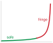
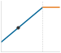

# Tăng tốc phần cứng {#sec-hardware-acceleration}

::: {layout-narrow}
::: {.column-margin}

\chapterminitoc

:::

::: {.content-visible when-format="pdf"}
\noindent
{fig-alt="Sơ đồ phối cảnh phần cứng theo lớp, cho thấy một phép toán tensor được phân rã thành các tile, lưu vào SRAM cục bộ và chạy trên một mảng thực thi, đồng thời tránh “bức tường” bộ nhớ ngoài chip."}
:::

::: {.content-visible unless-format="pdf"}
{fig-alt="Sơ đồ phối cảnh phần cứng theo lớp, cho thấy một phép toán tensor được phân rã thành các tile, lưu vào SRAM cục bộ và chạy trên một mảng thực thi, đồng thời tránh “bức tường” bộ nhớ ngoài chip."}
:::

:::

## Mục đích {.unnumbered .unlisted}

\begin{marginfigure}
\mlsysstack{90}{35}{25}{35}{30}{0}{0}{0}
\end{marginfigure}

_Tại sao việc di chuyển dữ liệu lại tốn kém hơn việc tính toán?_

So với việc truy cập bộ nhớ nhiều lần, tính toán là rẻ. Trong thời gian chỉ để lấy một giá trị từ bộ nhớ chính, bộ xử lý có thể thực hiện nhiều phép tính. Sự lệch này, gọi là “bức tường bộ nhớ”, phản ánh độ trễ, băng thông và chi phí năng lượng của việc di chuyển dữ liệu trong hệ thống. Điều đó giải thích vì sao các bộ tăng tốc chuyên dụng không chỉ làm toán nhanh hơn, mà còn được kiến trúc để che giấu, phân bổ và giảm chi phí di chuyển dữ liệu nhờ phân cấp bộ nhớ sâu, song song hóa lớn và các đường dẫn dữ liệu chuyên biệt. Tăng tốc phần cứng giúp nhiều khối lượng công việc (workload) AI lớn tiếp tục mở rộng khi việc tăng quy mô bộ xử lý đa năng là không đủ. Nó cũng lý giải vì sao một số tối ưu hóa giảm số phép tính lý thuyết vẫn không cải thiện runtime. Nếu một phép toán bị giới hạn bởi bộ nhớ (memory bound), tính ít hơn có thể không giúp gì vì tính toán không phải nút thắt. Do đó, chọn phần cứng không thể chỉ so sánh FLOP/s đỉnh. Quan trọng là mô hình di chuyển dữ liệu của khối lượng công việc (workload) có phù hợp với những gì phần cứng được thiết kế để tăng tốc hay không. Một mô hình với các bảng embedding lớn và các truy vấn không đều cần một bộ tăng tốc khác với mô hình thực hiện nhân ma trận dày đặc trên các tensor trọng số nhỏ gọn. Phần mềm phải bộc lộ và lên lịch cho việc tái sử dụng dữ liệu; nếu không, các đơn vị chuyên dụng sẽ phải chờ dữ liệu di chuyển và thông lượng công bố vẫn chỉ là lý thuyết. Khớp đúng khối lượng công việc (workload) và phần cứng sẽ quyết định việc thực thi chỉ đạt một phần nhỏ so với đỉnh lý thuyết hay tiến gần trần hiệu năng thực tế của phần cứng. Theo thuật ngữ D·A·M, bộ tăng tốc làm ràng buộc của máy trở nên cụ thể và định hình những thuật toán nào còn khả thi trong sản xuất.

::: {.content-visible when-format="pdf"}

\newpage

:::

::: {.callout-learning-objectives}

- Giải thích tăng tốc phần cứng như một dạng chuyên môn hóa theo trục máy (machine-axis) dành cho các khối lượng công việc (workload) dựa trên tensor, tái sử dụng dữ liệu và hiệu suất trên mỗi watt.
- Tính cường độ số học và các trần roofline để phân loại các kernel là bị giới hạn bởi tính toán (compute bound) hay bị giới hạn bởi bộ nhớ (memory bound).
- Chẩn đoán các nút thắt do giới hạn bộ nhớ (memory wall) dựa trên băng thông, phân cấp cache, truyền giữa host và thiết bị, cùng chi phí năng lượng cho việc di chuyển dữ liệu.
- So sánh Tensor Cores, mảng systolic, các đơn vị SIMD/SIMT và thực thi thưa (sparse execution) cho các phép toán cơ bản trong ML.
- Chọn các chiến lược về luồng dữ liệu (dataflow), phân ô (tiling) và ánh xạ (mapping) nhằm tối đa hóa việc tái sử dụng dữ liệu dưới các ràng buộc dung lượng bộ nhớ.
- Phân tích các tối ưu hóa của trình biên dịch và runtime, bao gồm việc hợp nhất các kernel, lập kế hoạch bộ nhớ và lên lịch cho các bộ tăng tốc.
- Đánh giá lựa chọn bộ tăng tốc theo các tiêu chí thông lượng, độ trễ, công suất, chi phí và các ràng buộc của ngữ cảnh triển khai.

:::

```{python}
#| echo: false
from mlsysim import *
from mlsysim.core.units import *

from mlsysim.fmt import (
    fmt_int,
    fmt,
    fmt_qty,
    fmt_qty_int,
    check,
    fmt_memory,
    fmt_bandwidth,
    fmt_flop_rate,
    fmt_power,
    fmt_energy,
    fmt_count,
    fmt_params,
    fmt_carbon_intensity,
    fmt_compute_efficiency,
    fmt_multiple_range,
)

class HwAccelSetup:
    """A100 peak FP16/BF16 throughput vs. the registry reference CPU for the opening callout."""

    # LOAD
    a100_tflops_fp16 = Hardware.Cloud.A100.compute.peak_flops.to(TFLOPs / second).magnitude
    cpu_tflops_low = Hardware.Cloud.ReferenceCPU.compute.peak_flops.to(TFLOPs / second).magnitude
    cpu_tflops_high = 2

    # EXECUTE
    cpu_gap_min = a100_tflops_fp16 / cpu_tflops_high
    cpu_gap_max = a100_tflops_fp16 / cpu_tflops_low

    # GUARD
    check(150 <= cpu_gap_min <= 160, f"Unexpected lower CPU gap: {cpu_gap_min:.1f}x")
    check(300 <= cpu_gap_max <= 320, f"Unexpected upper CPU gap: {cpu_gap_max:.1f}x")

    # OUTPUT
    a100_fp16_tflop_per_s_str = fmt_flop_rate(Hardware.Cloud.A100.compute.peak_flops, unit=TFLOP / second, precision=0, commas=False)
    cpu_gap_range_mult_str = fmt_multiple_range(cpu_gap_min, cpu_gap_max, precision=0, commas=False)
```

## Các nguyên tắc cơ bản của tăng tốc {#sec-hardware-acceleration-ai-hardware-acceleration-fundamentals-9b28}

::: {.column-margin}
{width="100%" fig-alt="Tam giác phân loại D·A·M có ba đỉnh D, A và M được nối với nhau bằng các cạnh. Đỉnh M (Machine) được tô màu đặc, còn các đỉnh D và A có màu xám, thể hiện trục Machine."}

*Tăng tốc phần cứng kích hoạt trục Machine.*
:::

Việc giảm tham số, độ chính xác hay số phép toán chỉ thực sự có ý nghĩa khi máy có thể thực thi biểu diễn kết quả một cách hiệu quả. Lựa chọn dữ liệu giúp giảm thành phần dữ liệu (data term), còn nén giúp giảm khối lượng công việc của thuật toán. Tăng tốc phần cứng đặt ra câu hỏi về khả năng thực sự của máy. Câu trả lời bắt đầu từ giới hạn bộ nhớ (memory wall): các phép tính số học thường rẻ hơn nhiều so với việc di chuyển dữ liệu. Một lần truy cập bộ nhớ ngoài chip có thể tốn nhiều chu kỳ bộ xử lý và tiêu thụ năng lượng lớn hơn nhiều bậc độ lớn so với một phép toán số học độ chính xác thấp, với tỉ lệ chính xác phụ thuộc vào thiết bị và cấp độ bộ nhớ. Phần cứng chuyên dụng trở nên quan trọng vì nó không chỉ tăng thông lượng tính toán mà còn tổ chức bộ nhớ, luồng dữ liệu và mức độ song song để các đơn vị số học luôn có đủ dữ liệu để xử lý.

::: {#dfn-hw-acceleration-hardware-acceleration .callout-definition title="Tăng tốc phần cứng"}

***Tăng tốc phần cứng***\index{Hardware acceleration!definition} là việc chuyển đổi công việc từ thực thi trên các bộ xử lý đa năng sang các bộ xử lý hoặc đơn vị chức năng chuyên dụng, được tối ưu hóa cho một nhóm tác vụ hẹp hơn. Đối với các khối lượng công việc (workload) trong ML, sự chuyên biệt hóa này thường đánh đổi một phần khả năng lập trình để đạt được mật độ tính toán $(R_{\text{peak}})$ và hiệu suất trên mỗi watt cao hơn, những lợi ích mà các phép toán tensor thông thường có thể tận dụng.

1.  **Ý nghĩa**: Một GPU A100 đạt `{python} HwAccelSetup.a100_fp16_tflop_per_s_str` khi thực hiện phép nhân ma trận FP16/BF16. So với CPU tham chiếu 1–2 TFLOP/s mà chương này dùng làm ví dụ, đây là một chênh lệch đạt `{python} HwAccelSetup.cpu_gap_range_mult_str`. 54,2 tỷ bóng bán dẫn của GPU này dành nhiều silicon hơn cho số học song song thay vì cho dự đoán nhánh, lập lịch ngoài thứ tự và các cache lớn [@NVIDIA2020; @choquette2021].
2.  **Phân biệt**: Một CPU đa năng được thiết kế để thực thi linh hoạt, điều khiển với độ trễ thấp và xử lý các khối lượng công việc (workload) đa dạng. Ngược lại, một bộ tăng tốc tập trung tài nguyên vào một lớp thao tác hẹp hơn, nên nó chỉ đạt được lợi ích khi khối lượng công việc (workload) bộc lộ các thao tác được hỗ trợ và đủ mức song song để giữ cho các đơn vị số học luôn bận rộn.
3.  **Lỗi thường gặp**: Một quan niệm sai là thông lượng đỉnh mà nhà sản xuất quảng cáo cho bộ tăng tốc chính là thông lượng mà khối lượng công việc (workload) thực sự nhận được. Hiệu suất thực tế là mức thấp hơn giữa trần tính toán và những gì băng thông bộ nhớ có thể cấp — ràng buộc roofline. Cụ thể, một kernel có cường độ tính toán số học thấp có thể chỉ đạt một phần nhỏ FLOP/s đỉnh, bất kể silicon được đánh giá nhanh đến mức nào, vì nó thiếu dữ liệu để xử lý hơn là thiếu khả năng tính toán số học.

:::

Định nghĩa này đặt khung cho sự đánh đổi kỹ thuật cốt lõi của chương. Các bộ xử lý đa năng hỗ trợ nhiều loại luồng điều khiển, bộ nhớ và mô hình thực thi. Ngược lại, một bộ tăng tốc có thể dành nhiều ngân sách thiết kế hơn cho số học, lưu trữ và các đường dẫn dữ liệu của một lớp khối lượng công việc (workload) hẹp hơn. Kết quả có thể là cải thiện thông lượng trên mỗi watt theo bậc độ lớn khi khối lượng công việc (workload) và đường đi phần mềm khớp với sự chuyên biệt đó.

Tuy nhiên, chỉ riêng phần cứng thì không thể đạt được những lợi ích này. Thuật toán phải được thiết kế để khai thác những gì phần cứng cung cấp, và phần cứng phải được xây dựng để tăng tốc các thao tác mà thuật toán thực sự dùng. Mối quan hệ cộng sinh này dẫn đến một nguyên tắc bổ sung: đồng thiết kế phần cứng-phần mềm.

::: {#dfn-hw-acceleration-hardware-software-co-design .callout-definition title="Đồng thiết kế phần cứng-phần mềm"}

***Đồng thiết kế phần cứng-phần mềm***\index{Hardware-Software Co-design!definition} là một phương pháp phát triển bộ tăng tốc ML vượt qua các ranh giới trừu tượng truyền thống, cho phép các ràng buộc của thuật toán định hướng thiết kế silicon và khả năng của phần cứng định hình cách xây dựng thuật toán.

1.  **Ý nghĩa**: Trên các đường dẫn có hỗ trợ tensor core, lượng tử hoá số nguyên 8-bit (INT8) có thể mang lại mức tăng thông lượng gấp nhiều lần, vì phần cứng thực thi các phép toán độ chính xác thấp dày đặc hơn và phải di chuyển ít byte hơn so với đường dẫn FP32; mức tăng cụ thể phụ thuộc vào kiến trúc và khối lượng công việc (workload) [@NVIDIA2020; @dally2021; @dally2023].
2.  **Điểm khác biệt**: Khác với trừu tượng hoá theo lớp (layered abstraction), nơi phần mềm gọi API phần cứng mà không cần biết chi tiết về silicon, đồng thiết kế phơi bày trực tiếp các ràng buộc phần cứng cho tác giả thuật toán và trình biên dịch: yêu cầu căn chỉnh dữ liệu, định dạng độ chính xác và mẫu truy cập bộ nhớ đều trở thành đầu vào hiển thị cho tối ưu hoá xuyên lớp ở phạm vi toàn cục.
3.  **Cạm bẫy thường gặp**: Một quan niệm sai lầm phổ biến là đồng thiết kế chỉ là một quyết định thiết kế phần cứng một lần. Trên thực tế, các đặc trưng được hỗ trợ vẫn tiếp tục phát triển: NVIDIA Tensor Cores ban đầu chỉ hỗ trợ phép nhân ma trận FP16, các thế hệ sau bổ sung TF32 và hỗ trợ số nguyên rộng hơn, và kiến trúc Ampere thêm tăng tốc cho thưa thớt có cấu trúc 2:4 [@nvidia_tensors_fp16_2017; @NVIDIA2020].

:::

Đồng thiết kế giải thích *tại sao* các kỹ thuật nén được giới thiệu trong @sec-model-compression mang lại tăng tốc thực sự. Các kỹ thuật lượng tử hoá trong @sec-model-compression-quantization-precision-cd46 cho thấy vì sao chuyển FP32 sang INT8\index{Quantization!INT8 co-design} có thể tăng tốc một đường dẫn phần cứng được hỗ trợ: ít byte hơn làm giảm lưu lượng, và bộ tăng tốc có thể thực hiện nhiều phép toán độ chính xác thấp mỗi chu kỳ hơn so với các phép toán FP32 [@NVIDIA2020]. Tỉa (pruning) có cấu trúc\index{Structured pruning!hardware alignment} có thể cải thiện hiệu suất khi nó tạo ra các khối dày đặc nhỏ hơn hoặc một mẫu thưa thớt được phần cứng hỗ trợ, trong khi độ thưa thớt không cấu trúc tuỳ ý cần các kernel thưa thớt tương ứng và cơ chế xử lý siêu dữ liệu. Đánh giá hiệu suất của bộ tăng tốc đòi hỏi lần theo đường đi từ khối lượng công việc (workload) đến silicon: các phép toán cơ bản, hệ thống bộ nhớ, phân tích roofline, ánh xạ và luồng dữ liệu, rồi đến hỗ trợ từ trình biên dịch và runtime. Câu hỏi lặp lại là vì sao một số tối ưu hoá thuật toán đầy hứa hẹn có thể “sống” trên phần cứng, trong khi số khác chỉ là tiết kiệm trên giấy.

::: {#thrm-hw-acceleration-fundamental-limit-acceleration-amdahls-law .callout-theorem title="Giới hạn cơ bản của tăng tốc (Định luật Amdahl)"}

Tăng tốc phần cứng *không làm tăng tốc toàn bộ hệ thống*; nó chỉ tăng tốc phần thời gian cơ sở đi qua đường dẫn được tăng tốc. Với phần $p$ đó và mức tăng $G_{\text{accel}}$ trên đường dẫn, **định luật Amdahl cho AI**\index{Amdahl's law!parallel fraction}\index{Parallel Computing!Amdahl's Law} [@amdahl1967] đưa ra giới hạn như trong @eq-amdahl.
$$ \text{Speedup} = \frac{1}{(1 - p) + \frac{p}{G_{\text{accel}}}} $$ {#eq-amdahl}

*   **Phần được tăng tốc**\index{Parallel fraction!definition} ($p$): Tỷ lệ thời gian cơ sở nhận được mức tăng đã nêu, thường là trong phép nhân ma trận hoặc một kernel được hỗ trợ khác.
*   **Mức tăng của bộ tăng tốc**\index{Accelerator gain!definition} ($G_{\text{accel}}$): Lợi thế tốc độ thô của GPU hoặc Đơn vị xử lý Tensor (TPU) so với CPU cho phần khối lượng công việc (workload) được tăng tốc.
*   **Phần không được tăng tốc**\index{Serial fraction!Amdahl bottleneck} ($1-p$): Công việc nằm ngoài đường dẫn đã chọn, chẳng hạn như tải dữ liệu, chi phí trên host, các toán tử không được hỗ trợ và độ trễ khởi chạy kernel\index{Kernel Launch Latency!serial overhead}.

**Cạm bẫy**: *Công việc không được tăng tốc sẽ giới hạn mức tăng tốc tổng thể.* Nếu 10% thời gian cơ sở không bị ảnh hưởng ($p=0.9$), ngay cả mức tăng trên đường dẫn là vô hạn ($G_{\text{accel}}=\infty$) cũng chỉ mang lại tối đa 10$\times$ tổng thể. Khi thành phần được tăng tốc đủ nhanh, phần công việc không bị ảnh hưởng sẽ trở thành thành phần chi phối.

:::

Tăng tốc phần cứng tác động đến các thành phần cụ thể trong định luật sắt của hệ thống ML\index{Iron law of ML systems!hardware acceleration} (@sec-introduction-iron-law-ml-systems-c32a), vốn phân tách thời gian từ đầu đến cuối thành khối lượng dữ liệu $(D_{\text{vol}}/\text{BW})$, tính toán $(O/(R_{\text{peak}} \cdot \eta_{\text{hw}}))$ và độ trễ cố định $(L_{\text{lat}})$. Trong khi lựa chọn dữ liệu giúp giảm tổng lượng dữ liệu và nén mô hình giúp giảm $O$ trên mỗi mẫu, thì tăng tốc phần cứng làm tăng tốc độ thực thi các phép toán này bằng cách cải thiện $R_{\text{peak}}$, $\eta_{\text{hw}}$ và $\text{BW}$. @Sec-appdx-machine-foundations-physics-computing-c77f cung cấp các mô hình hiệu suất phân tích để chẩn đoán thành phần nào trong số này chiếm ưu thế đối với một khối lượng công việc (workload) nhất định, bao gồm cả phân tích thứ nguyên xác nhận rằng mỗi thành phần của định luật sắt đều quy về đơn vị giây. Tuy vậy, tăng tốc có một giới hạn cứng, được thiết lập bởi Định luật Amdahl.[^fn-amdahls-law-acceleration]

[^fn-amdahls-law-acceleration]: **Định luật Amdahl**\index{Amdahl's law!acceleration ceiling}: Chỉ ánh xạ vào Định luật Sắt sau khi thay đổi đề xuất được xác định rõ. Nếu một đơn vị tensor nhanh hơn làm giảm thành phần tính toán $(O/(R_{\text{peak}} \cdot \eta_{\text{hw}}))$ nhưng giữ nguyên việc truyền dữ liệu và độ trễ cố định, thì các thành phần không bị tác động đó sẽ giới hạn tổng tốc độ tăng. Một bộ tăng tốc khác hoặc hệ thống bộ nhớ khác cũng có thể cải thiện băng thông. Vì vậy, phần không được tăng tốc được xác định bởi chính biện pháp can thiệp, không phải bởi một phân loại vĩnh viễn rằng mỗi thành phần là nối tiếp.

Định luật Amdahl cũng giải thích *tại sao* nhiều nâng cấp GPU gây thất vọng. @Fig-iron-law-heatmap trực quan hóa **bức tường tăng tốc**\index{Acceleration wall!diminishing returns}: khi một phần đáng kể thời gian thực thi ban đầu vẫn không được tăng tốc, giới hạn $1/(1-p)$ khiến cho việc tăng tốc thêm trở nên kém hiệu quả dần, trừ khi $p$ tiến gần đến 1. Các đường đồng mức chỉ mang tính minh họa.

::: {#fig-iron-law-heatmap fig-env="figure" fig-pos="htb" fig-cap="**Bản đồ nhiệt Định luật Sắt**: Tốc độ tăng tốc tổng thể của hệ thống theo hàm của độ lợi bộ tăng tốc ($G_{\text{accel}}$) và phần được tăng tốc ($p$). Tốc độ tăng tốc cao chỉ xuất hiện gần góc trên bên phải, nơi cả độ lợi bộ tăng tốc và phần được tăng tốc đều cao. Ví dụ, tại $p=0.9$, ngay cả khi phần được tăng tốc đạt độ lợi vô hạn cũng không thể vượt quá 10$\times$ tốc độ tăng tốc đầu cuối. Các đường đồng mức trải dài khoảng 1$\times$–500$\times$ tốc độ tăng tốc." fig-alt="Bản đồ nhiệt của tốc độ tăng tốc so với độ lợi bộ tăng tốc và phần được tăng tốc. Tốc độ tăng tốc cao màu đỏ và cam xuất hiện gần góc trên bên phải, nơi phần được tăng tốc gần 1.0 và độ lợi bộ tăng tốc cao; các vùng có phần được tăng tốc thấp hơn vẫn có màu xanh lam. Các đường đồng mức màu trắng được dán nhãn từ 1x đến 200x, và các nhãn văn bản đánh dấu một vùng Giới hạn tính toán (Compute Bound) ở trên và một vùng Giới hạn không tăng tốc (Unaccelerated Bound) ở dưới."}

```{python}
#| echo: false
# ┌─────────────────────────────────────────────────────────────────────────────
# │ IRON LAW HEATMAP (FIGURE)
# ├─────────────────────────────────────────────────────────────────────────────
# │ Context: @fig-iron-law-heatmap—Amdahl's Law and Acceleration Wall
# │
# │ Goal: Visualize speedup = 1/((1-p)+p/S) as function of S and p; show
# │       diminishing returns when parallel fraction is low.
# │ Show: Contour heatmap; Compute Bound vs Serial Bound regions.
# │ How: meshgrid S, P; contourf with LogNorm; book_style.setup_plot().
# │
# └─────────────────────────────────────────────────────────────────────────────
# ┌── 1. CANVAS ────────────────────────────────────────────────────────────────
# │ Visualize speedup = 1/((1-p)+p/G_accel) as function of accelerator gain and p; show
import sys
import os
import numpy as np
import matplotlib.colors as mcolors

# ┌── 2. ARRAYS ────────────────────────────────────────────────────────────────
sys.path.insert(0, ".")
from binder.tools.figures import style as book_style
from mlsysim.physics import calc_amdahls_speedup

fig, ax, COLORS, plt = book_style.setup_plot(figsize=(10, 4.2))

# =============================================================================
# PLOT: The Iron Law Heatmap
# =============================================================================
g_accel_vals = np.logspace(0, 3, 100)
p_vals = np.linspace(0.8, 0.999, 100)
g_accel_grid, p_grid = np.meshgrid(g_accel_vals, p_vals)
overall_speedup = np.vectorize(calc_amdahls_speedup)(p_grid, g_accel_grid)

# ┌── 3. RENDER ────────────────────────────────────────────────────────────────
levels = [1, 2, 5, 10, 20, 50, 100, 200, 500]
norm = mcolors.LogNorm(vmin=1, vmax=500)

cf = ax.contourf(g_accel_grid, p_grid, overall_speedup, levels=levels, cmap='RdYlBu_r', norm=norm, alpha=0.8)
cs = ax.contour(g_accel_grid, p_grid, overall_speedup, levels=levels, colors='white', linewidths=0.8, alpha=0.6)
ax.clabel(cs, inline=1, fontsize=8, fmt='%gx', colors='black')

ax.set_xscale('log')
ax.set_xlabel(r'Accelerator gain ($G_{\mathrm{accel}}$)')
ax.set_ylabel('Accelerated Fraction (p)')

ax.text(
    100,
    0.98,
    "Compute Bound",
    color='black',
    ha='center',
    va='top',
    fontweight='bold',
    fontsize=9,
    bbox=dict(facecolor='white', alpha=0.8, edgecolor='none', pad=0.5),
)
ax.text(
    100,
    0.82,
    "Unaccelerated Bound",
    color='white',
    ha='center',
    va='bottom',
    fontweight='bold',
    fontsize=9,
    bbox=dict(facecolor='black', alpha=0.6, edgecolor='none', pad=0.5),
)
plt.show()
plt.close()

# ┌── 4. DECORATE ──────────────────────────────────────────────────────────────
```

:::

Trực giác then chốt khi đi vào các kiến trúc phần cứng cụ thể là tốc độ tăng thô chỉ có ý nghĩa sau khi phần chưa được tăng tốc đã được giảm bớt. Phần được tăng tốc $p$ có thể khác nhau đáng kể giữa các kiểu khối lượng công việc (workload) chạy trên cùng phần cứng, và ở quy mô toàn đội máy, những khác biệt này quyết định liệu khoản đầu tư vào bộ tăng tốc có mang lại hiệu quả hay bị dừng lại ở nút thắt cổ chai còn lại.

::: {#chk-hw-acceleration-parallelism-gate .callout-checkpoint title="Ngưỡng song song hóa"}

Những kiểm tra này biến giới hạn của Amdahl thành một bài kiểm tra lựa chọn phần cứng.

**Thực tế của Amdahl**\index{Amdahl's reality!định nghĩa}

- [ ] **Nút thắt cổ chai nối tiếp**: sử dụng giới hạn của Amdahl để giải thích tại sao một GPU nhanh hơn 1.000$\times$ có thể chỉ tăng tốc huấn luyện lên 5$\times$ khi việc tải dữ liệu chậm.
- [ ] **Giới hạn tăng tốc**: với $p=0.95$ và $G_{\text{accel}}=100$, hãy ước tính tăng tốc tổng thể và so sánh nó với giới hạn khi sử dụng bộ tăng tốc vô hạn.
- [ ] **Khác biệt khối lượng công việc (workload)**: so sánh tỷ lệ phần được tăng tốc của ResNet-50\index{ResNet-50!compute-bound workload} và MobileNet khi áp dụng một thay đổi phần cứng được đề xuất, rồi dự đoán mô hình nào hưởng lợi nhiều hơn.

:::

Nút thắt nối tiếp trở nên cụ thể trên phần cứng thực: cùng một bộ tăng tốc có thể gần chạm trần song song của nó ở một khối lượng công việc (workload), nhưng lại bị khựng ở một workload khác. @Sec-appdx-machine-foundations-numbers-know-b531 thu thập các số liệu tham chiếu $R_{\text{peak}}$ qua nhiều thế hệ bộ tăng tốc và thứ bậc độ trễ, để đặt các so sánh phần cứng này trong khung bậc độ lớn.

```{python}
#| echo: false
#| label: amdahl-h_h100-calc
# ┌─────────────────────────────────────────────────────────────────────────────
# │ AMDAHL'S LAW ON H100
# ├─────────────────────────────────────────────────────────────────────────────
# │ Context: "Amdahl's Law on H100" lighthouse callout
# │
# │ Goal: Demonstrate the limits of parallel speedup on H100.
# │ Show: Why ResNet achieves 20× speedup while GPT-2 is capped at 5×.
# │ How: Apply Amdahl's Law with different parallelizable fractions (95% vs 80%).
# │      LLM optimization focuses on reducing serial fraction.
# │
# └─────────────────────────────────────────────────────────────────────────────
from mlsysim.fmt import fmt_int, fmt, fmt_math, fmt_ops_rate, fmt_ratio, check
from mlsysim.physics import calc_amdahls_speedup

# ┌── LEGO ───────────────────────────────────────────────
class AmdahlH100:
    """
    Namespace for Amdahl's Law on H100.
    Scenario: Comparing speedup for Compute-Bound (ResNet) vs Memory-Bound (GPT-2).
    """

    # ┌── 1. LOAD (Constants) ───────────────────────────────────────────────
    h100_int8 = Hardware.Cloud.H100.compute.precision_flops["int8"]
    cpu_int8_tops = 8 * TOPS  # scenario assumption: baseline server-CPU INT8 throughput

    # Workload Parallel Fractions (p)
    p_resnet = 0.95  # 95% parallel (Compute Bound)
    p_gpt2 = 0.80  # 80% parallel (Bandwidth Bound/Serial Overhead)

    # ┌── 2. EXECUTE (The Compute) ─────────────────────────────────────────
    # Amdahl's Law: Speedup = 1 / ((1-p) + (p/G_accel))
    # (2026-06-10 audit: the derived ~247x ratio was hardcoded in LOAD; if
    # the registry INT8 figure changed, the displayed TOPS ref updated but
    # the speedup silently did not.)
    hw_speedup_factor = (h100_int8 / cpu_int8_tops).to("").magnitude

    speedup_resnet = calc_amdahls_speedup(p_resnet, hw_speedup_factor)
    speedup_gpt2 = calc_amdahls_speedup(p_gpt2, hw_speedup_factor)

    # Step 1: Theoretical ceiling (if accelerator gain tends to infinity)
    ceiling_gpt2 = calc_amdahls_speedup(p_gpt2, float("inf"))

    # ┌── 3. GUARD (Invariants) ───────────────────────────────────────────
    check(speedup_resnet >= speedup_gpt2 * 3, f"ResNet speedup ({speedup_resnet:.1f}x) should be much higher than GPT-2 ({speedup_gpt2:.1f}x).")
    check(speedup_gpt2 <= ceiling_gpt2, "Speedup cannot exceed theoretical ceiling.")

    # ┌── 4. OUTPUT (Formatting) ──────────────────────────────────────────────
    # Hardware context
    h100_int8_tops_str = fmt_ops_rate(Hardware.Cloud.H100.compute.precision_flops["int8"], unit=TOPS, precision=0, commas=False)
    cpu_int8_tops_str = fmt_ops_rate(cpu_int8_tops, unit=TOPS, precision=0, commas=False)
    hw_speedup_mult_str = fmt_multiple(round(hw_speedup_factor), precision=0, commas=False)
    hw_speedup_factor_str = fmt_int(hw_speedup_factor, commas=False)

    # ResNet
    p_resnet_str = fmt(p_resnet, precision=2, commas=False)
    p_resnet_pct_str = fmt_percent(p_resnet, precision=0, commas=False, style='prose')
    serial_resnet_str = fmt(1 - p_resnet, precision=2, commas=False)
    serial_resnet_pct_str = fmt_percent(1 - p_resnet, precision=0, commas=False, style='prose')
    p_resnet_over_accel_str = fmt_ratio(p_resnet / hw_speedup_factor, precision=4, commas=False)
    amdahl_resnet_str = fmt(speedup_resnet, precision=1, commas=False)
    amdahl_resnet_speedup_mult_str = fmt_multiple(speedup_resnet, precision=1, commas=False)

    # GPT-2
    p_gpt2_str = fmt(p_gpt2, precision=2, commas=False)
    serial_gpt2_str = fmt(1 - p_gpt2, precision=2, commas=False)
    serial_gpt2_pct_str = fmt_percent(1 - p_gpt2, precision=0, commas=False, style='prose')
    p_gpt2_over_accel_str = fmt_ratio(p_gpt2 / hw_speedup_factor, precision=4, commas=False)
    amdahl_gpt2_str = fmt(speedup_gpt2, precision=1, commas=False)
    amdahl_gpt2_ceiling_speedup_mult_str = fmt_multiple(ceiling_gpt2, precision=0, commas=False)

    resnet_speedup_eq_math = fmt_math(
        rf"\text{{Speedup}} = \frac{{1}}{{(1-{p_resnet_str}) + \frac{{{p_resnet_str}}}{{{hw_speedup_factor_str}}}}} "
        rf"= \frac{{1}}{{{serial_resnet_str} + {p_resnet_over_accel_str}}} "
        rf"\approx {amdahl_resnet_str}\times"
    )
    gpt2_speedup_eq_math = fmt_math(
        rf"\text{{Speedup}} = \frac{{1}}{{(1-{p_gpt2_str}) + \frac{{{p_gpt2_str}}}{{{hw_speedup_factor_str}}}}} "
        rf"= \frac{{1}}{{{serial_gpt2_str} + {p_gpt2_over_accel_str}}} "
        rf"\approx {amdahl_gpt2_str}\times"
    )
```

::: {#lhs-amdahl-h_h100 .callout-lighthouse title="Một ví dụ phân tích Amdahl trên H100"}

**Ví dụ suy luận ResNet-50 trên NVIDIA H100**:

- Giả sử H100 cung cấp $G_{\text{accel}}$ = `{python} AmdahlH100.hw_speedup_mult_str` cho phép nhân ma trận so với một CPU tham chiếu không có phần mở rộng ma trận (`{python} AmdahlH100.h100_int8_tops_str` INT8 so với ~`{python} AmdahlH100.cpu_int8_tops_str`) [@choquette2023].
- Giả sử $p$ = `{python} AmdahlH100.p_resnet_str`: `{python} AmdahlH100.p_resnet_pct_str` thời gian gốc được hưởng lợi từ mức tăng tốc đó, trong khi `{python} AmdahlH100.serial_resnet_pct_str` còn lại dành cho việc tải dữ liệu, tiền xử lý, hậu xử lý và các công việc khác.
$$
\text{`{python} AmdahlH100.resnet_speedup_eq_math`}
$$
Mức tăng tốc `{python} AmdahlH100.hw_speedup_mult_str` chỉ mang lại tổng độ tăng tốc đầu cuối `{python} AmdahlH100.amdahl_resnet_speedup_mult_str`, vì phần `{python} AmdahlH100.serial_resnet_pct_str` không bị ảnh hưởng đã đặt trần.

**Đối chiếu với GPT-2 (tự hồi quy)**:

- Với việc tạo token của GPT-2, giả sử $p$ = `{python} AmdahlH100.p_gpt2_str`; phần `{python} AmdahlH100.serial_gpt2_pct_str` còn lại gồm chi phí phía host, lấy mẫu và công việc giải mã nằm ngoài đường dẫn ma trận được tăng tốc.
$$
\text{`{python} AmdahlH100.gpt2_speedup_eq_math`}
$$
Do thời gian tạo token nhận được mức tăng giả định ít hơn, nên ngay cả khi mức tăng trên đường dẫn là vô hạn thì tổng độ tăng tốc cũng chỉ đạt tối đa $1/(1-p)$ = `{python} AmdahlH100.amdahl_gpt2_ceiling_speedup_mult_str`. Các tối ưu hóa phục vụ (serving) xử lý giới hạn này theo những cách khác nhau: batching cải thiện mức sử dụng tài nguyên giữa các yêu cầu, còn giải mã suy đoán dùng một mô hình nháp để giảm số bước tuần tự của mô hình đích.

:::

Những ví dụ này cho thấy tối ưu hóa phần cứng phụ thuộc vào việc một khối lượng công việc (workload) bị giới hạn bởi tốc độ tính toán hay bởi việc di chuyển dữ liệu. Sự phân biệt này quyết định chọn bộ tăng tốc nào, tối ưu nào là trọng yếu, và liệu một con chip mạnh hơn 10$\times$ có thực sự giúp ích. Mô hình Roofline\index{Mô hình Roofline!chẩn đoán phần cứng} cung cấp một framework phân tích để đưa ra chẩn đoán này [@williams2009]; mô hình được giới thiệu chính thức trong @sec-appdx-machine-foundations-roofline-model-2529 và @sec-hardware-acceleration-roofline-model-42ff áp dụng nó cho các khối lượng công việc AI. Mô hình vẽ cường độ số học của một phép toán,[^fn-arithmetic-intensity-roofline] được định nghĩa là tỷ lệ giữa số phép toán dấu phẩy động và số byte lưu thông qua bộ nhớ (FLOP/byte), trên nền khả năng phần cứng, từ đó cho thấy hiệu suất bị giới hạn bởi tính toán hay băng thông. Phép nhân ma trận dày đặc với cường độ số học cao sẽ hưởng lợi khi có nhiều TFLOP/s hơn; còn LayerNorm với cường độ số học thấp sẽ hưởng lợi từ băng thông bộ nhớ lớn hơn. Các tích chập ResNet-50 có khả năng tái sử dụng dữ liệu cao có thể chuyển sang vùng bị giới hạn bởi tính toán, trong khi attention tự hồi quy (autoregressive attention) với batch thấp có thể bị giới hạn bởi băng thông bộ nhớ. Chính sự phân biệt này là *lý do tại sao* các khối lượng công việc này cần những chiến lược tối ưu hóa khác nhau.

[^fn-arithmetic-intensity-roofline]: **Cường độ số học**\index{Cường độ số học!chẩn đoán roofline}: Tỷ lệ giữa số phép toán và số byte dữ liệu được truyền qua giao diện bộ nhớ đang được mô hình hóa (FLOP/byte). Các khối lượng công việc nằm trên điểm đỉnh (ridge point) của cấp độ phần cứng đó, ví dụ các phép nhân ma trận được chia ô (tiled) tốt với tái sử dụng dữ liệu đáng kể, là bị giới hạn bởi tính toán và sẽ hưởng lợi khi có nhiều TFLOP/s hơn. Các phép toán cường độ thấp, bao gồm một số kernel attention và giải mã với batch thấp, bị giới hạn bởi băng thông ở cấp độ đó và cần nhiều băng thông hoặc tái sử dụng hơn, thay vì chỉ thêm thông lượng tính toán.

Chương này phát triển các ý tưởng ấy, đi từ lịch sử phần cứng, các nguyên thủy tính toán, hệ thống phân cấp bộ nhớ, phân tích roofline, ánh xạ, luồng dữ liệu và hỗ trợ runtime. Phần phân tích chính tập trung vào hệ thống chỉ có một bộ tăng tốc và một nút đơn; phần cuối dùng ví dụ đa thiết bị chỉ để cho thấy cách các chẩn đoán nút thắt cổ chai đó mở rộng theo quy mô. Lịch sử phần cứng chuyên dụng được đặt lên trước vì nó cho thấy những mẫu thiết kế lặp lại đằng sau các bộ tăng tốc hiện đại.

## Chuyên môn hóa phần cứng {#sec-hardware-acceleration-evolution-hardware-specialization-fdb7}

Cú sốc hiệu quả của TPUv1/K80 là một ví dụ hiện đại cho một quy luật quen thuộc trong phát triển phần cứng: khi một khối lượng công việc (workload) trở nên đủ quan trọng và ổn định, phần cứng chuyên dụng\index{Hardware specialization!evolution} có thể vượt trội so với các nền tảng đa năng hơn. Việc tăng tốc machine learning đi theo quỹ đạo từng thấy ở số học dấu phẩy động, xử lý đồ họa và xử lý tín hiệu số. Ở mỗi giai đoạn, người ta chuyên biệt hóa thao tác hoặc đường dẫn dữ liệu đang giới hạn khối lượng công việc (workload) đó; trong machine learning hiện đại, chi phí cấp dữ liệu cho các phép toán số học dày đặc khiến việc di chuyển dữ liệu trở thành mục tiêu thiết kế trung tâm.

Các bộ tăng tốc machine learning hiện đại (bộ tăng tốc mạng nơ-ron dòng DianNao [@chen2014diannao], GPU với Tensor Cores, TPU của Google,[^fn-tpu-google-origin] Neural Engine của Apple) ra đời từ những nguyên tắc kiến trúc đã được xác lập. Quá trình tiến hóa này trải qua bốn giai đoạn: khởi nguồn từ điện toán chuyên dụng, xử lý đồ họa song song, kiến trúc dành riêng cho miền, và sự xuất hiện của phần cứng chuyên biệt cho machine learning. Mỗi giai đoạn nêu bật các nguyên tắc thiết kế vẫn còn phù hợp để hiểu và tối ưu hóa các hệ thống AI đương đại.

::: {#exmp-hw-acceleration-tpuv1-vs-k80-efficiency-shock .callout-example title="Cú sốc hiệu quả của TPUv1 so với K80"}

**Tình huống**: Năm 2015, Google triển khai Tensor Processing Unit (TPUv1) đầu tiên của mình vào các trung tâm dữ liệu trong môi trường sản xuất, và so sánh thông lượng cùng hiệu quả năng lượng của nó với các GPU NVIDIA K80 đa năng [@jouppi2017].

**Chẩn đoán**: K80 là một GPU có thể lập trình, được thiết kế để hỗ trợ phổ rộng hơn các khối lượng công việc (workload) đồ họa và tính toán. Kiến trúc dành riêng cho miền (DSA) của TPUv1 chọn tập trung hẹp vào suy luận, kết hợp một đơn vị ma trận systolic 8-bit lớn với bộ nhớ do phần mềm quản lý và cơ chế điều khiển đơn giản hơn.

**Bài học về hệ thống**: Trên sáu khối lượng công việc (workload) suy luận của Google và các mốc tham chiếu CPU/GPU cùng thời được đánh giá trong bài báo về TPU, việc tùy chỉnh silicon cho các phép toán ma trận chủ đạo đã mang lại thông lượng cao hơn 15–30$\times$ và hiệu suất trên mỗi watt tốt hơn 30–80$\times$ [@jouppi2017]. Những tỷ lệ đó mô tả các hệ thống đã được đánh giá, không áp dụng cho mọi khối lượng công việc (workload).

:::

[^fn-tpu-google-origin]: **TPU (đơn vị xử lý tensor)**\index{TPU!origin}: TPU đầu tiên đặt một “cược” hẹp có chủ đích, tập trung thiết kế quanh một mảng systolic $256{\times}256$ duy nhất để nhân ma trận 8-bit, đồng thời lược bỏ nhiều cơ chế điều khiển mà một lõi đa năng cần có [@jouppi2017]. Sự đánh đổi này giúp đạt mật độ tính toán cao cho các phép nhân ma trận dày đặc, nhưng phải hy sinh tính linh hoạt. Mã không đều (irregular) hoặc nhiều nhánh (branch-heavy) vẫn không phù hợp. Mức độ tận dụng mảng phụ thuộc vào cách trình biên dịch lát gạch (tiling), đệm (padding), và kích thước các lớp (layer dimensions).

Chuyên môn hóa phần cứng cải thiện hiệu suất bằng cách hiện thực các mẫu tính toán thường gặp trong các mạch chuyên dụng, nhưng cũng kéo theo những đánh đổi về tính linh hoạt, diện tích silicon và độ phức tạp lập trình. Những nguyên tắc từng định hình các bộ tăng tốc dấu phẩy động và đồ họa đời đầu nay đang dẫn dắt thiết kế phần cứng AI.

### Điện toán chuyên dụng {#sec-hardware-acceleration-specialized-computing-22ce}

Chuyên môn hóa phần cứng xuất hiện khi các mẫu tính toán cụ thể trở thành nút thắt cổ chai chính của hệ thống, khiến các bộ xử lý đa năng không thể mở rộng hiệu quả. Lịch sử này cho thấy ba giới hạn lặp đi lặp lại: thực thi chậm các phép toán dấu phẩy động vô hướng, thông lượng không đủ cho đồ họa song song, và tích hợp kém giữa bộ nhớ với tính toán song song.

Giai đoạn đầu tiên, nút thắt cổ chai về độ chính xác\index{Floating-point unit!precision bottleneck}, xuất hiện khi các ứng dụng khoa học và kỹ thuật cần số học dấu phẩy động mà CPU mục đích chung xử lý kém. Cuối thập niên 1970, CPU thường mô phỏng các phép dấu phẩy động bằng phần mềm, cần rất nhiều lệnh cho một phép nhân. Sự kém hiệu quả vô hướng này đã dẫn đến ví dụ lớn đầu tiên của chuyên môn hóa phần cứng: bộ đồng xử lý toán học.

Intel 8087\index{Intel 8087!floating-point coprocessor}\index{Floating-point unit!history} (1980)[^fn-intel-8087-specialization] giải quyết nút thắt này bằng cách chuyển các phép tính nặng về số học sang một đơn vị chuyên biệt. Việc hiện thực logic dấu phẩy động trực tiếp trong phần cứng đã tăng tốc đáng kể những phép toán vốn phải mô phỏng bằng phần mềm [@palmer1980intel8087]. Từ đây hình thành một nguyên tắc cốt lõi: đưa một phép tính chiếm ưu thế sang silicon chuyên dụng có thể mang lại mức tăng tốc lớn.

[^fn-intel-8087-specialization]: **Intel 8087**\index{Intel 8087!specialization pattern}: Bộ đồng xử lý này tích hợp trực tiếp logic dấu phẩy động vào silicon, tránh cho CPU phải mô phỏng bằng phần mềm chậm chạp và tốn nhiều lệnh cho mỗi phép tính. Lợi ích của nó phụ thuộc vào mức thời gian ứng dụng dành cho các phép toán dấu phẩy động được hỗ trợ. Điều này cho thấy chuyên môn hóa hiệu quả nhất khi phần việc được tăng tốc chiếm phần lớn thời gian thực thi.

Khi các chức năng chuyên dụng như tính toán dấu phẩy động chứng tỏ giá trị, chúng đi theo một khuôn mẫu tích hợp lặp lại. Cụ thể, Intel 486DX (1989) đưa FPU trực tiếp lên khuôn chip CPU, loại bỏ độ trễ giao tiếp ngoài chip và biến tính toán độ chính xác cao thành một tính năng tiêu chuẩn thay vì một bộ tăng tốc tùy chọn [@patterson2017hardware]. Chu trình này — chuyên môn hóa để giải quyết nút thắt, rồi tích hợp vào ngăn xếp đa dụng — đã lặp lại qua nhiều kỷ nguyên phát triển phần cứng.

Sự dịch chuyển từ chuyên môn hóa sang tích hợp đã định hình máy tính hiện đại. Mỗi lĩnh vực (đồ họa, xử lý tín hiệu, machine learning) đều đưa ra các kiến trúc chuyên dụng, rồi sau đó được hấp thụ vào các nền tảng đa dụng.

@Fig-timeline mô tả chu trình lặp lại của chuyên môn hóa và tích hợp qua năm kỷ nguyên, mỗi kỷ nguyên giải quyết nút thắt tính toán chủ đạo của thời kỳ đó: các đơn vị dấu phẩy động và xử lý tín hiệu thập niên 1980 (Intel 8087, TI TMS32010 DSP), đồ họa 3D thập niên 1990 (NVIDIA GeForce 256), xử lý đa phương tiện và mạng thập niên 2000 (codec H.264, Intel IXP2800), các phép toán tensor trong học sâu thập niên 2010 (Google TPU v1, NVIDIA Tensor Cores), và các bộ tăng tốc chuyên dụng theo ứng dụng thập niên 2020 (AI engines, chip ML quy mô wafer). Các khả năng như dịch thời gian thực, hệ thống gợi ý và suy luận trên thiết bị trực tiếp dựa vào những nguyên tắc đã hình thành từ các làn sóng chuyên môn hóa trước đó.

::: {#fig-timeline fig-env="figure" fig-pos="htb" fig-cap="**Dòng thời gian chuyên môn hóa phần cứng**: Các kiến trúc máy tính phát triển theo những chu kỳ lặp lại giữa chuyên môn hóa và tích hợp, trải qua năm kỷ nguyên. Mỗi kỷ nguyên giới thiệu phần cứng chuyên biệt theo từng miền ứng dụng để giải quyết các nút thắt quan trọng về bộ nhớ hoặc số học—từ các FPU đặt ngoài chip đến GPU, codec, và các mảng TPU/Tensor Core. Nhiều khả năng này sau đó xuất hiện bên cạnh CPU trong các hệ thống rộng hơn, dù các đơn vị chuyên dụng vẫn tách biệt." fig-alt="Dòng thời gian gồm năm cột, từ thập niên 1980 đến thập niên 2020. Các cột này trình bày các công nghệ xử lý dấu phẩy động và xử lý tín hiệu (Intel 8087, TMS32010 DSP), đồ họa 3D và đa phương tiện (các GPU đời đầu, GeForce 256), xử lý phương tiện và mạng thời gian thực (bộ mã hóa/giải mã H.264 và MP3, IXP2800), các phép toán tensor trong học sâu (Google TPU v1 và NVIDIA Tensor Cores), cùng với các giải pháp tăng tốc chuyên dụng cho từng ứng dụng (các engine AI, SmartNIC, và các hệ thống đa chip, ở quy mô wafer)."}

```{.tikz}
\begin{tikzpicture}[font=\sffamily\small]
\tikzset{
  Box/.style={inner xsep=1pt,
    font=\sffamily\footnotesize,
    draw=none,node distance=3mm,
    fill=#1,align=flush center,
    anchor=west,
    text width=35mm,
    minimum width=35mm, minimum height=10mm
  },
  Box/.default=red
}
\definecolor{col1}{RGB}{128, 179, 255}
\definecolor{col2}{RGB}{255, 255, 128}
\definecolor{col3}{RGB}{204, 255, 204}
\definecolor{col4}{RGB}{230, 179, 255}
\definecolor{col5}{RGB}{255, 153, 204}
\definecolor{col6}{RGB}{245, 82, 102}
\definecolor{col7}{RGB}{255, 102, 102}
\node[Box={col1}](B1){1980s};
\node[Box={col2},right=of B1](B2){1990s};
\node[Box={col3},right=of B2](B3){2000s};
\node[Box={col4},right=of B3](B4){2010s};
\node[Box={col5},right=of B4](B5){2020s};
\foreach \x in{1,2,...,5}
\draw[dashed,thick,-latex](B\x)--++(270:7.2);
\path[red]([yshift=-5mm]B1.south west)coordinate(P)-|coordinate(K)(B5.south east);
\draw[line width=2pt,-latex](P)--(K)--++(0:3mm);
%
\def\vi{1.1}
\node[Box={col1!50},below=\vi of B1](BB1){Floating-Point \&\\Signal Processing};
\node[Box={col1!50},below=of BB1](BB2){Intel 8087 FPU\\(1980)};
\node[Box={col1!50},below=of BB2](BB3){Texas Instruments\\TMS32010 DSP (1983)};
\node[Box={col1!50},below=of BB3](BB4){Integration of FPU\\into Intel 486DX\\(1989)};
%
\node[Box={col2!50},below=\vi of B2](2BB1){3D Graphics \&\\Multimedia};
\node[Box={col2!50},below=of 2BB1](2BB2){Introduction of\\Early GPUs};
\node[Box={col2!50},below=of 2BB2](2BB3){NVIDIA GeForce 256 --\\First GPU with\\Hardware T\&L (1999)};
\node[Box={col2!50},below=of 2BB3](2BB4){Rise of SIMD\\Processing Units};
%
\node[Box={col3!50},below=\vi of B3](3BB1){Real-time Media\\Coding \&\\Network Processing};
\node[Box={col3!50},below=of 3BB1](3BB2){Media Codecs\\(H.264, MP3)};
\node[Box={col3!50},below=of 3BB2](3BB3){Intel IXP2800\\Network Processor};
\node[Box={col3!50},below=of 3BB3](3BB4){Dedicated hardware\\for streaming\\and encoding};
%
\node[Box={col4!50},below=\vi of B4](4BB1){Deep Learning\\Tensor Operations};
\node[Box={col4!50},below=of 4BB1](4BB2){Google TPU v1 for\\ML Inference (2015)};
\node[Box={col4!50},below=of 4BB2](4BB3){NVIDIA Tensor Cores\\for DL Acceleration};
\node[Box={col4!50},below=of 4BB3](4BB4){AI-specific memory\\optimizations};
%
\node[Box={col5!50},below=\vi of B5](5BB1){Application-Specific\\Acceleration};
\node[Box={col5!50},below=of 5BB1](5BB2){AI Engines \&\\SmartNICs};
\node[Box={col5!50},below=of 5BB2](5BB3){Multi-chip and\\wafer-scale ML\\acceleration};
\node[Box={col5!50},below=of 5BB3](5BB4){ML frameworks\\optimizing for\\specialized hardware};
\end{tikzpicture}
```

:::

### Điện toán song song và xử lý đồ họa {#sec-hardware-acceleration-parallel-computing-graphics-processing-4654}

Những nguyên tắc đúc kết từ việc tăng tốc phép tính dấu phẩy động đã đặt ra một khuôn mẫu để giải quyết các thách thức tính toán về sau. Khi các ứng dụng điện toán ngày càng đa dạng, các mô hình tính toán mới xuất hiện, vượt quá khả năng của các bộ xử lý đa năng. Mỗi lĩnh vực đã đóng góp những hiểu biết độc đáo vào các chiến lược tăng tốc phần cứng.

Vào những năm 1990, xử lý đồ họa trở thành động lực chính thúc đẩy chuyên môn hóa phần cứng. Các bộ tăng tốc đồ họa ban đầu tập trung vào những thao tác cụ thể như truyền tải bitmap và tô đa giác. Năm 1999, GeForce 256\index{NVIDIA!GeForce 256}\index{GPU!history} của NVIDIA đánh dấu một cột mốc quan trọng trong điện toán chuyên biệt. GeForce 256 đã tích hợp biến đổi và chiếu sáng (T&L)\index{Transform and lighting!hardware acceleration} được tăng tốc bằng phần cứng, chuyển các phép tính này từ CPU sang silicon chuyên dụng. Mặc dù khi đó chưa thể lập trình, những Graphics Processing Units (GPUs) này cho thấy các kiến trúc song song chức năng cố định có thể xử lý hiệu quả các khối lượng công việc (workload) song song dữ liệu như ánh xạ kết cấu và biến đổi đỉnh. Việc chuyển sang các bộ đổ bóng (shader) có thể lập trình với GeForce 3 (2001) và các kiến trúc đổ bóng hợp nhất với GeForce 8 (2006) cuối cùng đã mở đường cho GPU tính toán các khối lượng công việc (workload) đa năng. Đến năm 2004, các GPU cao cấp có thể xử lý hơn 100 triệu đa giác mỗi giây [@owens2008].

Cùng thời điểm đó, các bộ xử lý DSP (Digital Signal Processing)\index{Digital signal processing!multiply-accumulate units} xây dựng kiến trúc đường dẫn dữ liệu song song, với các đơn vị nhân-tích lũy chuyên dụng và bộ đệm vòng, tối ưu cho thao tác lọc và biến đổi. TMS32010 (1983) của Texas Instruments cho thấy các tập lệnh chuyên biệt theo miền có thể cải thiện mạnh mẽ hiệu năng cho ứng dụng xử lý tín hiệu [@lyons2011understanding].

Xử lý mạng đưa thêm những kiểu chuyên biệt hóa mới. Các bộ xử lý mạng phát triển kiến trúc riêng để xử lý gói ở tốc độ đường truyền, tích hợp nhiều lõi xử lý, các đơn vị thao tác gói chuyên dụng và hệ thống quản lý bộ nhớ nhiều cấp. Bộ xử lý mạng IXP2800 của Intel minh họa hệ quả của một ràng buộc cứng: phải đáp ứng hạn chót ở tốc độ đường truyền nên không có dư địa cho cache miss; vì vậy, thiết kế bố trí nhiều lõi song song xung quanh bộ nhớ trên chip theo nhiều tầng để giữ dữ liệu sát với nơi tính toán. Tổ chức tính toán gần bộ nhớ này, dù ở đây bị ép bởi yêu cầu thời gian của gói, chính là cách mà các bộ tăng tốc ML sau này áp dụng để bảo đảm lưới các phần tử xử lý luôn được cấp dữ liệu.

Trong các lĩnh vực này, một khuôn mẫu chung dần lộ rõ: xác định các kiểu tính toán chủ đạo, xây các phần tử xử lý chuyên biệt và các tầng bộ nhớ xoay quanh chúng, tạo mô hình lập trình phù hợp, rồi từng bước tiến hóa sang kiến trúc linh hoạt hơn. Kiểu đồng tiến hóa về kiến trúc này đặt nền cho thiết kế phần cứng AI hiện đại. Các đổi mới của DSP trong xử lý tín hiệu công suất thấp đã cho phép suy luận thời gian thực trên thiết bị edge, như trợ lý giọng nói và thiết bị đeo. Cùng nhau, các lĩnh vực này định hướng thiết kế phần cứng ML và cho thấy các bộ tăng tốc có thể triển khai cả trên đám mây lẫn trong môi trường nhúng.

Chỉ một kết quả đã khiến vai trò của GPU đối với AI trở nên không thể nhầm lẫn. AlexNet\index{AlexNet!GPU deep learning era}[^fn-alexnet-gpu-era] [@krizhevsky2012imagenet] thắng cuộc thi ImageNet 2012 với cách biệt hơn mười điểm phần trăm, chỉ với hai card đồ họa NVIDIA GTX 580 dành cho người dùng phổ thông, mỗi card có 3 GB VRAM. Bài học ở góc độ hệ thống là: khi song song dữ liệu của một khối lượng công việc (workload) khớp với phần cứng GPU, những bài huấn luyện trước đây vốn không khả thi trở nên khả thi. Kỷ nguyên deep learning lấy GPU làm trung tâm đã bắt đầu.

[^fn-alexnet-gpu-era]: **AlexNet**\index{AlexNet!two-GPU training}: Mạng nơ-ron tích chập (CNN) 60 triệu tham số của Krizhevsky, Sutskever và Hinton đã giành chiến thắng ImageNet 2012 với cách biệt hơn 10 điểm phần trăm trên hai GPU GTX 580 dân dụng, mỗi GPU chỉ có 3 GB VRAM. Vì mô hình vượt quá bộ nhớ của một GPU, các tác giả đã chia mạng chạy trên hai card và hạn chế giao tiếp giữa chúng. Đây là một dạng song song mô hình (model parallelism) sơ khai, báo trước sự phát triển có hệ thống của song song hóa tensor và pipeline. Theo báo cáo, quá trình huấn luyện này mất từ năm đến sáu ngày [@krizhevsky2012imagenet].

### Sự xuất hiện của các kiến trúc chuyên biệt theo miền {#sec-hardware-acceleration-emergence-domainspecific-architectures-e56e}

Những kiểu tăng tốc đa dạng này đã hội tụ thành một chuyển dịch kiến trúc rộng hơn. Sự xuất hiện của **kiến trúc chuyên biệt theo miền (DSA)**\index{DSA!definition}\index{DSA!scaling law breakdown}\index{Domain-Specific Architecture|see{DSA}}[^fn-dsa-domain-efficiency] đánh dấu một bước chuyển trong thiết kế hệ thống máy tính, được thúc đẩy bởi lợi ích từ mở rộng quy mô truyền thống đang chậm lại [@esmaeilzadeh2011] và nhu cầu tính toán ngày càng tăng của các khối lượng công việc (workload) chuyên biệt. Định luật Moore\index{Moore's law!slowdown}[^fn-moores-law-scaling] mô tả sự gia tăng kéo dài về mật độ bóng bán dẫn [@moore1998]. Định luật Dennard scaling\index{Dennard Scaling!end of}[^fn-dennard-scaling-power] [@dennard1974] cho phép điện áp giảm khi bóng bán dẫn thu nhỏ; khi quy luật này không còn đúng, con đường đạt được mức tăng tần số đều đặn ở mật độ công suất không đổi cũng biến mất. Những thay đổi này cùng nhau đã kìm hãm hiệu năng và hiệu quả của các hệ thống đa dụng. Như @hennessy2019 lập luận trong Bài giảng Turing năm 2017, phản ứng là một kỷ nguyên mới của các giải pháp chuyên biệt theo miền, được tối ưu hóa cho các khối lượng công việc (workload) quan trọng.

[^fn-dsa-domain-efficiency]: **DSA (kiến trúc chuyên biệt theo miền)**\index{DSA!efficiency trade-off}: Phần cứng được tối ưu cho một miền ứng dụng cụ thể, chấp nhận hy sinh một phần khả năng lập trình tổng quát để đổi lấy hiệu quả. Ví dụ, TPUv1 của Google đạt hiệu suất cao hơn 15--30$\times$ và hiệu suất trên mỗi watt cao hơn 30--80$\times$ so với các hệ thống CPU và GPU cùng thời, khi được đánh giá trên các khối lượng công việc (workload) suy luận của Google, nhờ thiết kế xoay quanh một mảng systolic và bộ nhớ do phần mềm quản lý [@jouppi2017]. Một DSA xuất sắc trong phép nhân ma trận dày đặc có thể kém hơn CPU trên các khối lượng công việc (workload) bất quy tắc như duyệt đồ thị; vì vậy, các giới hạn của khối lượng công việc (workload) và mức tăng hiệu quả phải đủ để biện minh cho chi phí phần mềm, trình biên dịch và hệ sinh thái [@hennessy2019; @patterson2017hardware].

Mức độ nghiêm trọng của thách thức này trở nên rõ rệt trong @fig-systems-gap, nơi biểu đồ minh họa khoảng cách giữa nhu cầu về mô hình và nguồn cung phần cứng, đôi khi được gọi không chính thức là Định luật Huang\index{Huang's law!GPU performance scaling}.[^fn-huangs-law-gpu] Theo kịch bản chuẩn hóa, nguồn cung GPU tăng khoảng 1.7$\times$ mỗi năm, trong khi nhu cầu mô hình tăng khoảng 6$\times$ mỗi năm, tạo ra khoảng cách rộng thêm khoảng 3--4$\times$ mỗi năm. Các xu hướng tính toán đã công bố hỗ trợ cho sự phân kỳ về mặt định tính, còn các tỷ lệ được vẽ chỉ là giả định cho kịch bản, không phải dự báo [@amodei2018ai; @epochai2024compute].

[^fn-huangs-law-gpu]: **Định luật Huang**\index{Huang's law!GPU performance scaling}: Quan sát rằng hiệu suất GPU cho các khối lượng công việc (workload) AI đã được cải thiện nhờ các đổi mới kiến trúc như Tensor Cores cũng như nhờ thu nhỏ bóng bán dẫn. Biểu đồ đã chuẩn hóa sử dụng các đường cong minh họa về nguồn cung GPU và nhu cầu mô hình để cho thấy tốc độ tăng trưởng không đồng đều dẫn đến khoảng cách hệ thống ngày càng lớn như thế nào; đây không phải là dự báo về bất kỳ tốc độ nào trong số đó [@amodei2018ai; @epochai2024compute; @NVIDIA2020; @choquette2023].

::: {#fig-systems-gap fig-env="figure" fig-pos="htb" fig-cap="**Khoảng cách hệ thống**: Tăng trưởng tương đối về năng lực tính toán (thang log), so sánh nhu cầu mô hình với nguồn cung phần cứng, được chuẩn hoá về 2012 = 1.0. Đường chấm xám (CPU) và đường đứt nét xanh lam (GPU) phản ánh tiến bộ phần cứng, nhưng vẫn tụt hậu so với đường liền màu đỏ tăng theo cấp số nhân (Nhu cầu mô hình). Vùng màu tím là 'Khoảng cách hệ thống' cần được thu hẹp bằng song song hoá và đồng thiết kế." fig-alt="Biểu đồ đường trên thang logarit từ 2012 đến 2024. Đường màu đỏ (nhu cầu mô hình) tăng rất nhanh. Đường màu xanh lam (nguồn cung GPU) tăng ở mức vừa phải. Đường màu xám (xu hướng CPU) tăng chậm. Một vùng tô màu tím lớn giữa đường đỏ và đường xanh lam được dán nhãn 'Khoảng cách hệ thống'."}

```{python}
#| echo: false
# ┌─────────────────────────────────────────────────────────────────────────────
# │ SYSTEMS GAP (FIGURE)
# ├─────────────────────────────────────────────────────────────────────────────
# │ Context: @fig-systems-gap—model demand vs hardware supply divergence
# │
# │ Goal: Plot CPU (Moore), GPU (Huang), Model Demand growth; show widening
# │       purple gap that parallelism/co-design must bridge.
# │ Show: Log-scale; three curves; fill_between; model milestones.
# │ How: Exponential growth rates; book_style.setup_plot().
# │
# └─────────────────────────────────────────────────────────────────────────────
# ┌── 1. CANVAS ────────────────────────────────────────────────────────────────
# │ Plot CPU (Moore), GPU (Huang), Model Demand growth; show widening
import numpy as np
from binder.tools.figures import style as book_style
from mlsysim.fmt import fmt_int, fmt

fig, ax, COLORS, plt = book_style.setup_plot(figsize=(10, 3.6))

# =============================================================================
# PLOT: The Systems Gap
# =============================================================================

# ┌── 2. ARRAYS ────────────────────────────────────────────────────────────────
years = np.linspace(2012, 2024.5, 100)

# Growth rates (log10 per year)
cpu_slope = np.log10(19) / 10  # Moore's Law
gpu_slope = np.log10(250) / 10  # Huang's Law
demand_slope = np.log10(4.6e8) / 11  # Model demand

moore = 1.0 * 10 ** (cpu_slope * (years - 2012))
huang = 1.0 * 10 ** (gpu_slope * (years - 2012))
demand = 1.0 * 10 ** (demand_slope * (years - 2012))

# ┌── 3. RENDER ────────────────────────────────────────────────────────────────
ax.plot(years, moore, ':', color=COLORS['grid'], label="CPU Performance Trend", linewidth=2)
ax.plot(years, huang, '--', color=COLORS['BlueLine'], label="GPU Peak Performance Trend", linewidth=2.5)
ax.plot(years, demand, '-', color=COLORS['RedLine'], label="Model Demand (Scaling Laws)", linewidth=3)

ax.fill_between(years, huang, demand, where=(demand > huang), color=COLORS['VioletL'], alpha=0.3)

# ┌── 4. DECORATE ──────────────────────────────────────────────────────────────
ax.set_yscale('log')
ax.set_xlabel('Year')
ax.set_ylabel('Relative Growth (2012 = 1.0)')
ax.set_xlim(2012, 2024.5)
ax.set_ylim(0.5, 1e10)

gap_x = 2020.0
h_val = 10 ** (gpu_slope * (gap_x - 2012))
d_val = 10 ** (demand_slope * (gap_x - 2012))
gap_y = np.sqrt(h_val * d_val)

ax.text(
    gap_x,
    gap_y,
    "THE SYSTEMS GAP\n(Closed by Parallelism,\nArchitecture & Co-design)",
    ha='center',
    va='center',
    fontweight='bold',
    color=COLORS['VioletLine'],
    linespacing=1.4,
    fontsize=8,
    bbox=dict(facecolor='white', alpha=0.7, edgecolor='none', pad=2),
)

# Model milestones
points = [
    (2012, 1.0, "AlexNet"),
    (2017, 10 ** (demand_slope * 5), "Transformer"),
    (2020, 10 ** (demand_slope * 8), "GPT-3"),
    (2023, 10 ** (demand_slope * 11), "GPT-4"),
]

default_label_style = {
    "xytext": (0, 8),
    "textcoords": "offset points",
    "fontsize": 8,
    "ha": "center",
    "va": "bottom",
    "color": COLORS["RedLine"],
    "fontweight": "bold",
    "bbox": dict(boxstyle="round,pad=0.2", facecolor="white", edgecolor="none", alpha=0.8),
}

label_styles = {
    "AlexNet": {"xytext": (30, 35), "ha": "center", "va": "center", "arrowprops": dict(arrowstyle="-", color=COLORS["RedLine"], lw=0.8)},
    "Transformer": {
        "xytext": (-7, 4),
        "ha": "right",
        "va": "center",
    },
    "GPT-3": {
        "xytext": (-7, 4),
        "ha": "right",
        "va": "center",
    },
    "GPT-4": {
        "xytext": (-7, 4),
        "ha": "right",
        "va": "center",
    },
}

for y, v, label in points:
    ax.scatter(y, v, color=COLORS["RedLine"], s=25, zorder=5, edgecolors="white")

    style = default_label_style.copy()
    style.update(label_styles.get(label, {}))

    ax.annotate(label, (y, v), **style)

ax.legend(loc='upper left', fontsize=8, frameon=True, facecolor='white', framealpha=0.95, edgecolor='gray', fancybox=True, borderpad=0.6)
plt.show()
plt.close()
```

:::

```{python}
#| echo: false
#| label: systems-gap-rates-calc
import math
from mlsysim.fmt import fmt_int, fmt

class SystemsGapRates:
    """Annualized growth rates implied by the @fig-systems-gap assumptions."""

    # LOAD — same log10-per-year slopes as the figure cell
    cpu_slope = math.log10(19) / 10
    gpu_slope = math.log10(250) / 10
    demand_slope = math.log10(4.6e8) / 11

    # EXECUTE
    cpu_growth_per_year = 10**cpu_slope
    gpu_growth_per_year = 10**gpu_slope
    demand_growth_per_year = 10**demand_slope
    demand_supply_gap_per_year = demand_growth_per_year / gpu_growth_per_year

    # OUTPUT
    gpu_growth_per_year_factor_mult_str = fmt_multiple(gpu_growth_per_year, precision=1, commas=False)
    demand_growth_per_year_factor_mult_str = fmt_multiple(demand_growth_per_year, precision=1, commas=False)
    demand_supply_gap_per_year_mult_str = fmt_multiple(demand_supply_gap_per_year, precision=1, commas=False)
```

[^fn-moores-law-scaling]: **Định luật Moore**\index{Moore's law!ML systems consequence}: Theo các giả định minh hoạ trong @fig-systems-gap, nhu cầu tính toán của mô hình tăng khoảng `{python} SystemsGapRates.demand_growth_per_year_factor_mult_str` mỗi năm. Trong khi đó, nguồn cung đỉnh của bộ tăng tốc tăng khoảng `{python} SystemsGapRates.gpu_growth_per_year_factor_mult_str` mỗi năm, làm khoảng cách nhu cầu/cung trong mô hình rộng ra khoảng `{python} SystemsGapRates.demand_supply_gap_per_year_mult_str` mỗi năm. Các xu hướng tính toán đã công bố là động lực cho sự phân kỳ này, nhưng các tốc độ được vẽ chỉ là giả định chứ không phải dự báo. Do đó, hình này cho thấy khoảng cách hệ thống nhạy cảm thế nào với sự khác biệt kéo dài về tốc độ tăng trưởng, chứ không mô tả một quỹ đạo tương lai cố định. Khi tồn tại khoảng cách như vậy, các kỹ thuật nâng cao hiệu quả thuật toán như nén, lượng tử hoá và thưa hoá ngày càng trở nên quan trọng [@amodei2018ai; @epochai2024compute].

[^fn-dennard-scaling-power]: **Dennard scaling**\index{Dennard scaling!power constraint}: Mô hình scaling năm 1974 cho rằng điện áp hoạt động có thể giảm khi kích thước bóng bán dẫn thu nhỏ, nhờ đó giữ mật độ công suất xấp xỉ không đổi [@dennard1974]. Sau khoảng năm 2005, khuynh hướng này bị phá vỡ, làm hạn chế việc tăng tần số xung nhịp trong giới hạn công suất thiết kế nhiệt của chip. Các nghiên cứu về **dark silicon**\index{Dark Silicon!specialization driver} ước tính rằng, với các nút công nghệ tiên tiến trong mô hình và giả định thiết kế, giới hạn nhiệt có thể ngăn cản một phần lớn số bóng bán dẫn hoạt động đồng thời. Tỷ lệ này không phải là một hằng số chung, nhưng ràng buộc về công suất thì bền bỉ: các đơn vị chuyên biệt giúp sử dụng hiệu quả hơn ngân sách silicon hoạt động bằng cách dành nó cho các lớp thao tác giá trị cao [@esmaeilzadeh2011].

```{=latex}
\vspace*{-0.5mm}
```

Biểu đồ được chuẩn hóa theo mức cơ sở năm 2012 để làm nổi bật tốc độ tăng trưởng tương đối. Hãy chú ý vùng tô màu tím giữa các đường cong ngày càng rộng ra—khoảng cách này không thể khép lại chỉ bằng cách chờ chip nhanh hơn; nó đòi hỏi đổi mới kiến trúc.

### Đường cong S trong công nghệ: Tại sao chúng ta phải chuyển hướng {#sec-hardware-acceleration-technology-scurve-must-shift-42e0}

Nhiều công nghệ tính toán được mô tả theo một vòng đời gồm ba giai đoạn: ủ (tiến bộ chậm ban đầu), cất cánh (tăng trưởng nhanh), và bão hòa (hiệu quả giảm dần khi tiệm cận giới hạn vật lý hoặc kinh tế). @Fig-tech-s-curve dùng hai đường cong S mang tính khái niệm\index{Technology S-Curve!computing paradigms} để minh họa quy luật này: khi lợi ích từ một phương pháp thiết kế dần chững lại, các kiến trúc chuyên biệt theo miền có thể mở ra một đường cong hiệu quả mới cho các khối lượng công việc (workload) có cấu trúc tính toán ổn định.

::: {#fig-tech-s-curve fig-env="figure" fig-pos="htb" fig-cap="**Hai đường cong S song sinh của tính toán chuyên biệt**: Sơ đồ khái niệm này minh họa một phương pháp thiết kế đa năng (màu xám) đang dần đạt đến giới hạn hiệu quả, trong khi một phương pháp chuyên biệt (màu xanh) mở ra một đường cong hiệu quả mới. Đây là một sơ đồ về sự chuyển đổi kiến trúc, không phải là chuỗi dữ liệu hiệu suất lịch sử được đo lường thực tế. Việc chuyên biệt hóa phần cứng cho các khối lượng công việc (workload) đại số tuyến tính ổn định có thể mang lại các cải tiến lớn, nhưng phải đánh đổi bằng khả năng lập trình tổng quát." fig-alt="Sơ đồ khái niệm về hai đường cong S chồng chéo. Đường cong màu xám thể hiện phương pháp đa năng đang đạt đến trạng thái bão hòa, trong khi đường cong màu xanh cho các kiến trúc chuyên biệt theo miền bước vào giai đoạn cất cánh."}

```{python}
#| echo: false
#| warning: false
# ┌─────────────────────────────────────────────────────────────────────────────
# │ TECHNOLOGY S-CURVE (FIGURE)
# ├─────────────────────────────────────────────────────────────────────────────
# │ Context: @fig-tech-s-curve—paradigm lifecycle (ferment, take-off, saturation)
# │
# │ Goal: Plot twin S-curves: general-purpose CPUs (saturation) vs DSAs (take-off).
# │ Show: Overlapping curves; Ferment/Take-off/Saturation phase labels.
# │ How: Sigmoid curves for years 1980–2030; book_style.setup_plot().
# │
# └─────────────────────────────────────────────────────────────────────────────
# ┌── 1. CANVAS ────────────────────────────────────────────────────────────────
# │ Plot twin S-curves: general-purpose CPUs (saturation) vs DSAs (take-off).
import numpy as np
from binder.tools.figures import style as book_style

fig, ax, COLORS, plt = book_style.setup_plot(figsize=(10, 3.5))

# =============================================================================
# PLOT: The Twin S-Curves of Modern Computing
# =============================================================================

# ┌── 2. ARRAYS ────────────────────────────────────────────────────────────────
years = np.linspace(1980, 2030, 500)

def sigmoid(x, L, k, x0):
    return L / (1 + np.exp(-k * (x - x0)))

# Curve 1: General Purpose Computing (Moore's Law/Dennard Scaling Era)
cpu_curve = sigmoid(years, 100, 0.25, 2000)

# Curve 2: Domain Specific Architectures (Accelerator Era)
accel_curve = sigmoid(years, 10000, 0.35, 2022)

# ┌── 3. RENDER ────────────────────────────────────────────────────────────────
ax.plot(years, cpu_curve, color=COLORS['grid'], linewidth=3, label='General Purpose (CPU)')
ax.plot(years, accel_curve, color=COLORS['BlueLine'], linewidth=3, label='Domain Specific (Accelerator)')

# Fill the gap (The Shift)
mask = (years > 2012) & (accel_curve > cpu_curve)
ax.fill_between(years, cpu_curve, accel_curve, where=mask, color=COLORS['BlueL'], alpha=0.2)

# ┌── 4. DECORATE ──────────────────────────────────────────────────────────────
ax.set_yscale('log')
ax.set_ylim(0.1, 20000)
ax.set_xlim(1980, 2030)

# Annotations
ax.text(1990, 5, "Moore's Law\n(Exponential Growth)", color=COLORS['primary'], ha='center', fontsize=8, rotation=25.5, alpha=0.6)
ax.text(2021, 145, "Dennard Scaling Ends\n(Saturation)", color=COLORS['primary'], ha='center', fontweight='normal', fontsize=9)
ax.annotate(
    "The Paradigm Shift\n(Hardware-Software Co-design)",
    xy=(2012, 99),
    xytext=(2012, 4.1),
    arrowprops=dict(arrowstyle='->', lw=1, color=COLORS['RedLine']),
    fontsize=8,
    ha='center',
    fontweight='bold',
    color=COLORS['RedLine'],
    bbox=dict(facecolor='white', alpha=0.9, edgecolor='none', pad=2),
)
ax.text(2014, 330, "Era of Accelerators\n(Matrix Math focus)", color=COLORS['BlueLine'], ha='center', fontweight='normal', fontsize=9, rotation=35)
ax.annotate("", xy=(2029, 9000), xytext=(2029, 105), arrowprops=dict(arrowstyle="<->", color=COLORS['primary'], lw=1.5))
ax.text(2028.5, 900, "The Systems\nGap (~100×)", ha='right', va='center', fontsize=8, fontweight='bold', color=COLORS['primary'])

ax.set_xlabel('Year')
ax.set_ylabel('Performance/Efficiency (Log Scale)')
ax.legend(loc='upper left', fontsize=8, frameon=True, facecolor='white', framealpha=0.95, edgecolor='gray', fancybox=True, borderpad=0.6)
plt.show()
plt.close()
```

:::

Những lợi ích tăng đều đặn nhờ thu nhỏ bóng bán dẫn đã chậm lại\index{Moore's law!slowdown impact}, trong khi nhu cầu ở một số thước đo của các mô hình AI tăng nhanh hơn nhiều so với khả năng cung ứng phần cứng. Không thể chỉ ngồi đợi thế hệ CPU tiếp theo; cần những thay đổi kiến trúc để cải thiện cách các khối lượng công việc (workload) quan trọng sử dụng bóng bán dẫn, băng thông bộ nhớ và năng lượng. Để hiểu giai đoạn chuyển tiếp này, ta cần xem lại các quy luật mở rộng quy mô từng thúc đẩy kỷ nguyên tính toán đa năng.

Trước đây, hiệu năng bộ xử lý tăng chủ yếu nhờ thu nhỏ quy trình bán dẫn và nâng tốc độ xung nhịp. Khi các giới hạn về mật độ công suất kìm hãm khả năng tăng tần số, và việc thu nhỏ bóng bán dẫn vấp phải các rào cản vật lý lẫn kinh tế, các kiến trúc sư phải tìm con đường khác để duy trì đà tăng tính toán. Hệ quả là sự chuyển dịch sang các kiến trúc chuyên biệt theo miền, nơi tài nguyên silicon được dồn cho việc tối ưu tính toán trong các lĩnh vực ứng dụng cụ thể, chấp nhận đánh đổi tính linh hoạt để lấy hiệu quả.

Các kiến trúc chuyên biệt đạt hiệu năng và hiệu quả năng lượng vượt trội khi phần cứng không còn xem khối lượng công việc (workload) là mã tùy ý. Bước đầu tiên là tùy chỉnh đường dẫn dữ liệu\index{Data path!customization}: chẳng hạn, các đơn vị nhân ma trận trong các bộ tăng tốc AI dùng **mảng systolic**\index{Systolic array!definition}, tức mạng các phần tử xử lý dạng lưới thực hiện tính toán và nhịp nhàng truyền dữ liệu qua các phần tử lân cận. Khi đường dẫn dữ liệu đã cố định, hệ thống phân cấp bộ nhớ\index{Memory hierarchy!domain-specific} có thể được tinh chỉnh theo mẫu tái sử dụng mà khối lượng công việc (workload) thực sự cần, với các cấu hình cache, logic tìm nạp trước\index{Prefetching!accelerator optimization} và bộ điều khiển bộ nhớ được thiết kế cho luồng tensor dự kiến.

Sự chuyên biệt hóa này cũng giúp giảm chi phí điều khiển. Các tập lệnh chuyên dụng mã hóa những chuỗi thao tác phổ biến thành các lệnh đơn, nhờ đó giảm độ phức tạp khi giải mã và điều phối; đồng thời, các khối mạch chức năng cố định bỏ qua bước diễn giải phần mềm cho các thao tác xuất hiện thường xuyên. Kết quả không phải một mẹo đơn lẻ, mà là một chuỗi quyết định ăn khớp: di chuyển dữ liệu, tính cục bộ của bộ nhớ, chi phí lệnh và cách triển khai mạch đều được căn chỉnh quanh cùng một mẫu tính toán.

Điện thoại thông minh hiện đại minh họa rất thuyết phục các nguyên tắc này. Chúng có thể giải mã video độ phân giải cao trong các giới hạn công suất và nhiệt nghiêm ngặt, dù xử lý video đòi hỏi hàng tỷ phép toán mỗi giây. Hiệu quả này đến từ các codec video phần cứng chuyên dụng[^fn-codec-etymology-hardware] triển khai các tiêu chuẩn công nghiệp như H.264/AVC và H.265/HEVC [@sullivan2012]. Các mạch chuyên dụng này có thể mang lại mức cải thiện hiệu suất trên mỗi watt theo bậc độ lớn so với giải mã bằng phần mềm trên các bộ xử lý đa năng; mức cải thiện cụ thể phụ thuộc vào codec, độ phân giải, process node và mức cơ sở của CPU.

[^fn-codec-etymology-hardware]: **Codec**\index{Codec!definition}: Là từ ghép của "coder-decoder" (bộ mã hóa-giải mã), phản ánh chức năng kép của phần cứng này. Quá trình mã hóa (nén) đòi hỏi nhiều tính toán vì phải tìm kiếm các biểu diễn tối ưu, trong khi giải mã (giải nén) đòi hỏi nhiều băng thông vì cần tái tạo các khung hình độ phân giải đầy đủ từ các luồng đã nén. Silicon codec chuyên dụng triển khai cả hai đường dẫn này bằng phần cứng chức năng cố định, nên không đường dẫn nào lãng phí bóng bán dẫn cho logic điều khiển đa năng không liên quan.

Những lĩnh vực sau không phải các ví dụ rời rạc; chúng đều lặp lại cùng một cách ứng phó với nút thắt cổ chai. Xử lý bộ gen hưởng lợi từ các bộ tăng tốc tùy chỉnh vì lắp ráp chuỗi đọc dài có các nhân căn chỉnh ổn định mà phần cứng chuyên dụng có thể tăng tốc [@turakhia2018darwin]. Tính toán blockchain cũng tạo ra các mạch tích hợp chuyên dụng (ASIC)[^fn-asic-custom-hardware] vì cùng lý do: băm mật mã đủ ổn định để việc dùng silicon đánh đổi bớt tính linh hoạt lấy hiệu quả là hợp lý [@bedford_taylor2017].

[^fn-asic-custom-hardware]: **ASIC (mạch tích hợp chuyên dụng)**\index{ASIC!flexibility trade-off}: Các mạch này đạt hiệu quả cực cao bằng cách triển khai trực tiếp một thuật toán duy nhất vào silicon, thường cải thiện hiệu suất trên mỗi watt từ $10^3\times$ đến $10^5\times$. Ví dụ gồm băm mật mã cho khai thác blockchain và căn chỉnh chuỗi trong xử lý bộ gen. Sự đánh đổi là hoàn toàn không linh hoạt: nếu thuật toán lõi thay đổi, ASIC không thể lập trình lại và sẽ trở nên lỗi thời, khóa thiết kế phần cứng vào đúng phiên bản bài toán mà nó được tạo ra để giải.

Xu hướng này dẫn đến một quy tắc kỹ thuật: kỷ nguyên nhận “miễn phí” hiệu năng từ việc mở rộng tổng quát đã kết thúc. Suốt nhiều thập kỷ, kỹ sư phần mềm có thể dựa vào Định luật Moore để tăng tốc mã hiện có mà không phải đổi kiến trúc. Sự đổ vỡ của Dennard scaling\index{Dennard Scaling!multi-core revolution} đã buộc phải thay đổi dứt khoát: không thể ngồi chờ CPU nhanh hơn để gỡ các nút thắt tính toán, mà phải thiết kế phần cứng khớp với thuật toán. Nhu cầu đồng thiết kế phần cứng-phần mềm này là lý do kỹ thuật AI hiện đại đòi hỏi hiểu sâu về silicon nền tảng. Hiệu năng nay phụ thuộc vào việc các mẫu truy cập bộ nhớ và mức độ song song của thuật toán khớp thế nào với các cấu trúc vật lý chuyên dụng của những kiến trúc chuyên biệt theo miền.

```{python}
#| echo: false
#| label: cpu-ml-inefficiency
# ┌─────────────────────────────────────────────────────────────────────────────
# │ CPU ML INEFFICIENCY STATISTICS
# ├─────────────────────────────────────────────────────────────────────────────
# │ Context: "Machine Learning Hardware Specialization" section
# │
# │ Goal: Demonstrate the inefficiency of general-purpose CPUs for ML.
# │ Show: An illustrative CPU utilization scenario alongside accelerator baselines.
# │ How: Compute delivered GFLOP/s at the upper end of an assumed utilization range.
# │
# └─────────────────────────────────────────────────────────────────────────────
from mlsysim.fmt import fmt, fmt_percent, fmt_flop_rate, fmt_ops_rate

class CpuMlInefficiency:
    """CPU vs accelerator efficiency gap for ML workloads."""

    # ┌── 1. LOAD (Constants) ──────────────────────────────────────────────
    cpu_utilization_min_value = 5  # illustrative % of peak
    cpu_utilization_max_value = 10  # illustrative % of peak
    cpu_peak_flops = Hardware.Cloud.ReferenceCPU.compute.peak_flops

    # ┌── 2. EXECUTE (The Compute) ────────────────────────────────────────
    cpu_delivered_flops = cpu_peak_flops * (cpu_utilization_max_value / 100)

    # ┌── 4. OUTPUT (Formatting) ─────────────────────────────────────────────
    cpu_utilization_min_str = fmt_percent(round(cpu_utilization_min_value / 100, 2), precision=0, commas=False, style='prose')
    cpu_utilization_max_str = fmt_percent(round(cpu_utilization_max_value / 100, 2), precision=0, commas=False, style='prose')
    cpu_gflop_per_s_str = fmt_flop_rate(round(cpu_delivered_flops), unit=GFLOP / second, precision=0, commas=False)

    # A100/V100/Mobile specs for footnote comparison
    a100_fp16_tflop_per_s_str = fmt_flop_rate(Hardware.Cloud.A100.compute.peak_flops, unit=TFLOP / second, precision=0, commas=False)
    v100_fp16_tflop_per_s_str = fmt_flop_rate(Hardware.Cloud.V100.compute.peak_flops, unit=TFLOP / second, precision=0, commas=False)
    a100_tf32_tflop_per_s_str = fmt_flop_rate(Hardware.Cloud.A100.compute.precision_flops['tf32'], unit=TFLOP / second, precision=0, commas=False)
    mobile_tops_str = fmt_ops_rate(Hardware.Mobile.iPhone15Pro.compute.peak_flops, unit=TOPS, precision=0, commas=False)
```

### Chuyên biệt hóa phần cứng cho machine learning {#sec-hardware-acceleration-machine-learning-hardware-specialization-09c5}

Nhiều khối lượng công việc (workload) quan trọng của mạng nơ-ron có các phép toán tensor đều đặn, song song dữ liệu lớn và cơ hội dùng độ chính xác thấp hơn. Phép nhân ma trận dày đặc (dense matrix multiplication) và tích chập (convolution) là ví dụ điển hình vì cấu trúc vòng lặp của chúng bộc lộ các phép lặp lại và khả năng tái sử dụng có thể dự đoán. Những đặc tính này đã thúc đẩy các kiến trúc phần cứng chuyên biệt; tuy không hiệu quả với mã tùy ý, nhưng chúng mang lại lợi ích lớn cho các kernel ML phù hợp. Ngược lại, các phép toán ML khác có thể không đều đặn, bị giới hạn bởi băng thông, mang tính tuần tự, hoặc quá nhỏ để tận dụng hết một khối xử lý rộng, nên cùng một thiết bị không nhất thiết phải tăng tốc mọi phần của một mô hình. Phần cứng được xây để khai thác phần đều đặn này tạo thành một lớp thiết bị gọi là bộ tăng tốc ML, và điểm kích hoạt kinh tế cho chuyên biệt hóa xuất hiện khi khối lượng công việc (workload) được hỗ trợ trở nên quan trọng ở quy mô đội máy (fleet scale), chứ không chỉ trong một benchmark.

::: {#exmp-hw-acceleration-google-tpu-voice-search .callout-example title="Ngưỡng giới hạn dung lượng của TPU"}

**Tình huống**: Năm 2013, Google dự báo rằng nếu người dùng áp dụng tính năng nhận dạng giọng nói trong tìm kiếm (voice-search speech recognition) với mức sử dụng 3 phút/ngày/người dùng, thì công ty sẽ cần tăng gấp đôi dung lượng trung tâm dữ liệu toàn cầu để thực hiện suy luận mạng nơ-ron trên CPU [@jouppi2017].

**Chẩn đoán**: Về mặt kinh tế, năng lực của các máy chủ CPU đa năng không đủ để hấp thụ mức tăng theo cấp số nhân của FLOPs cho suy luận, đe dọa tạo ra nút thắt cổ chai về vốn đầu tư hạ tầng.

**Bài học hệ thống**: Việc dùng bộ tăng tốc phần cứng tùy chỉnh trở thành bắt buộc khi khối lượng công việc (workload) vượt ngưỡng kinh tế ở cấp độ đội máy (fleet-level). Cường độ tính toán tổng hợp và tổng chi phí sở hữu (total cost of ownership) của máy chủ là hai yếu tố chính chi phối quyết định triển khai ASIC tùy chỉnh.

:::

```{python}
#| echo: false
#| label: ml-accelerator-callout-calc
from mlsysim.fmt import fmt, check, fmt_bandwidth, fmt_flop_rate, fmt_multiple

class MlAcceleratorCallout:
    """A100 throughput and bandwidth against the host DRAM path for the ML accelerator callout."""

    # LOAD
    a100_peak_flops = Hardware.Cloud.A100.compute.peak_flops
    a100_bandwidth = Hardware.Cloud.A100.memory.bandwidth
    host_dram_bandwidth = Hardware.Tech.Storage.HostDram.bandwidth

    # EXECUTE
    hbm_vs_host_dram = (a100_bandwidth / host_dram_bandwidth).to("").magnitude

    # GUARD
    check(a100_peak_flops > 0, "A100 peak FLOP/s must be positive")
    check(a100_bandwidth > 0, "A100 memory bandwidth must be positive")
    check(hbm_vs_host_dram > 1, "Accelerator HBM must outrun the host DRAM path")

    # OUTPUT
    a100_fp16_tflop_per_s_str = fmt_flop_rate(a100_peak_flops, unit=TFLOP / second, precision=0, commas=False)
    a100_bw_tb_per_s_str = fmt_bandwidth(a100_bandwidth, unit=TB / second, precision=2, commas=False)
    host_dram_bw_gb_per_s_str = fmt_bandwidth(host_dram_bandwidth, unit=GB / second, precision=0, commas=False)
    hbm_vs_host_dram_mult_str = fmt_multiple(hbm_vs_host_dram, precision=1, commas=False)
```

Các yêu cầu tính toán của machine learning bộc lộ hạn chế của các bộ xử lý truyền thống. Trong một ví dụ minh họa, một CPU tham chiếu chỉ tận dụng được `{python} CpuMlInefficiency.cpu_utilization_min_str`–`{python} CpuMlInefficiency.cpu_utilization_max_str` so với mức đỉnh của nó trên một khối lượng công việc (workload) mạng nơ-ron, với mức cao nhất đạt khoảng `{python} CpuMlInefficiency.cpu_gflop_per_s_str` (tỷ phép toán dấu phẩy động mỗi giây). Sự kém hiệu quả này bắt nguồn từ kiến trúc không phù hợp: CPU được tối ưu cho hiệu năng đơn luồng và truy cập bộ nhớ không tuần tự, trong khi mạng nơ-ron cần khả năng song song cực lớn và luồng dữ liệu dễ dự đoán. Hạn chế về băng thông bộ nhớ càng làm vấn đề trầm trọng: chỉ một lớp mạng nơ-ron cũng có thể cần truy cập hàng gigabyte tham số, vượt quá hệ thống phân cấp cache của CPU vốn được thiết kế cho các khối dữ liệu hoạt động nhỏ hơn.

Bài toán năng lượng khi di chuyển dữ liệu\index{Energy!data movement cost} ảnh hưởng mạnh đến thiết kế bộ tăng tốc. Mỗi lần truy cập, lấy một giá trị 32-bit từ DRAM có thể tiêu tốn năng lượng cỡ $10^2\times$ so với một phép nhân FP32 (giá trị chính xác thay đổi theo nút công nghệ và thiết kế), khiến di chuyển dữ liệu trở thành mục tiêu tối ưu hóa hàng đầu [@horowitz2014; @sze2017]. Sự chênh lệch này giúp giải thích quá trình chuyển từ việc tái sử dụng bộ xử lý đồ họa sang các bộ tăng tốc mạng nơ-ron chuyên dụng. TPU và các bộ tăng tốc tùy chỉnh khác có thể duy trì mức sử dụng cao trên các kernel dày đặc bằng cách triển khai mảng systolic và các kiến trúc khác, tối đa hóa tái sử dụng dữ liệu đồng thời giảm di chuyển.

Huấn luyện và suy luận\index{Huấn luyện so với Suy luận!thiết kế bộ tăng tốc} có những đặc điểm tính toán khác nhau, ảnh hưởng đến thiết kế bộ tăng tốc. Huấn luyện tính toán gradient và cập nhật trọng số: các định dạng dấu phẩy động nhị phân FP32 và FP16 là tiêu chuẩn [@ieee_754_2019]\index{FP16!độ chính xác huấn luyện}\index{FP32!tính toán gradient}. Huấn luyện mixed-precision dùng các phép toán trên tensor ở độ chính xác thấp hơn nhưng tích lũy ở độ chính xác cao hơn khi độ chính xác cho phép [@micikevicius2017mixed]. Lan truyền ngược\index{Lan truyền ngược!yêu cầu bộ nhớ} cũng cần giữ lại hoặc tính toán lại các activation (xem @sec-model-training-activation-memory-requirements-f44c), làm tăng nhu cầu bộ nhớ. Suy luận chỉ cần thực hiện đường truyền xuôi và có thể dùng INT8 hoặc INT4 nếu mô hình và các kernel hỗ trợ. Suy luận tương tác có thể ưu tiên độ trễ đuôi, trong khi suy luận ngoại tuyến hoặc theo batch có thể ưu tiên thông lượng, chi phí hoặc năng lượng; việc lựa chọn bộ tăng tốc phải phù hợp với mục tiêu dịch vụ thực tế. Những đặc điểm này thường thiên về các hệ thống huấn luyện dung lượng lớn, định hướng thông lượng và các đường suy luận tiết kiệm năng lượng, nhưng kích thước batch và chính sách dịch vụ có thể đảo ngược lựa chọn tưởng như hiển nhiên này.[^fn-latency-throughput-hw]

[^fn-latency-throughput-hw]: **Độ trễ so với thông lượng trong thiết kế bộ tăng tốc**\index{Độ trễ so với thông lượng!thiết kế bộ tăng tốc}: Huấn luyện thường ưu tiên thực thi theo hướng thông lượng và dùng các batch lớn hơn để trải đều chi phí công việc. Trong khi đó, suy luận nhạy cảm với độ trễ thì cần kiểm soát độ trễ của từng yêu cầu và độ trễ đuôi. Đây là một mục tiêu dịch vụ, không phải là sự phân chia phổ quát giữa huấn luyện và suy luận: suy luận theo batch cũng có thể định hướng thông lượng, và các vòng lặp huấn luyện nhỏ hoặc tương tác có thể quan tâm đến độ trễ mỗi bước. Độ sâu của pipeline, độ trễ do batching, thời gian thiết lập kernel và việc xếp hàng có thể khiến một đường dẫn được tối ưu cho huấn luyện trở nên kém phù hợp hơn cho một yêu cầu tương tác, ngay cả khi hiệu suất FLOP/s đỉnh của nó cao hơn. Vì vậy, thiết kế phải khớp với mẫu hình lưu lượng đến thực tế, cơ hội batch và mục tiêu của khối lượng công việc (workload).

::: {#dfn-hw-acceleration-ml-accelerator .callout-definition title="Bộ tăng tốc ML"}

***Bộ tăng tốc Machine Learning***\index{Bộ tăng tốc ML!định nghĩa}\index{Bộ tăng tốc!ML} là các bộ xử lý hoặc đơn vị chuyên biệt, chủ yếu phục vụ các phép toán tensor và luồng dữ liệu phổ biến trong mạng nơ-ron. Chúng hướng tới $R_{\text{peak}}$ cao và khả năng tái sử dụng dữ liệu trên các khối lượng công việc (workload) phù hợp, bằng cách dành nhiều tài nguyên hơn cho tính toán số học và di chuyển dữ liệu cục bộ so với một đường thực thi đa năng.

1.  **Ý nghĩa**: Đặc điểm cốt lõi của một bộ tăng tốc ML không chỉ là năng lực tính toán thô, mà là một đường dữ liệu cân bằng, cung cấp toán hạng và giữ các giá trị có thể tái sử dụng ngay gần đó. A100 cung cấp `{python} MlAcceleratorCallout.a100_bw_tb_per_s_str` băng thông bộ nhớ thiết bị, khoảng `{python} MlAcceleratorCallout.hbm_vs_host_dram_mult_str` lần so với đường host-DRAM minh họa `{python} MlAcceleratorCallout.host_dram_bw_gb_per_s_str` dùng ở đây [@NVIDIA2020; @choquette2021]. Đây chỉ là so sánh ở mức trần, không phải đảm bảo: vẫn cần đủ cường độ tính toán, mức độ song song và tái sử dụng để tiến gần đỉnh FP16/BF16 `{python} MlAcceleratorCallout.a100_fp16_tflop_per_s_str` của nó.
2.  **Điểm khác biệt**: Lợi ích còn tùy thuộc vào mức hỗ trợ phép toán, lượng công việc song song, truy cập dữ liệu đều đặn và một chồng phần mềm chọn đúng đường thực thi. Một bộ tăng tốc ML có thể nhanh hơn nhiều bậc so với CPU tham chiếu ở phép nhân ma trận dày đặc cỡ lớn, nhưng mất nhiều lợi thế đó với khối lượng công việc nhỏ, bất quy tắc, nặng đồng bộ hoặc nhiều nhánh điều khiển. Ngay cả khi kernel tăng tốc chạy nhanh, truyền dữ liệu và các toán tử không được hỗ trợ vẫn có thể chiếm ưu thế về thời gian.
3.  **Cạm bẫy thường gặp**: Một hiểu lầm hay gặp là bộ tăng tốc ML luôn tăng tốc mọi tác vụ ML. Để chạm gần thông lượng đỉnh, cần độ chính xác, hình dạng phép toán, bố cục, cách triển khai phù hợp và đủ công việc song song để các đơn vị liên quan luôn bận. Mức độ tận dụng còn phụ thuộc vào việc các đường bộ nhớ và liên kết có duy trì được khối lượng đó hay không. Vì vậy, một yêu cầu tự hồi quy batch-1 có thể chỉ dùng một phần nhỏ năng lực tính toán của một bộ tăng tốc huấn luyện lớn, dù cùng thiết bị đó chạy tốt với prefill theo batch hoặc huấn luyện.

:::

::: {.column-margin}
{width="100%" fig-alt="Một thang đo theo log về năng lượng cho mỗi sự kiện: thanh biểu diễn truy cập DRAM ở 640 pJ dài nhất; phép nhân FP32 ở 3.7 pJ ngắn hơn nhiều; còn truy cập SRAM trên chip ở 0.5 pJ là ngắn nhất."}

*Một lần truy cập DRAM tốn năng lượng gấp hơn 100 lần một phép nhân FP32 cho mỗi sự kiện.*
:::

Bối cảnh triển khai định hình lựa chọn kiến trúc bằng cách chỉ ra ràng buộc then chốt. Trong các trung tâm dữ liệu, ràng buộc thường là thời gian ra kết quả khi huấn luyện các mô hình lớn. NVIDIA H100\index{NVIDIA!H100} chấp nhận đổi lấy thông lượng cao bằng cách tiêu thụ hàng trăm watt công suất [@choquette2023]; việc đánh đổi này có giúp giảm tổng chi phí hay không còn tùy thuộc vào mức sử dụng, giá thuê, khả năng mở rộng khối lượng công việc (workload) và giá điện. TPUv4 của Google\index{TPU!data center integration} cũng có lựa chọn kiến trúc tương tự, ưu tiên thông lượng thông qua các mảng systolic và bộ nhớ băng thông cao [@jouppi2023].

::: {#chk-hw-acceleration-accelerator-gate .callout-checkpoint title="Ngưỡng bộ tăng tốc"}

Dùng thứ bậc năng lượng để quyết định khi nào chuyên biệt hóa mang lại lợi ích.

**Đảo ngược năng lượng**

- [ ] **Chi phí di chuyển dữ liệu**: bạn có thể giải thích tại sao việc di chuyển dữ liệu từ DRAM lại tốn năng lượng gấp 100$\times$ so với tính toán trên đó không?
- [ ] **Giải pháp kiến trúc**: giải thích cách các mảng systolic (TPU) và Tensor Cores (GPU) giảm thiểu việc di chuyển lặp lại cùng một toán hạng.

**Logic lựa chọn**\index{Selection logic!definition}

- [ ] **Huấn luyện so với suy luận**: tại sao chip huấn luyện cần băng thông HBM rất lớn, trong khi chip suy luận ưu tiên độ trễ thấp và các phép toán INT8?

:::

Ở edge, ưu tiên thường chuyển sang năng lượng mỗi lần suy luận và các giới hạn nghiêm ngặt về độ trễ hoặc công suất, dù thông lượng vẫn quan trọng với các luồng camera, âm thanh hoặc cảm biến liên tục. Một camera trên điện thoại thông minh hoặc đường dẫn âm thanh luôn bật hoạt động trong ngân sách vài watt không thể đơn giản áp dụng hệ thống bộ nhớ công suất cao của bộ tăng tốc trong trung tâm dữ liệu. Thay vào đó, kiến trúc edge giảm di chuyển dữ liệu bằng các scratchpad cục bộ, bộ tăng tốc tích hợp chặt, điều chỉnh điện áp và tần số động, và xử lý theo sự kiện khi khối lượng công việc (workload) cho phép. Nguyên lý 'bức tường bộ nhớ' (memory-wall) vẫn giống nhau trong cả hai bối cảnh: chip cho trung tâm dữ liệu đầu tư vào dung lượng và băng thông của bộ nhớ băng thông cao (HBM), còn chip edge dựa nhiều vào độ gần và khả năng tái sử dụng dữ liệu.

Không có một kiến trúc nào phù hợp với mọi khối lượng công việc (workload) machine learning. Các thiết bị edge ưu tiên hiệu quả năng lượng và độ trễ được giới hạn, trong khi huấn luyện trên quy mô đám mây chú trọng thông lượng, dung lượng và hiệu năng kết nối. Suy luận trên đám mây có thể ưu tiên chi phí trên mỗi yêu cầu hoặc độ trễ đuôi, còn một thiết bị edge vẫn có thể cần thông lượng duy trì ổn định cho luồng dữ liệu thời gian thực. Do đó, các kiến trúc chuyên biệt được thiết kế để phù hợp với bối cảnh triển khai của chúng, nhưng tất cả đều phải đối mặt với chi phí năng lượng và độ trễ khi di chuyển dữ liệu.

@Tbl-hw-evolution tóm tắt các cột mốc quan trọng trong chuyên biệt hóa phần cứng. Các bộ đồng xử lý dấu phẩy động đã tăng tốc các phép toán số học vốn trước đây được thực hiện bằng phần mềm, các GPU đời đầu đã tăng thông lượng đồ họa, và các bộ xử lý đa phương tiện cho thấy các pipeline ổn định có thể biện minh cho các khối chức năng cố định. Các bộ tăng tốc AI kết hợp các đơn vị tensor mật độ cao với hệ thống phân cấp bộ nhớ và hỗ trợ phần mềm, khiến việc tích hợp giữa di chuyển dữ liệu và thực thi song song trở thành một thách thức cốt lõi.

Vì vậy, việc tăng tốc AI hiện đại không chỉ nằm ở bản thân con chip. Để một bộ tăng tốc thực sự hữu ích, nó cần có sự hỗ trợ từ framework, trình biên dịch, thư viện, trình điều khiển và runtime cho các tác vụ như biến đổi đồ thị, chọn kernel, hợp nhất, lập lịch bộ nhớ và triển khai trên nhiều môi trường khác nhau, từ trung tâm dữ liệu đến thiết bị edge. Các thao tác không được hỗ trợ hoặc các lần truyền dữ liệu xung quanh có thể làm mất đi lợi ích đạt được ở cấp độ kernel.

| Kỷ nguyên | **Mô hình tính toán** | **Ví dụ kiến trúc** | **Đặc điểm** |
|:----------------------------------|:------------------------------------------------------------------|:------------------------------------------------------------------|:----------------------------------------------------------------------------------------------------|
| **Những năm 1980** | Xử lý dấu phẩy động & tín hiệu | FPU, DSP | • Các bộ máy chuyên dụng<br>• Tập lệnh tập trung<br>• Giao diện bộ đồng xử lý |
| **Những năm 1990** | Đồ họa 3D & Đa phương tiện | GPU, Đơn vị SIMD | • Nhiều đơn vị tính toán giống hệt nhau<br>• Các mô hình dữ liệu thông thường<br>• Giao diện bộ nhớ rộng |
| **Những năm 2000** | Mã hóa phương tiện thời gian thực | Bộ giải mã phương tiện, Bộ xử lý mạng | • Các pipeline chức năng cố định<br>• Xử lý thông lượng cao<br>• Tối ưu hóa công suất-hiệu năng |
| **Những năm 2010** | Các phép toán Tensor của deep learning | TPU, GPU Tensor Cores | • Các đơn vị nhân ma trận<br>• Song song hóa lớn<br>• Tối ưu hóa băng thông bộ nhớ |
| **Những năm 2020** | Tăng tốc chuyên biệt theo ứng dụng | Các bộ máy ML, Smart NIC, Bộ tăng tốc miền | • Các đường dẫn dữ liệu chuyên biệt theo khối lượng công việc<br>• Hệ thống phân cấp bộ nhớ tùy chỉnh<br>• Các thiết kế tối ưu hóa ứng dụng |

: **Xu hướng chuyên biệt hóa phần cứng**: Qua các kỷ nguyên điện toán, phần cứng chuyên biệt ngày càng được tích hợp để tăng tốc các khối lượng công việc phổ biến, chuyển đổi từ CPU đa năng sang các kiến trúc chuyên biệt theo từng lĩnh vực, và cuối cùng là các bộ tăng tốc AI có thể tùy chỉnh. Việc điều chỉnh phần cứng để phù hợp với các mẫu tính toán giúp cải thiện hiệu suất và hiệu quả năng lượng, từ đó thúc đẩy đổi mới trong các hệ thống machine learning. {#tbl-hw-evolution tbl-colwidths="[10,27,28,35]"}

### Nút thắt tích hợp {#sec-hardware-acceleration-integration-bottleneck-ai-needs-specialized-hardware-0b41}

Đối với nhiều khối lượng công việc (workload) trên bộ tăng tốc, việc thêm các đơn vị tính toán số học thường dễ hơn so với việc cung cấp dữ liệu cho chúng một cách hiệu quả. Các bộ đồng xử lý ban đầu đã tăng tốc các phép toán dấu phẩy động vốn được thực hiện bằng phần mềm, và GPU đã tăng thông lượng cho đồ họa rồi sau đó cho tính toán tổng quát. Các hệ thống AI hiện đại cũng phải giải quyết một **nút thắt tích hợp**\index{Integration bottleneck!data movement cost}: di chuyển các toán hạng và kết quả qua hệ thống phân cấp bộ nhớ đủ nhanh và hiệu quả để duy trì nhiều đơn vị tính toán song song.

Ba đặc tính của nhiều kernel mạng nơ-ron giúp việc tích hợp này trở nên khả thi. Các phép nhân ma trận lớn và tích chập bộc lộ tính song song dữ liệu mà các mảng phần tử xử lý dày đặc có thể tận dụng. Các đồ thị tensor tĩnh hoặc đã biên dịch thường có luồng dữ liệu dễ phân tích, cho phép trình biên dịch chia nhỏ và chuyển dữ liệu vào các vùng nhớ tạm cục bộ (scratchpad)[^fn-scratchpad-sram-memory] thay vì chỉ dựa vào cache do phần cứng quản lý. Nhờ đó, phần mềm có thể kiểm soát rõ ràng các tập dữ liệu làm việc được chọn, có cấu trúc đều đặn, mà không loại bỏ cache hay truy cập không đều. Ngoài ra, một số phép toán có thể chấp nhận độ chính xác thấp hơn\index{Quantization!reduced precision tolerance}, cho phép các đường dẫn 8-bit hoặc 4-bit tăng mật độ tính toán và giảm số byte trên mỗi giá trị [@dally2021; @dally2023]. Ngược lại, luồng điều khiển động, embeddings, các tensor nhỏ, hình dạng biến đổi và các toán tử nhạy cảm với độ chính xác ít phù hợp với các giả định này và có thể vẫn là điểm nghẽn.

[^fn-scratchpad-sram-memory]: **Bộ nhớ scratchpad**\index{Scratchpad memory!ML advantage}: Khi trình biên dịch xác định được mẫu truy cập của một kernel tensor, nó có thể chủ động sắp xếp các ô dữ liệu vào bộ nhớ cục bộ nhanh do phần mềm kiểm soát. Cách này tránh được một số cơ chế như tag, thay thế và duy trì tính nhất quán, nhưng việc truyền tải, đồng bộ hóa, phân chia ngân hàng (banking) và dung lượng phải được lập lịch chính xác. Scratchpad bổ sung cho cache chứ không thay thế hoàn toàn, vì dữ liệu không đều hoặc dữ liệu chia sẻ vẫn có thể hưởng lợi từ quản lý bằng phần cứng. Ví dụ, TPU v1 của Google dùng một Bộ đệm hợp nhất (Unified Buffer) 24 MB do phần mềm quản lý cho các activations trung gian, còn trọng số và lệnh đi theo các đường dẫn khác [@jouppi2017].

```{python}
#| echo: false
#| label: hw-acceleration-hbm-vs-gddr

# ┌─────────────────────────────────────────────────────────────────────────────
# │ HBM VS GDDR6X BANDWIDTH GAP
# ├─────────────────────────────────────────────────────────────────────────────
# │ Context: footnote fn-hbm-bandwidth-cost in the integration-bottleneck
# │          discussion — quantifies the HBM-over-GDDR6X bandwidth advantage.
# │
# │ Goal: Anchor the HBM vs GDDR6X comparison to registry values instead of
# │       hand-typed ranges (the old 500–700 GB/s GDDR6X figure contradicted
# │       the registry's 760 GB/s).
# │ Show: Device-level HBM range (A100 HBM2e to H100 HBM3), GDDR6X tech-class
# │       bandwidth, and the computed advantage multiple.
# │ How: Read Hardware.Cloud.A100/H100 memory bandwidth and
# │      Hardware.Tech.Memory.GDDR6X.bandwidth; form range and ratio.
# │
# └─────────────────────────────────────────────────────────────────────────────
from mlsysim.fmt import fmt_qty_range, fmt_bandwidth, fmt_multiple_range, check

class HbmVsGddr:
    # ┌── 1. LOAD (Constants) ──────────────────────────────────────────────
    gddr6x_bw = Hardware.Tech.Memory.GDDR6X.bandwidth
    hbm_low = Hardware.Cloud.A100.memory.bandwidth  # HBM2e device anchor
    hbm_high = Hardware.Cloud.H100.memory.bandwidth  # HBM3 device anchor

    # ┌── 2. EXECUTE (The Compute) ────────────────────────────────────────
    gap_low = (hbm_low / gddr6x_bw).to("").magnitude
    gap_high = (hbm_high / gddr6x_bw).to("").magnitude

    # ┌── 3. GUARD (Invariants) ───────────────────────────────────────────
    check(2.0 < gap_low < gap_high < 5.0, f"HBM-over-GDDR6X advantage should span roughly 2-5x, got {gap_low:.1f}-{gap_high:.1f}")

    # ┌── 4. OUTPUT (Formatting) ──────────────────────────────────────────
    hbm_bw_range_str = fmt_qty_range(hbm_low, hbm_high, TB / second, precision=1, commas=False)
    gddr6x_bw_str = fmt_bandwidth(gddr6x_bw, unit=GB / second, precision=0, commas=False)
    gap_mult_range_str = fmt_multiple_range(gap_low, gap_high, precision=1, commas=False)
```

Khi khả năng tính toán đã dồi dào, thách thức kỹ thuật là giữ dữ liệu đủ gần để khai thác hiệu quả. Một lần truy cập DRAM\index{DRAM!energy cost} có thể tiêu tốn năng lượng hơn 100$\times$ so với một phép toán số học độ chính xác thấp, dựa trên các giả định công nghệ do @horowitz2014 tổng hợp. Phân cấp này giúp giải thích vì sao các thiết kế bộ tăng tốc đầu tư vào HBM, SRAM trên chip và các scratchpad do phần mềm quản lý\index{Scratchpad Memory!accelerator design}, thay vì chỉ thêm đơn vị tính toán.[^fn-hbm-bandwidth-cost]

[^fn-hbm-bandwidth-cost]: **HBM**\index{HBM!bandwidth-cost trade-off}: Các thế hệ A100 và H100 cung cấp `{python} HbmVsGddr.hbm_bw_range_str` băng thông bộ nhớ thiết bị thông qua bộ nhớ xếp chồng và giao diện rộng, so với `{python} HbmVsGddr.gddr6x_bw_str` của GDDR6X (tham chiếu dùng ở đây) [@NVIDIA2020; @choquette2023]. Tăng trần băng thông có thể đẩy một số kernel về phía giới hạn tính toán trên biểu đồ roofline, nhưng chỉ khi mẫu truy cập và cường độ số học của chúng tận dụng được băng thông đó. HBM cũng làm tăng chi phí đóng gói và chi phí hệ thống, nên giá trị của nó phụ thuộc vào nhu cầu băng thông của khối lượng công việc (workload).

Tăng tốc phần cứng giải quyết nút thắt cổ chai về bộ nhớ bằng bố trí không gian chuyên biệt và lưu trữ nhiều tầng. Hãy xem sơ đồ kiến trúc trong @fig-accelerator-anatomy, và chú ý cách bộ nhớ băng thông cao cấp dữ liệu cho các scratchpad cục bộ bao quanh lưới phần tử xử lý.

::: {#fig-accelerator-anatomy fig-env="figure" fig-pos="htb" fig-cap="**Cấu trúc của một bộ tăng tốc AI hiện đại**: Sơ đồ tổng quát này kết hợp các thành phần phổ biến, không mô tả một sản phẩm cụ thể. Một giao diện máy chủ (host interface) kết nối bộ tăng tốc với CPU. Một giao diện bộ nhớ thiết bị băng thông cao cấp dữ liệu cho bộ nhớ dùng chung trên chip. Các phần tử xử lý chứa các đơn vị ma trận, vector và các đơn vị chức năng đặc biệt, kèm bộ nhớ cục bộ. Các bộ tăng tốc thực tế khác nhau ở các đơn vị được trang bị và ở chỗ lưu trữ là cache do phần cứng quản lý hay scratchpad do phần mềm quản lý." fig-alt="Sơ đồ tổng quát của một chip bộ tăng tốc AI được nối với CPU máy chủ qua giao diện máy chủ và với bộ nhớ băng thông cao qua giao diện bộ nhớ. Bên trong chip, các hàng phần tử xử lý bao quanh bộ nhớ dùng chung trên chip. Một phần tử xử lý phóng to gồm bộ nhớ cục bộ, một đơn vị ma trận, một đơn vị vector và một đơn vị chức năng đặc biệt. Một đường nét đứt riêng thể hiện kết nối giữa DRAM máy chủ và CPU máy chủ."}

```{.tikz}
\begin{tikzpicture}[line cap=round,line join=round,font=\sffamily\small]
\tikzset{
  Box/.style={align=center,outer sep=0pt,
    inner xsep=2pt,
    node distance=0.45,
    draw=GreenLine,
    line width=0.75pt,
    fill=GreenL!60,
   % text width=32mm,
    minimum width=77mm, minimum height=11mm
  },
   Box2/.style={Box, minimum width=10mm, minimum height=6mm,fill=BrownL!60,draw=BrownLine},
   Box3/.style={Box,text width=20mm,  minimum width=20mm, minimum height=9mm,fill=RedL!60,draw=RedLine},
   Box4/.style={Box3, fill=BlueLine!20,draw=BlueLine},
   Box5/.style={Box3, fill=OrangeLine!20,draw=OrangeLine},
   Box6/.style={Box3, text width=27mm,  minimum width=27mm,  minimum height=13mm,fill=OrangeLine!20,draw=OrangeLine},
Line/.style={violet!50, line width=1.1pt,shorten <=1pt,shorten >=2pt},
LineA/.style={violet!50,line width=0.8pt,{-{Triangle[width=1.0*4pt,length=1.0*6pt]}},shorten <=1pt,shorten >=1pt},
ALine/.style={black!50, line width=1.1pt,{{Triangle[width=0.9*6pt,length=1.2*6pt]}-}},
Larrow/.style={fill=violet!50, double arrow,  inner sep=2pt, double arrow head extend=3pt,
            single arrow head indent=0pt,minimum height=17mm, minimum width=3pt}
}

\tikzset{
pics/dram/.style = {
        code = {
        \pgfkeys{/channel/.cd, #1}
\begin{scope}[shift={($(0,0)+(0,0)$)},scale=\scalefac,every node/.append style={transform shape}]
\node[draw=\drawcolor,fill=\filllcolor!70,line width=1.5*\Linewidth,inner sep=0pt,outer sep=0pt,
minimum width=56mm,minimum height=14mm](DRAM\picname)at(0,0){};
\node[draw=\drawcolor,fill=\filllcolor!30,line width=1.5*\Linewidth,inner sep=0pt,outer sep=0pt,anchor=north,
minimum width=52mm,minimum height=6mm](MDRAM\picname)at(DRAM\picname.south){};
%
\pgfmathsetmacro{\spacing}{56/(6+1)}
\foreach \i in {1,...,6} {
  \pgfmathsetmacro{\x}{\i * \spacing}
  \node[draw=\drawcolor,fill=\filllcolor!20,line width=\Linewidth, inner sep=0pt, outer sep=0pt,
        minimum width=6mm, minimum height=8mm]
        at ([xshift=\x mm]DRAM\picname.west) {};
}
%
\foreach \i in {1,...,19} {
  \pgfmathsetmacro{\x}{\i*(52/20)}
  \draw[draw=\drawcolor, line width=3*\Linewidth]
    ([xshift=\x mm,yshift=1pt]MDRAM\picname.south west) -- ++(0,2mm);
}

\end{scope}
    }
  }
}
%CPU style
\tikzset{
pics/cpu/.style = {
        code = {
        \pgfkeys{/channel/.cd, #1}
\begin{scope}[local bounding box = CPU,scale=0.6, every node/.append style={transform shape}]
\node[fill=\filllcolor,minimum width=66, minimum height=66,
            rounded corners=2,outer sep=2pt] (C1) {};
\node[fill=white,minimum width=54, minimum height=54] (C2) {};
\node[fill=\filllcolor!50,minimum width=44, minimum height=44] (C3) {\large CPU};

\foreach \x/\y in {0.11/1,0.26/2,0.41/3,0.56/4,0.71/5,0.85/6}{
\node[fill=\filllcolor,minimum width=4, minimum height=15,
           inner sep=0pt,anchor=south](GO\y)at($(C1.north west)!\x!(C1.north east)$){};
}
\foreach \x/\y in {0.11/1,0.26/2,0.41/3,0.56/4,0.71/5,0.85/6}{
\node[fill=\filllcolor,minimum width=4, minimum height=15,
           inner sep=0pt,anchor=north](DO\y)at($(C1.south west)!\x!(C1.south east)$){};
}
\foreach \x/\y in {0.11/1,0.26/2,0.41/3,0.56/4,0.71/5,0.85/6}{
\node[fill=\filllcolor,minimum width=15, minimum height=4,
           inner sep=0pt,anchor=east](LE\y)at($(C1.north west)!\x!(C1.south west)$){};
}
\foreach \x/\y in {0.11/1,0.26/2,0.41/3,0.56/4,0.71/5,0.85/6}{
\node[fill=\filllcolor,minimum width=15, minimum height=4,
           inner sep=0pt,anchor=west](DE\y)at($(C1.north east)!\x!(C1.south east)$){};
}
\end{scope}
    }  }}
\pgfkeys{
  /channel/.cd,
   Depth/.store in=\Depth,
  Height/.store in=\Height,
  Width/.store in=\Width,
  filllcirclecolor/.store in=\filllcirclecolor,
  filllcolor/.store in=\filllcolor,
  drawcolor/.store in=\drawcolor,
  drawcircle/.store in=\drawcircle,
  scalefac/.store in=\scalefac,
  Linewidth/.store in=\Linewidth,
  picname/.store in=\picname,
  filllcolor=BrownLine,
  filllcirclecolor=BlueFill,
  drawcolor=black,
  drawcircle=violet,
  scalefac=1,
  Linewidth=0.5pt,
  Depth=1.3,
  Height=0.8,
  Width=1.1,
  picname=C
}

\node[Box](B1){L2 Cache (Shared)};
\coordinate(PO1)at($(B1.north west)+(0.5,0.65)$);
\pgfmathsetmacro{\spacing}{47/(2+1)}
\foreach \i [count=\j] in {0,...,2} {
  \pgfmathsetmacro{\x}{\i * \spacing}
\node[Box2,anchor=south west](GPE\j)at([xshift=\x mm]PO1){PE};
}
\node[Box2,right=1.5 of GPE3](GPE4){PE};
\node[font=\tiny\sffamily]at($(GPE3)!0.5!(GPE4)$){$\bullet$ $\bullet$ $\bullet$};
%
\coordinate(PO2)at($(B1.south west)+(0.5,-0.65)$);
\pgfmathsetmacro{\spacing}{47/(2+1)}
\foreach \i [count=\j]in {0,...,2} {
  \pgfmathsetmacro{\x}{\i * \spacing}
\node[Box2,anchor=north west](DPE\j)at([xshift=\x mm]PO2){PE};
}
\node[Box2,right=1.5 of DPE3](DPE4){PE};
\node[font=\tiny\sffamily]at($(DPE3)!0.5!(DPE4)$){$\bullet$ $\bullet$ $\bullet$};
%arrows
\foreach \i  in {1,...,4} {
\draw[LineA](B1.south)--++(0,-0.25)
-|(DPE\i.north);
}
\foreach \i  in {1,...,4} {
\draw[LineA](B1.north)--++(0,0.25)-|(GPE\i.south);
}
\begin{scope}[shift={($(GPE1)+(0.3,2.8)$)}]
\node[Box3](L1){L1 Cache / Scratchpad};
\node[Box4,above right=-0.10 and 0.3 of L1](TC){Tensor Core};
\node[Box4,below right=0.1 and 0.3 of L1](VU){Vector Unit};
\node[Box5,below right=0 and 0.3 of TC](SFU){SFU};
\draw[LineA](L1)|-(TC);
\draw[LineA](L1)|-(VU);
\draw[LineA](TC)-|(SFU);
\draw[LineA](VU)-|(SFU);
%%fitting
\scoped[on background layer]
\node[draw=BackLine,fill=BackColor!20, inner ysep=4mm, inner xsep=2mm,yshift=2mm,
fit=(L1)(TC)(SFU)(VU),yshift=0mm](BB1){};
\node[below left=0 and 0 of BB1.north east]{Processing Element};
\scoped[on background layer]
\fill[BrownLine!10](GPE3.north west)--(BB1.south west)--(BB1.south east)--(GPE3.north east)--cycle;
\draw[BrownLine](GPE3.north west)--(BB1.south west) (BB1.south east)--(GPE3.north east);
\end{scope}
%%fitting
\node[draw=red,dashed,fill=none, inner ysep=4mm, inner xsep=3mm,yshift=2mm,
fit=(BB1)(DPE1)(DPE4)(B1),yshift=0mm](BB2){};
\node[below =0pt of BB2.north]{AI Accelerator Chip};
%CPU
\begin{scope}[local bounding box=CPU1,shift={($(B1)+(-8.1,0)$)}]
\pic[shift={(0,0)}] at (0,0) {cpu={scalefac=1,picname=1,drawcolor=BlueLine,filllcolor=BlueLine!80!,Linewidth=0.5pt}};
\end{scope}
\node[above=6pt of CPU1]{Host CPU};
%%%%
\begin{scope}[local bounding box=DRAM1,shift={($(CPU1)+(0,-1.9)$)},scale=1, every node/.append style={transform shape}]
\pic[shift={(0,0)}] at  (0,0){dram={scalefac=0.45,picname=1,drawcolor=black,filllcolor=OrangeLine!50!,Linewidth=0.5pt}};
\end{scope}
\node[below=9pt of DRAM1]{Host DRAM};
\node[Larrow](AR1)at($(CPU1.east)!0.45!(B1.west)$){};
\node[align=center,above=2pt of AR1,font=\sffamily\footnotesize]{Host Interface\\ (PCIe/NVLink)};
\draw[LineA,dashed](DRAM1)--(CPU1);
%%
\node[Box6,right=2.5 of B1](B6){High-Bandwidth Memory (HBM)};
\node[Larrow](AR2)at($(B1.east)!0.55!(B6.west)$){};
\node[align=center,above=2pt of AR2,font=\sffamily\footnotesize]{Memory\\ Interface};
\end{tikzpicture}
```

:::

Sự tiến hóa từ Intel 8087 đến TPU của Google cho thấy một quy luật nhất quán: phần cứng được phát triển để phù hợp với nút thắt chính của thuật toán. 8087 giải quyết các phép toán dấu phẩy động vốn chi phối nhiều khối lượng công việc (workload) khoa học; còn các bộ tăng tốc AI hiện đại tập trung vào phép nhân ma trận dày đặc và tích chập, những phép toán chiếm phần lớn trong huấn luyện và suy luận của mạng nơ-ron [@palmer1980intel8087; @goodfellow2016deep; @sze2017; @jouppi2017]. Điều này lý giải vì sao AI silicon chuyên dụng có thể mang lại hiệu suất trên mỗi watt vượt trội so với các bộ xử lý đa năng khi chạy các khối lượng công việc (workload) phù hợp.

Ba cơ hội này—khả năng xử lý song song, luồng dữ liệu dễ phân tích, và hỗ trợ độ chính xác thấp—định hình nhiều quyết định thiết kế bộ tăng tốc. Giá trị của chúng phụ thuộc vào cấu trúc vật lý của bộ tăng tốc và việc phần mềm ánh xạ khối lượng công việc (workload) lên đó tốt đến đâu.

Trong thiết kế chung minh họa ở @fig-accelerator-anatomy, một mảng **phần tử xử lý**\index{Processing element!accelerator building block} chứa các đơn vị cho các lớp phép toán khác nhau: đơn vị ma trận\index{Tensor Core!matrix multiplication} thực hiện phép nhân ma trận, đơn vị vector\index{Vector Unit!element-wise operations} thực hiện các phép toán trên từng phần tử, và các đơn vị chức năng đặc biệt\index{Special Function Unit!activation functions} xấp xỉ các hàm như hàm mũ. Số lượng, cách tổ chức và tên gọi của các đơn vị này thay đổi theo kiến trúc, nhưng tất cả đều nhằm khai thác tính song song cấp dữ liệu trên các khối tensor. Một số thiết kế để lộ rõ lưới systolic; số khác phân phối các đơn vị ma trận vào các lõi song song rộng hơn. Vì vậy, sơ đồ này mô tả các vai trò chức năng, không phải một sơ đồ cấu trúc vật lý áp dụng cho mọi kiến trúc.

Hệ thống phân cấp bộ nhớ cũng quan trọng không kém. Bộ nhớ băng thông cao\index{HBM!throughput requirements} cung cấp dung lượng ngoài chip và thông lượng tổng hợp, trong khi bộ nhớ chia sẻ trên chip cùng với các *cache* hoặc *scratchpad* theo từng phần tử giúp giảm lưu lượng dữ liệu và tiết kiệm năng lượng. Cách tổ chức phân cấp cụ thể khác nhau giữa các sản phẩm: một số thiết kế dựa nhiều hơn vào các *cache* do phần cứng quản lý, số khác cung cấp SRAM do phần mềm quản lý, và nhiều thiết kế kết hợp cả hai. Việc di chuyển một ô (tile) *tensor* xuống các cấp thấp hơn trong hệ thống phân cấp này tốn thời gian và năng lượng, vì vậy trình biên dịch và *kernel* cần phối hợp dung lượng, mức tái sử dụng, tìm nạp trước và đệm kép. Băng thông HBM cao hơn nâng trần hiệu năng ngoài chip nhưng không loại bỏ nhu cầu tái sử dụng cục bộ. Mục đích chung là giữ các trọng số, *activation* và kết quả trung gian có thể tái sử dụng ở gần các đơn vị tiêu thụ chúng. Phụ lục về nền tảng máy sẽ tổng hợp các thông số kỹ thuật tham chiếu cho các bộ tăng tốc hiện đại, bao gồm H100 và TPU v5, đồng thời tóm tắt hệ thống phân cấp độ trễ.

Giao diện máy chủ kết nối bộ tăng tốc với hệ thống tổng thể. Một CPU thường điều phối việc chạy chương trình, I/O và các tác vụ mà bộ tăng tốc không hỗ trợ, trong khi bộ tăng tốc thực thi các *kernel* được giao. Sự phân chia này không tuyệt đối: các bộ tăng tốc có thể tự lên lịch công việc, và CPU cũng có thể thực hiện các phép toán trên *tensor*. Điều quan trọng là mỗi toán tử sẽ chạy ở đâu, và những thao tác truyền dữ liệu, khởi chạy và đồng bộ hóa nào diễn ra xung quanh nó. Các cơ chế truy cập bộ nhớ trực tiếp (DMA) và hàng đợi công việc phía thiết bị có thể chồng lấp một phần chi phí này với tính toán, nhưng các toán tử không được hỗ trợ vẫn có thể buộc phải chuyển giao tốn kém. Do đó, đường đi từ máy chủ, qua bộ nhớ thiết bị, rồi đến bộ nhớ trên chip và cuối cùng là các phần tử xử lý, sẽ xác định ranh giới hữu ích của việc tăng tốc. Một *kernel* chạy nhanh chưa chắc giúp ứng dụng nhanh nếu chi phí giao tiếp qua ranh giới này chiếm ưu thế trong tổng thời gian từ đầu đến cuối.

Sau khi đã xác định kiến trúc vật lý của bộ tăng tốc, bước tiếp theo là giải thích vì sao những thành phần này lại chiếm ưu thế. Tensor Cores, các đơn vị vector và bộ nhớ phân cấp không phải tự nhiên mà có; chúng tồn tại vì các phép tính trong mạng nơ-ron lặp đi lặp lại một số ít thao tác. Hiểu rõ các mẫu này là chìa khóa để biết thay đổi thuật toán nào thật sự mang lại tăng tốc (những thay đổi ăn khớp với các primitive phần cứng) và thay đổi nào chỉ nằm trên lý thuyết.

## Các primitive tính toán AI {#sec-hardware-acceleration-ai-compute-primitives-2c99}

Ở các lớp fully connected, tích chập và attention, các biến đổi tuyến tính đã học quy về các phép nhân-tích lũy (MAC) lặp lại\index{NN!dominant MAC pattern}. Một lớp lớn có thể thực hiện hàng triệu hoặc hàng tỷ phép MAC, và cấu trúc tensor đều đặn của nó bộc lộ cơ hội song song và tái sử dụng, khiến nó trở thành mục tiêu tự nhiên để chuyên biệt hóa. MAC không chiếm ưu thế trong mọi mô hình hay mọi giai đoạn—các thao tác như chuẩn hóa, định tuyến, lập chỉ mục, giao tiếp và các phép toán theo từng phần tử có thể trở thành nút thắt—nhưng chúng chiếm phần lớn công suất tính toán số học đỉnh của các bộ tăng tốc ML hiện đại. Việc chúng có chi phối thời gian chạy hay không vẫn còn tùy vào hình dạng tensor, cách dữ liệu di chuyển và các toán tử xung quanh.

Các đơn vị phần cứng được thiết kế để khai thác các mẫu này là **AI compute primitives**\index{AI compute primitive!definition}: các khối chức năng chuyên dụng, mỗi khối được tối ưu cho một lớp phép toán cụ thể. Có ba primitive đặc biệt phổ biến trong các bộ tăng tốc, mỗi primitive nhắm tới một mẫu tính toán riêng biệt trong mạng nơ-ron.

```{python}
#| echo: false
#| label: weight-matrix-calc
from mlsysim import MFLOP, flop
from mlsysim.fmt import fmt_int, fmt, fmt_count, fmt_flops, fmt_time, check

class WeightMatrixCalc:
    """Dense-layer MAC counts used by the compute-primitives listings."""

    # LOAD
    wm_batch_value = 32
    wm_in_value = 256
    wm_out_value = 512
    wm_vector_width = 8

    # EXECUTE
    wm_params_value = wm_in_value * wm_out_value
    wm_batch_macs_value = wm_batch_value * wm_in_value * wm_out_value
    wm_vector_chunks_value = wm_batch_macs_value / wm_vector_width

    # GUARD
    check(wm_params_value == 131_072, f"Unexpected per-sample MAC count: {wm_params_value}")
    check(wm_batch_macs_value == 4_194_304, f"Unexpected batch MAC count: {wm_batch_macs_value}")
    check(wm_vector_chunks_value == 524_288, f"Unexpected vector chunk count: {wm_vector_chunks_value}")

    # OUTPUT
    wm_macs_str = fmt_count(wm_params_value, label="MAC")
    wm_params_str = fmt_count(wm_params_value, label="parameter")
    wm_out_str = fmt(wm_out_value, precision=0, commas=False)
    wm_in_str = fmt(wm_in_value, precision=0, commas=False)
    wm_batch_str = fmt(wm_batch_value, precision=0, commas=False)
    wm_batch_macs_m_str = fmt_count(wm_batch_macs_value, scale="M", precision=1, commas=False, label="MAC")
    wm_vector_chunks_str = fmt(wm_vector_chunks_value, precision=0, commas=True)
```

@Lst-dense_layer_def minh họa cách một lớp dense được phân rã ở cấp độ framework, gói gọn hàng nghìn phép nhân-tích lũy chỉ trong một lời gọi cấp cao duy nhất.

::: {#lst-dense_layer_def lst-cap="**Dense Layer Abstraction**: High-level framework APIs encapsulate `{python} WeightMatrixCalc.wm_macs_str` (`{python} WeightMatrixCalc.wm_in_str` inputs times `{python} WeightMatrixCalc.wm_out_str` outputs) in a single function call, hiding the computational complexity from developers while enabling automatic hardware optimization."}

```{.python}
# Framework abstracts compute-intensive operations
dense = Dense(512)(input_tensor)  # 256x512 MACs per sample
```

:::

Chỉ một dòng mã này đã che giấu độ phức tạp tính toán mà các bộ tăng tốc phải xử lý. @Lst-dense_expansion cho thấy framework mở rộng lời gọi cấp cao này thành các phép toán như thế nào.

::: {#lst-dense_expansion lst-cap="**Matrix Operation Expansion**: Each dense layer decomposes into matrix multiplication and element-wise operations, exposing the dominant compute pattern that many neural-network kernels are built around."}

```{.python}
# Linear transformation work scales with input_dim x output_dim x
# batch.
output = (
    matmul(input, weights) + bias
)  # Matrix multiply dominates cost
output = activation(
    output
)  # Element-wise: proportional to output_dim x batch
```

:::

Phép nhân ma trận chiếm phần lớn thời gian tính toán, nhưng mức trừu tượng này vẫn che đi cấu trúc vòng lặp bên dưới. Ở cấp độ bộ xử lý, @lst-loop_level_dense cho thấy các vòng lặp lồng nhau nhân đầu vào với trọng số, cộng dồn kết quả, rồi áp dụng một hàm phi tuyến tính, qua đó bộc lộ độ phức tạp $\mathcal{O}(B \times d_{\text{in}} \times d_{\text{out}})$ mà các bộ tăng tốc phải xử lý hiệu quả.

::: {#lst-loop_level_dense lst-cap="**Processor-Level Execution**: Nested loops reveal the $\mathcal{O}(B \times d_{\text{in}} \times d_{\text{out}})$ multiply-accumulate operations that accelerators must execute, with `{python} WeightMatrixCalc.wm_batch_macs_m_str` for $B$=`{python} WeightMatrixCalc.wm_batch_str`, $d_{\text{in}}$=`{python} WeightMatrixCalc.wm_in_str`, $d_{\text{out}}$=`{python} WeightMatrixCalc.wm_out_str` configurations."}

```{.python}
# Total operations: batch_size × output_size × input_size MACs
for n in range(batch_size):  # Batch dimension: parallelizable
    for m in range(output_size):  # Output neurons: parallelizable
        sum = bias[m]  # Initialize accumulator
        for k in range(input_size):  # Reduction dimension: sequential
            sum += input[n, k] * weights[k, m]  # MAC operation
        output[n, m] = activation(sum)  # Nonlinear transformation
# Example work scales as batch_size × output_size ×
# input_size multiply-accumulate operations
```

:::

Cấu trúc vòng lặp này cho thấy ba mẫu tính toán lặp lại trong nhiều kiến trúc mạng nơ-ron: các phép toán theo từng phần tử dọc theo vector, các phép rút gọn ở cấp ma trận, và các biến đổi phi tuyến. Tần suất xuất hiện của chúng là lý do để có các đường dẫn thực thi chuyên biệt, dù mức lợi ích còn phụ thuộc vào hình dạng tensor, sự di chuyển của dữ liệu và mức hỗ trợ của các phép toán. Các mẫu này được hiện thực hóa thành các khối phần cứng: các đơn vị vector xử lý các phần tử độc lập và các phép rút gọn; các engine ma trận tổ chức công việc nhân-tích lũy theo từng tile; và các đường dẫn chức năng đặc biệt để xấp xỉ toán phi tuyến. Các ranh giới này mang tính kiến trúc hơn là toán học; một kernel hợp nhất có thể dùng nhiều đường dẫn mà không lộ các chuyển đổi đó với framework.

### Các phép toán vector {#sec-hardware-acceleration-vector-operations-19bf}

Các phép toán vector\index{Vector Operation!hardware acceleration}\index{SIMD!data-level parallelism} mang lại một mức tăng tốc bằng cách xử lý nhiều phần tử dữ liệu trong mỗi lệnh. Hãy nhớ lại cấu trúc vòng lặp lồng nhau trong @lst-loop_level_dense: một batch gồm `{python} WeightMatrixCalc.wm_batch_str` mẫu đi qua một lớp dense `{python} WeightMatrixCalc.wm_in_str`-to-`{python} WeightMatrixCalc.wm_out_str` sẽ cần `{python} WeightMatrixCalc.wm_batch_macs_m_str` phép tính. Ở phiên bản vô hướng, bộ xử lý tải từng cặp đầu vào–trọng số, nhân lên và cập nhật từng bộ tích lũy. Thực thi vector thực hiện công việc đó trên nhiều lane cùng lúc, giúp dàn trải chi phí giải mã lệnh, điều khiển vòng lặp và tạo địa chỉ. Lợi thế của cách này phụ thuộc vào độ rộng vector, căn chỉnh, cách xử lý phần đuôi, và đủ băng thông bộ nhớ để cung cấp dữ liệu cho các lane.

::: {#lst-riscv_vector_mac lst-cap="**Vectorized Dot-Product Loop**: This illustrative loop processes several element pairs per iteration and reduces them into one scalar dot product."}

```{.c}
fmv.w.x fa0, zero          # Scalar dot-product accumulator
fmv.w.x ft1, zero          # Zero seed for vector reduction
loop_feature:
    vsetvli t0, feature_cnt, e32, m1, ta, ma
    vle32.v v1, (in_ptr)
    vle32.v v2, (wt_ptr)
    vfmul.vv v3, v1, v2
    vfmv.v.f v0, ft1
    vfredusum.vs v4, v3, v0
    vfmv.f.s ft0, v4
    fadd.s fa0, fa0, ft0
    slli t1, t0, 2         # Four bytes per FP32 element
    add in_ptr, in_ptr, t1
    add wt_ptr, wt_ptr, t1
    sub feature_cnt, feature_cnt, t0
    bnez feature_cnt, loop_feature
```

:::

Các đơn vị xử lý vector giải quyết vấn đề này bằng cách xử lý nhiều phần tử dữ liệu cùng lúc. RISC-V\index{RISC-V!vector extensions},[^fn-riscv-ai-customization] một kiến trúc tập lệnh (ISA) mở với phần mở rộng vector đã được tiêu chuẩn hóa [@waterman2013], là bối cảnh hữu ích để minh họa ý tưởng này. @Lst-riscv_vector_mac sử dụng mã hợp ngữ kiểu vector, trong đó một lệnh duy nhất xử lý nhiều phần tử dữ liệu. Vòng lặp này có năm giai đoạn hiển thị ở mức phần cứng:

[^fn-riscv-ai-customization]: **RISC-V (reduced instruction set computer V)**\index{RISC-V!AI customization}: ISA mở cho phép các nhóm phần cứng thêm các lệnh ML tùy chỉnh, bao gồm tích vô hướng vector, các hàm activation và các phép toán tensor thưa, mà không cần thay đổi ISA cơ sở. Tuy nhiên, điểm cần cân nhắc là mức độ trưởng thành của hệ sinh thái phần mềm: các phần mở rộng tùy chỉnh đòi hỏi sự hỗ trợ tương ứng từ trình biên dịch, thư viện và runtime, điều này có thể hạn chế tính di động và làm tăng công sức tích hợp.

1. **Cấu hình độ dài vector**: Cấu hình các đơn vị vector để xử lý các phần tử 32-bit, đồng thời tự động xác định số lượng phép toán diễn ra song song dựa trên độ rộng phần cứng (VLEN).
2. **Khởi tạo vector**: Xóa bộ tích lũy vô hướng sẽ giữ kết quả tích vô hướng hoàn chỉnh.
3.  **Tải vector**: Tải các giá trị 32-bit liền kề vào `v1` và `v2`, mỗi nguồn dùng một lệnh tải vector.
4.  **Nhân và rút gọn vector**: Thực hiện nhân các phần tử tương ứng, sau đó rút gọn các tích thành một tổng vô hướng cục bộ.
5.  **Số học con trỏ**: Tăng các con trỏ và giảm số lượng phần tử còn lại một lượng bằng độ dài vector runtime.

Trong chuỗi hợp ngữ này, lệnh nhân vector xử lý nhiều cặp phần tử cùng lúc, trong khi phép rút gọn hoàn thành từng tích vô hướng cục bộ, và các lệnh tải vector giúp chia đều chi phí lệnh trên nhiều phần tử dữ liệu. Độ dài vector runtime quyết định số lượng giá trị mà mỗi lần lặp chuyển và xử lý, nhờ đó cùng một vòng lặp có thể hoạt động trên các triển khai với độ rộng vector khác nhau. Khối lượng công việc (workload) minh họa được chia thành khoảng `{python} WeightMatrixCalc.wm_vector_chunks_str` khối vector, mỗi khối được thực thi bởi một số lệnh vector và vô hướng.

Các phép toán vector chủ chốt có mối liên hệ trực tiếp với các mẫu deep learning phổ biến. @Tbl-vector liệt kê cách các phép toán như rút gọn, gather, scatter và các phép toán có mặt nạ thường xuyên xuất hiện trong pooling, tra cứu embedding và các cơ chế attention, làm rõ sự ánh xạ trực tiếp giữa phần cứng vector cấp thấp và các khối lượng công việc (workload) machine learning cấp cao.

| **Phép toán vector** | Mô tả | **Ứng dụng mạng nơ-ron** |
|:----------------------------------------------------------------------|:----------------------------------------------------------|:----------------------------------------------------------------------------|
| **Phép rút gọn (Reduction)** | Kết hợp các phần tử trong một vector (ví dụ: tổng, giá trị lớn nhất) | Các lớp Pooling, tính toán điểm attention |
| **Phép thu thập (Gather)** | Tải nhiều phần tử bộ nhớ không liên tiếp | Tra cứu embedding, các phép toán thưa |
| **Phép phân tán (Scatter)** | Ghi vào nhiều vị trí bộ nhớ không liên tiếp | Cập nhật gradient cho các embedding |
| **Các phép toán có mặt nạ (Masked operations)** | Thao tác chọn lọc trên các phần tử vector | Mặt nạ attention, xử lý phần đệm (padding) |
| **Phép broadcast vector-vô hướng** | Áp dụng scalar cho tất cả các phần tử vector | Cộng độ chệch (bias), các phép toán chia tỷ lệ |

: **Các phép toán vector**: Các phép toán vector cốt lõi tương ứng trực tiếp với các phép toán cơ bản (primitives) trong deep learning: phép rút gọn dùng để triển khai các lớp pooling, phép gather giúp tra cứu embedding, phép scatter dùng để cập nhật gradient của embedding, và các phép toán dùng mặt nạ (masked operations) để xử lý mặt nạ attention. Những ánh xạ này cho thấy phần cứng vector hỗ trợ các phép toán cơ bản phổ biến trong machine learning như thế nào. {#tbl-vector}

Lợi ích không chỉ dừng lại ở việc giảm số lượng lệnh. Các thao tác tải vector liền kề có thể tận dụng hiệu quả giao diện bộ nhớ, và chi phí điều khiển được phân tán trên nhiều phần tử dữ liệu. Các thao tác gather, scatter, masking và các đuôi ngắn có thể dùng ít làn hơn hoặc cần thêm các giao dịch bộ nhớ, nên chỉ riêng độ rộng vector không đảm bảo tăng tốc tương ứng. Mẫu kiến trúc này không phải mới. Cray-1[^fn-cray-vector-legacy] đã sử dụng các thanh ghi vector và các đơn vị chức năng được thiết kế theo kiểu pipeline cho tính toán khoa học vào những năm 1970 [@jordan1982]; các bộ xử lý machine learning hiện đại áp dụng các nguyên tắc tương tự ở quy mô thương mại lớn hơn nhiều.

[^fn-cray-vector-legacy]: **Di sản vector của Cray-1**\index{Cray-1!AI accelerator lineage}: Cray-1 (1975) đã sử dụng các thanh ghi vector 64 phần tử với các đơn vị chức năng được thiết kế theo kiểu pipeline, cho phép một luồng các phần tử xử lý qua các phép toán số học mà không cần phải phát ra từng lệnh vô hướng riêng lẻ cho mỗi phần tử. Các bộ tăng tốc hiện đại mở rộng các nguyên tắc tương tự về thanh ghi rộng, thực thi theo kiểu pipeline và tái sử dụng dữ liệu cho các khối (tiles) vector và ma trận.

Các phép toán vector rất hiệu quả với các biến đổi từng phần tử như các hàm activation, trong đó mỗi đầu ra chỉ phụ thuộc vào *đầu vào tương ứng của nó*. Tuy nhiên, mạng nơ-ron cũng cần các phép tính có cấu trúc, trong đó mỗi đầu ra phụ thuộc vào *tất cả các đầu vào*---chính là các tổng có trọng số dùng để định nghĩa các biến đổi của lớp. Các phép toán nhiều-đến-nhiều này tự nhiên được biểu diễn dưới dạng phép nhân ma trận, đây là phép toán cơ bản thứ hai của chúng ta.

### Các phép toán ma trận {#sec-hardware-acceleration-matrix-operations-508d}

Phép nhân ma trận\index{Matrix multiplication!neural network workhorse} chiếm phần lớn khối lượng tính toán số học trong nhiều mạng nơ-ron dày đặc, biến đổi dữ liệu nhiều chiều thông qua các mẫu cấu trúc của trọng số, activation và gradient [@goodfellow2016deep]. Trong khi các phép toán vector xử lý độc lập từng phần tử hoặc rút gọn chúng, các phép toán ma trận tổ chức công việc trên nhiều chiều. Phần cứng và các thư viện sẽ “tile” các chiều này để có thể tái sử dụng các khối trọng số và activation, đồng thời các tổng cục bộ được cộng dồn tại chỗ. Cấu trúc đều đặn này dẫn dắt nhiều chiến lược phần cứng quan trọng, nhưng các ma trận nhỏ hoặc không đều có thể khiến dung lượng tile không được tận dụng hết.

#### Các phép toán ma trận trong mạng nơ-ron {#sec-hardware-acceleration-matrix-operations-neural-networks-527a}

Các phép tính trong mạng nơ-ron có thể được phân rã thành các phép toán ma trận theo dạng phân cấp\index{Matrix operation!hierarchical decomposition}. @Lst-linear_matrix_hierarchy minh họa phân cấp này thông qua một lớp tuyến tính, biến đổi các đặc trưng đầu vào thành các nơ-ron đầu ra trên một batch.

::: {#lst-linear_matrix_hierarchy lst-cap="**Linear-Layer Operation Hierarchy**: The example expands a linear layer into a matrix multiply and bias broadcast, then applies element-wise ReLU, separating the matrix and vector work that hardware must execute."}

```{.python}
layer = nn.Linear(256, 512)  # Layer transforms 256 inputs to 512 outputs
output = layer(input_batch)  # Process a batch of 32 samples

# Framework Internal: Core operations (column-batch convention)
Z = matmul(weights, input)  # Matrix: transforms [256×32]
# input to [512×32] output
Z = Z + bias  # Vector: adds bias to each
# output independently
output = relu(Z)  # Vector: applies activation to
# each element independently
```

:::

Ví dụ tính toán này cho thấy quy mô của các phép toán ma trận trong mạng nơ-ron. Mỗi nơ-ron đầu ra (tổng cộng `{python} WeightMatrixCalc.wm_out_str`) phải xử lý tất cả các đặc trưng đầu vào (tổng cộng `{python} WeightMatrixCalc.wm_in_str`) cho từng mẫu trong batch (`{python} WeightMatrixCalc.wm_batch_str` mẫu). Riêng ma trận trọng số đã chứa `{python} WeightMatrixCalc.wm_in_str` $\times$ `{python} WeightMatrixCalc.wm_out_str` = `{python} WeightMatrixCalc.wm_params_str` phần tử, chúng là các tham số xác định các phép biến đổi này. Điều đó cho thấy vì sao phép nhân ma trận hiệu quả lại chi phối các cân nhắc về hiệu suất.

Mạng nơ-ron sử dụng các phép toán ma trận trong nhiều mẫu kiến trúc khác nhau, không chỉ ở các lớp tuyến tính đơn giản. Các phép tích chập\index{Convolution!matrix multiplication equivalence} có thể được biến đổi thành phép nhân ma trận thông qua kỹ thuật im2col\index{im2col!convolution to matrix},[^fn-im2col-memory-tradeoff] giúp thực thi hiệu quả trên phần cứng tối ưu cho ma trận. @Lst-matrix_patterns minh họa các ứng dụng này.

[^fn-im2col-memory-tradeoff]: **Im2col (ảnh sang cột)**\index{im2col!memory-compute trade-off}: Chuyển phép tích chập thành phép nhân ma trận bằng cách sắp xếp các giá trị trong vùng tiếp nhận thành các cột. Nếu tạo ma trận mở rộng một cách tường minh, các giá trị chồng lấn sẽ bị lặp lại và dung lượng lưu trữ có thể tăng lên tới xấp xỉ diện tích kernel, chưa tính đến các hiệu ứng biên, bước nhảy và kênh. Các thư viện dùng trong sản phẩm thường sử dụng các kernel implicit-GEMM hoặc tích chập trực tiếp để có cách thực thi thân thiện với ma trận mà không phải tạo ra toàn bộ ma trận đã mở rộng.

::: {#lst-matrix_patterns lst-cap="**Matrix Patterns Across Architectures**: Linear layers, attention mechanisms, and convolutions all reduce key work to matrix multiplications, making matrix hardware the shared primitive across modern neural architectures."}

```{.python}
hidden = matmul(weights, inputs)
# weights: [out_dim x in_dim], inputs: [in_dim x batch]
# Result combines all inputs for each output

# Attention Mechanisms - Multiple matrix operations
Q = matmul(Wq, inputs)
# Project inputs to query space [query_dim x batch]
K = matmul(Wk, inputs)
# Project inputs to key space [key_dim x batch]
attention = matmul(Q.T, K)
# Compare all query tokens with all key tokens [batch x batch]

# Convolutions - Matrix multiply after reshaping
patches = im2col(input)
# Convert [H x W x C] image to matrix of patches
output = matmul(kernel, patches)
# Apply kernels to all patches simultaneously
```

:::

Các ví dụ này khác nhau về hình dạng tensor và cách tái sử dụng, điều này quyết định mức độ mỗi phép nhân tận dụng hiệu quả một đơn vị ma trận. Lớp tuyến tính tái sử dụng cùng một ma trận trọng số cho cả một batch; attention tạo các phép chiếu rồi tạo ma trận điểm số token-to-token; tích chập tái sử dụng mỗi kernel trên nhiều mảnh ảnh. Biểu diễn cả ba dưới dạng phép nhân ma trận giúp lộ ra một giao diện chung cho phần cứng, nhưng chi phí thực thi của chúng không vì thế mà giống hệt nhau. Kích thước batch, độ dài chuỗi, số kênh và cách chia ô (tiling) quyết định liệu các toán hạng được tái sử dụng tại chỗ hay phải nạp lại từ bộ nhớ.

#### Tăng tốc phần cứng cho các phép toán ma trận {#sec-hardware-acceleration-matrix-operations-hardware-acceleration-514a}

Kiểu phép nhân ma trận phổ biến này có ý nghĩa trực tiếp đối với thiết kế phần cứng\index{Matrix operation!hardware acceleration}: các bộ tăng tốc cần các đơn vị chuyên biệt có thể xử lý các phép tính này ở quy mô lớn. @Lst-matrix_unit minh họa một đơn vị ma trận chuyên dụng tiêu biểu xử lý toàn bộ khối $16{\times}16$ cùng một lúc, cho thấy lý do tại sao các lệnh ma trận và Tensor Cores có thể mang lại thông lượng cao hơn nhiều so với các đường thực thi chỉ dùng vô hướng hoặc chỉ dùng vector [@nvidia_tensors_fp16_2017; @intel2021amx].

::: {#lst-matrix_unit lst-cap="**Illustrative Matrix-Unit Operation**: Representative load, matrix-multiply-accumulate, and store instructions operate on matrix blocks rather than individual scalar elements."}

```{.c}
mload mr1, (weight_ptr)     # Load e.g., 16x16 block of
                            # weight matrix
mload mr2, (input_ptr)      # Load corresponding input block
matmul.mm mr3, mr1, mr2     # Multiply and accumulate entire
                            # blocks at once
mstore (output_ptr), mr3    # Store computed output block
```

:::

```{=latex}
\vspace*{-1.5ex}
```
Đơn vị minh họa này thao tác trên các ô ma trận thay vì từng phần tử đơn lẻ. Một phép nhân khối $16{\times}16{\times}16$ đầy đủ chứa $16^3=4{,}096$ phép toán nhân-tích lũy, nhưng số chu kỳ cần thiết còn phụ thuộc vào lệnh cụ thể và kiến trúc. Thông lượng duy trì cũng phụ thuộc vào số lượng đơn vị ma trận, độ chính xác của toán hạng, tốc độ phát lệnh, hành vi pipeline, và việc bộ nhớ có đủ khả năng cung cấp dữ liệu liên tục cho các đơn vị hay không. Các đơn vị ma trận bổ sung cho thực thi vector bằng cách tăng tốc các biến đổi có cấu trúc nhiều-sang-nhiều.

Tương tự xử lý vector, tăng tốc ma trận có lịch sử lâu đời—các DSP và GPU đã được tối ưu hóa cho các phép tính ma trận từ những năm 1980–1990, phục vụ xử lý ảnh, tính toán khoa học và kết xuất 3D [@owens2008; @hwu2011]. Các mạng nơ-ron đã khiến phép nhân ma trận trở thành phép toán chủ đạo về mặt thương mại, thúc đẩy sự phát triển của các Tensor Cores và TPU chuyên dụng, có khả năng xử lý các phép toán này ở quy mô chưa từng thấy.

Các phép toán ma trận và vector cùng nhau xử lý phần đại số tuyến tính của các mạng nơ-ron. Tuy nhiên, giữa mỗi phép biến đổi tuyến tính lại có một hàm activation phi tuyến tính—và các phép toán siêu việt này (như hàm mũ, căn bậc hai, hàm lượng giác) không thể được biểu diễn hiệu quả chỉ bằng các phép nhân-tích lũy. @Tbl-matrix tóm tắt ba vai trò thực thi này, đồng thời làm rõ những phép toán mạng nơ-ron nào tương ứng với từng vai trò.

```{=latex}
\begingroup
\renewcommand{\arraystretch}{1.3}
```

| **Loại thao tác**\index{Operation type!definition} | Tốt nhất cho | Ví dụ | **Đặc điểm chính**\index{Key characteristic!definition} |
|:----------------------------------------------------|:--------------------------|:------------------------------------------------------------------|:------------------------------------------------------------|
| **Các phép toán ma trận** | Các phép biến đổi nhiều-tới-nhiều | Các phép biến đổi lớp, attention, tích chập | Mỗi đầu ra phụ thuộc vào nhiều đầu vào |
| **Các phép toán vector** | Công việc vector và giảm chiều | Các hàm activation, chuẩn hóa lớp, gradient theo từng phần tử | Sử dụng các phép toán theo từng phần tử và giảm chiều vector |
| **Các đường dẫn hàm đặc biệt** | Số học siêu việt | Hàm mũ, logarit, nghịch đảo căn bậc hai | Sử dụng xấp xỉ dành riêng cho kiến trúc hoặc logic chuyên dụng |

: **Đặc điểm hoạt động**: Các phép toán ma trận rất hiệu quả với các biến đổi nhiều-sang-nhiều, trong khi các đơn vị vector xử lý các phép toán theo phần tử và các phép rút gọn như activation và chuẩn hóa. Các đường dẫn hàm đặc biệt xử lý số học siêu việt thông qua phương pháp xấp xỉ đặc thù kiến trúc hoặc logic chuyên dụng. Cấu trúc phép toán sẽ quyết định nguyên thủy phần cứng nào là phù hợp. {#tbl-matrix tbl-colwidths="[18,17,35,30]"}

```{=latex}
\endgroup
```

### Các đơn vị hàm đặc biệt {#sec-hardware-acceleration-special-function-units-ed00}

Các Đơn vị Hàm Đặc biệt (SFU)\index{Special Function Unit!SFU} hoặc các đường dẫn lệnh chuyên biệt giúp tăng tốc các hàm phi tuyến tính và các phép toán liên quan, hoàn thiện bộ ba nguyên thủy xử lý của chương này. Nhu cầu này không mới: các bộ đồng xử lý dấu phẩy động đã giải quyết các nút thắt cổ chai trong số học vô hướng [@palmer1980intel8087], và các bộ xử lý tín hiệu số đã bổ sung số học chuyên biệt cho các khối lượng công việc (workload) xử lý tín hiệu [@broesch1997]. Một triển khai có thể dùng một đơn vị độc lập, các lệnh xấp xỉ vector, hoặc một trình tự trong thư viện, với các đánh đổi giữa độ chính xác, độ trễ và thông lượng. Trong các mạng nơ-ron, các phép toán activation, chuẩn hóa và softmax có thể trở nên quan trọng giữa các kernel ma trận, đặc biệt khi các lần truy cập bộ nhớ lặp lại hoặc các hàm siêu việt giới hạn thông lượng.

#### Các hàm phi tuyến tính {#sec-hardware-acceleration-nonlinear-functions-cc93}

```{=latex}
\noindent
\begin{minipage}{1\linewidth}
```
Để hiểu vì sao phần cứng chuyên dụng quan trọng, hãy xem xét một chuỗi các lớp điển hình [@goodfellow2016deep]. @Lst-nonlinear_layer kết hợp các biến đổi tuyến tính với các activation phi tuyến tính—những phép toán trông có vẻ đơn giản trong Python nhưng lại bộc lộ độ phức tạp tính toán đáng kể ở cấp phần cứng.

::: {#lst-nonlinear_layer lst-cap="**Linear–Nonlinear Layer Sequence**: A linear layer, ReLU, and BatchNorm combine matrix, element-wise, and normalization work in one common layer sequence."}

```{.python}
layer = nn.Sequential(
    nn.Linear(256, 512), nn.ReLU(), nn.BatchNorm1d(512)
)
output = layer(input_tensor)
```

:::
```{=latex}
\end{minipage}
```

Chuỗi này giới thiệu nhiều phép biến đổi phi tuyến vượt ra ngoài các phép toán ma trận đơn giản. @Lst-nonlinear_math sẽ phân tích các phép toán này thành các thành phần toán học, từ đó cho thấy rõ độ phức tạp tính toán mà phần cứng cần xử lý.

::: {#lst-nonlinear_math lst-cap="**Nonlinear Operation Expansion**: Expanding the layer sequence exposes ReLU comparison, BatchNorm reductions, variance computation, and square-root normalization around the matrix multiply."}

```{.python}
Z = matmul(weights, input) + bias  # Linear transformation
H = max(0, Z)  # ReLU activation
mean = reduce_mean(H, axis=0)  # BatchNorm statistics
var = reduce_mean((H - mean) ** 2)  # Variance computation
output = gamma * (H - mean) / sqrt(var + eps) + beta  # Normalization
```

:::

#### Triển khai các hàm phi tuyến trên phần cứng {#sec-hardware-acceleration-hardware-implementation-nonlinear-functions-1e39}

Độ phức tạp tính toán của các phép toán này trở nên rõ ràng khi xem xét cách triển khai chúng trên các bộ xử lý truyền thống. Những phép toán tưởng chừng đơn giản về mặt toán học lại được chuyển thành các chuỗi lệnh phức tạp. Ví dụ, với batch normalization [@ioffe2015batch]: việc chuẩn hóa đòi hỏi các phép rút gọn, tính phương sai và căn bậc hai; trong khi đó, các phép toán như softmax cần đến hàm mũ, mà chi phí của chúng phụ thuộc vào cách bộ xử lý hiện thực. \index{Batch normalization!hardware implementation}\index{ReLU!conditional operation overhead}
Một rectified linear unit (ReLU) thì đơn giản về mặt toán học, nhưng một triển khai dạng scalar thông thường vẫn phải so sánh và chọn cho từng phần tử; các kernel ML được tối ưu hóa thường biến bước này thành không rẽ nhánh (branchless). Do đó, @Lst-traditional_overhead dùng ReLU và batch normalization để minh họa hai nguồn hao phí khác nhau: các lượt duyệt bộ nhớ theo từng phần tử và công việc chuẩn hóa nhiều lượt.

Cái tên *phi tuyến* thực ra ẩn ba dạng ràng buộc thực thi khác nhau. Các hàm theo điểm (pointwise) như ReLU giữ cho các phần tử độc lập, nên tự nhiên ánh xạ lên các làn vector hoặc các luồng song song. Các phép rút gọn như trung bình và phương sai trong batch normalization tạo ra phụ thuộc chéo giữa các phần tử: các kết quả trung gian phải được gộp lại trước khi các bước sau có thể tiếp tục. Các hàm siêu việt như hàm mũ, logarit và căn bậc hai nghịch đảo bổ sung ràng buộc số học, vì cách hiện thực chúng luôn đánh đổi giữa độ trễ, độ chính xác và phạm vi đầu vào hợp lệ. Mẫu phụ thuộc, chứ không chỉ nhãn toán học, quyết định nên dùng số học vector, cây rút gọn hay một đường dẫn xấp xỉ chuyên biệt. Một đường dẫn hàm đặc biệt nhanh hơn chỉ tăng tốc phép toán mà nó thực hiện; nó không loại bỏ lưu lượng tensor xung quanh hay yêu cầu đồng bộ.

@Lst-traditional_overhead cố ý làm rõ các phụ thuộc, thay vì mô phỏng một kernel đã được tối ưu. Các vòng lặp bộc lộ ba khoảng thời gian tồn tại của trạng thái: activation theo từng phần tử, các bộ tích lũy theo từng đặc trưng, và các đầu ra cuối cùng đã được chuẩn hóa. Các tham số chuẩn hóa chỉ áp dụng được khi có đủ thống kê, nên các triển khai phải hoặc giữ lại activation trung gian, hoặc tính lại chúng. Trong huấn luyện, các thống kê được lấy từ batch hiện tại, còn trong suy luận, có thể dùng các thống kê đã lưu và rút gọn chuẩn hóa thành một phép biến đổi affine theo từng phần tử. Trình biên dịch có thể gộp các giai đoạn hợp lệ, nhưng các phụ thuộc dữ liệu sẽ quyết định những biến đổi nào giữ nguyên được phép tính. Đọc phần liệt kê này như một đồ thị phụ thuộc sẽ lộ ra những câu hỏi phần cứng mang tính lâu dài: mỗi tensor đi qua giao diện bộ nhớ bao nhiêu lần, những giá trị trung gian nào được giữ cục bộ, và các phép rút gọn cần đồng bộ ở đâu.

::: {#lst-traditional_overhead lst-cap="**ReLU and BatchNorm Operations**: Neural networks process input data through element-wise selections and multiple normalization passes, highlighting efficiency challenges in naive implementations."}

```{.python}
for batch in range(32):
    for feature in range(512):
        # ReLU: Naive scalar compare/select; optimized kernels
        # usually implement this branchlessly.
        z = matmul_output[batch, feature]
        h = max(0.0, z)  # Conditional operation

        # BatchNorm: Multiple passes over data
        mean_sum[feature] += h  # First pass for mean
        var_sum[feature] += h * h  # Additional pass for variance

        temp[batch, feature] = h  # Extra memory storage needed


# Normalization requires complex arithmetic
for feature in range(512):
    mean = mean_sum[feature] / batch_size
    var = (var_sum[feature] / batch_size) - mean * mean

    # Square root computation: Multiple iterations
    scale = gamma[feature] / sqrt(var + eps)  # Iterative
    # approximation
    shift = beta[feature] - mean * scale

    # Additional pass over data for final computation
    for batch in range(32):
        output[batch, feature] = temp[batch, feature] * scale + shift
```

:::

Mỗi phép toán phi tuyến đặt ra những thách thức phần cứng riêng trong các lớp mạng sâu. Batch normalization đòi hỏi nhiều lượt quét dữ liệu: một lượt để tính giá trị trung bình, một lượt khác để tính phương sai, và lượt cuối để biến đổi đầu ra. Mỗi lượt đều phải tải và lưu trữ dữ liệu qua hệ thống phân cấp bộ nhớ. Các phép toán trông có vẻ đơn giản trong ký hiệu toán học thực ra mở rộng thành nhiều lệnh, đặc biệt là căn bậc hai và hàm mũ trên những bộ xử lý không có đường dẫn phần cứng chuyên dụng. ReLU thường được ánh xạ thành phép so sánh-chọn hoặc phép cực đại, nên chi phí riêng của nó ít bị chi phối bởi số phép toán hơn là bởi việc đọc và ghi bổ sung nếu không được gộp với tác vụ lân cận. Việc triển khai cần bộ nhớ tạm cho các giá trị trung gian, làm tăng mức sử dụng bộ nhớ và tiêu thụ băng thông. Dù các đơn vị vector rất hiệu quả với các phép tính đều đặn, các hàm như hàm mũ và căn bậc hai thường cần các triển khai chuyên dụng có thể không tận dụng hết khả năng xử lý vector.

#### Triển khai phần cứng SFU {#sec-hardware-acceleration-sfu-hardware-implementation-90ff}

Các SFU khắc phục những kém hiệu quả này bằng phần cứng chuyên dụng. Các bộ tăng tốc ML hiện đại có các mạch chuyên dụng biến những phép toán phức tạp này thành các phép tính cố định với độ trễ thấp. @Lst-sfu_vector_ops minh họa cách ánh xạ: sau một lần tải vector, các đường dẫn ReLU, sigmoid, tanh và nghịch đảo căn bậc hai phụ thuộc kiến trúc sẽ cùng sử dụng chung vector đầu vào đó.

::: {#lst-sfu_vector_ops lst-cap="**Illustrative SFU Operations**: Pseudocode shows vector nonlinear operations that may map to specialized execution paths; instruction names and latency are implementation dependent."}

```{.c}
vld.v v1, (input_ptr)    # Load vector of values (pseudocode)
vrelu.v v2, v1           # Vector ReLU path
vsigm.v v3, v1           # Vector sigmoid path
vtanh.v v4, v1           # Vector tanh path
vrsqrt.v v5, v1          # Vector reciprocal-square-root path
```

:::

Các đường chức năng chuyên biệt thực hiện các phép toán cơ bản (nguyên thủy) phi tuyến và rút gọn bằng mạch điện được thiết kế theo từng kiến trúc. Một ReLU có thể dùng logic so sánh–chọn; còn căn bậc hai, hàm mũ và logarit có thể dùng xấp xỉ lặp, bảng tra cứu hoặc nội suy. @Tbl-sfu tóm tắt các cơ chế tiêu biểu và đặc tính độ trễ định tính của chúng.

| **Đơn vị hàm**\index{Function unit!definition} | Thao tác | **Chiến lược triển khai**\index{Implementation strategy!definition} | **Độ trễ minh họa**\index{Illustrative latency!definition} |
|:--------------------------------------------------------|:------------------------|:----------------------------------------------------------------------|:----------------------------------------------------------------|
| **Đơn vị activation**\index{Activation unit!definition} | ReLU | So sánh và chọn hoặc cực đại | Thấp; phụ thuộc vào kiến trúc |
| **Đơn vị thống kê**\index{Statistics unit!definition} | Trung bình, phương sai | Cây giảm chiều song song | Tăng theo độ sâu giảm chiều |
| **Đơn vị hàm mũ**\index{Exponential unit!definition} | exp, log, sigmoid, tanh | Xấp xỉ, tra cứu bảng và nội suy | Phụ thuộc vào kiến trúc |
| **Đơn vị căn/lũy thừa**\index{Root/power unit!definition} | sqrt, rsqrt | Phần cứng lặp hoặc xấp xỉ | Phụ thuộc vào kiến trúc |

: **Các Đơn vị Chức năng Đặc biệt**: Các đường chuyên dụng giúp giảm chi phí lệnh khi thực hiện các phép toán cơ bản phi tuyến và rút gọn. Cách triển khai và độ trễ phụ thuộc vào kiến trúc; bảng này mô tả cơ chế, không nêu số chu kỳ mang tính phổ quát. {#tbl-sfu tbl-colwidths="[18,23,32,27]"}

Các phép toán vector, phép toán ma trận và các đường chức năng đặc biệt bao phủ ba mẫu tính toán quan trọng, nhưng bản thân các phép toán cơ bản không quyết định toàn bộ thông lượng. Chúng cho chúng ta biết *bộ tăng tốc có thể thực hiện những gì* một cách hiệu quả; còn mô hình thực thi và hệ thống bộ nhớ quyết định *cách* khối lượng công việc được ánh xạ lên phần cứng song song. Vì vậy, cùng một phép nhân ma trận có thể đạt các mức phần trăm hiệu suất đỉnh rất khác nhau khi hình dạng tensor, căn chỉnh tile, tổ chức luồng, mức độ chiếm dụng, cách truy cập bộ nhớ và cơ chế đồng bộ thay đổi. Các thông số hiệu suất đỉnh mô tả một phép toán được hỗ trợ trong điều kiện thuận lợi; các mô hình thực thi giải thích một khối lượng công việc thực tế có thể duy trì bao nhiêu phần trăm công suất đó.

## Các Đơn vị Tính toán và Mô hình Thực thi {#sec-hardware-acceleration-compute-units-execution-models-f406}

Áp dụng ReLU lên một vector 512 phần tử cho thấy vì sao mô hình thực thi quan trọng: thao tác thì đơn giản, nhưng thông lượng phụ thuộc vào việc phần cứng xem 512 phép so sánh đó là lệnh vô hướng, làn SIMD, luồng GPU, hay các đoạn chương trình tensor. Các bộ xử lý AI hiện đại gom ba phép toán cơ bản này vào các đơn vị thực thi riêng: các đơn vị SIMD (lệnh đơn, dữ liệu đa), Tensor Cores, và các phần tử xử lý, qua đó định nghĩa cách cấu trúc phép tính và cách chúng được đưa ra cho lập trình viên. Hiểu tổ chức này giúp thấy rõ cả năng lực lý thuyết lẫn đặc tính hiệu suất thực tế quyết định thông lượng trong môi trường thực.

### Phân bổ các phép toán cơ bản vào các đơn vị thực thi {#sec-hardware-acceleration-mapping-primitives-execution-units-ccb6}

Quá trình đi từ các phép toán cơ bản sang các đơn vị thực thi tuân theo một hệ phân cấp có cấu trúc, phản ánh mức độ phức tạp và chuyên biệt hóa ngày càng cao của các bộ tăng tốc AI:

* Các phép toán vector → Các đơn vị SIMD và SIMT (lệnh đơn, đa luồng) cho phép xử lý song song các phần tử dữ liệu độc lập
* Các phép toán ma trận → Tensor Cores[^fn-dally-gpu-precision] và các mảng systolic hỗ trợ nhân ma trận có cấu trúc
* Các chức năng chuyên biệt → Các đơn vị phần cứng chuyên dụng được tích hợp trong các phần tử xử lý

Mỗi đơn vị thực thi kết hợp các nguyên thủy tính toán này với các cơ chế bộ nhớ và điều khiển chuyên biệt, từ đó tối ưu hóa cả hiệu suất và hiệu quả năng lượng. Cách đóng gói có cấu trúc này cho phép các nhà cung cấp phần cứng cung cấp các giao diện lập trình chuẩn hóa, đồng thời triển khai các kiến trúc nền tảng đa dạng, được điều chỉnh theo yêu cầu của từng khối lượng công việc (workload) cụ thể. Việc lựa chọn đơn vị thực thi ảnh hưởng đáng kể đến hiệu quả tổng thể của hệ thống, bởi nó quyết định tính cục bộ của dữ liệu, mật độ tính toán, chi phí đồng bộ hóa và mức độ mà khối lượng công việc (workload) có thể tận dụng hiệu suất đỉnh lý thuyết.

### Sự phát triển từ kiến trúc SIMD sang SIMT {#sec-hardware-acceleration-evolution-simd-simt-architectures-e1fd}

Hãy tưởng tượng áp dụng hàm ReLU cho một vector 512 phần tử. Với cách tiếp cận vô hướng, cần 512 phép so sánh và chọn. Một lệnh SIMD\index{SIMD!hardware execution} có thể xử lý 8 hoặc 16 phần tử mỗi lần, trong khi một GPU **SIMT**\index{SIMT!definition} có thể biểu diễn một luồng nhẹ cho mỗi phần tử và lên lịch các luồng đó theo warps hoặc waves. Số lượng lệnh thực tế và thông lượng phụ thuộc vào bộ xử lý, trình biên dịch, đường dẫn bộ nhớ và các hợp nhất liên quan. Sự tiến triển này minh họa hai ý tưởng liên quan: phân loại SIMD của Flynn đã chính thức hóa thực thi song song theo dữ liệu [@flynn1966], và các kiến trúc SIMT của GPU phơi bày nhiều luồng logic được thực thi theo nhóm phần cứng [@lindholm2008; @nickolls2008].

Thực thi SIMD áp dụng cùng một phép toán cho nhiều phần tử dữ liệu một cách song song, giúp giảm thiểu chi phí lệnh và tối đa hóa thông lượng dữ liệu. Mô hình thực thi này được sử dụng rộng rãi để tăng tốc các khối lượng công việc (workload) có tính song song dữ liệu độc lập và có cấu trúc, ví dụ như các phép tính trong mạng nơ-ron. Arm Scalable Vector Extension (SVE) là một ví dụ điển hình về cách các kiến trúc hiện đại triển khai hiệu quả các phép toán SIMD có khả năng mở rộng [@stephens2017]. @Lst-arm_sve_vector minh họa cách tiếp cận này.

::: {#lst-arm_sve_vector lst-cap="**Arm SVE Vector Execution**: Predicated vector assembly loads, multiplies, and adds floating-point elements using length-agnostic registers."}

```
ptrue p0.s              # Create predicate for vector length
ld1w z0.s, p0/z, [x0]   # Load vector of inputs
fmul z1.s, z0.s, z0.s   # Multiply elements
fadd z2.s, z1.s, z0.s   # Add elements
st1w z2.s, p0, [x1]     # Store results
```

:::

Lệnh `ptrue` kích hoạt tất cả các lane vị từ (predicate lanes) có sẵn mà không mã hóa độ dài vector cố định. Mô hình lập trình không phụ thuộc độ dài vector này cho phép cùng một mã nhị phân SVE chạy trên các triển khai có độ rộng từ 128 đến 2048 bit mà không cần biên dịch lại [@stephens2017]. Intel Advanced Matrix Extensions (AMX) là một kiểu chuyên biệt hóa khác: các thanh ghi tile và các lệnh ma trận cho phép phần mềm thực hiện trực tiếp các phép toán ma trận hai chiều, thay vì chỉ mở rộng một lane vector [@intel2021amx]. Tóm lại, SVE và AMX cho thấy hai hướng tiếp cận phần cứng cho các kernel ML: SIMD linh hoạt theo độ dài vector và tăng tốc ma trận dựa trên tile cố định.

Để khắc phục những hạn chế này, SIMT mở rộng nguyên tắc của SIMD bằng cách cho phép thực thi song song trên nhiều luồng độc lập. Mỗi luồng đều có bộ đếm chương trình và trạng thái kiến trúc riêng [@lindholm2008; @nickolls2008]. Mô hình này rất phù hợp với các phép tính ma trận, nơi mỗi luồng xử lý các phần khác nhau của một khối lượng công việc (workload) nhưng vẫn được hưởng lợi từ việc chia sẻ việc thực thi cùng một lệnh. Trong các kiến trúc GPU của NVIDIA, mỗi Streaming Multiprocessor (SM)\index{Streaming multiprocessor!GPU architecture}[^fn-sm-gpu-block] điều phối hàng nghìn luồng chạy song song, giúp mở rộng hiệu quả các phép tính mạng nơ-ron. Các luồng được tổ chức thành các warp\index{Warp!execution unit},[^fn-warp-divergence-branching] là các đơn vị thực thi cơ bản giúp SIMT đạt hiệu quả cao. @Lst-cuda_simt minh họa mô hình xử lý song song này trong thực tế.

[^fn-dally-gpu-precision]: **ML với độ chính xác giảm**\index{Precision!reduced, architectural trade-off}: Giảm một nửa độ rộng toán hạng sẽ giảm một nửa số byte cho mỗi phần tử được lưu trữ, và có thể cho phép mật độ tính toán cao hơn, dù thông lượng thực tế còn phụ thuộc vào đường dẫn dữ liệu và kernel có sẵn [@dally2021; @dally2023]. Việc NVIDIA chuyển từ các phép toán vector của Pascal P100 sang Tensor Cores với độ chính xác hỗn hợp trong Volta V100 đã giúp tăng thông lượng FP16 cực đại (được công bố) từ khoảng 21.2 lên `{python} CpuMlInefficiency.v100_fp16_tflop_per_s_str`, tức là tăng xấp xỉ 6$\times$ trên các sản phẩm đó [@nvidia_tensors_fp16_2017]. Khi lựa chọn độ chính xác, cần giữ nguyên hành vi số học và sử dụng một đường dẫn được hỗ trợ hiệu quả; định dạng nhỏ nhất không phải lúc nào cũng là tốt nhất.

[^fn-sm-gpu-block]: **SM (Streaming Multiprocessor)**\index{Streaming multiprocessor!occupancy}: SM là một thành phần phần cứng vật lý, triển khai mô hình SIMT bằng cách dùng bộ lập lịch warp để điều phối nhiều luồng chạy song song. Việc duy trì đủ số warp đang hoạt động có thể giúp ẩn bớt độ trễ của lệnh và bộ nhớ, nhưng chỉ số chiếm dụng (occupancy) tự thân không chỉ ra nút thắt cổ chai. Chỉ số chiếm dụng thấp có thể do mức dùng thanh ghi, mức dùng bộ nhớ chia sẻ, kích thước khối, hoặc do không đủ khối lượng công việc song song; trong khi đó, một kernel bị giới hạn bởi bộ nhớ (memory-bound) vẫn có thể đạt chiếm dụng cao.

[^fn-warp-divergence-branching]: **Warp**\index{Warp!divergence penalty}: Trên các GPU của NVIDIA, một warp là nhóm lập lịch phần cứng gồm 32 luồng, thực thi cùng một lệnh khi đường điều khiển của chúng trùng nhau. Nếu các luồng đi theo các nhánh khác nhau, phần cứng sẽ thực thi các nhánh cần thiết dưới các mặt nạ (masks) khác nhau, làm giảm mức sử dụng hiệu quả các làn (lanes). Mức phạt phụ thuộc vào độ dài từng nhánh và số làn đi theo mỗi nhánh, đó là lý do các kernel ML thường ưu tiên luồng điều khiển đồng nhất (uniform) hoặc dạng predicated.

::: {#lst-cuda_simt lst-cap="**SIMT Execution**: Each thread processes a unique output element in parallel, demonstrating how SIMT enables efficient matrix multiplication on GPUs."}

```{.c}
__global__ void matrix_multiply(float* C, float* A, float*
                                B, int N) {  // CUDA kernel
    // Each thread processes one output element
    int row = blockIdx.y * blockDim.y + threadIdx.y;
    int col = blockIdx.x * blockDim.x + threadIdx.x;

    float sum = 0.0f;
    for (int k = 0; k < N; k++) {
        // Threads in a warp execute in parallel
        sum += A[row * N + k] * B[k * N + col];
    }
    C[row * N + col] = sum;
}
```

:::

[^fn-cuda-software-ecosystem]: **CUDA (compute unified device architecture)**\index{CUDA!ecosystem lock-in}: Được NVIDIA phát hành vào năm 2006, CUDA đã loại bỏ nhu cầu phải "ngụy trang" các tính toán đa năng thành tác vụ đồ họa, mở đường cho GPU phục vụ các khối lượng công việc khoa học và ML thông qua một mô hình lập trình giống C. Hệ sinh thái mà CUDA tạo ra—cuBLAS, cuDNN, TensorRT—hình thành một "rào" phần mềm (software moat) có thể "khóa chặt" ngăn xếp (stack) huấn luyện ML vào phần cứng của NVIDIA: việc chuyển sang nền tảng khác đòi hỏi viết lại hoặc thay thế hàng nghìn kernel đã tối ưu cho GPU, một chi phí thường vượt cả khoản tiết kiệm phần cứng của các nền tảng cạnh tranh. Chính sự "khóa chặt" phần mềm này, chứ không chỉ hiệu suất silicon thô, giúp lý giải vì sao nhiều ngăn xếp huấn luyện ML lớn vẫn xoay quanh CUDA.

Kernel CUDA[^fn-cuda-software-ecosystem] gán mỗi phần tử đầu ra cho một luồng, nhờ đó tạo ra các đơn vị công việc độc lập mà GPU có thể lập lịch chạy trên nhiều warp. Các mô hình thực thi tương tự cũng xuất hiện trong kiến trúc RDNA của AMD và Xe của Intel, củng cố SIMT như một cơ chế cốt lõi để tăng tốc AI.

### Tensor Cores {#sec-hardware-acceleration-tensor-cores-771f}

```{python}
#| echo: false
#| label: attention-head-tensor-core-calc
from mlsysim.fmt import fmt_int, fmt, check

class AttentionHeadTensorCoreCalc:
    """Arithmetic for one 2048-token, 64-dimension attention-head QK^T."""

    # LOAD
    seq_len = 2048
    head_dim = 64
    scalar_clock_hz = 2e9
    tensor_core_ms = 0.5

    # EXECUTE
    macs = seq_len * seq_len * head_dim
    flops = 2 * macs
    scalar_ms = flops / scalar_clock_hz * THOUSAND
    tensor_speedup = scalar_ms / tensor_core_ms

    # GUARD
    check(macs == 268_435_456, f"Unexpected attention MAC count: {macs}")
    check(500 < tensor_speedup < 600, f"Unexpected tensor-core speedup: {tensor_speedup:.0f}x")

    # OUTPUT
    seq_len_str = fmt(seq_len, precision=0, commas=True)
    head_dim_str = fmt(head_dim, precision=0, commas=False)
    macs_m_str = fmt_count(macs, scale="M", precision=1, commas=False, label="MAC")
    flops_mflop_str = fmt_flops(flops * flop, unit=MFLOP, precision=1, commas=False)
    scalar_ms_str = fmt_time(scalar_ms, unit="millisecond", precision=1, commas=False)
    tensor_speedup_mult_str = fmt_multiple(tensor_speedup, precision=1, commas=False)
```

Hãy xét một đầu chú ý transformer duy nhất tính tích $\mathbf{Q} \times \mathbf{K}^T$ cho một chuỗi gồm `{python} AttentionHeadTensorCoreCalc.seq_len_str` token, với embedding có `{python} AttentionHeadTensorCoreCalc.head_dim_str` chiều. Phép toán này cần nhân một ma trận $2048{\times}64$ với một ma trận $64{\times}2048$: xấp xỉ `{python} AttentionHeadTensorCoreCalc.macs_m_str` phép nhân-tích lũy (MACs), hay khoảng `{python} AttentionHeadTensorCoreCalc.flops_mflop_str` FLOPs nếu tách riêng phép nhân và phép cộng. Trên một bộ xử lý vô hướng (scalar processor) thực hiện 1 FLOP mỗi chu kỳ ở 2 GHz, riêng đầu chú ý này sẽ mất khoảng `{python} AttentionHeadTensorCoreCalc.scalar_ms_str`. Kiến trúc SIMT của GPU có thể phân phối khối lượng công việc này cho nhiều luồng, nhưng Tensor Cores còn tiến xa hơn khi xử lý trọn các ô khối (tile) ma trận trong mỗi lệnh; theo giả định minh họa ở đây, đường xử lý theo khối (tiled path) hoàn thành cùng phép toán trong 0.5 mili giây, nhanh hơn khoảng `{python} AttentionHeadTensorCoreCalc.tensor_speedup_mult_str` lần so với thực thi vô hướng. Mức tăng tốc lớn này không đến từ xung nhịp cao hơn, mà từ cách tổ chức tính toán hoàn toàn khác: xoay quanh các khối ma trận thay vì từng phần tử riêng lẻ.

Các đơn vị SIMD và SIMT xử lý hiệu quả công việc dạng vector, nhưng các phép tính ma trận lớn\index{Matrix operation!neural network workloads} lại hưởng lợi khi dùng các đơn vị xoay quanh các khối (tile) đa chiều. Các động cơ ma trận chuyên dụng có thể giảm chi phí nạp toán hạng cho nhiều phép nhân-tích lũy bằng cách tái sử dụng các tile ngay trên chip. GPU của NVIDIA cung cấp Tensor Cores\index{Tensor Core!hardware execution}\index{Tensor Core!energy efficiency}, còn TPU của Google dùng các đơn vị ma trận xây dựng trên mảng systolic. Cả hai đều thực hiện phép nhân và tích lũy ma trận theo khối.[^fn-tensor-core-alignment] Lợi ích đạt được phụ thuộc vào mức tái sử dụng tile, hình dạng, độ chính xác và hành vi bộ nhớ.

[^fn-tensor-core-alignment]: **Căn chỉnh chiều Tensor Core**\index{Tensor Core!dimension alignment}: Tensor Cores của NVIDIA đạt hiệu quả cao nhất khi các chiều ma trận được căn theo các bội số phụ thuộc vào độ chính xác và kiến trúc, chẳng hạn bội số 8 hoặc 16 cho các đường FP16/BF16/INT8 phổ biến. Các thư viện cuBLAS và cuDNN hiện đại vẫn có thể dùng Tensor Cores cho nhiều kích thước không khớp chuẩn, nhưng các shape kém phù hợp có thể kích hoạt các kernel kém hiệu quả, cần thêm padding, hoặc làm giảm thông lượng thực tế [@nvidia_cublas; @nvidia2021cudnn]. Đây là lý do tại sao các kiến trúc sư mô hình thường chọn chiều embedding và kênh là 512 thay vì 500, và vì sao suy luận với batch-size-1 có thể không đạt mức sử dụng Tensor Core tối đa: việc căn chỉnh và cường độ tính toán cùng quyết định liệu các khối tính ma trận của phần cứng có được tận dụng hết công suất hay không.

Tensor Cores[^fn-tensor-core-origin] là một ví dụ điển hình cho cách tiếp cận này. @Lst-tensor_core_op cung cấp khả năng tính toán ma trận thông qua các lệnh chuyên biệt, sử dụng các khối phần cứng chuyên dụng.

[^fn-tensor-core-origin]: **Tensor Core**\index{Tensor Core!throughput mechanism}: Một lệnh Tensor Core duy nhất thực hiện trọn vẹn phép nhân-tích lũy ma trận trên một ô dữ liệu nhỏ bằng một khối phần cứng chuyên dụng [@nvidia_tensors_fp16_2017; @NVIDIA2020]. Cách tiếp cận này bỏ qua chi phí khi phải tìm nạp và lập lịch hàng chục lệnh số học riêng lẻ trên các CUDA cores đa năng. Vì các khối này chiếm một phần lớn thông lượng tensor được công bố của một bộ tăng tốc hiện đại, không sử dụng chúng có thể khiến phần lớn đỉnh hiệu năng lý thuyết của chip không phục vụ được cho khối lượng công việc (workload).

::: {#lst-tensor_core_op lst-cap="**Tensor Core Operation**: Matrix multiplications are performed in parallel across entire matrix blocks, optimizing computational efficiency for neural network training."}

```{.c}

Tensor Core Operation (example GPU PTX):
mma.sync.aligned.m16n8k16.row.col.f32.f16.f16.f32
  {d0,d1,d2,d3},     // Destination registers
  {a0,a1,a2,a3},     // Source matrix A
  {b0,b1},           // Source matrix B
  {c0,c1,c2,c3};     // Accumulator
```

:::

Một lệnh Tensor Core duy nhất xử lý trọn một khối ma trận và giữ các kết quả trung gian trong các thanh ghi cục bộ, nhờ đó hiệu quả tính toán cao hơn so với các cách triển khai dựa trên phép toán vô hướng hoặc vector. Cách tiếp cận có cấu trúc này giúp phần cứng đạt thông lượng cao, đồng thời giảm gánh nặng của việc mở cuộn vòng lặp (loop unrolling) và quản lý dữ liệu ở tầng phần mềm.

Các ưu tiên thiết kế quyết định cách các khối ma trận xuất hiện trong các họ bộ xử lý khác nhau. Tensor Cores trên GPU\index{Tensor Core!hỗ trợ độ chính xác} giữ được tính lập trình, đồng thời tăng tốc các kernel deep learning mục đích chung. Các thiết kế kiểu TPU dùng các đơn vị ma trận cỡ lớn, sắp xếp theo mảng systolic, để tối đa hóa thông lượng huấn luyện duy trì trên các kernel tensor dày đặc. NPU di động[^fn-npu-ondevice-strategy] thu nhỏ cùng ý tưởng thành các khối suy luận công suất thấp, còn CPU máy chủ thì bổ sung các phần mở rộng lệnh cho ma trận (các ô lớp AMX) để phục vụ suy luận và các khối lượng công việc (workload) hỗn hợp. Mỗi biến thể đều đặt lại cùng một ràng buộc: phần cứng giữ lại bao nhiêu linh hoạt trong khi giảm việc di chuyển dữ liệu quanh các phép toán ma trận dày đặc.

[^fn-npu-ondevice-strategy]: **NPU (đơn vị xử lý nơ-ron)**\index{NPU!chiến lược trên thiết bị}: NPU di động đạt suy luận công suất thấp bằng cách thực thi các phép toán tensor phổ biến bằng phần cứng chức năng cố định hoặc phần cứng lập trình hạn chế, thay vì các kernel GPU hoàn toàn tổng quát. Cam kết kiến trúc này có thể mang lại mức tăng lớn về hiệu quả năng lượng cho các kernel được hỗ trợ, nhưng khiến việc triển khai phụ thuộc vào mức độ bao phủ toán tử: các toán tử không được hỗ trợ sẽ phải quay về chạy trên CPU hoặc GPU, mà điều này thường kém hiệu quả hơn nhiều cho khối lượng công việc (workload) đó [@sze2017].

Hình @Fig-ai-performance cho thấy việc chuyên biệt hóa, giảm độ chính xác và hỗ trợ tính thưa thớt đã làm thay đổi khả năng đỉnh được quảng cáo như thế nào. Từ K20X FP32 đến H100 FP8 với độ thưa thớt có cấu trúc, các giá trị hiển thị tăng lên khoảng ba bậc độ lớn [@nvidia2017gpu; @NVIDIA2020; @choquette2023; @nvidia2024blackwell]. Các điểm này không đo lường một đại lượng nhất quán: chúng kết hợp nhiều định dạng độ chính xác khác nhau, và gộp cả FLOP/s với số phép toán INT8 mỗi giây. Vì vậy, đường cong này so sánh hiệu năng được quảng cáo nổi bật nhất của mỗi thế hệ, chứ không phải hiệu suất ứng dụng khi dùng cùng một độ chính xác. Bảng @Tbl-appdx-assumptions-accelerator-matrix cung cấp các thông số kỹ thuật cụ thể cho từng độ chính xác, cùng với băng thông và giới hạn công suất tương ứng.

::: {#fig-ai-performance fig-env="figure" fig-pos="htb" fig-cap="**Khả năng đỉnh GPU được quảng cáo qua các thế hệ**: Các giá trị của từng chip đơn lẻ được vẽ trên trục logarit. Nhãn về độ chính xác tại mỗi điểm là rất quan trọng: đường cong này gộp cả các cải tiến kiến trúc với những định dạng số khác nhau và, ở một số điểm, còn giả định tính thưa, chứ không phải phép đo khả năng mở rộng ứng dụng ở cùng độ chính xác [@nvidia2017gpu; @NVIDIA2020; @choquette2023; @nvidia2024blackwell]." fig-alt="Biểu đồ đường thể hiện khả năng đỉnh (peak capability) của GPU NVIDIA được công bố từ năm 2012 đến 2024, trên một trục logarit. Các giá trị tăng dần, từ K20X FP32 đến các lộ trình FP16 hỗn hợp, INT8, TF32, FP8 và FP4; các nhãn cho biết độ chính xác của từng điểm và mọi giả định về tính thưa (sparsity)."}

```{.tikz}
\begin{tikzpicture}[font=\sffamily\small]

\pgfplotsset{
  layers/axis lines on top/.define layer set={
    axis background,
    axis grid,
    axis ticks,
    axis tick labels,
    pre main,
    main,
    axis lines,
    axis descriptions,
    axis foreground,
  }{/pgfplots/layers/standard},
}

\begin{axis}[
   /pgf/number format/.cd,
   tick label style={/pgf/number format/assume math mode=true},
   ticklabel style={font=\footnotesize\sffamily},
   1000 sep={}, % uklanja zareze
  yticklabel style={
  /pgf/number format/.cd,
  sci,
  sci generic={mantissa e exponent},
  precision=1
},
    width=15cm,
    height=85mm,
    xmin=2010, xmax=2026,
    ymin=1e0, ymax=1e4,
    ymode=log,
    log basis y=10,
    xtick={2012,2014,2016,2017,2020,2022,2024},
    %ytick={1e9,1e10,1e11,1e12,1e13,1e14,1e15},
    yticklabels={1,10,100,{1,000},{10,000}},
    xlabel={Year},
    ylabel={Peak throughput (as labeled)},
    title style={align=center},
    title={NVIDIA GPU Inference Performance\\
    {\color{black!60}\footnotesize\sffamily\itshape TFLOP/s for floating point; TOPS for INT8, logarithmic scale}},
    axis lines*=left,
    axis line style={gray!70,line width=1pt},
 % axis on top=true,
  set layers=axis lines on top,
    tick style={black!90},
    tick label style={font=\sffamily\small},
    xlabel style={font=\sffamily\large},
    ylabel style={font=\sffamily\large},
    ylabel style={font=\small\sffamily,align=center,yshift=-1.2mm},
    xlabel style={font=\small\sffamily},
    grid=major,
    major grid style={black!22},
    %minor grid style={gray!6},
    clip=false,
   tick align=outside,
   major tick length=1.5mm,
]

%—shaded public text stock band ---

\addplot[
    draw=none,
    fill=magenta!03,opacity=0.7,
] coordinates {
    (2010,1e0)
    (2010,1e4)
    (2016,1e4)
    (2016,1e0)
}; %\closedcycle
\addplot[
    draw=none,
    fill=magenta!08,opacity=0.7,
] coordinates {
    (2016,1e0)
    (2016,1e4)
    (2026,1e4)
    (2026,1e0)
}; %\closedcycle

%—data points ---
\addplot[
    %only marks,
    mark=*,
    mark options={draw=white,fill=crimson, line width=0.95pt, mark size=3.25,
    },
    crimson,line width=1.75pt
] coordinates {
    (2012,5e0)   % K20X
    (2014,7e0)   % M40
    (2016,0.44e2)   % P40
    (2017,1.3e2)   % V100
    (2020,1.1e3)   % A100
    (2022,0.4e4)   % H100
    (2024,0.9e4)   % B200 (FP8 sparse ~9,000 TFLOP/s; mlsysim Hardware.Cloud.B200)
};
%—point labels ---
\node[anchor=north, align=center,text=black, font=\sffamily\fontsize{7pt}{8}\selectfont]
    at (axis cs:2012,4.4e0) {\textbf{K20X} \\ {\color{black!60}3.9 TFLOP/s FP32}};

\node[anchor=south, align=center,text=black, font=\sffamily\fontsize{7pt}{8}\selectfont]
    at (axis cs:2014,9.5e0) {\textbf{M40} \\ {\color{black!60}6.8 TFLOP/s FP32}};

\node[anchor=east, align=center,text=black, font=\sffamily\fontsize{7pt}{8}\selectfont]
    at (axis cs:2015.75,0.62e2) {\textbf{P40} \\ {\color{black!60}47 TOPS INT8}};

\node[anchor=west, align=center,text=black, font=\sffamily\fontsize{7pt}{8}\selectfont]
    at (axis cs:2017.25,1.05e2) {\textbf{V100} \\ {\color{black!60}125 TFLOP/s FP16}};

\node[anchor=north, align=center,text=black, font=\sffamily\fontsize{7pt}{8}\selectfont]
    at (axis cs:2020.4,1.0e3) {\textbf{A100} \\ {\color{black!60}1,248 TOPS INT8}};

\node[anchor=south east, align=center,text=black, font=\sffamily\fontsize{7pt}{8}\selectfont]
    at (axis cs:2021.8,0.45e4) {\textbf{H100} \\ {\color{black!60}4,000 TFLOP/s FP8}};

\node[anchor=west, align=center,text=black, font=\sffamily\fontsize{7pt}{8}\selectfont]
    at (axis cs:2024.3,0.9e4) {\textbf{B200} \\ {\color{black!60}9,000 TFLOP/s FP8}};
%
\coordinate(A)at(axis cs:2022.5,0.4e4);
\coordinate(B)at(axis cs:2012,5e0);
\coordinate(C)at(axis cs:2016,1e0);
\coordinate(D)at(axis cs:2016,1e4);
\end{axis}
%\scoped[on background layer]
\path[](A)|-coordinate(SR)(B);
\draw[myred,dashed,thick](C)--(D);
\draw[myred,dashed,thick](A)--node[right,font=\sffamily\fontsize{9pt}{9}\selectfont]{1,000$\times$}(SR);
\end{tikzpicture}
```

:::

### Các phần tử xử lý {#sec-hardware-acceleration-processing-elements-daa1}

Ở cấp tổ chức cao nhất của các đơn vị thực thi, nhiều Tensor Core cùng với bộ nhớ cục bộ được tích hợp thành các phần tử xử lý (PE). Một phần tử xử lý là khối xây dựng chính trong nhiều bộ tăng tốc AI, kết hợp các đơn vị tính toán khác nhau để thực thi hiệu quả các phép toán của mạng nơ-ron. Mỗi PE thường bao gồm các đơn vị vector cho phép toán theo phần tử, Tensor Core cho tính toán ma trận, các đơn vị chức năng đặc biệt cho biến đổi phi tuyến tính, và tài nguyên bộ nhớ chuyên dụng để tối ưu hóa tính cục bộ của dữ liệu và giảm chi phí di chuyển dữ liệu.

Thiết kế phần tử xử lý khác nhau vì mỗi kiến trúc chọn một cân bằng khác giữa mật độ tính toán, bộ nhớ cục bộ và khoảng cách liên kết. Đơn vị xử lý thông minh (IPU) của Graphcore\index{Graphcore!IPU} phân phối tính toán trên 1.472 ô (tile), mỗi ô chứa các phần tử xử lý độc lập được tối ưu cho song song hạt mịn [@Graphcore2020]. Cerebras mở rộng cùng nguyên lý tính toán cục bộ trong hệ thống CS-2, tích hợp khoảng 850.000 lõi tối ưu cho AI trên một thiết bị quy mô wafer\index{Wafer-scale integration!single-die approach} để tăng tốc deep learning [@Cerebras2021]. Trong khi đó, bộ xử lý D1 của Tesla\index{Tesla D1!autonomous vehicle processor} nhấn mạnh bộ nhớ cục bộ lớn bên trong các phần tử xử lý, nhằm tối ưu hóa thông lượng và độ trễ cho các khối lượng công việc (workload) xe tự hành thời gian thực [@Tesla2021].

Trong tất cả các thiết kế này, sự đánh đổi then chốt được thể hiện rõ là giữa mật độ tính toán và tính cục bộ của dữ liệu. Việc tích hợp nhiều lõi hơn chỉ giúp tăng thông lượng tối đa nếu mỗi lõi đều được cung cấp dữ liệu liên tục. Do đó, hiệu suất thực tế của một phần tử xử lý không chỉ phụ thuộc vào khả năng tính toán số học thô, mà còn phụ thuộc rất nhiều vào chiến lược kết nối và tính cục bộ của bộ nhớ.

Chính sự phụ thuộc vào tính cục bộ này cũng quyết định những tối ưu hóa thuật toán nào mà phần cứng có thể thực sự tận dụng. Một lưới các phần tử xử lý được sắp xếp đều đặn chỉ có thể tăng tốc độ thưa thớt khi các giá trị khác 0 còn lại vẫn giữ được các mẫu truy cập có thể dự đoán mà lưới đó dựa vào, và đó chính là ràng buộc mà độ thưa thớt có cấu trúc N:M được thiết kế để đáp ứng.

### Cơ chế độ thưa thớt có cấu trúc N:M {#sec-hardware-acceleration-nm-structured-sparsity-mechanics-9a71}

Mặc dù tỉa (pruning) không cấu trúc giúp giảm kích thước mô hình, nhưng nó hiếm khi mang lại tốc độ xử lý nhanh hơn trên phần cứng\index{Độ thưa thớt!yêu cầu tăng tốc phần cứng} vì việc truy cập bộ nhớ trở nên không đều. Các bộ tăng tốc phần cứng giải quyết vấn đề này bằng cách sử dụng độ thưa thớt có cấu trúc N:M\index{Độ thưa thớt!mẫu có cấu trúc N:M},[^fn-sparsity-nm-regularity] một cách tiếp cận dựa trên mẫu nhằm đảm bảo tính đều đặn. Ký hiệu "$N{:}M$" chỉ ra rằng trong mỗi khối $M$ giá trị liên tiếp, chính xác $N$ giá trị phải khác 0, tạo nên một mẫu có thể dự đoán để phần cứng khai thác.

[^fn-sparsity-nm-regularity]: **Độ thưa thớt có cấu trúc N:M**\index{Độ thưa thớt có cấu trúc!mẫu N:M}: Tỷ lệ 2:4 (mật độ 50 phần trăm) được sử dụng bởi Ampere Sparse Tensor Cores của NVIDIA là một thỏa hiệp thân thiện với phần cứng: mỗi nhóm bốn giá trị liên tiếp giữ lại hai giá trị khác 0, duy trì chỉ mục đều đặn trong khi giảm một nửa lượng giá trị dạng dense [@NVIDIA2020]. Ở tỷ lệ 2:4, chi phí siêu dữ liệu đủ nhỏ gọn để lưu kèm với các trọng số mà không làm mất đi lợi ích tiết kiệm lưu lượng bộ nhớ; đây là ràng buộc khiến đường dẫn thông lượng phép toán tensor 2$\times$ trở nên khả thi khi các kernel và trọng số mô hình tuân thủ mẫu này.

Sparse Tensor Core của NVIDIA\index{Sparse Tensor Core!2:4 constraint} triển khai một trường hợp cụ thể của mẫu này: ràng buộc 2:4\index{Sparsity!structured, 2:4 hardware support}, yêu cầu chính xác hai giá trị khác không trong mỗi khối bốn phần tử liên tiếp (tương đương, hai giá trị bằng 0) [@NVIDIA2020; @nvidia_cusparse_block]. Ràng buộc này cho phép phần cứng nén ma trận xuống còn 50% dung lượng lưu trong bộ nhớ (kể cả siêu dữ liệu). Quá trình thực thi gồm ba giai đoạn: thứ nhất, phần cứng chỉ lưu hai giá trị khác không và siêu dữ liệu gọn cho mỗi khối bốn phần tử (nén); thứ hai, trong quá trình nhân ma trận, Sparse Tensor Core đọc siêu dữ liệu để chọn các activation tương ứng và chỉ thực hiện phép toán trên các trọng số khác không (tính toán); thứ ba, điều này làm tăng tỷ lệ FLOP/byte hiệu quả, mang lại một đường dẫn thông lượng phép toán tensor nhanh hơn tối đa 2$\times$ so với phép nhân ma trận dày đặc khi mô hình được tinh chỉnh để tuân thủ ràng buộc 2:4.

Để hiểu tại sao các mẫu "Structured" cần thiết cho việc tăng tốc phần cứng, hãy xem xét cách ma trận thưa thớt thực sự được lưu trong bộ nhớ. Các phương pháp lưu trữ CSR và block sparse được trình bày chính thức trong @sec-appdx-algorithm-foundations-sparse-matrix-formats-0bd0. @Fig-sparse-formats so sánh kiểu chiếm dụng của chúng và cho thấy rõ phần phụ trội do chỉ mục khối. Nếu tính thưa là ngẫu nhiên, chi phí lập chỉ mục và truy cập bất quy tắc sẽ làm sụt hiệu năng. Structured sparsity, dù ở cấp độ *khối lớn* hay *N:M hạt mịn*, khiến việc lập chỉ mục trở nên dễ dự đoán và gọn, cho phép phần cứng truy xuất dữ liệu hiệu quả.

::: {#fig-sparse-formats fig-env="figure" fig-pos="htb" fig-cap="**Bố trí ma trận thưa thớt**: Bốn bảng so sánh kiểu chiếm dụng của ma trận dày đặc, CSR, block-sparse và BSR. Cột chỉ mục riêng cho các khối khác không biểu thị siêu dữ liệu cần thiết để xác định vị trí các khối được giữ lại trong các trường hợp block-sparse. Cấu trúc khối đều đặn giúp siêu dữ liệu này dễ dự đoán và gọn, nhờ đó phần cứng có thể bỏ qua các khối toàn số 0 và truy xuất các khối được giữ lại một cách hiệu quả." fig-alt="Bốn lưới ô kích thước 3x9 được đặt tên Ma trận Dày đặc, Ma trận Thưa thớt (CSR), Ma trận Block Sparse và Block Sparse (BSR). Các ô màu xanh đánh dấu các giá trị hoặc khối được giữ lại, tương phản với các ô màu xám. Một danh sách dọc các chỉ mục của các khối khác không (1, 2, 4, 5, 7 và 9) được nối bằng các mũi tên đến hai lưới block-sparse."}

```{.tikz}
\begin{tikzpicture}[ x=5mm,y=5mm,line join=round,font=\sffamily\small]
\tikzset{%
  cell/.style={draw=white, line width=0.6pt},
  gridline/.style={draw=black!70, line width=1.5pt},
  Arr/.style={->,>=Latex,line width=0.75pt},
}
  % dimensions
  \def\Rows{3}
  \def\Cols{9}

\definecolor{blue1}{RGB}{23,68,150}
\definecolor{blue2}{RGB}{84,131,217}
\definecolor{blue3}{RGB}{145,177,237}
  %—2) Macro: paint cell (r,c) with color ---
  \newcommand{\ColorCell}[3]{% #1=row, #2=col, #3=color
    \pgfmathtruncatemacro{\yy}{\Rows-#1}
    \fill[#3] (#2-1,\yy) rectangle ++(1,1);
    \draw[cell] (#2-1,\yy) rectangle ++(1,1);
  }
%Grid 9x3
\newcommand{\Gridd}{%
\foreach \r in {1,...,\Rows}{
  \foreach \c in {1,...,\Cols}{
    \pgfmathtruncatemacro{\yy}{\Rows-\r}

    % draw cell
    \fill[gray!25] (\c-1,\yy) rectangle ++(1,1);
    \draw[cell]    (\c-1,\yy) rectangle ++(1,1);

    % corners
    \coordinate (\br-cell-\r-\c-sw) at (\c-1,\yy);
    \coordinate (\br-cell-\r-\c-se) at (\c,\yy);
    \coordinate (\br-cell-\r-\c-nw) at (\c-1,\yy+1);
    \coordinate (\br-cell-\r-\c-ne) at (\c,\yy+1);
    \coordinate (\br-cell-\r-\c-n) at (\c-0.5,\yy+1);
    % center
    \coordinate (cell-\r-\c) at (\c-0.5,\yy+0.5);
  }
}
}
%%%%%%%%%%%%%
%Dense Matrix
%%%%%%%%%%%%%
\begin{scope}[local bounding box=BLOCK-A,shift={(0.0,0.0)}]
%—1) Base + all cell coordinates ---
\def\br{A}
\Gridd

  \ColorCell{1}{1}{blue2}
  \ColorCell{1}{2}{blue3}
  \ColorCell{1}{3}{blue2}
  \ColorCell{2}{1}{blue2}
  \ColorCell{2}{2}{blue1}
  \ColorCell{2}{3}{blue2}
  \ColorCell{3}{1}{blue2}
  \ColorCell{3}{2}{blue2}
  \ColorCell{3}{3}{blue2}
%Center
  \ColorCell{1}{4}{blue1}
  \ColorCell{1}{5}{blue2}
  \ColorCell{1}{6}{blue2}
  \ColorCell{2}{4}{blue3}
  \ColorCell{2}{5}{blue2}
  \ColorCell{2}{6}{blue1}
  \ColorCell{3}{4}{blue2}
  \ColorCell{3}{5}{blue1}
  \ColorCell{3}{6}{blue2}
%—4) Thick frame around the entire 9x3 grid ---
  \draw[gridline] (0,0) rectangle (\Cols,\Rows);

% (optional) thick vertical division after 3 and after 6 columns (as in the picture)
  \draw[gridline] (3,0) -- (3,\Rows);
  \draw[gridline] (6,0) -- (6,\Rows);
\end{scope}
%%%%%%%%%%%%%
%Sparse Matrix (CSR)
%%%%%%%%%%%%%
\begin{scope}[local bounding box=BLOCK-B,shift={(0.0,-6.7)}]
%—1) Base + all cell coordinates ---
\def\br{B}
\Gridd

  \ColorCell{1}{7}{blue1}
  \ColorCell{1}{8}{blue2}
  \ColorCell{1}{9}{blue2}
  \ColorCell{2}{7}{blue3}
  \ColorCell{2}{8}{blue2}
  \ColorCell{2}{9}{blue1}
  \ColorCell{3}{7}{blue2}
  \ColorCell{3}{8}{blue1}
  \ColorCell{3}{9}{blue2}

%—4) Thick frame around the entire 9x3 grid ---
  \draw[gridline] (0,0) rectangle (\Cols,\Rows);

% (optional) thick vertical division after 3 and after 6 columns (as in the picture)
  \draw[gridline] (3,0) -- (3,\Rows);
  \draw[gridline] (6,0) -- (6,\Rows);
\end{scope}
%%%%%%%%%%%%%
%Block Sparse Matrix
%%%%%%%%%%%%%
\begin{scope}[local bounding box=BLOCK-C,shift={(12,0,0)}]
%—1) Base + all cell coordinates ---
\def\br{C}
\Gridd
%LEFT
  \ColorCell{1}{1}{blue2}
  \ColorCell{1}{2}{blue3}
  \ColorCell{1}{3}{blue2}
  \ColorCell{2}{1}{blue2}
  \ColorCell{2}{2}{blue1}
  \ColorCell{2}{3}{blue2}
  \ColorCell{3}{1}{blue2}
  \ColorCell{3}{2}{blue2}
  \ColorCell{3}{3}{blue2}
%RIGHT
  \ColorCell{1}{7}{blue1}
  \ColorCell{1}{8}{blue2}
  \ColorCell{1}{9}{blue2}
  \ColorCell{2}{7}{blue3}
  \ColorCell{2}{8}{blue2}
  \ColorCell{2}{9}{blue1}
  \ColorCell{3}{7}{blue2}
  \ColorCell{3}{8}{blue1}
  \ColorCell{3}{9}{blue2}
%

  \draw[gridline] (0,0) rectangle (\Cols,\Rows);
  \draw[gridline] (3,0) -- (3,\Rows);
  \draw[gridline] (6,0) -- (6,\Rows);
\end{scope}
%%%%%%%%%%%%%
%Block Sparse (BSR)
%%%%%%%%%%%%%
\begin{scope}[local bounding box=BLOCK-D,shift={(12,-6.7)}]
%—1) Base + all cell coordinates ---
\def\br{D}
\Gridd
  \ColorCell{1}{4}{blue1}
  \ColorCell{1}{5}{blue2}
  \ColorCell{1}{6}{blue2}
  \ColorCell{2}{4}{blue3}
  \ColorCell{2}{5}{blue2}
  \ColorCell{2}{6}{blue1}
  \ColorCell{3}{4}{blue2}
  \ColorCell{3}{5}{blue1}
  \ColorCell{3}{6}{blue2}

  \draw[gridline] (0,0) rectangle (\Cols,\Rows);
 \draw[gridline] (3,0) -- (3,\Rows);
 \draw[gridline] (6,0) -- (6,\Rows);
\end{scope}
% =========================
% MINI GRID: 1-by-6
% =========================
\begin{scope}[local bounding box=MINI-G,shift={(27,2.1)},node distance=-0.95pt,
mCell/.style={draw=black!60,rectangle,minimum width=7.5mm,
minimum height=7.5mm,line width=0.75pt, fill=orange!15}]
\node[mCell](R1){1};
\node[mCell,below =of R1](R2){2};
\node[mCell,below =of R2](R3){4};
\node[mCell,below =of R3](R4){5};
\node[mCell,below =of R4](R5){7};
\node[mCell,below =of R5](R6){9};
\draw[black!70, line width=1pt] (R1.north west) rectangle (R6.south east);
\end{scope}
%%%%%%
\node[below=1pt of BLOCK-A]{Dense Matrix};
\node[below=1pt of BLOCK-B]{Sparse Matrix (CSR)};
\node[below=1pt of BLOCK-C]{Block Sparse Matrix};
\node[below=1pt of BLOCK-D](BSS){Block Sparse  (BSR)};
\path[red](BSS)-|coordinate(SR1)(MINI-G);
\node[align=center]at(SR1){Non-zero Block Indices};
%
%—Above   (R1,R2,R3 -> BLOCK-C) ---
\coordinate (busC) at ([xshift=-7mm]R1.west);
%
\coordinate (tapC1) at (busC |- R1.west);
\coordinate (tapC2) at (busC |- R2.west);
\coordinate (tapC3) at (busC |- R3.west);
% Arrows:
\draw[] (R1.west) -- (tapC1) ;
\draw[] (R2.west) -- (tapC2);
\draw[] (R3.west) -- (tapC3);
%
\draw[Arr] (tapC2)--++(-1.2,0)--++(0,3.5)-| (C-cell-1-1-n);
\draw[Arr] (tapC2)--++(-1.2,0)--++(0,3.5)-| (C-cell-1-3-n);
\draw[Arr] (tapC2)--++(-1.2,0)--++(0,3.5)-| (C-cell-1-9-n);
\draw[black!60,line width=4.0pt]
  ([yshift= 4mm]busC |- R1.west) -- ([yshift=-3mm]busC |- R3.west);
\fill[black!70] ($(tapC2)+(-3pt,0)$) circle (1.75pt);

% ---Below (R4,R5,R6 -> BLOCK-D) ---
\coordinate (busD) at ([xshift=-7mm]R4.west);

\coordinate (tapD4) at (busD |- R4.west);
\coordinate (tapD5) at (busD |- R5.west);
\coordinate (tapD6) at (busD |- R6.west);

\draw[] (R4.west) -- (tapD4);
\draw[] (R5.west) -- (tapD5);
\draw[] (R6.west) -- (tapD6);
  %
\draw[Arr] (tapD5)--++(-1.2,0)--++(0,1.2)-| (D-cell-1-4-n);
\draw[Arr] (tapD5)--++(-1.2,0)--++(0,1.2)-| (D-cell-1-7-n);
\draw[Arr] (tapD5)--++(-1.2,0)--++(0,1.2)-| (D-cell-1-9-n);
\draw[black!60,line width=4.0pt]
  ([yshift= 2mm]busD |- R4.west) -- ([yshift=-3mm]busD |- R6.west);
  \fill[black!70] ($(tapD5)+(-3pt,0)$) circle (1.75pt);
\end{tikzpicture}
```

:::

Mẫu 2:4 minh họa một nguyên tắc rộng hơn: phần cứng không đạt hiệu quả bằng cách tính các số 0 nhanh hơn, mà bằng cách ngay từ đầu không tải chúng. Nhận định này nối độ thưa với bức tường bộ nhớ, vì các mẫu có cấu trúc giúp giảm lưu lượng truy cập vào bộ nhớ, nơi chi phí thực sự nằm.

Ngoài các tối ưu hóa thưa có cấu trúc, các kiến trúc phần cứng khác nhau còn triển khai phép toán ma trận bằng những cấu trúc tính toán riêng. Mảng systolic là một cách tiếp cận như vậy và đã chứng tỏ đặc biệt hiệu quả cho các khối lượng công việc (workload) AI.

### Mảng systolic {#sec-hardware-acceleration-systolic-arrays-6fa8}

Trong khi Tensor Cores đóng gói các phép toán ma trận vào các khối lệnh nhỏ, chuyên biệt, mảng systolic sắp xếp các phần tử xử lý thành các lưới hai chiều lớn, tối ưu cho luồng dữ liệu liên tục và tái sử dụng toán hạng. Bằng cách đưa các đầu vào theo chiều ngang và các tổng từng phần theo chiều dọc qua mảng, kiến trúc systolic giảm thiểu các lần truy xuất DRAM đắt đỏ, cho phép các trọng số lượng tử hóa, độ chính xác thấp đạt mật độ tính toán tối đa. Động lực cốt lõi của kiến trúc systolic xuất phát từ cùng ràng buộc năng lượng dẫn dắt thiết kế bộ tăng tốc: giảm chi phí truy cập bộ nhớ thông qua tái sử dụng toán hạng ở mức vật lý. Một so sánh năng lượng đơn giản trên toàn mảng cho thấy vì sao kiến trúc này trở thành trung tâm của các bộ tăng tốc AI hiện đại.

```{python}
#| echo: false
#| label: systolic-energy-calc
# ┌─────────────────────────────────────────────────────────────────────────────
# │ SYSTOLIC ARRAY ENERGY ADVANTAGE
# ├─────────────────────────────────────────────────────────────────────────────
# │ Context: "The Energy Advantage of Pulsing Data" callout
# │
# │ Goal: Quantify the benefit of operand reuse in a systolic array.
# │ Show: The energy gap between a DRAM-streaming baseline and systolic reuse.
# │ How: Compare DRAM access counts for naive and systolic matrix multiplication.
# │
# └─────────────────────────────────────────────────────────────────────────────
from mlsysim.core.units import pJ, flop
from mlsysim.fmt import fmt, fmt_energy_per_op, fmt_multiple, fmt_qty, check

# ┌── LEGO ───────────────────────────────────────────────
class SystolicEnergy:
    """
    Namespace for Systolic Array Energy calculation.
    Scenario: Comparing a DRAM-streaming MAC with systolic operand reuse.
    """

    # ┌── 1. LOAD (Constants) ───────────────────────────────────────────────
    # Energy value sourced from the mlsysim registry (Hardware.Tech.Memory).
    ENERGY_DRAM_ACCESS_PJ = Hardware.Tech.Memory.DRAM.energy_per_access
    dram_pj = ENERGY_DRAM_ACCESS_PJ.to(pJ).magnitude
    mac_pj = 1.0  # Compute cost

    # Naive DRAM-streaming baseline: 3 loads (A, B, C) + 1 write (C) per MAC
    vector_dram_accesses = 4.0

    # Systolic Array: Amortizes loads across array width
    SYSTOLIC_ARRAY_DIM = 128  # pedagogical systolic-array dimension example
    array_dim = SYSTOLIC_ARRAY_DIM  # 128

    # ┌── 2. EXECUTE (The Compute) ─────────────────────────────────────────
    # Step 1: Streaming-baseline energy = (4 * DRAM) + MAC
    e_vector = (vector_dram_accesses * dram_pj) + mac_pj

    # Systolic Energy = (2 loads / 128 ops * DRAM) + MAC
    # Step 2: Note: Only 2 loads (A, B) are amortized; C stays in accumulator
    systolic_dram_per_op = 2.0 / array_dim
    e_systolic = (systolic_dram_per_op * dram_pj) + mac_pj

    efficiency_ratio = e_vector / e_systolic

    # ┌── 3. GUARD (Invariants) ───────────────────────────────────────────
    check(efficiency_ratio >= 100, f"Unexpected ratio for the stated DRAM-streaming scenario: {efficiency_ratio:.1f}×")

    # ┌── 4. OUTPUT (Formatting) ──────────────────────────────────────────────
    dram_access_pj_str = fmt_qty(ENERGY_DRAM_ACCESS_PJ, pJ, precision=0, commas=False)
    systolic_size_str = fmt(array_dim, precision=0, commas=False)
    vector_accesses_str = fmt(vector_dram_accesses, precision=0, commas=False)
    compute_energy_pj_str = fmt_qty(mac_pj * pJ, pJ, precision=0, commas=False)
    vector_energy_pj_per_op_str = fmt_energy_per_op(e_vector * pJ / flop, precision=0)
    systolic_access_str = fmt(systolic_dram_per_op, precision=3, commas=False)
    systolic_energy_pj_per_op_str = fmt_energy_per_op(e_systolic * pJ / flop, precision=0, commas=False)
    energy_ratio_mult_str = fmt_multiple(efficiency_ratio, precision=1, commas=False)
```

```{python}
#| echo: false
#| label: systolic-efficiency-anchor
# ┌─────────────────────────────────────────────────────────────────────────────
# │ SYSTOLIC ARRAY EFFICIENCY ANCHOR
# ├─────────────────────────────────────────────────────────────────────────────
# │ Context: "The Energy Advantage of Pulsing Data" callout — Systems insight bullets
# │
# │ Goal: Anchor the 128×128 MAC/cycle throughput example.
# │ How: Use a pedagogical systolic-array dimension.
# │
# └─────────────────────────────────────────────────────────────────────────────
from mlsysim.fmt import fmt, fmt_multiple, fmt_rate, fmt_qty

# ┌── LEGO ───────────────────────────────────────────────
class AcceleratorEfficiencyAnchor:
    """
    Namespace for systolic array efficiency anchor.
    """

    # ┌── 1. LOAD (Constants) ───────────────────────────────────────────────
    systolic_dim = 128
    # ┌── 2. EXECUTE (The Compute) ─────────────────────────────────────────
    systolic_macs_cycle = systolic_dim * systolic_dim

    # ┌── 4. OUTPUT (Formatting) ──────────────────────────────────────────────
    systolic_macs_per_cycle_str = fmt_rate(systolic_macs_cycle, "MACs/cycle", precision=0)
```

::: {#nbk-hw-acceleration-energy-advantage-pulsing-data .callout-notebook title="Lợi thế năng lượng khi truyền dữ liệu theo nhịp"}

**Kịch bản**: Kiến trúc systolic cải thiện hiệu quả năng lượng bằng cách giữ các toán hạng cục bộ khi công việc “đập nhịp” qua mảng; phép ẩn dụ "Systolic" (nhịp tim) phản ánh lợi ích của việc tái sử dụng toán hạng cục bộ này. Mô hình minh họa này so sánh luồng dữ liệu systolic với một cách triển khai đơn giản (naive) là truyền mọi toán hạng qua DRAM:

1.  **Đường cơ sở truyền qua DRAM**: Tải $\mathbf{A}$, tải $\mathbf{B}$, tính $\mathbf{A} \times \mathbf{B} + \mathbf{C}$, và ghi $\mathbf{C}$ mà không tái sử dụng cache hoặc thanh ghi.
    - **Di chuyển dữ liệu**: 3 lần tải + 1 lần ghi = `{python} SystolicEnergy.vector_accesses_str` truy cập DRAM (mỗi phép toán).
    - **Năng lượng**: ≈ `{python} SystolicEnergy.vector_accesses_str` $\times$ `{python} SystolicEnergy.dram_access_pj_str` + `{python} SystolicEnergy.compute_energy_pj_str` (tính toán) = `{python} SystolicEnergy.vector_energy_pj_per_op_str`.
2.  Mảng systolic (kích thước `{python} SystolicEnergy.systolic_size_str` $\times$ `{python} SystolicEnergy.systolic_size_str`): Tải A và B một lần tại các edge. Dữ liệu được đẩy theo nhịp qua `{python} SystolicEnergy.systolic_size_str` phần tử xử lý.
    - **Di chuyển dữ liệu**: 2 lần tải cho mỗi `{python} SystolicEnergy.systolic_size_str` phép toán, tức `{python} SystolicEnergy.systolic_access_str` truy cập DRAM (mỗi phép toán).
    - **Năng lượng**: ≈ `{python} SystolicEnergy.systolic_access_str` $\times$ `{python} SystolicEnergy.dram_access_pj_str` + `{python} SystolicEnergy.compute_energy_pj_str` (tính toán) ≈ `{python} SystolicEnergy.systolic_energy_pj_per_op_str`.

```{=latex}
\vspace*{-1.5ex}
```
**Góc nhìn hệ thống**: Với đường cơ sở truyền dữ liệu từ DRAM theo cách “ngây thơ” có chủ đích này, mô hình cho thấy mảng systolic có lợi thế năng lượng gấp `{python} SystolicEnergy.energy_ratio_mult_str` lần. Tỷ lệ này đo lường mức độ cục bộ của dữ liệu, chứ không phải khoảng cách cố hữu giữa phép toán vector và phép toán systolic.

- Cụ thể, một mảng $128{\times}128$ có thể duy trì `{python} AcceleratorEfficiencyAnchor.systolic_macs_per_cycle_str` đồng thời mang lại lợi ích năng lượng đáng kể, bằng cách đẩy dữ liệu theo nhịp qua các phần tử xử lý thay vì phải tải đi tải lại từ DRAM [@horowitz2014; @jouppi2023].
- Tính cục bộ này cho phép các mảng dày đặc duy trì nhiều phép toán MAC đồng thời mà không phải tốn chi phí truy cập DRAM cho mỗi phép toán.
- **Hạn chế**: Phép so sánh này giả định không có tái sử dụng hiệu quả ở đường cơ sở và có tái sử dụng hoàn toàn trên toàn bộ mảng. Các yếu tố như cache, chặn thanh ghi, việc sử dụng mảng không tối ưu và các luồng dữ liệu khác có thể làm thay đổi đáng kể tỷ lệ này.

:::

Một mảng systolic\index{Mảng Systolic!hiệu quả năng lượng}\index{Mảng Systolic!kiến trúc luồng dữ liệu} sắp xếp các phần tử xử lý theo cấu trúc lưới, nơi dữ liệu luân chuyển nhịp nhàng giữa các đơn vị lân cận một cách đồng bộ, cho phép mỗi toán hạng tham gia vào nhiều phép tính khi nó đi qua mảng. Cách di chuyển có cấu trúc này giúp giảm truy cập bộ nhớ ngoài bằng cách tối đa hóa tái sử dụng dữ liệu cục bộ. Một giá trị trọng số duy nhất có thể tham gia vào hàng chục phép toán khi nó di chuyển qua các phần tử xử lý, từ đó chuyển đặc tính năng lượng từ bị giới hạn bởi bộ nhớ sang thực thi hiệu quả tính toán.

Kung\index{Kung, H.T.!người phát minh mảng systolic} và Leiserson\index{Leiserson, Charles E.!người phát minh mảng systolic}[^fn-systolic-array-dataflow] [@kung1979systolic] là những người đầu tiên giới thiệu mảng systolic, và chính thức hóa cách dùng chúng trong các kiến trúc tính toán song song để xử lý ma trận hiệu quả [@kung1982]. Khác với các đơn vị xử lý đa dụng, mảng systolic tận dụng tính cục bộ theo không gian và thời gian\index{Tính cục bộ dữ liệu!không gian và thời gian} bằng cách tái sử dụng các toán hạng khi chúng đi qua lưới. TPU của Google\index{TPU!mở rộng mảng systolic} là ví dụ tiêu biểu cho cách tiếp cận này: trong TPUv4, một mảng systolic $128{\times}128$\index{Mảng Systolic!cấu hình TPU} gồm các đơn vị nhân-tích lũy\index{Nhân-Tích lũy!đơn vị MAC} xử lý phép toán ma trận bằng cách cho dữ liệu luân chuyển qua mảng theo cơ chế pipeline [@jouppi2023]. @Fig-systolic-array bám theo các đường đi của dữ liệu: một đơn vị điều khiển cấp dữ liệu vào các bộ đệm đầu vào, rồi dữ liệu được đưa theo chiều ngang vào mảng; đồng thời các tổng riêng phần do mỗi ô tạo ra chảy xuống theo chiều dọc tới chuỗi bộ tích lũy ở phía dưới để thu gom kết quả cuối cùng. Mỗi phần tử xử lý thực hiện một phép nhân-tích lũy mỗi chu kỳ và chuyển tiếp toán hạng cho các láng giềng, nhờ đó một giá trị nạp một lần có thể được tái sử dụng suốt cả một hàng hoặc cột thay vì phải nạp lại từ bộ nhớ.

[^fn-systolic-array-dataflow]: **Mảng systolic**\index{Mảng systolic!từ nguyên}\index{Mảng Systolic!thiết kế luồng dữ liệu}: Từ gốc Hy Lạp *sustole* ("co bóp"), mượn từ tim mạch để gợi hình ảnh bơm nhịp nhàng. Kung và Leiserson dùng thuật ngữ này cho các mảng mà dữ liệu tiến qua các phần tử xử lý lân cận theo lịch trình đều đặn [@kung1979systolic]. Việc lấp đầy pipeline cho phép các mặt sóng đồng thời và tái sử dụng dữ liệu cục bộ. Lợi ích phụ thuộc vào toán hạng cố định, tile, bộ đệm và mức độ sử dụng; nó không đảm bảo mức tiết kiệm DRAM cố định. Các khối lượng công việc (workload) không đều và các hình dạng căn chỉnh kém vẫn kém phù hợp, vì chi phí lấp đầy, xả và các phần tử nhàn rỗi tiêu tốn năng lực.

::: {#fig-systolic-array fig-env="figure" fig-pos="htb" fig-cap="**Kiến trúc luồng dữ liệu mảng systolic**: Một lưới các phần tử xử lý (PE) theo kiểu pipeline truyền các toán hạng và kết quả trung gian giữa các nút lân cận. Chuyển động minh họa là một cách luồng dữ liệu khả dĩ cho phép nhân ma trận; tùy thiết kế mà chọn toán hạng hoặc tổng trung gian giữ cố định để phù hợp với mức tái sử dụng, bộ đệm và hình dạng tensor. Mức sử dụng phụ thuộc vào cách ánh xạ và kích thước." fig-alt="Sơ đồ mảng systolic cho thấy một đơn vị điều khiển đưa các luồng dữ liệu vào một lưới các phần tử xử lý. Các phần tử này thực hiện phép nhân tích lũy và truyền giá trị hoặc kết quả trung gian cho các phần tử lân cận."}

```{.tikz}
\resizebox{0.75\textwidth}{!}{%
\begin{tikzpicture}[font=\sffamily]
%
\tikzset{%
    Line/.style={line width=1.3pt,black!70,rounded corners}
}
\node[line width=0.75pt, draw=VioletLine,fill=VioletL!30, rectangle,
minimum width=200,minimum height=200](B){};
\foreach \x/\y in{0.08/1,0.33/2,0.58/3,0.95/4}
\draw[Line,line cap=round]($(B.south west)!\x!(B.south east)$)coordinate(G\y)
                --++(270:0.7)coordinate(D\y);
%
\foreach \a in{1,2,3,4}{
\begin{scope}[shift={(D\a)}, yshift=-33]
\node[line width=1.25pt, draw,fill=GreenL!30,
              minimum width=22, minimum height=32](MB\a){};
\foreach \x in{0.2,0.4,0.6,0.8}
\draw[line width=1.25pt]($(MB\a.north west)!\x!(MB\a.south west)$)--
            ($(MB\a.north east)!\x!(MB\a.south east)$);
\node[circle,line width=1.25pt,draw,minimum width=19,
           above=0.22 of MB\a,fill=white](C\a){};
\node[font=\bfseries\sffamily\bfseries]at(C\a){+};
\draw[Line](C\a)--(MB\a);
\draw[Line](MB\a.south)--++(270:0.3)--++(180:0.9)|-(C\a.west)coordinate(T\a);
\end{scope}
}

\draw[Line,-latex](MB1)--(MB2);
\draw[Line,-latex](MB2)--(MB3);
\node[font=\Huge](DL)at($(MB3.east)!0.44!(MB4.west)$){...};
\draw[Line,-latex](MB3)--(DL);
\draw[Line,-latex](DL)--(MB4);
\draw[Line,-latex](MB4)--++(0:1)node[right]{Done};

\foreach \x/\y in{0.08/1,0.31/2,0.55/3,0.95/4}
\draw[Line,line cap=round]($(B.north west)!\x!(B.south west)$)coordinate(GG\y)
                --++(180:0.7)coordinate(DD\y);

\foreach \a in{1,2,3,4}{
\begin{scope}[shift={(DD\a)}, xshift=-12,line cap=round]
\node[line width=1.25pt, draw=none,fill=GreenL!80,
              minimum width=32, minimum height=20](2MB\a){};
\foreach \x in{0,0.25,0.5,0.75}
\draw[line width=1.25pt]($(2MB\a.north west)!\x!(2MB\a.north east)$)--
            ($(2MB\a.south west)!\x!(2MB\a.south east)$);
\draw[line width=1.25pt,line cap=round,red](2MB\a.north west)
--++(180:2mm)coordinate(Z);
\draw[line width=1.25pt,line cap=round,red](2MB\a.south west)
--++(180:2mm)coordinate(DZ);
\draw[line width=1.25pt,line cap=round](Z)--(2MB\a.north east)|-(DZ);
\end{scope}
}
\draw[Line,-latex](2MB1)--(2MB2);
\draw[Line,-latex](2MB2)--(2MB3);
\node[font=\Huge,rotate=90](2DL)at($(2MB3.south)!0.52!(2MB4.north)$){...};
\draw[Line,-latex](2MB3)--(2DL);
\draw[Line,-latex](2DL)--(2MB4);
\draw[Line,-latex](2MB4)|-(MB1);
%
\node[line width=1.25pt, draw,fill=BlueL,
             % minimum width=22mm, minimum height=10mm,
             inner ysep=8,inner xsep=10,
              above left=0.25 and 1.2 of 2MB1](CO){Control};
\draw[Line,-latex](CO.350)-|(2MB1);
\draw[Line,-latex](CO.10)-|(B.north west);
%%
\def\di{0.5}
\def\du{1.0}
\draw[Line,-latex](GG1)++(\di,0)--++(0:\du)coordinate(H);
\draw[Line,-latex](H)++(\di,0)--++(0:\du)coordinate(H1);
\draw[Line,-latex](H1)++(\di,0)--++(0:\du)coordinate(H2)
node[right]{Data};
\draw[Line,-latex](GG2)++(\di,0)--++(0:\du)coordinate(2H);
\draw[Line,-latex](2H)++(\di,0)--++(0:\du)coordinate(2H1);
\draw[Line,-latex](GG3)++(\di,0)--++(0:\du)coordinate(3H);
%
\path[](H)-|coordinate(V1)(G4);
\draw[Line,-latex](V1)++(0,-5mm)--++(270:\du)coordinate(V2);
\draw[Line,-latex](V2)++(0,-5mm)--++(270:\du)coordinate(V3);
\draw[Line,-latex](V3)++(0,-5mm)--++(270:\du)coordinate(V4);
%
\path[](2H)-|coordinate(2V1)(G3);
\draw[Line,-latex](2V1)++(0,-0.8*\di)--++(270:0.8*\du)coordinate(2V2);
\draw[Line,-latex](2V2)++(0,-0.8*\di)--++(270:0.8*\du)coordinate(2V3);
\draw[Line,-latex](2V3)++(0,-0.8*\di)--++(270:0.8*\du)node[below]{Partial Sums};
%
\path[](3H)-|coordinate(3V1)(G2);
\draw[Line,-latex](3V1)--++(270:0.8*\du)coordinate(3V2);
\draw[Line,-latex](3V2)++(0,-0.6*\di)--++(270:0.8*\du)coordinate(3V3);
\draw[Line,-latex](3V3)++(0,-0.6*\di)--++(270:0.8*\du)coordinate(3V4);
\end{tikzpicture}}
```

:::

```{python}
#| echo: false
#| label: tiling-principle-calc
# ┌─────────────────────────────────────────────────────────────────────────────
# │ THE TILING PRINCIPLE: SRAM TO SYSTOLIC
# ├─────────────────────────────────────────────────────────────────────────────
# │ Context: "The Tiling Principle" section
# │
# │ Goal: Demonstrate how large matrices are partitioned for hardware.
# │ Show: A 4096 GEMM has 1,024 output tiles and 32,768 tile products.
# │ How: Calculate tile count and memory reuse factors.
# │
# └─────────────────────────────────────────────────────────────────────────────
from mlsysim.fmt import check, fmt, fmt_arithmetic_intensity, fmt_bandwidth, fmt_flop_rate

# ┌── LEGO ───────────────────────────────────────────────
class TilingPrinciple:
    """
    Namespace for The Tiling Principle calculation.
    Scenario: Mapping a Transformer hidden layer to a Systolic Array.
    """

    # ┌── 1. LOAD (Constants) ───────────────────────────────────────────────
    SYSTOLIC_ARRAY_DIM = 128  # pedagogical systolic-array dimension example
    layer_dim = 4096  # Standard Transformer layer width
    array_dim = SYSTOLIC_ARRAY_DIM  # 128

    # ┌── 2. EXECUTE (The Compute) ─────────────────────────────────────────
    # Step 1: Number of tiles per dimension
    tiles_per_dim = layer_dim / array_dim
    output_tiles = tiles_per_dim**2
    tile_products = tiles_per_dim**3

    # Step 2: Each tile of weights is loaded once and used for 'layer_dim' MACs
    reuse_factor = array_dim

    # ┌── 3. GUARD (Invariants) ───────────────────────────────────────────
    check(output_tiles == 1024, f"Output tiles for 4096/128 should be 1024. Got {output_tiles:.0f}")
    check(tile_products == 32768, f"Tile products for 4096/128 should be 32768. Got {tile_products:.0f}")

    # ┌── 4. OUTPUT (Formatting) ──────────────────────────────────────────────
    layer_dim_str = fmt(layer_dim, precision=0)
    array_dim_str = fmt(array_dim, precision=0, commas=False)
    output_tile_count_str = fmt_int(output_tiles)
    tile_product_count_str = fmt_int(tile_products)
    reuse_factor_mult_str = fmt_multiple(reuse_factor, precision=0, commas=False)
```

### Nguyên lý lát gạch: Cầu nối giữa đồ thị tính toán và silicon {#sec-hardware-acceleration-tiling-principle}

Tồn tại một sự không tương thích cơ bản giữa *đồ thị tính toán* (vốn coi một phép nhân ma trận `{python} TilingPrinciple.layer_dim_str` $\times$ `{python} TilingPrinciple.layer_dim_str` là duy nhất) và *silicon* vật lý (vốn có một mảng systolic cố định `{python} TilingPrinciple.array_dim_str` $\times$ `{python} TilingPrinciple.array_dim_str`). Để khắc phục khác biệt này, cần áp dụng nguyên lý lát gạch\index{Lát gạch!nguyên lý, cầu nối phần cứng-đồ thị}: quá trình chia nhỏ các phép toán tensor lớn thành các "ô" (tiles) sao cho chúng vừa khít bộ nhớ cục bộ tốc độ cao của phần cứng (SRAM hoặc Scratchpad).

Để xử lý lớp ví dụ có bề rộng `{python} TilingPrinciple.layer_dim_str` của chúng ta trên một mảng systolic có bề rộng `{python} TilingPrinciple.array_dim_str`, trình biên dịch phân rã kết quả thành `{python} TilingPrinciple.output_tile_count_str` ô đầu ra. Mỗi ô đầu ra tích lũy trên 32 ô theo chiều giảm, nên phép nhân ma trận hoàn chỉnh thực hiện `{python} TilingPrinciple.tile_product_count_str` tích giữa các ô $\mathbf{A}$ và $\mathbf{B}$. Đây không chỉ là sự tiện lợi của phần mềm; đó là một yêu cầu vật lý. Các ô toán hạng được lấy từ HBM chậm, đệm trong SRAM nhanh, rồi được đưa qua mảng systolic. @Algo-tiled-gemm nêu cấu trúc vòng lặp lồng nhau mà trình biên dịch sinh ra cho phép phân rã này: đưa luồng ô của $\mathbf{A}$ và $\mathbf{B}$ lên chip và tích lũy tích của chúng vào một ô của $\mathbf{C}$ trước khi ghi trả về.

::: {.column-margin}
{width="100%" fig-alt="Một đường cong hiệu suất giữ ở mức cao cho đến khi chiều rộng ô đạt 128, sau đó giảm mạnh tại 129, khi xuất hiện một ô rìa; vùng phía sau “vách đá” này được tô màu đỏ."}

*Chỉ cần thêm một đơn vị vượt quá chiều rộng ô là hiệu suất sử dụng tụt dốc.*
:::

Kích thước ô là đòn bẩy. Ô lớn hơn giúp tái sử dụng mỗi byte dữ liệu đã nạp trong nhiều phép nhân-tích lũy hơn, làm tăng cường độ tính toán của kernel và đẩy kernel về phía miền bị giới hạn bởi tính toán trên biểu đồ roofline. Giới hạn trên ở đây là lượng dữ liệu của $\mathbf{A}$, $\mathbf{B}$ và $\mathbf{C}$ có thể nằm gọn trong bộ nhớ trên chip tốc độ cao cùng lúc. Mẫu lát ô này là cơ chế trung tâm đứng sau các hệ thống ML hiệu suất cao. Nó giúp phần cứng duy trì hiệu suất hệ thống cao $(\eta_{\text{hw}})$ bằng cách đảm bảo rằng, với mỗi byte dữ liệu nạp từ bộ nhớ chính, dữ liệu đó được tái sử dụng `{python} TilingPrinciple.reuse_factor_mult_str` lần trong lưới systolic. Kỹ sư hiểu rõ về kỹ thuật lát ô sẽ nắm được "silicon contract": nếu kích thước của một lớp không phải là bội số của kích thước ô (ví dụ, chiều rộng là 129 trên một mảng 128), hệ thống sẽ phải chịu một *thuế rìa* (fringe tax) do silicon không được sử dụng hết. Cụ thể, 127 đơn vị bị bỏ không trong khi một đơn vị khác hoàn thành ô "phần dư".

```pseudocode
#| label: algo-tiled-gemm
#| pdf-line-number: true
#| pdf-right-comment: false
#| html-comment-delimiter: "▷"
\begin{algorithm}
\caption{Tiled (blocked) matrix multiply}
\begin{algorithmic}
\Require $\mathbf{A} \in \mathbb{R}^{M\times K}$, $\mathbf{B} \in \mathbb{R}^{K\times N}$; tile sizes $T_M, T_N, T_K$
\Ensure $\mathbf{C} = \mathbf{A}\mathbf{B}$
\For{each row tile $i_0$ (size $T_M$)}
    \For{each column tile $j_0$ (size $T_N$)}
        \State initialize the $\mathbf{C}$-tile accumulator to zero on chip
        \For{each $k_0$ over $K$ in steps of $T_K$}
            \State load $\mathbf{A}$-tile $[i_0,k_0]$ and $\mathbf{B}$-tile $[k_0,j_0]$ on chip
            \State accumulate the tile product on chip \Comment{reuse $T_N$/$T_M$ per byte}
        \EndFor
        \State write the $\mathbf{C}$-tile back to memory
    \EndFor
\EndFor
\end{algorithmic}
\end{algorithm}
```

Kiến trúc mảng systolic đạt hiệu quả tính toán nhờ di chuyển dữ liệu đồng bộ qua một lưới có cấu trúc gồm các phần tử xử lý. Mảng systolic tổ chức tính toán xoay quanh bốn thành phần:

- **Đơn vị điều khiển**: Phối hợp thời gian và phân phối dữ liệu trên toàn mảng, đảm bảo hoạt động đồng bộ xuyên suốt lưới tính toán.
- **Luồng dữ liệu**: Các ma trận đầu vào được dẫn qua các đường đi được phối hợp, trong đó các phần tử của ma trận A di chuyển ngang, còn các phần tử của ma trận B đi dọc qua lưới xử lý.
- **Lưới phần tử xử lý**: Các phần tử xử lý riêng lẻ thực hiện các phép nhân-tích lũy trên luồng dữ liệu, tạo ra các kết quả trung gian được tích lũy dần để cho ra kết quả cuối cùng.
- **Thu thập đầu ra**: Các kết quả được tập hợp tại các ranh giới đầu ra đã định, nơi các tổng trung gian đã tích lũy sẽ tạo thành các phần tử ma trận hoàn chỉnh.

Luồng dữ liệu đồng bộ đảm bảo rằng phần tử ma trận $A_{ik}$ sẽ gặp các phần tử $B_{kj}$ tương ứng vào đúng các khoảng thời gian đã định, từ đó thực hiện các phép nhân-tích lũy cần thiết cho phép nhân ma trận $C_{ij} = \sum_k A_{ik}\times B_{kj}$. Việc tái sử dụng các toán hạng một cách có hệ thống trên nhiều phần tử xử lý giúp giảm đáng kể yêu cầu về băng thông bộ nhớ, vì nó loại bỏ các lần nạp dữ liệu lặp lại từ các hệ thống con bộ nhớ ngoài.

Với phép nhân $2{\times}2$, mỗi đầu ra $C_{ij}=A_{i0}B_{0j}+A_{i1}B_{1j}$ cần hai phép nhân và một phép cộng dồn. Một ánh xạ kiểu *weight-stationary* giữ các phần tử đã chọn của $\mathbf{B}$ trong bộ nhớ cục bộ của PE, phát các phần tử $\mathbf{A}$ theo dòng qua mảng, và định tuyến hoặc giữ lại các tổng trung gian cho đến khi cả hai hạng $k$ cần thiết đều tới. Chẳng hạn, $C_{00}$ kết hợp $A_{00}B_{00}$ với $A_{01}B_{10}$, còn $C_{01}$ kết hợp $A_{00}B_{01}$ với $A_{01}B_{11}$. Các giá trị được đưa vào với độ lệch thời gian để các toán hạng của cùng một phép nhân gặp nhau tại đúng PE. Lộ trình theo từng chu kỳ phụ thuộc vào hình học mảng, cách đặt toán hạng, và việc giữ cố định trọng số, đầu vào hay đầu ra. Bài học là tận dụng tái sử dụng cục bộ: một ô dữ liệu đã nạp nên phục vụ nhiều phép MAC trước khi bị thay thế, đồng thời chi phí cho các chu kỳ nạp và xả vẫn phải được tính vào tổng chi phí.

Mỗi phần tử xử lý trong một mảng 2D thực hiện một phép nhân-tích lũy ở mỗi chu kỳ. Trong một cấu hình *weight-stationary* điển hình:

1. Giữ một trọng số cố định ($B_{k,j}$) trong thanh ghi cục bộ
2. Nhận một activation đầu vào dạng luồng ($A_{i,k}$) từ PE lân cận bên trái.
3. Tính toán tích trung gian $A_{i,k} \times B_{k,j}$ và cộng vào bộ tích lũy cục bộ.
4. Chuyển tiếp giá trị activation sang phải đến PE lân cận để dùng cho chu kỳ tiếp theo.

Mô hình tính toán có cấu trúc này giúp giảm thiểu việc di chuyển dữ liệu giữa bộ nhớ toàn cục và các phần tử xử lý, từ đó nâng cao cả hiệu quả và khả năng mở rộng. Các phép nhân ma trận 2D được ánh xạ tự nhiên lên các mảng xử lý systolic dạng lưới: hãy theo dõi luồng dữ liệu đồng bộ trong @fig-systolic-array, nơi các activation đầu vào đi ngang còn các trọng số cố định tích lũy các tích trung gian theo phương dọc. Vì mảng systolic hoạt động theo kiểu phát theo dòng, chúng đặc biệt hiệu quả cho các khối lượng công việc (workload) có thông lượng cao như huấn luyện và suy luận trong deep learning. Tuy nhiên, như trình bày chi tiết trong @sec-hardware-acceleration-understanding-ai-memory-wall-3ea9, hiệu quả thực tế cuối cùng vẫn bị giới hạn bởi các nút thắt băng thông bộ nhớ.

```{python}
#| echo: false
#| label: systolic-ops-calc
# ┌─────────────────────────────────────────────────────────────────────────────
# │ SYSTOLIC ARRAY OPERATIONS PER CYCLE
# ├─────────────────────────────────────────────────────────────────────────────
# │ Context: Prose describing systolic array dimensions and throughput
# │
# │ Goal: Calculate the peak throughput of a systolic array.
# │ Show: That a 128×128 array achieves over 16,000 MACs per cycle.
# │ How: Multiply array dimensions to derive total processing element count.
# │
# └─────────────────────────────────────────────────────────────────────────────
from mlsysim.fmt import fmt_int, fmt, fmt_count

class SystolicOpsCalc:
    """Peak MAC throughput of the canonical 128×128 systolic array."""

    # ┌── 1. LOAD (Constants) ──────────────────────────────────────────────
    SYSTOLIC_ARRAY_DIM = 128  # pedagogical systolic-array dimension example
    systolic_dim_value = SYSTOLIC_ARRAY_DIM
    tpuv4_bw = Hardware.Cloud.TPUv4.memory.bandwidth

    # ┌── 2. EXECUTE (The Compute) ────────────────────────────────────────
    systolic_ops_value = systolic_dim_value * systolic_dim_value

    # ┌── 4. OUTPUT (Formatting) ─────────────────────────────────────────────
    systolic_dim_str = fmt(systolic_dim_value, precision=0, commas=False)
    systolic_ops_str = fmt_count(systolic_ops_value, label="operation")
    tpuv4_bw_gb_per_s_str = fmt_bandwidth(tpuv4_bw, unit=GB / second, precision=0, commas=True)
```

Một mảng systolic `{python} SystolicOpsCalc.systolic_dim_str` $\times$ `{python} SystolicOpsCalc.systolic_dim_str` có khả năng thực hiện `{python} SystolicOpsCalc.systolic_ops_str` mỗi chu kỳ cần một luồng toán hạng liên tục để duy trì mức sử dụng. Các bộ đệm trên chip đưa activation và trọng số tới các cạnh của mảng và được nạp lại từ bộ nhớ ngoài chip khi cần; tái sử dụng ngay trong mảng giúp tránh phải nạp từng toán hạng từ HBM ở mỗi chu kỳ. Băng thông HBM2 `{python} SystolicOpsCalc.tpuv4_bw_gb_per_s_str` của TPU v4 giúp duy trì luồng này, nhưng băng thông ngoài chip vẫn có thể là giới hạn đối với các mô hình có working set và mẫu tái sử dụng dữ liệu vượt quá sức chứa trên chip.

Các kỹ thuật lượng tử hoá trong @sec-model-compression-quantization-precision-cd46 giúp giảm dung lượng bộ nhớ của mô hình bằng cách chuyển trọng số FP32 sang biểu diễn INT8. Tối ưu hoá này trực tiếp nhắm tới các hạn chế về băng thông bộ nhớ đã nêu ở đây. Chuyển trọng số dấu phẩy động 32-bit sang số nguyên 8-bit có thể giảm lưu lượng trọng số 4$\times$; việc điều này có biến một kernel từ bị giới hạn bởi băng thông thành bị giới hạn bởi tính toán hay không còn tùy vào cường độ số học ban đầu của phép toán, điểm INT8 ridge của bộ tăng tốc (ngưỡng cường độ mà tại đó năng lực tính toán INT8 đạt bão hoà), và chi phí lượng tử hoá/giải lượng tử hoá. Tương tự, tỉa (pruning) có cấu trúc loại bỏ cả hàng hoặc cột của ma trận trọng số, giúp giảm cả lượng dữ liệu phải đi qua các tầng bộ nhớ lẫn khối lượng tính toán cần thiết. Những tối ưu hoá ở mức thuật toán này có giá trị chính vì chúng nhắm đúng nút thắt băng thông bộ nhớ đang giới hạn hiệu năng bộ tăng tốc trong thực tế.

::: {#psp-hw-acceleration-matching-architecture-workload .callout-perspective title="Ghép kiến trúc với khối lượng công việc (workload)"}

**Thử thách**: Mảng systolic phải chọn dữ liệu nào giữ cố định (trong thanh ghi) để giảm di chuyển. Lựa chọn này sẽ 'hard-code' sở thích của phần cứng đối với một số loại mô hình. @Tbl-hw-acceleration-systolic-dataflow giới thiệu ba chiến lược dữ liệu cố định (stationary-operand) và các khối lượng công việc (workload) mà mỗi chiến lược phù hợp; @sec-hardware-acceleration-dataflow-optimization-strategies-ce52 phát triển chi tiết từng chiến lược như một quyết định ánh xạ tổng quát.

| Chiến lược | **Mục cố định**\index{Stationary item!definition} | **Tối ưu hóa cho**\index{Optimized for!definition} | Khối lượng công việc (workload) ví dụ |
|:-----------------------------------------------------------------|:------------------------------------------------------|:--------------------------------------------------|:----------------------------------------------------------------------------------------|
| Weight-stationary | Trọng số ($\mathbf{W}$) | Tái sử dụng trọng số cao | CNNs (Conv2D): Các bộ lọc nhỏ và được tái sử dụng trên toàn bộ hình ảnh. |
| Output-stationary | Tổng riêng phần ($\mathbf{C}$) | Tái sử dụng bộ tích lũy cao | Large Batch MatMul: Tích lũy kết quả cho nhiều đầu vào đối với một ma trận trọng số lớn. |
| Input-stationary | Đầu vào ($\mathbf{A}$) | Tái sử dụng activation cao | Transformers: Cùng một activation cấp cho nhiều ma trận trọng số trên các attention head. |

: **Chiến lược luồng dữ liệu của mảng systolic**: Ba lựa chọn toán hạng cố định (stationary-operand) cho mảng systolic, kiểu tái sử dụng mà mỗi lựa chọn tối đa hóa, và nhóm khối lượng công việc (workload) được hưởng lợi; qua đó cho thấy một lựa chọn luồng dữ liệu cố định sẽ cố định sẵn sự ưu tiên của bộ tăng tốc đối với các mô hình cụ thể như thế nào. {#tbl-hw-acceleration-systolic-dataflow tbl-colwidths="[20,18,18,44]"}

Không có bộ tăng tốc nào là "hoàn hảo". Một chip được tối ưu cho luồng Weight-Stationary (như các TPU đời đầu) hoạt động rất tốt với CNN, nơi bộ lọc nhỏ và được tái sử dụng nhiều, nhưng gặp khó với suy luận mô hình ngôn ngữ lớn (LLM) ở kích thước batch nhỏ. Trong trường hợp này, ma trận trọng số chỉ được đọc một lần cho mỗi token với mức tái sử dụng tối thiểu, khiến kiến trúc phải nghiêng về các kiểu luồng dữ liệu output-stationary hoặc lai.

:::

### Số học trong tăng tốc AI {#sec-hardware-acceleration-numerics-ai-acceleration-f7be}

Các mảng systolic và Tensor Cores thường hỗ trợ số học độ chính xác giảm. FP16 giảm một nửa số byte mỗi giá trị so với FP32, và một hệ mục tiêu có thể bố trí thêm năng lực nhân-tích lũy ở độ chính xác thấp. Tăng tốc 2$\times$ không tự động có được: cần một kernel được hỗ trợ và đủ khối lượng công việc song song mà không vướng nút thắt cổ chai khác. Dựa trên @sec-model-compression, độ chính xác giảm là một quyết định giữa phần cứng và phần mềm. Định dạng đầu vào và tích lũy có thể khác nhau, ảnh hưởng đến độ chính xác, thông lượng, năng lượng và việc di chuyển dữ liệu.

#### Đánh đổi về độ chính xác {#sec-hardware-acceleration-precision-tradeoffs-8fa8}

Độ chính xác thấp hơn\index{Precision!hardware design parameter} không phải miễn phí. FP16 có số mũ 5 bit và 10 bit phần định trị được lưu trữ, cho độ chính xác phần định trị cao hơn BF16 nhưng dải động nhỏ hơn nhiều so với FP32. Giá trị chuẩn nhỏ nhất của nó khoảng $6.1\times10^{-5}$ và giá trị hữu hạn lớn nhất là 65,504; các số dưới chuẩn mở rộng xuống thấp hơn với độ chính xác giảm. BF16 giữ lại số mũ 8 bit của FP32 và dùng 7 bit phần định trị, bảo toàn dải động tương tự ở độ chính xác thấp hơn. INT8 không có số mũ dấu phẩy động và phụ thuộc vào lựa chọn tỷ lệ, điểm 0 và cắt ngưỡng. Phần cứng và phần mềm phải cân bằng các thuộc tính này với thông lượng và băng thông.

Sự phát triển của phần cứng AI phản ánh sự đồng thiết kế giữa các phương pháp số và khả năng phần cứng. Các thế hệ GPU trước đây chưa có các đường xử lý ma trận mixed-precision chuyên dụng như hiện nay cho deep learning, dù những đơn vị khác đã hỗ trợ nhiều định dạng. Khi các phương pháp huấn luyện và suy luận cho thấy độ chính xác chấp nhận được với một số phép toán độ chính xác thấp hơn, các nhà cung cấp đã bổ sung các đường xử lý tensor gốc cho FP16, BF16 và số nguyên. Các frameworks và thư viện đưa chúng vào qua các kernel tương thích, autocasting, lượng tử hoá và hiệu chuẩn. Lợi ích phần mềm chỉ xuất hiện khi mô hình chọn đúng đường thực thi hiệu quả; chỉ thay đổi cách lưu trữ có thể giảm số byte nhưng không mang lại tốc độ tính toán như quảng cáo.

Hỗ trợ độ chính xác được tích hợp trong các đơn vị thực thi và các đường dữ liệu bộ nhớ. Các làn SIMD và SIMT có thể hỗ trợ nhiều định dạng vô hướng, trong khi Tensor Cores (@sec-hardware-acceleration-tensor-cores-771f) và các đơn vị systolic (@sec-hardware-acceleration-systolic-arrays-6fa8) cung cấp các tổ hợp đầu vào và tích luỹ đặc thù theo kiến trúc. Độ chính xác thấp hơn giúp giảm số byte trên mỗi toán hạng và có thể tăng số phép toán mỗi chu kỳ. Khả năng tái sử dụng được quyết định bởi việc tiling và dataflow, không phải bởi bản thân độ chính xác. Đồng thời, chi phí chuyển đổi, scaling hoặc cơ chế fallback có thể bào mòn một phần lợi ích. Một định dạng chỉ hữu ích khi kernel và chính sách số học có thể dùng nó một cách an toàn.

Dù độ chính xác thấp hơn mang lại nhiều lợi ích, các mô hình deep learning không phải lúc nào cũng có thể chỉ dựa vào các biểu diễn ít bit. Để xử lý bài toán này, các bộ tăng tốc AI hiện đại triển khai mixed-precision computing, tức dùng các định dạng số khác nhau ở các giai đoạn thực thi khác nhau. Các lựa chọn độ chính xác này ảnh hưởng đến độ tin cậy số học: phép nhân ma trận có thể chạy bằng FP16 hoặc BF16, trong khi phép tích luỹ được giữ ở FP32 để tránh mất độ chính xác. Tương tự, các engine suy luận dùng số học INT8 nhưng vẫn giữ các activation quan trọng ở độ chính xác cao hơn khi cần.

#### Tính toán độ chính xác hỗn hợp {#sec-hardware-acceleration-mixedprecision-computing-656f}

Các bộ tăng tốc AI hiện đại ngày càng hỗ trợ thực thi với độ chính xác hỗn hợp\index{Mixed-Precision Computing!training and inference}, cho phép dùng các định dạng số khác nhau ở nhiều giai đoạn tính toán. Trong quá trình huấn luyện, các khối lượng công việc (workload) thường dùng FP16 hoặc BF16 cho các phép nhân ma trận, đồng thời duy trì tích lũy ở FP32 để bảo toàn độ chính xác [@micikevicius2017mixed; @mellempudi2019mixed]. Việc triển khai phần mềm cho huấn luyện với độ chính xác hỗn hợp, bao gồm kỹ thuật điều chỉnh tỷ lệ hàm mất mát (loss scaling) và hỗ trợ từ framework, được trình bày trong @sec-model-training-mixedprecision-training-9218. Ngược lại, các khối lượng công việc suy luận thường được tối ưu hóa cho INT8, thậm chí INT4, đạt hiệu quả cao mà vẫn giữ được độ chính xác chấp nhận được.

Xu hướng đa dạng hóa độ chính xác thể hiện rõ trong tiến trình phát triển của phần cứng AI. Các kiến trúc ban đầu như NVIDIA Volta chỉ hỗ trợ hạn chế các định dạng có độ chính xác thấp hơn FP16, trong khi các kiến trúc sau này như Turing và Ampere đã mở rộng đáng kể dải định dạng được hỗ trợ. @Tbl-nvidia-numerics minh họa quá trình này: GPU Ampere giới thiệu TF32, một định dạng lai giữa FP32 và FP16 [@nvidia_tf32], đồng thời mở rộng hỗ trợ cho BF16, INT8 và INT4 [@nvidia2017gpu; @nvidia2018t4; @NVIDIA2020].

| Kiến trúc | Năm | Độ chính xác Tensor Core được hỗ trợ | **Độ chính xác CUDA Core được hỗ trợ** |
|:---------------------------------------------|-----:|:----------------------------------------------------------------------------------------|:-----------------------------------|
| Volta | 2017 | FP16 | FP64, FP32, FP16 |
| Turing | 2018 | FP16, INT8, INT4, INT1 | FP64, FP32, FP16, INT8 |
| Ampere | 2020 | FP64, TF32, BF16, FP16, INT8, INT4 | FP64, FP32, FP16, BF16, INT8 |

: **Tiến trình hỗ trợ độ chính xác**: Từ Volta đến Ampere, hỗ trợ Tensor Core đã được mở rộng từ FP16 sang TF32, BF16 và các định dạng số nguyên, nhờ đó tăng thêm lựa chọn độ chính xác cho huấn luyện và suy luận; cột CUDA-core cho thấy các định dạng vô hướng/vector riêng mà mỗi thế hệ hỗ trợ. {#tbl-nvidia-numerics tbl-colwidths="[15,10,38,37]"}

Các kiến trúc mới hơn tích hợp ngày càng nhiều định dạng số vì mỗi khối lượng công việc gắn với một điểm khác nhau trên đường đánh đổi giữa độ chính xác, thông lượng và năng lượng. Vì vậy, hỗ trợ độ chính xác là một hình thức “ghép” theo khối lượng công việc, không phải một danh sách đặc trưng chung.

Định dạng độ chính xác dùng trong thiết kế phần cứng kéo theo tác động dây chuyền lên toàn bộ hệ thống. Giảm từ FP32 xuống FP16 cắt một nửa lưu lượng truy cập bộ nhớ, và điều này quan trọng hơn bạn tưởng: vì truy cập bộ nhớ chiếm phần lớn năng lượng, việc giảm một nửa lưu lượng bộ nhớ có thể hạ đáng kể năng lượng cho mỗi lần suy luận khi di chuyển dữ liệu là nút thắt cổ chai [@horowitz2014]. Đồng thời, Tensor Cores và các mảng systolic có thể nhồi được nhiều đơn vị nhân-tích lũy độ chính xác thấp hơn vào cùng một diện tích silicon, nhờ đó tăng thông lượng đỉnh [@dally2021; @dally2023]. Các phép toán số nguyên ở độ chính xác thấp cũng tiêu thụ ít năng lượng hơn so với FP32 theo các nghiên cứu công nghệ điển hình [@horowitz2014], và TPUv1 tập trung vào suy luận được xây dựng xoay quanh các đơn vị nhân 8-bit [@jouppi2017]. Nhận định ở tầm hệ thống là: giảm độ chính xác không chỉ “tiết kiệm bit”, mà còn đồng thời giảm bớt nút thắt băng thông bộ nhớ *và* tăng mật độ tính toán, tức là đánh vào cả hai phía của biểu đồ roofline cùng lúc.

Khi các mô hình AI tiếp tục mở rộng, hỗ trợ độ chính xác kết nối cuộc bàn luận về phép tính cơ bản trở lại “bức tường bộ nhớ” (memory wall): các định dạng ít bit có ý nghĩa khi chúng giảm số byte phải di chuyển và giữ cho các nhân ma trận của phần cứng luôn được cấp dữ liệu. Câu hỏi kiến trúc còn lại là các đơn vị thực thi, các định dạng độ chính xác và các đường dẫn bộ nhớ sẽ được tích hợp thế nào vào một hệ thống bộ tăng tốc hoàn chỉnh. Việc tích hợp kiến trúc\index{Architectural Integration!execution unit organization} quyết định mức độ hiệu quả mà các phép tính cơ bản được chuyển hóa thành thông lượng hữu ích của bộ tăng tốc. Các làn SIMD, Tensor Cores và mảng systolic là những khối xây dựng, nhưng cách tổ chức chúng trên toàn chip khác nhau rất nhiều giữa các bộ xử lý AI; lựa chọn đơn vị thực thi, hỗ trợ độ chính xác số học, và cách kết nối của chúng sẽ định hình mức độ hiệu quả mà phần cứng có thể mở rộng cho các khối lượng công việc deep learning.

### Kết nối nội nút: Mở rộng ngăn xếp {#sec-hardware-acceleration-interconnects}

Để nắm vững ngăn xếp trên một máy, ta cần hiểu cách các bit di chuyển giữa GPU và CPU. Trong dải 1–8 GPU, việc mở rộng đạt được nhờ các kết nối nội nút tốc độ cao như NVLink\index{NVLink!intra-node scaling} và các đường truyền PCIe\index{PCIe!host-to-device transfers} từ máy chủ đến thiết bị, giúp giảm bớt rào cản do bộ nhớ. Các liên kết này tạo thành một **thang băng thông**\index{Bandwidth taper!interconnect hierarchy}: tốc độ di chuyển dữ liệu giảm ở mỗi nấc khi đi xa dần khỏi khối tính toán, từ HBM tích hợp trong gói, qua cầu nối NVLink giữa các GPU, rồi xuống liên kết PCIe với máy chủ. Tầng PCIe chậm hơn nhiều so với bộ nhớ cục bộ của bộ tăng tốc và kết nối liên-GPU, nên bất kỳ đường dữ liệu nào đi qua CPU đều có thể trở thành điểm nghẽn hiệu suất, tạo nên "Bức tường PCIe"\index{NVLink!PCIe wall} mà NVLink ra đời để tránh [@NVIDIA2020nvlink]. @Sec-hardware-acceleration-nodelevel-interconnect-topology-b45b sẽ lượng hóa hệ phân cấp này, với trọng tâm là giao tiếp giữa máy chủ và bộ tăng tốc.

Các bộ xử lý AI hiện đại thể hiện nhiều đánh đổi trong thiết kế, tùy theo ứng dụng mục tiêu. So sánh các cấu hình cho thấy các ràng buộc khi triển khai đã dẫn tới những khác biệt kiến trúc. Một bộ tăng tốc tối ưu cho huấn luyện như NVIDIA A100 tích hợp nhiều Streaming Multiprocessor với các đơn vị SIMD rộng và FP16 Tensor Cores, vì thông lượng huấn luyện tăng theo tổng năng lực nhân-tích lũy [@NVIDIA2020]. TPUv4 của Google chọn hướng hoàn toàn khác: chỉ hai lõi trên mỗi chip, mỗi lõi chứa các mảng systolic BF16 rất lớn; thiết kế này đánh đổi sự linh hoạt của lập trình viên để lấy hiệu quả trên các phép nhân ma trận dày đặc [@jouppi2023]. Ở phía suy luận, Intel Sapphire Rapids dành các engine ô Advanced Matrix Extensions (AMX) cho INT8 và BF16, phản ánh nhận định từ @sec-model-compression rằng các mô hình suy luận chịu được độ chính xác thấp hơn [@intel2021amx]. Các neural engine trên thiết bị di động còn đi xa hơn bằng cách thu nhỏ các engine ma trận thành các khối hệ thống trên chip (SoC) công suất thấp, ưu tiên hiệu quả năng lượng trên mỗi phép toán hơn là thông lượng cực đại. @Tbl-execution-units so sánh các cấu hình kiến trúc này.

| Bộ xử lý | Thực thi vector | Engine ma trận |  Các phần tử xử lý | Các khối lượng công việc (workload) chính |
|:------------------------------------------------|:-------------------------------------------------------:|:-------------------------------------------------:|:---------------------:|:----------------------------------------------------------|
| NVIDIA A100 |                    Làn CUDA FP/INT |           Các tile lệnh Tensor Core |        108 SMs | Huấn luyện, HPC |
| Google TPUv4 |                       Đơn vị vector |       $128{\times}128$ mảng systolic BF16 |      2 core/chip | Huấn luyện |
| **Intel Sapphire**\index{Intel!Sapphire Rapids} |                     512-bit AVX-512 |     AMX tiles (tối đa 16 hàng, mỗi hàng 64 bytes) |     Lên đến 60 lõi | Suy luận |
| NPU di động |                   Các vector CPU/GPU/DSP |                Các công cụ ma trận nhỏ | Các khối NPU tích hợp | Suy luận di động |

: **Cấu hình Bộ xử lý AI**: Các bộ xử lý AI hiện đại ưu tiên các đặc tính đơn vị thực thi khác nhau cho từng khối lượng công việc cụ thể: NVIDIA A100 sử dụng SIMD rộng và Tensor Cores cho huấn luyện, Google TPUv4 tập trung vào phép nhân ma trận BF16 với thông lượng cao, Intel Sapphire Rapids tập trung vào suy luận tối ưu hóa INT8, và NPU di động ưu tiên thực thi với công suất thấp. Những khác biệt về độ rộng SIMD, kích thước Tensor Core và số lượng phần tử xử lý phản ánh sự đa dạng ngày càng tăng trong kiến trúc phần cứng AI. {#tbl-execution-units tbl-colwidths="[15,23,20,23,19]"}

Nhìn vào các cấu hình này cho thấy một nguyên tắc kỹ thuật nhất quán: mỗi thiết kế chấp nhận hy sinh tính tổng quát để tối ưu cho phép toán chủ đạo và độ chính xác của khối lượng công việc mục tiêu. Chip huấn luyện đầu tư silicon vào các đường dữ liệu dấu phẩy động rộng; chip suy luận đánh đổi độ chính xác để tăng thông lượng; chip di động đánh đổi thông lượng để đạt hiệu quả năng lượng cao hơn. Không có thiết kế nào vượt trội cho mọi khối lượng công việc, và đó là lý do việc chọn phần cứng phải dựa trên phân tích khối lượng công việc thay vì chỉ nhìn vào các thông số kỹ thuật nổi bật.

### Phân tích chi phí-hiệu suất {#sec-hardware-acceleration-costperformance-analysis-e925}

Thông số kiến trúc xác định tiềm năng tính toán, nhưng các quyết định triển khai cần phân tích chi phí-hiệu suất\index{Cost-Performance Analysis!accelerator economics}. Năng lực tính toán thuần túy chỉ là một đầu vào; hiệu suất thực tế có thể bị giới hạn bởi phép toán, bộ nhớ, giao tiếp, hỗ trợ phần mềm, hoặc mức độ sử dụng.

Sự chênh lệch năng lượng được nêu trong @sec-hardware-acceleration-machine-learning-hardware-specialization-09c5 (nơi chi phí truy cập bộ nhớ chiếm ưu thế so với chi phí tính toán) là động lực cho cả cuộc cách mạng phần cứng chuyên dụng. Chênh lệch này cũng giải thích vì sao nhiều bộ tăng tốc chỉ đạt một phần nhỏ hiệu năng tính toán tối đa trên các khối lượng công việc bị giới hạn bởi bộ nhớ, trong khi các kiến trúc tối đa hóa tái sử dụng dữ liệu (ví dụ, mảng systolic cho các nhân ma trận dày đặc) có thể duy trì mức độ sử dụng cao hơn đáng kể trong điều kiện thuận lợi.

Hãy hình dung một tổ chức đang cân nhắc giữa việc dùng nhiều bộ tăng tốc đời cũ hay ít bộ tăng tốc đời mới. FLOP/s đỉnh có thể gây hiểu lầm bất cứ khi nào các kernel quan trọng bị giới hạn bởi băng thông hoặc giao tiếp. Các phép nhân ma trận lớn trong huấn luyện có thể bị giới hạn bởi năng lực tính toán, trong khi các bước optimizer, embeddings, chuẩn hóa và một số đường suy luận thì có thể không. So sánh phù hợp là thông lượng khối lượng công việc (workload) thực tế trên mỗi đô la, xét đến mức độ sử dụng, dung lượng bộ nhớ, băng thông và hiệu quả mở rộng dự kiến.

Những động lực này giúp giải thích vì sao các bộ tăng tốc mới hơn lại được áp dụng nhanh, dù giá thành đơn vị cao hơn. Với các khối lượng công việc (workload) bị giới hạn bởi bộ nhớ, những cải thiện về băng thông hiệu quả (và khả năng của ngăn xếp phần mềm trong việc tận dụng băng thông đó) có thể chi phối hiệu suất thực tế. Việc triển khai trên đám mây càng làm phân tích phức tạp hơn, vì giá thuê, mức độ sử dụng và chi phí vận hành có thể làm dịch chuyển điểm hòa vốn giữa mua và thuê phần cứng.

```{python}
#| echo: false
#| label: accelerator-economics-calc
from mlsysim.fmt import fmt_qty

# ┌─────────────────────────────────────────────────────────────────────────────
# │ ACCELERATOR ECONOMICS CALCULATION
# ├─────────────────────────────────────────────────────────────────────────────
# │ Context: @tbl-accelerator-economics and surrounding prose
# │
# │ Goal: Compare the economics of accelerator generations (V100→A100→H100→TPUv5p).
# │ Show: Cost per TFLOP/s across generations (V100→A100→H100, TF32 for H100).
# │ How: Divide list price by peak TFLOP/s for each accelerator via Hardware Digital Twin.
# │
# └─────────────────────────────────────────────────────────────────────────────
from mlsysim import Hardware

class AcceleratorEconomics:
    """Cost-performance comparison across accelerator generations."""

    # ┌── 1. LOAD (Constants) ──────────────────────────────────────────────
    h_v100 = Hardware.Cloud.V100
    h_a100 = Hardware.Cloud.A100
    h_h100 = Hardware.Cloud.H100
    h_tpu = Hardware.Cloud.TPUv4

    price_v100 = Hardware.Cloud.V100.unit_cost.to(USD).magnitude  # older generation
    price_a100 = Hardware.Cloud.A100.unit_cost.to(USD).magnitude  # current workhorse
    price_h100 = h_h100.unit_cost.to(USD).magnitude
    price_h100_max = h_h100.unit_cost_max.to(USD).magnitude
    price_tpu = 8000  # estimated from cloud rates
    price_gaudi = 12000  # Intel alternative

    # Gaudi 2 (FP8 — Gaudi 2's flagship precision)
    gaudi_flops = Hardware.Cloud.Gaudi2.compute.precision_flops["fp8"]
    gaudi_bw = Hardware.Cloud.Gaudi2.memory.bandwidth

    # ┌── 2. EXECUTE (The Compute) ────────────────────────────────────────
    v100_tf = h_v100.compute.peak_flops.to(TFLOPs / second).magnitude
    v100_ratio = price_v100 / v100_tf

    a100_tf = h_a100.compute.peak_flops.to(TFLOPs / second).magnitude
    a100_ratio = price_a100 / a100_tf

    h100_tf = h_h100.compute.precision_flops["tf32"].to(TFLOPs / second).magnitude
    h100_ratio = price_h100 / h100_tf

    tpu_tf = h_tpu.compute.peak_flops.to(TFLOPs / second).magnitude
    tpu_ratio = price_tpu / tpu_tf

    gaudi_ratio = price_gaudi / gaudi_flops.to(TFLOP / second).magnitude

    # ┌── 4. OUTPUT (Formatting) ─────────────────────────────────────────────
    # V100 specs
    v100_tflop_per_s_str = fmt_qty(h_v100.compute.peak_flops, TFLOP / second, precision=0, commas=False)
    v100_bw_gb_per_s_str = fmt_qty(h_v100.memory.bandwidth, GB / second, precision=0, commas=False)
    v100_price_str = fmt_usd(price_v100, precision=0, approx=True)
    v100_pp_usd_str = fmt_usd(v100_ratio, precision=0, commas=False, per="(TFLOP/s)")

    # A100 specs (also used later in roofline sections)
    a100_fp16_tflop_per_s_str = fmt_qty(h_a100.compute.peak_flops, TFLOP / second, precision=0, commas=False)
    a100_bw_gb_per_s_str = fmt_qty(h_a100.memory.bandwidth, GB / second, precision=0, commas=True)
    a100_bw_tb_per_s_str = fmt_qty(h_a100.memory.bandwidth, TB / second, precision=2, commas=False)
    a100_price_str = fmt_usd(price_a100, precision=0, approx=True)
    a100_pp_usd_str = fmt_usd(a100_ratio, precision=1, commas=False, per="(TFLOP/s)")

    # H100 specs
    h100_tf32_tflop_per_s_str = fmt_qty(h_h100.compute.precision_flops["tf32"], TFLOP / second, precision=0, commas=False)
    h100_fp16_tflop_per_s_str = fmt_flop_rate(h_h100.compute.peak_flops, unit=TFLOPs / second, precision=0, commas=False)
    h100_fp8_tflop_per_s_str = fmt_flop_rate(Hardware.Cloud.H100.compute.precision_flops["fp8"], unit=TFLOPs / second, precision=0)
    h100_bw_gb_per_s_str = fmt_qty(h_h100.memory.bandwidth, GB / second, precision=0, commas=True)
    h100_bw_tb_per_s_str = fmt_qty(h_h100.memory.bandwidth, TB / second, precision=2, commas=False)
    h100_price_str = fmt_usd_range(price_h100, price_h100_max, precision=0, approx=True, repeat_symbol=False)
    h100_pp_usd_str = fmt_usd(h100_ratio, precision=1, commas=False, approx=True, per="(TFLOP/s)")

    # TPUv4 specs
    tpuv4_tflop_per_s_str = fmt_qty(h_tpu.compute.peak_flops, TFLOP / second, precision=0, commas=False)
    tpuv4_bw_gb_per_s_str = fmt_qty(h_tpu.memory.bandwidth, GB / second, precision=0, commas=True)
    tpu_price_str = fmt_usd(price_tpu, precision=0, approx=True, marker="*")
    tpu_pp_usd_str = fmt_usd(tpu_ratio, precision=1, commas=False, approx=True, per="(TFLOP/s)")

    # Gaudi 2 specs
    gaudi_tflop_per_s_str = fmt_flop_rate(gaudi_flops, unit=TFLOP / second, precision=0, commas=False)
    gaudi_bw_gb_per_s_str = fmt_bandwidth(gaudi_bw, unit=GB / second, precision=0, commas=True)
    gaudi_price_str = fmt_usd(price_gaudi, precision=0, approx=True)
    gaudi_pp_usd_str = fmt_usd(gaudi_ratio, precision=1, commas=False, per="(TFLOP/s)")
```

@Tbl-accelerator-economics đưa ra một bảng tính chi phí minh họa cho các bộ tăng tốc phổ biến. Giá cả khác nhau theo nhà cung cấp, khu vực, hợp đồng và khối lượng mua. Quan trọng hơn, các hàng về thông lượng dùng các chế độ độ chính xác khác nhau, nên giá trên mỗi phép toán đỉnh chỉ có ý nghĩa trong cùng một hàng, chứ không phải là một benchmark được kiểm soát giữa các thiết bị. Bảng này nhằm gợi ý để làm rõ các giả định, chứ không phải là một bảng xếp hạng.

```{=latex}
\begingroup
\renewcommand{\arraystretch}{1.3}
```

| Bộ tăng tốc |   **Giá niêm yết**\index{List price!definition} |       **Thông lượng đỉnh đại diện (độ chính xác được hiển thị)** |                    Băng thông bộ nhớ | **Giá/hiệu năng**\index{Price/performance!definition} |
|:--------------------------------------------------|:-----------------------------------------------:|:----------------------------------------------------------------:|:-----------------------------------------------------:|:---------------------------------------------------------:|
| **NVIDIA V100**\index{NVIDIA!V100} |  `{python} AcceleratorEconomics.v100_price_str` |       `{python} AcceleratorEconomics.v100_tflop_per_s_str`       |  `{python} AcceleratorEconomics.v100_bw_gb_per_s_str` |      `{python} AcceleratorEconomics.v100_pp_usd_str`      |
| NVIDIA A100\index{NVIDIA!A100} |  `{python} AcceleratorEconomics.a100_price_str` |    `{python} AcceleratorEconomics.a100_fp16_tflop_per_s_str`     |  `{python} AcceleratorEconomics.a100_bw_gb_per_s_str` |      `{python} AcceleratorEconomics.a100_pp_usd_str`      |
| **NVIDIA H100**\index{NVIDIA H100!definition} |  `{python} AcceleratorEconomics.h100_price_str` | `{python} AcceleratorEconomics.h100_tf32_tflop_per_s_str` (TF32) |  `{python} AcceleratorEconomics.h100_bw_gb_per_s_str` |      `{python} AcceleratorEconomics.h100_pp_usd_str`      |
| Google TPUv4 |  `{python} AcceleratorEconomics.tpu_price_str`  |   `{python} AcceleratorEconomics.tpuv4_tflop_per_s_str` (BF16) | `{python} AcceleratorEconomics.tpuv4_bw_gb_per_s_str` |       `{python} AcceleratorEconomics.tpu_pp_usd_str`      |
| **Intel Gaudi 2**\index{Intel Gaudi 2!definition} | `{python} AcceleratorEconomics.gaudi_price_str` |   `{python} AcceleratorEconomics.gaudi_tflop_per_s_str` (FP8) | `{python} AcceleratorEconomics.gaudi_bw_gb_per_s_str` |      `{python} AcceleratorEconomics.gaudi_pp_usd_str`     |

: **Bảng tính chi phí bộ tăng tốc minh họa**: Mỗi hàng lấy giả định về giá mua gần đúng và chia cho chế độ đỉnh đại diện được nêu. Vì độ chính xác, các giả định về tính thưa và nguồn giá khác nhau, nên các tỷ lệ này không thể xem là so sánh hiệu năng khối lượng công việc. Tổng chi phí cũng bao gồm mức sử dụng, dung lượng bộ nhớ, công suất, làm mát, kết nối, phần mềm và cơ sở hạ tầng; chi phí mua TPU được ước tính từ giá đám mây. {#tbl-accelerator-economics tbl-colwidths="[15,16,36,13,20]"}

```{=latex}
\endgroup
```

Bảng tính cho thấy vì sao không thể rút gọn một quyết định phần cứng vào chỉ một cột. Một kernel bị giới hạn băng thông có thể coi trọng đường dẫn bộ nhớ `{python} AcceleratorEconomics.h100_bw_gb_per_s_str` của H100 hơn là thêm đỉnh tính toán, trong khi một kernel bị giới hạn tính toán có thể ngược lại. Dung lượng có thể quyết định liệu một mô hình có nhét vừa hay không, và hỗ trợ phần mềm có thể quyết định liệu đường dẫn được quảng cáo có sử dụng được hay không. Phần tiếp theo tách riêng và xem xét khía cạnh bộ nhớ của quyết định đó.

Việc lựa chọn framework tác động đáng kể đến các quyết định kinh tế này. Các chiến lược tối ưu hóa framework-phần cứng chi tiết được đề cập trong @sec-ml-frameworks, trong khi các phương pháp đánh giá hiệu suất được thảo luận trong @sec-benchmarking.

```{python}
#| echo: false
# ┌─────────────────────────────────────────────────────────────────────────────
# │ B200 FP4 PEAK THROUGHPUT
# ├─────────────────────────────────────────────────────────────────────────────
# │ Context: B200 FP4 reference in the AI Memory Systems lead-in prose.
# │
# │ Goal: Surface NVIDIA's headline B200 FP4 peak throughput (dense + sparse).
# │ Show: ~9 PFLOP/s dense / ~18 PFLOP/s sparse in FP4 per chip.
# │ How: Read Hardware.Cloud.B200.compute.precision_flops["fp4"] from constants and double
# │      for the sparse case per the constants-file comment.
# │
# └─────────────────────────────────────────────────────────────────────────────
from mlsysim import Systems
from mlsysim.fmt import fmt, fmt_bandwidth, fmt_flop_rate, fmt_percent, fmt_qty

class B200FP4Specs:
    """B200 FP4 peak throughput (dense and sparse)."""

    dense_flops = Hardware.Cloud.B200.compute.precision_flops["fp4"]
    sparse_flops = 2 * dense_flops
    dense_pflop_per_s_str = fmt_flop_rate(dense_flops, unit=PFLOP / second, precision=0, commas=False)
    sparse_pflop_per_s_str = fmt_flop_rate(sparse_flops, unit=PFLOP / second, precision=0, commas=False)
```

Các phần trước đã giới thiệu các lệnh vector, các phép toán trên ô ma trận và Tensor Cores có khả năng đạt thông lượng đỉnh rất cao. NVIDIA A100 quảng cáo `{python} AcceleratorEconomics.a100_fp16_tflop_per_s_str` cho đường dẫn tensor FP16 của nó, và các bộ tăng tốc mới hơn bổ sung thêm các đường dẫn FP8 [@NVIDIA2020; @blankevoort2022; @micikevicius2022fp8]. Lấy số phép toán của ResNet-50 chia cho mức đỉnh đó chỉ cho ra một cận dưới về số học ở mức micro giây, chứ không phải dự đoán thời gian suy luận.

Kiến trúc Blackwell (B200) của NVIDIA nối dài xu hướng này với đường dẫn tensor FP4, được quảng cáo đạt tới `{python} B200FP4Specs.dense_pflop_per_s_str` thông lượng đỉnh dày đặc hoặc `{python} B200FP4Specs.sparse_pflop_per_s_str` thông lượng đỉnh thưa trên mỗi chip [@nvidia2024blackwell]. Để chạm tới các mức đỉnh đó cần một mô hình, phương pháp số, kernel và mẫu thưa sử dụng đúng đường dẫn tương ứng. Phần cứng ít bit hơn mở rộng không gian thiết kế; nó không khiến mọi khối lượng công việc (workload) đều có thể giảm an toàn xuống FP4.

Tuy vậy, suy luận ResNet-50 thực tế mất mili giây, không phải micro giây. Khoảng cách giữa khả năng lý thuyết và hiệu suất thực tế nêu bật mâu thuẫn trung tâm của chương, như đã nêu trong phần Purpose: năng lực tính toán đã vượt trước khả năng cung cấp dữ liệu cho bộ xử lý. *Việc di chuyển dữ liệu từ bộ nhớ tốn năng lượng lớn hơn nhiều so với phép tính số học, và băng thông bộ nhớ cải thiện chậm hơn thông lượng số học tensor.* Sự chênh lệch này quyết định liệu `{python} AcceleratorEconomics.a100_fp16_tflop_per_s_str` sẽ chuyển thành mức sử dụng duy trì thấp hay cao trên một khối lượng công việc (workload) cụ thể [@horowitz2014; @gholami2024].

Để hiểu khoảng cách này, cần xem xét các hệ thống bộ nhớ cung cấp dữ liệu cho các phép toán nguyên thủy. Hệ thống phân cấp bộ nhớ không chỉ là hạ tầng hỗ trợ; cùng với cường độ số học và cách ánh xạ, nó quyết định mức thông lượng đỉnh mà một khối lượng công việc (workload) có thể khai thác.

## Hệ thống bộ nhớ AI {#sec-hardware-acceleration-ai-memory-systems-0057}

ResNet-50 có thể phơi bày khoảng cách giữa khả năng tính toán của bộ tăng tốc và bộ nhớ: các trọng số tích chập, activations và kết quả trung gian vẫn phải đến kịp thời. Các bộ tăng tốc hiện đại đạt hàng trăm TFLOP/s hoặc hơn trên các đường xử lý độ chính xác thấp được chọn [@NVIDIA2020; @choquette2023; @nvidia2024blackwell], nhưng một kernel không thể sử dụng năng lực đó nếu lưu lượng yêu cầu vượt quá băng thông bộ nhớ tương ứng. **Bức tường bộ nhớ AI**\index{AI memory systems!bandwidth bottleneck} là tên gọi cho sự lệch giữa nhu cầu tính toán số học và hệ thống bộ nhớ cấp dữ liệu cho nó ngày càng tăng.

Không giống các khối lượng công việc (workload) thông thường, các mô hình ML cần truy cập thường xuyên vào một lượng lớn tham số, activations và kết quả trung gian, dẫn đến nhu cầu băng thông bộ nhớ đáng kể. Thách thức này giao thoa với các chiến lược quản lý dữ liệu được trình bày trong @sec-data-engineering. Phần cứng AI hiện đại đáp ứng các nhu cầu đó thông qua các hệ thống phân cấp bộ nhớ tiên tiến, kỹ thuật di chuyển dữ liệu hiệu quả và các chiến lược nén để thực thi hiệu quả.

### Hiểu về bức tường bộ nhớ AI {#sec-hardware-acceleration-understanding-ai-memory-wall-3ea9}

::: {#dfn-hw-acceleration-ai-memory-wall .callout-definition title="Bức tường bộ nhớ AI"}

***Bức tường bộ nhớ AI***\index{AI Memory Wall!definition} là giới hạn về hiệu suất của bộ tăng tốc ML, xảy ra khi thông lượng tính toán số học $(R_{\text{peak}})$ vượt quá băng thông bộ nhớ $(\text{BW})$. Vấn đề cốt lõi ở đây là liệu hệ thống bộ nhớ có thể cung cấp các toán hạng và nhận kết quả đủ nhanh để duy trì các phép toán nguyên thủy chuyên biệt đã được giới thiệu trong @sec-hardware-acceleration-compute-units-execution-models-f406.

1.  **Ý nghĩa**: Một khối lượng công việc (workload) được coi là đã chạm bức tường bộ nhớ khi việc chỉ tăng FLOP/s không còn cải thiện hiệu năng, vì số hạng $\frac{D_{\text{vol}}}{\text{BW}}$ chi phối thời gian thực thi liên quan.
2.  **Điểm khác biệt**: Khác với bức tường bộ nhớ tổng quát ảnh hưởng đến mọi hệ thống tính toán, bức tường bộ nhớ AI được thúc đẩy bởi nhu cầu lưu trữ trạng thái mô hình và activation rất lớn mà deep learning đòi hỏi.
3.  **Sai lầm phổ biến**: Một hiểu lầm hay gặp là *memory wall* có thể được "khắc phục" chỉ bằng cách thêm bộ nhớ. Thực ra, đây là khoảng cách giữa băng thông và độ trễ: ngay cả khi dung lượng bộ nhớ là vô hạn, tốc độ di chuyển dữ liệu giữa bộ nhớ và khối tính toán vẫn là nút thắt vật lý cốt lõi.
```{=latex}
\vspace*{-2ex}
```
:::

Việc truy cập dữ liệu có thể chiếm phần lớn ngân sách năng lượng của một *kernel* chuyên sâu về bộ nhớ.[^fn-von-neumann-bottleneck] @Fig-energy-hierarchy so sánh chi phí hoạt động tiêu biểu từ một nghiên cứu công nghệ, cho thấy mức chênh lệch nhiều bậc giữa phép toán số học cục bộ đơn giản và việc truy cập DRAM ngoài chip.

[^fn-von-neumann-bottleneck]: **Nút thắt cổ chai Von Neumann**\index{Von Neumann bottleneck!ML accelerator constraint}: Việc tách bộ nhớ khỏi khối tính toán buộc lệnh và dữ liệu phải đi qua các giao diện, thay vì nằm trong các thanh ghi cục bộ. Theo các ước tính tiêu biểu ở 45 nm từ @horowitz2014, một lần truy cập DRAM tiêu thụ năng lượng gấp hơn 20.000$\times$ so với một phép cộng INT8. Tỷ lệ chính xác thay đổi theo công nghệ và loại thao tác, nhưng tính cục bộ vẫn là một ưu tiên thiết kế hàng đầu.

::: {#fig-energy-hierarchy fig-env="figure" fig-pos="htb" fig-cap="**Phân cấp năng lượng**: Các ước tính năng lượng tiêu biểu ở 45 nm, được thể hiện trên thang logarit, lấy từ @horowitz2014. Trong mô hình này, một lần truy cập DRAM ngoài chip tiêu tốn năng lượng gấp khoảng 128$\times$ so với một lần đọc SRAM 8 KB và hơn 20.000$\times$ so với một phép cộng INT8. Các giá trị này không phải là thông số thiết bị phổ quát; chúng minh họa vì sao việc tái sử dụng dữ liệu trong các thanh ghi và SRAM có thể quan trọng hơn việc chỉ giảm số phép toán số học." fig-alt="Biểu đồ cột ngang theo thang logarit thể hiện các ước tính năng lượng điển hình ở 45 nanomet. Một phép cộng INT8 tốn 0.03 pJ, phép cộng FP32 tốn 0.9 pJ, phép nhân FP32 tốn 3.7 pJ. Một lần đọc 8 KB từ SRAM tốn 5 pJ, còn đọc từ DRAM tốn 640 pJ. Mũi tên nối từ thanh SRAM đến thanh DRAM cho thấy sự khác biệt xấp xỉ 128 lần."}

```{python}
#| echo: false
# ┌─────────────────────────────────────────────────────────────────────────────
# │ ENERGY HIERARCHY (FIGURE)
# ├─────────────────────────────────────────────────────────────────────────────
# │ Context: @fig-energy-hierarchy—Horowitz Numbers and Von Neumann bottleneck
# │
# │ Goal: Visualize energy cost per operation (INT8 add to DRAM read); show
# │       ~128× gap between an 8 KB SRAM read and DRAM that drives locality optimization.
# │ Show: Horizontal bar chart; log scale; "~128× Cost" annotation.
# │ How: Hardcoded ENERGY_DATA; barh; book_style.setup_plot().
# │
# └─────────────────────────────────────────────────────────────────────────────
# ┌── 1. CANVAS ────────────────────────────────────────────────────────────────
# │ Visualize energy cost per operation (INT8 add to DRAM read); show
import numpy as np
from binder.tools.figures import style as book_style

fig, ax, COLORS, plt = book_style.setup_plot(figsize=(10, 4.65))

# =============================================================================
# DATA: Horowitz Numbers
# =============================================================================

# ┌── 2. ARRAYS ────────────────────────────────────────────────────────────────
ENERGY_DATA = [
    {'Operation': 'INT8 Add', 'Energy_pJ': 0.03},
    {'Operation': 'FP32 Add', 'Energy_pJ': 0.9},
    {'Operation': 'FP32 Mult', 'Energy_pJ': 3.7},
    {'Operation': 'SRAM Read (8 KB)', 'Energy_pJ': 5.0},
    {'Operation': 'DRAM Read', 'Energy_pJ': 640.0},
]
ops = [d['Operation'] for d in ENERGY_DATA]
energy = [d['Energy_pJ'] for d in ENERGY_DATA]

# =============================================================================
# PLOT: The Energy Hierarchy
# =============================================================================
colors = [COLORS['GreenLine'], COLORS['BlueLine'], COLORS['BlueLine'], COLORS['OrangeLine'], COLORS['RedLine']]
y_pos = np.arange(len(ops))

ax.barh(y_pos, energy, color=colors, alpha=0.8)
ax.set_yticks(y_pos)
ax.set_yticklabels(ops)
ax.set_xscale('log')
ax.set_xlabel('Energy per Operation (picojoules) [Log Scale]')
ax.set_xlim(0.01, 2100)

# ┌── 3. RENDER ────────────────────────────────────────────────────────────────
for i, v in enumerate(energy):
    ax.text(
        v * 1.1,
        i,
        f"{v} pJ",
        va='center',
        fontsize=9,
        fontweight='bold',
        color=COLORS['primary'],
        bbox=dict(facecolor='white', alpha=0.8, edgecolor='none', pad=0.5),
    )

# ┌── 4. DECORATE ──────────────────────────────────────────────────────────────
ax.annotate("", xy=(640, 3), xytext=(12, 3), arrowprops=dict(arrowstyle="->", color=COLORS['RedLine'], lw=1.5))
ax.text(
    80,
    3.1,
    "~128× Cost (The Memory Wall)",
    color=COLORS['RedLine'],
    ha='center',
    fontsize=9,
    bbox=dict(facecolor='white', alpha=0.8, edgecolor='none', pad=0.5),
)
plt.show()
plt.close()
```

:::

```{python}
#| echo: false
#| label: memory-wall-h100-specs-calc
from mlsysim.fmt import fmt_bandwidth, fmt_flop_rate

class MemoryWallH100Specs:
    """H100 peak throughput and bandwidth for the memory-wall scaling prose."""

    h100_peak_flops = Hardware.Cloud.H100.compute.peak_flops
    h100_bandwidth = Hardware.Cloud.H100.memory.bandwidth

    h100_fp16_tflop_per_s_str = fmt_flop_rate(h100_peak_flops, unit=TFLOP / second, precision=0, commas=False)
    h100_bw_tb_per_s_str = fmt_bandwidth(h100_bandwidth, unit=TB / second, precision=2, commas=False)
```

#### Định lượng khoảng cách hiệu năng giữa tính toán và bộ nhớ {#sec-hardware-acceleration-quantifying-computememory-performance-gap-1526}

Sự chênh lệch năng lượng mà @fig-energy-hierarchy minh họa ngày càng nghiêm trọng hơn qua mỗi thế hệ phần cứng. Trong hai thập kỷ qua, khả năng tính toán đỉnh đã tăng nhanh đáng kể so với băng thông DRAM\index{Memory Bandwidth!scaling trends} [@gholami2024]. Sự phân kỳ này tạo ra một khoảng cách ngày càng lớn: các bộ tăng tốc có công suất tính toán khổng lồ nhưng không thể truy cập dữ liệu đủ nhanh để tận dụng hết công suất đó. Các bộ tăng tốc cao cấp điển hình có thể đạt thông lượng tensor đỉnh ở khoảng $10^3$ TFLOP/s (ví dụ, NVIDIA H100 đạt `{python} MemoryWallH100Specs.h100_fp16_tflop_per_s_str` với FP16, hoặc gần 2.000 TFLOP/s với FP8 dense) trong khi chỉ có băng thông bộ nhớ khoảng `{python} MemoryWallH100Specs.h100_bw_tb_per_s_str` [@choquette2023]. Điều này có nghĩa là cần khoảng $10^2$ FLOP công việc trên mỗi byte dữ liệu được di chuyển để tận dụng hết khả năng tính toán, mức này có thể vượt quá cường độ số học của nhiều khối lượng công việc (workload) mạng nơ-ron trong thực tế.

Memory wall biểu hiện qua ba ràng buộc quan trọng. Thứ nhất là sự chênh lệch năng lượng: truy cập DRAM có thể tiêu thụ năng lượng lớn hơn nhiều bậc độ lớn so với một phép toán nhân-tích lũy [@horowitz2014; @sze2017], khiến nút thắt cổ chai thường chuyển từ tính toán thuần túy sang công suất và việc di chuyển dữ liệu. Thứ hai là giới hạn băng thông: ngay cả các hệ thống bộ nhớ có băng thông mức TB/s cũng có thể không cung cấp đủ dữ liệu liên tục cho các mảng tính toán song song lớn trên những khối lượng công việc (workload) bị giới hạn bởi bộ nhớ, làm cho khả năng tính toán bị bỏ phí. Thứ ba là hệ cấp bậc độ trễ: truy cập bộ nhớ ngoài chip có thể mất hàng trăm chu kỳ, gây ra các lần dừng pipeline lan truyền qua các đơn vị thực thi song song.

### Cân bằng phần cứng ($I_{\text{ridge}}$): Ngưỡng phân chia {#sec-hardware-acceleration-hardware-balance}

Các thiết bị khác nhau đặt ranh giới giữa tính toán và băng thông ở các cường độ khác nhau. **Cân bằng phần cứng $(I_{\text{ridge}})$**\index{Hardware balance} là tỷ lệ giữa thông lượng số học đỉnh và băng thông bộ nhớ đỉnh. Trong mô hình roofline, đó là điểm ridge\index{Ridge Point!hardware balance} nơi trần tính toán và trần băng thông giao nhau:
$$ I_{\text{ridge}} = \frac{R_{\text{peak}}}{\text{BW}} $$

Tỷ lệ này đặt ra một giới hạn riêng cho từng thiết bị. Tùy theo độ chính xác được chọn, một bộ tăng tốc cao cấp như H100 có thể cần khoảng $150$--$300$ FLOP/byte để đạt tới trần tính toán, trong khi một vi điều khiển có thể có điểm *ridge* thấp hơn nhiều. Vì vậy, cùng một *kernel* có thể bị giới hạn bởi băng thông trên một bộ tăng tốc thiên về tính toán, nhưng lại bị giới hạn bởi tính toán trên một bộ xử lý *edge*. Sự cân bằng phần cứng không gán nhãn thiết bị nào là hiệu quả trong mọi trường hợp; nó cho biết khối lượng tái sử dụng dữ liệu mà một khối lượng công việc (workload) cần trên thiết bị đó.

Khả năng tính toán đỉnh đã tăng nhanh hơn hiệu năng bus bộ nhớ qua các thế hệ bộ tăng tốc, và độ chênh lệch đó quyết định một *kernel* cần tái sử dụng dữ liệu đến mức nào để luôn được nuôi dữ liệu đầy đủ. @Fig-compute-memory-imbalance tách hai tốc độ tăng trưởng tạo nên điểm *ridge*, mỗi tốc độ được chuẩn hóa theo đường cơ sở V100, nên có thể trực quan đọc được khoảng cách giữa chúng ngày càng nới rộng.

```{python}
#| echo: false
#| label: compute-bandwidth-divergence-calc
# +-----------------------------------------------------------------------------
# | COMPUTE VS BANDWIDTH GROWTH, V100 THROUGH B200
# +-----------------------------------------------------------------------------
# | Context: the lead-in prose above and @fig-compute-memory-imbalance.
# |
# | Goal: Quantify how much faster peak dense FP16 throughput grew than memory
# |       bandwidth across five NVIDIA datacenter generations.
# | Show: Growth multiples for compute, for bandwidth, and for the gap between
# |       them, which is the ridge-point rise @fig-rising-ridge then plots.
# | How:  Read peak_flops and memory.bandwidth per generation from the hardware
# |       registry and normalize both series to the V100 baseline.
# +-----------------------------------------------------------------------------
from mlsysim.fmt import fmt_multiple, MarkdownStr

class ComputeBandwidthDivergence:
    """Registry-sourced compute vs bandwidth growth, V100 through B200."""

    # +-- 1. LOAD (Constants) --------------------------------------------------
    generations = [
        Hardware.Cloud.V100,
        Hardware.Cloud.A100,
        Hardware.Cloud.H100,
        Hardware.Cloud.H200,
        Hardware.Cloud.B200,
    ]

    # +-- 2. EXECUTE (The Compute) ---------------------------------------------
    # A comprehension body cannot see class-scope names, so the baselines are
    # divided out in plain expressions rather than inside a comprehension.
    years = [g.release_year for g in generations]
    compute = [g.compute.peak_flops.to(TFLOP / second).magnitude for g in generations]
    bandwidth = [g.memory.bandwidth.to(GB / second).magnitude for g in generations]
    compute_growth = compute[-1] / compute[0]
    bandwidth_growth = bandwidth[-1] / bandwidth[0]
    gap_growth = compute_growth / bandwidth_growth

    # +-- 3. GUARD (Invariants) ------------------------------------------------
    check(compute_growth > bandwidth_growth, "Compute must outgrow bandwidth for the divergence to exist.")
    check(compute[3] == compute[2], "H200 should match H100 peak compute; the narrowing lesson depends on it.")
    check(bandwidth[3] > bandwidth[2], "H200 should exceed H100 bandwidth; the narrowing lesson depends on it.")

    # +-- 4. OUTPUT (Formatting) -----------------------------------------------
    span_str = MarkdownStr(f"{years[0]}--{years[-1]}")
    compute_growth_mult_str = fmt_multiple(compute_growth, precision=0, commas=False)
    bandwidth_growth_mult_str = fmt_multiple(bandwidth_growth, precision=1, commas=False)
    gap_growth_mult_str = fmt_multiple(gap_growth, precision=1, commas=False)
```

::: {#fig-compute-memory-imbalance fig-env="figure" fig-pos="htb" fig-cap="**Sự phân kỳ giữa tính toán và băng thông**: Thông lượng FP16 (dense) đỉnh và băng thông bộ nhớ qua năm thế hệ GPU trung tâm dữ liệu của NVIDIA, mỗi thế hệ được chuẩn hóa theo đường cơ sở V100 trên thang logarit. Trong `{python} ComputeBandwidthDivergence.span_str`, khả năng tính toán tăng `{python} ComputeBandwidthDivergence.compute_growth_mult_str` trong khi băng thông tăng `{python} ComputeBandwidthDivergence.bandwidth_growth_mult_str`, nên khoảng cách được tô bóng giữa các đường cong mở rộng thêm `{python} ComputeBandwidthDivergence.gap_growth_mult_str`. Khoảng cách này chính là mức tái sử dụng dữ liệu mà một *kernel* phải đảm bảo để các đơn vị tính toán luôn bận rộn. H200 là một ngoại lệ giàu tính minh họa: băng thông tăng còn tính toán đỉnh giữ nguyên, khiến khoảng cách thu hẹp trong một thế hệ." fig-alt="Biểu đồ đường trên thang logarit so sánh tăng trưởng tính toán với tăng trưởng băng thông bộ nhớ qua năm thế hệ GPU từ 2017 đến 2024, mỗi thế hệ được chuẩn hóa về 1 tại V100. Đường tính toán tăng lên khoảng 18 và đường băng thông tăng lên khoảng 9, với vùng giữa chúng được tô bóng. Tại điểm H200, đường băng thông tăng trong khi đường tính toán giữ nguyên, nên vùng tô bóng thu hẹp trước khi mở rộng trở lại."}

```{python}
#| echo: false
# +-----------------------------------------------------------------------------
# | COMPUTE-BANDWIDTH DIVERGENCE (FIGURE)
# +-----------------------------------------------------------------------------
# | Context: @fig-compute-memory-imbalance
# |
# | Goal: Plot peak compute growth against memory bandwidth growth per
# |       accelerator generation and shade the separation between them.
# | Show: Two curves normalized to the V100 baseline, log y axis, shaded gap,
# |       generations annotated so the H200 bandwidth step is visible.
# | How:  Read peak_flops and memory.bandwidth from the hardware registry, the
# |       same source as the calc cell above; no values are hardcoded here.
# +-----------------------------------------------------------------------------
# +-- 1. CANVAS ----------------------------------------------------------------
from binder.tools.figures import style as book_style
from matplotlib.ticker import FixedLocator, FixedFormatter, NullLocator
import numpy as np

fig, ax, COLORS, plt = book_style.setup_plot(figsize=(10, 4.2))

# +-- 2. ARRAYS ----------------------------------------------------------------
_gens = [
    ("V100", Hardware.Cloud.V100),
    ("A100", Hardware.Cloud.A100),
    ("H100", Hardware.Cloud.H100),
    ("H200", Hardware.Cloud.H200),
    ("B200", Hardware.Cloud.B200),
]
_labels = [n for n, _ in _gens]
_years = [g.release_year for _, g in _gens]
_compute = np.asarray([g.compute.peak_flops.to(TFLOP / second).magnitude for _, g in _gens])
_bandwidth = np.asarray([g.memory.bandwidth.to(GB / second).magnitude for _, g in _gens])
compute_index = _compute / _compute[0]
bandwidth_index = _bandwidth / _bandwidth[0]

# +-- 3. RENDER ----------------------------------------------------------------
# Semantic palette: compute is orange, memory is blue.
ax.fill_between(_years, bandwidth_index, compute_index, color=COLORS['grid'], alpha=0.3)
ax.plot(_years, compute_index, 'o-', color=COLORS['OrangeLine'], linewidth=1.5, markersize=5, label='Peak compute growth')
ax.plot(_years, bandwidth_index, 's-', color=COLORS['BlueLine'], linewidth=1.5, markersize=5, label='Memory bandwidth growth')

# +-- 4. DECORATE --------------------------------------------------------------
for _x, _y, _n in zip(_years, compute_index, _labels):
    ax.annotate(_n, xy=(_x, _y), xytext=(0, 8), textcoords='offset points', ha='center', fontsize=8, color=COLORS['primary'])

# On a log axis the vertical distance between the curves IS their ratio, which
# is the ridge-point rise @fig-rising-ridge plots. Label sits to the right of
# the arrow, in clear space, so it never masks the compute stroke.
_gap = compute_index[-1] / bandwidth_index[-1]
ax.annotate(
    '',
    xy=(_years[-1], compute_index[-1]),
    xytext=(_years[-1], bandwidth_index[-1]),
    arrowprops=dict(arrowstyle='<->', color=COLORS['primary'], lw=1.5),
)
ax.annotate(
    f'Reuse\nburden\n{_gap:.1f}$\\times$',
    xy=(_years[-1], float(np.sqrt(compute_index[-1] * bandwidth_index[-1]))),
    xytext=(9, 0),
    textcoords='offset points',
    ha='left',
    va='center',
    linespacing=1.25,
    fontsize=9,
    color=COLORS['primary'],
    fontweight='bold',
)

ax.set_yscale('log')
# A 1-18 range gives only 10^0 and 10^1 by default, so label the growth
# multiples a reader actually wants to read off the axis.
ax.yaxis.set_major_locator(FixedLocator([1, 2, 5, 10, 20]))
ax.yaxis.set_major_formatter(FixedFormatter(['1', '2', '5', '10', '20']))
ax.yaxis.set_minor_locator(NullLocator())
ax.set_ylim(0.85, 26)
ax.set_xlim(_years[0] - 0.4, _years[-1] + 1.05)
ax.set_xlabel('Year')
ax.set_ylabel('Relative growth (V100 = 1.0)')
ax.set_xticks(_years)
ax.legend(loc='upper left', fontsize=8, frameon=True, facecolor='white', framealpha=0.95, edgecolor='gray', fancybox=True, borderpad=0.6)
plt.show()
plt.close()
```

:::

Ngưỡng để một *kernel* trở nên giới hạn bởi tính toán đã dịch chuyển theo các thế hệ phần cứng bộ tăng tốc. Hãy theo dõi quỹ đạo đi lên của các điểm *ridge* phần cứng trong @fig-rising-ridge từ V100 đến B200 để thấy yêu cầu về cường độ số học tăng dần theo thời gian.

::: {#fig-rising-ridge fig-env="figure" fig-pos="htb" fig-cap="**Đường đỉnh tăng dần**: Cường độ số học phần cứng (FLOP/byte) theo thời gian được tính bằng hiệu năng đỉnh của tensor FP16 dạng dense của mỗi chip chia cho băng thông bộ nhớ của nó. Đây là mức cường độ số học mà một kernel cần đạt để yếu tố giới hạn là khả năng tính toán, chứ không phải băng thông. Khi khả năng tính toán tăng nhanh hơn băng thông bộ nhớ, điểm đỉnh này tăng từ V100 qua H100 và vẫn ở mức cao trên B200. Xu hướng này giải thích vì sao các kiến trúc có tái sử dụng dữ liệu cao phát huy hiệu quả, còn các khối lượng công việc (workload) có mức tái sử dụng thấp phải chịu gánh nặng phần cứng ngày càng lớn." fig-alt="Biểu đồ đường thể hiện các điểm đỉnh của cường độ số học dense-FP16: khoảng 140 FLOP/byte cho V100, 153 cho A100, 295 cho H100 và 281 cho B200. Các vùng tô bóng chỉ ra các khu vực giàu bộ nhớ và khu vực có mật độ tính toán cao."}

```{python}
#| echo: false
# ┌─────────────────────────────────────────────────────────────────────────────
# │ RISING RIDGE (FIGURE)
# ├─────────────────────────────────────────────────────────────────────────────
# │ Context: @fig-rising-ridge—ridge point and memory-bound regime
# │
# │ Goal: Plot hardware ridge point (FLOP/byte) over time using one precision
# │       basis; explain why low-reuse ops become memory-bound.
# │ Show: Line plot; chip annotations; ridge values.
# │ How: Compute dense FP16 ridge points from local hardware constants.
# │
# └─────────────────────────────────────────────────────────────────────────────
# ┌── 1. CANVAS ────────────────────────────────────────────────────────────────
# │ Plot hardware ridge point (FLOP/byte) over time; show V100→B200
from binder.tools.figures import style as book_style
import numpy as np

fig, ax, COLORS, plt = book_style.setup_plot(figsize=(10, 4.0))

# =============================================================================
# DATA: Ridge Points (Peak FLOP/s/Memory Bandwidth)
# =============================================================================

years = [2017, 2020, 2022, 2024]
chips = ['V100', 'A100', 'H100', 'B200']
ridges = [
    Hardware.Cloud.V100.compute.peak_flops.to(TFLOPs / second).magnitude / Hardware.Cloud.V100.memory.bandwidth.to(TB / second).magnitude,
    Hardware.Cloud.A100.compute.peak_flops.to(TFLOPs / second).magnitude / Hardware.Cloud.A100.memory.bandwidth.to(TB / second).magnitude,
    Hardware.Cloud.H100.compute.peak_flops.to(TFLOPs / second).magnitude / Hardware.Cloud.H100.memory.bandwidth.to(TB / second).magnitude,
    Hardware.Cloud.B200.compute.peak_flops.to(TFLOPs / second).magnitude / Hardware.Cloud.B200.memory.bandwidth.to(TB / second).magnitude,
]

# =============================================================================
# PLOT: The Rising Ridge
# =============================================================================

ax.plot(years, ridges, 'o-', color=COLORS['RedLine'], linewidth=2.5, markersize=8, label='Hardware Ridge Point')

# -------------------------------------------------------------------------
# Default styles
# -------------------------------------------------------------------------
default_chip_label_style = {
    "xytext": (0, 12),
    "textcoords": "offset points",
    "ha": "center",
    "va": "bottom",
    "fontweight": "bold",
    "color": COLORS["RedLine"],
    "fontsize": 9,
    "bbox": dict(boxstyle="round,pad=0.2", facecolor="white", edgecolor="none", alpha=0.8),
}

default_value_label_style = {
    "xytext": (0, -18),
    "textcoords": "offset points",
    "ha": "center",
    "va": "top",
    "fontsize": 8,
    "color": COLORS["primary"],
    "bbox": dict(boxstyle="round,pad=0.2", facecolor="white", edgecolor="none", alpha=0.8),
}

# -------------------------------------------------------------------------
# Per-label overrides
# -------------------------------------------------------------------------
chip_label_styles = {
    "V100": {
        "xytext": (0, 7),
        "ha": "center",
    },
    "A100": {
        "xytext": (-5, 7),
        "ha": "center",
    },
    "H100": {
        "xytext": (-10, 7),
        "ha": "center",
    },
    "B200": {
        "xytext": (0, 7),
        "ha": "center",
    },
}

value_label_styles = {
    "V100": {
        "xytext": (0, -8),
        "ha": "center",
    },
    "A100": {
        "xytext": (0, -8),
        "ha": "center",
    },
    "H100": {
        "xytext": (0, -8),
        "ha": "center",
    },
    "B200": {
        "xytext": (4, -8),
        "ha": "center",
    },
}

# -------------------------------------------------------------------------
# Render labels
# -------------------------------------------------------------------------
for year, ridge, chip in zip(years, ridges, chips):
    chip_style = default_chip_label_style.copy()
    chip_style.update(chip_label_styles.get(chip, {}))

    value_style = default_value_label_style.copy()
    value_style.update(value_label_styles.get(chip, {}))

    ax.annotate(chip, (year, ridge), **chip_style)
    ax.annotate(f"{ridge:.0f}", (year, ridge), **value_style)

ax.axhspan(0, 100, color=COLORS['BlueL'], alpha=0.2)

# ┌── 4. DECORATE ──────────────────────────────────────────────────────────────
ax.text(
    2019,
    50,
    "Memory-Rich Zone\n(Legacy Ops Safe)",
    color=COLORS['BlueLine'],
    ha='center',
    va='center',
    fontsize=8,
    fontweight='bold',
    bbox=dict(facecolor='white', alpha=0.8, edgecolor='none', pad=0.5),
)
ax.axhspan(100, 600, color=COLORS['OrangeL'], alpha=0.1)
ax.text(
    2019,
    350,
    "Compute-Dense Zone\n(Transformers Required)",
    color=COLORS['OrangeLine'],
    ha='center',
    va='center',
    fontsize=8,
    fontweight='bold',
    bbox=dict(facecolor='white', alpha=0.8, edgecolor='none', pad=0.5),
)

ax.set_xlabel('Release Year')
ax.set_ylabel('Arithmetic Intensity (FLOP/byte)')
ax.set_ylim(0, 650)
ax.set_xticks(years)
plt.show()
plt.close()
```

:::

Ngoài các giới hạn về hiệu suất, truy cập bộ nhớ còn kéo theo chi phí năng lượng rất lớn. Việc lấy dữ liệu từ DRAM ngoài chip tiêu tốn năng lượng nhiều hơn đáng kể so với thực hiện các phép toán số học [@horowitz2014]. Sự kém hiệu quả này đặc biệt rõ trong các mô hình machine learning, nơi kích thước tham số lớn, truy cập bộ nhớ thường xuyên và các kiểu di chuyển dữ liệu không đồng đều làm trầm trọng thêm các nút thắt cổ chai ở bộ nhớ. Chính chênh lệch năng lượng này định hình các quyết định kiến trúc: TPUv1 của Google đạt hiệu suất trên mỗi watt cao hơn 30--80$\times$ so với các CPU và GPU cùng thời trên các benchmark suy luận của Google bằng cách giảm thiểu di chuyển dữ liệu thông qua các mảng systolic và bộ nhớ trên chip lớn [@jouppi2017]. Những lựa chọn thiết kế đó cho thấy các ràng buộc về năng lượng, chứ không phải giới hạn tính toán, thường quyết định tính khả thi khi triển khai trong thực tế. Việc lần theo một tensor duy nhất qua mọi tầng của hệ thống phân cấp bộ nhớ trong một lượt suy luận thực làm cho những chi phí năng lượng này trở nên cụ thể.

#### Các mẫu truy cập bộ nhớ trong khối lượng công việc (workload) machine learning {#sec-hardware-acceleration-memory-access-patterns-ml-workloads-a960}

Ngoài thông lượng tính toán thô, hiệu suất của một bộ tăng tốc còn phụ thuộc vào khả năng liên tục cung cấp dữ liệu cho các đơn vị xử lý mà không bị gián đoạn. Mạng nơ-ron đặt ra ba yêu cầu đồng thời đối với việc cung cấp dữ liệu này. Các tham số mô hình (trọng số và độ chệch (bias)) có thể lên đến hàng tỷ, đòi hỏi lưu trữ và phát luồng hiệu quả để duy trì thông lượng. Các activation trung gian được tạo ra ở mỗi lớp phải được giữ tạm thời cho các bước xử lý tiếp theo, làm tăng chi phí bộ nhớ trong các kiến trúc sâu. Trong quá trình huấn luyện, lan truyền ngược bổ sung yêu cầu thứ ba: lưu trữ và truy cập gradient cho mọi tham số, làm tăng thêm khối lượng dữ liệu cần di chuyển giữa các đơn vị tính toán và bộ nhớ.

Khi các mô hình tăng về kích thước và độ phức tạp, những cải thiện về dung lượng bộ nhớ và băng thông ngày càng trở nên quan trọng. Mặc dù các đơn vị tính toán chuyên biệt giúp tăng tốc các phép toán như nhân ma trận, hiệu suất tổng thể của chúng phụ thuộc vào việc cung cấp dữ liệu liên tục và hiệu quả cho các phần tử xử lý. Trong các ứng dụng quy mô lớn như xử lý ngôn ngữ tự nhiên và thị giác máy tính, các mô hình thường có hàng triệu đến hàng tỷ tham số [@brown2020language]. Để đạt hiệu suất cao, cần giảm thiểu độ trễ và nghẽn do việc di chuyển dữ liệu không hiệu quả giữa bộ nhớ và các đơn vị tính toán [@narayanan2021; @kwon2019].

```{python}
#| echo: false
#| label: tensor-lifecycle-calc
# ┌─────────────────────────────────────────────────────────────────────────────
# │ TENSOR LIFECYCLE: KWS AUDIO JOURNEY
# ├─────────────────────────────────────────────────────────────────────────────
# │ Context: "Life of a Tensor: The KWS Journey" callout tracing a tensor
# │          through the memory hierarchy during inference
# │
# │ Goal: Demonstrate the physical costs of the memory hierarchy.
# │ Show: The widening gaps in latency and energy between registers and DRAM.
# │ How: Calculate physical costs for a 1-second audio clip across memory tiers.
# │
# └─────────────────────────────────────────────────────────────────────────────
from mlsysim.fmt import fmt_int, fmt, fmt_energy_per_bit, fmt_flop_rate, fmt_magnitude, fmt_memory, fmt_qty, fmt_time

class TensorLifecycleCalc:
    """Memory-hierarchy costs for a 1-second KWS audio tensor during inference."""

    # ┌── 1. LOAD (Constants) ──────────────────────────────────────────────
    # Energy value sourced from the mlsysim registry (Hardware.Tech.Memory).
    ENERGY_DRAM_PJ_PER_BYTE = Hardware.Tech.Memory.DRAM.energy_per_byte
    kws_samples_value = 16_000
    kws_bytes_fp16_value = BYTES_FP16.to(byte).magnitude

    # ┌── 2. EXECUTE (The Compute) ────────────────────────────────────────
    kws_tensor = kws_samples_value * BYTES_FP16
    dram_energy_pj_bit_value = ENERGY_DRAM_PJ_PER_BYTE.to(pJ / byte).magnitude / 8
    dram_energy_per_bit = dram_energy_pj_bit_value * pJ / bit
    reg_energy_per_bit = 0.1 * pJ / bit
    a100_fp16_flops = Hardware.Cloud.A100.compute.peak_flops

    # ┌── 4. OUTPUT (Formatting) ─────────────────────────────────────────────
    kws_tensor_kb_str = fmt_memory(kws_tensor, unit=KB, precision=0, commas=False)
    kws_samples_str = fmt(kws_samples_value, precision=0, commas=True)
    kws_bytes_value_str = fmt_magnitude(BYTES_FP16, unit=byte, precision=0, commas=False)
    dram_energy_pj_bit_str = fmt_energy_per_bit(dram_energy_per_bit, precision=0, commas=False)
    latency_hbm_ns_str = fmt_time(Hardware.Tech.Memory.DRAM.latency, unit=nanosecond, precision=0, commas=False)
    latency_l2_ns_str = fmt_time(Hardware.Tech.Memory.L2.latency, unit=nanosecond, precision=0, commas=False)
    latency_l1_ns_str = fmt_time(Hardware.Tech.Memory.L1.latency, unit=nanosecond, precision=0, commas=False)
    a100_fp16_tflop_per_s_str = fmt_flop_rate(a100_fp16_flops, unit=TFLOP / second, precision=0, commas=False)
    reg_energy_pj_bit_str = fmt_energy_per_bit(reg_energy_per_bit, precision=1, commas=False)
```

::: {#lhs-hw-acceleration-life-tensor-kws-journey .callout-lighthouse title="Vòng đời của một tensor: KWS chạy trên GPU"}

Nhắc lại đèn hiệu Phát hiện Từ khóa được tóm tắt trong @tbl-ml-systems-lighthouse-archetypes. Nếu cùng một đoạn âm thanh dài một giây được xử lý theo batch trên đường suy luận chạy trên GPU, hành trình vật lý của nó qua hệ thống phân cấp bộ nhớ trông như sau:

1.  **DRAM (HBM)**: Tensor bắt đầu ở đây.
    *   **Kích thước**: `{python} TensorLifecycleCalc.kws_samples_str` mẫu $\times$ `{python} TensorLifecycleCalc.kws_bytes_value_str` byte (FP16) = `{python} TensorLifecycleCalc.kws_tensor_kb_str`.
    *   **Độ trễ**: Lấy dữ liệu này từ bộ nhớ ngoài chip mất khoảng ~`{python} TensorLifecycleCalc.latency_hbm_ns_str` (cộng với độ trễ xếp hàng).
    *   **Năng lượng**: Chi phí khoảng ~`{python} TensorLifecycleCalc.dram_energy_pj_bit_str`. Chi phí cao.
2.  **L2 cache**: Các yêu cầu bộ nhớ thiết bị có thể được phục vụ tại đây khi các dòng cache tương ứng đang hiện diện.
    *   **Độ trễ**: ~`{python} TensorLifecycleCalc.latency_l2_ns_str`.
    *   **Truy cập**: Được chia sẻ giữa nhiều Streaming Multiprocessor (SM).
3.  **L1 cache/bộ nhớ chia sẻ**: Một SM cụ thể xử lý một phần (tile) của âm thanh, sử dụng cache do phần cứng quản lý hoặc bộ nhớ chia sẻ được cấp phát rõ ràng.
    *   **Độ trễ**: ~`{python} TensorLifecycleCalc.latency_l1_ns_str`.
    *   **Tính cục bộ**: Nếu truy cập L1 bị trượt, L2 vẫn có thể đáp ứng trước khi phải truy cập HBM.
4.  **Thanh ghi**: Tensor Core hoạt động tại đây.
    *   **Độ trễ**: Thường chỉ vài chu kỳ, tùy thuộc vào lệnh và kiến trúc.
    *   **Thông lượng**: `{python} TensorLifecycleCalc.a100_fp16_tflop_per_s_str`.
    *   **Năng lượng**: Chi phí ~`{python} TensorLifecycleCalc.reg_energy_pj_bit_str`.

**Góc nhìn hệ thống**: Hiệu suất bị giới hạn bởi giá trị nhỏ hơn giữa thông lượng tính toán đỉnh và tích của băng thông với cường độ số học. Liên kết bộ nhớ nào cung cấp băng thông phù hợp tùy thuộc vào nơi tập làm việc đang cư trú; đường từ HBM tới L2 là một khả năng gây nghẽn, chứ không phải yếu tố duy nhất quyết định roofline.

:::

Một cách để định lượng thách thức này là so sánh thời gian truyền dữ liệu với thời gian tính toán. Để làm điều đó, ta định nghĩa năm biến chính: $D_{\text{vol}}$ là tổng khối lượng dữ liệu (byte), $\text{BW}$ là băng thông bộ nhớ khả dụng (byte/s), $O$ là số lượng phép toán dấu phẩy động, $R_{\text{peak}}$ là thông lượng phần cứng đỉnh (FLOP/s), và $\eta_{\text{hw}}$ là mức sử dụng phần cứng thực tế.

Thời gian truyền qua bộ nhớ $T_{\text{mem}}$ và thời gian tính toán $T_{\text{compute}}$ được biểu diễn bằng:
\begin{gather*}
T_{\text{mem}} = \frac{D_{\text{vol}}}{\text{BW}}
\\
T_{\text{compute}} = \frac{O}{R_{\text{peak}} \cdot \eta_{\text{hw}}}
\end{gather*}

Trong mô hình không chồng lấp, $T_{\text{mem}} > T_{\text{compute}}$ cho thấy việc thực thi bị giới hạn bởi bộ nhớ. Khi có chồng lấp, thành phần có thời gian lớn hơn thường chi phối tổng thời gian, nhưng các phụ thuộc, xếp hàng và chồng lấp không hoàn toàn sẽ quyết định bao nhiêu tính toán bị nhàn rỗi và tối ưu hóa dịch chuyển dữ liệu nào có thể cải thiện hiệu suất.

@Fig-memory-wall định lượng sự chênh lệch này cho các mô hình có số lượng tham số công khai cụ thể và các thế hệ phần cứng. Khoảng cách giữa các đường cong này đại diện cho thách thức kỹ thuật thúc đẩy thiết kế hệ thống bộ nhớ của bộ tăng tốc [@krizhevsky2012imagenet; @brown2020language; @chowdhery2022palm; @dubey2024llama]. Ngay cả các bộ tăng tốc có băng thông cao như B200 của NVIDIA và các thiết bị thuộc lớp MI300X/MI325X của AMD cũng không thể thu hẹp khoảng cách tốc độ tăng trưởng này chỉ bằng băng thông [@nvidia2024blackwell; @amd2023mi300x]. Số lượng tham số cho các hệ thống độc quyền như GPT-4 và Gemini không được công bố chính thức, nên không được đưa vào đồ thị dưới dạng các điểm dữ liệu thực tế.

::: {#fig-memory-wall fig-env="figure" fig-pos="htb" fig-cap="**Kích thước mô hình so với băng thông phần cứng**: Cả hai chuỗi đều là logarit cơ số 10 của mức tăng trưởng so với năm 2014, nên mỗi đơn vị trên trục tung tương ứng mức tăng gấp mười lần. Trong thập kỷ được vẽ, số lượng tham số đạt đỉnh khoảng 4.900$\times$, trong khi băng thông chỉ tăng 17$\times$. Dải tô bóng thể hiện khoảng cách giữa các giá trị logarit chứ không phải hiệu số, nên độ rộng của dải này được hiểu là một tỷ lệ. Hai đường xu hướng khớp cũng tách ra với tốc độ không đổi." fig-alt="Biểu đồ phân tán với hai đường xu hướng khớp, từ năm 2012 đến 2025. Trục tung là logarit cơ số 10 của mức tăng trưởng so với năm 2014, chạy từ khoảng âm một đến bốn. Các điểm kích thước mô hình (màu đỏ) tăng lên khoảng 3.7 và các điểm băng thông (màu xanh lam) lên khoảng 1.2, với một dải màu xám tô giữa hai đường xu hướng từ năm 2016 trở đi, được gắn nhãn in đậm là **bức tường bộ nhớ AI**."}

```{python}
#| echo: false
# ┌─────────────────────────────────────────────────────────────────────────────
# │ MEMORY WALL (FIGURE)
# ├─────────────────────────────────────────────────────────────────────────────
# │ Context: @fig-memory-wall—model size vs hardware bandwidth divergence
# │
# │ Goal: Plot model parameter counts and accelerator bandwidth over time;
# │       show 10,000× model growth vs 16× bandwidth growth.
# │ Show: Scatter + trend lines; processor and model milestones.
# │ How: Hardcoded proc/model data; book_style.setup_plot().
# │
# └─────────────────────────────────────────────────────────────────────────────
# ┌── 1. CANVAS ────────────────────────────────────────────────────────────────
# │ Plot model parameter counts and accelerator bandwidth over time;
import numpy as np
from binder.tools.figures import style as book_style

fig, ax, COLORS, plt = book_style.setup_plot(figsize=(10, 4.0))

# =============================================================================
# DATA
# =============================================================================

proc_names = [
    "NVIDIA Tesla K80",
    "Google TPU v2",
    "NVIDIA Tesla V100",
    "NVIDIA A100",
    "Google TPU v4",
    "NVIDIA H100",
    "AMD MI300X",
    "Google TPU v6e",
    "AMD MI325X",
    "NVIDIA B200",
]
proc_years = [2014, 2017, 2017, 2020, 2021, 2022, 2024, 2024, 2025, 2025]
# A100 and H100 bandwidths come from the hardware registry so this figure cannot
# drift from the ridge-point figure and prose that read the same twins.
proc_bw = [
    480,
    600,
    900,
    Hardware.Cloud.A100.memory.bandwidth.to(GB / second).magnitude,
    1200,
    Hardware.Cloud.H100.memory.bandwidth.to(GB / second).magnitude,
    5300,
    1640,
    6000,
    8000,
]
proc_index = np.asarray(proc_bw) / proc_bw[0]
proc_log_index = np.log10(proc_index)

model_names = ["AlexNet", "VGG-16", "ResNet-50", "BERT Large", "GPT-3", "PaLM", "Llama 3.1", "DeepSeek-V3", "Llama 4 Maverick"]
model_years = [2012, 2014, 2015, 2018, 2020, 2022, 2024.3, 2024.9, 2025.3]
model_params = [60, 138, 25.6, 340, 175000, 540000, 405000, 671000, 400000]
model_index = np.asarray(model_params) / model_params[1]
model_log_index = np.log10(model_index)

# =============================================================================
# PLOT: Model Size vs Hardware Bandwidth
# =============================================================================

proc_fit = np.polyfit(proc_years, proc_log_index, 1)
model_fit = np.polyfit(model_years, model_log_index, 1)
years_range = np.arange(2012, 2027)
proc_trend = np.polyval(proc_fit, years_range)
model_trend = np.polyval(model_fit, years_range)

mask = years_range >= 2016

# -----------------------------------------------------------------------------
# Example render
# -----------------------------------------------------------------------------
ax.scatter(proc_years, proc_log_index, s=45, color=COLORS["BlueLine"], edgecolors="white", linewidths=0.8, zorder=4, label="Bandwidth growth index")

ax.scatter(model_years, model_log_index, s=45, color=COLORS["RedLine"], edgecolors="white", linewidths=0.8, zorder=4, label="Model-size growth index")

ax.plot(years_range, proc_trend, '--', color=COLORS["BlueLine"], lw=1.0, alpha=0.9)

ax.plot(years_range, model_trend, '--', color=COLORS["RedLine"], lw=1.0, alpha=0.9)

# =============================================================================
# LABEL CONTROL
# =============================================================================

default_proc_label_style = {
    "textcoords": "offset points",
    "fontsize": 7,
    "color": COLORS["BlueLine"],
    "ha": "left",
    "va": "bottom",
    "bbox": dict(boxstyle="round,pad=0.15", facecolor="white", edgecolor="none", alpha=0.75),
}

default_model_label_style = {
    "textcoords": "offset points",
    "fontsize": 7,
    "color": COLORS["RedLine"],
    "ha": "left",
    "va": "bottom",
    "bbox": dict(boxstyle="round,pad=0.15", facecolor="white", edgecolor="none", alpha=0.75),
}

# -----------------------------------------------------------------------------
# Samo labele koje želite da se vide
# Ključ = ime tačke
# -----------------------------------------------------------------------------
visible_proc_labels = {
    "NVIDIA Tesla K80": {"xytext": (0, 5), "ha": "center"},
    "Google TPU v2": {"xytext": (0, -10), "ha": "center", "va": "center"},
    "NVIDIA Tesla V100": {
        "xytext": (-15, 25),
        "ha": "center",
        "arrowprops": dict(arrowstyle="-", color=COLORS["BlueLine"], lw=0.8),
    },
    "Google TPU v6e": {"xytext": (0, -10), "ha": "center", "va": "center"},
    "AMD MI325X": {"xytext": (10, -13), "ha": "center", "va": "center"},
    "NVIDIA B200": {"xytext": (0, 5), "ha": "center"},
}

visible_model_labels = {
    "PaLM": {"xytext": (0, 5), "ha": "center"},
    "DeepSeek-V3": {"xytext": (25, 8), "ha": "center", "va": "center"},
    "Llama 4 Maverick": {"xytext": (5, -10), "ha": "center", "va": "center"},
}

# -----------------------------------------------------------------------------
# Draw processor labels
# -----------------------------------------------------------------------------
proc_points = dict(zip(proc_names, zip(proc_years, proc_log_index)))
model_points = dict(zip(model_names, zip(model_years, model_log_index)))

for name, custom_style in visible_proc_labels.items():
    x, y = proc_points[name]
    style = default_proc_label_style.copy()
    style.update(custom_style)
    ax.annotate(name, (x, y), **style)

for name, custom_style in visible_model_labels.items():
    x, y = model_points[name]
    style = default_model_label_style.copy()
    style.update(custom_style)
    ax.annotate(name, (x, y), **style)

mask = years_range >= 2016

ax.fill_between(years_range[mask], proc_trend[mask], model_trend[mask], color=COLORS['grid'], alpha=0.2)

# ┌── 4. DECORATE ──────────────────────────────────────────────────────────────
ax.text(
    2022.3,
    4.2,
    'AI Memory Wall',
    fontsize=9,
    fontweight='bold',
    ha='center',
    color=COLORS['primary'],
    bbox=dict(facecolor='white', alpha=0.8, edgecolor='none', pad=0.5),
)

ax.set_xlabel('Year')
ax.set_ylabel('Log10 Relative Growth (2014 = 1.0)')
ax.set_xlim(2011, 2027)
ax.legend(loc='upper left', fontsize=8, framealpha=0.85)
plt.show()
plt.close()
```

:::

#### Truy cập bộ nhớ không đều {#sec-hardware-acceleration-irregular-memory-access-c6ec}

Nhiều khối lượng công việc (workload) ML kết hợp các kernel dày đặc có tính đều đặn với áp lực bộ nhớ không đều\index{Memory Access!irregular patterns} do tính thưa, tra cứu embedding, độ dài chuỗi thay đổi, lưu lượng attention/KV-cache và các batch nhỏ. Các phần dày đặc chính là lý do các bộ tăng tốc hoạt động rất hiệu quả; còn các phần không đều là nơi các cơ chế cache tiêu chuẩn và hệ thống phân cấp bộ nhớ gặp khó, dẫn tới tăng độ trễ bộ nhớ và sử dụng băng thông kém hiệu quả.

Nhiều hệ thống ML chứa cả hai chế độ truy cập này. @Tbl-traditional-vs-ml-mem so sánh các kernel dày đặc có tính đều đặn với các thành phần không đều như embeddings, các toán tử thưa và cơ chế định tuyến phụ thuộc vào đầu vào.

Một nguồn gây không đều quan trọng trong các khối lượng công việc (workload) ML xuất phát từ kích thước batch và thứ tự thực thi. Cách dữ liệu đầu vào được xử lý theo batch ảnh hưởng trực tiếp đến khả năng tái sử dụng bộ nhớ, tạo ra một bài toán tối ưu hóa phức tạp. Kích thước batch nhỏ làm giảm khả năng tái sử dụng các activations và trọng số đã được cache, dẫn đến việc phải thường xuyên lấy dữ liệu từ bộ nhớ ngoài chip chậm hơn. Kích thước batch lớn hơn có thể cải thiện tái sử dụng và phân bổ chi phí truy cập bộ nhớ, nhưng đồng thời đòi hỏi băng thông bộ nhớ khả dụng cao hơn, có thể gây tắc nghẽn ở các cấp khác nhau trong hệ thống phân cấp bộ nhớ. Sự cân bằng tinh tế này đòi hỏi phải cân nhắc kỹ kiến trúc mô hình và các tài nguyên phần cứng sẵn có.

```{=latex}
\begingroup
\renewcommand{\arraystretch}{1.4}
```

| Đặc trưng | **Các kernel dày đặc thông thường**\index{Regular dense kernels!definition} | **Các thành phần ML không đều**\index{Irregular ML components!definition} |
|:------------------------------------------------------------|:------------------------------------------------------------------|:----------------------------------------------------------------------|
| **Mẫu truy cập**\index{Access pattern!definition} | Liên tục hoặc xếp lát (tiled) | Gián tiếp, phân tán, hoặc phụ thuộc vào đầu vào |
| **Tính cục bộ của cache**\index{Cache locality!definition} | Thường cao sau khi xếp lát (tiling) | Thường thấp hơn và phụ thuộc vào khối lượng công việc (workload) |
| **Tái sử dụng dữ liệu**\index{Data reuse!definition} | Có cấu trúc trên các lát (tiles) hoặc các batch | Thưa thớt hoặc động, tùy thuộc vào toán tử |
| Các phụ thuộc | Các vòng lặp lồng nhau tĩnh | Định tuyến phụ thuộc vào đầu vào hoặc các hình dạng biến đổi |
| Ví dụ | GEMM, tích chập, attention dày đặc | Tra cứu embedding, độ thưa thớt không cấu trúc, định tuyến MoE |
| **Áp lực chính** | Tính toán hoặc băng thông, tùy thuộc vào cường độ số học | Độ trễ, băng thông, metadata và mất cân bằng tải |
| **Hệ quả năng lượng** | Phụ thuộc vào việc tái sử dụng và cấp bộ nhớ | Di chuyển thêm và metadata có thể làm tăng năng lượng |

: **Truy cập bộ nhớ đều đặn và không đều đặn**: Các kernel dày đặc thông thường cho phép tái sử dụng theo khối và có địa chỉ dễ dự đoán. Ngược lại, các thành phần ML không đều đặn phụ thuộc nhiều hơn vào truy cập gián tiếp hoặc phụ thuộc vào đầu vào, làm giảm hiệu quả của cache và prefetching, đồng thời làm tăng chi phí metadata hoặc cân bằng tải. Một mô hình có thể chứa cả hai kiểu truy cập này. {#tbl-traditional-vs-ml-mem tbl-colwidths="[20,32,48]"}

```{=latex}
\endgroup
```

Các lớp mạng nơ-ron khác nhau tương tác với bộ nhớ theo những cách riêng, không chỉ phụ thuộc vào kích thước batch. Các lớp tích chập tận dụng tốt tính cục bộ theo không gian, vì các pixel lân cận được xử lý cùng nhau và các kernel trọng số nhỏ được tái sử dụng. Các lớp kết nối đầy đủ và attention dày đặc sử dụng truy cập ma trận đều đặn, nhưng các trọng số lớn hoặc các tensor key-value của chúng có thể vượt quá dung lượng cache và bị giới hạn bởi băng thông khi mức độ tái sử dụng thấp. Độ dài chuỗi thay đổi làm phức tạp việc lập kế hoạch bộ nhớ, nhưng không làm cho các truy cập attention dày đặc trở nên ngẫu nhiên một cách nội tại.

Truy cập không đều có thể xuất phát từ độ thưa thớt không cấu trúc,[^fn-sparsity-memory-access] embedding và định tuyến phụ thuộc vào đầu vào. Độ thưa thớt có cấu trúc giữ lại các khối đều đặn mà phần cứng chuyên dụng có thể xử lý hiệu quả, trong khi các định dạng không cấu trúc nén thường yêu cầu truy cập gián tiếp hoặc phân tán. Định tuyến Mixture-of-Experts\index{MoE!dynamic computation paths} là xác định đối với một đầu vào cho trước, nhưng thay đổi giữa các đầu vào khác nhau, làm phức tạp việc phân batch, prefetching và cân bằng tải.

[^fn-sparsity-memory-access]: [offset=-17mm] **Độ thưa thớt và sự không đều của bộ nhớ**\index{Sparsity!memory access irregularity}: Các định dạng thưa thớt không cấu trúc thường thu thập các phần tử khác 0 thông qua địa chỉ gián tiếp, có thể làm suy yếu tính tuần tự của truy cập và khiến chi phí metadata trở nên đáng kể. Độ thưa thớt có cấu trúc giữ lại các khối thân thiện với phần cứng, nên hành vi truy cập của nó khác với tỉa (pruning) tùy ý. Nếu không có các kernel hoặc hỗ trợ phần cứng phù hợp, một mô hình thưa thớt không cấu trúc có thể chạy chậm hơn phiên bản dày đặc của nó, dù thực hiện ít phép toán số học hơn.

Tính không đều làm giảm hiệu suất qua nhiều cơ chế khác nhau, và gom tất cả lại thành một “vấn đề bộ nhớ” có thể dẫn tới tối ưu sai. Các địa chỉ rải rác có thể biến một lần truy cập logic thành nhiều giao dịch bộ nhớ, khiến mỗi dòng cache nạp về chỉ chứa ít byte dữ liệu hữu ích. Truy cập gián tiếp cũng có thể làm tuần tự hóa việc tạo địa chỉ: hệ thống phải nạp một chỉ mục hoặc con trỏ trước khi biết cần yêu cầu dữ liệu nào, từ đó hạn chế mức song song ở cấp độ bộ nhớ ngay cả khi băng thông tổng vẫn còn dư. Định tuyến phụ thuộc dữ liệu đầu vào tạo ra một kiểu lỗi thứ ba khi một số phần tử xử lý nhận hàng đợi dài hơn phần tử khác; thời gian hoàn thành bị chi phối bởi hàng đợi chậm nhất, trong khi các đơn vị lân cận lại nhàn rỗi. Cấp phát kích thước biến thiên có thể làm phân mảnh dung lượng, nhưng phân mảnh không phải điều kiện bắt buộc, cũng không đủ để gây ra truy cập không đều. Một luồng dữ liệu tuần tự có thể bão hòa băng thông mà không hề không đều, trong khi một chuỗi tra cứu phụ thuộc có thể bị tắc nghẽn ở mức thấp hơn nhiều so với đỉnh băng thông.

Vì vậy, chẩn đoán nên bắt đầu từ cơ chế đang cản trở tiến triển. Tỷ lệ thấp giữa số byte dữ liệu hữu ích và tổng số byte truyền đi cho thấy hiệu quả sử dụng không gian hoặc mức độ gom/coalesce truy cập kém. Các khoảng chờ bộ nhớ kéo dài kèm với băng thông còn dư cho thấy có các miss phụ thuộc, hoặc quá ít yêu cầu đồng thời để che giấu độ trễ. Độ sâu hàng đợi không đồng đều hoặc lượng việc theo từng tuyến cho thấy mất cân bằng tải, chứ không phải vấn đề dung lượng cache. Chỉ số hit cache đơn lẻ không phân biệt được các trường hợp này, vì một miss có thể lãng phí băng thông, phơi bày độ trễ, hoặc cả hai. Mỗi chẩn đoán gợi ý một biện pháp khác nhau: đóng gói hoặc chia khối giúp cải thiện sử dụng không gian, sắp xếp lại và nạp trước giúp tạo ra nhiều yêu cầu đồng thời, các định dạng thưa có cấu trúc giúp giảm chi phí lập chỉ mục, còn định tuyến hoặc phân vùng giúp cân bằng khối lượng công việc. Hệ thống phân cấp bộ nhớ quyết định chi phí cho các lần truy cập còn lại, trong khi lựa chọn về luồng dữ liệu và bố cục tensor quyết định phần mềm có thể loại bỏ bao nhiêu mức độ không đều trước khi thực thi chạm tới phần cứng.

Thứ tự tối ưu hóa đi theo chẩn đoán đó. Khi định dạng nằm trong tầm kiểm soát của hệ thống, bước đầu tiên là cách biểu diễn: một định dạng thưa dạng khối hoặc định tuyến theo nhóm có thể loại bỏ truy cập gián tiếp trước khi kernel chạy. Tiếp theo là tổ chức yêu cầu: các truy cập phát ra cùng lúc nên nhắm tới các địa chỉ liền kề, và cần duy trì đủ yêu cầu độc lập đang ở trạng thái chờ để che lấp độ trễ không thể tránh khỏi. Tăng thêm dung lượng cache hoặc băng thông chỉ hữu ích khi phân tích hiệu năng cho thấy luồng yêu cầu đã được chuẩn hóa vẫn dùng hết tài nguyên đó. Băng thông nhiều hơn không thể giải quyết phụ thuộc con trỏ tuần tự, và dung lượng lớn hơn không thể cân bằng lại khối lượng công việc (workload) bị lệch. Mục tiêu là phơi bày càng nhiều cấu trúc đều đặn càng tốt, đồng thời khoanh gọn phần bất quy tắc không thể tránh khỏi vào phần nhỏ nhất của quá trình thực thi.

Các mẫu truy cập không đều và những hạn chế của bức tường bộ nhớ được xem xét trong @sec-hardware-acceleration-understanding-ai-memory-wall-3ea9 đặt ra nhiều thách thức lớn, nhưng cũng hé lộ các cơ hội tối ưu hóa. Dù các truy cập bộ nhớ đơn lẻ có vẻ khó đoán, các khối lượng công việc (workload) ML lại có các mẫu tái sử dụng có cấu trúc ở cấp độ cao hơn: cùng các trọng số được áp dụng cho các phần tử batch, cùng các kernel trượt theo các chiều không gian, và các mẫu attention lặp lại tại các vị trí trong chuỗi. Các nhà thiết kế phần cứng tận dụng những tính đều đặn này thông qua các hệ thống phân cấp bộ nhớ được tổ chức cẩn thận, giữ dữ liệu được truy cập thường xuyên gần các đơn vị tính toán, ngay cả khi chuỗi truy cập cụ thể thay đổi.

### Hệ thống phân cấp bộ nhớ {#sec-hardware-acceleration-memory-hierarchy-1839}

Các bộ tăng tốc AI hiện đại tận dụng các mẫu tái sử dụng có cấu trúc này thông qua các hệ thống phân cấp bộ nhớ đa cấp\index{Memory hierarchy!speed-capacity trade-off}: thay vì coi bộ nhớ là một tài nguyên đơn khối, chúng tổ chức lưu trữ thành các tầng riêng biệt, được tối ưu cho những mẫu truy cập, khoảng cách tái sử dụng và chi phí năng lượng khác nhau. Trong khi tính toán đa năng phải đối phó với các truy cập bộ nhớ khó đoán, các khối lượng công việc (workload) ML thể hiện sự tái sử dụng có cấu trúc có thể được tối ưu hóa thông qua việc tổ chức dữ liệu cẩn thận qua nhiều cấp bộ nhớ.

Ở cấp cao nhất, các thiết bị lưu trữ dung lượng lớn nhưng chậm được dùng để lưu trữ mô hình lâu dài. Ở cấp thấp nhất, các thanh ghi tốc độ cao\index{Register!fastest memory} và cache đảm bảo các đơn vị tính toán có thể truy cập toán hạng với độ trễ tối thiểu. Giữa hai cực này, bộ nhớ scratchpad cung cấp không gian lưu trữ trên chip do phần mềm quản lý, trong khi các bộ tăng tốc dùng DRAM cục bộ thiết bị, như HBM hoặc GDDR, cho các tập làm việc lớn hơn.

Điểm mấu chốt trong @tbl-memory-hierarchy là bộ lưu trữ càng lớn và càng xa thì thường có dung lượng lớn hơn nhưng đi kèm độ trễ và chi phí năng lượng cao hơn. Các tỷ lệ này không đồng đều giữa các cấp liền kề, và việc truy cập thanh ghi hoặc SRAM ở gần không nhất thiết đắt hơn từng phép toán số học.

| Cấp độ bộ nhớ | **Độ trễ tương đối** |      Băng thông | **Dung lượng tương đối** | **Ví dụ sử dụng trong deep learning** |
|:----------------------------------------------------------|:--------------------------------------------------------|:-------------------:|:----------------------------------------------------------|:-----------------------------------------------------------------|
| Thanh ghi | Thấp nhất |       Cao nhất | Rất nhỏ | Lưu trữ toán hạng cho tính toán tức thì |
| **Cache L1/L2 (SRAM)** | Rất thấp |         Cao | Nhỏ | Lưu vào cache các activation được truy cập thường xuyên và các khối trọng số nhỏ |
| **Bộ nhớ scratchpad** | Rất thấp |         Cao | Nhỏ đến trung bình | Bộ nhớ được quản lý bằng phần mềm cho các tính toán trung gian |
| **DRAM thiết bị (HBM, GDDR hoặc LPDDR)** | Cao | Trung bình--Rất cao | Lớn | Lưu trữ các tham số mô hình và activation không vừa trên chip |
| **DRAM máy chủ (thường là DDR)** | Cao cục bộ; truyền tải làm tăng độ trễ |       Trung bình | Lớn đến rất lớn | Chuẩn bị hoặc dỡ tải dữ liệu bên ngoài bộ nhớ bộ tăng tốc |
| **Bộ nhớ Flash (SSD/NVMe)** | Rất cao |         Thấp | Rất lớn | Lưu trữ các mô hình đã huấn luyện trước và checkpoint để tải sau |

: **Đánh đổi trong Hệ thống phân cấp bộ nhớ**: Các bộ tăng tốc AI sử dụng hệ thống phân cấp bộ nhớ đa cấp để cân bằng hiệu suất và dung lượng. Mỗi cấp độ có các đặc điểm riêng về độ trễ, băng thông và dung lượng, từ đó quyết định cách phân bổ các thành phần của mạng nơ-ron (trọng số, activations và kết quả trung gian) nhằm giảm thiểu tắc nghẽn và tối đa hóa thông lượng. Các nhãn tương đối mô tả thứ tự thông thường; giá trị chính xác phụ thuộc vào kiến trúc. @Sec-appdx-machine-foundations-latencies-every-programmer-know-e89f cung cấp các độ trễ tham chiếu dựa trên thanh ghi. {#tbl-memory-hierarchy tbl-colwidths="[22,17,14,12,35]"}

Hệ thống phân cấp này gợi ý một giải pháp có vẻ đơn giản: xây dựng bộ nhớ ngoài chip lớn hơn, nhanh hơn và loại bỏ hoàn toàn nhu cầu về SRAM trên chip. Tuy nhiên, câu trả lời nằm ở vật lý: sự lan truyền tín hiệu trong và giữa các chip đặt ra một ngưỡng độ trễ cứng.

```{python}
#| echo: false
from mlsysim import Hardware
from mlsysim.core.units import ureg
from mlsysim.fmt import check, fmt_area

# ┌── LEGO ───────────────────────────────────────────────
class SpeedOfLightLimitCalc:
    """Chip-area reference for the signal-propagation callout."""

    h100_die_area = Hardware.Cloud.H100.die_area

    check(h100_die_area is not None, "H100 registry entry should expose die_area.")
    check(800 <= h100_die_area.to(ureg.millimeter**2).magnitude <= 830, "H100 die area should stay near 814 mm^2.")

    # ┌── 4. OUTPUT (Formatting) ──────────────────────────────────────────────
    h100_die_area_mm2_str = fmt_area(h100_die_area, unit=ureg.millimeter**2, commas=False)
```

::: {#nbk-hw-acceleration-speed-light-limit .callout-notebook title="Giới hạn tốc độ ánh sáng"}

**Vấn đề**: Tại sao SRAM trên chip lại cần thiết thay vì lấy tất cả dữ liệu từ HBM?

**Tính toán**:

1.  **Khoảng cách**: Trên một chip (die) H100-class `{python} SpeedOfLightLimitCalc.h100_die_area_mm2_str`, tín hiệu truyền khoảng 20 mm.
2.  **Độ trễ lan truyền**: Với tốc độ $\approx 0.5c$ trong silicon, $20\text{ mm}/(0.5c) \approx 130\text{ ps}$.
3.  **Chu kỳ xung nhịp**: Ở tần số 2 GHz, $1/(2\text{ GHz}) = 500\text{ ps}$.
4.  **DRAM**: HBM ngoài chip nằm cách die vài milimét trên package, nhưng độ trễ truy cập DRAM cộng với phần phụ trội của giao thức lên tới hơn 100 chu kỳ.

**Hiểu biết về hệ thống**: Ước tính thời gian lan truyền 20 mm vào khoảng 130 ps, nhỏ hơn một chu kỳ xung nhịp 500 ps, nên chỉ riêng khoảng cách không đủ để kết luận truy cập trong một chu kỳ là bất khả thi. Một truy cập HBM thực tế còn gồm độ trễ mảng DRAM, tuần tự hóa, đi qua giao thức, độ trễ liên kết và chờ đợi trong hàng, tạo thành đường dẫn truy cập hơn 100 chu kỳ. Vì vậy, các thanh ghi cục bộ và SRAM là cần thiết để cung cấp dữ liệu cho các khối tính toán ở 2 GHz. Với các mô hình transformer, chính đường dẫn truy cập đầy đủ này giải thích vì sao trọng số phải được dàn sẵn trong SRAM theo từng khối thay vì đọc theo yêu cầu từ HBM, và vì sao việc liên tục streaming toàn bộ KV cache có thể làm sụt thông lượng suy luận khi lưu lượng bộ nhớ không thể ẩn sau các phép tính số học.

:::

#### Bộ nhớ trên chip {#sec-hardware-acceleration-onchip-memory-72d1}

**Bộ nhớ trên chip**\index{Bộ nhớ trên chip!định nghĩa} bao gồm các thanh ghi, cache Static Random-Access Memory (SRAM)\index{SRAM!bộ nhớ nhanh trên chip} và các vùng nhớ tạm (scratchpad) do phần mềm quản lý trên khuôn bộ tăng tốc. Mỗi cấp bộ nhớ có sự đánh đổi giữa dung lượng, độ trễ, băng thông và chính sách quản lý. Băng thông trên chip tổng hợp có thể đạt nhiều TB/s, nhưng mức đạt được phụ thuộc vào độ rộng truy cập và mức độ đồng thời; dung lượng thì hạn chế và được phân vùng giữa các lõi hoặc khối. DRAM của thiết bị như HBM cung cấp dung lượng lớn hơn nhiều với băng thông thấp hơn và độ trễ cao hơn; tốc độ thực tế của nó cũng phụ thuộc vào mẫu truy cập. Các thanh ghi là nơi lưu trữ tức thời nhất cho toán hạng và bộ tích lũy, và không chỉ giới hạn ở vài toán hạng trên toàn chip. Một tập thanh ghi hữu hạn được chia cho các luồng hoặc lệnh đang hoạt động, nên mức cấp phát theo từng luồng ảnh hưởng đến mức độ chiếm dụng và kích thước khối. Các nhân hiệu quả giữ các giá trị sống ngắn trong thanh ghi, đồng thời luân chuyển các khối có thể tái sử dụng qua cache hoặc vùng nhớ tạm, tránh spill và các lần truyền xuống tầng thấp hơn khi dung lượng cho phép.

Để giảm nhu cầu di chuyển dữ liệu liên tục giữa các thanh ghi và bộ nhớ ngoài, các cache nhỏ nhưng nhanh đóng vai trò là bộ đệm trung gian. Các cache này lưu các activation, trọng số và giá trị trung gian vừa được truy cập, đảm bảo dữ liệu thường dùng luôn sẵn với độ trễ tối thiểu. Tuy nhiên, kích thước cache bị hạn chế, nên không đủ để chứa toàn bộ bản đồ đặc trưng hoặc các tensor trọng số lớn trong các mô hình machine learning. Vì vậy, tại mỗi thời điểm chỉ các phần tham số hoặc activation được dùng thường xuyên nhất mới có thể nằm ở đây.

::: {#exmp-hw-acceleration-tensor-core-contract .callout-example title="Hợp đồng Tensor Core"}

**Tình huống**: Một nhóm kỹ sư chuyển một khối lượng công việc transformer sang GPU NVIDIA A100, kỳ vọng Tensor Cores sẽ tự động được kích hoạt để tăng tốc. Tuy nhiên, phân tích hiệu năng cho thấy các Tensor Cores vẫn nhàn rỗi [@NVIDIA2020].

**Chẩn đoán**: Khối lượng công việc đã dùng các hình dạng và kiểu dữ liệu khiến hệ thống chọn các nhân kém hiệu quả hơn, thay vì đi theo đường Tensor Core như dự định.

**Bài học về hệ thống**: Các đường chuyên biệt có yêu cầu cụ thể về toán tử, độ chính xác, bố cục và hình dạng. Thư viện thường có thể xử lý các kích thước không khớp bằng cách đệm hoặc dùng các nhân thay thế, nhưng để đạt mức sử dụng cao, cần xác minh đường nào thực sự đã được chọn.

:::

Đối với các tập dữ liệu làm việc lớn hơn, nhiều bộ tăng tốc AI bao gồm bộ nhớ scratchpad\index{Bộ nhớ Scratchpad!bộ nhớ do phần mềm quản lý}. Bộ nhớ này cung cấp dung lượng lớn hơn cache, nhưng có một điểm khác biệt quan trọng: nó cho phép phần mềm kiểm soát rõ ràng dữ liệu nào được lưu trữ và khi nào bị loại khỏi bộ nhớ. Không giống cache dựa vào các chính sách loại bỏ do phần cứng quản lý, bộ nhớ scratchpad cho phép các khối lượng công việc machine learning giữ lại các giá trị quan trọng như activation và trọng số bộ lọc cho nhiều lớp tính toán. Khả năng này rất hữu ích trong các mô hình như mạng nơ-ron tích chập, nơi cùng một bản đồ đặc trưng đầu vào và trọng số bộ lọc được tái sử dụng qua nhiều phép tính. Bằng cách giữ dữ liệu này trong bộ nhớ scratchpad thay vì tải lại từ bộ nhớ ngoài, các bộ tăng tốc có thể giảm đáng kể các lần truyền dữ liệu không cần thiết và cải thiện hiệu quả tổng thể [@chen2017]. Trên GPU NVIDIA, phần cứng cung cấp bộ nhớ scratchpad cho lập trình viên dưới dạng *bộ nhớ chia sẻ*: một vùng SRAM nhanh, do phần mềm quản lý, nơi tất cả các luồng trong một khối luồng có thể đọc và ghi, tách biệt với cache L1/L2 do phần cứng quản lý. Các nhân ML tùy chỉnh được viết bằng CUDA hoặc Triton điều khiển vùng nhớ này một cách tường minh. FlashAttention đạt được mức tăng thông lượng đáng kể cho các lớp attention của transformer chính xác nhờ khai thác cơ chế này: thay vì vật liệu hóa toàn bộ ma trận điểm attention $S{\times}S$ trong HBM, nó chia nhỏ các truy vấn, khóa và giá trị qua SRAM/bộ nhớ chia sẻ và chỉ ghi kết quả cuối cùng trở lại HBM [@dao2022]. Việc giảm các lượt truy cập HBM—chứ không phải giảm số phép toán số học—là nguồn chính của sự tăng tốc.

#### Bộ nhớ ngoài chip {#sec-hardware-acceleration-offchip-memory-ecdb}

Khi tập làm việc của một mô hình lớn hơn SRAM trên chip, câu hỏi thiết kế là liệu nó có vừa trong DRAM cục bộ của bộ tăng tốc hay không. Một bộ tăng tốc có thể dùng HBM, GDDR hoặc LPDDR; đây là các công nghệ bộ nhớ thay thế, không phải các tầng tuần tự. Dữ liệu không đủ chỗ phải được dàn sẵn hoặc chuyển bớt qua bộ nhớ máy chủ hoặc bộ lưu trữ, làm phát sinh thêm các lần truyền qua liên kết trước khi bộ tăng tốc có thể sử dụng.

Ngoài bộ nhớ trên chip, HBM\index{HBM!3D die stacking} cung cấp khả năng truy cập nhanh vào các tham số mô hình và activation lớn hơn không vừa trong cache hoặc bộ đệm scratchpad. HBM xếp chồng nhiều khuôn nhớ (die) và dùng các giao diện rộng để cung cấp băng thông tổng hợp cao hơn nhiều so với các giao diện DRAM ngoài chip thông thường. HBM thường được dùng cho tham số mô hình và activation trên các bộ tăng tốc hiệu năng cao, trong khi chi phí, độ phức tạp đóng gói và yêu cầu công suất khiến nó ít phổ biến hơn trên các thiết bị edge bị hạn chế.

Các bộ tăng tốc không có HBM có thể dùng GDDR\index{GDDR!off-chip DRAM variant} hoặc LPDDR\index{LPDDR!low-power DRAM variant} cục bộ của thiết bị. Khi một mô hình vượt quá dung lượng bộ nhớ thiết bị, hệ thống có thể chuyển dữ liệu sang DRAM của máy chủ, nhưng bộ tăng tốc phải chuyển dữ liệu đó qua một liên kết như PCIe trước khi tính toán. Vì vậy, chuyển tải hiệu quả sẽ chỉ dàn sẵn các phần cần cho mỗi phép tính và chồng lấn các lần truyền khi có thể.

Ở cấp cao nhất của hệ thống phân cấp bộ nhớ, bộ nhớ flash và ổ đĩa thể rắn (SSD) lưu trữ các mô hình đã huấn luyện sẵn lớn, các tập dữ liệu và các trọng số được checkpoint. Các thiết bị lưu trữ này có dung lượng lớn nhưng quá chậm cho thực thi thời gian thực, nên mô hình phải được nạp vào các tầng bộ nhớ nhanh hơn trước khi bắt đầu tính toán. Ví dụ, trong kịch bản huấn luyện, các mô hình được checkpoint lưu trong SSD phải được nạp vào DRAM hoặc HBM trước khi tiếp tục tính toán, vì thực thi trực tiếp từ SSD sẽ quá chậm để duy trì mức sử dụng bộ tăng tốc hiệu quả [@narayanan2021].

Hệ thống phân cấp bộ nhớ cân bằng các mục tiêu cạnh tranh giữa tốc độ, dung lượng và hiệu quả năng lượng. Di chuyển dữ liệu qua nhiều cấp làm tăng độ trễ và chi phí băng thông, còn dung lượng hạn chế buộc phải di chuyển thêm khi tập làm việc vượt quá bộ nhớ cục bộ. Vì vậy, băng thông bộ nhớ là yếu tố then chốt đối với các khối lượng công việc (workload) bị giới hạn bởi băng thông, bên cạnh thông lượng tính toán và chi phí phần mềm.

### Băng thông bộ nhớ và các đánh đổi trong kiến trúc {#sec-hardware-acceleration-memory-bandwidth-architectural-tradeoffs-435c}

Băng thông bộ nhớ được quảng cáo chỉ là trần trên; băng thông có thể đạt phụ thuộc vào kiểu truy cập, batching, tính cục bộ và giao diện máy chủ cấp dữ liệu cho bộ tăng tốc.\index{Memory Bandwidth!architectural trade-offs} Các bộ tăng tốc hiện đại thể hiện các đánh đổi rõ rệt giữa băng thông và dung lượng, trực tiếp quyết định những khối lượng công việc (workload) nào chúng phục vụ hiệu quả. Các bộ tăng tốc điển hình trong trung tâm dữ liệu cung cấp băng thông bộ nhớ ở mức vài TB/s, thường đi kèm hàng chục GB bộ nhớ băng thông cao. Tuy vậy, chỉ nhìn vào *băng thông thô* có thể gây hiểu lầm: điều quan trọng là *băng thông đạt được* với một kiểu truy cập cụ thể. Transformer attention, tích chập và các lớp fully connected có thể tận dụng những phần khác nhau của băng thông đỉnh vì mức tái sử dụng, cách chia ô (tiling) và tính đều đặn của truy cập khác nhau. Các lớp fully connected chỉ tiến gần băng thông đỉnh khi kích thước batch đủ lớn để phân bổ đều chi phí nạp các ma trận trọng số—điều này liên hệ trực tiếp tới độ nhạy theo kích thước batch được bàn trong phân tích roofline tại @sec-hardware-acceleration-roofline-model-42ff. Hệ quả thực tế là băng thông hiệu quả của một bộ tăng tốc cho một khối lượng công việc cụ thể có thể thấp hơn nhiều so với mức đỉnh được quảng cáo; vì thế, băng thông trên mỗi đô la là thước đo mua sắm đáng tin cậy hơn so với chỉ băng thông đỉnh.

Như đã nêu ở @sec-hardware-acceleration-understanding-ai-memory-wall-3ea9, truy cập bộ nhớ trên chip thường tiêu tốn từ vài đến vài chục picojoule mỗi lần, trong khi DRAM ngoài chip có thể ở mức hàng trăm picojoule mỗi lần—một mức phạt năng lượng chênh lệch nhiều bậc. Các bộ tăng tốc AI giảm truy cập DRAM bằng ba chiến lược chính: weight stationarity (giữ trọng số/tham số mô hình trong bộ nhớ trên chip), input stationarity (đệm activation đầu vào tại chỗ), và output stationarity (tích lũy các tổng riêng phần trên chip).

Khả năng mở rộng băng thông bộ nhớ khác nhau giữa các thiết kế bộ tăng tốc. Kiến trúc GPU tăng băng thông bằng cách thêm các kênh bộ nhớ, đạt khoảng 1 TB/s ở sản phẩm phổ thông và vài TB/s ở hệ thống cao cấp. Các thiết kế TPU đạt hiệu quả băng thông nhờ dataflow mảng systolic và tái sử dụng dữ liệu trên chip mạnh, thường đánh đổi tính linh hoạt để lấy hiệu quả trên các kernel tensor dày đặc. Các thiết kế SoC di động chịu ràng buộc chặt nhất, cung cấp băng thông bộ nhớ hợp nhất ở mức hàng trăm GB/s trong mức công suất chỉ vài watt, nên cần lập lịch khối lượng công việc (workload) và quản lý nhiệt cẩn thận.

HBM cung cấp băng thông cao hơn nhiều so với bộ nhớ DDR thông thường, nhưng đổi lại chi phí và độ phức tạp đóng gói cao hơn đáng kể. Vì vậy, các bộ tăng tốc băng thông cao chấp nhận chi phí hệ thống bộ nhớ lớn hơn để đổi lấy hiệu suất duy trì cao hơn trên các khối lượng công việc (workload) bị giới hạn bởi băng thông. Các bộ tăng tốc edge thường hy sinh băng thông để đáp ứng mục tiêu chi phí và công suất nghiêm ngặt, đồng thời vẫn duy trì hiệu suất đủ cho các khối lượng công việc (workload) suy luận.

Những đặc tính băng thông này ảnh hưởng trực tiếp đến quyết định triển khai: huấn luyện trên đám mây ưu tiên băng thông thô để đạt dung lượng mô hình tối đa, suy luận edge tối ưu hóa hiệu quả băng thông theo ràng buộc năng lượng, còn triển khai di động cân bằng giữa băng thông và giới hạn chi phí. Ngoài hệ thống bộ nhớ bên trong của bộ tăng tốc, lưu lượng giữa máy chủ và thiết bị có thể tạo thêm nút thắt cổ chai. Khi một đầu vào phải đi qua liên kết PCIe 64 GB/s trước khi tới bộ tăng tốc có băng thông HBM 2 TB/s, giao diện đó có băng thông thấp hơn khoảng 30$\times$ và có thể chi phối các lượt truyền nhỏ, thường xuyên [@NVIDIA2020; @NVIDIA2020nvlink]. Dữ liệu thường trú (resident data) và các đường dẫn lưu trữ hoặc mạng trực tiếp không cần đi qua liên kết máy chủ đó trước.

### Giao tiếp giữa máy chủ và bộ tăng tốc {#sec-hardware-acceleration-hostaccelerator-communication-bb7a}

Các bộ tăng tốc machine learning như GPU và TPU đạt thông lượng tính toán cao nhờ thực thi song song. Tuy nhiên, hiệu quả của chúng thường bị giới hạn bởi việc di chuyển dữ liệu giữa máy chủ và bộ tăng tốc\index{Host-Accelerator Communication!transfer bottleneck}, cụ thể là giữa CPU và bộ nhớ của bộ tăng tốc. So với nhiều khối lượng công việc (workload) truyền thống vốn giữ phần lớn dữ liệu trong một miền bộ nhớ duy nhất, các khối lượng công việc (workload) AI thường cần truyền dữ liệu thường xuyên giữa bộ nhớ CPU và bộ nhớ của bộ tăng tốc, kéo theo độ trễ, tiêu tốn băng thông và ảnh hưởng đến hiệu suất tổng thể.

@Fig-host-accelerator-data-movement minh họa trình tự giữa máy chủ và bộ tăng tốc, cụ thể ở đây là GPU (đường "Memory for GPU" thể hiện bộ nhớ của bộ tăng tốc). Trước khi tính toán, dữ liệu được sao chép từ bộ nhớ CPU sang bộ nhớ của bộ tăng tốc (bước 1). Sau đó, CPU gửi lệnh thực thi (bước 2), và bộ tăng tốc xử lý dữ liệu song song (bước 3). Khi tính toán xong, bộ tăng tốc ghi kết quả vào bộ nhớ của nó (mũi tên "Store results"), và kết quả này được sao chép trở lại CPU (bước 4). Hãy chú ý đến chi phí độ trễ ở mỗi mũi tên: mỗi lần truyền là một điểm nghẽn tiềm ẩn cần được quản lý để tối ưu hóa hiệu suất đầu-cuối.

::: {#fig-host-accelerator-data-movement fig-env="figure" fig-pos="htb" fig-cap="**Trình tự truyền dữ liệu giữa máy chủ và bộ tăng tốc**: Quy trình thực thi bốn bước giữa máy chủ CPU và thiết bị GPU: (1) sao chép dữ liệu đầu vào qua PCIe, (2) gửi lệnh cho kernel, (3) GPU thực hiện tính toán, và (4) chuyển kết quả về bộ nhớ máy chủ. Băng thông PCIe thấp và độ trễ phát lệnh từ phía máy chủ có thể dễ dàng chi phối runtime, trừ khi thời gian tính toán của kernel đủ lớn để vượt chi phí truyền dữ liệu." fig-alt="Sơ đồ luồng dữ liệu bốn bước: (1) sao chép dữ liệu từ bộ nhớ chính sang bộ nhớ GPU, (2) CPU chỉ thị cho GPU, (3) GPU thực thi song song, (4) kết quả được sao chép về bộ nhớ chính."}

```{.tikz}
\begin{tikzpicture}[font=\sffamily\small]
\tikzset{%
    Line/.style={line width=1.0pt,black!50}
}
\tikzset{
  Box/.style={inner xsep=2pt,
    draw=GreenLine,
    line width=0.75pt,
    node distance=1.5,
    fill=GreenL!70,
    align=flush center,
    text width=26mm,
    minimum width=26mm,
    minimum height=10mm
  },
}

\begin{scope}
\node[Box](B1){Main Memory};
\node[Box,right=of B1](B2){CPU};
\node[Box,right=of B2](B3){Memory for GPU};
\node[Box,right=of B3](B4){GPU};
\end{scope}
%
\begin{scope}[shift={(0,-6)}]
\colorlet{GreenL}{OrangeL}
\colorlet{GreenLine}{OrangeLine}
\node[Box](2B1){Main Memory};
\node[Box,right=of 2B1](2B2){CPU};
\node[Box,right=of 2B2](2B3){Memory for GPU};
\node[Box,right=of 2B3](2B4){GPU};
%
\end{scope}
%
\foreach \x in {1,2,3,4} {
 \draw[Line] (B\x) -- (2B\x);
}
%
\draw[Line,-latex]($(B1)!0.2!(2B1)$)--
node[above,text=black,pos=0.26]{Copy processing data (1)}
($(B3)!0.2!(2B3)$);
\draw[Line,-latex]($(B2)!0.37!(2B2)$)--
node[above,text=black,pos=0.26]{Instruct the processing (2)}
($(B4)!0.37!(2B4)$);
%
\draw[Line,-latex]($(B4)!0.75!(2B4)$)--
node[above,text=black,pos=0.5]{Store results}
($(B3)!0.75!(2B3)$);
\draw[Line,-latex]($(B3)!0.85!(2B3)$)--
node[above,text=black,pos=0.25]{Copy the result (4)}
($(B1)!0.85!(2B1)$);
%
\draw[Line,-latex]($(B4)!0.57!(2B4)$)
to [out=10,in=350,distance=42]
node[above,text=black,pos=0.1,fill=white]{Execute parallel in each core (3)}
($(B4)!0.62!(2B4)$);
\end{tikzpicture}

```

:::

Những thách thức chính trong việc di chuyển dữ liệu giữa máy chủ và bộ tăng tốc gồm độ trễ, giới hạn băng thông và chi phí đồng bộ. Hiệu quả của các bộ tăng tốc machine learning phụ thuộc không chỉ vào sức mạnh tính toán thô mà còn vào khả năng cung cấp dữ liệu liên tục. Ngay cả các GPU và TPU hiệu năng cao cũng có thể bị bỏ trống nếu việc truyền dữ liệu kém hiệu quả. Bộ nhớ của máy chủ và bộ tăng tốc là các miền tách biệt, cần truyền tường minh qua các liên kết như PCIe, NVLink hoặc các liên kết riêng. Di chuyển dữ liệu kém hiệu quả gây đứng chờ khi thực thi, nên tối ưu hóa truyền dữ liệu là ưu tiên hàng đầu.

#### Cấu trúc liên kết ở cấp nút {#sec-hardware-acceleration-nodelevel-interconnect-topology-b45b}

Để tối ưu hóa luân chuyển dữ liệu, chúng ta cần hiểu cấu trúc liên kết vật lý của nút tính toán. Một máy chủ AI điển hình không phải là một mạng phẳng các thiết bị kết nối với nhau, mà là một phân cấp băng thông, thu hẹp dần khi dữ liệu đi xa khỏi chip.

```{python}
#| echo: false
#| label: interconnect-bandwidth
# ┌─────────────────────────────────────────────────────────────────────────────
# │ INTERCONNECT BANDWIDTH SPECS
# ├─────────────────────────────────────────────────────────────────────────────
# │ Context: "Node-Level Interconnect Topology" prose
# │
# │ Goal: Demonstrate the bandwidth hierarchy across system interconnects.
# │ Show: The 30-100× slowdown when data moves from local NVLink to PCIe or Network.
# │ How: List bandwidth constants for NVLink, PCIe, and InfiniBand.
# │
# └─────────────────────────────────────────────────────────────────────────────
from mlsysim.fmt import fmt, fmt_bandwidth

# ┌── LEGO ───────────────────────────────────────────────
class InterconnectHierarchy:
    """
    Namespace for Interconnect Bandwidth Hierarchy.
    Scenario: The bandwidth taper from Chip -> Node -> Cluster.
    """

    # ┌── 1. LOAD (Constants) ───────────────────────────────────────────────
    # Device
    hbm_bw = Hardware.Cloud.A100.memory.bandwidth

    # Chip-to-Chip
    nvlink_a100 = Hardware.Cloud.A100.nvlink.bandwidth
    nvlink_h100 = Hardware.Cloud.H100.nvlink.bandwidth

    # Host-to-Device
    pcie_gen4 = Hardware.Cloud.A100.interconnect.bandwidth

    # Node-to-Node (Network)
    ib_hdr_gbps = Systems.Fabrics.InfiniBand_HDR.bandwidth.to(Gbps).magnitude
    ib_hdr_bw = Systems.Fabrics.InfiniBand_HDR.bandwidth

    ib_ndr_gbps = Systems.Fabrics.InfiniBand_NDR.bandwidth.to(Gbps).magnitude

    # ┌── 3. GUARD (Invariants) ───────────────────────────────────────────
    # The "bandwidth taper" must hold: HBM > NVLink > PCIe > Network
    check(hbm_bw > nvlink_h100 > pcie_gen4 > ib_hdr_bw, "Bandwidth hierarchy violated. HBM > NVLink > PCIe > Network")

    # ┌── 4. OUTPUT (Formatting) ──────────────────────────────────────────────
    nvlink_a100_gb_per_s_str = fmt_bandwidth(nvlink_a100, unit=GB / second, precision=0, commas=False)
    nvlink_h100_gb_per_s_str = fmt_bandwidth(nvlink_h100, unit=GB / second, precision=0, commas=False)
    ib_hdr_gbit_per_s_str = fmt_bandwidth(ib_hdr_bw, unit=Gbps, precision=0, commas=False)
    ib_ndr_gbit_per_s_str = fmt_bandwidth(Systems.Fabrics.InfiniBand_NDR.bandwidth, unit=Gbps, precision=0, commas=False)

    # Bandwidth-taper equation — one consistent chip (H100-class) so HBM, NVLink,
    # PCIe (Gen5), and the NDR network link cannot mix incompatible generations.
    taper_hbm = Hardware.Cloud.H100.memory.bandwidth
    taper_nvlink = nvlink_h100
    taper_pcie = Hardware.Cloud.H100.interconnect.bandwidth
    taper_net = Systems.Fabrics.InfiniBand_NDR.bandwidth
    check(taper_hbm > taper_nvlink > taper_pcie > taper_net, "bandwidth taper HBM > NVLink > PCIe > Network must hold")
    taper_eq_math = fmt_display_math(
        rf"\begin{{aligned}} \text{{HBM ({taper_hbm.to(GB/second).magnitude:.0f} GB/s)}} &\gg \text{{NVLink ({taper_nvlink.to(GB/second).magnitude:.0f} GB/s)}} \\ &\gg \text{{PCIe ({taper_pcie.to(GB/second).magnitude:.0f} GB/s)}} \gg \text{{Network ({taper_net.to(GB/second).magnitude:.0f} GB/s)}} \end{{aligned}}"
    )
```

::: {.column-margin}
{width="100%" fig-alt="Thang đo logarit dọc gồm các thanh băng thông màu tím, rộng nhất ở trên cùng là HBM, tiếp theo là NVLink, rồi đến PCIe, và cuối cùng là một thanh mạng hẹp ở dưới cùng."}

*Băng thông giảm mạnh khi dữ liệu di chuyển càng xa bộ tăng tốc.*
:::

Ở cấp độ nút, ba liên kết xác định xu hướng băng thông thu hẹp dần:

1. **Kết nối giữa các bộ tăng tốc (NVLink/Infinity Fabric)**: Các hệ thống đa GPU hiện đại dùng các kết nối tốc độ cao chuyên dụng như NVLink[^fn-nvlink-interconnect-bandwidth]\index{NVLink!GPU interconnect}\index{GPU Interconnect!switching fabric}\index{Infinity Fabric!AMD interconnect} để nối trực tiếp các bộ tăng tốc, bỏ qua CPU máy chủ. Băng thông của mỗi GPU dao động từ `{python} InterconnectHierarchy.nvlink_a100_gb_per_s_str` đến `{python} InterconnectHierarchy.nvlink_h100_gb_per_s_str` [@NVIDIA2020nvlink; @choquette2023]. Kết nối này rất quan trọng khi các tensor cần di chuyển giữa các bộ tăng tốc trong cùng một máy chủ, chẳng hạn như phân vùng mô hình, trao đổi activation, và đồng bộ hóa gradient trong quá trình huấn luyện. Bài học phần cứng ở đây là ranh giới: lưu lượng giữ trên mạng liên kết của bộ tăng tốc rẻ hơn nhiều so với lưu lượng phải quay về qua host.
2. **Kết nối giữa máy chủ và bộ tăng tốc (PCIe)**: Đây là liên kết giữa CPU và bộ tăng tốc. Băng thông của liên kết này dao động từ 32 đến 64 GB/s (PCIe Gen4/Gen5)\index{PCIe!host-device interconnect}\index{PCIe!bandwidth generations}. Dữ liệu huấn luyện tạm thời trên máy chủ có thể bị nghẽn tại đây. Tuy nhiên, dữ liệu thường trú, I/O trực tiếp từ lưu trữ hoặc mạng, và các liên kết bộ tăng tốc có coherence có thể đi theo các đường khác. Các máy chủ đa GPU cũng có thể cung cấp nhiều liên kết PCIe, thay vì chỉ một đường truyền 64 GB/s dùng chung.
3. **Card mạng**: Cầu nối từ máy chủ ra thế giới bên ngoài, để kết nối với các nút khác. Băng thông thường ở mức 25 đến 50 GB/s (`{python} InterconnectHierarchy.ib_hdr_gbit_per_s_str` đến `{python} InterconnectHierarchy.ib_ndr_gbit_per_s_str` Ethernet/InfiniBand[^fn-infiniband-rdma-interconnect])\index{Network interface card!node interconnect}\index{InfiniBand!bandwidth tiers}. Đây là điểm chuyển đầu tiên khi ta rời phạm vi phần cứng một nút để tiến tới bài toán mở rộng quy mô. Cần lưu ý: khi rời khỏi nút, lưu lượng sẽ đi vào một đường truyền hẹp hơn và có độ trễ cao hơn.

[^fn-nvlink-interconnect-bandwidth]: **NVLink (Liên kết NVIDIA)**\index{NVLink!definition}: Đây là kết nối trực tiếp giữa các GPU, được thiết kế để giữ cho lưu lượng giữa các bộ tăng tốc không phải đi qua PCIe khi các tensor cần di chuyển trong cùng một máy chủ. Tổng băng thông hai chiều đạt 600--900 GB/s, tương đương khoảng 300--450 GB/s mỗi chiều khi lưu lượng song công cân bằng; con số này cao hơn nhiều lần so với băng thông một chiều của một liên kết PCIe tiêu chuẩn. Nhờ vậy, các khối lượng công việc (workload) có tần suất di chuyển tensor giữa các thiết bị cao vẫn có thể ở trong vùng băng thông cao của dải băng thông [@NVIDIA2020nvlink; @choquette2023]. Các thuật toán huấn luyện (training) quyết định lượng tensor phải đi qua liên kết này sẽ được trình bày sau; điều cần ghi nhớ ở đây về phần cứng là khoảng cách băng thông. \index{NVLink!training scaling}

[^fn-allreduce-gradient-sync]: **AllReduce**\index{AllReduce!definition}: Một phép toán tập thể của MPI, dùng để tổng hợp các giá trị từ nhiều tiến trình (phần "reduce") rồi phân phối kết quả trở lại cho tất cả tiến trình (phần "all"). Trong chương này, thuật ngữ này chỉ được nhắc để chỉ ra vì sao băng thông giữa các bộ tăng tốc quan trọng với các khối lượng công việc huấn luyện (training). Ở quy mô lớn, chi phí đồng bộ này phụ thuộc vào các thuật toán, lựa chọn cấu trúc liên kết và các giao thức runtime. \index{AllReduce!gradient synchronization cost}

[^fn-infiniband-rdma-interconnect]: **InfiniBand**\index{InfiniBand!RDMA for ML training}: Điểm then chốt của InfiniBand để mở rộng trên nhiều nút là RDMA (Truy cập bộ nhớ trực tiếp từ xa)\index{RDMA!multi-node scaling}. Với đường dẫn nhận biết GPU như GPUDirect RDMA và vùng nhớ GPU đã được đăng ký, bộ điều hợp mạng có thể truyền dữ liệu trực tiếp giữa các GPU trên các nút mà không cần đi qua bộ nhớ máy chủ. Nhờ vậy, giảm sự tham gia của máy chủ và chi phí giao thức; khi đó, khả năng mở rộng thường bị chi phối bởi băng thông vật lý, cấu trúc liên kết và cách triển khai các phép toán tập thể hơn là bởi việc CPU xử lý gói tin.

Ba cấp độ này tạo ra một mẫu giảm dần băng thông đặc trưng:

`{python} InterconnectHierarchy.taper_eq_math`

Hiệu suất hệ thống phụ thuộc vào việc giữ dữ liệu trên đường đi nhanh nhất phù hợp. Các liên kết PCIe và mạng có băng thông thấp hơn đáng kể và độ trễ cao hơn so với bộ nhớ on-package, nên việc đặt dữ liệu và lập lịch cần tránh các lần đi qua máy chủ và mạng không cần thiết.

Khi chuyển bớt tính toán sang phần cứng chuyên dụng, sẽ phát sinh chi phí truyền qua bus giữa bộ nhớ máy chủ và VRAM của bộ tăng tốc.[^fn-dma-memory-overlap] Hãy theo dõi các bước được đánh số trong @fig-host-accelerator-data-movement, theo trình tự từ thao tác sao chép bộ nhớ qua PCIe ban đầu đến khởi chạy lệnh, thực thi kernel và truy xuất kết quả.

[^fn-dma-memory-overlap]: **DMA (truy cập bộ nhớ trực tiếp)**\index{DMA!computation overlap}: Một đơn vị phần cứng chuyên biệt quản lý việc sao chép dữ liệu (bước 1) mà không cần CPU quản lý trực tiếp, nhờ đó CPU có thể ngay lập tức phát lệnh tính toán (bước 2). Tính đồng thời này là tối quan trọng: nếu không có, bộ tăng tốc có thể bị nhàn rỗi giữa các batch tính toán, đặc biệt khi việc chuyển dữ liệu từ máy chủ sang thiết bị nằm trên đường găng.

Các giới hạn về độ trễ và băng thông tác động trực tiếp đến khối lượng công việc (workload) AI. Các liên kết máy chủ kiểu PCIe thường chậm hơn nhiều so với bộ nhớ băng thông cao on-package của bộ tăng tốc, nên các lần truyền lớn có thể trở thành nút thắt cổ chai, đặc biệt trong các tác vụ deep learning. Chi phí đồng bộ càng làm vấn đề trầm trọng khi tính toán phải chờ truyền dữ liệu hoàn tất. Cần lập lịch hiệu quả và chồng chéo truyền dữ liệu với thực thi để giảm các bất lợi này.

#### Tối ưu hóa truyền dữ liệu {#sec-hardware-acceleration-transfer-optimization-85a8}

Độ suy giảm băng thông được mô tả trong phần này tạo ra một trật tự ưu tiên tối ưu hóa rõ ràng. Người thực hành có hai chiến lược bổ trợ để giảm chi phí truyền tải: di chuyển dữ liệu không đồng bộ và trừu tượng hóa bộ nhớ hợp nhất.

Các engine DMA thực hiện truyền dữ liệu hàng loạt sau khi được phần mềm cấu hình, nhờ đó tránh việc CPU phải sao chép từng byte. Khi có các engine và vùng đệm riêng, batch tiếp theo có thể được chuyển trong khi bộ tăng tốc đang tính toán trên batch hiện tại. Sự chồng lấp này chỉ hữu ích khi các phụ thuộc cho phép chạy đồng thời và không bên nào tranh chấp cùng một tài nguyên giới hạn.

Bộ nhớ hợp nhất (Unified Memory)\index{Unified Memory!single address space} là chiến lược thứ hai, cung cấp một không gian địa chỉ duy nhất mà cả CPU và bộ tăng tốc đều có thể truy cập. Thay vì phải sao chép dữ liệu tường minh, runtime sẽ di chuyển các trang bộ nhớ theo nhu cầu khi bất kỳ bộ xử lý nào truy cập. Mô hình lập trình nhờ đó đơn giản đi đáng kể (một lệnh `malloc` thay cho các bước dàn dựng phức tạp), nhưng lại làm hiệu suất khó dự đoán. Việc di chuyển trang do mẫu truy cập kích hoạt có thể gây những đợt tăng độ trễ, và các truy cập nhỏ lẻ hoặc phân tán có thể khiến trang bị kéo qua lại trên đường liên kết. Vì vậy, trong môi trường sản xuất, các khối lượng công việc (workload) huấn luyện thường dùng truyền dữ liệu tường minh dựa trên DMA để có hiệu suất ổn định, dễ dự đoán; còn Bộ nhớ hợp nhất phù hợp với giai đoạn tạo mẫu và các khối lượng công việc (workload) ưu tiên tốc độ phát triển hơn thông lượng tuyệt đối.

Những chi phí này định hình cách các phép toán của mô hình được ánh xạ lên phần cứng. Phép tích chập thường bộc lộ khả năng tái sử dụng theo không gian, rất hợp với kỹ thuật phân ô (tiling). Attention dày đặc cũng có cấu trúc ma trận đều đặn, nhưng trạng thái trung gian và việc mở rộng theo độ dài chuỗi lại tạo ra áp lực khác nhau về dung lượng và băng thông. Ngoài ra, các embedding, các chuyên gia thưa thớt (sparse experts) và việc đọc từ KV-cache còn mang đến các mẫu truy cập khác nữa.

### Áp lực bộ nhớ mô hình {#sec-hardware-acceleration-model-memory-pressure-f95e}

Kiến trúc mô hình quyết định yếu tố bộ nhớ nào trở thành nút thắt cổ chai\index{Model Memory Pressure!architecture-specific}. Mặc dù mạng perceptron đa lớp (MLP), mạng nơ-ron tích chập (CNN) và mạng transformer đều cần tập tham số lớn, nhưng các mẫu truy cập khác nhau của chúng tạo ra áp lực khác nhau lên trọng số, activations, băng thông và các lần truyền dữ liệu với máy chủ, nên mỗi loại mô hình cần một chiến lược tối ưu hóa bộ tăng tốc khác nhau.

Các mô hình tiêu biểu (lighthouse models) trong @tbl-lighthouse-examples là nền tảng cho phân tích này: ResNet-50 đại diện cho các khối lượng công việc (workload) CNN có mức tái sử dụng dữ liệu theo không gian cao; GPT-2/Llama cho thấy áp lực bộ nhớ trong các mô hình transformer; DLRM minh họa các truy vấn embedding thưa, gây áp lực lên hệ thống bộ nhớ theo cách khác với các phép toán dày đặc; còn MobileNetV2 thể hiện các kiến trúc tối ưu hóa hiệu quả với tích chập theo chiều sâu (depthwise convolutions). Những đặc tính bộ nhớ khác nhau này cho thấy cấu trúc của khối lượng công việc (workload) được chuyển hóa thành mức độ sử dụng phần cứng như thế nào.

#### Perceptron đa lớp {#sec-hardware-acceleration-multilayer-perceptrons-0bbc}

Một lớp MLP là phép nhân ma trận dày đặc, tiếp theo có thể là thêm độ chệch (bias), activation và chuẩn hóa. Ở các kích thước batch nhỏ, chi phí truy xuất trọng số rất cao. Khi batch lớn hơn, mỗi trọng số được tái sử dụng cho nhiều ví dụ hơn, khiến phép nhân ma trận có thể trở nên bị giới hạn bởi tính toán (compute-bound).

Về mặt bộ nhớ, MLP sử dụng các ma trận trọng số lớn, dày đặc, thường vượt quá dung lượng SRAM trên chip, nên phải truy cập DRAM cục bộ của thiết bị. PCIe hoặc các liên kết máy chủ–thiết bị khác chỉ trở thành nút thắt trên đường tới hạn khi đầu vào được cấp từ máy chủ, hoặc khi trọng số và activations bị đẩy ra ngoài bộ nhớ của thiết bị.

MLP có kiểu truy cập đều đặn, phù hợp với tìm nạp trước theo ô (tiled prefetching) và truyền liên tục (streaming). Các bộ tăng tốc sẽ đệm các ô trọng số và activation trong SRAM trên chip và, khi phụ thuộc cho phép, chồng chéo việc di chuyển dữ liệu với phép toán số học. Hiệu suất đạt được phụ thuộc vào kích thước batch, hình dạng tensor, độ chính xác, và liệu tập làm việc có nằm gọn trong bộ nhớ thiết bị hay không [@chen2017].

#### Mạng nơ-ron tích chập {#sec-hardware-acceleration-convolutional-neural-networks-3085}

Các CNN\index{CNN!spatial data reuse} được dùng rộng rãi trong xử lý ảnh và thị giác máy tính. Khác với MLP vốn đòi hỏi nhân ma trận dày đặc, CNN xử lý các bản đồ đặc trưng đầu vào bằng các kernel lọc nhỏ trượt trên ảnh. Cấu trúc tính toán cục bộ này tạo ra mức tái sử dụng dữ liệu theo không gian rất cao, khi cùng một pixel đầu vào đóng góp vào nhiều phép tích chập.

Các bộ tăng tốc CNN hưởng lợi từ tối ưu hóa bộ nhớ trên chip, vì các bộ lọc tích chập được tái sử dụng nhiều, cho phép lưu trọng số trong SRAM cục bộ tốc độ cao thay vì liên tục truy cập DRAM của thiết bị. Các bản đồ activation có kích thước lớn nên cần quản lý chặt; vì vậy các bộ tăng tốc CNN chia chúng thành các ô (tile) vừa với bộ đệm trên chip. Cách này giảm lưu lượng truy cập bộ nhớ thiết bị và nâng cao hiệu quả [@chen2017].

Mạng CNN có thể tận dụng tái sử dụng trọng số và activation rất lớn, nhưng các bản đồ đặc trưng trung gian vẫn có thể chi phối lưu lượng dữ liệu. Phân ô (tiling) và đệm trên chip giúp giảm việc di chuyển dữ liệu giữa các bộ nhớ trong thiết bị; còn truyền giữa host và thiết bị là vấn đề riêng, quan trọng khi đầu vào hoặc đầu ra không sẵn trong bộ nhớ thiết bị. Eyeriss\index{Eyeriss!row-stationary dataflow} giới thiệu một luồng dữ liệu cố định theo hàng (row-stationary dataflow) để khai thác tái sử dụng trong phép tích chập [@chen2016eyeriss]. Trong phân loại rộng hơn của @sec-hardware-acceleration-dataflow-optimization-strategies-ce52, đây là một dạng lai, giữ cục bộ một số hàng và các tổng riêng phần (partial sums).

#### Các mạng Transformer {#sec-hardware-acceleration-transformer-networks-638c}

Các kiến trúc transformer được giới thiệu trong @sec-network-architectures-transformers-attentiononly-architecture-1b56 đã trở thành kiến trúc chủ đạo trong xử lý ngôn ngữ tự nhiên và ngày càng được dùng nhiều hơn ở các lĩnh vực khác như thị giác và nhận dạng giọng nói. Không giống CNNs vốn dựa trên tính toán cục bộ, transformer sử dụng cơ chế attention toàn cục[^fn-attention-memory-pressure], nơi mỗi token trong chuỗi đầu vào có thể tương tác với mọi token còn lại.

[^fn-attention-memory-pressure]: **Cơ chế Attention**\index{Attention mechanism!memory pressure}: Bahdanau, Cho, và Bengio đã giới thiệu attention cho các mô hình tuần tự-sang-tuần tự (sequence-to-sequence); self-attention của Transformer sau đó cho phép mỗi token chú ý đến mọi token trong chuỗi [@bahdanau2015neural; @vaswani2017]. Việc lưu đầy đủ điểm attention cho một chuỗi độ dài $S$ đòi hỏi một ma trận $S{\times}S$, dẫn tới lưu trữ trung gian bậc hai. FlashAttention phân ô (tiling) việc tính toán để tránh phải lưu toàn bộ ma trận này trong HBM [@dao2022]. Cache KV cho suy luận là một phần riêng: dung lượng của nó tăng tuyến tính theo độ dài chuỗi trên mỗi lớp, dù mỗi bước giải mã sẽ đọc lượng cache ngày càng lớn (xem @sec-model-serving-memory-kv-cache-d1ea).

Những mô hình này đặc biệt thách thức đối với các bộ tăng tốc vì tương tác token toàn cục\index{Attention Mechanism!global token interaction} tạo ra trạng thái attention lớn, còn các mô hình ngôn ngữ cỡ GPT-3 [@brown2020language] có thể vượt quá dung lượng bộ nhớ trên chip do số lượng tham số quá lớn. Hệ quả là, việc di chuyển thường xuyên giữa HBM, cache và các đơn vị tính toán gây áp lực đáng kể lên độ trễ và băng thông. Nếu mô hình vượt quá bộ nhớ của bộ tăng tốc hoặc sử dụng host offload, các truyền qua PCIe hoặc NVLink sẽ trở thành nút thắt cổ chai khác. Kiến trúc Unified Memory có thể giảm bớt một số phức tạp trong lập trình bằng cách tự xử lý việc di chuyển dữ liệu giữa bộ nhớ host và thiết bị trong runtime, nhưng sẽ thêm độ trễ khi các trang dữ liệu di chuyển khó lường. Những áp lực này khiến bộ nhớ băng thông cao, phân ô tensor và phân vùng bộ nhớ trở thành những mối quan tâm trung tâm trong thiết kế bộ tăng tốc cho các khối lượng công việc transformer.

Các kỹ thuật như phân ô attention, cache KV và bố cục tensor giúp giảm hoặc tổ chức lại lưu lượng bộ nhớ. Khi huấn luyện transformer, nếu các tensor được phân vùng trên nhiều GPU trong một nút, NVLink có thể cung cấp băng thông lớn hơn PCIe cho các trao đổi cần thiết; nhưng sẽ không mang lại lợi ích nếu khối lượng công việc không đi qua liên kết đó. Các truyền không đồng bộ có thể chồng lấn việc di chuyển dữ liệu với tính toán khi lịch và tài nguyên cho phép [@narayanan2021].

### Hệ quả đối với thiết kế bộ tăng tốc {#sec-hardware-acceleration-ml-accelerators-implications-c962}

Các yêu cầu bộ nhớ đa dạng của MLPs, CNNs và transformer nhấn mạnh nhu cầu thiết kế bộ tăng tốc chuyên biệt cho từng khối lượng công việc\index{Accelerator!design, workload-specific memory}. @Tbl-model-mem-compare cho thấy các mẫu truy cập bộ nhớ khác nhau đáng kể giữa các loại mô hình.

| **Loại mô hình** | Kích thước trọng số | Tái sử dụng activation | Mẫu truy cập bộ nhớ | Nút thắt cổ chai chính |
|:--------------------------------------------|:----------------------------------------------------|:--------------------------------------------------------|:------------------------------------------------------------------|:----------------------------|
| **MLP (Đặc)** | Lớn, đặc | Thấp | Đều đặn, tuần tự (dạng luồng) | Băng thông (ngoài chip) |
| CNN | Nhỏ, được tái sử dụng | Cao | Tính cục bộ không gian | Di chuyển feature map |
| Transformer | Lớn, thường đặc; thưa thớt trong các biến thể MoE/được tỉa (pruning) | Thấp đến trung bình | Chủ yếu là GEMM đều đặn cộng với lưu lượng KV-cache/attention | Dung lượng bộ nhớ + băng thông |

: **Truy cập bộ nhớ mô hình machine learning**: Các mô hình machine learning khác nhau có các mẫu truy cập bộ nhớ và nút thắt cổ chai riêng biệt, do khác biệt về kích thước trọng số, mức độ tái sử dụng activation và cách dữ liệu luân chuyển. Các mô hình transformer dày đặc tiêu chuẩn đòi hỏi băng thông và dung lượng bộ nhớ cao, do trọng số lớn, cache KV và lưu lượng attention tạo áp lực lên bộ nhớ; các biến thể MoE thưa thớt hoặc đã được cắt tỉa còn bổ sung các cân nhắc về định tuyến và độ thưa thớt. CNNs hưởng lợi từ tính cục bộ không gian và mức độ tái sử dụng activation cao, giúp giảm áp lực lên bộ nhớ. {#tbl-model-mem-compare tbl-colwidths="[16,25,16,25,18]"}

Mỗi loại mô hình tạo ra áp lực khác nhau. Với suy luận MLP có batch nhỏ, hệ thống có thể phải đọc tuần tự các ma trận trọng số lớn đang nằm trong bộ nhớ thiết bị; còn các batch lớn hơn thì tăng mức tái sử dụng. CNN có thể tận dụng chia ô không gian (spatial tiling) và tái sử dụng bộ lọc. Với Transformer, áp lực bộ nhớ phụ thuộc vào pha: khi huấn luyện, nó giữ lại các activation và trao đổi các tensor đã được phân vùng; còn khi suy luận tự hồi quy, nó đọc lặp lại các trọng số và một cache KV đang mở rộng dần.

Để giải quyết những thách thức này, các bộ tăng tốc AI hiện đại tích hợp kiến trúc bộ nhớ phân cấp nhiều tầng, giúp cân bằng giữa tốc độ, dung lượng và hiệu quả năng lượng. Các cache SRAM và bộ nhớ scratchpad trên chip lưu trữ dữ liệu được truy cập thường xuyên, trong khi bộ nhớ ngoài với băng thông cao cung cấp khả năng mở rộng cho các mô hình lớn. Các kết nối hiệu quả, chẳng hạn như NVLink, giúp giảm thiểu nút thắt khi truyền dữ liệu giữa host và bộ tăng tốc, đặc biệt trong các khối lượng công việc (workload) của Transformer, nơi các ràng buộc về di chuyển bộ nhớ có thể chi phối phần lớn thời gian thực thi.

Hiệu quả bộ nhớ có thể quan trọng ngang với năng lực tính toán thô. Các nghiên cứu về năng lượng cho thấy truy cập DRAM tốn năng lượng hơn nhiều so với các phép toán số học đơn giản trên chip, trong khi các kiến trúc mô hình khác nhau về mức tái sử dụng, dung lượng và nhu cầu giao tiếp. Câu hỏi còn lại mang tính định lượng: trên một bộ tăng tốc nhất định, liệu một kernel cụ thể bị giới hạn bởi khả năng tính toán hay bởi đường dẫn bộ nhớ liên quan? Mô hình Roofline trả lời câu hỏi đó, giúp các kỹ sư tránh tối ưu hóa nhầm tài nguyên.

## Mô hình Roofline {#sec-hardware-acceleration-roofline-model-42ff}

::: {.column-margin}
{width="100%" fig-alt="Điểm uốn Roofline: một đường dốc màu xanh (bị giới hạn bởi bộ nhớ) tăng dần từ trái sang phải, sau đó gặp một trần ngang màu cam ngắn (bị giới hạn bởi tính toán). Tại điểm uốn cong này có một đường gờ thẳng đứng nét đứt. Một chấm đại diện cho khối lượng công việc (workload) nằm thấp trên đường dốc màu xanh, cách xa đường gờ trong vùng bị giới hạn bởi bộ nhớ."}

*Cường độ tính toán thấp khiến khối lượng công việc (workload) nằm trong vùng bị giới hạn bởi bộ nhớ.*
:::

Mô hình Roofline\index{Roofline Model!efficiency measurement} trả lời câu hỏi này bằng cách vẽ cường độ tính toán so với hiệu năng có thể đạt, cho thấy liệu một phép toán gặp trần tính toán hay trần băng thông bộ nhớ. Mặc dù FLOP/s đỉnh là một đầu vào, mô hình này kết hợp nó với lưu lượng dữ liệu của khối lượng công việc (workload) và băng thông của nền tảng để đưa ra một giới hạn hữu ích hơn.

Mô hình Roofline[^fn-roofline-performance-model] [@williams2009] cung cấp một framework tiêu chuẩn để xác định liệu các khối lượng công việc (workload) bị giới hạn bởi tính toán\index{Compute-Bound!roofline classification} hay bởi bộ nhớ\index{Memory-Bound!roofline classification}, qua đó kết nối trực tiếp chủ đề “rào cản bộ nhớ” với phân tích hiệu năng thực tế. Mô hình này cho phép lập luận định lượng về mức độ tận dụng bộ tăng tốc và định hướng các quyết định tối ưu hóa.

[^fn-roofline-performance-model]: **Mô hình Roofline**\index{Roofline model!optimization diagnostic}: Được giới thiệu bởi @williams2009 tại UC Berkeley, dựa trên các nghiên cứu trước đó về độ phức tạp I/O từ những năm 1980. Đóng góp cụ thể của họ là biến sự đánh đổi giữa tính toán và băng thông thành thứ *trực quan* và *có thể hành động*: biểu đồ Roofline đặc trưng ngay lập tức cho thấy một kernel bị giới hạn bởi tính toán (khi chạm trần phẳng) hay bởi bộ nhớ (khi chạm đường băng thông dốc), đồng thời định lượng khoảng cách so với giới hạn phần cứng. Nếu một kernel chỉ đạt 50% trần của nó, thì còn thiếu 2$\times$ để chạm trần, khiến đây trở thành công cụ chẩn đoán tiêu chuẩn cho tối ưu hóa bộ tăng tốc.

```{python}
#| echo: false
#| label: roofline-utilization-gap-calc
# ┌─────────────────────────────────────────────────────────────────────────────
# │ ROOFLINE UTILIZATION GAP CALCULATION
# ├─────────────────────────────────────────────────────────────────────────────
# │ Context: "The Utilization Gap" callout in §Roofline Model
# │
# │ Goal: Demonstrate why newer accelerators are harder to saturate each generation.
# │ Show: Ridge points ~139 FLOP/byte (V100), ~153 (A100), ~296 (H100); rising gap.
# │ How: ridge_point() = peak_flops/memory_bw via Hardware Digital Twin; both in
# │      SI-compatible pint units so .to(flop/byte).magnitude extracts dimensionless ratio.
# │
# └─────────────────────────────────────────────────────────────────────────────
from mlsysim.fmt import fmt_int, fmt, fmt_qty, check, fmt_arithmetic_intensity
from mlsysim import Hardware

# ┌── LEGO ───────────────────────────────────────────────
class RooflineGap:
    """
    Namespace for Roofline Utilization Gap.
    Scenario: Comparing Ridge Points across generations (V100 -> H100).
    """

    # ┌── 1. LOAD (Constants) ───────────────────────────────────────────────
    # Thresholds
    legacy_ai = 200.0
    relu_ai = 0.125
    dense_matmul_dim = 1024
    dense_matmul_bytes_per_val = 2

    # Hardware Twins
    h_v100 = Hardware.Cloud.V100
    h_a100 = Hardware.Cloud.A100
    h_h100 = Hardware.Cloud.H100

    # ┌── 2. EXECUTE (The Compute) ─────────────────────────────────────────
    # Step 1: Ridge Points (FLOP/byte) directly from Twins
    v100_ridge = h_v100.ridge_point().to(flop / byte).magnitude
    a100_ridge = h_a100.ridge_point().to(flop / byte).magnitude
    h100_ridge = h_h100.ridge_point().to(flop / byte).magnitude

    # Step 2: FP32 Ridge for A100
    a100_ridge_fp32 = (h_a100.compute.precision_flops['fp32'] / h_a100.memory.bandwidth).to(flop / byte).magnitude

    # Step 3: Display specs used by the nearby ridge-point prose
    v100_flops = h_v100.compute.peak_flops
    v100_bandwidth = h_v100.memory.bandwidth
    a100_fp16_flops = h_a100.compute.peak_flops
    a100_bandwidth = h_a100.memory.bandwidth
    h100_fp16_flops = h_h100.compute.peak_flops
    h100_bandwidth = h_h100.memory.bandwidth

    # Step 4: Comparisons
    bw_growth = (h_h100.memory.bandwidth / h_a100.memory.bandwidth).to_base_units().magnitude
    flops_growth = (h_h100.compute.peak_flops / h_a100.compute.peak_flops).to_base_units().magnitude
    relu_gap = h100_ridge / relu_ai
    dense_matmul_flops = 2 * dense_matmul_dim**3
    dense_matmul_bytes = 3 * dense_matmul_dim**2 * dense_matmul_bytes_per_val
    dense_matmul_ai = dense_matmul_flops / dense_matmul_bytes

    # ┌── 3. GUARD (Invariants) ───────────────────────────────────────────
    # Ridge points must climb: H100 > A100 > V100
    check(h100_ridge > a100_ridge > v100_ridge, f"Ridge points must climb. H100({h100_ridge:.0f}) > A100({a100_ridge:.0f}) > V100({v100_ridge:.0f}).")
    check(relu_gap >= 1000, f"ReLU gap ({relu_gap:.0f}x) is too small.")
    check(dense_matmul_ai > h100_ridge, f"Large matmul should clear the H100 ridge, got AI={dense_matmul_ai:.0f}.")
    check(
        300 <= a100_fp16_flops.to(TFLOP / second).magnitude <= 320,
        f"A100 FP16 peak should be near 312 TFLOP/s, got {a100_fp16_flops.to(TFLOP/second).magnitude:.0f}.",
    )

    # ┌── 4. OUTPUT (Formatting) ──────────────────────────────────────────────
    v100_tflop_per_s_str = fmt_flop_rate(v100_flops, unit=TFLOP / second, precision=0, commas=False)
    v100_bw_tb_per_s_str = fmt_bandwidth(v100_bandwidth, unit=TB / second, precision=1, commas=False)
    a100_fp16_tflop_per_s_str = fmt_flop_rate(a100_fp16_flops, unit=TFLOP / second, precision=0, commas=False)
    a100_bw_tb_per_s_str = fmt_bandwidth(a100_bandwidth, unit=TB / second, precision=2, commas=False)
    h100_fp16_tflop_per_s_str = fmt_flop_rate(h100_fp16_flops, unit=TFLOP / second, precision=0, commas=False)
    h100_bw_tb_per_s_str = fmt_bandwidth(h100_bandwidth, unit=TB / second, precision=2, commas=False)

    v100_year_str = fmt(h_v100.release_year, precision=0, commas=False)
    a100_year_str = fmt(h_a100.release_year, precision=0, commas=False)
    h100_year_str = fmt(h_h100.release_year, precision=0, commas=False)

    v100_ridge_str = fmt_arithmetic_intensity(h_v100.ridge_point(), unit=flop / byte, commas=False)
    a100_ridge_str = fmt_arithmetic_intensity(h_a100.ridge_point(), unit=flop / byte, commas=False)
    h100_ridge_str = fmt_arithmetic_intensity(h_h100.ridge_point(), unit=flop / byte, commas=False)
    a100_ridge_fp32_str = fmt_arithmetic_intensity(
        h_a100.compute.precision_flops['fp32'] / h_a100.memory.bandwidth, unit=flop / byte, precision=1, commas=False
    )

    legacy_ai_str = fmt(legacy_ai, precision=0, commas=False)
    relu_ai_str = fmt(relu_ai, precision=3, commas=False)
    dense_matmul_dim_str = fmt(dense_matmul_dim, precision=0, commas=False)
    dense_matmul_ai_str = fmt(dense_matmul_ai, precision=1, commas=False)
    bandwidth_ratio_mult_str = fmt_multiple(bw_growth, precision=1, commas=False)
    flops_ratio_mult_str = fmt_multiple(flops_growth, precision=1, commas=False)
    full_util_pct_str = fmt_percent(1.0, precision=0, commas=False, style='prose')
```

Hiệu năng bị giới hạn bởi hai trần, như @eq-roofline mô tả. Ở đây, hiệu năng đạt được $R_{\text{attain}}$ và hiệu năng tính toán đỉnh $R_{\text{peak}}$ tính bằng FLOP/s (thường báo cáo là TFLOP/s); băng thông đỉnh $\text{BW}$ tính bằng byte/s (thường là TB/s); và cường độ tính toán $I$ tính bằng FLOP/byte:
$$R_{\text{attain}} = \min(R_{\text{peak}}, \text{BW} \times I)$$ {#eq-roofline}

::: {#dfn-hw-acceleration-arithmetic-intensity .callout-definition title="Cường độ tính toán"}

***Cường độ tính toán***\index{Arithmetic intensity!definition} là tỷ lệ giữa số phép toán và số byte được truyền qua giao diện bộ nhớ đang mô hình hóa ($\text{FLOP}/\text{byte}$). Kết hợp với băng thông ở cấp độ đó và đỉnh tính toán tương ứng, nó quyết định trần roofline lý tưởng nào thấp hơn.

1.  **Ý nghĩa**: Ranh giới giữa hai đường trần là điểm gãy $R_{\text{peak}} / \text{BW}$. Với A100 (`{python} RooflineGap.a100_fp16_tflop_per_s_str` FP16/BF16, `{python} RooflineGap.a100_bw_tb_per_s_str`), giá trị này vào khoảng `{python} RooflineGap.a100_ridge_str`. Theo các mô hình lưu lượng đã nêu, một phép nhân ma trận lớn, xếp lát (tiling) hiệu quả `{python} RooflineGap.dense_matmul_dim_str` $\times$ `{python} RooflineGap.dense_matmul_dim_str` đạt cường độ tính toán khoảng `{python} RooflineGap.dense_matmul_ai_str` FLOP/byte, trong khi ReLU chạy độc lập khoảng `{python} RooflineGap.relu_ai_str`. Vì vậy, trên cùng phần cứng, chúng chạm các trần khác nhau.
2.  **Điểm khác biệt**: Không giống tổng số FLOPS (chỉ là số lượng phép toán), cường độ tính toán là một tỉ lệ mô tả hình dạng nhu cầu phần cứng của một khối lượng công việc (workload). Hai kernel có cùng số FLOPS nhưng mẫu truy cập bộ nhớ khác nhau sẽ có cường độ tính toán khác nhau, và vì thế bị giới hạn bởi các tài nguyên phần cứng khác nhau.
3.  **Lỗi thường gặp**: Một hiểu lầm phổ biến là cường độ tính toán là thuộc tính cố định của một phép toán. Thực tế, nó phụ thuộc vào chi tiết triển khai: ví dụ, một phép nhân ma trận đơn giản phải tải lại các toán hạng từ DRAM cho mỗi phần tử kết quả sẽ có cường độ tính toán thấp; còn một cách triển khai theo khối (tiled) tái sử dụng dữ liệu từ SRAM nhanh sẽ đạt cường độ tính toán cao. Cùng một phép toán, nhưng hiệu quả phần cứng có thể khác nhau tới nhiều bậc.

:::

Với $O$ là số lượng phép toán không thứ nguyên và $D_{\text{vol}}$ là khối lượng dữ liệu tính bằng byte, @eq-arithmetic-intensity giúp định nghĩa trở nên rõ ràng và có thể áp dụng được.
$$I = \frac{O}{D_{\text{vol}}}$$ {#eq-arithmetic-intensity}

Biểu đồ roofline thể hiện hiệu năng (TFLOP/s) trên trục dọc và cường độ tính toán (FLOP/byte) trên trục ngang. Ở cường độ tính toán thấp, hiệu năng tăng tuyến tính theo cường độ (vùng bị giới hạn bởi bộ nhớ). Vượt qua điểm gãy (ridge point), hiệu năng bão hòa ở mức tính toán đỉnh (vùng bị giới hạn bởi tính toán). @Sec-appdx-dam-taxonomy-bottleneck-diagnostic-3fc9 ánh xạ mỗi vùng với các tối ưu hóa đáng công và những tối ưu hóa lãng phí, nhờ đó khi phân loại một khối lượng công việc (workload) là bị giới hạn bởi bộ nhớ hay bởi tính toán, kỹ sư sẽ biết ngay nên đầu tư vào bộ tăng tốc nhanh hơn hay băng thông lớn hơn.

### Các điểm gãy phần cứng {#sec-hardware-acceleration-hardware-ridge-points-b5b6}

Điểm gãy\index{Ridge Point!hardware comparison}, hay điểm cân bằng phần cứng $I_{\text{ridge}}$ được thiết lập trong @sec-hardware-acceleration-hardware-balance, là ngưỡng cường độ tính toán tại đó một bộ tăng tốc chuyển từ bị giới hạn bởi bộ nhớ sang bị giới hạn bởi tính toán. @Tbl-ridge-points định lượng cách các bộ tăng tốc khác nhau thể hiện những đặc tính riêng dựa trên tỷ lệ giữa khả năng tính toán và băng thông:

```{=latex}
\begingroup
\renewcommand{\arraystretch}{1.5}
```

| Bộ tăng tốc NVIDIA |    Đỉnh FP16 |                  Băng thông |              Ridge Point |
|:------------------------------------------------------------|:------------------------------------------------:|:-------------------------------------------:|:-------------------------------------:|
| **V100 (`{python} RooflineGap.v100_year_str`)**             |   `{python} RooflineGap.v100_tflop_per_s_str`    | `{python} RooflineGap.v100_bw_tb_per_s_str` | `{python} RooflineGap.v100_ridge_str` |
| **A100 (`{python} RooflineGap.a100_year_str`)**             | `{python} RooflineGap.a100_fp16_tflop_per_s_str` | `{python} RooflineGap.a100_bw_tb_per_s_str` | `{python} RooflineGap.a100_ridge_str` |
| **H100 (`{python} RooflineGap.h100_year_str`)**             | `{python} RooflineGap.h100_fp16_tflop_per_s_str` | `{python} RooflineGap.h100_bw_tb_per_s_str` | `{python} RooflineGap.h100_ridge_str` |

: **Điểm gãy phần cứng**: Bảng này trình bày thông lượng đỉnh FP16 và băng thông bộ nhớ do nhà cung cấp công bố cho ba thế hệ NVIDIA, cùng với điểm gãy tương ứng của mỗi cặp giá trị đó. Điểm gãy tăng từ V100 lên H100 vì thông lượng tính toán tăng nhanh hơn băng thông; các giá trị này là đặc trưng theo phần cứng cụ thể, không phải trung bình đại diện cho cả một thế hệ. {#tbl-ridge-points}

```{=latex}
\endgroup
```

Các điểm gãy này cho thấy các tuyến tensor đời sau cần tái sử dụng dữ liệu nhiều hơn để chạm tới trần tính toán. So sánh các điểm gãy sẽ làm xu hướng này trở nên cụ thể.

::: {#nbk-hw-acceleration-utilization-gap .callout-notebook title="Khoảng hụt mức sử dụng"}

**Vấn đề**: Tại sao việc đạt mức sử dụng `{python} RooflineGap.full_util_pct_str` trên H100 lại khó hơn so với trên V100?

**Chỉ số**: Điểm gãy $I_{\text{ridge}} = R_{\text{peak}} / \text{BW}$ (FLOP/byte) từ @sec-hardware-acceleration-hardware-balance: phần cứng phải thực hiện bao nhiêu phép toán cho mỗi byte dữ liệu được tải để giữ cho các đơn vị tính toán luôn bận rộn.

**Sự phát triển**:

*   **V100 (`{python} RooflineGap.v100_year_str`)**: `{python} RooflineGap.v100_tflop_per_s_str` / `{python} RooflineGap.v100_bw_tb_per_s_str` ≈ `{python} RooflineGap.v100_ridge_str`.
*   **A100 (`{python} RooflineGap.a100_year_str`)**: `{python} RooflineGap.a100_fp16_tflop_per_s_str` / `{python} RooflineGap.a100_bw_tb_per_s_str` ≈ `{python} RooflineGap.a100_ridge_str`.
*   **H100 (`{python} RooflineGap.h100_year_str`)**: `{python} RooflineGap.h100_fp16_tflop_per_s_str` / `{python} RooflineGap.h100_bw_tb_per_s_str` ≈ `{python} RooflineGap.h100_ridge_str`.

**Kết quả**: Cường độ cần thiết để đạt mức đỉnh tensor đã tăng. Theo mô hình roofline HBM đơn giản này, một kernel với $I$ = `{python} RooflineGap.legacy_ai_str` FLOP/byte nằm trên điểm gãy của A100 nhưng dưới điểm gãy của H100. Nếu cường độ và cách triển khai không đổi, mức tăng hiệu năng lý tưởng của nó sẽ gần với tỷ lệ băng thông `{python} RooflineGap.bandwidth_ratio_mult_str` hơn là tỷ lệ tính toán đỉnh `{python} RooflineGap.flops_ratio_mult_str`.

**Góc nhìn hệ thống**: Một ReLU độc lập, trong mô hình lưu lượng FP32 một lần đọc và một lần ghi, chỉ đạt khoảng 1 phép toán trên 8 byte, thấp hơn nhiều so với ngưỡng hiệu năng tensor của H100. Một phép nhân ma trận dày đặc `{python} RooflineGap.dense_matmul_dim_str` $\times$ `{python} RooflineGap.dense_matmul_dim_str` được chia ô (tiling) hợp lý đạt khoảng `{python} RooflineGap.dense_matmul_ai_str` FLOP/byte theo mô hình lưu lượng lý tưởng của nó. Hợp nhất (fusion) hữu ích với các chuỗi có cường độ thấp vì có thể loại bỏ các lượt đọc/ghi trung gian; nhưng nó không đương nhiên là tối ưu hóa tốt nhất cho mọi kernel.

:::

Tích chập depthwise\index{Depthwise Convolution!low arithmetic intensity}, tra cứu embedding\index{Embedding Lookup!memory-bound operation}, LayerNorm\index{LayerNorm!memory-bound operation} và softmax\index{Softmax!memory-bound operation} là những mốc tham chiếu cường độ thấp hữu ích, vì chúng tốn nhiều thời gian để di chuyển byte hơn là thực hiện phép tính.
@Tbl-roofline-operations ánh xạ các phép toán mạng nơ-ron phổ biến vào Mô hình Roofline.

```{=latex}
\begingroup
\renewcommand{\arraystretch}{1.5}
```

| Thao tác | Arithmetic Intensity | Phân loại | Ví dụ điển hình |
|:----------------------------------------------------|:---------------------|:----------------------------------------------------|:------------------------------------------------------------|
| **Conv2D (Đặc)** | 50--200 FLOP/byte | Nằm vắt ngang ranh giới; các trường hợp tái sử dụng cao bị giới hạn bởi tính toán | ResNet-50 |
| **MatMul đặc (batch lớn, được lát gạch tốt)** | 64--256+ FLOP/byte | Thường bị giới hạn bởi tính toán ở batch lớn | GPT-2 (các phép chiếu theo batch) |
| Depthwise conv | 10--20 FLOP/byte | Giới hạn bởi bộ nhớ | MobileNet |
| Attention Softmax | Phụ thuộc vào quy ước | Giới hạn bởi bộ nhớ | GPT-2 (Tạo sinh) |
| LayerNorm | 1--2 FLOP/byte | Giới hạn bởi bộ nhớ | GPT-2/Llama |
| Embedding lookup | $<1$ FLOP/byte | Giới hạn bởi bộ nhớ | DLRM |

: **Các phép toán trên Roofline**: Các lớp mạng nơ-ron có dải cường độ số học rất rộng. Các phép tích chập lớn, được chia ô tốt và các phép GEMM theo batch có thể bị giới hạn bởi tính toán (compute-bound), trong khi các lớp depthwise của MobileNet, softmax trong attention, chuẩn hóa và các embedding của DLRM thường bị giới hạn bởi bộ nhớ (memory-bound). Để xem các giá trị cường độ này chuyển thành dự đoán hiệu suất thực tế như thế nào, một lớp transformer cung cấp phép tính cường độ số học đầy đủ cho các phép toán phụ chính của nó. {#tbl-roofline-operations tbl-colwidths="[25,25,25,25]"}

```{python}
#| echo: false
#| label: transformer-layer-calc
# ┌─────────────────────────────────────────────────────────────────────────────
# │ TRANSFORMER LAYER ARITHMETIC INTENSITY
# ├─────────────────────────────────────────────────────────────────────────────
# │ Context: "Transformer Layer Analysis" callout in Roofline section
# │
# │ Goal: Contrast compute-bound and memory-bound ops in a transformer layer.
# │ Show: Why softmax dominates memory traffic despite having few FLOPs.
# │ How: Calculate arithmetic intensity for QKV projection vs. softmax.
# │
# └─────────────────────────────────────────────────────────────────────────────
from mlsysim.fmt import fmt, fmt_flops, fmt_int, fmt_memory, fmt_arithmetic_intensity

class TransformerLayerCalc:
    """Arithmetic intensity for QKV projection vs. softmax in a transformer layer."""

    # ┌── 1. LOAD (Constants) ──────────────────────────────────────────────
    # Illustrative transformer-layer config for this worked example (BERT-base-like).
    hidden_dim = 768
    batch_size = 32
    seq_len = 512
    num_heads = 12
    t_fp_bytes_value = BYTES_FP16.to(byte).magnitude

    # ┌── 2. EXECUTE (The Compute) ────────────────────────────────────────
    # QKV Projection
    qkv_flops_value = 2 * 3 * batch_size * seq_len * hidden_dim * hidden_dim
    qkv_flops_b_value = (qkv_flops_value * flop).to(GFLOPs).magnitude

    qkv_input_value = batch_size * seq_len * hidden_dim
    qkv_weights_value = 3 * hidden_dim * hidden_dim
    qkv_output_value = batch_size * seq_len * hidden_dim * 3
    qkv_bytes_value = (qkv_input_value + qkv_weights_value + qkv_output_value) * t_fp_bytes_value
    qkv_memory = qkv_bytes_value * byte
    qkv_ai_value = qkv_flops_value / qkv_bytes_value

    # Softmax
    softmax_flops_value = batch_size * num_heads * seq_len * seq_len * 3
    softmax_flops_m_value = (softmax_flops_value * flop).to(MFLOPs).magnitude
    softmax_bytes_value = batch_size * num_heads * seq_len * seq_len * 2 * t_fp_bytes_value
    softmax_memory = softmax_bytes_value * byte
    softmax_ai_value = softmax_flops_value / softmax_bytes_value

    a100_ridge_value = Hardware.Cloud.A100.ridge_point().to(flop / byte).magnitude

    # ┌── 4. OUTPUT (Formatting) ─────────────────────────────────────────────
    t_hidden_str = fmt(hidden_dim, precision=0, commas=False)
    t_batch_str = fmt(batch_size, precision=0, commas=False)
    t_seq_str = fmt(seq_len, precision=0, commas=False)
    t_heads_str = fmt(num_heads, precision=0, commas=False)
    qkv_gflop_str = fmt_flops(qkv_flops_value * flop, unit=GFLOPs, commas=False)
    qkv_mb_str = fmt_memory(qkv_memory, unit=MB, precision=1, commas=False)
    qkv_ai_str = fmt(qkv_ai_value, precision=1, commas=False)
    softmax_mflop_str = fmt_flops(softmax_flops_value * flop, unit=MFLOPs, commas=False)
    softmax_mb_str = fmt_memory(softmax_memory, unit=MB, precision=1, commas=False)
    softmax_ai_str = fmt(softmax_ai_value, precision=2, commas=False)
    a100_ridge_str = fmt_arithmetic_intensity(Hardware.Cloud.A100.ridge_point(), unit=flop / byte, commas=False)
```

::: {#nbk-transformer-layers .callout-notebook title="Phân tích lớp Transformer"}

Đối với một transformer với hidden_dim = `{python} TransformerLayerCalc.t_hidden_str`, batch = `{python} TransformerLayerCalc.t_batch_str`, seq = `{python} TransformerLayerCalc.t_seq_str`:

**Phép chiếu QKV của Attention**:

- FLOPs: 2 $\times$ 3 $\times$ `{python} TransformerLayerCalc.t_batch_str` $\times$ `{python} TransformerLayerCalc.t_seq_str` $\times$ `{python} TransformerLayerCalc.t_hidden_str` $\times$ `{python} TransformerLayerCalc.t_hidden_str` = `{python} TransformerLayerCalc.qkv_gflop_str`
- Bytes: (đầu vào + trọng số + đầu ra) = (`{python} TransformerLayerCalc.t_batch_str` $\times$ `{python} TransformerLayerCalc.t_seq_str` $\times$ `{python} TransformerLayerCalc.t_hidden_str` + 3 $\times$ `{python} TransformerLayerCalc.t_hidden_str` $\times$ `{python} TransformerLayerCalc.t_hidden_str` + `{python} TransformerLayerCalc.t_batch_str` $\times$ `{python} TransformerLayerCalc.t_seq_str` $\times$ `{python} TransformerLayerCalc.t_hidden_str` $\times$ 3) $\times$ 2 ≈ `{python} TransformerLayerCalc.qkv_mb_str`
- AI = `{python} TransformerLayerCalc.qkv_gflop_str` / `{python} TransformerLayerCalc.qkv_mb_str` = `{python} TransformerLayerCalc.qkv_ai_str` FLOP/byte, thuộc loại bị giới hạn bởi tính toán trên A100 (vượt ngưỡng `{python} TransformerLayerCalc.a100_ridge_str`)

**Softmax**:

- FLOPs: `{python} TransformerLayerCalc.t_batch_str` $\times$ `{python} TransformerLayerCalc.t_heads_str` $\times$ `{python} TransformerLayerCalc.t_seq_str` $\times$ `{python} TransformerLayerCalc.t_seq_str` $\times$ 3 ≈ `{python} TransformerLayerCalc.softmax_mflop_str` (exp, sum, div)
- Bytes: `{python} TransformerLayerCalc.t_batch_str` $\times$ `{python} TransformerLayerCalc.t_heads_str` $\times$ `{python} TransformerLayerCalc.t_seq_str` $\times$ `{python} TransformerLayerCalc.t_seq_str` $\times 2 \times 2$ = `{python} TransformerLayerCalc.softmax_mb_str`
- AI = `{python} TransformerLayerCalc.softmax_mflop_str` / `{python} TransformerLayerCalc.softmax_mb_str` = `{python} TransformerLayerCalc.softmax_ai_str` FLOP/byte theo phép đếm thao tác đơn giản này, và đây là phép toán bị giới hạn bởi bộ nhớ. Nếu tính phép lũy thừa và phép chia là nhiều thao tác, cường độ số học sẽ lớn hơn nhưng vẫn không đổi phân loại nút thắt.

**Góc nhìn hệ thống**: Phân tích này giải thích vì sao FlashAttention\index{FlashAttention!memory optimization}\index{Attention Mechanism!memory-bound softmax} tập trung giảm lưu lượng bộ nhớ trong attention thay vì giảm FLOPs.

:::

Các phân loại này trực tiếp định hướng chiến lược tối ưu hóa. Với các phép toán bị giới hạn bởi bộ nhớ, ta nên giảm lượng dữ liệu phải di chuyển bằng hợp nhất operator (operator fusion), dùng độ chính xác thấp hơn (FP16, INT8), và tăng mật độ phép tính thông qua thay đổi thuật toán như FlashAttention. Ngược lại, với các phép toán bị giới hạn bởi tính toán, nên tối đa hóa mức sử dụng phần cứng bằng batching và song song hóa, khai thác Tensor Cores và các đơn vị tính toán chuyên dụng, và cải thiện hiệu quả tính toán bằng tiling và lập lịch.

### Tính toán giới hạn do băng thông bộ nhớ {#sec-hardware-acceleration-calculating-memory-bandwidth-bounds-7fc0}

Miền bị giới hạn bởi bộ nhớ của Mô hình Roofline được xác định bởi băng thông bộ nhớ đỉnh. Để một phép toán đạt thông lượng $R_{\text{ops}}$ (FLOP/s, thường biểu thị bằng TFLOP/s) trong miền bị giới hạn bởi bộ nhớ, @eq-required-bandwidth cho biết băng thông cần thiết:
$$\text{BW}_{\text{req}} = \frac{R_{\text{ops}}}{I} \text{ bytes/s}$$ {#eq-required-bandwidth}

Khi băng thông cần thiết vượt quá băng thông đỉnh, hiệu suất sẽ bị giới hạn theo @eq-attainable-throughput. Ở đây $R_{\text{ops}}$ và $R_{\text{attain}}$ tính bằng FLOP/s, còn $I$ tính bằng FLOP/byte.
$$R_{\text{attain}} = \text{BW} \times I$$ {#eq-attainable-throughput}

Một lớp tích chập là ví dụ đối lập thuộc loại bị giới hạn bởi tính toán.

```{python}
#| echo: false
#| label: conv2d-analysis-calc
# ┌─────────────────────────────────────────────────────────────────────────────
# │ CONV2D LAYER ROOFLINE ANALYSIS
# ├─────────────────────────────────────────────────────────────────────────────
# │ Context: "Convolutional Layer Analysis" callout notebook
# │
# │ Goal: Demonstrate a compute-bound operation using convolution.
# │ Show: That weight reuse in Conv2D yields high arithmetic intensity.
# │ How: Calculate FLOPs and memory traffic for a standard 3x3 convolution.
# │
# └─────────────────────────────────────────────────────────────────────────────
from mlsysim.fmt import fmt, fmt_int, fmt_count, fmt_arithmetic_intensity

class Conv2dAnalysisCalc:
    """Roofline analysis for a 3×3 Conv2D layer showing compute-bound behavior."""

    # ┌── 1. LOAD (Constants) ──────────────────────────────────────────────
    conv_batch = 32
    conv_cin = 128
    conv_h = 56
    conv_w = 56
    conv_cout = 256
    conv_k = 3
    conv_fp_bytes = BYTES_FP16.to(byte).magnitude

    # ┌── 2. EXECUTE (The Compute) ────────────────────────────────────────
    conv_out_elements = conv_batch * conv_cout * conv_h * conv_w
    conv_out_m = conv_out_elements / MILLION
    conv_flops_per_out = conv_cin * conv_k * conv_k * 2
    conv_total_flops = conv_out_elements * conv_flops_per_out * flop

    conv_input_memory = conv_batch * conv_cin * conv_h * conv_w * conv_fp_bytes * byte
    conv_weights_memory = conv_cout * conv_cin * conv_k * conv_k * conv_fp_bytes * byte
    conv_output_memory = conv_batch * conv_cout * conv_h * conv_w * conv_fp_bytes * byte
    conv_total_memory = conv_input_memory + conv_weights_memory + conv_output_memory

    conv_ai = (conv_total_flops / conv_total_memory).to(flop / byte).magnitude

    a100_ridge_value = Hardware.Cloud.A100.ridge_point().to(flop / byte).magnitude
    a100_fp16_flops = Hardware.Cloud.A100.compute.peak_flops

    # ┌── 4. OUTPUT (Formatting) ─────────────────────────────────────────────
    conv_out_m_str = fmt_count(conv_out_elements, scale="M", precision=1, commas=False)
    conv_flops_per_out_value_str = fmt(conv_flops_per_out, precision=0)
    conv_total_gflop_str = fmt_flops(conv_total_flops, unit=GFLOPs, precision=1, commas=False)
    conv_input_mb_str = fmt_memory(conv_input_memory, unit=MB, precision=1, commas=False)
    conv_weights_mb_str = fmt_memory(conv_weights_memory, unit=MB, precision=1, commas=False)
    conv_output_mb_str = fmt_memory(conv_output_memory, unit=MB, precision=1, commas=False)
    conv_total_mb_str = fmt_memory(conv_total_memory, unit=MB, precision=1, commas=False)
    conv_ai_str = fmt(conv_ai, precision=1, commas=False)
    a100_ridge_str = fmt_arithmetic_intensity(Hardware.Cloud.A100.ridge_point(), unit=flop / byte, commas=False)
    a100_fp16_tflop_per_s_str = fmt_flop_rate(a100_fp16_flops, unit=TFLOP / second, precision=0, commas=False)
    # Calc-line LHS products pinned to cell constants (inline {python} cannot
    # evaluate inside $...$): each renders the explicit derivation expression.
    _fpb = int(conv_fp_bytes)
    conv_out_dims_math = fmt_math(f"{conv_batch} \\times {conv_cout} \\times {conv_h} \\times {conv_w}")
    conv_flops_per_out_math = fmt_math(f"{conv_cin} \\times {conv_k} \\times {conv_k} \\times 2")
    conv_input_dims_math = fmt_math(f"{conv_batch} \\times {conv_cin} \\times {conv_h} \\times {conv_w} \\times {_fpb}")
    conv_weights_dims_math = fmt_math(f"{conv_cout} \\times {conv_cin} \\times {conv_k} \\times {conv_k} \\times {_fpb}")
    conv_output_dims_math = fmt_math(f"{conv_batch} \\times {conv_cout} \\times {conv_h} \\times {conv_w} \\times {_fpb}")
```

::: {#nbk-conv-analysis .callout-notebook title="Phân tích lớp tích chập"}

Xét một lớp Conv2D\index{Roofline Analysis!conv2d layer} với đầu vào có kích thước (batch = 32, channels = 128, height = 56, width = 56), số kênh đầu ra 256, kernel kích thước $3{\times}3$, chạy trên GPU A100; đây là trường hợp đối lập thuộc loại bị giới hạn bởi tính toán:

**Yêu cầu tính toán**:

- Kích thước đầu ra: `{python} Conv2dAnalysisCalc.conv_out_dims_math` = `{python} Conv2dAnalysisCalc.conv_out_m_str` phần tử
- Số FLOPs trên mỗi đầu ra: `{python} Conv2dAnalysisCalc.conv_flops_per_out_math` = `{python} Conv2dAnalysisCalc.conv_flops_per_out_value_str` (nhân-cộng)
- Tổng số FLOPs: `{python} Conv2dAnalysisCalc.conv_out_m_str` $\times$ `{python} Conv2dAnalysisCalc.conv_flops_per_out_value_str` = `{python} Conv2dAnalysisCalc.conv_total_gflop_str`

```{=latex}
\vspace*{-0.75ex}
```
**Phân tích lưu lượng bộ nhớ**:

- Đầu vào: `{python} Conv2dAnalysisCalc.conv_input_dims_math` = `{python} Conv2dAnalysisCalc.conv_input_mb_str` (FP16)
- Trọng số: `{python} Conv2dAnalysisCalc.conv_weights_dims_math` ≈ `{python} Conv2dAnalysisCalc.conv_weights_mb_str` (FP16)
- Đầu ra: `{python} Conv2dAnalysisCalc.conv_output_dims_math` = `{python} Conv2dAnalysisCalc.conv_output_mb_str` (FP16)
- Tổng cộng: `{python} Conv2dAnalysisCalc.conv_total_mb_str`

```{=latex}
\vspace*{-0.75ex}
```
**Cường độ số học**:
$I$ = `{python} Conv2dAnalysisCalc.conv_total_gflop_str` / `{python} Conv2dAnalysisCalc.conv_total_mb_str` = `{python} Conv2dAnalysisCalc.conv_ai_str` FLOP/byte

**Thông tin chuyên sâu về hệ thống**: Giá trị này cao hơn nhiều so với điểm ridge của A100 là `{python} Conv2dAnalysisCalc.a100_ridge_str`, nên mô hình Roofline đơn giản xếp phép toán này vào vùng bị giới hạn bởi tính toán. Thông lượng đỉnh khoảng ~`{python} Conv2dAnalysisCalc.a100_fp16_tflop_per_s_str` (FP16 với Tensor Cores) là mức trần, nhưng hiệu suất thực tế vẫn phụ thuộc vào các yếu tố như tiling, mức độ chiếm dụng, tổ hợp lệnh và hiệu quả của thư viện.

:::

Cường độ số học cao của lớp tích chập đến từ khả năng tái sử dụng trọng số: cùng một kernel $3{\times}3$ được áp dụng cho mọi vị trí không gian, nhờ đó chi phí tải trọng số được phân bổ cho hàng triệu phép tính đầu ra. Đây là mô hình kiến trúc giúp các mạng CNN hoạt động rất hiệu quả trên các bộ tăng tốc hiện đại.

```{python}
#| echo: false
#| label: dense-layer-analysis-calc
# ┌─────────────────────────────────────────────────────────────────────────────
# │ DENSE LAYER ROOFLINE ANALYSIS
# ├─────────────────────────────────────────────────────────────────────────────
# │ Context: "Dense Layer Analysis" callout notebook
# │
# │ Goal: Contrast memory-bound GEMM with compute-bound convolution.
# │ Show: That small GEMMs fail to saturate GPU compute due to memory bandwidth limits.
# │ How: Apply the Roofline Model to calculate attainable performance for a dense layer.
# │
# └─────────────────────────────────────────────────────────────────────────────
from mlsysim.fmt import fmt, fmt_flops, fmt_int, fmt_arithmetic_intensity

class DenseLayerAnalysisCalc:
    """Roofline analysis for a small GEMM showing memory-bound behavior."""

    # ┌── 1. LOAD (Constants) ──────────────────────────────────────────────
    dense_batch = 32
    dense_in = 2048
    dense_out = 2048

    # ┌── 2. EXECUTE (The Compute) ────────────────────────────────────────
    dense_total_mflops = (2 * dense_batch * dense_in * dense_out * flop).to(MFLOPs).magnitude

    dense_input_memory = dense_batch * dense_in * 2 * byte
    dense_weights_memory = dense_in * dense_out * 2 * byte
    dense_output_memory = dense_batch * dense_out * 2 * byte
    dense_total_memory = dense_input_memory + dense_weights_memory + dense_output_memory

    dense_total_flops = dense_total_mflops * MFLOPs
    dense_ai_qty = (dense_total_flops / dense_total_memory).to(flop / byte)
    dense_ai = dense_ai_qty.magnitude

    a100_bandwidth = Hardware.Cloud.A100.memory.bandwidth
    a100_peak = Hardware.Cloud.A100.compute.peak_flops
    dense_attainable = (a100_bandwidth * dense_ai_qty).to(TFLOP / second)
    dense_util_pct = (dense_attainable / a100_peak).to_base_units().magnitude * 100

    a100_ridge_value = Hardware.Cloud.A100.ridge_point().to(flop / byte).magnitude

    # ┌── 4. OUTPUT (Formatting) ─────────────────────────────────────────────
    dense_total_mflop_str = fmt_flops(dense_total_flops, unit=MFLOPs, precision=1, commas=False)
    dense_input_kb_str = fmt_memory(dense_input_memory, unit=KB, precision=1, commas=False)
    dense_weights_mb_str = fmt_memory(dense_weights_memory, unit=MB, precision=1, commas=False)
    dense_output_kb_str = fmt_memory(dense_output_memory, unit=KB, precision=1, commas=False)
    dense_total_mb_str = fmt_memory(dense_total_memory, unit=MB, precision=1, commas=False)
    dense_ai_flops_per_byte_str = fmt_arithmetic_intensity(dense_ai_qty, unit=flop / byte, commas=False)
    dense_attainable_tflop_per_s_str = fmt_flop_rate(dense_attainable, unit=TFLOP / second, commas=False)
    dense_util_pct_str = fmt_percent(dense_util_pct / 100, precision=1, commas=False, style='prose')
    a100_bw_gb_per_s_str = fmt_bandwidth(a100_bandwidth, unit=GB / second, precision=0, commas=True)
    a100_ridge_str = fmt_arithmetic_intensity(Hardware.Cloud.A100.ridge_point(), unit=flop / byte, commas=False)
    # Calc-line LHS products pinned to cell constants (inline {python} cannot
    # evaluate inside $...$): each renders the explicit derivation expression.
    dense_matmul_dims_math = fmt_math(f"({dense_batch} \\times {dense_in}) \\times ({dense_in} \\times {dense_out})")
    dense_total_flops_math = fmt_math(f"2 \\times {dense_batch} \\times {dense_in} \\times {dense_out}")
    dense_input_dims_math = fmt_math(f"{dense_batch} \\times {dense_in} \\times 2")
    dense_weights_dims_math = fmt_math(f"{dense_in} \\times {dense_out} \\times 2")
    dense_output_dims_math = fmt_math(f"{dense_batch} \\times {dense_out} \\times 2")
```

::: {#nbk-hw-acceleration-dense-layer-analysis .callout-notebook title="Phân tích lớp kết nối đầy đủ"}

Hãy xem xét một lớp kết nối đầy đủ\index{Dense Layer!roofline analysis}\index{Roofline Analysis!dense layer} với đầu vào (batch = 32, đặc trưng = 2048) → đầu ra (batch = 32, đặc trưng = 2048), cũng trên A100:

**Yêu cầu tính toán**:

- Phép nhân ma trận: `{python} DenseLayerAnalysisCalc.dense_matmul_dims_math`
- Tổng số FLOPs: `{python} DenseLayerAnalysisCalc.dense_total_flops_math` = `{python} DenseLayerAnalysisCalc.dense_total_mflop_str`

```{=latex}
\vspace*{-0.75ex}
```
**Phân tích lưu lượng bộ nhớ**:

- Đầu vào: `{python} DenseLayerAnalysisCalc.dense_input_dims_math` = `{python} DenseLayerAnalysisCalc.dense_input_kb_str` (FP16)
- Trọng số: `{python} DenseLayerAnalysisCalc.dense_weights_dims_math` = `{python} DenseLayerAnalysisCalc.dense_weights_mb_str` (FP16)
- Đầu ra: `{python} DenseLayerAnalysisCalc.dense_output_dims_math` = `{python} DenseLayerAnalysisCalc.dense_output_kb_str` (FP16)
- Tổng cộng: `{python} DenseLayerAnalysisCalc.dense_total_mb_str`

```{=latex}
\vspace*{-0.75ex}
```
**Cường độ số học**:
$I$ = `{python} DenseLayerAnalysisCalc.dense_total_mflop_str` / `{python} DenseLayerAnalysisCalc.dense_total_mb_str` = `{python} DenseLayerAnalysisCalc.dense_ai_flops_per_byte_str`

Cường độ này thấp hơn điểm ridge của A100 là `{python} DenseLayerAnalysisCalc.a100_ridge_str`, cho thấy hoạt động này bị giới hạn bởi bộ nhớ. Hiệu suất có thể đạt được:
$R_{\text{attain}}$ = `{python} DenseLayerAnalysisCalc.a100_bw_gb_per_s_str` $\times$ `{python} DenseLayerAnalysisCalc.dense_ai_flops_per_byte_str` = `{python} DenseLayerAnalysisCalc.dense_attainable_tflop_per_s_str`

**Nhận định hệ thống**: Thông lượng thực tế chỉ đạt `{python} DenseLayerAnalysisCalc.dense_util_pct_str` so với khả năng tính toán đỉnh, cho thấy hiệu ứng "tường bộ nhớ" (memory wall) khi kích thước batch nhỏ.

:::

Tuy nhiên, không phải tất cả các lớp trong mạng nơ-ron đều có đặc điểm thuận lợi như vậy. Các lớp kết nối đầy đủ (dense) thường nằm ở cuối các mạng phân loại, hoặc là các lớp chiếu (projection layers) trong các mô hình transformer, có cường độ số học khác biệt. Một lớp dense tạo ra tương phản theo hướng bị giới hạn bởi bộ nhớ, giúp ta dự đoán các nút thắt cổ chai sẽ xuất hiện ở đâu trong quá trình thực thi mô hình end-to-end.

Cường độ số học thấp hơn của lớp dense bắt nguồn từ việc tái sử dụng trọng số hạn chế: mỗi trọng số được tái sử dụng trong toàn bộ batch, nhưng thiếu khả năng tái sử dụng theo không gian như các bộ lọc tích chập. Do đó, các lớp dense với kích thước batch nhỏ có cường độ số học thấp hơn nhiều so với tích chập. Sự khác biệt này lý giải tại sao quá trình suy luận của transformer (vốn bị chi phối bởi các lớp chiếu dense) thường bị giới hạn bởi bộ nhớ, trong khi suy luận của CNN có thể bị giới hạn bởi tính toán.

```{python}
#| echo: false
#| label: layernorm-analysis-calc
# ┌─────────────────────────────────────────────────────────────────────────────
# │ LAYERNORM ROOFLINE ANALYSIS
# ├─────────────────────────────────────────────────────────────────────────────
# │ Context: "LayerNorm Analysis" callout notebook
# │
# │ Goal: Demonstrate a severely memory-bound workload.
# │ Show: Why LayerNorm achieves <1% of peak compute despite its necessity.
# │ How: Apply the Roofline Model to calculate arithmetic intensity for LayerNorm.
# │
# └─────────────────────────────────────────────────────────────────────────────
from mlsysim.fmt import fmt_int, fmt, fmt_flops, fmt_count, check

class LayernormAnalysisCalc:
    """Roofline analysis for LayerNorm showing severely memory-bound behavior."""

    # ┌── 1. LOAD (Constants) ──────────────────────────────────────────────
    ln_batch = 32
    ln_seq = 512
    ln_hidden = 768
    ln_fp_bytes = int(BYTES_FP16.to(byte).magnitude)

    # ┌── 2. EXECUTE (The Compute) ────────────────────────────────────────
    ln_elements = ln_batch * ln_seq * ln_hidden
    ln_elements_m = ln_elements / MILLION
    ln_flops_per = 8
    ln_total_mflops = ln_elements_m * ln_flops_per

    ln_input_memory = ln_elements * ln_fp_bytes * byte
    ln_params_memory = ln_hidden * 2 * ln_fp_bytes * byte
    ln_output_memory = ln_elements * ln_fp_bytes * byte
    ln_total_memory = ln_input_memory + ln_output_memory + ln_params_memory

    ln_total_flops = ln_total_mflops * MFLOPs
    ln_ai_qty = (ln_total_flops / ln_total_memory).to(flop / byte)
    ln_ai = ln_ai_qty.magnitude

    a100_bandwidth = Hardware.Cloud.A100.memory.bandwidth
    a100_ridge_value = Hardware.Cloud.A100.ridge_point().to(flop / byte).magnitude
    ln_attainable = (a100_bandwidth * ln_ai_qty).to(TFLOP / second)
    ln_ridge_gap = a100_ridge_value / ln_ai

    # ┌── 3. GUARD (Invariants) ───────────────────────────────────────────
    check(1.5 < ln_ai < 2.5, f"LayerNorm AI should be around 2 FLOP/byte, got {ln_ai:.2f}")
    check(ln_ridge_gap > 50, f"LayerNorm should sit far below the A100 ridge, got {ln_ridge_gap:.1f}x")

    # ┌── 4. OUTPUT (Formatting) ─────────────────────────────────────────────
    ln_elements_m_str = fmt_count(ln_elements, scale="M", precision=1, commas=False)
    ln_total_mflop_str = fmt_flops(ln_total_flops, unit=MFLOPs, precision=1, commas=False)
    ln_input_mb_str = fmt_memory(ln_input_memory, unit=MB, precision=1, commas=False)
    ln_params_kb_str = fmt_memory(ln_params_memory, unit=KB, precision=1, commas=False)
    ln_output_mb_str = fmt_memory(ln_output_memory, unit=MB, precision=1, commas=False)
    ln_total_mb_str = fmt_memory(ln_total_memory, unit=MB, precision=1, commas=False)
    ln_ai_str = fmt(ln_ai, precision=1, commas=False)
    ln_ridge_gap_mult_str = fmt_multiple(round(ln_ridge_gap), commas=False, precision=0)
    ln_attainable_tflop_per_s_str = fmt_flop_rate(ln_attainable, unit=TFLOP / second, precision=1, commas=False)
    a100_bw_gb_per_s_str = fmt_bandwidth(a100_bandwidth, unit=GB / second, precision=0, commas=False)
    ln_flops_per_element_value_str = fmt(ln_flops_per, precision=0, commas=False)
    ln_fp_bytes_str = fmt(ln_fp_bytes, precision=0, commas=False)
    # Calc-line LHS products pinned to cell constants (inline {python} cannot
    # evaluate inside $...$).
    ln_elements_dims_math = fmt_math(f"{ln_batch} \\times {ln_seq} \\times {ln_hidden}")
    ln_params_dims_math = fmt_math(f"{ln_hidden} \\times 2 \\times {ln_fp_bytes}")
```

::: {#nbk-hw-acceleration-layernorm-analysis .callout-notebook title="Phân tích LayerNorm"}

LayerNorm với hình dạng đầu vào (batch = 32, seq = 512, hidden = 768):

**Yêu cầu tính toán**:

- Phần tử: `{python} LayernormAnalysisCalc.ln_elements_dims_math` = `{python} LayernormAnalysisCalc.ln_elements_m_str`
- Số phép toán ước tính trên mỗi phần tử: tính trung bình (1 phép cộng), phương sai (2 phép cộng, 1 phép nhân), chuẩn hóa và biến đổi affine (2 phép cộng, 2 phép nhân) ≈ `{python} LayernormAnalysisCalc.ln_flops_per_element_value_str`; chi phí tính nghịch đảo căn bậc hai được chia đều cho mỗi vector ẩn.
- Tổng số FLOPs: `{python} LayernormAnalysisCalc.ln_elements_m_str` $\times$ `{python} LayernormAnalysisCalc.ln_flops_per_element_value_str` = `{python} LayernormAnalysisCalc.ln_total_mflop_str`

```{=latex}
\vspace*{-0.75ex}
```
**Lưu lượng bộ nhớ**:

- Đầu vào: `{python} LayernormAnalysisCalc.ln_elements_m_str` $\times$ `{python} LayernormAnalysisCalc.ln_fp_bytes_str` = `{python} LayernormAnalysisCalc.ln_input_mb_str`
- Tham số (hệ số tỉ lệ, độ chệch (bias)): `{python} LayernormAnalysisCalc.ln_params_dims_math` = `{python} LayernormAnalysisCalc.ln_params_kb_str` (không đáng kể)
- Đầu ra: `{python} LayernormAnalysisCalc.ln_elements_m_str` $\times$ `{python} LayernormAnalysisCalc.ln_fp_bytes_str` = `{python} LayernormAnalysisCalc.ln_output_mb_str`
- Tổng cộng: `{python} LayernormAnalysisCalc.ln_total_mb_str`

```{=latex}
\vspace*{-0.75ex}
```
**Cường độ số học**:
$I$ = `{python} LayernormAnalysisCalc.ln_total_mflop_str` / `{python} LayernormAnalysisCalc.ln_total_mb_str` = `{python} LayernormAnalysisCalc.ln_ai_str` FLOP/byte

Cường độ số học này thấp hơn đáng kể so với điểm ridge của A100 (`{python} LayernormAnalysisCalc.ln_ridge_gap_mult_str` bên dưới). Hiệu suất bị giới hạn ở:
$R_{\text{attain}}$ = `{python} LayernormAnalysisCalc.a100_bw_gb_per_s_str` $\times$ `{python} LayernormAnalysisCalc.ln_ai_str` FLOP/byte = `{python} LayernormAnalysisCalc.ln_attainable_tflop_per_s_str`

**Góc nhìn hệ thống**: Đường giới hạn HBM đơn giản này đặt trần LayerNorm độc lập ở khoảng 1 phần trăm đỉnh tensor của A100. Độ trễ thực tế còn phụ thuộc vào hợp nhất, chiến lược giảm, chi phí khởi chạy và cấp bộ nhớ nào cung cấp dữ liệu.

:::

Chuẩn hóa độc lập thực hiện rất ít phép toán so với số byte nó chạm tới, như ví dụ LayerNorm\index{Roofline Analysis!layer normalization} cho thấy. Trong lượt xử lý tách biệt đó, mỗi phần tử được đọc và ghi với rất ít tái sử dụng; hợp nhất với các toán tử liền kề có thể loại bỏ bớt những lượt đi-về bộ nhớ đó.

### Tối ưu hóa theo chế độ cường độ {#sec-hardware-acceleration-optimization-intensity-regime-cb3a}

Phân tích đường giới hạn trực tiếp định hướng các ưu tiên tối ưu hóa, được tóm tắt trong @tbl-optimization-intensity-regime.

| **Intensity regime** | **Typical operations** | **Optimization priority** | **Common techniques** | **Expected impact** |
|:--------------------------------------------------------|:------------------------------------------------------------|:------------------------------------------------------------------|:--------------------------------------------------------------------------------------|:-------------------------------------------------------------------------------|
| **AI cao ($>200$ FLOP/byte)** | Các tích chập lớn | Tối đa hóa tận dụng khả năng tính toán. | Tensor Cores, thread-block tuning, và high occupancy. | Nâng cao khả năng tận dụng tính toán bền vững khi kernel đã vượt qua ngưỡng. |
| **AI trung bình (20--200 FLOP/byte)** | Các lớp dày đặc kích thước trung bình | Cân bằng tối ưu hóa tính toán và bộ nhớ. | Các batch lớn hơn, register tiling, và kết hợp với các phép toán liền kề. | Có thể di chuyển nút thắt ràng buộc giữa bộ nhớ và tính toán. |
| **AI thấp ($<20$ FLOP/byte)** | Các lớp dày đặc nhỏ và các phép toán từng phần tử | Giảm lưu lượng bộ nhớ. | Kết hợp toán tử mạnh mẽ, độ chính xác giảm (FP16 → INT8), và thay đổi thuật toán. | Giảm lưu lượng bộ nhớ ngoài khi việc kết hợp hoặc thay đổi bố cục là hợp lệ. |
| **AI rất thấp ($<2$ FLOP/byte)** | Các lớp chuẩn hóa và hàm activation | Loại bỏ các chuyến đi khứ hồi của bộ nhớ. | Kết hợp với các phép toán liền kề và sử dụng tính toán tại chỗ khi hợp lệ. | Loại bỏ các chuyến đi khứ hồi trung gian khi các phép toán liền kề có thể được kết hợp. |

: **Tối ưu hóa theo chế độ Cường độ số học**: Vị trí trên đường giới hạn Roofline sẽ quyết định liệu một tối ưu nên tập trung vào tận dụng năng lực tính toán, giảm lưu lượng bộ nhớ, hay loại bỏ hoàn toàn các lượt đi-về bộ nhớ. Cường độ số học càng thấp, việc hợp nhất và tránh di chuyển dữ liệu càng trở nên giá trị. {#tbl-optimization-intensity-regime tbl-colwidths="[13,18,16,25,28]"}

Với các phép toán có cường độ số học thấp, hợp nhất toán tử\index{Operator fusion!memory-bound optimization} thường là tối ưu then chốt: ví dụ, LayerNorm\index{LayerNorm!kernel fusion target} kết hợp với Gaussian Error Linear Unit (GELU) có thể trở thành một kernel hợp nhất duy nhất. Một trong những đòn bẩy dễ tiếp cận nhất để đẩy một phép toán lên trên và sang phải trên biểu đồ Roofline là batching.

```{python}
#| echo: false
#| label: batch-ai-calc
from mlsysim.fmt import fmt_int, fmt, check, fmt_arithmetic_intensity

class BatchAiCalc:
    """Arithmetic intensity for a 2048x2048 dense layer as batch size grows."""

    # LOAD
    M = 2048
    N = 2048
    batch_small = 1
    batch_medium = 32
    batch_large = 256

    # EXECUTE
    def dense_ai(batch, m=M, n=N):
        flops = 2 * batch * m * n
        bytes_moved = 2 * batch * m + 2 * m * n + 2 * batch * n
        return flops / bytes_moved

    batch1_ai = dense_ai(batch_small)
    batch32_ai = dense_ai(batch_medium)
    batch256_ai = dense_ai(batch_large)

    # GUARD
    check(0.9 < batch1_ai < 1.1, f"Batch-1 AI should be near 1, got {batch1_ai:.2f}")
    check(30 < batch32_ai < 32, f"Batch-32 AI should be near 31, got {batch32_ai:.2f}")
    check(200 < batch256_ai < 210, f"Batch-256 AI should be near 205, got {batch256_ai:.2f}")

    # OUTPUT
    batch1_ai_flops_per_byte_str = fmt_arithmetic_intensity(batch1_ai * flop / byte, unit=flop / byte, commas=False)
    batch32_ai_flops_per_byte_str = fmt_arithmetic_intensity(batch32_ai * flop / byte, unit=flop / byte, commas=False)
    batch256_ai_flops_per_byte_str = fmt_arithmetic_intensity(batch256_ai * flop / byte, unit=flop / byte, commas=False)
    batch_small_str = fmt(batch_small, precision=0, commas=False)
    batch_medium_str = fmt(batch_medium, precision=0, commas=False)
    batch_large_str = fmt(batch_large, precision=0, commas=False)
    matrix_dim_str = fmt(M, precision=0, commas=False)
    check(M == N, "Batch-AI example assumes a square M=N matrix.")
```

::: {#nbk-hw-acceleration-batch-size-arithmetic-intensity .callout-notebook title="Kích thước batch và cường độ số học"}

Tăng kích thước batch\index{Batch Size!arithmetic intensity impact} giúp cải thiện cường độ tính toán cho các phép toán ma trận bằng cách dàn đều chi phí tải trọng số. @Eq-batch-ai mô tả mối quan hệ này cho một lớp dense FP16/BF16 lý tưởng có kích thước $(B{\times}M){\times}(M{\times}N)$, trong đó tính mỗi lần đọc đầu vào và trọng số một lần, và một lần ghi đầu ra. Ở đây, $B$ là kích thước batch, còn $M$ và $N$ là các chiều đầu vào và đầu ra:
$$I = \frac{2BMN}{2BM + 2MN + 2BN} \approx \frac{2BMN}{2MN} = B \quad (\text{when } 2MN \gg 2B(M+N))$$ {#eq-batch-ai}

Ví dụ: Lớp dense với M=N=`{python} BatchAiCalc.matrix_dim_str` (FP16)

- Batch = `{python} BatchAiCalc.batch_small_str`: AI ≈ `{python} BatchAiCalc.batch1_ai_flops_per_byte_str` (bị giới hạn bởi bộ nhớ)
- Batch = `{python} BatchAiCalc.batch_medium_str`: AI ≈ `{python} BatchAiCalc.batch32_ai_flops_per_byte_str` (bị giới hạn bởi bộ nhớ)
- Batch = `{python} BatchAiCalc.batch_large_str`: AI ≈ `{python} BatchAiCalc.batch256_ai_flops_per_byte_str` (bị giới hạn bởi tính toán trên A100)

**Thông tin chuyên sâu về hệ thống**: Điều này giải thích vì sao batching có thể mang lại cải thiện lớn về thông lượng trong các hệ thống suy luận trong môi trường sản xuất. MLPerf Inference\index{MLPerf!inference benchmarking} — bộ benchmark tiêu chuẩn được đề cập trong @sec-benchmarking — minh chứng điều đó bằng cách tách các lượt chạy thông lượng lớn (bulk-throughput runs) khỏi các lượt chạy phục vụ (serving) bị giới hạn độ trễ (latency-constrained serving runs) [@reddi2020].

:::

Phân tích kích thước batch cho thấy vì sao các hệ thống phục vụ (serving) suy luận được thiết kế xoay quanh batching: nó làm thay đổi chế độ cường độ tính toán của các workload bị giới hạn bởi bộ nhớ. Tuy nhiên, batching cũng đem lại đánh đổi về độ trễ, vì yêu cầu phải đợi trong hàng đợi cho đến khi hình thành một batch. Sự giằng co giữa thông lượng (ưu tiên batch lớn) và độ trễ (ưu tiên batch nhỏ) là một thách thức cốt lõi trong các hệ thống phục vụ (serving) ML, sẽ được phân tích sâu hơn trong @sec-model-serving-dynamic-batching-latencythroughput-tradeoffs-986d.

Khi độ trễ của dịch vụ giới hạn batching, quá trình giải mã LLM với batch-1 hoặc batch nhỏ thường có mức tái sử dụng trọng số thấp và cường độ tính toán thấp. Mô hình phân tích tiếp theo sẽ định lượng riêng chế độ này, thay vì coi mọi suy luận LLM là giống nhau.

```{python}
#| echo: false
#| label: gpt2-throughput-calc
# ┌─────────────────────────────────────────────────────────────────────────────
# │ GPT-2 THROUGHPUT CEILING ANALYSIS
# ├─────────────────────────────────────────────────────────────────────────────
# │ Context: "The Throughput Ceiling" callout
# │
# │ Goal: Demonstrate the throughput ceiling for single-batch inference.
# │ Show: Why GPT-2 achieves only 1% utilization on A100 at batch=1.
# │ How: Calculate attainable TFLOP/s based on GPT-2's arithmetic intensity.
# │
# └─────────────────────────────────────────────────────────────────────────────
from mlsysim.fmt import (
    fmt,
    fmt_bandwidth,
    fmt_flop_rate,
    fmt_flops,
    fmt_int,
    fmt_memory,
    fmt_percent,
    fmt_usd,
    fmt_arithmetic_intensity,
    fmt_math,
)
from mlsysim.physics import model_memory

class Gpt2ThroughputCalc:
    """Throughput ceiling for GPT-2 XL autoregressive inference at batch=1."""

    # ┌── 1. LOAD (Constants) ──────────────────────────────────────────────
    gpt2_weight = Models.Language.GPT2.size_in_bytes(BYTES_FP16)

    # ┌── 2. EXECUTE (The Compute) ────────────────────────────────────────
    gpt2_decode_flops = 2 * Models.Language.GPT2.parameters.to(param) * flop / param
    gpt2_decode_ai_qty = (gpt2_decode_flops / gpt2_weight).to(flop / byte)
    gpt2_decode_ai = gpt2_decode_ai_qty.magnitude

    a100_bandwidth = Hardware.Cloud.A100.memory.bandwidth
    a100_fp16_flops = Hardware.Cloud.A100.compute.peak_flops
    a100_fp32_flops = Hardware.Cloud.A100.compute.precision_flops["fp32"]
    a100_ridge_value = Hardware.Cloud.A100.ridge_point().to(flop / byte).magnitude
    a100_ridge_fp32_value = (Hardware.Cloud.A100.compute.precision_flops['fp32'] / Hardware.Cloud.A100.memory.bandwidth).to(flop / byte).magnitude
    gpt2_max_flops = (gpt2_decode_ai_qty * a100_bandwidth).to(TFLOP / second)
    gpt2_utilization = (gpt2_max_flops / a100_fp16_flops).to_base_units().magnitude * 100

    # ┌── 4. OUTPUT (Formatting) ─────────────────────────────────────────────
    gpt2_weight_gb_str = fmt_memory(gpt2_weight, unit=GB, precision=0, commas=False)
    gpt2_decode_gflop_str = fmt_flops(gpt2_decode_flops, unit=GFLOPs, precision=0, commas=False)
    gpt2_decode_ai_str = fmt(gpt2_decode_ai, precision=0, commas=False)
    gpt2_max_tflop_per_s_str = fmt_flop_rate(gpt2_max_flops, unit=TFLOP / second, commas=False)
    gpt2_utilization_pct_str = fmt_percent(gpt2_utilization / 100, precision=1, commas=False, style='prose')
    # "%"-glyph math form for the Actual/Peak worked-calc line; the prose twin (gpt2_utilization_pct_str) keeps the word.
    gpt2_utilization_pct_math = fmt_math(rf"{gpt2_utilization:.1f}\%")
    a100_fp16_tflop_per_s_str = fmt_flop_rate(a100_fp16_flops, unit=TFLOP / second, precision=0, commas=False)
    a100_bw_tb_per_s_str = fmt_bandwidth(a100_bandwidth, unit=TB / second, precision=2, commas=False)
    a100_fp32_tflop_per_s_str = fmt_flop_rate(a100_fp32_flops, unit=TFLOP / second, precision=1, commas=False)
    a100_ridge_str = fmt_arithmetic_intensity(Hardware.Cloud.A100.ridge_point(), unit=flop / byte, commas=False)
    a100_ridge_fp32_str = fmt_arithmetic_intensity(
        Hardware.Cloud.A100.compute.precision_flops['fp32'] / Hardware.Cloud.A100.memory.bandwidth, unit=flop / byte, precision=1, commas=False
    )
    a100_cost_usd_str = fmt_usd(15_000, precision=0)
    gpt2_util_ceiling_str = fmt_percent(0.01, precision=0, commas=False, style='prose')
```

::: {#nbk-hw-acceleration-throughput-ceiling .callout-notebook title="Mức trần thông lượng"}

**Bài toán**: Một phép tính với GPT-2 batch-1 làm rõ mức trần băng thông này: mức sử dụng tối đa có thể của một NVIDIA A100 khi chạy suy luận GPT-2 (kích thước batch 1) là bao nhiêu?

**Các hạn chế phần cứng (các mẫu số)**

*   **Hiệu năng tính toán đỉnh**: `{python} Gpt2ThroughputCalc.a100_fp16_tflop_per_s_str` (FP16 Tensor Core).
*   **Băng thông đỉnh**: `{python} Gpt2ThroughputCalc.a100_bw_tb_per_s_str` (HBM2e).
*   **Điểm đỉnh $(R_{\text{peak}}/\text{BW})$**: `{python} Gpt2ThroughputCalc.a100_fp16_tflop_per_s_str` / `{python} Gpt2ThroughputCalc.a100_bw_tb_per_s_str` = `{python} Gpt2ThroughputCalc.a100_ridge_str` (cho FP16 Tensor Core).

    **Giải thích**: Để bão hòa chip này ở độ chính xác FP16, cần `{python} Gpt2ThroughputCalc.a100_ridge_str` phép toán cho mỗi byte được nạp. Điểm đỉnh thay đổi theo độ chính xác: các phép toán FP32 (đỉnh `{python} Gpt2ThroughputCalc.a100_fp32_tflop_per_s_str`) chỉ có điểm đỉnh khoảng ~`{python} Gpt2ThroughputCalc.a100_ridge_fp32_str`.

**Các đặc điểm khối lượng công việc (workload) (tử số)**

*   **Mô hình**: GPT-2 XL (1.5 tỷ tham số).
*   **Tác vụ**: Sinh tự hồi quy (tạo 1 token mỗi lần).
*   **Di chuyển dữ liệu**: Phải nạp toàn bộ trọng số (`{python} Gpt2ThroughputCalc.gpt2_weight_gb_str` @ FP16) cho mỗi token.
*   **Tính toán**: Phép nhân vector-ma trận. 2 $\times$ Params ≈ `{python} Gpt2ThroughputCalc.gpt2_decode_gflop_str`.
*   **Cường độ số học**:
    `{python} Gpt2ThroughputCalc.gpt2_decode_gflop_str` / `{python} Gpt2ThroughputCalc.gpt2_weight_gb_str` = `{python} Gpt2ThroughputCalc.gpt2_decode_ai_str` FLOP/byte

**Dự đoán (quy luật sắt)**

Vì cường độ thực tế (`{python} Gpt2ThroughputCalc.gpt2_decode_ai_str`) $\ll$ điểm đỉnh (`{python} Gpt2ThroughputCalc.a100_ridge_str`), hệ thống này bị giới hạn bởi băng thông.

*   **Thông lượng tối đa**: `{python} Gpt2ThroughputCalc.gpt2_decode_ai_str` FLOP/byte $\times$ `{python} Gpt2ThroughputCalc.a100_bw_tb_per_s_str` = `{python} Gpt2ThroughputCalc.gpt2_max_tflop_per_s_str`.
*   **Mức trần sử dụng**:
    `{python} Gpt2ThroughputCalc.gpt2_max_tflop_per_s_str` (thực tế) / `{python} Gpt2ThroughputCalc.a100_fp16_tflop_per_s_str` (đỉnh) ≈ `{python} Gpt2ThroughputCalc.gpt2_utilization_pct_math`

**Nhận định về hệ thống**:
Không có batching, một GPU `{python} Gpt2ThroughputCalc.a100_cost_usd_str` chỉ đạt mức sử dụng tính toán dưới `{python} Gpt2ThroughputCalc.gpt2_util_ceiling_str` trong mô hình giải mã truyền trọng số. Batching và lượng tử hoá trọng số giúp lấp khoảng trống đó; còn bộ đệm key-value thì tránh phải tính lại các trạng thái attention trước đó.

:::

Từ suy diễn này, Mô hình Roofline đưa ra một framework chẩn đoán để xác định các phép toán bị giới hạn bởi tính toán hay bởi bộ nhớ. Việc biết rằng một khối lượng công việc (workload) bị giới hạn bởi bộ nhớ ở mức sử dụng `{python} Gpt2ThroughputCalc.gpt2_utilization_pct_str` chỉ là bước đầu; thách thức tiếp theo là chuyển chẩn đoán đó thành các kế hoạch thực thi hiệu quả tận dụng kiến trúc bộ tăng tốc.

## Ánh xạ phần cứng {#sec-hardware-acceleration-hardware-mapping-fundamentals-neural-networks-f9a9}

Hãy xét một phép tích chập $3{\times}3$ chạy trên một ô của bộ tăng tốc. Phép toán là cố định, nhưng kế hoạch thực thi thì không. Một lịch có thể giữ bộ lọc trong các thanh ghi cục bộ trong khi nhiều pixel đầu ra đi qua; một lịch khác có thể tiến từng pixel và liên tục nạp lại cùng các giá trị bộ lọc từ một tầng bộ nhớ chậm hơn. Cả hai lịch đều tính toán cùng một tensor. Chỉ có một cách biến khả năng tái sử dụng trong phép tích chập thành tiết kiệm băng thông thực sự.

::: {#dfn-hw-acceleration-mapping-ai-acceleration .callout-definition title="Ánh xạ trong tăng tốc AI"}

***Ánh xạ trong tăng tốc AI***\index{Hardware Mapping!definition} là quá trình trong chuỗi bộ tăng tốc–trình biên dịch, gắn Đồ thị tính toán logic với cấu trúc phần cứng vật lý bằng cách quyết định phép toán nào thực thi trên phần tử xử lý nào, dữ liệu nằm ở tầng bộ nhớ nào, và theo thứ tự thời gian nào.

1.  **Ý nghĩa**: Trong phân loại D·A·M, ánh xạ là một quyết định theo trục máy, giúp xác định mức độ một phép toán tiệm cận giới hạn roofline $\min(R_{\text{peak}},\; \text{BW} \times I)$. Một lựa chọn tiling kém, buộc phải truy cập DRAM không cần thiết, có thể làm giảm cường độ số học hiệu quả đủ để đẩy một phép toán vốn dĩ bị giới hạn bởi tính toán sang vùng bị giới hạn bởi băng thông.
2.  **Điểm khác biệt**: Biên dịch truyền thống thường nhấn mạnh chọn lệnh, cấp phát thanh ghi và lập lịch cho các bộ xử lý đa năng. Ánh xạ cho bộ tăng tốc coi trọng ngang bằng việc bố trí không gian và di chuyển dữ liệu tường minh trong Kiến trúc Luồng dữ liệu (Dataflow Architecture)\index{Dataflow Architecture!definition}. Lý do mang tính vật lý: trong so sánh 45 nm đã nêu trước đó, truy cập DRAM ngoài chip tiêu thụ năng lượng khoảng gấp 200 lần một phép nhân-tích lũy số nguyên cục bộ, dù tỷ lệ này còn phụ thuộc vào công nghệ và phép toán.
3.  **Cạm bẫy thường gặp**: Một hiểu lầm phổ biến là việc ánh xạ được framework tự động xử lý. Với các khối lượng công việc (workload) GPU nói chung, các trình biên dịch như Accelerated Linear Algebra (XLA) có thể tìm ra các ánh xạ tốt cho những kernel phổ biến. Còn với các bộ tăng tốc chuyên dụng (mảng systolic, ASIC tùy chỉnh), các ánh xạ do trình biên dịch tạo có thể vẫn thua các lịch do con người tinh chỉnh, vì không gian tìm kiếm của trình biên dịch bị giới hạn bởi ngân sách thời gian biên dịch.

:::

Ví dụ về tích chập nêu bật ba quyết định lặp lại xuyên suốt quá trình biên dịch cho bộ tăng tốc. Placement gán công việc nhân-cộng dồn cho các phần tử xử lý để song song hóa không biến thành thời gian nhàn rỗi hay tắc nghẽn liên kết. Allocation giữ trọng số, activations và các tổng trung gian ở tầng bộ nhớ nơi chúng sẽ được dùng tiếp theo, thay vì để việc tái sử dụng phải quay về DRAM. Scheduling sắp xếp thứ tự các vòng lặp và kernel để việc bố trí và cấp phát đã chọn luôn hợp lệ theo thời gian. Chỉ cần chọn sai ở một khía cạnh cũng có thể biến một phép toán có cường độ số học cao thành một thực thi bị giới hạn bởi băng thông. Trên thực tế, các quyết định này gắn kết với nhau đến mức nhà phát triển khó quản lý thủ công ở quy mô mô hình, nên các hệ thống như XLA\index{XLA!accelerator compilation}, TVM\index{Apache TVM!accelerator compilation} và TensorRT\index{TensorRT!accelerator compilation} sẽ hạ các mô hình cấp cao xuống và tìm kiếm hoặc chọn kế hoạch thực thi trong giới hạn thời gian biên dịch và ngân sách phần cứng. @Sec-hardware-acceleration-compiler-support-172e xem xét chi tiết hỗ trợ trình biên dịch đó.

### Bố trí và cấp phát {#sec-hardware-acceleration-computation-placement-23d2}

Để chuyển đổi đồ thị tính toán của một mô hình thành thực thi hiệu quả trên phần cứng, chúng ta cần giải quyết hai vấn đề liên kết chặt chẽ. Bố trí tính toán (Computation placement)\index{Computation Placement!processing element assignment} xác định phép toán nào chạy trên phần tử xử lý nào, đồng thời cân bằng giữa mức độ song song và chi phí giao tiếp. Cấp phát bộ nhớ (Memory allocation) xác định dữ liệu nằm ở đâu trong hệ thống phân cấp bộ nhớ, cân nhắc giữa dung lượng và độ trễ truy cập. Hai quyết định này tương tác với nhau: đặt các phép toán trên những phần tử xử lý ở xa nhau sẽ làm tăng băng thông bộ nhớ cần thiết để chuyển dữ liệu giữa chúng, trong khi cấp phát dữ liệu vào bộ nhớ on-chip nhanh nhưng nhỏ sẽ giới hạn số phép toán có thể chạy đồng thời. Chỉ cần sai ở một trong hai quyết định này cũng có thể khiến hàng nghìn phần tử xử lý bị nhàn rỗi hoặc thiếu dữ liệu.

#### Bố trí tính toán {#sec-hardware-acceleration-computation-placement-e03f}

Bố trí tính toán là quá trình gán các phép toán cho các phần tử xử lý (PE) của một bộ tăng tốc nhằm khai thác tính song song, giảm thời gian nhàn rỗi và hạn chế việc di chuyển dữ liệu không cần thiết. Các bộ tăng tốc hiện đại có rất nhiều tài nguyên như vậy: NVIDIA H100 có hơn 16.000 lõi CUDA\index{CUDA!cores, streaming processors} và hơn 500 Tensor Cores [@choquette2023]; các TPU tổ chức hàng nghìn đơn vị nhân-tích lũy thành các mảng systolic [@jouppi2017]; còn các bộ xử lý quy mô wafer như CS-2 của Cerebras tích hợp hơn 850.000 lõi [@Cerebras2021]. Ở những quy mô này, các bất hiệu quả trong bố trí trở nên đáng kể vì lõi nhàn rỗi và truyền dữ liệu dư thừa đều lãng phí cả thời gian lẫn năng lượng.

Độ khó của việc bố trí phụ thuộc vào tính đều đặn của khối lượng công việc (workload). Các phép toán CNN và transformer dày đặc có cấu trúc rõ ràng và dễ chia tile, dù transformers kết hợp các kernel có hình dạng và mẫu tái sử dụng khác nhau. Mạng nơ-ron đồ thị (GNNs)\index{Graph Neural Network!irregular computation} khó phân vùng hơn vì các vùng lân cận thưa thớt, phụ thuộc vào đầu vào có thể gây mất cân bằng tải và giao tiếp phân tán. Bảng @Tbl-placement-challenges liệt kê những thách thức cốt lõi mà việc bố trí cần giải quyết trên các loại khối lượng công việc (workload) này. Lịch trình tĩnh hoạt động tốt cho nhiều kernel dày đặc có hình dạng cố định; còn bố trí nhận biết runtime hữu ích khi hình dạng, độ thưa thớt, định tuyến hoặc mức sẵn có của tài nguyên thay đổi.

| **Thách thức** | **Tác động đến thực thi** | **Các cân nhắc chính cho việc đặt vị trí** |
|:------------------------------------------------------------------------------------|:-------------------------------------------------------------------------------------------------------------------|:--------------------------------------------------------------------------------------------|
| **Mất cân bằng khối lượng công việc** | Một số phần tử xử lý kết thúc sớm trong khi những phần tử khác vẫn bị quá tải, dẫn đến tài nguyên tính toán nhàn rỗi. | Phân phối các phép toán đều đặn để ngăn chặn tắc nghẽn và đảm bảo tận dụng tối đa các PE. |
| **Các mẫu tính toán không đều** | Đồ thị thưa thớt, định tuyến và hình dạng biến đổi có thể tạo ra công việc không đồng đều làm phức tạp việc đặt vị trí tĩnh. | Sử dụng việc đặt vị trí thích ứng khi các đặc điểm của khối lượng công việc thay đổi trong thời gian runtime. |
| **Di chuyển dữ liệu quá mức** | Việc truyền bộ nhớ thường xuyên gây ra độ trễ và tăng mức tiêu thụ công suất. | Giữ dữ liệu thường xuyên sử dụng gần các đơn vị tính toán và giảm thiểu truy cập bộ nhớ ngoài chip. |
| **Băng thông kết nối hạn chế** | Các phép toán được đặt không tối ưu có thể gây tắc nghẽn, làm chậm quá trình di chuyển dữ liệu giữa các PE. | Tối ưu hóa vị trí không gian và thời gian để giảm chi phí giao tiếp. |
| **Nhu cầu thực thi cụ thể của mô hình** | CNN, transformer và GNN yêu cầu các mẫu thực thi khác nhau, khiến một chiến lược đặt vị trí duy nhất trở nên không hiệu quả. | Điều chỉnh các chiến lược đặt vị trí để phù hợp với cấu trúc tính toán của từng loại mô hình. |

: **Thách thức trong bố trí tính toán**: Để triển khai mạng nơ-ron hiệu quả, cần phân bổ một cách có chiến lược các tác vụ tính toán lên các phần tử xử lý, đồng thời cân bằng giữa phân phối khối lượng công việc (workload), chi phí di chuyển dữ liệu và các ràng buộc phần cứng nhằm tối đa hóa hiệu quả thực thi. Những thách thức này định hướng thiết kế các chiến lược ánh xạ để tối ưu hóa sử dụng tài nguyên và giảm chi phí giao tiếp. {#tbl-placement-challenges tbl-colwidths="[20,45,35]"}

Việc bố trí tốt có thể giảm đáng kể độ trễ, còn bố trí kém sẽ khiến các phần tử xử lý bị nhàn rỗi hoặc làm tăng chi phí truyền dữ liệu. Vì vậy, các bộ tăng tốc kết hợp ánh xạ tĩnh cho các kernel quy củ với lập lịch nhận biết runtime khi hành vi của khối lượng công việc (workload) thay đổi. Các quyết định bố trí cũng gắn trực tiếp với mối quan tâm tiếp theo: dữ liệu mà các phần tử xử lý đó cần đang nằm ở đâu trong hệ thống phân cấp bộ nhớ.

#### Cấp phát bộ nhớ {#sec-hardware-acceleration-memory-allocation-faec}

Trong khi bố trí tính toán quyết định thao tác chạy ở đâu, thì cấp phát bộ nhớ xác định dữ liệu nằm ở đâu và cách chúng luân chuyển qua hệ thống phân cấp bộ nhớ. Mục tiêu là giữ dữ liệu được tái sử dụng gần các phần tử xử lý mà không vượt quá dung lượng của các tầng nhanh hơn. GPU cung cấp bộ nhớ toàn cục, bộ nhớ chia sẻ, cache và thanh ghi; các kernel phối hợp chúng thông qua kỹ thuật tiling [@NVIDIA2020]. TPU dùng các bộ đệm trên chip để dàn sẵn activation và trọng số cho thực thi trên systolic-array (@fig-systolic-array) [@jouppi2017], trong khi các bộ xử lý quy mô wafer phân vùng bộ nhớ và tính toán để kiểm soát lưu lượng trên liên kết [@Cerebras2021]. Cả bộ xử lý đa năng và bộ tăng tốc đều dùng hệ thống phân cấp bộ nhớ, nhưng nhiều bộ tăng tốc trao cho trình biên dịch và kernel nhiều quyền quyết định hơn về vị trí dữ liệu. Vì vậy, cấp phát bộ nhớ kém có thể gây ra ba hệ quả liên quan: tăng độ trễ, tốn nhiều năng lượng hơn do phải truy cập các tầng cao hơn, và giảm thông lượng khi các phần tử xử lý phải chờ dữ liệu.

Mức độ nghiêm trọng của các hệ quả này khác nhau theo khối lượng công việc (workload). CNN dựa vào các mẫu truy cập có cấu trúc, cục bộ và được hưởng lợi từ các bố cục bộ nhớ rõ ràng, giúp việc tái sử dụng dữ liệu trở nên dễ dự đoán [@chen2016eyeriss]. Các mô hình Transformer cần truy cập các tập tham số lớn và activation trung gian, nên rất nhạy với dung lượng và băng thông. GNN còn thêm các cấu trúc thưa, không đều, khiến việc cấp phát và nạp trước trở nên phức tạp.

Dung lượng chỉ là bài kiểm tra đầu tiên khi cấp phát bộ nhớ. Một *tensor* có thể vừa trong bộ nhớ của bộ tăng tốc nhưng vẫn chi phối thời gian thực thi nếu mỗi *kernel* phải đọc lại nó từ một tầng bộ nhớ xa; ngược lại, kỹ thuật *tiling* có thể giúp một tập làm việc lớn hơn vẫn hiệu quả bằng cách giữ tái sử dụng cục bộ. Vì vậy, chẩn đoán cấp phát phải nhìn vào lưu lượng, không chỉ chuyện “vừa hay không”: các nhà thiết kế cần đếm xem các giá trị băng qua mỗi ranh giới bộ nhớ bao nhiêu lần và giữ những giá trị được tái sử dụng thường xuyên ở tầng nhanh nhất có thể. @Tbl-memory-allocation tóm tắt những thách thức này. Hệ thống thường kết hợp kế hoạch bộ nhớ tĩnh cho các hình dạng đã biết với quản lý bộ đệm động khi hình dạng thay đổi, trong khi dung lượng thiết bị giới hạn những mô hình nào có thể chạy mà không phải phân vùng hoặc đưa bớt dữ liệu ra ngoài.

| Thách thức | Tác động đến việc thực thi | **Các cân nhắc chính cho việc cấp phát** |
|:----------------------------------------------------------------------------------------|:---------------------------------------------------------------------------------------|:--------------------------------------------------------------------------------------------------|
| **Độ trễ bộ nhớ cao** | Truy cập dữ liệu chậm làm trì hoãn quá trình thực thi và giảm thông lượng. | Ưu tiên đặt dữ liệu được truy cập thường xuyên vào các vị trí bộ nhớ nhanh hơn. |
| **Bộ nhớ lưu trữ trên chip hạn chế** | Bộ nhớ cục bộ nhỏ hạn chế lượng dữ liệu có sẵn gần các đơn vị tính toán. | Cấp phát bộ nhớ hiệu quả để tối đa hóa khả năng sẵn có của dữ liệu mà không vượt quá giới hạn phần cứng. |
| **Nhu cầu băng thông ngoài chip cao** | Truy cập thường xuyên vào bộ nhớ ngoài làm tăng độ trễ và tiêu thụ công suất. | Giảm các lần truyền bộ nhớ không cần thiết bằng cách quản lý cẩn thận thời điểm và cách thức di chuyển dữ liệu. |
| **Các mẫu truy cập bộ nhớ không đều** | Một số mô hình yêu cầu truy cập dữ liệu không thể đoán trước, dẫn đến việc sử dụng bộ nhớ không hiệu quả. | Sắp xếp bố cục bộ nhớ để phù hợp với các mẫu truy cập và giảm thiểu di chuyển dữ liệu không cần thiết. |
| **Nhu cầu bộ nhớ cụ thể của mô hình** | Các mô hình khác nhau yêu cầu các chiến lược cấp phát khác nhau để tối ưu hóa hiệu suất. | Điều chỉnh các quyết định cấp phát dựa trên cấu trúc và đặc điểm thực thi của khối lượng công việc. |

: **Thách thức trong cấp phát bộ nhớ**: Quản lý bộ nhớ hiệu quả trong các bộ tăng tốc AI đòi hỏi cân bằng giữa tốc độ truy cập dữ liệu và các giới hạn phần cứng, để giảm các nút thắt cổ chai hiệu năng do độ trễ, băng thông hạn chế và các mẫu dữ liệu bất quy tắc gây ra. Các mô hình phức tạp như transformer và mạng đồ thị áp đặt yêu cầu bộ nhớ biến thiên và khắt khe, càng khuếch đại những thách thức này. {#tbl-memory-allocation tbl-colwidths="[17,40,43]"}

### Độ phức tạp tổ hợp {#sec-hardware-acceleration-combinatorial-complexity-ea33}

Ví dụ tích chập nhỏ cũng giải thích vì sao ánh xạ phần cứng trở thành một bài toán tìm kiếm tổ hợp\index{Hardware Mapping!combinatorial search space}. Giữ một bộ lọc ở cục bộ chỉ giúp tái sử dụng tốt hơn nếu các phần tử xử lý được chọn có đủ bộ nhớ lân cận và nếu thứ tự vòng lặp quay lại bộ lọc đó trước khi nó bị đẩy ra. Song song hóa trên nhiều phần tử xử lý hơn chỉ tăng thông lượng cho đến khi chi phí đồng bộ và lưu lượng liên kết tiêu hao hết lợi ích. @Tbl-combinatorial-complexity liệt kê những căng thẳng lặp đi lặp lại giữa đặt vị trí, cấp phát và lập lịch. Vì thay đổi một quyết định sẽ làm thay đổi các lựa chọn khả thi và hữu ích của những quyết định khác, nên các bộ ánh xạ thực tế tìm kiếm hoặc tối ưu chúng đồng thời, thay vì tách riêng từng chiều để chọn độc lập.

Các yếu tố tương tác này tạo nên một không gian thiết kế mang tính tổ hợp rất lớn, nơi chỉ một thay đổi nhỏ trong quyết định ánh xạ cũng có thể dẫn đến khác biệt lớn về hiệu suất và hiệu quả năng lượng. Khác với các khối lượng công việc (workload) truyền thống có kiểu thực thi dễ đoán, các mô hình machine learning có cấu trúc tính toán đa dạng, đòi hỏi ánh xạ phải được điều chỉnh để tận dụng tái sử dụng dữ liệu, cơ hội song song hóa và đáp ứng các ràng buộc bộ nhớ. Không gian tìm kiếm tăng theo tổ hợp, khiến việc tìm kiếm toàn diện trở nên bất khả thi. Ba nguồn biến thiên góp phần vào độ phức tạp này:

| Chiều | **Các cân nhắc về vị trí** | **Các cân nhắc về cấp phát và lập lịch** |
|:------------------------------------------------------------------------------------------|:---------------------------------------------------------------------------------------------------------|:-----------------------------------------------------------------------------------------------------|
| **Độ hạt tính toán** | Đặt vị trí hạt mịn cho phép song song hóa lớn hơn nhưng làm tăng chi phí đồng bộ hóa. | Lập lịch hạt thô giảm chi phí đồng bộ hóa nhưng có thể hạn chế tính linh hoạt. |
| **Ánh xạ không gian so với thời gian** | Đặt vị trí không gian tăng cường thực thi song song nhưng có thể dẫn đến tranh chấp tài nguyên và tắc nghẽn bộ nhớ. | Lập lịch thời gian cân bằng chia sẻ tài nguyên nhưng có thể giảm thông lượng tổng thể. |
| **Tính cục bộ của bộ nhớ và dữ liệu** | Đặt dữ liệu gần các đơn vị tính toán hơn giúp giảm thiểu độ trễ nhưng có thể làm giảm khả năng sẵn có của bộ nhớ tổng thể. | Cấp phát dữ liệu trên nhiều cấp bộ nhớ làm tăng dung lượng nhưng phát sinh chi phí truy cập cao hơn. |
| **Giao tiếp và đồng bộ hóa** | Đặt các đơn vị tính toán cùng vị trí giúp giảm độ trễ giao tiếp nhưng có thể gây ra tranh chấp. | Lập lịch các cơ chế đồng bộ hóa giúp giảm thiểu các điểm dừng nhưng có thể phát sinh chi phí bổ sung. |
| **Dataflow và Execution Ordering** | Static placement đơn giản hóa việc thực thi nhưng hạn chế khả năng thích ứng với các biến thể của khối lượng công việc (workload). | Dynamic scheduling cải thiện khả năng thích ứng nhưng làm tăng độ phức tạp của việc lập lịch. |

: **Đánh đổi giữa bố trí, cấp phát và lập lịch**: Hiệu suất bộ tăng tốc AI phụ thuộc vào việc ánh xạ các phép tính lên phần cứng, cấp phát dữ liệu vào các cấp bộ nhớ và lập lịch thực thi theo thời gian. Cần cân nhắc kỹ các yếu tố phụ thuộc lẫn nhau này để tối đa hóa thông lượng và giảm tiêu thụ năng lượng. {#tbl-combinatorial-complexity tbl-colwidths="[25,38,37]"}

#### Sắp xếp thứ tự tính toán và thực thi {#sec-hardware-acceleration-ordering-computation-execution-59e5}

Các khối lượng công việc (workload) machine learning thường được tổ chức dưới dạng các vòng lặp lồng nhau, lặp qua nhiều chiều tính toán. Ví dụ, một kernel nhân ma trận có thể lặp qua kích thước batch ($B$), các đặc trưng đầu vào ($C_{\text{in}}$) và các đặc trưng đầu ra ($C_{\text{out}}$). Thứ tự thực thi các vòng lặp này\index{Loop Ordering!computational efficiency} ảnh hưởng sâu sắc đến tính cục bộ dữ liệu, mô hình tái sử dụng và hiệu quả tính toán.

Bỏ qua các phụ thuộc và các thứ tự tương đương, số cách sắp xếp $n_{\text{loops}}$ vòng lặp có một giới hạn trên mang tính minh họa là:
$$
N_{\text{order}} = n_{\text{loops}}!
$$
con số này tăng rất nhanh. Một lớp tích chập điển hình có thể liên quan đến tối đa bảy chiều vòng lặp, dẫn đến:
$$
7! = 5,040 \text{ possible execution orders.}
$$

::: {.column-margin}
{width="100%" fig-alt="Một đường trên thang logarit tăng dốc từ một vài lựa chọn ở bên trái đến không gian tìm kiếm quy mô tỷ ở bên phải khi các chiều vòng lặp tăng lên."}

*Các lựa chọn ánh xạ bùng nổ theo tổ hợp khi các chiều vòng lặp tăng lên.*
:::

Nếu mỗi cấp bộ nhớ có thể chọn một thứ tự độc lập, giới hạn trên minh họa tương ứng sẽ mở rộng như sau:
$$
(n_{\text{loops}}!)^{N_{\text{mem}}}
$$
trong đó $N_{\text{mem}}$ là số cấp của hệ thống phân cấp bộ nhớ. Sự mở rộng nhanh chóng này cho thấy vì sao tối ưu hóa thứ tự thực thi lại quan trọng: thứ tự vòng lặp kém có thể gây lưu lượng bộ nhớ quá lớn, trong khi một thứ tự tối ưu sẽ cải thiện việc sử dụng cache [@sze2017].

#### Song song hóa trên các phần tử xử lý {#sec-hardware-acceleration-parallelization-across-processing-elements-ee26}

Các bộ tăng tốc AI hiện đại dùng hàng nghìn phần tử xử lý để tối đa hóa mức độ song song, nhưng quyết định phép tính nào nên song song hóa cần phân tích cẩn thận. Song song hóa quá mức có thể làm phát sinh chi phí đồng bộ và tăng nhu cầu băng thông, còn song song hóa không đủ sẽ khiến phần cứng bị khai thác kém.

Trước khi áp dụng các ràng buộc về tính hợp lệ và dung lượng, số cách có thứ tự để chọn các vòng lặp cho thực thi song song có giới hạn trên là:
$$
\mathcal{P}_{\text{parallel}} = \frac{n_{\text{loops}}!}{(n_{\text{loops}}-k_{\text{parallel}})!}
$$
trong đó $n_{\text{loops}}$ là số vòng lặp, và $k_{\text{parallel}}$ là số vòng lặp được chọn để thực thi song song. Với một phép tính có sáu vòng lặp và chọn ba vòng lặp, số lượng không bị ràng buộc là:
$$
\frac{6!}{(6-3)!} = 120.
$$

Ngay cả với một lớp đơn, số lượng ứng viên có thể lên tới hàng trăm trước khi loại bỏ các chiến lược không hợp lệ hoặc tương đương. Mỗi chiến lược còn lại ảnh hưởng đến đồng bộ dữ liệu, tranh chấp bộ nhớ và hiệu quả tính toán tổng thể.

#### Bố trí bộ nhớ và luân chuyển dữ liệu {#sec-hardware-acceleration-memory-placement-data-movement-b47a}

Cấu trúc hệ thống phân cấp bộ nhớ của các bộ tăng tốc AI đặt thêm nhiều ràng buộc, vì dữ liệu cần được bố trí hiệu quả trên các thanh ghi, cache, bộ nhớ dùng chung và DRAM ngoài chip. Cách bố trí dữ liệu ảnh hưởng đến độ trễ, băng thông tiêu thụ và hiệu quả năng lượng. Truy cập thường xuyên vào bộ nhớ chậm sẽ gây nút thắt, trong khi bố trí tối ưu giúp giảm các lần truyền dữ liệu tốn kém.

Nếu mỗi chiều tính toán có $n$ lựa chọn độc lập ở mỗi cấp bộ nhớ, giới hạn trên (mang tính minh họa) sẽ là:
$$
\mathcal{M}_{\text{placement}} = n^{N_{\text{comp}} \times N_{\text{mem}}}
$$
trong đó:

- $n$ = số lựa chọn cách bố trí trên mỗi cấp,
- $N_{\text{comp}}$ = số chiều tính toán,
- $N_{\text{mem}}$ = số cấp của hệ thống phân cấp bộ nhớ.

Đối với một mô hình có:

- $N_{\text{comp}} = 5$ chiều tính toán,
- $N_{\text{mem}} = 3$ cấp bộ nhớ,
- $n = 4$ lựa chọn cách bố trí khả thi trên mỗi cấp,

\noindent số lượng cách phân bổ bộ nhớ khả thi là:
$$
4^{5 \times 3} = 4^{15} = 1,073,741,824.
$$

#### Không gian tìm kiếm ánh xạ {#sec-hardware-acceleration-mapping-search-space-b150}

Ví dụ ánh xạ không ràng buộc này vượt quá một tỷ tổ hợp, dù nhiều tổ hợp là không hợp lệ, phụ thuộc lẫn nhau hoặc tương đương. Nhân các giá trị minh họa này cho ta một giới hạn trên minh họa của không gian tìm kiếm ánh xạ:
$$
\mathcal{S}_{\text{mapping}} = \left( n^{N_{\text{comp}}} \times n_{\text{loops}}! \times \frac{n_{\text{loops}}!}{(n_{\text{loops}}-k_{\text{parallel}})!} \right)^{N_{\text{mem}}}
$$
trong đó:

- $n^{N_{\text{comp}}}$ đại diện cho các lựa chọn cách bố trí bộ nhớ,
- $n_{\text{loops}}!$ tính đến các lựa chọn thứ tự tính toán,
- $\frac{n_{\text{loops}}!}{(n_{\text{loops}}-k_{\text{parallel}})!}$ thể hiện các khả năng song song hóa,
- $N_{\text{mem}}$ là số cấp của hệ thống phân cấp bộ nhớ.

Phương trình này không đếm chính xác số lịch trình hợp lệ vì các lựa chọn có tương tác với nhau và các ràng buộc phần cứng sẽ cắt giảm không gian. Nó cho thấy vì sao không gian ứng viên có thể phình rất nhanh và vì sao việc tìm kiếm vét cạn trở nên không thực tế. Một ví dụ cụ thể sẽ giúp thấy rõ tác động của các lựa chọn này.

::: {#exmp-hw-acceleration-loop-ordering-small-convolution .callout-example title="Thứ tự vòng lặp trong một phép tích chập nhỏ"}

Xem xét một phép tích chập áp dụng 16 bộ lọc kích thước $3{\times}3$ cho một đầu vào một kênh $8{\times}8$. Phép tính này có thể được biểu diễn bằng năm vòng lặp lồng nhau, lặp qua các hàng đầu ra ($H_{\text{out}}$), các cột đầu ra ($W_{\text{out}}$), số lượng bộ lọc ($C_{\text{out}}$), chiều cao bộ lọc ($F_h$) và chiều rộng bộ lọc ($F_w$). Có $5! = 120$ hoán vị, đây là một giới hạn trên không bị ràng buộc: các thứ tự vòng lặp hợp lệ giữ nguyên kết quả toán học (mặc dù thứ tự cộng dồn số dấu phẩy động có thể làm thay đổi làm tròn) và dẫn đến lưu lượng bộ nhớ khác nhau.

**Thứ tự A (weight-stationary)**: Đặt các vòng lặp bộ lọc ($C_{\text{out}}$, $F_h$, $F_w$) ở ngoài cùng và các vòng lặp không gian ($H_{\text{out}}$, $W_{\text{out}}$) ở trong cùng. Mỗi bộ lọc $3{\times}3$ được nạp vào thanh ghi một lần, rồi áp dụng cho cả 36 vị trí đầu ra trước khi nạp bộ lọc tiếp theo. Tổng số lần nạp trọng số: $16 \times 9 = 144$ giá trị, mỗi giá trị được nạp đúng một lần.

**Thứ tự B (output-stationary)**: Đặt các vòng lặp không gian ở ngoài cùng và các vòng lặp bộ lọc ở trong cùng. Với mỗi vị trí đầu ra, phải nạp toàn bộ 16 bộ lọc, áp dụng chúng và tích lũy các tổng riêng phần trước khi chuyển sang vị trí tiếp theo. Nếu bộ thanh ghi không thể chứa đồng thời cả 16 bộ lọc, các bộ lọc sẽ liên tục được nạp lại từ cache hoặc DRAM. Trong trường hợp xấu nhất, mỗi trong số 36 vị trí đầu ra sẽ nạp lại toàn bộ 144 trọng số bộ lọc, tạo ra $36 \times 144 = 5{,}184$ lần đọc trọng số.

**Hiểu biết về hệ thống**: Theo hai giả định giới hạn này, Thứ tự A giảm số lần đọc trọng số được mô hình hóa đi 36 lần so với trường hợp xấu nhất của Thứ tự B. Các kernel thực tế cũng tính đến lưu lượng activation và tổng riêng phần, dung lượng thanh ghi, hành vi cache và vector hóa. Tuy vậy, ví dụ này cho thấy vì sao hai thứ tự vòng lặp tương đương về mặt toán học có thể đặt ra những yêu cầu rất khác nhau cho hệ thống bộ nhớ.

:::

Sự tăng trưởng theo tổ hợp được phân tích ở đây đặt ra một thách thức thực tế: vì sao người làm thực hành vẫn đạt hiệu suất cao dù không gian ứng viên rất lớn. Việc duyệt hết mọi khả năng thường không khả thi, nhưng các hệ thống triển khai thực tế vẫn thường xuyên tìm ra lịch thực thi hữu ích cho các kernel phổ biến. Câu trả lời nằm ở một tập nhỏ các mẫu luồng dữ liệu (dataflow) có cơ sở, giúp thu hẹp tìm kiếm xuống một tập lựa chọn mang tính chiến lược và ở mức có thể quản lý.

## Tối ưu hóa luồng dữ liệu {#sec-hardware-acceleration-dataflow-optimization-strategies-ce52}

Các chiến lược ánh xạ từ @sec-hardware-acceleration-hardware-mapping-fundamentals-neural-networks-f9a9 xác định *nơi* phép tính được thực thi và *nơi* dữ liệu được lưu trữ, nhưng chúng không chỉ rõ **dataflow optimization**\index{Dataflow optimization!data movement minimization}: tức là cách dữ liệu luân chuyển qua các phần tử xử lý trong khi chạy. Ví dụ, một mảng systolic có thể xử lý phép nhân ma trận với trọng số trong bộ nhớ cục bộ, nhưng thứ tự mà trọng số, đầu vào và đầu ra đi qua mảng sẽ trực tiếp quyết định mức tiêu thụ băng thông bộ nhớ và hiệu quả năng lượng. Việc chọn chiến lược nào ảnh hưởng trực tiếp đến việc bộ tăng tốc hoạt động trong vùng bị giới hạn bởi tính toán (compute-bound) hay bị giới hạn bởi bộ nhớ (memory-bound) theo phân tích Roofline—đó là lý do các trình biên dịch (@sec-hardware-acceleration-compiler-support-172e) và hệ thống runtime (@sec-hardware-acceleration-runtime-support-f94f) phải chọn các mẫu luồng dữ liệu phù hợp dựa trên đặc tính của khối lượng công việc (workload).

Ba quyết định lặp đi lặp lại dưới đây định hình các lựa chọn về luồng dữ liệu được xét đến:

1. **Locality**: Các chiến lược như weight-stationary, output-stationary và input-stationary đưa ra những lựa chọn khác nhau về việc cache dữ liệu nào gần đơn vị tính toán, từ đó đánh đổi các kiểu truy cập bộ nhớ khác nhau.
2. **Organization**: Bố cục tensor (NHWC so với NCHW) quyết định liệu truy cập bộ nhớ có ăn khớp với ưu tiên của phần cứng hay không; tác động hiệu suất có thể rất lớn khi việc chuyển đổi bố cục hoặc truy cập không kết hợp (uncoalesced access) cản trở đường xử lý nhanh.
3. **Combination**: Hợp nhất kernel (kernel fusion) và phân ô (tiling) tái cấu trúc phép tính để giảm lưu lượng bộ nhớ, thường mang lại mức tăng tốc lớn cho các phép toán có cường độ số học thấp nhờ tránh ghi và tải lại dữ liệu trung gian.

Các mẫu này cung cấp một vốn từ gọn để suy luận về nhiều quyết định luồng dữ liệu mà không cần tìm kiếm vét cạn. Các phần tiếp theo sẽ lần lượt xem xét từng quyết định, rồi cho thấy cách chúng kết hợp trong các kiến trúc mạng nơ-ron cụ thể như ResNet-50, GPT-2 và MLP.

### Các thành phần cơ bản của chiến lược ánh xạ {#sec-hardware-acceleration-building-blocks-mapping-strategies-4932}

Ba quyết định này tương ứng với bốn kỹ thuật nền tảng\index{Data movement!optimization strategies}: các mẫu di chuyển dữ liệu\index{Tensor layout!memory-aware} (weight-stationary, output-stationary, input-stationary), cách sắp xếp tensor tối ưu bộ nhớ\index{NHWC!channels-last layout}\index{NCHW!channels-first layout} (channels-last và channels-first), kết hợp kernel (kernel fusion)\index{Kernel fusion!reducing memory writes} (gộp các phép toán để loại bỏ các thao tác ghi trung gian), và kỹ thuật phân ô (tiling)\index{Tiling!memory optimization} (chia nhỏ các phép tính thành các khối thân thiện với bộ nhớ). Nhờ các khối nền tảng này, không gian tìm kiếm ánh xạ được thu hẹp: các optimizer theo heuristic và dựa trên mô hình có thể kết hợp chúng, thay vì phải tự tìm lại các lựa chọn di chuyển dữ liệu từ đầu.

#### Các mẫu di chuyển dữ liệu {#sec-hardware-acceleration-data-movement-patterns-3b06}

Dù ánh xạ tính toán quyết định nơi và khi nào các phép toán diễn ra, mức độ thành công lại phụ thuộc lớn vào việc dữ liệu được truy cập và truyền qua hệ thống phân cấp bộ nhớ có hiệu quả hay không. Một số khối lượng công việc (workload) machine learning có tính đều đặn nhưng vượt quá dung lượng cache; số khác, như tra cứu thưa thớt (sparse lookups) và mô hình định tuyến (routed models), có các mẫu truy cập không đều. Cả hai trường hợp này đều khiến chiến lược di chuyển dữ liệu\index{Data movement!energy dominance} trở nên then chốt đối với hiệu suất tổng thể của hệ thống.

Ngay cả khi các đơn vị tính toán được ánh xạ hiệu quả, các chiến lược di chuyển dữ liệu kém vẫn làm giảm hiệu suất do gây ra các lần đình trệ bộ nhớ thường xuyên và khiến tài nguyên phần cứng bị nhàn rỗi. Nếu dữ liệu không được cung cấp cho các phần tử xử lý với tốc độ cần thiết, các đơn vị tính toán sẽ bị đình trệ, làm tăng độ trễ, lưu lượng bộ nhớ và mức tiêu thụ năng lượng [@chen2016eyeriss]. @Lst-matmul_data_movement minh họa cách việc di chuyển dữ liệu kém hiệu quả ảnh hưởng đến phép tính cốt lõi của nhiều mô hình machine learning qua một phép nhân ma trận điển hình.

::: {#lst-matmul_data_movement lst-cap="**Naïve Matrix-Multiplication Dataflow**: The loop nest revisits weight rows, input columns, and output accumulators, exposing the reuse that a mapping must capture in local memory."}

```{.python}
## Matrix multiplication where:
## weights: [512x256] - model parameters
## input:   [256x32]  - batch of activations
## Z:       [512x32]  - output activations

## Computing each output element Z[i,j]:
for i in range(512):
    for j in range(32):
        for k in range(256):
            Z[i, j] += weights[i, k] * input[k, j]
```

:::

Phép tính này bộc lộ vài thách thức quan trọng về luồng dữ liệu. Thứ nhất là số lần truy cập bộ nhớ cần thiết. Với mỗi đầu ra $Z_{ij}$, ta phải lấy cả một hàng trọng số từ ma trận trọng số và cả một cột activation từ ma trận đầu vào. Vì ma trận trọng số có 512 hàng và ma trận đầu vào có 32 cột, việc này lặp lại nhiều lần và gây áp lực lớn lên băng thông bộ nhớ.

Thách thức thứ hai là tái sử dụng trọng số. Cùng một trọng số được áp dụng cho nhiều đầu vào, nên một chiến lược ánh xạ lý tưởng phải tối đa hóa tính cục bộ của trọng số để tránh tải dữ liệu trùng lặp. Nếu không tái sử dụng tốt, bộ tăng tốc sẽ lãng phí băng thông khi phải tải cùng một trọng số nhiều lần [@chen2018tvm].

Thách thức thứ ba là tích lũy các kết quả trung gian. Mỗi phần tử $Z_{ij}$ cần đóng góp từ 256 cặp trọng số–đầu vào khác nhau, nên các tổng trung gian phải được lưu và lấy ra trước khi tính giá trị cuối cùng. Nếu các giá trị này được lưu trữ không hiệu quả, hệ thống sẽ phải truy cập bộ nhớ thường xuyên hơn, làm tăng thêm nhu cầu băng thông.

Một cách giảm bớt các thách thức trên là dùng mô hình thực thi SIMD và SIMT, cho phép lấy nhiều giá trị song song. Tuy vậy, ngay cả khi đã tối ưu như vậy, việc di chuyển dữ liệu vẫn là nút thắt cổ chai. Điều cốt lõi không chỉ là tốc độ truy xuất, mà còn là tần suất truyền và vị trí dữ liệu trong hệ thống phân cấp bộ nhớ [@han2016].

Vì việc di chuyển dữ liệu chiếm phần lớn ngân sách năng lượng như @fig-energy-hierarchy minh họa, mục tiêu quan trọng nhất của bộ tăng tốc là giảm thiểu truy cập bộ nhớ. Các chiến lược luồng dữ liệu\index{Dataflow!optimization strategies} đạt được điều này bằng cách tối đa hóa tái sử dụng dữ liệu\index{Data reuse!accelerator optimization}. Quyết định cốt lõi là giữ cục bộ loại dữ liệu nào. Bộ tăng tốc giải quyết bằng cách xác định dữ liệu nào được giữ cố định trong bộ nhớ và dữ liệu nào được luân chuyển động: chiến lược trọng số cố định (weight-stationary) giữ các tham số mô hình cục bộ, chiến lược đầu vào cố định (input-stationary) duy trì dữ liệu activation, còn chiến lược đầu ra cố định (output-stationary) giữ các kết quả trung gian. Mỗi cách tiếp cận đánh đổi các kiểu truy cập bộ nhớ khác nhau để tối đa hóa tái sử dụng dữ liệu và giảm các lần truyền tốn năng lượng, vốn là nút thắt chính trong tăng tốc AI.

##### Trọng số cố định {#sec-hardware-acceleration-weight-stationary-156a}

Chiến lược *weight stationary*\index{Weight-stationary!CNN optimization} giữ các trọng số cố định trong bộ nhớ cục bộ, còn các *activation* đầu vào và các tổng riêng phần được truyền qua hệ thống. Cách làm này đặc biệt hữu ích trong CNN và phép nhân ma trận, nơi cùng một tập trọng số được áp dụng cho nhiều đầu vào. Khi giữ trọng số cố định, phương pháp này giảm các lần truy xuất bộ nhớ lặp lại, nhờ đó giảm nghẽn băng thông và cải thiện hiệu quả năng lượng.

Một ưu điểm chính của *weight stationary* là tối đa hóa việc tái sử dụng trọng số, từ đó giảm tần suất truy cập bộ nhớ ngoài. Vì các trọng số thường được dùng chung cho nhiều phép tính, giữ chúng trong bộ nhớ cục bộ sẽ loại bỏ việc di chuyển dữ liệu không cần thiết, làm giảm tổng chi phí năng lượng cho tính toán. Điều này đặc biệt hiệu quả với những kiến trúc mà trọng số chiếm phần lớn chi phí bộ nhớ, như các mảng systolic và các bộ tăng tốc tùy chỉnh cho *machine learning*. @Lst-weight_stationary minh họa cách thực thi *Weight Stationary* giữ trọng số cố định trong bộ nhớ cục bộ, đồng thời luồng đầu vào được đưa vào và các tổng riêng phần được tích lũy.

::: {#lst-weight_stationary lst-cap="**Weight Stationary Dataflow**: Weights stay resident in local memory while inputs and partial sums stream through, minimizing parameter read traffic; best for CNNs and matrix multiplications with heavy weight reuse."}

```{.python}
## Weight Stationary Matrix Multiplication
## - Weights remain fixed in local memory
## - Input activations stream through
## - Partial sums accumulate for final output

for weight_block in weights:  # Load and keep weights stationary
    load_to_local(weight_block)  # Fixed in local storage
    for input_block in inputs:  # Stream inputs dynamically
        for output_block in outputs:  # Compute results
            output_block += compute(weight_block, input_block)
            # Reuse weights across inputs
```

:::

Trong cách thực thi *weight stationary*, trọng số được nạp một lần vào bộ nhớ cục bộ và giữ cố định suốt quá trình tính toán, còn đầu vào được truyền động (stream) liên tục, giúp giảm các truy cập bộ nhớ lặp lại. Các tổng riêng phần được tích lũy hiệu quả, hạn chế việc di chuyển dữ liệu không cần thiết. Vì không phải nạp lại trọng số cho mỗi phép tính mới, yêu cầu băng thông giảm đáng kể, khiến luồng dữ liệu này rất hiệu quả cho các khối lượng công việc (workload) có mức tái sử dụng trọng số cao như CNN và phép nhân ma trận.

Tuy giảm lưu lượng bộ nhớ liên quan đến trọng số, chiến lược này lại tạo ra những đánh đổi ở việc di chuyển đầu vào và đầu ra. Vì đầu vào phải được truyền động liên tục trong khi trọng số cố định, hiệu quả phụ thuộc vào việc đưa các *activation* đầu vào đến đơn vị tính toán có kịp thời mà không gây dừng hay không. Các tổng riêng phần, tức các kết quả trung gian, cũng cần được tích lũy cẩn thận để tránh phát sinh lưu lượng bộ nhớ quá lớn. Mức tăng hiệu năng tổng thể còn tùy vào kích thước bộ nhớ trên chip sẵn có, vì việc lưu trữ các ma trận trọng số lớn trong bộ nhớ cục bộ có thể trở thành hạn chế với các mô hình có hàng triệu hay hàng tỷ tham số.

Chiến lược trọng số cố định phù hợp với các khối lượng công việc (workload) có mức tái sử dụng trọng số cao và băng thông bộ nhớ là yếu tố hạn chế. Chiến lược này thường dùng trong CNN, mảng systolic và các nhân nhân ma trận, nơi việc tái sử dụng trọng số có cấu trúc mang lại cải thiện hiệu suất rõ rệt. Tuy nhiên, với các mô hình mà việc tái sử dụng đầu vào hoặc đầu ra quan trọng hơn, các chiến lược luồng dữ liệu khác như đầu ra cố định hoặc đầu vào cố định có thể mang lại cân bằng tốt hơn.

##### Đầu ra cố định {#sec-hardware-acceleration-output-stationary-54e5}

Chiến lược trọng số cố định giữ các trọng số cục bộ và truyền đầu vào qua hệ thống. Tuy nhiên, trọng tâm chi phí thay đổi khi nút thắt không còn là nạp trọng số mà là việc ghi các tổng riêng phần (partial sums) với tần suất cao. Trong các lớp kết nối đầy đủ và cơ chế attention của transformer, mỗi phần tử đầu ra tích lũy đóng góp từ hàng trăm hoặc hàng nghìn cặp trọng số–đầu vào. Ghi các tổng riêng phần trung gian đó ra bộ nhớ ngoài sau mỗi bước tích lũy sẽ tạo ra nút thắt băng thông ghi còn nghiêm trọng hơn chi phí đọc mà chiến lược trọng số cố định xử lý. Chiến lược đầu ra cố định\index{Output-stationary!partial sum accumulation} đảo thứ tự ưu tiên: giữ các tổng riêng phần cố định trong bộ nhớ cục bộ, đồng thời truyền cả trọng số và activation đầu vào qua hệ thống, để mỗi phần tử đầu ra chỉ được ghi ra bộ nhớ ngoài một lần, sau khi mọi đóng góp đã được tích lũy [@chen2016eyeriss].

@Lst-output_stationary minh họa cách tích lũy các tổng riêng phần tại chỗ giúp giảm thao tác ghi bộ nhớ và nâng hiệu quả trong phép nhân ma trận. Trong triển khai này, bộ đệm tích lũy luôn nằm trong thanh ghi cục bộ hoặc vùng nhớ tạm (scratchpad) suốt vòng lặp bên trong; trọng số và đầu vào được truyền vào, đóng góp vào tổng đang chạy rồi được bỏ đi. Kết quả cuối cùng chỉ ghi một lần cho mỗi phần tử đầu ra, loại bỏ lưu lượng ghi lặp lại vốn sẽ chiếm phần lớn băng thông.

Cách tiếp cận này rất hợp với các mảng systolic, nơi phép tính tiến dần qua một lưới phần tử xử lý và các tổng riêng phần có thể luân chuyển dọc theo một trục mà không phải rời chip. Đổi lại, cả trọng số và activation giờ đây phải được truyền liên tục, nên hệ thống phải duy trì băng thông đọc cao cho hai luồng dữ liệu cùng lúc. Các triển khai song song cũng cần đồng bộ hóa cẩn thận khi nhiều PE cùng đóng góp vào cùng một phần tử đầu ra. Vì vậy, output stationary hiệu quả nhất cho các khối lượng công việc (workload) mà phép tích lũy chiếm ưu thế, như các lớp fully connected và cơ chế attention; nhưng kém phù hợp hơn khi tái sử dụng đầu vào là nút thắt cổ chai chính.

::: {#lst-output_stationary lst-cap="**Output Stationary Dataflow**: Partial sums stay resident in local memory while weights and inputs stream through, so each output is written out only once, minimizing accumulation write traffic; best for fully connected layers and attention."}

```{.python}
## - Partial sums remain in local memory
## - Weights and input activations stream through dynamically
## - Final outputs are written only once

for output_block in outputs:  # Keep partial sums stationary
    accumulator = 0  # Initialize accumulation buffer
    for weight_block, input_block in zip(weights, inputs):
        accumulator += compute(weight_block, input_block)
        # Accumulate partial sums
    store_output(accumulator)  # Single write to memory
```

:::

##### Input stationary {#sec-hardware-acceleration-input-stationary-6c7b}

Hai chiến lược đã xét đến nay mỗi chiến lược cố định một toán hạng khác nhau trong bộ nhớ cục bộ: weight stationary cố định trọng số để giảm băng thông đọc cho tham số, còn output stationary cố định các tổng riêng phần để giảm băng thông ghi cho các phép tích lũy. Chiến lược thứ ba hoàn thiện bức tranh bằng cách cố định toán hạng còn lại: activation đầu vào\index{Input-stationary!dataflow strategy}. Trong một lớp transformer, một activation có thể cấp cho nhiều phép chiếu (projection) hoặc attention head; lớp tiếp theo nhận một biểu diễn mới được tính thay vì cùng một activation token. Khi việc tái sử dụng activation là chi phí bộ nhớ chủ đạo, giữ đầu vào cố định và truyền trọng số qua hệ thống có thể giảm năng lượng và băng thông. @Lst-input_stationary minh họa cách tiếp cận này.

::: {#lst-input_stationary lst-cap="**Input Stationary Dataflow**: Input activations stay resident in local memory while weights stream through, reducing activation read traffic when one activation tile feeds several computations."}

```{.python}
## - Input activations remain in local memory
## - Weights stream through dynamically
## - Partial sums accumulate and are written out

for input_block in inputs:  # Keep input activations stationary
    load_to_local(input_block)  # Fixed in local storage
    for weight_block in weights:  # Stream weights dynamically
        for output_block in outputs:  # Compute results
            output_block += compute(weight_block, input_block)
            # Reuse inputs across weights
```

:::

Ở đây, activation đầu vào được nạp một lần và giữ nguyên trong khi trọng số được truyền liên tục. Các tổng riêng phần được tích lũy rồi cuối cùng được ghi ra; nhưng khác với output stationary, bộ đệm tích lũy không phải là đối tượng hưởng lợi chính từ tính cục bộ; thay vào đó, dữ liệu đầu vào mới là thành phần hưởng lợi chính.

Điểm đánh đổi phản chiếu hai chiến lược kia: trọng số giờ phải được truyền động, nên hệ thống cần duy trì băng thông đọc cho luồng trọng số, và các tổng riêng phần cần được đệm trước khi ghi trở lại. Input stationary hiệu quả nhất khi một khối activation cấp cho nhiều phép chiếu, head, cổng (gate), hoặc các phép tính khác trước khi bị loại bỏ.

Gộp lại, ba chiến lược dataflow này đưa ra một quy tắc lựa chọn, chứ không phải một thứ bậc về mức độ ưu việt. Weight stationary giảm lưu lượng đọc cho các tham số và hợp với CNN có bộ lọc nhỏ, tái sử dụng nhiều. Output stationary giảm lưu lượng ghi cho các giá trị tích lũy và hợp với các lớp fully connected có fan-in cao. Input stationary giảm lưu lượng đọc cho activation và hợp với transformers và xử lý batch khi activation được tái sử dụng nhiều. Không có chiến lược nào vượt trội tuyệt đối; lựa chọn tối ưu phụ thuộc vào phần tử dữ liệu nào có tỷ lệ tái sử dụng cao nhất so với kích thước của nó. Đây là quyết định mà trình biên dịch và nhà thiết kế phần cứng phải đưa ra dựa trên khối lượng công việc (workload) cụ thể và hệ thống phân cấp bộ nhớ. Các thiết kế chuyên cho tích chập còn thêm một nhãn thứ tư là row-stationary (như trong Eyeriss), nhưng đây không phải một nguyên thủy riêng: đó là một kiểu kết hợp, giữ các hàng đầu vào và tổng từng phần ở gần khi phép ánh xạ đó cho mức tái sử dụng cao hơn so với việc cố định bất kỳ một toán hạng nào (@sec-hardware-acceleration-convolutional-neural-networks-3085).

#### Bố cục tensor hiệu quả về bộ nhớ {#sec-hardware-acceleration-memoryefficient-tensor-layouts-e250}

Các chiến lược dataflow trong @sec-hardware-acceleration-data-movement-patterns-3b06 quyết định dữ liệu nào được giữ gần khối tính toán; bố cục tensor\index{Tensor layout!hardware alignment} quyết định liệu dữ liệu đó, khi đã đến nơi, có được truy cập hiệu quả hay không. Ngay cả khi chọn đúng dataflow weight stationary, hiệu năng vẫn kém nếu trọng số được lưu theo định dạng gây truy cập bộ nhớ rời rạc. Vì vậy, bố cục tensor là một hợp đồng của kernel: cách sắp xếp vật lý của dữ liệu đa chiều phải khớp với mẫu truy cập mà đường dẫn phần cứng đã chọn mong đợi; nếu không, bộ tăng tốc sẽ phải trả giá bằng các memory stall, sử dụng cache kém hiệu quả và tăng lưu lượng dữ liệu di chuyển.

Trong các bộ tăng tốc AI, tối ưu hóa bố cục tensor đặc biệt quan trọng vì dữ liệu thường được truy cập theo các mẫu do kiến trúc phần cứng quy định. Chọn đúng bố cục giúp các truy cập bộ nhớ ăn khớp với các mẫu truy cập thân thiện với phần cứng, từ đó giảm chi phí do các giao dịch bộ nhớ tốn kém [@nvidia2021cudnn].

Mặc dù đôi khi nhà phát triển có thể tự chỉ định bố cục tensor, nhưng phần lớn lựa chọn này được quyết định tự động bởi các machine learning framework như TensorFlow, PyTorch, JAX, bởi trình biên dịch, hoặc bởi runtime của bộ tăng tốc AI. Các công cụ tối ưu hóa cấp thấp như cuDNN (cho NVIDIA GPU), XLA (cho đồ thị TensorFlow), và các chuỗi trình biên dịch dựa trên MLIR có thể áp đặt hoặc biến đổi bố cục tensor khi hạ các phép toán xuống các kernel đặc thù của backend [@nvidia2021cudnn; @GoogleXLA; @lattner2021]. Trong các framework cấp cao, việc biến đổi bố cục thường diễn ra minh bạch; nhưng nếu bạn làm với các kernel tùy chỉnh hoặc thư viện cấp thấp như CUDA, Metal, hay OpenCL, bạn có thể trực tiếp kiểm soát việc chọn định dạng tensor.

Ví dụ, PyTorch\index{PyTorch!tensor layout} cung cấp các phép toán view như tensor.permute() và dùng tensor.contiguous() để tạo lưu trữ liền kề khi một kernel ở bước sau cần [@pytorch2026tensorviews]. TensorFlow\index{TensorFlow!tensor layout} khuyến nghị dùng channels-last (NHWC) cho các mô hình tích chập trên NVIDIA GPU, đồng thời cảnh báo rằng NCHW có thể làm phát sinh chi phí chuyển vị tự động [@tensorflow2024profiler]. Các thư viện tối ưu theo phần cứng như cuDNN cho GPU và oneDNN cho CPU sử dụng các bố cục bộ nhớ cụ thể để tối đa hóa tính cục bộ của cache và hiệu quả SIMD. Quy tắc thực tế là xem bố cục như một phần của đường dẫn backend đã chọn: định dạng tensor nhanh nhất là định dạng tránh được chi phí chuyển đổi và giúp các truy cập bộ nhớ của kernel liền kề.

##### Bố cục channels-last {#sec-hardware-acceleration-rowmajor-layout-741f}

Trong bố cục channels-last NHWC, chỉ số kênh thay đổi nhanh nhất trong một tensor liền kề, nên các giá trị kênh của mỗi pixel nằm liền kề nhau. NHWC mô tả thứ tự các chiều logic, chứ không nói bộ nhớ tuyến tính bên dưới có phải là row-major hay không. Cả tensor NHWC và NCHW đều có thể dùng cách tuyến tính hóa row-major cho các chiều tương ứng của chúng.

Để hiểu bố cục channels-last, hãy xem xét một ảnh RGB được biểu diễn dưới dạng một tensor có kích thước (Chiều cao, Chiều rộng, Kênh). Nếu ảnh có kích thước $3{\times}3$ pixel với 3 kênh (RGB), tensor tương ứng sẽ có kích thước là (3, 3, 3). Các giá trị sẽ được lưu trữ trong bộ nhớ như sau:
\begin{gather*}
I(0,0,0), I(0,0,1), I(0,0,2), I(0,1,0), I(0,1,1), \\
I(0,1,2), I(0,2,0), I(0,2,1), I(0,2,2), \ldots
\end{gather*}

Các kênh của mỗi pixel nằm liền kề nhau, và các pixel được duyệt theo chiều rộng trước, rồi mới đến chiều cao. Thứ tự này hỗ trợ truy cập tuần tự khi một kernel thực hiện vector hóa trên các giá trị kênh liền kề.

Lợi ích của định dạng lưu trữ channels-last phụ thuộc vào phép toán và backend. Các kernel trên CPU và bộ tăng tốc có thể vector hóa theo kênh sẽ tận dụng được chiều kênh liên tiếp. Ngược lại, các kernel khác có thể ưa chuộng bố cục channels-first hoặc các bố cục nội bộ dạng khối.

Tuy nhiên, việc chọn bố cục trở nên tinh tế hơn với các phép tích chập vì thứ tự chiều logic và định dạng bộ nhớ vật lý không trùng nhau. Một tensor có thể được mô tả là NHWC hoặc NCHW, nhưng điều mà backend thực sự quan tâm là các địa chỉ bộ nhớ mà kernel truy cập có liên tiếp, được căn chỉnh và được gom lại (coalesced) hay không, tùy thuộc vào phép toán và chế độ chính xác cụ thể.

TensorFlow thường dùng quy ước NHWC\index{NHWC!channels-last layout}, trong khi PyTorch thường phơi bày các tensor NCHW kèm tùy chọn định dạng bộ nhớ channels-last riêng. Khi nhắm mục tiêu GPU, các framework và thư viện có thể chèn, truyền tiếp hoặc thực hiện các biến đổi bố cục bên trong để khớp với đường dẫn kernel nhanh nhất.

##### Bố cục channels-first {#sec-hardware-acceleration-channelmajor-layout-d6a9}

Trong bố cục NCHW channels-first liên tục, chỉ số chiều rộng thay đổi nhanh nhất và toàn bộ các giá trị không gian của một kênh được lưu trữ liền nhau trước khi sang kênh tiếp theo. GPU xử lý dữ liệu song song trên nhiều luồng; khi các luồng truy cập các địa chỉ bộ nhớ liên tiếp, phần cứng có thể gộp các yêu cầu này thành một giao dịch hiệu quả duy nhất (memory coalescing). Trước đây, nhiều đường dẫn tích chập trên GPU dùng NCHW rất hiệu quả, còn hiện nay các đường dẫn tích chập và hợp nhất dựa trên Tensor Core thường ưu tiên bố cục vật lý NHWC hoặc channels-last vì chúng phù hợp hơn với các kernel tensor-core được vector hóa.

Để hiểu bố cục channels-first, hãy xét cùng một tensor ảnh RGB với các chiều được sắp xếp lại thành (Kênh, Chiều cao, Chiều rộng) = (3, 3, 3). Giữ $I(h,w,c)$ làm ký hiệu tọa độ ngữ nghĩa, dữ liệu được lưu trữ theo thứ tự channels-first như sau:
\begin{gather*}
I(0,0,0), I(0,1,0), I(0,2,0), I(1,0,0), I(1,1,0), I(1,2,0), \ldots, \\
I(0,0,1), I(0,1,1), I(0,2,1), \ldots, I(0,0,2), I(0,1,2), I(0,2,2), \ldots
\end{gather*}

Ở định dạng này, toàn bộ giá trị của kênh đỏ cho cả ảnh được lưu trước, tiếp theo là kênh xanh lá, rồi đến kênh xanh lam. Thứ tự này có thể giúp một số bộ tăng tốc phần cứng tải và xử lý dữ liệu hiệu quả theo kênh song song, điều này quan trọng đối với các phép tích chập và các mô hình thực thi SIMD [@chetlur2014cudnn].

Ưu thế của một bố cục chỉ thật sự rõ khi đặt trong bối cảnh một backend cụ thể. Các lớp tích chập xử lý hình ảnh bằng cách áp dụng một tập bộ lọc dùng chung lên tất cả các kênh. Tùy vào cách triển khai kernel, các bố cục như NCHW, NHWC hoặc bố cục khối nội bộ có thể giảm truy xuất bộ nhớ phân tán, hạ độ trễ bộ nhớ và cải thiện tính cục bộ dữ liệu cho các phép nhân ma trận được chuyển đổi để hiện thực phép tích chập.

Vì GPU và TPU dựa vào **kết hợp bộ nhớ**\index{Memory coalescing!GPU optimization},[^fn-memory-coalescing-gpu] một kỹ thuật trong đó các luồng liên tiếp truy xuất các địa chỉ bộ nhớ liền kề, nên bố cục tốt nhất là bố cục khiến mẫu truy cập của các luồng trong kernel trở nên liên tiếp trên bộ nhớ. Ví dụ, trong các đường tích chập trên GPU NVIDIA, cuDNN có thể sử dụng hoặc nội bộ chuyển sang NHWC/channels-last cho các kernel Tensor Core, trong khi những kernel khác vẫn có thể chạy tốt với NCHW\index{NCHW!channels-first layout}. Quy tắc này phụ thuộc vào backend và toán tử, chứ không phải một phân chia phổ quát kiểu CPU=NHWC, GPU=NCHW.

[^fn-memory-coalescing-gpu]: **Kết hợp bộ nhớ**\index{Memory coalescing!tensor layout impact}: Cơ chế phần cứng của GPU hợp nhất các yêu cầu bộ nhớ từ các luồng trong một warp thành một giao dịch duy nhất khi các luồng đó truy cập các địa chỉ bộ nhớ liền kề. Bố cục tensor ảnh hưởng đến việc kết hợp bộ nhớ, nhưng chiều hướng ảnh hưởng phụ thuộc vào từng kernel: NCHW có thể hiệu quả với một số cách triển khai tích chập, trong khi NHWC/channels-last thường được ưu tiên cho các đường tích chập và hợp nhất Tensor Core hiện đại. Lựa chọn bố cục không phù hợp vẫn có thể tạo ra chênh lệch hiệu suất nhiều lần, nhưng cách khắc phục đúng là khớp bố cục với backend thay vì ghi nhớ một định dạng chung duy nhất.

Dù có lợi cho một số kernel trên bộ tăng tốc, bố cục kênh đầu tiên (channels-first) vẫn có thể làm kém hiệu quả các kernel được tối ưu cho truy cập kênh cuối cùng (channels-last). Bố cục hiệu quả nhất phụ thuộc vào phép toán, quy ước của framework và cách triển khai thư viện.

Các framework và trình biên dịch AI hiện đại thường biến đổi bố cục tensor theo môi trường thực thi, nhưng điều này không được đảm bảo cho mọi mô hình hay phép toán.[^fn-nhwc-nchw-layout] TensorFlow, XLA, cuDNN và TensorRT có thể chèn hoặc lựa chọn các chuyển đổi bố cục bên trong; PyTorch thì cung cấp các đường dẫn chuyển đổi và truyền bá bố cục channels-last một cách rõ ràng. Các nhà phát triển vẫn cần profile các lựa chọn bố cục khi hiệu năng tích chập là yếu tố quan trọng.

[^fn-nhwc-nchw-layout]: **NHWC so với NCHW**\index{NHWC vs. NCHW!performance impact}: NHWC liệt kê các chiều theo thứ tự batch, chiều cao, chiều rộng, kênh; NCHW liệt kê batch, kênh, chiều cao, chiều rộng. Cách tổ chức bộ nhớ vật lý quyết định liệu các luồng (thread) liền kề có đọc được các địa chỉ bộ nhớ liền kề hay không, nên tác động hiệu suất sẽ phụ thuộc vào từng backend cụ thể. Việc bố cục dữ liệu không khớp với phần cứng không phải chỉ là một tinh chỉnh nhỏ; nó có thể tạo ra chênh lệch hiệu suất gấp nhiều lần, đặc biệt khi việc chuyển đổi bố cục ngăn cản sử dụng các đường dẫn tích chập hoặc hợp nhất (fusion) của Tensor Core.

##### So sánh bố cục channels-last và channels-first {#sec-hardware-acceleration-comparing-rowmajor-channelmajor-layouts-e410}

Cả bố cục kênh cuối cùng (NHWC) và kênh đầu tiên (NCHW) đều có vai trò riêng trong các khối lượng công việc machine learning, và hiệu quả của chúng phụ thuộc nhiều vào kiến trúc phần cứng, mẫu truy cập bộ nhớ và yêu cầu tính toán. Việc lựa chọn bố cục ảnh hưởng trực tiếp đến việc sử dụng cache, hiệu quả băng thông bộ nhớ và thông lượng xử lý. Bảng @Tbl-major sẽ so sánh những đánh đổi về hiệu suất và khả năng tương thích phần cứng giữa hai cách tiếp cận này.

| Đặc trưng | **Channels-Last (NHWC)** | **Channels-First (NCHW)** |
|:----------------------------------------------------------------------|:---------------------------------------------------------------|:---------------------------------------------------------------|
| **Thứ tự lưu trữ bộ nhớ**\index{Memory storage order!definition} | Pixel được lưu trữ từng hàng, xen kẽ kênh | Tất cả các giá trị cho một kênh đã cho được lưu trữ cùng nhau trước tiên |
| Tốt nhất cho | Các vòng lặp CPU, các phép toán từng phần tử, nhiều kernel channels-last | Nhiều đường dẫn tích chập GPU cũ và mã mô hình channel-first |
| **Hiệu quả cache**\index{Cache efficiency!definition} | Tính cục bộ cache cao cho truy cập tuần tự hàng/channels-last | Có thể cải thiện việc hợp nhất cho các kernel channel-first |
| **Hiệu suất tích chập**\index{Convolution performance!definition} | Thường được ưu tiên bởi các đường dẫn tích chập/hợp nhất Tensor Core hiện đại | Hiệu quả cho nhiều kernel cuDNN và framework |
| **Tìm nạp bộ nhớ**\index{Memory fetching!definition} | Tốt khi các kernel vector hóa trên dữ liệu kênh liền kề | Tốt khi các kernel xử lý các tile channel-major |
| **Mặc định trong các framework**\index{Default in frameworks!definition} | Quy ước TensorFlow phổ biến; tùy chọn channels-last của PyTorch | Quy ước hình dạng tensor PyTorch phổ biến |

: **Các chiến lược bố cục dữ liệu**: Bố cục kênh cuối cùng (NHWC) và kênh đầu tiên (NCHW) tối ưu hóa mẫu truy cập bộ nhớ cho các kernel của backend khác nhau. NHWC thường phù hợp cho việc vector hóa trên CPU và các đường dẫn tích chập/hợp nhất (fusion) hiện đại của Tensor Core, trong khi NCHW vẫn phổ biến trong mã nguồn mô hình PyTorch và nhiều kernel GPU. Việc chọn bố cục phù hợp ảnh hưởng trực tiếp đến hiệu suất bằng cách tối đa hóa việc sử dụng cache và hiệu quả băng thông bộ nhớ. {#tbl-major}

Quyết định sử dụng bố cục kênh cuối cùng (NHWC) hay kênh đầu tiên (NCHW) không phải lúc nào cũng do nhà phát triển tự đặt. Thay vào đó, các framework machine learning và trình biên dịch AI thường xác định bố cục tối ưu dựa trên phần cứng mục tiêu và loại phép toán.

Trong thực tế, các trình biên dịch AI hiện đại như XLA của TensorFlow, cuDNN, TensorRT và các đường dẫn biên dịch của PyTorch có thể thực hiện biến đổi bố cục hoặc truyền metadata về bố cục. Kết quả là có thể đạt thông lượng cao mà không cần viết lại tensor thủ công, nhưng với các triển khai nhạy cảm về hiệu suất, vẫn nên đo hiệu năng đối với cả bố cục và chi phí chuyển đổi trên phần cứng mục tiêu.

#### Hợp nhất kernel {#sec-hardware-acceleration-kernel-fusion-7faf}

Một trong những kỹ thuật tối ưu hóa hiệu quả nhất trong tăng tốc AI là giảm chi phí di chuyển dữ liệu trung gian giữa các phép toán. Hợp nhất kernel\index{Kernel Fusion!hardware data movement}[^fn-kernel-fusion-memory] biến nhiều phép tính riêng lẻ thành các phép toán thống nhất, giúp cải thiện đáng kể hiệu quả sử dụng bộ nhớ và hiệu suất thực thi. Các nút thắt về bộ nhớ do ghi dữ liệu trung gian tạo ra chính là động lực cho hợp nhất kernel, vốn giúp loại bỏ các bất hiệu quả này.

[^fn-kernel-fusion-memory]: **Hợp nhất kernel**\index{Kernel fusion!memory traffic reduction}: Các kernel GPU riêng biệt thường lưu trữ kết quả trung gian vào bộ nhớ thiết bị, dù các cache có thể hấp thụ bớt lưu lượng này. Một kernel đã được hợp nhất có thể giữ các kết quả trung gian trong các thanh ghi hoặc bộ nhớ cục bộ, tránh các chu trình ghi/đọc ra bộ nhớ ngoài. Mức độ tăng tốc đạt được phụ thuộc vào hành vi của cache, mức độ chiếm dụng, chi phí khởi chạy và liệu lưu lượng bộ nhớ có phải là nút thắt cổ chai hay không; nó không nhất thiết tỷ lệ thuận với lượng byte giảm đi.

##### Ghi bộ nhớ trung gian {#sec-hardware-acceleration-intermediate-memory-write-f140}

Hiệu suất mô hình AI thường bị giới hạn bởi băng thông bộ nhớ và việc ghi dữ liệu trung gian hơn là bởi các phép toán số học thuần túy. Mỗi khi một phép toán tạo ra kết quả trung gian cần được ghi vào bộ nhớ và sau đó đọc lại, quá trình thực thi sẽ bị đình trệ do chi phí di chuyển dữ liệu.

Hợp nhất kernel đóng vai trò là cầu nối quan trọng giữa các kỹ thuật tối ưu hóa phần mềm được giới thiệu trong @sec-model-compression-operator-fusion-ac1d và các hạn chế về băng thông bộ nhớ được phân tích trong @sec-hardware-acceleration-understanding-ai-memory-wall-3ea9. Nhiều khối lượng công việc (workload) AI tạo ra các thao tác ghi dữ liệu trung gian không cần thiết, làm tăng mức tiêu thụ băng thông bộ nhớ và giảm hiệu quả thực thi [@nvidia2017gpu].

```{python}
#| echo: false
#| label: memory-footprint-calc
# ┌─────────────────────────────────────────────────────────────────────────────
# │ INTERMEDIATE MEMORY FOOTPRINT CALCULATION
# ├─────────────────────────────────────────────────────────────────────────────
# │ Context: @tbl-memory-footprint showing naive execution memory overhead
# │
# │ Goal: Demonstrate the memory overhead of intermediate tensors.
# │ Show: The footprint when four named tensors remain simultaneously live.
# │ How: Calculate total memory for ReLU, BatchNorm, and scaling intermediates.
# │
# └─────────────────────────────────────────────────────────────────────────────
from mlsysim.fmt import fmt

class MemoryFootprintCalc:
    """Live-tensor footprint for naïve ReLU-BatchNorm-scale execution."""

    # ┌── 1. LOAD (Constants) ──────────────────────────────────────────────
    tensor_dim = 1024
    n_live_tensors = 4  # X, X', X'', and Y

    # ┌── 2. EXECUTE (The Compute) ────────────────────────────────────────
    tensor_memory = tensor_dim * tensor_dim * BYTES_FP32
    total_memory = n_live_tensors * tensor_memory

    # ┌── 4. OUTPUT (Formatting) ─────────────────────────────────────────────
    tensor_mb_str = fmt_memory(tensor_memory, unit=MB, precision=1, commas=False)
    total_mb_str = fmt_memory(total_memory, unit=MB, precision=1, commas=False)
```

@Lst-naive_execution cho thấy mỗi phép toán trở thành một kernel riêng biệt trong một mô hình thực thi đơn giản, buộc các kết quả trung gian phải được ghi vào bộ nhớ rồi đọc lại cho phép toán tiếp theo. Hai phép toán đầu tiên tạo ra các tensor trung gian mà một mô hình thực thi đa kernel đơn giản sẽ phơi bày qua bộ nhớ thiết bị để phép toán kế tiếp sử dụng. Với các tensor lớn, việc di chuyển này thậm chí có thể tốn kém hơn chi phí tính toán [@Jia2019]. @Tbl-memory-footprint minh họa dấu chân bộ nhớ của các tensor còn hoạt động khi không tái sử dụng bộ đệm.

::: {#lst-naive_execution lst-cap="**Naïve Execution**: Each step writes intermediate results to memory before processing the next, leading to increased bandwidth usage and reduced efficiency."}

```{.python}
import torch
import torch.nn.functional as F

## Input tensor
X = torch.randn(1024, 1024).cuda()
running_mean = torch.zeros(1024, device=X.device)
running_var = torch.ones(1024, device=X.device)

## Step-by-step execution (naïve approach)
X1 = torch.relu(X)  # Intermediate tensor stored in memory
X2 = F.batch_norm(
    X1, running_mean, running_var, training=False
)  # Frozen inference BatchNorm
Y = 2.0 * X2 + 1.0  # Final result
```

:::

##### Hợp nhất kernel để tăng hiệu quả bộ nhớ {#sec-hardware-acceleration-kernel-fusion-memory-efficiency-f227}

Hai tensor trung gian này chiếm dung lượng bộ nhớ khi chúng còn đang được sử dụng và tạo thêm lưu lượng truy cập bên ngoài khi các kernel riêng rẽ vật thể hóa chúng. Kỹ thuật hợp nhất kernel\index{Kernel fusion!memory efficiency} có thể loại bỏ các lần ghi và đọc lại dữ liệu trung gian đó [@Jia2019] bằng cách truyền các giá trị qua thanh ghi hoặc bộ nhớ cục bộ ngay trong một kernel duy nhất.

```{=latex}
\begingroup
\renewcommand{\arraystretch}{1.3}
```

| Tensor |   **Kích thước (MB) cho Tensor $1024{\times}1024$** |
|:-------------|:-----------------------------------------------:|
| **X**        |   `{python} MemoryFootprintCalc.tensor_mb_str`  |
| **X'**       |   `{python} MemoryFootprintCalc.tensor_mb_str`  |
| **X''**      |   `{python} MemoryFootprintCalc.tensor_mb_str`  |
| **Y**        |   `{python} MemoryFootprintCalc.tensor_mb_str`  |
| Tổng bộ nhớ | **`{python} MemoryFootprintCalc.total_mb_str`** |

: **Lưu trữ tensor trung gian**: Nếu cả bốn tensor được đặt tên vẫn còn hoạt động trong ví dụ đơn giản này, chúng sẽ chiếm `{python} MemoryFootprintCalc.total_mb_str`; một runtime tối ưu hóa có thể tái sử dụng bộ đệm khi các giá trị trước đó không còn cần. Hợp nhất chủ yếu đảm bảo loại bỏ việc ghi và đọc ra ngoài cho mỗi tensor trung gian bị loại bỏ, thay vì luôn làm giảm đỉnh bộ nhớ cấp phát. {#tbl-memory-footprint}

Một chuỗi suy luận machine learning có thể áp dụng ReLU, chuẩn hóa batch cố định (frozen batch normalization), rồi đến phép biến đổi affine với hệ số tỉ lệ $\alpha$ và độ lệch $\beta$. Trong một cách triển khai đơn giản, mỗi kernel riêng lẻ sẽ tạo ra một tensor trung gian; tensor này được ghi vào bộ nhớ và sau đó được kernel tiếp theo đọc lại:
$$
\begin{aligned}
\mathbf{X}' &= \text{ReLU}(\mathbf{X}) \\
\mathbf{X}'' &= \text{BatchNorm}(\mathbf{X}') \\
\mathbf{Y} &= \alpha \cdot \mathbf{X}'' + \beta
\end{aligned}
$$

Khi áp dụng hợp nhất kernel, các phép toán này được gộp lại thành một bước tính toán duy nhất, nhờ đó toàn bộ phép biến đổi có thể diễn ra mà không tạo ra các tensor trung gian không cần thiết:
$$
\mathbf{Y} = \alpha \cdot \text{BatchNorm}\big(\text{ReLU}(\mathbf{X})\big) + \beta
$$

```{python}
#| echo: false
#| label: fusion-benefits-calc
# ┌─────────────────────────────────────────────────────────────────────────────
# │ KERNEL FUSION BENEFITS CALCULATION
# ├─────────────────────────────────────────────────────────────────────────────
# │ Context: @tbl-fusion-benefits comparing naive vs fused execution
# │
# │ Goal: Quantify the memory savings from kernel fusion.
# │ Show: That fusing three operations reduces ideal external traffic by 3×.
# │ How: Compare six naive payload transfers with one fused read and write.
# │
# └─────────────────────────────────────────────────────────────────────────────
from mlsysim import BYTES_FP32, MB
from mlsysim.fmt import fmt_memory

class FusionBenefitsCalc:
    """Memory savings from fusing ReLU-BatchNorm-scale into a single kernel."""

    # ┌── 1. LOAD (Constants) ──────────────────────────────────────────────
    tensor_dim = 1024
    bytes_per_float = BYTES_FP32

    # ┌── 2. EXECUTE (The Compute) ────────────────────────────────────────
    tensor_memory = tensor_dim * tensor_dim * bytes_per_float
    naive_memory = tensor_memory * 6  # Three external reads and three writes
    fused_memory = tensor_memory * 2  # Read X once and write Y once

    # ┌── 4. OUTPUT (Formatting) ─────────────────────────────────────────────
    # Memory formatter owns the MB unit display.
    naive_mb_str = fmt_memory(naive_memory, unit=MB, precision=1, commas=False)
    fused_mb_str = fmt_memory(fused_memory, unit=MB, precision=1, commas=False)
```

@Tbl-fusion-benefits cho thấy tác động của việc hợp nhất các phép toán đến hiệu quả sử dụng bộ nhớ. Bằng cách giữ các kết quả trung gian trong thanh ghi hoặc bộ nhớ cục bộ thay vì ghi chúng ra bộ nhớ chính, hợp nhất giúp giảm lưu lượng truy cập bên ngoài. Với ba kernel suy luận độc lập thực hiện các phép toán pointwise, cách tiếp cận đơn giản lý tưởng sẽ đọc và ghi một tensor cho mỗi phép toán, trong khi cách tiếp cận hợp nhất chỉ đọc đầu vào một lần và ghi đầu ra một lần.

| Mô hình thực thi | **Tải trọng tensor bên ngoài**\index{External tensor payloads!definition} |              **Lưu lượng (MB)** |
|:------------------------------------------------------|:-----------------------------------------------------------------------:|:------------------------------------------:|
| **Thực thi đơn giản**\index{Naïve execution!definition} |                            3 lần đọc + 3 lần ghi | `{python} FusionBenefitsCalc.naive_mb_str` |
| **Thực thi hợp nhất**\index{Fused execution!definition} |                             1 lần đọc + 1 lần ghi | `{python} FusionBenefitsCalc.fused_mb_str` |

: **Lợi ích của hợp nhất phép toán**: Trong chuỗi suy luận lý tưởng này, hợp nhất giúp giảm lưu lượng tensor bên ngoài từ `{python} FusionBenefitsCalc.naive_mb_str` xuống `{python} FusionBenefitsCalc.fused_mb_str`, tức giảm 3 lần. Lưu lượng thực tế phụ thuộc vào hành vi của cache và cách trình biên dịch tái sử dụng các buffer. {#tbl-fusion-benefits}

```{=latex}
\endgroup
```

##### Lợi ích và ràng buộc về hiệu năng {#sec-hardware-acceleration-performance-benefits-constraints-1b74}

Hợp nhất kernel mang lại một số lợi thế quan trọng, giúp nâng cao hiệu quả sử dụng bộ nhớ và thông lượng tính toán. Khi giảm số lần truy cập bộ nhớ, các kernel đã hợp nhất sẽ giữ các giá trị trung gian trong thanh ghi thay vì liên tục ghi và đọc từ bộ nhớ. Điều này làm giảm đáng kể lưu lượng bộ nhớ, vốn là một trong những nút thắt cổ chai chính trong các khối lượng công việc (workload) machine learning. GPU và TPU đặc biệt hưởng lợi từ việc hợp nhất kernel, vì bộ nhớ băng thông cao là tài nguyên khan hiếm và việc giảm các giao dịch bộ nhớ giúp tận dụng tốt hơn các đơn vị tính toán [@NVIDIA2020].

Tuy nhiên, không phải mọi phép toán đều có thể hợp nhất tùy ý. Các phép toán theo phần tử (element-wise operations) và chuẩn hóa suy luận cố định (frozen inference normalization) là những ứng viên tốt vì chúng không yêu cầu các phép giảm trên toàn bộ batch. Chuẩn hóa batch trong chế độ huấn luyện (training-mode batch normalization) tính toán các thống kê của batch và không hoàn toàn là phép toán theo phần tử. Phép nhân ma trận và tích chập (convolution) hạn chế việc hợp nhất vì chúng liên quan đến các phép giảm và di chuyển lượng dữ liệu lớn; chúng thường được hợp nhất với các phần hậu tố theo phần tử (element-wise epilogues) như độ chệch (bias) hoặc activation, nhưng không thể tự do hợp nhất với các phép toán toàn cục không liên quan.

Một cân nhắc lớn khác là áp lực thanh ghi. Khi hợp nhất nhiều phép toán, mọi giá trị tạm thời phải được giữ trong thanh ghi thay vì bộ nhớ. Điều này loại bỏ các lần ghi bộ nhớ dư thừa nhưng cũng làm tăng nhu cầu về thanh ghi. Nếu một kernel hợp nhất vượt quá số thanh ghi khả dụng cho mỗi luồng, trình biên dịch có thể spill các giá trị dư thừa sang bộ nhớ cục bộ theo luồng; bộ nhớ này đặt trên bộ nhớ thiết bị và có thể được cache, làm tăng độ trễ và có thể triệt tiêu lợi ích của việc hợp nhất. Trên GPU, nơi mức độ chiếm dụng luồng (thread occupancy, số luồng có thể chạy song song) bị giới hạn bởi số thanh ghi sẵn có, hợp nhất quá mức có thể làm giảm mức độ song song, dẫn đến lợi ích giảm dần.

Các bộ tăng tốc AI và trình biên dịch xử lý việc hợp nhất theo những cách khác nhau. Ví dụ, GPU NVIDIA ưa chuộng song song ở mức warp, nơi việc hợp nhất theo phần tử khá đơn giản [@NVIDIA2020]. Ngược lại, TPU ưu tiên thực thi bằng mảng systolic cho các phép toán ma trận dày đặc [@jouppi2017]. Các stack trình biên dịch và suy luận như TVM, XLA, TensorRT và MLIR áp dụng các phép viết lại đồ thị, các pass lowering hoặc các heuristic xây dựng engine để cân bằng giữa tiết kiệm bộ nhớ và các ràng buộc khi thực thi [@chen2018tvm; @GoogleXLA; @nvidia2024tensorrt; @lattner2021].

Mặc dù có ưu điểm, hợp nhất không phải lúc nào cũng có lợi. Một số framework AI cho phép nhà phát triển tắt hợp nhất có chọn lọc, nhất là khi gỡ lỗi hiệu năng hoặc thường xuyên chỉnh sửa mô hình. Quyết định hợp nhất cần cân nhắc các đánh đổi giữa hiệu quả bộ nhớ, mức dùng thanh ghi và các ràng buộc thực thi phần cứng để đảm bảo lợi ích hiệu năng là rõ rệt.

::: {#chk-hw-acceleration-data-movement-kernel-fusion .callout-checkpoint title="Di chuyển dữ liệu và hợp nhất kernel"}

Các khối nền tảng của luồng dữ liệu đã có đủ: tính cục bộ dữ liệu, bố cục tensor và hợp nhất kernel. Rốt cuộc, các quyết định hợp nhất đều xoay quanh tính cục bộ dữ liệu; nó gắn kết các chiến lược di chuyển dữ liệu cốt lõi của chương:

- [ ] **Lựa chọn tính cục bộ**: với các luồng dữ liệu cố định trọng số, cố định đầu ra và cố định đầu vào, mỗi loại giữ tensor nào gần các đơn vị tính toán, và lựa chọn đó làm thay đổi vị trí lưu lượng bộ nhớ như thế nào?
- [ ] **Khớp bố cục**: một kernel chạy trên một backend mong đợi NHWC nhưng nhận được một tensor NCHW. Dự đoán điều gì xảy ra với mẫu truy cập bộ nhớ của nó và thông lượng đạt được.
- [ ] **Điều kiện hợp nhất**: đối với một Conv2D, một BatchNorm và một ReLU được thực thi tuần tự, hãy quyết định cặp nào đáng để hợp nhất và điều gì quyết định liệu việc hợp nhất chúng có mang lại lợi ích hay không.
- [ ] **Khoảng trống còn lại**: tính cục bộ, bố cục và hợp nhất đều được chọn tốt, nhưng phép toán vẫn bị tắc nghẽn do bộ nhớ. Phép biến đổi còn thiếu là gì, và tại sao ba yếu tố kia không giải quyết được nó?

:::

#### Các chiến lược tiling hiệu quả bộ nhớ {#sec-hardware-acceleration-memoryefficient-tiling-strategies-9fce}

Mặc dù các bộ tăng tốc AI hiện đại có thông lượng tính toán rất cao, hiệu năng thường bị giới hạn bởi băng thông bộ nhớ hơn là công suất xử lý thô. Nếu không cung cấp dữ liệu đủ nhanh cho các đơn vị xử lý, việc thực thi sẽ bị đình trệ, dẫn đến chu kỳ xử lý bị lãng phí và phần cứng bị khai thác kém hiệu quả.

Tiling\index{Tiling!memory-efficient strategies}[^fn-tiling-cache-reuse] giảm nhẹ vấn đề này bằng cách tái cấu trúc phép tính thành các bài toán con nhỏ hơn, thân thiện với bộ nhớ. Khi không thể tăng băng thông bộ nhớ trực tiếp, hệ thống phải giảm số lần truy cập bộ nhớ chính. Thay vì xử lý toàn bộ ma trận hoặc tensor cùng một lúc, vốn tạo ra lưu lượng truy cập bộ nhớ quá mức, tiling chia các phép tính thành các khối nhỏ (tiles) vừa với bộ nhớ cục bộ nhanh (ví dụ: cache, bộ nhớ chia sẻ hoặc thanh ghi) [@lam1991].

[^fn-tiling-cache-reuse]: **Tiling (phân khối vòng lặp)**\index{Tiling!DRAM traffic reduction}: Kỹ thuật tái cấu trúc này phân hoạch một phép tính thành các khối có kích thước phù hợp với tầng bộ nhớ cục bộ nhanh. Một vòng lặp đơn giản thường lặp lại truy cập vào cùng các phần tử; cache có thể bắt được một phần, còn kỹ thuật phân khối (blocking) chủ động gom việc tái sử dụng trước khi chúng bị đẩy ra khỏi cache [@lam1991]. Việc giảm lưu lượng truy cập ở các tầng bộ nhớ thấp hơn là nguồn gốc chính tạo nên khoảng cách giữa phép nhân ma trận ngây thơ và các thủ tục nhân ma trận tổng quát (GEMM) đã được tối ưu hóa.

Phép nhân ma trận, được dùng rộng rãi trong các mô hình AI, sẽ truy cập bộ nhớ kém hiệu quả nếu triển khai một cách ngây thơ. @Lst-naive_matmul cho thấy rằng, nếu không dùng tiling, việc lặp lại truy cập cùng một dữ liệu sẽ tiêu tốn băng thông không cần thiết.

::: {#lst-naive_matmul lst-cap="**Naïve Matrix Multiplication**: Direct implementation makes $\mathcal{O}(N^3)$ array references for $N{\times}N$ matrices. Caches can serve some references, but the loop order does not deliberately block reuse for the memory hierarchy."}

```{.python}
for i in range(N):
    for j in range(N):
        for k in range(N):
            C[i, j] += A[i, k] * B[k, j]  # Repeatedly fetching
            # A[i, k] and B[k, j]
```

:::

Vòng lặp liên tục tham chiếu các phần tử của $\mathbf{A}$ và $\mathbf{B}$. Một số tham chiếu có thể hit cache, nhưng với các ma trận lớn và thứ tự duyệt bất lợi, vẫn dễ gây ra lưu lượng truy cập quá mức tới các tầng bộ nhớ thấp hơn.

Tiling giải quyết vấn đề này bằng cách đảm bảo các phần nhỏ của ma trận được tải vào bộ nhớ nhanh, tái sử dụng hiệu quả và chỉ ghi về bộ nhớ chính khi thực sự cần. Kỹ thuật này đặc biệt quan trọng trong các bộ tăng tốc AI, nơi truy cập bộ nhớ chiếm phần lớn thời gian thực thi. @Fig-tiling-diagram gắn nhãn tích $\mathbf{C} = \mathbf{A}\mathbf{B}$ theo ba chiều: $\mathbf{A}$ có $M$ hàng và $K$ cột, $\mathbf{B}$ có $K$ hàng và $N$ cột, và đầu ra $\mathbf{C}$ có kích thước $M{\times}N$. Mỗi tile được tô sáng là tập làm việc vừa khớp bộ nhớ nhanh tại một thời điểm: một dải hàng màu xanh lá cây $M_{\text{tile}}{\times}K_{\text{tile}}$ của $\mathbf{A}$ nhân với một dải cột màu hồng $K_{\text{tile}}{\times}N_{\text{tile}}$ của $\mathbf{B}$ để cộng dồn thành một khối đầu ra màu xanh lam $M_{\text{tile}}{\times}N_{\text{tile}}$ ($\text{Block}_{m,n}$) của $\mathbf{C}$. Xử lý hết các phép tính cho một tile trước khi chuyển sang tile tiếp theo giúp tránh phải trả lặp lại chi phí truy cập DRAM.

::: {#fig-tiling-diagram fig-env="figure" fig-pos="htb" fig-cap="**Cơ chế Tiling cho ma trận**: Việc phân chia phép nhân ma trận lớn ($\mathbf{C}=\mathbf{A}\mathbf{B}$) thành các khối $M_{\text{tile}}\times K_{\text{tile}}$ và $K_{\text{tile}}\times N_{\text{tile}}$ giúp các khối dữ liệu vừa vặn với bộ nhớ SRAM/thanh ghi nhanh trên chip. Tối đa hóa việc tái sử dụng thanh ghi trong mỗi tile giúp phân bổ chi phí truy cập DRAM chậm ngoài chip và giữ cho các khối tính toán hoạt động ở thông lượng tối đa." fig-alt="Ba ma trận A, B, C với các *tile* được tô sáng, minh họa cách phép nhân ma trận được chia thành các khối nhỏ hơn. Các chiều M, N, K có kích thước *tile* tương ứng là Mtile, Ntile, Ktile."}

```{.tikz}
\scalebox{0.65}{%
\begin{tikzpicture}[line join=round,font=\sffamily,x=1mm,y=1mm]
\tikzset{%
   Line/.style={draw,line width=1.25pt,black,text=black},
   LineT/.style={draw,line width=0.75pt,black,text=black},
  }
%Bmatrix
\node[Line,rectangle,anchor=south west,
minimum width=66mm,minimum height=60mm](BM)at(0,0){};
\scoped[on background layer]
\node[LineT,rectangle,anchor=south west,fill=RedFill,
minimum width=18mm,minimum height=60mm](BM1)at(18mm,0){};
\node[LineT,rectangle,anchor=south west,fill=RedFill,
minimum width=18mm,minimum height=9mm](BM2)at(18mm,30mm){};
%
\draw[thick,decorate,decoration={brace, amplitude=7pt}]([yshift=2mm]BM.north west)--
([yshift=2mm]BM.north east)node[midway,above=9pt]{N};
\draw[thick,decorate,decoration={brace, amplitude=7pt,mirror}]([xshift=-2mm]BM.north west)--
([xshift=-2mm]BM.south west)node[midway,left=9pt]{K};
\draw[thick,decorate,decoration={brace, amplitude=5pt}]([xshift=2mm]BM2.north east)--
([xshift=2mm]BM2.south east)node[midway,right=6pt]{Ktile};
\draw[thick,decorate,decoration={brace, amplitude=5pt,mirror}]([yshift=-2mm,xshift=1mm]BM2.south west)--
([yshift=-2mm,xshift=-1mm]BM2.south east)node[midway,below=6pt]{Ntile};
\node[below left=2 of BM.north east]{B matrix};
%Cmatrix
\node[Line,rectangle,anchor=north west,
minimum width=66mm,minimum height=48mm](CM)at(0,-10){};
\node[LineT,rectangle,anchor=north west,
minimum width=18mm,minimum height=48mm](CM1)at(18mm,-10){};
\node[LineT,rectangle,anchor=south west,
minimum width=66mm,minimum height=15mm](CM2)at(CM.south west){};
\node[LineT,rectangle,anchor=south west,fill=BlueL,
minimum width=18mm,minimum height=14.8mm](CM3)at(CM1.south west){};
%
\draw[thick,decorate,decoration={brace, amplitude=5pt}]([yshift=-1mm,xshift=2mm]CM3.north east)--
([yshift=1mm,xshift=2mm]CM3.south east)node[midway,right=6pt]{Mtile};
\draw[thick,decorate,decoration={brace, amplitude=5pt,mirror}]([yshift=-2mm,xshift=1mm]CM3.south west)--
([yshift=-2mm,xshift=-1mm]CM3.south east)node[midway,below=6pt]{Ntile};
\node[above right=2 of CM3.north east]{Block \textsubscript{m,n}};
%Amatrix
\node[Line,rectangle,anchor=north east,
minimum width=60mm,minimum height=48mm](AM)at(-10,-10){};
\node[LineT,rectangle,anchor=south west,fill=GreenL!40,
minimum width=60mm,minimum height=15mm](AM1)at(AM.south west){};
\node[LineT,rectangle,anchor=south west,fill=GreenL,
minimum width=9mm,minimum height=15mm](AM2)at($(AM.south west)+(21mm,0)$){};
\node[below left=2 of CM.north east]{C matrix};
\node[Line,rectangle,anchor=north east,
minimum width=60mm,minimum height=48mm](AM)at(-10,-10){};
%
\draw[thick,decorate,decoration={brace, amplitude=7pt}]([yshift=2mm]AM.north west)--
([yshift=2mm]AM.north east)node[midway,above=9pt]{K};
\draw[thick,decorate,decoration={brace, amplitude=7pt,mirror}]([xshift=-2mm]AM.north west)--
([xshift=-2mm]AM.south west)node[midway,left=9pt]{M};
\draw[thick,decorate,decoration={brace, amplitude=5pt}]([yshift=-1mm,xshift=2mm]AM2.north east)--
([yshift=1mm,xshift=2mm]AM2.south east)node[midway,right=6pt]{Mtile};
\draw[thick,decorate,decoration={brace, amplitude=5pt,mirror}]([yshift=-2mm,xshift=1mm]AM2.south west)--
([yshift=-2mm,xshift=-1mm]AM2.south east)node[midway,below=6pt]{Ktile};
\node[below left=2 of AM.north east]{A matrix};
\end{tikzpicture}}
```

:::

##### Các nguyên lý cơ bản của Tiling {#sec-hardware-acceleration-tiling-fundamentals-e9e6}

Kỹ thuật Tiling chia một phép tính toán thành các *tile* nhỏ hơn, đủ nhỏ để nằm gọn trong bộ nhớ nhanh có sẵn, thay vì xử lý toàn bộ cấu trúc dữ liệu cùng lúc. Cách này tối đa hóa việc tái sử dụng dữ liệu, giảm truy cập bộ nhớ lặp lại không cần thiết và nâng cao hiệu quả.

Hãy xét phép nhân ma trận, một phép toán then chốt trong các khối lượng công việc (workload) của machine learning. Phép toán này tính $\mathbf{C} = \mathbf{A} \times \mathbf{B}$ với mỗi phần tử $C_{ij} = \sum_{k} A_{ik} \times B_{kj}$. @Lst-naive_matmul nêu rõ vấn đề cốt lõi: mỗi lần lặp của vòng lặp trong cùng, bộ xử lý nạp các phần tử từ ma trận $\mathbf{A}$ và $\mathbf{B}$ từ bộ nhớ, thực hiện phép nhân, rồi cập nhật ma trận $\mathbf{C}$. Vì ma trận thường lớn, bộ xử lý phải nạp đi nạp lại cùng những giá trị từ bộ nhớ, dù chúng vừa được dùng ở các phép tính trước.

Chi phí do di chuyển dữ liệu này rất lớn: truy cập DRAM có độ trễ và chi phí năng lượng cao hơn nhiều so với truy cập cache trên chip hoặc thanh ghi [@horowitz2014; @sze2017]. Giải pháp là tiling.

##### Lợi ích hiệu năng của tiling {#sec-hardware-acceleration-performance-benefits-tiling-e7bd}

Thay vì tính từng phần tử một và liên tục đưa dữ liệu vào/ra bộ nhớ chậm, tiling xử lý các ma trận con (tile) theo từng đợt, giữ các giá trị thường dùng trong bộ nhớ nhanh. Ý tưởng là chia ma trận thành các khối nhỏ hơn, đủ để nằm gọn trong cache của bộ xử lý hoặc bộ nhớ chia sẻ, để khi một khối được nạp, nó được tái sử dụng nhiều lần trước khi chuyển sang khối kế tiếp. @Lst-tiled_matmul minh họa kỹ thuật chặn vòng lặp (loop blocking) thân thiện với cache: giới hạn vòng lặp phân chia ma trận thành các tile, và hệ thống phân cấp cache phần cứng giữ dữ liệu của các tile vừa dùng gần các đơn vị tính toán khi thứ tự truy cập có tính cục bộ.

::: {#lst-tiled_matmul lst-cap="**Cache-Blocked Matrix Multiplication**: This high-level loop blocking approach divides matrices into smaller index ranges so hardware caches can reuse data within each tile, improving computational efficiency without explicit scratchpad loads."}

```{.python}
TILE_SIZE = 32  # Choose a tile size based on hardware constraints

# Cache blocking: partition data via loop bounds.
# Loads are implicit through the hardware cache hierarchy.
for i in range(0, N, TILE_SIZE):
    for j in range(0, N, TILE_SIZE):
        for k in range(0, N, TILE_SIZE):
            # Each tile computed independently
            for ii in range(i, min(i + TILE_SIZE, N)):
                for jj in range(j, min(j + TILE_SIZE, N)):
                    for kk in range(k, min(k + TILE_SIZE, N)):
                        C[ii, jj] += A[ii, kk] * B[kk, jj]
```

:::

Việc tái cấu trúc này cải thiện đáng kể hiệu năng nhờ ba hiệu ứng hỗ trợ lẫn nhau. Thứ nhất, khả năng tái sử dụng bộ nhớ tăng lên: thuật toán truy cập lặp lại một *tile* nhỏ và *tile* này thường vẫn nằm trong *cache* trước khi chuyển sang *tile* tiếp theo, thay vì phải liên tục tải các phần tử của $\mathbf{A}$ và $\mathbf{B}$ từ bộ nhớ chậm. Nhờ đó, các lần truy cập bộ nhớ dư thừa được giảm thiểu. Thứ hai, mức sử dụng băng thông bộ nhớ giảm trực tiếp: vì mỗi *tile* được dùng nhiều lần trước khi bị đẩy khỏi *cache*, phần lớn dữ liệu cần thiết có sẵn trong *cache* L1/L2 hoặc bộ nhớ dùng chung thay vì DRAM, nên lưu lượng truy cập giảm và tốc độ thực thi tăng. Cuối cùng, hiệu quả tính toán cũng tăng vì bộ xử lý ít phải chờ dữ liệu hơn và dành nhiều thời gian hơn cho công việc hữu ích. Trên các kiến trúc như GPU và TPU, nơi hàng nghìn đơn vị xử lý song song hoạt động cùng lúc, *tiling* giúp đọc và xử lý dữ liệu có tổ chức, tránh những lần dừng không cần thiết.

Kỹ thuật này đặc biệt hiệu quả trong các bộ tăng tốc AI, nơi các khối lượng công việc (workload) machine learning thường bao gồm các phép nhân ma trận lớn và các biến đổi tensor. Nếu không áp dụng *tiling*, các khối lượng công việc (workload) này sẽ nhanh chóng bị giới hạn bởi băng thông bộ nhớ, tức hiệu năng bị ràng buộc bởi tốc độ truy xuất dữ liệu thay vì sức mạnh tính toán thô của bộ xử lý.

##### Các phương pháp *tiling* {#sec-hardware-acceleration-tiling-methods-6257}

Mặc dù nguyên tắc chung của *tiling* vẫn là chia một phép tính lớn thành các bài toán con để cải thiện khả năng tái sử dụng bộ nhớ, cách áp dụng có thể khác nhau tùy cấu trúc tính toán và các ràng buộc phần cứng. Hai chiến lược *tiling* chính là *tiling* theo không gian (spatial tiling) và *tiling* theo thời gian (temporal tiling). Mỗi chiến lược tối ưu một khía cạnh khác nhau của tính toán và truy cập bộ nhớ, và trong thực tế, chúng thường được kết hợp để đạt hiệu năng tốt nhất.

Phân ô không gian\index{Tiling!spatial, data partitioning} chia cấu trúc dữ liệu thành các khối nhỏ hơn để vừa với bộ nhớ nhanh. Ví dụ nhân ma trận dạng phân ô trong @lst-tiled_matmul minh họa cách chặn vòng lặp thân thiện với cache: mã không ra lệnh tải vào scratchpad một cách tường minh, nhưng kiểu truy cập theo ô cho phép các cache phần cứng tái sử dụng các giá trị lân cận trước khi chúng bị đẩy ra. Chiến lược này đặc biệt hữu ích cho các tensor lớn vượt quá dung lượng bộ nhớ nhanh—bằng cách chia nhỏ phép tính thành các ô (tile), việc di chuyển dữ liệu giữa các cấp bộ nhớ được giảm thiểu, giữ cho phép toán diễn ra cục bộ trong hệ phân cấp cache.

Phân ô thời gian\index{Tiling!temporal} bổ trợ cho phân ô không gian bằng cách đặt dữ liệu một cách tường minh vào bộ nhớ dùng chung hoặc thanh ghi, và tổ chức lại thứ tự tính toán xoay quanh phần dữ liệu đã được đặt sẵn đó. Nhiều khối lượng công việc (workload) ML truy cập cùng một dữ liệu nhiều lần qua các vòng lặp—nếu không có phân ô thời gian, điều này dẫn đến các lần truy xuất bộ nhớ dư thừa. Phân ô thời gian tái cấu trúc việc tính toán để dữ liệu thường dùng được giữ trong bộ nhớ nhanh càng lâu càng tốt trước khi bước tính tiếp theo bắt đầu.

Một ví dụ kinh điển mà phân ô thời gian mang lại lợi ích là các phép tích chập, nơi cùng một tập trọng số được áp dụng cho nhiều vùng đầu vào. Nếu không có chặn vòng lặp, các trọng số này có thể phải tải từ bộ nhớ nhiều lần cho mỗi phép tính. Với phân ô thời gian, thứ tự tính toán được sắp xếp lại để các trọng số vẫn nằm trong bộ nhớ nhanh khi xử lý nhiều đầu vào, giảm truy xuất bộ nhớ không cần thiết và cải thiện hiệu quả tổng thể. @Lst-loop_blocking minh họa việc dàn ô (tile) một cách tường minh: đoạn mã tải các khối của $\mathbf{A}$ và $\mathbf{B}$ vào bộ nhớ nhanh tạm thời, rồi tái sử dụng chúng trong nhiều phép toán của vòng lặp bên trong.

::: {#lst-loop_blocking lst-cap="**Explicit Tile Staging Pseudocode**: A backend maps the temporary tile objects to fast storage and reuses them across inner-loop operations."}

```{.python}
# Explicit tile staging: load data into fast
# temporary storage before the inner loops.
for i in range(0, N, TILE_SIZE):
    for j in range(0, N, TILE_SIZE):
        for k in range(0, N, TILE_SIZE):
            # Pseudocode: map these tile objects to fast memory
            A_tile = A[i : i + TILE_SIZE, k : k + TILE_SIZE]
            B_tile = B[k : k + TILE_SIZE, j : j + TILE_SIZE]

            # Reuse loaded tiles for all inner iterations
            for ii in range(A_tile.shape[0]):
                for jj in range(B_tile.shape[1]):
                    for kk in range(A_tile.shape[1]):
                        C[i + ii, j + jj] += (
                            A_tile[ii, kk] * B_tile[kk, jj]
                        )
```

:::

Việc dàn ô (tile) một cách tường minh giúp cải thiện hiệu năng khi backend đặt các ô tạm thời vào bộ nhớ nhanh và tái sử dụng chúng trước khi bị đẩy ra. Mã giả cũng xử lý các ô biên có kích thước rút gọn khi $N$ không chia hết cho `TILE_SIZE`.

Kỹ thuật này đặc biệt hữu ích trong các khối lượng công việc (workload) mà một số giá trị được dùng lặp đi lặp lại, chẳng hạn như các phép tích chập, mạng nơ-ron hồi quy (RNN) và cơ chế tự chú ý trong transformers. Bằng cách áp dụng chặn vòng lặp, các bộ tăng tốc AI có thể giảm đáng kể tình trạng tắc nghẽn bộ nhớ và cải thiện thông lượng thực thi.

##### Các thách thức và đánh đổi của kỹ thuật phân ô {#sec-hardware-acceleration-tiling-challenges-tradeoffs-e9c9}

Tiling chỉ cải thiện hiệu suất khi kích thước tile phù hợp với “ngân sách” tính cục bộ của phần cứng. Nếu tile quá nhỏ, thời gian lấy dữ liệu từ bộ nhớ vẫn chi phối thời gian thực thi vì mức độ tái sử dụng quá thấp. Nếu tile quá lớn, nó vượt quá bộ nhớ nhanh và gây cache thrashing hoặc tràn scratchpad. Vì vậy, chọn đúng kích thước tile quyết định trực tiếp đến hiệu quả tính toán và mức sử dụng băng thông bộ nhớ.

Việc chọn tile cũng quyết định cân bằng tải. Trên các kiến trúc như GPU và TPU, phép tính được thực thi song song trên hàng nghìn đơn vị xử lý. Nếu các tile phân phối không đều, một số đơn vị sẽ rảnh rỗi trong khi số khác bị quá tải, dẫn đến sử dụng tài nguyên tính toán kém hiệu quả. Lập lịch tile hiệu quả giúp giữ cho thực thi song song cân bằng và hiệu quả.

Ngay cả sau khi áp dụng tiling, di chuyển dữ liệu vẫn là chi phí giới hạn chính. Dù tiling giảm số lần truy cập vào bộ nhớ chậm, việc chuyển các tile giữa các cấp bộ nhớ vẫn gây độ trễ và tốn năng lượng, đặc biệt khi dữ liệu bị đẩy khỏi cache hoặc scratchpad về DRAM. Chiến lược tiền nạp (prefetch) và lập lịch bộ nhớ hiệu quả sẽ giảm thiểu phần di chuyển còn lại này và đảm bảo dữ liệu sẵn sàng khi cần.

Tiling lai kết hợp chiến lược theo không gian và theo thời gian khi chỉ một chiều đơn lẻ không nắm bắt được mẫu tái sử dụng của khối lượng công việc (workload). Ví dụ, một số bộ tăng tốc AI dùng tiling theo không gian cho phép nhân ma trận, đồng thời áp dụng tiling theo thời gian để tái sử dụng trọng số trong các lớp tích chập, và có thể linh hoạt điều chỉnh kích thước tile hoặc sắp xếp lại phép tính theo điều kiện thực thi thời gian thực.

Register blocking, double buffering và hierarchical tiling đều mở rộng cùng nguyên lý tính cục bộ ở các tầng bộ nhớ từ nhỏ đến lớn. Các trình biên dịch AI và hệ thống runtime như TensorFlow XLA, TVM và MLIR tự động chọn các chiến lược tiling này dựa trên ràng buộc phần cứng, cho phép tối ưu hóa hiệu suất tinh chỉnh mà không cần can thiệp thủ công. @Tbl-tiling-strategies cung cấp cái nhìn tổng quan so sánh về các cách tiếp cận tiling theo không gian, theo thời gian và lai, nêu bật lợi ích và đánh đổi của từng phương pháp.

Khi các mô hình machine learning ngày càng lớn và phức tạp, tiling vẫn là công cụ quan trọng để nâng cao hiệu quả phần cứng, giúp các bộ tăng tốc AI vận hành gần với tiềm năng thực tế. Các chiến lược tiling thủ công có thể mang lại lợi ích đáng kể; đồng thời, trình biên dịch và các kỹ thuật tối ưu hóa nhận biết phần cứng còn nâng hiệu suất hơn nữa bằng cách tự động chọn chiến lược tiling hiệu quả cho một khối lượng công việc (workload) cụ thể.

| Khía cạnh | **Tiling không gian (Data Tiling)** | **Tiling thời gian (Loop Blocking)** | **Tiling lai**\index{Hybrid tiling!definition} |
|:----------------------------------------------------------|:-------------------------------------------------------------------------------------------|:-----------------------------------------------------------------------|:---------------------------------------------------------------|
| Mục tiêu chính | Giảm số lần truy cập bộ nhớ bằng cách giữ dữ liệu trong bộ nhớ nhanh lâu hơn | Tăng khả năng tái sử dụng dữ liệu qua các lần lặp vòng lặp | Thích ứng linh hoạt với các ràng buộc của khối lượng công việc (workload) |
| Trọng tâm tối ưu hóa | Phân vùng cấu trúc dữ liệu thành các khối nhỏ hơn, thân thiện với bộ nhớ | Sắp xếp lại các phép tính để tối đa hóa việc tái sử dụng trước khi bị đẩy ra | Cân bằng các chiến lược tái sử dụng không gian và thời gian |
| **Sử dụng bộ nhớ**\index{Memory usage!definition} | Cải thiện tính cục bộ của cache và giảm truy cập DRAM | Giữ dữ liệu thường xuyên được sử dụng trong bộ nhớ nhanh cho nhiều lần lặp | Giảm thiểu di chuyển dữ liệu đồng thời đảm bảo tái sử dụng cao |
| **Các trường hợp sử dụng phổ biến**\index{Common use cases!definition} | Phép nhân ma trận, CNNs, cơ chế self-attention trong các transformer | Tích chập, mạng nơ-ron hồi quy (RNNs), các phép tính lặp | Bộ tăng tốc AI với hệ thống phân cấp bộ nhớ, khối lượng công việc (workload) hỗn hợp |
| **Lợi ích về hiệu suất**\index{Performance gains!definition} | Giảm yêu cầu băng thông bộ nhớ, sử dụng cache tốt hơn | Độ trễ tìm nạp bộ nhớ thấp hơn, cải thiện tính cục bộ của dữ liệu | Hiệu quả tối đa trên nhiều loại phần cứng |
| Thách thức | Yêu cầu lựa chọn kích thước tile cẩn thận, không hiệu quả đối với các khối lượng công việc (workload) có tái sử dụng không gian tối thiểu | Có thể làm tăng áp lực thanh ghi, yêu cầu tái cấu trúc vòng lặp | Độ phức tạp trong việc điều chỉnh kích thước tile và thứ tự thực thi một cách linh hoạt |
| **Tốt nhất khi**\index{Best when!definition} | Dữ liệu lớn và cần được phân vùng để xử lý hiệu quả | Cùng một dữ liệu được truy cập nhiều lần qua các lần lặp | Cả phân vùng dữ liệu và tái sử dụng dựa trên lần lặp đều quan trọng |

: **Các chiến lược Tiling**: Tiling không gian, thời gian và lai giúp tối ưu hóa các mẫu truy cập bộ nhớ để cải thiện hiệu suất. Tiling không gian tối đa hóa tái sử dụng dữ liệu trong bộ nhớ nhanh; tiling thời gian tận dụng cấu trúc vòng lặp để giảm số lần truy cập; còn tiling lai kết hợp cả hai cách tiếp cận. Các trình biên dịch AI và các hệ thống runtime dùng những kỹ thuật này để tự động tối ưu hóa việc thực thi mô hình trên nhiều loại phần cứng. {#tbl-tiling-strategies tbl-colwidths="[16,31,27,26]"}

### Áp dụng các chiến lược ánh xạ cho mạng nơ-ron {#sec-hardware-acceleration-applying-mapping-strategies-neural-networks-3110}

Mặc dù các kỹ thuật ánh xạ nền tảng này áp dụng rộng rãi, hiệu quả của chúng thay đổi theo cấu trúc tính toán, mẫu truy cập dữ liệu và cơ hội song song hóa của từng kiến trúc mạng nơ-ron. Mỗi kiến trúc áp đặt các ràng buộc riêng về di chuyển dữ liệu, hệ thống phân cấp bộ nhớ và lập lịch tính toán, nên cần những chiến lược ánh xạ phù hợp để tối ưu hóa hiệu suất.

Để xử lý bùng nổ tổ hợp các lựa chọn nảy sinh khi gán phép tính cho các bộ tăng tốc AI, cần một cách tiếp cận ánh xạ có cấu trúc. Thay vì xem mỗi mô hình là một bài toán tối ưu hóa riêng, cùng một tập nguyên tắc vẫn áp dụng cho nhiều kiến trúc; chỉ khác thứ tự ưu tiên tùy đặc tính của khối lượng công việc (workload). Mục tiêu là chọn và áp dụng có hệ thống các chiến lược ánh xạ nhằm tối đa hóa hiệu quả cho các mô hình machine learning khác nhau.

Các nguyên tắc này áp dụng cho ba khối lượng công việc (workload) AI tiêu biểu, mỗi loại có những yêu cầu tính toán riêng. CNN hưởng lợi từ việc tái sử dụng dữ liệu theo không gian, nên cách thực thi weight-stationary và tiling đặc biệt hiệu quả. Hành vi của Transformer phụ thuộc vào pha và hình dạng: các phép nhân ma trận trong giai đoạn huấn luyện và prefill có thể bị giới hạn bởi năng lực tính toán, trong khi giải mã với batch nhỏ thường phụ thuộc vào băng thông cho trọng số và KV-cache. MLP liên quan đến nhiều phép nhân ma trận và hưởng lợi từ tiling có cấu trúc, bố cục trọng số tối ưu, cùng cách thực thi có ý thức về bộ nhớ.

Mặc dù khác nhau, các mô hình này đều tuân theo một bộ nguyên tắc ánh xạ chung; khác biệt nằm ở cách ưu tiên các tối ưu hóa. Bảng @Tbl-mapping-strategies tổng hợp mức độ phù hợp của các chiến lược tối ưu khác nhau với CNN, transformer và MLP.

#### Mạng nơ-ron tích chập (ResNet-50) {#sec-hardware-acceleration-convolutional-neural-networks-resnet50-3eb6}

Đối với ResNet-50\index{ResNet-50!weight reuse mapping} và các CNN tương tự, một cơ hội ánh xạ quan trọng là tái sử dụng trọng số theo không gian\index{Weight Reuse!spatial}. Một bộ lọc nhỏ được áp dụng trên nhiều vị trí không gian, nên các trọng số của nó tham gia vào rất nhiều phép toán nhân-tích lũy. Các ánh xạ *weight-stationary* có thể khai thác điều này bằng cách giữ các *filter tile* cục bộ, trong khi các ánh xạ *row-stationary* hoặc *output-stationary* có thể cân bằng tốt hơn lưu lượng *activation* và tổng riêng phần trên các kiến trúc khác. Những cấu hình tích chập thuận lợi có thể đạt cường độ số học cao, khiến chúng rất phù hợp với các đường thực thi dạng ma trận và *systolic*. Dòng dữ liệu không bị ấn định bởi họ mô hình: hình dạng lớp, kích thước batch, dung lượng bộ nhớ cục bộ và các *kernel* mà phần cứng mục tiêu hỗ trợ sẽ quyết định mẫu tái sử dụng nào đáng giữ lại.

| **Kỹ thuật tối ưu hóa**\index{Optimization technique!definition} | CNNs | Transformers | MLPs | Cơ sở lý luận |
|:------------------------------------------------------------------------------|:-------------------------------------------------------------------------------------|:--------------------------------------------------|:----------------------------|:-----------------------------------------------------------------------------------------------------------------------------------------------------------------------------------------------------|
| **Chiến lược luồng dữ liệu**\index{Dataflow strategy!definition} | Trọng số (weight) cố định, hàng cố định hoặc đầu ra cố định | Phụ thuộc vào pha và kernel | Trọng số (weight) cố định hoặc đầu ra cố định | CNNs thể hiện tái sử dụng bộ lọc và không gian; cơ chế attention của transformer và các khối MLP áp đặt lưu lượng khác nhau; các MLP dày đặc tái sử dụng trọng số (weight) trên một batch và tích lũy đầu ra. |
| **Bố cục tensor nhận biết bộ nhớ**\index{Memory-aware tensor layouts!definition} | Phụ thuộc vào backend (thường là NCHW cho các tích chập cuDNN, channels-last trên Tensor Cores) | Phụ thuộc vào backend (activation theo hàng là điển hình) | Theo hàng là điển hình | Việc lựa chọn bố cục phụ thuộc vào đường dẫn kernel của backend và chế độ chính xác (xem @sec-hardware-acceleration-memoryefficient-tensor-layouts-e250); các mục này nêu tên các giá trị mặc định phổ biến, không phải các quy tắc phổ quát. |
| Hợp nhất Kernel | Tích chập + Activation | Attention hợp nhất | Hợp nhất GEMM | CNNs tối ưu hóa việc hợp nhất tích chập+activation; Transformers hợp nhất các cơ chế attention; MLPs hưởng lợi từ các phép nhân ma trận hợp nhất. |
| **Chia khối để đạt hiệu quả bộ nhớ** | Chia khối không gian | Chia khối thời gian | Chia khối dạng chặn | CNNs chia khối theo các chiều không gian; Transformers sử dụng chặn vòng lặp để cải thiện hiệu quả bộ nhớ chuỗi; MLPs sử dụng chia khối dạng chặn cho các phép nhân ma trận lớn. |

: **Các chiến lược ánh xạ đặc thù cho từng kiến trúc**: Mỗi kiến trúc mạng nơ-ron sẽ có những ưu tiên tối ưu hóa khác nhau, tùy thuộc vào đặc điểm tính toán và bộ nhớ của nó. {#tbl-mapping-strategies tbl-colwidths="[13,21,14,10,42]"}

Tính đều đặn theo không gian này cũng cho phép hợp nhất và chia ô mạnh. Khi suy luận với các thống kê BatchNorm đã cố định, trình biên dịch có thể gộp hoặc hợp nhất các phép tích chập, chuẩn hóa và activation để tránh các lần ghi trung gian không cần thiết. BatchNorm ở chế độ huấn luyện yêu cầu các phép giảm trên thống kê theo batch và không tuân theo hợp nhất theo từng phần tử như vậy. Chia ô theo không gian sẽ phân tách bản đồ đặc trưng thành các vùng con vừa với SRAM trên chip, để kernel đã hợp nhất xử lý từng ô từ bộ nhớ nhanh trước khi chuyển sang ô tiếp theo.

#### Kiến trúc Transformer (GPT-2/Llama) {#sec-hardware-acceleration-transformer-architectures-gpt2llama-dd9a}

Trong khi CNN được đặc trưng bởi việc tái sử dụng trọng số, transformers\index{Transformer!KV-cache memory pressure} lại được đặc trưng bởi áp lực bộ nhớ của KV cache\index{KV cache!transformer memory pressure}. Trong quá trình tính toán attention, mỗi vector truy vấn phải truy cập các cặp key và value được lưu trên toàn bộ độ dài chuỗi. Khi độ dài chuỗi tăng lên, toàn bộ KV cache thường nằm trong HBM hoặc DRAM của thiết bị, trong khi các kernel attention sẽ lát các khối đang hoạt động qua SRAM, thanh ghi hoặc bộ nhớ chia sẻ. Mô hình truy cập này thúc đẩy cách thực thi theo kiểu activation stationary: giữ các tile KV đang dùng gần phần tính toán và truyền các truy vấn qua chúng, thay vì liên tục tạo ra các giá trị trung gian attention lớn trong bộ nhớ ngoài.

Lưu lượng bộ nhớ do các triển khai attention tiêu chuẩn tạo ra giải thích vì sao các kernel attention hợp nhất, chẳng hạn như FlashAttention\index{FlashAttention!tiled attention implementation} [@dao2022], có thể mang lại mức tăng hiệu năng lớn: bằng cách hợp nhất tích vô hướng query-key, chuẩn hóa softmax và tổng có trọng số theo value vào một kernel duy nhất được lát theo chiều chuỗi, các triển khai này tránh phải tạo toàn bộ ma trận attention trong bộ nhớ chính. Cách chia ô theo thời gian này xử lý các khối chuỗi vừa với SRAM trên chip, giúp giảm đáng kể lưu lượng HBM trong khi vẫn giữ phép tính attention $\mathcal{O}(S^2)$. Việc ánh xạ Transformer phụ thuộc vào giai đoạn và hình dạng: các GEMM huấn luyện và prefill có thể bị giới hạn bởi tính toán, còn giải mã tự hồi quy với batch thấp thường bị giới hạn bởi băng thông trọng số và KV-cache.

#### Mạng perceptron đa lớp và DLRM {#sec-hardware-acceleration-multilayer-perceptrons-dlrm-7c0d}

MLP\index{MLP!GEMM-dominated computation} đặt ra bài toán ánh xạ đơn giản nhất vì việc tính toán chủ yếu quy về GEMM dày đặc (dense GEMM).[^fn-gemm-ml-primitive] Mỗi lớp fully connected nhân một ma trận activation với một ma trận trọng số. Ma trận trọng số được giữ cố định giữa các mẫu, nên việc phân batch cho phép tái sử dụng cùng một trọng số đã nạp cho nhiều activation hơn, từ đó tăng cường độ số học (arithmetic intensity). Kích thước batch bằng một gần như không tái sử dụng trọng số giữa các mẫu và thường không tận dụng hết các bộ xử lý ma trận rộng, trong khi batch lớn hơn có thể đưa thực thi tiến gần chế độ compute-bound. @Sec-appdx-algorithm-foundations-general-matrix-multiply-gemm-b55d suy ra mối quan hệ tỉ lệ (scaling) chi phối độ nhạy này.

[^fn-gemm-ml-primitive]: **GEMM**\index{GEMM!ML performance predictor}: Phép toán $\mathbf{C} = \alpha \mathbf{A}\mathbf{B} + \beta \mathbf{C}$ là phép toán đại số tuyến tính cơ bản trên ma trận dày đặc mà nhiều lớp học sâu được quy về. Các thư viện GEMM được tối ưu hóa như cuBLAS và oneDNN sử dụng kỹ thuật chặn thanh ghi (register blocking), vector hóa và phân chia theo cấp bậc (hierarchical tiling) để tiến sát giới hạn phần cứng trên những hình dạng thuận lợi [@nvidia_cublas; @oneDNN2021]. Các bộ tăng tốc AI hiện đại được thiết kế chuyên biệt cho các khối (tile) kiểu GEMM: Tensor Cores, mảng systolic và các phần mở rộng ma trận đều tồn tại để tăng tốc phép toán này, đó là lý do hiệu suất GEMM là một chỉ báo quan trọng dự đoán thông lượng tổng thể trên nhiều kiến trúc.

Vì các lớp MLP thường theo sau bởi các hàm activation và phép cộng độ chệch (bias), kỹ thuật hợp nhất GEMM (GEMM fusion) gộp các bước này vào một kernel duy nhất, tránh ghi dữ liệu trung gian ra bộ nhớ. Kỹ thuật phân chia theo khối (blocked tiling) chia các phép nhân ma trận lớn thành những khối con có kích thước phù hợp với bộ nhớ chia sẻ của bộ tăng tốc, bảo đảm cache được tận dụng hiệu quả trong suốt quá trình tính toán. Sự đơn giản trong ánh xạ MLP, vốn bị chi phối bởi một primitive duy nhất với kiểu truy cập dữ liệu dễ dự đoán, chính là lý do các nhà cung cấp phần cứng tối ưu hóa thư viện GEMM rất quyết liệt: cải thiện hiệu suất GEMM sẽ chuyển hóa trực tiếp thành thông lượng MLP cao hơn. Tuy nhiên, DLRM không thuần túy là một khối lượng công việc (workload) MLP. Các bảng embedding thưa lớn và giai đoạn tương tác đặc trưng có thể chi phối dung lượng và lưu lượng bộ nhớ, nên ánh xạ dày đặc mô tả ở đây áp dụng cho các tháp MLP phía dưới và phía trên của mô hình, chứ không phải toàn bộ mô hình [@naumov2019deep].

### Các chiến lược ánh xạ lai {#sec-hardware-acceleration-hybrid-mapping-strategies-3e8c}

Các phần kiến trúc trước xem từng kiến trúc một cách riêng lẻ, nhưng các mô hình thực tế hiếm khi chỉ có một loại lớp. Ví dụ, một vision transformer kết hợp giai đoạn patch embedding, các lớp self-attention và các khối MLP [@dosovitskiy2021image]. Những lớp này tạo ra các mẫu tái sử dụng khác nhau: giai đoạn embedding có thể hưởng lợi từ ánh xạ weight-stationary, attention nhấn mạnh việc di chuyển activation và chia ô (tiling), còn các khối MLP yêu cầu chia ô GEMM theo khối và hợp nhất. Không có chiến lược luồng dữ liệu nào tối ưu cho tất cả các lớp này, vì vậy ánh xạ phần cứng mang tính lai và đặc thù theo từng lớp\index{Hardware mapping!hybrid, layer-specific strategy}.

Ánh xạ lai giải quyết sự không đồng nhất này bằng cách cho phép bộ tăng tốc chuyển chiến lược tại ranh giới giữa các lớp. Mỗi lớp có một cân bằng khác nhau giữa cường độ tính toán, mức độ tái sử dụng dữ liệu và kiểu truy cập bộ nhớ, nên ánh xạ tối ưu cũng phải thay đổi tương ứng [@sze2017]. Thay vì cố định một luồng dữ liệu cho toàn bộ mô hình, các cách tiếp cận lai sẽ chọn chế độ thực thi *weight stationary* cho các lớp có tái sử dụng trọng số cao, *activation stationary* cho các lớp *attention* dùng *KV cache* lớn, và *output stationary* cho các lớp mà việc giảm lưu lượng ghi là quan trọng nhất.

Các bộ tăng tốc hiện đại cung cấp những tính năng kiến trúc cần thiết để hiện thực hóa ánh xạ lai trong thực tế. Các mảng *systolic* kiểu TPU, GPU của NVIDIA và các thiết kế bộ tăng tốc dựa trên *tile* (ô) cung cấp các tổ hợp khác nhau của bộ nhớ cục bộ, bố trí *tensor*, cơ chế hợp nhất (*fusion*) và điều khiển lập lịch, cho phép trình biên dịch và *runtime* chọn chiến lược riêng cho từng lớp thay vì một luồng dữ liệu chung cho cả mô hình [@jouppi2023; @NVIDIA2020; @chen2018tvm]. Những triển khai này đòi hỏi hệ thống phân cấp bộ nhớ có thể lập trình, các liên kết liên kết hiệu quả và các *pipeline* thực thi chuyên biệt, qua đó củng cố nguyên tắc đồng thiết kế phần cứng-phần mềm.

Tuy nhiên, ánh xạ lai vẫn là một tối ưu hóa ở giai đoạn thiết kế. Trong các khối lượng công việc (workload) trong môi trường sản xuất, điều kiện thực thi thay đổi liên tục do kích thước đầu vào khác nhau, cạnh tranh truy cập bộ nhớ và mức độ sẵn có của tài nguyên phần cứng. Các trình biên dịch machine learning và hệ thống runtime mở rộng các lựa chọn ánh xạ tĩnh này bằng cách bổ sung lập lịch động, tối ưu hóa bộ nhớ và điều chỉnh tự động, đảm bảo các khối lượng công việc (workload) deep learning hoạt động hiệu quả trên nhiều bộ tăng tốc và các môi trường triển khai khác nhau.

## Hỗ trợ của trình biên dịch {#sec-hardware-acceleration-compiler-support-172e}

Một phép tích chập duy nhất có thể được triển khai bằng hàng chục chiến lược tiling (phân ô) hợp lệ, các biến thể kernel và cách bố trí bộ nhớ khác nhau. Tuy nhiên, hầu hết các cách này sẽ hoạt động kém hiệu quả trên một nền tảng cụ thể. **Các trình biên dịch machine learning**\index{ML compiler!definition} xử lý sự phức tạp này bằng cách chuyển các chiến lược luồng dữ liệu thành mã thực thi đặc thù cho từng nền tảng. Quá trình biên dịch ResNet-50 cho suy luận trên GPU là một ví dụ điển hình:

1. **Tối ưu hóa đồ thị**\index{Graph optimization!definition} hợp nhất các chuỗi thao tác lặp lại như Conv2D-BatchNorm-ReLU thành ít kernel hơn, loại bỏ các thao tác ghi dữ liệu trung gian vốn sẽ tiêu tốn băng thông.
2. **Lựa chọn kernel**\index{Kernel selection!definition} chọn các triển khai Tensor Core cho các tích chập tương thích, tận dụng cường độ số học cao được tính toán trong phân tích Roofline.
3. **Lập kế hoạch bộ nhớ**\index{Memory planning!definition} xác định xem các activation trung gian có vừa trong bộ nhớ của bộ tăng tốc hay không và liệu các bộ đệm có thể được tái sử dụng an toàn hay không
4. **Lập lịch tính toán**\index{Computation scheduling!definition} chồng chéo việc truyền dữ liệu bộ nhớ với tính toán khi các phụ thuộc cho phép, ẩn bớt một phần độ trễ truyền tải

```{python}
#| echo: false
#| label: compiler-speedup-calc
# ┌─────────────────────────────────────────────────────────────────────────────
# │ ML COMPILER OPTIMIZATION SPEEDUP
# ├─────────────────────────────────────────────────────────────────────────────
# │ Context: @sec-hardware-acceleration-compiler-support-172e introduction
# │
# │ Goal: Demonstrate the practical impact of ML compiler optimizations.
# │ Show: The 5-6× speedup achieved via graph and memory optimizations.
# │ How: Contrast raw framework latency with optimized compiler output.
# │
# └─────────────────────────────────────────────────────────────────────────────
from mlsysim.fmt import fmt

class CompilerSpeedupCalc:
    """ResNet-50 latency improvement from ML compiler graph and memory optimizations."""

    # ┌── 1. LOAD (Constants) ──────────────────────────────────────────────
    naive_inference_ms = 47  # Naive execution latency (ms)
    optimized_inference_ms = 8  # Compiler-optimized latency (ms)

    # ┌── 2. EXECUTE (The Compute) ────────────────────────────────────────
    compiler_speedup = naive_inference_ms / optimized_inference_ms

    # ┌── 4. OUTPUT (Formatting) ─────────────────────────────────────────────
    # Surface suffix-bearing aliases for prose; raw ints kept above for the
    # arithmetic at line 5070.
    naive_inference_ms_str = fmt_time(naive_inference_ms, 'millisecond', precision=0, commas=False)
    optimized_inference_ms_str = fmt_time(optimized_inference_ms, 'millisecond', precision=0, commas=False)
    compiler_speedup_mult_str = fmt_multiple(compiler_speedup, precision=1, commas=False)
```

Trong kịch bản minh họa này, thời gian suy luận giảm từ `{python} CompilerSpeedupCalc.naive_inference_ms_str` xuống còn `{python} CompilerSpeedupCalc.optimized_inference_ms_str`, một cải thiện `{python} CompilerSpeedupCalc.compiler_speedup_mult_str` mà không thay đổi hàm toán học của mô hình. Những con số này không phải là một benchmark ResNet-50. Chúng cho thấy cách các kỹ thuật như viết lại đồ thị, lựa chọn kernel, lập kế hoạch bộ nhớ và lập lịch có thể chuyển hợp nhất (@sec-hardware-acceleration-kernel-fusion-7faf) và phân ô (tiling) (@sec-hardware-acceleration-memoryefficient-tiling-strategies-9fce) thành hiệu suất thực tế [@chen2018tvm; @nvidia2024tensorrt].

Quá trình này minh họa nguyên tắc đồng thiết kế phần cứng-phần mềm được nêu trong @sec-hardware-acceleration-ai-hardware-acceleration-fundamentals-9b28. Các trình biên dịch machine learning làm cầu nối giữa các biểu diễn mô hình cấp cao và thực thi cấp thấp bằng cách tái cấu trúc phép tính, chọn kernel và lập kế hoạch lưu trữ tensor [@chen2018tvm]. Chúng dựa trên các kỹ thuật biên dịch thông thường và bổ sung các biến đổi ở cấp tensor và cấp đồ thị.

### Thiết kế trình biên dịch machine learning {#sec-hardware-acceleration-compiler-design-differences-ml-workloads-0698}

Các trình biên dịch machine learning\index{ML compiler!vs. traditional compiler} chuyên biệt hóa quá trình biên dịch thông thường cho các chương trình được biểu diễn dưới dạng đồ thị tensor và thư viện toán tử. Các trình biên dịch đa năng đã tối ưu hóa vòng lặp, lệnh vector, mã song song và truy cập bộ nhớ; các stack trình biên dịch machine learning bổ sung viết lại đồ thị, bố cục tensor, chuyên biệt hóa shape, chọn kernel cho bộ tăng tốc và lập kế hoạch thực thi [@li2021].

@Tbl-ml-vs-traditional-compilers đối chiếu trọng tâm của hai tầng. Ranh giới không tuyệt đối: một stack machine learning thường hạ các chương trình tensor xuống backend LLVM, GPU hoặc backend của nhà cung cấp, nên biên dịch cấp đồ thị và cấp lệnh phối hợp với nhau.

| Khía cạnh | Trình biên dịch truyền thống | Trình biên dịch machine learning |
|:----------------------------------------------------------------------|:-----------------------------------------------------------------|:--------------------------------------------------------------------------|
| Biểu diễn đầu vào | Chương trình mã nguồn hoặc biểu diễn trung gian | Đồ thị tensor hoặc biểu diễn trung gian cấp tensor |
| Mô hình thực thi | Luồng điều khiển, vòng lặp, luồng, vector và tác vụ | Các toán tử tensor, kernel, đồ thị và luồng bộ tăng tốc |
| Các ưu tiên tối ưu hóa | Chọn lệnh, biến đổi vòng lặp, vector hóa, thanh ghi | Viết lại đồ thị, hợp nhất, bố cục, hình dạng và chọn kernel |
| Quản lý bộ nhớ | Đối tượng, stack/heap, cache, tính cục bộ và nạp trước | Vòng đời tensor, tái sử dụng bộ đệm, bố cục, chia khối và truyền dữ liệu thiết bị |
| Phần cứng mục tiêu | CPU, GPU và các mục tiêu lập trình khác | CPU, GPU, TPU và các bộ tăng tốc tùy chỉnh |
| Đầu ra biên dịch | Mã máy hoặc biểu diễn trung gian cấp thấp hơn | Các kernel cùng với đồ thị hoặc kế hoạch thực thi dành riêng cho phần cứng |

: **Các ưu tiên tối ưu hóa của trình biên dịch**: Các stack trình biên dịch machine learning bổ sung các quyết định ở cấp tensor và đồ thị, bên cạnh các quyết định biên dịch truyền thống ở cấp lệnh và vòng lặp. Trong một chuỗi công cụ sản xuất, hai tầng này thường phối hợp với nhau thay vì thay thế nhau. {#tbl-ml-vs-traditional-compilers tbl-colwidths="[21,40,39]"}

Bảng này cho thấy vì sao chỉ thay đổi cấu hình trình biên dịch cũng có thể làm hiệu suất thay đổi, dù mã mô hình giữ nguyên. Trình biên dịch machine learning quản lý một lớp ẩn, ánh xạ các phép toán tensor ở cấp đồ thị xuống các kernel, bố cục và kế hoạch thực thi gắn với phần cứng; nếu ánh xạ kém, mô hình sẽ để các đơn vị tính toán số học rỗi hoặc phải di chuyển đi di chuyển lại cùng một lượng dữ liệu.

::: {#psp-hw-acceleration-hidden-optimization-layer .callout-perspective title="Lớp tối ưu hóa ẩn"}

Đa số người làm thực hành không làm việc trực tiếp với trình biên dịch machine learning, nhưng chất lượng trình biên dịch thường quyết định mô hình tận dụng được tỷ lệ thấp hay cao so với hiệu năng đỉnh của phần cứng. Khi bạn gọi `model.compile()` trong Keras, `torch.compile()` trong PyTorch, hoặc triển khai qua TensorRT, bạn đang kích hoạt các pipeline tối ưu hóa đa giai đoạn. Những pipeline này thực hiện bốn tối ưu hóa ẩn:

- **Hợp nhất các phép toán**\index{Fuse operations!definition} mà nhà phát triển không hề kết hợp tường minh (Conv2D + BatchNorm + ReLU → một kernel duy nhất)
- **Sắp xếp lại các phép tính**\index{Reorder computations!definition} để cải thiện tính cục bộ bộ nhớ (chia ô khi nhân các ma trận lớn)
- **Chọn kernel**\index{Select kernels!definition} từ các thư viện chứa hàng trăm triển khai được tinh chỉnh thủ công
- **Biến đổi bố cục tensor**\index{Transform tensor layouts!definition} giữa những gì định nghĩa mô hình yêu cầu và những gì phần cứng ưu tiên

Trong thực tế, điều này rất quan trọng: cùng một định nghĩa mô hình có thể chạy nhanh hơn hoặc chậm hơn đáng kể tùy vào backend biên dịch, hạ mức đồ thị, lựa chọn kernel và cấu hình runtime. Khi hiệu suất không đạt kỳ vọng, việc điều chỉnh cấu hình trình biên dịch và lựa chọn backend thường là những đòn bẩy tối ưu hóa đầu tiên, không cần thay đổi kiến trúc mô hình hay quy trình huấn luyện.

:::

### Pipeline biên dịch ML {#sec-hardware-acceleration-ml-compilation-pipeline-7676}

Các mô hình machine learning, như được định nghĩa trong các frameworks hiện đại, ban đầu được biểu diễn dưới dạng đồ thị tính toán cấp cao mô tả các phép toán trên tensor. Các biểu diễn này cần được chuyển thành mã thực thi trên phần cứng đích như CPUs, GPUs, TPUs và các chip AI tùy chỉnh. Một pipeline biên dịch ML\index{ML compiler!compilation pipeline} sẽ thực hiện quá trình biến đổi này [@chen2018tvm; @GoogleXLA; @lattner2021].

Một mô hình biên dịch hiệu quả có năm nhiệm vụ chính, dù trên thực tế các hệ thống thường thực hiện chúng đan xen. **Tối ưu hóa đồ thị** sắp xếp lại quá trình tính toán. **Chọn kernel** ánh xạ các phép toán tới cách triển khai cụ thể trên phần cứng đích. **Lập kế hoạch bộ nhớ** quyết định cách bố trí, cấp phát bộ đệm và quản lý vòng đời bộ nhớ. **Lập lịch** sắp xếp thứ tự thực hiện các kernel và truyền dữ liệu theo các phụ thuộc. Cuối cùng, **sinh mã** tạo ra hoặc đóng gói các thành phần thực thi dành riêng cho phần cứng đích.

Ở mỗi giai đoạn, trình biên dịch áp dụng các kỹ thuật tối ưu hóa đã được trình bày trong @sec-hardware-acceleration-dataflow-optimization-strategies-ce52, bao gồm: hợp nhất kernel, phân ô, các chiến lược di chuyển dữ liệu và bố trí vị trí tính toán. Các tối ưu hóa này được tích hợp một cách có hệ thống vào kế hoạch thực thi cuối cùng. Đây là lý do vì sao việc tăng tốc machine learning phụ thuộc nhiều vào tối ưu hóa phần mềm do trình biên dịch thực hiện, cũng như vào các cải tiến về phần cứng.

### Tối ưu hóa đồ thị {#sec-hardware-acceleration-graph-optimization-f888}

Các bộ tăng tốc AI cung cấp phần cứng chuyên dụng để tăng tốc tính toán, nhưng các biểu diễn mô hình ở dạng thô không tự động được tối ưu để chạy trên những bộ tăng tốc này. Các framework machine learning định nghĩa mô hình bằng các đồ thị tính toán cấp cao\index{Graph optimization!computation graph restructuring}, trong đó các nút đại diện cho các phép toán (như tích chập, nhân ma trận và activation), còn các cạnh xác định các phụ thuộc dữ liệu. Nếu cứ thực thi y như mô tả, các đồ thị này thường chứa phép toán dư thừa, kiểu truy cập bộ nhớ kém hiệu quả và trình tự thực thi chưa tối ưu, khiến phần cứng khó đạt hiệu suất đỉnh.

Ví dụ, self-attention của transformer có thể tạo ra các ma trận điểm và xác suất trung gian rất lớn. Một cách triển khai đơn giản mà tạo ra rồi đọc lại các giá trị trung gian này từ bộ nhớ băng thông cao sẽ phải gánh lưu lượng bộ nhớ quá lớn, trong khi các attention kernel tối ưu I/O sẽ chia ô việc tính toán qua bộ nhớ nhanh để tránh lưu lượng đó [@dao2022]. Tương tự, trong một CNN, áp dụng batch normalization và các hàm activation như các phép toán riêng rẽ sau mỗi tích chập sẽ dẫn tới các lần ghi bộ nhớ trung gian không cần thiết, làm tăng mức sử dụng băng thông bộ nhớ. Những kém hiệu quả này được xử lý trong quá trình tối ưu hóa đồ thị, nơi trình biên dịch cấu trúc lại đồ thị tính toán để loại bỏ các phép toán không cần thiết và cải thiện tính cục bộ bộ nhớ [@chen2018tvm].

Quá trình tối ưu hóa đồ thị chuyển đồ thị tính toán cấp cao thành một kế hoạch thực thi tối ưu trước khi ánh xạ xuống phần cứng. Thay vì đòi hỏi tối ưu thủ công, trình biên dịch áp dụng có hệ thống các biến đổi giúp cải thiện di chuyển dữ liệu, giảm tính toán dư thừa và tái cấu trúc các phép toán để thực thi song song hiệu quả [@chen2018tvm; @Jia2019]. Ở giai đoạn này, trình biên dịch làm việc ở mức không phụ thuộc phần cứng, tập trung vào tái cấu trúc cấp cao trước khi các tối ưu hóa đặc thù phần cứng được áp dụng ở các pha biên dịch tiếp theo (@sec-hardware-acceleration-code-generation-85c8).

Tối ưu hóa đồ thị trước hết loại bỏ lưu lượng dữ liệu thừa mà biểu diễn đồ thị cấp cao vốn sẽ tạo ra. Hợp nhất kernel (kernel fusion) gộp các phép toán liên tiếp để loại bỏ các lần ghi bộ nhớ không cần thiết và giảm số lần gọi kernel. Điều này đặc biệt hiệu quả trong các mạng nơ-ron tích chập, nơi tích chập, chuẩn hóa batch và các hàm activation thường xuất hiện theo chuỗi cố định. Việc sắp xếp lại phép tính điều chỉnh thứ tự thực thi để cải thiện tính cục bộ dữ liệu và khả năng thực thi song song; trong các mô hình transformer, cách sắp xếp lại này cho phép tái sử dụng các cặp khóa-giá trị đã được cache thay vì phải nạp lại từ bộ nhớ nhiều lần.

Việc loại bỏ phép tính dư thừa cũng nhằm cùng mục tiêu, nhưng từ phía tính toán. Bằng cách xác định và loại bỏ các phép toán trùng lặp hoặc không cần thiết, trình biên dịch tránh lặp lại công việc trong các mô hình có kết nối dư (residual connections), nơi các biểu thức con chung dễ bị tính lại. Tiếp đó, các điều chỉnh luồng dữ liệu có xét đến bộ nhớ sẽ tinh chỉnh bố cục tensor và tối ưu hóa việc di chuyển dữ liệu; ví dụ, chia ô (tiling) các phép nhân ma trận để đáp ứng yêu cầu cấu trúc của các mảng systolic trên TPU giúp đồ thị khớp với thế mạnh của bộ tăng tốc. Kết hợp lại, các kỹ thuật này chuẩn bị mô hình để tăng tốc bằng cách giảm thiểu chi phí phát sinh và cân bằng giữa tính toán với tài nguyên bộ nhớ.

Các trình biên dịch AI hiện đại thực hiện các chuyển đổi này thông qua nhận dạng mẫu tự động và các quy tắc có cấu trúc, nhưng trách nhiệm cốt lõi vẫn giống nhau giữa các ngăn xếp trình biên dịch: tìm các mẫu có thể gộp, chọn bố cục phù hợp với hệ thống phân cấp bộ nhớ mục tiêu, và giữ nguyên ý nghĩa toán học của mô hình đồng thời tạo điều kiện cho các cơ hội tối ưu hóa đặc thù phần cứng. XLA, TVM, TensorRT và MLIR là những hệ thống tiêu biểu, mỗi hệ thống nhấn mạnh các ràng buộc mục tiêu khác nhau, từ gộp ở cấp đồ thị đến tìm kiếm bố cục tensor và hạ tầng nhiều giai đoạn. Bài học về hệ thống không nằm ở danh sách sản phẩm; mà ở việc tái cấu trúc của trình biên dịch biến một đồ thị framework thành một kế hoạch thực thi mà bộ tăng tốc có thể duy trì. Nếu không có tái cấu trúc này, một mô hình transformer lớn trên thiết bị edge có thể gặp quá nhiều lần dừng chờ bộ nhớ; ngược lại, khi có nó, việc giảm băng thông tiêu thụ và độ trễ có thể khiến suy luận thời gian thực trở nên khả thi trên các thiết bị hạn chế tài nguyên.

Sau khi các bước viết lại ở cấp đồ thị làm rõ các phép toán khả dụng, bước chọn kernel sẽ quyết định mỗi phép toán được hiện thực bằng triển khai đặc thù cho phần cứng đích nào. Các quyết định về bộ nhớ và lập lịch ở các bước sau có thể phản hồi và ảnh hưởng trở lại lựa chọn đó.

### Chọn kernel {#sec-hardware-acceleration-kernel-selection-df01}

Việc chọn kernel\index{Kernel selection!hardware-specific implementation} biến đồ thị đã được tối ưu hóa thành một ràng buộc với phần cứng. Kernel là một triển khai chuyên biệt của một thao tác tính toán, được thiết kế để chạy hiệu quả trên một kiến trúc phần cứng cụ thể. Hầu hết các bộ tăng tốc, bao gồm GPU, TPU và các chip AI tùy chỉnh, đều cung cấp nhiều triển khai kernel cho cùng một thao tác, mỗi triển khai được tối ưu hóa cho các kịch bản thực thi khác nhau. Việc chọn đúng kernel quyết định liệu bộ tăng tốc có tối đa hóa thông lượng tính toán, tránh nghẽn bộ nhớ và giữ cho các phần tử xử lý chuyên biệt luôn bận rộn hay không [@chen2018tvm; @zheng2020ansor].

Việc chọn kernel được xây dựng trên các tối ưu hóa ở cấp đồ thị, ánh xạ kế hoạch thực thi có cấu trúc tới triển khai hiệu quả nhất hiện có cho mỗi thao tác. Lựa chọn kernel không phù hợp có thể xóa sạch lợi ích của các tối ưu hóa trước đó, do gây thêm chi phí tính toán không cần thiết hoặc tạo nút thắt bộ nhớ [@chen2018tvm].

Phép nhân ma trận trong Transformer là một ví dụ rõ ràng cho lựa chọn này. Với backend CPU, hệ thống có thể chọn một kernel thư viện đã được vector hóa; với backend GPU, có thể dùng Tensor Cores nếu kích thước và độ chính xác cho phép; còn với backend TPU, nó sẽ ánh xạ các ô tương thích vào đơn vị ma trận. Một kernel suy luận INT8 chỉ hữu ích khi mô hình đã được lượng tử hóa và kiểm chứng ở độ chính xác đó; dùng độ chính xác thấp hơn sẽ làm thay đổi cả hiệu suất lẫn hành vi số học.

Trong nhiều trường hợp, trình biên dịch quyết định nên tin tưởng vào triển khai sẵn có nào, thay vì tự sinh một kernel từ đầu. cuDNN\index{cuDNN!NVIDIA deep learning library} và cuBLAS\index{cuBLAS!NVIDIA linear algebra} cung cấp các kernel tối ưu cho deep learning trên GPU NVIDIA; oneDNN\index{oneDNN!Intel optimization library} cung cấp thực thi tối ưu cho các kiến trúc Intel; ACL (Arm Compute Library) nhắm đến các thiết bị dựa trên Arm; còn Eigen và BLIS cung cấp các triển khai hiệu quả trên CPU. Các thư viện này mã hóa kiến thức đặc thù phần cứng, giúp trình biên dịch chọn một kernel đã được tối ưu sẵn thay vì phải nghĩ lại chiến lược thực thi cho từng nền tảng.

Các trình biên dịch AI dùng heuristic,[^fn-heuristic-kernel-selection] profiling và mô hình chi phí để lựa chọn giữa các phương án này. Cách chọn phụ thuộc vào mức độ bất định mà trình biên dịch chấp nhận trước khi bắt đầu thực thi.

[^fn-heuristic-kernel-selection]: **Heuristic trong lựa chọn kernel**\index{Heuristic!kernel selection trade-off}: Một quy tắc thực tế giúp chọn một phương án triển khai có tiềm năng mà không cần benchmark toàn bộ không gian ứng viên. Các yếu tố như kích thước ô (tile size), bố cục (layout), chế độ độ chính xác, lựa chọn hợp nhất (fusion choices) và ràng buộc hình dạng (shape constraints) có thể tạo ra rất nhiều biến thể GEMM hợp lệ. Các heuristic giúp giảm chi phí tinh chỉnh nhưng có thể bỏ sót một ứng viên nhanh hơn, đó là lý do vì sao các bộ tự điều chỉnh (autotuner) như AutoTVM thực hiện profiling các tùy chọn đã chọn trên phần cứng mục tiêu.

Lựa chọn dựa trên quy tắc áp dụng các heuristic định sẵn dựa trên khả năng phần cứng. Chẳng hạn, XLA – trình biên dịch dùng trong TensorFlow – sẽ tự động chọn các kernel được tối ưu cho Tensor Core trên GPU NVIDIA khi bật thực thi độ chính xác hỗn hợp. Những quy tắc định sẵn này giúp đưa ra quyết định nhanh, đáng tin cậy mà không cần phân tích sâu.

Lựa chọn dựa trên profiling chấp nhận tốn thêm công tìm kiếm để giảm bất định. TVM dùng AutoTVM để benchmark các tùy chọn kernel theo cách thực nghiệm và tinh chỉnh chiến lược thực thi dựa trên thời gian chạy thực tế, nhờ đó các phép toán được gán cho các triển khai hoạt động tốt trong điều kiện triển khai thực tế.

Lựa chọn dựa trên mô hình chi phí ước tính thời gian thực thi và mức dùng bộ nhớ trước khi profiling mọi tùy chọn. MLIR cung cấp hạ tầng trình biên dịch, nơi các pass đặc thù theo mục tiêu có thể triển khai kiểu lựa chọn này [@lattner2021]. Một trình biên dịch cụ thể có thể mô hình hóa cách các kernel ứng viên tương tác với các đơn vị tính toán và hệ thống phân cấp bộ nhớ của bộ tăng tốc, rồi chọn kernel tối thiểu hóa chi phí thực thi ước tính.

Lựa chọn có xét đến độ chính xác sẽ bổ sung ràng buộc số học vào cùng quyết định chọn kernel. Các khối lượng công việc huấn luyện thường ưu tiên FP32 hoặc BF16 để giữ độ chính xác của mô hình, trong khi các khối lượng công việc suy luận ưu tiên FP16 hoặc INT8 để tăng tốc và giảm công suất tiêu thụ. Chẳng hạn, một GPU NVIDIA khi chạy suy luận với TensorRT có thể chọn giữa các hồ sơ engine FP16 và INT8 đã được hiệu chuẩn, được xây dựng theo các ràng buộc về độ chính xác và hình dạng đầu vào của mô hình. Sự đánh đổi giữa độ chính xác và hiệu suất là một yếu tố then chốt khi chọn kernel, đặc biệt trong môi trường hạn chế tài nguyên.

Một số trình biên dịch mở rộng việc lựa chọn thành điều chỉnh thích ứng, nơi các chiến lược thực thi tự điều chỉnh theo khối lượng công việc và điều kiện tài nguyên. AutoTVM trong TVM đo lường hiệu suất kernel trên nhiều khối lượng công việc và tinh chỉnh chiến lược thực thi; TensorRT áp dụng các hồ sơ engine đã được tối ưu dựa trên kích thước batch, ràng buộc bộ nhớ và độ chính xác được hỗ trợ; trình biên dịch TPU của Google chuyên biệt hóa kế hoạch thực thi cho cấu trúc liên kết TPU mục tiêu và hồ sơ hình dạng. Hậu quả của việc chọn kernel kém là đáng kể: một mô hình transformer bị gán kernel không dùng tensor core cho phép nhân ma trận có thể chỉ đạt một phần nhỏ hiệu suất tối đa, trong khi một mô hình thiết kế cho thực thi FP32 có thể mất độ chính xác nếu bị ép dùng kernel tối ưu cho INT8. Vì vậy, chọn kernel quan trọng không kém về tính đúng đắn số học lẫn hiệu năng.

Sau khi chọn kernel ban đầu, lập kế hoạch và lập lịch bộ nhớ sẽ xác định vòng đời của bộ đệm, vùng làm việc, thứ tự khởi chạy và mức chồng lắp hợp lệ. Những quyết định này cũng có thể buộc trình biên dịch xem lại một kernel nếu vùng làm việc hoặc bố cục của nó không còn phù hợp với kế hoạch đang hình thành.

### Lập kế hoạch bộ nhớ {#sec-hardware-acceleration-memory-planning-fb9f}

Giai đoạn lập kế hoạch bộ nhớ\index{Memory planning!compiler phase} đảm bảo dữ liệu được cấp phát và truy cập theo cách giảm lượng băng thông bộ nhớ sử dụng, giảm độ trễ và tối đa hóa hiệu quả của cache [@roesch2018; @chen2018tvm]. Ngay cả khi kế hoạch thực thi đã được tối ưu hóa tốt nhất, một mô hình vẫn có thể suy giảm hiệu suất nghiêm trọng nếu bộ nhớ không được quản lý hiệu quả.

Khối lượng công việc (workload) machine learning thường rất nặng về bộ nhớ, đòi hỏi luân chuyển thường xuyên các tensor lớn giữa các tầng của hệ thống phân cấp bộ nhớ. Trình biên dịch cần quyết định cách lưu trữ tensor, cách truy cập chúng và cách xử lý kết quả trung gian để tránh biến bộ nhớ thành nút thắt cổ chai.

Giai đoạn lập kế hoạch bộ nhớ tối ưu hóa bố cục tensor, mẫu truy cập bộ nhớ và tái sử dụng bộ đệm để tránh đình trệ không cần thiết và tranh chấp bộ nhớ trong quá trình thực thi. Tensor được sắp xếp theo các định dạng ăn khớp với mẫu truy cập của phần cứng, giảm nhu cầu chuyển đổi định dạng. Các truy cập bộ nhớ được tổ chức để giảm trượt cache và các lần dừng, từ đó hạ mức tiêu thụ băng thông tổng thể. Việc tái sử dụng bộ đệm giúp giảm cấp phát bộ nhớ dư thừa bằng cách quản lý các kết quả trung gian sao cho bộ đệm đã hoàn thành được thu hồi kịp thời. Kết hợp lại, các chiến lược này đảm bảo dữ liệu được đặt và truy cập hiệu quả, cải thiện cả hiệu suất tính toán lẫn hiệu quả năng lượng.

Việc cân bằng giữa bộ nhớ sẵn có, tái sử dụng và hiệu quả truy cập trên nhiều tầng của hệ thống phân cấp bộ nhớ khiến lập kế hoạch bộ nhớ trở thành một trong những bài toán phức tạp nhất của trình biên dịch. Các trình biên dịch AI áp dụng nhiều chiến lược để quản lý bộ nhớ hiệu quả và tránh di chuyển dữ liệu không cần thiết.

Tối ưu hóa bố cục tensor quyết định cách sắp xếp tensor trong bộ nhớ để tối đa hóa tính cục bộ và tránh các chuyển đổi định dạng không cần thiết. Như @sec-hardware-acceleration-memoryefficient-tensor-layouts-e250 đã nêu, các bộ tăng tốc phần cứng khác nhau ưa các bố cục vật lý khác nhau tùy thuộc vào kernel ở backend và chế độ độ chính xác. Lịch sử, đường dẫn tích chập của cuDNN (NVIDIA) thường kỳ vọng bố cục NCHW cho nhiều kernel FP32, trong khi bố cục NHWC (channels-last) phù hợp với việc gộp truy cập bộ nhớ của Tensor Core cho các đường dẫn FP16 và INT8; TensorFlow/XLA có thể chọn các bố cục nội bộ trong giai đoạn lowering cho backend mục tiêu. Ngăn xếp trình biên dịch và thư viện sẽ biến đổi bố cục tensor dựa trên kernel và độ chính xác đã chọn cho phần cứng mục tiêu, đảm bảo truy cập bộ nhớ được căn chỉnh để đạt hiệu quả tối đa [@nvidia2021cudnn; @GoogleXLA].

Phân bổ và tái sử dụng bộ đệm bổ sung cho tối ưu hóa bố cục: trình biên dịch giảm dung lượng bộ nhớ sử dụng bằng cách tái sử dụng vùng lưu trữ trung gian bất cứ khi nào có thể. Khối lượng công việc (workload) deep learning tạo ra rất nhiều tensor tạm thời, như activation và gradient; nếu không quản lý kỹ, chúng có thể nhanh chóng làm quá tải bộ nhớ on-chip. Thay vì cấp phát bộ nhớ mới cho mỗi tensor, trình biên dịch phân tích đồ thị tính toán để tìm cơ hội tái sử dụng bộ đệm, bảo đảm các giá trị trung gian được lưu và ghi đè một cách hiệu quả [@roesch2018].

Giảm di chuyển dữ liệu giữa các tầng bộ nhớ cũng quan trọng không kém. Các bộ tăng tốc AI thường có bộ nhớ on-chip tốc độ cao (như cache hoặc SRAM chia sẻ) cùng bộ nhớ DRAM ngoài dung lượng lớn nhưng chậm hơn. Nếu dữ liệu tensor liên tục bị chuyển qua lại giữa các tầng này, mô hình có thể bị giới hạn bởi bộ nhớ (memory bound), làm giảm hiệu quả tính toán. Để tránh điều đó, trình biên dịch dùng chiến lược chia lát (tiling) để tách các phép tính lớn thành những khối nhỏ, thân thiện với bộ nhớ, giúp việc thực thi nằm trong bộ nhớ cục bộ nhanh và giảm nhu cầu truy cập bộ nhớ off-chip tốn kém. Hậu quả của việc bỏ qua kế hoạch bộ nhớ là rất cụ thể: một CNN chạy trên GPU có thể đạt hiệu quả tính toán cao về mặt lý thuyết, nhưng nếu các bản đồ đặc trưng tích chập được lưu ở một bố cục không tương thích, buộc phải chuyển đổi định dạng lặp đi lặp lại, thì chi phí này có thể xóa sạch lợi ích từ tối ưu hóa đồ thị và chọn kernel. Khi việc phân bổ bộ nhớ đã được xác định, trình biên dịch phải quyết định tiếp khi nào và ở đâu thực thi từng phép tính.

### Lập lịch tính toán {#sec-hardware-acceleration-computation-scheduling-7ccd}

Khi tối ưu đồ thị, lựa chọn kernel và lập kế hoạch bộ nhớ đã xong, lập lịch tính toán\index{Computation scheduling!parallel execution} quyết định thứ tự thực thi và cách phân bổ tài nguyên cho từng thao tác. Giai đoạn này xác định khi nào và ở đâu mỗi phép tính được thực thi, bảo đảm khối lượng công việc (workload) được phân phối hiệu quả trên các phần tử xử lý sẵn có, đồng thời tránh chờ đợi không cần thiết và tranh chấp tài nguyên [@zheng2020ansor].

Nếu không có lập lịch hiệu quả, độ song song lớn sẽ bị lãng phí: các đơn vị tính toán bị nhàn rỗi, băng thông bộ nhớ không được tận dụng hết và hiệu suất thực thi suy giảm. Lập lịch tính toán giúp các phần tử xử lý luôn hoạt động, quản lý đúng các phụ thuộc trong quá trình thực thi, và phân phối khối lượng công việc (workload) trên không gian lập lịch của phần cứng [@chen2018tvm; @zheng2020ansor].

Giai đoạn lập lịch điều phối thực thi song song, đồng bộ hóa và phân bổ tài nguyên. Phân vùng tác vụ chia các phép tính thành các đơn vị có thể phân phối cho nhiều lõi tính toán. Tối ưu hóa thứ tự thực thi xác định trình tự khởi chạy các phép toán để tối đa hóa hiệu suất phần cứng và giảm thời gian chờ. Phân bổ tài nguyên và đồng bộ hóa bảo đảm các lõi tính toán, băng thông bộ nhớ và cache dùng chung được sử dụng mà không xảy ra tranh chấp.

#### Triển khai trong các trình biên dịch AI {#sec-hardware-acceleration-implementation-ai-compilers-ff25}

Các chiến lược lập lịch phụ thuộc chặt chẽ vào kiến trúc phần cứng bên dưới, vì mỗi bộ tăng tốc AI có mô hình thực thi riêng. Các trình biên dịch AI áp dụng nhiều chiến lược để tối ưu hóa lập lịch nhằm đạt hiệu suất thực thi cao.

Phân vùng tác vụ chia các đồ thị tính toán lớn thành những đơn vị nhỏ hơn có thể thực thi song song. Trên GPU, điều này thường có nghĩa là ánh xạ phép nhân ma trận và tích chập lên hàng nghìn lõi CUDA; còn trên TPU, các tác vụ được phân vùng để phù hợp với các mảng systolic (systolic arrays) vận hành trên các luồng dữ liệu có cấu trúc [@norrie2021]. Với CPU, việc phân vùng thường tập trung vào chia các phép tính thành các khối được vector hóa, phù hợp với cơ chế thực thi SIMD. Trong mọi trường hợp, mục tiêu là giữ cho mọi lõi luôn hoạt động trong suốt quá trình thực thi.

Ngoài phân vùng tác vụ, lập lịch còn tối ưu hóa thứ tự thực thi để giảm bớt các phụ thuộc và tối đa hóa thông lượng. Nhiều mô hình AI có các phép toán có thể tính độc lập (ví dụ: các batch khác nhau trong một pipeline xử lý batch) song song với các phép toán có phụ thuộc chặt chẽ (ví dụ: các lớp hồi tiếp trong một RNN). Các trình biên dịch AI phân tích các phụ thuộc này và cố gắng sắp xếp lại thứ tự thực thi khi có thể, giúp giảm thời gian nhàn rỗi và cải thiện hiệu quả song song. Trong cơ chế attention của transformer, các kernel nhận biết IO cụ thể hóa bài toán lập lịch bằng cách tải các khối truy vấn, khóa và giá trị vào bộ nhớ nhanh, sử dụng chúng khi còn cư trú tại đó, rồi đưa chúng ra theo một thứ tự giúp giảm lưu lượng truy cập bộ nhớ băng thông cao [@dao2022].

Việc phân bổ tài nguyên và đồng bộ hóa quyết định cách các lõi tính toán chia sẻ bộ nhớ và phối hợp thực thi. Các bộ tăng tốc AI hiện đại thường hỗ trợ chồng lấn tính toán với truyền dữ liệu: khi một tác vụ đang chạy, tác vụ kế tiếp có thể bắt đầu nạp dữ liệu cần thiết. Trình biên dịch tận dụng điều này bằng cách lập lịch tác vụ để ẩn độ trễ bộ nhớ, giúp quá trình thực thi bị ràng buộc bởi tính toán thay vì bởi bộ nhớ [@chen2018tvm]. Trong các ngăn xếp suy luận trong môi trường sản xuất, các runtime được tối ưu hóa và các lịch do trình biên dịch tạo ra sẽ điều phối thứ tự khởi chạy kernel, thực thi theo luồng và đồng bộ hóa, nhờ vậy bộ tăng tốc không bị dừng giữa các kernel phụ thuộc [@nvidia2024tensorrt; @zheng2020ansor]. Các quyết định lập lịch kém có thể xóa nhòa lợi ích của mọi giai đoạn biên dịch trước đó: một CNN với các kernel tối ưu và bố cục bộ nhớ hiệu quả vẫn bị giảm thông lượng nếu các đơn vị tính toán nhàn rỗi giữa các lần khởi chạy kernel; và một transformer trên TPU có thể hoạt động kém nếu các lớp attention không được lập lịch để chồng lấn với các lần truyền dữ liệu bộ nhớ.

#### Sinh mã {#sec-hardware-acceleration-code-generation-85c8}

Sau khi lập lịch xong, giai đoạn biên dịch cuối cùng sẽ chuyển kế hoạch thực thi đã tối ưu này thành các lệnh đặc thù cho phần cứng. Khác với các giai đoạn trước vốn cần tối ưu hóa đặc thù cho AI, việc sinh mã\index{Code generation!hardware-specific instructions} ở đây tuân theo nhiều nguyên tắc giống các trình biên dịch truyền thống. Quá trình này gồm chọn lệnh, cấp phát thanh ghi và các bước tối ưu hóa cuối, nhằm đảm bảo việc thực thi tận dụng tối đa các tính năng của phần cứng như thực thi vector hóa, prefetch bộ nhớ và sắp xếp lại lệnh. Điều quan trọng là việc chọn lệnh cho các mục tiêu ML không hề chung chung: trình biên dịch phải phát các lệnh kích hoạt các phần mở rộng ISA dành cho phép toán ma trận của phần cứng. Trên GPU NVIDIA, điều này đồng nghĩa sinh các lệnh Parallel Thread Execution (PTX) như `mma.sync.aligned` để gọi trực tiếp Tensor Cores, như minh họa trong @lst-tensor_core_op. Trên CPU Intel với Advanced Matrix Extensions (AMX), trình biên dịch nhắm tới các lệnh nhân ô (tile-multiply) hoạt động trên các ô thanh ghi 2D. Trên CPU Arm với Scalable Matrix Extension, mục tiêu là cộng dồn theo tích ngoài trên các ô ma trận có thể mở rộng. Nếu một backend sinh mã chỉ phát các lệnh dấu phẩy động chung thay vì các phần mở rộng này, các động cơ ma trận chính của phần cứng sẽ bị bỏ không, có thể làm giảm thông lượng hiệu quả khoảng một bậc độ lớn, bất kể các giai đoạn biên dịch trước đó làm tốt đến đâu. Với CPU và GPU, các trình biên dịch AI thường tạo mã máy hoặc lệnh hợp ngữ đã tối ưu. Còn với TPU, field-programmable gate arrays (FPGA),[^fn-fpga-reconfigurable-logic] và các bộ tăng tốc khác, đầu ra có thể là bytecode đã tối ưu hoặc đồ thị thực thi được hệ thống runtime của phần cứng diễn giải.

[^fn-fpga-reconfigurable-logic]: **Field-programmable gate array**\index{FPGA!reconfigurability trade-off}: “Field-programmable” nghĩa là lớp logic có thể cấu hình sau khi sản xuất, trái ngược với ASIC chức năng cố định. FPGA có thể cải thiện hiệu năng cho các dịch vụ trung tâm dữ liệu nhạy với độ trễ bằng cách hiện thực các pipeline tùy biến phù hợp với một khối lượng công việc (workload) cụ thể [@putnam2014]. Khả năng cấu hình lại này khiến FPGA hấp dẫn với các kiến trúc ML thay đổi nhanh, nơi việc chốt vào một ASIC có nguy cơ nhanh lỗi thời; tuy nhiên, yêu cầu dùng ngôn ngữ mô tả phần cứng (Verilog/VHDL) và thời gian biên dịch tính bằng hàng giờ tạo ra một rào cản về năng suất, giới hạn việc áp dụng trong các trường hợp triển khai mà lợi ích về hiệu suất đủ bù chi phí kỹ thuật.

### Từ biên dịch đến runtime {#sec-hardware-acceleration-compilationruntime-support-0206}

Trình biên dịch biến một mô hình cấp cao thành kế hoạch thực thi được tùy chỉnh cho phần cứng đích, nhưng kế hoạch đó vẫn giả định trước một số điều kiện tương lai: shape, không gian làm việc, năng lực thiết bị và đôi khi là mức độ đồng thời. Tối ưu hóa đồ thị, chọn kernel, lập kế hoạch bộ nhớ và lập lịch có thể giúp thực thi hiệu quả; chúng không thể bảo đảm tận dụng tối đa tài nguyên trong mọi khối lượng công việc (workload) ở runtime.

Các tối ưu hóa của trình biên dịch ahead-of-time và quá trình xây dựng engine diễn ra trước khi thực thi bắt đầu. Tính chất tĩnh này cho phép tối ưu hóa đồ thị mạnh mẽ, nhưng hạn chế khả năng thích ứng khi shape đầu vào hoặc điều kiện tài nguyên lệch so với hồ sơ đã chuẩn bị. Vì vậy, tái cấu trúc đồ thị, gộp phép toán (fusion), chọn tactic, phân chia (tiling), lựa chọn độ chính xác và phần lớn lập kế hoạch bộ nhớ đều dựa trên shape và phần cứng đã biết tại thời điểm xây dựng. Các hệ thống biên dịch just-in-time có thể biên dịch thêm biến thể sau này, nhưng mỗi kernel được tạo ra vẫn có một cách triển khai cố định.

Các hệ thống AI vận hành trong môi trường động, nhiều khi không khớp với các giả định tĩnh nói trên. Kích thước batch thay đổi, nhiều khối lượng công việc (workload) có thể tranh nhau một bộ tăng tốc, và giới hạn nhiệt có thể làm hiệu suất duy trì thấp hơn mức đỉnh trong các benchmark ngắn. Runtime và hệ thống phục vụ (serving) phản hồi bằng cách chọn giữa các cấu hình được hỗ trợ, quản lý bộ đệm và luồng, gom yêu cầu thành batch và áp dụng admission control; chúng thường không phát minh các chiến lược gộp (fusion) hay phân chia (tiling) mới cho một engine đã xây dựng. Chương về phục vụ (serving) xem việc gom batch, admission control và mục tiêu mức dịch vụ như các vấn đề đầu-cuối của hệ thống (@sec-model-serving); ở đây, câu hỏi hẹp hơn là runtime của bộ tăng tốc điều phối các kế hoạch thực thi đã chuẩn bị như thế nào khi một yêu cầu hoặc một batch đến phần cứng.

## Hỗ trợ runtime {#sec-hardware-acceleration-runtime-support-f94f}

**Các runtime AI**\index{AI runtime!dynamic execution management} thực thi các đồ thị và engine đã biên dịch, đồng thời quản lý các hình dạng phụ thuộc vào đầu vào, bộ đệm, luồng và các cấu hình thực thi được hỗ trợ; TensorRT là một ngăn xếp suy luận dùng trong sản xuất tiêu biểu. Trình xây dựng (builder) của TensorRT biên dịch mạng và chọn chiến thuật khi tạo engine, còn runtime của nó cung cấp đầu vào, chọn một cấu hình tối ưu hóa tương thích và điều phối phần triển khai đã chuẩn bị [@nvidia2026tensorrtarchitecture; @nvidia2026tensorrtdynamicshapes].

Các runtime AI quản lý ba khía cạnh thực thi có liên hệ chặt chẽ. Thứ nhất, chúng điều phối các kernel hoặc các biến thể đồ thị đã chuẩn bị sao cho hợp lệ với các *hình dạng* (shapes) và thiết bị hiện tại. Thứ hai, chúng liên kết và tái sử dụng các bộ đệm tensor, không gian làm việc, luồng (streams) và tài nguyên truyền dữ liệu. Thứ ba, các runtime framework cấp cao hơn có thể tham gia thực thi trên nhiều thiết bị, chẳng hạn như trong các hệ thống song song theo pipeline như GPipe [@huang2019gpipe] và các phương pháp gán thiết bị [@mirhoseini_device_placement_2017]. Runtime suy luận cấp thấp, framework huấn luyện và bộ lập lịch phục vụ (serving) có thể phân chia các trách nhiệm này theo những cách khác nhau.

Các runtime AI bổ trợ cho các tối ưu hóa dựa trên trình biên dịch bằng cách xử lý linh hoạt các khía cạnh thực thi này. So sánh các runtime AI với các runtime phần mềm truyền thống sẽ giúp làm rõ vì sao các khối lượng công việc machine learning cần những chiến lược thực thi chuyên biệt.

### Kiến trúc runtime ML {#sec-hardware-acceleration-runtime-architecture-differences-ml-systems-932e}

Các runtime đa năng quản lý luồng, tác vụ, đối tượng, bộ nhớ và I/O bất đồng bộ trên nhiều loại chương trình. Các runtime AI\index{AI runtime!vs. traditional runtime} kế thừa các cơ chế đó nhưng biểu diễn công việc dưới dạng tensor, kernel, đồ thị, bộ đệm thiết bị và hàng đợi bộ tăng tốc.

@Tbl-runtime-comparison đối chiếu trọng tâm của chúng. Các runtime AI phải tuân thủ các phụ thuộc của đồ thị và các *hình dạng* (shapes) của tensor trong khi điều phối các kernel và việc truyền dữ liệu, nhưng chúng vẫn cùng tồn tại với các runtime ngôn ngữ, hệ điều hành và thiết bị truyền thống.

```{=latex}
\begingroup
\renewcommand{\arraystretch}{1.3}
```

| Khía cạnh | Runtime truyền thống | Runtime AI |
|:------------------------------------------------------|:--------------------------------------------------------------|:--------------------------------------------------------------|
| Mô hình thực thi | Hàm, luồng, tác vụ, sự kiện và I/O bất đồng bộ | Đồ thị tensor, kernel, luồng và sự kiện thiết bị |
| Lập lịch tác vụ | Các luồng và tác vụ trên các tài nguyên bộ xử lý | Điều phối kernel và truyền dữ liệu nhận biết phụ thuộc |
| Quản lý bộ nhớ | Đối tượng, stack, heap, pool và bộ nhớ ảo | Bộ đệm tensor, không gian làm việc, bộ nhớ thiết bị và tái sử dụng bộ đệm |
| Các ưu tiên tối ưu hóa | Khả năng phản hồi, thông lượng, tính cục bộ và chia sẻ tài nguyên | Tương thích hình dạng, chồng chéo truyền tải, tái sử dụng và tận dụng |
| **Khả năng thích ứng**\index{Adaptability!definition} | Lập lịch và cấp phát động trong ngữ nghĩa chương trình | Các lựa chọn runtime trong các đồ thị đã biên dịch và các kernel khả dụng |
| Phần cứng mục tiêu | CPUs và các thiết bị dị thể | CPU, GPU, TPU và các bộ tăng tốc tùy chỉnh |

: **Các mô hình thực thi runtime**: Các runtime AI bổ sung khả năng quản lý tài nguyên có nhận biết tensor, đồ thị và bộ tăng tốc vào các dịch vụ runtime truyền thống. Ranh giới chính xác giữa framework, runtime trình biên dịch, thư viện thiết bị và bộ lập lịch phục vụ (serving) thay đổi tùy theo ngăn xếp. {#tbl-runtime-comparison tbl-colwidths="[22,35,43]"}

```{=latex}
\endgroup
```

Bộ nhớ tensor là một chuyên môn lớn. Các runtime AI thường phối hợp kế hoạch vòng đời tĩnh cho các shape cố định với pool hoặc cấp phát động cho các shape biến đổi, rồi liên kết các bộ đệm đó với kernel trên thiết bị và các thao tác truyền. Lập kế hoạch kém có thể làm tăng mức đỉnh bộ nhớ, cản trở tái sử dụng bộ đệm hoặc thêm các lần truyền; hành vi cache chủ yếu do các kernel đã biên dịch và phần cứng chi phối.

Các runtime AI hỗ trợ biến thiên trong phạm vi engine đã biên dịch hoặc các thư viện kernel sẵn có của chúng. Chúng có thể quản lý bộ đệm tensor động, chọn một shape profile phù hợp, điều phối các luồng và tham gia thực thi trên nhiều thiết bị. Việc gom batch các yêu cầu và phân bổ tài nguyên ở cấp độ fleet thường do bộ lập lịch phục vụ (serving) đảm nhiệm, chứ không phải runtime của bộ tăng tốc cấp thấp.

```{python}
#| echo: false
#| label: runtime-production-tdp
# ┌─────────────────────────────────────────────────────────────────────────────
# │ A100 FORM-FACTOR TDP COMPARISON
# ├─────────────────────────────────────────────────────────────────────────────
# │ Context: Production and benchmark hardware may use different form factors
# │
# │ Goal: Show one hardware reason production performance can differ.
# │ Show: The gap in Thermal Design Power (TDP) between SXM and PCIe variants.
# │ How: List TDP wattage constants for different A100 form factors.
# │
# └─────────────────────────────────────────────────────────────────────────────
from mlsysim.fmt import fmt

class RuntimeProductionTdp:
    """A100 SXM maximum Thermal Design Power for form-factor comparison."""

    # ┌── 2. EXECUTE (The Compute) ────────────────────────────────────────
    # (constant lookup, no derivation)

    # ┌── 4. OUTPUT (Formatting) ─────────────────────────────────────────────
    a100_tdp_w_str = fmt_power(Hardware.Cloud.A100.tdp, unit=watt, precision=0, commas=False)
```

Điều kiện môi trường production có thể khác với khi benchmark. A100 SXM có công suất thiết kế nhiệt tối đa (TDP) là `{python} RuntimeProductionTdp.a100_tdp_w_str`, trong khi A100 PCIe có TDP tối đa 300 W; đây là các form factor khác nhau với khả năng tản nhiệt khác nhau, nên một triển khai có thể không duy trì được thông lượng đo trên biến thể khác. Kích thước batch, mức bộ nhớ sẵn có và tranh chấp tài nguyên cũng có thể khác. Vì vậy, hệ thống cần chuẩn bị các profile engine phù hợp và dùng các cơ chế điều khiển phục vụ (serving) như gom batch và kiểm soát tiếp nhận, thay vì giả định runtime sẽ tự tinh chỉnh các kernel đã biên dịch để phản ứng với nhiệt độ hoặc tải.

Để thấy các cơ chế runtime này phối hợp ra sao, hãy xét một yêu cầu suy luận (inference) transformer đến máy chủ production. Hệ thống phục vụ (serving) tạo một batch được hỗ trợ, runtime chọn một profile dựng sẵn tương thích và quản lý bộ đệm, và engine phát lệnh các kernel đã được chọn trong quá trình biên dịch hoặc khi dựng engine. Các phần tiếp theo sẽ phân tích những lựa chọn runtime có giới hạn này, dùng yêu cầu đó làm ví dụ xuyên suốt.

### Thực thi kernel động {#sec-hardware-acceleration-dynamic-kernel-execution-33fc}

Mặc dù biên dịch tĩnh tạo nền tảng, để thực thi hiệu quả đôi khi phải chọn giữa các biến thể đã chuẩn bị sẵn\index{Dynamic kernel execution!runtime adaptation}. Khi một yêu cầu transformer đến, kích thước batch và độ dài chuỗi của nó quyết định profile tối ưu hóa và các kernel được hỗ trợ nào có thể chạy. Các shape ngoài những profile đó sẽ cần một engine khác hoặc phải biên dịch bổ sung, chứ không phải runtime tự ý tinh chỉnh lại tại chỗ.

Các phép toán riêng lẻ được gán bản triển khai trong quá trình biên dịch hoặc khi xây dựng engine. Khi thực thi, runtime sẽ liên kết bộ đệm, chọn các biến thể hợp lệ (nếu engine cung cấp), và khởi chạy công việc theo thứ tự phụ thuộc.

Hạn chế tương tự cũng xuất hiện trong phân loại ảnh. Nếu một batch ảnh độ phân giải cao mới đến vượt quá giả định bộ nhớ của một profile đã chuẩn bị, hệ thống phục vụ (serving) phải chọn một profile hoặc engine tương thích, chia nhỏ batch, hoặc xây dựng lại engine. Runtime không thể tự bịa ra một chiến lược chia ô (tiling) mới cho một engine đã xây dựng.

Với yêu cầu suy luận transformer, độ dài chuỗi có thể khác nhau giữa các lần gọi. Một kế hoạch tối ưu cho một độ dài cố định có thể dùng kém hiệu quả tài nguyên tính toán với các chuỗi ngắn hơn, hoặc vượt quá giả định về không gian làm việc với các chuỗi dài hơn. Runtime có thể chọn một profile đã chuẩn bị tương thích và cấp phát các bộ đệm cần thiết; các độ dài không được hỗ trợ sẽ cần một biến thể đã biên dịch khác hoặc một kernel tổng quát hơn.

Chồng chéo tính toán với truyền dữ liệu có thể giảm nút thắt truyền tải. Khi các phụ thuộc, bộ đệm khóa trang (page-locked buffers), luồng (streams) và copy engines cho phép chạy đồng thời, thực thi bất đồng bộ và double buffering\index{Double buffering!latency hiding} sẽ truyền batch $n{+}1$ trong khi tính batch $n$. Cách này có thể che bớt một phần độ trễ truyền từ host sang device, nhưng không loại bỏ được tình trạng dừng chờ khi thời gian truyền dài hơn thời gian tính, hoặc khi tài nguyên bị tuần tự hóa.

Các lớp tích chập cho thấy ranh giới này: TensorRT có thể hợp nhất phép toán và benchmark các chiến thuật tích chập khi xây dựng engine. Trong suy luận, runtime sẽ điều phối các lớp đã chuẩn bị đó; bộ lập lịch phần cứng của GPU sẽ đặt các thread block của chúng lên các SM sẵn có.

Việc chọn giữa các chiến lược thực thi đã chuẩn bị sẵn để phù hợp với shape của yêu cầu và điều kiện hệ thống có thể cải thiện hiệu suất huấn luyện và suy luận. Khả năng thích ứng này phụ thuộc vào việc có sẵn kernel phù hợp. Trong kịch bản suy luận với transformer, runtime phải chọn giữa các triển khai đã chuẩn bị cho shape và độ chính xác mà yêu cầu đó hỗ trợ.

### Chọn kernel trong runtime {#sec-hardware-acceleration-runtime-kernel-selection-1ffe}

Trong khi các trình biên dịch thực hiện bước chọn kernel ban đầu dựa trên phân tích tĩnh, các runtime AI vẫn có thể chọn giữa các biến thể đã biên dịch sẵn hoặc do thư viện cung cấp trong lúc chạy. Các yếu tố thời gian thực, như bộ nhớ khả dụng, mức độ sử dụng phần cứng và ưu tiên của khối lượng công việc (workload), có thể khác với giả định khi biên dịch. Với một mô hình transformer, trình biên dịch và framework xác định các đường độ chính xác hợp lệ, còn runtime chọn biến thể kernel phù hợp nhất với độ dài chuỗi, shape của batch và tài nguyên phần cứng hiện có. Việc runtime chọn kernel giúp điều chỉnh thực thi theo điều kiện thay đổi, nhưng vẫn bị giới hạn bởi các định dạng số và các kernel mà mô hình đã được chuẩn bị để dùng.

Ví dụ, các mô hình ngôn ngữ dựa trên transformer dành nhiều thời gian cho phép nhân ma trận. Các hệ thống dùng độ chính xác hỗn hợp như Megatron-LM thường thực thi FP16 trên GPU Tensor Cores để tăng thông lượng [@shoeybi2019megatron]. Việc quyết định phép toán nào giữ ở FP32 là lựa chọn trong quá trình chuyển đổi mô hình hoặc xây dựng engine, và phải được xác thực trước khi triển khai; runtime không tự suy ra sự bất ổn số học để tự ý đổi độ chính xác.

Các hạn chế về bộ nhớ cũng ảnh hưởng đến việc chọn kernel. Khi băng thông bộ nhớ bị hạn chế, runtime có thể chọn một kernel hoặc profile đã chuẩn bị sẵn sao cho yêu cầu về tiling và không gian làm việc phù hợp với tài nguyên hiện có. Tạo một chiến lược tiling mới đòi hỏi phải xây dựng engine hoặc biên dịch, chứ không phải một điều chỉnh tùy ý ở runtime.

Kích thước batch cũng ảnh hưởng đến việc chọn kernel. Khi một stack cung cấp nhiều biến thể tương thích, runtime có thể dùng một triển khai ưu tiên độ trễ cho các batch nhỏ và một triển khai ưu tiên thông lượng cho các batch lớn hơn. Lợi ích phụ thuộc vào tập kernel đã chuẩn bị sẵn và chi phí chuyển đổi giữa các profile. Giai đoạn cuối của pipeline sẽ quyết định thời điểm chạy từng kernel đã chọn.

### Lập lịch và tận dụng kernel {#sec-hardware-acceleration-kernel-scheduling-utilization-99d6}

Việc điều phối kernel\index{Kernel scheduling!hardware utilization} là bước cuối cùng trong pipeline của runtime. Quay lại yêu cầu transformer, runtime khởi chạy các kernel attention, normalization và activation đã chuẩn bị trên các luồng, đồng thời tuân thủ các phụ thuộc của đồ thị. Trên GPU, các bộ lập lịch khối phần cứng sẽ gán các thread block cho các SM (Streaming Multiprocessor); runtime không trực tiếp phân phối từng phép toán riêng lẻ lên các lõi. Các bộ tăng tốc khác cũng cung cấp các hàng đợi hoặc lệnh thực thi tương tự [@jouppi2017].

Trong các mô hình nhận dạng hình ảnh, các kernel độc lập có thể chạy chồng nhau trên các luồng riêng biệt nếu phụ thuộc và tài nguyên cho phép. Tuy nhiên, bên trong mỗi kernel GPU, lưới (grid) sau biên dịch xác định công việc, và phần cứng GPU sẽ lên lịch các thread block của nó; runtime không phân phối từng bộ lọc riêng lẻ cho các đơn vị xử lý.

Quản lý bộ nhớ cũng phục vụ cùng mục tiêu thông qua tái sử dụng buffer, truyền dữ liệu bất đồng bộ và staging rõ ràng ở những nơi API hỗ trợ. Các cache phần cứng vẫn do phần cứng quản lý; runtime thường không thể tự ý đặt các tensor trung gian vào cache.

Tổng hợp lại, lựa chọn cấu hình (profile selection), quản lý buffer và điều phối kernel tạo thành pipeline của runtime. Với yêu cầu transformer, runtime chọn giữa các cách triển khai và hình dạng (shapes) do trình biên dịch hoặc công cụ dựng engine chuẩn bị, rồi khởi chạy chúng hiệu quả. Các thay đổi về hợp nhất (fusion), tiling hoặc độ chính xác hợp lệ (legal precision) thường cần dựng lại hoặc biên dịch lại, thay vì liên tục tinh chỉnh ở runtime.

Các hệ thống trình biên dịch và runtime đã xem xét tới đây tối ưu hóa việc thực thi trên từng bộ tăng tốc, nhưng các khối lượng công việc (workload) AI lớn nhất vượt quá khả năng của bất kỳ chip đơn lẻ nào. Tối ưu hóa trên một chip có thể mang lại kết quả ấn tượng nhờ tối ưu hóa trình biên dịch, lựa chọn luồng dữ liệu (dataflow selection), hợp nhất (fusion) và lập kế hoạch bộ nhớ. Dẫu vậy, với các khối lượng công việc (workload) AI lớn nhất, ngay cả việc thực thi đơn chip đã được tối ưu tốt vẫn là không đủ.

```{python}
#| echo: false
#| label: gpt3-single-h_h100-time-calc
from mlsysim.physics import dTime
from mlsysim.fmt import fmt_flop_rate, fmt_time, fmt_time_range, check

class Gpt3SingleH100Calc:
    """Single-H100 lower-bound runtime for GPT-3-scale training compute."""

    # LOAD
    # Using dTime (alias for calc_training_time) for canonical training math
    peak_seconds_qty = dTime(
        total_ops=Models.Language.GPT3.training_ops,
        num_devices=1,
        peak_flops_per_device=Hardware.Cloud.H100.compute.precision_flops["fp8"],
        efficiency_eta=1.0,
    )
    peak_seconds = peak_seconds_qty.to(second).magnitude
    peak_years = peak_seconds / SEC_PER_YEAR

    realistic_util_low = 0.40
    realistic_util_high = 0.60
    realistic_years_low = peak_years / realistic_util_high
    realistic_years_high = peak_years / realistic_util_low

    # GUARD
    check(4.5 < peak_years < 5.5, f"Single-H100 FP8 peak time should be ~5 years, got {peak_years:.2f}")

    # OUTPUT
    h100_fp8_pflop_per_s_str = fmt_flop_rate(Hardware.Cloud.H100.compute.precision_flops["fp8"], unit=PFLOPs / second, precision=2, commas=False)
    peak_years_str = fmt_time(round(peak_years), "year", precision=0, commas=False, style="word")
    realistic_years_range_str = fmt_time_range(realistic_years_low, realistic_years_high, "year", precision=1, commas=False, style="word")
```

Hãy xét ước tính $3.14 \times 10^{23}$ phép toán dấu phẩy động cho việc huấn luyện GPT-3 [@brown2020language]. Để so sánh quy mô, hãy chia tổng số phép toán đó cho tốc độ FP8 đỉnh của H100 đời sau là `{python} Gpt3SingleH100Calc.h100_fp8_pflop_per_s_str`. Theo phép tính, giới hạn dưới vào khoảng `{python} Gpt3SingleH100Calc.peak_years_str` trên một thiết bị; còn trong mức sử dụng minh họa 40–60 phần trăm thì là `{python} Gpt3SingleH100Calc.realistic_years_range_str` [@choquette2023]. Đây không phải là tái tạo quá trình huấn luyện GPT-3: độ chính xác, phần cứng, giao tiếp và khối lượng công việc (workload) đều là giả định. Mục đích chỉ để cho thấy vì sao khối lượng tính toán ở quy mô mô hình hoặc khối lượng yêu cầu ở quy mô dịch vụ có thể vượt quá dung lượng hữu ích của một bộ tăng tốc.

## Mở rộng đa chip {#sec-hardware-acceleration-multichip-scaling-c649}

Một H100 đơn lẻ có đỉnh FP8 lớn, nhưng để đạt mục tiêu về thời gian huấn luyện hoặc thông lượng, ta vẫn có thể cần nhiều bộ tăng tốc. Các kỹ thuật đã trình bày trước đó vẫn là nền tảng cho việc mở rộng đa chip\index{Multi-chip scaling!beyond single accelerator}; mỗi thiết bị vẫn cần một luồng dữ liệu hiệu quả. Bài học mới là giao tiếp làm xuất hiện thêm các ranh giới phân cấp. Khi dữ liệu đi qua bộ nhớ trên chip, HBM, liên kết nội nút và liên kết cụm, độ trễ và năng lượng tiêu thụ thường tăng, nên mở rộng không chỉ đơn giản là thêm chip.

Khi một bộ tăng tốc đơn lẻ không còn đủ, bài toán thiết kế chuyển từ việc cấp dữ liệu cho một chip sang lựa chọn ranh giới giao tiếp nào mà khối lượng công việc (workload) có thể chấp nhận. Trong thực tế, các kỹ sư vẫn gặp những ranh giới này trong môi trường sản xuất, ngay cả khi phần lớn công việc tối ưu hóa vẫn diễn ra bên trong một bộ tăng tốc.

### Các cách tiếp cận mở rộng đa chip {#sec-hardware-acceleration-multichip-scaling-approaches-1b9d}

Để mở rộng các hệ thống AI vượt ra ngoài khả năng của từng bộ tăng tốc riêng lẻ, chúng ta cần đẩy ranh giới giao tiếp ra xa hơn; và ở mỗi ranh giới, các đánh đổi chủ đạo lại thay đổi. Chuỗi này bắt đầu từ bên trong gói. Các kiến trúc dựa trên chiplet\index{Chiplet!modular die interconnect} chia các thiết kế lớn thành các khuôn mô-đun nhỏ hơn, liên kết chúng trong cùng một gói. Cách này giúp vượt qua giới hạn sản xuất của chip nguyên khối mà vẫn giữ được độ trễ giao tiếp tương đối thấp. Ranh giới tiếp theo là nút (node): các máy chủ đa bộ tăng tốc kết nối nhiều chip thông qua các liên kết cấp bo mạch hoặc cấp máy chủ. Mỗi bộ tăng tốc có bộ nhớ và tài nguyên tính toán riêng, vì vậy khối lượng công việc (workload) có thể được chia thông qua song song dữ liệu\index{Data parallelism!multi-accelerator scaling} (mỗi bộ tăng tốc xử lý các batch khác nhau) hoặc song song mô hình\index{Model parallelism!multi-accelerator scaling} (các bộ tăng tốc khác nhau xử lý các lớp mạng khác nhau). Các liên kết nội nút có băng thông cao có thể giúp đồng bộ hóa gradient hiệu quả, nhưng hiệu suất thực tế còn phụ thuộc vào cấu trúc liên kết và hiệu quả của giao tiếp tập thể.

Vượt ra ngoài một nút đơn lẻ, ranh giới mở rộng đến toàn bộ cụm máy chủ. Hạ tầng mạng chuyên dụng trong các trung tâm dữ liệu điều phối hàng trăm bộ tăng tốc, khiến cấu trúc liên kết (topology) và các thuật toán giao tiếp tập thể trở thành yếu tố then chốt quyết định hiệu quả mở rộng. Với một số khối lượng công việc (workload), nếu kiểm soát tốt chi phí giao tiếp, có thể đạt khả năng mở rộng gần như tuyến tính. Ngược lại, tích hợp quy mô wafer (wafer-scale integration) đi theo hướng khác: thay vì đẩy ranh giới ra ngoài, nó gom nhiều phép tính hơn vào một thiết bị lớn duy nhất. Các nền tảng như hệ thống Cerebras WSE tích hợp số lượng bóng bán dẫn và lõi cực lớn trên một thiết bị, giúp giảm chi phí giao tiếp giữa các chip nhưng đồng thời cũng đặt ra những thách thức riêng về tản nhiệt, khả năng chịu lỗi và năng suất sản xuất.

### Vì sao mở rộng kéo theo các ràng buộc mới {#sec-hardware-acceleration-scaling-introduces-new-constraints-4d27}

Khi chuyển từ kiến trúc đơn chip sang đa chip, chi phí giao tiếp\index{Multi-chip scaling!communication overhead} và các ràng buộc khác sẽ xuất hiện, làm thay đổi cách chúng ta tối ưu hóa. Giao tiếp, đồng bộ hóa, cân bằng tải và lượng công việc song song trên mỗi thiết bị đều có thể giới hạn khả năng mở rộng. Định luật Amdahl\index{Amdahl's law!distributed training limit}[^fn-amdahls-law-scaling] đưa ra một mô hình sơ bộ cho phần công việc lộ ra, không giảm đi khi tăng số lượng thiết bị. Với các mô hình hàng trăm tỷ tham số, một tải trọng gradient đầy đủ không chia mảnh (unsharded) có thể chiếm hàng trăm gigabyte mỗi bước, và AllReduce[^fn-allreduce-gradient-sync] phải gom tổng nó; độ chính xác, cách chia mảnh, nén và thuật toán tập thể sẽ làm thay đổi số byte mỗi thiết bị phải truyền.

[^fn-amdahls-law-scaling]: **Định luật Amdahl (giới hạn mở rộng)**\index{Amdahl's law!multi-accelerator scaling}: @sec-appdx-machine-foundations-amdahls-law-gustafsons-law-b741 xác lập giới hạn cho một phần công việc cố định không được tăng tốc. Chẳng hạn, nếu 5% của một khối lượng công việc (workload) cố định vẫn lộ ra và không bị ảnh hưởng bởi số lượng thiết bị, thì tốc độ tăng tối đa bị chặn ở mức 20$\times$. Huấn luyện phân tán phức tạp hơn vì giao tiếp có thể chồng chéo với tính toán và chi phí của nó cũng có thể thay đổi theo quy mô, nhưng ví dụ này cho thấy vì sao phần đồng bộ hóa lộ ra cần được giảm bớt hoặc che giấu.

Yếu tố quan trọng hàng đầu ở đây là tải trọng gradient. Với một mô hình có $P$ tham số, tải trọng này xấp xỉ bằng số tham số nhân với số byte lưu cho mỗi phần tử gradient, trước khi tính đến trạng thái optimizer, phần đệm và chi phí giao thức. Vì vậy, việc mở rộng chỉ có lợi khi thời gian tính toán tiết kiệm được lớn hơn thời gian cần để chuyển tải trọng này qua đường liên kết mạng và thuật toán tập thể đã chọn.

Phần chi phí phụ trợ này giải thích vì sao khi tăng số lượng bộ tăng tốc, hiệu quả có thể giảm dần, trừ khi hệ thống giảm dữ liệu trao đổi, chồng lấp giao tiếp với tính toán hữu ích, hoặc chọn một chiến lược song song hóa tốt hơn. Mô hình bộ nhớ cũng thay đổi: bộ nhớ riêng của từng bộ tăng tốc thường được quản lý tường minh, và các phép toán tập thể (collective operations) thiết lập sự đồng bộ cần thiết, thay vì cung cấp một không gian bộ nhớ hoàn toàn nhất quán trên toàn cụm. Một số hệ thống có các liên kết nhất quán (coherent links), nhưng phạm vi và chi phí của chúng phụ thuộc vào kiến trúc.

Khi tính toán trải rộng qua nhiều liên kết, chip và các tầng bộ nhớ (memory stacks), độ tin cậy và năng lượng trở thành một phần của câu chuyện mở rộng. Các hệ thống quy mô lớn phải xử lý lỗi thành phần một cách trơn tru, vì xác suất có ít nhất một lỗi tăng theo kích thước hệ thống. Đối với chương này, bài học phần cứng là đủ: các hệ thống TPU phân tán phải chịu được lỗi thành phần ở quy mô hệ thống [@jouppi2023], còn Cerebras dùng các lõi và liên kết fabric dự phòng để thay thế các lõi bị lỗi do sản xuất và khôi phục lưới logic của wafer [@lie2021cerebras]. Việc di chuyển dữ liệu cũng trở nên tốn kém hơn khi khoảng cách tăng lên, biến huấn luyện phân tán thành bài toán cân bằng giữa song song hóa tính toán và hiệu quả giao tiếp.

Mở rộng trong trung tâm dữ liệu và triển khai tại edge nằm ở hai đầu của phổ triển khai, nhưng cùng chia sẻ các nguyên tắc cốt lõi. Mở rộng trong trung tâm dữ liệu điều phối nhiều bộ tăng tốc có thông lượng cao, còn mở rộng ở edge thì đưa AI hữu ích vào trong vài watt công suất hạn chế. Cả hai đều yêu cầu khớp đặc tính của khối lượng công việc (workload) với khả năng phần cứng, đồng thời tối thiểu hóa việc di chuyển dữ liệu. Các nguyên tắc về chuyên môn hóa tính toán, tối ưu hóa hệ thống phân cấp bộ nhớ và ánh xạ khối lượng công việc (workload) đều áp dụng ở cả hai quy mô; chỉ khác nhau ở các ràng buộc. Trung tâm dữ liệu tối ưu hóa thông lượng tổng hợp trong ngân sách công suất tính bằng megawatt; còn thiết bị edge tối ưu hóa độ phản hồi trong các giới hạn chặt chẽ về pin và nhiệt. Cùng một mô hình thị giác chạy thoải mái trong trung tâm dữ liệu có thể cần một chiến lược ánh xạ hoàn toàn khác khi chạy trên điện thoại thông minh hoặc vi điều khiển.

## Thiết kế SoC dị thể {#sec-hardware-acceleration-heterogeneous-soc-ai-acceleration-b1bb}

Các hệ thống triển khai trên thiết bị di động, ô tô và IoT thường có giới hạn chặt chẽ hơn về công suất, nhiệt và độ trễ trên mỗi thiết bị so với phần cứng trong trung tâm dữ liệu. Các SoC dị thể\index{System-on-chip!heterogeneous AI acceleration} tích hợp các lõi CPU, bộ đổ bóng GPU, bộ xử lý tín hiệu số (DSP) và các đơn vị xử lý nơ-ron (NPU) dùng chung bộ nhớ và ngân sách hệ thống. Bài toán ánh xạ vẫn quen thuộc, nhưng nay còn phải tính đến hỗ trợ toán tử, chi phí truyền dữ liệu, các hạn chót thời gian thực và trạng thái nhiệt.

### Sự tiến hóa của kiến trúc SoC di động {#sec-hardware-acceleration-mobile-soc-architecture-evolution-6ca8}

Các công cụ AI di động hiện đại\index{Mobile SoC!architecture evolution} là ví dụ điển hình của điện toán dị thể\index{Heterogeneous computing!mobile SoC} khi điều phối các lõi CPU, bộ đổ bóng GPU, DSP và các NPU chuyên dụng\index{NPU!mobile SoC}[^fn-npu-efficiency-tradeoff] qua một hệ thống phân cấp bộ nhớ dùng chung. Việc phân phối khối lượng công việc (workload) cho phép các nhân xử lý thị giác máy tính chạy trên GPU hoặc NPU, xử lý âm thanh dùng các đơn vị số học của DSP, và các lớp mạng nơ-ron nặng phép toán ma trận chạy trên các bộ máy tối ưu cho NPU khi tập toán tử được hỗ trợ. Sự phối hợp này cần lập lịch cẩn thận để đáp ứng ràng buộc thời gian thực, đồng thời quản lý hạn chế nhiệt và thời lượng pin.

::: {#exmp-hw-acceleration-heterogeneous-microcontrollers .callout-example title="Vi điều khiển dị thể"}

**Tình huống**: Một chuông cửa thông minh nhúng phải thực hiện phát hiện người định kỳ trong giới hạn chặt chẽ về bộ nhớ, năng lượng và độ trễ.

**Chẩn đoán**: Trong một môi trường triển khai được hỗ trợ, đường chạy trên bộ xử lý Cortex-M đa năng không đạt mục tiêu năng lượng hoặc độ trễ đo được. Một micro-NPU như Arm Ethos-U có thể giảm tải các toán tử tích chập tương thích, trong khi CPU vẫn đảm nhiệm luồng điều khiển và các toán tử không được hỗ trợ.

**Bài học hệ thống**: Việc chuyên môn hóa micro-NPU có thể giảm năng lượng tiêu thụ và độ trễ cho các toán tử được hỗ trợ, nhưng tính khả thi phải được đo lường trên toàn bộ pipeline, bao gồm cả các cơ chế dự phòng (fallback) và xử lý cảm biến.

:::

[^fn-npu-efficiency-tradeoff]: **NPU (neural processing unit)**\index{NPU!efficiency trade-off}: Các nhân ma trận chuyên dụng của NPU được tối ưu cho các phép toán tensor dày đặc, làm nền phần cứng cho cách phân phối khối lượng công việc (workload) đã nêu. Sự chuyên biệt này tạo ra một ràng buộc quan trọng cho bộ lập lịch: bất kỳ toán tử AI nào không nằm trên các đường dẫn dữ liệu mà NPU hỗ trợ sẽ phải "chuyển sang" (fall back) GPU hoặc CPU. Việc chuyển này có thể làm mất lợi thế về hiệu quả năng lượng của NPU, khiến ngân sách độ trễ thời gian thực khó kiểm soát hơn và gia tăng áp lực nhiệt trên thiết bị di động.

Một số thiết kế SoC di động nhấn mạnh sự chuyên môn hóa đa dạng giữa các bộ xử lý, trong khi các chiến lược tích hợp theo chiều dọc cho thấy việc phối hợp chặt chẽ giữa phần cứng và phần mềm có thể cho phép thực thi dị thể được điều phối sát sao. Các kiến trúc bộ nhớ hợp nhất\index{Unified memory!mobile SoC} có thể giảm chi phí sao chép dữ liệu tường minh, và các khối tính toán khác nhau có thể được lập lịch cho từng loại toán tử (ví dụ: các lớp yêu cầu nhiều phép toán ma trận trên NPU, các toán tử tích chập trên GPU, và luồng điều khiển trên CPU). Sự phối hợp này hỗ trợ trải nghiệm tương tác ngay trên thiết bị, dù độ trễ đạt được còn phụ thuộc vào toàn bộ pipeline và điều kiện nhiệt của thiết bị.

Ngoài các giải pháp tích hợp theo chiều dọc, các mô hình cấp phép IP cho phép nhà thiết kế SoC tùy chỉnh tổ hợp bộ xử lý theo ứng dụng mục tiêu, kết hợp các khối CPU, GPU, DSP và NPU. Tính linh hoạt theo mô-đun này giúp SoC cho ô tô ưu tiên xử lý thời gian thực có tính xác định, trong khi SoC cho điện thoại thông minh tối ưu hóa hiệu năng tương tác và hiệu quả pin.

### Các chiến lược phân phối khối lượng công việc (workload) động {#sec-hardware-acceleration-strategies-dynamic-workload-distribution-a421}

Với nhiều bộ xử lý chuyên dụng trên các SoC dị thể, bài toán then chốt là phân phối khéo léo các phép toán của mạng nơ-ron\index{Workload distribution!heterogeneous processor} lên các tài nguyên này để tối đa hóa hiệu năng, đồng thời vẫn đáp ứng các ràng buộc về công suất và độ trễ. Hãy xét một ví dụ cụ thể: một kỹ sư triển khai một pipeline phát hiện đối tượng thời gian thực trên một SoC di động có CPU, GPU và NPU. Pipeline này gồm ba giai đoạn: backbone MobileNet để trích xuất đặc trưng, nonmaximum suppression\index{Non-maximum suppression!irregular memory access} (NMS) cho hậu xử lý, và một display overlay\index{Display overlay!GPU mapping} để vẽ các hộp giới hạn. Backbone gồm các tích chập tách biệt theo chiều sâu với các mẫu truy cập đều đặn, dễ dự đoán và chi phí tính toán thấp, nên khi tập toán tử được hỗ trợ thì rất hợp với NPU, dù các lớp depthwise thường bị giới hạn bởi bộ nhớ hơn là các kernel có cường độ tính toán cao. Trái lại, NMS có phân nhánh có điều kiện trên các danh sách ứng viên độ dài biến đổi, với truy cập bộ nhớ không đều, nên khó phù hợp với luồng dữ liệu cố định của NPU. CPU xử lý NMS hiệu quả hơn nhờ bộ dự đoán nhánh và các cache lớn, phù hợp với luồng điều khiển khó đoán. Cuối cùng, display overlay liên quan đến phối trộn ở mức pixel trên toàn bộ khung hình, một khối lượng công việc (workload) song song rất lớn nhưng đơn giản về mặt số học, nên tự nhiên phù hợp với các lõi shader của GPU. Cách chia ba phần này — NPU cho backbone, CPU cho NMS, GPU cho overlay — đạt được độ trễ thấp hơn và mức công suất thấp hơn so với chạy toàn bộ pipeline trên bất kỳ một bộ xử lý đơn lẻ nào.

Ví dụ trên cho thấy các toán tử được hỗ trợ, chi phí truyền tải đo được và ngân sách hệ thống hiện tại sẽ quyết định cách phân vùng pipeline. Các tích chập thông thường thường phù hợp với GPU hoặc NPU, trong khi luồng điều khiển không đều có thể nên giao cho CPU. Hiệu suất của Attention phụ thuộc vào hình dạng, độ chính xác, khả năng sẵn có của kernel và chi phí thiết lập; chỉ riêng độ dài chuỗi không quyết định bộ xử lý tối ưu.

Cách phân bổ tối ưu có thể thay đổi theo chế độ hoạt động. Khi tình trạng pin, nhiệt và tải đồng thời biến động, hệ thống có thể giảm tốc độ khung hình, chọn mô hình nhỏ hơn, hạ tần số bộ tăng tốc, hoặc chọn một backend khác đã được kiểm chứng. Việc di chuyển khối lượng công việc (workload) không mặc nhiên hiệu quả hơn, vì chi phí truyền và các kernel dự phòng có thể lớn hơn lợi ích. Các ứng dụng quan trọng về an toàn còn ưu tiên độ trễ có giới hạn và hành vi đã được kiểm chứng hơn là thông lượng đỉnh.

Làm bài toán chọn bộ xử lý thêm khó, các kiến trúc bộ nhớ chia sẻ cần cơ chế phân xử khi nhiều bộ xử lý cùng truy cập LPDDR. Bộ điều khiển bộ nhớ di động có thể ưu tiên các đường dữ liệu camera hoặc hiển thị thời gian thực hơn các tác vụ AI chạy nền, buộc các runtime mạng nơ-ron phải điều chỉnh cách thực thi theo băng thông khả dụng. Việc phân xử này trở nên then chốt trong các thao tác ngốn bộ nhớ như suy luận mô hình ngôn ngữ lớn, nơi việc truyền tham số từ DRAM phải được phối hợp cẩn thận giữa các bộ xử lý.

### Quản lý công suất và nhiệt {#sec-hardware-acceleration-power-thermal-management-6c00}

Các khối lượng công việc (workload) AI di động phải duy trì hiệu suất cao trong khi hoạt động trong các ngân sách công suất\index{Power management!mobile AI} và giới hạn nhiệt\index{Thermal management!mobile constraints} nghiêm ngặt. Những ràng buộc này đòi hỏi sự phối hợp chặt chẽ giữa các bộ xử lý không đồng nhất.

Các SoC không đồng nhất sử dụng **điều chỉnh điện áp và tần số động (DVFS)**\index{DVFS!power-performance envelope} trên các miền công suất để quản lý hiệu suất trong một giới hạn chung. Tăng điểm hoạt động của một miền có thể làm giảm khoảng trống nhiệt hoặc điện cho các miền khác. Các chính sách điều khiển phản ứng theo mức sử dụng, thời hạn, nhiệt độ và giới hạn công suất đặc thù nền tảng; bản thân các lần chuyển trạng thái cũng gây ra độ trễ và chi phí ổn định.

Khi chỉ DVFS không giữ được giới hạn công suất, các SoC di động áp dụng điều tiết nhiệt (thermal throttling)\index{Thermal throttling!intelligent migration} bằng cách kết hợp giảm tần số, thích ứng mô hình và di chuyển tác vụ. Khi NPU tiến sát giới hạn nhiệt trong quá trình xử lý mạng nơ-ron cường độ cao, runtime có thể chuyển một số toán tử sang bộ xử lý khác được hỗ trợ, giảm tần số hoạt động trong lúc suy luận, hoặc chọn cấu hình mô hình nhỏ hơn. Cách tiếp cận này duy trì tính sẵn sàng của dịch vụ trong các sự cố nhiệt, nhưng đòi hỏi đặc tính hóa khối lượng công việc (workload) chi tiết để dự đoán thời gian thực thi và công suất tiêu thụ trên các bộ xử lý khác nhau.

Các hệ thống AI di động có thể điều chỉnh chất lượng, lựa chọn mô hình hoặc tần số suy luận theo trạng thái pin và sạc. Bộ xử lý tiết kiệm năng lượng nhất còn phụ thuộc vào khối lượng công việc (workload) và cách triển khai. Vì vậy, cần chọn chế độ hoạt động công suất thấp dựa trên các phương án đã được đo lường và xác thực, thay vì suy đoán từ nhãn (label) của bộ xử lý.

### Hệ thống AI không đồng nhất cho ô tô {#sec-hardware-acceleration-automotive-heterogeneous-ai-systems-deda}

Các ứng dụng ô tô\index{Automotive AI!real-time safety requirements} phải đối mặt với những hạn chế về công suất và làm mát, cùng với các hạn chót và yêu cầu an toàn chức năng nghiêm ngặt. Những đảm bảo cần thiết phụ thuộc vào phân loại an toàn của từng chức năng, nên không phải mọi khối lượng công việc (workload) ML trong xe đều là thời gian thực cứng (hard real time).

Các SoC ô tô kết hợp dự phòng, giám sát, phân vùng và lập lịch có giới hạn để đáp ứng các mục tiêu an toàn, trong khi các bộ tăng tốc đảm nhiệm chức năng nhận thức và các tác vụ tính toán chuyên sâu khác. Một rủi ro cụ thể là băng thông dùng chung: một khối lượng công việc (workload) tiện ích có thể gây nhiễu một pipeline nhận thức đã có hạn chót được xác thực. Phân vùng phần cứng, cơ chế kiểm soát băng thông hoặc lịch kích hoạt theo thời gian có thể cô lập tài nguyên liên quan, nhưng cơ chế và mức đảm bảo lại tùy từng nền tảng. Tương tự, các pipeline đa cảm biến cần có giới hạn về thời gian đầu-cuối (end-to-end timing), chứ không chỉ nhắm tới thông lượng trung bình cao.

Phương tiện có thể phân tán cảm biến và tính toán trên nhiều bộ điều khiển, hoặc hợp nhất các chức năng này lên các nền tảng trung tâm. Dù theo thiết kế nào, hệ thống cũng phải gắn dấu thời gian, truyền và căn chỉnh dữ liệu cảm biến theo đúng các giả định của pipeline hợp nhất. Chi phí đồng bộ và truyền thông phát sinh phải tính chung vào ngân sách độ trễ, cùng với thời gian thực thi của bộ tăng tốc.

Các đầu vào V2X (vehicle-to-everything) bên ngoài bổ sung một nguồn dữ liệu có đặc tính độ trễ và độ tin cậy khác biệt. Một thiết kế an toàn không thể giả định rằng các thông điệp này đến đúng thời điểm hoặc đáng tin như cảm biến cục bộ; mọi việc sử dụng trong chức năng liên quan đến an toàn đều phải được ràng buộc và xác thực tương ứng.

### Thách thức của ngăn xếp phần mềm {#sec-hardware-acceleration-software-stack-challenges-255c}

Sự tinh vi trong kiến trúc của các SoC dị thể biến phần mềm thành lớp điều phối cho công suất, trạng thái nhiệt, tính xác định và phương án dự phòng khi toán tử không được hỗ trợ. OpenCL\index{OpenCL!cross-processor execution} nhắm tới các thiết bị tính toán dị thể, còn Vulkan cung cấp GPU compute đa nền tảng; cả hai vẫn không loại bỏ nhu cầu tinh chỉnh theo từng thiết bị. Các runtime suy luận trên thiết bị di động thường dùng delegate hoặc backend cho CPU, GPU, DSP và NPU; nhưng khi gặp toán tử không được hỗ trợ, chúng có thể phải chuyển sang bộ xử lý khác, kéo theo chi phí truyền dữ liệu. Vì vậy, khi triển khai, cần xem chính phân vùng thực tế đã được tạo ra, không chỉ nhìn vào đồ thị của framework.

Các kiến trúc bộ nhớ dùng chung khiến bài toán phối hợp càng khó hơn. Quản lý bộ nhớ phải tính đến hành vi cache đặc thù của từng bộ xử lý, kiểu truy cập bộ nhớ và yêu cầu về tính nhất quán dữ liệu. Cache của CPU có thể làm ảnh hưởng đến kiểu truy cập bộ nhớ của GPU, trong khi các thao tác truy cập bộ nhớ trực tiếp (DMA) của NPU phải được đồng bộ với các thao tác cache của CPU để giữ dữ liệu nhất quán.

Các SoC dị thể xử lý sự phức tạp này bằng các mô hình chi phí có profiling, bộ quy tắc, chính sách điều khiển và đôi khi cả bộ dự đoán được huấn luyện. Telemetry về độ trễ, mức sử dụng, nhiệt độ và công suất có thể giúp chọn giữa các kế hoạch thực thi đã được thẩm định; nhưng điều đó không thay thế việc phải xác định rõ toán tử nào được hỗ trợ và hành vi ở trường hợp xấu nhất.

Không một kiến trúc bộ xử lý đơn lẻ nào tối ưu cho mọi kiểu tính toán trong ứng dụng AI, nên tăng tốc dị thể là bài toán phối hợp chứ không chỉ là kiểm kê phần cứng. Hệ thống AI trên thiết bị di động chỉ đạt hiệu năng cao khi việc phân công bộ xử lý, tính nhất quán bộ nhớ, giới hạn nhiệt và ràng buộc về độ trễ được quản lý cùng nhau.

Bài toán phối hợp này cũng kéo theo hệ quả về năng lượng. Nếu lựa chọn phần cứng quyết định lượng dữ liệu phải di chuyển, tần suất bộ tăng tốc bị nghẽn, và mức độ hiệu quả khi ánh xạ phép toán số học lên silicon, thì nó cũng quyết định lượng năng lượng mà quá trình triển khai tiêu thụ cho mỗi dự đoán hữu ích.

## Tính bền vững của phần cứng {#sec-hardware-acceleration-hardware-sustainability-e902}

Ở quy mô toàn đội máy, năng lượng cho mỗi suy luận hữu ích trở thành một tiêu chí quan trọng khi chọn phần cứng\index{Tính bền vững của phần cứng!dấu chân carbon}. Khí thải vận hành phụ thuộc vào thông lượng khối lượng công việc (workload), công suất hệ thống đo được, mức độ sử dụng, phần phụ tải làm mát và cơ cấu nguồn điện; thêm vào đó, khí thải phát sinh trong quá trình chế tạo cũng là một chi phí vòng đời cần tính. Vì vậy, hiệu suất đỉnh trên mỗi watt\index{Hiệu suất trên mỗi watt!chỉ số hiệu quả}\index{Hiệu quả năng lượng!TFLOPS trên mỗi watt} chỉ là một chỉ số dùng để sàng lọc, không thể thay thế cho phép tính năng lượng từ đầu đến cuối trên mỗi yêu cầu. Kịch bản dưới đây cho thấy các giả định có thể cộng dồn như thế nào khi so sánh một đội máy dùng CPU thông thường với các bộ tăng tốc chuyên dụng.

```{python}
#| echo: false
#| label: carbon-roi-calc
# ┌─────────────────────────────────────────────────────────────────────────────
# │ CARBON ROI OF SPECIALIZED SILICON
# ├─────────────────────────────────────────────────────────────────────────────
# │ Context: "The Carbon ROI of Specialized Silicon" callout
# │
# │ Goal: Quantify carbon savings of NPUs vs CPUs for inference fleets.
# │ Show: The 200× efficiency gap and ~350 metric tons CO2e saved per year.
# │ How: Compare power consumption and compute efficiency, then project
# │      daily energy use and annual carbon savings.
# │
# └─────────────────────────────────────────────────────────────────────────────
from mlsysim.fmt import fmt_int, fmt, check

class CarbonRoiCalc:
    """Illustrative operational-energy scenario for CPU and NPU fleets."""

    # ┌── 1. LOAD (Constants) ──────────────────────────────────────────────
    cpu_power = 100 * watt  # scenario baseline per CPU server doing inference
    cpu_flops = 1 * (TFLOP / second)  # scenario baseline peak CPU inference throughput
    cpu_servers = 1000  # Fleet size for 1B inferences/day example
    npu_power = 5 * watt  # scenario baseline per NPU chip
    npu_flops = 10 * (TFLOP / second)  # scenario baseline peak NPU inference throughput
    npu_chips = 100  # Same throughput class as 1000 CPUs
    inferences_per_day = 1 * BILLION  # 1 billion inferences/day
    carbon_intensity = Infrastructure.Grids.US_Avg.carbon_intensity_kg_kwh * kg / kWh
    cpu_power_total = cpu_servers * cpu_power
    npu_power_total = npu_chips * npu_power
    cpu_energy_day = (cpu_power_total * HOURS_PER_DAY * hour).to(kWh)
    npu_energy_day = (npu_power_total * HOURS_PER_DAY * hour).to(kWh)

    # ┌── 2. EXECUTE (The Compute) ────────────────────────────────────────
    cpu_eff = (cpu_flops / cpu_power).to(TFLOP / second / watt)
    npu_eff = (npu_flops / npu_power).to(TFLOP / second / watt)
    eff_gap = (npu_eff / cpu_eff).to_base_units().magnitude

    energy_savings_day = cpu_energy_day - npu_energy_day
    cpu_co2_year = (cpu_energy_day * DAYS_PER_YEAR * carbon_intensity).to(metric_ton)
    co2_saved_year = (energy_savings_day * DAYS_PER_YEAR * carbon_intensity).to(metric_ton)

    # ┌── 3. GUARD (Invariants) ──────────────────────────────────────────
    check(eff_gap == 200, f"Efficiency gap should be 200×, got {eff_gap}×")
    check(co2_saved_year > 300 * metric_ton, f"CO2e savings should exceed 300 tons, got {co2_saved_year.to(metric_ton).magnitude}")
    check(co2_saved_year < cpu_co2_year, "Annual savings cannot exceed total CPU fleet emissions.")

    # ┌── 4. OUTPUT (Formatting) ─────────────────────────────────────────────
    cpu_power_w_str = fmt_power(cpu_power, unit=watt, precision=0, commas=True)
    npu_power_w_str = fmt_power(npu_power, unit=watt, precision=0, commas=True)
    cpu_servers_str = fmt(cpu_servers, precision=0)
    npu_chips_str = fmt(npu_chips, precision=0)
    cpu_tflop_per_s_str = fmt_flop_rate(cpu_flops, unit=TFLOP / second, precision=0, commas=True)
    npu_tflop_per_s_str = fmt_flop_rate(npu_flops, unit=TFLOP / second, precision=0, commas=True)
    cpu_efficiency_tflop_per_s_per_w_str = fmt_compute_efficiency(cpu_eff, unit=TFLOP / second / watt, precision=2)
    npu_efficiency_tflop_per_s_per_w_str = fmt_compute_efficiency(npu_eff, unit=TFLOP / second / watt, precision=0)
    eff_gap_mult_str = fmt_multiple(eff_gap, precision=0, commas=True)
    workload_str = fmt_count(inferences_per_day, scale="billion", commas=False, scale_style="word")
    cpu_energy_day_kwh_str = fmt_energy(cpu_energy_day, unit=kWh, precision=0, commas=True)
    npu_energy_day_kwh_str = fmt_energy(npu_energy_day, unit=kWh, precision=0, commas=True)
    carbon_intensity_str = fmt_carbon_intensity(carbon_intensity, unit=kg / kWh, precision=3)
    co2_saved_str = fmt_emissions(co2_saved_year, unit=metric_ton, precision=1)
```

::: {#nbk-hw-acceleration-carbon-roi-specialized-silicon .callout-notebook title="Một so sánh minh họa về năng lượng vận hành"}

**Bài toán**: Với giả định thông lượng tương đương, năng lượng vận hành thay đổi ra sao khi thay một đội máy CPU bằng các NPU (Neural Processing Units) chuyên dụng?

**Giả định**: So sánh mô phỏng này coi các mức đỉnh được liệt kê là thông lượng hữu ích của khối lượng công việc (workload), giả định cả hai đội máy chạy liên tục ở công suất đã nêu, và không tính đến công suất của máy chủ host, phụ tải làm mát, khí thải từ vật liệu và sản xuất, cũng như khác biệt về mức độ sử dụng. Đây là một phép tính độ nhạy, không phải kết quả mua sắm đã đo lường.

*   **Suy luận CPU**: `{python} CarbonRoiCalc.cpu_power_w_str` cho `{python} CarbonRoiCalc.cpu_tflop_per_s_str` (hiệu suất = `{python} CarbonRoiCalc.cpu_efficiency_tflop_per_s_per_w_str`).
*   **Suy luận NPU**: `{python} CarbonRoiCalc.npu_power_w_str` cho `{python} CarbonRoiCalc.npu_tflop_per_s_str` (hiệu suất = `{python} CarbonRoiCalc.npu_efficiency_tflop_per_s_per_w_str`).
*   **Khoảng cách hiệu suất đỉnh giả định**: `{python} CarbonRoiCalc.eff_gap_mult_str`.

**Tính toán**:

1.  **Khối lượng công việc (workload)**: `{python} CarbonRoiCalc.workload_str` suy luận mỗi ngày.
2.  **Năng lượng đội máy CPU**: `{python} CarbonRoiCalc.cpu_servers_str` máy chủ CPU $\times$ `{python} CarbonRoiCalc.cpu_power_w_str` $\times$ 24 h $\approx$ `{python} CarbonRoiCalc.cpu_energy_day_kwh_str`/ngày.
3.  **Năng lượng đội máy NPU**: `{python} CarbonRoiCalc.npu_chips_str` chip NPU $\times$ `{python} CarbonRoiCalc.npu_power_w_str` $\times$ 24 h $\approx$ `{python} CarbonRoiCalc.npu_energy_day_kwh_str`/ngày.
4.  **Tiết kiệm carbon**: Ở mức cường độ carbon `{python} CarbonRoiCalc.carbon_intensity_str`, chuyển sang NPU giúp tiết kiệm khoảng ~`{python} CarbonRoiCalc.co2_saved_str` CO~2~ mỗi năm.

**Thông tin chuyên sâu về hệ thống**: Các bộ tăng tốc chuyên dụng có thể giảm năng lượng vận hành khi khối lượng công việc (workload) đi đúng đường dẫn hiệu quả của chúng và khi đó cần ít thiết bị hơn để đạt thông lượng dịch vụ yêu cầu. Trước khi dùng những kết quả này để mua sắm hay tính toán lượng khí thải carbon, bạn cần thay thế các giả định trên bằng số yêu cầu trên giây đã đo và công suất đo tại nguồn (wall power).

:::

Quan điểm bền vững nhấn mạnh lại một chủ đề xuyên suốt chương này: lựa chọn phần cứng không chỉ dựa vào tốc độ đỉnh. Cần cân nhắc năng lượng trên mỗi kết quả hữu ích, cường độ carbon, tác động phát sinh trong quá trình sản xuất và tổng chi phí sở hữu, bên cạnh các yếu tố như độ trễ, thông lượng và dung lượng bộ nhớ. Bước tiếp theo là nhận diện những ngộ nhận khiến các nhóm chọn sai hướng phần cứng.

## Những ngụy biện và cạm bẫy {#sec-hardware-acceleration-fallacies-pitfalls-dc1f}

Tăng tốc phần cứng có những đặc tính hiệu suất dễ gây nhầm lẫn, vì các thông số kỹ thuật ấn tượng có thể che đi những nút thắt cổ chai đặc thù của từng khối lượng công việc (workload). Những ngụy biện và cạm bẫy dưới đây ghi lại các lỗi lựa chọn và tối ưu hóa khiến tài nguyên đắt tiền bị sử dụng kém hiệu quả.

```{python}
#| echo: false
#| label: fp-workload-fit-recap
from mlsysim.fmt import fmt_int, fmt, check, fmt_flop_rate, fmt_percent

class FpWorkloadFitRecap:
    """A100 roofline recap for the hardware-specialization fallacy."""

    # LOAD
    a100_peak_flops = Hardware.Cloud.A100.compute.peak_flops
    a100_bandwidth = Hardware.Cloud.A100.memory.bandwidth
    softmax_ai_low = 2 * (flop / byte)  # scenario assumption: attention-softmax AI lower bound
    softmax_ai_high = 5 * (flop / byte)  # scenario assumption: attention-softmax AI upper bound
    cpu_ridge_low = 10 * (flop / byte)  # scenario assumption: CPU ridge lower bound
    cpu_ridge_high = 20 * (flop / byte)  # scenario assumption: CPU ridge upper bound

    # EXECUTE
    a100_ridge = (a100_peak_flops / a100_bandwidth).to(flop / byte)
    softmax_flops_low = (softmax_ai_low * a100_bandwidth).to(TFLOP / second)
    softmax_flops_high = (softmax_ai_high * a100_bandwidth).to(TFLOP / second)
    softmax_util_high = (softmax_flops_high / a100_peak_flops).to_base_units().magnitude
    cpu_softmax_util_low = (softmax_ai_low / cpu_ridge_high).to_base_units().magnitude
    cpu_softmax_util_high = (softmax_ai_high / cpu_ridge_low).to_base_units().magnitude

    # GUARD
    check(150 * (flop / byte) <= a100_ridge <= 160 * (flop / byte), f"Unexpected A100 ridge: {a100_ridge.to(flop / byte).magnitude:.1f}")
    check(
        4 * (TFLOP / second) <= softmax_flops_low <= 5 * (TFLOP / second),
        f"Unexpected softmax low throughput: {softmax_flops_low.to(TFLOP / second).magnitude:.1f} TFLOP/s",
    )
    check(
        10 * (TFLOP / second) <= softmax_flops_high <= 11 * (TFLOP / second),
        f"Unexpected softmax high throughput: {softmax_flops_high.to(TFLOP / second).magnitude:.1f} TFLOP/s",
    )

    # OUTPUT
    a100_ridge_str = fmt_arithmetic_intensity(a100_ridge, unit=flop / byte, commas=False)
    a100_fp16_tflop_per_s_str = fmt_flop_rate(a100_peak_flops, unit=TFLOP / second, precision=0, commas=False)
    softmax_ai_low_str = fmt_arithmetic_intensity(softmax_ai_low, unit=flop / byte, commas=False)
    softmax_ai_high_str = fmt_arithmetic_intensity(softmax_ai_high, unit=flop / byte, commas=False)
    softmax_low_tflop_per_s_str = fmt_flop_rate(softmax_flops_low, unit=TFLOP / second, precision=1, commas=False)
    softmax_high_tflop_per_s_str = fmt_flop_rate(softmax_flops_high, unit=TFLOP / second, precision=1, commas=False)
    softmax_util_high_str = fmt_percent(softmax_util_high, precision=1, commas=False, style='prose')
    cpu_ridge_low_str = fmt_arithmetic_intensity(cpu_ridge_low, unit=flop / byte, commas=False)
    cpu_ridge_high_str = fmt_arithmetic_intensity(cpu_ridge_high, unit=flop / byte, commas=False)
    cpu_softmax_util_low_str = fmt_percent(cpu_softmax_util_low, precision=0, commas=False, style='prose')
    cpu_softmax_util_high_str = fmt_percent(cpu_softmax_util_high, precision=0, commas=False, style='prose')
```

::: {.fallacy-pitfall}

**Ngụy biện**: *Phần cứng chuyên dụng hơn luôn mang lại hiệu suất tốt hơn so với các lựa chọn thay thế đa năng.*

Nhiều kỹ sư mặc định rằng các bộ tăng tốc chuyên dụng luôn vượt trội hơn bộ xử lý đa dụng cho mọi khối lượng công việc (workload) AI. Thực tế, phần cứng chuyên dụng chỉ đạt hiệu năng đỉnh khi workload khớp với các giả định kiến trúc—đây là cốt lõi của đồng thiết kế thuật toán–máy. Như đã trình bày trong @sec-hardware-acceleration-roofline-model-42ff, để trở thành compute-bound (bị giới hạn bởi tính toán), phép toán phải vượt qua điểm ridge của bộ tăng tốc. Chẳng hạn, một GPU A100 có điểm ridge là `{python} FpWorkloadFitRecap.a100_ridge_str`. Điều này có nghĩa là các phép toán với cường độ số học dưới ngưỡng này sẽ bị giới hạn bởi bộ nhớ, bất kể khả năng tính toán đỉnh `{python} FpWorkloadFitRecap.a100_fp16_tflop_per_s_str` của bộ tăng tốc. Hàm softmax trong cơ chế attention của mô hình transformer với cường độ số học (AI) từ `{python} FpWorkloadFitRecap.softmax_ai_low_str` đến `{python} FpWorkloadFitRecap.softmax_ai_high_str` chỉ đạt `{python} FpWorkloadFitRecap.softmax_low_tflop_per_s_str`--`{python} FpWorkloadFitRecap.softmax_high_tflop_per_s_str` (mức sử dụng `{python} FpWorkloadFitRecap.softmax_util_high_str`) trên A100. Các CPU có điểm ridge khoảng `{python} FpWorkloadFitRecap.cpu_ridge_low_str`--`{python} FpWorkloadFitRecap.cpu_ridge_high_str` vẫn coi phép toán này là bị giới hạn bởi bộ nhớ, nhưng cùng dải AI đó tương ứng với khoảng `{python} FpWorkloadFitRecap.cpu_softmax_util_low_str`--`{python} FpWorkloadFitRecap.cpu_softmax_util_high_str` trên mức đỉnh (thấp hơn) của CPU. Các mô hình có truy cập bộ nhớ không đều, kích thước batch nhỏ, hoặc đồ thị tính toán động có thể chạy tốt hơn trên các bộ xử lý linh hoạt. Việc lựa chọn phần cứng hiệu quả\index{Hardware selection!workload matching} đòi hỏi phải khớp cường độ số học của workload với các điểm ridge kiến trúc, thay vì mặc định rằng phần cứng chuyên dụng luôn thắng.

:::

```{python}
#| echo: false
#| label: fp-memory-energy-calc
# ┌─────────────────────────────────────────────────────────────────────────────
# │ F&P: MEMORY BANDWIDTH ENERGY COSTS
# ├─────────────────────────────────────────────────────────────────────────────
# │ Context: Pitfall about ignoring memory bandwidth limitations
# │
# │ Goal: Quantifies the energy penalty of DRAM vs on-chip memory and shows
# │      how low-AI operations like LayerNorm achieve <1% utilization on
# │      high-compute accelerators.
# │
# └─────────────────────────────────────────────────────────────────────────────
from mlsysim.fmt import fmt

class FpMemoryEnergyCalc:
    """Energy cost disparity and ridge-point pitfall for memory-bandwidth-limited ops."""

    # ┌── 1. LOAD (Constants) ──────────────────────────────────────────────
    # Energy values sourced from the mlsysim registry (Hardware.Tech.Memory).
    ENERGY_DRAM_ACCESS_PJ = Hardware.Tech.Memory.DRAM.energy_per_access
    ENERGY_SRAM_L1_PJ = Hardware.Tech.Memory.L1.energy_per_access
    dram_pj = ENERGY_DRAM_ACCESS_PJ.to(pJ).magnitude
    sram_pj = ENERGY_SRAM_L1_PJ.to(pJ).magnitude

    layernorm_ai = 1.5
    peak_flops = 300 * (TFLOP / second)  # hypothetical accelerator
    peak_bw = 2 * (TB / second)  # hypothetical accelerator

    # ┌── 2. EXECUTE (The Compute) ────────────────────────────────────────
    energy_ratio = int(dram_pj / sram_pj)
    fp_ridge_example = (peak_flops / peak_bw).to(flop / byte).magnitude

    layernorm_flops = (layernorm_ai * flop / byte * peak_bw).to(TFLOP / second)
    layernorm_util = (layernorm_flops / peak_flops).to_base_units().magnitude * 100

    # ┌── 4. OUTPUT (Formatting) ─────────────────────────────────────────────
    fp_ridge_example_str = fmt(fp_ridge_example, precision=0, commas=False)
    fp_layernorm_tflop_per_s_str = fmt_flop_rate(round(layernorm_flops), unit=TFLOP / second, precision=0, commas=False)
    fp_layernorm_util_str = fmt_percent(round(layernorm_util / 100, 2), precision=0, commas=False, style='prose')
    fp_dram_pj_str = fmt_qty(ENERGY_DRAM_ACCESS_PJ, pJ, precision=0, commas=False)
    fp_sram_pj_str = fmt_qty(ENERGY_SRAM_L1_PJ, pJ, precision=1, commas=False)
    fp_peak_tflop_per_s_str = fmt_flop_rate(peak_flops, unit=TFLOP / second, precision=0, commas=False)
    fp_peak_bw_tb_per_s_str = fmt_bandwidth(peak_bw, unit=TB / second, precision=0, commas=False)
    fp_layernorm_ai_str = fmt(layernorm_ai, precision=1, commas=False)
```

::: {.fallacy-pitfall}

**Cạm bẫy**: *Bỏ qua các giới hạn băng thông bộ nhớ khi lựa chọn các chiến lược tăng tốc.*

Nhiều người làm trong ngành thường chỉ chú ý đến TFLOP/s đỉnh mà không phân tích xem khối lượng công việc (workload) của họ có thể đạt trạng thái bị giới hạn bởi tính toán hay không. Như đã định lượng trong @sec-hardware-acceleration-understanding-ai-memory-wall-3ea9, mô hình năng lượng ở đây ước tính một lần truy cập DRAM tiêu tốn khoảng `{python} FpMemoryEnergyCalc.fp_dram_pj_str`, trong khi một lần truy cập SRAM L1 trên chip chỉ tốn `{python} FpMemoryEnergyCalc.fp_sram_pj_str`, dẫn đến chênh lệch chi phí năng lượng lớn hơn nhiều lần. Một bộ tăng tốc có thông số `{python} FpMemoryEnergyCalc.fp_peak_tflop_per_s_str` và băng thông `{python} FpMemoryEnergyCalc.fp_peak_bw_tb_per_s_str` sẽ có điểm đỉnh là `{python} FpMemoryEnergyCalc.fp_ridge_example_str` FLOP/byte; trong ví dụ này, các phép toán LayerNorm với AI = `{python} FpMemoryEnergyCalc.fp_layernorm_ai_str` FLOP/byte chỉ đạt `{python} FpMemoryEnergyCalc.fp_layernorm_tflop_per_s_str` (mức sử dụng `{python} FpMemoryEnergyCalc.fp_layernorm_util_str`). Các tổ chức có thể triển khai các bộ tăng tốc đắt tiền có năng lực tính toán cao cho các khối lượng công việc (workload) bị giới hạn bởi bộ nhớ, nhưng vẫn chứng kiến mức sử dụng thấp nếu băng thông, chứ không phải năng lực tính toán, mới là nút thắt cổ chai. Vì vậy, các nhóm cần tính toán cường độ số học (arithmetic intensity) của khối lượng công việc (workload) và so sánh với các điểm đỉnh của phần cứng trước khi mua bộ tăng tốc.

:::

```{python}
#| echo: false
#| label: fp-multigpu-scaling-calc
# ┌─────────────────────────────────────────────────────────────────────────────
# │ F&P: MULTI-GPU SCALING OVERHEAD
# ├─────────────────────────────────────────────────────────────────────────────
# │ Context: Fallacy about linear multi-GPU scaling
# │
# │ Goal: Demonstrate why multi-GPU scaling is sublinear.
# │ Show: The communication overhead of gradient synchronization.
# │ How: Contrast local compute throughput with NVLink bandwidth for an 8-GPU node.
# │
# └─────────────────────────────────────────────────────────────────────────────
from mlsysim.fmt import fmt

class FpMultigpuScalingCalc:
    """NVLink gradient-sync overhead quantifying sublinear multi-GPU scaling."""

    # ┌── 1. LOAD (Constants) ──────────────────────────────────────────────
    nvlink_bw = Hardware.Cloud.A100.nvlink.bandwidth  # datasheet bidirectional total (for display)
    nvlink_bw_beta = Hardware.Cloud.A100.nvlink.bandwidth_per_direction  # one-way rate for transfer math
    gradient_size = 1.0 * GB  # scenario assumption
    step_time = 50 * millisecond  # scenario assumption
    gpu_count = Systems.Nodes.DGX_A100.accelerators_per_node

    # ┌── 2. EXECUTE (The Compute) ────────────────────────────────────────
    ring_transfer_multiplier = 2 * (gpu_count - 1) / gpu_count
    transfer_volume = gradient_size * ring_transfer_multiplier
    sync_time = (transfer_volume / nvlink_bw_beta).to(millisecond)
    sync_overhead_pct = (sync_time / step_time).to_base_units().magnitude * 100
    no_overlap_speedup = (gpu_count * step_time / (step_time + sync_time)).to_base_units().magnitude
    no_overlap_efficiency_pct = no_overlap_speedup / gpu_count * 100

    # ┌── 4. OUTPUT (Formatting) ─────────────────────────────────────────────
    fp_nvlink_bw_gb_per_s_str = fmt_bandwidth(nvlink_bw, unit=GB / second, precision=0, commas=False)
    fp_ring_transfer_mult_str = fmt_multiple(ring_transfer_multiplier, precision=2, commas=False)
    fp_sync_time_ms_str = fmt_time(sync_time, 'millisecond', precision=2, commas=False)
    fp_sync_overhead_str = fmt_percent(sync_overhead_pct / 100, precision=1, commas=False, style='prose')
    fp_no_overlap_speedup_mult_str = fmt_multiple(no_overlap_speedup, precision=1, commas=False)
    fp_no_overlap_efficiency_str = fmt_percent(no_overlap_efficiency_pct / 100, precision=1, commas=False, style='prose')
```

::: {.fallacy-pitfall}

**Ngụy biện**: *Lợi ích của việc tăng tốc phần cứng sẽ tăng tuyến tính khi bổ sung thêm bộ tăng tốc.*

Các nhóm thường kỳ vọng tám GPU sẽ huấn luyện nhanh hơn 8$\times$ so với một GPU. Nhưng khi mở rộng sang nhiều bộ tăng tốc, chi phí giao tiếp xuất hiện và phá vỡ giả định về khả năng mở rộng tuyến tính. Như đã nêu ở @sec-hardware-acceleration-multichip-scaling-c649, các phép toán AllReduce để đồng bộ gradient có thể phải trao đổi các khối dữ liệu gradient rất lớn với các mô hình lớn. Trong một AllReduce vòng lý tưởng, mỗi rank truyền $2(N-1)/N$ khối dữ liệu, tương đương `{python} FpMultigpuScalingCalc.fp_ring_transfer_mult_str` khối dữ liệu cho tám GPU. Với NVLink cung cấp băng thông `{python} FpMultigpuScalingCalc.fp_nvlink_bw_gb_per_s_str` hai chiều (mỗi hướng bằng một nửa), đồng bộ một gradient 1 GB sẽ cần `{python} FpMultigpuScalingCalc.fp_sync_time_ms_str`; so với một bước tính toán 50 ms, đây là `{python} FpMultigpuScalingCalc.fp_sync_overhead_str` trước khi tính thêm chi phí giao thức. Nếu không chồng lấn tính toán với giao tiếp, kịch bản tám GPU này chỉ đạt khoảng `{python} FpMultigpuScalingCalc.fp_no_overlap_speedup_mult_str` mức tăng tốc (hiệu suất `{python} FpMultigpuScalingCalc.fp_no_overlap_efficiency_str`), trước khi các yếu tố như mất cân bằng tải, rào cản đồng bộ và thiếu công việc song song làm giảm khả năng mở rộng hơn nữa.

:::

```{python}
#| echo: false
#| label: fp-peak-vs-sustained-recap
from mlsysim.fmt import fmt, check, fmt_flop_rate, fmt_percent, fmt_multiple

class FpPeakVsSustainedRecap:
    """A100 peak and sustained ranges for the peak-FLOP/s fallacy."""

    # LOAD
    a100_peak_flops = Hardware.Cloud.A100.compute.peak_flops
    h100_fp16_flops = Hardware.Cloud.H100.compute.peak_flops
    h100_fp32_flops = Hardware.Cloud.H100.compute.precision_flops["fp32"]
    transformer_flops_low = 120 * (TFLOP / second)  # scenario assumption: sustained transformer lower bound
    transformer_flops_high = 180 * (TFLOP / second)  # scenario assumption: sustained transformer upper bound
    recsys_flops_low = 10 * (TFLOP / second)  # scenario assumption: sustained recommender lower bound
    recsys_flops_high = 30 * (TFLOP / second)  # scenario assumption: sustained recommender upper bound

    # EXECUTE
    transformer_util_low = (transformer_flops_low / a100_peak_flops).to_base_units().magnitude
    transformer_util_high = (transformer_flops_high / a100_peak_flops).to_base_units().magnitude
    recsys_util_low = (recsys_flops_low / a100_peak_flops).to_base_units().magnitude
    recsys_util_high = (recsys_flops_high / a100_peak_flops).to_base_units().magnitude

    transformer_util_low_rounded = round(transformer_util_low * 10) / 10
    transformer_util_high_rounded = round(transformer_util_high * 10) / 10
    h100_prec_gap = (h100_fp16_flops / h100_fp32_flops).to("").magnitude

    # GUARD
    check(
        300 * (TFLOP / second) <= a100_peak_flops <= 320 * (TFLOP / second),
        f"Unexpected A100 peak: {a100_peak_flops.to(TFLOP / second).magnitude:.0f}",
    )
    check(0.35 <= transformer_util_low <= 0.45, f"Unexpected transformer low utilization: {transformer_util_low:.3f}")
    check(0.55 <= transformer_util_high <= 0.65, f"Unexpected transformer high utilization: {transformer_util_high:.3f}")
    check(0.03 <= recsys_util_low <= 0.04, f"Unexpected recsys low utilization: {recsys_util_low:.3f}")
    check(0.09 <= recsys_util_high <= 0.10, f"Unexpected recsys high utilization: {recsys_util_high:.3f}")

    # OUTPUT
    a100_fp16_tflop_per_s_str = fmt_flop_rate(a100_peak_flops, unit=TFLOP / second, precision=0, commas=False)
    h100_fp16_tflop_per_s_str = fmt_flop_rate(h100_fp16_flops, unit=TFLOP / second, precision=0, commas=True)
    h100_fp32_tflop_per_s_str = fmt_flop_rate(h100_fp32_flops, unit=TFLOP / second, precision=0, commas=False)
    h100_prec_gap_mult_str = fmt_multiple(round(h100_prec_gap), precision=0, commas=False)
    transformer_low_tflop_per_s_str = fmt_flop_rate(transformer_flops_low, unit=TFLOP / second, precision=0, commas=False)
    transformer_high_tflop_per_s_str = fmt_flop_rate(transformer_flops_high, unit=TFLOP / second, precision=0, commas=False)
    transformer_util_low_str = fmt_percent(transformer_util_low_rounded, precision=0, commas=False, style='prose')
    transformer_util_high_str = fmt_percent(transformer_util_high_rounded, precision=0, commas=False, style='prose')
    recsys_low_tflop_per_s_str = fmt_flop_rate(recsys_flops_low, unit=TFLOP / second, precision=0, commas=False)
    recsys_high_tflop_per_s_str = fmt_flop_rate(recsys_flops_high, unit=TFLOP / second, precision=0, commas=False)
    recsys_util_low_str = fmt_percent(recsys_util_low, precision=1, commas=False, style='prose')
    recsys_util_high_str = fmt_percent(recsys_util_high, precision=1, commas=False, style='prose')
```

::: {.fallacy-pitfall}

**Cạm bẫy**: *Lập kế hoạch dung lượng bộ tăng tốc dựa trên thông số FLOP/s đỉnh.*

FLOP/s đỉnh\index{Peak FLOPS!misleading metric} là một khả năng của bộ tăng tốc, nhưng thông lượng thực tế còn phụ thuộc vào cường độ số học, hình dạng, độ chính xác, hiệu quả kernel và chi phí hệ thống. Mô hình Roofline (@sec-hardware-acceleration-roofline-model-42ff) đặt giới hạn cho phần tính toán và băng thông của khoảng cách đó. Trong các kịch bản lập ngân sách đại diện ở đây, việc huấn luyện mô hình transformer trên A100 duy trì `{python} FpPeakVsSustainedRecap.transformer_low_tflop_per_s_str`--`{python} FpPeakVsSustainedRecap.transformer_high_tflop_per_s_str`, trong khi một khối lượng công việc (workload) recommender dạng thưa duy trì `{python} FpPeakVsSustainedRecap.recsys_low_tflop_per_s_str`--`{python} FpPeakVsSustainedRecap.recsys_high_tflop_per_s_str`. Các khoảng này là giả định phục vụ lập kế hoạch, không phải phép đo áp dụng mọi nơi. Kế hoạch dung lượng nên dùng thông lượng đo đạc đại diện khi có thể và ước tính theo Roofline khi chưa có số đo.

:::

::: {.fallacy-pitfall}

**Ngụy biện**: *Bất kỳ chỉ số FLOP/s nào cũng có thể ước tính một khối lượng công việc (workload) độ chính xác thấp.*

Các bộ tăng tốc có các đường dẫn dữ liệu tách biệt cho từng độ chính xác, và thông lượng đỉnh giữa chúng khác nhau rất lớn. Ví dụ, một H100 đạt khoảng `{python} FpPeakVsSustainedRecap.h100_fp16_tflop_per_s_str` cho các phép toán tensor FP16, nhưng chỉ khoảng `{python} FpPeakVsSustainedRecap.h100_fp32_tflop_per_s_str` cho các phép toán FP32 trên CUDA core: chênh lệch khoảng `{python} FpPeakVsSustainedRecap.h100_prec_gap_mult_str` ngay trong cùng một chip [@choquette2023]. Nếu ước tính thời gian huấn luyện bằng con số FP32 trong khi khối lượng công việc (workload) thực tế dùng BF16, mức sử dụng thu được sẽ trông như thảm họa một cách vô cớ. Tương tự, so khớp với đường roofline không đúng có thể khiến bạn gán nhầm kernel là bị giới hạn bởi tính toán trong khi thực tế chúng bị giới hạn bởi bộ nhớ (hoặc ngược lại). Hãy luôn chọn hằng số đỉnh khớp với độ chính xác mà khối lượng công việc (workload) thực sự phát lệnh, và ghi rõ độ chính xác khi báo cáo mức sử dụng FLOPS của mô hình.

:::

```{python}
#| echo: false
#| label: fp-small-batch-calc
# ┌─────────────────────────────────────────────────────────────────────────────
# │ F&P: SMALL-BATCH INFERENCE ECONOMICS
# ├─────────────────────────────────────────────────────────────────────────────
# │ Context: Pitfall about deploying small-batch inference on high-compute GPUs
# │
# │ Goal: Demonstrate the economics of small-batch inference.
# │ Show: Why cheap GPUs (T4) are more cost-effective than A100s for batch=1.
# │ How: Contrast arithmetic intensity and utilization across GPU tiers.
# │
# └─────────────────────────────────────────────────────────────────────────────
from mlsysim.fmt import fmt_int, fmt, fmt_arithmetic_intensity

class FpSmallBatchCalc:
    """Small-batch arithmetic intensity and T4 ridge point for inference economics."""

    # ┌── 1. LOAD (Constants) ──────────────────────────────────────────────
    M = 2048
    N = 2048
    B = 256

    # ┌── 2. EXECUTE (The Compute) ────────────────────────────────────────
    # Batch=1
    flops_b1 = 2 * M * N
    bytes_b1 = (M * N + M + N) * 2
    ai_b1 = flops_b1 / bytes_b1

    # Batch=256
    flops_b256 = 2 * B * M * N
    bytes_b256 = (M * N + B * M + B * N) * 2
    ai_b256 = flops_b256 / bytes_b256

    # T4 ridge point
    t4_flops = Hardware.Cloud.T4.compute.peak_flops
    t4_bw = Hardware.Cloud.T4.memory.bandwidth
    a100_bw = Hardware.Cloud.A100.memory.bandwidth
    t4_ridge = (t4_flops / t4_bw).to(flop / byte).magnitude
    a100_roof_b1 = (a100_bw * ai_b1 * flop / byte).to(TFLOP / second)
    t4_roof_b1 = (t4_bw * ai_b1 * flop / byte).to(TFLOP / second)

    # ┌── 4. OUTPUT (Formatting) ─────────────────────────────────────────────
    fp_ai_b1_flops_per_byte_str = fmt_arithmetic_intensity(ai_b1 * flop / byte, unit=flop / byte, commas=False)
    fp_ai_b256_flops_per_byte_str = fmt_arithmetic_intensity(ai_b256 * flop / byte, unit=flop / byte, commas=False)
    fp_t4_ridge_str = fmt_arithmetic_intensity(Hardware.Cloud.T4.ridge_point(), unit=flop / byte, precision=1, commas=False)
    fp_t4_flops_tflop_per_s_str = fmt_flop_rate(t4_flops, unit=TFLOP / second, precision=0, commas=False)
    fp_t4_bw_gb_per_s_str = fmt_bandwidth(t4_bw, unit=GB / second, precision=0, commas=False)
    fp_a100_roof_b1_tflop_per_s_str = fmt_flop_rate(a100_roof_b1, unit=TFLOP / second, commas=False)
    fp_t4_roof_b1_tflop_per_s_str = fmt_flop_rate(t4_roof_b1, unit=TFLOP / second, commas=False)
```

::: {.fallacy-pitfall}

**Cạm bẫy**: *Triển khai các khối lượng công việc (workload) suy luận batch nhỏ trên các bộ tăng tốc có năng lực tính toán cao.*

Suy luận với batch nhỏ có thể không tận dụng hết một bộ tăng tốc có năng lực tính toán cao. Trong mô hình lưu lượng của các lớp dày đặc này, với $M=N=2048$, chỉ số AI (Arithmetic Intensity) là `{python} FpSmallBatchCalc.fp_ai_b1_flops_per_byte_str` khi batch là 1 và là `{python} FpSmallBatchCalc.fp_ai_b256_flops_per_byte_str` khi batch là 256. Với batch 1, trần roofline do bộ nhớ là khoảng `{python} FpSmallBatchCalc.fp_a100_roof_b1_tflop_per_s_str` trên A100 và `{python} FpSmallBatchCalc.fp_t4_roof_b1_tflop_per_s_str` trên T4. Hiệu năng đỉnh FP16 Tensor Core của T4 là `{python} FpSmallBatchCalc.fp_t4_flops_tflop_per_s_str`, với điểm gãy (ridge point) là `{python} FpSmallBatchCalc.fp_t4_ridge_str`. Vì vậy, một bộ tăng tốc chi phí thấp hơn có thể kinh tế hơn trong chế độ này, nhưng cần đo đạc thêm các yếu tố như độ trễ, dung lượng bộ nhớ, khả năng đồng thời, hỗ trợ phần mềm và mức giá hiện tại. Hãy ghép phương án triển khai với batch thực tế và mục tiêu dịch vụ thay vì gán loại bộ tăng tốc chỉ theo tên.

:::

::: {.fallacy-pitfall}

**Ngụy biện**: *Các tối ưu hóa dành riêng cho nhà cung cấp không có chi phí về tính di động lâu dài.*

Nhiều tổ chức chỉ tối ưu cho một nhà cung cấp cụ thể để tối đa hiệu suất, mà không tính đến tính linh hoạt của hệ thống. Như đã thảo luận trong @sec-hardware-acceleration-compiler-support-172e, tích hợp sâu với các thư viện đặc thù nhà cung cấp (CUDA, TensorRT, XLA) và các kernel tùy chỉnh sẽ dẫn đến bị khóa vào nhà cung cấp\index{Vendor lock-in!portability trade-off}. Một codebase có nhiều kernel cho bộ tăng tốc được viết thủ công có thể đòi hỏi lượng công sức kỹ thuật lớn để chuyển sang nhà cung cấp khác, làm chậm việc nâng cấp phần cứng và cản trở triển khai đa nhà cung cấp. Vì vậy, các tối ưu hóa đặc thù nhà cung cấp nên được cô lập phía sau các lớp trừu tượng phần cứng\index{Hardware abstraction layer!portability}. Duy trì các đường dẫn mã portable giúp tạo cạnh tranh giữa các nhà cung cấp, tăng linh hoạt phần cứng và đẩy nhanh việc tiếp nhận các bộ tăng tốc mới, đồng thời vẫn thu được phần lớn lợi ích hiệu suất thông qua các tối ưu hóa ở cấp độ framework.

:::

```{python}
#| echo: false
#| label: feasibility-calc
# ┌─────────────────────────────────────────────────────────────────────────────
# │ HARDWARE FEASIBILITY ASSESSMENT
# ├─────────────────────────────────────────────────────────────────────────────
# │ Context: Callout "Feasibility Assessment: Can You Run It?"
# │
# │ Goal: Quantify three deployment feasibility checks.
# │ Show: Memory headroom, bandwidth-limited latency, and real-time frame budget.
# │ How: Three independent checks using model_memory() formula.
# │
# └─────────────────────────────────────────────────────────────────────────────
from mlsysim.fmt import fmt_int, fmt, check
from mlsysim.physics import model_memory

# ┌── LEGO ───────────────────────────────────────────────
class FeasibilityAssessment:
    """
    Namespace for Hardware Feasibility Assessment.
    Check 1: Memory--7-billion-parameter model (FP16) on 16 GB GPU.
    Check 2: Bandwidth--70-billion-parameter model on 1 TB/s GPU.
    Check 3: Compute—30 FPS video processing.
    """

    # ┌── 1. LOAD (Constants) ───────────────────────────────────────────────
    # Memory check: 7-billion-parameter Llama model on 16 GB GPU
    llama_7b = Models.Language.Llama2_7B
    params_7b = llama_7b.parameters
    gpu_memory = 16 * GB  # scenario assumption

    # Bandwidth check: 70-billion-parameter model on 1 TB/s GPU
    llama_70b = Models.Language.Llama2_70B
    mem_bw = 1 * (TB / second)  # scenario assumption

    # Compute check: video at 30 FPS
    fps_target = 30
    latency_target = 50 * millisecond  # scenario assumption
    roofline_peak = 2 * (TFLOP / second)  # scenario assumption
    roofline_bandwidth = 200 * (GB / second)  # scenario assumption
    roofline_kernel_ai = 10 * (flop / byte)  # scenario assumption

    # ┌── 2. EXECUTE (The Compute) ─────────────────────────────────────────
    # Step 1: Memory: does the model fit?
    model_7b_memory = llama_7b.size_in_bytes(BYTES_FP16).to(GB)
    headroom = gpu_memory - model_7b_memory

    # Step 2: Bandwidth: how fast can we generate tokens?
    model_70b_memory = llama_70b.size_in_bytes(BYTES_FP16).to(GB)
    token_latency = (model_70b_memory / mem_bw).to(millisecond)

    # Step 3: Compute: real-time frame budget
    frame_budget = (1 / fps_target) * second
    roofline_ridge = roofline_peak / roofline_bandwidth

    # ┌── 3. GUARD (Invariants) ───────────────────────────────────────────
    check(headroom >= 2 * GB, f"Expected >= 2 GB VRAM headroom, got {headroom}")
    check(token_latency > 0 * millisecond, "Token latency must be positive.")
    check(abs(roofline_ridge.to(flop / byte).magnitude - 10) < 1e-9, "Roofline checkpoint should put a 10 FLOP/byte kernel at the ridge point.")

    # ┌── 4. OUTPUT (Formatting) ──────────────────────────────────────────────
    model_7b_gb_str = fmt_memory(model_7b_memory, unit=GB, precision=0, commas=False)
    model_70b_gb_str = fmt_memory(model_70b_memory, unit=GB, precision=0, commas=False)
    mem_bw_tb_per_s_str = fmt_bandwidth(mem_bw, unit=TB / second, precision=0, commas=False)
    latency_target_ms_str = fmt_time(latency_target, 'millisecond', precision=0, commas=False)
    frame_budget_ms_str = fmt_time(frame_budget, 'millisecond', precision=1, commas=False)
    params_7b_billion_str = fmt_params(params_7b, scale="billion", precision=0, commas=False, scale_style="word", attributive=True)
    gpu_mem_gb_str = fmt_memory(gpu_memory, unit=GB, precision=0, commas=False)
    roofline_peak_tflop_per_s_str = fmt_flop_rate(roofline_peak, unit=TFLOP / second, precision=0, commas=False)
    roofline_bandwidth_gb_per_s_str = fmt_bandwidth(roofline_bandwidth, unit=GB / second, precision=0, commas=False)
    roofline_kernel_ai_str = fmt_arithmetic_intensity(roofline_kernel_ai, unit=flop / byte, precision=0, commas=False)
```

::: {#chk-hw-acceleration-feasibility-assessment-can-you-run-it .callout-checkpoint title="Đánh giá tính khả thi: Bạn có chạy được không?"}

Trước khi mua sắm phần cứng, hãy kiểm chứng cả ba ràng buộc cứng. Những ngộ nhận và cạm bẫy trong phần này có thể rút gọn thành một phép thử mua sắm cụ thể:

- [ ] **Dung lượng bộ nhớ**: tính $M_{\text{req}} = \text{Weights} + \text{KV Cache} + \text{Activation Buffer}$ rồi kiểm tra $M_{\text{req}} < M_{\text{device}}$ đối với một mô hình Llama có `{python} FeasibilityAssessment.params_7b_billion_str` tham số và `{python} FeasibilityAssessment.model_7b_gb_str` trọng số FP16 trên một GPU có bộ nhớ `{python} FeasibilityAssessment.gpu_mem_gb_str`.
- [ ] **Băng thông**: tính $T_{\text{token}} = D_{\text{vol}} / \text{BW}$ cho một mô hình 70 tỷ tham số (`{python} FeasibilityAssessment.model_70b_gb_str`) với băng thông bộ nhớ `{python} FeasibilityAssessment.mem_bw_tb_per_s_str`, rồi so sánh kết quả với mục tiêu độ trễ `{python} FeasibilityAssessment.latency_target_ms_str`.
- [ ] **Tính toán**: tính $T_{\text{process}} = O / (R_{\text{peak}} \cdot \eta_{\text{hw}})$ rồi so sánh với mục tiêu thông lượng. Để xử lý video ở 30 FPS, quá trình suy luận cần hoàn tất trong `{python} FeasibilityAssessment.frame_budget_ms_str`.
- [ ] **Xác định vị trí trên biểu đồ Roofline**: Với một bộ tăng tốc có hiệu năng đỉnh khoảng `{python} FeasibilityAssessment.roofline_peak_tflop_per_s_str` và băng thông `{python} FeasibilityAssessment.roofline_bandwidth_gb_per_s_str`, hãy ước tính cường độ tính toán tại điểm gờ (ridge point). Sau đó, đặt một kernel có cường độ tính toán `{python} FeasibilityAssessment.roofline_kernel_ai_str` vào biểu đồ: kernel đó bị giới hạn bởi tính toán hay bộ nhớ, và liệu việc tăng xung nhịp có giúp ích gì không?

:::

Danh sách kiểm tra này tổng hợp các nguyên tắc đã phát triển trong chương, giúp chuyển hiểu biết lý thuyết thành các quyết định kỹ thuật thực tiễn. Cùng nhau, những sai lầm (fallacies) này khiến bộ công cụ của chương trở thành một thói quen chẩn đoán: bắt đầu từ khối lượng công việc (workload), chọn chỉ số nút thắt, khớp đường dẫn phần cứng phù hợp, và dự trù cho tính di động, khả năng mở rộng và hệ quả về năng lượng.

## Tóm tắt {#sec-hardware-acceleration-summary-a5f8}

Trong tăng tốc phần cứng, chúng ta đồng thiết kế các khối xử lý tính toán, phân cấp bộ nhớ, định dạng số và luồng dữ liệu. Với một giao diện bộ nhớ đã chọn, quy luật sắt so sánh thời gian tính toán $O/(R_{\text{peak}}\eta_{\text{hw}})$ với thời gian di chuyển dữ liệu $D_{\text{vol}}/\text{BW}$. Mô hình roofline diễn tả lại sự cạnh tranh đó dưới dạng $\min(R_{\text{peak}}, \text{BW}I)$. Độ trễ đầu-cuối còn bao gồm thời gian khởi chạy, đồng bộ hóa, giao tiếp và các chi phí cố định. Các bộ tăng tốc chỉ cải thiện hiệu quả khi các đường dẫn được hỗ trợ có thể tận dụng tái sử dụng dữ liệu cục bộ. Vì vậy, lựa chọn phần cứng phải bắt đầu từ nút thắt cổ chai đã đo được hoặc mô hình hóa của khối lượng công việc (workload), chứ không phải từ hiệu năng đỉnh nhà cung cấp công bố.

```{python}
#| echo: false
#| label: summary-roofline-recap
from mlsysim.fmt import fmt_int, check

class SummaryRooflineRecap:
    """A100 ridge-point recap for the final takeaways."""

    # LOAD
    a100_peak_flops = Hardware.Cloud.A100.compute.peak_flops
    a100_bandwidth = Hardware.Cloud.A100.memory.bandwidth

    # EXECUTE
    a100_ridge = (a100_peak_flops / a100_bandwidth).to(flop / byte)

    # GUARD
    check(150 * (flop / byte) <= a100_ridge <= 160 * (flop / byte), f"Unexpected A100 summary ridge: {a100_ridge.to(flop / byte).magnitude:.1f}")

    # OUTPUT
    a100_ridge_str = fmt_arithmetic_intensity(a100_ridge, unit=flop / byte, commas=False)
```

::: {.callout-takeaways title="Di chuyển dữ liệu tốn kém hơn tính toán nó"}

* **Mô hình Roofline xác định các nút thắt cổ chai**: Hãy so sánh cường độ tính toán đo được của một kernel với điểm gờ (ridge point) theo độ chính xác của mục tiêu (`{python} SummaryRooflineRecap.a100_ridge_str` ở đây). Nếu kernel nằm dưới điểm đó, hãy giảm lưu lượng truy cập bộ nhớ; nếu nằm trên, hãy cải thiện mức sử dụng tính toán.
* **Băng thông bộ nhớ hạn chế hiệu suất**: Năng lực tính toán của GPU đã tăng nhanh hơn băng thông bộ nhớ. Nhiều giai đoạn suy luận bị giới hạn bởi bộ nhớ, đặc biệt là giải mã với batch nhỏ và tra cứu embedding, trong khi các phép toán GEMM với batch lớn có thể vẫn bị giới hạn bởi tính toán.
* **Đồng thiết kế phần cứng-phần mềm cộng hưởng hiệu suất**: Khớp các mẫu thuật toán với khả năng kiến trúc, như GEMM dày đặc trên các đơn vị systolic hoặc tensor và tận dụng tính thưa được hỗ trợ trên các đường dẫn thưa, có thể mang lại cải thiện lớn.
* **Tensor Cores yêu cầu một đường dẫn tương thích**: Độ chính xác, kích thước, layout và sự hỗ trợ từ thư viện phải khớp với kiến trúc. Kích thước batch và hình dạng dữ liệu ảnh hưởng đến mức tái sử dụng và mức tận dụng tài nguyên, nhưng không có ngưỡng batch cố định nào bảo đảm đạt hiệu suất đỉnh.
* **Tăng tốc tổng thể (end-to-end) sẽ bị giới hạn bởi nút thắt cổ chai tiếp theo**: Tăng tốc chỉ một kernel không làm thay đổi các phần còn lại như khởi chạy, truyền dữ liệu, đồng bộ hóa, giao tiếp và các tác vụ không được hỗ trợ. Hãy dùng định luật Amdahl và profiling để quyết định liệu bổ sung thêm silicon, ánh xạ tốt hơn, hay giảm di chuyển dữ liệu sẽ cải thiện toàn bộ khối lượng công việc (workload) hay không.

:::

Một bộ tăng tốc không phải là một máy tính nhanh hơn mọi mặt; nó cung cấp các đường xử lý hiệu quả cho các phép toán và luồng dữ liệu cụ thể. Các kỹ thuật như tiling, fusion, lập lịch có nhận biết phân cấp và thực thi systolic chỉ giúp giảm lưu lượng qua các giao diện theo mô hình khi khối lượng công việc (workload), định dạng số và đường phần mềm có thể tận dụng chúng.

Mô hình Roofline đưa ra chẩn đoán ban đầu bằng cách sử dụng cường độ tính toán và ridge point để khoanh vùng nút thắt cổ chai tiềm năng; tiếp đó, profiling tính đến độ trễ, mức độ chiếm dụng (occupancy), giao tiếp và chi phí triển khai. Kết quả là một giả thuyết có thể kiểm chứng, không phải một dự đoán.

::: {.callout-chapter-connection title="Từ tối ưu hóa đến xác thực"}

Ngăn xếp tối ưu hóa ML dựa trên ba trụ cột hiệu quả cốt lõi: lựa chọn dữ liệu (@sec-data-selection) giúp giảm yêu cầu về mẫu huấn luyện, nén mô hình (@sec-model-compression) giảm độ phức tạp về tham số thuật toán và độ chính xác, và bộ tăng tốc phần cứng (trình bày trong chương này) tối đa hóa thông lượng của máy vật lý. Tuy nhiên, tối ưu hóa thiếu đo lường thực nghiệm thì vẫn chưa đầy đủ. @Sec-benchmarking chuyển từ các giới hạn FLOP lý thuyết sang độ trễ thời gian thực (wall-clock latency), áp dụng các bộ benchmark tiêu chuẩn và các giao thức thống kê để kiểm tra các tuyên bố tối ưu hóa trong bối cảnh vận hành thực tế.

:::

::: { .quiz-end }
:::
