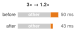
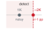
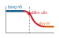
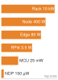

# Benchmarking {#sec-benchmarking}

::: {layout-narrow}
::: {.column-margin}

\chapterminitoc

:::

::: {.content-visible when-format="pdf"}
\noindent
{fig-alt="Sơ đồ phối cảnh của bộ thử nghiệm benchmarking cho thấy một khối lượng công việc (workload) đi qua các phạm vi đo lường lồng nhau, với khoảng cách dễ thấy giữa năng lực đỉnh và hiệu năng duy trì."}
:::

::: {.content-visible unless-format="pdf"}
{fig-alt="Sơ đồ phối cảnh của bộ thử nghiệm benchmarking cho thấy một khối lượng công việc (workload) đi qua các phạm vi đo lường lồng nhau, với khoảng cách dễ thấy giữa năng lực đỉnh và hiệu năng duy trì."}
:::

:::

## Mục đích {.unnumbered .unlisted}

\begin{marginfigure}
\mlsysstack{75}{15}{25}{30}{35}{45}{10}{15}
\end{marginfigure}

_Làm sao so sánh công bằng các hệ thống ML khi phần cứng, mô hình, dữ liệu và triển khai đều tương tác?_

Benchmarking tập hợp các quyết định đã hình thành từ việc chọn dữ liệu, nén mô hình và dùng bộ tăng tốc, rồi kiểm tra xem những lợi ích đó có giữ được dưới các điều kiện đại diện cho môi trường triển khai hay không. Mỗi quyết định thường nhắm vào một khía cạnh (độ trễ, độ chính xác, thông lượng hoặc năng lượng), trong khi một hệ thống ML lại là kết quả của tất cả các khía cạnh này cùng lúc. Một mô hình đã cắt tỉa có thể chạy nhanh hơn trên một bộ tăng tốc nhưng chậm hơn trên bộ khác. Kích thước batch lớn hơn giúp tăng mức tận dụng bộ tăng tốc nhưng có thể vi phạm thỏa thuận mức dịch vụ (SLA) về độ trễ. Một thiết bị edge có thể quảng bá thông lượng đỉnh, nhưng điều tiết nhiệt (thermal throttling) có thể làm giảm mạnh thông lượng khi chạy các khối lượng công việc (workload) kéo dài. Thách thức không phải là xem một chỉ số cục bộ có tốt hơn hay không, mà là cả hệ thống có thực sự tốt hơn dưới những điều kiện quan trọng trong thực tế hay không. Benchmarking làm cho các phép so sánh trở nên có hệ thống thay vì dựa trên giai thoại. Nó đòi hỏi xác định rõ sẽ đo cái gì (độ chính xác, độ trễ, thông lượng, năng lượng), ở mức độ chi tiết nào (một kernel đơn lẻ, một mô hình đầy đủ, hay một pipeline đầu-cuối), và trong những điều kiện nào (kích thước batch, phân phối đầu vào, trạng thái nhiệt, tải đồng thời). Nếu thiếu cấu trúc này, các nhóm sẽ so sánh những con số vốn không được đo trên cùng điều kiện, và những quyết định có vẻ hợp lý trên bảng tính sẽ sụp đổ trước khối lượng công việc (workload) sản xuất. Các chương trước đã tối ưu hóa mô hình, chọn dữ liệu và ghép phần cứng phù hợp. Benchmarking xác thực các tối ưu hóa đó, đối chiếu tuyên bố với bằng chứng và định lượng khoảng cách giữa lời hứa và kết quả. Theo D·A·M, benchmarking kiểm chứng tính đồng thiết kế bằng cách cho thấy liệu Dữ liệu, Thuật toán và Máy có được ghép đúng cách hay chỉ đơn giản là lắp lại với nhau.

::: {.content-visible when-format="pdf"}

\newpage

:::

::: {.callout-learning-objectives}

- Giải thích benchmarking như một bước xác thực D·A·M, dùng để kiểm tra xem các tuyên bố tối ưu hóa có đúng trong các điều kiện đại diện hay không.
- So sánh các benchmark huấn luyện và suy luận theo thông lượng, các phân vị độ trễ, năng lượng, độ chính xác và phạm vi khối lượng công việc (workload).
- Chọn mức độ chi tiết vi mô, vĩ mô hoặc từ đầu đến cuối dựa trên quyết định kỹ thuật đang được kiểm tra.
- Áp dụng các quy tắc chạy benchmark đã tiêu chuẩn hóa để thống nhất tập dữ liệu, chỉ số, cấu hình phần cứng và cách thức báo cáo.
- Thiết kế các giao thức benchmark kiểm soát giới hạn công suất, phân phối đầu vào, kích thước batch và phương sai thống kê.
- Đánh giá chất lượng mô hình và dữ liệu bằng các chỉ số hiệu chuẩn, độ bền vững, tính đại diện và các chỉ số theo lát cắt.
- Chẩn đoán khoảng cách giữa benchmark và sản xuất do trôi, giới hạn nhiệt, tải động và suy giảm thầm lặng.

:::

## Framework benchmarking cho machine learning {#sec-benchmarking-machine-learning-benchmarking-framework-70b8}

Một mô hình được lượng tử hóa thành INT8 có thể benchmark nhanh hơn 2$\times$ trên một khối lượng công việc (workload) tổng hợp, nhưng lại không cải thiện khi chạy dưới các mẫu lưu lượng thực tế với kích thước đầu vào biến thiên và yêu cầu đồng thời. Một mô hình đã được cắt tỉa có thể giữ được độ chính xác trên tập kiểm tra nhưng lại thất bại ở các trường hợp biên mà benchmark không hề bao quát. Việc chọn dữ liệu hứa hẹn huấn luyện hiệu quả hơn, nén mô hình hứa hẹn mô hình nhỏ gọn và nhanh hơn, còn tăng tốc phần cứng hứa hẹn thông lượng cao hơn. Xác thực những tuyên bố này có đúng trong môi trường sản xuất hay không, tự thân đã là một lĩnh vực kỹ thuật.

```{python}
#| echo: false

from mlsysim import *
from mlsysim.core.units import *
from mlsysim import Hardware, Engine, Models
from mlsysim.solvers import EfficiencyModel
from mlsysim.core.units import TFLOP, second
from mlsysim.fmt import fmt_flop_rate, fmt_percent, fmt_time, fmt_multiple, fmt_multiple_range, check

class A100PeakBenchmark:
    # ┌── 1. LOAD (Constants) ───────────────────────────────────────────────
    h = Hardware.Cloud.A100
    m = Models.Language.GPT3

    # ┌── 2. EXECUTE (The Compute) ─────────────────────────────────────────
    _peak_flops = h.compute.peak_flops

    # Calculate typical baseline MFU (without FlashAttention)
    eff_base = EfficiencyModel().solve(m, h, workload_type="attention", use_flash_attention=False, precision="fp16")

    # Calculate optimally tuned MFU (e.g. 50% MFU upper bound from literature)
    eff_tuned = EfficiencyModel().solve(m, h, workload_type="ffn", use_flash_attention=False, precision="fp16", efficiency=0.5)

    # Sustained-to-peak gap = peak / sustained = 1 / MFU
    gap_low = 1 / eff_tuned.mfu  # 50% MFU ceiling -> 2.0x
    gap_high = 1 / eff_base.mfu  # 30% MFU floor -> 3.3x

    # ┌── 3. GUARD (Invariants) ───────────────────────────────────────────
    check(eff_base.mfu == 0.3, "Base attention should be 30% MFU.")
    check(eff_tuned.mfu == 0.5, "FFN should be 50% MFU.")

    # ┌── 4. OUTPUT (Formatting) ─────────────────────────────────────────────
    a100_fp16_tflop_per_s_str = fmt_flop_rate(_peak_flops, unit=TFLOP / second, precision=0, commas=False)
    mfu_base_pct_str = fmt_percent(eff_base.mfu, precision=0, commas=False, style="prose")
    mfu_tuned_pct_str = fmt_percent(eff_tuned.mfu, precision=0, commas=False, style="prose")
    achievable_base_tflop_str = fmt_flop_rate(eff_base.achievable_flops, unit=TFLOP / second, precision=1, commas=False)
    achievable_tuned_tflop_str = fmt_flop_rate(eff_tuned.achievable_flops, unit=TFLOP / second, precision=0, commas=False)
    sustained_gap_range_mult_str = fmt_multiple_range(gap_low, gap_high, precision=(0, 1))
```

::: {#dfn-benchmarking-machine-learning-benchmarking .callout-definition title="Benchmarking machine learning"}

***Benchmarking machine learning***\index{Benchmarking!definition} là phép đo thực nghiệm các khối lượng công việc (workload) machine learning dưới các điều kiện được chỉ định, dùng để kiểm thử các tuyên bố về thành phần, mô hình hoặc hệ thống từ đầu đến cuối bằng bằng chứng mang tính đại diện thay vì chỉ dựa vào các thông số đỉnh.

1.  **Ý nghĩa**: Khoảng cách giữa hiệu suất đỉnh và hiệu suất duy trì có thể rất lớn. Một GPU A100 cung cấp `{python} A100PeakBenchmark.a100_fp16_tflop_per_s_str` (BF16) ở mức đỉnh, nhưng trong kịch bản MFU minh họa `{python} A100PeakBenchmark.mfu_base_pct_str`--`{python} A100PeakBenchmark.mfu_tuned_pct_str` này, nó chỉ duy trì `{python} A100PeakBenchmark.achievable_base_tflop_str`--`{python} A100PeakBenchmark.achievable_tuned_tflop_str`, tức chênh khoảng `{python} A100PeakBenchmark.sustained_gap_range_mult_str` do các yếu tố như nghẽn bộ nhớ, bong bóng trong pipeline và chi phí khởi chạy kernel. Benchmarking định lượng khoảng cách $\eta_{\text{hw}}$ thực tế cho một khối lượng công việc (workload); các bảng thông số của nhà cung cấp thì không.
2.  **Điểm cần phân biệt**: Benchmark trong học máy (ML) có nhiều cấp độ. *Micro-benchmark* tách riêng các thao tác như nhân ma trận; *benchmark cấp mô hình* đánh giá toàn bộ khối lượng công việc (workload) khi huấn luyện hoặc suy luận; còn *benchmark end-to-end* (từ đầu đến cuối) bao gồm cả phần việc xung quanh như tải dữ liệu, tiền xử lý, tối ưu hóa, I/O checkpoint hoặc hạ tầng phục vụ (serving). Phạm vi của benchmark phải khớp với tuyên bố kỹ thuật.
3.  **Cạm bẫy thường gặp**: Một hiểu lầm phổ biến là nghĩ rằng các con số benchmark là tham chiếu ổn định. Cả khối lượng công việc (workload) (với các kiến trúc mô hình mới) và phần cứng (với các thế hệ GPU mới) đều liên tục thay đổi, nên một kết quả từng dẫn đầu một benchmark ở phiên bản này thường trở thành đường cơ sở (baseline) ở phiên bản sau. Vì vậy, so sánh qua các năm chỉ có ý nghĩa khi giữ nguyên phiên bản benchmark.

:::

Benchmarking là nơi các định luật vật lý đã được trình bày ở các chương trước đối mặt với thực nghiệm. **Khoảng cách giữa benchmark và sản xuất**\index{Benchmark-production gap} đo lường chênh lệch giữa kỳ vọng theo mô hình và hành vi quan sát được trong môi trường sản xuất. Thu hẹp khoảng cách đó đòi hỏi các phép đo biến những tuyên bố lý thuyết thành tri thức kỹ thuật đã được kiểm chứng.

Benchmarking trong ML vận hành trên ba chiều phụ thuộc lẫn nhau, ánh xạ trực tiếp tới các thành phần của bất kỳ hệ thống được triển khai nào. **Benchmark hệ thống**\index{Benchmarking!system, definition} đo xem phần cứng có đạt hiệu suất như đã hứa hẹn dưới các khối lượng công việc (workload) thực tế hay không, hay các hiện tượng bão hòa băng thông bộ nhớ và chi phí điều phối phần mềm làm bào mòn các lợi ích đó. **Benchmark mô hình**\index{Model benchmarking!definition} đo xem các kỹ thuật tối ưu hóa có giữ được chất lượng mô hình trên toàn bộ phân phối đầu vào hay không, chứ không chỉ trên các tập kiểm thử được tuyển chọn. **Benchmark dữ liệu**\index{Data benchmarking!definition} đo xem mô hình có tổng quát hóa được sang dữ liệu thực tế, với mọi nhiễu, độ chệch (bias) và dịch chuyển phân phối hay không. Mỗi chiều có thể độc lập phát hiện những vấn đề mà các chiều khác không thấy, và một hệ thống vượt qua cả ba chiều sẽ mang lại độ tin cậy khi triển khai cao hơn nhiều so với hệ thống chỉ được đánh giá theo một trục duy nhất.

Một benchmark ML ghi lại một ảnh chụp nhanh về khối lượng công việc (workload) và phân phối dữ liệu, chứ không phải một đặc tả vĩnh viễn. Khoảng cách giữa hiệu suất đỉnh và hiệu suất duy trì cũng không cố định; nó thay đổi theo sự tiến hóa của khối lượng công việc (workload) và các thế hệ phần cứng, khiến mọi kết quả benchmark đơn lẻ đều gắn mốc thời gian chứ không mang tính phổ quát.

::: {#psp-benchmarking-benchmarks-as-moving-targets .callout-perspective title="Benchmark như những mục tiêu di động"}

Trong các hệ thống truyền thống (ví dụ: SPEC CPU), benchmark là một *đặc tả cứng nhắc*. Một thuật toán sắp xếp được coi là đúng nếu nó sắp xếp được danh sách. Tính đúng đắn là tuyệt đối và không thay đổi. Trong các hệ thống ML, benchmark là một *đặc tả mềm*: tính đúng đắn được định nghĩa bởi một tập hữu hạn các ví dụ (ImageNet), còn thế giới thì luôn vận động. Một mô hình đạt điểm cao trên ImageNet vẫn có thể hoạt động kém trên ảnh người dùng được chụp nhiều năm sau khi benchmark đó được tạo.

Trong kiến trúc máy tính, các kỹ sư thiết kế theo benchmark vì benchmark đại diện cho khối lượng công việc (workload). Trong kỹ thuật ML, thiết kế chỉ để đạt benchmark là *overfitting*. Tính vững chắc đến từ việc thừa nhận rằng benchmark chỉ là đại diện cho một thực tế luôn dịch chuyển.

:::

Xác thực triển khai MobileNetV2\index{MobileNetV2!deployment validation example} làm cụ thể framework ba chiều. Nó là ví dụ xuyên suốt của chương vì bao trùm cả ba chiều đánh giá, cho thấy mỗi chiều phơi bày những vấn đề mà các chiều khác không thể.

```{python}
#| echo: false
# ┌── LEGO ───────────────────────────────────────────────
# │ Context: MobileNetV2 deployment validation lighthouse callout.
# │ Goal: INT8 compression ratio and EdgeTPU vs CPU latency for the pipeline.
from mlsysim import Models
from mlsysim.core.units import BYTES_FP32, BYTES_INT8, MB
from mlsysim.fmt import fmt, fmt_memory, check

class MobileNetLighthouseSetup:
    _mobilenet_v2 = Models.Vision.MobileNetV2
    _edgetpu_latency_ms = 2
    _cpu_latency_ms = 15
    _mv2_size = _mobilenet_v2.size_in_bytes(BYTES_FP32)
    _mv2_int8_size = _mobilenet_v2.size_in_bytes(BYTES_INT8)
    _mv2_compress = (_mv2_size / _mv2_int8_size).to_base_units().magnitude

    check(_mv2_compress == 4.0, f"Expected 4x INT8 compression, got {_mv2_compress:.1f}x")

    # ┌── 4. OUTPUT (Formatting) ─────────────────────────────────────────────
    mobilenet_v2_size_mb_str = fmt_memory(_mv2_size, unit=MB, commas=False)
    mobilenet_v2_int8_size_mb_str = fmt_memory(_mv2_int8_size, unit=MB, precision=1, commas=False)
    mobilenet_v2_compression_ratio_mult_str = fmt_multiple(_mv2_compress, precision=0, commas=False)
    edgetpu_latency_ms_str = fmt_time(_edgetpu_latency_ms, 'millisecond', precision=0, commas=False)
    cpu_latency_ms_str = fmt_time(_cpu_latency_ms, 'millisecond', precision=0, commas=False)
```

::: {#lhs-benchmarking-mobilenet-deployment-validation .callout-lighthouse title="Xác thực triển khai MobileNetV2"}

MobileNetV2 (được giới thiệu trong @sec-network-architectures-lighthouse-roster-model-biographies-a763) là ví dụ chuẩn để kiểm chứng toàn bộ pipeline tối ưu hoá. MobileNetV2 tinh chỉnh thiết kế tách chập theo chiều sâu của v1 với các khối dư ngược (inverted residuals) và các nút cổ chai tuyến tính (linear bottlenecks), đồng thời giữ quy mô tham số tương tự [@sandler2018]. Nó minh hoạ thách thức khi triển khai, nơi benchmark quyết định thành bại: nén có thể giảm kích thước mô hình, tăng tốc phần cứng có thể giảm độ trễ suy luận, và chỉ benchmark mới xác định liệu những lợi ích đó có thực sự giữ được qua toàn bộ pipeline triển khai hay không.

1. **Nén mô hình** (@sec-model-compression): Lượng tử hoá INT8\index{Quantization!INT8 compression ratio} giúp giảm kích thước của ví dụ MobileNetV2 này từ `{python} MobileNetLighthouseSetup.mobilenet_v2_size_mb_str` xuống `{python} MobileNetLighthouseSetup.mobilenet_v2_int8_size_mb_str` (tỷ lệ nén `{python} MobileNetLighthouseSetup.mobilenet_v2_compression_ratio_mult_str`).
2. **Tăng tốc phần cứng** (@sec-hardware-acceleration): kịch bản EdgeTPU minh hoạ\index{Edge TPU!inference latency} cho thấy độ trễ suy luận là `{python} MobileNetLighthouseSetup.edgetpu_latency_ms_str` khi dùng EdgeTPU, so với `{python} MobileNetLighthouseSetup.cpu_latency_ms_str` khi dùng CPU.
3. Xác thực bằng benchmark: Kiểm chứng pipeline có thực sự đáp ứng trong thực tế

Các phần tiếp theo sẽ lần lượt đi vào từng khía cạnh của quá trình xác thực này, xây dựng một phương pháp có hệ thống để: tách biệt độ trễ của EdgeTPU khỏi chi phí tiền xử lý và truyền dữ liệu; xác nhận rằng lượng tử hoá INT8 vẫn giữ được độ chính xác ở các trường hợp đặc biệt như điều kiện ánh sáng bất thường; và kiểm tra xem hiệu năng có giữ vững trên ảnh chụp thực tế từ điện thoại thông minh, thay vì chỉ trên ảnh thử nghiệm của ImageNet.

:::

Đánh giá nghiêm ngặt bắt đầu từ tư duy biết tách bạch bằng chứng có ý nghĩa khỏi những chỉ số dễ gây hiểu lầm. Ba nguyên tắc sau đây phân biệt những người thực hành hiệu quả.

Thứ nhất, *benchmark chỉ là đại diện, không phải sự thật.*\index{Benchmarking!benchmarks as proxies} Mỗi benchmark đo những điều kiện cụ thể có thể không trùng với môi trường triển khai mục tiêu. Một hệ thống có thể đạt thông lượng mẫu cao ở chế độ Offline (xử lý lô khi có sẵn mọi đầu vào) nhưng lại có số lượng truy vấn mỗi giây (QPS) thấp hơn nhiều ở chế độ Server (các yêu cầu bị ràng buộc bởi độ trễ và đến dần theo thời gian). Câu hỏi quan trọng luôn là: benchmark này không đo lường điều gì?

Thứ hai, Định luật Goodhart áp dụng ở mọi nơi.[^fn-goodharts-law-metric]\index{Goodhart's law!metric trap} "Khi một thước đo trở thành mục tiêu, nó không còn là một thước đo tốt nữa." Các nhóm tối ưu hóa để đạt thứ hạng cao trong benchmark thường tạo ra các hệ thống xuất sắc trong đánh giá nhưng lại thất bại khi đưa vào sản xuất. Các tối ưu hóa dành riêng cho benchmark thường làm suy giảm những đặc tính quan trọng khi triển khai: độ vững, hiệu chuẩn và hiệu quả.

```{python}
#| echo: false
#| label: component-latency-example-calc
# ┌── LEGO ───────────────────────────────────────────────
# │ Context: End-to-end-beats-component prose paragraph immediately below.
# │ Goal: Component-only vs end-to-end speedup under pipeline overhead.
from mlsysim.fmt import fmt, fmt_qty, check
from mlsysim.physics import calc_amdahls_speedup

class ComponentLatencyExample:
    """A component-only speedup diluted by non-model pipeline work."""

    # ┌── 1. LOAD (Constants) ──────────────────────────────────────────────
    model_latency_ms = 10
    e2e_latency_ms = 50
    component_speedup = 3

    # ┌── 2. EXECUTE (The Compute) ────────────────────────────────────────
    model_fraction = model_latency_ms / e2e_latency_ms
    e2e_speedup = calc_amdahls_speedup(model_fraction, component_speedup)
    optimized_e2e_ms = e2e_latency_ms / e2e_speedup

    # ┌── 3. GUARD (Invariants) ───────────────────────────────────────────
    check(e2e_speedup < component_speedup, "End-to-end speedup must be bounded by non-model work.")
    check(round(e2e_speedup, 1) == 1.2, f"Expected about 1.2x end-to-end speedup, got {e2e_speedup:.1f}x")

    # ┌── 4. OUTPUT (Formatting) ─────────────────────────────────────────────
    model_latency_ms_str = fmt_time(model_latency_ms, 'millisecond', precision=0, commas=False)
    e2e_latency_ms_str = fmt_time(e2e_latency_ms, 'millisecond', precision=0, commas=False)
    component_speedup_mult_str = fmt_multiple(component_speedup, precision=0, commas=False)
    e2e_speedup_mult_str = fmt_multiple(e2e_speedup, precision=1, commas=False)
```

Thứ ba, đo lường end-to-end quan trọng hơn các chỉ số thành phần\index{Benchmarking!end-to-end vs. component metrics}. Trong pipeline minh họa này, dù tăng tốc suy luận lên `{python} ComponentLatencyExample.component_speedup_mult_str` cho một giai đoạn mô hình có độ trễ `{python} ComponentLatencyExample.model_latency_ms_str` bên trong một yêu cầu có tổng độ trễ `{python} ComponentLatencyExample.e2e_latency_ms_str`, thì cải thiện end-to-end chỉ khoảng `{python} ComponentLatencyExample.e2e_speedup_mult_str`, hoặc còn tệ hơn nếu việc tối ưu làm tăng áp lực bộ nhớ. Những nguyên tắc này sẽ xuất hiện xuyên suốt phương pháp benchmark và được phân tích sâu hơn trong @sec-benchmarking-fallacies-pitfalls-9781.

::: {.column-margin}
{width="100%" fig-alt="Hai thanh độ trễ xếp chồng so sánh trước và sau khi tăng tốc giai đoạn mô hình lên 3 lần: phần mô hình thu nhỏ lại, nhưng phần việc khác trong pipeline vẫn giữ nguyên, nên tổng 50 mili giây chỉ giảm còn khoảng 43 mili giây."}

*Tăng tốc thành phần hiếm khi chuyển thành tăng tốc benchmark end-to-end.*
:::

[^fn-goodharts-law-metric]: **Định luật Goodhart**\index{Goodhart's law!etymology}: @goodhart1984 đã nêu quan sát ban đầu năm 1975 của Ngân hàng Anh về chính sách tiền tệ; @strathern1997improving đã khái quát hóa thành dạng trích dẫn ở trên. Bối cảnh ban đầu là kinh tế vĩ mô: khi một chỉ tiêu tiền tệ tổng hợp trở thành mục tiêu chính sách chính thức, các ngân hàng thay đổi hành vi để “chơi” số liệu, khiến nó mất giá trị dự báo. Trong ML, cùng kiểu trục trặc này tái diễn mang tính cấu trúc: BLEU thưởng sự trùng lặp n-gram [@papineni2001], ImageNet thưởng hiệu suất trên một phân phối hình ảnh cố định [@deng2009; @recht2019imagenet], và bảng xếp hạng benchmark có thể khuyến khích việc tinh chỉnh riêng cho tập kiểm tra.

Tuy nhiên, biết *cái gì* cần đo chỉ là một nửa vấn đề. Đo lường sai (dùng khối lượng công việc (workload) không phù hợp, đường cơ sở có độ chệch (bias), hoặc các biến không được kiểm soát) cho ra những con số trông có vẻ chính xác nhưng lại dẫn đến quyết định sai. Lịch sử benchmark trong lĩnh vực tính toán đầy rẫy ví dụ về các chỉ số kỹ thuật hợp lý nhưng được áp dụng với phương pháp sai, từ điểm Whetstone bị trình biên dịch “lái” cho đến các benchmark GPU được chọn lọc khéo léo mà không dự báo được gì về khối lượng công việc (workload) chạy lâu dài. Hiểu quá trình tiến hóa của phương pháp đo lường, và những chỗ nó từng thất bại, là điều thiết yếu để thiết kế các benchmark có thể phân biệt cải tiến thực sự với những hiện tượng do cách đo lường gây ra.

Các nền tảng lịch sử của benchmark[^fn-benchmark-etymology-surveying] quan trọng vì chúng phơi bày những thất bại trong xác thực vẫn lặp lại trong ML: các chỉ số được tối ưu hóa nhưng không còn dự báo được khối lượng công việc (workload) thực tế, các con số về phần cứng bỏ qua trạng thái vận hành kéo dài, và điểm số của mô hình (model) không tính đến chi phí triển khai (deployment). Cùng một chuỗi xác thực này chi phối thực tiễn hiện đại: trước hết xác minh phần cứng có đạt hiệu suất như cam kết hay không; sau đó xác minh các tối ưu hóa mô hình (model) và dữ liệu xây trên phần cứng đó có thực sự mang lại lợi ích như đã hứa.

[^fn-benchmark-etymology-surveying]: **Benchmark**\index{Benchmark!etymology}: Xuất phát từ ngành khảo sát, nơi "bench mark" là một vết cắt ngang trên đá dùng làm mốc tham chiếu cao độ cố định. Đến thập niên 1970, thuật ngữ này đi vào lĩnh vực điện toán để chỉ các điểm so sánh được tiêu chuẩn hóa. Ẩn dụ từ ngành khảo sát cũng gợi một bài học cho hệ thống: cũng như phép đo cao độ vô nghĩa nếu thiếu mốc tham chiếu đã hiệu chuẩn, một con số thông lượng của ML cũng vô nghĩa nếu thiếu khối lượng công việc (workload) được kiểm soát, trạng thái nhiệt và cài đặt độ chính xác.

## Cơ sở lịch sử {#sec-benchmarking-historical-context-7350}

Năm 1976, khi Whetstone trở thành một trong những benchmark tiêu chuẩn hóa đầu tiên trong điện toán\index{Benchmarking!historical evolution}, các nhà cung cấp bắt đầu tối ưu hóa trình biên dịch của họ chuyên cho các bài kiểm tra dấu phẩy động của benchmark này, tạo ra những con số ấn tượng nhưng lại không dự đoán tin cậy hiệu suất ứng dụng thực tế. Những cách "lách" tương tự cũng ảnh hưởng đến các thế hệ benchmark sau này. Để hiểu *tại sao* việc benchmark ML cần một cách tiếp cận ba chiều, chúng ta phải lần theo *cách* các phương pháp đo lường đã phát triển — và không ít lần thất bại — qua nhiều thập kỷ lịch sử điện toán. Mỗi thế hệ benchmark ra đời từ những hạn chế của thế hệ trước, mang đến những bài học trực tiếp định hình cách đánh giá ML hiện đại.

Trước khi đi vào lịch sử đó, có một điều kiện biên quan trọng: một benchmark chỉ hữu ích khi nó nêu rõ lớp (layer) nào của hệ thống mà nó đang xác nhận.

::: {#psp-benchmarking-related-efficiency-metrics .callout-perspective title="Benchmark như bằng chứng xuyên các lớp"}

Một benchmark ML chỉ có ý nghĩa khi nó xác định rõ lớp (layer) nào của hệ thống đang được đánh giá. Các số liệu lựa chọn dữ liệu như PPD, diện tích dưới đường cong học (AULC) và tỷ lệ nén dữ liệu (DCR), tất cả được phát triển trong @sec-data-selection, đo xem liệu dùng ít ví dụ hơn có giữ được tín hiệu học hay không. Các số liệu nén (@sec-model-compression) đo xem liệu giảm số tham số hoặc giảm độ chính xác có giữ được chất lượng hay không. Các số liệu phần cứng như vị trí roofline và TOPS/W (@sec-hardware-acceleration) đo xem liệu máy có thực thi khối lượng công việc (workload) một cách hiệu quả hay không. Các benchmark hệ thống trong @sec-benchmarking-system-benchmarks-393c đến @sec-benchmarking-mlperf-power-case-study-a554 kết nối các lớp này bằng cách kiểm tra xem các cải tiến cục bộ có còn giữ được hiệu quả trong một khối lượng công việc (workload) đầu-cuối hay không.

:::

Chính vai trò xuyên lớp (cross-layer) đó giải thích vì sao lịch sử benchmark lại quan trọng: mỗi thế hệ đo lường hiệu năng chỉ tiến lên khi người làm thực tiễn nhận ra phương pháp trước đó không dự đoán đúng hành vi trong thế giới thực. Quá trình chuyển từ các chỉ số hiệu năng đơn giản sang benchmark cho ML cho thấy ba thay đổi lớn về phương pháp.

### Các benchmark hiệu suất {#sec-benchmarking-performance-benchmarks-ea8a}

Các benchmark máy tính thời kỳ đầu đã bộc lộ một vấn đề vẫn ám ảnh việc đánh giá cho đến hôm nay: *thao túng benchmark*\index{Benchmark gaming!vendor optimization for tests}. Chẳng hạn, Whetstone\index{Whetstone!synthetic floating-point benchmark} [@curnow1976whetstone] dùng một hỗn hợp thao tác tổng hợp của chương trình khoa học, còn LINPACK\index{LINPACK!matrix operations benchmark}[^fn-whetstone-linpack-history] [@dongarra1979linpack] đo khả năng giải các hệ tuyến tính dày đặc. Các nhà cung cấp có thể tối ưu riêng cho những bài kiểm tra cố định này thay vì cho các khối lượng công việc (workload) rộng hơn. SPEC CPU\index{SPEC CPU!real application workloads} (1989) đã mở rộng đánh giá thông qua một bộ chương trình định hướng ứng dụng, có thể chạy trên nhiều hệ [@dixit1993spec]. Bài học này trực tiếp định hình ML benchmarking: các tuyên bố tối ưu hóa từ @sec-model-compression cần được kiểm chứng trên các tác vụ đại diện, và việc MLPerf đưa vào các mô hình như ResNet-50 và BERT giúp bao quát nhiều phần hơn của ngăn xếp triển khai (deployment) so với chỉ kiểm tra một kernel riêng lẻ.

[^fn-whetstone-linpack-history]: **Whetstone và LINPACK**\index{Whetstone!etymology}\index{LINPACK!narrow benchmark}: Whetstone [@curnow1976whetstone] được đặt tên theo cơ sở English Electric ở Whetstone, Leicestershire, nơi trình biên dịch ALGOL gốc được xây dựng; còn LINPACK [@dongarra1979linpack] là một gói và benchmark cho các hệ tuyến tính dày đặc, sau này được danh sách Top500 sử dụng. Việc Whetstone dùng một chương trình tổng hợp cố định và LINPACK tập trung vào đại số tuyến tính dày đặc khiến chúng hữu ích nhưng hẹp hơn so với một bộ ứng dụng đa dạng. ML benchmarking thừa hưởng cùng một điểm yếu: tinh chỉnh kernel theo từng mô hình có thể khiến *quá khớp* (overfit) với một khối lượng công việc (workload) duy nhất, và đó là lý do MLPerf dùng nhiều khối lượng công việc (workload) trải rộng các lĩnh vực như thị giác, ngôn ngữ và hệ thống gợi ý [@mattson2020mlperf; @reddi2020].

Khi các ngữ cảnh triển khai trở nên đa dạng hơn, một hạn chế thứ hai xuất hiện: đánh giá chỉ bằng một chỉ số duy nhất không còn đủ. Các benchmark đồ họa bắt đầu đo cả chất lượng kết xuất lẫn tốc độ khung hình; các benchmark di động bổ sung thời lượng pin như một yếu tố quan trọng ngang với hiệu suất. Những thách thức đa mục tiêu từ @sec-introduction (cân bằng độ chính xác, độ trễ và năng lượng) thể hiện trực tiếp trong đánh giá machine learning, nơi không có chỉ số đơn lẻ nào mô tả đầy đủ tính khả thi khi triển khai.

Sự thay đổi thứ ba xuất hiện khi điện toán phân tán\index{Distributed computing!system-level performance} cho thấy tối ưu hóa ở cấp thành phần không thể dự đoán hiệu năng ở cấp hệ thống. Một benchmark CPU không thể dự đoán thông lượng của cụm khi truyền thông mạng chi phối. Việc huấn luyện machine learning cũng tương tự, phụ thuộc vào sự tương tác giữa tính toán trên bộ tăng tốc (@sec-hardware-acceleration), các pipeline dữ liệu, đồng bộ hóa gradient và thông lượng lưu trữ. MLPerf đánh giá toàn bộ workflow, nhận thấy rằng hiệu suất xuất phát từ sự tương tác giữa các thành phần, chứ không phải từ từng thành phần tách rời.

DAWNBench\index{DAWNBench!time-to-accuracy evaluation} [@coleman2019] là một benchmark machine learning đời đầu, tiên phong trong đánh giá thời gian đạt độ chính xác, ảnh hưởng trực tiếp tới phương pháp của MLPerf trong đo lường hiệu quả huấn luyện. Những bài học này hội tụ trong MLPerf\index{MLPerf!founding and purpose}[^fn-mlperf-benchmark-suite] (2018), nơi tổng hợp các khối lượng công việc (workload) đại diện, đánh giá đa mục tiêu và phép đo tích hợp, đồng thời giải quyết các thách thức đặc thù của machine learning [@mattson2020mlperf; @reddi2020].

[^fn-mlperf-benchmark-suite]: **MLPerf**\index{MLPerf!founding}: Được ra mắt vào năm 2018 bởi một liên minh các tổ chức công nghiệp và học thuật, MLPerf lấy tên từ "ML" kết hợp với "Perf" (performance), tiếp nối truyền thống benchmark của SPEC. Các nguyên tắc thiết kế của MLPerf—khối lượng công việc đại diện, đo lường toàn hệ thống và nộp kết quả mở—trực tiếp giải quyết vấn đề "gian lận" (gaming) từng gây khó khăn cho Whetstone và LINPACK: các nhà cung cấp trước đây có thể báo cáo thông lượng kernel cao nhất trên các kích thước bài toán được chọn lọc kỹ lưỡng, giờ đây phải báo cáo hiệu suất hệ thống đầu cuối trên các tác vụ tiêu chuẩn hóa [@mattson2020mlperf; @reddi2020].

### Các benchmark năng lượng {#sec-benchmarking-energy-benchmarks-709a}

Mô hình đánh giá đa mục tiêu tự nhiên mở rộng sang hiệu quả năng lượng\index{Benchmarking!energy, first-class metric} khi điện toán đa dạng hóa vượt ra ngoài các máy tính lớn (mainframe), nơi ngân sách công suất ít bị ràng buộc. Thiết bị di động đòi hỏi tối ưu hóa thời lượng pin, còn các hệ thống ở quy mô trung tâm dữ liệu (warehouse-scale systems) phải đối mặt với chi phí năng lượng ngang với chi phí phần cứng. Sự dịch chuyển này đã đưa năng lượng trở thành một chỉ số hàng đầu bên cạnh hiệu suất, và sinh ra các benchmark như SPEC Power\index{SPEC Power!server energy efficiency}[^fn-spec-power-benchmark] cho máy chủ và Green500\index{Green500!HPC energy efficiency ranking}[^fn-green500-energy-efficiency] cho siêu máy tính.

[^fn-spec-power-benchmark]: **SPEC Power**\index{SPEC Power!energy efficiency}: Được giới thiệu vào năm 2007, SPEC Power đo hiệu suất trên mỗi watt ở 11 mức tải, từ không tải (0 phần trăm) đến 100 phần trăm, với các bước tăng 10 phần trăm [@lange2009]. Độ chi tiết này rất quan trọng đối với bài toán phục vụ (serving) machine learning: các khối lượng công việc (workload) suy luận hiếm khi duy trì tải 100 phần trăm. Những máy chủ hiệu quả ở tải đỉnh nhưng lãng phí khi tải một phần sẽ làm tăng chi phí năng lượng trong triển khai thực tế.

[^fn-green500-energy-efficiency]: **Green500**\index{Green500!energy efficiency ranking}: Bắt đầu vào năm 2007 như một đối trọng với Top500, Green500 xếp hạng các hệ thống dựa trên FLOP/s trên mỗi watt thay vì hiệu suất thô [@feng2007green500]. Bài học mang tính phương pháp luận cho các hệ thống machine learning là: cụm huấn luyện hiệu quả chi phí nhất không nhất thiết là cụm nhanh nhất, mà là hệ thống cung cấp công việc hữu ích trên mỗi watt, dưới khối lượng công việc (workload) và phạm vi đo lường có ý nghĩa.

Các mẫu khối lượng công việc (workload) đa dạng và cấu hình hệ thống khác nhau tiếp tục thách thức việc benchmark công suất trên nhiều môi trường điện toán. MLPerf Power\index{MLPerf!power, ML energy measurement} [@mlperf_power_website] giải quyết điều này bằng các phương pháp chuyên biệt để đo lường tác động năng lượng của các khối lượng công việc (workload) machine learning, phản ánh vai trò trung tâm của hiệu quả năng lượng trong thiết kế hệ thống AI.

Việc *benchmark* năng lượng không chỉ đo công suất phần cứng mà còn đánh giá hiệu quả thuật toán. Các kỹ thuật nén mô hình như tỉa (*pruning*), lượng tử hoá và chưng cất tri thức có thể giảm năng lượng tiêu thụ bằng cách thay đổi chính công việc mà hệ thống thực hiện, không chỉ bằng cách thay đổi phần cứng thực thi. Các kiến trúc họ MobileNet dùng tích chập tách sâu để cắt giảm lượng tính toán so với các mạng nơ-ron tích chập (CNN) nặng hơn như ResNet [@howard2017mobilenets; @sandler2018; @he2016]. Những kỹ thuật này, được trình bày chi tiết trong @sec-model-compression, khẳng định rằng *benchmark* hướng tới năng lượng phải đánh giá hiệu quả thuật toán song song với mức tiêu thụ công suất phần hardware; @sec-model-compression-energy-costs-d1d5 định lượng cụ thể phân bổ năng lượng giữa INT8 và FP32. Khi các hệ thống AI mở rộng, bài học này trở thành trọng tâm của thực hành điện toán bền vững.

### Các *benchmark* chuyên biệt theo từng lĩnh vực {#sec-benchmarking-domainspecific-benchmarks-b15f}

Khi điện toán đa dạng vượt ra ngoài các máy chủ đa năng, những *benchmark* chung trở nên không đủ cho các lĩnh vực chuyên biệt. Ba hướng chuyên biệt hoá đã thúc đẩy sự chuyển dịch này, mỗi hướng bộc lộ các khía cạnh đo lường mà *benchmark* đa năng không thể bao quát.

Các ràng buộc khi *triển khai* định hình ưu tiên cho các chỉ số cốt lõi. Khối lượng công việc (*workload*) trong *trung tâm dữ liệu* tối ưu hoá *thông lượng* trong giới hạn *công suất* ở cấp *rack* và cụm, trong khi AI di động hoạt động trong giới hạn nhiệt nghiêm ngặt của thiết bị, và thiết bị IoT cần vận hành ở mức *milliwatt*. Những ràng buộc này, xuất phát từ các nguyên tắc hiệu quả trong @sec-introduction, quyết định *benchmark* nên ưu tiên tổng *thông lượng* hay năng lượng trên mỗi hoạt động.

Yêu cầu ứng dụng còn áp đặt các ràng buộc về chức năng và quy định, vượt ra ngoài hiệu suất thô. Chẳng hạn, AI trong chăm sóc sức khỏe đòi hỏi các chỉ số về khả năng diễn giải song song với độ chính xác; các hệ thống tài chính có thể yêu cầu *độ trễ* rất thấp kèm tuân thủ kiểm toán; còn phương tiện tự hành cần độ tin cậy quan trọng đối với an toàn và xác thực an toàn chức năng một cách chính thức. Những yêu cầu này mở rộng phạm vi đánh giá vượt ra ngoài các chỉ số hiệu suất truyền thống; sau đó, @sec-responsible-engineering sẽ hệ thống hoá các nguyên tắc kỹ thuật có trách nhiệm phía sau các khía cạnh như công bằng, khả năng diễn giải và tuân thủ.

Các điều kiện vận hành thực tế quyết định tính khả thi trong đời sống. Xe tự hành phải chịu dải nhiệt độ rộng và tín hiệu cảm biến suy giảm; trung tâm dữ liệu phải xử lý lượng lớn yêu cầu đồng thời và cả sự cố mạng; còn hệ thống IoT công nghiệp phải vận hành bền bỉ trong thời gian dài mà không cần bảo trì. Các khả năng phần cứng ở @sec-hardware-acceleration chỉ thực sự mang lại giá trị khi được kiểm chứng dưới những điều kiện này.

machine learning là ví dụ điển hình cho bước chuyển sang đánh giá chuyên biệt theo từng lĩnh vực. Các benchmark CPU và GPU truyền thống là chưa đủ để đánh giá các khối lượng công việc (workload) machine learning, vốn có những tương tác phức tạp giữa tính toán, băng thông bộ nhớ và cách luân chuyển dữ liệu. MLPerf cung cấp phép đo hiệu suất tiêu chuẩn hóa cho các mô hình machine learning theo các danh mục sau: MLPerf Training\index{MLPerf Training!data center multi-node scaling} giải quyết các ràng buộc khi triển khai trong trung tâm dữ liệu, với các benchmark về khả năng mở rộng đa nút [@mattson2020mlperf]; MLPerf Inference\index{MLPerf Inference!server to edge evaluation} đánh giá các yêu cầu ứng dụng nhạy cảm với độ trễ trên các triển khai từ máy chủ đến edge [@reddi2020]; MLPerf Tiny\index{MLPerf Tiny!microcontroller benchmarks} đánh giá các điều kiện vận hành cực kỳ hạn chế cho các triển khai trên vi điều khiển [@banbury2021mlperftiny]; và một hạng mục cắt ngang là MLPerf Power, đo lường hiệu quả năng lượng trong từng chế độ nói trên. Đọc @tbl-mlperf-suites theo cột ràng buộc cho thấy giới hạn ngày càng chặt chẽ khi quy mô triển khai thu hẹp: băng thông kết nối trong trung tâm dữ liệu nhường chỗ cho các thỏa thuận mức dịch vụ (SLA) về độ trễ ở máy chủ và edge, rồi đến yêu cầu vận hành công suất cực thấp với chỉ vài kilobyte bộ nhớ trên vi điều khiển. Vẫn là cùng một framework ba danh mục, nhưng khi áp dụng cho từng quy mô, bộ benchmark này đưa ra các chỉ số bám sát những gì thực sự giới hạn hệ thống ở quy mô đó thay vì một điểm số chung duy nhất.

```{=latex}
\begingroup
\renewcommand{\arraystretch}{1.3}
```

| **MLPerf Variant** | **Target Domain** | **Key Constraints** | **Primary Metrics** |
|:---------------------|:------------------|:-------------------------------------------------|:------------------------------------------------|
| **MLPerf Huấn luyện** | Trung tâm dữ liệu | Multi-node scaling, interconnects băng thông cao | Time-to-quality, thông lượng (samples/sec) |
| **MLPerf Suy luận** | Server/Edge | SLAs độ trễ, requirements thông lượng | QPS, percentiles độ trễ, accuracy preservation |
| **MLPerf Tiny** | MCU/IoT | suy luận Ultra-low-power, memory hạn chế | Độ trễ, accuracy, năng lượng trên mỗi suy luận |
| **MLPerf Công suất** | Cross-cutting | Energy budgets, thermal constraints | Performance/W, năng lượng trên mỗi query |

: **Các biến thể bộ benchmark MLPerf**: Mỗi biến thể được thiết kế cho một ngữ cảnh triển khai khác nhau, từ huấn luyện quy mô trung tâm dữ liệu đến suy luận trên vi điều khiển cực kỳ hạn chế, nhằm vào các ràng buộc vận hành cụ thể và đo lường các chỉ số phù hợp với kịch bản triển khai đó. {#tbl-mlperf-suites tbl-colwidths="[15,14,36,35]"}

```{=latex}
\endgroup
```

MLPerf Power\index{MLPerf Power!energy efficiency measurement} mở rộng cùng nguyên tắc đó sang đánh giá hiệu quả năng lượng. Ở đây, chỉ số benchmark là lượng công việc hữu ích trên mỗi watt, thay vì chỉ nhìn vào thông lượng thô. Các benchmark chuyên biệt theo từng lĩnh vực thúc đẩy tối ưu hóa phần cứng và phần mềm một cách có mục tiêu, đồng thời đảm bảo các cải tiến thực sự chuyển hóa thành thành công khi triển khai, chứ không chỉ hiệu quả trong điều kiện phòng thí nghiệm hạn hẹp.

Quá trình phát triển lịch sử này – từ các benchmark tính toán tổng quát, qua các phép đo chú trọng hiệu năng năng lượng, đến các framework đánh giá chuyên biệt theo từng lĩnh vực – đã tạo nền tảng để hiểu rõ những thách thức trong benchmark ML. Những bài học rút ra (sử dụng khối lượng công việc (workload) đại diện thay vì thử nghiệm tổng hợp; đánh giá đa mục tiêu thay vì chỉ một chỉ số; hệ thống tích hợp thay vì các thành phần riêng lẻ) đã trực tiếp định hình cách chúng ta đánh giá hệ thống AI. @Tbl-benchmark-evolution tóm tắt tiến trình này và những bài học then chốt mà mỗi thế hệ đóng góp.

Những bài học đó kết tinh trong các bộ benchmark ML. Tuy nhiên, hệ thống ML còn bổ sung tính biến thiên thống kê và phụ thuộc dữ liệu\index{Benchmarking!probabilistic variability} bên cạnh các nguồn nhiễu hệ thống vốn có ở các khối lượng công việc (workload) khác. Chúng phải đáp ứng đủ ba bài học lịch sử (khối lượng công việc (workload) đại diện, đánh giá đa mục tiêu, đo lường tích hợp), đồng thời tính đến các kết quả có thể thay đổi theo dữ liệu huấn luyện, cách khởi tạo trọng số và thứ tự thực hiện các phép toán. Mức biến thiên bổ sung này đòi hỏi các biện pháp kiểm soát thống kê tương ứng.

Nhiều tổ chức đã tự mình học những bài học này, thường là qua không ít khó khăn. Nhưng các phép đo đơn lẻ, rời rạc thì không thể dẫn dắt cả ngành. Khi một nhóm đo độ trễ suy luận bao gồm cả tiền xử lý còn nhóm khác lại loại trừ; khi benchmark độ chính xác dùng các cách chia dữ liệu khác nhau; hoặc khi phép đo công suất đặt ranh giới hệ thống không giống nhau, các con số thu được sẽ không thể so sánh. Việc chuyển từ đo đạc tùy tiện sang các bộ benchmark tiêu chuẩn hóa đã biến hoạt động benchmark từ một bài tập xác thực nội bộ thành một ngôn ngữ chung, giúp các tổ chức mua sắm phần cứng, so sánh kiến trúc và ra quyết định triển khai trên quy mô liên tổ chức.

| **Benchmark** | **Năm** | **Primary Focus** | **Key Metric(s)** | **Lesson cho ML Benchmarking** |
|:---------------|:--------:|:------------------------------------|:----------------------------------------|:-----------------------------------------------------------------------------|
| **Whetstone** |   1976   | Synthetic floating-point operations | MWIPS | Gaming synthetic tests làm suy yếu evaluation validity |
| **LINPACK** |   1979   | Linear algebra (matrix operations) | FLOP/s | Isolated operations bỏ lỡ system-level complexity và bottlenecks |
| **SPEC CPU** |   1989   | Khối lượng công việc (workload) ứng dụng thực tế | SPECrate, SPECspeed | Khối lượng công việc (workload) đại diện cho thấy hiệu suất triển khai thực tế |
| **SPEC Công suất** |   2007   | Server energy efficiency | ssj_ops/W trên các load levels | Hiệu quả năng lượng đòi hỏi đánh giá đa tải, không chỉ hiệu suất đỉnh |
| **Green500** |   2007   | Hiệu quả năng lượng HPC | GFLOP/s per watt | Xếp hạng hiệu quả bổ sung cho xếp hạng hiệu suất thô |
| **MLPerf** |   2018   | Hệ thống ML (huấn luyện + suy luận) | Thời gian đạt chất lượng, QPS, độ trễ, độ chính xác | Tổng hợp tất cả các bài học: khối lượng công việc (workload) đại diện + đa mục tiêu + hệ thống |

: **Tiến hóa của Benchmark**: Sự tiến hóa của các benchmark tính toán, từ các phép đo tổng hợp đến các phương pháp đánh giá chuyên biệt cho ML. Mỗi thế hệ đều khắc phục hạn chế của thế hệ trước, và đỉnh cao là MLPerf khi tổng hợp được các khối lượng công việc (workload) đại diện, các chỉ số đa mục tiêu và đo lường hệ thống tích hợp. {#tbl-benchmark-evolution tbl-colwidths="[12,9,23,20,36]"}

## Các bộ benchmark hệ thống {#sec-benchmarking-system-benchmarking-suites-e946}

Một nhóm đang đánh giá phần cứng để triển khai trên edge cần so sánh năm thiết kế hệ thống trên chip (SoC) cho một sản phẩm camera thông minh. Nhà cung cấp A báo cáo 8 TOPS ở INT8; Nhà cung cấp B báo cáo 15 TOPS ở INT4; Nhà cung cấp C báo cáo độ trễ suy luận trên một mô hình độc quyền; Nhà cung cấp D trích dẫn điểm MLPerf từ hai thế hệ trước; còn Nhà cung cấp E chỉ đưa ra thông lượng đỉnh ở kích thước batch tối đa. Các con số này không thể so sánh với nhau. Nhóm không thể ra quyết định mua sắm vì mỗi nhà cung cấp đo một thứ khác, trong các điều kiện khác nhau và với các định nghĩa "hiệu năng" khác nhau. Vấn đề không phải *thiếu dữ liệu* mà là *thiếu dữ liệu có thể so sánh*. Các bộ benchmark tồn tại chính để giải quyết sự phân mảnh này.

Ba bài học từ lịch sử benchmark (các khối lượng công việc (workload) đại diện, đánh giá đa mục tiêu và đo lường tích hợp) gặp gỡ một thách thức riêng của ML: tính biến thiên xác suất vốn có. Các bộ benchmark hiện đại mã hóa những bài học này vào các framework tiêu chuẩn hóa, khiến kiểu so sánh xuyên tổ chức mà nhóm mua sắm phần cứng cần trở nên khả thi.

Các benchmark ML phải đánh giá sự tương tác giữa thuật toán, phần cứng và dữ liệu, chứ không chỉ hiệu quả tính toán. Các benchmark ban đầu tập trung vào hiệu năng thuật toán [@lecun1998], nhưng nhu cầu mở rộng quy mô đã mở rộng trọng tâm sang hiệu quả phần cứng [@jouppi2017], và những thất bại triển khai đình đám đã nâng chất lượng dữ liệu thành chiều đánh giá thứ ba [@gebru2021]. Bản chất xác suất này đưa độ chính xác lên thành một chiều đánh giá hàng đầu bên cạnh tốc độ và mức tiêu thụ năng lượng: cùng một hệ thống ML có thể cho ra các kết quả khác nhau tùy vào dữ liệu nó gặp. Hiệu quả năng lượng là yếu tố xuyên suốt cả ba chiều của framework, vì lựa chọn thuật toán ảnh hưởng đến độ phức tạp tính toán [@hernandez2020measuring], khả năng phần cứng quyết định các đánh đổi năng lượng-hiệu năng, và đặc điểm của tập dữ liệu ảnh hưởng đến chi phí năng lượng khi huấn luyện.

### Những thách thức đo lường trong ML {#sec-benchmarking-ml-measurement-challenges-60ea}

Các hệ thống ML kết hợp nhiều nguồn biến thiên trong phép đo\index{Measurement variability!sources in ML systems} mà nhiều benchmark truyền thống không được thiết kế để đánh giá cùng lúc. Các nguồn này gồm tính ngẫu nhiên ở cấp thuật toán (từ khởi tạo trọng số và xáo trộn dữ liệu), trạng thái nhiệt của phần cứng (ảnh hưởng đến tốc độ xung nhịp), biến thiên tải hệ thống do các tiến trình chạy đồng thời, và các yếu tố môi trường như điều kiện mạng và quản lý công suất. Cần áp dụng các phương pháp thống kê chặt chẽ để phân biệt cải tiến hiệu năng thực sự với nhiễu đo lường.

Để giải quyết sự biến thiên này, các giao thức benchmark hiệu quả cần lặp lại các lần chạy thí nghiệm, với các hạt giống ngẫu nhiên được ấn định theo thiết kế nghiên cứu\index{Random seed!benchmark protocol requirement}. Số lần chạy nên được xác định theo mục tiêu về độ bất định hoặc công suất thống kê. Đồng thời, cần báo cáo các thước đo ngoài trung bình đơn giản (như độ lệch chuẩn hoặc khoảng tin cậy\index{Confidence interval!benchmark reporting}) để định lượng mức ổn định và tách bạch các cải tiến thực sự khỏi nhiễu đo lường.

Các nghiên cứu thực nghiệm đã chỉ ra rằng việc áp dụng thống kê thiếu chặt chẽ có thể dẫn đến các kết luận sai lệch. Các cải tiến trong học tăng cường thường nằm trong phạm vi nhiễu thống kê [@henderson2018], trong khi các so sánh mạng đối kháng tạo sinh (GANs) thường thiếu các giao thức thử nghiệm có kiểm soát, dẫn đến xếp hạng không nhất quán giữa các hạt giống khác nhau [@lucic2018gans]. Những phát hiện này nhấn mạnh tầm quan trọng của việc thiết lập các giao thức đo lường có tính đến bản chất xác suất của ML.

```{python}
#| echo: false
#| label: statistical-confidence-calc
# ┌── LEGO ───────────────────────────────────────────────
# │ Context: The statistical confidence trap callout below.
# │ Goal: Binomial uncertainty for 95% vs 94% on 1,000 images.
from math import sqrt, ceil
from mlsysim.fmt import fmt, fmt_count, fmt_pp, check

class StatisticalConfidenceTrap:
    """Binomial uncertainty for a 95% vs. 94% accuracy comparison on 1,000 images."""

    # ┌── 1. LOAD (Constants) ──────────────────────────────────────────────
    n_images = 1000
    baseline_accuracy = 0.95
    compressed_accuracy = 0.94
    z_95 = 1.96
    target_margin = 0.01

    # ┌── 2. EXECUTE (The Compute) ────────────────────────────────────────
    baseline_error_rate = 1 - baseline_accuracy
    compressed_error_rate = 1 - compressed_accuracy
    baseline_errors = n_images * baseline_error_rate
    compressed_errors = n_images * compressed_error_rate
    sigma_errors = sqrt(n_images * baseline_error_rate * baseline_accuracy)
    accuracy_diff = baseline_accuracy - compressed_accuracy
    se_diff_independent = sqrt(baseline_accuracy * (1 - baseline_accuracy) / n_images + compressed_accuracy * (1 - compressed_accuracy) / n_images)
    diff_ci_low = accuracy_diff - z_95 * se_diff_independent
    diff_ci_high = accuracy_diff + z_95 * se_diff_independent
    one_prop_n = ceil((z_95**2 * baseline_accuracy * (1 - baseline_accuracy)) / (target_margin**2))

    # ┌── 3. GUARD (Invariants) ───────────────────────────────────────────
    check(round(baseline_errors) == 50, f"Expected 50 baseline errors, got {baseline_errors:.1f}")
    check(round(compressed_errors) == 60, f"Expected 60 compressed errors, got {compressed_errors:.1f}")
    check(diff_ci_low < 0 < diff_ci_high, "Independent two-proportion interval should include zero.")
    check(1800 < one_prop_n < 2000, f"One-proportion sample estimate changed: {one_prop_n}")

    # ┌── 4. OUTPUT (Formatting) ─────────────────────────────────────────────
    n_images_str = fmt(n_images, precision=0, commas=True)
    baseline_accuracy_pct_str = fmt_percent(baseline_accuracy, precision=0, commas=False, style='prose')
    compressed_accuracy_pct_str = fmt_percent(compressed_accuracy, precision=0, commas=False, style='prose')
    baseline_errors_str = fmt_count(round(baseline_errors), commas=False, label="error")
    compressed_errors_str = fmt_count(round(compressed_errors), commas=False, label="error")
    sigma_errors_str = fmt_count(round(sigma_errors), commas=False, label="error")
    accuracy_diff_pp_str = fmt_pp(accuracy_diff * 100, precision=0)
    diff_ci_low_pp_str = fmt_pp(diff_ci_low * 100)
    diff_ci_high_pp_str = fmt_pp(diff_ci_high * 100)
    one_prop_n_str = fmt(one_prop_n, precision=0, commas=True)
    target_margin_pp_str = fmt_pp(target_margin * 100, precision=0)
    ci_confidence_pct_value = 95
    ci_confidence_pct_str = fmt_percent(ci_confidence_pct_value / 100, precision=0, commas=False, style='prose')
```

::: {.column-margin}
{width="100%" fig-alt="Mốc khả năng phát hiện theo phương ngang: một tập kiểm tra 1K nằm trong vùng nhiễu, trong khi cần khoảng 2K mẫu để đạt được khoảng tin cậy cộng hoặc trừ 1 điểm phần trăm."}

*Một tập kiểm tra 1K không thể phát hiện một cách đáng tin cậy một sự suy giảm chỉ một điểm.*
:::

::: {#nbk-benchmarking-statistical-confidence-trap .callout-notebook title="Bẫy độ tin cậy thống kê"}

**Vấn đề**: Một bộ phân loại cơ sở đạt `{python} StatisticalConfidenceTrap.baseline_accuracy_pct_str`, trong khi một phiên bản nén đạt `{python} StatisticalConfidenceTrap.compressed_accuracy_pct_str` trên `{python} StatisticalConfidenceTrap.n_images_str` ảnh. Liệu việc giảm một điểm này có đủ để khẳng định đây là một sự suy giảm không?

**Toán**:

1.  **Lỗi dự kiến**: Các điểm số này tương ứng với `{python} StatisticalConfidenceTrap.baseline_errors_str` và `{python} StatisticalConfidenceTrap.compressed_errors_str`. Theo mô hình nhị thức cơ sở, số lỗi có độ lệch chuẩn xấp xỉ `{python} StatisticalConfidenceTrap.sigma_errors_str`.
2.  **Khoảng sai khác** (`{python} StatisticalConfidenceTrap.ci_confidence_pct_str`): Gọi $\hat p_1$ và $\hat p_2$ lần lượt là độ chính xác ước tính của mô hình cơ sở và mô hình nén, và $N$ là số lượng ảnh đánh giá cho mỗi mô hình. Nếu xem hai ước tính này là độc lập, thì sai số chuẩn của sự khác biệt giữa chúng là:

    $$ \operatorname{SE}(\hat p_1-\hat p_2) = \sqrt{\frac{\hat p_1(1-\hat p_1)}{N} + \frac{\hat p_2(1-\hat p_2)}{N}}. $$

    Sự khác biệt quan sát được là `{python} StatisticalConfidenceTrap.accuracy_diff_pp_str`, với khoảng xấp xỉ từ `{python} StatisticalConfidenceTrap.diff_ci_low_pp_str` đến `{python} StatisticalConfidenceTrap.diff_ci_high_pp_str`. Khoảng này bao gồm cả số 0.

    **Ý nghĩa**: Vì khoảng này chứa số 0, nên kết quả chưa đủ để kết luận có suy giảm đến mức 1 điểm phần trăm. Nếu cả hai mô hình chạy trên cùng một tập ảnh, hãy giữ lại số trường hợp chúng bất đồng và dùng một kiểm định cặp như kiểm định McNemar; chỉ dựa vào độ chính xác biên là không đủ. Ước tính `{python} StatisticalConfidenceTrap.one_prop_n_str`-mẫu cho một tỷ lệ đơn với độ chính xác ±`{python} StatisticalConfidenceTrap.target_margin_pp_str` không đủ công suất cho phép thực hiện so sánh này.

```{=latex}
\vspace*{-2ex}
```
**Góc nhìn hệ thống**: Các benchmark nhỏ dễ rơi vào một ngộ nhận kiểu “phòng thí nghiệm”. Xem tập kiểm tra như một dụng cụ đo, nó phải đủ lớn để tương xứng với độ chính xác của mức thay đổi mà ta cần phát hiện.

:::

Việc lựa chọn khối lượng công việc (workload) đại diện quyết định tính hợp lệ của một benchmark. Các microbenchmark tổng hợp\index{Synthetic Microbenchmark!limitations} (tạo các tensor ngẫu nhiên phân bố đều trong bộ nhớ) thường không phản ánh hết độ phức tạp của các khối lượng công việc (workload) ML thực tế, nơi việc luân chuyển dữ liệu, cấp phát bộ nhớ và ghép batch động tạo ra các đặc trưng hiệu suất không thấy được trong các bài thử giản lược. Ngược lại, **benchmark dựa trên dấu vết**\index{Trace-based benchmarking!production replay} phát lại các dấu vết yêu cầu đã ghi từ môi trường sản xuất—nắm bắt thời gian giữa các yêu cầu thực tế, phân phối đến mang tính bùng nổ, và độ dài chuỗi biến thiên—để kiểm thử chịu tải hạ tầng phục vụ (serving) trong đúng điều kiện sản xuất. Vì vậy, một benchmark toàn diện cần các khối lượng công việc (workload) phản ánh mẫu triển khai thực tế: độ dài chuỗi thay đổi trong mô hình ngôn ngữ, chế độ huấn luyện độ chính xác hỗn hợp, và các mẫu tải dữ liệu chân thực bao gồm cả chi phí tiền xử lý.

```{python}
#| echo: false
#| label: goodhart-bleu-calc
# ┌─────────────────────────────────────────────────────────────────────────────
# │ GOODHART'S LAW BLEU-VS-LATENCY CALCULATION
# ├─────────────────────────────────────────────────────────────────────────────
# │ Context: "Goodhart's Law in action" callout-notebook immediately below.
# │
# │ Goal:    Quantify how a beam-search-driven BLEU gain trades against the
# │          inference latency budget.
# │ Show:    Original vs. optimized BLEU, beam size, latency, and the resulting
# │          slowdown and candidate-ratio multipliers.
# │ How:     Direct ratios on the team's reported numbers, with invariants that
# │          fix the 4x slowdown and 10x beam expansion.
# │
# └─────────────────────────────────────────────────────────────────────────────
from mlsysim.fmt import fmt, check, fmt_multiple

class GoodhartBLEUCalc:
    """BLEU leaderboard gain that violates the serving latency budget."""

    # LOAD
    original_bleu = 28.0
    optimized_bleu = 28.5
    original_latency_ms = 50
    optimized_latency_ms = 200
    original_beam_size = 1
    optimized_beam_size = 10
    latency_budget_ms = 100

    # EXECUTE
    bleu_gain = optimized_bleu - original_bleu
    candidate_ratio = optimized_beam_size / original_beam_size
    latency_slowdown = optimized_latency_ms / original_latency_ms

    # GUARD
    check(latency_slowdown == 4.0, f"Expected 4x latency slowdown, got {latency_slowdown:.1f}x")
    check(candidate_ratio == 10.0, f"Expected 10x candidate expansion, got {candidate_ratio:.1f}x")
    check(optimized_latency_ms > latency_budget_ms, "Optimized model should violate the latency budget.")

    # OUTPUT
    original_bleu_str = fmt(original_bleu, precision=0, commas=False)
    optimized_bleu_str = fmt(optimized_bleu, precision=1, commas=False)
    bleu_gain_str = fmt(bleu_gain, precision=1, commas=False)
    original_latency_ms_str = fmt_time(original_latency_ms, 'millisecond', precision=0, commas=False)
    optimized_latency_ms_str = fmt_time(optimized_latency_ms, 'millisecond', precision=0, commas=False)
    latency_slowdown_mult_str = fmt_multiple(round(latency_slowdown), precision=0, commas=False)
    original_beam_size_str = fmt(original_beam_size, precision=0, commas=False)
    optimized_beam_size_str = fmt(optimized_beam_size, precision=0, commas=False)
    candidate_ratio_mult_str = fmt_multiple(round(candidate_ratio), precision=0, commas=False)
    latency_budget_ms_str = fmt_time(latency_budget_ms, 'millisecond', precision=0, commas=False)
```

::: {#exmp-benchmarking-goodharts-law-action .callout-example title="Định luật Goodhart trong thực tế"}

**Tình huống**: Một nhóm kỹ sư tối ưu hóa một mô hình dịch NMT để đạt điểm BLEU ngoại tuyến, tăng kích thước beam search từ 1 lên `{python} GoodhartBLEUCalc.optimized_beam_size_str`.

**Chẩn đoán**: Trên giấy tờ, beam search lớn hơn mang lại mức tăng `{python} GoodhartBLEUCalc.bleu_gain_str` điểm BLEU, nhưng làm số lượt đánh giá ứng viên tăng `{python} GoodhartBLEUCalc.candidate_ratio_mult_str` lần, khiến độ trễ suy luận tăng vọt từ `{python} GoodhartBLEUCalc.original_latency_ms_str` lên `{python} GoodhartBLEUCalc.optimized_latency_ms_str` (chậm hơn `{python} GoodhartBLEUCalc.latency_slowdown_mult_str` lần).

**Bài học về hệ thống**: Tối ưu hóa độ chính xác ngoại tuyến mà không ràng buộc độ trễ sẽ rơi vào thất bại theo Định luật Goodhart. Các benchmark sản xuất phải áp dụng các mục tiêu mức dịch vụ (SLO) nghiêm ngặt cho độ trễ phục vụ (serving) (ví dụ: độ trễ < `{python} GoodhartBLEUCalc.latency_budget_ms_str`).

:::

Ngoài tính đại diện của khối lượng công việc (workload), sự khác biệt giữa *ý nghĩa thống kê* và *ý nghĩa thực tiễn* cần được diễn giải cẩn thận. Một cải thiện nhỏ về hiệu suất có thể đạt ý nghĩa thống kê qua hàng trăm lần thử, nhưng lại vô nghĩa về mặt vận hành nếu nằm trong nhiễu đo lường hoặc chi phí vượt lợi ích. Đây là *cái bẫy độ tin cậy thống kê*: đánh giá có vẻ chặt chẽ vẫn có thể gây hiểu lầm.

Độ tin cậy thống kê là vấn đề về năng lực đo lường: benchmark có thể nhắm đúng đại lượng cần đo, nhưng tập kiểm thử quá nhỏ nên không phân biệt được sự thay đổi. Một kiểu lỗi thứ hai là lệch chỉ số (metric alignment). Ở đây, phép đo có thể chính xác và lặp lại được, nhưng vẫn khuyến khích những hành vi đi ngược mục tiêu của hệ thống đã triển khai. Ví dụ về dịch thuật làm rõ khác biệt này khi cho thấy điểm BLEU tăng có thể phải đánh đổi bằng độ trễ.

Những thất bại trong đo lường này có chung một hạn chế sâu hơn: một benchmark trên tập dữ liệu tĩnh chỉ đo nhận dạng dưới một phân phối cố định, chứ không đo được tính vững trước phân phối biến động như môi trường sản xuất đòi hỏi. Chiều dữ liệu của framework được phát triển sau trong chương này nhằm lấp đúng khoảng trống đó.

Những thách thức đo lường này dẫn tới việc đánh giá từng chiều của framework ba chiều (hệ thống, mô hình và dữ liệu) bằng các phương pháp riêng. Phần lớn chương này tập trung vào benchmark hệ thống (benchmark huấn luyện, benchmark suy luận và đo lường công suất) vì chúng là nền tảng cho đánh giá chuẩn hóa qua MLPerf. @Sec-benchmarking-model-data-benchmarking-e0ca sau đó trình bày các phương pháp riêng cần thiết cho benchmark mô hình và dữ liệu.

### Benchmark hệ thống {#sec-benchmarking-system-benchmarks-393c}

Benchmark hệ thống đo nền tảng tính toán cho các khả năng của mô hình, xem xét kiến trúc phần cứng, hệ thống bộ nhớ và các liên kết ảnh hưởng đến hiệu năng tổng thể ra sao. Việc kiểm chứng này rất quan trọng vì thông số phần cứng thường mô tả đỉnh lý thuyết mà khối lượng công việc (workload) ứng dụng không duy trì được. Sự chênh lệch này phổ biến đến mức các tuyên bố về hiệu suất đỉnh trở nên không đầy đủ\index{Sai lầm về hiệu suất đỉnh!khoảng cách sử dụng GPU}. Benchmark hệ thống phơi bày những khoảng trống đó bằng cách chạy các khối lượng công việc (workload) ML tiêu chuẩn, thay vì chỉ dựa vào tốc độ tính toán đỉnh.

::: {#psp-benchmarking-fallacy-peak-performance .callout-perspective title="Sai lầm về hiệu suất đỉnh"}

Dave Patterson thường nói hiệu suất đỉnh là "hiệu suất mà nhà sản xuất đảm bảo bạn sẽ không thể vượt qua." Đối với các hệ thống ML, khoảng cách này có thể rất lớn do rào cản bộ nhớ (memory wall): khi một mô hình bị giới hạn bởi bộ nhớ, phần lớn FLOP/s được quảng cáo sẽ không thể đạt được, cho dù các đơn vị tính toán có chạy nhanh đến mấy. Các benchmark tiêu chuẩn hóa như MLPerf yêu cầu hệ thống chạy các mô hình và dữ liệu được chỉ định, cho thấy hiệu suất duy trì tại một điểm vận hành được ghi nhận, thay vì một tốc độ chung áp dụng cho mọi khối lượng công việc (workload).

:::

Đối với các khối lượng công việc (workload) bị giới hạn bởi bộ nhớ, sự chênh lệch giữa hiệu suất đỉnh và hiệu suất duy trì bắt nguồn từ rào cản bộ nhớ\index{Memory wall!impact on GPU utilization}; trong khi đó, các khối lượng công việc (workload) bị giới hạn bởi tính toán có thể tiến gần hiệu suất đỉnh. Sự phân biệt này biến việc đánh giá nhà cung cấp từ phỏng đoán thành một danh sách kiểm các tiêu chí cụ thể.

::: {#chk-benchmarking-vendor-claims .callout-checkpoint title="Giải mã các tuyên bố benchmark của nhà cung cấp"}

Khi đánh giá phần cứng hoặc phần mềm dựa trên các benchmark do nhà cung cấp báo cáo, hãy kiểm tra xem tuyên bố đó có nêu rõ khối lượng công việc (workload), ranh giới đo lường và điều kiện vận hành hay không.

- [ ] Đại lượng được đo: Chỉ số độ trễ có bao gồm cả tiền xử lý và hậu xử lý, hay chỉ riêng việc thực thi mô hình?
- [ ] Phạm vi độ chính xác: Có thể xác định độ chính xác được sử dụng để đưa ra tuyên bố về thông lượng, chẳng hạn như INT4 so với INT8 hay FP16 không?
- [ ] Phạm vi khối lượng công việc (workload): Mô hình, kích thước batch và phân phối đầu vào được dùng để so sánh có được nêu tên rõ ràng không?
- [ ] Các chi phí bị loại trừ: Việc truyền dữ liệu giữa bộ nhớ, tải mô hình, khởi tạo, hành vi nhiệt khi vận hành ổn định và công suất có được tính đến ở mức hiệu suất đã công bố không?
- [ ] Đã công bố so với đã đạt được: Với tuyên bố hiệu suất đỉnh 1.000 TFLOP/s và một benchmark cho thấy hiệu suất duy trì là 350 TFLOP/s, hãy ước tính MFU và cho biết liệu chỉ riêng tỷ lệ sử dụng đó có đủ để xác định nút thắt cổ chai hay không.

:::

Kỹ sư nên bác bỏ bất kỳ tuyên bố benchmark nào mà không thể tái dựng được phạm vi khối lượng công việc (workload), độ chính xác và các chi phí bị loại trừ. Một con số thông lượng hay độ trễ chỉ trở nên hữu ích khi kỹ sư có thể ánh xạ nó tới mô hình thực tế, hình dạng batch, cách dữ liệu di chuyển, điểm vận hành duy trì và khung công suất.

Phần cứng nền tảng—CPU, GPU, Tensor Processing Units (TPU),[^fn-tpu-benchmark-evaluation] và các mạch tích hợp chuyên dụng (ASIC)[^fn-asic-hardware-benchmark]—quyết định tốc độ, hiệu quả và quy mô của hệ thống machine learning. Các benchmark hệ thống cung cấp phương pháp chuẩn hóa để so sánh phần cứng giữa các khối lượng công việc (workload) AI dựa trên thông lượng tính toán, băng thông bộ nhớ, hiệu quả công suất, mức độ hỗ trợ toán tử và khả năng mở rộng [@reddi2020; @mattson2020mlperf].

[^fn-tpu-benchmark-evaluation]: **TPU (tensor processing unit)**\index{TPU!benchmarking considerations}: là một ASIC tùy chỉnh của Google, thiết kế cho các khối lượng công việc (workload) mạng nơ-ron (chi tiết kiến trúc trong @sec-hardware-acceleration). Một pod TPU v4 (4.096 chip) đạt 1.1 exaFLOP/s đỉnh ở BF16 [@jouppi2023], nhưng khi benchmark TPU cần thận trọng: kiến trúc mảng systolic của chúng ưu tiên các phép toán tensor đều đặn, nên chỉ số FLOP/s đỉnh có thể đánh giá quá cao hiệu suất trên các khối lượng công việc (workload) không đều, như sparse attention hay dynamic control flow.

[^fn-asic-hardware-benchmark]: **ASIC (application-specific integrated circuit)**\index{ASIC!benchmarking trade-off}: Giá trị TOPS đỉnh của một ASIC chỉ áp dụng cho các toán tử cụ thể mà nó được thiết kế để xử lý. Chỉ cần một lớp không được hỗ trợ, hệ thống sẽ phải quay về bộ xử lý đa năng, có thể làm mất toàn bộ lợi thế về hiệu suất. Vì vậy, mức độ hỗ trợ toán tử là câu hỏi đầu tiên trong bất kỳ benchmark ASIC nào: khoảng cách giữa thông lượng đỉnh và thông lượng thực tế đạt được không phải là giới hạn phần cứng, mà là giới hạn về khả năng tương thích với khối lượng công việc (workload).

@Tbl-benchmarking-vendor-claims chuyển các cụm từ tiếp thị phổ biến thành những lưu ý kỹ thuật ẩn sau mỗi cụm.

```{=latex}
\begingroup
\renewcommand{\arraystretch}{1.4}
```

| **Tuyên bố của nhà cung cấp** | **Điều nó thường có nghĩa** |
|:-------------------------------|:-------------------------------------------------------------------|
| **"Up to 10,000 images/sec"** | Thông lượng đỉnh ở kích thước batch tối đa, INT8, không cần tiền xử lý |
| **"Độ trễ dưới mili giây"** | Chỉ tính toán của bộ tăng tốc, không bao gồm truyền dữ liệu |
| **"5$\times$ more efficient"** | Hiệu quả trên mỗi hoạt động, không phải hiệu quả hệ thống tổng thể |
| **"Tối ưu hóa cho AI"** | Có thể chỉ tăng tốc các hoạt động hoặc độ chính xác cụ thể |

: **Giải mã các tuyên bố benchmark của nhà cung cấp**: Bốn cụm từ tiếp thị phổ biến và những lưu ý kỹ thuật quyết định liệu một tuyên bố đang mô tả hiệu suất đầu-cuối, một phép đo hẹp của bộ tăng tốc (accelerator), hay một so sánh hiệu suất không được hỗ trợ. {#tbl-benchmarking-vendor-claims}

```{=latex}
\endgroup
```

Các benchmark hệ thống phục vụ hai mục đích. Với người thực hành, chúng cung cấp dữ liệu so sánh giữa các cấu hình để giúp chọn phần cứng một cách sáng suốt. Với nhà sản xuất, chúng lượng hóa cải tiến theo thế hệ và định hướng phát triển bộ tăng tốc. Khi GPU được áp dụng rộng rãi hơn, độ chính xác cũng tăng nhanh, cho thấy phần cứng và thuật toán có thể cùng nhau thúc đẩy tiến bộ.

::: {#dfn-benchmarking-machine-learning-system-benchmarks .callout-definition title="Các benchmark hệ thống machine learning"}

***Các benchmark hệ thống machine learning***\index{ML system benchmark!definition} là các quy trình đánh giá chuẩn. Chúng giữ nguyên khối lượng công việc (workload) và mục tiêu chất lượng, đồng thời thay đổi ngăn xếp phần cứng-phần mềm. Mục tiêu là đo $\eta_{\text{hw}} = R_{\text{sustained}} / R_{\text{peak}}$ và $L_{\text{lat}}$ để tách hiệu quả của hạ tầng khỏi các cải tiến thuật toán.

1.  **Ý nghĩa**: Cùng một mô hình ResNet-50 có thể cho thông lượng rất khác nhau tùy theo ngăn xếp phần cứng-phần mềm, định dạng độ chính xác, kích thước batch và cấu hình trình biên dịch, nhưng vẫn đạt cùng độ chính xác ImageNet Top-1. Các benchmark hệ thống ghi nhận khoảng cách triển khai này, điều mà các benchmark thuật toán chỉ báo cáo độ chính xác nên không thấy được.
2.  **Điểm khác biệt**: Không giống các benchmark thuật toán (vốn thay đổi kiến trúc mô hình và quy trình huấn luyện để cải thiện độ chính xác hội tụ), các benchmark hệ thống giữ cố định thuật toán và thay đổi cách triển khai (thư viện kernel, định dạng lượng tử hoá, kích thước batch và các thế hệ phần cứng) nhằm đo mức độ hiệu quả của ngăn xếp phần cứng-phần mềm khi thực thi hạng mục $O/(R_{\text{peak}} \cdot \eta_{\text{hw}})$ trong định luật sắt.
3.  **Sai lầm phổ biến**: Một hiểu lầm thường gặp là kết quả benchmark hệ thống có thể áp dụng chung cho mọi khối lượng công việc (workload). Ví dụ, một bộ tăng tốc đạt mức sử dụng cao trên ResNet-50 (một workload thị giác thiên về tính toán) có thể đạt mức sử dụng thấp hơn nhiều trên một hệ thống khuyến nghị (một workload bị giới hạn bởi băng thông bộ nhớ). Các benchmark hệ thống mang tính đặc thù theo từng workload; không có một chỉ số duy nhất nào đặc trưng đầy đủ cho một nền tảng phần cứng.

:::

::: {.column-margin}
```{=latex}
\vspace*{-6mm}
```
{width="100%" fig-alt="BERT batch 1 (chấm ở bên trái đường ranh) và batch 32 (chấm gần vùng bão hoà tính toán)."}

*Batch lớn hơn đẩy suy luận của transformer từ trạng thái bị giới hạn bởi bộ nhớ sang trạng thái bị giới hạn bởi tính toán.*
:::

```{python}
#| echo: false
#| label: a100-roofline-constants
# ┌─────────────────────────────────────────────────────────────────────────────
# │ A100 ROOFLINE CONSTANTS
# ├─────────────────────────────────────────────────────────────────────────────
# │ Context: Prose paragraph on arithmetic intensity threshold (~line 405)
# │          and FLOP/s footnote (~line 485)
# │
# │ Goal: Provide A100 hardware specs for the roofline introduction.
# │ Show: FP16, FP32 TFLOP/s, memory bandwidth, and ridge point.
# │ How: Retrieve A100 specs from Digital Twins; compute ridge point.
# │
# └─────────────────────────────────────────────────────────────────────────────
from mlsysim.fmt import fmt_bandwidth, fmt_flop_rate, fmt_arithmetic_intensity

class A100Roofline:
    """A100 hardware constants for roofline analysis."""

    # ┌── 1. LOAD (Constants) ──────────────────────────────────────────────
    _a100_fp16 = Hardware.Cloud.A100.compute.peak_flops
    _a100_fp32 = Hardware.Cloud.A100.compute.precision_flops["fp32"]
    _a100_bw = Hardware.Cloud.A100.memory.bandwidth

    # ┌── 2. EXECUTE (The Compute) ────────────────────────────────────────
    _a100_ridge = Hardware.Cloud.A100.ridge_point().to(flop / byte).magnitude

    # ┌── 4. OUTPUT (Formatting) ─────────────────────────────────────────────
    a100_fp16_tflop_per_s_str = fmt_flop_rate(_a100_fp16, unit=TFLOP / second, precision=0, commas=False)
    a100_fp32_tflop_per_s_str = fmt_flop_rate(_a100_fp32, unit=TFLOP / second, precision=1, commas=False)
    a100_bw_tb_per_s_str = fmt_bandwidth(_a100_bw, unit=TB / second, precision=2, commas=False)
    a100_ridge_str = fmt_arithmetic_intensity(Hardware.Cloud.A100.ridge_point(), unit=flop / byte, commas=False)
```

Để diễn giải benchmark hiệu quả, ta cần nắm rõ các đặc điểm hiệu năng của phần cứng mục tiêu. Việc xác định một khối lượng công việc (workload) AI cụ thể bị giới hạn bởi năng lực tính toán (compute-bound) hay bởi bộ nhớ (memory-bound) sẽ cung cấp thông tin quan trọng cho các quyết định tối ưu hóa. Cường độ số học, đo bằng FLOP/byte,[^fn-flops-throughput-metric] quyết định giới hạn hiệu năng. Hãy xét ví dụ về một GPU NVIDIA A100\index{A100!roofline analysis}\index{Accelerator!specifications, roofline analysis example} có hiệu năng Tensor Core FP16 đạt `{python} A100Roofline.a100_fp16_tflop_per_s_str` (FP32 là `{python} A100Roofline.a100_fp32_tflop_per_s_str`) và băng thông bộ nhớ `{python} A100Roofline.a100_bw_tb_per_s_str` (biến thể SXM). Khi chia hiệu năng tính toán đỉnh cho băng thông đỉnh, ta thu được ngưỡng cường độ số học\index{Arithmetic intensity!threshold for compute vs. memory bound} là `{python} A100Roofline.a100_ridge_str`. Những workload có cường độ số học thấp hơn ngưỡng này sẽ bị giới hạn bởi băng thông bộ nhớ, còn những workload cao hơn sẽ bị giới hạn bởi năng lực tính toán. Mô hình Roofline trong @sec-hardware-acceleration-roofline-model-42ff là nền tảng kiến trúc để diễn giải các kết quả benchmark này. @Sec-appdx-machine-foundations-roofline-model-2529 trình bày cách suy ra phương trình roofline và ngưỡng điểm ranh giới từ các nguyên tắc cơ bản, nhờ đó giới hạn cường độ số học ở đây có thể được tái dựng cho bất kỳ bộ tăng tốc nào.

```{python}
#| echo: false
#| label: roofline-example-calc
# ┌─────────────────────────────────────────────────────────────────────────────
# │ ROOFLINE ANALYSIS EXAMPLES (RESNET-50 AND BERT PREVIEW)
# ├─────────────────────────────────────────────────────────────────────────────
# │ Context: Prose explaining compute-bound vs memory-bound workloads, leading
# │          into the BERT roofline worked example callout
# │
# │ Goal: Ground the Roofline Model in concrete hardware numbers.
# │ Show: The contrast between compute-bound ResNet and memory-bound BERT.
# │ How: Calculate arithmetic intensity and utilization for both models on A100.
# │
# └─────────────────────────────────────────────────────────────────────────────
from mlsysim import Models
from mlsysim.fmt import fmt_int, fmt, check, fmt_bandwidth, fmt_flop_rate, fmt_arithmetic_intensity

# ┌── LEGO ───────────────────────────────────────────────
class RooflineExamples:
    """
    Namespace for Roofline Analysis Examples (ResNet vs BERT).
    Scenario: Comparing compute-bound vs memory-bound workloads on A100.
    """

    # ┌── 1. LOAD (Constants) ───────────────────────────────────────────────
    # A100 Specs (re-derived locally for safety)
    peak_flops = Hardware.Cloud.A100.compute.peak_flops
    peak_bw = Hardware.Cloud.A100.memory.bandwidth
    ridge_point = (peak_flops / peak_bw).to(flop / byte).magnitude  # ~153

    # ResNet (Compute Bound)
    resnet_ai = 300.0
    resnet_util_min = 85
    resnet_util_max = 90

    # BERT (Memory Bound at Batch=1)
    bert_model = Models.Language.BERT_Base
    bert_weight = bert_model.size_in_bytes(BYTES_FP16)

    # ┌── 2. EXECUTE (The Compute) ─────────────────────────────────────────
    bert_ai_b1 = (bert_model.inference_flops / bert_weight).to(flop / byte).magnitude

    # ┌── 3. GUARD (Invariants) ───────────────────────────────────────────
    check(resnet_ai > ridge_point, f"ResNet AI ({resnet_ai}) must be > Ridge ({ridge_point:.0f}) to be compute-bound.")
    check(bert_ai_b1 < ridge_point, f"BERT AI ({bert_ai_b1:.0f}) must be < Ridge ({ridge_point:.0f}) to be memory-bound.")

    # ┌── 4. OUTPUT (Formatting) ──────────────────────────────────────────────
    a100_fp16_tflop_per_s_str = fmt_flop_rate(peak_flops, unit=TFLOP / second, precision=0, commas=False)
    resnet_ai_str = fmt_arithmetic_intensity(resnet_ai * flop / byte, unit=flop / byte, precision=0, commas=False)
    bert_ai_b1_str = fmt_arithmetic_intensity((bert_model.inference_flops / bert_weight), unit=flop / byte, precision=0, commas=False)
```

[^fn-flops-throughput-metric]: **FLOP/s (phép toán dấu phẩy động mỗi giây)**\index{FLOP/s!đỉnh so với đạt được}: Khoảng cách giữa FLOP/s đỉnh được quảng cáo và FLOP/s thực tế đạt được là vấn đề cốt lõi trong benchmark phần cứng. A100 quảng cáo hiệu năng Tensor Core FP16 là `{python} RooflineExamples.a100_fp16_tflop_per_s_str`, nhưng các khối lượng công việc (workload) thực tế thường chỉ đạt một phần mức đỉnh này, tùy vào cường độ số học, kiểu truy cập bộ nhớ, độ chính xác và chi phí runtime. Báo cáo FLOP/s đỉnh mà không có ngữ cảnh mức sử dụng là sự bóp méo phổ biến nhất khi benchmark.

Vị trí trên biểu đồ roofline[^fn-roofline-performance-bound] phụ thuộc vào khối lượng công việc (workload). Trong ví dụ về A100 này, một khối lượng công việc (workload) minh họa là lan truyền thuận ResNet-50\index{ResNet-50!phân tích roofline} với cường độ tính toán cao và kích thước batch lớn, có cường độ số học khoảng ~`{python} RooflineExamples.resnet_ai_str`. Giá trị này nằm trên điểm gãy của A100, nên đây là các kernel bị giới hạn bởi tính toán [@he2016; @choquette2021]. Các phép toán có cường độ thấp hơn sẽ nằm dưới điểm gãy, thuộc vùng bị giới hạn bởi bộ nhớ: ví dụ, một suy luận BERT\index{BERT!phân tích roofline ở batch 1} với kích thước batch là một, chỉ tính lưu lượng tải trọng số, đạt cường độ số học khoảng ~`{python} RooflineExamples.bert_ai_b1_str` và có trần hiệu suất thấp hơn mức đỉnh. Tăng kích thước batch sẽ dịch chuyển khối lượng công việc này qua điểm gãy, từ bị giới hạn bởi bộ nhớ sang bị giới hạn bởi tính toán [@pope2023efficiently]. Phần @Sec-appdx-machine-foundations-concrete-example-a100-analysis-5b30 trình bày chi tiết phép tính từ cường độ đến mức độ sử dụng trên A100, so sánh một kernel nhân ma trận bị giới hạn bởi tính toán với một kernel xử lý từng phần tử bị giới hạn bởi bộ nhớ, nên các bước này có thể áp dụng cho bất kỳ cặp mô hình-phần cứng nào.

[^fn-roofline-performance-bound]: **Mô hình Roofline**\index{Mô hình Roofline!từ nguyên và nguồn gốc}: @williams2009 đã giới thiệu mô hình Berkeley, được đặt tên theo hình dạng trực quan của giới hạn hiệu suất mà nó biểu diễn. Điểm gãy của mô hình (tính bằng FLOP/s đỉnh chia cho băng thông đỉnh) giúp phân tách các khối lượng công việc (workload) bị giới hạn bởi bộ nhớ khỏi các khối lượng công việc (workload) bị giới hạn bởi tính toán, từ đó cho biết việc tối ưu hóa nên tập trung vào di chuyển dữ liệu hay các phép tính số học.

Một ví dụ ước tính suy luận BERT\index{BERT!dự đoán triển khai suy luận} sẽ cho thấy cách các nguyên tắc của mô hình roofline được áp dụng để đưa ra các dự đoán triển khai cụ thể.

```{python}
#| echo: false
#| label: bert-roofline-calc
# ┌─────────────────────────────────────────────────────────────────────────────
# │ BERT ROOFLINE CALCULATION
# ├─────────────────────────────────────────────────────────────────────────────
# │ Context: Callout "Roofline Analysis for BERT Inference"—the worked
# │          example applying roofline analysis to BERT-Base on A100
# │
# │ Goal: Demonstrate the complete roofline analysis workflow.
# │ Show: How batching shifts BERT from the memory-bound to compute-bound regime.
# │ How: Calculate arithmetic intensity and predict throughput across batch sizes.
# │
# └─────────────────────────────────────────────────────────────────────────────
from mlsysim import Models, Hardware
from mlsysim.fmt import (
    fmt_int,
    fmt,
    check,
    fmt_math,
    fmt_multiple,
    fmt_bandwidth,
    fmt_flop_rate,
    fmt_flops,
    fmt_magnitude,
    fmt_memory,
    fmt_params,
    fmt_arithmetic_intensity,
)

# ┌── LEGO ───────────────────────────────────────────────
class BertRoofline:
    """
    Namespace for BERT Roofline Calculation.
    Scenario: Comparing Batch-1 (Memory Bound) vs Batch-32 (Shift to Compute).
    """

    # ┌── 1. LOAD (Constants) ───────────────────────────────────────────────
    from mlsysim import Models, Hardware, Engine

    m_bert = Models.Language.BERT_Base
    h_a100 = Hardware.Cloud.A100

    # Scenarios
    batch_1 = 1
    batch_32 = 32

    # ┌── 2. EXECUTE (The Compute) ─────────────────────────────────────────
    # Use SingleNodeModel to solve for both batch sizes
    from mlsysim.solvers import SingleNodeModel

    p_b1 = SingleNodeModel().solve(m_bert, h_a100, batch_size=batch_1, precision="fp16", efficiency=1.0)
    p_b32 = SingleNodeModel().solve(m_bert, h_a100, batch_size=batch_32, precision="fp16", efficiency=0.85)

    bert_params_m = m_bert.parameters.to(Mparam).magnitude
    bert_flops_g = m_bert.inference_flops.to(GFLOPs).magnitude
    bert_weight = m_bert.size_in_bytes(BYTES_FP16)

    ai_b1 = (m_bert.inference_flops / bert_weight).to(flop / byte).magnitude
    # Weights-only roofline prediction: perf = arithmetic intensity x bandwidth,
    # util = perf / peak. Displayed Step 3 equations are this identity, so the
    # displayed values must come from it (not Engine throughput, which models
    # latency overheads the hand-shown roofline calculation excludes).
    perf_b1 = (ai_b1 * flop / byte * h_a100.memory.bandwidth).to(TFLOP / second)
    util_b1 = (perf_b1 / h_a100.compute.peak_flops).to_base_units().magnitude * 100.0

    flops_b32 = bert_flops_g * batch_32
    ai_b32 = (m_bert.inference_flops * batch_32 / bert_weight).to(flop / byte).magnitude

    # Is it compute bound now?
    is_compute_bound_b32 = p_b32.bottleneck == "Compute"
    # Step 4 displays the compute-bound identity perf = util x FP16 peak,
    # matching "$$GPU utilization ~ 85%$$".
    util_peak = 0.85
    perf_b32 = (util_peak * h_a100.compute.peak_flops).to(TFLOP / second)
    check(perf_b32 > perf_b1, "Step 4: batch-32 achievable perf must exceed batch-1 perf; guards the FP16/FP32 peak mismatch (old value 16.5 < 102).")

    peak_flops = h_a100.compute.peak_flops
    peak_bw = h_a100.memory.bandwidth
    ridge_point = h_a100.ridge_point().to(flop / byte).magnitude

    # ┌── 3. GUARD (Invariants) ───────────────────────────────────────────
    check(ai_b32 > ai_b1, "Batching must increase Arithmetic Intensity.")
    check(140 <= ridge_point <= 160, f"A100 FP16 ridge should be ~153 FLOP/byte, got {ridge_point:.0f}.")
    check(abs(ai_b1 - bert_flops_g * BILLION / (bert_weight.to(MB).magnitude * MILLION)) < 1.0, "Weights-only AI must match FLOPs ÷ weight bytes.")
    check(200 <= bert_weight.to(MB).magnitude <= 240, "BERT-Base FP16 weights should be about 220 MB.")

    # ┌── 4. OUTPUT (Formatting) ─────────────────────────────────────────────
    bert_params_m_str = fmt_params(m_bert.parameters, scale="M", precision=0, commas=False)
    bert_gflop_value_str = fmt_magnitude(m_bert.inference_flops, unit=GFLOPs, precision=0, commas=False)
    bert_gflop_str = fmt_flops(m_bert.inference_flops, unit=GFLOPs, precision=0, commas=False)
    bert_weight_mb_value_str = fmt_magnitude(bert_weight, unit=MB, precision=0, commas=False)
    bert_weight_mb_str = fmt_memory(bert_weight, unit=MB, precision=0, commas=False)

    bert_ai_b1_str = fmt_arithmetic_intensity((m_bert.inference_flops / bert_weight), unit=flop / byte, precision=0, commas=False)
    bert_perf_b1_tflop_per_s_str = fmt_flop_rate(perf_b1, unit=TFLOP / second, commas=False)
    bert_util_b1_str = fmt_percent(util_b1 / 100, precision=1, commas=False, style='prose')
    # "%"-glyph math form for the Step-3 worked-calc line; the prose twin (bert_util_b1_str) keeps the word.
    bert_util_b1_pct_math = fmt_math(rf"{util_b1:.1f}\%")

    bert_batch32_gflop_value_str = fmt_magnitude(m_bert.inference_flops * batch_32, unit=GFLOPs, precision=0, commas=False)
    bert_batch32_gflop_str = fmt_flops(m_bert.inference_flops * batch_32, unit=GFLOPs, precision=0, commas=False)
    bert_ai_b32_str = fmt_arithmetic_intensity((m_bert.inference_flops * batch_32 / bert_weight), unit=flop / byte, precision=0, commas=False)

    bert_ai_eq_str = fmt_math(rf"({bert_gflop_value_str} \times 10^{{9}}) \div ({bert_weight_mb_value_str} \times 10^{{6}})")
    bert_b32_flops_eq_str = fmt_math(rf"{bert_gflop_value_str} \times 10^{{9}} \times {batch_32}")
    bert_ai_b32_eq_str = fmt_math(rf"({bert_batch32_gflop_value_str} \times 10^{{9}}) \div ({bert_weight_mb_value_str} \times 10^{{6}})")

    bert_perf_b32_tflop_per_s_str = fmt_flop_rate(perf_b32, unit=TFLOP / second, precision=1, commas=False)
    batch1_str = fmt(batch_1, precision=0, commas=False)
    batch32_str = fmt(batch_32, precision=0, commas=False)
    batch32_mult_str = fmt_multiple(batch_32, precision=0, commas=False)
    # "%"-glyph math form for the Step-4 worked-calc line; the prose twin (utilization_peak_pct_str) keeps the word.
    utilization_peak_pct_math = fmt_math(rf"{util_peak * 100:.0f}\%")
    utilization_peak_pct_str = fmt_percent(util_peak, precision=0, commas=False, style='prose')

    a100_fp16_tflop_per_s_str = fmt_flop_rate(peak_flops, unit=TFLOP / second, precision=0, commas=False)
    a100_bw_tb_per_s_str = fmt_bandwidth(peak_bw, unit=TB / second, precision=2, commas=False)
    a100_ridge_str = fmt_arithmetic_intensity(h_a100.ridge_point(), unit=flop / byte, commas=False)
```

::: {#nbk-benchmarking-roofline-analysis-bert-inference .callout-notebook title="Phân tích roofline cho suy luận BERT"}

**Vấn đề**: Mô hình BERT-Base cần được triển khai để thực hiện suy luận trên một GPU A100. Bộ phận quản lý kỳ vọng mức sử dụng GPU cao. Vậy hiệu suất dự kiến là bao nhiêu, và làm thế nào để cải thiện nó?

**Bước 1**: Giới hạn phần cứng.

- Khả năng tính toán đỉnh: `{python} BertRoofline.a100_fp16_tflop_per_s_str` (FP16 Tensor Core)
- Băng thông bộ nhớ: `{python} BertRoofline.a100_bw_tb_per_s_str`
- Điểm gãy: `{python} BertRoofline.a100_fp16_tflop_per_s_str` ÷ `{python} BertRoofline.a100_bw_tb_per_s_str` = `{python} BertRoofline.a100_ridge_str`

Bất kỳ khối lượng công việc (workload) nào có cường độ tính toán thấp hơn `{python} BertRoofline.a100_ridge_str` thì bị giới hạn bởi bộ nhớ; cao hơn mức đó thì bị giới hạn bởi tính toán.

**Bước 2**: Đặc điểm của BERT-base.

- Tham số: `{python} BertRoofline.bert_params_m_str` = `{python} BertRoofline.bert_weight_mb_str` (FP16)
- Số FLOPs cho mỗi lần suy luận: ~`{python} BertRoofline.bert_gflop_str` (lan truyền tiến với độ dài chuỗi $S=128$)
- Di chuyển dữ liệu: ~`{python} BertRoofline.bert_weight_mb_str` (phải tải tất cả trọng số từ bộ nhớ)
- Cường độ tính toán: `{python} BertRoofline.bert_ai_eq_str` = `{python} BertRoofline.bert_ai_b1_str` (mô hình chỉ xét trọng số; xem ghi chú trong phần chính)

**Bước 3**: Dự đoán hiệu suất.
Vì `{python} BertRoofline.bert_ai_b1_str` < `{python} BertRoofline.a100_ridge_str`, nên mô hình BERT với `batch` = `{python} BertRoofline.batch1_str` sẽ bị giới hạn bởi bộ nhớ:
\begin{gather*}
\text{Achievable perf} = \text{`{python} BertRoofline.bert_ai_b1_str`} \times \text{`{python} BertRoofline.a100_bw_tb_per_s_str`} = \text{`{python} BertRoofline.bert_perf_b1_tflop_per_s_str`}
\\
\text{GPU utilization} = \text{`{python} BertRoofline.bert_perf_b1_tflop_per_s_str`} / \text{`{python} BertRoofline.a100_fp16_tflop_per_s_str`} = \text{`{python} BertRoofline.bert_util_b1_pct_math`}
\end{gather*}

**Bước 4**: Tối ưu hóa bằng cách gộp `batch`.
Tăng kích thước `batch` lên `{python} BertRoofline.batch32_str`:

- Cùng `{python} BertRoofline.bert_weight_mb_str` trọng số, nhưng khối lượng tính toán tăng `{python} BertRoofline.batch32_mult_str` lần
- Số FLOPs mới: `{python} BertRoofline.bert_b32_flops_eq_str` = `{python} BertRoofline.bert_batch32_gflop_str`
- Cường độ tính toán mới: `{python} BertRoofline.bert_ai_b32_eq_str` = `{python} BertRoofline.bert_ai_b32_str`

Vì `{python} BertRoofline.bert_ai_b32_str` > `{python} BertRoofline.a100_ridge_str`, nên `batch` = `{python} BertRoofline.batch32_str` sẽ bị giới hạn bởi tính toán. Giả sử việc triển khai sau đó duy trì được `{python} BertRoofline.utilization_peak_pct_str` so với hiệu suất đỉnh:
\begin{gather*}
\text{Achievable perf} \approx \text{`{python} BertRoofline.utilization_peak_pct_math`} \times \text{`{python} BertRoofline.a100_fp16_tflop_per_s_str`} = \text{`{python} BertRoofline.bert_perf_b32_tflop_per_s_str`}
\\
\text{GPU utilization} \approx 85\%
\end{gather*}
**Hiểu biết về hệ thống**: Kích thước `batch` có thể chuyển một bài suy luận bị giới hạn bởi bộ nhớ thành bị giới hạn bởi tính toán, bằng cách tăng cường độ tính toán. Giá trị `{python} BertRoofline.utilization_peak_pct_str` hiển thị ở đây là giả định về hiệu quả triển khai, không phải dự đoán từ biểu đồ roofline. Việc gộp `batch` cũng làm tăng độ trễ vì hệ thống phải chờ tích lũy yêu cầu. Đây là sự đánh đổi cơ bản giữa thông lượng và độ trễ mà các kịch bản MLPerf thể hiện: SingleStream (`batch` = 1, tối ưu độ trễ) so với Offline (`batch` tối đa, tối ưu thông lượng).

:::

Các benchmark ở cấp hệ thống đánh giá hiệu suất trên nhiều quy mô, từ cấu hình một chip đến các hệ thống phân tán lớn, bao quát cả huấn luyện và suy luận. @Fig-imagenet-gpus đặt cạnh tỷ lệ lỗi top-5 của ImageNet (từ [@russakovsky2015; @krizhevsky2012imagenet]) với một bản tái dựng về mức độ các bài dự thi dùng GPU ngày càng tăng, suy từ số lượng bài dự thi mà NVIDIA đã biểu đồ hóa cho cuộc thi [@gray2015ilsvrcgpu]. Hai chuỗi này cho thấy các xu hướng diễn ra đồng thời; chúng không phải là một ước lượng nhân quả về phần đóng góp của phần cứng so với thuật toán, dữ liệu hay thực hành huấn luyện.

::: {#fig-imagenet-gpus fig-env="figure" fig-pos="htb" fig-cap="**ImageNet Error and GPU Adoption**: Tỷ lệ lỗi top-5 (từ các nguồn) được hiển thị cùng với mức độ sử dụng GPU trong các bài dự thi. Sự gắn kết theo thời gian này không tách riêng được đóng góp mang tính nhân quả của phần cứng. Nguồn tỷ lệ lỗi: [@russakovsky2015; @krizhevsky2012imagenet]. @gray2015ilsvrcgpu ghi lại số bài dự thi dùng GPU theo từng năm." fig-alt="Biểu đồ hai trục với đường màu xanh lam thể hiện tỷ lệ lỗi top-5 giảm và các thanh màu xanh lục thể hiện mức độ sử dụng GPU tăng lên trong các bài dự thi ImageNet từ năm 2010 đến 2014."}

```{.tikz}
\begin{tikzpicture}[font=\small\sffamily]

\pgfplotsset{myaxis/.style={
  axis line style={draw=none},
  /pgf/number format/.cd,
  1000 sep={},
   width=105mm,
   height=60mm,
   axis lines=left,
   axis line style={thick,-latex},
    tick label style={/pgf/number format/assume math mode=true},
    yticklabel style={font=\fontsize{7pt}{7}\selectfont\sffamily,
    /pgf/number format/.cd, fixed, fixed zerofill, precision=1},
    xticklabel style={font=\fontsize{7pt}{7}\selectfont\sffamily},
    ylabel style={font=\footnotesize\sffamily},
    xlabel style={font=\footnotesize\sffamily},
    y tick style={draw=none},
    x tick style={draw=none,thin},
    tick align=outside,
    major tick length=1mm,
    title style={yshift=-4pt,font=\footnotesize\sffamily},
    xmin=2009.5,xmax=2014.5,
    xtick={2010,2011,2012,2013,2014},
    }}
  %grid
\begin{axis}[myaxis,
    grid=both,
    major grid style={thin,black!60},
    minor tick num=1,
    ymin=0,    ymax=33,
    ytick={0,10,...,30},
    xticklabels={,,,,},
]
\end{axis}
%bar
\begin{axis}[myaxis,
    axis y line*=right,
    axis x line=none,
    ylabel={\color{green!60!black}\# of Entries Using GPUs},
    xlabel={Year},
    ymin=0,    ymax=133,
    ytick={0,25,...,125},
    every axis plot/.append style={
          ybar,
          bar width=0.55,
          bar shift=0pt,
          fill
        }]
      \addplot[draw=none]coordinates {(2010,0)};
      \addplot[draw=none]coordinates {(2011,0)};
      \addplot[green!60!black]coordinates {(2012,4)};
      \addplot[green!60!black]coordinates{(2013,60)};
      \addplot[green!60!black]coordinates{(2014,110)};
      %
\end{axis}
  %line
\begin{axis}[myaxis,
    ylabel={\color{blue!50!black}Top-5 Error Rate (\%)},
    xlabel={Year},
    ymin=0,    ymax=33,
    ytick={0,10,...,30},
    xticklabels={2010,2011,2012,2013,2014},
]
\addplot[
  mark=*,
  mark size=2pt,
  line width=1.5pt,
  draw=blue!50!black, %
  mark options={fill=red, draw=red} %
]
table[x=Year,y=Y, col sep=comma] {
Year,Y
  2010,28.2
  2011,25.8
  2012,16.4
  2013,11.7
  2014,7.3
};
\end{axis}
\end{tikzpicture}
```

:::

Ví dụ ImageNet đặt việc áp dụng GPU cạnh sự suy giảm tỷ lệ lỗi, nhưng không tách riêng được đóng góp của từng yếu tố; @sec-benchmarking-model-benchmarking-4847 sẽ xem lại tiến trình này qua các cột mốc kiến trúc gắn với từng mô hình. Tuy vậy, để xây dựng benchmark hệ thống hiệu quả, cần hiểu rõ mối quan hệ giữa đặc tính của khối lượng công việc (workload) và cách phần cứng được sử dụng. Các hệ thống AI hiện đại hiếm khi đạt mức hiệu suất đỉnh lý thuyết do tương tác giữa các mẫu tính toán, hệ thống phân cấp bộ nhớ và kiến trúc hệ thống. Khoảng cách giữa hiệu suất lý thuyết và hiệu suất đạt được này định hình cách ta thiết kế các benchmark hệ thống có ý nghĩa.

Hiểu đúng các mẫu sử dụng phần cứng trong điều kiện thực tế là chìa khóa để thiết kế benchmark hữu ích. Như phân tích roofline trước đó minh họa, mức sử dụng GPU thay đổi theo kích thước batch và kiến trúc mô hình; giá trị compute-bound `{python} BertRoofline.utilization_peak_pct_str` là một giả định, còn giá trị bị giới hạn bởi bộ nhớ cho một yêu cầu đơn lẻ là `{python} BertRoofline.bert_util_b1_str`. Các mẫu này còn mở rộng sang băng thông bộ nhớ: suy luận transformer nặng tham số và các khối lượng công việc (workload) tích chập nặng activation sẽ gây áp lực lên các phần khác nhau của hệ thống phân cấp bộ nhớ, từ đó ảnh hưởng trực tiếp đến hiệu suất đạt được ở các mức độ chính xác số khác nhau.

Benchmark hệ thống hiệu quả phải đo mức sử dụng thực tế thay vì chỉ dựa vào khả năng tối đa theo lý thuyết, và yêu cầu này đặt ra một số giới hạn phạm vi. Năng lượng là một phương diện: hiệu suất trên mỗi watt khác nhau rất lớn giữa các nền tảng, và một bộ tăng tốc bị sử dụng kém sẽ tiêu thụ công suất không tương xứng so với đầu ra của nó, làm tăng chi phí vận hành và gây tác động môi trường. Phân tán là một phương diện khác: huấn luyện nhiều nút thêm các nút thắt cổ chai trong truyền thông, hiệu ứng từ cấu trúc liên kết mạng, và chi phí điều phối mà benchmark một nút không nắm bắt được, nên cần được xem xét riêng ngoài phạm vi cuốn sách này. Trong phạm vi máy đơn ở đây, benchmark nhiều GPU tập trung vào giao tiếp trong cùng máy (intra-node), mức sử dụng băng thông bộ nhớ giữa các bộ tăng tốc, và hiệu quả đồng bộ hóa gradient giữa bộ nhớ của các bộ tăng tốc khác nhau kết nối qua NVLink hoặc PCIe. Tựu trung, một benchmark chỉ có giá trị khi điểm vận hành của nó khớp với thực tế triển khai, chứ không phải với thông số trên datasheet.

### Tiêu chuẩn hóa do cộng đồng dẫn dắt {#sec-benchmarking-communitydriven-standardization-5c56}

Các hiểu biết về mức sử dụng phần cứng chỉ có ý nghĩa so sánh khi được đo nhất quán, và điều này đòi hỏi tiêu chuẩn hóa do cộng đồng dẫn dắt. Nếu một nhóm đo độ trễ suy luận có tính cả tiền xử lý còn nhóm khác loại trừ; nếu benchmark độ chính xác dùng các cách chia dữ liệu khác nhau; hoặc nếu phép đo công suất xác định ranh giới hệ thống khác nhau, thì không thể so sánh một cách có ý nghĩa. Các tổ chức đơn lẻ không thể tự đặt ra chuẩn đo lường; sự bùng nổ benchmark theo ba phương diện dẫn đến phân mảnh mà chỉ nỗ lực phối hợp mới giải quyết được.

Các benchmark thành công nhất thường hình thành từ sự hợp tác rộng rãi giữa các tổ chức học thuật, đối tác công nghiệp và chuyên gia lĩnh vực. Ảnh hưởng lâu dài của ImageNet cho thấy việc cộng đồng gắn bó bền bỉ qua các hội thảo, thử thách và tập dữ liệu mở đã tạo nên uy tín mà các benchmark do doanh nghiệp dẫn dắt hiếm khi đạt được. Quá trình phát triển mang tính cộng đồng này tạo nền tảng cho việc tiêu chuẩn hóa chính thức: các nhóm làm việc của IEEE [@ieee_working_groups] và các ủy ban kỹ thuật ISO/IEC [@iso_tc] chuẩn hóa các phương pháp do cộng đồng phát triển thành tiêu chuẩn chính thức (ví dụ: IEEE 2416 [@ieee_2416_2019] cho mô hình công suất hệ thống), cung cấp các đặc tả đo lường chính xác giúp so sánh đáng tin cậy giữa các tổ chức. Các dự án cung cấp bản triển khai tham chiếu mã nguồn mở, môi trường đánh giá đóng gói bằng container, và bộ kiểm định toàn diện sẽ tiếp tục giảm rào cản và bảo đảm cách hiểu thống nhất giữa các nhóm nghiên cứu.

Các benchmark ML phải cân bằng giữa sự chặt chẽ học thuật và tính thực tiễn trong công nghiệp, vì các tiến bộ lý thuyết cần chuyển hóa thành cải thiện cụ thể trên các hệ thống triển khai [@mattson2020mlperf; @reddi2020]. Những benchmark đạt được cân bằng này, với cơ chế quản trị minh bạch và được cập nhật đều đặn, sẽ trở thành điểm tham chiếu bền vững; còn các benchmark phát triển biệt lập thường khó đạt được sức hút, dù mức độ tinh vi kỹ thuật cao đến đâu. Các nguyên tắc về phương pháp đánh giá này sẽ định hướng việc thiết kế benchmark cho cả huấn luyện và suy luận trong suốt chương này.

Các tiêu chuẩn cộng đồng bảo đảm tính tái lập, nhưng không quy định mức độ chi tiết của phép đo. Một benchmark có thể đo thời gian cho một phép nhân ma trận đơn lẻ hoặc cho cả một lần huấn luyện — và mỗi lựa chọn sẽ cho thấy những thông tin khác nhau. Mức độ đo đạc, từ thao tác riêng lẻ đến hệ thống hoàn chỉnh, quyết định benchmark có thể cung cấp những hiểu biết gì và chẩn đoán được những vấn đề nào.

## Mức độ chi tiết trong benchmark {#sec-benchmarking-benchmarking-granularity-3855}

Một kernel GPU dù chạy nhanh hơn 3$\times$ khi chạy độc lập cũng có thể không mang lại bất kỳ tăng tốc tổng thể nào nếu pipeline dữ liệu không theo kịp. Sự thất bại trong chẩn đoán này khiến mức độ chi tiết khi đánh giá trở thành một quyết định thiết kế cốt lõi. Việc tiêu chuẩn hóa quy định *cách* đo lường sao cho nhất quán, trong khi **độ chi tiết của benchmark**\index{Benchmarking granularity!definition} xác định *những gì* cần đo. Mỗi khía cạnh đánh giá có thể được xem xét ở nhiều quy mô khác nhau, từ các thao tác riêng lẻ đến toàn bộ quy trình làm việc, và mỗi mức độ chi tiết sẽ hé lộ những loại vấn đề khác nhau:

- Micro benchmark\index{Micro benchmark!component isolation} tách riêng từng thành phần: thời gian thực thi kernel, mức sử dụng băng thông bộ nhớ, độ chính xác của từng lớp. Nhờ đó, chúng ta có thể chẩn đoán *vấn đề xảy ra ở đâu*.
- Macro benchmark\index{Macro benchmark!subsystem evaluation} đánh giá các hệ thống con: sự hội tụ khi huấn luyện toàn bộ mô hình, thông lượng của pipeline suy luận, các chỉ số độ chệch (bias) của tập dữ liệu. Các benchmark này sẽ cho biết *những vấn đề gì đang tồn tại*.
- Các benchmark đầu cuối\index{End-to-end benchmark!complete workflow measurement} đo lường toàn bộ quy trình làm việc, chẳng hạn như độ trễ từ lúc nhận yêu cầu đến khi trả phản hồi (bao gồm cả tiền xử lý), thời gian huấn luyện để đạt độ chính xác mong muốn (bao gồm cả thời gian tải dữ liệu), hay hiệu suất của mô hình trên phân phối dữ liệu thực tế trong môi trường sản xuất. Chúng cho thấy hệ thống có vận hành được hay không.

Các kỹ thuật tối ưu hóa từ Phần III hoạt động ở các mức độ chi tiết khác nhau (ví dụ, hợp nhất kernel (kernel fusion) hướng đến hiệu suất ở cấp độ vi mô, tỉa (pruning) tác động đến hành vi của mô hình ở cấp độ vĩ mô, còn quản lý dữ liệu\index{Data curation!end-to-end generalization} quyết định khả năng tổng quát hóa của hệ thống từ đầu đến cuối), nên việc kiểm tra đánh giá cũng phải tương ứng. Một micro benchmark có thể cho thấy kernel được tăng tốc, nhưng một macro benchmark lại có thể chỉ ra các nút thắt cổ chai về bộ nhớ làm triệt tiêu lợi ích đó; tương tự, một benchmark đầu cuối có thể phát hiện các tắc nghẽn trong pipeline dữ liệu mà các cấp độ khác không thấy được.

@Fig-granularity minh họa các mức độ chi tiết này trên ngăn xếp ML bằng cách chia ngăn xếp thành bốn phạm vi đánh giá riêng biệt. Mỗi phạm vi lần lượt mở rộng ranh giới đo lường. Cụ thể, micro benchmark tập trung vào từng lớp mạng nơ-ron, macro benchmark bao quát toàn bộ mô hình, benchmark ứng dụng bổ sung các tính toán hỗ trợ, còn benchmark đầu cuối bao gồm toàn bộ ngữ cảnh triển khai, kể cả các thành phần không phải AI.

::: {#fig-granularity fig-env="figure" fig-pos="htb" fig-cap="**Mức độ chi tiết của benchmarking**: Sơ đồ khối gồm bốn phần, minh họa các lớp đánh giá ở cấp độ vi mô, vĩ mô, ứng dụng và đầu cuối. Mỗi phần thể hiện một phạm vi đánh giá riêng biệt, từ các thao tác kernel riêng lẻ cho đến việc triển khai toàn bộ hệ thống, giúp tối ưu hóa có mục tiêu ở mọi cấp độ của ngăn xếp ML." fig-alt="Sơ đồ khối này minh họa bốn lớp đánh giá: vi mô (kernels), vĩ mô (mô hình), ứng dụng (logic tính toán) và đầu cuối (triển khai hoàn chỉnh), được nối với nhau bằng các mũi tên để cho thấy phạm vi đánh giá ngày càng mở rộng."}

```{.tikz}
\begin{tikzpicture}[font=\sffamily\small]
 \tikzset{%
 Box/.style={
 node distance=1.25,
    inner xsep=2pt,
    draw=RedLine,
    line width=0.75pt,
    fill=RedL!20,
    align=flush center,
    text width=30mm,
    minimum width=30mm, minimum height=10mm
  },
   Box2/.style={Box, draw=BlueLine,fill=BlueL!20},
   Box3/.style={Box, draw=GreenLine,fill=GreenL!40},
   Box4/.style={Box, draw=BrownLine,fill=BrownL!40,text width=24mm,},
 %
  Line/.style={line width=0.35pt,black!60,text=black},
  LineD/.style={line width=0.75pt,black!60,text=black,dashed,dash pattern=on 3pt off 2pt},
  Line2/.style={line width=0.85pt,black!60,text=black,-{Latex[length=6pt, width=4pt]}}
}

  \def\rows{3}
  \def\cols{4}
  \def\r{0.35}
  \def\xgap{0.15}
  \def\ygap{0.5}

\begin{scope}[local bounding box=CEN,shift={($(0,0)+(0,0)$)}]
  \foreach \i [count=\c] in {0,...,\numexpr\rows-1} {
    \foreach \j  in {0,...,\numexpr\cols-1} {
      \pgfmathtruncatemacro{\newX}{\j + 1} %
      % Circle position
      \pgfmathsetmacro\x{\j*(2*\r + \xgap)}
      \pgfmathsetmacro\y{-\i*(2*\r + \ygap)}
\definecolor{cellcol}{RGB}{253,226,240}
     \node[fill=VioletLine!60,circle,minimum size=\r](C\c\newX)at(\x,-\y){};
    }
  }
\foreach \a/\b in {C3/C2, C2/C1}{%
  \foreach \i in {1,2,3,4}{%
    \foreach \j in {1,2,3,4}{%
      \draw[Line] (\a\i) -- (\b\j);
    }%
  }%
}
\end{scope}
\scoped[on background layer]
\node[outer sep=0pt,draw=BackLine,inner xsep=3mm,inner ysep=2mm,yshift=0mm,
           fill=BackColor!20,fit=(C11)(C34),line width=0.75pt](BB1){};
\node[above=2pt of  BB1.north,anchor=south]{ML Layers};
%%%
\node[Box,below right =0.19 and 1.4 of BB1.north east](MA){Model A};
\node[Box,above right =0.19 and 1.4 of BB1.south east](MB){Model B};
\scoped[on background layer]
\node[outer sep=0pt,draw=BackLine,inner xsep=3mm,inner ysep=2mm,yshift=0mm,
           fill=BackColor!20,fit=(MA)(MB),line width=0.75pt](BB2){};
\node[above=2pt of  BB2.north,anchor=south]{ML Model};
%
\def\du{1.7}
\node[Box2,right =\du of MA](T1){AI Task 1};
\node[Box2, right =\du  of MB](T2){Supporting Compute};
\scoped[on background layer]
\node[outer sep=0pt,draw=BackLine,inner xsep=3mm,inner ysep=2mm,yshift=0mm,
           fill=BackColor!20,fit=(T1)(T2),line width=0.75pt](BB3){};
\node[above=2pt of  BB3.north,anchor=south]{AI Task};
%
\node[Box3,right =\du  of T1](CN1){AI Compute Node};
\node[Box4,right = 1.15 of CN1](NA1){Non-AI Compute Node};
\node[Box3, right =\du  of T2](CN2){AI Compute Node};
\node[Box4,right = 1.15 of CN2](NA2){Non-AI Compute Node};
\scoped[on background layer]
\node[outer sep=0pt,draw=BackLine,inner xsep=3mm,inner ysep=2mm,yshift=0mm,
           fill=BackColor!20,fit=(CN1)(NA2),line width=0.75pt](BB4){};
\node[above=2pt of  BB4.north,anchor=south]{End-to-End Application};
%
\draw[Line2](MA)--(MB);
\draw[Line2](T1)--(T2);
\draw[Line2](CN1)--(NA1);
\draw[Line2](CN2)--(NA2);
\draw[Line2](NA1)--++(0,-0.8)-|(CN2);
\draw[LineD](BB1.north east)--(MA.170);
\draw[LineD](BB1.south east)--(MA.190);
\draw[LineD](BB2.north east)--(T1.170);
\draw[LineD](BB2.south east)--(T1.190);
\draw[LineD](BB3.north east)--(CN1.170);
\draw[LineD](BB3.south east)--(CN2.190);
\end{tikzpicture}
```

:::

### Micro benchmarks {#sec-benchmarking-micro-benchmarks-7f5a}

Trong khi các benchmark đầu cuối giúp chúng ta thấy được hành vi tổng thể của hệ thống, thì việc tối ưu hóa đòi hỏi phải xác định chính xác thao tác nào đang tiêu tốn thời gian và năng lượng. Các micro benchmark\index{Micro benchmark!diagnostic purpose} phục vụ mục đích chẩn đoán này bằng cách cô lập từng phép toán tensor riêng lẻ, tức là các phép toán cơ bản được tối ưu hóa trong @sec-hardware-acceleration.

Hãy thử gỡ lỗi một pipeline suy luận chậm: các macro benchmark có thể chỉ ra độ trễ không thể chấp nhận được, nhưng chỉ các micro benchmark mới có thể tiết lộ liệu nút thắt cổ chai nằm ở các phép tích chập, cơ chế attention, sao chép bộ nhớ hay các hàm activation. Việc phân tách này giúp liên hệ khả năng lý thuyết của phần cứng với hiệu suất thực tế đạt được, bằng cách chỉ ra phép toán nào chịu chi phí.

```{python}
#| echo: false
#| label: h_h100-specs-calc
# ┌── LEGO ───────────────────────────────────────────────
# │ Context: Micro-benchmarking rules callout—SOL Check.
# │ Goal: H100 FP16/FP8 peak TFLOP/s for speed-of-light diagnostics.
from mlsysim import Hardware
from mlsysim.fmt import fmt, fmt_bandwidth, fmt_flop_rate

class H100SolCheck:
    """H100 peak throughput for micro-benchmark SOL checks."""

    _h100_fp16 = Hardware.Cloud.H100.compute.peak_flops
    _h100_fp8 = Hardware.Cloud.H100.compute.precision_flops["fp8"]
    sol_example_tflops = 10 * (TFLOP / second)
    cache_bw_low_tbs = 5 * (TB / second)  # scenario assumption: lower observed cache bandwidth
    cache_bw_high_tbs = 10 * (TB / second)
    dram_bw_low_tbs = 1 * (TB / second)  # scenario assumption: lower observed DRAM bandwidth
    dram_bw_high_tbs = 2 * (TB / second)

    # ┌── 4. OUTPUT (Formatting) ─────────────────────────────────────────────
    h100_fp16_tflop_per_s_str = fmt_flop_rate(_h100_fp16, unit=TFLOP / second, precision=0, commas=False)
    h100_fp8_tflop_per_s_str = fmt_flop_rate(_h100_fp8, unit=TFLOP / second, precision=0, commas=True)
    sol_example_tflop_per_s_str = fmt_flop_rate(sol_example_tflops, unit=TFLOP / second, precision=0, commas=False)
    cache_bw_low_tb_per_s_str = fmt_bandwidth(cache_bw_low_tbs, unit=TB / second, precision=0, commas=False)
    cache_bw_high_tb_per_s_str = fmt_bandwidth(cache_bw_high_tbs, unit=TB / second, precision=0, commas=False)
    dram_bw_low_tb_per_s_str = fmt_bandwidth(dram_bw_low_tbs, unit=TB / second, precision=0, commas=False)
    dram_bw_high_tb_per_s_str = fmt_bandwidth(dram_bw_high_tbs, unit=TB / second, precision=0, commas=False)
```

::: {#psp-benchmarking-micro-benchmarking-rules .callout-perspective title="Các quy tắc micro-benchmarking"}

Để tránh đo nhầm các yếu tố từ phần cứng thay vì hiệu suất thực sự của kernel, hãy tuân theo *Các Quy tắc của Thám tử Hệ thống*:

1.  Quy tắc khởi động (warm-up): Không đo các lần lặp khởi động lạnh (cold-start iterations) như thể đó là hiệu suất ở trạng thái ổn định. Phần cứng hiện đại sử dụng DVFS (điều chỉnh điện áp và tần số động)\index{DVFS!warm-up measurement artifact} và tăng cường tần số động\index{Frequency boosting!warm-up measurement artifact}; vì vậy cache, kernel và xung nhịp cần được làm nóng trước khi vòng lặp đo đếm phản ánh hành vi bền vững.
2.  Quy tắc phương sai: Hãy báo cáo hệ số biến thiên (CV) $(\text{CV} = \sigma_{\text{run}} / \mu_{\text{run}})$, trong đó $\sigma_{\text{run}}$ và $\mu_{\text{run}}$ lần lượt là độ lệch chuẩn và giá trị trung bình trên các lần chạy lặp lại. Hãy điều tra các giá trị vượt quá ngưỡng dung sai đặc thù của khối lượng công việc (workload) trong giao thức; các nguyên nhân phổ biến gồm nhiễu từ hệ điều hành nền, điều tiết nhiệt (thermal throttling)\index{Thermal throttling!impact on sustained perf} và tranh chấp bộ nhớ. Lưu ý rằng 5 phần trăm không phải là một ngưỡng chung cho mọi trường hợp.
3.  **Kiểm tra "tốc độ ánh sáng" (SOL)**\index{Speed of light check!utilization diagnosis}: So sánh thông lượng đạt được với giới hạn lý thuyết (roofline). Nếu một kernel chỉ đạt `{python} H100SolCheck.sol_example_tflop_per_s_str` trên H100 (trong khi đỉnh khoảng ~`{python} H100SolCheck.h100_fp16_tflop_per_s_str` cho FP16, hoặc ~`{python} H100SolCheck.h100_fp8_tflop_per_s_str` cho FP8 dense), bước chẩn đoán là xác định nguyên nhân khiến mức sử dụng thấp (thường do độ trễ khởi chạy vì có quá nhiều kernel nhỏ) trước khi tối ưu chính đoạn mã.
4.  **Quy tắc trạng thái cache**: Đặt trạng thái cache khớp với mục tiêu đo lường. Khi đo băng thông DRAM ở trạng thái “lạnh”, hãy xóa cache L2 hoặc dùng lượng dữ liệu vượt dung lượng L2; khi đo khả năng tái sử dụng ổn định, hãy giữ cache ở trạng thái “ấm”. Nếu không, kết quả băng thông DRAM thu được có thể chỉ phản ánh băng thông của cache (~`{python} H100SolCheck.cache_bw_low_tb_per_s_str`--`{python} H100SolCheck.cache_bw_high_tb_per_s_str`) thay vì băng thông thực của DRAM (~`{python} H100SolCheck.dram_bw_low_tb_per_s_str`--`{python} H100SolCheck.dram_bw_high_tb_per_s_str`).

:::

Một mảng quan trọng của micro-benchmarking là các phép toán trên tensor, vốn là lõi tính toán của deep learning. Các thư viện như cuDNN[^fn-cudnn-library-kernel] [@chetlur2014cudnn] của NVIDIA cung cấp các hàm nguyên thủy được tối ưu cho những phép tính cốt lõi như tích chập và nhân ma trận trên nhiều cấu hình phần cứng. Micro-benchmark quanh các hàm này giúp nhà phát triển hiểu phần cứng của họ xử lý các phép toán toán học chiếm ưu thế trong khối lượng công việc (workload) của ML như thế nào.

[^fn-cudnn-library-kernel]: **cuDNN (thư viện mạng nơ-ron sâu CUDA)**\index{cuDNN!benchmarking dependency}: Được NVIDIA phát hành năm 2014, cuDNN cung cấp các kernel được tinh chỉnh thủ công cho các phép toán như tích chập, pooling và chuẩn hóa. Hệ quả với benchmarking: độ trễ suy luận được báo cáo phụ thuộc rất nhiều vào phiên bản cuDNN và các cài đặt của bộ điều chỉnh thuật toán được dùng, nên phiên bản cuDNN là yếu tố bắt buộc trong mọi đặc tả benchmark có thể tái tạo.

Đo lường đúng các phép toán này đòi hỏi tính kỷ luật. Một vài quy tắc đo lường ngắn gọn giúp tránh các lỗi thường gặp có thể khiến kết quả mất giá trị hoàn toàn.

Một profiler biến những quy tắc đo lường này thành bằng chứng vững chắc bằng cách phân rã thời gian thực thi thành ba phần: luân chuyển dữ liệu, thông lượng tính toán và chi phí độ trễ, như đã giới thiệu trong @sec-introduction-iron-law-ml-systems-c32a.

::: {#psp-benchmarking-measuring-iron-law-terms .callout-perspective title="Đo lường các số hạng của định luật sắt"}

Chuyển từ lý thuyết sang trace nghĩa là ánh xạ phương trình định luật sắt từ @sec-introduction-iron-law-ml-systems-c32a lên dòng thời gian của một profiler (như Nsight Systems hay PyTorch Profiler).

**Đo lường số hạng dữ liệu** $\left(\frac{D_{\text{vol}}}{\text{BW}}\right)$

*   Dấu hiệu nhận biết: Hãy tìm dòng "Memory Throughput" hoặc "DRAM Bandwidth".
*   **Công thức**: $\text{BW}_{\text{effective}} = \frac{D_{\text{vol}}}{T_{\text{kernel}}}$.
*   **Chẩn đoán**: Nếu $\text{BW}_{\text{effective}} \approx \text{BW}_{\text{peak}}$ (ví dụ, gần với mức đỉnh `{python} A100Roofline.a100_bw_tb_per_s_str` của A100), kernel bị giới hạn bởi bộ nhớ. Tối ưu hóa tính toán ($O$) sẽ không giúp gì.

**Đo lường thông lượng tính toán đạt được $(R_{\text{peak}} \cdot \eta_{\text{hw}})$**

*   Dấu hiệu nhận biết: Hãy tìm "SM Active" hoặc "Compute Throughput".
*   **Công thức**: $\text{Achieved TFLOP/s} = \frac{O}{10^{12}\,T_{\text{kernel}}}$.
*   **Chẩn đoán**: Nếu $\text{Achieved TFLOP/s} \ll \text{Peak TFLOP/s}$ VÀ $\text{BW}_{\text{effective}} \ll \text{BW}_{\text{peak}}$, hệ thống đang ở trong *"Utilization Trap"*: nhiều khả năng bị giới hạn bởi độ trễ (kernel quá nhỏ) hoặc bị giới hạn bởi lưới (không đủ luồng).

**Đo lường số hạng độ trễ $(L_{\text{lat}})$**

*   Dấu hiệu nhận biết: Hãy tìm các khoảng trống giữa các thanh kernel màu trên dòng thời gian.
*   **Công thức**: $\text{Overhead Ratio} = \frac{T_{\text{gap}}}{T_{\text{kernel}} + T_{\text{gap}}}$.
*   **Chẩn đoán**: Mẫu hình "Răng cưa" (Tính toán, Khoảng trống, Tính toán, Khoảng trống) cho thấy chi phí phần mềm cao\index{Dispatch overhead reduction!kernel launch batching}. Giải pháp là hợp nhất toán tử\index{Operator fusion!latency gap elimination}, được đề cập trong @sec-hardware-acceleration-kernel-fusion-7faf, hoặc CUDA Graphs\index{CUDA graphs!kernel launch replay}, ghi lại một chuỗi các lần khởi chạy GPU lặp lại để runtime có thể phát lại với chi phí dispatch trên CPU thấp hơn.

:::

Trong khi các benchmark như MLPerf cho biết một hệ thống *nhanh đến mức nào*, các công cụ micro-benchmark lại cho biết *vì sao* nó chậm. Để chẩn đoán, các kỹ sư dùng profiler cấp kernel để quan sát bên trong quá trình thực thi của từng phép toán.

#### Profiler của framework {.unnumbered}

Các công cụ như PyTorch Profiler\index{PyTorch profiler!performance analysis}\index{Framework profiler!performance analysis tool} ghi lại luồng thực thi logic của một bước huấn luyện hoặc suy luận. Chúng xác định lớp nào chi phối runtime, liệu công việc trên CPU và GPU có chồng lấp hay bị đồng bộ hóa không cần thiết, và liệu bộ nạp dữ liệu có cung cấp đủ dữ liệu cho bộ tăng tốc hay không. Chỉ số chẩn đoán là phân tích thời gian theo các phần tải dữ liệu, tính toán và giao tiếp, vì bức tranh này cho kỹ sư biết hệ con nào chịu trách nhiệm cho lần tối ưu tiếp theo.

#### Bộ phân tích kernel {.unnumbered}

Các công cụ như NVIDIA Nsight Systems and Compute\index{NVIDIA Nsight!systems and compute profiling}\index{Kernel profiler!hardware-level analysis} ghi lại quá trình thực thi vật lý trên phần cứng. Chúng xác định xem một phép nhân ma trận bị giới hạn bởi tính toán hay bởi bộ nhớ, liệu các Streaming Multiprocessors có đạt mức sử dụng cao không, và liệu các truy cập bộ nhớ có tuân thủ các quy tắc hợp nhất không. Chỉ số chẩn đoán chính là vị trí trên biểu đồ roofline, vì tỉ lệ FLOP/s so với băng thông bộ nhớ sẽ cho biết liệu việc tăng thông lượng tính toán có giúp ích hay kernel đang phải chờ dữ liệu được di chuyển.

Quy trình làm việc được khuyến nghị là bắt đầu bằng Bộ phân tích framework để tìm ra lớp đang chạy chậm (ví dụ: "Attention Block chậm"). Sau đó, dùng Bộ phân tích kernel để chẩn đoán bản chất vật lý (ví dụ: "Kernel Softmax bị giới hạn bộ nhớ vì nó đọc quá nhiều byte trên mỗi FLOP"). Cách tiếp cận có mục tiêu này giúp tránh được cái bẫy "tối ưu hóa mà không đo lường".

Các micro-benchmark cũng được dùng để kiểm tra riêng từng hàm activation và từng lớp mạng nơ-ron. Việc này bao gồm đo lường hiệu suất của các hàm activation khác nhau như rectified linear unit (ReLU), Sigmoid và Tanh trong điều kiện được kiểm soát, và đánh giá hiệu quả tính toán của các thành phần mạng nơ-ron riêng biệt như long short-term memory cells (ô nhớ dài-ngắn hạn) hay khối transformer khi xử lý các đầu vào tiêu chuẩn.

DeepBench\index{DeepBench!operator-level testing}\index{Micro-benchmark suite!operator-level testing} [@deepbench_github], do Baidu phát triển, là một trong những dự án đầu tiên chứng minh giá trị của micro-benchmarking toàn diện. Công cụ này đánh giá các phép toán cốt lõi trên nhiều nền tảng phần cứng, cung cấp dữ liệu hiệu năng chi tiết giúp nhà phát triển tối ưu hóa các triển khai deep learning. Bằng cách tách và đo lường từng phép toán riêng lẻ, DeepBench cho phép so sánh chính xác giữa các nền tảng phần cứng và tìm ra các nút thắt hiệu năng tiềm ẩn.

Những phép đo chi tiết này giúp tối ưu hóa chính xác, nhưng không cho thấy các thành phần tương tác ra sao khi ghép lại thành một mô hình hoàn chỉnh. Macro-benchmarks lấp đầy khoảng trống đó.

### Macro-benchmarks {#sec-benchmarking-macro-benchmarks-4283}

Micro-benchmarks xác nhận rằng các kernel tích chập riêng lẻ chạy nhanh. Macro-benchmarks cho biết mô hình hoàn chỉnh có vận hành tốt trong điều kiện thực tế hay không. Việc chuyển từ đánh giá ở mức thành phần sang mức mô hình cho thấy các lựa chọn kiến trúc và cách các thành phần tương tác ảnh hưởng thế nào đến hành vi tổng thể của mô hình. Chẳng hạn, micro-benchmarks có thể cho thấy hiệu năng tối ưu cho từng lớp tích chập, còn macro-benchmarks cho thấy các lớp đó phối hợp với nhau ra sao trong một mạng nơ-ron tích chập hoàn chỉnh.

Macro-benchmarks tồn tại để phục vụ một quyết định: chọn mô hình hoặc kiến trúc trong các điều kiện chuẩn hóa. Quyết định đó cần các khía cạnh hiệu năng chỉ lộ rõ ở cấp độ mô hình: độ chính xác dự đoán, cho biết mô hình tổng quát hóa tới dữ liệu mới tốt đến mức nào; kiểu tiêu thụ bộ nhớ theo các kích thước batch và độ dài chuỗi khác nhau; thông lượng dưới các mức tải tính toán khác nhau; và độ trễ trên các cấu hình phần cứng khác nhau. Những khía cạnh này tương tác theo những cách mà một micro-benchmark ở mức một lớp không thể bộc lộ. Một mô hình có thể thắng về độ chính xác nhưng lại thua khi dấu chân bộ nhớ ở độ dài chuỗi mục tiêu buộc phải giảm kích thước batch, kéo sụt thông lượng vốn là điểm hấp dẫn của nó—mối liên hệ chỉ thấy được khi đo cả mô hình như một khối hoàn chỉnh.

Việc đánh giá các mô hình hoàn chỉnh được thực hiện trong điều kiện chuẩn hóa, sử dụng các tập dữ liệu và tác vụ đã được thiết lập sẵn. Chẳng hạn, các mô hình thị giác máy tính có thể được đánh giá trên ImageNet\index{ImageNet!macro benchmark reference} [@imagenet_website], để đo lường cả hiệu quả tính toán lẫn độ chính xác dự đoán. Các mô hình xử lý ngôn ngữ tự nhiên có thể được đánh giá qua các tác vụ dịch thuật, xem xét cách chúng cân bằng giữa chất lượng và tốc độ trên các cặp ngôn ngữ khác nhau.

Một số benchmark tiêu chuẩn ngành giúp việc so sánh các mô hình trở nên nhất quán và tái lập trên nhiều nền tảng khác nhau. Bộ benchmark MLPerf (Inference, Mobile, Client và Tiny) cung cấp các bộ thử nghiệm toàn diện, được điều chỉnh cho các môi trường tính toán từ trung tâm dữ liệu đến vi điều khiển, chi tiết tại @sec-benchmarking-mlperf-inference-benchmarks-e878. Đối với các hệ thống nhúng, MLMark của EEMBC nhấn mạnh cả hiệu năng và hiệu quả sử dụng công suất, trong khi bộ AI-Benchmark [@ai_benchmark_website] chuyên dùng cho các nền tảng di động.

### Các benchmark đầu cuối {#sec-benchmarking-endtoend-benchmarks-51bb}

Các benchmark đầu cuối cung cấp đánh giá toàn diện nhất vì chúng bao trùm toàn bộ pipeline của một hệ thống AI, chứ không chỉ riêng mô hình. Điều này bao gồm xử lý dữ liệu theo mô hình extract, transform, load; suy luận của mô hình; hậu xử lý kết quả; và các thành phần hạ tầng thiết yếu như hệ thống lưu trữ và mạng.

Quá trình xử lý dữ liệu (trích xuất từ các hệ thống nguồn, chuyển đổi thông qua làm sạch và kỹ thuật đặc trưng, rồi tải vào các định dạng sẵn sàng cho mô hình) là nền tảng của pipeline. Các bước tiền xử lý này ảnh hưởng trực tiếp đến hiệu năng chung, và các benchmark đầu cuối phải đánh giá các tập dữ liệu chuẩn hóa thông qua các pipeline hoàn chỉnh để đảm bảo quá trình chuẩn bị dữ liệu không trở thành điểm nghẽn. Hậu xử lý cũng ảnh hưởng tương tự đến hiệu năng trong thực tế: một hệ thống thị giác máy tính cần hậu xử lý các biên phát hiện, áp dụng ngưỡng tin cậy và định dạng kết quả cho các ứng dụng tiếp theo trước khi người dùng nhận được phản hồi.

Các thành phần hạ tầng ảnh hưởng đáng kể đến hiệu năng chung, không chỉ riêng khối lượng công việc (workload) AI. Các giải pháp lưu trữ có thể chiếm phần lớn thời gian truy xuất dữ liệu khi làm việc với các tập dữ liệu AI lớn, và tương tác mạng trong các hệ thống phân tán có thể trở thành điểm nghẽn về hiệu năng. Các benchmark đầu cuối phải đánh giá các thành phần này dưới các điều kiện môi trường được quy định để đảm bảo các phép đo của toàn bộ hệ thống có thể lặp lại một cách nhất quán.

Các benchmark đầu-cuối công khai hiếm khi gói gọn trong một phép đo cả hiệu năng lưu trữ dữ liệu, mạng và tính toán. Mặc dù MLPerf Training và Inference tiệm cận việc đánh giá đầu-cuối, chúng vẫn chủ yếu tập trung vào hiệu năng mô hình hơn là các kịch bản triển khai thực tế. Dù vậy, chúng cung cấp các chỉ số chuẩn hữu ích để đánh giá năng lực hệ thống AI.

Vì tính đặc thù của benchmark đầu-cuối, các tổ chức thường tự thực hiện các đánh giá này bằng cách gắn công cụ đo vào các hệ thống đang triển khai trong môi trường sản xuất. Do các phép đo này rất nhạy cảm, chúng hiếm khi được công bố công khai; nhưng việc vắng bóng trong tài liệu không làm giảm tầm quan trọng của chúng.

### Đánh đổi về mức độ chi tiết và tiêu chí lựa chọn {#sec-benchmarking-granularity-tradeoffs-selection-criteria-b7d9}

@Tbl-benchmark-comparison cho thấy các thách thức khác nhau xuất hiện ở những giai đoạn khác nhau trong vòng đời của một hệ thống AI. Mỗi cách benchmark mang lại góc nhìn riêng: micro-benchmark giúp kỹ sư tối ưu những thành phần cụ thể như cách triển khai kernel trên GPU hoặc khâu nạp dữ liệu; macro-benchmark định hướng các quyết định về kiến trúc mô hình và lựa chọn thuật toán; còn các benchmark đầu-cuối làm lộ ra các nút thắt cổ chai ở cấp hệ thống trong môi trường sản xuất.

```{=latex}
\begingroup
\renewcommand{\arraystretch}{1.3}
```

| **Thành phần** | **Micro Benchmark** | **Macro Benchmark** | **End-to-End Benchmark** |
|:----------------|:----------------------------------------------------------|:-------------------------------------------------------|:-------------------------------------------------------|
| **Trọng tâm** | Các hoạt động riêng lẻ | Các mô hình hoàn chỉnh | pipeline hệ thống hoàn chỉnh |
| **Phạm vi** | Các hoạt động tensor, lớp, activation | Kiến trúc mô hình, huấn luyện, suy luận | Trích xuất, biến đổi, tải; mô hình; cơ sở hạ tầng |
| **Ví dụ** | Hiệu suất lớp tích chập trên cuDNN | ResNet-50 on ImageNet | Hệ thống đề xuất trong sản xuất |
| **Ưu điểm** | Xác định nút thắt chính xác, Tối ưu hóa thành phần | So sánh kiến trúc mô hình, Đánh giá tiêu chuẩn hóa | Đánh giá hiệu suất thực tế, Thông tin chi tiết toàn hệ thống |
| **Thách thức** | Có thể bỏ sót các hiệu ứng tương tác | Thông tin chi tiết về hạ tầng bị hạn chế | Phức tạp để chuẩn hóa, Thường là độc quyền |
| **Sử dụng điển hình** | Lựa chọn phần cứng, Tối ưu hóa hoạt động | Lựa chọn mô hình, So sánh nghiên cứu | Đánh giá hệ thống sản xuất |

: **Các cấp độ chi tiết của benchmark**: Các phạm vi benchmark khác nhau sẽ nhắm tới những giai đoạn riêng trong quá trình phát triển hệ thống học máy. Micro-benchmark tách từng thao tác riêng lẻ để tối ưu ở cấp thấp; macro-benchmark đánh giá các mô hình hoàn chỉnh nhằm định hướng lựa chọn kiến trúc; còn các benchmark đầu-cuối đánh giá hiệu năng toàn bộ hệ thống trong môi trường sản xuất. {#tbl-benchmark-comparison tbl-colwidths="[11,28,32,29]"}

```{=latex}
\endgroup
```

Chỉ chọn một mức độ chi tiết hiếm khi đủ, vì luôn tồn tại sự đánh đổi giữa khả năng chẩn đoán chính xác và mức độ sát thực tế. @Fig-benchmark-tradeoffs mô tả sự đánh đổi này: micro-benchmark nằm ở đầu phổ có mức cô lập cao (chính xác nhưng phạm vi hẹp), còn các benchmark đầu-cuối nằm ở đầu có tính đại diện cao (thực tế nhưng khó chẩn đoán hơn). Không có điểm nào trên dải phổ này đáp ứng đồng thời cả hai: micro-benchmark chỉ ra chính xác kernel nào chậm nhưng bỏ sót các nút thắt ở cấp hệ thống, trong khi các benchmark đầu-cuối phản ánh hành vi trong sản xuất nhưng làm mờ nguyên nhân gốc. Điểm mấu chốt trong thực hành là: để đánh giá hệ thống học máy hiệu quả, cần kết hợp thông tin chuyên sâu từ cả ba cấp độ.

::: {#fig-benchmark-tradeoffs fig-env="figure" fig-pos="htb" fig-cap="**Tính cô lập so với Tính đại diện**: Đây là sự đánh đổi cốt lõi khi chọn mức độ chi tiết cho benchmark. Các micro-benchmarks cho độ chính xác chẩn đoán cao nhưng ít gắn với bối cảnh thực tế, trong khi các end-to-end benchmarks phản ánh hành vi hệ thống thực hơn nhưng khó soi chi tiết từng thành phần. Để đánh giá hệ thống ML hiệu quả, ta cần kết hợp có chiến lược cả ba mức này." fig-alt="Biểu đồ phân tán với ba điểm có nhãn dọc theo đường chéo: micro-benchmarks (độ cô lập cao), macro-benchmarks và end-to-end benchmarks (tính đại diện cao)."}

```{.tikz}
\begin{tikzpicture}[font=\sffamily\small,x=8mm,y=8mm]
\tikzset{%
  axis/.style={-latex,thick,black},
  grid/.style={very thin,gray!40},
  point/.style={circle,fill,inner sep=1.75pt}
}
% Draw axes
\draw[axis] (0,0) -- node[pos=.5, sloped, above=17pt]{\footnotesize Isolation/Diagnostic Power} (0,5.6);
\draw[axis] (0,0) --node[below=10pt] {\footnotesize Real-World Representativeness} (8,0) ;
% Draw grid lines
\foreach \x in {1,2,3,4,5,6,7}
  \draw[grid] (\x,0) -- (\x,4.75);
\foreach \y in {1,2,3,4}
  \draw[grid] (0,\y) -- (7.25,\y);
% Add trend line (passes through all three points)
\draw[dashed,thick,gray!60] (1.5,4) -- (4.5,1);
% Draw benchmark points
\node[point,color=RedLine] (micro) at (1.5,4) {};
\node[point,color=BlueLine] (macro) at (3,2.5) {};
\node[point,color=GreenD] (endtoend) at (4.5,1) {};
% Add labels
\node[right=4pt ,color=RedLine] at (micro) {\footnotesize \textbf{Micro-benchmarks}};
\node[right=4pt ,color=BlueLine] at (macro) {\footnotesize \textbf{Macro-benchmarks}};
\node[right=4pt ,color=GreenD] at (endtoend) {\footnotesize \textbf{End-to-End benchmarks}};
% Add axis labels
\node[rotate=90] at (-0.3,4.5) {\footnotesize High};
\node[rotate=90] at (-0.3,0.45) {\footnotesize Low};
\node[below] at (0.5,-0.0) {\footnotesize Low};
\node[below] at (7.5,-0.0) {\footnotesize High};
\end{tikzpicture}
```

:::

Sự tương tác giữa các thành phần thường tạo ra những hành vi bất ngờ mà các benchmark một cấp độ không phát hiện ra. Dù micro-benchmarks có thể cho thấy hiệu năng rất tốt cho từng thao tác riêng lẻ và macro-benchmarks có thể chứng minh độ chính xác của mô hình cao, đánh giá end-to-end có thể chỉ ra rằng khâu tiền xử lý dữ liệu lại tạo ra nút thắt cổ chai trong các giai đoạn lưu lượng cao. Những hiểu biết ở cấp độ hệ thống này sẽ bị che khuất nếu các thành phần được kiểm tra một cách cô lập.

Tuy nhiên, chọn mức độ chi tiết chỉ là một nửa bài toán thiết kế. Nửa còn lại là xác định rõ các thành phần cụ thể mà mọi benchmark đều cần: tác vụ, dữ liệu, mô hình và các chỉ số. Thiếu những thành phần này, dù chọn đúng mức độ chi tiết thì kết quả cũng chỉ là những con số vô nghĩa. Các thành phần của một benchmark quyết định liệu kết quả có chuyển hóa thành hiểu biết kỹ thuật có thể hành động hay chỉ tạo ra những con số trông ấn tượng nhưng sụp đổ khi xem xét kỹ.

## Các thành phần của benchmark {#sec-benchmarking-benchmark-components-97cc}

Việc chọn mức độ chi tiết (micro, macro hay end-to-end) quyết định benchmark có thể chẩn đoán điều gì, nhưng ở mọi mức, mỗi benchmark vẫn phải nêu rõ tác vụ, dữ liệu, mô hình, các chỉ số, harness, ngữ cảnh hệ thống và các quy tắc chạy để kết quả có thể được diễn giải. Micro-benchmarks cần đầu vào tổng hợp để cô lập các mẫu tính toán cụ thể; macro-benchmarks cần các tập dữ liệu đại diện như ImageNet; end-to-end benchmarks phải dùng dữ liệu thực tế với mọi nhiễu và sự thay đổi phân phối của nó. Dù khác nhau, tất cả các benchmark đều có một vấn đề chung khi triển khai: mỗi thành phần phải ràng buộc thành phần kế tiếp để con số cuối cùng có ý nghĩa và có thể bảo vệ được.

Các thành phần thiết yếu liên kết với nhau thành một pipeline đánh giá hoàn chỉnh. Quy trình trong @fig-benchmark-components mô tả chín giai đoạn của một benchmark phát hiện bất thường âm thanh công nghiệp, từ định nghĩa vấn đề, qua lượng tử hoá, đến triển khai nhúng trên ARM. Điểm mấu chốt là sự phụ thuộc tuần tự: định nghĩa bài toán giới hạn những tập dữ liệu hợp lệ; thuộc tính của tập dữ liệu quyết định kiến trúc mô hình nào khả thi; và phần cứng đích sẽ chi phối lựa chọn lượng tử hoá và biên dịch. Phát hiện bất thường là ví dụ minh hoạ tốt vì bao trùm toàn bộ quy trình, gắn độ chính xác suy luận ML với các ràng buộc của hệ thống nhúng như dung lượng bộ nhớ, ngân sách công suất và độ trễ thời gian thực. Một benchmark chỉ đo độ chính xác phân loại hoặc chỉ đo tốc độ suy luận sẽ bỏ qua sự tương tác giữa các giai đoạn này, nơi một quyết định ở bất kỳ điểm nào cũng truyền tiếp và thu hẹp mọi lựa chọn tiếp theo.

::: {#fig-benchmark-components fig-env="figure" fig-pos="htb" fig-cap="**Các thành phần của quy trình benchmark**: Đọc từ trái sang phải: mỗi giai đoạn cố định các giả định cho giai đoạn kế tiếp, đưa bài toán phát hiện bất thường âm thanh từ định nghĩa vấn đề đến một lần chạy benchmark trên thiết bị nhúng có thể tái lập." fig-alt="Quy trình chín giai đoạn gồm: Định nghĩa vấn đề, Lựa chọn tập dữ liệu, Lựa chọn mô hình, Mã huấn luyện mô hình, Tạo phiên bản Tiny: Lượng tử hoá, Triển khai nhúng, Tích hợp harness benchmark, Triển khai trên thiết bị, và Chạy benchmark ví dụ, với sơ đồ triển khai phát hiện bất thường âm thanh bên dưới."}

```{.tikz}
\begin{tikzpicture}[line cap=round,line join=round,font=\sffamily]
\tikzset{
  Box/.style={align=center,outer sep=0pt ,
    inner xsep=2pt,
    node distance=0.45,
    draw=GreenLine,
    line width=0.75pt,
    fill=GreenL!60,
    text width=32mm,
    minimum width=17mm, minimum height=11mm
  },
   Box2/.style={Box, fill=BrownL!60,draw=BrownLine},
   Box3/.style={Box, fill=RedL!60,draw=RedLine},
   Box4/.style={Box, fill=GreenD,  text width=3mm,minimum width=3mm, minimum height=22mm,draw=none},
   Box5/.style={Box, fill=red,  text width=5mm,minimum width=5mm, minimum height=5mm,draw=none},
   Box6/.style={Box, fill=BrownL!70,text width=17mm,minimum width=17mm, minimum height=9mm,draw=none},
   Box7/.style={Box6, fill=magenta!20},
   Box8/.style={Box6, fill=magenta!20,minimum width=27mm, minimum height=18mm},
   Box9/.style={Box, node distance=0.2,fill=white,text width=22mm,minimum width=22mm,
                        minimum height=14mm,draw=none,font=\sffamily\small},
   Trap/.style={trapezium, trapezium stretches = true, fill=GreenD,draw=none,
   minimum width=15mm,minimum height=10mm, draw=none, thick,rotate=270},
Line/.style={violet!50, line width=1.1pt,shorten <=1pt,shorten >=2pt},
LineA/.style={violet!50,line width=1.0pt,{-{Triangle[width=1.1*4pt,length=1.5*6pt]}},shorten <=1pt,shorten >=1pt},
ALine/.style={black!50, line width=1.1pt,{{Triangle[width=0.9*6pt,length=1.2*6pt]}-}},
Larrow/.style={fill=violet!50, single arrow,  inner sep=2pt, single arrow head extend=3pt,
            single arrow head indent=0pt,minimum height=10mm, minimum width=3pt}
}

\tikzset{
channel/.pic={
\pgfkeys{/channel/.cd, #1}
\begin{scope}[yscale=\scalefac,xscale=\scalefac,every node/.append style={scale=\scalefac}]
\draw[draw=BrownLine,fill=BrownLine!10](0,0.20)coordinate(W1)--
(0.75,-0.20)coordinate(W2)coordinate(\picname-W2)--(1.75,0.4)coordinate(W3)--
(1.0,0.8)coordinate(W4)coordinate(\picname-W4)--cycle;
\draw[BrownLine,shorten <=4pt,shorten >=5pt]($(W4)!0.3!(W1)$)--($(W3)!0.3!(W2)$);
\draw[BrownLine,shorten <=4pt,shorten >=7pt]($(W4)!0.5!(W1)$)--($(W3)!0.5!(W2)$);
\draw[BrownLine,shorten <=4pt,shorten >=9pt]($(W4)!0.7!(W1)$)--($(W3)!0.7!(W2)$);
\end{scope}
        },
}
\pgfkeys{
  /channel/.cd,
  channelcolor/.store in=\channelcolor,
  drawchannelcolor/.store in=\drawchannelcolor,
  scalefac/.store in=\scalefac,
  picname/.store in=\picname,
  channelcolor=BrownLine,
  drawchannelcolor=BrownLine,
  scalefac=1,
  picname=C
}
%Graph1
\begin{scope}[local bounding box=GRAPH1,shift={($(0,0)+(0,0)$)},scale=1, every node/.append style={transform shape}]
\begin{axis}[axis lines=none,  ticks=none, clip=false, width=3cm, height=2cm,
  scale only axis, enlargelimits=false,samples=600]
\addplot[smooth, color=GreenD,  domain=2:7.9] (\x,{sin((22.9*(27*deg(x))) )*cos(((1*deg(x))) )});
\end{axis}
%%fitting
\scoped[on background layer]
\node[draw=OrangeLine,fill=OrangeL!20, inner ysep=1mm, inner xsep=1mm,
fit=(GRAPH1),yshift=0mm](BB1){};
\end{scope}
%
\node[Box,below=1.3 of GRAPH1](ASDS){Anomalous Sound Detection System};
\node[Box2, minimum height=7mm,below=1 .3of ASDS](NORM){Normal};
\node[Box3, minimum height=7mm,below=0 of NORM](ANOM){Anomaly};
\draw[LineA](GRAPH1)--(ASDS);
\draw[LineA](ASDS)--(NORM);
%Graph2
\begin{scope}[local bounding box=GRAPH2,shift={($(GRAPH1)+(5.5,-1.0)$)},scale=1, every node/.append style={transform shape}]
\begin{axis}[ axis x line=bottom,  axis y line=left,  axis line style={-latex},
ticklabel style={font=\tiny\sffamily},axis background/.style={fill=gray!10},
%clip=false,
width=4cm, height=2cm,ymax=0.99,xmax=16,
enlarge x limits=0.1,
 scale only axis, %enlargelimits=false,
 samples=600]
\addplot[smooth, color=cyan,  domain=2:14.9] (\x,{sin((3*(147*deg(x))) )*cos(((1*deg(x))) )}) ;
\end{axis}
\end{scope}
%Graph3
\begin{scope}[local bounding box=GRAPH3,shift={($(GRAPH2.south)+(-1.5,-2.3)$)},scale=1, every node/.append style={transform shape}]
\pgfdeclareverticalshading{rainbow}{100bp}
 {color(0bp)=(blue); color(25bp)=(blue); color(35bp)=(blue);
  color(45bp)=(green); color(55bp)=(cyan); color(65bp)=(blue);
  color(75bp)=(violet); color(100bp)=(violet)}
 \shade[shading=rainbow] (0.1,0.1) rectangle (3.6,2.1);
\draw[-latex](0,0)--(4,0);
\draw[-latex](0,0)--(0,2.5);
\end{scope}
%diagram
\begin{scope}[local bounding box=DIAGRAM1,shift={($(GRAPH3.south)+(-2.7,-1.5)$)}]
\node[Box4](T1){};
\node[Trap,right=1.7 of T1,anchor=north](T2){};
\node[Box5,right=2.3 of T1](T3){};
\node[Trap,right=0.65 of T3,anchor=north,yscale=-1,fill=cyan](T4){};
\node[Box4,right=2.3 of T3,fill=cyan](T5){};
\draw[LineA](T1)--(T2.south);
\draw[LineA](T2)--(T3.west);
\draw[LineA](T3)--(T4.north);
\draw[LineA](T4.south)--(T5);
\end{scope}
%%fitting2
\scoped[on background layer]
\node[draw=BackLine,fill=BackColor!40, inner ysep=2mm, inner xsep=3mm,
fit=(GRAPH2)(DIAGRAM1),yshift=0mm](BB2){};
\fill[BrownL!50](ASDS.north east)--(BB2.north west)--(BB2.south west)--(ASDS.south east)--cycle;
%%%right
\node[Box6,below right=0.9 and 1.9 of BB2.north east](FP){FP32};
\node[Box7,right=1.0  of FP](IN){INT8};
\node[Box8,right=1.1  of IN](ARM){{\large\textbf{ARM}}\\ mbed OS};
%%table
\coordinate(S) at ($(ARM.south)+(0,-1.3)$);
\begin{scope}[local bounding box=TAB2,shift={(S)},anchor=north]
\colorlet{col1}{BrownLine!35}
\colorlet{col2}{BrownLine!15}
\colorlet{col3}{BrownLine!5}
\matrix(T)[%nodes in empty cells,
  matrix of nodes,
  row sep =3\pgflinewidth,
  column sep = 3\pgflinewidth,
  nodes={text height=1.5ex,text depth=0.25ex, text width=2mm, draw=white,
  line width=0.25pt, font=\footnotesize\sffamily},
  row 1/.style={nodes={align=center,fill=col1}},
  column 1/.style = {nodes={text width=23mm,align=left}},
  column 2/.style = {nodes={text width=16mm,align=center}},
  ]
  {
\textbf{Problem}&\textbf{AD}\\
|[fill=col3]| Model &|[fill=col3]| FC-AE\\
% NOTE: Values hardcoded because inline {python} doesn't work inside .tikz blocks.
% Source: ReferenceStats.AnomalyModel.{Latency,Auc,Energy}; keep synchronized with the Python cell below.
|[fill=col2]| Size&|[fill=col2]| 270K parameters\\
|[fill=col3]| Latency &|[fill=col3]| 10.4 ms/inf.\\
|[fill=col2]| Accuracy &|[fill=col2]| 0.86 AUC\\
|[fill=col3]| Energy &|[fill=col3]| 516 $\mu$J/inf.\\
  };
\end{scope}
%
\begin{scope}[local bounding box=F1,shift={($(FP)+(-0.1,-4.25)$)}]
\foreach \j in {1,2,3} {
\pic[shift={(0,0)}]  at ({\j*0.02}, {0.16*\j}) {channel={scalefac=1.5,picname=1\j}};
}
\node[below=3pt of 11-W2,align=center]{Training Code};
\end{scope}
%
\draw[LineA](FP)--(IN);
\draw[LineA](IN)--(ARM);
\draw[LineA](ARM.south)--(S);
\draw[LineA](13-W4)--++(0,0.8)-|(FP);
%above
\coordinate(AB)at($(GRAPH1.north)+(-0.2,1.7)$);
\node[Box9](B1)at(AB){Problem\\ definition};
\node[Box9,right=of B1](B2){Dataset \\ selection \\ (public domain)};
\node[Box9,right=of B2](B3){Model \\ selection};
\node[Box9,right=of B3](B4){Model \\ training code};
\node[Box9,right=of B4](B5){Derive "Tiny" \\ version:\\ Quantization};
\node[Box9,right=of B5](B6){Embedded\\ implementation};
\node[Box9,right=of B6](B7){Benchmarking \\ harness\\ integration};
\node[Box9,right=of B7](B8){Deploy on \\ device};
\node[Box9,right=of B8](B9){Example \\ benchmark\\ run};
%%fitting arrow
\node[draw=none,fill=none, inner ysep=4mm, inner xsep=6mm,fit=(B1)(B9),xshift=-3mm](A){};
\coordinate(AL)at($($(A.north west)!0.5!(A.south west)$)+(0.6,0)$);
\coordinate(AD)at($($(A.north east)!0.5!(A.south east)$)+(0.6,0)$);
\scoped[on background layer]
\draw[draw=none,fill=cyan!50](A.north west)--(A.north east)--(AD)--(A.south east)--(A.south west)--(AL)--cycle;
\end{tikzpicture}
```

:::

Thiết kế benchmark hiệu quả phải tính đến các kỹ thuật tối ưu hoá đã trình bày ở các chương trước. Lượng tử hoá và tỉa (pruning) ảnh hưởng đến đánh đổi độ chính xác–hiệu quả của mô hình, nên benchmark cần đo đồng thời cả mức tăng tốc và mức duy trì độ chính xác. Các kỹ thuật tăng tốc phần cứng tác động đến cường độ tính toán số học và mức sử dụng băng thông bộ nhớ, đòi hỏi phân tích bằng Roofline Model để diễn giải kết quả cho đúng. Nắm vững các nền tảng tối ưu hoá này giúp chọn benchmark phù hợp để xác thực các cải tiến đã công bố, thay vì đo các kịch bản không thực tế.

### Định nghĩa vấn đề {#sec-benchmarking-problem-definition-79e4}

Mọi benchmark đều bắt đầu bằng việc xác định chính xác hệ thống phải làm gì. Hệ thống phát hiện bất thường trong @fig-benchmark-components xử lý tín hiệu âm thanh để nhận diện các sai lệch so với mẫu vận hành bình thường—một ứng dụng giám sát công nghiệp minh họa cách đặc tả nhiệm vụ chính thức được đưa vào triển khai thực tế. Dù từng lĩnh vực có nhiệm vụ rất khác nhau (xử lý ngôn ngữ tự nhiên gồm dịch máy, trả lời câu hỏi [@hirschberg2015] và phân loại văn bản; thị giác máy tính dùng phát hiện đối tượng và phân đoạn hình ảnh [@everingham2009; @lin2014microsoft]), mọi đặc tả nhiệm vụ benchmark đều phải nêu rõ ba yếu tố cốt yếu: đặc tả đầu vào (hệ thống xử lý dữ liệu gì), đặc tả đầu ra (hệ thống phải tạo ra phản hồi gì) và đặc tả hiệu suất (các yêu cầu định lượng về độ chính xác, tốc độ và mức sử dụng tài nguyên).

Thiết kế nhiệm vụ ảnh hưởng trực tiếp đến khả năng đánh giá hệ thống AI của benchmark. Ví dụ phát hiện bất thường âm thanh cho thấy điều này qua các yêu cầu cụ thể: xử lý dữ liệu tín hiệu liên tục, thích ứng với các điều kiện nhiễu khác nhau, và vận hành trong các ràng buộc thời gian nghiêm ngặt. Những ràng buộc thực tế này tạo ra một framework đánh giá phản ánh đúng yêu cầu vận hành ngoài đời. Mỗi giai đoạn tiếp theo của việc hiện thực benchmark, từ lựa chọn tập dữ liệu đến triển khai, đều xây dựng trực tiếp trên các đặc tả ban đầu này.

### Các tập dữ liệu chuẩn hóa {#sec-benchmarking-standardized-datasets-123f}

Định nghĩa nhiệm vụ chỉ tốt tương ứng với dữ liệu dùng để đánh giá nó. Các tập dữ liệu chuẩn hóa đảm bảo mọi mô hình được kiểm tra trong cùng điều kiện, cho phép so sánh trực tiếp giữa các cách tiếp cận khác nhau—nếu không có chúng, mỗi nhóm sẽ đánh giá trên dữ liệu riêng, khiến việc so sánh giữa các phòng thí nghiệm trở nên bất khả thi. Trong thị giác máy tính, ImageNet\index{ImageNet!standardized dataset} [@imagenet_website; @deng2009], COCO\index{COCO!object detection dataset} [@lin2014microsoft] và CIFAR-10\index{CIFAR-10!classification reference dataset} [@cifar10_website] là các chuẩn tham chiếu; trong xử lý ngôn ngữ tự nhiên, SQuAD\index{SQuAD!reading comprehension dataset}[^fn-squad-question-answering] [@rajpurkar2016], GLUE\index{GLUE!language understanding benchmark}[^fn-glue-benchmark-saturation] [@wang2018] và WikiText [@wikitext_website; @merity2016pointer] giữ vai trò tương tự, mỗi tập dữ liệu bao quát nhiều mức độ phức tạp và các trường hợp biên.

[^fn-squad-question-answering]: **SQuAD (Tập dữ liệu trả lời câu hỏi của Stanford)**\index{SQuAD!saturation}: Ra mắt năm 2016 với hơn 100.000 cặp câu hỏi–trả lời từ Wikipedia [@rajpurkar2016]. Đến 2018, các hệ thống AI đã vượt mốc F1 của con người là 91,2% trên SQuAD 1.1 [@devlin2019], nhưng kết quả "siêu việt" này lại cho thấy một kiểu thất bại khi đánh giá bằng benchmark: định dạng trả lời trích xuất (câu trả lời là các đoạn văn bản nằm trong bài) khiến bài toán dễ hơn so với trả lời câu hỏi mở, làm thổi phồng năng lực so với các hệ thống NLP triển khai ngoài thực tế.

[^fn-glue-benchmark-saturation]: **GLUE (đánh giá hiểu ngôn ngữ tổng quát)**\index{GLUE!benchmark saturation}: Được giới thiệu vào năm 2018 như một benchmark hiểu ngôn ngữ rộng [@wang2018], GLUE nhanh chóng bị các hệ thống như BERT [@devlin2019] "bão hòa" (đạt điểm quá cao). Đây là Định luật Goodhart thể hiện rõ: khi GLUE trở thành mục tiêu, việc tối ưu hóa để leo bảng xếp hạng đã làm giảm khả năng phân biệt của nó. Xu hướng này thúc đẩy các đánh giá kế tiếp khó hơn như SuperGLUE và BIG-bench.

Việc chọn tập dữ liệu là điểm đầu tiên nơi một benchmark có thể mất liên hệ với thực tế triển khai. Trong ví dụ phát hiện bất thường âm thanh (@fig-benchmark-components), tập dữ liệu phải bao gồm các mẫu dạng sóng đại diện cho hoạt động bình thường cùng với các ví dụ bao quát về điều kiện bất thường. Các bộ sưu tập theo từng miền phục vụ các tác vụ âm thanh khác nhau: ToyADMOS[^fn-toyadmos-anomaly-benchmark] [@koizumi2019] hỗ trợ nghiên cứu phát hiện bất thường trong môi trường kiểm soát, còn Google Speech Commands [@warden2018speech] hỗ trợ nhận dạng từ khóa. Để một tập dữ liệu benchmark thực sự hiệu quả, cần cân bằng hai yêu cầu: phản ánh chính xác các thách thức ngoài đời thực, đồng thời đủ phức tạp để phân biệt hiệu suất giữa các mô hình. Các tập dữ liệu đơn giản như ToyADMOS hữu ích cho việc phát triển phương pháp, nhưng có thể không bao quát hết độ phức tạp của môi trường vận hành thực tế.

[^fn-toyadmos-anomaly-benchmark]: **ToyADMOS**\index{ToyADMOS!domain gap}: Được NTT Communications phát triển năm 2019 cho bài toán phát hiện bất thường âm thanh, gồm các bản ghi âm từ ô tô đồ chơi, băng chuyền đồ chơi và các âm thanh vận hành của các máy móc thu nhỏ liên quan [@koizumi2019]. Tiền tố "toy" (đồ chơi) là có chủ ý: môi trường kiểm soát cho phép benchmark có tính tái lập, nhưng có thể tạo ra khoảng cách miền (domain gap) khi đưa mô hình sang các môi trường công nghiệp ồn ào hơn, với máy móc, cảm biến, rung động và âm thanh nền khác biệt.

```{python}
#| echo: false
#| label: bert-model-specs
# ┌─────────────────────────────────────────────────────────────────────────────
# │ BERT MODEL SPECS
# ├─────────────────────────────────────────────────────────────────────────────
# │ Context: BERT footnote in Model Selection section (~line 1334)
# │
# │ Goal: Provide BERT-Large parameter count for the BERT baseline footnote.
# │ Show: BERT-Large parameter count in millions.
# │ How: Retrieve from Models Digital Twin.
# │
# └─────────────────────────────────────────────────────────────────────────────
from mlsysim.fmt import fmt_params

class BertModelSpecs:
    """BERT-Large parameter count for the model selection footnote."""

    _bert_large_m = Models.Language.BERT_Large.parameters.to(Mparam).magnitude
    bert_large_params_m_str = fmt_params(Models.Language.BERT_Large.parameters, scale="M", precision=0, commas=False)
```

### Lựa chọn mô hình {#sec-benchmarking-model-selection-01e6}

Khi đã xác định tác vụ và dữ liệu, benchmark phải định nghĩa những mô hình nào sẽ được đánh giá và so sánh với các mô hình cơ sở nào. Lựa chọn này không đơn giản như nhìn qua: cách benchmark chọn mô hình sẽ quyết định kết quả phản ánh điều gì—đổi mới kiến trúc, chất lượng triển khai, hay chỉ là các tối ưu hóa đặc thù của framework. Quá trình lựa chọn dựa trên các nền tảng kiến trúc đã trình bày ở @sec-network-architectures và cần tính đến các yếu tố về framework đã thảo luận tại @sec-ml-frameworks.

Các mô hình cơ sở\index{Baseline model!reference point selection} đóng vai trò điểm tham chiếu, từ những triển khai cơ bản (hồi quy tuyến tính, hồi quy logistic) đến các kiến trúc tiên tiến đã chứng minh hiệu quả trong các miền tương tự. Trong NLP, các mô hình như BERT[^fn-bert-benchmark-evaluation] đã trở thành chuẩn cơ sở. Quan trọng là việc chọn mô hình cơ sở còn phụ thuộc vào framework dùng để triển khai: một triển khai PyTorch có thể có đặc tính hiệu năng khác với phiên bản TensorFlow tương đương do các tối ưu hóa và cách hiện thực toán tử đặc thù của từng framework, nên benchmark phải kiểm soát biến số này.

[^fn-bert-benchmark-evaluation]: **BERT (biểu diễn bộ mã hóa hai chiều dựa trên transformer)**\index{BERT!benchmarking baseline}: BERT-Large (`{python} BertModelSpecs.bert_large_params_m_str` tham số) là một khối lượng công việc (workload) xử lý ngôn ngữ trong MLPerf Inference. Benchmark này cố định tác vụ, dữ liệu, mục tiêu chất lượng và các kịch bản thực thi, nhờ đó các hệ thống có thể so sánh trên cùng một khối lượng công việc (workload). Độ trễ của BERT vẫn phụ thuộc vào độ dài chuỗi, cách thực hiện batch và cách triển khai.

Khi kiến trúc đã được chọn, quá trình phát triển mô hình đi theo hai hướng tối ưu hóa song song mà benchmark phải theo dõi. Tối ưu hóa huấn luyện tập trung vào việc đạt độ chính xác mục tiêu trong các giới hạn tính toán. Tối ưu hóa suy luận xử lý giai đoạn đưa vào sản xuất—đặc biệt là giảm độ chính xác số học từ FP32 xuống INT8 hoặc thấp hơn, đòi hỏi hiệu chuẩn cẩn thận để vừa giữ được độ chính xác, vừa giảm nhu cầu tài nguyên. Benchmark phải nêu rõ yêu cầu cho cả hai hướng, vì một mô hình huấn luyện hiệu quả nhưng triển khai kém (hoặc ngược lại) sẽ trượt bài đánh giá tổng thể. Việc tối ưu hóa kép này tự nhiên đòi hỏi các chỉ số định lượng bao phủ cả ba chiều của framework benchmarking.

### Các chỉ số đánh giá {#sec-benchmarking-evaluation-metrics-6bac}

Các chỉ số đánh giá[^fn-metric-etymology-measurement] giúp biến hành vi thô của mô hình thành những con số có thể so sánh, xếp hạng và dùng để ra quyết định kỹ thuật. Thách thức là chọn đúng con số: một chỉ số nắm bắt độ chính xác nhưng bỏ qua độ trễ có thể tôn vinh một mô hình quá chậm để đưa vào sản xuất; một chỉ số ưu tiên thông lượng nhưng bỏ qua mức tiêu thụ năng lượng có thể dẫn đến tối ưu hóa cho một ngân sách triển khai không tồn tại.

[^fn-metric-etymology-measurement]: **Metric**\index{Metric!etymology}\index{Metric!intransitivity}: Trong toán học, một metric là một hàm khoảng cách thỏa mãn các tiên đề chặt chẽ bao gồm bất đẳng thức tam giác. Trong ML, thuật ngữ này được mượn một cách lỏng để chỉ các phép đo định lượng như BLEU và perplexity, vốn là các quy tắc chấm điểm chứ không phải metric theo nghĩa toán học. Thứ hạng trên bảng xếp hạng có thể thay đổi khi giao thức đánh giá, lát cắt của tập dữ liệu, hoặc trọng số chỉ số thay đổi, khiến việc chọn chỉ số trở thành một quyết định kỹ thuật định hình hệ thống nào chiến thắng, chứ không chỉ là cách chúng ta đo lường.

@Tbl-metric-taxonomy nên được xem như một công cụ hỗ trợ ra quyết định: nó phân loại các chỉ số theo kiểu lỗi mà mỗi chỉ số phơi lộ và ngữ cảnh triển khai mà nó phục vụ. <!-- {#sec-benchmarking-metric-taxonomy-d4cd} -->

```{=latex}
\begingroup
\renewcommand{\arraystretch}{1.35}
```

| **Danh mục** | **Chỉ số** | **Đơn vị** | **Trường hợp sử dụng chính** |
|:---------------|:-----------------------------|:-----------------------|:-----------------------|
| **Độ chính xác** | Độ chính xác Top-1/Top-5 | Phần trăm | Phân loại |
|                | mAP (mean Average Precision) | Điểm số 0–1 | Phát hiện đối tượng |
|                | BLEU/ROUGE | Điểm số 0–100 | Tạo sinh NLP |
|                | Perplexity | Điểm số (càng thấp càng tốt) | Mô hình hóa ngôn ngữ |
| **Thông lượng** | Mẫu/giây | Mẫu/s | Suy luận theo batch |
|                | Thông lượng token | tokens/s | Suy luận LLM |
|                | Thời gian huấn luyện | Giờ/ngày | benchmarks huấn luyện |
| **Độ trễ** | Độ trễ p50 | Mili giây | Thời gian phản hồi trung vị |
|                | Độ trễ p99 | Mili giây | Độ trễ đuôi (SLA) |
|                | Độ trễ token đầu tiên | Mili giây | Khả năng phản hồi của LLM |
| **Hiệu quả** | Mẫu/giây/watt | Mẫu/s/W | Hiệu quả năng lượng |
|                | Độ chính xác/FLOP | phần trăm/PFLOP | Hiệu quả thuật toán |
|                | TCO mỗi suy luận | $/suy luận | Hiệu quả kinh tế |

: **Phân loại các chỉ số benchmark ML**: Các chỉ số được sắp xếp theo danh mục đánh giá, đơn vị đo và trường hợp sử dụng chính. Các chỉ số độ chính xác dùng để định lượng chất lượng mô hình; các chỉ số thông lượng và độ trễ đo lường tốc độ của hệ thống; còn các chỉ số hiệu quả thì kết hợp nhiều chiều khác nhau. Việc chọn đúng chỉ số cho ngữ cảnh triển khai thường quan trọng hơn việc tối ưu hóa bất kỳ chỉ số đơn lẻ nào đến mức tối đa. {#tbl-metric-taxonomy}

```{=latex}
\endgroup
```

Có vài điểm khác biệt quan trọng trong cách phân loại này cần được nhấn mạnh. Thông lượng\index{Thông lượng!vs. latency trade-off} đo tổng dung lượng xử lý (rất phù hợp cho xử lý batch), trong khi độ trễ\index{Độ trễ!percentile, p50 p95 p99 reporting} đo thời gian phản hồi của từng yêu cầu riêng lẻ (rất quan trọng cho các ứng dụng tương tác). Các chỉ số này thường mâu thuẫn nhau: tối đa hóa thông lượng bằng batching thường làm tăng độ trễ cho mỗi yêu cầu. Độ trễ trung bình có thể che giấu vấn đề ở phần đuôi—ví dụ, một hệ thống có độ trễ trung bình 10 ms nhưng độ trễ p99 lên tới 500 ms sẽ không đáp ứng được yêu cầu SLA. Trong môi trường sản xuất, các phân vị (p50, p95, p99) cung cấp thông tin hữu ích hơn nhiều so với giá trị trung bình. Cuối cùng, các chỉ số tổng hợp như mẫu/giây/watt gộp nhiều chiều vào một con số duy nhất, giúp so sánh nhanh nhưng có thể che khuất các nút thắt cổ chai cụ thể. Báo cáo cả chỉ số đơn lẻ và chỉ số tổng hợp sẽ cho bức tranh đầy đủ.

Việc lựa chọn chỉ số phải phù hợp với mục tiêu của tác vụ và các ràng buộc triển khai, vì cùng một hành vi mô hình có thể cho ra các điểm số khác nhau giữa các framework. Các phương pháp huấn luyện ở @sec-model-training cho thấy mỗi framework xử lý việc tính toán hàm mất mát và tích lũy gradient khác nhau, từ đó ảnh hưởng đến các chỉ số báo cáo. Ngay cả khác biệt nhỏ trong cách triển khai, chẳng hạn cách xử lý batch normalization ở chế độ đánh giá, cũng có thể làm thay đổi độ chính xác đo được đủ lớn để trở nên đáng kể khi chênh lệch benchmark rất nhỏ.

Các chỉ số theo từng tác vụ giúp định lượng mức độ mô hình thực hiện đúng chức năng dự kiến. Chẳng hạn, các tác vụ phân loại dùng các chỉ số như accuracy (tỷ lệ dự đoán đúng tổng thể), precision\index{Precision!positive prediction accuracy} (độ chính xác của các dự đoán dương), recall\index{Recall!positive case detection rate} (tỷ lệ phát hiện các trường hợp dương), và F1 score\index{F1 score!precision-recall harmonic mean} (trung bình điều hòa giữa precision và recall) [@sokolova2009]. Bài toán hồi quy dùng các thước đo lỗi như Mean Squared Error (MSE) và Mean Absolute Error (MAE) để đánh giá độ chính xác của dự đoán. Nhiều ứng dụng theo miền đòi hỏi chỉ số chuyên biệt; ví dụ, dịch máy dùng BLEU[^fn-bleu-score-translation] để đo độ chính xác n-gram đã điều chỉnh khi so sánh với một hoặc nhiều bản dịch tham chiếu của con người [@papineni2001].

[^fn-bleu-score-translation]: **BLEU (bilingual evaluation understudy)**\index{BLEU!Goodhart's law example}: Được IBM giới thiệu vào năm 2002, BLEU đo lường chất lượng bản dịch bằng cách tính độ chính xác n-gram đã điều chỉnh, kèm hình phạt độ ngắn, so với các bản dịch tham chiếu [@papineni2001]. BLEU là một ví dụ điển hình của Định luật Goodhart trong ML: tối ưu hóa để khớp n-gram có thể thưởng cho mức độ trùng lặp từ ngữ ở bề mặt, ngay cả khi ý nghĩa, độ trôi chảy hoặc tính hữu dụng khi triển khai lệch khỏi mục tiêu.

Khi đưa vào sản xuất, ta bổ sung các chỉ số triển khai bên cạnh chỉ số tác vụ. Kích thước mô hình, đo bằng số tham số hoặc mức chiếm dụng bộ nhớ, ảnh hưởng trực tiếp đến tính khả thi khi triển khai trên các nền tảng phần cứng khác nhau. Độ trễ xử lý, thường tính bằng mili giây trên mỗi suy luận, quyết định liệu mô hình có đáp ứng yêu cầu thời gian thực hay không. Mức tiêu thụ năng lượng, đo bằng watt hoặc joule trên mỗi suy luận, cho biết hiệu quả vận hành. Những cân nhắc thực tế này phản ánh nhu cầu ngày càng tăng về các giải pháp cân bằng giữa độ chính xác và hiệu quả tính toán. Các thách thức vận hành trong việc duy trì các chỉ số này trong môi trường sản xuất sẽ được trình bày trong các chiến lược triển khai (@sec-ml-operations).

Do đó, benchmark cần một bộ chỉ số phù hợp với cả yêu cầu tác vụ và các ràng buộc triển khai. Một chỉ số duy nhất hiếm khi bao quát hết các khía cạnh liên quan đến hiệu suất trong các tình huống thực tế. Ví dụ, trong các hệ thống phát hiện bất thường, chỉ riêng độ chính xác cao có thể không cho thấy hiệu suất tốt nếu mô hình tạo ra quá nhiều cảnh báo sai. Tương tự, một mô hình nhanh nhưng độ chính xác kém cũng sẽ không mang lại giá trị thực tiễn.

```{python}
#| echo: false
#| label: anomaly-detection-specs
from mlsysim.core.units import ms, uJ
from mlsysim.fmt import fmt, fmt_energy, fmt_params, fmt_time

# ┌─────────────────────────────────────────────────────────────────────────────
# │ ANOMALY DETECTION MODEL SPECS
# ├─────────────────────────────────────────────────────────────────────────────
# │ Context: Multi-metric evaluation paragraph (~line 1408), Example Benchmark
# │          section (~line 1483), and anomaly detection trade-off prose (~line 1485)
# │
# │ Goal: Provide anomaly detection model specs for benchmark component examples.
# │ Show: Parameter count, latency, AUC, and energy per inference.
# │ How: Retrieve from Tiny model Digital Twin and anomaly constants.
# │
# └─────────────────────────────────────────────────────────────────────────────

class AnomalySpecs:
    """Anomaly detection model constants for benchmark component examples."""

    # ┌── 1. LOAD (Constants) ──────────────────────────────────────────────
    _anomaly_params = Models.Tiny.AnomalyDetector.parameters
    from mlsysim import ReferenceStats

    _anomaly_latency = ReferenceStats.AnomalyModel.Latency
    _anomaly_auc = ReferenceStats.AnomalyModel.Auc
    _anomaly_energy = ReferenceStats.AnomalyModel.Energy

    # ┌── 4. OUTPUT (Formatting) ─────────────────────────────────────────────
    anomaly_params_k_str = fmt_params(_anomaly_params, scale='K', precision=0, commas=False)
    anomaly_latency_ms_str = fmt_time(_anomaly_latency, ms, precision=1, commas=False)
    anomaly_auc_str = fmt(_anomaly_auc, precision=2, commas=False)
    anomaly_energy_uj_str = fmt_energy(_anomaly_energy, unit=uJ, precision=0, commas=False)
```

Cách tiếp cận đánh giá đa chỉ số này được thể hiện rõ trong hệ thống phát hiện bất thường, nơi hiệu suất được báo cáo theo nhiều khía cạnh: kích thước mô hình (`{python} AnomalySpecs.anomaly_params_k_str` tham số), độ trễ xử lý (`{python} AnomalySpecs.anomaly_latency_ms_str`/suy luận), độ chính xác phát hiện (`{python} AnomalySpecs.anomaly_auc_str` AUC\index{AUC!anomaly detection performance}), và mức tiêu thụ năng lượng (`{python} AnomalySpecs.anomaly_energy_uj_str` trên mỗi suy luận). Sự kết hợp các chỉ số này giúp đảm bảo mô hình đáp ứng cả yêu cầu kỹ thuật và vận hành trong các tình huống triển khai thực tế.

### Bộ khung benchmark {#sec-benchmarking-benchmark-harness-09ea}

Các chỉ số xác định *đo cái gì*; bộ khung benchmark\index{Benchmark harness!test infrastructure} quyết định *đo như thế nào*. Bộ khung này là hạ tầng kiểm thử, có nhiệm vụ cung cấp dữ liệu đầu vào cho hệ thống cần kiểm thử, thu thập các phép đo và đảm bảo toàn bộ quá trình có thể tái tạo được\index{Reproducibility!benchmark requirement}. Nếu không có một bộ khung được thiết kế tốt, ngay cả những chỉ số được chọn hoàn hảo cũng có thể cho ra số liệu không đáng tin cậy.

Thiết kế bộ khung phải phù hợp với kịch bản triển khai dự định. Chẳng hạn, khi triển khai trên máy chủ, bộ khung sẽ tạo ra các kiểu yêu cầu mô phỏng lưu lượng truy cập thực tế, thường dùng phân phối Poisson[^fn-poisson-arrival-benchmark] để mô phỏng các khối lượng công việc (workload) ngẫu nhiên nhưng có tính nhất quán thống kê, đồng thời quản lý các yêu cầu đồng thời và cường độ tải khác nhau.

[^fn-poisson-arrival-benchmark]: **Phân phối Poisson**\index{Poisson distribution!traffic modeling}: Được đặt theo tên Siméon Denis Poisson, người đã chính thức hóa nó vào năm 1837 khi mô hình hóa tỷ lệ kết án sai trong các tòa án Pháp. Phân phối này mô tả các sự kiện độc lập xảy ra với tốc độ trung bình hằng số $(\lambda_{\text{arr}})$ và thường được dùng làm cơ sở để mô hình hóa các yêu cầu gửi đến máy chủ. Tuy nhiên, lưu lượng phục vụ (serving) ML thực tế hay vi phạm các giả định này do tính bùng nổ, tương quan và tốc độ thay đổi theo thời gian. Vì thế, một bộ kiểm thử theo Poisson có thể ước tính sai độ trễ ở phần đuôi, trừ khi các bản ghi (trace) hoặc các kịch bản kiểm thử chịu tải (stress case) bao phủ được các mẫu lưu lượng như ngoài thực tế.

Đối với các ứng dụng nhúng và di động, bộ kiểm thử tạo ra các kiểu đầu vào phản ánh đúng điều kiện triển khai thực tế. Ví dụ, nó có thể chèn ảnh tuần tự cho các ứng dụng thị giác trên thiết bị di động, hoặc tạo luồng dữ liệu nhiều cảm biến được đồng bộ cho các hệ thống tự hành. Việc tạo đầu vào chính xác và kiểm soát thời gian chặt chẽ như vậy giúp hệ thống trải nghiệm các kiểu vận hành thực tế, qua đó bộc lộ các đặc tính hiệu năng sẽ xuất hiện khi triển khai trên thiết bị.

Bộ kiểm thử cũng phải hỗ trợ các mô hình thông lượng khác nhau. Các kịch bản xử lý theo batch đòi hỏi khả năng đánh giá hiệu năng hệ thống với lượng lớn đầu vào song song, trong khi các ứng dụng thời gian thực cần kiểm soát thời gian chính xác cho xử lý tuần tự. Ở giai đoạn triển khai hệ thống nhúng, bộ kiểm thử phải hỗ trợ đo chính xác thời gian suy luận và năng lượng tiêu thụ cho mỗi thao tác.

Để bảo đảm khả năng tái lập, bộ kiểm thử cần duy trì điều kiện kiểm thử nhất quán giữa các lần chạy đánh giá. Điều này bao gồm kiểm soát các yếu tố môi trường như tiến trình chạy nền, điều kiện nhiệt và các trạng thái công suất có thể ảnh hưởng đến phép đo hiệu năng. Bộ kiểm thử cũng phải cung cấp cơ chế thu thập và ghi log các chỉ số hiệu năng mà không gây ảnh hưởng đáng kể đến hệ thống đang được kiểm thử.

### Thông số kỹ thuật hệ thống {#sec-benchmarking-system-specifications-6e80}

Bổ sung cho bộ kiểm thử điều khiển quá trình thực thi, thông số kỹ thuật hệ thống ghi lại đầy đủ môi trường tính toán: ngăn xếp phần cứng và phần mềm nơi benchmark chạy. Nếu thiếu thông số kỹ thuật chính xác, con số thông lượng được báo cáo sẽ mất ý nghĩa: cùng một mô hình có thể huấn luyện nhanh hơn nhiều trên bộ tăng tốc mới so với bộ tăng tốc cũ, nên bối cảnh phần cứng là yếu tố không thể tách rời khỏi kết quả.

Về phần cứng, các thông số kỹ thuật cần nêu rõ loại bộ xử lý và tốc độ xung nhịp, loại/bản mô hình bộ tăng tốc và bộ nhớ của nó (GPU, TPU hoặc ASIC tùy chỉnh), RAM hệ thống, loại lưu trữ, cũng như cấu hình mạng cho các thiết lập phân tán. Về phần mềm, cần ghi lại hệ điều hành, phiên bản framework (ví dụ: PyTorch 2.1 so với TensorFlow 2.14), các cờ biên dịch và công cụ quản lý môi trường như container Docker hoặc môi trường ảo. Mức độ chi tiết này giúp các nhà nghiên cứu khác tái tạo môi trường benchmark với độ chính xác cao và cung cấp bối cảnh quan trọng để diễn giải khác biệt về hiệu năng.

Nhiều benchmark báo cáo kết quả trên nhiều cấu hình phần cứng khác nhau, chính vì những đánh đổi giữa độ phức tạp của mô hình, tài nguyên tính toán và hiệu năng chỉ hiện rõ qua phân tích so sánh. Khi lĩnh vực này ngày càng ưu tiên tính bền vững, các thông số kỹ thuật nay còn bao gồm chỉ số tiêu thụ năng lượng như FLOP/s trên mỗi watt và tổng công suất tiêu thụ trong suốt thời gian huấn luyện, phản ánh nhận thức ngày càng rõ rằng hiệu quả tính toán là một yêu cầu kỹ thuật, chứ không chỉ là một mục tiêu vì môi trường.

### Quy tắc chạy {#sec-benchmarking-run-rules-c33f}

Thông số kỹ thuật của hệ thống mô tả *môi trường* mà benchmark chạy trên đó; còn các quy tắc chạy sẽ quy định *cách thức* benchmark hoạt động. Những ràng buộc về quy trình này giúp kết quả có thể diễn giải và tái tạo được, điều này khó hơn nhiều so với tưởng tượng trong một lĩnh vực mà các quá trình ngẫu nhiên (như khởi tạo trọng số, xáo trộn dữ liệu và mặt nạ dropout) có nghĩa là hai lần chạy trên cùng một phần cứng có thể cho ra kết quả khác nhau. Một giao thức có thể cố định seed và thứ tự dữ liệu khi muốn tách biệt các ảnh hưởng của hệ thống, hoặc yêu cầu chạy nhiều lần và đặt ra ngưỡng chất lượng khi sự biến động ngẫu nhiên là một phần của khối lượng công việc (workload). Trong cả hai trường hợp, chính sách seed và các nguồn gây ra tính phi xác định đã biết phải được nêu rõ.

Việc lập tài liệu cho các siêu tham số cũng quan trọng không kém. Thay đổi tốc độ học có thể làm dịch chuyển điểm hội tụ và độ chính xác cuối cùng, nên để tái tạo được kết quả cần ghi lại mọi thiết lập cấu hình có thể ảnh hưởng đến kết quả. Tương tự, phải chỉ rõ phiên bản tập dữ liệu, cách chia tách và các bước tiền xử lý. Khi quyền riêng tư hoặc giấy phép ngăn cản việc chia sẻ dữ liệu trực tiếp, báo cáo phải nêu rõ hạn chế đó và lưu giữ đủ thông tin về nguồn gốc và các bước biến đổi để đánh giá khả năng so sánh.

Xuất xứ mã hoàn tất chuỗi tái lập. Các giao thức benchmark chặt chẽ phải giữ nguyên phiên bản hiện thực—không chỉ mô hình, mà cả mã tiền xử lý, huấn luyện và đánh giá liên quan—và nêu rõ liệu mã đó có thể chia sẻ hay không. Các bộ tham chiếu có thể phân phối các môi trường dạng container bao trùm phụ thuộc và cấu hình; trong khi đó, nhật ký thí nghiệm lưu lại các chỉ số huấn luyện, checkpoint và mọi điều chỉnh giữa chừng trong lúc chạy. Cùng nhau, những bản ghi này biến một phép đo một lần thành bằng chứng để nhóm khác có thể kiểm tra và, khi có quyền truy cập, tái lập.

### Diễn giải kết quả {#sec-benchmarking-result-interpretation-cd29}

Việc tạo ra các con số benchmark thì dễ; diễn giải đúng mới là nơi hầu hết kỹ sư dễ mắc sai. Một con số thông lượng thô hoặc điểm độ chính xác sẽ vô nghĩa nếu không hiểu rõ các điều kiện tạo ra nó, độ tin cậy thống kê đằng sau nó, và ngữ cảnh triển khai quyết định liệu con số đó có quan trọng hay không. <!-- {#sec-benchmarking-benchmark-result-interpretation-framework-16a7} -->

```{python}
#| echo: false
#| label: mobilenet-tradeoff-calc
# ┌─────────────────────────────────────────────────────────────────────────────
# │ MOBILENETV2 FP32-VS-INT8 EDGE TRADE-OFF
# ├─────────────────────────────────────────────────────────────────────────────
# │ Context: "Benchmarking a vision model for edge deployment" callout-example
# │          and @tbl-benchmarking-mobilenet-int8-validation immediately below.
# │
# │ Goal:    Quantify the FP32-vs-INT8 trade-off for MobileNetV2 on a
# │          Raspberry Pi 4 wildlife-camera deployment.
# │ Show:    Latency, accuracy, model size, derived speedup, size reduction,
# │          accuracy drop, and frames-per-second for each precision.
# │ How:     Direct ratios on illustrative FP32 and INT8 scenario values.
# │
# └─────────────────────────────────────────────────────────────────────────────
from mlsysim import Models
from mlsysim.fmt import fmt, check, fmt_memory, fmt_multiple, fmt_percent, fmt_pp, fmt_fps, fmt_time

class MobileNetTradeoffCalc:
    """MobileNetV2 FP32 vs INT8 edge-deployment trade-off."""

    # LOAD
    latency_fp32_ms = 120
    latency_int8_ms = 35
    acc_fp32 = 71.8
    acc_int8 = 70.9
    size_fp32 = Models.Vision.MobileNetV2.size_in_bytes(BYTES_FP32)
    size_int8 = Models.Vision.MobileNetV2.size_in_bytes(BYTES_INT8)
    milliseconds_per_second = 1000

    # EXECUTE
    latency_speedup = latency_fp32_ms / latency_int8_ms
    size_reduction = (size_fp32 / size_int8).to_base_units().magnitude
    acc_drop = acc_fp32 - acc_int8
    fps_fp32 = milliseconds_per_second / latency_fp32_ms
    fps_int8 = milliseconds_per_second / latency_int8_ms

    # GUARD
    check(size_reduction == 4.0, f"Expected 4x size reduction, got {size_reduction:.1f}x")
    check(latency_speedup > 3, f"Expected >3x latency speedup, got {latency_speedup:.1f}x")
    check(acc_drop < 1.0, f"Accuracy drop should stay below 1 point, got {acc_drop:.1f}")

    # OUTPUT
    latency_fp32_ms_str = fmt_time(latency_fp32_ms, unit="millisecond", precision=0, commas=False)
    latency_int8_ms_str = fmt_time(latency_int8_ms, unit="millisecond", precision=0, commas=False)
    acc_fp32_str = fmt_percent(acc_fp32 / 100, precision=1, commas=False, style='symbol')
    acc_int8_str = fmt_percent(acc_int8 / 100, precision=1, commas=False, style='symbol')
    size_fp32_mb_str = fmt_memory(size_fp32, unit=MB, commas=False)
    size_int8_mb_str = fmt_memory(size_int8, unit=MB, precision=1, commas=False)
    latency_speedup_mult_str = fmt_multiple(latency_speedup, precision=1, commas=False)
    size_reduction_mult_str = fmt_multiple(size_reduction, precision=0, commas=False)
    acc_drop_str = fmt_pp(acc_drop, precision=1)
    fps_fp32_str = fmt_fps(fps_fp32, precision=1)
    fps_int8_str = fmt_fps(fps_int8, precision=1)
```

::: {#exmp-benchmarking-benchmarking-vision-model-edge-deployment .callout-example title="Benchmark mô hình thị giác để triển khai trên edge"}

**Kịch bản**: Một nhóm AI edge đánh giá MobileNetV2 cho bẫy camera động vật hoang dã trên Raspberry Pi 4 trong điều kiện giới hạn nghiêm ngặt về độ trễ và kích thước mô hình [@sandler2018].

**Chẩn đoán**: Khi thực thi FP32, độ trễ là `{python} MobileNetTradeoffCalc.latency_fp32_ms_str` (`{python} MobileNetTradeoffCalc.fps_fp32_str`) và kích thước `{python} MobileNetTradeoffCalc.size_fp32_mb_str`. Lượng tử hoá INT8 giúp tăng tốc suy luận lên `{python} MobileNetTradeoffCalc.latency_speedup_mult_str` lần, đưa độ trễ xuống `{python} MobileNetTradeoffCalc.latency_int8_ms_str` (`{python} MobileNetTradeoffCalc.fps_int8_str`) và giảm kích thước mô hình `{python} MobileNetTradeoffCalc.size_reduction_mult_str` lần, đổi lại là giảm `{python} MobileNetTradeoffCalc.acc_drop_str` độ chính xác Top-1.

**Bài học về hệ thống**: Để benchmark các mô hình trên edge, cần đánh giá các đánh đổi đa chiều giữa độ trễ, độ chính xác và dung lượng bộ nhớ. Lượng tử hoá cho phép thực thi trên edge với thông lượng cao, miễn là mức giảm độ chính xác vừa phải vẫn đáp ứng yêu cầu sản phẩm.

:::

Trước khi rút ra kết luận từ kết quả benchmark, hãy áp dụng framework phân tích các tuyên bố của nhà cung cấp đã giới thiệu trước đó (xem danh sách kiểm tra "Decoding Vendor Benchmark Claims") và bổ sung thêm hai bước kiểm tra. Thứ nhất, so sánh phải công bằng: so ResNet-50 với MobileNet sẽ trộn lẫn khác biệt kiến trúc với các lựa chọn tối ưu; khác biệt về độ chính xác số học (FP32 so với INT8) có thể ảnh hưởng đáng kể đến hiệu năng; và kích thước batch, thế hệ phần cứng, cũng như phần mềm framework đều phải được kiểm soát. Thứ hai, thống kê phải có ý nghĩa: kết quả đáng tin cậy cần nhiều lần chạy, báo cáo phương sai kèm khoảng tin cậy, cách xử lý ngoại lệ minh bạch, và đo ở trạng thái ổn định thay vì chịu ảnh hưởng của khởi động lạnh. Áp dụng các câu hỏi này vào một tuyên bố đại diện của nhà cung cấp sẽ cho thấy việc đặc tả không đầy đủ có thể làm mờ đi hiệu năng thực.

```{python}
#| echo: false
# ┌── LEGO ───────────────────────────────────────────────
# │ Context: Interpreting a benchmark claim callout (H100 TDP).
# │ Goal: H100 TDP for a complete vendor-specification example.
from mlsysim import Hardware
from mlsysim.core.units import watt
from mlsysim.fmt import fmt, fmt_count, fmt_qty

class H100TdpClaim:
    vendor_claim_ips = 10_000
    spec_batch_size = 32
    spec_top1_pct = 76

    # ┌── 4. OUTPUT (Formatting) ─────────────────────────────────────────────
    vendor_claim_ips_str = fmt_count(vendor_claim_ips, commas=True, label="inference")
    spec_batch_size_str = fmt(spec_batch_size, precision=0, commas=False)
    spec_top1_pct_str = fmt_percent(spec_top1_pct / 100, precision=0, commas=False, style='prose')
    h100_tdp_w_str = fmt_qty(Hardware.Cloud.H100.tdp, watt, precision=0, commas=False)
```

Ngoài các tuyên bố của nhà cung cấp, bối cảnh quyết định chỉ số nào quan trọng nhất. Việc cải thiện độ chính xác 1% có thể mang tính quyết định trong chẩn đoán y tế, nhưng lại không đáng kể đối với ứng dụng ưu tiên tốc độ suy luận. Người thực hành cũng cần cảnh giác với hiện tượng *benchmark overfitting*, khi mô hình bị tối ưu hóa quá mức cho các tác vụ benchmark cụ thể và đánh đổi khả năng tổng quát hóa trong thực tế. Để hạn chế điều này, hãy đánh giá hiệu suất trên các tác vụ liên quan nhưng khác biệt, và cân nhắc các kịch bản triển khai thực tế.

::: {#psp-benchmarking-interpreting-benchmark-claim .callout-perspective title="Giải thích một tuyên bố benchmark"}

Một nhà cung cấp tuyên bố: "Hệ thống của chúng tôi đạt `{python} H100TdpClaim.vendor_claim_ips_str`/giây khi chạy ResNet-50." Nếu đứng riêng, con số này chưa đủ để lập kế hoạch triển khai vì các điều kiện quyết định ý nghĩa của nó chưa được nêu rõ.

Có bốn điều kiện chưa được nêu nhưng quyết định ý nghĩa của tuyên bố:

1. Kích thước batch: Batch lớn thường đạt thông lượng cao nhưng có thể không đáp ứng mục tiêu độ trễ; batch 1 cho độ trễ thấp nhưng thông lượng thấp hơn.
2. Độ chính xác số học: Hiệu năng của INT8 so với FP32 phụ thuộc vào mô hình, các toán tử (operators), phần cứng và cách triển khai, và có thể ảnh hưởng đến độ chính xác hoặc quá trình hiệu chuẩn (calibration).
3. Phạm vi đo lường: Cần nêu rõ con số đó chỉ tính phần suy luận hay đã bao gồm tiền xử lý.
4. Độ chính xác: Cần nêu rõ mô hình có đạt 76.1% Top-1 như bản gốc hay ở mức thấp hơn.

**Ví dụ**: "`{python} H100TdpClaim.vendor_claim_ips_str`/giây khi chạy ResNet-50 với kích thước batch `{python} H100TdpClaim.spec_batch_size_str`, độ chính xác INT8, đạt `{python} H100TdpClaim.spec_top1_pct_str` độ chính xác Top-1, bao gồm cả giải mã JPEG, trên NVIDIA H100 ở mức công suất thiết kế nhiệt (TDP) `{python} H100TdpClaim.h100_tdp_w_str`."

**Góc nhìn hệ thống**: Để biết một khác biệt hiệu năng có thực sự đáng kể hay không, ta cần cả sự chặt chẽ về thống kê lẫn kiểm chứng trong bối cảnh cụ thể. Một con số benchmark thiếu các chi tiết đó chỉ là một tuyên bố tiếp thị, không phải một đặc tả kỹ thuật.

:::

### Ví dụ benchmark {#sec-benchmarking-example-benchmark-229f}

Để thấy các thành phần này phối hợp ra sao trong thực tế, hãy đi qua pipeline phát hiện bất thường trong @fig-benchmark-components thêm một lần, lần này tập trung vào giai đoạn đầu ra. Benchmark này tạo ra ba phép đo bổ sung: kích thước mô hình `{python} AnomalySpecs.anomaly_params_k_str` tham số với độ trễ `{python} AnomalySpecs.anomaly_latency_ms_str` cho mỗi lần suy luận (tài nguyên tính toán); độ chính xác phát hiện đạt `{python} AnomalySpecs.anomaly_auc_str` AUC khi phân biệt mẫu âm thanh bình thường và bất thường (hiệu quả tác vụ); và mức tiêu thụ năng lượng `{python} AnomalySpecs.anomaly_energy_uj_str` cho mỗi lần suy luận (hiệu quả vận hành).

Chỉ số nào quan trọng nhất hoàn toàn phụ thuộc vào bối cảnh triển khai. Năng lượng cho mỗi lần suy luận đặc biệt quan trọng với thiết bị chạy pin, đồng thời vẫn ảnh hưởng đến chi phí vận hành máy chủ và công suất. Kích thước mô hình giới hạn các thiết bị nhúng có bộ nhớ ít, và quyết định dung lượng của bộ tăng tốc cũng như chi phí nhân bản trong các triển khai đám mây. Tốc độ xử lý quyết định hệ thống có thể chạy thời gian thực hay phải gom đầu vào theo batch. Các chỉ số này cũng cho thấy những đánh đổi vốn có: giảm kích thước mô hình từ `{python} AnomalySpecs.anomaly_params_k_str` tham số có thể cải thiện tốc độ và hiệu quả năng lượng nhưng làm giảm độ chính xác phát hiện AUC `{python} AnomalySpecs.anomaly_auc_str`. Việc các phép đo này có đạt "passing" benchmark hay không phụ thuộc vào các ràng buộc triển khai—framework cung cấp cấu trúc để đánh giá nhất quán, nhưng tiêu chí chấp nhận phải xuất phát từ yêu cầu của ứng dụng.

Các thành phần vừa liệt kê xác định cách lắp ghép một benchmark bất kỳ. Có hai loại benchmark xuất hiện đủ thường xuyên trong toàn bộ pipeline tối ưu hoá nên xứng đáng có checklist thành phần riêng: benchmark nén, là các bài kiểm tra mà mô hình đã được tỉa hoặc lượng tử hoá phải vượt qua trước khi triển khai; và benchmark cho di động và edge, do các đích nhắm bị giới hạn về công suất và nhiệt áp đặt. Mỗi loại vẫn gồm tác vụ, dữ liệu, mô hình, chỉ số, harness và quy tắc chạy như đã định nghĩa, đồng thời bổ sung các ràng buộc mà checklist chung không có. Cả hai đóng vai trò như phần xem trước cho những chiều cạnh sẽ được trình bày đầy đủ hơn sau này: xác thực nén sẽ trở lại trong @sec-benchmarking-compression-validation-efficiencyquality-frontier-e9c4 với giao thức đa chỉ số đầy đủ, và hành vi công suất duy trì sẽ trở lại trong @sec-benchmarking-power-measurement-techniques-bcc2.

### Benchmark nén {#sec-benchmarking-compression-benchmarks-9cf0}

```{python}
#| echo: false
#| label: compression-model-specs
from mlsysim.fmt import fmt_count

# ┌─────────────────────────────────────────────────────────────────────────────
# │ COMPRESSION BENCHMARK MODEL SPECS
# ├─────────────────────────────────────────────────────────────────────────────
# │ Context: Compression Benchmarks prose (~2 paragraphs below).
# │
# │ Goal: Provide MobileNetV2 and ResNet-50 parameter counts for the
# │       compression efficiency comparison.
# │ Show: Parameter counts, parameter ratio, and accuracy-per-parameter ratio.
# │ How:  Read from Digital Twins via Models.Vision.
# │
# └─────────────────────────────────────────────────────────────────────────────

class CompressionModelSpecs:
    """MobileNetV2 vs ResNet-50 parameter counts for compression benchmarks."""

    # ┌── 1. LOAD (Constants) ──────────────────────────────────────────────
    _mobilenet_m = Models.Vision.MobileNetV2.parameters.to(Mparam).magnitude
    _resnet50_m = Models.Vision.ResNet50.parameters.to(Mparam).magnitude
    _mobilenet_top1 = 72
    _resnet50_top1 = 76

    # ┌── 2. EXECUTE (The Compute) ────────────────────────────────────────
    _param_ratio = _resnet50_m / _mobilenet_m
    _accuracy_per_param_ratio = (_mobilenet_top1 / _mobilenet_m) / (_resnet50_top1 / _resnet50_m)

    # ┌── 3. GUARD (Invariants) ───────────────────────────────────────────
    check(_param_ratio > 7, f"Expected MobileNetV2 to have >7x fewer params, got {_param_ratio:.1f}x")
    check(_accuracy_per_param_ratio > 6, f"Expected >6x accuracy-per-parameter ratio, got {_accuracy_per_param_ratio:.1f}x")

    # ┌── 4. OUTPUT (Formatting) ─────────────────────────────────────────────
    mobilenet_params_m_str = fmt_count(_mobilenet_m * MILLION, scale='M', precision=1, commas=False)
    resnet50_params_m_str = fmt_count(_resnet50_m * MILLION, scale='M', precision=1, commas=False)
    mobilenet_top1_str = fmt_percent(round(_mobilenet_top1) / 100, precision=0, commas=False, style='prose')
    resnet50_top1_str = fmt_percent(round(_resnet50_top1) / 100, precision=0, commas=False, style='prose')
    param_ratio_mult_str = fmt_multiple(_param_ratio, precision=1, commas=False)
    accuracy_per_param_ratio_mult_str = fmt_multiple(_accuracy_per_param_ratio, precision=1, commas=False)
```

Nén mạng nơ-ron (tỉa (pruning), lượng tử hoá, chưng cất tri thức và tối ưu kiến trúc) cần các benchmark chuyên biệt vì nén làm thay đổi bức tranh đánh đổi: mỗi byte tiết kiệm được hay mỗi phép toán bị loại bỏ đều phải cân nhắc với nguy cơ mất độ chính xác và tính tương thích phần cứng. Chỉ số cơ bản nhất của nén là mức giảm kích thước thô: số tham số, dung lượng bộ nhớ tính bằng byte, và nhu cầu lưu trữ sau khi nén. Tuy nhiên, chỉ nhìn vào kích thước thôi thì dễ gây hiểu lầm. Trên ImageNet, MobileNetV2 đạt độ chính xác top-1 xấp xỉ `{python} CompressionModelSpecs.mobilenet_top1_str` với `{python} CompressionModelSpecs.mobilenet_params_m_str` tham số, trong khi ResNet-50 đạt `{python} CompressionModelSpecs.resnet50_top1_str` với `{python} CompressionModelSpecs.resnet50_params_m_str` tham số, tức là MobileNetV2 dùng ít hơn khoảng `{python} CompressionModelSpecs.param_ratio_mult_str` tham số ở mức độ chính xác tương đương, hay nói cách khác là đạt khoảng `{python} CompressionModelSpecs.accuracy_per_param_ratio_mult_str` độ chính xác trên mỗi tham số cao hơn [@sandler2018; @he2016].

Các benchmark tỉa (pruning) cần phân biệt giữa cách làm có cấu trúc và không có cấu trúc, vì chúng cho ra kết quả khác biệt rõ rệt trên phần cứng thực. Tỉa có cấu trúc loại bỏ toàn bộ nơ-ron hoặc bộ lọc, tạo ra các phép toán dày đặc nhỏ hơn mà các kernel thông thường có thể tận dụng [@li2017pruning]. Ngược lại, tỉa không có cấu trúc loại bỏ từng trọng số riêng lẻ và có thể tạo ra các mô hình rất thưa. Nhưng để đạt tăng tốc thực sự, cần có hỗ trợ tính toán thưa chuyên biệt—nghĩa là giao thức benchmark phải nêu rõ nền tảng phần cứng và cách triển khai phần mềm [@han2015deep; @gale2019state].

Các benchmark lượng tử hoá đánh giá mức giảm độ chính xác khi thay đổi kiểu dữ liệu. Trong ví dụ minh hoạ với MobileNetV2, INT8 giảm dung lượng lưu trữ trọng số đi 4$\times$ và các giá trị độ trễ giả định mang lại mức tăng tốc như hiển thị; hiệu suất thực tế còn phụ thuộc vào phần cứng và cách triển khai. Sự đánh đổi giữa độ chính xác (precision) của phép tính và độ chính xác (accuracy) của mô hình được phân tích trong @sec-benchmarking-inference-metrics-78d4, còn tác động đến năng lượng được trình bày ở @sec-benchmarking-power-measurement-boundaries-982c [@jacob2018]. Các phương pháp độ chính xác hỗn hợp\index{Mixed-precision!layer-wise precision assignment} còn tiến xa hơn bằng cách áp dụng các mức độ chính xác khác nhau cho từng lớp: các lớp quan trọng giữ FP16, trong khi các lớp nặng tính toán dùng INT8 hoặc INT4, giúp tối ưu hoá hiệu quả ở mức chi tiết. Chưng cất tri thức\index{Knowledge distillation!benchmark evaluation} bổ sung một chiều hướng khác: một mô hình học sinh nhỏ hơn có thể giữ lại phần lớn hành vi của mô hình giáo viên đồng thời giảm kích thước và chi phí suy luận, nhưng benchmark phải xác minh rằng mô hình học sinh thật sự tổng quát hoá chứ không chỉ ghi nhớ đầu ra của mô hình giáo viên [@hinton2015distilling].

Điều cốt yếu là các yếu tố tăng tốc khác nhau rất nhiều giữa các nền tảng phần cứng: mô hình thưa, mô hình giảm độ chính xác và kiến trúc hiệu quả chỉ mang lại tăng tốc khi runtime mục tiêu có các kernel, bố cục bộ nhớ và hỗ trợ từ bộ tăng tốc để khai thác chúng. Các bộ benchmark hiện tại như MLPerf chủ yếu tập trung vào các mô hình tham chiếu chuẩn, trong khi các triển khai sản xuất thường dùng các biến thể đã nén hoặc tối ưu theo phần cứng cụ thể. Khoảng cách giữa những gì benchmark đo và những gì thực sự chạy trong sản xuất vẫn là một trong những điểm mù hệ trọng nhất của lĩnh vực này.

### Benchmark cho di động và edge {#sec-benchmarking-mobile-edge-benchmarks-fd4f}

Các triển khai di động và edge\index{Edge deployment!constraint triangle} chịu những ràng buộc rất khác so với môi trường đám mây. Vì vậy cần các phương pháp benchmark chuyên biệt để phản ánh đúng các đánh đổi trong bối cảnh tài nguyên hạn chế. Các ràng buộc này tạo thành một tam giác phụ thuộc lẫn nhau giữa công suất tiêu thụ, độ trễ suy luận và độ chính xác của mô hình; thường khi bạn cải thiện hai yếu tố thì yếu tố còn lại sẽ giảm. Triển khai edge buộc phải xử lý những đánh đổi mà phần lớn triển khai trên đám mây có thể bỏ qua, được tóm tắt trong @tbl-edge-vs-cloud-constraints.

```{=latex}
\begingroup
%\renewcommand{\arraystretch}{1.3}
```

| **Ràng buộc** | **Tác động đám mây** | **Tác động edge** |
|:---------------|:---------------------|:----------------------------|
| **Công suất** | Chi phí vận hành | Ngân sách năng lượng thiết bị |
| **Độ trễ** | Mục tiêu cấp độ dịch vụ | Thời hạn phản hồi cục bộ |
| **Độ chính xác** | Mục tiêu chất lượng tác vụ | Cân bằng với công suất/độ trễ |

: **Các Ràng Buộc Triển Khai Edge so với Đám Mây**: Với các triển khai trên đám mây điển hình, công suất được xem là chi phí vận hành và độ trễ là chỉ tiêu dịch vụ; còn các triển khai edge thường chịu giới hạn chặt hơn về năng lượng và thời gian phản hồi, từ đó hạn chế độ chính xác có thể đạt được. {#tbl-edge-vs-cloud-constraints}

```{=latex}
\endgroup
```

Ví dụ cụ thể, AI trên camera điện thoại thông minh để phát hiện đối tượng theo thời gian thực cần xử lý tín hiệu ở tốc độ khung hình video, đồng thời vẫn nằm trong giới hạn nhiệt chặt chẽ. Trong bối cảnh này, một mô hình họ MobileNet có thể là mục tiêu benchmark đúng, ngay cả khi một mô hình họ ResNet lớn hơn đạt độ chính xác cao hơn trong đám mây, vì benchmark edge phải tính đến độ trễ, công suất và hành vi nhiệt ở chế độ duy trì. Một benchmark edge kéo dài sẽ làm lộ rõ khoảng cách giữa thông số quảng cáo và hành vi vận hành thực. Khoảng cách giữa hiệu năng đỉnh và hiệu năng duy trì, được nêu ở @sec-benchmarking-machine-learning-benchmarking-framework-70b8, trở nên nghiêm trọng ở edge vì một nguyên nhân vật lý không hiện diện trong trung tâm dữ liệu: thiết bị làm mát thụ động không thể tản nhiệt cho suy luận liên tục mãi mãi, nên các con số ở chế độ bùng nổ có thể suy giảm do điều tiết nhiệt. Chính cơ chế nhiệt này, chứ không phải đo lường cẩu thả, khiến benchmark edge là một bài toán khác hẳn so với benchmark đám mây.

::: {#exmp-benchmarking-benchmarking-edge .callout-example title="Benchmark cho edge"}

**Kịch bản**: Một nhóm kỹ thuật edge thực hiện benchmark một chip chuông cửa thông minh với thông số công suất "1 W AI" được nhà cung cấp quảng cáo.

**Chẩn đoán**: Các thử nghiệm ở chế độ bùng nổ ban đầu khớp với tuyên bố của nhà cung cấp, nhưng khi chạy vòng lặp suy luận liên tục, nhiệt độ điểm nối tăng lên, kích hoạt điều tiết nhiệt và làm giảm thông lượng ở trạng thái ổn định.

**Bài học hệ thống**: Các benchmark bùng nổ ngắn có thể che khuất hiện tượng điều tiết nhiệt về lâu dài. Khi benchmark khối lượng công việc (workload) ML trên edge, cần kiểm thử chạy liên tục, kéo dài để phản ánh đúng giới hạn phần cứng trong vận hành thực tế.

:::

::: {.column-margin}
{width="100%" fig-alt="FPS giữ được trong chốc lát rồi giảm mạnh khi chạm ngưỡng điều tiết nhiệt."}

*FPS của benchmark bùng nổ sụp khi cơ chế điều tiết nhiệt bắt đầu.*
:::

```{python}
#| echo: false
# ┌── LEGO ───────────────────────────────────────────────
# │ Context: Edge benchmark reality-check callout (peak-vs-sustained).
# │ Goal: Keep a vendor-peak vs. sustained-throughput scenario local to the callout.
# └───────────────────────────────────────────────────────
from mlsysim import Hardware
from mlsysim.core.units import TOPS, milliwatt, second, watt
from mlsysim.fmt import check, fmt_ops_rate, fmt_percent, fmt_power, fmt_qty_range, fmt_time

class MobileNpuScenario:
    """Illustrative mobile NPU peak-throughput scenario for the sustained-performance contrast."""

    # ┌── 1. LOAD (Constants) ───────────────────────────────────────────────
    peak = 45 * TOPS  # scenario assumption: advertised mobile NPU marketing peak
    sustained = 20 * TOPS  # scenario assumption: sustained thermal-throttled NPU throughput
    min_sustained_duration = 30 * second  # scenario assumption: minimum sustained benchmark window
    idle_power = 50 * milliwatt  # scenario assumption: idle device draw
    active_power = 2 * watt  # scenario assumption: active inference draw
    duty_cycle = 0.01  # scenario assumption: inference active share
    tdp_low = 3 * watt  # scenario assumption: mobile edge thermal envelope lower bound
    tdp_high = 5 * watt  # scenario assumption: mobile edge thermal envelope upper bound

    # ┌── 2. EXECUTE (The Compute) ──────────────────────────────────────────
    effective_power = idle_power * (1 - duty_cycle) + active_power * duty_cycle

    # ┌── 3. GUARD (Invariants) ───────────────────────────────────────────
    check(44 <= peak.to(TOPS).magnitude <= 46, "Illustrative peak should be ~45 TOPS.")
    check(sustained < peak, "Sustained throughput should be below advertised peak.")
    check(idle_power < effective_power < active_power, "Duty-cycle power should sit between idle and active power.")

    # ┌── 4. OUTPUT (Formatting) ─────────────────────────────────────────────
    mobile_peak_tops_str = fmt_ops_rate(peak, unit=TOPS, precision=0, commas=False)
    mobile_sustained_tops_str = fmt_ops_rate(sustained, unit=TOPS, precision=0, commas=False)
    min_sustained_duration_str = fmt_time(min_sustained_duration, second, precision=0, commas=False)
    idle_power_mw_str = fmt_power(idle_power, unit=milliwatt, precision=0, commas=False)
    active_power_w_str = fmt_power(active_power, unit=watt, precision=0, commas=False)
    duty_cycle_pct_str = fmt_percent(duty_cycle, precision=0, commas=False, style="prose")
    effective_power_mw_str = fmt_power(effective_power, unit=milliwatt, precision=1, commas=False, approx=True)
```

::: {#psp-benchmarking-edge-benchmark-reality-check .callout-perspective title="Thực tế benchmark trên edge"}

Khi đánh giá các tuyên bố về phần cứng edge, có bốn yếu tố quyết định liệu các con số của nhà cung cấp có chuyển thành hiệu suất thực tế hay không:

1. **Thông lượng đỉnh so với thông lượng duy trì**: Nhà cung cấp có thể quảng cáo thông lượng đỉnh `{python} MobileNpuScenario.mobile_peak_tops_str`, nhưng khi chạy liên tục dưới điều kiện nhiệt ổn định, thông lượng thực tế thường gần `{python} MobileNpuScenario.mobile_sustained_tops_str` hơn. Vì vậy, hãy luôn benchmark với khối lượng công việc (workload) duy trì lâu hơn `{python} MobileNpuScenario.min_sustained_duration_str`.
2. **Công suất khi nhàn rỗi so với khi hoạt động**: Trong kịch bản này, một thiết bị tiêu thụ `{python} MobileNpuScenario.idle_power_mw_str` khi nhàn rỗi và `{python} MobileNpuScenario.active_power_w_str` khi hoạt động có thể được quảng cáo theo mức tiêu thụ khi hoạt động. Tuy nhiên, nếu ứng dụng chỉ chạy suy luận trong `{python} MobileNpuScenario.duty_cycle_pct_str` tổng thời gian, thì công suất tiêu thụ hiệu dụng là `{python} MobileNpuScenario.effective_power_mw_str`, chứ không phải `{python} MobileNpuScenario.active_power_w_str`.
3. Giới hạn nhiệt: Các thiết bị edge thường hoạt động trong một giới hạn TDP hẹp. Vượt quá giới hạn sẽ kích hoạt điều tiết, nên các báo cáo benchmark không nêu rõ điều kiện nhiệt là chưa đầy đủ.
4. Đầu-cuối so với chỉ bộ tăng tốc: Các benchmark NPU thường không tính phần overhead truyền dữ liệu. Với các mô hình nhỏ, thời gian chuyển dữ liệu ảnh từ camera sang NPU rồi quay lại có thể còn lâu hơn cả thời gian suy luận.

:::

Trong một không gian làm mát thụ động hạn chế, điều tiết nhiệt có thể bắt đầu ngay trong quá trình suy luận duy trì, khiến các benchmark ngắn hạn (chế độ burst) gây hiểu lầm cho ứng dụng luôn bật. Vì vậy, mọi đánh giá thiết bị edge phải tính đến công suất duy trì ở trạng thái nhiệt ổn định, không phải các đỉnh chế độ burst, và phải đo độ trễ đầu-cuối bao gồm cả overhead truyền dữ liệu.

#### Phối hợp bộ xử lý không đồng nhất {#sec-benchmarking-heterogeneous-processor-coordination-68cf}

Các SoC di động tích hợp nhiều bộ xử lý không đồng nhất (CPU, GPU, DSP, NPU\index{NPU!neural network acceleration}). Do đó, cần có các benchmark chuyên biệt để phản ánh độ phức tạp của việc phân phối khối lượng công việc (workload), đồng thời tính đến các giới hạn về nhiệt và pin. Phối hợp bộ xử lý hiệu quả có thể mang lại lợi ích lớn khi giao việc đúng với kiểu tính toán phù hợp của từng bộ xử lý. Mỗi bộ xử lý vượt trội ở những dạng khối lượng công việc (workload) khác nhau: CPU xử lý luồng điều khiển, các batch nhỏ và tác vụ tuần tự; GPU tăng tốc các phép toán dấu phẩy động song song và suy luận ML tổng quát; DSP nổi trội trong xử lý tín hiệu số fixed-point và các tác vụ phát hiện luôn bật; còn NPU nhắm đến các kiến trúc mạng nơ-ron cụ thể với độ chính xác INT8/INT4.

Các benchmark phải đánh giá cách phân bổ khối lượng công việc (workload), chứ không chỉ hiệu suất của từng bộ xử lý riêng lẻ. Chẳng hạn, một trợ lý giọng nói có thể dùng DSP công suất thấp để luôn bật tính năng phát hiện từ khóa đánh thức, sau đó chuyển sang NPU cho một đợt nhận dạng giọng nói ngắn, và dùng CPU để hiểu ngôn ngữ. Các benchmark chỉ tập trung vào một bộ xử lý sẽ bỏ qua hoàn toàn những động lực phối hợp này.

#### Benchmark về pin và nhiệt {#sec-benchmarking-battery-thermal-benchmarking-79dd}

Ảnh hưởng đến pin\index{Benchmarking!battery, duty cycle specification} thay đổi đáng kể tùy theo từng trường hợp sử dụng: nhiếp ảnh tính toán có thể tiêu thụ vài watt khi đang chụp, trong khi AI chạy nền để nhận dạng hoạt động có thể cần giữ ở mức miliwatt để đảm bảo dùng cả ngày. Thử thách là *mức tiêu thụ công suất tức thời* trong quá trình suy luận chỉ cho biết một phần câu chuyện; điều quan trọng đối với thời lượng pin là *tổng ngân sách năng lượng* trong một mô hình sử dụng thực tế.

Yếu tố quan trọng nhất là chu kỳ làm việc của khối lượng công việc (workload): hệ thống thực sự chạy suy luận trong bao nhiêu phần trăm thời gian. Một camera chuông cửa chỉ xử lý khung hình thỉnh thoảng sẽ gần như luôn ở trạng thái nhàn rỗi, khi đó công suất chờ là mối quan tâm chính. Ngược lại, một pipeline phân tích video thời gian thực gần như liên tục bị ràng buộc bởi suy luận, khiến năng lượng trên mỗi lần suy luận trở thành chỉ số then chốt. Công suất nền — tức mức tiêu thụ năng lượng khi mô hình đã được nạp nhưng đang chờ đầu vào — nằm giữa hai thái cực này và thường còn lớn hơn năng lượng suy luận đối với các workload gián đoạn. Cuối cùng, cần đặc tả hành vi nhiệt bền vững theo thang phút thay vì giây, vì nhiều thiết bị edge dù có thể đạt hiệu năng bùng nổ ấn tượng vẫn thường bị điều tiết (throttle) khi nhiệt độ mối nối tăng, và rồi ổn định ở mức thông lượng trạng thái ổn định thấp hơn đáng kể.

#### Phối hợp edge-đám mây {#sec-benchmarking-edgecloud-coordination-061d}

Việc benchmark trên thiết bị di động cũng cần đánh giá sự phối hợp giữa edge và đám mây qua 5G/Wi-Fi, đặc biệt với URLLC[^fn-urllc-latency-guarantee] nhấn mạnh độ trễ rất thấp và độ tin cậy cao cho các ứng dụng quan trọng. Sự phối hợp này tạo ra những chiều đo benchmark mà đánh giá cục bộ đơn thuần không có. Do độ trễ mạng biến thiên, các pipeline suy luận phân chia công việc giữa thiết bị và đám mây phải đối mặt với chi phí khứ hồi khó lường. Hành vi dự phòng quyết định điều gì xảy ra khi kết nối mất hoàn toàn: liệu thiết bị có chuyển dần sang một mô hình nhỏ hơn chạy tại chỗ hay xếp hàng yêu cầu cho đến khi kết nối được khôi phục. Các quyết định về cách chia workload (phần tính toán nào chạy cục bộ và phần nào chạy từ xa) và các ràng buộc quyền riêng tư (dữ liệu nào được phép truyền lên đám mây để suy luận) cũng định hình không gian thiết kế benchmark. Mỗi khía cạnh này cần được đo lường trong điều kiện mạng thực tế, thay vì chỉ trong môi trường phòng thí nghiệm lý tưởng.

[^fn-urllc-latency-guarantee]: **URLLC (truyền thông độ trễ thấp siêu tin cậy)**\index{URLLC!edge inference constraint}: ITU-R định nghĩa mục tiêu độ trễ 1 ms cho mặt phẳng người dùng của giao diện vô tuyến và tỷ lệ phân phối thành công 99,999% trong vòng 1 ms cho gói 32 byte trong các điều kiện thử nghiệm được chỉ định. Tuy nhiên, các mục tiêu về giao diện vô tuyến này không đảm bảo rằng ứng dụng sẽ có độ trễ đầu cuối dưới 1 ms. Các benchmark suy luận edge cần báo cáo riêng rẽ và cả kết hợp độ trễ vô tuyến (hoặc mạng) và độ trễ tính toán, cùng với chất lượng mô hình.

Triển khai cho ô tô còn phải thêm xác thực Automotive Safety Integrity Level (ASIL), hợp nhất dữ liệu từ nhiều cảm biến, và thử nghiệm trong môi trường dải nhiệt độ rộng. Những yêu cầu đặc thù này đòi hỏi các framework toàn diện để đánh giá hiệu suất duy trì dưới ràng buộc nhiệt, hiệu quả pin theo các kiểu sử dụng khác nhau, và hành vi phụ thuộc vào kết nối, vượt ra ngoài các phép đo đỉnh đơn lẻ.

Tuy nhiên, dù benchmark máy chủ đám mây hay vi điều khiển, có một khác biệt quan trọng xuyên suốt mọi ngữ cảnh triển khai: cùng một mạng nơ-ron sẽ hành xử hoàn toàn khác tùy việc nó đang *huấn luyện* (training) hay *suy luận* (inference). Khác biệt này quyết định đo cái gì, đo thế nào, và chỉ số nào quan trọng — và nó cơ bản đến mức các framework benchmark riêng cho từng giai đoạn đã xuất hiện.

## Huấn luyện và suy luận {#sec-benchmarking-training-vs-inference-evaluation-a3be}

Cùng một bộ tăng tốc có thể thất bại theo những cách trái ngược: một tác vụ huấn luyện có thể lãng phí nhiều ngày vì đồng bộ gradient chiếm ưu thế, trong khi một dịch vụ suy luận có thể trượt SLO do độ trễ đuôi tăng vọt dưới lưu lượng bùng nổ. Vì vậy, huấn luyện và suy luận tạo ra các yêu cầu đánh giá khác biệt đến mức các framework benchmark riêng đã ra đời cho từng loại: MLPerf Training và MLPerf Inference [@mattson2020mlperf; @reddi2020]. Câu hỏi cốt lõi là liệu TFLOP/s lý thuyết có chuyển thành thời gian huấn luyện thực tế hay số truy vấn mỗi giây hay không. Huấn luyện tìm kiếm tham số tối ưu qua tinh chỉnh lặp đi lặp lại (@sec-model-training), xử lý hàng tỷ ví dụ trong nhiều giờ hoặc nhiều ngày, gây áp lực lên băng thông bộ nhớ, khả năng mở rộng đa GPU và thông lượng duy trì. Suy luận áp dụng các tham số đó cho từng đầu vào trong các hệ thống phục vụ (serving) (@sec-model-serving), thường trong các hạn chót tính bằng mili giây, đòi hỏi độ trễ ổn định, thời gian khởi động nguội (độ trễ khởi động mô hình), và hiệu quả công suất; @sec-ml-operations kết nối các phép đo này với thực tiễn rollout và giám sát.

Những khác biệt này lan tỏa vào mọi khía cạnh của thiết kế hệ thống. Huấn luyện gồm cả truyền xuôi và truyền ngược, còn suy luận thường chỉ có truyền xuôi với tham số cố định. Việc cấp phát bộ nhớ khác biệt rõ: huấn luyện cần tham số, gradient, trạng thái optimizer và activation đã lưu, thường khiến nhu cầu bộ nhớ cao hơn nhiều lần so với suy luận chỉ dùng trọng số. Mức chênh lệch phụ thuộc vào optimizer, độ chính xác số học, activation checkpointing, hình dạng batch và chuỗi, cũng như các cache phục vụ suy luận. Để quản lý phần chi phí này, huấn luyện dùng tính toán mixed-precision và nén gradient; trong khi suy luận giảm độ chính xác mạnh tay hơn (chi tiết trong @sec-benchmarking-inference-metrics-78d4) và áp dụng các kỹ thuật như lượng tử hoá sau huấn luyện và chưng cất tri thức. Mẫu sử dụng tài nguyên cũng khác nhau: huấn luyện hướng tới duy trì mức sử dụng GPU bão hòa, còn suy luận phải xử lý các mẫu yêu cầu biến động, dễ khiến phần cứng không được khai thác hết, như phân tích roofline trong @sec-benchmarking-system-benchmarks-393c đã cho thấy.

```{python}
#| echo: false
#| label: inference-energy-calc
# ┌─────────────────────────────────────────────────────────────────────────────
# │ INFERENCE ENERGY CALCULATION (E = Power × t)
# ├─────────────────────────────────────────────────────────────────────────────
# │ Context: Training vs. Inference energy comparison paragraph immediately
# │          below this cell.
# │
# │ Goal: Compute per-query energy for two inference latency scenarios.
# │ Show: Power draw, latency, joule cost, and watt-hour cost per query.
# │ How:  E = Power × t identity with two latency points (fast/slow).
# │
# └─────────────────────────────────────────────────────────────────────────────
from mlsysim.fmt import fmt_math, check, fmt_energy, fmt_power, fmt_time
from mlsysim.core.units import MWh, watt

class InferenceEnergy:
    """Per-query energy calculation for two inference latency scenarios."""

    # ┌── 1. LOAD (Constants) ──────────────────────────────────────────────
    _power = 300 * watt  # Illustrative average-power assumption during inference
    _latency_fast = 10 * ms  # Illustrative fast inference
    _latency_slow = 100 * ms  # Illustrative slow inference

    # ┌── 2. EXECUTE (The Compute) ────────────────────────────────────────
    _energy_fast = (_power * _latency_fast).to(joule)
    _energy_slow = (_power * _latency_slow).to(joule)

    # ┌── 3. GUARD (Invariants) ───────────────────────────────────────────
    check(_energy_fast == 3 * joule, f"Expected 3 J at 300 W for 10 ms, got {_energy_fast.to(joule).magnitude:.1f}")
    check(_energy_slow == _energy_fast * 10, "100 ms scenario should use 10x the 10 ms energy.")

    # ┌── 4. OUTPUT (Formatting) ─────────────────────────────────────────────
    accel_power_w_str = fmt_power(_power, unit=watt, precision=0, commas=False)
    latency_fast_ms_str = fmt_time(_latency_fast, ms, precision=0, commas=False)
    latency_slow_ms_str = fmt_time(_latency_slow, ms, precision=0, commas=False)
    _latency_fast_s_str = fmt_time(_latency_fast, second, precision=2, commas=False)
    energy_fast_j_str = fmt_energy(_energy_fast, unit=joule, precision=0, commas=False)
    energy_fast_wh_str = fmt_energy(_energy_fast, unit=Wh, precision=4, commas=False)
    energy_slow_wh_str = fmt_energy(_energy_slow, unit=Wh, precision=4, commas=False)

    # Worked-example math: Power × t = E (fmt_math wraps for inline rendering)
    energy_fast_calc_math = fmt_math(rf"{accel_power_w_str} \times {_latency_fast_s_str} = {energy_fast_j_str}")
    gpt3_training_energy_mwh_str = fmt_energy(
        Models.Language.GPT3.training_energy_mwh,
        unit=MWh,
        precision=0,
        commas=True,
    )
```

Chi phí năng lượng có những quy luật khác nhau. Chi phí năng lượng cho huấn luyện được phân bổ theo vòng đời của mô hình và đo bằng tổng năng lượng cho mỗi mô hình đã huấn luyện; các ước tính cho những lần huấn luyện lớn có thể lên tới hàng nghìn megawatt-giờ (GPT-3 được ước tính khoảng `{python} InferenceEnergy.gpt3_training_energy_mwh_str`) [@patterson2021carbon]. Chi phí năng lượng cho suy luận tích lũy theo từng truy vấn và ở quy mô lớn có thể trở thành yếu tố vận hành chủ đạo. Cách bền vững để suy luận về năng lượng mỗi truy vấn là đồng nhất thức $E_{\text{total}} = \text{Power} \times T$. Ví dụ, nếu công suất trung bình của bộ tăng tốc trong cửa sổ suy luận là `{python} InferenceEnergy.accel_power_w_str`, một lượt suy luận với độ trễ `{python} InferenceEnergy.latency_fast_ms_str` tiêu thụ `{python} InferenceEnergy.energy_fast_calc_math`, tức khoảng `{python} InferenceEnergy.energy_fast_wh_str`; ở độ trễ `{python} InferenceEnergy.latency_slow_ms_str`, con số này vào khoảng `{python} InferenceEnergy.energy_slow_wh_str`. Mức TDP không thể thay thế cho phép đo công suất thực tế trong runtime.

Sự phân biệt giữa huấn luyện và suy luận định hướng cách thiết kế benchmark, làm rõ chỉ số nào quan trọng nhất cho từng giai đoạn và vì sao phương pháp đánh giá phải khác nhau. Benchmark huấn luyện tập trung vào thời gian hội tụ và hiệu quả khả năng mở rộng; còn benchmark suy luận ưu tiên tính ổn định của độ trễ và hiệu quả sử dụng tài nguyên trong nhiều kịch bản triển khai. Benchmark huấn luyện được đặt lên trước, vì chất lượng của mô hình đã huấn luyện sẽ đặt trần cho mọi thứ mà suy luận có thể mang lại.

## Benchmark huấn luyện {#sec-benchmarking-training-benchmarks-96da}

Một ví dụ thất bại trong mua sắm: một nhóm mua một cụm GPU lớn hơn, kỳ vọng tốc độ huấn luyện tăng tỷ lệ thuận, nhưng rồi phát hiện overhead giao tiếp và nút thắt bộ nhớ đã giới hạn mức tăng thực tế. **Benchmark huấn luyện**\index{ML training benchmark!convergence throughput scalability} được dùng để phát hiện những khoảng cách như vậy trước khi mua sắm. Chúng chia thành ba nhóm: chỉ số hội tụ (đo tiến độ học), chỉ số thông lượng (đo hiệu quả tính toán), và chỉ số khả năng mở rộng (đo hiệu suất phân tán).

```{python}
#| echo: false
#| label: gpt3-training-specs
# ┌─────────────────────────────────────────────────────────────────────────────
# │ GPT-3 TRAINING SPECIFICATIONS
# ├─────────────────────────────────────────────────────────────────────────────
# │ Context: Training Benchmarks prose and footnote immediately below.
# │
# │ Goal: Provide GPT-3 parameter count and training token count.
# │ Show: 175 billion parameters, 300 billion tokens.
# │ How:  Models.Language.GPT3 (alias) for parameters; Models.Language.GPT3.training_tokens
# │       for token count (training_tokens is not a ModelSpec field).
# │
# └─────────────────────────────────────────────────────────────────────────────
from mlsysim.fmt import fmt_params, fmt_tokens

class GPT3TrainingSpecs:
    """GPT-3 parameter and token counts for training benchmark context."""

    # ┌── 1. LOAD (Constants) ──────────────────────────────────────────────
    _params_b = Models.Language.GPT3.parameters.to(Bparam).magnitude
    _tokens_b = Models.Language.GPT3.training_tokens.to('count').magnitude / BILLION

    # ┌── 4. OUTPUT (Formatting) ─────────────────────────────────────────────
    gpt3_params_b_str = fmt_params(Models.Language.GPT3.parameters, scale="B", precision=0, commas=False)
    gpt3_tokens_b_str = fmt_tokens(Models.Language.GPT3.training_tokens, scale="B", precision=0, commas=False)
```

::: {#dfn-benchmarking-ml-training-benchmarks .callout-definition title="Benchmark huấn luyện machine learning"}

***Benchmark huấn luyện machine learning***\index{ML training benchmark!definition} là các benchmark của hệ thống machine learning, dùng để đo thời gian cần để đạt một chỉ số chất lượng mục tiêu (ví dụ: một mức độ chính xác kiểm định hoặc ngưỡng lỗi xác định) trên một tập dữ liệu và mô hình cố định, qua đó định lượng tốc độ hội tụ theo mỗi đơn vị tài nguyên.

1.  **Ý nghĩa**: Benchmark huấn luyện phơi bày những chênh lệch lớn mà thông số phần cứng không thể hiện. Khi giữ cố định mô hình và mục tiêu chất lượng, thời gian hội tụ có thể khác nhau rất nhiều giữa các tổ hợp phần cứng-phần mềm, vì hiệu suất huấn luyện phụ thuộc vào toàn bộ pipeline: tải dữ liệu $(D_{\text{vol}}/\text{BW})$, mức độ sử dụng tính toán $(\eta_{\text{hw}})$, đồng bộ gradient $(L_{\text{lat}})$, và overhead khôi phục lỗi. Một bảng thông số FLOP/s đỉnh không phản ánh những tương tác này.
2.  **Điểm khác biệt**: Không giống các benchmark suy luận, vốn đo độ trễ trên mỗi truy vấn và thông lượng khi có tải, benchmark huấn luyện đo thời gian để đạt độ chính xác trên toàn bộ vòng lặp tối ưu hóa: tải dữ liệu, truyền xuôi (forward pass), truyền ngược (backward pass), đồng bộ gradient và bước optimizer. Yếu tố hạn chế chính chuyển từ tính toán $(R_{\text{peak}})$ ở quy mô nhỏ sang truyền thông $(\text{BW})$ ở quy mô lớn.
3.  **Sai lầm phổ biến**: Một quan niệm thường gặp là benchmark huấn luyện đo “GPU chạy nhanh đến mức nào”. Ở quy mô lớn, băng thông liên kết $(\text{BW})$ phục vụ đồng bộ gradient và phần chi phí cho khả năng chịu lỗi (I/O checkpoint, giảm thiểu straggler) thường chi phối kết quả benchmark nhiều hơn FLOP/s đỉnh.

:::

Benchmark huấn luyện xác nhận liệu tăng tốc phần cứng có thực sự mang lại thông lượng huấn luyện như đã hứa hay không. Các cụm GPU, TPU pods và chiến lược huấn luyện phân tán được xem xét trong @sec-hardware-acceleration đều tuyên bố tăng tốc đáng kể, và benchmark huấn luyện cho thấy tuyên bố nào giữ vững dưới các khối lượng công việc (workload) thực tế. Chúng đánh giá cách các cấu hình phần cứng, cơ chế tải dữ liệu và chiến lược huấn luyện phân tán vận hành khi huấn luyện các mô hình ở quy mô sản xuất. Những benchmark này rất quan trọng vì huấn luyện là khoản đầu tư vốn lớn nhất trong các hệ thống machine learning, và chỉ việc đo lường thời gian để đạt độ chính xác một cách chặt chẽ mới cho thấy liệu khoản vốn đó có mang lại giá trị tương xứng hay không, thay vì bị hao hụt vào kém hiệu quả khi mở rộng, nút thắt bộ nhớ hoặc chi phí truyền thông.

Ví dụ, các mô hình quy mô lớn như GPT-3 của OpenAI[^fn-gpt3-benchmark-scale] [@brown2020language], với `{python} GPT3TrainingSpecs.gpt3_params_b_str` tham số, được huấn luyện trên khoảng 570 GB văn bản CommonCrawl đã lọc (từ một tập dữ liệu thô khoảng 45 TB, kết hợp với các nguồn khác để tạo thành `{python} GPT3TrainingSpecs.gpt3_tokens_b_str` token huấn luyện), cho thấy rõ nhu cầu tính toán khổng lồ của quá trình huấn luyện hiện đại. Các benchmark huấn luyện ML được tiêu chuẩn hóa cung cấp đánh giá có hệ thống về các hệ thống nền tảng, đảm bảo rằng cấu hình phần cứng và phần mềm có thể đáp ứng hiệu quả những nhu cầu chưa từng có này.

[^fn-gpt3-benchmark-scale]: **GPT-3 (Generative Pre-trained Transformer 3)**\index{GPT-3!training cost}: mô hình ngôn ngữ năm 2020 của OpenAI (`{python} GPT3TrainingSpecs.gpt3_params_b_str` tham số, `{python} GPT3TrainingSpecs.gpt3_tokens_b_str` token huấn luyện) đã tiêu thụ ước tính 3.640 petaFLOP-ngày trên 10.000 GPU V100 [@patterson2021carbon]. Quy mô này cho thấy vì sao các benchmark huấn luyện lại quan trọng để dự đoán liệu một đợt huấn luyện theo kế hoạch có khả thi về mặt vận hành hay không, trước khi cam kết sử dụng tài nguyên tính toán.

### Động lực của benchmark huấn luyện {#sec-benchmarking-training-benchmark-motivation-f365}

MLPerf Training\index{MLPerf Training!standardized framework} [@mattson2020mlperf; @mlperf_training_website] cung cấp một framework chuẩn hóa để đo lường thời gian đạt chất lượng mục tiêu như thế này. @Fig-mlperf-training-improve cho thấy những cải thiện hiệu suất qua các phiên bản benchmark kế tiếp đã vượt xa đường cơ sở theo Định luật Moore trên biểu đồ, với một số khối lượng công việc (workload) đạt mức tăng lớn trong nhiều năm [@tschand2025]. Sự so sánh này minh họa một nguyên tắc cốt lõi: cái gì được đo lường thì sẽ được cải thiện. Framework benchmark chuẩn hóa tạo ra áp lực cạnh tranh, từ đó thúc đẩy tối ưu hóa nhanh trên toàn bộ ngăn xếp tính toán ML.

::: {#fig-mlperf-training-improve fig-env="figure" fig-pos="htb" fig-cap="**Tiến độ MLPerf Training**: Các đường biểu diễn khối lượng công việc (workload) cho thấy hiệu suất tương đối tích lũy qua các phiên bản benchmark, so với đường cơ sở Định luật Moore tích lũy được vẽ. Điểm mới nhất của mỗi khối lượng công việc (workload) đều vượt qua đường cơ sở tại cùng thời điểm, và Mask R-CNN đạt mức tăng lớn nhất được thể hiện trên biểu đồ là 48,8$\times$. Sự so sánh này cho thấy tiến bộ tổng hợp của cả phần cứng và phần mềm, chứ không chỉ riêng khả năng mở rộng của phần cứng. Nguồn: [@tschand2025]." fig-alt="Biểu đồ đường này thể hiện chín benchmark mô hình từ năm 2018 đến 2024, cho thấy mức tăng hiệu suất tương đối. Điểm mới nhất của mỗi benchmark đều vượt qua mức cơ sở của Định luật Moore là 6,6 lần, trong đó Mask R-CNN đạt mức cao nhất là 48,8 lần."}

```{.tikz}
\begin{tikzpicture}[font=\small\sffamily]
\makeatletter
\newcommand*\short[1]{\expandafter\@gobbletwo\number\numexpr#1\relax}
\makeatother

\begin{axis}[
   axis line style={draw=none},
  /pgf/number format/.cd,
  width=163mm,
  height=63mm,
  legend style={at={(0.16,0.98)}, anchor=north},
  legend cell align=left,
  legend style={fill=BrownL!40,draw=BrownLine,row sep=-1.1pt,
  font=\fontsize{7pt}{7}\selectfont\sffamily},
  date coordinates in=x,
  table/col sep=comma,
  xticklabel=\month/\short{\year},
  xtick={2018-12-01,2019-06-01,2019-12-01,
  2020-06-01,2020-12-01,2021-06-01,2021-12-01,2022-06-01,2022-12-01,
 2023-06-01,2023-12-01, 2024-06-01},
  x tick label style={rotate=0, anchor=north},
  xmin=2018-10-18,
  xmax=2024-07-30,
  ymin=0.95, ymax=64,
  ymode=log,
  log basis y=2,
  ytick={1,2,4,8,16,32,64},
  yticklabels={1,2,4,8,16,32,64},
  ylabel={},
  title={Relative performance -- Best results -- Closed, available, on premises},
  grid=both,
  major grid style={black!60},
        tick label style={/pgf/number format/assume math mode=true},
        ticklabel style={font=\footnotesize\sffamily},
        xticklabel style={yshift=-3pt},
]
%green-ResNet
\addplot[green!70!black,mark=Mercedes star,
mark options={line width=1pt},
mark size=3pt,line width=1.15pt,
] table[x=Date, y=Y,  col sep=comma] {
Y,Date
1, 2018-12-15
4.87, 2019-07-15
8.2, 2020-07-15
15.5, 2021-06-15
17.85, 2021-12-15
32.5, 2022-06-15
32.5, 2022-11-15
33.8, 2023-06-15
33.8, 2023-11-15
33.8, 2024-06-15
};
\addlegendentry{ResNet}
%diamond-Mask R-CNN
\addplot[cyan!90!black,mark=diamond*,
mark size=2pt,line width=1.15pt,
] table[x=Date, y=Y,  col sep=comma] {
Y,Date
1, 2018-12-15
 3.95, 2019-07-15
6.95, 2020-07-15
18.25, 2021-06-15
22.15, 2021-12-15
32.5, 2022-06-15
32.5, 2022-11-15
48.8, 2023-06-15
48.8, 2023-11-15
};
\addlegendentry{Mask R-CNN}
%triangle RetinaNet
\addplot[OliveLine,
line width=1.15pt,
mark size=2pt,mark=triangle*,
mark options={line width=1pt}
] table[x=Date, y=Y,  col sep=comma] {
Y,Date
3.45, 2022-06-15
4.35, 2022-11-15
5.3, 2023-06-15
8.6, 2023-11-15
10.3, 2024-06-15
};
\addlegendentry{RetinaNet}
%red 3D-U-Net
\addplot[red,line width=1.15pt,
mark=square*,mark size=1.5pt,
] table[x=Date, y=Y,  col sep=comma] {
Y,Date
2.45, 2021-06-15
5.8, 2021-12-15
6.05, 2022-06-15
6.05, 2022-11-15
8.94, 2023-06-15
9.45, 2023-11-15
9.4, 2024-06-15
};
\addlegendentry{3D-U-Net}
%pentagon-Bert-large
\addplot[BlueLine,line width=1.15pt,
  mark=pentagon*,
  mark size=2pt,
] table[x=Date, y=Y,  col sep=comma] {
Y,Date
1.78, 2020-07-15
4.45, 2021-06-15
6.3, 2021-12-15
7.95, 2022-06-15
6.9, 2022-11-15
10.6, 2023-06-15
11.9, 2023-11-15
11.99, 2024-06-15
};
\addlegendentry{BERT-Large}
%violet GPT3
\addplot[pink!59!orange,line width=1.15pt,
mark=|,
  mark options={line width=1pt},
  mark size=2pt,
] table[x=Date, y=Y,  col sep=comma] {
Y,Date
4.8, 2023-06-15
13.45, 2023-11-15
15.39, 2024-06-15
};
\addlegendentry{GPT-3}
%red-DLRM
\addplot[RedLine,line width=1.15pt,
  mark=star,
  mark size=3pt,mark options={line width=1pt}
] table[x=Date, y=Y,  col sep=comma] {
Y,Date
1.78, 2020-07-15
5.95, 2021-06-15
9.3, 2021-12-15
10.0, 2022-06-15
10, 2022-11-15
};
\addlegendentry{DLRM}
%plus DLRM-dcnv2
\addplot[BrownLine,
line width=1.15pt,
mark size=2pt,mark=+,
mark options={line width=1pt}
] table[x=Date, y=Y,  col sep=comma] {
Y,Date
4.8, 2023-06-15
7.55, 2023-11-15
7.9, 2024-06-15
};
\addlegendentry{DLRM-DCNv2}
%violet-Stable diffusion v2
\addplot[VioletLine,
line width=1.25pt,
mark size=2pt,mark=x,
mark options={line width=1pt}
] table[x=Date, y=Y,  col sep=comma] {
Y,Date
5.5, 2023-11-15
9.8, 2024-06-15
};
\addlegendentry{Stable Diffusion v2}
%orange-Moore's Law Cumulative
\addplot[orange,line width=1.25pt,
mark size=2pt,mark=*,
] table[x=Date, y=Y,  col sep=comma] {
Y,Date
1, 2018-12-15
1.23, 2019-07-15
1.78, 2020-07-15
2.45, 2021-06-15
2.85, 2021-12-15
3.45, 2022-06-15
3.9, 2022-11-15
4.8, 2023-06-15
5.5, 2023-11-15
6.6, 2024-06-15
};
\addlegendentry{Moore's Law Cumulative}
\end{axis}
\end{tikzpicture}
```

:::

Ngoài việc ghi nhận tiến bộ đó, các benchmark huấn luyện còn giúp phát hiện những điểm kém hiệu quả mà đánh giá có hệ thống làm lộ rõ: tải dữ liệu chậm, bộ tăng tốc không được tận dụng hết, overhead bộ nhớ quá lớn, và các nút thắt giao tiếp làm giảm hiệu quả mở rộng. Các khả năng phần cứng lý thuyết được nêu trong @sec-hardware-acceleration (ví dụ: TFLOP/s của GPU, thông lượng tensor của TPU) chỉ chuyển thành tốc độ huấn luyện thực sự nhanh hơn khi các benchmark xác thực chúng trong điều kiện thực tế.

Các benchmark huấn luyện đảm nhiệm bốn chức năng có liên hệ chặt chẽ với nhau. Thứ nhất, chúng giúp tối ưu hóa phần cứng và phần mềm bằng cách cung cấp các so sánh trung lập với nhà cung cấp giữa các kiến trúc bộ tăng tốc khác nhau và các framework (TensorFlow, PyTorch) trên các tác vụ chuẩn hóa, từ đó định hướng lựa chọn phần cứng cho trung tâm dữ liệu và môi trường đám mây. Các tối ưu hóa phần mềm, bao gồm huấn luyện hỗn hợp độ chính xác\index{Mixed-precision training!FP16 and FP32}[^fn-bench-mixed-precision] và tải dữ liệu tiết kiệm bộ nhớ, cũng được định lượng tương tự. Thứ hai, chúng đánh giá khả năng mở rộng: về lý thuyết, thêm GPU sẽ làm thời gian huấn luyện giảm tương ứng, nhưng trong thực tế, chi phí truyền thông, độ trễ đồng bộ hóa và nút thắt bộ nhớ hạn chế hiệu quả mở rộng. Các benchmark huấn luyện đo lường những hao hụt này, cho thấy liệu đầu tư hạ tầng có mang lại lợi ích tương xứng hay không. Thứ ba, chúng đảm bảo trách nhiệm về chi phí và năng lượng: với các lần huấn luyện quy mô lớn tiêu thụ hàng nghìn megawatt-giờ, các benchmark theo dõi chi phí cho mỗi lần huấn luyện và mức tiêu thụ công suất trên mỗi đơn vị tiến độ giúp tổ chức cân bằng sức mạnh tính toán với mục tiêu bền vững. Cuối cùng, các tiêu chí đánh giá chuẩn hóa, kiểm soát tính ngẫu nhiên, quy tắc nộp kết quả và hoạt động kiểm tra giúp so sánh có tính tái lập cao hơn và hạn chế các lối tắt phụ thuộc vào triển khai cụ thể.

[^fn-bench-mixed-precision]: **Huấn luyện hỗn hợp độ chính xác**\index{Mixed-precision training!benchmarking comparability}: Sử dụng độ chính xác thấp hơn cho phần lớn phép tính số học, nhưng giữ độ chính xác cao hơn cho các phép tích lũy khi cần [@micikevicius2017mixed]. Hệ quả khi benchmark: các lần chạy dùng độ chính xác hỗn hợp và độ chính xác đầy đủ không thể so sánh trực tiếp, vì lưu lượng bộ nhớ giảm và khả năng dùng kích thước batch lớn hơn có thể làm thay đổi động lực hội tụ. MLPerf xử lý điều này bằng cách cố định mục tiêu độ chính xác, khiến thời gian để đạt độ chính xác trở thành đại lượng có thể so sánh được, bất kể chiến lược độ chính xác.

### Các chỉ số huấn luyện {#sec-benchmarking-training-metrics-0f1a}

Từ góc độ hệ thống, các benchmark huấn luyện đánh giá mức độ hiệu quả khi một mô hình đạt tới ngưỡng độ chính xác đã định. Các chỉ số như thông lượng và khả năng mở rộng chỉ có ý nghĩa khi mô hình chạm tới độ chính xác mục tiêu; nếu không có ràng buộc này, tối ưu hóa mỗi tốc độ thuần có thể gây hiểu lầm. MLPerf Training cụ thể hóa điều đó bằng cách đặt các mục tiêu độ chính xác riêng cho từng tác vụ: một hệ thống huấn luyện nhanh nhưng không đạt mục tiêu là không hợp lệ, còn một hệ thống hội tụ chính xác nhưng quá chậm thì không thực tế. Benchmarking hiệu quả là cân bằng giữa tốc độ, hiệu quả và khả năng hội tụ về độ chính xác.

#### Thời gian và thông lượng {#sec-benchmarking-time-throughput-1252}

Một trong những chỉ số chính để đánh giá hiệu quả huấn luyện là thời gian cần thiết để đạt ngưỡng độ chính xác đã định\index{Thời gian đạt độ chính xác!chỉ số chính của benchmark huấn luyện}. Thời gian huấn luyện $(T_{\text{train}})$ cho biết mô hình mất bao lâu để hội tụ tới mức hiệu suất chấp nhận được, qua đó phản ánh hiệu quả tính toán tổng thể của hệ thống. Gọi $\text{Accuracy}(t)$ là độ chính xác của mô hình tại thời điểm huấn luyện $t$, và **độ chính xác mục tiêu** là ngưỡng cụ thể do benchmark đặt ra (ví dụ, độ chính xác top-1 75.9 phần trăm cho ResNet-50 trên ImageNet trong MLPerf). @Eq-training-time-benchmark đưa ra định nghĩa chính thức cho chỉ số này, giúp benchmark tập trung vào việc hệ thống đạt kết quả có ý nghĩa nhanh đến mức nào:
$$T_{\text{train}} = \inf \big\{t \geq 0 : \text{Accuracy}(t) \geq \text{target accuracy} \big\}$$ {#eq-training-time-benchmark}

Một lần chạy không bao giờ đạt mục tiêu thì không có thời gian đạt độ chính xác hữu hạn; điều này ngăn việc đánh giá cao một hệ thống chỉ vì tốc độ huấn luyện thuần khi nó không đáp ứng tiêu chí chất lượng của benchmark.

Thông lượng\index{Thông lượng!định nghĩa},[^fn-throughput-etymology-capacity] thường được biểu thị bằng số mẫu huấn luyện xử lý được mỗi giây, là một thước đo bổ sung cho hiệu suất hệ thống. Gọi $N_{\text{samples}}$ là tổng số mẫu huấn luyện đã xử lý và $T_{\text{train}}$ là thời gian huấn luyện từ @eq-training-time-benchmark. @Eq-throughput-benchmark làm rõ tốc độ này bằng cách lấy số mẫu đã xử lý chia cho thời gian huấn luyện:
$$\text{Throughput} = \frac{N_{\text{samples}}}{T_{\text{train}}}$$ {#eq-throughput-benchmark}

[^fn-throughput-etymology-capacity]: **Thông lượng**\index{Thông lượng!nguồn gốc từ nguyên}: Ban đầu, thuật ngữ này xuất phát từ lĩnh vực sản xuất, dùng để đo số lượng sản phẩm làm ra trong một đơn vị thời gian. Nó được đưa vào lĩnh vực điện toán trong kỷ nguyên xử lý theo batch vào những năm 1960. Nguồn gốc này gợi cho chúng ta một bài học về hệ thống: thông lượng và độ trễ vốn đối lập, vì batching giúp tăng thông lượng (nhiều đơn vị hơn mỗi giờ) nhưng phải trả giá bằng thời gian chờ của từng đơn vị riêng lẻ. Trong quá trình phục vụ (serving) mô hình ML, điều này thể hiện rõ qua sự đánh đổi về kích thước batch: batch lớn hơn giúp tận dụng GPU tốt hơn nhưng làm tăng độ trễ cho mỗi yêu cầu.

Chỉ riêng thông lượng không đảm bảo kết quả có ý nghĩa, vì một mô hình có thể xử lý rất nhiều mẫu rất nhanh nhưng lại không đạt độ chính xác mong muốn. Ví dụ, MLPerf Training quy định các mục tiêu chất lượng cụ thể cho từng khối lượng công việc (workload); chẳng hạn, một kết quả ResNet-50 trên ImageNet phải đạt độ chính xác top-1 là 75.9% mới được coi là hợp lệ [@mattson2020mlperf; @mlperf_training_website]. Một hệ thống dù xử lý được nhiều ảnh mỗi giây nhưng không đạt mục tiêu thì không phải là kết quả benchmark hợp lệ, trong khi một hệ thống chậm hơn nhưng hội tụ hiệu quả có thể đáng ưu tiên hơn. Điều này cho thấy thông lượng nên được đánh giá cùng với thời gian để đạt độ chính xác, thay vì coi nó là một thước đo hiệu suất độc lập.

#### Khả năng mở rộng và tính song song {#sec-benchmarking-scalability-parallelism-1124}

Khả năng mở rộng\index{Khả năng mở rộng!chỉ số huấn luyện phân tán} đo lường mức độ hiệu quả khi hiệu suất huấn luyện cải thiện nhờ thêm tài nguyên. Lý tưởng nhất, nếu tăng gấp đôi số lượng GPU thì thời gian huấn luyện sẽ giảm một nửa. Tuy nhiên, trên thực tế, các yếu tố như chi phí truyền thông, giới hạn băng thông bộ nhớ và kém hiệu quả trong song song hóa sẽ kìm hãm khả năng mở rộng, khiến nó thấp hơn nhiều so với mức tuyến tính.

```{python}
#| echo: false
#| label: scaling-efficiency-calc
# ┌─────────────────────────────────────────────────────────────────────────────
# │ SCALING EFFICIENCY CALCULATION
# ├─────────────────────────────────────────────────────────────────────────────
# │ Context: Callout "Scaling Efficiency Calculation"—worked example showing
# │          strong scaling efficiency for multi-GPU ResNet-50 training
# │
# │ Goal: Demonstrate the practical impact of scaling efficiency.
# │ Show: That an 8-GPU cluster can lose 25% of its potential to overhead.
# │ How: Calculate the efficiency ratio between single-GPU and multi-GPU training times.
# │
# └─────────────────────────────────────────────────────────────────────────────
from mlsysim.fmt import fmt, check, MarkdownStr

class ScalingEfficiencyCalc:
    """Strong scaling efficiency for 8-GPU ResNet-50 training: 75% efficiency, 25% overhead loss."""

    # ┌── 1. LOAD (Constants) ──────────────────────────────────────────────
    t1_hours = 24  # single-GPU training time
    n_gpus = 8
    tn_hours = 4  # actual N-GPU training time
    # ┌── 2. EXECUTE (The Compute) ────────────────────────────────────────
    ideal_hours = t1_hours / n_gpus
    efficiency_pct = t1_hours / (n_gpus * tn_hours) * 100
    loss_pct = 100 - efficiency_pct
    eff_denom = n_gpus * tn_hours
    # ┌── 3. GUARD (Invariants) ───────────────────────────────────────────
    check(efficiency_pct == 75.0, f"Expected 75% scaling efficiency, got {efficiency_pct:.1f}%")
    check(ideal_hours < tn_hours, "Actual multi-GPU time should be slower than perfect scaling.")
    # ┌── 4. OUTPUT (Formatting) ─────────────────────────────────────────────
    ideal_hours_str = fmt_time(ideal_hours, "hour", precision=0, commas=False, style="word")
    eff_str = fmt_percent(round(efficiency_pct) / 100, precision=0, commas=False, style='prose')
    loss_str = fmt_percent(round(loss_pct) / 100, precision=0, commas=False, style='prose')
    eff_denom_str = fmt(eff_denom, precision=0, commas=False)
    t1_hours_str = fmt_time(t1_hours, "hour", precision=0, commas=False, style="word")
    t1_raw_str = fmt(t1_hours, precision=0, commas=False)
    n_gpus_str = fmt_count(n_gpus, commas=False, label="GPU")
    tn_hours_str = fmt_time(tn_hours, "hour", precision=0, commas=False, style="word")
    scaling_eq_str = fmt_math(
        f"\\text{{Eff}}_{{\\text{{scaling}}}}({n_gpus}) = "
        f"\\frac{{{t1_hours}\\,\\text{{hours}}}}{{{n_gpus} \\times {tn_hours}\\,\\text{{hours}}}} "
        "\\times 100\\%"
    )
```

::: {#nbk-benchmarking-scaling-efficiency-calculation .callout-notebook title="Tính toán hiệu quả mở rộng"}

**Bài toán**: Một nhóm huấn luyện ResNet-50 trên ImageNet. Thời gian huấn luyện trên một GPU là `{python} ScalingEfficiencyCalc.t1_hours_str`. Khi sử dụng `{python} ScalingEfficiencyCalc.n_gpus_str` GPU, thời gian huấn luyện là `{python} ScalingEfficiencyCalc.tn_hours_str`. Đây có phải là một ví dụ tốt về khả năng mở rộng không? Hiệu quả đã bị mất ở đâu?

**Bước 1**: Định nghĩa hiệu suất mở rộng.
Với strong scaling\index{Strong scaling!định nghĩa} (giữ nguyên kích thước bài toán, tăng số bộ xử lý), gọi $T(1)$ là thời gian huấn luyện trên một GPU, $T(N_{\text{GPU}})$ là thời gian huấn luyện trên $N_{\text{GPU}}$ GPU, và $N_{\text{GPU}}$ là số GPU. @Eq-scaling-efficiency định nghĩa hiệu suất:
$$\text{Eff}_{\text{scaling}} = \frac{T(1)}{N_{\text{GPU}} \times T(N_{\text{GPU}})} \times 100\%$$ {#eq-scaling-efficiency}

**Bước 2**: Tính hiệu suất.
`{python} ScalingEfficiencyCalc.scaling_eq_str` = `{python} ScalingEfficiencyCalc.t1_raw_str`/`{python} ScalingEfficiencyCalc.eff_denom_str` = `{python} ScalingEfficiencyCalc.eff_str`

Với khả năng mở rộng hoàn hảo, `{python} ScalingEfficiencyCalc.n_gpus_str` sẽ hoàn thành trong `{python} ScalingEfficiencyCalc.ideal_hours_str` (`{python} ScalingEfficiencyCalc.t1_hours_str`/`{python} ScalingEfficiencyCalc.n_gpus_str`). Thời gian thực tế `{python} ScalingEfficiencyCalc.tn_hours_str` tương ứng với mức hiệu suất `{python} ScalingEfficiencyCalc.eff_str`.

**Bước 3**: Ghi nhận phần mất hiệu suất. @Tbl-benchmarking-scaling-efficiency-loss phân rã phần `{python} ScalingEfficiencyCalc.loss_str` bị thiếu vào các hạng mục chi phí phụ có thể đo được—đồng bộ gradient, sao chép bộ nhớ, mất cân bằng tải và hiệu ứng kích thước batch—mỗi hạng mục đều có thể đo bằng một tín hiệu profiling riêng.

```{=latex}
\begingroup
\renewcommand{\arraystretch}{1.35}
```

| **Nguồn** | **Đóng góp ví dụ** | **Đo lường** |
|:------------------------------------------|:------------------------:|:------------------------------------|
| **Đồng bộ hóa gradient** |          10–15%          | Thời gian AllReduce mỗi bước |
| **Sao chép bộ nhớ (CPU$\leftrightarrow$GPU)** |           3–5%           | Lập hồ sơ truyền tải dữ liệu |
| **Mất cân bằng tải** |           2–5%           | Phương sai thời gian bước trên mỗi GPU |
| **Ảnh hưởng của kích thước batch** |           2–5%           | Các batch lớn hơn hội tụ khác nhau |

: **Nguồn Gây Mất Hiệu Suất Mở Rộng**: Phân tích minh họa phần hiệu suất bị thiếu thành các hạng mục chi phí phụ có thể đo lường và tín hiệu đo lường tương ứng dùng để gán cho từng phần mất mát. Tỷ lệ phần trăm thực tế phụ thuộc vào mô hình, kết nối, lưu trữ, lịch trình batch và triển khai framework. {#tbl-benchmarking-scaling-efficiency-loss}

```{=latex}
\endgroup
```

**Bước 4**: Nhận định hệ thống.
<!-- lego-ok-block: typical strong-scaling efficiency ranges at different GPU counts -->
Hiệu suất mở rộng giảm khi $N_{\text{GPU}}$ tăng vì chi phí giao tiếp tăng theo số GPU trong khi lượng tính toán trên mỗi GPU giảm. Trong ví dụ này, tám GPU đạt 75 phần trăm hiệu suất; ở quy mô lớn hơn, phép tính tương tự cho thấy vì sao cần đến các tối ưu hóa giao tiếp và input pipeline ở mức tinh vi.

MLPerf báo cáo hiệu suất thô, còn hiệu suất mở rộng có thể được tính trên các bản nộp đối sánh: một hệ thống đạt thông lượng 2$\times$ với hiệu suất 50 phần trăm có thể kém hơn hệ thống đạt thông lượng 1.5$\times$ với hiệu suất 90 phần trăm, tùy theo ràng buộc chi phí.
<!-- end lego-ok-block -->

:::

Khi huấn luyện các mô hình lớn như GPT-3, OpenAI đã dùng một cụm lớn GPU NVIDIA V100 trong thiết lập huấn luyện phân tán [@brown2020language; @patterson2021carbon]. Các hệ thống TPU v4 của Google cũng cho thấy bài học tương tự về hệ thống phân tán ở quy mô trung tâm dữ liệu: thêm tài nguyên tính toán sẽ tăng công suất tính toán thô, nhưng hiệu suất và khả năng phục hồi còn phụ thuộc vào giao tiếp mạng, cấu trúc mạng và quản lý vận hành [@jouppi2023; @zu2024tpuv4]. Các benchmark như MLPerf giúp định lượng khả năng mở rộng của một hệ thống trên nhiều bộ tăng tốc, từ đó chỉ ra những điểm kém hiệu quả trong huấn luyện phân tán.

Trong huấn luyện, tính song song được chia thành song song dữ liệu\index{Data Parallelism!training strategy}, song song mô hình\index{Model Parallelism!training strategy} và song song pipeline\index{Pipeline Parallelism!training strategy} (xem @sec-model-training). Mỗi loại đều có những thách thức riêng. Song song dữ liệu là chiến lược phổ biến nhất, trong đó tập dữ liệu huấn luyện được chia nhỏ và phân phối cho nhiều nút tính toán. Hiệu quả của cách tiếp cận này phụ thuộc vào cơ chế đồng bộ và chi phí giao tiếp gradient. Ngược lại, song song mô hình chia nhỏ chính mạng nơ-ron, đòi hỏi sự phối hợp hiệu quả giữa các bộ xử lý. Các benchmark đánh giá mức độ hệ thống quản lý các chiến lược song song này mà không làm suy giảm quá trình hội tụ độ chính xác. Một chỉ số quan trọng để đánh giá tính song song là **hiệu suất mở rộng**\index{Scaling efficiency!strong scaling definition}, dùng để đo xem công suất tính toán bổ sung được chuyển hóa thành tăng tốc thực tế đến mức nào.

#### Sử dụng tài nguyên {#sec-benchmarking-resource-utilization-336b}

Hiệu quả của quá trình huấn luyện machine learning không chỉ phụ thuộc vào tốc độ và khả năng mở rộng, mà còn vào việc tận dụng tài nguyên phần cứng sẵn có tốt đến mức nào. Mức độ sử dụng tính toán\index{Resource utilization!compute and memory} đo lường xem các đơn vị xử lý, như GPU hoặc TPU, được sử dụng tích cực đến mức nào trong quá trình huấn luyện. Mức độ sử dụng thấp có thể cho thấy các điểm nghẽn trong việc di chuyển dữ liệu, truy cập bộ nhớ hoặc lập lịch khối lượng công việc (workload) không hiệu quả.

Ví dụ, khi huấn luyện BERT trên một cụm TPU, pipeline đầu vào kém hiệu quả có thể hạn chế thông lượng tổng thể, ngay cả khi các bộ tăng tốc có sức mạnh tính toán thô cao. Nếu việc truy xuất từ bộ lưu trữ hoặc tiền xử lý không theo kịp, hệ thống sẽ không thể giữ các TPU hoạt động hết công suất. Phân tích mức sử dụng tài nguyên giúp xác định nút thắt cổ chai, và các tối ưu như tải trước (prefetching), bộ nhớ đệm (caching) và tăng mức song song trong xử lý đầu vào có thể cải thiện hiệu suất duy trì.

Băng thông bộ nhớ là một yếu tố quan trọng khác, vì các mô hình deep learning cần truy cập thường xuyên vào lượng dữ liệu lớn trong quá trình huấn luyện. Nếu băng thông bộ nhớ trở thành yếu tố hạn chế, chỉ tăng sức mạnh tính toán cũng không cải thiện tốc độ huấn luyện. Các benchmark đánh giá mức độ mô hình khai thác băng thông bộ nhớ sẵn có, đảm bảo tốc độ truyền dữ liệu giữa bộ lưu trữ, bộ nhớ chính và các đơn vị xử lý không trở thành nút thắt cổ chai hiệu năng.

Hiệu suất I/O cũng ảnh hưởng trực tiếp đến hiệu quả huấn luyện, đặc biệt khi làm việc với các tập dữ liệu lớn không thể đặt hết trong bộ nhớ. Các benchmark đánh giá hiệu quả của các pipeline tải dữ liệu, bao gồm các thao tác tiền xử lý, cơ chế bộ nhớ đệm và tốc độ truy xuất từ bộ lưu trữ. Hệ thống không tối ưu hoá việc tải dữ liệu có thể bị chậm đáng kể, bất kể năng lực tính toán.

#### Hiệu quả năng lượng và chi phí {#sec-benchmarking-energy-efficiency-cost-15ca}

Huấn luyện các mô hình machine learning quy mô lớn đòi hỏi tài nguyên tính toán đáng kể, kéo theo mức tiêu thụ năng lượng và chi phí tài chính lớn. Các chỉ số hiệu quả năng lượng\index{Energy efficiency!training cost accounting} định lượng mức tiêu thụ năng lượng của các khối lượng công việc (workload) huấn luyện, giúp xác định những hệ thống tối ưu hoá hiệu quả tính toán đồng thời giảm lãng phí năng lượng. Sự chú trọng ngày càng tăng vào tính bền vững đã dẫn đến việc đưa vào các benchmark về năng lượng, chẳng hạn như trong MLPerf Training, đo lường mức tiêu thụ năng lượng cho mỗi lần chạy huấn luyện. Cách hạch toán công suất tương tự cũng áp dụng cho suy luận, nơi độ chính xác số trở thành đòn bẩy năng lượng chủ đạo; @sec-benchmarking-power-measurement-techniques-bcc2 giải thích vì sao lượng tử hoá INT8 cắt giảm năng lượng trên mỗi lần suy luận bằng cách giảm cả lưu lượng truy cập bộ nhớ và chi phí phép toán số học.

```{python}
#| echo: false
#| label: gpt3-training-energy-anchor
# ┌─────────────────────────────────────────────────────────────────────────────
# │ GPT-3 TRAINING ENERGY ANCHOR
# ├─────────────────────────────────────────────────────────────────────────────
# │ Context: Training benchmark energy-efficiency paragraph below.
# │
# │ Goal: Keep the GPT-3 training-energy estimate local to this paragraph.
# │ Show: Estimated GPT-3 training electricity consumption.
# │ How: Read the registry-backed GPT-3 training energy and format it as MWh.
# │
# └─────────────────────────────────────────────────────────────────────────────
from mlsysim import Models
from mlsysim.fmt import fmt_energy
from mlsysim.core.units import MWh

class Gpt3TrainingEnergyAnchor:
    """Local registry-backed GPT-3 training-energy anchor."""

    # ┌── 1. LOAD (Registry value) ────────────────────────────────────────
    training_energy_mwh = Models.Language.GPT3.training_energy_mwh

    # ┌── 4. OUTPUT (Formatting) ──────────────────────────────────────────
    gpt3_training_energy_mwh_str = fmt_energy(
        training_energy_mwh,
        unit=MWh,
        precision=0,
        commas=True,
    )
```

Việc huấn luyện GPT-3 được ước tính tiêu thụ `{python} Gpt3TrainingEnergyAnchor.gpt3_training_energy_mwh_str` điện năng [@patterson2021carbon]. Nếu một hệ thống có thể đạt độ chính xác tương đương với ít vòng lặp huấn luyện hơn, mức tiêu thụ năng lượng sẽ giảm trực tiếp. Các benchmark chú trọng năng lượng giúp định hướng phát triển phần cứng và chiến lược huấn luyện nhằm tối ưu hóa hiệu quả sử dụng công suất, đồng thời giữ vững các mục tiêu về độ chính xác.

Các yếu tố chi phí không chỉ dừng ở mức sử dụng điện mà còn bao gồm chi phí phần cứng, chi phí tính toán đám mây và chi phí vận hành hạ tầng. Các benchmark huấn luyện cung cấp góc nhìn về hiệu quả chi phí của các cấu hình phần cứng và phần mềm khác nhau bằng cách đo thời gian huấn luyện tương ứng với mức tiêu tốn tài nguyên. Các tổ chức có thể dùng các benchmark này để cân bằng giữa hiệu suất và các ràng buộc ngân sách khi lựa chọn hạ tầng huấn luyện.

#### Khả năng chịu lỗi và độ vững {#sec-benchmarking-fault-tolerance-robustness-93e8}

Các khối lượng công việc huấn luyện (workload) thường chạy trong thời gian dài, đôi khi kéo dài nhiều ngày hoặc nhiều tuần, nên khả năng chịu lỗi\index{Fault tolerance!training checkpoint strategy} là yếu tố thiết yếu. Một hệ thống có khả năng phục hồi phải xử lý các sự cố bất ngờ (hỏng hóc phần cứng, gián đoạn mạng, lỗi bộ nhớ) mà không làm ảnh hưởng tới quá trình hội tụ về độ chính xác.

Trong quá trình *huấn luyện* quy mô lớn dựa trên *đám mây*, việc các nút bị lỗi là điều khó tránh khỏi trong thực tế vận hành. Nếu một nút GPU trong một cụm phân tán bị lỗi, quá trình *huấn luyện* vẫn phải tiếp tục mà không làm hỏng *mô hình*. Để đảm bảo khả năng chịu lỗi, các hệ thống sản xuất thường dùng kỹ thuật *checkpointing*: định kỳ lưu lại tiến độ để khi có lỗi xảy ra, quá trình *huấn luyện* không phải chạy lại từ đầu. Tuy nhiên, đối với *huấn luyện mô hình* ngôn ngữ lớn (LLM), *checkpointing* lại chính là một nút thắt cổ chai của hệ thống: một *checkpoint* phải ghi các *trọng số* của *mô hình* cùng với trạng thái của *optimizer* vào lưu trữ mạng. Ở quy mô *mô hình* 100 tỷ tham số, điều này có nghĩa là hàng trăm gigabyte *dữ liệu* cần được ghi trước khi quá trình *huấn luyện* có thể tiếp tục. Trong quá trình ghi này, các *bộ tăng tốc* có thể bị đứng chờ, kéo dài thời gian vòng lặp hiệu dụng và làm chậm thời gian đạt độ chính xác mong muốn. Các hệ thống *huấn luyện* LLM trong thực tế giải quyết vấn đề này bằng cách cho phép I/O của *checkpoint* chồng lấn với bước *huấn luyện* tiếp theo (*checkpointing* không đồng bộ), hoặc bằng cách sử dụng các hệ thống tệp song song có *băng thông* cao để giảm thời gian nhàn rỗi. Bản thân MLPerf Training chủ yếu đo thời gian đạt chất lượng dưới các *khối lượng công việc (workload)* tiêu chuẩn hóa và không *benchmark* trực tiếp khả năng phục hồi sau lỗi. Tuy nhiên, chi phí của *checkpoint* là một thành phần quan trọng trong bất kỳ con số *thông lượng* duy trì thực tế nào.

#### Khả năng tái lập và tiêu chuẩn hóa {#sec-benchmarking-reproducibility-standardization-7ecf}

Các nghiên cứu về *khả năng tái lập* đã nhiều lần chỉ ra rằng, những cải thiện *benchmark* nhỏ có thể không còn đúng khi các yếu tố như hạt ngẫu nhiên, phần cứng, phiên bản *framework* hay chi tiết triển khai thay đổi [@henderson2018]. Kiểu lỗi này cho thấy một vấn đề phổ biến: các *benchmark huấn luyện* thường liên quan đến các quá trình ngẫu nhiên (như khởi tạo *trọng số*, xáo trộn *dữ liệu*, mặt nạ *dropout*). Các quá trình này lại tương tác với những hành vi đặc trưng của phần cứng (ví dụ: làm tròn số dấu phẩy động, bố cục bộ nhớ, tối ưu hóa trình biên dịch), dẫn đến kết quả có thể khác biệt đáng kể giữa các môi trường khác nhau.

Một lớp không xác định sâu hơn bắt nguồn từ chính phần cứng song song. Các phép toán như cộng nguyên tử song song, dùng khi tích lũy gradient cho các embedding thưa trong các mô hình như mạng nơ-ron đồ thị, sẽ thực thi theo thứ tự không xác định giữa các luồng khi nhiều cập nhật đồng thời nhắm tới cùng một vị trí bộ nhớ. Khi đó, thứ tự cộng dồn số dấu phẩy động thay đổi giữa các lần chạy, tạo ra các gradient khác nhau từng bit dù đầu vào và seed giống hệt. Muốn tái lập chính xác từng bit (bit-exact reproducibility) trong các trường hợp này phải tắt các đường tích lũy song song, làm giảm thông lượng huấn luyện — một sự đánh đổi trực tiếp giữa tái lập và hiệu suất mà các giao thức benchmark cần nêu rõ. Nếu không kiểm soát rõ ràng tất cả các nguồn biến thiên này, các con số benchmark chỉ phản ánh một sự phối hợp điều kiện cụ thể, chứ không phải năng lực thực sự của hệ thống.

MLPerf Training giải quyết vấn đề này bằng tiền xử lý dữ liệu chuẩn hóa, các quy tắc về chất lượng mục tiêu, và các lần chạy lặp lại được chấp nhận để đặc trưng hóa biến thiên ngẫu nhiên [@mattson2020mlperf]. Mục đích không chỉ là đạt một lần chạy nhanh, mà là chứng minh hiệu suất được báo cáo phản ánh đúng năng lực của hệ thống, chứ không phải do sự kết hợp ngẫu nhiên thuận lợi của các yếu tố.

Đối với một benchmark huấn luyện, khả năng tái lập vì thế bao quát toàn bộ bối cảnh của lần chạy, chứ không chỉ mỗi seed. Một báo cáo đáng tin cậy phải bảo toàn commit của mô hình, checksum của tập dữ liệu, pipeline tiền xử lý, kế hoạch seed, phiên bản framework và trình biên dịch, chính sách về độ chính xác, lịch trình batch, topology phần cứng, giới hạn nhiệt và công suất, cùng hành vi của checkpoint. Báo cáo cũng phải trình bày phân bố các lần chạy được chấp nhận, thay vì chỉ một lần chạy tốt nhất. Chỉ khi đó, benchmark mới có thể tách cải tiến thực sự của hệ thống khỏi một tương tác thuận lợi giữa phiên bản phần mềm, trạng thái phần cứng và quỹ đạo huấn luyện ngẫu nhiên.

### Đánh giá hiệu suất huấn luyện {#sec-benchmarking-training-performance-evaluation-bdc3}

Một benchmark huấn luyện toàn diện xem xét nhiều khía cạnh trong hành vi của hệ thống, vì mỗi khía cạnh chỉ ra một cách khác nhau mà khoản đầu tư vào phần cứng có thể không dẫn tới hội tụ. @Tbl-training-metrics tóm tắt các danh mục chính và các chỉ số liên quan thường dùng để benchmark hiệu suất huấn luyện ở cấp độ hệ thống, qua đó cung cấp một framework để hiểu cách các hệ thống huấn luyện vận hành dưới các khối lượng công việc (workload) và cấu hình khác nhau.

| **Danh mục** | **Các chỉ số chính** | **Ví dụ sử dụng benchmark** |
|:----------------------------------------|:-----------------------------------------------------------------------------------------------------------------------------|:------------------------------------------------------------|
| **Thời gian huấn luyện và thông lượng** | Thời gian đạt độ chính xác (seconds, minutes, hours); Thông lượng (samples/sec) | So sánh tốc độ huấn luyện trên các kiến trúc GPU khác nhau |
| **Khả năng mở rộng và song song hóa** | Hiệu quả mở rộng (phần trăm tăng tốc lý tưởng); Chi phí giao tiếp (độ trễ, băng thông) | Phân tích hiệu suất huấn luyện phân tán cho các mô hình lớn |
| **Sử dụng Tài nguyên** | Mức sử dụng tính toán (phần trăm sử dụng GPU/TPU); Băng thông bộ nhớ (GB/s); Hiệu quả I/O (tốc độ tải dữ liệu) | Tối ưu hóa các pipeline dữ liệu để cải thiện mức sử dụng GPU |
| **Hiệu quả Năng lượng và Chi phí** | Mức tiêu thụ năng lượng mỗi lần chạy (MWh, kWh); Thông lượng huấn luyện trên mỗi watt (FLOP/s/W) | Đánh giá các chiến lược huấn luyện tiết kiệm năng lượng |
| **Khả năng Chịu lỗi và Độ bền vững** | Chi phí checkpoint (thời gian mỗi lần lưu); Tỷ lệ thành công khôi phục (phần trăm) | Đánh giá khôi phục lỗi trong các hệ thống huấn luyện dựa trên đám mây |
| **Khả năng Tái tạo và Tiêu chuẩn hóa** | Phương sai giữa các lần chạy (phần trăm khác biệt về độ chính xác, thời gian huấn luyện); Tính nhất quán của framework (TensorFlow vs. PyTorch vs. JAX) | Đảm bảo tính nhất quán trong các kết quả benchmark trên các phần cứng khác nhau |

: **Các chiều đo benchmark huấn luyện**: Các danh mục và chỉ số chính để đánh giá hệ thống huấn luyện machine learning vượt ra ngoài việc đo tốc độ, bao gồm hiệu quả sử dụng tài nguyên, khả năng tái lập và các đánh đổi hiệu suất tổng thể giữa những cách tiếp cận huấn luyện và cấu hình hạ tầng khác nhau. {#tbl-training-metrics tbl-colwidths="[18,55,27]"}

Các chiều đo này tương tác với nhau theo những cách mà bảng biểu không thể hiện hết. Thông lượng cao hơn nhờ giảm độ chính xác (ví dụ, TF32) trở nên vô nghĩa nếu làm tăng số vòng lặp để đạt độ chính xác mục tiêu; khi đó, time-to-accuracy là chỉ số hiệu chỉnh cốt lõi. Hiệu quả mở rộng có thể gần như tuyến tính khi số nút còn ít, nhưng sẽ giảm dần khi chi phí đồng bộ gradient trở nên chiếm ưu thế. Các chỉ số sử dụng tài nguyên cho thấy nguyên nhân: một tác vụ tiền huấn luyện BERT với mức sử dụng GPU vừa phải có thể đang bị nghẽn ở pipeline dữ liệu, không phải ở các bộ tăng tốc. Checkpointing để chịu lỗi cũng tạo thêm chi phí, đòi hỏi cân bằng giữa khả năng phục hồi và hiệu suất.

Trên mọi chiều đo, độ chính xác của phép đo phụ thuộc vào việc kiểm soát biến thiên phần cứng. Hành vi GPU boost clock[^fn-gpu-boost-clock] và thermal throttling[^fn-thermal-throttling-clock] có thể làm dịch chuyển kết quả đủ nhiều để lấn át các cải thiện nhỏ được tuyên bố, nên việc chạy lặp lại và tuân thủ nghiêm ngặt về thống kê (như đã nêu trước đó) là điều thiết yếu để phân biệt khác biệt hiệu suất thực sự với nhiễu.

[^fn-gpu-boost-clock]: **GPU boost clock**\index{GPU boost clock!benchmark variability}: Đây là cơ chế điều chỉnh tần số động, giúp tăng xung nhịp vượt mức cơ bản khi còn dư địa nhiệt và công suất cho phép. Cái bẫy khi benchmark: các lần chạy benchmark ngắn có thể ghi nhận hiệu suất ở mức boost clock, nhưng huấn luyện ML kéo dài có thể ổn định ở tần số thấp hơn khi nhiệt độ điểm nối tăng lên. Báo cáo kết quả ở pha bùng nổ sẽ phóng đại thông lượng mà một khối lượng công việc (workload) sản xuất thực sự có thể duy trì.

[^fn-thermal-throttling-clock]: **Điều tiết nhiệt (Thermal throttling)**\index{Thermal throttling!sustained workload impact}: Giảm tần số được kích hoạt khi nhiệt độ điểm nối vượt giới hạn an toàn. Với thiết bị edge không có làm mát chủ động, hiện tượng này có thể bắt đầu trong quá trình suy luận kéo dài, nghĩa là các con số thông lượng đỉnh từ benchmark ngắn có thể không phản ánh đúng hiệu suất ở trạng thái ổn định.

Mặc dù đã có các phương pháp benchmark rõ ràng, các nhóm vẫn dễ rơi vào kết luận sai khi lấy một chỉ số huấn luyện thay cho cả vòng lặp tối ưu. Những bẫy sau đây cho thấy benchmark phải giữ tốc độ, sự hội tụ, khả năng mở rộng và khả năng tái lập gắn chặt với nhau.

Các sai lệch trong benchmark huấn luyện thường bắt đầu khi coi thông lượng là mục tiêu thay vì chỉ là một phần của quá trình học. Hệ thống có thể tăng số ví dụ xử lý mỗi giây bằng cách hạ độ chính xác số học, giảm đồng bộ, hoặc thậm chí bỏ qua một số phép tính, nhưng các thay đổi đó chỉ hữu ích nếu vẫn giữ được sự hội tụ. Chẳng hạn, một lần chạy TF32 có thể nhanh hơn FP32 ở mỗi bước, nhưng vẫn thua chung cuộc nếu bất ổn số học làm tăng số vòng lặp cần để đạt độ chính xác mục tiêu. Vì vậy, benchmark phải báo cáo thông lượng cùng với thời gian để đạt độ chính xác (time-to-accuracy), để chắc rằng tối ưu tốc độ không đánh đổi bằng hiệu quả hội tụ.

Khả năng mở rộng cũng là một chiếc bẫy khác: kết quả trên ít nút có thể trông tuyến tính cho đến khi chi phí giao tiếp và đồng bộ bắt đầu lấn át. Ví dụ tính với tám GPU trước đó cho thấy vì sao không thể ngoại suy tuyến tính từ kết quả trên cụm nhỏ khi đồng bộ hóa trở thành yếu tố giới hạn.

```{python}
#| echo: false
# ┌── LEGO ───────────────────────────────────────────────
# │ Context: Scaling extrapolation pitfall (recap of worked example).
# │ Goal: 8-GPU ResNet-50 scaling efficiency for distant prose reuse.
from mlsysim.fmt import fmt, check

class ScalingEfficiencyRecap:
    t1_hours = 24
    n_gpus = 8
    tn_hours = 4
    efficiency_pct = t1_hours / (n_gpus * tn_hours) * 100

    check(efficiency_pct == 75.0, f"Expected 75% scaling efficiency, got {efficiency_pct:.1f}%")

    # ┌── 4. OUTPUT (Formatting) ─────────────────────────────────────────────
    n_gpus_str = fmt_count(n_gpus, commas=False, label="GPU")
    eff_str = fmt_percent(round(efficiency_pct) / 100, precision=0, commas=False, style='prose')
```

Như phép tính hiệu quả khả năng mở rộng trong @sec-benchmarking-scalability-parallelism-1124 đã minh họa (nơi `{python} ScalingEfficiencyRecap.n_gpus_str` chỉ đạt hiệu quả `{python} ScalingEfficiencyRecap.eff_str`), việc ngoại suy kết quả từ một nút đơn sang cả cụm là một lỗi phổ biến. Kinh nghiệm của Google với các cụm TPU v4 4.096 nút cho thấy rõ hiệu ứng này ở quy mô cực lớn, nơi thách thức đồng bộ trở thành yếu tố chi phối hiệu suất. Benchmark đúng cách cần đo lường hiệu quả khả năng mở rộng một cách rõ ràng, thay vì giả định cải thiện tuyến tính.

Nguyên tắc tương tự áp dụng cho sự cố và nhiễu. Nhiều benchmark giả định điều kiện lý tưởng, không có lỗi phần cứng, mạng luôn ổn định và không có nhiễu từ các khối lượng công việc (workload) khác, dù trên thực tế những điều này rất thường gặp ở quy mô lớn. Benchmark hiệu quả phải tính đến chi phí checkpoint, hiệu quả phục hồi khi lỗi, và tranh chấp tài nguyên, thay vì chỉ báo cáo hiệu suất trong kịch bản tốt nhất.

Tính tái lập cũng là một thách thức nữa. Kết quả phải tái lập được giữa các stack: một lần chạy TensorFlow với các tối ưu hóa Accelerated Linear Algebra có thể cho thấy hành vi hội tụ khác so với cùng mô hình được huấn luyện trong PyTorch với Automatic Mixed Precision (AMP), vì phép tính dấu phẩy động, bố trí bộ nhớ và chiến lược tối ưu hóa đều có thể làm thay đổi thời gian huấn luyện và độ chính xác.

Để tránh những vấn đề này, chúng ta cần đánh giá thông lượng cùng với mức độ hội tụ về độ chính xác, xem xét hiệu quả mở rộng một cách toàn diện, và tính đến các sự cố thực tế thay vì giả định điều kiện lý tưởng. Dù mô hình được huấn luyện hiệu quả, ta vẫn phải kiểm chứng hiệu năng khi triển khai, điều này kéo theo việc thay đổi hoàn toàn framework đánh giá.

## Benchmark suy luận {#sec-benchmarking-inference-benchmarks-2c1f}

Benchmark huấn luyện đo tốc độ học của một hệ thống; còn benchmark suy luận đo độ tin cậy của việc phục vụ (serving). Sự khác biệt này thay đổi gần như mọi khía cạnh của việc đánh giá. Huấn luyện chấp nhận thời gian lặp biến đổi miễn là quá trình hội tụ vẫn tiếp diễn; ngược lại, suy luận yêu cầu độ trễ nhất quán, vì người dùng sẽ cảm nhận mọi phản hồi chậm. Huấn luyện tối ưu hóa thông lượng tổng thể trong nhiều giờ; còn suy luận phải xử lý các mẫu yêu cầu khó đoán và các hạn chót theo từng kịch bản. Việc huấn luyện các benchmark lớn thường sử dụng phần cứng hiệu suất cao chuyên dụng, trong khi suy luận được triển khai trên nhiều môi trường khác nhau, từ GPU của trung tâm dữ liệu đến điện thoại di động và vi điều khiển.

Đây là điểm hội tụ của các chương về tối ưu hóa: phần cứng tăng tốc được đề cập trong @sec-hardware-acceleration sẽ chạy các mô hình đã nén từ @sec-model-compression để đưa ra dự đoán theo thời gian thực. Các benchmark suy luận sẽ cho thấy liệu những cải thiện tốc độ trên lý thuyết có thực sự giúp giảm độ trễ trong điều kiện triển khai thực tế hay không.

::: {#dfn-benchmarking-ml-inference-benchmarks .callout-definition title="Benchmark suy luận ML"}

***Benchmark suy luận ML***\index{ML inference benchmark!definition} là các benchmark hệ thống machine learning dùng để định lượng khả năng của một hệ thống trong việc đáp ứng các ràng buộc về độ trễ $(L_{\text{lat}})$ tại các mức thông lượng được chỉ định, đồng thời đo lường các thống kê độ trễ theo từng kịch bản, thông lượng (số truy vấn mỗi giây) và hiệu quả công suất trong các kịch bản phục vụ (serving) tiêu biểu.

1.  **Ý nghĩa**: Benchmark suy luận giúp thấy rõ khoảng cách (đặc thù theo từng khối lượng công việc (workload) và hệ thống) giữa thông lượng không bị ràng buộc và thông lượng khi phải đáp ứng một mục tiêu mức dịch vụ (SLO), chẳng hạn mục tiêu độ trễ p99. Khi tải cao, độ trễ do xếp hàng có thể đẩy độ trễ đuôi vượt mục tiêu. Khoảng cách này sẽ không nhìn thấy nếu không có benchmark áp mục tiêu độ trễ ở mỗi mức thông lượng.
2.  **Điểm khác biệt**: Khác với benchmark huấn luyện (đo thời gian để đạt độ chính xác mong muốn trên một tập dữ liệu cố định), benchmark suy luận đo thời gian phản hồi cho từng truy vấn dưới các mẫu tải thực tế, phản ánh hiệu ứng xếp hàng, các đánh đổi khi dùng batch và chi phí khởi động nguội (cold-start) – những yếu tố quyết định hiệu quả kinh tế của việc phục vụ (serving) trong thực tế.
3.  **Cạm bẫy phổ biến**: Một ngộ nhận thường gặp là chỉ cần độ trễ trung bình để đánh giá. Một hệ thống có độ trễ trung bình thấp nhưng đuôi p99 dài vẫn có thể vi phạm SLO dựa trên phân vị trong môi trường sản xuất đối với 1% yêu cầu chậm nhất; khi tốc độ yêu cầu cao, tỷ lệ nhỏ đó tương ứng với số người dùng bị ảnh hưởng rất lớn. Benchmark phải báo cáo đúng thống kê độ trễ được nêu trong mục tiêu dịch vụ, thay vì mặc định rằng giá trị trung bình hay p99 luôn là yếu tố quyết định.

:::

### Lý do cần benchmark suy luận {#sec-benchmarking-inference-benchmark-motivation-eee1}

Việc huấn luyện benchmark quy mô lớn thường diễn ra trên phần cứng chuyên dụng tại các trung tâm dữ liệu, trong khi suy luận lại được triển khai trong rất nhiều kịch bản – từ ứng dụng thời gian thực như xe tự lái, AI đàm thoại đến thiết bị di động, hệ thống IoT và bộ xử lý nhúng. Sự đa dạng này còn thể hiện ở phần cứng: dù GPU và TPU chiếm ưu thế trong huấn luyện quy mô lớn, khối lượng công việc (workload) suy luận thường dùng các bộ tăng tốc chuyên biệt như NPU\index{NPU!inference benchmarking considerations}, mảng cổng lập trình được, và các chip suy luận chuyên dụng như Edge TPU của Google.[^fn-edge-tpu-benchmark] Benchmark suy luận đánh giá mức độ phối hợp hiệu quả giữa lựa chọn phần cứng, tối ưu hóa mô hình và thiết kế pipeline dữ liệu trong các môi trường triển khai này.

[^fn-edge-tpu-benchmark]: **Edge TPU (đơn vị xử lý tensor)**\index{Edge TPU!operator coverage}: Đây là bộ tăng tốc AI edge chức năng cố định của Google. Nó minh họa một ràng buộc khi benchmark các bộ tăng tốc dạng chức năng cố định: thông lượng được quảng bá chỉ áp dụng cho các mô hình TensorFlow Lite đã lượng tử hóa và dùng các toán tử được hỗ trợ. Vì vậy, các mô hình cần toán tử không được hỗ trợ sẽ phải chạy rơi về CPU của máy chủ hoặc cần viết lại đồ thị trước khi kết quả trên bộ tăng tốc có ý nghĩa.

Khi mở rộng khối lượng công việc (workload) suy luận trên máy chủ đám mây, nền tảng edge, thiết bị di động và hệ thống TinyML, độ phức tạp sẽ tăng thêm. @Fig-power-differentials cho thấy sự chênh lệch công suất tiêu thụ rất lớn giữa các hệ thống này—trải dài hơn mười bậc độ lớn, từ microwatt ở các thiết bị nhúng siêu nhỏ đến hàng trăm kilowatt ở các cụm huấn luyện trong trung tâm dữ liệu. Các khoảng này mang tính đại diện chứ không phải đầy đủ. Sự trải rộng đó giải thích vì sao không có một benchmark nào phù hợp mọi ngữ cảnh triển khai: một số liệu có ý nghĩa để tối ưu hoá trung tâm dữ liệu (kilowatt mỗi rack) lại vô nghĩa với các thiết bị edge chạy pin (milliwatt mỗi suy luận). Các benchmark suy luận cần đánh giá các đánh đổi giữa độ trễ, chi phí và hiệu quả năng lượng ở từng quy mô để giúp tổ chức đưa ra quyết định triển khai thông thái.

::: {#fig-power-differentials fig-env="figure" fig-pos="htb" fig-cap="**Sự khác biệt về mức tiêu thụ công suất**: Mức tiêu thụ công suất trải rộng hơn mười bậc độ lớn giữa các loại hệ thống ML, từ microwatt ở thiết bị TinyML, đến watt ở edge, rồi đến kilowatt cho suy luận trong trung tâm dữ liệu và hàng trăm kilowatt cho các cụm huấn luyện. Các khoảng này mang tính đại diện và thay đổi theo phần cứng và khối lượng công việc (workload)." fig-alt="Biểu đồ dumbbell trên trục công suất (watt) theo thang logarit: Tiny 5.6 µW đến 167 mW, Edge 3.9 W đến 1.1 kW, Trung tâm dữ liệu 267 W đến 6.3 kW, Huấn luyện 5.5 kW đến 498 kW."}

```{python}
#| echo: false
# ┌─────────────────────────────────────────────────────────────────────────────
# │ POWER CONSUMPTION DIFFERENTIALS FIGURE
# ├─────────────────────────────────────────────────────────────────────────────
# │ Context: @fig-power-differentials—dumbbell chart showing power ranges
# │          across Tiny, Edge, Datacenter, and Training system types
# │
# │ Goal: Visualize the massive spread in power consumption across system types.
# │ Show: The six-order-of-magnitude gap from TinyML to Training clusters.
# │ How: Plot power ranges (mW to kW) on a logarithmic dumbbell chart.
# │
# └─────────────────────────────────────────────────────────────────────────────
# ┌── 1. CANVAS ────────────────────────────────────────────────────────────────
# │ Visualize the massive spread in power consumption across system types.
from binder.tools.figures import style as book_style

fig, ax, COLORS, plt = book_style.setup_plot(figsize=(10, 4.15))

# ┌── 2. ARRAYS ────────────────────────────────────────────────────────────────
# All values in watts so the log axis is physically meaningful.
# Tiny is microwatt-to-milliwatt range; Edge and Datacenter watts to kilowatts;
# Training kilowatts to hundreds of kilowatts. The full span is roughly 11
# orders of magnitude, which is the point of the figure.
system_types = ["Tiny", "Edge", "Data center", "Training"]
min_power = [5.6e-6, 3.9, 266.9, 5500.0]  # 5.6 uW, 3.9 W, 267 W, 5.5 kW
max_power = [0.1666, 1100.0, 6300.0, 498000.0]  # 167 mW, 1.1 kW, 6.3 kW, 498 kW

# ┌── 3. RENDER ────────────────────────────────────────────────────────────────
for i, (minp, maxp) in enumerate(zip(min_power, max_power)):
    ax.plot([i, i], [minp, maxp], color=COLORS['grid'], linewidth=2, zorder=1)

ax.scatter(range(len(system_types)), min_power, color=COLORS['BlueLine'], s=80, label='Minimum Power', zorder=2, edgecolors='white')
ax.scatter(range(len(system_types)), max_power, color=COLORS['RedLine'], s=80, label='Maximum Power', zorder=2, edgecolors='white')

# ┌── 4. DECORATE ──────────────────────────────────────────────────────────────
ax.set_yscale('log')
ax.set_ylabel('Power Consumption (W, Log Scale)')
ax.set_xlabel('System Type')
ax.set_xticks(range(len(system_types)))
ax.set_xticklabels(system_types)
ax.legend(loc='upper left', fontsize=8, frameon=True, facecolor='white', framealpha=0.95, edgecolor='gray', fancybox=True, borderpad=0.6)
plt.show()
plt.close()
```

:::

Những khác biệt trong triển khai tạo ra động lực thực tế cho các benchmark suy luận: chúng đánh giá các nút thắt cổ chai xuất hiện khi mô hình chuyển từ giai đoạn phát triển sang phục vụ (serving) trong môi trường sản xuất. Các yếu tố thúc đẩy tương tự như trong huấn luyện (tối ưu hóa phần cứng, khả năng mở rộng, chi phí, so sánh công bằng) nhưng khác nhau ở chi tiết. Các framework tối ưu hóa phần mềm áp dụng những kỹ thuật đặc thù cho suy luận như hợp nhất toán tử (xem @sec-model-compression và @sec-hardware-acceleration), hiệu chỉnh độ chính xác và tinh chỉnh kernel; tác động của chúng lên độ trễ, thông lượng và hiệu quả công suất cần được đo trong điều kiện thực tế để xác nhận rằng chúng mang lại cải tiến thực sự mà không làm giảm độ chính xác. Các trình biên dịch tự động tinh chỉnh (auto-tuning compilers) thêm một biến ẩn: bản thân trình biên dịch có thể mất hàng giờ để tối ưu hóa cho từng cặp mô hình-phần cứng, nên kết quả benchmark phản ánh ngân sách tinh chỉnh cũng nhiều như phản ánh năng lực phần cứng; vì vậy, khi so sánh các bài nộp, cần chuẩn hóa theo thời gian tối ưu hóa của trình biên dịch.

Những mối quan tâm về khả năng mở rộng cũng đổi khác. Huấn luyện mở rộng bằng cách thêm GPU để rút ngắn thời gian đạt độ chính xác mong muốn cho một khối lượng công việc (workload) cố định; còn suy luận phải mở rộng linh hoạt theo nhu cầu người dùng biến động, xử lý các đợt tăng đột biến lưu lượng mà vẫn không vi phạm các cam kết về độ trễ. Hiệu suất khởi động nguội (cold-start) — thời gian để mô hình được tải và bắt đầu xử lý truy vấn — là một vấn đề riêng của suy luận, không có tương đương trong huấn luyện. Các ứng dụng tải mô hình theo nhu cầu, chẳng hạn các triển khai AI không máy chủ (serverless AI deployments), đặc biệt nhạy với chi phí này.

Chi phí và đặc tính năng lượng của suy luận khác biệt rõ rệt so với huấn luyện. Huấn luyện dồn chi phí vào các lần chạy rời rạc, có thể lặp lại khi dữ liệu, mục tiêu hoặc mô hình thay đổi; còn chi phí suy luận tích lũy liên tục theo lưu lượng sản xuất. Vận hành một mô hình kém hiệu quả ở quy mô lớn có thể nhân lên chi phí tính toán trên đám mây, và trên các thiết bị chạy pin, tính toán quá mức ảnh hưởng trực tiếp đến khả năng sử dụng. Các benchmark đo chi phí trên mỗi yêu cầu suy luận và hiệu quả trên mỗi watt giúp tổ chức tối ưu cả hiệu suất lẫn tính bền vững trên các nền tảng triển khai.

MLPerf Inference mở rộng những nguyên tắc so sánh chuẩn hóa vốn áp dụng cho các benchmark huấn luyện sang các kịch bản triển khai. Đồng thời, nó định nghĩa các tiêu chí đánh giá cho những tác vụ như phân loại hình ảnh, phát hiện đối tượng và nhận dạng giọng nói trên nhiều nền tảng phần cứng khác nhau. Nhờ đó, các so sánh về hiệu suất suy luận vẫn giữ được ý nghĩa và khả năng tái tạo, đồng thời tính đến các ràng buộc đặc thù của triển khai, chẳng hạn như yêu cầu về độ trễ và hiệu quả năng lượng [@reddi2020].

### Các chỉ số suy luận {#sec-benchmarking-inference-metrics-78d4}

Ví dụ, một trợ lý giọng nói phải phản hồi đủ nhanh để người dùng không cảm nhận được độ trễ, trong khi một công cụ gợi ý phải chấm điểm đủ số lượng ứng viên để theo kịp tốc độ cuộn của người dùng. Những ràng buộc này (độ trễ và thông lượng) xác định “vùng làm việc” về hiệu suất mà mọi tối ưu hóa phục vụ (serving) phải đáp ứng. Các chỉ số suy luận biến những yêu cầu thực tế đó thành các đại lượng có thể đo lường, và chúng khác với các chỉ số huấn luyện không chỉ ở mức độ mà còn ở bản chất, vì mục tiêu tối ưu đã chuyển từ “học nhanh đến đâu?” sang “phục vụ ổn định đến mức nào?”. Huấn luyện quan tâm đến thông lượng và thời gian để đạt độ chính xác mục tiêu; suy luận quan tâm đến tính nhất quán của độ trễ, hiệu quả sử dụng tài nguyên và tính thực tiễn khi triển khai, bao trùm từ các trung tâm dữ liệu đám mây xử lý hàng triệu yêu cầu đến các thiết bị edge hoạt động dưới những ràng buộc công suất nghiêm ngặt.

#### Độ trễ và độ trễ đuôi {#sec-benchmarking-latency-tail-latency-5cde}

Độ trễ\index{Latency!inference real-time requirement} (được giới thiệu trong @sec-ml-systems) đo khoảng thời gian mà một hệ thống suy luận cần để xử lý một đầu vào và đưa ra một dự đoán. Độ trễ trung bình tuy hữu ích, nhưng nó không thể hiện được những độ trễ ở các phân vị cao, vốn làm giảm độ tin cậy của hệ thống trong các tình huống có nhu cầu lớn.

Để khắc phục hạn chế này, các benchmark thường đo độ trễ đuôi\index{Tail latency!p99 significance},[^fn-tail-latency-percentile] tóm tắt phần đuôi có độ trễ cao thay vì chỉ xét trường hợp xấu nhất. Những giá trị này thường được báo cáo dưới dạng độ trễ ở phân vị 95 (p95) hoặc 99 (p99), tức là 95% hoặc 99% lượt suy luận được hoàn thành trong một khoảng thời gian nhất định. Các ứng dụng có thời hạn nghiêm ngặt (hard deadlines) đòi hỏi phải phân tích rõ ràng về việc bỏ lỡ thời hạn hoặc phân tích trường hợp xấu nhất, vượt ra ngoài các phân vị này.

[^fn-tail-latency-percentile]: **Độ trễ đuôi**\index{Tail latency!fan-out amplification}: Thời gian phản hồi ở các phân vị cao, chẳng hạn p95 hoặc p99, chỉ dùng để xác định mức độ tuân thủ SLO hoặc SLA trong môi trường sản xuất khi mục tiêu hoặc thỏa thuận đó quy định rõ phân vị. @dean2013 chỉ ra rằng trong kiến trúc fan-out (phổ biến trong hệ thống gợi ý), ngay cả 1% phản hồi chậm cũng bị khuếch đại: một yêu cầu chạm tới 100 shard ở backend có khoảng 63% khả năng là sẽ có ít nhất một shard rơi vào nhóm 1% chậm nhất của nó. Các benchmark chỉ báo cáo độ trễ trung bình sẽ che giấu kiểu lỗi này.

Các phép đo này là nền tảng để xây dựng Mục tiêu Mức dịch vụ (SLO) và Thỏa thuận Mức dịch vụ (SLA), qua đó chính thức hóa các kỳ vọng về hiệu suất.

::: {#dfn-benchmarking-slo-vs-sla .callout-definition title="SLO và SLA"}

***SLO và SLA***\index{SLO!definition}\index{SLA!definition} là các đặc tả cam kết hiệu suất cho các hệ thống phục vụ (serving) ML trong môi trường sản xuất: mục tiêu mức dịch vụ (SLO) là một giá trị hoặc một khoảng giá trị mục tiêu cho một chỉ số mức dịch vụ, còn SLA là một hợp đồng quy định các mục tiêu dịch vụ và những hậu quả nếu không đạt được chúng.

1.  **Ý nghĩa**: Một SLO về độ trễ giới hạn thành phần $L_{\text{lat}}$ trong định luật sắt bằng cách đặt mục tiêu cho một chỉ số độ trễ cụ thể. Trong một thiết lập sản xuất điển hình, người ta có thể đặt SLO nội bộ chặt chẽ hơn so với SLA bên ngoài để chừa khoảng trống vận hành cho các đợt tăng đột biến tạm thời, các khoảng thời gian bảo trì và các lỗi dây chuyền.
2.  **Điểm khác biệt**: Bản thân một SLO không kéo theo hậu quả hợp đồng nào, trong khi việc không đạt mục tiêu SLA sẽ kích hoạt các hậu quả đã quy định trong thỏa thuận, có thể bao gồm bồi thường hoặc phạt. Các đội ngũ thường đặt SLO nội bộ chặt chẽ hơn so với thỏa thuận bên ngoài để tạo khoảng trống vận hành, nhưng đây là thông lệ chứ không phải yêu cầu mang tính định nghĩa.
3.  **Lỗi thường gặp**: Một hiểu lầm phổ biến là cho rằng đáp ứng độ trễ trung bình đã đủ để thỏa mãn một SLO về độ trễ đuôi. SLO có thể dùng giá trị trung bình, phân vị, tỷ lệ hoặc các chỉ số khác; khi mục tiêu được định nghĩa ở p99 hoặc p99.9, một giá trị trung bình xuất sắc vẫn không đủ để chứng minh tuân thủ.

:::

Sự khác biệt này rất quan trọng trong thực tế: đội ngũ kỹ thuật tối ưu theo SLO, còn bộ phận kinh doanh cam kết theo SLA. Chọn sai chỉ số để tối ưu có thể làm lãng phí công sức kỹ thuật hoặc vi phạm cam kết với khách hàng.

Một mục tiêu độ trễ hữu dụng cũng cần cố định tập hợp yêu cầu và khoảng thời gian đo lường. Nếu không, hai đội có thể báo cáo cùng một ngưỡng phân vị trên các phối trộn lưu lượng khác nhau và đi đến những kết luận không tương thích về mức độ tuân thủ.

::: {#chk-benchmarking-metric-selection .callout-checkpoint title="Lựa chọn số liệu"}

Số liệu sẽ định hướng quá trình tối ưu hóa.

Hãy áp dụng ba quy tắc sau trước khi chốt việc lựa chọn số liệu:

- [ ] Thông lượng so với độ trễ: Hãy quyết định xem khối lượng công việc (workload) này ưu tiên tối ưu hóa chi phí hay trải nghiệm người dùng, rồi đặt tên số liệu mà benchmark cần giữ cố định.
- [ ] Độ trễ đuôi: Hãy chỉ ra những gì p99 cho thấy mà độ trễ trung bình lại che giấu.
- [ ] Từ đầu đến cuối: Liệt kê các giai đoạn tiền xử lý, thực thi mô hình và hậu xử lý mà độ trễ báo cáo đã tính đến.

:::

Mối liên hệ giữa độ trễ đuôi và trải nghiệm người dùng ở quy mô lớn là cực kỳ quan trọng trong các hệ thống sản xuất đang phục vụ (serving) hàng triệu người dùng. Ngay cả những suy giảm nhỏ về độ trễ p99 cũng tạo ra hiệu ứng tích lũy khi có khối lượng yêu cầu lớn: nếu 1% yêu cầu gặp độ trễ gấp 10 lần (ví dụ, 1000 ms thay vì 100 ms), điều này sẽ ảnh hưởng đến 10.000 yêu cầu trong mỗi triệu, có thể dẫn đến lỗi hết thời gian chờ, trải nghiệm người dùng tệ và khách hàng rời bỏ. Các công cụ tìm kiếm và hệ thống đề xuất cho thấy sự nhạy cảm này: các thử nghiệm về độ trễ tìm kiếm của Google đã ghi nhận mức giảm có thể đo được về số lượt tìm kiếm hàng ngày trên mỗi người dùng khi có độ trễ phía máy chủ từ 100–400 ms [@brutlag2009speed]. Đây là lý do các dịch vụ tương tác thường đặt mục tiêu thiết kế là thời gian phản hồi dưới 100 ms.

Do đó, các mục tiêu mức dịch vụ (SLO) trong các hệ thống sản xuất tập trung vào độ trễ đuôi thay vì độ trễ trung bình để đảm bảo trải nghiệm người dùng nhất quán. Các dịch vụ tương tác thường đặt ra các mục tiêu độ trễ dựa trên phân vị vì những phản hồi chậm không thường xuyên lại có tác động không cân xứng đến sự hài lòng của người dùng. Các hệ thống quy mô lớn có thể theo dõi các đuôi sâu hơn nữa, chẳng hạn như p99.9, khi lưu lượng truy cập tăng đột biến và sự thay đổi cơ sở hạ tầng ảnh hưởng đến độ tin cậy.

Thách thức trong việc đạt các mục tiêu độ trễ đuôi này là nguồn gốc của đuôi thường thuộc về kiến trúc, không phải thuật toán. Một runtime có cơ chế thu gom rác, một trình điều khiển kernel dùng chung, hoặc một lỗi đảo ngược ưu tiên trong ngăn xếp phục vụ (serving) có thể tạo ra các đợt tăng đột biến độ trễ mà không một tối ưu hóa mô hình nào loại bỏ được.

::: {#ws-benchmarking-discord-read-states-2019 .callout-war-story title="Viết lại Trạng thái Đã đọc của Discord (2019)"}

**Bối cảnh**: Discord, một nền tảng trò chuyện thời gian thực hỗ trợ hàng triệu người dùng đồng thời, ban đầu triển khai dịch vụ Read States bằng Go để theo dõi những kênh và tin nhắn mà mỗi người dùng đã đọc [@discord2020rust].

**Cơ chế**: Các đợt thu gom rác bắt buộc của Go quét một cache LRU chứa hàng chục triệu mục, gây ra các khoảng dừng GC "stop-the-world" định kỳ cứ mỗi hai phút, dù đã tinh chỉnh bộ nhớ thế nào.

**Tác động**: Độ trễ đuôi ($P_{99}$) tăng vọt mạnh cứ mỗi hai phút, làm giảm trải nghiệm người dùng trên hàng triệu kết nối đang hoạt động.

**Giải pháp**: Năm 2019, Discord viết lại dịch vụ Read States bằng Rust, loại bỏ các khoảng dừng do thu gom rác và giảm thời gian phản hồi trung bình xuống mức micro giây.

**Bài học về hệ thống**: Chỉ độ trễ trung bình thôi thì không phản ánh được trải nghiệm người dùng khi mục tiêu dịch vụ đặt ở phần đuôi (tail). Việc lựa chọn runtime của ngôn ngữ có thể đặt sàn cho độ trễ đuôi đó: các kho đặc trưng phục vụ (serving) các embedding thời gian thực cho mô hình khuyến nghị có thể dùng các runtime được quản lý, và các khoảng dừng do thu gom rác có thể trì hoãn mọi yêu cầu suy luận ở phía sau đang chờ truy xuất. Tối ưu hóa mô hình không thể bù đắp khi nút thắt cổ chai nằm ở đường truy xuất. Sự cố của Discord cho thấy cơ chế nền tảng nằm ngoài ML và lý giải vì sao toàn bộ ngăn xếp phục vụ (serving stack) cần nằm trong một benchmark độ trễ ở môi trường sản xuất.

:::

#### Độ trễ đầu cuối so với độ trễ thành phần {#sec-benchmarking-endtoend-vs-component-latency-9952}

Trong benchmark suy luận, cần phân biệt rõ giữa độ trễ thành phần (thời gian dành cho tính toán của mô hình) và độ trễ đầu cuối (tổng thời gian từ lúc nhận yêu cầu đến khi gửi phản hồi). Nhiều benchmark chỉ báo cáo thời gian suy luận của mô hình, làm lu mờ các chi phí khác vốn quyết định trải nghiệm người dùng thực tế. Các chi phí này không hề nhỏ: tuần tự hóa, các bước nhảy qua mạng và thời gian chờ hàng đợi có thể chiếm phần lớn tổng thời gian xử lý yêu cầu, khiến tối ưu hóa chỉ riêng mô hình mang lại hiệu quả giảm dần.

::: {#exmp-benchmarking-json-serialization-trap .callout-example title="Cái bẫy tuần tự hóa JSON"}

**Kịch bản**: Khi đánh giá hệ thống phục vụ (serving) mô hình độ trễ thấp Clipper, các nhà nghiên cứu đã tách độ trễ đầu cuối của yêu cầu theo các phần: mạng, tuần tự hóa trên CPU và thực thi mô hình [@crankshaw2017clipper].

**Chẩn đoán**: Với các mô hình nhẹ, việc giải tuần tự JSON phía CPU và sao chép dữ liệu qua IPC tiêu tốn nhiều thời gian thực hơn so với việc thực thi mạng nơ-ron trên bộ tăng tốc.

**Bài học về hệ thống**: Chỉ báo cáo độ trễ suy luận của mô hình sẽ bỏ sót các nút thắt trong quá trình phục vụ (serving) từ đầu đến cuối. Benchmark trong môi trường sản xuất phải tính cả việc phân tích dữ liệu trên CPU, tuần tự hóa IPC và chi phí truyền qua mạng.

:::

@Tbl-latency-breakdown đưa ra bảng phân tích độ trễ minh họa cho một yêu cầu suy luận. Giai đoạn suy luận mô hình mà các nhà cung cấp thường công bố là số "benchmark" của họ kéo dài khoảng 5 đến 100 ms, trong khi thời gian chờ hàng đợi phía trước có thể từ 0 đến hơn 1.000 ms. Khi hệ thống chịu tải, thành phần duy nhất mà benchmark đo (suy luận mô hình) bị lu mờ bởi thành phần mà benchmark không thấy (thời gian chờ hàng đợi), nên con số công bố có thể chỉ là một lát nhỏ so với trải nghiệm thực tế của người dùng.

```{=latex}
\begingroup
\renewcommand{\arraystretch}{1.4}
```

| **Thành phần** | **Phạm vi Ví dụ** | **Ghi chú** |
|:---------------------------|:-----------------:|:---------------------------|
| **Chuyến đi khứ hồi mạng** |     10–100 ms | Thay đổi theo khu vực |
| **Phân tích cú pháp yêu cầu** |      0.1–1 ms | JSON/protobuf |
| **Tiền xử lý đầu vào** |      1–50 ms | Tokenization, thay đổi kích thước hình ảnh |
| **Thời gian chờ hàng đợi** |     0–1000+ ms | Phụ thuộc vào tải |
| **Suy luận mô hình** |      5–100 ms | "benchmark" |
| **Hậu xử lý đầu ra** |     0.5–10 ms | Giải mã, định dạng |
| **Tuần tự hóa phản hồi** |      0.1–1 ms | JSON/protobuf |

: **Phân tích độ trễ suy luận**: Nhiều thành phần trong pipeline cùng góp phần tạo nên độ trễ đầu đến cuối, và suy luận mô hình (con số các nhà cung cấp thường công bố) chỉ là một phần của tổng thời gian xử lý yêu cầu. Khi hệ thống chịu tải, thời gian chờ trong hàng đợi có thể chiếm ưu thế, nên đo lường đầu đến cuối là thiết yếu để đánh giá hiệu năng sát thực tế. Các khoảng giá trị ở đây chỉ mang tính minh họa, không phải con số chung cho mọi trường hợp. {#tbl-latency-breakdown}

```{=latex}
\endgroup
```

Các đóng góp ở cấp thành phần giải thích vì sao tối ưu chỉ một giai đoạn sẽ cho hiệu quả giảm dần đối với hiệu năng đầu đến cuối, một *giới hạn tối ưu hóa* được Định luật Amdahl mô tả chính thức\index{Amdahl's law!optimization ceiling}.

```{python}
#| echo: false
#| label: amdahl-benchmark-calc
# ┌─────────────────────────────────────────────────────────────────────────────
# │ AMDAHL'S LAW BENCHMARK CALCULATION
# ├─────────────────────────────────────────────────────────────────────────────
# │ Context: Callout "Amdahl's Law: Optimization Ceiling"—demonstrates why
# │          optimizing only the inference component of a pipeline yields
# │          diminishing end-to-end returns
# │
# │ Goal: Demonstrate that a 5× inference speedup yields only ~1.8× end-to-end
# │       improvement when preprocessing dominates the unconstrained pipeline.
# │ Show: Pre-optimization and post-optimization total latency, Amdahl ceiling.
# │ How: Apply Amdahl's Law: new total = nonoptimized + optimized/speedup.
# │
# └─────────────────────────────────────────────────────────────────────────────
from mlsysim.fmt import fmt, check
from mlsysim.physics import calc_amdahls_speedup

class AmdahlBenchmarkCalc:
    """Amdahl ceiling: 5× inference speedup → only 1.8× end-to-end when preprocessing dominates."""

    # ┌── 1. LOAD (Constants) ──────────────────────────────────────────────
    bench_preprocess_ms = 8
    bench_inference_ms = 10
    bench_inf_speedup = 5
    # ┌── 2. EXECUTE (The Compute) ────────────────────────────────────────
    bench_total_ms = bench_preprocess_ms + bench_inference_ms
    preprocess_fraction = bench_preprocess_ms / bench_total_ms
    bench_opt_inference_ms = bench_inference_ms / bench_inf_speedup
    bench_opt_total_ms = bench_preprocess_ms + bench_opt_inference_ms
    bench_e2e_improvement = calc_amdahls_speedup(1 - preprocess_fraction, bench_inf_speedup)
    # The n->inf ceiling is exactly 1/f, matching the prose math.
    amdahl_ceiling = 1 / preprocess_fraction
    # ┌── 3. GUARD (Invariants) ───────────────────────────────────────────
    check(bench_opt_inference_ms == 2.0, f"Expected optimized inference at 2 ms, got {bench_opt_inference_ms:.1f}")
    check(abs(bench_total_ms / bench_opt_total_ms - bench_e2e_improvement) < 1e-9, "Amdahl helper must agree with the direct timing arithmetic.")
    check(bench_e2e_improvement < bench_inf_speedup, "End-to-end speedup must be below component speedup.")
    # ┌── 4. OUTPUT (Formatting) ─────────────────────────────────────────────
    bench_preprocess_ms_str = fmt_time(bench_preprocess_ms, 'millisecond', precision=0, commas=False)
    bench_inference_ms_str = fmt_time(bench_inference_ms, 'millisecond', precision=0, commas=False)
    bench_inf_speedup_mult_str = fmt_multiple(bench_inf_speedup, precision=0, commas=False)
    bench_total_ms_str = fmt_time(bench_total_ms, 'millisecond', precision=0, commas=False)
    bench_e2e_improvement_mult_str = fmt_multiple(bench_e2e_improvement, precision=1, commas=False)
    bench_opt_total_ms_str = fmt_time(bench_opt_total_ms, 'millisecond', precision=0, commas=False)
    bench_opt_inf_ms_str = fmt_time(bench_opt_inference_ms, 'millisecond', precision=0, commas=False)
    amdahl_ceiling_mult_str = fmt_multiple(amdahl_ceiling, precision=2, commas=False)
    preprocess_pct_str = fmt_percent(preprocess_fraction, precision=1, commas=False, style='prose')
    # Three decimals so the printed reciprocal 1/f matches amdahl_ceiling_mult_str:
    # 1/0.444 rounds to 2.25x, whereas 1/0.44 would read as 2.27x.
    preprocess_fraction_str = fmt(preprocess_fraction, precision=3, commas=False)
```

::: {#nbk-benchmarking-amdahls-law-optimization-ceiling .callout-notebook title="Định luật Amdahl: Giới hạn tối ưu hóa"}

**Vấn đề**: Một pipeline xử lý ảnh tiêu tốn `{python} AmdahlBenchmarkCalc.bench_preprocess_ms_str` cho tiền xử lý (giải mã JPEG, đổi kích thước, chuẩn hóa) và `{python} AmdahlBenchmarkCalc.bench_inference_ms_str` cho suy luận. Nếu chỉ giai đoạn suy luận được tối ưu với hệ số `{python} AmdahlBenchmarkCalc.bench_inf_speedup_mult_str`, thì độ trễ đầu đến cuối thực sự cải thiện bao nhiêu?

**Toán học**: Khi tối ưu hóa giai đoạn suy luận từ `{python} AmdahlBenchmarkCalc.bench_inference_ms_str` xuống `{python} AmdahlBenchmarkCalc.bench_opt_inf_ms_str`, tổng độ trễ giảm từ `{python} AmdahlBenchmarkCalc.bench_total_ms_str` xuống chỉ còn `{python} AmdahlBenchmarkCalc.bench_opt_total_ms_str`, tức cải thiện `{python} AmdahlBenchmarkCalc.bench_e2e_improvement_mult_str` lần, thay vì `{python} AmdahlBenchmarkCalc.bench_inf_speedup_mult_str` lần như khi nhìn riêng phần suy luận. Định luật Amdahl chính thức hóa trần này: nếu tiền xử lý chiếm một phần $f$ của tổng độ trễ, thì ngay cả khi suy luận được tăng tốc vô hạn, mức tăng tốc tối đa cũng chỉ là $1/f$. Với tiền xử lý chiếm `{python} AmdahlBenchmarkCalc.preprocess_pct_str` tổng độ trễ, xác định phần chiếm ưu thế $f$ = `{python} AmdahlBenchmarkCalc.preprocess_fraction_str` cho thấy mức tăng tốc tối đa $1/f$ là `{python} AmdahlBenchmarkCalc.amdahl_ceiling_mult_str` lần, bất kể mô hình được tối ưu hóa đến mức nào.

**Hiểu biết về hệ thống**: Tối ưu hóa mô hình một cách mạnh tay thường cho kết quả đầu cuối không như kỳ vọng khi phần ngoài mô hình chiếm ưu thế. Bất kỳ mức tăng tốc nào của một thành phần khi được đo tách biệt cũng sẽ nhỏ lại khi đo cùng các giai đoạn chưa đụng tới, và khoảng chênh này càng lớn khi các giai đoạn đó chiếm tỷ trọng lớn hơn trong toàn bộ pipeline. Các benchmark toàn diện cần hoặc đưa cả tiền xử lý vào phép đo, hoặc nêu rõ rằng các mức tăng tốc được báo cáo chỉ áp dụng cho thành phần suy luận.

:::

Trần theo Amdahl cho thấy vì sao phương pháp benchmark nghiêm ngặt là quan trọng. Báo cáo độ trễ một cách toàn diện đòi hỏi nêu rõ thành phần nào được tính, đo trong điều kiện tải thực tế, và phân biệt rạch ròi giữa chỉ số của từng thành phần với chỉ số đầu cuối. Trước khi diễn giải bất kỳ kết quả benchmark nào, hãy kiểm tra rằng chính cách đo lường là đúng đắn.

Thông lượng và hiệu quả batch đo lường liệu một hệ thống phục vụ (serving) có tận dụng được phần cứng sẵn có mà không vi phạm ràng buộc độ trễ hay không. Thông lượng đếm số yêu cầu suy luận mà hệ thống xử lý mỗi giây, thường được biểu thị bằng truy vấn mỗi giây\index{Queries per second!inference throughput metric} (QPS) hoặc khung hình mỗi giây (FPS). Hệ thống đơn lẻ xử lý từng đầu vào độc lập ngay khi đến; hệ thống batch xử lý nhiều đầu vào song song, khai thác tính song song của phần cứng để đạt hiệu quả cao hơn.

::: {#chk-benchmarking-benchmarking-methodology .callout-checkpoint title="Phương pháp benchmark"}

Các benchmark không tốt sẽ dẫn đến việc tối ưu hóa sai mục tiêu.

Ba thực hành sau giúp phân biệt các benchmark nghiêm ngặt với các benchmark dễ gây hiểu lầm:

- [ ] Dữ liệu đại diện: So sánh phân phối dữ liệu đầu vào dùng cho benchmark với phân phối dữ liệu ở môi trường sản xuất.
- [ ] Khởi động (Warm-up): Nêu rõ có bao nhiêu lần chạy ban đầu đã bị loại bỏ trước khi ghi lại các phép đo.
- [ ] Cô lập: Ghi lại thông tin về máy, các khối lượng công việc (workload) cạnh tranh và cấu hình runtime đã được sử dụng trong quá trình đo lường.

:::

Ví dụ, các dịch vụ trên đám mây xử lý hàng triệu truy vấn mỗi giây được hưởng lợi từ suy luận batch, nơi các nhóm đầu vào lớn được xử lý cùng nhau để tối đa hóa hiệu quả tính toán. Ngược lại, các ứng dụng như robot, AI tương tác và thực tế tăng cường yêu cầu suy luận đơn lẻ có độ trễ thấp, nơi hệ thống phải phản hồi ngay với mỗi đầu vào mới. Các benchmark cần xem xét cả thông lượng đơn lẻ và **batch throughput**\index{Batch throughput!definition} để cung cấp cái nhìn toàn diện về hiệu suất suy luận trong các kịch bản triển khai khác nhau.

Chỉ tốc độ thôi là chưa đủ, vì các tối ưu hóa suy luận có thể làm thay đổi cách mô hình hoạt động. Giảm độ chính xác số học có thể tăng tốc tính toán đồng thời giảm nhu cầu bộ nhớ và năng lượng, như ước tính năng lượng của MobileNetV2 minh họa (@tbl-benchmarking-mobilenet-int8-energy). Tuy nhiên, các phép tính với độ chính xác thấp hơn có thể làm suy giảm độ chính xác. Vì vậy, các benchmark suy luận đánh giá mức độ mô hình hoạt động trong nhiều thiết lập số học khác nhau, như FP32, FP16 và INT8.[^fn-int8-quantized-benchmark] Nhiều bộ tăng tốc AI hiện đại hỗ trợ suy luận với độ chính xác hỗn hợp, cho phép hệ thống chọn biểu diễn số phù hợp với yêu cầu của khối lượng công việc (workload). Các kỹ thuật nén mô hình[^fn-model-compression-benchmarking] còn giúp nâng cao hiệu quả, nhưng tác động của chúng đến độ chính xác mô hình thay đổi theo tác vụ và tập dữ liệu. Các benchmark giúp xác định liệu những tối ưu hóa này có khả thi để triển khai hay không, bảo đảm rằng cải thiện hiệu quả không phải đánh đổi bằng mức mất mát độ chính xác khó chấp nhận.

Mức chiếm dụng bộ nhớ và thời gian tải mô hình quyết định liệu mô hình có thể khởi động, giữ thường trú và phản hồi trong giới hạn của môi trường triển khai hay không. Khác với huấn luyện, nơi mô hình có thể trải trên nhiều bộ tăng tốc, suy luận thường phải chạy trong ngân sách bộ nhớ rất chặt. Tổng kích thước mô hình quyết định yêu cầu lưu trữ; RAM sử dụng phản ánh bộ nhớ làm việc khi thực thi; và băng thông bộ nhớ có thể trở thành nút thắt khi truyền dữ liệu giữa các đơn vị xử lý. Hiệu năng khởi động lạnh (cold-start)\index{Cold start latency!serverless AI impact} trở nên then chốt khi mô hình được tải theo nhu cầu thay vì giữ sẵn trong bộ nhớ. Trong các môi trường AI phi máy chủ (serverless AI),[^fn-serverless-ai-inference] nơi tài nguyên co giãn theo lưu lượng yêu cầu đến, thời gian từ trạng thái nhàn rỗi đến khi bắt đầu thực thi sẽ quyết định liệu người dùng có nhận được phản hồi trong mức chấp nhận được hay không.

[^fn-int8-quantized-benchmark]: **INT8 (số nguyên 8-bit)**\index{INT8!calibration dependency}: INT8 nằm ở phía “mạnh tay” của thang độ chính xác (FP32 là mức cơ sở, FP16 giảm một nửa dung lượng lưu trữ trọng số, còn INT8 chỉ còn một phần tư), và mỗi nấc hạ này đòi hỏi mức độ cẩn trọng tăng dần để giữ độ chính xác. Lượng tử hoá INT8 sau huấn luyện thường dùng một tập dữ liệu hiệu chuẩn đại diện; độ chính xác phụ thuộc vào mô hình, mức độ bao phủ của các toán tử, phương pháp lượng tử hoá, và việc dữ liệu hiệu chuẩn có đại diện tốt cho đầu vào khi triển khai hay không. Các benchmark INT8 phải nêu rõ liệu chúng dùng lượng tử hoá sau huấn luyện hay huấn luyện có nhận biết lượng tử hoá, và ghi lại chi tiết mọi quy trình hiệu chuẩn.

[^fn-model-compression-benchmarking]: **Benchmarking nén mô hình**\index{Model compression!multi-dimensional benchmarking}: Tác động của nén phải được đo đồng thời trên bốn khía cạnh: mức suy giảm độ chính xác, mức tăng tốc suy luận, mức giảm dùng bộ nhớ và mức tiết kiệm năng lượng. Một kỹ thuật đạt giảm kích thước 10$\times$ với mất 1% độ chính xác vẫn có thể không phù hợp nếu độ trễ không cải thiện tương ứng; chẳng hạn, tỉa (pruning) không cấu trúc làm giảm số tham số nhưng hiếm khi cải thiện độ trễ trên phần cứng dày đặc, vì các phép toán thưa thiếu hỗ trợ phần cứng hiệu quả trên hầu hết các GPU.

[^fn-serverless-ai-inference]: **Serverless AI**\index{Serverless AI!cold-start benchmarking}: Mô hình triển khai trong đó các mô hình có thể mở rộng từ trạng thái không có phiên bản nào (zero instances) khi có nhu cầu. Thời gian khởi động nguội (cold start) thay đổi tùy theo mô hình, runtime, đường dẫn lưu trữ, phân bổ phần cứng và nhà cung cấp. Các benchmark cho khối lượng công việc (workload) gián đoạn phải nêu rõ liệu thời gian khởi tạo và tải mô hình có được tính vào hay không, vì chỉ tính độ trễ của phiên bản đã ấm (warm-instance latency) có thể khiến đánh giá thấp độ trễ thực tế mà người dùng cảm nhận.

Thời gian tải mô hình là khoảng thời gian cần để nạp một mô hình đã huấn luyện vào bộ nhớ trước khi có thể xử lý đầu vào. Trong một số trường hợp, đặc biệt trên các thiết bị có tài nguyên hạn chế, mô hình phải được nạp lại thường xuyên để giải phóng bộ nhớ cho các ứng dụng khác. Thời gian cho yêu cầu suy luận đầu tiên cũng là một yếu tố quan trọng, vì nó phản ánh tổng độ trễ mà người dùng cảm nhận khi tương tác với một dịch vụ AI. Các benchmark giúp định lượng những độ trễ này, bảo đảm hệ thống suy luận đáp ứng yêu cầu phản hồi trong thực tế.

Các số liệu ở quy mô triển khai áp dụng cùng một logic, nhưng mở rộng từ một yêu cầu đơn lẻ sang một khối lượng công việc (workload). Các dịch vụ đám mây phải xử lý hàng triệu người dùng đồng thời một cách hiệu quả, phân bổ tài nguyên linh hoạt theo nhu cầu mà không làm tăng độ trễ; thiết bị di động phải quản lý nhiều mô hình AI chạy song song mà không làm quá tải hệ thống. Khả năng mở rộng đo lường mức độ hiệu suất suy luận cải thiện khi cấp thêm tài nguyên tính toán. Trong một số trường hợp, thêm GPU hoặc TPU sẽ giúp tăng thông lượng tỷ lệ thuận; nhưng ở các tình huống khác, các nút thắt như giới hạn băng thông bộ nhớ hoặc độ trễ mạng có thể hạn chế hiệu quả mở rộng. Các benchmark cũng đánh giá khả năng hệ thống cân bằng nhiều mô hình chạy đồng thời trong triển khai thực tế, nơi các đặc trưng AI khác nhau có thể cần hoạt động cùng lúc mà không gây nhiễu.

Mức tiêu thụ năng lượng khép vòng vì khối lượng công việc (workload) suy luận chạy liên tục trong môi trường sản xuất. Thiết bị di động và edge chịu ràng buộc khắt khe nhất: tuổi thọ pin và giới hạn nhiệt làm hạn chế tài nguyên tính toán sẵn có. Ngay cả trong các môi trường đám mây quy mô lớn, hiệu quả năng lượng tác động trực tiếp đến chi phí vận hành và mục tiêu bền vững. Năng lượng cho một lần suy luận thường được đo bằng joule mỗi suy luận, phản ánh mức độ hệ thống xử lý đầu vào hiệu quả đồng thời giảm mức tiêu thụ công suất. Trong suy luận trên đám mây, hiệu quả thường được biểu diễn bằng truy vấn mỗi giây trên mỗi watt (QPS/W) để định lượng mức cân bằng giữa hiệu năng và mức tiêu thụ năng lượng. Với các ứng dụng AI trên di động, tối ưu hóa công suất suy luận giúp kéo dài thời lượng pin và cho phép mô hình chạy hiệu quả trên thiết bị hạn chế tài nguyên. Giảm năng lượng sử dụng cũng là chìa khóa để các hệ thống AI quy mô lớn thân thiện hơn với môi trường, bảo đảm tiến bộ tính toán đi đôi với các chiến lược triển khai chú trọng năng lượng.

### Đánh giá hiệu suất suy luận {#sec-benchmarking-inference-performance-evaluation-6793}

Không giống huấn luyện, các hệ thống suy luận phải xử lý đầu vào và trả dự đoán hiệu quả trên nhiều kịch bản triển khai khác nhau. Độ trễ, thông lượng, mức sử dụng bộ nhớ và hiệu quả năng lượng là những thước đo có cấu trúc để đánh giá hiệu suất này.

@Tbl-inference-metrics nên được xem như một bộ lọc triển khai: mỗi số liệu nêu lên một ràng buộc có thể chi phối các môi trường phục vụ (serving) khác nhau. Độ trễ theo phân vị có thể mô tả đuôi độ trễ trong phục vụ (serving) tương tác, còn các hệ thống an toàn quan trọng với thời hạn cứng cần một xác suất trễ hạn hoặc một giới hạn trường hợp xấu nhất phù hợp với yêu cầu an toàn. Truy vấn mỗi giây trên mỗi watt (QPS/W) chi phối một triển khai di động bị giới hạn bởi pin, nơi cùng một mô hình được đánh giá theo độ bền thay vì tốc độ đỉnh. Các đánh đổi giữa các số liệu, như tốc độ so với độ chính xác và thông lượng so với mức tiêu thụ công suất, rất phổ biến; hiểu rõ những đánh đổi này là điều thiết yếu để thiết kế hệ thống hiệu quả.

```{=latex}
\begingroup
\renewcommand{\arraystretch}{1.35}
```

| **Danh mục** | **Các chỉ số chính** | **Ví dụ sử dụng benchmark** |
|:--------------------------------|:---------------------------------------------------------------------|:---------------------------------------------------------|
| **Độ trễ và Độ trễ đuôi** | Độ trễ trung bình (ms/request); Độ trễ đuôi (p95, p99, p99.9) | Đánh giá hiệu suất tương tác và thời gian thực mềm |
| **Thông lượng và Hiệu quả** | Số truy vấn mỗi giây (QPS); Số khung hình mỗi giây (FPS); Thông lượng batch | So sánh các hệ thống suy luận đám mây quy mô lớn |
| **Tác động của độ chính xác số học** | Giảm độ chính xác (FP32 so với INT8); Tăng tốc từ độ chính xác giảm | Cân bằng độ chính xác so với hiệu quả trong suy luận được tối ưu hóa |
| **Dấu chân bộ nhớ** | Kích thước mô hình (MB/GB); Sử dụng RAM (MB); Mức sử dụng băng thông bộ nhớ | Đánh giá tính khả thi cho triển khai trên edge và thiết bị di động |
| **Khởi động nguội và Thời gian tải** | Thời gian tải mô hình (s); Độ trễ suy luận đầu tiên (s) | Đánh giá khả năng phản hồi trong AI phi máy chủ |
| **Khả năng mở rộng** | Hiệu quả dưới khối lượng công việc; Hiệu suất phục vụ (serving) đa mô hình | Đo lường tính mạnh mẽ cho các hệ thống động, có nhu cầu cao |
| **Công suất và Hiệu quả năng lượng** | Mức tiêu thụ công suất (W); Hiệu suất trên mỗi W (QPS/W) | Tối ưu hóa việc sử dụng năng lượng cho AI di động và bền vững |

: **Các số liệu hiệu suất suy luận**: Độ trễ, thông lượng và các số liệu về sử dụng tài nguyên cung cấp cơ sở định lượng để tối ưu hóa các hệ thống machine learning đã triển khai, đồng thời lựa chọn cấu hình phần cứng phù hợp, nhằm cân bằng tốc độ, chi phí và độ chính xác trong các ứng dụng trong môi trường sản xuất. {#tbl-inference-metrics tbl-colwidths="[22,50,28]"}

```{=latex}
\endgroup
```

Các số liệu này luôn có những đánh đổi không thể tránh. Chẳng hạn, tối ưu hóa để đạt thông lượng cao bằng cách dùng kích thước batch lớn sẽ làm tăng độ trễ, khiến hệ thống không phù hợp cho các ứng dụng thời gian thực. Việc giảm độ chính xác số giúp cải thiện hiệu quả về công suất và tốc độ, nhưng có thể làm giảm độ chính xác. Môi trường triển khai sẽ quyết định những đánh đổi nào là chấp nhận được: các hệ thống đám mây ưu tiên khả năng mở rộng và thông lượng, trong khi các thiết bị edge bị giới hạn bởi bộ nhớ và công suất. Do đó, việc đánh giá hiệu suất suy luận cần toàn diện, thay vì chỉ tập trung vào một số liệu duy nhất, để đảm bảo hệ thống đạt các mục tiêu về chức năng, tài nguyên và hiệu suất trong từng ngữ cảnh.

Kịch bản triển khai quyết định thứ tự ưu tiên giữa các số liệu. Các ràng buộc vận hành và tiêu chí thành công khác nhau rất nhiều giữa các bối cảnh, nên thứ tự ưu tiên giúp kỹ sư tập trung nỗ lực benchmark và diễn giải kết quả trong đúng khung ra quyết định. @Tbl-metric-priorities minh họa cách các ưu tiên hiệu suất thay đổi trong năm ngữ cảnh triển khai chính, qua đó cho thấy mối quan hệ có hệ thống giữa các ràng buộc vận hành và mục tiêu tối ưu hóa.

| **Bối cảnh triển khai** | **Ưu tiên chính** | **Ưu tiên thứ cấp** | **Ưu tiên thứ ba** | **Ràng buộc thiết kế chính** |
|:---------------------------|:---------------------|:-----------------------|:----------------------|:--------------------------------------------------|
| **Ứng dụng thời gian thực** | Độ trễ | Độ tin cậy | Dấu chân bộ nhớ | Trải nghiệm người dùng đòi hỏi phản hồi ngay lập tức |
| **Dịch vụ quy mô đám mây** | Thông lượng (QPS) | Hiệu quả chi phí | Độ trễ trung bình | Khả năng tồn tại của doanh nghiệp đòi hỏi quy mô lớn |
| **Thiết bị edge/di động** | Mức tiêu thụ công suất | Dấu chân bộ nhớ | Độ trễ | Tuổi thọ pin và giới hạn tài nguyên chi phối |
| **Khối lượng công việc (workload) huấn luyện** | Thời gian huấn luyện | Mức sử dụng GPU | Hiệu quả bộ nhớ | Tốc độ nghiên cứu cho phép thử nghiệm nhanh hơn |
| **Khoa học/Y tế** | Độ chính xác | Độ tin cậy | Khả năng giải thích | Tính đúng đắn không thể bị đánh đổi để đổi lấy hiệu suất |

: **Ưu tiên các số liệu hiệu suất theo ngữ cảnh triển khai (minh họa)**: Một ví dụ về thứ tự ưu tiên cho thấy các ràng buộc vận hành có thể làm thay đổi cách chọn benchmark và cách diễn giải kết quả; các ngưỡng thực tế cần được xác định từ đặc tả triển khai. {#tbl-metric-priorities tbl-colwidths="[18,19,18,17,28]"}

Điểm mấu chốt là cùng một chỉ số có thể giữ vai trò chính trong bối cảnh này nhưng gần như không liên quan trong bối cảnh khác. Độ trễ xếp hàng đầu với ứng dụng thời gian thực (xe tự hành phải xử lý dữ liệu cảm biến trong các hạn chót thời gian nghiêm ngặt), nhưng chỉ là ưu tiên thứ yếu với dịch vụ đám mây (vốn chấp nhận độ trễ cao hơn để đổi lấy hiệu quả chi phí trên mỗi truy vấn). Một trợ lý AI trên điện thoại thông minh dù tăng thông lượng nhưng kéo theo công suất tiêu thụ cao hơn có thể trở nên tệ hơn khi thời lượng pin là ràng buộc quyết định. Một hệ thống chẩn đoán y tế cũng có thể hợp lý khi chọn một mô hình chậm hơn nhưng có độ chính xác đã được kiểm chứng cao hơn. Vì tính phụ thuộc ngữ cảnh đó, cải thiện thông lượng gấp 2$\times$ mang lại giá trị lớn cho các triển khai trên đám mây, nhưng lợi ích rất nhỏ với thiết bị edge chạy pin, nơi giảm 20% công suất tiêu thụ tạo hiệu quả vận hành vượt trội hơn.

Ngay cả khi các chỉ số đã được xác định rõ, đánh giá suy luận vẫn thất bại nếu benchmark bỏ qua ràng buộc triển khai đang chi phối hệ thống phục vụ (serving). Những bẫy dưới đây cho thấy độ trễ trung bình, bộ nhớ, năng lượng, khởi động nguội (cold start), và các giả định về khả năng mở rộng có thể lần lượt khiến một kết quả tưởng chừng hợp lý trở nên vô giá trị.

Benchmark suy luận bắt đầu thất bại khi nó lấy trung bình và bỏ qua đúng sự kiện người dùng thực sự nhận ra. Độ trễ đuôi (p95, p99) quyết định độ tin cậy trong vận hành, chứ không phải độ trễ trung bình; một hệ thống AI đàm thoại bỏ lỡ mục tiêu độ trễ đuôi sẽ gây ra chậm phản hồi không thể chấp nhận, dù thời gian phản hồi trung bình trông có vẻ ổn. Các ràng buộc về tài nguyên cũng tạo ra một sự lệch tương tự. Một mô hình có thông lượng trên đám mây rất tốt vẫn có thể không dùng được trên điện thoại hoặc thiết bị edge nếu mức sử dụng bộ nhớ hoặc công suất tiêu thụ vượt ngân sách triển khai, nên benchmark suy luận thực tế phải tính cả bộ nhớ và năng lượng bên cạnh độ trễ.

Phục vụ phi máy chủ (serverless) và theo yêu cầu (on-demand) còn thêm một ràng buộc riêng cho yêu cầu đầu tiên. **Độ trễ khởi động nguội**\index{Cold start!inference concern}[^fn-cold-start-latency] đo thời gian cần để khởi tạo một mô hình và xử lý yêu cầu đầu tiên, nên nếu loại trừ thời gian tải mô hình sẽ tạo kỳ vọng không thực tế về khả năng phản hồi. Đánh giá cả thời gian tải mô hình và độ trễ suy luận đầu tiên giúp bảo đảm hệ thống được thiết kế cho đúng điều kiện chúng sẽ thực tế gặp phải.

```{python}
#| echo: false
#| label: cold-start-transfer-calc
# ┌─────────────────────────────────────────────────────────────────────────────
# │ COLD-START WEIGHT-TRANSFER LOWER BOUND
# ├─────────────────────────────────────────────────────────────────────────────
# │ Context: fn-cold-start-latency footnote definition immediately below.
# │
# │ Goal:    Compute the physical lower bound on cold-start latency for a
# │          7-billion-parameter FP16 model over PCIe 4.0.
# │ Show:    Parameter count, model size in GB, PCIe effective bandwidth, and
# │          weight-transfer time in milliseconds.
# │ How:     Model size equals params times bytes per param; transfer time
# │          equals model size divided by effective PCIe bandwidth.
# │
# └─────────────────────────────────────────────────────────────────────────────
from mlsysim import Models
from mlsysim.core.units import BYTES_FP16, GB, ms, second
from mlsysim.fmt import check, fmt_bandwidth, fmt_memory, fmt_params, fmt_time

class ColdStartTransferCalc:
    """FP16 weight transfer lower bound for a 7-billion-parameter model on PCIe 4.0."""

    # LOAD
    model = Models.Language.Llama2_7B
    params = model.parameters
    model_size = model.size_in_bytes(BYTES_FP16)
    pcie_effective_bw = 25 * (GB / second)  # Illustrative PCIe 4.0 effective bandwidth

    # EXECUTE
    transfer = (model_size / pcie_effective_bw).to(ms)

    # GUARD
    check(round(model_size.to(GB).magnitude) == 14, f"Expected ~14 GB FP16 weights, got {model_size.to(GB).magnitude:.1f}")
    check(round(transfer.to(ms).magnitude) == 560, f"Expected ~560 ms transfer, got {transfer.to(ms).magnitude:.0f}")

    # OUTPUT
    params_b_str = fmt_params(params, scale='B', precision=0, commas=False)
    model_size_gb_str = fmt_memory(model_size, unit=GB, precision=0, commas=False)
    pcie_effective_gb_per_s_str = fmt_bandwidth(pcie_effective_bw, unit=GB / second, precision=0, commas=False)
    transfer_ms_str = fmt_time(transfer, ms, precision=0, commas=False)
```

[^fn-cold-start-latency]: **Độ trễ khởi động nguội**\index{Cold start latency!physical lower bound}: Thời gian khởi tạo từ trạng thái nhàn rỗi gồm đọc từ lưu trữ, truyền từ máy chủ sang bộ tăng tốc, và thiết lập framework. Với một mô hình `{python} ColdStartTransferCalc.params_b_str`-tham số ở FP16 (~`{python} ColdStartTransferCalc.model_size_gb_str`) đã ở trong bộ nhớ máy chủ, chỉ riêng việc truyền qua PCIe 4.0 với băng thông hiệu dụng `{python} ColdStartTransferCalc.pcie_effective_gb_per_s_str` đã mất ~`{python} ColdStartTransferCalc.transfer_ms_str`; phần đọc lưu trữ và khởi tạo còn cộng thêm. Giới hạn dưới này khiến giảm thiểu độ trễ khởi động nguội (như dùng bộ nhớ đệm mô hình, tải dự đoán) trở thành một yêu cầu trong thiết kế hệ thống.

Các benchmark suy luận cũng dễ gây hiểu lầm khi chỉ tối ưu hoá một chỉ số đơn lẻ. Tối đa hoá thông lượng batch có thể làm tăng độ trễ, còn giảm độ chính xác quá mức có thể làm giảm độ chính xác. Một ví dụ về độ chính xác sẽ cụ thể hoá vấn đề so sánh này.

```{python}
#| echo: false
#| label: tops-footnote-anchor
# ┌─────────────────────────────────────────────────────────────────────────────
# │ TOPS FOOTNOTE ANCHOR
# ├─────────────────────────────────────────────────────────────────────────────
# │ Context: TOPS footnote immediately below.
# │
# │ Goal: Keep the H100 INT8 TOPS figure local to the comparability warning.
# │ Show: H100 dense INT8 throughput in TOPS units.
# │ How: Read the H100 INT8 hardware constant and format it for prose.
# │
# └─────────────────────────────────────────────────────────────────────────────
from mlsysim.fmt import fmt, fmt_ops_rate, fmt_qty, check

# ┌── LEGO ───────────────────────────────────────────────
class TopsFootnoteAnchor:
    """Local H100 INT8 TOPS anchor for the metric-comparability footnote."""

    # ┌── 1. LOAD (Constants) ───────────────────────────────────────────────
    h100_tops_int8 = Hardware.Cloud.H100.compute.precision_flops["int8"].to(TOPS).magnitude
    m2_ane_peak = Hardware.Mobile.AppleM2.compute.peak_flops
    edge_tpu_peak = Hardware.Edge.Coral.compute.peak_flops

    # ┌── 2. EXECUTE (The Compute) ─────────────────────────────────────────
    # Direct hardware-constant lookup.

    # ┌── 3. GUARD (Invariants) ───────────────────────────────────────────
    check(h100_tops_int8 > 1000, "H100 INT8 peak should exceed 1000 TOPS.")
    check(m2_ane_peak.to(TOPS).magnitude > edge_tpu_peak.to(TOPS).magnitude, "M2 ANE peak should exceed Edge TPU peak.")

    # ┌── 4. OUTPUT (Formatting) ─────────────────────────────────────────────
    h100_int8_tops_str = fmt_ops_rate(Hardware.Cloud.H100.compute.precision_flops["int8"], unit=TOPS, precision=0, commas=False)
    m2_ane_tops_str = fmt_ops_rate(m2_ane_peak, unit=TOPS, precision=1, commas=False)
    edge_tpu_tops_str = fmt_ops_rate(edge_tpu_peak, unit=TOPS, precision=0, commas=False)
```

Tối ưu hoá độ chính xác số\index{Numerical precision optimization|see{Quantization}} là một ví dụ điển hình cho thách thức này. Các bộ tăng tốc có thể cung cấp thông lượng phép toán INT8 cao hơn đáng kể[^fn-tops-throughput-unit] so với thông lượng FP32, tạo ra các con số hiệu năng rất hấp dẫn. Tuy nhiên, những con số đó chỉ đáng tin khi benchmark cũng kiểm tra độ chính xác, phạm vi toán tử được hỗ trợ, và liệu các phép toán được báo cáo có so sánh được giữa các thiết bị hay không.

[^fn-tops-throughput-unit]: **TOPS (tera operations per second)**\index{TOPS!comparability limitation}: Một thước đo thông lượng tính toán thô (nghìn tỷ phép toán/giây). H100 cung cấp `{python} TopsFootnoteAnchor.h100_int8_tops_str` INT8 so với Apple M2 Neural Engine ở mức `{python} TopsFootnoteAnchor.m2_ane_tops_str` và Edge TPU ở mức `{python} TopsFootnoteAnchor.edge_tpu_tops_str`, nhưng các con số này trộn lẫn nhiều loại phép toán khác nhau—nhân-tích lũy, tích lũy, hay activation. So sánh TOPS giữa các nhà cung cấp chỉ có ý nghĩa khi định nghĩa phép toán, độ chính xác, và các giả định về độ thưa thớt là giống hệt nhau, điều kiện hiếm khi xuất hiện trong thông số kỹ thuật của nhà cung cấp.

Khi đánh giá khả năng mở rộng và độ phù hợp với ứng dụng, chúng ta cũng cần giữ thái độ hoài nghi tương tự. Cái bẫy mở rộng tuyến tính mà chúng ta đã bàn cho benchmark huấn luyện cũng áp dụng cho suy luận, dù điểm nghẽn khác nhau: trong huấn luyện, khả năng mở rộng thường bị giới hạn bởi đồng bộ hóa gradient; còn trong suy luận, các vấn đề thường gặp là bão hòa băng thông bộ nhớ, giảm xung do nhiệt dưới tải kéo dài, và chi phí định tuyến yêu cầu (tức là thời gian phụ trội để gán yêu cầu cho các bản sao mô hình trong phục vụ (serving) phân tán). Những hạn chế này bắt nguồn từ các ràng buộc phần cứng vật lý và kiến trúc liên kết (@sec-hardware-acceleration). Vì vậy, một benchmark tối ưu cho đám mây có thể không phù hợp với một triển khai edge, nơi năng lượng và bộ nhớ là yếu tố chi phối. Do đó, việc lựa chọn benchmark phải theo yêu cầu của ứng dụng, chứ không dựa vào bảng xếp hạng tiện nhất.

Cuối cùng, kết quả suy luận cũng cần kỷ luật thống kê giống như kết quả huấn luyện. MLPerf thực hiện các lần chạy đủ dài và với số lượng truy vấn lớn, và chỉ số độ trễ phụ thuộc vào kịch bản: SingleStream báo cáo ước tính độ trễ ở phân vị thứ 90; Server áp đặt ràng buộc độ trễ ở phân vị thứ 99 đồng thời tối đa hóa thông lượng; còn Offline thì báo cáo thông lượng [@reddi2020]. Những quy trình này phản ánh hành vi phục vụ (serving) mà một giá trị trung bình hoặc một phép đo thời gian đơn lẻ sẽ bỏ lỡ.

### Các benchmark suy luận của MLPerf {#sec-benchmarking-mlperf-inference-benchmarks-e878}

Để tránh những cạm bẫy này, việc benchmark suy luận cần được xem là một quá trình cân bằng nhiều ưu tiên (độ trễ, thông lượng, bộ nhớ, năng lượng và độ chính xác), thay vì chỉ tối ưu hóa cho một chỉ số đơn lẻ. MLPerf Inference hiện thực hóa sự cân bằng này thông qua các kịch bản theo ngữ cảnh triển khai. MLPerf Inference\index{MLPerf Inference!benchmark family evolution} quan trọng vì ngữ cảnh triển khai làm thay đổi ý nghĩa của kết quả. Benchmark này, do MLCommons\index{MLCommons!nonprofit benchmark consortium} phát triển,[^fn-mlcommons-benchmark-suite] cung cấp một framework tiêu chuẩn để đánh giá hiệu suất suy luận machine learning trên nhiều môi trường triển khai khác nhau. MLPerf khởi đầu với các benchmark huấn luyện vào năm 2018; sau đó, MLPerf Inference được bổ sung để chuẩn hóa việc đánh giá ở thời điểm triển khai trên nhiều kịch bản. Khi các hệ thống machine learning mở rộng sang nhiều ứng dụng đa dạng, rõ ràng là một benchmark suy luận dùng chung cho mọi trường hợp là không đủ. Vì vậy, bộ benchmark suy luận MLPerf đã được xây dựng, trong đó mỗi benchmark được ánh xạ tới một thiết lập triển khai cụ thể, để điểm số được diễn giải theo các ràng buộc về độ trễ, thông lượng, bộ nhớ và công suất mà hệ thống sẽ phải đối mặt.

[^fn-mlcommons-benchmark-suite]: **MLCommons**\index{MLCommons!open submission}: Ra mắt vào năm 2020 dưới dạng một liên minh phi lợi nhuận, phát triển từ nỗ lực MLPerf năm 2018, MLCommons quy tụ các thành viên từ giới công nghiệp và học thuật [@mlcommons2026about]. Việc yêu cầu công bố thông số kỹ thuật hệ thống giúp cải thiện khả năng so sánh kết quả, nhưng điều này không ngăn cản người tham gia lựa chọn hệ thống hoặc khối lượng công việc (workload) nào để gửi. Các kết quả được công bố cho thấy sự khác biệt lớn về hiệu suất giữa các nhà cung cấp trên cùng một khối lượng công việc (workload), khiến MLCommons trở thành tổ chức gần nhất trong lĩnh vực này với phép so sánh phần cứng kiểu SPEC một cách công bằng (apples-to-apples).

#### MLPerf Inference {#sec-benchmarking-mlperf-inference-4b4a}

MLPerf Inference [@reddi2020] là một benchmark suy luận nền tảng, đưa ra các kịch bản chuẩn để đánh giá hiệu năng ở giai đoạn triển khai trong cả môi trường trung tâm dữ liệu và edge. Các bài nộp được chia thành hai hạng mục: **hạng mục đóng**\index{Closed division!MLPerf submission} buộc cấu trúc mô hình và độ chính xác phải tương đương chặt chẽ để đảm bảo so sánh trực tiếp giữa các phần cứng (apples-to-apples); trong khi **hạng mục mở**\index{Open division!MLPerf submission} cho phép thay đổi kiến trúc mô hình, thuật toán lượng tử hoá hoặc huấn luyện lại mô hình để thể hiện đồng thiết kế thuật toán một cách sáng tạo. Bộ benchmark này đánh giá hiệu năng trên các khối lượng công việc (workload) deep learning như phân loại hình ảnh, phát hiện đối tượng, xử lý ngôn ngữ tự nhiên và hệ thống khuyến nghị. Phiên bản Inference của MLPerf là một mốc tham chiếu được sử dụng rộng rãi để so sánh các bộ tăng tốc AI, GPU, TPU và CPU, đặc biệt khi các quy tắc dự thi và kịch bản khối lượng công việc (workload) phù hợp với môi trường triển khai dự kiến.

Các công ty công nghệ lớn thường xuyên tham khảo kết quả MLPerf để ra quyết định mua sắm phần cứng. Khi đánh giá phần cứng cho hạ tầng hệ thống khuyến nghị, điểm benchmark MLPerf trên các khối lượng công việc (workload) DLRM\index{DLRM!recommendation model benchmark}[^fn-dlrm-benchmark-recommendation] có thể giúp định hướng lựa chọn giữa các thế hệ bộ tăng tốc khác nhau. Qua các thế hệ, kết quả benchmark thường cho thấy cải thiện đáng kể về thông lượng, dù mức cải thiện phụ thuộc vào khối lượng công việc (workload), ngăn xếp phần mềm và cấu hình hệ thống. Điều này minh họa cách các benchmark tiêu chuẩn hóa có thể dẫn đến những quyết định hạ tầng quan trọng.

[^fn-dlrm-benchmark-recommendation]: **DLRM (mô hình khuyến nghị deep learning)**\index{DLRM!memory-bound benchmark}: Kiến trúc khuyến nghị năm 2019 của Facebook kết hợp các bảng embedding cho các đặc trưng phân loại với các perceptron đa lớp cho các đặc trưng liên tục [@naumov2019deep]. DLRM gây ảnh hưởng đến benchmark theo cách khác so với các mô hình thị giác hoặc ngôn ngữ: các bảng embedding của nó có thể rất lớn, đến mức dung lượng bộ nhớ và băng thông trở thành yếu tố chi phối, thay vì thông lượng tính toán. Nhờ đó, DLRM trở thành một khối lượng công việc (workload) khuyến nghị bị giới hạn bộ nhớ rất hữu ích trong các đánh giá suy luận kiểu MLPerf, giúp bộc lộ những hạn chế phần cứng mà các benchmark bị giới hạn tính toán không thấy được [@reddi2020].

Những đánh giá tiêu chuẩn hóa này mang lại các so sánh rất hữu ích, nhưng chi phí cao của việc benchmark toàn diện đã giới hạn số người có thể tham gia và mức độ đánh giá kỹ lưỡng các hệ thống.

::: {#psp-benchmarking-cost-comprehensive-benchmarking .callout-perspective title="Chi phí benchmark toàn diện"}

Việc nộp benchmark cho MLPerf đòi hỏi nỗ lực kỹ thuật chuyên sâu, quyền truy cập phần cứng, tinh chỉnh, xác thực và lập tài liệu cẩn thận cho các cấu hình liên quan. Chi phí này phụ thuộc nhiều vào khối lượng công việc (workload) và phạm vi, nhưng đủ cao để các bài nộp chủ yếu đến từ các công ty công nghệ lớn và nhà cung cấp phần cứng, trong khi các tổ chức nhỏ hơn thường phải dựa vào kết quả đã công bố thay vì tự mình thực hiện các đánh giá toàn diện. Rào cản này tạo động lực cho nhu cầu về những phương pháp benchmark nội bộ gọn nhẹ hơn, giúp các tổ chức đưa ra quyết định sáng suốt mà không phải gánh chi phí của benchmark tiêu chuẩn hóa quy mô lớn.

:::

Phần còn lại trong bộ benchmark suy luận của MLPerf thu hẹp chuẩn tham chiếu theo ngữ cảnh triển khai. MLPerf Mobile\index{MLPerf Mobile!on-device inference} [@mlperf_mobile_website] đánh giá xem một mô hình có thể duy trì khả năng phản hồi trong giới hạn công suất và bộ nhớ của điện thoại thông minh hay không [@janapa2022mlperf], đo lường các khối lượng công việc (workload) phân loại hình ảnh, phát hiện đối tượng, phân đoạn hình ảnh và xử lý ngôn ngữ. MLPerf Client\index{MLPerf client!local generative AI workloads} [@mlperf_client_website} giải quyết quyết định về tính toán cục bộ: liệu các thiết bị tiêu dùng có thể chạy trực tiếp các khối lượng công việc (workload) AI thay vì dựa vào suy luận đám mây. Với trọng tâm hiện tại là các khối lượng công việc (workload) AI tạo sinh cục bộ và LLM, MLPerf Client coi CPU, GPU rời và NPU tích hợp là một phần của hệ thống được benchmark, thay vì chỉ là phần cứng máy chủ đi kèm. MLPerf Tiny\index{MLPerf Tiny!embedded AI benchmark} [@banbury2021mlperftiny] kiểm tra các trường hợp ràng buộc cực đoan: các hệ thống AI nhúng và công suất cực thấp, chẳng hạn như thiết bị IoT\index{IoT!power-constrained environments}, thiết bị đeo và vi điều khiển. Các biến thể này vẫn giữ nguyên kỷ luật benchmark, nhưng đổi ràng buộc tài nguyên: từ thông lượng của trung tâm dữ liệu sang khả năng phản hồi phía máy khách, công suất trên thiết bị di động hoặc bộ nhớ của vi điều khiển.

#### Các kịch bản thực thi MLPerf {#sec-benchmarking-mlperf-execution-scenarios-89f0}

Cùng một phần cứng có thể cho ra các con số benchmark rất khác nhau tùy thuộc vào *cách* yêu cầu đến hệ thống—điều này lý giải vì sao các tuyên bố của nhà cung cấp thường không phản ánh đúng hiệu suất khi đưa vào vận hành. MLPerf Inference phiên bản cổ điển định nghĩa bốn kịch bản thực thi, mỗi kịch bản đặc trưng cho một kiểu lưu lượng và đòi hỏi các chiến lược tối ưu hóa khác nhau [@reddi2020]. Các biến thể benchmark hiện nay dành cho client và AI tạo sinh cũng bổ sung các phép đo tương tác cho các khối lượng công việc (workload) LLM nhạy cảm với độ trễ, trong đó các chỉ số như time-to-first-token và time-per-output-token trở nên then chốt [@mlperf_client_website].

##### SingleStream {#sec-benchmarking-singlestream-c709}

SingleStream\index{SingleStream!sequential inference scenario} xử lý từng yêu cầu một và đo độ trễ cho suy luận tuần tự. Kịch bản này mô phỏng các ứng dụng di động và nhúng, nơi một người dùng duy nhất tương tác với thiết bị: ví dụ ứng dụng camera trên điện thoại thông minh phân loại hình ảnh, trợ lý giọng nói xử lý lời nói, hoặc thiết bị đeo phát hiện cử chỉ. Chỉ số chính là độ trễ trên mỗi yêu cầu, và việc gom batch không mang lại lợi ích vì yêu cầu chỉ đến sau khi kết quả trước đó đã được tiêu thụ. Tối ưu hóa tập trung vào hiệu quả tiền xử lý và mức tiêu thụ công suất, thay vì thông lượng.

##### MultiStream {#sec-benchmarking-multistream-38d1}

MultiStream\index{MultiStream!synchronized sensor fusion} xử lý đồng thời nhiều luồng đầu vào được đồng bộ hóa, mô phỏng các tình huống như xe tự hành với nhiều camera cần được xử lý cùng lúc để hợp nhất không gian. Khác với các yêu cầu tuần tự của SingleStream, MultiStream đòi hỏi xử lý các khung hình từ tất cả cảm biến trong các hạn chót nghiêm ngặt tương ứng với tốc độ video. Khác biệt then chốt so với chế độ Server là đầu vào của MultiStream đến đồng bộ theo từng nhịp, còn yêu cầu ở Server đến độc lập và khó đoán. Ràng buộc quan trọng là đồng bộ hóa: mọi luồng phải hoàn thành trước khi mô-đun lập kế hoạch có thể hành động. Tối ưu hóa tập trung vào xử lý jitter và đáp ứng các hạn chót cứng, thay vì thông lượng trung bình.

##### Server {#sec-benchmarking-server-e69f}

Kịch bản Server\index{Server scenario!Poisson-distributed traffic} phát sinh các yêu cầu theo phân phối Poisson, mô phỏng lưu lượng API đám mây nơi các yêu cầu đến độc lập, khó dự đoán. Kịch bản này mô hình hóa các dịch vụ web xử lý hàng triệu truy vấn từ nhiều người dùng khác nhau. Không giống SingleStream với các yêu cầu đến tuần tự được đảm bảo, lưu lượng Server tạo ra hiện tượng xếp hàng khi nhiều yêu cầu cùng tranh giành tài nguyên. Các chỉ số chính là thông lượng (số truy vấn mỗi giây) và độ trễ đuôi (p99). Việc ghép batch động có thể cải thiện hiệu quả bằng cách nhóm các yêu cầu đến trong cùng một khoảng thời gian. Tối ưu hóa cần cân bằng thông lượng với các mục tiêu về độ trễ (SLO).

##### Offline {#sec-benchmarking-offline-6ece}

Kịch bản Offline\index{Offline scenario!maximum throughput mode} cung cấp tất cả dữ liệu đầu vào ngay từ đầu, đo thông lượng tối đa khi không còn ràng buộc về độ trễ. Kịch bản này mô hình hóa các pipeline xử lý batch như xử lý dữ liệu qua đêm, tính toán khoa học hoặc tính toán trước các đề xuất. Vì không có yêu cầu về độ trễ, các hệ thống có thể sử dụng kích thước batch tối đa để tận dụng tối đa phần cứng. Chỉ số chính là thông lượng thuần (số mẫu mỗi giây), và việc tối ưu hóa hoàn toàn tập trung vào hiệu quả phần cứng.

@Tbl-mlperf-scenarios ánh xạ các kịch bản thực thi cổ điển, cùng với trường hợp Interactive mới hơn dành cho LLM, tới các ngữ cảnh triển khai và chiến lược tối ưu hóa tương ứng.

```{=latex}
\begingroup
\renewcommand{\arraystretch}{1.3}
```

| **Kịch bản** | **Ngữ cảnh** | **Chiến lược** | **Trọng tâm** |
|:-----------------|:------------------------------------|:-------------------------------------|:-------------------------------------------|
| **Luồng đơn** | Ứng dụng di động, thiết bị nhúng | Không batching (batch = 1) | Tiền xử lý, hiệu quả công suất |
| **Đa luồng** | Lái xe tự hành, phân tích video | Hợp nhất cảm biến đồng bộ | Xử lý jitter, đảm bảo thời hạn |
| **Máy chủ** | API đám mây, dịch vụ web | Batching động với thời gian chờ | Điều chỉnh sự đánh đổi giữa thông lượng và độ trễ |
| **Ngoại tuyến** | Xử lý batch, các pipeline dữ liệu | Kích thước batch tối đa | Thông lượng, tận dụng phần cứng |
| **Tương tác** | Trò chuyện, tác nhân, AI tạo sinh cục bộ | Truyền phát token, quản lý KV-cache | Thời gian đến token đầu tiên, thời gian trên mỗi token đầu ra |

: **Các Kịch bản Thực thi MLPerf**: Các kịch bản suy luận MLPerf cổ điển được ánh xạ tới các ngữ cảnh triển khai riêng biệt, mỗi kịch bản yêu cầu các chiến lược tối ưu hóa khác nhau, và các kịch bản Interactive mới hơn mở rộng framework cho các khối lượng công việc (workload) LLM nhạy cảm với độ trễ. SingleStream và MultiStream ưu tiên độ trễ; Server cân bằng thông lượng và độ trễ; Offline tối đa hóa thông lượng; còn Interactive nhấn mạnh khả năng phản hồi ở cấp độ token. Việc đối chiếu kịch bản với ngữ cảnh triển khai sẽ giúp xác định kết quả benchmark nào là phù hợp. {#tbl-mlperf-scenarios tbl-colwidths="[12,28,28,32]"}

```{=latex}
\endgroup
```

Mỗi kịch bản đóng vai trò như một hợp đồng cho khối lượng công việc (workload) bằng cách quy định dạng độ trễ hoặc thông lượng mà một kết quả hợp lệ phải duy trì.

```{python}
#| echo: false
#| label: edgetpu-speedup-calc
# ┌─────────────────────────────────────────────────────────────────────────────
# │ EDGETPU SPEEDUP CALCULATION
# ├─────────────────────────────────────────────────────────────────────────────
# │ Context: Callout "MobileNetV2 on EdgeTPU"—validates hardware acceleration
# │          claims by comparing EdgeTPU vs ARM Cortex-M7 latency and energy
# │
# │ Goal: Contrast raw inference gains with end-to-end efficiency.
# │ Show: That instantaneous power spikes (EdgeTPU) can yield lower total energy.
# │ How: Compare EdgeTPU and CPU on latency, end-to-end speed, and J per inference.
# │
# └─────────────────────────────────────────────────────────────────────────────
from mlsysim.core.units import mJ, milliwatt, ms
from mlsysim.fmt import check, fmt_energy, fmt_multiple, fmt_power, fmt_time

class EdgeTPUSpeedupCalc:
    """EdgeTPU vs Cortex-M7: 7.5× inference speedup, higher peak power, lower energy per inference."""

    # ┌── 1. LOAD (Constants) ──────────────────────────────────────────────
    edgetpu_latency = 2 * ms  # Illustrative EdgeTPU inference latency
    cpu_latency = 15 * ms  # Illustrative Cortex-M7 inference latency
    edgetpu_e2e = 6 * ms  # Illustrative EdgeTPU end-to-end latency
    cpu_e2e = 18 * ms  # Illustrative Cortex-M7 end-to-end latency
    edgetpu_power = 500 * milliwatt  # Illustrative EdgeTPU active power
    cpu_power = 120 * milliwatt  # Illustrative Cortex-M7 active power
    # ┌── 2. EXECUTE (The Compute) ────────────────────────────────────────
    inference_speedup = (cpu_latency / edgetpu_latency).to_base_units().magnitude
    e2e_speedup = (cpu_e2e / edgetpu_e2e).to_base_units().magnitude
    power_ratio = (edgetpu_power / cpu_power).to_base_units().magnitude
    cpu_energy = (cpu_power * cpu_latency).to(mJ)
    edgetpu_energy = (edgetpu_power * edgetpu_latency).to(mJ)
    energy_ratio = (cpu_energy / edgetpu_energy).to_base_units().magnitude
    # ┌── 3. GUARD (Invariants) ───────────────────────────────────────────
    check(e2e_speedup < inference_speedup, "Preprocessing overhead should narrow the end-to-end speedup.")
    check(energy_ratio > 1, "EdgeTPU should use less active inference energy despite higher power.")
    # ┌── 4. OUTPUT (Formatting) ─────────────────────────────────────────────
    edgetpu_latency_ms_str = fmt_time(edgetpu_latency, ms, precision=0, commas=False)
    cpu_latency_ms_str = fmt_time(cpu_latency, ms, precision=0, commas=False)
    edgetpu_e2e_ms_str = fmt_time(edgetpu_e2e, ms, precision=0, commas=False)
    cpu_e2e_ms_str = fmt_time(cpu_e2e, ms, precision=0, commas=False)
    edgetpu_power_mw_str = fmt_power(edgetpu_power, unit=milliwatt, precision=0, commas=False)
    cpu_power_mw_str = fmt_power(cpu_power, unit=milliwatt, precision=0, commas=False)
    inference_speedup_mult_str = fmt_multiple(inference_speedup, precision=1, commas=False)
    e2e_speedup_mult_str = fmt_multiple(e2e_speedup, precision=0, commas=False)
    edgetpu_power_ratio_mult_str = fmt_multiple(power_ratio, precision=1, commas=False)
    cpu_energy_mj_str = fmt_energy(cpu_energy, unit=mJ, precision=1, commas=False)
    edgetpu_energy_mj_str = fmt_energy(edgetpu_energy, unit=mJ, precision=0, commas=False)
    energy_ratio_mult_str = fmt_multiple(energy_ratio, precision=1, commas=False)
```

::: {#lhs-benchmarking-mobilenet-edgetpu .callout-lighthouse title="MobileNetV2 trên EdgeTPU"}

Mở rộng lighthouse \ref{lhs-benchmarking-mobilenet-deployment-validation}, tuyên bố về tăng tốc phần cứng từ @sec-hardware-acceleration được đánh giá bằng cách sử dụng một kịch bản suy luận edge kiểu SingleStream minh họa [@reddi2020; @banbury2021mlperftiny].

**Tuyên bố tăng tốc phần cứng**: Trong kịch bản minh họa với bộ tăng tốc edge này, giả sử suy luận INT8 MobileNetV2 mất khoảng ~`{python} EdgeTPUSpeedupCalc.edgetpu_latency_ms_str` trên bộ tăng tốc, nhanh hơn khoảng `{python} EdgeTPUSpeedupCalc.inference_speedup_mult_str` so với CPU họ Cortex-M (khoảng ~`{python} EdgeTPUSpeedupCalc.cpu_latency_ms_str`). Kết quả thực tế phụ thuộc vào phạm vi toán tử được hỗ trợ, tần số xung nhịp, trạng thái nhiệt và cách triển khai.

@Tbl-benchmarking-edgetpu-validation trình bày các giả định cho kịch bản kiểu SingleStream minh họa.

| **Chỉ số** |                **CPU (Cortex-M7)** |                      **EdgeTPU** |                        **Tỷ lệ tiêu đề** |                        **Tỷ lệ cấp hệ thống** |
|:-------------------------|:-------------------------------------------------:|:-----------------------------------------------------:|:---------------------------------------------------------------:|:-------------------------------------------------------------------:|
| **Độ trễ suy luận** | ~`{python} EdgeTPUSpeedupCalc.cpu_latency_ms_str` | ~`{python} EdgeTPUSpeedupCalc.edgetpu_latency_ms_str` | `{python} EdgeTPUSpeedupCalc.inference_speedup_mult_str` nhanh hơn |                                  —                                  |
| **Độ trễ đầu cuối** |   ~`{python} EdgeTPUSpeedupCalc.cpu_e2e_ms_str`   |   ~`{python} EdgeTPUSpeedupCalc.edgetpu_e2e_ms_str`   |                                —                                |      ~`{python} EdgeTPUSpeedupCalc.e2e_speedup_mult_str` nhanh hơn |
| **Mức tiêu thụ công suất** |  ~`{python} EdgeTPUSpeedupCalc.cpu_power_mw_str`  |  ~`{python} EdgeTPUSpeedupCalc.edgetpu_power_mw_str`  |                                —                                |  ~`{python} EdgeTPUSpeedupCalc.edgetpu_power_ratio_mult_str` cao hơn |
| **Năng lượng trên mỗi lần suy luận** |  ~`{python} EdgeTPUSpeedupCalc.cpu_energy_mj_str` |  ~`{python} EdgeTPUSpeedupCalc.edgetpu_energy_mj_str` |                                —                                | ~`{python} EdgeTPUSpeedupCalc.energy_ratio_mult_str` hiệu quả hơn |

: **Kịch bản EdgeTPU so với Cortex-M7 MobileNetV2**: Các số liệu minh họa về độ trễ suy luận kiểu SingleStream, độ trễ đầu cuối, công suất và năng lượng cho thấy chi phí tiền xử lý làm thu hẹp mức tăng tốc đáng chú ý của bộ tăng tốc; đây không phải là các phép đo được kiểm soát. {#tbl-benchmarking-edgetpu-validation tbl-colwidths="[24,20,18,18,20]"}

**Điều này cho thấy**: Theo các giả định này, mức tăng tốc suy luận `{python} EdgeTPUSpeedupCalc.inference_speedup_mult_str` giảm xuống còn khoảng ~`{python} EdgeTPUSpeedupCalc.e2e_speedup_mult_str` nếu tính đầu cuối, vì tiền xử lý đều chạy trên CPU trong cả hai trường hợp. EdgeTPU dùng công suất hoạt động cao hơn nhưng hoàn thành nhanh hơn, nên năng lượng suy luận thấp hơn; khi triển khai cần đo lường có kiểm soát.

Quyết định triển khai phụ thuộc vào khối lượng công việc (workload). Với thiết bị chạy pin và hoạt động không thường xuyên, nếu chỉ xét phần tính toán suy luận khi hoạt động thì EdgeTPU có lợi thế; nhưng tổng tác động lên pin còn phụ thuộc vào công suất khi ngủ, năng lượng đánh thức, chi phí truyền dữ liệu với host, và liệu bộ tăng tốc có gây rò rỉ công suất khi nhàn rỗi trong thời gian hệ thống chờ hay không. Với vận hành video liên tục, mức năng lượng hoạt động thấp hơn cho mỗi lần suy luận của EdgeTPU có nhiều khả năng chiếm ưu thế hơn.

Kết quả SingleStream cho thấy vì sao việc benchmark cần khớp kịch bản MLPerf với bối cảnh triển khai: SingleStream nhấn mạnh độ trễ, trong khi các benchmark Offline sẽ đưa ra kết luận khác vì tối ưu cho thông lượng hơn là độ trễ.

:::

Các kịch bản này cho thấy vì sao cùng một phần cứng lại có thể cho ra các số liệu benchmark khác biệt lớn. Ví dụ, một bộ tăng tốc có thông lượng Offline cao có thể chỉ đạt thông lượng Server thấp hơn nhiều khi phải tuân thủ ràng buộc độ trễ p99 và chi phí xếp hàng, vì chế độ Server không phải lúc nào cũng dùng được kích thước batch tối đa. Khi đánh giá phần cứng cho một ứng dụng cụ thể, chọn đúng kịch bản giúp các kết quả benchmark dự đoán đúng hiệu suất vận hành. Do đó, kết quả MobileNetV2 cho thấy việc chọn kịch bản là yêu cầu bắt buộc khi triển khai, chứ không phải lựa chọn tùy ý để báo cáo.

Benchmark huấn luyện đo tốc độ học; benchmark suy luận đo tốc độ phục vụ (serving). Tuy vậy, cả hai đều có một điểm mù quan trọng: không nói gì về *lượng năng lượng* hệ thống tiêu thụ để đạt tốc độ đó. Một hệ thống có thể lập kỷ lục thông lượng nhưng tiêu thụ tới hàng kilowatt công suất, khiến nó không bền vững về kinh tế hoặc không thể triển khai tại edge. Để bức tranh đánh giá được đầy đủ, cần đo công suất\index{Power measurement!evaluation triad completion}: tức là đo chi phí năng lượng cho hiệu suất.

## Các kỹ thuật đo công suất {#sec-benchmarking-power-measurement-techniques-bcc2}

```{python}
#| echo: false
#| label: power-claim-gap-calc
# ┌─────────────────────────────────────────────────────────────────────────────
# │ DATASHEET-VS-SUSTAINED EFFICIENCY GAP
# ├─────────────────────────────────────────────────────────────────────────────
# │ Context: Opening example of @sec-benchmarking-power-measurement-techniques-bcc2
# │          immediately below.
# │
# │ Goal:    Quantify the TOPS/W gap between a peak datasheet claim and
# │          sustained inference under thermal throttling.
# │ Show:    Datasheet TOPS and watts, sustained TOPS and watts, and the
# │          resulting efficiency-gap multiplier.
# │ How:     Direct TOPS/W ratios for each operating point and their quotient.
# │
# └─────────────────────────────────────────────────────────────────────────────
from mlsysim.fmt import fmt, fmt_ops_rate, fmt_power, check
from mlsysim.core.units import TOPS, watt

class PowerClaimGapCalc:
    """TOPS/W gap between a peak datasheet claim and sustained inference."""

    # LOAD
    datasheet_tops = 10
    datasheet_w = 0.5
    sustained_tops = 3
    sustained_w = 2

    # EXECUTE
    datasheet_tops_per_w = datasheet_tops / datasheet_w
    sustained_tops_per_w = sustained_tops / sustained_w
    efficiency_gap = datasheet_tops_per_w / sustained_tops_per_w

    # GUARD
    check(round(efficiency_gap, 1) == 13.3, f"Expected 13.3x efficiency gap, got {efficiency_gap:.1f}x")
    check(sustained_tops_per_w < datasheet_tops_per_w, "Sustained efficiency should trail the datasheet claim.")

    # OUTPUT
    datasheet_tops_str = fmt_ops_rate(datasheet_tops * TOPS, unit=TOPS, precision=0, commas=False)
    datasheet_w_str = fmt_power(datasheet_w * watt, unit=watt, precision=1, commas=False)
    sustained_tops_str = fmt_ops_rate(sustained_tops * TOPS, unit=TOPS, precision=0, commas=False)
    sustained_w_str = fmt_power(sustained_w * watt, unit=watt, precision=0, commas=False)
    efficiency_gap_mult_str = fmt_multiple(efficiency_gap, precision=1, commas=False)
```

Một nhà cung cấp chip quảng cáo "`{python} PowerClaimGapCalc.datasheet_tops_str` tại `{python} PowerClaimGapCalc.datasheet_w_str`", nhưng dưới tải suy luận liên tục, cơ chế điều tiết nhiệt làm thông lượng thực tế giảm xuống còn `{python} PowerClaimGapCalc.sustained_tops_str` tại `{python} PowerClaimGapCalc.sustained_w_str`. Nếu không có đo công suất được chuẩn hóa, khoảng cách hiệu quả gấp `{python} PowerClaimGapCalc.efficiency_gap_mult_str` lần giữa tài liệu thông số và thực tế sẽ không bị phát hiện cho đến khi triển khai.

Chiều thứ ba này rất quan trọng vì @sec-hardware-acceleration đã đặt TOPS/W\index{TOPS/W!primary design objective} thành mục tiêu thiết kế chính bên cạnh TOPS thô. Các benchmark công suất dùng để xác thực xem các bộ tăng tốc được tối ưu hóa cho hiệu suất năng lượng có thực sự mang lại mức tiết kiệm như đã hứa hay không. TOPS/W đặc biệt dễ bị "lách luật" vì nó là tỉ lệ của hai đỉnh có thể công bố riêng: nhà cung cấp có thể đọc tử số (số phép toán) ở kích thước batch và độ chính xác làm tối đa hóa thông lượng, còn mẫu số (watt) thì đọc tại điểm làm việc gần như không tải; vì thế, mức hiệu quả được quảng cáo mô tả một trạng thái mà chip không bao giờ rơi vào dưới tải thực. Các benchmark công suất bịt lỗ hổng đó bằng cách cố định khối lượng công việc (workload) và cửa sổ đo lường, buộc tử số và mẫu số được đọc tại cùng một điểm làm việc.

::: {.column-margin}
```{=latex}
\vspace*{-8mm}
```
{width="100%" fig-alt="Một thang dọc gồm các thanh màu cam trên thang logarit thể hiện dải công suất triển khai, từ bộ xử lý ra quyết định thần kinh 150 microwatt ở dưới cùng, qua vi điều khiển 25 milliwatt, Raspberry Pi 3.5 watt, máy chủ edge 80 watt, node máy chủ ML 400 watt, đến tủ máy chủ ML 10 kilowatt ở trên cùng."}

*Công suất triển khai trải dài gần tám bậc độ lớn, từ µW đến kW.*
:::

Tuy nhiên, đo mức tiêu thụ công suất trong các hệ thống machine learning có những thách thức khác hẳn so với đo thời gian hoặc thông lượng. Công suất thay đổi theo nhiệt độ, pha của khối lượng công việc (workload) và cấu hình hệ thống theo những cách mà các chỉ số hiệu năng không phản ánh. @Tbl-power định lượng mức độ nhu cầu năng lượng của các mô hình ML biến thiên mạnh giữa các môi trường triển khai, trải dài nhiều bậc độ lớn từ các thiết bị TinyML chỉ tiêu thụ microwatt đến các tủ trong trung tâm dữ liệu yêu cầu kilowatt. Phổ rộng này cho thấy thách thức cốt lõi khi xây dựng các phương pháp benchmark chuẩn hóa [@henderson2020towards].

```{=latex}
\begingroup
\renewcommand{\arraystretch}{1.22}
```

| **Danh mục** | **Loại thiết bị** | **Mức tiêu thụ công suất** |
|:-------------|:--------------------------------|:---------------------:|
| **Nhỏ** | Bộ xử lý quyết định thần kinh (NDP) |         150 µW        |
| **Nhỏ** | Vi điều khiển M7 |         25 mW |
| **Di động** | Raspberry Pi 4 |         3.5 W         |
| **Di động** | Smartphone |          4 W          |
| **Edge** | Camera thông minh |        10–15 W        |
| **Edge** | Edge Server |        65–95 W        |
| **Đám mây** | Nút máy chủ ML |       300–500 W       |
| **Đám mây** | Giá máy chủ ML |        4–10 kW |

: **Phổ tiêu thụ công suất**: Các điểm triển khai được liệt kê ở đây trải rộng gần tám bậc độ lớn về nhu cầu công suất, từ thiết bị TinyML ở mức microwatt (150 µW) đến các rack máy chủ ML ở mức kilowatt (10 kW); @fig-power-differentials còn mở rộng bức tranh này xuống 5.6 µW ở đáy TinyML và lên tới khoảng 498 kW ở trần cụm huấn luyện, bao phủ gần mười một bậc độ lớn. Phạm vi khổng lồ này giải thích vì sao không có một kỹ thuật đo hay chỉ số hiệu quả nào áp dụng cho mọi trường hợp: benchmark một bộ xử lý mạng nơ-ron 150 µW đòi hỏi dụng cụ đo lường hoàn toàn khác so với đo một rack máy chủ 10 kW. {#tbl-power tbl-colwidths="[22,42,36]"}

```{=latex}
\endgroup
```

Phạm vi này trải dài gần tám bậc độ lớn và cần các phép đo theo đúng quy mô: TinyML ở mức microwatt cần dụng cụ đo khác với các rack ở mức kilowatt. Một framework toàn diện phải đảm bảo tính nhất quán, công bằng và khả năng tái lập trên toàn bộ các quy mô này.

### Ranh giới đo công suất {#sec-benchmarking-power-measurement-boundaries-982c}

Để giải quyết các thách thức đo lường này, chúng ta cần hiểu cách đo mức tiêu thụ công suất ở các quy mô hệ thống khác nhau, từ thiết bị TinyML đến các nút suy luận trong trung tâm dữ liệu. @Fig-power-diagram trình bày rõ các ranh giới đo lường riêng cho từng kịch bản: các thành phần màu xanh lá cây nằm trong ranh giới hạch toán năng lượng, còn các thành phần có đường viền đứt nét màu đỏ thì bị loại trừ khỏi phép đo công suất. Sự phân biệt này rất quan trọng, vì ranh giới được vạch ở đâu sẽ quyết định điều gì được coi là "hiệu quả."

::: {#fig-power-diagram fig-env="figure" fig-pos="htb" fig-cap="**Ranh giới đo công suất**: MLPerf định nghĩa các ranh giới hệ thống để đo công suất, từ thiết bị chip đơn đến các nút trung tâm dữ liệu hoàn chỉnh, nhằm cho phép so sánh công bằng hiệu quả năng lượng giữa các nền tảng phần cứng đa dạng. Các ranh giới này xác định rõ mức tiêu thụ công suất của những thành phần nào được tính vào các chỉ số báo cáo, từ đó ảnh hưởng đến cách diễn giải kết quả hiệu năng. Nguồn: [@tschand2025]." fig-alt="Bốn sơ đồ hệ thống theo nhóm minh họa các ranh giới đo công suất cho: một Tiny SoC, các SoC suy luận dùng DRAM ngoài chip, một nút suy luận gồm bộ nhớ của bộ tăng tốc, làm mát, lưu trữ, DRAM của máy chủ và một NIC, và các rack huấn luyện. Các khung liền nét chỉ các ranh giới được đo, còn các hộp đứt nét màu đỏ chỉ các thành phần bị loại trừ như lưu trữ từ xa, các nút lưu trữ và các thành phần làm mát của trung tâm dữ liệu."}

```{.tikz}
\begin{tikzpicture}[font=\footnotesize\sffamily]
\tikzset{%
Line/.style={line width=1.0pt,black!50,text=black,align=center},
BoxG/.style={inner xsep=4pt,
    node distance=0.3,
    draw=GreenLine,
    line width=0.5pt,
    fill=GreenL!60,
    align=flush center,
    rounded corners=2pt,
    minimum height=7.5mm
  },
BoxFill/.style={draw=BackLine,inner xsep=2mm,inner ysep=2mm,
yshift=0mm,fill=BackColor!60,line width=1pt},
BoxFill2/.style={draw=BackLine,inner sep=1pt,fill=BackColor!60,line width=1pt,align=flush center},
BoxDash2/.style={draw=RedLine,inner sep=1pt,fill=white,line width=1pt,dashed,align=flush center},
BoxDash/.style={draw=RedLine,inner xsep=2mm,inner ysep=2mm,
yshift=0mm,fill=white,line width=1pt,dashed,align=flush center},
BoxB/.style={BoxG,fill=cyan!10},
BoxR/.style={BoxG,fill=magenta!15},
BoxO/.style={BoxG,fill=orange!15},
BoxV/.style={BoxG,fill=violet!15}
}
%%%Tiny Example
\foreach \j in {1,2} {
\node[BoxG](1C\j) at({0}, {-0.15*\j}){Compute Unit};
}
\node[BoxB,below =0.4 of  1C2.south west,minimum height=11mm](1C3){Basic\\ Switch};
\node[BoxR,below =0.4 of 1C2.south east,minimum height=11mm](1C4){On Chip\\ SRAM};
\scoped[on background layer]
\node[BoxFill,inner xsep=5mm,fit=(1C1)(1C3)(1C4)](BB1){};
\node[above=4pt of  BB1.north,inner sep=0pt, anchor=south](THE){\textbf{Tiny Example}};
\node[below=4pt of  BB1.south,inner sep=0pt, anchor=north]{Traditional (ultra) Low Power SoC};
%%%Diagam Key
\node[BoxFill,below =1.4 of BB1.219,minimum width=5mm](PMB){};
\node[right=1mm of PMB,yshift=-1pt](PMBT){Power Measurement Boundary};
\node[BoxDash,below =0.13of PMB,,minimum width=5mm](NIB){};
\node[right=1mm of NIB,yshift=-1pt](NIBT){Not in Boundary};
\scoped[on background layer]
\node[BoxFill,fill=white,inner ysep=4mm,yshift=2mm,fit=(PMB)(PMBT)(NIB)](1BB1){};
\node[below left=4pt and -4ptof  1BB1.north west,inner sep=0pt, anchor=north west]{\textbf{Diagram Key}};
%%%Inference Example
%%Typical Inference SoC 1
\foreach \j in {1,2} {
\node[BoxG,minimum height=12mm,yshift=-8mm](2C\j) at({5.6}, {-0.15*\j}){Compute\\ Unit};
}
\node[BoxB,below=of 2C2.south west,anchor=north west,minimum height=12mm](2C3){On Chip\\SRAM};
\node[BoxR,right=of 2C1.north east,anchor=north west,minimum height=10mm](2C4){Switching\\NoC};
\coordinate(S1)at($(2C3.north east)+(1,-0.25)$);
\begin{scope}[local bounding box=CU2,shift={($(S1)+(0,0)$)}]
\foreach \j in {1,2} {
\node[BoxG,minimum height=10mm](22C\j) at({0.15*\j}, {0}){Compute\\ Unit};
}
\end{scope}
\scoped[on background layer]
\node[BoxFill,fill=white,fit=(2C1)(2C3)(2C4)(CU2)](2BB1){};
\node[above left=2pt and -4pt of  2BB1.north west,inner sep=0pt, anchor=south west](TIS){Typical Inference SoC 1};
\node[BoxO,xshift=2mm,below=0mm of 2BB1.east,rotate=90,minimum height=6mm](OCD1){Off-Chip DRAM};
\node[BoxO,xshift=-2mm,above=0mm of 2BB1.west,rotate=90,minimum height=6mm](OCD2){Off-Chip DRAM};
\node[BoxO,below =11mm of OCD2.west,minimum height=8mm,minimum width=6mm](OCD4){};
\node[BoxO,below =11mm of OCD1.west,minimum height=8mm,minimum width=6mm](OCD3){};
%
\path[red](OCD4)-|coordinate(S2)(2C3.south west);
\path[red](OCD3)-|coordinate(S3)(22C2.south east);
\node[BoxG,anchor=west,minimum height=6mm,minimum width=6mm](2B1)at(S2){};
\node[BoxR,anchor=east,minimum height=6mm,minimum width=6mm](2B4)at(S3){};
\node[BoxB,minimum height=6mm,minimum width=6mm](2B3)at($(2B1)!0.66!(2B4)$){};
\node[BoxO,minimum height=6mm,minimum width=6mm](2B2)at($(2B1)!0.33!(2B4)$){};
\scoped[on background layer]
\node[BoxFill,inner xsep=5mm,fit=(OCD3)(TIS)(OCD4)](BB2){};
\scoped[on background layer]
\node[BoxFill,fill=white,fit=(2B1)(2B4),inner ysep=1.5mm,](2BB2){};
\node[above left=2pt and -4pt of  2BB2.north west,inner sep=0pt, anchor=south west]{Typical Inference SoC n};
\scoped[on background layer]
\node[BoxFill,fill=white,fit=(2C1)(2C3)(2C4)(CU2)](2BB1){};
%%%Typical Inference Node 1
\begin{scope}[local bounding box=CU3,shift={($(15,-0.45)+(0,0)$)}]
\foreach \j in {1,2} {
\node[BoxG,minimum height=17mm](3C\j) at({0}, {-0.2*\j}){Accelerator (s) +\\ Local RAM};
}
\node[BoxV,below=4mm of 3C2.south east,minimum width=15mm,minimum height=9mm,anchor=north east](3C3){Active\\ Cooling};
\node[BoxR,below=4mm of 3C3.south east,minimum width=15mm,minimum height=11mm,anchor=north east](3C4){NIC};
\node[BoxR,left=4mm of 3C2.south west,minimum width=15mm,minimum height=9mm,anchor=south east](3C5){Local\\ Storage};
\node[BoxO,below=4mm of 3C2.south west,minimum width=15mm,minimum height=15mm,anchor=north east](3C6){Host\\ DRAM};
\coordinate(S4)at($(3C6.230)+(0,-0.75)$);
\begin{scope}[local bounding box=CU2,shift={($(S4)+(0,0)$)}]
\foreach \j in {1,2} {
\node[BoxG,minimum width=16mm,minimum height=9mm](33C\j) at({0.15*\j}, {0}){Host (s)};
}
\end{scope}
%
\scoped[on background layer]
\node[BoxFill,inner xsep=5mm,fit=(3C1)(3C4)(33C2)](BB4){};
\node[below=4pt of  BB4.south west,inner sep=0pt, anchor=north west]{Traditional Inference Node 1};
\end{scope}
%%%Training Example
\def\ra{1.89mm}
\node[BoxFill2,right=24mm of 3C1.north east,minimum width=41mm,minimum height=6mm,anchor=north west](4C1){
Compute Node 1 (Measured)};
\node[BoxFill2,below=\ra of 4C1.south,minimum width=41mm,minimum height=6mm,anchor=north](4C2){
Compute Node 2 (Measured)};
\node[BoxFill2,below=\ra of 4C2.south,minimum width=41mm,minimum height=9mm,anchor=north](4C3){
Network Switches\\ (Measured/Estimated)};
\node[BoxDash2,below=\ra of 4C3.south,minimum width=41mm,minimum height=6mm,anchor=north](4C4){
Storage Node};
\node[BoxFill2,below=\ra of 4C4.south,minimum width=41mm,minimum height=6mm,anchor=north](4C5){
Compute Node n (Measured)};
\node[BoxDash2,below=\ra of 4C5.south,minimum width=41mm,minimum height=6mm,anchor=north](4C6){
DC Cooling Components};
%
\scoped[on background layer]
\node[BoxFill,inner xsep=5mm,fit=(4C1)(4C6),fill=white,draw=BrownLine,line width=0.75pt](BB6){};
\node[below=4pt of  BB6.south west,inner sep=0pt, anchor=north west]{Training Rack 1};
%%%Right
\node[BoxFill2,right=22mm of 4C1.east,minimum width=7mm,minimum height=6mm,anchor=west](5C1){};
\node[BoxFill2,below=\ra of 5C1.south,minimum width=7mm,minimum height=6mm,anchor=north](5C2){};
\node[BoxFill2,below=\ra of 5C2.south,minimum width=7mm,minimum height=9mm,anchor=north](5C3){};
\node[BoxDash2,below=\ra of 5C3.south,minimum width=7mm,minimum height=6mm,anchor=north](5C4){};
\node[BoxFill2,below=\ra of 5C4.south,minimum width=7mm,minimum height=6mm,anchor=north](5C5){};
\node[BoxDash2,below=\ra of 5C5.south,minimum width=7mm,minimum height=6mm,anchor=north](5C6){};
%
\scoped[on background layer]
\node[BoxFill,inner xsep=4.5mm,fit=(5C1)(5C6),fill=white,draw=BrownLine,line width=0.75pt](BB7){};
\node[below=4pt of  BB7.south west,inner sep=0pt, anchor=north west]{Training Rack n};
%
\node[BoxDash2,rotate=90,minimum height=6mm,minimum width=46mm](RS1)at($(BB2.east)!0.5!(BB4.west)$){Remote Storage};
\node[BoxDash2,rotate=90,minimum height=6mm,minimum width=46mm](RS2)at($(BB4.east)!0.5!(BB6.west)$){Remote Storage};
\node[BoxFill2,rotate=90,minimum height=6mm,minimum width=46mm,
fill=OrangeL!40](RS3)at($(BB6.east)!0.5!(BB7.west)$){Interconnection Fabrics};
\path[red](THE)-|coordinate(S6)(RS1);
\path[red](THE)-|coordinate(S7)($(BB6.north west)!0.5!(BB7.north east)$);
\node[]at(S6){\textbf{Inference Example}};
\node[]at(S7){\textbf{Training Example}};
\end{tikzpicture}
```

:::

@Fig-power-diagram được chia thành ba nhóm ví dụ: Tiny, Suy luận và Huấn luyện, mỗi nhóm phản ánh phạm vi đo lường khác nhau tùy theo kiến trúc hệ thống và môi trường triển khai. Trong các hệ thống TinyML, toàn bộ SoC công suất thấp, gồm khối tính toán, bộ nhớ và các liên kết cơ bản, thường nằm trong phạm vi đo lường. Các nút suy luận thì phức tạp hơn: chúng tích hợp nhiều SoC, lưu trữ cục bộ, bộ tăng tốc và bộ nhớ, nhưng thường loại trừ lưu trữ từ xa và các thành phần ngoài chip. Các hệ thống huấn luyện được triển khai trên nhiều giá đỡ (rack), trong đó chỉ một số thành phần được chọn, như các nút tính toán và bộ chuyển mạch mạng, được đo lường; còn hệ thống lưu trữ, hạ tầng làm mát và một phần của mạng liên kết thường bị loại trừ.

Phạm vi đo lường xác định loại năng lượng nào được tính, còn thành phần của khối lượng công việc (workload) xác định nơi năng lượng đó được tiêu thụ. Các phép đo của TensorFlow Mobile cho thấy 57,3% năng lượng suy luận đến từ việc di chuyển dữ liệu [@boroumand2018], điều này giải thích vì sao các phép đo chỉ dựa trên từng thành phần và số lượng phép toán thô có thể bỏ qua chi phí hệ thống chủ đạo. Vì vậy, ví dụ tiếp theo sẽ phân tách năng lượng của MobileNetV2 thành năng lượng cho phép toán số học và năng lượng cho truy cập bộ nhớ.

```{python}
#| echo: false
#| label: energy-per-op-constants
# ┌─────────────────────────────────────────────────────────────────────────────
# │ ENERGY PER OPERATION AND MEMORY ACCESS CONSTANTS
# ├─────────────────────────────────────────────────────────────────────────────
# │ Context: "Why INT8 Saves Energy" callout tables immediately below.
# │
# │ Goal: Provide per-operation and per-access energy values for the
# │       precision vs. energy comparison tables.
# │ Show: pJ per multiply-accumulate at FP32/FP16/INT8, pJ per byte at register/L1/L2.
# │ How:  Read Horowitz 2014 energy anchors from Hardware.Tech.Op / Hardware.Tech.Memory.
# │
# └─────────────────────────────────────────────────────────────────────────────
from mlsysim.fmt import fmt, fmt_multiple, fmt_energy_per_byte, fmt_energy_per_flop
from mlsysim.core.units import pJ, byte, flop

class EnergyPerOp:
    """Energy per operation and memory access for precision comparison tables."""

    # ┌── 1. LOAD (Constants) ──────────────────────────────────────────────
    ENERGY_FLOP_FP32_PJ = Hardware.Tech.Op.FlopFp32.energy
    ENERGY_FLOP_FP16_PJ = Hardware.Tech.Op.FlopFp16.energy
    ENERGY_OP_INT8_PJ = Hardware.Tech.Op.OpInt8.energy
    ENERGY_REG_PJ_PER_BYTE = Hardware.Tech.Movement.Register.energy_per_byte
    ENERGY_SRAM_L1_PJ_PER_BYTE = Hardware.Tech.Movement.L1.energy_per_byte
    ENERGY_SRAM_L2_PJ_PER_BYTE = Hardware.Tech.Movement.L2.energy_per_byte
    ENERGY_DRAM_PJ_PER_BYTE = Hardware.Tech.Memory.DRAM.energy_per_byte

    # ┌── 2. EXECUTE (The Compute) ───────────────────────────────────────────
    # Relative-cost columns: per-op energy vs FP32, and memory tier vs register
    _fp32_e = ENERGY_FLOP_FP32_PJ.to(pJ / flop).magnitude
    fp16_rel_value = ENERGY_FLOP_FP16_PJ.to(pJ / flop).magnitude / _fp32_e
    int8_rel_value = ENERGY_OP_INT8_PJ.to(pJ / flop).magnitude / _fp32_e
    l1_rel_value = round(ENERGY_SRAM_L1_PJ_PER_BYTE.to(pJ / byte).magnitude / ENERGY_REG_PJ_PER_BYTE.to(pJ / byte).magnitude)
    l2_rel_value = round(ENERGY_SRAM_L2_PJ_PER_BYTE.to(pJ / byte).magnitude / ENERGY_REG_PJ_PER_BYTE.to(pJ / byte).magnitude)
    dram_vs_reg_ratio_value = round(ENERGY_DRAM_PJ_PER_BYTE.to(pJ / byte).magnitude / ENERGY_REG_PJ_PER_BYTE.to(pJ / byte).magnitude)

    # ┌── 4. OUTPUT (Formatting) ─────────────────────────────────────────────
    fp32_rel_mult_str = fmt_multiple(1, precision=0, commas=False)
    fp16_rel_mult_str = fmt_multiple(fp16_rel_value, precision=1, commas=False)
    int8_rel_mult_str = fmt_multiple(int8_rel_value, precision=2, commas=False)
    reg_rel_mult_str = fmt_multiple(1, precision=0, commas=False)
    l1_rel_mult_str = fmt_multiple(l1_rel_value, precision=0, commas=False)
    l2_rel_mult_str = fmt_multiple(l2_rel_value, precision=0, commas=False)
    fp32_vs_int8_mult_str = fmt_multiple(round(1.0 / int8_rel_value), precision=0, commas=False)
    energy_fp32_pj_str = fmt_energy_per_flop(ENERGY_FLOP_FP32_PJ, precision=1, commas=False)
    energy_fp16_pj_str = fmt_energy_per_flop(ENERGY_FLOP_FP16_PJ, precision=1, commas=False)
    energy_int8_pj_str = fmt_energy_per_flop(ENERGY_OP_INT8_PJ, precision=1, commas=False)
    energy_reg_pj_str = fmt_energy_per_byte(ENERGY_REG_PJ_PER_BYTE, precision=1, commas=False)
    energy_l1_pj_str = fmt_energy_per_byte(ENERGY_SRAM_L1_PJ_PER_BYTE, precision=0, commas=False)
    energy_l2_pj_str = fmt_energy_per_byte(ENERGY_SRAM_L2_PJ_PER_BYTE, precision=0, commas=False)
    dram_vs_reg_ratio_mult_str = fmt_multiple(dram_vs_reg_ratio_value, precision=0, commas=True)
```

```{python}
#| echo: false
#| label: energy-breakdown-calc
# ┌── LEGO ───────────────────────────────────────────────
# │ Context: INT8 energy callout tables — MobileNet load vs compute breakdown
from mlsysim import Models, Hardware
from mlsysim.fmt import fmt, check, fmt_energy_per_byte, fmt_flops, fmt_memory, fmt_energy

class EnergyBreakdownCalc:
    """FP32 vs INT8 MobileNet inference energy: memory load dominates; INT8 attacks both sources."""

    # ┌── 1. LOAD (Constants) ──────────────────────────────────────────────
    m_params = Models.Vision.MobileNetV2.parameters.to(Mparam).magnitude
    m_ops = Models.Vision.MobileNetV2.inference_flops.to(MFLOPs).magnitude
    ENERGY_DRAM_PJ_PER_BYTE = Hardware.Tech.Memory.DRAM.energy_per_byte
    ENERGY_FLOP_FP32_PJ = Hardware.Tech.Op.FlopFp32.energy
    ENERGY_OP_INT8_PJ = Hardware.Tech.Op.OpInt8.energy
    _dram_pj = ENERGY_DRAM_PJ_PER_BYTE.to(pJ / byte).magnitude
    # ┌── 2. EXECUTE (The Compute) ────────────────────────────────────────
    m_fp32 = Models.Vision.MobileNetV2.size_in_bytes(BYTES_FP32)
    m_int8 = Models.Vision.MobileNetV2.size_in_bytes(BYTES_INT8)
    e_fp32_load = (m_fp32 * ENERGY_DRAM_PJ_PER_BYTE).to(uJ)
    e_fp32_compute = (Models.Vision.MobileNetV2.inference_flops * ENERGY_FLOP_FP32_PJ).to(uJ)
    e_int8_load = (m_int8 * ENERGY_DRAM_PJ_PER_BYTE).to(uJ)
    e_int8_compute = (Models.Vision.MobileNetV2.inference_flops * ENERGY_OP_INT8_PJ).to(uJ)
    e_fp32_total = e_fp32_load + e_fp32_compute
    e_int8_total = e_int8_load + e_int8_compute
    s_load = (e_fp32_load / e_int8_load).to_base_units().magnitude
    s_compute = (e_fp32_compute / e_int8_compute).to_base_units().magnitude
    s_total = (e_fp32_total / e_int8_total).to_base_units().magnitude
    e_fp32_load_mj = e_fp32_load.to(mJ)
    e_fp32_compute_mj = e_fp32_compute.to(mJ)
    # ┌── 3. GUARD (Invariants) ───────────────────────────────────────────
    check(round(m_fp32.to(MB).magnitude) == 14, f"MobileNetV2 FP32 size should be about 14 MB, got {m_fp32.to(MB).magnitude:.1f}")
    check(s_load == 4.0, f"Expected 4x load-energy reduction, got {s_load:.1f}x")
    check(s_compute > 15, f"Expected INT8 compute to be much cheaper, got {s_compute:.1f}x")
    # ┌── 4. OUTPUT (Formatting) ─────────────────────────────────────────────
    dram_energy_pj_per_byte_str = fmt_energy_per_byte(ENERGY_DRAM_PJ_PER_BYTE, precision=0, commas=False)
    m_ops_mflop_str = fmt_flops(Models.Vision.MobileNetV2.inference_flops, unit=MFLOPs, precision=0, commas=False)
    m_fp32_mb_str = fmt_memory(m_fp32, unit=MB, commas=False)
    m_int8_mb_str = fmt_memory(m_int8, unit=MB, precision=1, commas=False)
    e_fp32_load_str = fmt_energy(round(e_fp32_load.to(uJ).magnitude) * uJ, unit=uJ, precision=0, commas=False)
    e_fp32_compute_str = fmt_energy(e_fp32_compute, unit=uJ, precision=0, commas=True)
    e_fp32_total_str = fmt_energy(round(e_fp32_total.to(uJ).magnitude) * uJ, unit=uJ, precision=0, commas=True)
    e_int8_load_str = fmt_energy(round(e_int8_load.to(uJ).magnitude) * uJ, unit=uJ, precision=0, commas=False)
    e_int8_compute_str = fmt_energy(e_int8_compute, unit=uJ, precision=0, commas=False)
    e_int8_total_str = fmt_energy(round(e_int8_total.to(uJ).magnitude) * uJ, unit=uJ, precision=0, commas=True)
    load_savings_factor_mult_str = fmt_multiple(s_load, precision=0, commas=False)
    compute_savings_factor_mult_str = fmt_multiple(s_compute, precision=1, commas=False)
    total_savings_factor_mult_str = fmt_multiple(s_total, precision=1, commas=False)
```

::: {#nbk-benchmarking-why-int8-saves-energy .callout-notebook title="Tại sao INT8 tiết kiệm năng lượng"}

```{=latex}
\begingroup
\renewcommand{\arraystretch}{1.25}
```
**Bài toán**: Theo mô hình năng lượng thành phần 45 nm đã nêu, việc thay thế FP32 bằng INT8 giúp giảm bao nhiêu năng lượng đọc trọng số và năng lượng cho các phép toán số học của MobileNetV2?

Hãy nhớ từ @sec-hardware-acceleration rằng di chuyển dữ liệu tốn nhiều năng lượng hơn đáng kể so với tính toán trên dữ liệu (bất biến năng lượng–di chuyển được chính thức hóa trong @sec-data-engineering và được định lượng bởi các ước tính năng lượng của Horowitz [@horowitz2014]). Để hiểu *tại sao* lượng tử hoá giảm mức tiêu thụ năng lượng\index{Quantization!INT8 energy savings}, ta cần phân tách năng lượng theo các nguồn vật lý của nó. Hai yếu tố chi phối năng lượng suy luận là: các phép toán và truy cập bộ nhớ.

Các kiểu dữ liệu hẹp hơn thường cần ít năng lượng chuyển mạch và lưu trữ trên mỗi phép toán, vì vậy @tbl-benchmarking-energy-per-precision cho thấy một khoảng chênh `{python} EnergyPerOp.fp32_vs_int8_mult_str` về chi phí phép nhân giữa FP32 và INT8:

| **Độ chính xác** |           **Năng lượng bộ nhân** |            **Chi phí tương đối** |
|:--------------|:------------------------------------------:|:----------------------------------------:|
| **FP32** | ~`{python} EnergyPerOp.energy_fp32_pj_str` | `{python} EnergyPerOp.fp32_rel_mult_str` |
| **FP16** | ~`{python} EnergyPerOp.energy_fp16_pj_str` | `{python} EnergyPerOp.fp16_rel_mult_str` |
| **INT8** | ~`{python} EnergyPerOp.energy_int8_pj_str` | `{python} EnergyPerOp.int8_rel_mult_str` |

: **Năng lượng tiêu thụ trên mỗi phép toán theo độ chính xác**: Chi phí năng lượng cho một phép nhân ở các định dạng FP32, FP16 và INT8. Chi phí tương đối được chuẩn hóa theo FP32, cho thấy vì sao các kiểu dữ liệu hẹp hơn giúp giảm năng lượng cho phép toán số học. Các giá trị này dựa trên ước tính 45 nm trong @horowitz2014 và @sec-appdx-machine-foundations-numbers-know-b531. {#tbl-benchmarking-energy-per-precision}

Trong mô hình linh kiện 45 nm này, một bộ nhân 8-bit tiêu thụ năng lượng ít hơn khoảng ~`{python} EnergyPerOp.fp32_vs_int8_mult_str` lần so với bộ nhân dấu phẩy động 32-bit, vì số học với độ rộng nhỏ hơn làm giảm công việc chuyển mạch và lưu trữ [@horowitz2014]. @Sec-appdx-machine-foundations-numbers-know-b531 liệt kê các ước tính năng lượng trên mỗi phép toán làm cơ sở cho các tỷ lệ này; các giá trị tuyệt đối và tỷ lệ thay đổi theo thiết kế mạch và công nghệ chế tạo.

@Tbl-benchmarking-energy-memory-tier mở rộng phân tích sang việc truy cập bộ nhớ, với chi phí năng lượng trên mỗi byte ở từng cấp trong hệ thống phân cấp bộ nhớ:

| **Mức bộ nhớ** |                     **Năng lượng trên mỗi Byte** |                 **Chi phí tương đối** |
|:-----------------|:-----------------------------------------------------------:|:-------------------------------------------------:|
| **Register** |          ~`{python} EnergyPerOp.energy_reg_pj_str`          |      `{python} EnergyPerOp.reg_rel_mult_str`      |
| **L1 Cache** |           ~`{python} EnergyPerOp.energy_l1_pj_str`          |       `{python} EnergyPerOp.l1_rel_mult_str`      |
| **L2 Cache** |           ~`{python} EnergyPerOp.energy_l2_pj_str`          |       `{python} EnergyPerOp.l2_rel_mult_str`      |
| **DRAM** | ~`{python} EnergyBreakdownCalc.dram_energy_pj_per_byte_str` | `{python} EnergyPerOp.dram_vs_reg_ratio_mult_str` |

: **Năng lượng truy cập bộ nhớ theo cấp**: Chi phí năng lượng trên mỗi byte trong hệ thống phân cấp từ thanh ghi đến DRAM. Chi phí tương đối được chuẩn hóa theo một lần đọc thanh ghi, làm rõ vì sao lưu lượng truy cập bộ nhớ ngoài chip chiếm phần lớn ngân sách năng lượng cho suy luận. Các giá trị này dựa trên cùng mô hình ước tính năng lượng chuẩn được sử dụng trong @horowitz2014 và @sec-appdx-machine-foundations-numbers-know-b531. {#tbl-benchmarking-energy-memory-tier}

Truy cập bộ nhớ là yếu tố chi phối: đọc một byte từ DRAM tốn năng lượng nhiều hơn gấp `{python} EnergyPerOp.dram_vs_reg_ratio_mult_str` lần so với truy cập thanh ghi.

**Phép tính**: Năng lượng của từng thành phần được tính theo công thức $E_{\text{load}}=\text{model bytes}\times\text{DRAM energy per byte}$ và $E_{\text{compute}}=\text{FLOPs}\times\text{operation energy}$. Các hạng mục năng lượng cho FP32 tổng cộng là `{python} EnergyBreakdownCalc.e_fp32_load_str` + `{python} EnergyBreakdownCalc.e_fp32_compute_str` = `{python} EnergyBreakdownCalc.e_fp32_total_str`; các hạng mục năng lượng cho INT8 tổng cộng là `{python} EnergyBreakdownCalc.e_int8_load_str` + `{python} EnergyBreakdownCalc.e_int8_compute_str` = `{python} EnergyBreakdownCalc.e_int8_total_str`. Chia hai tổng cho nhau cho ra mức giảm `{python} EnergyBreakdownCalc.total_savings_factor_mult_str` lần theo mô hình đơn giản này.

@Tbl-benchmarking-mobilenet-int8-energy kết hợp hai hiệu ứng trong một mô hình MobileNetV2 được đơn giản hóa có chủ đích. Mô hình này tính một lần đọc DRAM cho mỗi trọng số và áp mức năng lượng theo hệ số nhân cho mọi FLOP đã liệt kê, đồng thời không tính lưu lượng activation, hành vi cache, chi phí riêng cho phép cộng, chi phí điều khiển (control overhead) và công suất tĩnh (static power):

| **Thành phần** | **FP32 (`{python} EnergyBreakdownCalc.m_fp32_mb_str`)** | **INT8 (`{python} EnergyBreakdownCalc.m_int8_mb_str`)** |                           **Tiết kiệm** |
|:-------------------------------------------------------------|:-------------------------------------------------------:|:-------------------------------------------------------:|:----------------------------------------------------------------:|
| **Một trọng số được đọc từ DRAM** |      `{python} EnergyBreakdownCalc.e_fp32_load_str`     |      `{python} EnergyBreakdownCalc.e_int8_load_str`     |   `{python} EnergyBreakdownCalc.load_savings_factor_mult_str`    |
| **Tính toán (`{python} EnergyBreakdownCalc.m_ops_mflop_str`)** |    `{python} EnergyBreakdownCalc.e_fp32_compute_str`    |    `{python} EnergyBreakdownCalc.e_int8_compute_str`    |  `{python} EnergyBreakdownCalc.compute_savings_factor_mult_str`  |
| **Tổng cộng** |   **`{python} EnergyBreakdownCalc.e_fp32_total_str`**   |   **`{python} EnergyBreakdownCalc.e_int8_total_str`**   | **`{python} EnergyBreakdownCalc.total_savings_factor_mult_str`** |

: **Ước tính năng lượng đơn giản của MobileNetV2 INT8**: Một lần đọc trọng số cộng với phần năng lượng theo hệ số nhân cho mỗi FLOP được liệt kê, theo mô hình năng lượng thành phần 45 nm. Đây không phải là phép đo suy luận ở cấp toàn thiết bị. {#tbl-benchmarking-mobilenet-int8-energy tbl-colwidths="[40,20,20,20]"}

```{=latex}
\endgroup
```

**Thông tin chuyên sâu về hệ thống**: Trong mô hình đơn giản này, việc đọc trọng số và phép toán số học đóng góp mức năng lượng FP32 tương đương (`{python} EnergyBreakdownCalc.e_fp32_load_str` và `{python} EnergyBreakdownCalc.e_fp32_compute_str`), và INT8 làm giảm cả hai, đưa tổng năng lượng từ `{python} EnergyBreakdownCalc.e_fp32_total_str` xuống `{python} EnergyBreakdownCalc.e_int8_total_str`. Điều này giải thích cơ chế vật lý đằng sau khả năng tiết kiệm tiềm năng, nhưng các tuyên bố về tuổi thọ pin hoặc năng lượng trên mỗi lần suy luận đòi hỏi các phép đo công suất toàn thiết bị được kiểm soát chặt chẽ.

:::

Cơ sở hạ tầng dùng chung đặt ra thêm nhiều thách thức. Trong các trung tâm dữ liệu, những tài nguyên như hệ thống làm mát và phân phối công suất được chia sẻ giữa các khối lượng công việc (workload), khiến việc quy gán mức tiêu thụ năng lượng cho từng tác vụ ML cụ thể trở nên phức tạp. Riêng hệ thống làm mát có thể chiếm 20–30 phần trăm tổng công suất tiêu thụ của toàn bộ cơ sở, nên là một yếu tố lớn trong đánh giá hiệu quả năng lượng [@barroso2019]. Ngay cả ở edge, các thành phần như bộ nhớ và giao diện I/O có thể phục vụ cả tác vụ ML lẫn không phải ML, càng làm mờ ranh giới đo lường.

Trong một lượt truyền xuôi của Transformer, cường độ tính toán và công suất có thể thay đổi giữa các kernel. Các lớp feed-forward thường dùng phép nhân ma trận dày đặc, trong khi attention có thể bị giới hạn bởi tính toán hoặc bộ nhớ tùy thuộc vào giai đoạn prefill hay decode, hình dạng chuỗi và batch, cũng như cách triển khai kernel. Điều chỉnh điện áp và tần số động (DVFS)\index{DVFS!dynamic voltage and frequency scaling} cũng có thể làm thay đổi công suất theo nhu cầu khối lượng công việc (workload) [@kim2008dvfs]. Vì vậy, các benchmark về công suất cần các cửa sổ lấy mẫu và tích hợp đủ để ghi lại biến thiên ở cấp độ kernel, thay vì suy ra năng lượng của cả mô hình từ một lần đọc tức thời duy nhất.

Cơ sở hạ tầng hỗ trợ, đặc biệt là hệ thống làm mát, là thành phần lớn trong tiêu thụ năng lượng ở các triển khai quy mô lớn. Các trung tâm dữ liệu phải duy trì nhiệt độ vận hành, thường trong khoảng 20–25 °C, để đảm bảo độ tin cậy hệ thống. Phần chi phí làm mát được phản ánh qua chỉ số hiệu quả sử dụng công suất\index{Power usage effectiveness!data center cooling metric}, dao động từ 1.1 ở những cơ sở hiệu quả cao đến trên 2.0 ở các cơ sở kém tối ưu hơn [@barroso2019]. Sự tương tác giữa khối lượng công việc (workload) tính toán và hạ tầng làm mát tạo ra các phụ thuộc phức tạp; chẳng hạn, các kỹ thuật quản lý công suất như DVFS không chỉ giảm công suất động trực tiếp của bộ xử lý mà còn giảm nhiệt phát ra, kéo theo yêu cầu làm mát giảm theo. Ngay cả thiết bị edge cũng cần quản lý nhiệt ở mức cơ bản.

### Hiệu quả tính toán so với tiêu thụ công suất {#sec-benchmarking-computational-efficiency-vs-power-consumption-d01e}

Mối quan hệ giữa hiệu năng tính toán và hiệu quả năng lượng là một sự đánh đổi cốt lõi trong thiết kế hệ thống ML hiện đại. Lịch sử cho thấy số phép tính trên mỗi kilowatt-giờ đã tăng gấp đôi khoảng mỗi 1,5 năm, phản ánh mức cải thiện nhanh và bền vững về hiệu quả tính toán [@koomey2011]. Tuy nhiên, việc tăng tần số bộ xử lý\index{Scaling!frequency, cubic power relationship} bộc lộ một sự đánh đổi cục bộ: tần số cao hơn thường cần điện áp cao hơn, khiến công suất động có thể tăng nhanh hơn thông lượng đạt được. Điều này phản ánh mối quan hệ điện áp-tần số-công suất làm nền tảng cho DVFS và các lợi ích giảm dần của nó [@le2010dynamic].

Trong các kịch bản triển khai có ràng buộc năng lượng nghiêm ngặt, đặc biệt là thiết bị edge chạy pin và ứng dụng di động, tối ưu hoá bài toán đánh đổi hiệu năng-năng lượng là điều kiện tiên quyết để khả thi trong thực tế. Các kỹ thuật tối ưu hoá mô hình đưa ra những hướng tiếp cận hứa hẹn để đạt hiệu quả cao hơn mà không làm suy giảm đáng kể độ chính xác. Các kỹ thuật tối ưu hoá độ chính xác số, giúp giảm yêu cầu tính toán trong khi vẫn duy trì chất lượng mô hình, minh hoạ rõ ràng sự đánh đổi này. Các nghiên cứu về lượng tử hoá số nguyên cho thấy tính toán với độ chính xác giảm thường vẫn giữ được chất lượng mô hình, đồng thời cải thiện tốc độ suy luận, lưu lượng bộ nhớ và hiệu quả năng lượng; dù vậy, lợi ích thực tế còn phụ thuộc vào mô hình, phương pháp hiệu chuẩn và hỗ trợ phần cứng [@jacob2018; @wu2020integer; @gholami2021survey].

Các chiến lược tối ưu hóa xoay quanh ba khía cạnh gắn kết: độ chính xác, hiệu suất tính toán và hiệu quả năng lượng. Các phương pháp tối ưu hóa tiên tiến giúp chúng ta điều chỉnh linh hoạt các đánh đổi giữa những yếu tố này. Tương tự, các kỹ thuật tối ưu hóa và nén mô hình đòi hỏi phải cân bằng cẩn thận giữa mức giảm độ chính xác và lợi ích về hiệu quả. Điểm vận hành tối ưu giữa các yếu tố phụ thuộc chặt vào yêu cầu và ràng buộc khi triển khai; ứng dụng di động thường ưu tiên hiệu quả năng lượng để kéo dài thời lượng pin, trong khi các dịch vụ trên đám mây có thể tối ưu cho độ chính xác dù phải chấp nhận mức tiêu thụ công suất cao hơn, nhờ lợi thế kinh tế theo quy mô và hạ tầng làm mát chuyên dụng.

Các chỉ số hiệu quả năng lượng hiện giữ vai trò trung tâm trong đánh giá hệ thống AI. Các tiêu chuẩn đo lường công suất như MLPerf Power [@tschand2025] cung cấp các framework chuẩn hóa để so sánh hiệu quả năng lượng giữa các nền tảng phần cứng và các kịch bản triển khai. Nhờ các tiêu chuẩn này, kỹ sư có thể cân bằng một cách có hệ thống giữa hiệu suất, mức tiêu thụ công suất và tác động môi trường khi lựa chọn phần cứng và chiến lược tối ưu hóa.

### Đo lường công suất chuẩn hóa {#sec-benchmarking-standardized-power-measurement-7fae}

Các kỹ thuật đo lường công suất như SPEC Power đã được dùng lâu năm trong lĩnh vực tính toán tổng quát [@lange2009], nhưng khối lượng công việc (workload) ML bộc lộ một khó khăn cơ bản: mức tiêu thụ công suất tức thời trong một lần suy luận có thể chuyển rất nhanh giữa pha nhân ma trận đòi hỏi tính toán cao và pha tắc nghẽn bộ nhớ. MLPerf Power chính thức hóa vấn đề này cho hệ thống ML bằng cách quy định ranh giới đo lường, thiết bị đo và quy tắc báo cáo trên một dải công suất rộng [@tschand2025]. Sự biến động đó khiến mọi phép đo tại một thời điểm đơn lẻ đều dễ gây hiểu lầm, và bản thân việc đo lường (chi phí do gắn thiết bị đo, độ trễ do lấy mẫu) có thể làm nhiễu chính hồ sơ công suất đang được đặc trưng.

Thách thức cốt lõi vì thế nằm ở yếu tố thời gian: cần đặc trưng một đại lượng dao động nhanh hơn khả năng lấy mẫu của nhiều thiết bị đo. Các phép toán ma trận dày đặc trong các lớp transformer tạo ra các đỉnh công suất ngắn, cường độ cao, đòi hỏi tần số lấy mẫu cao để ghi nhận chính xác; trong khi suy luận của CNN thường có mức tiêu thụ công suất ổn định hơn, nên có thể dùng tốc độ lấy mẫu thấp hơn. Khoảng thời gian đo cũng phải tính đến giai đoạn khởi động đặc thù của ML, khi các suy luận ban đầu tiêu thụ nhiều công suất hơn do cache được lấp đầy và pipeline được khởi tạo. Lấy trung bình theo cửa sổ trượt qua nhiều lần suy luận liên tiếp sẽ làm mượt các dao động này, cho ra các con số hiệu suất có ý nghĩa. Tuy nhiên, chính kích thước của cửa sổ lại trở thành một tham số thiết kế, có thể che giấu hoặc làm lộ những khía cạnh khác nhau của hồ sơ công suất.

Các mẫu truy cập bộ nhớ khiến vấn đề đo lường phức tạp hơn, vì hệ thống ML thường tiêu tốn nhiều năng lượng để di chuyển dữ liệu hơn là để tính toán trên dữ liệu đó. Chẳng hạn, các mô hình khuyến nghị như DLRM có thể tiêu thụ nhiều năng lượng cho truy cập bộ nhớ hơn là cho tính toán—một đặc điểm mà các phương pháp đo công suất truyền thống tập trung vào tính toán bỏ sót hoàn toàn. Để ghi nhận được mức tiêu thụ công suất của cả hệ thống con tính toán và bộ nhớ, cần gắn đo trên toàn bộ đường đi của dữ liệu, không chỉ ở bộ xử lý.

Các cấu hình bộ tăng tốc không đồng nhất làm tăng thêm độ phức tạp. GPU, TPU và NPU mỗi loại có cơ chế quản lý công suất độc lập, và các SoC hiện đại có thể linh hoạt chuyển giữa các tài nguyên tính toán tùy theo đặc điểm của khối lượng công việc (workload). Đo lường chính xác ở cấp độ hệ thống đòi hỏi thu thập công suất đồng bộ trên tất cả các đơn vị tính toán đang hoạt động—một thách thức tăng theo quy mô hệ thống. Các cấu hình đa GPU cần tính cả năng lượng cho đồng bộ hóa gradient bên cạnh năng lượng tính toán, và các triển khai đa nút phải cộng thêm công suất của hạ tầng mạng, vốn không hề nhỏ. Ở phía còn lại, các triển khai edge phải ghi nhận chi phí năng lượng cho cập nhật mô hình và tiền xử lý dữ liệu, bên cạnh chính quá trình suy luận.

Kích thước batch tạo ra mối quan hệ phi tuyến với mức tiêu thụ công suất mà các phép đo tại một điểm không thể mô tả đầy đủ. Batch lớn hơn giúp cải thiện hiệu quả tính toán (tận dụng tốt hơn các lần nạp bộ nhớ) nhưng lại làm tăng áp lực bộ nhớ và yêu cầu công suất đỉnh. Vì vậy, kích thước batch hiệu quả nhất cho thông lượng có thể khác với kích thước batch hiệu quả nhất cho năng lượng. Cần đo lường trên nhiều kích thước batch để có hồ sơ hiệu quả đầy đủ. Các trạng thái nhàn rỗi của hệ thống cũng cần được chú ý, đặc biệt với các khối lượng công việc (workload) edge gián đoạn: một hệ thống TinyML phát hiện từ khóa đánh thức, chỉ xử lý âm thanh trong một phần nhỏ thời gian hoạt động, có thể bị chi phối bởi công suất lúc nhàn rỗi hơn là năng lượng cho quá trình suy luận. Cuối cùng, các khối lượng công việc (workload) ML chạy liên tục có thể làm tăng nhiệt độ, kích hoạt cơ chế điều tiết nhiệt và làm thay đổi kiểu tiêu thụ công suất—hiệu ứng này đặc biệt rõ ở thiết bị edge, nơi các ràng buộc về nhiệt giới hạn hiệu năng duy trì và các lượt chạy benchmark kéo dài là cần thiết để đặc tả thực tế.

### Nghiên cứu điển hình về công suất MLPerf {#sec-benchmarking-mlperf-power-case-study-a554}

MLPerf Power [@tschand2025] chuyển phép đo công suất từ một chỉ số riêng của từng thiết bị thành một tuyên bố về hiệu quả có thể so sánh được: một hệ thống cung cấp bao nhiêu suy luận hữu ích trên mỗi watt dưới các ranh giới xác định. Phương pháp này áp dụng các nguyên tắc đánh giá tiêu chuẩn hóa cho các bối cảnh suy luận như trung tâm dữ liệu, edge và tiny, trong đó yếu tố quyết định chuyển từ chi phí vận hành tủ rack sang tuổi thọ pin, rồi tới khả năng chịu đựng ở mức microwatt.

Việc tiêu chuẩn hóa có tính đến các ranh giới là rất quan trọng vì cùng một dòng phần cứng có thể trông hiệu quả hoặc lãng phí tùy theo ranh giới và khối lượng công việc (workload). Bằng cách điều chỉnh giao thức cho CPU, bộ tăng tốc và các hệ thống không đồng nhất, đồng thời vẫn bảo toàn tính toàn vẹn của phép đo, MLPerf Power giúp các so sánh đa nền tảng trở nên có ý nghĩa trên các quy mô tính toán khác nhau.

Bộ benchmark này đã tích lũy nhiều phép đo có thể tái lập do các tổ chức trong ngành gửi lên, cho thấy năng lực của phần cứng được nộp và sự tập trung của toàn ngành vào công nghệ AI tiết kiệm năng lượng. Biểu đồ trung tâm dữ liệu trong @fig-power-trends minh họa cách hiệu quả năng lượng được chuẩn hóa đã thay đổi qua các phiên bản MLPerf Inference liên tiếp. Mức tăng khác nhau theo khối lượng công việc (workload) và phiên bản bắt đầu: RetinaNet và ResNet cho thấy mức tăng lớn nhất trên biểu đồ, trong khi GPT-J, DLRM-v2 và Llama 2 chỉ tham gia ít vòng benchmark hơn, nên mức tăng của chúng khó so sánh trực tiếp.

::: {#fig-power-trends fig-env="figure" fig-pos="htb" fig-cap="**Mức tăng hiệu quả năng lượng của trung tâm dữ liệu**: Mỗi chuỗi được chuẩn hóa theo phiên bản đầu tiên của chính nó trên biểu đồ, nên hãy so sánh mức cải thiện trong cùng một khối lượng công việc (workload) thay vì so sánh hiệu quả tuyệt đối giữa các khối lượng công việc (workload). Nguồn: [@tschand2025]." fig-alt="Biểu đồ đường thể hiện hiệu quả năng lượng được chuẩn hóa qua các phiên bản MLPerf Inference từ năm 2021 đến 2024. RetinaNet và ResNet tăng lên gấp 3 lần giá trị ban đầu; BERT và GPT-J đạt khoảng 1,9 lần, DLRM-v2 khoảng 1,7 lần, Llama 2 khoảng 1,5 lần và RNN-T khoảng 1,3 lần."}

{width="88%"}

:::

RetinaNet và ResNet cho thấy mức tăng lớn nhất trên biểu đồ, mỗi loại đạt 3$\times$ hiệu quả chuẩn hóa ban đầu. BERT và GPT-J đạt khoảng 1,9$\times$, trong khi DLRM-v2 đạt khoảng 1,7$\times$, Llama 2 khoảng 1,5$\times$ và RNN-T khoảng 1,3$\times$.

Các giao thức thời gian và thiết bị đo công suất cung cấp dữ liệu thô cho việc benchmarking. Tuy nhiên, chỉ dữ liệu thô thôi thì không đảm bảo rút ra được kết luận vững chắc. Để biến các phép đo thành so sánh có ý nghĩa, cần hiểu các nguồn lỗi, độ chệch (bias) và lệch khớp có tính hệ thống—những yếu tố có thể khiến ngay cả các con số benchmark được thu thập kỹ lưỡng cũng trở nên gây hiểu lầm.

## Các thực hành tốt nhất cho benchmarking {#sec-benchmarking-benchmarking-limitations-best-practices-9d65}

Một ngăn xếp suy luận có thể vượt qua bài chạy phòng lab ở trạng thái ổn định nhưng vẫn trượt mục tiêu độ trễ khi lưu lượng thực tế đến theo đợt, hoặc khi cơ cấu đầu vào dịch chuyển về phía các ví dụ tốn kém. Thông lượng huấn luyện, độ trễ suy luận và hiệu quả công suất đều có các giao thức đo lường đã được thiết lập và xác thực qua MLPerf. Nhưng biết cần đo gì là chưa đủ nếu không hiểu những gì benchmark không thể phản ánh và vì sao khoảng trống đó đã làm trật hướng vô số lần triển khai.

Các benchmark thường đặt ra những giả định đơn giản hóa để so sánh theo chuẩn, nhưng có thể lệch khỏi thực tế sản xuất. Chẳng hạn, các bộ benchmark huấn luyện có thể đóng băng tập dữ liệu và kiểm soát chặt yếu tố ngẫu nhiên; trong khi dữ liệu và điều kiện huấn luyện ở môi trường sản xuất lại liên tục thay đổi. Các bộ benchmark suy luận thường nhấn mạnh một kịch bản trạng thái ổn định đã định nghĩa; còn lưu lượng thực tế trong sản xuất có thể bùng nổ và biến thiên theo thời gian. Các benchmark về công suất kiểm soát điều kiện nhiệt; trong khi phần cứng khi triển khai có thể gặp nhiệt độ môi trường và hành vi dưới tải kéo dài khác biệt. Bốn nhóm hạn chế chính (liên quan đến thống kê, triển khai, thiết kế hệ thống và tổ chức) quyết định liệu kết quả benchmark có chuyển hóa thành thành công khi triển khai hay không.

### Các vấn đề thống kê và phương pháp luận {#sec-benchmarking-statistical-methodological-issues-7aa5}

Kết quả benchmark chỉ đáng tin cậy bằng chính các phép đo tạo ra chúng. Ba vấn đề phổ biến dưới đây sẽ làm suy giảm độ tin cậy nếu không được xử lý.

Độ bao phủ vấn đề không đầy đủ\index{Benchmark coverage!incomplete problem representation} là một trong những hạn chế phổ biến nhất. Nhiều benchmark, dù hữu ích cho so sánh có kiểm soát, vẫn không nắm bắt được đầy đủ sự đa dạng của các ứng dụng thực tế. Ví dụ, các tập dữ liệu phân loại ảnh như CIFAR-10 [@cifar10_website] chỉ bao quát phạm vi hình ảnh hạn chế. Các mô hình đạt kết quả tốt trên những tập dữ liệu này có thể gặp khó khăn khi áp dụng vào các kịch bản thực tế phức tạp hơn, với biến thiên lớn hơn về ánh sáng, góc chụp và bố cục đối tượng. Khoảng cách giữa các tác vụ benchmark và độ phức tạp ngoài đời thực đồng nghĩa với việc hiệu suất benchmark cao chỉ đảm bảo hạn chế cho thành công khi triển khai.

Thiếu ý nghĩa thống kê xuất hiện khi đánh giá benchmark trên quá ít mẫu dữ liệu hoặc quá ít lần thử. Vấn đề này trở nên nghiêm trọng nhất khi chính phương thức đánh giá tạo thêm biến động. Đánh giá mô hình ngôn ngữ lớn (LLM) là ví dụ điển hình: dù chấm một LLM mới so với mô hình tham chiếu bằng xếp hạng ưu tiên của con người hay theo giao thức LLM-as-judge, tín hiệu đánh giá có độ biến động cao vì giám khảo phản ứng khác nhau trước cách diễn đạt prompt, hiệu ứng thứ tự và độ dài phản hồi. Một mức chênh ưu tiên hai điểm được báo cáo có thể biến mất hoàn toàn khi đổi cấu hình giám khảo hoặc mẫu prompt. Vì vậy, benchmark LLM một cách chặt chẽ cần áp dụng các phương pháp thống kê—như khoảng tin cậy bootstrap hoặc kiểm định ý nghĩa theo cặp—trên đủ số lượng prompt và cặp phản hồi để tách bạch cải thiện năng lực thực sự khỏi nhiễu đánh giá. Nếu không có đủ lần thử và phân phối đầu vào đa dạng, kết quả benchmark sẽ gây hiểu lầm: khác biệt được báo cáo phản ánh nhiễu đánh giá chứ không phải năng lực thực sự. Các khoảng tin cậy thống kê quanh điểm benchmark thường không được báo cáo, khiến khó biết sự khác biệt đo được là cải thiện thật hay chỉ là nhiễu của phép đo.

Khả năng tái lập\index{Reproducibility!cross-platform challenge} là một thách thức lớn kéo dài. Kết quả benchmark có thể thay đổi thấy rõ tùy theo cấu hình phần cứng, phiên bản phần mềm và các phụ thuộc hệ thống. Chỉ khác biệt nhỏ ở trình biên dịch, độ chính xác số học hoặc cập nhật thư viện cũng có thể làm phép đo hiệu suất không nhất quán giữa các môi trường. Để giảm thiểu, MLPerf cải thiện khả năng tái lập bằng cách cung cấp bản triển khai tham chiếu, khối lượng công việc (workload) và quy tắc chạy chuẩn hóa, cùng hướng dẫn nộp bài nghiêm ngặt. Dù vậy, đạt được sự nhất quán thực sự trên nhiều nền tảng phần cứng vẫn là thách thức. Sự phong phú của thư viện tối ưu hóa, phiên bản framework và cờ biên dịch tạo nên một không gian cấu hình rất lớn, nơi chỉ một thay đổi nhỏ cũng có thể cho ra kết quả khác.

### Khoảng cách hiệu suất giữa phòng thí nghiệm và triển khai {#sec-benchmarking-laboratorytodeployment-performance-gaps-16c8}

Tính chặt chẽ về thống kê đảm bảo các phép đo benchmark là chính xác. Nhưng đo lường chính xác nhầm thứ vẫn dẫn đến thất bại khi triển khai. Benchmark cũng phải phù hợp với các mục tiêu triển khai thực tế.

Sự lệch pha với mục tiêu thực tế\index{Laboratory-to-deployment gap!performance misalignment} xảy ra khi các benchmark nhấn mạnh các chỉ số như tốc độ, độ chính xác và thông lượng, trong khi các triển khai AI ngoài đời đòi hỏi cân bằng nhiều mục tiêu, gồm hiệu quả năng lượng, chi phí và độ bền/khả năng chống chịu. Một mô hình đạt độ chính xác hàng đầu trên benchmark vẫn có thể khó triển khai nếu tiêu thụ quá nhiều năng lượng hoặc cần phần cứng đắt đỏ. Tương tự, tối ưu cho hiệu suất trung bình trên các tập dữ liệu benchmark có thể bỏ qua các yêu cầu về độ trễ ở đuôi, vốn quyết định trải nghiệm người dùng trong hệ thống sản xuất. Bản chất đa mục tiêu của triển khai thực tế — với các ràng buộc tài nguyên, chi phí vận hành, độ phức tạp bảo trì và yêu cầu kinh doanh — vượt xa kiểu tối ưu một chỉ số mà hầu hết benchmark đang khuyến khích.

### Thách thức trong thiết kế hệ thống {#sec-benchmarking-system-design-challenges-9ed2}

Phương pháp luận thống kê và việc căn chỉnh với triển khai xác định cách đo hiệu suất và tối ưu hóa điều gì. Một nhóm hạn chế thứ ba lại xuất phát từ chính các hệ thống vật lý được đem ra đo. Hành vi phần cứng phụ thuộc vào điều kiện môi trường, khả năng tương thích kiến trúc và bối cảnh vận hành theo những cách khiến việc so sánh công bằng trở nên phức tạp.

Các điều kiện môi trường ảnh hưởng đến benchmark theo những cách có thể đo được. Kết quả benchmark phụ thuộc vào điều kiện vật lý (nhiệt độ môi trường, độ ẩm, độ cao) và bối cảnh vận hành (các tiến trình nền, tải mạng, độ ổn định nguồn điện) theo những cách tinh vi nhưng vẫn đo được. Nhiệt độ cao có thể kích hoạt cơ chế giới hạn nhiệt, làm giảm tốc độ tính toán; các tiến trình nền tranh giành tài nguyên và làm thay đổi đặc tính hiệu suất. Để đảm bảo benchmark có giá trị, cần kiểm soát các yếu tố này trong khả năng cho phép (ví dụ: môi trường kiểm soát nhiệt độ, trạng thái hệ thống được chuẩn hóa, tải nền được ghi lại). Khi không thể kiểm soát hoàn toàn (như với benchmarking phân tán hoặc trên đám mây), cần báo cáo chi tiết các điều kiện để người khác có thể tính đến biến thiên tiềm ẩn khi diễn giải kết quả.

Vấn đề hardware lottery\index{Hardware lottery!architectural bias}[^fn-hardware-lottery-hooker] [@hooker2021] nêu lên một khía cạnh quan trọng khác. Thành công của một mô hình machine learning không chỉ phụ thuộc vào kiến trúc và dữ liệu huấn luyện, mà còn vào mức độ ăn khớp của nó với phần cứng bên dưới. Một số mô hình hoạt động rất tốt không phải vì bản thân chúng vượt trội, mà vì chúng tự nhiên phù hợp với khả năng xử lý song song của GPU hoặc TPU. Ngược lại, những kiến trúc đầy hứa hẹn khác có thể bị bỏ qua có hệ thống chỉ vì chúng không phù hợp với các nền tảng phần cứng chiếm ưu thế.

[^fn-hardware-lottery-hooker]: **Hardware lottery**\index{Hardware lottery!benchmark bias}: Thuật ngữ do @hooker2021 đặt ra để mô tả việc thành công của một thuật toán phụ thuộc vào mức độ tương thích với phần cứng và phần mềm hiện có. Các khối lượng công việc (workload) của Transformer được hưởng lợi từ các phép toán ma trận dày đặc, vốn ánh xạ hiệu quả lên các bộ tăng tốc hiện đại. Ngược lại, các mạng nơ-ron đồ thị và các mô hình hỗn hợp chuyên gia thưa thớt lại khó đánh giá hơn khi silicon và các ngăn xếp phần mềm hiện có ưu tiên các kernel dày đặc. Vì vậy, các bảng xếp hạng (leaderboard) dành riêng cho phần cứng thường ưu ái những kiến trúc phù hợp với nền tảng được đo lường, và có thể làm lu mờ các lựa chọn thay thế vốn có thể cho kết quả khác nếu giả định phần cứng khác đi.

Sự phụ thuộc vào khả năng tương thích phần cứng tạo ra những độ chệch (bias) tinh tế nhưng đáng kể trong kết quả benchmark. Một mô hình đạt hiệu suất cao trên một GPU cụ thể có thể lại kém trên CPU hoặc một bộ tăng tốc AI tùy chỉnh. @Fig-hw-lottery cụ thể hóa sự phụ thuộc này bằng cách so sánh hiệu suất mô hình trên các nền tảng khác nhau. Với cấu hình CPU `uint8` và GPU, các mô hình đa phần cứng bám sát đường cơ sở "MobileNetV3 Large min", đạt độ chính xác top-1 ImageNet khoảng 77%, trong khi đường cơ sở đạt khoảng 75%. Trên phần cứng EdgeTPU và DSP, các mô hình đa phần cứng tương tự vẫn giữ mức 77% đó với độ trễ thấp hơn đáng kể, trong khi một mô hình chỉ tinh chỉnh cho CPU sẽ bỏ lỡ những lợi ích này. Điều đó cho thấy mô hình "tốt nhất" phụ thuộc hoàn toàn vào mục tiêu triển khai — một kết luận không thể rút ra từ các benchmark chỉ chạy trên một nền tảng.

::: {#fig-hw-lottery fig-env="figure" fig-pos="htb" fig-cap="**Đánh đổi độ trễ–độ chính xác phụ thuộc phần cứng**: Mỗi biểu đồ thể hiện độ chính xác top-1 ImageNet trên trục dọc, đồng thời dùng thang độ trễ riêng cho từng nền tảng trên trục ngang. Mũi tên nối các điểm của mô hình MobileNetV3 Large có độ chính xác gần như tương đương trên CPU float và DSP, qua đó cho thấy độ trễ phụ thuộc vào phần cứng. Nguồn: [@chu2021]." fig-alt="Năm biểu đồ phân tán so sánh độ chính xác top-1 ImageNet với độ trễ trên các mục tiêu Pixel 4 CPU float, CPU uint8, GPU, EdgeTPU và DSP cho tám họ mô hình. Một mũi tên liên kết các điểm có độ chính xác gần bằng nhau trên các biểu đồ CPU float và DSP."}

```{.tikz}
\begin{tikzpicture}[font=\small\sffamily]
\pgfplotsset{myaxis/.style={
  /pgf/number format/.cd,
  1000 sep={},
   legend style={at={(1.85,0.97)}, anchor=north},
   legend cell align=left,
   legend style={fill=BrownL!30,draw=BrownLine,row sep=1.1pt,
   font=\fontsize{6pt}{6}\selectfont\sffamily},
   width=58mm,
   height=50mm,
   axis line style={thick,-latex},
   tick label style={/pgf/number format/assume math mode=true},
   yticklabel style={xshift=0mm,font=\fontsize{7pt}{7}\selectfont\sffamily,
   /pgf/number format/.cd, fixed, fixed zerofill, precision=2},
   xticklabel style={font=\fontsize{7pt}{7}\selectfont\sffamily},
   ylabel style={font=\fontsize{7pt}{7}\selectfont\sffamily,align=center,yshift=-1mm},
   xlabel style={font=\fontsize{7pt}{7}\selectfont\sffamily},
   tick style={draw=black!60,thin},
   tick align=outside,
   tick pos=bottom,
   major tick length=1mm,
   title style={yshift=-4pt},
   grid=none,
   major grid style={black!60},
   x tick label style={rotate=0, anchor=north,yshift=2pt},
   ylabel={Top-1 ImageNet Acc},
   cycle list={
     {myblue,mark=*,mark size=1.5pt,line width=1pt},
     {myolive,mark=*,mark size=1.5pt,line width=1pt},
     {mygreen,mark=*,mark size=1.5pt,line width=1pt},
     {myred,mark=*,mark size=1.5pt,line width=1pt},
     {mypurple,mark=*,mark size=1.5pt,line width=1pt},
     {myorange,mark=*,mark size=1.5pt,line width=1pt},
     {black,mark=triangle*,mark size=2.5pt,line width=1pt},
     {mybrown,mark=triangle*,mark size=2.5pt,line width=1pt}
  }
    }}

%LEFT
 \begin{scope}[local bounding box=GR1,shift={(0,0)}]
\begin{axis}[myaxis,
  xmin=7,
  xmax=115,
  xtick={25,50,75,100},
  ymin=0.6912, ymax=0.783,
  ytick={0.70,0.72,...,0.78},
  xlabel={Pixel 4 CPU float latency},
]
%blue
\addplot+[] coordinates {(24.2,0.711)(37.1,0.736)(55,0.752)};
%olive
\addplot+[] coordinates {(18,0.703)(25.3,0.733)(39,0.753)};
%green
\addplot+[] coordinates {(14,0.731)(20.3,0.754)(30.5,0.766)};
%red
\addplot+[] coordinates {(12,0.695)(17.3,0.725)(27,0.748)};
%purple
\addplot+[] coordinates {(48,0.743)(60,0.762)(109.5,0.779)};
%orange
\addplot+[] coordinates {(20.5,0.7245)(28,0.75)(41.5,0.765)};
%black
\addplot+[] coordinates {(20.5,0.7345)(25,0.748)(35.5,0.758)};
%brown
\addplot+[] coordinates {(26,0.748)(31,0.759)(45.5,0.769)};
\coordinate(X)at(axis cs: 20.3,0.754);
\end{axis}
\end{scope}
%above center
\begin{scope}[local bounding box=GR2,shift={(5.7,0)}]
\begin{axis}[myaxis,
  xmin=5.4,
  xmax=34.4,
  xtick={10,20,30},
  ymin=0.691, ymax=0.782,
  ytick={0.70,0.72,...,0.78},
  xlabel={Pixel 4 CPU uint8 latency}
]
%blue
\addplot+[] coordinates {(9.0,0.711)(12.8,0.736)(18.2,0.751)};
%olive
\addplot+[] coordinates {(8.5,0.703)(11.5,0.733)(16.6,0.753)};
%green
\addplot+[] coordinates {(9.5,0.731)(13.3,0.753)(17.9,0.7655)};
%red
\addplot+[] coordinates {(6.8,0.695)(8.7,0.726)(12.6,0.749)};
%purple
\addplot+[] coordinates {(16.1,0.743)(19.5,0.762)(33.0,0.7785)};
%orange
\addplot+[] coordinates {(11.3,0.7245)(14.8,0.749)(20.2,0.765)};
%black
\addplot+[] coordinates {(10.2,0.7345)(11.5,0.749)(14.8,0.758)};
%brown
\addplot+[] coordinates {(12.3,0.748)(13.9,0.758)(18.4,0.769)};
\end{axis}
\end{scope}

%above right
\begin{scope}[local bounding box=GR3,shift={(11.4,0)}]
\begin{axis}[myaxis,
  xticklabel style={xshift=0mm,font=\fontsize{7pt}{7}\selectfont\sffamily,
  /pgf/number format/.cd, fixed, fixed zerofill, precision=1},
  xmin=2.2,
  xmax=12.9,
  xtick={2.5,5.0,7.5,10.0,12.5},
  ymin=0.691, ymax=0.782,
  ytick={0.70,0.72,...,0.78},
  xlabel={Pixel 4 GPU Adreno 640 latency}
]
%blue
\addplot+[] coordinates {(3.7,0.711)(4.8,0.7355)(7.1,0.751)};
%olive
\addplot+[] coordinates {(3.4,0.703)(4.4,0.7323)(5.7,0.7525)};
%green
\addplot+[] coordinates {(4.75,0.731)(5.62,0.753)(7.29,0.7655)};
%red
\addplot+[] coordinates {(2.7,0.695)(3.37,0.725)(4.6,0.748)};
%purple
\addplot+[] coordinates {(6.1,0.7427)(7.5,0.7615)(12.4,0.7781)};
%orange
\addplot+[] coordinates {(4.86,0.7245)(5.9,0.749)(7.82,0.764)};
%black
\addplot+[] coordinates {(3.92,0.7345)(4.4,0.748)(5.58,0.758)};
%brown
\addplot+[] coordinates {(4.73,0.747)(5.39,0.758)(6.64,0.768)};
\end{axis}
\end{scope}
%below left
\begin{scope}[local bounding box=GR4,shift={(0,-5)}]
\begin{axis}[myaxis,
  xticklabel style={xshift=0mm,font=\fontsize{7pt}{7}\selectfont\sffamily,
  /pgf/number format/.cd, fixed, fixed zerofill, precision=1},
  xmin=1.85,
  xmax=3.59,
  xtick={2.0,2.5,3.0,3.5},
  ymin=0.691, ymax=0.782,
  ytick={0.70,0.72,...,0.78},
  xlabel={Pixel 4 EdgeTPU latency}
]
%blue
\addplot+[] coordinates {(1.92,0.711)(2.38,0.7359)(2.845,0.7514)};
%olive
\addplot+[] coordinates {(2.03,0.703)(2.3,0.7325)(2.93,0.7525)};
%green
\addplot+[] coordinates {(1.942,0.6947)(2.105,0.7253)(2.58,0.749)};
%red
\addplot+[] coordinates {(1.942,0.6947)(2.105,0.7253)(2.58,0.749)};
%purple
\addplot+[] coordinates {(2.34,0.7425)(2.67,0.7615)(3.495,0.77844)};
%orange
\addplot+[] coordinates {(2.6,0.7245)(3.09,0.7484)(3.42,0.764)};
%black
\addplot+[] coordinates {(2.08,0.734)(2.21,0.748)(2.44,0.7577)};
%brown
\addplot+[] coordinates {(2.315,0.747)(2.4,0.7575)(2.9,0.7676)};
\end{axis}
\end{scope}
%below right
\begin{scope}[local bounding box=GR5,shift={(5.7,-5)}]
\begin{axis}[myaxis,
  xmin=2.35,
  xmax=6.35,
  xtick={3,4,5,6},
  ymin=0.691, ymax=0.782,
  ytick={0.70,0.72,...,0.78},
  xlabel={Pixel 4 DSP Qualcomm Snapdragon 855 latency}
]
%blue
\addplot+[] coordinates {(2.52,0.711)(3.05,0.736)(3.72,0.751)};
\addlegendentry{MobileNet V1}
%olive
\addplot+[] coordinates {(3.3,0.703)(3.84,0.733)(4.97,0.7525)};
\addlegendentry{MobileNet V2}
%green
\addplot+[] coordinates {(3.95,0.731)(4.5,0.753)(5.15,0.7652)};
\addlegendentry{MobileNet V3 Large}
%red
\addplot+[] coordinates {(2.92,0.6945)(3.29,0.725)(3.81,0.7488)};
\addlegendentry{MobileNet V3 Large min}
%purple
\addplot+[] coordinates {(3.82,0.7425)(4.29,0.7615)(6.14,0.7781)};
\addlegendentry{MobileNet-EdgeTPU}
%orange
\addplot+[] coordinates {(3.54,0.7245)(3.885,0.7485)(5.06,0.764)};
\addlegendentry{ProxylessNAS-Mobile}
%black
\addplot+[] coordinates {(3.08,0.7341)(3.377,0.748)(4.05,0.762)};
\addlegendentry{Multi-MAX}
%brown
\addplot+[] coordinates {(3.6,0.747)(3.84,0.759)(4.52,0.7675)};
\addlegendentry{Multi-AVG}
\coordinate(Y)at(axis cs: 4.5,0.753);
\end{axis}
\end{scope}
\draw[VioletLine!60,-{Triangle[width=8pt,length=13pt]}, line width=3pt,
shorten <=2pt](X)--(Y);
\end{tikzpicture}
```

:::

Nếu không benchmark kỹ lưỡng trên nhiều cấu hình phần cứng khác nhau, cả lĩnh vực có nguy cơ ưu ái những kiến trúc "trúng số" phần cứng, thay vì chọn các mô hình dựa trên điểm mạnh nội tại của chúng. Độ chệch (bias) này có thể định hình hướng nghiên cứu, ảnh hưởng đến phân bổ tài trợ và tác động đến thiết kế các hệ thống AI thế hệ tiếp theo. Ở mức cực đoan, nó còn có thể kìm hãm đổi mới bằng cách làm nản lòng việc khám phá các kiến trúc thay thế không ăn khớp với xu hướng phần cứng hiện tại.

### Các vấn đề tổ chức và chiến lược {#sec-benchmarking-organizational-strategic-issues-d25a}

Những hạn chế được thảo luận trong phần này bắt nguồn từ các thách thức kỹ thuật: nhiễu thống kê, lệch so với bối cảnh triển khai, biến thiên môi trường và khả năng tương thích phần cứng. Một nhóm hạn chế thứ tư xuất phát từ yếu tố con người—và đây có thể là nhóm khó giảm thiểu nhất vì chúng liên quan đến động cơ khuyến khích hơn là công cụ đo lường. Áp lực cạnh tranh và các ưu đãi nghiên cứu tạo ra các độ chệch (bias) có hệ thống trong cách các benchmark được sử dụng và diễn giải. Những động lực tổ chức này đòi hỏi cơ chế quản trị và tiêu chuẩn cộng đồng để duy trì tính toàn vẹn của benchmark.

#### Kỹ thuật benchmark {#sec-benchmarking-benchmark-engineering-3af4}

Trong khi "xổ số" phần cứng là một hệ quả ngoài ý muốn của xu hướng phần cứng, benchmark engineering\index{Benchmark engineering!intentional optimization bias} là một thực hành có chủ đích, trong đó các mô hình hoặc hệ thống được tối ưu hóa rõ ràng để đạt thành tích vượt trội trên các bài kiểm tra benchmark cụ thể. Thực hành này có thể dẫn đến các tuyên bố hiệu suất gây hiểu lầm và những kết quả không thể tổng quát hóa ra ngoài môi trường benchmark.

Hiện tượng kỹ thuật benchmark (benchmark engineering) xảy ra khi các nhà phát triển AI tinh chỉnh siêu tham số, kỹ thuật tiền xử lý hoặc kiến trúc mô hình với mục tiêu tối đa hóa điểm benchmark thay vì cải thiện hiệu suất trong thực tế. Ranh giới giữa tối ưu hóa hợp lệ và kỹ thuật benchmark thường mờ, nằm ở ngưỡng nơi việc tinh chỉnh cho một benchmark cụ thể chuyển thành overfitting vào chính benchmark đó. Chẳng hạn, một mô hình phát hiện đối tượng có thể được tối ưu cẩn thận để đạt độ trễ thấp kỷ lục trên một benchmark, nhưng lại thất bại khi triển khai trong các môi trường thực tế năng động với điều kiện ánh sáng thay đổi, nhòe do chuyển động và hiện tượng che khuất. Tương tự, một mô hình ngôn ngữ có thể được tinh chỉnh để đạt kết quả xuất sắc trên các tập dữ liệu benchmark, nhưng lại gặp khó khăn khi xử lý lời nói hội thoại với cách diễn đạt không trang trọng và hiện tượng code-switching.

Áp lực phải đạt điểm benchmark cao thường xuất phát từ cạnh tranh, marketing và sự ghi nhận trong nghiên cứu. Benchmark thường được dùng để xếp hạng các mô hình và hệ thống AI, tạo động lực tối ưu hóa riêng cho chúng. Dù điều này có thể thúc đẩy tiến bộ kỹ thuật, nó cũng dễ dẫn đến việc ưu tiên các tối ưu hóa chỉ phục vụ benchmark, làm suy giảm khả năng khái quát hóa rộng hơn — đúng với động lực theo Định luật Goodhart đã được giới thiệu trong @sec-benchmarking-machine-learning-benchmarking-framework-70b8 và được minh họa bằng ví dụ về điểm BLEU trong @sec-benchmarking-ml-measurement-challenges-60ea.

#### Độ chệch (bias) và tối ưu hóa quá mức {#sec-benchmarking-bias-overoptimization-6c65}

Người thực hành sử dụng kết quả benchmark cần xác định xem một con số phản ánh tối ưu hóa hợp lệ hay chỉ là kỹ nghệ benchmark. Có một số cách giúp phân biệt, mỗi cách bắt lỗi một dạng thất bại cụ thể với một mức chi phí nhất định. Minh bạch là tuyến phòng thủ đầu tiên: một bài nộp ghi lại mọi tối ưu hóa đã áp dụng sẽ giúp người đọc tách biệt được cải tiến mang tính tổng quát khỏi tinh chỉnh chỉ phục vụ benchmark, đổi lại là nguy cơ phải công khai những kỹ thuật mà nhà cung cấp có thể muốn giữ bí mật. Báo cáo cả kết quả benchmark lẫn kết quả triển khai trong thực tế khép lại khoảng cách đó từ phía còn lại. Đánh giá đa dạng trên nhiều benchmark được cập nhật liên tục làm tăng chi phí của overfitting\index{Overfitting!benchmark, over-optimization to test sets} với bất kỳ tập kiểm tra đơn lẻ nào, vì một mô hình được “độ” để thắng một benchmark khó mà thắng tất cả; chi phí ở đây là công sức kỹ thuật để duy trì nhiều benchmark.

Việc tiêu chuẩn hóa và xác minh bởi bên thứ ba nâng tiêu chuẩn lên thêm một bậc. Các cuộc kiểm toán độc lập phát hiện những kết quả không thể tái lập ở các bối cảnh khác nhau, và bằng chứng cho cơ chế này xuất hiện ở hai phần sau trong phần xác thực “tham chiếu so với bài nộp” của MLPerf (@sec-benchmarking-gaming), nơi mọi bài nộp không đạt mục tiêu độ chính xác tham chiếu đều bị loại. Kiểm thử theo ứng dụng cụ thể bắt được những lỗi mà các benchmark có kiểm soát chặt chẽ không thể: một mô hình lái xe tự hành phải được thử trong các điều kiện thời tiết, ánh sáng và môi trường đô thị thực tế mà nó sẽ gặp, chứ không chỉ dựa vào một tập dữ liệu đã được chọn lọc. Kiểm thử trên nhiều phần cứng bắt nốt trường hợp cuối cùng — hiệu suất thực chất là “ăn may” nhờ trúng cấu hình phần cứng chứ không phải do chất lượng mô hình — bằng cách xác nhận rằng kết quả không phụ thuộc vào việc tương thích với một nền tảng duy nhất.

#### Sự phát triển của benchmark {#sec-benchmarking-benchmark-evolution-b523}

Một thách thức thường trực trong hoạt động benchmarking là benchmark hiếm khi đứng yên. Khi các hệ thống AI phát triển, các benchmark dùng để đánh giá chúng cũng phải thay đổi theo. Một mục tiêu hiệu suất phân biệt tốt dưới một thế hệ mô hình, phần cứng và ứng dụng có thể mất ý nghĩa ở thế hệ khác. Dù benchmark rất cần thiết để theo dõi tiến bộ, chúng cũng có thể lỗi thời, dẫn đến tối ưu hóa quá mức cho các chỉ số cũ thay vì cải thiện hiệu suất trong thực tế.

Sự phát triển này thể hiện rõ trong lịch sử các benchmark AI. Chẳng hạn, các benchmark mô hình ban đầu tập trung nhiều vào phân loại hình ảnh và phát hiện đối tượng, vì đây là một số nhiệm vụ deep learning được nghiên cứu rộng rãi sớm nhất. Tuy nhiên, khi AI mở rộng sang xử lý ngôn ngữ tự nhiên, hệ thống khuyến nghị và AI tạo sinh\index{Generative AI!benchmark evolution}, dễ thấy là những benchmark ban đầu không còn phản ánh đúng các thách thức quan trọng nhất trong lĩnh vực. Đáp lại, các benchmark mới đã xuất hiện để đo lường khả năng hiểu ngôn ngữ [@wang2018; @wang2019superglue] và AI tạo sinh [@liang2022helm].

Sự tiến hóa của các benchmark không chỉ dừng ở việc bổ sung tác vụ mới, mà còn mở rộng sang những chiều đo hiệu suất mới. Trong khi các benchmark AI truyền thống nhấn mạnh độ chính xác và thông lượng, các ứng dụng triển khai thực tế cần được đánh giá theo nhiều tiêu chí: tính công bằng, độ vững, khả năng mở rộng và hiệu quả năng lượng. @Fig-sciml-graph cụ thể hóa các yêu cầu khác nhau này bằng cách ánh xạ các ứng dụng khoa học theo tốc độ dữ liệu và thời gian tính toán. Cụ thể, các cảm biến của Máy Va chạm Hadron Lớn (Large Hadron Collider) phải xử lý dữ liệu gần $10^{14}$ byte mỗi giây với thời gian tính toán ở mức nanogiây, trong khi ứng dụng di động hoạt động ở khoảng $10^{4}$ byte mỗi giây với cửa sổ tính toán dài hơn—chênh nhau khoảng mười bậc độ lớn về tốc độ dữ liệu và sáu đến bảy bậc về thời gian tính toán. Phạm vi yêu cầu rộng như vậy đòi hỏi các benchmark chuyên biệt. Ví dụ, các ứng dụng edge AI hưởng lợi từ các benchmark như MLPerf, vốn đánh giá hiệu suất dưới những ràng buộc tài nguyên, và các lĩnh vực ứng dụng khoa học cần các benchmark "Fast ML for Science" riêng [@duarte2022fastml].

::: {#fig-sciml-graph fig-env="figure" fig-pos="htb" fig-cap="**Phổ hiệu suất**: Các ứng dụng khoa học và edge hoạt động ở các điểm rất khác nhau về tốc độ dữ liệu và thời gian tính toán khả dụng, nên cần các benchmark gắn với ràng buộc về thời gian và luân chuyển dữ liệu của từng ứng dụng. Nguồn: [@duarte2022fastml]." fig-alt="Biểu đồ phân tán theo thang logarit thể hiện tốc độ dữ liệu so với thời gian tính toán cho các cảm biến và bộ kích hoạt của LHC, các thiết bị khoa học và hệ thống điều khiển, các hệ thống Internet of Things, và các thiết bị di động. Các điểm và thanh sai số trải rộng từ khoảng $10^4$ đến $10^{14}$ byte mỗi giây, và từ nanogiây đến một phần của giây, với một vùng benchmark Fast ML for Science được tô bóng."}

```{.tikz}
\scalebox{0.77}{%
\begin{tikzpicture}[font=\small\sffamily]
\pgfplotsset{
  errorplot/.style n args={1}{
    scatter,
    line width=0.75pt,
    only marks,
    mark=none,
    error bars/.cd,
      x dir=both, x explicit,
      y dir=both, y explicit relative,
    error bar style={#1, line width=0.75pt, solid},
    error mark options={line width=0.75pt, mark size=3pt, rotate=90}
  }
}
\begin{axis}[
  ymin=2, ymax=14.3,
  ytick={2,4,6,8,10,12,14},
  yticklabels={10\textsuperscript{2},10\textsuperscript{4},10\textsuperscript{6},
  10\textsuperscript{8},10\textsuperscript{10},10\textsuperscript{12},10\textsuperscript{14}},
  xmin=2, xmax=9.0,
  xtick={2,3,4,5,6,7,8,9},
  xticklabels={10\textsuperscript{-9},10\textsuperscript{-7},10\textsuperscript{-5},
  10\textsuperscript{-3},10\textsuperscript{-1},10\textsuperscript{1},10\textsuperscript{3},10\textsuperscript{5}},
   xlabel={Computation time [s]},
   ylabel={Data rate [bytes/s]},
   width=120mm, height=120mm,
   legend style={at={(0.7,0.3)},anchor=south west},
   grid=both
]
%LHC sensor
\addplot+[errorplot={RedLine}]
  coordinates {(2.6,13.72) +- (0.1,0.022)
}node[RedLine,pos=1,right=8pt,anchor=west]{LHC sensor};
%X-ray diffraction
\addplot+[errorplot={VioletLine}]
  coordinates {(3.82,7.52) +- (0.33,0.069)
 } node[VioletLine,pos=1,right=22pt,anchor=west]{X-ray diffraction};
%Internet-of-things
\addplot+[errorplot={OliveLine}]
   coordinates {(5.49,5.50) +- (0.5,0.18)
} node[OliveLine,pos=1,right=22pt,anchor=west]{Internet of Things};
%Mobile devices
\addplot+[errorplot={cyan!90!black}]
   coordinates {( 5.87,4.23) +- (0.1,0.044)
}node[cyan!90!black,pos=1,right=7pt,anchor=west]{Mobile devices};
%Plasma control
\addplot+[errorplot={green!70!black}]
  coordinates { (4.0,9.51) +- (0.15,0.) [meta=a]
}node[green!70!black,pos=1,above right=12pt,anchor=north west]{Plasma control};
%LHC trigger
\addplot+[errorplot={BrownLine}]
  coordinates { (3.42,9.11) +- (0.42,0.) }
node[BrownLine,pos=1, right=17pt,anchor= west]{LHC trigger};
%Beam control
\addplot+[errorplot={OrangeLine}]
  coordinates { (4.92,4.69) +- (0.42,0.) [meta=c]
}node[OrangeLine,pos=0.1,below=2pt,anchor=north east]{Beam control};
%
\addplot+[line width=1.15pt,
  scatter,
  only marks,mark size=3.25pt,
  scatter src=explicit symbolic,
  scatter/classes={
   a={mark=+,blue}, b={mark=+,red}, c={mark=+,purple},
   d={mark=+,orange!70!black},e={mark=+,violet!60!black},f={mark=+,GreenD}
  }
]
table[meta=label, row sep=crcr]{
  x    y    label \\
  3.49 8.90 a     \\
  3.34 9.89 b     \\
  2.99 9.97 c     \\
  5.00 6.72 d     \\
  4.330 8.73 f\\
  4.50 6.50 e\\
};
\node[blue,below left=2pt and -11pt]at(axis cs:3.49,8.93){DUNE readout};
\node[red,below left=0.5pt and 0pt]at(axis cs:3.34,9.89){EIC trigger};
\node[purple,above right=2.5pt and -19pt]at(axis cs:2.99,9.97){Qubit Readout};
\node[orange!70!black,above right=1.5pt and 1pt]at(axis cs:5.00,6.72){Neuro};
\node[violet!60!black,below left=0.5pt and 0pt]at(axis cs:4.50,6.50 ){Magnet quench};
\node[GreenD,below right=0.5pt and 0pt]at(axis cs:4.330,8.78){Electron microscopy};
%
\coordinate(A)at(axis cs:2,14.3);
\coordinate(B)at(axis cs:5.33,14.3);
\coordinate(C)at(axis cs:5.33,4.69);
\coordinate(D)at(axis cs:2,4.69);
\scoped[on background layer]
\filldraw[cyan!5](A)--(B)--(C)--(D)--cycle;
\node[align=center]at(axis description cs: 0.8,0.92){\textbf{Fast ML for Science}\\benchmark tasks};
\end{axis}
\end{tikzpicture}}
```

:::

Nhu cầu để benchmark tiếp tục tiến hóa cũng đặt ra một bài toán: ổn định hay thích ứng. Một mặt, benchmark cần đủ ổn định trong một khoảng thời gian đủ dài để có thể so sánh có ý nghĩa theo thời gian. Nếu benchmark thay đổi quá thường xuyên, sẽ khó theo dõi tiến bộ dài hạn và đối chiếu kết quả mới với hiệu suất trong quá khứ. Mặt khác, nếu không cập nhật benchmark, chúng ta sẽ rơi vào trì trệ, khi mô hình được tối ưu cho những tác vụ đã lỗi thời thay vì thúc đẩy lĩnh vực tiến lên. Tìm đúng điểm cân bằng giữa “tuổi thọ” của benchmark và khả năng thích ứng vẫn là một thách thức thường trực đối với cộng đồng AI.

Việc benchmark không ngừng tiến hóa là thiết yếu để đo lường tiến độ một cách có ý nghĩa. Nếu không cập nhật, benchmark sẽ tách rời nhu cầu thực tế, khiến các nhà nghiên cứu tối ưu cho các ca kiểm thử nhân tạo thay vì những thách thức thực tiễn. Sự chuyển dịch từ các benchmark về độ chính xác thời ImageNet sang các đánh giá đa chiều bao gồm công bằng, độ vững và hiệu quả năng lượng minh họa rõ quá trình tiến hóa này trong thực tế.

### Tổng hợp MLPerf và gian lận benchmark {#sec-benchmarking-gaming}

Gian lận benchmark bắt đầu khi một trình biên dịch, runtime hoặc ngăn xếp phần cứng được tối ưu cho chính benchmark thay vì khối lượng công việc (workload) mà nó đại diện. MLPerf đối phó rủi ro đó bằng cách tổng hợp các nguyên tắc đã thảo luận xuyên suốt chương này vào một framework thống nhất và luôn tiến hóa: các triển khai tham chiếu và quy tắc đệ trình nghiêm ngặt đảm bảo khả năng tái lập; các bộ bài kiểm chuẩn theo từng bối cảnh triển khai (Inference, Mobile, Client, Tiny) phù hợp với framework đánh giá ba chiều; và các cập nhật tác vụ thường xuyên (bao gồm AI tạo sinh và tính toán hiệu quả năng lượng) ngăn benchmark trì trệ. Theo truyền thống Hennessy & Patterson về các hệ thống định lượng, benchmark là mục tiêu, không chỉ là phép đo thụ động. Động lực Goodhart được giới thiệu trong @sec-benchmarking-machine-learning-benchmarking-framework-70b8 áp dụng hoàn toàn ở đây. Trong thế giới phần cứng AI nơi đặt cược rất lớn, điều đó biểu hiện thành gian lận benchmark\index{Benchmark gaming!distorting performance metrics}: tối ưu phần cứng hoặc trình biên dịch đặc biệt cho những đặc điểm riêng của benchmark, thay vì cho hiệu suất trong môi trường thực.

Ba lối tắt giả định dưới đây minh họa những hành vi mang tính đặc thù benchmark mà các quy tắc chạy nghiêm ngặt phải cấm:

*   Hạ độ chính xác: Trình biên dịch âm thầm hạ độ chính xác chỉ khi chạy benchmark, mà không công bố việc thay đổi ràng buộc số học.
*   Loại bỏ toán tử đặc thù cho benchmark: Một triển khai lợi dụng tập đánh giá hoặc ngưỡng chất lượng để bỏ qua phần việc mà một triển khai chung phải làm.
*   Phát hiện benchmark: Hệ thống nhận diện khối lượng công việc (workload) của benchmark và chọn một đường xử lý không áp dụng cho các đầu vào thông thường.

MLPerf hạn chế việc khai thác kẽ hở này thông qua các triển khai tham chiếu, mục tiêu chất lượng, quy tắc nộp bài và kiểm toán. Trong Hạng mục Đóng, tiền xử lý, hậu xử lý và mô hình phải tương đương với bản tham chiếu, trong khi người nộp bài có thể thay đổi framework, bố cục, kernel và cách biểu diễn số trong phạm vi các quy tắc đó. Các bài nộp Hạng mục Mở có thể thay thế hoặc huấn luyện lại mô hình, nhưng sẽ được gắn nhãn riêng. Độ chính xác là một hàng rào an toàn; các quy tắc khác cấm phát hiện benchmark và tối ưu hóa phụ thuộc vào đầu vào.

Tuy nhiên, ngay cả các benchmark hệ thống nghiêm ngặt nhất cũng chỉ xác thực một khía cạnh của sự sẵn sàng triển khai. Một hệ thống đạt thông lượng và hiệu suất kỷ lục trên MLPerf không cho biết liệu mô hình nó chạy có chính xác trên các đầu vào thực tế hay không, hoặc liệu dữ liệu dùng để huấn luyện mô hình đó có đại diện cho nhóm đối tượng mà nó sẽ phục vụ hay không. Phần cứng cung cấp TFLOP/s như đã hứa là cần thiết nhưng chưa đủ; mô hình chạy trên phần cứng đó phải duy trì chất lượng mà người dùng mong đợi, và dữ liệu đã định hình mô hình đó phải đại diện cho thế giới mà nó sẽ gặp phải. Để hoàn tất quá trình xác thực, chúng ta cần chuyển từ khía cạnh phần cứng sang các khía cạnh về mô hình và dữ liệu trong framework ba chiều.

## Đánh giá Mô hình và Dữ liệu {#sec-benchmarking-model-data-benchmarking-e0ca}

Một mô hình nén chạy trên phần cứng tăng tốc vẫn có thể thất bại nếu nó được huấn luyện trên dữ liệu có độ chệch (bias). Các benchmark hệ thống có thể xác nhận rằng phần cứng cung cấp thông lượng huấn luyện, độ trễ suy luận và hiệu quả công suất như đã hứa, nhưng chỉ xác thực phần cứng thôi thì không đủ để đảm bảo triển khai thành công. Pipeline tối ưu hóa từ Phần III cũng bao gồm nén mô hình (@sec-model-compression) và lựa chọn dữ liệu (@sec-data-selection), mỗi bước đều yêu cầu xác thực riêng. Hai khía cạnh còn lại của framework sẽ lấp khoảng trống này: các benchmark mô hình xác minh rằng việc nén đã bảo toàn độ chính xác và các thuộc tính quan trọng của mô hình, trong khi các benchmark dữ liệu xác minh rằng dữ liệu huấn luyện cho phép mô hình tổng quát hóa mạnh mẽ.

### Benchmark mô hình {#sec-benchmarking-model-benchmarking-4847}

Các benchmark mô hình\index{Model benchmarking!multi-dimensional evaluation} giúp kiểm chứng liệu các kỹ thuật nén từ @sec-model-compression có giữ được những đặc tính quan trọng cho triển khai hay không. Điều này không chỉ dừng ở con số độ chính xác tổng thể. Một mô hình đã được cắt tỉa có thể giữ độ chính xác trên ImageNet nhưng mất tính vững trước các đầu vào đối kháng. Một mô hình lượng tử hóa có thể giữ hiệu năng trung bình nhưng xuống cấp ở những trường hợp edge hiếm gặp nhưng quan trọng. Một mô hình chưng cất có thể đạt độ chính xác ngang thầy nhưng mất đi khả năng hiệu chuẩn. Trước đây, các benchmark gần như chỉ tập trung vào độ chính xác; còn với nén mô hình, đánh giá đa chiều trở nên thiết yếu.

```{python}
#| echo: false
# ┌── LEGO ───────────────────────────────────────────────
# │ Context: ResNet footnote — MLPerf reference-workload spec.
# │ Goal: Pin ResNet-50 parameter count and per-image FLOP profile to the model registry.
# └───────────────────────────────────────────────────────
from mlsysim import Models
from mlsysim.core.units import GFLOPs
from mlsysim.fmt import fmt_params, fmt_flops, check

class ResNetSpec:
    """ResNet-50 canonical parameter and FLOP profile for the MLPerf reference footnote."""

    # ┌── 1. LOAD (Constants) ───────────────────────────────────────────────
    params = Models.Vision.ResNet50.parameters
    flops = Models.Vision.ResNet50.inference_flops

    # ┌── 3. GUARD (Invariants) ───────────────────────────────────────────
    check(20e6 <= float(params.magnitude) <= 30e6, "ResNet-50 params should be ~25M.")

    # ┌── 4. OUTPUT (Formatting) ─────────────────────────────────────────────
    resnet_params_str = fmt_params(params)
    resnet_gflops_str = fmt_flops(flops, unit=GFLOPs, precision=1, commas=False)
```

ImageNet\index{ImageNet!ILSVRC challenge progression} nối việc benchmark mô hình với câu chuyện phần cứng trong @fig-imagenet-gpus: tỷ lệ lỗi giảm khi các kiến trúc tận dụng GPU trở nên khả thi. @Fig-imagenet-challenge cho thấy tiến trình đó, từ 28.2 phần trăm vào năm 2010 xuống 3.57 phần trăm trong ImageNet Large Scale Visual Recognition Challenge [@russakovsky2015]. Khi AlexNet[^fn-alexnet-benchmark-baseline] xuất hiện, tỷ lệ lỗi giảm từ 25.8 phần trăm xuống 16.4 phần trăm. Các mô hình tiếp theo như ZFNet, VGGNet, GoogLeNet và ResNet[^fn-resnet-benchmark-baseline] tiếp tục xu hướng này, với ResNet đạt 3.57 phần trăm [@he2016]. Chuỗi kết quả đó thiết lập các đường cơ sở để so sánh khi đánh giá kỹ thuật nén: chẳng hạn, một ResNet đã được cắt tỉa phải cho thấy nó đánh đổi bao nhiêu độ chính xác để đổi lấy một mức tăng hiệu quả nhất định.

[^fn-alexnet-benchmark-baseline]: **AlexNet**\index{AlexNet!benchmarking paradigm}: là một CNN tám lớp (60 triệu tham số) giúp giảm lỗi top-5 của ImageNet từ 25.8 phần trăm xuống 16.4 phần trăm vào năm 2012, được huấn luyện trên hai GPU GTX 580, mỗi GPU có 3 GB bộ nhớ [@krizhevsky2012imagenet]. AlexNet đã tạo ra một khuôn mẫu benchmark vẫn định hình cách đánh giá thị giác đến nay: coi độ chính xác trên một tập dữ liệu cố định là chỉ số chính, còn cấu hình phần cứng là thông số phụ. Các kết quả ImageNet sau đó kế thừa cấu trúc so sánh dựa trên đường cơ sở này.

[^fn-resnet-benchmark-baseline]: **ResNet (mạng residual)**\index{ResNet!MLPerf reference model}: Được giới thiệu bởi @he2016, các kết nối bỏ qua (skip connections) cho phép xây dựng các mạng sâu từ 152+ lớp và đạt tỉ lệ lỗi top-5 trên ImageNet là 3.57% (khi dùng ensemble), vượt mức lỗi ước tính của con người trong bối cảnh cuộc thi ImageNet [@russakovsky2015]. ResNet-50 trở thành một khối lượng công việc (workload) tham chiếu phổ biến trong MLPerf Training vì kích thước vừa phải (với `{python} ResNetSpec.resnet_params_str` tham số) và đặc điểm tính toán đã được hiểu rõ (`{python} ResNetSpec.resnet_gflops_str` trên mỗi hình ảnh) khiến nó nhạy với các tối ưu hóa phần cứng lẫn phần mềm, mà không cần đến các hệ thống đa nút [@mattson2020mlperf].

::: {#fig-imagenet-challenge fig-env="figure" fig-pos="htb" fig-cap="**Diễn biến Thử thách ImageNet**: AlexNet đánh dấu mức giảm theo năm lớn nhất trong chuỗi; ZFNet, VGGNet, GoogLeNet và ResNet tiếp tục xu hướng giảm đó, hình thành quỹ đạo về độ chính xác để làm chuẩn đánh giá các đánh đổi khi nén mô hình về sau. Nguồn: [@russakovsky2015; @krizhevsky2012imagenet; @he2016]." fig-alt="Biểu đồ đường thể hiện tỉ lệ lỗi top-5 của ImageNet từ năm 2010 đến 2015, với các điểm được ghi Baseline vào năm 2010 và 2011, AlexNet vào năm 2012, ZFNet vào năm 2013, VGGNet và GoogLeNet vào năm 2014, và ResNet vào năm 2015; tỉ lệ lỗi giảm từ 28.2% xuống 3.57%."}

```{python}
#| echo: false
# ┌─────────────────────────────────────────────────────────────────────────────
# │ IMAGENET CHALLENGE PROGRESSION FIGURE
# ├─────────────────────────────────────────────────────────────────────────────
# │ Context: @fig-imagenet-challenge—line plot of ImageNet top-5 error rate
# │          from 2010 (28.2%) to 2015 (3.57%) with model labels
# │
# │ Goal: Visualize the historical progression of ImageNet benchmarks.
# │ Show: The transition from accuracy-only to multi-dimensional evaluation.
# │ How: Plot top-5 error rates for architectural milestones (AlexNet to ResNet).
# │
# └─────────────────────────────────────────────────────────────────────────────
# ┌── 1. CANVAS ────────────────────────────────────────────────────────────────
# │ Visualize the historical progression of ImageNet benchmarks.
from binder.tools.figures import style as book_style

fig, ax, COLORS, plt = book_style.setup_plot(figsize=(10, 4.1))

# ┌── 2. ARRAYS ────────────────────────────────────────────────────────────────
years = [2010, 2011, 2012, 2013, 2014, 2014, 2015]
models = ["Baseline", "Baseline", "AlexNet", "ZFNet", "VGGNet", "GoogLeNet", "ResNet"]
errors = [28.2, 25.8, 16.4, 11.7, 7.3, 6.7, 3.57]

# ┌── 3. RENDER ────────────────────────────────────────────────────────────────
ax.plot(years, errors, color=COLORS['BlueLine'], linewidth=1.5, zorder=1)
ax.scatter(years, errors, color=COLORS['RedLine'], s=50, zorder=2, edgecolors='white')

# -------------------------------------------------------------------------
# Default Label Style
# -------------------------------------------------------------------------
default_label_style = {
    "xytext": (5, 8),
    "textcoords": "offset points",
    "fontsize": 9,
    "ha": "left",
    "va": "bottom",
    "bbox": dict(boxstyle="round,pad=0.2", facecolor="white", edgecolor="none", alpha=0.8),
}

# -------------------------------------------------------------------------
# Individual Label Styles by Point Index
# Indices: 0, 1, 2, 3, 4, 5, 6
# -------------------------------------------------------------------------
label_styles = {
    0: {"xytext": (5, 2), "ha": "left"},  # Baseline (2010)
    1: {"xytext": (5, 2), "ha": "left"},  # Baseline (2011)
    2: {"xytext": (5, 2), "ha": "left"},  # AlexNet
    3: {"xytext": (5, 2), "ha": "left"},  # ZFNet
    4: {"xytext": (-5, 5), "ha": "left"},  # VGGNet
    5: {"xytext": (5, -6), "ha": "right", "va": "top"},  # GoogLeNet
    6: {"xytext": (5, -6), "ha": "right", "va": "top"},  # ResNet
}

for i, (year, model, error) in enumerate(zip(years, models, errors)):
    style = default_label_style.copy()
    style.update(label_styles.get(i, {}))
    ax.annotate(model, (year, error), **style)

# ┌── 4. DECORATE ──────────────────────────────────────────────────────────────
ax.set_ylim(0, 30)
ax.set_xlabel('Year')
ax.set_ylabel('Top-5 Error (%)')
plt.show()
plt.close()
```

:::

#### Các chỉ số độ chính xác và điểm mù của chúng {#sec-benchmarking-accuracy-metrics-blind-spots-4dcd}

Các chỉ số mô hình phổ biến nhất (độ chính xác, độ đúng, độ phủ, F1) mỗi chỉ số cho thấy một khía cạnh khác nhau của hành vi mô hình, đồng thời che khuất những khía cạnh khác. Hiểu rõ các điểm mù này là điều thiết yếu để xác thực nén mô hình. Top-$k$ accuracy đo xem nhãn đúng có nằm trong $k$ dự đoán hàng đầu của mô hình hay không. Top-1 thì nghiêm ngặt; Top-5 thì dễ hơn. Khoảng cách giữa hai chỉ số cho thấy mức độ không chắc chắn của mô hình: một mô hình có Top-1 là 75% nhưng Top-5 là 95% “biết” đáp án nằm trong vài lựa chọn, nhưng khó đưa ra quyết định cuối cùng. Khi triển khai, mức chênh lệch chấp nhận được phụ thuộc vào việc các hệ thống phía sau có thể dùng dự đoán xếp hạng hay cần một câu trả lời duy nhất.

Precision và recall trở nên quan trọng khi các lớp bị mất cân bằng hoặc chi phí lỗi bất đối xứng [@sokolova2009]. Một mô hình phát hiện gian lận có độ chính xác 99% nhưng recall với các ca gian lận thực chỉ 10% (tức chỉ bắt được 1 trong 10 giao dịch gian lận) là một thất bại nghiêm trọng, dù độ chính xác nhìn thì cao. Precision (trong các dự đoán dương tính, có bao nhiêu là đúng?) và recall (trong các dương tính thực, tìm được bao nhiêu?) phơi bày những điểm yếu mà chỉ số độ chính xác che khuất.

Đáng ngại nhất là các chỉ số tổng hợp có thể che giấu thất bại ở những nhóm con. Một mô hình đạt 95% độ chính xác tổng thể có thể chỉ đạt 60% trên một nhóm nhân khẩu học quan trọng. Dự án Gender Shades\index{Gender Shades!demographic fairness study} [@buolamwini2018gender] cho thấy các hệ thống phân loại giới tính thương mại cho phân tích khuôn mặt hoạt động kém hơn đáng kể với phụ nữ da sẫm so với nam giới da sáng, một chênh lệch mà benchmark tổng hợp không hề lộ ra. Đánh giá tách theo các nhóm liên quan đến triển khai là điều thiết yếu; @sec-responsible-engineering xem xét có hệ thống việc đánh giá tính công bằng.

#### Hiệu chuẩn: Khi điểm tin cậy quan trọng {#sec-benchmarking-calibration-confidence-scores-matter-3669}

Trong nhiều bối cảnh triển khai, *mức độ tự tin* của mô hình quan trọng không kém *điều* mà nó dự đoán. Một mô hình được hiệu chuẩn tốt[^fn-calibration-confidence-score] có điểm tin cậy ăn khớp với xác suất đúng thực tế: khi nó nói "tự tin 90%", thì nên đúng 90% số lần.

[^fn-calibration-confidence-score]: **Hiệu chuẩn**\index{Calibration!definition and etymology}: Từ tiếng Ả Rập *qalib* (khuôn đúc kim loại) qua tiếng Latin *calibrare*, ban đầu mô tả việc điều chỉnh dụng cụ đo theo các chuẩn đã biết. Trong ML, hiệu chuẩn đảm bảo các xác suất dự đoán khớp với tần suất quan sát; @guo2017calibration đã chính thức hóa mối quan tâm này cho các mạng nơ-ron hiện đại và chỉ ra rằng điều chỉnh nhiệt độ (temperature scaling) là một biện pháp hậu xử lý đơn giản nhưng hiệu quả. Từ nguyên này rất xác đáng: cũng như một dụng cụ chưa được hiệu chuẩn cho ra các phép đo rất đều nhưng sai, một mô hình chưa được hiệu chuẩn sẽ đưa ra các dự đoán rất tự tin nhưng không đáng tin cậy, khiến các hệ thống hạ nguồn đặt ngưỡng theo điểm tin cậy ra quyết định sai một cách có hệ thống.

Nén có thể làm lệch hiệu chuẩn, ngay cả khi độ chính xác vẫn được giữ nguyên. Đây là một điểm cần đặc biệt lưu ý khi đánh giá các kỹ thuật lượng tử hoá (xem @sec-model-compression-quantization-precision-cd46). Cụ thể, một mô hình đã lượng tử hoá có thể vẫn giữ được độ chính xác tổng thể, nhưng lại trở nên quá tự tin ở những ví dụ mà nó dự đoán sai. Điều này quan trọng vì các kỹ thuật hiệu chuẩn hậu kỳ như điều chỉnh nhiệt độ chỉ sửa được vấn đề nếu ta đo lường hiệu chuẩn một cách tường minh [@guo2017calibration].

Các lỗi hiệu chuẩn sẽ gây ra vấn đề ở các bước phía sau. Một mô hình quá tự tin sẽ tự động hoá những trường hợp lẽ ra nên trì hoãn (dự đoán độ tin cậy 95% nhưng lại sai tới 30% số lần). Ngược lại, một mô hình thiếu tự tin sẽ đưa quá nhiều dự đoán đúng vào bước rà soát, thay vì tự động hoá những quyết định mà nó có thể xử lý (dự đoán độ tin cậy 70% nhưng lại đúng tới 95% số lần). **Sai số hiệu chuẩn kỳ vọng (ECE)**\index{Expected calibration error!confidence-accuracy gap} đo khoảng cách giữa độ tin cậy và độ chính xác trên các khoảng tin cậy; biểu đồ độ tin cậy (reliability diagrams) trực quan hoá mối quan hệ này.

#### Xác thực nén: Biên hiệu quả-chất lượng {#sec-benchmarking-compression-validation-efficiencyquality-frontier-e9c4}

Nén mô hình (@sec-model-compression) là việc đánh đổi dung lượng mô hình để đạt hiệu quả cao hơn. Quá trình xác thực phải xác định liệu việc nén có đạt một mức đánh đổi chấp nhận được hay đã làm tổn hại các khả năng quan trọng.

Đánh giá theo biên Pareto\index{Pareto frontier!accuracy-efficiency trade-off}[^fn-pareto-benchmark-tradeoff] giúp xác định liệu một mô hình đã được nén có đạt được sự đánh đổi tốt hay không. Vẽ đồ thị độ chính xác theo chỉ số hiệu quả mục tiêu (độ trễ, kích thước mô hình, năng lượng) sẽ cho thấy đường biên đánh đổi. Các mô hình nằm trên biên Pareto *không thể* cải thiện một chỉ số mà không làm giảm chỉ số khác; còn các mô hình nằm dưới biên này thì bị các lựa chọn tốt hơn lấn át.

::: {.column-margin}
{width="100%" fig-alt="Biên Pareto nhỏ với một điểm bị chi phối."}

*Một mô hình bị chi phối thua kém trên cả hai trục của biên Pareto.*
:::

[^fn-pareto-benchmark-tradeoff]: **Biên Pareto**\index{Pareto frontier!compression trade-off}: Được đặt theo tên nhà kinh tế học @pareto1896cours, biên này tập hợp mọi phương án mà muốn cải thiện một mục tiêu thì buộc phải làm giảm mục tiêu khác. Trong bối cảnh benchmark nén, hình dạng của biên cho ta thông tin chẩn đoán quan trọng: một vùng dốc cho thấy có thể tăng hiệu quả với chi phí thấp (tỉa (pruning) ở đây), còn một vùng phẳng cho thấy nén thêm sẽ làm mất độ chính xác một cách không tương xứng (dừng ở đây). Các điểm nằm dưới biên là các phương án kém hơn hoàn toàn và cho thấy dung lượng đang bị lãng phí.

Các kỹ thuật nén khác nhau có những đánh đổi khác nhau giữa hiệu quả và chất lượng. Lượng tử hoá giảm độ chính xác biểu diễn nhưng thường vẫn giữ được độ chính xác tổng thể [@jacob2018]. Tỉa (pruning) tạo độ thưa (sparsity) trong khi vẫn duy trì các mức hiệu suất kiểm tra khác nhau [@han2015deep; @gale2019state]. Chưng cất (distillation) chuyển giao kiến thức từ một mô hình giáo viên lớn hơn hoặc từ một tập hợp (ensemble) sang một mô hình nhỏ hơn [@hinton2015distilling]. Vì các kết quả tổng hợp này không khẳng định rằng hiệu chuẩn hoặc hành vi ở phần đuôi được giữ nguyên, nên quá trình xác thực phải đo lường trực tiếp các thuộc tính đó [@guo2017calibration].

Hiệu chuẩn là một kiểu lỗi mà độ chính xác tổng thể có thể che giấu, và lỗi hiệu chuẩn kỳ vọng (ECE) là một phép chẩn đoán phổ biến. ECE so sánh độ tin cậy dự đoán với độ chính xác thực nghiệm, nhưng không có các ngưỡng "tốt", "trung bình" hay "kém" áp dụng chung. Ước lượng này phụ thuộc vào cách chia nhóm, số nhóm, kích thước mẫu và phân phối dự đoán. Vì vậy, một benchmark phải cố định bộ ước lượng và so sánh nó với ngưỡng dung sai theo tác vụ và đường cơ sở không nén. Nén có thể giữ nguyên độ chính xác top-1 nhưng thay đổi đáng kể ECE, nên giao thức nén phải đo lường trực tiếp chỉ số này.

Tối ưu Pareto xác định các lựa chọn không bị chi phối; nó không khẳng định rằng lựa chọn nào cũng vượt ngưỡng chất lượng tối thiểu tuyệt đối của triển khai. Mức suy giảm chấp nhận được phụ thuộc vào ngữ cảnh triển khai. Giảm 2 phần trăm độ chính xác có thể chấp nhận được với hệ thống gợi ý (người dùng vẫn chấp nhận gợi ý chưa hoàn hảo) nhưng lại không chấp nhận được với chẩn đoán y tế (mỗi lỗi đều có hậu quả đáng kể). Hãy xác định ngưỡng độ chính xác trước khi nén, rồi xác thực so với các ngưỡng đó. “Cổng” chấp nhận phải bao phủ độ chính xác tổng thể, hiệu chuẩn và các lát cắt quan trọng đối với triển khai. Ngọn hải đăng MobileNetV2 giúp cụ thể hoá giao thức xác thực INT8 hoàn chỉnh.

```{python}
#| echo: false
#| label: mobilenet-int8-calc
# ┌─────────────────────────────────────────────────────────────────────────────
# │ MOBILENET INT8 COMPRESSION METRICS
# ├─────────────────────────────────────────────────────────────────────────────
# │ Context: Callout "MobileNetV2 INT8 Compression"—complete validation
# │          protocol for INT8 quantization of MobileNetV2
# │
# │ Goal: Demonstrate the necessity of multi-dimensional compression benchmarks.
# │ Show: That INT8 quantization preserves accuracy while yielding 4× size reduction.
# │ How: Compare accuracy, ECE, and model size for FP32 vs. INT8 MobileNetV2.
# │
# └─────────────────────────────────────────────────────────────────────────────
from mlsysim import Models
from mlsysim.core.units import Mparam, BYTES_FP32, BYTES_INT8, MB
from mlsysim.fmt import fmt, fmt_illuminance, check, fmt_memory, fmt_params, fmt_pp

class MobileNetINT8Calc:
    """MobileNetV2 FP32 vs INT8: aggregate accuracy holds but calibration and edge cases degrade."""

    # ┌── 1. LOAD (Constants) ──────────────────────────────────────────────
    _mobilenet_v2 = Models.Vision.MobileNetV2
    acc_fp32 = 71.8
    params = _mobilenet_v2.parameters
    size_fp32 = _mobilenet_v2.size_in_bytes(BYTES_FP32)
    size_int8 = _mobilenet_v2.size_in_bytes(BYTES_INT8)
    acc_int8 = 70.9
    top5_fp32 = 91.0
    top5_int8 = 90.4
    ece_fp32 = 0.031
    ece_int8 = 0.089
    edge_fp32 = 68.2
    edge_int8 = 61.4
    edge_occlusion_pct = 50
    edge_lux = 100
    edge_rotation_deg = 30
    real_world_edge_pct = 5
    confidence_threshold_pct = 85
    # ┌── 2. EXECUTE (The Compute) ────────────────────────────────────────
    acc_drop = acc_fp32 - acc_int8
    edge_drop = edge_fp32 - edge_int8
    size_reduction = (size_fp32 / size_int8).to_base_units().magnitude
    # ┌── 3. GUARD (Invariants) ───────────────────────────────────────────
    check(size_reduction == 4.0, f"Expected 4x size reduction, got {size_reduction:.1f}x")
    check(acc_drop < 1.0, f"Expected <1 point top-1 drop, got {acc_drop:.1f}")
    check(edge_drop > acc_drop, "Edge-case drop should exceed aggregate top-1 drop.")
    # ┌── 4. OUTPUT (Formatting) ─────────────────────────────────────────────
    mv2_acc_fp32_str = fmt_percent(acc_fp32 / 100, precision=1, commas=False, style='symbol')
    mv2_acc_fp32_prose_str = fmt_percent(acc_fp32 / 100, precision=1, commas=False, style='prose')
    mv2_params_m_str = fmt_params(params, scale='M', precision=1, commas=False)
    mv2_size_fp32_mb_str = fmt_memory(size_fp32, unit=MB, commas=False)
    mv2_size_int8_mb_str = fmt_memory(size_int8, unit=MB, precision=1, commas=False)
    mv2_acc_int8_str = fmt_percent(acc_int8 / 100, precision=1, commas=False, style='symbol')
    mv2_acc_drop_str = fmt_pp(acc_drop, precision=1, commas=False, attributive=True)  # 0.9
    mv2_acc_drop_tbl_str = fmt_pp(acc_drop, precision=1, commas=False, style="symbol")  # 0.9
    mv2_top5_fp32_str = fmt_percent(top5_fp32 / 100, precision=0, commas=False, style='symbol')
    mv2_top5_int8_str = fmt_percent(top5_int8 / 100, precision=1, commas=False, style='symbol')
    mv2_ece_fp32_str = fmt(ece_fp32, precision=3, commas=False)
    mv2_ece_int8_str = fmt(ece_int8, precision=3, commas=False)
    mv2_edge_fp32_str = fmt_percent(edge_fp32 / 100, precision=1, commas=False, style='symbol')
    mv2_edge_int8_str = fmt_percent(edge_int8 / 100, precision=1, commas=False, style='symbol')
    mv2_edge_drop_str = fmt_pp(edge_drop, precision=1, commas=False)
    mv2_edge_drop_tbl_str = fmt_pp(edge_drop, precision=1, commas=False, style="symbol")
    edge_occlusion_pct_str = fmt_percent(edge_occlusion_pct / 100, precision=0, commas=False, style='prose')
    edge_lux_str = fmt_illuminance(edge_lux * ureg.lux, precision=0, commas=False)
    edge_rotation_deg_str = fmt(edge_rotation_deg, precision=0, commas=False)
    real_world_edge_pct_str = fmt_percent(real_world_edge_pct / 100, precision=0, commas=False, style='prose')
    confidence_threshold_pct_str = fmt_percent(confidence_threshold_pct / 100, precision=0, commas=False, style='prose')
```

::: {#lhs-benchmarking-mobilenet-int8-compression .callout-lighthouse title="Nén MobileNetV2 INT8"}

```{=latex}
\begingroup
\renewcommand{\arraystretch}{1.4}
```
Quay lại ngọn hải đăng \ref{lhs-benchmarking-mobilenet-deployment-validation}, hãy xem một giao thức xác thực minh hoạ cho lượng tử hoá INT8, dựa trên kiến trúc MobileNetV2 [@sandler2018] và thực hành lượng tử hoá sau huấn luyện [@jacob2018]. Các giá trị trong @tbl-benchmarking-mobilenet-int8-validation được giả định:

**Đường cơ sở trước khi nén**: MobileNetV2 đạt độ chính xác top-1 `{python} MobileNetINT8Calc.mv2_acc_fp32_prose_str` trên ImageNet với `{python} MobileNetINT8Calc.mv2_params_m_str` tham số (`{python} MobileNetINT8Calc.mv2_size_fp32_mb_str` FP32).

Trong @tbl-benchmarking-mobilenet-int8-validation, có thể thấy độ chính xác tổng thể hầu như không đổi sau khi lượng tử hoá INT8 xuống `{python} MobileNetINT8Calc.mv2_size_int8_mb_str`, nhưng lỗi hiệu chuẩn và độ chính xác ở các trường hợp biên lại kể câu chuyện khác. ECE của mô hình INT8 tăng từ `{python} MobileNetINT8Calc.mv2_ece_fp32_str` lên `{python} MobileNetINT8Calc.mv2_ece_int8_str`; việc mức tăng này có chấp nhận được hay không phụ thuộc vào ngưỡng dung sai theo giao thức ECE cố định của tác vụ.

| **Chỉ số** |                    **FP32** |                    **INT8** | **Chấp nhận được không?** |
|:-----------------------|:----------------------------------------------:|:----------------------------------------------:|:-----------------------------------------------------------------------------------------------|
| **Độ chính xác Top-1** | `{python} MobileNetINT8Calc.mv2_acc_fp32_str`  | `{python} MobileNetINT8Calc.mv2_acc_int8_str`  | ✓ (`{python} MobileNetINT8Calc.mv2_acc_drop_tbl_str` giảm; dưới ngưỡng 1 điểm phần trăm) |
| **Độ chính xác Top-5** | `{python} MobileNetINT8Calc.mv2_top5_fp32_str` | `{python} MobileNetINT8Calc.mv2_top5_int8_str` | ✓                                                                                              |
| **ECE hiệu chuẩn** | `{python} MobileNetINT8Calc.mv2_ece_fp32_str`  | `{python} MobileNetINT8Calc.mv2_ece_int8_str`  | Không (suy giảm) |
| **Độ chính xác trường hợp biên** | `{python} MobileNetINT8Calc.mv2_edge_fp32_str` | `{python} MobileNetINT8Calc.mv2_edge_int8_str` | Không (giảm `{python} MobileNetINT8Calc.mv2_edge_drop_tbl_str`) |

: **Các chỉ số sau nén của MobileNetV2 INT8**: Bảng này minh hoạ các giá trị FP32 và INT8 cho độ chính xác top-1, top-5, lỗi hiệu chuẩn và độ chính xác ở các trường hợp biên, cho thấy độ chính xác tổng thể có thể che giấu sự suy giảm về hiệu chuẩn và hiệu suất ở các trường hợp đuôi (tail-case). {#tbl-benchmarking-mobilenet-int8-validation tbl-colwidths="[20,13,19,48]"}

**Định nghĩa trường hợp biên**: Hình ảnh có độ che khuất > `{python} MobileNetINT8Calc.edge_occlusion_pct_str`, độ sáng < `{python} MobileNetINT8Calc.edge_lux_str`, hoặc bị xoay lệch > `{python} MobileNetINT8Calc.edge_rotation_deg_str`° so với phân phối dữ liệu huấn luyện (xấp xỉ `{python} MobileNetINT8Calc.real_world_edge_pct_str` trong các đầu vào thực tế).

```{=latex}
\endgroup
```

**Điều này cho thấy**: Dưới các giả định này, độ chính xác trung bình vẫn ở mức chấp nhận được (giảm `{python} MobileNetINT8Calc.mv2_acc_drop_str`), nhưng hiệu chuẩn suy giảm và độ chính xác ở các trường hợp biên giảm `{python} MobileNetINT8Calc.mv2_edge_drop_str`. Nếu quá trình triển khai dùng ngưỡng độ tin cậy (ví dụ: "chỉ hành động nếu độ tin cậy > `{python} MobileNetINT8Calc.confidence_threshold_pct_str`") hoặc thường xuyên gặp nhiều trường hợp biên (ánh sáng bất thường, che khuất một phần), MobileNetV2 INT8 vẫn có thể thất bại dù đã vượt qua các benchmark tổng thể.

**Cách khắc phục**: Áp dụng temperature scaling\index{Temperature scaling!calibration restoration} sau đó để cải thiện hiệu chuẩn [@guo2017calibration]. Temperature scaling học một giá trị vô hướng duy nhất $T_{\text{cal}}$ để chia các logit trước khi đưa vào softmax: $\text{softmax}(z_i/T_{\text{cal}})$. Đồng thời, bổ sung các ví dụ về trường hợp biên vào tập kiểm thử để liên tục theo dõi dạng lỗi này.

:::

Giả thuyết Vé số\index{Lottery ticket hypothesis!compression trade-off} (@sec-model-compression-lottery-ticket-hypothesis-1b3d) cung cấp dữ liệu benchmark cụ thể, minh họa rõ nén hiệu quả theo Pareto. Thông qua quá trình tỉa (pruning) lặp, @frankle2019lottery đã tìm thấy các mạng con thưa ("vé trúng thưởng") trong các mạng kết nối đầy đủ và mạng tích chập; các mạng con này có thể đạt độ chính xác kiểm thử tương đương mạng gốc khi được huấn luyện độc lập.

Kết quả từ Giả thuyết Vé số cho thấy hình thái các đánh đổi khi nén: tỉa (pruning) mạnh có thể giữ nguyên độ chính xác cho một số kiến trúc và tác vụ, nhưng ngưỡng thưa thớt chấp nhận được là thực nghiệm, không mang tính phổ quát. Việc xác thực nén cần thiết lập các đường cong đánh đổi tương tự cho từng mô hình và tác vụ cụ thể, xác định vị trí mô hình trên biên Pareto và liệu nén thêm có mang lại hiệu quả đáng kể hay chỉ làm giảm chất lượng.

#### Các benchmark mô hình ngôn ngữ lớn {#sec-benchmarking-large-language-model-benchmarks-4ec7}

Framework đánh giá nén hoạt động tốt khi tác vụ có nhãn ổn định: độ chính xác phân loại, mAP phát hiện, IoU phân đoạn. Các mô hình ngôn ngữ lớn lại phá vỡ khuôn mẫu này. Một nhóm có thể chọn một mô hình vì nó đạt điểm cao trên benchmark công khai, rồi khi triển khai mới phát hiện mô hình chỉ nhận ra các thông tin dạng trắc nghiệm nhiều lựa chọn mà không thể tạo ra câu trả lời có căn cứ, phản hồi quá chậm cho sản phẩm tương tác, hoặc tự tin tạo ra văn bản không an toàn mà benchmark chưa từng kiểm tra. Vì vậy, benchmark LLM bắt đầu bằng việc nêu rõ lỗi triển khai mà điểm số được dùng để loại trừ.

Bảng phân loại các chỉ số LLM hữu ích trong @tbl-llm-benchmark-failure-taxonomy là công cụ hỗ trợ ra quyết định, không phải bảng xếp hạng. Các hàng trong bảng dùng Massive Multitask Language Understanding (MMLU)\index{MMLU!multitask language understanding},[^fn-mmlu-knowledge-benchmark] HELM (Holistic Evaluation of Language Models),[^fn-helm-holistic-evaluation] và perplexity\index{Perplexity!language model prediction measure}[^fn-perplexity-language-metric] làm ví dụ về các điểm số trả lời những câu hỏi triển khai khác nhau:

| **Lỗi triển khai cần loại trừ** | **Nhóm chỉ số hoặc benchmark** | **Điểm số tiết lộ điều gì** | **Điểm số không thể chứng minh điều gì** |
|:---------------------------------------|:---------------------------------------------------------------|:-------------------------------------------------------------------------------------------------------------------------------------------------|:-------------------------------------------------------------------------------------------------------------------------------------------------------|
| **Mô hình nhận diện sự kiện kém** | MMLU (Massive Multitask Language Understanding) | Kiến thức thực tế và chuyên ngành rộng khắp năm mươi bảy môn học, với điểm số có thể diễn giải dựa trên hiệu suất trắc nghiệm ngẫu nhiên | Liệu mô hình có thể tạo ra các câu trả lời mở, có căn cứ thay vì chọn trong số các lựa chọn trắc nghiệm |
| **Mô hình có khả năng nhưng không an toàn** | HELM (Holistic Evaluation of Language Models) | Độ chính xác cùng với hiệu chuẩn, mạnh mẽ, công bằng, độ chệch (bias), độc hại và hiệu quả | Liệu một điểm số tổng hợp có thể nắm bắt rủi ro triển khai; một mô hình có thể mạnh về độ chính xác nhưng yếu về hiệu chuẩn, an toàn, chi phí hoặc độ ổn định của prompt |
| **Mô hình dự đoán corpus của nó tốt** | Perplexity | Dự đoán token tiếp theo trên cùng một corpus; độ phức tạp (perplexity) là 10 có nghĩa là mô hình "bị nhầm lẫn 10 cách" trung bình | Liệu các câu trả lời được tạo ra có hữu ích, an toàn hoặc có căn cứ bên ngoài corpus đó hay không |
| **Mô hình có cảm giác chậm khi sử dụng** | Độ trễ token đầu tiên, độ trễ giữa các token và thông lượng token | Độ trễ xử lý prompt trước khi quá trình tạo bắt đầu và tốc độ giải mã sau khi quá trình tạo bắt đầu | Liệu một con số thông lượng duy nhất có che giấu khả năng phản hồi tương tác kém, đặc biệt khi batching cải thiện thông lượng nhưng làm trầm trọng thêm độ trễ token đầu tiên |

: **Phân loại benchmark LLM theo lỗi triển khai**: Các chỉ số LLM hữu ích khi mỗi điểm số gắn với lỗi triển khai cụ thể mà nó nhằm loại trừ. Khả năng nhận diện, hành vi tổng thể, dự đoán trên corpus và khả năng phản hồi bộc lộ các rủi ro khác nhau, nên không có điểm số đơn lẻ nào đủ xác lập mức độ sẵn sàng đưa vào sản xuất. {#tbl-llm-benchmark-failure-taxonomy tbl-colwidths="[17,22,30,31]"}

[^fn-mmlu-knowledge-benchmark]: **MMLU (massive multitask language understanding)**\index{MMLU!format limitation}: Được giới thiệu bởi @hendrycks2021mmlu với 15.908 câu hỏi trắc nghiệm thuộc năm mươi bảy chủ đề. Hạn chế của benchmark MMLU nằm ở định dạng: nhận diện theo dạng trắc nghiệm nhiều lựa chọn không phải là cùng một tác vụ với tạo sinh mở. Vì vậy, điểm MMLU không nên được xem là bằng chứng trực tiếp rằng một mô hình có thể tạo ra câu trả lời tự do, có căn cứ trong môi trường sản xuất.

[^fn-helm-holistic-evaluation]: **HELM (holistic evaluation of language models)**\index{HELM!multi-dimensional evaluation}: framework đánh giá do Stanford công bố năm 2022 kiểm thử nhiều mô hình trên bảy chiều (độ chính xác, hiệu chuẩn, độ mạnh mẽ, tính công bằng, độ chệch (bias), độc tính, hiệu quả) [@liang2022helm]. Đóng góp của HELM nằm ở phương pháp: bằng cách đánh giá các mô hình có điểm độ chính xác tương tự nhưng khác ở hiệu chuẩn hoặc độc tính, HELM cho thấy các bảng xếp hạng chỉ dùng một chỉ số thường che giấu những lỗi quan trọng đối với việc triển khai sản phẩm.

[^fn-perplexity-language-metric]: **Perplexity**\index{Perplexity!etymology}\index{Perplexity!serving interpretation}: Từ tiếng Latin *perplexus* (rối rắm); trong lý thuyết thông tin là $2^{H(p)}$ với $H$ là entropy. Perplexity bằng 10 nghĩa là trung bình mô hình "bối rối theo 10 hướng". Hàm ý đối với hệ thống mang tính diễn giải; đây không phải phép tính bộ nhớ trực tiếp: perplexity đo lường dự đoán token tiếp theo trên một corpus, trong khi áp lực bộ nhớ khi phục vụ (serving) phụ thuộc vào độ dài ngữ cảnh, kích thước batch, hình dạng mô hình và trạng thái giải mã; quản lý KV-cache là một vấn đề phục vụ (serving) riêng [@kwon2023].

Hàng về khả năng phản hồi cần một mốc thời gian cụ thể, vì các benchmark LLM thường chỉ báo cáo một con số thông lượng duy nhất, trong khi người dùng trải nghiệm quá trình tạo sinh theo nhiều giai đoạn. Một mô hình có thể trông hiệu quả nếu tính theo số token mỗi giây nhưng vẫn gây cảm giác chậm nếu token đầu tiên đến muộn; hoặc nó có thể cải thiện độ trễ token đầu tiên\index{Latency!first-token, LLM responsiveness} nhưng lại tạo phần còn lại của câu trả lời quá chậm, không phù hợp với quy trình tương tác. Phép tính thông lượng token chuyển các chỉ số tốc độ token đó thành thời gian thực mà người dùng nhìn thấy.

```{python}
#| echo: false
#| label: llm-throughput-calc
# ┌─────────────────────────────────────────────────────────────────────────────
# │ LLM THROUGHPUT CALCULATION
# ├─────────────────────────────────────────────────────────────────────────────
# │ Context: Prose bullet on "tokens/s" in the LLM benchmarking
# │          metrics discussion
# │
# │ Goal: Convert abstract token rates into tangible wall-clock times.
# │ Show: That a 4× throughput gain reduces response time from 30s to 7.5s.
# │ How: Calculate response duration for a 750-token payload across token rates.
# │
# └─────────────────────────────────────────────────────────────────────────────
from mlsysim.fmt import fmt, check, fmt_rate

class LLMThroughputCalc:
    """25 vs 100 tok/s on a 750-token response: 30 s vs 7.5 s—a 4× user-perceived difference."""

    # ┌── 1. LOAD (Constants) ──────────────────────────────────────────────
    response_tokens = 750  # ~500 words
    slow_tokens_per_s = 25
    fast_tokens_per_s = 100
    # ┌── 2. EXECUTE (The Compute) ────────────────────────────────────────
    slow_sec = response_tokens / slow_tokens_per_s
    fast_sec = response_tokens / fast_tokens_per_s
    # ┌── 4. OUTPUT (Formatting) ─────────────────────────────────────────────
    slow_s_str = fmt_time(slow_sec, "second", precision=0, commas=False, style="word")
    fast_s_str = fmt_time(fast_sec, "second", precision=1, commas=False, style="word")
    response_tokens_str = fmt_count(response_tokens, commas=False, label="token")
    slow_tokens_per_s_str = fmt_rate(slow_tokens_per_s, 'tokens/s', precision=0, commas=False)
    fast_tokens_per_s_str = fmt_rate(fast_tokens_per_s, 'tokens/s', precision=0, commas=False)
```

Thông lượng token\index{Token throughput!generation rate} quy đổi sự đánh đổi đó ra thời gian thực (wall-clock time). Với một phản hồi khoảng `{python} LLMThroughputCalc.response_tokens_str`, thông lượng `{python} LLMThroughputCalc.slow_tokens_per_s_str` tương ứng `{python} LLMThroughputCalc.slow_s_str` thời gian tạo, còn thông lượng `{python} LLMThroughputCalc.fast_tokens_per_s_str` tương ứng `{python} LLMThroughputCalc.fast_s_str`. Vì vậy, thời gian đến token đầu tiên và độ trễ giữa các token\index{Inter-token latency!throughput trade-off} cần được báo cáo cùng nhau: một chỉ số phản ánh khả năng phản hồi ở đầu cuộc trao đổi, còn chỉ số kia cho biết tốc độ phần còn lại của câu trả lời đến nơi.

Thất bại cuối cùng là khi điểm số đo khả năng nhớ thay vì năng lực. Benchmark contamination\index{Benchmark contamination!LLM memorization risk} là một rủi ro đặc thù của các LLM, vì các mô hình được huấn luyện trên kho dữ liệu quy mô web có thể đã gặp câu hỏi benchmark trong tiền huấn luyện, làm tăng điểm do ghi nhớ chứ không phải kỹ năng [@xu2024benchmarking]. Việc phát hiện rò rỉ giúp các nhà thiết kế benchmark có thể kiểm tra rủi ro này thay vì chỉ nghi ngờ. Giữ lại theo thời gian dùng nội dung xuất bản sau thời điểm cắt huấn luyện, benchmark động tạo ra các trường hợp mới liên tục, và bài kiểm tra nhiễm bẩn hỏi liệu mô hình có nhớ đúng câu chữ của benchmark hay không. Các kỹ thuật này giữ cho benchmark bám sát bài toán triển khai thay vì thưởng cho việc đã từng tiếp xúc với tập kiểm tra.

### Benchmark dữ liệu {#sec-benchmarking-data-benchmarking-22f9}

Các benchmark mô hình xác nhận liệu quá trình nén có bảo toàn chất lượng mô hình hay không. Tuy nhiên, chất lượng mô hình phụ thuộc hoàn toàn vào dữ liệu dùng để huấn luyện và đánh giá, và chính sự phụ thuộc này tạo ra dạng thất bại ngấm ngầm nhất trong triển khai ML. Một mô hình được bảo toàn hoàn hảo nhưng huấn luyện trên dữ liệu có độ chệch (bias) hoặc không đại diện vẫn sẽ thất bại khi đưa vào sản xuất. Các benchmark dữ liệu\index{Data benchmarking!training set validation} đánh giá liệu các chiến lược hiệu quả từ @sec-data-selection (học chủ động, thiết kế chương trình học, tăng cường dữ liệu và tạo dữ liệu tổng hợp) có tạo ra các tập huấn luyện cho phép triển khai đáng tin cậy hay không. Đây thường là bước xác nhận cuối cùng mới bộc lộ lỗi và cũng là bước khó chẩn đoán nhất: một mô hình đạt độ chính xác xuất sắc trên dữ liệu kiểm tra giữ lại có thể sụp đổ khi gặp các đầu vào thực tế ở môi trường sản xuất mà dữ liệu huấn luyện chưa từng đại diện đầy đủ.

Sự phát triển AI hiện nay cho thấy chất lượng dữ liệu có thể đặt ra một giới hạn hiệu suất mà chỉ thay đổi kiến trúc thôi thì không vượt qua được. Nhận thức này đã đưa benchmark dữ liệu từ một điều bị xem nhẹ trở thành một lĩnh vực then chốt.

Vì vậy, một data benchmark phải bắt đầu từ một protocol trước khi nói đến điểm số. Hãy xác định rõ phạm vi triển khai mà mô hình phải phục vụ, dành riêng một tập dữ liệu kiểm định (holdout) có khả năng chống rò rỉ, kiểm tra kỹ việc tách biệt các bản sao và bản gần giống nhau giữa các phân vùng, đặt mức bao phủ tối thiểu cho các lớp và nhóm con hiếm, kiểm tra chất lượng nhãn, và thiết lập các ngưỡng trôi dạt (drift thresholds) để xác định khi nào benchmark không còn đại diện cho môi trường sản xuất. Chỉ khi những điều kiện này được nêu rõ, các chỉ số tổng hợp mới có thể diễn giải.

#### Các chỉ số bao phủ {.unnumbered}

Câu hỏi đầu tiên mà data benchmarking cần trả lời là dữ liệu huấn luyện có đại diện cho đầu vào mà mô hình sẽ gặp khi triển khai hay không. Một mô hình không thể học được những mẫu mà nó chưa từng thấy, và những cách mà dữ liệu huấn luyện không đại diện đúng thực tế triển khai thường rất tinh vi.

Hãy xét bài toán cân bằng lớp\index{Class balance!coverage metric}: giả sử một tập dữ liệu phát hiện gian lận có 99% giao dịch hợp lệ và 1% giao dịch gian lận. Mô hình huấn luyện trên tập này có thể đạt 99% độ chính xác chỉ bằng cách gán nhãn tất cả giao dịch là hợp lệ. Mô hình đó vô dụng, nhưng chỉ số độ chính xác lại trông xuất sắc. Mất cân bằng nghiêm trọng\index{Class imbalance!coverage failure mode} thường cần khắc phục bằng oversampling, gán trọng số cho các lớp (class weighting) hoặc điều chỉnh ngưỡng (threshold adjustment). Tinh vi hơn là mất cân bằng nhóm con\index{Subgroup imbalance!demographic disparity} ngay trong các lớp: tổng thể có thể cân bằng giữa ví dụ dương và âm, nhưng ví dụ âm lại chủ yếu đến từ một nhóm nhân khẩu học cụ thể, tạo ra chênh lệch mà các chỉ số cân bằng lớp tổng hợp không nhìn thấy.

Độ bao phủ đặc trưng\index{Feature coverage!deployment variation} còn khó hơn, vì cần kiến thức miền để biết những biến thể nào thật sự quan trọng. Ví dụ, một mô hình thị giác máy tính chỉ được huấn luyện trên ảnh ban ngày sẽ thất bại với ảnh chụp ban đêm; một mô hình ngôn ngữ chỉ học trên văn bản trang trọng sẽ lúng túng với ngôn ngữ đời thường. Khác với cân bằng lớp, thứ có thể tính chỉ từ nhãn, độ bao phủ đặc trưng đòi hỏi hiểu rõ bối cảnh triển khai. Những yếu tố như điều kiện ánh sáng mà camera sẽ gặp, các phương ngữ người dùng sẽ nói, và các edge case xuất hiện trong môi trường sản xuất nhưng không có trong tập kiểm thử đều nằm ngoài phạm vi mà chỉ nhãn có thể dự đoán. Các câu hỏi này không có lời giải mang tính thuật toán; chúng cần sự phối hợp giữa kỹ sư ML và các chuyên gia hiểu sâu về môi trường triển khai.

Với các ứng dụng ảnh hưởng đến con người, đại diện nhân khẩu học trở thành một chiều của độ bao phủ, kèm theo hệ quả về đạo đức. Dữ liệu huấn luyện phải đại diện cho quần thể khi triển khai trên các khía cạnh liên quan như độ tuổi, giới tính, sắc tộc, khu vực địa lý, ngôn ngữ. Một hệ thống nhận dạng khuôn mặt được huấn luyện chủ yếu trên một nhóm nhân khẩu học có thể hoạt động kém trên các nhóm khác, ngay cả khi các chỉ số độ chính xác tổng thể trông vẫn chấp nhận được. Thách thức là metadata nhân khẩu học thường thiếu hoặc không đáng tin, khiến các khoảng trống đại diện khó phát hiện và đo lường.

#### Các chỉ số chất lượng {.unnumbered}

Ngay cả khi dữ liệu huấn luyện bao phủ đúng các đầu vào cần thiết, nhãn có thể vẫn không đáng tin cậy. Nhiều nghiên cứu cho thấy tỷ lệ lỗi nhãn 3–6 phần trăm trong các tập dữ liệu lớn, như ImageNet [@northcutt2021pervasive]. Những lỗi này không chỉ là nhiễu; chúng trở thành "sự thật" mà mô hình học theo. Chẳng hạn, một mô hình được huấn luyện trên dữ liệu mà thỉnh thoảng sói bị gán nhãn là chó sẽ học quy tắc sai rằng *một số con sói là chó*. Benchmark sẽ báo đây là hành vi đúng, vì mô hình khớp với các nhãn (dù không chính xác).

Với các tập dữ liệu nhỏ, ta có thể ước tính độ chính xác của nhãn bằng cách đánh giá thủ công trên một mẫu ngẫu nhiên. Với các tập dữ liệu lớn, các kỹ thuật *confident learning*\index{Confident learning!mislabeled example detection} xác định những ví dụ có khả năng bị gán nhãn sai bằng cách tìm các trường hợp mà dự đoán của mô hình liên tục không trùng với nhãn. Trực giác ở đây là: khi mô hình tự tin dự đoán một nhãn khác với nhãn đúng (ground truth), thì hoặc mô hình đã học sai, hoặc nhãn bị sai. Tuy nhiên, phát hiện chỉ là bước đầu; việc sửa cần có sự xem xét của con người, và việc mở rộng quy mô xem xét này lên đến hàng triệu ví dụ cũng mang những thách thức riêng.

Độ đồng thuận giữa những người gán nhãn cung cấp một góc nhìn khác về chất lượng nhãn bằng cách đo mức độ nhất quán giữa các người gán nhãn. *Kappa* của Cohen\index{Cohen's kappa!inter-annotator agreement} hoặc *kappa* của Fleiss định lượng mức độ đồng thuận vượt quá những gì có thể xảy ra do ngẫu nhiên [@cohen1960; @fleiss1971measuring]. Khi độ đồng thuận thấp hơn các ngưỡng thông thường đối với các tác vụ có ground truth rõ ràng, tức là có vấn đề: hoặc hướng dẫn gán nhãn mơ hồ, hoặc bản thân tác vụ mang tính chủ quan, hoặc chất lượng người gán nhãn khác biệt đáng kể. Các dải *kappa* định tính của Landis và Koch thường được trích dẫn như một hướng dẫn diễn giải mang tính tham khảo, dù chúng không thể thay thế cho đánh giá theo miền chuyên môn [@landis1977measurement].

Phân biệt giữa lỗi ngẫu nhiên và lỗi hệ thống\index{Systematic error!learned ground truth} là cực kỳ quan trọng vì chúng gây ra những tác động khác nhau về sau. Nhiễu nhãn không có cấu trúc (random label noise) có thể ít gây hại hơn một độ chệch (bias) nhất quán, vì các lỗi của nó không cùng củng cố một quy tắc sai, dù các mô hình hiện đại vẫn có thể ghi nhớ những nhiễu này. Ngược lại, lỗi hệ thống (chẳng hạn liên tục gán nhãn sai cho một lớp con cụ thể) lại dạy cho mô hình một liên hệ mạch lạc nhưng sai. Ví dụ, một tập dữ liệu mà tất cả những con sói chụp trong tuyết đều được gán nhãn là "chó" có thể khiến mô hình gọi sói trong tuyết là chó, và việc thêm nhiều dữ liệu hơn với cùng quy tắc gán nhãn chỉ càng củng cố lỗi đó.

#### Căn chỉnh phân phối {.unnumbered}

Danh mục cuối cùng của *benchmark* dữ liệu đặt câu hỏi liệu các mô hình có tổng quát hóa được từ điều kiện huấn luyện sang thực tế triển khai hay không. Chính câu hỏi về sự căn chỉnh từ huấn luyện đến triển khai\index{Distribution shift!train-to-production alignment} là nơi khoảng cách giữa hiệu suất *benchmark* và hiệu suất khi triển khai thực tế thường xuất hiện rõ nhất.

Giả định chuẩn của đánh giá trên tập giữ lại cho rằng dữ liệu kiểm thử đến từ cùng một phân phối với dữ liệu huấn luyện — nhưng trong thực tế điều này thường không đúng. Các tập kiểm thử được tạo ra nhiều năm sau thời điểm huấn luyện có thể phản ánh sự trôi phân phối khi thế giới thay đổi. Các tập kiểm thử từ những vùng địa lý khác nhau có thể phản ánh sự dịch chuyển về dân số. Một mô hình đạt độ chính xác cao trên tập giữ lại vẫn có thể tụt mạnh khi triển khai ở một khu vực hoặc giai đoạn thời gian mà tập kiểm thử không đại diện. Khi giả định i.i.d. (độc lập và phân phối đồng nhất) không còn giữ, kết quả trên tập giữ lại không còn phản ánh đúng hiệu quả khi triển khai và thường lạc quan hơn nếu phân phối lúc triển khai khó hơn.

Thước đo thực sự là mức độ khớp giữa huấn luyện và môi trường sản xuất; và điều này khó đo hơn nhiều vì dữ liệu sản xuất khác dữ liệu huấn luyện theo những cách mà các tập kiểm thử giữ lại thường không nắm bắt được. Ảnh trong sản xuất đến từ các camera khác nhau với các đặc tính khác nhau. Người dùng trong sản xuất đến từ các nhóm dân số khác nhau với các hành vi khác nhau. Đầu vào trong sản xuất bao gồm cả các trường hợp edge mà các tập kiểm thử được chọn lọc thường loại trừ có hệ thống. Benchmark WILDS[^fn-wilds-distribution-shift] [@koh2021wilds] được thiết kế riêng để đánh giá các mô hình dưới những dịch chuyển phân phối thực tế: hệ thống bệnh viện với các quần thể bệnh nhân khác nhau, camera quan sát động vật hoang dã ở các địa điểm khác nhau, ảnh vệ tinh ở các giai đoạn thời gian khác nhau. Trên Camelyon17-WILDS, baseline ERM được báo cáo đạt độ chính xác trung bình 93,2 phần trăm trong phân phối và 70,3 phần trăm ngoài phân phối.

[^fn-wilds-distribution-shift]: **WILDS**\index{WILDS!distribution shift benchmark}: Benchmark năm 2021 của Stanford gồm mười tập dữ liệu với các dịch chuyển phân phối trong thế giới thực: thay đổi hệ thống bệnh viện (Camelyon17), dịch chuyển vị trí camera quan sát động vật hoang dã (iWildCam), và trôi theo thời gian của ảnh vệ tinh (PovertyMap). Với baseline ERM của Camelyon17-WILDS được báo cáo, độ chính xác trung bình giảm từ 93,2 phần trăm trong phân phối xuống 70,3 phần trăm ngoài phân phối, cho thấy đánh giá giữ lại tiêu chuẩn có thể đánh giá quá cao hiệu suất khi giả định i.i.d.\index{i.i.d. assumption!held-out evaluation limitation} không còn giữ.

Trước những thách thức này, các phương pháp phát hiện dịch chuyển trở nên thiết yếu cho việc giám sát trong môi trường sản xuất. Các kiểm định thống kê như kiểm định Kolmogorov-Smirnov\index{Kolmogorov-Smirnov test!covariate shift detection} [@berger2014kolmogorov] hoặc các kiểm định hai mẫu dựa trên kernel như độ lệch trung bình tối đa (Maximum Mean Discrepancy)\index{Maximum Mean Discrepancy!covariate shift detection} [@gretton2012kernel] có thể phát hiện dịch chuyển hiệp biến\index{Covariate shift!input distribution change}—tức là khi phân phối đầu vào thay đổi dù quan hệ giữa đầu vào và đầu ra vẫn ổn định. Việc theo dõi phân phối độ tin cậy của mô hình cũng giúp phát hiện khi mô hình gặp những đầu vào không giống với dữ liệu huấn luyện. Mục tiêu là phát hiện sớm: nhận diện dịch chuyển phân phối trước khi nó gây suy giảm hiệu suất nghiêm trọng, để có thể kịp can thiệp bằng cách cập nhật mô hình, thu thập thêm dữ liệu hoặc áp dụng các ràng buộc khi triển khai.

Những thách thức trong việc căn chỉnh phân phối làm nổi bật một căng thẳng dai dẳng trong phát triển ML giữa hai hướng tiếp cận: *giữ dữ liệu cố định và lặp trên mô hình*, hoặc *giữ mô hình cố định và lặp trên dữ liệu*. @Fig-model-vs-data đặt hai hướng tiếp cận này cạnh nhau, cho thấy chính xác vòng lặp phản hồi khác nhau ở đâu. Trong sơ đồ lấy mô hình làm trung tâm\index{Model-centric AI!architectural innovation}, chu kỳ lặp nhắm vào kiến trúc trong khi dữ liệu được giữ nguyên; còn trong sơ đồ lấy dữ liệu làm trung tâm, kiến trúc được giữ nguyên trong khi chu kỳ nhắm vào chất lượng dữ liệu. Hai cách tiếp cận này bổ sung cho nhau, chứ không phải một thang xếp hạng phổ quát về nơi cải tiến sẽ đến.

::: {#fig-model-vs-data fig-env="figure" fig-pos="htb" fig-cap="**Các hướng phát triển**: AI lấy mô hình làm trung tâm lặp trên kiến trúc trong khi giữ nguyên tập dữ liệu, còn AI lấy dữ liệu làm trung tâm lặp trên chú thích, độ đa dạng và độ chệch (bias) trong khi giữ nguyên kiến trúc. Mũi tên hai chiều cho thấy các cách tiếp cận này bổ sung cho nhau." fig-alt="Các sơ đồ đặt cạnh nhau: AI lấy mô hình làm trung tâm cho thấy các khối dữ liệu hình trụ cấp vào CPU, với vòng lặp phản hồi quay về mô hình; ngược lại, AI lấy dữ liệu làm trung tâm có vòng lặp phản hồi quay về dữ liệu. Mũi tên hai chiều cho thấy đây là các cách tiếp cận bổ sung cho nhau."}

```{.tikz}
\begin{tikzpicture}[font=\sffamily]
\tikzset{Line/.style={line width=1.25pt,black!50,-{Latex[length=3mm,width=2mm]}}
}
%CPU
\tikzset{%
 pics/cpu/.style = {
        code = {
        \pgfkeys{/channel/.cd, #1}
\begin{scope}[local bounding box=CPU\picname,scale=\scalefac, every node/.append style={transform shape}]
\node[fill=\filllcolor,minimum width=66, minimum height=66,
            rounded corners=2,outer sep=2pt] (C1) {};
\node[fill=white,minimum width=54, minimum height=54] (C2) {};
\node[fill=\filllcolor!40,minimum width=44, minimum height=44] (C3) {\large CPU};

\foreach \x/\y in {0.11/1,0.26/2,0.41/3,0.56/4,0.71/5,0.85/6}{
\node[fill=\filllcolor,minimum width=3, minimum height=15,
           inner sep=0pt,anchor=south](GO\y)at($(C1.north west)!\x!(C1.north east)$){};
}
\foreach \x/\y in {0.11/1,0.26/2,0.41/3,0.56/4,0.71/5,0.85/6}{
\node[fill=\filllcolor,minimum width=3, minimum height=15,
           inner sep=0pt,anchor=north](DO\y)at($(C1.south west)!\x!(C1.south east)$){};
}
\foreach \x/\y in {0.11/1,0.26/2,0.41/3,0.56/4,0.71/5,0.85/6}{
\node[fill=\filllcolor,minimum width=15, minimum height=3,
           inner sep=0pt,anchor=east](LE\y)at($(C1.north west)!\x!(C1.south west)$){};
}
\foreach \x/\y in {0.11/1,0.26/2,0.41/3,0.56/4,0.71/5,0.85/6}{
\node[fill=\filllcolor,minimum width=15, minimum height=3,
           inner sep=0pt,anchor=west](DE\y)at($(C1.north east)!\x!(C1.south east)$){};
}
 \end{scope}
     }
  }
}
%CPU
\tikzset{mycylinder/.style={cylinder, shape border rotate=90, aspect=1.3, draw, fill=white,
minimum width=25mm,minimum height=11mm,line width=\Linewidth,node distance=-0.15},
pics/data/.style = {
        code = {
        \pgfkeys{/channel/.cd, #1}
\begin{scope}[local bounding box=DATA\picname,scale=\scalefac, every node/.append style={transform shape}]
\node[mycylinder,fill=\filllcolor!50] (A) {};
\node[mycylinder, above=of A,fill=\filllcolor!30] (B) {};
\node[mycylinder, above=of B,fill=\filllcolor!10] (C) {};
\fill[\filllcolor!50!black]($(C.west)!0.12!(C.east)$)circle(3pt);
\fill[\filllcolor!50!black]($(B.west)!0.12!(B.east)$)circle(3pt);
\fill[\filllcolor!50!black]($(A.west)!0.12!(A.east)$)circle(3pt);
 \end{scope}
     }
  }
}
%lokot
\tikzset{
pics/lokot/.style = {
        code = {
        \pgfkeys{/channel/.cd, #1}
\begin{scope}[shift={($(0,0)+(0,0)$)},scale=\scalefac,every node/.append style={transform shape}]
\fill[fill=\filllcolor](0,0)--(2.7,0)--++(270:1.6)to[out=270,in=0](1.85,-2.45)
--++(180:1.1)to[out=180,in=270](0,-1.3)--cycle;
\fill[fill=white](1.32,-0.9)+(230:0.3)
arc[start angle=230, end angle=-50, radius=0.3]--++(280:0.75)--++(180:0.62)--cycle;
\path[](0.27,0)circle(1pt)coordinate(K1);
\path[](0.57,0)circle(1pt)coordinate(K2);
\path[](2.10,0)circle(1pt)coordinate(K3);
\path[](2.4,0)circle(1pt)coordinate(K4);
%
\path[](K1)--++(90:0.6)coordinate(KK1);
\path[](K2)--++(90:0.5)coordinate(KK2);
\path[](K4)--++(90:0.6)coordinate(KK4);
\path[](K3)--++(90:0.5)coordinate(KK3);
\fill[fill=\filllcolor](K1)--(KK1)to[out=90,in=90,distance=37](KK4)--(K4)
--(K3)--(KK3)to[out=90,in=90,distance=29](KK2)--(K2)--cycle;
\end{scope}
    }
  }
}
\pgfkeys{
  /channel/.cd,
   Depth/.store in=\Depth,
  Height/.store in=\Height,
  Width/.store in=\Width,
  filllcirclecolor/.store in=\filllcirclecolor,
  filllcolor/.store in=\filllcolor,
  drawcolor/.store in=\drawcolor,
  drawcircle/.store in=\drawcircle,
  scalefac/.store in=\scalefac,
  Linewidth/.store in=\Linewidth,
  picname/.store in=\picname,
  filllcolor=BrownLine,
  filllcirclecolor=violet!20,
  drawcolor=black,
  drawcircle=violet,
  scalefac=1,
  Linewidth=0.5pt,
  Depth=1.3,
  Height=0.8,
  Width=1.1,
  picname=C
}

%Data
\pic[shift={(0,0)}] at  (0,0){data={scalefac=0.75,picname=1,filllcolor=RedLine, Linewidth=1.0pt}};
%padlock
\pic[shift={(0,0)}] at  (0.5,2){lokot={scalefac=0.22,picname=1,drawcolor=OrangeLine!70!,
filllcolor=black!,Linewidth=0.7pt, filllcirclecolor=black}};
%CPU
\pic[shift={(0,-0.2)}] at  (4.5,1){cpu={scalefac=0.6,picname=1,filllcolor=BlueLine, Linewidth=0.7pt}};
\node[below=0.15 of DO3](MO){Model};
\path[red](MO)-|coordinate(D)(A);
\node[]at(D){Data};
\draw[Line,shorten <=4pt,shorten >=11pt](B.east)--++(0:25mm);
\draw[Line,shorten <=8pt,shorten >=8pt,]($(DE3)!0.5!(DE4)$)--++(0:1)--++(90:1.8)-|
node[above,text=black](TXT){Systematically enhance the model}($(GO3)!0.5!(GO4)$);
%
\scoped[on background layer]
\node[draw=BackLine,inner xsep=5mm,inner ysep=5mm,
yshift=2mm,
fill=BackColor,fit=(D)(DATA1)(CPU1)(TXT),line width=0.75pt](BB){};
\node[below=4pt of  BB.north,inner sep=0pt,xshift=3,
anchor=north,fill=BackColor]{\textbf{Model-centric AI}};
%%%%%%%%%%%%%%%%%
%right
%%%%%%%%%%%%%%%%%%%%
\begin{scope}[node distance=-0.15,shift={(13.5,0)},local bounding box = 2DATA]
\pic[shift={(0,0)}] at  (0,0){data={scalefac=0.75,picname=2,filllcolor=RedLine, Linewidth=1.0pt}};
\pic[shift={(0,-0.2)}] at  (4.5,1){cpu={scalefac=0.6,picname=2,filllcolor=BlueLine, Linewidth=0.7pt}};
\pic[shift={(0,0)}] at  (4.75,1.69){lokot={scalefac=0.22,picname=2,drawcolor=OrangeLine!70!,
filllcolor=black!,Linewidth=0.7pt, filllcirclecolor=black}};
%
\draw[Line,shorten <=4pt,shorten >=11pt](B)--($(LE3)!0.5!(LE4)$);

\node[below=0.15of CPU2](2MO){Model};
\path[red](2MO)-|coordinate(2D)(DATA2);
\node[]at(2D){Data};

\draw[Line](CPU2.east)--++(0:1)coordinate(DE)--++(90:1.8)-|
           node[above,text=black,pos=0.25](2TXT){Systematically enhance the data}(DATA2);
%
\scoped[on background layer]
\node[draw=GreenLine,inner xsep=5mm,inner ysep=5mm,
           yshift=2mm, fill=GreenL!50,fit=(2D)(DATA2)(CPU2)(2TXT)(DE),line width=0.75pt](2BB){};
\node[below=4pt of  2BB.north,inner sep=0pt,xshift=3,
           anchor=north]{\textbf{Data-centric AI}};
\end{scope}
%%%%
\node[double arrow, fill=red!80!black!90,
           minimum width = 10pt, double arrow head extend=4pt,
           minimum height=35mm](DA) at($(BB.east)!0.5!(2BB.west)$){};
\node[below=0.2of DA]{Complementary};
 \end{tikzpicture}

```
:::

AI lấy dữ liệu làm trung tâm\index{Data-centric AI!dataset enhancement paradigm} phản ánh một chuyển dịch quan trọng trong cách nhìn, thách thức giả định "càng nhiều dữ liệu càng tốt": thành phần của tập dữ liệu quan trọng không kém quy mô. Các sáng kiến như DataPerf\index{DataPerf!data quality benchmark} [@mazumder2024dataperf] và DataComp\index{DataComp!data-centric benchmark}[^fn-datacomp-filtering-benchmark] đã ra đời để đánh giá có hệ thống cách xây dựng tập dữ liệu ảnh hưởng đến hiệu suất mô hình. Trong thiết lập kiểm soát tài nguyên tính toán của DataComp, một baseline được tạo bằng cách giữ lại 30% ứng viên hàng đầu thông qua lọc dựa trên CLIP đã vượt baseline dùng tập ứng viên không lọc trên đánh giá downstream tổng hợp [@beaumont2023]. Kết quả này khẳng định giá trị của việc tuyển chọn dữ liệu theo giao thức đó, chứ không phải một tỷ lệ tối ưu áp dụng chung.

[^fn-datacomp-filtering-benchmark]: **DataComp**\index{DataComp!data-centric benchmarking}: Được giới thiệu vào năm 2023, DataComp cố định họ mô hình, mã huấn luyện và ngân sách tính toán, trong khi người tham gia thay đổi cách xây dựng tập dữ liệu. Hạng mục lọc của nó tách riêng ảnh hưởng của việc chọn mẫu từ một tập ứng viên chung, giúp so sánh các chiến lược tuyển chọn dữ liệu một cách công bằng mà không phải tính mọi cải thiện vào việc tăng thêm tài nguyên huấn luyện.

Một thách thức dai dẳng trong benchmark dữ liệu xuất phát từ hiện tượng bão hòa tập dữ liệu\index{Dataset saturation!performance capability illusion}. Khi các mô hình đạt độ chính xác gần như hoàn hảo trên các benchmark như ImageNet, người thực hành cần phân biệt liệu các cải thiện hiệu suất phản ánh những tiến bộ thực sự về khả năng hay chỉ là tối ưu hóa vào các tập kiểm thử hiện có. Như dòng thời gian trong @fig-dataset-saturation minh họa, các benchmark AI được theo dõi rộng rãi đã nhiều lần vượt mức hiệu suất của con người được báo cáo, khiến mỗi benchmark tương ứng kém hữu ích hơn để phân biệt [@perrault2024artificial].

::: {#fig-dataset-saturation fig-env="figure" fig-pos="htb" fig-cap="**Bão hòa Tập dữ liệu**: Đường 0 biểu thị mức hiệu suất được báo cáo của con người; mỗi lần đường cong cắt qua mốc này đánh dấu một khả năng mà tại đó benchmark tĩnh còn ít không gian để phân biệt. Các giao cắt này không phân biệt được đâu là cải thiện thực sự về khả năng và đâu chỉ là tối ưu hóa vào tập đánh giá. Nguồn: [@perrault2024artificial; @kiela2021]." fig-alt="Biểu đồ đường cho thấy năm năng lực AI vượt qua mốc hiệu suất chuẩn của con người từ 1998 đến 2020: nhận dạng chữ viết tay, nhận dạng giọng nói, nhận dạng hình ảnh, đọc hiểu và hiểu ngôn ngữ."}

```{.tikz}
\begin{tikzpicture}[font=\small\sffamily]
%\node[anchor=south west]at(-0.93,-0.76){%
%\includegraphics[scale=0.7]{1}};

\begin{axis}[clip=false,
   axis line style={draw=none},
  /pgf/number format/.cd,
 1000 sep={},
  width=155mm,%155.9mm,
  height=80mm,%58.0mm,
  axis x line*=bottom,
  legend style={at={(0.16,0.98)}, anchor=north},
  legend cell align=left,
  title style={yshift=-2pt,font=\fontsize{9pt}{9}\selectfont\sffamily},
  ylabel style={align=center,font=\footnotesize\sffamily},
  xmin=1997,
  xmax=2022,
  xtick={2000,2005,2010,2015,2020},
   x tick label style={rotate=0, anchor=north},
  ymin=-100, ymax=24,
  ytick={-100,-80,...,20},
  yticklabels={$-$100,$-$80,$-$60,$-$40,$-$20,0,+20},
  ylabel={Test score of the AI relative\\ to human performance},
  title={Language and image recognition capabilities of AI systems have improved rapidly},
  grid=both,
  major grid style={black!60},
  minor grid style={draw=none},
  minor x tick num=4,
  minor x tick  style={thin,black!60},
  tick label style={/pgf/number format/assume math mode=true},
  ticklabel style={font=\footnotesize\sffamily},
  xticklabel style={yshift=-3pt},
]
%Handwriting recognition
\addplot[OrangeLine,mark=*,
mark size=2pt,line width=1.5pt,
]
coordinates{
(1998,-100)(1998,-80)(2002,-48)(2003,-27)(2006,-25)(2010,-20)(2012,-5)(2013,-1)(2018,2)
}node[pos=0.67,above=3mm]{Handwriting recognition};
%Speech recognition
\addplot[RedLine,mark=*,
mark size=2.0pt,line width=1.5pt,
] coordinates{
(1998,-100)(2011,-66)(2013,-53)(2014,-28)(2015,-26)(2015,-9)(2016,-5)(2016,-1.2)(2017,0.5)(2018,2)
}node[pos=0.17,above=3mm]{Speech recognition};
%Image recognition
\addplot[GreenD,mark=*,
mark size=2.0pt,line width=1.5pt,
] coordinates{
(2009,-100)(2012,-44)(2014,-11.5)(2014,-7)(2015,1)(2016,6)(2018,11.5)(2019,9)(2020,16)
}node[pos=0.13,left=2mm,anchor=north east]{Image recognition};
%Reading comprehension
\addplot[cyan!90!black,mark=*,
mark size=2.0pt,line width=1.5pt,
] coordinates{
(2016,-100)(2016,-34)(2017,-30)(2017,-9)(2018,6)(2019,18)(2020,19)
}node[pos=0.23,left=2mm,anchor=north east,align=right]{Reading\\ comprehension};
%Language understanding
\addplot[red,mark=*,
mark size=2.0pt,line width=1.5pt,
] coordinates{
(2018,-100)(2018,-68)(2019,-64)(2019,-25)(2019,0)(2019,4)(2020,8)(2020,12)
}node[pos=0.23,right=2mm,anchor=north west,align=left]{Language\\ understanding};
%
\draw[font=\fontsize{7pt}{9}\selectfont\sffamily,latex-](axis cs:1996.5,-104)to[bend right=25]++(320:9mm)
node[align=left,below right=2mm and 1mm,anchor=west]{The capability of each AI system is normalized\\
to an initial performance $-$100};
\draw[font=\fontsize{7pt}{9}\selectfont\sffamily,latex-](axis cs:1996.8,2)to[bend left=25]++(30:6mm)
node[align=left, right=1mm,anchor=west]{Human performance, as the benchmark, is set to zero};
%
\draw[red,line width=2pt,{Triangle[width=6pt,length=5pt]}-{Triangle[width=5pt,length=6pt]}](axis cs:2021,-1)--
node[font=\fontsize{7pt}{9}\selectfont\sffamily,right,text=black]{AI systems perform worse}
(axis cs:2021,-19);
\draw[red,line width=2pt,{Triangle[width=6pt,length=5pt]}-{Triangle[width=5pt,length=6pt]}](axis cs:2021,1)--
node[align=left,font=\fontsize{7pt}{9}\selectfont\sffamily,right,text=black]{AI systems perform better than\\
the humans who did these tests}
(axis cs:2021,19);
\coordinate(A)at(axis cs:1994,-100);
\coordinate(B)at(axis cs:2027.5,-100);
\coordinate(C)at(axis cs:2027.5,0);
\coordinate(C1)at(axis cs:2027.5,25);
\coordinate(D)at(axis cs:1994,0);
\coordinate(D1)at(axis cs:1994,25);
\scoped[on background layer]
\fill[fill=magenta!5](A)--(B)--(C)--(D)--cycle;
\scoped[on background layer]
\fill[fill=green!5](D)--(C)--(C1)--(D1)--cycle;
\end{axis}
\end{tikzpicture}
```

:::

#### Bão hòa tập dữ liệu và benchmark động {.unnumbered}

@Fig-dataset-saturation đặt ra một vấn đề phương pháp luận cốt lõi: khi các mô hình vượt qua hiệu suất của con người trên các benchmark, kết quả có thể phản ánh hoặc là tiến bộ năng lực thực sự, hoặc chỉ là tối ưu hóa cho các tập đánh giá tĩnh. Hai khả năng này rất khó phân biệt chỉ dựa trên điểm số bảng xếp hạng. MNIST\index{MNIST!dataset saturation example}, được giới thiệu trong công trình kinh điển về nhận dạng chữ số viết tay của LeCun và cộng sự [@lecun1998], minh họa rõ mối lo ngại này: các ảnh kiểm tra tĩnh có thể chứa những dấu hiệu đặc thù của tập dữ liệu mà mô hình học cách khai thác. Câu hỏi "Chúng ta đã xong với ImageNet chưa?" [@beyer2020we] khái quát hóa mối lo này.

Các phương pháp benchmark động như Dynabench[^fn-dynabench-dynamic-benchmark] [@kiela2021] xử lý bão hòa bằng cách liên tục cập nhật dữ liệu kiểm tra dựa trên hiệu suất của mô hình, đảm bảo benchmark vẫn thách thức khi năng lực được cải thiện. Tuy vậy, benchmark động là bổ sung chứ không thay thế các chỉ số về độ bao phủ, chất lượng và phân phối đã nêu trước đó: chúng giúp ngăn bão hòa nhưng không chỉ ra nguyên nhân.

[^fn-dynabench-dynamic-benchmark]: **Dynabench**\index{Dynabench!dynamic evaluation}: Nền tảng của Facebook AI Research ra mắt năm 2021 để tạo benchmark động, nơi con người soạn các đầu vào đối nghịch nhằm đánh lừa những mô hình tốt nhất hiện có. Dynabench giải quyết vấn đề bão hòa, tức là tình trạng độ chính xác rất cao trên các benchmark tĩnh có thể phản ánh sự quen thuộc với tập kiểm tra hơn là năng lực thật sự vững chắc, nhưng cũng có đánh đổi riêng: benchmark động khó so sánh theo thời gian vì tập đánh giá thay đổi. Benchmark tĩnh và động đóng vai trò chẩn đoán bổ trợ cho nhau.

### Đánh giá toàn diện hệ thống-mô hình-dữ liệu {#sec-benchmarking-holistic-systemmodeldata-evaluation-8fda}

Việc vượt qua các benchmark về hệ thống, mô hình và dữ liệu một cách riêng lẻ là chưa đủ. Benchmark hệ thống có thể xác nhận hiệu suất phần cứng, benchmark mô hình có thể kiểm tra xem nén có giữ được chất lượng hay không, và benchmark dữ liệu có thể đánh giá tính đại diện của tập dữ liệu huấn luyện. Tuy vậy, hệ thống khi triển khai vẫn có thể thất bại vì ba khía cạnh này tương tác với nhau. Hiệu suất AI trong thế giới thực xuất hiện từ chính sự tương tác đó, và tối ưu hoá một khía cạnh có thể làm lộ điểm yếu ở khía cạnh khác.

Hãy xem một chuỗi lỗi cụ thể: một nhóm đạt điểm MLPerf Inference rất cao bằng cách triển khai mô hình lượng tử hoá INT8 trên phần cứng đã tối ưu. Các benchmark hệ thống đều đạt. Tuy nhiên, mô hình lượng tử hoá này chỉ được kiểm thử trên dữ liệu thử nghiệm phân phối theo ImageNet; khi triển khai, độ chính xác giảm trên các ảnh chụp tại nhà máy, nơi điều kiện ánh sáng khác biệt. Các benchmark chất lượng mô hình lẽ ra đã có thể phát hiện độ nhạy với lượng tử hoá. Điều tra sâu hơn cho thấy dữ liệu huấn luyện không hề có ảnh dưới ánh sáng công nghiệp—một lỗ hổng chất lượng dữ liệu mà tối ưu hệ thống hay mô hình cũng không thể bù đắp.

Chính vì sự phụ thuộc lẫn nhau này, kết quả benchmark ở một khía cạnh có thể trở nên vô giá trị nếu có lỗi ở khía cạnh khác:

- Hệ thống thành công + Mô hình thất bại: Phần cứng đạt thông lượng như cam kết, nhưng nén làm giảm độ chính xác xuống dưới ngưỡng triển khai
- Hệ thống thành công + Dữ liệu thất bại: Suy luận nhanh trên các đầu vào đại diện, nhưng độ chệch (bias) trong dữ liệu huấn luyện gây lỗi ở một số nhóm nhân khẩu học
- Mô hình thành công + Hệ thống thất bại: Dự đoán chính xác, nhưng độ trễ biến thiên khi chịu tải khiến hệ thống vi phạm các yêu cầu SLA
- Mô hình thành công + Dữ liệu thất bại: Độ chính xác cao trên tập kiểm thử độc lập, nhưng sự dịch chuyển phân phối trong môi trường sản xuất gây suy giảm âm thầm

Sự phụ thuộc lẫn nhau này gợi lại bức tranh D·A·M đã nêu ở @sec-introduction (@fig-ai-triad), nhưng các lăng kính benchmark không khớp một-đối-một với các trục đó. Các benchmark dữ liệu chủ yếu kiểm tra phần dữ liệu cung cấp cho quá trình học; các benchmark mô hình chủ yếu kiểm tra hành vi thuật toán mà mô hình đã học; còn các benchmark hệ thống cho thấy cách máy thực thi, cùng với luồng dữ liệu và phần mềm cần thiết để vận hành. Đánh giá tổng thể kiểm chứng rằng các giả định đưa ra dưới một lăng kính vẫn đúng khi các trục D·A·M tương tác. Pipeline tối ưu hóa ở Phần III (dữ liệu → mô hình → phần cứng) tạo ra các phụ thuộc mà việc benchmark phải xác minh một cách tường minh.

Phân loại D·A·M\index{DAM taxonomy@D·A·M taxonomy!diagnostic framework} cung cấp một framework chẩn đoán để xác định có hệ thống trục nào đang giới hạn hiệu suất. @Sec-appdx-dam-taxonomy-diagnostic-summary-9f73 ánh xạ mỗi trục tới ràng buộc vật lý tương ứng và lộ trình tối ưu hóa để tháo gỡ, qua đó đưa ra bước chẩn đoán đầu tiên khi một benchmark cho thấy mức tận dụng thấp. @Tbl-dam-bottleneck cụ thể hóa cách tiếp cận này bằng cách bắt cặp từng trục D·A·M với ba loại nút thắt cổ chai cơ bản; @sec-appdx-dam-taxonomy cung cấp hướng dẫn chẩn đoán đầy đủ, bao gồm các công cụ profiling và các chỉ báo sàng lọc hiệu quả.

| **Thành phần** | **Giới hạn bởi tính toán (Compute-Bound)** | **Giới hạn bởi bộ nhớ (Memory-Bound)** | **Giới hạn bởi I/O (I/O-Bound)** |
|:--------------|:-----------------------------------------------------|:-----------------------------------------------------|:---------------------------------------------------------|
| **Dữ liệu** | Tiền xử lý quá chậm (tăng cường, tokenization) | Tập dữ liệu vượt quá RAM (tràn ra đĩa) | Bộ nhớ không thể cung cấp cho GPU (giới hạn thông lượng đĩa) |
| **Thuật toán** | Mô hình quá lớn so với phần cứng (FLOPs vượt quá dung lượng) | Activations vượt quá bộ nhớ (kích thước batch bị giới hạn) | Đồng bộ gradient chậm hơn tính toán (huấn luyện phân tán) |
| **Máy** | Mức sử dụng GPU bão hòa (cần bộ tăng tốc nhanh hơn) | Băng thông bộ nhớ bão hòa (cần nhiều băng thông HBM hơn) | Băng thông mạng/PCIe bão hòa (cần các liên kết nhanh hơn) |

: **Ma trận Chẩn đoán Nút thắt cổ chai D·A·M**: Mỗi ô mô tả một triệu chứng giới hạn hiệu suất, và mỗi hàng cho biết trục D·A·M nào cần được xem xét. Khi hiệu suất chững lại, ma trận này biến bước chẩn đoán đầu tiên thành một phép kiểm tra theo từng trục: Dữ liệu, Thuật toán hoặc Máy. {#tbl-dam-bottleneck tbl-colwidths="[12,29,30,29]"}

Giá trị chẩn đoán của ma trận này thể hiện rõ khi các benchmark cho ra kết quả bất ngờ—đặc biệt là khi hiệu suất thấp hơn kỳ vọng. Nếu benchmark hệ thống cho thấy mức sử dụng GPU thấp dù phần cứng đã đủ, thì nút thắt cổ chai nhiều khả năng nằm ở chỗ khác. Chẳng hạn, nếu trong quá trình huấn luyện chỉ quan sát thấy GPU sử dụng 30%, ban đầu ta có thể nghi ngờ kiến trúc mô hình (hàng Thuật toán) kém hiệu quả; nhưng profiling cho thấy thao tác tăng cường ảnh (image augmentation) chạy trên CPU và không kịp cung cấp cho GPU (hàng Dữ liệu, cột Compute-Bound: "Preprocessing too slow"). Chẩn đoán có hệ thống bằng ma trận này giúp tránh lỗi phổ biến là tối ưu hóa nhầm thành phần.

Kiểm chứng trong điều kiện phòng thí nghiệm có kiểm soát khác với kiểm chứng ngoài môi trường sản xuất. Trong phòng thí nghiệm, phân phối dữ liệu giữ nguyên, mẫu yêu cầu đồng đều, và các hệ thống chạy tách biệt. Khi ra sản xuất, cả ba giả định này có thể đồng thời sụp đổ—dữ liệu thay đổi, lưu lượng tăng đột biến khó lường, và các thành phần hệ thống tương tác theo những cách mà các benchmark tách biệt không ghi nhận được. Khía cạnh cuối cùng của việc benchmark đặt câu hỏi: liệu các kết quả trong phòng thí nghiệm còn đúng dưới điều kiện vận hành thực tế hay không.

## Các cân nhắc trong môi trường sản xuất {#sec-benchmarking-production-considerations-084b}

Một hệ thống dù vượt qua cả ba hạng mục benchmark vẫn có thể thất bại khi vận hành thực tế. Framework ba chiều này đã kiểm chứng hiệu năng phần cứng, chất lượng mô hình, và tính đại diện của dữ liệu trong các điều kiện được kiểm soát—nhưng khi ra sản xuất, những điều kiện đó liên tục bị vi phạm. Khoảng cách giữa benchmark thành công và triển khai thành công dẫn tới một mối quan tâm cuối cùng khi benchmark: kiểm chứng hệ thống dưới các điều kiện sát với thực tế vận hành.

### Từ phòng thí nghiệm đến môi trường sản xuất {#sec-benchmarking-laboratory-production-d22a}

Các benchmark trong phòng thí nghiệm xác lập hệ thống có thể làm gì dưới điều kiện lý tưởng. Còn kiểm chứng khi vận hành thực tế xác định liệu hệ thống đó có đang hoạt động đúng ngay lúc này, trong điều kiện thực tế hay không.

Sự khác biệt này rất quan trọng vì các benchmark trong phòng thí nghiệm thường giả định những điều kiện mà môi trường sản xuất liên tục vi phạm. Sự suy giảm âm thầm là thách thức khó nhận biết nhất: mô hình có thể tạo ra kết quả có vẻ hợp lý nhưng sai mà không hề có tín hiệu lỗi rõ ràng; tương tự, một hệ thống gợi ý đưa ra các đề xuất "hợp lý" nhưng chưa tối ưu cũng không có cơ chế báo lỗi sẵn có. Khối lượng công việc (workload) động lại gây ra một kiểu lỗi khác: một hệ thống được benchmark ở mức 1.000 QPS ổn định có thể sập khi lưu lượng tăng đột biến lên 10.000 QPS, cho thấy "thông lượng" trong benchmark đã giả định yêu cầu đến đều đặn thay vì theo từng đợt như trong sản xuất. Sự dịch chuyển phân phối dữ liệu còn làm các vấn đề này trầm trọng dần theo thời gian, khi dữ liệu sản xuất thay đổi và lệch khỏi phân phối dùng để huấn luyện—ví dụ, một bộ phân loại hình ảnh được huấn luyện trên ảnh chuyên nghiệp có thể xuống cấp khi người dùng gửi ảnh chụp bằng điện thoại thông minh với ánh sáng, góc chụp và các lỗi do nén khác nhau. Cuối cùng, môi trường sản xuất đặt ra các ràng buộc đa mục tiêu mà benchmark thường xem xét tách biệt: độ chính xác, độ trễ, chi phí và mức sử dụng tài nguyên đều phải được đáp ứng đồng thời; tối ưu một yếu tố mà hy sinh các yếu tố khác sẽ dẫn đến thất bại khi triển khai.

### Thu hẹp khoảng cách từ benchmark đến triển khai {#sec-benchmarking-bridging-benchmark-deployment-7427}

Trước khi triển khai, hãy kiểm chứng lại các kết luận từ benchmark dưới các điều kiện đại diện cho môi trường sản xuất. @Tbl-predeployment-checklist liệt kê giả định của benchmark, thực tế sản xuất vi phạm giả định đó ra sao, và bước xác thực để thu hẹp khoảng cách. Checkpoint phía sau sẽ chuyển những dòng đó thành các hành động sẵn sàng phát hành.

```{=latex}
\begingroup
%\renewcommand{\arraystretch}{1.4}
```

| **Giả định Benchmark** | **Thực tế sản xuất** | **Phương pháp xác thực** |
|:-------------------------------|:-----------------------------|:---------------------------------------|
| **Lượt yêu cầu đến đồng đều** | Các mẫu lưu lượng truy cập đột biến | Kiểm tra tải với phát lại dấu vết sản xuất |
| **Đầu vào sạch, đã được tiền xử lý** | Đầu vào chất lượng thay đổi | Đánh giá trên mẫu dữ liệu sản xuất |
| **Trạng thái hệ thống ấm** | Khởi động lạnh, cache misses | Đo lường hiệu suất khởi động lạnh |
| **Thực thi cô lập** | Tranh chấp tài nguyên | Benchmark dưới tải hệ thống thực tế |
| **Phiên bản mô hình cố định** | A/B testing, triển khai dần dần | Thiết lập đường cơ sở để so sánh |

: **Danh sách kiểm tra benchmark trước triển khai**: Mỗi hàng ghép một giả định ăn sẵn trong benchmark phòng thí nghiệm với thực tế sản xuất vi phạm nó và bước xác thực để thu hẹp khoảng cách. Một hệ thống dù vượt qua mọi benchmark trong phòng thí nghiệm vẫn có thể thất bại khi đưa vào sản xuất, trừ khi mỗi mục trong bảng này được kiểm tra độc lập dưới các điều kiện vận hành đại diện. {#tbl-predeployment-checklist}

```{=latex}
\endgroup
```

### Giám sát sản xuất như một quá trình benchmark liên tục {#sec-benchmarking-production-monitoring-continuous-benchmarking-6ac8}

Giám sát sản xuất\index{Production monitoring!continuous benchmarking} mở rộng benchmark từ một bước kiểm tra một lần thành một quy trình liên tục. Các nguyên tắc cơ bản vẫn giữ nguyên (số liệu tiêu chuẩn hóa, đo lường có thể tái lập, chặt chẽ về thống kê), nhưng trọng tâm chuyển từ câu hỏi "liệu hệ thống này có hoạt động không?" sang "hệ thống này có đang hoạt động không?"

Khi một mô hình đi vào hoạt động, benchmark trở thành quá trình so sánh liên tục với các đường cơ sở vừa thiết lập. Các kiểm tra ngay lập tức vẫn rất cụ thể: liệu phân phối đầu vào còn gần với phân phối benchmark hay không, liệu độ trễ và thông lượng có nằm trong dải đo lường đã ghi nhận hay không, và liệu chất lượng mô hình có vượt ra ngoài phạm vi mong đợi hay không. Để trả lời các kiểm tra này, cần kỷ luật đo lường giống như benchmark ngoại tuyến, nhưng giờ đây các phép đo đến liên tục và dưới lưu lượng thực tế.

::: {#chk-benchmarking-predeployment-benchmark-checklist .callout-checkpoint title="Danh sách kiểm tra benchmark trước triển khai"}

Trước khi triển khai một mô hình dựa trên kết quả benchmark:

- [ ] Phát lại trace từ môi trường sản xuất: Sử dụng các mẫu yêu cầu đã được ghi nhận để xác thực thông lượng và độ trễ trong điều kiện thực tế.
- [ ] Kiểm tra với dữ liệu sản xuất: Lấy mẫu các đầu vào gần đây từ môi trường sản xuất (có tính đến quyền riêng tư) để xác minh độ chính xác của mô hình vẫn được duy trì.
- [ ] Kiểm tra chịu tải các trường hợp biên: Xác định các đầu vào gây ra tình huống xấu nhất và xác minh rằng hệ thống giảm hiệu suất một cách có kiểm soát (graceful degradation).
- [ ] Thiết lập các đường cơ sở giám sát: Ghi lại các khoảng giá trị số liệu mong đợi để phát hiện bất thường.
- [ ] Định nghĩa tiêu chí hoàn tác: Chỉ định các ngưỡng định lượng cụ thể để quay lại phiên bản mô hình trước đó.

:::

Chương MLOps sau này sẽ biến vòng lặp đo lường này thành cơ chế phát hành và phục hồi: triển khai theo giai đoạn, đánh giá bóng (shadow evaluation) [chạy mô hình mới song song với môi trường sản xuất mà không phục vụ đầu ra của nó], xác thực liên tục và hoàn tác. Ở giai đoạn này, phạm vi bàn giao hẹp hơn: benchmark định nghĩa các đường cơ sở và ngưỡng thất bại; bộ phận vận hành tiếp tục đo lường đối chiếu với các đường cơ sở và ngưỡng đó sau khi triển khai.

Chính khoảng cách giữa điều kiện benchmark và điều kiện sản xuất giải thích vì sao ngay cả các nhóm cẩn trọng vẫn mắc những lỗi có thể đoán trước. Phần cuối sẽ nêu những ngộ nhận khiến thành công trên benchmark lại dẫn đến thất bại khi triển khai.

## Các ngụy biện và cạm bẫy {#sec-benchmarking-fallacies-pitfalls-9781}

```{python}
#| echo: false
#| label: fallacies-pitfalls-setup
# ┌─────────────────────────────────────────────────────────────────────────────
# │ FALLACIES AND PITFALLS SETUP
# ├─────────────────────────────────────────────────────────────────────────────
# │ Context: Fallacies and Pitfalls section—provides quantitative backing
# │          for all examples in the chapter's F&P discussion
# │
# │ Goal: Provide quantitative backing for benchmarking misconceptions.
# │ Show: How incorrect benchmarks lead to real-world engineering failures.
# │ How: Pre-compute comparative stats for accuracy, latency, and throughput.
# │
# └─────────────────────────────────────────────────────────────────────────────
from mlsysim.fmt import (
    MarkdownStr,
    fmt,
    fmt_count,
    fmt_multiple,
    fmt_multiple_range,
    fmt_percent,
    fmt_percent_range,
    fmt_power,
    fmt_rate,
    fmt_time,
)

class FallaciesPitfallsSetup:
    """Quantitative backing for all Fallacy/Pitfall items in the benchmarking chapter."""

    # ┌── 1. LOAD (Constants) ──────────────────────────────────────────────
    # Fallacy 1: Benchmark vs. production accuracy gap
    benchmark_accuracy_pct = 92
    production_accuracy_low_pct = 78
    production_accuracy_high_pct = 82
    # Fallacy 1: Latency gap (mean vs. p99)
    benchmark_latency_mean_ms = 15
    production_p99_low_ms = 150
    production_p99_high_ms = 200
    # Pitfall 1 (Goodhart): Quantization speedup
    pre_quant_latency_ms = 12
    post_quant_latency_ms = 8
    ranking_improvement = 15
    energy_increase_pct = 40
    ood_degradation_pct = 25
    accuracy_improvement_pct = 2.1
    # Fallacy 2: Single-metric trade-offs
    rec_accuracy_pct = 94
    rec_p99_latency_ms = 180
    slo_p99_requirement_ms = 100
    high_throughput_qps = 1200
    low_throughput_qps = 1000
    high_power = 4.2 * watt  # Illustrative high-throughput edge-system power
    low_power = 1.8 * watt  # Illustrative lower-throughput edge-system power
    battery_multiplier = 2.3
    # Pitfall 2: Benchmark saturation (ImageNet)
    imagenet_error_2010_pct = 28.2
    imagenet_error_2015_pct = 3.57
    edge_memory_constraint_x = 10
    edge_power_constraint_x = 100
    # Pitfall 3: Research vs. production
    isolated_throughput_qps = 800
    production_throughput_low_qps = 400
    production_throughput_high_qps = 500
    production_utilization_pct = 90
    model_inference_low_ms = 5
    model_inference_high_ms = 10
    e2e_latency_low_ms = 50
    e2e_latency_high_ms = 100
    availability_nines = 99.9
    downtime_minutes_month = 43
    # ┌── 2. EXECUTE (The Compute) ────────────────────────────────────────
    accuracy_drop_pct = benchmark_accuracy_pct - production_accuracy_high_pct
    latency_multiplier = production_p99_low_ms / benchmark_latency_mean_ms
    power_ratio = (high_power / low_power).to_base_units().magnitude
    throughput_loss_pct = round((1 - low_throughput_qps / high_throughput_qps) * 100)
    throughput_degradation_pct = round((1 - production_throughput_high_qps / isolated_throughput_qps) * 100)
    # ┌── 4. OUTPUT (Formatting) ─────────────────────────────────────────────
    benchmark_accuracy_pct_str = fmt_percent(round(benchmark_accuracy_pct) / 100, precision=0, commas=False, style='prose')
    production_accuracy_range_str = fmt_percent_range(
        round(production_accuracy_low_pct) / 100, round(production_accuracy_high_pct) / 100, precision=0, commas=False, style="prose"
    )
    benchmark_latency_mean_ms_str = fmt_time(benchmark_latency_mean_ms, 'millisecond', precision=0, commas=False)
    production_p99_range_str = fmt_range(production_p99_low_ms, production_p99_high_ms, precision=0, commas=False, unit="ms")
    latency_multiplier_mult_str = fmt_multiple(latency_multiplier, precision=0, commas=False)
    pre_quant_latency_ms_str = fmt_time(pre_quant_latency_ms, 'millisecond', precision=0, commas=False)
    post_quant_latency_ms_str = fmt_time(post_quant_latency_ms, 'millisecond', precision=0, commas=False)
    ranking_improvement_str = fmt(ranking_improvement, precision=0, commas=False)
    energy_increase_pct_str = fmt_percent(round(energy_increase_pct) / 100, precision=0, commas=False, style='prose')
    ood_degradation_pct_str = fmt_percent(round(ood_degradation_pct) / 100, precision=0, commas=False, style='prose')
    accuracy_improvement_pct_str = fmt_percent(accuracy_improvement_pct / 100, precision=1, commas=False, style='prose')
    rec_accuracy_pct_str = fmt_percent(round(rec_accuracy_pct) / 100, precision=0, commas=False, style='prose')
    rec_p99_latency_ms_str = fmt_time(rec_p99_latency_ms, 'millisecond', precision=0, commas=False)
    slo_p99_requirement_ms_str = fmt_time(slo_p99_requirement_ms, 'millisecond', precision=0, commas=False)
    high_throughput_qps_str = fmt_rate(high_throughput_qps, "QPS")
    low_throughput_qps_str = fmt_rate(low_throughput_qps, "QPS")
    high_power_w_str = fmt_power(high_power, unit=watt, precision=1, commas=False)
    low_power_w_str = fmt_power(low_power, unit=watt, precision=1, commas=False)
    power_ratio_mult_str = fmt_multiple(power_ratio, precision=1, commas=False)
    throughput_loss_pct_str = fmt_percent(round(throughput_loss_pct) / 100, precision=0, commas=False, style='prose')
    battery_mult_str = fmt_multiple(battery_multiplier, precision=1, commas=False)
    imagenet_error_2010_pct_str = fmt_percent(imagenet_error_2010_pct / 100, precision=1, commas=False, style='prose')
    imagenet_error_2015_pct_str = fmt_percent(imagenet_error_2015_pct / 100, precision=2, commas=False, style='prose')
    edge_memory_constraint_mult_str = fmt_multiple(edge_memory_constraint_x, precision=0, commas=False)
    edge_power_constraint_mult_str = fmt_multiple(edge_power_constraint_x, precision=0, commas=False)
    isolated_throughput_qps_str = fmt_rate(isolated_throughput_qps, "QPS", commas=False)
    production_throughput_range_str = fmt_range(production_throughput_low_qps, production_throughput_high_qps, precision=0, commas=False, unit="QPS")
    production_utilization_pct_str = fmt_percent(round(production_utilization_pct) / 100, precision=0, commas=False, style='prose')
    throughput_degradation_pct_range_str = fmt_percent_range(
        1 - production_throughput_high_qps / isolated_throughput_qps,
        1 - production_throughput_low_qps / isolated_throughput_qps,
        precision=(1, 0),
        commas=False,
        style="prose",
    )
    latency_degradation_range_mult_str = fmt_multiple_range(
        production_p99_low_ms / benchmark_latency_mean_ms,
        production_p99_high_ms / benchmark_latency_mean_ms,
        precision=(0, 1),
        commas=False,
    )
    model_inference_range_str = fmt_range(model_inference_low_ms, model_inference_high_ms, precision=0, commas=False, unit="ms")
    e2e_latency_range_str = fmt_range(e2e_latency_low_ms, e2e_latency_high_ms, precision=0, commas=False, unit="ms")
    availability_nines_str = fmt_percent(availability_nines / 100, precision=1, commas=False, style='prose')
    downtime_minutes_month_str = fmt_time(downtime_minutes_month, "minute", precision=0, commas=False, style="word")
```

Benchmarking dễ tạo ra sự tự tin thái quá khi các phép đo tiêu chuẩn hóa che mờ thực tế triển khai. Các nhóm thường giả định rằng đánh giá trong môi trường kiểm soát có thể dự đoán hiệu suất trong sản xuất. Nhưng hệ thống thực tế phải đối mặt với biến thiên, giới hạn tài nguyên và các đánh đổi đa mục tiêu mà benchmark không phản ánh, khiến công sức kỹ thuật bị lãng phí vào việc tối ưu cho bài đánh giá thay vì cho triển khai.

::: {.fallacy-pitfall}

**Ngụy biện**: *Hiệu suất trên benchmark sẽ trực tiếp phản ánh hiệu suất của ứng dụng trong thế giới thực.*

Sự rõ ràng đầy hấp dẫn của các bảng xếp hạng benchmark\index{Benchmarking!fallacy of direct performance translation} khiến các nhóm chọn hệ thống như thể vị trí trên bảng xếp hạng dự đoán được hành vi trong sản xuất. Hiếm khi đúng như vậy. Như @sec-benchmarking-ml-measurement-challenges-60ea cho thấy, các hệ thống ML vốn có biến thiên do chất lượng dữ liệu, dịch chuyển phân phối và các ràng buộc tài nguyên — những yếu tố vắng mặt trong môi trường đánh giá có kiểm soát. Một kịch bản thất bại tiêu biểu: một mô hình ngôn ngữ đạt độ chính xác benchmark `{python} FallaciesPitfallsSetup.benchmark_accuracy_pct_str` nhưng khi xử lý văn bản do người dùng tạo (có lỗi chính tả, ngôn ngữ đời thường và thuật ngữ chuyên ngành) thì độ chính xác trong sản xuất chỉ còn `{python} FallaciesPitfallsSetup.production_accuracy_range_str`. Một hệ thống suy luận có độ trễ trung bình `{python} FallaciesPitfallsSetup.benchmark_latency_mean_ms_str` trên MLPerf lại gặp độ trễ p99 `{python} FallaciesPitfallsSetup.production_p99_range_str` trong sản xuất (suy giảm `{python} FallaciesPitfallsSetup.latency_degradation_range_mult_str` lần) do tải đồng thời, các khoảng dừng của cơ chế thu gom rác và biến động mạng. Các nhóm chỉ dựa vào bảng xếp hạng benchmark thường đánh giá thấp độ phức tạp khi triển khai, dẫn đến ra mắt thất bại và tốn kém cho tái thiết kế.

:::

::: {.column-margin}
```{=latex}
\vspace*{-29mm}
```
{width="100%" fig-alt="Biểu đồ so sánh độ trễ P99 trong môi trường sản xuất (khoảng 150 đến 200 mili giây) với độ trễ trung bình trên benchmark (15 mili giây), cho thấy khoảng cách gấp 10 đến 13,3 lần."}

*Độ trễ trung bình trên benchmark đánh giá thấp phần đuôi độ trễ trong sản xuất ở mức một bậc độ lớn.*
:::

::: {.fallacy-pitfall}

**Cạm bẫy**: *Chỉ tập trung tối ưu hóa cho các số liệu benchmark mà bỏ qua các yêu cầu tổng thể của hệ thống.*

Các bảng xếp hạng benchmark khuyến khích tối ưu hoá quyết liệt, nhưng những tối ưu để leo hạng lại thường làm giảm chính các đặc tính mà môi trường sản xuất đòi hỏi. Đây là một ví dụ điển hình của Định luật Goodhart (@sec-benchmarking-organizational-strategic-issues-d25a): khi điểm benchmark trở thành mục tiêu tối ưu, chúng không còn là thước đo có ý nghĩa về chất lượng hệ thống. Chẳng hạn, trong một tình huống, một nhóm giảm độ trễ suy luận từ `{python} FallaciesPitfallsSetup.pre_quant_latency_ms_str` xuống `{python} FallaciesPitfallsSetup.post_quant_latency_ms_str` bằng lượng tử hoá quyết liệt, leo hạng MLPerf thêm `{python} FallaciesPitfallsSetup.ranking_improvement_str` bậc nhưng lại làm hỏng hiệu chuẩn, khiến điểm tin cậy dự đoán không còn đáng tin cho các quyết định ở các bước tiếp theo. Một nhóm khác cải thiện độ chính xác trên ImageNet thêm `{python} FallaciesPitfallsSetup.accuracy_improvement_pct_str` nhờ tinh chỉnh siêu tham số quy mô lớn, nhưng mô hình tối ưu xong lại tiêu thụ năng lượng nhiều hơn `{python} FallaciesPitfallsSetup.energy_increase_pct_str` và kém đi `{python} FallaciesPitfallsSetup.ood_degradation_pct_str` trên các ảnh ngoài phân phối (out-of-distribution) từ camera trong môi trường sản xuất. Những tổ chức thưởng theo thứ hạng benchmark hơn là thành công khi triển khai sẽ có xu hướng tạo ra các hệ thống xuất sắc trong đánh giá nhưng thất bại trong sản xuất.

:::

::: {.fallacy-pitfall}

**Ngụy biện**: *Đánh giá bằng một chỉ số duy nhất là đủ để hiểu hiệu suất của hệ thống.*

Một con số đơn lẻ\index{Single-metric evaluation!fallacy} có thể nghe rất hấp dẫn ("độ chính xác 94 phần trăm" hoặc "1.200 QPS"). Nhưng để thành công trong môi trường sản xuất, chúng ta phải cân bằng nhiều mục tiêu thường mâu thuẫn, điều mà một chỉ số đơn lẻ không thể hiện hết. Các hệ thống suy luận hiện đại cần được đánh giá trên nhiều khía cạnh như độ chính xác, độ trễ, thông lượng, năng lượng và độ vững (@sec-benchmarking-inference-metrics-78d4). Ví dụ về một đánh đổi: một mô hình khuyến nghị đạt độ chính xác `{python} FallaciesPitfallsSetup.rec_accuracy_pct_str` với độ trễ p99 `{python} FallaciesPitfallsSetup.rec_p99_latency_ms_str` vẫn không đạt mục tiêu mức dịch vụ yêu cầu p99 < `{python} FallaciesPitfallsSetup.slo_p99_requirement_ms_str`, dù độ chính xác rất cao. Ngược lại, một hệ thống được tối ưu để đạt thông lượng `{python} FallaciesPitfallsSetup.high_throughput_qps_str` sẽ đạt mức đó nhưng tiêu thụ công suất `{python} FallaciesPitfallsSetup.high_power_w_str`, trong khi một hệ thống chậm hơn một chút với thông lượng `{python} FallaciesPitfallsSetup.low_throughput_qps_str` chỉ dùng `{python} FallaciesPitfallsSetup.low_power_w_str` (chênh lệch công suất gấp `{python} FallaciesPitfallsSetup.power_ratio_mult_str` lần). Với các thiết bị edge chạy pin, chấp nhận giảm thông lượng `{python} FallaciesPitfallsSetup.throughput_loss_pct_str` sẽ giúp thời gian hoạt động kéo dài gấp `{python} FallaciesPitfallsSetup.battery_mult_str` lần. Các bên liên quan ưu tiên các chỉ số khác nhau: kỹ sư ML chú trọng độ chính xác, đội hạ tầng quan tâm thông lượng và chi phí, quản lý sản phẩm để ý các phân vị độ trễ. Tối ưu theo một chỉ số duy nhất sẽ có hệ thống vượt trội ở một khía cạnh nhưng lại không đáp ứng yêu cầu triển khai ở các khía cạnh khác.

:::

::: {.fallacy-pitfall}

**Cạm bẫy**: *Sử dụng các benchmark lỗi thời không còn phản ánh đúng các thách thức và yêu cầu triển khai.*

Các benchmark có quán tính\index{Benchmark saturation!outdated benchmarks pitfall}: nhiều nhóm vẫn tiếp tục báo cáo trên các benchmark quen thuộc ngay cả khi chúng không còn giúp phân biệt hữu ích. Bão hòa xảy ra khi nhiều cách tiếp cận đạt hiệu năng gần như nhau, làm mất đi khả năng so sánh có ý nghĩa. Ví dụ, lỗi phân loại top-5 trên ImageNet đã giảm từ `{python} FallaciesPitfallsSetup.imagenet_error_2010_pct_str` năm 2010 [@russakovsky2015] xuống `{python} FallaciesPitfallsSetup.imagenet_error_2015_pct_str` vào năm 2015 [@he2016], làm thu hẹp mạnh “khoảng trống” mà chỉ số đó đo được. Khi chênh lệch thu hẹp, các khoảng tin cậy thống kê (đã bàn trong @sec-benchmarking-statistical-methodological-issues-7aa5) và mức độ phù hợp với bối cảnh triển khai quan trọng hơn thứ hạng trên leaderboard. Việc bối cảnh triển khai thay đổi còn làm vấn đề trầm trọng thêm: các benchmark thiết kế cho phần cứng máy chủ trở nên sai lệch khi áp vào thiết bị edge, vốn có bộ nhớ ít hơn `{python} FallaciesPitfallsSetup.edge_memory_constraint_mult_str` và ngân sách công suất thấp hơn `{python} FallaciesPitfallsSetup.edge_power_constraint_mult_str`. Để benchmark hiệu quả, cần “nghỉ hưu” các benchmark đã bão hòa và xây dựng các framework đánh giá phù hợp với thực tế triển khai mục tiêu.

:::

::: {.fallacy-pitfall}

**Ngụy biện**: *Các benchmark trong nghiên cứu có thể dự đoán hành vi của hệ thống khi triển khai thực tế dưới lưu lượng truy cập thật.*

Các benchmark nghiên cứu dùng để so sánh thuật toán trong điều kiện được kiểm soát; hệ thống sản xuất thì phải phục vụ người dùng trong những điều kiện biến động. Nếu xem kết quả benchmark nghiên cứu như dự báo cho hệ thống sản xuất, ta thường sẽ quá lạc quan, vì các benchmark này có thể bỏ qua tranh chấp tài nguyên, biến thiên chất lượng đầu vào và các chế độ lỗi trong vận hành. Thực thi benchmark không đúng cách còn tạo thêm lỗi: nếu bỏ qua **warmup runs**\index{Warmup runs!benchmarking methodology}, các chi phí như khởi tạo ban đầu, biên dịch just-in-time, nạp cache và cấp phát bộ nhớ có thể bị trộn vào độ trễ ở trạng thái ổn định; nếu không quy định rõ trạng thái cache, một benchmark bộ nhớ có thể vô tình đo cả tái sử dụng cache nóng lẫn truy cập bộ nhớ lạnh; và nếu để thay đổi điện áp và tần số động (DVFS) tự do mà không báo cáo, những khác biệt nhỏ sẽ rất khó tái tạo. Hệ thống sản xuất phải gánh tải người dùng đồng thời, chất lượng đầu vào biến thiên, độ trễ mạng và lỗi hệ thống, tất cả đều làm suy giảm hiệu năng (@sec-benchmarking-laboratorytodeployment-performance-gaps-16c8). Một hệ thống có thể đạt thông lượng `{python} FallaciesPitfallsSetup.isolated_throughput_qps_str` trong các benchmark cô lập, nhưng dưới tải sản xuất, nó chỉ duy trì được `{python} FallaciesPitfallsSetup.production_throughput_range_str` với mức sử dụng `{python} FallaciesPitfallsSetup.production_utilization_pct_str` (giảm `{python} FallaciesPitfallsSetup.throughput_degradation_pct_range_str`) do tranh chấp hàng đợi\index{Queue contention!production latency overhead} và các lần tạm dừng thu gom rác\index{Garbage collection pause!latency variability}. Các benchmark nghiên cứu thường chỉ báo cáo thời gian suy luận mô hình (`{python} FallaciesPitfallsSetup.model_inference_range_str`), trong khi độ trễ đầu-cuối trong sản xuất còn gồm chi phí tiền xử lý, xếp hàng và hậu xử lý, tổng cộng `{python} FallaciesPitfallsSetup.e2e_latency_range_str`. Hệ thống sản xuất đòi hỏi khả năng sẵn sàng `{python} FallaciesPitfallsSetup.availability_nines_str` (tức chỉ được ngừng hoạt động `{python} FallaciesPitfallsSetup.downtime_minutes_month_str` mỗi tháng) và khả năng suy giảm có kiểm soát khi gặp lỗi, những đặc tính mà benchmark nghiên cứu thường bỏ qua. Đánh giá hiệu quả trong sản xuất cần các chỉ số vận hành: thông lượng duy trì dưới tải, thời gian phục hồi sau lỗi, và phân rã độ trễ đầy đủ.

:::

::: {.fallacy-pitfall}

**Cạm bẫy**: *Sử dụng các benchmark nghiên cứu làm điều kiện thông qua phát hành vào sản xuất.*

Đôi khi các nhóm quyết định đưa một mô hình lên sản xuất chỉ vì nó vượt qua benchmark nghiên cứu, rồi chỉ sau khi ra mắt mới phát hiện benchmark đó chưa hề kiểm tra tuyến vận hành thực tế. Một điều kiện phát hành cho hệ thống phục vụ (serving) phải bao gồm kiểm thử tải, đo độ trễ đuôi, kiểm tra chất lượng dữ liệu, diễn tập sự cố và tiêu chí hoàn nguyên. Các benchmark trong nghiên cứu vẫn hữu ích để so sánh thuật toán, nhưng khi vào sản xuất, hệ thống đã triển khai phải được đo lường dưới các điều kiện về lưu lượng, phần cứng và lỗi mà nó thực sự sẽ gặp.

:::

## Tóm tắt {#sec-benchmarking-summary-5b23}

Benchmarking hoàn thiện pipeline tối ưu hóa ở Phần III bằng cách xác nhận liệu những cải thiện về hiệu suất từ việc chọn dữ liệu (@sec-data-selection), nén mô hình (@sec-model-compression) và tăng tốc phần cứng (@sec-hardware-acceleration) có thực sự hiệu quả trong thực tế hay không. Ba khía cạnh chính của benchmark sẽ xem xét riêng biệt việc thực thi hệ thống, hành vi của mô hình và tính đại diện của dữ liệu, rồi kiểm tra xem các giả định ban đầu có còn đúng không khi toàn bộ hệ thống chạy trong điều kiện triển khai thực tế.

```{python}
#| echo: false
#| label: precision-energy-summary-anchor
# ┌─────────────────────────────────────────────────────────────────────────────
# │ PRECISION ENERGY SUMMARY ANCHOR
# ├─────────────────────────────────────────────────────────────────────────────
# │ Context: Summary takeaway on precision as an energy lever.
# │
# │ Goal: Keep the MobileNet FP32-to-INT8 total energy ratio local to the summary.
# │ Show: Combined memory-load and compute-energy savings for MobileNetV2.
# │ How: Recompute the same FP32 and INT8 totals from model and energy constants.
# │
# └─────────────────────────────────────────────────────────────────────────────
from mlsysim import Models, Hardware
from mlsysim.fmt import fmt, check

# ┌── LEGO ───────────────────────────────────────────────
class PrecisionEnergySummary:
    """Local summary ratio for MobileNetV2 FP32 vs. INT8 inference energy."""

    # ┌── 1. LOAD (Constants) ───────────────────────────────────────────────
    m_params = Models.Vision.MobileNetV2.parameters.to(Mparam).magnitude
    m_ops = Models.Vision.MobileNetV2.inference_flops.to(MFLOPs).magnitude
    ENERGY_DRAM_PJ_PER_BYTE = Hardware.Tech.Memory.DRAM.energy_per_byte
    ENERGY_FLOP_FP32_PJ = Hardware.Tech.Op.FlopFp32.energy
    ENERGY_OP_INT8_PJ = Hardware.Tech.Op.OpInt8.energy
    dram_pj = ENERGY_DRAM_PJ_PER_BYTE.to(pJ / byte).magnitude
    fp32_pj = ENERGY_FLOP_FP32_PJ.to(pJ / flop).magnitude
    int8_pj = ENERGY_OP_INT8_PJ.to(pJ / flop).magnitude

    # ┌── 2. EXECUTE (The Compute) ─────────────────────────────────────────
    e_fp32_load = (m_params * MILLION * 4 * dram_pj) / MILLION
    e_fp32_compute = (m_ops * MILLION * fp32_pj) / MILLION
    e_int8_load = (m_params * MILLION * 1 * dram_pj) / MILLION
    e_int8_compute = (m_ops * MILLION * int8_pj) / MILLION
    s_total = (e_fp32_load + e_fp32_compute) / (e_int8_load + e_int8_compute)

    # ┌── 3. GUARD (Invariants) ───────────────────────────────────────────
    check(6 < s_total < 7, f"Expected MobileNetV2 INT8 total-energy ratio near 6.6x, got {s_total:.1f}x.")

    # ┌── 4. OUTPUT (Formatting) ─────────────────────────────────────────────
    total_savings_factor_mult_str = fmt_multiple(s_total, precision=1, commas=False)
```

Các khía cạnh này làm lộ ra những kiểu lỗi khác nhau. Các benchmark hệ thống sẽ phơi bày các vấn đề như thông lượng không đạt, độ trễ đuôi và hành vi nhiệt. Các benchmark mô hình kiểm tra độ chính xác, hiệu chuẩn, độ mạnh mẽ và các thuộc tính khác mà một tối ưu hóa có thể làm thay đổi. Các benchmark dữ liệu kiểm tra độ bao phủ, chất lượng nhãn, rò rỉ và mức độ phù hợp với triển khai. Các bộ tiêu chuẩn như MLPerf Training và Inference cung cấp bằng chứng có thể so sánh về hệ thống; trong khi đó, các giao thức cho mô hình và dữ liệu cung cấp bằng chứng về chất lượng và tính đại diện — những điều mà một kết quả phần cứng không thể xác lập.

Việc benchmark một cách chặt chẽ là yếu tố phân biệt giữa các khẳng định kỹ thuật có cơ sở và những suy đoán. Những người làm kỹ thuật nếu xác thực các tối ưu hóa của mình nghiêm ngặt — bằng cách đo độ trễ thực (wall-clock latency) thay vì chỉ tin vào số lượng phép tính FLOP, phân tích độ trễ đuôi thay vì chỉ số trung bình, và kiểm tra trên dữ liệu đại diện cho môi trường sản xuất thay vì các benchmark tiện lợi — sẽ xây dựng được những hệ thống hoạt động đúng như mong đợi khi triển khai. Khi các hệ thống AI ngày càng có tầm ảnh hưởng trong các ứng dụng quan trọng, sự chặt chẽ trong đo lường sẽ quyết định liệu các tuyên bố về tối ưu hóa có thực sự mang lại tác động trong thế giới thực hay không.

::: {.callout-takeaways title="Đo lường những gì quan trọng"}

* **Benchmarks xác thực đồng thiết kế**: Các benchmark về hệ thống, mô hình và dữ liệu sẽ phơi bày phần cứng không đạt kỳ vọng, mất chất lượng do nén và lệch phân phối. Một hệ thống chỉ đạt ở một khía cạnh vẫn có thể thất bại khi các ràng buộc về Dữ liệu, Thuật toán và Máy cùng hội tụ dưới khối lượng công việc (workload) sản xuất.
* **Các số liệu proxy cần có giới hạn rõ ràng**: Các quy tắc chạy tiêu chuẩn hóa giúp so sánh trung thực hơn, nhưng các khối lượng công việc (workload) cố định vẫn chỉ là proxy. Kích thước batch, trạng thái nhiệt, phân phối đầu vào, mức độ đồng thời và các cửa sổ hạn chót dịch vụ sẽ quyết định liệu kết quả trong phòng thí nghiệm có vượt qua khoảng cách giữa benchmark và sản xuất hay không.
* **Mức độ chi tiết đánh đổi giữa khả năng chẩn đoán và tính thực tế**: Micro-benchmark tách riêng các kernel, macro-benchmark cho thấy chi phí ở mức mô hình, còn end-to-end benchmark ghi nhận hành vi mà người dùng nhìn thấy. Đo lường hiệu quả là xếp chồng cả ba để các nhóm vừa thấy triệu chứng vừa thấy lớp gây ra vấn đề.
* **Độ trễ đuôi là benchmark**: Các hệ thống tương tác thường hỏng ở các phân vị p95 và p99 trước khi giá trị trung bình kịp dịch chuyển. Báo cáo độ trễ theo phân vị dưới tải đại diện sẽ tránh việc một benchmark thông qua một hệ thống có trung bình đạt yêu cầu nhưng những yêu cầu bị phục vụ tệ nhất lại vi phạm SLO.
* **Định luật Amdahl giới hạn mọi tuyên bố tối ưu hóa**: Một mô hình nhanh hơn cũng không thể kéo phần còn lại của pipeline nhanh tương ứng; nếu tiền xử lý chiếm 50% tổng độ trễ, thì dù mô hình có nhanh đến vô hạn, hệ thống cũng chỉ cải thiện được 2$\times$. Hãy benchmark toàn bộ đường dẫn xử lý yêu cầu trước khi ăn mừng việc tăng tốc kernel.
* **Hiệu quả vẫn cần bằng chứng chất lượng**: INT8 có thể giảm dung lượng lưu trữ trọng số thô đi 4$\times$; mô hình thành phần đơn giản hóa ước tính mức giảm năng lượng khoảng `{python} PrecisionEnergySummary.total_savings_factor_mult_str`. Nhưng việc mô hình nén có triển khai được hay không còn phụ thuộc vào đo lường trên toàn thiết bị, hiệu chuẩn, độ vững của các nhóm con và hành vi ở các trường hợp biên.

:::

Mỗi chương trong phần này đều hứa hẹn giảm FLOPS, thu nhỏ mô hình, hoặc tăng thông lượng. Benchmark đánh giá những lời hứa đó trên toàn bộ hệ thống. Khoảng cách giữa cải tiến được tuyên bố và cải tiến đo được cho thấy nơi Dữ liệu, Thuật toán và Máy bị ghép lại thay vì ăn khớp. Định luật Amdahl cho thấy dù mô hình có nhanh đến vô hạn, pipeline vẫn bị giới hạn bởi mọi thứ bên ngoài nó; còn độ trễ đuôi (tail latency) cho thấy trung bình có thể đạt trong khi các yêu cầu bị phục vụ kém nhất vẫn thất bại. Đây là đồng thiết kế khi phải chịu trách nhiệm. Một hệ thống ML là thứ phải được kỹ sư thiết kế, không phải nói suông; chỉ đo lường trên khối lượng công việc (workload) thực tế mới phân biệt được hai điều đó.

::: {.callout-chapter-connection title="Từ phòng thí nghiệm đến thực tế"}

Một hệ thống vượt qua mọi benchmark vẫn có thể không dự đoán được điều gì? Các benchmark tĩnh không thể phản ánh đầy đủ các đợt bùng nổ lưu lượng, trôi dữ liệu, hay lỗi dây chuyền dưới các khối lượng công việc (workload) thực tế. Phần IV rời môi trường benchmark được kiểm soát để bước vào sản xuất, bắt đầu với @sec-model-serving.

:::

<!-- This is here to make sure that quizzes are inserted properly before a part begins. -->

::: { .quiz-end }
:::

```{=latex}
\part{key:vol1_deploy}
```
