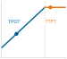

# Phục vụ mô hình {#sec-model-serving}

::: {layout-narrow}
::: {.column-margin}

\chapterminitoc

:::

::: {.content-visible when-format="pdf"}
\noindent
{fig-alt="Sơ đồ phối cảnh của một pipeline phục vụ (serving): các yêu cầu đa dạng được gom và lên lịch thành các batch, chiếm chỗ trên các trang cache, chạy qua các worker suy luận, rồi trả về phản hồi dưới áp lực về độ trễ."}
:::

::: {.content-visible unless-format="pdf"}
{fig-alt="Sơ đồ phối cảnh của một pipeline phục vụ (serving): các yêu cầu đa dạng được gom và lên lịch thành các batch, chiếm chỗ trên các trang cache, chạy qua các worker suy luận, rồi trả về phản hồi dưới áp lực về độ trễ."}
:::

:::

## Mục đích {.unnumbered .unlisted}

\begin{marginfigure}
\mlsysstack{35}{30}{25}{15}{90}{40}{20}{20}
\end{marginfigure}

_Vì sao phục vụ (serving) lại làm thay đổi các ưu tiên tối ưu hóa vốn giúp huấn luyện (training) thành công?_

Huấn luyện và phục vụ (serving) nhấn mạnh các mục tiêu vận hành khác nhau. Huấn luyện thường tối đa hóa thông lượng với các batch lớn và các phiên chạy dài, còn phục vụ phải trả lời từng yêu cầu trong mục tiêu về độ trễ. Huấn luyện phân bổ chi phí phần cứng trên nhiều ví dụ; còn phục vụ phải trả chi phí cho mỗi yêu cầu, nơi những kém hiệu quả nhỏ tích tụ thành gánh nặng vận hành. Vì vậy, mô hình huấn luyện hiệu quả vẫn có thể phục vụ kém.
Hệ thống chạy thật có một “ngân sách” độ trễ toàn trình, nên việc xếp hàng, tiền xử lý, truyền qua mạng và hậu xử lý có thể xóa nhòa lợi ích của một tối ưu chỉ nằm trong mô hình. Các kiến trúc thiên về batch và các tối ưu tốn nhiều bộ nhớ nhằm tận dụng tối đa bộ tăng tốc có thể không phù hợp với lưu lượng sản xuất đột biến, yêu cầu độ trễ thấp và nhạy cảm chi phí.
Nhưng phục vụ không chỉ là câu chuyện độ trễ. Hệ thống phục vụ phải xử lý lưu lượng dao động giữa lúc cao điểm và thấp điểm, dành sẵn headroom cho sự cố, biết giảm tải hoặc hạ cấp một cách mềm mại khi quá tải, và giữ tính dự đoán khi cơ cấu yêu cầu và nhu cầu thay đổi theo thời gian.
Các mô hình đã chứng minh giá trị trong huấn luyện, vượt qua nén và benchmark, cuối cùng sẽ đến lớp phục vụ — giai đoạn triển khai và tích hợp trong vòng đời ML. Câu hỏi chuyển từ “mô hình có chạy được không” sang “mô hình có chạy ổn định ở quy mô lớn trong môi trường sản xuất không”. Hạ tầng phục vụ là nơi hệ thống ML gặp người dùng, và duy trì tương tác đó đòi hỏi kiểu kỹ thuật khác với việc tạo ra mô hình. Đây cũng là nơi thuật toán đã huấn luyện gặp dữ liệu thực tế trong giới hạn độ trễ của máy, nơi cả ba ràng buộc D·A·M cùng hội tụ trên mỗi yêu cầu.

::: {.content-visible when-format="pdf"}

\newpage

:::

::: {.callout-learning-objectives}

- Giải thích sự đảo chiều trong phục vụ: từ tối ưu thông lượng khi huấn luyện sang tối ưu độ trễ trên mỗi yêu cầu, headroom và hành vi đuôi.
- Phân rã độ trễ của mỗi yêu cầu theo các phần: tuần tự hoá, tiền xử lý, suy luận, xếp hàng, hậu xử lý và chi phí mạng.
- Áp dụng các định luật hàng đợi và các mô hình hàng đợi đơn giản để lập kế hoạch dung lượng nhằm đáp ứng các mục tiêu độ trễ theo phân vị.
- Chẩn đoán sự chênh lệch giữa huấn luyện và phục vụ (training-serving skew) cũng như các vấn đề khởi động nguội (cold start) do tiền xử lý bất nhất, cách thức tải mô hình, hoặc hành vi của cache.
- Lựa chọn các chiến lược về batching, giảm tải (load shedding), tự động điều chỉnh quy mô (autoscaling) và runtime phù hợp với đặc điểm lưu lượng truy cập và giới hạn độ trễ cho phép.
- Đánh giá các nút thắt trong quá trình phục vụ (serving) LLM dựa trên độ trễ của token, bộ nhớ KV-cache và các ràng buộc của batching liên tục.
- Tính toán chi phí cho mỗi lượt suy luận (inference) dựa trên độ chính xác, mức độ sử dụng phần cứng, số lượng bản sao và thông lượng (throughput) của runtime.
```{=latex}
\vspace*{-1ex}
```
:::

## Mô hình phục vụ {#sec-model-serving-serving-paradigm-9634}

**Phục vụ (Serving)**\index{Serving!production deployment}\index{Model serving!paradigm shift} bắt đầu từ nơi benchmark dừng lại: một mô hình đã được đo kiểm trong điều kiện kiểm soát nay phải tạo ra dự đoán dưới một khối lượng công việc (workload) vận hành. Đám mây (Cloud), Edge, Di động (Mobile) và TinyML mỗi môi trường đều đặt ra những thách thức phục vụ riêng. Trong phục vụ trực tuyến (online serving), ưu tiên thường đảo ngược: từ thông lượng trong các chạy dài hạn sang độ trễ của từng yêu cầu. Sự đảo ngược trong phục vụ này\index{Serving inversion!throughput-to-latency shift} có những hệ quả kỹ thuật cụ thể, lan khắp toàn bộ ngăn xếp. Theo định luật sắt của các hệ thống ML, hạng mục độ trễ\index{Latency!serving constraint} $(L_{\text{lat}})$ giờ bao gồm lập lịch yêu cầu, các vòng khứ hồi mạng (network round-trips) và điều phối hệ thống, và có thể trở thành ràng buộc chính. Các benchmark có kiểm soát xác lập hiệu năng dưới những điều kiện đã biết; trong khi đó, quá trình phục vụ phải đối mặt với các mẫu lưu lượng mà không một benchmark nào có thể lường hết. Lượng tử hoá (quantization) có thể giảm kích thước mô hình; tuy nhiên, quá trình phục vụ phải xác nhận rằng các tối ưu hoá này vẫn giữ được độ chính xác dưới các phân phối lưu lượng thực tế. Những xác nhận lại này cùng nhau làm thay đổi thứ tự ưu tiên giữa dữ liệu, thuật toán và phần cứng khi các yêu cầu đến trong giới hạn độ trễ cho phép của vận hành.

Phân loại D·A·M làm cho sự đảo chiều này trở nên rõ ràng. Với một dịch vụ trực tuyến, ràng buộc về dữ liệu chuyển từ khối lượng tập huấn luyện sang tốc độ, độ mới và hình dạng của các yêu cầu đang hoạt động. Thuật toán thường được cố định theo phiên bản mô hình đã triển khai, thay vì được cập nhật bằng lan truyền ngược ngay trên đường xử lý yêu cầu. Ràng buộc về tài nguyên máy chuyển từ mục tiêu sử dụng tối đa sang duy trì **headroom**\index{Headroom!tail latency}: vận hành dưới ngưỡng bão hòa để chừa dung lượng cho các đợt tăng lưu lượng đột biến; còn khi bộ tăng tốc bị bão hòa, chỉ một thay đổi tải nhỏ cũng có thể gây ra sự cố do độ trễ đuôi. Mức dự phòng cần thiết phụ thuộc vào quá trình yêu cầu đến, phân phối thời gian phục vụ và mục tiêu mức dịch vụ (SLO). Vì vậy, phục vụ (serving) tối ưu số lượng công việc hữu ích được hoàn thành trong cam kết về độ trễ, thay vì dồn mọi nỗ lực để phần cứng luôn kín tải.

Lời hứa đó gắn kết các phần còn lại của ngăn xếp phục vụ với nhau. Định tuyến yêu cầu, tiền xử lý, thực thi mô hình, hậu xử lý, batching, caching, lựa chọn runtime và lập kế hoạch dung lượng đều phải chia sẻ cùng một ngân sách độ trễ. Nhiệm vụ kỹ thuật trung tâm là quyết định công việc nào cần nằm trong đường xử lý yêu cầu trực tiếp, công việc nào có thể chuyển ra ngoài, và hệ thống phải dành bao nhiêu headroom trước khi thông lượng hữu ích trở nên mong manh.

## Tải phục vụ, độ trễ và kiến trúc {#sec-model-serving-load-latency-architecture-a4d8}

```{python}
#| echo: false
from mlsysim import *
from mlsysim.core.units import *

# ┌─────────────────────────────────────────────────────────────────────────────
# │ BLACK FRIDAY TRAFFIC SPIKE
# ├─────────────────────────────────────────────────────────────────────────────
# │ Context: Callout "The 'Black Friday' Traffic Spike"
# │
# │ Goal: Demonstrate the nonlinear failure mode of serving systems under load.
# │ Show: That a 10× traffic spike causes system collapse, not just 10× latency.
# │ How: Model queue explosion using Little's Law parameters.
# │
# └─────────────────────────────────────────────────────────────────────────────

from mlsysim.fmt import fmt, fmt_rate

class BlackFridayCalc:
    """Models the nonlinear failure mode of serving systems under a 10× traffic spike."""

    # ┌── 1. LOAD (Constants) ──────────────────────────────────────────────
    bf_latency_ms_value = 50 * ms  # scenario assumption: normal operation latency
    bf_qps_normal_value = 1000  # normal queries per second
    bf_qps_spike_value = 10000  # Black Friday peak QPS
    bf_spike_factor_value = 10  # spike multiplier (10x)
    bf_collapse_latency_s_value = 10 * second  # scenario assumption: latency during collapse

    # ┌── 4. OUTPUT (Formatting) ─────────────────────────────────────────────
    bf_latency_ms_str = fmt_time(bf_latency_ms_value, 'millisecond', precision=0, commas=False)
    bf_qps_normal_str = fmt_rate(bf_qps_normal_value, "QPS")
    bf_qps_spike_str = fmt_rate(bf_qps_spike_value, "QPS")
    bf_spike_factor_mult_str = fmt_multiple(bf_spike_factor_value, precision=0, commas=False)
    bf_collapse_latency_s_str = fmt_time(bf_collapse_latency_s_value, 'second', precision=0, commas=False)
    bf_full_util_pct_value = 100
    bf_full_util_pct_str = fmt_percent(bf_full_util_pct_value / 100, precision=0, commas=False, style='prose')
```

::: {#exmp-model-serving-black-friday-traffic-spike .callout-example title="Đợt tăng đột biến lưu lượng 'Black Friday'"}

**Kịch bản**: Một hệ thống phục vụ đề xuất thương mại điện tử trải qua một đợt tăng đột biến lưu lượng `{python} BlackFridayCalc.bf_spike_factor_mult_str` (`{python} BlackFridayCalc.bf_qps_spike_str`) trong các sự kiện bán hàng Black Friday.

**Chẩn đoán**: Khi mức sử dụng máy chủ tiếp cận `{python} BlackFridayCalc.bf_full_util_pct_str`, độ dài hàng đợi bùng nổ phi tuyến tính, làm tăng độ trễ lên `{python} BlackFridayCalc.bf_collapse_latency_s_str` và gây ra lỗi hết thời gian chờ của khách.

**Bài học về hệ thống**: Thông lượng trung bình cao không ngăn được hàng đợi sụp đổ khi có các đợt tăng đột biến lưu lượng. Tùy dịch vụ, để giữ mục tiêu độ trễ đuôi, có thể cần giảm tải, suy giảm chức năng có kiểm soát, hoặc tự động điều chỉnh quy mô trước khi mức sử dụng chạm tới điểm uốn hàng đợi của khối lượng công việc (workload).

:::

Các hệ thống phục vụ trực tuyến có thể nhận các luồng yêu cầu biến thiên, không theo batch, nhưng vẫn cần thời gian phản hồi có thể dự đoán được trên các môi trường vật lý đa dạng. Khi một đợt tăng đột biến lưu lượng vượt quá khoảng dự phòng của hệ thống, hiệu suất sẽ suy giảm theo kiểu phi tuyến.

@Fig-tail-latency-explosion cho thấy độ trễ vẫn ở mức chấp nhận được khi mức sử dụng vừa phải, rồi tăng nhanh khi hệ thống tiến gần trạng thái bão hòa; đây là lý do các hệ thống nhạy cảm với độ trễ thường dành khoảng dự phòng thay vì lập kế hoạch để bộ tăng tốc luôn bão hòa\index{Tail latency!utilization threshold}. @Sec-appdx-data-foundations-distributions-long-tail-901f trình bày xử lý toán học cho các phân phối đuôi dài và giải thích vì sao độ trễ ở các phân vị cao lại quan trọng khi một SLO bao gồm cả những yêu cầu chậm nhất. Đường cong này là một xấp xỉ hàng đợi đơn giản, nhằm mục đích trực quan hơn là áp dụng cho một khối lượng công việc (workload) cụ thể.

::: {#fig-tail-latency-explosion fig-env="figure" fig-pos="htb" fig-cap="**Sự bùng nổ độ trễ đuôi**: Độ trễ yêu cầu so với mức sử dụng phục vụ (serving) $\rho_{\text{serv}}$. Độ trễ trung bình (màu xanh) và xấp xỉ p99 (màu đỏ) đều tăng phi tuyến khi mức sử dụng tiến gần bão hòa; mốc 70 phần trăm là một “điểm uốn” mang tính minh họa cho việc lập kế hoạch, không phải điểm ngắt do mô hình xác định. Điều này sử dụng xấp xỉ M/M/1 đơn giản được giới thiệu sau trong @sec-model-serving-queuing-theory-tail-latency-29a6 (p99 ≈ 4.6$\times$ trung bình), nên đường cong mang tính minh họa thay vì dành cho một khối lượng công việc (workload) cụ thể." fig-alt="Biểu đồ đường thể hiện độ trễ yêu cầu đã chuẩn hóa theo mức sử dụng phục vụ (serving). Một đường độ trễ trung bình màu xanh nét đứt và một đường p99 màu đỏ liền nét đều tăng phi tuyến khi tiến gần bão hòa, trong đó đường màu đỏ luôn gấp 4.6 lần đường màu xanh. Vùng tô xanh lá đánh dấu 0–50 phần trăm là Vùng An toàn, vùng tô đỏ đánh dấu 70–100 phần trăm là Vùng Nguy hiểm, và một mũi tên chú thích 70 phần trăm là ‘Điểm Uốn.’"}

```{python}
#| echo: false
# ┌─────────────────────────────────────────────────────────────────────────────
# │ TAIL LATENCY EXPLOSION FIGURE
# ├─────────────────────────────────────────────────────────────────────────────
# │ Context: @fig-tail-latency-explosion—illustrates why tail latency diverges
# │          from mean latency as system utilization approaches 100%
# │
# │ Goal: Visually demonstrate the nonlinear explosion of p99 latency near
# │       saturation using an M/M/1 queueing model approximation.
# │ Show: Mean vs. p99 latency curves, with Safe Zone and Danger Zone annotations.
# │ How: Compute mean = 1/(1-rho_serv) and p99 approx 4.6x mean; plot on shared axes.
# │
# └─────────────────────────────────────────────────────────────────────────────

# ┌── 1. CANVAS ────────────────────────────────────────────────────────────────
# │ Visually demonstrate the nonlinear explosion of p99 latency near
import numpy as np
from binder.tools.figures import style as book_style

fig, ax, COLORS, plt = book_style.setup_plot(figsize=(10, 4.3))
# =============================================================================
# PLOT: The Tail Latency Explosion
# =============================================================================

# ┌── 2. ARRAYS ────────────────────────────────────────────────────────────────
utilization = np.linspace(0, 0.95, 100)
mean_latency = 1 / (1 - utilization)
p99_latency = mean_latency * 4.6

# ┌── 3. RENDER ────────────────────────────────────────────────────────────────
ax.plot(utilization, mean_latency, '--', color=COLORS['BlueLine'], label='Mean Latency', linewidth=2)
ax.plot(utilization, p99_latency, '-', color=COLORS['RedLine'], label='Tail Latency (p99)', linewidth=2.5)

# ┌── 4. DECORATE ──────────────────────────────────────────────────────────────
ax.set_xlabel('System Utilization (%)')
ax.set_ylabel('Request Latency (normalized to service time)')
ax.set_xlim(0, 1.0)
ax.set_ylim(0, 50)

ax.axvspan(0, 0.5, color=COLORS['GreenL'], alpha=0.2)
ax.text(
    0.25,
    39,
    "Safe Zone",
    color=COLORS['GreenLine'],
    fontsize=8,
    fontweight='bold',
    va='center',
    ha='center',
    bbox=dict(facecolor='white', alpha=0.8, edgecolor='none', pad=0.5),
)
ax.axvspan(0.7, 1.0, color=COLORS['RedL'], alpha=0.3)
ax.text(
    0.78,
    39,
    "Danger Zone\n(Queue\nExplosion)",
    color=COLORS['RedLine'],
    fontweight='bold',
    va='center',
    ha='center',
    fontsize=8,
    linespacing=1.4,
    bbox=dict(facecolor='white', alpha=0.8, edgecolor='none', pad=0.5),
)

ax.annotate(
    "The Knee",
    xy=(0.7, 15),
    xytext=(0.59, 20),
    arrowprops=dict(facecolor=COLORS['primary'], arrowstyle='->', lw=1.0),
    fontsize=9,
    bbox=dict(facecolor='white', alpha=0.8, edgecolor='none', pad=0.5),
)

ax.set_xticks([0, 0.2, 0.4, 0.6, 0.8, 1.0])
ax.set_xticklabels(['0%', '20%', '40%', '60%', '80%', '100%'])
ax.legend(loc='upper left', fontsize=8, frameon=True, facecolor='white', framealpha=0.95, edgecolor='gray', fancybox=True, borderpad=0.6)
plt.show()
plt.close()
```

:::

Ngoài các giới hạn kỹ thuật về độ trễ, kinh tế của hoạt động phục vụ (serving) cũng đã thay đổi nhanh chóng. Khi các mô hình trở nên hiệu quả hơn và phần cứng chuyên biệt hơn, chi phí cho mỗi suy luận đã giảm.[^fn-jevons-paradox-efficiency] Kinh nghiệm của Facebook ở quy mô toàn đội máy cho thấy mức độ lớn của bài toán chi phí phục vụ (serving) này.

[^fn-jevons-paradox-efficiency]: **Nghịch lý Jevons**\index{Jevons paradox!inference demand}: Năm 1865, William Stanley Jevons nhận thấy rằng việc cải thiện hiệu suất của động cơ hơi nước chạy bằng than đã làm tăng tổng lượng than tiêu thụ, vì năng lượng hơi nước trở nên khả thi về mặt kinh tế cho những ứng dụng trước đây quá đắt đỏ [@jevons1865coal]. Động lực tương tự cũng có thể áp dụng cho suy luận AI: mỗi khi chi phí giảm 10$\times$, các lớp ứng dụng mới sẽ trở nên khả thi về kinh tế ở mức giá mới, mở rộng tổng cầu nhiều hơn mức tăng hiệu suất. Đây là lý do tại sao suy luận rẻ hơn có thể làm tăng, chứ không phải giảm, tổng nhu cầu GPU của toàn đội. Trong AI, hiệu suất và nhu cầu thường là các yếu tố bổ sung, chứ không phải thay thế.

::: {#exmp-model-serving-facebook-inference-tax .callout-example title="Gánh nặng chi phí suy luận tại Facebook"}

**Kịch bản**: Tại Meta, các hệ thống phục vụ (serving) ML trong môi trường sản xuất thực hiện hàng chục nghìn tỷ suy luận mỗi ngày trên các dịch vụ hướng tới người dùng toàn cầu [@hazelwood2018].

**Chẩn đoán**: Chi phí tính toán và năng lượng định kỳ cho việc phục vụ suy luận vượt xa chi phí huấn luyện mô hình ban đầu (offline). Mẫu hình yêu cầu đến trực tiếp và các giới hạn độ trễ nghiêm ngặt hạn chế khả năng tạo batch cho GPU.

**Bài học về hệ thống**: Các kiến trúc mô hình có chi phí huấn luyện thấp có thể trở nên không khả thi khi phục vụ (serving) ở quy mô toàn hệ thống. Cơ sở hạ tầng phục vụ trong môi trường sản xuất cần đồng thiết kế giữa phần cứng và phần mềm để cân bằng giữa độ trễ đuôi, kích thước batch và tổng chi phí sở hữu vận hành định kỳ.

:::

Áp lực kinh tế tương tự đối với việc phục vụ (serving) cũng thể hiện rõ qua giá API công khai. Đường biểu diễn giá theo thang log trong @fig-intelligence-deflation cho thấy tốc độ sụt giảm chi phí này, bằng cách theo dõi các ảnh chụp giá niêm yết API công khai đại diện như một chỉ số thị trường. Giá của các nhà cung cấp thay đổi thường xuyên, vì vậy những điểm dữ liệu này nên được xem như minh chứng lịch sử cho xu hướng, hơn là hướng dẫn mua hàng hiện tại [@openai2023chatgptwhisper; @openai2023gpt4web; @openaiCommunity2024gpt4oApi; @openai2024gpt4oMini; @anthropic2024claude3family; @google2024gemini15flashPricing; @deepseek2024v3]. Mỗi lần giảm một bậc (10$\times$) sẽ làm thay đổi những ứng dụng nào là khả thi.

::: {#fig-intelligence-deflation fig-env="figure" fig-pos="htb" fig-cap="**Giảm phát trí tuệ**: Biểu đồ thể hiện giá niêm yết token đầu vào API công khai tiêu biểu trên 1 triệu token (\$) theo thời gian (Thang log). Tám điểm trên biểu đồ là các ảnh chụp nhanh về giá của các phiên bản mô hình, được thu thập từ các trang công bố giá của OpenAI, Anthropic, Google và DeepSeek trong giai đoạn 2023-2025; điểm GPT-3.5 Legacy chỉ là một mốc tham chiếu minh họa, không phải là ảnh chụp giá của một phiên bản mô hình đã được ghi nhận. Chuỗi này nhằm chỉ báo xu hướng thị trường, không phải phép so sánh có kiểm soát hay giá hiện hành. Giá xử lý token API đã sụt giảm nhiều bậc, làm thay đổi đáng kể bài toán kinh tế của các quy trình AI tự động." fig-alt="Biểu đồ phân tán theo thang log thể hiện tám ảnh chụp nhanh về giá token đầu vào API công khai, có nguồn dữ liệu rõ ràng, và một mốc tham chiếu cũ (legacy) mang tính minh họa từ năm 2023 đến 2025. Mức giá dao động từ 30 đô la đến 0.075 đô la cho mỗi triệu token. Các điểm màu xanh được gắn nhãn theo tên mô hình, và một đường xu hướng nét đứt màu đỏ dốc xuống xuyên suốt biểu đồ."}

```{python}
#| echo: false
# ┌─────────────────────────────────────────────────────────────────────────────
# │ INTELLIGENCE DEFLATION FIGURE
# ├─────────────────────────────────────────────────────────────────────────────
# │ Context: @fig-intelligence-deflation—log-scale scatter plot of representative
# │          public API input-token prices from 2023 to 2025, annotated with model names
# │
# │ Goal: Visualize the decline in inference token prices that is transforming AI
# │       serving economics.
# │ Show: Named input/prompt-token price points on a log scale with deflation trend line.
# │ How: Fit a log-linear trend through representative price points; scatter
# │      remaining models; annotate each with model name.
# │
# └─────────────────────────────────────────────────────────────────────────────

# ┌── 1. CANVAS ────────────────────────────────────────────────────────────────
# │ Visualize the decline in inference token prices.
import numpy as np
from binder.tools.figures import style as book_style

fig, ax, COLORS, plt = book_style.setup_plot(figsize=(10, 4.4))
# =============================================================================
# DATA: Representative input-token pricing snapshots over time
# =============================================================================

# ┌── 2. ARRAYS ────────────────────────────────────────────────────────────────
data = [
    (2023.0, 20.0, "Legacy GPT-3.5"),
    (2023.1, 2.0, "GPT-3.5 Turbo"),
    (2023.2, 30.0, "GPT-4 (Original)"),
    (2024.2, 15.0, "Claude 3 Opus"),
    (2024.2, 0.25, "Claude 3 Haiku"),
    (2024.3, 5.0, "GPT-4o"),
    (2024.62, 0.075, "Gemini 1.5 Flash"),
    (2024.55, 0.15, "GPT-4o-mini"),
    (2025.1, 0.27, "DeepSeek-V3"),
]
data.sort(key=lambda x: x[0])

years = np.array([d[0] for d in data])
prices = np.array([d[1] for d in data])
labels = [d[2] for d in data]

# =============================================================================
# PLOT: Intelligence Deflation
# =============================================================================
trend_years = np.array([2023.0, 2023.1, 2024.2, 2024.4, 2025.1])
trend_prices = np.array([20.0, 2.0, 0.25, 0.075, 0.27])
slope, intercept = np.polyfit(trend_years, np.log10(trend_prices), 1)
line_years = np.linspace(2023.0, 2025.5, 100)
line_prices = 10 ** (slope * line_years + intercept)

# -----------------------------------------------------------------------------
# RENDER
# -----------------------------------------------------------------------------
ax.plot(line_years, line_prices, linestyle='--', linewidth=1.5, color=COLORS['RedLine'])
ax.scatter(years, prices, s=45, color=COLORS['BlueLine'], edgecolors='white', zorder=3)

# -----------------------------------------------------------------------------
# Default label style
# -----------------------------------------------------------------------------
default_label_style = {
    "xytext": (6, 6),
    "textcoords": "offset points",
    "ha": "left",
    "va": "bottom",
    "fontsize": 8,
    "color": COLORS["primary"],
    "bbox": dict(boxstyle="round,pad=0.2", facecolor="white", edgecolor="none", alpha=0.8),
}

# -----------------------------------------------------------------------------
# Individual overrides by label
# -----------------------------------------------------------------------------
label_styles = {
    "Legacy GPT-3.5": {
        "xytext": (-10, -11),
        "ha": "center",
        "va": "center",
    },
    "GPT-3.5 Turbo": {
        "xytext": (0, 10),
        "ha": "center",
        "va": "center",
    },
    "GPT-4 (Original)": {
        "xytext": (0, 10),
        "ha": "center",
        "va": "center",
    },
    "Claude 3 Opus": {
        "xytext": (0, 10),
        "ha": "center",
        "va": "center",
    },
    "Claude 3 Haiku": {
        "xytext": (-10, -10),
        "ha": "center",
        "va": "center",
    },
    "GPT-4o": {
        "xytext": (0, -10),
        "ha": "center",
        "va": "center",
    },
    "Gemini 1.5 Flash": {
        "xytext": (-20, -20),
        "ha": "center",
        "va": "center",
        "arrowprops": dict(arrowstyle="-", shrinkB=5, color=COLORS["primary"], lw=0.8),
    },
    "GPT-4o-mini": {
        "xytext": (20, -20),
        "ha": "center",
        "va": "center",
        "arrowprops": dict(arrowstyle="-", shrinkB=5, color=COLORS["primary"], lw=0.8),
    },
    "DeepSeek-V3": {
        "xytext": (0, 10),
        "ha": "center",
        "va": "center",
    },
}

# -----------------------------------------------------------------------------
# Draw labels
# -----------------------------------------------------------------------------
for x, y, label in zip(years, prices, labels):
    style = default_label_style.copy()
    style.update(label_styles.get(label, {}))
    ax.annotate(label, (x, y), **style)
# ┌── 4. DECORATE ──────────────────────────────────────────────────────────────
ax.set_yscale('log')
ax.set_yticks([100, 10, 1, 0.1, 0.01])
ax.set_yticklabels(['$100', '$10', '$1', '$0.10', '$0.01'])
ax.set_xlabel('Year')
ax.set_ylabel('Price per 1M Tokens ($)')
ax.set_ylim(0.01, 500)
ax.set_xlim(2022.8, 2025.5)
ax.text(
    2023.5,
    0.05,
    "Prices Decline by\nOrders of Magnitude",
    color=COLORS['grid'],
    fontsize=9,
    ha='center',
    style='italic',
    bbox=dict(facecolor='white', alpha=0.8, edgecolor='none', pad=0.5),
)
plt.show()
plt.close()
```

:::

Hiện có hai áp lực chính đang định hình vấn đề phục vụ (serving): thứ nhất là độ trễ đuôi tăng vọt khi mức sử dụng vượt qua điểm knee của hàng đợi, và thứ hai là chi phí cho mỗi lần suy luận giảm nhiều bậc khi hiệu suất được cải thiện. Hai yếu tố này buộc chúng ta phải đưa ra một định nghĩa chính thức về phục vụ, xoay quanh độ trễ thay vì thông lượng.

::: {#dfn-model-serving-model-serving .callout-definition title="Phục vụ mô hình"}

***Phục vụ mô hình***\index{Model serving!definition} là giai đoạn vận hành cung cấp các dự đoán của mô hình cho người dùng cuối hoặc các hệ thống hạ nguồn, với các ràng buộc về độ trễ, thông lượng, tính khả dụng và chi phí.

1.  **Ý nghĩa**: Phục vụ trực tuyến (online serving) biến ưu tiên thông lượng của quá trình huấn luyện ($\eta_{\text{hw}}$) thành một ràng buộc về độ trễ của yêu cầu $(L_{\text{lat}})$, đòi hỏi một stack được thiết kế xoay quanh phân vị được nêu trong SLO (Service Level Objective) của nó.
2.  **Điểm khác biệt**: Không giống như huấn luyện mô hình (training) thường xử lý các batch theo lịch trình, phục vụ (serving) có thể xử lý các yêu cầu trực tuyến ngẫu nhiên, các luồng dữ liệu đồng bộ hoặc các batch ngoại tuyến.
3.  **Lỗi thường gặp**: Một hiểu lầm phổ biến là phục vụ (serving) chỉ là forward pass. Thực tế, đây là một bài toán hệ thống: việc chạy mô hình chỉ là một thành phần trong stack, vốn có thể bao gồm định tuyến yêu cầu, cân bằng tải và chuyển đổi dữ liệu.

:::

SLO[^fn-slo-sla-serving] xác định mục tiêu độ trễ, từ đó chi phối mọi quyết định kiến trúc trong ngăn xếp phục vụ (serving), bao gồm cách hệ thống phân bổ thời gian cho tiền xử lý, thực thi mô hình, hậu xử lý và truyền tải. Khi một máy chủ suy luận nhận yêu cầu, thực thi mô hình chỉ là một phần trong pipeline xử lý đầu-cuối, trải qua truyền tải mạng, tuần tự hóa, tiền/hậu xử lý trên CPU và quản lý hàng đợi. @Fig-serving-inference-pipeline cho thấy dữ liệu đầu vào thô đi qua tiền xử lý (tính toán truyền thống), suy luận mạng nơ-ron (deep learning), và hậu xử lý (tính toán truyền thống) trước khi tạo ra đầu ra cuối cùng. Bất kỳ giai đoạn nào trong số này cũng có thể trở thành nút thắt về độ trễ. @Sec-model-serving-latency-budget-ef40 định lượng chính xác thời gian được dùng vào đâu, qua đó hé lộ một kết quả trái trực giác về giai đoạn nào chi phối.

[^fn-slo-sla-serving]: **Mục tiêu mức dịch vụ (SLO) so với thỏa thuận mức dịch vụ (SLA)**\index{SLO!vs. SLA}: SLO là một mục tiêu *nội bộ* (ví dụ: "độ trễ p99 dưới 50 ms"); còn SLA là một cam kết hợp đồng *bên ngoài*, nếu vi phạm có thể dẫn đến các biện pháp khắc phục hoặc hình phạt. Các nhóm thường đặt SLO chặt chẽ hơn SLA để duy trì một biên độ an toàn. Trong phục vụ (serving) ML, chất lượng tác vụ và độ trễ suy luận đều có thể góp phần vào SLO, tạo ra các mục tiêu đa chiều. Khi đó, việc cải thiện một khía cạnh (ví dụ: triển khai một mô hình lớn hơn để tăng độ chính xác) có thể vi phạm một khía cạnh khác (độ trễ).

::: {#fig-serving-inference-pipeline fig-env="figure" fig-pos="htb" fig-cap="**Pipeline suy luận**: Các hệ thống phục vụ (serving) ML biến đổi dữ liệu đầu vào thô thành kết quả cuối cùng qua các giai đoạn nối tiếp: tiền xử lý, tính toán mạng nơ-ron và hậu xử lý. Mạng nơ-ron chỉ là một thành phần; tiền xử lý và hậu xử lý khiến độ trễ đầu-cuối phụ thuộc vào nhiều yếu tố ngoài phần chạy mạng nơ-ron." fig-alt="Sơ đồ luồng từ trái sang phải gồm sáu hộp nối tiếp, được gắn nhãn Dữ liệu thô, Tiền xử lý, Mạng nơ-ron, Đầu ra thô, Hậu xử lý và Đầu ra cuối cùng. Các nhóm được khoanh vùng bên dưới các hộp chỉ rõ các phần Tiền xử lý, Deep Learning và Hậu xử lý."}

```{.tikz}
\begin{tikzpicture}[font=\small\sffamily, >=stealth]
\tikzset{
Box/.style={align=center, inner xsep=2pt,draw=GreenLine, line width=1pt,fill=none,
minimum width=24mm, minimum height=25mm,node distance=1.0},
LineA/.style={BrownLine!70,line width=4.0pt,{-{Triangle[width=1.5*6pt,length=2.0*5pt]}},shorten <=1pt,shorten >=1pt},
ALine/.style={black!50, line width=1.1pt,{{Triangle[width=0.9*6pt,length=1.2*6pt]}-}},
Larrow/.style={fill=violet!50, single arrow,  inner sep=2pt, single arrow head extend=3pt,
            single arrow head indent=0pt,minimum height=10mm, minimum width=3pt}
}
%inbox
\tikzset{%
 pics/inbox/.style = {
        code = {
        \pgfkeys{/channel/.cd, #1}
\begin{scope}[local bounding box=INBOX,scale=\scalefac, every node/.append style={transform shape}]
\node[line width=\Linewidth,draw=\drawcolor,fill=\filllcolor!50,
rectangle,rounded corners=3pt,minimum width=14mm,minimum height=10mm]at(0,0.3){};
\node[line width=\Linewidth,draw=\drawcolor,fill=\filllcolor,
rectangle,rounded corners=3pt,minimum width=15mm,minimum height=10mm]at(0,0.1){};
\node[line width=\Linewidth,draw=\drawcolor,fill=\filllcolor!50,
,rectangle,rounded corners=3pt,minimum width=17mm,minimum height=10mm]
at(0,-0.1){};
\draw[line width=\Linewidth,draw=\drawcolor,fill=\filllcirclecolor,,rounded corners=2pt](-0.92,0.05)--
(-0.92,-0.78)--(0.92,-0.78)--(0.92,0.05)--(0.40,0.05)--(0.32,-0.2)--(-0.29,-0.2)--(-0.40,0.05)--cycle;

\node[single arrow, line width=\Linewidth,draw=black,fill=cyan!90!black!30, rotate=270,
      minimum width = 15pt, single arrow head extend=6pt,
      minimum height=10mm]at(0,0.5) {}; % length of arrow
 \end{scope}
     }
  }
}
%brain
\tikzset{pics/brain/.style = {
        code = {
        \pgfkeys{/channel/.cd, #1}
\begin{scope}[local bounding box=BRAIN,scale=\scalefac, every node/.append style={transform shape}]
\fill[fill=\filllcolor!50](0.1,-0.5)to[out=0,in=180](0.33,-0.5)
to[out=0,in=270](0.45,-0.38)to(0.45,-0.18)
to[out=40,in=240](0.57,-0.13)to[out=110,in=310](0.52,-0.05)
to[out=130,in=290](0.44,0.15)to[out=90,in=340,distance=8](0.08,0.69)
to[out=160,in=80](-0.42,-0.15)to (-0.48,-0.7)to(0.07,-0.7)to(0.1,-0.5)
(-0.10,-0.42)to[out=310,in=180](0.1,-0.5);
\draw[draw=\drawcolor,line width=\Linewidth](0.1,-0.5)to[out=0,in=180](0.33,-0.5)
to[out=0,in=270](0.45,-0.38)to(0.45,-0.18)
to[out=40,in=240](0.57,-0.13)to[out=110,in=310](0.52,-0.05)
to[out=130,in=290](0.44,0.15)to[out=90,in=340,distance=8](0.08,0.69)
(-0.42,-0.15)to (-0.48,-0.7)
(0.07,-0.7)to(0.1,-0.5)
(-0.10,-0.42)to[out=310,in=180](0.1,-0.5);
\draw[fill=\filllcolor,line width=\Linewidth](-0.3,-0.10)to(0.08,0.60)
to[out=60,in=50,distance=3](-0.1,0.69)to[out=160,in=80](-0.26,0.59)to[out=170,in=90](-0.46,0.42)
to[out=170,in=110](-0.54,0.25)to[out=210,in=150](-0.54,0.04)
to[out=240,in=130](-0.52,-0.1)to[out=300,in=240]cycle;
\draw[fill=\filllcolor,line width=\Linewidth]
(-0.04,0.64)to[out=120,in=0](-0.1,0.69)(-0.19,0.52)to[out=120,in=330](-0.26,0.59)
(-0.4,0.33)to[out=150,in=280](-0.46,0.42)
%
(-0.44,-0.03)to[bend left=30](-0.34,-0.04)
(-0.33,0.08)to[bend left=40](-0.37,0.2) (-0.37,0.12)to[bend left=40](-0.45,0.14)
(-0.26,0.2)to[bend left=30](-0.24,0.13)
(-0.16,0.32)to[bend right=30](-0.27,0.3)to[bend right=30](-0.29,0.38)
(-0.13,0.49)to[bend left=30](-0.04,0.51);

\draw[rounded corners=0.8pt,\drawcircle,-{Circle[fill=\filllcirclecolor,length=2.5pt]}](-0.23,0.03)--(-0.15,-0.03)--(-0.19,-0.18)--(-0.04,-0.28);
\draw[rounded corners=0.8pt,\drawcircle,-{Circle[fill=\filllcirclecolor,length=2.5pt]}](-0.17,0.13)--(-0.04,0.05)--(-0.06,-0.06)--(0.14,-0.11);
\draw[rounded corners=0.8pt,\drawcircle,-{Circle[fill=\filllcirclecolor,length=2.5pt]}](-0.12,0.23)--(0.31,0.0);
\draw[rounded corners=0.8pt,\drawcircle,-{Circle[fill=\filllcirclecolor,length=2.5pt]}](-0.07,0.32)--(0.06,0.26)--(0.16,0.33)--(0.34,0.2);
\draw[rounded corners=0.8pt,\drawcircle,-{Circle[fill=\filllcirclecolor,length=2.5pt]}](-0.01,0.43)--(0.06,0.39)--(0.18,0.51)--(0.31,0.4);
\end{scope}
     }
  }
}
%llm
\tikzset{
pics/llm/.style = {
        code = {
        \pgfkeys{/channel/.cd, #1}
\begin{scope}[shift={($(0,0)+(0,0)$)},scale=\scalefac,every node/.append style={transform shape}]
\node[circle,minimum size=12mm,draw=\drawcolor, fill=\filllcolor!70,line width=0.5*\Linewidth](C\picname) at (0,0){};
\def\startangle{90}
\def\radius{1.15}
\def\radiusI{1.1}
\foreach \i [evaluate=\i as \j using \i+1] [count =\k] in {0,2,4,6,8} {
\pgfmathsetmacro{\angle}{\startangle - \i * (360/8)}
\draw[draw=black,-{Circle[black ,fill=\filllcirclecolor,length=5.5pt,line width=0.5*\Linewidth]},line width=1.5*\Linewidth](C\picname)--++(\startangle - \i*45:\radius) ;
\node[circle,draw=black,fill=\filllcirclecolor!80!red!50,inner sep=3pt,line width=0.5*\Linewidth](2C\k)at(\startangle - \j*45:\radiusI) {};
}
\draw[line width=1.5*\Linewidth](2C1)--++(-0.5,0)|-(2C2);
\draw[line width=1.5*\Linewidth](2C3)--++(0.5,0)|-(2C4);
\node[circle,,minimum size=12mm,draw=\drawcolor, fill=\filllcolor!70,line width=0.5*\Linewidth]at (0,0){};
\node[draw,rectangle,rounded corners=1pt,minimum width=7mm,minimum height=4mm,fill=orange!10](R1)at(0.1,0.1){};
\draw[BrownLine,shorten <=2pt,shorten >=2pt ]($(R1.north west)!0.35!(R1.south west)$)--($(R1.north east)!0.35!(R1.south east)$);
\draw[BrownLine,shorten <=2pt,shorten >=2pt ]($(R1.north west)!0.7!(R1.south west)$)--($(R1.north east)!0.7!(R1.south east)$);
\node[draw,rectangle,rounded corners=1pt,minimum width=6mm,minimum height=4mm,fill=orange!10](R2)at(-0.05,-0.15){};
\draw[BrownLine,shorten <=2pt,shorten >=2pt ]($(R2.north west)!0.35!(R2.south west)$)--($(R2.north east)!0.35!(R2.south east)$);
\draw[BrownLine,shorten <=2pt,shorten >=2pt ]($(R2.north west)!0.7!(R2.south west)$)--($(R2.north east)!0.7!(R2.south east)$);
\end{scope}
    }
  }
}
%funnel
\tikzset{%
 pics/funnel/.style = {
        code = {
        \pgfkeys{/channel/.cd, #1}
\begin{scope}[local bounding box=FUNNEL,scale=\scalefac, every node/.append style={transform shape}]
\draw[fill=\filllcolor,line width=\Linewidth,draw=\drawcolor](-0.12,-0.81)--(-0.19,-0.25)--(-0.7,0.41)--(0.7,0.41)--(0.19,-0.25)--(0.12,-0.81)--cycle;
\draw[fill=\filllcolor,line width=\Linewidth,draw=\drawcolor](-0.19,-0.25)--(0.08,-0.25);
\draw[fill=\filllcolor,line width=\Linewidth,draw=\drawcolor](0.16,-0.09)--(0.41,0.31);
%
\node[line width=\Linewidth,draw=\drawcolor,fill=\filllcolor,inner sep=1pt,
rectangle,rounded corners=2pt,minimum width=16mm,minimum height=5pt]at(0,0.5){};
%
\foreach \i in{-0.5,0,0.5}{
\node[single arrow, line width=0.8*\Linewidth,draw=black,fill=\filllcirclecolor, rotate=270,inner sep=1pt,
      minimum width =9pt, single arrow head extend=2pt,
      minimum height=5mm]at(\i,0.9) {}; % length of arrow
   }
\node[single arrow,line width=0.8*\Linewidth,draw=black,fill=\filllcirclecolor, rotate=270,inner sep=1pt,
      minimum width =11pt, single arrow head extend=2pt,
      minimum height=5mm]at(0,-1.1) {}; % length of arrow
 \end{scope}
     }
  }
}
\def\inset{2.0pt} %
\def\myshape{%
  (0,1.34) to[out=220,in=0] (-1.20,1.03) --
  (-1.20,-0.23) to[out=280,in=160] (0,-1.53) to[out=20,in=260] (1.20,-0.23) --
  (1.20,1.03)  to[out=180,in=320] cycle
}
\tikzset{
pics/stitC/.style = {
        code = {
        \pgfkeys{/channel/.cd, #1}
\begin{scope}[shift={($(0,0)+(0,0)$)},scale=\scalefac,every node/.append style={transform shape}]
\fill[fill=\filllcolor!60] \myshape;
%
\begin{scope}
  \clip \myshape;
  \draw[draw=\filllcolor!60, line width=3*\inset,fill=white] \myshape; % Color and thickness as desired
\end{scope}
\draw[red,line width=3pt](-0.7,-0.35)--++(320:0.5)--++(50:1.5);
\end{scope}
    }
  }
}
%gear-arrow
% #1 number of teeths
% #2 radius intern
% #3 radius extern
% #4 angle from start to end of the first arc
% #5 angle to decale the second arc from the first
% #6 inner radius to cut off
\tikzset{
  pics/gearAR/.style args={#1/#2/#3/#4/#5/#6/#7}{
   code={
           \pgfkeys{/channel/.cd, #7}
\begin{scope}[shift={($(0,0)+(0,0)$)},scale=\scalefac,every node/.append style={transform shape},
LinE/.style={\filllcirclecolor,line width=5.0pt,
{{Triangle[width=1.5*10pt,length=2.0*5pt]}-},shorten <=5pt,shorten >=1pt},
ELin/.style={\filllcirclecolor,line width=7.0pt,
{-{Triangle[width=1.15*10pt,length=2.0*5pt]}},shorten <=0pt,shorten >=0pt}]
    \pgfmathtruncatemacro{\N}{#1}%,
    \def\rin{#2}\def\rout{#3}\def\aA{#4}\def\aOff{#5}\def\rcut{#6}%
    \path[rounded corners=0.5pt,draw=\drawcolor,fill=\filllcolor]
      (0:\rin)
      \foreach \i [evaluate=\i as \n using (\i-1)*360/\N] in {1,...,\N}{%
        arc (\n:\n+\aA:\rin)
        -- (\n+\aA+\aOff:\rout)
        arc (\n+\aA+\aOff:\n+360/\N-\aOff:\rout)
        -- (\n+360/\N:\rin)
      } -- cycle;
      \draw[draw=none,fill=white](0,0) circle[radius=\rcut];
\draw[ELin](0,0)--++(0:2.5);
\end{scope}
  }}
}
%testing+pencil
\tikzset{
pics/testing/.style = {
        code = {
        \pgfkeys{/channel/.cd, #1}
\begin{scope}[local bounding box=TESTING1,shift={($(0,0)+(0,0)$)},scale=\scalefac,every node/.append style={transform shape}]
\newcommand{\tikzxmark}{%
\tikz[scale=0.18] {
    \draw[line width=0.7,line cap=round,RedLine] (0,0) to [bend left=6] (1,1);
    \draw[line width=0.7,line cap=round,RedLine] (0.2,0.95) to [bend right=3] (0.8,0.05);
}}
\newcommand{\tikzxcheck}{%
\tikz[scale=0.16] {
    \draw[line width=0.7,line cap=round,GreenLine] (0.5,0.75)--(0.85,-0.1) to [bend left=16] (1.5,1.55);

}}
 \node[draw, minimum width  =15mm, minimum height = 20mm, inner sep = 0pt,
        rounded corners,draw = \drawcolor, fill=\filllcolor!10, line width=\Linewidth](COM){};
\node[draw=GreenLine,inner sep=4pt,fill=white](CB1) at ($(COM.north west)!0.25!(COM.south west)+(0.3,0)$){};
\node[xshift=0pt]at(CB1){\tikzxcheck};
\node[draw=RedLine,inner sep=4pt,fill=white](CB2) at ($(COM.north west)!0.5!(COM.south west)+(0.3,0)$){};
\node[xshift=0pt]at(CB2){\tikzxmark};
\node[draw=RedLine,inner sep=4pt,fill=white](CB3) at ($(COM.north west)!0.75!(COM.south west)+(0.3,0)$){};
\node[xshift=0pt]at(CB3){\tikzxmark};
\draw[GreenLine,decoration={zigzag,segment length=4pt, amplitude=0.5pt},decorate]($(CB1)+(0.3,0.05)$)--++(0:0.8);
\draw[GreenLine,decoration={zigzag,segment length=4pt, amplitude=0.5pt},decorate]($(CB1)+(0.3,-0.12)$)--++(0:0.7);
\draw[RedLine,decoration={zigzag,segment length=4pt, amplitude=0.5pt},decorate]($(CB2)+(0.3,0.05)$)--++(0:0.8);
\draw[RedLine,decoration={zigzag,segment length=4pt, amplitude=0.5pt},decorate]($(CB2)+(0.3,-0.12)$)--++(0:0.6);
\draw[RedLine,decoration={zigzag,segment length=4pt, amplitude=0.5pt},decorate]($(CB3)+(0.3,0.05)$)--++(0:0.8);
\draw[RedLine,decoration={zigzag,segment length=4pt, amplitude=0.5pt},decorate]($(CB3)+(0.3,-0.12)$)--++(0:0.6);
\end{scope}
    }
  }
}
%pencil
\tikzset{
pics/pencil/.style = {
        code = {
        \pgfkeys{/channel/.cd, #1}
\begin{scope}[local bounding box=TESTING1,shift={($(0,0)+(0,0)$)},scale=\scalefac,every node/.append style={transform shape},rotate=340]
            \fill[fill=\filllcolor!70] (0,4) -- (0.4,4) -- (0.4,0) --(0.3,-0.15) -- (0.2,0) -- (0.1,-0.14) -- (0,0) -- cycle;
            \draw[color=white,thick] (0.2,4) -- (0.2,0);
            \fill[black] (0,3.5) -- (0.2,3.47) -- (0.4,3.5) -- (0.4,4) arc(30:150:0.23cm);
            \fill[fill=\filllcolor!40] (0,0) -- (0.2,-0.8)node[coordinate,pos=0.75](a){} -- (0.4,0)node[coordinate,pos=0.25](b){} -- (0.3,-0.15) -- (0.2,0) -- (0.1,-0.14) -- cycle;
            \fill[fill=\filllcolor] (a) -- (0.2,-0.8) -- (b) -- cycle;

\end{scope}
    }
  }
}
\pgfkeys{
  /channel/.cd,
   Depth/.store in=\Depth,
  Height/.store in=\Height,
  Width/.store in=\Width,
  filllcirclecolor/.store in=\filllcirclecolor,
  filllcolor/.store in=\filllcolor,
  drawcolor/.store in=\drawcolor,
  drawcircle/.store in=\drawcircle,
  scalefac/.store in=\scalefac,
  Linewidth/.store in=\Linewidth,
  picname/.store in=\picname,
  filllcolor=BrownLine,
  filllcirclecolor=violet!20,
  drawcolor=black,
  drawcircle=violet,
  scalefac=1,
  Linewidth=0.5pt,
  Depth=1.3,
  Height=0.8,
  Width=1.1,
  picname=C
}
%Raw Data
\node[Box](B1){};
\fill[cyan!07](B1.north west) rectangle ($(B1.north east)!0.6!(B1.south east)$)coordinate(B1DE);
\fill[cyan!20](B1.south east) rectangle ($(B1.north west)!0.6!(B1.south west)$)coordinate(B1LE);
\node[Box,draw=BlueD](){};
\tikzset{Text2/.style={font=\sffamily\bfseries\small,align=center}}
\node[Text2]at($(B1.south west)!0.5!(B1DE)$){Raw Data};
\coordinate(Q1)at($(B1.north west)!0.5!(B1DE)$);
\pic[shift={(0,0)}] at  (Q1){inbox={scalefac=0.7,picname=1,Linewidth=1.0pt,
 filllcolor=BrownL,drawcolor=black,filllcirclecolor=orange!70!yellow!80}};
%Pre-processing
\node[Box, right=0.75 of B1](B2){};
\fill[cyan!07](B2.north west) rectangle ($(B2.north east)!0.6!(B2.south east)$)coordinate(B2DE);
\fill[cyan!20](B2.south east) rectangle ($(B2.north west)!0.6!(B2.south west)$)coordinate(B2LE);
\node[Box, right=0.75 of B1,draw=BlueD](B2){};
\node[Text2]at($(B2.south west)!0.5!(B2DE)$){Pre-\\processing};
\coordinate(Q2)at($(B2.north west)!0.5!(B2DE)$);
\pic[shift={(0,0)}] at  (Q2){funnel={scalefac=0.53,picname=1,Linewidth=0.5pt,
 filllcolor=green!70!orange!70,drawcolor=black,filllcirclecolor=red!70!blue!80}};
%Neural Network
\node[Box, right=of B2](B3){};
\fill[green!07](B3.north west) rectangle ($(B3.north east)!0.6!(B3.south east)$)coordinate(B3DE);
\fill[green!20](B3.south east) rectangle ($(B3.north west)!0.6!(B3.south west)$)coordinate(B3LE);
\node[Box, right=of B2,draw=GreenD](B3){};
\node[Text2]at($(B3.south west)!0.5!(B3DE)$){Neural\\ Network};
\coordinate(Q3)at($(B3.north west)!0.5!(B3DE)$);
%\pic[shift={(0,0)}] at  (Q3){brain={scalefac=0.9,picname=1,filllcolor=orange!30!, Linewidth=0.95pt}};
\pic[shift={(0,0)}] at  (Q3){llm={scalefac=0.6,drawcolor=BlueLine,filllcolor=BlueLine!50!, Linewidth=1pt,filllcirclecolor=red}};
%Raw output
\node[Box, right=of B3](B4){};
\fill[violet!07](B4.north west) rectangle ($(B4.north east)!0.6!(B4.south east)$)coordinate(B4DE);
\fill[violet!20](B4.south east) rectangle ($(B4.north west)!0.6!(B4.south west)$)coordinate(B4LE);
\node[Box, right=of B3,draw=VioletLine](B4){};
\node[Text2]at($(B4.south west)!0.5!(B4DE)$){Raw\\ Output};
\coordinate(Q4)at($(B4.north west)!0.5!(B4DE)$);
 \pic[shift={(0,0)}] at (Q4) {gearAR={14/1.4/1.8/8/4/0.7/scalefac=0.35,drawcolor=BlueLine,filllcolor=BlueLine,filllcirclecolor=red}};
%Post-processing
\node[Box, right=0.75 of B4](B5){};
\fill[violet!05](B5.north west) rectangle ($(B5.north east)!0.6!(B5.south east)$)coordinate(B5DE);
\fill[violet!15](B5.south east) rectangle ($(B5.north west)!0.6!(B5.south west)$)coordinate(B5LE);
\node[Box, right=0.75 of B4,draw=VioletLine](B5){};
\node[Text2]at($(B5.south west)!0.5!(B5DE)$){Post-\\processing};
\coordinate(Q5)at($(B5.north west)!0.5!(B5DE)$);
\pic[shift={(0,0)}] at  (Q5){testing={scalefac=0.65,picname=1,drawcolor=myblue,filllcolor=myblue, Linewidth=1.0pt}};
\pic[shift={(0,-0.5)},rotate=-15] at  (Q5){pencil={scalefac=0.30,picname=1,filllcolor=mygreen, Linewidth=1.0pt}};
%%%%%%
%Final output
\node[Box, right=0.75 of B5](B6){};
\fill[violet!05](B6.north west) rectangle ($(B6.north east)!0.6!(B6.south east)$)coordinate(B6DE);
\fill[violet!15](B6.south east) rectangle ($(B6.north west)!0.6!(B6.south west)$)coordinate(B6LE);
\node[Box, right=0.75 of B5,draw=VioletLine]{};
\node[Text2]at($(B6.south west)!0.5!(B6DE)$){Final Output};
\coordinate(Q6)at($(B6.north west)!0.5!(B6DE)$);
\pic[shift={(0,0.05)}] at  (Q6){stitC={scalefac=0.45,drawcolor=orange,filllcolor=green!55!black}};
%arrows
\foreach \i in{1,2,3,4,5}{
\pgfmathtruncatemacro{\X}{\i + 1} %
\draw[LineA](B\i)--(B\X);
}
\node[draw=myblue,line width=0.75pt,fit=(B1)(B2),inner ysep=3mm,inner xsep=4mm,xshift=1mm](F1){};
\node[draw=none,fit=(B3),inner ysep=3mm,inner xsep=4mm](F2){};
\node[draw=mypurple,line width=0.75pt,fit=(B4)(B6),inner ysep=3mm,inner xsep=4mm,xshift=-1mm](F3){};
\node[below =0pt of F1,text=myblue]{Pre-processing};
\node[below =0pt of F2,text=GreenD]{Deep Learning};
\node[below =0pt of F3,text=mypurple]{Post-processing};

\end{tikzpicture}
```

:::

Pipeline này biến việc phục vụ (serving) thành một bài toán điều phối: tiền xử lý, thực thi mô hình, hậu xử lý và truyền tải đều cạnh tranh cùng một ngân sách độ trễ. Trước khi tối ưu hóa bất kỳ giai đoạn nào, hệ thống phải quyết định liệu các dự đoán sẽ được tính toán trước hay theo yêu cầu (on demand).

### Suy luận tĩnh và suy luận động {#sec-model-serving-static-vs-dynamic-inference-e864}

Trước khi tối ưu *cách* giảm độ trễ suy luận, hệ thống phải quyết định *khi nào* tính toán dự đoán. Một quyết định kiến trúc sớm là dự đoán diễn ra trước hay ngay trong lúc xử lý yêu cầu của người dùng [@google2024staticdynamic]. Lựa chọn này định hình thiết kế hệ thống, cấu trúc chi phí và các giới hạn về khả năng.

#### Suy luận tĩnh {#sec-model-serving-static-inference-35f4}

**Suy luận tĩnh**\index{Static inference!precomputed predictions} (còn gọi là suy luận ngoại tuyến hoặc batch) tính trước các dự đoán cho những đầu vào đã dự kiến và lưu lại để truy xuất khi cần. Ví dụ, một hệ thống khuyến nghị tạo dự đoán cho tất cả các cặp người dùng-mục mỗi đêm. Khi người dùng yêu cầu khuyến nghị, hệ thống truy xuất kết quả đã tính sẵn từ một bảng tra cứu, thay vì chạy suy luận lúc đó. Cách tiếp cận này đưa việc tính toán ra khỏi đường xử lý yêu cầu, cho phép kiểm tra chất lượng ngoại tuyến và có thể giảm chi phí phục vụ (serving) với những đầu vào có thể dự đoán. Tuy nhiên, suy luận tĩnh cần một đường dự phòng trực tuyến (online fallback) hoặc phải chạy lại batch khi có yêu cầu chứa đầu vào không lường trước, hoặc khi mô hình vừa được cập nhật.

#### Suy luận động {#sec-model-serving-dynamic-inference-d2d5}

**Suy luận động**\index{Dynamic inference!real-time prediction} (còn gọi là suy luận trực tuyến hoặc thời gian thực) tính toán dự đoán theo yêu cầu ngay khi có request đến. Cách này có thể xử lý các đầu vào chưa từng thấy trước đây, miễn là chúng phù hợp với lược đồ (schema) mà dịch vụ hỗ trợ, và sẽ phản ánh phiên bản mô hình mới ngay khi phiên bản đó được triển khai. Cái giá phải trả là một ngân sách độ trễ chặt chẽ, hạn chế độ phức tạp của mô hình và đòi hỏi hạ tầng giám sát mạnh.

```{python}
#| echo: false
#| label: cost-latency-calc
# ┌─────────────────────────────────────────────────────────────────────────────
# │ COST OF LATENCY CALCULATION
# ├─────────────────────────────────────────────────────────────────────────────
# │ Context: Callout "The Cost of Latency" (Serving Paradigm section)
# │
# │ Goal: Quantify the economic trade-off between response time and hardware bill.
# │ Show: That reducing latency by 50% can increase costs by 4x.
# │ How: Calculate cost per million queries across different batch sizes.
# │
# └─────────────────────────────────────────────────────────────────────────────
from mlsysim import Infrastructure
from mlsysim.fmt import check, fmt, fmt_usd, fmt_time, fmt_rate

class CostLatencyCalc:
    """Quantifies the economic trade-off between latency and hardware cost per million queries."""

    # ┌── 1. LOAD (Constants) ──────────────────────────────────────────────
    gpu_cost_per_hour_value = Infrastructure.Pricing.Cloud.GpuTrainingPerHour.rate
    latency_a_ms_value = 5 * ms  # scenario assumption: Scenario A low latency
    throughput_a_rps_value = 200 * (count / second)  # scenario assumption: Scenario A throughput
    latency_b_ms_value = 10 * ms  # scenario assumption: Scenario B higher latency
    throughput_b_rps_value = 800 * (count / second)  # scenario assumption: Scenario B throughput

    # ┌── 2. EXECUTE (The Compute) ────────────────────────────────────────
    queries_per_hour_a_value = (throughput_a_rps_value * hour).to(count)
    cost_per_million_a_value = (gpu_cost_per_hour_value * hour) / (queries_per_hour_a_value / (MILLION * count))
    queries_per_hour_b_value = (throughput_b_rps_value * hour).to(count)
    cost_per_million_b_value = (gpu_cost_per_hour_value * hour) / (queries_per_hour_b_value / (MILLION * count))
    cost_increase_pct_value = (cost_per_million_a_value / cost_per_million_b_value - 1) * 100
    cost_ratio_value = cost_per_million_a_value / cost_per_million_b_value

    # ┌── 3. GUARD (Invariants) ──────────────────────────────────────────
    check(cost_ratio_value > 1, "Scenario A (low latency) must cost more per query than Scenario B.")

    # ┌── 4. OUTPUT (Formatting) ─────────────────────────────────────────────
    gpu_cost_per_hour_str = fmt_usd(gpu_cost_per_hour_value, precision=0, commas=False, per="hour")
    latency_a_ms_str = fmt_time(latency_a_ms_value, 'millisecond', precision=0, commas=False)
    throughput_a_rps_str = fmt_rate(throughput_a_rps_value, 'req/s', precision=0, commas=False)
    latency_b_ms_str = fmt_time(latency_b_ms_value, 'millisecond', precision=0, commas=False)
    throughput_b_rps_str = fmt_rate(throughput_b_rps_value, 'req/s', precision=0, commas=False)
    cost_a_str = fmt_usd(cost_per_million_a_value, precision=2, commas=False)
    cost_b_str = fmt_usd(cost_per_million_b_value, precision=2, commas=False)
    # low-latency Scenario A costs ≈300% more per query: a >100% change, opt in
    cost_increase_str = fmt_percent(cost_increase_pct_value / 100, precision=0, commas=False, style='prose', max_ratio=4)
    cost_ratio_mult_str = fmt_multiple(round(cost_ratio_value), precision=0, commas=False)
```

::: {#exmp-cost-latency .callout-example title="Chi phí của độ trễ"}

Những ràng buộc về độ trễ quyết định trực tiếp chi phí hạ tầng. Hãy xem xét một máy chủ GPU được thuê với giá `{python} CostLatencyCalc.gpu_cost_per_hour_str`.

Kịch bản A (độ trễ thấp): Kích thước batch 1.

*   Độ trễ: `{python} CostLatencyCalc.latency_a_ms_str`.
*   Thông lượng: `{python} CostLatencyCalc.throughput_a_rps_str`.
*   Chi phí cho một triệu truy vấn: `{python} CostLatencyCalc.cost_a_str`.

Kịch bản B (thông lượng cao): Kích thước batch 8.

*   Độ trễ: `{python} CostLatencyCalc.latency_b_ms_str` (tăng gấp đôi do phần chi phí bổ sung khi batching).
*   Thông lượng: `{python} CostLatencyCalc.throughput_b_rps_str` (tăng gấp bốn lần nhờ hiệu quả song song).
*   Chi phí cho một triệu truy vấn: `{python} CostLatencyCalc.cost_b_str`.

**Góc nhìn hệ thống**: Giảm độ trễ từ `{python} CostLatencyCalc.latency_b_ms_str` xuống `{python} CostLatencyCalc.latency_a_ms_str` sẽ làm chi phí phần cứng tăng `{python} CostLatencyCalc.cost_increase_str`. Kỹ sư cần lượng hóa xem mức tăng tốc đó có tạo đủ giá trị kinh doanh để biện minh cho việc chi phí tăng gấp `{python} CostLatencyCalc.cost_ratio_mult_str` lần hay không.

:::

```{python}
#| echo: false
#| label: static-batch-calc
# ┌─────────────────────────────────────────────────────────────────────────────
# │ STATIC VS DYNAMIC INFERENCE
# ├─────────────────────────────────────────────────────────────────────────────
# │ Context: Static vs Dynamic inference narrative (photo organization example)
# │
# │ Goal: Contrast the economics of static vs. dynamic inference.
# │ Show: That static precomputation is superior for predictable inputs.
# │ How: Compare total batch time to per-request latency for photo classification.
# │
# └─────────────────────────────────────────────────────────────────────────────
from mlsysim.fmt import fmt, fmt_count, fmt_time

class StaticBatchCalc:
    """Contrasts static vs. dynamic inference economics for photo classification."""

    # ┌── 1. LOAD (Constants) ──────────────────────────────────────────────
    n_photos_value = 10_000  # photos in user library
    inference_ms_value = 5 * ms  # scenario assumption: ResNet-50 inference time
    dynamic_latency_budget_ms_value = 100 * ms  # scenario assumption: real-time latency budget

    # ┌── 2. EXECUTE (The Compute) ────────────────────────────────────────
    batch_total_s_value = n_photos_value * inference_ms_value

    # ┌── 4. OUTPUT (Formatting) ─────────────────────────────────────────────
    n_photos_str = fmt_count(n_photos_value, label="photo")
    inference_ms_str = fmt_time(inference_ms_value, 'millisecond', precision=0, commas=False)
    batch_total_s_str = fmt_time(batch_total_s_value, 'second', precision=0, commas=False)
    dynamic_latency_budget_ms_str = fmt_time(dynamic_latency_budget_ms_value, 'millisecond', precision=0, commas=False)
```

Đối với mô hình phân loại ảnh ResNet-50 của chúng ta, hãy cân nhắc hai kịch bản triển khai. Cách tiếp cận tĩnh phù hợp với ứng dụng tổ chức ảnh, nơi tất cả ảnh trong thư viện của người dùng được phân loại trước qua đêm. Với `{python} StaticBatchCalc.n_photos_str` ảnh và mỗi lần suy luận mất `{python} StaticBatchCalc.inference_ms_str`, xử lý theo batch mất tổng cộng khoảng ~`{python} StaticBatchCalc.batch_total_s_str`. Nhờ vậy, người dùng sẽ thấy kết quả phân loại ngay khi duyệt. Cách tiếp cận động phù hợp với API kiểm duyệt nội dung, nơi phải phân loại ảnh người dùng tải lên theo thời gian thực. Mỗi ảnh cần đi qua toàn bộ pipeline tiền xử lý → suy luận → hậu xử lý, với ngân sách độ trễ `{python} StaticBatchCalc.dynamic_latency_budget_ms_str`. Một hệ thống phân loại ảnh trong sản xuất có thể kết hợp cả hai: những ảnh thường được yêu cầu (như sản phẩm phổ biến hoặc meme quen thuộc) được phân loại trước và lưu vào cache, còn các ảnh mới tải lên sẽ kích hoạt suy luận động.

Việc lựa chọn giữa phục vụ tĩnh và động có tác động kinh tế trực tiếp. Yêu cầu độ trễ nghiêm ngặt hơn có thể làm chi phí hạ tầng tăng khi phải dùng batch nhỏ hơn, thêm bản sao hoặc phần cứng mạnh hơn. Lượng hóa sự đánh đổi này bằng tiền sẽ cho thấy liệu việc giảm độ trễ có đáng với phần chi phí tăng thêm hay không.

Nhiều hệ thống sản xuất kết hợp cả hai cách tiếp cận. Các truy vấn phổ biến có thể truy cập vào cache được làm đầy bởi suy luận theo batch, còn các yêu cầu ít phổ biến hơn sẽ kích hoạt tính toán động. Hiểu rõ phổ này rất quan trọng vì nó quyết định các chiến lược tối ưu hóa tiếp theo nào áp dụng được. Suy luận tĩnh tối ưu hóa thông lượng trong tính toán theo batch và hiệu quả lưu trữ khi phục vụ. Suy luận động tối ưu hóa độ trễ cho từng yêu cầu dưới tải đồng thời, điều này đòi hỏi phải hiểu *thời gian được dành cho việc gì* trong mỗi yêu cầu.

Quyết định giữa tĩnh và động là lựa chọn kiến trúc đầu tiên trong số nhiều lựa chọn định hình thiết kế hệ thống phục vụ. Quan trọng không kém là *nơi* mô hình được thực thi, vì ngữ cảnh triển khai sẽ giới hạn mọi tối ưu hóa tiếp theo.

Tất cả các phân tích chi phí trong phần này đều giả định một lượt truyền xuôi (forward pass) truyền thống: một đồ thị tính toán cố định chạy một lần cho mỗi yêu cầu và tạo ra kết quả. Một lớp mô hình mới đang đảo lộn giả định này bằng cách cố ý tăng lượng tính toán cho mỗi truy vấn, đánh đổi độ trễ để lấy chất lượng câu trả lời, và điều đó kéo theo tác động lớn đến chi phí phục vụ (serving).

::: {#psp-model-serving-looking-ahead-rise-inference-time-compute-system-2 .callout-perspective title="Nhìn về phía trước: Dùng nhiều tính toán hơn cho mỗi truy vấn"}

Phục vụ (serving) truyền thống tối ưu để giảm thiểu độ trễ $(L_{\text{lat}} \to 0)$. Ở đây, mục tiêu tối ưu hóa được mở rộng để bao gồm cả chất lượng câu trả lời. Một số hệ thống cố ý dành thêm chu kỳ tính toán trong lúc suy luận để cải thiện chất lượng câu trả lời.\index{Reasoning model!inference-time compute}\index{Inference-time compute!reasoning models} Việc tạo token thường bị giới hạn bởi băng thông bộ nhớ khi xử lý các batch nhỏ, nhưng với các batch lớn hơn hoặc ngữ cảnh dài, nút thắt cổ chai có thể chuyển sang phần tính toán hoặc lưu lượng KV-cache. Các hệ thống này có thể tạo ra nhiều token hơn đáng kể cho mỗi yêu cầu, bao gồm cả các token suy luận hoặc tìm kiếm trung gian, từ đó làm tăng tổng lượng tính toán và năng lượng tiêu thụ cho mỗi truy vấn.

:::

Dù hệ thống thực hiện một lượt truyền xuôi hay nhiều bước suy luận cho mỗi truy vấn, ngữ cảnh triển khai vẫn quyết định phạm vi độ trễ và chi phí khả thi. Đó là biến số tiếp theo.

### Phổ kiến trúc phục vụ (serving) {#sec-model-serving-spectrum-serving-architectures-8966}

Mặc dù "phục vụ (serving)" thường gợi hình ảnh một máy chủ nối mạng xử lý các yêu cầu API, nhưng mẫu kiến trúc sẽ thay đổi theo môi trường triển khai. @Sec-ml-systems-deployment-paradigm-framework-0d25 đã giới thiệu bốn mô hình triển khai (đám mây, edge, di động và TinyML) cùng các ràng buộc vật lý (rào cản ánh sáng, giới hạn công suất và giới hạn bộ nhớ) dẫn tới các mô hình đó. Về mặt kiến trúc, phục vụ trải dài từ **microservice nối mạng tập trung**\index{Microservice!phục vụ mô hình đám mây} (gộp các bộ tăng tốc để tối ưu hóa thông lượng và chi phí mỗi truy vấn, đổi lại là chi phí vòng khứ hồi mạng và độ trễ khởi động nguội) đến **phục vụ (serving) edge nhúng trong ứng dụng**\index{Phục vụ (serving) edge!gọi hàm nhúng} (chạy mô hình bên trong tiến trình máy khách qua các lời gọi hàm trực tiếp, loại bỏ độ trễ mạng và bảo toàn quyền riêng tư, nhưng chịu các ràng buộc nghiêm ngặt về bộ nhớ và công suất thiết bị). Những ràng buộc này không biến mất khi phục vụ; trái lại, phục vụ còn đặt thêm các SLO về độ trễ và áp lực chi phí, chồng lên các giới hạn phần cứng mà giai đoạn huấn luyện còn có thể hấp thụ nhờ thời gian. Cùng một mô hình có thể cần các chiến lược phục vụ khác nhau tùy nơi nó chạy.

#### Phục vụ (serving) nối mạng (đám mây/trung tâm dữ liệu) {#sec-model-serving-networked-serving-clouddatacenter-0328}

Trong phục vụ (serving) nối mạng\index{Phục vụ (serving)!đám mây/trung tâm dữ liệu}\index{Microservice!phục vụ mô hình}, mô hình chạy như một dịch vụ độc lập (microservice), khớp với mô hình triển khai trên đám mây mà @sec-ml-systems-cloud-ml-maximizing-computational-power-a338 mô tả là đánh đổi độ trễ để lấy cụm tài nguyên tính toán lớn hơn. Giao diện chính là mạng, qua các giao thức như HTTP hoặc gRPC, nên truyền tải mạng và tuần tự hóa, cùng với việc thực thi mô hình, có thể trở thành các ràng buộc then chốt. Phần cứng tại trung tâm dữ liệu như GPU NVIDIA (V100, A100, H100), Google Tensor Processing Units (TPU) và AWS Inferentia hỗ trợ batching và chạy đồng thời với thông lượng cao, nhưng khởi động nguội\index{Khởi động nguội!phục vụ đám mây} vẫn có thể kéo dài từ vài giây đến vài phút vì khởi động container, tải mô hình và làm nóng nằm ngoài luồng suy luận ở trạng thái ổn định.

#### Phục vụ (serving) nhúng trong ứng dụng (di động/edge) {#sec-model-serving-applicationembedded-serving-mobileedge-8bd1}

Trong phục vụ (serving) nhúng vào ứng dụng\index{Phục vụ (serving)!di động/edge}\index{Phục vụ (serving)!suy luận edge, phục vụ nhúng}, mô hình chạy trong tiến trình của chính ứng dụng người dùng (ví dụ: ứng dụng trên điện thoại thông minh dùng CoreML hoặc TensorFlow Lite), theo mô hình nhúng mà @sec-ml-systems-edge-ml-reducing-latency-privacy-risk-2625 và @sec-ml-systems-mobile-ml-personal-offline-intelligence-0983 đã phân tích về các lợi ích về độ trễ, quyền riêng tư và khả năng hoạt động ngoại tuyến. Không có "server". Giao diện là một lời gọi hàm, nên việc tối ưu hóa tập trung vào năng lượng và độ phản hồi (SingleStream), thay vì thông lượng của máy chủ dùng chung.

Một lợi thế quan trọng là **suy luận không sao chép**\index{Inference!zero-copy, mobile optimization}: khi dữ liệu đi qua hệ thống, mỗi lần sao chép sẽ tiêu tốn chu kỳ CPU và băng thông bộ nhớ. Trong phục vụ (serving) trên đám mây, một khung hình từ camera có thể đi từ bộ đệm mạng vào bộ nhớ ứng dụng, rồi đến bộ đệm tiền xử lý, bộ nhớ host mà GPU có thể truy cập, và cuối cùng là bộ nhớ của bộ tăng tốc. Một pipeline di động có thể loại bỏ một số bước sao chép này khi camera, bộ xử lý tín hiệu hình ảnh, CPU và NPU dùng các vùng bộ đệm dùng chung tương thích. Điều này giảm độ trễ và năng lượng tiêu thụ, dù tiền xử lý hoặc chuyển đổi định dạng vẫn có thể phải dùng CPU hoặc bộ xử lý tín hiệu hình ảnh. Cơ chế này cần phần cứng và phần mềm phối hợp đồng bộ, như trong các thiết kế hệ thống trên chip (SoC) dùng bộ nhớ hợp nhất, ví dụ các bộ xử lý Apple A- và M-series và Qualcomm Snapdragon.

Phần cứng điển hình gồm NPU di động (Apple Neural Engine, Qualcomm Hexagon) và GPU nhúng (Jetson). Khi mô hình đã được nạp sẵn và biên dịch, thời gian khởi động có thể chỉ tính bằng mili giây; nhưng lần suy luận đầu tiên có thể lâu hơn nhiều nếu phải tải thêm hoặc biên dịch tức thời. Giới hạn về công suất và nhiệt trên thiết bị di động khác nhau theo từng máy, và suy luận kéo dài có thể kích hoạt cơ chế giảm hiệu năng.

#### Phục vụ (serving) trên phần cứng trần (TinyML) {#sec-model-serving-baremetal-serving-tinyml-28cf}

Trong phục vụ (serving) TinyML\index{Serving!TinyML}\index{TinyML!bare-metal serving}, mô hình thường được biên dịch trực tiếp vào firmware của vi điều khiển, chạm tới cực biên của phổ triển khai mà @sec-ml-systems-tinyml-ubiquitous-sensing-scale-a67b mô tả là cảm biến phổ quát với ngân sách công suất ở mức microwatt. Nhiều bản triển khai không có hệ điều hành đa năng hay bộ cấp phát runtime; việc "phục vụ" chỉ là một vòng lặp chặt chẽ đọc cảm biến và gọi một trình thông dịch. Tối ưu hóa tập trung vào việc đưa trọng số và bộ nhớ làm việc được cấp phát trước (chẳng hạn như Tensor Arena\index{Tensor arena!TinyML memory}) vào bộ nhớ truy cập ngẫu nhiên tĩnh (SRAM), và việc gom yêu cầu thành batch (request batching) thường là bất khả thi. Phần cứng điển hình gồm dòng ARM Cortex-M, ESP32 và các bộ tăng tốc TinyML chuyên dụng. Thời gian khởi động có thể cực kỳ ngắn khi trọng số nằm trong bộ nhớ flash và bộ nhớ làm việc đã được cấp phát trước, trong khi ngân sách công suất dao động từ microwatt đến milliwatt, cho phép chạy bằng pin trong nhiều tháng hoặc nhiều năm.

Các tầng triển khai khác nhau trước hết ở các giới hạn hoạt động của chúng. @Tbl-serving-spectrum so sánh các ràng buộc về độ trễ, batch, bộ nhớ, công suất, cập nhật, lỗi và giám sát phát sinh từ mỗi môi trường.

```{=latex}
\begingroup
\renewcommand{\arraystretch}{1.3}
```

| **Đặc điểm** | **Đám mây/Trung tâm dữ liệu** | **Di động/Edge** | **TinyML** |
|:---------------------|:----------------------|:---------------------|:----------------------------|
| **Mục tiêu độ trễ** | 10–100 ms | 20–50 ms | 1–100 ms |
| **Kích thước batch** | 1–128 (động) | 1 (cố định) | 1 (cố định) |
| **Bộ nhớ** | 16–80 GB VRAM | 2–8 GB chia sẻ | 256 KB–2 MB SRAM |
| **Công suất** | 300–700 W             | 1–10 W               | 1–100 mW |
| **Cơ chế cập nhật** | Triển khai container | Cập nhật qua cửa hàng ứng dụng | Firmware qua mạng (OTA) |
| **Chế độ lỗi** | Thử lại/chuyển đổi dự phòng | Giảm hiệu suất có kiểm soát | Im lặng hoặc đặt lại |
| **Giám sát** | Đo từ xa đầy đủ | Phân tích hạn chế | Chỉ nhịp tim |

: **Phổ Kiến trúc Phục vụ**: Các giới hạn triển khai điển hình cho việc phục vụ trên đám mây, di động và TinyML. Các phạm vi về độ trễ, kích thước batch, bộ nhớ và công suất là hướng dẫn thiết kế chứ không phải giới hạn phổ quát; các hàng về cập nhật, lỗi và giám sát tóm tắt mô hình vận hành đặc trưng cho từng môi trường. {#tbl-serving-spectrum}

```{=latex}
\endgroup
```

```{python}
#| echo: false
#| label: resnet-spectrum-calc
# ┌─────────────────────────────────────────────────────────────────────────────
# │ RESNET-50 ACROSS THE SERVING SPECTRUM
# ├─────────────────────────────────────────────────────────────────────────────
# │ Context: Callout "ResNet-50 Across the Serving Spectrum"
# │
# │ Goal: Contrast serving requirements across Cloud, Mobile, and TinyML.
# │ Show: That the same model requires different formats and architectures.
# │ How: Calculate model sizes and compare NPU vs. CPU efficiency.
# │
# └─────────────────────────────────────────────────────────────────────────────
from mlsysim import Models
from mlsysim import Systems
from mlsysim.fmt import MarkdownStr, check, fmt, fmt_time, fmt_qty, fmt_rate, fmt_memory, fmt_memory_capacity, fmt_energy

# ┌── LEGO ───────────────────────────────────────────────
class ResNetServingSpectrum:
    """
    Namespace for ResNet-50 Serving Spectrum comparison.
    Scenario: Mapping the same architecture (or alternatives) to Cloud, Mobile, TinyML.
    """

    # ┌── 1. LOAD (Constants) ───────────────────────────────────────────────
    m_resnet = Models.Vision.ResNet50
    m_mobilenet = Models.Vision.MobileNetV2

    s_cloud = Platforms.Cloud
    s_mobile = Platforms.Mobile
    s_tiny = Platforms.Tiny

    # Cloud (V100) Performance - Source: MLPerf/Vendor reports
    cloud_inf_b1_ms = 1.4
    cloud_inf_b16_ms = 14.0
    cloud_throughput = 1143
    cloud_vram = 2 * GB  # scenario assumption: batch-32 engine residency

    # Mobile (Smartphone) Performance
    mobile_inf_npu_ms = 12.0
    mobile_inf_cpu_ms = 45.0
    mobile_throughput = 80
    mobile_energy_npu = 0.8 * mJ  # scenario assumption: per-image mobile NPU energy
    mobile_energy_cpu = 4.2 * mJ  # scenario assumption: per-image mobile CPU energy

    # TinyML (Cortex-M7) Performance
    tiny_inf_ms = 120.0
    tiny_energy = 12.0 * mJ  # scenario assumption: per-image TinyML energy

    # ┌── 2. EXECUTE (The Compute) ─────────────────────────────────────────
    # Step 1: Calculate sizes using the Digital Twins
    cloud_size = m_resnet.size_in_bytes(BYTES_FP16)
    mobile_size = m_resnet.size_in_bytes(BYTES_INT8)
    tiny_original = m_resnet.size_in_bytes(BYTES_INT8)
    tiny_alt = m_mobilenet.size_in_bytes(BYTES_INT8)

    # Step 2: TinyML feasibility check
    tiny_feasibility = tiny_original < s_tiny.ram

    # ┌── 3. GUARD (Invariants) ───────────────────────────────────────────
    check(
        not tiny_feasibility,
        f"ResNet-50 ({fmt_memory(tiny_original, unit=MB, precision=1, commas=False)}) should NOT fit on TinyML (<{fmt_memory(s_tiny.ram, unit=MB, precision=1, commas=False)}).",
    )
    check(mobile_energy_cpu >= mobile_energy_npu * 3, "NPU should be significantly more energy efficient than CPU.")

    # ┌── 4. OUTPUT (Formatting) ──────────────────────────────────────────────
    # System names
    cloud_name_str = MarkdownStr(s_cloud.name)
    mobile_name_str = MarkdownStr(s_mobile.name)
    tiny_name_str = MarkdownStr(s_tiny.name)

    cloud_model_mb_str = fmt_memory(cloud_size, unit=MB, precision=1, commas=True)
    cloud_inf_b1_ms_str = fmt_time(cloud_inf_b1_ms, 'millisecond', precision=1, commas=False)
    cloud_inf_b16_ms_str = fmt_time(cloud_inf_b16_ms, 'millisecond', precision=0, commas=False)
    cloud_throughput_img_per_s_str = fmt_rate(cloud_throughput, 'img/s', precision=0)
    cloud_vram_gb_str = fmt_memory(cloud_vram, unit=GB, precision=0, commas=False)

    mobile_model_mb_str = fmt_memory(mobile_size, unit=MB, precision=1, commas=True)
    mobile_inf_npu_ms_str = fmt_time(mobile_inf_npu_ms, 'millisecond', precision=0, commas=False)
    mobile_inf_cpu_ms_str = fmt_time(mobile_inf_cpu_ms, 'millisecond', precision=0, commas=False)
    mobile_throughput_img_per_s_str = fmt_rate(mobile_throughput, 'img/s', precision=0, commas=False)
    mobile_energy_npu_mj_str = fmt_energy(mobile_energy_npu, unit=mJ, precision=1, commas=False)
    mobile_energy_cpu_mj_str = fmt_energy(mobile_energy_cpu, unit=mJ, precision=1, commas=False)
    mobile_mem_mb_str = fmt_memory(150 * MB, unit=MB, precision=0, commas=False)

    tiny_model_mb_str = fmt_memory(tiny_original, unit=MB, precision=1, commas=True)
    tiny_alt_mb_str = fmt_memory(tiny_alt, unit=MB, precision=1, commas=True)
    tiny_inf_ms_str = fmt_time(tiny_inf_ms, 'millisecond', precision=0, commas=False)
    tiny_throughput_str = fmt_rate(8, "img/s", precision=0, commas=False)
    tiny_arena_kb_str = fmt_memory(320 * KB, unit=KB, precision=0, commas=False)
    tiny_sram_kb_str = fmt_memory_capacity(s_tiny.ram, unit=s_tiny.ram.units, precision=0, commas=True)
    tiny_energy_mj_str = fmt_energy(tiny_energy, unit=mJ, precision=0, commas=False)
```

::: {#psp-resnet-serving .callout-perspective title="ResNet-50 trên toàn phổ phục vụ"}

**Góc nhìn hệ thống**: Khẳng định "cùng một mô hình" là sai lệch: các tầng đám mây và di động có thể chia sẻ đồ thị ResNet-50 nhưng dùng độ chính xác và các runtime khác nhau, trong khi tầng TinyML không thể chạy ResNet-50 và phải thay bằng một kiến trúc thiết kế cho các ràng buộc của nó. Gộp tất cả thành một mô hình duy nhất sẽ che khuất phần công việc giúp từng bản triển khai khả thi.

:::

Áp các giới hạn đó vào một khối lượng công việc (workload) phân loại ảnh, @tbl-resnet-serving-spectrum cho thấy vì sao đám mây và di động có thể điều chỉnh ResNet-50, còn TinyML phải thay bằng MobileNetV2.

```{=latex}
\begingroup
\renewcommand{\arraystretch}{1.65}
```

| **Kích thước** |                                  **`{python} ResNetServingSpectrum.cloud_name_str`**                                   |                                       **`{python} ResNetServingSpectrum.mobile_name_str`**                                       |                                                  **`{python} ResNetServingSpectrum.tiny_name_str`**                                                 |
|:------------------------|:----------------------------------------------------------------------------------------------------------------------:|:--------------------------------------------------------------------------------------------------------------------------------:|:---------------------------------------------------------------------------------------------------------------------------------------------------:|
| **Định dạng mô hình** |                   TensorRT FP16 engine \mbox{(`{python} ResNetServingSpectrum.cloud_model_mb_str`)} |                        TensorFlow Lite INT8 \mbox{(`{python} ResNetServingSpectrum.mobile_model_mb_str`)} | Không khả thi (`{python} ResNetServingSpectrum.tiny_model_mb_str`); thay thế: MobileNetV2 INT8 (`{python} ResNetServingSpectrum.tiny_alt_mb_str`) |
| **Suy luận (batch-1)** | `{python} ResNetServingSpectrum.cloud_inf_b1_ms_str` (batch-16: `{python} ResNetServingSpectrum.cloud_inf_b16_ms_str`) |    `{python} ResNetServingSpectrum.mobile_inf_npu_ms_str` (NPU), `{python} ResNetServingSpectrum.mobile_inf_cpu_ms_str` (CPU) |                                                   `{python} ResNetServingSpectrum.tiny_inf_ms_str`                                                  |
| **Thông lượng** |                       `{python} ResNetServingSpectrum.cloud_throughput_img_per_s_str` (theo batch) |                        ~`{python} ResNetServingSpectrum.mobile_throughput_img_per_s_str` (luồng đơn) |                                                ~`{python} ResNetServingSpectrum.tiny_throughput_str`                                                |
| **Bộ nhớ** |                           `{python} ResNetServingSpectrum.cloud_vram_gb_str` VRAM (batch-32) |                            `{python} ResNetServingSpectrum.mobile_mem_mb_str` đỉnh (chia sẻ với ứng dụng) |              `{python} ResNetServingSpectrum.tiny_arena_kb_str` vùng nhớ (vừa với `{python} ResNetServingSpectrum.tiny_sram_kb_str` SRAM) |
| **Năng lượng/suy luận** |                                                           —                                                            | `{python} ResNetServingSpectrum.mobile_energy_npu_mj_str` (NPU), `{python} ResNetServingSpectrum.mobile_energy_cpu_mj_str` (CPU) |                                                 `{python} ResNetServingSpectrum.tiny_energy_mj_str`                                                 |

: **Phân loại hình ảnh trên phổ phục vụ (serving)**: Minh họa so sánh song song giữa phục vụ (serving) trên đám mây, thiết bị di động và TinyML cho cùng một tác vụ phân loại hình ảnh, cho thấy định dạng mô hình, độ trễ, thông lượng, mức sử dụng bộ nhớ và ngân sách năng lượng khác nhau ra sao giữa các bối cảnh triển khai. {#tbl-resnet-serving-spectrum tbl-colwidths="[20,26,27,27]"}

```{=latex}
\endgroup
```

### Lớp cân bằng tải {#sec-model-serving-load-balancer-layer-9c4d}

Khi lưu lượng truy cập vượt quá khả năng xử lý của một máy đơn, các hệ thống triển khai trên đám mây và trung tâm dữ liệu, vốn chạy nhiều bản sao của cùng một mô hình, cần thêm một lớp hạ tầng: bộ cân bằng tải. Trong các hệ thống phục vụ (serving) thực tế, bộ cân bằng tải\index{Load balancer!serving infrastructure} được đặt giữa máy khách và máy chủ mô hình, đảm nhiệm ba chức năng thiết yếu của hạ tầng phục vụ (serving).

Chức năng đầu tiên là phân phối yêu cầu, tức định tuyến các yêu cầu đến các bản sao mô hình sẵn có, dùng các thuật toán như *round-robin* hoặc *least-connections*. Với các hệ thống phục vụ (serving) ML nhạy cảm với độ trễ, các thuật toán định tuyến tránh các bản sao chậm hoặc quá tải sẽ giúp cải thiện độ trễ đuôi. Chức năng thứ hai là giám sát tình trạng\index{Monitoring!health, replica readiness}, liên tục xác minh rằng các bản sao đã sẵn sàng phục vụ, và chuyển hướng lưu lượng khỏi các bản sao không khỏe. Với các hệ thống ML, kiểm tra tình trạng cần xác minh cả tiến trình còn hoạt động và mô hình đã sẵn sàng, tức là các trọng số đã được tải và quá trình khởi động đã hoàn tất. Chức năng thứ ba là hỗ trợ triển khai, cho phép cập nhật mô hình an toàn bằng cách dần dần chuyển lưu lượng giữa các phiên bản, thay vì coi việc phát hành là một lần gạt công tắc. @Sec-ml-operations-model-deployment-b9b9 sau đó sẽ phát triển ý tưởng chuyển lưu lượng cơ bản này thành các chiến lược triển khai và xác thực hoàn chỉnh.

Với phục vụ (serving) trên một máy đơn có nhiều phiên bản mô hình, chẳng hạn chạy nhiều phiên Open Neural Network Exchange (ONNX) Runtime, framework và hệ điều hành sẽ xử lý việc xếp hàng yêu cầu. Toàn bộ độ phức tạp của cân bằng tải chỉ trở nên cần thiết khi mở rộng sang các hệ thống suy luận phân tán, nơi nhiều máy cùng phục vụ một mô hình. Các chi tiết triển khai của thuật toán phân phối yêu cầu và kiến trúc nhiều bản sao thuộc về bối cảnh phân tán đó.

Trong phân tích phục vụ (serving) trên một máy đơn lẻ này, khi lập kế hoạch năng lực nhắc đến "máy chủ", ý là khả năng phục vụ (serving) mô hình của chính máy đó. Các cơ chế xếp hàng được phân tích trong @sec-model-serving-queuing-theory-tail-latency-29a6 giúp ta hiểu hành vi của một máy đơn lẻ và xác định khi nào cần mở rộng sang nhiều máy.

Mặc dù bộ cân bằng tải phân phối các yêu cầu *giữa các bản sao*, để đạt được độ trễ có thể dự đoán, ta cũng phải kiểm soát những gì diễn ra *bên trong mỗi máy*. Môi trường hệ điều hành tự nó cũng tạo ra những nguồn biến động riêng.

### Độ trễ xác định và cách ly tài nguyên {#sec-model-serving-deterministic-latency-resource-isolation-4d1c}

::: {.column-margin}
{width="100%" fig-alt="Sơ đồ minh họa: một nút nguồn màu đỏ ở bên trái tỏa ra bốn mũi tên tới bốn nút tiêu thụ màu xanh giống hệt ở bên phải, cho thấy truyền từ một nguồn duy nhất theo kiểu một-nhiều."}

*Một "hàng xóm ồn ào" làm nhiễu loạn mọi khối lượng công việc (workload) cùng chia sẻ nút đó.*
:::

Một máy chủ suy luận không hoạt động biệt lập. Trên một máy đơn lẻ, hệ điều hành quản lý nhiều tiến trình cạnh tranh (như tác nhân ghi nhật ký, công cụ giám sát và các ngắt hệ thống) có thể thỉnh thoảng lấy bớt chu kỳ CPU khỏi pipeline suy luận. Những "hàng xóm ồn ào" này là nguyên nhân chính gây ra **dao động độ trễ (latency jitter)**\index{Latency jitter!resource contention}, khi thời gian cần để xử lý các yêu cầu giống hệt nhau thay đổi đáng kể, khiến độ trễ ở phân vị thứ 99 (p99) tăng vọt ngay cả khi phần cứng chưa được khai thác hết. Vì vậy, tranh chấp tài nguyên có thể làm tăng độ trễ đuôi thông qua dao động thời gian phục vụ (service-time jitter), một cơ chế khác với việc hàng đợi phình to do mức sử dụng tài nguyên cao như minh họa trong @fig-tail-latency-explosion.

Để đạt được hiệu năng có tính xác định (deterministic performance)\index{Latency!deterministic}\index{Resource isolation!serving} trên một nút đơn, cần giảm nhiễu từ hành vi chia sẻ tài nguyên bình thường của hệ điều hành. Các hệ thống phục vụ (serving) có tính dự đoán như Clockwork cho thấy suy luận mạng nơ-ron sâu (DNN) có thể đáp ứng các SLO ở cấp yêu cầu nếu việc lập lịch và thực thi được kiểm soát chặt chẽ [@gujarati2020]. CPU affinity (pinning)\index{CPU affinity!latency reduction} là một công cụ cách ly cục bộ: nó giới hạn các luồng của máy chủ suy luận trên các lõi vật lý cụ thể, nhờ đó các tác vụ nhạy cảm với độ trễ ít bị ảnh hưởng bởi dịch chuyển luồng và mất tính cục bộ của cache. Pinning có thể loại bỏ một nguồn gây dao động độ trễ, nhưng chỉ là một phần của chiến lược cách ly tài nguyên rộng hơn chứ không phải giải pháp hoàn chỉnh.

Khóa bộ nhớ (`mlock`)\index{Memory!locking, mlock} giải quyết một nguyên nhân gây dao động (jitter) có liên quan nhưng khác biệt. Theo mặc định, khi bộ nhớ chịu áp lực, hệ điều hành có thể phân trang các vùng bộ nhớ trên host ra đĩa. Nếu bộ máy truy cập bộ nhớ trực tiếp (DMA) của CPU hoặc GPU truy cập vào một vùng đã bị phân trang ra đĩa, quá trình truyền sẽ bị dừng cho đến khi dữ liệu được nạp lại vào RAM. Khóa các trọng số lưu trên RAM, các bộ đệm trung gian (staging buffers) hoặc một cache KV đã được chuyển tải (offloaded) sẽ ngăn các lần dừng này, dù rằng các trang đã khóa không thể được tiến trình khác thu hồi. `mlock` không khóa bộ nhớ băng thông cao (HBM) của bộ tăng tốc.

Kỹ thuật thứ ba, che chắn ngắt (interrupt shielding)\index{Interrupt shielding!latency isolation}, giúp hoàn thiện bức tranh cách ly. Các ngắt từ mạng và lưu trữ nếu được định tuyến vào các lõi phục vụ suy luận có thể bất chợt làm gián đoạn việc gửi lệnh lên GPU. Chuyển hướng các ngắt này sang những lõi không dùng cho suy luận sẽ đảm bảo các đợt lưu lượng đến dồn dập không làm gián đoạn luồng lệnh của GPU, điều này đặc biệt quan trọng để duy trì độ trễ đuôi (tail latency) ổn định khi hệ thống chịu tải.

Những nguyên tắc cách ly này biến một "script mô hình" đơn giản thành một dịch vụ mang tính xác định. Đây là một sự chuyển đổi cần thiết cho các ứng dụng đòi hỏi an toàn cao như xe tự lái hoặc điều khiển công nghiệp thời gian thực. Phổ triển khai (deployment spectrum), cân bằng tải và cách ly tài nguyên xác định *nơi* các mô hình được phục vụ (serving) và *cơ sở hạ tầng nào* hỗ trợ chúng. Câu hỏi còn lại là *cách* phần mềm phục vụ (serving) được tổ chức ra sao, cụ thể là những thành phần nào tạo nên một máy chủ suy luận (inference server) và cách chúng phối hợp để biến lưu lượng người dùng không đều thành việc sử dụng phần cứng hiệu quả.

## Kiến trúc hệ thống phục vụ (Serving System Architecture) {#sec-model-serving-serving-system-architecture-4879}

Các yêu cầu từ người dùng thường đến theo từng đợt khó lường: có lúc cách nhau chỉ một mili giây, rồi lại im lặng năm giây. Trong khi đó, các bộ tăng tốc (accelerator) cần các batch ổn định, kích thước đồng đều. Để lấp khoảng cách này, không chỉ là một script Python gọi `model.predict()`, mà cần một kiến trúc phần mềm chuyên biệt có khả năng hấp thụ biến động lưu lượng, tạo các batch hiệu quả và giữ cho phần cứng luôn hoạt động hết công suất mà không vi phạm các SLO về độ trễ.

### Kiến trúc nội bộ và luồng yêu cầu {#sec-model-serving-anatomy-inference-server-f12e}

Tối ưu hóa mô hình tập trung vào phần toán học của mô hình, trong khi phục vụ mô hình đòi hỏi một kiến trúc phần mềm chuyên biệt để quản lý các dòng yêu cầu tần suất cao và việc sử dụng phần cứng. Một máy chủ suy luận\index{Inference server!architecture}[^fn-inference-server-serving] (như NVIDIA Triton hay TensorFlow Serving) không phải chỉ là lớp bao bọc đơn giản quanh một script mô hình; đó là một bộ lập lịch hiệu suất cao, quản lý đồng thời, bộ nhớ và việc di chuyển dữ liệu.

[^fn-inference-server-serving]: **Máy chủ suy luận**\index{Inference server!serving architecture}: TensorFlow Serving của Google\index{TensorFlow Serving!inference server} [@olston2017tensorflow] đã góp phần thiết lập việc tách biệt giữa logic của mô hình và cơ sở hạ tầng phục vụ; Triton của NVIDIA\index{Triton!inference server} [@nvidia_triton] mở rộng cách tiếp cận này trên nhiều framework mô hình và backend khác nhau. Điểm cốt lõi trong thiết kế là dùng một bộ lập lịch và bộ gom batch động để chuyển các yêu cầu đơn lẻ không đều thành thực thi thân thiện với bộ tăng tốc, cải thiện mức sử dụng khi ngân sách độ trễ cho phép gom batch. Mức cải thiện hiệu suất sử dụng cụ thể phụ thuộc vào mô hình, phần cứng, tốc độ yêu cầu đến và cửa sổ gom batch đã cấu hình.

Cấu trúc bên trong của các máy chủ này cho thấy cách chúng bắc cầu khoảng cách giữa lưu lượng người dùng thất thường và các yêu cầu theo batch rất đều đặn mà bộ tăng tốc cần. Mỗi yêu cầu đi qua một pipeline nhiều giai đoạn, được thiết kế để tối đa hóa thông lượng phần cứng đồng thời giảm thiểu độ trễ phát sinh. @Fig-server-anatomy tách rõ sáu giai đoạn để nêu bật vai trò của từng thành phần trong việc hấp thụ lưu lượng, xếp hàng, gom batch và thực thi trên bộ tăng tốc.

::: {#fig-server-anatomy fig-env="figure" fig-pos="htb" fig-cap="**Cấu trúc Máy chủ Suy luận**: Một máy chủ suy luận hiện đại tách rời xử lý mạng khỏi thực thi trên bộ tăng tốc thông qua một pipeline nhiều giai đoạn. Mỗi giai đoạn tập trung vào một nhiệm vụ riêng, từ hấp thụ lưu lượng đột biến đến hình thành các batch hiệu quả, nhờ đó bộ tăng tốc phần cứng luôn được khai thác cao dù các yêu cầu đến không đều." fig-alt="Sơ đồ luồng cho thấy một pipeline máy chủ suy luận gồm sáu giai đoạn: từ client đến điểm vào mạng (network ingress), vào hàng đợi yêu cầu, đến bộ gom batch động, rồi xuống bộ thực thi suy luận (inference runner) và cuối cùng là bộ tăng tốc. Các mũi tên nối tuần tự giữa các giai đoạn."}

```{.tikz}
\begin{tikzpicture}[font=\small\sffamily]
  \tikzset{
    Box/.style={draw=none,minimum width=20mm, minimum height=15mm, node distance=18mm},
    Arr/.style={-{Triangle[width=10pt,length=8pt]}, line width=5pt,cyan!40,shorten >=1pt, shorten <=2pt},
 Box2/.style={align=flush center, inner xsep=2pt,draw=OrangeLine,
  font=\fontsize{7pt}{9}\sffamily,
    line width=0.75pt, rounded corners,fill=OrangeL!30, text width=16mm,
    minimum width=16mm, minimum height=9mm},
LineA/.style = {violet!60,{Circle[line width=1.0pt,fill=white,length=5.5pt]}-,line width=1.5pt,shorten <=-3pt}
}
%laptop
\tikzset{
pics/laptop/.style = {
        code = {
        \pgfkeys{/channel/.cd, #1}
\begin{scope}[shift={($(0,0)+(0,0)$)},scale=\scalefac,every node/.append style={transform shape}]
\node[rounded corners=2pt,rectangle,minimum width=60,minimum height=37,
fill=\filllcolor!60,line width=\Linewidth,draw=black](EKV)at(0,0.53){};
%
\node[draw=black,rounded corners=2pt,rectangle,minimum width=53,minimum height=30,
fill=\filllcolor!10,line width=\Linewidth,](EK)at(0,0.53){};
\coordinate(SM1)at($(EK.south west)+(0.15,0.5)$);
\coordinate(SM2)at($(EK.south east)+(-1.1,0.5)$);
\coordinate(OK1)at($(EK.220)+(0,0.7)$);
\coordinate(OK2)at($(EK.240)+(0,0.7)$);
\node[fill=black,inner sep=0pt,ellipse,minimum width=2pt,minimum height=3pt](OKO1)at(OK1){};
\node[fill=black,inner sep=0pt,ellipse,minimum width=2pt,minimum height=3pt](OKO2)at(OK2){};
\draw[line width=1.4pt](SM1)to [bend right=45](SM2);
%%
\coordinate(4BL)at($(EK.south west)+(0.95,0.3)$);
    \def\n{5}          % broj boksova
    \def\w{0.12}        % širina boksa (mm)
    \def\h{0.5}       % visina boksa (mm)
    \def\gap{0.05}      % razmak između boksova (mm)
    % niz boksova
    \foreach \i in {0,...,4} {
      \pgfmathsetmacro{\x}{\i*(\w+\gap)}
      % popuna (klipujemo unutar ivica)
      \begin{scope}
        \clip[] ($(4BL)+(\x,0)$) rectangle ++(\w,\h);
        \fill[gray!10]($(4BL)+(\x,0)$) rectangle ++(\w,\h*1);
        \fill[fill=\filllcirclecolor]($(4BL)+(\x,0)$) rectangle ++(\w,\h*\Level);
      \end{scope}
      % kontura preko
      \draw[line width=0.6pt,draw=black]($(4BL)+(\x,0)$)  rectangle ++(\w,\h);
    }
%
\draw[fill=\filllcolor!60!black!30,line width=\Linewidth](-1.00,-0.1)--(1.0,-0.1)--(1.28,-0.6)--(-1.28,-0.6)--cycle;
\draw[fill=\filllcolor!60!black!30,line width=\Linewidth](1.28,-0.6)--(-1.28,-0.6)arc[start angle=180, end angle=270, radius=4pt]--(1.14,-0.73)
arc[start angle=270, end angle=355, radius=4pt]--cycle;
\draw[fill=\filllcolor!30!black!10,line width=\Linewidth](-0.95,-0.17)--(0.95,-0.17)--(1.03,-0.34)--(-1.03,-0.34)--cycle;
\draw[fill=\filllcolor!30!black!20,line width=\Linewidth](-0.16,-0.52)--(0.16,-0.52)--(0.14,-0.42)--(-0.14,-0.42)--cycle;
\end{scope}
    }
  }
}

\tikzset {
pics/gatewey/.style = {
        code = {
        \pgfkeys{/channel/.cd, #1}
\begin{scope}[local bounding box=GAT,scale=\scalefac, every node/.append style={transform shape}]
\def\rI{4mm}
\def\rII{2.8mm}
\def\rIII{1.6mm}
\draw[draw=\drawcolor,line width=0.8*\Linewidth](0,0)--(0,0.38)--(1.2,0.38)--(1.2,0)--cycle;
\draw[draw=\drawcolor,line width=\Linewidth](0.6,0.4)--(0.6,0.9);

 \draw[draw=\drawcolor, line width=\Linewidth] (0.6,0.9)+(60:\rI) arc[start angle=60, end angle=-60, radius=\rI];
\draw[draw=\drawcolor, line width=\Linewidth] (0.6,0.9)+(50:\rII) arc[start angle=50, end angle=-50, radius=\rII];
\draw[draw=\drawcolor, line width=\Linewidth] (0.6,0.9)+(30:\rIII) arc[start angle=30, end angle=-30, radius=\rIII];
%
 \draw[draw=\drawcolor, line width=\Linewidth] (0.6,0.9)+(120:\rI) arc[start angle=120, end angle=240, radius=\rI];
\draw[draw=\drawcolor, line width=\Linewidth] (0.6,0.9)+(130:\rII) arc[start angle=130, end angle=230, radius=\rII];
\draw[draw=\drawcolor, line width=\Linewidth] (0.6,0.9)+(150:\rIII) arc[start angle=150, end angle=210, radius=\rIII];
\fill[fill=\filllcolor](0.6,0.9)circle (1.5pt);

\foreach\i in{0.15,0.3,0.45,0.6}{
\fill[fill=\filllcolor](\i,0.19)circle (1.5pt);
}

\fill[fill=\filllcolor](1,0.19)circle (2pt);
\end{scope}
}
}
}
\tikzset {
pics/cpu/.style = {
        code = {
        \pgfkeys{/channel/.cd, #1}
\begin{scope}[local bounding box = CPU,scale=\scalefac, every node/.append style={transform shape}]
\node[fill=\filllcolor,minimum width=66, minimum height=66,
            rounded corners=2,outer sep=2pt] (C1) {};
\node[fill=\filllcirclecolor,minimum width=54, minimum height=54] (C2) {\bfseries\Large  GPU};

\foreach \x/\y in {0.11/1,0.26/2,0.41/3,0.56/4,0.71/5,0.85/6}{
\node[fill=\filllcolor,minimum width=4, minimum height=15,
           inner sep=0pt,anchor=south](GO\y)at($(C1.north west)!\x!(C1.north east)$){};
}
\foreach \x/\y in {0.11/1,0.26/2,0.41/3,0.56/4,0.71/5,0.85/6}{
\node[fill=\filllcolor,minimum width=4, minimum height=15,
           inner sep=0pt,anchor=north](DO\y)at($(C1.south west)!\x!(C1.south east)$){};
}
\foreach \x/\y in {0.11/1,0.26/2,0.41/3,0.56/4,0.71/5,0.85/6}{
\node[fill=\filllcolor,minimum width=15, minimum height=4,
           inner sep=0pt,anchor=east](LE\y)at($(C1.north west)!\x!(C1.south west)$){};
}
\foreach \x/\y in {0.11/1,0.26/2,0.41/3,0.56/4,0.71/5,0.85/6}{
\node[fill=\filllcolor,minimum width=15, minimum height=4,
           inner sep=0pt,anchor=west](DE\y)at($(C1.north east)!\x!(C1.south east)$){};
}
\end{scope}
    }
  }
}
\tikzset{pics/brain/.style = {
        code = {
        \pgfkeys{/channel/.cd, #1}
\begin{scope}[local bounding box=BRAIN,scale=\scalefac, every node/.append style={transform shape}]
\fill[fill=\filllcolor!50](0.1,-0.5)to[out=0,in=180](0.33,-0.5)
to[out=0,in=270](0.45,-0.38)to(0.45,-0.18)
to[out=40,in=240](0.57,-0.13)to[out=110,in=310](0.52,-0.05)
to[out=130,in=290](0.44,0.15)to[out=90,in=340,distance=8](0.08,0.69)
to[out=160,in=80](-0.42,-0.15)to(-0.48,-0.7)to(0.07,-0.7)to(0.1,-0.5)
to(-0.10,-0.42)to[out=310,in=180](0.1,-0.5);
\draw[draw=\drawcolor,line width=\Linewidth](0.1,-0.5)to[out=0,in=180](0.33,-0.5)
to[out=0,in=270](0.45,-0.38)to(0.45,-0.18)
to[out=40,in=240](0.57,-0.13)to[out=110,in=310](0.52,-0.05)
to[out=130,in=290](0.44,0.15)to[out=90,in=340,distance=8](0.08,0.69)
to(-0.42,-0.15)to(-0.48,-0.7)
(0.07,-0.7)to(0.1,-0.5)
(-0.10,-0.42)to[out=310,in=180](0.1,-0.5);
\draw[fill=\filllcolor,line width=\Linewidth](-0.3,-0.10)to(0.08,0.60)
to[out=60,in=50,distance=3](-0.1,0.69)to[out=160,in=80](-0.26,0.59)to[out=170,in=90](-0.46,0.42)
to[out=170,in=110](-0.54,0.25)to[out=210,in=150](-0.54,0.04)
to[out=240,in=130](-0.52,-0.1)to[out=300,in=240]cycle;
\draw[fill=\filllcolor,line width=\Linewidth]
(-0.04,0.64)to[out=120,in=0](-0.1,0.69)(-0.19,0.52)to[out=120,in=330](-0.26,0.59)
(-0.4,0.33)to[out=150,in=280](-0.46,0.42)
%
(-0.44,-0.03)to[bend left=30](-0.34,-0.04)
(-0.33,0.08)to[bend left=40](-0.37,0.2) (-0.37,0.12)to[bend left=40](-0.45,0.14)
(-0.26,0.2)to[bend left=30](-0.24,0.13)
(-0.16,0.32)to[bend right=30](-0.27,0.3)to[bend right=30](-0.29,0.38)
(-0.13,0.49)to[bend left=30](-0.04,0.51);

\draw[rounded corners=0.8pt,line width=\Linewidth,\drawcircle,-{Circle[fill=\filllcirclecolor,length=3.5pt]}](-0.23,0.03)--(-0.15,-0.03)--(-0.19,-0.18)--(-0.04,-0.28);
\draw[rounded corners=0.8pt,line width=\Linewidth,\drawcircle,-{Circle[fill=\filllcirclecolor,length=3.5pt]}](-0.17,0.13)--(-0.04,0.05)--(-0.06,-0.06)--(0.14,-0.11);
\draw[rounded corners=0.8pt,line width=\Linewidth,\drawcircle,-{Circle[fill=\filllcirclecolor,length=3.5pt]}](-0.12,0.23)--(0.31,0.0);
\draw[rounded corners=0.8pt,line width=\Linewidth,\drawcircle,-{Circle[fill=\filllcirclecolor,length=3.5pt]}](-0.07,0.32)--(0.06,0.26)--(0.16,0.33)--(0.34,0.2);
\draw[rounded corners=0.8pt,line width=\Linewidth,\drawcircle,-{Circle[fill=\filllcirclecolor,length=3.5pt]}](-0.01,0.43)--(0.06,0.39)--(0.18,0.51)--(0.31,0.4);
\end{scope}
     }
  }
}
%inbox
\tikzset{%
 pics/inbox/.style = {
        code = {
        \pgfkeys{/channel/.cd, #1}
\begin{scope}[local bounding box=INBOX,scale=\scalefac, every node/.append style={transform shape}]
\node[line width=\Linewidth,draw=\drawcolor,fill=\filllcolor!50,
rectangle,rounded corners=3pt,minimum width=14mm,minimum height=10mm]at(0,0.3){};
\node[line width=\Linewidth,draw=\drawcolor,fill=\filllcolor,
rectangle,rounded corners=3pt,minimum width=15mm,minimum height=10mm]at(0,0.1){};
\node[line width=\Linewidth,draw=\drawcolor,fill=\filllcolor!50,
rectangle,rounded corners=3pt,minimum width=17mm,minimum height=10mm]
at(0,-0.1){};
\draw[line width=\Linewidth,draw=\drawcolor,fill=\filllcirclecolor,rounded corners=2pt](-0.92,0.05)--
(-0.92,-0.78)--(0.92,-0.78)--(0.92,0.05)--(0.40,0.05)--(0.32,-0.2)--(-0.29,-0.2)--(-0.40,0.05)--cycle;

\node[single arrow, line width=\Linewidth,draw=black,fill=green!80!black!50, rotate=270,
      minimum width = 15pt, single arrow head extend=6pt,
      minimum height=10mm]at(0,0.5) {}; % length of arrow
 \end{scope}
     }
  }
}
%funnel
\tikzset{%
 pics/funnel/.style = {
        code = {
        \pgfkeys{/channel/.cd, #1}
\begin{scope}[local bounding box=FUNNEL,scale=\scalefac, every node/.append style={transform shape}]
\draw[fill=\filllcolor!50,line width=\Linewidth,draw=\drawcolor](-0.12,-0.81)--(-0.19,-0.25)--(-0.7,0.41)--(0.7,0.41)--(0.19,-0.25)--(0.12,-0.81)--cycle;
\draw[fill=\filllcolor!50,line width=\Linewidth,draw=\drawcolor](-0.19,-0.25)--(0.08,-0.25);
\draw[fill=\filllcolor!50,line width=\Linewidth,draw=\drawcolor](0.16,-0.09)--(0.41,0.31);
%
\node[line width=\Linewidth,draw=\drawcolor,fill=\filllcolor!50,inner sep=1pt,
rectangle,rounded corners=2pt,minimum width=16mm,minimum height=5pt]at(0,0.5){};
%
\foreach \i in{-0.5,0,0.5}{
\node[single arrow, line width=0.8*\Linewidth,draw=black,fill=cyan!90!black!30, rotate=270,inner sep=1pt,
      minimum width =9pt, single arrow head extend=2pt,
      minimum height=3.5mm]at(\i,0.83) {}; % length of arrow
   }
\node[single arrow,line width=0.8*\Linewidth,draw=black,fill=\filllcirclecolor, rotate=270,inner sep=1pt,
      minimum width =11pt, single arrow head extend=2pt,
      minimum height=4mm]at(0,-1.05) {}; % length of arrow
 \end{scope}
     }
  }
}
\pgfkeys{
  /channel/.cd,
   Depth/.store in=\Depth,
  Height/.store in=\Height,
  Width/.store in=\Width,
  Level/.store in=\Level,
  filllcirclecolor/.store in=\filllcirclecolor,
  filllcolor/.store in=\filllcolor,
  drawcolor/.store in=\drawcolor,
  drawcircle/.store in=\drawcircle,
  scalefac/.store in=\scalefac,
  Linewidth/.store in=\Linewidth,
  picname/.store in=\picname,
  filllcolor=BrownLine,
  filllcirclecolor=cyan!40,
  drawcolor=black,
  drawcircle=violet,
  scalefac=1,
  Level=0.52,
  Linewidth=0.5pt,
  Depth=1.3,
  Height=0.8,
  Width=1.1,
  picname=C
}

\node[Box, fill=white](B1){};
 \pic[shift={(0,-0.10)}] at  (B1){laptop={scalefac=0.67,picname=1,drawcolor=GreenD,
filllcolor=GreenD!70!,Linewidth=0.75pt, filllcirclecolor=red!80}};

\node[Box, fill=white,right=of B1,minimum width=16mm](B2){};
\pic[shift={(-0.68,-0.57)}] at  (B2){gatewey={scalefac=1.1,picname=1,drawcolor=green!50!black,
filllcolor=red!,Linewidth=1.5pt, filllcirclecolor=red!80}};

\node[Box, fill=white,right=of B2,minimum width=14mm](B3){};
\pic[shift={(0,0.07)}] at  (B3){brain={scalefac=1.0,picname=1,filllcolor=orange!30!, Linewidth=1pt}};

\node[Box, fill=white,right=of B3,minimum width=16mm](B4){};
\pic[shift={(0,-0.06)}] at  (B4){inbox={scalefac=0.7,picname=1,Linewidth=1.0pt,
 filllcolor=BrownL,drawcolor=black,filllcirclecolor=orange!70!yellow!80}};

\node[Box, fill=white,below=1 of B4,minimum width=17mm,minimum height=22mm](B5){};
 \pic[shift={(0,0.17)}] at  (B5){funnel={scalefac=0.9,picname=1,Linewidth=1.0pt,
 filllcolor=BrownL,drawcolor=black,filllcirclecolor=green!70!yellow!80}};

\node[Box, fill=white,below=0.8 of B5,minimum width=17mm](B6){};
\pic[shift={(0,0)}] at  (B6){cpu={scalefac=0.4,picname=1,drawcolor=GreenD,
filllcolor=BlueD!70!,Linewidth=0.75pt, filllcirclecolor=brown!20}};

\draw[Arr](B1)--(B2);
\draw[Arr](B2)--(B3);
\draw[Arr](B3)--(B4);
\draw[Arr,shorten <=5pt](B4)--(B5);
\draw[Arr](B5)--(B6);

\draw[violet,line width=1.5pt](B1.south west)--coordinate(S1)(B1.south east);
\draw[violet,line width=1.5pt](B2.south west)--coordinate(S2)(B2.south east);
\draw[violet,line width=1.5pt](B3.south west)--coordinate(S3)(B3.south east);
\draw[violet,line width=1.5pt](B4.south west)--coordinate(S4)(B4.south east);
\draw[violet,line width=1.5pt](B5.south west)--coordinate[pos=0.25](S5)(B5.north west);
\draw[violet,line width=1.5pt](B6.south west)--coordinate(S6)(B6.north west);

\node[Box2,anchor=north,below= 0.6of S1](CR){Client\\(Request)};
\draw[LineA](S1)--(CR);

\node[Box2,text width=25mm,right=0.75 of CR](NI){Network Ingress\\(HTTP/gRPC)};
\draw[LineA](S2)--(NI);

 \draw[LineA](S3)--++(210:1.15);
 \node[Box2,right=0.55 of NI](RQT){Request\\Queue};

\node[Box2,right=0.4 of RQT](DBT){Dynamic\\Batcher};
\draw[LineA](S4)--(DBT);

\node[Box2,left=of S5,text width=26mm](IRT){Inference Runner\\(TensorRT/ONNX)};
\draw[LineA](S5)--(IRT);

\draw[LineA](S6)--++(180:1.0)coordinate(AC);
\node[Box2,text width=26mm,left=of S6]{Accelerator\\(GPU/TPU)};
  % Labels
\node[above=0pt of B3, font=\scriptsize\sffamily, text=gray] {Request Buffering};
\node[above=0pt of B4, font=\scriptsize\sffamily, text=gray] {Throughput Opt.};
\node[right=12pt of B5.center, align=left,font=\scriptsize\sffamily, text=gray] {Execution\\ Opt.};
\end{tikzpicture}
```

:::

Kiến trúc này phục vụ ba chức năng. Thứ nhất, quản lý đồng thời: máy chủ dùng vòng lặp sự kiện bất đồng bộ hoặc nhóm luồng để xử lý nhiều kết nối client đồng thời mà không bị chặn, nhờ đó I/O mạng không làm bộ tăng tốc phải rảnh việc. Thứ hai, request transformation\index{Request transformation!tensor formats}: máy chủ chuyển đổi payload mạng, như JSON hoặc Protobuf, sang các định dạng tensor mà runtime được chọn yêu cầu. Ví dụ, tensor hình ảnh có thể dùng NCHW[^fn-nchw-nhwc-serving]\index{Tensor memory layout!NCHW} (batch, kênh, chiều cao, chiều rộng) hoặc NHWC\index{Tensor memory layout!NHWC} (batch, chiều cao, chiều rộng, kênh). Bố cục nào nhanh hơn phụ thuộc vào kernel của toán tử, kiểu dữ liệu, phần cứng và runtime; việc chuyển đổi không cần thiết giữa các bố cục cũng có thể trở thành một phần trong ngân sách độ trễ.

[^fn-nchw-nhwc-serving]: **NCHW và NHWC (bố cục bộ nhớ tensor)**\index{Bố cục tensor!NCHW so với NHWC}: Các từ viết tắt này mã hóa thứ tự các chiều của tensor hình ảnh 4D: N (batch), C (kênh), H (chiều cao) và W (chiều rộng). Với bố cục NCHW liên tục, mỗi mặt phẳng kênh nằm liên tiếp trong bộ nhớ; còn với NHWC, các kênh tại cùng một vị trí không gian nằm kề nhau. Các kernel được tối ưu có thể ưu tiên bố cục này hoặc kia, và chỉ cần hiểu sai ý nghĩa thứ tự chiều là đủ để làm lẫn lộn giá trị, dù số phần tử vẫn đúng. Vì vậy, mã phục vụ (serving) cần làm rõ ý nghĩa của các chiều và mọi chuyển đổi bố cục vật lý.

Thứ ba, quản lý mô hình: các máy chủ suy luận quản lý vòng đời của các tạo phẩm mô hình đã nạp, bao gồm nạp trọng số vào VRAM, theo dõi phiên bản tạo phẩm nào đang hoạt động, và chạy các suy luận khởi động (warmup inferences) trước khi đưa mô hình vào phục vụ lưu lượng thực tế. Các kho lưu trữ đầy đủ (kho tạo phẩm có phiên bản), cổng phát hành (kiểm tra trước khi phát hành) và quản trị hoàn tác (quy tắc để hoàn nguyên một bản phát hành lỗi) thuộc về @sec-ml-operations; ở phía phục vụ (serving) tại chỗ, điều cần quan tâm là tạo phẩm phù hợp đã được nạp và sẵn sàng hay chưa. Trong số các thành phần này, bộ lập lịch cần được chú ý đặc biệt vì nó hiện thân cho sự đánh đổi cốt lõi của phục vụ (serving) giữa thông lượng và độ trễ.

**Bộ lập lịch**\index{Bộ lập lịch!máy chủ suy luận} là "bộ não" của máy chủ suy luận. Nó triển khai logic batching động được thảo luận trong @sec-model-serving-throughput-optimization-18d1. Bộ lập lịch phải quyết định nên chạy ngay một yêu cầu đơn lẻ để giảm độ trễ của nó, hay đợi năm mili giây cho yêu cầu thứ hai rồi xử lý chúng cùng nhau để tối đa hóa thông lượng.

Các nhà thiết kế hệ thống sử dụng tham số **cửa sổ batching**\index{Batching!cửa sổ, đánh đổi độ trễ-thông lượng} để tinh chỉnh sự đánh đổi này. Cửa sổ 0 ms tối ưu cho độ trễ thuần túy (không batching), trong khi một cửa sổ nhỏ có giới hạn cho phép bộ lập lịch chấp nhận một khoảng chờ có kiểm soát để đổi lấy mức sử dụng bộ tăng tốc cao hơn. Quyết định này quyết định mức độ bận của bộ tăng tốc: phần cứng dành thời gian để tính toán hay chờ việc.

### Giao thức giao diện và tuần tự hóa {#sec-model-serving-interface-protocols-serialization-5510}

Cơ chế truyền dữ liệu giữa máy khách và máy chủ ảnh hưởng trực tiếp đến ngân sách độ trễ. Suy luận của mô hình thường được tối ưu hóa rất cao, nhưng chi phí đưa dữ liệu vào mô hình (tuần tự hóa và chi phí giao thức mạng) có thể trở thành nút thắt cổ chai chính, đặc biệt với các mô hình nhẹ có thời gian suy luận ngắn.

#### Nút thắt tuần tự hóa {#sec-model-serving-serialization-bottleneck-aaa0}

Các tải trọng phục vụ (serving) ML về cơ bản khác với các tải trọng API web thông thường: chúng thường là các mảng float đa chiều (như tensor hình ảnh, vector embedding, chuỗi ID token) có cấu trúc dày đặc, dạng nhị phân và kích thước lớn. Các định dạng văn bản như JSON tuy phổ biến nhưng tốn kém về mặt tính toán cho loại dữ liệu này. **Chi phí tuần tự hóa**\index{Tuần tự hóa!chi phí} xuất hiện khi phân tích cú pháp một đối tượng JSON, vì hệ thống phải đọc từng byte, xác thực cú pháp và chuyển đổi các biểu diễn văn bản thành kiểu dữ liệu gốc của máy. Với các tải trọng tensor, chi phí này còn tăng thêm: các giá trị dấu phẩy động trước tiên phải được mã hóa thành chuỗi ASCII độ dài biến đổi (kích thước phụ thuộc vào giá trị và định dạng), còn dữ liệu nhị phân như byte hình ảnh thì cần mã hóa Base64, làm tăng thêm 33% kích thước trước khi quá trình phân tích cú pháp JSON bắt đầu. Đối với các hệ thống có thông lượng cao, các giải pháp nhị phân như Protocol Buffers[^fn-protobuf-serialization-overhead] và FlatBuffers[^fn-flatbuffers-zerocopy-deserialization] giúp tiết kiệm chu kỳ CPU cho việc xử lý yêu cầu hoặc tiền xử lý.

Các định dạng này giảm tình trạng phình to bằng cách sử dụng mã hóa nhị phân có nhận biết lược đồ thay vì mã hóa văn bản. Các mảng float gốc có thể được truyền dưới dạng byte IEEE 754 nhỏ gọn mà không cần chuyển đổi ASCII hay lớp bọc Base64. FlatBuffers cũng có thể cho phép truy cập không sao chép (zero-copy) trong các trường hợp được hỗ trợ, tức là bộ đệm mạng có thể được đọc trực tiếp mà không cần cấp phát một biểu đồ đối tượng riêng.

[^fn-protobuf-serialization-overhead]: **Protocol Buffers (Protobuf)**\index{Protocol Buffers!tuần tự hóa}: Protobuf sử dụng một lược đồ định sẵn (từ tệp `.proto`) để mã hóa dữ liệu có cấu trúc thành định dạng nhị phân nhỏ gọn [@protobufDocs]. Vì lược đồ chứa tên và kiểu của các trường, nên dữ liệu truyền qua mạng (wire payload) không cần lặp lại thông tin này như JSON. Định dạng dữ liệu truyền qua mạng của Protobuf vẫn không giống với cách bố trí trong bộ nhớ của một đối tượng C++, do đó cần một bước phân tích cú pháp và không cung cấp cùng mẫu truy cập trực tiếp không sao chép (zero-copy) như FlatBuffers hướng tới.

[^fn-flatbuffers-zerocopy-deserialization]: **FlatBuffers**\index{FlatBuffers!từ nguyên}: Chữ "flat" trong tên gọi nói lên thiết kế: bộ đệm nhị phân đồng thời là biểu diễn đã được tuần tự hóa và là cấu trúc dữ liệu đang được đọc, nhờ đó tránh được bước phân tích cú pháp hoặc tháo gói riêng cho các kiểu truy cập được hỗ trợ [@flatbuffersDocs]. Trong suy luận ML, điều này cho phép truy cập không sao chép\index{FlatBuffers!tuần tự hóa không sao chép} vào siêu dữ liệu của tensor---hệ thống phục vụ (serving) đọc hình dạng và các offset của tensor trực tiếp từ bộ đệm, thay vì phải cấp phát thêm một đối tượng để biểu diễn.

#### REST so với gRPC {#sec-model-serving-rest-vs-grpc-c7b7}

Hai kiểu giao diện phổ biến có các đặc điểm hệ thống khác nhau. REST (Representational State Transfer)\index{REST!HTTP protocol} thường sử dụng HTTP với JSON. Nó được hỗ trợ rộng rãi và dễ đọc, nên thường là lựa chọn cho các API công khai. Một yêu cầu REST không trạng thái cần mang theo thông tin để xác định hoặc xử lý trạng thái của nó, nhưng có thể tham chiếu trạng thái hội thoại phía máy chủ bằng một định danh thay vì gửi lại toàn bộ ngữ cảnh của mô hình ngôn ngữ lớn (LLM). Phiên bản giao thức truyền tải và định dạng payload là những lựa chọn tách biệt: REST có thể dùng HTTP/2, và một API HTTP không nhất thiết phải dùng JSON. Khi dùng HTTP/1.1 kết hợp với JSON, việc quản lý kết nối và tuần tự hóa văn bản có thể trở thành chi phí đáng kể đối với lưu lượng tensor có QPS cao.

Ngược lại, gRPC (gRPC Remote Procedure Call)[^fn-grpc-inference-protocol] sử dụng HTTP/2 và thường dùng Protobuf. HTTP/2 cho phép ghép kênh nhiều yêu cầu trên một kết nối TCP duy trì duy nhất, giúp giảm chi phí quản lý kết nối và cho phép truyền nhị phân hiệu quả theo dạng dòng. Protobuf cung cấp lược đồ có kiểu và khả năng tuần tự hóa nhị phân hiệu quả, khiến gRPC trở thành lựa chọn phổ biến cho giao tiếp nội bộ giữa các dịch vụ, đặc biệt khi độ trễ và các giao diện có kiểu là yếu tố quan trọng.

[^fn-grpc-inference-protocol]: **gRPC (gRPC remote procedure call)**\index{gRPC!inference protocol}: gRPC kết hợp lớp truyền tải HTTP/2 với một ngôn ngữ định nghĩa giao diện và định dạng thông điệp, phổ biến nhất là Protocol Buffers [@grpcDocs]. Ưu điểm của gRPC trong việc phục vụ (serving) là sự kết hợp giữa các hợp đồng định kiểu, các kết nối đa kênh (multiplexed) được duy trì, hỗ trợ truyền dữ liệu liên tục (streaming), và các thông điệp nhị phân nhỏ gọn. Lợi ích về kích thước và độ trễ so với REST/JSON phụ thuộc vào dạng tải trọng, cách triển khai ở phía máy khách/máy chủ, và việc tuần tự hóa có chiếm tỷ trọng đáng kể trong ngân sách độ trễ đầu-cuối hay không.

Một so sánh tải trọng cụ thể cho thấy lựa chọn tuần tự hóa ảnh hưởng đến cả kích thước dữ liệu trên đường truyền và chi phí phân tích.

```{python}
#| echo: false
#| label: serialization-comparison-calc
# ┌─────────────────────────────────────────────────────────────────────────────
# │ JSON VS PROTOBUF SERIALIZATION
# ├─────────────────────────────────────────────────────────────────────────────
# │ Context: Callout "JSON vs Protobuf Serialization"
# │
# │ Goal: Quantify the serialization tax in high-throughput inference.
# │ Show: The 10× efficiency gain of Protobuf over JSON for vector data.
# │ How: Calculate parsing overhead and wire size for a 1000-float payload.
# │
# └─────────────────────────────────────────────────────────────────────────────
from mlsysim.fmt import fmt_int, MarkdownStr, check, fmt, fmt_time, fmt_memory, fmt_percent
from mlsysim.core.units import byte, KB, microsecond, second

# ┌── LEGO ───────────────────────────────────────────────
class SerializationEfficiency:
    """
    Namespace for Serialization Efficiency calculation.
    Scenario: Comparing JSON vs Protobuf for a 1000-float payload.
    """

    # ┌── 1. LOAD (Constants) ───────────────────────────────────────────────
    floats_count = 1000
    json_parse_us = 50.0
    proto_parse_us = 5.0
    json_bytes_per_float = 9  # scenario: ~9 ASCII chars/float incl. separators
    protobuf_bytes_per_float = int(BYTES_FP32.to(byte).magnitude)  # FP32 binary
    requests_per_sec = 10_000  # scenario throughput

    # ┌── 2. EXECUTE (The Compute) ─────────────────────────────────────────
    efficiency_gain = json_parse_us / proto_parse_us
    json_size = floats_count * json_bytes_per_float * byte
    protobuf_size = floats_count * protobuf_bytes_per_float * byte
    # Napkin chain: per-request saving -> CPU-seconds per second -> core fraction
    parse_saving_us = json_parse_us - proto_parse_us
    cpu_saving_per_s = requests_per_sec * parse_saving_us * microsecond  # CPU time saved per wall-clock second
    core_fraction = (cpu_saving_per_s / second).to("").magnitude

    # ┌── 3. GUARD (Invariants) ───────────────────────────────────────────
    check(efficiency_gain >= 5, f"Protobuf gain ({efficiency_gain:.1f}x) is too small to justify switching.")
    check(json_size > protobuf_size, "JSON wire size must exceed Protobuf.")
    check(0 < core_fraction < 1, "Per-second parse savings should stay below one full CPU core.")

    # ┌── 4. OUTPUT (Formatting) ──────────────────────────────────────────────
    serial_floats_str = fmt(floats_count, precision=0)
    json_size_str = fmt_memory(json_size, unit=KB, precision=0, commas=False)
    json_parse_us_str = fmt_time(round(json_parse_us), 'microsecond', precision=0, commas=False)
    protobuf_size_str = fmt_memory(protobuf_size, unit=KB, precision=0, commas=False)
    protobuf_parse_us_str = fmt_time(round(proto_parse_us), 'microsecond', precision=0, commas=False)
    requests_per_sec_str = fmt(requests_per_sec, precision=0)
    efficiency_gain_mult_str = fmt_multiple(round(efficiency_gain), precision=0, commas=False)
    parse_saving_us_str = fmt_time(round(parse_saving_us), 'microsecond', precision=0, commas=False)
    cpu_saving_s_str = fmt_time(cpu_saving_per_s, 'second', precision=2, commas=False)
    core_fraction_pct_str = fmt_percent(core_fraction, precision=0, commas=False, style='prose')
```

::: {#nbk-model-serving-json-vs-protobuf-serialization .callout-notebook title="Tuần tự hóa JSON so với Protobuf"}

Hãy xem xét một tải trọng yêu cầu chứa `{python} SerializationEfficiency.serial_floats_str` số thực dấu phẩy động (ví dụ, một vector embedding).

*   **JSON**\index{JSON!serialization overhead}: Sử dụng khoảng ~`{python} SerializationEfficiency.json_size_str` dữ liệu trên đường truyền. Cần khoảng ~`{python} SerializationEfficiency.json_parse_us_str` để phân tích.
*   Protobuf: Sử dụng khoảng ~`{python} SerializationEfficiency.protobuf_size_str` dữ liệu trên đường truyền. Cần khoảng ~`{python} SerializationEfficiency.protobuf_parse_us_str` để phân tích.

**Tính toán**: Chuyển một yêu cầu sang tải trọng nhị phân sẽ tiết kiệm được `{python} SerializationEfficiency.json_parse_us_str` − `{python} SerializationEfficiency.protobuf_parse_us_str` = `{python} SerializationEfficiency.parse_saving_us_str` thời gian phân tích. Với hệ thống minh họa này xử lý `{python} SerializationEfficiency.requests_per_sec_str` yêu cầu mỗi giây, mức tiết kiệm này sẽ cộng dồn thành `{python} SerializationEfficiency.requests_per_sec_str` $\times$ `{python} SerializationEfficiency.parse_saving_us_str` = `{python} SerializationEfficiency.cpu_saving_s_str` thời gian CPU được giải phóng mỗi giây thực tế, tương đương `{python} SerializationEfficiency.core_fraction_pct_str` của một lõi CPU được giải phóng chỉ nhờ giảm chi phí tuần tự hóa.

**Góc nhìn hệ thống**: Mức tăng hiệu quả `{python} SerializationEfficiency.efficiency_gain_mult_str` trong kịch bản này cho thấy gRPC/Protobuf, FlatBuffers, hoặc các giao thức nhị phân khác là lựa chọn mạnh cho các microservice nội bộ cần thông lượng cao, đặc biệt khi quá trình tuần tự hóa chiếm một phần đáng kể trong tổng ngân sách độ trễ.

:::

Việc chọn hệ thống phụ thuộc vào các ràng buộc cụ thể. REST/HTTP thường được dùng khi ưu tiên khả năng tương thích rộng rãi, dễ gỡ lỗi và tận dụng hệ sinh thái. Ngược lại, gRPC/Protobuf hoặc các giao thức nhị phân khác được ưu tiên khi xử lý lưu lượng tensor nội bộ với QPS cao, cần tái sử dụng kết nối hoặc streaming, vì khi đó việc tuần tự hóa chiếm đáng kể trong ngân sách độ trễ và CPU.

Các thành phần kiến trúc và giao thức mà chúng ta đã xem xét đến giờ mô tả *cách* các hệ thống phục vụ (serving) được xây dựng. Để hiểu *tại sao* một số cấu hình hoạt động tốt hơn, ta cần phân tích điều gì xảy ra với từng yêu cầu khi chúng đi qua các thành phần này.

## Vòng đời của yêu cầu {#sec-model-serving-request-lifecycle-d9c6}

Một yêu cầu HTTP duy nhất mang một ảnh JPEG $224{\times}224$ đến máy chủ suy luận. Từ lúc byte đầu tiên đi vào ngăn xếp mạng đến khi trả về kết quả phân loại, yêu cầu đó đi qua sáu giai đoạn của pipeline, mỗi giai đoạn tiêu tốn vài mili giây mà người dùng cảm nhận là thời gian chờ. Hiểu rõ thời gian bị tiêu tốn ở đâu trong mỗi yêu cầu là điều thiết yếu để tối ưu hiệu quả: chúng ta không thể cải thiện những gì mình không đo lường.

### Ngân sách độ trễ {#sec-model-serving-latency-budget-ef40}

Với các hệ thống suy luận động, sự đảo ngược trong phục vụ (serving) được trình bày tại @sec-model-serving-serving-paradigm-9634 tạo ra một ngân sách độ trễ\index{Latency budget!optimization objectives} định hình thiết kế hệ thống [@gujarati2020]. Một hệ thống phục vụ có độ trễ mỗi yêu cầu ở mức giây có thể bỏ lỡ nhiều SLO tương tác, ngay cả khi thông lượng rất cao.

```{python}
#| echo: false
#| label: tail-latency-ratio-calc
# ┌─────────────────────────────────────────────────────────────────────────────
# │ TAIL LATENCY RATIO
# ├─────────────────────────────────────────────────────────────────────────────
# │ Context: Latency Budget introduction paragraph
# │
# │ Goal: Demonstrate why mean latency is a misleading metric for user experience.
# │ Show: That the p99 latency threshold can be 40× the mean.
# │ How: Calculate the ratio between mean latency and the p99 threshold.
# │
# └─────────────────────────────────────────────────────────────────────────────
from mlsysim.fmt import fmt, fmt_multiple, fmt_qty

class TailLatencyRatioCalc:
    """Demonstrates why mean latency misleads by showing the p99-to-mean ratio."""

    # ┌── 1. LOAD (Constants) ──────────────────────────────────────────────
    mean_latency_ms_value = 50 * ms  # scenario assumption: mean latency
    p99_latency_ms_value = 2000 * ms  # scenario assumption: p99 latency

    # ┌── 2. EXECUTE (The Compute) ────────────────────────────────────────
    tail_ratio_value = p99_latency_ms_value / mean_latency_ms_value

    # ┌── 4. OUTPUT (Formatting) ─────────────────────────────────────────────
    tail_ratio_mult_str = fmt_multiple(tail_ratio_value, precision=0, commas=False)
```

Các chỉ số liên quan mở rộng từ thông lượng tổng hợp và độ trễ trung bình sang phân bố độ trễ. Giá trị trung bình và p50\index{Latency!p50, median response time} mô tả phần trung tâm, còn p95\index{Latency!p95, percentile target} và p99\index{Latency!percentiles (p50, p95, p99)} phơi bày “đuôi chậm”. Ví dụ, nếu độ trễ trung bình là 50 ms nhưng p99 là hai giây, thì ngưỡng p99 là `{python} TailLatencyRatioCalc.tail_ratio_mult_str` lần so với trung bình, nghĩa là khoảng 1% yêu cầu có độ trễ bằng hoặc vượt quá hai giây. Đuôi chậm đó có quan trọng hay không còn tùy dịch vụ và người dùng, nên các mục tiêu percentile nên xuất phát từ SLO thay vì theo thông lệ.[^fn-tail-latency-serving]

[^fn-tail-latency-serving]: **Độ trễ đuôi (Tail latency)**\index{Tail latency!revenue impact}: Khác với trung bình, độ trễ theo phân vị cho thấy tác động hiệu năng của các trường hợp ngoại lệ thường gặp trong quá trình phục vụ (serving) ML, như bỏ lỡ cache mô hình hoặc các lần tạm dừng thu gom rác (garbage collection). Những yêu cầu hiếm nhưng có độ trễ cao này có thể gây tổn hại đáng kể đến trải nghiệm người dùng và kết quả kinh doanh. Vì mức độ ảnh hưởng phụ thuộc vào khối lượng công việc (workload) cụ thể, các dịch vụ cần kiểm chứng các mục tiêu phân vị (p95, p99) dựa trên người dùng và SLO của chính mình.

Việc quản lý các ràng buộc theo phân vị này đòi hỏi chia nhỏ tổng thời gian phản hồi cho phép thành một **ngân sách độ trễ**\index{Latency budget!request lifecycle breakdown} để phân bổ thời gian cho từng giai đoạn xử lý.

::: {#dfn-model-serving-latency-budget .callout-definition title="Ngân sách độ trễ"}

***Ngân sách độ trễ***\index{Latency budget!definition} là thời gian được phân bổ cho các giai đoạn xử lý yêu cầu trong một thời hạn end-to-end; SLO cũng quy định phân vị hoàn thành bắt buộc.

1.  **Ý nghĩa**: Nó hoạt động như một hệ thống ràng buộc tổng-bằng-không, trong đó bất kỳ mili giây nào tiêu tốn cho tuần tự hóa hoặc chi phí mạng đều trực tiếp làm giảm ngân sách độ trễ $(L_{\text{lat}})$ dành cho quá trình suy luận mô hình.
2.  **Điểm khác biệt**: Một SLO về độ trễ\index{SLO!vs. SLI vs. SLA} kết hợp một hạn chót (ví dụ, $<50\text{ ms}$) với một phân vị hoàn thành ($\text{p99}$ hoặc $\text{p99.9}$). Chỉ số mức dịch vụ (**SLI**\index{SLI!definition}) là đại lượng đo lường dùng để đánh giá mục tiêu đó. Không đạt một SLO nội bộ sẽ làm giảm biên độ tin cậy; vượt ngưỡng **SLA** bên ngoài\index{SLA!contractual penalty} có thể kích hoạt các biện pháp khắc phục được quy định trong hợp đồng. Các đỉnh độ trễ đuôi có thể bắt nguồn từ xếp hàng, hình thành batch, trạng thái cache, nhiễu, hoặc di chuyển dữ liệu.
3.  **Sai lầm phổ biến**: Một hiểu lầm thường gặp là "mô hình" được cấp toàn bộ ngân sách. Trong phân tích minh họa tại @tbl-model-serving-resnet50-latency-budget, phần ngân sách còn lại bị tiêu tốn bởi vòng đời xử lý yêu cầu (DNS, TLS, cân bằng tải, tuần tự hóa).

:::

Trước khi tính toán một ngân sách đầy đủ, checkpoint này đặt nền tảng các kỹ năng phân tích độ trễ mà mọi kỹ sư phục vụ (serving) đều cần.

Mỗi yêu cầu phục vụ (serving) được chia thành ba giai đoạn, mỗi giai đoạn tiêu tốn một phần ngân sách độ trễ. Tiền xử lý\index{Preprocessing!latency impact} chuyển dữ liệu đầu vào thô như byte hình ảnh hoặc chuỗi văn bản thành các tensor sẵn sàng cho mô hình. Suy luận\index{Inference!pipeline phase} thực hiện tính toán của mô hình. Hậu xử lý\index{Postprocessing!response formatting} chuyển đầu ra của mô hình thành phản hồi hiển thị cho người dùng.

::: {#chk-model-serving-resnet-50-latency-analysis .callout-checkpoint title="Độ trễ đuôi và ngân sách"}

Phục vụ (serving) tối ưu hóa độ trễ đuôi khi chịu tải. Sử dụng checkpoint này để tách riêng tác động của xếp hàng và batching trước khi chọn phương án tối ưu hóa.

- [ ] **Hành vi hàng đợi**: sử dụng @fig-tail-latency-explosion để mô tả tại sao độ trễ tăng phi tuyến tính khi mức sử dụng tiến gần đến điểm bão hòa.
- [ ] **Đuôi so với trung bình**: bạn có thể giải thích vì sao độ trễ trung bình không thể chứng minh đáp ứng một SLO p99 không?
- [ ] **Ngân sách độ trễ**: với SLO p99 là 50 ms và 18 ms đã dùng cho tiền xử lý, truyền tải và hậu xử lý, còn lại bao nhiêu cho suy luận?

:::

::: {.column-margin}
{width="100%" fig-alt="Biểu đồ thanh xếp chồng ngang thể hiện ngân sách độ trễ của một yêu cầu: một đoạn tiền xử lý màu xám ở bên trái, một đoạn suy luận màu cam có chiều rộng tương đương ở giữa, và một đoạn hậu xử lý mỏng màu xám ở bên phải. Suy luận chỉ là một phần ngang ngửa với các phần khác, chứ không phải toàn bộ ngân sách."}

*Suy luận chỉ là một phần của ngân sách độ trễ; tiền xử lý cũng quan trọng không kém.*
:::

Phần cứng nhanh hơn không tự động đồng nghĩa với việc phục vụ (serving) nhanh hơn\index{Amdahl's law!preprocessing bottleneck}. Trong thực tế, tiền xử lý và hậu xử lý có thể chiếm phần lớn tổng độ trễ khi suy luận chạy trên các bộ tăng tốc đã được tối ưu hóa. Chỉ tối ưu hóa riêng giai đoạn suy luận sẽ cho lợi ích giảm dần nếu pipeline xung quanh vẫn bị nghẽn bởi các tác vụ trên CPU.

### Phân tích phân phối độ trễ {#sec-model-serving-latency-distribution-analysis-b0f8}

Để hiểu thời gian được dùng vào đâu, cần đo lường độc lập từng giai đoạn. Phân rã ngân sách độ trễ của ResNet-50 cho thấy chính xác mỗi mili giây được tiêu ở đâu khi bộ phân loại của chúng ta nhận một ảnh JPEG.

```{python}
#| echo: false
#| label: latency-table-calc
# ┌─────────────────────────────────────────────────────────────────────────────
# │ LATENCY BUDGET BREAKDOWN TABLE
# ├─────────────────────────────────────────────────────────────────────────────
# │ Context: Callout "ResNet-50: Latency Budget Breakdown" table
# │
# │ Goal: Decompose the request lifecycle into processing phases.
# │ Show: That noninference tasks (JPEG decode, resize) consume 50% of the latency budget.
# │ How: Sum millisecond-scale components for a standard vision inference request.
# │
# └─────────────────────────────────────────────────────────────────────────────

from mlsysim.fmt import fmt_int, MarkdownStr, fmt, fmt_percent, fmt_time

class LatencyTableCalc:
    """Decomposes the ResNet-50 request lifecycle into processing phases with percentages."""

    # ┌── 1. LOAD (Constants) ──────────────────────────────────────────────
    l_jpeg_value = 3.0 * ms  # scenario assumption: JPEG decode latency
    l_resize_value = 1.0 * ms  # scenario assumption: resize to 224×224 latency
    l_norm_value = 0.5 * ms  # scenario assumption: normalize latency
    l_transfer_value = 0.5 * ms  # scenario assumption: CPU→GPU transfer latency
    l_inf_value = 5.0 * ms  # scenario assumption: ResNet-50 forward pass latency
    l_post_value = 0.1 * ms  # scenario assumption: softmax + top-5 latency

    # ┌── 2. EXECUTE (The Compute) ────────────────────────────────────────
    l_total_value = l_jpeg_value + l_resize_value + l_norm_value + l_transfer_value + l_inf_value + l_post_value
    p_jpeg_value = l_jpeg_value / l_total_value * 100
    p_resize_value = l_resize_value / l_total_value * 100
    p_norm_value = l_norm_value / l_total_value * 100
    p_transfer_value = l_transfer_value / l_total_value * 100
    p_inf_value = l_inf_value / l_total_value * 100
    p_post_value = l_post_value / l_total_value * 100

    # ┌── 4. OUTPUT (Formatting) ─────────────────────────────────────────────
    l_jpeg_ms_str = fmt_time(l_jpeg_value, 'millisecond', precision=0, commas=False)
    l_resize_ms_str = fmt_time(l_resize_value, 'millisecond', precision=0, commas=False)
    l_norm_ms_str = fmt_time(l_norm_value, 'millisecond', precision=1, commas=False)
    l_transfer_ms_str = fmt_time(l_transfer_value, 'millisecond', precision=1, commas=False)
    l_inf_ms_str = fmt_time(l_inf_value, 'millisecond', precision=0, commas=False)
    l_post_ms_str = fmt_time(l_post_value, 'millisecond', precision=1, commas=False)
    l_total_ms_str = fmt_time(l_total_value, 'millisecond', precision=1, commas=False)

    p_jpeg_str = fmt_percent(round(p_jpeg_value) / 100, precision=0, commas=False, style='symbol')
    p_resize_str = fmt_percent(round(p_resize_value) / 100, precision=0, commas=False, style='symbol')
    p_norm_str = fmt_percent(round(p_norm_value) / 100, precision=0, commas=False, style='symbol')
    p_transfer_str = fmt_percent(round(p_transfer_value) / 100, precision=0, commas=False, style='symbol')
    p_inf_str = fmt_percent(round(p_inf_value) / 100, precision=0, commas=False, style='symbol')
    p_post_str = fmt_percent(round(p_post_value) / 100, precision=0, commas=False, style='symbol')
```

```{python}
#| echo: false
#| label: latency-budget-calc
# ┌─────────────────────────────────────────────────────────────────────────────
# │ PREPROCESSING SHARE OF LATENCY
# ├─────────────────────────────────────────────────────────────────────────────
# │ Context: Latency distribution narrative (key insight paragraph)
# │
# │ Goal: Demonstrate the shifting bottleneck from inference to preprocessing.
# │ Show: That optimized inference (TensorRT) makes preprocessing 63% of total latency.
# │ How: Compare phase durations before and after model acceleration.
# │
# └─────────────────────────────────────────────────────────────────────────────
from mlsysim.fmt import fmt, fmt_percent, fmt_time
from mlsysim.physics import calc_amdahls_speedup

class LatencyBudgetCalc:
    """Demonstrates the shifting bottleneck from inference to preprocessing after TensorRT optimization."""

    # ┌── 1. LOAD (Constants) ──────────────────────────────────────────────
    jpeg_decode_ms_value = 3.0 * ms  # scenario assumption: JPEG decode latency
    resize_ms_value = 1.0 * ms  # scenario assumption: resize latency
    normalize_ms_value = 0.5 * ms  # scenario assumption: normalize latency
    cpu_gpu_ms_value = 0.5 * ms  # scenario assumption: CPU→GPU transfer latency
    resnet_inference_ms_value = 5.0 * ms  # scenario assumption: PyTorch inference latency
    postprocess_ms_value = 0.1 * ms  # scenario assumption: postprocessing latency
    tensorrt_inference_ms_value = 2.0 * ms  # scenario assumption: TensorRT inference latency

    # ┌── 2. EXECUTE (The Compute) ────────────────────────────────────────
    preprocess_ms_value = jpeg_decode_ms_value + resize_ms_value + normalize_ms_value
    total_latency_ms_value = preprocess_ms_value + cpu_gpu_ms_value + resnet_inference_ms_value + postprocess_ms_value
    preprocess_pct_value = preprocess_ms_value / total_latency_ms_value * 100
    tensorrt_total_ms_value = preprocess_ms_value + cpu_gpu_ms_value + tensorrt_inference_ms_value + postprocess_ms_value
    tensorrt_preprocess_pct_value = preprocess_ms_value / tensorrt_total_ms_value * 100

    # ┌── 4. OUTPUT (Formatting) ─────────────────────────────────────────────
    preprocess_ms_str = fmt_time(preprocess_ms_value, 'millisecond', precision=1, commas=False)
    cpu_gpu_ms_str = fmt_time(cpu_gpu_ms_value, 'millisecond', precision=1, commas=False)
    resnet_inference_ms_str = fmt_time(resnet_inference_ms_value, 'millisecond', precision=0, commas=False)
    tensorrt_inference_ms_str = fmt_time(tensorrt_inference_ms_value, 'millisecond', precision=0, commas=False)
    model_10x_ms_str = fmt_time(resnet_inference_ms_value / 10, 'millisecond', precision=1, commas=False)
    total_latency_ms_str = fmt_time(total_latency_ms_value, 'millisecond', precision=1, commas=False)
    preprocess_pct_str = fmt_percent(preprocess_pct_value / 100, precision=1, commas=False, style='prose')
    tensorrt_preprocess_pct_str = fmt_percent(tensorrt_preprocess_pct_value / 100, precision=1, commas=False, style='prose')
```

::: {#exmp-model-serving-resnet-50-latency-budget-breakdown .callout-example title="ResNet-50: Phân tích ngân sách độ trễ"}

@Tbl-model-serving-resnet50-latency-budget cung cấp một phân rã minh họa yêu cầu phục vụ (serving) ResNet-50 theo từng giai đoạn:

```{=latex}
\begingroup
\renewcommand{\arraystretch}{1.22}
```

| **Giai đoạn** | **Thao tác** |                    **Thời gian** |               **Tỷ lệ phần trăm** |
|:-------------------|:---------------------------|:----------------------------------------------:|:------------------------------------------:|
| **Tiền xử lý** | Giải mã JPEG |   `{python} LatencyTableCalc.l_jpeg_ms_str`    |   `{python} LatencyTableCalc.p_jpeg_str`   |
| **Tiền xử lý** | Thay đổi kích thước thành $224{\times}224$ |  `{python} LatencyTableCalc.l_resize_ms_str`   |  `{python} LatencyTableCalc.p_resize_str`  |
| **Tiền xử lý** | Chuẩn hóa (trung bình/độ lệch chuẩn) |   `{python} LatencyTableCalc.l_norm_ms_str`    |   `{python} LatencyTableCalc.p_norm_str`   |
| **Truyền tải dữ liệu** | Sao chép CPU→GPU | `{python} LatencyTableCalc.l_transfer_ms_str`  | `{python} LatencyTableCalc.p_transfer_str` |
| **Suy luận** | Chuyển tiếp ResNet-50 |    `{python} LatencyTableCalc.l_inf_ms_str`    |   `{python} LatencyTableCalc.p_inf_str`    |
| **Hậu xử lý** | Softmax + top-5 |   `{python} LatencyTableCalc.l_post_ms_str`    |  ~`{python} LatencyTableCalc.p_post_str`   |
| **Tổng cộng** |                            | **`{python} LatencyTableCalc.l_total_ms_str`** |                  **100%**                  |

: **Ngân sách độ trễ của ResNet-50**: Biểu đồ phân tích minh họa độ trễ theo từng giai đoạn cho một yêu cầu phục vụ, cho thấy tổng thời gian tiền xử lý và truyền dữ liệu có thể ngang bằng với thời gian của chính bước chuyển tiếp (forward pass) của ResNet-50. Các tỷ lệ phần trăm này cho thấy nên dồn công sức kỹ thuật vào đâu trong kịch bản này. Tỷ lệ phần trăm của mỗi giai đoạn được làm tròn đến số nguyên gần nhất, nên tổng có thể không đúng chính xác 100%. {#tbl-model-serving-resnet50-latency-budget tbl-colwidths="[28,28,22,22]"}

```{=latex}
\vspace{-2ex}
\endgroup
```

**Nhận định về hệ thống**: Trong ngân sách phục vụ (serving) ResNet-50\index{ResNet-50!latency budget} minh họa này, tiền xử lý chiếm `{python} LatencyBudgetCalc.preprocess_pct_str` tổng độ trễ dù suy luận mô hình là giai đoạn tốn tính toán nhất. Nếu TensorRT giảm thời gian suy luận xuống mức giả định `{python} LatencyBudgetCalc.tensorrt_inference_ms_str`, thì tiền xử lý sẽ trở thành phần chiếm ưu thế, đạt `{python} LatencyBudgetCalc.tensorrt_preprocess_pct_str`.

:::

Ví dụ về ResNet minh họa trường hợp suy luận bị giới hạn bởi tính toán, trong đó các phép toán của bước chuyển tiếp (forward pass) chiếm phần lớn ngân sách độ trễ. Khi áp dụng cùng một framework cho một kiến trúc mô hình khác, ta thường thấy nút thắt cổ chai chuyển từ tính toán sang băng thông bộ nhớ, khiến các chiến lược tối ưu hóa từng hiệu quả cho mô hình thị giác không còn phù hợp. Các hệ thống khuyến nghị chính là ví dụ điển hình cho sự dịch chuyển này.

```{python}
#| echo: false
from mlsysim.fmt import fmt_int

# ┌─────────────────────────────────────────────────────────────────────────────
# │ DLRM SERVING LATENCY (IO-BOUND EXAMPLE)
# ├─────────────────────────────────────────────────────────────────────────────
# │ Context: Lighthouse example "DLRM Serving"
# │
# │ Goal: Contrast compute-bound and I/O-bound serving bottlenecks.
# │ Show: That embedding lookups consume 67% of recommendation latency.
# │ How: Model DLRM latency across parsing, embedding, and MLP phases.
# │
# └─────────────────────────────────────────────────────────────────────────────

from mlsysim.fmt import MarkdownStr, fmt, fmt_percent, fmt_time

class DlrmLatencyCalc:
    """Models DLRM serving latency to contrast I/O-bound vs. compute-bound bottlenecks."""

    # ┌── 1. LOAD (Constants) ──────────────────────────────────────────────
    dlrm_input_ms_value = 0.5 * ms  # scenario assumption: request parsing latency
    dlrm_embed_ms_value = 6.0 * ms  # scenario assumption: embedding lookup latency
    dlrm_mlp_ms_value = 1.5 * ms  # scenario assumption: MLP forward latency
    dlrm_post_ms_value = 1.0 * ms  # scenario assumption: ranking and filtering latency

    # ┌── 2. EXECUTE (The Compute) ────────────────────────────────────────
    dlrm_total_ms_value = dlrm_input_ms_value + dlrm_embed_ms_value + dlrm_mlp_ms_value + dlrm_post_ms_value
    dlrm_mlp_pct_value = dlrm_mlp_ms_value / dlrm_total_ms_value * 100

    # ┌── 4. OUTPUT (Formatting) ─────────────────────────────────────────────
    dlrm_input_ms_str = fmt_time(dlrm_input_ms_value, 'millisecond', precision=1, commas=False)
    dlrm_embed_ms_str = fmt_time(dlrm_embed_ms_value, 'millisecond', precision=0, commas=False)
    dlrm_mlp_ms_str = fmt_time(dlrm_mlp_ms_value, 'millisecond', precision=1, commas=False)
    dlrm_post_ms_str = fmt_time(dlrm_post_ms_value, 'millisecond', precision=0, commas=False)
    dlrm_total_ms_str = fmt_time(dlrm_total_ms_value, 'millisecond', precision=0, commas=False)
    dlrm_mlp_pct_str = fmt_percent(round(dlrm_mlp_pct_value) / 100, precision=0, commas=False, style='prose')
```

::: {#lhs-model-serving-lighthouse-example-dlrm-serving .callout-lighthouse title="Ví dụ điển hình: Phục vụ (serving) DLRM"}

```{=latex}
\begin{minipage}{1\linewidth}
\setlength{\parskip}{2pt plus 1pt}%
\renewcommand{\arraystretch}{1.22}
```

**Kịch bản**: Phục vụ (serving) DLRM\index{DLRM!I/O-bound serving} với ngân sách độ trễ p99 là 10 ms.

**Phân tích**: Trong khi giai đoạn mô hình của ResNet-50 chủ yếu bị chi phối bởi các phép tính của mạng nơ-ron tích chập, thì chi phí chính ở giai đoạn mô hình của DLRM là truy cập bộ nhớ bảng embedding. Để xác định nút thắt cổ chai trong quá trình phục vụ (serving) từ đầu đến cuối, ta vẫn cần đo lường toàn bộ chuỗi: tiền xử lý, suy luận, hậu xử lý và luân chuyển dữ liệu. @Tbl-model-serving-dlrm-latency-budget phân rã yêu cầu khuyến nghị theo từng giai đoạn như sau:

| **Giai đoạn** | **Thao tác** |                     **Thời gian** |  **Nút thắt cổ chai** |
|:---------------------|:-------------------------|:------------------------------------------------:|:----------------:|
| **Phân tích cú pháp đầu vào** | Phân tích cú pháp yêu cầu |   `{python} DlrmLatencyCalc.dlrm_input_ms_str`   |       CPU |
| **Tra cứu embedding** | Lấy 100+ vector dày đặc |   `{python} DlrmLatencyCalc.dlrm_embed_ms_str`   | băng thông bộ nhớ |
| **Suy luận** | Chuyển tiếp MLP |    `{python} DlrmLatencyCalc.dlrm_mlp_ms_str`    |     Tính toán |
| **Hậu xử lý** | Xếp hạng & Lọc |   `{python} DlrmLatencyCalc.dlrm_post_ms_str`    |       CPU |
| **Tổng cộng** |                          | **`{python} DlrmLatencyCalc.dlrm_total_ms_str`** |                  |

: **Độ trễ phục vụ (serving) DLRM**: Biểu đồ phân tích minh họa độ trễ theo từng giai đoạn cho một yêu cầu khuyến nghị với ngân sách p99 là 10 ms, so sánh việc tra cứu embedding của DLRM (bị giới hạn bởi băng thông bộ nhớ) với bước chuyển tiếp của ResNet-50 (bị giới hạn bởi tính toán). Việc bổ sung sức mạnh tính toán cho giai đoạn suy luận sẽ không còn hiệu quả khi băng thông của bảng embedding trở thành ràng buộc chính. {#tbl-model-serving-dlrm-latency-budget tbl-colwidths="[28,28,22,22]"}

```{=latex}
\end{minipage}
\vspace{-3ex}
```
**Góc nhìn hệ thống**: Trong DLRM, giai đoạn "Inference" của multilayer perceptron chỉ chiếm khoảng ~`{python} DlrmLatencyCalc.dlrm_mlp_pct_str` tổng độ trễ. Phần lớn thời gian dành cho việc tra cứu embedding, tức truy xuất các vector embedding 128 chiều rất lớn từ các bảng ở quy mô terabyte. Đây là khối lượng công việc (workload) bị giới hạn bởi băng thông và dung lượng bộ nhớ; thêm tài nguyên tính toán sẽ không giúp ích nếu không phục vụ (serving) các bảng embedding nhanh hơn.

:::

Tổng hợp lại, @tbl-model-serving-resnet50-latency-budget và @tbl-model-serving-dlrm-latency-budget phơi bày cùng một dạng thất bại: các nỗ lực tối ưu hoá thường nhắm vào nơi chuyên môn ML can thiệp được (lượng tử hoá mô hình, tỉa (pruning)), trong khi ràng buộc then chốt lại nằm chỗ khác (giải mã hình ảnh trên CPU với ResNet-50, băng thông bộ nhớ của bảng embedding với DLRM). Mẫu hình này khái quát tốt: bất kỳ hệ thống phục vụ (serving) nào mà mô hình chiếm dưới một nửa tổng độ trễ sẽ nhận thấy hiệu quả giảm dần từ các tối ưu hoá chỉ nhắm vào mô hình, bất kể các tăng tốc đơn lẻ lớn đến đâu. Định luật Amdahl định lượng trần tăng tốc này. Áp dụng cách tiếp cận định lượng cho phục vụ (serving) giúp lộ ra các nút thắt cổ chai ẩn trước khi công sức kỹ thuật bị phân bổ sai chỗ.

```{python}
#| echo: false
#| label: amdahl-serving-calc
# ┌─────────────────────────────────────────────────────────────────────────────
# │ AMDAHL'S LAW IN SERVING
# ├─────────────────────────────────────────────────────────────────────────────
# │ Context: Callout "The Quantitative Approach to Serving"
# │
# │ Goal: Demonstrate why model-only optimization yields diminishing returns.
# │ Show: That a 10× model speedup produces only 1.8× end-to-end improvement.
# │ How: Apply Amdahl's Law using the noninference latency share.
# │
# └─────────────────────────────────────────────────────────────────────────────
from mlsysim.fmt import fmt, fmt_percent, fmt_time

class AmdahlServingCalc:
    """Applies Amdahl's Law to show that 10× model speedup yields only ~1.8× end-to-end improvement."""

    # ┌── 1. LOAD (Constants) ──────────────────────────────────────────────
    # Re-derived from latency-budget-calc constants
    preprocess_ms_value = (3.0 + 1.0 + 0.5) * ms  # scenario assumption: JPEG decode + resize + normalize
    cpu_gpu_ms_value = 0.5 * ms  # scenario assumption: CPU→GPU transfer latency
    resnet_inference_ms_value = 5.0 * ms  # scenario assumption: PyTorch inference latency
    postprocess_ms_value = 0.1 * ms  # scenario assumption: postprocessing latency

    # ┌── 2. EXECUTE (The Compute) ────────────────────────────────────────
    total_latency_ms_value = preprocess_ms_value + cpu_gpu_ms_value + resnet_inference_ms_value + postprocess_ms_value
    non_model_ms_value = preprocess_ms_value + cpu_gpu_ms_value
    non_model_pct_value = non_model_ms_value / total_latency_ms_value * 100
    model_speedup = 10
    model_fraction = resnet_inference_ms_value / total_latency_ms_value
    model_10x_ms_value = resnet_inference_ms_value / model_speedup
    amdahl_speedup_value = calc_amdahls_speedup(model_fraction, model_speedup)
    optimized_total_ms_value = total_latency_ms_value / amdahl_speedup_value

    # ┌── 4. OUTPUT (Formatting) ─────────────────────────────────────────────
    non_model_pct_str = fmt_percent(non_model_pct_value / 100, precision=1, commas=False, style='prose')
    optimized_total_ms_str = fmt_time(optimized_total_ms_value, 'millisecond', precision=1, commas=False)
    amdahl_speedup_mult_str = fmt_multiple(amdahl_speedup_value, precision=1, commas=False)
```

::: {#psp-model-serving-quantitative-approach-serving .callout-perspective title="Cách tiếp cận định lượng cho phục vụ (serving)"}

**Phân tích**: Định luật Amdahl đang phát huy tác dụng (@sec-appdx-machine-foundations-amdahls-law-gustafsons-law-b741 đưa ra dẫn xuất chính thức): tiền xử lý (`{python} LatencyBudgetCalc.preprocess_ms_str`) và truyền dữ liệu (`{python} LatencyBudgetCalc.cpu_gpu_ms_str`) chiếm `{python} AmdahlServingCalc.non_model_pct_str` tổng độ trễ. Dù tối ưu hoá để mô hình nhanh hơn 10$\times$ (`{python} LatencyBudgetCalc.resnet_inference_ms_str` → `{python} LatencyBudgetCalc.model_10x_ms_str`), ta chỉ thu được mức tăng tốc đầu-cuối là `{python} AmdahlServingCalc.amdahl_speedup_mult_str` (từ `{python} LatencyBudgetCalc.total_latency_ms_str` xuống `{python} AmdahlServingCalc.optimized_total_ms_str`). Đây là lý do vì sao chỉ tập trung tối ưu hoá mô hình (lượng tử hoá, tỉa (pruning)) thường gây thất vọng: nút thắt cổ chai nằm ở nơi khác.

**Cơ chế**: Các DSA như TPU và Tensor Cores thay thế logic điều khiển phức tạp bằng các mảng nhân-tích lũy dày đặc, cải thiện thông lượng thực tế cho các kernel tương thích. Điều này khiến tăng tốc phần cứng trở thành một yêu cầu về kinh tế đối với nhiều khối lượng công việc (workload) phục vụ (serving) đòi hỏi thông lượng cao hoặc độ trễ thấp.

**Góc nhìn hệ thống**: Hãy profile trước khi tối ưu. Nếu bước tiền xử lý chiếm phần lớn thời gian, các pipeline tăng tốc bằng GPU (NVIDIA DALI) có thể hiệu quả hơn so với lượng tử hoá mô hình\index{Model quantization|see{Quantization}}.

:::

Đưa bước tiền xử lý gần bộ tăng tốc\index{Preprocessing!GPU, accelerated pipelines} có thể giảm các lần truyền dữ liệu không cần thiết giữa CPU và GPU, nhưng lợi ích tổng thể (end-to-end) còn phụ thuộc vào từng pipeline. Tối ưu hiệu quả là nhắm vào những phần tốn thời gian nhất trước.

#### Khoản "thuế" của phục vụ (serving) {#sec-model-serving-serving-tax-bill-dc6c}

Ngoài bản thân việc thực thi mô hình, mỗi yêu cầu còn phải "đóng thuế" cho hạ tầng phục vụ (serving). Các chi phí phụ trội (overhead) bao gồm I/O mạng, tuần tự hóa, xếp hàng, điều phối và di chuyển dữ liệu.

```{python}
#| echo: false
#| label: serving-tax-microseconds-calc

# ┌─────────────────────────────────────────────────────────────────────────────
# │ SERVING TAX MICROSECOND OVERHEADS
# ├─────────────────────────────────────────────────────────────────────────────
# │ Context: Killer microseconds discussion following tbl-serving-tax.
# │
# │ Goal: Quantify the share of a 5 ms inference budget consumed by the
# │       named microsecond-scale overheads.
# │ Show: Serialization + dispatch + data copy range as a percentage of budget.
# │ How: Sum lower/upper bounds and divide by the 5 ms budget.
# │
# └─────────────────────────────────────────────────────────────────────────────
from mlsysim.fmt import fmt, check, fmt_percent

# ┌── LEGO ───────────────────────────────────────────────
class ServingTaxMicrosecondsCalc:
    """Microsecond-scale serving tax as a share of a 5 ms latency budget."""

    # ┌── 1. LOAD (Constants) ──────────────────────────────────────────────
    inference_budget_us = 5_000
    serialization_min_us = 50
    serialization_max_us = 500
    dispatch_min_us = 10
    dispatch_max_us = 50
    data_copy_min_us = 100
    data_copy_max_us = 500

    # ┌── 2. EXECUTE (The Compute) ────────────────────────────────────────
    micro_tax_min_us = serialization_min_us + dispatch_min_us + data_copy_min_us
    micro_tax_max_us = serialization_max_us + dispatch_max_us + data_copy_max_us
    micro_tax_min_pct = micro_tax_min_us / inference_budget_us * 100
    micro_tax_max_pct = micro_tax_max_us / inference_budget_us * 100

    # ┌── 3. GUARD (Invariants) ───────────────────────────────────────────
    check(micro_tax_min_us == 160, "Minimum named microsecond tax should be 160 us.")
    check(micro_tax_max_us == 1050, "Maximum named microsecond tax should be 1050 us.")

    # ┌── 4. OUTPUT (Formatting) ─────────────────────────────────────────────
    micro_tax_min_pct_str = fmt_percent(micro_tax_min_pct / 100, precision=1, commas=False, style='prose')
    micro_tax_max_pct_str = fmt_percent(micro_tax_max_pct / 100, precision=0, commas=False, style='prose')
```

#### Bài toán micro giây chết người {#sec-model-serving-killer-microseconds-problem-bc00}

Barroso, Patterson và các cộng sự đã chỉ ra một khoảng cách lớn trong cách các hệ thống xử lý độ trễ ở các thang thời gian khác nhau\index{Killer microseconds!latency gap} [@barroso2017]. Các hoạt động ở mức micro giây quá ngắn để hệ điều hành truyền thống lập lịch (vốn hoạt động ở độ phân giải mili giây), nhưng lại quá dài để chỉ bận chờ (spin-wait) mà không lãng phí chu kỳ CPU. "Micro giây chết người" đặc biệt quan trọng trong các khối lượng công việc (workload) phục vụ (serving) hiện đại. Dựa trên các khoảng đại diện trong @tbl-serving-tax, tuần tự hóa ở 50–500 μs, điều phối ở 10–50 μs và sao chép dữ liệu ở 100–500 μs đều nhỏ nếu xét riêng lẻ. Tuy vậy, với một dịch vụ suy luận có độ trễ mục tiêu 5 ms, tổng các overhead ở mức micro giây này có thể chiếm khoảng `{python} ServingTaxMicrosecondsCalc.micro_tax_min_pct_str` đến `{python} ServingTaxMicrosecondsCalc.micro_tax_max_pct_str` trong ngân sách độ trễ, ngay cả trước khi tính độ trễ mạng và hàng đợi. Không một overhead nào tự nó đủ lớn để đáng tối ưu hóa riêng lẻ, nhưng cộng lại, chúng quyết định hệ thống có đáp ứng SLO hay không.

```{=latex}
\begingroup
\renewcommand{\arraystretch}{1.18}
```

| **Thành phần chi phí** |    **Chi phí điển hình** | **Hành vi mở rộng** | **Chiến lược tránh chi phí** |
|:------------------|:---------------------:|:-----------------------|:--------------------------------|
| **I/O mạng** |         1–5 ms | Tuyến tính theo tải trọng | Nén, Đồng vị trí khu vực |
| **Tuần tự hóa** |  50–500 $\mu\text{s}$ | Tuyến tính theo tải trọng | gRPC/Protobuf (so với JSON) |
| **Xếp hàng đợi** |       0.1–10 ms | Phân kỳ gần công suất tối đa | Dynamic Batching, Autoscaling |
| **Điều phối** |  10–50 $\mu\text{s}$  | Hằng số trên mỗi batch | Kernel Fusion (giảm số lần khởi chạy) |
| **Sao chép dữ liệu** | 100–500 $\mu\text{s}$ | Tuyến tính với tensor | Zero-Copy/Bộ nhớ chia sẻ |

: **Chi phí phục vụ (serving)**: Đây là phân tích điển hình về các nguồn độ trễ không thuộc phần suy luận. Mặc dù các thành phần riêng lẻ như tuần tự hóa có thể dưới 1 ms, chúng sẽ cộng dồn. Ở các giới hạn trên của các khoảng được hiển thị, tổng chi phí này có thể sánh với một lần gọi mô hình 5 ms. Mục tiêu kỹ thuật là đo lường đường đi thực tế của yêu cầu và giảm các chi phí ràng buộc thông qua các lựa chọn như tải trọng nhị phân, kết nối duy trì và giảm số lần sao chép dữ liệu. {#tbl-serving-tax}

```{=latex}
\endgroup
```

Framework ngân sách độ trễ cung cấp một cách tiếp cận có hệ thống cho bài toán phức hợp này. Trước hết phải đo lường: nếu không có đo lường theo từng giai đoạn, kỹ sư sẽ không phân biệt được nút thắt ở bước tiền xử lý với nút thắt do tuần tự hóa, và nỗ lực tối ưu hóa dễ bị dồn vào thành phần dễ thấy nhất (mô hình) thay vì thành phần tốn kém nhất. Khi việc đo lường đã cho thấy phân bổ thời gian thực tế, nỗ lực kỹ thuật nên được phân bổ theo tỉ lệ: một giai đoạn chiếm 50% độ trễ đáng được chú ý hơn giai đoạn chỉ chiếm 5%, bất kể giai đoạn nào có vẻ dễ xử lý hơn. Các thay đổi kiến trúc như tiền xử lý tăng tốc bằng GPU hoặc batching mạnh có thể chuyển tải công việc giữa các giai đoạn, đôi khi loại bỏ hẳn một nút thắt chứ không chỉ giảm bớt.

### Đánh đổi giữa độ phân giải và kích thước đầu vào {#sec-model-serving-resolution-input-size-tradeoffs-155d}

Độ phân giải đầu vào ảnh hưởng đến cả độ trễ tiền xử lý và suy luận, nhưng mối quan hệ này khác nhau tùy hệ thống bị compute bound\index{Compute-bound!resolution scaling} (giới hạn bởi thông lượng số học) hay memory-bound\index{Memory-bound!activation tensors} (giới hạn bởi việc di chuyển dữ liệu). Hệ thống compute-bound sẽ chậm lại khi lượng tính toán tăng; hệ thống memory-bound sẽ chậm lại khi số byte cần truyền tăng. Chỉ vừa khít dung lượng không loại bỏ được chi phí băng thông. Phân tích roofline trong @sec-hardware-acceleration-roofline-model-42ff đào sâu sự khác biệt này, là cơ sở quan trọng để ra quyết định về độ phân giải một cách hiểu biết.

Với các mô hình chủ yếu dùng tích chập và bị giới hạn bởi tính toán, @eq-resolution-throughput đưa ra một xấp xỉ bậc nhất, trong đó thông lượng tỷ lệ nghịch với bình phương độ phân giải:
$$\frac{\text{Throughput}(r_2)}{\text{Throughput}(r_1)} = \left(\frac{r_1}{r_2}\right)^2$$ {#eq-resolution-throughput}

```{python}
#| echo: false
#| label: resolution-scaling-calc
# ┌─────────────────────────────────────────────────────────────────────────────
# │ RESOLUTION SCALING SLOWDOWN
# ├─────────────────────────────────────────────────────────────────────────────
# │ Context: Resolution and input size tradeoffs narrative
# │
# │ Goal: Quantify the relationship between input resolution and latency.
# │ Show: The quadratic relationship between resolution and computation time.
# │ How: Calculate theoretical slowdown for doubled resolution.
# │
# └─────────────────────────────────────────────────────────────────────────────
from mlsysim import Datasets
from mlsysim.fmt import fmt

class ResolutionScalingCalc:
    """Quantifies the quadratic relationship between input resolution and inference slowdown."""

    # ┌── 1. LOAD (Constants) ──────────────────────────────────────────────
    IMAGE_DIM_RESNET = Datasets.ImageNet.image_width
    r1_value = IMAGE_DIM_RESNET  # original resolution
    r2_value = 2 * IMAGE_DIM_RESNET  # doubled resolution
    measured_slowdown_factor_value = 3.6  # actual measured slowdown factor

    # ┌── 2. EXECUTE (The Compute) ────────────────────────────────────────
    theoretical_slowdown_value = (r2_value / r1_value) ** 2

    # ┌── 4. OUTPUT (Formatting) ─────────────────────────────────────────────
    r1_str = fmt(r1_value, precision=0, commas=False)
    r2_str = fmt(r2_value, precision=0, commas=False)
    theoretical_slowdown_mult_str = fmt_multiple(round(theoretical_slowdown_value), precision=0, commas=False)
    measured_slowdown_mult_str = fmt_multiple(measured_slowdown_factor_value, precision=1, commas=False)
```

Tăng gấp đôi độ phân giải từ `{python} ResolutionScalingCalc.r1_str` lên `{python} ResolutionScalingCalc.r2_str` cho ước tính tỉ lệ chậm lại do tính toán là `{python} ResolutionScalingCalc.theoretical_slowdown_mult_str`; kịch bản minh họa `{python} ResolutionScalingCalc.measured_slowdown_mult_str` có tính cả chi phí cố định. Độ phân giải cao hơn có thể làm tăng cường độ số học của tích chập vì các trọng số được dùng lại trên nhiều vị trí không gian hơn, nhưng việc toàn bộ mô hình có trở thành compute-bound hay không còn phụ thuộc vào số byte mà các kernel của nó phải di chuyển.

```{python}
#| echo: false
#| label: resolution-bottleneck-calc
# ┌─────────────────────────────────────────────────────────────────────────────
# │ RESOLUTION AND COMPUTE BOTTLENECK TABLE
# ├─────────────────────────────────────────────────────────────────────────────
# │ Context: @tbl-resolution-bottleneck (Resolution and Compute Bottleneck)
# │
# │ Goal: Quantify how input resolution shifts ResNet-50 arithmetic intensity.
# │ Show: FLOPs and activations grow quadratically while weight traffic is
# │       fixed, so intensity RISES with resolution (deeper into compute-bound).
# │ How: Scale registry FLOPs and a 224×224 activation footprint by (R/224)²;
# │      divide by total traffic (fixed weights + activation reads/writes).
# │
# └─────────────────────────────────────────────────────────────────────────────
from mlsysim import Hardware
from mlsysim.core.units import TFLOP, second, GB
from mlsysim.fmt import fmt_arithmetic_intensity, fmt_memory, fmt_flop_rate, fmt_bandwidth

class ResolutionBottleneckCalc:
    """Shows that higher resolution raises arithmetic intensity: quadratic FLOPs amortize the fixed weight traffic."""

    # ┌── 1. LOAD (Constants) ──────────────────────────────────────────────
    resnet = Models.Vision.ResNet50
    base_dim = Datasets.ImageNet.image_width
    base_flops = resnet.inference_flops
    weight_bytes = resnet.size_in_bytes(BYTES_FP32)
    act_224 = 12.5 * MB  # scenario assumption: 224×224 activation footprint
    act_rw_factor = 2  # scenario assumption: each activation written once, read once
    # V100 ridge point = FP32 peak / HBM2 bandwidth, derived from the registry (PCIe variant).
    v100_pcie = Hardware.Cloud.V100_PCIe
    v100_sxm2 = Hardware.Cloud.V100
    ridge_point_value = (v100_pcie.compute.precision_flops["fp32"] / v100_pcie.memory.bandwidth).to(flop / byte)

    # ┌── 2. EXECUTE (The Compute) ────────────────────────────────────────
    # FLOPs and activation footprint both scale with (R/224)²; weight traffic
    # does not. 2026-06-07: replaces hand-typed intensities that DECREASED
    # with resolution — they implied constant FLOPs, inverting the physics.
    scale_384 = (384 / base_dim) ** 2
    scale_512 = (512 / base_dim) ** 2
    scale_640 = (640 / base_dim) ** 2
    act_384 = act_224 * scale_384
    act_512 = act_224 * scale_512
    act_640 = act_224 * scale_640
    ai_224_value = (base_flops / (weight_bytes + act_rw_factor * act_224)).to(flop / byte)
    ai_384_value = (base_flops * scale_384 / (weight_bytes + act_rw_factor * act_384)).to(flop / byte)
    ai_512_value = (base_flops * scale_512 / (weight_bytes + act_rw_factor * act_512)).to(flop / byte)
    ai_640_value = (base_flops * scale_640 / (weight_bytes + act_rw_factor * act_640)).to(flop / byte)

    # ┌── 3. GUARD (Invariants) ───────────────────────────────────────────
    check(ai_640_value > ai_224_value, "Intensity must rise with resolution: weights amortize over more spatial positions")
    check((ai_224_value / ridge_point_value).to("").magnitude > 1, "ResNet-50 at 224x224 is compute-bound on V100")

    # ┌── 4. OUTPUT (Formatting) ─────────────────────────────────────────────
    act_224_mb_str = fmt_memory(act_224, unit=MB, precision=1, commas=False)
    act_384_mb_str = fmt_memory(act_384, unit=MB, precision=1, commas=False)
    act_512_mb_str = fmt_memory(act_512, unit=MB, precision=1, commas=False)
    act_640_mb_str = fmt_memory(act_640, unit=MB, precision=1, commas=False)

    ai_224_flops_per_byte_str = fmt_arithmetic_intensity(ai_224_value, commas=False)
    ai_384_flops_per_byte_str = fmt_arithmetic_intensity(ai_384_value, commas=False)
    ai_512_flops_per_byte_str = fmt_arithmetic_intensity(ai_512_value, commas=False)
    ai_640_flops_per_byte_str = fmt_arithmetic_intensity(ai_640_value, commas=False)

    ridge_point_flops_per_byte_str = fmt_arithmetic_intensity(ridge_point_value, precision=1, commas=False)

    v100_pcie_fp32_str = fmt_flop_rate(v100_pcie.compute.precision_flops["fp32"], unit=TFLOP / second, precision=0, commas=False)
    v100_sxm2_fp32_str = fmt_flop_rate(v100_sxm2.compute.precision_flops["fp32"], unit=TFLOP / second, precision=1, commas=False)
    v100_bw_str = fmt_bandwidth(v100_pcie.memory.bandwidth, unit=GB / second, precision=0, commas=False)
```

@Tbl-resolution-bottleneck định lượng cách việc tăng độ phân giải giúp phân bổ đều lưu lượng trọng số cố định trong mô hình đơn giản hóa này, nhưng vẫn chưa giải quyết được nút thắt do kernel đang thực thi.

```{=latex}
\begingroup
\renewcommand{\arraystretch}{1.18}
```

| **Độ phân giải** |            **Thuật ngữ Activation giả định** |                  **Cường độ số học được mô hình hóa** | **Phân loại nút thắt cổ chai** |
|:---------------------|:--------------------------------------------------:|:-------------------------------------------------------------:|:-----------------------------:|
| **$224{\times}224$** | `{python} ResolutionBottleneckCalc.act_224_mb_str` | `{python} ResolutionBottleneckCalc.ai_224_flops_per_byte_str` |        Chưa được thiết lập |
| **$384{\times}384$** | `{python} ResolutionBottleneckCalc.act_384_mb_str` | `{python} ResolutionBottleneckCalc.ai_384_flops_per_byte_str` |        Chưa được thiết lập |
| **$512{\times}512$** | `{python} ResolutionBottleneckCalc.act_512_mb_str` | `{python} ResolutionBottleneckCalc.ai_512_flops_per_byte_str` |        Chưa được thiết lập |
| **$640{\times}640$** | `{python} ResolutionBottleneckCalc.act_640_mb_str` | `{python} ResolutionBottleneckCalc.ai_640_flops_per_byte_str` |        Chưa được thiết lập |

: **Độ phân giải và Cường độ tính toán số học theo mô hình**: Ước tính này được tính bằng cách lấy FLOPs chia cho tổng số byte trọng số cộng với một lần đọc/ghi giả định của một thành phần activation đã được điều chỉnh tỉ lệ. Nó bỏ qua lưu lượng tổng thể của các tensor trung gian, cache và không gian làm việc (workspace). Do đó, việc vượt qua điểm đỉnh V100 không khẳng định rằng nút thắt là do kernel đang thực thi. {#tbl-resolution-bottleneck tbl-colwidths="[25,25,25,25]"}

```{=latex}
\endgroup
```

#### Các chiến lược độ phân giải trong triển khai {#sec-model-serving-deploymentspecific-resolution-decisions-1d76}

Các ngữ cảnh triển khai khác nhau đặt ra yêu cầu độ phân giải khác nhau, tùy theo các ràng buộc chính. Một ứng dụng di động có thể chấp nhận độ phân giải thấp hơn ($224{\times}224$) khi độ trễ và thời lượng pin quan trọng hơn những cải thiện nhỏ về độ chính xác. Một số khối lượng công việc (workload) xử lý ảnh y tế dùng $512{\times}512$ hoặc cao hơn khi cần chi tiết chẩn đoán, dù tốn thêm tính toán. Một pipeline nhận thức (perception pipeline) có thể dùng độ phân giải thấp cho trường nhìn rộng, và dùng các vùng cắt (crop) độ phân giải cao để nhận dạng chi tiết. Thay vào đó, một API công cộng có thể chuẩn hóa các dữ liệu tải lên tùy ý theo một hợp đồng cố định, hoặc chọn trong số các cấu hình độ phân giải đã được xác thực. Độ phân giải thích ứng chỉ hữu ích khi chính sách lựa chọn và mọi cấu hình được chọn vẫn đảm bảo các yêu cầu chất lượng của tác vụ.

```{python}
#| echo: false
#| label: adaptive-resolution-calc
# ┌─────────────────────────────────────────────────────────────────────────────
# │ ADAPTIVE RESOLUTION
# ├─────────────────────────────────────────────────────────────────────────────
# │ Context: Adaptive Resolution paragraph (content-based selection)
# │
# │ Goal: Demonstrate the throughput gain from content-aware resolution.
# │ Show: A 1.4× throughput improvement while maintaining high accuracy.
# │ How: List benchmark results for adaptive vs. static high resolution.
# │
# └─────────────────────────────────────────────────────────────────────────────
from mlsysim.fmt import fmt, fmt_count, fmt_percent

class AdaptiveResolutionCalc:
    """Demonstrates 1.4× throughput gain from content-aware resolution selection."""

    # ┌── 1. LOAD (Constants) ──────────────────────────────────────────────
    adaptive_throughput_improvement_factor_value = 1.4  # throughput gain factor
    adaptive_accuracy_retention_pct_value = 99.2  # accuracy retention (%)

    # ┌── 4. OUTPUT (Formatting) ─────────────────────────────────────────────
    adaptive_throughput_improvement_mult_str = fmt_multiple(adaptive_throughput_improvement_factor_value, precision=1, commas=False)
    adaptive_accuracy_retention_str = fmt_percent(adaptive_accuracy_retention_pct_value / 100, precision=1, commas=False, style='prose')
```

#### Độ phân giải thích ứng {#sec-model-serving-adaptive-resolution-cb4e}

Độ phân giải thích ứng\index{Adaptive resolution!content-based selection} cho phép hệ thống trong triển khai chọn độ phân giải động dựa trên nội dung. Một cách tiếp cận là chạy một bộ phân loại nhẹ ở $128{\times}128$ để nhận diện loại nội dung, rồi chọn độ phân giải phù hợp với tác vụ: tài liệu ở $512{\times}512$, phong cảnh ở $224{\times}224$, và khuôn mặt ở $384{\times}384$. Trong kịch bản minh họa này, chính sách giúp cải thiện thông lượng `{python} AdaptiveResolutionCalc.adaptive_throughput_improvement_mult_str` trong khi vẫn giữ được độ chính xác `{python} AdaptiveResolutionCalc.adaptive_accuracy_retention_str` so với dùng độ phân giải cao cố định. Mẫu thiết kế này chấp nhận chi phí tiền xử lý từ việc chạy bộ phân loại nhẹ để đổi lấy tiết kiệm chi phí suy luận trên mô hình chính.

Đến đây, phân tích độ trễ tập trung vào xử lý tuần tự: một yêu cầu hoàn tất rồi yêu cầu tiếp theo mới bắt đầu. Các giai đoạn tiền xử lý, suy luận và hậu xử lý dùng những tài nguyên phần cứng khác nhau. Sự tách biệt này tạo cơ hội xử lý nhiều yêu cầu cùng lúc.

### Hiệu suất sử dụng phần cứng và request pipelining {#sec-model-serving-utilization-request-pipelining-c61c}

Tối ưu từng giai đoạn của yêu cầu một cách tách biệt sẽ bỏ lỡ một cơ hội quan trọng: các giai đoạn dùng những tài nguyên phần cứng khác nhau. Phân tích ngân sách độ trễ trong @sec-model-serving-latency-budget-ef40 cho thấy suy luận mô hình chỉ là một thành phần trong vòng đời của một yêu cầu. Từ góc độ phần cứng, mục tiêu chính của một hệ thống phục vụ (serving) là tối đa hóa **chu kỳ hoạt động**\index{Duty cycle!accelerator utilization} của bộ tăng tốc, tức tỷ lệ thời gian GPU thực hiện tính toán hữu ích.

Trong một hệ thống phục vụ tuần tự, phần cứng sẽ nhàn rỗi trong lúc I/O mạng và tiền xử lý bằng CPU. Các hệ thống phục vụ hiệu suất cao dùng **request pipelining**\index{Request pipelining!GPU utilization} để chồng chéo các giai đoạn này, đảm bảo GPU luôn nhận được luồng tensor liên tục.

#### Chồng chéo I/O và tính toán {#sec-model-serving-overlapping-io-compute-966c}

Hai biểu đồ thời gian trong @fig-serving-pipeline-timing minh họa tác động của pipelining. Trong trường hợp tuần tự (A), mỗi yêu cầu phải hoàn thành toàn bộ vòng đời của nó (Mạng $\rightarrow$ Tiền xử lý CPU $\rightarrow$ Suy luận GPU $\rightarrow$ Hậu xử lý) trước khi yêu cầu tiếp theo bắt đầu, và các khoảng trống nhàn rỗi màu xám khiến GPU không được sử dụng trong hơn 50% thời gian. Trong trường hợp pipelined (B), những khoảng trống đó biến mất.

::: {#fig-serving-pipeline-timing fig-env="figure" fig-pos="htb" fig-cap="**Request Pipelining**: Pipelining giúp ẩn độ trễ bằng cách chồng chéo các hoạt động độc lập trên những tài nguyên phần cứng khác nhau. Trong thực thi theo pipeline (B), CPU xử lý dữ liệu của yêu cầu tiếp theo trong khi GPU thực hiện suy luận cho yêu cầu hiện tại. Điều này có thể tăng chu kỳ hoạt động của bộ tăng tốc và thông lượng mà không cần thay đổi mô hình." fig-alt="Hai biểu đồ thời gian. A (Tuần tự): các khối tiền xử lý CPU, suy luận GPU và khối nhàn rỗi xen kẽ theo trình tự. B (Pipelined): hai hàng song song, trong đó tiền xử lý CPU chồng chéo với suy luận GPU, loại bỏ thời gian nhàn rỗi."}

```{.tikz}
\begin{tikzpicture}[font=\footnotesize\sffamily, scale=0.8]
  \definecolor{CPUColor}{RGB}{173,216,230}
  \definecolor{GPUColor}{RGB}{144,238,144}
  \definecolor{WaitColor}{RGB}{240,240,240}
  \tikzset{
 Pre/.style={align=flush center, draw=black,
    font=\footnotesize\sffamily, node distance=-1pt,
    line width=0.75pt, fill=cyan!20, text width=15mm,
    minimum width=16mm, minimum height=6mm},
 Gpu/.style={Pre,fill=GPUColor!60},
 Idle/.style={Pre,fill=WaitColor}
}
\node[Pre](R1){Pre};
\node[Gpu,right=of R1](R2){GPU};
\node[Idle,right=of R2](R3){Idle};
\node[Pre,right=of R3](R4){Pre};
\node[Gpu,right=of R4](R5){GPU};
%
\node[Pre,below=0.79 of R1](R11){Pre1};
\node[Pre,right=of R11](R12){Pre 2};
\node[Pre,right=of R12](R13){Pre 3};
\node[Pre,right=of R13](R14){Pre 4};
%
\node[Gpu,below=of R12](R21){GPU 1};
\node[Gpu,right=of R21](R22){GPU 2};
\node[Gpu,right=of R22](R23){GPU 3};
\node[Gpu,right=of R23](R24){GPU 4};
%
\node[draw=none,fit=(R1)(R5)](T1){};
\node[above=-5pt of T1]{\textbf{A. Serial Execution} (Low Utilization)};
\node[draw=none,fit=(R11)(R24)](T2){};
\node[above=-5pt of T2]{\textbf{B. Pipelined Execution} (High Utilization)};
\end{tikzpicture}
```

:::

Pipelining được kích hoạt nhờ I/O bất đồng bộ và các mô hình đồng thời. Thay vì chờ một kernel GPU hoàn thành, luồng CPU của máy chủ gửi công việc vào hàng đợi lệnh của GPU và ngay lập tức bắt đầu tiền xử lý cho yêu cầu mới đến.

#### Chỉ số hệ thống: Chu kỳ hoạt động của phần cứng {#sec-model-serving-systems-metric-hardware-duty-cycle-7530}

Hiệu suất hệ thống\index{System efficiency!hardware duty cycle} đo mức độ hệ thống phục vụ bão hòa được tài nguyên bị nghẽn của nó, thường là các nhân tính toán của GPU hoặc băng thông bộ nhớ. @Eq-system-efficiency định nghĩa chu kỳ hoạt động phần cứng này.
$$\text{System Efficiency} = \frac{\sum T_{\text{compute}}}{\text{Wall Clock Time} \times \text{Resource Count}}$$ {#eq-system-efficiency}

Nếu một yêu cầu ResNet-50 mất tổng cộng 10 ms (5 ms trên GPU, 5 ms trên CPU), một hệ thống tuần tự chỉ đạt 50% hiệu suất. Chỉ cần dùng pipeline cho hai yêu cầu, hiệu suất có thể tiệm cận 100% (giả sử CPU theo kịp GPU). Nếu CPU quá chậm để cấp dữ liệu cho GPU, hệ thống sẽ bị giới hạn bởi CPU, và tối ưu hóa mô hình thêm nữa sẽ không mang lại bất kỳ lợi ích nào về thông lượng. Đây là Định luật Amdahl từ @sec-appdx-machine-foundations-amdahls-law-gustafsons-law-b741 áp dụng cho phục vụ (serving): nếu tiền xử lý chiếm 50% tổng độ trễ, tốc độ tối đa chỉ có thể tăng 2$\times$, bất kể mô hình chạy nhanh đến mức nào. Xu hướng phần cứng khiến trần hiệu năng này ngày càng chặt hơn. Thông lượng tính toán (FLOPS) của các bộ tăng tốc đã tăng nhanh hơn nhiều so với hiệu năng đơn luồng của CPU qua các thế hệ phần cứng, nên phần suy luận trong pipeline ngày càng ngắn lại, trong khi phần tiền xử lý bị giới hạn bởi CPU vẫn không đổi. Một hệ thống từng bị giới hạn bởi tính toán trên một bộ tăng tốc cũ có thể trở nên bị giới hạn bởi CPU sau khi nâng cấp phần cứng—không phải vì tiền xử lý chậm đi, mà vì mô hình nhanh hơn rất nhiều trong khi CPU thì không.

### Hậu xử lý {#sec-model-serving-postprocessing-3b24}

Chu trình xử lý yêu cầu kết thúc ở bước hậu xử lý\index{Postprocessing!logits to predictions}, giai đoạn chuyển đầu ra của mô hình thành các kết quả có thể sử dụng. Một mạng nơ-ron tạo ra các tensor thô (các mảng số thực dấu phẩy động, tự chúng không mang ý nghĩa với ứng dụng hay người dùng). Một xác suất 0.95 chỉ trở thành nhãn "chó" đáng tin cậy sau khi được hậu xử lý chuyển đổi; một chuỗi các ID token được chuyển thành văn bản dễ đọc; một tensor hộp giới hạn trở thành một vùng được đánh dấu trên ảnh. Hậu xử lý ảnh hưởng đáng kể đến cả độ trễ và mức độ hữu ích của các dự đoán.

#### Từ logits đến dự đoán {#sec-model-serving-logits-predictions-09df}

Các mô hình phân loại xuất ra logits\index{Logits!classification output} hoặc xác suất theo từng lớp. Để biến các đầu ra thô này thành dự đoán, cần qua vài bước. Cách đơn giản nhất là chọn argmax\index{Argmax!prediction selection}, trả về lớp có xác suất cao nhất. Thresholding\index{Thresholding!confidence cutoff} áp dụng một ngưỡng tin cậy, chỉ trả về dự đoán khi mô hình đủ chắc chắn. Trích xuất top-$k$ trả về nhiều lớp có xác suất cao cùng với điểm của chúng, hữu ích khi ứng dụng cần các lựa chọn thay thế được xếp hạng. Hiệu chuẩn (Calibration) điều chỉnh các xác suất thô để phản ánh đúng hơn khả năng thực tế; bước này tốn thêm tính toán nhưng rất cần khi các hệ thống hạ nguồn ra quyết định dựa trên điểm tin cậy. Với bài toán phân loại ảnh ResNet-50, @lst-resnet-postprocessing minh họa toàn bộ đường hậu xử lý từ logits thô đến một phản hồi sẵn sàng cho API, gồm chuẩn hóa xác suất, trích xuất top-$k$, tra cứu nhãn và định dạng phản hồi.

::: {#lst-resnet-postprocessing lst-cap="**ResNet-50 Postprocessing**: Normalizes raw logits into probabilities, extracts top-$k$ predictions, and formats the API response."}

```{.python}
# Normalize raw logits into probabilities
# Input: logits tensor of shape (1, 1000), one score per ImageNet
# class
probs = torch.softmax(logits, dim=-1)  # Normalize to sum=1 on GPU

# Extract top-5 predictions for multi-class response
# topk returns (values, indices) sorted by probability
top5_probs, top5_indices = probs.topk(5)  # GPU operation
top5_probs = top5_probs.squeeze(0).tolist()
top5_indices = top5_indices.squeeze(0).tolist()

# Map class indices to human-readable labels
# imagenet_labels: list of 1000 class names from synset mapping
labels = [imagenet_labels[i] for i in top5_indices]  # CPU lookup

# Format response with predictions and metadata for API contract
response = {
    "predictions": [
        {"label": label, "confidence": float(prob)}
        for label, prob in zip(labels, top5_probs)
    ],
    "model_version": "resnet50-v2.1",  # Client-side version tracking
    "inference_time_ms": 5.2,  # Observability for latency monitoring
}
```

:::

Trong ví dụ này, tổng thời gian hậu xử lý khoảng 0.1 ms, không đáng kể so với tiền xử lý và suy luận. Mỗi bước đều làm tăng độ trễ, nhưng giúp phản hồi hữu ích hơn. Việc khớp một ánh xạ hiệu chuẩn là tác vụ ngoại tuyến; áp dụng một ánh xạ đã khớp đơn giản ở môi trường trực tuyến thường rẻ, nhưng chỉ thực sự có giá trị khi các quyết định hạ nguồn cần các điểm tin cậy có ý nghĩa thực nghiệm đã được kiểm chứng.

#### Định dạng đầu ra {#sec-model-serving-output-formatting-753f}

Các hệ thống sản xuất hiếm khi trả về dự đoán thô. Đầu ra phải tuân thủ các hợp đồng API, trong đó quy định lược đồ tuần tự hóa JSON, cách định dạng điểm tin cậy và các quy tắc ngưỡng. Xử lý lỗi phải bao quát các edge cases: hệ thống cần định nghĩa hành vi khi không có dự đoán nào vượt ngưỡng tin cậy hoặc khi đầu vào có vẻ ngoài phân phối. Siêu dữ liệu phản hồi (phiên bản mô hình, thời gian suy luận, phân bổ đặc trưng) giúp các hệ thống hạ nguồn giám sát và gỡ lỗi.

Phân tích ngân sách độ trễ cho thấy thời gian được dùng ở đâu trong một yêu cầu đơn lẻ. Tuy vậy, trong sản xuất, hệ thống không xử lý các yêu cầu một cách tách biệt: chúng phải phục vụ hàng trăm, thậm chí hàng nghìn yêu cầu đồng thời cùng tranh chấp các tài nguyên hữu hạn. Để hiểu rõ tính đồng thời này, cần một analytical framework khác.

Theo dõi một yêu cầu giúp xác định khối lượng công việc và độ trễ ở từng giai đoạn; khi các yêu cầu bắt đầu chồng lấn, các giai đoạn đó phải cạnh tranh tài nguyên hữu hạn và độ trễ do xếp hàng sẽ được tính vào ngân sách độ trễ.

## Lý thuyết xếp hàng {#sec-model-serving-queuing-theory-tail-latency-29a6}

Trong môi trường sản xuất, các yêu cầu đồng thời cạnh tranh các tài nguyên hữu hạn, và lý thuyết xếp hàng\index{Queuing theory!serving systems} dự đoán cạnh tranh này ảnh hưởng đến độ trễ ra sao. Các nguyên tắc đó giải thích hiện tượng có vẻ phản trực giác: những hệ thống được cấp phát tốt vẫn có thể vi phạm các SLO về độ trễ khi tải chỉ tăng nhẹ.

### Định luật Little {#sec-model-serving-littles-law-9352}

Các kỹ sư phục vụ (serving) thường xuyên phải đưa ra quyết định cụ thể về năng lực\index{SLO!capacity planning}: khi đã biết tốc độ yêu cầu dự kiến và thời gian phản hồi trung bình đo được, hệ thống cần xác định có bao nhiêu công việc đang trong hệ thống trước khi quyết định cấp phát bao nhiêu GPU. Định luật Little (@sec-appdx-machine-foundations-littles-law-21a3) trả lời câu hỏi đầu tiên bằng cách liên hệ số lượng trung bình với thông lượng; còn SLO về độ trễ đuôi chỉ có thể dùng làm chỉ báo gần đúng cho việc lập kế hoạch. Mô hình M/M/1 sau đó trả lời câu hỏi thứ hai bằng cách dự đoán độ trễ sẽ xấu đi như thế nào khi tải tăng. Kết hợp lại, chúng cung cấp một framework định lượng cho lập kế hoạch năng lực.

```{python}
#| echo: false
#| label: littles-law-calc
# ┌─────────────────────────────────────────────────────────────────────────────
# │ LITTLE'S LAW CALCULATION
# ├─────────────────────────────────────────────────────────────────────────────
# │ Context: Callout "Little's Law" (Capacity Planning section)
# │
# │ Goal: Connect observable request rates to hardware capacity requirements.
# │ Show: The average in-system population at 1000 QPS and 50 ms mean latency.
# │ How: Apply Little's Law to throughput and mean time in system.
# │
# └─────────────────────────────────────────────────────────────────────────────
from mlsysim.fmt import fmt_int, MarkdownStr, check, fmt, fmt_time

# ┌── LEGO ───────────────────────────────────────────────
class CapacityPlanningAnchor:
    """
    Namespace for serving capacity anchor.
    """

    qps_target = 1000
    mean_latency_ms = 50

    # ┌── 4. OUTPUT (Formatting) ─────────────────────────────────────────────
    qps_str = fmt_rate(qps_target, "QPS", commas=False)
    qps_display_str = fmt_rate(qps_target, "QPS", commas=True)
    mean_latency_ms_str = fmt_time(mean_latency_ms, 'millisecond', precision=0, commas=False)

# ┌── LEGO ───────────────────────────────────────────────
```

::: {#psp-model-serving-notation-alert-l-vs-latency .callout-perspective title="Lưu ý ký hiệu: L so với độ trễ"}

Trong lý thuyết xếp hàng, $T_{\text{lat}}$ biểu thị *thời gian phản hồi* hoặc *thời gian trong hệ thống cho mỗi yêu cầu*; thời gian chỉ chờ trong hàng đợi là $W_q$. Ở đây, $Q_{\text{req}}$ là số lượng yêu cầu trung bình trong hệ thống, $\lambda_{\text{arr}}$ là tốc độ đến, và $\rho_{\text{serv}}=\lambda_{\text{arr}}/\mu$ là mức sử dụng phục vụ (serving). Các chỉ số dưới được dùng để phân biệt ký hiệu xếp hàng với tham số độ nhạy $\lambda$ của phương trình suy giảm, và để tránh để mức sử dụng phục vụ chiếm dụng ký hiệu $\rho$ trần. Trong các phương trình ngân sách độ trễ tiếp theo (chẳng hạn @eq-batching-tax và @eq-batching-latency), các ký hiệu mô tả $L_{\text{lat,*}}$ đặt tên cho các thành phần của ngân sách, ví dụ thời gian chờ và thời gian tính toán. Trong phân tích batching sau đây (@sec-model-serving-dynamic-batching-latencythroughput-tradeoffs-986d), $L_{\text{lat,wait}}$ tương ứng với thành phần chờ trong hàng đợi $W_q$, và $L_{\text{lat,compute}}$ bao gồm thời gian suy luận.

:::

Các kỹ sư phục vụ (serving) cần một công cụ nối các chỉ số quan sát được với yêu cầu dung lượng. Kết quả nổi tiếng nhất trong lý thuyết xếp hàng là **định luật Little**\index{Little's law!concurrency calculation},[^fn-littles-law-serving], được @eq-littles-law biểu diễn như một mối quan hệ đơn giản giữa ba đại lượng trong bất kỳ hệ thống ổn định nào:
$$Q_{\text{req}} = \lambda_{\text{arr}} \cdot T_{\text{lat}}$$ {#eq-littles-law}
trong đó $Q_{\text{req}}$ là số lượng yêu cầu trung bình trong hệ thống, $\lambda_{\text{arr}}$ là tốc độ yêu cầu đến (số yêu cầu mỗi giây), và $T_{\text{lat}}$ là thời gian trung bình mỗi yêu cầu ở trong hệ thống.

Cụ thể, với tốc độ yêu cầu đến mục tiêu là `{python} CapacityPlanningAnchor.qps_str` và thời gian phản hồi trung bình là `{python} CapacityPlanningAnchor.mean_latency_ms_str`, Định luật Little chuyển cặp giá trị này thành số yêu cầu trung bình trong hệ thống; nó không ấn định kích thước batch GPU tối thiểu hay một ngưỡng cứng cho bộ nhớ activation. Ví dụ minh họa dưới đây thực hiện phép tính đó.

[^fn-littles-law-serving]: **Định luật Little**\index{Little's law!capacity planning}: John D. C. Little (1961) đã chứng minh rằng $Q_{\text{req}} = \lambda_{\text{arr}} T_{\text{lat}}$ đúng với các trung bình ổn định trong dài hạn, dưới các ranh giới hệ thống nhất quán, bất kể phân phối của yêu cầu đến, phân phối thời gian phục vụ hay nguyên tắc lập lịch; tính phổ quát này là nền tảng cho việc lập kế hoạch dung lượng hệ thống ML: công thức không yêu cầu giả định sự kiện đến theo phân phối Poisson hay thời gian phục vụ theo phân phối hàm mũ. Tuy nhiên, nó đòi hỏi các trung bình dài hạn được xác định rõ ràng, cùng các định nghĩa nhất quán về tốc độ yêu cầu đến, thời gian trong hệ thống và quy mô dân số (population).

Mối quan hệ này đúng bất kể phân phối của yêu cầu đến, phân phối thời gian phục vụ hay chính sách lập lịch. Một phép tính dung lượng thực tế sẽ cho thấy vì sao tính phổ quát này quan trọng với bộ nhớ phục vụ (serving).

::: {#nbk-model-serving-littles-law-capacity-sizing .callout-notebook title="Tính toán dung lượng theo Định luật Little"}

**Bài toán**: Trung bình có bao nhiêu yêu cầu trong hệ thống khi thông lượng là `{python} CapacityPlanningAnchor.qps_display_str`?

**Phép tính**: Định luật Little cho ta $Q_{\text{req}} = \lambda_{\text{arr}} T_{\text{lat}}$, suy ra số lượng trung bình trong hệ thống bằng thông lượng nhân với thời gian trung bình trong hệ thống (@sec-appdx-machine-foundations-littles-law-21a3 chứng minh định luật này).

**Cho biết**:
```{python}
#| echo: false
#| label: littles-law-capacity-planning
# ┌─────────────────────────────────────────────────────────────────────────────
# │ LITTLE'S LAW CALCULATION
# ├─────────────────────────────────────────────────────────────────────────────
# │ Context: Callout "Little's Law" (Capacity Planning section)
# │
# │ Goal: Connect observable request rates to hardware capacity requirements.
# │ Show: The average in-system population at 1000 QPS and 50 ms mean latency.
# │ How: Apply Little's Law to throughput and mean time in system.
# │
# └─────────────────────────────────────────────────────────────────────────────
from mlsysim.fmt import fmt_int, MarkdownStr, check, fmt, fmt_time

# ┌── LEGO ───────────────────────────────────────────────
class CapacityPlanning:
    """
    Namespace for Little's Law Capacity calculation.
    Scenario: Determining average in-system population for a 1000 QPS target.
    """

    # ┌── 1. LOAD (Constants) ───────────────────────────────────────────────
    lambda_qps = 1000.0
    mean_latency_s = 0.050  # 50 ms mean time in system

    # ┌── 2. EXECUTE (The Compute) ─────────────────────────────────────────
    # Step 1: Q_req = lambda_arr * T_lat
    concurrency = lambda_qps * mean_latency_s

    # ┌── 3. GUARD (Invariants) ───────────────────────────────────────────
    check(concurrency == 50, f"Math broken: 1000 * 0.05 should be 50, got {concurrency}")

    # ┌── 4. OUTPUT (Formatting) ──────────────────────────────────────────────
    littles_lambda_qps_str = fmt_rate(lambda_qps, "QPS")
    littles_w_ms_str = fmt_time(round(mean_latency_s * MS_PER_SEC), 'millisecond', precision=0, commas=False)
    littles_w_s_str = fmt_time(mean_latency_s, 'second', precision=2, commas=False)
    littles_l_str = fmt_int(round(concurrency), commas=False)
```

* **Mục tiêu thông lượng $(\lambda_{\text{arr}})$**: `{python} CapacityPlanning.littles_lambda_qps_str`.
* **Thời gian trung bình một yêu cầu trong hệ thống $(T_{\text{lat}})$**: `{python} CapacityPlanning.littles_w_ms_str` (`{python} CapacityPlanning.littles_w_s_str`).

**Phép tính**: $Q_{\text{req}}$ = `{python} CapacityPlanning.littles_lambda_qps_str` $\times$ `{python} CapacityPlanning.littles_w_s_str` = `{python} CapacityPlanning.littles_l_str` yêu cầu đồng thời trung bình

**Góc nhìn hệ thống**: Trung bình, hệ thống giữ `{python} CapacityPlanning.littles_l_str` yêu cầu (gồm cả trong batch và trong hàng đợi). Giới hạn kích thước batch của GPU là 32 không đồng nghĩa 1.000 QPS là bất khả thi, vì các yêu cầu đang chờ có thể nằm trong bộ nhớ máy chủ; tính khả thi phụ thuộc vào tốc độ phục vụ, hành vi xếp hàng và phân phối đuôi.

:::

Định luật Little có những ứng dụng thực tế ngay lập tức. Chẳng hạn, nếu một dịch vụ suy luận có độ trễ trung bình 10 ms cho mỗi yêu cầu $(T_{\text{lat}} = 0.01 \text{ s})$ và hệ thống đang xử lý trung bình 50 yêu cầu đồng thời $(Q_{\text{req}} = 50)$, thì tốc độ đến của yêu cầu phải là $\lambda_{\text{arr}} = Q_{\text{req}} / T_{\text{lat}} = 5000$ yêu cầu mỗi giây. Ngược lại, nếu hệ thống giới hạn số lượng yêu cầu trung bình trong hệ thống là 10 và đo được thời gian trung bình mỗi yêu cầu trong hệ thống là 10 ms, thì thông lượng tương ứng sẽ là 1.000 yêu cầu mỗi giây.

```{python}
#| echo: false
#| label: batching-tax-calc
# ┌─────────────────────────────────────────────────────────────────────────────
# │ THE BATCHING TAX CALCULATION
# ├─────────────────────────────────────────────────────────────────────────────
# │ Context: "The Batching Tax" section
# │
# │ Goal: Quantify the wait-time cost of larger batches using queuing theory.
# │ Show: That batch-32 adds significant wait time compared to batch-1.
# │ How: Calculate formation delay given arrival rate and batch size.
# │
# └─────────────────────────────────────────────────────────────────────────────
from mlsysim.fmt import fmt_int, check, fmt, fmt_time

# ┌── LEGO ───────────────────────────────────────────────
class BatchingTax:
    """
    Namespace for The Batching Tax calculation.
    Scenario: Comparing wait times for B=1 vs B=32 at 500 QPS.
    """

    # ┌── 1. LOAD (Constants) ───────────────────────────────────────────────
    lambda_qps = 500.0

    # Inference times (ms)
    t_inf_b1 = 2.0
    t_inf_b32 = 15.0

    # ┌── 2. EXECUTE (The Compute) ─────────────────────────────────────────
    # Step 1: Batch 1
    w_form_b1 = ((1 - 1) / (2 * lambda_qps) * second).to(ms).magnitude  # 0 ms
    lat_b1 = w_form_b1 + t_inf_b1

    # Batch 32
    # Step 2: Formation Delay ~ (B-1) / (2 * lambda)
    w_form_b32 = ((32 - 1) / (2 * lambda_qps) * second).to(ms).magnitude  # ~31 ms
    lat_b32 = w_form_b32 + t_inf_b32

    penalty_ratio = lat_b32 / lat_b1

    # ┌── 3. GUARD (Invariants) ───────────────────────────────────────────
    check(lat_b32 > lat_b1 * 10, f"Batch-32 penalty ({lat_b32:.1f} ms) should be significant.")

    # ┌── 4. OUTPUT (Formatting) ──────────────────────────────────────────────
    wait_time_b1_ms_str = fmt_time(round(w_form_b1), 'millisecond', precision=0, commas=False)
    wait_time_b32_ms_str = fmt_time(round(w_form_b32), 'millisecond', precision=0, commas=False)
    lat_b1_ms_str = fmt_time(round(lat_b1), 'millisecond', precision=0, commas=False)
    lat_b32_ms_str = fmt_time(round(lat_b32), 'millisecond', precision=0, commas=False)
    penalty_ratio_mult_str = fmt_multiple(round(penalty_ratio), precision=0, commas=False)
```

### Thuế batching: Đường biên trễ-thông lượng {#sec-model-serving-batching-tax}

Trong khi Định luật Little liên hệ độ sâu hàng đợi với thông lượng, nó không tính đến **thuế batching**\index{Batching!tax, latency penalty}: tức là độ trễ cố ý được đưa vào nhằm tối đa hóa việc sử dụng phần cứng. Chính độ trễ này tạo ra một vấn đề xếp hàng.

Khi một máy chủ suy luận dùng batching kích thước cố định kích hoạt bởi yêu cầu, nó tạo ra hai nguồn độ trễ riêng biệt. **Độ trễ hình thành batch**\index{Batching!batch formation delay, definition} $(L_{\text{lat,form}})$ là thời gian mỗi yêu cầu chờ để batch được lấp đầy; yêu cầu đầu tiên chờ lâu nhất, còn yêu cầu cuối cùng thì không. **Lạm phát suy luận**\index{Inference inflation!definition} là sự tăng thời gian suy luận $T_{\text{inf}}(B)$ khi GPU xử lý $B$ mẫu thay vì 1. Kết quả là một đường biên Pareto về độ trễ-thông lượng\index{Pareto Frontier!serving trade-offs}: tập hợp các cấu hình mà không thể tăng thông lượng nếu không “trả thuế” bằng việc tăng độ trễ. Với các yêu cầu đến theo Poisson tĩnh, @eq-batching-tax ước tính độ trễ trung bình trên mỗi yêu cầu cho kích thước batch $B$ và tốc độ đến $\lambda_{\text{arr}}$:
$$ L_{\text{lat,total}} \approx \underbrace{ \frac{B-1}{2\lambda_{\text{arr}}} }_{\text{Formation delay}} + \underbrace{ T_{\text{inf}}(B) }_{\text{Inference time}} $$ {#eq-batching-tax}

@Eq-batching-tax cho thấy "cái giá của thông lượng." Tăng $B$ (kích thước batch) để tận dụng tối đa GPU giúp phân bổ chi phí phần cứng, nhưng đồng thời làm tăng độ trễ trên mỗi yêu cầu. Cụ thể, ở 500 QPS, khi chuyển từ batch-1 sang batch-32, thời gian chờ tăng từ `{python} BatchingTax.wait_time_b1_ms_str` lên `{python} BatchingTax.wait_time_b32_ms_str`, góp phần khiến tổng độ trễ tăng `{python} BatchingTax.penalty_ratio_mult_str` lần (`{python} BatchingTax.lat_b1_ms_str` → `{python} BatchingTax.lat_b32_ms_str`). Với kỹ sư hệ thống, "khoản thuế" này là bộ điều tiết chính của hiệu quả kinh tế: họ chọn kích thước batch để tối đa hóa thông lượng (giảm chi phí mỗi truy vấn) mà không vi phạm SLO về độ trễ $(L_{\text{lat}})$.

### Mối quan hệ giữa mức sử dụng và độ trễ {#sec-model-serving-utilizationlatency-relationship-a2f0}

Định luật Little mô tả hành vi trung bình của một hệ thống, nhưng nó không cho biết *độ trễ thay đổi như thế nào* khi tải tiến gần đến giới hạn khả năng xử lý. Mô hình hàng đợi M/M/1 giúp trả lời câu hỏi quan trọng: một hệ thống phục vụ (serving) cần bao nhiêu dung lượng dự phòng [@harchol-balter2013].[^fn-mm1-erlang-serving] Đối với một hệ thống có các yêu cầu đến theo phân phối Poisson\index{Poisson process!queuing model} và thời gian dịch vụ theo phân phối hàm mũ, @eq-mm1-wait cho biết thời gian trung bình một yêu cầu ở trong hệ thống:
$$T_{\text{lat}} = \frac{1}{\mu - \lambda_{\text{arr}}} = \frac{\text{service time}}{1 - \rho_{\text{serv}}}$$ {#eq-mm1-wait}
trong đó $\lambda_{\text{arr}}$ là tốc độ đến, $\mu$ là tốc độ dịch vụ (số yêu cầu mỗi giây mà máy chủ có thể xử lý), và $\rho_{\text{serv}} = \lambda_{\text{arr}}/\mu$ là mức sử dụng\index{Utilization!latency relationship} (tỷ lệ thời gian máy chủ bận).

[^fn-mm1-erlang-serving]: **Hàng đợi M/M/1**\index{M/M/1 queue!wait time formula}\index{M/M/1 queue!Erlang origin}: Lý thuyết hàng đợi bắt nguồn từ phân tích năm 1909 của Agner Krarup Erlang về Tổng đài điện thoại Copenhagen, nơi các cuộc gọi đến được mô hình hóa theo phân phối Poisson (không phụ thuộc vào lịch sử). Giả định thời gian phục vụ theo phân phối hàm mũ của mô hình M/M/1 tạo ra độ biến động lớn hơn so với nhiều khối lượng công việc (workload) suy luận ML có hình dạng phân bố cố định. Với cùng mức sử dụng và thời gian phục vụ trung bình, thời gian chờ trung bình trong hàng đợi của M/M/1 gấp đôi so với M/D/1; tỷ lệ này đối với tổng thời gian phản hồi chỉ tiệm cận 2 khi mức sử dụng rất cao. Vì vậy, mô hình này là một ước lượng an toàn (conservative approximation) hữu ích, chứ không phải mô tả phổ quát cho lưu lượng suy luận.

@Eq-mm1-wait cho thấy vì sao các hệ thống phục vụ (serving) lại có hành vi phi tuyến: chỉ cần tăng nhẹ tải khi gần ngưỡng công suất đã khiến độ trễ tăng không cân xứng.[^fn-queuing-delay-divergence] @Tbl-utilization-latency định lượng mối quan hệ này, chỉ ra rằng thời gian trung bình trong hệ thống tăng nhanh khi mức sử dụng tiến sát 100 phần trăm.

[^fn-queuing-delay-divergence]: **Phân kỳ độ trễ siêu tuyến tính**\index{Queuing theory!utilization divergence}: Điểm khuỷu dùng để lập kế hoạch thường xuất hiện sớm hơn nhiều so với trạng thái bão hòa hoàn toàn; trong phương trình thời gian phản hồi trung bình của M/M/1, $E[T] = \frac{1/\mu}{1-\rho_{\text{serv}}}$, trong đó $\rho_{\text{serv}} = \lambda_{\text{arr}}/\mu$ là mức sử dụng. Số hạng $(1-\rho_{\text{serv}})^{-1}$ phân kỳ khi $\rho_{\text{serv}} \to 1$: tại $\rho_{\text{serv}} = 0.7$, thời gian phản hồi trung bình đã gấp 3.3$\times$ thời gian phục vụ cơ bản; tại $\rho_{\text{serv}} = 0.9$, nó gấp 10$\times$. Giới hạn vận hành cụ thể là lựa chọn về chính sách và khối lượng công việc (workload), nhưng cố gắng kéo một hàng đợi nhạy cảm với độ trễ đến gần bão hòa sẽ làm độ trễ tăng không cân xứng.

Mô hình M/M/1 giả định thời gian phục vụ phân phối mũ, trong khi suy luận với hình dạng cố định và kích thước batch cố định có thể có phương sai thời gian phục vụ thấp hơn. Khi đó, mô hình M/D/1\index{M/D/1 queue!deterministic service} có thể xấp xỉ thời gian chờ trung bình trong hàng đợi sát hơn. Chương này dùng M/M/1 vì nó có nghiệm dạng đóng và, khi các giả định được nêu rõ, vẫn giữ một biên độ an toàn bảo thủ. Các dịch vụ thực tế vẫn cần đo đạc phân phối thời gian đến và thời gian phục vụ, đặc biệt khi hình dạng đầu vào, ghép batch, tiền xử lý hoặc trạng thái cache thay đổi.[^fn-kendall-notation-serving]

[^fn-kendall-notation-serving]: **Ký hiệu Kendall**\index{Kendall notation!queuing models}: Trong ký hiệu A/S/c (đến/phục vụ/máy chủ), "M" biểu thị một quá trình Markov (không nhớ) và "D" nghĩa là xác định. Với thời gian phục vụ gần như xác định, M/M/1 là lựa chọn bảo thủ hơn M/D/1 đối với thời gian chờ trung bình trong hàng đợi, nhưng không mô hình nào thay thế được việc đo lường quá trình đến, phương sai thời gian phục vụ, hoặc hành vi đuôi của một khối lượng công việc (workload) trong môi trường sản xuất.

```{python}
#| echo: false
#| label: utilization-latency-calc
# ┌─────────────────────────────────────────────────────────────────────────────
# │ M/M/1 UTILIZATION-LATENCY RELATIONSHIP
# ├─────────────────────────────────────────────────────────────────────────────
# │ Context: @tbl-utilization-latency
# │
# │ Goal: Show how M/M/1 time-in-system grows as utilization approaches capacity.
# │ How: Latency multiple = 1/(1-rho); example latency = multiple x 5 ms service.
# │
# └─────────────────────────────────────────────────────────────────────────────
from mlsysim.fmt import fmt_percent, fmt_time, fmt_multiple, check
from mlsysim.core.units import ms

class UtilizationLatency:
    """M/M/1 time-in-system = service/(1-rho); example uses a 5 ms service time."""

    # ┌── 1. LOAD (Constants) ──────────────────────────────────────────────
    rho_pct = [50, 70, 80, 90, 95]  # utilization points
    service_ms_value = 5.0 * ms  # ResNet-50 service time

    # ┌── 2. EXECUTE (The Compute) ────────────────────────────────────────
    latency_multiple_value = [1.0 / (1.0 - r / 100.0) for r in rho_pct]
    example_ms_value = []
    for _mult in latency_multiple_value:
        example_ms_value.append(_mult * service_ms_value)

    # ┌── 3. GUARD (Invariants) ───────────────────────────────────────────
    check(latency_multiple_value == sorted(latency_multiple_value), "Latency multiple must grow with utilization.")
    check(abs(latency_multiple_value[0] - 2.0) < 1e-9, "rho=50% must yield a 2x multiple.")

    # ┌── 4. OUTPUT (Formatting) ─────────────────────────────────────────────
    rho_str = [fmt_percent(r / 100, precision=0, commas=False, style='symbol') for r in rho_pct]
    rho_prose_str = [fmt_percent(r / 100, precision=0, commas=False, style='prose') for r in rho_pct]
    latency_multiple_mult_str = [fmt_multiple(m, precision=None, commas=False) for m in latency_multiple_value]
    example_ms_str = [fmt_time(round(e.to(ms).magnitude) * ms, 'millisecond', precision=0, commas=False) for e in example_ms_value]
    service_ms_str = fmt_time(service_ms_value, 'millisecond', precision=0, commas=False)
```

| **Tỷ lệ sử dụng $(\rho_{\text{serv}})$** |                    **Bội số độ trễ** | **Ví dụ (`{python} UtilizationLatency.service_ms_str` service)** |
|:---------------------------------------------|:----------------------------------------------------------:|:------------------------------------------------------------------:|
| **`{python} UtilizationLatency.rho_str[0]`** | `{python} UtilizationLatency.latency_multiple_mult_str[0]` |          `{python} UtilizationLatency.example_ms_str[0]`           |
| **`{python} UtilizationLatency.rho_str[1]`** | `{python} UtilizationLatency.latency_multiple_mult_str[1]` |          `{python} UtilizationLatency.example_ms_str[1]`           |
| **`{python} UtilizationLatency.rho_str[2]`** | `{python} UtilizationLatency.latency_multiple_mult_str[2]` |          `{python} UtilizationLatency.example_ms_str[2]`           |
| **`{python} UtilizationLatency.rho_str[3]`** | `{python} UtilizationLatency.latency_multiple_mult_str[3]` |          `{python} UtilizationLatency.example_ms_str[3]`           |
| **`{python} UtilizationLatency.rho_str[4]`** | `{python} UtilizationLatency.latency_multiple_mult_str[4]` |          `{python} UtilizationLatency.example_ms_str[4]`           |

: **Mối quan hệ giữa mức sử dụng và độ trễ**: Thời gian trung bình trong hệ thống (thời gian chờ + thời gian phục vụ) tính theo bội số của thời gian phục vụ, đối với hàng đợi M/M/1. Ở mức sử dụng `{python} UtilizationLatency.rho_prose_str[0]`, thời gian trong hệ thống bằng `{python} UtilizationLatency.latency_multiple_mult_str[0]` lần thời gian phục vụ; ở mức `{python} UtilizationLatency.rho_prose_str[3]`, con số này lên tới `{python} UtilizationLatency.latency_multiple_mult_str[3]`. Sự tăng trưởng phi tuyến tính này giải thích vì sao các hệ thống vận hành tốt ở mức tải vừa phải lại đột ngột vi phạm SLO khi lưu lượng tăng: chỉ cần mức sử dụng tăng từ 80% lên 90% là độ trễ đã tăng gấp đôi. {#tbl-utilization-latency}

### Những lưu ý cho hệ nhiều máy chủ {#sec-model-serving-multiserver-considerations-00fc}

Phân tích hàng đợi nút đơn trong phần này tập trung vào một nút phục vụ (serving) duy nhất — một máy xử lý các yêu cầu suy luận. Mục tiêu là giúp bạn nắm vững đơn vị cơ bản của hệ thống ML. Hiểu rõ cách hàng đợi vận hành ở một nút đơn là điều kiện tiên quyết để mở rộng hiệu quả. Các kỹ sư không thể tối ưu hóa một hệ thống phân tán nếu không hiểu rõ hành vi của từng thành phần.

Phân tích M/M/1 là một phép xấp xỉ ban đầu để định cỡ đúng cho từng nút, xác định ngưỡng kích hoạt mở rộng, và tránh mở rộng quá sớm. Nó giúp kiểm tra liệu một máy chủ được mô hình hóa có đủ dư công suất ở tốc độ đến dự kiến hay không, và cho thấy độ trễ tăng ra sao khi tải được mô hình hóa tiến sát công suất. Sau đó, các phép đo thực tế phải xác định xem nút thắt cổ chai thực sự nằm ở đâu: công suất của nút, chính sách batch, tiền xử lý, khởi động nguội (cold start), cấu hình runtime, hay do hệ thống lệch khỏi các giả định của mô hình hàng đợi.

Khi lưu lượng thực sự vượt quá sức chứa của một nút đơn, bước tiếp theo là mở rộng ở cấp độ bản sao (replica-level scale-out): nhiều nút phục vụ (serving) độc lập đặt sau bộ cân bằng tải, và mỗi nút chạy cùng một mô hình. Mô hình hàng đợi M/M/c\index{M/M/c queue!multi-server} mở rộng M/M/1 cho $c$ máy chủ song song, cho thấy các bản sao\index{Replica!tail latency improvement} có thể cải thiện độ trễ khi lưu lượng được cân bằng trên các máy chủ độc lập. Mức cải thiện p99 cụ thể phụ thuộc vào quá trình đến, phương sai thời gian phục vụ, chính sách điều phối và mức sử dụng của từng bản sao. Mô hình bản sao này vẫn khác với suy luận phân tán, nơi một yêu cầu được chia nhỏ trên các GPU thông qua chia mảnh mô hình (model sharding), song song hóa tensor (tensor parallelism) hoặc song song hóa pipeline (pipeline parallelism). Chương này đặt nền tảng về nút đơn và bản sao; suy luận phân tán kéo theo chi phí phối hợp và thách thức về tính nhất quán nằm ngoài phạm vi của chương này.

### Độ trễ đuôi {#sec-model-serving-tail-latency-5376}

Các SLO trong môi trường sản xuất\index{SLO!percentile targets} thường đặt mục tiêu theo phân vị (p95, p99) thay vì trung bình, vì độ trễ đuôi quyết định trải nghiệm của người dùng ở các yêu cầu chậm nhất [@dean2013]. Với hàng đợi M/M/1, độ trễ p99 được tính như sau:
$$T_{\text{lat},\text{p99}} \approx \frac{\text{service time}}{1 - \rho_{\text{serv}}} \cdot \ln\left(\frac{1}{1 - 0.99}\right) \approx \frac{4.6 \cdot \text{service time}}{1 - \rho_{\text{serv}}}$$ {#eq-p99-latency}

Ở mức sử dụng 70%, xấp xỉ p99 của M/M/1 vào khoảng 15 lần thời gian phục vụ $(4.6/0.3 \approx 15.3)$, trong khi độ trễ trung bình chỉ khoảng 3.3 lần. Với các mô hình có thời gian phục vụ xác định như M/D/1, các giá trị đuôi cần được tính theo từng mô hình cụ thể thay vì một hệ số nhân chung. Điều quan trọng không đổi: những hệ thống trông có vẻ ổn với độ trễ trung bình thấp vẫn có thể có độ trễ đuôi không chấp nhận được, vì giá trị trung bình che lấp trải nghiệm của các yêu cầu kém may mắn nhất.

#### Vấn đề đuôi ở quy mô {#sec-model-serving-tail-scale-problem-958d}

Phân tích của Dean và Barroso giải thích *vì sao* độ trễ đuôi trở nên then chốt khi hệ thống mở rộng vượt khỏi một máy đơn lẻ [@dean2013]. Khi yêu cầu được phân tán tới nhiều máy chủ, xác suất gặp ít nhất một phản hồi chậm tăng nhanh theo số lượng máy chủ. Hiệu ứng "đuôi ở quy mô"\index{Tail at scale!fan-out amplification} này khiến độ trễ đuôi của từng máy chủ trở thành yếu tố quyết định đối với hiệu năng tổng thể của hệ thống.

Đối với phục vụ (serving) trên một máy, nguyên tắc này có hai hàm ý. Thứ nhất, độ trễ đuôi trên từng máy rất quan trọng vì khi hệ thống mở rộng, nó sẽ cộng dồn. Thứ hai, các kỹ thuật chống độ trễ đuôi được mô tả trong @sec-model-serving-tailtolerant-techniques-066e (hedging, suy giảm có kiểm soát) vẫn mang lại giá trị ngay cả trên một máy và trở nên không thể thiếu khi hệ thống mở rộng quy mô.

Các kỹ thuật chống độ trễ đuôi, như hedging yêu cầu, sẽ gửi yêu cầu dự phòng sau khi hết thời gian chờ và chấp nhận phản hồi đến trước. Các yêu cầu dự phòng và cân bằng tải khỏi các máy chủ chậm tác động trực tiếp vào việc giảm độ biến thiên độ trễ. Những kỹ thuật này áp dụng rất tốt cho nhiều bản sao mô hình, và một số hệ thống một nút cũng có thể xấp xỉ chúng bằng các luồng hoặc phiên bản đồng thời, miễn là ngữ nghĩa hủy và cách ly tài nguyên cho phép. Chúng trở nên thiết yếu khi mở rộng lên các hệ thống suy luận phân tán.

Mô hình hàng đợi và phân tích độ trễ đuôi cung cấp đầu vào cho lập kế hoạch năng lực. Một triển khai cụ thể làm cho các đánh đổi trở nên rõ ràng.

```{python}
#| echo: false
#| label: capacity-planning-calc
# ┌─────────────────────────────────────────────────────────────────────────────
# │ RESNET-50 CAPACITY PLANNING
# ├─────────────────────────────────────────────────────────────────────────────
# │ Context: Callout "ResNet-50 Capacity Planning"
# │
# │ Goal: Demonstrate the complete capacity planning workflow.
# │ Show: That 62 V100 GPUs are needed for 5000 QPS under the stated 5 ms service-time model and headroom.
# │ How: Apply the displayed M/M/1 p99 bound to find safe utilization and required service rate.
# │
# └─────────────────────────────────────────────────────────────────────────────
import math
from mlsysim.fmt import (
    fmt_int,
    fmt,
    fmt_count,
    fmt_math,
    fmt_ratio,
    check,
    fmt_percent,
    fmt_time,
    fmt_rate,
)

class CapacityPlanningCalc:
    """ResNet-50 capacity planning: GPUs needed for 5000 QPS at 50 ms p99 with N+1 redundancy."""

    # ┌── 1. LOAD (Constants) ──────────────────────────────────────────────
    cp_peak_qps_value = 5000 * (count / second)  # scenario assumption: peak traffic
    cp_service_ms_value = 5 * ms  # scenario assumption: TensorRT FP16 service time
    cp_p99_target_ms_value = 50 * ms  # scenario assumption: p99 latency SLO
    cp_single_gpu_rate_value = (1 * count / cp_service_ms_value).to(count / second)
    cp_headroom_factor_value = 1.3  # 30% headroom for variance
    cp_fp32_bits_value = FP32_BITS  # FP32 bit width
    cp_int8_bits_value = INT8_BITS  # INT8 bit width
    mm1_p99_factor_value = 4.6  # p99 multiplier for M/M/1
    mm1_rho_example_util_value = 0.7  # example utilization

    # ┌── 2. EXECUTE (The Compute) ────────────────────────────────────────
    cp_rho_safe_value = 1 - (mm1_p99_factor_value * cp_service_ms_value) / cp_p99_target_ms_value
    cp_mu_required_value = cp_peak_qps_value / cp_rho_safe_value
    cp_gpus_raw_value = (cp_mu_required_value / cp_single_gpu_rate_value).to("").magnitude
    cp_gpus_ceil_value = math.ceil(cp_gpus_raw_value)
    cp_final_raw_value = cp_gpus_ceil_value * cp_headroom_factor_value
    cp_final_ceil_value = math.ceil(cp_final_raw_value)
    cp_gpus_after_fail_value = cp_final_ceil_value - 1
    cp_util_after_fail_value = (cp_peak_qps_value / (cp_single_gpu_rate_value * cp_gpus_after_fail_value)).to("").magnitude * 100
    cp_n_plus_2_min_value = cp_gpus_ceil_value + 2
    cp_n_plus_2_headroom_value = cp_final_ceil_value + 2
    cp_precision_ratio_value = cp_fp32_bits_value // cp_int8_bits_value
    mm1_wait_factor_value = mm1_p99_factor_value / (1 - mm1_rho_example_util_value)

    check(
        abs(cp_gpus_raw_value - 46.3) < 0.05,
        f"GPU count before rounding should be about 46.3, got {cp_gpus_raw_value:.2f}",
    )
    check(cp_gpus_ceil_value == 47, f"9259 / 200 should ceil to 47 GPUs, got {cp_gpus_ceil_value}")
    check(cp_final_ceil_value == 62, f"47 GPUs plus 30 percent headroom should round to 62, got {cp_final_ceil_value}")

    # ┌── 4. OUTPUT (Formatting) ─────────────────────────────────────────────
    cp_mu_required_req_per_s_str = fmt_rate(cp_mu_required_value, 'req/s', precision=1, commas=False)
    cp_gpus_raw_str = fmt(cp_gpus_raw_value, precision=1, commas=False)
    cp_gpus_ceil_str = fmt_count(cp_gpus_ceil_value, precision=0, commas=False)
    cp_final_raw_str = fmt(cp_final_raw_value, precision=1, commas=False)
    cp_final_ceil_str = fmt(cp_final_ceil_value, precision=0, commas=False)
    cp_gpus_after_fail_str = fmt(cp_gpus_after_fail_value, precision=0, commas=False)
    cp_util_after_fail_pct_math = fmt_math(rf"{cp_util_after_fail_value:.1f}\%")
    cp_n_plus_2_min_gpus_str = fmt_count(cp_n_plus_2_min_value, precision=0, commas=False, label="GPU")
    cp_n_plus_2_headroom_gpus_str = fmt_count(cp_n_plus_2_headroom_value, precision=0, commas=False, label="GPU")
    cp_peak_qps_str = fmt_rate(cp_peak_qps_value, 'QPS', precision=0)
    cp_single_gpu_rate_req_per_s_str = fmt_rate(cp_single_gpu_rate_value, 'req/s', precision=0)
    cp_mu_required_req_per_s_math_fragment = cp_mu_required_req_per_s_str.replace(" req/s", r"\,\mathrm{req}/\mathrm{s}")
    cp_peak_qps_math_fragment = cp_peak_qps_str.replace(" QPS", r"\,\mathrm{QPS}")
    cp_service_ms_str = fmt_time(cp_service_ms_value, 'millisecond', precision=0, commas=False)
    cp_p99_target_ms_str = fmt_time(cp_p99_target_ms_value, 'millisecond', precision=0, commas=False)
    cp_service_ms_math_fragment = cp_service_ms_str.replace(" ms", r"\,\mathrm{ms}")
    cp_p99_target_ms_math_fragment = cp_p99_target_ms_str.replace(" ms", r"\,\mathrm{ms}")
    cp_rho_safe_str = fmt(cp_rho_safe_value, precision=2, commas=False)
    cp_rho_safe_pct_str = fmt_percent(cp_rho_safe_value, precision=0, commas=False, style='prose')
    mm1_p99_factor_str = fmt_ratio(mm1_p99_factor_value, precision=1, commas=False)
    cp_rho_safe_math = fmt_math(
        f"\\rho_{{\\text{{serv}}}} \\leq "
        f"1 - ({mm1_p99_factor_str} \\times {cp_service_ms_math_fragment})/"
        f"{cp_p99_target_ms_math_fragment} = {cp_rho_safe_str}"
    )
    cp_mu_required_math = fmt_math(
        f"\\mu_{{\\text{{required}}}} = " f"{cp_peak_qps_math_fragment} / {cp_rho_safe_str} = " f"{cp_mu_required_req_per_s_math_fragment}"
    )
    cp_headroom_pct_value = (cp_headroom_factor_value - 1) * 100
    cp_headroom_pct_str = fmt_percent(cp_headroom_pct_value / 100, precision=0, commas=False, style='prose')
    cp_headroom_factor_str = fmt_ratio(cp_headroom_factor_value, precision=1, commas=False)
```

Áp dụng mô hình thời gian phản hồi đuôi M/M/1 cho ResNet-50 giúp làm rõ các ràng buộc về năng lực.

::: {#nbk-model-serving-resnet-50-capacity-planning .callout-notebook title="Lập kế hoạch năng lực ResNet-50"}

Hãy xem xét thiết kế một hệ thống phục vụ (serving) ResNet-50 với các yêu cầu sau:

- **Độ trễ p99 mục tiêu**: 50 ms
- **Lưu lượng truy cập dự kiến cao nhất**: `{python} CapacityPlanningCalc.cp_peak_qps_str`
- **Thời gian phục vụ** (TensorRT FP16): 5 ms

**Bước 1**: Tìm mức sử dụng an toàn.
Từ @eq-p99-latency, $T_{\text{lat},\text{p99}} \approx$ `{python} CapacityPlanningCalc.mm1_p99_factor_str` $\times$ thời gian phục vụ / $(1 - \rho_{\text{serv}})$. Đặt $T_{\text{lat},\text{p99}} \leq 50$ ms với thời gian phục vụ 5 ms, ta được `{python} CapacityPlanningCalc.cp_rho_safe_math` (mức sử dụng tối đa `{python} CapacityPlanningCalc.cp_rho_safe_pct_str`). Cách này dùng giới hạn p99 M/M/1 mang tính thận trọng từ phương trình đã cho, thay vì áp dụng điều chỉnh M/D/1 theo thời gian chờ trung bình cho một SLO về độ trễ ở đuôi.

**Bước 2**: Tính toán tốc độ phục vụ cần thiết.
`{python} CapacityPlanningCalc.cp_mu_required_math`

**Bước 3**: Xác định số lượng GPU.
Trong mô hình M/M/1 này, tốc độ của một GPU là `{python} CapacityPlanningCalc.cp_single_gpu_rate_req_per_s_str`.

Số GPU cần thiết = `{python} CapacityPlanningCalc.cp_mu_required_req_per_s_str` / `{python} CapacityPlanningCalc.cp_single_gpu_rate_req_per_s_str` = `{python} CapacityPlanningCalc.cp_gpus_raw_str` → `{python} CapacityPlanningCalc.cp_gpus_ceil_str` GPU

**Bước 4**: Thêm khoảng dự phòng cho biến động.
Kịch bản này thêm `{python} CapacityPlanningCalc.cp_headroom_pct_str` khoảng dự phòng để xử lý các đỉnh lưu lượng và biến động: số lượng cuối cùng = `{python} CapacityPlanningCalc.cp_gpus_ceil_str` $\times$ `{python} CapacityPlanningCalc.cp_headroom_factor_str` = `{python} CapacityPlanningCalc.cp_final_raw_str`, làm tròn lên thành `{python} CapacityPlanningCalc.cp_final_ceil_str`.

**Bước 5**: Kiểm tra khả năng chịu lỗi.
Khoảng dự phòng `{python} CapacityPlanningCalc.cp_headroom_pct_str` giúp xử lý biến động lưu lượng, nhưng các hệ thống vận hành cũng cần khả năng chịu lỗi. Với `{python} CapacityPlanningCalc.cp_final_ceil_str` GPU, nếu mất một GPU, ta còn `{python} CapacityPlanningCalc.cp_gpus_after_fail_str` GPU để xử lý `{python} CapacityPlanningCalc.cp_peak_qps_str`. Khi đó, mức sử dụng sau lỗi là `{python} CapacityPlanningCalc.cp_peak_qps_str` / (`{python} CapacityPlanningCalc.cp_single_gpu_rate_req_per_s_str` $\times$ `{python} CapacityPlanningCalc.cp_gpus_after_fail_str`) = `{python} CapacityPlanningCalc.cp_util_after_fail_pct_math`.

Mức này vẫn thấp hơn nhiều so với ngưỡng sử dụng an toàn `{python} CapacityPlanningCalc.cp_rho_safe_pct_str`, xác nhận rằng yêu cầu dự phòng N+1 được đáp ứng. Với yêu cầu chịu lỗi nghiêm ngặt hơn, dự phòng N+2 (chịu được hai lỗi xảy ra đồng thời) sẽ cần `{python} CapacityPlanningCalc.cp_n_plus_2_min_gpus_str` GPU dưới cùng ngưỡng sử dụng an toàn, hoặc khoảng `{python} CapacityPlanningCalc.cp_n_plus_2_headroom_gpus_str` GPU nếu cần giữ `{python} CapacityPlanningCalc.cp_headroom_pct_str` khoảng dự phòng ngay cả sau khi xảy ra hai lỗi đồng thời.

**Kết quả**: Cấp phát `{python} CapacityPlanningCalc.cp_final_ceil_str` GPU V100 để phục vụ `{python} CapacityPlanningCalc.cp_peak_qps_str` với độ trễ p99 50 ms và khả năng chịu lỗi N+1.

:::

Phân tích hàng đợi làm rõ cách tiếp cận lập kế hoạch dung lượng trình bày trong @sec-model-serving-capacity-planning-96a3 và liên hệ trực tiếp với kịch bản MLPerf Server. @Sec-benchmarking-mlperf-execution-scenarios-89f0 nêu rằng một kết quả MLPerf Server chỉ hợp lệ khi lượt chạy đáp ứng ràng buộc về độ trễ theo phân vị; nếu không, phải giảm QPS mục tiêu và chạy lại.

### Các kỹ thuật chịu đựng phần đuôi {#sec-model-serving-tailtolerant-techniques-066e}

Không thể thực tế loại bỏ hết mọi nguồn gây biến thiên độ trễ. Thay vào đó, các hệ thống sản xuất dùng các kỹ thuật có thể chịu đựng biến thiên mà vẫn đáp ứng SLO [@dean2013; @dean2012rapid]. Cách tổ chức hữu ích là theo dạng lỗi: một bản sao chậm (straggler replica) thì dùng cơ chế đua (race), fan-out thì cần phát hiện sớm, quá tải thì dùng kiểm soát tiếp nhận (admission control) hoặc giảm cấp dịch vụ một cách linh hoạt (graceful degradation), còn khuếch đại do thử lại (retry amplification) thì cần giảm tải phối hợp (coordinated shedding).

Với một bản sao chậm, hệ thống có thể “đua” với đường đi chậm. Với kỹ thuật hedging,\index{Hedging!tail tolerance} khi một yêu cầu chưa hoàn tất trong thời gian kỳ vọng, hệ thống sẽ gửi một yêu cầu trùng lặp tới máy chủ khác.[^fn-hedging-tail-tolerance] Máy khách dùng phản hồi đến trước và hủy yêu cầu còn lại. Trong bối cảnh phục vụ (serving) mô hình, điều này đồng nghĩa duy trì nhiều bản sao mô hình và định tuyến các yêu cầu chậm sang các bản sao khác. Nếu phân phối độ trễ ổn định, đặt ngưỡng ở mức phân vị 95 theo lịch sử sẽ kích hoạt yêu cầu trùng lặp cho khoảng 5% yêu cầu; các đợt chậm có tương quan có thể làm tỷ lệ này tăng lên và khiến hedging khuếch đại quá tải thay vì giảm đuôi độ trễ.

[^fn-hedging-tail-tolerance]: **Hedging**\index{Hedging!tail tolerance}: Thuật ngữ này mượn từ tài chính, nơi một cược bù trừ giúp giảm rủi ro; ở đây, yêu cầu dự phòng là một “cược” chống lại máy chủ chậm. Cách làm này không miễn phí: với các hệ thống ML, yêu cầu hedging thất bại vẫn có thể chiếm thời gian của bộ tăng tốc nếu suy luận đã được khởi chạy, vì các kernel GPU thông thường không thể hủy rẻ giữa chừng. Do đó, một chính sách hedging phải tính ngân sách cho công việc trùng lặp bên cạnh lợi ích về độ trễ.

Các kernel suy luận thông thường, một khi đã khởi chạy, không dễ bị gián đoạn giữa chừng. Khi một yêu cầu hedging hoàn thành, bản sao của nó phải bị hủy. Tuy nhiên, nếu suy luận đã bắt đầu trên GPU, có thể hủy theo các cách sau: kiểm tra cờ hủy trước khi khởi chạy suy luận, chấp nhận lãng phí tài nguyên tính toán cho kernel đang chạy, hoặc dùng cơ chế ưu tiên yêu cầu để hạ ưu tiên bản sao. Vì hedging thường chỉ áp dụng cho một phần nhỏ các yêu cầu, chi phí do thi thoảng lãng phí tài nguyên tính toán vẫn có thể chấp nhận được nếu chính sách được tinh chỉnh cẩn thận.

Các yêu cầu ràng buộc\index{Tied request!latency reduction} làm “cuộc đua” này quyết liệt hơn bằng cách đặt cùng một yêu cầu vào nhiều hàng đợi máy chủ đồng thời, kèm theo cơ chế phối hợp để hủy các bản sao còn lại ngay khi một máy chủ bắt đầu xử lý. Cách này giúp tránh phải chờ phát hiện phản hồi chậm trước khi áp dụng hedging, đồng thời có thể giảm độ trễ xếp hàng khi có nhiều bản sao sẵn sàng. Tuy nhiên, nó cũng tạo ra các mục trùng lặp trong hàng đợi, nên cơ chế phối hợp phải hủy các bản sao thua cuộc trước khi chúng tiêu tốn thời gian quý giá của bộ tăng tốc.

Đối với các hệ thống fan-out, cần một điểm can thiệp khác vì một backend chậm có thể làm tắc nghẽn toàn bộ yêu cầu phân tán. Yêu cầu Canary\index{Canary request!fan-out protection} trước tiên gửi yêu cầu đến một tập con nhỏ gồm 1–2 máy chủ.[^fn-canary-traffic-fanout] Nếu các máy chủ này phản hồi trong thời gian dự kiến, hệ thống sẽ gửi đến phần còn lại. Nếu canary chậm, hệ thống có thể thử lại ở nơi khác hoặc sử dụng kết quả trong cache trước khi thực hiện fan-out đầy đủ. Kỹ thuật này biến một vấn đề tiềm ẩn về khuếch đại độ trễ đuôi thành một tín hiệu cảnh báo sớm.

[^fn-canary-traffic-fanout]: **Canary**\index{Canary!etymology}: Tên gọi này xuất phát từ thực tiễn khai thác than (đầu những năm 1900–1980), nơi người ta dùng những chú chim có tốc độ trao đổi chất cao nên chúng nhạy cảm với khí độc trước khi nồng độ khí đạt mức gây chết người cho con người. Trong phục vụ mô hình học máy (ML serving), các yêu cầu canary cũng đóng vai trò cảnh báo sớm tương tự cho các truy vấn fan-out: bằng cách kiểm tra 1–2 backend trước khi thực hiện fan-out toàn bộ, hệ thống có thể phát hiện các bản sao (replica) bị chậm hoặc lỗi, trước khi một bản sao đơn lẻ làm đình trệ toàn bộ yêu cầu suy luận phân tán. Đây là một biện pháp bảo vệ rất quan trọng, đặc biệt khi độ rộng fan-out lớn, vì khi đó độ trễ đuôi sẽ tăng theo thời gian phản hồi lớn nhất của tất cả backend.

Khi vấn đề là quá tải hệ thống, chứ không phải do một replica chậm lẻ loi, thì việc racing sẽ làm mọi thứ tệ hơn vì tạo thêm công việc trùng lặp. Lúc này, hệ thống cần ưu tiên bảo vệ khả năng phản hồi nhìn thấy được bởi người dùng và độ trễ của các yêu cầu đã được chấp nhận. Graceful degradation\index{Graceful degradation!overload handling} trả về kết quả xấp xỉ thay vì để timeout: hệ thống phân loại có thể trả về dự đoán đã được cache cho các đầu vào tương tự; mô hình sinh (generative models) có thể trả về đầu ra ngắn hơn; và ensemble có thể trả về dự đoán từ một tập con mô hình. Giảm số lượng thành viên đang hoạt động trong một ensemble khi quá tải sẽ trực tiếp rút ngắn thời gian phục vụ ($T_{\text{svc}}$). Điều này làm tăng tốc độ phục vụ $\mu$ của máy chủ và đưa mức sử dụng $\rho_{\text{serv}} = \lambda_{\text{arr}} / \mu$ xuống dưới “điểm gối” của hàng đợi (@fig-tail-latency-explosion), chấp nhận giảm độ chính xác có kiểm soát để giữ SLO, thay vì để độ trễ sụp đổ ngoài kiểm soát. Admission control\index{Admission control!queue depth threshold} thì nghiêm ngặt hơn. Khi độ sâu hàng đợi vượt một ngưỡng, hệ thống sẽ chủ động từ chối yêu cầu bằng cách trả về 503 ngay lập tức, thay vì nhận vào những công việc nhiều khả năng sẽ timeout. Cách này hy sinh thông lượng để bảo vệ độ trễ cho các yêu cầu đã được chấp nhận.

::: {#chk-model-serving-queuing-slo-headroom .callout-checkpoint title="Hàng đợi và khoảng dự phòng SLO"}

SLO về độ trễ không được đảm bảo chỉ nhờ *suy luận nhanh*; mà nhờ *khoảng dự phòng*.

- [ ] **Định luật Little**: bạn có thể sử dụng $Q_{\text{req}} = \lambda_{\text{arr}} T_{\text{lat}}$ để giải thích vì sao khi độ sâu hàng đợi tăng thì độ trễ cũng tăng, ngay cả khi thời gian tính toán cho mỗi yêu cầu không đổi?
- [ ] **Vách sử dụng**: bạn có thể giải thích vì sao độ trễ tăng phi tuyến khi mức sử dụng $\rho_{\text{serv}}$ tiến gần 1, và vì sao các hệ thống sản xuất thường đặt mục tiêu $\rho_{\text{serv}}$ ở mức thận trọng thay vì chạy “bận 100%”?
- [ ] **Thời gian chờ so với thời gian tính toán**: với một ngân sách độ trễ đầu-cuối, bạn có thể tách $L_{\text{lat,compute}}$ (thời gian tính toán) khỏi $L_{\text{lat,wait}}$ (thời gian chờ) và giải thích lý thuyết hàng đợi chủ yếu dự đoán phần nào không?
- [ ] **Lập kế hoạch năng lực**: bạn có thể giải thích vì sao một con số thông lượng chỉ “thực” nếu dưới tải các yêu cầu vẫn đạt SLO về độ trễ phân vị không?
- [ ] **Ước tính dư địa (headroom)**: Để giữ p99 dưới 50 ms ở mức 2.000 yêu cầu/giây, hãy ước tính số lượng yêu cầu đang được xử lý trung bình ($Q_{\text{req}} = \lambda_{\text{arr}} T_{\text{lat}}$) mà điều đó hàm ý. Đồng thời, cho biết dư địa này co lại nhanh đến mức nào khi $\rho_{\text{serv}}$ vượt 0.7.

:::

Một điểm khởi đầu mang tính minh họa là một hàng đợi chứa khoảng hai đến ba đơn vị thời gian phục vụ cho mỗi worker; với bốn worker, điều đó tương ứng 8 đến 12 yêu cầu đang chờ. Đây là một giả thuyết cần kiểm chứng, không phải một ngưỡng có thể dùng chung. Cơ chế kiểm soát nhận vào thích ứng (adaptive admission control) có thể siết chặt giới hạn khi độ trễ p99 quan sát được vượt mục tiêu, và nới lỏng khi đo vẫn còn dư địa (headroom). Các hệ thống suy luận đã biên dịch với hình dạng cố định (fixed-shape compiled inference) đôi khi có phân bố thời gian phục vụ hẹp hơn so với yêu cầu web nói chung, giúp ước tính ngưỡng dễ hơn. Tuy nhiên, các yếu tố như đầu vào biến thiên, gộp batch, trạng thái cache, tiền xử lý và tài nguyên dùng chung có thể làm mất lợi thế này. Vì vậy, các bộ điều khiển trong môi trường sản xuất vẫn cần dựa vào các phân bố đo được thực tế, thay vì giả định một hàng đợi M/D/1.

Một dạng lỗi khó nhận biết xảy ra khi tất cả các replica đều bị quá tải cùng lúc. Nếu bộ cân bằng tải thử lại các yêu cầu bị từ chối ở những replica khác cũng đang quá tải, lưu lượng thử lại sẽ làm quá tải trầm trọng hơn. Kỹ thuật giảm tải phối hợp (Coordinated load shedding)\index{Load shedding!retry coordination} giải quyết vấn đề này bằng cách chia sẻ thông tin tải giữa các replica, cho phép ra quyết định ở phạm vi toàn hệ thống về việc yêu cầu nào được chấp nhận. Khi tổng tải vượt quá năng lực, các replica cùng nhau từ chối cùng một tỷ lệ yêu cầu, thay vì mỗi replica tự từ chối độc lập và kích hoạt các lần thử lại.

Những kỹ thuật này trở nên thiết yếu ở quy mô lớn khi hiện tượng fan-out amplification khiến độ trễ đuôi của từng máy chủ trở nên thấy rõ với người dùng. Các hệ thống phục vụ (serving) trên một máy có thể triển khai các yêu cầu *hedged* và *tied* trên các luồng GPU hoặc trên các bản sao mô hình. Phân tích hàng đợi ở đây giả định xử lý vào trước ra trước (FIFO), nhưng các hệ thống sản xuất thường áp dụng lập lịch ưu tiên như các phương pháp nhận biết thời hạn (deadline-aware) hoặc ưu tiên công việc ngắn nhất (shortest-job-first) để tiếp tục giảm độ trễ đuôi cho các khối lượng công việc (workload) không đồng nhất [@harchol-balter2013].

Các kỹ thuật chống độ trễ đuôi được bàn ở đây tối ưu hóa luồng yêu cầu trong một hệ thống phục vụ (serving) đang vận hành. Tuy nhiên, phân tích hàng đợi giả định hai điều kiện tiên quyết quan trọng: mô hình đã được nạp và sẵn sàng xử lý yêu cầu, và dự đoán khớp với những gì đã được xác thực trong giai đoạn phát triển. Trong môi trường sản xuất, giả định này thường xuyên không đúng: khi triển khai, các instance mới phải tải mô hình từ đầu; khi mở rộng hệ thống, độ trễ khởi động nguội ảnh hưởng đến các yêu cầu đầu tiên gửi đến các bản sao (replica) mới; và khi các pipeline tiền xử lý lệch so với huấn luyện, độ chính xác âm thầm suy giảm. @Sec-model-serving-model-lifecycle-management-ff2e xem xét những thách thức về vòng đời cần được giải quyết trước khi tối ưu hóa hàng đợi trở nên hữu ích.

## Quản lý vòng đời mô hình {#sec-model-serving-model-lifecycle-management-ff2e}

Lý thuyết hàng đợi và các kỹ thuật chống độ trễ đuôi tối ưu hóa luồng yêu cầu ở trạng thái ổn định, nhưng chúng vô dụng nếu hệ thống không bao giờ đạt trạng thái ổn định. Ví dụ minh họa: một bản sao mới triển khai mất 35 giây để biên dịch engine TensorRT, trong khi sự lệch nhau trong tiền xử lý giữa PIL/OpenCV làm giảm độ chính xác 5 điểm phần trăm. Để xử lý các lỗi vòng đời như vậy, cần kỷ luật kỹ thuật ở hai mảng: chuẩn bị mô hình sẵn sàng phục vụ (serving) (khởi động nguội và khởi tạo) và giữ cho dự đoán trung thực với những gì đã được xác thực (độ lệch huấn luyện-phục vụ).

### Độ lệch huấn luyện-phục vụ {#sec-model-serving-trainingserving-skew-7b99}

Một mô hình hoạt động tốt trong giai đoạn xác thực có thể âm thầm suy giảm khi triển khai. Hiện tượng này, gọi là độ lệch huấn luyện-phục vụ\index{Training-serving skew!silent accuracy degradation}, là một trong những dạng lỗi tinh vi nhất trong ML sản xuất vì nó không hiện trên giám sát độ trễ hay theo dõi ngoại lệ [@sculley2015hidden; @baylor2017].

::: {#dfn-model-serving-training-serving-skew .callout-definition title="Độ lệch huấn luyện-phục vụ"}

***Độ lệch huấn luyện-phục vụ***\index{Training-serving skew!definition} là sự khác biệt về phân phối giữa môi trường huấn luyện và môi trường suy luận, do logic hoặc trạng thái không nhất quán gây ra.

1.  **Ý nghĩa**: Hiện tượng này vi phạm nguyên tắc nhất quán và có thể gây suy giảm độ chính xác âm thầm khi các hàm biến đổi khác nhau $(f_{\text{train}}(x) \neq f_{\text{serve}}(x))$.
2.  **Điểm khác biệt**: Khác với trôi dữ liệu (một sự thay đổi bên ngoài môi trường), độ lệch huấn luyện-phục vụ là lỗi nội bộ của ngăn xếp kỹ thuật.
3.  **Cạm bẫy thường gặp**: Một hiểu lầm phổ biến là độ lệch (skew) chỉ được 'phát hiện' khi có lỗi. Thực tế, nó không gây ra ngoại lệ nào cả: hệ thống vẫn chạy trơn tru, độ trễ thấp, nhưng các dự đoán lại sai lệch về mặt thống kê.

:::

@Sec-ml-operations-feature-stores-c01c trình bày cách chẩn đoán, giám sát và ngăn chặn độ lệch ở cấp độ tổ chức. Biểu hiện của độ lệch này trong quá trình phục vụ (serving) là **sự phân kỳ tiền xử lý**\index{Preprocessing!divergence, training vs. serving}: pipeline suy luận thời gian thực xử lý dữ liệu thô khác với pipeline huấn luyện theo batch. Đây là một lỗi thường gặp khi huấn luyện dùng Python/Pandas còn phục vụ dùng C++/Java hoặc các máy chủ suy luận được tối ưu hóa. Khác với trôi dữ liệu (data drift), sự phân kỳ này phát sinh từ bên trong hệ thống và thường có thể ngăn chặn được bằng cách dùng chung các phép biến đổi, kiểm tra tính tương đồng (parity tests) và kỹ thuật thiết kế cẩn thận.

::: {#exmp-model-serving-resnet-50-image-preprocessing-skew .callout-example title="ResNet-50: Độ lệch tiền xử lý ảnh"}

**Kịch bản**: Các mô hình thị giác ResNet-50 khi phục vụ (serving) gặp tình trạng độ chính xác dự đoán bị giảm sút một cách âm thầm giữa pipeline huấn luyện ngoại tuyến và pipeline phục vụ trực tuyến.

**Chẩn đoán**: Pipeline phục vụ (serving) thực hiện tiền xử lý bằng C++/OpenCV (`cv2.INTER_LINEAR`, thứ tự kênh BGR), trong khi quá trình huấn luyện lại dùng Python/PIL (`PIL.BILINEAR`, thứ tự kênh RGB, với các hằng số chuẩn hóa khác nhau).

**Bài học hệ thống**: Sự phân kỳ tiền xử lý gây ra độ lệch giữa huấn luyện và phục vụ một cách âm thầm, không hề báo lỗi runtime. Việc chuẩn hóa các pipeline biến đổi dữ liệu trên cả môi trường huấn luyện và phục vụ giúp ngăn việc làm sai lệch phân bố dữ liệu đầu vào.

:::

### Khởi động nguội và cơ chế khởi tạo {#sec-model-serving-model-loading-initialization-cc5a}

Với các pipeline tiền xử lý được thiết kế để tránh độ lệch giữa huấn luyện và phục vụ, thách thức tiếp theo là làm sao để các mô hình sẵn sàng phục vụ. Trước khi xử lý bất kỳ yêu cầu nào, các mô hình phải được tải từ bộ nhớ lưu trữ vào bộ nhớ (RAM) và chuẩn bị cho quá trình suy luận [@romero2021infaas]. Độ trễ khởi tạo này, còn gọi là khởi động nguội\index{Cold start!scaling events}, ảnh hưởng đến khả năng phản hồi của hệ thống trong quá trình triển khai, các sự kiện mở rộng (scaling events) và phục hồi sau lỗi.

::: {#dfn-model-serving-cold-start .callout-definition title="Khởi động nguội"}

***Cold start***\index{Cold start!definition} là độ trễ khởi tạo xảy ra khi khởi tạo một bản sao mô hình mới.

1.  **Ý nghĩa**: Nó thể hiện chi phí cố định để khởi tạo trạng thái (tải trọng số, biên dịch đồ thị), quá trình này có thể mất vài giây hoặc vài phút. Điều này cản trở khả năng mở rộng linh hoạt của hệ thống khi cần đáp ứng các đợt lưu lượng truy cập tăng đột biến.
2.  **Điểm khác biệt**: Khác với độ trễ suy luận $(L_{\text{lat}})$, vốn là chi phí tính cho từng yêu cầu, *cold start* là chi phí khởi tạo phải trả khi tạo một bản sao (replica) hoặc một phiên bản mô hình. Chi phí này bao gồm triển khai, mở rộng quy mô (scale-out), khôi phục và tải mô hình theo yêu cầu.
3.  **Sai lầm phổ biến**: Nhiều người nghĩ *cold start* “chỉ là nạp trọng số”. Thực tế, nó còn bao gồm biên dịch đồ thị và cấp phát bộ nhớ, những phần này thường mất lâu hơn cả thời gian truyền dữ liệu bị giới hạn bởi băng thông $(D_{\text{vol}}/\text{BW})$.

:::

Các yếu tố ảnh hưởng đến *cold start* quyết định liệu hệ thống có đáp ứng yêu cầu độ trễ ngay từ lúc bắt đầu phục vụ (serving) lưu lượng hay không. Khi tách một quy trình khởi động điển hình thành nhiều giai đoạn, ta sẽ thấy mỗi phần đóng góp thế nào vào tổng độ trễ khởi tạo.

Độ trễ *cold start*\index{Cold start!anatomy} tích lũy từ nhiều nguồn, mỗi nguồn đều kéo dài thời gian từ lúc triển khai đến khi sẵn sàng phục vụ (serving). **Tải trọng số**\index{Weight loading!cold start} là quá trình đọc các tham số của mô hình từ đĩa hoặc lưu trữ qua mạng. Biên dịch đồ thị\index{Graph Compilation!JIT overhead} thực hiện biên dịch tức thời (just-in-time) các phép toán cho phần cứng cụ thể. Cấp phát bộ nhớ sẽ dành riêng bộ nhớ GPU cho các activation và các giá trị trung gian. Thực thi *warmup*\index{Warmup!cache population}[^fn-warmup-cold-start] chạy các suy luận ban đầu để điền dữ liệu vào *cache* và kích hoạt cơ chế khởi tạo lười (lazy initialization).

[^fn-warmup-cold-start]: **Warmup**\index{Warmup!cold start mitigation}: Thuật ngữ này được mượn từ biên dịch tức thời (JIT), nơi các lần thực thi ban đầu sẽ biên dịch các nhánh “nóng” thành mã máy tối ưu. Với phục vụ (serving) ML, các suy luận warmup sẽ kích hoạt biên dịch kernel CUDA, tự động tinh chỉnh (auto-tuning) thuật toán cuDNN và cấp phát pool bộ nhớ mà các framework thường trì hoãn đến lần dùng đầu tiên. Nếu không có warmup, yêu cầu thật đầu tiên phải gánh toàn bộ phần thiết lập này và có thể chậm hơn trạng thái ổn định nhiều bậc độ lớn. Trong các sự kiện autoscaling, điều đó khiến các bản sao mới có thể vi phạm SLO trong vài giây đầu nhận lưu lượng.

Ngữ cảnh CUDA[^fn-cuda-context-serving]\index{CUDA!context, initialization overhead} là chi phí đầu tiên trong chuỗi khởi động nguội. Trước khi thực hiện bất kỳ thao tác GPU nào, CUDA runtime phải thiết lập một *ngữ cảnh*: một cấu trúc dữ liệu theo dõi việc cấp phát bộ nhớ, các kernel đã tải và trạng thái thiết bị. Việc tạo ngữ cảnh này cần giao tiếp với trình điều khiển GPU và cấp phát bộ nhớ GPU cho mục đích ghi nhận nội bộ. Giá trị 0.3–0.5 s trong @tbl-model-serving-resnet-coldstart là giả định về ngân sách khởi động nguội trong kịch bản này, không phải hằng số chung của CUDA. CUDA lazy loading hoãn việc tải một số module và kernel đến lần dùng đầu tiên, giúp giảm thời gian khởi động nhìn thấy nhưng chuyển một phần chi phí sang lần suy luận đầu tiên [@nvidiaCudaLazyLoading].

CUDA MPS (Multi-Process Service)[^fn-cuda-mps-serving]\index{CUDA MPS!context sharing} giải quyết bài toán chia sẻ GPU cho các hệ thống triển khai đa tiến trình. Thông thường, mỗi tiến trình tạo ngữ cảnh CUDA riêng và GPU sẽ luân phiên giữa các ngữ cảnh. MPS cho phép công việc từ nhiều tiến trình chồng lấn trên GPU thông qua một dịch vụ dùng chung, giảm chi phí chuyển đổi ngữ cảnh và cải thiện mức sử dụng khi từng tiến trình đơn lẻ chưa tận dụng hết thiết bị [@nvidiaCudaMps]. Đánh đổi là khả năng cách ly giảm: nếu một tiến trình gặp sự cố, các tiến trình khác dùng chung MPS server có thể bị ảnh hưởng.

[^fn-cuda-context-serving]: **CUDA (compute unified device architecture)**\index{CUDA!serving cold starts}: Nền tảng tính toán song song của NVIDIA [@nickolls2008], được đặt tên theo mục tiêu hợp nhất các mô hình shader GPU đa dạng vào một kiến trúc đa dụng duy nhất. Trước CUDA, lập trình GPU phải ngụy trang các phép tính thành thao tác đồ họa. Ngữ cảnh CUDA—cấu trúc dữ liệu theo dõi cấp phát bộ nhớ, các kernel đã tải và trạng thái thiết bị—là cổng truy cập tài nguyên GPU theo tiến trình của CUDA runtime; trong các hệ thống phục vụ (serving) không máy chủ hoặc mở rộng nhanh, việc tạo ngữ cảnh và cơ chế lazy loading module có thể trở thành phần thấy rõ của độ trễ khởi động nguội [@nvidiaCudaLazyLoading].

[^fn-cuda-mps-serving]: **CUDA MPS (dịch vụ đa tiến trình)**\index{CUDA MPS!multi-model serving}: MPS tạo một tiến trình nền điều khiển (control daemon) cho phép các tác vụ CUDA từ những tiến trình khác nhau chạy chồng lấn trên GPU, nhờ đó cải thiện mức sử dụng và giảm chi phí chuyển đổi ngữ cảnh khi từng tiến trình riêng lẻ không tận dụng hết bộ tăng tốc [@nvidiaCudaMps]. Với phục vụ (serving) đa mô hình, MPS có thể giúp các bản sao (replicas) chia sẻ hiệu quả các bộ xử lý luồng (streaming multiprocessors) của GPU. Đổi lại là khả năng cách ly lỗi: các client cùng chia sẻ trạng thái GPU do MPS quản lý. Vì vậy, phân vùng phần cứng bằng Multi-Instance GPU (MIG) mang lại khả năng cách ly mạnh hơn, nhưng phải chấp nhận kích thước phân vùng cố định.

```{python}
#| echo: false
#| label: cold-start-calc
# ┌─────────────────────────────────────────────────────────────────────────────
# │ COLD START TIMELINE
# ├─────────────────────────────────────────────────────────────────────────────
# │ Context: Callout "ResNet-50: Cold Start Timeline"
# │
# │ Goal: Decompose the cold start latency of serverless inference.
# │ Show: That precompiling models reduces cold start from ~35 s to ~1.5 s.
# │ How: Sum phase durations for data transfer, CUDA initialization, and model loading.
# │
# └─────────────────────────────────────────────────────────────────────────────

from mlsysim.fmt import fmt_time, fmt_time_range

class ColdStartCalc:
    """Decomposes cold start latency showing precompiled TensorRT reduces startup from ~35 s to ~1.5 s."""

    # ┌── 1. LOAD (Constants) ──────────────────────────────────────────────
    cs_ssd_value = 0.5 * second  # scenario assumption: weight loading from SSD
    cs_s3_value = 4.0 * second  # scenario assumption: weight loading from S3
    cs_cuda_value = 0.4 * second  # scenario assumption: CUDA context initialization
    cs_compile_value = 30.0 * second  # scenario assumption: TensorRT compilation
    cs_warmup_value = 0.2 * second  # scenario assumption: warmup inferences
    cs_runtime_overhead_value = 0.4 * second  # scenario assumption: runtime overhead

    # ┌── 2. EXECUTE (The Compute) ────────────────────────────────────────
    cs_local_total_value = cs_ssd_value + cs_cuda_value + cs_warmup_value + cs_runtime_overhead_value
    cs_cloud_total_value = cs_s3_value + cs_cuda_value + cs_compile_value + cs_warmup_value + cs_runtime_overhead_value

    # ┌── 4. OUTPUT (Formatting) ─────────────────────────────────────────────
    cs_local_s_str = fmt_time(cs_local_total_value, 'second', precision=1, commas=False, approx=True)
    cs_cloud_s_str = fmt_time(cs_cloud_total_value, 'second', precision=0, commas=False, approx=True)
    cs_ssd_s_str = fmt_time(cs_ssd_value, 'second', precision=1, commas=False)
    cs_s3_str = fmt_time_range(3 * second, 5 * second, "second", precision=0, commas=False)
    cs_cuda_str = fmt_time_range(0.3 * second, 0.5 * second, "second", precision=1, commas=False)
    cs_compile_str = fmt_time_range(15 * second, 30 * second, "second", precision=0, commas=False)
    cs_warmup_s_str = fmt_time(cs_warmup_value, 'second', precision=1, commas=False)
    cs_runtime_overhead_s_str = fmt_time(cs_runtime_overhead_value, 'second', precision=1, commas=False)
```

::: {#exmp-model-serving-resnet-50-cold-start-timeline .callout-example title="ResNet-50: Dòng thời gian khởi động nguội"}

@Tbl-model-serving-resnet-coldstart trình bày thời lượng của từng giai đoạn trong quá trình khởi động nguội của ResNet-50:

```{=latex}
\begingroup
\renewcommand{\arraystretch}{1.4}
```

| **Giai đoạn** |                    **Thời lượng** | **Ghi chú** |
|:--------------------------------|:--------------------------------------------------:|:----------------------------------------------------|
| **Tải trọng số (SSD)** |       `{python} ColdStartCalc.cs_ssd_s_str`        | 98 MB trọng số FP32 từ bộ nhớ cục bộ |
| **Tải trọng số (S3)** |         `{python} ColdStartCalc.cs_s3_str`         | Độ trễ mạng chiếm ưu thế đối với lưu trữ đám mây |
| **Ngữ cảnh CUDA** |        `{python} ColdStartCalc.cs_cuda_str`        | Khởi tạo driver GPU và thiết lập bộ nhớ |
| **Biên dịch TensorRT** |      `{python} ColdStartCalc.cs_compile_str`       | Chuyển đổi mô hình PyTorch thành engine được tối ưu hóa |
| **Khởi động (10 suy luận)** |      `{python} ColdStartCalc.cs_warmup_s_str`      | Kích hoạt phần khởi tạo lười biếng còn lại |
| **Chi phí runtime** | `{python} ColdStartCalc.cs_runtime_overhead_s_str` | Khởi động tiến trình, framework hooks và thiết lập runtime |
| **Tổng cộng (cục bộ, tối ưu hóa)** |    **`{python} ColdStartCalc.cs_local_s_str`**     | Với engine TensorRT được biên dịch sẵn, container "nóng" |
| **Tổng cộng (đám mây, triển khai lần đầu)** |    **`{python} ColdStartCalc.cs_cloud_s_str`**     | Bao gồm biên dịch từ trạng thái "lạnh" |

: **Dòng thời gian khởi động nguội của ResNet-50**: Thời lượng minh họa cho từng giai đoạn: tải các trọng số, tạo ngữ cảnh CUDA, biên dịch TensorRT và warmup. Bảng cũng tổng hợp thời gian cho trường hợp cục bộ đã tối ưu hóa và trường hợp triển khai lần đầu trên đám mây, qua đó cho thấy chi phí chủ yếu nằm ở đâu. {#tbl-model-serving-resnet-coldstart tbl-colwidths="[30,20,50]"}

```{=latex}
\endgroup
\vspace{-1.5ex}
```
**Thông tin chuyên sâu về hệ thống**: Việc biên dịch trước các mô hình và lưu trữ engine đã tối ưu hóa sẽ loại bỏ giai đoạn biên dịch 30 giây trong các lần triển khai tiếp theo.

:::

Nếu không có warmup, yêu cầu thực tế đầu tiên sẽ kích hoạt việc biên dịch và cấp phát bộ nhớ ngay trong khi suy luận, thường dẫn đến lỗi hết thời gian chờ. Một yêu cầu thường chỉ mất 5 ms có thể cần tới 500 ms trong quá trình khởi động nguội, vi phạm các SLO và làm suy giảm trải nghiệm người dùng.

### Các chiến lược tải {#sec-model-serving-loading-strategies-eb38}

Các chiến lược tải khác nhau đánh đổi giữa thời gian khởi động nguội với hiệu suất phục vụ (serving) và hiệu quả bộ nhớ. Cách đơn giản nhất, tải toàn bộ\index{Model loading!full loading}, là đọc toàn bộ mô hình vào bộ nhớ trước khi bắt đầu phục vụ (serving). Cách này tối đa hóa tốc độ suy luận vì mọi trọng số đều sẵn sàng ngay, nhưng kéo dài thời gian khởi động nguội và giới hạn kích thước mô hình trong phạm vi bộ nhớ khả dụng. Cách tiếp cận này phù hợp khi độ trễ khởi động nguội chấp nhận được và mô hình đủ nhỏ để nằm gọn trong bộ nhớ.

Ánh xạ bộ nhớ\index{Memory mapping!on-demand model loading}\index{mmap!model loading} là một lựa chọn khác: ánh xạ các tệp mô hình vào không gian địa chỉ của tiến trình và nạp trang theo nhu cầu khi được truy cập. Cách này có thể giảm việc sao chép sớm và rút ngắn thời gian khởi động biểu kiến. Tuy vậy, một mô hình dày đặc rốt cuộc sẽ đụng tới gần như toàn bộ các trọng số, nên các lỗi trang bị hoãn có thể chuyển độ trễ tải sang những yêu cầu đầu tiên. Lợi ích rõ hơn với các thành phần ít được truy cập hoặc các kho mô hình chỉ tải từng phần khi cần; còn các dịch vụ nhạy cảm với độ trễ vẫn thường tải trước hoặc làm ấm các trang cần cho đường xử lý yêu cầu.

Một chiến lược thứ ba, khởi tạo lười\index{Initialization!lazy, deferred compilation}, trì hoãn việc biên dịch và cấp phát cho đến lần dùng đầu tiên. Cách này giảm tối đa thời gian khởi động nhưng dồn độ trễ sang yêu cầu đầu tiên. Các hệ thống production thường kết hợp khởi tạo lười với các yêu cầu làm ấm giả lập để kích hoạt khởi tạo trước khi lưu lượng thực sự đến.

### Hạ tầng cache mô hình {#sec-model-serving-model-caching-infrastructure-4f1a}

Các hệ thống production cache các trọng số mô hình ở tầng hạ tầng để giảm cold start cho các kịch bản triển khai phổ biến. Một cách là nhúng trực tiếp các trọng số mô hình vào ảnh container, gọi là container image embedding\index{Model caching!container embedding}. Cách này tạo một tạo phẩm triển khai duy nhất và loại bỏ việc tải qua mạng khi khởi động, nhưng tạo ra các ảnh lớn (thường 10–50 GB), làm chậm việc kéo container và tiêu tốn dung lượng lưu trữ của registry. Cách tiếp cận này hợp nhất với các mô hình ít khi cập nhật.

Với tổ chức có nhiều mô hình và cập nhật thường xuyên, một hệ thống tệp chia sẻ (EFS, GCS FUSE) chứa các trọng số mô hình có phiên bản là giải pháp linh hoạt hơn. Nhiều replica có thể đọc cùng một tạo phẩm mà không phải nhúng từng phiên bản vào container. Dù vậy, cập nhật vẫn cần một lần chuyển phiên bản rõ ràng, nguyên tử và triển khai; cho phép tệp thay đổi trong khi các replica đang chạy sẽ làm suy yếu tính tái lập. Đổi lại, độ trễ mạng sẽ ảnh hưởng đến cold start và tính sẵn sàng của hệ thống tệp trở thành một phụ thuộc then chốt.

Khi độ trễ khởi động nguội là yếu tố then chốt với các mô hình lưu lượng cao, SSD cache cục bộ theo nút\index{SSD cache!model loading} sẽ nạp sẵn các mô hình dùng thường xuyên vào SSD cục bộ trên các nút suy luận. Cách này cho phép tải nhanh từ ổ Non-Volatile Memory Express (NVMe) ở 500 MB/s trở lên mà không phụ thuộc mạng, nhưng yêu cầu quản lý cache để xử lý cập nhật mô hình và giới hạn dung lượng. Việc chọn giữa các chiến lược này tùy vào tần suất cập nhật mô hình: cập nhật ít thì ưu tiên container embedding, cập nhật thường xuyên thì dùng hệ thống tệp chia sẻ, còn các triển khai đòi hỏi hiệu năng cao sẽ hưởng lợi từ cache cục bộ với cơ chế làm mới nền.

### Phục vụ (serving) đa mô hình {#sec-model-serving-multimodel-serving-a9c1}

Các hệ thống sản xuất thường phục vụ nhiều mô hình từ một máy duy nhất\index{Multi-model serving!GPU memory management}, bao gồm các phiên bản mô hình khác nhau để thử nghiệm A/B, các thành phần ensemble, hoặc các mô hình hoàn toàn khác nhau cùng chia sẻ hạ tầng. Bộ nhớ GPU trở thành tài nguyên giới hạn, đòi hỏi các chiến lược quản lý cẩn thận.

Có ba chiến lược để quản lý bộ nhớ cho phục vụ đa mô hình. *Ghép kênh theo thời gian* (time-multiplexing)\index{Time-multiplexing!model swapping} tải từng mô hình một và hoán đổi dựa trên định tuyến yêu cầu: cách này đơn giản nhưng gây thêm độ trễ hoán đổi. *Chia sẻ bộ nhớ*\index{Memory!sharing, GPU multi-model} phân vùng bộ nhớ GPU giữa các mô hình, giới hạn số phiên thực thi đồng thời nhưng cho phép nhiều mô hình hơn lưu trú trong bộ nhớ. *Ảo hóa mô hình*\index{Model virtualization!lifecycle management}, như được triển khai bởi các framework như Triton, tách vòng đời mô hình khỏi mã ứng dụng thông qua kho mô hình và các API điều khiển để tải, dỡ tải và quản lý phiên bản mô hình [@nvidia_triton; @nvidiaTritonModelRepository; @nvidiaTritonModelManagement]. Việc lựa chọn phụ thuộc vào mẫu yêu cầu: nếu các mô hình nhận lưu lượng đều, tải đồng thời sẽ hiệu quả; nếu lưu lượng theo đợt và phụ thuộc từng mô hình, time-multiplexing với tải trước tường minh sẽ giảm độ trễ trung bình đồng thời tối đa hóa mức sử dụng GPU.

#### Thực thi đa luồng {#sec-model-serving-multistream-execution-1b1f}

Khi nhiều mô hình hoặc nhiều phiên bản của cùng một mô hình cần chạy đồng thời trên một GPU duy nhất, phần cứng phải phân bổ tài nguyên giữa chúng. Công nghệ Multi-Instance GPU (MIG) của NVIDIA[^fn-mig-gpu-partitioning]\index{MIG!hardware isolation} cho phép cô lập ở cấp phần cứng, chia một A100\index{A100!MIG partitioning} thành tối đa bảy phiên bản GPU độc lập, mỗi phiên bản có bộ nhớ và tài nguyên tính toán riêng [@nvidiaMigUserGuide]. MIG có sẵn trên A100, A30 (tối đa bốn phiên bản), H100, H200 và các GPU dành cho trung tâm dữ liệu mới hơn. Với các GPU cũ hơn như V100 hoặc T4, lập lịch luồng CUDA cho phép chia sẻ theo lát thời gian nhưng không có cô lập phần cứng. Lựa chọn phụ thuộc vào việc bạn ưu tiên độ trễ ổn định với MIG hay tối đa hóa mức sử dụng bằng chia sẻ luồng.

[^fn-mig-gpu-partitioning]: **MIG (GPU đa thực thể)**\index{MIG!multi-model serving}: Được giới thiệu cùng NVIDIA A100 [@NVIDIA2020] và được tài liệu hóa trên các GPU trung tâm dữ liệu được hỗ trợ [@nvidiaMigUserGuide], MIG chia một GPU vật lý thành các phiên bản độc lập, mỗi phiên bản có tài nguyên tính toán và bộ nhớ chuyên dụng; khác với chia sẻ bằng phần mềm (MPS hoặc chia theo thời gian), MIG cung cấp cô lập ở cấp phần cứng giữa các phân vùng. Đổi lại là độ mịn phân chia---các phân vùng phải tuân theo các profile cố định, nên không thể chia tài nguyên tùy ý. Với phục vụ (serving) nhiều mô hình, MIG giảm rủi ro “hàng xóm ồn ào” trên phần cứng dùng chung, còn các đảm bảo SLO cho từng mô hình vẫn phụ thuộc vào chính sách bộ lập lịch, tải và profile phân vùng đã chọn.

#### Hoán đổi mô hình và bộ nhớ máy chủ {#sec-model-serving-model-swapping-host-memory-c54f}

Khi tổng kích thước của tất cả các mô hình vượt quá dung lượng bộ nhớ GPU, hệ thống phục vụ (serving) phải hoán đổi các mô hình giữa bộ nhớ truy cập ngẫu nhiên động (DRAM) trên máy chủ và bộ nhớ thiết bị (VRAM)\index{VRAM!device memory} theo yêu cầu. Điều này tạo thêm một thành phần độ trễ mới, phụ thuộc vào băng thông của bus PCIe\index{Bandwidth!PCIe, model swapping}.

```{python}
#| echo: false
#| label: model-swap-calc
# ┌─────────────────────────────────────────────────────────────────────────────
# │ MODEL SWAP TIME
# ├─────────────────────────────────────────────────────────────────────────────
# │ Context: Model swapping and host memory discussion
# │
# │ Goal: Quantify the latency cost of model swapping.
# │ Show: That a reference model swap over PCIe takes hundreds of milliseconds.
# │ How: Load the reusable model-loading scenario and PCIe Gen4 bandwidth,
# │      then calculate transfer duration.
# │
# └─────────────────────────────────────────────────────────────────────────────
from mlsysim import *

class ModelSwapCalc:
    """Quantifies the latency cost of swapping a reference model over PCIe Gen4."""

    # ┌── 1. LOAD (Constants) ──────────────────────────────────────────────
    loading_scenario = ReferenceStats.ModelLoading
    model_size = loading_scenario.PcieSwapReferenceModelSize
    pcie_bw = Hardware.Cloud.A100.interconnect.bandwidth  # PCIe Gen4 x16 bandwidth

    # ┌── 2. EXECUTE (The Compute) ────────────────────────────────────────
    model_swap = transfer_time(model_size, pcie_bw)

    # ┌── 4. OUTPUT (Formatting) ─────────────────────────────────────────────
    model_size_gb_str = fmt_memory(model_size, unit=GB, precision=0, commas=False)
    pcie_bw_gb_per_s_str = fmt_bandwidth(pcie_bw, unit=GB / second, precision=0, commas=False)
    model_swap_ms_str = fmt_time(model_swap, 'millisecond', precision=1, commas=False)
```

Đối với một mô hình `{python} ModelSwapCalc.model_size_gb_str` trên PCIe Gen4 x16 (với băng thông lý thuyết `{python} ModelSwapCalc.pcie_bw_gb_per_s_str`), thời gian tải mất ít nhất `{python} ModelSwapCalc.model_swap_ms_str` trước khi giải tuần tự, thiết lập đồ thị hoặc khởi động nóng (warmup).

::: {.column-margin}
{width="100%" fig-alt="Trục thời gian theo mili giây (nằm ngang) với một mốc SLO 50 ms dạng nét đứt nằm xa về bên trái so với mốc tải mô hình màu đỏ ở khoảng 312 ms."}

*Việc tải mô hình vượt xa một SLO phục vụ nghiêm ngặt.*
:::

Để giảm vấn đề này, các hệ thống dùng *bộ nhớ đã ghim*\index{Pinned memory!DMA transfer} (bộ nhớ host bị khóa trang). DMA của GPU cần các trang vật lý ổn định, trong khi các bộ đệm host thông thường lại có thể phân trang. Vì vậy, khi truyền dữ liệu từ bộ đệm có thể phân trang, dữ liệu thường phải đi qua một staging buffer tạm thời đã ghim, khiến có thêm một lần sao chép trên CPU và tăng độ trễ trước khi có thể chuyển sang GPU. Cấp phát mới hoặc tái sử dụng các bộ đệm đã ghim sẽ loại bỏ bước sao chép trung gian này, dù ghim quá nhiều sẽ làm giảm lượng bộ nhớ mà hệ điều hành có thể quản lý linh hoạt.

Ghim bộ nhớ là yêu cầu hệ điều hành giữ vùng đó cố định trong RAM vật lý. Khi đó, động cơ DMA của GPU có thể truyền dữ liệu trực tiếp từ vùng đã ghim mà không cần thêm bước sao chép từ vùng có thể phân trang sang vùng đã ghim. Đổi lại, bộ nhớ đã ghim làm giảm RAM khả dụng cho các tiến trình khác và không thể thu hồi khi bộ nhớ bị căng. Với phục vụ (serving) mô hình, lợi ích trên đường truyền dữ liệu thường đủ để ghim các trọng số của mô hình và các bộ đệm đầu vào dùng thường xuyên, còn những vùng ít quan trọng hơn thì để ở trạng thái có thể phân trang.

Khi mô hình đã được tải, làm nóng (warmed up) và cho ra dự đoán phù hợp với lúc huấn luyện, việc gom yêu cầu (request grouping) trở thành đòn bẩy tối ưu tiếp theo. Batching tác động trực tiếp đến cả thông lượng và các thành phần độ trễ trong các phương trình xếp hàng của chúng ta.

## Tối ưu hóa thông lượng {#sec-model-serving-throughput-optimization-18d1}

Hãy xét một kịch bản phân loại ResNet-50 điển hình trên GPU V100\index{V100!batching throughput}\index{GPU!batching utilization} với kích thước batch bằng một: GPU xử lý một ảnh, rồi ở trạng thái nhàn rỗi trong khi CPU lấy và tiền xử lý ảnh tiếp theo—chỉ đạt 15% mức sử dụng phần cứng và 200 ảnh/giây. Cùng GPU đó khi xử lý đồng thời 32 ảnh đạt 95% mức sử dụng và 1.280 ảnh/giây, tức là thông lượng tăng 6,4$\times$ trên cùng phần cứng vì chi phí cố định được chia đều cho nhiều yêu cầu. Sự khác biệt nằm ở batching, đòn bẩy cốt lõi để cải thiện hiệu quả chi phí của phục vụ (serving). **Batching**\index{Batching!training vs. serving}[^fn-batch-serving-tradeoff] khác biệt rõ giữa huấn luyện và phục vụ (serving) [@crankshaw2017clipper]. Các batch dùng cho *huấn luyện* tối đa hóa thông lượng bằng cách xử lý hàng trăm hoặc hàng nghìn mẫu cùng lúc, không bận tâm đến độ trễ của từng mẫu. Các batch dùng cho *phục vụ (serving)* phải cân bằng thông lượng với độ trễ của từng yêu cầu; thường xử lý các batch nhỏ và đảm bảo không yêu cầu nào chờ quá lâu. Cách tiếp cận thích ứng này được gọi là **dynamic batching**\index{Dynamic batching!definition} vì hệ thống điều chỉnh thành phần batch theo thời gian thực dựa trên các yêu cầu đến.

[^fn-batch-serving-tradeoff]: **Batch**\index{Batching!etymology}: Từ tiếng Pháp cổ *bache* (một lượng được nướng cùng một lúc), đi vào lĩnh vực điện toán vào những năm 1950 cho các công việc được xử lý cùng nhau mà không cần tương tác của con người. Trong phục vụ (serving) ML, cách dùng batch vẫn giữ nguyên sự đánh đổi này: nhóm các yêu cầu lại giúp phân bổ chi phí cố định (như khởi chạy kernel, di chuyển trọng số) cho nhiều đầu vào, nhưng một yêu cầu trực tuyến có thể phải chờ để một batch được hình thành. Trong huấn luyện, batch có thể lên tới hàng trăm hoặc hàng nghìn mẫu nếu bộ nhớ cho phép; còn kích thước batch trong phục vụ (serving) dao động từ một đến lớn hơn nhiều, tùy vào mô hình, tốc độ yêu cầu đến và mục tiêu độ trễ (SLO).

::: {#dfn-model-serving-dynamic-batching .callout-definition title="Dynamic batching"}

***Dynamic batching***\index{Dynamic batching!definition} là một kỹ thuật tối ưu hóa trong phục vụ (serving) ML, đánh đổi độ trễ lấy thông lượng khi các yêu cầu đến theo kiểu ngẫu nhiên.

1.  **Ý nghĩa**: Bằng cách gom các yêu cầu vào một cửa sổ batching, bộ lập lịch sẽ phân bổ các chi phí cố định $(L_{\text{lat}})$ cho nhiều đầu vào, đẩy hệ thống rời khỏi trạng thái bị giới hạn bởi băng thông bộ nhớ $(\text{BW})$ và tiến tới trạng thái bị giới hạn bởi khả năng tính toán cực đại $(R_{\text{peak}})$.
2.  **Điểm khác biệt**: Không như các batch phục vụ (serving) có kích thước cố định, dynamic batching điều chỉnh kích thước batch thực tế tại thời điểm suy luận dựa trên lưu lượng truy cập đến, thời gian chờ (timeout), và giới hạn batch tối đa.
3.  **Sai lầm phổ biến**: Một quan niệm thường gặp là batching "luôn hữu ích." Thực tế tồn tại một đường biên Pareto giữa độ trễ và thông lượng: nếu cửa sổ batching quá lớn, độ trễ xếp hàng tăng thêm có thể làm vi phạm SLO của hệ thống trước khi kịp thu được lợi ích về thông lượng.

:::

### Vì sao batching hữu ích {#sec-model-serving-batching-helps-f1dc}

Các bộ tăng tốc hiện đại đạt hiệu suất cao nhất chỉ khi kích thước batch đủ lớn\index{GPU utilization!batch size dependency} [@shen2019]. Một yêu cầu suy luận đơn lẻ khiến phần lớn đơn vị tính toán bị nhàn rỗi vì GPU được thiết kế để thực thi song song trên hàng nghìn luồng. Batching giúp phân bổ chi phí cố định trên nhiều yêu cầu và cho phép thực thi song song theo chiều batch.

```{python}
#| echo: false
#| label: batch-throughput-calc
# ┌─────────────────────────────────────────────────────────────────────────────
# │ BATCHING THROUGHPUT AND LATENCY
# ├─────────────────────────────────────────────────────────────────────────────
# │ Context: Callout "ResNet-50 Batching Efficiency" key insight
# │
# │ Goal: Quantify the throughput-latency trade-off of batching.
# │ Show: That batch-32 achieves 6.4× throughput at the cost of 7× higher latency.
# │ How: Contrast batch-1 and batch-32 performance including window wait times.
# │
# └─────────────────────────────────────────────────────────────────────────────
from mlsysim.fmt import fmt, fmt_time, fmt_rate, fmt_percent, check

class BatchThroughputCalc:
    """Quantifies the 6.4× throughput gain of batch-32 over batch-1 and its latency cost."""

    # ┌── 1. LOAD (Constants) ──────────────────────────────────────────────
    batch_sizes = [1, 4, 8, 16, 32]
    inference_ms_value = [5.0, 7.2, 9.1, 14.0, 25.0]  # scenario: measured V100 latency
    gpu_util_pct = [15, 42, 65, 85, 95]  # scenario: measured GPU utilization
    batch_window_ms_value = 10.0 * ms  # scenario assumption: batching window

    # ┌── 2. EXECUTE (The Compute) ────────────────────────────────────────
    # Per-image compute = inference / batch; throughput = batch / inference_seconds
    per_image_ms_value = [inf / b for inf, b in zip(inference_ms_value, batch_sizes)]
    throughput_value = [b / (inf / 1000.0) for b, inf in zip(batch_sizes, inference_ms_value)]
    throughput_ratio_value = throughput_value[-1] / throughput_value[0]
    batch8_vs_batch1_ratio_value = throughput_value[2] / throughput_value[0]  # batch-8 vs batch-1 saturated throughput
    batch32_total_ms_value = batch_window_ms_value + inference_ms_value[-1] * ms

    # ┌── 3. GUARD (Invariants) ───────────────────────────────────────────
    check(throughput_value == sorted(throughput_value), "Throughput must increase monotonically with batch size.")
    check(abs(throughput_ratio_value - 6.4) < 0.05, f"batch-32/batch-1 throughput ratio should be ~6.4x, got {throughput_ratio_value:.2f}.")
    check(
        abs(batch8_vs_batch1_ratio_value - 4.4) < 0.05, f"batch-8/batch-1 throughput ratio should be ~4.4x, got {batch8_vs_batch1_ratio_value:.2f}."
    )

    # ┌── 4. OUTPUT (Formatting) ─────────────────────────────────────────────
    # Table columns (one entry per batch size)
    batch_size_str = [fmt(b, precision=0, commas=False) for b in batch_sizes]
    inference_ms_str = [fmt_time(inf * ms, 'millisecond', precision=None, commas=False) for inf in inference_ms_value]
    per_image_ms_str = [fmt_time(p * ms, 'millisecond', precision=None, commas=False) for p in per_image_ms_value]
    throughput_img_per_s_str = [fmt_rate(round(t), 'img/s', precision=0, commas=True) for t in throughput_value]
    gpu_util_str = [fmt_percent(u / 100, precision=0, commas=False, style='symbol') for u in gpu_util_pct]
    gpu_util_prose_str = [fmt_percent(u / 100, precision=0, commas=False, style='prose') for u in gpu_util_pct]
    # Prose scalars (callout below)
    throughput_ratio_mult_str = fmt_multiple(throughput_ratio_value, precision=1, commas=False)
    batch8_vs_batch1_mult_str = fmt_multiple(batch8_vs_batch1_ratio_value, precision=1, commas=False)
    batch_window_ms_str = fmt_time(batch_window_ms_value, 'millisecond', precision=0, commas=False)
    batch32_inference_ms_str = fmt_time(inference_ms_value[-1] * ms, 'millisecond', precision=0, commas=False)
    batch32_total_ms_str = fmt_time(batch32_total_ms_value, 'millisecond', precision=0, commas=False)
    batch1_inference_total_ms_str = fmt_time(inference_ms_value[0] * ms, 'millisecond', precision=0, commas=False)
```

Hai chi phí cố định chi phối ở kích thước batch nhỏ. **Chi phí khởi chạy kernel**\index{Kernel launch!fixed overhead}[^fn-kernel-launch-serving] là thời gian CPU chuẩn bị và gửi công việc lên GPU. Mỗi lớp trong một mạng nơ-ron thường cần một lần khởi chạy kernel riêng: CPU phải ráp các tham số kernel, sao chép chúng vào bộ nhớ mà GPU có thể truy cập, và báo hiệu cho GPU bắt đầu thực thi. Chi phí này thường là 5–20 μs cho mỗi kernel, không phụ thuộc vào kích thước batch. ResNet-50\index{ResNet-50!batching efficiency} có khoảng năm mươi lớp, nên chỉ riêng việc khởi chạy kernel đã thêm 250–1000 μs cho mỗi lần suy luận. Ở kích thước batch bằng một, chi phí này có thể lớn hơn thời gian tính toán thực tế; ở kích thước batch bằng ba mươi hai, cùng chi phí đó được phân bổ trên ba mươi hai ảnh. Nạp trọng số\index{Weight loading!memory efficiency} là đọc các tham số mô hình từ bộ nhớ GPU (VRAM) vào các đơn vị tính toán. Ở kích thước batch bằng một, GPU phải đọc toàn bộ trọng số để xử lý một ảnh; ở kích thước batch bằng ba mươi hai, cùng một lần đọc trọng số xử lý ba mươi hai ảnh, đạt hiệu quả bộ nhớ tốt hơn 32$\times$. Đo lường hiệu quả batching trên một mô hình cụ thể sẽ định lượng cách những chi phí cố định này được phân bổ trong thực tế.

[^fn-kernel-launch-serving]: **Kernel (GPU)**\index{Operator kernel!GPU definition}: CUDA đã mượn thuật ngữ này từ các hệ điều hành vào khoảng năm 2007 vì các hàm GPU đóng vai trò “lõi” tính toán của các thuật toán song song. Khác với kernel hệ điều hành chạy liên tục, kernel GPU là các đơn vị công việc song song, rời rạc, do CPU khởi chạy. Mỗi lần khởi chạy\index{Kernel launch!serving overhead} mang 5--20 $\mu$s overhead, không phụ thuộc vào kích thước batch—không đáng kể với các batch lớn trong huấn luyện, nhưng lại trở thành chi phí chính khi phục vụ (serving) batch-1. Chẳng hạn, một mô hình 50 lớp có thể tích lũy 250--1000 $\mu$s overhead khởi chạy chỉ riêng cho mỗi lần suy luận.

@Tbl-model-serving-batching-throughput-tradeoff minh họa sự đánh đổi giữa thông lượng và độ trễ: batch lớn hơn có thể cải thiện hiệu quả sử dụng phần cứng nhưng làm tăng độ trễ mỗi yêu cầu. Trong thực tế, kích thước batch tối ưu phụ thuộc vào cả SLO độ trễ và tốc độ yêu cầu đến. Câu hỏi kỹ thuật ở đây là định lượng: xác định kích thước batch lớn nhất vẫn đáp ứng SLO độ trễ đã cho. Trong kịch bản này, batch size 8 với cửa sổ batching 5 ms có độ trễ người dùng trong trường hợp xấu nhất khoảng 14 ms (5 ms chờ cộng 9 ms suy luận), thấp hơn ngân sách SLO 20 ms. Điều đó đạt được thông lượng phục vụ (serving) cao hơn `{python} BatchThroughputCalc.batch8_vs_batch1_mult_str` lần so với phục vụ (serving) batch-1 trên cùng phần cứng, miễn là tải liên tục đủ cao để lấp đầy cửa sổ batching. Vẽ cùng sự đánh đổi đó trong @fig-throughput-latency-knee cho thấy “điểm uốn” (knee) nơi việc batching thêm không còn xứng đáng với cái giá độ trễ: thông lượng đã bắt đầu đi vào vùng phẳng trong khi độ trễ bắt đầu tăng vọt, nên batching vượt qua điểm này chỉ đổi lấy chút ít năng lực phục vụ nhưng phải chịu thêm độ trễ do xếp hàng.

::: {#fig-throughput-latency-knee fig-env="figure" fig-pos="htb" fig-cap="**Điểm uốn (Knee) của Thông lượng-Độ trễ**: Biểu đồ thể hiện mối quan hệ giữa kích thước batch với thông lượng (đường màu xanh) và độ trễ (đường màu cam). Thông lượng tăng theo kích thước batch khi phần cứng được tận dụng hiệu quả hơn, nhưng cuối cùng sẽ bão hòa. Độ trễ vẫn tương đối ổn định cho đến điểm uốn, sau đó tăng vọt do hiện tượng xếp hàng. Các giá trị này chỉ mang tính minh họa và sẽ thay đổi tùy theo mô hình/phần cứng." fig-alt="Biểu đồ đường hai trục. Đường màu xanh (thông lượng) tăng dần rồi đi ngang. Đường màu cam (độ trễ) duy trì ở mức thấp rồi tăng vọt. Một đường đứt nét dọc, có nhãn 'Điểm tối ưu', đánh dấu tại kích thước batch 32."}

```{python}
#| echo: false
# ┌─────────────────────────────────────────────────────────────────────────────
# │ THROUGHPUT-LATENCY KNEE FIGURE
# ├─────────────────────────────────────────────────────────────────────────────
# │ Context: @fig-throughput-latency-knee—dual-axis plot preceding the
# │          dynamic batching section, illustrating the throughput/latency trade-off
# │
# │ Goal: Show that throughput saturates and latency spikes at the same batch
# │       size threshold, revealing the optimal operating point.
# │ Show: Throughput (req/s) and latency (ms) as a function of batch size on
# │       log-scale x-axis with an annotated optimal point.
# │ How: Plot tabular BATCHING_DATA on dual y-axes; mark optimal with axvline.
# │
# └─────────────────────────────────────────────────────────────────────────────

# ┌── 1. CANVAS ────────────────────────────────────────────────────────────────
# │ Show that throughput saturates and latency spikes at the same batch
import pandas as pd
from binder.tools.figures import style as book_style

fig, ax1, COLORS, plt = book_style.setup_plot(figsize=(10, 4.8))
# =============================================================================
# DATA
# =============================================================================

# ┌── 2. ARRAYS ────────────────────────────────────────────────────────────────
BATCHING_DATA = [
    {'BatchSize': 1, 'Throughput': 64, 'Latency': 15.6},
    {'BatchSize': 2, 'Throughput': 120, 'Latency': 16.5},
    {'BatchSize': 4, 'Throughput': 230, 'Latency': 17.4},
    {'BatchSize': 8, 'Throughput': 404, 'Latency': 19.8},
    {'BatchSize': 16, 'Throughput': 650, 'Latency': 24.6},
    {'BatchSize': 32, 'Throughput': 935, 'Latency': 34.2},
    {'BatchSize': 64, 'Throughput': 1100, 'Latency': 60.0},
    {'BatchSize': 128, 'Throughput': 1143, 'Latency': 136.8},
    {'BatchSize': 256, 'Throughput': 1150, 'Latency': 300.0},
]
df = pd.DataFrame(BATCHING_DATA)

# =============================================================================
# PLOT: The Throughput-Latency Knee
# =============================================================================
color_tp, color_lat = COLORS['BlueLine'], COLORS['OrangeLine']

# ┌── 3. RENDER ────────────────────────────────────────────────────────────────

ax1.plot(df['BatchSize'], df['Throughput'], 'o-', color=color_tp, label='Throughput')
ax1.set_xlabel('Batch Size')
ax1.set_ylabel('Throughput (Requests/sec)', color=color_tp, fontweight='bold')
ax1.tick_params(axis='y', labelcolor=color_tp)
ax1.set_xscale('log', base=2)

ax2 = ax1.twinx()
ax2.plot(df['BatchSize'], df['Latency'], 's-', color=color_lat, label='Latency')
ax2.set_ylabel('Latency (ms)', color=color_lat, fontweight='bold', rotation=270, labelpad=15)
ax2.tick_params(axis='y', labelcolor=color_lat)
ax2.spines['right'].set_visible(True)
ax2.spines['top'].set_visible(False)

optimal_idx = 5
ax1.axvline(df['BatchSize'].iloc[optimal_idx], color='gray', linestyle='--', alpha=0.5)
ax1.text(
    df['BatchSize'].iloc[optimal_idx] - 2,
    400,
    " Optimal\n Point",
    ha='right',
    color='gray',
    fontsize=9,
    bbox=dict(facecolor='white', alpha=0.8, edgecolor='none', pad=0.5),
)
plt.show()
plt.close()

# ┌── 4. DECORATE ──────────────────────────────────────────────────────────────
```

:::

Điểm "uốn" trong @fig-throughput-latency-knee đánh dấu thời điểm đường thông lượng màu xanh bắt đầu phẳng ra, đồng thời đường độ trễ màu cam bắt đầu vọt lên mạnh. Đây là điểm uốn mang tính minh họa chứ không phải tối ưu chung: điểm vận hành được chọn phụ thuộc vào SLO về độ trễ, quá trình đến và mục tiêu chi phí. Các con số là đại diện, không gắn với một benchmark cụ thể.

::: {#nbk-model-serving-resnet-50-batching-efficiency .callout-notebook title="Hiệu quả batching của ResNet-50"}

@Tbl-model-serving-batching-throughput-tradeoff minh họa sự đánh đổi thông lượng–độ trễ trong một kịch bản ResNet-50/V100, với các kích thước batch từ một đến ba mươi hai. Kích thước batch, thời gian suy luận đo được và mức sử dụng GPU là các thông số đầu vào của kịch bản này; các cột thời gian xử lý trên mỗi hình ảnh và thông lượng được suy ra từ chúng.

**Math**: Đối với hàng batch-`{python} BatchThroughputCalc.batch_size_str[2]`, chúng ta tính thời gian xử lý trên mỗi hình ảnh bằng cách chia độ trễ batch cho kích thước batch: `{python} BatchThroughputCalc.inference_ms_str[2]` ÷ `{python} BatchThroughputCalc.batch_size_str[2]` hình ảnh ≈ `{python} BatchThroughputCalc.per_image_ms_str[2]` trên mỗi hình ảnh, và thông lượng bằng cách chia kích thước batch cho cùng độ trễ đó: `{python} BatchThroughputCalc.batch_size_str[2]` hình ảnh ÷ `{python} BatchThroughputCalc.inference_ms_str[2]` ≈ `{python} BatchThroughputCalc.throughput_img_per_s_str[2]`. Chúng ta áp dụng hai phép chia này cho mọi hàng được suy ra.

```{=latex}
\begingroup
%\renewcommand{\arraystretch}{1.3}
```

| **Kích thước batch** |                 **Thời gian suy luận** |               **Tính toán trên mỗi hình ảnh** |                       **Thông lượng** |                 **Tỷ lệ sử dụng GPU** |
|:-----------------------------------------------------|:--------------------------------------------------:|:--------------------------------------------------:|:----------------------------------------------------------:|:----------------------------------------------:|
| **`{python} BatchThroughputCalc.batch_size_str[0]`** | `{python} BatchThroughputCalc.inference_ms_str[0]` | `{python} BatchThroughputCalc.per_image_ms_str[0]` | `{python} BatchThroughputCalc.throughput_img_per_s_str[0]` | `{python} BatchThroughputCalc.gpu_util_str[0]` |
| **`{python} BatchThroughputCalc.batch_size_str[1]`** | `{python} BatchThroughputCalc.inference_ms_str[1]` | `{python} BatchThroughputCalc.per_image_ms_str[1]` | `{python} BatchThroughputCalc.throughput_img_per_s_str[1]` | `{python} BatchThroughputCalc.gpu_util_str[1]` |
| **`{python} BatchThroughputCalc.batch_size_str[2]`** | `{python} BatchThroughputCalc.inference_ms_str[2]` | `{python} BatchThroughputCalc.per_image_ms_str[2]` | `{python} BatchThroughputCalc.throughput_img_per_s_str[2]` | `{python} BatchThroughputCalc.gpu_util_str[2]` |
| **`{python} BatchThroughputCalc.batch_size_str[3]`** | `{python} BatchThroughputCalc.inference_ms_str[3]` | `{python} BatchThroughputCalc.per_image_ms_str[3]` | `{python} BatchThroughputCalc.throughput_img_per_s_str[3]` | `{python} BatchThroughputCalc.gpu_util_str[3]` |
| **`{python} BatchThroughputCalc.batch_size_str[4]`** | `{python} BatchThroughputCalc.inference_ms_str[4]` | `{python} BatchThroughputCalc.per_image_ms_str[4]` | `{python} BatchThroughputCalc.throughput_img_per_s_str[4]` | `{python} BatchThroughputCalc.gpu_util_str[4]` |

: **ResNet-50 batching sweep**: Minh họa thời gian xử lý trên mỗi hình ảnh, thông lượng và mức sử dụng GPU với các kích thước batch từ một đến ba mươi hai trên V100. Thông lượng tăng `{python} BatchThroughputCalc.throughput_ratio_mult_str` từ batch một đến batch ba mươi hai khi mức sử dụng GPU tăng từ `{python} BatchThroughputCalc.gpu_util_prose_str[0]` lên `{python} BatchThroughputCalc.gpu_util_prose_str[4]`, trong khi thời gian suy luận thuần túy kéo dài từ `{python} BatchThroughputCalc.batch1_inference_total_ms_str` đến `{python} BatchThroughputCalc.batch32_inference_ms_str`. {#tbl-model-serving-batching-throughput-tradeoff}

```{=latex}
\endgroup
```

Thời gian hiển thị là thời gian suy luận thuần túy, không bao gồm thời gian chờ trong hàng đợi; @sec-model-serving-traffic-patterns-batching-strategy-2e6b phân tích cách độ trễ mà người dùng cảm nhận bao gồm thời gian chờ trong cửa sổ batching.

**Góc nhìn hệ thống**: Với kích thước batch 32, thông lượng cao hơn `{python} BatchThroughputCalc.throughput_ratio_mult_str` lần so với batch 1. Tuy nhiên, độ trễ mà người dùng cảm nhận bao gồm cả thời gian chờ trong hàng đợi và thời gian suy luận. Cụ thể, với cửa sổ batching `{python} BatchThroughputCalc.batch_window_ms_str` và thời gian suy luận `{python} BatchThroughputCalc.batch32_inference_ms_str`, tổng độ trễ là `{python} BatchThroughputCalc.batch32_total_ms_str`, so với `{python} BatchThroughputCalc.batch1_inference_total_ms_str` khi dùng batch 1.

:::

Việc gom batch giúp tăng hiệu quả nhưng cũng đi kèm một cái giá: các yêu cầu phải chờ để batch được hình thành. Điều này tạo ra một mâu thuẫn trực tiếp giữa tối ưu hóa thông lượng (batch lớn hơn) và giảm thiểu độ trễ (xử lý ngay). Các chiến lược gom batch khác nhau và những đánh đổi của chúng sẽ định hướng cách kỹ sư điều chỉnh cân bằng này.

### Gom batch tĩnh so với gom batch động {#sec-model-serving-static-vs-dynamic-batching-fd0a}

Gom batch tĩnh\index{Static batching!fixed batch size} sẽ chờ đủ một kích thước batch cố định rồi mới xử lý. Cách này dễ triển khai nhưng dễ đuối khi lưu lượng thay đổi: khi lưu lượng thấp, yêu cầu phải chờ vô thời hạn để đủ batch; khi lưu lượng cao, batch lớn làm tăng độ trễ trên mỗi yêu cầu. Gom batch động\index{Dynamic batching!time window} khắc phục nhược điểm này bằng cách thu thập yêu cầu trong một cửa sổ thời gian giới hạn và xử lý tất cả những gì đã đến khi cửa sổ đóng lại [@olston2017tensorflow; @nvidia_triton]. Kích thước cửa sổ trở thành núm điều chỉnh chính: cửa sổ ngắn hơn giảm độ trễ nhưng hy sinh thông lượng; cửa sổ dài hơn cải thiện thông lượng nhưng tăng độ trễ. Các hệ thống triển khai nhạy cảm với độ trễ sẽ tinh chỉnh cả cửa sổ thời gian và kích thước batch tối đa theo mẫu đến, “hình dạng” mô hình và SLO.

### Đánh đổi độ trễ-thông lượng của gom batch động {#sec-model-serving-dynamic-batching-latencythroughput-tradeoffs-986d}

Gom batch động tạo ra một mâu thuẫn có thể định lượng giữa tối ưu hóa thông lượng và các ràng buộc về độ trễ. Khi hệ thống quá tải, cơ chế là hàng đợi phình ra chứ không phải suy luận chậm lại, nhờ vậy có thể đưa ra quyết định cấu hình một cách hệ thống thay vì phải thử-sai.

::: {#psp-model-serving-why-latency-spikes-under-load .callout-perspective title="Tại sao độ trễ tăng đột biến khi có tải"}

Nhắc lại từ @sec-model-serving-littles-law-9352 rằng Định luật Little $(Q_{\text{req}} = \lambda_{\text{arr}} T_{\text{lat}})$ chỉ áp dụng cho các giá trị trung bình dài hạn khi hàng đợi ổn định. Khi tốc độ yêu cầu đến tiến sát tốc độ phục vụ tối đa $\mu$, độ dài và độ trễ của hàng đợi ổn định sẽ tăng nhanh. Nếu $\lambda_{\text{arr}}$ vượt quá công suất trong một khoảng thời gian đủ lâu, sẽ không còn trạng thái ổn định hữu hạn: tồn đọng cứ tích lũy cho đến khi lưu lượng giảm, công suất tăng, hoặc công việc bị từ chối. Đây là lý do kiểm soát truy nhập (admission control) có thể giữ được độ trễ khi quá tải; mở rộng ngang (scale-out) hoặc hạ mức dịch vụ cũng có thể giúp khi khả dụng.

:::

@Eq-batching-latency chia tổng độ trễ mà người dùng cảm nhận cho một yêu cầu được gom batch thành hai thành phần:
$$L_{\text{lat}} = L_{\text{lat,wait}} + L_{\text{lat,compute}}(B)$$ {#eq-batching-latency}
trong đó $L_{\text{lat,wait}}$ là thời gian chờ trong hàng đợi batch (tương ứng với $L_{\text{lat,queue}}$ trong ngân sách độ trễ tổng thể) và $L_{\text{lat,compute}}(B)$ là thời gian suy luận cho kích thước batch $B$ (bao gồm $L_{\text{lat,infer}}$ cùng với một phần của $L_{\text{lat,pre}}$ và $L_{\text{lat,post}}$). Cửa sổ batch $T_{\text{window}}$ đặt giới hạn cho thời gian chờ ($L_{\text{lat,wait}} \leq T_{\text{window}}$), trong khi kích thước batch ảnh hưởng đến thời gian tính toán qua đặc tính tận dụng GPU.

#### Phân tích định lượng cho batch {#sec-model-serving-queue-waiting-time-analysis-8d5c}

Với các cửa sổ lịch cố định và yêu cầu đến theo phân phối Poisson dừng, thời điểm đến của yêu cầu phân bố đều trong mỗi cửa sổ. Một yêu cầu đến tại thời điểm $t$ sẽ chờ $T_{\text{window}} - t$ đến khi cửa sổ đó đóng, nên @eq-avg-wait cho thấy thời gian chờ trung bình bằng một nửa cửa sổ:
$$E[L_{\text{lat,wait}}] = \frac{T_{\text{window}}}{2}$$ {#eq-avg-wait}

```{python}
#| echo: false
#| label: batching-budget-calc
# ┌─────────────────────────────────────────────────────────────────────────────
# │ BATCHING WINDOW LATENCY BUDGET
# ├─────────────────────────────────────────────────────────────────────────────
# │ Context: Batching window latency budget analysis
# │
# │ Goal: Demonstrate how batching windows consume the latency budget.
# │ Show: That a 20 ms window consumes 20% of a 50 ms SLO before computation.
# │ How: Calculate average wait time assuming uniform request arrival.
# │
# └─────────────────────────────────────────────────────────────────────────────
from mlsysim.fmt import fmt, fmt_percent, fmt_time

class BatchingBudgetCalc:
    """Shows that a 20 ms batching window consumes 20% of a 50 ms SLO before any computation."""

    # ┌── 1. LOAD (Constants) ──────────────────────────────────────────────
    batch_window_ms_value = 20 * ms  # scenario assumption: batching window
    slo_ms_value = 50 * ms  # scenario assumption: latency SLO
    inference_ms_value = 5 * ms  # scenario assumption: inference time

    # ┌── 2. EXECUTE (The Compute) ────────────────────────────────────────
    avg_wait_ms_value = batch_window_ms_value / 2
    max_wait_ms_value = batch_window_ms_value
    budget_pct_value = avg_wait_ms_value / slo_ms_value * 100

    # ┌── 4. OUTPUT (Formatting) ─────────────────────────────────────────────
    avg_wait_ms_str = fmt_time(avg_wait_ms_value, 'millisecond', precision=0, commas=False)
    max_wait_ms_str = fmt_time(max_wait_ms_value, 'millisecond', precision=0, commas=False)
    budget_pct_str = fmt_percent(budget_pct_value / 100, precision=0, commas=False, style='prose')
```

Mối quan hệ đơn giản này có các hệ quả trực tiếp. Một cửa sổ batch `{python} BatchingBudgetCalc.max_wait_ms_str` sẽ cộng thêm `{python} BatchingBudgetCalc.avg_wait_ms_str` vào thời gian chờ trung bình (tối đa `{python} BatchingBudgetCalc.max_wait_ms_str` cho yêu cầu đến đầu tiên trong cửa sổ; các yêu cầu đến sau chờ ít hơn) bất kể kích thước batch đạt được. Với SLO độ trễ trung bình 50 ms và thời gian suy luận 5 ms, thời gian chờ trung bình sẽ chiếm `{python} BatchingBudgetCalc.budget_pct_str` ngân sách độ trễ trước khi bắt đầu tính toán; các SLO ở đuôi phải dành ngân sách cho toàn bộ cửa sổ.

#### Phân phối kích thước batch {#sec-model-serving-batch-size-distribution-b3d3}

Với các cửa sổ lịch cố định, số yêu cầu được gom trong $T_{\text{window}}$ tuân theo phân phối Poisson với trung bình $\lambda_{\text{arr}} T_{\text{window}}$. @Eq-batch-distribution diễn tả mối quan hệ này một cách chính thức:
$$\Pr(\text{batch size} = k) = \frac{(\lambda_{\text{arr}} T_{\text{window}})^k e^{-\lambda_{\text{arr}} T_{\text{window}}}}{k!}$$ {#eq-batch-distribution}

Ở đây $k$ là một số nguyên không âm biểu thị số yêu cầu đến trong cửa sổ.

```{python}
#| echo: false
#| label: batch-variability-calc
# ┌─────────────────────────────────────────────────────────────────────────────
# │ POISSON BATCH-SIZE VARIABILITY
# ├─────────────────────────────────────────────────────────────────────────────
# │ Context: @tbl-batch-variability
# │
# │ Goal: Show batch-size statistics under Poisson arrivals for a fixed window.
# │ How: mean = lambda*T; std = sqrt(mean); P(0) = e^-mean; survival P(X>=2*mean).
# │
# └─────────────────────────────────────────────────────────────────────────────
import math
from mlsysim.fmt import fmt, fmt_percent, fmt_time, check
from mlsysim.core.units import ms

class BatchVariability:
    """Poisson batch-size statistics for a fixed 10 ms window across traffic levels."""

    # ┌── 1. LOAD (Constants) ──────────────────────────────────────────────
    qps = [50, 200, 500, 1000]
    window_ms_value = 10 * ms

    # ┌── 2. EXECUTE (The Compute) ────────────────────────────────────────
    window_s = window_ms_value.to('second').magnitude
    mean_value = []
    for _q in qps:
        mean_value.append(_q * window_s)
    std_value = [math.sqrt(m) for m in mean_value]
    p0_value = [math.exp(-m) for m in mean_value]
    p_ge_value = []
    for _m in mean_value:
        _k = round(2 * _m)
        _cdf = 0.0
        for _i in range(_k):
            _cdf += math.exp(-_m) * _m**_i / math.factorial(_i)
        p_ge_value.append(1.0 - _cdf)

    # ┌── 3. GUARD (Invariants) ───────────────────────────────────────────
    check(mean_value == sorted(mean_value), "Mean batch must grow with arrival rate.")
    check(abs(mean_value[0] - 0.5) < 1e-9, "50 QPS x 10 ms must give a mean of 0.5.")

    # ┌── 4. OUTPUT (Formatting) ─────────────────────────────────────────────
    p0_prec = [0, 0, 1, 3]  # display precision per traffic level
    pge_prec = [0, 0, 0, 1]
    qps_str = [fmt(q, precision=0, commas=False) for q in qps]
    mean_str = [fmt(m, precision=None, commas=False) for m in mean_value]
    std_str = [fmt(s, precision=None, commas=False) for s in std_value]
    p0_str = [fmt_percent(round(p * 100, pr) / 100, precision=pr, commas=False, style='symbol') for p, pr in zip(p0_value, p0_prec)]
    p_ge_str = [fmt_percent(round(p * 100, pr) / 100, precision=pr, commas=False, style='symbol') for p, pr in zip(p_ge_value, pge_prec)]
    p_ge_prose_str = [fmt_percent(round(p * 100, pr) / 100, precision=pr, commas=False, style='prose') for p, pr in zip(p_ge_value, pge_prec)]
    window_ms_str = fmt_time(window_ms_value, 'millisecond', precision=0, commas=False)
```

@Tbl-batch-variability định lượng sự biến động này, chỉ ra cách kích thước batch thay đổi tùy theo mức lưu lượng, trong một cửa sổ `{python} BatchVariability.window_ms_str` cố định:

| **Tốc độ đến** |              **Trung bình Batch** |              **Độ lệch chuẩn** |       **$\Pr(\text{batch}=0)$**       | **$\Pr(\text{batch} \ge 2 \times \text{mean})$** |
|:-----------------------------------------------|:---------------------------------------:|:--------------------------------------:|:-------------------------------------:|:------------------------------------------------:|
| **`{python} BatchVariability.qps_str[0]` QPS** | `{python} BatchVariability.mean_str[0]` | `{python} BatchVariability.std_str[0]` | `{python} BatchVariability.p0_str[0]` |     `{python} BatchVariability.p_ge_str[0]`      |
| **`{python} BatchVariability.qps_str[1]` QPS** | `{python} BatchVariability.mean_str[1]` | `{python} BatchVariability.std_str[1]` | `{python} BatchVariability.p0_str[1]` |     `{python} BatchVariability.p_ge_str[1]`      |
| **`{python} BatchVariability.qps_str[2]` QPS** | `{python} BatchVariability.mean_str[2]` | `{python} BatchVariability.std_str[2]` | `{python} BatchVariability.p0_str[2]` |     `{python} BatchVariability.p_ge_str[2]`      |
| **`{python} BatchVariability.qps_str[3]` QPS** | `{python} BatchVariability.mean_str[3]` | `{python} BatchVariability.std_str[3]` | `{python} BatchVariability.p0_str[3]` |     `{python} BatchVariability.p_ge_str[3]`      |

: **Biến động kích thước Batch**: Khi lưu lượng thấp, các cửa sổ thời gian cố định thường không có yêu cầu nào, nên không có batch GPU nào được khởi chạy. Khi lưu lượng vừa phải, kích thước batch dao động đáng kể quanh giá trị trung bình. Lưu lượng cao giúp việc gom batch ổn định hơn, và xác suất các batch đạt ít nhất gấp đôi kích thước trung bình giảm khi lưu lượng tăng (từ `{python} BatchVariability.p_ge_prose_str[0]` ở `{python} BatchVariability.qps_str[0]` QPS đến `{python} BatchVariability.p_ge_prose_str[3]` ở `{python} BatchVariability.qps_str[3]` QPS), phản ánh luật số lớn. {#tbl-batch-variability tbl-colwidths="[24,18,18,20,20]"}

#### Chiến lược tối đa hóa thông lượng {#sec-model-serving-throughput-maximization-strategy-27f5}

Để tối ưu hóa thông lượng, cần tách biệt độ trễ của từng yêu cầu khỏi dung lượng phục vụ bão hòa. Một yêu cầu sẽ chờ để batch được hình thành, sau đó chịu thời gian phục vụ của batch đó. Tuy nhiên, khi hệ thống chịu tải liên tục, việc hình thành batch có thể chồng lấn với quá trình xử lý batch trước đó, nên dung lượng được quyết định bởi thời gian phục vụ của batch đã sẵn sàng:
$$\mu_{\text{eff}}(B) \approx \frac{B}{T_{\text{svc}}(B)}, \qquad \text{throughput} = \min(\lambda_{\text{arr}}, \mu_{\text{eff}}(B))$$ {#eq-batch-throughput}

Trong @eq-batch-throughput, $\lambda_{\text{arr}}$ là tốc độ yêu cầu đến và $\mu_{\text{eff}}(B)$ là dung lượng phục vụ bão hòa cho kích thước batch $B$. Tử số tăng tuyến tính theo kích thước batch, trong khi thời gian phục vụ thường tăng chậm hơn tuyến tính trong một phạm vi hữu ích, vì khả năng song song của GPU được khai thác tốt hơn. Cửa sổ gom batch vẫn ảnh hưởng đến độ trễ yêu cầu và trong các chế độ lưu lượng thấp, nơi kích thước batch dự kiến bị giới hạn bởi số yêu cầu đến trong cửa sổ, xấp xỉ $\lambda_{\text{arr}} T_{\text{window}}$.

Đối với ResNet-50 trên GPU V100, thời gian phục vụ xấp xỉ: $T_{\text{svc}}(B) = 5 \text{ ms} + 0.6 B$ (5 ms chi phí cố định cộng với 0.6 ms cho mỗi ảnh trong batch). Phép xấp xỉ tuyến tính này thể hiện xu hướng chính; thời gian phục vụ thực tế có thể lệch nhẹ do các hiệu ứng của hệ thống phân cấp bộ nhớ. Với cửa sổ gom batch $T_{\text{window}} = 10 \text{ ms}$, @tbl-batching-throughput mở rộng kết quả đo lường suy luận thuần túy từ @tbl-model-serving-batching-throughput-tradeoff: độ trễ bao gồm thời gian chờ tối đa của cửa sổ, trong khi thông lượng bão hòa chỉ tính dựa trên thời gian phục vụ:

```{python}
#| echo: false
#| label: batching-analysis-calc
# ┌─────────────────────────────────────────────────────────────────────────────
# │ BATCHING THROUGHPUT ANALYSIS
# ├─────────────────────────────────────────────────────────────────────────────
# │ Context: @tbl-batching-throughput and "Iron Law of Batching Efficiency" callout
# │
# │ Goal: Quantify the efficiency gains from high-batch serving.
# │ Show: That batch-32 improves utilization from 11% to 79% over batch-1.
# │ How: Contrast throughput and latency while applying Iron Law efficiency terms.
# │
# └─────────────────────────────────────────────────────────────────────────────
from mlsysim.fmt import fmt, fmt_int, fmt_percent, fmt_time, fmt_rate

# Helper functions at module scope (used by class body and slo-violation-calc)
def service_time_value(b, _fixed=5.0 * ms, _per_image=0.6 * ms):
    return _fixed + _per_image * b

def total_latency_value(b, _T=10.0 * ms, _fixed=5.0 * ms, _per_image=0.6 * ms):
    return _T + _fixed + _per_image * b

def throughput_value(b, _fixed=5.0 * ms, _per_image=0.6 * ms):
    return (b * count / (_fixed + _per_image * b)).to(count / second)

class BatchingAnalysisCalc:
    """Quantifies batching efficiency: batch-32 achieves about 7.4× saturated throughput over batch-1."""

    # ┌── 1. LOAD (Constants) ──────────────────────────────────────────────
    T_window_value = 10.0 * ms  # scenario assumption: batching window
    fixed_overhead_ms_value = 5.0 * ms  # scenario assumption: fixed overhead
    per_image_ms_value = 0.6 * ms  # scenario assumption: per-image compute
    batch_sizes_value = [1, 4, 8, 16, 32]
    il_overhead_ms_value = 5.0 * ms  # scenario assumption: Iron Law overhead
    il_compute_b1_ms_value = 0.6 * ms  # scenario assumption: batch-1 compute
    il_compute_b32_ms_value = 19.2 * ms  # scenario assumption: batch-32 compute
    il_threshold_pct_value = 10  # efficiency threshold (%)

    # ┌── 2. EXECUTE (The Compute) ────────────────────────────────────────
    # for-loop avoids Python 3 class-scope comprehension issue with batch_sizes_value
    throughputs_value = {}
    for b in batch_sizes_value:
        throughputs_value[b] = throughput_value(b, fixed_overhead_ms_value, per_image_ms_value)
    latencies_value = {}
    for b in batch_sizes_value:
        latencies_value[b] = total_latency_value(b, T_window_value, fixed_overhead_ms_value, per_image_ms_value)
    service_times_value = {}
    for b in batch_sizes_value:
        service_times_value[b] = service_time_value(b, fixed_overhead_ms_value, per_image_ms_value)
    throughput_increase_value = throughputs_value[32] / throughputs_value[1]
    il_eff_b1_pct_value = int((il_compute_b1_ms_value / (il_overhead_ms_value + il_compute_b1_ms_value)).to("").magnitude * 100)
    il_eff_b32_pct_value = int((il_compute_b32_ms_value / (il_overhead_ms_value + il_compute_b32_ms_value)).to("").magnitude * 100)

    # ┌── 4. OUTPUT (Formatting) ─────────────────────────────────────────────
    throughput_increase_mult_str = fmt_multiple(throughput_increase_value, precision=1, commas=False)
    b1_throughput_img_per_s_str = fmt_rate(round(throughputs_value[1]), 'img/s', precision=0, commas=False)
    b32_throughput_img_per_s_str = fmt_rate(round(throughputs_value[32]), 'img/s', precision=0, commas=False)
    b1_latency_ms_str = fmt_time(latencies_value[1], 'millisecond', precision=1, commas=False)
    b32_latency_ms_str = fmt_time(latencies_value[32], 'millisecond', precision=1, commas=False)
    il_overhead_ms_str = fmt_time(il_overhead_ms_value, 'millisecond', precision=0, commas=False)
    il_compute_b1_ms_str = fmt_time(il_compute_b1_ms_value, 'millisecond', precision=1, commas=False)
    il_compute_b32_ms_str = fmt_time(il_compute_b32_ms_value, 'millisecond', precision=1, commas=False)
    il_eff_b1_str = fmt_percent(il_eff_b1_pct_value / 100, precision=0, commas=False, style='prose')
    il_eff_b32_str = fmt_percent(il_eff_b32_pct_value / 100, precision=0, commas=False, style='prose')
    il_threshold_str = fmt_percent(il_threshold_pct_value / 100, precision=0, commas=False, style='prose')
    T_window_ms_str = fmt_time(T_window_value, 'millisecond', precision=0, commas=False)

    # Per-batch exports for @tbl-batching-throughput
    st_b1_ms_str = fmt_time(service_times_value[1], 'millisecond', precision=1, commas=False)
    st_b4_ms_str = fmt_time(service_times_value[4], 'millisecond', precision=1, commas=False)
    st_b8_ms_str = fmt_time(service_times_value[8], 'millisecond', precision=1, commas=False)
    st_b16_ms_str = fmt_time(service_times_value[16], 'millisecond', precision=1, commas=False)
    st_b32_ms_str = fmt_time(service_times_value[32], 'millisecond', precision=1, commas=False)
    tl_b4_ms_str = fmt_time(latencies_value[4], 'millisecond', precision=1, commas=False)
    tl_b8_ms_str = fmt_time(latencies_value[8], 'millisecond', precision=1, commas=False)
    tl_b16_ms_str = fmt_time(latencies_value[16], 'millisecond', precision=1, commas=False)
    tp_b4_img_per_s_str = fmt_rate(round(throughputs_value[4]), 'img/s', precision=0, commas=False)
    tp_b8_img_per_s_str = fmt_rate(round(throughputs_value[8]), 'img/s', precision=0, commas=False)
    tp_b16_img_per_s_str = fmt_rate(round(throughputs_value[16]), 'img/s', precision=0, commas=False)

# service_time_value, total_latency_value, throughput_value already at module scope
```

| **Kích thước batch** |                **Thời gian phục vụ** |                 **Tổng độ trễ** |                        **Thông lượng** | **Hiệu quả** |
|:--------------:|:---------------------------------------------:|:--------------------------------------------------:|:------------------------------------------------------------:|:--------------:|
|     **1**      |  `{python} BatchingAnalysisCalc.st_b1_ms_str` | `{python} BatchingAnalysisCalc.b1_latency_ms_str`  | `{python} BatchingAnalysisCalc.b1_throughput_img_per_s_str`  |      Thấp |
|     **4**      |  `{python} BatchingAnalysisCalc.st_b4_ms_str` |    `{python} BatchingAnalysisCalc.tl_b4_ms_str`    |     `{python} BatchingAnalysisCalc.tp_b4_img_per_s_str`      |    Trung bình |
|     **8**      |  `{python} BatchingAnalysisCalc.st_b8_ms_str` |    `{python} BatchingAnalysisCalc.tl_b8_ms_str`    |     `{python} BatchingAnalysisCalc.tp_b8_img_per_s_str`      |      Tốt |
|     **16**     | `{python} BatchingAnalysisCalc.st_b16_ms_str` |   `{python} BatchingAnalysisCalc.tl_b16_ms_str`    |     `{python} BatchingAnalysisCalc.tp_b16_img_per_s_str`     |      Cao |
|     **32**     | `{python} BatchingAnalysisCalc.st_b32_ms_str` | `{python} BatchingAnalysisCalc.b32_latency_ms_str` | `{python} BatchingAnalysisCalc.b32_throughput_img_per_s_str` |    Tối đa |

: **Phân tích thông lượng batch**: Phân tích kịch bản thông lượng của mô hình ResNet-50 trên GPU V100, sử dụng cửa sổ batch `{python} BatchingAnalysisCalc.T_window_ms_str`. Thông lượng tăng `{python} BatchingAnalysisCalc.throughput_increase_mult_str` khi kích thước batch tăng từ 1 lên 32 (từ `{python} BatchingAnalysisCalc.b1_throughput_img_per_s_str` lên `{python} BatchingAnalysisCalc.b32_throughput_img_per_s_str`). Tuy nhiên, tổng độ trễ tăng hơn gấp đôi (từ `{python} BatchingAnalysisCalc.b1_latency_ms_str` lên `{python} BatchingAnalysisCalc.b32_latency_ms_str`). Cấu hình tối ưu phụ thuộc vào việc SLO về độ trễ hay mục tiêu thông lượng là ràng buộc chính. {#tbl-batching-throughput tbl-colwidths="[20,20,20,20,20]"}

Những lợi ích về thông lượng trong @tbl-batching-throughput xuất phát trực tiếp từ thành phần chi phí cố định trong định luật sắt đã nêu ở @sec-model-training-iron-law-training-performance-a53f, nơi batching phân bổ công việc trên nhiều yêu cầu.

::: {#exmp-model-serving-iron-law-batching-efficiency .callout-example title="Định luật sắt về hiệu quả batching"}

**Bối cảnh**:
Trong phục vụ (serving), batching cải thiện thông lượng bằng cách phân bổ các chi phí cố định cho mỗi batch, như công việc lập lịch và khởi chạy kernel; nó cũng có thể phân bổ chi phí truyền trọng số trên nhiều yêu cầu, trong khi thời gian chờ trong hàng đợi vẫn là một chi phí độ trễ riêng. Tạm thời bỏ qua thành phần di chuyển dữ liệu trong phép so sánh minh họa hai thành phần này, @eq-compute-time tách riêng phần tính toán và chi phí cố định:
$$ T = \frac{O}{R_{\text{peak}} \cdot \eta_{\text{hw}}} + L_{\text{lat}} $$ {#eq-compute-time}

**Phân tích**:

*   **Trường hợp 1 (batch 1)**: Chi phí cố định (`{python} BatchingAnalysisCalc.il_overhead_ms_str`) $\gg$ thời gian tính toán (`{python} BatchingAnalysisCalc.il_compute_b1_ms_str`). Hiệu quả ≈ `{python} BatchingAnalysisCalc.il_eff_b1_str`. Phần lớn thời gian GPU đang chờ.
*   **Trường hợp 2 (batch 32)**: Chi phí cố định (`{python} BatchingAnalysisCalc.il_overhead_ms_str`) $\ll$ thời gian tính toán (`{python} BatchingAnalysisCalc.il_compute_b32_ms_str`). Hiệu quả ≈ `{python} BatchingAnalysisCalc.il_eff_b32_str`. Lúc này GPU bận xử lý tính toán.

**Thông tin chuyên sâu về hệ thống**: Tăng kích thước batch cho đến khi chi phí cố định trở nên không đáng kể (nhỏ hơn `{python} BatchingAnalysisCalc.il_threshold_str` tổng thời gian) hoặc khi SLO về độ trễ không cho phép chờ thêm. Vượt qua điểm này, batching thêm chỉ mang lại lợi ích thông lượng tối thiểu nhưng làm tăng thời gian chờ trong hàng đợi một cách tuyến tính.

:::

Ba kết quả này kết hợp lại thành một mô hình vận hành cho *batching* động: cửa sổ *batching* đặt thời gian chờ trung bình bằng một nửa độ dài của nó; các yêu cầu đến theo phân phối Poisson khiến kích thước *batch* thực tế dao động quanh $\lambda_{\text{arr}} T_{\text{window}}$; và dung lượng phục vụ bão hòa $\mu_{\text{eff}}(B)$ tăng theo kích thước *batch* cho đến khi chi phí cố định được khấu hao hết. Tuy nhiên, chưa kết quả nào trong số này đảm bảo SLO về độ trễ. Các phần tiếp theo sẽ bổ sung ràng buộc còn thiếu đó, bằng cách đi ngược từ một ngân sách phân vị chặt chẽ để xác định kích thước *batch* lớn nhất mà cửa sổ có thể tạo ra một cách an toàn.

#### Tối ưu hóa có ràng buộc độ trễ {#sec-model-serving-latencyconstrained-optimization-8f66}

Khi các SLO về độ trễ trở thành ràng buộc chính, bài toán tối ưu hóa là tìm kích thước *batch* tối đa có thể đáp ứng SLO đó. Với mục tiêu độ trễ $L_{\text{lat,target}}$ và thời gian chờ trung bình $T_{\text{window}}/2$, @eq-latency-constrained-batch xác định kích thước *batch* tối đa cho phép bằng phép xấp xỉ độ trễ *trung bình* bậc nhất:
$$B_{\text{max}} = \max\left\{B : \frac{T_{\text{window}}}{2} + T_{\text{svc}}(B) \leq L_{\text{lat,target}}\right\}$$ {#eq-latency-constrained-batch}

<!-- Consider a 50 ms p95 latency SLO for ResNet-50 serving (using this mean-based approximation as a starting point): -->

```{python}
#| echo: false
#| label: latency-constrained-calc
# ┌─────────────────────────────────────────────────────────────────────────────
# │ LATENCY-CONSTRAINED OPTIMIZATION
# ├─────────────────────────────────────────────────────────────────────────────
# │ Context: Latency-constrained optimization narrative, comparing conservative
# │          vs aggressive batching window scenarios for a 50 ms p95 SLO
# │
# │ Goal: Demonstrate diminishing returns for large batching windows.
# │ Show: That aggressive windows gain only ~12% throughput while adding 10 ms wait.
# │ How: Contrast throughput and average wait for conservative vs. long windows.
# │
# └─────────────────────────────────────────────────────────────────────────────
from mlsysim.fmt import fmt_int, MarkdownStr, check, fmt, fmt_percent, fmt_time, fmt_rate

# ┌── LEGO ───────────────────────────────────────────────
class BatchingOptimization:
    """
    Namespace for Latency-Constrained Batching Optimization.
    Scenario: Comparing 5 ms (Conservative) vs 25 ms (Aggressive) batching windows.
    """

    # ┌── 1. LOAD (Constants) ───────────────────────────────────────────────
    # Scenario 1 (Conservative)
    s1_window = 5.0
    s1_batch = 32
    s1_tput = 1140.0

    # Scenario 2 (Aggressive)
    s2_window = 25.0
    s2_batch = 48
    s2_tput = 1280.0

    # ┌── 2. EXECUTE (The Compute) ─────────────────────────────────────────
    # Step 1: Avg wait = Window / 2
    s1_wait = s1_window / 2
    s2_wait = s2_window / 2

    # Step 2: Budget (target 50 ms)
    s1_budget = 50 - s1_wait
    s2_budget = 50 - s2_wait

    # Step 3: Trade-off metrics
    tput_gain = ((s2_tput / s1_tput) - 1) * 100
    latency_increase = s2_wait - s1_wait
    s1_expected_batch_value = s1_tput * (s1_window / 1000)
    s2_expected_batch_value = s2_tput * (s2_window / 1000)

    # ┌── 3. GUARD (Invariants) ───────────────────────────────────────────
    check(tput_gain <= 25, f"Aggressive batching gained too much throughput ({tput_gain:.1f}%). Diminishing returns not shown.")
    check(latency_increase >= 5, "Latency penalty is too small to be a concern.")

    # ┌── 4. OUTPUT (Formatting) ──────────────────────────────────────────────
    s1_window_ms_str = fmt_time(round(s1_window), 'millisecond', precision=0, commas=False)
    s1_wait_ms_str = fmt_time(s1_wait, 'millisecond', precision=1, commas=False)
    s1_budget_ms_str = fmt_time(s1_budget, 'millisecond', precision=1, commas=False)
    s1_batch_str = fmt_count(s1_batch, commas=False, label="image")
    s1_throughput_img_per_s_str = fmt_rate(round(s1_tput), 'img/s', precision=0)

    s2_window_ms_str = fmt_time(round(s2_window), 'millisecond', precision=0, commas=False)
    s2_wait_ms_str = fmt_time(s2_wait, 'millisecond', precision=1, commas=False)
    s2_budget_ms_str = fmt_time(s2_budget, 'millisecond', precision=1, commas=False)
    s2_batch_str = fmt(s2_batch, precision=0, commas=False)
    s2_throughput_img_per_s_str = fmt_rate(round(s2_tput), 'img/s', precision=0)

    throughput_gain_pct_str = fmt_percent(tput_gain / 100, precision=1, commas=False, style='prose')
    latency_avg_increase_ms_str = fmt_time(round(latency_increase), 'millisecond', precision=0, commas=False)
    # Simplified P99 increase for prose consistency
    latency_p99_increase_ms_str = fmt_time(round(s2_window - s1_window), 'millisecond', precision=0, commas=False)
```

Trong kịch bản minh họa với ResNet-50 này, với SLO độ trễ p95 là 50 ms, khi so sánh một cửa sổ *batching* thận trọng với một cửa sổ *batching* tích cực, ta sẽ thấy các cấu hình giả định này đánh đổi giữa thời gian chờ, ngân sách *suy luận* và dung lượng bão hòa như thế nào. @Tbl-batching-windows trình bày hai cấu hình này cạnh nhau.

| **Chỉ số** | **Thận trọng ($T_{\text{window}}$ = `{python} BatchingOptimization.s1_window_ms_str`)** | **Mạnh mẽ ($T_{\text{window}}$ = `{python} BatchingOptimization.s2_window_ms_str`)** |
|:---------------------------------|:-----------------------------------------------------------------------------------------------------------------------------------------------|:----------------------------------------------------------------------------------------|
| **Thời gian chờ trung bình** | `{python} BatchingOptimization.s1_wait_ms_str` (thời gian chờ tối đa = `{python} BatchingOptimization.s1_window_ms_str` cho yêu cầu đầu tiên trong một cửa sổ) | `{python} BatchingOptimization.s2_wait_ms_str`                                          |
| **Ngân sách độ trễ cho suy luận** | `{python} BatchingOptimization.s1_budget_ms_str` (lập kế hoạch độ trễ trung bình; SLO đuôi nên phân bổ toàn bộ cửa sổ) | `{python} BatchingOptimization.s2_budget_ms_str`                                        |
| **Giới hạn kích thước batch** | `{python} BatchingOptimization.s1_batch_str`                                                                                                   | `{python} BatchingOptimization.s2_batch_str`                                            |
| **Dung lượng bão hòa giả định** | ~`{python} BatchingOptimization.s1_throughput_img_per_s_str`                                                                                   | ~`{python} BatchingOptimization.s2_throughput_img_per_s_str`                            |

: **Sự đánh đổi của cửa sổ *batching* minh họa**: Hai cấu hình *batching* giả định đánh đổi thời gian chờ trung bình, ngân sách *suy luận*, giới hạn kích thước *batch* và dung lượng bão hòa như thế nào. {#tbl-batching-windows tbl-colwidths="[25,49,26]"}

Cấu hình tích cực giả định dung lượng bão hòa cao hơn `{python} BatchingOptimization.throughput_gain_pct_str` nhưng làm tăng thời gian chờ *batching* trung bình lên `{python} BatchingOptimization.latency_avg_increase_ms_str` và mức đóng góp tối đa từ phần chờ của cửa sổ lên `{python} BatchingOptimization.latency_p99_increase_ms_str`. Lưu ý rằng giá trị sau không phải là ước tính độ trễ p99.

#### Phân tích vi phạm SLO {#sec-model-serving-slo-violation-analysis-6ebf}

```{python}
#| echo: false
#| label: slo-violation-calc
# ┌─────────────────────────────────────────────────────────────────────────────
# │ SLO VIOLATION ANALYSIS
# ├─────────────────────────────────────────────────────────────────────────────
# │ Context: SLO violation analysis narrative, estimating a conservative tail
# │          envelope from Poisson-driven batch size variability
# │
# │ Goal: Demonstrate why provisioning on mean latency causes SLO violations.
# │ Show: A conservative envelope above the mean due to wait and batch-size variance.
# │ How: Model request arrival and batch assembly to compare mean vs. envelope.
# │
# └─────────────────────────────────────────────────────────────────────────────
from mlsysim.fmt import fmt, fmt_time

class SloViolationCalc:
    """Compares mean latency with a conservative tail envelope under Poisson arrivals."""

    # ┌── 1. LOAD (Constants) ──────────────────────────────────────────────
    qps_value = 500 * (count / second)  # scenario assumption: request arrival rate
    T_slo_value = 10.0 * ms  # scenario assumption: batching window
    p99_batch_count_value = 12

    # ┌── 2. EXECUTE (The Compute) ────────────────────────────────────────
    # service_time_value is a module-level function from batching-analysis-calc
    mean_batch_value = 1 + (qps_value * T_slo_value).to(count).magnitude
    mean_wait_value = T_slo_value / 2
    mean_service_value = service_time_value(int(mean_batch_value))
    mean_latency_value = mean_wait_value + mean_service_value
    p99_service_value = service_time_value(p99_batch_count_value)
    tail_envelope_value = T_slo_value + p99_service_value
    envelope_to_mean_value = tail_envelope_value / mean_latency_value

    # ┌── 4. OUTPUT (Formatting) ─────────────────────────────────────────────
    qps_str = fmt_rate(qps_value, "QPS", commas=False)
    T_slo_ms_str = fmt_time(T_slo_value, 'millisecond', precision=0, commas=False)
    mean_wait_ms_str = fmt_time(mean_wait_value, 'millisecond', precision=0, commas=False)
    mean_batch_str = fmt_int(round(mean_batch_value), commas=False)
    mean_service_ms_str = fmt_time(mean_service_value, 'millisecond', precision=1, commas=False)
    mean_latency_ms_str = fmt_time(mean_latency_value, 'millisecond', precision=1, commas=False)
    p99_service_ms_str = fmt_time(p99_service_value, 'millisecond', precision=1, commas=False)
    tail_envelope_ms_str = fmt_time(tail_envelope_value, 'millisecond', precision=1, commas=False)
    envelope_ratio_mult_str = fmt_multiple(envelope_to_mean_value, precision=2, commas=False)
    p99_batch_str = fmt(p99_batch_count_value, precision=0, commas=False)
```

Sự biến thiên kích thước *batch* có thể gây vi phạm SLO ngay cả khi độ trễ trung bình có vẻ an toàn. Một yêu cầu trong một cửa sổ cố định sẽ bao gồm chính nó và các yêu cầu đến khác, do đó $B_{\text{req}}=1+\operatorname{Poisson}(\lambda_{\text{arr}}T_{\text{window}})$. Kết hợp toàn bộ cửa sổ với kích thước *batch* p99 mà yêu cầu “nhìn thấy” cho ta bao hàm bảo thủ như trong @eq-p99-batch-latency:
$$L_{\text{lat,envelope}} = T_{\text{window}} + T_{\text{svc}}(B_{\text{req,p99}})$$ {#eq-p99-batch-latency}
Với $\lambda_{\text{arr}}$ = `{python} SloViolationCalc.qps_str` và $T_{\text{window}}$ = `{python} SloViolationCalc.T_slo_ms_str`, kích thước batch trung bình trên mỗi yêu cầu là `{python} SloViolationCalc.mean_batch_str` và p99 của nó là `{python} SloViolationCalc.p99_batch_str`. Độ trễ trung bình là `{python} SloViolationCalc.mean_latency_ms_str`; còn giới hạn an toàn là `{python} SloViolationCalc.tail_envelope_ms_str`.

Giới hạn an toàn này gấp `{python} SloViolationCalc.envelope_ratio_mult_str` lần giá trị trung bình. Đây không phải là p99 độ trễ của yêu cầu, vì việc phải chờ trọn cửa sổ và kích thước batch p99 không nhất thiết xảy ra cùng lúc trên cùng một yêu cầu.

::: {#psp-model-serving-practitioners-perspective-latency-throughput-trade-off .callout-perspective title="Sự đánh đổi giữa độ trễ và thông lượng"}

Một con số "tốc độ suy luận" duy nhất không thể xác định nếu chưa biết kích thước batch, vì kích thước batch quyết định chế độ hoạt động và nút thắt cổ chai của hệ thống.

*   **Chế độ Batch-1**\index{Batch-1 regime!definition}: Ưu tiên độ trễ. Chi phí khởi tạo hoặc lưu lượng bộ nhớ thường là yếu tố hạn chế trên đường đi của yêu cầu. Chế độ này áp dụng cho các tương tác thời gian thực như trợ lý gõ phím và robot.
*   **Chế độ Batch-N**\index{Batch-N regime!definition}: Ưu tiên thông lượng. Batch lớn hơn giúp phân tán chi phí chung và lưu lượng trọng số, và có thể đẩy nút thắt cổ chai sang phần tính toán. Chế độ này áp dụng cho xử lý ngoại tuyến và các dịch vụ lưu lượng cao.

Hai chế độ này tối ưu hóa những đại lượng đối lập. Vì vậy, một mô hình "nhanh" ở batch 1 có thể còn xa mới đạt thông lượng đỉnh, và ngược lại. Do đó, mọi số liệu về độ trễ hay thông lượng đều phải nêu rõ được đo ở độ trễ luồng đơn (batch 1) hay ở thông lượng tối đa (batch N).

:::

#### Cửa sổ batching thích ứng {#sec-model-serving-adaptive-batching-windows-c404}

Sự phụ thuộc vào kích thước batch cũng quyết định cách hệ thống phục vụ (serving) ghép batch ngay từ đầu. Cửa sổ batching cố định lãng phí ngân sách độ trễ khi lưu lượng cao, vì batch lớn hình thành rất nhanh. @Lst-adaptive-batching minh họa cách các chiến lược thích ứng điều chỉnh cửa sổ dựa trên độ sâu hàng đợi.

Trong một kịch bản minh họa với lưu lượng dao động từ 200–1000 QPS, cửa sổ cố định 10 ms cho độ trễ trung bình 15 ms ở 650 img/s, trong khi heuristic thích ứng cho 11 ms ở 680 img/s. Sự tương tác giữa kích thước cửa sổ và các giới hạn của batch tạo ra một không gian cấu hình khả thi, mỗi cấu hình thể hiện một cân bằng khác nhau giữa thông lượng và độ trễ.

::: {#lst-adaptive-batching lst-cap="**Adaptive Batching Window**: Heuristically adjusts batch timeout based on queue depth, arrival rate, and the remaining latency budget."}

```{.python}
def adaptive_batching_window(
    queue_depth, arrival_rate, slo_ms, service_ms, fixed_overhead_ms
):
    """Compute a heuristic batching window.

    Based on current system state.
    """
    target_batch_size = 16  # Deployment-tuned target batch

    # Fast path: batch ready, close immediately to minimize latency
    if queue_depth >= target_batch_size:
        return 0

    # Compute maximum allowable wait from the remaining p99 budget.
    max_wait_ms = max(0, slo_ms - service_ms - fixed_overhead_ms)

    # Estimate time to accumulate target batch at current arrival
    # rate.
    # arrival_rate is requests/second, so convert seconds to
    # milliseconds.
    if arrival_rate > 0:
        requests_needed = target_batch_size - queue_depth
        estimated_wait_ms = requests_needed / arrival_rate * 1000.0
        # Return minimum of estimated wait and SLO-constrained maximum
        return min(estimated_wait_ms, max_wait_ms)

    return max_wait_ms  # Low traffic: use remaining budget to accumulate batch
```

:::

Các cấu hình batching không bị chi phối tạo thành một biên Pareto\index{Pareto frontier!throughput-latency}, trong đó để tăng thông lượng phải chấp nhận độ trễ cao hơn. @Tbl-pareto-batching trình bày năm cấu hình minh họa:

```{python}
#| echo: false
#| label: pareto-batching-calc
# ┌─────────────────────────────────────────────────────────────────────────────
# │ BATCHING PARETO FRONTIER
# ├─────────────────────────────────────────────────────────────────────────────
# │ Context: @tbl-pareto-batching
# │
# │ Goal: Tabulate the throughput-latency Pareto frontier across batching windows.
# │ How: avg/p99/throughput are batching-simulator outputs per (window, max-batch)
# │      config (LOAD); the caption's throughput gain and p99 ratio are derived.
# │
# └─────────────────────────────────────────────────────────────────────────────
from mlsysim.fmt import fmt, fmt_time, fmt_rate, fmt_percent, fmt_multiple, check
from mlsysim.core.units import ms

class ParetoBatching:
    """Batching Pareto frontier: five simulated window/max-batch configurations."""

    # ┌── 1. LOAD (Constants) ──────────────────────────────────────────────
    # Batching-simulator outputs for each (window, max-batch) configuration.
    window_ms = [2, 5, 10, 20, 50]
    max_batch = [16, 32, 32, 64, 128]
    avg_ms = [8, 10, 15, 23, 38]
    p99_ms = [18, 22, 35, 52, 98]
    throughput_value = [890, 1140, 1240, 1310, 1350]

    # ┌── 2. EXECUTE (The Compute) ────────────────────────────────────────
    throughput_gain_value = throughput_value[-1] / throughput_value[0] - 1
    p99_ratio_value = p99_ms[-1] / p99_ms[0]

    # ┌── 3. GUARD (Invariants) ───────────────────────────────────────────
    check(throughput_value == sorted(throughput_value), "Throughput must rise across the frontier.")
    check(p99_ms == sorted(p99_ms), "p99 latency must rise across the frontier.")

    # ┌── 4. OUTPUT (Formatting) ─────────────────────────────────────────────
    window_str = [fmt(w, precision=0, commas=False) for w in window_ms]
    max_batch_str = [fmt(b, precision=0, commas=False) for b in max_batch]
    avg_ms_str = [fmt_time(a * ms, 'millisecond', precision=0, commas=False) for a in avg_ms]
    p99_ms_str = [fmt_time(p * ms, 'millisecond', precision=0, commas=False) for p in p99_ms]
    throughput_str = [fmt_rate(t, 'img/s', precision=0, commas=True) for t in throughput_value]
    throughput_gain_str = fmt_percent(round(throughput_gain_value * 100) / 100, precision=0, commas=False, style='prose')
    p99_ratio_mult_str = fmt_multiple(p99_ratio_value, precision=1, commas=False)
```

```{=latex}
\begingroup
\renewcommand{\arraystretch}{1.3}
```

| **Cửa sổ (ms)** |               **Batch tối đa** |             **Độ trễ trung bình** |             **Độ trễ p99** |                **Thông lượng** | **Cấu hình** |
|:--------------------------------------------|:------------------------------------------:|:---------------------------------------:|:---------------------------------------:|:-------------------------------------------:|:---------------------|
| **`{python} ParetoBatching.window_str[0]`** | `{python} ParetoBatching.max_batch_str[0]` | `{python} ParetoBatching.avg_ms_str[0]` | `{python} ParetoBatching.p99_ms_str[0]` | `{python} ParetoBatching.throughput_str[0]` | Độ trễ cực thấp |
| **`{python} ParetoBatching.window_str[1]`** | `{python} ParetoBatching.max_batch_str[1]` | `{python} ParetoBatching.avg_ms_str[1]` | `{python} ParetoBatching.p99_ms_str[1]` | `{python} ParetoBatching.throughput_str[1]` | Cân bằng |
| **`{python} ParetoBatching.window_str[2]`** | `{python} ParetoBatching.max_batch_str[2]` | `{python} ParetoBatching.avg_ms_str[2]` | `{python} ParetoBatching.p99_ms_str[2]` | `{python} ParetoBatching.throughput_str[2]` | Độ trễ trung bình |
| **`{python} ParetoBatching.window_str[3]`** | `{python} ParetoBatching.max_batch_str[3]` | `{python} ParetoBatching.avg_ms_str[3]` | `{python} ParetoBatching.p99_ms_str[3]` | `{python} ParetoBatching.throughput_str[3]` | Tối ưu hóa thông lượng |
| **`{python} ParetoBatching.window_str[4]`** | `{python} ParetoBatching.max_batch_str[4]` | `{python} ParetoBatching.avg_ms_str[4]` | `{python} ParetoBatching.p99_ms_str[4]` | `{python} ParetoBatching.throughput_str[4]` | Thông lượng tối đa |

: **Biên Pareto Batching Minh họa**: Năm cấu hình giả định này cho thấy sự đánh đổi giữa độ trễ đuôi và thông lượng. Từ cấu hình đầu tiên đến cuối cùng, thông lượng giả định tăng `{python} ParetoBatching.throughput_gain_str` và độ trễ p99 giả định tăng lên `{python} ParetoBatching.p99_ratio_mult_str` so với giá trị ban đầu. {#tbl-pareto-batching tbl-colwidths="[13,12,13,13,15,34]"}

```{=latex}
\endgroup
```

#### Hướng dẫn cấu hình thực tế {#sec-model-serving-practical-configuration-guidelines-9791}

Biên Pareto trong @tbl-pareto-batching cho thấy vì sao cần cấu hình ngược từ ngân sách độ trễ: sau điểm uốn, mở rộng cửa sổ chỉ mang lại mức tăng thông lượng ngày càng ít, trong khi độ trễ đuôi tăng mạnh. Trong ví dụ đã tính toán, dành 30% SLO cho thời gian chờ batching cho $T_{\text{max}} = 0.3 \times L_{\text{lat,SLO}}$. Một khối lượng công việc (workload) khác có thể phân bổ tỷ lệ khác sau khi tính phần cho mạng, tiền xử lý, suy luận và hậu xử lý. Ước tính lưu lượng nên bao gồm cả đỉnh và thời lượng bùng nổ, thay vì chỉ dựa vào giá trị trung bình. Bộ nhớ GPU đặt ra một giới hạn riêng cho kích thước batch do các activation và không gian làm việc runtime. Cuối cùng, theo dõi phân phối kích thước batch và thời gian chờ thực tế sẽ cho biết mô hình đến giả định có còn đúng không và liệu nên dùng cửa sổ cố định hay thích ứng.

<!-- For ResNet-50 with 50 ms SLO and 500 QPS traffic: -->

```{python}
#| echo: false
#| label: practical-config-calc
# ┌─────────────────────────────────────────────────────────────────────────────
# │ PRACTICAL BATCHING CONFIGURATION
# ├─────────────────────────────────────────────────────────────────────────────
# │ Context: Practical configuration guidelines example—calculating optimal
# │          batch window and size for ResNet-50 with 50 ms SLO at 500 QPS
# │
# │ Goal: Outline the systematic procedure for deriving a production batching config.
# │ Show: How allocating 30% of the SLO budget to batching yields a safe 12 ms window.
# │ How: Calculate expected batch size from QPS and cap by memory limits.
# │
# └─────────────────────────────────────────────────────────────────────────────
import math
from mlsysim.fmt import fmt, check, fmt_time, fmt_rate

class PracticalConfigCalc:
    """Derives a production batching config: 30% SLO budget yields a 12 ms window for 500 QPS."""

    # ┌── 1. LOAD (Constants) ──────────────────────────────────────────────
    pc_slo_ms_value = 50 * ms  # scenario assumption: latency SLO
    pc_qps_value = 500 * (count / second)  # scenario assumption: arrival rate
    pc_budget_pct_value = 0.3
    pc_mem_limit_batch_count_value = 32
    pc_config_window_ms_value = 12 * ms  # scenario assumption: tuned batching window
    pc_config_batch_count_value = 32
    pc_base_service_ms_value = 5.0 * ms  # scenario assumption: fixed service time
    pc_per_image_ms_value = 0.6 * ms  # scenario assumption: per-image service time
    pc_throughput_efficiency_factor_value = 0.89

    # ┌── 2. EXECUTE (The Compute) ────────────────────────────────────────
    pc_batch_budget_ms_value = pc_slo_ms_value * pc_budget_pct_value
    pc_max_window_ms_value = pc_batch_budget_ms_value
    pc_arrivals_per_window_value = (pc_qps_value * pc_config_window_ms_value).to(count).magnitude
    pc_expected_batch_value = 1 + pc_arrivals_per_window_value

    poisson_term = math.exp(-pc_arrivals_per_window_value)
    poisson_cdf = poisson_term
    pc_p99_batch_count_value = 0
    while poisson_cdf < 0.99:
        pc_p99_batch_count_value += 1
        poisson_term *= pc_arrivals_per_window_value / pc_p99_batch_count_value
        poisson_cdf += poisson_term

    pc_p99_batch_count_value = min(1 + pc_p99_batch_count_value, pc_config_batch_count_value)
    pc_p99_service_ms_value = pc_base_service_ms_value + pc_per_image_ms_value * pc_p99_batch_count_value
    pc_tail_envelope_ms_value = pc_config_window_ms_value + pc_p99_service_ms_value

    pc_peak_service_ms_value = pc_base_service_ms_value + pc_per_image_ms_value * pc_config_batch_count_value
    pc_predicted_throughput_value = (pc_config_batch_count_value * count / pc_peak_service_ms_value * pc_throughput_efficiency_factor_value).to(
        count / second
    )

    check(pc_tail_envelope_ms_value < pc_slo_ms_value, "Conservative tail envelope should stay within the serving SLO.")

    # ┌── 4. OUTPUT (Formatting) ─────────────────────────────────────────────
    pc_slo_ms_str = fmt_time(pc_slo_ms_value, 'millisecond', precision=0, commas=False)
    pc_qps_img_per_s_str = fmt_rate(pc_qps_value, 'img/s', precision=0, commas=False)
    pc_batch_budget_ms_str = fmt_time(pc_batch_budget_ms_value, 'millisecond', precision=0, commas=False)
    pc_max_window_ms_str = fmt_time(pc_max_window_ms_value, 'millisecond', precision=0, commas=False)
    pc_expected_batch_str = fmt_int(round(pc_expected_batch_value), commas=False)
    pc_mem_limit_batch_str = fmt(pc_mem_limit_batch_count_value, precision=0, commas=False)
    pc_config_window_ms_str = fmt_time(pc_config_window_ms_value, 'millisecond', precision=0, commas=False)
    pc_config_batch_str = fmt(pc_config_batch_count_value, precision=0, commas=False)
    pc_p99_batch_str = fmt(pc_p99_batch_count_value, precision=0, commas=False)
    pc_tail_envelope_ms_str = fmt_time(pc_tail_envelope_ms_value, 'millisecond', precision=1, commas=False)
    pc_predicted_throughput_img_per_s_str = fmt_rate(pc_predicted_throughput_value, 'img/s', precision=1)
```

Với một hệ thống phục vụ (serving) ResNet-50 minh họa có SLO 50 ms và lưu lượng 500 QPS, phép tính sẽ chuyển các giả định về SLO và tốc độ đến thành hai nút điều chỉnh có thể triển khai: cửa sổ batching và kích thước batch tối đa. @Tbl-practical-batching-config tóm tắt cấu hình kết quả và điểm vận hành được mô hình hóa.

```{=latex}
\begingroup
\renewcommand{\arraystretch}{1.4}
```

| **Số lượng** | **Giá trị** | **Vai trò kỹ thuật** |
|:------------------------------------|:----------------------------------------------------------------------------------------------------------------------------------------------------|:------------------------------------------------------|
| **Ngân sách độ trễ cho việc batching** | `{python} PracticalConfigCalc.pc_batch_budget_ms_str`                                                                                               | Phần SLO khả dụng cho độ trễ xếp hàng. |
| **Cửa sổ tối đa** | `{python} PracticalConfigCalc.pc_max_window_ms_str`                                                                                                 | Giới hạn trên được ngụ ý bởi ngân sách độ trễ. |
| **Batch dự kiến mà yêu cầu nhìn thấy** | `{python} PracticalConfigCalc.pc_expected_batch_str`                                                                                                | Kích thước batch trung bình mà một yêu cầu đến nhìn thấy. |
| **Batch p99 được yêu cầu ghi nhận** | `{python} PracticalConfigCalc.pc_p99_batch_str`                                                                                                     | Kích thước batch ở phần đuôi trong điều kiện các yêu cầu đến theo phân phối Poisson. |
| **Batch giả định bị giới hạn bởi bộ nhớ** | `{python} PracticalConfigCalc.pc_mem_limit_batch_str`                                                                                               | Giới hạn kịch bản cho bộ nhớ của bộ tăng tốc. |
| **Cấu hình đã chọn** | $T_{\text{window}}$ = `{python} PracticalConfigCalc.pc_config_window_ms_str`, $B_{\text{max}}$ = `{python} PracticalConfigCalc.pc_config_batch_str` | Thiết lập tham số thực tế cho triển khai. |
| **Bao đuôi bảo thủ** | `{python} PracticalConfigCalc.pc_tail_envelope_ms_str`                                                                                              | Toàn bộ cửa sổ cộng với thời gian phục vụ batch p99 được yêu cầu ghi nhận. |
| **Dung lượng bão hòa minh họa** | `{python} PracticalConfigCalc.pc_predicted_throughput_img_per_s_str`                                                                                | Ước tính sử dụng hệ số hiệu suất giả định là 0.89. |
| **Thông lượng được phục vụ** | `{python} PracticalConfigCalc.pc_qps_img_per_s_str`                                                                                                 | Tải bị giới hạn bởi lượt đến được cấu hình xử lý. |

: **Cấu hình Batching Thực tế**: Phân bổ 30% đặt cửa sổ tối đa ở 15 ms; kịch bản minh họa này chọn cửa sổ 12 ms thấp hơn mức đó và giả định giới hạn batch-32. Độ trễ được báo cáo là một đường bao bảo thủ, không phải p99 của độ trễ yêu cầu. {#tbl-practical-batching-config tbl-colwidths="[30,25,45]"}

```{=latex}
\endgroup
```

### Batching liên tục {#sec-model-serving-continuous-batching-8bb6}

Các mô hình tự hồi quy\index{Autoregressive model!token generation} như mô hình ngôn ngữ tạo ra đầu ra từng token một: mỗi token mới phụ thuộc vào tất cả các token đã được tạo trước đó, nên quá trình tạo vốn dĩ là tuần tự. Batching động đã được xem xét trước đó trong phần này giả định đầu ra có độ dài cố định. Các LLM vi phạm giả định này: nếu một chuỗi trong một batch gồm tám chuỗi kết thúc sau mười token trong khi các chuỗi khác cần 100 token, 90 phần trăm tài nguyên tính toán cho vị trí chuỗi đó sẽ bị lãng phí\index{Sequence length variability!batch waste} [@yu2022orca].

**Batching liên tục**\index{Continuous batching!LLM serving}[^fn-continuous-batching-llm] (còn gọi là batching cấp độ lặp) giải quyết sự lãng phí này bằng cách cho phép yêu cầu mới tham gia batch giữa các bước tạo, và các chuỗi đã hoàn thành có thể rời khỏi batch [@yu2022orca; @kwon2023]. Hệ thống quản lý thành phần batch một cách động ở mỗi lần lặp giải mã, thay vì ghép các batch tĩnh giữ nguyên trong suốt quá trình tạo.

Cơ chế này hoạt động như sau: khi một chuỗi tạo ra token kết thúc chuỗi, vị trí của chuỗi đó lập tức trở nên trống. Yêu cầu đang chờ có thể lấp vào vị trí đó ở lần lặp tiếp theo thay vì phải đợi cả batch hoàn tất. Tương tự, hệ thống có thể thêm yêu cầu mới vào các vị trí trống mà không làm gián đoạn quá trình tạo đang diễn ra. Cách tiếp cận động này giúp giữ mức sử dụng GPU cao ngay cả khi độ dài chuỗi khác nhau đáng kể.

[^fn-continuous-batching-llm]: **Batching liên tục**\index{Continuous batching!scheduling granularity}: Còn được gọi là "batching cấp độ lặp" [@yu2022orca] và, trong NVIDIA TensorRT-LLM, "in-flight batching" [@nvidiaTensorRtLlm]; điểm khác biệt là mức độ chi tiết của lập lịch. Batching truyền thống cố định một batch cho toàn bộ chuỗi tạo (có thể là hàng trăm lần lặp), trong khi batching liên tục lập lịch lại ở mỗi bước tạo token — tương tự như lập lịch tiến trình có ngắt của hệ điều hành so với chạy đến khi hoàn thành. Độ chi tiết cao hơn này giúp giảm lãng phí do các chuỗi có độ dài khác nhau, nơi một vị trí trong batch bị chuỗi đã hoàn tất chiếm giữ sẽ phải nhàn rỗi cho đến khi tất cả các chuỗi khác kết thúc.

Các hệ thống áp dụng continuous batching, như vLLM[^fn-vllm-page-table] và TensorRT-LLM, tăng thông lượng bằng cách giữ các slot giải mã luôn bận khi các sequence lần lượt vào và ra [@kwon2023; @nvidiaTensorRtLlm]. Sarathi-Serve tinh chỉnh bộ lập lịch này với chunked prefill và batching không tắc nghẽn (stall-free) để giảm nhiễu giữa xử lý prompt và giải mã token [@agrawal2024sarathi]. Cải thiện đến từ hai nguồn: giảm lãng phí tính toán cho các sequence đã hoàn tất và giảm thời gian chờ trung bình cho yêu cầu mới. Với phục vụ (serving) mô hình ngôn ngữ trong môi trường sản xuất, nơi độ dài phản hồi có thể từ một token đến hàng nghìn, continuous batching đã trở thành kỹ thuật cốt lõi để triển khai hiệu quả về chi phí.

[^fn-vllm-page-table]: **vLLM (virtual LLM)**\index{vLLM!virtual memory analogy}: Một hệ thống phục vụ (serving) mã nguồn mở, cho phép continuous batching nhờ thuật toán PagedAttention [@kwon2023]. Lấy cảm hứng từ bộ nhớ ảo của hệ điều hành, kỹ thuật này giúp giảm mạnh phân mảnh KV-cache và lãng phí do đặt chỗ (reservation waste) vốn hạn chế static batching. Nhờ giữ mức lãng phí KV-cache thấp, vLLM có thể phục vụ các batch hiệu dụng lớn hơn trên cùng phần cứng.

Quản lý bộ nhớ khiến continuous batching phức tạp hơn. Khi các sequence ra vào batch, KV-cache (bộ nhớ cache khóa-giá trị) lưu ngữ cảnh attention phải được cấp phát và giải phóng động. Hãy hình dung khi các sequence có độ dài khác nhau dùng chung bộ nhớ GPU: một sequence 100 token hoàn tất và trả lại cache, nhưng một sequence mới 150 token không thể dùng chỗ đó vì cần một khối bộ nhớ liền kề lớn hơn. Theo thời gian, các khoảng trống nhỏ khó dùng sẽ tích tụ giữa các vùng đã cấp phát, cuối cùng chặn các sequence mới bắt đầu, dù tổng bộ nhớ trống có vẻ vẫn đủ. Tình trạng phân mảnh bộ nhớ này\index{Memory fragmentation!KV cache} có thể làm lãng phí 40–50% bộ nhớ khả dụng trong các triển khai đơn giản, nghiêm trọng hạn chế kích thước batch đồng thời – yếu tố quyết định thông lượng.

#### PagedAttention {#sec-model-serving-pagedattention-b8d4}

::: {.column-margin}
{width="100%" fig-alt="Hai thanh ngang: thanh cấp phát liền kề (contiguous-allocation) có một đoạn màu đỏ rộng biểu thị phần bộ nhớ bị lãng phí; thanh cấp phát phân trang (paged-allocation) bên dưới chỉ có một dải màu đỏ mỏng, còn lại là phần bộ nhớ được dùng."}

*PagedAttention khắc phục tình trạng lãng phí KV-cache do cấp phát liền kề.*
:::

**PagedAttention**\index{PagedAttention!memory fragmentation solution},[^fn-paged-attention-memory] được giới thiệu trong vLLM, giải quyết vấn đề phân mảnh bằng cách áp dụng các khái niệm bộ nhớ ảo của hệ điều hành vào bộ nhớ GPU [@kwon2023]. Với kiểu cấp phát liền kề tĩnh, việc đặt trước bộ nhớ cho độ dài chuỗi tối đa ngay từ đầu gây lãng phí bên trong; còn các vùng đã giải phóng có thể quá nhỏ hoặc nằm không thuận tiện để đáp ứng một yêu cầu cấp phát liền kề mới. Thay vì cấp phát một vùng liền mạch cho mỗi chuỗi, PagedAttention chia KV cache thành các khối kích thước cố định và ánh xạ chúng qua một bảng khối (block table). Nhờ vậy, cache của một chuỗi có thể nằm trên các khối vật lý không liền kề. Khi một chuỗi hoàn tất, các khối của nó được trả về bể khối trống để tái sử dụng. Bài báo vLLM cho biết lãng phí KV-cache giảm xuống dưới 4% và thông lượng cao hơn so với các hệ thống so sánh; mức cải thiện cụ thể phụ thuộc vào khối lượng công việc (workload) và cách triển khai.

[^fn-paged-attention-memory]: **PagedAttention**\index{PagedAttention!memory efficiency}: Tên gọi này trực tiếp tham chiếu cơ chế phân trang bộ nhớ ảo của hệ điều hành, lần đầu triển khai trên máy tính Atlas tại Manchester (1962) để giải quyết cùng một lớp vấn đề cấp phát: chương trình cần nhiều bộ nhớ hơn mức vật lý sẵn có, còn cấp phát liền kề thì lãng phí không gian [@kilburn1962onelevel]. Ra mắt tại SOSP 2023, PagedAttention áp dụng mô hình trừu tượng sáu thập kỷ này vào bộ nhớ KV-cache trên GPU: trước đó, các hệ thống phục vụ (serving) LLM lãng phí 60--80% bộ nhớ KV cache do phân mảnh và đặt trước quá mức. PagedAttention giảm lãng phí xuống dưới 4%, cho phép tăng thông lượng 2--4$\times$ trên cùng phần cứng [@kwon2023].

Các kỹ thuật batching và bộ nhớ trình bày ở đây đặt nền tảng cho việc phục vụ (serving) LLM, nhưng vẫn còn nhiều chủ đề nâng cao cần nghiên cứu thêm.

::: {#psp-model-serving-llm-serving-beyond-fundamentals .callout-perspective title="Phục vụ (serving) LLM: Vượt ra ngoài những điều cơ bản"}

Việc phục vụ (serving) các mô hình ngôn ngữ đặt ra những thách thức vượt ra ngoài các nguyên tắc về batching và bộ nhớ đã trình bày ở đây. Bộ nhớ cache key-value lưu trữ ngữ cảnh attention tăng theo độ dài chuỗi và kích thước batch, thường tiêu tốn bộ nhớ nhiều hơn cả trọng số của mô hình. Các kỹ thuật như speculative decoding\index{Speculative decoding!latency reduction}\index{Speculative decoding!draft model verification} dùng các mô hình nháp nhỏ để đề xuất nhiều token, còn mô hình mục tiêu sẽ xác minh song song; các khối lượng công việc (workload) T5-XXL được đánh giá đã đạt tăng tốc khoảng 2--3$\times$ [@leviathan2023speculative], nhưng mức cải thiện này có thể khác nhau. Lượng tử hoá chỉ trọng số (weight-only quantization) (chẳng hạn như trọng số INT4 với activation FP16) đặc biệt phù hợp cho quá trình suy luận LLM bị giới hạn bởi băng thông bộ nhớ [@lin2023awq].

Những tối ưu hoá dành riêng cho LLM này được xây dựng trực tiếp trên các nền tảng mà chương này đã thiết lập: lý thuyết hàng đợi chi phối việc lập lịch yêu cầu, các đánh đổi của batching xác định đường cong thông lượng-độ trễ, và lựa chọn độ chính xác tuân theo cùng các nguyên tắc hiệu quả-độ chính xác. Các nguyên tắc phục vụ (serving) cốt lõi vẫn áp dụng được, còn phục vụ (serving) LLM bổ sung thêm các kỹ thuật đặc thù miền ở trên. Các tài liệu nâng cao trình bày chi tiết việc tối ưu hoá KV cache, bao gồm các kỹ thuật cho multi-tenant serving, nơi một cụm máy (fleet) chia sẻ năng lực cho nhiều người dùng, và distributed inference, nơi một yêu cầu có thể được chia tách trên nhiều máy.

:::

Continuous batching được dùng rộng rãi cho phục vụ (serving) LLM có thông lượng cao, nhưng không phải mọi kịch bản triển khai đều hưởng lợi từ batching. Các kỹ thuật đã xét tới nay, từ dynamic batching windows đến PagedAttention, đều nhắm tới các khối lượng công việc (workload) trên máy chủ dùng chung. Chúng làm tăng độ phức tạp của bộ lập lịch và quản lý bộ nhớ, điều có thể không đáng trong mọi triển khai. Câu hỏi thực tế là *khi nào* batching gây hại hơn là giúp ích.

Một số tình huống ưu tiên xử lý từng yêu cầu riêng lẻ. Với mục tiêu p99 cực thấp, ngay cả thời gian chờ batching ngắn cũng có thể tiêu tốn quá nhiều ngân sách. Kích thước yêu cầu biến thiên lớn sẽ tạo chi phí đệm (padding overhead) vì các đầu vào ngắn hơn có thể cần được đệm để khớp với đầu vào dài nhất trong một batch. Bộ nhớ cũng có thể trở thành nút thắt khi các trọng số đã chiếm phần lớn bộ nhớ của bộ tăng tốc, vì các activation theo batch và trạng thái cache có thể gây lỗi hết bộ nhớ (out-of-memory).

### Các ràng buộc về gắn kết phiên (session affinity) {#sec-model-serving-session-affinity-constraints-8b1f}

Khi các yêu cầu từ cùng một người dùng hoặc cùng một phiên cần được chuyển đến cùng một bản sao (replica), batching sẽ bị hạn chế. Session affinity, còn gọi là sticky sessions, quan trọng vì ba lý do chính.

Trường hợp tác động lớn nhất là tái sử dụng KV-cache\index{KV cache!session reuse}\index{KV cache!multi-turn conversations} trong AI đàm thoại, nơi cache khóa-giá trị từ các lượt trước có thể tăng tốc đáng kể các cuộc hội thoại nhiều lượt. Nếu một yêu cầu tiếp theo được chuyển sang bản sao khác, hệ thống sẽ mất ngữ cảnh đã cache này, buộc phải tính lại hoặc tải lại trạng thái tiền tố cho các cuộc hội thoại dài.

Lý do thứ hai là các mô hình dành riêng cho người dùng\index{Personalized model!user adapters}: một số hệ thống phục vụ các mô hình hoặc adapter được cá nhân hóa cho từng người dùng. Chuyển yêu cầu đến bản sao đã tải sẵn adapter của người dùng đó giúp tránh chi phí tải lặp lại. Tương tự, tiền xử lý có trạng thái (stateful preprocessing) duy trì cache tokenizer hoặc chuẩn hóa theo phiên cũng phải xây lại trạng thái nếu yêu cầu được chuyển đến bản sao khác.

Sự xung đột với batching là rõ ràng vì gắn kết chặt (strict affinity)\index{Session affinity!sticky sessions} giới hạn những yêu cầu nào có thể gộp chung, có thể làm giảm kích thước batch và mức sử dụng GPU. Các hệ thống sản xuất thường áp dụng gắn kết mềm (soft affinity)\index{Soft affinity!load balancing) nghĩa là yêu cầu ưu tiên bản sao đã được gán, nhưng có thể chuyển sang bản sao khác khi bản sao đó quá tải. Cách này giữ được hầu hết lợi ích của gắn kết phiên đồng thời duy trì cân bằng tải.

### Mẫu lưu lượng và chiến lược batching {#sec-model-serving-traffic-patterns-batching-strategy-2e6b}

Chiến lược batching phụ thuộc rất nhiều vào cách yêu cầu đến. Các ngữ cảnh triển khai khác nhau có các mẫu đến khác nhau. benchmark suy luận MLPerf\index{MLPerf Inference!serving scenarios} cung cấp bốn kịch bản tiêu chuẩn hóa mô phỏng một số trường hợp phổ biến, như được giải thích chi tiết tại @sec-benchmarking-mlperf-execution-scenarios-89f0.

#### Lưu lượng máy chủ (Poisson arrivals) {#sec-model-serving-server-traffic-poisson-arrivals-5d26}

Kịch bản máy chủ MLPerf\index{MLPerf Inference!server scenario} mô phỏng lưu lượng suy luận kiểu đám mây/API với các yêu cầu đến theo quá trình Poisson\index{Server traffic!Poisson process}\index{Poisson process!serving arrivals} [@reddi2020].[^fn-poisson-arrival-process] Theo mô hình này, số yêu cầu trong các khoảng thời gian không giao nhau là độc lập và tốc độ đến trung bình không đổi. @Eq-poisson-batch cho số lượng kỳ vọng trong một cửa sổ thời gian cố định với tốc độ $\lambda_{\text{arr}}$ và độ dài $T_{\text{window}}$:
$$E[\text{batch size}] = \lambda_{\text{arr}} \cdot T_{\text{window}}$$ {#eq-poisson-batch}

[^fn-poisson-arrival-process]: **Quá trình Poisson**\index{Poisson process!serving arrivals}: Được đặt theo tên nhà toán học người Pháp Simeon Denis Poisson (1781--1840), mô hình ngẫu nhiên này mô tả các sự kiện xảy ra liên tục và độc lập với tốc độ trung bình không đổi. Trong các cửa sổ thời gian cố định, phương sai bằng giá trị trung bình, nên với $\lambda_{\text{arr}}=200$ req/s và cửa sổ 10 ms, số lượng kỳ vọng là hai và khoảng 14% cửa sổ sẽ trống, dù một trình lập lịch hiệu quả sẽ không khởi chạy tác vụ GPU nào cho các cửa sổ đó. Thay vào đó, một bộ hẹn giờ kích hoạt theo yêu cầu sẽ bắt đầu với một yêu cầu và chỉ đếm các yêu cầu đến bổ sung trong cửa sổ.

Với các cửa sổ thời gian cố định, phương sai bằng giá trị trung bình, nên kích thước batch dao động đáng kể ở mức lưu lượng vừa phải. Với $\lambda_{\text{arr}} = 200$ yêu cầu mỗi giây và $T_{\text{window}} = 10$ ms, số lượng kỳ vọng là hai, nhưng khoảng 14% cửa sổ không có yêu cầu nào (và không khởi chạy tác vụ GPU nào) trong khi những cửa sổ khác có thể có bốn hoặc nhiều hơn.

Một heuristic hữu ích cho cửa sổ tạo batch là cân bằng chi phí chờ đợi với lợi ích thông lượng. @Eq-optimal-window nêu một quy tắc như vậy:
$$T_{\text{window}} \approx \min\left(L_{\text{lat,SLO}} - T_{\text{svc}}, \sqrt{\frac{T_{\text{svc}}}{\lambda_{\text{arr}}}}\right)$$ {#eq-optimal-window}
trong đó $L_{\text{lat,SLO}}$ là SLO độ trễ, $T_{\text{svc}}$ là thời gian phục vụ (tính bằng giây), và $\lambda_{\text{arr}}$ là tốc độ đến (tính bằng yêu cầu mỗi giây), để số hạng thứ hai có cùng đơn vị là giây. Dạng căn bậc hai là một heuristic dựa trên mô hình chi phí cục bộ: nó cân bằng lợi ích cố định trên mỗi batch với chi phí chờ đợi tăng theo khoảng thời gian đến. Đây không phải là một tối ưu dạng đóng (closed-form optimum) dành riêng cho phục vụ (serving) ML; các hệ thống sản xuất sẽ hiệu chỉnh cửa sổ một cách thực nghiệm dựa trên lưu lượng quan sát được. Một kết quả phản trực giác từ @eq-optimal-window: khi lưu lượng tăng, cửa sổ tối ưu giảm trong khi kích thước batch đạt được vẫn tăng. @Tbl-traffic-adaptive minh họa hiện tượng này ở bốn mức lưu lượng.

::: {.column-margin}
{width="100%" fig-alt="Hai hướng điều chỉnh khi QPS tăng: kích thước batch tăng lên, còn cửa sổ batching giảm xuống."}

*Khi QPS tăng, cửa sổ batching thu hẹp lại trong khi kích thước batch lại tăng lên.*
:::

```{python}
#| echo: false
#| label: traffic-adaptive-batching-calc

# ┌─────────────────────────────────────────────────────────────────────────────
# │ TRAFFIC-ADAPTIVE BATCHING TABLE
# ├─────────────────────────────────────────────────────────────────────────────
# │ Context: tbl-traffic-adaptive—window sizing from eq-optimal-window.
# │
# │ Goal: Demonstrate that higher arrival rates can use shorter batching windows
# │       while still producing larger average batches.
# │ Show: Computed window, expected batch size, and approximate service+wait latency.
# │ How: Apply T_window = min(L_SLO - S, sqrt(S/lambda)) with one service-time assumption.
# │
# └─────────────────────────────────────────────────────────────────────────────
import math
from mlsysim.fmt import fmt, check, fmt_time

# ┌── LEGO ───────────────────────────────────────────────
class TrafficAdaptiveBatchingCalc:
    """Traffic-adaptive batching windows derived from the displayed heuristic."""

    # ┌── 1. LOAD (Constants) ──────────────────────────────────────────────
    latency_slo_ms = 50
    service_time_ms = 25
    arrival_rates = (100, 500, 1_000, 5_000)

    # ┌── 2. EXECUTE (The Compute) ────────────────────────────────────────
    service_time = service_time_ms * ms
    latency_budget = (latency_slo_ms - service_time_ms) * ms
    rows = []
    for qps in arrival_rates:
        arrival_rate = qps * count / second
        unconstrained_window = ((service_time / arrival_rate) ** 0.5).to(second)
        window = min(latency_budget, unconstrained_window)
        avg_batch = (arrival_rate * window).to(count).magnitude
        approx_latency = service_time + window
        rows.append((qps, window, avg_batch, approx_latency))

    # ┌── 3. GUARD (Invariants) ───────────────────────────────────────────
    windows_decrease = True
    avg_batches_increase = True
    for idx in range(len(rows) - 1):
        windows_decrease = windows_decrease and rows[idx][1] > rows[idx + 1][1]
        avg_batches_increase = avg_batches_increase and rows[idx][2] < rows[idx + 1][2]

    check(windows_decrease, "Windows should decrease as traffic rises.")
    check(avg_batches_increase, "Average batch size should increase as traffic rises.")

    # ┌── 4. OUTPUT (Formatting) ─────────────────────────────────────────────
    qps_100_str = fmt_rate(rows[0][0], "QPS")
    window_100_ms_str = fmt_time(rows[0][1], 'millisecond', precision=1, commas=False)
    avg_batch_100_str = fmt(rows[0][2], precision=1, commas=False)
    latency_100_ms_str = fmt_time(rows[0][3], 'millisecond', precision=1, commas=False)

    qps_500_str = fmt_rate(rows[1][0], "QPS")
    window_500_ms_str = fmt_time(rows[1][1], 'millisecond', precision=1, commas=False)
    avg_batch_500_str = fmt(rows[1][2], precision=1, commas=False)
    latency_500_ms_str = fmt_time(rows[1][3], 'millisecond', precision=1, commas=False)

    qps_1000_str = fmt_rate(rows[2][0], "QPS")
    window_1000_ms_str = fmt_time(rows[2][1], 'millisecond', precision=0, commas=False)
    avg_batch_1000_str = fmt_int(round(rows[2][2]), commas=False)
    latency_1000_ms_str = fmt_time(rows[2][3], 'millisecond', precision=0, commas=False)

    qps_5000_str = fmt_rate(rows[3][0], "QPS")
    window_5000_ms_str = fmt_time(rows[3][1], 'millisecond', precision=2, commas=False)
    avg_batch_5000_str = fmt(rows[3][2], precision=1, commas=False)
    latency_5000_ms_str = fmt_time(rows[3][3], 'millisecond', precision=1, commas=False)
```

```{=latex}
\begingroup
\renewcommand{\arraystretch}{1.3}
```

| **Tốc độ đến** |                     **Cửa sổ tối ưu** |                     **Kích thước Batch trung bình** |                    **Độ trễ xấp xỉ** |
|:--------------------------------------------------------|:---------------------------------------------------------:|:---------------------------------------------------------:|:----------------------------------------------------------:|
| **`{python} TrafficAdaptiveBatchingCalc.qps_100_str`**  |  `{python} TrafficAdaptiveBatchingCalc.window_100_ms_str` |  `{python} TrafficAdaptiveBatchingCalc.avg_batch_100_str` | `{python} TrafficAdaptiveBatchingCalc.latency_100_ms_str`  |
| **`{python} TrafficAdaptiveBatchingCalc.qps_500_str`**  |  `{python} TrafficAdaptiveBatchingCalc.window_500_ms_str` |  `{python} TrafficAdaptiveBatchingCalc.avg_batch_500_str` | `{python} TrafficAdaptiveBatchingCalc.latency_500_ms_str`  |
| **`{python} TrafficAdaptiveBatchingCalc.qps_1000_str`** | `{python} TrafficAdaptiveBatchingCalc.window_1000_ms_str` | `{python} TrafficAdaptiveBatchingCalc.avg_batch_1000_str` | `{python} TrafficAdaptiveBatchingCalc.latency_1000_ms_str` |
| **`{python} TrafficAdaptiveBatchingCalc.qps_5000_str`** | `{python} TrafficAdaptiveBatchingCalc.window_5000_ms_str` | `{python} TrafficAdaptiveBatchingCalc.avg_batch_5000_str` | `{python} TrafficAdaptiveBatchingCalc.latency_5000_ms_str` |

: **Batching thích ứng lưu lượng**: Lưu lượng truy cập cao hơn cho phép dùng các cửa sổ gom batch ngắn hơn mà vẫn đạt kích thước batch trung bình lớn hơn. Các giá trị được tính từ @eq-optimal-window với SLO 50 ms và giả định thời gian phục vụ là 25 ms. Vì vậy, cột độ trễ là ngân sách thời gian ước tính (bao gồm thời gian phục vụ và thời gian cửa sổ), chứ không phải p99 đo được trong môi trường sản xuất. {#tbl-traffic-adaptive}

#### Lưu lượng truyền phát (lượt đến có tương quan) {#sec-model-serving-streaming-traffic-correlated-arrivals-32b6}

Các hệ thống xe tự hành\index{Streaming traffic!sensor synchronization}, phân tích video và robot nhận đầu vào từ nhiều cảm biến đã được đồng bộ hóa. Một ví dụ với sáu camera giúp hình dung rõ thời hạn đồng bộ hóa này.

::: {#exmp-model-serving-multi-camera-autonomous-vehicle-serving .callout-example title="Phục vụ (serving) xe tự hành đa camera"}

**Kịch bản**: Một hệ thống thị giác trên xe tự hành xử lý các luồng video từ 6 camera, với thời hạn thời gian thực cho mỗi khung hình là 33 ms.

**Chẩn đoán**: Độ dao động thời điểm đến của cảm biến (sensor arrival jitter) gây ra độ trễ không đều khi ghép batch từ nhiều camera, làm tăng nguy cơ bỏ lỡ thời hạn xử lý khung hình. Thiết lập ngân sách đồng bộ hóa 12 ms và các quy tắc dự phòng (như tái sử dụng khung hình trước đó khi hết thời gian chờ) sẽ giới hạn độ trễ.

**Bài học về hệ thống**: Các khối lượng công việc (workload) truyền phát từ nhiều cảm biến đã đồng bộ hóa buộc phải tuân thủ các thời hạn thời gian thực mang tính xác định. Do đó, các pipeline phục vụ (serving) cần triển khai chính sách hết thời gian chờ đồng bộ hóa rõ ràng để ngăn dao động cảm biến làm vượt quá ngân sách độ trễ.

:::

| **Thời gian** | **Sự kiện** |
|:----------------|:----------------------------------|
| **$T = 0$ ms** | Các camera bắt đầu chụp khung hình N |
| **$T = 8$ ms** | Khung hình từ camera 1 đến |
| **$T = 10$ ms** | Khung hình từ camera 2–5 đến |
| **$T = 15$ ms** | Camera 6 đến (jitter) |
| **$T = 15$ ms** | Suy luận theo batch bắt đầu (6 ảnh) |
| **$T = 25$ ms** | Suy luận hoàn tất |
| **$T = 32$ ms** | Kết quả sẵn sàng cho module lập kế hoạch |

: **Dòng thời gian khung hình đa camera**: Dòng thời gian theo từng sự kiện cho một tập khung hình đồng bộ trên sáu camera ở 30 FPS. Các khung hình đến trải trong 7 ms, suy luận chỉ có thể bắt đầu khi khung hình cuối cùng đến lúc 15 ms, và kết quả đến mô-đun lập kế hoạch lúc 32 ms, còn 1 ms dự phòng trong thời hạn 33 ms. {#tbl-model-serving-multicamera-timeline}

```{=latex}
\endgroup
```

#### Lưu lượng truy cập của một người dùng (lượt đến tuần tự) {#sec-model-serving-singleuser-traffic-sequential-arrivals-78da}

Lưu lượng streaming gắn kết thời điểm các yêu cầu đến thông qua đồng bộ cảm biến, khiến kích thước batch và hạn chót được ấn định từ bên ngoài. Ở thái cực kia, một số ứng dụng di động và nhúng mang tính tương tác hầu như không có cơ hội gom các yêu cầu độc lập thành batch. Khi đó, mục tiêu tối ưu hoá chuyển từ đáp ứng ngân sách đồng bộ dưới một hạn chót khung hình cứng sang tối ưu độ trễ và mức tiêu thụ năng lượng cho từng yêu cầu trong giới hạn công suất nhiệt.

Nhiều ứng dụng di động và nhúng tương tác thường xử lý từng luồng yêu cầu một\index{Single-user traffic!mobile serving}. Kịch bản MLPerf SingleStream\index{MLPerf Inference!SingleStream scenario} phản ánh đúng kiểu phục vụ tuần tự này. Với kịch bản ResNet-50 trên điện thoại ở đây, các chi phí chính không còn tập trung vào việc tạo batch mà chuyển sang độ trễ và năng lượng cho từng yêu cầu.

```{python}
#| echo: false
from mlsysim.fmt import fmt_int

# ┌─────────────────────────────────────────────────────────────────────────────
# │ MOBILE SERVING LATENCY AND ENERGY
# ├─────────────────────────────────────────────────────────────────────────────
# │ Context: Callout "ResNet-50: Mobile Serving"—single-user traffic pattern
# │
# │ Goal: Contrast latency and energy costs for mobile inference.
# │ Show: That JPEG decode dominates the energy budget, exceeding NPU inference.
# │ How: Model latency and J per request for a complete vision pipeline.
# │
# └─────────────────────────────────────────────────────────────────────────────

from mlsysim.fmt import fmt, fmt_fps, fmt_int, fmt_time, fmt_memory, fmt_power, fmt_energy, fmt_count, check

class MobileServingCalc:
    """Mobile vision pipeline: JPEG decode dominates energy; NPU handles inference at 82% utilization."""

    # ┌── 1. LOAD (Constants) ──────────────────────────────────────────────
    m_cam_ms = 8 * ms  # scenario assumption: camera capture latency
    m_jpeg_ms = 15 * ms  # scenario assumption: JPEG decode latency
    m_resize_ms = 5 * ms  # scenario assumption: resize latency
    m_npu_ms = 12 * ms  # scenario assumption: mobile NPU inference latency
    m_ui_ms = 5 * ms  # scenario assumption: UI/postprocess latency
    peak_memory = 150 * MB  # scenario assumption: app-shared peak memory
    m_cam_mj = 0.08 * mJ  # scenario assumption: camera capture energy
    m_jpeg_mj = 1.5 * mJ  # scenario assumption: JPEG decode energy
    m_resize_mj = 0.4 * mJ  # scenario assumption: resize energy
    m_npu_mj = 0.8 * mJ  # scenario assumption: mobile NPU inference energy
    m_ui_mj = 0.2 * mJ  # scenario assumption: UI/postprocess energy

    # ┌── 2. EXECUTE (The Compute) ────────────────────────────────────────
    m_total_ms = m_cam_ms + m_jpeg_ms + m_resize_ms + m_npu_ms + m_ui_ms
    m_total_mj = m_cam_mj + m_jpeg_mj + m_resize_mj + m_npu_mj + m_ui_mj
    battery_wh = 10 * Wh
    sustained_power = m_total_mj / m_total_ms
    check(
        sustained_power > 50 * mW,
        "mobile pipeline sustained power should be ~60–70 mW",
    )
    inferences_per_battery_m = (battery_wh / m_total_mj).to(count).magnitude / MILLION
    sustained_power_display = round(sustained_power.to(mW).magnitude) * mW

    # ┌── 4. OUTPUT (Formatting) ─────────────────────────────────────────────
    m_cam_ms_str = fmt_time(m_cam_ms, ms, precision=0, commas=False)
    m_jpeg_ms_str = fmt_time(m_jpeg_ms, ms, precision=0, commas=False)
    m_resize_ms_str = fmt_time(m_resize_ms, ms, precision=0, commas=False)
    m_npu_ms_str = fmt_time(m_npu_ms, ms, precision=0, commas=False)
    m_ui_ms_str = fmt_time(m_ui_ms, ms, precision=0, commas=False)
    m_total_ms_str = fmt_time(m_total_ms, ms, precision=0, commas=False)
    m_cam_mj_str = fmt_energy(m_cam_mj, unit=mJ, precision=2, commas=False)
    m_jpeg_mj_str = fmt_energy(m_jpeg_mj, unit=mJ, precision=1, commas=False)
    m_resize_mj_str = fmt_energy(m_resize_mj, unit=mJ, precision=1, commas=False)
    m_npu_mj_str = fmt_energy(m_npu_mj, unit=mJ, precision=1, commas=False)
    m_ui_mj_str = fmt_energy(m_ui_mj, unit=mJ, precision=1, commas=False)
    m_total_mj_str = fmt_energy(m_total_mj, unit=mJ, precision=2, commas=False)
    battery_wh_str = fmt_energy(battery_wh, unit=Wh, precision=0, commas=False)
    sustained_mw_str = fmt_power(sustained_power_display, unit=mW, precision=0, commas=False)
    fps_str = fmt_fps(1000 / m_total_ms.to(ms).magnitude)
    inferences_per_battery_m_str = fmt_count(
        (battery_wh / m_total_mj).to(count).magnitude,
        scale="M",
        precision=1,
        commas=False,
    )
    peak_memory_mb_str = fmt_memory(peak_memory, unit=MB, precision=0, commas=False)
```

#### Các ràng buộc phục vụ (serving) di động {#sec-model-serving-mobile-serving-constraints-eb68}

Các dịch vụ đám mây thường ưu tiên chi phí hạ tầng và độ trễ; phục vụ (serving) di động bổ sung ba ràng buộc gắn chặt với nhau. Đầu tiên là ngân sách năng lượng\index{Energy!budget, mobile inference} mà chỉ thông lượng thôi thì không thể hiện hết, vì mỗi lần suy luận đều tiêu tốn pin. Trong pipeline được mô hình hoá, `{python} MobileServingCalc.m_total_mj_str` ở tốc độ `{python} MobileServingCalc.fps_str` tiêu tốn khoảng `{python} MobileServingCalc.sustained_mw_str` chỉ riêng cho đường suy luận, trước khi cộng thêm camera, màn hình, ISP và chi phí hệ điều hành trong một ứng dụng ảnh đầy đủ. Giảm hiệu năng do nhiệt\index{Thermal throttling!mobile serving} có thể làm giới hạn này trầm trọng hơn khi công suất hệ thống duy trì chạm ngưỡng nhiệt đặc thù của thiết bị. Các ràng buộc về bộ nhớ\index{Memory!constraints, mobile RAM} khép lại tập ràng buộc vì mô hình phải chia sẻ RAM với ứng dụng và hệ điều hành. Thời gian tải lại phụ thuộc vào lưu trữ của thiết bị, runtime và trạng thái mô hình; lượng tử hoá và tải bằng cách ánh xạ bộ nhớ (@sec-model-serving-loading-strategies-eb38) có thể giảm footprint và công việc khởi động nhưng không loại bỏ được các phụ thuộc này.

::: {#exmp-model-serving-resnet-50-mobile-serving .callout-example title="ResNet-50: Phục vụ (serving) di động"}

```{=latex}
\begin{minipage}{1\linewidth}
\renewcommand{\arraystretch}{1.35}
```

@Tbl-model-serving-mobile-pipeline-breakdown phân tích độ trễ và năng lượng theo từng giai đoạn cho một suy luận thị giác di động của một người dùng:

| **Giai đoạn** |                   **Thời lượng** |                    **Năng lượng** | **Ghi chú** |
|:-----------------------|:-----------------------------------------------:|:-----------------------------------------------:|:-----------------------------------------------|
| **Đọc bộ đệm camera** |    `{python} MobileServingCalc.m_cam_ms_str`    |    `{python} MobileServingCalc.m_cam_mj_str`    | API hệ thống |
| **Giải mã JPEG (CPU)** |    `{python} MobileServingCalc.m_jpeg_ms_str`   |    `{python} MobileServingCalc.m_jpeg_mj_str`   | Đơn luồng |
| **Thay đổi kích thước + Chuẩn hóa** |   `{python} MobileServingCalc.m_resize_ms_str`  |   `{python} MobileServingCalc.m_resize_mj_str`  | Tiền xử lý trên CPU |
| **Suy luận trên NPU** |    `{python} MobileServingCalc.m_npu_ms_str`    |    `{python} MobileServingCalc.m_npu_mj_str`    | Mức sử dụng 82% |
| **Hậu xử lý + Giao diện người dùng** |     `{python} MobileServingCalc.m_ui_ms_str`    |     `{python} MobileServingCalc.m_ui_mj_str`    | Kết xuất kết quả |
| **Tổng cộng** | **`{python} MobileServingCalc.m_total_ms_str`** | **`{python} MobileServingCalc.m_total_mj_str`** | `{python} MobileServingCalc.fps_str` duy trì |

: **Pipeline ResNet-50 trên di động**: Minh họa độ trễ và năng lượng theo từng giai đoạn cho một suy luận thị giác trên thiết bị di động của một người dùng, cho thấy việc giải mã JPEG trên CPU chiếm phần lớn ngân sách năng lượng, dù giai đoạn suy luận trên NPU mới gánh phần tính toán của mô hình. Ở edge, mục tiêu tối ưu chuyển từ thông lượng sang năng lượng cho mỗi lần suy luận. {#tbl-model-serving-mobile-pipeline-breakdown tbl-colwidths="[30,20,20,30]"}

```{=latex}
\end{minipage}
```

Nút phục vụ (serving) di động được đánh giá dựa trên bốn chỉ số:

- **Năng lượng cho mỗi lần suy luận**: Với `{python} MobileServingCalc.m_total_mj_str`, một viên pin `{python} MobileServingCalc.battery_wh_str` (điện thoại thông minh điển hình) có thể thực hiện khoảng ~`{python} MobileServingCalc.inferences_per_battery_m_str` lần suy luận.
- **Công suất suy luận được mô hình hóa**: `{python} MobileServingCalc.m_total_mj_str` / `{python} MobileServingCalc.m_total_ms_str` = `{python} MobileServingCalc.sustained_mw_str`, số liệu này không bao gồm các phần còn lại của thiết bị, nên không đảm bảo có thể vận hành liên tục vô thời hạn.
- **Đánh đổi giữa NPU và CPU**: Chế độ dự phòng CPU thay thế giai đoạn suy luận NPU 12 ms, 0.8 mJ bằng giai đoạn CPU 45 ms, 4.2 mJ; toàn bộ pipeline sẽ tăng từ 45 ms và `{python} MobileServingCalc.m_total_mj_str` lên khoảng 78 ms và 6.4 mJ trước khi tính thêm chi phí hệ thống.
- **Dung lượng bộ nhớ**: `{python} MobileServingCalc.peak_memory_mb_str` ở mức đỉnh (gồm mô hình + activations), cạnh tranh với bộ nhớ của ứng dụng.

**Hiểu biết về hệ thống**: Trong pipeline minh họa này, NPU di động đạt 82% mức sử dụng với kích thước batch là một, trong khi ví dụ ở trung tâm dữ liệu chỉ đạt 15%. Sự khác biệt này phụ thuộc vào khối lượng công việc (workload) và phần cứng cụ thể, nhưng nó cho thấy vì sao một bộ tăng tốc di động được thiết kế cho thực thi luồng đơn có thể hoạt động hiệu quả mà không cần các batch (thường dùng để tận dụng hiệu quả một GPU máy chủ lớn).

:::

Những ràng buộc này khiến việc tối ưu hóa phục vụ (serving) trên thiết bị di động khác biệt căn bản so với tối ưu hóa trên đám mây. Mục tiêu không phải tối đa hóa thông lượng, mà là hiệu suất duy trì ổn định, giữ độ trễ ở mức chấp nhận được mà không bị giảm xung do quá nhiệt hay hao pin quá mức. Ngân sách độ trễ nghiêm ngặt khiến việc xử lý đồng bộ khung hình từ nhiều camera trở nên khó khăn (@tbl-model-serving-multicamera-timeline). Trong một pipeline lái xe tự hành 30 FPS (tổng ngân sách 33 ms), việc thu nhận khung hình và dao động thời điểm đến (arrival jitter) đã chiếm 15 ms trước khi suy luận có thể bắt đầu. Gộp 6 luồng camera vào một lần gọi GPU hoàn tất trong 10 ms (tại $T=25$ ms), còn lại 7 ms cho hậu xử lý, lập kế hoạch và kiểm tra an toàn. Nếu jitter làm thời điểm bắt đầu bị đẩy muộn hơn 15 ms, pipeline sẽ trễ hạn.

#### Tóm tắt kiểu lưu lượng {#sec-model-serving-traffic-pattern-summary}

Batching thích ứng với lưu lượng truy cập\index{Traffic-adaptive batching!window tuning} điều chỉnh cửa sổ batching theo độ sâu hàng đợi và tốc độ yêu cầu. @Tbl-traffic-patterns-summary liên hệ bốn kịch bản MLPerf với các ngữ cảnh triển khai đại diện và các chiến lược batching phổ biến.

Các kịch bản này là trừu tượng cho benchmark, không phải hướng dẫn triển khai. Chính sách batching thực tế vẫn phải tuân theo các ràng buộc hiện tại của dịch vụ về mức độ đồng thời, hạn chót và công suất.

| **Kịch bản** | **Ngữ cảnh** | **Chiến lược** | **Trọng tâm** |
|:-----------------|:------------------------------------|:------------------------------|:-----------------------------------------|
| **Máy chủ** | API đám mây, dịch vụ web | Tạo batch động với thời gian chờ | Điều chỉnh cửa sổ, đường cong sử dụng-độ trễ |
| **MultiStream** | Lái xe tự hành, phân tích video | Hợp nhất cảm biến đồng bộ hóa | Xử lý jitter, đảm bảo thời hạn |
| **SingleStream** | Ứng dụng di động, thiết bị nhúng | Không tạo batch ($B = 1$) | Tiền xử lý, hiệu quả công suất |
| **Ngoại tuyến** | Xử lý theo batch, pipeline dữ liệu | Kích thước batch tối đa | Thông lượng, sử dụng phần cứng |

: **Kiểu lưu lượng và chiến lược batching**: Bốn kịch bản suy luận của MLPerf mô phỏng các ngữ cảnh triển khai khác nhau. Lưu lượng máy chủ (API đám mây) dùng batching động kèm thời gian chờ; MultiStream mô phỏng dữ liệu cảm biến đồng bộ; SingleStream xử lý từng yêu cầu; còn Offline dùng các batch lớn (giới hạn bởi dung lượng bộ nhớ) để tối đa hóa thông lượng. {#tbl-traffic-patterns-summary tbl-colwidths="[13,29,28,30]"}

Kịch bản MLPerf Server mô tả lưu lượng API đám mây, MultiStream\index{MLPerf Inference!MultiStream scenario} mô tả các khối lượng công việc (workload) cảm biến đồng bộ, còn suy luận Offline\index{MLPerf Inference!offline scenario} mô tả xử lý batch, nơi thông lượng được ưu tiên hơn độ trễ.

Các chiến lược batching đã xem xét đến nay dựa trên một giả định quan trọng: mỗi yêu cầu tạo ra một đầu ra duy nhất, kích thước cố định — ví dụ một nhãn phân loại, một hộp giới hạn, hoặc một vector embedding. Giả định này chi phối toán hàng đợi, phân tích đường biên Pareto và cách điều chỉnh cửa sổ thích ứng theo lưu lượng. Tuy nhiên, nhóm khối lượng công việc (workload) phục vụ (serving) đang tăng nhanh nhất lại hoàn toàn phá vỡ giả định đó. Các mô hình ngôn ngữ lớn tạo đầu ra theo từng token, và mỗi token phụ thuộc vào tất cả token trước đó. Một yêu cầu có thể tạo ra hàng trăm hoặc hàng nghìn token trong vài giây, nhưng người dùng vẫn phải có cảm giác phản hồi nhanh ngay từ token đầu tiên. Sự chuyển dịch cơ bản này — từ phục vụ (serving) *đầu ra cố định* sang *đầu ra dài ngắn khác nhau, dạng luồng* — kế thừa trực tiếp batching liên tục và phân trang KV-cache dùng cho sinh văn bản tự hồi quy. Phần bổ sung gồm các số liệu tách pha cho prefill và decode, các chiến lược giải mã cân bằng giữa chất lượng đầu ra và chi phí trên mỗi token, cùng các chiến thuật bộ nhớ như tái sử dụng tiền tố (prefix reuse) và offloading để tận dụng ngữ cảnh dùng chung.

::: {#chk-model-serving-batching-traffic-patterns .callout-checkpoint title="Batching và các mẫu lưu lượng"}

Batching là đòn bẩy chính cho bài toán kinh tế khi phục vụ (serving), nhưng chiến lược tối ưu còn tùy bối cảnh.

- [ ] **Đánh đổi thông lượng-độ trễ**: bạn có thể giải thích vì sao kích thước batch 32 đạt thông lượng cao gấp 6 lần so với batch 1, nhưng một hệ thống sản xuất với SLO 20 ms vẫn có thể chọn kích thước batch 8?
- [ ] **Batching động so với batching tĩnh**: bạn có thể mô tả vì sao batching tĩnh (chờ đủ một batch) thất bại khi lưu lượng biến động, và batching động với một cửa sổ thời gian giải quyết vấn đề này như thế nào?
- [ ] **Xác định mẫu lưu lượng truy cập**: Với một kịch bản triển khai (ví dụ: API trên đám mây, xe tự lái, ứng dụng di động), bạn có thể chọn kịch bản MLPerf phù hợp và giải thích tại sao chiến lược batching đó lại phù hợp?
- [ ] **Cửa sổ thích ứng**: Bạn có thể giải thích tại sao cửa sổ batching tối ưu lại *giảm* khi lưu lượng *tăng*, dù kích thước batch lớn hơn?

:::

## Phục vụ (serving) LLM {#sec-model-serving-llm-serving-b8bf}

Các mô hình ngôn ngữ lớn\index{LLM serving!token generation} làm nổi bật ba đặc tính rõ rệt hơn so với khi phục vụ (serving) các mô hình có đầu ra cố định: *tự hồi quy khi sinh*[^fn-autoregressive-decoding-serving] (mỗi token phụ thuộc vào tất cả token trước đó, nên đầu ra mang tính tuần tự), *đầu ra có độ dài thay đổi* (độ dài phản hồi không biết trước tại thời điểm yêu cầu, làm phức tạp giả định về batch cố định), và *bộ nhớ có trạng thái* (KV-cache tăng theo từng token sinh ra, tạo áp lực bộ nhớ động). Kết hợp lại, những đặc tính này tạo ra một bài toán phục vụ (serving) khác biệt về bản chất. Các số liệu p50, p95 và p99 vốn dùng cho phục vụ (serving) phân loại vẫn quan trọng, nhưng chúng áp dụng cho các *pha* khác nhau của một yêu cầu — xử lý lời nhắc ban đầu và giai đoạn sinh token tiếp theo. Những nguyên tắc quen thuộc như lý thuyết hàng đợi, đánh đổi khi dùng batch và ngân sách độ trễ vẫn áp dụng; phục vụ (serving) LLM bổ sung thêm các kỹ thuật chuyên biệt dựa trên các nguyên tắc đó.

[^fn-autoregressive-decoding-serving]: **Tự hồi quy**\index{Autoregressive model!autoregressive, serial bottleneck}: Từ tiếng Hy Lạp *auto-* (tự) và tiếng Latin *regressus* (quay lại) — đầu ra "hồi quy" trên chính nó. George Udny Yule đã giới thiệu các mô hình tự hồi quy vào năm 1927 để phân tích chu kỳ vết đen mặt trời. Trong mô hình ngôn ngữ, mỗi token đầu ra phụ thuộc vào tất cả token đã sinh trước đó, tạo ra một phụ thuộc tuần tự, khiến không thể tận dụng mức song song như khi huấn luyện. Quá trình giải mã thường bị giới hạn bởi băng thông trọng số khi batch nhỏ; batch lớn hơn giúp dàn trải chi phí truyền trọng số và có thể chuyển nút thắt cổ chai sang phía tính toán hoặc lưu lượng KV-cache [@pope2023efficiently].

### Các số liệu hiệu suất: TTFT và TPOT {#sec-model-serving-performance-metrics-ttft-tpot-b009}

::: {.column-margin}
{width="100%" fig-alt="Một biểu đồ dạng đường mái nhà: một đường dốc màu xanh (giới hạn bởi bộ nhớ) vươn lên đến một đường gờ đứt nét, sau đó là một đường trần ngang màu cam (giới hạn bởi tính toán). Một chấm TTFT nằm trên đường trần màu cam; một chấm TPOT nằm trên đường dốc màu xanh."}

*TTFT và TPOT chịu ảnh hưởng bởi các loại nút thắt cổ chai khác nhau.*
:::

Các mô hình tạo sinh tạo ra một luồng token liên tục, thay vì một tensor đầu ra duy nhất. Tính chất phát luồng này đòi hỏi các chỉ số hiệu suất LLM chuyên biệt để phản ánh việc chuyển từ *prefill* (xử lý prompt và điền KV cache) sang *decode* (tạo đầu ra). Hai thước đo chính là **time to first token (TTFT)**\index{Time to first token!definition} và **time per output token (TPOT)**\index{Time per output token!definition}, dùng để đánh giá độ phản hồi và tốc độ sinh trung bình. **Inter-Token Latency (ITL)** theo từng khoảng (per-gap) đo phân bố các khoảng dừng giữa từng token được phát luồng; còn TPOT thì lấy trung bình khoảng thời gian sau token đầu tiên trên toàn bộ đầu ra.

::: {#dfn-model-serving-llm-performance-metrics .callout-definition title="Các chỉ số hiệu suất LLM"}

***Các chỉ số hiệu suất LLM***\index{LLM performance metrics!definition} tách riêng độ phản hồi ban đầu khỏi nhịp độ của quá trình tạo tự hồi quy dạng luồng.

1.  **Ý nghĩa**: Các chỉ số này phân rã độ trễ người dùng cảm nhận thành thời gian đến token đầu tiên (TTFT)\index{Time to first token!prefill phase} (giai đoạn prefill thường bị giới hạn bởi tính toán) và thời gian trên mỗi token đầu ra (TPOT)\index{Time per output token!decode phase} (giai đoạn decode thường bị giới hạn bởi băng thông khi batch nhỏ).
2.  **Điểm khác biệt**: Khác với các chỉ số đầu ra cố định (ví dụ: độ trễ đầu cuối), các chỉ số LLM đo mức độ trôi chảy của quá trình tạo, vì trải nghiệm người dùng phụ thuộc vào *nhịp điệu* token đến.
3.  **Lỗi thường gặp**: Nhiều người nghĩ rằng một "mô hình nhanh" sẽ có TTFT thấp. Thực tế, một mô hình có thể cho TTFT nhanh nhưng TPOT lại chậm (nếu "memory wall" $(\text{BW})$ là nút thắt), dẫn đến trải nghiệm khó chịu: câu trả lời bắt đầu nhanh nhưng sau đó lại "ngập ngừng".

:::

Mỗi chỉ số phản ánh một khía cạnh khác nhau của trải nghiệm người dùng, nên các dịch vụ tương tác thường đặt mục tiêu riêng cho TTFT, TPOT hoặc ITL, cùng với thông lượng tổng hợp.

::: {#psp-model-serving-llm-serving-latency-targets .callout-perspective title="Các mục tiêu độ trễ khi phục vụ (serving) LLM"}

Các dịch vụ LLM tương tác thường cần các SLO (Mục tiêu Mức độ Dịch vụ) riêng cho độ phản hồi, độ trôi chảy khi tạo và thông lượng của cả cụm. Các giá trị sau đây chỉ là mục tiêu minh họa, không phải yêu cầu chung:

- **TTFT**: < 500 ms (đối với prompt 1000 token)
- **TPOT**: < 50 ms (tương đương ~20 token/giây, nhanh hơn tốc độ đọc của con người)
- **Thông lượng**: > 1000 token/giây tổng hợp trên các bản sao phục vụ (serving) đang hoạt động

Vì vậy, một con số "độ trễ" duy nhất sẽ che khuất sự tách biệt giữa giai đoạn prefill và decode. TTFT là ngân sách cho thời gian màn hình trống (blank-screen budget), TPOT là ngân sách cho dòng đọc trôi chảy (reading-flow budget). Còn thông lượng phục vụ tổng hợp, được đo bằng số token/giây cộng gộp trên tất cả các bản sao phục vụ (serving) đang hoạt động, sẽ quyết định liệu các mục tiêu đó có được giữ vững dưới tải dùng chung hay không.

:::

### Các chiến lược giải mã {#sec-model-serving-decoding-strategies-afe8}

Để đạt các mục tiêu TPOT này, không chỉ phụ thuộc vào băng thông bộ nhớ: thuật toán dùng để chọn từng token cũng ảnh hưởng đến độ trễ mỗi token và chất lượng đầu ra. Các mô hình sinh cần các chiến lược giải mã cân bằng giữa chất lượng, đa dạng và độ trễ. Lựa chọn chiến lược giải mã ảnh hưởng mạnh đến cả chất lượng đầu ra lẫn chi phí tính toán.

Cách đơn giản nhất, giải mã tham lam\index{Greedy decoding!LLM generation}, chọn token có xác suất cao nhất ở mỗi bước, với chi phí là một lượt chạy mô hình cho mỗi token. Nó nhanh nhưng có thể tạo đầu ra lặp lại vì không thể sửa các lựa chọn sớm. Tìm kiếm chùm\index{Beam search!decoding strategy} duy trì nhiều chuỗi ứng viên và chọn một chuỗi hoàn chỉnh có điểm số cao, làm tăng khối lượng công việc và trạng thái cần giữ của bộ giải mã so với giải mã tham lam. Lấy mẫu\index{Sampling!temperature, top-k, top-p} với nhiệt độ, top-$k$\index{Top-k!sampling} và top-$p$ (còn gọi là nucleus sampling\index{Nucleus sampling!top-p}) đưa vào ngẫu nhiên có kiểm soát để tăng đa dạng [@holtzman2020curious]. Chi phí phục vụ của bất kỳ chiến lược nào phụ thuộc vào cách triển khai và phân phối độ dài đầu ra mà cơ chế batching liên tục phải hấp thụ.

Các dịch vụ LLM tương tác thường trả về token ngay khi được tạo ra, thay vì chờ xong toàn bộ. Kiểu phản hồi dạng luồng\index{Streaming response!LLM serving} này thay đổi trải nghiệm người dùng: tổng thời gian tạo là hai giây vẫn thấy phản hồi nhanh nếu token được truyền liên tục, nhưng sẽ có cảm giác trục trặc nếu phải nhìn màn hình trống trong hai giây. Streaming đòi hỏi hạ tầng hỗ trợ phản hồi tăng dần và hiển thị phía máy khách. Hồ sơ độ trễ cũng thay đổi theo: TTFT quyết định khi nào đầu ra bắt đầu xuất hiện (tính phản hồi), còn TPOT quyết định tốc độ sinh mà người dùng cảm nhận (độ mượt). Khi quá trình tạo được truyền từng token một, đơn vị phục vụ không còn là một dự đoán đầu ra cố định nữa, mà trở thành một chuỗi có trạng thái với dung lượng bộ nhớ tăng lên ở mỗi bước.

### Bộ nhớ và KV cache {#sec-model-serving-memory-kv-cache-d1ea}

Suy luận sinh đòi hỏi phải quản lý KV Cache[^fn-kv-cache-serving]\index{KV cache!LLM memory}\index{KV cache!sequence length scaling} – một cấu trúc bộ nhớ có trạng thái, dung lượng tăng theo độ dài chuỗi. Prefill tạo mục cache cho các token của prompt, và mỗi token được giải mã sẽ thêm một mục mới. Khi xử lý đồng thời nhiều chuỗi có độ dài khác nhau, trạng thái động này có thể chiếm phần lớn bộ nhớ bộ tăng tốc khả dụng và gây lãng phí cấp phát nếu không được quản lý chủ động.

[^fn-kv-cache-serving]: **KV cache (cache khóa-giá trị)**\index{KV cache!memory scaling}: Để tránh các tính toán lặp lại, hệ thống lưu vào cache các vector Khóa (Key) và Giá trị (Value) từ các token trước đó, và chúng vẫn còn hiệu lực trong suốt quá trình sinh token; chính lựa chọn thiết kế này trực tiếp dẫn tới hiện tượng bộ nhớ tăng động như đã mô tả: kích thước cache tăng tuyến tính theo mỗi token được sinh ra, biến quản lý bộ nhớ thành một ràng buộc chính. Trong ví dụ tính toán với mô hình thuộc lớp 70 tỷ tham số sử dụng grouped-query attention, KV cache FP16 khoảng 0.33 MB cho mỗi token trên mỗi chuỗi. Grouped-query attention (GQA), được dùng trong các mô hình họ Llama như Llama 3, chia sẻ các head khóa/giá trị giữa nhiều head truy vấn, giúp giảm kích thước cache so với multi-head attention đầy đủ [@dubey2024llama]. Do đó, một batch gồm 32 yêu cầu với ngữ cảnh 8.000 token sẽ cần khoảng 80 GB chỉ riêng cho KV cache; con số này còn lớn hơn nhiều nếu không dùng grouped-query hoặc multi-query attention.

#### Cache tiền tố và giảm tải bộ nhớ {#sec-model-serving-prefix-caching-offloading}

Các kỹ thuật continuous batching và PagedAttention được trình bày trong @sec-model-serving-continuous-batching-8bb6 giúp giải quyết vấn đề lập lịch yêu cầu và phân trang cache; phần áp lực bộ nhớ còn lại có thể giảm thêm bằng các chiến lược kiến trúc tận dụng mẫu yêu cầu. **Cache tiền tố**\index{Prefix caching!KV cache reuse} lưu trữ các trạng thái KV của những tiền tố hướng dẫn thường gặp (ví dụ một system prompt dài 2.000 token hoặc ngữ cảnh RAG dùng chung), cho phép các yêu cầu độc lập tái sử dụng kết quả prefill cho cùng một tiền tố. Với $N$ yêu cầu cùng chia sẻ một tiền tố dài $S_{\text{prefix}}$ token, lượng công việc prefill tránh được xấp xỉ $(N-1)S_{\text{prefix}}$ bước token, tùy thuộc vào cache hit, cơ chế eviction và chi phí triển khai. Với các hội thoại nhiều lượt, nguyên tắc tương tự cho phép lượt kế tiếp chỉ xử lý phần hậu tố mới sau khi tái sử dụng trạng thái trước đó tương thích.

```{python}
#| echo: false
#| label: carbon-cost-h100-tdp
# ┌─────────────────────────────────────────────────────────────────────────────
# │ H100 TDP FOR CARBON COST OF CHAT
# ├─────────────────────────────────────────────────────────────────────────────
# │ Context: Callout "The Carbon Cost of a Chat" (~10 lines below)
# │
# │ Goal: Provide H100 TDP for the energy-per-token callout.
# │ Show: The power envelope of the H100 GPU.
# │ How: Retrieve TDP from Hardware Digital Twins.
# │
# └─────────────────────────────────────────────────────────────────────────────
from mlsysim import Hardware
from mlsysim.core.units import watt
from mlsysim.fmt import fmt_power

class CarbonCostH100Tdp:
    """H100 TDP anchor for the carbon-cost-of-chat callout."""

    # ┌── 1. LOAD (Constants) ──────────────────────────────────────────────
    h_h100 = Hardware.Cloud.H100

    # ┌── 4. OUTPUT (Formatting) ─────────────────────────────────────────────
    h100_tdp_w_str = fmt_power(h_h100.tdp, unit=watt, precision=0, commas=False)
```

```{python}
#| echo: false
#| label: carbon-cost-calc
# ┌─────────────────────────────────────────────────────────────────────────────
# │ CARBON COST OF CHAT
# ├─────────────────────────────────────────────────────────────────────────────
# │ Context: Callout "The Carbon Cost of a Chat" - energy footprint of LLM serving
# │
# │ Goal: Quantify the energy cost per LLM token.
# │ Show: That poor utilization causes about 6× higher energy consumption per token.
# │ How: Calculate J per token based on TDP and concurrent request volume.
# │
# └─────────────────────────────────────────────────────────────────────────────
from mlsysim import ReferenceStats
from mlsysim.fmt import fmt_int, fmt, fmt_count, fmt_qty, check, fmt_percent, fmt_rate, fmt_power, fmt_energy, fmt_multiple

class CarbonCostCalc:
    """Energy cost per LLM token: poor utilization causes about 6× higher J/token."""

    # ┌── 1. LOAD (Constants) ──────────────────────────────────────────────
    # Energy anchors sourced from the mlsysim registry (ReferenceStats.EnergyAnchors).
    ENERGY_SMARTPHONE_CHARGE_J = ReferenceStats.EnergyAnchors.SmartphoneCharge
    ENERGY_BOILING_WATER_J = ReferenceStats.EnergyAnchors.BoilingWater
    cc_concurrent_requests_value = 114  # concurrent requests per H100
    cc_tokens_per_sec_req_value = 8 * (count / second)  # scenario assumption: decode tokens/s per request
    cc_host_overhead = 300 * watt  # scenario assumption: host server power overhead
    cc_response_tokens_value = 500  # typical response length
    cc_low_util_pct_value = 10  # poor utilization scenario (%)
    cc_idle_power = 300 * watt  # scenario assumption: GPU idle power

    # ┌── 2. EXECUTE (The Compute) ────────────────────────────────────────
    _h100_tdp = Hardware.Cloud.H100.tdp
    cc_total_tokens_sec = cc_concurrent_requests_value * cc_tokens_per_sec_req_value
    cc_total_power = _h100_tdp + cc_host_overhead
    cc_joules_per_token = cc_total_power / cc_total_tokens_sec
    cc_response_joules = cc_joules_per_token * cc_response_tokens_value * count
    cc_low_util_tokens_sec = cc_total_tokens_sec * (cc_low_util_pct_value / 100)
    cc_low_util_power = cc_idle_power + cc_host_overhead
    cc_low_util_joules = cc_low_util_power / cc_low_util_tokens_sec
    cc_low_util_ratio = (cc_low_util_joules / cc_joules_per_token).to("").magnitude

    check(
        cc_total_tokens_sec.to(count / second).magnitude == 912,
        f"114 concurrent requests × 8 tokens/s should be 912 tokens/s, got {cc_total_tokens_sec.to(count / second).magnitude:.0f}",
    )

    # ┌── 4. OUTPUT (Formatting) ─────────────────────────────────────────────
    cc_concurrent_str = fmt(cc_concurrent_requests_value, precision=0, commas=False)
    cc_tokens_req_tokens_per_s_str = fmt_rate(cc_tokens_per_sec_req_value, 'tokens/s', precision=0, commas=False)
    cc_total_tokens_per_s_str = fmt_rate(round(cc_total_tokens_sec.to(count / second).magnitude), 'tokens/s', precision=0, commas=False)
    cc_host_overhead_w_str = fmt_power(cc_host_overhead, unit=watt, precision=0, commas=False)
    cc_total_power_w_str = fmt_power(cc_total_power, unit=watt, precision=0, commas=False)
    cc_joules_token_j_str = fmt_qty(cc_joules_per_token, joule, precision=4, commas=False, per='token')
    cc_response_tokens_str = fmt_count(cc_response_tokens_value, label="token", commas=False)
    cc_response_joules_j_str = fmt_energy(cc_response_joules, unit=joule, precision=1, commas=False)
    cc_smartphone_j_str = fmt_energy(ENERGY_SMARTPHONE_CHARGE_J, unit=joule, precision=0)
    cc_boiling_j_str = fmt_energy(ENERGY_BOILING_WATER_J, unit=joule, precision=0)
    cc_low_util_pct_str = fmt_percent(cc_low_util_pct_value / 100, precision=0, commas=False, style='prose')
    cc_idle_power_w_str = fmt_power(cc_idle_power, unit=watt, precision=0, commas=False)
    cc_low_util_joules_j_str = fmt_qty(cc_low_util_joules, joule, precision=1, commas=False, per='token')
    cc_low_util_ratio_mult_str = fmt_multiple(round(cc_low_util_ratio), precision=0, commas=False)
```

::: {#nbk-carbon-chat .callout-notebook title="Chi phí năng lượng của một cuộc trò chuyện"}

**Vấn đề**: Một dịch vụ trò chuyện sử dụng H100 tiêu thụ bao nhiêu năng lượng cho mỗi token được tạo ra và cho một phản hồi có `{python} CarbonCostCalc.cc_response_tokens_str`?

Khi các LLM mở rộng, số joule trên mỗi token trở thành một chỉ số vận hành quan trọng hàng đầu, bên cạnh độ trễ. Giả sử H100 tiêu thụ công suất thiết kế nhiệt (TDP) là `{python} CarbonCostH100Tdp.h100_tdp_w_str`, ước tính cho kịch bản này dựa trên thông lượng và công suất [@choquette2023]:

1.  **Thông lượng**: `{python} CarbonCostCalc.cc_concurrent_str` yêu cầu đồng thời $\times$ `{python} CarbonCostCalc.cc_tokens_req_tokens_per_s_str` mỗi yêu cầu ≈ `{python} CarbonCostCalc.cc_total_tokens_per_s_str`.
2.  **Công suất**: `{python} CarbonCostH100Tdp.h100_tdp_w_str` (GPU) + `{python} CarbonCostCalc.cc_host_overhead_w_str` (Máy chủ/Chi phí chung) = `{python} CarbonCostCalc.cc_total_power_w_str`.
3.  **Năng lượng trên mỗi token**:
    `{python} CarbonCostCalc.cc_total_power_w_str` / `{python} CarbonCostCalc.cc_total_tokens_per_s_str` ≈ `{python} CarbonCostCalc.cc_joules_token_j_str`

```{=latex}
\vspace*{-1.2ex}
```
**Góc nhìn hệ thống**: Với các giả định này, một phản hồi gồm `{python} CarbonCostCalc.cc_response_tokens_str` token tiêu thụ ≈ `{python} CarbonCostCalc.cc_response_joules_j_str`.

- Để so sánh, sạc một chiếc điện thoại thông minh tiêu thụ ≈ `{python} CarbonCostCalc.cc_smartphone_j_str`.
- Đun sôi một cốc nước tiêu thụ ≈ `{python} CarbonCostCalc.cc_boiling_j_str`.

```{=latex}
\vspace*{-0.7ex}
```
Cách chủ yếu để giảm J/token là tăng mức sử dụng phần cứng và loại bỏ tính toán dư thừa. Nếu GPU chỉ đạt `{python} CarbonCostCalc.cc_low_util_pct_str` do batching kém, nó vẫn tiêu thụ ~`{python} CarbonCostCalc.cc_idle_power_w_str` và máy chủ còn cộng thêm `{python} CarbonCostCalc.cc_host_overhead_w_str`, khiến năng lượng trên mỗi token tăng lên `{python} CarbonCostCalc.cc_low_util_joules_j_str` (xấp xỉ `{python} CarbonCostCalc.cc_low_util_ratio_mult_str` so với mức cơ bản). Các tối ưu hóa kiến trúc như prefix caching cũng bỏ qua giai đoạn prefill tốn năng lượng cho ngữ cảnh dùng chung, trực tiếp giảm dấu chân năng lượng của các ứng dụng tạo sinh tăng cường truy xuất (RAG) và ứng dụng trò chuyện. Bài học về phục vụ (serving) là hiệu quả không chỉ là một chỉ số về độ trễ hay chi phí; nó còn quyết định mỗi token hữu ích tiêu thụ bao nhiêu năng lượng.

:::

Khi tổng dung lượng KV cache vượt quá VRAM trên GPU, các hệ thống có thể áp dụng **KV cache offloading**\index{KV cache!offloading}. Cách này sẽ đẩy các cửa sổ ngữ cảnh không hoạt động hoặc ưu tiên thấp sang RAM của CPU máy chủ hoặc ổ SSD NVMe, để giải phóng VRAM cho phần tạo sinh đang hoạt động. Chi phí tải lại tối thiểu bằng số byte cần di chuyển chia cho băng thông của PCIe hoặc NVMe, trước khi cộng thêm chi phí phần mềm và thời gian chờ. Nhờ vậy, offloading giúp tránh lỗi hết bộ nhớ (OOM) và cho phép dùng các cửa sổ ngữ cảnh lớn hơn; tuy nhiên, nó cũng tạo ra các rủi ro về affinity, invalidation và độ trễ hot-decode mà cần dự trù rõ ràng. Các kỹ thuật nâng cao như speculative decoding[^fn-speculative-decoding-verification] và song song hóa phân tán (khi một yêu cầu được chia trên nhiều thiết bị hoặc máy) sẽ được trình bày trong các phần chuyên sâu về hệ thống quy mô lớn.

[^fn-speculative-decoding-verification]: **Speculative decoding**\index{Speculative decoding!throughput}: Một mô hình "nháp" nhỏ tạo ra $k$ token ứng cử viên theo cơ chế tự hồi quy; sau đó, mô hình đích lớn hơn sẽ xác minh khối token được đề xuất này một cách song song [@leviathan2023speculative]. Khi các đề xuất của mô hình nháp được chấp nhận với tỷ lệ $\alpha$, thông lượng thực tế có thể tăng theo số lượng token được chấp nhận trên mỗi bước xác minh. Cách này phá vỡ nút thắt cổ chai do quá trình tự hồi quy tuần tự ở lớp runtime, chứ không phải ở lớp kiến trúc.

::: {#chk-model-serving-llm-serving-fundamentals .callout-checkpoint title="Kiến thức nền tảng về phục vụ (serving) LLM"}

Việc phục vụ (serving) LLM đặt ra những ràng buộc không có trong phục vụ các mô hình truyền thống.

- [ ] **TTFT so với TPOT**: bạn có thể giải thích vì sao các chỉ số này phản ánh những trải nghiệm người dùng khác nhau; tại sao quá trình prefill thường bị giới hạn bởi năng lực tính toán, trong khi giải mã với batch nhỏ lại thường bị giới hạn bởi băng thông bộ nhớ; và cách chuyển mục tiêu TPOT 50 ms thành số token trên giây?
- [ ] **Memory wall (giới hạn bộ nhớ)**: bạn có thể giải thích vì sao thêm lõi tính toán gần như không giảm độ trễ khi quá trình tạo token bị giới hạn bởi băng thông bộ nhớ, và vì sao bộ nhớ nhanh hơn, mô hình nhỏ hơn hoặc batching có thể thay đổi yếu tố giới hạn này? (Nghiên cứu điển hình Llama-3 trong @sec-model-serving-production-case-study-serving-llama38b-0499 định lượng mối quan hệ này một cách cụ thể.)
- [ ] **Continuous batching**: bạn có thể giải thích vì sao batching tĩnh truyền thống lãng phí tài nguyên tính toán khi độ dài chuỗi khác nhau, và batching ở cấp độ vòng lặp giải quyết vấn đề này như thế nào?
- [ ] **PagedAttention**: bạn có thể giải thích vấn đề phân mảnh bộ nhớ trong quản lý KV-cache, và cách các khối kích thước cố định nhưng không liền kề giúp giảm lãng phí phần bộ nhớ đặt trước như thế nào?
- [ ] **Prefix caching**: bạn có thể giải thích cách lưu cache các trạng thái KV của các tiền tố lệnh (instruction prefixes) phổ biến giúp giảm tính toán trùng lặp và tăng tốc các ứng dụng RAG hoặc các ứng dụng đối thoại nhiều lượt không?

:::

Việc tính toán năng lượng cho trò chuyện đưa mức sử dụng tài nguyên thành một phần của ngân sách phục vụ (serving) LLM: chi phí cho mỗi token được tạo phụ thuộc vào cách các yêu cầu chia sẻ cùng một máy. Khác với suy luận có đầu ra cố định, năng lượng tiêu thụ của LLM tăng theo độ dài phản hồi. Mỗi bước giải mã truyền các trọng số một lần cho batch đang hoạt động, vì vậy batching giúp phân bổ lưu lượng truyền đó trên các chuỗi. Ngoài ra, việc hạch toán khí thải carbon còn cần một hệ số phát thải và một ranh giới xác định.

Hiệu quả năng lượng phụ thuộc vào các cơ chế batching, bộ nhớ và prefix-cache tương tự như những cơ chế chi phối độ trễ của LLM, nên bản tóm tắt hữu ích là một danh sách kiểm tra các ràng buộc thay vì một chỉ số đơn lẻ.

## Lựa chọn inference runtime {#sec-model-serving-inference-runtime-selection-5eef}

Các chiến lược batching và các kỹ thuật dành riêng cho LLM quyết định *cách* nhóm và xử lý yêu cầu. Các chiến lược này giả định có một công cụ thực thi nền tảng thật sự chạy các phép tính của mô hình. Động học tạo token được giới thiệu trong @sec-model-serving-llm-serving-b8bf và các ngân sách độ trễ ở @sec-model-serving-latency-budget-ef40 chỉ đạt được khi runtime ánh xạ các phép toán hiệu quả lên phần cứng. **inference runtime**\index{Inference runtime!execution engine}, lớp phần mềm điều phối các hoạt động tensor và quản lý tài nguyên phần cứng, có thể thay đổi đáng kể hiệu suất cho cùng một mô hình. Vì vậy, công việc với runtime có hai giai đoạn: *lựa chọn* công cụ thực thi, và *cấu hình* để tinh chỉnh công cụ đó cho mô hình mục tiêu, phần cứng, hình dạng đầu vào và phân phối độ trễ.

### Hệ sinh thái và cấu hình runtime {#sec-model-serving-frameworknative-serving-da62}

Việc lựa chọn nên bắt đầu từ ràng buộc then chốt, không phải từ framework đã dùng khi huấn luyện. Khi tốc độ triển khai và khả năng tương thích với framework là ưu tiên, các mô hình PyTorch và TensorFlow thường có thể được phục vụ (serving) trực tiếp bằng các runtime gốc mà không cần xuất sang một định dạng trao đổi khác. Cách này giữ lại được nhiều toán tử và luồng điều khiển của framework huấn luyện, dù các phép toán tùy chỉnh, hỗ trợ thiết bị và đóng gói cho sản xuất vẫn có thể hạn chế khả năng triển khai. Các runtime của framework cũng mang tính tổng quát, trong khi một công cụ suy luận nhắm mục tiêu cụ thể có thể đánh đổi tính tổng quát để tối ưu chặt hơn.

`torch.export` và TensorFlow SavedModel cung cấp các đồ thị đã tuần tự hóa để biến đổi và tối ưu hóa trước khi chạy (ahead-of-time), đồng thời vẫn duy trì tính tương thích với framework. TorchScript hiện là một định dạng cũ (legacy format) cho các triển khai đã có.

#### Tối ưu hóa mục đích chung {#sec-model-serving-generalpurpose-optimization-9ec2}

Khi tính di động giữa các loại phần cứng là ràng buộc then chốt, ONNX Runtime[^fn-onnx-runtime-serving] cung cấp một lớp tối ưu hóa không phụ thuộc phần cứng [@onnxruntime2024]. Mô hình được xuất sang định dạng ONNX, rồi ONNX Runtime áp dụng tối ưu hóa đồ thị và chọn nhà cung cấp thực thi (execution provider) cho phần cứng mục tiêu. Cách này cho phép triển khai một định dạng duy nhất trên CPU, GPU và các bộ tăng tốc chuyên biệt.

Tính di động vẫn đòi hỏi kiểm tra cách bố trí toán tử (operator placement). Nếu một toán tử không được hỗ trợ, nó có thể rơi về một nhà cung cấp thực thi khác, kéo theo truyền dữ liệu giữa host và thiết bị và các bước đồng bộ: vẫn đúng chức năng nhưng làm mất mức tăng tốc kỳ vọng. Vì vậy, cần profiling để xác minh việc gán nhà cung cấp và mức bao phủ toán tử, không chỉ đơn giản là xem đồ thị đã xuất có chạy được hay không.

[^fn-onnx-runtime-serving]: **ONNX Runtime**\index{ONNX Runtime!cross-platform serving}: Công cụ suy luận của Microsoft đóng vai trò như một lớp trừu tượng hóa phần cứng: cùng một mô hình ONNX có thể chạy trên CPU, NVIDIA GPU, AMD GPU hoặc các bộ tăng tốc tùy chỉnh thông qua các nhà cung cấp thực thi cắm thêm (pluggable execution providers). ONNX Runtime áp dụng các tối ưu hóa đồ thị như gập hằng số (constant folding), loại bỏ nút dư thừa (redundant-node elimination) và hợp nhất toán tử (operator fusion). Hiệu suất so với một công cụ được tinh chỉnh cho phần cứng mục tiêu như TensorRT phụ thuộc vào khối lượng công việc (workload), nhà cung cấp thực thi và phần cứng.

#### Các engine suy luận chuyên dụng {#sec-model-serving-specialized-inference-engines-475f}

Khi độ trễ hoặc chi phí phần cứng là ràng buộc chặt hơn so với tính di động, TensorRT\index{Inference!engine, specialized}[^fn-tensorrt-gpu-serving] (NVIDIA GPUs), OpenVINO[^fn-openvino-cpu-inference] (phần cứng Intel) và các engine tương tự được tối ưu hóa đặc thù cho phần cứng đích của chúng [@nvidia2024tensorrt; @openvinoDocs; @chen2018tvm]. Chúng áp dụng các tối ưu hóa mạnh, chuyên biệt theo mục tiêu mà runtime gốc của framework có thể không áp dụng đồng nhất trên mọi loại phần cứng.

[^fn-openvino-cpu-inference]: **OpenVINO (open visual inference and neural network optimization)**\index{OpenVINO!Intel inference}: Bộ công cụ suy luận hướng tới Intel, giúp chuyển đổi, tối ưu hóa và chạy các mô hình trên các đích Intel CPU, GPU và NPU [@openvinoDocs]. Việc nhắm trực tiếp vào phần cứng là một kiểu tối ưu hóa “mạnh” vì nó chấp nhận đánh đổi một phần tính di động mà các runtime của framework thường phải đảm bảo, từ đó khai thác được các kernel và lựa chọn độ chính xác đặc thù cho từng đích. Mức tăng hiệu suất phụ thuộc vào khối lượng công việc (workload) và phần cứng, nhưng có thể giúp việc phục vụ (serving) các mô hình nhỏ, nhạy cảm với độ trễ trên CPU chuyên dụng hoặc thiết bị edge trở nên hiệu quả về mặt kinh tế.

[^fn-tensorrt-gpu-serving]: **TensorRT**\index{TensorRT!GPU optimization}: Nó từ bỏ tính di động của các framework đa dụng bằng cách yêu cầu một giai đoạn build để tối ưu hóa mô hình cho một kiến trúc GPU cụ thể (ví dụ: H100) [@nvidia2024tensorrt]. Sự khóa chặt vào phần cứng này cho phép áp dụng các tối ưu hóa mạnh như hợp nhất lớp (layer fusion) và lựa chọn độ chính xác, những điều mà các runtime có tính di động có thể không áp dụng đồng nhất trên mọi đích. Engine không di động tạo ra nhờ đó có thể giảm đáng kể độ trễ, qua đó giảm số lượng GPU cần để đạt mục tiêu thông lượng.

Hợp nhất lớp (Layer fusion)[^fn-layer-fusion-serving]\index{Layer fusion|see{Operator fusion}}\index{Operator fusion!kernel optimization} kết hợp nhiều phép toán tuần tự thành một kernel GPU duy nhất. Ví dụ chuỗi tích chập → chuẩn hóa batch → activation ReLU. Nếu không hợp nhất, cần ba lần khởi chạy kernel và hai lượt ghi/đọc trung gian. Khi hợp nhất, cả ba phép toán được gộp vào một kernel: đọc đầu vào một lần, tính kết quả gộp trong các thanh ghi, và chỉ ghi đầu ra cuối cùng một lần.

[^fn-layer-fusion-serving]: **Hợp nhất lớp (Layer fusion)**\index{Kernel fusion!layer fusion}: Tương tự hợp nhất vòng lặp (loop fusion) trong tối ưu hoá trình biên dịch, nơi các vòng lặp liền kề trên cùng một mảng được gộp để giảm lưu lượng truy cập bộ nhớ. Kernel fusion áp dụng cùng nguyên tắc này cho các phép toán trên GPU: các kernel chạy tuần tự phải ghi rồi đọc lại các tensor trung gian từ HBM sẽ được gộp thành một kernel duy nhất, nhờ đó có thể giữ dữ liệu trong các thanh ghi.

Tự động điều chỉnh kernel (Kernel auto-tuning)\index{Kernel auto-tuning!algorithm selection} chọn thuật toán nhanh nhất cho từng phép toán trên một GPU cụ thể. Một phép tích chập (convolution) có thể được triển khai bằng hàng chục thuật toán như trực tiếp, dựa trên FFT, Winograd, và các chiến lược tiling; mỗi thuật toán lại tối ưu cho các kích thước đầu vào và kiến trúc GPU khác nhau. Cơ chế auto-tuning sẽ chạy benchmark cho từng ứng viên và lưu vào cache thuật toán thắng cuộc, chấp nhận tăng thời gian biên dịch để đổi lấy hiệu suất runtime cao hơn.

Những tối ưu hoá này có thể mang lại tốc độ đáng kể so với baseline gốc của framework chưa được tinh chỉnh. Tuy nhiên, chúng yêu cầu xuất hoặc biên dịch tường minh và có thể không hỗ trợ mọi phép toán hay shape động (dynamic shape). Phần so sánh runtime minh hoạ tiếp theo sẽ định lượng một lát cắt trong phổ tối ưu hoá này.

```{python}
#| echo: false
#| label: runtime-comparison-calc
# ┌─────────────────────────────────────────────────────────────────────────────
# │ RUNTIME COMPARISON
# ├─────────────────────────────────────────────────────────────────────────────
# │ Context: Callout "ResNet-50: Runtime Comparison"—specialized inference
# │          engines section
# │
# │ Goal: Demonstrate the speedup spectrum across inference runtimes.
# │ Show: That hardware-specific engines (TensorRT) yield up to 9× speedup over eager PyTorch.
# │ How: Compare benchmarked latencies for JIT, ONNX, and TensorRT at multiple precisions.
# │
# └─────────────────────────────────────────────────────────────────────────────
from mlsysim.fmt import fmt_int, fmt, fmt_time

class RuntimeComparisonCalc:
    """ResNet-50 runtime comparison: TensorRT INT8 achieves up to 9× speedup over eager PyTorch."""

    # ┌── 1. LOAD (Constants) ──────────────────────────────────────────────
    rt_pytorch_ms_value = 8.5 * ms  # scenario assumption: eager PyTorch latency
    rt_torchscript_ms_value = 6.2 * ms  # scenario assumption: TorchScript latency
    rt_onnx_ms_value = 5.1 * ms  # scenario assumption: ONNX Runtime latency
    rt_trt_fp32_ms_value = 2.8 * ms  # scenario assumption: TensorRT FP32 latency
    rt_trt_fp16_ms_value = 1.4 * ms  # scenario assumption: TensorRT FP16 latency
    rt_trt_int8_ms_value = 0.9 * ms  # scenario assumption: TensorRT INT8 latency

    # ┌── 2. EXECUTE (The Compute) ────────────────────────────────────────
    rt_pytorch_speedup_value = 1.0
    rt_torchscript_speedup_value = rt_pytorch_ms_value / rt_torchscript_ms_value
    rt_onnx_speedup_value = rt_pytorch_ms_value / rt_onnx_ms_value
    rt_trt_fp32_speedup_value = rt_pytorch_ms_value / rt_trt_fp32_ms_value
    rt_trt_fp16_speedup_value = rt_pytorch_ms_value / rt_trt_fp16_ms_value
    rt_trt_int8_speedup_value = rt_pytorch_ms_value / rt_trt_int8_ms_value

    # ┌── 4. OUTPUT (Formatting) ─────────────────────────────────────────────
    rt_pytorch_ms_str = fmt_time(rt_pytorch_ms_value, 'millisecond', precision=1, commas=False)
    rt_torchscript_ms_str = fmt_time(rt_torchscript_ms_value, 'millisecond', precision=1, commas=False)
    rt_onnx_ms_str = fmt_time(rt_onnx_ms_value, 'millisecond', precision=1, commas=False)
    rt_trt_fp32_ms_str = fmt_time(rt_trt_fp32_ms_value, 'millisecond', precision=1, commas=False)
    rt_trt_fp16_ms_str = fmt_time(rt_trt_fp16_ms_value, 'millisecond', precision=1, commas=False)
    rt_trt_int8_ms_str = fmt_time(rt_trt_int8_ms_value, 'millisecond', precision=1, commas=False)
    rt_pytorch_speedup_mult_str = fmt_multiple(round(rt_pytorch_speedup_value), precision=0, commas=False)
    rt_torchscript_speedup_mult_str = fmt_multiple(rt_torchscript_speedup_value, precision=1, commas=False)
    rt_onnx_speedup_mult_str = fmt_multiple(rt_onnx_speedup_value, precision=1, commas=False)
    rt_trt_fp32_speedup_mult_str = fmt_multiple(round(rt_trt_fp32_speedup_value), commas=False, precision=0)
    rt_trt_fp16_speedup_mult_str = fmt_multiple(rt_trt_fp16_speedup_value, precision=1, commas=False)
    rt_trt_int8_speedup_mult_str = fmt_multiple(rt_trt_int8_speedup_value, precision=1, commas=False)
```

::: {#exmp-model-serving-resnet-50-runtime-comparison .callout-example title="ResNet-50: So sánh runtime"}

@Tbl-model-serving-runtime-comparison đưa ra một kịch bản runtime minh hoạ cho ResNet-50/V100 với batch kích thước 1:

```{=latex}
\begingroup
%\renewcommand{\arraystretch}{1.3}
```

| **Runtime** |                      **Độ trễ** |                           **Tăng tốc** | **Ghi chú** |
|:--------------------|:------------------------------------------------------:|:----------------------------------------------------------------:|:--------------------------|
| **PyTorch (eager)** |   `{python} RuntimeComparisonCalc.rt_pytorch_ms_str`   |   `{python} RuntimeComparisonCalc.rt_pytorch_speedup_mult_str`   | Đường cơ sở, không tối ưu hóa |
| **TorchScript** | `{python} RuntimeComparisonCalc.rt_torchscript_ms_str` | `{python} RuntimeComparisonCalc.rt_torchscript_speedup_mult_str` | Biên dịch JIT |
| **ONNX Runtime** |    `{python} RuntimeComparisonCalc.rt_onnx_ms_str`     |    `{python} RuntimeComparisonCalc.rt_onnx_speedup_mult_str`     | Đa nền tảng |
| **TensorRT FP32** |  `{python} RuntimeComparisonCalc.rt_trt_fp32_ms_str`   |  `{python} RuntimeComparisonCalc.rt_trt_fp32_speedup_mult_str`   | Đặc trưng của NVIDIA |
| **TensorRT FP16** |  `{python} RuntimeComparisonCalc.rt_trt_fp16_ms_str`   |  `{python} RuntimeComparisonCalc.rt_trt_fp16_speedup_mult_str`   | Tăng tốc Tensor Core |
| **TensorRT INT8** |  `{python} RuntimeComparisonCalc.rt_trt_int8_ms_str`   |  `{python} RuntimeComparisonCalc.rt_trt_int8_speedup_mult_str`   | Yêu cầu hiệu chuẩn |

: **So sánh runtime suy luận minh hoạ**: Độ trễ giả định và mức tăng tốc đạt được cho ResNet-50 với batch-one trên PyTorch eager, TorchScript, ONNX Runtime và TensorRT trên V100. {#tbl-model-serving-runtime-comparison tbl-colwidths="[30,20,20,30]"}

```{=latex}
\endgroup
```

**Thông tin chuyên sâu về hệ thống**: Trong so sánh minh hoạ này, TensorRT INT8 cung cấp mức tăng tốc `{python} RuntimeComparisonCalc.rt_trt_int8_speedup_mult_str` và yêu cầu dữ liệu hiệu chuẩn lượng tử hoá cùng triển khai dành riêng cho NVIDIA.

:::

Bài toán đánh đổi giữa tối ưu hoá và khả năng tương thích là cố hữu. Tối ưu hoá mạnh hơn mang lại hiệu suất tốt hơn nhưng làm tăng độ phức tạp khi triển khai và có thể tạo ra khác biệt số học so với quá trình huấn luyện. Lựa chọn phụ thuộc vào yêu cầu về độ trễ, ràng buộc triển khai và nguồn lực kỹ thuật sẵn có.

Sau khi chọn runtime, việc cấu hình cũng áp dụng cùng một logic ưu tiên ràng buộc trước. Kích thước nhóm luồng (thread pool) kiểm soát mức song song cho suy luận trên CPU: quá ít luồng sẽ khiến các lõi CPU bị nhàn rỗi, còn quá nhiều sẽ gây tranh chấp. Các chiến lược cấp phát bộ nhớ (bộ đệm cấp phát trước so với cấp phát động) đánh đổi chi phí khởi động với tính linh hoạt. Việc chọn execution provider xác định ưu tiên backend phần cứng nào xử lý từng phép toán, và mức độ tối ưu hóa đồ thị đánh đổi thời gian biên dịch lấy hiệu suất runtime. Những cài đặt này không phải là một danh sách kiểm tra tách rời sau khi lựa chọn; chúng chính là cách biến runtime đã chọn trở nên “chân thật” dưới lưu lượng sản xuất. Vì vậy, trong môi trường sản xuất, người ta đo tác động của cấu hình lên phân phối độ trễ thay vì chỉ dựa vào mặc định.

### Lựa chọn độ chính xác cho *phục vụ (serving)* {#sec-model-serving-precision-selection-serving-55ba}

Trong một tình huống minh họa, một nhóm triển khai ResNet-50 trên GPU V100 giả định rằng việc chuyển từ FP32 sang INT8 (trên đường dẫn số nguyên không dùng Tensor Core) sẽ làm tăng thông lượng lên gấp ba lần, đồng thời chỉ làm giảm độ chính xác chưa đến 0,4 điểm phần trăm. Ví dụ này cho thấy mối liên hệ trực tiếp giữa độ chính xác số học và hiệu quả kinh tế của hạ tầng. Việc lựa chọn độ chính xác có liên quan đến các kỹ thuật lượng tử hoá được đề cập trong @sec-model-compression-quantization-precision-cd46. @Sec-appdx-machine-foundations-numerical-representations-c889 so sánh các định dạng số (FP32, FP16, BF16, FP8, INT8) và các đánh đổi giữa độ chính xác và phạm vi của chúng, còn @sec-appdx-machine-foundations-integer-quantization-5442 trình bày chi tiết cơ chế của lượng tử hoá số nguyên đối xứng và bất đối xứng. Khi phục vụ (serving), cần lưu ý thêm các vấn đề runtime như tính sẵn có của dữ liệu hiệu chuẩn, độ nhạy của từng lớp dưới các đầu vào thực tế trong sản xuất, và việc lựa chọn độ chính xác động.

#### Mối quan hệ giữa độ chính xác và thông lượng {#sec-model-serving-precisionthroughput-relationship-b503}

Đối với các thao tác bị giới hạn bởi băng thông bộ nhớ\index{Memory-bandwidth bound!precision impact}, việc giảm độ chính xác\index{Precision!throughput trade-off}\index{Quantization!serving precision} có thể làm tăng thông lượng bằng cách giảm lượng dữ liệu phải luân chuyển. @Eq-precision-throughput đưa ra giới hạn trên (chỉ xét băng thông) có được từ việc giảm độ chính xác:
$$
\frac{\text{Throughput}_{\text{INT8}}}{\text{Throughput}_{\text{FP32}}} = \frac{32}{8} = 4\times \text{ (theoretical maximum)}
$$ {#eq-precision-throughput}

Mức tăng tốc thực tế phụ thuộc vào phần cứng, tổ hợp toán tử, hiệu chuẩn và căn chỉnh kernel; vì vậy, mỗi khi có ràng buộc khác chi phối, mức này sẽ thấp hơn cận chỉ theo băng thông. Các kernel độ chính xác thấp hiệu quả nhất khi kích thước ma trận khớp với dạng ô (tile) ưa dùng của bộ tăng tốc mục tiêu. Các phiên bản cuBLAS và cuDNN hiện đại vẫn có thể dùng Tensor Cores\index{Tensor Core!alignment requirements} cho nhiều kích thước khác, dù đôi lúc kém hiệu quả hơn hoặc phải đệm nội bộ. @Sec-hardware-acceleration-tensor-cores-771f cung cấp chi tiết kiến trúc Tensor Core để giải thích các ràng buộc căn chỉnh này. Các đánh đổi về độ chính xác ở một mô hình thị giác tiêu chuẩn cho thấy cách những giới hạn lý thuyết này xuất hiện trong thực tế.

```{python}
#| echo: false
#| label: precision-trade-off-calc
# ┌─────────────────────────────────────────────────────────────────────────────
# │ PRECISION TRADEOFFS
# ├─────────────────────────────────────────────────────────────────────────────
# │ Context: Callout "ResNet-50: Precision Tradeoffs on V100"—precision-
# │          throughput relationship section
# │
# │ Goal: Quantify the three-way trade-off between latency, memory, and accuracy.
# │ Show: That FP16 is a "free lunch" (2× speedup) while INT8 trades marginal accuracy for 3× gains.
# │ How: Contrast ResNet-50 metrics across FP32, FP16, and INT8 precisions.
# │
# └─────────────────────────────────────────────────────────────────────────────
from mlsysim.fmt import fmt, fmt_percent, fmt_time, fmt_memory

class PrecisionTradeoffCalc:
    """ResNet-50 precision tradeoffs: FP16 gives 2× free speedup; INT8 gives 3× with <0.4pp accuracy loss."""

    # ┌── 1. LOAD (Constants) ──────────────────────────────────────────────
    pt_fp32_ms_value = 2.8 * ms  # scenario assumption: V100 FP32 latency
    pt_fp32_mem = 98 * MB  # scenario assumption: V100 FP32 footprint
    pt_fp32_acc_pct_value = 76.13
    pt_fp16_ms_value = 1.4 * ms  # scenario assumption: V100 FP16 latency
    pt_fp16_mem = 49 * MB  # scenario assumption: V100 FP16 footprint
    pt_fp16_acc_pct_value = 76.13
    pt_fp16_util_value = 85
    pt_int8_ms_value = 0.9 * ms  # scenario assumption: V100 INT8 latency
    pt_int8_mem = 25 * MB  # scenario assumption: V100 INT8 footprint
    pt_int8_ptq_acc_pct_value = 75.80
    pt_int8_qat_acc_pct_value = 76.05

    # ┌── 2. EXECUTE (The Compute) ────────────────────────────────────────
    pt_int8_speedup_value = pt_fp32_ms_value / pt_int8_ms_value
    pt_fp16_speedup_value = pt_fp32_ms_value / pt_fp16_ms_value
    pt_int8_vs_fp16_speedup_value = pt_fp16_ms_value / pt_int8_ms_value
    pt_int8_acc_loss_value = pt_fp32_acc_pct_value - pt_int8_ptq_acc_pct_value

    # ┌── 4. OUTPUT (Formatting) ─────────────────────────────────────────────
    pt_fp32_ms_str = fmt_time(pt_fp32_ms_value, 'millisecond', precision=1, commas=False)
    pt_fp32_mem_mb_str = fmt_memory(pt_fp32_mem, unit=MB, precision=0, commas=False)
    pt_fp32_acc_str = fmt_percent(pt_fp32_acc_pct_value / 100, precision=2, commas=False, style='symbol')
    pt_fp16_ms_str = fmt_time(pt_fp16_ms_value, 'millisecond', precision=1, commas=False)
    pt_fp16_mem_mb_str = fmt_memory(pt_fp16_mem, unit=MB, precision=0, commas=False)
    pt_fp16_acc_str = fmt_percent(pt_fp16_acc_pct_value / 100, precision=2, commas=False, style='symbol')
    pt_fp16_util_str = fmt_percent(pt_fp16_util_value / 100, precision=0, commas=False, style='symbol')
    pt_int8_ms_str = fmt_time(pt_int8_ms_value, 'millisecond', precision=1, commas=False)
    pt_int8_mem_mb_str = fmt_memory(pt_int8_mem, unit=MB, precision=0, commas=False)
    pt_int8_ptq_acc_str = fmt_percent(pt_int8_ptq_acc_pct_value / 100, precision=2, commas=False, style='symbol')
    pt_int8_qat_acc_str = fmt_percent(pt_int8_qat_acc_pct_value / 100, precision=2, commas=False, style='symbol')
    pt_int8_speedup_mult_str = fmt_multiple(pt_int8_speedup_value, precision=1, commas=False)
    pt_fp16_speedup_mult_str = fmt_multiple(pt_fp16_speedup_value, precision=0, commas=False)
    pt_int8_vs_fp16_speedup_mult_str = fmt_multiple(pt_int8_vs_fp16_speedup_value, precision=1, commas=False)
    pt_int8_acc_loss_str = fmt_pp(pt_int8_acc_loss_value, precision=2)
```

::: {#exmp-model-serving-resnet-50-precision-trade-offs-v100 .callout-example title="ResNet-50: Đánh đổi độ chính xác trên V100"}

@Tbl-model-serving-precision-tradeoffs trình bày các giả định minh họa về độ trễ, bộ nhớ và độ chính xác cho ResNet-50 ở các định dạng FP32, FP16 và hai phương án INT8, kèm theo mức độ sử dụng Tensor Core (nếu có hỗ trợ):

| **Độ chính xác** |                   **Độ trễ** |                      **Bộ nhớ** |                     **Độ chính xác** |               **Mức độ sử dụng Tensor Core** | **Hiệu chuẩn** |
|:---------------|:-----------------------------------------------:|:---------------------------------------------------:|:----------------------------------------------------:|:-------------------------------------------------:|:--------------------|
| **FP32** | `{python} PrecisionTradeoffCalc.pt_fp32_ms_str` | `{python} PrecisionTradeoffCalc.pt_fp32_mem_mb_str` |   `{python} PrecisionTradeoffCalc.pt_fp32_acc_str`   |                         0%                        | Không |
| **FP16** | `{python} PrecisionTradeoffCalc.pt_fp16_ms_str` | `{python} PrecisionTradeoffCalc.pt_fp16_mem_mb_str` |   `{python} PrecisionTradeoffCalc.pt_fp16_acc_str`   | `{python} PrecisionTradeoffCalc.pt_fp16_util_str` | Không |
| **INT8 (PTQ)** | `{python} PrecisionTradeoffCalc.pt_int8_ms_str` | `{python} PrecisionTradeoffCalc.pt_int8_mem_mb_str` | `{python} PrecisionTradeoffCalc.pt_int8_ptq_acc_str` |                        N/A                        | 1.000 mẫu |
| **INT8 (QAT)** | `{python} PrecisionTradeoffCalc.pt_int8_ms_str` | `{python} PrecisionTradeoffCalc.pt_int8_mem_mb_str` | `{python} PrecisionTradeoffCalc.pt_int8_qat_acc_str` |                        N/A                        | Huấn luyện bổ sung |

: **Đánh đổi độ chính xác minh họa trên V100**: Độ trễ, dung lượng bộ nhớ và độ chính xác giả định cho ResNet-50 ở các định dạng FP32, FP16 và INT8 (PTQ và QAT), kèm theo mức độ sử dụng Tensor Core (nếu có hỗ trợ). {#tbl-model-serving-precision-tradeoffs tbl-colwidths="[23,11,11,11,22,22]"}

**Góc nhìn hệ thống**: Trong kịch bản minh họa này, INT8 mang lại mức tăng tốc `{python} PrecisionTradeoffCalc.pt_int8_speedup_mult_str` và mất `{python} PrecisionTradeoffCalc.pt_int8_acc_loss_str` độ chính xác khi dùng PTQ. QAT khôi phục phần lớn mức mất đó nhưng cần huấn luyện lại.

:::

#### Các ràng buộc khi lựa chọn độ chính xác {#sec-model-serving-layer-sensitivity-6a31}

Việc lựa chọn độ chính xác bị ràng buộc bởi độ nhạy của lớp\index{Quantization!layer sensitivity}\index{Layer sensitivity!precision tolerance}, dữ liệu hiệu chuẩn và chính sách runtime. Không phải lớp nào cũng chịu được độ chính xác thấp như nhau. Với một bộ lượng tử hoá vô hướng $b$-bit đồng nhất trên phạm vi đã hiệu chuẩn $[\alpha,\beta]$, bước và giới hạn lỗi làm tròn trong phạm vi được cho bởi @eq-quant-error là
$$\Delta = \frac{\beta-\alpha}{2^b-1}, \qquad |\epsilon_{\text{quant}}| \leq \frac{\Delta}{2}$$ {#eq-quant-error}
đối với các giá trị không bị cắt xén. Các giá trị nằm ngoài phạm vi hiệu chuẩn sẽ bị cắt xén và có thể gây lỗi lớn hơn. Lỗi đầu ra ở cấp lớp hoặc lỗi tác vụ còn phụ thuộc vào phân bố activation và độ nhạy của các lớp phía sau, nên phải đo lường trực tiếp thay vì suy theo một quy tắc chuẩn mang tính phổ quát. Điều này lý giải hiện tượng thường thấy: các lớp tích chập đầu tiên và lớp phân loại cuối cùng thường giữ ở FP16, còn các lớp ở giữa — khi hiệu chuẩn và đánh giá ở cấp tác vụ cho thấy chịu được độ chính xác thấp hơn — thì dùng INT8.

Lượng tử hoá sau huấn luyện\index{Post-training quantization!calibration} đặt ra một ràng buộc về dữ liệu. Tập dữ liệu hiệu chuẩn\index{Calibration!dataset, representative traffic}\index{Calibration!INT8 quantization} quyết định các hệ số tỷ lệ dùng cho việc chuyển đổi sang INT8. Vì vậy, tập dữ liệu này phải đại diện cho lưu lượng phục vụ (serving) thực tế, chứ không chỉ đơn thuần tái sử dụng dữ liệu huấn luyện hoặc dữ liệu kiểm định sẵn có. Sự không khớp giữa dữ liệu hiệu chuẩn và dữ liệu phục vụ (serving) có thể làm giảm độ chính xác của tác vụ, một dạng lỗi sẽ được xem xét kỹ hơn trong @sec-model-serving-fallacies-pitfalls-336b.

Các hệ thống phục vụ (serving) tiên tiến biến độ chính xác\index{Precision!dynamic, adaptive quality} thành một chính sách runtime. Nếu hệ thống đang dẫn trước SLO độ trễ, nó có thể dùng độ chính xác cao hơn để cải thiện độ chính xác. Với các kết quả INT8 có độ tin cậy thấp, hệ thống có thể tính toán lại bằng FP16. Các nhóm khách hàng khác nhau có thể nhận các mức độ chính xác khác nhau. Cách tiếp cận này cho phép linh hoạt đánh đổi giữa chất lượng và độ trễ, đồng thời tối đa hóa thông lượng trong vận hành bình thường.

Quyết định về độ chính xác có tác động trực tiếp đến hạ tầng: ví dụ, với giả định thông lượng tăng gấp 3 lần, một khối lượng công việc (workload) cần 30 GPU ở FP32 sẽ chỉ cần 10 GPU nếu dùng INT8, miễn là các ràng buộc khác không đổi. Mối liên hệ giữa tối ưu hóa ở cấp mô hình và kinh tế hạ tầng là lý do vì sao việc chọn độ chính xác không thể chỉ được xem là vấn đề thuần túy của mô hình.

## Tối ưu hóa cấp nút {#sec-model-serving-nodelevel-optimization-3d9d}

Việc chọn runtime và chỉnh độ chính xác diễn ra ở cấp mô hình: chúng quyết định *chạy phép tính nào* và ở *định dạng số* nào. Nhưng giữa mô hình và silicon còn có một lớp tối ưu khác, bao gồm cơ chế biên dịch đồ thị thành các kernel, dịch chuyển byte từ đĩa vào bộ nhớ và phối hợp CPU–GPU. Công việc ở cấp nút giúp thu hẹp khoảng cách giữa benchmark của mô hình và toàn bộ đường dẫn xử lý yêu cầu, nhưng mức lợi thu được còn tùy vào ranh giới nào trong dấu vết đo lường đang là điểm nghẽn.

Xét một bộ phân loại ảnh mà benchmark của mô hình hứa hẹn suy luận trong vài mili giây, nhưng dấu vết thực tế trong sản xuất lại cho thấy đường dẫn xử lý chậm hơn. Tối ưu ở cấp nút giúp xác định ranh giới nào đang làm lãng phí thời gian trên máy đó. Dấu vết thường chỉ ra một trong bốn ranh giới chẩn đoán lặp đi lặp lại sau:

- **Ranh giới đồ thị-sang-kernel**: Đồ thị tính toán\index{Graph compilation!optimization} cần được chuyển thành một số ít kernel hiệu quả, thay vì một chuỗi dài chi phí khởi chạy.
- **Ranh giới thực thi CPU**: Công việc phía CPU cần tận dụng các đơn vị vector, tính cục bộ và các thư viện runtime, thay vì chạy Python theo kiểu scalar.
- **Ranh giới tải**: Byte của mô hình cần được chuyển từ đĩa vào bộ nhớ đủ nhanh để các lần khởi động lạnh không chi phối các sự kiện mở rộng quy mô.
- **Ranh giới máy chủ-bộ tăng tốc**: Máy chủ phải giữ cho bộ tăng tốc luôn được lập lịch liên tục, không bị ngắt quãng bởi tiền xử lý, truyền dữ liệu hoặc đồng bộ hóa.

Đây không phải những mẹo riêng lẻ. Chúng là các điểm mà dấu vết đo được có thể giải thích vì sao đường dẫn xử lý yêu cầu chậm hơn so với benchmark của mô hình.

### Biên dịch đồ thị ở runtime {#sec-model-serving-runtime-graph-compilation-7a7e}

Các công cụ suy luận như TensorRT đã được giới thiệu trong @sec-model-serving-inference-runtime-selection-5eef. Chúng có thể vượt một baseline eager chưa tinh chỉnh vì quá trình phục vụ (serving) thường mang đến cho trình biên dịch các toán tử ổn định hơn và một tập hữu hạn các cấu hình hình dạng đầu vào. Khi các điều kiện này đúng, trình biên dịch có thể dồn công việc vào lúc triển khai để loại bớt công việc lúc runtime; các dịch vụ có luồng điều khiển hoặc hình dạng quá động sẽ ít có cơ hội tận dụng lợi thế này hơn.

Lợi ích đầu tiên là operator fusion\index{Operator fusion!graph compilation}, cùng một kỹ thuật tối ưu gộp kernel như @sec-model-serving-specialized-inference-engines-475f đã áp dụng cho TensorRT. Điểm khác biệt mà đồ thị phục vụ (serving) tĩnh mang lại là *thời điểm* hợp nhất: vì các toán tử và hình dạng đã được cố định trước khi có bất kỳ yêu cầu nào, trình biên dịch có thể phát hiện và chốt các kernel đã gộp từ trước thay vì phải tìm lại chúng ở runtime, nên không yêu cầu nào phải chịu chi phí phân tích này.

Tương tự, đồ thị tĩnh cũng cho phép constant folding\index{Constant folding!compile-time optimization}\index{Optimization!compile-time, constant folding}. Nếu một biểu thức con chỉ phụ thuộc vào các trọng số hoặc hằng số cố định, ví dụ `x * (sqrt(2) / 2)`, trình biên dịch sẽ thay thế bằng phép nhân đã tính sẵn `x * 0.707...`. Cách này giảm bớt công việc cho mỗi yêu cầu mà không làm thay đổi kết quả toán học của mô hình.

Memory planning\index{Memory planning!tensor allocation} áp dụng cùng ý tưởng, nhưng cho việc cấp phát bộ nhớ thay vì phép toán số học. Vì vòng đời của các tensor đã biết, runtime có thể tính trước các offset bộ nhớ và tái sử dụng buffer, thay vì cấp phát kiểu phản ứng ngay trong lúc xử lý yêu cầu. Điều này loại bớt các thao tác không cần thiết và tạo ra một đường dẫn phục vụ (serving) dễ dự đoán hơn, ít bị tắc nghẽn bộ cấp phát và giảm phân mảnh bộ nhớ.

::: {#psp-model-serving-jit-vs-aot-compilation .callout-perspective title="Đánh đổi thời điểm biên dịch"}

Just-in-time compilation\index{JIT compilation!runtime optimization} đợi đến khi đồ thị được thực thi lần đầu và có thể chuyên biệt hóa theo các hình dạng mà nó quan sát được. Sự chuyên biệt hóa này hữu ích khi lưu lượng thay đổi, nhưng lại đẩy việc biên dịch vào đường dẫn phục vụ (serving) và tạo ra một đỉnh độ trễ cho các yêu cầu lạnh.

Ahead-of-time compilation\index{Ahead-of-time compilation!predeployment} thực hiện công việc của trình biên dịch *trước khi triển khai*. Cách này cung cấp cho dịch vụ một đồ thị cố định và tránh được độ trễ biên dịch khi khởi động, đổi lại bạn phải định nghĩa rõ mọi hình dạng động hoặc biên dịch nhiều profile.

Chi phí biên dịch có thể được trả ở hai thời điểm. JIT trả chi phí này ngay trong đường dẫn phục vụ (serving) và có nguy cơ gây đỉnh độ trễ cho yêu cầu đầu tiên, trong khi ahead-of-time compilation trả trước khi triển khai và đòi hỏi kiểm soát chặt chẽ hơn đối với các hình dạng đầu vào.

:::

Những tối ưu hóa này dẫn đến một lựa chọn khi triển khai. Biên dịch đúng lúc thích ứng với các hình dạng (shape) được quan sát tại runtime, nhưng yêu cầu đầu tiên sẽ phải chịu chi phí biên dịch. Ngược lại, biên dịch trước loại bỏ đỉnh độ trễ khi khởi động bằng cách đóng gói một tạo phẩm đã được tối ưu hóa, nhưng việc triển khai phải bao quát rõ ràng mọi hồ sơ hình dạng (shape profile) mà dịch vụ sẽ chấp nhận.

### Tối ưu hóa suy luận trên CPU {#sec-model-serving-cpu-inference-optimization-ae86}

Suy luận trên CPU\index{CPU!inference optimization} có những vấn đề tối ưu hóa riêng, trong đó các kỹ thuật như vector hóa, tính cục bộ, tối ưu hóa đồ thị và lượng tử hoá phối hợp với nhau. CPU vẫn là lựa chọn khả thi cho nhiều khối lượng công việc (workload) suy luận, đặc biệt là các mô hình nhỏ, các tác vụ không nhạy với độ trễ, và các môi trường triển khai không thể giữ cho bộ tăng tốc luôn bận. Các CPU hiện đại[^fn-simd-cpu-serving]\index{SIMD!CPU vectorization} (Intel Xeon, AMD EPYC) có các đơn vị vector và ma trận như AVX-512 và AMX, nhưng Python dạng scalar không sử dụng trực tiếp chúng. Các runtime chuyên biệt như OpenVINO ánh xạ các toán tử của mạng nơ-ron tới các kernel tối ưu hóa để dùng các lệnh này [@openvinoDocs].

[^fn-simd-cpu-serving]: **SIMD (một lệnh, nhiều dữ liệu)**\index{SIMD!CPU inference}: Theo phân loại kiến trúc máy tính năm 1966 của Michael Flynn, SIMD cho phép một lệnh xử lý đồng thời nhiều phần tử dữ liệu. AVX-512 của Intel có thể xử lý mười sáu giá trị FP32 trong một vector 512-bit, trong khi AMX bổ sung các phép toán trên các khối (tile) ma trận. Tỷ lệ hiệu suất đạt được so với mức đỉnh phụ thuộc vào kiểu dữ liệu, hình dạng ma trận, hành vi bộ nhớ và cách triển khai, nhưng các kernel được tối ưu hóa có thể hiệu quả hơn đáng kể so với mã scalar.

Một yếu tố giới hạn tiếp theo của CPU là tính cục bộ. Trên các máy chủ đa socket,[^fn-numa-cpu-serving] việc truy cập dữ liệu trên một socket CPU khác sẽ gây ra độ trễ do truy cập bộ nhớ không đồng nhất (NUMA)\index{NUMA!memory locality}. Vì vậy, một máy chủ suy luận cần nhận biết NUMA: các luồng\index{Thread pinning!CPU affinity} nên được ghim vào các lõi cụ thể, và trọng số mô hình cùng các bộ đệm đầu vào mà các luồng đó sử dụng nên được cấp phát trên cùng một socket. Trọng số mô hình ML—hàng trăm megabyte cho một mạng cỡ trung bình và gigabyte cho một mô hình ngôn ngữ lớn—có thể vượt quá cache L3 của CPU, nên hình phạt NUMA có thể diễn ra liên tục chứ không chỉ thỉnh thoảng. Quá trình suy luận có thể liên tục truyền tải một phần đáng kể của tensor trọng số từ RAM chính, buộc phải tìm nạp dữ liệu qua liên kết giữa các socket chậm hơn nếu tính cục bộ không được giữ.

[^fn-numa-cpu-serving]: **NUMA (truy cập bộ nhớ không đồng nhất)**\index{NUMA!inference latency}: Truy cập bộ nhớ gắn với cùng một socket CPU nhanh hơn so với bộ nhớ nằm ở socket khác; ghim một luồng suy luận vào một lõi là chưa đủ nếu bộ nhớ nó cần lại được cấp phát từ xa, buộc lưu lượng phải đi qua liên kết liên-socket chậm hơn. Việc không đồng định vị luồng và dữ liệu như vậy sẽ tạo thêm overhead về độ trễ phụ thuộc vào khối lượng công việc (workload). Mức phạt cụ thể phụ thuộc vào cấu trúc socket, cách đặt bộ nhớ và kiểu truy cập, nhưng có thể rất đáng kể với các workload ML bị giới hạn bởi bộ nhớ, vì trọng số mô hình có thể vượt quá dung lượng cache L3, dẫn đến các lần truy xuất xuyên socket khi bị bỏ lỡ cache.

Với các mô hình đủ nhỏ và kích thước batch bằng một, CPU có thể vượt GPU\index{Batching!batch, small, CPU advantage} khi chi phí khởi chạy, đồng bộ và truyền dữ liệu của bộ tăng tốc lớn hơn thời gian tính toán hữu ích. Kích thước mô hình không quyết định duy nhất điểm chuyển giao; tổ hợp toán tử, dữ liệu cư trú, runtime, khả năng vector hóa của CPU và mục tiêu độ trễ cần được đo đạc trực tiếp trên phần cứng ứng viên.

### Tuần tự hóa mô hình và tải nhanh {#sec-model-serving-fast-model-loading-1109}

Hệ thống tự động điều chỉnh quy mô (autoscaling) là các vòng lặp điều khiển vận hành, thêm hoặc bớt các bản sao phục vụ (serving replicas) theo tải. Trong các hệ thống này, thời gian để khởi động một nút mới là rất quan trọng. Một phần lớn của "Khởi động nguội" (@sec-model-serving-model-loading-initialization-cc5a) đơn giản là đọc các trọng số mô hình từ đĩa vào bộ nhớ. Việc chọn định dạng tuần tự hóa quyết định tốc độ tải này.

```{python}
#| echo: false
#| label: safetensors-loading-speed-calc
# ┌─────────────────────────────────────────────────────────────────────────────
# │ SAFETENSORS LOADING SPEED
# ├─────────────────────────────────────────────────────────────────────────────
# │ Context: @exmp-model-serving-loading-speed-safetensors-vs-pickle and
# │          [^fn-safetensors-zerocopy-loading] in Node-Level Optimization.
# │
# │ Goal: Keep the checkpoint-size, load-time, and storage-bandwidth values in the
# │       loading-speed example traceable and consistently formatted.
# │ Show: Pickle vs. Safetensors load times for Stable Diffusion v1.5.
# │ How: Use the MLSysIM Stable Diffusion v1.5 model entry, the reusable
# │      cold-start loading scenario, and the Gen3 NVMe storage registry to
# │      compute the speedup.
# │
# └─────────────────────────────────────────────────────────────────────────────
from mlsysim import *

class SafetensorsLoadingSpeed:
    """Loading-speed comparison for Pickle vs. Safetensors model weights."""

    # ┌── 1. LOAD (Constants) ──────────────────────────────────────────────
    model = Models.GenerativeVision.StableDiffusion_v1_5
    loading_scenario = ReferenceStats.ModelLoading
    checkpoint_size = loading_scenario.StableDiffusionV15CheckpointSize
    pickle_load = loading_scenario.StableDiffusionV15PickleLoadTime
    safetensors_load = loading_scenario.StableDiffusionV15SafetensorsLoadTime
    nvme_bw = Systems.Storage.LocalNvmeGen3.bandwidth

    # ┌── 2. EXECUTE (The Compute) ────────────────────────────────────────
    load_speedup = pickle_load / safetensors_load

    # ┌── 3. GUARD (Invariants) ───────────────────────────────────────────
    check(safetensors_load < pickle_load, "Safetensors example should load faster than Pickle.")
    check(
        safetensors_load >= checkpoint_size / nvme_bw * 0.9,
        "Safetensors load time should respect NVMe bandwidth for the checkpoint size.",
    )
    check(load_speedup.to("").magnitude > 1, "Loading speedup must exceed 1x.")
    check(
        checkpoint_size >= model.size_in_bytes(BYTES_FP16),
        "Serialized checkpoint should be at least as large as raw FP16 model weights.",
    )

    # ┌── 4. OUTPUT (Formatting) ─────────────────────────────────────────────
    checkpoint_size_gb_str = fmt_memory(checkpoint_size, unit=GB, precision=0, commas=False)
    pickle_load_s_str = fmt_time(pickle_load, unit=second, precision=0, commas=False)
    safetensors_load_s_str = fmt_time(safetensors_load, unit=second, precision=1, commas=False)
    nvme_bw_gb_per_s_str = fmt_bandwidth(nvme_bw, unit=GB / second, precision=1, commas=False)
    load_speedup_mult_str = fmt_multiple(load_speedup, precision=0, commas=False)
```

Các checkpoint của PyTorch khi tải bằng `torch.load()` dùng một container tuần tự hóa dạng zip, trong đó siêu dữ liệu được mã hóa bằng pickle\index{Pickle!loading overhead}. Các chế độ tải an toàn giới hạn những đối tượng có thể được tái tạo, nhưng định dạng này vẫn phải thực hiện giải tuần tự hóa đặc thù theo framework. Một định dạng hướng tensor[^fn-safetensors-zerocopy-loading] có thể giảm việc tái tạo đối tượng và các bản sao dữ liệu bổ sung trên phía host. Ánh xạ bộ nhớ, được giới thiệu trong @sec-model-serving-loading-strategies-eb38, còn cho phép đưa các byte của tensor ra trực tiếp từ tệp theo nhu cầu khi bố cục tuần tự hóa tương thích với view tensor trên CPU.

Dựa trên nguyên tắc này, Safetensors\index{Safetensors!zero-copy loading} là một định dạng tensor được thiết kế để tải an toàn và hiệu quả. Nó lưu siêu dữ liệu của tensor trong một tiêu đề nhỏ, còn giá trị tensor được lưu dưới dạng các byte liền kề. Cách này cho phép CPU truy cập bằng ánh xạ bộ nhớ mà không phải tái tạo các đối tượng Python. Việc chuyển các tensor này sang một bộ tăng tốc rời vẫn cần truyền giữa thiết bị, trừ khi nền tảng có đường dẫn bộ nhớ chung tương thích.

[^fn-safetensors-zerocopy-loading]: **Safetensors**\index{Safetensors!secure model loading}: Tên gọi nhấn mạnh tính an toàn: không như việc giải tuần tự hóa Pickle không hạn chế, định dạng này không mã hóa các đối tượng Python có thể thực thi [@huggingface_safetensors]. Nó lưu tensor dưới dạng các byte thô liền kề kèm một tiêu đề nhỏ và hỗ trợ tải bằng ánh xạ bộ nhớ. Trong ví dụ benchmark cục bộ, cách này nhanh hơn `{python} SafetensorsLoadingSpeed.load_speedup_mult_str` so với đường dẫn checkpoint của PyTorch; kết quả phụ thuộc vào khối lượng công việc (workload) và cách lưu trữ, và chưa tính phần truyền sang bộ tăng tốc rời.

::: {#exmp-model-serving-loading-speed-safetensors-vs-pickle .callout-example title="Tốc độ tải: Safetensors so với Pickle"}

**Tình huống**: Một bản sao suy luận serverless tải một checkpoint mô hình `{python} SafetensorsLoadingSpeed.checkpoint_size_gb_str` trong các sự kiện mở rộng quy mô khi khởi động nguội.

**Chẩn đoán**: `torch.load()` của PyTorch (Pickle) phải tái tạo đối tượng trên CPU, mất `{python} SafetensorsLoadingSpeed.pickle_load_s_str` để khởi tạo. Safetensors dùng ánh xạ bộ nhớ để bỏ qua bước phân tích trên CPU, tải các trọng số trong `{python} SafetensorsLoadingSpeed.safetensors_load_s_str` (nhanh hơn `{python} SafetensorsLoadingSpeed.load_speedup_mult_str`).

**Bài học về hệ thống**: Các định dạng xoay quanh tensor và dùng ánh xạ bộ nhớ có thể giảm chi phí tái tạo đối tượng trên CPU và chi phí sao chép eager khi khởi động nguội. Tuy vậy, thông lượng lưu trữ, lỗi trang, thời gian khởi tạo runtime và truyền sang bộ tăng tốc vẫn nằm trong phần chi phí cần tính khi mở rộng quy mô.

:::

### Lập hồ sơ nút phục vụ (serving) {#sec-model-serving-profiling-serving-node-1e99}

Tối ưu hóa mà không đo lường thì chỉ là đoán mò. Chỉ số hiệu quả hệ thống được định nghĩa trong @eq-system-efficiency nêu mục tiêu: tối đa hóa tỷ lệ thời gian thực (wall-clock) mà bộ tăng tốc dành cho tính toán hữu ích. Các công cụ lập hồ sơ theo dòng thời gian\index{Timeline profiling!serving optimization} như PyTorch Profiler\index{Framework profiler!timeline analysis} hoặc NVIDIA Nsight Systems (nsys)\index{GPU profiler!timeline analysis} giúp hiện rõ mục tiêu này bằng cách hiển thị chính xác trình tự sự kiện trên CPU và GPU.

Cách đọc dấu vết hữu ích là bắt đầu từ nút thắt cổ chai. Các khoảng trống trên thanh GPU cho thấy phần cứng đang nhàn rỗi, thường vì GPU phải chờ CPU tiền xử lý hoặc I/O đĩa. Hàng nghìn lát nhỏ trên GPU cho thấy có quá nhiều kernel được khởi chạy, gợi ý cần hợp nhất toán tử hoặc biên dịch đồ thị. Các khối `MemcpyHtoD` cho thấy dữ liệu di chuyển từ host sang thiết bị; câu hỏi chẩn đoán là các lần truyền này có chồng lấp với tính toán hay chặn nó. Nhờ vậy, biểu đồ dòng thời gian biến một phàn nàn mơ hồ về phục vụ (serving) chậm thành một ranh giới cụ thể trên đường dẫn xử lý yêu cầu.

::: {#exmp-model-serving-profiling-loop .callout-example title="Vòng lặp phân tích hiệu năng"}

**Tình huống**: Một nút phục vụ (serving) suy luận có độ trễ đuôi p99 cao dù mức sử dụng tính toán GPU trung bình thấp.

**Chẩn đoán**: Phân tích theo dòng thời gian (Nsight Systems/PyTorch Profiler) cho thấy các khoảng nhàn rỗi lớn giữa những kernel GPU rất nhỏ, nguyên nhân là nút thắt cổ chai ở khâu tiền xử lý phía CPU (host) và chi phí khởi chạy kernel.

**Bài học về hệ thống**: Tối ưu hóa nút phục vụ (serving) cần dựa trên phân tích theo dòng thời gian thực nghiệm. Việc lặp lại quy trình xác định các nút thắt qua dấu vết (chi phí khởi chạy kernel, chờ sao chép giữa host và thiết bị) sẽ dẫn dắt các tối ưu hóa có mục tiêu như hợp nhất toán tử và dùng bộ nhớ được ghim.

:::

@Tbl-optimization-impact là công cụ hỗ trợ ra quyết định hơn là danh sách kiểm tra: hãy chọn kỹ thuật có chỉ số mục tiêu khớp với nút thắt cổ chai đã đo, không phải hàng có mức tăng hiển thị lớn nhất.

| **Kỹ thuật** | **Chỉ số mục tiêu** | **Mức tăng minh họa** | **Chi phí triển khai** | **Tốt nhất cho** |
|:----------------------|:---------------------|:---------------------:|:--------------------|:-----------------------|
| **Operator Fusion** | Độ trễ và Thông lượng |      2–5$\times$      | Trung bình (Compiler) | Các lớp giới hạn bộ nhớ |
| **Lượng tử hoá INT8** | Thông lượng |      3–4$\times$      | Cao (Hiệu chuẩn) | Các nút nặng về suy luận |
| **Biên dịch đồ thị** | Độ trễ |     1.5–3$\times$     | Thấp (Một dòng) | Các mô hình đồ thị tĩnh |
| **Zero-Copy Loading** | Thời gian khởi động |     10–50$\times$     | Thấp (Định dạng tệp) | Autoscaling/Cold Start |
| **CPU Pinning** | Độ trễ đuôi (p99) |    Giảm 20–50% | Thấp (Cấu hình) | Các ứng dụng quan trọng về độ trễ |

: **Tác động tối ưu hóa cấp nút**: Các khoảng giá trị minh họa để ghép kỹ thuật với các nút thắt cổ chai đã đo. Lợi ích đạt được và chi phí triển khai phụ thuộc vào mô hình, runtime, phần cứng và khối lượng công việc (workload). {#tbl-optimization-impact tbl-colwidths="[18,22,17,20,23]"}

Thứ bậc tác động này định hướng nên đầu tư công sức kỹ thuật vào đâu. Một checkpoint theo lớp giữ cho ưu tiên đó gắn chặt với ngăn xếp phục vụ (serving), từ lớp vận chuyển yêu cầu cho tới các kernel đã được hợp nhất.

::: {#chk-model-serving-optimization-hierarchy .callout-checkpoint title="Thứ bậc tối ưu hóa"}

Tối ưu hóa suy luận bám theo đường đi của yêu cầu, từ ngoài vào trong.

Ngăn xếp có bốn cấp độ.

- [ ] **Ngân sách hệ thống**: nếu một SLO 20 ms dành 6 ms cho mạng và tuần tự hóa, thì còn lại bao nhiêu thời gian cho phần ứng dụng, mô hình và kernel, và cần những phép đo nào để xác định nên kiểm tra lớp nào trước tiên?
- [ ] **Cấp độ ứng dụng**: Bạn có đang gộp các yêu cầu thành batch một cách hiệu quả không? (Batching động).
- [ ] **Cấp độ mô hình**: mô hình có được biên dịch cho phần cứng mục tiêu không? (TensorRT, ONNX Runtime).
- [ ] **Cấp độ kernel**: các phép toán có được hợp nhất để giảm thiểu băng thông bộ nhớ không?

:::

## Kinh tế và lập kế hoạch {#sec-model-serving-economics-capacity-planning-3e7e}

Batching, điều chỉnh độ chính xác, hợp nhất toán tử và biên dịch đồ thị có thể giảm độ trễ, tăng dung lượng hoặc giảm chi phí cho một suy luận hoàn thành. Tuy nhiên, triển khai sản xuất đòi hỏi phải trả lời một câu hỏi ở cấp độ đội máy: cần bao nhiêu máy, loại nào, với tổng chi phí bao nhiêu. Một nhóm đạt 1.200 hình ảnh/giây trên V100 vẫn cần biết liệu 8 V100 với giá \$3/giờ mỗi chiếc hay 24 T4 với giá \$0,53/giờ mỗi chiếc sẽ rẻ hơn cho mục tiêu 5.000 QPS, đồng thời vẫn đáp ứng cùng SLO. Chi phí hạ tầng phục vụ (serving) tăng theo khối lượng yêu cầu duy trì [@zhang2019mark], trong khi chi phí huấn luyện phụ thuộc vào ngân sách riêng cho tập dữ liệu, mô hình và tối ưu hóa. Sự nén giá API công khai thể hiện trong @fig-intelligence-deflation minh họa áp lực này: khi giá theo token giảm, hiệu quả hạ tầng trở thành đòn bẩy chính để đảm bảo khả năng tồn tại về kinh tế.

### Chi phí mỗi suy luận {#sec-model-serving-cost-per-inference-27fc}

**Chi phí mỗi suy luận**\index{Cost per inference!serving economics} được tính bằng cách chia chi phí phục vụ (serving) đã phân bổ cho số lượng suy luận hoàn thành đáp ứng mục tiêu dịch vụ. Tử số có thể bao gồm thời gian CPU hoặc bộ tăng tốc được cấp phát, dung lượng bộ nhớ, truyền dữ liệu, lưu trữ và điều phối. Ở mức sử dụng cao, thông lượng hữu ích sẽ phân bổ chi phí đã cấp phát đó cho nhiều yêu cầu. Ở mức sử dụng thấp, dung lượng đã trả tiền bị bỏ trống, nên cùng một hóa đơn theo giờ sẽ được chia cho ít suy luận thành công hơn. Áp dụng framework cho ResNet-50 cho thấy cách giá theo giờ và thông lượng hợp lệ duy trì kết hợp lại thành chi phí đơn vị.

```{python}
#| echo: false
#| label: cost-analysis-calc
# ┌─────────────────────────────────────────────────────────────────────────────
# │ COST ANALYSIS
# ├─────────────────────────────────────────────────────────────────────────────
# │ Context: Callout "ResNet-50: Cost Analysis"—cost per inference section
# │
# │ Goal: Contrast the cost-per-million inferences across hardware tiers.
# │ Show: That GPU throughput can make T4 cheaper per inference than CPU, while V100 is justified only at high sustained traffic.
# │ How: Calculate unit costs using AWS hourly rates and measured images-per-second.
# │
# └─────────────────────────────────────────────────────────────────────────────
from mlsysim.fmt import fmt, fmt_rate, fmt_usd

class CostAnalysisCalc:
    """ResNet-50 cost analysis: T4 achieves lowest cost-per-image despite higher hourly rate than CPU."""

    # ┌── 1. LOAD (Constants) ──────────────────────────────────────────────
    ca_cpu_cost_value = 0.17 * (USD / hour)  # scenario assumption: c5.xlarge hourly cost
    ca_cpu_throughput_value = 50 * (count / second)  # scenario assumption: CPU throughput
    ca_t4_cost_value = 0.53 * (USD / hour)  # scenario assumption: g4dn.xlarge hourly cost
    ca_t4_throughput_value = 400 * (count / second)  # scenario assumption: T4 throughput
    ca_v100_cost_value = 3.06 * (USD / hour)  # scenario assumption: p3.2xlarge hourly cost
    ca_v100_throughput_value = 1200 * (count / second)  # scenario assumption: V100 throughput

    # ┌── 2. EXECUTE (The Compute) ────────────────────────────────────────
    ca_cpu_images_per_hour_value = (ca_cpu_throughput_value * hour).to(count)
    ca_t4_images_per_hour_value = (ca_t4_throughput_value * hour).to(count)
    ca_v100_images_per_hour_value = (ca_v100_throughput_value * hour).to(count)
    ca_cpu_cpm_value = (ca_cpu_cost_value * hour) / (ca_cpu_images_per_hour_value / (MILLION * count))
    ca_t4_cpm_value = (ca_t4_cost_value * hour) / (ca_t4_images_per_hour_value / (MILLION * count))
    ca_v100_cpm_value = (ca_v100_cost_value * hour) / (ca_v100_images_per_hour_value / (MILLION * count))
    ca_v100_price_increase_value = ca_v100_cost_value / ca_t4_cost_value

    # ┌── 4. OUTPUT (Formatting) ─────────────────────────────────────────────
    ca_cpu_cost_str = fmt_usd(ca_cpu_cost_value * hour, precision=2, commas=False)
    ca_cpu_throughput_img_per_s_str = fmt_rate(ca_cpu_throughput_value, 'img/s', precision=0, commas=False)
    ca_cpu_cpm_usd_str = fmt_usd(ca_cpu_cpm_value, precision=2, commas=False)
    ca_t4_cost_str = fmt_usd(ca_t4_cost_value * hour, precision=2, commas=False)
    ca_t4_throughput_img_per_s_str = fmt_rate(ca_t4_throughput_value, 'img/s', precision=0, commas=False)
    ca_t4_cpm_usd_str = fmt_usd(ca_t4_cpm_value, precision=2, commas=False)
    ca_v100_cost_str = fmt_usd(ca_v100_cost_value * hour, precision=2, commas=False)
    ca_v100_throughput_img_per_s_str = fmt_rate(ca_v100_throughput_value, 'img/s', precision=0)
    ca_v100_cpm_usd_str = fmt_usd(ca_v100_cpm_value, precision=2, commas=False)
    ca_v100_price_increase_mult_str = fmt_multiple(ca_v100_price_increase_value, precision=1, commas=False)
```

### Kinh tế GPU so với CPU {#sec-model-serving-gpu-vs-cpu-economics-eb06}

Trong phân tích chi phí AWS minh họa tại @sec-model-serving-cost-per-inference-27fc, các instance GPU đắt hơn theo giờ nhưng mang lại thông lượng song song cao hơn nhiều\index{GPU vs. CPU!economics}. Điểm giao nhau phụ thuộc vào đặc tính của mô hình và yêu cầu về độ trễ.

Suy luận trên CPU hợp lý về mặt kinh tế với các mô hình nhỏ, ít tham số và phép toán đơn giản; khi yêu cầu về độ trễ được nới lỏng (chấp nhận hàng trăm mili giây); khi lưu lượng yêu cầu thấp hoặc biến động mạnh (khiến việc giữ chỗ GPU trở nên lãng phí); hoặc khi các phép toán của mô hình không song song hóa tốt. Suy luận trên GPU hấp dẫn khi mô hình lớn với các phép toán phù hợp cho song song, yêu cầu độ trễ nghiêm ngặt (hàng chục mili giây), lưu lượng yêu cầu cao và đủ ổn định để duy trì mức sử dụng, và batching có thể phân bổ chi phí khởi chạy kernel GPU trên mỗi suy luận.

Ngoài chi phí trạng thái ổn định, thời gian khởi động\index{Autoscaling!startup latency} cũng ảnh hưởng đến hiệu quả kinh tế của việc mở rộng. Khởi chạy instance, kéo image, khởi tạo driver, tải mô hình, biên dịch và làm nóng có thể khiến các bản sao của bộ tăng tốc sẵn sàng chậm hơn so với các bản sao CPU, dù thời gian cụ thể còn tùy nền tảng và artifact triển khai. Nếu lưu lượng tăng nhanh hơn tốc độ đưa năng lực hữu ích vào hoạt động, các SLO về độ trễ có thể bị vi phạm dù cuối cùng vẫn có đủ năng lực.

Khi các bản sao của bộ tăng tốc có độ trễ sẵn sàng dài, mở rộng theo dự đoán (predictive scaling) hoặc dùng warm pool có thể đáng tin cậy hơn so với chỉ phản ứng. Với một mô hình chạy chấp nhận được trên cả hai loại thiết bị, một thiết kế lai\index{Scaling!hybrid, GPU+CPU} có thể dùng năng lực bộ tăng tốc luôn bật cho tải nền, và để CPU xử lý phần tải tràn khi có đột biến, đổi lấy chi phí đơn vị và đặc tính độ trễ khác để có năng lực dự phòng lên nhanh hơn. Thiết kế lai GPU+CPU này là một ví dụ trong các mẫu kiến trúc rộng hơn được nêu ở @sec-ml-systems-hybrid-architectures-combining-paradigms-7cdd; hiệu quả còn tùy vào khả năng tương thích của mô hình và ngữ nghĩa đầu ra đồng nhất giữa các runtime.

::: {#exmp-model-serving-resnet-50-cost-analysis .callout-example title="ResNet-50: Phân tích chi phí"}

@Tbl-model-serving-resnet-cloud-cost đưa ra một kịch bản kiểu AWS để minh họa chi phí theo giờ, thông lượng, và chi phí trên mỗi triệu ảnh khi phục vụ (serving) ResNet-50:

| **Loại phiên bản** |                **Chi phí/Giờ** |                        **Thông lượng** |              **Chi phí mỗi 1M Hình ảnh** |
|:--------------------------|:--------------------------------------------:|:------------------------------------------------------------:|:-----------------------------------------------:|
| **c5.xlarge (CPU)** | `{python} CostAnalysisCalc.ca_cpu_cost_str`  | `{python} CostAnalysisCalc.ca_cpu_throughput_img_per_s_str`  |  `{python} CostAnalysisCalc.ca_cpu_cpm_usd_str` |
| **g4dn.xlarge (T4 GPU)** |  `{python} CostAnalysisCalc.ca_t4_cost_str`  |  `{python} CostAnalysisCalc.ca_t4_throughput_img_per_s_str`  |  `{python} CostAnalysisCalc.ca_t4_cpm_usd_str`  |
| **p3.2xlarge (V100 GPU)** | `{python} CostAnalysisCalc.ca_v100_cost_str` | `{python} CostAnalysisCalc.ca_v100_throughput_img_per_s_str` | `{python} CostAnalysisCalc.ca_v100_cpm_usd_str` |

: **So sánh chi phí suy luận ResNet-50 trên đám mây (minh họa)**: Giả định chi phí theo giờ và thông lượng ở mức bão hòa, kèm chi phí cho mỗi một triệu hình ảnh đối với các instance CPU, T4 và V100. {#tbl-model-serving-resnet-cloud-cost tbl-colwidths="[31,22,22,25]"}

**Góc nhìn hệ thống**: Instance GPU T4\index{T4!serving economics} có chi phí đơn vị thấp nhất theo các giả định này. V100 không vượt T4 về chi phí đơn vị ở các mức sử dụng tối đa đã nêu. Giá trên đám mây thay đổi theo khu vực và theo thời gian; hãy tham khảo bảng giá hiện tại khi lập kế hoạch vận hành.

:::

### Lập kế hoạch năng lực {#sec-model-serving-capacity-planning-96a3}

Việc chọn GPU hay CPU sẽ quyết định chi phí cho mỗi lượt suy luận, nhưng để xác định cần cấp phát bao nhiêu hạ tầng, ta phải kết hợp phân tích chi phí với nền tảng lý thuyết hàng đợi từ @sec-model-serving-queuing-theory-tail-latency-29a6. **Lập kế hoạch năng lực**\index{Capacity planning!infrastructure sizing} chuyển ba đầu vào thành các thông số hạ tầng: đặc điểm lưu lượng (tốc độ yêu cầu đỉnh, chu kỳ ngày/tuần, dự báo tăng trưởng), các SLO về độ trễ (mục tiêu p50, p95, p99), và đặc điểm mô hình (phân bố thời gian suy luận ở các kích thước batch khác nhau) [@harchol-balter2013].

```{python}
#| echo: false
#| label: capacity-planning-recap
# ┌─────────────────────────────────────────────────────────────────────────────
# │ RESNET-50 CAPACITY PLANNING RECAP
# ├─────────────────────────────────────────────────────────────────────────────
# │ Context: Paragraph immediately below, recalling the ResNet-50 worked example.
# │
# │ Goal: Keep the ResNet-50 capacity-planning recap local to this section.
# │ Show: Safe utilization and final GPU count from the queuing-theory callout.
# │ How: Recompute the same ResNet-50 scenario from shared constants.
# │
# └─────────────────────────────────────────────────────────────────────────────
import math
from mlsysim.fmt import fmt, fmt_count, fmt_percent

class CapacityPlanningRecap:
    """Local recap for the ResNet-50 capacity-planning worked example."""

    # ┌── 1. LOAD (Constants) ──────────────────────────────────────────────
    cp_peak_qps_value = 5000 * (count / second)  # scenario assumption: peak traffic
    cp_service_ms_value = 5 * ms  # scenario assumption: TensorRT FP16 service time
    cp_p99_target_ms_value = 50 * ms  # scenario assumption: p99 latency SLO
    cp_single_gpu_rate_value = (1 * count / cp_service_ms_value).to(count / second)
    cp_headroom_factor_value = 1.3
    mm1_p99_factor_value = 4.6

    # ┌── 2. EXECUTE (The Compute) ────────────────────────────────────────
    cp_rho_safe_value = 1 - (mm1_p99_factor_value * cp_service_ms_value) / cp_p99_target_ms_value
    cp_mu_required_value = cp_peak_qps_value / cp_rho_safe_value
    cp_gpus_raw_value = (cp_mu_required_value / cp_single_gpu_rate_value).to("").magnitude
    cp_gpus_ceil_value = math.ceil(cp_gpus_raw_value)
    cp_final_ceil_value = math.ceil(cp_gpus_ceil_value * cp_headroom_factor_value)

    # ┌── 4. OUTPUT (Formatting) ─────────────────────────────────────────────
    cp_rho_safe_pct_str = fmt_percent(cp_rho_safe_value, precision=0, commas=False, style='prose')
    cp_final_ceil_str = fmt_count(cp_final_ceil_value, commas=False, label="V100")
```

Ví dụ minh họa trong @sec-model-serving-queuing-theory-tail-latency-29a6 cho thấy toàn bộ quy trình: bắt đầu từ SLO p99 50 ms và mục tiêu 5.000 QPS, suy ra ngưỡng sử dụng an toàn theo M/M/1 là `{python} CapacityPlanningRecap.cp_rho_safe_pct_str` từ @eq-p99-latency, và xác định số GPU cần thiết với phần dự phòng là `{python} CapacityPlanningRecap.cp_final_ceil_str`. Kịch bản này cấp phát cho tải đỉnh cộng thêm 30% dự phòng; mức dự phòng thực tế trong môi trường sản xuất phụ thuộc vào khối lượng công việc (workload) và chính sách. Autoscaling có thể giảm chi phí khi lưu lượng thấp, đồng thời vẫn đáp ứng mục tiêu độ trễ lúc cao điểm; @sec-ml-operations xây dựng lớp chính sách vận hành xoay quanh các phép tính phục vụ (serving) này. Các con số về thông lượng chỉ có ý nghĩa khi đi kèm các đảm bảo về độ trễ. Như phần hạch toán QPS hợp lệ ở @sec-model-serving-queuing-theory-tail-latency-29a6 đã nêu, năng lực phải được tính cho các yêu cầu thực sự đáp ứng SLO, không phải cho tổng số yêu cầu thô.

### Nghiên cứu điển hình trong môi trường sản xuất: phục vụ (serving) Llama 3 8 tỷ tham số {#sec-model-serving-production-case-study-serving-llama38b-0499}

Ngoài các trọng số thường trú, bộ nhớ KV-cache thường là một trong những hạng mục tốn dung lượng nhất khi phục vụ (serving) các mô hình ngôn ngữ lớn\index{LLM serving!production case study}, và @fig-kv-cache-growth cho thấy lý do. Để làm rõ hiệu ứng này, biểu đồ được vẽ ở quy mô 70 tỷ tham số: KV-cache tăng tuyến tính theo độ dài ngữ cảnh và kích thước batch, cho đến khi các ngữ cảnh dài làm cạn kiệt phần bộ nhớ còn lại sau khi tải trọng số và không gian làm việc của runtime. Hồ sơ Llama 3 8 tỷ tham số\index{Llama 3!8-billion-parameter serving case study}\index{LLM serving!8-billion-parameter case study} được phân tích trong phần còn lại cũng tuân theo cùng quy luật nhưng có nhiều dư địa hơn, khiến nó trở thành một khối lượng công việc mà kỹ sư có thể chạy trên một GPU và phân tích trọn vẹn từ đầu đến cuối.

```{python}
#| echo: false
#| label: llm-case-study-hw-specs
# ┌─────────────────────────────────────────────────────────────────────────────
# │ LLM CASE STUDY HARDWARE SPECIFICATIONS
# ├─────────────────────────────────────────────────────────────────────────────
# │ Context: Workload Profile (~5 lines below: LlmCaseStudyHwSpecs.h100_mem_gb_str),
# │          "Physics of Token Generation" callout (~50 lines below:
# │          LlmCaseStudyHwSpecs.a100_bw_tb_per_s_str)
# │
# │ Goal: Provide H100 memory capacity and A100 bandwidth for the
# │       8-billion-parameter Llama 3 case study's workload profile and token
# │       generation analysis.
# │ Show: The memory ceiling and bandwidth of H100 and A100 GPUs.
# │ How: Retrieve constants from Hardware Digital Twins.
# │
# └─────────────────────────────────────────────────────────────────────────────
from mlsysim import Hardware, Models
from mlsysim.solvers import ServingModel
from mlsysim.fmt import fmt, fmt_qty, fmt_time, fmt_memory, fmt_memory_capacity, fmt_bandwidth
from mlsysim.physics import transfer_time

class LlmCaseStudyHwSpecs:
    """H100 memory and A100 bandwidth for the 8-billion-parameter Llama 3 case study."""

    # ┌── 1. LOAD (Constants) ──────────────────────────────────────────────
    h_a100 = Hardware.Cloud.A100
    h_h100 = Hardware.Cloud.H100
    m = Models.Language.Llama3_8B
    prompt_tokens = 1000
    decode_tokens = 256

    # ┌── 2. EXECUTE (The Compute) ────────────────────────────────────────
    a100_bw = h_a100.memory.bandwidth
    _serving = ServingModel().solve(
        m,
        h_h100,
        seq_len=prompt_tokens,
        batch_size=1,
        precision="int4",
        efficiency=0.4,
    )
    case_study_model_weight = _serving.model_weights_size
    case_study_ttft = _serving.ttft
    a100_token_time = transfer_time(case_study_model_weight, a100_bw)

    # ┌── 4. OUTPUT (Formatting) ─────────────────────────────────────────────
    a100_mem_gb_str = fmt_memory_capacity(h_a100.memory.capacity, unit=GiB, commas=False)
    a100_bw_tb_per_s_str = fmt_bandwidth(a100_bw, unit=TB / second, precision=2, commas=False)
    h100_mem_gb_str = fmt_memory_capacity(h_h100.memory.capacity, unit=GiB, commas=False)
    case_study_model_weight_gb_str = fmt_memory(case_study_model_weight, unit=GB, commas=False)
    case_study_ttft_ms_str = fmt_time(case_study_ttft, 'millisecond', precision=1, commas=False)
    a100_token_ms_str = fmt_time(a100_token_time, 'millisecond', precision=2, commas=False)
```

```{python}
#| echo: false
#| label: llm-case-study-h100-bw-recap
# ┌─────────────────────────────────────────────────────────────────────────────
# │ H100 BANDWIDTH FOR LLAMA 3 CASE STUDY
# ├─────────────────────────────────────────────────────────────────────────────
# │ Context: Workload profile and decode-phase analysis immediately below
# │
# │ Goal: Keep H100 bandwidth local to the 8B Llama 3 case study.
# │ Show: The HBM bandwidth used in workload and token-latency calculations.
# │ How: Retrieve memory bandwidth from Hardware Digital Twins.
# │
# └─────────────────────────────────────────────────────────────────────────────
from mlsysim import Hardware
from mlsysim.fmt import fmt_bandwidth

class LlmCaseStudyH100BwRecap:
    """Local H100 bandwidth recap for the 8B Llama 3 case study."""

    # ┌── 1. LOAD (Constants) ──────────────────────────────────────────────
    h_h100 = Hardware.Cloud.H100

    # ┌── 2. EXECUTE (The Compute) ────────────────────────────────────────
    h100_bw = h_h100.memory.bandwidth

    # ┌── 4. OUTPUT (Formatting) ─────────────────────────────────────────────
    h100_bw_tb_per_s_str = fmt_bandwidth(h100_bw, unit=TB / second, precision=2, commas=False)
```

#### Hồ sơ khối lượng công việc (workload) {#sec-model-serving-workload-profile-a380}

Các giả định về khối lượng công việc (workload) cố định dưới đây định nghĩa trường hợp tham chiếu, được dùng xuyên suốt các tính toán về độ trễ, bộ nhớ và kinh tế trong phần này; đồng thời chúng cũng đặt giới hạn cho các phân tích tiếp theo.

*   **Mô hình**: Llama 3 với 8 tỷ tham số (được lượng tử hoá xuống 4-bit bằng kỹ thuật lượng tử hoá trọng số có nhận biết activation (AWQ); xem @sec-model-compression-quantization-precision-cd46 để tìm hiểu các kỹ thuật lượng tử hoá) [@dubey2024llama; @lin2023awq].
*   **Phần cứng**: 1$\times$ NVIDIA H100 SXM5 GPU (`{python} LlmCaseStudyHwSpecs.h100_mem_gb_str` HBM3, `{python} LlmCaseStudyH100BwRecap.h100_bw_tb_per_s_str` băng thông) [@choquette2023].
*   **Đặc điểm yêu cầu**: Prompt đầu vào 1.000 token (Prefill), phản hồi sinh 256 token (Decode).
*   **SLO mục tiêu**: TTFT $<$ 200 ms, TPOT $<$ 20 ms.

::: {#fig-kv-cache-growth fig-env="figure" fig-pos="htb" fig-cap="**Sự bùng nổ của KV-Cache**: Mức sử dụng KV-cache FP16 theo độ dài ngữ cảnh cho một mô hình lớp 70 tỷ tham số có GQA. Trên GPU 80 GB được mô phỏng, 35 GB trọng số INT4 để lại 45 GB cho KV-cache trước khi tính chi phí runtime. Với kích thước batch 32, ngân sách cache này chạm ngưỡng ở khoảng 4.3k token, buộc phải đánh đổi giữa kích thước batch và độ dài ngữ cảnh." fig-alt="Biểu đồ đường thể hiện kích thước KV-cache FP16 theo độ dài ngữ cảnh cho các kích thước batch 1, 4, 16 và 32. Cả bốn đường đều tăng tuyến tính, với độ dốc lớn hơn khi kích thước batch lớn hơn. Một đường ngang đứt nét màu đỏ đánh dấu ngân sách cache 45 GB còn lại sau khi đã dùng 35 GB trọng số INT4 trên GPU 80 GB được mô phỏng; kích thước batch 32 vượt qua đường này gần mốc 4.3k token. Vùng phía trên đường ngân sách được tô đỏ và dán nhãn Vùng Hết Bộ Nhớ (OOM)."}

```{python}
#| echo: false
# ┌─────────────────────────────────────────────────────────────────────────────
# │ KV-CACHE GROWTH FIGURE
# ├─────────────────────────────────────────────────────────────────────────────
# │ Context: @fig-kv-cache-growth—introduces the KV-cache memory bottleneck
# │          for LLM serving with long contexts and large batch sizes
# │
# │ Goal: Demonstrate that KV-cache memory grows linearly with context length
# │       and batch size, exhausting the cache budget after resident weights.
# │ Show: KV-cache size (GB) vs. context length (tokens) for batch sizes 1, 4,
# │       16, 32; post-weight cache budget annotated; OOM zone shaded.
# │ How: Compute KV cache bytes = 2 × layers × d_model × seq × batch × bytes
# │      ÷ gqa_ratio; convert to GB; plot per-batch-size using book.tools.figures.style palette.
# │
# └─────────────────────────────────────────────────────────────────────────────

# ┌── 1. CANVAS ────────────────────────────────────────────────────────────────
# │ Demonstrate that KV-cache memory grows linearly with context length
import numpy as np
from binder.tools.figures import style as book_style

fig, ax, COLORS, plt = book_style.setup_plot(figsize=(10, 3.9))
# =============================================================================
# PLOT: The KV-Cache Explosion
# =============================================================================

# ┌── 2. ARRAYS ────────────────────────────────────────────────────────────────
seq_len = np.linspace(0, 32000, 100)
from mlsysim import Hardware, Models

_m70b = Models.Language.Llama3_70B  # 70-billion-parameter class, FP16
layers, d_model, bytes_per_param = _m70b.layers, _m70b.hidden_dim, BYTES_FP16.to(byte).magnitude
gqa_ratio = _m70b.heads // _m70b.kv_heads  # Grouped Query Attention (query heads / KV heads)

def get_kv_gb(batch, seq):
    # KV cache size = 2 * layers * d_model * seq * batch * bytes_per_param/gqa_ratio
    bytes_total = (2 * layers * d_model * seq * batch * bytes_per_param) / gqa_ratio
    return (bytes_total * byte).to(GB).magnitude

batches = [1, 4, 16, 32]
colors = [COLORS['BlueLine'], COLORS['GreenLine'], COLORS['OrangeLine'], COLORS['VioletLine']]

# ┌── 3. RENDER ────────────────────────────────────────────────────────────────
for b, c in zip(batches, colors):
    gb = get_kv_gb(b, seq_len)
    ax.plot(seq_len, gb, label=f'Batch Size {b}', color=c, linewidth=2)

device_capacity = Hardware.Cloud.A100.memory.capacity
int4_weights = _m70b.size_in_bytes(BYTES_INT4)
limit_gb = (device_capacity - int4_weights).to(GB).magnitude
ax.axhline(limit_gb, color=COLORS['RedLine'], linestyle='--', linewidth=2)

# ┌── 4. DECORATE ──────────────────────────────────────────────────────────────
ax.text(
    27000,
    limit_gb + 2,
    "KV Budget after INT4 Weights (45 GB)",
    color=COLORS['RedLine'],
    fontweight='bold',
    ha='center',
    fontsize=8,
    bbox=dict(facecolor='white', alpha=0.8, edgecolor='none', pad=0.5),
)
ax.axhspan(limit_gb, 140, color=COLORS['RedL'], alpha=0.2)
ax.text(
    27000,
    100,
    "Out of Memory\n(OOM) Zone",
    color=COLORS['RedLine'],
    ha='center',
    fontsize=10,
    fontweight='bold',
    bbox=dict(facecolor='white', alpha=0.8, edgecolor='none', pad=0.5),
)

ax.annotate(
    "Linear Growth",
    xy=(15000, get_kv_gb(4, 15000)),
    xytext=(11000, 34),
    arrowprops=dict(facecolor=COLORS['primary'], arrowstyle='->'),
    fontsize=9,
    bbox=dict(facecolor='white', alpha=0.8, edgecolor='none', pad=0.5),
)

ax.set_xlabel('Context Length (Tokens)')
ax.set_ylabel('KV Cache Size (GB) [FP16]')
ax.set_xlim(0, 32000)
ax.set_ylim(0, 120)
ax.set_xticks([0, 8000, 16000, 24000, 32000])
ax.set_xticklabels(['0', '8k', '16k', '24k', '32k'])
ax.legend(loc='upper left', fontsize=8, frameon=True, facecolor='white', framealpha=0.95, edgecolor='gray', fancybox=True, borderpad=0.6)
plt.show()
plt.close()
```

:::

Vì vậy, khi ngữ cảnh dài hơn, ta phải dùng các batch đồng thời nhỏ hơn hoặc tăng thêm bộ nhớ, làm giảm hiệu suất thông lượng.

Những giả định này giúp nghiên cứu điển hình đủ hẹp để có thể tính toán, đồng thời vẫn giữ hai ràng buộc quan trọng nhất trong quá trình phục vụ (serving): ngân sách prefill cho thời gian đến token đầu tiên và ngân sách decode cho mỗi token được tạo ra.

#### Phân tích độ trễ {#sec-model-serving-latency-deconstruction-217e}

Độ trễ yêu cầu từ đầu đến cuối chịu chi phối bởi mô hình thực thi hai pha của các transformer tự hồi quy, áp dụng các chỉ số TTFT và TPOT đã được định nghĩa trong @sec-model-serving-performance-metrics-ttft-tpot-b009. Giai đoạn Prefill quyết định liệu người dùng có sớm thấy phản hồi cho lời nhắc hay không; còn giai đoạn Decode quyết định liệu luồng token sinh ra có tiếp tục tiến đều sau khi bắt đầu hay không.

::: {#psp-model-serving-physics-token-generation .callout-perspective title="Vật lý của quá trình tạo token"}

<!-- lego-ok-block: pedagogical energy-movement ratio range from @tbl-energy-movement-cost -->
Hãy nhớ lại nguyên lý bất biến năng lượng-chuyển động\index{Energy-movement invariant!decode phase} được lượng hóa trong @tbl-energy-movement-cost: việc di chuyển một bit tốn kém hơn 100–1.000 lần so với việc tính toán trên chính bit đó. Trong pha giải mã, nguyên lý này quyết định "chi phí vật lý trên mỗi từ".
<!-- end lego-ok-block -->

**Vật lý**: Đối với quá trình giải mã theo batch đơn (batch-one) với các trọng số INT4, cường độ tính toán do trọng số chi phối xấp xỉ $2$ FLOPs trên mỗi tham số chia cho $0.5$ byte trên mỗi tham số, tức là $4$ FLOPs/byte. Giá trị này thấp hơn nhiều so với điểm đỉnh của H100, nên bước xử lý này bị giới hạn bởi băng thông bộ nhớ. Các batch giải mã lớn hơn sẽ tái sử dụng luồng trọng số trên nhiều chuỗi và làm tăng cường độ tính toán [@pope2023efficiently]. Ngưỡng băng thông cho batch đơn được thể hiện trong @eq-token-generation-time:
$$ T_{\text{token}} \approx \frac{D_{\text{vol}}}{\text{BW}_{\text{memory}}} $$ {#eq-token-generation-time}

**Ý nghĩa**: Mỗi khi tạo một token, hệ thống phải tốn năng lượng để di chuyển các trọng số của mô hình từ HBM vào các thanh ghi tính toán. Trên một A100 `{python} LlmCaseStudyHwSpecs.a100_mem_gb_str` (`{python} LlmCaseStudyHwSpecs.a100_bw_tb_per_s_str` HBM2e), cùng mô hình đó có ngưỡng thời gian tối thiểu theo luồng trọng số xấp xỉ `{python} LlmCaseStudyHwSpecs.a100_token_ms_str` cho mỗi token. Khi quá trình giải mã vẫn bị giới hạn bởi băng thông, thêm nhiều lõi tính toán chỉ cải thiện độ trễ rất ít; bộ nhớ nhanh hơn (Physics), mô hình nhỏ hơn (Algorithm), hoặc batching và quản lý cache tốt hơn mới thay đổi được giới hạn này.

:::

##### Pha prefill (thời gian đến token đầu tiên) {.unnumbered}

Mô hình xử lý lời nhắc 1.000 token theo kiểu song song\index{Prefill phase!compute-bound}\index{Prefill phase!parallel processing}. Với giả định hiệu suất tính toán 40% của solver, ước tính TTFT (Time To First Token) phía mô hình là `{python} LlmCaseStudyHwSpecs.case_study_ttft_ms_str`, thoải mái trong SLO 200 ms và để lại phần ngân sách còn lại cho đường vào mạng, token hóa và xếp hàng.

##### Pha giải mã (thời gian cho mỗi token đầu ra) {.unnumbered}

Mô hình tạo 256 token theo tuần tự. Với batch đơn, pha này bị giới hạn bởi băng thông bộ nhớ\index{Decode phase!memory-bandwidth bound}\index{Memory bandwidth!LLM bottleneck}\index{Decode phase!sequential generation}: mỗi bước sẽ stream tensor trọng số `{python} LlmCaseStudyHwSpecs.case_study_model_weight_gb_str` từ VRAM. Khi xử lý theo batch, luồng đó được dàn đều cho các chuỗi đang hoạt động.

```{python}
#| echo: false
#| label: llm-serving-calc
# ┌─────────────────────────────────────────────────────────────────────────────
# │ LLM SERVING ECONOMICS (8-BILLION-PARAMETER LLAMA 3 CASE STUDY)
# ├─────────────────────────────────────────────────────────────────────────────
# │ Context: 8-billion-parameter Llama 3 serving case study--token latency,
# │          throughput, and
# │          unit economics on H100 with INT4 quantization
# │
# │ Goal: Connect memory bandwidth, KV cache capacity, prefill throughput, and serving economics.
# │ Show: That KV capacity bounds concurrency, while prefill throughput can bound full-request throughput.
# │ How: Calculate TPOT, concurrent batch size, request throughput, and $/M
# │      tokens for 8-billion-parameter Llama 3 on H100.
# │
# └─────────────────────────────────────────────────────────────────────────────
from mlsysim.fmt import fmt_int, fmt_usd, check, fmt, fmt_count, fmt_qty, fmt_time, fmt_rate, fmt_memory, fmt_memory_capacity
from mlsysim.physics import transfer_time

# ┌── LEGO ───────────────────────────────────────────────
class LlmServingCalc:
    """8-billion-parameter Llama 3 serving economics: capacity bounds residency, prefill/decode bound throughput."""

    # ┌── 1. LOAD (Constants) ──────────────────────────────────────────────
    from mlsysim import Models, Hardware
    from mlsysim.solvers import ServingModel

    m = Models.Language.Llama3_8B
    h = Hardware.Cloud.H100

    # Configuration
    decode_tokens_value = 256
    prompt_tokens_value = 1000
    total_tokens = prompt_tokens_value + decode_tokens_value

    # ┌── 2. EXECUTE (The Compute) ────────────────────────────────────────
    # Use the authoritative ServingModel for LLM physics
    res = ServingModel().solve(m, h, seq_len=total_tokens, batch_size=1, precision="int4", efficiency=0.4)  # realized efficiency

    model_weight = res.model_weights_size
    kv_per_token = m.get_kv_cache_size(seq_len=1, batch_size=1, precision=BYTES_FP16)
    kv_for_request = m.get_kv_cache_size(seq_len=total_tokens, batch_size=1, precision=BYTES_FP16)
    framework_tax = res.itl - transfer_time(res.total_memory_required, h.memory.bandwidth)
    realized_tpot = transfer_time(model_weight + kv_for_request, h.memory.bandwidth) + framework_tax

    # Theoretical weight-streaming floor (100% BW efficiency)
    token_time_theoretical = transfer_time(model_weight, h.memory.bandwidth)

    total_decode = decode_tokens_value * count * realized_tpot
    total_decode_s = total_decode.to(second)

    # KV Cache Sizing using library results
    kv_cache_reserved = 72 * GiB
    kv_capacity_tokens_value = int(round((kv_cache_reserved / kv_per_token).to(count).magnitude))

    concurrent_batch_value = int(kv_capacity_tokens_value / total_tokens)
    req_time_s = res.ttft + total_decode_s

    # Throughput scaling
    prefill_tokens_per_s_value = 10_000 * (count / second)  # scenario assumption: H100 prefill rate
    prefill_req_per_s_value = (prefill_tokens_per_s_value / (prompt_tokens_value * count) * count).to(count / second)
    decode_req_capacity_value = (concurrent_batch_value * count / req_time_s).to(count / second)

    serving_req_per_s_value = min(prefill_req_per_s_value, decode_req_capacity_value)
    sec_per_hr = SEC_PER_HOUR * second
    tokens_per_hour_value = (serving_req_per_s_value * sec_per_hr * total_tokens).to(count)

    hourly_cost_value = 3.00 * (USD / hour)  # scenario assumption: H100 SXM5 instance rental cost
    cost_per_m_tokens_value = (hourly_cost_value * hour) / (tokens_per_hour_value / (MILLION * count))
    remaining_vram = h.memory.capacity - model_weight

    check(
        abs((decode_tokens_value * count * realized_tpot - total_decode_s).to(second).magnitude) < 1e-6,
        "Decode latency must equal tokens × TPOT",
    )
    check(
        kv_capacity_tokens_value == 589_824,
        f"72 GiB / FP16 per-token KV should hold 589,824 tokens, got {kv_capacity_tokens_value:,}",
    )

    # ┌── 4. OUTPUT (Formatting) ─────────────────────────────────────────────
    model_weight_gb_str = fmt_memory(model_weight, unit=GB, commas=False)
    token_time_theoretical_ms_str = fmt_time(token_time_theoretical, 'millisecond', precision=1, commas=False)
    realized_tpot_ms_str = fmt_time(realized_tpot, ms, precision=2, commas=False)
    decode_tokens_str = fmt_count(decode_tokens_value, commas=False, label="token")
    total_decode_s_str = fmt_time(total_decode_s, second, precision=2, commas=False)
    kv_cache_gb_str = fmt_memory_capacity(kv_cache_reserved, unit=GiB, precision=0, commas=False)
    kv_per_token_mb_str = fmt_memory(kv_per_token, unit=MB, precision=3, commas=False)
    kv_capacity_tokens_str = fmt_count(round(kv_capacity_tokens_value), scale="million", precision=1, commas=False, label="token")
    tokens_per_req_str = fmt_count(total_tokens, label="token")
    concurrent_batch_str = fmt_count(concurrent_batch_value, commas=False, label="request")
    hourly_cost_str = fmt_usd(hourly_cost_value, precision=0, commas=False, per="hour")
    m_tokens_per_hour_str = fmt_rate(tokens_per_hour_value, "tokens/hour", scale="million", precision=1, commas=False)
    cost_per_million_tokens_usd_str = fmt_usd(
        cost_per_m_tokens_value,
        precision=3,
        commas=False,
        per="million tokens",
    )
    remaining_vram_gb_str = fmt_memory_capacity(remaining_vram, unit=GB, precision=1, commas=False)
```

Để lấy mức sàn lý thuyết, ta chia tensor trọng số `{python} LlmServingCalc.model_weight_gb_str` cho băng thông `{python} LlmCaseStudyH100BwRecap.h100_bw_tb_per_s_str`: $T_{\text{token}} \approx$ `{python} LlmServingCalc.token_time_theoretical_ms_str`. Cộng thêm chi phí dispatch theo lớp của runtime cho ra TPOT được mô hình hóa là `{python} LlmServingCalc.realized_tpot_ms_str`. Vì vậy, tạo toàn bộ `{python} LlmServingCalc.decode_tokens_str` token sẽ mất `{python} LlmServingCalc.decode_tokens_str` $\times$ `{python} LlmServingCalc.realized_tpot_ms_str` = `{python} LlmServingCalc.total_decode_s_str`.

#### Bộ nhớ và thông lượng {#sec-model-serving-memory-throughput-63dd}

Với trọng số 4-bit chiếm `{python} LlmServingCalc.model_weight_gb_str`, khoảng ~`{python} LlmServingCalc.remaining_vram_gb_str` còn lại dành cho KV cache và không gian làm việc của runtime. Mỗi token cần xấp xỉ `{python} LlmServingCalc.kv_per_token_mb_str` KV cache FP16 trong cấu hình Llama 3 8 tỷ tham số, vì grouped-query attention giảm dung lượng lưu trữ KV-head so với full multi-head attention; AWQ chỉ áp dụng cho trọng số và không biến cache đó thành INT4. Chia phần dự trữ `{python} LlmServingCalc.kv_cache_gb_str` cho chi phí mỗi token sẽ cho sức chứa ≈ `{python} LlmServingCalc.kv_capacity_tokens_str` token, nên với `{python} LlmServingCalc.tokens_per_req_str` token mỗi yêu cầu, GPU có thể giữ kích thước batch đồng thời khoảng ~`{python} LlmServingCalc.concurrent_batch_str`.

#### Kinh tế đơn vị {#sec-model-serving-unit-economics-b685}

Hãy xem xét chi phí thuê một H100 SXM5 tiêu biểu, khoảng `{python} LlmServingCalc.hourly_cost_str`. Lấy giá trị nhỏ nhất giữa năng lực prefill riêng và khả năng lưu trú KV cho ta một mức trần thông lượng lạc quan là `{python} LlmServingCalc.m_tokens_per_hour_str` và chi phí đơn vị ở mức thấp nhất là `{python} LlmServingCalc.cost_per_million_tokens_usd_str`. Phép tính này không mô hình hóa xung đột tài nguyên giữa prefill/decode hoặc khả năng decode theo batch.

Phân tích này cho thấy với LLM, dung lượng bộ nhớ\index{Memory!capacity, LLM throughput}\index{KV cache!memory capacity} (kích thước KV cache) quyết định số phiên lưu trú đồng thời tối đa; còn năng lực tính toán cho prefill và băng thông decode quyết định thông lượng token thực tế và chi phí dưới một cơ cấu lưu lượng cụ thể. Băng thông bộ nhớ\index{Memory bandwidth!LLM latency}\index{HBM!memory bandwidth} thường chi phối độ trễ decode ở batch nhỏ; khi batch lớn hơn, giới hạn có thể chuyển sang phía compute hoặc lưu lượng qua KV cache.

Nghiên cứu tình huống này áp dụng các nguyên tắc cốt lõi trình bày xuyên suốt chương: ngân sách độ trễ được tách thành giai đoạn prefill và decode; lý thuyết xếp hàng định hướng việc chọn kích thước batch và lập kế hoạch dung lượng; và các ràng buộc phần cứng ở dạng băng thông và dung lượng bộ nhớ quyết định hiệu năng và chi phí có thể đạt được. Framework định lượng được thiết lập ở đây giúp đưa ra quyết định kỹ thuật có cơ sở, nhưng chỉ khi áp dụng đúng. Những hiểu lầm phổ biến có thể khiến ngay cả kỹ sư giàu kinh nghiệm cũng áp dụng sai các nguyên tắc này trong thực tế.

## Những ngụy biện và cạm bẫy {#sec-model-serving-fallacies-pitfalls-336b}

Phục vụ (serving) đảo ngược các ưu tiên của huấn luyện theo những cách đi ngược lại trực giác từ xử lý batch. Mối quan hệ phi tuyến giữa mức sử dụng và độ trễ, chi phí ẩn của bước tiền xử lý, và các chế độ lỗi thầm lặng do training-serving skew gây ra làm vi phạm SLO, lãng phí công sức tối ưu hóa, và suy giảm độ chính xác mà giám sát tiêu chuẩn không nhìn thấy.

```{python}
#| echo: false
#| label: fallacy-latency-calc
# ┌─────────────────────────────────────────────────────────────────────────────
# │ FALLACY: INFERENCE LATENCY ≠ USER LATENCY
# ├─────────────────────────────────────────────────────────────────────────────
# │ Context: Fallacy "Reducing model inference latency proportionally reduces
# │          user-perceived latency"
# │
# │ Goal: Demonstrate the nonlinear interaction between inference speed and queuing.
# │ Show: That collapsing queuing wait yields system-level speedups far exceeding model-level speedups.
# │ How: Model M/M/1 queuing wait times for 5 ms vs. 2 ms inference latencies.
# │
# └─────────────────────────────────────────────────────────────────────────────
from mlsysim.fmt import fmt, fmt_percent, fmt_time

class FallacyLatencyCalc:
    """Shows system-level speedup far exceeds model-level speedup due to nonlinear queuing dynamics."""

    # ┌── 1. LOAD (Constants) ──────────────────────────────────────────────
    fl_utilization_high_value = 0.8
    fl_service_slow_ms_value = 5 * ms  # scenario assumption: slow service time
    fl_service_fast_ms_value = 2 * ms  # scenario assumption: optimized service time

    # ┌── 2. EXECUTE (The Compute) ────────────────────────────────────────
    # M/M/1: wait = service * rho / (1 - rho)
    fl_wait_slow_ms_value = fl_service_slow_ms_value * fl_utilization_high_value / (1 - fl_utilization_high_value)
    fl_total_slow_ms_value = fl_wait_slow_ms_value + fl_service_slow_ms_value
    # New utilization: rho_new = rho_old * (service_new/service_old)
    fl_utilization_new_value = fl_utilization_high_value * (fl_service_fast_ms_value / fl_service_slow_ms_value)
    fl_wait_fast_ms_value = fl_service_fast_ms_value * fl_utilization_new_value / (1 - fl_utilization_new_value)
    fl_total_fast_ms_value = fl_wait_fast_ms_value + fl_service_fast_ms_value
    fl_model_speedup_value = fl_service_slow_ms_value / fl_service_fast_ms_value
    fl_system_speedup_value = fl_total_slow_ms_value / fl_total_fast_ms_value
    fl_queuing_improvement_value = fl_wait_slow_ms_value / fl_wait_fast_ms_value
    fl_inference_gain_ms_value = fl_service_slow_ms_value - fl_service_fast_ms_value

    # ┌── 4. OUTPUT (Formatting) ─────────────────────────────────────────────
    fl_utilization_high_pct_str = fmt_percent(fl_utilization_high_value, precision=0, commas=False, style='prose')
    fl_service_slow_ms_str = fmt_time(fl_service_slow_ms_value, 'millisecond', precision=0, commas=False)
    fl_wait_slow_ms_str = fmt_time(fl_wait_slow_ms_value, 'millisecond', precision=0, commas=False)
    fl_service_fast_ms_str = fmt_time(fl_service_fast_ms_value, 'millisecond', precision=0, commas=False)
    fl_utilization_new_pct_str = fmt_percent(fl_utilization_new_value, precision=0, commas=False, style='prose')
    fl_wait_fast_ms_str = fmt_time(fl_wait_fast_ms_value, 'millisecond', precision=1, commas=False)
    fl_inference_gain_ms_str = fmt_time(fl_inference_gain_ms_value, 'millisecond', precision=0, commas=False)
    fl_queuing_improvement_mult_str = fmt_multiple(fl_queuing_improvement_value, precision=1, commas=False)
    fl_total_slow_ms_str = fmt_time(fl_total_slow_ms_value, 'millisecond', precision=0, commas=False)
    fl_total_fast_ms_str = fmt_time(fl_total_fast_ms_value, 'millisecond', precision=1, commas=False)
    fl_system_speedup_mult_str = fmt_multiple(fl_system_speedup_value, precision=1, commas=False)
    fl_model_speedup_mult_str = fmt_multiple(fl_model_speedup_value, precision=1, commas=False)
```

::: {.fallacy-pitfall}

**Ngụy biện**: *Giảm độ trễ suy luận mô hình sẽ làm giảm độ trễ cảm nhận của người dùng một cách tỷ lệ thuận.*

Các kỹ sư tối ưu hóa suy luận mô hình thường kỳ vọng độ trễ người dùng cảm nhận sẽ giảm tương ứng\index{Latency!inference vs. user-perceived}, nhưng các hệ thống phục vụ (serving) lại phát sinh những nguồn độ trễ mà benchmark ngoại tuyến không có. Khi hệ thống chịu tải, độ trễ do xếp hàng trở thành yếu tố chi phối: @eq-mm1-wait cho thấy ở mức sử dụng `{python} FallacyLatencyCalc.fl_utilization_high_pct_str` với thời gian phục vụ `{python} FallacyLatencyCalc.fl_service_slow_ms_str`, thời gian chờ trung bình là `{python} FallacyLatencyCalc.fl_wait_slow_ms_str` trước cả khi suy luận kịp bắt đầu. Giảm thời gian suy luận từ `{python} FallacyLatencyCalc.fl_service_slow_ms_str` xuống `{python} FallacyLatencyCalc.fl_service_fast_ms_str` không chỉ thay đổi thời gian phục vụ mà còn kéo mức sử dụng từ `{python} FallacyLatencyCalc.fl_utilization_high_pct_str` xuống `{python} FallacyLatencyCalc.fl_utilization_new_pct_str`, qua đó giảm thời gian chờ xếp hàng từ `{python} FallacyLatencyCalc.fl_wait_slow_ms_str` xuống `{python} FallacyLatencyCalc.fl_wait_fast_ms_str` — một cải thiện xếp hàng gấp `{python} FallacyLatencyCalc.fl_queuing_improvement_mult_str` lần, lấn át mức giảm thời gian suy luận chỉ là `{python} FallacyLatencyCalc.fl_inference_gain_ms_str`. Sự tương tác phi tuyến giữa tốc độ suy luận và hành vi xếp hàng đồng nghĩa mức tăng tốc *của toàn hệ thống* (`{python} FallacyLatencyCalc.fl_total_slow_ms_str` → `{python} FallacyLatencyCalc.fl_total_fast_ms_str`, hay `{python} FallacyLatencyCalc.fl_system_speedup_mult_str`) vượt xa mức tăng tốc *của riêng mô hình* (`{python} FallacyLatencyCalc.fl_service_slow_ms_str` → `{python} FallacyLatencyCalc.fl_service_fast_ms_str`, hay `{python} FallacyLatencyCalc.fl_model_speedup_mult_str`). Ngay cả khi chỉ giảm 20% thời gian phục vụ, cải thiện người dùng cảm nhận vẫn có thể rất lớn ở mức sử dụng cao vì mức sử dụng giảm đồng thời với thời gian tính toán trực tiếp. Tối ưu hóa phục vụ (serving) đòi hỏi phân tích toàn bộ ngân sách độ trễ, bao gồm serialization, xếp hàng, tiền xử lý và hậu xử lý, dưới các điều kiện tải thực tế thay vì chỉ đo riêng độ trễ suy luận.

:::

```{python}
#| echo: false
#| label: fallacy-utilization-calc
# ┌─────────────────────────────────────────────────────────────────────────────
# │ PITFALL: HIGH UTILIZATION LATENCY DEGRADATION
# ├─────────────────────────────────────────────────────────────────────────────
# │ Context: Pitfall "Running serving infrastructure at high utilization to
# │          maximize cost efficiency"
# │
# │ Goal: Demonstrate the nonlinear latency explosion near system capacity.
# │ Show: That increasing utilization from 70% to 90% triples average latency.
# │ How: Model M/M/1 wait times to identify the practical utilization ceiling.
# │
# └─────────────────────────────────────────────────────────────────────────────
from mlsysim.fmt import fmt, fmt_int, fmt_percent, fmt_time

class FallacyUtilizationCalc:
    """Moving from 70% to 90% utilization cuts costs 22% but triples average latency."""

    # ┌── 1. LOAD (Constants) ──────────────────────────────────────────────
    fu_util_high_value = 0.9
    fu_util_mod_value = 0.7
    fu_service_ms_value = 5 * ms  # scenario assumption: service time

    # ┌── 2. EXECUTE (The Compute) ────────────────────────────────────────
    # M/M/1: wait factor = rho / (1 - rho); total time = service / (1 - rho)
    fu_wait_high_factor_value = fu_util_high_value / (1 - fu_util_high_value)
    fu_cost_reduction_pct_value = (1 - fu_util_mod_value / fu_util_high_value) * 100
    fu_avg_latency_mod_value = fu_service_ms_value / (1 - fu_util_mod_value)
    fu_avg_latency_high_value = fu_service_ms_value / (1 - fu_util_high_value)
    fu_latency_increase_factor_value = fu_avg_latency_high_value / fu_avg_latency_mod_value
    fu_p99_mod_value = 4.6 * fu_service_ms_value / (1 - fu_util_mod_value)
    fu_p99_high_value = 4.6 * fu_service_ms_value / (1 - fu_util_high_value)

    # ┌── 4. OUTPUT (Formatting) ─────────────────────────────────────────────
    fu_util_high_pct_str = fmt_percent(fu_util_high_value, precision=0, commas=False, style='prose')
    fu_util_mod_pct_str = fmt_percent(fu_util_mod_value, precision=0, commas=False, style='prose')
    fu_wait_high_factor_mult_str = fmt_multiple(round(fu_wait_high_factor_value), precision=0, commas=False)
    fu_total_high_factor_mult_str = fmt_multiple(round(1 / (1 - fu_util_high_value)), precision=0, commas=False)
    fu_cost_reduction_str = fmt_percent(fu_cost_reduction_pct_value / 100, precision=1, commas=False, style='prose')
    fu_latency_increase_mult_str = fmt_multiple(round(fu_latency_increase_factor_value), precision=0, commas=False)
    fu_service_ms_str = fmt_time(fu_service_ms_value, 'millisecond', precision=0, commas=False)
    fu_p99_mod_ms_str = fmt_time(fu_p99_mod_value, 'millisecond', precision=1, commas=False)
    fu_p99_high_ms_str = fmt_time(round(fu_p99_high_value), 'millisecond', precision=0, commas=False)
```

::: {.fallacy-pitfall}

**Cạm bẫy**: *Vận hành hạ tầng phục vụ (serving) ở mức sử dụng cao để tối đa hóa hiệu quả chi phí.*

Các nhóm thường đặt mục tiêu mức sử dụng `{python} FallacyUtilizationCalc.fu_util_high_pct_str`\index{Utilization!high utilization pitfall} để giảm công suất nhàn rỗi. Trong sản xuất, khi mức sử dụng tiến sát công suất, độ trễ tăng theo dạng phi tuyến. @Eq-mm1-wait cho thấy ở mức `{python} FallacyUtilizationCalc.fu_util_high_pct_str`, thời gian trung bình trong hệ thống bằng `{python} FallacyUtilizationCalc.fu_total_high_factor_mult_str` lần thời gian phục vụ. Chuyển từ mức sử dụng `{python} FallacyUtilizationCalc.fu_util_mod_pct_str` sang `{python} FallacyUtilizationCalc.fu_util_high_pct_str` giúp cắt giảm chi phí hạ tầng ước tính `{python} FallacyUtilizationCalc.fu_cost_reduction_str`, nhưng lại làm độ trễ trung bình tăng gấp ba. Với một dịch vụ suy luận `{python} FallacyUtilizationCalc.fu_service_ms_str`, độ trễ p99 ước tính tăng từ ~`{python} FallacyUtilizationCalc.fu_p99_mod_ms_str` lên ~`{python} FallacyUtilizationCalc.fu_p99_high_ms_str` theo giả định M/M/1. Trong kịch bản này, vận hành ở mức sử dụng 60 đến 70 phần trăm giữ lại được dư địa về độ trễ lớn hơn đáng kể so với 90 phần trăm. Do đó, mục tiêu vận hành trong sản xuất cần được xác định dựa trên quá trình đến đã đo được, phân phối thời gian phục vụ, SLO, dự phòng lỗi và mục tiêu chi phí.

:::

```{python}
#| echo: false
#| label: fallacy-skew-calc
# ┌─────────────────────────────────────────────────────────────────────────────
# │ FALLACY: TRAINING-SERVING SKEW
# ├─────────────────────────────────────────────────────────────────────────────
# │ Context: Fallacy "Training accuracy guarantees serving accuracy"
# │
# │ Goal: Quantify the silent accuracy degradation from preprocessing mismatches.
# │ Show: A model at 95% validation accuracy drops to 90% in production from
# │       resize interpolation differences between training and serving pipelines.
# │ How: Model validation vs. production accuracy for a mismatched vision pipeline.
# │
# └─────────────────────────────────────────────────────────────────────────────
from mlsysim.fmt import fmt, fmt_percent, fmt_pp, fmt_range

class FallacySkewCalc:
    """Training-serving skew: 95% validation accuracy drops to 90% from preprocessing mismatches."""

    # ┌── 1. LOAD (Constants) ──────────────────────────────────────────────
    fs_val_acc_pct_value = 95.0
    fs_prod_acc_pct_value = 90.0
    fs_resize_drop_min_pct_value = 0.5
    fs_resize_drop_max_pct_value = 1.0

    # ┌── 2. EXECUTE (The Compute) ────────────────────────────────────────
    fs_acc_drop_value = fs_val_acc_pct_value - fs_prod_acc_pct_value

    # ┌── 4. OUTPUT (Formatting) ─────────────────────────────────────────────
    fs_val_acc_str = fmt_percent(fs_val_acc_pct_value / 100, precision=0, commas=False, style='prose')
    fs_prod_acc_str = fmt_percent(fs_prod_acc_pct_value / 100, precision=0, commas=False, style='prose')
    fs_acc_drop_str = fmt_pp(round(fs_acc_drop_value), precision=0, attributive=True)
    fs_resize_drop_str = fmt_range(fs_resize_drop_min_pct_value, fs_resize_drop_max_pct_value, precision=None, commas=False, unit="percentage points")
```

::: {.fallacy-pitfall}

**Ngụy biện**: *Độ chính xác khi huấn luyện đảm bảo độ chính xác khi phục vụ (serving).*

Nhiều kỹ sư cho rằng giữ nguyên trọng số của mô hình sẽ giữ nguyên hiệu suất trên tập xác thực\index{Training-serving skew!serving accuracy fallacy}. Trong sản xuất, khác biệt ở bước tiền xử lý có thể đẩy đầu vào ra ngoài phân phối dùng để huấn luyện. @Sec-model-serving-trainingserving-skew-7b99 giải thích cách nội suy khi thay đổi kích thước, độ chính xác số học và thời điểm lấy đặc trưng có thể tạo ra sai lệch dù trọng số không đổi. Trong kịch bản minh họa này, độ chính xác giảm từ `{python} FallacySkewCalc.fs_val_acc_str` xuống `{python} FallacySkewCalc.fs_prod_acc_str`, tức mất `{python} FallacySkewCalc.fs_acc_drop_str`. Các giá trị này chỉ mang tính minh họa, không phải một sự cố sản xuất đã được báo cáo. Hệ thống sản xuất cần tiền xử lý nhất quán và giám sát chất lượng tác vụ, vì kiểm tra độ trễ và ngoại lệ không thể phát hiện lỗi này.

:::

```{python}
#| echo: false
#| label: tail-latency-calc
# ┌─────────────────────────────────────────────────────────────────────────────
# │ PITFALL: TAIL LATENCY AMPLIFICATION
# ├─────────────────────────────────────────────────────────────────────────────
# │ Context: Pitfall "Using average latency to evaluate serving system
# │          performance"
# │
# │ Goal: Demonstrate the significant gap between mean and p99 latency in queuing systems.
# │ Show: At 70% utilization, average latency is ~17 ms but p99 reaches ~77 ms—
# │       a 4.6× gap invisible to mean-based monitoring.
# │ How: M/M/1 mean vs. p99 approximation at typical serving utilization.
# │
# └─────────────────────────────────────────────────────────────────────────────
from mlsysim.fmt import fmt, fmt_percent, fmt_time

class TailLatencyCalc:
    """At 70% utilization, p99 latency is 4.6× the mean—invisible to average-based monitoring."""

    # ┌── 1. LOAD (Constants) ──────────────────────────────────────────────
    tl_util_value = 0.7
    tl_service_ms_value = 5 * ms  # scenario assumption: service time

    # ┌── 2. EXECUTE (The Compute) ────────────────────────────────────────
    # M/M/1: avg time in system = service / (1 - rho)
    tl_avg_ms_value = tl_service_ms_value / (1 - tl_util_value)
    # M/M/1 p99 approximation: 4.6 * avg
    tl_p99_ms_value = 4.6 * tl_avg_ms_value
    tl_gap_value = tl_p99_ms_value / tl_avg_ms_value

    # ┌── 4. OUTPUT (Formatting) ─────────────────────────────────────────────
    tl_util_pct_str = fmt_percent(tl_util_value, precision=0, commas=False, style='prose')
    tl_service_ms_str = fmt_time(tl_service_ms_value, 'millisecond', precision=0, commas=False)
    tl_avg_ms_str = fmt_time(tl_avg_ms_value, 'millisecond', precision=1, commas=False)
    tl_p99_ms_str = fmt_time(tl_p99_ms_value, 'millisecond', precision=1, commas=False)
    tl_gap_mult_str = fmt_multiple(tl_gap_value, precision=1, commas=False)
```

::: {.fallacy-pitfall}

**Cạm bẫy**: *Sử dụng độ trễ trung bình để đánh giá hiệu suất của hệ thống phục vụ (serving).*

Các kỹ sư thường giám sát độ trễ trung bình\index{Latency!mean, monitoring pitfall} vì nó biến thiên trơn tru và dễ tính. Tuy nhiên, giá trị trung bình không cho biết phân vị mà SLO nêu ra có bị vi phạm hay không. Như @sec-model-serving-tail-latency-5376 minh họa, ở mức sử dụng `{python} TailLatencyCalc.tl_util_pct_str` và thời gian phục vụ `{python} TailLatencyCalc.tl_service_ms_str`, độ trễ trung bình là `{python} TailLatencyCalc.tl_avg_ms_str`, nhưng p99 theo mô hình đạt tới `{python} TailLatencyCalc.tl_p99_ms_str`, tức chênh `{python} TailLatencyCalc.tl_gap_mult_str` lần—một khoảng cách mà giám sát dựa trên trung bình không thấy được. Vì vậy, các dịch vụ nên báo cáo phân bố độ trễ và phân vị SLO liên quan, thay vì chỉ báo cáo mỗi giá trị trung bình.

:::

```{python}
#| echo: false
#| label: fallacy-batching-calc
# ┌─────────────────────────────────────────────────────────────────────────────
# │ FALLACY: LARGER BATCHES ALWAYS IMPROVE THROUGHPUT
# ├─────────────────────────────────────────────────────────────────────────────
# │ Context: Fallacy "Larger serving batches always improve throughput without
# │          affecting latency SLOs"
# │
# │ Goal: Demonstrate the diminishing returns of increasing serving batch sizes.
# │ Show: Batch size 16→32 gains only ~12% throughput while nearly doubling
# │       inference time (14 ms→25 ms); padding wastes 15-30% of compute.
# │ How: Compare throughput and inference time across two batch sizes.
# │
# └─────────────────────────────────────────────────────────────────────────────
from mlsysim.fmt import fmt_int, fmt, fmt_percent, fmt_time

class FallacyBatchingCalc:
    """Batch-16 to batch-32 yields only ~12% more throughput while nearly doubling inference time."""

    # ┌── 1. LOAD (Constants) ──────────────────────────────────────────────
    fb_batch_small_count_value = 16
    fb_batch_large_count_value = 32
    fb_throughput_small_value = 1143 * (count / second)  # scenario assumption: batch-16 throughput
    fb_throughput_large_value = 1280 * (count / second)  # scenario assumption: batch-32 throughput
    fb_inf_small_ms_value = 14 * ms  # scenario assumption: batch-16 inference time
    fb_inf_large_ms_value = 25 * ms  # scenario assumption: batch-32 inference time
    fb_padding_waste_min_pct_value = 15
    fb_padding_waste_max_pct_value = 30

    # ┌── 2. EXECUTE (The Compute) ────────────────────────────────────────
    fb_throughput_gain_pct_value = (fb_throughput_large_value / fb_throughput_small_value - 1) * 100

    # ┌── 4. OUTPUT (Formatting) ─────────────────────────────────────────────
    fb_batch_small_str = fmt(fb_batch_small_count_value, precision=0, commas=False)
    fb_batch_large_str = fmt(fb_batch_large_count_value, precision=0, commas=False)
    fb_throughput_gain_str = fmt_percent(round(fb_throughput_gain_pct_value) / 100, precision=0, commas=False, style='prose')
    fb_inf_small_ms_str = fmt_time(fb_inf_small_ms_value, 'millisecond', precision=0, commas=False)
    fb_inf_large_ms_str = fmt_time(fb_inf_large_ms_value, 'millisecond', precision=0, commas=False)
    fb_padding_waste_min_str = fmt_percent(fb_padding_waste_min_pct_value / 100, precision=0, commas=False, style='prose')
    fb_padding_waste_max_str = fmt_percent(fb_padding_waste_max_pct_value / 100, precision=0, commas=False, style='prose')
```

::: {.fallacy-pitfall}

**Ngụy biện**: *Các batch phục vụ (serving) lớn hơn luôn cải thiện thông lượng mà không ảnh hưởng đến các SLO về độ trễ.*

Các kỹ sư thường tối đa hóa kích thước batch\index{Batching!fallacy of larger batches} với giả định rằng chạy đầy GPU sẽ giúp tiết kiệm chi phí khi hệ thống đang chịu tải sản xuất. Tuy nhiên, trong các hệ thống phục vụ (serving), batching tạo ra sự đánh đổi giữa độ trễ và thông lượng\index{Latency!throughput trade-off} do động lực hàng đợi chi phối — điều mà các benchmark offline không phản ánh. Gom nhiều yêu cầu thành các batch lớn hơn làm tăng thời gian chờ của những yêu cầu đến sớm: một cửa sổ batch 10 ms nghĩa là yêu cầu đầu tiên phải chờ 10 ms trước khi suy luận bắt đầu, trực tiếp cộng vào độ trễ p99. Trong kịch bản đại diện ResNet-50/V100 ở @sec-model-serving-traffic-patterns-batching-strategy-2e6b, tăng kích thước batch từ `{python} FallacyBatchingCalc.fb_batch_small_str` lên `{python} FallacyBatchingCalc.fb_batch_large_str` chỉ cải thiện thông lượng `{python} FallacyBatchingCalc.fb_throughput_gain_str` nhưng gần như tăng gấp đôi thời gian suy luận cho mỗi batch, từ `{python} FallacyBatchingCalc.fb_inf_small_ms_str` lên `{python} FallacyBatchingCalc.fb_inf_large_ms_str`. Ngoài ra, kích thước đầu vào không đồng nhất trong một batch có thể tạo ra overhead do padding\index{Padding!batching overhead}, khiến tài nguyên tính toán bị lãng phí cho các token padding. @Sec-model-serving-dynamic-batching-latencythroughput-tradeoffs-986d cho thấy vì sao, với các mục tiêu p99 chặt chẽ, tăng kích thước batch có thể vi phạm SLO khi tổng độ trễ hình thành batch cộng với thời gian suy luận mỗi batch tăng thêm vượt quá ngân sách độ trễ. Tối ưu batch trong phục vụ (serving) đòi hỏi điều chỉnh đồng thời kích thước batch, timeout của batch và độ đồng thời theo các SLO về độ trễ dưới các mô hình lưu lượng thực tế, chứ không phải tối đa hóa thông lượng một cách tách rời.

:::

```{python}
#| echo: false
#| label: fallacy-calibration-calc
# ┌─────────────────────────────────────────────────────────────────────────────
# │ PITFALL: CALIBRATION DATA MISMATCH
# ├─────────────────────────────────────────────────────────────────────────────
# │ Context: Pitfall "Calibrating quantized models with training data rather
# │          than production traffic"
# │
# │ Goal: Quantify the accuracy loss from calibrating INT8 on mismatched data.
# │ Show: ResNet-50 INT8 drops 3.2pp (76.1%→72.9%) when calibrated on ImageNet
# │       but served on wildlife camera images—invisible to latency monitoring.
# │ How: Model validation vs. OOD accuracy for a calibration-mismatched system.
# │
# └─────────────────────────────────────────────────────────────────────────────
from mlsysim.fmt import fmt, fmt_percent

class FallacyCalibrationCalc:
    """INT8 model calibrated on ImageNet drops 3.2pp when serving out-of-distribution wildlife images."""

    # ┌── 1. LOAD (Constants) ──────────────────────────────────────────────
    fc_acc_loss_pct_value = 3.2
    fc_imagenet_acc_pct_value = 76.1  # ResNet-50 INT8 on ImageNet

    # ┌── 2. EXECUTE (The Compute) ────────────────────────────────────────
    fc_ood_acc_pct_value = fc_imagenet_acc_pct_value - fc_acc_loss_pct_value

    # ┌── 4. OUTPUT (Formatting) ─────────────────────────────────────────────
    fc_acc_loss_str = fmt_pp(fc_acc_loss_pct_value, precision=1, attributive=True)
    fc_imagenet_acc_str = fmt_percent(fc_imagenet_acc_pct_value / 100, precision=1, commas=False, style='prose')
    fc_ood_acc_str = fmt_percent(fc_ood_acc_pct_value / 100, precision=1, commas=False, style='prose')
```

::: {.fallacy-pitfall}

**Cạm bẫy**: *Hiệu chuẩn các mô hình đã lượng tử hóa bằng dữ liệu không đại diện.*

Các nhóm đôi khi hiệu chỉnh bằng một tập mẫu tiện lợi\index{Calibration!production traffic mismatch} dù tập này không đại diện cho phân phối khi triển khai được hỗ trợ. Lượng tử hoá sau huấn luyện xác định các hệ số tỉ lệ INT8 từ các dải activation trong dữ liệu hiệu chỉnh, nên độ phủ mang tính đại diện là rất quan trọng. Kịch bản minh hoạ này cho thấy độ chính xác giảm từ `{python} FallacyCalibrationCalc.fc_imagenet_acc_str` xuống `{python} FallacyCalibrationCalc.fc_ood_acc_str`, tương ứng với mức giảm `{python} FallacyCalibrationCalc.fc_acc_loss_str`; đây không phải là một sự cố sản xuất đã được báo cáo. Để lượng tử hoá hiệu quả, cần hiệu chỉnh và xác thực trên dữ liệu đại diện cho các đầu vào mà dịch vụ dự kiến sẽ xử lý.

:::

```{python}
#| echo: false
#| label: fallacy-coldstart-calc
# ┌─────────────────────────────────────────────────────────────────────────────
# │ PITFALL: COLD START COMPOUNDING
# ├─────────────────────────────────────────────────────────────────────────────
# │ Context: Pitfall "Cold start latency only matters for the first request"
# │
# │ Goal: Demonstrate how cold starts compound during traffic spikes.
# │ Show: 10 new instances × 30 s TensorRT compilation = 300 instance-seconds;
# │       cold requests hit 100× latency vs. steady-state.
# │ How: Calculate aggregate cold-start work, parallel warm time, and latency multiplier.
# │
# └─────────────────────────────────────────────────────────────────────────────
from mlsysim.fmt import fmt, fmt_count, fmt_time

class FallacyColdstartCalc:
    """Cold starts compound: 10 new instances at 30 s compile time = 300 instance-seconds."""

    # ┌── 1. LOAD (Constants) ──────────────────────────────────────────────
    cs_new_instance_count_value = 10
    cs_compile_time_s_value = 30 * second  # scenario assumption: TensorRT compilation per instance
    cs_steady_latency_ms_value = 5 * ms  # scenario assumption: steady-state latency
    cs_cold_latency_ms_value = 500 * ms  # scenario assumption: first request during cold start

    # ┌── 2. EXECUTE (The Compute) ────────────────────────────────────────
    cs_aggregate_cold_s_value = cs_new_instance_count_value * cs_compile_time_s_value
    cs_parallel_warm_s_value = cs_compile_time_s_value
    cs_cold_multiplier_value = cs_cold_latency_ms_value / cs_steady_latency_ms_value

    # ┌── 4. OUTPUT (Formatting) ─────────────────────────────────────────────
    cs_new_instances_str = fmt(cs_new_instance_count_value, precision=0, commas=False)
    cs_compile_time_s_str = fmt_time(cs_compile_time_s_value, 'second', precision=0, commas=False)
    cs_aggregate_cold_str = fmt_count(cs_aggregate_cold_s_value, precision=0, commas=False, label="instance-second", plural_label="instance-seconds")
    cs_parallel_warm_s_str = fmt_time(cs_parallel_warm_s_value, 'second', precision=0, commas=False)
    cs_steady_latency_ms_str = fmt_time(cs_steady_latency_ms_value, 'millisecond', precision=0, commas=False)
    cs_cold_latency_ms_str = fmt_time(cs_cold_latency_ms_value, 'millisecond', precision=0, commas=False)
    cs_cold_mult_str = fmt_multiple(cs_cold_multiplier_value, precision=0, commas=False)
```

::: {.fallacy-pitfall}

**Ngụy biện**: *Độ trễ khởi động nguội chỉ quan trọng đối với yêu cầu đầu tiên.*

Các kỹ sư thường tối ưu hoá độ trễ ở trạng thái ổn định\index{Cold start!bursty traffic impact} với giả định rằng hầu hết yêu cầu sẽ đến các phiên bản warm. Khởi động nguội có thể chồng chất trong các đợt tăng đột biến lưu lượng, quá trình triển khai và phục hồi. Trong kịch bản minh hoạ này, `{python} FallacyColdstartCalc.cs_new_instances_str` phiên bản, mỗi phiên bản cần `{python} FallacyColdstartCalc.cs_compile_time_s_str` để biên dịch, tổng cộng `{python} FallacyColdstartCalc.cs_aggregate_cold_str`; làm ấm song song giúp dung lượng trở nên hữu ích sau khoảng `{python} FallacyColdstartCalc.cs_parallel_warm_s_str`. Độ trễ cho yêu cầu nguội được giả định là `{python} FallacyColdstartCalc.cs_cold_latency_ms_str` so với `{python} FallacyColdstartCalc.cs_steady_latency_ms_str` ở trạng thái ổn định.

:::

::: {.fallacy-pitfall}

**Cạm bẫy**: *Mở rộng quy mô mà không có ngân sách cho warm-pool hoặc tải theo giai đoạn.*

Các chính sách tự động mở rộng quy mô chỉ tính các bản sao ở trạng thái ổn định sẽ đánh giá thấp dung lượng cần thiết trong các đợt tăng lưu lượng và triển khai. Các hệ thống phục vụ (serving) cần warm pool (các bản sao dự phòng được khởi tạo trước), tải mô hình theo giai đoạn hoặc kiểm soát truy cập để các bản sao mới trở nên hữu ích trước khi yêu cầu của người dùng phụ thuộc vào chúng. Ngân sách nên bao gồm thời gian biên dịch, tải trọng số, khởi tạo cache và thời gian kiểm tra sức khỏe, vì những bước này quyết định việc mở rộng có thực sự thêm dung lượng hay chỉ thêm một nguồn độ trễ đuôi khác.

:::

## Tóm tắt {#sec-model-serving-summary-9635}

Phục vụ (serving) đưa một mô hình đã được xác thực vào một khối lượng công việc (workload) vận hành. Yêu cầu trực tuyến thêm vào các yếu tố như phân phối độ trễ, xếp hàng, biến động lưu lượng và dự phòng lỗi, bên cạnh những mối quan tâm về thông lượng vốn quen thuộc từ huấn luyện. Định luật Little\index{Queuing Theory!serving foundations} liên hệ quy mô ổn định trong dài hạn, tốc độ đến và thời gian phản hồi; M/M/1 cung cấp một mô hình đơn giản có chủ ý để mô tả tăng trưởng độ trễ phi tuyến khi hệ thống tiến gần bão hòa. Cả hai thứ này không thay thế được việc đo đạc, nhưng khi kết hợp, chúng biến khoảng trống (headroom) và dung lượng thành các giả thuyết rõ ràng để kiểm chứng bằng thử tải.

Tối ưu hóa phục vụ (serving) hiệu quả nghĩa là đo cả đường đi đầy đủ của yêu cầu, không chỉ riêng bước suy luận của mô hình. Lựa chọn giao thức và cách tuần tự hóa rất quan trọng khi phần truyền tải chiếm tỷ trọng đáng kể trong ngân sách; tiền xử lý quan trọng khi nó cấp dữ liệu cho bộ tăng tốc quá chậm; còn batching chỉ có ý nghĩa khi tốc độ yêu cầu đến và SLO cho phép chờ đợi. Lệch giữa huấn luyện và phục vụ (training-serving skew) gây ra một dạng lỗi khác: dịch vụ có thể vẫn nhanh và không báo lỗi, trong khi các phép biến đổi không nhất quán lại âm thầm làm thay đổi dự đoán.

Phương thức triển khai được chọn trong @sec-ml-systems-deployment-paradigm-framework-0d25 sẽ thay đổi các đường dẫn xử lý yêu cầu khả dĩ. Ví dụ, một API trên đám mây có thể dùng batching động dựa trên quá trình yêu cầu đến được đo lường; cảm biến đồng bộ áp đặt thời hạn khung hình; còn một khối lượng công việc (workload) di động với luồng đơn có thể chọn batch bằng 1 để giữ độ phản hồi và tiết kiệm năng lượng. Các kịch bản của MLPerf cung cấp các xấp xỉ tiêu chuẩn hóa cho những hình thái này; tuy vậy, thiết kế sản phẩm thực tế vẫn phải bắt đầu từ chính lưu lượng, phần cứng và mục tiêu của dịch vụ.

::: {.callout-takeaways title="Đảo ngược mọi ưu tiên huấn luyện"}

* **Phục vụ (serving) là kinh tế học độ trễ**: Huấn luyện ưu tiên thông lượng cho các lần chạy dài, còn phục vụ (serving) chi tiêu một ngân sách thời gian cố định cho mỗi yêu cầu, phân bổ cho tuần tự hóa, tiền xử lý, xếp hàng, suy luận, hậu xử lý và mạng. Tối ưu hóa chỉ độ trễ của mô hình sẽ bỏ sót những giai đoạn người dùng thực sự phải chờ.
* **Tỷ lệ sử dụng chuyển thành thời gian chờ**: Trong xấp xỉ M/M/1 của chương, thời gian trung bình trong hệ thống tăng từ 5$\times$ thời gian phục vụ ở mức sử dụng 80 phần trăm lên 10$\times$ ở mức 90 phần trăm. Khoảng trống (headroom) giúp các đợt tăng lưu lượng vừa phải không trở thành vi phạm SLO.
* **Mô hình nhanh bộc lộ chi phí pipeline**: Khi suy luận đã nhanh, các bước như giải mã ảnh, tạo token và tiền xử lý khác có thể chiếm phần lớn tổng độ trễ. Lúc này, trọng tâm tối ưu hóa chuyển sang đường dẫn xử lý yêu cầu, chứ không còn là nhân của mạng nơ-ron.
* **Batching theo lưu lượng, không theo thói quen**: Các lượt truy cập web mô hình hóa theo Poisson có thể dùng batching động, các cảm biến đồng bộ cần các batch được căn chỉnh, còn khối lượng công việc (workload) di động luồng đơn có thể ít cơ hội để batching. Một cửa sổ hữu ích chuyển phần dư độ trễ sẵn có thành thông lượng mà không vi phạm SLO.
* **Lệch dữ liệu làm giảm độ chính xác mà không báo lỗi**: Cách thay đổi kích thước, thứ tự chuẩn hóa, dữ liệu hiệu chuẩn hoặc định nghĩa đặc trưng khác nhau giữa huấn luyện và phục vụ (serving) có thể làm thay đổi phân bố đầu vào hiệu dụng của mô hình. Áp dụng các biến đổi chung, kiểm tra tương đương (parity), và giám sát theo lát cắt trong môi trường sản xuất giúp giảm rủi ro này.
* **Phục vụ (serving) LLM là quản lý bộ nhớ**: Quá trình giải mã thường đọc các trọng số từ VRAM cho mỗi token được tạo ra, nên độ trễ mỗi token bị giới hạn bởi băng thông, trừ khi batching làm thay đổi ràng buộc này. Bố cục KV-cache, PagedAttention, continuous batching, độ chính xác và lựa chọn runtime quyết định cả mức độ đồng thời và chi phí trên mỗi token.
* **Lựa chọn runtime trở thành hóa đơn hạ tầng**: Độ chính xác, biên dịch đồ thị (graph compilation), hợp nhất toán tử (operator fusion) và runtime phục vụ (serving) chi phối trực tiếp số lượng bản sao (replica count) và chi phí trên mỗi suy luận. Lượng tử hoá và các runtime chuyên biệt có thể giảm đáng kể dung lượng phục vụ (serving) cần thiết, miễn là vẫn giữ được độ chính xác và phù hợp với phần cứng mục tiêu.

:::

Tối ưu hóa cấp nút nối các thao tác của mô hình với máy chạy chúng. Profiling cho thấy liệu biên dịch, hợp nhất toán tử, độ chính xác, tính cục bộ, tuần tự hóa hay tải dữ liệu có thực sự là điểm nghẽn trên đường đi của yêu cầu hay không. Lợi ích chỉ có ý nghĩa khi vẫn đứng vững với các dạng đầu vào ở môi trường sản xuất, qua được kiểm tra độ chính xác và chịu được biến thiên độ trễ. Lập kế hoạch dung lượng chuyển thông lượng hợp lệ đó thành số bản sao (replica count) và chi phí đơn vị, như nghiên cứu trường hợp Llama 3 trong @sec-model-serving-production-case-study-serving-llama38b-0499 cho thấy. Một kernel nhanh hơn mà không giảm được dung lượng cấp phát hoặc không cải thiện SLO thì chưa tạo ra lợi ích kinh tế.

Huấn luyện được đánh giá bằng khối lượng công việc hữu ích đã hoàn thành; còn một dịch vụ trực tuyến được đánh giá bằng việc các yêu cầu có đạt mục tiêu độ trễ hay không. Mỗi giai đoạn đều tiêu tốn cùng một ngân sách: tuần tự hóa, tiền xử lý, hàng đợi, mô hình và phản hồi. Dữ liệu quyết định kích thước và hình dạng đầu vào, thuật toán quyết định lượng tính toán và trạng thái, còn máy quyết định tốc độ phục vụ và chi phí di chuyển. Xếp hàng ghép nối ba yếu tố này theo cách phi tuyến tính, nên một hệ thống vẫn trong ngân sách ở mức lưu lượng vừa phải có thể vượt ngân sách chỉ sau một đợt tăng nhỏ. Vì vậy, kỹ thuật phục vụ (serving) phân bổ ngân sách dọc theo đường dẫn yêu cầu, giữ lại khoảng trống để ứng phó biến động và lỗi, và xác minh rằng tỷ lệ yêu cầu cần thiết hoàn tất trước hạn.

::: {.callout-chapter-connection title="Từ nút đến nhà máy"}

Một nút phục vụ (serving) đơn lẻ rất mong manh: mô hình có thể bị trôi (drift), các bản cập nhật phải đến tay người dùng mà không gián đoạn, và các bản sao phải vận hành như một hệ thống thống nhất, đáng tin cậy. @Sec-ml-operations mở rộng đơn vị quan tâm từ một yêu cầu sang cả nhà máy sản xuất: CI/CD quản lý các tạo phẩm; kho đăng ký mô hình và kho đặc trưng giúp căn chỉnh phục vụ (serving) với huấn luyện; khả năng quan sát phát hiện độ trễ và sự trôi dạt về độ chính xác; và rollback ngăn các bản phát hành lỗi trở thành sự cố kéo dài.

:::

<!-- This is here to make sure that quizzes are inserted properly before a part begins. -->

::: { .quiz-end }
:::
