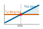
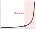

# Vận hành machine learning {#sec-ml-operations}

::: {layout-narrow}
::: {.column-margin}

\chapterminitoc

:::

::: {.content-visible when-format="pdf"}
\noindent
{fig-alt="Trong sơ đồ phối cảnh, vòng lặp vận hành bao quanh một dịch vụ mô hình đã triển khai, gồm đo từ xa, giám sát, ứng phó trôi dạt, huấn luyện lại và cập nhật triển khai."}
:::

::: {.content-visible unless-format="pdf"}
{fig-alt="Trong sơ đồ phối cảnh, vòng lặp vận hành bao quanh một dịch vụ mô hình đã triển khai, gồm đo từ xa, giám sát, ứng phó trôi dạt, huấn luyện lại và cập nhật triển khai."}
:::

:::

## Mục đích {.unnumbered .unlisted}

\begin{marginfigure}
\mlsysstack{0}{15}{10}{20}{35}{90}{35}{30}
\end{marginfigure}

_Vì sao một hệ thống ML có thể vừa luôn khả dụng lại vừa sai hoàn toàn cùng lúc?_

Giám sát truyền thống thường phát hiện nhanh các sự cố, độ trễ tăng và lỗi khả dụng, nhưng lỗi ngữ nghĩa có thể âm thầm tồn tại trong bất kỳ hệ thống phần mềm nào. Các hệ thống ML còn thêm một dạng lỗi thầm lặng khác. Một mô hình bị trôi dạt dữ liệu có thể tiếp tục phục vụ (serving) các dự đoán trông bình thường trong khi độ chính xác giảm dần, mà không hề kích hoạt cảnh báo vì mọi chỉ số sức khỏe (độ trễ, thông lượng, thời gian hoạt động) vẫn xanh. Hạ tầng phục vụ đưa mô hình vào sản xuất; vận hành giúp giữ cho chúng đúng khi đã ở đó.
Chất lượng mô hình có thể giảm vì thế giới thay đổi. Hành vi khách hàng dịch chuyển, danh mục sản phẩm mới xuất hiện, các mẫu theo mùa biến đổi, và phân phối dữ liệu mà mô hình đã học khác dần so với phân phối mà nó đang đối mặt. Trôi dạt không phải điều chắc chắn, nhưng là rủi ro dai dẳng với các mô hình đã triển khai. Khác với độ trễ hay thời gian hoạt động, tính đúng đắn của mô hình có thể chỉ thấy được sau khi có nhãn hoặc các kết quả đầu ra về sau, nên việc phát hiện suy giảm thường cần các tín hiệu chưa hoàn hảo và điều tra rõ ràng, chứ không chỉ một ngưỡng duy nhất.
Để quản lý, cần giám sát liên tục theo dõi chất lượng dự đoán song song với sức khỏe hệ thống; tín hiệu trôi dạt để kích hoạt điều tra; huấn luyện lại khi bằng chứng về kết quả ủng hộ; và các chiến lược triển khai giúp xác thực phiên bản mô hình mới với lưu lượng sản xuất trước khi rollout hoàn toàn. Khoảng cách giữa phát triển và sản xuất không phải rào cản vượt qua một lần rồi thôi, mà là trạng thái phải quản lý liên tục. Vận hành machine learning tồn tại vì chỉ có thời gian hoạt động mà không đo được độ chính xác thì vẫn có thể trả lời sai ở quy mô lớn. Nó khiến đồng thiết kế D·A·M diễn ra liên tục, vì môi trường dữ liệu có thể vẫn là mục tiêu thay đổi liên tục rất lâu sau đợt triển khai ban đầu.

::: {.content-visible when-format="pdf"}

\newpage

:::

::: {.callout-learning-objectives}

- Giải thích vì sao các hệ thống ML có thể vẫn khả dụng trong khi chất lượng dự đoán âm thầm suy giảm khi phân phối dữ liệu thay đổi.
- Chẩn đoán nợ kỹ thuật tại các ranh giới giao diện giữa dữ liệu–mô hình, mô hình–hạ tầng, và sản xuất–giám sát.
- Thiết kế các kho đặc trưng (feature store), registry và CI/CD pipeline để giữ nhất quán giữa huấn luyện và phục vụ (serving), đồng thời hỗ trợ rollback có thể tái lập.
- Áp dụng mô hình độ lỗi thời cho huấn luyện lại để chọn các yếu tố kích hoạt và khoảng thời gian huấn luyện lại có cân nhắc chi phí.
- Triển khai giám sát phân lớp để theo dõi drift, skew, suy giảm hiệu suất, các chỉ số kinh doanh và độ tươi của dữ liệu.
- So sánh các chiến lược canary, blue-green, shadow và rollback để quản lý rủi ro khi phát hành mô hình vào môi trường sản xuất.
- Đánh giá mức độ trưởng thành vận hành và mức đầu tư dựa trên mức độ quan trọng của mô hình, rủi ro vận hành và mức độ sẵn sàng của tổ chức.

:::

## Tổng quan về MLOps {#sec-ml-operations-introduction-machine-learning-operations-04c6}

Sau khi mô hình được xây dựng, tối ưu hóa, benchmark và phục vụ (serving), hệ thống vẫn phải đảm bảo đúng đắn. Benchmark thiết lập hiệu suất tại một thời điểm; hạ tầng phục vụ (serving) đáp ứng yêu cầu trong vài mili giây. Nhóm triển khai lên môi trường sản xuất, và tuần đầu tiên trông rất khả quan. Thử thách bắt đầu từ tuần thứ hai.

Phân phối dữ liệu thay đổi, hành vi người dùng thay đổi, và thế giới cũng khác đi so với điều kiện khi mô hình được huấn luyện. Các mô hình machine learning dù thành công trong giai đoạn phát triển vẫn có thể không duy trì được sử dụng bền vững trong sản xuất nếu thiếu quyền sở hữu và giám sát sau triển khai. Nguyên nhân sâu xa là sự không tương thích trong vận hành\index{Operational mismatch!ML vs. traditional software}: giám sát tập trung vào tính khả dụng thường theo dõi thời gian hoạt động của máy chủ, độ trễ phản hồi và tỷ lệ yêu cầu thành công, trong khi giám sát machine learning còn phải theo dõi tình trạng thống kê của mô hình, gồm độ chính xác theo thời gian, dịch chuyển phân phối dữ liệu đầu vào và chất lượng dự đoán theo từng phân đoạn. Một mô hình có thể suy giảm đáng kể mà không hề ném ngoại lệ, không kích hoạt cảnh báo hạ tầng nào và vẫn duy trì thời gian hoạt động hoàn hảo.

Lĩnh vực giúp làm rõ những lỗi tưởng như vô hình này chính là **vận hành machine learning (MLOps)**\index{MLOps!definition}\index{MLOps!emergence}\index{MLOps!production deployment challenges}. MLOps kết hợp giám sát, tự động hóa và quản trị vào các kiến trúc sản xuất, nhằm phát hiện suy giảm hiệu năng, kích hoạt huấn luyện lại và duy trì tình trạng ổn định của hệ thống trong suốt vòng đời hoạt động của mô hình. MLOps kế thừa di sản tự động hóa và vận hành từ DevOps [@kreuzberger2023], nhưng lại giải quyết một kiểu lỗi khác. Các dịch vụ truyền thống thường có thể được kiểm thử theo các luồng mã xác định, trong khi các hệ thống machine learning lại phụ thuộc vào phân phối dữ liệu huấn luyện, các tham số đã học và các điều kiện môi trường thay đổi liên tục.

Vấn đề của tuần thứ hai được thể hiện rõ qua một tình huống triển khai minh họa. Hãy xem xét một hệ thống dự đoán nhu cầu cho dịch vụ gọi xe. Ban đầu, hệ thống đạt độ chính xác 94%, độ trễ p99 là 15 ms và hoạt động tốt trên các phân khúc thử nghiệm. Đến tuần thứ tư, độ chính xác giảm xuống 88%, nhưng các chỉ số hạ tầng không cho thấy điều gì bất thường. Đến tuần thứ tám, một quản lý sản phẩm nhận thấy việc điều phối tài xế kém hiệu quả; khi điều tra, họ phát hiện mô hình chưa kịp thích nghi với chương trình khuyến mãi mới của đối thủ khiến hành vi người dùng thay đổi. Lẽ ra mô hình cần được huấn luyện lại từ sáu tuần trước, nhưng không có hệ thống nào theo dõi sự suy giảm này. MLOps cung cấp một framework để phát hiện những sự trôi dạt như vậy, kích hoạt huấn luyện lại và xác thực các mô hình mới trước khi người dùng phải chịu tác động.

Sự sai lệch trong vận hành gắn trực tiếp với các nền tảng phân tích của cuốn sách. Nếu benchmarking là các *cảm biến* của hệ thống, thì MLOps là *hệ thống điều khiển* hoàn chỉnh. Nó thu hẹp *khoảng cách xác minh*\index{Verification gap!MLOps closure} trong phương trình khoảng cách xác minh (@eq-verification-gap) bằng cách liên tục hiệu chỉnh để thích nghi với một thế giới luôn thay đổi. MLOps có thể vận hành một phương trình suy giảm được khớp cục bộ\index{Degradation equation!operational implementation} (@eq-degradation) khi dữ liệu về độ trôi và kết quả được ghép cặp cho thấy thay đổi phân phối dự báo việc giảm độ chính xác; chỉ riêng sự phân kỳ không chứng minh rằng suy giảm là điều tất yếu. MLOps cũng chuẩn hóa các giao diện và trách nhiệm giữa các lĩnh vực vốn thường tách rời (khoa học dữ liệu, kỹ thuật machine learning và vận hành hệ thống [@amershi2019]) thông qua huấn luyện lại liên tục, đánh giá A/B, triển khai theo giai đoạn và theo dõi các *artifact* theo tiêu chuẩn, hỗ trợ khả năng tái tạo và kiểm toán.

Việc triển khai, giám sát và duy trì một hệ thống ML trong môi trường sản xuất xác định đơn vị vận hành cho chương này: **nút ML**\index{ML node!definition}, một hệ thống hoàn chỉnh bao gồm các pipeline dữ liệu, tính toán đặc trưng, huấn luyện mô hình, hạ tầng phục vụ (serving) và giám sát dành cho một ứng dụng machine learning duy nhất. Các hoạt động nền tảng ở quy mô lớn hơn (quản lý hàng trăm mô hình, các phụ thuộc giữa mô hình, điều phối đa khu vực và kỹ thuật nền tảng machine learning cho toàn tổ chức) là các chủ đề nâng cao, được xây dựng dựa trên nền tảng của các mô hình đơn lẻ này.

Vòng đời của một nút ML trong môi trường sản xuất bắt đầu từ bài toán kiểm soát tuần thứ hai và đi theo các giao diện giúp hệ thống có thể quan sát được. Nợ kỹ thuật lý giải vì sao ML trong sản xuất trở nên tốn kém sau lần triển khai đầu tiên thành công; khi đó, kho đặc trưng, các pipeline CI/CD và theo dõi thử nghiệm sẽ xác định hạ tầng cần thiết để tái tạo dữ liệu, mã nguồn, tham số và cấu hình. Khi những artifact này có thể được tái tạo, việc giám sát, phát hiện độ trôi, chiến lược triển khai và ứng phó sự cố sẽ giữ cho mô hình khỏe mạnh theo thời gian. Các quyết định đầu tư và các nghiên cứu điển hình sau đó cho thấy cùng một nguyên tắc sẽ hiện lên khác nhau trong thiết bị đeo edge và trong các hoạt động AI lâm sàng.

Thách thức vận hành một mô hình đơn lẻ tách thành ba giao diện riêng. **Giao diện dữ liệu-mô hình**\index{Data-model interface!feature consistency} là chốt bàn giao giữa hạ tầng dữ liệu và huấn luyện mô hình; mục tiêu là đảm bảo tính nhất quán đặc trưng\index{Feature consistency!training-serving alignment}, để các pipeline huấn luyện và phục vụ (serving) tính đặc trưng theo cùng một cách. **Giao diện mô hình-cơ sở hạ tầng**\index{Model-infrastructure interface!environment parity} là bước chuyển từ các trọng số đã huấn luyện sang dịch vụ có khả năng mở rộng; thách thức là đồng nhất môi trường\index{Environment parity!production deployment}, vì một mô hình chạy tốt trong notebook có thể hỏng khi lên môi trường sản xuất do lệch phiên bản, phụ thuộc hoặc runtime. **Giao diện giám sát sản xuất**\index{Production-monitoring interface!feedback loop} là vòng lặp phản hồi giúp hệ thống tự điều chỉnh, đưa telemetry thống kê\index{Statistical telemetry!ML observability} từ sản xuất về huấn luyện, vì các hệ thống ML có thể suy giảm do drift mà không hề sập.

Các giao diện này quyết định vị trí của các thành phần hạ tầng trong chương. Kho đặc trưng giúp ổn định việc tính toán đặc trưng ở ranh giới dữ liệu-mô hình. Kho đăng ký mô hình và các pipeline triển khai giữ vững quá trình bàn giao giữa mô hình và hạ tầng. Bộ theo dõi drift, các trình kích hoạt huấn luyện lại và chính sách quản trị đóng kín vòng lặp giám sát sản xuất, trước khi sự suy giảm âm thầm trở thành thất bại kinh doanh.

[^fn-telemetry-mlops-pipeline]: **Telemetry**\index{Telemetry!ML observability}: Kênh phản hồi giúp làm lộ rõ sự suy giảm của mô hình trước khi nó trở thành thất bại kinh doanh; các sự cố và mã lỗi có thể phơi bày một số lỗi phần mềm, nhưng lỗi ngữ nghĩa có thể im lặng trong bất kỳ ứng dụng nào. Hệ thống ML còn có thêm rủi ro dịch chuyển phân phối, điều này khó phát hiện nếu thiếu telemetry thống kê như phân phối đặc trưng, độ tin cậy dự đoán và chỉ báo drift. Chỉ số về tính khả dụng thôi sẽ không phơi bày được sự suy giảm này.

Telemetry[^fn-telemetry-mlops-pipeline] đi qua các giao diện này cung cấp dữ liệu cần thiết để đưa ra các quyết định vận hành có cơ sở. Chính phạm vi vận hành đó làm rõ nhiệm vụ tiếp theo: phân biệt MLOps với DevOps truyền thống, xác định các nguyên tắc nền tảng chi phối các quyết định trong sản xuất, và chỉ ra các dạng nợ kỹ thuật tích lũy khi những nguyên tắc ấy bị bỏ qua.

## Nguyên tắc và nền tảng {#sec-ml-operations-mlops-3ea3}

Một bản phát hành ML trong môi trường sản xuất không còn chỉ là khác biệt về mã nguồn: phân phối dữ liệu, tham số đã huấn luyện, các lát cắt đánh giá và các vòng lặp phản hồi từ giám sát đều trở thành các đối tượng phát hành có thể làm thay đổi hành vi của hệ thống. MLOps\index{MLOps!DevOps comparison} được xây dựng dựa trên DevOps\index{DevOps!MLOps extension} nhưng tập trung giải quyết các yêu cầu đặc thù của phát triển và triển khai hệ thống ML [@kreuzberger2023; @amershi2019]. CI/CD truyền thống thường lý giải chủ yếu dựa trên mã, cấu hình, kiểm thử và hạ tầng như những đối tượng phát hành chính; còn vận hành ML phải quản lý thêm các tạo phẩm mà tính hợp lệ của chúng phụ thuộc vào dữ liệu và môi trường đã tạo ra chúng.

DevOps tích hợp và phân phối các hệ thống phần mềm. MLOps còn phải quản lý các quy trình làm việc mang tính thống kê và phụ thuộc dữ liệu, trải dài từ thu thập dữ liệu, tiền xử lý, huấn luyện mô hình, đánh giá, triển khai đến giám sát liên tục. Tất cả được vận hành trong một chu trình lặp kết nối thiết kế, phát triển mô hình và vận hành. Hãy quan sát cấu trúc “vòng lặp vô hạn” trong @fig-mlops-diagram để thấy các giai đoạn này liên tục phản hồi lẫn nhau; chính vòng lặp đó định hình cách lĩnh vực này vận hành.

::: {#dfn-ml-ops-mlops .callout-definition title="MLOps"}

***Machine learning operations (MLOps)***\index{MLOps!definition} là thực tiễn kỹ thuật đưa các hệ thống ML vào môi trường sản xuất thông qua CI/CD, điều phối workflow, đảm bảo khả năng tái tạo, quản lý phiên bản, cộng tác, huấn luyện và đánh giá liên tục, giám sát và các vòng lặp phản hồi [@kreuzberger2023].

1.  **Ý nghĩa**: Nếu không đóng vòng lặp này, chúng ta sẽ phải trả giá bằng các dự đoán lỗi thời, phát hiện chậm và những việc khắc phục lẽ ra tránh được. Các ngưỡng drift, tín hiệu kích hoạt huấn luyện lại và mục tiêu thời gian trung bình để phục hồi (MTTR) là các đại lượng đặc thù cho từng lần triển khai. Chúng được hiệu chỉnh dựa trên giá trị kinh doanh của các dự đoán, độ trễ nhãn, rủi ro xác thực và chi phí huấn luyện lại. Điều quan trọng không phải là một ngưỡng chung, mà là vòng lặp kiểm soát định lượng: đo lường dịch chuyển phân phối, ước tính chi phí do lỗi thời, chỉ kích hoạt huấn luyện lại khi lợi ích kỳ vọng lớn hơn rủi ro xác thực và triển khai, và phải xác minh mô hình thay thế trước khi đưa vào sử dụng chính thức.
2.  **Điểm khác biệt**: DevOps có thể giám sát tính đúng đắn chức năng và kết quả kinh doanh, cũng như *tính khả dụng của hệ thống*. MLOps bổ sung các kiểm soát thống kê cho *độ chính xác của dự đoán*, yếu tố có thể suy giảm ngay cả khi thời gian hoạt động, tỷ lệ lỗi và độ trễ vẫn ở trạng thái tốt.
3.  **Cạm bẫy thường gặp**: Một hiểu lầm phổ biến là cho rằng chỉ cần huấn luyện lại mô hình với dữ liệu mới là giải quyết được dịch chuyển phân phối. Thực tế, nếu huấn luyện lại mà không chẩn đoán rõ phân phối nào đã thay đổi (phân phối đặc trưng đầu vào ($p(x)$), mối quan hệ nhãn–đặc trưng ($p(y \mid x)$), hay cả hai), thì có thể giữ nguyên lỗi gốc hoặc làm tăng độ chệch (bias) khi lấy mẫu và gán nhãn. Dưới bối cảnh dịch chuyển hiệp biến (covariate shift) và các giả định về miền hỗ trợ (support), việc điều chỉnh trọng số hoặc lấy mẫu lại mang tính đại diện có thể hữu ích; còn dịch chuyển khái niệm (concept drift) thường đòi hỏi nhãn hiện tại và thích ứng mô hình.

:::

::: {#fig-mlops-diagram fig-env="figure" fig-pos="htb" fig-cap="**Vòng lặp MLOps lặp lại**: Hoạt động giám sát và kích hoạt đưa bằng chứng từ môi trường sản xuất trở lại giai đoạn thiết kế và phát triển mô hình, qua đó biến các bước xác định yêu cầu, kỹ thuật, kiểm thử và triển khai thành một chu trình vận hành liên tục." fig-alt="Sơ đồ vòng lặp vô hạn với ba giai đoạn. Giai đoạn thiết kế: yêu cầu, ưu tiên trường hợp sử dụng, tính khả dụng của dữ liệu. Phát triển mô hình: kỹ thuật dữ liệu, kỹ thuật mô hình, kiểm thử. Vận hành: triển khai, CI/CD pipeline, giám sát và kích hoạt."}

```{.tikz}
\scalebox{0.6}{%
\begin{tikzpicture}[line join=round,font=\sffamily,outer sep=0pt,  radius=2, start angle=-90]
\tikzset{
arr node/.style={sloped, allow upside down, single arrow,
single arrow head extend=+.12cm, thick, minimum height=+.6cm, fill=white},
arr/.style ={  edge node={node[arr node, pos={#1}]{}}},
arr'/.style={insert path={node[arr node, pos={#1}]{}}},
}
\begin{scope}[shift={(0,0)},scale=1.1, every node/.append style={transform shape}]
\draw[line width=7mm, sloped, text=white,GreenD!60]
 (0, 2) edge[preaction={line cap=butt, line width=10mm, draw=white, overlay},
              out=0, in=180, arr=.1, arr=.8] (5, -2)
(5,-2)to[out=0, in=180, arr=.2, arr=.9](10,2)
arc[start angle=90, delta angle=-180][arr'=.5]
(10,-2)edge[preaction={line cap=butt, line width=10mm, draw=white, overlay},out=180, in=0, arr=.1, arr=.8](5,2)
(5,2)to[out=180, in=0, arr=.2, arr=.9](0,-2)
arc[start angle=-90, delta angle=-180][arr'=.5] ;
\end{scope}
\node[align=center,blue!50!black]at(0,0){DESIGN};
\node[align=center,BrownLine!50!black]at(5.5,0){MODEL\\ DEVELOPMENT};
\node[align=center,GreenD!80!black]at(11,0){OPERATIONS};
%
\node[align=left,anchor=north,blue!50!black]at(0,-3){$\bullet$ Requirements Engineering\\
$\bullet$ ML Use-Cases Prioritization\\
$\bullet$ Data Availability Check};
\node[align=left,anchor=north,BrownLine!50!black]at(5.75,-3){$\bullet$ Data Engineering\\
$\bullet$ ML Model Engineering\\
$\bullet$ Model Testing \& Validation};
\node[align=left,anchor=north,GreenD!80!black]at(11.25,-3){$\bullet$ ML Model Deployment\\
$\bullet$ CI/CD Pipeline\\
$\bullet$ Monitoring \& Triggering};
\end{tikzpicture}}
```

:::

Sự phức tạp vận hành và rủi ro kinh doanh khi triển khai machine learning mà thiếu các thực hành kỹ thuật có hệ thống trở nên rõ ràng qua một ví dụ bán lẻ đơn giản. Ban đầu, một mô hình khuyến nghị giúp tăng doanh số, nhưng drift dữ liệu âm thầm dần làm giảm chất lượng dự đoán. Nếu hệ thống giám sát chỉ theo dõi uptime của hệ thống thay vì kết quả của mô hình, khoản thất thoát này có thể bị che khuất cho đến tận một kỳ rà soát kinh doanh sau đó. MLOps cung cấp các cơ chế kiểm soát để khiến những lỗi như vậy lộ diện sớm, trước khi chúng tích tụ thành tổn hại đáng kể về vận hành và tài chính.

### Các nguyên tắc nền tảng {#sec-ml-operations-foundational-principles-44e6}

Triển khai bán lẻ đó cho thấy một mô thức lặp lại. Thiếu các thực hành vận hành có hệ thống, ngay cả mô hình chính xác cũng có thể thất bại ngoài thực tế. Hãy đọc sự cố này như một chuỗi gỡ lỗi. Khi doanh thu giảm, câu hỏi đầu tiên là nhóm có tái tạo được mô hình đã triển khai hay không — điều này đòi hỏi khả năng tái tạo. Câu hỏi tiếp theo: pipeline dữ liệu, job huấn luyện, đường phục vụ (serving), và hệ thống giám sát có ranh giới đủ rõ để cô lập lỗi không — điều này đòi hỏi tách biệt trách nhiệm. Nếu đặc trưng phục vụ không còn khớp với đặc trưng huấn luyện, tính nhất quán là cơ chế kiểm soát ngăn sự cố lặp lại. Nếu drift khởi phát trước khi người dùng kịp phàn nàn, suy giảm có thể quan sát được là cơ chế biến lỗi âm thầm thành cảnh báo. Cuối cùng, nếu có thể huấn luyện lại nhưng tốn kém, tự động hóa có tính đến chi phí sẽ quyết định khi nào nên can thiệp, cân bằng rủi ro vận hành và chi phí tính toán. Những nguyên tắc này đặt tên cho các cơ chế kiểm soát theo đúng thứ tự mà một nhóm vận hành cần.

#### Khả năng tái tạo {#sec-ml-operations-principle-1-reproducibility-d408}

Khả năng tái tạo\index{Reproducibility!versioning principle} yêu cầu mọi tạo phẩm\index{Artifact!versioning, reproducibility requirement}[^fn-artifact-reproducibility-hashing] ảnh hưởng đến hành vi của mô hình phải được phiên bản hóa và truy vết được. Nguyên tắc này vượt ra ngoài việc phiên bản hóa mã, bao gồm cả dữ liệu, cấu hình và môi trường. @Eq-model-reproducibility thể hiện phụ thuộc này một cách hình thức:
$$\text{Model Output} = f(\text{Code}_v, \text{Data}_v, \text{Config}_v, \text{Environment}_v; \xi)$$ {#eq-model-reproducibility}
trong đó $v$ xác định phiên bản và $\xi$ biểu diễn tính ngẫu nhiên khi thực thi. Việc tái tạo đòi hỏi cả bốn đầu vào đã được phiên bản hóa, và cũng có thể cần seed, thứ tự dữ liệu, kernel xác định, và phần cứng tương thích. Các công cụ hỗ trợ gồm kiểm soát phiên bản, phiên bản hóa dữ liệu, và quản lý cấu hình.

[^fn-artifact-reproducibility-hashing]: **Tạo phẩm**\index{Artifact!reproducibility}: Các trọng số mô hình là các đầu ra hữu hình của quá trình huấn luyện; các đầu vào và yếu tố ngẫu nhiên đã tạo ra chúng thường không thể suy ra từ các tham số. Vì vậy, chỉ quản lý phiên bản mã nguồn là không đủ, và ngay cả khi quản lý phiên bản mã nguồn, dữ liệu, cấu hình và môi trường, vẫn có thể không bảo đảm phát lại y hệt nếu các kernel hoặc quá trình huấn luyện là không xác định.

#### Tách biệt các mối quan tâm {#sec-ml-operations-principle-2-separation-concerns-6f84}

**Tách biệt các mối quan tâm**\index{Separation of concerns!MLOps layers} phân tách các hệ thống MLOps thành các lớp chức năng riêng biệt có thể phát triển độc lập, như @tbl-mlops-layers minh họa:

| **Lớp** | **Trách nhiệm** | **Độ ổn định** |
|:---------------------|:-----------------------------------------------|:-----------------------------------|
| **Lớp Dữ liệu** | Tính toán đặc trưng, lưu trữ, phục vụ (serving) | Thay đổi theo sự phát triển của lược đồ dữ liệu |
| **Lớp Huấn luyện** | Phát triển mô hình, tối ưu hóa siêu tham số | Thay đổi theo nghiên cứu thuật toán |
| **Lớp Phục vụ (serving)** | Suy luận, khả năng mở rộng, quản lý độ trễ | Thay đổi theo các mẫu lưu lượng truy cập |
| **Lớp Giám sát** | Phát hiện trôi dạt, theo dõi hiệu suất | Thay đổi theo yêu cầu kinh doanh |

: **Tách biệt các mối quan tâm trong MLOps**: Mỗi lớp giải quyết một trách nhiệm riêng biệt và phát triển với tốc độ khác nhau trên các lớp dữ liệu, huấn luyện, phục vụ (serving) và giám sát. Sự tách biệt này cho phép mở rộng quy mô và cập nhật độc lập, giảm thiểu phạm vi ảnh hưởng khi cần thay đổi. {#tbl-mlops-layers}

#### Tính nhất quán là yếu tố then chốt {#sec-ml-operations-principle-3-consistency-imperative-a292}

Sự tách biệt trong @tbl-mlops-layers cho phép các nhóm cập nhật cơ sở hạ tầng phục vụ (serving) mà không cần huấn luyện lại mô hình, thay đổi ngưỡng giám sát mà không cần triển khai lại, và phát triển các pipeline dữ liệu trong khi vẫn giữ khả năng tương thích của mô hình. Sự độc lập đó chỉ an toàn khi môi trường huấn luyện và phục vụ (serving) xử lý dữ liệu giống hệt nhau, khiến sự tương ứng giữa huấn luyện và phục vụ (serving) trở thành một yêu cầu bắt buộc về tính nhất quán\index{Consistency imperative!training-serving parity}. Tác động tài chính của sự không nhất quán này được thể hiện trong @eq-skew-cost:
$$\text{Skew Cost} = \text{Rate}_{\text{skew}} \times Q \times C_{\text{error}}$$ {#eq-skew-cost}
trong đó $\text{Rate}_{\text{skew}}$ là tỷ lệ truy vấn bị ảnh hưởng bởi độ lệch giữa huấn luyện và phục vụ (serving), $Q$ là tổng khối lượng truy vấn mỗi kỳ kế toán, và $C_{\text{error}}$ là chi phí kinh doanh trung bình phát sinh cho mỗi dự đoán sai.

```{python}
#| echo: false
from mlsysim import *
from mlsysim.core.units import *

# ┌─────────────────────────────────────────────────────────────────────────────
# │ SKEW COST CALCULATION
# ├─────────────────────────────────────────────────────────────────────────────
# │ Context: The Consistency Imperative - quantifies annual cost
# │          of training-serving skew to motivate feature stores and validation.
# │
# │ Goal: Demonstrate the economic impact of training-serving skew.
# │ Show: That 1% skew error can waste $365,000 annually.
# │ How: Calculate annual lost revenue from a 1M daily query stream.
# │
# └─────────────────────────────────────────────────────────────────────────────
from mlsysim.fmt import fmt_int, fmt_rate, fmt_usd, fmt, check, MarkdownStr

class SkewEconomics:
    """
    Namespace for Training-Serving Skew Cost calculation.
    Scenario: The business impact of 1% skew-induced error on 1M daily queries.
    """

    # ┌── 1. LOAD (Constants) ───────────────────────────────────────────────
    queries_daily = MILLION
    skew_error_rate = 0.01
    cost_per_error = 0.10
    days_per_year = DAYS_PER_YEAR

    # ┌── 2. EXECUTE (The Compute) ─────────────────────────────────────────
    annual_cost = queries_daily * skew_error_rate * cost_per_error * days_per_year

    # ┌── 3. GUARD (Invariants) ───────────────────────────────────────────
    check(annual_cost == 365_000, f"Annual cost should be 365,000, got {annual_cost:.0f}")

    # ┌── 4. OUTPUT (Formatting) ──────────────────────────────────────────────
    queries_daily_str = fmt_rate(queries_daily, "queries/day", precision=0, commas=True)
    error_rate_pct_str = fmt_percent(round(skew_error_rate * 100) / 100, precision=0, commas=False, style='prose')
    error_cost_str = fmt_usd(cost_per_error, precision=2, commas=False)
    skew_cost_str = fmt_usd(annual_cost, precision=0, commas=True)
```

Đối với một hệ thống phục vụ `{python} SkewEconomics.queries_daily_str` với `{python} SkewEconomics.error_rate_pct_str` lỗi do độ lệch gây ra, mỗi lỗi có chi phí `{python} SkewEconomics.error_cost_str`, chi phí độ lệch hàng năm đạt `{python} SkewEconomics.skew_cost_str`. Điều này lượng hóa vì sao các cơ chế đảm bảo tính nhất quán là những khoản đầu tư mang lại lợi nhuận có thể đo lường được. Các cơ chế này gồm kho đặc trưng (feature store), mã tiền xử lý dùng chung và kiểm tra xác thực.

#### Suy giảm có thể quan sát được {#sec-ml-operations-principle-4-observable-degradation-87a9}

**Suy giảm có thể quan sát được**\index{Observable degradation!continuous measurement} yêu cầu các hệ thống ML làm lộ rõ các lỗi thầm lặng\index{Silent failure!gradual degradation} thông qua đo lường liên tục. Hiệu suất mô hình có thể suy giảm dọc theo một phổ liên tục thay vì hỏng rời rạc; và dạng diễn tiến theo thời gian của một lỗi được quan sát—dù là tụt đột ngột, trôi dần, hay suy giảm ở một nhóm con—giúp quyết định cách phát hiện và cách hệ thống nên phản ứng.

#### Tự động hóa có cân nhắc chi phí {#sec-ml-operations-principle-5-costaware-automation-631e}

**Tự động hóa có cân nhắc chi phí**\index{Cost-aware automation!retraining decisions} cần cân bằng giữa chi phí tính toán và mức cải thiện độ chính xác. Gọi $\Delta\text{Accuracy}$ là số điểm phần trăm độ chính xác dự kiến tăng thêm, $\text{Value per Point}$ là giá trị bằng tiền của mỗi điểm phần trăm tăng thêm trong suốt khoảng thời gian ra quyết định, $\text{Training Cost}$ là chi phí tính toán và nhân lực cho một lượt huấn luyện lại, và $\text{Deployment Risk}$ là chi phí kỳ vọng do khâu xác thực và các thất bại khi phát hành/triển khai. @Eq-retrain-decision mô tả sự đánh đổi này:
$$\text{Retrain if: } \Delta\text{Accuracy} \times \text{Value per Point} > \text{Training Cost} + \text{Deployment Risk}$$ {#eq-retrain-decision}

Bất đẳng thức này là một ngưỡng quyết định, không phải cơ chế kích hoạt tự động. Chỉ huấn luyện lại khi bằng chứng về kết quả cho thấy lợi ích kỳ vọng vượt cả chi phí chạy huấn luyện và rủi ro khi phát hành/triển khai. @Tbl-degradation-types ghép mỗi dấu hiệu lỗi có thể quan sát được với một bộ phát hiện và phản ứng vận hành phù hợp.

```{=latex}
\begingroup
\renewcommand{\arraystretch}{1.35}
```

| **Loại suy giảm** | **Cơ chế phát hiện** | **Chiến lược phản hồi** |
|:-------------------------|:------------------------|:---------------------------------------|
| **Giảm độ chính xác đột ngột** | Cảnh báo ngưỡng | Chẩn đoán; quay lại nếu liên quan đến bản phát hành |
| **Trôi dạt dần dần** | Phân tích xu hướng | Chẩn đoán, sau đó huấn luyện lại nếu cần thiết |
| **Suy giảm nhóm con** | Giám sát nhóm đối tượng | Thu thập dữ liệu có mục tiêu |
| **Tăng độ trễ** | Theo dõi phân vị | Mở rộng cơ sở hạ tầng |

: **Các chiến lược phát hiện suy giảm**: Bốn dấu hiệu lỗi được liên kết với các bộ phát hiện và phản ứng vận hành cụ thể. Sự suy giảm đột ngột đòi hỏi chẩn đoán ngay lập tức và có thể cần hoàn tác (rollback), trong khi suy giảm dần dần hoặc suy giảm theo nhóm con thì cần chẩn đoán trước khi huấn luyện lại hoặc thu thập dữ liệu có mục tiêu. {#tbl-degradation-types}

Nguyên tắc này định hướng cách thiết kế các tín hiệu kích hoạt huấn luyện lại, ngưỡng xác thực và chiến lược triển khai sẽ được xem xét trong chương này. Các giá trị cụ thể khác nhau theo từng lĩnh vực, nhưng framework để ra quyết định đánh đổi có cơ sở thì vẫn giữ nguyên. Phân tích huấn luyện lại trong @sec-ml-operations-training-pipelines-2dcf xây dựng mô hình kinh tế đầy đủ, kèm các ví dụ minh họa cách tính khoảng thời gian huấn luyện lại tối ưu. Khi chuỗi nhân quả đã rõ, năm nguyên tắc này có thể đóng vai trò framework đánh giá gọn nhẹ cho công cụ và thực tiễn. Luận điểm cốt lõi của @tbl-mlops-principles-summary là mỗi nguyên tắc chỉ thực sự vận hành khi được gắn với một chỉ số đo lường cụ thể: ghép mỗi nguyên tắc với chỉ số then chốt của nó, từ hash của artifact đến giá trị ròng của huấn luyện lại, là điều giúp framework này có thể kiểm toán, thay vì chỉ mang tính kỳ vọng.

| **Nguyên tắc** | **Thông tin chuyên sâu cốt lõi** | **Chỉ số chính** |
|:---------------------------|:----------------------------|:-----------------------|
| **Khả năng tái tạo** | Lập phiên bản tất cả các artifact | Hash artifact hoàn chỉnh |
| **Tách biệt các mối quan tâm** | Sự phát triển lớp độc lập | Điểm ghép nối lớp |
| **Tính nhất quán** | Huấn luyện tương đương với phục vụ (serving) | Tỷ lệ lệch đặc trưng |
| **Suy giảm có thể quan sát được** | Làm cho các lỗi hiển thị | Thời gian phát hiện |
| **Tự động hóa có tính đến chi phí** | Tối ưu hóa tổng chi phí | Giá trị huấn luyện lại ròng |

: **Tóm tắt các nguyên tắc MLOps**: Tóm tắt nhanh năm nguyên tắc nền tảng, định hướng mọi quyết định về công cụ và thực hành MLOps. {#tbl-mlops-principles-summary}

```{=latex}
\endgroup
```

Cách các nguyên tắc này thể hiện trong thực tế phụ thuộc vào khối lượng công việc (workload). Ví dụ, một hệ thống khuyến nghị có thể trôi mỗi ngày khi sở thích người dùng thay đổi; trong khi một mô hình TinyML được triển khai trên phần cứng nhúng có thể chạy không đổi trong nhiều tháng. Do đó, chiến lược giám sát phải phù hợp với từng nguyên mẫu.

::: {#lhs-ml-ops-monitoring-strategy-by-archetype .callout-lighthouse title="Chiến lược giám sát theo nguyên mẫu"}

```{=latex}
\begin{minipage}{1\linewidth}
```
Các dạng lỗi chính và ưu tiên giám sát khác nhau giữa các nguyên mẫu khối lượng công việc (workload). Bảng @Tbl-monitoring-archetype-strategy so sánh bốn nguyên mẫu tiêu biểu theo kiểu trôi, chỉ số giám sát và ví dụ về tín hiệu kích hoạt huấn luyện lại:

| **Nguyên mẫu** | **Mẫu trôi dạt chủ đạo** | **Chỉ số giám sát chính** | **Ví dụ về yếu tố kích hoạt huấn luyện lại** |
|:------------------------------|:-----------------------------------------------------------------|:----------------------------------------------------|:------------------------------------------------------------------------------------|
| **ResNet-50 (Quái vật tính toán)** | Thay đổi phân phối hình ảnh (ánh sáng, máy ảnh, các lớp đối tượng mới) | Độ chính xác trên tập giữ lại (có sẵn sự thật cơ sở) | Độ chính xác giảm > 2% so với đường cơ sở ($\sim$hàng tháng đối với các lĩnh vực ổn định) |
| **GPT-2 (Kẻ ngốn băng thông)** | Trôi dạt từ vựng, thay đổi chủ đề, các thực thể mới nổi | Perplexity trên lưu lượng truy cập trực tiếp (không cần sự thật cơ sở) | Perplexity tăng > 10%; phát hiện từ vựng mới ($\sim$hàng tuần đối với các lĩnh vực tin tức) |
| **DLRM (Phân tán thưa thớt)** | Thay đổi hành vi người dùng, biến động danh mục mặt hàng, mặt hàng khởi động nguội | Chênh lệch CTR/CVR so với các nhóm đối tượng lịch sử | Mức độ tương tác giảm > 5%; làm mới danh mục ($\sim$hàng ngày đối với thương mại điện tử) |
| **DS-CNN (Ràng buộc nhỏ)** | Thay đổi môi trường âm thanh (thay đổi ngưỡng nhiễu) | Chu kỳ hoạt động (số lần thức dậy/giờ) + tỷ lệ dương tính giả | Tỷ lệ thức dậy sai > 1%; hao pin vượt quá thông số kỹ thuật ($\sim$cập nhật OTA hàng quý) |

: **Chiến lược giám sát theo nguyên mẫu khối lượng công việc (workload)**: Đây là những gợi ý ban đầu mang tính minh họa cho chiến lược giám sát. Các ngưỡng thực tế cần được hiệu chỉnh dựa trên độ trễ của nhãn, lưu lượng, rủi ro kinh doanh và ngân sách cho việc chịu đựng cảnh báo (alert-fatigue budget) của hệ thống đã triển khai. {#tbl-monitoring-archetype-strategy tbl-colwidths="[16,28,23,33]"}

```{=latex}
\end{minipage}
```

**Góc nhìn hệ thống**: Việc có sẵn *ground truth* và các nút thắt vật lý quyết định cách thiết kế giám sát. Các mô hình thị giác thiên về tính toán (như ResNet-50), bị giới hạn bởi $O/(R_{\text{peak}} \cdot \eta_{\text{hw}})$, sẽ theo dõi độ chính xác trên tập holdout. Các mô hình ngôn ngữ và khuyến nghị tốn bộ nhớ (như GPT-2, DLRM), bị giới hạn bởi $D_{\text{vol}}/\text{BW}$, có thể dựa vào chỉ số *perplexity* hoặc các lượt nhấp ngầm (implicit clicks). Các mô hình chạy trên vi điều khiển (như DS-CNN), chịu ràng buộc bởi độ trễ nghiêm ngặt $L_{\text{lat}}$ và giới hạn năng lượng, sẽ giám sát chu kỳ hoạt động và tỷ lệ đánh thức sai. Nhịp huấn luyện lại bị chi phối bởi độ trễ của nhãn, khả năng truy cập hệ thống đã triển khai, chi phí xác thực và tốc độ thay đổi quan sát được.

:::

Những nguyên tắc này nhằm ứng phó với các thách thức lặp đi lặp lại: trôi dạt khái niệm (concept drift),[^fn-drift-adversarial-shift] lỗi chất lượng dữ liệu [@schelter2018automating], và suy giảm hiệu suất thầm lặng sau khi triển khai. Tổng hòa các yếu tố đó thúc đẩy sự ra đời của các công cụ và quy trình chuyên biệt, tạo nên khác biệt giữa MLOps và DevOps truyền thống. Sự khác biệt này bắt nguồn từ vấn đề lỗi thầm lặng đã nêu ở đầu chương: sức khỏe hệ thống không thể chỉ đo bằng thời gian hoạt động (uptime) hay độ trễ. Kỷ luật vận hành trong ML đòi hỏi giám sát các thuộc tính thống kê của phân phối dữ liệu và đầu ra của mô hình, chuyển trọng tâm từ câu hỏi "máy chủ có đang chạy không?" sang "hệ thống có còn thông minh không?"

[^fn-drift-adversarial-shift]: **Trôi dạt khái niệm (Concept drift)**\index{Concept drift!adversarial evolution}: Nghiên cứu về trôi dạt khái niệm (concept drift) và luồng dữ liệu đã chính thức hoá bài toán: mối quan hệ mục tiêu của một mô hình có thể thay đổi sau khi triển khai [@widmer1996; @gama2014]. Trong các miền đối kháng (adversarial domains) như phát hiện thư rác, gian lận và lạm dụng, phân phối dữ liệu có thể chủ động thích ứng để phản ứng lại với mô hình, khiến việc giám sát và huấn luyện lại liên tục trở thành một yêu cầu mang tính cấu trúc, chứ không còn là một tiện nghi vận hành.

@Tbl-mlops so sánh mục tiêu, phương pháp luận, công cụ chính và kết quả điển hình của DevOps và MLOps, qua đó minh họa vì sao các yêu cầu đặc thù của machine learning đòi hỏi các thực hành vận hành riêng. MLOps phối hợp một hệ sinh thái bên liên quan rộng hơn và đưa vào các thực hành chuyên biệt như lập phiên bản dữ liệu,[^fn-dvc-data-versioning] lập phiên bản mô hình và giám sát mô hình, vượt ra ngoài phạm vi DevOps truyền thống. Phạm vi mở rộng này biến vận hành mô hình thành một chu trình phản hồi thay vì một pipeline phát hành.

[^fn-dvc-data-versioning]: **DVC (Data Version Control)**\index{DVC!data versioning}: DVC mang cơ chế lập phiên bản kiểu Git đến các tập dữ liệu và tạo phẩm mô hình [@dvc], giải quyết khoảng trống về tạo phẩm mà @eq-model-reproducibility đã nêu rõ: nếu không có lập phiên bản dữ liệu, thành phần $\text{Data}_v$ không thể khôi phục, và không có tổ hợp commit mã nào có thể tái tạo lại mô hình đã được triển khai.

| **Khía cạnh** | **DevOps** | **MLOps** |
|:---------------------|:------------------------------------------------------------------------------------------------------------|:-----------------------------------------------------------------------------------------------------------------------------|
| **Mục tiêu** | Hợp lý hóa quy trình phát triển phần mềm và vận hành | Tối ưu hóa vòng đời của các mô hình machine learning |
| **Phương pháp luận** | Tích hợp liên tục và Phân phối liên tục (CI/CD) cho phát triển phần mềm | Tương tự như CI/CD nhưng tập trung vào các quy trình làm việc machine learning |
| **Công cụ chính** | Kiểm soát phiên bản (Git), công cụ CI/CD (Jenkins, Travis CI), Quản lý cấu hình (Ansible, Puppet) | Công cụ quản lý phiên bản dữ liệu, Công cụ huấn luyện và triển khai mô hình, pipeline CI/CD tùy chỉnh cho ML |
| **Các mối quan tâm chính** | Tích hợp mã, Kiểm thử, Quản lý phát hành, Tự động hóa, Cơ sở hạ tầng dưới dạng mã | Quản lý dữ liệu, Quản lý phiên bản mô hình, Theo dõi thử nghiệm, Triển khai mô hình, Khả năng mở rộng của các quy trình làm việc machine learning |
| **Kết quả điển hình** | Phát hành phần mềm nhanh hơn và đáng tin cậy hơn, Cải thiện sự hợp tác giữa các nhóm phát triển và vận hành | Quản lý và triển khai hiệu quả các mô hình machine learning, Tăng cường sự hợp tác giữa các nhà khoa học dữ liệu và kỹ sư |

: **MLOps so với DevOps**: MLOps mở rộng các nguyên tắc của DevOps để đáp ứng các yêu cầu đặc thù của hệ thống machine learning, bao gồm lập phiên bản dữ liệu và mô hình, cùng giám sát liên tục hiệu suất mô hình và trôi dữ liệu. MLOps phối hợp nhiều bên liên quan hơn và nhấn mạnh tính tái tạo và khả năng mở rộng vượt ra ngoài các quy trình phát triển phần mềm truyền thống. {#tbl-mlops tbl-colwidths="[12,42,46]"}

::: {#chk-ml-ops-mlops-loop .callout-checkpoint title="Vòng lặp MLOps"}

MLOps không tuyến tính; mà mang tính tuần hoàn.

**Chu trình phản hồi**

- [ ] **Đóng vòng lặp**: các chỉ số ở môi trường sản xuất (ví dụ: cảnh báo trôi dữ liệu) kích hoạt các chu kỳ huấn luyện mới như thế nào?
- [ ] **Kích hoạt huấn luyện lại**: bạn có phân biệt được tín hiệu trôi dữ liệu cần điều tra với bằng chứng về kết quả đủ để quyết định huấn luyện lại không?

**Các tạo phẩm**

- [ ] **Lập phiên bản**: bạn có đang lập phiên bản dữ liệu + mã + mô hình + môi trường cùng nhau không?

:::

Các hệ thống ML phát sinh thêm nguồn nợ kỹ thuật so với phần mềm truyền thống. DevOps xử lý việc triển khai và mở rộng, còn MLOps phải đối mặt với độ phức tạp ẩn từ các phụ thuộc dữ liệu, tương tác giữa các mô hình và yêu cầu luôn thay đổi. Những phụ thuộc bổ sung này vừa là nguồn gốc nợ kỹ thuật, vừa cung cấp bộ từ vựng chẩn đoán cho hạ tầng MLOps chuyên biệt. Hiểu rõ *boundary erosion* (xói mòn ranh giới) cho thấy vì sao cần thiết kế các *pipeline* theo kiểu mô-đun. Nhận diện *correction cascades* (chuỗi hiệu chỉnh) làm rõ tầm quan trọng của quản lý phiên bản và khả năng khôi phục (rollback). Xác định *undeclared consumers* (các bên tiêu thụ không được khai báo) biện minh cho việc áp dụng các hợp đồng giao diện chặt chẽ. Những mẫu hình này chính là các kiểu lỗi cụ thể, là động lực cho các thành phần hạ tầng sẽ trình bày tiếp theo.

Mỗi vòng lặp có thể tạo thêm các phụ thuộc dữ liệu, tương tác giữa các mô hình và *configuration drift* (trôi cấu hình) mà kiểm thử phần mềm tiêu chuẩn không nhìn thấy. Những chi phí tích lũy đó chính là nợ kỹ thuật: một *framework* để chuyển các kiểu lỗi ML âm thầm thành các khoản nợ kỹ thuật có thể định lượng.

## Nợ kỹ thuật {#sec-ml-operations-technical-debt-system-complexity-2762}

Các kiểu lỗi âm thầm đã nêu trước đó biểu hiện cụ thể dưới dạng nợ kỹ thuật\index{Technical debt!ML system complexity} [@sculley2015hidden]: các thay đổi về dữ liệu, tương tác giữa các mô hình và yêu cầu luôn thay đổi gây ra sự xuống cấp dần dần, tích lũy theo thời gian. Những lỗi này có thể âm thầm tích lũy qua nhiều thành phần hệ thống, đòi hỏi cách tiếp cận kỹ thuật phải tính đến hành vi thống kê và các phụ thuộc dữ liệu. Khái niệm này được đề xuất trong kỹ thuật phần mềm từ thập niên 1990,[^fn-tech-debt-ml] phép ẩn dụ nợ kỹ thuật so sánh việc dùng lối tắt trong quá trình hiện thực với nợ tài chính: đánh đổi tốc độ ngắn hạn lấy khoản “tiền lãi” phải trả đều đặn dưới dạng chi phí bảo trì, tái cấu trúc (*refactoring*) và rủi ro hệ thống [@cunningham1992wycash]. Trong ML, nợ này không chỉ nằm ở mã nguồn mà còn bao gồm các chi phí “ẩn” do mô hình thống kê và phụ thuộc dữ liệu. Các thang đánh giá có hệ thống, như ML Test Score [@breck2017], cung cấp các *framework* để định lượng nợ này và đánh giá mức độ sẵn sàng đưa vào sản xuất trên các thành phần dữ liệu, mô hình và hạ tầng.

[^fn-tech-debt-ml]: **Nợ kỹ thuật**\index{Technical debt!ML compounding}: Báo cáo kinh nghiệm WyCash năm 1992 của Ward Cunningham giới thiệu ẩn dụ nợ kỹ thuật cho việc ưu tiên viết mã nhanh và trì hoãn việc củng cố/gộp lại [@cunningham1992wycash]. Trong machine learning, nợ này có thể âm thầm tích tụ qua các phụ thuộc về dữ liệu và mô hình mà các kiểm thử đơn vị và đánh giá mã tập trung vào mã nguồn khó phát hiện. Pipeline có thể giữ nguyên, trong khi thế giới mà nó mô hình hoá thì thay đổi. Bộ tiêu chí ML Test Score [@breck2017] làm rõ khoản nợ này bằng 28 bài kiểm tra mức độ sẵn sàng cho sản xuất, chia theo các nhóm: dữ liệu, mô hình, cơ sở hạ tầng và giám sát.

::: {#dfn-ml-ops-technical-debt-ml .callout-definition title="Nợ kỹ thuật trong ML"}

***Nợ kỹ thuật trong machine learning***\index{Technical debt!definition} là chi phí bảo trì và thay đổi tích luỹ, phát sinh từ các phụ thuộc dữ liệu ngầm, các đặc trưng bị đan cài (entangled features) và các bên tiêu thụ không được khai báo trong các hệ thống machine learning. Những hậu quả của nợ kỹ thuật cũng có thể biểu hiện dưới dạng suy giảm độ chính xác một cách âm thầm.

1.  **Ý nghĩa**: Phân tích của Google về các hệ thống machine learning trong sản xuất cho thấy phần mã của mô hình chỉ chiếm một phần nhỏ trong toàn bộ hệ thống. Phạm vi vận hành lớn hơn bao gồm thu thập dữ liệu, trích xuất đặc trưng, cấu hình, cơ sở hạ tầng phục vụ (serving), giám sát và quản lý quy trình [@sculley2015hidden]. Các tác nhân gây nợ kỹ thuật đặc thù của machine learning càng làm vấn đề phức tạp hơn: thay đổi một đặc trưng đầu vào có thể âm thầm làm dịch chuyển biểu diễn đã học của mọi đặc trưng khác (entanglement); một mô hình được huấn luyện để sửa lỗi của mô hình khác tạo ra chuỗi phụ thuộc mong manh (correction cascades); và các hệ thống hạ nguồn tiêu thụ đầu ra của mô hình mà không có hợp đồng rõ ràng trở thành các bên tiêu thụ không được khai báo (undeclared consumers), âm thầm hỏng khi mô hình được cập nhật.
2.  **Điểm khác biệt**: Nợ kỹ thuật trong machine learning bao gồm các phụ thuộc ở cấp hệ thống và cấp dữ liệu mà các đánh giá mã và các kiểm thử thông thường tập trung vào mã nguồn có thể bỏ sót. Nó có thể làm chậm quá trình phát triển và làm giảm chất lượng dự đoán, ngay cả khi các chỉ số về tính khả dụng vẫn ở mức tốt.
3.  **Sai lầm phổ biến**: Nhiều người nghĩ rằng "mã tốt hơn" sẽ xóa được nợ kỹ thuật trong ML. Thực ra đây là bài toán kiến trúc hệ thống: nợ tích tụ khi các giả định của phân phối huấn luyện (phạm vi đặc trưng, ý nghĩa nhãn, độ tươi mới của dữ liệu) không được áp dụng như các ràng buộc runtime tại ranh giới hệ thống.

:::

Một phép tính hòa vốn giúp cụ thể hóa bức tranh chi phí của nợ kỹ thuật. Các nhóm thường do dự đầu tư tự động hóa vì quy trình thủ công có vẻ nhanh hơn trong ngắn hạn, nhưng lợi thế đó biến mất khi khối lượng công việc thủ công tích lũy vượt quá chi phí đầu tư tự động hóa ban đầu. @Fig-technical-debt cho thấy mã ML chỉ là một trong mười thành phần bao quanh một hệ thống ML vận hành thực tế, qua đó làm rõ bề mặt vận hành rộng hơn.

::: {.column-margin}
{width="100%" fig-alt="Hai đường theo số tuần đã trôi qua: một đường công việc thủ công tăng dần cắt một đường chi phí đầu tư pipeline một lần (đường ngang) gần tuần thứ 20; vùng sau điểm giao nhau được tô bóng."}

*Tổng công việc thủ công vượt quá chi phí đầu tư tự động hóa ban đầu (một lần) vào khoảng tuần thứ 20.*
:::

Các thao tác thủ công sẽ đụng trần năng lực, nhưng bài toán chi phí không chỉ nằm ở thời gian của kỹ sư. Hệ thống ML tích lũy độ phức tạp ẩn thông qua các kiểu nợ kỹ thuật đặc thù, xuất phát từ những điểm riêng của ML: dựa vào dữ liệu thay vì logic xác định, hành vi mang tính thống kê thay vì chính xác tuyệt đối, và các phụ thuộc ngầm qua luồng dữ liệu thay vì các giao diện tường minh.

::: {#fig-technical-debt fig-env="figure" fig-pos="htb" fig-cap="**Cơ sở hạ tầng ẩn của các hệ thống ML**: Mã ML là một trong mười thành phần được bố trí quanh hệ thống ML ở trung tâm, cùng với thu thập dữ liệu, xác minh dữ liệu, trích xuất đặc trưng, cấu hình, quản lý tài nguyên máy, cơ sở hạ tầng phục vụ (serving), giám sát, công cụ phân tích và công cụ quản lý quy trình. Điểm mấu chốt là con số đó, vì mô hình chỉ chiếm một ô, còn chín ô còn lại là bề mặt vận hành mà một lần triển khai cũng phải gánh." fig-alt="Sơ đồ dạng nan hoa với hệ thống ML ở trung tâm, được nối bằng các mũi tên tới mười thành phần xung quanh: thu thập dữ liệu, xác minh dữ liệu, trích xuất đặc trưng, cấu hình, quản lý tài nguyên máy, cơ sở hạ tầng phục vụ (serving), giám sát, công cụ phân tích, công cụ quản lý quy trình và mã ML."}

```{.tikz}
\scalebox{0.73}{%
\begin{tikzpicture}[line join=round,font=\small\sffamily]
\tikzset{%
planet/.style = {circle, draw=none,
semithick, fill=blue!30,
                    font=\sffamily\bfseries, ball color=green!70!blue!70,shading angle=-15,
                    text width=27mm, inner sep=1mm,align=center},
satellite/.style = {circle, draw=#1, semithick, fill=#1!30,
                    text width=18mm, inner sep=1pt, align=flush center,minimum size=21mm},%<---
arr/.style = {-{Triangle[length=3mm,width=6mm]}, color=#1,
                    line width=3mm, shorten <=1mm, shorten >=1mm}
}
%planet
\node (p)   [planet]    {ML system};
%satellites
\foreach \i/\j [count=\k] in {red/{Machine Resource Management},
cyan/{Configuration},
purple/{Data Collection},
green/{Data Verification},
orange/{Serving Infrastructure},
yellow/{Monitoring},
Siva/{Feature Extraction},
magenta/{ML Code},
violet/{Analysis Tools},
teal/{Process Management Tools}
}
%connections
{
\node (s\k) [satellite=\i,font=\footnotesize\sffamily] at (\k*36:3.8) {\j};
\draw[arr=\i] (p) -- (s\k);
}
\end{tikzpicture}}
```

:::

```{python}
#| echo: false
#| label: compound-cost-calc
# ┌─────────────────────────────────────────────────────────────────────────────
# │ COMPOUND COST OF MANUAL OPERATIONS
# ├─────────────────────────────────────────────────────────────────────────────
# │ Context: Callout "The Compound Cost of Manual Operations" - technical debt
# │          section showing why automation ROI compounds over time.
# │
# │ Goal: Demonstrates the break-even math for pipeline automation. Manual work
# │      (4 hrs/week) compounds while pipeline investment (80 hrs one-time)
# │      pays off in 20 weeks. After 1 year, manual teams drown in maintenance
# │      while automated teams have zero ongoing cost.
# │
# └─────────────────────────────────────────────────────────────────────────────
from mlsysim.fmt import fmt_int, fmt, check

# ┌── LEGO ───────────────────────────────────────────────
class AutomationROI:
    """
    Namespace for Automation ROI calculation.
    Scenario: Comparing manual retraining cost vs automated pipeline investment.
    """

    # ┌── 1. LOAD (Constants) ───────────────────────────────────────────────
    hrs_manual_week = 4.0
    hrs_automation_once = 80.0
    time_horizon_years = 1.0

    # ┌── 2. EXECUTE (The Compute) ─────────────────────────────────────────
    breakeven_weeks = hrs_automation_once / hrs_manual_week

    # ┌── 3. GUARD (Invariants) ───────────────────────────────────────────
    check(breakeven_weeks <= 26, f"Automation takes too long ({breakeven_weeks} weeks) to justify. Narrative implies fast ROI.")

    # ┌── 4. OUTPUT (Formatting) ──────────────────────────────────────────────
    mc_manual_hours_str = fmt_time(hrs_manual_week, "hour", precision=0, commas=False, style="word")
    mc_pipeline_hours_str = fmt_int(hrs_automation_once, commas=False)
    mc_breakeven_weeks_str = fmt_time(breakeven_weeks, "week", precision=0, commas=False, style="word")
    mc_time_horizon_years_str = fmt_time(time_horizon_years, "year", precision=0, commas=False, style="word")
    mc_pipeline_final_str = fmt(0, precision=0, commas=False)
```

::: {#nbk-ml-ops-compound-cost-manual-operations .callout-notebook title="Tổng chi phí của các hoạt động thủ công"}

**Vấn đề**: Tại sao phải xây dựng các pipeline tự động khi việc huấn luyện lại thủ công nhanh hơn?

**Vật lý**: Công việc thủ công tích lũy theo thời gian.

*   Huấn luyện lại thủ công: `{python} AutomationROI.mc_manual_hours_str` giờ công kỹ sư mỗi tuần.
*   Xây dựng pipeline: `{python} AutomationROI.mc_pipeline_hours_str` giờ công kỹ sư (một lần).

**Toán**:

*   **Kết quả**: `{python} AutomationROI.mc_pipeline_hours_str` giờ công kỹ sư $\div$ `{python} AutomationROI.mc_manual_hours_str` mỗi tuần = `{python} AutomationROI.mc_breakeven_weeks_str`.
*   **Cạm bẫy**: Điều này giả định mô hình không bao giờ thay đổi.
*   **Hạn chế**: Việc bổ sung đặc trưng có thể làm tăng khối lượng công việc thủ công.
*   **Hậu quả**: Sau `{python} AutomationROI.mc_time_horizon_years_str`, các nhóm làm thủ công vẫn tốn `{python} AutomationROI.mc_manual_hours_str` mỗi tuần cho bảo trì. Với cách tính đơn giản này, các nhóm dùng pipeline sẽ phát sinh `{python} AutomationROI.mc_pipeline_final_str` giờ công định kỳ.

**Bối cảnh**: Một nguyên tắc cốt lõi trong kỹ thuật hệ thống là chi phí *duy trì* một hệ thống trong suốt vòng đời của nó có thể lấn át chi phí *xây dựng* nó. Trong ML, nợ kỹ thuật đặc biệt nguy hiểm vì nó thường *phụ thuộc vào dữ liệu* hơn là *phụ thuộc vào mã nguồn*: một đoạn mã hoàn hảo vẫn có thể thất bại nếu dữ liệu nó xử lý thay đổi. Đo lường là ranh giới của quản lý: nếu không có dữ liệu đo từ xa, nhóm sẽ không thể biết liệu công việc bảo trì đang thực sự giảm nợ hay chỉ che giấu nó.

**Hiểu biết về hệ thống**: Tự động hóa giúp giải quyết giới hạn về năng lực, không chỉ tăng tốc độ. Một nhóm làm việc thủ công cuối cùng sẽ chạm ngưỡng mà việc duy trì các mô hình hiện có ngăn họ triển khai mô hình mới. MLOps đáp ứng bằng khả năng quan sát và tự động hóa có hệ thống. Nếu thiếu hạ tầng giám sát để làm lộ các lỗi ngầm (silent failures), nhóm sẽ tích lũy nợ kỹ thuật và dựng nên một hệ thống ngày càng khó quản lý.

:::

@Fig-technical-debt-taxonomy phân loại sáu dạng nợ kỹ thuật liên quan đến dữ liệu, mô hình và hạ tầng. Các ví dụ minh họa sau đây sẽ kết nối từng dạng với phản ứng kỹ thuật tương ứng mà nó đòi hỏi.

::: {#fig-technical-debt-taxonomy fig-env="figure" fig-pos="htb" fig-cap="**Phân loại nợ kỹ thuật ML**: Có sáu dạng nợ kỹ thuật phát sinh từ nợ kỹ thuật ẩn: nợ cấu hình, vòng lặp phản hồi, nợ dữ liệu, nợ pipeline, chuỗi hiệu chỉnh và xói mòn ranh giới. Các nhãn xung quanh sẽ chỉ rõ các dạng lỗi liên quan tới từng loại nợ này." fig-alt="Sơ đồ dạng nan hoa này có Nợ Kỹ thuật Ẩn ở trung tâm, cùng với sáu danh mục được gắn nhãn: Nợ Cấu hình, Vòng lặp Phản hồi, Nợ Dữ liệu, Nợ Pipeline, Chuỗi Hiệu chỉnh và Xói mòn Ranh giới. Mỗi danh mục đều có một nhãn văn bản mô tả dạng lỗi tương ứng."}

```{.tikz}
\scalebox{0.75}{%
\begin{tikzpicture}[line join=round,font=\small\sffamily]
\tikzset{%
planet/.style = {circle, draw=none,semithick, fill=RedLine!30,
                    font=\sffamily\bfseries,
                    text width=27mm, inner sep=1mm,align=flush center},
satellite/.style = {rectangle, draw=#1, semithick, fill=#1!20,
                    text width=18mm, inner sep=1pt, align=flush center,minimum size=21mm,minimum height=10mm},
satellite1/.style = {rectangle, draw=#1, semithick, fill=#1,anchor=east,
                   inner sep=1pt, align=flush center,minimum size=2.5mm,minimum height=10mm},
arr/.style = {-{Triangle[length=3mm,width=6mm]}, color=#1,
                    line width=3mm, shorten <=1mm, shorten >=1mm},
TxtL/.style = {font=\footnotesize\sffamily,text width=30mm,align=flush right},
TxtR/.style = {font=\footnotesize\sffamily,text width=30mm,align=flush left},
TxtC/.style = {font=\footnotesize\sffamily,text width=30mm,align=flush center}
}
%planet
\node (p)   [planet]    {Hidden Technical Debt};
%satellites
\foreach \i/\j/\radius/\sho [count=\k] in {
  red/{Configuration Debt}/3.1/7pt,
  cyan/{Feedback Loops}/3.1/7pt,
  Siva/{Data Debt}/4.0/10pt,
  green!65!black/{Pipeline Debt}/3.1/7pt,
  orange/{Correction Cascades}/3.1/7pt,
  yellow!80!red/{Boundary Erosion}/4.1/10pt
}
{
%Satelit
\node (s\k) [satellite=\i,font=\footnotesize\sffamily] at (\k*60:\radius) {\j};
%Decoration
\node[satellite1=\i](DE\k) at (s\k.west) {};
%Arrows
\draw[arr=\i,shorten >=\sho] (p) -- (s\k);
}
\node[TxtL,left=2pt of DE2]{\textbf{Undeclared Consumers:} Hidden model dependencies};
\node[TxtR,right=2pt of s1.east,anchor=west]{\textbf{Parameter Sprawl:}\\ Ad hoc settings and
hard-coded values};
\node[TxtL,left=2pt of DE4]{\textbf{Fragile Workflows:} Tightly coupled};
\node[TxtR,text width=40mm,right=2pt of s5.east,anchor=west]{\textbf{Sequential Dependencies:}
Upstream fixes break downstream systems};
\node[TxtL,left=10pt of s3]{\textbf{Quality Issues:} Inconsistent formats
and distributions};
\node[TxtR,right=2pt of s6]{\textbf{CACE Principle:}
Change Anything Changes Everything};
\end{tikzpicture}}
```

:::

### Xói mòn ranh giới {#sec-ml-operations-boundary-erosion-8ef5}

Kiểu nợ đầu tiên, và thường tai hại nhất, là sự bào mòn ranh giới hệ thống\index{Boundary erosion!dissolution of modularity}. Trong phần mềm truyền thống, mô-đun hóa và trừu tượng hóa tạo ra ranh giới rõ ràng giữa các thành phần, giúp cô lập thay đổi và giữ cho hành vi có thể dự đoán. Các hệ thống machine learning làm mờ các ranh giới này vì lý do cấu trúc: hành vi của mô hình phụ thuộc vào các thuộc tính thống kê của dữ liệu đi qua hệ thống, chứ không dựa vào các giao diện tường minh. Một thay đổi ở định dạng dữ liệu phía upstream có thể vượt qua mọi kiểm thử đơn vị nhưng âm thầm làm giảm độ chính xác của mô hình ở phía downstream. Sự phụ thuộc ngầm thông qua dữ liệu, thay vì qua mã nguồn, tạo ra các tương tác liên kết chặt giữa các pipeline dữ liệu, quá trình xây dựng đặc trưng, huấn luyện mô hình và khâu tiêu thụ downstream.

Sự bào mòn này gây ra **sự đan xen**\index{Entanglement!ML system coupling}: các phụ thuộc giữa các thành phần quấn chặt đến mức mọi chỉnh sửa cục bộ đều đòi hỏi hiểu biết và phối hợp ở tầm toàn hệ thống. Điều này được tóm gọn trong nguyên tắc CACE\index{CACE principle!change propagation}: *Change Anything Changes Everything*. Khi hệ thống thiếu ranh giới mạnh, việc điều chỉnh mã hóa đặc trưng, siêu tham số của mô hình, hoặc tiêu chí chọn dữ liệu có thể tác động đến hành vi downstream theo những cách khó lường. Chẳng hạn, thay đổi chiến lược chia khoảng (binning) cho một đặc trưng số có thể khiến mô hình vốn đã tinh chỉnh trước đó sa sút, kéo theo huấn luyện lại và thay đổi cách đánh giá downstream, lan xa vượt ngoài phạm vi sửa đổi ban đầu.

Phòng vệ chính chống bào mòn ranh giới là ở kiến trúc: mô-đun hóa và đóng gói ngay từ khi thiết kế. Các thành phần với giao diện rõ ràng cho phép kỹ sư cô lập lỗi, suy xét về các thay đổi và giảm rủi ro hồi quy trên toàn hệ thống. Việc tách bạch giữa thu nạp dữ liệu, xây dựng đặc trưng và logic mô hình tạo ra các lớp có thể xác thực, giám sát và bảo trì độc lập. Sự bào mòn ranh giới thường khó thấy ở giai đoạn đầu, vì sự liên kết chặt chỉ lộ rõ khi một thay đổi tưởng như cục bộ lại kích hoạt sự cố ở một nơi xa trong hệ thống. Các quyết định thiết kế chủ động duy trì trừu tượng, kiểm thử có hệ thống và tài liệu hóa giao diện là những phòng tuyến thực tế nhất trước mức độ phức tạp âm thầm gia tăng này.

### Thác hiệu chỉnh {#sec-ml-operations-correction-cascades-e309}

Nếu xói mòn ranh giới mô tả *cách* các hệ thống ML mất tính toàn vẹn cấu trúc, thì thác hiệu chỉnh mô tả *điều gì* xảy ra khi các nhóm cố gắng sửa chữa. Một **thác hiệu chỉnh**\index{Correction cascade!sequential dependencies} xuất hiện khi sửa một thành phần lại làm phát sinh lỗi ở chỗ khác, buộc phải sửa tiếp, và mỗi lần sửa lại tiếp tục gây ra lỗi mới. Trong các hệ thống ML, các thác này đặc biệt nghiêm trọng vì thay đổi lan qua các phụ thuộc thống kê, chứ không đi theo các đường dẫn mã tường minh. Huấn luyện lại một mô hình để khắc phục một kiểu lỗi có thể làm giảm hiệu suất trên những trường hợp trước đây vẫn hoạt động tốt. Điều chỉnh ngưỡng để giảm dương tính giả có thể làm tăng âm tính giả. Thêm đặc trưng để xử lý edge cases có thể tạo ra các tương quan làm mất ổn định toàn bộ hệ thống. Mỗi lần hiệu chỉnh lại kéo theo nhu cầu hiệu chỉnh tiếp, tạo thành một chuỗi hiệu chỉnh có thể ngốn nguồn lực kỹ thuật vượt xa so với chi phí sửa lỗi ban đầu.

@Fig-correction-cascades-flowchart làm hiện rõ cấu trúc thác như một chuỗi các mô hình phụ thuộc. Mỗi mô hình được huấn luyện để sửa lỗi của mô hình liền trước: mô hình B bù cho phần lỗi còn sót của mô hình A, mô hình C bù cho mô hình B, và cứ thế dọc theo chuỗi. Trật tự này giữ nguyên cho đến khi một mô hình thượng nguồn thay đổi. Khi mô hình A được huấn luyện lại để sửa một kiểu lỗi, mọi mô hình hạ nguồn từng được tinh chỉnh theo hành vi trước đó của A đều mất hiệu lực cùng lúc, và từng mô hình phải được hiệu chỉnh lại. Các cung màu đỏ cho thấy quỹ đạo lan truyền này, chỉ ra rằng một sửa chữa tưởng chừng cục bộ lại ảnh hưởng tới toàn bộ chuỗi. Một thay đổi gần đỉnh chuỗi buộc phải làm lại nhiều nhất, trong khi thay đổi gần đáy gần như “miễn phí”. Với một nhóm vận hành, chỉ một yêu cầu thay đổi cũng có thể kích hoạt việc huấn luyện lại phối hợp cả chuỗi.

::: {#fig-correction-cascades-flowchart fig-env="figure" fig-pos="htb" fig-cap="**Thác hiệu chỉnh**: Mỗi mô hình được huấn luyện để sửa lỗi của mô hình liền trước, tạo thành một chuỗi phụ thuộc. Thay đổi một mô hình thượng nguồn sẽ cùng lúc làm mất hiệu lực mọi hiệu chỉnh hạ nguồn, biến một bản vá cục bộ thành công việc làm lại dây chuyền khắp toàn bộ chuỗi, và mỗi bản vá hạ nguồn lại đòi hỏi một vòng huấn luyện lại riêng." fig-alt="Bốn mô hình được xếp thành một chuỗi từ trái sang phải, đặt tên từ Mô hình A đến Mô hình D. Mỗi mô hình được huấn luyện để sửa lỗi cho mô hình liền trước. Một biểu tượng đổi thay màu đỏ trên Mô hình A và các cung đứt nét màu đỏ nối tới Mô hình B, C và D cho thấy một thay đổi ở đầu chuỗi lan xuống các mô hình phía sau, kèm các nhãn 'phải sửa lại' bên dưới các mô hình phía sau."}

```{.tikz}
\begin{tikzpicture}[font=\small\sffamily, >=stealth]
\tikzset{
Line/.style={line width=0.5pt,black!50,text=black},
LineA/.style={-{Triangle[width=7pt,length=11pt]},line width=1pt,black!50,text=black},
LineD/.style={-{Triangle[width=7pt,length=11pt]},crimson,line width=1.5pt,rounded corners=15pt,
dashed,dash pattern=on 7pt off 5pt},
Box/.style={align=center, inner xsep=2pt,draw=none, line width=1pt,fill=none,
minimum width=30mm, minimum height=25mm,node distance=1.0},
Box1/.style={align=center, inner sep=5pt,draw=none, line width=1pt,fill=crimson,text=white,
 minimum width=18mm, minimum height=7mm,font=\small\sffamily\bfseries,rounded corners=7pt},
Text2/.style={font=\sffamily\bfseries\small,align=center},
Text3/.style={font=\sffamily\bfseries\small,align=center,redd},
}
\definecolor{redd}{HTML}{A31F34}
\definecolor{blueeD}{HTML}{4A90C4}
\definecolor{blueeL}{HTML}{CFE2F3}

%model
\tikzset{%
 pics/model/.style = {
        code = {
        \pgfkeys{/channel/.cd, #1}
\begin{scope}[local bounding box=MODEL,scale=\scalefac, every node/.append style={transform shape}]
\foreach \i in {1,...,3}{
  \pgfmathsetmacro{\y}{(-\i)*0.37}
  \node[circle,draw, minimum size=2.5mm,inner sep=0pt,fill=red](2K\i) at(0,\y){};
}
\foreach \i in {1,...,3}{
  \pgfmathsetmacro{\y}{(-\i)*0.37}
  \node[circle,draw, minimum size=2.5mm,inner sep=0pt,fill=brown](3K\i) at(0.6,\y){};
}
\foreach \i in {1,...,2}{
  \pgfmathsetmacro{\y}{-(3.5-\i)*0.37}
  \node[circle,draw, minimum size=2.5mm,inner sep=0pt,fill=cyan](1K\i) at(-0.6,\y){};
}
\foreach \i in {1}{
  \pgfmathsetmacro{\y}{-(3.0-\i)*0.37}
  \node[circle,draw, minimum size=2.5mm,inner sep=0pt,fill=green!40!black](4K\i) at(1.2,\y){};
}
\foreach \i in {1,...,2}{
  \foreach \j in {1,...,3}{
\draw[Line](1K\i)--(2K\j);
}}
\foreach \i in {1,...,3}{
  \foreach \j in {1,...,3}{
\draw[Line](2K\i)--(3K\j);
}}\foreach \i in {1,...,3}{
  \foreach \j in {1}{
\draw[Line](3K\i)--(4K\j);
}}
 \end{scope}
     }
  }
}
\pgfkeys{
  /channel/.cd,
  scalefac/.store in=\scalefac,
  scalefac=1,
}

\begin{scope}[local bounding box=mainfig]
%Models
\foreach \name/\x/\title/\subtitle/\picid in {
  B1/0/{Model A}/{base predictions}/1,
  B2/6/{Model B}/{corrects A}/2,
  B3/12/{Model C}/{corrects B}/3,
  B4/18/{Model D}/{corrects C}/4
}{
  % osnovni box
  \node[Box] (\name) at (\x,0) {};

  % gornji i donji fill
  \fill[cyan!07] (\name.north west)
    rectangle ($( \name.north east)!0.6!(\name.south east)$)
    coordinate (\name DE);

  \fill[cyan!20] (\name.south east)
    rectangle ($( \name.north west)!0.6!(\name.south west)$)
    coordinate (\name LE);

  % spoljašnja linija / border
  \node[Box,draw=blueeD] at (\name.center) {};

  % tekst u box-u
  \node[Text2] at ($(\name.south west)!0.5!(\name DE)$)
    {\title\\
    \textcolor{black!70}{\sffamily\subtitle}};

  % koordinata za ikonicu / pic
  \coordinate (\name Q) at ($(\name.north west)!0.5!(\name DE)$);

  % pic
  \pic[shift={(-0.3,0.73)}] at (\name Q)
    {model={scalefac=1.0}};
}
%%%
\foreach \x in {2,3,4}{
\node[below=3pt of B\x.south,Text3]{must re-correct};
}
%
\draw[LineD](B1.north)--++(0,17.8mm)-|(B4.north);
\draw[LineD](B1.north)--++(0,14.0mm)-|(B3.north);
\draw[LineD](B1.north)--++(0,10.5mm)-|(B2.north);
%
\node[Box1,above=5pt of B1.north]{change};
\end{scope}

\draw[LineA](B1)--(B2);
\draw[LineA](B2)--(B3);
\draw[LineA](B3)--(B4);
%
\node[below =8mm of mainfig.south,font=\small\sffamily\itshape,
black!70]{A single fix to an upstream model forces every
downstream correction to be redone.};

\coordinate(L1)at($(B2.south)+(-6mm,-11mm)$);

\begin{scope}[local bounding box=MC,shift={($(L1)+(0,0)$)}]
\node[](LT1) at(L1){correction dependency};
\draw[LineA](LT1.west)+(180:15mm)--(LT1.west);

\node[right=49mm of LT1](LT2) at(L1){change propagates downstream};
\draw[LineD](LT2.west)+(180:15mm)--(LT2.west);
\end{scope}
\end{tikzpicture}
```

:::

Những cung đó quan trọng vì chúng biến các sửa chữa cục bộ thành các phụ thuộc trải dài suốt vòng đời. Phát triển mô hình theo chuỗi là một nguồn gốc phổ biến: tái sử dụng hoặc tinh chỉnh (fine-tuning) các mô hình sẵn có giúp tăng tốc phát triển cho tác vụ mới, nhưng cũng tạo ra những giả định ngầm khó gỡ về sau. Các giả định được nhúng trong các mô hình trước trở thành những ràng buộc ngầm cho các mô hình tương lai, làm giảm tính linh hoạt và tăng chi phí cho việc sửa ở hạ nguồn.

Hãy xét một nhóm tinh chỉnh (fine-tuning) một mô hình dự đoán khách hàng rời bỏ cho một sản phẩm mới. Mô hình gốc có thể chứa các hành vi đặc thù của sản phẩm hoặc cách mã hóa đặc trưng không chuyển được sang bối cảnh mới. Khi xuất hiện vấn đề hiệu suất, các nhóm có thể cố vá mô hình, nhưng rồi phát hiện vấn đề thực sự nằm ở các khâu thượng nguồn, như tiêu chí chọn đặc trưng hoặc tiêu chí gán nhãn ban đầu.

Để giảm thiểu các chuỗi sửa lỗi liên tiếp (correction cascades), các nhóm cần cân bằng giữa tái sử dụng và thiết kế lại. Tinh chỉnh (fine-tuning) có thể giảm nhu cầu tính toán và dữ liệu, nhưng đồng thời kế thừa các giả định từ mô hình gốc. Huấn luyện từ đầu (training from scratch) cho phép kiểm soát tốt hơn các giả định này, đổi lại là chi phí dữ liệu và tính toán cao hơn nhiều. Kích thước tập dữ liệu không tự nó quyết định lựa chọn; mà còn tùy vào mức độ tương đồng của tác vụ, độ phù hợp của mô hình gốc, dữ liệu sẵn có, ngân sách tính toán và chi phí của các phụ thuộc kế thừa.

Cơ chế cốt lõi là khi đầu ra của mô hình A ảnh hưởng tới dữ liệu huấn luyện của mô hình B, các phụ thuộc ngầm sẽ xuất hiện thông qua luồng dữ liệu chứ không phải qua các giao diện mã rõ ràng. Những phụ thuộc này vô hình với các công cụ phân tích phụ thuộc truyền thống. Ngăn các chuỗi sửa lỗi liên tiếp đòi hỏi các quyết định kiến trúc để giữ hệ thống có tính mô-đun: giữ cho các mô hình ghép nối lỏng lẻo, duy trì ranh giới phiên bản rõ ràng, và thiết kế để chúng có thể tiến hóa độc lập ngay cả khi tái sử dụng thành phần.

### Thách thức về giao diện và phụ thuộc {#sec-ml-operations-interface-dependency-challenges-7711}

Hiện tượng xói mòn ranh giới và chuỗi hiệu chỉnh đều xuất hiện khi các hệ thống ML hình thành các phụ thuộc giao diện\index{Interface dependency!ML system challenge} mà bỏ qua các giao diện được định nghĩa rõ ràng. Trong phần mềm truyền thống, phụ thuộc thường dễ nhìn thấy (câu lệnh `import`, lời gọi API, tệp cấu hình) và có thể được công cụ phân tích được. Còn với ML, phụ thuộc ẩn trong dữ liệu. Khi dự đoán của mô hình A trở thành đặc trưng cho mô hình B, phụ thuộc đó chỉ tồn tại trong pipeline dữ liệu, và phân tích mã sẽ không thấy. Tương tự, khi một dashboard sử dụng đầu ra của mô hình để đưa ra quyết định kinh doanh, không có hợp đồng giao diện nào ràng buộc mối quan hệ này.

Hai mẫu vấn đề quan trọng sau đây minh họa rõ hơn những thách thức này. **Người dùng không được khai báo**\index{Undeclared consumer!hidden model dependency} xuất hiện khi đầu ra của mô hình được các thành phần hạ nguồn sử dụng mà không có theo dõi chính thức hay hợp đồng giao diện. Khi mô hình thay đổi, những phụ thuộc ẩn này âm thầm gây lỗi. Ví dụ, đầu ra của một mô hình chấm điểm tín dụng có thể được đưa vào một công cụ xét điều kiện, từ đó ảnh hưởng đến các nhóm ứng viên và dữ liệu huấn luyện tương lai, tạo ra các vòng lặp phản hồi không được theo dõi. Theo thời gian, điều này làm tăng độ chệch (bias) trong hành vi của mô hình. **Nợ phụ thuộc dữ liệu**\index{Technical debt!data dependency debt, unstable inputs} làm vấn đề trầm trọng hơn khi pipeline ML tích lũy những phụ thuộc dữ liệu không ổn định và ít được dùng, khó truy vết hoặc xác thực. Các script tạo đặc trưng, các phép nối dữ liệu và quy ước gán nhãn thường thiếu các công cụ phân tích phụ thuộc như trong phát triển phần mềm truyền thống. Khi cấu trúc hoặc phân phối của nguồn dữ liệu thay đổi, các mô hình hạ nguồn có thể bất ngờ hỏng.

Giảm thiểu các thách thức về giao diện cần những cách tiếp cận có hệ thống: kiểm soát chặt chẽ quyền truy cập vào đầu ra mô hình, hợp đồng giao diện chính thức kèm lược đồ được ghi chép đầy đủ, hệ thống quản lý phiên bản và truy vết nguồn gốc dữ liệu, cùng việc giám sát liên tục cách thức sử dụng các dự đoán. Các mẫu hạ tầng MLOps được trình bày ở các phần tiếp theo sẽ đưa ra những triển khai cụ thể cho các giải pháp này.

### Thách thức trong tiến hóa hệ thống {#sec-ml-operations-system-evolution-challenges-ea51}

Các mẫu nợ được nêu ở @sec-ml-operations-interface-dependency-challenges-7711 phản ánh những lựa chọn thiết kế kém. Ngay cả các hệ thống ML được thiết kế tốt cũng đối mặt với những thách thức tiến hóa rất khác với phần mềm truyền thống.

Các vòng lặp phản hồi\index{Vòng lặp phản hồi!độ chệch tự củng cố} là thách thức tinh vi nhất trong tiến trình phát triển: mô hình tự ảnh hưởng đến hành vi tương lai của chính nó thông qua dữ liệu mà nó tạo ra. Hệ thống gợi ý là ví dụ điển hình: các mục được gợi ý định hình lượt nhấp của người dùng, những lượt nhấp này trở thành dữ liệu huấn luyện, từ đó có thể tạo ra độ chệch (bias) tự củng cố. Trong vận hành, dấu hiệu cảnh báo là khoảng cách lỗi giữa các nhóm con ngày càng nới rộng qua mỗi chu kỳ huấn luyện lại: một nhóm nhận dự đoán kém hơn, những dự đoán đó lại định hình hành vi hoặc nhãn trong tương lai của họ, và tập dữ liệu kế tiếp làm khoảng cách càng lớn. Bài học trong MLOps là phải giám sát theo nhóm trước khi các chỉ số tổng hợp che mất vòng lặp này. Những vòng lặp như vậy làm suy yếu giả định về tính độc lập của dữ liệu và có thể che giấu sự suy giảm hiệu suất trong nhiều tháng.

**Nợ pipeline và cấu hình**\index{Pipeline!nợ, phân mảnh quy trình làm việc}\index{Nợ cấu hình!sự lan rộng tham số} tích lũy khi các quy trình làm việc ML phát triển thành những "rừng pipeline" gồm các script ad hoc và các cấu hình rời rạc. Thiếu các giao diện mô-đun, các nhóm thường dựng thêm pipeline trùng lặp thay vì tái cấu trúc những pipeline giòn, dẫn đến xử lý không nhất quán và gánh nặng bảo trì tăng dần. Cộng thêm, việc tạo mẫu nhanh khuyến khích nhúng logic nghiệp vụ vào mã huấn luyện và thay đổi cấu hình mà không ghi chép. Dù những lối tắt đầu kỳ này cần thiết cho đổi mới, chúng sẽ trở thành gánh nặng khi hệ thống mở rộng và nhiều nhóm cùng tham gia. Quản lý quá trình tiến hóa đòi hỏi kỷ luật kiến trúc: giám sát theo nhóm để phát hiện vòng lặp, thiết kế pipeline theo hướng mô-đun với các công cụ điều phối quy trình làm việc, và coi cấu hình là một thành phần hạng nhất của hệ thống với quản lý phiên bản và xác thực.

### Nợ mã và kiến trúc {#sec-ml-operations-code-architecture-debt-9140}

Các phụ thuộc dữ liệu và tiến hóa hệ thống tạo ra nợ thông qua liên kết ngầm. Các hệ thống ML cũng tích lũy các dạng nợ ở cấp độ mã khác với phần mềm truyền thống. @sculley2015hidden nêu ra một số dạng đáng được chú ý riêng.

**Mã keo**\index{Mã keo!chi phí tích hợp} chiếm ưu thế trong các cơ sở mã ML: nhiều hệ thống cần rất nhiều mã tích hợp để nối các gói ML đa năng với các pipeline dữ liệu và hệ thống phục vụ (serving) cụ thể, với phần mã keo chiếm tới 95% cơ sở mã, còn phần mã ML thực tế chỉ khoảng 5%. Mã keo tạo ra sự kết dính chặt giữa API của gói và hệ thống xung quanh, nghĩa là khi các gói cập nhật giao diện, toàn bộ mã keo phải sửa lại. Cách giảm thiểu là bọc các gói ML bên trong các API nội bộ ổn định và xem các phụ thuộc bên ngoài như những thành phần có thể thay thế.

**Các đoạn mã thử nghiệm không còn dùng**\index{Nợ kỹ thuật!mã chết, đường dẫn ML thử nghiệm} tích tụ dần vì phát triển ML phải thử nghiệm rất nhiều, để lại các nhánh điều kiện cho những hướng tiếp cận đã bị loại bỏ. Khác với mã chết truyền thống có thể phát hiện bằng phân tích tĩnh, các đường dẫn mã thử nghiệm trong ML thường vẫn "sống" vì được điều khiển bằng cờ cấu hình thay vì điều kiện tại thời điểm biên dịch. Theo thời gian, các đường dẫn này làm tăng gánh nặng kiểm thử và gây nhầm lẫn về việc rốt cuộc đoạn mã nào đang chạy trong môi trường sản xuất. Rà soát mã định kỳ với mốc thời gian ngừng hỗ trợ rõ ràng và kỷ luật với các cờ tính năng giúp quản lý khoản nợ này.

**Nợ trừu tượng**\index{Nợ kỹ thuật!nợ trừu tượng, thiếu giao diện ML} phát sinh vì kỹ thuật phần mềm truyền thống dựa vào các trừu tượng được định nghĩa rõ ràng như hàm, lớp và mô-đun, còn các hệ thống ML lại thiếu các trừu tượng đủ trưởng thành cho những khái niệm cốt lõi, ví dụ như giao diện phù hợp cho một "đặc trưng" hay cách đóng gói đúng đắn cho "hành vi mô hình". Sự thiếu hụt này buộc các nhóm phải tự nghĩ lại trừu tượng, hoặc tệ hơn là bỏ qua trừu tượng hóa. Các mẫu phổ biến như kho đặc trưng (trừu tượng hóa việc tính toán đặc trưng), kho mô hình (trừu tượng hóa quản lý phiên bản mô hình) và dịch vụ suy luận (trừu tượng hóa quá trình suy luận) giúp giảm nợ trừu tượng theo từng dự án, miễn là chúng phù hợp với quy trình làm việc của nhóm.

Ngoài những mẫu này, @sculley2015hidden còn xác định các dấu hiệu cảnh báo, hay *dấu hiệu phổ biến* (common smells), cho thấy nợ đang tích lũy: *Dấu hiệu Kiểu Dữ liệu Cơ bản* (*Plain-Old-Data Type Smell*) (sử dụng các kiểu dữ liệu chung như chuỗi và số thực thay vì các kiểu ngữ nghĩa thể hiện ý nghĩa và ràng buộc), *Dấu hiệu Đa Ngôn ngữ* (*Multiple-Language Smell*) (các hệ thống trải dài Python, SQL, C++ và các script shell với quy ước không nhất quán), và *Dấu hiệu Nguyên mẫu* (*Prototype Smell*) (mã nghiên cứu "tạm thời" trở thành hạ tầng lâu dài mà không được tái cấu trúc). Các tổ chức làm tốt theo dõi những dấu hiệu này trong review mã và phân bổ thời gian rõ ràng để trả nợ, coi việc giảm nợ kỹ thuật là một hoạt động kỹ thuật hạng nhất chứ không phải điều nghĩ đến sau cùng.

### Nợ kỹ thuật trong thực tế {#sec-ml-operations-realworld-technical-debt-examples-8480}

Những dạng nợ đã mô tả trước đó không phải chuyện lý thuyết suông. Chúng đã góp phần quan trọng vào cách các hệ thống machine learning ngoài đời vận hành. Trong thực tế, các phụ thuộc khó thấy và những giả định lệch có thể âm thầm tích tụ, rồi theo thời gian trở thành khoản nợ lớn.

#### Các dạng nợ trong môi trường sản xuất {#sec-ml-operations-production-debt-patterns-ffdc}

Cặp đầu tiên cho thấy sự phụ thuộc thông qua hành vi của **mô hình**. Hệ thống đề xuất của YouTube\index{Feedback loop!YouTube case study} minh họa cách các hệ thống đề xuất quy mô lớn học từ những tín hiệu hành vi người dùng nhiễu, biến các mục tiêu xếp hạng, việc gán **trọng số** đồng đều theo mỗi người dùng, và đánh giá A/B trực tiếp thành một phần của thiết kế hệ thống, chứ không chỉ là chi tiết của đánh giá ngoại tuyến [@covington2016]. Quy trình định giá và mua nhà của Zillow\index{Correction cascade!Zillow case study} đã bộc lộ biến thể "thác hiệu chỉnh" trong dự án iBuying của họ.[^fn-zillow-correction-cascade] Các giả định về định giá và tồn kho lan sang các quyết định mua; những điều chỉnh về sau làm chao đảo các quyết định về tồn kho và giá, buộc phải xác thực lại, và cuối cùng là rút lui hoàn toàn khi công ty đóng cửa bộ phận iBuying vào năm 2021.

Cặp thứ hai cho thấy sự phụ thuộc thông qua quyền sở hữu và cấu hình. Tự động hóa lái xe, nơi an toàn là tối quan trọng\index{Undeclared consumer!Tesla case study}, minh họa rủi ro "người tiêu dùng không khai báo" theo một hướng khác: khi đầu ra của hệ thống điều khiển tự động, kỳ vọng của người lái và trách nhiệm của các hệ thống con không được nêu rõ, các lỗi vận hành có thể vượt qua ranh giới thành phần thay vì chỉ khu trú cục bộ [@ntsb2017tesla]. Các lần lặp của Bảng tin Facebook\index{Configuration debt!Facebook case study} cho thấy phiên bản cấu hình của cùng vấn đề quản trị. Nhịp thử nghiệm nhanh và thay đổi xếp hạng đòi hỏi các thiết lập truy vết được và mục tiêu minh bạch; nếu không, các thay đổi hành vi sẽ rất khó rà soát sau khi **triển khai** [@facebook2016fblearner; @facebook2018newsfeed].

[^fn-zillow-correction-cascade]: **Thất bại iBuying của Zillow**\index{Zillow!correction cascade}: Zillow đã công bố kế hoạch ngừng hoạt động Zillow Offers vào tháng 11 năm 2021, bao gồm việc ghi giảm giá trị tồn kho trong quý 3 và cắt giảm nhân sự [@zillow2021offers]. Thất bại này minh họa vấn đề "nợ thác hiệu chỉnh" ở quy mô lớn: các lỗi định giá, các quyết định mua hàng và phản hồi về tồn kho có thể củng cố lẫn nhau, tạo ra một vòng lặp mà không một chu kỳ **huấn luyện** lại đơn lẻ nào có thể phá vỡ.

Những ví dụ này không phải là các câu chuyện cảnh báo từ những tổ chức cẩu thả. Đây là các hệ quả có thể dự đoán khi **triển khai** những hệ thống ra quyết định dựa trên xác suất hoặc tự động mà không có hạ tầng làm lộ rõ các mối phụ thuộc/ghép nối. YouTube, Zillow, các hệ thống tự động hóa lái xe an toàn trọng yếu, và Facebook, mỗi bên bộc lộ một dạng nợ khác nhau: vòng lặp phản hồi, thác hiệu chỉnh, bên tiêu thụ không khai báo, và lan tràn cấu hình.

Mỗi kiểu nợ gợi ý các kiểm soát tương ứng: kho đặc trưng có thể giảm nợ phụ thuộc dữ liệu, hệ thống quản lý phiên bản giúp phơi bày nợ cấu hình, các pipeline CI/CD hạn chế nợ pipeline, và hệ thống giám sát giúp nhìn thấy các vòng lặp phản hồi. Đây không phải là thuốc chữa một-một mà là các phản ứng kỹ thuật trước những kiểu lỗi đã được chẩn đoán. Tuy nhận diện các kiểu nợ là quan trọng, đó mới chỉ là nửa chặng đường: các tổ chức trong các nghiên cứu điển hình này không thiếu kỹ sư giỏi, mà thiếu các kiểm soát có hệ thống để bắt các vấn đề cụ thể trước khi chúng chồng chất. Để chuyển từ chẩn đoán sang phòng ngừa, cần xem xét chi tiết từng thành phần hạ tầng: hiểu *nó làm gì* và quan trọng hơn là *cách nó xử lý kiểu lỗi đã thúc đẩy sự ra đời của nó*.

## Cơ sở hạ tầng phát triển {#sec-ml-operations-development-infrastructure-automation-de41}

Cơ sở hạ tầng phát triển biến các kiểu nợ đã chẩn đoán thành các điểm thực thi. Một lược đồ đặc trưng bị trôi/chệch ở phía upstream không thể sửa chỉ bằng một bảng điều khiển; nó cần một hợp đồng dùng chung, một tạo phẩm được quản lý phiên bản, và một đường triển khai có thể từ chối các thay đổi không tương thích trước khi vào sản xuất. @Tbl-mlops-infrastructure-debt ánh xạ trực tiếp từng thành phần tới một nguyên tắc nền tảng (@sec-ml-operations-foundational-principles-44e6) và một kiểu lỗi cụ thể.

```{=latex}
\begingroup
\renewcommand{\arraystretch}{1.2}
```

| **Thành phần cơ sở hạ tầng** | **Nguyên tắc được triển khai** | **Mẫu nợ được giải quyết** |
|:-----------------------------|:-----------------------------------|:--------------------------------------------|
| **Kho đặc trưng** | Yêu cầu nhất quán | Nợ phụ thuộc dữ liệu, độ lệch huấn luyện-suy luận |
| **Hệ thống quản lý phiên bản** | Khả năng tái tạo thông qua quản lý phiên bản | Nợ cấu hình, thác sửa lỗi |
| **Các pipeline CI/CD** | Tự động hóa có ý thức về chi phí | Nợ pipeline, xói mòn ranh giới |
| **Hệ thống giám sát** | Suy giảm có thể quan sát được | Vòng lặp phản hồi, lỗi âm thầm |

: **Cơ sở hạ tầng MLOps như một giải pháp khắc phục nợ**: Mỗi thành phần hạ tầng ứng với một lớp nợ kỹ thuật quan sát được trong các hệ thống ML sản xuất. Kho đặc trưng có thể giảm độ lệch giữa huấn luyện và phục vụ (serving) bằng cách tái sử dụng định nghĩa và giá trị đặc trưng; hệ thống quản lý phiên bản hỗ trợ khả năng tái tạo; các pipeline CI/CD tự động hóa kiểm soát triển khai; hệ thống giám sát có thể đưa sự suy giảm âm thầm lên bề mặt trước khi người dùng phát hiện. {#tbl-mlops-infrastructure-debt}

```{=latex}
\endgroup
```

@Fig-ops-layers tổ chức các thành phần này theo các lớp: mô hình ML, framework, điều phối, cơ sở hạ tầng và phần cứng. Hiểu cách các lớp này tương tác giúp người làm nghề thiết kế hệ thống để xử lý có hệ thống các mẫu nợ kỹ thuật đã nêu trước đó, đồng thời duy trì tính bền vững vận hành.

::: {#fig-ops-layers fig-env="figure" fig-pos="htb" fig-cap="**Các Lớp của Ngăn xếp MLOps**: Ngăn xếp hệ thống ML được tổ chức thành năm cột: Mô hình/Ứng dụng ML, Framework/Nền tảng cho ML, Điều phối mô hình, Cơ sở hạ tầng và Phần cứng. MLOps bao gồm các tác vụ điều phối, từ quản lý dữ liệu đến phục vụ (serving) mô hình, và các tác vụ cơ sở hạ tầng, từ lập lịch công việc đến giám sát, nhằm hỗ trợ tự động hóa, khả năng tái tạo và triển khai có khả năng mở rộng." fig-alt="Sơ đồ kiến trúc phân lớp. Hàng trên cùng: các mô hình machine learning, các framework, điều phối, cơ sở hạ tầng và phần cứng. Phần MLOps bao gồm các tác vụ điều phối (từ quản lý dữ liệu đến phục vụ (serving) mô hình) và các tác vụ cơ sở hạ tầng (từ lập lịch công việc đến giám sát)."}

```{.tikz}
\begin{tikzpicture}[line width=0.75pt,font=\small\sffamily]
%
\tikzset{%
   Line/.style={line width=1.0pt,GrayLine},
   Box/.style={align=flush center,
    inner xsep=2pt,
    node distance=0.9,
    draw=BlueLine,
    line width=0.75pt,
    fill=BlueFill,
    text width=31mm,
    minimum width=31mm, minimum height=10mm
  },
  Box2/.style={Box,text width=40mm,minimum width=40mm,fill=OrangeFill,draw=OrangeLine
  },
Box3/.style={Box, fill=GreenFill,draw=GreenLine},
Box31/.style={Box3, node distance=0.5, minimum height=9mm},
Box4/.style={Box, fill=RedFill,draw=RedLine,text width=34mm, minimum width=34mm},
Box41/.style={Box4, node distance=0.5, minimum height=9mm},
}
%
\node[Box,text width=37mm, minimum width=37mm](B1){\textbf{ML Models/Applications} (e.g., BERT)};
\node[Box2,right=0.35 of B1](B2){\textbf{ML Frameworks/Platforms} (e.g., PyTorch)};
\node[Box3,right=of B2](B3){\textbf{Model Orchestration} (e.g., Ray)};
\node[Box4,right=0.4of B3](B4){\textbf{Infrastructure}\\ (e.g., Kubernetes)};
\node[Box,right=of B4,fill=VioletFill,draw=VioletLine](B5){\textbf{Hardware}\\ (e.g., a GPU cluster)};
%
\node[Box31,below=of B3](B31){Data Management};
\node[Box31,below=of B31](B32){CI/CD};
\node[Box31,below=of B32](B33){Model Training};
\node[Box31,below=of B33](B34){Model Eval};
\node[Box31,below=of B34](B35){Deployment};
\node[Box31,below=of B35](B36){Model Serving};
%
\node[Box41,below=of B4](B41){Job Scheduling};
\node[Box41,below=of B41](B42){Resource Management};
\node[Box41,below=of B42](B43){Capacity Management};
\node[Box41,below=of B43](B44){Monitoring};
\node[Box41,draw=none,fill=none,below=of B44](B45){};
\scoped[on background layer]
\node[draw=BackLine,inner xsep=11,inner ysep=19,yshift=3mm,fill=BackColor!70,fit=(B3)(B44)(B36),line width=0.75pt](BB1){};
\node[below=3pt of BB1.north, anchor=north]{MLOps};
%
\foreach \y in{3,4}{
\foreach \x in{1,2,3,4}{
\pgfmathtruncatemacro{\newX}{\x + 1}
\draw[-latex,Line](B\y\x)--(B\y\newX);
}}
\foreach \y in{3,4}{
\draw[-latex,Line](B\y)--(B\y1);
}
\draw[-latex,Line](B35)--(B36);
\draw[-latex,Line](B44)--(B45)coordinate(T44);

\node[inner sep=0pt,below=0 of T44,rotate=90,align=center,font=\tiny\sffamily]{$\bullet$ $\bullet$ $\bullet$};
%
\foreach \y in{1,2,3,4}{
\pgfmathtruncatemacro{\newX}{\y + 1}
\draw[Line](B\y)--(B\newX);
}
\end{tikzpicture}
```

:::

### Hạ tầng dữ liệu và chuẩn bị dữ liệu {#sec-ml-operations-data-infrastructure-preparation-284a}

Các hệ thống machine learning đáng tin cậy cần cách xử lý dữ liệu có cấu trúc, có thể mở rộng và lặp lại được. Từ lúc thu nạp đến khi suy luận, mỗi giai đoạn đều phải đảm bảo chất lượng, tính nhất quán và khả năng truy xuất nguồn gốc, xuyên suốt các khâu phát triển ban đầu, huấn luyện lại liên tục, kiểm toán và phục vụ (serving). Để đáp ứng các yêu cầu này, chúng ta cần những hệ thống chính thức hóa việc chuyển đổi và quản lý phiên bản dữ liệu trong suốt vòng đời của machine learning.

#### Quản lý dữ liệu {#sec-ml-operations-data-management-93ed}

Các dạng nợ kỹ thuật được mô tả trước đó phần lớn bắt nguồn từ quản lý dữ liệu kém\index{Data management!MLOps lifecycle}: các tập dữ liệu không có phiên bản làm mờ ranh giới, việc tính toán đặc trưng không nhất quán gây ra các chuỗi điều chỉnh, và các phụ thuộc dữ liệu không được ghi chép đầy đủ tạo ra những bên tiêu thụ ẩn. Hạ tầng quản lý dữ liệu trực tiếp giải quyết những nguyên nhân gốc rễ này. Dựa trên các nền tảng kỹ thuật dữ liệu từ @sec-data-engineering, việc thu thập dữ liệu, tiền xử lý và chuyển đổi đặc trưng trở thành các quy trình vận hành được chuẩn hóa. Trong khi kỹ thuật dữ liệu tập trung vào tính đúng đắn của một pipeline đơn lẻ, quản lý dữ liệu trong MLOps nhấn mạnh tính nhất quán giữa các pipeline, đảm bảo rằng quá trình huấn luyện và phục vụ (serving) tính ra các đặc trưng giống hệt nhau. Vì vậy, quản lý dữ liệu không chỉ dừng ở chuẩn bị ban đầu mà còn bao gồm xử lý liên tục các tạo phẩm dữ liệu trong suốt vòng đời của hệ thống ML.

Ba nguyên tắc định hình hạ tầng nhằm xử lý những nguyên nhân gốc rễ này: tính nhất quán, tính cập nhật và chất lượng. Mỗi nguyên tắc định hướng việc chọn công cụ cụ thể, chứ không phải ngược lại.



Yêu cầu đầu tiên là tính nhất quán của dữ liệu: mọi thành phần ảnh hưởng đến hành vi của mô hình, từ các tập dữ liệu thô đến các đặc trưng đã được xử lý, đều phải được quản lý phiên bản và có thể tái hiện. Nếu không quản lý phiên bản, các nhóm sẽ không thể truy vết dữ liệu nào đã tạo ra mô hình nào, khiến việc gỡ lỗi và quay lui trở nên bất khả thi. Việc triển khai thường kết hợp quản lý phiên bản mã nguồn, quản lý phiên bản tập dữ liệu và lưu trữ đối tượng bền vững. DVC (Data Version Control)\index{DVC!dataset versioning}\index{Data versioning!DVC tool} [@dvc], Git [@git], Amazon S3 [@amazon_s3], và Google Cloud Storage [@google_cloud_storage] là các ví dụ cho cách làm này, nhưng điều bất biến mới là cốt lõi: các thành phần thô và đã xử lý phải luôn có thể được tham chiếu theo phiên bản. @Sec-ml-operations-versioning-lineage-b1cf sẽ đi sâu vào chi tiết triển khai, bao gồm tích hợp Git, theo dõi siêu dữ liệu và bảo toàn thông tin nguồn gốc. Ở cấp độ đặc trưng, một feature store\index{Feature store!Uber Michelangelo origin} có thể giảm sai lệch bằng cách tập trung hóa định nghĩa đặc trưng và các đường phục vụ (serving) trên cả pipeline huấn luyện và pipeline phục vụ (serving), nhưng để đạt được sự tương đồng, vẫn cần bước kiểm chứng. Nền tảng Michelangelo của Uber đã phổ biến mô hình này trong một nền tảng ML sản xuất lớn, và sau đó Feast đã cung cấp mô hình đó dưới dạng hạ tầng feature store mã nguồn mở [@hermann2017michelangelo; @feast2019]. @Sec-ml-operations-feature-stores-c01c trình bày chi tiết các cách triển khai nhằm bảo đảm tính nhất quán giữa huấn luyện và phục vụ (serving).

Chỉ mỗi tính nhất quán là chưa đủ nếu dữ liệu nền đã cũ. Độ tươi của dữ liệu đảm bảo mô hình được huấn luyện và phục vụ trên dữ liệu hiện thời, thay vì những bản chụp lỗi thời. Các pipeline dữ liệu tự động\index{Data pipeline!automated workflows} duy trì độ tươi này bằng cách liên tục biến đổi dữ liệu thô thành định dạng sẵn sàng phân tích qua các giai đoạn có cấu trúc: tiếp nhận, kiểm tra schema, khử trùng lặp, biến đổi và tải. Các công cụ điều phối workflow như Apache Airflow\index{Apache Airflow!pipeline orchestration}\index{Workflow orchestration!pipeline automation} [@apache_airflow] và Prefect [@prefect], cùng với framework biến đổi dbt [@dbt], giúp những giai đoạn này trở nên rõ ràng, có thể lập lịch và được rà soát dưới dạng mã. Khi pipeline được quản lý theo cách này, luồng dữ liệu có thể tiến hóa theo yêu cầu của mô hình mà vẫn giữ được quản lý phiên bản, tính mô-đun và tích hợp CI/CD.

Trụ cột thứ ba, **chất lượng dữ liệu**, quyết định liệu dữ liệu đến được mô hình có chính xác, đầy đủ và được gán nhãn nhất quán hay không. Trong các pipeline học có giám sát, chất lượng gán nhãn trực tiếp quyết định trần hiệu năng của mô hình. Các công cụ gán nhãn như Label Studio\index{Label Studio!data quality} [@label_studio] hỗ trợ chú thích theo nhóm ở quy mô lớn, với các tính năng tích hợp như vết kiểm toán và lịch sử phiên bản. Những khả năng này trở nên thiết yếu khi quy ước gán nhãn thay đổi theo thời gian hoặc cần được tinh chỉnh qua nhiều vòng lặp dự án.

Để minh họa cách ba nguyên tắc này hỗ trợ lẫn nhau trong thực tế, hãy xem xét một ứng dụng bảo trì dự đoán trong môi trường công nghiệp. Một luồng dữ liệu cảm biến liên tục được thu nạp và ghép với các nhật ký bảo trì lịch sử thông qua một pipeline được lên lịch và quản lý bằng Airflow (freshness). Các đặc trưng thu được, bao gồm trung bình trượt và các tổng hợp thống kê, được lưu trong một kho đặc trưng để phục vụ cả việc huấn luyện lại và suy luận với độ trễ thấp (consistency). Kiểm tra lược đồ, kiểm tra dải giá trị cảm biến, kiểm tra thiếu dữ liệu và rà soát nhãn giúp phát hiện các bản ghi bảo trì sai định dạng hoặc không đáng tin cậy trước khi chúng đi vào huấn luyện (quality), trong khi quản lý phiên bản và tích hợp với model registry duy trì khả năng truy xuất nguồn gốc từ dữ liệu đến các dự đoán của mô hình đã triển khai. Quản lý dữ liệu, được tổ chức xoay quanh ba nguyên tắc này, xây dựng nền tảng vận hành cho khả năng tái lập mô hình, khả năng kiểm toán và triển khai bền vững ở quy mô lớn.

#### Kho đặc trưng {#sec-ml-operations-feature-stores-c01c}

Nợ phụ thuộc dữ liệu và hiện tượng lệch huấn luyện-phục vụ được mô tả trong @sec-ml-operations-technical-debt-system-complexity-2762 có chung một nguyên nhân cốt lõi: việc tính toán các đặc trưng không nhất quán giữa các giai đoạn của pipeline. Hãy hình dung khi không có kho đặc trưng: một nhà khoa học dữ liệu tính `user_session_length` trong Python để huấn luyện, còn một kỹ sư triển khai lại cùng phép tính đó trong Java để phục vụ (serving). Những khác biệt nhỏ sẽ nảy sinh: một bên dùng wall-clock time, bên kia dùng thời gian xử lý; một bên tính cả idle timeouts, bên kia thì không. Mô hình được huấn luyện theo một định nghĩa nhưng lại phục vụ theo định nghĩa khác, khiến độ chính xác âm thầm suy giảm. Kho đặc trưng\index{Feature store!training-serving consistency}[^fn-feature-store-ops] giải quyết vấn đề này bằng cách tạo một lớp trừu tượng giữa kỹ thuật dữ liệu và machine learning, hiện thực hóa yêu cầu nhất quán thông qua một nguồn tham chiếu duy nhất cho các giá trị đặc trưng. Trong các pipeline thông thường, logic tạo đặc trưng thường bị lặp lại hoặc chệch nhau giữa các môi trường, gây ra rủi ro lệch huấn luyện-phục vụ\index{Training-serving skew!accuracy impact}, rò rỉ dữ liệu và trôi mô hình.

[^fn-feature-store-ops]: **Kho đặc trưng**\index{Feature store!scale}: Nền tảng Michelangelo của Uber đã mô tả một kho đặc trưng tập trung để chia sẻ và phục vụ các đặc trưng trên các mô hình sản xuất [@hermann2017michelangelo]. Ở quy mô lớn như vậy, việc đảm bảo tính nhất quán phải nằm trong giới hạn độ trễ trực tuyến cho phép: điều làm nên sự khác biệt giữa một kho đặc trưng và một thư viện mã đặc trưng dùng chung là đường dẫn đặc trưng dùng chung đó cũng phải phục vụ các đặc trưng mới đủ nhanh cho quá trình suy luận thời gian thực.

Kho đặc trưng quản lý việc truy cập các đặc trưng, cả ngoại tuyến (batch) và trực tuyến (thời gian thực), thông qua một kho lưu trữ tập trung. Trong quá trình huấn luyện, các đặc trưng được tính toán và lưu trữ trong môi trường batch cùng với các nhãn lịch sử. Khi suy luận, logic biến đổi tương ứng sẽ được áp dụng cho dữ liệu mới trong một hệ thống phục vụ (serving) trực tuyến. Kiến trúc này giúp các mô hình sử dụng các đặc trưng một cách nhất quán trong cả hai ngữ cảnh, nhưng các nhóm vẫn cần kiểm tra tính đúng tại thời điểm, độ tươi mới và sự đồng nhất giữa môi trường trực tuyến và ngoại tuyến. Về mặt hệ thống, kho đặc trưng là một cơ chế kỹ thuật giúp kiểm soát lệch huấn luyện-phục vụ: bằng cách tập trung hóa định nghĩa đặc trưng và phục vụ chúng qua một đường dẫn dùng chung, nó giúp giảm một nguồn gây ra sai lệch trong pipeline, vốn có thể dẫn đến việc giảm độ chính xác của mô hình trong môi trường sản xuất một cách âm thầm.

Ngoài tính nhất quán, kho đặc trưng còn hỗ trợ quản lý phiên bản, quản lý siêu dữ liệu và tái sử dụng các đặc trưng giữa các nhóm. Ví dụ, một mô hình phát hiện gian lận và một mô hình chấm điểm tín dụng có thể dùng chung các đặc trưng giao dịch. Những đặc trưng này có thể được duy trì, xác thực và chia sẻ một cách tập trung. Việc tích hợp với các pipeline dữ liệu và hệ thống đăng ký mô hình (model registry) cho phép theo dõi nguồn gốc: khi một đặc trưng được cập nhật hoặc ngừng sử dụng, các mô hình phụ thuộc sẽ được xác định và huấn luyện lại tương ứng.

##### Lệch huấn luyện-phục vụ: Chẩn đoán và phòng ngừa {#sec-ml-operations-trainingserving-skew-diagnosis-prevention-9dc1}

Lệch huấn luyện-phục vụ\index{Training-serving skew!silent accuracy degradation}\index{Training-serving skew!diagnosis and prevention} (được định nghĩa chính thức trong @sec-model-serving-trainingserving-skew-7b99) thể hiện trong vận hành thực tế thông qua sự không nhất quán của kho đặc trưng và sự sai lệch của pipeline. @Tbl-training-serving-skew tóm tắt các nguyên nhân phổ biến và phương pháp phát hiện chúng:

```{=latex}
\begingroup
\renewcommand{\arraystretch}{1.3}
```

| **Loại độ lệch** | **Ví dụ** | **Phương pháp phát hiện** |
|:----------------------------|:----------------------------------------------|:------------------------------------------------|
| **Tiền xử lý đặc trưng** | Chuẩn hóa sử dụng các thống kê khác nhau | So sánh thống kê các phân bố đặc trưng |
| **Xử lý dữ liệu thiếu** | Huấn luyện điền NaN bằng giá trị trung bình; suy luận sử dụng 0 | Xác thực lược đồ với xử lý null rõ ràng |
| **Các đặc trưng phụ thuộc thời gian** | Các đặc trưng được tính toán với các ngưỡng thời gian khác nhau | Xác thực dấu thời gian trong các pipeline đặc trưng |
| **Lệch phiên bản thư viện** | Sự khác biệt phiên bản NumPy hoặc Pandas | So sánh hash môi trường |

: **Các loại lệch giữa huấn luyện và phục vụ**: Mỗi loại cần các chiến lược phát hiện và phòng ngừa khác nhau. Lệch về lược đồ và tiền xử lý xuất phát từ khác biệt trong mã và cần được xác minh tính tương đồng; dùng chung logic đặc trưng, bao gồm cả kho đặc trưng (nếu phù hợp), có thể giảm các lệch này. Trong khi đó, lệch về phân phối dữ liệu cần được giám sát thống kê so với đường cơ sở huấn luyện. Lệch về thời gian đòi hỏi phân tích kỹ lưỡng về độ cập nhật của đặc trưng giữa ngữ cảnh huấn luyện và phục vụ. {#tbl-training-serving-skew tbl-colwidths="[23,39,38]"}

```{=latex}
\endgroup
```

##### Nghiên cứu điển hình về lệch huấn luyện-phục vụ {#sec-ml-operations-trainingserving-skew-case-study-4d24}

Một ví dụ thực tế minh họa cách lệch huấn luyện-phục vụ xuất hiện trong hệ thống sản xuất. Hãy xem xét một hệ thống khuyến nghị có độ chính xác giảm 8% sau một tháng kể từ khi triển khai, mà không hề có bất kỳ thay đổi nào ở mã mô hình. So sánh phân phối đặc trưng cho thấy `user_session_length` có giá trị trung bình 45 phút khi huấn luyện, nhưng chỉ 12 phút khi phục vụ. Nguyên nhân gốc là lệch trong định nghĩa đặc trưng: pipeline huấn luyện ngoại tuyến tính thời lượng theo đồng hồ tường từ sự kiện đầu tiên đến sự kiện cuối cùng trong một phiên, trong khi đường phục vụ trực tuyến chỉ tính thời gian hoạt động ở tiền cảnh sau khi đã loại bỏ các khoảng thời gian không tương tác. Kết quả là mô hình học các ngưỡng gắn với một định nghĩa đặc trưng mà môi trường sản xuất thực tế không bao giờ phục vụ.

Kho đặc trưng (dựa trên các pipeline dữ liệu từ @sec-data-engineering) giải quyết vấn đề này bằng cách tập trung các định nghĩa đặc trưng và các đường phục vụ cho cả pipeline huấn luyện và phục vụ. @Lst-feature-store-consistency minh họa mẫu này: quá trình huấn luyện lấy các đặc trưng lịch sử tại một thời điểm cụ thể, còn quá trình phục vụ lấy các đặc trưng trực tuyến hiện tại. Cả hai đều trỏ tới cùng một định nghĩa đặc trưng có quản lý phiên bản, thay vì các nhánh mã trùng lặp. Dù vậy, vẫn cần xác minh tính tương đồng.

::: {#lst-feature-store-consistency lst-cap="**Feature Store Consistency**: Unified retrieval reduces training-serving skew by sharing versioned feature definitions across both pipelines."}

```{.python}
feature_definitions = registry.load(version="2026-06-01")

training_features = feature_definitions.materialize_historical(
    entities=training_entities,
    at_event_time=True,
    names=["user.session_length", "user.purchase_history"],
)

serving_features = feature_definitions.lookup_online(
    entities=[{"user_id": 12345}],
    names=["user.session_length", "user.purchase_history"],
)

assert training_features.schema == serving_features.schema
assert (
    training_features.definition_hash
    == serving_features.definition_hash
)
```

:::

Bằng cách định nghĩa `session_length` một lần, huấn luyện và phục vụ dùng chung logic này; các kiểm tra tính tương đồng vẫn phải xác minh các giá trị đầu ra. Kho đặc trưng tập trung cũng hỗ trợ tái sử dụng đặc trưng và theo dõi siêu dữ liệu, giúp việc phát hiện và khắc phục lệch trở nên dễ dàng hơn khi định nghĩa đặc trưng thay đổi [@hermann2017michelangelo; @feast2019].

Như yêu cầu về tính nhất quán đã định lượng (@sec-ml-operations-principle-3-consistency-imperative-a292), các lỗi do lệch ở quy mô sản xuất có thể chuyển thành chi phí hàng trăm nghìn đô la mỗi năm. Kho đặc trưng có thể giảm những tổn thất lặp lại này bằng cách đầu tư vào hạ tầng, mang lại lợi ích có thể đo lường. Bài toán kinh tế chỉ thật sự khả thi khi các định nghĩa dùng chung có thể phục vụ nhiều mô hình và nhiều nhóm.

::: {#exmp-ml-ops-uber-michelangelo-feature-store .callout-example title="Kho đặc trưng Michelangelo của Uber"}

**Tình huống**: Nền tảng Michelangelo của Uber hỗ trợ các mô hình sản xuất như ước lượng thời gian đến và dùng chung hạ tầng đặc trưng cho cả huấn luyện ngoại tuyến và dự đoán trực tuyến [@hermann2017michelangelo]. Nếu cùng một đặc trưng mà mỗi bên lại tự hiện thực riêng logic, sẽ dẫn đến lệch huấn luyện-phục vụ (training-serving skew).

**Chẩn đoán**: Một hợp đồng đặc trưng dùng chung giúp giảm khả năng các pipeline batch và online hiểu khác nhau về cùng một đặc trưng. Tuy vậy, việc tách riêng kho offline và online vẫn đòi hỏi kiểm tra tính đúng đắn theo đúng thời điểm (point-in-time) và kiểm tra sự đồng nhất (parity) giữa hai bên.

**Bài học về hệ thống**: Kho đặc trưng giúp giảm một nguồn gây lệch huấn luyện-phục vụ (training-serving skew) bằng cách tập trung các định nghĩa đặc trưng có lập phiên bản và các đường dẫn truy cập. Tuy nhiên, nó không loại bỏ hoàn toàn độ lệch: chúng ta vẫn cần các kiểm thử rõ ràng về tính đúng đắn theo đúng thời điểm, độ mới (freshness), và sự đồng nhất giữa online và offline.

:::

##### Phát hiện độ lệch trong CI/CD {#sec-ml-operations-skew-detection-cicd-e361}

Các pipeline tự động nên kiểm tra tính nhất quán của đặc trưng trước khi triển khai. @Lst-ops-validate-skew minh họa một hàm so sánh phân phối đặc trưng giữa dữ liệu huấn luyện và dữ liệu phục vụ bằng kiểm định Kolmogorov-Smirnov\index{Kolmogorov-Smirnov test!feature distribution}. Hàm này sẽ từ chối triển khai nếu có bất kỳ đặc trưng nào lệch vượt quá ngưỡng cho phép. Cơ chế kiểm tra này biến một sai khác phân phối quan sát được thành lỗi CI trước khi được thăng cấp triển khai, nhưng ngưỡng KS cần được hiệu chỉnh theo kích thước mẫu và mức độ quan trọng của đặc trưng; một thống kê đạt ngưỡng không chứng minh được sự đồng nhất về lược đồ, ngữ nghĩa hay tính đúng đắn theo đúng thời điểm.

::: {#lst-ops-validate-skew lst-cap="**Feature Skew Validation**: This function compares training and serving feature distributions using the Kolmogorov-Smirnov test, rejecting deployment when any feature diverges beyond a configurable threshold."}

```{.python}
def validate_no_skew(
    training_features, serving_features, threshold=0.1
):
    """Reject deployment if feature distributions diverge."""
    for feature in training_features.columns:
        ks_stat = ks_2samp(
            training_features[feature], serving_features[feature]
        )
        if ks_stat.statistic > threshold:
            raise SkewDetectedError(
                f"{feature}: KS={ks_stat.statistic:.3f}"
            )
```

:::

#### Lập phiên bản và truy vết nguồn gốc {#sec-ml-operations-versioning-lineage-b1cf}

Theo dõi lineage\index{Lineage tracking!model provenance} và lập phiên bản giúp đảm bảo khả năng tái lập (@sec-ml-operations-foundational-principles-44e6). Điều này đồng nghĩa mọi tạo phẩm ảnh hưởng đến hành vi của mô hình đều phải được lập phiên bản. Khác với phần mềm truyền thống, mô hình ML phụ thuộc vào nhiều tạo phẩm thường xuyên thay đổi: dữ liệu huấn luyện, logic xây dựng đặc trưng, tham số mô hình đã huấn luyện, và cấu hình. Các thực hành MLOps yêu cầu theo dõi phiên bản của tất cả thành phần trong pipeline để quản lý sự phức tạp này.

Việc lập phiên bản dữ liệu\index{Data versioning!reproducibility} cho phép các nhóm chụp snapshot các tập dữ liệu tại những thời điểm cụ thể và liên kết chúng với các lần chạy mô hình tương ứng, bao gồm cả dữ liệu thô và dữ liệu đã xử lý. Việc lập phiên bản mô hình\index{Model versioning!artifact tracking} đăng ký các mô hình đã huấn luyện như các tạo phẩm bất biến\index{Immutable artifact!model registration}, kèm siêu dữ liệu như tham số huấn luyện, chỉ số đánh giá và đặc tả môi trường. Các *Model registry*\index{Model registry!version promotion} cung cấp giao diện có cấu trúc để thăng cấp, triển khai và quay lại phiên bản mô hình; một số còn hỗ trợ trực quan hóa lineage, truy vết toàn bộ đồ thị phụ thuộc từ dữ liệu thô đến dự đoán đã triển khai [@mlflowModelRegistryDocs; @vertex_ai_model_registry].

[^fn-model-registry-ops]: **Model registry**\index{Model registry!version management}: Ngăn chặn tình trạng "bỏ qua *registry*", tức khi mô hình chạy sản xuất không được ghi nhận và bị lệch so với tạo phẩm đã huấn luyện do tiền xử lý khác, định dạng tuần tự hóa đã lỗi thời, hoặc các bản vá nóng áp trực tiếp lên điểm cuối phục vụ (serving). Nếu không có *registry* bắt buộc dùng các tạo phẩm bất biến đã được lập phiên bản, kèm siêu dữ liệu và trạng thái có thể truy vấn, thì khi cần quay lại, đội ngũ phải dò tìm đúng trọng số trong một kho tạo phẩm dựng tạm dưới áp lực sự cố.

Những thực hành bổ trợ này hợp thành lớp lineage của một hệ thống ML. Lớp này cho phép tự kiểm tra, thử nghiệm và quản trị bằng cách lưu giữ chuỗi bằng chứng cần để chẩn đoán khi mô hình tụt hiệu năng: phân phối đầu vào có khớp với dữ liệu huấn luyện không, định nghĩa đặc trưng có thay đổi không, và phiên bản mô hình đã triển khai có phù hợp với hạ tầng phục vụ (serving) không. Khi coi việc lập phiên bản và lineage là yếu tố hạng nhất trong thiết kế hệ thống, MLOps giúp các nhóm xây dựng và vận hành các quy trình ML đáng tin cậy, kiểm toán được và dễ phát triển ở quy mô lớn.

### Pipeline liên tục và tự động hóa {#sec-ml-operations-continuous-pipelines-automation-27a4}

Kho đặc trưng và hệ thống quản lý phiên bản giải quyết tính nhất quán dữ liệu theo cách tĩnh: chúng đảm bảo các đặc trưng được tính toán chính xác tại một thời điểm cụ thể. Tự động hóa cho phép các hệ thống này phát triển liên tục, đồng bộ hóa các bước tiền xử lý dữ liệu, huấn luyện, đánh giá và phát hành vào các quy trình tích hợp. Nhờ vậy, chúng có thể đáp ứng dữ liệu mới, mục tiêu thay đổi và các ràng buộc vận hành [@orr2021; @googleCloudMlopsPipelines].

#### Các pipeline CI/CD {#sec-ml-operations-cicd-pipelines-a9de}

Kho đặc trưng và hệ thống quản lý phiên bản giải quyết khía cạnh *dữ liệu* của tính nhất quán; các pipeline CI/CD giải quyết khía cạnh *quy trình*, đảm bảo rằng các thay đổi đi qua các giai đoạn đã được kiểm chứng thay vì những lần triển khai tự phát. Các pipeline CI/CD ML phải xử lý những phức tạp không có trong phần mềm truyền thống: phụ thuộc dữ liệu, quy trình huấn luyện mô hình, và quản lý phiên bản tạo phẩm gắn các thay đổi mã với thay đổi hành vi thống kê.

Một pipeline CI/CD ML điển hình gồm các giai đoạn phối hợp: lấy mã nguồn cập nhật, tiền xử lý dữ liệu đầu vào, huấn luyện một mô hình ứng viên, xác thực hiệu suất, đóng gói mô hình và triển khai lên môi trường phục vụ (serving). Trong một số trường hợp, pipeline còn có các trigger để huấn luyện lại tự động dựa trên drift dữ liệu hoặc suy giảm hiệu suất. Bằng cách chuẩn hóa các bước này bằng mã, các pipeline CI/CD[^fn-idempotency-ml-pipeline] giảm thiểu can thiệp thủ công, thực thi kiểm tra chất lượng và hỗ trợ cải tiến liên tục cho các hệ thống đã triển khai.

[^fn-idempotency-ml-pipeline]: **Idempotency**\index{Idempotency!ML pipelines}: Thuộc tính này đảm bảo rằng khi thử lại một giai đoạn của pipeline, sẽ không tạo ra các tác động trùng lặp có thể quan sát được bên ngoài, không có đăng ký xung đột, cũng như không lặp lại các hành động triển khai. Việc tạo ra các mô hình giống hệt nhau từ các đầu vào giống hệt nhau là một thuộc tính khác — tính xác định và khả năng tái lập — và giai đoạn `training` có thể vi phạm thuộc tính này do các yếu tố ngẫu nhiên như khởi tạo trọng số. Vì vậy, trong môi trường sản xuất, để bảo đảm idempotency, hệ thống kết hợp các định danh lượt chạy ổn định và cơ chế xuất bản nguyên tử; còn để đạt khả năng tái lập, chúng sử dụng hạt giống ngẫu nhiên cố định, nhân xác định, phiên bản thư viện cố định và kiểm soát thứ tự dữ liệu.

CI/CD tập trung vào ML sử dụng hai tầng công cụ vì một lý do. Một bộ điều phối CI/CD đa năng (Jenkins, @circleci, hoặc GitHub Actions [@github_actions]) xử lý các sự kiện từ hệ thống kiểm soát phiên bản và logic thực thi, nhưng lớp ML còn phải quản lý phiên bản dữ liệu, đặt điều kiện dựa trên các chỉ số mô hình và kích hoạt huấn luyện lại. Vì vậy, các nhóm bổ sung một nền tảng ML hoặc bộ điều phối workflow (Kubeflow [@kubeflow], Metaflow [@metaflow], hoặc Prefect [@prefect]) để cung cấp các lớp trừu tượng cấp cao cho những tác vụ đó.

Nếu không tự động hóa, việc triển khai mô hình sẽ trở thành một quy trình thủ công, dễ lỗi: kỹ sư huấn luyện lại cục bộ, sao chép tạo phẩm lên máy chủ staging, rồi đẩy lên production mà không có gì đảm bảo dữ liệu, mã hay siêu tham số khớp với phiên bản đã được kiểm định. Chi phí cho các quy trình ad hoc như vậy tăng theo quy mô nhóm và tần suất triển khai, dẫn đến lệch cấu hình và những hồi quy âm thầm chỉ lộ ra sau khi mô hình đã trả về dự đoán sai.

@Fig-ops-cicd minh họa cách một pipeline huấn luyện liên tục điển hình vận hành, bắt đầu từ nạp và xác thực tập dữ liệu, rồi qua các bước biến đổi, huấn luyện/tinh chỉnh, đánh giá, xác thực mô hình và cuối cùng là đăng ký mô hình. Một bộ kích hoạt huấn luyện lại khởi động quy trình này, trong khi các kho lưu trữ tập dữ liệu, mô hình, siêu dữ liệu và tạo phẩm giữ lại các đầu vào và đầu ra cần thiết cho truy vết nguồn gốc.

::: {#fig-ops-cicd fig-env="figure" fig-pos="htb" fig-cap="**Pipeline CI/CD ML**: Hãy đọc các giai đoạn theo đúng thứ tự thực thi; bộ kích hoạt huấn luyện lại sẽ bắt đầu một lần chạy mới, còn các kho lưu trữ được kết nối sẽ lưu giữ tập dữ liệu, mô hình, siêu dữ liệu và các tạo phẩm cần thiết để tái tạo và quản trị pipeline. Adapted from Google Cloud's MLOps continuous delivery and automation pipeline guidance [@googleCloudMlopsPipelines]." fig-alt="Sơ đồ pipeline được gắn nhãn 'Pipeline huấn luyện liên tục'. Nó mô tả bảy giai đoạn chính: nạp tập dữ liệu, xác thực dữ liệu, biến đổi dữ liệu, huấn luyện/tinh chỉnh mô hình, đánh giá mô hình, xác thực mô hình và đăng ký mô hình. Bên trái là một kho lưu trữ tập dữ liệu và đặc trưng; bên phải là một kho lưu trữ mô hình; phía trên là kho lưu trữ siêu dữ liệu và tạo phẩm ML cùng bộ kích hoạt huấn luyện lại. Bên dưới pipeline có ba hộp được gắn nhãn: công cụ xử lý mô hình, công cụ huấn luyện mô hình và công cụ đánh giá mô hình."}

```{.tikz}
\begin{tikzpicture}[line join=round,font=\small\sffamily]
\definecolor{Red}{RGB}{249,56,39}
\definecolor{Blue}{RGB}{0,97,168}
\definecolor{Violet}{RGB}{178,108,186}
\tikzset{%
helvetica/.style={align=flush center, font={\sffamily\small}},
cyl/.style={cylinder, draw=BrownLine,shape border rotate=90, aspect=1.8,inner ysep=0pt,
    minimum height=20mm,minimum width=21mm, cylinder uses custom fill,
 cylinder body fill=brown!10,cylinder end fill=brown!35},
Line/.style={line width=1.2pt,black!50},
LineB/.style={line width=1.5pt,BlueLine
   },
  Box/.style={align=flush center,
    inner xsep=2pt,
    node distance=0.9,
    draw=BlueLine,
    line width=0.75pt,
    fill=BlueL!80,
    text width=22mm,
    minimum width=22mm, minimum height=10mm
  },
Box2/.style={Box,fill=OrangeL,draw=OrangeLine},
Box3/.style={Box, fill=GreenL,draw=GreenLine},
Box4/.style={Box, fill=RedL,draw=RedLine},
}
\definecolor{CPU}{RGB}{0,120,176}

\node[Box](B1){Data validation};
\node[Box2,right=of B1](B2){Data transformation};
\node[Box3,right=of B2](B3){Model validation};
\node[Box4,right=of B3](B4){Model registration};
\node[Box,above=0.75 of B1](B11){Dataset ingestion};
\node[Box2,above=0.75 of B2](B21){Model training/tuning};
\node[Box3,above=0.75 of B3](B31){Model evaluation};
%fitting
\scoped[on background layer]
\node[draw=BackLine,inner xsep=11,inner ysep=19,yshift=3mm,
           fill=BackColor!70,fit=(B11)(B4),line width=0.75pt](BB1){};
\node[below=3pt of  BB1.north,anchor=north,helvetica]{\textbf{Continuous training pipeline}};

\draw[-latex,Line](B11)--(B1);
\draw[-latex,Line](B1)--(B2);
\draw[-latex,Line](B2)--(B21);
\draw[-latex,Line](B21)--(B31);
\draw[-latex,Line](B31)--(B3);
\draw[-latex,Line](B3)--(B4);
%cylinder left
\begin{scope}[local bounding box = CYL1,shift={($(BB1.west)+(-3.85,0)$)}]
\node (CA1) [cyl] {};
\node[align=center]at (CA1){Dataset \&\\ feature\\repository};
\end{scope}
%cylinder right
\begin{scope}[local bounding box = CYL2,shift={($(BB1.east)+(3.85,0)$)}]
\node (CA1) [cyl] {};
\node[align=center]at (CA1){Model\\repository};
\end{scope}
%cylinder top
\begin{scope}[local bounding box = CYL3,shift={($(BB1.north)+(0,2.4)$)}]
\node (CA1) [cyl] {};
\node[align=center]at (CA1){ML metadata\\\& artifact\\repository};
\end{scope}
% connect cube and fitting
\draw[{Circle[length=4.5pt]}-latex,LineB](CYL1.east)coordinate(CC1)--(CYL1.east-|BB1.west)coordinate(CC2);
\draw[latex-{Circle[length=4.5pt]},LineB](CYL2.west)coordinate(CD1)--(CYL2.west-|BB1.east)coordinate(CD2);
\draw[latex-latex,LineB](CYL3.south)coordinate(CE1)--(CYL3.south|-BB1.north)coordinate(CE2);
%cube left
\begin{scope}[local bounding box=CU1,shift={($(CC1)!0.35!(CC2)+(0,0.6)$)},scale=0.8,every node/.append style={transform shape}]
%cube coordinates
\newcommand{\Depth}{1.5}
\newcommand{\Height}{1.1}
\newcommand{\Width}{1.5}
\coordinate (O2) at (0,0,0);
\coordinate (A2) at (0,\Width,0);
\coordinate (B2) at (0,\Width,\Height);
\coordinate (C2) at (0,0,\Height);
\coordinate (D2) at (\Depth,0,0);
\coordinate (E2) at (\Depth,\Width,0);
\coordinate (F2) at (\Depth,\Width,\Height);
\coordinate (G2) at (\Depth,0,\Height);

\draw[fill=OrangeLine!80] (D2) -- (E2) -- (F2) -- (G2) -- cycle;% Right Face
\draw[fill=OrangeLine!50] (C2) -- (B2) -- (F2) -- (G2) -- (C2);% Front Face
\draw[fill=OrangeLine!20] (A2) -- (B2) -- (F2) -- (E2) -- cycle;% Top Face
%
\node[align=center]at($(B2)!0.5!(G2)$){Dataset\\ \textless$\backslash$\textgreater};
\end{scope}
%cube right
\begin{scope}[local bounding box=CU2,shift={($(CD1)!0.65!(CD2)+(0,0.6)$)}, scale=0.8,every node/.append style={transform shape}]
%cube coordinates
\newcommand{\Depth}{1.5}
\newcommand{\Height}{1.1}
\newcommand{\Width}{1.5}
\coordinate (O2) at (0,0,0);
\coordinate (A2) at (0,\Width,0);
\coordinate (B2) at (0,\Width,\Height);
\coordinate (C2) at (0,0,\Height);
\coordinate (D2) at (\Depth,0,0);
\coordinate (E2) at (\Depth,\Width,0);
\coordinate (F2) at (\Depth,\Width,\Height);
\coordinate (G2) at (\Depth,0,\Height);

\draw[fill=OrangeLine!80] (D2) -- (E2) -- (F2) -- (G2) -- cycle;% Right Face
\draw[fill=OrangeLine!50] (C2) -- (B2) -- (F2) -- (G2) -- (C2);% Front Face
\draw[fill=OrangeLine!20] (A2) -- (B2) -- (F2) -- (E2) -- cycle;% Top Face
%
\node[align=center]at($(B2)!0.5!(G2)$){Trained\\Model\\ \textless$\backslash$\textgreater};
\end{scope}
%cube top
\begin{scope}[local bounding box=CU3,shift={($(CE1)!0.71!(CE2)+(0.7,0)$)},scale=0.7,every node/.append style={transform shape}]
%cube coordinates
\newcommand{\Depth}{4.2}
\newcommand{\Height}{1.1}
\newcommand{\Width}{1.4}
\coordinate (O2) at (0,0,0);
\coordinate (A2) at (0,\Width,0);
\coordinate (B2) at (0,\Width,\Height);
\coordinate (C2) at (0,0,\Height);
\coordinate (D2) at (\Depth,0,0);
\coordinate (E2) at (\Depth,\Width,0);
\coordinate (F2) at (\Depth,\Width,\Height);
\coordinate (G2) at (\Depth,0,\Height);

\draw[fill=OrangeLine!80] (D2) -- (E2) -- (F2) -- (G2) -- cycle;% Right Face
\draw[fill=OrangeLine!50] (C2) -- (B2) -- (F2) -- (G2) -- (C2);% Front Face
\draw[fill=OrangeLine!20] (A2) -- (B2) -- (F2) -- (E2) -- cycle;% Top Face
%
\node[align=center]at($(B2)!0.5!(G2)$){Trained pipeline\\ metadata  \& artifacts \textless$\backslash$\textgreater};
\end{scope}
%above fitting
\node[Box,above=of BB1.153,fill=OliveL,draw=OliveLine](RT){Retraining trigger};
\draw[{Circle[length=4.5pt]}-latex,LineB](RT)--(RT|-BB1.north);
%%%
%cubes below center
\begin{scope}[local bounding box=CUS,shift={($(BB1.south west)!0.45!(BB1.south east)+(0,-1.45)$)},scale=0.8,every node/.append style={transform shape}]
%cube coordinates
\newcommand{\Depth}{3}
\newcommand{\Height}{0.7}
\newcommand{\Width}{1.2}
\coordinate (O2) at (0,0,0);
\coordinate (A2) at (0,\Width,0);
\coordinate (B2) at (0,\Width,\Height);
\coordinate (C2) at (0,0,\Height);
\coordinate (D2) at (\Depth,0,0);
\coordinate (E2) at (\Depth,\Width,0);
\coordinate (F2) at (\Depth,\Width,\Height);
\coordinate (G2) at (\Depth,0,\Height);
\colorlet{OrangeLine}{Blue}
\draw[fill=OrangeLine!80] (D2) -- (E2) -- (F2) -- (G2) -- cycle;% Right Face
\draw[fill=OrangeLine!50] (C2) -- (B2) -- (F2) -- (G2) -- (C2);% Front Face
\draw[fill=OrangeLine!20] (A2) -- (B2) -- (F2) -- (E2) -- cycle;% Top Face
%
\node[align=center]at($(B2)!0.5!(G2)$){Model\\ training engine};
\end{scope}
%left
\begin{scope}[local bounding box=CUL,shift={($(BB1.south west)!0.15!(BB1.south east)+(0,-1.45)$)},scale=0.8,every node/.append style={transform shape}]
%cube coordinates
\newcommand{\Depth}{3}
\newcommand{\Height}{0.7}
\newcommand{\Width}{1.2}
\coordinate (O2) at (0,0,0);
\coordinate (A2) at (0,\Width,0);
\coordinate (B2) at (0,\Width,\Height);
\coordinate (C2) at (0,0,\Height);
\coordinate (D2) at (\Depth,0,0);
\coordinate (E2) at (\Depth,\Width,0);
\coordinate (F2) at (\Depth,\Width,\Height);
\coordinate (G2) at (\Depth,0,\Height);
\colorlet{CubeColor}{VioletFill}
\draw[fill=CubeColor] (D2) -- (E2) -- (F2) -- (G2) -- cycle;% Right Face
\draw[fill=CubeColor!50] (C2) -- (B2) -- (F2) -- (G2) -- (C2);% Front Face
\draw[fill=CubeColor!20] (A2) -- (B2) -- (F2) -- (E2) -- cycle;% Top Face
%
\node[align=center]at($(B2)!0.5!(G2)$){Model processing\\ engine};
\end{scope}
%right
\begin{scope}[local bounding box=CUD,shift={($(BB1.south west)!0.75!(BB1.south east)+(0,-1.45)$)},scale=0.8,every node/.append style={transform shape}]
%cube coordinates
\newcommand{\Depth}{3}
\newcommand{\Height}{0.7}
\newcommand{\Width}{1.2}
\coordinate (O2) at (0,0,0);
\coordinate (A2) at (0,\Width,0);
\coordinate (B2) at (0,\Width,\Height);
\coordinate (C2) at (0,0,\Height);
\coordinate (D2) at (\Depth,0,0);
\coordinate (E2) at (\Depth,\Width,0);
\coordinate (F2) at (\Depth,\Width,\Height);
\coordinate (G2) at (\Depth,0,\Height);
\colorlet{OrangeLine}{Red}
\draw[fill=OrangeLine!80] (D2) -- (E2) -- (F2) -- (G2) -- cycle;% Right Face
\draw[fill=OrangeLine!50] (C2) -- (B2) -- (F2) -- (G2) -- (C2);% Front Face
\draw[fill=OrangeLine!20] (A2) -- (B2) -- (F2) -- (E2) -- cycle;% Top Face
%
\node[align=center]at($(B2)!0.5!(G2)$){Model evaluation\\ engine};
\end{scope}
%%
\draw[latex-,Line](CUL)--(CUL|-BB1.south);
\draw[latex-,Line](CUS)--(CUS|-BB1.south);
\draw[latex-,Line](CUD)--(CUD|-BB1.south);
\end{tikzpicture}
```

:::

Để minh họa các khái niệm này trong thực tế, hãy xem xét một mô hình phân loại hình ảnh đang trong quá trình phát triển. Khi nhà khoa học dữ liệu commit thay đổi vào kho GitHub [@github], một pipeline Jenkins được kích hoạt. Pipeline này lấy dữ liệu cập nhật, thực hiện tiền xử lý và khởi động huấn luyện mô hình. Các thí nghiệm được theo dõi bằng MLflow [@mlflow_website], công cụ này ghi lại các chỉ số và lưu trữ artifact của mô hình. Sau khi vượt qua các bài kiểm thử đánh giá tự động, mô hình được đóng gói thành container và triển khai lên môi trường staging bằng Kubernetes [@kubernetes_orchestration]. Nếu mô hình đáp ứng các tiêu chí xác thực trong staging, pipeline sẽ điều phối các chiến lược triển khai có kiểm soát như canary testing (chi tiết trong @sec-ml-operations-model-validation-a891), từng bước chuyển lưu lượng truy cập môi trường sản xuất sang mô hình mới, đồng thời giám sát các chỉ số chính để phát hiện bất thường. Nếu hiệu suất giảm sút, hệ thống có thể tự động quay lại phiên bản mô hình trước đó.

CI/CD trở thành nền tảng khi các hệ thống thường xuyên phát hành mô hình hoặc mang rủi ro đáng kể trong môi trường sản xuất, biến những thử nghiệm ad hoc thành quy trình triển khai có cấu trúc và lặp lại được. Để mở rộng vượt quá một pipeline, cần có các thành phần tái sử dụng được và các hợp đồng artifact rõ ràng.

::: {#exmp-ml-ops-google-tfx-production-ml-pipelines .callout-example title="Các pipeline ML sản xuất TFX của Google"}

**Tình huống**: Kinh nghiệm sản xuất của Google là động lực để phát triển TensorFlow Extended (TFX) – một tập hợp các thành phần tái sử dụng cho các pipeline ML sản xuất [@baylor2017]. Khi số lượng pipeline tăng, các bàn giao kiểu ad hoc khiến việc xác thực, truy xuất nguồn gốc và khả năng tái lập trở nên khó khăn.

**Chẩn đoán**: Mỗi giai đoạn cần có xác thực và siêu dữ liệu rõ ràng để một mô hình đã triển khai có thể được truy vết ngược về dữ liệu, các phép biến đổi, mã nguồn và quá trình đánh giá đã tạo ra nó.

**Bài học về hệ thống**: Việc điều phối bằng đồ thị có hướng không chu trình (DAG) thôi chưa đủ để đảm bảo khả năng tái lập. Các thành phần chuẩn hóa và ML Metadata (MLMD) giúp bảo toàn nguồn gốc thông qua việc ghi lại các đầu vào và các phép biến đổi.

:::

#### Các pipeline huấn luyện {#sec-ml-operations-training-pipelines-2dcf}

Các pipeline CI/CD điều phối toàn bộ quy trình làm việc, nhưng bản thân việc huấn luyện cần hạ tầng chuyên biệt. Huấn luyện mô hình\index{Training pipeline!automated ML workflows} — nơi thuật toán được tối ưu để học các mẫu từ dữ liệu — dựa trên các khái niệm huấn luyện phân tán đã nêu ở @sec-model-training. Trong MLOps, hoạt động huấn luyện trở thành một phần của pipeline tự động, có khả năng tái tạo và mở rộng, hỗ trợ thử nghiệm liên tục và triển khai ra sản xuất một cách tin cậy.

Các framework như TensorFlow [@abadi2016tensorflow], PyTorch [@paszke2019pytorch] và Keras [@keras] cung cấp các thành phần mô-đun để xây dựng và huấn luyện mô hình, và các nguyên tắc lựa chọn framework từ @sec-ml-frameworks được giữ nguyên khi đưa vào sản xuất. Phần này thay vào đó xem xét: những phần logic huấn luyện mang tính khám phá nào được chuyển thành tác vụ huấn luyện lại có phiên bản, đã được kiểm thử, và khi nào.

Ngoài khả năng mở rộng, khả năng tái tạo cũng là mục tiêu then chốt. Script huấn luyện và cấu hình được quản lý phiên bản bằng các công cụ như Git [@git] và lưu trên các nền tảng như GitHub [@github]. Các môi trường phát triển tương tác, gồm cả sổ tay Jupyter [@jupyter], gói gọn việc nạp dữ liệu, xây dựng đặc trưng, các quy trình huấn luyện và logic đánh giá trong một định dạng thống nhất. Trong sản xuất, sổ tay nên được coi là công cụ khám phá: các phép biến đổi đã được xác thực, mã huấn luyện và kiểm tra đánh giá phải được tách ra thành các mô-đun có phiên bản và đã kiểm thử trước khi trở thành các tác vụ huấn luyện lại chạy theo lịch.

##### Sổ tay trong sản xuất {#sec-ml-operations-notebooks-production-7016}

Các pipeline CI/CD giả định việc thực thi mã là có thể tái tạo, nhưng sổ tay Jupyter\index{Jupyter Notebook!production risk} lại thách thức giả định này theo những cách tinh vi. Dù rất mạnh cho khám phá và dựng mẫu, dùng trực tiếp sổ tay trong pipeline sản xuất sẽ đưa thêm rủi ro vận hành cần được giảm thiểu. Những lưu ý này đặc biệt quan trọng với các nhóm đang chuyển từ quy trình thử nghiệm sang hệ thống sản xuất.

Thách thức đầu tiên là khả năng tái tạo. Các ô trong notebook có thể được chạy không theo thứ tự, tạo ra các phụ thuộc trạng thái ẩn khiến kết quả không tái tạo được. Một lỗi thường gặp là trong giai đoạn phát triển, nhà khoa học dữ liệu chạy các ô một, ba, hai và mô hình vẫn chạy, nhưng pipeline sản xuất chạy các ô một, hai, ba thì lại hỏng.

Khó khăn trong kiểm thử càng làm bài toán này thêm rắc rối. Các framework kiểm thử đơn vị truyền thống không ăn khớp tự nhiên với cấu trúc notebook. Có thể kiểm thử ở mức từng ô, nhưng hiếm khi được áp dụng, khiến notebook thường được kiểm thử kém hơn so với các module Python tương đương.

Có một số chiến lược giảm thiểu để xử lý các lo ngại vận hành này. Papermill\index{Papermill!notebook parameterization} cho phép tham số hóa và thực thi notebook bằng lập trình, coi chúng như các giai đoạn pipeline có thể cấu hình [@papermillDocs]. Công cụ nbconvert chuyển các notebook đã được xác thực sang các định dạng tĩnh, bao gồm cả script có thể thực thi để chạy trong môi trường sản xuất [@nbconvertDocs]. Ngoài ra, các công cụ cưỡng chế thứ tự thực thi ô sẽ chạy tất cả các ô từ trên xuống dưới và từ chối các phụ thuộc sai thứ tự.

```{python}
#| echo: false
#| label: silent-failure-cost
# ┌─────────────────────────────────────────────────────────────────────────────
# │ SILENT FAILURE COST ANALYSIS
# ├─────────────────────────────────────────────────────────────────────────────
# │ Context: Callout "The Cost of Silent Failures" - quantifies the business
# │          impact of Time-to-Detection (TTD) for training-serving skew.
# │
# │ Goal: Demonstrate the economic return of automated drift detection.
# │ Show: That daily monitoring saves $740,000 annually over monthly reviews.
# │ How: Calculate lost revenue for incidents detected in 30 days vs. 1 day.
# │
# └─────────────────────────────────────────────────────────────────────────────
from mlsysim.fmt import fmt_int, fmt_rate, fmt_usd, fmt, check, MarkdownStr, fmt_percent, fmt_time

class SilentFailureCost:
    """
    Namespace for Silent Failure Cost analysis.
    Scenario: Comparing manual (monthly) vs. automated (daily) drift detection.
    """

    # ┌── 1. LOAD (Constants) ───────────────────────────────────────────────
    annual_revenue = 50_000_000  # $50M/year recommendation engine
    quality_drop = 0.05  # 5% conversion rate degradation
    days_manual = 28  # monthly review cycle (~4 weeks)
    days_auto = 1  # daily automated monitoring
    incidents_per_year = 4  # scenario assumption for a high-drift domain

    # ┌── 2. EXECUTE (The Compute) ─────────────────────────────────────────
    # Step 1: Per-incident loss = Revenue × Quality Drop × (Detection Days / 365)
    loss_manual = annual_revenue * quality_drop * (days_manual / DAYS_PER_YEAR)
    loss_auto = annual_revenue * quality_drop * (days_auto / DAYS_PER_YEAR)

    savings_per_incident = loss_manual - loss_auto
    annual_savings = savings_per_incident * incidents_per_year

    # ┌── 3. GUARD (Invariants) ───────────────────────────────────────────
    check(annual_savings >= 500_000, f"Annual savings (${annual_savings:,.0f}) too low to justify MLOps investment.")

    # ┌── 4. OUTPUT (Formatting) ──────────────────────────────────────────────
    annual_revenue_str = fmt_usd((annual_revenue // MILLION) * MILLION, commas=False, scale="M")
    quality_drop_pct_str = fmt_percent(round(quality_drop * 100) / 100, precision=0, commas=False, style='prose')
    quality_drop_str = fmt(quality_drop, precision=2, commas=False)
    manual_detect_days_str = fmt_time(days_manual, "day", precision=0, commas=False, style="word")
    manual_detect_weeks_str = fmt_time(round(days_manual / 7), "week", precision=0, commas=False, style="word")
    auto_detect_days_str = fmt_time(days_auto, "day", precision=0, commas=False, style="word")
    incidents_per_year_str = fmt_rate(incidents_per_year, "incidents/year", precision=0, commas=False)

    loss_manual_str = fmt_usd(loss_manual, precision=1, commas=True)
    loss_auto_str = fmt_usd(loss_auto, precision=1, commas=True)
    loss_diff_str = fmt_usd(savings_per_incident, precision=1, commas=True)
    annual_savings_str = fmt_usd(round(annual_savings), commas=True)
    days_per_year_str = fmt_time(DAYS_PER_YEAR, "day", precision=0, commas=False, style="word")
```

::: {#nbk-ml-ops-cost-silent-failures .callout-notebook title="Chi phí của các lỗi thầm lặng"}

**Vấn đề**: Việc xây dựng một hệ thống phát hiện drift (trôi) tự động có đáng với công sức kỹ thuật bỏ ra không?

**Kịch bản**: Hãy xem xét một công cụ đề xuất sản phẩm đang tạo ra `{python} SilentFailureCost.annual_revenue_str` doanh thu hàng năm.
**Chế độ lỗi**: Một lỗi trong quá trình triển khai gây ra chênh lệch giữa dữ liệu huấn luyện và dữ liệu phục vụ (serving), làm giảm chất lượng đề xuất `{python} SilentFailureCost.quality_drop_pct_str`. Điều này làm tỷ lệ chuyển đổi giảm tương ứng.

**Phân tích chi phí**:

1.  Vận hành thủ công (đánh giá hàng tháng):
    *   Thời gian phát hiện: ~`{python} SilentFailureCost.manual_detect_weeks_str` (`{python} SilentFailureCost.manual_detect_days_str`).
    *   Tổn thất doanh thu: `{python} SilentFailureCost.annual_revenue_str` $\times$ `{python} SilentFailureCost.quality_drop_str` $\times$ `{python} SilentFailureCost.manual_detect_days_str`/`{python} SilentFailureCost.days_per_year_str` ≈ `{python} SilentFailureCost.loss_manual_str`.
2.  MLOps tự động (kiểm tra hàng ngày):
    *   Thời gian phát hiện: `{python} SilentFailureCost.auto_detect_days_str`.
    *   Tổn thất doanh thu: `{python} SilentFailureCost.annual_revenue_str` $\times$ `{python} SilentFailureCost.quality_drop_str` $\times$ `{python} SilentFailureCost.auto_detect_days_str`/`{python} SilentFailureCost.days_per_year_str` ≈ `{python} SilentFailureCost.loss_auto_str`.

**Góc nhìn hệ thống**: Một lỗi thầm lặng duy nhất sẽ gây thêm `{python} SilentFailureCost.loss_diff_str` thiệt hại nếu không có MLOps. Với `{python} SilentFailureCost.incidents_per_year_str` sự cố mỗi năm trong kịch bản này, rút ngắn thời gian phát hiện (TTD) giúp tránh được gần `{python} SilentFailureCost.annual_savings_str` thiệt hại hàng năm.

:::

Việc tính toán chi phí làm rõ ranh giới giữa notebook và môi trường sản xuất. Notebook vẫn hữu ích cho khám phá và lặp nhanh, nhưng logic đã được xác thực nên chuyển vào các module Python đã kiểm thử trước khi đưa vào pipeline sản xuất. Chi phí tái cấu trúc là xứng đáng khi nó giúp rút ngắn thời gian phát hiện đối với lỗi thầm lặng; để trạng thái notebook và các giả định tiền xử lý ở dạng ngầm sẽ biến sự tiện lợi của giai đoạn khám phá thành rủi ro vận hành.

Khi logic huấn luyện có thể tái lập, tự động hóa có thể chuẩn hóa các bước xung quanh nó. Các quy trình MLOps tích hợp các kỹ thuật như tinh chỉnh siêu tham số [@ranjit2019; @li2017hyperband], tìm kiếm kiến trúc mạng nơ-ron [@elsken2019] và lựa chọn đặc trưng tự động [@scikit_learn_feature_selection] để khám phá không gian thiết kế hiệu quả. Các tác vụ này được điều phối bằng các pipeline CI/CD, tự động hóa các bước tiền xử lý dữ liệu, huấn luyện mô hình, đánh giá, đăng ký và triển khai. Chẳng hạn, một pipeline Jenkins sẽ kích hoạt job huấn luyện lại khi có dữ liệu có nhãn mới. Mô hình thu được được đánh giá so với các chỉ số cơ sở, và nếu đạt ngưỡng hiệu suất yêu cầu, nó sẽ được triển khai tự động.

Các dự báo chi tiêu cho đám mây công cộng cho thấy quy mô của thị trường hạ tầng hỗ trợ huấn luyện và phục vụ (serving) theo yêu cầu [@gartner2024cloud]. Điều này liên hệ với các mẫu điều phối quy trình làm việc được trình bày trong @sec-ml-workflow, nền tảng để quản lý các quy trình huấn luyện phức tạp, nhiều giai đoạn trên các hệ thống phân tán. Các nhà cung cấp đám mây cấp phát tài nguyên điện toán hiệu năng cao theo yêu cầu, bao gồm các bộ tăng tốc GPU và Tensor Processing Unit (TPU).[^fn-cloud-training-economics] Tùy nền tảng, các nhóm có thể tự xây dựng quy trình huấn luyện của riêng mình hoặc dùng các dịch vụ quản lý hoàn toàn như Vertex AI Fine Tuning [@vertex_ai_fine_tuning], hỗ trợ tự động điều chỉnh các mô hình nền tảng cho tác vụ mới. Khả năng sẵn có của phần cứng theo khu vực vẫn là yếu tố quan trọng cần cân nhắc khi thiết kế các hệ thống huấn luyện dựa trên đám mây [@lehdonvirta2025].

[^fn-cloud-training-economics]: **Chi phí huấn luyện ML trên đám mây**\index{Training!cloud, economics}: Chi phí huấn luyện GPT-3 được ước tính lên đến hàng triệu đô la Mỹ, tính theo số giờ sử dụng GPU V100 [@li2020estimating]. Chi phí tinh chỉnh (fine-tuning) thay đổi tùy theo kích thước mô hình, nhà cung cấp, tập dữ liệu và số bước huấn luyện. Spot Instances và Spot VMs có thể giúp giảm giá phiên bản, nhưng đi kèm đánh đổi: AWS Spot Instances và Google Cloud Spot VMs có thể bị gián đoạn hoặc thu hồi, đòi hỏi hạ tầng checkpoint-and-resume để huấn luyện chịu lỗi các khối lượng công việc (workload) [@awsEc2SpotInstances; @googleCloudSpotVms].

Các thực hành này hội tụ về một ranh giới vận hành chung. Khi logic huấn luyện thử nghiệm được kiểm chứng trong notebook và tạo ra một mô hình đã được xác thực, nó sẽ được quản lý phiên bản và tách thành một job huấn luyện lại theo lịch, kích hoạt bởi cập nhật dữ liệu hoặc giám sát hiệu suất. Bộ khung thử nghiệm (exploration harness) giúp lặp nhanh không phải thứ chạy trong sản xuất; thay vào đó là module đã được kiểm thử và quản lý phiên bản. Sự kỷ luật ở bước bàn giao này là ranh giới giữa một pipeline có thể tái lập và một pipeline mong manh. Nhờ quy trình chuẩn hóa, môi trường có quản lý phiên bản và điều phối tự động, MLOps chuyển huấn luyện mô hình từ thử nghiệm ngẫu hứng sang hệ thống vững chắc, lặp lại được, đáp ứng tiêu chuẩn sản xuất về độ tin cậy, khả năng truy vết và hiệu suất.

##### Framework quyết định huấn luyện lại {#sec-ml-operations-retraining-decision-framework-e33d}

Các pipeline huấn luyện tự động đặt ra một quyết định quan trọng về tần suất chạy. Quyết định thời điểm huấn luyện lại một mô hình\index{Retraining!decision framework}\index{Retraining!scheduled vs. triggered} đòi hỏi cân bằng giữa duy trì độ chính xác và chi phí tính toán. Có ba chiến lược phổ biến, mỗi chiến lược có những đánh đổi riêng. @Tbl-retraining-schedules đưa ra các lịch trình minh họa theo lĩnh vực, từ huấn luyện lại hằng ngày cho dự đoán nhấp quảng cáo biến động nhanh đến cập nhật hằng quý cho các ứng dụng ảnh y tế ổn định:

| **Lĩnh vực** | **Lịch trình minh họa** | **Cơ sở lý luận** |
|:------------------------|:--------------------------|:------------------------------------|
| **Dự đoán nhấp quảng cáo** | Hàng ngày | Sở thích người dùng thay đổi nhanh chóng |
| **Phát hiện gian lận** | Hàng tuần | Các mẫu tấn công liên tục phát triển |
| **Dự báo nhu cầu** | Hàng tháng | Các mẫu theo mùa thay đổi chậm |
| **Chẩn đoán hình ảnh y tế** | Hàng quý | Biểu hiện bệnh ổn định |

: **Lịch trình huấn luyện lại minh họa theo lĩnh vực**: Đây là các điểm khởi đầu; tần suất thực tế phụ thuộc vào tốc độ trôi dạt quan sát được và tác động kinh doanh, và các tổ chức thường hiệu chỉnh chúng dựa trên kinh nghiệm vận hành. {#tbl-retraining-schedules}

Những lịch đó chỉ là điểm khởi đầu, không phải quy tắc. **Huấn luyện lại theo lịch trình**\index{Retraining!scheduled updates} chạy theo một tần suất cố định, ví dụ hàng ngày, hàng tuần hoặc hàng tháng, bất kể các chỉ số hiệu suất. Cách này dễ triển khai và đảm bảo dữ liệu mới nhất rồi cũng sẽ được đưa vào mô hình, nhưng có thể lãng phí tài nguyên tính toán khi phân phối dữ liệu ổn định, hoặc phản ứng quá chậm nếu xảy ra thay đổi giữa hai lần chạy theo lịch.

**Huấn luyện lại theo kích hoạt**\index{Retraining!triggered updates} gắn quyết định huấn luyện lại với suy giảm hiệu suất quan sát được. Cách này tối ưu chi phí tính toán vì chỉ huấn luyện lại khi hệ thống giám sát phát hiện hiệu suất giảm hoặc có sự trôi dạt vượt ngưỡng, nhưng đòi hỏi hệ thống giám sát vững chắc và phải hiệu chỉnh cẩn thận để tránh cảnh báo sai (dương tính giả) hoặc bỏ sót suy giảm thực sự.

**Huấn luyện lại liên tục**\index{Retraining!continuous updates} cập nhật mô hình dần dần khi dữ liệu có nhãn mới đến, thông qua học trực tuyến hoặc các bản cập nhật nhỏ định kỳ. Cách này có thể giảm độ trễ cập nhật, nhưng làm tăng gánh nặng xác thực vì các nhãn nhiễu hoặc dữ liệu đối kháng có thể được đưa vào mô hình trước khi con người kịp xem xét sự thay đổi.

Do đó, lựa chọn cách huấn luyện lại phụ thuộc vào bốn ràng buộc: chi phí huấn luyện lại, hạ tầng xác thực, khả năng khôi phục (rollback) và mức độ sẵn có của nhãn. Các mô hình lớn có thể tốn hàng chục nghìn đô la cho mỗi lần chạy. Huấn luyện lại theo kích hoạt cần có bằng chứng về kết quả hoặc một chỉ báo thay thế có cơ sở. Và mọi lộ trình cập nhật tự động đều cần được xác thực và có khả năng khôi phục trước khi được đưa vào sử dụng. Huấn luyện lại theo lịch trình mang lại vận hành dễ dự đoán; huấn luyện lại theo kích hoạt gắn việc điều tra với những thay đổi đã đo được; còn huấn luyện lại liên tục giúp giảm độ trễ cập nhật nhưng đổi lại là một vòng xác thực chặt chẽ hơn nhiều. Chính sách phù hợp phụ thuộc vào cách triển khai, chứ không chỉ dựa vào lĩnh vực ứng dụng.

Các ràng buộc về kinh tế và xác thực được hiện thực hóa trong @lst-ops-triggered-retraining: hàm quyết định chỉ lên lịch chạy khi giá trị thu hồi ước tính lớn hơn chi phí và rủi ro của việc huấn luyện lại, xác thực và triển khai, và dữ liệu xác thực còn mới.

::: {#lst-ops-triggered-retraining lst-cap="**Triggered Retraining Decision**: The decision combines quality loss, feature drift, prediction shift, and retraining cost so automatic retraining fires only when the expected benefit exceeds the operational risk."}

```{.python}
quality_loss = baseline_accuracy - current_accuracy
feature_drift = max(population_stability_index(features))
prediction_shift = distribution_distance(
    baseline_predictions, live_predictions
)

benefit = estimate_value_recovered(
    quality_loss=quality_loss,
    feature_drift=feature_drift,
    prediction_shift=prediction_shift,
)
risk = retraining_cost + validation_cost + rollout_risk

if benefit > risk and validation_data_is_fresh():
    schedule_retraining_run()
```

:::

Cổng này tách việc phát hiện trôi dạt khỏi việc cho phép huấn luyện lại: trôi dạt góp phần vào lợi ích ước tính, còn dữ liệu xác thực mới và giá trị ròng dương sẽ quyết định có tự động hành động hay không. Với kịch bản minh họa đầy đủ được đánh giá ở phần tiếp theo, các tham số cho thấy khoảng thời gian tối ưu vào gần một ngày.

##### Kinh tế học định lượng cho huấn luyện lại {#sec-ml-operations-quantitative-retraining-economics-1579}

Quyết định huấn luyện lại một mô hình\index{Retraining!economics, cost-benefit optimization} cân giữa chi phí suy giảm độ chính xác và chi phí huấn luyện lại. Khi dữ liệu đầu ra cho thấy có thể khớp theo hàm mũ cục bộ, tốc độ suy giảm ước tính mang lại một thang thời gian có thể đo lường.[^fn-entropy-model-decay] **Chu kỳ bán rã**\index{Half-life!model decay}[^fn-half-life-model] cho biết khi nào độ chính xác khớp giảm xuống còn một nửa giá trị ban đầu, nhưng nó không quyết định khoảng thời gian huấn luyện lại tối ưu về mặt kinh tế. Phần suy luận trong @eq-optimal-retrain phân biệt chu kỳ bán rã đã khớp với khoảng thời gian huấn luyện lại tối ưu về kinh tế.

[^fn-entropy-model-decay]: **Entropy hệ thống**\index{System entropy!model decay}: Tốc độ suy giảm ước tính $\gamma$ có thể khác biệt đáng kể giữa các lần triển khai và cần được ước tính từ dữ liệu đầu ra. Thang thời gian suy giảm ngắn hơn đòi hỏi giám sát phản ứng nhanh hơn, nhưng tự nó không yêu cầu huấn luyện liên tục; độ trễ nhãn, rủi ro xác thực, chi phí huấn luyện lại và khả năng khôi phục sẽ quyết định nhịp vận hành.

[^fn-half-life-model]: **Chu kỳ bán rã**\index{Half-life!model decay} (từ vật lý hạt nhân, nơi nó đo thời gian để một nửa lượng mẫu phóng xạ bị phân rã): Trong vận hành ML, phép ẩn dụ này chỉ là một xấp xỉ tiện lợi, không phải một định luật phổ quát. Với phép khớp hàm mũ trong @eq-accuracy-decay, chu kỳ bán rã là $\ln(2)/\gamma$. Nhịp huấn luyện lại còn phụ thuộc vào lưu lượng, giá trị, chi phí huấn luyện lại và rủi ro; các thay đổi theo mùa, đột ngột hoặc do đối thủ gây ra đòi hỏi một quá trình trôi dạt phong phú hơn.

```{python}
#| echo: false
#| label: retraining-interval-calc
# ┌─────────────────────────────────────────────────────────────────────────────
# │ RETRAINING INTERVAL CALCULATION (HALF-LIFE OF A MODEL)
# ├─────────────────────────────────────────────────────────────────────────────
# │ Context: Callout "The Half-Life of a Model" and Example "Fraud Detection
# │          Retraining" - derives optimal retraining frequency from economics.
# │
# │ Goal: Derive the optimal retraining frequency for an ML model.
# │ Show: That for fraud detection, the optimal interval is ~1 day.
# │ How: Apply the square-root law using retraining costs and accuracy decay rates.
# │
# └─────────────────────────────────────────────────────────────────────────────
import math
from mlsysim.fmt import fmt, fmt_percent, fmt_usd, check, MarkdownStr

# ┌── LEGO ───────────────────────────────────────────────
class RetrainingInterval:
    """Optimal retraining interval via square-root law for fraud detection."""

    # ┌── 1. LOAD (Constants) ──────────────────────────────────────────────
    retrain_cost = 5000  # $5,000 per retraining run
    Q = 1_000_000  # transactions per day
    V = 0.50  # dollars/query for a unit change in accuracy fraction
    A0 = 0.95  # initial accuracy
    gamma = 0.02  # daily decay rate (2%)

    # ┌── 2. EXECUTE (The Compute) ────────────────────────────────────────
    numerator = 2 * retrain_cost
    denominator = Q * V * A0 * gamma
    ratio = numerator / denominator
    T_star = math.sqrt(ratio)

    # ┌── 3. GUARD (Invariants) ───────────────────────────────────────────
    check(0.9 <= T_star <= 1.1, f"Fraud detection example should justify daily retraining, got {T_star:.2f} days.")

    # ┌── 4. OUTPUT (Formatting) ─────────────────────────────────────────────
    retrain_cost_str = fmt_usd(retrain_cost, precision=0, commas=True)
    Q_str = fmt(Q, precision=0, commas=True)
    V_usd_str = fmt_usd(V, precision=2, commas=False, per="query")
    A0_str = fmt(A0, precision=2, commas=False)
    gamma_str = fmt(gamma, precision=2, commas=False)
    gamma_pct_str = fmt_percent(gamma, precision=0, commas=False, style='symbol')
    gamma_pct_prose_str = fmt_percent(gamma, precision=0, commas=False, style='prose')
    # Display math (uses $$...$$) — wrap in MarkdownStr to preserve _math semantics.
    T_star_math = fmt_display_math(
        f" T^* \\approx \\sqrt{{\\frac{{2 \\times {int(retrain_cost):,}}}"
        f"{{{int(Q):,} \\times {V:.2f} \\times {A0:.2f} \\times {gamma:.2f}}}}}"
        f" \\approx \\mathbf{{{int(T_star)}\\text{{ Day}}}} "
    )
```

::: {#nbk-ml-ops-half-life-model .callout-notebook title="Khoảng thời gian huấn luyện lại tối ưu"}

**Vấn đề**: Nhóm nên huấn luyện lại mô hình bao lâu một lần để tối đa hóa lợi nhuận?

**Vật lý**: Độ chính xác của mô hình $\text{Accuracy}(t)$ suy giảm với tốc độ $\gamma$ do trôi dạt dữ liệu.

*   $Q$: Khối lượng truy vấn hằng ngày (lưu lượng).
*   $V$: Giá trị tài chính trên mỗi truy vấn cho một đơn vị thay đổi của tỷ phần độ chính xác. Theo quy ước này, $V = \$0.50$ nghĩa là 1 điểm phần trăm độ chính xác trị giá $\$0.005$ cho mỗi truy vấn.
*   $C$: Chi phí cố định cho một lần chạy huấn luyện lại, bao gồm chi phí tính toán và chi phí vận hành.

**Công thức**: Công thức xấp xỉ trong @eq-optimal-retrain cho ta khoảng thời gian huấn luyện lại tối ưu $(T^*)$ giúp giảm thiểu tổng chi phí do mô hình lỗi thời và chi phí huấn luyện:
$$ T^* \approx \sqrt{\frac{2 \cdot C}{Q \cdot V \cdot \text{Accuracy}_0 \cdot \gamma}} $$ {#eq-optimal-retrain}
**Toán học**: Xem xét một mô hình phát hiện gian lận (lighthouse fraud model) ($\text{Accuracy}_0$ = `{python} RetrainingInterval.A0_str`):

*   **Lưu lượng** $(Q)$: `{python} RetrainingInterval.Q_str` giao dịch/ngày.
*   **Giá trị** $(V)$: `{python} RetrainingInterval.V_usd_str` cho mỗi đơn vị thay đổi độ chính xác.
*   **Chi phí huấn luyện lại** $(C)$: `{python} RetrainingInterval.retrain_cost_str`.
*   **Tốc độ trôi** $(\gamma)$: `{python} RetrainingInterval.gamma_pct_prose_str` mỗi ngày.
`{python} RetrainingInterval.T_star_math`

**Góc nhìn hệ thống**: Nếu lưu lượng truy cập cao và độ chính xác quan trọng, nhóm không thể trì hoãn. Pipeline phải được tự động hóa. Nếu $T^*$ nhỏ hơn thời gian triển khai thủ công của nhóm, hệ thống sẽ rơi vào tình trạng nợ kỹ thuật vĩnh viễn.

:::

Phép suy luận tương tự có thể được chuẩn hóa thành một framework để hiệu chỉnh các ngưỡng giám sát dựa trên tác động kinh doanh có thể đo lường được. Framework định lượng này biến việc huấn luyện lại từ một quyết định tùy hứng thành một bài toán tối ưu hóa kỹ thuật, qua đó triển khai tự động hóa có cân nhắc chi phí (@sec-ml-operations-foundational-principles-44e6).

###### Hàm chi phí lỗi thời {.unnumbered}

Độ chính xác của mô hình có thể giảm dần theo thời gian, kéo theo chi phí lỗi thời\index{Staleness cost!accuracy decay model}. Để lập kế hoạch kinh tế, một nhóm có thể khớp tác động quan sát được trong một khoảng ổn định bằng một quá trình suy giảm hàm mũ. Ở đây, $\gamma$ là tốc độ suy giảm theo thời gian, giả định rằng mức suy giảm đo được tích lũy đều đặn; nó không chỉ do sự khác biệt của phân phối dữ liệu. Mô hình hàm mũ là một đơn giản hóa, cho phép phân tích kinh tế với công thức tường minh. Gọi $\text{Accuracy}(t)$ là độ chính xác tại thời điểm $t$ kể từ lần huấn luyện cuối cùng, và $\text{Accuracy}_0$ là độ chính xác ban đầu. @Eq-accuracy-decay mô tả kịch bản đã được khớp này, trong đó tốc độ $\gamma$ phụ thuộc vào mức độ biến động của miền và các kết quả quan sát được:
$$\text{Accuracy}(t) = \text{Accuracy}_0 \cdot e^{-\gamma t}$$ {#eq-accuracy-decay}

Chi phí lỗi thời tích lũy dựa trên khối lượng truy vấn $Q$ mỗi đơn vị thời gian và tác động giá trị $V$ của mỗi đơn vị thay đổi trong tỉ lệ độ chính xác. Việc tích phân tổn thất độ chính xác tức thời $(\text{Accuracy}_0 - \text{Accuracy}(t))$ trong khoảng thời gian huấn luyện lại $T$ sẽ cho ra @eq-staleness-cost:
$$
\begin{array}{>{\displaystyle}c}
\text{Staleness Cost}(T) = \int_0^T Q \cdot V \cdot (\text{Accuracy}_0 - \text{Accuracy}(t)) \, dt =
\\
Q \cdot V \cdot \text{Accuracy}_0 \cdot \left(T - \frac{1-e^{-\gamma T}}{\gamma}\right)
\end{array}$$ {#eq-staleness-cost}

Tích phân này cộng dồn chi phí theo thời gian $t$ từ 0 đến $T$, và dạng đóng thu được bằng cách thay @eq-accuracy-decay vào biểu thức $\text{Accuracy}(t)$.

###### Hàm chi phí huấn luyện lại {.unnumbered}

Mỗi lần huấn luyện lại sẽ phát sinh các chi phí cố định, bao gồm chi phí tính toán, xác thực và chi phí triển khai. @Eq-retrain-cost phân tách các chi phí này như sau:
$$\text{Retraining Cost} = C_{\text{compute}} + C_{\text{validation}} + C_{\text{deployment}} + C_{\text{risk}}$$ {#eq-retrain-cost}
trong đó $C_{\text{compute}}$ là chi phí cho quá trình huấn luyện, $C_{\text{validation}}$ là chi phí đánh giá mô hình mới trước khi phát hành, $C_{\text{deployment}}$ là chi phí triển khai mô hình vào môi trường sản xuất, và $C_{\text{risk}}$ là chi phí kỳ vọng do nguy cơ mô hình mới làm tụt hiệu năng.

::: {.column-margin}
```{=latex}
\vspace*{-19mm}
```
{width="100%" fig-alt="Đường cong tổng chi phí hình chữ U theo tần suất huấn luyện lại: một nhánh đi xuống và một nhánh đi lên gặp nhau tại một điểm thấp nhất, được đánh dấu gần mốc một ngày, với một chấm tại vị trí cực tiểu."}

*Kéo dài thời gian huấn luyện lại quá mức và chi phí lỗi thời sẽ tăng vọt.*
:::

###### Khoảng thời gian huấn luyện lại tối ưu {.unnumbered}

Khoảng thời gian huấn luyện lại tối ưu $T^*$ giúp giảm thiểu tổng chi phí trên một đơn vị thời gian, như @eq-optimal-interval thể hiện:
$$T^* = \operatorname{arg\,min}_T \frac{\text{Staleness Cost}(T) + \text{Retraining Cost}}{T}$$ {#eq-optimal-interval}

Khi chúng ta giả định $\gamma T \ll 1$, khai triển Taylor của hàm mũ sẽ cho ra công thức xấp xỉ căn bậc hai, vốn đã được dùng trong tính toán nháp ban đầu. Với các tham số trong @tbl-retraining-parameters, phép xấp xỉ này cho thấy điểm tối ưu kinh tế nằm gần mốc một ngày; để tìm điểm tối ưu chính xác, ta cần tối thiểu hóa @eq-optimal-interval mà không dùng khai triển.

```{=latex}
\begingroup
\renewcommand{\arraystretch}{1.2}
```

| **Tham số** |                   **Giá trị** | **Mô tả** |
|:------------------------|:----------------------------------------------:|:-----------------------------------------------------------------------|
| **$Q$**                 |      `{python} RetrainingInterval.Q_str`       | Giao dịch mỗi ngày |
| **$V$**                 |    `{python} RetrainingInterval.V_usd_str`     | Giá trị mỗi truy vấn cho một thay đổi đơn vị độ chính xác |
| **$\text{Accuracy}_0$** |      `{python} RetrainingInterval.A0_str`      | Độ chính xác ban đầu |
| **$\gamma$**            |    `{python} RetrainingInterval.gamma_str`     | Tốc độ suy giảm hàng ngày (`{python} RetrainingInterval.gamma_pct_str` mỗi ngày) |
| **Chi phí huấn luyện lại** | `{python} RetrainingInterval.retrain_cost_str` | Tổng chi phí huấn luyện lại |

: **Các Tham số Quyết định Huấn luyện lại**: Các giá trị ví dụ cho hệ thống phát hiện gian lận, xử lý 1.000.000 giao dịch mỗi ngày. {#tbl-retraining-parameters}

###### Phân tích độ nhạy {.unnumbered}

Theo công thức xấp xỉ căn bậc hai, $T^*$ tỷ lệ thuận với căn bậc hai của các tham số này. @Tbl-retraining-sensitivity cho thấy rằng sự thay đổi gấp bốn lần trong chi phí huấn luyện lại, khối lượng truy vấn hoặc tốc độ suy giảm sẽ khiến khoảng thời gian xấp xỉ thay đổi gấp đôi.

| **Thay đổi** |        **Ảnh hưởng đến $T^*$** |
|:------------------------------|---------------------------:|
| **Chi phí huấn luyện lại gấp 4 lần** |  Khoảng thời gian dài hơn 2 lần |
| **Khối lượng truy vấn gấp 4 lần** | Khoảng thời gian ngắn hơn 2 lần |
| **Tốc độ suy giảm gấp 4 lần** | Khoảng thời gian ngắn hơn 2 lần |

: **Độ nhạy của Khoảng thời gian Huấn luyện lại**: Theo công thức xấp xỉ căn bậc hai, sự thay đổi gấp bốn lần ở một tham số đầu vào chỉ làm thay đổi khoảng thời gian gấp đôi, và chiều thay đổi cũng khác nhau. Chi phí huấn luyện lại cao hơn sẽ làm kéo dài khoảng thời gian, trong khi khối lượng truy vấn lớn hơn hoặc tốc độ suy giảm nhanh hơn sẽ làm rút ngắn khoảng thời gian đó. {#tbl-retraining-sensitivity}

```{=latex}
\endgroup
```

###### Hạn chế của mô hình {.unnumbered}

Framework này cung cấp một xấp xỉ bậc nhất giúp đưa ra quyết định có cơ sở, nhưng người thực hành cần lưu ý các giả định của nó:

- Trôi dạt có thể dự đoán: Mô hình suy giảm theo hàm mũ giả định trôi dạt diễn ra dần dần với một tốc độ đã biết. Những thay đổi đột ngột về dữ liệu hoặc khái niệm đòi hỏi cơ chế phát hiện và phản ứng khác.
- Hàm giá trị đã biết: Mô hình giả định mỗi mức độ chính xác có một giá trị kinh doanh có thể định lượng. Trên thực tế, giá trị này có thể phi tuyến tính hoặc phụ thuộc vào ngữ cảnh.
- Các chu kỳ huấn luyện lại độc lập: Mô hình xem mỗi quyết định huấn luyện lại là độc lập, bỏ qua lợi ích tiềm năng từ học liên tục hoặc chuyển giao giữa các chu kỳ huấn luyện lại.
- Tỷ lệ chi phí tuyến tính: Giả định chi phí huấn luyện lại là cố định. Trên thực tế, chi phí hạ tầng có thể thay đổi theo mức độ sẵn có của tài nguyên tính toán và biến động giá.

Dù còn hạn chế, framework vẫn là một điểm khởi đầu có cơ sở cho các quyết định huấn luyện lại. Các tham số sẽ được cải thiện thông qua hiệu chuẩn dựa trên dữ liệu lịch sử và được tinh chỉnh khi tích lũy thêm kinh nghiệm vận hành. Bằng cách làm rõ và định lượng được các đánh đổi chi phí - lợi ích, framework này triển khai tự động hóa có tính đến chi phí (@sec-ml-operations-foundational-principles-44e6), từ đó cho phép đưa ra các khoản đầu tư hạ tầng hợp lý và thiết lập ngưỡng giám sát dựa trên tác động kinh doanh đo lường được.

#### Xác thực mô hình {#sec-ml-operations-model-validation-a891}

Các pipeline huấn luyện tạo ra các mô hình ứng viên; xác thực mô hình\index{Model validation!candidate selection}\index{Model validation!predeployment assessment} sẽ quyết định ứng viên nào xứng đáng đưa vào triển khai sản xuất. Khác với đánh giá trong nghiên cứu, nơi một mô hình có thể được coi là thành công nếu vượt một benchmark trên tập kiểm thử tĩnh, xác thực cho sản xuất phải đánh giá mức độ sẵn sàng vận hành dưới các điều kiện đại diện và thiết lập các cơ chế giám sát cùng kiểm soát rollback cần thiết khi phân phối thay đổi.

Quá trình đánh giá bắt đầu bằng kiểm thử hiệu năng trên một tập kiểm thử độc lập (holdout test set)\index{Holdout test set!performance evaluation} được lấy mẫu từ cùng một phân phối với dữ liệu sản xuất. Các chỉ số cốt lõi như độ chính xác (accuracy), diện tích dưới đường cong (AUC), precision, recall và F1 [@rainio2024] được tính và theo dõi theo thời gian để phát hiện suy giảm do trôi dữ liệu (data drift) [@ibm_data_drift]. Ba bảng căn thẳng hàng trong @fig-data-drift minh họa cụ thể kiểu suy giảm này. Bảng trên cùng cho thấy các mẫu dữ liệu đến theo thời gian, được tô màu theo loại. Bảng ở giữa cho thấy một thay đổi đi kèm: phân phối của đặc trưng (`sales_channel`) dần dịch từ chủ yếu trực tuyến sang chủ yếu ngoại tuyến. Bảng dưới cùng cho thấy độ chính xác của mô hình giảm trong cùng khoảng thời gian. Hình minh họa này nêu bật thách thức cốt lõi của việc xác thực mô hình: cần theo dõi cả *đầu vào* lẫn *đầu ra* để hiểu vì sao hiệu suất thay đổi.

::: {#fig-data-drift fig-env="figure" fig-pos="htb" fig-cap="**Data Drift Impact**: Trong kịch bản minh họa này, các mẫu đến chuyển từ chủ yếu bán hàng trực tuyến sang ngày càng nhiều bán hàng ngoại tuyến, trong khi độ chính xác của mô hình giảm trong cùng giai đoạn. Theo dõi đồng thời đầu vào và kết quả giúp xác định liệu dịch chuyển phân phối có liên quan đến sự sụt giảm độ chính xác hay không." fig-alt="Ba bảng được sắp xếp theo chiều ngang theo thời gian. Bảng trên cùng hiển thị các mẫu đến dưới dạng các khối màu xanh lá và màu cam. Bảng ở giữa cho thấy phân phối của đặc trưng `sales_channel` thay đổi từ vùng Cửa hàng trực tuyến màu xanh lá sang vùng Cửa hàng ngoại tuyến màu cam đang mở rộng. Bảng dưới cùng hiển thị đường cong độ chính xác của mô hình màu xanh lá giảm dần từ trái sang phải."}

```{.tikz}
\begin{tikzpicture}[line join=round,font=\sffamily,outer sep=0pt]
\tikzset{
  % Arrow style for connecting lines
  LineA/.style={line width=0.75pt,black,text=black,-{Triangle[width=0.7*6pt,length=1.5*6pt]}},
  % Style for green cells (default box style)
  styleBox/.style={draw=none, fill=green!60!black!40, minimum width=\cellsize,
                    minimum height=\cellheight, line width=0.5pt},
  % Style for orange cells (alternative box style)
  styleBox2/.style={styleBox, fill=orange},
}
% Define reusable dimensions
\def\cellsize{6mm}
\def\cellheight{8mm}
\def\columns{26}
\def\rows{1}
% Draw green cells at selected x positions
\foreach \x in {1,2,3,4,6,7,8,9,10,12,13,15,17,18,21,24}{
    \foreach \y in {1,...,\rows}{
        \node[styleBox] (C-\x-\y) at (\x*1.3*\cellsize,-\y*\cellheight) {};
    }
}
% Draw orange cells at other selected x positions
\foreach \x in {5,11,14,16,19,20,22,23,25,26}{
    \foreach \y in {1,...,\rows}{
        \node[styleBox2] (C-\x-\y) at (\x*1.3*\cellsize,-\y*\cellheight) {};
    }
}
% Add label above the first row of cells
\node[inner sep=0pt,above right=0.2 and 0of C-1-1.north west]{\textbf{Incoming data}};
% Draw horizontal arrow below the row of cells with "Time" label
\draw[LineA]($(C-1-1.south west)+(0,-0.4)$)--($(C-\columns-1.south east)+(0,-0.4)$)
node[below left=0.2 and 0]{Time};
% === Feature distribution box ===
% Define corners of the rectangle
\coordinate(GL)at($(C-1-1.south west)+(0,-1.6)$);
\coordinate(DD)at($(C-\columns-1.south east)+(0,-3.9)$);
% Filled green rectangle representing "Feature distribution"
\path[fill=green!60!black!40](GL)rectangle(DD);
% Define auxiliary coordinates for corners
\path[](GL)|-coordinate(DL)(DD);
\path[](DD)|-coordinate(GD)(GL);
% Add title label above rectangle
\node[inner sep=0pt,above right=0.2 and 0of GL]{\textbf{Feature distribution:} sales\_channel};
% Draw orange triangular shape inside rectangle
\path[fill=orange](DL)--(DD)--($(DD)!0.6!(GD)$)coordinate(SR)--cycle;
% Add text labels inside the distribution area
\node[align=center] at (barycentric cs:DL=1,GL=1,SR=0.1,GD=0.1) {Online store};
\node[align=center] at (barycentric cs:DL=0.2,DD=1,SR=1) {Offline store};
% === Accuracy graph area ===
% Define corners of the graph box
\coordinate(2GL)at($(C-1-1.south west)+(0,-5.0)$);
\coordinate(2DD)at($(C-\columns-1.south east)+(0,-7.1)$);
% Draw empty rectangle for graph
\path(2GL)rectangle(2DD);
% Define auxiliary coordinates for graph corners
\path(2GL)|-coordinate(2DL)(2DD);
\path(2DD)|-coordinate(2GD)(2GL);
% Add title label above graph
\node[inner sep=0pt,above right=0.2 and 0of 2GL]{\textbf{Model quality:} accuracy over time};
% Draw graph axes
\draw[line width=1pt](2GL)--(2DL)--(2DD);
% Draw accuracy curve (green line)
\draw[line width=2pt,green!50!black!80]($(2GL)!0.2!(2DL)$)to[out=0,in=170]($(2DD)!0.25!(2GD)$);
\end{tikzpicture}
```

:::

Ngoài đánh giá tĩnh, MLOps khuyến khích các chiến lược triển khai có kiểm soát\index{Deployment!controlled, risk mitigation} để mô phỏng điều kiện sản xuất đồng thời giảm thiểu rủi ro. Một phương pháp phổ biến là canary testing [@martin_fowler_canary], trong đó mô hình mới được triển khai cho một phần nhỏ người dùng hoặc truy vấn. Trong giai đoạn phát hành hạn chế này, các chỉ số hiệu suất thời gian thực được theo dõi để đánh giá độ ổn định của hệ thống và tác động đến người dùng. Ví dụ, một nền tảng thương mại điện tử triển khai mô hình gợi ý mới cho 5% lưu lượng web và theo dõi các chỉ số như tỷ lệ nhấp (click-through rate), độ trễ và độ chính xác dự đoán. Chỉ khi mô hình cho thấy hiệu suất ổn định, đáng tin cậy, nó mới được nâng lên triển khai toàn bộ trên môi trường sản xuất.

Việc đánh giá các ứng viên trong cùng điều kiện là điều kiện tiên quyết để đưa ra quyết định đưa mô hình lên sản xuất; bởi nếu một ứng viên thắng chỉ vì được đo trên lưu lượng, đặc trưng hoặc khoảng thời gian khác thì điều đó không nói lên điều gì cho nhóm. Các nền tảng ML trên đám mây hỗ trợ điều này thông qua ghi nhật ký thí nghiệm, phát lại yêu cầu và tạo ca kiểm thử tổng hợp; các công cụ như Weights & Biases [@weights_biases_platform] ghi nhận các tạo phẩm huấn luyện, cấu hình siêu tham số và các chỉ số, giúp các so sánh có thể tái lập và truy vết xuyên suốt pipeline huấn luyện và triển khai.

Mặc dù tự động hóa đóng vai trò trung tâm trong đánh giá MLOps, giám sát của con người vẫn rất cần thiết. Các kiểm thử tự động có thể bỏ sót những vấn đề hiệu suất tinh vi, như khả năng tổng quát hóa kém trên các nhóm đối tượng hiếm gặp hoặc những thay đổi trong hành vi người dùng. Các nhóm kết hợp đánh giá định lượng với rà soát định tính, đặc biệt với các mô hình được triển khai trong môi trường rủi ro cao hoặc chịu quản lý chặt chẽ. Quy trình đánh giá nhiều giai đoạn này nối liền kiểm thử offline với giám sát hệ thống thời gian thực, bảo đảm mô hình vận hành có thể dự đoán trong điều kiện thực tế, và hoàn thiện nền tảng hạ tầng phát triển cần cho triển khai sản xuất.

### Tích hợp hạ tầng {#sec-ml-operations-infrastructure-integration-summary-cb2f}

Hạ tầng phát triển mà chúng ta đã xem xét trước đó giải quyết hai trong ba giao diện quan trọng nêu ở đầu chương. Kho đặc trưng và quản lý phiên bản dữ liệu giảm bất nhất tại giao diện dữ liệu–mô hình bằng cách tập trung và theo dõi việc truy cập đặc trưng xuyên suốt huấn luyện và phục vụ (serving). Các pipeline CI/CD, kho lưu trữ mô hình và các cổng xác thực giải quyết giao diện mô hình–hạ tầng bằng cách tự động hóa bước chuyển từ các trọng số đã huấn luyện sang các dịch vụ chạy trong container, kèm khả năng hoàn nguyên (rollback).

Dẫu vậy, đó mới chỉ là hai phần ba thách thức vận hành. Một mô hình dù đã vượt qua tất cả các cổng xác thực và được triển khai thành công vẫn có thể âm thầm thất bại trong sản xuất khi thế giới xung quanh thay đổi. Giao diện quan trọng thứ ba, giám sát sản xuất, đòi hỏi một bộ thực hành khác, tập trung không phải vào *xây dựng mô hình* mà là *giữ cho chúng khỏe mạnh theo thời gian*.

## Vận hành sản xuất {#sec-ml-operations-production-operations-b76d}

*Một mô hình dù vượt qua mọi cổng xác thực vẫn có thể có chu kỳ bán rã.* Ngay từ thời điểm triển khai, thế giới thực có thể bắt đầu lệch khỏi phân phối dùng để huấn luyện: khách hàng thay đổi hành vi, đối thủ tung sản phẩm mới, mùa vụ dịch chuyển, và các trường hợp edge mới xuất hiện mà không bộ kiểm thử nào lường trước. Vận hành sản xuất tồn tại để khiến sự suy giảm tiềm tàng này trở nên nhìn thấy được và có thể quản lý, triển khai giao diện giám sát sản xuất thông qua các chiến lược triển khai, giám sát, ứng phó sự cố và quản trị. Yêu cầu đặt ra rất khắt khe: xử lý tải biến thiên, duy trì độ trễ ổn định, phục hồi trơn tru sau lỗi và thích ứng với phân phối dữ liệu thay đổi, tất cả mà không làm gián đoạn dịch vụ. Những thực hành này hiện thực hóa khả năng quan sát suy giảm ngay trong runtime, biến trôi mô hình (model drift) được phát hiện thành cảnh báo để điều tra trước khi người dùng chịu ảnh hưởng.

### Triển khai và phục vụ mô hình {#sec-ml-operations-model-deployment-serving-63f2}

Sau khi được huấn luyện và xác thực, mô hình cần được tích hợp vào môi trường sản xuất để cung cấp dự đoán ở quy mô lớn. Triển khai biến một tạo phẩm tĩnh thành một thành phần hệ thống đang chạy, còn phục vụ (serving) đảm bảo khả năng truy cập, độ tin cậy và hiệu quả khi đáp ứng các yêu cầu suy luận. Cùng nhau, chúng bắc cầu giữa phát triển mô hình và tác động trong thế giới thực.

#### Triển khai mô hình {#sec-ml-operations-model-deployment-b9b9}

Hãy xét một mô hình phát hiện gian lận đạt 99,2 phần trăm độ chính xác trong môi trường phát triển. Một kỹ sư xuất các trọng số, sao chép chúng sang máy chủ sản xuất, rồi phát hiện mô hình dự đoán mọi giao dịch đều hợp lệ: máy chủ sản xuất chạy một phiên bản khác của thư viện trích xuất đặc trưng, tạo ra đầu vào mà mô hình chưa từng thấy. Kịch bản này, tuy phổ biến và gây khó chịu, cho thấy việc triển khai không phải chỉ là chuyển tập tin mà là một bài toán kỹ thuật hệ thống. Để triển khai các mô hình ML\index{Model deployment!packaging and serving} vào sản xuất một cách đáng tin cậy, cần đóng gói, kiểm thử và theo dõi chúng, coi mô hình cùng các phụ thuộc và cấu hình của nó như một đơn vị triển khai duy nhất. Một cách tiếp cận phổ biến là container hóa mô hình bằng các công nghệ container,[^fn-containerization-ml-deploy] giúp đảm bảo tính di động giữa các môi trường.

[^fn-containerization-ml-deploy]: **Container hóa để triển khai ML**\index{Containerization!environment parity}: Docker [@docker] đóng gói mã cùng với các phụ thuộc thành các đơn vị di động; Kubernetes [@burns2016] điều phối các đơn vị này trên các cụm. Container hóa giúp xử lý một phần hạng mục $\text{Environment}_v$ trong @eq-model-reproducibility bằng cách ghi nhận các phụ thuộc ở không gian người dùng dưới dạng một tạo phẩm có phiên bản; còn kernel máy chủ, trình điều khiển và phần cứng vẫn là các phụ thuộc bên ngoài.

Triển khai vào sản xuất đòi hỏi các framework có khả năng xử lý đóng gói mô hình, quản lý phiên bản và tích hợp với hạ tầng phục vụ (serving). Các công cụ như MLflow và kho lưu trữ mô hình quản lý các tạo phẩm triển khai này [@chen2020], trong khi các framework chuyên cho phục vụ (serving) (trình bày chi tiết trong @sec-model-serving) đảm nhiệm tối ưu hóa runtime và yêu cầu mở rộng. Trước khi triển khai rộng rãi, các nhóm đưa mô hình cập nhật lên môi trường staging hoặc QA[^fn-staging-validation-ops] để kiểm thử hiệu năng một cách nghiêm ngặt.

[^fn-staging-validation-ops]: **Thẩm định ở giai đoạn staging**\index{Staging validation!probabilistic adequacy}: Giai đoạn staging trong ML bổ sung các kiểm tra về mức độ đầy đủ theo xác suất vào các bước thẩm định chức năng và vận hành thông thường. Một mô hình dù vượt qua kiểm thử đơn vị vẫn có thể thất bại khi chạy thực tế vì dữ liệu kiểm thử không phản ánh đúng phân phối khi triển khai. Vì vậy, các cổng triển khai (rollout gates) cần so sánh các thống kê về dự đoán, các lát cắt đánh giá (evaluation slices) và các rào chắn kinh doanh (business guardrails) với các ngưỡng đã được hiệu chỉnh, thay vì chỉ dựa vào kiểm thử đơn vị.

**Triển khai bóng (Shadow deployment)**\index{Shadow deployment!production validation}[^fn-shadow-deploy-ml] sao chép bất đồng bộ lưu lượng truy cập thực tế đến một mô hình ứng viên, nhưng không trả kết quả suy luận của mô hình này về cho người dùng. Cách này cho phép so sánh độ trễ và đầu ra mà không phơi bày trực tiếp với người dùng; còn độ chính xác vẫn cần nhãn hoặc một tham chiếu được chứng minh là đáng tin cậy. **Triển khai canary**\index{Canary deployment!risk-controlled rollout}[^fn-canary-deploy-ml] chuyển hướng một phần nhỏ lưu lượng người dùng (tăng dần theo thời gian) đến mô hình mới để phát hiện hồi quy dưới tải thực tế. **Triển khai blue-green**\index{Blue-green deployment!zero-downtime updates}[^fn-bluegreen-deploy-ml] duy trì hai môi trường song song để chuyển mạch ở cấp bộ định tuyến và khôi phục nhanh. Mỗi chiến lược giảm một dạng rủi ro phát hành khác nhau, nhưng vẫn không thể thiếu quy trình khôi phục đã được kiểm thử và giám sát môi trường sản xuất.

[^fn-shadow-deploy-ml]: **Triển khai bóng (Shadow deployment)**\index{Shadow deployment!inference cost}: Chiến lược này hợp lý về kinh tế khi lợi ích kỳ vọng từ việc giảm tổn thất trong quá trình rollout lớn hơn chi phí hạ tầng "bóng" dùng để chạy suy luận trùng lặp mà không phục vụ (serving) kết quả cho người dùng.

[^fn-canary-deploy-ml]: **Triển khai canary**\index{Canary deployment!statistical validation}: Chuyển hướng một phần nhỏ lưu lượng thực tế đến một mô hình ứng viên, dùng nó như "chim hoàng yến" báo hiệu sức khỏe môi trường sản xuất. Thách thức đặc thù trong ML là "lỗi" thường là suy giảm mang tính thống kê, không phải một cú sập hệ thống quyết định. Phát hiện một khác biệt nhỏ về độ chính xác với độ tin cậy cao có thể cần tới hàng nghìn lượt suy luận, tạo ra căng thẳng giữa tốc độ ra quyết định và công suất thống kê, yếu tố quyết định thời lượng tối thiểu của giai đoạn canary.

[^fn-bluegreen-deploy-ml]: **Triển khai blue-green**\index{Blue-green deployment!duplicate capacity}: Phương pháp này duy trì hai môi trường sản xuất tương đương: "blue" (đang phục vụ lưu lượng hiện tại) và "green" (chạy bản ứng viên). Khi môi trường green vượt qua bước xác thực, lưu lượng được chuyển sang green bằng một thay đổi định tuyến. Vì hoàn tác chỉ là đảo chiều lưu lượng thay vì rút dần, thời gian phục hồi có thể nhanh hơn canary triển khai từ từ, đặc biệt với các dịch vụ không trạng thái. Đổi lại, phải duy trì thêm hạ tầng trong giai đoạn chuyển đổi. Do đó, blue-green hiệu quả hơn canary khi có thể chấp nhận tạm thời nhân đôi công suất và việc xác thực thống kê theo từng phân đoạn có chi phí cao.

::: {#ws-ml-ops-knight-capital-error-2012 .callout-war-story title="Lỗi của Knight Capital (2012)"}

**Bối cảnh**: Knight Capital Group là một nhà tạo lập thị trường lớn trên thị trường chứng khoán Mỹ, xử lý hơn 17% khối lượng giao dịch trên NYSE. Vào tháng 8/2012, một đợt triển khai vận hành đã cập nhật phần mềm định tuyến lệnh SMARS trên bảy trong tám máy chủ sản xuất, nhưng bỏ sót máy thứ tám [@sec2013knight].

**Cơ chế**: Đợt triển khai này tái sử dụng một cờ đặc trưng nhị phân, vô tình kích hoạt mã Power Peg cũ trên máy chủ thứ tám chưa được cập nhật. Máy chủ lỗi thời này rơi vào một vòng lặp không bị hạn chế tốc độ, liên tục gửi các yêu cầu lệnh gốc với tốc độ khoảng $\sim 1,400\text{ orders/sec}$.

**Tác động**: Trong 45 phút, bộ định tuyến đã thực hiện hơn 4 triệu giao dịch trái phép, bao phủ hơn 397 triệu cổ phiếu, gây thiệt hại \$460 triệu. Công ty chỉ trụ được nhờ khoản cứu trợ khẩn cấp huy động vài ngày sau đó, và mất độc lập khi bị mua lại chỉ trong vài tháng.

**Phản ứng**: Sự cố này thúc đẩy việc xác minh triển khai theo kiểu nguyên tử trên toàn bộ các nút sản xuất, kiểm soát rõ ràng vòng đời của các cờ đặc trưng, và bổ sung các cầu dao (circuit breaker) để giới hạn thiệt hại mà một bản phát hành lỗi có thể gây ra.

**Bài học hệ thống**: Triển khai tự động là một bài toán điều khiển ở tầng vật lý, nơi trôi cấu hình giữa các nút không đồng nhất có thể dẫn tới lỗi thảm khốc. Các triển khai ML có đúng lỗ hổng này: không khớp phiên bản trong kho lưu trữ mô hình, lược đồ đặc trưng không đồng bộ, hoặc định tuyến canary một phần có thể làm tràn ngập môi trường sản xuất bằng các yêu cầu suy luận hỏng trước khi cảnh báo đo từ xa kịp phát ra.

:::

Tránh lặp lại kiểu sự cố như Knight Capital chính là lý do các triển khai ML thường rollout theo từng giai đoạn thay vì bật công tắc một cái. Nhưng rollout theo giai đoạn lại nảy sinh vấn đề riêng. Khi canary deployments cho thấy lỗi ở mức lưu lượng một phần (ví dụ: xuất hiện ở 30% lưu lượng nhưng không ở 5%), các nhóm cần những chiến lược gỡ lỗi có hệ thống. Chẩn đoán hiệu quả đòi hỏi phải liên hệ nhiều tín hiệu: các chỉ số hiệu suất từ @sec-benchmarking, phân tích phân phối dữ liệu để phát hiện drift, và các thay đổi trong mức độ quan trọng của các đặc trưng có thể lý giải sự suy giảm. Các nhóm duy trì bộ công cụ gỡ lỗi gồm các framework phân tích thử nghiệm A/B, công cụ quy gán đặc trưng (feature attribution tools), và bộ phân tích lát cắt dữ liệu (data slice analyzers) để xác định những phân nhóm nào đang bị giảm hiệu suất.

Vòng lặp chẩn đoán này phải được nối trực tiếp với release pipeline. Tích hợp CI/CD tự động hóa triển khai và rollback, nhưng chỉ hiệu quả khi rollback được thiết kế như một phần của cơ chế rollout thay vì bị xem như một script khẩn cấp.

##### Chiến lược rollback và cơ chế an toàn {#sec-ml-operations-rollback-strategies-safety-mechanisms-7707}

Rollback\index{Rollback!strategies, safety mechanisms}[^fn-rollback-ml-deploy] là lưới an toàn giúp triển khai một cách tự tin. Nếu không có rollback đáng tin cậy, các nhóm sẽ ngại triển khai và làm chậm tốc độ lặp. Để rollback hiệu quả, cần lên kế hoạch cho ba tình huống khác nhau:

[^fn-rollback-ml-deploy]: **Rollback (from database transaction management)**\index{Rollback!model state management}: Hành động "hoàn tác" cho triển khai trong ML trở nên phức tạp vì trạng thái phụ thuộc mô hình (ví dụ: các embedding được cache) có thể không tương thích giữa các phiên bản mô hình. Sự không khớp này có thể kéo dài thời gian phục hồi, góp phần khiến các nhóm ngại triển khai và làm chậm tốc độ lặp.

Tầng nhanh nhất, **rollback tức thì**\index{Rollback!immediate}, dùng để xử lý các lỗi nghiêm trọng được phát hiện ngay sau khi triển khai: lỗi khi phục vụ (serving), độ trễ tăng đột biến, hoặc lỗi dự đoán rõ ràng. Để làm được điều này, cần giữ phiên bản mô hình trước đó luôn được tải và “ấm” để có thể chuyển lưu lượng ngay lập tức mà không bị độ trễ khởi động lạnh (cold-start delay). **Rollback nhanh**\index{Rollback!rapid} xử lý sự suy giảm hiệu suất được phát hiện qua các chỉ số canary ngay sau khi triển khai. Việc này đòi hỏi tích hợp với registry mô hình để các phiên bản trước đó có thể được triển khai lại với thay đổi cấu hình tối thiểu. **Rollback chậm**\index{Rollback!delayed} giải quyết các vấn đề tinh tế hơn, được phát hiện thông qua các chỉ số kinh doanh hoặc phản hồi người dùng sau khi đã triển khai đầy đủ; khi đó rollback phải tính đến các dữ liệu phụ thuộc vào mô hình, chẳng hạn như trạng thái cá nhân hóa hoặc các embedding đã được cache tích lũy trong thời gian mô hình mới hoạt động.

@Tbl-rollback-patterns tóm tắt các mẫu triển khai cho từng loại rollback:

| **Loại hoàn tác** | **Kích hoạt** | **Triển khai** | **Xử lý trạng thái** |
|:------------------|:--------------------------|:---------------------------------|:--------------------------------|
| **Ngay lập tức** | Lỗi phục vụ (serving), sự cố | Dự phòng nóng với chuyển đổi tức thì | Không trạng thái—không xử lý đặc biệt |
| **Nhanh chóng** | Suy giảm chỉ số Canary | Triển khai lại dựa trên Registry | Xóa cache, khởi động lại phiên |
| **Trì hoãn** | Các chỉ số kinh doanh suy giảm | Triển khai lại hoàn toàn kèm di chuyển | Di chuyển trạng thái, phát lại nếu cần |

: **Các mẫu Rollback theo kịch bản**: Mỗi loại rollback đòi hỏi sự hỗ trợ hạ tầng và chiến lược xử lý trạng thái khác nhau. Rollback tức thì yêu cầu các hệ thống dự phòng luôn ở trạng thái sẵn sàng hoạt động (always-warm standbys); còn rollback chậm có thể cần đến các quy trình di chuyển dữ liệu. {#tbl-rollback-patterns}

###### Kiểm thử rollback {.unnumbered}

Các quy trình rollback chưa từng được kiểm thử có thể thất bại khi cần, và khoảng trống này thường chỉ lộ ra trong lúc sự cố đang diễn ra, khi gánh nặng nhận thức và áp lực thời gian là cao nhất. Thất bại có thể xuất phát từ phụ thuộc cấu hình, trạng thái không tương thích, hoặc quyền sở hữu không rõ ràng. Các bài tập rollback định kỳ sẽ phơi bày những khoảng trống này trước khi chúng gây hậu quả. Tiêu chí rollback tự động có thể rút ngắn thời gian phản ứng, nhưng các ngưỡng phải được hiệu chỉnh phù hợp với dịch vụ và có cơ chế bảo vệ để tránh tình trạng dao động (flapping). Mô hình được khôi phục cũng phải cho hành vi nhất quán, không bị dự đoán sai lệch do cache lỗi thời hoặc trạng thái đặc trưng không tương thích. Các runbook hướng dẫn từng bước đảm bảo người xử lý sự cố không nhất thiết phải là người đã thiết kế quy trình triển khai.

###### Rollback có trạng thái và không trạng thái {.unnumbered}

Các hệ thống ML có tính trạng thái khác nhau, điều này ảnh hưởng đến độ phức tạp của quá trình rollback:

- Các mô hình không trạng thái: Với phân loại và hồi quy, rollback chỉ là chuyển đổi các trọng số của mô hình, vì mỗi dự đoán là độc lập.
- Các mô hình có trạng thái: Hệ thống khuyến nghị tuần tự và hệ thống hội thoại phải tính đến trạng thái người dùng đã tích lũy; việc rollback có thể đòi hỏi đặt lại phiên, các lớp tương thích hoặc di chuyển trạng thái. Một số hệ thống có thể lưu các checkpoint trạng thái theo phiên bản tại các ranh giới triển khai, nhưng khả năng khôi phục sạch là một thuộc tính kiến trúc cần được kiểm thử, không nên mặc định là nó sẽ hoạt động.
- Các mô hình có vòng lặp phản hồi: Các mô hình dựa trên phản hồi có thể không khôi phục được hành vi trước đó nếu dữ liệu huấn luyện bị nhiễm bẩn trong khoảng thời gian triển khai gặp sự cố.

##### Kiểm thử A/B để xác thực mô hình {#sec-ml-operations-ab-testing-model-validation-e480}

Kiểm thử A/B\index{A/B testing!statistical model validation} cung cấp nền tảng thống kê cho các quyết định triển khai bằng cách so sánh các phiên bản mô hình trong điều kiện được kiểm soát. Khác với triển khai canary (dùng để xác thực ổn định vận hành), kiểm thử A/B đo lường xem mô hình mới có cải thiện các mục tiêu kinh doanh với độ tin cậy thống kê hay không.

###### Thiết lập thử nghiệm và quy tắc quyết định {.unnumbered}

```{python}
#| echo: false
#| label: ab-sample-size-calc
# ┌─────────────────────────────────────────────────────────────────────────────
# │ A/B TEST SAMPLE SIZE
# ├─────────────────────────────────────────────────────────────────────────────
# │ Context: A/B testing experimental design prose and @eq-ab-sample-size in
# │          @sec-ml-operations-experimental-design.
# │
# │ Goal:    Size a two-arm A/B deployment test for a conversion-rate lift.
# │ Show:    Roughly 745K users per variant detect a 2 percent relative lift.
# │ How:     Apply the standard two-proportion sample-size formula with
# │          NormalDist quantiles for confidence and power.
# │
# └─────────────────────────────────────────────────────────────────────────────
from math import ceil, sqrt
from statistics import NormalDist
from mlsysim.physics import calc_two_proportion_sample_size
from mlsysim.fmt import fmt, check, fmt_percent, fmt_pp, fmt_rate, fmt_time

# ┌── LEGO ───────────────────────────────────────────────
class ABSampleSize:
    """Two-arm conversion-rate sample sizing for an A/B deployment test."""

    # ┌── 1. LOAD (Constants) ──────────────────────────────────────────────
    confidence = 0.95
    power = 0.80
    baseline_rate = 0.05
    relative_lift = 0.02
    comparison_users_per_variant = 25_000

    # ┌── 2. EXECUTE (The Compute) ────────────────────────────────────────
    alpha = 1 - confidence
    target_rate = baseline_rate * (1 + relative_lift)
    absolute_lift = target_rate - baseline_rate
    variance = baseline_rate * (1 - baseline_rate)
    z_alpha_2 = NormalDist().inv_cdf(1 - alpha / 2)
    z_beta = NormalDist().inv_cdf(power)
    users_per_variant = ceil(calc_two_proportion_sample_size(baseline_rate, absolute_lift, z_alpha=z_alpha_2, z_beta=z_beta))
    detectable_abs_lift = sqrt(2 * (z_alpha_2 + z_beta) ** 2 * variance / comparison_users_per_variant)
    detectable_pct_points = detectable_abs_lift * 100

    # ┌── 3. GUARD (Invariants) ───────────────────────────────────────────
    check(740_000 <= users_per_variant <= 750_000, f"Expected about 745K users/variant, got {users_per_variant:,}.")
    check(0.5 <= detectable_pct_points <= 0.6, f"Expected about 0.5-0.6 percentage points, got {detectable_pct_points:.2f}.")

    # ┌── 4. OUTPUT (Formatting) ─────────────────────────────────────────────
    confidence_pct_str = fmt_percent(confidence, precision=0, commas=False, style='prose')
    power_pct_str = fmt_percent(power, precision=0, commas=False, style='prose')
    baseline_pct_str = fmt_percent(baseline_rate, precision=0, commas=False, style='prose')
    target_pct_str = fmt_percent(target_rate, precision=1, commas=False, style='prose')
    relative_lift_pct_str = fmt_percent(relative_lift, precision=0, commas=False, style='prose')
    users_per_variant_str = fmt(users_per_variant, precision=0, commas=True)
    comparison_users_per_variant_str = fmt(comparison_users_per_variant, precision=0, commas=True)
    detectable_pct_points_str = fmt_pp(detectable_pct_points, precision=1, commas=False, style="prose")
```

Một thử nghiệm A/B hợp lệ bắt đầu với bốn yếu tố kiểm soát khiến quyết định triển khai sau này có ý nghĩa thống kê. **Đơn vị ngẫu nhiên hóa**\index{A/B testing!randomization unit} xác định đối tượng nào sẽ được gán ngẫu nhiên vào nhóm thử nghiệm (treatment) so với nhóm đối chứng (control). Ngẫu nhiên hóa ở cấp người dùng đảm bảo trải nghiệm nhất quán nhưng đòi hỏi kích thước mẫu lớn hơn. Ngẫu nhiên hóa ở cấp yêu cầu cho phép chạy thử nghiệm nhanh hơn nhưng có thể khiến người dùng bối rối khi thấy các kết quả khác nhau.

Theo xấp xỉ phân phối Chuẩn với phương sai chung, gọi $n$ là số người dùng cần cho mỗi biến thể, $\delta$ là hiệu ứng tối thiểu có thể phát hiện, $\sigma$ là độ lệch chuẩn của kết quả, và $z_{\alpha/2}$ cùng $z_{\beta}$ là các giá trị tới hạn dương của phân phối Chuẩn chuẩn hóa cho mức tin cậy hai phía và công suất đã chọn. Kịch bản minh họa này sử dụng mức tin cậy `{python} ABSampleSize.confidence_pct_str` và công suất `{python} ABSampleSize.power_pct_str`. @Eq-ab-sample-size chuyển các mục tiêu thiết kế đó thành lưu lượng cần có trước khi triển khai.
$$n = \frac{2(z_{\alpha/2} + z_{\beta})^2 \sigma^2}{\delta^2}$$ {#eq-ab-sample-size}
Với mức tăng tương đối `{python} ABSampleSize.relative_lift_pct_str` trên tỷ lệ chuyển đổi cơ sở `{python} ABSampleSize.baseline_pct_str` (từ `{python} ABSampleSize.baseline_pct_str` lên `{python} ABSampleSize.target_pct_str`) và công suất `{python} ABSampleSize.power_pct_str`, chúng ta cần khoảng `{python} ABSampleSize.users_per_variant_str` người dùng cho mỗi biến thể; nếu chỉ có `{python} ABSampleSize.comparison_users_per_variant_str` người dùng cho mỗi biến thể, ta chỉ có thể phát hiện được một mức tăng lớn hơn nhiều, khoảng `{python} ABSampleSize.detectable_pct_points_str` điểm phần trăm tuyệt đối.

**Các chỉ số bảo vệ**\index{Chỉ số bảo vệ!Ràng buộc kiểm thử A/B} là các chỉ số bắt buộc không được suy giảm, kể cả khi chỉ số chính được cải thiện. Một mô hình khuyến nghị nâng tỷ lệ nhấp 10% nhưng làm thời gian tải trang tăng 500 ms có thể không vượt qua các kiểm tra chỉ số bảo vệ.

Với thử nghiệm có thời hạn cố định, hãy chạy cho đến khi đạt kích thước mẫu và thời lượng tối thiểu đã đăng ký trước, đồng thời có đủ thời gian theo lịch để bao quát các mẫu hình theo tuần có liên quan. Đừng dừng lại khi lần đầu thấy có ý nghĩa thống kê, vì việc xem kết quả lặp lại sẽ làm tăng tỷ lệ dương tính giả. Dừng sớm chỉ hợp lệ khi dùng thiết kế tuần tự đã quy định trước với các ngưỡng quyết định hợp lệ.

Những kiểm soát đó thiết lập khung thống kê, nhưng các hệ thống ML lại có thêm những kiểu lỗi mà thử nghiệm web thông thường có thể che khuất. Các sự kiện chuyển đổi có thể xảy ra nhiều ngày sau khi dự đoán, tạo ra phản hồi trễ\index{Kiểm thử A/B!phản hồi trễ, thách thức kiểm thử A/B}: chẳng hạn, một khuyến nghị hiển thị vào thứ Hai có thể dẫn đến giao dịch mua vào thứ Sáu, vì vậy cửa sổ quy gán (attribution window) phải là một phần của thiết kế thử nghiệm. Các hiệu ứng mới lạ\index{Hiệu ứng mới lạ!độ chệch (bias) trong kiểm thử A/B} cũng có thể làm “đẹp” hiệu suất ban đầu khi người dùng tương tác với các khuyến nghị mới, nên các thử nghiệm ở giai đoạn ổn định thường có một giai đoạn khởi động (burn-in period) trước khi đo lường.

Các hệ thống khuyến nghị và xếp hạng xuất hiện hiệu ứng can thiệp: hiển thị một mục cho người dùng này có thể làm thay đổi những gì còn lại để hiển thị hoặc trở nên nổi bật với người dùng khác, từ đó vi phạm giả định độc lập trong phân tích A/B tiêu chuẩn. Sự khác biệt giữa các phân khúc còn tạo ra một vấn đề thứ hai: một kết quả tổng thể có vẻ trung tính có thể che đi tác động dương mạnh ở một nhóm và tác động âm ở nhóm khác. Những phức tạp này không làm mất giá trị của kiểm thử A/B, nhưng chúng khiến các chỉ số bảo vệ (guardrails), phân tích theo phân khúc và các quyết định đã đăng ký trước phải là một phần của thí nghiệm, thay vì chỉ diễn giải sau khi mọi việc đã rồi.

@Tbl-ab-test-decisions chuyển những ràng buộc đó thành một quyết định triển khai:

```{=latex}
\begingroup
%\renewcommand{\arraystretch}{1.3}
```

| **Chỉ số chính** | **Rào chắn bảo vệ** | **Quyết định** |
|:----------------------------|:---------------|:-------------------------------------------------------------------------------------------------------------------------|
| **Cải thiện đáng kể** | Tất cả đều đạt | Triển khai mô hình mới |
| **Cải thiện đáng kể** | Một số thất bại | Điều tra các đánh đổi, có thể cần lặp lại mô hình |
| **Không có thay đổi đáng kể** | Tất cả đều đạt | Bằng chứng không thuyết phục; giữ lại mô hình hiện tại trừ khi một thử nghiệm tương đương hoặc không kém hơn được chỉ định trước hỗ trợ thay đổi |
| **Suy giảm đáng kể** | N/A            | Không triển khai; điều tra nguyên nhân gốc rễ |

: **Ma trận Quyết định Kiểm thử A/B**: Các quyết định triển khai cần xem xét cả các chỉ số chính và các chỉ số bảo vệ. Những cải tiến đạt được nhưng vi phạm các chỉ số bảo vệ đòi hỏi phân tích đánh đổi cẩn thận, thay vì tự động triển khai. {#tbl-ab-test-decisions tbl-colwidths="[25,15,60]"}

```{=latex}
\endgroup
```

Bảng này chỉ đáng tin cậy khi quy trình phân tích được chuẩn bị một cách kỷ luật trước khi bắt đầu. Các nhóm nên đăng ký trước các tác động kỳ vọng trước khi thử nghiệm bắt đầu, và chọn đơn vị ngẫu nhiên hóa, cửa sổ quy gán, các chỉ số bảo vệ (guardrails), và runtime tối thiểu trước khi quan sát kết quả.

Kỷ luật đó cũng phải được duy trì trong quá trình phân tích. Kiểm thử tuần tự hỗ trợ các quyết định tạm thời hợp lệ bằng cách xác định trước khi nào được phép dừng sớm về mặt thống kê, và các kỹ thuật giảm phương sai như CUPED (Controlled-experiment Using Pre-Experiment Data) giúp giảm nhiễu chỉ số bằng cách điều chỉnh kết quả theo các biến đồng biến trước thử nghiệm. Các thử nghiệm thất bại nên được lưu trữ vì chúng chứa đựng bằng chứng phủ định, và pipeline phân tích nên được tự động hóa để công việc bảng tính thủ công không trở thành một nguồn lỗi triển khai mới.

Một quyết định A/B chỉ có giá trị nếu hệ thống phát hành/triển khai có thể đưa lên, giữ lại hoặc hoàn tác đúng tạo phẩm đã được thử nghiệm. Các kho lưu trữ mô hình\index{Kho lưu trữ mô hình!quản lý tạo phẩm tập trung}, như kho lưu trữ mô hình của Vertex AI [@vertex_ai_model_registry], là các kho tập trung để lưu trữ và quản lý các mô hình đã huấn luyện và các phiên bản của chúng. Danh mục mô hình thì đóng vai trò khác. Vertex AI Model Garden giúp các nhóm khám phá, thử nghiệm, tùy chỉnh và triển khai các mô hình của Google, đối tác và một số mô hình mã nguồn mở được chọn [@vertexAiModelGarden]. Llama thuộc về ngữ cảnh họ mô hình và danh mục mô hình đó, chứ không phải trong phạm vi quản lý vòng đời của kho lưu trữ [@touvron2023llama2].

Các điểm cuối suy luận đưa tạo phẩm đã được kiểm thử ra môi trường lưu lượng thực tế. Chúng thường cung cấp mô hình đã triển khai qua các API REST để dự đoán theo thời gian thực. Tùy yêu cầu hiệu suất, các nhóm có thể cấu hình tài nguyên, chẳng hạn như các bộ tăng tốc GPU, để đáp ứng mục tiêu về độ trễ và thông lượng. Một số nhà cung cấp cũng cung cấp các tùy chọn linh hoạt như suy luận serverless[^fn-serverless-ml-tradeoff] hoặc batch, giúp loại bỏ nhu cầu về các điểm cuối luôn bật và cho phép triển khai tiết kiệm chi phí, có khả năng mở rộng.

[^fn-serverless-ml-tradeoff]: **Suy luận ML serverless**\index{Suy luận!đánh đổi serverless}: Tùy chọn này hiệu quả về chi phí vì chỉ cấp phát tài nguyên tính toán khi có yêu cầu và tự động thu về 0 khi không hoạt động, loại bỏ chi phí cho một điểm cuối luôn bật. Tuy nhiên, điều này tạo ra một sự đánh đổi trực tiếp với các mục tiêu hiệu suất, bởi yêu cầu đầu tiên sau một khoảng thời gian không hoạt động sẽ gặp độ trễ "khởi động nguội" (cold start) trong lúc mô hình được tải vào bộ nhớ. Với các mô hình lớn, độ trễ đó có thể đủ dài để vượt quá ngân sách độ trễ thời gian thực, trừ khi dịch vụ duy trì dung lượng "ấm" (warm capacity) hoặc sử dụng một runtime được thiết kế để tải nhanh.

Để duy trì nguồn gốc và khả năng kiểm toán, các nhóm theo dõi các tạo phẩm mô hình, gồm script, trọng số, nhật ký và chỉ số, bằng các công cụ như MLflow[^fn-mlflow-model-registry] [@mlflow_website]. Khi kết hợp lại, các kho lưu trữ, điểm cuối, tính năng theo dõi nguồn gốc và các framework điều phối phân tán như Ray[^fn-ray-distributed-ml] sẽ biến kết quả A/B thành các thay đổi sản xuất có kiểm soát: mô hình đã được kiểm thử có thể được đưa lên, quan sát và hoàn tác mà không làm mất nguồn gốc của nó.

[^fn-mlflow-model-registry]: **MLflow**\index{MLflow!experiment tracking}: Một framework MLOps mã nguồn mở, kết hợp kho lưu trữ tạo phẩm (S3/GCS) với cơ sở dữ liệu metadata (PostgreSQL) để ghi lại các lượt chạy siêu tham số, mã băm nhị phân của mô hình và các chuyển trạng thái trong quá trình triển khai. Điểm đánh đổi của hệ thống là: một mặt, tập trung hóa việc theo dõi nguồn gốc; mặt khác, có thể gây nghẽn kết nối cơ sở dữ liệu khi quét siêu tham số song song ở quy mô lớn.

[^fn-ray-distributed-ml]: **Ray**\index{Ray!distributed ML}: Một framework tính toán phân tán từ UC Berkeley [@moritz2018ray], cung cấp giao diện tác vụ và tác nhân thống nhất, được hỗ trợ bởi trình lập lịch phân tán và kho lưu trữ chịu lỗi. Bài học lớn hơn trong MLOps là: cơ sở hạ tầng bị phân mảnh tạo ra các điểm chuyển đổi, nơi logic tiền xử lý, hằng số chuẩn hóa, phiên bản tokenizer hoặc định dạng tạo phẩm có thể âm thầm lệch nhau. Các trừu tượng thực thi dùng chung có thể giảm bớt sự phân mảnh này. Tuy nhiên, sự sai lệch giữa huấn luyện và phục vụ (serving) vẫn đòi hỏi phải kiểm tra tính nhất quán rõ ràng trên dữ liệu, đặc trưng và mã phục vụ.

#### Tối ưu hóa định dạng mô hình {#sec-ml-operations-model-format-optimization-c9d6}

Một mô hình PyTorch với độ chính xác benchmark hàng đầu có thể phục vụ dự đoán với độ trễ 200 ms trong môi trường sản xuất, chậm hơn mười lần so với mục tiêu mức dịch vụ (SLO). Khoảng cách giữa các framework dùng trong nghiên cứu và việc phục vụ trong môi trường sản xuất thường rất lớn, và tối ưu hóa định dạng\index{Model Optimization!format conversion} giúp thu hẹp khoảng cách này. Các định dạng được tối ưu hóa có thể cải thiện độ trễ bằng cách chuyển đổi mô hình sang các biểu diễn được tùy chỉnh cho phần cứng cụ thể, nhưng mức cải thiện còn phụ thuộc vào khối lượng công việc (workload) và runtime. Các runtime suy luận và chiến lược độ chính xác được trình bày chi tiết trong @sec-model-serving-inference-runtime-selection-5eef và @sec-model-serving-precision-selection-serving-55ba cung cấp nền tảng kỹ thuật; phần này tập trung vào quy trình vận hành.

Giới hạn vận hành đầu tiên là cách biểu diễn. Open Neural Network Exchange (ONNX)\index{ONNX!model interchange format} là một định dạng trao đổi phổ biến giúp mô hình dễ dàng di chuyển giữa các hệ thống. Tuy nhiên, việc lựa chọn runtime và bộ thực thi\index{Model Optimization!framework comparison} sẽ quyết định phần cứng mục tiêu, các toán tử được hỗ trợ và những tối ưu hoá có sẵn. ONNX Runtime nhấn mạnh một API chung cho nhiều backend, còn TensorRT\index{TensorRT!model optimization} thì chuyên biệt hoá việc thực thi cho các GPU NVIDIA; hiệu suất thực tế cần được đo trên đúng mô hình và phần cứng mục tiêu. Quy trình điển hình gồm: xuất mô hình PyTorch sang ONNX, dọn dẹp đồ thị (gộp hằng số và loại bỏ phần không dùng), hợp nhất các toán tử tương thích, chọn độ chính xác số học, và xác thực kết quả số học cũng như hành vi ở mức tác vụ so với mô hình gốc tại mỗi bước. Các lựa chọn framework đại diện trong @tbl-model-optimization-frameworks khác nhau về tính di động, phạm vi phần cứng và cơ chế tối ưu hoá.

```{=latex}
\begingroup
\renewcommand{\arraystretch}{1.3}
```

| **Framework** | **Định dạng nguồn** | **Phần cứng mục tiêu** | **Các tối ưu hóa chính** |
|:-----------------|:-----------------------------------------------|:------------------------------|:--------------------------------------------------------|
| **ONNX Runtime** | PyTorch, TF, Keras, scikit | CPU, GPU, NPU | Tối ưu hóa đồ thị, hợp nhất toán tử, lượng tử hoá |
| **TensorRT** | ONNX, TF, PyTorch | Chỉ GPU NVIDIA | Tự động điều chỉnh kernel, hiệu chuẩn độ chính xác, hợp nhất lớp |
| **OpenVINO** | ONNX, TensorFlow/TFLite, PyTorch, PaddlePaddle | Intel CPU, GPU, NPU | Nén mô hình, thực thi bất đồng bộ, caching |
| **TF-TRT** | TensorFlow | NVIDIA GPU | Tích hợp TensorRT trong đồ thị TensorFlow |
| **Core ML** | TensorFlow, PyTorch | Apple Neural Engine, GPU, CPU | Định dạng thống nhất cho thiết bị Apple, suy luận trên thiết bị |
| **TFLite** | TensorFlow, Keras | Mobile CPU, GPU, Edge TPU | Lượng tử hoá, delegate support, nén mô hình |

: **Các Framework Tối ưu hoá Mô hình**: Sáu framework đại diện này khác nhau về các định dạng nguồn được hỗ trợ, phần cứng mục tiêu và cơ chế tối ưu hoá. Cụ thể, TensorRT và TF-TRT chuyên biệt cho các sản phẩm của NVIDIA, trong khi ONNX Runtime và OpenVINO hỗ trợ nhiều loại bộ xử lý khác nhau. {#tbl-model-optimization-frameworks tbl-colwidths="[15,31,22,32]"}

```{=latex}
\endgroup
```

Điều cốt lõi không phải là danh sách sản phẩm, mà là sự đánh đổi mà chúng cho thấy: mọi mức tăng thông lượng tối đa đều phải trả giá bằng một mức độ gắn chặt với phần cứng hoặc runtime. Vì vậy, chọn framework trước hết là quyết định giữa tính di động và hiệu năng đỉnh, rồi mới đến so sánh tính năng. Yếu tố giới hạn thứ hai là độ chính xác. Lượng tử hoá\index{Quantization!serving optimization} giúp giảm kích thước mô hình và tăng thông lượng nhờ dùng số học độ chính xác thấp hơn, nhưng từ góc độ vận hành, câu hỏi triển khai quan trọng không phải là INT8 có nhanh hơn hay không. Cốt lõi là mô hình đã lượng tử hoá có duy trì độ chính xác dưới phân phối lưu lượng sản xuất hay không, chứ không chỉ trên các tập dữ liệu hiệu chuẩn. Cơ chế PTQ, QAT và các chiến lược độ chính xác hỗn hợp được trình bày trong @sec-model-compression, còn việc chọn độ chính xác cho phục vụ (serving) — bao gồm độ chính xác động theo từng yêu cầu — được trình bày chi tiết trong @sec-model-serving-precision-selection-serving-55ba.

Do đó, khi đưa các mô hình đã tối ưu vào sản xuất, cần có bước xác thực nhắm đúng các kiểu lỗi mà quá trình tối ưu hoá có thể âm thầm tạo ra. Hãy hình dung một nhóm triển khai một mô hình đã lượng tử hoá INT8 nhưng chỉ kiểm tra xem thông lượng có tăng không: độ chính xác phân loại giảm trên các trường hợp biên hiếm nhưng giá trị cao, và sự suy giảm này không bị phát hiện trong nhiều tuần vì các chỉ số tổng hợp vẫn nằm trong ngưỡng SLO. Lớp xác thực đầu tiên là kiểm tra tương đương số học, so sánh đầu ra của mô hình đã tối ưu với mô hình gốc trên một tập kiểm thử đại diện, với các ngưỡng sai lệch theo ứng dụng. Kiểm tra đó cần thiết nhưng chưa đủ, vì các đầu vào hiếm, các ví dụ ngoài phân phối (out-of-distribution) và các trường hợp đặc thù theo nhóm con có thể làm lộ các artefact do lượng tử hoá mà các chỉ số kiểm thử tổng hợp che khuất.

Lớp xác thực thứ hai là xác thực vận hành. Cần đo dấu chân bộ nhớ (memory footprint) tại thời điểm runtime đạt mức sử dụng cực đại, bao gồm cả cấp phát động trong quá trình suy luận, vì một số tối ưu hoá đánh đổi việc tăng bộ nhớ runtime để lấy tốc độ tính toán. Hành vi khởi động (warm-up) cũng khác nhau theo runtime: Accelerated Linear Algebra\index{XLA!warm-up compilation} có thể JIT biên dịch các kernel trong lần chạy đầu tiên, trong khi TensorRT chọn tactics và xây dựng engine trước khi triển khai; ngay cả việc tải engine cũng có thể làm tăng độ trễ khởi động. Tiếp đến là khả năng tương thích phiên bản runtime: cấu hình triển khai cần ghim (pin) phiên bản runtime một cách rõ ràng, vì ngay cả thay đổi nhỏ trong runtime cũng có thể ảnh hưởng đến cả đặc tính hiệu năng và tính đúng đắn số học.

#### Phục vụ (serving) suy luận {#sec-ml-operations-inference-serving-3f9a}

Một mô hình đã tối ưu hóa nhưng chỉ nằm trên đĩa thì không tạo ra giá trị. Nó cần hạ tầng để tiếp nhận yêu cầu, chạy suy luận và trả về dự đoán ở quy mô lớn. Các thỏa thuận mức dịch vụ (SLA), SLO và các kiến trúc phục vụ (serving) được trình bày trong @sec-model-serving cung cấp nền tảng kỹ thuật\index{Inference Serving!production infrastructure}; phần này tập trung vào các khía cạnh vận hành khi lựa chọn và quản lý hạ tầng đó. Ở quy mô mà Facebook báo cáo, các hệ thống phục vụ đã thực hiện hàng chục nghìn tỷ lượt suy luận mỗi ngày với các mục tiêu độ trễ nghiêm ngặt [@hazelwood2018], và khoảng cách giữa một hệ thống phục vụ *chạy được* và một hệ thống *được vận hành tốt* quyết định việc các SLO có được đáp ứng ổn định trong nhiều tháng, nhiều năm hay không.

Các framework phục vụ (serving) đạt chuẩn sản xuất như TensorFlow Serving [@olston2017tensorflow], NVIDIA Triton Inference Server [@nvidia_triton] và KServe [@kserve] cung cấp cơ chế chuẩn hóa để triển khai, quản lý phiên bản và mở rộng quy mô mô hình. Ở góc độ vận hành, quyết định then chốt là chọn framework phù hợp nhất với bối cảnh triển khai: TensorFlow Serving cho workflow thuần TensorFlow, Triton cho phục vụ (serving) GPU đa framework, và KServe cho môi trường Kubernetes cần scale-to-zero.

Bất kể chọn kiểu phục vụ (serving) nào (trực tuyến, ngoại tuyến hoặc gần trực tuyến, như trình bày trong @sec-model-serving-spectrum-serving-architectures-8966), phần suy luận của mô hình chỉ là một phần của tổng độ trễ đầu cuối\index{Service Level Objective!latency and error rates}. Phân tích ngân sách độ trễ\index{Latency budget!end-to-end analysis} sẽ cho thấy nút thắt cổ chai nằm ở mô hình hay ở các bước khác trên đường đi của yêu cầu.

```{python}
#| echo: false
#| label: ops-latency-budget-calc
# ┌─────────────────────────────────────────────────────────────────────────────
# │ LATENCY BUDGET BREAKDOWN
# ├─────────────────────────────────────────────────────────────────────────────
# │ Context: Callout "The Latency Budget" - shows why end-to-end latency is not
# │          just model inference time.
# │
# │ Goal: Contrast model inference time with total end-to-end latency.
# │ Show: That inference is only 45% of the latency budget, capping speedup potential.
# │ How: Sum request-lifecycle components and apply Amdahl-style speedup math.
# │
# └─────────────────────────────────────────────────────────────────────────────
from mlsysim.fmt import fmt, fmt_usd, check
from mlsysim.physics import calc_amdahls_speedup

# ┌── LEGO ───────────────────────────────────────────────
class LatencyBudget:
    """
    Namespace for Latency Budget Breakdown.
    Scenario: Allocating components for a 100 ms p99 SLO.
    """

    # ┌── 1. LOAD (Constants) ───────────────────────────────────────────────
    slo_p99 = 100

    network = 15
    feature_fetch = 25
    request_parse = 5
    inference = 45
    post_proc = 5
    serialization = 5
    model_speedup = 2.0

    # ┌── 2. EXECUTE (The Compute) ─────────────────────────────────────────
    total = network + feature_fetch + request_parse + inference + post_proc + serialization
    non_inference = total - inference
    inference_fraction = inference / total
    end_to_end_speedup = calc_amdahls_speedup(inference_fraction, model_speedup)
    new_total_after_model_speedup = total / end_to_end_speedup

    # ┌── 3. GUARD (Invariants) ───────────────────────────────────────────
    check(total == slo_p99, f"Component budgets sum to {total} ms, but SLO is {slo_p99} ms.")
    check(round(end_to_end_speedup, 1) == 1.3, f"Expected 2x model speedup to yield about 1.3x end-to-end, got {end_to_end_speedup:.2f}x.")

    # ┌── 4. OUTPUT (Formatting) ──────────────────────────────────────────────
    slo_p99_ms_str = fmt_time(slo_p99, 'millisecond', precision=0, commas=False)
    network_ms_str = fmt_time(network, 'millisecond', precision=0, commas=False)
    feature_fetch_ms_str = fmt_time(feature_fetch, 'millisecond', precision=0, commas=False)
    request_parse_ms_str = fmt_time(request_parse, 'millisecond', precision=0, commas=False)
    inference_ms_str = fmt_time(inference, 'millisecond', precision=0, commas=False)
    post_proc_ms_str = fmt_time(post_proc, 'millisecond', precision=0, commas=False)
    serialization_ms_str = fmt_time(serialization, 'millisecond', precision=0, commas=False)
    non_inference_ms_str = fmt_time(non_inference, 'millisecond', precision=0, commas=False)
    inference_pct_str = fmt_percent(inference_fraction, precision=0, commas=False, style='prose')
    # Budget-share column: each component as a fraction of the total budget
    network_share_pct_str = fmt_percent(round(network / total, 4), precision=0, commas=False, style='symbol')
    feature_fetch_share_pct_str = fmt_percent(round(feature_fetch / total, 4), precision=0, commas=False, style='symbol')
    request_parse_share_pct_str = fmt_percent(round(request_parse / total, 4), precision=0, commas=False, style='symbol')
    inference_share_pct_str = fmt_percent(round(inference / total, 4), precision=0, commas=False, style='symbol')
    post_proc_share_pct_str = fmt_percent(round(post_proc / total, 4), precision=0, commas=False, style='symbol')
    serialization_share_pct_str = fmt_percent(round(serialization / total, 4), precision=0, commas=False, style='symbol')
    model_speedup_mult_str = fmt_multiple(model_speedup, precision=0, commas=False)
    new_total_after_model_speedup_ms_str = fmt_time(new_total_after_model_speedup, 'millisecond', precision=1, commas=False)
    end_to_end_speedup_mult_str = fmt_multiple(end_to_end_speedup, precision=1, commas=False)
```

::: {#psp-ml-ops-latency-budget .callout-perspective title="Ngân sách độ trễ"}

```{=latex}
\begin{minipage}{1\linewidth}
\renewcommand{\arraystretch}{1.4}
```

Một dịch vụ có SLO p99 là `{python} LatencyBudget.slo_p99_ms_str`, và ngân sách dành cho suy luận của mô hình là `{python} LatencyBudget.inference_ms_str`; phần còn lại `{python} LatencyBudget.non_inference_ms_str` phải bao phủ mọi công đoạn khác trên đường đi của yêu cầu. @Tbl-latency-budget-components phân bổ ngân sách này cho toàn bộ vòng đời của một yêu cầu.

| **Thành phần** |                   **Phần ngân sách** |                 **Ngân sách p99** | **Đòn bẩy tối ưu hóa** |
|:--------------------------------------------------|:----------------------------------------------------:|:---------------------------------------------:|:---------------------------------------------|
| **Network RTT** |    `{python} LatencyBudget.network_share_pct_str`    |    `{python} LatencyBudget.network_ms_str`    | Triển khai edge, connection pooling |
| **Truy xuất đặc trưng** | `{python} LatencyBudget.feature_fetch_share_pct_str` | `{python} LatencyBudget.feature_fetch_ms_str` | Lưu trữ đặc trưng vào cache, tính toán trước |
| **Phân tích cú pháp yêu cầu** | `{python} LatencyBudget.request_parse_share_pct_str` | `{python} LatencyBudget.request_parse_ms_str` | Giao thức nhị phân (gRPC), tối ưu hóa lược đồ |
| **Suy luận mô hình** |   `{python} LatencyBudget.inference_share_pct_str`   |   `{python} LatencyBudget.inference_ms_str`   | Lượng tử hoá, batching, chưng cất mô hình |
| **Hậu xử lý** |   `{python} LatencyBudget.post_proc_share_pct_str`   |   `{python} LatencyBudget.post_proc_ms_str`   | Xử lý bất đồng bộ, lưu trữ kết quả vào cache |
| **Tuần tự hóa phản hồi** | `{python} LatencyBudget.serialization_share_pct_str` | `{python} LatencyBudget.serialization_ms_str` | Định dạng hiệu quả (Protobuf, MessagePack) |

: **Các thành phần của Ngân sách Độ trễ**: Ví dụ minh họa cách phân bổ SLO p99 `{python} LatencyBudget.slo_p99_ms_str` cho toàn bộ vòng đời của một yêu cầu. Suy luận của mô hình chiếm `{python} LatencyBudget.inference_pct_str` tổng độ trễ; phần lớn còn lại thuộc về mạng, truy xuất đặc trưng, phân tích cú pháp, xử lý hậu kỳ và tuần tự hóa. Cột đòn bẩy tối ưu hóa chỉ ra nơi có thể giảm từng thành phần. {#tbl-latency-budget-components tbl-colwidths="[23,15,19,43]"}

```{=latex}
\end{minipage}
```

**Góc nhìn hệ thống**: Việc chỉ tối ưu hóa mô hình thường chỉ khai thác được dưới 50% cơ hội giảm độ trễ. Nếu một mô hình chạy nhanh hơn `{python} LatencyBudget.model_speedup_mult_str` lần, độ trễ trong ví dụ này sẽ giảm từ `{python} LatencyBudget.slo_p99_ms_str` xuống `{python} LatencyBudget.new_total_after_model_speedup_ms_str`, tức chỉ cải thiện tổng thể `{python} LatencyBudget.end_to_end_speedup_mult_str` lần, vì suy luận chỉ chiếm `{python} LatencyBudget.inference_pct_str` tổng độ trễ.

Tư duy hệ thống đòi hỏi phân tích end-to-end. Hãy áp dụng khung phân loại D·A·M để chẩn đoán nguyên nhân gốc ở các khía cạnh: Dữ liệu (chi phí trích xuất đặc trưng, chi phí tuần tự hóa), Thuật toán (quá nhiều lớp, đồ thị chưa tối ưu) và Máy (bão hòa băng thông bộ nhớ, giới hạn do nhiệt). Hãy đo lường hiệu suất end-to-end và tối ưu hóa nút thắt cổ chai đang ràng buộc. Nếu truy xuất đặc trưng vượt quá ngân sách của nó, thì tối ưu mô hình cũng không thể đạt SLO.

:::

Ngoài ngân sách độ trễ, đưa hệ thống phục vụ (serving) vào vận hành đòi hỏi chọn các kỹ thuật hạ tầng phù hợp với các ràng buộc mà ngân sách phơi bày. @Tbl-serving-techniques tóm tắt các chiến lược tiêu biểu cho hạ tầng ML-as-a-service; câu hỏi trọng tâm là nút thắt cổ chai nằm ở độ trễ xếp hàng, dung lượng, định tuyến, chi phí điều phối hay dự đoán độ trễ.

```{=latex}
\begingroup
\renewcommand{\arraystretch}{1.35}
```

| **Kỹ thuật** | **Mô tả** | **Hệ thống ví dụ** |
|:-----------------------------------------------------------------------------------|:--------------------------------------------------------------------|:--------------------------------|
| **Lập lịch yêu cầu & batching** | Nhóm các yêu cầu suy luận để cải thiện thông lượng và giảm chi phí chung | Clipper [@crankshaw2017clipper] |
| **Chọn và định tuyến Instance** | Gán động các yêu cầu cho các biến thể mô hình dựa trên các ràng buộc | INFaaS [@romero2021infaas] |
| **Tự động điều chỉnh quy mô dự đoán** | Thêm dung lượng trước các đợt tăng đột biến nhu cầu để đáp ứng các SLO về độ trễ | MArk [@zhang2019mark] |
| **Tự động điều chỉnh quy mô** | Điều chỉnh các instance mô hình để phù hợp với nhu cầu khối lượng công việc (workload) | INFaaS |
| **Điều phối mô hình** | Điều phối việc thực thi trên các thành phần mô hình hoặc các pipeline | AlpaServe [@li2023alpaserve] |
| **Dự đoán thời gian thực thi** | Dự báo độ trễ để tối ưu hóa việc lập lịch yêu cầu | Clockwork [@gujarati2020] |

: **Các kỹ thuật hệ thống phục vụ (serving)**: Hạ tầng ML-as-a-service có khả năng mở rộng dựa vào các kỹ thuật như lập lịch yêu cầu và lựa chọn instance để tối ưu hóa sử dụng tài nguyên và giảm độ trễ dưới tải cao. Về lý thuyết xếp hàng và các chiến lược batch nền tảng, xem @sec-model-serving. {#tbl-serving-techniques tbl-colwidths="[29,41,30]"}

```{=latex}
\endgroup
```

Các chiến lược này tạo thành nền tảng phục vụ (serving) trên đám mây. Triển khai edge vẫn giữ nguyên mục tiêu vận hành nhưng ràng buộc thay đổi: rollback, đo từ xa và kiểm soát cập nhật phải hoạt động trên các thiết bị có công suất, bộ nhớ và kết nối hạn chế.

#### Triển khai AI trên edge {#sec-ml-operations-edge-ai-deployment-patterns-dc1d}

Hãy hình dung một máy báo khói dùng mô hình machine learning để phân biệt khói nấu ăn và khói cháy. Khi mô hình xuống cấp, kỹ sư không thể đơn giản SSH vào thiết bị, khôi phục về phiên bản trước rồi khởi động lại. Thiết bị đó gắn trên trần nhà của ai đó, Wi-Fi chập chờn, dùng pin cúc áo và chỉ có 256 KB bộ nhớ. Mọi giả định về vận hành trong MLOps trên đám mây (hoàn tác tức thì, ghi nhật ký tập trung, giám sát thời gian thực) đều phải được nghĩ lại.

Edge AI\index{Edge AI!deployment patterns} đại diện cho sự chuyển dịch này: suy luận machine learning diễn ra tại hoặc gần nguồn dữ liệu, thay vì trong hạ tầng đám mây tập trung [@reddi2020]. Các khối lượng công việc (workload) đòi hỏi độ trễ thấp, xử lý cục bộ bảo vệ quyền riêng tư, kết nối không liên tục hoặc ngân sách năng lượng eo hẹp khiến các kiểu triển khai edge trở thành kiến thức thiết yếu cho người làm MLOps. Sự chuyển dịch này đưa ra ba nhóm thách thức vận hành liên quan chặt chẽ: ràng buộc tài nguyên, phân cấp triển khai và cơ chế cập nhật.

Các ràng buộc tài nguyên là yếu tố chi phối quyết định triển khai trên edge. Thiết bị edge cần áp dụng các kỹ thuật tối ưu hoá mô hình mạnh mẽ đã nêu ở @sec-model-compression (lượng tử hoá, tỉa (pruning), chưng cất tri thức) để đáp ứng các giới hạn về bộ nhớ và công suất của các triển khai cấp vi điều khiển [@warden2020tinyml; @david2021tensorflow]. Ngân sách công suất trải dài qua bốn bậc độ lớn, từ miliwatt cho cảm biến IoT đến hàng chục watt trong các hệ thống ô tô, đòi hỏi lập lịch suy luận có tính đến công suất và quản lý nhiệt. Một số ứng dụng thời gian thực cứng, trọng yếu về an toàn áp đặt mục tiêu thời gian xác định, cần phân tích thời gian thực thi trong trường hợp xấu nhất\index{Worst-Case Execution Time!edge AI} (WCET) ngay cả dưới các điều kiện bất lợi như giảm tốc do nhiệt và tranh chấp bộ nhớ.

::: {.column-margin}
{width="100%" fig-alt="Thang logarit theo trục dọc với các thanh màu cam, thanh nhỏ nhất ở dưới cùng: cảm biến tính bằng miliwatt, gateway tính bằng watt, hệ thống ô tô tính bằng hàng chục watt."}

*Ngân sách công suất tại edge trải dài từ cảm biến, gateway đến phương tiện, khác nhau nhiều bậc độ lớn.*
:::

Các ràng buộc này định hình nên một phân cấp triển khai tự nhiên gồm ba tầng. Ở tầng cảm biến, xử lý đảm nhiệm lọc dữ liệu tức thời và trích xuất đặc trưng trên các thiết bị vi điều khiển, tiêu thụ 1–100 mW. Tầng edge gateway thực hiện suy luận trung gian trên các bộ xử lý ứng dụng với ngân sách công suất 1–10 W. Tầng đám mây đảm nhận phân phối mô hình, học tổng hợp và lập luận phức tạp, những việc cần tài nguyên cấp GPU. Phân cấp này cho phép tối ưu hoá toàn hệ thống: các phép tính tốn kém được đẩy lên tầng cao hơn, còn các quyết định nhạy cảm với độ trễ được giữ lại tại chỗ.

Có hai bối cảnh triển khai cần đặc biệt lưu ý. TinyML\index{TinyML!operational constraints} nhắm tới suy luận trên vi điều khiển với các ràng buộc chặt về bộ nhớ và công suất mức miliwatt, đòi hỏi các engine chuyên biệt như TensorFlow Lite Micro và CMSIS-NN [@david2021tensorflow; @lai2018cmsis]. Kiến trúc mô hình phải đồng thiết kế với ràng buộc phần cứng, ưu tiên toán tử gọn nhẹ, lượng tử hoá và các chiến lược tỉa (pruning) với mức độ áp dụng tuỳ thiết bị và mục tiêu độ chính xác. AI di động mở rộng việc triển khai trên edge sang điện thoại thông minh có khả năng tính toán vừa phải, dùng NPU và GPU compute shader để đáp ứng yêu cầu về độ trễ tương tác và thời lượng pin thông qua lập lịch tối ưu theo công suất.

Các bản cập nhật và giám sát hoàn thiện bức tranh vận hành ở edge. Cập nhật mô hình qua OTA (Over-the-air)\index{Over-the-air update!model distribution} cho phép bảo trì các hệ thống không thể tiếp cận trực tiếp. Các pipeline OTA cần đảm bảo phân phối mô hình an toàn, xác minh gói mô hình và có cơ chế khôi phục; các bản cập nhật delta hoặc khác biệt có thể giảm dung lượng truyền khi thiết bị không cần nhận toàn bộ gói mô hình. Lịch cập nhật phải tính đến kiểu kết nối của thiết bị, nguồn công suất sẵn có và mức độ quan trọng của hoạt động.

Việc giám sát cần thích ứng với môi trường bị giới hạn tài nguyên: các hệ thống đo từ xa gọn nhẹ thu thập các chỉ số thiết yếu (độ trễ suy luận, mức tiêu thụ công suất, các chỉ báo độ chính xác) đồng thời giảm tối đa tải bổ sung. Giám sát “sức khỏe” thiết bị theo dõi các điều kiện ở mức thiết bị (trạng thái nhiệt, mức pin, chất lượng kết nối) để dự đoán nhu cầu bảo trì. Các mẫu điều phối giữa edge và đám mây cho phép offload linh hoạt giữa các tầng dựa trên tải hiện tại, điều kiện mạng và yêu cầu về độ trễ. Việc lưu đệm đặc trưng tại các cổng edge giúp giảm tính toán lặp lại, trong khi học liên bang (federated learning) cho phép các thiết bị edge gửi các bản cập nhật mô hình thay vì các bản ghi huấn luyện thô. Tuy vậy, chỉ riêng lựa chọn giao thức này không đảm bảo quyền riêng tư, vì các bản cập nhật vẫn có thể làm lộ thông tin nếu thiếu các biện pháp bảo vệ bổ sung.

Suy giảm có kiểm soát (graceful degradation) là mô hình vận hành đặc trưng của AI trên edge. Khi tài nguyên bị hạn chế, hệ thống phải duy trì các chức năng thiết yếu bằng cách giảm độ phức tạp của mô hình, giảm tần suất suy luận hoặc giảm mức độ đầy đủ của đặc trưng. Triết lý thiết kế này cần được xây dựng ngay từ đầu, không phải bổ sung sau cùng.

Đưa các mô hình vào sản xuất chỉ là một nửa thách thức. Một mô hình đã triển khai thành công vẫn có thể suy giảm do *drift* (trôi dạt) hoặc do chất lượng dữ liệu, mà không kích hoạt bất kỳ cảnh báo nào — chính là những chế độ lỗi âm thầm đã thúc đẩy cả chương này. Các thực hành giám sát, ứng phó sự cố và trực ban dưới đây sẽ khép kín vòng lặp đó.

### Quản lý tài nguyên và giám sát {#sec-ml-operations-resource-management-performance-monitoring-afe7}

Việc triển khai và phục vụ (serving) giúp đưa các mô hình vào môi trường sản xuất. Để giữ cho chúng “khỏe mạnh”, cần hai lĩnh vực bổ trợ: quản lý tài nguyên (cấp phát và mở rộng tài nguyên tính toán, lưu trữ, mạng) và giám sát (quan sát hành vi hệ thống và phát hiện suy giảm trước khi người dùng nhận ra).

#### Quản lý hạ tầng {#sec-ml-operations-infrastructure-management-bf8f}

Ba lỗi sau minh họa rõ vấn đề. Một mô hình chạy tốt ở môi trường thử nghiệm nhưng hỏng khi vào sản xuất vì ai đó đã cấp phát thủ công loại GPU khác. Một tác vụ huấn luyện bị sập vì thử nghiệm của đồng nghiệp đã dùng hết bộ nhớ. Một dịch vụ suy luận không thể mở rộng vì hạn mức tài nguyên được đặt qua một tin nhắn không chính thức từ sáu tháng trước. Gốc rễ chung: hạ tầng được quản lý bằng quy trình thủ công thay vì bằng mã.

Hạ tầng có khả năng mở rộng và chịu lỗi tốt là nền tảng để vận hành các hệ thống ML, và **hạ tầng dưới dạng mã (IaC)**\index{Infrastructure as code!ML systems} là thực hành giúp nó trở nên đáng tin cậy. IaC xem cấu hình hạ tầng như phần mềm (được kiểm soát phiên bản, rà soát, kiểm thử và tự động thực thi) thay vì cấu hình thủ công qua giao diện đồ họa hay công cụ dòng lệnh. Cách tiếp cận này đưa kỷ luật của kỹ thuật phần mềm vào quản lý tài nguyên: mọi thay đổi đều được theo dõi, cấu hình có thể được kiểm thử trước khi triển khai, và môi trường có thể được tái tạo một cách đáng tin cậy.

Công cụ hạ tầng cụ thể không quan trọng bằng các ràng buộc mà nó áp đặt. Terraform\index{Terraform!infrastructure as code} [@terraform], AWS CloudFormation [@aws_cloudformation], và Ansible [@hatcher2024] là những cách phổ biến để quản lý phiên bản các định nghĩa hạ tầng song song với mã ứng dụng. Trong bối cảnh MLOps, chính các định nghĩa được quản lý phiên bản này cho phép nhóm tái tạo loại GPU, chính sách mạng, quyền lưu trữ và giới hạn mở rộng quy mô đã dùng cho môi trường huấn luyện hoặc phục vụ (serving), dù trên AWS [@aws], Google Cloud Platform [@google_cloud], Microsoft Azure [@azure], hay hạ tầng tại chỗ.

Quản lý hạ tầng bao trùm toàn bộ vòng đời ML. Trong giai đoạn huấn luyện, các script IaC sẽ cấp phát các instance tính toán với GPU hoặc TPU, cấu hình lưu trữ phân tán, và triển khai các cụm container. Vì các định nghĩa hạ tầng được lưu dưới dạng mã, chúng có thể được kiểm tra, tái sử dụng và tích hợp vào các pipeline CI/CD, đảm bảo tính nhất quán giữa các môi trường.

Containerization\index{Containerization!ML deployment} mang lại tính tái lập cho các phụ thuộc ở runtime. Docker [@docker] đóng gói mô hình, thư viện và mã phục vụ (serving) thành một đơn vị cách ly, trong khi các hệ thống điều phối như Kubernetes\index{Kubernetes!ML orchestration} [@kubernetes_orchestration] quản lý các đơn vị này trên các cụm. Giá trị vận hành không nằm ở tên container; mà ở khả năng triển khai lặp lại cùng một artifact, trong khi việc cấp phát tài nguyên, mở rộng quy mô và quản lý tình trạng hoạt động vẫn được xác định rõ ràng.

Để ứng phó với biến động cường độ khối lượng công việc (workload) – như các đợt tăng đột biến khi tinh chỉnh siêu tham số hoặc khi lưu lượng dự đoán tăng mạnh – các nhóm dựa vào tính đàn hồi của đám mây và cơ chế autoscaling\index{Autoscaling!ML workloads}.[^fn-autoscaling-ml-workloads] Các nền tảng đám mây hỗ trợ cấp phát tài nguyên hạ tầng theo yêu cầu và mở rộng theo chiều ngang. Cơ chế autoscaling [@aws_autoscaling] tự động điều chỉnh năng lực tính toán dựa trên các chỉ số sử dụng, giúp tối ưu cả hiệu suất lẫn chi phí.

[^fn-autoscaling-ml-workloads]: **ML autoscaling**\index{Autoscaling!ML cold-start trade-off}: Autoscaling điều chỉnh năng lực dựa trên tín hiệu nhu cầu [@aws_autoscaling], nhưng việc phục vụ (serving) ML có thêm những ràng buộc mà các dịch vụ web phi trạng thái không gặp. Các quyết định autoscaling cần tính đến thời gian tải mô hình (chi phí khởi động nguội), phân mảnh bộ nhớ GPU và hành vi batching, bên cạnh mức sử dụng CPU. Mở rộng quá chậm sẽ vi phạm SLO về độ trễ; thu hẹp quá mạnh sẽ gây ra khởi động nguội lặp lại, làm xấu đi độ trễ p99.

Hạ tầng trong MLOps không chỉ nằm ở đám mây. Nhiều hệ thống được triển khai trên on-premises, đám mây và edge, tùy theo các ràng buộc về độ trễ, quyền riêng tư hoặc quy định. Vì vậy, một chiến lược quản lý hạ tầng vững chắc cần đáp ứng được sự đa dạng này bằng cách cung cấp các đích triển khai linh hoạt và quản lý cấu hình nhất quán trên mọi môi trường.

Để minh họa, hãy xét một kịch bản: một nhóm dùng Terraform để cấp phát một node GPU phục vụ (serving) trên Google Cloud Platform. Node này chạy một mô hình TensorFlow đóng gói dưới dạng container, phục vụ dự đoán qua API HTTP, và một autoscaling group sẽ thêm hoặc bớt các bản sao giống hệt nhau tùy theo tải yêu cầu. Đồng thời, các pipeline CI/CD cập nhật container mô hình theo các chu kỳ huấn luyện lại, và công cụ giám sát theo dõi độ trễ cùng mức sử dụng tài nguyên. Toàn bộ thành phần hạ tầng, từ cấu hình mạng đến hạn mức tài nguyên tính toán, đều được quản lý dưới dạng mã có kiểm soát phiên bản, đảm bảo khả năng tái lập và kiểm toán. Bằng cách áp dụng Hạ tầng dưới dạng mã, điều phối cloud-native và tự động mở rộng, các nhóm MLOps có thể cấp phát và duy trì các tài nguyên cần thiết cho machine learning ở quy mô sản xuất.

Hạ tầng dưới dạng mã giải quyết cách cấp phát tài nguyên; bài toán còn lại là quyết định khi nào cấp phát và cấp phát bao nhiêu. Các khối lượng công việc (workload) trong machine learning có kiểu tiêu thụ tài nguyên khác hẳn so với ứng dụng web phi trạng thái: tác vụ huấn luyện có thể bùng lên từ 0 lên hàng chục GPU rồi trở lại mức tiêu thụ tối thiểu, trong khi tác vụ suy luận duy trì mức sử dụng ổn định dưới lưu lượng biến động. Khối lượng công việc huấn luyện có nhu cầu bùng nổ, tạo ra căng thẳng giữa hiệu quả sử dụng tài nguyên và thời gian thu được insight (time-to-insight). Ngược lại, khối lượng công việc suy luận có mẫu tiêu thụ ổn định hơn nhưng kèm yêu cầu độ trễ nghiêm ngặt khi lưu lượng thay đổi.

##### Các mô hình sử dụng phần cứng {#sec-ml-operations-hardware-utilization-patterns-5c10}

Cấp phát tài nguyên mới chỉ là nửa bài toán; sử dụng hiệu quả đòi hỏi đặt mục tiêu sử dụng cân bằng giữa chi phí và độ tin cậy, và các mục tiêu đó phụ thuộc vào việc đọc đúng các chỉ số phần cứng thay vì chỉ nhìn bề ngoài. Hiểu các mô hình sử dụng phần cứng\index{GPU!utilization monitoring} là yếu tố then chốt để vận hành ML tiết kiệm chi phí. Mức sử dụng GPU, tương tự CPU, có thể gây hiểu lầm vì thông lượng còn phụ thuộc vào bộ nhớ, I/O, mức độ đồng thời và cơ chế xếp hàng.

Các chỉ số sử dụng GPU có thể gây hiểu lầm cho người vận hành. Một số liệu sử dụng cao có thể là do bị giới hạn bởi tính toán (GPU đang tích cực thực hiện các phép toán tensor, đây là trường hợp lý tưởng), bị giới hạn bởi bộ nhớ (chờ truyền dữ liệu từ bộ nhớ GPU), hoặc bị giới hạn bởi I/O (bị chặn do chờ dữ liệu đầu vào từ CPU hoặc mạng).

@Tbl-gpu-utilization-patterns phân biệt các mô hình này và các chiến lược tối ưu hóa tương ứng:

| **Mẫu** |   **Mức sử dụng GPU** | **Mức sử dụng băng thông bộ nhớ** | **Chiến lược tối ưu hóa** |
|:------------------|:----------------:|:--------------------------:|:----------------------------------------------------|
| **Giới hạn bởi tính toán** |       >85%       |            <70%            | Kích thước batch lớn hơn, tensor parallelism trong một node |
| **Giới hạn bởi bộ nhớ** |      50–85%      |            >85%            | Giảm kích thước mô hình, lượng tử hoá, tối ưu hóa truy cập bộ nhớ |
| **Giới hạn bởi I/O** |       <50%       |            <50%            | Cải thiện pipeline dữ liệu, tìm nạp trước đầu vào, sử dụng SSD |
| **Thiếu batch** | Thay đổi (có gai) |          Thay đổi | Batching động, xếp hàng đợi yêu cầu trên một máy chủ |

: **Các kiểu sử dụng GPU**: Mỗi kiểu sử dụng GPU cần những cách tối ưu khác nhau. Chẳng hạn, nếu GPU sử dụng cao nhưng băng thông bộ nhớ thấp, đó thường là khối lượng công việc bị giới hạn bởi tính toán và có thể hưởng lợi từ việc tăng song song hóa. Ngược lại, nếu băng thông bộ nhớ cao nhưng GPU chỉ sử dụng ở mức vừa phải, đó thường là khối lượng công việc bị giới hạn bởi bộ nhớ và cần tối ưu hóa mô hình. {#tbl-gpu-utilization-patterns tbl-colwidths="[15,15,23,47]"}

##### Mục tiêu sử dụng theo khối lượng công việc (workload) {.unnumbered}

Các mục tiêu sử dụng điển hình thay đổi theo đặc điểm của từng khối lượng công việc (workload), phản ánh mức chịu đựng độ trễ và độ nhạy chi phí khác nhau của mỗi chế độ vận hành:

- Huấn luyện theo batch: Mục tiêu là đạt >80% mức sử dụng GPU. Nếu thấp hơn, có thể do tắc nghẽn ở pipeline dữ liệu hoặc kích thước batch chưa tối ưu. Theo dõi `gpu_util`, `memory_bandwidth_util` và `data_load_time`.
- **Suy luận trực tuyến**\index{Online inference!definition}: Đặt mục tiêu sử dụng GPU 50–70% ở tải p50. Dành 30–50% dư địa để xử lý các đợt tăng đột biến lưu lượng. Nếu duy trì mức sử dụng cao hơn, hệ thống có nguy cơ vi phạm SLO về độ trễ khi có lưu lượng tăng đột biến.
- **Suy luận theo batch**\index{Batch inference!definition}: Mục tiêu là sử dụng trên 85%. Khác với phục vụ (serving) trực tuyến, các tác vụ batch có thể chấp nhận độ trễ do xếp hàng, nhờ đó tối đa hóa hiệu quả phần cứng.

Các mục tiêu sử dụng này là điểm khởi đầu để chẩn đoán, không phải ngưỡng chung cho mọi trường hợp. Cùng một mức sử dụng có thể phản ánh các nút thắt khác nhau, tùy thuộc khối lượng công việc (workload) là phục vụ (serving) nhạy cảm với độ trễ, suy luận theo batch ưu tiên thông lượng, hay huấn luyện.

##### Ảnh hưởng của hệ thống phân cấp bộ nhớ {.unnumbered}

Hiệu năng phục vụ mô hình phụ thuộc rất lớn vào cách tận dụng hệ thống phân cấp bộ nhớ GPU\index{GPU!memory hierarchy}. Dữ liệu phải luân chuyển qua nhiều cấp bộ nhớ với băng thông rất khác nhau (@sec-appdx-machine-foundations-memory-hierarchy-2278 mô tả chi tiết toàn bộ hệ thống phân cấp độ trễ trên phổ lưu trữ), và @tbl-gpu-memory-hierarchy định lượng điều này. L2 là cache do phần cứng quản lý, dành cho một tập làm việc nhỏ đang hoạt động; không phải nơi để đặt các trọng số đã chọn. Toàn bộ tham số của mô hình thường nằm trong bộ nhớ băng thông cao (HBM); các mô hình lớn hơn có thể offload tham số hoặc trạng thái sang bộ nhớ máy chủ hoặc lưu trữ, và độ trễ truyền thường chi phối thời gian suy luận. @Sec-appdx-machine-foundations-numbers-know-b531 tổng hợp các thông số kỹ thuật hiện tại của bộ tăng tốc và băng thông HBM mà các số liệu phục vụ này dựa trên, nên dung lượng và băng thông giao diện trong @tbl-gpu-memory-hierarchy truy ngược về các số liệu đã được ghi nhận theo từng thế hệ, còn băng thông cache L2 trên chip là giá trị ước tính, vì nhà cung cấp không công bố trực tiếp:

```{=latex}
\begingroup
%\renewcommand{\arraystretch}{1.35}
```

| **Cấp độ bộ nhớ** | **Băng thông** | **Nội dung điển hình** |
|:-----------------------------|:-------------:|:---------------------|
| **L2 Cache (40 MB trên A100)** |    ~3 TB/s | Tập làm việc được lưu vào cache |
| **Bộ nhớ GPU HBM2e (80 GB)** |    ~2 TB/s | Mô hình |
| **PCIe Gen4 x16 đến CPU** |    ~32 GB/s | Activations |
| **RAM hệ thống (512 GB)** |   ~200 GB/s | Đầu vào theo batch |
| **NVMe SSD** |    ~7 GB/s | Hoán đổi mô hình |

: **Hệ thống phân cấp bộ nhớ GPU và băng thông**: Mỗi cấp độ đánh đổi giữa dung lượng và tốc độ. L2 lưu cache một tập làm việc nhỏ, đang hoạt động, còn toàn bộ tham số của mô hình thường nằm trong HBM. Có thể chuyển bớt dữ liệu sang bộ nhớ máy chủ hoặc lưu trữ để hỗ trợ các mô hình vượt quá bộ nhớ GPU, nhưng độ trễ truyền dữ liệu có thể chiếm phần lớn thời gian suy luận. {#tbl-gpu-memory-hierarchy}

```{=latex}
\endgroup
```

```{python}
#| echo: false
#| label: kv-cache-footprint-calc
# ┌─────────────────────────────────────────────────────────────────────────────
# │ KV CACHE FOOTPRINT
# ├─────────────────────────────────────────────────────────────────────────────
# │ Context: LLM serving prose on KV-cache memory bottleneck for a
# │          70-billion-parameter-class
# │          grouped-query attention model.
# │
# │ Goal:    Quantify the FP16 KV-cache footprint per active sequence and for
# │          eight concurrent sequences.
# │ Show:    About 1.3 GB per sequence; 11 GB across eight concurrent ones.
# │ How:     Multiply layers, KV heads, sequence length, head dimension, and
# │          bytes per element from the Llama 2 70-billion-parameter constants.
# │
# └─────────────────────────────────────────────────────────────────────────────
from mlsysim.fmt import fmt, check, fmt_memory

# ┌── LEGO ───────────────────────────────────────────────
class KVCacheFootprint:
    """FP16 KV-cache footprint for a Llama 2 70-billion-parameter-style GQA model."""

    # ┌── 1. LOAD (Constants) ──────────────────────────────────────────────
    from mlsysim.physics import calc_kv_cache_size
    from mlsysim import Models

    m = Models.Language.Llama2_70B
    layers = m.layers
    hidden_dim = m.hidden_dim
    attention_heads = m.heads
    kv_heads = getattr(m, "kv_heads", None) or m.heads
    seq_len = 4_096
    bytes_per_element = BYTES_FP16

    # ┌── 2. EXECUTE (The Compute) ────────────────────────────────────────
    head_dim = hidden_dim // attention_heads
    # Use library formula
    kv_cache_one = calc_kv_cache_size(
        n_layers=layers, n_heads=kv_heads, head_dim=head_dim, seq_len=seq_len, batch_size=1, bytes_per_elem=bytes_per_element
    )
    concurrent_8_q = 8 * kv_cache_one

    # ┌── 3. GUARD (Invariants) ───────────────────────────────────────────
    check(hidden_dim % attention_heads == 0, "Hidden dimension must divide evenly by attention heads.")
    check(1.0 * GB <= kv_cache_one <= 2.0 * GB, f"Expected 1-2 GB per active sequence, got {kv_cache_one.to(GB).magnitude:.2f} GB.")

    # ┌── 4. OUTPUT (Formatting) ─────────────────────────────────────────────
    layers_str = fmt(layers, precision=0, commas=False)
    kv_heads_str = fmt(kv_heads, precision=0, commas=False)
    seq_len_str = fmt(seq_len, precision=0, commas=True)
    kv_cache_gb_str = fmt_memory(kv_cache_one, unit=GB, precision=1, commas=False)
    concurrent_8_gb_str = fmt_memory(concurrent_8_q, unit=GB, precision=1, commas=False)
```

Đối với việc phục vụ (serving) LLM\index{LLM!KV-cache serving} trên một GPU hoặc một máy chủ, KV-cache\index{KV cache!LLM serving bottleneck} (lưu trữ các khóa và giá trị attention cho mỗi token) thường trở thành nút thắt bộ nhớ. Thiết kế PagedAttention của vLLM\index{vLLM!KV-cache pressure} ra đời để giải tỏa áp lực phục vụ (serving) này [@kwon2023]. Với một mô hình grouped-query attention kiểu Llama 2 70 tỷ tham số\index{Llama!KV-cache footprint} [@touvron2023llama2] có `{python} KVCacheFootprint.layers_str` lớp, `{python} KVCacheFootprint.kv_heads_str` KV head, ngữ cảnh dài `{python} KVCacheFootprint.seq_len_str` token và mục cache định dạng FP16, mỗi chuỗi đang hoạt động lưu khoảng `{python} KVCacheFootprint.kv_cache_gb_str` KV cache. Tám chuỗi đồng thời vì thế tiêu tốn khoảng `{python} KVCacheFootprint.concurrent_8_gb_str` trước khi tính phần dự phòng của bộ lập lịch, phân mảnh, hoặc activations, qua đó giới hạn số yêu cầu mà một nút có thể ghép trong cùng một batch. Giám sát mức sử dụng KV-cache trên mỗi nút phục vụ (serving) giúp lập kế hoạch dung lượng. Khi tiến gần giới hạn bộ nhớ, bộ lập lịch có thể xếp hàng hoặc từ chối yêu cầu, giảm kích thước batch, hoặc rút ngắn ngữ cảnh cho phép; mỗi lựa chọn đều có đánh đổi khác nhau về độ trễ hoặc chất lượng dịch vụ.

##### Theo dõi chi phí trên mỗi suy luận {.unnumbered}

Giả sử $\text{Hourly GPU cost}$ là chi phí tính tiền của GPU phục vụ (serving) trong một giờ và $\text{Inferences per hour}$ là thông lượng suy luận duy trì trong cùng khoảng thời gian. @Eq-inference-cost chuyển các chỉ số phần cứng này thành chi phí trên mỗi suy luận\index{Cost per inference!calculation} có ý nghĩa kinh doanh:
$$\text{Cost per 1K inferences} = \frac{\text{Hourly GPU cost} \times 1000}{\text{Inferences per hour}}$$ {#eq-inference-cost}

```{python}
#| echo: false
#| label: cost-per-inference-calc
# ┌─────────────────────────────────────────────────────────────────────────────
# │ COST-PER-INFERENCE CALCULATION
# ├─────────────────────────────────────────────────────────────────────────────
# │ Context: "Cost-Per-Inference Tracking" section - translates hardware
# │          utilization metrics into business-relevant cost metrics.
# │
# │ Goal: Convert abstract GPU hourly rates into unit inference costs.
# │ Show: That unit costs enable tracking efficiency degradation over time.
# │ How: Calculate cost per 1K inferences based on hourly GPU rates and throughput.
# │
# └─────────────────────────────────────────────────────────────────────────────
from mlsysim.fmt import fmt, check

# ┌── LEGO ───────────────────────────────────────────────
class CostPerInference:
    """Illustrative cost per 1K inferences for a batched GPU-serving scenario."""

    # ┌── 1. LOAD (Constants) ──────────────────────────────────────────────
    hourly_gpu_cost = Infrastructure.Pricing.Cloud.GpuTrainingUtilityScenarioPerHour.rate.to(USD / hour).magnitude
    inferences_per_hour = 50_000
    batch_size = 1000  # cost denominator: per 1K inferences

    # ┌── 2. EXECUTE (The Compute) ────────────────────────────────────────
    cost_per_inference = hourly_gpu_cost / inferences_per_hour
    cost_per_batch = cost_per_inference * batch_size

    # ┌── 3. GUARD (Invariants) ───────────────────────────────────────────
    check(round(cost_per_batch, 2) == 0.06, f"Cost per 1K should be $0.06, got ${cost_per_batch:.4f}.")

    # ┌── 4. OUTPUT (Formatting) ─────────────────────────────────────────────
    hourly_gpu_cost_str = fmt_usd(hourly_gpu_cost, precision=0, commas=False, per="hour")
    inferences_per_hour_str = fmt_rate(inferences_per_hour, "inferences/hour", precision=0, commas=True)
    cost_per_1k_inferences_usd_str = fmt_usd(
        cost_per_batch,
        precision=2,
        commas=False,
        per="1K inferences",
    )
```

Ví dụ, với một GPU có chi phí `{python} CostPerInference.hourly_gpu_cost_str` mỗi giờ và xử lý `{python} CostPerInference.inferences_per_hour_str` suy luận mỗi giờ, chi phí là `{python} CostPerInference.cost_per_1k_inferences_usd_str`. Hãy theo dõi chỉ số này theo thời gian; những thay đổi có thể phản ánh giá cả, cơ cấu khối lượng công việc (workload), hoặc hiệu quả.

#### Giám sát mô hình và hạ tầng {#sec-ml-operations-model-infrastructure-monitoring-3988}

Quản lý hạ tầng cung cấp tài nguyên; giám sát\index{Model monitoring!performance tracking}\index{Model monitoring!drift detection} quan sát hành vi của chúng. Kiểm thử đơn vị có thể xác minh các thành phần có tính xác định, nhưng tự bản thân chúng không thể thiết lập được hiệu suất dự đoán ở mức tổng thể; điều đó phải được ước tính bằng phương pháp thống kê. Giám sát triển khai việc phát hiện các suy giảm có thể quan sát được (@sec-ml-operations-foundational-principles-44e6), biến hạn chế lý thuyết này thành thực tiễn vận hành. Khi giám sát phát hiện một triệu chứng—vi phạm SLA về độ trễ, thông lượng dưới mục tiêu, hoặc bộ nhớ tăng dần—@sec-appdx-dam-taxonomy-bottleneck-diagnostic-3fc9 ánh xạ triệu chứng đó tới thành phần D·A·M chiếm ưu thế của nó và cho người vận hành biết tối ưu hóa nào sẽ dịch chuyển ràng buộc then chốt và tối ưu hóa nào sẽ chỉ lãng phí trên hạ tầng phục vụ (serving). Nếu không có giám sát liên tục và **khả năng quan sát**\index{Observability!system state inference} sâu hơn mà nó mang lại (khả năng suy luận trạng thái bên trong từ các đầu ra), một mô hình đã triển khai chỉ là một hộp đen dần dần trở nên không còn phù hợp.

Giám sát hiệu quả bao phủ cả hành vi mô hình và hiệu suất hạ tầng. Về phía mô hình, các nhóm theo dõi các số liệu như độ chính xác (accuracy), độ đúng (precision), độ phủ (recall) và ma trận nhầm lẫn (confusion matrix) [@scikit_learn_confusion_matrix], dùng các dự đoán trực tiếp hoặc được lấy mẫu để xem hiệu suất có ổn định hay bắt đầu trôi dạt. Một ràng buộc quan trọng là **độ trễ phát hiện trôi dạt**\index{Drift detection delay!statistical monitoring}, yếu tố quyết định tốc độ giám sát thống kê có thể xác nhận rằng sự suy giảm đã xảy ra. Tốc độ phát hiện phụ thuộc vào lưu lượng. Một phép tính ngắn về tốc độ lấy mẫu giúp thấy rõ ràng ràng buộc đó.

Phép tính tốc độ lấy mẫu cho độ trễ phát hiện trôi dạt làm lộ ra một bất đối xứng cơ bản: các kiểm định thống kê cần đủ mẫu có nhãn để đạt được công suất, và các hệ thống lưu lượng thấp có thể phải chờ vài ngày hoặc vài tuần mới tích lũy đủ bằng chứng. Khoảng trễ này không phải chuyện có thể khép lại bằng các lối tắt kỹ thuật hay công cụ tốt hơn; nó là hệ quả của tốc độ lấy mẫu hữu hạn va vào yêu cầu về công suất thống kê của kiểm định giả thuyết. Hệ quả thực tế là hệ thống giám sát phải phân biệt giữa trôi dạt làm thay đổi phân phối đầu vào (có thể phát hiện không cần nhãn) và trôi dạt làm thay đổi chính ranh giới quyết định (chỉ phát hiện được sau khi có ground truth).

```{python}
#| echo: false
#| label: drift-detection-delay-calc
# ┌─────────────────────────────────────────────────────────────────────────────
# │ DRIFT DETECTION DELAY CALCULATION
# ├─────────────────────────────────────────────────────────────────────────────
# │ Context: Callout "The Drift Detection Delay" - shows how traffic volume
# │          determines the minimum time to statistically confirm drift.
# │
# │ Goal: Illustrate how a labeled-example evidence budget limits detection speed.
# │ Show: That a low labeled-outcome rate can delay a decision.
# │ How: Calculate the time needed to collect an illustrative evidence budget.
# │
# └─────────────────────────────────────────────────────────────────────────────
from mlsysim.fmt import fmt, check

# ┌── LEGO ───────────────────────────────────────────────
class DriftDetectionDelay:
    """Illustrative labeled-example evidence budget for a five-point drop."""

    # ┌── 1. LOAD (Constants) ──────────────────────────────────────────────
    baseline_acc = 0.95  # original accuracy
    drop = 0.05  # 5-percentage-point drop to detect
    confidence = 0.95  # 95% statistical confidence
    qps_high = 1  # 1 labeled outcome per second
    # Illustrative evidence budget for this scenario
    samples_needed = 1000

    # ┌── 2. EXECUTE (The Compute) ────────────────────────────────────────
    target_acc = baseline_acc - drop
    seconds_needed_high = samples_needed / qps_high
    minutes_needed_high = seconds_needed_high / SECONDS_PER_MINUTE
    days_needed_low = samples_needed / 100  # 100 labeled outcomes per day

    # ┌── 3. GUARD (Invariants) ───────────────────────────────────────────
    check(round(minutes_needed_high) == 17, f"1 QPS detection latency should be about 17 minutes, got {minutes_needed_high:.1f}.")
    check(round(days_needed_low) == 10, f"100 labeled outcomes/day detection latency should be about 10 days, got {days_needed_low:.1f}.")

    # ┌── 4. OUTPUT (Formatting) ─────────────────────────────────────────────
    baseline_acc_pct_str = fmt_percent(baseline_acc, precision=0, commas=False, style='prose')
    drop_pp_attr_str = fmt_pp(round(drop * 100), precision=0, commas=False, style="prose", attributive=True)
    confidence_pct_str = fmt_percent(confidence, precision=0, commas=False, style='prose')
    qps_high_str = fmt(qps_high, precision=0, commas=False)
    samples_needed_str = fmt(samples_needed, precision=0, commas=True)
    seconds_needed_high_str = fmt_time(seconds_needed_high, "second", precision=0, commas=True, style="word")
    minutes_needed_high_str = fmt_time(minutes_needed_high, "minute", precision=1, commas=False, style="word")
    requests_per_day_low_str = fmt(100, precision=0, commas=False)
    days_needed_low_str = fmt_time(days_needed_low, "day", precision=0, commas=False, style="word")
```

::: {.column-margin}
```{=latex}
\vspace*{-13mm}
```
{width="95%" fig-alt="Thang thời gian hai nấc so sánh: phát hiện trôi dạt ở môi trường lưu lượng cao mất khoảng 17 phút, còn ở lưu lượng thấp mất khoảng 10 ngày."}

*Tốc độ phát hiện trôi dạt bị giới hạn bởi tốc độ lấy mẫu.*
:::

:::: {#nbk-ml-ops-drift-detection-delay .callout-notebook title="Độ trễ phát hiện trôi dạt"}

**Vấn đề**: Một mô hình có độ chính xác `{python} DriftDetectionDelay.baseline_acc_pct_str` có thể bị suy giảm `{python} DriftDetectionDelay.drop_pp_attr_str`. Chính sách giám sát cần `{python} DriftDetectionDelay.samples_needed_str` mẫu có nhãn; số lượng chính xác phụ thuộc vào phép kiểm định, công suất, nhiễu nhãn và sự phụ thuộc. Vậy việc thu thập mất bao lâu?

**Toán học**:

1.  Ngân sách bằng chứng: `{python} DriftDetectionDelay.samples_needed_str` mẫu có nhãn.
2.  Trường hợp tốc độ cao: Với `{python} DriftDetectionDelay.qps_high_str` kết quả có nhãn mỗi giây, việc thu thập sẽ mất `{python} DriftDetectionDelay.seconds_needed_high_str` ≈ `{python} DriftDetectionDelay.minutes_needed_high_str`.
3.  Trường hợp tốc độ thấp: Với `{python} DriftDetectionDelay.requests_per_day_low_str` kết quả có nhãn mỗi ngày, việc thu thập sẽ mất `{python} DriftDetectionDelay.days_needed_low_str`.

**Thông tin chuyên sâu về hệ thống**: Tốc độ phát hiện bị giới hạn bởi thời điểm các kết quả có nhãn đến, và điều này có thể chậm hơn nhiều so với lưu lượng. Miền có lưu lượng thấp hoặc nhãn đến trễ có thể cần vài ngày hoặc vài tuần, nên các hệ thống rủi ro cao thường bổ sung giám sát thống kê bằng các cuộc kiểm tra mô hình chủ động\index{Model audit!high-stakes systems}.

::::

Các hệ thống ML trong môi trường sản xuất cần **theo dõi nguồn gốc** nghiêm ngặt\index{Lineage tracking!model registry} trong một kho mô hình. Khi có thể, mỗi phiên bản mô hình đã đăng ký nên liên kết các định danh hoặc mã băm bất biến của mã, dữ liệu huấn luyện, cấu hình và tệp trọng số đã tạo ra nó. Chuỗi này hỗ trợ kiểm tra và khôi phục về phiên bản trước, nhưng không đảm bảo tái lập chính xác nếu còn tồn tại tính không xác định, dịch vụ bên ngoài, trình điều khiển hoặc phần cứng nằm ngoài môi trường đã được ghi lại. Các hệ thống sản xuất phải đối mặt với hai dạng trôi dạt mô hình[^fn-drift-types-ops] mà hệ thống giám sát cần phân biệt, dù chúng có thể xảy ra đồng thời. **Trôi dạt khái niệm**\index{Concept drift!changing relationships} xảy ra khi mối quan hệ giữa các đặc trưng và biến mục tiêu thay đổi, tức là $p(y \mid x)$ dịch chuyển. **Trôi dạt dữ liệu**[^fn-drift-covariate-shift] là sự thay đổi trong phân phối đầu vào $p(x)$. Trong các ứng dụng như xe tự lái, điều này có thể do biến động theo mùa của thời tiết, ánh sáng hoặc điều kiện đường xá.

[^fn-drift-types-ops]: **Độ trễ phát hiện trôi dạt**\index{Drift detection delay!label latency}: Ta có thể ước tính sự thay đổi trong $p(x)$ từ đủ số lượng mẫu đầu vào mà không cần nhãn, dù việc phát hiện không diễn ra ngay. Sự thay đổi trong $p(y \mid x)$ thường đòi hỏi kết quả có nhãn; trong các lĩnh vực rủi ro cao (như chẩn đoán y tế, phát hiện gian lận, quyết định pháp lý), việc có được nhãn có thể mất hàng ngày, hàng tuần hoặc thậm chí hàng tháng. Các chỉ số gián tiếp (proxy) như phân phối độ tin cậy của dự đoán và entropy đầu ra có thể đưa ra cảnh báo sớm, dù không hoàn hảo, đánh đổi giữa tỉ lệ báo động sai và tốc độ phát hiện.

[^fn-drift-covariate-shift]: **Dịch chuyển covariate**\index{Drift!covariate shift}: Các phương pháp hiệu chỉnh bằng trọng số cho dịch chuyển covariate giả định rằng miền hỗ trợ của phân phối huấn luyện bao trùm phân phối triển khai: mọi đầu vào khi triển khai đều có thể đã xuất hiện trong huấn luyện, chỉ khác về xác suất. Khi triển khai có các đầu vào thực sự nằm ngoài phân phối (như danh mục sản phẩm mới, nhân khẩu học mới, hoặc các đầu vào đối kháng), việc hiệu chỉnh có thể thất bại và mô hình có thể tự tin đưa ra kết quả sai mà không có tín hiệu cảnh báo. Vì vậy, phạm vi bao phủ của miền hỗ trợ là giả định ngầm then chốt quyết định liệu nên hiệu chỉnh trôi dạt hay phải huấn luyện lại hoàn toàn mô hình.

Cả hai dạng trôi dạt này dẫn tới một định nghĩa chính thức:

::: {#dfn-ml-ops-data-drift .callout-definition title="Trôi dạt dữ liệu"}

***Trôi dạt dữ liệu***\index{Data Drift!definition} là sự thay đổi trong phân phối đầu vào $p(x)$. Dịch chuyển covariate là một trường hợp đặc biệt, khi $p(x)$ thay đổi còn $p(y \mid x)$ vẫn ổn định. Phân loại trôi dạt rộng hơn trong @sec-data-engineering-detecting-responding-data-drift-509a còn bao gồm trôi dạt khái niệm (concept drift), tức là khi $p(y \mid x)$ thay đổi; hai dạng này cũng có thể xảy ra đồng thời.

1.  **Ý nghĩa**: Trôi dạt dữ liệu vi phạm giả định phân phối đồng nhất (identical-distribution assumption) và có thể làm độ chính xác giảm dần khi độ phân kỳ phân phối $(\mathcal{D}(P_t \lVert P_0))$ tăng lên. Khi có số đo trôi dạt và kết quả đi kèm hỗ trợ ở phạm vi cục bộ, các nhóm có thể khớp $\text{Accuracy}(t) \approx \text{Accuracy}_0 - \lambda \cdot \mathcal{D}(P_t \lVert P_0)$, với $\lambda$ được khớp cho từng lần triển khai; đây là một heuristic, không phải quy luật chung. Dưới các giả định về dịch chuyển covariate và miền hỗ trợ, áp dụng trọng số theo tầm quan trọng (importance weighting) hoặc huấn luyện lại bằng dữ liệu có nhãn hiện tại có thể khôi phục hiệu suất.
2.  **Phân biệt**: *Suy giảm mô hình*\index{Model decay!definition} mô tả việc chất lượng mô hình giảm dần theo thời gian, dù mã mô hình không thay đổi. Trôi dạt dữ liệu là một nguyên nhân bên ngoài có thể dẫn đến hiện tượng này, bên cạnh trôi dạt khái niệm và những thay đổi trong pipeline xung quanh.
3.  **Cạm bẫy thường gặp**: Chỉ giám sát đầu ra của mô hình có thể bỏ sót trôi dạt đầu vào, hoặc nhầm lẫn những thay đổi đầu ra vô hại với suy giảm chất lượng. Các thống kê về đặc trưng đầu vào ($\mathcal{D}(P_t \lVert P_0)$ qua PSI\index{Population stability index!drift detection}, kiểm định KS\index{Kolmogorov-Smirnov test!continuous drift}, hoặc khoảng cách Wasserstein/Earth Mover's Distance (EMD)\index{Earth mover's distance!multi-dimensional drift}) có thể cảnh báo sớm hơn so với hiệu suất dựa trên nhãn, vì phản hồi ground-truth thường đến muộn.

:::

Do trôi dạt, một mô hình đã triển khai có thể hành xử như *hàng tồn kho đang suy giảm* hơn là *phần mềm tĩnh*. **Rủi ro trôi dạt thống kê**\index{Statistical drift risk!definition} được mô hình hóa cục bộ bằng $(\text{Accuracy}(t) \approx \text{Accuracy}_0 - \lambda \cdot \mathcal{D}(P_t \lVert P_0))$, với $\lambda$ được ước lượng từ các cặp độ phân kỳ và kết quả; đây không phải là quy luật đơn điệu phổ quát. Cần giám sát cả hai yếu tố này trước khi sự suy giảm tích lũy thành tác động kinh doanh.

Biểu đồ Đường cong Tài sản Hư hỏng\index{Rotting asset curve!accuracy decay} (@fig-rotting-asset-curve) giúp đặt sự suy giảm này vào bối cảnh bằng cách so sánh hai chiến lược bảo trì. Đường răng cưa màu cam biểu diễn huấn luyện lại theo lịch: độ chính xác được đặt lại theo chu kỳ cố định, dù mô hình còn khỏe hay đã xuống dưới ngưỡng trôi dạt. Cách làm này đơn giản nhưng có thể vừa lãng phí vừa chậm, vì lịch là yếu tố quyết định thay vì dựa trên mức suy giảm quan sát được. Đường màu xanh lá cây biểu diễn phản ứng theo ngưỡng: khi chất lượng được giám sát vượt ngưỡng, hệ thống kích hoạt chẩn đoán; huấn luyện lại diễn ra khi có đủ bằng chứng đã gán nhãn và nguyên nhân đã được chẩn đoán ủng hộ quyết định đó. Tốc độ suy giảm và các khoảng thời gian chỉ mang tính minh họa.

::: {#fig-rotting-asset-curve fig-env="figure" fig-pos="htb" fig-cap="**Đường cong Tài sản Hư hỏng**: Minh họa sự suy giảm độ chính xác theo hàm mũ dưới hai chính sách bảo trì, cả hai đều được vẽ thành dạng răng cưa. Chính sách theo lịch trình sẽ đặt lại (huấn luyện lại) sau mỗi 90 ngày, bất kể độ chính xác hiện tại và thường rơi xuống dưới ngưỡng trôi dạt trước mỗi lần đặt lại. Ngược lại, chính sách kích hoạt chỉ đặt lại khi vượt ngưỡng đó, nhờ vậy giữ được mức sàn cao hơn. Không có chu kỳ hay tần suất nào phù hợp cho mọi trường hợp." fig-alt="Biểu đồ đường thể hiện độ chính xác của mô hình theo số ngày kể từ khi triển khai. Đường răng cưa màu cam, đại diện cho huấn luyện lại theo lịch, được đặt lại sau mỗi 90 ngày. Đường răng cưa màu xanh lá cây, đại diện cho huấn luyện lại dựa trên kích hoạt, được đặt lại khi vượt ngưỡng trôi dạt (đường nét đứt màu đỏ). Cả hai đều bắt đầu với độ chính xác gần 0.90."}

```{python}
#| echo: false
# ┌─────────────────────────────────────────────────────────────────────────────
# │ THE ROTTING ASSET CURVE (FIGURE)
# ├─────────────────────────────────────────────────────────────────────────────
# │ Context: Figure showing accuracy decay over 365 days with two maintenance
# │          strategies: scheduled (orange sawtooth) vs. triggered (green).
# │
# │ Goal: Visualize the Statistical Drift Invariant.
# │ Show: That trigger-based retraining outperforms fixed schedules by responding to real decay.
# │ How: Plot model accuracy over time showing decay curves and retraining triggers.
# │
# └─────────────────────────────────────────────────────────────────────────────
# ┌── 1. CANVAS ────────────────────────────────────────────────────────────────
# │ Visualize the Statistical Drift Invariant.
import numpy as np
from binder.tools.figures import style as book_style
from mlsysim.fmt import check

fig, ax, COLORS, plt = book_style.setup_plot(figsize=(10, 3.7))

# —Parameters (illustrative decay scenario) ---

# ┌── 2. ARRAYS ────────────────────────────────────────────────────────────────
days = np.arange(0, 365, 1)  # 1-year simulation
baseline_acc = 0.90  # initial accuracy
decay_rate = 0.0003  # daily decay rate
threshold = 0.88  # drift alert threshold
retrain_interval = 90  # scheduled: every 90 days

# —Compute decay curves ---
decay = np.exp(-decay_rate * days) * baseline_acc
sawtooth = np.copy(decay)
triggered = np.copy(decay)

# Scheduled retraining: reset every 90 days

# ┌── 3. RENDER ────────────────────────────────────────────────────────────────
for i in range(retrain_interval, 365, retrain_interval):
    sawtooth[i:] = np.exp(-decay_rate * (days[i:] - i)) * baseline_acc

# Trigger-based retraining: reset when crossing threshold
last_trigger = 0
for i in range(1, len(days)):
    # Calculate accuracy based on time since last trigger
    acc = np.exp(-decay_rate * (days[i] - last_trigger)) * baseline_acc

    if acc < threshold:
        # Trigger retraining: restore to baseline
        last_trigger = i
        acc = baseline_acc

    triggered[i] = acc

check(triggered.min() > sawtooth.min(), "Triggered retraining should maintain a higher minimum accuracy than the scheduled baseline in this figure.")

# —Plot ---
ax.plot(days, sawtooth, '-', color=COLORS['OrangeLine'], label='Scheduled Retraining', linewidth=2)
ax.plot(days, triggered, '-', color=COLORS['GreenLine'], label='Trigger-based Retraining', linewidth=2)
ax.axhline(threshold, linestyle='--', color=COLORS['RedLine'], alpha=0.5)

# ┌── 4. DECORATE ──────────────────────────────────────────────────────────────
ax.text(
    10, threshold + 0.005, "Drift Threshold", color=COLORS['RedLine'], fontsize=9, bbox=dict(facecolor='white', alpha=0.8, edgecolor='none', pad=0.5)
)
ax.set_xlabel('Days Since Deployment')
ax.set_ylabel('Model Accuracy')
ax.set_ylim(0.75, 0.95)
ax.legend(loc='upper right', fontsize=8, frameon=True, facecolor='white', framealpha=0.95, edgecolor='gray', fancybox=True, borderpad=0.6)
plt.show()
plt.close()
```

:::

Hai đường cong này biến hiện tượng trôi dạt từ một vấn đề thống kê trừu tượng thành một lựa chọn chính sách vận hành. Huấn luyện lại theo lịch trình dễ lên kế hoạch nhưng có thể quá sớm hoặc quá muộn; còn huấn luyện lại dựa trên kích hoạt đòi hỏi hệ thống giám sát (telemetry) mạnh hơn, nhưng giúp việc can thiệp bám sát mức suy giảm quan sát được.

### Giám sát theo lớp và định lượng sự trôi dạt {#sec-ml-operations-quantifying-drift-physics-psi-8c11}

Rủi ro trôi dạt thống kê đã nêu trước đó cho thấy phân phối lệch đi có thể đi kèm với suy giảm độ chính xác, nhưng cần kết quả có nhãn để xác định hướng và mức độ. Để định lượng mối quan hệ này, cần hai lớp telemetry: lớp chỉ số hạ tầng để xem hệ thống phục vụ (serving) có phải nút thắt cổ chai không, và lớp chỉ số về phân phối và kết quả để nối thay đổi dữ liệu với hiệu suất mô hình. Sự suy giảm dần dần trong dài hạn đặc biệt khó nhận ra vì có thể lọt qua các ngưỡng phát hiện thô: những thay đổi nhỏ theo ngày trong một chỉ số chất lượng có thể cộng dồn thành suy giảm đáng kể sau một năm mà không kích hoạt cảnh báo theo tháng. Tính mùa vụ còn làm mọi thứ phức tạp hơn. Một mô hình huấn luyện vào mùa hè có thể chạy tốt suốt mùa thu nhưng lại thất bại trước điều kiện mùa đông mà nó chưa từng thấy. Để phát hiện loại suy giảm từ từ này, cần giám sát đa thang thời gian: đường chuẩn hiệu suất theo nhiều chân trời thời gian (hàng ngày, hàng tuần, hàng quý), so sánh cửa sổ trượt để bắt xu hướng chậm, và hồ sơ hiệu suất theo mùa để tính đến các chu kỳ lặp lại.

::: {#psp-ml-ops-iron-law-production-monitoring .callout-perspective title="Quy luật sắt trong giám sát vận hành"}

Các kiểu sử dụng tài nguyên này ánh xạ trực tiếp đến quy luật sắt của hệ thống ML\index{Iron law of ML systems!production monitoring} (@sec-introduction-iron-law-ml-systems-c32a). Việc giám sát sẽ cho biết yếu tố nào đang chiếm ưu thế:

- **Giới hạn bởi tính toán** (mức sử dụng GPU cao, mức sử dụng băng thông bộ nhớ thấp): Bị giới hạn bởi $O/(R_{\text{peak}} \cdot \eta_{\text{hw}})$. Tối ưu kernel, dùng Tensor Cores, hoặc nâng cấp phần cứng.
- **Giới hạn bởi bộ nhớ** (mức sử dụng GPU vừa phải, mức sử dụng băng thông bộ nhớ cao): Bị giới hạn bởi $D_{\text{vol}}/\text{BW}$. Tối ưu bằng lượng tử hoá, tỉa (pruning), hoặc batching.
- **Giới hạn bởi I/O** (mức sử dụng GPU thấp, mức sử dụng băng thông bộ nhớ thấp): Bị giới hạn bởi độ trễ của pipeline dữ liệu. Sửa DataLoader, không phải mô hình.

Quy luật sắt cũng đồng thời là một framework chẩn đoán cho hệ thống vận hành. Khi SLO về độ trễ bị vi phạm, bảng điều khiển giám sát sẽ cho biết nên kiểm tra yếu tố nào.

:::

Lớp đầu tiên là giám sát ở cấp hạ tầng, theo dõi các chỉ số như mức sử dụng CPU và GPU, mức dùng bộ nhớ và đĩa, độ trễ mạng, và khả năng sẵn sàng của dịch vụ. Chỉ nhìn mỗi mức sử dụng GPU là chưa đủ; hãy đối chiếu với các chỉ số về băng thông bộ nhớ và pipeline để phân biệt hệ thống đang bị giới hạn bởi tính toán, bộ nhớ hay I/O. Các chỉ số về hiệu quả công suất (ví dụ: số suy luận trên mỗi joule hoặc FLOP/s/W, tùy theo khối lượng công việc (workload)) đưa thêm góc nhìn chuẩn hóa theo chi phí, cho phép lập lịch các khối lượng công việc (workload) hỗn hợp để tối ưu cả chi phí kinh tế lẫn tác động môi trường.

```{python}
#| echo: false
#| label: observability-sampling-calc
# ┌─────────────────────────────────────────────────────────────────────────────
# │ OBSERVABILITY SAMPLING COST
# ├─────────────────────────────────────────────────────────────────────────────
# │ Context: Callout "The economics of observability" and
# │          @tbl-observability-sampling-cost contrasting trace policies.
# │
# │ Goal:    Quantify the data-volume swing between high- and low-frequency
# │          telemetry sampling at 1M requests per second.
# │ Show:    1 GB/s full fidelity vs. 16.7 MB/s at one trace in 60.
# │ How:     Apply the trace-sampling fraction; intervals only batch records.
# │
# └─────────────────────────────────────────────────────────────────────────────
from mlsysim.fmt import fmt, check, fmt_bandwidth, fmt_memory, fmt_percent, fmt_time, fmt_rate

# ┌── LEGO ───────────────────────────────────────────────
class ObservabilitySampling:
    """Average ingest volume for high- and low-frequency request sampling."""

    # ┌── 1. LOAD (Constants) ──────────────────────────────────────────────
    requests_per_second = MILLION / second
    telemetry_per_request = 1 * KB  # scenario assumption
    high_frequency_seconds = 1 * second  # batching interval, not a volume divisor
    low_frequency_seconds = 60 * second  # batching interval, not a volume divisor
    low_sample_fraction = 1 / 60  # retain one in every 60 request traces
    success_sample_fraction = 0.01
    error_sample_fraction = 1.0

    # ┌── 2. EXECUTE (The Compute) ────────────────────────────────────────
    high_bytes_per_second = requests_per_second * telemetry_per_request
    low_bytes_per_second = high_bytes_per_second * low_sample_fraction
    sampling_ratio = (high_bytes_per_second / low_bytes_per_second).to("").magnitude

    # ┌── 3. GUARD (Invariants) ───────────────────────────────────────────
    check(
        round(high_bytes_per_second.to(GB / second).magnitude, 1) == 1.0,
        f"Expected ~1 GB/s, got {high_bytes_per_second.to(GB/second).magnitude:.2f} GB/s.",
    )
    check(
        round(low_bytes_per_second.to(MB / second).magnitude, 1) == 16.7,
        f"Expected ~16.7 MB/s, got {low_bytes_per_second.to(MB/second).magnitude:.2f} MB/s.",
    )
    check(round(sampling_ratio) == 60, f"Expected 60x sampling ratio, got {sampling_ratio:.1f}x.")

    # ┌── 4. OUTPUT (Formatting) ─────────────────────────────────────────────
    request_rate_m_req_per_s_str = fmt_rate(round(requests_per_second.to(1 / second).magnitude), "req/s", scale="M", precision=0, commas=False)
    high_seconds_str = fmt_time(high_frequency_seconds, second, precision=0, commas=False)
    low_seconds_str = fmt_time(low_frequency_seconds, second, precision=0, commas=False)
    high_gb_per_s_str = fmt_bandwidth(high_bytes_per_second, unit=GB / second, precision=0, commas=False)
    low_mb_per_s_str = fmt_bandwidth(low_bytes_per_second, unit=MB / second, precision=1, commas=False)
    sampling_ratio_str = fmt_int(round(sampling_ratio), commas=False)
    sampling_ratio_mult_str = fmt_multiple(round(sampling_ratio), precision=0, commas=False)
    telemetry_kb_str = fmt_memory(telemetry_per_request, unit=KB, precision=0, commas=False)
    success_sample_pct_str = fmt_percent(success_sample_fraction, precision=0, commas=False, style='prose')
    error_sample_pct_str = fmt_percent(error_sample_fraction, precision=0, commas=False, style='prose')
```

::: {#nbk-ml-ops-economics-observability .callout-notebook title="Kinh tế học của khả năng quan sát"}

**Đánh đổi**: Ở quy mô lớn, việc "đo lường mọi thứ" là bất khả thi về mặt vật lý. Gọi $N_{\text{series}}$ là tổng số chuỗi, $f_{\text{sample}}$ là tần số lấy mẫu cho mỗi chuỗi, $B_{\text{sample}}$ là số byte mỗi mẫu, và $T_{\text{retention}}$ là thời gian lưu trữ; $C_{\text{ingest/sample}}$ và $C_{\text{storage/byte-time}}$ là giá nhập liệu và lưu trữ do nhà cung cấp quy định. @Eq-observability-cost kết hợp các đại lượng này thành tỷ lệ chi phí vận hành:
$$ \text{Cost rate} \approx N_{\text{series}} f_{\text{sample}} \left(C_{\text{ingest/sample}} + B_{\text{sample}} T_{\text{retention}} C_{\text{storage/byte-time}}\right) $$ {#eq-observability-cost}

Kết quả là một tỷ lệ chi phí vận hành, không phải chi phí thiết lập một lần.

Cả hai khối lượng dữ liệu này đều được tính theo cùng một quy trình hai bước. Khi thu thập đầy đủ, dữ liệu đo từ xa của mỗi yêu cầu sẽ đi vào luồng: `{python} ObservabilitySampling.request_rate_m_req_per_s_str` $\times$ `{python} ObservabilitySampling.telemetry_kb_str` cho mỗi yêu cầu = `{python} ObservabilitySampling.high_gb_per_s_str`. Nếu chỉ giữ lại một trong `{python} ObservabilitySampling.sampling_ratio_str` dấu vết yêu cầu, lượng dữ liệu nhập trung bình sẽ giảm xuống còn `{python} ObservabilitySampling.low_mb_per_s_str`. Việc gom batch các dấu vết đã lấy mẫu sau mỗi `{python} ObservabilitySampling.low_seconds_str` chỉ thay đổi thời gian phân phối, không làm thay đổi tốc độ byte trung bình. @Tbl-observability-sampling-cost đặt hai chế độ này cạnh nhau cùng với tác động chi phí của chúng.

| **Sampling** | **Mức độ chi tiết** | **Khối lượng dữ liệu (`{python} ObservabilitySampling.request_rate_m_req_per_s_str`)** | **Tác động chi phí** |
|:--------------------------------------------------------------------|:----------------|:-------------------------------------------------------------------------------:|:----------------------------------|
| **Tất cả traces** | Micro-bursts |               ~`{python} ObservabilitySampling.high_gb_per_s_str`               | Cao (Yêu cầu cụm chuyên dụng) |
| **1 trên `{python} ObservabilitySampling.sampling_ratio_str` traces** | Xu hướng |                ~`{python} ObservabilitySampling.low_mb_per_s_str`               | Thấp hơn (Phụ thuộc vào chính sách) |

: **Lấy mẫu dấu vết so với Chi phí khả năng quan sát**: Việc chỉ giữ lại một trong `{python} ObservabilitySampling.sampling_ratio_str` dấu vết yêu cầu sẽ tạo ra khác biệt về khối lượng dữ liệu là `{python} ObservabilitySampling.sampling_ratio_mult_str` khi tốc độ yêu cầu là `{python} ObservabilitySampling.request_rate_m_req_per_s_str`, giả sử mỗi yêu cầu có `{python} ObservabilitySampling.telemetry_kb_str`. Khoảng thời gian batch không phải là nguyên nhân gây ra mức giảm đó. {#tbl-observability-sampling-cost tbl-colwidths="[14,24,28,34]"}

**Systems insight**: Giữ lại `{python} ObservabilitySampling.success_sample_pct_str` các yêu cầu thành công và `{python} ObservabilitySampling.error_sample_pct_str` các lỗi. Giám sát các bộ đếm tổng hợp mỗi `{python} ObservabilitySampling.high_seconds_str` và các bản tóm lược (sketch) cho tập chỉ số có số lượng giá trị phân biệt cao mỗi `{python} ObservabilitySampling.low_seconds_str`; @sec-ml-operations-data-quality-monitoring-c6b6 cho thấy cách lập ngân sách hạ tầng.

:::

Giám sát nhiệt độ được tích hợp vào các quyết định lập lịch vận hành, đặc biệt với các hệ thống được triển khai liên tục ở mức sử dụng cao, nơi việc điều tiết nhiệt (thermal throttling) có thể làm hiệu suất suy giảm khó lường. Một bảng điều khiển giám sát MLOps có thể tích hợp các chỉ số về khoảng nhiệt dự phòng (thermal headroom) để định hướng phân phối khối lượng công việc (workload) lên phần cứng sẵn có, từ đó giảm suy giảm hiệu suất do nhiệt gây ra, vốn có thể dẫn đến vi phạm SLA về độ trễ suy luận. Các công cụ như Prometheus[^fn-prometheus-mlops-monitoring] [@prometheus], Grafana [@grafana] và Elastic [@elastic] được dùng rộng rãi để thu thập, tổng hợp và trực quan hóa các chỉ số vận hành này. Các công cụ này thường được tích hợp vào bảng điều khiển, cung cấp góc nhìn thời gian thực và lịch sử về hành vi hệ thống.

[^fn-prometheus-mlops-monitoring]: **Prometheus**\index{Prometheus!monitoring trade-off}: Prometheus định kỳ thu thập dữ liệu từ các mục tiêu (scrape targets) và lưu chuỗi thời gian để tổng hợp. Khoảng thời gian thu thập và đánh giá quy tắc cùng ảnh hưởng đến độ trễ cảnh báo và có thể bỏ lỡ các biến động ngắn. Giám sát nhiệt độ theo từng bộ tăng tốc cho phép định tuyến khối lượng công việc (workload) chính xác hơn, nhưng với chi phí dữ liệu cao hơn; trong khi đó, các tổng hợp ở cấp máy chủ có thể che khuất hiện tượng throttling ở cấp thành phần.

Việc thu thập tất cả các tín hiệu này ở quy mô sản xuất kéo theo các ràng buộc chi phí riêng. Những ràng buộc đó buộc các nhóm kỹ thuật phải cân nhắc và chấp nhận các đánh đổi có chủ đích giữa độ chi tiết của giám sát và chi phí hạ tầng.

Vấn đề còn lại là làm sao các cơ chế cảnh báo chuyển tín hiệu thống kê thành hành động kịp thời, trước khi thiệt hại do lỗi âm thầm gây ra vượt quá chi phí can thiệp. Các cơ chế cảnh báo chủ động sẽ thông báo cho đội ngũ khi phát hiện bất thường hoặc vi phạm ngưỡng. Ví dụ, việc độ chính xác của mô hình giảm liên tục có thể kích hoạt điều tra hiện tượng drift; còn các cảnh báo về hạ tầng có thể báo hiệu bộ nhớ bão hòa hoặc hiệu suất mạng suy giảm. Cách thiết kế các cảnh báo này quyết định khoảng thời gian từ lúc suy giảm bắt đầu đến khi kỹ sư hành động, và khoảng thời gian đó sẽ chuyển thẳng thành tác động kinh doanh ở quy mô lớn. Các cảnh báo cần lưu giữ thông tin về phiên bản mô hình, phân đoạn bị ảnh hưởng và cửa sổ kích hoạt, để đội ngũ xử lý có thể tái tạo trạng thái lỗi.

::: {#exmp-ml-ops-recommender-monitoring-at-scale .callout-example title="Giám sát khuyến nghị ở quy mô lớn"}

**Tình huống**: Hãy xem xét một dịch vụ khuyến nghị dạng luồng với thông lượng cao, có độ trễ vẫn nằm trong giới hạn SLO, nhưng chất lượng khuyến nghị lại giảm sút khi hành vi người dùng thay đổi.

**Chẩn đoán**: Các chỉ số hạ tầng truyền thống (mức sử dụng CPU, tỷ lệ lỗi HTTP) vẫn bình thường, trong khi CTR của mô hình giảm vì các chỉ số tổng thể đã che lấp sự suy giảm ở các phân nhóm cục bộ.

**Bài học về hệ thống**: Chỉ dữ liệu đo từ xa của hạ tầng thôi thì không thể phát hiện lỗi mô hình thống kê. Các hệ thống khuyến nghị có thông lượng cao cần theo dõi các phân nhóm theo cohort và đánh giá counterfactual để phát hiện trôi dạt độ chính xác ở những phân nhóm cụ thể.

:::

#### Giám sát chất lượng dữ liệu {#sec-ml-operations-data-quality-monitoring-c6b6}

Giám sát mô hình và hạ tầng thường theo dõi các đầu ra. Tuy nhiên, đến khi các chỉ số đầu ra bắt đầu suy giảm, vấn đề gốc rễ có thể đã tồn tại từ vài ngày hoặc vài tuần. Giám sát chất lượng dữ liệu\index{Data quality!monitoring} có thể giúp lộ diện sớm các nguyên nhân ở phía đầu vào, trong khi giám sát đầu ra và kết quả cho biết những thay đổi đó có ảnh hưởng đến người dùng hay không. Hai cách nhìn này bổ sung cho nhau, không thể thay thế lẫn nhau. Hàng rào đầu tiên cho dữ liệu đầu vào là xác thực có thể thực thi, như minh họa trong @lst-ops-schema-validation: các kỳ vọng về lược đồ sẽ từ chối các batch dữ liệu bị định dạng sai trước khi suy luận, biến một giả định về chất lượng dữ liệu thành một ràng buộc có thể kiểm chứng.

::: {#lst-ops-schema-validation lst-cap="**Input Data Validation**: Schema validation rules check column existence, data types, null values, and statistical bounds to catch data quality issues before they propagate to model inference."}

```{.python}
schema.require_column("user_id")
schema.require_type("timestamp", "datetime")
schema.require_non_null("feature_a")

schema.require_range("age", min_value=0, max_value=120)
schema.require_mean_between(
    "purchase_amount", min_value=10, max_value=1000
)
```

:::

##### Xác thực dữ liệu đầu vào {#sec-ml-operations-input-data-validation-8471}

Xác thực lược đồ\index{Schema validation!structural data checks}[^fn-schema-validation-ml] giúp phát hiện các vấn đề cấu trúc trước khi chúng chạm tới mô hình. Các nhóm quy tắc phổ biến gồm kiểm tra sự tồn tại của cột, ràng buộc kiểu, phát hiện giá trị null, và đặt giới hạn thống kê.

[^fn-schema-validation-ml]: **Xác thực lược đồ**\index{Schema validation!data quality}: Các quy tắc trong @lst-ops-schema-validation giúp ngăn những vi phạm ngầm đối với hợp đồng dữ liệu, ví dụ một cột đặc trưng đổi từ số nguyên sang số thực. Nếu thiếu hàng rào bảo vệ ở tầng đầu vào này, khâu giám sát mô hình phía sau sẽ không phân biệt được lỗi chất lượng dữ liệu với suy giảm hiệu suất thực sự, khiến nguyên nhân gốc bị che mờ. Lệch lược đồ ở một đặc trưng quan trọng có thể khiến một batch dự đoán vốn định dạng đúng trở nên không hợp lệ.

##### Giám sát phân phối đặc trưng {#sec-ml-operations-feature-distribution-monitoring-b8a0}

Xác thực lược đồ phát hiện các lỗi cấu trúc (thiếu cột, sai kiểu dữ liệu, giá trị null) nhưng không thể nhận ra kiểu lỗi tinh vi hơn khi dữ liệu vẫn đúng định dạng nhưng đến từ một phân phối đã bị dịch chuyển. Ví dụ, một đặc trưng đại diện cho tuổi người dùng có thể vượt qua mọi kiểm tra lược đồ trong khi giá trị trung bình của nó âm thầm tăng từ 32 lên 45 trong ba tháng, do một chiến dịch tiếp thị thu hút nhóm khách hàng lớn tuổi hơn. Sự dịch chuyển phân phối này làm suy giảm dự đoán của mô hình rất lâu trước khi xuất hiện bất thường về cấu trúc. Các thước đo khoảng cách thống kê giúp định lượng khác biệt này bằng cách so sánh các phân phối đặc trưng hiện tại với đường cơ sở từ dữ liệu huấn luyện. @Tbl-feature-distribution-thresholds nêu các ngưỡng cảnh báo tiêu biểu cho ba chỉ số phổ biến: chỉ số ổn định dân số (PSI) phù hợp cho đặc trưng phân loại, thống kê KS cho phân phối liên tục, và độ phân kỳ Jensen-Shannon\index{Jensen-Shannon divergence!distribution shift} để so sánh các phân phối xác suất đầy đủ bằng một thước đo đối xứng, có giới hạn, dẫn xuất từ KL.

```{=latex}
\begingroup
\renewcommand{\arraystretch}{1.35}
```

| **Chỉ số** | **Ngưỡng cảnh báo** | **Trường hợp sử dụng** |
|:----------------------------------------------------------|:-------------------:|:---------------------------------|
| PSI |      PSI > 0.25 | Các đặc trưng phân loại và được phân nhóm |
| **Thống kê Kolmogorov-Smirnov** |       KS > 0.1 | Các phân phối đặc trưng liên tục |
| **Độ phân kỳ Jensen-Shannon** |       JS > 0.1 | Các phân phối xác suất |

: **Ngưỡng phân phối đặc trưng**: Đây là những điểm khởi đầu để phát hiện sự trôi dạt, và cần được hiệu chỉnh trong thực tế dựa trên độ nhạy và tác động kinh doanh của từng đặc trưng. Các ngưỡng PSI như 0.1 và 0.25 là những quy ước phổ biến trong giám sát scorecard, trong khi các ngưỡng KS và JS cần được hiệu chỉnh theo đặc trưng, kích thước mẫu và chi phí khi bỏ lỡ trôi dạt. Ngưỡng cao hơn giúp giảm tình trạng quá tải cảnh báo nhưng có nguy cơ bỏ lỡ trôi dạt diễn ra từ từ. {#tbl-feature-distribution-thresholds tbl-colwidths="[38,24,38]"}

```{=latex}
\endgroup
```

Để hiểu các ngưỡng này, chúng ta cần nhìn vào toán học. PSI\index{Population stability index!drift quantification}[^fn-psi-statistic-origin] định lượng sự dịch chuyển của phân phối bằng cách so sánh tần suất dự kiến (trong huấn luyện) với tần suất thực tế (khi phục vụ (serving)) trên các bin (@sec-appdx-data-foundations-measuring-drift-divergence-a6dd phát triển nền tảng toán học của độ phân kỳ KL, PSI và lý thuyết thông tin cho giám sát hệ thống). Ở đây, $n$ là số bin cố định, còn $\text{expected}_i$ và $\text{actual}_i$ là các tỷ lệ bin đã được căn chỉnh, dương nghiêm ngặt và có tổng bằng một trong mỗi phân phối. @Eq-psi định nghĩa điều này dưới dạng công thức:
$$ \text{PSI} = \sum_{i=1}^{n} (\text{actual}_i - \text{expected}_i) \times \ln\left(\frac{\text{actual}_i}{\text{expected}_i}\right) $$ {#eq-psi}

Vì vậy, các hệ thống giám sát trong môi trường sản xuất cần có một zero-bin policy được ghi nhận rõ ràng, chẳng hạn như làm mịn, và phải giữ nguyên ranh giới các bin qua các giai đoạn so sánh; PSI là một tín hiệu dịch chuyển, không phải cơ chế tự động kích hoạt huấn luyện lại.

[^fn-psi-statistic-origin]: **PSI (chỉ số ổn định dân số)**\index{Population stability index!credit risk origin}: PSI được dùng rộng rãi trong giám sát bảng điểm rủi ro tín dụng để so sánh các quần thể đã được phân bin giữa giá trị dự kiến và giá trị quan sát; Yurdakul và Naranjo phân tích các đặc tính thống kê của chỉ số này [@yurdakul2020]. Các dải 0.1 và 0.25 phổ biến là những quy ước vận hành hữu ích, không phải các định luật thống kê phổ quát. Vận hành ML đã áp dụng PSI vì chỉ số này hoạt động trên các đặc trưng phân loại hoặc liên tục đã được phân bin và cung cấp một điểm số dịch chuyển dễ hiểu mà cả người không chuyên cũng có thể xem xét.

Với các phân phối rời rạc hoặc đã phân bin, độ phân kỳ KL\index{Kullback-Leibler divergence!distribution comparison} là một cách so sánh khác. Gọi $p$ là phân phối phục vụ (serving) đang được giám sát và $q$ là phân phối tham chiếu từ huấn luyện. @Eq-kl-divergence định nghĩa ký hiệu riêng cho độ phân kỳ KL là $\mathcal{D}_{\text{KL}}$; ở những chỗ khác trong sách này, $\mathcal{D}(P_t \lVert P_0)$ biểu thị một độ phân kỳ thống kê chung trong phương trình suy giảm:
$$ \mathcal{D}_{\text{KL}}(p \lVert q) = \sum_{x} p(x) \log\left(\frac{p(x)}{q(x)}\right) $$ {#eq-kl-divergence}

Vì độ phân kỳ KL là bất đối xứng và trở thành vô hạn khi $p(x)>0$ còn $q(x)=0$, các hệ thống giám sát vận hành phải giữ đúng hướng và áp dụng một chính sách về miền hỗ trợ rõ ràng, chẳng hạn làm mịn các bin chưa từng xuất hiện. Để thấy điều này trong thực tế, hãy xem một hệ thống khuyến nghị giám sát tuổi người dùng: sự dịch chuyển từ nhóm nhân khẩu học "trẻ hơn" sang "lớn tuổi hơn" có thể trông tinh tế trên biểu đồ tần suất, nhưng lại tạo ra một tín hiệu PSI rõ ràng, được phân rã theo từng bin trong @tbl-psi-age-example:

```{python}
#| echo: false

# ┌─────────────────────────────────────────────────────────────────────────────
# │ PSI AGE DISTRIBUTION EXAMPLE
# ├─────────────────────────────────────────────────────────────────────────────
# │ Context: @tbl-psi-age-example and the prose decomposing user-age drift
# │          bin by bin in the PSI worked example.
# │
# │ Goal:    Compute the Population Stability Index for a six-bin user-age
# │          distribution shift from training to serving.
# │ Show:    Total PSI of 0.029, well below the 0.1 warning threshold.
# │ How:     Sum (serving - training) * ln(serving / training) across bins.
# │
# └─────────────────────────────────────────────────────────────────────────────
import math
from mlsysim import Ops
from mlsysim.physics import calc_population_stability_index
from mlsysim.fmt import fmt, fmt_count, fmt_percent, check, MarkdownStr

# ┌── LEGO ───────────────────────────────────────────────
class PSIAgeExample:
    """Population Stability Index for a six-bin user-age distribution."""

    # ┌── 1. LOAD (Constants) ──────────────────────────────────────────────
    age_bins = ["18-25", "26-35", "36-45", "46-55", "56-65", "66+"]
    training = [0.15, 0.25, 0.20, 0.18, 0.12, 0.10]
    serving = [0.12, 0.22, 0.18, 0.20, 0.15, 0.13]
    warning_threshold = Ops.Monitoring.PsiWarnThreshold

    # ┌── 2. EXECUTE (The Compute) ────────────────────────────────────────
    differences = [actual - expected for expected, actual in zip(training, serving)]
    log_ratios = [math.log(actual / expected) for expected, actual in zip(training, serving)]
    contributions = [diff * log_ratio for diff, log_ratio in zip(differences, log_ratios)]
    total_psi = calc_population_stability_index(training, serving)

    # ┌── 3. GUARD (Invariants) ───────────────────────────────────────────
    check(abs(sum(training) - 1.0) < 1e-12, "Training proportions must sum to 1.")
    check(abs(sum(serving) - 1.0) < 1e-12, "Serving proportions must sum to 1.")
    check(abs(total_psi - 0.0293) < 0.0001, f"Expected PSI about 0.0293, got {total_psi:.4f}.")
    check(total_psi < warning_threshold, f"PSI should be below warning threshold, got {total_psi:.4f}.")

    # ┌── 4. OUTPUT (Formatting) ─────────────────────────────────────────────
    training_pct_str = [fmt_percent(value, precision=0, commas=False, style='symbol') for value in training]
    serving_pct_str = [fmt_percent(value, precision=0, commas=False, style='symbol') for value in serving]
    difference_str = [MarkdownStr(f"{value:+.2f}") for value in differences]
    log_ratio_str = [MarkdownStr(f"{value:+.3f}") for value in log_ratios]
    contribution_str = [fmt(value, precision=4, commas=False) for value in contributions]
    total_psi_str = fmt(total_psi, precision=3, commas=False)
    warning_threshold_str = fmt(warning_threshold, precision=1, commas=False)
```

```{=latex}
\begingroup
\renewcommand{\arraystretch}{1.35}
```

| **Nhóm tuổi** |                 **Huấn luyện** |                 **Phục vụ (serving)** |               **Chênh lệch** |          **ln(Serving/Training)** |               **Đóng góp** |
|:-----------:|:--------------------------------------------:|:-------------------------------------------:|:------------------------------------------:|:-----------------------------------------:|:--------------------------------------------:|
|  **18–25**  | `{python} PSIAgeExample.training_pct_str[0]` | `{python} PSIAgeExample.serving_pct_str[0]` | `{python} PSIAgeExample.difference_str[0]` | `{python} PSIAgeExample.log_ratio_str[0]` | `{python} PSIAgeExample.contribution_str[0]` |
|  **26–35**  | `{python} PSIAgeExample.training_pct_str[1]` | `{python} PSIAgeExample.serving_pct_str[1]` | `{python} PSIAgeExample.difference_str[1]` | `{python} PSIAgeExample.log_ratio_str[1]` | `{python} PSIAgeExample.contribution_str[1]` |
|  **36–45**  | `{python} PSIAgeExample.training_pct_str[2]` | `{python} PSIAgeExample.serving_pct_str[2]` | `{python} PSIAgeExample.difference_str[2]` | `{python} PSIAgeExample.log_ratio_str[2]` | `{python} PSIAgeExample.contribution_str[2]` |
|  **46–55**  | `{python} PSIAgeExample.training_pct_str[3]` | `{python} PSIAgeExample.serving_pct_str[3]` | `{python} PSIAgeExample.difference_str[3]` | `{python} PSIAgeExample.log_ratio_str[3]` | `{python} PSIAgeExample.contribution_str[3]` |
|  **56–65**  | `{python} PSIAgeExample.training_pct_str[4]` | `{python} PSIAgeExample.serving_pct_str[4]` | `{python} PSIAgeExample.difference_str[4]` | `{python} PSIAgeExample.log_ratio_str[4]` | `{python} PSIAgeExample.contribution_str[4]` |
|   **66+**   | `{python} PSIAgeExample.training_pct_str[5]` | `{python} PSIAgeExample.serving_pct_str[5]` | `{python} PSIAgeExample.difference_str[5]` | `{python} PSIAgeExample.log_ratio_str[5]` | `{python} PSIAgeExample.contribution_str[5]` |

: **Ví dụ minh họa PSI**: Độ trôi của phân phối độ tuổi người dùng từ quá trình huấn luyện sang quá trình phục vụ (serving), được phân tách thành sáu khoảng tuổi (bin). Tổng PSI là `{python} PSIAgeExample.total_psi_str`, thấp hơn nhiều so với ngưỡng cảnh báo `{python} PSIAgeExample.warning_threshold_str`, ngay cả khi một số khoảng tuổi đã dịch chuyển 3 điểm phần trăm. PSI tổng hợp tóm tắt sự thay đổi giữa các khoảng tuổi; hành động cần thực hiện sẽ phụ thuộc vào ngưỡng đã hiệu chỉnh, kích thước mẫu và chi phí kinh doanh. {#tbl-psi-age-example tbl-colwidths="[13,15,15,16,24,17]"}

```{=latex}
\endgroup
```

Cộng đóng góp của sáu bin cho ta tổng PSI là `{python} PSIAgeExample.total_psi_str` (Stable). Các cột huấn luyện và phục vụ (serving) được hiển thị dưới dạng phần trăm, trong khi cột chênh lệch được biểu diễn dưới dạng tỷ lệ; do đó, một dịch chuyển 3 điểm phần trăm sẽ hiện là $\pm 0.03$. Dù một số bin đã dịch chuyển 3 điểm phần trăm, độ trôi tổng hợp vẫn thấp hơn nhiều so với ngưỡng cảnh báo `{python} PSIAgeExample.warning_threshold_str`. Hành động vận hành phụ thuộc vào ngưỡng đã hiệu chỉnh, kích thước mẫu và chi phí kinh doanh.

##### Giám sát độ tươi mới của dữ liệu {#sec-ml-operations-data-freshness-monitoring-cd9c}

Các kho đặc trưng và pipeline dữ liệu có thể bị cũ (stale) mà không gây ra lỗi rõ ràng. Giám sát độ tươi mới của dữ liệu\index{Data freshness!staleness detection} giúp bắt được dạng lỗi này, và @lst-ops-freshness-alert minh họa một cấu hình giám sát độ tươi mới của đặc trưng và kích hoạt cơ chế dự phòng khi dữ liệu bị cũ.

::: {#lst-ops-freshness-alert lst-cap="**Data Freshness Alert Configuration**: This configuration monitors the `user_purchase_history` feature for staleness, alerting operations teams via PagerDuty and Slack and falling back to default values when the feature exceeds the maximum allowed age."}

```{.yaml}
# Example freshness alert configuration
feature: user_purchase_history
max_staleness: 6h
alert_channels: [pagerduty, slack]
on_stale:
  action: fallback_to_default
  default_value: []
```

:::

Một chính sách độ tươi biến dữ liệu bị cũ từ một lỗi âm thầm thành một cơ chế dự phòng rõ ràng; cùng một cơ chế phát hiện và phản hồi phải bao trùm mọi lớp của ngăn xếp giám sát.

::: {#chk-ml-ops-monitoring-stack .callout-checkpoint title="Ngăn xếp giám sát"}

Giám sát ML được phân lớp, không phải nguyên khối. Các câu hỏi trong danh sách kiểm tra này kiểm tra xem mỗi triệu chứng có thể được truy về đúng lớp chịu trách nhiệm hay không.

- [ ] **Mức sử dụng cơ sở hạ tầng**: bạn có phân biệt được lỗi do GPU không được sử dụng (0%) với lỗi do tắc nghẽn hàng đợi (100%) không?
- [ ] **Thông lượng truy cập**: bạn có phân biệt được một cú sụt QPS đột ngột là do lỗi định tuyến ở phía upstream hay do nhu cầu từ phía khách hàng thay đổi không?
- [ ] **Độ tươi mới của dữ liệu**: bạn có phát hiện được các đặc trưng đã cũ trước khi những dự đoán trông hợp lý lại phản ánh bối cảnh của ngày hôm qua không?
- [ ] **Độ trôi dữ liệu**: bạn có thể dùng PSI hoặc độ phân kỳ KL để quyết định liệu dữ liệu sản xuất còn giống với phân phối huấn luyện không?
- [ ] **Độ chính xác của mô hình**: bạn có tính đến các nhãn ground truth đến trễ khi diễn giải các cảnh báo về độ chính xác không?
- [ ] **Độ chệch (bias) theo nhóm**: bạn có thể dùng phân tích theo nhóm (cohort) để phát hiện các lỗi ở những nhóm con mà độ chính xác tổng hợp đang che khuất không?

:::

Cùng một stack cũng phải giám sát các nguồn dữ liệu cấp cho hệ thống ML: độ trễ sao chép cơ sở dữ liệu, tình trạng sẵn sàng của điểm cuối API, và trạng thái hoàn thành của các job extract, transform, load (ETL). Trong một mẫu sự cố tiêu biểu, một hệ thống đề xuất phát hiện sự dịch chuyển đáng kể trong phân phối `user_lifetime_value` trong vòng hai ngày và lần ra nguyên nhân là một đợt di chuyển cơ sở dữ liệu đã thay đổi logic tổng hợp. Nếu không có giám sát chất lượng dữ liệu, kiểu sự cố này có thể làm chất lượng đề xuất suy giảm suốt nhiều tuần trước khi các chỉ số độ chính xác phát hiện ra vấn đề.

##### Mô hình chi phí giám sát {#sec-ml-operations-monitoring-cost-model-7fe3}

Cơ sở hạ tầng khả năng quan sát phát sinh chi phí tỉ lệ với mức độ chi tiết giám sát. Hiểu rõ các chi phí này giúp đưa ra quyết định hợp lý về mức độ giám sát, cân bằng với các ràng buộc về ngân sách.

###### Các thành phần chi phí {.unnumbered}

Chi phí giám sát được chia thành bốn loại, như @eq-monitoring-cost phân tách:
$$\text{Monitoring Cost} = C_{\text{ingest}} + C_{\text{storage}} + C_{\text{compute}} + C_{\text{alert}}$$ {#eq-monitoring-cost}

Bốn thuật ngữ $C_*$ là các thành phần chi phí trong cùng một khoảng thời gian kế toán: thu nạp dữ liệu, lưu trữ dữ liệu, tính toán cho truy vấn hoặc bảng điều khiển, và đánh giá quy tắc cảnh báo. Việc tách biệt chúng rất quan trọng vì mỗi thành phần tỉ lệ theo một tham số điều khiển khác nhau.

@Tbl-monitoring-cost-components cung cấp các giả định về chi phí đơn vị đại diện cho từng thành phần. Việc chuyển các chi phí đơn vị này thành một ước tính ngân sách cụ thể giúp làm rõ chi phí thực tế của việc giám sát ngay cả một mô hình sản xuất duy nhất:

| **Thành phần** | **Chi phí đơn vị minh họa** | **Hệ số tỷ lệ** |
|:---------------------|:------------------------------------|:-------------------------------------------------------------|
| **Thu nạp chỉ số** | $0.10–0.50 mỗi triệu điểm dữ liệu | $\text{Number of metrics} \times \text{sample rate}$         |
| **Lưu trữ nhật ký** | $0.50–2.00 mỗi GB/tháng | $\text{Log verbosity} \times \text{retention period}$        |
| **Tính toán truy vấn** | $0.01–0.05 mỗi truy vấn | $\text{Dashboard refresh rate} \times \text{users}$          |
| **Đánh giá cảnh báo** | $0.001–0.01 mỗi lần đánh giá | $\text{Number of alert rules} \times \text{check frequency}$ |

: **Các thành phần chi phí giám sát**: Chi phí đơn vị minh họa được dùng trong ví dụ có lời giải. Mỗi thành phần tăng theo cách khác nhau: chi phí thu nạp chỉ số tăng theo cardinality (số lượng chuỗi chỉ số duy nhất), chi phí lưu trữ tăng theo thời gian lưu giữ, còn chi phí truy vấn phụ thuộc vào cách sử dụng bảng điều khiển. {#tbl-monitoring-cost-components tbl-colwidths="[24,38,38]"}

```{python}
#| echo: false
#| label: monitoring-budget-calc
# ┌─────────────────────────────────────────────────────────────────────────────
# │ SINGLE-MODEL MONITORING BUDGET CALCULATION
# ├─────────────────────────────────────────────────────────────────────────────
# │ Context: Example "Single-Model Monitoring Budget" - detailed cost breakdown
# │          for monitoring infrastructure for a single ML Node.
# │
# │ Goal: Demonstrate a three-component monitoring-cost subtotal.
# │ Show: That ingestion, storage, and queries total about $261/month here.
# │ How: Sum ingestion, storage, and dashboard query costs for one ML node.
# │
# └─────────────────────────────────────────────────────────────────────────────
from mlsysim import Infrastructure, GB, USD, ureg
from mlsysim.fmt import fmt_int, fmt_usd, fmt, check, fmt_count, fmt_memory, fmt_rate, fmt_time

# ┌── LEGO ───────────────────────────────────────────────
class MonitoringBudget:
    """Monthly ingestion, storage, and query-cost subtotal for one ML node."""

    # ┌── 1. LOAD (Constants) ──────────────────────────────────────────────
    n_variants = 3  # prod, canary, staging
    metrics_per_variant = 50  # metrics per deployment
    samples_per_min = 4  # 15-second intervals
    sample_interval_s = SECONDS_PER_MINUTE / samples_per_min
    days = DAYS_PER_MONTH  # monthly retention
    hours_per_day = HOURS_PER_DAY
    mins_per_hour = MINUTES_PER_HOUR
    ingestion_cost_per_m = Infrastructure.Pricing.Monitoring.IngestionPerMillionDatapoints.rate.to(USD).magnitude
    bytes_per_point = 8  # compressed storage
    storage_cost_per_gb = Infrastructure.Pricing.Monitoring.StoragePerGbMonth.rate.to(USD / (GB * ureg.month)).magnitude
    n_dashboards = 2  # model health + infra
    n_users = 3  # team size
    queries_per_hr = 12  # 5-minute refresh
    work_hours = 8
    work_days = 22
    query_cost_per = Infrastructure.Pricing.Monitoring.QueryPerRequest.rate.to(USD).magnitude

    # ┌── 2. EXECUTE (The Compute) ────────────────────────────────────────
    datapoints_mo = n_variants * metrics_per_variant * (samples_per_min * mins_per_hour * hours_per_day * days)
    datapoints_mo_m = datapoints_mo / MILLION
    ingestion_cost = datapoints_mo_m * ingestion_cost_per_m
    storage_q = datapoints_mo * bytes_per_point * byte
    storage_cost = storage_q.to(GB).magnitude * storage_cost_per_gb
    queries_mo = n_dashboards * n_users * (queries_per_hr * work_hours * work_days)
    query_cost = queries_mo * query_cost_per
    total_cost = ingestion_cost + storage_cost + query_cost

    # ┌── 3. GUARD (Invariants) ───────────────────────────────────────────
    check(round(datapoints_mo_m) == 26, f"Expected about 26M monthly datapoints, got {datapoints_mo_m:.2f}M.")
    check(round(total_cost) == 261, f"Expected total monitoring cost about $261/month, got ${total_cost:.2f}.")

    # ┌── 4. OUTPUT (Formatting) ─────────────────────────────────────────────
    n_variants_str = fmt(n_variants, precision=0, commas=False)
    metrics_per_variant_str = fmt(metrics_per_variant, precision=0, commas=False)
    mins_per_hour_str = fmt(mins_per_hour, precision=0, commas=False)
    hours_per_day_str = fmt(hours_per_day, precision=0, commas=False)
    samples_per_min_str = fmt_rate(samples_per_min, "samples/min", precision=0, commas=False)
    sample_interval_s_str = fmt_time(sample_interval_s, "second", precision=0, commas=False, style="word")
    days_str = fmt_time(days, "day", precision=0, commas=False, style="word")
    ingestion_cost_per_m_str = fmt_usd(ingestion_cost_per_m, precision=2, commas=False, per="million")
    bytes_per_point_value_str = fmt(bytes_per_point, precision=0, commas=False)
    storage_cost_per_gb_str = fmt_usd(storage_cost_per_gb, precision=0, commas=False, per="GB")
    n_dashboards_str = fmt(n_dashboards, precision=0, commas=False)
    n_users_str = fmt(n_users, precision=0, commas=False)
    queries_per_hr_str = fmt_rate(queries_per_hr, "queries/hour", precision=0, commas=False)
    work_hours_str = fmt_time(work_hours, "hour", precision=0, commas=False, style="word", per="day")
    work_days_str = fmt_time(work_days, "day", precision=0, commas=False, style="word")
    query_cost_per_str = fmt_usd(query_cost_per, precision=2, commas=False, per="query")
    dp_m_str = fmt_count(datapoints_mo, scale="M", precision=1, commas=False)
    ingest_usd_str = fmt_usd(ingestion_cost, precision=1, commas=False, per="month")
    storage_gb_str = fmt_memory(storage_q, unit=GB, precision=1, commas=False)
    storage_cost_str = fmt_usd(storage_cost, precision=2, commas=False, per="month")
    queries_str = fmt_rate(queries_mo, "queries/month", precision=0, commas=True)
    query_cost_str = fmt_usd(query_cost, precision=1, commas=False, per="month")
    total_usd_str = fmt_usd(total_cost, precision=1, commas=False, per="month")
```

::: {#nbk-ml-ops-single-model-monitoring-budget .callout-notebook title="Ngân sách giám sát cho một mô hình"}

**Bài toán**: Với các giả định này, chi phí thu nạp, lưu trữ và truy vấn hàng tháng khi giám sát một nút ML duy nhất là bao nhiêu?

Biến:

- một mô hình với `{python} MonitoringBudget.n_variants_str` biến thể triển khai (production, canary, staging), mỗi biến thể phát ra `{python} MonitoringBudget.metrics_per_variant_str` chỉ số
- Các chỉ số được lấy mẫu mỗi `{python} MonitoringBudget.sample_interval_s_str`
- Yêu cầu lưu giữ: `{python} MonitoringBudget.days_str`
- `{python} MonitoringBudget.n_dashboards_str` bảng điều khiển (tình trạng mô hình, cơ sở hạ tầng), `{python} MonitoringBudget.n_users_str` thành viên nhóm, làm mới mỗi 5 phút

Thu nạp chỉ số:

- Điểm dữ liệu mỗi tháng: `{python} MonitoringBudget.n_variants_str` $\times$ `{python} MonitoringBudget.metrics_per_variant_str` $\times$ (`{python} MonitoringBudget.samples_per_min_str` $\times$ `{python} MonitoringBudget.mins_per_hour_str` $\times$ `{python} MonitoringBudget.hours_per_day_str` $\times$ `{python} MonitoringBudget.days_str`) = `{python} MonitoringBudget.dp_m_str`
- Chi phí với `{python} MonitoringBudget.ingestion_cost_per_m_str`: `{python} MonitoringBudget.ingest_usd_str`

Lưu trữ:

- Với `{python} MonitoringBudget.bytes_per_point_value_str` byte/điểm (đã nén): `{python} MonitoringBudget.dp_m_str` $\times$ `{python} MonitoringBudget.bytes_per_point_value_str` byte = `{python} MonitoringBudget.storage_gb_str`
- Chi phí với `{python} MonitoringBudget.storage_cost_per_gb_str`: `{python} MonitoringBudget.storage_cost_str`

Tính toán truy vấn:

- Truy vấn mỗi tháng: `{python} MonitoringBudget.n_dashboards_str` bảng điều khiển $\times$ `{python} MonitoringBudget.n_users_str` người dùng $\times$ (`{python} MonitoringBudget.queries_per_hr_str` $\times$ `{python} MonitoringBudget.work_hours_str` $\times$ `{python} MonitoringBudget.work_days_str`) = `{python} MonitoringBudget.queries_str`
- Chi phí với `{python} MonitoringBudget.query_cost_per_str`: `{python} MonitoringBudget.query_cost_str`

**Tổng cộng**: ~`{python} MonitoringBudget.total_usd_str` cho một nút ML duy nhất. Không bao gồm đánh giá cảnh báo và chi phí nền tảng.

**Góc nhìn hệ thống**: Với các giả định này, chi phí tăng tuyến tính theo số nút giống hệt nhau; ở quy mô nền tảng, tối ưu hóa chi phí truy vấn ngày càng quan trọng.

:::

###### Chiến lược tối ưu hóa chi phí {.unnumbered}

Chi phí lớn nhất trong hạ tầng giám sát thường đến từ *cardinality* của các chỉ số: các *nhãn* có *cardinality* cao như `user_id` hoặc `request_id` gây ra “bùng nổ” tổ hợp về nhu cầu lưu trữ, đến mức áp đảo chi phí tính toán. Xử lý *cardinality* bằng cách lấy mẫu hoặc tổng hợp *dữ liệu* cho các chiều có *cardinality* cao thường mang lại khoản tiết kiệm tức thì và đáng kể nhất. Yếu tố chi phí lớn thứ hai là độ phân giải theo thời gian: hiếm khi cần lưu tất cả chỉ số ở mức 15 giây trong 30 ngày, nhưng đây lại là mặc định ở nhiều hệ thống giám sát. Một chính sách lưu trữ theo tầng (độ phân giải cao cho các sự cố gần đây, còn *dữ liệu* đã được giảm mẫu cho lịch sử dài hơn) giúp giữ được độ chi tiết khi gỡ lỗi, đồng thời giảm chi phí lưu trữ. Chi phí truy vấn *dashboard* tích lũy một cách khó nhận ra: mỗi lần *refresh* (làm mới) sẽ kích hoạt truy vấn vào hệ thống *backend* quản lý chỉ số, và các khoảng *refresh* tự động mặc định trên hàng chục *dashboard* và người dùng tạo ra tải truy vấn liên tục ngay cả khi không ai đang xem. Đặt khoảng *refresh* chậm hơn cho các *dashboard* không quan trọng và tự động tạm dừng các tab không hoạt động có thể giảm chi phí truy vấn. Cuối cùng, cấu hình cảnh báo ảnh hưởng đến cả chi phí tính toán lẫn hiệu quả vận hành: gộp các cảnh báo liên quan vào các quy tắc đa điều kiện giúp giảm chi phí đánh giá đồng thời giảm “mệt mỏi do cảnh báo” (*alert fatigue*), qua đó gắn tối ưu chi phí với chất lượng vận hành.

###### Framework lợi ích-chi phí {.unnumbered}

Hãy biện minh cho các khoản đầu tư vào giám sát so với chi phí sự cố bằng cách sử dụng tỷ lệ lợi ích-chi phí giám sát\index{Monitoring ROI!calculation} trong @eq-monitoring-roi:
$$\text{Monitoring Benefit/Cost} = \frac{\text{Incidents Prevented} \times \text{Avg Incident Cost}}{\text{Annual Monitoring Cost}}$$ {#eq-monitoring-roi}

```{python}
#| echo: false
#| label: monitoring-roi-calc
# ┌─────────────────────────────────────────────────────────────────────────────
# │ MONITORING ROI CALCULATION
# ├─────────────────────────────────────────────────────────────────────────────
# │ Context: "Cost-Benefit Framework" section - justifies monitoring investments
# │          against incident prevention value.
# │
# │ Goal: Provide a quantitative framework for budgeting decisions.
# │ Show: That preventing five $50K incidents yields a 5× benefit-cost ratio.
# │ How: Calculate the return on investment for MLOps infrastructure.
# │
# └─────────────────────────────────────────────────────────────────────────────
from mlsysim.fmt import fmt, fmt_multiple, fmt_usd, check

# ┌── LEGO ───────────────────────────────────────────────
class MonitoringROI:
    """Benefit-cost ratio for a $50K monitoring spend."""

    # ┌── 1. LOAD (Constants) ──────────────────────────────────────────────
    incidents_prevented = 5
    avg_incident_cost = 50_000
    annual_monitoring_cost = 50_000

    # ┌── 2. EXECUTE (The Compute) ────────────────────────────────────────
    gross_benefit = incidents_prevented * avg_incident_cost
    benefit_cost_ratio = gross_benefit / annual_monitoring_cost

    # ┌── 3. GUARD (Invariants) ───────────────────────────────────────────
    check(benefit_cost_ratio == 5, f"Expected benefit-cost ratio of 5x, got {benefit_cost_ratio:.1f}x.")

    # ┌── 4. OUTPUT (Formatting) ─────────────────────────────────────────────
    incidents_prevented_str = fmt(incidents_prevented, precision=0, commas=False)
    avg_incident_cost_str = fmt_usd(avg_incident_cost, precision=0, commas=True)
    annual_monitoring_cost_str = fmt_usd(annual_monitoring_cost, precision=0, commas=True)
    benefit_cost_ratio_mult_str = fmt_multiple(benefit_cost_ratio, precision=0, commas=False)
```

Nếu chi phí sự cố trung bình là `{python} MonitoringROI.avg_incident_cost_str` (bao gồm thời gian ngừng hoạt động + thời gian của kỹ sư + tổn hại danh tiếng) và giám sát giúp ngăn chặn `{python} MonitoringROI.incidents_prevented_str` sự cố mỗi năm, với chi phí giám sát hằng năm là `{python} MonitoringROI.annual_monitoring_cost_str`:

$$
\text{Benefit/Cost} = \frac{`{python} MonitoringROI.incidents_prevented_str` \times `{python} MonitoringROI.avg_incident_cost_str`}{`{python} MonitoringROI.annual_monitoring_cost_str`} = `{python} MonitoringROI.benefit_cost_ratio_mult_str`
$$

framework này giúp chúng ta biện minh cho các khoản đầu tư vào giám sát và ưu tiên chỉ số nào cần theo dõi chi tiết so với chỉ lấy mẫu thưa. Bản thân các hệ thống giám sát cần có kế hoạch tăng khả năng chống chịu để tránh các điểm mù trong vận hành. Khi hạ tầng giám sát chính gặp sự cố (ví dụ: Prometheus ngừng hoạt động hoặc Grafana không khả dụng), các nhóm có nguy cơ phải vận hành trong tình trạng mù thông tin ở những giai đoạn quan trọng. Vì vậy, các triển khai MLOps đạt chuẩn sản xuất duy trì các đường giám sát dự phòng: bộ thu thập chỉ số phụ tự động kích hoạt khi hệ thống chính hỏng, ghi log cục bộ vẫn được duy trì khi các hệ thống tập trung gặp lỗi, và kiểm tra heartbeat để phát hiện khi hệ thống giám sát bị ngừng.

Một số tổ chức triển khai giám sát chéo, tức là dùng một hạ tầng riêng để giám sát chính các hệ thống giám sát. Điều này đảm bảo rằng khi quá trình quan sát gặp lỗi, cảnh báo sẽ được gửi ngay qua các kênh thay thế như PagerDuty hoặc thông báo trực tiếp. Cách tiếp cận phòng thủ nhiều lớp này giúp ngăn chặn kịch bản thảm họa khi cả mô hình và hệ thống giám sát đồng thời gặp sự cố mà không ai phát hiện. Một *circuit breaker*\index{Circuit breaker pattern!cascade failure prevention}[^fn-circuit-breaker-ops] bổ sung thêm một lớp bảo vệ, tự động chuyển hướng lưu lượng khỏi dịch vụ đang lỗi khi tỷ lệ lỗi vượt quá ngưỡng đặt trước. Việc phối hợp các lớp bảo vệ này trên nhiều dịch vụ được nhân rộng, cùng với cảnh báo dựa trên đồng thuận và tổng hợp chỉ số xuyên vùng, là mối quan tâm ở quy mô toàn đội dịch vụ khi một mô hình được nhân rộng đa vùng, vượt ra ngoài phạm vi một nút đơn như trường hợp chúng ta đang xét ở đây.

[^fn-circuit-breaker-ops]: **Circuit breaker pattern**\index{Circuit breaker pattern!ML adaptation}: Cơ chế phát hiện lỗi tự động sẽ "ngắt mạch" (mở) khi tỷ lệ lỗi vượt ngưỡng cấu hình, từ đó chuyển hướng lưu lượng khỏi các dịch vụ đang gặp sự cố. Trong các hệ thống ML, mẫu thiết kế này cần một điều chỉnh quan trọng: sự suy giảm độ chính xác dự đoán đòi hỏi các ngưỡng khác so với lỗi về tính sẵn sàng của dịch vụ, vì một mô hình đưa ra dự đoán có vẻ hợp lý nhưng sai sẽ không phát ra tín hiệu lỗi, khiến *circuit breaker* mù trước chế độ lỗi nguy hiểm nhất này.

### Ứng phó sự cố và thực hành vận hành {#sec-ml-operations-incident-response-operational-practices-6891}

Giám sát và phát hiện trôi dạt giúp nhận diện vấn đề; các thực hành trong phần này giúp giải quyết chúng và duy trì sức khỏe vận hành theo thời gian. Phản ứng sự cố, gỡ lỗi và lịch trực tạo thành khía cạnh con người của giao diện giám sát sản xuất, bảo đảm các tín hiệu thống kê được chuyển thành hành động kỹ thuật kịp thời.

#### Phản ứng sự cố cho các hệ thống ML {#sec-ml-operations-incident-response-ml-systems-c637}

Vào 2 giờ sáng, một kỹ sư trực nhận được cảnh báo: tỷ lệ nhấp (click-through rate) của các đề xuất đã giảm 12% trong giờ qua. Không có stack trace, không có nhật ký lỗi, không có tiến trình nào bị dừng đột ngột, chỉ có một tín hiệu thống kê cho thấy có điều gì đó đã thay đổi. Người xử lý sự cố phải phân biệt giữa bốn nguyên nhân gốc có thể xảy ra: lỗi ở pipeline dữ liệu đầu vào, trôi dạt mô hình, lưu lượng truy cập theo mùa, hoặc nhiễu thống kê. Tình trạng mơ hồ này thường gặp trong các sự cố ML\index{Incident response!ML-specific challenges}: các triệu chứng có thể xuất hiện dưới dạng suy giảm về kết quả hoặc các chỉ số chất lượng dự đoán, thay vì lỗi rõ ràng, nên phản ứng sự cố\index{Incident response!structured processes} cần tính đến bất định thống kê.

Việc phân loại mức độ nghiêm trọng\index{Severity classification!incident prioritization} là cơ sở để ưu tiên xử lý trong bối cảnh mơ hồ này. @Tbl-incident-severity xác định bốn mức độ ưu tiên, kèm theo thời gian phản hồi tương ứng, từ P0 (gián đoạn hoàn toàn) yêu cầu phản hồi trong 15 phút, cho đến P3 (các bất thường nhỏ) cho phép điều tra trong 24 giờ.

Sau khi mức độ nghiêm trọng được xác định, quy trình phản ứng sự cố sẽ tuân theo một checklist có cấu trúc, với các bước được sắp xếp để thu hẹp dần phạm vi tìm kiếm ở mỗi giai đoạn:

1. Bước phát hiện xác định tín hiệu giám sát nào đã kích hoạt cảnh báo.
2. Đánh giá tác động định lượng tỷ lệ phần trăm lưu lượng truy cập bị ảnh hưởng.
3. Người xử lý sự cố xem xét các thay đổi gần đây để xác định liệu có mô hình, đặc trưng hay pipeline dữ liệu nào mới được triển khai hay không.
4. Các lựa chọn giảm thiểu được đánh giá, bao gồm quay lại phiên bản trước (rollback), kích hoạt cơ chế dự phòng (fallback), hoặc giảm lưu lượng truy cập.
5. Phân tích nguyên nhân gốc xác định xem vấn đề bắt nguồn từ mô hình, dữ liệu hay cơ sở hạ tầng.

| **Mức độ** | **Tiêu chí** | **Thời gian phản hồi** | **Ví dụ** |
|:---------:|:----------------------------------------|:-----------------:|:-------------------------------|
|   **P0**  | Lỗi mô hình hoàn toàn, lỗi phục vụ (serving) |     15 phút | Mô hình trả về dự đoán rỗng |
|   **P1**  | Suy giảm độ chính xác đáng kể (>10%) |       1 giờ | CTR đề xuất giảm 15% |
|   **P2**  | Độ lệch vừa phải, tác động cục bộ |      4 giờ | Một đặc trưng cho thấy PSI > 0.3 |
|   **P3**  | Bất thường nhỏ, không ảnh hưởng đến người dùng |      24 giờ | Độ trễ pipeline huấn luyện |

: **Phân loại mức độ nghiêm trọng sự cố cho hệ thống ML**: Thời gian phản hồi phản ánh mức độ khẩn cấp và tác động tiềm tàng đến hoạt động kinh doanh của từng mức độ nghiêm trọng. {#tbl-incident-severity tbl-colwidths="[7,41,16,36]"}

Đối với các sự cố P0 và P1, tài liệu hậu sự cố (postmortem)\index{Postmortem documentation!incident analysis} là bắt buộc. Các tài liệu này phải bao gồm dòng thời gian, nguyên nhân gốc rễ, tác động đến người dùng và các biện pháp phòng ngừa. Các yếu tố đặc thù của ML gồm xác định lỗ hổng giám sát nào đã khiến vấn đề lọt vào môi trường sản xuất, và những bước kiểm tra xác thực nào đáng lẽ đã phát hiện sớm hơn.

#### Gỡ lỗi mô hình: Từ phát hiện đến chẩn đoán {#sec-ml-operations-model-debugging-detection-diagnosis-4992}

Quy trình xử lý sự cố sẽ phân loại và giảm nhẹ tác động; còn gỡ lỗi mô hình\index{Model debugging!probabilistic failures}\index{Model debugging!root cause analysis} giúp xác định nguyên nhân gốc rễ. Việc giám sát phát hiện ra vấn đề, còn gỡ lỗi sẽ tìm hiểu *tại sao*. Gỡ lỗi ML cần xét đến các lỗi mang tính xác suất và phụ thuộc vào dữ liệu, bên cạnh các lỗi phần mềm thông thường. Một dự đoán không chính xác sẽ không gây ra ngoại lệ hay tạo ra stack trace, vì vậy gỡ lỗi có hệ thống là rất cần thiết để xử lý sự cố ML một cách hiệu quả.

##### Cây quyết định gỡ lỗi {#sec-ml-operations-debugging-decision-tree-5080}

Khi hiệu suất mô hình suy giảm\index{Model debugging!decision tree}, hãy lần lượt trả lời các câu hỏi chẩn đoán theo thứ tự. @Sec-appdx-dam-taxonomy-production-troubleshooting-02fb cung cấp một ma trận chẩn đoán có hệ thống, ánh xạ các triệu chứng lên các trục D·A·M (Dữ liệu · Thuật toán · Máy).

::: {.column-margin}
{width="100%" fig-alt="Một tam giác D·A·M với các đỉnh D, A, M; trong đó đỉnh Dữ liệu được tô màu xanh lá cây, còn các đỉnh Thuật toán và Máy có màu xám."}

*Gỡ lỗi trong môi trường sản xuất bắt đầu từ trục dữ liệu của D·A·M.*
:::

1. **Vấn đề có phải do dữ liệu không?** Hãy kiểm tra xem có lỗi ở các pipeline dữ liệu thượng nguồn, thay đổi schema, giá trị bị thiếu hay sự dịch chuyển phân phối nào không. Dữ liệu thường là nơi cần kiểm tra đầu tiên, vì nhiều lỗi ML trong môi trường sản xuất bắt nguồn từ thay đổi trong đầu vào, nhãn hoặc các pipeline đặc trưng.
2. **Có phải là độ lệch huấn luyện-phục vụ (training-serving skew) không?** Hãy so sánh các giá trị đặc trưng hoặc kết quả tiền xử lý của các ví dụ tương ứng giữa giai đoạn huấn luyện và phục vụ (serving). Các phương pháp như KS hoặc PSI có thể giúp sàng lọc chênh lệch phân phối, nhưng không thể xác định nguyên nhân của nó.
3. **Vấn đề có nằm ở một nhóm cụ thể không?** Hãy phân tích hiệu suất bằng cách chia nhỏ theo các chiều chính (ví dụ: địa lý, loại thiết bị, phân khúc người dùng). Nếu suy giảm chỉ xảy ra ở một lát cắt cụ thể, điều đó gợi ý vấn đề về độ phủ dữ liệu hoặc nhãn.
4. **Vấn đề có liên quan đến yếu tố thời gian không?** Hãy vẽ biểu đồ hiệu suất theo thời gian. Nếu có sụt giảm đột ngột, ưu tiên kiểm tra các lần triển khai gần đây và lỗi dữ liệu; suy giảm dần dần có thể phù hợp với drift, nhưng chỉ dựa vào thời điểm thì chưa đủ để xác định nguyên nhân.
5. **Vấn đề có phải do mô hình không?** Sau khi đã loại trừ các nguyên nhân từ dữ liệu và pipeline, hãy xem xét hành vi của mô hình thông qua phân tích dự đoán và xác định mức độ đóng góp của đặc trưng (feature attribution).

##### Phân tích lát cắt {#sec-ml-operations-slice-analysis-9fe6}

Trình tự này khiến phân tích lát cắt trở thành bước đào sâu đầu tiên khi phát hiện suy giảm hiệu suất toàn cục, vì nó kiểm tra liệu vấn đề tưởng như trên toàn hệ thống có thực ra tập trung trong một nhóm con hay không. Các chỉ số hiệu suất gộp cho toàn bộ lưu lượng có thể che mờ những vấn đề nghiêm trọng trong các nhóm con: **Phân tích lát cắt**\index{Slice analysis!subpopulation debugging} sẽ lật mở lớp che này, và @tbl-slice-analysis-example minh họa cách độ chính xác tổng thể có thể che giấu suy giảm nghiêm trọng ở các phân khúc cụ thể.

```{python}
#| echo: false
#| label: slice-analysis-calc
# ┌─────────────────────────────────────────────────────────────────────────────
# │ SLICE ANALYSIS EXAMPLE (LEGO)
# ├─────────────────────────────────────────────────────────────────────────────
# │ Context: @tbl-slice-analysis-example — Overall row (traffic sum + weighted
# │   average accuracy).
# │
# │ Goal: Compute overall traffic % (sum) and overall accuracy (weighted avg)
# │   from component segment data.
# │ Show: Overall traffic = 100%, overall accuracy = 91% in table.
# │ How: Sum traffic percentages; compute weighted average of accuracy values.
# │
# └─────────────────────────────────────────────────────────────────────────────
from mlsysim.fmt import fmt_percent, check

class SliceAnalysisCalc:
    """Compute overall row from slice analysis segments."""

    # ┌── 1. LOAD (Constants) ──────────────────────────────────────────────
    traffic_pcts = [45, 30, 20, 5]  # Desktop, iOS, Android, Tablet
    accuracies = [94, 92, 88, 62]  # percent accuracy per segment

    # ┌── 2. EXECUTE (The Compute) ─────────────────────────────────────────
    total_traffic = sum(traffic_pcts)
    # Weighted average: sum(traffic_i/100 * accuracy_i)
    overall_accuracy = sum(t / 100 * a for t, a in zip(traffic_pcts, accuracies))

    # ┌── 3. GUARD (Invariants) ────────────────────────────────────────────
    check(
        total_traffic == 100,
        f"Traffic must sum to 100: {total_traffic}",
    )
    check(
        abs(overall_accuracy - 91.0) < 0.5,
        f"Overall accuracy mismatch: {overall_accuracy}",
    )

    # ┌── 4. OUTPUT (Formatting) ───────────────────────────────────────────
    total_traffic_pct_str = fmt_percent(round(total_traffic) / 100, precision=0, commas=False, style='symbol')
    overall_accuracy_pct_str = fmt_percent(round(overall_accuracy) / 100, precision=0, commas=False, style='prose')
    overall_accuracy_pct_tbl_str = fmt_percent(round(overall_accuracy) / 100, precision=0, commas=False, style='symbol')
```

```{=latex}
\begingroup
\renewcommand{\arraystretch}{1.4}
```

| **Phân khúc người dùng** |                     **Lưu lượng truy cập %** |                          **Độ chính xác** | **Tác động** |
|:---------------------|:------------------------------------------------------:|:-------------------------------------------------------------:|:-------------------------|
| **Người dùng máy tính để bàn** |                          45%                           |                              94%                              | Bình thường |
| **Di động (iOS)** |                          30%                           |                              92%                              | Bình thường |
| **Di động (Android)** |                          20%                           |                              88%                              | Suy giảm nhỏ |
| **Người dùng máy tính bảng** |                           5%                           |                              62%                              | Nghiêm trọng—cần điều tra |
| **Tổng thể** | **`{python} SliceAnalysisCalc.total_traffic_pct_str`** | **`{python} SliceAnalysisCalc.overall_accuracy_pct_tbl_str`** | **Che giấu vấn đề máy tính bảng** |

: **Ví dụ phân tích lát cắt**: Độ chính xác tổng thể của `{python} SliceAnalysisCalc.overall_accuracy_pct_str` có vẻ chấp nhận được, nhưng người dùng máy tính bảng (chiếm 5% lưu lượng) chỉ đạt 62% độ chính xác, một suy giảm nghiêm trọng bị che khuất bởi việc gộp số liệu. Muốn gỡ lỗi hiệu quả, cần phân tích lát cắt một cách có hệ thống theo các chiều quan trọng. {#tbl-slice-analysis-example tbl-colwidths="[28,22,22,28]"}

```{=latex}
\endgroup
```

##### Xác định đóng góp của đặc trưng để gỡ lỗi {#sec-ml-operations-feature-attribution-debugging-f4ab}

Khi phân tích lát cắt chỉ ra một phân khúc có vấn đề, các kỹ thuật xác định đóng góp của đặc trưng\index{Feature attribution!debugging techniques} giúp nhận diện những đặc trưng mà mô hình dựa vào trong các dự đoán sai. @Lst-ops-shap-debugging minh họa một quy trình dùng giá trị SHAP\index{SHAP value!model debugging} — các điểm số ước lượng mức đóng góp của từng đặc trưng đầu vào vào một dự đoán cụ thể — để phân tích các dự đoán sai trong một lát cắt nhất định.

::: {#lst-ops-shap-debugging lst-cap="**SHAP-Based Debugging Workflow**: This code filters mispredicted tablet examples, computes SHAP values for their model outputs, and plots the selected examples' feature attributions."}

```{.python}
# SHAP-based debugging workflow
import shap

# Select mispredicted examples from problematic slice
errors = predictions[
    (predictions.actual != predictions.predicted)
    & (predictions.device_type == "tablet")
]

# Compute SHAP values for error cases
explainer = shap.Explainer(model)
shap_values = explainer(errors[feature_columns])

# Plot feature attributions for the selected errors
shap.summary_plot(shap_values, errors[feature_columns])
```

:::

Biểu đồ đóng góp đặc trưng cho biết mô hình đã dựa vào những đặc trưng nào trong lát cắt lỗi; nó không khẳng định các đặc trưng đó là nguyên nhân gây lỗi. Để chẩn đoán đặc trưng lỗi thời (stale features), thiếu độ phủ (missing coverage) hoặc dịch chuyển ngữ nghĩa (semantic shift), cần kiểm tra nguồn gốc đặc trưng (feature lineage) và phân phối của chúng trong môi trường sản xuất.

::: {#psp-ml-ops-zombie-feature .callout-perspective title="Đặc trưng zombie"}

Các mô hình sản xuất chạy dài hạn thường tích lũy những đặc trưng mà chủ sở hữu ban đầu, ý nghĩa hay mục đích sử dụng của chúng đã bị quên lãng. Một đặc trưng có thể bị loại bỏ trong mã ứng dụng nhưng vẫn đi qua kho đặc trưng (feature store), tập dữ liệu huấn luyện hoặc hợp đồng giao diện đầu vào của mô hình đã được tuần tự hóa. Mô hình có thể học cách bỏ qua đặc trưng đó, chia tín hiệu cho một bản sao trùng lặp, hoặc phụ thuộc vào một thành phần tiền xử lý mà không còn ai quản lý. Vì vậy, việc loại bỏ đặc trưng như vậy không còn là dọn dẹp cục bộ: nó trở thành một thay đổi về khả năng tương thích, có thể ảnh hưởng đến huấn luyện lại, phục vụ (serving), giám sát và các phân tích tiếp theo.

Các đặc trưng trong hệ thống ML không tự biến mất chỉ vì những người phụ trách mã không còn nghĩ về chúng. Lượng dữ liệu đặc trưng không dùng đến ($D_{\text{vol}}$) làm tăng chi phí tuần tự hóa và tiêu tốn băng thông bộ nhớ ($\text{BW}$) mà không cải thiện độ chính xác. Nếu không có chính sách loại bỏ rõ ràng và quản trị kho đặc trưng, các mô hình sẽ tích tụ "mã chết", làm giảm tỷ lệ $D_{\text{vol}}/\text{BW}$ và khiến việc gỡ lỗi trở nên phức tạp hơn [@sculley2015hidden].

:::

Các đặc trưng zombie cho thấy việc phân bổ đóng góp có thể chỉ ra những gì mô hình không nên còn phụ thuộc vào. Với các dự đoán sai ở từng trường hợp, phân tích phản thực tế bổ sung một góc nhìn bổ trợ: thay đổi nhỏ nhất có thể đảo ngược một quyết định đơn lẻ.

##### Phân tích phản thực tế {#sec-ml-operations-counterfactual-analysis-39da}

Đối với những dự đoán sai của từng trường hợp cụ thể, phân tích phản thực tế\index{Counterfactual analysis!prediction debugging} xác định thay đổi nhỏ nhất có thể đảo ngược dự đoán: nếu `session_duration` là 45 giây thay vì 12 giây, mô hình sẽ dự đoán "engaged" thay vì "churned." Điều này cho thấy ranh giới của đặc trưng nào đang chi phối quyết định và liệu những ranh giới đó có hợp lý về mặt ngữ nghĩa hay không. Các phản thực tế đòi hỏi những thay đổi phi lý ("tuổi người dùng cần phải là -5 tuổi") thường báo hiệu vấn đề trong kỹ thuật đặc trưng.

Những kỹ thuật này (cây quyết định, phân tích lát cắt, phân bổ đóng góp của đặc trưng và phản thực tế) tạo thành một bộ công cụ gỡ lỗi. Để áp dụng chúng nhất quán, các nhóm cần chuẩn hóa quy trình.

##### Danh sách kiểm tra gỡ lỗi {#sec-ml-operations-debugging-checklist-8fbd}

Quá trình gỡ lỗi có hệ thống tuân theo danh sách kiểm tra sáu giai đoạn\index{Debugging checklist!runbook steps}: tái tạo, cô lập, chia đôi, quy nguyên nhân, xác thực và phòng ngừa. Thứ tự này được sắp xếp có chủ đích vì mỗi giai đoạn thu hẹp không gian tìm kiếm cho giai đoạn tiếp theo. Tái tạo đứng đầu, vì một lỗi ML không thể tái tạo trên dữ liệu giữ lại thường phụ thuộc vào dữ liệu, một nhận định hướng việc điều tra về lớp dữ liệu trong phân loại D·A·M. Khi đã tái tạo được, bước cô lập xác định tập đầu vào nhỏ nhất kích hoạt lỗi, biến một lời phàn nàn mơ hồ kiểu "mô hình sai" thành một điều kiện cụ thể, có thể kiểm tra.

Kỹ thuật chia đôi (bisection) sau đó tận dụng lịch sử phiên bản: nếu lỗi trùng với một lần triển khai gần đây, việc so sánh các phiên bản mô hình sẽ chỉ ra chính xác thay đổi nào đã đưa lỗi hồi quy vào. Phân bổ đặc trưng (feature attribution) áp dụng các kỹ thuật diễn giải để xác định những yếu tố đầu vào nào dẫn đến hành vi sai lệch. Việc xác thực khép kín vòng lặp nhân quả bằng cách xác nhận rằng khi nguyên nhân gốc rễ được giả định được khắc phục thì lỗi thực sự biến mất, từ đó phân biệt rõ giữa bản sửa lỗi thực sự và những cải tiến chỉ tình cờ.

Giai đoạn cuối cùng, phòng ngừa, chuyển mỗi sự cố đã được giải quyết thành một quy tắc giám sát hoặc một bước kiểm tra xác thực, qua đó thu hẹp có hệ thống khoảng cách giữa phát hiện và tái diễn. Việc củng cố dần dần này có thể làm giảm các kiểu lỗi lặp lại theo thời gian vì mỗi sự cố được xử lý đều giúp tăng cường hạ tầng quan sát.

Gỡ lỗi hệ thống ML đòi hỏi cả phương pháp có hệ thống lẫn chuyên môn lĩnh vực. Những ca gỡ lỗi hiệu quả nhất thường đến từ các kỹ sư hiểu rõ cả kiến trúc mô hình và bối cảnh kinh doanh của các dự đoán.

#### Thực hành trực ban cho hệ thống ML {#sec-ml-operations-oncall-practices-ml-systems-5191}

Các kỹ thuật gỡ lỗi trong @sec-ml-operations-model-debugging-detection-diagnosis-4992 phát huy hiệu quả khi kỹ sư chủ động điều tra sự cố trong giờ làm việc. Nhưng hệ thống sản xuất thường “đổ bệnh” lúc 3 giờ sáng cuối tuần, và người trực ban khi phản hồi có thể không phải là người đã xây dựng mô hình. Gỡ lỗi xử lý từng sự cố; còn thực hành trực ban\index{On-call practice!ML systems} duy trì sức khỏe vận hành theo thời gian bằng cách bảo đảm luôn có người có chuyên môn phù hợp sẵn sàng và đủ công cụ để ứng phó. Luân phiên trực ban\index{On-call rotation!ML-specific requirements} cho hệ thống ML cần các thực hành chuyên biệt hơn so với vận hành phần mềm truyền thống, vì sự cố ML thường biểu hiện thành suy giảm dần dần, không phải là những lỗi hỏng hẳn (hard failure) rõ ràng. Một kỹ sư phần mềm truyền thống khi nhận cảnh báo thường có thể lần theo stack trace để tìm nguyên nhân gốc trong vài phút. Ngược lại, một kỹ sư ML khi thấy độ chính xác giảm 3% phải xác định xem đó là nhiễu thống kê, trôi khái niệm hợp lệ, hay một lỗi nghiêm trọng cần rollback ngay. Phân biệt được điều này đòi hỏi ngữ cảnh thống kê chứ không chỉ phân tích nhật ký.

Sự mơ hồ này càng nặng vì tác động xuất hiện trễ. Không như các đợt tăng đột biến độ trễ hiện ngay trên bảng điều khiển, sự suy giảm của mô hình ML có thể mất hàng giờ hoặc vài ngày mới phản ánh vào chỉ số kinh doanh. Một mô hình đề xuất bắt đầu phục vụ (serving) gợi ý kém đi một chút từ thứ Hai có thể đến tận thứ Sáu mới thấy tác động doanh thu có thể đo được, lúc đó cửa sổ chẩn đoán dễ dàng đã khép lại. Phụ thuộc chéo hệ thống còn làm ứng phó phức tạp hơn: vấn đề ML thường bắt nguồn từ các hệ thống dữ liệu ngược dòng (upstream) do các nhóm khác quản lý, nên phải phối hợp xuyên ranh giới tổ chức khi xử lý sự cố. Thách thức sâu nhất là ứng phó hiệu quả đòi hỏi hiểu hành vi mô hình, không chỉ tình trạng hạ tầng. Quản trị viên cơ sở dữ liệu có thể khởi động lại một dịch vụ bị sập mà không cần hiểu logic nghiệp vụ của nó, nhưng kỹ sư ML không thể gỡ lỗi suy giảm độ chính xác một cách có ý nghĩa nếu không hiểu các phụ thuộc đặc trưng và các mẫu hành vi kỳ vọng của mô hình.

Những thách thức này dẫn tới nhu cầu về cấu trúc leo thang phân cấp\index{Tiered escalation!incident response} để ghép đúng mức chuyên môn với độ phức tạp của sự cố. @Tbl-oncall-structure minh họa một cấu trúc khả thi: người trực ban cấp đầu xử lý các vấn đề thường nhật bằng sổ tay vận hành tiêu chuẩn, còn các luồng leo thang nối tới chuyên gia có thể điều tra sâu hơn. Một vai trò trực ban dữ liệu song song giúp rút ngắn thời gian khắc phục khi nguyên nhân gốc nằm ở hệ thống dữ liệu phía trước (upstream).

| **Cấp độ** | **Người phản hồi** | **Trách nhiệm** |
|:----------------------------|:----------------------------------|:----------------------------------------------------------------------|
| **Cấp độ 1 (Chính)** | Kỹ sư ML | Phân loại ban đầu, runbook tiêu chuẩn, quyết định leo thang |
| **Cấp độ 2 (Leo thang)** | Kỹ sư ML cấp cao/Nhà khoa học dữ liệu | Gỡ lỗi phức tạp, điều tra liên hệ thống, các vấn đề cụ thể của mô hình |
| **Cấp độ 3 (Nghiêm trọng)** | Trưởng nhóm nền tảng ML | Quyết định kiến trúc, sự cố lớn, leo thang nhà cung cấp |
| **Trực dữ liệu (Song song)** | Kỹ sư dữ liệu | Các vấn đề về data pipeline, các vấn đề về feature store, các phụ thuộc upstream |

: **Cấu trúc Trực ban ML**: Leo thang phân cấp với trực ban dữ liệu song song giúp ứng phó sự cố hiệu quả. Cấp 1 xử lý các vấn đề thường nhật bằng sổ tay vận hành; Cấp 2 giải quyết việc gỡ lỗi phức tạp; Cấp 3 quản lý các sự cố nghiêm trọng đòi hỏi các quyết định kiến trúc. {#tbl-oncall-structure tbl-colwidths="[25,33,42]"}

Hiệu quả trực ban phụ thuộc lớn vào chất lượng sổ tay vận hành. Mọi mô hình ML chạy sản xuất cần có tài liệu nêu rõ mục đích, chủ sở hữu, mức độ quan trọng với kinh doanh, cùng các tham số vận hành bình thường: độ trễ, thông lượng và khoảng độ chính xác kỳ vọng để xác định trạng thái khỏe mạnh. Các sự cố trước đây và cách khắc phục của chúng cung cấp khuôn mẫu cho những lỗi phổ biến, còn các lệnh chẩn đoán giúp đánh giá nhanh tình trạng: cách kiểm tra các dự đoán gần đây, phân phối đặc trưng và điểm tin cậy của mô hình. Quan trọng là sổ tay phải chỉ rõ tiêu chí leo thang (khi nào cần gọi Cấp 2 và khi nào có thể rollback mà không cần phê duyệt) và quy trình rollback với hướng dẫn từng bước cùng thời gian phục hồi dự kiến. Viết sẵn sổ tay trong lúc mọi thứ bình ổn sẽ tiết kiệm những phút quý giá khi sự cố xảy ra lúc 3:00 sáng.

Ngay cả hệ thống giám sát được thiết kế tốt cũng có thể tạo ra quá nhiều cảnh báo, làm giảm hiệu quả trực ban. Hội chứng mệt mỏi vì cảnh báo\index{Alert fatigue!operational risk} — xu hướng bỏ qua hoặc phớt lờ cảnh báo sau khi gặp quá nhiều báo động nhầm — là một rủi ro vận hành đáng kể. Các đội ngũ đối phó bằng cách gộp các cảnh báo liên quan: khi nhiều đặc trưng cùng trôi lệch đồng thời, chỉ phát một thông báo thay vì hàng chục. Các ngưỡng cảnh báo thích ứng, có tính đến các mẫu biến động theo tuần và theo mùa, sẽ ngăn những dao động có thể dự đoán kích hoạt cảnh báo không cần thiết. Những cảnh báo hiếm khi có hành động xử lý nên được loại bỏ hoặc hiệu chỉnh lại. Khi cần tạm thời tắt cảnh báo, các cơ chế bảo đảm trách nhiệm (ví dụ: yêu cầu tạo một phiếu theo dõi trước khi tạm dừng) giúp ngăn cảnh báo bị bỏ qua vĩnh viễn.

Việc bàn giao ca\index{Shift handoff!context transfer} là một thực hành quan trọng khác, phản ánh mức độ trưởng thành của vận hành. Các kỹ sư trực ban nhận ca cần nắm rõ bối cảnh về các sự cố đang diễn ra và trạng thái hiện tại của chúng, các đợt triển khai gần đây có thể gây ra vấn đề về sau, các thay đổi theo lịch trình sắp tới như di chuyển dữ liệu hoặc cập nhật mô hình, và bất kỳ cảnh báo nào đã bị tạm dừng cùng với lý do. Nếu không có quy trình bàn giao rõ ràng, thông tin sẽ bị thất lạc giữa các ca, khiến kỹ sư nhận ca phải tốn thời gian tìm lại những gì đồng nghiệp trước đã thu thập.

Để việc trực ban bền vững, cũng phải giải quyết nguy cơ kiệt sức. Trực ban ML đặc biệt căng thẳng vì sự mơ hồ của sự cố: không chắc một cảnh báo có thật sự là vấn đề hay không khiến người trực phải luôn cảnh giác. Tổ chức giảm kiệt sức bằng cách giới hạn số ngày trực ban liên tiếp, cho nghỉ bù sau các sự cố nghiêm trọng, đánh giá định kỳ lịch luân phiên để cân bằng tải giữa các thành viên, và đầu tư tự động hóa để giảm việc lặp lại tốn sức. Mục tiêu là duy trì ca trực ban bền vững qua nhiều năm vận hành, chứ không phải bố trí nhân sự trực một cách đối phó.



Chỉ riêng khả năng giám sát kỹ thuật thôi thì chưa đủ để đảm bảo vận hành thành công. Ngay cả những bảng điều khiển tinh vi nhất cũng sẽ vô dụng nếu không có ai chịu trách nhiệm xử lý cảnh báo, và các tài liệu hướng dẫn vận hành chi tiết đến mấy cũng sẽ bị bỏ quên nếu cấu trúc nhóm không hỗ trợ việc sử dụng. Để vận hành ML trong môi trường sản xuất, chúng ta cần một hạ tầng tổ chức song song với hạ tầng kỹ thuật, gồm quản trị rõ ràng, vai trò được phân định, và các hình thức giao tiếp giúp phối hợp đa chức năng.

### Quản trị và phối hợp nhóm {#sec-ml-operations-model-governance-team-coordination-d86f}

Việc trực ban giúp xử lý các trường hợp khẩn cấp trong vận hành. Tuy nhiên, ML trong môi trường sản xuất còn cần có sự quản trị chủ động\index{Quản trị mô hình!chính sách chủ động}\index{Quản trị mô hình!minh bạch và tuân thủ} và sự phối hợp đa chức năng. Quản trị bao gồm các chính sách và quy trình để đảm bảo các mô hình ML hoạt động minh bạch, công bằng, và tuân thủ các tiêu chuẩn đạo đức cũng như quy định. Nếu không có quản trị, các mô hình đã triển khai có thể đưa ra các quyết định có độ chệch (bias) hoặc không rõ ràng, gây ra rủi ro về pháp lý, danh tiếng và xã hội. Quản trị tập trung vào ba mục tiêu chính: minh bạch\index{Minh bạch!mục tiêu quản trị} (các mô hình dễ giải thích, có thể kiểm toán), công bằng\index{Công bằng!mục tiêu quản trị} (đối xử công bằng giữa các nhóm người dùng), và tuân thủ\index{Quản trị mô hình!mục tiêu tuân thủ} (phù hợp với các chính sách pháp lý và tổ chức). Các phương pháp giải thích, các chỉ số công bằng và kỹ thuật phát hiện độ chệch (bias) cụ thể để hiện thực hóa các mục tiêu này sẽ được xem xét trong @sec-responsible-engineering; MLOps cung cấp hạ tầng để thực hiện các kiểm tra này liên tục trong suốt vòng đời triển khai.

Tương tự như tuân thủ phần mềm truyền thống, quản trị ML phải bao trùm các giai đoạn phát triển, triển khai và vận hành. Trong quá trình phát triển, các nhóm phải ghi lại các giả định của mô hình và nguồn gốc dữ liệu huấn luyện. Khi triển khai, các kiểm tra trước khi phát hành sẽ đánh giá tính công bằng và tính vững. Sau khi triển khai, các hệ thống giám sát đã nêu ở phần trước không chỉ phải theo dõi sự suy giảm hiệu suất mà còn cả hiện tượng fairness drift, tức là khi chênh lệch về hiệu suất hoặc kết quả giữa các nhóm người dùng thay đổi. Các chính sách quản trị được mã hóa vào các pipeline tự động sẽ đảm bảo những kiểm tra này được áp dụng nhất quán, thay vì dựa vào các lần rà soát thủ công mang tính tùy hứng.

Cụ thể, một cổng thăng hạng trong model registry có thể yêu cầu: một hợp đồng đặc trưng đã ký, một mã băm ghi lại nguồn gốc dữ liệu huấn luyện, các chỉ số của nhóm con vượt ngưỡng chính sách, một SLO canary kèm tiêu chí rollback, và một chủ sở hữu artifact được nêu rõ. Chỉ khi đáp ứng đủ các điều kiện này, mô hình mới được chuyển từ môi trường thử nghiệm (staging) sang môi trường sản xuất (production). Cổng này biến việc quản trị từ một cuộc họp thành một bất biến của bản phát hành, được thực thi bởi chính hệ thống CI/CD dùng để triển khai mô hình.

Quản trị đặt ra các chính sách, nhưng chính sự hợp tác liên chức năng mới triển khai được chúng. Các hệ thống machine learning được phát triển và duy trì bởi các nhóm đa ngành, và ranh giới giữa các vai trò chính là những điểm dễ phát sinh lỗi nhất trong toàn bộ vòng đời. Việc theo dõi thí nghiệm chung, các kho lưu trữ mô hình và tài liệu chuẩn hóa tạo nên lớp kết nối giúp tái lập kết quả và bàn giao giữa các chuyên gia được thuận lợi. Quan trọng không kém là sự hiểu biết chung về ngữ nghĩa dữ liệu: các bảng thuật ngữ, tài liệu tham chiếu lược đồ và tài liệu về nguồn gốc đảm bảo mọi bên liên quan diễn giải các đặc trưng, nhãn và số liệu thống kê một cách nhất quán.

Chức danh và ranh giới công việc có thể khác nhau giữa các tổ chức, nhưng một cách phân chia phổ biến sử dụng năm vai trò trong @tbl-ml-roles-matrix. Bảng này ánh xạ mỗi vai trò với một trách nhiệm chính, nhưng không ngụ ý rằng mọi tổ chức đều cần đủ năm vị trí riêng biệt:

| **Vai trò** | **Trọng tâm chính** | **Kết quả chính** | **Điểm hợp tác** |
|:----------------------|:------------------------------------------------------------------|:------------------------------------------------------------|:-----------------------------------------------------------------------------|
| **Nhà khoa học dữ liệu** | Phát triển mô hình, thử nghiệm, lựa chọn thuật toán | Các mô hình đã huấn luyện, kết quả thử nghiệm, benchmark hiệu suất | Bàn giao cho Kỹ sư ML để đưa vào sản xuất |
| **Kỹ sư ML** | Hệ thống ML sản xuất, các pipeline huấn luyện, cơ sở hạ tầng phục vụ (serving) | Các mô hình đã triển khai, các pipeline huấn luyện, hệ thống phục vụ (serving) | Nhận từ Data Scientist; làm việc với Platform Engineer về cơ sở hạ tầng |
| **Kỹ sư dữ liệu** | Các pipeline dữ liệu, kỹ thuật đặc trưng, chất lượng dữ liệu | Các pipeline đặc trưng, hệ thống chất lượng dữ liệu, kho đặc trưng | Cung cấp dữ liệu cho Data Scientist; duy trì kho đặc trưng cho ML Engineer |
| **Platform Engineer** | Cơ sở hạ tầng MLOps, công cụ, tự động hóa | Các pipeline CI/CD, hệ thống giám sát, cơ sở hạ tầng tính toán | Hỗ trợ ML Engineer; duy trì cơ sở hạ tầng dùng chung |
| **DevOps/SRE** | Độ tin cậy, ứng phó sự cố, tình trạng hệ thống | SLOs/SLAs, quy trình trực ban, runbook | Hỗ trợ tất cả các vai trò; chịu trách nhiệm về tình trạng sản phẩm |

: **Ma trận Vai trò Nhóm ML**: Ranh giới vai trò rõ ràng giúp tránh khoảng trống và chồng chéo. Data Scientists tập trung vào chất lượng mô hình, trong khi các kỹ sư ML đảm nhiệm việc đưa mô hình vào sản xuất. Các kỹ sư dữ liệu chịu trách nhiệm về các pipeline dữ liệu, còn các kỹ sư nền tảng phụ trách các công cụ MLOps. Các kỹ sư SRE (Site Reliability Engineers) đảm bảo độ tin cậy tổng thể của hệ thống. {#tbl-ml-roles-matrix}

Việc phân định rõ vai trò quan trọng nhất tại các điểm bàn giao\index{Notebook to production!handoff challenges}, nơi công việc chuyển giữa các chuyên môn. Điểm bàn giao dễ phát sinh lỗi nhất thường là giữa Data Scientists và ML Engineers: một mô hình chạy tốt trong Jupyter notebook có thể thất bại khi lên môi trường sản xuất vì các bước tiền xử lý không được ghi chép, đường dẫn tệp cố định (hardcode), hoặc phụ thuộc môi trường. Tương tự, việc bàn giao từ ML Engineers sang SREs [@beyer2016sre] đòi hỏi các dashboard giám sát đã được kiểm chứng, các quy tắc cảnh báo được cấu hình sẵn, runbook có tài liệu và các quy trình rollback đã được thử nghiệm. Data Engineers bàn giao cho nhóm ML rộng hơn thông qua các hợp đồng đặc trưng\index{Feature contract!schema specification} — tức là các đặc tả chính thức về schema, SLO về độ tươi và các cam kết chất lượng — giúp ngăn những thay đổi pipeline âm thầm bộc lộ thành suy giảm mô hình khó giải thích vài tuần sau đó. Các tổ chức giảm thiểu rủi ro bàn giao bằng các giao diện mô hình tiêu chuẩn, tài liệu bắt buộc và yêu cầu về khả năng tái lập, tất cả đều phải được xác minh trước mỗi lần chuyển giao.

#### Giao tiếp với các bên liên quan {#sec-ml-operations-stakeholder-communication-215c}

MLOps hiệu quả không chỉ là phối hợp trong nội bộ nhóm mà còn phải xử lý các thách thức giao tiếp rộng hơn khi các đội kỹ thuật làm việc với các bên liên quan kinh doanh. Hợp tác liên chức năng giải quyết việc điều phối trong các đội kỹ thuật; giao tiếp với các bên liên quan\index{Stakeholder communication!business alignment}\index{Stakeholder communication!technical translation} bắc cầu giữa miền kỹ thuật và kinh doanh. MLOps hiệu quả nối hai miền này bằng cách diễn dịch thực tế của machine learning thành những điều khoản mà các bên liên quan có thể hành động. Các hệ thống machine learning thêm vào tính hiệu năng mang xác suất, phụ thuộc dữ liệu và các kiểu suy giảm mà các bên liên quan thường thấy không trực quan.

Thách thức giao tiếp phổ biến nhất nảy sinh từ các yêu cầu cải tiến bị đơn giản hóa quá mức. Các nhà quản lý sản phẩm thường đề xuất “làm cho mô hình chính xác hơn” mà không hiểu các đánh đổi phía sau. Giao tiếp hiệu quả sẽ định khung lại các yêu cầu như vậy bằng cách đưa ra các lựa chọn cụ thể: cải thiện độ chính xác từ 85% lên 87% có thể đòi hỏi nhiều dữ liệu có nhãn hơn đáng kể và một mô hình chậm hơn, vi phạm ngân sách độ trễ. Việc nêu rõ các ràng buộc cụ thể sẽ biến các yêu cầu mơ hồ thành quyết định kinh doanh có cơ sở.

Để chuyển các chỉ số kỹ thuật thành tác động kinh doanh, chúng ta cần các framework nhất quán liên kết hiệu suất mô hình với kết quả vận hành. Chẳng hạn, cải thiện độ chính xác 5% có thể trông nhỏ nếu nhìn riêng lẻ. Nhưng khi đặt trong bối cảnh “giảm cảnh báo gian lận sai từ 1.000 xuống 800 sự cố gây phiền toái cho khách hàng mỗi ngày”, ta có được ngữ cảnh kinh doanh cụ thể, có thể hành động.

@Fig-business-cost-curve cho thấy rõ mối đánh đổi phi tuyến tính giữa lỗi và chi phí. Trong ví dụ có trọng số lớp bằng nhau này, điểm vận hành tối ưu là ngưỡng phân loại giúp tối thiểu hóa chỉ số chi phí tổng hợp cho dương tính giả (chặn nhầm người dùng hợp pháp) và âm tính giả (bỏ sót gian lận).

::: {#fig-business-cost-curve fig-env="figure" fig-pos="htb" fig-cap="**Đường cong chi phí kinh doanh**: Một chỉ số chi phí minh họa với trọng số lớp bằng nhau theo ngưỡng phân loại. Các chỉ số kỹ thuật như đường cong ROC thường che khuất thực tế kinh tế: các lỗi có chi phí khác nhau. Ở đây, một lỗi âm tính giả (bỏ sót gian lận) tốn $500, trong khi một lỗi dương tính giả (chặn nhầm người dùng) tốn $100. Hệ thống sẽ gắn cờ một giao dịch là gian lận khi điểm số vượt ngưỡng, nên ngưỡng càng thấp thì càng nhiều giao dịch bị gắn cờ. Vì bỏ sót gian lận đắt gấp $5\times$, ngưỡng tối ưu dịch sang trái so với trung tâm, khiến hệ thống chủ động hơn trong việc gắn cờ giao dịch đáng ngờ và chấp nhận nhiều dương tính giả hơn để giảm các lần bỏ sót đắt giá. Nếu chi phí bằng nhau, điểm tối ưu sẽ ở ngưỡng = 0.50; sự bất đối xứng kéo nó về khoảng $\approx 0.34$. Chi phí kỳ vọng trên quần thể cũng sẽ gán trọng số cho từng thành phần theo tần suất xuất hiện của lớp. MLOps tinh chỉnh ngưỡng khi chi phí và tần suất thay đổi." fig-alt="Biểu đồ đường thể hiện chỉ số chi phí minh họa với trọng số lớp bằng nhau theo ngưỡng phân loại từ 0 đến 1. Có ba đường cong: chỉ số chi phí dương tính giả (màu xanh đứt nét) giảm theo dạng sigmoid từ trái sang phải, chỉ số chi phí âm tính giả (màu đỏ đứt nét) tăng theo dạng sigmoid từ trái sang phải, và tổng chỉ số chi phí (màu tím liền nét) là tổng của hai đường trên, tạo thành hình chữ U. Ngưỡng tối ưu được đánh dấu bằng chấm xanh lá ở bên trái trung tâm, tại điểm tổng chỉ số chi phí nhỏ nhất."}

```{python}
#| echo: false
# ┌─────────────────────────────────────────────────────────────────────────────
# │ THE BUSINESS COST CURVE (FIGURE)
# ├─────────────────────────────────────────────────────────────────────────────
# │ Context: Figure showing Expected Cost vs. Classification Threshold for
# │          fraud detection with asymmetric error costs.
# │
# │ Goal: Demonstrate that the optimal operating point differs from highest accuracy.
# │ Show: How asymmetric error costs shift the threshold from the 0.5 center.
# │ How: Plot expected cost curves for False Positives vs. False Negatives.
# │
# └─────────────────────────────────────────────────────────────────────────────
# ┌── 1. CANVAS ────────────────────────────────────────────────────────────────
# │ Demonstrate that the optimal operating point differs from highest accuracy.
import numpy as np
from binder.tools.figures import style as book_style

fig, ax, COLORS, plt = book_style.setup_plot(figsize=(10, 4))

# —Parameters (fraud detection cost scenario) ---

# ┌── 2. ARRAYS ────────────────────────────────────────────────────────────────
threshold = np.linspace(0.01, 0.99, 200)  # classification thresholds
FP_cost, FN_cost = 100, 500  # asymmetric error costs
steepness = 8  # sigmoid steepness

# —Compute error rates (sigmoid model) ---
# FP_rate: Pr(flag legitimate)—high at low threshold, drops as threshold rises
# FN_rate: Pr(miss fraud)—low at low threshold, rises as threshold increases
FP_rate = 1 / (1 + np.exp(steepness * (threshold - 0.3)))
FN_rate = 1 / (1 + np.exp(-steepness * (threshold - 0.7)))
total_cost = FP_rate * FP_cost + FN_rate * FN_cost

# —Find optimal threshold ---
optimal_idx = np.argmin(total_cost)
opt_thresh = threshold[optimal_idx]
opt_cost = total_cost[optimal_idx]

# —Plot ---

# ┌── 3. RENDER ────────────────────────────────────────────────────────────────
ax.plot(threshold, FP_rate * FP_cost, '--', color=COLORS['BlueLine'], label=f'FP Cost (${FP_cost}/blocked user)')
ax.plot(threshold, FN_rate * FN_cost, '--', color=COLORS['RedLine'], label=f'FN Cost (${FN_cost}/missed fraud)')
ax.plot(threshold, total_cost, '-', color=COLORS['VioletLine'], linewidth=2.5, label='Total Cost')
ax.scatter([opt_thresh], [opt_cost], color=COLORS['GreenLine'], s=100, zorder=3, edgecolors='white')

# ┌── 4. DECORATE ──────────────────────────────────────────────────────────────
ax.annotate(
    f"Optimal threshold = {opt_thresh:.2f}",
    (opt_thresh, opt_cost),
    xytext=(opt_thresh, 150),
    arrowprops=dict(facecolor=COLORS['GreenLine'], shrinkB=5, linewidth=0.75, arrowstyle='->'),
    fontsize=10,
    fontweight='bold',
    color=COLORS['GreenLine'],
    bbox=dict(facecolor='white', alpha=0.8, edgecolor='none', pad=0.5),
)
ax.set_xlabel('Classification Threshold')
ax.set_ylabel('Illustrative Cost Index ($)')
ax.set_xlim(0, 1)
ax.legend(loc='upper left', fontsize=8, frameon=True, facecolor='white', framealpha=0.95, edgecolor='gray', fancybox=True, borderpad=0.6)
plt.show()
plt.close()
```

:::

```{=latex}
\vspace*{-2mm}
```

Truyền thông khi có sự cố là một thách thức quan trọng khác. Khi mô hình suy giảm hoặc cần khôi phục về phiên bản trước, các bên liên quan cần được cập nhật về bằng chứng hiện tại, nhóm người dùng bị ảnh hưởng, tác động vận hành, biện pháp giảm thiểu và mức độ bất định còn lại. Không nên vội coi một dao động là biến thiên bình thường trước khi đã kiểm tra, và drift không phải chỉ là bảo trì theo kế hoạch nếu nó đã làm xấu đi kết quả. Báo cáo hiệu suất định kỳ thiết lập đường cơ sở, giúp việc giải thích những hành vi bất thường trở nên dễ dàng hơn.

Để biện minh cho tài nguyên, cần chuyển các yêu cầu kỹ thuật thành giá trị kinh doanh. Thay vì đề nghị “tám GPU A100 để huấn luyện mô hình,” cách truyền đạt hiệu quả là gọi đó là “hạ tầng giúp rút ngắn chu kỳ thử nghiệm từ vài tuần xuống còn vài ngày, cho phép lặp nhanh các đặc trưng.” Ước tính tiến độ phải phản ánh tỷ lệ thực tế: chuẩn bị dữ liệu và tích hợp để triển khai thường chiếm phần lớn lịch trình, còn phát triển mô hình chỉ là một phần của công việc.

```{python}
#| echo: false
#| label: fraud-detection-improvement-calc
# ┌─────────────────────────────────────────────────────────────────────────────
# │ FRAUD DETECTION IMPROVEMENT CALCULATION
# ├─────────────────────────────────────────────────────────────────────────────
# │ Context: "Stakeholder Communication" section - demonstrates how to frame
# │          technical improvements in business terms.
# │
# │ Goal: Translate technical accuracy improvements into business communication.
# │ Show: How a 2% accuracy gain prevents $2M in annual fraud.
# │ How: Model financial impact based on transaction volume and asymmetric costs.
# │
# └─────────────────────────────────────────────────────────────────────────────
from mlsysim.fmt import check, fmt, fmt_percent, fmt_percent_range, fmt_pp, fmt_usd
from mlsysim.core.units import MILLION

# ┌── LEGO ───────────────────────────────────────────────
class FraudDetectionImprovement:
    """Business framing of a 92% → 94% fraud-dollar capture-rate improvement."""

    # ┌── 1. LOAD (Constants) ──────────────────────────────────────────────
    current_capture_rate = 0.92
    target_capture_rate = 0.94
    infra_cost_increase = 0.30  # 30% higher infrastructure cost
    annual_fraud_exposure = 100_000_000
    monthly_false_positive_alerts = 250_000
    false_positive_reduction = 0.20

    # ┌── 2. EXECUTE (The Compute) ────────────────────────────────────────
    capture_rate_gain = target_capture_rate - current_capture_rate
    annual_loss_prevented = capture_rate_gain * annual_fraud_exposure
    false_positives_reduced = monthly_false_positive_alerts * false_positive_reduction

    # ┌── 3. GUARD (Invariants) ───────────────────────────────────────────
    check(round(annual_loss_prevented) == 2_000_000, f"Expected $2M annual loss prevented, got ${annual_loss_prevented:,.0f}.")
    check(round(false_positives_reduced) == 50_000, f"Expected 50K fewer false positives, got {false_positives_reduced:,.0f}.")

    # ┌── 4. OUTPUT (Formatting) ─────────────────────────────────────────────
    current_rate_pct_str = fmt_percent(current_capture_rate, precision=0, commas=False, style='prose')
    target_rate_pct_str = fmt_percent(target_capture_rate, precision=0, commas=False, style='prose')
    infra_cost_increase_pct_str = fmt_percent(infra_cost_increase, precision=0, commas=False, style='prose')
    false_positive_reduction_pct_str = fmt_percent(false_positive_reduction, precision=0, commas=False, style='prose')
    annual_loss_prevented_str = fmt_usd(
        annual_loss_prevented,
        scale="million",
        precision=0,
        commas=False,
    )
    false_positives_reduced_str = fmt(false_positives_reduced, precision=0, commas=True)
```

Xem xét một nhóm phát hiện gian lận đang triển khai cải tiến mô hình. Khi các bên liên quan yêu cầu tăng khả năng bắt gian lận, nhóm phản hồi bằng một đề xuất có cấu trúc: để tăng tỷ lệ số tiền gian lận bắt được từ `{python} FraudDetectionImprovement.current_rate_pct_str` lên `{python} FraudDetectionImprovement.target_rate_pct_str`, cần tích hợp thêm nguồn dữ liệu bên ngoài, kéo dài thời gian huấn luyện thêm hai tuần và chấp nhận chi phí hạ tầng cao hơn `{python} FraudDetectionImprovement.infra_cost_increase_pct_str`; đổi lại, có thể ngăn chặn ước tính `{python} FraudDetectionImprovement.annual_loss_prevented_str` tổn thất gian lận hàng năm và, với một giả định riêng về giảm `{python} FraudDetectionImprovement.false_positive_reduction_pct_str`, giảm `{python} FraudDetectionImprovement.false_positives_reduced_str` cảnh báo dương tính giả mỗi tháng.

Thông qua giao tiếp với các bên liên quan một cách kỷ luật, các chuyên gia MLOps duy trì được sự ủng hộ của tổ chức đồng thời đặt ra kỳ vọng thực tế về năng lực hệ thống. Năng lực giao tiếp này quan trọng không kém chuyên môn kỹ thuật để duy trì vận hành ML thành công.



### Điểm kiểm tra ML {#sec-ml-operations-assessing-technical-debt-ml-test-score-0099}

Để đánh giá mức độ sẵn sàng phát hành, cần có một danh mục dùng chung về các dạng nợ kỹ thuật có thể khiến mô hình không an toàn để triển khai, ngay cả khi các chỉ số ngoại tuyến của nó trông có vẻ chấp nhận được. Bảng @Tbl-technical-debt-summary tổng hợp các dạng nợ đã được thảo luận xuyên suốt chương này, làm tài liệu tham chiếu cho bộ tiêu chí đánh giá trong @tbl-ml-test-score.

| **Mô hình nợ** | **Nguyên nhân chính** | **Triệu chứng chính** | **Các chiến lược giảm thiểu** |
|:-------------------------|:-------------------------------------------------------|:--------------------------------------------------------------|:---------------------------------------------------------------------|
| **Xói mòn ranh giới** | Các thành phần liên kết chặt chẽ, giao diện không rõ ràng | Các thay đổi lan truyền không thể đoán trước, vi phạm nguyên tắc CACE | Thực thi các giao diện mô-đun, thiết kế để đóng gói |
| **Thác điều chỉnh** | Các phụ thuộc mô hình tuần tự, các giả định kế thừa | Các bản sửa lỗi ở thượng nguồn làm hỏng hệ thống ở hạ nguồn, các bản sửa đổi leo thang | Cân nhắc cẩn thận giữa tái sử dụng và thiết kế lại, quản lý phiên bản rõ ràng |
| **Người tiêu dùng không được khai báo** | Chia sẻ đầu ra không chính thức, các phụ thuộc không được theo dõi | Lỗi ngầm từ các bản cập nhật mô hình, các vòng lặp phản hồi ẩn | Kiểm soát truy cập chặt chẽ, hợp đồng giao diện chính thức, giám sát việc sử dụng |
| **Nợ phụ thuộc dữ liệu** | Đầu vào dữ liệu không ổn định hoặc ít được sử dụng | Lỗi mô hình do thay đổi dữ liệu, các pipeline đặc trưng dễ hỏng | Quản lý phiên bản dữ liệu, theo dõi nguồn gốc, phân tích bỏ một phần tử |
| **Các vòng lặp phản hồi** | Đầu ra của mô hình ảnh hưởng đến dữ liệu huấn luyện trong tương lai | Hành vi tự củng cố, suy giảm hiệu suất ẩn | Giám sát dựa trên nhóm, triển khai canary, cô lập kiến trúc |
| **Nợ pipeline** | Quy trình làm việc tùy biến, thiếu giao diện tiêu chuẩn | Thực thi dễ hỏng, trùng lặp, gánh nặng bảo trì | Thiết kế module, công cụ điều phối workflow, thư viện dùng chung |
| **Nợ cấu hình** | Cài đặt phân mảnh, quản lý phiên bản kém | Kết quả không thể tái tạo, lỗi ngầm, sự thiếu minh bạch trong tinh chỉnh | Kiểm soát phiên bản, xác thực, định dạng có cấu trúc, tự động hóa |
| **Nợ nguyên mẫu** | Các lối tắt tạo nguyên mẫu nhanh, liên kết chặt chẽ giữa mã và logic | Thiếu linh hoạt khi hệ thống mở rộng, cộng tác nhóm khó khăn | Nền tảng linh hoạt, theo dõi nợ có chủ đích, tái cấu trúc có kế hoạch |

: **Các dạng nợ kỹ thuật**: Các hệ thống machine learning tích lũy nhiều dạng nợ kỹ thuật khác nhau, phát sinh từ các phụ thuộc dữ liệu, tương tác giữa các mô hình và bối cảnh vận hành thay đổi. Việc nắm rõ các dạng nợ kỹ thuật chính, nguyên nhân, triệu chứng và các chiến lược giảm thiểu được khuyến nghị sẽ giúp các chuyên gia nhận diện và giải quyết những thách thức này một cách có hệ thống. {#tbl-technical-debt-summary tbl-colwidths="[21,22,28,29]"}

Khi đã có đầy đủ các dạng nợ kỹ thuật ở một chỗ, chỉ nhận biết thôi là chưa đủ; các nhóm cần một tiêu chí đánh giá nợ kỹ thuật có hệ thống\index{Nợ kỹ thuật!tiêu chí đánh giá} để chuyển những cuộc thảo luận chủ quan kiểu "hệ thống này đã sẵn sàng chưa?" thành các đánh giá định lượng. ML Test Score\index{Điểm kiểm thử ML!sẵn sàng sản xuất} [@breck2017] cung cấp một tiêu chí có hệ thống để đánh giá mức độ sẵn sàng sản xuất trên bốn hạng mục: kiểm thử dữ liệu, kiểm thử mô hình, kiểm thử hạ tầng machine learning và kiểm thử giám sát. Bài báo này định nghĩa tổng cộng 28 kiểm thử, mỗi phần bảy kiểm thử, với điểm số được tính một phần hoặc toàn bộ cho mỗi kiểm thử. Mức độ sẵn sàng được theo dõi theo từng hạng mục thay vì chỉ dựa vào một thang đo mức độ trưởng thành tổng thể: một hệ thống có kiểm thử mô hình tốt nhưng giám sát yếu vẫn tiềm ẩn rủi ro khi đưa vào vận hành. Bảng @Tbl-ml-test-score tóm tắt các kiểm thử tiêu biểu mà các chuyên gia nên áp dụng:

- Phần Dữ liệu: Xác thực các kỳ vọng về đặc trưng, kiểm soát quyền riêng tư và đánh giá xem mỗi đặc trưng có mang lại lợi ích tương xứng với chi phí vận hành hay không.
- **Phần Mô hình**: Xác thực các đặc tả mô hình đã được xem xét, kỷ luật về siêu tham số, giới hạn lỗi thời và sự khớp giữa các chỉ số ngoại tuyến và trực tuyến.
- **Phần Hạ tầng**: Xác thực quá trình huấn luyện có thể tái lập, khả năng quay lại phiên bản trước (rollback), tính nhất quán giữa giai đoạn huấn luyện và phục vụ (serving), cũng như các chốt kiểm soát triển khai.
- **Phần Giám sát**: Xác thực các cảnh báo cho thay đổi ở các phụ thuộc, các bất biến dữ liệu, độ lệch và sự lỗi thời của mô hình.

```{=latex}
\begingroup
\renewcommand{\arraystretch}{1.25}
```

| **Danh mục** | **Kiểm thử** | **Ví dụ triển khai** |
|:-------------------------|:-----------------------------------------------------------|:-------------------------------------------------|
| **Kiểm thử dữ liệu** | Các kỳ vọng về đặc trưng được ghi lại trong schema | Great Expectations, TFX Data Validation |
|                          | Tất cả các đặc trưng đều có lợi (không có đặc trưng không sử dụng) | Phân tích tầm quan trọng của đặc trưng, nghiên cứu loại bỏ (ablation studies) |
|                          | Chi phí của không đặc trưng nào vượt quá lợi ích của nó | Phân tích đánh đổi độ trễ/độ chính xác |
|                          | pipeline dữ liệu có các kiểm soát quyền riêng tư phù hợp | Phát hiện PII, ghi nhật ký truy cập |
| **Kiểm thử mô hình** | Đặc tả mô hình được xem xét và đưa vào kiểm soát phiên bản | Cấu hình mô hình được theo dõi bằng Git |
|                          | Các chỉ số ngoại tuyến và trực tuyến có tương quan | Xác thực bằng kiểm thử A/B các cải tiến ngoại tuyến |
|                          | Tất cả các siêu tham số đều được tinh chỉnh | HPO tự động với kết quả được theo dõi |
|                          | Sự lỗi thời của mô hình được đo lường và giới hạn | Giám sát sự suy giảm hiệu suất |
| **Kiểm thử hạ tầng** | Huấn luyện có thể tái tạo | Seed cố định, dữ liệu có phiên bản, các phụ thuộc bị khóa |
|                          | Mô hình có thể được khôi phục về phiên bản trước | Kho lưu trữ mô hình với quản lý phiên bản |
|                          | Các đường dẫn mã huấn luyện và phục vụ (serving) được kiểm thử về tính nhất quán | Kiểm thử tích hợp Feature store |
|                          | Chất lượng mô hình được xác thực trước khi phục vụ (serving) | Các cổng xác thực tự động trong CI/CD |
| **Kiểm thử giám sát** | Thay đổi phụ thuộc dẫn đến cảnh báo | Giám sát lược đồ dữ liệu |
|                          | Bất biến dữ liệu được duy trì trong huấn luyện và phục vụ (serving) | Kiểm thử so sánh phân phối |
|                          | Các đặc trưng huấn luyện và phục vụ (serving) không bị lệch | Phát hiện độ lệch giữa huấn luyện và phục vụ (serving) |
|                          | Mô hình lỗi thời kích hoạt huấn luyện lại | Các retraining pipelines tự động |

: **Danh sách kiểm tra ML Test Score**: Các kiểm thử mức độ sẵn sàng sản xuất tiêu biểu từ bộ tiêu chí ML Test Score. Bộ tiêu chí gốc gồm 28 kiểm thử, được chia thành bốn phần, mỗi phần có bảy kiểm thử; điểm số từng phần cho thấy rủi ro sản xuất đến từ xác thực dữ liệu, xác thực mô hình, hạ tầng hay giám sát, thay vì che giấu điểm yếu trong một tổng điểm duy nhất. Dựa trên @breck2017. {#tbl-ml-test-score tbl-colwidths="[17,42,41]"}

```{=latex}
\endgroup
```

Việc kiểm tra hàng quý dựa trên bộ tiêu chí này, ưu tiên các kiểm thử tập trung vào những loại sự cố xảy ra thường xuyên nhất, sẽ chỉ ra khoản đầu tư vận hành nào mang lại mức tăng độ tin cậy cao nhất. Đánh dấu hoàn thành các mục kiểm tra là cần thiết nhưng chưa đủ. Để sẵn sàng đưa vào sản xuất, chúng ta cần hiểu cách các thực hành được ghép lại thành một hệ thống mạch lạc và cách tổ chức phát triển năng lực của mình theo thời gian.

## Design and Maturity Framework {#sec-ml-operations-system-design-maturity-framework-9901}

Một tổ chức khi mới triển khai mô hình ML đầu tiên có thể chỉ dựa vào một Jupyter notebook chạy thủ công, một cron job theo lịch và giám sát tối thiểu. Ngược lại, một doanh nghiệp trưởng thành vận hành hàng nghìn mô hình thông qua các pipeline tự động, có phát hiện trôi dạt, triển khai canary và xác thực liên tục. Cả hai đều đang làm "MLOps", nhưng khoảng cách giữa họ có thể chênh tới nhiều bậc độ lớn về độ tin cậy, hiệu quả chi phí và tốc độ phát triển kỹ thuật. Các nghiên cứu điển hình về triển khai cho thấy những thách thức thực tế xuất hiện trên toàn bộ quy trình triển khai ML [@paleyes2022]. Chương này xem mức độ trưởng thành vận hành như một lăng kính hệ thống cho tiến trình đó: các tổ chức tiến hóa từ thử nghiệm tùy tiện đến vận hành hoàn toàn tự động, và việc hiểu nhóm của mình đang ở đâu trên phổ này cũng quan trọng không kém việc nắm các thành phần kỹ thuật. Xác định khoản đầu tư nào mang lại lợi ích cao nhất ở mỗi giai đoạn sẽ giúp phân bổ nguồn lực hiệu quả hơn so với việc áp dụng công cụ một cách tràn lan.

### Các cấp độ trưởng thành {#sec-ml-operations-maturity-levels-71f8}

ML Test Score đánh giá các thực hành riêng lẻ. **Mức độ trưởng thành vận hành**\index{Mức độ trưởng thành vận hành!tích hợp hệ thống} bao quát rộng hơn: đó là sự tích hợp mang tính hệ thống các thực hành này thành một tổng thể thống nhất. Điểm khác biệt chính không phải là *đội ngũ dùng công cụ gì* mà là *độ hiệu quả* khi hạ tầng, tự động hóa, giám sát, quản trị và cộng tác vận hành ăn khớp với nhau trong suốt vòng đời machine learning. Các công cụ cho vòng đời như MLflow chỉ đáp ứng từng phần của quy trình đó [@zaharia2018accelerating], còn mức độ trưởng thành là năng lực của tổ chức trong việc làm cho các phần này hoạt động cùng nhau. Mặc dù mức độ trưởng thành vận hành tồn tại trên một phổ liên tục, việc phân tách thành các cấp độ trưởng thành chính\index{Cấp độ trưởng thành!giai đoạn tiến hóa} giúp minh họa cách các hệ thống machine learning đi từ nguyên mẫu nghiên cứu đến hạ tầng sẵn sàng cho sản xuất.

Ở cấp độ thấp nhất, các quy trình làm việc machine learning mang tính tự phát: thử nghiệm chạy thủ công, mô hình được huấn luyện trên máy cục bộ, và triển khai bằng các script viết tay. Khi mức độ trưởng thành tăng, quy trình làm việc trở nên có cấu trúc: đội ngũ áp dụng kiểm soát phiên bản, pipeline huấn luyện tự động và lưu trữ mô hình tập trung. Ở các cấp độ cao nhất, hệ thống được tích hợp hoàn toàn với hạ tầng dưới dạng mã (infrastructure-as-code), pipeline phân phối liên tục và giám sát tự động, hỗ trợ triển khai ở quy mô lớn và thử nghiệm nhanh.

Điểm khác biệt ở mỗi giai đoạn không phải là đội ngũ sử dụng công cụ gì, mà là mức độ tích hợp chặt chẽ giữa hạ tầng, tự động hóa và giám sát trong suốt vòng đời. @Tbl-maturity-levels cho thấy bước nhảy từ các quy trình tự phát sang có khả năng mở rộng chủ yếu là một chuyển dịch kiến trúc: từ các script rời rạc sang một hệ thống thống nhất.

| **Mức độ trưởng thành** | **Đặc điểm hệ thống** | **Kết quả điển hình** |
|:-------------------|:----------------------------------------------------------------------------------------|:-------------------------------------------------------|
| **Tùy ý** | Xử lý dữ liệu thủ công, huấn luyện cục bộ, không có kiểm soát phiên bản, quyền sở hữu không rõ ràng | Các workflow dễ hỏng, khó tái tạo hoặc gỡ lỗi |
| **Có thể lặp lại** | Các training pipelines tự động, CI/CD cơ bản, lưu trữ mô hình tập trung, một số giám sát | Khả năng tái tạo được cải thiện, khả năng mở rộng hạn chế |
| **Có khả năng mở rộng** | Các workflow tự động hoàn toàn, khả năng quan sát tích hợp, infrastructure-as-code, quản trị | Độ tin cậy cao, lặp lại nhanh chóng, ML cấp độ sản xuất |

: **Tiến trình trưởng thành**: Các thực hành vận hành machine learning phát triển từ các quy trình làm việc thủ công, dễ vỡ sang các hệ thống tự động và tích hợp hoàn toàn, từ đó tác động đến khả năng tái lập và khả năng mở rộng. Các đặc điểm và kết quả chính ở mỗi cấp độ trưởng thành đều nhấn mạnh sự gắn kết về kiến trúc và tích hợp vòng đời, nhằm xây dựng các hệ thống machine learning dễ bảo trì. {#tbl-maturity-levels tbl-colwidths="[25,42,33]"}

Hãy xem hệ thống phát hiện gian lận tiến hóa qua các cấp độ trưởng thành này như thế nào:

- **Ad hoc**: Một nhà khoa học dữ liệu huấn luyện một mô hình trong Jupyter notebook, xuất thành file pickle rồi giao cho một kỹ sư triển khai lên một máy chủ duy nhất. Khi độ chính xác của mô hình giảm, nhà khoa học dữ liệu tự huấn luyện lại bằng cách chạy notebook đó với dữ liệu mới. Việc gỡ lỗi đòi hỏi phải có nhà khoa học dữ liệu ban đầu vì không ai khác hiểu rõ các bước tiền xử lý.
- **Repeatable**: Script huấn luyện được quản lý bằng hệ thống kiểm soát phiên bản, và có một Jenkins job chạy định kỳ để huấn luyện lại hằng tháng. Các đặc trưng được tính bằng một script SQL do đội kỹ thuật quản lý riêng. Mô hình được triển khai qua container, kèm theo giám sát độ chính xác ở mức cơ bản. Khi script SQL tính đặc trưng thay đổi, nhà khoa học dữ liệu phải tự xác minh thủ công rằng mô hình vẫn hoạt động đúng.
- **Scalable**: Huấn luyện và phục vụ (serving) dùng chung một kho đặc trưng, giúp giảm sai lệch. Một pipeline CI/CD sẽ điều tra drift khi PSI vượt 0.2, huấn luyện lại khi có bằng chứng ủng hộ, đánh giá mô hình mới so với mô hình cơ sở (baseline), và triển khai theo kiểu canary. Hệ thống giám sát theo dõi độ chính xác theo từng người bán, và kích hoạt điều tra khi một số phân khúc cụ thể suy giảm. Toàn bộ hành trình từ dữ liệu thô đến dự đoán trong sản xuất đều có thể kiểm tra.

Để chuyển đổi giữa các cấp độ này, cần một khoản đầu tư đáng kể và thường tốn hàng tháng công sức của đội ngũ kỹ thuật. Tuy nhiên, việc giảm tần suất sự cố và rút ngắn thời gian gỡ lỗi có thể biện minh cho chi phí bỏ ra, đặc biệt đối với các hệ thống quan trọng trong môi trường sản xuất.

Các cấp độ trưởng thành này giúp chúng ta đánh giá các hoạt động machine learning dưới góc độ hệ thống, không dựa trên các công cụ cụ thể được dùng, mà dựa trên mức độ tin cậy và sự gắn kết của hệ thống trong việc hỗ trợ toàn bộ vòng đời machine learning. Hiểu rõ tiến trình này giúp các chuyên gia nhận diện nút thắt trong thiết kế và ưu tiên các khoản đầu tư để nâng đỡ tính bền vững dài hạn của hệ thống.

### Hàm ý thiết kế hệ thống {#sec-ml-operations-system-design-implications-05a1}

Các cấp độ trưởng thành mô tả các giai đoạn của tổ chức; hàm ý thiết kế hệ thống mô tả các hệ quả về kiến trúc. Ở mỗi cấp độ, kiến trúc hệ thống tiến hóa để đáp ứng các kỳ vọng mới về tính mô-đun, tự động hóa, giám sát và khả năng chịu lỗi.

Trong các môi trường có độ trưởng thành thấp, hệ thống ML thường là nguyên khối: logic xử lý dữ liệu được nhúng thẳng vào mã mô hình, cấu hình được quản lý không chính thức, và việc triển khai thì dùng các script ad hoc. Những kiến trúc này giúp thử nghiệm nhanh nhưng lại thiếu sự phân tách cần thiết để dễ bảo trì hoặc lặp lại một cách an toàn. Khi độ trưởng thành tăng lên, các trừu tượng theo mô-đun dần hình thành: việc xây dựng đặc trưng tách khỏi logic của mô hình, các pipeline trở nên khai báo, và ranh giới hệ thống được cưỡng chế thông qua API. Ở độ trưởng thành cao, hệ thống ML thể hiện các đặc tính của phần mềm sản xuất (dịch vụ không lưu trạng thái, giao diện theo hợp đồng, cô lập môi trường và thực thi có thể quan sát), nơi dữ liệu, mô hình và cơ sở hạ tầng cùng đồng tiến hóa qua các vòng lặp phản hồi khép kín.

@Fig-uptime-iceberg minh họa thực tế kiến trúc này bằng hình ảnh tảng băng trôi. Những gì các bên liên quan thấy (thời gian hoạt động, tức phần nổi) chỉ là một phần rất nhỏ so với những gì phải chạy đúng bên dưới. Khối ẩn dưới mực nước cho thấy những mối đe dọa có thể đánh sập hệ thống, ngay cả khi hệ thống trông có vẻ ổn định: trôi dạt dữ liệu, trôi dạt khái niệm, pipeline bị hỏng, thay đổi lược đồ, độ chệch (bias) mô hình, và các phân khúc hoạt động kém hiệu quả. Mức độ trưởng thành vận hành phải đồng thời bao phủ cả ba miền (tình trạng dữ liệu, tình trạng mô hình, tình trạng dịch vụ).

::: {#fig-uptime-iceberg fig-env="figure" fig-pos="htb" fig-cap="**Uptime Dependency Stack**: Đường mực nước phân tách thời gian hoạt động của dịch vụ (phần nhìn thấy) với các lỗi về tình trạng dữ liệu và mô hình (có thể bị che khuất ngay cả khi dịch vụ vẫn sẵn sàng); các nhãn xung quanh tổ chức bề mặt giám sát theo ba nhóm: tình trạng dữ liệu, tình trạng mô hình và tình trạng dịch vụ." fig-alt="Sơ đồ tảng băng trôi, với thời gian hoạt động hiển thị phía trên mực nước. Ẩn bên dưới là: độ chính xác của mô hình, trôi dạt dữ liệu, trôi dạt khái niệm, pipeline bị hỏng, thay đổi lược đồ, độ chệch (bias) mô hình, sự cố dữ liệu, và các phân khúc hoạt động kém hiệu quả. Các nhãn cho biết tình trạng dữ liệu, tình trạng mô hình và tình trạng dịch vụ."}

```{.tikz}
\scalebox{0.65}{%
\begin{tikzpicture}[line join=round,font=\sffamily\small]
\tikzset{Line/.style={line width=1.5pt,BlueD},
 mysnake/.style={postaction={line width=2.5pt,BlueD,draw,decorate,
 decoration={snake,amplitude=1.8pt,segment length=18pt}}},
pics/flag/.style = {
        code = {
        \pgfkeys{/channel/.cd, #1}
\begin{scope}[local bounding box=FLAG,scale=\scalefac, every node/.append style={transform shape}]
\draw[draw=\drawchannelcolor,fill=\channelcolor](0.15,1.07)to[out=30,in=220](1.51,1.07)to(1.51,2.02)
           to[out=210,in=40](0.15,2.04)--cycle;
\draw[draw=none,fill=\channelcolor](0.05,0)rectangle (-0.05,2.1);
\fill[fill=\channelcolor](0,2.1)circle(3pt);
\end{scope}
     }
  }
}
\pgfkeys{
  /channel/.cd,
  channelcolor/.store in=\channelcolor,
  drawchannelcolor/.store in=\drawchannelcolor,
  scalefac/.store in=\scalefac,
  Linewidth/.store in=\Linewidth,
  picname/.store in=\picname,
  channelcolor=BrownLine,
  drawchannelcolor=BrownLine,
  scalefac=1,
  Linewidth=1.6pt,
  picname=C
}
\colorlet{BlueD}{GreenD}

\begin{scope}[local bounding box=FLAG1,shift={($(0,0)+(0,0)$)},
scale=1, every node/.append style={transform shape}]
\pic[shift={(0,0)}] at  (0,0){flag={scalefac=0.45,picname=1,drawchannelcolor=none,channelcolor=GreenD, Linewidth=1.0pt}};
 \end{scope}
%
\path[top color=GreenD!60,bottom color=GreenD](-1.69,-1.69)--(-2,-2)--(-2.5,-2.06)--(-3.1,-3.0)--(-4,-3.84)--(-3.72,-4.33) --(-3.95,-4.5)
 --(-2.85,-5.92)--(-3,-6.059)--(-1.84,-7.341)-- (1.9,-7.341)--(3.58,-5.45)--(3.35,-4.56)--(3.91,-3.5)--(3.5,-3.18)
 --(2.82,-2.11)--(2.25,-2.05)--(1.85,-1.69)--cycle;
  \draw[Line](-1.13,-1.14)--(-2,-2)--(-2.5,-2.06)--(-3.1,-3.0)--(-4,-3.84)--(-3.72,-4.33) --(-3.95,-4.5)
 --(-2.85,-5.92)--(-3,-6.059)--(-1.84,-7.341)-- (1.9,-7.341)--(3.58,-5.45)--(3.35,-4.56)--(3.91,-3.5)--(3.5,-3.18)
 --(2.82,-2.11)--(2.25,-2.05)--(1.2,-1.14);
 \node[draw=none,rectangle,minimum width=140mm,inner sep=0pt, minimum height=2mm](TA)at(0,-1.7){};
\path[mysnake](TA.west)--(TA.east);
\draw[Line](0,0)--(-0.6,-0.63);
\draw[Line](-0.45,-0.65)--(-0.84,-0.60)--(-1.26,-1.41);
\draw[Line](0,0)--(0.57,-0.55);
 \draw[Line](0.45,-0.61)--(0.84,-0.37)--(1.38,-1.51);
 %
\node[BlueD]at(0,-1.2){UPTIME};
\node[white]at(1.2,-2.4){MODEL ACCURACY};
\node[white]at(-1.34,-2.75){DATA DRIFT};
\node[white]at(2.1,-3.35){CONCEPT DRIFT};
\node[white]at(-1.85,-3.75){BROKEN PIPELINES};
\node[white]at(-0.05,-4.5){SCHEMA CHANGE};
\node[white]at(1.8,-5.2){MODEL BIAS};
\node[white]at(-1.5,-5.4){DATA OUTAGE};
\node[white,align=center]at(0.15,-6.4){UNDERPERFORMING\\ SEGMENTS};
%
\node[BlueD]at(-5,-2.65){Data health};
\node[BlueD]at(5,-2.6){Model health};
\node[BlueD]at(2.8,0.1){Service health};
\end{tikzpicture}}
```

:::

Ba nhóm mối đe dọa trong mô hình tảng băng này tương ứng với các cơ chế lỗi khác nhau. Các mối đe dọa về tình trạng dữ liệu (trôi lệch, lỗi thời và thay đổi lược đồ) làm xói mòn các giả định thống kê mà mô hình được huấn luyện dựa vào, thường là không cần thay đổi gì ở bản thân mô hình. Các mối đe dọa về tình trạng mô hình (suy giảm độ chính xác, khuếch đại độ chệch (bias) và các vòng lặp phản hồi) âm thầm tích tụ, vì mô hình vẫn tiếp tục tạo ra các đầu ra trông có vẻ đúng đắn dù chất lượng đang suy giảm. Các mối đe dọa về tình trạng dịch vụ (bùng nổ cấu hình, pipeline bị phân mảnh và phụ thuộc lỗi thời) làm suy yếu khả năng tái lập và phục hồi. Một số lỗi như vậy vẫn có thể để dịch vụ hoạt động, nên chỉ giám sát tính sẵn sàng là không đủ để phản ánh đầy đủ trạng thái vận hành.

### Các mẫu thiết kế và phản mẫu {#sec-ml-operations-design-patterns-antipatterns-82ad}

Ngay cả cơ sở hạ tầng tinh vi nhất cũng sẽ thất bại nếu thiếu các mẫu tổ chức phù hợp để vận hành hiệu quả\index{MLOps!anti-patterns, organizational failures}. Một kho đặc trưng không thể ngăn hiện tượng lệch giữa huấn luyện và phục vụ (serving) nếu không có ai chịu trách nhiệm về các định nghĩa đặc trưng; giám sát tự động cũng không thể phát hiện trôi lệch nếu các cảnh báo được gửi nhầm nhóm. Khi các hệ thống ML ngày càng phức tạp, các mẫu tổ chức cũng phải phát triển tương ứng.

Trong các môi trường đã phát triển, thiết kế tổ chức nhấn mạnh quyền sở hữu rõ ràng và kỷ luật về giao diện. Các nhóm nền tảng có thể chịu trách nhiệm về cơ sở hạ tầng dùng chung và các pipeline CI/CD, trong khi các nhóm chuyên môn (domain teams) tập trung vào phát triển mô hình và liên kết với mục tiêu kinh doanh. Các giao diện giữa các nhóm (như định nghĩa đặc trưng, lược đồ dữ liệu và mục tiêu triển khai) được xác định rõ ràng và có quản lý phiên bản.

Một mẫu tổ chức hiệu quả là có một nhóm MLOps tập trung\index{MLOps!centralized mlops team, organizational pattern} cung cấp các dịch vụ dùng chung cho nhiều nhóm phát triển mô hình. Những cấu trúc này giúp tăng cường tính nhất quán và giảm nỗ lực trùng lặp. Ngoài ra, một số tổ chức áp dụng mô hình liên kết (federated model)\index{MLOps!federated, embedded engineers}, đặt các kỹ sư MLOps vào các nhóm sản phẩm đồng thời duy trì một chức năng kiến trúc trung tâm để tích hợp toàn hệ thống.

Các phản mẫu thường nảy sinh khi trách nhiệm bị phân mảnh. Cách tiếp cận ưu tiên công cụ\index{Tool-first anti-pattern!fragmented responsibilities} (áp dụng các công cụ hạ tầng khi chưa định nghĩa quy trình và vai trò) dẫn đến các pipeline kém ổn định và khâu bàn giao không rõ ràng. Việc thử nghiệm tách biệt, khi các nhà khoa học dữ liệu làm việc độc lập với kỹ sư vận hành môi trường sản xuất, tạo ra các mô hình khó triển khai hoặc khó tái huấn luyện hiệu quả.

Sự xê dịch trong tổ chức cũng là một thách thức. Khi các nhóm mở rộng, các quy trình làm việc không được ghi chép sẽ dần thành nếp và khó thay đổi, kéo theo chi phí phối hợp tăng cao. Mức độ trưởng thành của tổ chức phải cùng tiến hóa với độ phức tạp của hệ thống, thông qua các mô hình giao tiếp, định nghĩa vai trò và cấu trúc trách nhiệm rõ ràng, nhằm củng cố tính mô-đun, tự động hóa và khả năng quan sát.

Những mô hình tổ chức này cần được nâng đỡ bởi các kiến trúc kỹ thuật có thể xử lý các thách thức về độ tin cậy của hệ thống ML. MLOps thừa hưởng các vấn đề của hệ thống phân tán, đồng thời phức tạp hơn do có các thành phần học cần điều chỉnh để ứng xử với hành vi mang tính xác suất. Các dịch vụ thông thường cũng có thể trả về kết quả sai mà không sập; hệ thống ML còn bổ sung các kiểu lỗi phụ thuộc thống kê và dữ liệu mà các kiểm tra tính khả dụng không phát hiện được.

Các mẫu thiết kế ngắt mạch (circuit breaker patterns) cần tính tới các kiểu lỗi đặc thù của mô hình; chẳng hạn, khi độ chính xác dự đoán suy giảm thì ngưỡng cảnh báo phải khác với lỗi về tính khả dụng của dịch vụ. Các mẫu thiết kế vách ngăn (bulkhead patterns)\index{Bulkhead pattern!resource isolation}[^fn-bulkhead-ml-isolation] trở nên then chốt khi cần cô lập các phiên bản mô hình thử nghiệm khỏi lưu lượng truy cập sản xuất. Những mẫu thiết kế này đòi hỏi các chiến lược phân vùng tài nguyên để ngăn việc cạn kiệt tài nguyên ở một mô hình làm ảnh hưởng tới các mô hình khác. Các lỗi dự đoán thông thường của mô hình là lỗi ngữ nghĩa, không phải lỗi Byzantine; vì vậy, khả năng chịu lỗi Byzantine\index{Byzantine fault tolerance!ML-specific manifestations}[^fn-byzantine-fault-tolerance] chỉ là phép so sánh hạn chế cho các lỗi thành phần tùy ý.

[^fn-bulkhead-ml-isolation]: **Mẫu vách ngăn**\index{Bulkhead pattern!failure containment}: Mẫu này phân chia tài nguyên hệ thống thành các vùng cách ly để khoanh vùng lỗi. Khi cần cô lập các mô hình thử nghiệm, một vách ngăn sẽ cấp cố định ngân sách tính toán và bộ nhớ cho phiên bản mới. Cách chia tài nguyên này đảm bảo rằng ngay cả khi thí nghiệm gặp sự cố nghiêm trọng (ví dụ, rò rỉ bộ nhớ), nó cũng không thể làm cạn kiệt toàn bộ tài nguyên và gây ngừng hoạt động trên toàn hệ thống sản xuất.

[^fn-byzantine-fault-tolerance]: **Khả năng chịu lỗi Byzantine**\index{Byzantine fault tolerance!plausible ML failures}: Mô hình Byzantine cổ điển đề cập đến các nút có thể hành xử tùy ý hoặc gửi thông điệp mâu thuẫn. Trong bối cảnh đồng bộ không xác thực, còn gọi là thiết lập oral-messages, để chịu được $f$ lỗi Byzantine cần ít nhất $3f+1$ thành viên [@lamport1982byzantine]. Các tập hợp mô hình trong ML chỉ là một phép so sánh, vì lỗi dự đoán có thể tương quan và sự đồng thuận không đảm bảo tính đúng đắn về mặt ngữ nghĩa.

Các thuật toán đồng thuận giúp các nút đạt được thống nhất; chúng không thể xác định dự đoán của mô hình đúng hay không khi ground truth bị trễ hoặc không có. Dẫu vậy, các mẫu đảm bảo độ tin cậy này vẫn giúp phân biệt các triển khai MLOps vững chắc với các triển khai mong manh, miễn là áp dụng các bảo đảm trong đúng phạm vi.

### Đặt MLOps vào ngữ cảnh {#sec-ml-operations-contextualizing-mlops-194a}

Các thực tiễn tốt nhất hiếm khi được áp dụng trong môi trường lý tưởng. Mỗi hệ thống ML hoạt động trong một ngữ cảnh cụ thể, điều này định hình cách triển khai các thực tiễn: các ràng buộc vật lý (edge compute, giới hạn công suất), yêu cầu pháp lý (y tế, tài chính), hoặc thực tế tổ chức (quy mô nhóm, phân bổ kỹ năng). Một pipeline CI/CD chuẩn có thể không khả thi nếu không có quyền truy cập trực tiếp vào host; giám sát có thể phải dựa vào tín hiệu gián tiếp hoặc phát hiện bất thường trên thiết bị; thu thập dữ liệu có thể bị giới hạn bởi quy định về quyền riêng tư. Những điều chỉnh này là biểu hiện của sự trưởng thành trong điều kiện ràng buộc, chứ không phải lệch khỏi các nguyên tắc.

Ở những mức độ trưởng thành vận hành cao nhất, các thực hành cho mô hình đơn lẻ được thiết lập ở đây trở thành nền tảng cho các năng lực ở quy mô tổ chức. Các tổ chức vận hành đồng thời nhiều nút ML thường quy về kiến trúc nền tảng, nơi cung cấp hạ tầng dùng chung, quản trị tập trung và hiệu quả theo quy mô. Việc chuyển từ các nút ML đơn lẻ sang hạ tầng ở quy mô nền tảng đặt ra những thách thức mang tính khác biệt (phân bổ tài nguyên giữa các mô hình, khả năng quan sát ở cấp hệ thống, khả năng chịu lỗi cho các hệ thống AI phụ thuộc lẫn nhau) vượt ngoài phạm vi mô hình đơn của chương này. Các thực hành tốt ở cấp nút ML là điều kiện tiên quyết cho thành công ở cấp nền tảng, vì mọi lỗ hổng trong giám sát, kiểm thử hoặc triển khai cho một mô hình đơn lẻ sẽ bị nhân lên trên toàn bộ danh mục mô hình.

### Kinh tế đầu tư cho MLOps {#sec-ml-operations-investment-return-investment-8571}

Lợi ích vận hành của MLOps chỉ thực sự thuyết phục khi khoản đầu tư tương xứng với giá trị của mô hình trong sản xuất. Với một nút ML đơn lẻ, câu hỏi là liệu tốc độ triển khai, giảm sự cố và phạm vi giám sát có xứng đáng với chi phí vận hành hay không; còn với một danh mục mô hình, các cân nhắc kinh tế tương tự sẽ cộng gộp thành đầu tư ở cấp nền tảng.

#### Đầu tư MLOps cho mô hình đơn lẻ {#sec-ml-operations-singlemodel-mlops-investment-9026}

Với một hệ thống ML chạy sản xuất đơn lẻ, ngưỡng đầu tiên là chi phí hàng năm để bảo đảm nút có thể quan sát, có thể triển khai và có thể phục hồi. @Tbl-mlops-single-model-investment tóm tắt các nhóm chi phí chính:

| **Thành phần** | **Giả định minh họa** | **Luận cứ** |
|:----------------------------|:---------------------------:|:--------------------------------------------|
| **Thiết lập CI/CD pipeline** |      $10–30K one-time | Giảm thời gian triển khai từ vài ngày xuống vài giờ |
| **Giám sát và cảnh báo** |         $2–10K/year | Phát hiện sự xuống cấp trước khi ảnh hưởng đến người dùng |
| **Feature store (cơ bản)** |         $5–20K/year | Giảm một nguồn độ lệch giữa huấn luyện và phục vụ (serving) |
| **Model registry** |         $0–5K/year | Cho phép rollback, nhật ký kiểm toán |
| **Thời gian kỹ thuật** |     1–2 FTE-months setup | Tự động hóa và tích hợp ban đầu |

: **Đầu tư MLOps cho Mô hình Đơn lẻ**: Các đầu vào lập kế hoạch minh họa để vận hành một hệ thống ML sản xuất. Các công cụ mã nguồn mở (MLflow, Feast) có thể giảm chi phí phần mềm; các dịch vụ được quản lý trên đám mây chấp nhận chi phí đơn vị cao hơn để giảm gánh nặng kỹ thuật. {#tbl-mlops-single-model-investment}

#### Tính toán ROI cho mô hình đơn lẻ {#sec-ml-operations-singlemodel-roi-calculation-e70f}

Ngưỡng lợi tức sau đó phụ thuộc vào mức độ trọng yếu của mô hình: một mô hình gắn với doanh thu có thể biện minh cho chi phí vận hành cao hơn vì giá trị của việc tránh sự cố và tiết kiệm thời gian triển khai có thể đo lường được. @Eq-mlops-roi chính thức hóa phép tính cho nút đơn lẻ đó:
$$\text{Annual Benefit/Cost} = \frac{\text{Incidents Avoided} \times \text{Avg Incident Cost} + \text{Time Savings} \times \text{Hourly Cost}}{\text{Annual MLOps Investment}}$$ {#eq-mlops-roi}
trong đó *Incidents Avoided* là số sự cố sản xuất mà công cụ ngăn được mỗi năm và *Avg Incident Cost* là tổn thất cho mỗi sự cố; nên tích của chúng là giá trị các sự cố được tránh. *Time Savings* là số giờ kỹ sư mà tự động hóa thu hồi mỗi năm và *Hourly Cost* là chi phí lao động theo giờ đã gồm phụ phí; nên tích của chúng là giá trị thời gian lao động thu hồi. Mẫu số là chi phí hằng năm của chính công cụ. Tỷ lệ này biểu thị mỗi đô la đầu tư mang về bao nhiêu đô la.

```{python}
#| echo: false
#| label: single-model-roi-calc
# ┌─────────────────────────────────────────────────────────────────────────────
# │ SINGLE-MODEL ROI CALCULATION
# ├─────────────────────────────────────────────────────────────────────────────
# │ Context: "Strategic Value of MLOps" section - calculates ROI for investing
# │          in MLOps infrastructure for a single production model.
# │
# │ Goal: Calculate the ROI for investing in MLOps infrastructure.
# │ Show: A 4.53× benefit-cost ratio.
# │ How: Contrast incident costs and labor savings against infrastructure spend.
# │
# └─────────────────────────────────────────────────────────────────────────────
from mlsysim.fmt import fmt, fmt_multiple, fmt_time, fmt_usd, check

# ┌── LEGO ───────────────────────────────────────────────
class SingleModelROI:
    """Annual benefit-cost ratio for a $30K MLOps investment."""

    # ┌── 1. LOAD (Constants) ──────────────────────────────────────────────
    incidents_avoided = 4  # incidents/year prevented
    incident_cost = 25_000  # $25K per incident
    hours_saved_monthly = 20  # deployment time saved per month
    hourly_cost = 150  # $150/hr engineering cost
    mlops_investment = 30_000  # $30K/year MLOps spend

    # ┌── 2. EXECUTE (The Compute) ────────────────────────────────────────
    incident_savings = incidents_avoided * incident_cost
    time_savings = hours_saved_monthly * 12 * hourly_cost
    gross_benefit = incident_savings + time_savings
    benefit_cost_ratio = gross_benefit / mlops_investment

    # ┌── 3. GUARD (Invariants) ───────────────────────────────────────────
    check(round(benefit_cost_ratio, 2) == 4.53, f"Expected benefit-cost ratio of 4.53x, got {benefit_cost_ratio:.2f}x.")

    # ┌── 4. OUTPUT (Formatting) ─────────────────────────────────────────────
    incidents_avoided_str = fmt(incidents_avoided, precision=0, commas=False)
    incident_cost_str = fmt_usd(incident_cost, precision=0, commas=False, scale="K")
    hours_saved_monthly_str = fmt_time(hours_saved_monthly, "hour", precision=0, commas=False, style="word")
    hourly_cost_str = fmt_usd(hourly_cost, precision=0, commas=False, per="hr")
    incident_savings_k_str = fmt_usd(incident_savings, precision=0, commas=False, scale="K")
    time_savings_k_str = fmt_usd(time_savings, precision=0, commas=False, scale="K")
    mlops_investment_k_str = fmt_usd(mlops_investment, precision=0, commas=False, scale="K")
    mlops_investment_k_year_str = fmt_usd(mlops_investment, precision=0, commas=False, scale="K", per="year")
    benefit_cost_ratio_mult_str = fmt_multiple(benefit_cost_ratio, precision=2, commas=False)
```

Với một mô hình tạo ra doanh thu \$1M mỗi năm, với:

- `{python} SingleModelROI.incidents_avoided_str` sự cố tránh được mỗi năm (với chi phí `{python} SingleModelROI.incident_cost_str` cho mỗi sự cố) = tiết kiệm được `{python} SingleModelROI.incident_savings_k_str`
- `{python} SingleModelROI.hours_saved_monthly_str`/tháng thời gian triển khai tiết kiệm được (với chi phí `{python} SingleModelROI.hourly_cost_str` mỗi giờ) = tiết kiệm được `{python} SingleModelROI.time_savings_k_str`
- Khoản đầu tư MLOps là `{python} SingleModelROI.mlops_investment_k_year_str`

$$
\text{Benefit/Cost} = \frac{`{python} SingleModelROI.incident_savings_k_str` + `{python} SingleModelROI.time_savings_k_str`}{`{python} SingleModelROI.mlops_investment_k_str`} = `{python} SingleModelROI.benefit_cost_ratio_mult_str`
$$

#### Khi nào nên đầu tư thêm {#sec-ml-operations-invest-14a2}

Tỷ lệ lợi ích-chi phí `{python} SingleModelROI.benefit_cost_ratio_mult_str` cho thấy khoản đầu tư này không được biện minh bởi sự tinh xảo của công cụ; mà bởi vì mô hình đủ tốn kém, nên việc ngăn sự cố và rút ngắn triển khai vượt trội so với chi phí nền tảng hằng năm. Lợi ích từ các thực hành MLOps cho mô hình đơn lẻ sẽ cộng dồn khi các đội thêm nhiều mô hình khác. Việc chuyển từ vận hành vài nút ML độc lập sang xây dựng một nền tảng tập trung là một bài toán kinh tế hoàn toàn khác, gồm khấu hao hạ tầng dùng chung, chi phí đội nền tảng, và chi phí phối hợp giữa các mô hình.

Với vận hành mô hình đơn lẻ, hãy đầu tư vào MLOps tương xứng với mức độ quan trọng của mô hình. Một mô hình mang lại doanh thu 10 triệu đô la mỗi năm đòi hỏi mức độ vận hành chặt chẽ hơn so với một mô hình phân tích nội bộ. Giám sát, truy xuất nguồn gốc (lineage) và khả năng triển khai lặp lại thường là những khoản đầu tư đầu tiên. Thêm kho đặc trưng (feature store) khi các định nghĩa đặc trưng dùng chung và sự đồng nhất giữa môi trường trực tuyến và ngoại tuyến trở thành vấn đề đáng kể, và chỉ tự động hóa huấn luyện lại khi có bằng chứng hỗ trợ tín hiệu kích hoạt và vòng lặp xác thực có thể kiểm soát một bản cập nhật lỗi.

Cơ sở hạ tầng kỹ thuật và framework kinh tế ở phần trước là nền tảng; các nghiên cứu điển hình trong @sec-ml-operations-case-studies-641d cho thấy các yếu tố này kết hợp như thế nào trong hệ thống vận hành. Mỗi trường hợp làm rõ các cách triển khai cụ thể của năm nguyên tắc nền tảng, chỉ ra nơi đảm bảo tính tái lập, cách quan sát suy giảm, và điều gì kích hoạt tự động hóa.

## Các nghiên cứu điển hình {#sec-ml-operations-case-studies-641d}

Một chiếc nhẫn theo dõi giấc ngủ dùng pin và phần mềm y tế dựa trên AI/ML (chịu quản lý theo kỳ vọng về vòng đời của FDA [@fda2025pccp]) sẽ đối mặt với những ràng buộc vận hành khác nhau. Các nguyên tắc, mẫu hình và hạ tầng được xem xét trong chương này hội tụ theo những cách khác nhau tùy bối cảnh triển khai. Một thiết kế edge lấy cảm hứng từ Oura cho thấy nợ pipeline và quản lý cấu hình thách thức ra sao trong môi trường hạn chế tài nguyên; còn ClinAIOps cho thấy các vòng lặp phản hồi và yêu cầu quản trị định hình lại vận hành y tế như thế nào. Vòng đời Oura trong @sec-ml-operations-oura-ring-case-study-2444 chỉ là giả định; nghiên cứu được trích dẫn chỉ hỗ trợ đánh giá dữ liệu và mô hình ngoại tuyến, chứ không đưa ra tuyên bố nào về OTA trong production hay cách Oura triển khai MLOps. Chúng ta bắt đầu so sánh từ các nguyên tắc chung, vì khác biệt lớn nhất giữa các lĩnh vực nằm ở cách triển khai các nguyên tắc đó.

@Tbl-ml-ops-principle-mapping trình bày cách hai môi trường có thể triển khai năm nguyên tắc MLOps nền tảng. Các ràng buộc theo miền (như phần cứng edge hay quy định lâm sàng) sẽ định hình lại *cách* mỗi nguyên tắc được hiện thực hóa, nhưng không làm thay đổi *những* nguyên tắc nào là quan trọng. Trong thiết kế lấy cảm hứng từ Oura, polysomnography (PSG) là các phép đo nghiên cứu giấc ngủ lâm sàng được dùng làm nhãn tham chiếu.

Các nguyên tắc vẫn giữ nguyên, nhưng cách triển khai sẽ thay đổi theo chế độ triển khai. Hệ thống edge dành ngân sách tự động hóa cho pin, đo từ xa và các bản cập nhật bị giới hạn; còn hệ thống lâm sàng thì tập trung vào khả năng kiểm toán, các cổng xác thực và sự kiểm soát có trách nhiệm của con người. Hai nghiên cứu điển hình sau đây lần theo cách mỗi môi trường đạt được các hạng mục đó.

| **Nguyên tắc** | **Thiết kế edge lấy cảm hứng từ Oura** | **ClinAIOps** |
|:---------------------------|:---------------------------------------------------------------------------------------|:--------------------------------------------------------------------------------------------|
| **Khả năng tái tạo** | Các tập dữ liệu thiết bị đeo và PSG được lập phiên bản, đồng bộ hóa | Nhật ký kiểm toán, nguồn gốc quyết định |
| **Tách biệt các mối quan tâm** | Các lớp dữ liệu, huấn luyện và phục vụ (serving) độc lập với deployment pipeline dành riêng cho edge | Các giai đoạn xác thực lâm sàng và deployment riêng biệt với sự cô lập tuân thủ quy định |
| **Tính nhất quán** | Tiền xử lý phù hợp với PSG trên toàn bộ quá trình huấn luyện và suy luận trên thiết bị (on-device) | Các data pipeline lâm sàng được tiêu chuẩn hóa đảm bảo sự tương đồng giữa huấn luyện và phục vụ (serving) |
| **Suy giảm có thể quan sát được** | Phát hiện anomaly detection trên thiết bị (on-device), telemetry hạn chế | Monitoring theo cohort cụ thể, theo dõi kết quả (outcome tracking) |
| **Tự động hóa có tính đến chi phí** | Các trình kích hoạt huấn luyện lại có nhận biết pin, CI/CD cho edge cân bằng độ chính xác và resource cost | Cập nhật mô hình tự động với các cổng human-in-the-loop cân bằng chi phí cập nhật và rủi ro bệnh nhân |

: **Các nguyên tắc MLOps theo nghiên cứu điển hình**: Đối chiếu song song năm nguyên tắc MLOps nền tảng với một thiết kế edge giả định lấy cảm hứng từ Oura và framework ClinAIOps, cho thấy các ràng buộc của từng miền định hình lại cách triển khai như thế nào, mà không thay đổi việc các nguyên tắc nào được áp dụng. {#tbl-ml-ops-principle-mapping tbl-colwidths="[16,41,43]"}

### Thiết kế edge lấy cảm hứng từ Oura {#sec-ml-operations-oura-ring-case-study-2444}

Oura Ring\index{Oura Ring!wearable ML case study}\index{Edge AI!Oura Ring case study} cung cấp bằng chứng nền (offline) cho thiết kế MLOps lấy cảm hứng từ Oura này. Các công bố đã hỗ trợ việc thu thập dữ liệu lâm sàng và đánh giá giai đoạn giấc ngủ sẽ được mô tả sau [@altini2021promise], trong khi quản lý phiên bản, đo từ xa (telemetry), triển khai qua mạng (over-the-air), và chu trình tinh chỉnh lặp là một kiến trúc giả định, không phải mô tả thực tế về vòng đời sản xuất của Oura. Những ràng buộc từ một chiếc vòng chạy pin với khả năng tính toán hạn chế khiến mọi quyết định MLOps trở nên “lộ sáng”, điều mà các hệ thống ở quy mô đám mây thường có thể che mờ.

#### Bối cảnh và động lực {#sec-ml-operations-context-motivation-df0a}

Oura Ring là một thiết bị đeo dành cho người dùng phổ thông, theo dõi giấc ngủ, hoạt động và phục hồi sinh lý nhờ cảm biến và khả năng tính toán tích hợp. Bằng cách đo chuyển động, nhịp tim và nhiệt độ cơ thể, thiết bị ước tính các giai đoạn giấc ngủ và cung cấp phản hồi cá nhân hóa. Một thiết kế lấy cảm hứng từ Oura có thể đặt một phần tiền xử lý và suy luận ngay trên thiết bị, trong khi các xử lý khác diễn ra trên điện thoại hoặc trên đám mây.

```{python}
#| echo: false
#| label: oura-validation-gap-calc
# ┌─────────────────────────────────────────────────────────────────────────────
# │ OURA SLEEP-STAGE VALIDATION GAP
# ├─────────────────────────────────────────────────────────────────────────────
# │ Context: Oura case study context and motivation prose plus the PSG ground
# │          truth footnote.
# │
# │ Goal:    Quantify the Oura sleep-stage accuracy gain and how much of the
# │          PSG inter-scorer-agreement ceiling it closes.
# │ Show:    22 percentage-point gain closes about 85-88 percent of the gap.
# │ How:     Compare accelerometer-only and enhanced model accuracies against
# │          the published 82-83 percent human inter-scorer agreement band.
# │
# └─────────────────────────────────────────────────────────────────────────────
from mlsysim import ReferenceStats
from mlsysim.core.units import hour
from mlsysim.fmt import (
    check,
    fmt_count,
    fmt_int,
    fmt_percent,
    fmt_percent_range,
    fmt_pp,
    fmt_time,
)

# ┌── LEGO ───────────────────────────────────────────────
class OuraValidationGap:
    """Oura sleep-stage accuracy relative to PSG inter-scorer agreement."""

    # ┌── 1. LOAD (Constants) ──────────────────────────────────────────────
    study = ReferenceStats.OuraSleepStudy
    participants = study.Participants
    recording_nights = study.RecordingNights
    recording_hours = study.RecordingHours
    cross_validation_folds = study.CrossValidationFolds
    accel_only_accuracy = study.AccelOnlyAccuracy
    enhanced_accuracy = study.EnhancedAccuracy
    scorer_agreement_low = study.PsgScorerAgreementLow
    scorer_agreement_high = study.PsgScorerAgreementHigh

    # ┌── 2. EXECUTE (The Compute) ────────────────────────────────────────
    accuracy_gain = enhanced_accuracy - accel_only_accuracy
    gap_closed_high_ceiling = accuracy_gain / (scorer_agreement_high - accel_only_accuracy)
    gap_closed_low_ceiling = accuracy_gain / (scorer_agreement_low - accel_only_accuracy)

    # ┌── 3. GUARD (Invariants) ───────────────────────────────────────────
    check(round(accuracy_gain * 100) == 22, f"Expected 22 percentage-point gain, got {accuracy_gain * 100:.1f}.")
    check(
        0.84 <= gap_closed_high_ceiling <= gap_closed_low_ceiling <= 0.89, "Oura enhanced model should close about 85-88% of the PSG agreement gap."
    )

    # ┌── 4. OUTPUT (Formatting) ─────────────────────────────────────────────
    participants_str = fmt_count(participants, label="participant")
    recording_nights_str = fmt_count(recording_nights, label="night")
    recording_hr_str = fmt_time(recording_hours, unit=hour, precision=0, commas=True, style="word")
    cross_validation_fold_count_str = fmt_int(cross_validation_folds, commas=False)
    accel_only_pct_str = fmt_percent(accel_only_accuracy, precision=0, commas=False, style='prose')
    enhanced_pct_str = fmt_percent(enhanced_accuracy, precision=0, commas=False, style='prose')
    scorer_low_pct_str = fmt_percent(scorer_agreement_low, precision=0, commas=False, style='prose')
    scorer_high_pct_str = fmt_percent(scorer_agreement_high, precision=0, commas=False, style='prose')
    gain_pp_attr_str = fmt_pp(round(accuracy_gain * 100), precision=0, commas=False, style="prose", attributive=True)
    gap_closed_pct_range_str = fmt_percent_range(
        gap_closed_high_ceiling,
        gap_closed_low_ceiling,
        precision=(1, 0),
        commas=False,
        style="prose",
    )
```

Mục tiêu chính là cải thiện độ chính xác phân loại giai đoạn giấc ngủ, để kết quả gần hơn với đa ký giấc ngủ (PSG),[^fn-psg-ground-truth] tiêu chuẩn vàng trong lâm sàng. Đánh giá ban đầu cho thấy độ chính xác phân loại giấc ngủ bốn giai đoạn của mô hình chỉ dùng gia tốc kế là `{python} OuraValidationGap.accel_only_pct_str`, so với `{python} OuraValidationGap.enhanced_pct_str` ở các mô hình có thêm các đặc trưng từ hệ thần kinh tự chủ và nhịp sinh học. Độ tin cậy giữa những người chấm điểm PSG được công bố vào khoảng `{python} OuraValidationGap.scorer_low_pct_str` đến `{python} OuraValidationGap.scorer_high_pct_str`, cho thấy khoảng cách còn lại giữa suy luận từ thiết bị đeo và chấm điểm lâm sàng của chuyên gia. Mức tăng `{python} OuraValidationGap.gain_pp_attr_str` này giúp thu hẹp khoảng `{python} OuraValidationGap.gap_closed_pct_range_str` của khoảng cách giữa mức cơ sở và mức đồng thuận của con người, dù sự đồng thuận giữa những người chấm điểm không phải là trần trên cho độ chính xác khi so sánh với một tham chiếu cố định hoặc đã được phân xử. Sự sai khác này đã thúc đẩy việc đánh giá lại quy trình thu thập dữ liệu, tiền xử lý và phát triển mô hình.

[^fn-psg-ground-truth]: **Đa ký giấc ngủ (PSG)**\index{Polysomnography!label uncertainty}: Một nghiên cứu giấc ngủ đa thông số cung cấp dữ liệu chuẩn lâm sàng (ground truth) cho tác vụ phân loại này. Cái “chuẩn” này vốn dĩ có nhiễu; khi diễn giải cùng một bản ghi PSG, các chuyên gia chấm điểm chỉ đạt độ tin cậy khoảng `{python} OuraValidationGap.scorer_low_pct_str`–`{python} OuraValidationGap.scorer_high_pct_str` [@altini2021promise]. Mức độ đồng thuận này cho thấy nhãn có độ không chắc chắn, nhưng không tạo ra một trần độ chính xác khi so sánh với một tham chiếu cố định hoặc tham chiếu đã được phân xử.

Để khắc phục các hạn chế về hiệu suất, nhóm Oura đã xây dựng một tập dữ liệu đa dạng dựa trên các tiêu chuẩn lâm sàng thông qua một nghiên cứu với `{python} OuraValidationGap.participants_str` đến từ ba châu lục [@altini2021promise]. Mỗi người tham gia đeo Vòng Oura đồng thời thực hiện PSG, thu được `{python} OuraValidationGap.recording_nights_str` đêm dữ liệu và `{python} OuraValidationGap.recording_hr_str` giờ bản ghi được đồng bộ thời gian, qua đó ghép dữ liệu cảm biến đeo tay với các chú thích giấc ngủ đã được kiểm chứng. Quy mô và tính đa dạng của bộ sưu tập này giúp nắm bắt được biến thiên sinh lý cùng các yếu tố môi trường và hành vi, những yếu tố then chốt để mô hình có thể tổng quát hóa tốt trên tập người dùng thực tế.

Nghiên cứu này đã hợp nhất các dữ liệu đồng bộ từ gia tốc kế, nhiệt độ, nhịp tim, biến thiên nhịp tim và PSG thu thập bằng các Vòng Oura dành cho nghiên cứu, rồi giải quyết việc căn chỉnh thời gian và các yêu cầu tiền xử lý phục vụ cho các bước phát triển mô hình tiếp theo. Trong một quy trình sản xuất giả định, cần bổ sung quản lý phiên bản vững chắc và theo dõi nguồn gốc dữ liệu để tránh các phụ thuộc không ổn định, vốn thường gây rắc rối cho các hệ thống ML nhúng.

```{python}
#| echo: false
#| label: oura-model-accuracy-calc
# ┌─────────────────────────────────────────────────────────────────────────────
# │ OURA MODEL DEVELOPMENT ACCURACY
# ├─────────────────────────────────────────────────────────────────────────────
# │ Context: Model development and evaluation subsection.
# │
# │ Goal: Restate accelerometer-only vs enhanced sleep-stage accuracies.
# │ Show: Multi-sensor features materially improve four-stage accuracy.
# │ How: Load Oura sleep-stage anchors from ReferenceStats.OuraSleepStudy.
# │
# └─────────────────────────────────────────────────────────────────────────────
from mlsysim import ReferenceStats
from mlsysim.fmt import fmt_percent

# ┌── LEGO ───────────────────────────────────────────────
class OuraModelAccuracy:
    study = ReferenceStats.OuraSleepStudy
    accel_only_accuracy = study.AccelOnlyAccuracy
    enhanced_accuracy = study.EnhancedAccuracy

    # ┌── 4. OUTPUT (Formatting) ─────────────────────────────────────────────
    accel_only_pct_str = fmt_percent(accel_only_accuracy, precision=0, commas=False, style='prose')
    enhanced_pct_str = fmt_percent(enhanced_accuracy, precision=0, commas=False, style='prose')
```

Với dữ liệu chất lượng cao, câu hỏi tiếp theo của nghiên cứu là việc bổ sung thêm cảm biến có giúp cải thiện phân loại giai đoạn giấc ngủ hay không. Họ đánh giá bốn cấu hình ngoại tuyến, lần lượt bổ sung các đặc trưng về nhiệt độ, biến thiên nhịp tim và nhịp sinh học trên nền tảng cơ sở chỉ dùng gia tốc kế. Thông qua `{python} OuraValidationGap.cross_validation_fold_count_str`-fold cross-validation so với các chú thích PSG, các mô hình được tăng cường đạt độ chính xác phân loại bốn giai đoạn là `{python} OuraModelAccuracy.enhanced_pct_str`, cải thiện so với mức `{python} OuraModelAccuracy.accel_only_pct_str` của cấu hình chỉ dùng gia tốc kế [@altini2021promise]. Những lợi ích ngoại tuyến này là động lực cho một thiết kế sản xuất giả định; tuy vậy, các yêu cầu như huấn luyện có thể tái tạo, quản lý phiên bản, xác thực chuyển đổi và kiểm soát năng lượng là các suy luận, không phải kết quả mà nghiên cứu báo cáo.

Sau khi xác thực, việc triển khai chuyển trọng tâm từ chất lượng mô hình sang độ an toàn của cập nhật. Một triển khai edge kiểu Oura phải quyết định phần nào của mô hình chạy liên tục trên thiết bị, những tín hiệu phong phú nào có thể dùng khi ngân sách bộ nhớ và pin dư dả hơn, và cách các bản cập nhật mô hình đến được các thiết bị đã ngoài thực địa. Để việc phân tách đó dễ bảo trì, chuỗi công cụ vận hành cần khả năng chuyển đổi mô hình có thể tái tạo, tạo phẩm có phiên bản, và các quy trình cập nhật OTA[^fn-ota-edge-deploy] được xác thực để giữ tính nhất quán trên các thiết bị ngoài thực địa.

[^fn-ota-edge-deploy]: **Cập nhật qua mạng (OTA)**\index{Over-the-air update!edge deployment}: Cơ chế dùng để triển khai các mô hình đã tối ưu hoá lên các thiết bị đang hoạt động, mà không cần truy cập vật lý vào thiết bị. Dung lượng nhỏ nhờ lượng tử hoá và tỉa (pruning) rất quan trọng, vì các mạng edge bị hạn chế có thể chỉ truyền các tạo phẩm mô hình đã thay đổi, thay vì toàn bộ gói ứng dụng. Quá trình này khiến tính nhất quán trở thành mối quan tâm then chốt; một bản cập nhật thất bại có thể làm hỏng mô hình trên thiết bị, khiến pipeline ML bị gián đoạn cho đến khi có cửa sổ kết nối trong tương lai để khắc phục.

```{python}
#| echo: false
#| label: oura-operational-accuracy-calc
# ┌─────────────────────────────────────────────────────────────────────────────
# │ OURA OPERATIONAL ACCURACY GAIN
# ├─────────────────────────────────────────────────────────────────────────────
# │ Context: Key operational insights prose and principles summary callout.
# │
# │ Goal: Restate accelerometer-only vs enhanced accuracies for edge ops.
# │ Show: Multi-sensor integration drove the operational accuracy jump.
# │ How: Load Oura sleep-stage anchors from ReferenceStats.OuraSleepStudy.
# │
# └─────────────────────────────────────────────────────────────────────────────
from mlsysim import ReferenceStats
from mlsysim.fmt import fmt_percent

# ┌── LEGO ───────────────────────────────────────────────
class OuraOperationalAccuracy:
    study = ReferenceStats.OuraSleepStudy
    accel_only_accuracy = study.AccelOnlyAccuracy
    enhanced_accuracy = study.EnhancedAccuracy

    # ┌── 4. OUTPUT (Formatting) ─────────────────────────────────────────────
    accel_only_pct_str = fmt_percent(accel_only_accuracy, precision=0, commas=False, style='prose')
    enhanced_pct_str = fmt_percent(enhanced_accuracy, precision=0, commas=False, style='prose')
```

Bài học vận hành là MLOps trên edge không chỉ phụ thuộc vào độ chính xác, mà là độ chính xác dưới các ràng buộc về pin, quyền riêng tư, đo từ xa và ground truth yếu. Hãy xem xét kiểu mẫu DS-CNN\index{DS-CNN!monitoring strategy} (Ràng buộc nhỏ) từ @tbl-monitoring-archetype-strategy, nơi giám sát dựa vào các chỉ số vận hành như chu kỳ hoạt động và tỷ lệ dương tính giả thay vì các nhãn ground truth liên tục, và một nhịp cập nhật OTA minh họa theo quý điều chỉnh việc cập nhật. Đưa vào vận hành việc chuyển đổi từ độ chính xác chỉ dùng gia tốc kế `{python} OuraOperationalAccuracy.accel_only_pct_str` sang độ chính xác đa cảm biến `{python} OuraOperationalAccuracy.enhanced_pct_str` sẽ đòi hỏi quản lý cấu hình một cách hệ thống trên các khía cạnh thu thập dữ liệu, tập đặc trưng, kiến trúc mô hình và mục tiêu triển khai.

Những ràng buộc đó giải thích cách các nguyên tắc nền tảng được áp dụng mà không cần lặp lại như một danh sách kiểm tra. Các tập dữ liệu đeo được và PSG được quản lý phiên bản giúp mỗi mô hình có thể truy vết được bằng bằng chứng đã dùng để huấn luyện. Các kiến trúc mô-đun phân tầng giữ cho việc thu thập dữ liệu, huấn luyện mô hình và phục vụ (serving) trên thiết bị tách biệt đủ để các chính sách lượng tử hoá, tỉa (pruning) và dự phòng có thể thay đổi mà không làm mất ổn định toàn bộ pipeline. Tiền xử lý căn chỉnh với PSG đảm bảo tính nhất quán giữa huấn luyện và suy luận trên thiết bị, trong khi đo từ xa bảo vệ quyền riêng tư giúp quan sát được sự suy giảm thông qua chu kỳ hoạt động, tác động đến pin, lỗi suy luận, độ tin cậy, tỷ lệ bất thường và các nghiên cứu có nhãn định kỳ. Triển khai OTA khi đó trở thành ranh giới tự động hóa có xét đến chi phí: các bản cập nhật phải chứng minh được lợi ích về độ chính xác so với tác động đến pin, gánh nặng xác thực và rủi ro khi thay đổi phần mềm trên một thiết bị mà người dùng đeo liên tục.

Trường hợp này minh họa cách các nguyên tắc MLOps thích ứng với những ràng buộc đặc thù của từng lĩnh vực. Khi machine learning được đưa vào các ứng dụng lâm sàng, sẽ phát sinh thêm nhiều phức tạp, đòi hỏi các framework phải giải quyết tuân thủ quy định, an toàn bệnh nhân và hỗ trợ ra quyết định lâm sàng.

### Nghiên cứu điển hình ClinAIOps {#sec-ml-operations-clinaiops-case-study-5d5d}

Triển khai ML trong y tế đặt ra những thách thức vượt xa các ràng buộc về tài nguyên. Các framework MLOps tổng quát cần bổ sung cơ chế kiểm soát ở những lĩnh vực có mức độ giám sát của con người cao, yêu cầu đánh giá theo từng chuyên ngành và quản trị đạo đức. Giám sát trị liệu liên tục (CTM)\index{Continuous therapeutic monitoring!healthcare AI}[^fn-ctm-clinical-ops] là một ví dụ điển hình cho thấy MLOps phải phát triển để đáp ứng nhu cầu tích hợp vào thực hành lâm sàng.

[^fn-ctm-clinical-ops]: **Giám sát trị liệu liên tục (CTM)**\index{Continuous therapeutic monitoring!human oversight}: Phương pháp chăm sóc sức khỏe sử dụng cảm biến đeo được để thu thập dữ liệu sinh lý theo thời gian thực và điều chỉnh điều trị cá nhân hóa. CTM buộc MLOps phải đối mặt với những ràng buộc không xuất hiện trong các triển khai điển hình: các vòng lặp phản hồi phải có con người phê duyệt (human-in-the-loop) cho các quyết định liên quan đến an toàn; việc huấn luyện lại cần các nhãn được bác sĩ lâm sàng xác nhận thay vì dựa vào tín hiệu ngầm; và các cập nhật mô hình phải đáp ứng yêu cầu tuân thủ quy định trước khi triển khai. Những ràng buộc này tái định hình mọi nguyên tắc MLOps, biến CTM thành một stress test cho mức độ trưởng thành vận hành.

CTM sử dụng các cảm biến đeo được để thu thập dữ liệu sinh lý và hành vi của bệnh nhân theo thời gian thực. Các hệ thống AI phải được tích hợp vào quy trình lâm sàng, phù hợp với yêu cầu quy định, và được thiết kế để hỗ trợ thay vì thay thế quyết định của con người. Các thực hành MLOps tổng quát cung cấp các kiểm soát kỹ thuật cho vòng đời, nhưng tự chúng không xác lập trách nhiệm lâm sàng, tiêu chuẩn bằng chứng, hay thẩm quyền ra quyết định.

**ClinAIOps**\index{ClinAIOps!healthcare ML operations} [@chen2023], một framework để vận hành AI trong môi trường lâm sàng, cho thấy các nguyên tắc MLOps cần phát triển như thế nào để đáp ứng yêu cầu quy định và lấy con người làm trung tâm. Khác với MLOps thông thường, ClinAIOps trực tiếp giải quyết thách thức của các vòng lặp phản hồi bằng cách thiết kế chúng ngay trong kiến trúc hệ thống. Sự phối hợp có cấu trúc giữa bệnh nhân, bác sĩ lâm sàng và nhà phát triển AI của framework này thể hiện việc hiện thực hóa các nguyên tắc quản trị và hợp tác.

Môi trường lâm sàng vì vậy mở rộng bài toán vận hành thông thường. Chăm sóc sức khỏe đòi hỏi sự phối hợp giữa nhiều chủ thể, các quyết định lâm sàng dựa trên chăm sóc cá thể hóa và trách nhiệm chung, và dữ liệu sức khỏe phải tuân thủ các yêu cầu nghiêm ngặt về quyền riêng tư và quản trị. ClinAIOps đề xuất một framework cân bằng giữa tính chặt chẽ kỹ thuật với giá trị lâm sàng, và giữa độ tin cậy vận hành với trách nhiệm đạo đức.

#### Các vòng lặp phản hồi {#sec-ml-operations-feedback-loops-3cdd}

Ba vòng lặp phản hồi lồng vào nhau giúp tích hợp machine learning một cách an toàn và linh hoạt vào thực hành lâm sàng. @Fig-clinaiops minh họa các vòng lặp này như một luồng tuần hoàn giữa ba bên liên quan. Bệnh nhân cung cấp dữ liệu giám sát liên tục từ các cảm biến đeo được và nhận được hướng dẫn có giới hạn do AI hỗ trợ. Bác sĩ lâm sàng nhận các bản tóm tắt, cảnh báo và khuyến nghị do AI tạo ra, rồi áp dụng phán đoán lâm sàng bằng cách thiết lập phác đồ điều trị và giới hạn phê duyệt. Các nhà phát triển AI nhận phản hồi liên tục từ bệnh nhân và bác sĩ lâm sàng, sử dụng hiệu suất thực tế và các tín hiệu từ quy trình làm việc để cải thiện các mô hình và quy trình triển khai. Vòng lặp ngoài cùng, kết nối cả ba bên liên quan, đại diện cho chu trình quản trị đầy đủ.

::: {#fig-clinaiops fig-env="figure" fig-pos="htb" fig-cap="**Các vòng lặp phản hồi của ClinAIOps**: Framework tuần hoàn này phối hợp bệnh nhân, bác sĩ lâm sàng và nhà phát triển AI nhằm hỗ trợ cải tiến mô hình liên tục và tích hợp an toàn vào thực hành lâm sàng. Bệnh nhân và bác sĩ lâm sàng sử dụng các kết quả đầu ra của AI trong quy trình chăm sóc, trong khi các nhà phát triển AI nhận phản hồi từ cả hai nhóm để tinh chỉnh các mô hình và hoạt động. Nguồn: [@chen2023]." fig-alt="Sơ đồ ba nút theo vòng tròn với Bệnh nhân ở trên cùng, Bác sĩ lâm sàng ở dưới bên trái và Nhà phát triển AI ở dưới bên phải. Các mũi tên đôi kết nối từng cặp bên liên quan. Các nhãn xác định dữ liệu giám sát liên tục và báo cáo sức khỏe đi kèm với các cảnh báo về cập nhật điều trị do bác sĩ lâm sàng phê duyệt; các phác đồ điều trị đi kèm với các thách thức và mục tiêu sức khỏe; và các cảnh báo sửa đổi điều trị cùng với các bản tóm tắt giám sát đi kèm với các giới hạn và phê duyệt cho phác đồ điều trị."}

```{.tikz}
\scalebox{0.85}{%
\begin{tikzpicture}[line join=round,font=\small\sffamily]
%radius
\def\ra{53mm}
\newcommand{\gear}[6]{%
  (0:#2)
  \foreach \i [evaluate=\i as \n using {(\i-1)*360/#1}] in {1,...,#1}{%
    arc (\n:\n+#4:#2) {[rounded corners=1.5pt] -- (\n+#4+#5:#3)
    arc (\n+#4+#5:\n+360/#1-#5:#3)} --  (\n+360/#1:#2)
  }%
  (0,0) circle[radius=#6];
  \scoped[on background layer]
}

\tikzset{
  man/.pic={
  \pgfkeys{/man/.cd, #1}
     % tie
    \draw[draw=\tiecolor,fill=\tiecolor] (0.0,-1.1)--(0.16,-0.87)--(0.09,-0.46)--(0.13,-0.37)--(0.0,-0.28)--(-0.13,-0.37)--(-0.09,-0.46)--(-0.16,-0.87)--cycle;
    % ears
    \draw[fill=black,draw=none] (0.74,0.95) to[out=20,in=80](0.86,0.80) to[out=250,in=330](0.65,0.65) to[out=70,in=260] cycle;
    \draw[fill=black,draw=none] (-0.76,0.96) to[out=170,in=110](-0.85,0.80) to[out=290,in=190](-0.65,0.65) to[out=110,in=290] cycle;

    % head
    \draw[fill=black,draw=none] (0,0) to[out=180,in=290](-0.72,0.84) to[out=110,in=190](-0.56,1.67)
               to[out=70,in=110](0.68,1.58) to[out=320,in=80](0.72,0.84) to[out=250,in=0] cycle;
    % face
    \draw[fill=white,draw=none] (0,0.11) to[out=175,in=290](-0.53,0.65) to[out=110,in=265](-0.61,1.22)
                      to[out=80,in=235](-0.50,1.45) to[out=340,in=215](0.50,1.47)
                      to[out=310,in=85](0.60,0.92) to[out=260,in=2] cycle;
    \draw[fill=black,draw=none] (-0.50,1.45) to[out=315,in=195](0.40,1.25) to[out=340,in=10](0.37,1.32)
                      to[out=190,in=310](-0.40,1.49) -- cycle;
    % neck
    \draw[line width=1.5pt] (-0.62,-0.2) to[out=50,in=290] (-0.5,0.42);
    \draw[line width=1.5pt] (0.62,-0.2) to[out=130,in=250] (0.5,0.42);
    % body
    \draw[draw=\bodycolor,fill=\bodycolor] (0.0,-1.0) to[out=150,in=290](-0.48,-0.14) to[out=200,in=50](-1.28,-0.44)
                   to[out=240,in=80](-1.55,-2.06) -- (1.55,-2.06)
                   to[out=100,in=300](1.28,-0.44) to[out=130,in=340](0.49,-0.14)
                   to[out=245,in=30] cycle;
    % right stet
    \draw[line width=2pt,\stetcolor] (0.8,-0.21) to[bend left=7](0.78,-0.64)
         to[out=350,in=80](0.98,-1.35) to[out=250,in=330](0.72,-1.60);
    \draw[line width=2pt,\stetcolor] (0.43,-1.53) to[out=180,in=240](0.3,-1.15)
         to[out=60,in=170](0.78,-0.64);
    % left stet
    \draw[line width=2pt,\stetcolor] (-0.75,-0.21) to[bend right=20](-0.65,-1.45);
    \node[fill=\stetcolor,circle,minimum size=5pt] at (-0.65,-1.45) {};
    % eyes
    \node[circle,fill=black,inner sep=2pt] at (0.28,0.94) {};
    \node[circle,fill=black,inner sep=2pt] at (-0.28,0.94) {};
     % mouth
    \draw[line width=1.0pt] (-0.25,0.5) to[bend right=40](0.25,0.5);
  },
}
\pgfkeys{
  /man/.cd,
  tiecolor/.store in=\tiecolor,
  bodycolor/.store in=\bodycolor,
  stetcolor/.store in=\stetcolor,
  tiecolor=red,      % default tie color
  bodycolor=blue!30, % default body color
  stetcolor=green    % default stet color
}

\begin{scope}[local bounding box=PAC,
shift={($(90: 0.5*\ra)+(0,0.3)$)},
scale=0.5, every node/.append style={transform shape}]
\pic[scale=1] {man={tiecolor=red!50!yellow, bodycolor=green!50!blue,stetcolor=green!50!blue}};
\end{scope}

\begin{scope}[local bounding box=DOC,
shift={($(210: 0.5*\ra)+(-0.4,0.1)$)},
scale=0.5, every node/.append style={transform shape}]
\pic at (0,0) {man={tiecolor=red, bodycolor=VioletLine2,stetcolor=yellow}};
\end{scope}

\begin{scope}[local bounding box=GEAR,
shift={($(330: 0.5*\ra)+(0.5,0)$)},
scale=0.7, every node/.append style={transform shape}]
\fill[draw=none,fill=green!50!red,even odd rule] \gear{14}{1.2}{1.4}{10}{2}{0.9}coordinate(2GER1);
\end{scope}

\definecolor{CPU}{RGB}{0,120,176}
\begin{scope}[local bounding box = CPU,scale=0.3, every node/.append style={transform shape},
shift={($(GEAR)+(0,0)$)}]
\node[fill=CPU,minimum width=66, minimum height=66,
            rounded corners=2,outer sep=2pt] (C1) {};
\node[fill=white,minimum width=54, minimum height=54] (C2) {};
\node[fill=CPU!40,minimum width=44, minimum height=44,align=center,inner sep=0pt] (C3) {\huge AI};

\foreach \x/\y in {0.11/1,0.26/2,0.41/3,0.56/4,0.71/5,0.85/6}{
\node[fill=CPU,minimum width=3, minimum height=12,
           inner sep=0pt,anchor=south](GO\y)at($(C1.north west)!\x!(C1.north east)$){};
}
\foreach \x/\y in {0.11/1,0.26/2,0.41/3,0.56/4,0.71/5,0.85/6}{
\node[fill=CPU,minimum width=3, minimum height=12,
           inner sep=0pt,anchor=north](DO\y)at($(C1.south west)!\x!(C1.south east)$){};
}
\foreach \x/\y in {0.11/1,0.26/2,0.41/3,0.56/4,0.71/5,0.85/6}{
\node[fill=CPU,minimum width=12, minimum height=3,
           inner sep=0pt,anchor=east](LE\y)at($(C1.north west)!\x!(C1.south west)$){};
}
\foreach \x/\y in {0.11/1,0.26/2,0.41/3,0.56/4,0.71/5,0.85/6}{
\node[fill=CPU,minimum width=12, minimum height=3,
           inner sep=0pt,anchor=west](DE\y)at($(C1.north east)!\x!(C1.south east)$){};
}
\end{scope}
\draw[{Triangle[width=12pt,length=8pt]}-, line width=5pt,violet!80] (355:0.5*\ra)
                arc[radius=0.5*\ra, start angle=-5, end angle= 67]node[left,pos=0.3,
                align=center,font=\footnotesize\sffamily,text=black]{Continuous \\monitoring data\\ and health report};
\draw[{Triangle[width=12pt,length=8pt]}-, line width=5pt,CPU] (110:0.5*\ra)
arc[radius=0.5*\ra, start angle=110, end angle= 181]node[right=0.3,pos=0.66,
                align=center,font=\footnotesize\sffamily,text=black]{Therapy\\ regimen};
\draw[{Triangle[width=12pt,length=8pt]}-, line width=5pt,red!70] (233:0.5*\ra)
arc[radius=0.5*\ra, start angle=233, end angle= 311]node[above=0.4,pos=0.5,
                align=center,font=\footnotesize\sffamily,text=black]{
Alerts for therapy\\ modifications and\\ monitor summaries};
%%bigger circle
%radius
\def\ra{68mm}
\draw[-{Triangle[width=12pt,length=8pt]}, line width=5pt,violet!40] (353:0.5*\ra)
                arc[radius=0.5*\ra, start angle=-7, end angle= 77]node[right=0.21,pos=0.5,
                align=center,font=\footnotesize\sffamily,text=black]{Alerts for\\ clinician-approved\\
                therapy updates};
\draw[-{Triangle[width=12pt,length=8pt]}, line width=5pt,CPU!40] (105:0.5*\ra)
arc[radius=0.5*\ra, start angle=105, end angle= 185]node[left=0.2,pos=0.5,
                align=center,font=\footnotesize\sffamily,text=black]{Health challenges\\ and goals};
\draw[-{Triangle[width=12pt,length=8pt]}, line width=5pt,red!40] (232:0.5*\ra)
arc[radius=0.5*\ra, start angle=232, end angle= 305]node[below=0.11,pos=0.5,
                align=center,font=\footnotesize\sffamily,text=black]{
Limits and approvals \\of therapy regimens};
%
\node[below=0.1of PAC]{\textbf{Patient}};
\node[below=0.1of DOC]{\textbf{Clinician}};
\node[below=0.48of CPU]{\textbf{AI developer}};
\end{tikzpicture}}
```

:::

Mỗi vòng lặp phản hồi đóng một vai trò riêng nhưng có liên kết với nhau; khi kết hợp, chúng cho phép cá nhân hóa thích ứng, duy trì quyền kiểm soát của bác sĩ lâm sàng và thúc đẩy cải tiến mô hình liên tục dựa trên phản hồi thực tế:

- Vòng lặp **điều trị bệnh nhân**\index{Patient treatment loop} thu thập dữ liệu sinh lý theo thời gian thực và sử dụng các kết quả đầu ra có giới hạn của AI để hỗ trợ bệnh nhân tự quản lý.
- Vòng lặp **giám sát của bác sĩ lâm sàng** đảm bảo các khuyến nghị do AI hỗ trợ được xem xét, giới hạn phạm vi và tinh chỉnh dưới sự giám sát chuyên môn.
- Vòng lặp **phản hồi của nhà phát triển** cung cấp phản hồi liên tục từ bệnh nhân và bác sĩ lâm sàng cho các nhà phát triển AI, để cải thiện mô hình, giao diện và quy trình giám sát.

##### Vòng lặp điều trị bệnh nhân {#sec-ml-operations-patientai-loop-09c1}

Vòng lặp điều trị bệnh nhân giúp tối ưu hóa liệu pháp cá nhân hóa nhờ dữ liệu sinh lý liên tục từ các thiết bị đeo. Bệnh nhân đeo các cảm biến như máy đo đường huyết liên tục hoặc thiết bị đeo có chức năng đo điện tâm đồ (ECG) để thụ động thu thập các tín hiệu sức khỏe.

Hệ thống AI phân tích các luồng dữ liệu này cùng với ngữ cảnh lâm sàng từ hồ sơ y tế điện tử, từ đó đưa ra các khuyến nghị điều chỉnh liệu pháp cá nhân hóa. Các đề xuất điều trị được phân tầng: những điều chỉnh nhỏ trong ngưỡng an toàn do bác sĩ lâm sàng đặt ra có thể được bệnh nhân thực hiện trực tiếp; còn những thay đổi đáng kể cần có sự chấp thuận của bác sĩ lâm sàng. Cấu trúc này vừa duy trì sự giám sát của con người, vừa cho phép thích ứng với tần suất cao và dựa trên dữ liệu.

##### Vòng lặp giám sát của bác sĩ lâm sàng {#sec-ml-operations-clinicianai-loop-8d56}

Vòng lặp giám sát của bác sĩ lâm sàng đưa sự giám sát của con người vào quá trình ra quyết định có AI hỗ trợ. AI đưa ra các khuyến nghị điều trị kèm theo bản tóm tắt dễ hiểu về dữ liệu bệnh nhân, bao gồm các xu hướng theo thời gian và các chỉ số suy ra từ cảm biến.

Ví dụ, một mô hình AI có thể đề xuất giảm thuốc điều trị tăng huyết áp cho bệnh nhân có huyết áp liên tục dưới mức mục tiêu. Bác sĩ lâm sàng xem xét khuyến nghị trong ngữ cảnh rồi có thể chấp nhận, từ chối hoặc điều chỉnh. Phản hồi này giúp tinh chỉnh để mô hình phù hợp hơn với thực hành lâm sàng. Bác sĩ lâm sàng cũng đặt ra các giới hạn vận hành, đảm bảo chỉ những điều chỉnh ít rủi ro mới được tự động hóa, qua đó duy trì trách nhiệm lâm sàng trong khi vẫn tích hợp được trí tuệ máy.

##### Phản hồi của nhà phát triển và sự phối hợp giữa bệnh nhân - bác sĩ lâm sàng {#sec-ml-operations-patientclinician-loop-3f3a}

Phản hồi của nhà phát triển và sự phối hợp giữa bệnh nhân - bác sĩ lâm sàng chuyển các tương tác lâm sàng từ thu thập dữ liệu thường quy sang diễn giải ở mức cao hơn, ra quyết định chung và cải thiện mô hình. Khi AI đảm nhiệm việc tổng hợp dữ liệu và phân tích xu hướng, bác sĩ lâm sàng có thể tham gia ý nghĩa hơn: xem xét các mẫu, đặt các nhận định vào bối cảnh và thiết lập mục tiêu sức khỏe cá nhân hóa.

Ví dụ, trong quản lý bệnh tiểu đường, bác sĩ có thể dùng dữ liệu do AI tóm tắt để dẫn dắt cuộc trao đổi về thói quen ăn uống và hoạt động thể chất. Tần suất thăm khám được điều chỉnh linh hoạt theo tiến độ của bệnh nhân, thay vì theo lịch cố định. Nhờ đó, bác sĩ đóng vai trò như một huấn luyện viên và cố vấn, diễn giải dữ liệu dựa trên sở thích của bệnh nhân và phán đoán lâm sàng của mình. Phản hồi từ những tương tác này cung cấp bằng chứng cho các nhà phát triển AI về cách mô hình vận hành, mức độ dễ dùng của giao diện và độ phù hợp với quy trình công việc.

#### Ví dụ về tăng huyết áp {#sec-ml-operations-hypertension-case-example-7b1f}

Quản lý tăng huyết áp\index{Hypertension!ClinAIOps case study} minh họa cách ba vòng lặp của ClinAIOps vận hành trong thực tế. Vì bệnh này ảnh hưởng đến một tỷ lệ lớn người trưởng thành và đòi hỏi điều chỉnh điều trị liên tục, cá nhân hóa, nên đây là ứng viên lý tưởng cho theo dõi điều trị liên tục.

##### Hạ tầng dữ liệu {#sec-ml-operations-data-infrastructure-b481}

Các hệ thống nghiên cứu ước tính huyết áp tâm thu gián tiếp từ ECG, quang phổ xung (PPG)\index{Photoplethysmography!wearable sensing},[^fn-ppg-signal-quality] thời gian truyền xung và các đặc trưng nhịp tim [@zhang2017]. Trong một quy trình công việc về tăng huyết áp đã triển khai, các tín hiệu đó có thể được bổ sung bằng dữ liệu từ gia tốc kế để có ngữ cảnh về mức độ hoạt động và nhật ký tự báo cáo việc tuân thủ thuốc. Độ chính xác phụ thuộc vào xác thực, hiệu chuẩn và sự cho phép của cơ quan quản lý; những tuyên bố về thiết bị đeo tay hoặc nhẫn cho người tiêu dùng không nên được coi là đáng tin cậy về mặt lâm sàng nếu thiếu bằng chứng. Khi đã được xác thực cho đúng đối tượng và bối cảnh, luồng dữ liệu đa phương thức này, khi tích hợp với hồ sơ sức khỏe điện tử, có thể làm nền tảng cho các khuyến nghị AI cá nhân hóa.

[^fn-ppg-signal-quality]: **Quang phổ xung (PPG)**\index{Photoplethysmography!data quality challenge}: Kỹ thuật quang học suy ra biến đổi thể tích máu dựa trên sự thay đổi ánh sáng thu được sau khi chiếu sáng mô. Trong vận hành ML, PPG đặt ra một thách thức về chất lượng dữ liệu mà môi trường kiểm soát không có: nhiễu do cử động cổ tay làm hỏng tín hiệu, tạo ra hiện tượng trôi dữ liệu, nơi cùng một trạng thái sinh lý lại cho ra các phân phối đầu vào khác nhau tùy hoạt động của người dùng. Mô hình phải hoặc lọc bỏ các đoạn tín hiệu bị hỏng trước khi suy luận, hoặc học cách chịu nhiễu chuyển động; đồng thời hệ thống giám sát cần phân biệt được thay đổi sinh lý thực sự với dịch chuyển phân phối do nhiễu gây ra.

##### Triển khai vòng lặp {#sec-ml-operations-loop-implementation-2556}

@Fig-interactive-loop cho thấy hai trong ba vòng lặp phản hồi ở phía trên và cơ chế phối hợp bệnh nhân - bác sĩ lâm sàng ở phía dưới. Khung trên bên trái minh họa vòng lặp điều trị bệnh nhân: bệnh nhân theo dõi huyết áp và nhận các khuyến nghị điều chỉnh liều trong giới hạn an toàn do bác sĩ lâm sàng đặt; những thay đổi lớn cần được phê duyệt rõ ràng. Khung trên bên phải mô tả vòng lặp giám sát của bác sĩ lâm sàng: các bản tóm tắt xu hướng theo thời gian được hệ thống AI gửi cho bác sĩ; bác sĩ đặt giới hạn phê duyệt và nhận cảnh báo về các rủi ro lâm sàng như hạ huyết áp kéo dài hoặc cơn tăng huyết áp. Khung phía dưới thể hiện sự phối hợp bệnh nhân - bác sĩ lâm sàng hình thành khi việc thu thập dữ liệu thường quy được đưa vào vòng lặp AI: các cuộc hẹn chuyển sang thảo luận ở mức độ cao hơn về lối sống và cùng ra quyết định. Vòng lặp thứ ba (phản hồi từ nhà phát triển) không được thể hiện trong hình; nó được trình bày trong @sec-ml-operations-feedback-loops-3cdd như kênh để các tín hiệu quy trình làm việc thực tế từ cả bệnh nhân và bác sĩ lâm sàng cung cấp thông tin cho việc cải thiện mô hình và giao diện.

::: {#fig-interactive-loop fig-env="figure" fig-pos="htb" fig-cap="**Hypertension Management Loops**: Ba bảng, được gọi là bệnh nhân-AI, lâm sàng-AI và bệnh nhân-lâm sàng, mỗi bảng đều có trao đổi hai chiều. Hệ thống AI đưa ra các khuyến nghị điều chỉnh liều trong phạm vi do bác sĩ lâm sàng thiết lập và chuyển cấp khi có chỉ số nghiêm trọng, nhờ đó bảng bệnh nhân-lâm sàng tập trung vào xem xét xu hướng, kiểm tra sự kiện bất lợi và quyết định điều trị. Vòng lặp phản hồi của nhà phát triển trong ClinAIOps không nằm trong các bảng này và được thảo luận trong phần văn bản. Nguồn: [@chen2023]." fig-alt="Sơ đồ ba bảng được sắp xếp với các vòng lặp Bệnh nhân-AI và Lâm sàng-AI ở phía trên, cùng vòng lặp Bệnh nhân-lâm sàng ở phía dưới. Mỗi bảng hiển thị các cặp mũi tên giữa hai biểu tượng và các hộp văn bản mô tả các hoạt động như theo dõi huyết áp, khuyến nghị liều lượng, giới hạn do bác sĩ lâm sàng đặt ra, cảnh báo rủi ro, xem xét xu hướng, kiểm tra sự kiện bất lợi và các yếu tố lối sống."}

```{.tikz}
\begin{tikzpicture}[line join=round,font=\small\sffamily]
%radius
\newcommand{\gear}[6]{%
  (0:#2)
  \foreach \i [evaluate=\i as \n using {(\i-1)*360/#1}] in {1,...,#1}{%
    arc (\n:\n+#4:#2) {[rounded corners=1.5pt] -- (\n+#4+#5:#3)
    arc (\n+#4+#5:\n+360/#1-#5:#3)} --  (\n+360/#1:#2)
  }%
  (0,0) circle[radius=#6];
  \scoped[on background layer]
  %\pic (a) at (0,0.2) {pers={scalefac=1.3,headcolor=BlueLine,bodyycolor=BlueLine}};
}

\tikzset{
  helvetica/.style={align=flush center, font={\sffamily\small}},
  man/.pic={
  \pgfkeys{/man/.cd, #1}
     % tie
    \draw[draw=\tiecolor,fill=\tiecolor] (0.0,-1.1)--(0.16,-0.87)--(0.09,-0.46)--(0.13,-0.37)--(0.0,-0.28)--(-0.13,-0.37)--(-0.09,-0.46)--(-0.16,-0.87)--cycle;
    % ears
    \draw[fill=black,draw=none] (0.74,0.95) to[out=20,in=80](0.86,0.80) to[out=250,in=330](0.65,0.65) to[out=70,in=260] cycle;
    \draw[fill=black,draw=none] (-0.76,0.96) to[out=170,in=110](-0.85,0.80) to[out=290,in=190](-0.65,0.65) to[out=110,in=290] cycle;

    % head
    \draw[fill=black,draw=none] (0,0) to[out=180,in=290](-0.72,0.84) to[out=110,in=190](-0.56,1.67)
             to[out=70,in=110](0.68,1.58) to[out=320,in=80](0.72,0.84) to[out=250,in=0] cycle;
    % face
    \draw[fill=white,draw=none] (0,0.11) to[out=175,in=290](-0.53,0.65) to[out=110,in=265](-0.61,1.22)
                      to[out=80,in=235](-0.50,1.45) to[out=340,in=215](0.50,1.47)
                      to[out=310,in=85](0.60,0.92) to[out=260,in=2] cycle;
    \draw[fill=black,draw=none] (-0.50,1.45) to[out=315,in=195](0.40,1.25) to[out=340,in=10](0.37,1.32)to[out=190,in=310](-0.40,1.49) -- cycle;
    % neck
    \draw[line width=1.5pt] (-0.62,-0.2) to[out=50,in=290] (-0.5,0.42);
    \draw[line width=1.5pt] (0.62,-0.2) to[out=130,in=250] (0.5,0.42);
    % body
    \draw[draw=\bodycolor,fill=\bodycolor] (0.0,-1.0) to[out=150,in=290](-0.48,-0.14) to[out=200,in=50](-1.28,-0.44)
                   to[out=240,in=80](-1.55,-2.06) -- (1.55,-2.06)
                   to[out=100,in=300](1.28,-0.44) to[out=130,in=340](0.49,-0.14)
                   to[out=245,in=30] cycle;
    % right stet
    \draw[line width=2pt,\stetcolor] (0.8,-0.21) to[bend left=7](0.78,-0.64)
         to[out=350,in=80](0.98,-1.35) to[out=250,in=330](0.72,-1.60);
    \draw[line width=2pt,\stetcolor] (0.43,-1.53) to[out=180,in=240](0.3,-1.15)
         to[out=60,in=170](0.78,-0.64);
    % left stet
    \draw[line width=2pt,\stetcolor] (-0.75,-0.21) to[bend right=20](-0.65,-1.45);
    \node[fill=\stetcolor,circle,minimum size=5pt] at (-0.65,-1.45) {};
    % eyes
    \node[circle,fill=black,inner sep=2pt] at (0.28,0.94) {};
    \node[circle,fill=black,inner sep=2pt] at (-0.28,0.94) {};
     % mouth
    \draw[line width=1.0pt] (-0.25,0.5) to[bend right=40](0.25,0.5);
  },
}
\pgfkeys{
  /man/.cd,
  tiecolor/.store in=\tiecolor,
  bodycolor/.store in=\bodycolor,
  stetcolor/.store in=\stetcolor,
  tiecolor=red,      % default tie color
  bodycolor=blue!30, % default body color
  stetcolor=green    % default stet color
}
\definecolor{CPU}{RGB}{0,120,176}

%left patient-AI
\begin{scope}[local bounding box=PAC1,
%shift={($(90: 0.5*\ra)+(0,0.3)$)},
scale=0.5, every node/.append style={transform shape}]
\pic[scale=1] {man={tiecolor=red!50!yellow, bodycolor=green!50!blue,stetcolor=green!50!blue}};
\end{scope}
%%%%
%AI left
\begin{scope}[local bounding box=AI1,shift={($(PAC1)+(3.0,-0.1)$)}]
\begin{scope}[local bounding box=GEAR,
%shift={($(330: 0.5*\ra)+(0.5,0)$)},
scale=0.7, every node/.append style={transform shape}]
\fill[draw=none,fill=green!50!red,even odd rule] \gear{14}{1.2}{1.4}{10}{2}{0.9}coordinate(2GER1);
\end{scope}
\begin{scope}[local bounding box = CPU,scale=0.3, every node/.append style={transform shape},
shift={($(GEAR)+(0,0)$)}]
\node[fill=CPU,minimum width=66, minimum height=66,
            rounded corners=2,outer sep=2pt] (C1) {};
\node[fill=white,minimum width=54, minimum height=54] (C2) {};
\node[fill=CPU!40,minimum width=44, minimum height=44,align=center,inner sep=0pt] (C3) {\Huge AI};

\foreach \x/\y in {0.11/1,0.26/2,0.41/3,0.56/4,0.71/5,0.85/6}{
\node[fill=CPU,minimum width=4, minimum height=12,
           inner sep=0pt,anchor=south](GO\y)at($(C1.north west)!\x!(C1.north east)$){};
}
\foreach \x/\y in {0.11/1,0.26/2,0.41/3,0.56/4,0.71/5,0.85/6}{
\node[fill=CPU,minimum width=4, minimum height=12,
           inner sep=0pt,anchor=north](DO\y)at($(C1.south west)!\x!(C1.south east)$){};
}
\foreach \x/\y in {0.11/1,0.26/2,0.41/3,0.56/4,0.71/5,0.85/6}{
\node[fill=CPU,minimum width=12, minimum height=4,
           inner sep=0pt,anchor=east](LE\y)at($(C1.north west)!\x!(C1.south west)$){};
}
\foreach \x/\y in {0.11/1,0.26/2,0.41/3,0.56/4,0.71/5,0.85/6}{
\node[fill=CPU,minimum width=12, minimum height=4,
           inner sep=0pt,anchor=west](DE\y)at($(C1.north east)!\x!(C1.south east)$){};
}
\end{scope}
\end{scope}
%circle1 left
\begin{scope}[local bounding box=CIRC1,
shift={($(PAC1)!0.45!(AI1)+(0,0.3)$)},
scale=0.5, every node/.append style={transform shape}]
\def\ra{15mm}
\draw[latex-, line width=1.25pt,red] (10:0.5*\ra) arc[radius=0.5*\ra, start angle=10, end angle= 170];
\draw[latex-, line width=1.25pt,CPU] (190:0.5*\ra)arc[radius=0.5*\ra, start angle=190, end angle= 350];
\end{scope}
%%%%%%%%%%%%%%%
%right Doctor-AI
%%%%%%%%%%%%%
\begin{scope}[local bounding box=DOC1,shift={($(PAC1)+(11.5,0)$)},
scale=0.5, every node/.append style={transform shape}]
\pic at (0,0) {man={tiecolor=red, bodycolor=VioletLine2,stetcolor=yellow}};
\end{scope}
%%%%
%AI left
\begin{scope}[local bounding box=AI2,shift={($(DOC1)+(3.0,-0.1)$)}]
\begin{scope}[local bounding box=GEAR,
%shift={($(330: 0.5*\ra)+(0.5,0)$)},
scale=0.7, every node/.append style={transform shape}]
\fill[draw=none,fill=green!50!red,even odd rule] \gear{14}{1.2}{1.4}{10}{2}{0.9}coordinate(2GER1);
\end{scope}
\begin{scope}[local bounding box = CPU,scale=0.3, every node/.append style={transform shape},
shift={($(GEAR)+(0,0)$)}]
\node[fill=CPU,minimum width=66, minimum height=66,
            rounded corners=2,outer sep=2pt] (C1) {};
\node[fill=white,minimum width=54, minimum height=54] (C2) {};
\node[fill=CPU!40,minimum width=44, minimum height=44,align=center,inner sep=0pt] (C3) {\Huge AI};

\foreach \x/\y in {0.11/1,0.26/2,0.41/3,0.56/4,0.71/5,0.85/6}{
\node[fill=CPU,minimum width=4, minimum height=12,
           inner sep=0pt,anchor=south](GO\y)at($(C1.north west)!\x!(C1.north east)$){};
}
\foreach \x/\y in {0.11/1,0.26/2,0.41/3,0.56/4,0.71/5,0.85/6}{
\node[fill=CPU,minimum width=4, minimum height=12,
           inner sep=0pt,anchor=north](DO\y)at($(C1.south west)!\x!(C1.south east)$){};
}
\foreach \x/\y in {0.11/1,0.26/2,0.41/3,0.56/4,0.71/5,0.85/6}{
\node[fill=CPU,minimum width=12, minimum height=4,
           inner sep=0pt,anchor=east](LE\y)at($(C1.north west)!\x!(C1.south west)$){};
}
\foreach \x/\y in {0.11/1,0.26/2,0.41/3,0.56/4,0.71/5,0.85/6}{
\node[fill=CPU,minimum width=12, minimum height=4,
           inner sep=0pt,anchor=west](DE\y)at($(C1.north east)!\x!(C1.south east)$){};
}
\end{scope}
\end{scope}
%circle2 right
\begin{scope}[local bounding box=CIRC2,
shift={($(DOC1)!0.45!(AI2)+(0,0.3)$)},
scale=0.5, every node/.append style={transform shape}]
\def\ra{15mm}
\draw[latex-, line width=1.25pt,red] (10:0.5*\ra) arc[radius=0.5*\ra, start angle=10, end angle= 170];
\draw[latex-, line width=1.25pt,CPU] (190:0.5*\ra)arc[radius=0.5*\ra, start angle=190, end angle= 350];
\end{scope}
%%%%%%%%%%%%%%%
%below Patient-Doctor
%%%%%%%%%%%%%
\begin{scope}[local bounding box=PAC3,shift={($(PAC1)+(5.9,-3.3)$)},
scale=0.5, every node/.append style={transform shape}]
\pic[scale=1] {man={tiecolor=red!50!yellow, bodycolor=green!50!blue,stetcolor=green!50!blue}};
\end{scope}
%%%%
\begin{scope}[local bounding box=DOC2,shift={($(PAC3)+(3.0,-0)$)},
scale=0.5, every node/.append style={transform shape}]
\pic at (0,0) {man={tiecolor=red, bodycolor=VioletLine2,stetcolor=yellow}};
\end{scope}
%circle3 down
\begin{scope}[local bounding box=CIRC2,
shift={($(PAC3)!0.45!(DOC2)+(0,0.3)$)},
scale=0.5, every node/.append style={transform shape}]
\def\ra{15mm}
\draw[latex-, line width=1.25pt,red] (10:0.5*\ra) arc[radius=0.5*\ra, start angle=10, end angle= 170];
\draw[latex-, line width=1.25pt,CPU] (190:0.5*\ra)arc[radius=0.5*\ra, start angle=190, end angle= 350];
\end{scope}
%
%fitting
\scoped[on background layer]
\node[draw=BackLine,inner xsep=4,inner ysep=10,yshift=-2mm,
           fill=BackColor!50,fit=(PAC1)(AI1),line width=0.75pt](BB1){};
\node[above=0.5pt of  BB1.south,anchor=south,helvetica]{\textbf{Patient-AI loop}};
\scoped[on background layer]
\node[draw=BackLine,inner xsep=4,inner ysep=10,yshift=-2mm,
           fill=BackColor!50,fit=(DOC1)(AI2),line width=0.75pt](BB2){};
\node[above=0.5pt of  BB2.south,anchor=south,helvetica]{\textbf{Clinical-AI loop}};
\scoped[on background layer]
\node[draw=BackLine,inner xsep=4,inner ysep=10,yshift=-2mm,
           fill=BackColor!50,fit=(DOC2)(PAC3),line width=0.75pt](BB3){};
\node[above=0.5pt of  BB3.south,anchor=south,helvetica]{\textbf{Patient-clinical loop}};
%
\node[align=flush right,left=0.1 of BB1.west, text width=30mm]{The patient wears a passive continuous blood-pressure monitor, and reports antihypertensive administrations.};
 \node[align=flush left,right=0.1 of BB1.east, text width=28mm]{AI generates
                 recommendation for antihypertensive dose titrations.};
\node[align=flush right,left=0.1 of BB2.west, text width=26mm]{The clinician sets and updates the AI's limits for the titration of the antihypertensive dose.};
 \node[align=flush left,right=0.1 of BB2.east, text width=30mm]{The AI alerts of severe hypertension or hypotension, prompting follow-up or emergency medical services.};
%
\node[align=flush right,left=0.1 of BB3.west, text width=38mm]{The patient discusses the AI-generated summary of their blood-pressure trend, and the effectiveness of the therapy.};
 \node[align=flush left,right=0.1 of BB3.east, text width=35mm]{The clinician checks for adverse events and identifies patient-specific modifiers (such as diet and exercise).};
\end{tikzpicture}
```

:::

Ba bảng này làm rõ ranh giới trách nhiệm: theo dõi thường quy chỉ có thể tự động hóa trong các giới hạn do bác sĩ lâm sàng xác định, còn việc chuyển cấp, xem xét sự kiện bất lợi và cân nhắc đánh đổi trong điều trị vẫn do con người phụ trách. Chính ranh giới đó là điểm mà các thực hành MLOps thông thường cần thêm sự phối hợp lâm sàng, sẽ được tóm tắt ngay sau đây.

#### So sánh MLOps và ClinAIOps {#sec-ml-operations-mlops-vs-clinaiops-comparison-94be}

Trường hợp tăng huyết áp minh họa sự so sánh giữa ClinAIOps và MLOps\index{ClinAIOps!MLOps comparison}. MLOps đa dụng cung cấp nền tảng cho vòng đời kỹ thuật; còn triển khai trong môi trường lâm sàng có rủi ro cao cần bổ sung các cấu phần rõ ràng cho việc ra quyết định của con người, bằng chứng và trách nhiệm giải trình.

ClinAIOps vượt ra ngoài hạ tầng kỹ thuật để hỗ trợ các hệ thống kỹ thuật - xã hội phức tạp, đưa machine learning vào những bối cảnh nơi bác sĩ lâm sàng, bệnh nhân và các bên liên quan cùng nhau định hình quyết định điều trị. @Tbl-clinical_ops đối chiếu các cách tiếp cận này trên tám khía cạnh.

|                         | **Nhấn mạnh MLOps đa năng** | **Mở rộng ClinAIOps** |
|:------------------------|:-------------------------------------------------|:--------------------------------------------------------|
| **Trọng tâm** | Vòng đời mô hình kỹ thuật | Ra quyết định của con người và AI |
| **Các bên liên quan** | Các nhóm ML, dữ liệu, platform và operations | Bổ sung bệnh nhân, bác sĩ lâm sàng và clinical governance |
| **Vòng lặp phản hồi** | Monitoring, huấn luyện lại và phát hành | Bổ sung phản hồi từ điều trị, bác sĩ lâm sàng và nhà phát triển |
| **Mục tiêu** | Các ML operations đáng tin cậy, được quản lý | Hỗ trợ chăm sóc an toàn, hiệu quả và có trách nhiệm |
| **Quy trình** | Các pipelines tự động và operational controls | Tích hợp clinical workflows và human gates |
| **Các cân nhắc về dữ liệu** | Nguồn gốc, chất lượng, độ mới và access control | Bổ sung sự đồng ý, clinical provenance và dữ liệu được bảo vệ |
| **Xác thực mô hình** | Các chỉ số dự đoán, operational và slice-level metrics | Bổ sung clinical utility, an toàn và cohort outcomes |
| **Triển khai** | Tích hợp kỹ thuật và operational ownership | Bổ sung clinical accountability và stakeholder incentives |

: **Vận hành AI lâm sàng**: MLOps đa dụng cung cấp các cơ chế kiểm soát cho vòng đời kỹ thuật; ClinAIOps mở rộng chúng bằng cách tích hợp thêm quy trình làm việc lâm sàng, bằng chứng, giám sát của con người và trách nhiệm giải trình. {#tbl-clinical_ops tbl-colwidths="[18,39,43]"}

Khác biệt trọng tâm của bảng là: triển khai lâm sàng làm thay đổi ai là người gánh rủi ro. Hiệu suất kỹ thuật vẫn cần, nhưng không đủ khi một khuyến nghị ảnh hưởng đến quyết định chăm sóc. Vì vậy, framework ClinAIOps chuyển ràng buộc chi phối từ hiệu quả thiết bị sang trách nhiệm giải trình lâm sàng. Mô hình tham gia vào quá trình chăm sóc, nhưng không thể nắm quyền quyết định lâm sàng. Mỗi khuyến nghị và hành động tiếp theo của bác sĩ lâm sàng phải truy nguyên được đến các đầu vào liên quan, phiên bản mô hình và phần mềm, cùng siêu dữ liệu đầu ra; nếu không, hệ thống sẽ không thể hỗ trợ kiểm toán, rà soát hoặc phân tích kết quả. Việc tách bạch trách nhiệm trở thành một cơ chế an toàn thay vì chỉ là một lựa chọn thiết kế phần mềm: thu thập dữ liệu tự động từ thiết bị đeo, khuyến nghị của AI, chẩn đoán của bác sĩ lâm sàng, quyết định điều trị và cải tiến quy trình làm việc của nhà phát triển đều cần ranh giới rõ ràng và các điểm phê duyệt của con người tại các thời điểm quyết định then chốt.

Yêu cầu trách nhiệm giải trình tương tự cũng làm thay đổi cách giám sát. Các pipeline dữ liệu lâm sàng được tiêu chuẩn hóa giúp đảm bảo tính nhất quán giữa quá trình huấn luyện và phục vụ (serving). Tuy nhiên, xác thực lâm sàng còn phải so sánh các khuyến nghị với kết quả theo chuẩn chăm sóc, bằng chứng từ các nghiên cứu tiến cứu, và các hiệu ứng đặc thù theo từng nhóm bệnh nhân. Người ta đánh giá mức suy giảm quan sát được thông qua kiểm soát huyết áp, các biến cố bất lợi, các trường hợp bác sĩ ghi đè, và kết quả của các nhóm phụ, chứ không chỉ dựa vào chỉ số của mô hình. Do đó, các vòng lặp phản hồi không phải là nợ kỹ thuật trong bối cảnh này; điều trị bệnh nhân, giám sát của bác sĩ lâm sàng, và các vòng lặp phản hồi của nhà phát triển là những cơ chế có chủ đích nhằm cải thiện chăm sóc, đồng thời vẫn giữ quyền quyết định ở con người. Tự động hóa có cân nhắc chi phí hoạt động trong các “cổng” đó: các bản cập nhật chỉ có thể được tự động hóa khi lợi ích kỳ vọng đủ lớn để bù chi phí xác thực và rủi ro cho bệnh nhân, và các khuyến nghị thận trọng hoặc cờ cảnh báo độ không chắc chắn phải chuyển các trường hợp có độ tin cậy thấp về lại khâu đánh giá lâm sàng.

### Tổng hợp nghiên cứu điển hình {#sec-ml-operations-case-study-synthesis}

Thiết kế lấy cảm hứng từ Oura và các trường hợp ClinAIOps giúp tách bạch các nguyên tắc MLOps ổn định khỏi những ràng buộc khi triển khai, vốn làm thay đổi cách chúng được áp dụng. Vòng đời của chiếc nhẫn giả định là một trường hợp bị giới hạn tài nguyên: hệ thống vận hành phải đảm bảo tính tái tạo, tính nhất quán và khả năng quan sát được suy giảm, trong khi pin, đo từ xa và ground truth kém tin cậy lại hạn chế những gì có thể đo lường và cập nhật ngay trên thiết bị. ClinAIOps là một trường hợp bị giới hạn bởi trách nhiệm giải trình: các nguyên tắc tương tự vẫn áp dụng, nhưng việc xác thực, dấu vết kiểm toán và các bước phê duyệt của con người chi phối vì mô hình ảnh hưởng trực tiếp đến hành động lâm sàng.

Bài học kỹ thuật chung là mức độ trưởng thành trong MLOps không phải nằm ở việc tích lũy công cụ, mà ở khả năng nhận diện ràng buộc chi phối, lựa chọn các kiểm soát vận hành phù hợp, và lưu giữ bằng chứng khi mô hình thay đổi. Các hệ thống ML trong sản xuất có thể thất bại khi các nhóm áp dụng trực giác vận hành tập trung vào mã nguồn mà không tính đến hành vi thống kê và dữ liệu luôn thay đổi; đó là lý do chương này kết lại bằng cách chỉ ra những ngụy biện và cạm bẫy mà hai nghiên cứu điển hình vừa nêu giúp phơi bày.

## Các ngụy biện và cạm bẫy {#sec-ml-operations-fallacies-pitfalls-e4e0}

Những ngụy biện và cạm bẫy này tóm lược các lỗi phổ biến, làm lãng phí nguồn lực kỹ thuật, gây sự cố sản xuất và khiến độ chính xác suy giảm âm thầm. Mỗi mục được liên kết với các phần cụ thể, nơi giải thích cơ chế gốc rễ và các giải pháp.

::: {.fallacy-pitfall}

**Ngụy biện**: *MLOps chỉ là việc áp dụng các thực hành DevOps truyền thống cho các mô hình machine learning.*

Không ít kỹ sư cho rằng các pipeline CI/CD tiêu chuẩn có thể áp dụng trực tiếp cho machine learning\index{MLOps fallacies!DevOps equivalence}, nhưng ML trong môi trường sản xuất cần hạ tầng chuyên biệt. Như @sec-ml-operations-cicd-pipelines-a9de đã chỉ ra, pipeline ML bổ sung các bước như xác thực dữ liệu, huấn luyện mô hình, đánh giá hiệu suất, đăng ký artifact và các cổng triển khai, nên chậm hơn và có trạng thái (stateful) hơn so với các pipeline phần mềm thông thường. DevOps truyền thống có thể phát hành các dịch vụ có tính xác định với tần suất cao; còn các hệ thống ML thiếu công cụ chuyên biệt thường chậm lại vì việc huấn luyện lại và validation đều có trạng thái. Bản thân các công cụ CI/CD tiêu chuẩn không xử lý được feature store, model registry hay phát hiện trôi dạt (drift detection). Một hệ thống khuyến nghị được triển khai chỉ bằng DevOps thông thường có thể mất dần độ chính xác vì pipeline thiếu các kiểm tra tính nhất quán giữa huấn luyện và phục vụ (serving). Các tổ chức áp dụng DevOps mà không điều chỉnh cho ML sẽ tối ưu hóa độ tin cậy của hạ tầng tính toán nhưng bỏ qua các đặc tính thống kê của mô hình, dẫn đến suy giảm mô hình âm thầm, training-serving skew và các lỗi chất lượng dữ liệu vốn vượt qua được các bài kiểm thử thông thường.

:::

::: {.fallacy-pitfall}

**Cạm bẫy**: *Coi việc triển khai mô hình là một sự kiện một lần thay vì một quá trình liên tục.*

Các nhóm thường xem việc triển khai là một cột mốc cuối cùng\index{MLOps pitfalls!one-time deployment}, tương tự như phát hành phần mềm. Nhưng chất lượng mô hình có thể thay đổi khi dữ liệu bị trôi và phân phối dịch chuyển. @Sec-ml-operations-data-quality-monitoring-c6b6 xác lập PSI là một tín hiệu hữu ích để phát hiện dịch chuyển phân phối, với ngưỡng cần được hiệu chỉnh theo đặc trưng và rủi ro kinh doanh; vượt ngưỡng nên kích hoạt điều tra, không phải tự động huấn luyện lại. Một mô hình phát hiện gian lận có thể từ dưới ngưỡng cảnh báo tăng lên trên ngưỡng cần rà soát chỉ trong vài tháng, trong khi các chỉ số kết quả sẽ cho biết liệu độ chính xác ban đầu còn chấp nhận được hay đã suy giảm. Mô hình chi phí được khớp cục bộ trong @sec-ml-operations-training-pipelines-2dcf đưa ra $T^* \approx \sqrt{\frac{2C}{Q \cdot V \cdot \text{Accuracy}_0 \cdot \gamma}}$ theo các giả định của nó. ML trong môi trường sản xuất yêu cầu giám sát liên tục các phân phối đặc trưng và các chỉ số hiệu suất, với việc huấn luyện lại chỉ diễn ra sau khi đã chẩn đoán và xác thực.

:::

::: {.fallacy-pitfall}

**Ngụy biện**: *Huấn luyện lại tự động đảm bảo hiệu suất mô hình tối ưu mà không cần giám sát của con người.*

Các kỹ sư thường cho rằng các pipeline tự động có thể xử lý mọi tình huống bảo trì\index{MLOps fallacies!automated retraining sufficiency}, nhưng tự động hóa không thể phát hiện hết mọi kiểu lỗi. Huấn luyện lại tự động có thể duy trì hoặc khuếch đại độ chệch (bias) trong dữ liệu huấn luyện bị lỗi, kích hoạt cập nhật vào giờ lưu lượng cao điểm, hoặc triển khai mô hình vượt qua kiểm định tổng thể nhưng lại làm giảm chất lượng ở các edge case. Chẳng hạn, một hệ thống khuyến nghị tin tức được huấn luyện lại bằng dữ liệu cuối tuần có thể có mức độ tương tác thấp hơn vào các ngày trong tuần vì hành vi người dùng khác biệt rõ giữa ngày thường và cuối tuần. MLOps hiệu quả cần có quy trình leo thang cho các kết quả kiểm định bất thường, phê duyệt thủ công khi xuất hiện mẫu số liệu lạ, và khả năng ghi đè khi tự động hóa tạo ra kết quả đáng ngờ.

:::

::: {.fallacy-pitfall}

**Cạm bẫy**: *Chỉ tập trung vào cơ sở hạ tầng kỹ thuật mà bỏ qua sự phối hợp về tổ chức và quy trình.*

Các tổ chức đầu tư vào các nền tảng MLOps\index{MLOps pitfalls!organizational neglect} với kỳ vọng công cụ sẽ giải quyết bài toán triển khai, nhưng hạ tầng dù hiện đại đến đâu cũng sẽ thất bại nếu thiếu chuyển đổi văn hóa. MLOps đòi hỏi sự phối hợp chặt chẽ giữa các nhà khoa học dữ liệu (tối ưu độ chính xác), các kỹ sư (ưu tiên độ trễ), và các bên kinh doanh (tập trung vào tác động). Một công ty bán lẻ có thể triển khai kho đặc trưng và kho lưu trữ mô hình nhưng nhịp triển khai vẫn chậm vì các nhà khoa học dữ liệu và kỹ sư làm việc tách rời. Thành công trong MLOps cần các nhóm đa chức năng với mục tiêu chung, luân phiên trực on-call để xây dựng sự thấu hiểu giữa các vai trò, và cơ chế khuyến khích ghi nhận cả độ tin cậy vận hành lẫn hiệu suất mô hình.

:::

::: {.fallacy-pitfall}

**Ngụy biện**: *Môi trường huấn luyện và phục vụ (serving) tự động duy trì tính nhất quán sau khi các pipeline được thiết lập.*

Các nhóm thường cho rằng việc tính toán đặc trưng sẽ tạo ra các giá trị giống nhau giữa huấn luyện và phục vụ (serving)\index{MLOps fallacies!automatic consistency} sau khi đã thiết lập pipeline ban đầu, nhưng sai lệch giữa huấn luyện và phục vụ lại nảy sinh từ những khác biệt nhỏ trong logic tiền xử lý, cách xử lý múi giờ, hoặc phiên bản phụ thuộc. @Sec-ml-operations-feature-stores-c01c minh họa cách một kho đặc trưng giúp giảm rủi ro này bằng cách tập trung hóa định nghĩa đặc trưng và so sánh phân phối đặc trưng giữa các môi trường. Ví dụ, một mô hình xếp hạng thương mại điện tử tính `session_length` theo thời gian thực (wall-clock time) khi huấn luyện nhưng lại dùng thời gian xử lý khi phục vụ (serving) có thể bị giảm đáng kể độ chính xác; tình trạng này kéo dài cho đến khi có người trực tiếp so sánh phân phối đặc trưng. Nếu thiếu kho đặc trưng tập trung và cơ chế tự động kiểm tra tính nhất quán, việc phát hiện sai lệch có thể mất hàng tuần, vì sự suy giảm chỉ dần dần hiện ra trong các số liệu tổng hợp.

:::

::: {.fallacy-pitfall}

**Cạm bẫy**: *Cho rằng giám sát toàn diện ngăn chặn mọi sự cố sản xuất.*

Nhiều kỹ sư tin rằng có đủ chỉ số và bảng điều khiển\index{MLOps pitfalls!monitoring overconfidence} là có thể loại bỏ các sự cố bất ngờ. Nhưng giám sát lại tạo ra điểm mù khi các nhóm chỉ theo dõi đầu ra mà không xác thực đầu vào. @Sec-ml-operations-data-quality-monitoring-c6b6 khẳng định rằng xác thực đầu vào có thể phát hiện vấn đề trước khi chúng làm suy giảm dự đoán, thế nhưng trong thực tế nhiều hệ thống ML chỉ giám sát độ chính xác và độ trễ. Một hệ thống khuyến nghị có thể theo dõi tỷ lệ nhấp (click-through rate) nhưng bỏ qua tình trạng đặc trưng bị cũ, và bỏ sót embedding đã lỗi thời hàng giờ do độ trễ sao chép cơ sở dữ liệu. Điều này có thể làm giảm mức độ tương tác trước khi giám sát kết quả kịp phát cảnh báo. Chỉ giám sát đầu ra khiến phát hiện lỗi chậm; bổ sung giám sát chất lượng dữ liệu giúp rút ngắn thời gian phát hiện. ML trong môi trường sản xuất cần giám sát nhiều lớp với các SLO (Service Level Objectives) rõ ràng cho độ tươi dữ liệu, xác thực lược đồ, phân phối đặc trưng, đầu ra mô hình và chỉ số kinh doanh. Bản thân hạ tầng giám sát cũng cần dự phòng để tránh vận hành mù khi nền tảng gặp sự cố.

:::

::: {.fallacy-pitfall}

**Ngụy biện**: *Độ chính xác là tín hiệu trong sản xuất đầu tiên cần giám sát.*

Các nhóm thường lắp các bảng điều khiển độ chính xác cho hệ thống sản xuất và cho rằng sự suy giảm sẽ xuất hiện ở đó trước. Tuy nhiên, độ chính xác thường là một chỉ báo trễ. Độ chính xác tổng thể của một mô hình có thể vẫn ổn định ngay cả khi phân phối đầu vào trôi lệch hoặc hành vi của các nhóm con thay đổi. Đến khi độ chính xác suy giảm rõ rệt, sự trôi lệch có thể đã tích lũy trong nhiều tuần. Giám sát phân phối đầu vào bằng PSI hoặc độ phân kỳ KL (@sec-ml-operations-data-quality-monitoring-c6b6) có thể báo hiệu thay đổi sớm hơn và cho phép điều tra; tuy nhiên, kết quả có nhãn và chẩn đoán mới quyết định liệu huấn luyện lại có phù hợp hay không.

:::

::: {.fallacy-pitfall}

**Cạm bẫy**: *Chuyển hướng cảnh báo chỉ báo sớm đến một kênh khác với cảnh báo độ chính xác.*

Các nhóm khi gắn các tín hiệu theo dõi drift và độ tươi của dữ liệu\index{MLOps pitfalls!alert routing} thường nối chúng vào một dashboard hoặc một hàng đợi ưu tiên thấp, tách khỏi đường trực xử lý các trường hợp suy giảm độ chính xác. Kết quả là cảnh báo sớm có phát ra nhưng không ai bị gọi. Một chỉ báo sớm chỉ thật sự mua thêm thời gian nếu nó đi vào một đường phản hồi có người chịu trách nhiệm, với mức độ ưu tiên và runbook được hiệu chỉnh theo tác động vận hành của nó; không nhất thiết phải gọi trực với mức khẩn cấp như khi đã xác nhận mất độ chính xác. Mục tiêu vận hành là biến độ chính xác thành tín hiệu xác nhận, chứ không phải dấu hiệu đầu tiên của sự cố — điều này chỉ đúng khi các tín hiệu sớm hơn được xử lý đúng cách.

:::

Tổng hợp lại, những thất bại này cho thấy khả năng quan sát không chỉ là chuyện của dashboard. Các tín hiệu phải bao phủ dữ liệu, mô hình và dịch vụ, rồi đến được những người chịu trách nhiệm phản hồi; kỷ luật vận hành là cầu nối giữa pipeline kỹ thuật và đường phản hồi của con người.

## Tóm tắt {#sec-ml-operations-summary-ac43}

```{python}
#| echo: false
#| label: oura-case-recap-calc
# ┌─────────────────────────────────────────────────────────────────────────────
# │ OURA CASE STUDY RECAP
# ├─────────────────────────────────────────────────────────────────────────────
# │ Context: Chapter summary case-study recap sentence.
# │
# │ Goal: Restate Oura accelerometer-only vs enhanced accuracies.
# │ Show: Systematic data management drove the accuracy improvement.
# │ How: Load Oura sleep-stage anchors from ReferenceStats.OuraSleepStudy.
# │
# └─────────────────────────────────────────────────────────────────────────────
from mlsysim import ReferenceStats
from mlsysim.fmt import fmt_percent

# ┌── LEGO ───────────────────────────────────────────────
class OuraCaseRecap:
    study = ReferenceStats.OuraSleepStudy
    accel_only_accuracy = study.AccelOnlyAccuracy
    enhanced_accuracy = study.EnhancedAccuracy

    # ┌── 4. OUTPUT (Formatting) ─────────────────────────────────────────────
    accel_only_pct_str = fmt_percent(accel_only_accuracy, precision=0, commas=False, style='prose')
    enhanced_pct_str = fmt_percent(enhanced_accuracy, precision=0, commas=False, style='prose')
```

MLOps tồn tại vì các hệ thống machine learning tạo thêm những chế độ lỗi vượt ra ngoài phần mềm thông thường. Một máy chủ bị sập sẽ làm bảng điều khiển khả dụng chuyển sang đỏ, nhưng một dịch vụ vẫn khả dụng cũng có thể trả về kết quả sai. Khi mô hình xuống cấp, xuất hiện một chế độ lỗi mang tính thống kê: dự đoán vẫn tiếp tục trong khi độ chính xác dần suy giảm mà không có tín hiệu về khả dụng. Sự khác biệt này giải thích vì sao các thực tiễn vận hành thông thường cần bổ sung kiểm soát cho machine learning và vì sao vận hành machine learning ra đời để lấp khoảng trống về khả năng quan sát đó.

Năm nguyên tắc nền tảng được giới thiệu ở đầu chương (@sec-ml-operations-foundational-principles-44e6) cung cấp một framework đánh giá áp dụng cho mọi quy mô và lĩnh vực. Tính tái lập (reproducibility) thông qua versioning giải quyết nguyên nhân gốc của nhiều sự cố sản xuất: các thành phần không được theo dõi như phiên bản dữ liệu, thay đổi cấu hình và sự thay đổi môi trường, khiến việc gỡ lỗi bất khả thi và việc khôi phục không đáng tin cậy. Nguyên tắc tách biệt mối quan tâm (separation of concerns) giúp giới hạn phạm vi ảnh hưởng khi cần thay đổi, ngăn xói mòn ranh giới và chuỗi sửa lỗi có thể biến một vá lỗi cục bộ thành hồi quy trên toàn hệ thống. Nguyên tắc nhất quán (consistency imperative) nhắm vào độ lệch huấn luyện-phục vụ (training-serving skew), một tác nhân âm thầm làm giảm độ chính xác khi cách tính đặc trưng khác nhau giữa các pipeline; các kho đặc trưng (feature stores) tập trung hóa định nghĩa đặc trưng và các đường dẫn phục vụ (serving), dù vậy để đảm bảo đồng nhất vẫn cần kiểm chứng. Khả năng quan sát suy giảm (observable degradation) biến vấn đề trừu tượng về "lỗi âm thầm" thành các cảnh báo có thể hành động thông qua giám sát nhiều lớp, theo dõi độ tươi của dữ liệu, phân phối đặc trưng, đầu ra mô hình và các chỉ số kinh doanh. Tự động hóa có ý thức chi phí (cost-aware automation) thay thế các lịch huấn luyện lại tùy tiện bằng một mô hình chi phí lỗi thời (staleness cost model) được hiệu chỉnh $(T^* \approx \sqrt{\frac{2C}{Q \cdot V \cdot \text{Accuracy}_0 \cdot \gamma}})$; việc sử dụng mô hình này phụ thuộc vào các giả định của nó.

Các thành phần hạ tầng được phân tích trong chương này triển khai trực tiếp các nguyên tắc đã nêu ở phần mở đầu, thông qua ba giao diện then chốt. Feature stores và phiên bản hóa dữ liệu xử lý Giao diện Dữ liệu-Mô hình bằng cách giảm bất nhất giữa huấn luyện và phục vụ (serving). Các CI/CD pipelines và registry mô hình xử lý Giao diện Mô hình-Hạ tầng bằng cách đảm bảo tính tái lập và cho phép quay lui. Hệ thống giám sát, incident response frameworks và thực hành trực ban xử lý Giao diện Sản xuất-Giám sát bằng cách khiến các suy giảm trở nên quan sát được và có thể hành động. Framework ra quyết định huấn luyện lại cho phép tự động hóa có cân nhắc chi phí bằng cách nối mức suy giảm đo được với các ngưỡng kinh tế. Các nghiên cứu điển hình cho thấy ràng buộc miền sẽ định hình lại *cách* triển khai các nguyên tắc mà không thay đổi *những* nguyên tắc quan trọng: thiết kế lấy cảm hứng từ Oura dùng mức cải thiện độ chính xác ngoại tuyến từ `{python} OuraCaseRecap.accel_only_pct_str` lên `{python} OuraCaseRecap.enhanced_pct_str` của nghiên cứu để thúc đẩy xác thực và kiểm soát cập nhật có cân nhắc tài nguyên, thay vì tuyên bố một vòng đời sản xuất đã báo cáo. ClinAIOps cho thấy vì sao trong các ứng dụng lâm sàng rủi ro cao, kiểm soát suy giảm mượt mà và giám sát của con người là rất quan trọng; ở đây, ba vòng lặp phản hồi hoạt động như các mẫu kiến trúc thay vì là chi phí vận hành.

::: {.callout-takeaways title="Sẵn sàng hoàn hảo, sai hoàn toàn"}

* **Hệ thống ML có thể thất bại âm thầm, và các chỉ số drift báo hiệu sự thay đổi**: Chất lượng ML có thể suy giảm khi độ phân kỳ phân phối $\mathcal{D}(P_t \lVert P_0)$ tăng lên, mặc dù chỉ riêng độ phân kỳ không quyết định độ chính xác. Một mô hình có thể duy trì thời gian hoạt động hoàn hảo trong khi độ chính xác giảm. Cần giám sát kết quả, không chỉ theo dõi thời gian hoạt động.
* **Sự sai lệch giữa huấn luyện và phục vụ (serving) có thể âm thầm làm thay đổi độ chính xác**: Kho đặc trưng giảm sai lệch bằng cách tập trung hóa các định nghĩa đặc trưng và đường dẫn phục vụ (serving), dù vậy để đảm bảo tương đương vẫn cần xác thực.
* **Huấn luyện lại là một tối ưu hóa kỹ thuật, không phải phỏng đoán**: Hàm chi phí lỗi thời đã được hiệu chỉnh $(T^* \approx \sqrt{2C/(Q \cdot V \cdot \text{Accuracy}_0 \cdot \gamma)})$ liên kết tần suất huấn luyện lại với các yếu tố kinh tế định lượng, dựa trên các giả định đã nêu.
* **Hãy triển khai theo từng giai đoạn (graduated rollout) và đảm bảo có cơ chế khôi phục (rollback) đã được kiểm thử trước**: Các phương pháp triển khai như Canary, blue-green và shadow cần được lựa chọn sao cho phù hợp với mức độ rủi ro của hệ thống. Đồng thời, các chiến lược khôi phục theo tầng (tiered rollback) phải được kiểm thử định kỳ thông qua các buổi diễn tập ứng phó sự cố.
* **Đầu tư theo từng giai đoạn**: Giám sát và tích hợp/triển khai liên tục thường là những khoản đầu tư ban đầu. Các hệ thống có giá trị cao hoặc rủi ro lớn cần quy trình nghiêm ngặt hơn so với các hệ thống phân tích nội bộ ít ảnh hưởng. Hãy bổ sung kho đặc trưng khi đo lường được độ lệch huấn luyện-phục vụ; và thêm cơ chế huấn luyện lại tự động khi mô hình đã trưởng thành.
* **Năm nguyên tắc áp dụng được trên nhiều lĩnh vực**: Khả năng tái tạo, phân tách trách nhiệm, tính nhất quán, suy giảm có thể quan sát và tự động hóa có cân nhắc chi phí vẫn không thay đổi; tuy nhiên, các ràng buộc của từng lĩnh vực sẽ làm thay đổi cách chúng được triển khai và hạ tầng hỗ trợ.
* **Mức độ trưởng thành trong vận hành cần có lộ trình và mang tính tổ chức**: Việc quản lý một mô hình khác hẳn về bản chất so với quản lý nhiều mô hình. Các nguyên tắc vẫn có thể mở rộng, nhưng độ phức tạp tăng lên theo số lượng mô hình. Khi đó, lịch trực chung và các chính sách khuyến khích đồng bộ cũng quan trọng không kém các công cụ hỗ trợ.

:::

Kỷ luật vận hành được trình bày trong chương này giúp phân biệt hệ thống ML trong môi trường sản xuất với các nguyên mẫu trong giai đoạn phát triển. Các nguyên tắc này giúp các chuyên gia chẩn đoán xem liệu sự suy giảm hiệu suất có phải do trôi dữ liệu (kiểm tra phân phối đặc trưng), độ lệch huấn luyện-phục vụ (so sánh các đường dẫn tiền xử lý), nợ cấu hình (kiểm tra lại các thay đổi gần đây) hay vòng lặp phản hồi bị nhiễu (phân tích các mẫu theo thời gian). Các nhóm coi ML sản xuất là "triển khai rồi quên" có thể để mô hình sai trong nhiều tháng trong khi các bảng điều khiển khả dụng vẫn xanh. Khi các hệ thống ML hỗ trợ các quyết định từ phê duyệt khoản vay đến chẩn đoán y tế, kỷ luật vận hành này giúp các tổ chức triển khai chúng một cách có trách nhiệm ở quy mô lớn.

Một hệ thống thông thường có thể đạt trạng thái sẵn sàng hoàn hảo nhưng vẫn trả về kết quả sai. Với mô hình, còn một con đường khác dẫn đến tình trạng đó: mã có thể giữ nguyên từng byte trong khi phân phối dữ liệu ở môi trường triển khai hoặc quan hệ với mục tiêu lại thay đổi, khiến một hệ thống dù có thời gian hoạt động tối đa vẫn sai một cách đầy tự tin nhưng lặng lẽ. Đó là lý do vận hành ML mở rộng phạm vi của vận hành phần mềm. Sự khớp giữa mô hình và thế giới không phải đạt một lần là xong, mà là một chi phí phải trả liên tục, vì trục dữ liệu của D·A·M có thể tiếp tục dịch chuyển. Độ tin cậy phải bao hàm kết quả, không chỉ riêng thời gian hoạt động, và trạng thái nguy hiểm nhất của một hệ thống ML là khi bảng điều khiển vẫn xanh trong khi mô hình đang bị trôi (drift).

::: {.callout-chapter-connection title="Từ độ tin cậy đến trách nhiệm"}

Một hệ thống ML có thể hiệu quả, có khả năng mở rộng và đáng tin cậy nhưng vẫn có thể gây hại nếu nó khuếch đại độ chệch (bias) hoặc làm rò rỉ dữ liệu. Ngay cả khi đạt thời gian hoạt động 99.9% và độ trễ dưới 10 ms, điều đó cũng không thể khẳng định các quyết định của hệ thống là có trách nhiệm. @Sec-responsible-engineering đề cập đến ràng buộc cuối cùng: căn chỉnh tối ưu hóa kỹ thuật với các giá trị của con người để những hệ thống được triển khai phục vụ đúng những người chịu tác động từ chúng.

:::

::: { .quiz-end }
:::
