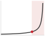
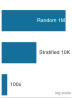
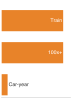

# Kỹ thuật có trách nhiệm {#sec-responsible-engineering}

::: {layout-narrow}
::: {.column-margin}

\chapterminitoc

:::

::: {.content-visible when-format="pdf"}
\noindent
{fig-alt="Buồng hệ thống machine learning được quản lý đẳng cự với các kiểm tra công bằng, rào chắn an toàn, hồ sơ kiểm toán, ranh giới quyền riêng tư và các đường dẫn phản ứng sự cố xung quanh một pipeline đã triển khai."}
:::

::: {.content-visible unless-format="pdf"}
{fig-alt="Buồng hệ thống machine learning được quản lý đẳng cự với các kiểm tra công bằng, rào chắn an toàn, hồ sơ kiểm toán, ranh giới quyền riêng tư và các đường dẫn phản ứng sự cố xung quanh một pipeline đã triển khai."}
:::

:::

## Mục đích {.unnumbered .unlisted}

\begin{marginfigure}
\mlsysstack{0}{0}{10}{10}{20}{40}{90}{15}
\end{marginfigure}

_Tại sao một hệ thống làm chính xác những gì nó được yêu cầu vẫn có thể gây hại?_

Vận hành hướng tới độ trễ thấp, tính sẵn sàng cao và chất lượng dự đoán bền vững. Kỹ thuật có trách nhiệm đặt câu hỏi liệu các mục tiêu đó có mô tả đúng hành vi, hệ thống phục vụ ai và những chi phí nào mà đặc tả của nó bỏ qua không đo lường. Một hệ thống machine learning có thể đáp ứng các yêu cầu về độ trễ, thông lượng và độ chính xác tổng hợp trong khi vẫn tái tạo sự phân biệt đối xử trong lịch sử, khuyến khích tương tác có hại, tiêu thụ năng lượng không chính đáng hoặc sử dụng dữ liệu mà không có các biện pháp kiểm soát quyền riêng tư và trách nhiệm giải trình đầy đủ. Một hệ thống như vậy không bị trục trặc; nó đang tối ưu hóa hiệu quả một đặc tả không đầy đủ. Các ràng buộc bị bỏ qua xuất hiện dưới dạng kết quả không đồng đều giữa các nhóm dân số, chi phí và lượng khí thải trọn đời, các quyết định mà mọi người không thể hiểu hoặc phản đối, và bằng chứng không thể tái tạo sau khi thiệt hại xảy ra. Nếu những hậu quả đó không được định nghĩa là yêu cầu trước khi triển khai và được giám sát sau đó, các kiểm tra sức khỏe thông thường có thể vẫn hiển thị màu xanh trong khi thiệt hại tích lũy. Kỹ thuật có trách nhiệm coi chúng là các lỗi hệ thống cần được chẩn đoán, đo lường và giảm thiểu với sự chặt chẽ tương tự như độ trễ hoặc suy giảm độ chính xác. Công việc đó đòi hỏi phải chuyển đổi các nghĩa vụ rộng lớn thành các giới hạn có thể kiểm tra được, các giả định được ghi lại, dữ liệu có thể truy vết và các đường dẫn phản hồi vẫn có thể thực thi được trong môi trường sản xuất. Theo thuật ngữ D·A·M, trách nhiệm mở rộng định nghĩa về tính đúng đắn: dữ liệu phải được kiểm tra về các tác hại được mã hóa và việc sử dụng hợp pháp, các thuật toán phải được giới hạn bởi các yêu cầu về kết quả và hiệu quả có thể bảo vệ được, và cơ sở hạ tầng máy móc phải giám sát, ghi lại và thực thi các giới hạn đó trong suốt vòng đời của hệ thống.

::: {.content-visible when-format="pdf"}

\newpage

:::

::: {.callout-learning-objectives}

- Giải thích cách các hệ thống machine learning được tối ưu hóa có thể khuếch đại tác hại thông qua các biến trung gian, vòng lặp phản hồi và dịch chuyển phân phối
- Áp dụng chẩn đoán dữ liệu-thuật toán-máy móc để xác định các lỗi trách nhiệm trong dữ liệu, mục tiêu thuật toán hoặc cơ sở hạ tầng giám sát
- Tính toán các số liệu công bằng từ ma trận nhầm lẫn và so sánh các đánh đổi trên biên Pareto công bằng-độ chính xác
- Thiết kế đánh giá phân tách, kiểm tra chịu tải và giám sát để phát hiện các lỗi cụ thể theo nhóm phụ trước khi triển khai
- Phân tích tổng chi phí, sự thống trị của suy luận và tác động carbon như các ràng buộc trách nhiệm có thể đo lường được
- Xây dựng thẻ mô hình, bảng dữ liệu, hồ sơ dòng dõi và nhật ký kiểm toán để giải trình
- Đánh giá các thiết kế quyền riêng tư, kiểm soát truy cập và tuân thủ theo các yêu cầu quy định và xem xét của con người

:::

## Trách nhiệm như Kỹ thuật Hệ thống {#sec-responsible-engineering-responsibility-systems-engineering-5cfd}

Năm 2014, Amazon đã xây dựng một công cụ tuyển dụng AI[^fn-amazon-recruiting-scale] phạt các hồ sơ chứa từ "women's" (như trong "women's chess club captain" - đội trưởng câu lạc bộ cờ vua nữ) và hạ thấp đánh giá các sinh viên tốt nghiệp từ các trường cao đẳng toàn nữ. Hệ thống đã tối ưu hóa một cách trung thực cho mục tiêu đã nêu của nó: xác định các ứng viên tương tự như những người đã được tuyển dụng trước đây. Lỗi không phải là do mô hình bị trục trặc, mà là do các mô hình tuyển dụng trong lịch sử đã mã hóa độ chệch (bias) giới tính, và mô hình đã tái tạo độ chệch đó ở quy mô lớn.

[^fn-amazon-recruiting-scale]: **Công cụ tuyển dụng của Amazon**\index{Amazon recruiting!specification failure}: Được phát triển từ năm 2014 bởi đội ngũ kỹ sư của Amazon tại Edinburgh để đánh giá ứng viên theo thang điểm 1-5, hệ thống đã được huấn luyện trên khoảng một thập kỷ hồ sơ—chủ yếu từ các ứng viên nam, phản ánh tỷ lệ giới tính trong ngành công nghệ. Đến năm 2015, độ chệch (bias) giới tính đã được xác định; đến năm 2017, dự án bị hủy bỏ sau nhiều lần cố gắng khắc phục [@dastin2018]. Chi phí kỹ thuật không phải là chi phí tính toán mà là chi phí cơ hội: một dự án tuyển dụng kéo dài nhiều năm đã thất bại vì mục tiêu đã mã hóa độ chệch (bias) lịch sử, khiến nó trở thành một lỗi đặc tả được ghi nhận trong các công cụ machine learning.

Nếu MLOps là vòng lặp điều khiển cho *độ tin cậy*, thì **kỹ thuật có trách nhiệm**\index{Responsible engineering!safety control loop} là vòng lặp điều khiển cho *an toàn*\index{Safety!responsible engineering}. Trong khi MLOps giám sát tình trạng hệ thống và kích hoạt huấn luyện lại khi hiệu suất giảm sút, kỹ thuật có trách nhiệm giám sát chất lượng kết quả và kích hoạt can thiệp khi hệ thống gây hại. Một mô hình có thể tối ưu hóa hoàn hảo cho mục tiêu đã nêu của nó nhưng vẫn gây ra tác hại có hệ thống vì lỗi không phải là một lỗi trong mã mà là một khiếm khuyết trong đặc tả. Theo thuật ngữ kỹ thuật hệ thống, một hệ thống có thể vượt qua *xác minh* (nó đáp ứng các yêu cầu đã nêu) trong khi thất bại trong *xác nhận* (nó không đáp ứng nhu cầu thực sự của người dùng) [@nasa2016systemsengineering].

Kỹ thuật phần mềm truyền thống thường cô lập các lỗi trong các mô-đun, mặc dù các phụ thuộc chung vẫn có thể lan truyền lỗi. Các hệ thống machine learning bổ sung sự ghép nối phụ thuộc vào dữ liệu: dữ liệu chảy qua các biểu diễn chung, do đó các vấn đề trong một thành phần có thể ảnh hưởng đến nhiều đầu ra. Một&nbsp;tập dữ liệu huấn luyện có độ chệch (bias) không tạo ra một lỗi mã cục bộ; nó có thể làm chệch các dự đoán trên toàn hệ thống. @Sec-appdx-dam-taxonomy chính thức hóa khung chẩn đoán xác định nguồn gốc của lỗi như vậy,&nbsp;phân tách nó theo ba trục: dữ liệu có độ chệch (bias), thuật toán không phù hợp hoặc cơ sở hạ tầng không đầy đủ để giám sát kết quả. Điều này khiến trách nhiệm trở thành một mối quan tâm về kiến trúc, chứ không phải là một suy nghĩ sau.

*Trách nhiệm kỹ thuật do đó mở rộng ý nghĩa của "đúng" đối với các hệ thống machine learning.* Tính đúng đắn theo nghĩa truyền thống (đáng tin cậy, hiệu suất cao và dễ bảo trì) vẫn cần thiết, nhưng các hệ thống machine learning cũng phải đúng đắn theo nghĩa rộng hơn: công bằng giữa các nhóm người dùng, hiệu quả trong việc tiêu thụ tài nguyên và minh bạch trong các quy trình ra quyết định của chúng. Tính đúng đắn mở rộng chính là kỹ thuật, được áp dụng cho các chế độ lỗi mà các số liệu thông thường không nắm bắt được. Một sự suy giảm độ trễ có thể nhìn thấy trên bảng điều khiển; một sự suy giảm tính công bằng thì vô hình cho đến khi nó gây hại cho người dùng thực (nguyên tắc \ref{pri-bias-feedback}). Cả hai đều đòi hỏi sự phát hiện, đo lường và khắc phục một cách có hệ thống.

Chẩn đoán, ngăn chặn và giảm thiểu những thất bại này đòi hỏi phải theo dõi khoảng cách trách nhiệm xuyên suốt hệ thống. Các trường hợp cụ thể cho thấy khoảng cách giữa hiệu suất kỹ thuật và kết quả có trách nhiệm, cũng như các cơ chế (biến đại diện, vòng lặp phản hồi, dịch chuyển phân phối) mà qua đó nó biểu hiện. Khoảng cách đó thúc đẩy các quy trình kỹ thuật lặp lại để đánh giá tác động, tài liệu hóa mô hình, kiểm thử phân tách và ứng phó sự cố. Mức tiêu thụ tài nguyên được định lượng trong suốt cuốn sách này (tính toán huấn luyện, năng lượng suy luận, dấu chân carbon) sau đó trở thành một ràng buộc đạo đức cũng như một ràng buộc hiệu suất, bởi vì tối ưu hóa hiệu quả phục vụ trách nhiệm trực tiếp như nó phục vụ tốc độ. Cơ sở hạ tầng quản trị dữ liệu và tuân thủ (kiểm soát truy cập, bảo vệ quyền riêng tư, theo dõi nguồn gốc và hệ thống kiểm toán) làm cho các thực hành đó có thể thực thi được ở quy mô lớn.

## Khoảng Cách Trách Nhiệm Kỹ Thuật {#sec-responsible-engineering-engineering-responsibility-gap-6f6f}

Một mô hình cho vay chấp thuận 95 phần trăm người nộp đơn đủ điều kiện thuộc nhóm đa số trong khi từ chối 40 phần trăm người nộp đơn đủ điều kiện tương đương thuộc nhóm thiểu số vẫn có thể đạt được tổn thất tổng hợp thấp. Khoảng cách trách nhiệm\index{Responsibility gap!definition} giữa *tính đúng đắn kỹ thuật* này và *kết quả có trách nhiệm* đại diện cho một thách thức trung tâm trong kỹ thuật hệ thống machine learning, một thách thức mà các phương pháp kiểm thử hiện có không được thiết kế để giải quyết. Khoảng cách này biểu hiện thông qua các cơ chế cụ thể: biến đại diện, vòng lặp phản hồi và dịch chuyển phân phối, mỗi cơ chế tạo ra tác hại thông qua một con đường riêng biệt mà việc giám sát thông thường bỏ qua.

### Khi tối ưu hóa thành công nhưng hệ thống thất bại {#sec-responsible-engineering-optimization-succeeds-systems-fail-1a22}

Thất bại của công cụ tuyển dụng biến khoảng cách này thành một vấn đề về dữ liệu hơn là một lỗi mã. Một mô hình được huấn luyện trên dữ liệu tuyển dụng lịch sử trong một thập kỷ\index{Bias!historical data encoding} đã tối ưu hóa một cách trung thực cho mục tiêu được giao, nhưng những mẫu hình lịch sử đó đã mã hóa độ chệch giới tính\index{Bias!gender discrimination} mà hệ thống đã tái tạo trong đánh giá ứng viên [@dastin2018].

Cơ chế kỹ thuật đằng sau kết quả này rất đơn giản. Mô hình đã học các mẫu hình cấp token từ dữ liệu lịch sử. Khi hầu hết những người được tuyển dụng thành công trước đây là nam giới, các hồ sơ chứa ngôn ngữ liên quan đến các hoạt động hoặc tổ chức của phụ nữ xuất hiện ít tương quan thống kê hơn với các quyết định tuyển dụng tích cực. Mô hình đã xác định đúng các mẫu hình này trong dữ liệu huấn luyện nhưng lại học được bài học sai từ việc nhận dạng mẫu hình đúng. Tổng quát hơn, các biểu diễn văn bản đã học có thể mã hóa và khuếch đại các khuôn mẫu giới tính, bao gồm cả trong các word embeddings [@bolukbasi2016].

::: {.column-margin}
{width="100%" fig-alt="Tam giác định vị D·A·M với ba nút: D (Dữ liệu) ở trên cùng được tô màu xanh lá cây đặc, A (Thuật toán) và M (Máy) ở các góc dưới được hiển thị màu xám, được nối bằng các cạnh màu tím. Nút Dữ liệu được làm nổi bật."}

*Thất bại của Amazon là một thất bại trên trục dữ liệu: tín hiệu lịch sử có độ chệch (bias).*
:::

Amazon đã cố gắng khắc phục bằng cách loại bỏ các chỉ số giới tính rõ ràng và các thuật ngữ liên quan đến giới tính khỏi quá trình huấn luyện. Sự can thiệp này không chứng minh được rằng các khuyến nghị còn lại là không có độ chệch (bias) vì các đặc trưng khác trong hồ sơ có thể giữ lại tín hiệu tương quan với giới tính.[^fn-proxy-variable-bias] Nói chung, **biến đại diện**\index{Proxy variable!definition}\index{Bias!proxy variables} có thể mang tín hiệu nhân khẩu học gián tiếp: mã ZIP có thể tương quan với chủng tộc do phân biệt khu dân cư, tên có thể tương quan với giới tính hoặc sắc tộc, và việc sử dụng dịch vụ chăm sóc sức khỏe có thể tương quan với điều kiện kinh tế xã hội. Trong trường hợp của Amazon, các hình phạt được báo cáo đối với các thuật ngữ như "women's" và đối với sinh viên tốt nghiệp từ hai trường cao đẳng toàn nữ cho thấy văn bản hồ sơ có thể mã hóa các mẫu hình liên quan đến giới tính [@dastin2018]. Do đó, việc loại bỏ các thuộc tính được bảo vệ khỏi dữ liệu huấn luyện là không đủ để thiết lập sự công bằng.

[^fn-proxy-variable-bias]: **Biến đại diện**\index{Proxy variable!bias detection}: Việc loại bỏ một biến đại diện có thể có ít tác dụng khi các đặc trưng tương quan khác vẫn giữ tín hiệu tương tự. Ngược lại, chỉ riêng sự tương quan không chứng minh được sự phân biệt đối xử hoặc xác định được biện pháp can thiệp phù hợp. Việc loại bỏ thuộc tính được bảo vệ, đánh giá theo nhóm con, kiểm thử phản thực tế, phân tích nhân quả và xem xét toàn bộ quy trình ra quyết định cung cấp bằng chứng bổ sung; không có một chẩn đoán đơn lẻ nào là một biện pháp phòng vệ hoàn chỉnh.

::: {#ws-responsible-engr-compas-recidivism-algorithm-audit .callout-war-story title="Kiểm toán thuật toán tái phạm COMPAS (2016)"}

**Bối cảnh**: COMPAS\index{COMPAS!recidivism algorithm audit} là một công cụ đánh giá rủi ro được sử dụng trong các phòng xử án ở Hoa Kỳ để dự đoán khả năng tái phạm cho các quyết định bảo lãnh và tuyên án [@angwin2016].

**Cơ chế**: Việc tối ưu hóa để hiệu chỉnh trên các quần thể có tỷ lệ tái phạm cơ bản khác nhau đã buộc phải đánh đổi về mặt toán học giữa sự ngang bằng dự đoán và cân bằng tỷ lệ lỗi giữa các nhóm chủng tộc.

**Tác động**: Các bị cáo da đen không tái phạm bị gắn cờ sai là có rủi ro cao với tỷ lệ gần gấp đôi so với các bị cáo da trắng (44,9 phần trăm so với 23,5 phần trăm), trong khi những người tái phạm da trắng thường xuyên bị gán nhãn sai là rủi ro thấp hơn nhiều.

**Phản hồi**: Cuộc kiểm toán đã phơi bày lý do tại sao chỉ riêng việc hiệu chỉnh không thể quyết định liệu phân phối lỗi có chấp nhận được hay không. Bất kỳ khu vực pháp lý nào sử dụng các điểm số như vậy đều cần một chính sách rõ ràng về các tiêu chí công bằng nào quan trọng, xác thực độc lập giữa các nhóm và xem xét cách điểm số đó đi vào quy trình làm việc ra quyết định.

**Bài học về hệ thống**: Các điểm số được hiệu chỉnh gần đúng theo chủng tộc, nhưng chúng vi phạm nguyên tắc cân bằng tỷ lệ sai sót (equalized odds) vì tỷ lệ dương tính giả và âm tính giả không khớp giữa các nhóm. Các kết quả về công bằng chính thức cho thấy rằng hiệu chỉnh và sự ngang bằng về tỷ lệ lỗi xung đột khi tỷ lệ cơ bản khác nhau, cho thấy lý do tại sao trách nhiệm kỹ thuật đòi hỏi phải lựa chọn rõ ràng ràng buộc công bằng nào là quan trọng.

:::

Sự can thiệp đúng đắn sẽ đòi hỏi nhiều cấp độ thay đổi. Đánh giá riêng biệt điểm số hồ sơ ứng tuyển cho các ứng viên liên quan đến nam giới so với các ứng viên liên quan đến nữ giới có thể đã tiết lộ sự chênh lệch về mặt định lượng. Các ràng buộc công bằng hoặc khử độ chệch (bias) đối kháng, trong đó một đối thủ phụ trợ cố gắng khôi phục tín hiệu thuộc tính được bảo vệ từ biểu diễn đã học và mô hình chính bị phạt khi tín hiệu đó vẫn còn, có thể đã giảm một số tín hiệu được mã hóa nhưng vẫn sẽ yêu cầu xác thực theo nhóm con. Đánh giá thủ công đối với các trường hợp ranh giới có thể đã bổ sung một biện pháp bảo vệ nếu người đánh giá được đào tạo, trao quyền và giám sát thay vì chỉ được yêu cầu đóng dấu chấp thuận các điểm số. Theo dõi kết quả tuyển dụng thực tế theo giới tính theo thời gian sẽ cho phép giám sát kết quả vượt ra ngoài các chỉ số mô hình đơn thuần. Amazon cuối cùng đã hủy bỏ dự án sau khi xác định rằng việc khắc phục đầy đủ là không khả thi [@dastin2018].

Trường hợp của Amazon cho thấy các mục tiêu tối ưu hóa khác biệt như thế nào so với các giá trị của tổ chức. Hệ thống đã tìm thấy các mẫu thống kê thực sự trong các quyết định tuyển dụng trong quá khứ và tối ưu hóa chúng một cách trung thực. Tuy nhiên, những mẫu đó phản ánh các thực tiễn lịch sử có độ chệch (bias) chứ không phải các tiêu chuẩn đủ điều kiện liên quan đến công việc.

Các trường hợp của Amazon và COMPAS[^fn-compas-recidivism-score] có chung một mô hình đáng lo ngại: mỗi hệ thống đã đạt được mục tiêu đã nêu trong khi tạo ra các kết quả mâu thuẫn với các giá trị mà hệ thống được thiết kế để phục vụ. Thành công kỹ thuật thông thường có thể cùng tồn tại với các lỗi hệ thống nghiêm trọng. Mô hình này đặt ra hai câu hỏi thiết kế: liệu hàm mất mát có phải là một đại diện hợp lý cho mục tiêu thực sự của hệ thống hay không, và liệu tỷ lệ lỗi có còn chấp nhận được trên các nhóm con mà hệ thống ảnh hưởng hay không.

[^fn-compas-recidivism-score]: **COMPAS (Hồ sơ quản lý tội phạm để xử phạt thay thế)**\index{COMPAS!hiệu chỉnh và tỷ lệ lỗi}: Trong dữ liệu được phân tích, điểm COMPAS được hiệu chỉnh gần đúng theo chủng tộc, nghĩa là một điểm số nhất định tương ứng với xác suất tái phạm được quan sát tương tự giữa các nhóm. Vì tỷ lệ tái phạm khác nhau giữa các quần thể, hiệu chỉnh cùng tồn tại với tỷ lệ lỗi khác nhau [@chouldechova2017; @kleinberg2016inherent]. Do đó, việc kiểm tra hiệu chỉnh đơn thuần không thể thiết lập sự ngang bằng về tỷ lệ lỗi hoặc xác định liệu việc phân bổ lỗi có chấp nhận được hay không.

Các thử nghiệm thông thường chỉ tập trung vào mục tiêu đã nêu có thể không phát hiện ra những vấn đề này vì chúng đại diện cho các lỗi trong đặc tả vấn đề, nơi *mục tiêu kỹ thuật* (giảm thiểu lỗi dự đoán trên các kết quả lịch sử) khác biệt so với *mục tiêu xã hội mong muốn* (đưa ra các dự đoán công bằng và chính xác trên các nhóm nhân khẩu học). Các lỗi đặc tả rất khó phát hiện chính xác vì các hệ thống vẫn hoạt động bình thường theo các chỉ số kỹ thuật thông thường. Khi một hệ thống có vẻ khỏe mạnh theo các chỉ số kỹ thuật được giám sát, tác hại bên ngoài các chỉ số đó có thể vẫn vô hình.

::: {#chk-responsible-engr-responsible-design .callout-checkpoint title="Thiết kế có trách nhiệm"}

Trách nhiệm là một thuộc tính của hệ thống, không phải là thuộc tính của mô hình.

**Các chế độ lỗi**

- [ ] **Sự phù hợp**: kiểm tra xem hàm mất mát có phải là một đại diện hợp lý cho mục tiêu thực sự của hệ thống hay không.
- [ ] **Tác động khác biệt**: so sánh tỷ lệ lỗi giữa các nhóm con thay vì dựa vào độ chính xác tổng hợp.

```{=latex}
\vspace*{-1.5ex}
```
**Kiểm tra**

- [ ] **Phân tích trước thất bại (Pre-mortem)**: trước khi triển khai, hãy hỏi: "Nếu hệ thống này gây ra một vụ bê bối trong sáu tháng tới, điều gì có thể đã sai?"
```{=latex}
\vspace*{-1ex}
```
:::

### Các chế độ lỗi thầm lặng {#sec-responsible-engineering-silent-failure-modes-e219}

::: {.column-margin}
{width="100%" fig-alt="Một nguồn hình vuông màu đỏ ở bên trái với năm mũi tên tỏa ra năm hình tròn màu xanh lam giống hệt nhau ở bên phải, đại diện cho một lỗi ở thượng nguồn lan truyền đến nhiều người tiêu dùng ở hạ nguồn."}

*Một thay đổi ở thượng nguồn; nhiều đối tượng bị ảnh hưởng thầm lặng.*
:::

Hãy xem xét một mô hình nhiễm trùng huyết của bệnh viện bắt đầu đề xuất các phương pháp điều trị tích cực cho bệnh nhân có nguy cơ thấp sau khi một thay đổi quy trình làm việc của hồ sơ sức khỏe điện tử (EHR) làm thay đổi cách ghi lại các dấu hiệu sinh tồn. Không có cảnh báo nào được kích hoạt: điểm tin cậy của mô hình vẫn cao, độ trễ của nó vẫn nằm trong thỏa thuận mức dịch vụ và tất cả các kiểm tra sức khỏe hệ thống đều đạt. Lỗi là thầm lặng: phân phối dữ liệu đầu vào đã thay đổi, nhưng pipeline giám sát không có cơ chế để phát hiện sự trôi dạt phân phối.

::: {#dfn-responsible-engr-distribution-shift .callout-definition title="Thay đổi phân phối"}

***Thay đổi phân phối***\index{Distribution Shift!responsibility lens}, được giới thiệu trong @sec-introduction và được vận hành để phát hiện sự trôi dạt trong @sec-ml-operations, xảy ra khi phân phối triển khai khác với phân phối được sử dụng để phát triển hoặc đánh giá mô hình. Việc giảm thiểu rủi ro thực nghiệm tiêu chuẩn thường giả định các phân phối huấn luyện và triển khai khớp nhau. Thay đổi biến độc lập (Covariate shift)\index{Data Drift!definition} thay đổi $p(x)$ trong khi giữ $p(y \mid x)$ ổn định; thay đổi nhãn (label shift) thay đổi $p(y)$ trong khi giữ $p(x \mid y)$ ổn định; trôi dạt khái niệm (concept drift)\index{Concept drift!definition} thay đổi $p(y \mid x)$.

1.  **Ý nghĩa**: Các thống kê phân kỳ như độ phân kỳ Jensen-Shannon $\mathcal{D}_{\text{JS}}(P_t \lVert P_0)$ đo lường sự thay đổi phân phối, không phải sự suy giảm độ chính xác. Ngưỡng cảnh báo hữu ích phải được hiệu chỉnh theo kinh nghiệm cho từng tác vụ, biểu diễn, quy trình gán nhãn và môi trường triển khai, sau đó liên hệ với các kết quả quan sát được khi có nhãn. Giá trị $\mathcal{D}_{\text{JS}}$ là 0.1 có thể vô hại đối với một không gian đặc trưng và nghiêm trọng đối với một không gian khác, và việc giám sát độ phân kỳ đầu vào có thể bỏ sót sự trôi dạt khái niệm.
2.  **Điểm khác biệt**: Thay đổi phân phối mô tả sự thay đổi giữa các điều kiện phát triển và triển khai. Nó không ngụ ý rằng ánh xạ đã học là chính xác tại thời điểm huấn luyện, cũng như không phải mọi sự thay đổi đều làm giảm hiệu suất.
3.  **Lỗi thường gặp**: Dịch chuyển phân phối là một thuật ngữ chung với nhiều phân loại chồng chéo. Chỉ giám sát $p(x)$ có thể phát hiện một số thay đổi biến hiệp phương sai nhưng không thể xác định liệu $p(y \mid x)$ có ổn định hay không; phát hiện trôi khái niệm (concept drift) thường yêu cầu kết quả được gán nhãn hoặc các biến đại diện (proxy) có cơ sở.

:::

Tình huống nhiễm trùng huyết này minh họa một loại lỗi mà việc giám sát tập trung vào tính khả dụng không được trang bị tốt để xử lý. Một số lỗi phần mềm gây ra tiếng ồn: một ngoại lệ con trỏ null làm chương trình gặp sự cố, và một lỗi hết thời gian chờ mạng trả về mã lỗi. Phần mềm thông thường cũng có thể trả về kết quả sai một cách âm thầm. Các hệ thống ML bổ sung các chế độ lỗi thống kê\index{Lỗi âm thầm!thách thức phát hiện} trong đó các dự đoán bị suy giảm trông giống như các dự đoán bình thường. Một cơ chế đằng sau sự suy giảm âm thầm này là dịch chuyển phân phối.

Việc khớp các phân phối huấn luyện và triển khai là một giả định tiêu chuẩn trong phân tích học có giám sát, mặc dù các phương pháp thích nghi có thể nới lỏng giả định này dưới các giả định bổ sung. Dịch chuyển phân phối cũng có thể ảnh hưởng không đồng đều đến các nhóm, cho phép các chỉ số tổng hợp che giấu thiệt hại của các nhóm con.

::: {.column-margin}
{width="100%" fig-alt="Một đường cong ban đầu nằm ngang sau đó uốn cong sắc nét lên trên tại một điểm đầu gối màu đỏ, với vùng bên phải điểm đầu gối được tô bóng màu đỏ để đánh dấu vùng nguy hiểm."}

*Vượt qua điểm đầu gối, biến đại diện tách rời khỏi mục tiêu.*
:::

::: {#psp-responsible-engr-alignment-gap .callout-perspective title="Khoảng cách căn chỉnh"}

Một mô hình tối ưu hóa một chỉ số đại diện (Số lượt nhấp) vì chỉ số thực (Mức độ hài lòng của người dùng) không thể quan sát được, và hai chỉ số này có thể khác biệt rõ rệt. Định luật Goodhart\index{Định luật Goodhart!tối ưu hóa chỉ số} cảnh báo rằng việc tối ưu hóa một thước đo có thể làm suy yếu mối quan hệ của nó với mục tiêu cơ bản. Trong một hệ thống minh họa, $\text{Correlation}(\text{Clicks}, \text{Satisfaction})$ có thể bắt đầu ở mức 0.8; một khi việc xếp hạng tối đa hóa số lượt nhấp, nó có thể tìm thấy các mồi nhử nhấp chuột (clickbait) với số lượt nhấp cao nhưng mức độ hài lòng thấp, và mối tương quan có thể giảm xuống 0.2.

Về mặt khái niệm, giả sử các chỉ số được chuẩn hóa trên một thang đo chung, @eq-alignment-gap thể hiện khoảng cách:
$$ \text{Gap} = \mathbb{E}[\text{Proxy}] - \mathbb{E}[\text{True}] $$ {#eq-alignment-gap}

Nếu mô hình tăng Số lượt nhấp lên 20 phần trăm nhưng giảm Mức độ hài lòng đi 5 phần trăm, thì khoảng cách căn chỉnh có dấu sẽ tăng lên.

**Hiểu biết về hệ thống**: Các kỹ sư không thể trực tiếp tối ưu hóa một mục tiêu không quan sát được. Họ cần xác thực biến đại diện có thể bảo vệ được; các tập giữ lại ngẫu nhiên (randomized holdouts) chỉ có thể ước tính hiệu ứng nhân quả khi kết quả của chúng đo lường mục tiêu hoặc một biến thay thế có cơ sở.

:::

Dịch chuyển phân phối\index{Dịch chuyển phân phối!nguyên nhân suy giảm mô hình} giải thích *tại sao* các mô hình suy giảm theo thời gian (các chiến lược phát hiện và giám sát vận hành cho sự trôi dạt được đề cập trong @sec-ml-operations). Lỗi này là do môi trường: thế giới đã thay đổi sau khi mô hình được huấn luyện, và mô hình không có cơ chế để nhận biết điều đó. Huấn luyện lại trên dữ liệu mới có thể giải quyết một phần loại lỗi này, nhưng nó không thể giải quyết cơ chế thứ hai gây ra lỗi âm thầm, cơ chế này hoạt động ngay cả khi phân phối dữ liệu hoàn toàn ổn định. Sai lệch chỉ số xảy ra khi đại lượng mà mô hình tối ưu hóa khác biệt so với kết quả mà tổ chức thực sự coi trọng. Động lực của sự khác biệt đó được làm rõ bởi Định luật Goodhart: một khi một biến đại diện trở thành mục tiêu tối ưu hóa, nó sẽ ngừng theo dõi mục tiêu mà nó được chọn để đại diện.

::: {#psp-responsible-engr-d-m-taxonomy .callout-perspective title="Phân loại D·A·M"}

Khi một hệ thống gây hại, hãy sử dụng phân loại D·A·M để xác định nguyên nhân gốc rễ. Các lỗi trách nhiệm hiếm khi là "lỗi thuật toán"; chúng là những khiếm khuyết cấu trúc dọc theo một trong ba trục:

*   **Dữ liệu (thông tin)**: Dữ liệu huấn luyện có phản ánh độ chệch (bias) lịch sử không? (ví dụ, công cụ tuyển dụng của Amazon học từ lịch sử có độ chệch). Lỗi nằm ở *Nhiên liệu*.
*   **Thuật toán (logic)**: Hàm mục tiêu có tối ưu hóa một biến đại diện cho tác hại không? (ví dụ, tối ưu hóa "mức độ tương tác" làm tăng phân cực). Lỗi nằm ở *Bản thiết kế*.
*   **Máy móc (vật lý)**: Chi phí năng lượng có tương xứng với lợi ích xã hội không? (ví dụ, huấn luyện một mô hình khổng lồ cho một tác vụ tầm thường). Lỗi nằm ở *Động cơ*.

Việc xác định lỗi chủ đạo trong phân loại sẽ chỉ ra biện pháp khắc phục đầu tiên cần thử nghiệm: quản lý tốt hơn (Dữ liệu), mục tiêu an toàn hơn (Thuật toán) hoặc cơ sở hạ tầng hiệu quả hơn (Máy móc). Các lỗi thực tế có thể trải rộng trên nhiều trục, vì vậy biện pháp can thiệp vẫn phải được đánh giá từ đầu đến cuối.

:::

Khoảng cách căn chỉnh\index{Khoảng cách căn chỉnh!phân kỳ chỉ số đại diện} minh họa một lỗi bắt nguồn từ trục thuật toán: mục tiêu tối ưu hóa bị chỉ định sai, vì vậy ngay cả một mô hình tổng quát hóa hoàn hảo trên dữ liệu mới cũng có thể dẫn đến các kết quả xung đột với mục tiêu của tổ chức hoặc xã hội. Ngược lại, dịch chuyển phân phối bắt nguồn từ trục dữ liệu: các đầu vào đã thay đổi, và ánh xạ đã học không còn phản ánh thực tế. Cả hai lỗi đều âm thầm, nhưng chúng đòi hỏi các biện pháp khắc phục khác nhau (mục tiêu tốt hơn so với giám sát tốt hơn), và việc gộp chung hai loại lỗi này sẽ lãng phí nỗ lực kỹ thuật vào việc sửa chữa sai. Phân loại D·A·M\index{Phân loại DAM@Phân loại D·A·M!chẩn đoán trách nhiệm} được giới thiệu trong @sec-introduction ánh xạ mỗi lỗi đến trục mà nó bắt nguồn từ đó (Dữ liệu · Thuật toán · Máy móc), được @sec-appdx-dam-taxonomy định nghĩa đầy đủ.

Trong khi phân loại D·A·M giúp chẩn đoán *nơi* các lỗi bắt nguồn, các kỹ sư cũng cần một framework để hiểu *khi nào* và *làm thế nào* các loại lỗi khác nhau biểu hiện. @Tbl-failure-modes bổ sung cho framework chẩn đoán đó bằng cách phân loại các lỗi theo thời gian phát hiện, phạm vi không gian và yêu cầu khắc phục. Các sự cố và suy giảm hiệu suất kích hoạt cảnh báo ngay lập tức thông qua cơ sở hạ tầng hiện có. Các vấn đề về chất lượng dữ liệu, dịch chuyển phân phối và vi phạm công bằng đòi hỏi các cơ chế phát hiện chuyên biệt vì hệ thống vẫn tiếp tục hoạt động bình thường từ góc độ kỹ thuật trong khi tạo ra các đầu ra ngày càng có vấn đề.

```{=latex}
\begingroup
%\renewcommand{\arraystretch}{1.25}
```

| **Failure Type**            | **Illustrative Detection Time** | **Illustrative Scope** | **Possible Response**          | **Example**                               |
|:----------------------------|:--------------------------------|:-----------------------|:-------------------------------|:------------------------------------------|
| **Crash**                   | Immediate                       | Complete               | Restart after correcting cause | Out of memory error                       |
| **Performance Degradation** | Minutes                         | Complete               | Relieve resource contention    | Latency spike from resource contention    |
| **Data Quality**            | Hours–days                      | Partial                | Data correction may be needed  | Corrupted inputs from upstream system     |
| **Distribution Shift**      | Days–weeks                      | Partial or all         | May require adaptation         | Population change due to new user segment |
| **Fairness Violation**      | Weeks–months                    | Subpopulation          | May require redesign           | Bias amplification in historical patterns |

: **Phân loại chế độ lỗi hệ thống ML minh họa**: Thời gian phát hiện, phạm vi và biện pháp khắc phục phụ thuộc vào ứng dụng; các mục nhập hiển thị các trường hợp đại diện. Các lỗi âm thầm như vấn đề chất lượng dữ liệu, dịch chuyển phân phối và vi phạm công bằng có thể yêu cầu giám sát chủ động vì chúng không nhất thiết kích hoạt các cảnh báo truyền thống. {#tbl-failure-modes tbl-colwidths="[18,15,14,28,25]"}

```{=latex}
\endgroup
```

Vòng lặp phản hồi đề xuất của YouTube\index{Feedback loop!recommendation amplification} (được xem xét như một mẫu nợ kỹ thuật trong @sec-ml-operations-production-debt-patterns-ffdc) minh họa mẫu này ở quy mô lớn [@ribeiro2020].[^fn-goodhart-law-proxy] @ribeiro2020 đã kiểm toán các con đường cực đoan hóa trên YouTube, phát hiện sự di chuyển từ các danh mục kênh ôn hòa hơn sang cực đoan hơn và khả năng tiếp cận đề xuất giữa các danh mục đó. Bài học hệ thống rộng hơn là các vòng lặp phản hồi có thể hoạt động chính xác như thiết kế trong khi tạo ra các kết quả xung đột với các giá trị xã hội. Do đó, các mục tiêu đề xuất phải được kiểm tra dựa trên các tác hại hạ nguồn, không chỉ dựa trên các proxy tương tác.

[^fn-goodhart-law-proxy]: **Định luật Goodhart**\index{Goodhart's law!proxy decoupling}: "Khi một thước đo trở thành mục tiêu, nó không còn là một thước đo tốt nữa" (sự khái quát hóa của Strathern về quan sát chính sách tiền tệ năm 1975 của Goodhart) [@strathern1997improving; @goodhart1984]. Các vòng lặp phản hồi đề xuất là biểu hiện kinh điển của ML: gradient descent tối ưu hóa các proxy thời gian xem với tốc độ mà không người quản lý nào có thể sánh kịp, và đầu ra của chính hệ thống định hình lại phân phối huấn luyện—người dùng tiêu thụ nội dung cực đoan tạo ra dữ liệu củng cố sự cực đoan, tách rời proxy khỏi phúc lợi người dùng nhanh hơn nhiều bậc độ so với các quy trình biên tập thủ công.

Trường hợp News Feed bổ sung một điểm khác biệt mà vòng lặp YouTube không có: một nền tảng chọn đánh đổi tương tác đo lường được để lấy phúc lợi dài hạn, bằng chứng trực tiếp cho thấy các proxy tương tác được biết là không đầy đủ ngay cả bởi những người tối ưu hóa chúng. Một chế độ lỗi riêng biệt hoạt động ở cấp độ dân số: các biến proxy có vẻ trung lập khi tổng hợp có thể mã hóa sự chênh lệch có hệ thống giữa các nhóm nhân khẩu học. Sự dịch chuyển phân phối\index{Distribution shift!population mismatch} được định nghĩa trong phần này cũng biểu hiện dưới dạng sự không khớp dân số, nơi các mô hình được huấn luyện trên một quần thể hoạt động khác biệt trên một quần thể khác mà không có các chỉ số rõ ràng. Cơ chế proxy tương tự cho phép mô hình tuyển dụng của Amazon tái tạo giới tính lại xuất hiện trong lĩnh vực chăm sóc sức khỏe, nơi chi phí được dùng làm đại diện cho nhu cầu đã tạo ra một trong những trường hợp gây hại thuật toán được nghiên cứu rộng rãi nhất.

::: {#exmp-responsible-engr-news-feed-proxy-shift .callout-example title="Sự dịch chuyển proxy của News Feed"}

**Tình huống**: Facebook đã chuyển các mục tiêu xếp hạng News Feed từ các proxy tương tác ngắn hạn (lượt nhấp, thời gian xem) sang các chỉ số tương tác xã hội có ý nghĩa [@facebook2018newsfeed].

**Chẩn đoán**: Việc tối ưu hóa chỉ dựa vào các proxy tương tác ngắn hạn đã tách rời đầu ra xếp hạng khỏi phúc lợi người dùng dài hạn, khuếch đại nội dung câu khách (clickbait) và tiêu thụ thụ động.

**Bài học hệ thống**: Các chỉ số tương tác là proxy cho giá trị, không phải bản thân giá trị. Các thuật toán đề xuất yêu cầu tối ưu hóa đa mục tiêu với các ràng buộc an toàn rõ ràng để ngăn chặn sự sụp đổ của proxy.

:::

Các chế độ lỗi thầm lặng làm phức tạp việc kiểm thử. Kiểm thử phần mềm truyền thống thường xác minh hành vi được chỉ định thông qua các khẳng định chính xác. Các hệ thống ML bổ sung hành vi học được từ dữ liệu và hiệu suất được đánh giá thống kê, khiến việc định nghĩa tính đúng đắn trở nên khó khăn hơn. Các lỗi ban đầu chia sẻ một mô hình đáng lo ngại: các kiểm tra kỹ thuật thông thường không bao gồm các tác hại đã xuất hiện. Các tổ chức giảm khoảng cách này khi họ chuyển đổi các mục tiêu trách nhiệm thành thực hành kỹ thuật có cấu trúc.

::: {#ws-responsible-engr-proxy-variable-trap .callout-war-story title="Cái bẫy biến proxy (2019)"}

**Bối cảnh**: Năm 2019, Ziad Obermeyer và các đồng nghiệp tại UC Berkeley đã kiểm toán một thuật toán thương mại của Optum\index{Optum} được các hệ thống y tế sử dụng để ghi danh bệnh nhân có nhu cầu phức tạp vào các chương trình quản lý chăm sóc rủi ro cao, kiểm tra khoảng năm mươi nghìn bệnh nhân tại một bệnh viện học thuật lớn [@obermeyer2019].

**Cơ chế**: Mô hình dự đoán "chi phí chăm sóc sức khỏe tương lai" làm proxy cho "nhu cầu sức khỏe tương lai." Vì hệ thống chăm sóc sức khỏe Hoa Kỳ chi tiêu ít hơn cho bệnh nhân da đen so với bệnh nhân da trắng có cùng mức độ bệnh tật, thuật toán đã học được mẫu này và gán điểm rủi ro thấp hơn cho bệnh nhân da đen.

**Tác động**: Với bất kỳ điểm rủi ro nào, bệnh nhân da đen đều mắc nhiều bệnh mãn tính hơn đáng kể so với bệnh nhân da trắng, làm giảm tỷ lệ bệnh nhân da đen được ghi danh vào chăm sóc chuyên biệt.

**Phản hồi**: Nghiên cứu cho thấy việc thay thế chi phí bằng một thước đo trực tiếp về nhu cầu sức khỏe sẽ tăng tỷ lệ bệnh nhân da đen được xác định cần chăm sóc bổ sung từ 17,7 phần trăm lên 46,5 phần trăm tại ngưỡng được phân tích.

**Bài học hệ thống**: Việc tối ưu hóa cho một proxy kế thừa các độ chệch (bias) của hệ thống đã tạo ra proxy đó. Mối quan hệ proxy-mục tiêu phải được kiểm toán trên mọi nhóm nhân khẩu học mà hệ thống phục vụ.

:::

### Khi kỹ thuật có trách nhiệm thành công {#sec-responsible-engineering-responsible-engineering-succeeds-29e0}

Mỗi thành công được ghi nhận đều chia sẻ cùng một động thái cấu trúc: một mục tiêu trách nhiệm mơ hồ trở thành một ràng buộc kỹ thuật có thể được chỉ định, kiểm thử, truyền đạt và, khi cần thiết, được sử dụng để dừng triển khai. Theo các phát hiện của Gender Shades, một cuộc kiểm toán năm 2018 đã phơi bày sự chênh lệch tỷ lệ lỗi nghiêm trọng trong phân loại giới tính thương mại [@buolamwini2018gender], Microsoft đã đầu tư vào việc cải thiện hiệu suất phân loại giới tính\index{Gender classification!demographic disparities} trên các nhóm nhân khẩu học\index{Bias!mitigation strategies}. Thu thập dữ liệu có mục tiêu, thay đổi mô hình và đánh giá phân tách có hệ thống đã cung cấp cho nhóm một mục tiêu tỷ lệ lỗi rõ ràng, và Microsoft đã báo cáo giảm đáng kể tỷ lệ lỗi cho các đối tượng có làn da sẫm màu hơn, đưa tỷ lệ lỗi được kiểm toán xuống dưới 2 phần trăm [@raji2019]. Công ty đã công bố những cải tiến này một cách minh bạch, biến kết quả kiểm toán bên ngoài thành các mục tiêu kỹ thuật có thể đo lường được.

Hệ thống cắt ảnh tự động của Twitter\index{Image cropping!racial bias} cho thấy cùng một kỷ luật dưới một ràng buộc khác. Năm 2020, người dùng đã nêu lên lo ngại về độ chệch (bias) chủng tộc và giới tính trong việc khuôn mặt nào xuất hiện trong hình thu nhỏ xem trước. Twitter đã kiểm toán hệ thống, báo cáo các sự chênh lệch và hạn chế được đo lường, và chuyển sang các bản xem trước không cắt xén, mang lại cho người dùng nhiều quyền kiểm soát [@yee2021]. Trong trường hợp đó, kỹ thuật có trách nhiệm đã thay đổi thiết kế sản phẩm thay vì chỉ dựa vào một ngưỡng xếp hạng tốt hơn.

**Bảo mật vi phân**\index{Bảo mật vi phân!đảm bảo toán học} hình thức hóa mô hình: một yêu cầu bảo mật trở thành một đảm bảo toán học thay vì một nguyện vọng chính sách [@dwork2008].[^fn-differential-privacy-tradeoff] Các hệ thống sử dụng bảo mật vi phân phải hiệu chỉnh nhiễu để cân bằng tiện ích với bảo mật, theo dõi ngân sách bảo mật qua các phân tích lặp lại và ghi lại các tham số bảo mật đã chọn.

[^fn-differential-privacy-tradeoff]: **Bảo mật vi phân**\index{Bảo mật vi phân!đánh đổi epsilon}: Được giới thiệu bởi @dwork2006calibrating, một cơ chế ngẫu nhiên hóa $\mathcal{M}$ thỏa mãn bảo mật vi phân $(\epsilon, \delta)$ nếu với tất cả các tập dữ liệu lân cận $D, D'$ khác nhau bởi một bản ghi và các tập đầu ra $\mathcal{S}$, $\mathbb{P}[\mathcal{M}(D) \in \mathcal{S}] \leq e^\epsilon \cdot \mathbb{P}[\mathcal{M}(D') \in \mathcal{S}] + \delta$. Ở đây $\epsilon$ giới hạn mức mất bảo mật và $\delta$ cho phép một xác suất nhỏ vượt quá giới hạn đó; các giá trị chấp nhận được của chúng phụ thuộc vào mô hình mối đe dọa và chính sách. Sự đánh đổi của hệ thống là tiện ích chứ không chỉ là độ phức tạp triển khai: bảo mật mạnh hơn thường yêu cầu nhiều nhiễu hơn hoặc lấy mẫu chặt chẽ hơn, và mức mất bảo mật tích lũy qua các truy vấn lặp lại hoặc các bước huấn luyện. Do đó, các kỹ sư phải theo dõi mức mất bảo mật tích lũy bằng một công cụ tính toán hợp lệ và báo cáo các giả định đằng sau ngân sách đã chọn.

Một mô hình chung kết nối các trường hợp này: trách nhiệm tạo ra giá trị chỉ khi các can thiệp kỹ thuật (dữ liệu được cải thiện, đánh giá tốt hơn, thay đổi kiến trúc, đảm bảo chính thức hoặc kiểm soát của người dùng) kết hợp với các cam kết của tổ chức về minh bạch, đầu tư dài hạn và sẵn sàng loại bỏ các đặc trưng không thể đảm bảo an toàn. Mỗi thành công đều dựa trên các thực hành kiểm thử và đánh giá có hệ thống, tuy nhiên bản chất của kiểm thử có trách nhiệm khác biệt cơ bản so với xác minh phần mềm truyền thống.

### Thách thức kiểm thử {#sec-responsible-engineering-testing-challenge-77b0}

Kiểm thử phần mềm truyền thống xác minh rằng các hệ thống hoạt động chính xác vì sự chính xác có các định nghĩa rõ ràng. Hàm phải trả về tổng các đầu vào của nó, cơ sở dữ liệu phải duy trì tính toàn vẹn tham chiếu. Các thuộc tính này có thể được biểu diễn dưới dạng các khẳng định có thể kiểm thử.

Các thuộc tính ML có trách nhiệm khó được hình thức hóa đơn giản. **Công bằng**\index{Công bằng!định nghĩa toán học} có nhiều định nghĩa toán học có thể xung đột trong các điều kiện như tỷ lệ cơ bản không đồng đều và dự đoán không hoàn hảo [@chouldechova2017; @kleinberg2016inherent]. Điều gì được coi là công bằng phụ thuộc vào ngữ cảnh, giá trị và sự đánh đổi mà các hệ thống kỹ thuật không thể tự giải quyết. Công bằng cá nhân\index{Công bằng!cá nhân so với nhóm} yêu cầu các cá nhân tương tự nhận được sự đối xử tương tự, trong khi công bằng nhóm yêu cầu kết quả công bằng trên các danh mục nhân khẩu học. Các tiêu chí này có thể xung đột, và việc lựa chọn giữa chúng đòi hỏi các phán đoán giá trị vượt ra ngoài phạm vi tối ưu hóa.

Các ràng buộc công bằng và hiệu suất dự đoán có thể đánh đổi cho nhau, nhưng mối quan hệ này đặc thù ứng dụng. Đường biên Pareto biểu thị các cấu hình mà một mục tiêu được vẽ không thể cải thiện mà không làm suy giảm mục tiêu khác. @Fig-fairness-frontier minh họa một đường biên công bằng-độ chính xác giả định\index{Đường biên Pareto!đánh đổi công bằng-độ chính xác}\index{Công bằng!đánh đổi độ chính xác}. Ba điểm của nó minh họa các lựa chọn chính sách có thể; chúng không ngụ ý rằng huấn luyện không ràng buộc luôn tối đa hóa độ chính xác với sự chênh lệch cao, rằng chênh lệch bằng không phải làm giảm độ chính xác, hoặc rằng mọi ứng dụng đều có một điểm tối ưu.

::: {#fig-fairness-frontier fig-env="figure" fig-pos="htb" fig-cap="**Đường biên Pareto Công bằng-Độ chính xác minh họa**: Mối quan hệ giả định giữa độ chính xác của mô hình và sự chênh lệch nhân khẩu học. Trục x được đảo ngược để sự chênh lệch thấp hơn nằm về bên phải. Các điểm A, B và C minh họa ba lựa chọn vận hành có thể có dọc theo đường biên được xây dựng này; đường cong không phải là một quy luật thực nghiệm hay phổ quát." fig-alt="Đường cong giả định liên quan đến độ chính xác và sự chênh lệch, với ba điểm vận hành được gắn nhãn A, B và C. Trục x được đảo ngược để sự chênh lệch thấp hơn nằm về bên phải."}

```{python}
#| echo: false
# ┌─────────────────────────────────────────────────────────────────────────────
# │ FAIRNESS-ACCURACY PARETO FRONTIER (FIGURE)
# ├─────────────────────────────────────────────────────────────────────────────
# │ Context: @fig-fairness-frontier—Fairness-Accuracy trade-off section
# │
# │ Goal: Visualize Pareto frontier: accuracy vs demographic disparity; show
# │       Points A (unconstrained), B (sweet spot), C (strict equality).
# │ Show: Curve with three annotated points; exponential decay shape.
# │ How: accuracy = 0.85 + 0.10*(1-exp(-20*disparity)); scatter + labels.
# │
# └─────────────────────────────────────────────────────────────────────────────
# ┌── 1. CANVAS ────────────────────────────────────────────────────────────────
# │ Visualize Pareto frontier: accuracy vs demographic disparity; show
import numpy as np
from binder.tools.figures import style as book_style

fig, ax, COLORS, plt = book_style.setup_plot(figsize=(10, 4.0))

# =============================================================================
# PLOT: The Fairness-Accuracy Pareto Frontier
# =============================================================================

# ┌── 2. ARRAYS ────────────────────────────────────────────────────────────────
disparity = np.linspace(0.0, 0.20, 100)
accuracy = 0.85 + 0.10 * (1 - np.exp(-20 * disparity))

# ┌── 3. RENDER ────────────────────────────────────────────────────────────────
ax.plot(disparity, accuracy, color=COLORS['primary'], linewidth=2, linestyle='--')

ax.plot(0.18, 0.947, 'o', color=COLORS['RedLine'], markersize=8)

# ┌── 4. DECORATE ──────────────────────────────────────────────────────────────
ax.text(
    0.18,
    0.943,
    "A: Unconstrained\n(Max Accuracy)",
    ha='center',
    va='top',
    fontsize=8,
    bbox=dict(facecolor='white', alpha=0.8, edgecolor='none', pad=0.5),
)

ax.plot(0.05, 0.913, 'o', color=COLORS['GreenLine'], markersize=8)
ax.text(
    0.053,
    0.905,
    "B: Sweet Spot\n(91 percent Acc, 3.6 times Fairer)",
    ha='right',
    va='bottom',
    fontsize=8,
    bbox=dict(facecolor='white', alpha=0.8, edgecolor='none', pad=0.5),
)

ax.plot(0.0, 0.85, 'o', color=COLORS['BlueLine'], markersize=8)
ax.annotate(
    "C: Strict Equality\n(Large Drop)",
    xy=(0.95, 0.05),
    xycoords=ax.transAxes,
    xytext=(0.82, 0.17),
    textcoords=ax.transAxes,
    ha='center',
    va='center',
    fontsize=8,
    bbox=dict(facecolor='white', alpha=0.8, edgecolor='none', pad=0.5),
    arrowprops=dict(arrowstyle='->', color='black', lw=0.75),
)

ax.set_xlabel('Demographic Disparity (Lower is Fairer)')
ax.set_ylabel('Model Accuracy')
ax.invert_xaxis()
plt.show()
plt.close()
```

:::

```{python}
#| label: testing-constraint-anchor-calc
#| echo: false
# ┌─────────────────────────────────────────────────────────────────────────────
# │ TESTING CONSTRAINT ANCHOR
# ├─────────────────────────────────────────────────────────────────────────────
# │ Context: Subgroup testing challenge prose (@sec-responsible-engineering-testing-challenge-77b0)
# │
# │ Goal: Quantify minority subgroup sample multipliers for testing.
# │ Show: 10,000 base test size, 1% minority, 100 minority samples, 100x multiplier.
# │ How: Calculate required data multiplier for 1% minority group.
# │
# └─────────────────────────────────────────────────────────────────────────────
from mlsysim.fmt import fmt, fmt_multiple, check, fmt_percent

# ┌── LEGO ───────────────────────────────────────────────
class TestingConstraintAnchor:
    """
    Namespace for subgroup testing challenges.
    """

    # ┌── 1. LOAD (Constants) ───────────────────────────────────────────────
    base_test_size = 10_000
    minority_pct = 1

    # ┌── 2. EXECUTE (The Compute) ─────────────────────────────────────────
    minority_samples = int(base_test_size * (minority_pct / 100))
    data_multiplier = int(100 / minority_pct)

    # ┌── 3. GUARD (Invariants) ───────────────────────────────────────────
    check(data_multiplier == 100, "A 1 percent subgroup should require a 100x sampling multiplier.")
    check(minority_samples == 100, f"Expected 100 subgroup samples, got {minority_samples}.")

    # ┌── 4. OUTPUT (Formatting) ──────────────────────────────────────────────
    base_size_str = fmt(base_test_size, precision=0)
    minority_pct_str = fmt_percent(round(minority_pct) / 100, precision=0, commas=False, style='prose')
    minority_samples_str = fmt(minority_samples, precision=0, commas=False)
    multiplier_mult_str = fmt_multiple(data_multiplier, precision=0, commas=False)
```

```{python}
#| label: gender-shades-disparity-calc
#| echo: false
# ┌─────────────────────────────────────────────────────────────────────────────
# │ GENDER SHADES ERROR DISPARITY
# ├─────────────────────────────────────────────────────────────────────────────
# │ Context: @tbl-gender-shades-results and surrounding prose
# │
# │ Goal: Quantify error rate disparities across demographic groups.
# │ Show: The 43.4× dark-female/light-male ratio in the Face++ results.
# │ How: Calculate error multiples between intersectional subgroups.
# │
# └─────────────────────────────────────────────────────────────────────────────
from mlsysim import Literature
from mlsysim.fmt import fmt, fmt_int, fmt_multiple, check, fmt_percent

# ┌── LEGO ───────────────────────────────────────────────
class GenderShadesDisparity:
    """
    Namespace for Gender Shades Error Disparity analysis.
    Scenario: Quantifying bias across demographic groups in gender classification.
    """

    # ┌── 1. LOAD (Constants) ───────────────────────────────────────────────
    err_light_male = Literature.Fairness.GenderShadesErrLightMale
    err_light_female = Literature.Fairness.GenderShadesErrLightFemale
    err_dark_male = Literature.Fairness.GenderShadesErrDarkMale
    err_dark_female = Literature.Fairness.GenderShadesErrDarkFemale

    # ┌── 2. EXECUTE (The Compute) ─────────────────────────────────────────
    disparity_fold = err_dark_female / err_light_male
    disparity_light_female = err_light_female / err_light_male
    disparity_dark_male = err_dark_male / err_light_male

    acc_light_male = 100.0 - err_light_male
    acc_dark_female = 100.0 - err_dark_female

    # ┌── 3. GUARD (Invariants) ───────────────────────────────────────────
    check(disparity_fold >= 40, f"Disparity ({disparity_fold:.1f}x) is too low.")

    # ┌── 4. OUTPUT (Formatting) ──────────────────────────────────────────────
    # Prose style outputs
    error_light_male_str = fmt_percent(err_light_male / 100, precision=1, commas=False, style='prose')
    error_dark_female_str = fmt_percent(err_dark_female / 100, precision=1, commas=False, style='prose')

    # Table symbol style outputs
    error_light_male_tbl_str = fmt_percent(err_light_male / 100, precision=1, commas=False, style='symbol')
    error_light_female_tbl_str = fmt_percent(err_light_female / 100, precision=1, commas=False, style='symbol')
    error_dark_male_tbl_str = fmt_percent(err_dark_male / 100, precision=1, commas=False, style='symbol')
    error_dark_female_tbl_str = fmt_percent(err_dark_female / 100, precision=1, commas=False, style='symbol')

    disparity_factor_mult_str = fmt_multiple(disparity_fold, precision=1, commas=False)
    disparity_light_female_factor_mult_str = fmt_multiple(disparity_light_female, precision=1, commas=False)
    disparity_dark_male_factor_mult_str = fmt_multiple(disparity_dark_male, precision=1, commas=False)
    acc_light_str = fmt_percent(acc_light_male / 100, precision=1, commas=False, style='prose')
    acc_dark_str = fmt_percent(acc_dark_female / 100, precision=1, commas=False, style='prose')
```

Đường biên cho các kỹ sư biết họ có thể cần chọn sự đánh đổi nào, nhưng nó không thể được vẽ cho đến khi hiệu suất của nhóm con được đo lường. Các thuộc tính có trách nhiệm trở nên có thể kiểm thử khi các kỹ sư làm việc với các bên liên quan để định nghĩa các tiêu chí phù hợp cho các ứng dụng cụ thể. Dự án Gender Shades\index{Gender Shades!phương pháp kiểm toán thuật toán}[^fn-gender-shades-audit] đã chứng minh cách **đánh giá phân tách**\index{Đánh giá phân tách!định nghĩa}\index{Đánh giá phân tách!phân tầng nhân khẩu học} trên các danh mục nhân khẩu học cho thấy sự chênh lệch không thể nhìn thấy trong các chỉ số tổng hợp [@buolamwini2018gender], làm lộ ra các lỗi của nhóm con mà giám sát trách nhiệm phải phát hiện trước khi triển khai. @Tbl-gender-shades-results cho thấy sự khác biệt đáng kể về tỷ lệ lỗi mà các hệ thống phân loại giới tính thương mại tạo ra trên các nhóm nhân khẩu học. Cụ thể, một tập kiểm thử `{python} TestingConstraintAnchor.base_size_str` mẫu đủ cho nhóm đa số chỉ cung cấp `{python} TestingConstraintAnchor.minority_samples_str` mẫu cho một nhóm con thiểu số chiếm `{python} TestingConstraintAnchor.minority_pct_str` dân số—thực tế yêu cầu nhiều dữ liệu hơn `{python} TestingConstraintAnchor.multiplier_mult_str` lần so với nhóm đa số để xác thực với độ tin cậy cao.

[^fn-gender-shades-audit]: **Gender Shades**\index{Gender Shades!disaggregated evaluation}: Một nghiên cứu năm 2018 của Joy Buolamwini (MIT Media Lab) và Timnit Gebru (Microsoft Research) đã kiểm toán các hệ thống phân loại giới tính thương mại từ Microsoft, IBM và Face++ bằng cách sử dụng thang đo loại da Fitzpatrick—ban đầu là một phân loại da liễu được phát triển bởi Thomas Fitzpatrick vào năm 1975 để đánh giá độ nhạy với tia UV và sau đó được xác nhận cho sử dụng lâm sàng [@fitzpatrick1988], được tái sử dụng ở đây làm một benchmark nhân khẩu học cho kiểm toán thuật toán. Nghiên cứu đã chứng minh giá trị của đánh giá phân tách; trong các kết quả của Face++ được tái hiện trong @tbl-gender-shades-results, tỷ lệ lỗi của nữ giới da sẫm màu là `{python} GenderShadesDisparity.disparity_factor_mult_str` so với tỷ lệ của nam giới da sáng. Các giảm thiểu được Microsoft báo cáo sau đó cho thấy kết quả kiểm toán công khai có thể thúc đẩy các biện pháp khắc phục có thể đo lường được [@raji2019].

| **Demographic Group**     |                      **Error Rate (%)**                     |                   **Relative to Light-Skinned Males**                   |
|:--------------------------|:-----------------------------------------------------------:|:-----------------------------------------------------------------------:|
| **Light-skinned males**   |  `{python} GenderShadesDisparity.error_light_male_tbl_str`  |                          Baseline (1.0$\times$)                         |
| **Light-skinned females** | `{python} GenderShadesDisparity.error_light_female_tbl_str` | `{python} GenderShadesDisparity.disparity_light_female_factor_mult_str` |
| **Dark-skinned males**    |   `{python} GenderShadesDisparity.error_dark_male_tbl_str`  |   `{python} GenderShadesDisparity.disparity_dark_male_factor_mult_str`  |
| **Dark-skinned females**  |  `{python} GenderShadesDisparity.error_dark_female_tbl_str` |        `{python} GenderShadesDisparity.disparity_factor_mult_str`       |

: **Tỷ lệ lỗi của Gender Shades Face++**: Tỷ lệ lỗi của nữ giới da sẫm màu là `{python} GenderShadesDisparity.disparity_factor_mult_str` so với tỷ lệ của nam giới da sáng. Nguồn: [@buolamwini2018gender]. {#tbl-gender-shades-results tbl-colwidths="[34,33,33]"}

Như @tbl-gender-shades-results định lượng, đánh giá phân tách đã tiết lộ những gì một điểm tổng hợp che giấu. Face++ báo cáo tỷ lệ lỗi là `{python} GenderShadesDisparity.error_light_male_str` cho nam giới da sáng và `{python} GenderShadesDisparity.error_dark_female_str` cho nữ giới da sẫm màu (độ chính xác lần lượt là `{python} GenderShadesDisparity.acc_light_str` và `{python} GenderShadesDisparity.acc_dark_str`). Chỉ số tổng hợp không cho thấy rằng tỷ lệ lỗi của nữ giới da sẫm màu cao gấp `{python} GenderShadesDisparity.disparity_factor_mult_str` lần tỷ lệ của nam giới da sáng.

Không có ngưỡng chung nào định nghĩa sự chênh lệch chấp nhận được, nhưng các nhóm nên thiết lập các giới hạn rõ ràng, có cơ sở trước khi triển khai. Một nhóm có thể áp dụng tỷ lệ tỷ lệ lỗi dưới 1.25$\times$ hoặc chênh lệch tỷ lệ dương tính giả dưới 5 điểm phần trăm làm chính sách phát hành cụ thể cho ứng dụng. Trong luật lao động Hoa Kỳ, học thuyết tác động khác biệt[^fn-disparate-impact-law] định hình sự giám sát quy định, trong khi quy tắc bốn phần năm[^fn-four-fifths-threshold] cung cấp một công cụ chẩn đoán tỷ lệ lựa chọn riêng biệt, không mang tính quyết định. Nguyên tắc kỹ thuật chính là xác định các tiêu chí phù hợp với ứng dụng và luật điều chỉnh thay vì khái quát hóa ngưỡng của một lĩnh vực.

[^fn-disparate-impact-law]: **Tác động khác biệt**\index{Disparate impact!legal doctrine}: Trong vụ *Griggs v. Duke Power Co.* (1971), Tòa án Tối cao Hoa Kỳ đã phán quyết theo Điều VII rằng một thực tiễn tuyển dụng có thể là bất hợp pháp do cách thức hoạt động của nó ngay cả khi không có ý định phân biệt đối xử [@griggs1971dukePower]. Tác động khác biệt là một khiếu nại pháp lý với các yếu tố cụ thể theo luật định và ngữ cảnh, không phải là từ đồng nghĩa với bất kỳ sự chênh lệch thống kê nào. Kết quả mô hình và các biến đại diện có thể cung cấp bằng chứng liên quan, nhưng các chỉ số đơn thuần không thiết lập trách nhiệm pháp lý.

[^fn-four-fifths-threshold]: **Quy tắc bốn phần năm**\index{Four-fifths rule!adverse impact threshold}: Hướng dẫn Thống nhất về Quy trình Lựa chọn Nhân viên năm 1978 sử dụng quy tắc bốn phần năm làm công cụ chẩn đoán lựa chọn việc làm thực tế [@uniformguidelines1978]. Tỷ lệ lựa chọn dưới 80 phần trăm so với tỷ lệ của nhóm có tỷ lệ cao nhất thường được coi là bằng chứng về tác động bất lợi, nhưng Hướng dẫn cũng công nhận rằng những khác biệt nhỏ hơn có thể quan trọng và tỷ lệ này không mang tính quyết định.

Mặc dù có những thách thức cố hữu, một số phương pháp kiểm thử cụ thể có thể làm nổi bật các vấn đề trách nhiệm trước khi triển khai:

- **Đánh giá dựa trên phân đoạn**: Phân chia dữ liệu kiểm thử thành các nhóm con có ý nghĩa và báo cáo các chỉ số riêng biệt cho từng phân đoạn, đặt câu hỏi liệu hiệu suất tổng hợp có che giấu lỗi của nhóm con hay không. Một mô hình có thể đạt độ chính xác tổng thể 95 phần trăm nhưng chỉ đạt 78 phần trăm độ chính xác đối với các ứng viên có thu nhập thấp hoặc người dùng từ khu vực nông thôn, một sự chênh lệch không thể nhìn thấy trong báo cáo tổng hợp.
- **Kiểm thử bất biến**\index{Invariance testing!fairness verification}: Kiểm tra xem mô hình có thay đổi hành vi vì những lý do sai trái hay không. Việc thay thế "John" bằng "Jamal" trong đơn xin vay không nên thay đổi khả năng được chấp thuận nếu đặc trưng đó không hợp lệ cho quyết định. Các framework kiểm thử hành vi như CheckList\index{CheckList} áp dụng ý tưởng này bằng cách tổ chức các kiểm thử xoay quanh khả năng của mô hình và các kỳ vọng kiểu bất biến thay vì chỉ riêng độ chính xác [@ribeiro2020beyond].
- **Kiểm thử biên và kiểm thử chịu tải**: Thăm dò các vùng mà các tập hợp kiểm định thông thường ít thông tin nhất. Kiểm thử biên đánh giá hành vi của mô hình tại các biên của phân phối đầu vào (độ tuổi bất thường, giá trị cực đoan, các danh mục hiếm) nơi dữ liệu huấn luyện có thể thưa thớt và dự đoán không đáng tin cậy. Kiểm thử chịu tải mở rộng kiểm thử biên sang các điều kiện đối kháng: đầu vào bị hỏng, dịch chuyển phân phối, ví dụ đối kháng và các trường hợp biên được thiết kế để thăm dò các chế độ lỗi một cách có hệ thống. Red-teaming của các bên liên quan\index{Red teaming!stakeholder engagement} bổ sung bằng chứng từ các chuyên gia lĩnh vực và thành viên cộng đồng bị ảnh hưởng, làm nổi bật các chế độ lỗi mà không kiểm thử tự động nào có thể khám phá vì chúng đòi hỏi kinh nghiệm sống để hình dung.

Các chiến lược kiểm thử có trách nhiệm bổ sung cho kiểm thử phần mềm truyền thống chứ không thay thế nó. Mỗi chiến lược đòi hỏi sự phán đoán chung để chọn, cấu hình và diễn giải. Các chuyên gia pháp lý không thể tự mình chỉ định phân đoạn nhân khẩu học nào quan trọng đối với một thuật toán chăm sóc sức khỏe, và các quản lý sản phẩm không thể tự mình xác định các kiểm thử bất biến phù hợp cho một mô hình cho vay. Các chuyên gia lĩnh vực, các bên liên quan bị ảnh hưởng, các chuyên gia chính sách và kỹ sư phải cùng nhau xác định các tác hại liên quan; sau đó các kỹ sư mã hóa các yêu cầu đó thành các kiểm thử có thể đo lường và các kiểm soát sản xuất. Do đó, trách nhiệm cần có quyền sở hữu rõ ràng trong kỹ thuật cũng như sự giám sát độc lập bên ngoài.

### Lãnh đạo kỹ thuật về trách nhiệm {#sec-responsible-engineering-engineering-leadership-responsibility-e03c}

Vào thời điểm Amazon từ bỏ công cụ tuyển dụng, các nỗ lực khắc phục đã không mang lại sự tin cậy rằng nó sẽ tránh được các khuyến nghị phân biệt đối xử [@dastin2018]. Các lựa chọn thiết kế ban đầu có thể thu hẹp các giải pháp khắc phục khả dụng. Kỹ thuật AI có trách nhiệm không thể được giao phó hoàn toàn cho các hội đồng đạo đức hoặc phòng pháp chế. Các nhóm này cung cấp sự giám sát thiết yếu nhưng thiếu quyền truy cập kỹ thuật cần thiết để xác định vấn đề sớm trong quá trình phát triển.

Việc xem xét pháp lý hoặc đạo đức có thể xác định một vấn đề gần thời điểm triển khai, nhưng nó không thể khôi phục các lựa chọn thiết kế mà hệ thống đã loại bỏ. Nếu nhóm đã huấn luyện mô hình mà không có ràng buộc công bằng, chọn một kiến trúc không thể hỗ trợ các yêu cầu về khả năng giải thích, hoặc xây dựng một pipeline dữ liệu mà không có các thuộc tính nhân khẩu học cần thiết cho việc giám sát, thì việc xem xét chỉ có thể chấp nhận, từ chối hoặc yêu cầu thiết kế lại tốn kém. Do đó, các kỹ sư chiếm một vị trí quan trọng trong vòng đời phát triển ML vì các lựa chọn của họ định nghĩa không gian giải pháp cho tất cả các can thiệp tiếp theo: kiến trúc xác định ràng buộc công bằng nào có thể áp dụng, mục tiêu tối ưu hóa xác định các mẫu mà hệ thống học được, và pipeline dữ liệu xác định liệu việc đánh giá phân tách có khả thi hay không.

::: {#dfn-responsible-engr-responsible-ai-engineering .callout-definition title="Kỹ thuật AI có trách nhiệm"}

***Kỹ thuật AI có trách nhiệm***\index{Responsible AI engineering!definition} là ngành kỹ thuật thiết kế, triển khai và duy trì các hệ thống có đầu ra xác suất bằng cách vận hành hóa các yêu cầu xã hội và quy định thành các ràng buộc có thể kiểm thử trên các trục D·A·M: nội dung, nguồn gốc và thành phần dữ liệu được phép; hành vi mô hình và thuộc tính mạnh mẽ được chấp nhận; và các giới hạn hạ tầng như độ trễ, năng lượng, ngân sách tính toán, lượng khí thải carbon và việc lưu giữ nhật ký kiểm tra.

1.  **Ý nghĩa**: Mỗi trục D·A·M có được các ràng buộc quản trị cụ thể: trục dữ liệu bị giới hạn bởi các quy định về quyền riêng tư như Quy định chung về bảo vệ dữ liệu (GDPR), giới hạn các bản ghi, trường và đặc trưng nào có thể được thu thập; trục thuật toán bị giới hạn bởi các số liệu công bằng và mạnh mẽ (ví dụ: bình đẳng nhân khẩu học trong phạm vi $\varepsilon = 5\%$ giữa các nhóm được bảo vệ, nghĩa là tỷ lệ dự đoán tích cực không được khác nhau quá 5 điểm phần trăm, hoặc suy giảm độ chính xác dưới 2 phần trăm dưới nhiễu loạn đối kháng $\|\delta\|_\infty \leq 0.01$, một thay đổi đầu vào trường hợp xấu nhất bị giới hạn ở 0.01 trên mỗi đặc trưng được chuẩn hóa theo chuẩn $\ell_\infty$); và trục máy bị giới hạn bởi ngân sách tài nguyên và hạ tầng như độ trễ, năng lượng trên mỗi suy luận, lượng khí thải carbon và việc lưu giữ nhật ký kiểm tra. Vi phạm các giới hạn này là một lỗi hệ thống, không phải là một thiếu sót nghiên cứu.
2.  **Điểm khác biệt**: Không giống như đạo đức AI (vốn nêu rõ các giá trị khát vọng), kỹ thuật AI có trách nhiệm chuyển đổi các giá trị đó thành các bất biến có thể đo lường, kiểm thử, có thể được xác minh thông qua kiểm thử tự động và giám sát liên tục, sử dụng các thực hành vòng đời tương tự để thực thi các SLOs độ trễ.
3.  **Sai lầm phổ biến**: Một quan niệm sai lầm thường gặp là trách nhiệm được 

:::

Một cách tiếp cận lấy kỹ thuật làm trung tâm không làm giảm tầm quan trọng của các quan điểm đa dạng trong việc xác định các tác hại tiềm tàng. Các quản lý sản phẩm, nhà nghiên cứu người dùng, cộng đồng bị ảnh hưởng và chuyên gia chính sách đóng góp kiến thức thiết yếu về cách các hệ thống thất bại về mặt xã hội dù thành công về mặt kỹ thuật. Các kỹ sư chuyển đổi những mối quan ngại này thành các yêu cầu có thể đo lường và các thuộc tính có thể kiểm thử, có thể được xác minh trong suốt vòng đời phát triển. Trách nhiệm hiệu quả đòi hỏi các kỹ sư vừa lắng nghe mối quan ngại của các bên liên quan vừa có năng lực kỹ thuật để triển khai các biện pháp bảo vệ phù hợp.

Các nhóm kỹ thuật không hoạt động biệt lập. Như @fig-governance-layers đã làm rõ, các thực hành kỹ thuật được lồng ghép trong các cấu trúc quản trị tổ chức, ngành và quy định rộng lớn hơn, mỗi lớp áp đặt các ràng buộc lên các lớp bên trong nó. Sự xuất sắc về kỹ thuật ở lớp trong cùng cho phép, nhưng không thay thế, việc tuân thủ các yêu cầu chảy vào từ quản trị bên ngoài.

::: {#fig-governance-layers fig-env="figure" fig-pos="htb" fig-cap="**Các lớp quản trị AI có trách nhiệm**: Bốn hình bầu dục lồng ghép đặt các biện pháp bảo vệ cấp nhóm ở trung tâm, được bao quanh bởi văn hóa an toàn tổ chức, chứng nhận và xem xét ngành, và quy định của chính phủ. Sự lồng ghép này phân biệt việc triển khai ở trung tâm với sự giám sát bên ngoài; chú thích nêu rõ rằng các yêu cầu chảy vào và các thực hành kỹ thuật cho phép tuân thủ. Chuyển thể từ @shneiderman2022human." fig-alt="Bốn hình bầu dục lồng ghép được dán nhãn, từ trung tâm ra ngoài: Nhóm—Hệ thống đáng tin cậy, Tổ chức—Văn hóa an toàn và thiết kế tổ chức, Ngành—Chứng nhận đáng tin cậy và đánh giá bên ngoài, và Quy định của Chính phủ—luật, sắc lệnh hành pháp, cơ quan quản lý. Lớp nhóm liệt kê các dấu vết kiểm toán, kiểm thử xác minh và độ chệch (bias), giao diện có thể giải thích và quy trình công việc kỹ thuật phần mềm. Một chú thích ở dưới cùng ghi, “Yêu cầu chảy vào; các thực hành kỹ thuật cho phép tuân thủ.”"}

```{.tikz}
\scalebox{0.9}{%
\begin{tikzpicture}[line join=round,font=\sffamily\small]
\definecolor{col1}{RGB}{249,240,241}
\definecolor{col2}{RGB}{246,231,233}
\definecolor{col3}{RGB}{229,220,228}
\definecolor{col4}{RGB}{211,212,214}
\definecolor{blue1}{RGB}{0,76,151}
\definecolor{green1}{RGB}{46,139,87}
\tikzset{%
  EL1/.style={align=flush center,
    ellipse,
    inner xsep=2pt,
    %node distance=0.4,
    draw=crimson,%mygreen,
    line width=0.75pt,
    fill=col1,%mygreen!06,
    minimum width=134mm, minimum height=73mm
  },
  Box2/.style={Box, draw=myred, fill=magenta!03 },
  Txt/.style={crimson,align=center,font=\sffamily\bfseries\fontsize{8pt}{8}\selectfont},
  Txt1/.style={black!60,align=center,font=\sffamily\fontsize{6pt}{7}\selectfont},
  LineA/.style={black!50,line width=1.25pt,
  {{Triangle[width=1.0*5pt,length=1.0*8pt]}-{Triangle[width=1.0*5pt,length=1.0*8pt]}},
  shorten <=0pt,shorten >=0pt},
}

\node[EL1](E1){};
\node[below=3pt of E1.north,Txt]{GOVERNMENT REGULATION\\
{\color{black!70}\sffamily\itshape\fontsize{6pt}{6}\selectfont Laws, executive orders, regulatory agencies}};

\node[EL1,minimum width=105mm, minimum height=61.5mm,fill=col2](E2)
at(0,-0.28){};
\node[below=2pt of E2.north,Txt]{Industry\\
{\color{black!70}\sffamily\itshape\fontsize{6pt}{6}\selectfont
Trustworthy certification and external reviews}};

\node[EL1,minimum width=77mm, minimum height=49mm,
draw=blue1,fill=col3](E3)
at(-0.35,-0.44){};
\node[below=4pt of E3.north,Txt,blue1]{Organization\\
{\color{black!70}\sffamily\itshape\fontsize{6pt}{6}\selectfont
Safety culture and organization design}};

\node[EL1,minimum width=49mm, minimum height=33mm,
draw=green1,fill=col4](E4)
at(-0.85,-0.87){};

\node[below=18pt of E4.north,Txt,green1](T1){Team\\ Reliable Systems};

\node[below=1pt of T1,Txt1]{%
Audit trails\\ Verification \& bias testing\\
Explainable interfaces\\ SE workflows};

\node[left=6pt of E3.east,anchor=east,Txt1]{%
Leadership\\ commitment
\\[1ex]
Hiring \& training
\\[1ex]
Internal reviews};

\node[left=6pt of E2.east,anchor=east,Txt1]{%
Auditing firms
\\[1ex]
Certification\\ bodies
\\[1ex]
Professional \\ societies};
%line below
\coordinate(L)at ($(E1.south)+(-45mm,-2mm)$);
\coordinate(D)at ($(E1.south)+(45mm,-2mm)$);

\draw[-latex,Txt1](L)--node[below=1pt]{Requirements flow inward; technical practices enable compliance}(D);
\end{tikzpicture}}
```

:::

Các lớp quản trị đó định nghĩa ai chịu trách nhiệm, nhưng chúng chưa tính đến các chi phí mà các số liệu hiệu suất thông thường bỏ qua.

Ngoài các mệnh lệnh đạo đức, kỹ thuật có trách nhiệm có thể mang lại giá trị kinh doanh thông qua ba cơ chế củng cố. Trực tiếp nhất là giảm thiểu rủi ro\index{Risk mitigation!responsible engineering value}: các lỗi hệ thống ML tạo ra rủi ro pháp lý và tài chính mà các thực hành trách nhiệm có hệ thống có thể giảm bớt. Amazon đã từ bỏ một mô hình tuyển dụng nội bộ sau khi phát hiện ra sự khác biệt liên quan đến giới tính trong các khuyến nghị của nó. Các tổ chức triển khai đánh giá phân tách, tài liệu hóa và giám sát có thể giảm xác suất xảy ra các thất bại tốn kém và bảo toàn bằng chứng về quy trình kỹ thuật của họ nếu vấn đề phát sinh.

Cơ chế thứ hai là tuân thủ quy định\index{Regulatory compliance!business value}, được thúc đẩy bởi các yêu cầu pháp lý khác nhau tùy theo khu vực pháp lý và rủi ro ứng dụng. Ví dụ, Đạo luật AI của EU phân loại các ứng dụng AI rủi ro cao\index{High-risk AI!EU classification} và yêu cầu các yêu cầu kỹ thuật bao gồm đánh giá rủi ro, quản trị dữ liệu, minh bạch và giám sát của con người. Các tổ chức tích hợp trách nhiệm vào thực hành kỹ thuật có thể chứng minh sự tuân thủ thông qua tài liệu và giám sát hiện có thay vì việc trang bị thêm tốn kém; bài học kỹ thuật là các biện pháp kiểm soát chủ động thường rẻ hơn so với việc tái tạo bằng chứng sau khi triển khai.

::: {#psp-responsible-engr-full-cost-iron-law .callout-perspective title="Toàn bộ chi phí của quy luật sắt"}

Quy luật sắt của các hệ thống ML (nguyên tắc \ref{pri-iron-law}) được thiết lập trong @sec-introduction-iron-law-ml-systems-c32a cho rằng hiệu suất hệ thống phụ thuộc vào sự tương tác giữa dữ liệu, tính toán và chi phí hệ thống. Các chương trước đã tối ưu hóa từng thành phần bằng cách nén mô hình (@sec-model-compression), tăng tốc phần cứng (@sec-hardware-acceleration) và tự động hóa các hoạt động (@sec-ml-operations). Tuy nhiên, một tối ưu hóa có thể tạo ra hoặc dịch chuyển các chi phí mà benchmark của nó bỏ qua.

Một mô hình được lượng tử hoá để triển khai ở edge tiêu thụ ít năng lượng hơn, nhưng cũng tạo ra đầu ra có thể khác nhau giữa các nhóm nhân khẩu học. Một hệ thống khuyến nghị được tối ưu hóa cho mức độ tương tác sẽ tối đa hóa một chỉ số kinh doanh, nhưng có thể khuếch đại nội dung có hại. Kỹ thuật có trách nhiệm mở rộng phạm vi tính toán của chúng ta để bao gồm những tác động rộng lớn hơn này: chi phí carbon của tính toán, chi phí công bằng của các lựa chọn tối ưu hóa và chi phí xã hội của việc triển khai ở quy mô lớn. Quy luật sắt chi phối *tốc độ* hệ thống của chúng ta chạy; kỹ thuật có trách nhiệm chi phối *mức độ hiệu quả* chúng phục vụ.

:::

Khác biệt hóa cạnh tranh\index{Trust!competitive differentiation} hoàn thiện lập luận kinh doanh. Niềm tin có thể thúc đẩy các quyết định mua hàng của doanh nghiệp đối với các dịch vụ được hỗ trợ bởi ML, và các tổ chức có thể chứng minh các thực hành trách nhiệm có hệ thống thông qua thẻ mô hình, dấu vết kiểm toán và kết quả đánh giá đã công bố có thể đủ điều kiện để triển khai mà các đối thủ cạnh tranh không thể. Định vị về quyền riêng tư của Apple, các nguyên tắc AI có trách nhiệm của Microsoft và nghiên cứu an toàn của Anthropic minh họa trách nhiệm là một khoản đầu tư chiến lược chứ không phải là một chi phí phòng thủ đơn thuần.

Các kỹ thuật lượng tử hoá từ @sec-model-compression có thể giảm năng lượng suy luận khi runtime và phần cứng được triển khai khai thác biểu diễn và năng lượng khối lượng công việc đo được giảm. Cơ sở hạ tầng giám sát từ @sec-ml-operations có thể hỗ trợ đánh giá công bằng phân tách khi hệ thống thu thập hợp pháp dữ liệu kết quả và nhóm con cần thiết. Kỹ thuật có trách nhiệm tổng hợp các khả năng này thành thực hành có kỷ luật thông qua các framework có cấu trúc chuyển đổi các nguyên tắc thành quy trình.

Các quy trình có hệ thống được áp dụng sớm có thể đã giảm khả năng hoặc mức độ nghiêm trọng của các lỗi được kiểm tra trong @sec-responsible-engineering-responsibility-systems-engineering-5cfd. Danh sách kiểm tra, tiêu chuẩn tài liệu, giao thức kiểm thử và cơ sở hạ tầng giám sát chuyển đổi các nguyên tắc trách nhiệm thành các quy trình kỹ thuật lặp lại, nhưng chúng không đảm bảo ngăn chặn.

## Danh sách kiểm tra Kỹ thuật có trách nhiệm {#sec-responsible-engineering-responsible-engineering-checklist-a038}

Một đánh giá trước triển khai có cấu trúc có thể đã làm lộ ra các tín hiệu liên quan đến giới tính được học bởi công cụ tuyển dụng của Amazon, trong khi kiểm thử phân tách đã làm lộ ra sự chênh lệch tỷ lệ lỗi của COMPAS. Cả hai lỗi đều có chung một nguyên nhân: trách nhiệm được coi là một giai đoạn đánh giá riêng biệt thay vì được tích hợp vào quy trình phát triển. Một danh sách kiểm tra kỹ thuật có trách nhiệm\index{Responsible engineering!checklist methodology} nhúng đánh giá bất cứ nơi nào các quyết định kỹ thuật tạo ra rủi ro lâu dài: trước khi triển khai, trong tài liệu, trong quá trình đánh giá cụ thể theo nhóm dân số, tại các ranh giới giải thích và tuân thủ, và sau khi ra mắt thông qua giám sát. Các giai đoạn xây dựng dựa trên nhau: đánh giá xác định những gì cần đo lường, tài liệu lưu giữ các giả định, đánh giá công bằng kiểm tra xem hiệu suất có được duy trì trên các nhóm hay không, khả năng giải thích và tuân thủ chuyển đổi các quyết định thành nghĩa vụ, và giám sát kết nối các vi phạm được phát hiện với sự can thiệp.

### Đánh giá trước triển khai {#sec-responsible-engineering-predeployment-assessment-2324}

Trước khi một mô hình phê duyệt khoản vay được đưa vào sản xuất, một nhóm phải xác định nguồn gốc của dữ liệu huấn luyện, xác định ai được đại diện và ai bị thiếu, dự đoán các chế độ lỗi và xác định biện pháp khắc phục cho người dùng bị ảnh hưởng. @Tbl-predeployment-assessment cấu trúc đánh giá này thành năm giai đoạn, phân biệt các yếu tố chặn đường găng với các mục ưu tiên cao có thể tiếp tục với việc chấp nhận rủi ro được ghi lại.

| **Phase**      | **Priority**  | **Key Questions**                                                                                                | **Documentation Required**                                                                           |
|:---------------|:--------------|:-----------------------------------------------------------------------------------------------------------------|:-----------------------------------------------------------------------------------------------------|
| **Data**       | Critical Path | Where did this data come from? Who is represented? Who is missing? What historical biases might be encoded?      | Data provenance records, demographic composition analysis, collection methodology documentation      |
| **Training**   | High Priority | What are we optimizing for? What might we be implicitly penalizing? How do architecture choices affect outcomes? | Objective function specification, regularization choices, hyperparameter selection rationale         |
| **Evaluation** | Critical Path | Does performance hold across different user groups? What edge cases exist? How were test sets constructed?       | Disaggregated metrics by demographic group, edge case testing results, test set composition analysis |
| **Deployment** | Critical Path | Who will this system affect? What happens when it fails? What recourse do affected users have?                   | Impact assessment, stakeholder identification, rollback procedures, user notification protocols      |
| **Monitoring** | High Priority | How will we detect problems? Who reviews system behavior? What triggers intervention?                            | Monitoring dashboard specifications, alert thresholds, review schedules, escalation procedures       |

: **Framework Đánh giá trước triển khai**: Các mục Đường găng chặn việc triển khai cho đến khi được giải quyết. Các mục Ưu tiên cao nên được hoàn thành trước hoặc ngay sau khi ra mắt. Việc bao quát có hệ thống các mối lo ngại về trách nhiệm trong suốt vòng đời ML làm giảm khả năng rủi ro bị bỏ qua. {#tbl-predeployment-assessment tbl-colwidths="[15,15,35,35]"}

Các mục Đường găng là các yếu tố chặn triển khai: hệ thống không được đưa vào sản xuất cho đến khi các câu hỏi này được trả lời. Các mục Ưu tiên cao nên được giải quyết nhưng có thể tiếp tục với việc chấp nhận rủi ro được ghi lại và một mốc thời gian khắc phục. Sự phân biệt này cho phép các nhóm triển khai một cách có trách nhiệm mà không yêu cầu sự hoàn hảo trên mọi khía cạnh trước khi triển khai ban đầu.

Hàng Đánh giá trong @tbl-predeployment-assessment nêu lên mối lo ngại quan trọng về việc liệu hiệu suất có được duy trì trên các nhóm người dùng khác nhau hay không. Trả lời câu hỏi này đòi hỏi các tập kiểm thử hợp lệ về mặt thống kê cho mỗi nhóm, điều này có thể tạo ra các yêu cầu dữ liệu nghiêm ngặt đáng ngạc nhiên khi sự đại diện không đồng đều.

```{python}
#| label: representation-stats-calc
#| echo: false
# ┌─────────────────────────────────────────────────────────────────────────────
# │ STATISTICS OF REPRESENTATION
# ├─────────────────────────────────────────────────────────────────────────────
# │ Context: "The Statistics of Representation" callout (Pre-Deployment section)
# │
# │ Goal: Demonstrate why fairness evaluation requires intentional data engineering.
# │ Show: The 100× data requirement for minority groups under random sampling.
# │ How: Calculate total dataset size needed to capture a 1% minority subgroup.
# │
# └─────────────────────────────────────────────────────────────────────────────
from mlsysim.fmt import fmt, fmt_int, fmt_percent, fmt_count, fmt_pp

# ┌── LEGO ───────────────────────────────────────────────
class RepresentationStats:
    """
    Namespace for Statistics of Representation.
    Scenario: Random vs Stratified sampling for a 1% minority group.
    """

    # ┌── 1. LOAD (Constants) ───────────────────────────────────────────────
    target_imgs = 10_000
    minority_fraction = 0.01
    target_margin_pp = 1
    confidence = 0.95

    # ┌── 2. EXECUTE (The Compute) ─────────────────────────────────────────
    random_total = target_imgs / minority_fraction
    multiplier = random_total / target_imgs

    # ┌── 3. GUARD (Invariants) ───────────────────────────────────────────
    check(multiplier == 100, "Multiplier should be 100.")

    # ┌── 4. OUTPUT (Formatting) ──────────────────────────────────────────────
    repr_target_images_str = fmt_count(target_imgs, label="image")
    repr_group_fraction_pct_str = fmt_percent(round(int(minority_fraction * 100)) / 100, precision=0, commas=False, style='prose')
    repr_target_margin_pp_str = fmt_pp(target_margin_pp, precision=0)
    repr_confidence_pct_str = fmt_percent(confidence, precision=0, commas=False, style='prose')
    repr_group_fraction_str = fmt(minority_fraction, precision=2, commas=False)
    repr_random_total_str = fmt_count(int(random_total), label="image")
    repr_mult_str = fmt_multiple(int(multiplier), commas=False, precision=0)
```

::: {.column-margin}
{width="100%" fig-alt="Lấy mẫu ngẫu nhiên so với đánh giá phân tầng có mục tiêu cho một nhóm con 1 phần trăm."}

*Lấy mẫu ngẫu nhiên hầu như không tiếp cận được các nhóm con nhỏ.*
:::

:::: {#nbk-responsible-engr-statistics-representation .callout-notebook title="Thống kê về sự đại diện"}

**Vấn đề**: Một nhóm kỹ sư cần xác minh rằng một mô hình Face ID hoạt động tốt cho một nhóm thiểu số chiếm `{python} RepresentationStats.repr_group_fraction_pct_str` trong tổng số người dùng. Sai số nhị thức trong trường hợp xấu nhất gần `{python} RepresentationStats.repr_target_margin_pp_str` với độ tin cậy `{python} RepresentationStats.repr_confidence_pct_str` đòi hỏi khoảng `{python} RepresentationStats.repr_target_images_str` cho nhóm này.

**Lấy mẫu ngẫu nhiên**\index{Lấy mẫu ngẫu nhiên!chi phí đại diện nhóm thiểu số}: Để có được `{python} RepresentationStats.repr_target_images_str` từ một nhóm `{python} RepresentationStats.repr_group_fraction_pct_str` thông qua lấy mẫu ngẫu nhiên, nhóm phải thu thập và gán nhãn:
$D_{\text{eval,total}}$ = `{python} RepresentationStats.repr_target_images_str` / `{python} RepresentationStats.repr_group_fraction_str` = `{python} RepresentationStats.repr_random_total_str`

**Lấy mẫu phân tầng**\index{Lấy mẫu phân tầng!đánh giá công bằng}: Việc nhắm mục tiêu cụ thể vào nhóm này (ví dụ, thông qua học chủ động hoặc tiếp cận cộng đồng) chỉ yêu cầu `{python} RepresentationStats.repr_target_images_str`.
**Hiểu biết về hệ thống**: Việc dựa vào dữ liệu "phân phối tự nhiên" để đảm bảo tính công bằng là cực kỳ tốn kém khi sử dụng lấy mẫu ngẫu nhiên. Việc xác thực nhóm thiểu số một cách hiệu quả đòi hỏi lượng dữ liệu nhiều hơn `{python} RepresentationStats.repr_mult_str` lần so với nhóm đa số. Tính công bằng đòi hỏi kỹ thuật dữ liệu có chủ đích\index{Kỹ thuật dữ liệu có chủ đích!đánh giá công bằng}, chứ không chỉ đơn thuần là nhiều dữ liệu hơn.

::::

Kỹ thuật dữ liệu có chủ đích giải quyết *những gì* mô hình nhìn thấy trong quá trình đánh giá, nhưng ngay cả một tập dữ liệu đại diện hoàn hảo cũng không thể ngăn chặn tác hại khi triển khai nếu hệ thống thiếu sự giám sát đầy đủ của con người. Chi phí đại diện được suy ra trong phép tính sơ bộ \ref{nbk-responsible-engr-statistics-representation} là một rào cản trước triển khai; câu hỏi tiếp theo là điều gì sẽ xảy ra khi mô hình hoạt động và đưa ra các quyết định ảnh hưởng đến con người.

:::: {#ws-responsible-engr-automation-paradox .callout-war-story title="Nghịch lý tự động hóa (2018)"}

**Bối cảnh**: Nhóm Công nghệ Tiên tiến (ATG) của Uber đang thử nghiệm xe tự lái ở Arizona, dựa vào một tài xế an toàn là con người để can thiệp nếu hệ thống nhận thức tự động gặp lỗi [@ntsb2019uber].

**Cơ chế**: Hệ thống nhận thức phát hiện một người đi bộ băng qua đường nhưng liên tục chuyển đổi phân loại giữa phương tiện, xe đạp và không xác định, đặt lại dự đoán quỹ đạo của nó trong khi hệ thống phanh khẩn cấp tự động đã bị vô hiệu hóa một cách có chủ đích.

**Tác động**: Tài xế an toàn đã bị phân tâm bởi điện thoại cá nhân và không kịp kiểm soát, dẫn đến một vụ va chạm chết người.

**Khắc phục**: Uber đã trang bị lại đội xe bằng camera giám sát tài xế, kích hoạt lại hệ thống phanh khẩn cấp tự động và thiết lập đội ngũ hai người vận hành trong quá trình thử nghiệm xe tự lái trên đường.

**Bài học về hệ thống**: Việc thêm một người dự phòng tạo ra một hệ thống mới với các chế độ lỗi riêng. Độ tin cậy tự động hóa cao có thể khuyến khích sự tự mãn và giảm cảnh giác, vì vậy một phương án dự phòng hiệu quả đòi hỏi thiết kế khối lượng công việc (workload), giám sát sự chú ý và một trường hợp an toàn cho hệ thống kết hợp người-máy.

::::

::: {.column-margin}
```{=latex}
\vspace*{-15mm}
```
{width="100%" fig-alt="Các đường cong khái niệm cho thấy độ tin cậy tự động hóa tăng lên trong khi sự cảnh giác của con người có thể giảm xuống nếu không có các biện pháp kiểm soát sự tự mãn hiệu quả."}

*Nếu không có các biện pháp kiểm soát hiệu quả, tự động hóa đáng tin cậy có thể làm suy yếu sự cảnh giác.*
:::

Đối với các ứng dụng có rủi ro cao, giai đoạn triển khai nên chỉ rõ nơi cần có sự giám sát của con người\index{An toàn!yêu cầu giám sát của con người}. Các hệ thống người-trong-vòng lặp (HITL)\index{Người-trong-vòng lặp!giám sát quyết định} chuyển các quyết định không chắc chắn, có hậu quả cao hoặc được gắn cờ đến người đánh giá là con người thay vì hành động tự động. Thiết kế HITL hiệu quả phải chỉ rõ bốn yêu cầu: phạm vi đánh giá (những quyết định nào cần người xem xét), ngưỡng tin cậy kích hoạt leo thang, quá trình huấn luyện mà người đánh giá nhận được và các cơ chế để giám sát hiệu suất của người đánh giá. HITL không phải là một giải pháp toàn diện: người đánh giá là con người có thể phê duyệt tự động các quyết định, đưa vào độ chệch (bias) của riêng họ hoặc bị choáng ngợp bởi khối lượng cảnh báo. Thiết kế HITL hiệu quả đòi hỏi phải hiệu chỉnh ranh giới người-máy theo các rủi ro ứng dụng cụ thể và khả năng của người đánh giá.

Framework đánh giá trước triển khai tương tự như danh sách kiểm tra trước chuyến bay trong hàng không, vốn chuẩn hóa các kiểm tra quan trọng dưới áp lực thời gian. Các triển khai ML sản xuất đòi hỏi kỷ luật và xác minh nghiêm ngặt tương đương. Một danh sách kiểm tra nhắc nhở các nhóm đặt ra những câu hỏi đúng nhưng không chứng minh rằng một hệ thống là an toàn; các tiêu chuẩn tài liệu bảo toàn các câu trả lời và cho phép chúng đi kèm với mô hình.

### Tiêu chuẩn tài liệu mô hình {#sec-responsible-engineering-model-documentation-standards-bef6}

Hãy xem xét việc kế thừa một mô hình sản xuất từ một đồng nghiệp đã nghỉ việc: mô hình đạt độ chính xác 94 phần trăm trên tập kiểm tra của nó, nhưng ba thông tin bị thiếu. Danh tính của tập kiểm tra đó, dữ liệu mà mô hình đã được huấn luyện, và các quần thể mà nó đã được xác thực đều không rõ. Nếu không có những câu trả lời đó, việc triển khai hoặc cập nhật mô hình là một canh bạc. **Thẻ mô hình**\index{Thẻ mô hình!tài liệu tiêu chuẩn hóa} giải quyết vấn đề này bằng cách cung cấp một định dạng tài liệu tiêu chuẩn hóa cho các mô hình ML[^fn-model-card-transparency] [@mitchell2019]. Ban đầu được phát triển tại Google, thẻ mô hình hoạt động như "nhãn dinh dưỡng" thu thập thông tin cần thiết cho việc triển khai có trách nhiệm và đi kèm với mô hình trong suốt vòng đời của nó.

[^fn-model-card-transparency]: **Thẻ mô hình**\index{Thẻ mô hình!tiêu chuẩn tài liệu}: Chế độ lỗi chính mà thẻ mô hình giải quyết là sự mở rộng phạm vi (scope creep)\index{Mở rộng phạm vi!thẻ mô hình}: mở rộng dần từ "nó hoạt động cho trường hợp A" sang "hãy thử nó cho trường hợp B" mà không xác thực lại mục đích sử dụng; trên thực tế, các thẻ thường được viết sau khi các quyết định triển khai được đưa ra, ghi lại hành vi quan sát được thay vì hạn chế nó. Tài liệu đi kèm "Datasheets for Datasets" [@gebru2021] áp dụng nguyên tắc tương tự cho dữ liệu huấn luyện. Nếu không có cả hai, thẻ sẽ trở thành một hồ sơ lịch sử thay vì một rào cản bảo vệ.

Một thẻ mô hình hoàn chỉnh bao gồm bảy mối quan tâm mà cùng nhau cho phép triển khai có trách nhiệm. Nó bắt đầu với các chi tiết kỹ thuật (kiến trúc, quy trình huấn luyện, siêu tham số) cho phép khả năng tái tạo và kiểm toán. Quan trọng là, nó chỉ rõ *mục đích sử dụng dự kiến* cùng với các loại trừ rõ ràng, ngăn chặn sự mở rộng phạm vi khi các mô hình được thiết kế để tổ chức ảnh bị tái sử dụng cho việc sàng lọc an ninh. Thẻ sau đó ghi lại những *yếu tố* nào (nhóm nhân khẩu học, điều kiện môi trường, sự khác biệt về thiết bị đo lường) có thể ảnh hưởng đến hiệu suất, hướng dẫn cả chiến lược đánh giá và giao thức giám sát.

Các phần còn lại thu hẹp khoảng cách giữa những gì một mô hình *có thể* làm và những gì nó *nên* làm. Các chỉ số hiệu suất phải bao gồm kết quả phân tách trên các yếu tố đã xác định trong @sec-responsible-engineering-testing-challenge-77b0, bởi vì độ chính xác tổng hợp đơn thuần che giấu những sự khác biệt mà chương này đã ghi nhận. Tài liệu về dữ liệu huấn luyện và đánh giá cho phép đánh giá các độ chệch (bias) tiềm ẩn được mã hóa và cung cấp ngữ cảnh cần thiết để diễn giải kết quả. Các cân nhắc đạo đức làm rõ các đánh đổi ngầm bằng cách ghi lại các hạn chế đã biết, các tác hại tiềm tàng và các biện pháp giảm thiểu đã thực hiện, trong khi các lưu ý và khuyến nghị cung cấp hướng dẫn về cách sử dụng phù hợp và các chế độ lỗi đã biết.

Một thẻ mô hình MobileNetV2\index{MobileNetV2} cụ thể biến các danh mục trừu tượng này thành hoạt động thực tế: @tbl-model-card-example cho thấy mỗi phần giải quyết các mối quan tâm triển khai cụ thể cho triển khai tại edge như thế nào.

```{python}
#| label: model-card-calc
#| echo: false
# ┌─────────────────────────────────────────────────────────────────────────────
# │ MOBILENETV2 MODEL CARD SPECS
# ├─────────────────────────────────────────────────────────────────────────────
# │ Context: @tbl-model-card-example
# │
# │ Goal: Format MobileNetV2 parameter count from registry for model card example.
# │ Show: Parameter count formatted as 3.5M.
# │ How: Load parameters from Models.Vision.MobileNetV2 and format with fmt_params.
# └─────────────────────────────────────────────────────────────────────────────
from mlsysim import Models
from mlsysim.fmt import fmt_params

class ModelCardExample:
    mv2_params = Models.Vision.MobileNetV2.parameters
    mv2_params_m_str = fmt_params(mv2_params, scale='M', precision=1, commas=False)
```

```{=latex}
\begingroup
\renewcommand{\arraystretch}{1.35}
```

| **Section**                | **Content**                                                                                                                                                                                                                               |
|:---------------------------|:------------------------------------------------------------------------------------------------------------------------------------------------------------------------------------------------------------------------------------------|
| **Model Details**          | MobileNetV2 architecture with `{python} ModelCardExample.mv2_params_m_str` parameters, trained on ImageNet using depthwise separable convolutions. INT8 quantized for edge deployment.                                                    |
| **Intended Use**           | Real-time image classification on mobile devices with less than 50 ms latency requirement. Suitable for consumer applications including photo organization and accessibility features.                                                    |
| **Factors**                | Performance varies with image quality (blur, lighting), object size in frame, and categories outside ImageNet distribution.                                                                                                               |
| **Metrics**                | 71.8% top-1 accuracy on ImageNet validation (full precision: 72.0%). Accuracy varies by category: 85% on common objects, 45% on fine-grained distinctions.                                                                                |
| **Ethical Considerations** | Training data reflects ImageNet biases in geographic and demographic representation. Not validated for high-stakes applications (medical diagnosis, security screening). Performance may degrade on images from underrepresented regions. |

: **Thẻ Mô hình Minh họa: MobileNetV2 cho Triển khai tại Edge**: Các danh mục thẻ mô hình trừu tượng chuyển thành tài liệu thực tế hướng dẫn các quyết định triển khai có trách nhiệm. Các mục nhập số là giả định kịch bản, không phải kết quả benchmark được báo cáo. {#tbl-model-card-example tbl-colwidths="[22,78]"}

```{=latex}
\endgroup
```

Bảng dữ liệu cho các tập dữ liệu\index{Datasheets for datasets!training data documentation} cung cấp tài liệu tương tự cho dữ liệu huấn luyện [@gebru2021]. Các tài liệu này ghi lại nguồn gốc dữ liệu, phương pháp thu thập, thành phần nhân khẩu học và các hạn chế đã biết ảnh hưởng đến hành vi mô hình tiếp theo. Tài liệu xác định những gì một mô hình được thiết kế để làm; kiểm thử xác minh liệu nó có hoạt động công bằng trên các quần thể mà nó phục vụ hay không.

### Kiểm thử trên các quần thể {#sec-responsible-engineering-testing-across-populations-9f20}

Đánh giá phân tách đã làm lộ rõ những khác biệt của Gender Shades (@sec-responsible-engineering-testing-challenge-77b0) giờ đây trở thành một tác vụ cổng phát hành vận hành: chọn các phân đoạn, chỉ số và ngưỡng xác định xem việc triển khai có được phép hay không. Các chỉ số hiệu suất tổng hợp che giấu sự khác biệt giữa các quần thể người dùng, đó là **sai lầm của số trung bình**\index{Flaw of averages} [@savage2009flaw]; kiểm thử có trách nhiệm yêu cầu đánh giá phân tách để kiểm tra hiệu suất cho từng nhóm con liên quan.

::: {#psp-responsible-engr-flaw-averages .callout-perspective title="Sai lầm của số trung bình"}

Trong kỹ thuật hệ thống, chúng ta hiếm khi thiết kế cho trường hợp "trung bình"; chúng ta thiết kế cho các trường hợp đuôi và điều kiện biên. Một cây cầu "an toàn trung bình" nhưng sập dưới một chiếc xe tải nặng là một thất bại. Tương tự, một hệ thống ML "chính xác trung bình" nhưng thất bại đối với một nhóm dân tộc hoặc giới tính cụ thể là một thất bại kỹ thuật. Nguyên tắc tương tự thúc đẩy chúng ta đo độ trễ (latency) ở đuôi (p99) để đảm bảo độ tin cậy của hệ thống cũng áp dụng cho sự công bằng: chúng ta phải sử dụng đánh giá phân tách\index{Disaggregated evaluation!fairness testing} để đo lường sự công bằng của hệ thống. Chỉ nhìn vào độ chính xác tổng hợp sẽ làm cho phân tích không thấy được các lỗi hệ thống xảy ra ở các biên. Kỹ thuật có trách nhiệm yêu cầu làm cho những "đuôi" này hiển thị thông qua các phép đo chi tiết, cụ thể theo quần thể.

:::

Sai lầm của số trung bình đưa ra nguyên tắc kiểm thử: các chỉ số tổng hợp là không đủ. Câu hỏi tiếp theo là phơi bày những đuôi nào. Câu trả lời đó phụ thuộc vào nguyên mẫu khối lượng công việc (workload), vì mỗi nguyên mẫu tạo ra các cơ hội khác nhau để độ chệch (bias) xâm nhập và các chỉ số khác nhau để phát hiện nó.

@Tbl-fairness-archetype biến sai lầm của số trung bình thành một quy trình kỹ thuật: một mô hình thị giác thất bại khác với một hệ thống khuyến nghị, vì vậy các chỉ số công bằng phải phù hợp với chế độ lỗi và các phân đoạn nhóm con phải đến từ ngữ cảnh ứng dụng. Đối với các ứng dụng chăm sóc sức khỏe, các yếu tố nhân khẩu học như chủng tộc, tuổi tác và giới tính là cần thiết. Đối với kiểm duyệt nội dung, ngôn ngữ và ngữ cảnh văn hóa quan trọng. Đối với dịch vụ tài chính, các danh mục được bảo vệ theo luật cho vay công bằng yêu cầu sự chú ý đặc biệt.

Cơ sở hạ tầng kiểm thử nên hỗ trợ đánh giá phân tầng\index{Stratified evaluation!population-based testing} nơi các chỉ số hiệu suất được tính toán riêng cho từng nhóm con liên quan, cho phép so sánh tỷ lệ lỗi và loại lỗi giữa các quần thể. Phân tích giao thoa\index{Intersectional analysis!combined attribute testing} xem xét các kết hợp thuộc tính vì các tác hại có thể tập trung ở các giao điểm không hiển thị trong phân tích một yếu tố. Khoảng tin cậy cung cấp định lượng sự không chắc chắn cho các chỉ số nhóm con khi kích thước nhóm con nhỏ có thể cho ra các ước tính không đáng tin cậy. Giám sát theo thời gian theo dõi hiệu suất nhóm con theo thời gian, phát hiện sự trôi dạt ảnh hưởng đến một số quần thể trước những quần thể khác.

Việc lựa chọn công cụ chỉ quan trọng sau khi nhóm đã xác định chỉ số công bằng, các phân đoạn nhóm con và ngưỡng cảnh báo. Các thư viện mã nguồn mở như Fairlearn [@bird2020fairlearn], AI Fairness 360 [@bellamy2019] và What-If Tool của Google [@wexler2020whatif] làm giảm chi phí triển khai đánh giá phân tách và giao thoa, nhưng một thư viện chỉ có thể tính toán chỉ số mà kỹ sư yêu cầu. Nó không thể quyết định định nghĩa nhóm con nào quan trọng, ngưỡng khác biệt nào nên thông báo cho nhóm, hoặc ràng buộc công bằng nào phù hợp với ngữ cảnh triển khai.

Một cổng phát hành phải phân biệt sự thiếu bằng chứng với bằng chứng về sự ngang bằng. Nếu một phân đoạn thiếu đủ ví dụ được gán nhãn để giới hạn tỷ lệ lỗi liên quan, hãy báo cáo dữ liệu không đủ---không phải là đạt---và thu thập dữ liệu mục tiêu hoặc hạn chế mục đích sử dụng dự kiến. Do đó, kiểm thử quần thể tạo ra ba kết quả vận hành: đạt, không đạt hoặc bằng chứng không đủ.

::: {#lhs-responsible-engr-fairness-concerns-by-archetype .callout-lighthouse title="Các mối lo ngại về công bằng theo nguyên mẫu"}

Các rủi ro về công bằng khác nhau giữa các nguyên mẫu khối lượng công việc (workload) trong @sec-ml-systems. @Tbl-fairness-archetype ánh xạ từng nguyên mẫu với một rủi ro và một chỉ số chính.

Kiến trúc đơn thuần không quyết định sự công bằng; mỗi hàng xác định một rủi ro cụ thể của quá trình triển khai (deployment) cần kiểm tra trước, chứ không phải là một thuộc tính phổ quát của họ mô hình.

```{=latex}
\vspace*{-1.5ex}
```

| **Archetype**                 | **Primary Fairness Risk**                                                                       | **Key Evaluation Metric**                                                          | **Real-World Example**                                                                                                     |
|:------------------------------|:------------------------------------------------------------------------------------------------|:-----------------------------------------------------------------------------------|:---------------------------------------------------------------------------------------------------------------------------|
| **ResNet-50 (Compute Beast)** | Training data bias (underrepresentation of deployment-relevant groups)                          | Disaggregated accuracy by demographic group                                        | Evaluate the deployed classifier on application-specific demographic slices; Gender Shades values do not measure ResNet-50 |
| **GPT-2 (Bandwidth Hog)**     | Corpus bias (overrepresentation of majority viewpoints in web text)                             | Toxicity rate by demographic prompt context; stereotype score                      | LLMs produce more toxic completions for prompts mentioning minority groups                                                 |
| **DLRM (Sparse Scatter)**     | Feedback-loop amplification (popular items get more data)                                       | Share of recommendation impressions by item category and supplier or creator group | Filter bubbles: the system recommends similar content to similar users, reducing discovery of niche creators               |
| **DS-CNN (Tiny Constraint)**  | Deployment-context mismatch (trained on clean audio, deployed in noisy real-world environments) | False positive rate by acoustic environment and speaker accent                     | Voice assistants perform worse on accented speech; wake-word triggers on TV audio in some languages                        |

: **Rủi ro về công bằng theo nguyên mẫu ML**: Các rủi ro về công bằng khác nhau tùy thuộc vào nguồn dữ liệu và ngữ cảnh triển khai (deployment) của nguyên mẫu. {#tbl-fairness-archetype tbl-colwidths="[11,32,23,34]"}

```{=latex}
\vspace*{1.5ex}
```

**Thông tin chuyên sâu về hệ thống**: Đánh giá công bằng phải phù hợp với chế độ lỗi của từng nguyên mẫu. Các mô hình thị giác yêu cầu độ chính xác nhân khẩu học phân tầng; các mô hình ngôn ngữ lớn (LLM) cần các thăm dò về độc tính và định kiến; các hệ thống đề xuất cần kiểm toán mức độ tiếp xúc; TinyML cần các thử nghiệm môi trường âm thanh. Hệ thống phát hiện từ khóa (KWS) hải đăng được giới thiệu trong @sec-ml-systems với tên gọi hải đăng Tiny Constraint đang đối mặt với thách thức này đối với DS-CNN của nó, một mạng nơ-ron tích chập (CNN) có thể tách sâu (depthwise-separable): được huấn luyện trên âm thanh phòng thu sạch, nó phải hoạt động công bằng trên các giọng điệu, mức độ tiếng ồn nền và nhân khẩu học của người nói trong các ngôi nhà sản xuất (một thách thức quản trị được giải quyết trong @sec-responsible-engineering-data-governance-compliance-bd1a).

:::

#### Ví dụ minh họa: Phân tích công bằng trong phê duyệt khoản vay {#sec-responsible-engineering-worked-example-fairness-analysis-loan-approval-2c72}

```{python}
#| label: fairness-metrics-calc
#| echo: false
# ┌─────────────────────────────────────────────────────────────────────────────
# │ LOAN APPROVAL FAIRNESS METRICS
# ├─────────────────────────────────────────────────────────────────────────────
# │ Context: @tbl-confusion-group-a, @tbl-confusion-group-b, @tbl-fairness-metrics-summary
# │
# │ Goal: Demonstrate the calculation of standard fairness metrics.
# │ Show: How TPR disparities (Equal Opportunity) reveal hidden discrimination.
# │ How: Compute metrics from confusion matrices for two demographic groups.
# │
# └─────────────────────────────────────────────────────────────────────────────
from mlsysim.fmt import fmt, check, fmt_math, fmt_percent, fmt_pp

# ┌── LEGO ───────────────────────────────────────────────
class LoanFairness:
    """
    Namespace for Loan Approval Fairness analysis.
    Scenario: Comparing approval rates and TPR across Majority/Minority groups.
    """

    # ┌── 1. LOAD (Constants) ───────────────────────────────────────────────
    a_tp, a_fn = 4500, 500
    a_fp, a_tn = 1000, 4000
    b_tp, b_fn = 600, 400
    b_fp, b_tn = 200, 800

    # ┌── 2. EXECUTE (The Compute) ─────────────────────────────────────────
    a_total = a_tp + a_fn + a_fp + a_tn
    b_total = b_tp + b_fn + b_fp + b_tn

    a_app_pct = (a_tp + a_fp) / a_total * 100
    b_app_pct = (b_tp + b_fp) / b_total * 100
    dp_disparity = a_app_pct - b_app_pct

    a_tpr_pct = a_tp / (a_tp + a_fn) * 100
    b_tpr_pct = b_tp / (b_tp + b_fn) * 100
    tpr_disparity = a_tpr_pct - b_tpr_pct

    a_fpr_pct = a_fp / (a_fp + a_tn) * 100
    b_fpr_pct = b_fp / (b_fp + b_tn) * 100
    a_fnr_pct = a_fn / (a_tp + a_fn) * 100
    b_fnr_pct = b_fn / (b_tp + b_fn) * 100

    fpr_disparity = a_fpr_pct - b_fpr_pct
    a_qualified = a_tp + a_fn
    b_qualified = b_tp + b_fn
    majority_acc_pct = (a_tp + a_tn) / a_total * 100
    overall_acc_pct = (a_tp + a_tn + b_tp + b_tn) / (a_total + b_total) * 100

    # ┌── 3. GUARD (Invariants) ───────────────────────────────────────────
    check(tpr_disparity >= 25, f"TPR Disparity ({tpr_disparity:.1f}%) is too low.")

    # ┌── 4. OUTPUT (Formatting) ──────────────────────────────────────────────
    a_approval_tbl_str = fmt_percent(round(a_app_pct) / 100, precision=0, commas=False, style='symbol')
    b_approval_tbl_str = fmt_percent(round(b_app_pct) / 100, precision=0, commas=False, style='symbol')
    dp_disparity_str = fmt_pp(dp_disparity, precision=0, attributive=True)
    dp_disparity_tbl_str = fmt_pp(dp_disparity, precision=0, style="symbol")
    a_tpr_str = fmt_percent(round(a_tpr_pct) / 100, precision=0, commas=False, style='prose')
    a_tpr_tbl_str = fmt_percent(round(a_tpr_pct) / 100, precision=0, commas=False, style='symbol')
    b_tpr_str = fmt_percent(round(b_tpr_pct) / 100, precision=0, commas=False, style='prose')
    b_tpr_tbl_str = fmt_percent(round(b_tpr_pct) / 100, precision=0, commas=False, style='symbol')
    tpr_disparity_str = fmt_pp(tpr_disparity, precision=0, attributive=True)
    tpr_disparity_tbl_str = fmt_pp(tpr_disparity, precision=0, style="symbol")
    a_fpr_str = fmt_percent(round(a_fpr_pct) / 100, precision=0, commas=False, style='prose')
    a_fpr_tbl_str = fmt_percent(round(a_fpr_pct) / 100, precision=0, commas=False, style='symbol')
    b_fpr_tbl_str = fmt_percent(round(b_fpr_pct) / 100, precision=0, commas=False, style='symbol')
    a_fnr_str = fmt_percent(round(a_fnr_pct) / 100, precision=0, commas=False, style='prose')
    b_fnr_str = fmt_percent(round(b_fnr_pct) / 100, precision=0, commas=False, style='prose')

    a_tp_str = fmt(a_tp, precision=0)
    a_fn_str = fmt(a_fn, precision=0)
    a_fp_str = fmt(a_fp, precision=0)
    a_tn_str = fmt(a_tn, precision=0)
    b_tp_str = fmt(b_tp, precision=0)
    b_fn_str = fmt(b_fn, precision=0)
    b_fp_str = fmt(b_fp, precision=0)
    b_tn_str = fmt(b_tn, precision=0)
    a_total_str = fmt(a_total, precision=0)
    b_total_str = fmt(b_total, precision=0)
    a_qualified_str = fmt(a_qualified, precision=0)
    b_qualified_str = fmt(b_qualified, precision=0)
    a_approval_math = fmt_math(rf"({a_tp:,} + {a_fp:,}) / {a_total:,} = {a_app_pct:.0f}\%")
    b_approval_math = fmt_math(rf"({b_tp:,} + {b_fp:,}) / {b_total:,} = {b_app_pct:.0f}\%")
    a_tpr_math = fmt_math(rf"{a_tp:,} / ({a_tp:,} + {a_fn:,}) = {a_tpr_pct:.0f}\%")
    b_tpr_math = fmt_math(rf"{b_tp:,} / ({b_tp:,} + {b_fn:,}) = {b_tpr_pct:.0f}\%")
    a_fpr_math = fmt_math(rf"{a_fp:,} / ({a_fp:,} + {a_tn:,}) = {a_fpr_pct:.0f}\%")
    b_fpr_math = fmt_math(rf"{b_fp:,} / ({b_fp:,} + {b_tn:,}) = {b_fpr_pct:.0f}\%")
    fpr_disparity_str = fmt_pp(fpr_disparity, precision=0, style="symbol")
    majority_acc_str = fmt_percent(round(majority_acc_pct) / 100, precision=0, commas=False, style='prose')
    overall_acc_str = fmt_percent(overall_acc_pct / 100, precision=1, commas=False, style='prose')
```

Một mô hình phê duyệt khoản vay\index{Fairness metrics!loan approval case study} báo cáo độ chính xác `{python} LoanFairness.majority_acc_str` trên nhóm đa số và độ chính xác tổng thể `{python} LoanFairness.overall_acc_str` trên tất cả các ứng viên được đánh giá—những con số này có thể đáp ứng một bảng điều khiển tổng hợp thô sơ. @Tbl-confusion-group-a và @tbl-confusion-group-b tiết lộ những gì tổng hợp che giấu: kết quả phê duyệt khoản vay cho cùng một mô hình được đánh giá riêng biệt trên hai nhóm nhân khẩu học.

|                        |          **Approved (pred)**          |          **Rejected (pred)**          |
|:-----------------------|:-------------------------------------:|:-------------------------------------:|
| **Repaid (actual)**    | `{python} LoanFairness.a_tp_str` (TP) | `{python} LoanFairness.a_fn_str` (FN) |
| **Defaulted (actual)** | `{python} LoanFairness.a_fp_str` (FP) | `{python} LoanFairness.a_tn_str` (TN) |

: **Ma trận nhầm lẫn cho Nhóm A (Đa số)**: Trong kịch bản được xây dựng này, kết quả phê duyệt khoản vay cho `{python} LoanFairness.a_total_str` ứng viên từ nhóm nhân khẩu học đa số. Tỷ lệ dương tính thật `{python} LoanFairness.a_tpr_str` (`{python} LoanFairness.a_tp_str` được phê duyệt trong số `{python} LoanFairness.a_qualified_str` đủ điều kiện) và tỷ lệ dương tính giả `{python} LoanFairness.a_fpr_str` thiết lập đường cơ sở để so sánh công bằng. {#tbl-confusion-group-a}

@Tbl-confusion-group-a thiết lập đường cơ sở cho nhóm đa số; sau các định nghĩa chỉ số, @tbl-confusion-group-b trình bày so sánh nhóm thiểu số.[^fn-fairness-metric-incompatibility]

[^fn-fairness-metric-incompatibility]: **Không tương thích của các chỉ số công bằng**\index{Fairness metrics!impossibility theorem}: Sự chênh lệch được đo lường trong ví dụ minh họa này cho thấy một tập hợp các ma trận nhầm lẫn\index{Confusion matrix!fairness analysis} có thể vi phạm sự ngang bằng về nhân khẩu học, cơ hội bình đẳng và tỷ lệ cược cân bằng. Một kết quả bất khả thi riêng biệt cho thấy rằng, với tỷ lệ cơ sở nhóm không bằng nhau và dự đoán không hoàn hảo, một số tiêu chí mong muốn—bao gồm sự ngang bằng dự đoán theo kiểu hiệu chuẩn và cân bằng tỷ lệ lỗi—thường không thể được thỏa mãn cùng lúc [@chouldechova2017]. Trong những trường hợp đó, việc tối ưu hóa một tiêu chí có thể làm suy giảm tiêu chí khác. Do đó, một nhà thiết kế hệ thống phải làm rõ sự đánh đổi thay vì giả định rằng tất cả các đảm bảo có thể đạt được cùng một lúc.

Từ hai ma trận nhầm lẫn tương tự, chúng ta có thể kiểm tra ba định nghĩa khác nhau về đối xử bình đẳng:

- **Ngang bằng về nhân khẩu học**\index{Demographic parity!definition}\index{Fairness metrics!demographic parity}: Yêu cầu tỷ lệ lựa chọn tích cực bằng nhau giữa các nhóm bất kể trình độ thực tế ($P(\hat{Y}=1 \mid A=a) = P(\hat{Y}=1 \mid A=b)$). Nhóm A nhận được phê duyệt với tỷ lệ `{python} LoanFairness.a_approval_math`, trong khi Nhóm B nhận được phê duyệt với tỷ lệ `{python} LoanFairness.b_approval_math`. Sự chênh lệch `{python} LoanFairness.dp_disparity_str` cho thấy sự đối xử không bình đẳng trong các quyết định phê duyệt.
- **Cơ hội bình đẳng**\index{Equal opportunity!definition}\index{Fairness metrics!equal opportunity}: Yêu cầu tỷ lệ dương tính thật\index{True positive rate!fairness computation} bằng nhau giữa các ứng viên đủ điều kiện ($P(\hat{Y}=1 \mid Y=1, A=a) = P(\hat{Y}=1 \mid Y=1, A=b)$). Nhóm A đạt TPR là `{python} LoanFairness.a_tpr_math`, nghĩa là `{python} LoanFairness.a_tpr_str` số ứng viên có khả năng trả nợ nhận được phê duyệt. Nhóm B chỉ đạt `{python} LoanFairness.b_tpr_math`. Sự chênh lệch `{python} LoanFairness.tpr_disparity_str` này có nghĩa là các ứng viên đủ điều kiện từ Nhóm B phải đối mặt với tỷ lệ từ chối cao hơn đáng kể so với các ứng viên đủ điều kiện tương đương từ Nhóm A.
- **Tỷ lệ cược cân bằng**\index{Equalized odds!definition}\index{Fairness metrics!equalized odds}: Yêu cầu cả tỷ lệ dương tính thật và tỷ lệ dương tính giả bằng nhau ($P(\hat{Y}=1 \mid Y=y, A=a) = P(\hat{Y}=1 \mid Y=y, A=b)$ for $y \in \{0,1\}$).[^fn-equalized-odds-postprocessing] Nhóm A cho thấy FPR là `{python} LoanFairness.a_fpr_math`, và Nhóm B cho thấy `{python} LoanFairness.b_fpr_math`. Mặc dù tỷ lệ dương tính giả bằng nhau, sự chênh lệch tỷ lệ dương tính thật có nghĩa là tỷ lệ cược cân bằng bị vi phạm. Tổng quát hơn, tỷ lệ cơ sở nhóm không bằng nhau và dự đoán không hoàn hảo làm cho một số tiêu chí công bằng không tương thích lẫn nhau, do đó, đảm bảo áp dụng phải được chọn và biện minh thay vì suy ra từ một chỉ số tổng hợp.

|                        |          **Approved (pred)**          |          **Rejected (pred)**          |
|:-----------------------|:-------------------------------------:|:-------------------------------------:|
| **Repaid (actual)**    | `{python} LoanFairness.b_tp_str` (TP) | `{python} LoanFairness.b_fn_str` (FN) |
| **Defaulted (actual)** | `{python} LoanFairness.b_fp_str` (FP) | `{python} LoanFairness.b_tn_str` (TN) |

: **Ma trận nhầm lẫn cho Nhóm B (Thiểu số)**: Trong cùng kịch bản được xây dựng, kết quả phê duyệt khoản vay cho `{python} LoanFairness.b_total_str` ứng viên từ nhóm nhân khẩu học thiểu số. Tỷ lệ dương tính thật `{python} LoanFairness.b_tpr_str` (`{python} LoanFairness.b_tp_str` được phê duyệt trong số `{python} LoanFairness.b_qualified_str` đủ điều kiện) cho thấy sự chênh lệch `{python} LoanFairness.tpr_disparity_str` so với Nhóm A; các ma trận nhầm lẫn đơn thuần không xác định được nguyên nhân của nó. {#tbl-confusion-group-b}

Các chỉ số không đồng nhất vì chúng mã hóa các lựa chọn chính sách khác nhau về tỷ lệ lỗi nào quan trọng nhất.

[^fn-equalized-odds-postprocessing]: **Equalized odds**\index{Equalized odds!postprocessing}: Được @hardt2016equality chính thức hóa, yêu cầu cả TPR và FPR phải bằng nhau giữa các nhóm được bảo vệ; tiêu chí yếu hơn "cơ hội bình đẳng" chỉ yêu cầu TPR. Hậu xử lý Equalized-odds có thể yêu cầu các quyết định ngẫu nhiên, phụ thuộc vào nhóm thay vì chỉ các ngưỡng xác định. Nó cũng yêu cầu thông tin nhóm được bảo vệ tại thời điểm ra quyết định và phải được đánh giá theo luật pháp hiện hành; ví dụ, quy định tín dụng của Hoa Kỳ thường hạn chế sử dụng các cơ sở được bảo vệ để đánh giá khả năng tín dụng.

Các số liệu cho thấy mô hình từ chối những người nộp đơn đủ điều kiện từ Nhóm B với tỷ lệ cao hơn nhiều (tỷ lệ âm tính giả\index{False negative rate!fairness impact} `{python} LoanFairness.b_fnr_str` so với `{python} LoanFairness.a_fnr_str`) trong khi duy trì tỷ lệ dương tính giả tương tự. Các ma trận nhầm lẫn này thiết lập một sự chênh lệch, chứ không phải liệu nó phát sinh từ các ngưỡng, nhãn, đặc trưng, lấy mẫu, phân biệt đối xử trong lịch sử, hay một nguyên nhân khác.

Trong trường hợp việc thu thập và sử dụng các thuộc tính được bảo vệ là hợp pháp và chính đáng, các hệ thống sản xuất có thể tự động hóa các phép tính này và kích hoạt xem xét khi sự chênh lệch vượt quá các ngưỡng được xác định trước. @Lst-fairness-metrics-code làm rõ hợp đồng xử lý lỗi: tỷ lệ nhóm không xác định được báo cáo là dữ liệu không đủ thay vì so sánh với một ngưỡng.

::: {#lst-fairness-metrics-code lst-cap="**Automated Fairness Monitoring**: The core pattern computes per-group metrics from confusion matrices and alerts when disparities exceed application-specific thresholds. Production use requires sufficient data and lawful, justified handling of group attributes."}

```{.python}
def compute_fairness_metrics(confusion_matrix):
    tp, fp, tn, fn = (
        confusion_matrix[k] for k in ["TP", "FP", "TN", "FN"]
    )
    total = tp + fp + tn + fn
    return {
        # Demographic parity
        "approval_rate": (tp + fp) / total if total else None,
        # Equal opportunity
        "tpr": tp / (tp + fn) if (tp + fn) else None,
        # Equalized odds (with TPR)
        "fpr": fp / (fp + tn) if (fp + tn) else None,
    }


# Compare groups and flag disparities exceeding threshold
for metric in ["approval_rate", "tpr", "fpr"]:
    if metrics_a[metric] is None or metrics_b[metric] is None:
        report_insufficient_data(metric)
        continue
    disparity = abs(metrics_a[metric] - metrics_b[metric])
    # e.g., 0.05 for high-stakes applications
    if disparity > FAIRNESS_THRESHOLD:
        trigger_alert(metric, disparity)
```

:::

Giám sát tự động đạt được điều mà kiểm toán thủ công không thể ở quy mô lớn: theo dõi liên tục các số liệu công bằng với cảnh báo ngay lập tức khi sự chênh lệch xuất hiện. Sự chênh lệch TPR `{python} LoanFairness.tpr_disparity_str` vượt xa ngưỡng phát hành 5 điểm phần trăm của kịch bản này, cho thấy mô hình yêu cầu can thiệp công bằng trước khi triển khai. @Tbl-fairness-metrics-summary tiết lộ mô hình trên các số liệu và sự chênh lệch đã tính toán.

| **Metric**              |                **Group A**                 |                **Group B**                 | **Disparity**                                 |
|:------------------------|:------------------------------------------:|:------------------------------------------:|:----------------------------------------------|
| **Approval Rate**       | `{python} LoanFairness.a_approval_tbl_str` | `{python} LoanFairness.b_approval_tbl_str` | `{python} LoanFairness.dp_disparity_tbl_str`  |
| **True Positive Rate**  |   `{python} LoanFairness.a_tpr_tbl_str`    |   `{python} LoanFairness.b_tpr_tbl_str`    | `{python} LoanFairness.tpr_disparity_tbl_str` |
| **False Positive Rate** |   `{python} LoanFairness.a_fpr_tbl_str`    |   `{python} LoanFairness.b_fpr_tbl_str`    | `{python} LoanFairness.fpr_disparity_str`     |

: **Tóm tắt các số liệu công bằng**: Trong kịch bản cho vay được xây dựng này, tỷ lệ chấp thuận và tỷ lệ dương tính thật khác nhau giữa các nhóm, trong khi tỷ lệ dương tính giả khớp; bảng này thiết lập sự chênh lệch nhưng không phải nguyên nhân của nó. {#tbl-fairness-metrics-summary tbl-colwidths="[40,20,20,20]"}

Để hiểu cách các số liệu tổng hợp có thể che giấu sự chênh lệch, hãy xem xét kỹ @fig-fairness-threshold. Trong ví dụ được xây dựng này, mỗi ngưỡng chung được áp dụng cho các phân phối điểm khác nhau sẽ tạo ra các kết quả nhóm con khác nhau [@barocas2016]. Hiệu suất tổng hợp đơn thuần không xác định liệu các kết quả đó có chấp nhận được đối với bất kỳ nhóm nào hay không.

Có một số phương pháp giảm thiểu, mỗi phương pháp có những đánh đổi riêng biệt:

- **Điều chỉnh ngưỡng**\index{Threshold adjustment!fairness mitigation}: Hạ thấp ngưỡng chấp thuận cho Nhóm B để cân bằng TPR nhưng có thể làm tăng dương tính giả cho nhóm đó.
- **Tái trọng số**\index{Reweighting!bias mitigation}: Tăng trọng số của các mẫu Nhóm B trong quá trình huấn luyện để cung cấp cho mô hình tín hiệu mạnh hơn về quần thể này nhưng có thể làm giảm độ chính xác tổng thể.[^fn-reweighting-sample-bias]
- **Khử độ chệch (bias) đối kháng**\index{Adversarial debiasing!fairness constraints}: Huấn luyện với một đối thủ nhằm ngăn cản biểu diễn mã hóa tư cách thành viên nhóm nhưng làm tăng độ phức tạp của quá trình huấn luyện.[^fn-adversarial-debiasing-cost]

::: {#fig-fairness-threshold fig-env="figure" fig-pos="htb" fig-cap="**Ảnh hưởng của ngưỡng đối với kết quả nhóm con**: Hai ngưỡng phân loại ứng cử viên giao với các phân phối điểm khác nhau cho Nhóm con A và B. Các vòng tròn đánh dấu kết quả tích cực (hoàn trả khoản vay), các dấu cộng đánh dấu kết quả tiêu cực (vỡ nợ), và màu sắc phân biệt nhóm con; mỗi ranh giới chấp thuận các điểm đánh dấu bên trái nó. Mỗi đường đứt nét thể hiện độ chính xác tổng thể mà ranh giới đó đạt được, chứ không phải là điểm cắt. Di chuyển đến ranh giới có độ chính xác cao hơn sẽ nâng độ chính xác tổng thể từ 75 phần trăm lên 81,25 phần trăm, nhưng toàn bộ lợi ích thuộc về Nhóm con A, nhóm này được phân tách hoàn hảo, trong khi Nhóm con B từ một phân loại sai tăng lên ba." fig-alt="Hai hàng ngang được gắn nhãn Nhóm con A và Nhóm con B chứa các điểm đánh dấu hình tròn và dấu cộng có màu ở các vị trí khác nhau. Các đường thẳng đứng đứt nét được gắn nhãn 75 phần trăm và 81,25 phần trăm cắt cả hai hàng. Các vòng tròn biểu thị kết quả tích cực, các dấu cộng biểu thị kết quả tiêu cực và màu sắc xác định nhóm con."}

```{.tikz}
\scalebox{0.7}{%
\begin{tikzpicture}[line join=round,font=\sffamily]
\tikzset{%
LineA/.style={line width=2.5pt,black!50,text=black},
LineD/.style={line width=1.5pt,black!50,text=black,dashed,dash pattern=on 4pt off 3pt},
circR/.style={draw=red, fill=white,line width=2.5pt,circle, minimum size=5mm, inner sep=0pt},
circB/.style={draw=blue!70!black, fill=white,line width=2.5pt,circle, minimum size=5mm, inner sep=0pt},
}
\newcommand{\fplus}[1][black]--($(D7D)+(0,-0.37)$);
\draw[LineD]($(D8G)+(0,1)$)node[above]{81.25\%}--($(D8D)+(0,-0.37)$)coordinate(DO);

\foreach \x in{0.25,0.35,0.42,0.49}{
\node[circB,yshift=4mm]at($(A1)!\x!(A2)$){};
 }

\foreach \x in{0.68,0.75,0.82,0.89}{
\node[yshift=4mm]at($(A1)!\x!(A2)$){\fplus[blue!70!black]};
 }

\foreach \x in{0.05,0.12,0.19,0.42}{
\node[circR,yshift=4mm]at($(B1)!\x!(B2)$){};
 }

\foreach \x in{0.35,0.49,0.56,0.75}{
\node[yshift=4mm]at($(B1)!\x!(B2)$){\fplus[red]};
 }
\node[draw=none,fit=(SA)(A2)(SE)(DO)](FI){};

\node[circB,below left =-2pt and 1pt of FI.210](CI1){};
\node[circR,right=5pt of CI1](CI2){};
\node[right=0pt of CI2]{Positive outcome};

\node[below right=-7pt and 0pt of FI.300](CI3){\fplus[blue!70!black]};
\node[right= -6pt of CI3](CI4){\fplus[red]};
\node[right=0pt of CI4]{Negative outcome};

\node[below=17pt of FI.south]{\footnotesize Color indicates subgroup; marker shape indicates outcome.};
\end{tikzpicture}}
```

:::

Việc lựa chọn giữa các phương pháp này đòi hỏi ý kiến đóng góp của các bên liên quan về những đánh đổi nào là chấp nhận được trong ngữ cảnh ứng dụng cụ thể. Các kỹ sư trình bày những đánh đổi này một cách hiệu quả bằng cách làm cho chúng rõ ràng và định lượng được.

[^fn-reweighting-sample-bias]: **Tái trọng số**\index{Reweighting!importance sampling}: Một kỹ thuật tiền xử lý bắt nguồn từ lấy mẫu quan trọng trong thống kê: các mẫu từ một nhóm bị thiếu đại diện nhận được trọng số mất mát cao hơn trong quá trình huấn luyện, khuếch đại ảnh hưởng của chúng lên các cập nhật gradient mà không loại bỏ bất kỳ dữ liệu nào. @kamiran2011 đã chỉ ra rằng các trọng số được chọn phù hợp có thể giảm tác động khác biệt từ dữ liệu huấn luyện. Đánh đổi của hệ thống là đặc thù ứng dụng: tái trọng số làm thay đổi không gian mất mát và có thể giảm hiệu suất trên các phân đoạn khác, vì vậy chi phí phải được đánh giá dựa trên biên Pareto cho ứng dụng.

[^fn-adversarial-debiasing-cost]: **Khử độ chệch (bias) đối kháng**\index{Adversarial debiasing!training cost}: Đặc tính khác biệt chính là áp lực biểu diễn: đối thủ ngăn cản mô hình chính mã hóa thông tin thuộc tính được bảo vệ, điều này có thể giảm rò rỉ thuộc tính được bảo vệ và giúp đáp ứng các tiêu chí công bằng đã chọn dưới phân phối được đánh giá [@zhang2018mitigating]; nó không cung cấp đảm bảo công bằng chung dưới sự thay đổi triển khai tùy ý; các đảm bảo phụ thuộc vào các giả định về bất biến, nhãn, cấu trúc nhân quả và loại thay đổi. Các phương pháp hậu xử lý như điều chỉnh ngưỡng cũng có thể phù hợp dưới các giả định khác nhưng phải được xác thực lại khi nhân khẩu học triển khai hoặc quy trình gán nhãn thay đổi. Chi phí là huấn luyện bổ sung, tinh chỉnh siêu tham số và xác thực cấp phân đoạn chứ không phải là chi phí phần trăm chung.

::: {#chk-responsible-engr-fairness-criteria .callout-checkpoint title="Tiêu chí công bằng"}

Công bằng không phải là một số liệu duy nhất; đó là một lựa chọn thiết kế có ràng buộc.

- Định nghĩa các chỉ số: bạn có thể phân biệt demographic parity, equal opportunity, equalized odds và calibration dựa trên những tỷ lệ nào phải khớp giữa các nhóm không?
- Đánh đổi bất khả thi: bạn có thể giải thích (ở cấp độ cao) tại sao sự khác biệt về tỷ lệ cơ sở khiến việc thỏa mãn tất cả các tiêu chí công bằng cùng lúc là không thể không?
- Diễn giải hệ thống: dựa trên các ma trận nhầm lẫn trong @tbl-confusion-group-a và @tbl-confusion-group-b, bạn có thể xác định sự chênh lệch nào quan trọng về mặt vận hành (TPR so với FPR so với tỷ lệ chấp thuận) và loại tổn hại mà nó đại diện không?
- Quyết định kỹ thuật: đối với một lĩnh vực cụ thể có rủi ro cao (tín dụng, tuyển dụng, tư pháp hình sự), bạn có thể biện minh cho ràng buộc công bằng nào bạn sẽ ưu tiên và tại sao không?

:::

#### Định lượng đánh đổi giữa công bằng và độ chính xác {#sec-responsible-engineering-quantifying-fairnessaccuracy-tradeoff-ce4a}

Kết quả bất khả thi trong @kleinberg2016inherent chứng minh rằng các tiêu chí công bằng có thể xung đột, và @fig-fairness-frontier biến xung đột đó thành một đánh đổi kỹ thuật. Tuy nhiên, việc biết rằng có sự đánh đổi là chưa đủ: các kỹ sư phải định lượng chi phí thực tế của các ràng buộc công bằng để thông báo cho các quyết định của các bên liên quan. Một kịch bản tuyển dụng cô đọng làm cho chi phí đó trở nên cụ thể, khác biệt với ví dụ phê duyệt khoản vay trong @sec-responsible-engineering-worked-example-fairness-analysis-loan-approval-2c72 và với các độ lớn chênh lệch khác nhau để minh họa một điểm khác.

```{python}
#| label: fairness-price-calc
#| echo: false
# ┌─────────────────────────────────────────────────────────────────────────────
# │ THE PRICE OF FAIRNESS
# ├─────────────────────────────────────────────────────────────────────────────
# │ Context: "The Price of Fairness" callout (Pareto Frontier section)
# │
# │ Goal: Quantify the economic cost of achieving mathematical fairness.
# │ Show: The NET utility loss (value of extra qualified hires MINUS cost of
# │       extra bad hires) when equalizing TPR via threshold adjustment.
# │ How: Two-sided accounting against a baseline near the utility-optimal
# │      threshold; a tax exists only when the marginal admits skew unqualified.
# │
# └─────────────────────────────────────────────────────────────────────────────

from mlsysim.fmt import fmt, fmt_usd, check, fmt_percent, fmt_pp
from mlsysim.core.units import USD

class FairnessPrice:
    """Utility cost of closing a TPR gap via threshold adjustment in a hiring model."""

    # ┌── 1. LOAD (Constants) ──────────────────────────────────────────────
    hire_value = 100_000 * USD  # scenario assumption: value of a successful hire
    bad_hire_cost = 50_000 * USD  # scenario assumption: cost of a bad hire
    fp_increase_pp = 15  # scenario assumption: FPR increase to close the TPR gap (pp)
    group_a_tpr = 0.90  # scenario baseline
    group_b_tpr = 0.70  # scenario baseline
    group_b_fpr = 0.10  # scenario baseline FPR for the disadvantaged group
    aggregate_accuracy = 0.85  # scenario baseline
    minority_group_share = 0.30  # Disadvantaged group as fraction of applicant pool
    positive_base_rate = 0.20  # Fraction of applicants who would be successful hires

    # ┌── 2. EXECUTE (The Compute) ────────────────────────────────────────
    # Two-sided accounting (2026-06-07: the earlier version counted only the
    # extra bad-hire cost and ignored the value of the additional qualified
    # hires; under those parameters the intervention was net-POSITIVE, so the
    # claimed "utility tax" did not follow). The intervention raises TPR by
    # tpr_gap_pp among qualified applicants (+value) and FPR by
    # fp_increase_pp among unqualified applicants (-cost), for the
    # disadvantaged group only:
    tpr_gap_pp = (group_a_tpr - group_b_tpr) * 100
    extra_tp_value = (tpr_gap_pp / 100.0) * positive_base_rate * hire_value
    extra_fp_cost = (fp_increase_pp / 100.0) * (1 - positive_base_rate) * bad_hire_cost
    net_change_per_applicant = extra_tp_value - extra_fp_cost
    baseline_utility_per_applicant = group_b_tpr * positive_base_rate * hire_value - group_b_fpr * (1 - positive_base_rate) * bad_hire_cost
    loss_fraction_within_group = (-net_change_per_applicant / baseline_utility_per_applicant).to("").magnitude
    population_average_loss = -net_change_per_applicant * minority_group_share

    # ┌── 3. GUARD (Invariants) ───────────────────────────────────────────
    check(net_change_per_applicant < 0 * USD, "The fairness tax only exists when extra bad-hire cost exceeds extra hire value")
    check(abs(loss_fraction_within_group - 0.20) < 1e-9, "Within-group utility loss should be 20% under the stated assumptions.")

    # ┌── 4. OUTPUT (Formatting) ─────────────────────────────────────────────
    # Typed formatters own currency, percent, and percentage-point display.
    hire_value_k_str = fmt_usd(hire_value, precision=0)  # e.g. "$100,000"
    bad_hire_cost_k_str = fmt_usd(bad_hire_cost, precision=0)  # e.g. "$50,000"
    fp_increase_pp_str = fmt_pp(fp_increase_pp, precision=0, attributive=True)  # absolute FPR change
    tpr_gap_pp_str = fmt_pp(tpr_gap_pp, precision=0, attributive=True)
    group_a_tpr_pct_str = fmt_percent(group_a_tpr, precision=0, commas=False, style='prose')
    group_b_tpr_pct_str = fmt_percent(group_b_tpr, precision=0, commas=False, style='prose')
    aggregate_accuracy_pct_str = fmt_percent(aggregate_accuracy, precision=0, commas=False, style='prose')
    extra_tp_value_str = fmt_usd(extra_tp_value, precision=0, commas=True)
    extra_fp_cost_str = fmt_usd(extra_fp_cost, precision=0, commas=True)
    net_loss_str = fmt_usd(round(-net_change_per_applicant), precision=0, commas=True)
    within_group_loss_str = fmt_percent(loss_fraction_within_group, precision=0, commas=False, style='prose')
    population_average_loss_str = fmt_usd(population_average_loss, precision=0, commas=True)
    minority_share_str = fmt_percent(minority_group_share, precision=0, commas=False, style='prose')
    positive_base_rate_str = fmt_percent(positive_base_rate, precision=0, commas=False, style='prose')
```

::: {#nbk-responsible-engr-price-fairness .callout-notebook title="Cái giá của sự công bằng"}

**Vấn đề**: Các bên liên quan yêu cầu loại bỏ sự chênh lệch tỷ lệ dương tính thật (TPR) `{python} FairnessPrice.tpr_gap_pp_str` trong một mô hình tuyển dụng. "Cái giá của sự công bằng" về mặt chất lượng tuyển dụng là gì?

**Nguyên lý**: Các TPR có thể được cân bằng bằng cách điều chỉnh ngưỡng phân loại $(\gamma_{\text{cls}})$ cho nhóm bị thiệt thòi.

*   **Trạng thái ban đầu**: Nhóm A ($\text{TPR} =$ `{python} FairnessPrice.group_a_tpr_pct_str`), Nhóm B ($\text{TPR} =$ `{python} FairnessPrice.group_b_tpr_pct_str`). Độ chính xác tổng hợp = `{python} FairnessPrice.aggregate_accuracy_pct_str`.
*   **Can thiệp**: Hạ thấp $\gamma_{\text{cls},g=B}$ cho đến khi $\text{TPR}_{g=B} =$ `{python} FairnessPrice.group_a_tpr_pct_str`.
*   **Chi phí**: Việc hạ thấp ngưỡng làm tăng số dương tính giả (tuyển dụng các ứng viên không đạt tiêu chuẩn).

```{=latex}
\vspace*{-1ex}
```
**Toán học**:

1.  Theo phản ứng ngưỡng giả định của kịch bản, việc thu hẹp khoảng cách TPR `{python} FairnessPrice.tpr_gap_pp_str` tạo ra sự gia tăng `{python} FairnessPrice.fp_increase_pp_str` về dương tính giả cho nhóm bị thiệt thòi.
2.  Nếu tỷ lệ cơ sở dương tính là `{python} FairnessPrice.positive_base_rate_str`, giá trị của một lần tuyển dụng thành công là `{python} FairnessPrice.hire_value_k_str`, và chi phí của một lần tuyển dụng không tốt là `{python} FairnessPrice.bad_hire_cost_k_str`, thì cả hai mặt của sự can thiệp phải được tính đến:
    - $\Delta\text{Utility} = \Delta\text{TPR} \times \text{Base Rate} \times \text{Hire Value} - \Delta\text{FPR} \times (1 - \text{Base Rate}) \times \text{Bad Hire Cost}$.
    - Giá trị dương tính thật tăng thêm là `{python} FairnessPrice.extra_tp_value_str` trên mỗi ứng viên Nhóm B, trong khi chi phí dương tính giả tăng thêm là `{python} FairnessPrice.extra_fp_cost_str`, dẫn đến tổn thất ròng là `{python} FairnessPrice.net_loss_str`.
    - Đây là `{python} FairnessPrice.within_group_loss_str` tiện ích cơ sở của Nhóm B. Với Nhóm B chiếm `{python} FairnessPrice.minority_share_str` số ứng viên, tổn thất trung bình dân số là `{python} FairnessPrice.population_average_loss_str` trên mỗi ứng viên; một tỷ lệ phần trăm tổng hợp cũng yêu cầu tiện ích cơ sở của nhóm khác.

```{=latex}
\vspace*{-1.5ex}
```
**Hiểu biết về hệ thống**: "Cái giá của sự công bằng"\index{Price of fairness!utility trade-off} trong kịch bản này là tổn thất tiện ích trong nhóm `{python} FairnessPrice.within_group_loss_str`, không phải là một tỷ lệ phần trăm tổng hợp có thể suy ra. Tổn thất này không tự động: khi khoảng cách TPR phản ánh một ngưỡng bị hiệu chuẩn sai, việc thu hẹp nó có thể tăng tiện ích ròng. Nó xuất hiện khi ngưỡng cơ sở gần với tối ưu tiện ích và các lần chấp nhận cận biên có xu hướng không đủ tiêu chuẩn. Chúng ta phải cung cấp cho các bên liên quan cả đường biên Pareto và các giả định đã tạo ra nó.

:::

Phép tính cung cấp cho các bên liên quan một cách để chọn một điểm trên đường biên công bằng-độ chính xác, nhưng nó vẫn không giải thích bất kỳ quyết định cụ thể nào. Khi một người nộp đơn vay bị từ chối, việc nói rằng "tỷ lệ dương tính thật của mô hình cho nhóm nhân khẩu học này là 60 phần trăm so với 90 phần trăm cho các nhóm khác" không cung cấp thông tin có thể hành động. Người nộp đơn cần biết *tại sao* đơn đăng ký bị từ chối và *điều gì* có thể thay đổi. Những câu hỏi này yêu cầu khả năng giải thích, đó là khả năng trình bày rõ ràng những đặc trưng đầu vào nào đã thúc đẩy các dự đoán cụ thể.

### Các yêu cầu về khả năng giải thích {#sec-responsible-engineering-explainability-requirements-0b67}

Một người nộp đơn vay bị từ chối tín dụng bởi một hệ thống thuật toán có thể có quyền theo luật hiện hành để biết lý do hoặc các yếu tố hành động bất lợi cụ thể, không chỉ đơn thuần là các số liệu thống kê tổng hợp. **Khả năng giải thích**\index{Explainability!definition and purposes}[^fn-explainability-interpretability-tradeoff] hỗ trợ khả năng này: nó cho phép con người giám sát các quyết định tự động, hỗ trợ gỡ lỗi khi vấn đề phát sinh và có thể đáp ứng các yêu cầu hiện hành về tính minh bạch của quyết định\index{Transparency!regulatory requirements}.

[^fn-explainability-interpretability-tradeoff]: **Khả năng giải thích và tính dễ hiểu**\index{Explainability!architecture trade-off}: *Tính dễ hiểu* thường mô tả mức độ dễ dàng mà một người có thể hiểu một mô hình hoặc hành vi của nó, thường thông qua một cấu trúc bị ràng buộc như danh sách quy tắc ngắn hoặc mô hình tuyến tính thưa thớt. *Khả năng giải thích* rộng hơn và bao gồm các phương pháp hậu nghiệm (post-hoc) như LIME và SHAP. Cả hai thuộc tính này đều không tự động: một mô hình tuyến tính với các đặc trưng khó hiểu có thể khó diễn giải, và một sự gán đặc trưng không phải là một giải thích nhân quả cho một quyết định. Hàm ý về hệ thống là các ràng buộc nội tại ảnh hưởng đến việc lựa chọn mô hình, trong khi các phương pháp hậu nghiệm bổ sung một đường dẫn tính toán và xác thực mà chi phí của nó phụ thuộc vào phương pháp, mô hình và quy trình làm việc phục vụ (serving). Các điều khoản về quyền truy cập và quyết định tự động của GDPR sử dụng cụm từ "thông tin có ý nghĩa về logic liên quan" cho các quá trình xử lý được đề cập [@gdpr2016], khiến cách tiếp cận kỹ thuật phù hợp phụ thuộc vào quyết định và luật pháp điều chỉnh.

Mức độ khả năng giải thích cần thiết thay đổi tùy theo ngữ cảnh ứng dụng và môi trường pháp lý. @Tbl-explainability-requirements ánh xạ các kịch bản triển khai phổ biến với nhu cầu khả năng giải thích của chúng.

```{=latex}
\begingroup
\renewcommand{\arraystretch}{1.3}
```

| **Application Domain** | **Explainability Level**             | **Typical Requirements**                                        |
|:-----------------------|:-------------------------------------|:----------------------------------------------------------------|
| **Credit decisions**   | Specific reasons for covered actions | Principal reasons may have to be disclosed to the applicant     |
| **Medical diagnosis**  | Decision support                     | Support clinical review and applicable documentation            |
| **Content moderation** | Context-dependent                    | Support notices or appeals where required                       |
| **Recommendation**     | Context-dependent                    | Provide transparency appropriate to the use and governing rules |
| **Fraud detection**    | Controlled disclosure                | Balance applicable notice duties with adversarial-gaming risk   |

: **Các cân nhắc về khả năng giải thích theo lĩnh vực**: Các yêu cầu khác nhau tùy theo quyết định, tác nhân, quyền hạn và các quy tắc điều chỉnh. Thách thức kỹ thuật là khớp các cơ chế giải thích với các yêu cầu áp dụng trong khi quản lý các rủi ro như gian lận. {#tbl-explainability-requirements tbl-colwidths="[18,25,57]"}

```{=latex}
\endgroup
```

Các nhóm kỹ thuật nên chọn các phương pháp tiếp cận khả năng giải thích dựa trên các yêu cầu lĩnh vực này:

- **Các phương pháp giải thích hậu nghiệm**\index{Explainability!post-hoc methods (SHAP, LIME)}\index{SHAP!feature attribution}\index{LIME!local explanations}: Các phương pháp như SHapley Additive exPlanations (SHAP) và Local Interpretable Model-agnostic Explanations (LIME) tạo ra điểm độ quan trọng của đặc trưng\index{Feature importance!prediction attribution} cho từng dự đoán mà không yêu cầu thay đổi kiến trúc mô hình.[^fn-lime-shap-cost]
- **Các mô hình dễ hiểu vốn có**\index{Interpretable model!transparency by design}: Bộc lộ cấu trúc quyết định thông qua các mô hình tuyến tính, cây quyết định hoặc danh sách quy tắc được ràng buộc phù hợp, nhưng có thể hy sinh hiệu suất dự đoán. Riêng các trọng số chú ý không nhất thiết là những giải thích trung thực về hành vi của mô hình.
- **Các giải thích dựa trên khái niệm**\index{Concept-based explanation!human-understandable feature}: Ánh xạ hành vi mô hình tới các khái niệm dễ hiểu đối với con người thay vì các đặc trưng thô.

Việc lựa chọn liên quan đến sự đánh đổi giữa độ trung thực của giải thích, chi phí tính toán và tính linh hoạt của mô hình.

::: {#exmp-responsible-engr-hospital-shortcut .callout-example title="Lối tắt bệnh viện"}

**Kịch bản**: Các mô hình thị giác phát hiện viêm phổi được huấn luyện tại Mount Sinai đạt độ chính xác nội bộ cao nhưng thất bại trên các tập dữ liệu bệnh viện bên ngoài [@zech2018variable].

**Chẩn đoán**: Mạng nơ-ron đã học các đặc trưng lối tắt (các nhiễu ảnh máy quét và thẻ văn bản đặc trưng của bệnh viện) thay vì bệnh lý phổi sinh học thực sự.

**Bài học về hệ thống**: Các mô hình khai thác con đường ít kháng cự nhất trong không gian đặc trưng. Xác thực bên ngoài là cần thiết để phát hiện việc học lối tắt; bản đồ nổi bật có thể cung cấp bằng chứng hỗ trợ nhưng không chứng minh rằng mô hình đã học được cơ chế dự định.

:::

[^fn-lime-shap-cost]: **LIME (giải thích độc lập mô hình, dễ hiểu cục bộ) và SHAP (giải thích cộng tính Shapley)**\index{SHAP!inference latency}: LIME [@ribeiro2016] khớp một mô hình thay thế dễ hiểu cục bộ xung quanh mỗi dự đoán; SHAP [@lundberg2017unified] điều chỉnh các giá trị Shapley\index{Shapley value!feature attribution} từ lý thuyết trò chơi hợp tác để tính toán đóng góp đặc trưng trong một khuôn khổ cộng tính thống nhất. Tính toán giá trị Shapley chính xác có thể tốn kém, vì vậy các triển khai SHAP thực tế dựa vào các xấp xỉ hoặc các thuật toán cụ thể cho mô hình. Sự đánh đổi của hệ thống là độ trung thực của giải thích, độ trễ và độ phức tạp triển khai phải được dự trù rõ ràng thay vì được coi là miễn phí.

Lối tắt bệnh viện cho thấy tại sao tính dễ hiểu là một yêu cầu của hệ thống chứ không phải là một sự trau chuốt trình bày: các nhóm cần đủ khả năng quan sát để điều tra các lối tắt trước khi triển khai. @Fig-interpretability-spectrum sắp xếp các đánh đổi kết quả dọc theo một trục duy nhất. Ở phía bên trái, các cây quyết định và mô hình tuyến tính được ràng buộc phù hợp có thể cung cấp khả năng kiểm toán trực tiếp, mặc dù thiết kế đặc trưng và kích thước mô hình vẫn quan trọng. Ở phía bên phải, các mạng nơ-ron sâu và kiến trúc tích chập có thể cung cấp khả năng lớn hơn cho các tác vụ phức tạp nhưng chống lại sự kiểm tra trực tiếp của con người, thúc đẩy các tóm tắt hậu nghiệm như LIME hoặc SHAP mà bản thân chúng cũng phải được xác thực.

::: {#fig-interpretability-spectrum fig-env="figure" fig-pos="htb" fig-cap="**Phổ tính dễ hiểu của mô hình**: Một dải liên tục theo chiều ngang nhóm các cây quyết định, hồi quy tuyến tính và hồi quy logistic là dễ hiểu vốn có, trong khi rừng ngẫu nhiên, mạng nơ-ron và CNN/transformer yêu cầu giải thích hậu nghiệm. Việc nhóm này định hình lựa chọn mô hình như một sự đánh đổi về khả năng kiểm toán chứ không phải là một bảng xếp hạng chất lượng mô hình phổ quát." fig-alt="Phổ ngang từ xanh lá cây đến đỏ được dán nhãn Dễ hiểu hơn ở bên trái và Khó hiểu hơn ở bên phải. Sáu vị trí được dán nhãn Cây quyết định, Hồi quy tuyến tính, Hồi quy logistic, Rừng ngẫu nhiên, Mạng nơ-ron và CNN/Transformer. Dấu ngoặc nhóm ba mục đầu tiên là dễ hiểu vốn có và ba mục cuối cùng là yêu cầu giải thích hậu nghiệm; các ghi chú bên dưới nói rằng hãy kiểm tra logic quyết định trực tiếp ở bên trái và sử dụng LIME, SHAP hoặc bản đồ chú ý ở bên phải."}

```{.tikz}
\begin{tikzpicture}[line join=round,font=\sffamily\small]
\tikzset{%
  Box/.style={align=flush center,
    inner xsep=2pt,
    node distance=0.4,
    draw=mygreen,
    line width=0.75pt,
    fill=mygreen!06,
    minimum width=24mm, minimum height=10mm
  },
  Box2/.style={Box, draw=myred, fill=magenta!03 },
  Txt/.style={,font=\sffamily\itshape\footnotesize,black!50},
  LineA/.style={black!50,line width=1.25pt,
  {{Triangle[width=1.0*5pt,length=1.0*8pt]}-{Triangle[width=1.0*5pt,length=1.0*8pt]}},
  shorten <=0pt,shorten >=0pt},
}

\ExplSyntaxOn

\fp_new:N \l__ctr_rect_width_fp
\fp_new:N \l__ctr_rect_height_fp
\fp_new:N \l__ctr_rect_angle_fp
\tl_new:N \l__ctr_rect_spec_tl
\tl_new:N \l__ctr_rect_name_tl
\int_new:N \g__ctr_rect_shading_int

\keys_define:nn { colour_transition_rectangle }
  {
    width  .fp_set:N  = \l__ctr_rect_width_fp,
    width  .initial:n = {6},
    height .fp_set:N  = \l__ctr_rect_height_fp,
    height .initial:n = {3},
    angle  .fp_set:N  = \l__ctr_rect_angle_fp,
    angle  .initial:n = {0},
  }

\NewDocumentCommand \ColourTransitionRectangle { O{} m }
  {
    \group_begin:
      \keys_set:nn { colour_transition_rectangle } {#1}
      \clist_set:Nn \l_tmpa_clist {#2}

      \int_compare:nNnTF { \clist_count:N \l_tmpa_clist } = {1}
        {
          % only a color
          \path[fill=\clist_item:Nn \l_tmpa_clist {1}]
            ({\fp_eval:n{-\l__ctr_rect_width_fp/2}}, {\fp_eval:n{-\l__ctr_rect_height_fp/2}})
            rectangle
            ({\fp_eval:n{ \l__ctr_rect_width_fp/2}}, {\fp_eval:n{ \l__ctr_rect_height_fp/2}});
        }
        {
          %Multiple colors -> one unique shading across the entire rectangle
          \__ctr_rect_build_shading:V \l_tmpa_clist

          \shade[
            shading=\tl_use:N \l__ctr_rect_name_tl,
            shading~angle=\fp_eval:n { -\l__ctr_rect_angle_fp }
          ]
            ({\fp_eval:n{-\l__ctr_rect_width_fp/2}}, {\fp_eval:n{-\l__ctr_rect_height_fp/2}})
            rectangle
            ({\fp_eval:n{ \l__ctr_rect_width_fp/2}}, {\fp_eval:n{ \l__ctr_rect_height_fp/2}});
        }
    \group_end:
  }

\cs_new_protected:Npn \__ctr_rect_build_shading:n #1
  {
    \tl_clear:N \l__ctr_rect_spec_tl

    \int_step_inline:nn { \clist_count:n {#1} }
      {
        \tl_put_right:Nx \l__ctr_rect_spec_tl
          {
            color(\fp_eval:n {100*(##1-1)/(\clist_count:n {#1}-1)}bp)=(\clist_item:nn {#1}{##1})
          }
        % Add ; only between items, not at the end
        \int_compare:nNnF {##1} = {\clist_count:n {#1}}
          {
            \tl_put_right:Nn \l__ctr_rect_spec_tl {;}
          }
      }

    \int_gincr:N \g__ctr_rect_shading_int
    \tl_set:Nx \l__ctr_rect_name_tl
      { colourtransitionrect\int_use:N \g__ctr_rect_shading_int }

    \use:e
      {
        \exp_not:N \pgfdeclarehorizontalshading
          { \tl_use:N \l__ctr_rect_name_tl }
          { 100bp }
          { \tl_use:N \l__ctr_rect_spec_tl }
      }
  }

\cs_generate_variant:Nn \__ctr_rect_build_shading:n { V }

\ExplSyntaxOff

\tikzset {
pics/DT/.style = {
        code = {
        \pgfkeys{/channel/.cd, #1}
\begin{scope}[local bounding box=CLO,scale=\scalefac,, every node/.append style={transform shape}]
\node[draw=\drawcolor,line width=\Linewidth,inner sep=1pt,
circle,minimum size=5mm]at(0,0.6)(CX1){};
\node[draw=\drawcolor,line width=\Linewidth,inner sep=1pt,
circle,minimum size=4mm]at(-0.7,-0.6)(CX2){};
\node[draw=\drawcolor,line width=\Linewidth,inner sep=1pt,
circle,minimum size=4mm]at(0.7,-0.6)(CX3){};
\draw[draw=\drawcolor,line width=0.7*\Linewidth](CX2)--(CX1)--(CX3);
\end{scope}
  }
 }
}
\tikzset {
pics/LR/.style = {
        code = {
        \pgfkeys{/channel/.cd, #1}
\begin{scope}[local bounding box=CLO,scale=\scalefac,, every node/.append style={transform shape}]
\node[draw=\drawcolor,line width=\Linewidth,inner sep=1pt,
circle,minimum size=3.5mm]at(-0.7,-0.6)(2CX1){};
\node[draw=\drawcolor,line width=\Linewidth,inner sep=1pt,
circle,minimum size=3.5mm]at(0.5,0.6)(2CX4){};
\draw[draw=\drawcolor,line width=0.7*\Linewidth](2CX1)--(2CX4);
\node[draw=\drawcolor,line width=\Linewidth,inner sep=1pt,fill=white,
circle,minimum size=3.5mm]at(-0.3,-0.2)(2CX2){};
\node[draw=\drawcolor,line width=\Linewidth,inner sep=1pt,fill=white,
circle,minimum size=3.5mm]at(0.1,0.2)(2CX3){};
\end{scope}
  }
 }
}

\tikzset {
pics/LRL/.style = {
        code = {
        \pgfkeys{/channel/.cd, #1}
\begin{scope}[local bounding box=CLO,scale=\scalefac,, every node/.append style={transform shape}]
\draw[draw=\drawcolor,line width=\Linewidth]
(-0.8,-0.7)to[bend right=35](-0.1,0)to[bend left=35](0.6,0.7);
\end{scope}
  }
 }
}

\tikzset {
pics/RF/.style = {
        code = {
        \pgfkeys{/channel/.cd, #1}
\begin{scope}[local bounding box=CLO,scale=\scalefac,, every node/.append style={transform shape}]
\draw[-{Circle[fill=white,length=6.5pt]},draw=\drawcolor,line width=\Linewidth]
(0,-0.7)to(0,0.7);
\draw[-{Circle[fill=white,length=5.5pt]},draw=\drawcolor,line width=\Linewidth]
(-0.7,-0.7)to(-0.7,0.6);
\draw[-{Circle[fill=white,length=5.5pt]},draw=\drawcolor,line width=\Linewidth]
(0.7,-0.7)to(0.7,0.6);
\end{scope}
  }
 }
}
\tikzset {
pics/NN/.style = {
        code = {
        \pgfkeys{/channel/.cd, #1}
\begin{scope}[local bounding box=CLO,scale=\scalefac,, every node/.append style={transform shape}]
\node[draw=\drawcolor,line width=\Linewidth,inner sep=1pt,fill=\drawcolor!10,
circle,minimum size=5mm]at(1,0)(CD1){};
\node[draw=\drawcolor,line width=\Linewidth,inner sep=1pt,fill=\drawcolor!10,
circle,minimum size=5mm]at(0,0.4)(CD2){};
\node[draw=\drawcolor,line width=\Linewidth,inner sep=1pt,fill=\drawcolor!10,
circle,minimum size=5mm]at(0,-0.4)(CD3){};
\node[draw=\drawcolor,line width=\Linewidth,inner sep=1pt,fill=\drawcolor!10,
circle,minimum size=5mm]at(-1,0.7)(CD4){};
\node[draw=\drawcolor,line width=\Linewidth,inner sep=1pt,fill=\drawcolor!10,
circle,minimum size=5mm]at(-1,-0.7)(CD5){};
\draw[draw=\drawcolor,line width=0.7*\Linewidth](CD5)--(CD3);
\draw[draw=\drawcolor,line width=0.7*\Linewidth](CD5)--(CD2);
\draw[draw=\drawcolor,line width=0.7*\Linewidth](CD4)--(CD3);
\draw[draw=\drawcolor,line width=0.7*\Linewidth](CD4)--(CD2);
\draw[draw=\drawcolor,line width=0.7*\Linewidth](CD1)--(CD3);
\draw[draw=\drawcolor,line width=0.7*\Linewidth](CD1)--(CD2);
\end{scope}
  }
 }
}
\tikzset {
pics/CNN/.style = {
        code = {
        \pgfkeys{/channel/.cd, #1}
\begin{scope}[local bounding box=CLO,scale=\scalefac,, every node/.append style={transform shape}]
\node[draw=\drawcolor,line width=\Linewidth,inner sep=1pt,fill=\drawcolor!10,
circle,minimum size=4.5mm]at(1.3,0)(CD1){};
\node[draw=\drawcolor,line width=\Linewidth,inner sep=1pt,fill=\drawcolor!10,
circle,minimum size=4.5mm]at(0.3,0.4)(CD2){};
\node[draw=\drawcolor,line width=\Linewidth,inner sep=1pt,fill=\drawcolor!10,
circle,minimum size=4.5mm]at(0.3,-0.4)(CD3){};
%
\node[draw=\drawcolor,line width=\Linewidth,inner sep=1pt,fill=\drawcolor!10,
circle,minimum size=4.5mm]at(-0.7,0.7)(CD4){};
\node[draw=\drawcolor,line width=\Linewidth,inner sep=1pt,fill=\drawcolor!10,
circle,minimum size=4.5mm]at(-0.7,-0.7)(CD6){};
\node[draw=\drawcolor,line width=\Linewidth,inner sep=1pt,fill=\drawcolor!10,
circle,minimum size=4.5mm]at(-0.7,0)(CD5){};
%
\node[draw=\drawcolor,line width=\Linewidth,inner sep=1pt,fill=\drawcolor!10,
circle,minimum size=4.5mm]at(-1.7,0.7)(CD7){};
\node[draw=\drawcolor,line width=\Linewidth,inner sep=1pt,fill=\drawcolor!10,
circle,minimum size=4.5mm]at(-1.7,-0.7)(CD9){};
\node[draw=\drawcolor,line width=\Linewidth,inner sep=1pt,fill=\drawcolor!10,
circle,minimum size=4.5mm]at(-1.7,0)(CD8){};

\draw[draw=\drawcolor,line width=0.7*\Linewidth](CD7)--(CD4);
\draw[draw=\drawcolor,line width=0.7*\Linewidth](CD7)--(CD5);
\draw[draw=\drawcolor,line width=0.7*\Linewidth](CD8)--(CD4);
\draw[draw=\drawcolor,line width=0.7*\Linewidth](CD8)--(CD6);
\draw[draw=\drawcolor,line width=0.7*\Linewidth](CD9)--(CD5);
\draw[draw=\drawcolor,line width=0.7*\Linewidth](CD9)--(CD6);
%
\draw[draw=\drawcolor,line width=0.7*\Linewidth](CD4)--(CD3);
\draw[draw=\drawcolor,line width=0.7*\Linewidth](CD4)--(CD2);
\draw[draw=\drawcolor,line width=0.7*\Linewidth](CD3)--(CD3);
%
\draw[draw=\drawcolor,line width=0.7*\Linewidth](CD6)--(CD3);
\draw[draw=\drawcolor,line width=0.7*\Linewidth](CD6)--(CD2);
%
\draw[draw=\drawcolor,line width=0.7*\Linewidth](CD1)--(CD3);
\draw[draw=\drawcolor,line width=0.7*\Linewidth](CD1)--(CD2);
\end{scope}
  }
 }
}
\pgfkeys{
  /channel/.cd,
   Depth/.store in=\Depth,
  Height/.store in=\Height,
  Width/.store in=\Width,
  filllcirclecolor/.store in=\filllcirclecolor,
  filllcolor/.store in=\filllcolor,
  drawcolor/.store in=\drawcolor,
  drawcircle/.store in=\drawcircle,
  scalefac/.store in=\scalefac,
  Linewidth/.store in=\Linewidth,
  picname/.store in=\picname,
  filllcolor=BrownLine,
  filllcirclecolor=violet!20,
  drawcolor=red,
  drawcircle=violet,
  scalefac=1,
  Linewidth=0.5pt,
  Depth=0.2,
  Height=0.5,
  Width=0.25,
  picname=C
}

\definecolor{color2}{RGB}{36,140,106}
\definecolor{color4}{RGB}{58,105,158}
\definecolor{color5}{RGB}{110,83,117}

 \ColourTransitionRectangle[
    width=12,
    height=0.2,
    angle=0
  ]{mygreen,mygreen,myblue,myred,myred}
 \path[thick] (-60mm,-1.0mm) rectangle (60mm,1.0mm);
\coordinate(POG)at(-60mm,1.0mm);
\coordinate(POD)at(-60mm,-1.0mm);
\coordinate(KRG)at(60mm,1.0mm);
\coordinate(KRD)at(60mm,-1.0mm);
\coordinate(SRG)at(0mm,1.0mm);

 \draw[LineA]($(POD)+(0,-4mm)$)coordinate(LE)--($(KRD)+(0,-4mm)$)
 coordinate(DE);

  \foreach \i [count=\x, evaluate=\i as \t using \i/12] in {1,3,5,7,9,11}{
  \coordinate(T\x)at($(LE)!\t!(DE)$);
}

\foreach \i/\col in {1/mygreen,
2/color2,
3/myblue,
4/color4,
5/color5,
6/myred}{
\fill[\col](T\i)circle(3.75pt);
}

\foreach \i [count=\x] in {{Decision\\ Trees},
{Linear\\ Regression},
Logistic\\ Regression,
Random\\ Forest,
Neural\\ Network,
CNN/\\Transformer}{
\node[align=flush center,font=\sffamily\footnotesize,below=5pt of T\x]{\i};
}

\node[Box,left=of LE](B1){More \\Interpretable};
\node[Box2,right=of DE](B2){Less \\Interpretable};
 %\foreach \i [evaluate=\i as \t using \i/12] in {1,3,5,7,9,11}
  %\fill[red] ($(LE)!\t!(DE)$) circle (2.75pt);

\pic[shift={(0,0)}] at  ($(T1)+(0,-16mm)$){DT={scalefac=0.35,picname=1,drawcolor=mygreen, Linewidth=1pt}};
\pic[shift={(0,0)}] at  ($(T2)+(0,-16mm)$){LR={scalefac=0.35,picname=1,drawcolor=color2, Linewidth=1pt}};
\pic[shift={(0,0)}] at  ($(T3)+(0,-16mm)$){LRL={scalefac=0.35,picname=1,drawcolor=myblue, Linewidth=1.5pt}};
\pic[shift={(0,0)}] at  ($(T4)+(0,-16mm)$){RF={scalefac=0.35,picname=1,drawcolor=color4, Linewidth=1.0pt}};
\pic[shift={(0.08,0)}] at  ($(T5)+(0,-16mm)$){NN={scalefac=0.35,picname=1,drawcolor=color5, Linewidth=1.0pt}};
\pic[shift={(0.2,0)}] at  ($(T6)+(0,-16mm)$){CNN={scalefac=0.35,picname=1,drawcolor=myred, Linewidth=1.0pt}};
%
\draw[mybrown,line width=0.75pt,decoration={brace,amplitude=7pt},decorate]
($(POG)+(0,2mm)$)--($(SRG)+(-2mm,2mm)$)
node [text=black,midway,above=2mm] {Intrinsically Interpretable};
%
\draw[mybrown,line width=0.75pt,decoration={brace,amplitude=7pt},decorate]
($(SRG)+(2mm,2mm)$)--($(KRG)+(0mm,2mm)$)
node [text=black,midway,above=2mm] {Requires Post-Hoc Explanation};
%
\node[below=21mm of T2,Txt]{Inspect decision logic directly};
\node[below=21mm of T5,Txt]{Use LIME, SHAP, or attention maps};
\end{tikzpicture}

```

:::

Sự lựa chọn phụ thuộc vào các yêu cầu về trách nhiệm giải trình của ứng dụng. Các luật về hành động bất lợi yêu cầu lý do chính xác, cụ thể cho các quyết định tín dụng được đề cập, nhưng chúng không bắt buộc một kiến trúc mô hình cụ thể nào. Các ứng dụng khác có thể đối mặt với các nghĩa vụ khác nhau về tính minh bạch, an toàn hoặc khả năng tranh chấp. Phổ này không ngụ ý "đơn giản luôn tốt hơn," bởi vì một mô hình có khả năng diễn giải cao nhưng đưa ra dự đoán không chính xác cũng có thể gây hại. Thách thức kỹ thuật là chọn một mô hình và quy trình giải thích đáp ứng các yêu cầu dự đoán và trách nhiệm giải trình của ứng dụng.

Một số yêu cầu về khả năng giải thích và tính minh bạch có hiệu lực pháp luật. Đạo luật AI của EU, có hiệu lực vào ngày 1 tháng 8 năm 2024 và được áp dụng theo từng giai đoạn, áp đặt các nghĩa vụ về tài liệu, tính minh bạch, giám sát của con người và quản lý rủi ro đối với các hệ thống rủi ro cao được đề cập [@euaiact2024]. Quy định B yêu cầu các lý do chính cụ thể cho các hành động bất lợi được đề cập, và giải thích chính thức của nó nêu rõ rằng các lý do được tiết lộ phải mô tả chính xác các yếu tố thực sự được xem xét hoặc chấm điểm ([12 C.F.R. § 1002.9](https://www.consumerfinance.gov/rules-policy/regulations/1002/9/); [giải thích chính thức](https://www.consumerfinance.gov/rules-policy/regulations/1002/interp-9/)). Cơ chế kỹ thuật áp dụng phụ thuộc vào hệ thống, quyết định, khu vực pháp lý và nghĩa vụ pháp lý.

### Bối cảnh pháp lý {#sec-responsible-engineering-regulatory-landscape-1ec1}

Quy định biến kỹ thuật có trách nhiệm từ một lập luận về thực tiễn tốt nhất thành các ràng buộc kiến trúc. Hãy tưởng tượng một mô hình tín dụng từ chối một người nộp đơn và người đó hỏi lý do, tranh chấp quyết định, và sau đó yêu cầu truy cập vào dữ liệu được sử dụng về mình. Hệ thống phải làm nhiều hơn là chỉ báo cáo điểm chính xác. Nó phải đưa ra một lời giải thích gắn liền với quyết định cụ thể, bảo toàn dòng dõi mô hình và dữ liệu đã dẫn đến kết quả đó, chuyển tranh chấp đến một quy trình xem xét thực chất của con người, lưu giữ nhật ký kiểm toán và hỗ trợ các quy trình xóa hoặc truy cập khi quyền dữ liệu được áp dụng. Kỹ thuật có trách nhiệm hiện hoạt động trong các framework pháp lý rõ ràng\index{Regulatory compliance!AI governance} biến tính minh bạch, giám sát và trách nhiệm giải trình thành các yêu cầu kỹ thuật.

Quy định đầu tiên đi vào kiến trúc thông qua phân loại rủi ro. Đạo luật AI của EU\index{EU AI Act!risk classification}\index{Regulatory compliance!EU AI Act} thiết lập một framework toàn diện, phân loại các hệ thống AI theo mức độ rủi ro và bắt buộc các yêu cầu tương ứng.[^fn-eu-ai-act] Đạo luật có hiệu lực vào ngày 1 tháng 8 năm 2024 và được áp dụng theo từng giai đoạn: các quy tắc về thực hành bị cấm bắt đầu áp dụng vào năm 2025, trong khi các nghĩa vụ đối với hệ thống rủi ro cao và các nhà vận hành khác sẽ được áp dụng theo từng giai đoạn dựa trên danh mục hệ thống và hướng dẫn triển khai. Điều 99 quy định mức phạt tối đa là 35 triệu EUR hoặc 7 phần trăm doanh thu toàn cầu đối với các hành vi AI bị cấm, trong khi nhiều nghĩa vụ khác của nhà vận hành được giới hạn ở mức 15 triệu EUR hoặc 3 phần trăm [@euaiact2024].

Đối với các kỹ sư, điểm quan trọng không phải là biểu phí phạt mà là các khả năng mà luật pháp yêu cầu. Các hệ thống rủi ro cao được đề cập[^fn-high-risk-ai] phải thực hiện quản lý rủi ro, quản trị dữ liệu, tài liệu kỹ thuật, tính minh bạch, giám sát của con người, và các yêu cầu về độ chính xác, mạnh mẽ và bảo mật. Do đó, một hệ thống quyết định tín dụng được đề cập cần có khả năng kiểm toán ngay từ đầu: các phiên bản mô hình, nguồn gốc dữ liệu huấn luyện, bằng chứng xác thực, thiết kế giám sát của con người, ghi nhật ký và giám sát sau triển khai phải là một phần của kiến trúc chứ không phải là các tài liệu được tập hợp sau khi ra mắt.

[^fn-eu-ai-act]: **Đạo luật AI của EU (Quy định 2024/1689)**\index{EU AI Act!systems requirements}: Framework pháp lý toàn diện đầu tiên về AI, định nghĩa bốn cấp độ rủi ro với các hình phạt khác nhau tùy theo loại vi phạm; các vi phạm thực hành AI bị cấm có thể lên tới 35 triệu EUR hoặc 7 phần trăm doanh thu toàn cầu; nhiều nghĩa vụ khác, bao gồm nhiều nghĩa vụ của nhà vận hành rủi ro cao, được giới hạn ở mức 15 triệu EUR hoặc 3 phần trăm. Đạo luật có phạm vi áp dụng ngoài lãnh thổ: các tổ chức ngoài EU có thể cần tuân thủ khi họ đưa hệ thống ra thị trường EU hoặc khi hệ thống đầu ra được sử dụng ở EU. Các hàm ý về kỹ thuật hệ thống là cụ thể: AI rủi ro cao yêu cầu cơ sở hạ tầng ghi nhật ký cho các dấu vết kiểm toán, các cơ chế giám sát của con người được tích hợp vào kiến trúc và dấu CE---tất cả các khả năng này phải được thiết kế ngay từ đầu, không phải được trang bị thêm sau triển khai.

[^fn-high-risk-ai]: **AI rủi ro cao (Phụ lục III Đạo luật AI của EU)**\index{High-risk AI!classification criteria}: Phụ lục III liệt kê các trường hợp sử dụng cụ thể trong các lĩnh vực bao gồm sinh trắc học, cơ sở hạ tầng quan trọng, giáo dục, việc làm, dịch vụ thiết yếu, thực thi pháp luật, di cư và tư pháp. Phân loại phụ thuộc vào mục đích sử dụng và các tiêu chí của Điều 6, bao gồm các trường hợp loại trừ đối với một số hệ thống không ảnh hưởng đáng kể đến các quyết định hoặc không gây ra rủi ro đáng kể; các hệ thống lập hồ sơ trong Phụ lục III vẫn được coi là rủi ro cao. Kiến trúc mô hình đơn thuần không quyết định phân loại.

Khả năng tranh chấp bổ sung một yêu cầu kiến trúc thứ hai. GDPR\index{GDPR!Article 22 automated decisions} chuyển quy trình làm việc của người nộp đơn tương tự vào quyền của chủ thể dữ liệu. Điều 22 cấp cho các chủ thể dữ liệu EU quyền không phải chịu các quyết định chỉ dựa trên xử lý tự động tạo ra các hiệu ứng pháp lý hoặc tương tự đáng kể, tùy thuộc vào các trường hợp ngoại lệ và biện pháp bảo vệ cụ thể.[^fn-gdpr-automated-decisions] Điều 15(1)(h) riêng biệt cấp cho các chủ thể dữ liệu quyền truy cập vào thông tin có ý nghĩa về logic liên quan đến việc ra quyết định tự động được đề cập trong Điều 22. Các nhóm kỹ thuật nên xác định những quyết định nào được đề cập và thiết kế các khả năng giải thích và xem xét của con người cần thiết một cách phù hợp. Khi một quy trình xem xét thực chất được yêu cầu, nó phải được vận hành bởi nhân sự và được hỗ trợ bởi các bản tóm tắt, nguồn gốc và công cụ kiểm toán.

```{python}
#| label: gdpr-review-load-calc
#| echo: false
# ┌─────────────────────────────────────────────────────────────────────────────
# │ GDPR ARTICLE 22 REVIEW LOAD
# ├─────────────────────────────────────────────────────────────────────────────
# │ Context: [^fn-gdpr-automated-decisions] footnote on GDPR Article 22 substantive
# │          human review requirements.
# │
# │ Goal:    Quantify the daily operational load of substantive human review.
# │ Show:    One million daily decisions at a 0.1 percent appeal rate yield 1,000
# │          review cases per day.
# │ How:     Multiply daily decision volume by the review-rate fraction.
# │
# └─────────────────────────────────────────────────────────────────────────────
from mlsysim.core.units import MILLION
from mlsysim.fmt import fmt, fmt_count, fmt_rate, check, fmt_percent

class GDPRReviewLoad:
    """Operational load from substantive review of automated decisions."""

    # ┌── 1. LOAD (Constants) ──────────────────────────────────────────────
    daily_decisions = 1 * MILLION
    review_rate_pct = 0.1

    # ┌── 2. EXECUTE (The Compute) ────────────────────────────────────────
    review_cases = daily_decisions * (review_rate_pct / 100.0)

    # ┌── 3. GUARD (Invariants) ───────────────────────────────────────────
    check(review_cases == 1_000, f"Review load expected 1,000 cases/day, got {review_cases:.0f}.")

    # ┌── 4. OUTPUT (Formatting) ─────────────────────────────────────────────
    daily_decisions_str = fmt_count(daily_decisions, scale="M", commas=False)
    review_rate_str = fmt_percent(review_rate_pct / 100, precision=1, commas=False, style='prose')
    review_cases_str = fmt_rate(review_cases, "cases/day", precision=0, commas=True)
```

[^fn-gdpr-automated-decisions]: **GDPR (Quy định chung về bảo vệ dữ liệu) điều 15 và 22**\index{GDPR!Yêu cầu của Điều 22}: Điều 22 hạn chế một số quyết định hoàn toàn tự động có hiệu lực pháp lý hoặc tác động đáng kể tương tự và, đối với các trường hợp ngoại lệ cụ thể, yêu cầu các biện pháp bảo vệ bao gồm sự can thiệp của con người, khả năng bày tỏ quan điểm và khả năng phản đối quyết định; điều 15(1)(h) chứa quyền truy cập thông tin có ý nghĩa về logic liên quan đến việc ra quyết định tự động như vậy [@gdpr2016]. Hướng dẫn của Ủy ban Bảo vệ Dữ liệu Châu Âu nhấn mạnh rằng sự giám sát của con người được yêu cầu phải có thực chất chứ không chỉ là một hoạt động "đóng dấu" [@edpb2018automatedProfiling]. Nếu `{python} GDPRReviewLoad.review_rate_str` trong số `{python} GDPRReviewLoad.daily_decisions_str` quyết định hàng ngày bị kháng cáo hoặc leo thang, hệ thống phải xử lý `{python} GDPRReviewLoad.review_cases_str`; đây là một giả định về khối lượng công việc (workload), không phải tỷ lệ lỗi của mô hình.

Luật ngành của Hoa Kỳ đạt được các khả năng tương tự thông qua các yêu cầu bằng chứng cụ thể theo từng lĩnh vực. Các quy định này ít thống nhất hơn so với Đạo luật AI của EU, nhưng chúng có thể áp đặt các nghĩa vụ kỹ thuật liên quan. Trong ví dụ về tín dụng, Đạo luật Cơ hội Tín dụng Bình đẳng (ECOA) và Quy định B thực thi nó yêu cầu các lý do chính cụ thể cho các hành động bất lợi được đề cập, và những lý do đó phải mô tả chính xác các yếu tố thực sự được xem xét hoặc chấm điểm ([12 C.F.R. § 1002.9](https://www.consumerfinance.gov/rules-policy/regulations/1002/9/); [giải thích chính thức](https://www.consumerfinance.gov/rules-policy/regulations/1002/interp-9/)). Nếu thông tin báo cáo người tiêu dùng hoặc điểm tín dụng ảnh hưởng đến quyết định, Đạo luật Báo cáo Tín dụng Công bằng (FCRA) bổ sung các nghĩa vụ thông báo; nếu cùng một cơ chế chấm điểm được sử dụng cho nhà ở, Đạo luật Nhà ở Công bằng (FHA) bổ sung một ràng buộc cấm phân biệt đối xử. Hậu quả kỹ thuật là thực tế chứ không phải trừu tượng: các hệ thống được đề cập cần bằng chứng và kiểm soát để hỗ trợ các lý do, thông báo, xem xét và nghĩa vụ không phân biệt đối xử áp dụng.

::: {#chk-responsible-engr-ethical-deployment .callout-checkpoint title="Triển khai có đạo đức"}

Triển khai là nơi các biện pháp bảo vệ phải đi vào hoạt động.

**Mạng lưới an toàn**

- [ ] **Khôi phục**: xác minh rằng mô hình trước đó có thể được khôi phục trong mục tiêu phản ứng sự cố.
- [ ] **Con người tham gia vào vòng lặp (Human-in-the-loop)**: có lộ trình nào để con người xem xét các dự đoán có độ tin cậy thấp không?

**Kế hoạch giám sát**

- [ ] **Lỗi thầm lặng**: chỉ định các chỉ số nhóm con sẽ làm lộ độ chệch (bias) sau triển khai.

:::

Các quy định về chăm sóc sức khỏe, bao gồm Đạo luật về Khả năng Chuyển đổi và Trách nhiệm Bảo hiểm Y tế (HIPAA)[^fn-hipaa-ml-constraints] và hướng dẫn của Cục Quản lý Thực phẩm và Dược phẩm (FDA), áp đặt cùng một khuôn mẫu với các tạo phẩm khác nhau: kiểm soát thông tin sức khỏe được bảo vệ, hồ sơ xác thực, nhật ký kiểm toán và phản ứng sự cố. Các hệ thống tuyển dụng cũng yêu cầu bằng chứng rằng việc sàng lọc tự động không tái tạo các thực hành tuyển dụng phân biệt đối xử. Trên các lĩnh vực, nhiệm vụ là chuyển đổi mỗi nghĩa vụ thành một khả năng cụ thể: giải thích, xem xét của con người, nguồn gốc, kiểm soát truy cập, xóa, giám sát hoặc phản ứng sự cố. Do đó, checkpoint triển khai không phải là một danh sách kiểm tra theo ngành của Hoa Kỳ; đó là hợp đồng sản xuất chung được ngụ ý bởi bối cảnh quy định.

[^fn-hipaa-ml-constraints]: **HIPAA (Đạo luật về Khả năng Chuyển đổi và Trách nhiệm Bảo hiểm Y tế)**\index{HIPAA!Các ràng buộc của hệ thống ML}: Được ban hành vào năm 1996, với các yêu cầu của Quy tắc Quyền riêng tư và Quy tắc Bảo mật thiết lập các tiêu chuẩn cho thông tin sức khỏe được bảo vệ [@hipaa1996; @hhs2003hipaaprivacy; @hhs2005hipaasecurity]; pHI có thể được sử dụng để huấn luyện theo ủy quyền áp dụng hoặc một lộ trình được phép khác, chẳng hạn như miễn trừ của IRB hoặc Ban Quyền riêng tư; dữ liệu đã được ẩn danh và các tập dữ liệu hạn chế với thỏa thuận sử dụng dữ liệu cung cấp các lộ trình bổ sung. Đầu ra của mô hình có thể vẫn là PHI khi chúng xác định hoặc có thể xác định hợp lý các cá nhân, và việc lưu giữ tài liệu theo quy tắc bảo mật phải được phản ánh trong thiết kế kiểm toán và bằng chứng. Các hình phạt tiền dân sự được phân cấp và điều chỉnh theo lạm phát theo quy định [@hhs2026civilMoneyPenaltyAdjustment].

Phản ứng kỹ thuật đối với các yêu cầu quy định này là thiết kế kiến trúc chủ động. Các nhóm xây dựng tài liệu, giám sát, khả năng giải thích và giám sát của con người vào hệ thống ngay từ đầu sẽ thể hiện sự tuân thủ một cách hiệu quả. Các nhóm phải trang bị thêm các khả năng này sẽ đối mặt với việc thiết kế lại tốn kém hoặc các ràng buộc triển khai. Nền tảng được thiết lập ở đây, rằng trách nhiệm là một yêu cầu kỹ thuật chứ không phải là một suy nghĩ pháp lý sau đó, cho phép các chiến lược tuân thủ có mục tiêu hơn khi các framework quy định trưởng thành. Tuy nhiên, sự sẵn sàng về quy định vẫn chỉ bao gồm con đường đã định; ngay cả các hệ thống được thiết kế tốt cũng có thể thất bại, khiến việc chuẩn bị phản ứng sự cố trở nên thiết yếu.

### Giám sát và phản ứng sự cố {#sec-responsible-engineering-monitoring-incident-response-54f4}

Zillow đã báo cáo khoản điều chỉnh giảm giá trị hàng tồn kho phân khúc Nhà ở quý 3 năm 2021 trị giá 304 triệu đô la Mỹ[^fn-zillow-dam-failure] sau khi mua nhà với giá cao hơn ước tính sửa đổi về giá bán trong tương lai [@zillow2021offers]. Một chẩn đoán hệ thống có thể diễn giải sự cố này là sự kết hợp của sự không chắc chắn trong dự báo, dịch chuyển phân phối, giới hạn năng lực vận hành và các cầu dao an toàn không đủ. Lập kế hoạch cho các sự cố hệ thống trước khi chúng xảy ra là một thực hành kỹ thuật có trách nhiệm cốt lõi. Phản ứng sự cố\index{Phản ứng sự cố!Sự cố hệ thống ML} và giám sát\index{Giám sát!vận hành có trách nhiệm} đòi hỏi sự chuẩn bị trước khi hệ thống gặp sự cố. Dựa trên phân loại mức độ nghiêm trọng sự cố và khung phản ứng từ @sec-ml-operations-incident-response-ml-systems-c637, @tbl-incident-response điều chỉnh khung tổng quát đó cho việc triển khai có trách nhiệm, nơi việc phát hiện phải làm nổi bật các vi phạm công bằng và suy giảm phân khúc nhân khẩu học cùng với các sự cố ngừng hoạt động thông thường. Năm thành phần phần lớn là vòng cung phản ứng sự cố tiêu chuẩn; điều làm cho bảng này có thể hành động được là cột cuối cùng của nó. Các yêu cầu nêu rõ từng thành phần phải làm gì, nhưng cột xác minh trước triển khai nêu rõ những gì phải được chứng minh trước khi khởi chạy: một ngưỡng cảnh báo đã được kiểm tra, một đường dẫn khôi phục đã được thực hiện, một danh sách liên hệ hiện hành. Một yêu cầu không có kiểm soát được xác minh là một ý định, không phải là một biện pháp bảo vệ, vì vậy cột này là cánh cổng quyết định liệu hệ thống đã sẵn sàng để triển khai hay chưa.

[^fn-zillow-dam-failure]: **Sự cố D·A·M (dữ liệu · thuật toán · máy) của Zillow**\index{Zillow!sự cố dịch chuyển phân phối}: Khoản điều chỉnh giảm giá trị năm 2021 của Zillow là một trường hợp hệ thống hữu ích vì sự cố kinh doanh được ghi nhận đã kết hợp sự không chắc chắn trong dự báo với việc thực hiện vận hành [@zillow2021offers]. Một chẩn đoán D·A·M diễn giải trục dữ liệu là sự không khớp giữa dữ liệu bán nhà trong quá khứ và sự biến động giá trong thời kỳ đại dịch, trục thuật toán là khó khăn trong việc định giá nhà với các ước tính không chắc chắn đáng tin cậy, và trục máy là một pipeline iBuying tự động cần giới hạn năng lực và cầu dao an toàn mạnh mẽ hơn. Đây là một diễn giải kỹ thuật về công bố công khai của Zillow, không phải là một tuyên bố rằng Zillow đã xác định một nguyên nhân kỹ thuật gốc rễ.

| **Component**     | **Requirements**                                                                          | **Predeployment Verification**                                                     |
|:------------------|:------------------------------------------------------------------------------------------|:-----------------------------------------------------------------------------------|
| **Detection**     | Monitoring systems that identify anomalies, degraded performance, and fairness violations | Alert thresholds tested, on-call rotation established, escalation paths documented |
| **Assessment**    | Procedures for evaluating incident scope and severity                                     | Severity classification defined, impact assessment templates prepared              |
| **Mitigation**    | Technical capabilities to reduce harm while investigation proceeds                        | Rollback procedures tested, fallback systems operational, kill switches functional |
| **Communication** | Protocols for stakeholder notification                                                    | Contact lists current, message templates prepared, approval chains defined         |
| **Remediation**   | Processes for permanent fixes and system improvements                                     | Root cause analysis procedures, change management integration                      |

: **Khung phản ứng sự cố**: Việc chuẩn bị có hệ thống cho các sự cố hệ thống ML đòi hỏi năm thành phần riêng biệt. Phát hiện xác định các bất thường thông qua giám sát chuyên biệt; đánh giá ước tính phạm vi bằng cách sử dụng phân loại mức độ nghiêm trọng; giảm thiểu tác hại thông qua các quy trình khôi phục đã được kiểm tra; truyền thông thông báo cho các bên liên quan thông qua các kênh được phê duyệt trước; khắc phục thực hiện các bản sửa lỗi vĩnh viễn thông qua phân tích nguyên nhân gốc rễ. Mỗi thành phần đòi hỏi cả yêu cầu vận hành và xác minh trước triển khai. {#tbl-incident-response tbl-colwidths="[20,40,40]"}

Các hệ thống ML tạo ra những thách thức bảo trì và nợ kỹ thuật\index{Nợ kỹ thuật!Hệ thống ML} độc đáo [@sculley2015hidden]. Các mô hình suy giảm âm thầm, các phụ thuộc dịch chuyển bất ngờ, và các vòng lặp phản hồi\index{Vòng lặp phản hồi!khuếch đại vấn đề} khuếch đại các vấn đề nhỏ thành các vấn đề lớn. Lập kế hoạch phản ứng sự cố phải tính đến các chế độ lỗi đặc trưng của ML này, và phản ứng hiệu quả phụ thuộc vào cơ sở hạ tầng giám sát liên tục để phát hiện vấn đề ngay từ đầu. Cơ sở hạ tầng giám sát từ @sec-ml-operations cung cấp nền tảng cho hoạt động hệ thống có trách nhiệm, mở rộng các số liệu vận hành truyền thống để bao gồm các biện pháp chất lượng kết quả.

Giám sát có trách nhiệm mở rộng theo một số chiều liên kết với nhau:

- **Theo dõi độ ổn định hiệu suất**: Phát hiện sự suy giảm chất lượng dự đoán dần dần có thể không kích hoạt cảnh báo ngay lập tức. Sự suy giảm độ chính xác chậm tích lũy qua nhiều tuần có thể đặc biệt nguy hiểm vì nó tránh được các cảnh báo dựa trên ngưỡng.
- **Giám sát bình đẳng nhóm con**: Thêm một lăng kính công bằng vào việc theo dõi theo thời gian, so sánh tỷ lệ lỗi giữa các nhóm nhân khẩu học để phát hiện các bất bình đẳng mới nổi trước khi chúng gây ra tác hại đáng kể.
- **Giám sát phân phối đầu vào**: Có thể báo hiệu sự dịch chuyển dân số và khả năng thao túng đối kháng trước khi các số liệu kết quả quan sát được thay đổi.
- **Giám sát kết quả**: Xác thực xem các dự đoán có chuyển thành kết quả thực tế mong muốn hay không, chứ không chỉ đơn thuần là điểm số mô hình có ổn định hay không.
- **Hệ thống phản hồi người dùng**: Làm nổi bật các khiếu nại và chỉnh sửa tiết lộ các vấn đề vô hình đối với bất kỳ số liệu tự động nào, bao gồm cả những tác hại mà chỉ người dùng bị ảnh hưởng mới có thể trình bày rõ ràng.

Cùng nhau, các chiều này kết nối các số liệu cấp mô hình, sự dịch chuyển lớp dữ liệu, kết quả thế giới thực và báo cáo của con người thành một bề mặt giám sát duy nhất.

Giám sát hiệu quả đòi hỏi cả cơ sở hạ tầng thu thập dữ liệu và quy trình xem xét kỷ luật. Các bảng điều khiển mà không ai kiểm tra sẽ không cung cấp sự bảo vệ nào, vì vậy các nhóm kỹ thuật phải thiết lập các chu kỳ xem xét thường xuyên với quyền sở hữu rõ ràng và các quy trình leo thang.

Các khung được thiết lập trong phần này giải quyết một chiều của kỹ thuật có trách nhiệm: đảm bảo các hệ thống hoạt động công bằng và đáng tin cậy trên các nhóm người dùng. Công bằng không phải là chi phí duy nhất mà các số liệu kỹ thuật thông thường bỏ qua. Mỗi lần chạy huấn luyện mô hình, mỗi yêu cầu suy luận, mỗi bảng điều khiển giám sát đều tiêu thụ điện năng, điều này chuyển thành lượng khí thải carbon và chi phí đô la. Một hệ thống có thể hoàn toàn công bằng giữa các nhóm nhân khẩu học trong khi tiêu thụ lượng tài nguyên lớn hơn nhiều lần so với yêu cầu của tác vụ, gây hại không chỉ cho các nhóm người dùng cụ thể mà còn cho môi trường rộng lớn hơn và các tổ chức chi trả hóa đơn. Do đó, kỹ thuật có trách nhiệm phải mở rộng ra ngoài *ai* là người hệ thống phục vụ để bao gồm *chi phí* để phục vụ họ.

```{=latex}
\newpage
```

## Nhận thức về môi trường và chi phí {#sec-responsible-engineering-environmental-cost-awareness-0f3e}

Năm 2019, các nhà nghiên cứu ước tính rằng việc huấn luyện quy mô phát triển và tìm kiếm kiến trúc cho một mô hình Xử lý Ngôn ngữ Tự nhiên (NLP) lớn có thể thải ra lượng carbon tương đương với năm chiếc ô tô trong suốt vòng đời của chúng [@strubell2019]. Phân tích sau đó cho thấy ước tính tìm kiếm kiến trúc được trích dẫn nhiều nhất rất nhạy cảm với các giả định về tác vụ proxy, phần cứng, hiệu quả trung tâm dữ liệu và cường độ carbon của lưới điện [@patterson2021carbon]. Sự điều chỉnh này đã làm rõ hơn điểm về kỹ thuật có trách nhiệm thay vì làm suy yếu nó: các lần chạy huấn luyện tiêu thụ hàng megawatt-giờ điện, suy luận ở quy mô lớn nhân các sự thiếu hiệu quả trên mỗi yêu cầu thành tác động môi trường có thể đo lường được\index{Environmental impact!ML systems}, và các mô hình tốn nhiều tài nguyên loại trừ các tổ chức thiếu ngân sách tính toán lớn. Do đó, các kỹ thuật tối ưu hóa được phát triển trong @sec-model-compression, @sec-hardware-acceleration và @sec-benchmarking phục vụ mục đích kép như các công cụ kỹ thuật có trách nhiệm, kết nối hiệu quả tính toán với tính bền vững môi trường\index{Sustainability!environmental responsibility}, khả năng tiếp cận kinh tế và khả năng mở rộng dài hạn.

### Hiệu quả như một trách nhiệm {#sec-responsible-engineering-efficiency-responsibility-fb99}

Huấn luyện một mô hình ngôn ngữ lớn duy nhất\index{LLM} tiêu thụ hàng nghìn giờ GPU\index{GPU} và năng lượng được đo bằng megawatt-giờ\index{Energy consumption!training costs}. Tuy nhiên, phần lớn chi phí này không phải là nội tại của tác vụ học máy mà đại diện cho *sự phức tạp ngẫu nhiên*: huấn luyện từ đầu khi tinh chỉnh (fine-tuning) là đủ, sử dụng các mô hình lớn hơn mức tác vụ yêu cầu, và chạy các tìm kiếm siêu tham số khám phá các cấu hình dư thừa. Chi phí tính toán phụ thuộc vào các lựa chọn kỹ thuật cũng như vật lý mô hình. AI xanh (Green AI)\index{Green AI!efficiency as metric} coi hiệu quả đó là một chỉ số chính thay vì một điều được xem xét sau.[^fn-green-ai-efficiency]

[^fn-green-ai-efficiency]: **AI xanh (Green AI)**\index{Green AI!compute reporting}: @schwartz2020 đã đối lập "AI đỏ (Red AI)\index{Red AI!performance at any cost}" (hiệu suất bằng mọi giá) với "AI xanh (Green AI)" (hiệu quả là chỉ số chính). Điểm neo tăng trưởng tính toán đến từ phân tích xu hướng 2012–2018 của AI and Compute, báo cáo mức tăng 300.000$\times$ về lượng tính toán được sử dụng trong các lần chạy huấn luyện AI lớn nhất [@amodei2018aicompute]. Đề xuất AI xanh (Green AI)---báo cáo FLOPs cùng với độ chính xác cho mọi kết quả được công bố---định hình lại hiệu quả từ một ưu tiên kỹ thuật thành một nghĩa vụ báo cáo khoa học, làm cho chi phí tài nguyên của các cải thiện độ chính xác biên trở nên rõ ràng và có thể so sánh giữa các nhóm nghiên cứu.

Hiệu quả tài nguyên và kỹ thuật có trách nhiệm được liên kết trực tiếp thông qua ba kênh kết nối với nhau:

- **Tác động môi trường**: Tính toán nhiều hơn có thể làm tăng mức sử dụng năng lượng và lượng khí thải, nhưng mối quan hệ này cũng phụ thuộc vào việc sử dụng phần cứng, công suất, runtime, chi phí vận hành cơ sở và cường độ lưới điện. Các kỹ thuật hiệu quả làm giảm tác động môi trường khi chúng làm giảm năng lượng vòng đời được đo lường cho khối lượng công việc (workload) và mục tiêu chất lượng yêu cầu.
- **Khả năng tiếp cận**: Các mô hình hiệu quả tài nguyên có thể mở rộng các tùy chọn triển khai bằng cách chạy trên phần cứng ít tốn kém hơn. Một mô hình được lượng tử hoá chạy trên điện thoại thông minh có thể giảm sự phụ thuộc vào kết nối và chi phí API đám mây định kỳ.
- **Tính bền vững ở quy mô lớn**: Các hệ thống phục vụ hàng triệu người dùng nhân lên nhu cầu tài nguyên trên mỗi yêu cầu. Việc giảm độ trễ chỉ tiết kiệm thời gian bộ tăng tốc khi nó giảm nhu cầu dịch vụ thay vì chuyển đổi công việc hoặc thời gian nhàn rỗi; tiết kiệm hàng năm phụ thuộc vào lưu lượng, batching, đồng thời và mức sử dụng.

Các kênh này biến việc tối ưu hóa thành một yêu cầu trách nhiệm thay vì một bài tập hiệu suất hẹp.

Các kỹ thuật tối ưu hóa có thể trực tiếp phục vụ các mục tiêu trách nhiệm. Lượng tử hoá\index{Quantization!environmental benefits}, tỉa (pruning)\index{Pruning!carbon reduction}, chưng cất tri thức\index{Knowledge distillation!efficiency gains} và tăng tốc phần cứng có thể giảm kích thước mô hình, công việc được thực thi, độ trễ hoặc năng lượng, nhưng lợi ích thực tế và tác động chất lượng phụ thuộc vào mô hình, khối lượng công việc (workload), runtime và phần cứng.

Các kỹ sư có trách nhiệm áp dụng các kỹ thuật này như các yêu cầu thiết kế, chứ không phải là những điều được xem xét sau. Câu hỏi chuyển từ việc chỉ tối đa hóa độ chính xác sang tối đa hóa độ chính xác trong các ràng buộc về hiệu quả.

### Kỹ thuật hiệu quả trong thực tế {#sec-responsible-engineering-efficiency-engineering-practice-d6c9}

Thừa nhận rằng hiệu quả là quan trọng là phần dễ; thách thức kỹ thuật khó hơn là chuyển đổi nguyên tắc đó thành các mục tiêu có thể đo lường được. Mục tiêu là chọn mô hình nhỏ nhất đáp ứng yêu cầu tác vụ, sau đó áp dụng tối ưu hóa có phương pháp để giảm thêm mức tiêu thụ tài nguyên. Các kịch bản triển khai ở edge làm cho các ràng buộc này trở nên cụ thể vì chúng áp đặt các giới hạn vật lý cứng không thể bỏ qua.

```{python}
#| label: edge-efficiency-calc
#| echo: false
from mlsysim.core.units import watt, milliwatt, second, ms, Mparam, Kparam, param
from mlsysim.fmt import fmt, check, MarkdownStr, fmt_fps, fmt_latency, fmt_multiple, fmt_params, fmt_power, fmt_time
from mlsysim import Hardware, Models

class EdgeEfficiencyCalc:
    # ┌── 1. LOAD (Constants) ──────────────────────────────────────────────
    h_phone = Hardware.Mobile.iPhone15Pro

    smart_power = h_phone.tdp if h_phone.tdp else 3 * watt
    smart_latency = 100 * ms  # scenario assumption: photo enhancement latency
    iot_power = 100 * milliwatt  # scenario assumption: IoT sensor power budget
    iot_latency = 1 * second  # scenario assumption: anomaly detection latency
    cam_power = 1 * watt  # scenario assumption: embedded camera power
    cam_latency = 33 * ms  # scenario assumption: 30 FPS requirement
    wear_power = 500 * milliwatt  # scenario assumption: wearable power budget
    wear_latency = 500 * ms  # scenario assumption: health monitoring latency

    mv2_params = Models.Vision.MobileNetV2.parameters
    mv2_power = 1.2 * watt  # scenario assumption
    mv2_latency = 40 * ms  # scenario assumption

    eff_params = Models.Vision.EfficientNetB0.parameters
    eff_power = 1.8 * watt  # scenario assumption
    eff_latency = 65 * ms  # scenario assumption

    rn50_params = Models.Vision.ResNet50.parameters
    rn50_power = 4.5 * watt  # scenario assumption
    rn50_latency = 180 * ms  # scenario assumption

    tiny_params = Models.Tiny.DS_CNN.parameters
    tiny_power = 50 * milliwatt  # scenario assumption
    tiny_latency = 200 * ms  # scenario assumption

    # ┌── 2. EXECUTE (The Compute) ────────────────────────────────────────
    cam_fps = (1 / cam_latency).to("1/second").magnitude  # frame rate implied by the camera latency budget

    mv2_fits_phone = mv2_power <= smart_power and mv2_latency <= smart_latency
    mv2_fits_iot = mv2_power <= iot_power and mv2_latency <= iot_latency
    eff_fits_phone = eff_power <= smart_power and eff_latency <= smart_latency
    eff_fits_iot = eff_power <= iot_power and eff_latency <= iot_latency
    rn50_fits_phone = rn50_power <= smart_power and rn50_latency <= smart_latency
    rn50_fits_iot = rn50_power <= iot_power and rn50_latency <= iot_latency
    tiny_fits_phone = tiny_power <= smart_power and tiny_latency <= smart_latency
    tiny_fits_iot = tiny_power <= iot_power and tiny_latency <= iot_latency

    tiny_wear_power_margin = (wear_power / tiny_power).to("").magnitude
    mv2_wear_power_overage = (mv2_power / wear_power).to("").magnitude

    # ┌── 3. GUARD (Invariants) ───────────────────────────────────────────
    check(tiny_fits_iot, "TinyML should fit the IoT power and latency envelope.")
    check(tiny_power <= wear_power and tiny_latency <= wear_latency, "TinyML should fit the wearable budget.")
    check(not mv2_fits_iot, "MobileNetV2 should not fit the IoT power envelope.")

    # ┌── 4. OUTPUT (Formatting) ─────────────────────────────────────────────
    smart_power_w_str = fmt_power(smart_power, unit=watt, precision=0, commas=False)
    smart_latency_str = fmt_latency(smart_latency, unit=ms, precision=0, commas=False)
    iot_power_mw_str = fmt_power(iot_power, unit=milliwatt, precision=0, commas=False)
    iot_latency_s_str = fmt_time(iot_latency, second, precision=0, commas=False, style='word')
    cam_power_w_str = fmt_power(cam_power, unit=watt, precision=0, commas=False)
    cam_latency_str = fmt_latency(cam_latency, unit=ms, precision=0, commas=False)
    cam_fps_str = fmt_fps(cam_fps)
    wear_power_mw_str = fmt_power(wear_power, unit=milliwatt, precision=0, commas=False)
    wear_latency_str = fmt_latency(wear_latency, unit=ms, precision=0, commas=False)

    mv2_params_m_str = fmt_params(mv2_params, scale='M', precision=1, commas=False)
    mv2_power_w_str = fmt_power(mv2_power, unit=watt, precision=1, commas=False)
    mv2_latency_str = fmt_latency(mv2_latency, unit=ms, precision=0, commas=False)

    eff_params_m_str = fmt_params(eff_params, scale='M', precision=1, commas=False)
    eff_power_w_str = fmt_power(eff_power, unit=watt, precision=1, commas=False)
    eff_latency_str = fmt_latency(eff_latency, unit=ms, precision=0, commas=False)

    rn50_params_m_str = fmt_params(rn50_params, scale='M', precision=1, commas=False)
    rn50_power_w_str = fmt_power(rn50_power, unit=watt, precision=1, commas=False)
    rn50_latency_str = fmt_latency(rn50_latency, unit=ms, precision=0, commas=False)

    tiny_params_k_str = fmt_params(tiny_params, scale='K', precision=0, commas=False)
    tiny_power_mw_str = fmt_power(tiny_power, unit=milliwatt, precision=0, commas=False)
    tiny_latency_str = fmt_latency(tiny_latency, unit=ms, precision=0, commas=False)
    tiny_wear_power_margin_factor_mult_str = fmt_multiple(tiny_wear_power_margin, precision=0, commas=False)
    mv2_wear_power_overage_factor_mult_str = fmt_multiple(mv2_wear_power_overage, precision=1, commas=False)

    mv2_fits_phone_str = MarkdownStr("Yes" if mv2_fits_phone else "No")
    mv2_fits_iot_str = MarkdownStr("Yes" if mv2_fits_iot else "No")
    eff_fits_phone_str = MarkdownStr("Yes" if eff_fits_phone else "No")
    eff_fits_iot_str = MarkdownStr("Yes" if eff_fits_iot else "No")
    rn50_fits_phone_str = MarkdownStr("Yes" if rn50_fits_phone else "No")
    rn50_fits_iot_str = MarkdownStr("Yes" if rn50_fits_iot else "No")
    tiny_fits_phone_str = MarkdownStr("Yes" if tiny_fits_phone else "No")
    tiny_fits_iot_str = MarkdownStr("Yes" if tiny_fits_iot else "No")
```

Các kịch bản triển khai ở edge\index{Edge deployment!power constraints} làm cho các yêu cầu về hiệu quả trở nên cụ thể. Trong kịch bản minh họa này, một thiết bị đeo có ngân sách công suất `{python} EdgeEfficiencyCalc.wear_power_mw_str`\index{Power budget!edge devices} và phải chạy suy luận liên tục trong 24 giờ bằng một viên pin nhỏ. @Tbl-edge-deployment-constraints so sánh các ràng buộc giả định trên bốn ngữ cảnh triển khai, từ điện thoại thông minh với ngân sách `{python} EdgeEfficiencyCalc.smart_power_w_str` đến cảm biến IoT\index{IoT!power budget constraints} hoạt động ở `{python} EdgeEfficiencyCalc.iot_power_mw_str`.

| **Deployment Context** |                 **Power Budget**                |                                  **Latency Requirement**                                  | **Typical Use Cases**                       |
|:-----------------------|:-----------------------------------------------:|:-----------------------------------------------------------------------------------------:|:--------------------------------------------|
| **Smartphone**         | `{python} EdgeEfficiencyCalc.smart_power_w_str` |                      `{python} EdgeEfficiencyCalc.smart_latency_str`                      | Photo enhancement, voice assistants         |
| **IoT Sensor**         |  `{python} EdgeEfficiencyCalc.iot_power_mw_str` |                      `{python} EdgeEfficiencyCalc.iot_latency_s_str`                      | Anomaly detection, environmental monitoring |
| **Embedded Camera**    |  `{python} EdgeEfficiencyCalc.cam_power_w_str`  | `{python} EdgeEfficiencyCalc.cam_fps_str` (`{python} EdgeEfficiencyCalc.cam_latency_str`) | Real-time object detection, surveillance    |
| **Wearable Device**    | `{python} EdgeEfficiencyCalc.wear_power_mw_str` |                       `{python} EdgeEfficiencyCalc.wear_latency_str`                      | Health monitoring, activity recognition     |

: **Các Ràng Buộc Triển Khai Edge Minh Họa**: Các giá trị công suất và độ trễ là các giả định kịch bản để so sánh các ngữ cảnh triển khai; ngân sách thực tế phụ thuộc vào phần cứng, khối lượng công việc (workload) và yêu cầu sản phẩm. {#tbl-edge-deployment-constraints tbl-colwidths="[20,14,23,43]"}

Các kịch bản trong @tbl-model-efficiency-comparison cung cấp hướng dẫn để tối ưu hóa hiệu quả. Các kỹ thuật cho phép triển khai trên các nền tảng bị giới hạn công suất có thể giảm tác động môi trường trên mỗi suy luận khi chúng làm giảm năng lượng đo được mà không chuyển chi phí sang nơi khác. Tiết kiệm tài chính cũng phụ thuộc vào việc cấp phát, sử dụng, định giá và lưu lượng truy cập.

| **Model**           |                  **Parameters**                 |               **Inference Power**               |                  **Latency**                   |                **Fits Smartphone?**               |                  **Fits IoT?**                  |
|:--------------------|:-----------------------------------------------:|:-----------------------------------------------:|:----------------------------------------------:|:-------------------------------------------------:|:-----------------------------------------------:|
| **MobileNetV2**     |  `{python} EdgeEfficiencyCalc.mv2_params_m_str` |  `{python} EdgeEfficiencyCalc.mv2_power_w_str`  | `{python} EdgeEfficiencyCalc.mv2_latency_str`  |  `{python} EdgeEfficiencyCalc.mv2_fits_phone_str` |  `{python} EdgeEfficiencyCalc.mv2_fits_iot_str` |
| **EfficientNet-B0** |  `{python} EdgeEfficiencyCalc.eff_params_m_str` |  `{python} EdgeEfficiencyCalc.eff_power_w_str`  | `{python} EdgeEfficiencyCalc.eff_latency_str`  |  `{python} EdgeEfficiencyCalc.eff_fits_phone_str` |  `{python} EdgeEfficiencyCalc.eff_fits_iot_str` |
| **ResNet-50**       | `{python} EdgeEfficiencyCalc.rn50_params_m_str` |  `{python} EdgeEfficiencyCalc.rn50_power_w_str` | `{python} EdgeEfficiencyCalc.rn50_latency_str` | `{python} EdgeEfficiencyCalc.rn50_fits_phone_str` | `{python} EdgeEfficiencyCalc.rn50_fits_iot_str` |
| **TinyML Model**    | `{python} EdgeEfficiencyCalc.tiny_params_k_str` | `{python} EdgeEfficiencyCalc.tiny_power_mw_str` | `{python} EdgeEfficiencyCalc.tiny_latency_str` | `{python} EdgeEfficiencyCalc.tiny_fits_phone_str` | `{python} EdgeEfficiencyCalc.tiny_fits_iot_str` |

: **So sánh hiệu quả mô hình**: Các hồ sơ mô hình minh họa theo các giả định triển khai đã nêu. Việc lựa chọn mô hình phải tính đến độ chính xác, độ trễ, công suất, bộ nhớ, hỗ trợ runtime và tác động vòng đời; số lượng tham số đơn thuần không quyết định chi phí hoặc tác động môi trường. {#tbl-model-efficiency-comparison tbl-colwidths="[20,15,20,10,25,10]"}

Đối với ngân sách thiết bị đeo trong @tbl-edge-deployment-constraints, mô hình TinyML để lại một biên độ công suất `{python} EdgeEfficiencyCalc.tiny_wear_power_margin_factor_mult_str`, trong khi MobileNetV2 vượt quá cùng ngân sách công suất đó `{python} EdgeEfficiencyCalc.mv2_wear_power_overage_factor_mult_str` trước khi tính đến nhiệt độ duy trì. Việc phù hợp với giới hạn thiết bị là cần thiết nhưng chưa đủ: công suất mỗi lần suy luận (inference) tích lũy thành chi phí phục vụ (serving) trọn đời một khi mô hình chạy liên tục ở quy mô sản xuất.

### Tổng chi phí sở hữu {#sec-responsible-engineering-total-cost-ownership-35c1}

Một nhóm chi \$3.200 để huấn luyện một mô hình khuyến nghị và ăn mừng chi phí khiêm tốn đó. Sáu tháng sau, họ phát hiện mình đang chi \$500.000 mỗi năm để phục vụ (serving) mô hình đó. Sự ngạc nhiên này minh họa cách tổng chi phí sở hữu\index{Total cost of ownership!definition}[^fn-tco-inference-dominance] có thể bị chi phối bởi suy luận (inference) lặp lại với lưu lượng truy cập cao. Các hệ thống khác có thể bị chi phối bởi huấn luyện, dữ liệu, nhân sự hoặc dung lượng nhàn rỗi, vì vậy việc đo lường sẽ xác định nơi cần tập trung tối ưu hóa.

::: {.column-margin}
{width="100%" fig-alt="Biểu đồ thanh xếp chồng ngang tổng chi phí sở hữu trong ba năm: một lát mỏng màu xám cho huấn luyện ở bên trái, một phân đoạn suy luận (inference) màu cam rộng chiếm ưu thế ở giữa, và một phân đoạn vận hành màu xám ở bên phải. Huấn luyện chỉ là một phần nhỏ; suy luận (inference) chiếm phần lớn tổng chi phí."}

*Ở quy mô sản xuất, suy luận (inference) lặp lại có thể chi phối chi phí trọn đời.*
:::

[^fn-tco-inference-dominance]: [offset=-20mm] **TCO (tổng chi phí sở hữu)**\index{Total cost of ownership!inference dominance}: TCO của ML bao gồm gán nhãn, giám sát, huấn luyện lại, khắc phục, năng lượng, kiểm toán và tuân thủ. Với lưu lượng truy cập đủ lớn, suy luận (inference) lặp lại có thể chi phối chi phí huấn luyện một lần; mức độ sử dụng và tần suất cập nhật sẽ xác định sự cân bằng.

```{python}
#| label: inference-cost-calc
#| echo: false
# ┌─────────────────────────────────────────────────────────────────────────────
# │ INFERENCE COST DOMINANCE
# ├─────────────────────────────────────────────────────────────────────────────
# │ Context: Recommendation system TCO example (prose before @tbl-tco-training)
# │
# │ Goal: Demonstrate why inference costs dominate production systems.
# │ Show: The massive TCO disparity between single training runs and daily inference.
# │ How: Calculate daily GPU-hours for a high-traffic recommendation service.
# │
# └─────────────────────────────────────────────────────────────────────────────

from mlsysim.fmt import fmt, fmt_count, fmt_usd, fmt_time, fmt_int, fmt_ratio, check
from mlsysim import Infrastructure
from mlsysim.core.units import (
    MILLION,
    SEC_PER_HOUR,
    hour,
    ms,
    second,
    USD,
)

class InferenceCostCalc:
    """Training vs. inference TCO comparison for a 10M-user recommendation system."""

    # ┌── 1. LOAD (Constants) ──────────────────────────────────────────────
    gpu_rate = Infrastructure.Pricing.Cloud.GpuTrainingPerHour.rate
    data_prep_hours = 100 * hour  # scenario assumption: data preparation GPU-hours
    hyperparam_hours = 500 * hour  # scenario assumption: hyperparameter search GPU-hours
    train_hours = 200 * hour  # scenario assumption: final training GPU-hours
    retrain_cycles = 12  # dimensionless quarterly retraining cycles over 3 years

    users_daily_value = 10_000_000  # Daily active users
    recs_per_user_count = 20  # Recommendations per user per day
    inference_latency = 10 * ms  # scenario assumption: unbatched, non-overlapped accelerator service demand
    gpu_inf_rate = Infrastructure.Pricing.Cloud.GpuInferencePerHour.rate

    # ┌── 2. EXECUTE (The Compute) ────────────────────────────────────────
    data_prep_cost = data_prep_hours * gpu_rate
    hyperparam_cost = hyperparam_hours * gpu_rate
    train_cost = train_hours * gpu_rate
    total_train_cost = data_prep_cost + hyperparam_cost + train_cost

    inferences_daily_value = users_daily_value * recs_per_user_count
    gpu_time_daily = inferences_daily_value * inference_latency
    gpus_needed = gpu_time_daily.to(hour) / (24 * hour)
    annual_inf_cost = gpus_needed * 24 * 365 * hour * gpu_inf_rate

    lifecycle_inf_cost = annual_inf_cost * 3
    lifecycle_train_cost = total_train_cost * retrain_cycles
    inf_train_ratio = lifecycle_inf_cost / lifecycle_train_cost

    # ┌── 3. GUARD (Invariants) ───────────────────────────────────────────
    total_train_cost_usd = total_train_cost.to(USD).magnitude
    inf_train_ratio_scalar = inf_train_ratio.to("").magnitude
    check(abs(total_train_cost_usd - 3_200) < 1e-9, f"Training cycle cost changed to ${total_train_cost_usd:,.0f}.")
    check(inf_train_ratio_scalar >= 35, f"Inference ratio {inf_train_ratio_scalar:.1f}:1 should dominate training.")

    # ┌── 4. OUTPUT (Formatting) ─────────────────────────────────────────────
    data_prep_usd_str = fmt_usd(data_prep_cost, precision=0, commas=True)
    hyperparam_usd_str = fmt_usd(hyperparam_cost, precision=0, commas=True)
    train_cost_str = fmt_usd(train_cost, precision=0, commas=True)
    total_train_usd_str = fmt_usd(total_train_cost, precision=0, commas=True)
    lifecycle_train_usd_str = fmt_usd(lifecycle_train_cost, precision=0, commas=True)
    inferences_m_str = fmt_count(inferences_daily_value, scale="M", commas=False)
    gpus_str = fmt_count(gpus_needed, precision=1, commas=False, label="GPU", allow_fractional=True)
    annual_inf_usd_str = fmt_usd(annual_inf_cost, precision=0, commas=True)
    lifecycle_inf_usd_str = fmt_usd(lifecycle_inf_cost, precision=1, commas=False, scale="M")
    ratio_str = fmt_ratio(round(inf_train_ratio_scalar), precision=0, commas=False)
    gpu_rate_input_str = fmt_usd(gpu_rate, precision=0, commas=False, per="hour")
    data_prep_hrs_str = fmt_count(data_prep_hours.to(hour).magnitude, precision=0, label="GPU-hour", plural_label="GPU-hours")
    hyperparam_hrs_str = fmt_count(hyperparam_hours.to(hour).magnitude, precision=0, label="GPU-hour", plural_label="GPU-hours")
    train_hrs_str = fmt_count(train_hours.to(hour).magnitude, precision=0, label="GPU-hour", plural_label="GPU-hours")
    users_daily_m_str = fmt_count(users_daily_value, scale="M", commas=False)
    recs_per_user_str = fmt(recs_per_user_count, precision=0, commas=False)
    inference_ms_str = fmt_time(inference_latency, "millisecond", precision=0, commas=False, style="word")
    gpu_inf_rate_str = fmt_usd(gpu_inf_rate.to(USD / hour).magnitude, precision=2, commas=False, per="GPU-hour")
```

Hãy xem xét một ví dụ cụ thể về hệ thống khuyến nghị phục vụ `{python} InferenceCostCalc.users_daily_m_str` người dùng mỗi ngày. Chi phí huấn luyện có vẻ đáng kể: chuẩn bị dữ liệu tiêu tốn `{python} InferenceCostCalc.data_prep_hrs_str` với mức khoảng `{python} InferenceCostCalc.gpu_rate_input_str` (`{python} InferenceCostCalc.data_prep_usd_str`), tìm kiếm siêu tham số trên nhiều cấu hình yêu cầu `{python} InferenceCostCalc.hyperparam_hrs_str` (`{python} InferenceCostCalc.hyperparam_usd_str`), và lần chạy huấn luyện cuối cùng sử dụng `{python} InferenceCostCalc.train_hrs_str` (`{python} InferenceCostCalc.train_cost_str`). Tổng chi phí huấn luyện đạt khoảng `{python} InferenceCostCalc.total_train_usd_str`.

Chi phí suy luận (inference) chiếm ưu thế trong kịch bản này. Với `{python} InferenceCostCalc.users_daily_m_str` người dùng, mỗi người nhận `{python} InferenceCostCalc.recs_per_user_str` khuyến nghị mỗi ngày, hệ thống phục vụ `{python} InferenceCostCalc.inferences_m_str` suy luận (inference) hàng ngày. Coi `{python} InferenceCostCalc.inference_ms_str` mỗi suy luận (inference) là nhu cầu dịch vụ GPU chuyên dụng không theo batch, không chồng chéo, mang lại khoảng `{python} InferenceCostCalc.gpus_str` chạy liên tục. Với mức `{python} InferenceCostCalc.gpu_inf_rate_str`, chi phí GPU hàng năm của kịch bản này đạt `{python} InferenceCostCalc.annual_inf_usd_str`.

Trong khoảng thời gian vận hành ba năm, việc huấn luyện lại hàng quý tạo ra tổng chi phí huấn luyện khoảng `{python} InferenceCostCalc.lifecycle_train_usd_str`, trong khi chi phí suy luận (inference) trong cùng kỳ tổng cộng là `{python} InferenceCostCalc.lifecycle_inf_usd_str`. Tỷ lệ `{python} InferenceCostCalc.ratio_str`:1 thu được là đặc thù cho các giả định này, nhưng nó cho chúng ta biết nên hướng nỗ lực tối ưu hóa vào đâu trong kịch bản này: độ trễ suy luận (inference) và hiệu quả phục vụ (serving).

Tối ưu hóa theo truy vấn\index{Optimization!inference, per-query cost} trở nên quan trọng khi phục vụ hàng tỷ yêu cầu. Giảm một phần năm nhu cầu dịch vụ bộ tăng tốc (accelerator) theo truy vấn có thể giảm phần cứng cần thiết khi các giả định khối lượng công việc (workload) khác không đổi. Việc lựa chọn phần cứng giữa CPU, GPU và Tensor Processing Unit\index{TPU} thay đổi chi phí và lượng khí thải carbon theo những cách phụ thuộc vào khối lượng công việc (workload) và triển khai. Nén mô hình thông qua lượng tử hoá (quantization) và tỉa (pruning) có thể giảm chi phí suy luận (inference) khối lượng lớn khi nó làm giảm nhu cầu dịch vụ đo được mà không làm mất chất lượng không thể chấp nhận được.

Tổng chi phí sở hữu (TCO)\index{Total cost of ownership!operational costs} bao gồm các khía cạnh bổ sung ngoài tính toán. Chi phí vận hành bao gồm giám sát, bảo trì, huấn luyện lại và ứng phó sự cố, tất cả đều tăng theo độ phức tạp của hệ thống và tốc độ dịch chuyển phân phối trong miền ứng dụng. Chi phí cơ hội phản ánh rằng các tài nguyên được hệ thống ML tiêu thụ không thể được sử dụng cho các mục đích khác. Tiêu thụ tài nguyên lãng phí trong một dự án sẽ hạn chế những gì các dự án khác có thể thực hiện.

Các kỹ sư nên đánh giá lợi tức đầu tư (ROI)\index{Return on investment!ML systems}: liệu giá trị mà một hệ thống ML mang lại có biện minh cho việc tiêu thụ tài nguyên của nó hay không. Một hệ thống khuyến nghị làm tăng mức độ tương tác lên 1 phần trăm có thể không biện minh cho hàng triệu đô la chi phí tính toán, trong khi một hệ thống chẩn đoán y tế cứu sống người thì có. Các đánh đổi rõ ràng cho phép phân bổ tài nguyên có trách nhiệm.[^fn-ml-roi-heuristic]

[^fn-ml-roi-heuristic]: **ROI của ML (lợi tức đầu tư)**\index{Return on investment!ML systems, heuristic baseline}: Tỷ lệ chi phí triển khai trên huấn luyện thay đổi tùy theo lưu lượng truy cập, mức độ sử dụng, phần cứng, tần suất cập nhật, nhân sự và gánh nặng sự cố. Lựa chọn mô hình phù hợp phụ thuộc vào chi phí vòng đời đo được và giá trị nhiệm vụ chứ không phải một tỷ lệ cố định.

#### Phương pháp tính toán TCO {#sec-responsible-engineering-tco-calculation-methodology-7cb0}

Định lượng tác động carbon vận hành đòi hỏi phải đo lường hoặc ước tính mức sử dụng năng lượng, chi phí chung của cơ sở và cường độ carbon lưới điện áp dụng\index{Dấu chân carbon!chuyển đổi năng lượng thành phát thải}. Các kỹ sư có thể ước tính tổng chi phí sở hữu ba năm bằng cách sử dụng phương pháp tiếp cận có cấu trúc, tách chi phí huấn luyện, suy luận và vận hành thành các sổ cái. Huấn luyện thường là một chi phí một lần hoặc định kỳ, suy luận tái diễn với mỗi yêu cầu của người dùng, và các hoạt động tích lũy thông qua giám sát, huấn luyện lại và ứng phó sự cố. Phương pháp sổ cái áp dụng cấu trúc đó cho ví dụ hệ thống khuyến nghị trong phần này.

```{python}
#| label: carbon-factor-calc
#| echo: false
# ┌─────────────────────────────────────────────────────────────────────────────
# │ CARBON FACTOR—GPU-HOUR BASELINE
# ├─────────────────────────────────────────────────────────────────────────────
# │ Context: @sec-responsible-engineering-tco-calculation-methodology-7cb0
# │          "The carbon cost of compute" callout-perspective bullets.
# │
# │ Goal:    Establish the scenario baseline that converts GPU-hours into
# │          kg CO2e for downstream TCO calculations.
# │ Show:    A 400 W GPU emitting 0.16 kg CO2e per hour implies a grid
# │          intensity of 0.4 kg/kWh.
# │ How:     Derive carbon intensity from per-GPU-hour emissions and TDP power.
# │
# │
# │ Note:    Referenced by tco-calc cell to keep the carbon factor consistent.
# └─────────────────────────────────────────────────────────────────────────────
from mlsysim.core.units import watt, kilowatt, hour, kg, kWh
from mlsysim import Hardware, Infrastructure
from mlsysim.fmt import check, fmt_carbon_intensity, fmt_emissions, fmt_power, fmt_time

class CarbonFactor:
    """Scenario baseline for converting GPU-hours into carbon emissions."""

    # ┌── 1. LOAD (Constants) ──────────────────────────────────────────────
    gpu_power = Hardware.Cloud.A100.tdp
    carbon_per_gpu_hr = Infrastructure.Pricing.Fleet.CarbonPerGpuHr.rate

    # ┌── 2. EXECUTE (The Compute) ────────────────────────────────────────
    energy_per_gpu_hr = gpu_power * hour
    carbon_intensity = (carbon_per_gpu_hr / energy_per_gpu_hr).to(kg / kWh)

    # ┌── 3. GUARD (Invariants) ───────────────────────────────────────────
    check(abs(gpu_power.to(watt).magnitude - 400) < 1e-9, "A100 baseline power should be 400 W.")
    check(abs(carbon_per_gpu_hr.to(kg).magnitude - 0.16) < 1e-9, "GPU-hour carbon factor should be 0.16 kg.")

    # ┌── 4. OUTPUT (Formatting) ─────────────────────────────────────────────
    gpu_power_w_str = fmt_power(gpu_power, unit=watt, precision=0, commas=False)
    gpu_power_kw_str = fmt_power(gpu_power, unit=kilowatt, precision=1, commas=False)
    carbon_intensity_str = fmt_carbon_intensity(carbon_intensity, unit=kg / kWh, precision=1, commas=False)
    carbon_per_gpu_hr_kg_str = fmt_emissions(carbon_per_gpu_hr, unit=kg, precision=2, commas=False)
    gpu_hour_str = fmt_time(1 * hour, hour, precision=0, commas=False, style='word')
```

::: {#nbk-responsible-engr-carbon-cost-compute .callout-notebook title="Chi phí carbon của tính toán"}

**Vấn đề**: Các sổ cái TCO phải chuyển đổi "giờ tính toán" thành "kg CO~2~tđ". Một giờ GPU mang bao nhiêu hệ số carbon theo đường cơ sở kịch bản?

**Các biến số**:

*   **Công suất**: `{python} CarbonFactor.gpu_power_w_str` trên mỗi GPU (đường cơ sở kịch bản).
*   **Cường độ**: `{python} CarbonFactor.carbon_intensity_str` CO~2~tđ (đường cơ sở lưới điện làm tròn).

**Công thức**: @Eq-carbon-footprint thể hiện phép chuyển đổi tiêu chuẩn:
$$ \text{Carbon} = \text{Energy (kWh)} \times \text{Carbon Intensity (kg/kWh)} $$ {#eq-carbon-footprint}
Áp dụng các giả định đường cơ sở:
\begin{gather*}
\left(\text{`{python} CarbonFactor.gpu_power_kw_str`} \times \text{`{python} CarbonFactor.gpu_hour_str`}\right) \times \text{`{python} CarbonFactor.carbon_intensity_str`} = \text{`{python} CarbonFactor.carbon_per_gpu_hr_kg_str` CO}_2\text{eq per GPU-hour}
\end{gather*}
**Thông tin chuyên sâu về hệ thống**: Hệ số chuyển đổi này cho phép các sổ cái theo dõi "Chi phí Carbon" cùng với "Chi phí Đô la", biến lượng phát thải thành một chỉ số kỹ thuật hạng nhất trên các bảng TCO hạ nguồn.

:::

```{python}
#| label: tco-calc
#| echo: false
# ┌─────────────────────────────────────────────────────────────────────────────
# │ TCO CALCULATION—TRAINING, INFERENCE, AND OPERATIONS
# ├─────────────────────────────────────────────────────────────────────────────
# │ Context: @tbl-tco-training, @tbl-tco-inference, @tbl-tco-operations,
# │          @tbl-tco-summary, and surrounding prose in
# │          @sec-responsible-engineering-tco-calculation-methodology-7cb0
# │
# │ Goal: Compute three-year TCO for a recommendation system across training,
# │       inference, and operational dimensions with carbon accounting.
# │ Show: Training 2% vs inference 73% vs operations 25% of three-year TCO.
# │ How: LEGO class TCOCalc; all outputs are class attributes.
# │
# └─────────────────────────────────────────────────────────────────────────────
from mlsysim.fmt import fmt, fmt_count, fmt_emissions, fmt_int, fmt_text, fmt_usd, check, fmt_percent, fmt_time
from mlsysim import Infrastructure
from mlsysim.core.units import (
    THOUSAND,
    MILLION,
    DAYS_PER_YEAR,
    hour,
    ms,
    second,
    USD,
    kg,
)
from mlsysim.core.units import metric_ton

class TCOCalc:
    # ┌── 1. LOAD (Constants) ──────────────────────────────────────────────
    train_gpu_rate = Infrastructure.Pricing.Cloud.GpuTrainingPerHour.rate
    inf_gpu_rate = Infrastructure.Pricing.Cloud.GpuInferencePerHour.rate
    carbon_per_gpu_hour = Infrastructure.Pricing.Fleet.CarbonPerGpuHr.rate / hour
    t_data_prep_time = 100 * hour  # scenario assumption
    t_hparam_exps = 50
    t_hparam_cost_exp = 40.0 * USD  # scenario assumption
    t_final_time = 200 * hour  # scenario assumption
    t_cycles_3yr = 12
    i_users = 10_000_000
    i_recs_per_user = 20
    i_latency = 10 * ms  # dedicated accelerator service demand; illustrative unbatched, non-overlapped scenario
    o_monitor_yr = 50000.0 * USD  # scenario assumption
    o_oncall_yr = 100000.0 * USD  # scenario assumption
    o_incident_yr = 20000.0 * USD  # scenario assumption

    # ┌── 2. EXECUTE (The Compute) ────────────────────────────────────────
    train_cost_cycle = (t_data_prep_time * train_gpu_rate) + (t_hparam_exps * t_hparam_cost_exp) + (t_final_time * train_gpu_rate)
    train_tco_3yr = train_cost_cycle * t_cycles_3yr

    hparam_gpu_time = (t_hparam_exps * t_hparam_cost_exp / train_gpu_rate).to(hour)
    train_gpu_time_cycle = t_data_prep_time + t_final_time + hparam_gpu_time
    train_carbon_cycle = (train_gpu_time_cycle * carbon_per_gpu_hour).to(kg)
    train_carbon_3yr = train_carbon_cycle * t_cycles_3yr

    # B. Inference
    inf_daily_total = i_users * i_recs_per_user
    inf_gpu_time_day = (inf_daily_total * i_latency).to(hour)
    inf_gpu_hours_day = inf_gpu_time_day.to(hour).magnitude
    inf_cost_day = (inf_gpu_time_day * inf_gpu_rate).to(USD)
    inf_tco_3yr = inf_cost_day * DAYS_PER_YEAR * 3
    inf_carbon_day = (inf_gpu_time_day * carbon_per_gpu_hour).to(kg)
    inf_carbon_3yr = inf_carbon_day * DAYS_PER_YEAR * 3

    # C. Operations
    o_total_3yr = (o_monitor_yr + o_oncall_yr + o_incident_yr) * 3

    # D. Totals
    total_tco = train_tco_3yr + inf_tco_3yr + o_total_3yr
    total_carbon_kg = train_carbon_3yr + inf_carbon_3yr

    # E. Percentages
    p_train = (train_tco_3yr / total_tco).to("").magnitude * 100
    p_inf = (inf_tco_3yr / total_tco).to("").magnitude * 100
    p_ops = (o_total_3yr / total_tco).to("").magnitude * 100
    p_total = p_train + p_inf + p_ops

    # ┌── 3. GUARD (Invariants) ───────────────────────────────────────────
    check(inf_tco_3yr >= train_tco_3yr * 5, "Inference TCO does not dominate Training.")
    check(abs((carbon_per_gpu_hour * hour).to(kg).magnitude - 0.16) < 1e-9, "TCO carbon factor should match the scenario baseline.")

    # ┌── 4. OUTPUT (Formatting) ──────────────────────────────────────────────
    train_gpu_rate_per_hour = train_gpu_rate.to(USD / hour).magnitude
    inf_gpu_rate_per_hour = inf_gpu_rate.to(USD / hour).magnitude
    t_data_prep_hrs = t_data_prep_time.to(hour).magnitude
    t_final_hrs = t_final_time.to(hour).magnitude
    t_hparam_cost_exp_usd = t_hparam_cost_exp.to(USD).magnitude
    inf_cost_year = inf_cost_day * DAYS_PER_YEAR

    # Training table strings: composed Markdown text with typed scalar formatters.
    t_data_prep_calc_str = fmt_text(
        fmt_int(t_data_prep_hrs, commas=False),
        " GPU-hr $\\times$ ",
        fmt_usd(train_gpu_rate_per_hour, precision=0, commas=False),
        " = ",
        fmt_usd(t_data_prep_time * train_gpu_rate),
    )
    t_hparam_calc_str = fmt_text(
        fmt_int(t_hparam_exps, commas=False),
        " $\\times$ ",
        fmt_usd(t_hparam_cost_exp_usd, precision=0, commas=False),
        " = ",
        fmt_usd(t_hparam_exps * t_hparam_cost_exp),
    )
    t_final_calc_str = fmt_text(
        fmt_int(t_final_hrs, commas=False),
        " GPU-hr $\\times$ ",
        fmt_usd(train_gpu_rate_per_hour, precision=0, commas=False),
        " = ",
        fmt_usd(t_final_time * train_gpu_rate),
    )
    t_cycles_calc_str = fmt_text(
        fmt_int(t_cycles_3yr // 3, commas=False),
        "/year $\\times$ 3 years = ",
        fmt_int(t_cycles_3yr, commas=False),
    )
    t_subtotal_usd_str = fmt_usd(train_cost_cycle, precision=0, commas=True)
    t_total_usd_str = fmt_usd(round(train_tco_3yr), precision=0, commas=True)
    t_total_k_usd_str = fmt_usd((round(train_tco_3yr.to(USD).magnitude / THOUSAND)) * THOUSAND * USD, commas=False, scale="K")
    t_cycles_str = fmt(t_cycles_3yr, precision=0, commas=False)

    # Emissions formatters own kg and metric-ton display.
    t_data_prep_carbon_kg_str = fmt_emissions(t_data_prep_time * carbon_per_gpu_hour, unit=kg, commas=False)
    t_hparam_carbon_kg_str = fmt_emissions(hparam_gpu_time * carbon_per_gpu_hour, unit=kg, commas=False)
    t_final_carbon_kg_str = fmt_emissions(t_final_time * carbon_per_gpu_hour, unit=kg, commas=False)
    t_subtotal_carbon_kg_str = fmt_emissions(train_carbon_cycle, unit=kg, commas=False)
    t_total_carbon_kg_str = fmt_emissions(train_carbon_3yr, unit=kg, commas=True)
    t_total_carbon_t_str = fmt_emissions(train_carbon_3yr, unit=metric_ton, precision=1, commas=False)

    # Inference table strings: composed Markdown text with typed scalar formatters.
    i_daily_q_calc_str = fmt_text(
        fmt_count(i_users, scale="M", precision=0, commas=False),
        " $\\times$ ",
        fmt_int(i_recs_per_user, commas=False),
        " = ",
        fmt_count(inf_daily_total, scale="M", precision=0, commas=False),
    )
    i_gpu_sec_calc_str = fmt_text(
        fmt_count(inf_daily_total, scale="M", precision=0, commas=False),
        " $\\times$ ",
        fmt_time(i_latency, second, precision=None, commas=False),
        " = ",
        fmt_count(inf_daily_total * i_latency.to(second).magnitude, scale="M", precision=None, commas=False),
        " sec",
    )
    i_gpu_hr_day_str = fmt_count(round(inf_gpu_hours_day), commas=False, label="GPU-hr", plural_label="GPU-hr")
    i_daily_carbon_kg_str = fmt_emissions(inf_carbon_day, unit=kg, precision=1, commas=False)
    i_annual_calc_str = fmt_text(
        fmt_int(inf_gpu_hours_day, commas=False),
        " $\\times$ ",
        fmt_int(DAYS_PER_YEAR, commas=False),
        " $\\times$ ",
        fmt_usd(inf_gpu_rate_per_hour, precision=2, commas=False),
        " = ",
        fmt_usd(inf_cost_year, precision=0, commas=False, scale="K"),
    )
    i_annual_carbon_kg_str = fmt_emissions(inf_carbon_3yr / 3, unit=kg, precision=1, commas=True)
    i_total_usd_str = fmt_usd(inf_tco_3yr, precision=2, commas=False, scale="M")
    i_carbon_kg_str = fmt_emissions(inf_carbon_3yr, unit=kg, precision=1, commas=True)
    i_carbon_t_str = fmt_emissions(inf_carbon_3yr, unit=metric_ton, precision=1, commas=False)
    i_daily_queries_m_str = fmt_count(inf_daily_total, scale="M", commas=False)
    i_latency_ms_str = fmt_time(i_latency, ms, precision=0, commas=False)
    i_annual_cost_k_str = fmt_usd((round(inf_cost_year.to(USD).magnitude / THOUSAND)) * THOUSAND * USD, commas=False, scale="K")
    i_total_m_usd_str = fmt_usd(inf_tco_3yr, precision=2, commas=False, scale="M")

    # Operations table strings — currency values use fmt() prefixes/suffixes.
    o_monitor_annual_usd_str = fmt_usd(o_monitor_yr, precision=0, commas=False, scale="K")
    o_monitor_usd_str = fmt_usd(round(o_monitor_yr * 3), precision=0, commas=False, scale="K")
    o_oncall_annual_usd_str = fmt_usd(o_oncall_yr, precision=0, commas=False, scale="K")
    o_oncall_usd_str = fmt_usd(round(o_oncall_yr * 3), precision=0, commas=False, scale="K")
    o_incident_annual_usd_str = fmt_usd(o_incident_yr, precision=0, commas=False, scale="K")
    o_incident_usd_str = fmt_usd(round(o_incident_yr * 3), precision=0, commas=False, scale="K")
    o_total_usd_str = fmt_usd(o_total_3yr, precision=0, commas=False, scale="K")
    o_monitor_annual_k_usd_str = fmt_usd(o_monitor_yr.to(USD).magnitude, precision=0, commas=False, scale="K", per="year")
    o_oncall_annual_k_usd_str = fmt_usd(o_oncall_yr.to(USD).magnitude, precision=0, commas=False, scale="K", per="year")
    o_incident_annual_k_usd_str = fmt_usd(o_incident_yr.to(USD).magnitude, precision=0, commas=False, scale="K", per="year")
    o_total_k_usd_str = fmt_usd(o_total_3yr, precision=0, commas=False, scale="K")

    # Summary strings — currency and unit values use fmt() prefixes/suffixes.
    total_tco_str = fmt_usd(total_tco, precision=2, commas=False, scale="M")
    total_carbon_t_str = fmt_emissions(total_carbon_kg, unit=metric_ton, commas=False, approx=True)
    p_train_str = fmt_percent(p_train / 100, precision=1, commas=False, style='prose')
    p_train_tbl_str = fmt_percent(p_train / 100, precision=1, commas=False, style='symbol')
    p_inf_str = fmt_percent(p_inf / 100, precision=1, commas=False, style='prose')
    p_inf_tbl_str = fmt_percent(p_inf / 100, precision=1, commas=False, style='symbol')
    p_ops_str = fmt_percent(p_ops / 100, precision=1, commas=False, style='prose')
    p_ops_tbl_str = fmt_percent(p_ops / 100, precision=1, commas=False, style='symbol')
    p_total_str = fmt_percent(round(p_total) / 100, precision=0, commas=False, style='symbol')
    train_gpu_rate_str = fmt_usd(train_gpu_rate, precision=0, commas=False, per="hour")

# Bridge exports for TCOSummary in the next cell
inf_tco_3yr = TCOCalc.inf_tco_3yr
train_tco_3yr = TCOCalc.train_tco_3yr
inf_carbon_3yr = TCOCalc.inf_carbon_3yr
train_carbon_3yr = TCOCalc.train_carbon_3yr
```

##### Chi phí huấn luyện {#sec-responsible-engineering-training-costs-e0a4}

Chi phí huấn luyện bao gồm cả phát triển ban đầu và huấn luyện lại liên tục. @Tbl-tco-training phân tích các chi phí này, cho thấy các chu kỳ huấn luyện lại hàng quý tích lũy như thế nào trong khoảng thời gian vận hành ba năm.

| **Cost Component**              |           **Calculation**            |             **Financial Cost**            |                  **Carbon (kg CO~2~)**                   |
|:--------------------------------|:------------------------------------:|:-----------------------------------------:|:--------------------------------------------------------:|
| **Initial data preparation**    |         hours $\times$ rate          |  `{python} TCOCalc.t_data_prep_calc_str`  |       `{python} TCOCalc.t_data_prep_carbon_kg_str`       |
| **Hyperparameter search**       | experiments $\times$ cost/experiment |    `{python} TCOCalc.t_hparam_calc_str`   |        `{python} TCOCalc.t_hparam_carbon_kg_str`         |
| **Final training**              |         hours $\times$ rate          |    `{python} TCOCalc.t_final_calc_str`    |         `{python} TCOCalc.t_final_carbon_kg_str`         |
| **Subtotal per training cycle** |                                      | **`{python} TCOCalc.t_subtotal_usd_str`** |     **`{python} TCOCalc.t_subtotal_carbon_kg_str`**      |
| **Retraining frequency**        |      cycles/year $\times$ years      |    `{python} TCOCalc.t_cycles_calc_str`   | same multiplier (`{python} TCOCalc.t_cycles_str` cycles) |
| **Total training cost**         |       subtotal $\times$ cycles       |   **`{python} TCOCalc.t_total_usd_str`**  |       **`{python} TCOCalc.t_total_carbon_kg_str`**       |

: **Tính toán Chi phí Huấn luyện**: Chi phí huấn luyện tích lũy thông qua phát triển ban đầu (`{python} TCOCalc.t_subtotal_usd_str` mỗi chu kỳ) và huấn luyện lại hàng quý trong khoảng thời gian vận hành ba năm. Chuẩn bị dữ liệu, tìm kiếm siêu tham số và huấn luyện cuối cùng tiêu thụ giờ GPU ở mức `{python} TCOCalc.train_gpu_rate_str`, tổng cộng `{python} TCOCalc.t_total_usd_str` qua `{python} TCOCalc.t_cycles_str` chu kỳ huấn luyện. Mặc dù có vẻ đáng kể, huấn luyện chỉ chiếm `{python} TCOCalc.p_train_str` trong tổng chi phí sở hữu. {#tbl-tco-training tbl-colwidths="[24,30,21,25]"}

##### Chi phí suy luận {#sec-responsible-engineering-inference-costs-3278}

@Tbl-tco-inference trình bày chuỗi chuyển đổi biến lưu lượng truy cập thành chi phí: truy vấn hàng ngày trở thành giây GPU, giây GPU trở thành giờ GPU, và giờ GPU chuyển đổi thành cả đô la và carbon. Carbon chỉ được tính khi khối lượng công việc (workload) được biểu thị bằng giờ GPU, vì vậy các hàng truy vấn và giây GPU cố ý để trống cột carbon thay vì bỏ qua dữ liệu. Theo dõi chuỗi đến hàng cuối cùng cung cấp thuật ngữ suy luận để so sánh tổng chi phí trong @tbl-tco-summary; sự chiếm ưu thế chỉ xảy ra khi thuật ngữ đó được so sánh với huấn luyện và vận hành.

| **Cost Component**        |         **Calculation**          |           **Financial Cost**           |           **Carbon (kg CO~2~)**           |
|:--------------------------|:--------------------------------:|:--------------------------------------:|:-----------------------------------------:|
| **Daily queries**         |   users $\times$ queries/user    | `{python} TCOCalc.i_daily_q_calc_str`  |                     -                     |
| **GPU-seconds/day**       | queries $\times$ service demand  | `{python} TCOCalc.i_gpu_sec_calc_str`  |                     -                     |
| **GPU-hours/day**         |      seconds ÷ SEC_PER_HOUR      |  `{python} TCOCalc.i_gpu_hr_day_str`   |  `{python} TCOCalc.i_daily_carbon_kg_str` |
| **Annual GPU cost**       | hours $\times$ 365 $\times$ rate |  `{python} TCOCalc.i_annual_calc_str`  | `{python} TCOCalc.i_annual_carbon_kg_str` |
| **3-year inference cost** |        annual $\times$ 3         | **`{python} TCOCalc.i_total_usd_str`** |   **`{python} TCOCalc.i_carbon_kg_str`**  |

: **Tính toán Chi phí Suy luận Minh họa**: Trong mô hình dịch vụ không theo batch, không chồng chéo này, `{python} TCOCalc.i_daily_queries_m_str` truy vấn hàng ngày với độ trễ `{python} TCOCalc.i_latency_ms_str` của nhu cầu bộ tăng tốc chuyên dụng yêu cầu `{python} TCOCalc.i_gpu_hr_day_str` hàng ngày, tổng cộng `{python} TCOCalc.i_annual_cost_k_str` hàng năm và `{python} TCOCalc.i_total_m_usd_str` trong ba năm. Mức sử dụng thực tế, batching và tính đồng thời làm thay đổi phép chuyển đổi này. {#tbl-tco-inference tbl-colwidths="[25,27,27,21]"}

##### Chi phí vận hành {#sec-responsible-engineering-operational-costs-1d5f}

Chi phí vận hành bao gồm cơ sở hạ tầng, nhân sự và ứng phó sự cố. Các hệ thống ML tạo ra gánh nặng vận hành mà phần mềm truyền thống không có: "ứng phó sự cố" thường có nghĩa là gỡ lỗi các lỗi thầm lặng (trôi dữ liệu, hỏng đặc trưng hoặc dịch chuyển phân phối) thay vì ngừng dịch vụ nhị phân, và "cơ sở hạ tầng giám sát" phải liên tục theo dõi các bất thường thống kê trong dự đoán mô hình trên các phân khúc nhân khẩu học, không chỉ đơn thuần là khả dụng dịch vụ. @Tbl-tco-operations liệt kê các chi phí liên tục này, thường gây bất ngờ cho các nhóm chủ yếu tập trung vào chi phí tính toán.

| **Cost Component**                |             **Annual Estimate**              |            **3-Year Total**            |
|:----------------------------------|:--------------------------------------------:|:--------------------------------------:|
| **Monitoring infrastructure**     | `{python} TCOCalc.o_monitor_annual_usd_str`  |  `{python} TCOCalc.o_monitor_usd_str`  |
| **On-call engineering (0.5 FTE)** |  `{python} TCOCalc.o_oncall_annual_usd_str`  |  `{python} TCOCalc.o_oncall_usd_str`   |
| **Incident response (estimated)** | `{python} TCOCalc.o_incident_annual_usd_str` | `{python} TCOCalc.o_incident_usd_str`  |
| **Total operational**             |                                              | **`{python} TCOCalc.o_total_usd_str`** |

: **Tính toán Chi phí Vận hành**: Các chi phí vận hành minh họa bao gồm cơ sở hạ tầng giám sát (`{python} TCOCalc.o_monitor_annual_k_usd_str`), kỹ sư trực 0.5 FTE (`{python} TCOCalc.o_oncall_annual_k_usd_str`), và dự trữ ứng phó sự cố (`{python} TCOCalc.o_incident_annual_k_usd_str`). Tổng ba năm `{python} TCOCalc.o_total_k_usd_str` chiếm `{python} TCOCalc.p_ops_str` trong TCO của kịch bản này. Chi phí nhân sự và sự cố thực tế phụ thuộc vào quy mô hệ thống, rủi ro, cấu trúc tổ chức và mô hình hỗ trợ. {#tbl-tco-operations tbl-colwidths="[34,33,33]"}

```{python}
#| label: tco-summary-calc
#| echo: false
# ┌─────────────────────────────────────────────────────────────────────────────
# │ TCO SUMMARY AND QUANTIZATION ROI
# ├─────────────────────────────────────────────────────────────────────────────
# │ Context: @tbl-tco-summary caption and Summary section reuse
# │
# │ Goal: Summarize 3-year lifecycle costs and quantization ROI.
# │ Show: How small latency gains translate into massive dollar and carbon savings.
# │ How: Apply a 20% reduction factor to total inference TCO.
# │
# │ Note: Uses i_total_value, t_total_value, i_carbon_value from tco-calc cell
# └─────────────────────────────────────────────────────────────────────────────
from mlsysim.fmt import fmt_ratio, fmt_usd, check, fmt_percent, fmt_qty_int
from mlsysim.core.units import THOUSAND, USD
from mlsysim.core.units import metric_ton

# ┌── LEGO ───────────────────────────────────────────────
class TCOSummary:
    """
    Namespace for TCO Summary and Quantization ROI.
    Scenario: Quantifying savings from a 20% accelerator-service-demand reduction.
    """

    # ┌── 1. LOAD (Constants) ───────────────────────────────────────────────
    quant_reduction_pct = 0.20  # 20%
    training_time_reduction_pct = 0.50

    # Load from module-level variables computed in the previous cell
    inf_tco_3yr = inf_tco_3yr
    train_tco_3yr = train_tco_3yr
    inf_carbon_3yr = inf_carbon_3yr

    # ┌── 2. EXECUTE (The Compute) ─────────────────────────────────────────
    inf_train_ratio = (inf_tco_3yr / train_tco_3yr).to("").magnitude
    carbon_train_ratio = (inf_carbon_3yr / train_carbon_3yr).to("").magnitude

    # Step 1: Savings
    savings_dollars = inf_tco_3yr * quant_reduction_pct
    savings_carbon = inf_carbon_3yr * quant_reduction_pct

    # ┌── 3. GUARD (Invariants) ───────────────────────────────────────────
    check(savings_dollars >= 100_000 * USD, f"Savings ({fmt_usd(savings_dollars, precision=0, commas=True)}) too small to justify optimization.")

    # ┌── 4. OUTPUT (Formatting) ──────────────────────────────────────────────
    inf_train_ratio_str = fmt_ratio(round(inf_train_ratio), precision=0, commas=False)
    quant_savings_str = fmt_usd((round(savings_dollars.to(USD).magnitude / THOUSAND)) * THOUSAND * USD, commas=False, scale="K")
    quant_carbon_tonnes_str = fmt_qty_int(savings_carbon, metric_ton, commas=False)
    quant_reduction_pct_str = fmt_percent(round(int(quant_reduction_pct * 100)) / 100, precision=0, commas=False, style='prose')
    training_time_reduction_pct_str = fmt_percent(training_time_reduction_pct, precision=0, commas=False, style='prose')
```

Phân tích rõ ràng trong @tbl-tco-summary cho biết tiền đi đâu: suy luận ở mức `{python} TCOCalc.p_inf_str`, vận hành ở mức `{python} TCOCalc.p_ops_str`, và huấn luyện chỉ ở mức `{python} TCOCalc.p_train_str`.

| **Category**   |           **3-Year Cost**            |           **Percentage**           |               **Modeled Accelerator Carbon**               |
|:---------------|:------------------------------------:|:----------------------------------:|:----------------------------------------------------------:|
| **Training**   | `{python} TCOCalc.t_total_k_usd_str` | `{python} TCOCalc.p_train_tbl_str` |          `{python} TCOCalc.t_total_carbon_t_str`           |
| **Inference**  |  `{python} TCOCalc.i_total_usd_str`  |  `{python} TCOCalc.p_inf_tbl_str`  |             `{python} TCOCalc.i_carbon_t_str`              |
| **Operations** |  `{python} TCOCalc.o_total_usd_str`  |  `{python} TCOCalc.p_ops_tbl_str`  |                       Not estimated                        |
| **Total TCO**  | **`{python} TCOCalc.total_tco_str`** | **`{python} TCOCalc.p_total_str`** | **`{python} TCOCalc.total_carbon_t_str` modeled subtotal** |

: **Tóm tắt Tổng Chi phí Sở hữu**: Trong kịch bản nhu cầu dịch vụ minh họa này, tỷ lệ chi phí suy luận trên huấn luyện là `{python} TCOSummary.inf_train_ratio_str`:1. Việc giảm `{python} TCOSummary.quant_reduction_pct_str` nhu cầu bộ tăng tốc trên mỗi truy vấn tiết kiệm khoảng `{python} TCOSummary.quant_savings_str` và `{python} TCOSummary.quant_carbon_tonnes_str` CO~2~ bộ tăng tốc được mô hình hóa theo cùng các giả định. Tổng phụ carbon không bao gồm vận hành, chi phí chung của cơ sở và các tác động tích hợp. {#tbl-tco-summary tbl-colwidths="[25,25,25,25]"}

Những tỷ lệ đó biến hiệu quả từ một ưu tiên điều chỉnh thành một sự kiểm tra trách nhiệm.

::: {#chk-responsible-engr-efficiency-as-responsibility .callout-checkpoint title="Hiệu quả là trách nhiệm"}

Tổng chi phí sở hữu tiết lộ nơi tối ưu hóa có trách nhiệm có đòn bẩy lớn nhất.

- [ ] **Sự chiếm ưu thế của suy luận**: theo các giả định của kịch bản này, bạn có thể giải thích tại sao việc giảm `{python} TCOSummary.quant_reduction_pct_str` nhu cầu dịch vụ bộ tăng tốc mang lại nhiều khoản tiết kiệm hơn so với việc giảm `{python} TCOSummary.training_time_reduction_pct_str` thời gian huấn luyện?
- [ ] **Kế toán carbon**: bạn có thể chuyển đổi giờ GPU thành kg CO~2~tđ bằng cách sử dụng mức tiêu thụ công suất và cường độ carbon, và giải thích cách thiết kế khối lượng công việc (workload), phần cứng, lập lịch và khu vực ảnh hưởng đến kết quả?
- [ ] **Kiểm tra tính đầy đủ**: đối với một hệ thống ML nhất định, bạn có thể chứng minh rằng kích thước mô hình phù hợp với nhiệm vụ, hoặc xác định nơi một mô hình đơn giản hơn có thể mang lại độ chính xác tương đương với một phần nhỏ chi phí?

:::

#### Tác động môi trường {#sec-responsible-engineering-environmental-impact-0292}

Phân tích TCO trong phần trước nắm bắt các chi phí xuất hiện trên hóa đơn, nhưng tài nguyên tính toán còn mang những chi phí mà không hóa đơn nào phản ánh. Lượng phát thải vận hành\index{Environmental impact!carbon accounting} phụ thuộc vào năng lượng đo được, hiệu quả sử dụng năng lượng của cơ sở (PUE)\index{PUE!power usage effectiveness} và cường độ carbon của lưới điện khu vực ($\text{gCO}_2\text{e}/\text{kWh}$)\index{Carbon intensity!grid emissions}; các tác động sản xuất tích hợp đòi hỏi một sự kế toán riêng. Một ước tính vận hành bậc nhất là $\text{Năng lượng}_{\text{phần cứng}} \times \text{PUE} \times \text{Cường độ Carbon}$. Năng lượng trên mỗi yêu cầu được đo bằng joule trên mỗi suy luận, trong khi joule trên mỗi FLOP đặc trưng cho hiệu suất làm việc của phần cứng. Một tối ưu hóa giúp giảm TCO có thể không giảm năng lượng hoặc lượng phát thải nếu nó thay đổi mức độ sử dụng, phần cứng hoặc vị trí đặt khối lượng công việc (workload). Việc sử dụng điện của trung tâm dữ liệu\index{Data center!energy consumption} khiến thiết kế khối lượng công việc (workload), phần cứng, khu vực đám mây và thời điểm trở thành một phần của kỹ thuật có trách nhiệm [@henderson2020towards]. Độ lớn trở nên rõ ràng hơn trong một phép tính quy mô để huấn luyện một mô hình nền tảng lớn.

::: {.column-margin}
```{=latex}
\vspace*{-47mm}
```
{width="100%" fig-alt="Lượng phát thải từ huấn luyện mô hình so với hơn 100 năm xe ô tô con."}

*Kịch bản huấn luyện này vượt quá 100 năm xe ô tô con về lượng phát thải.*
:::

Tối ưu hóa hiệu quả và trách nhiệm môi trường hòa hợp khi năng lượng và lượng phát thải vòng đời được đo lường giảm cho khối lượng công việc (workload) và mục tiêu chất lượng yêu cầu. Các phương pháp kế toán carbon chi tiết hơn xây dựng trên nền tảng này: đánh giá vòng đời theo dõi tác động trong suốt vòng đời đầy đủ của hệ thống, lượng phát thải phạm vi 1/2/3 tách biệt lượng phát thải trực tiếp, điện năng mua vào và lượng phát thải chuỗi cung ứng hoặc giai đoạn sử dụng, và lập lịch trình nhận biết carbon\index{Carbon-aware scheduling!lower-carbon times and regions} chuyển đổi công việc sang thời điểm hoặc khu vực có lượng carbon thấp hơn.

Các đại lượng vật lý chi phối hiệu suất cũng ảnh hưởng đến trách nhiệm. Di chuyển dữ liệu và tính toán đóng góp vào năng lượng cấp chip, trong khi lượng phát thải của trung tâm dữ liệu ngoài ra còn phụ thuộc vào mức độ sử dụng, chi phí chung của cơ sở, cường độ lưới điện và các tác động tích hợp. Phân tích Pareto áp dụng cho cả mục tiêu độ chính xác-công bằng và độ chính xác-độ trễ, nhưng việc điều chỉnh lại trọng số một mục tiêu có thể cải thiện nhiều chỉ số khi giải pháp hiện tại bị chi phối. *Kỹ thuật có trách nhiệm mở rộng bài toán tối ưu hóa có ràng buộc mà cuốn sách này đã giảng dạy sang các mục tiêu bao gồm tác động xã hội cùng với thông lượng và độ trễ.*

```{python}
#| label: carbon-scale-calc
#| echo: false
# ┌─────────────────────────────────────────────────────────────────────────────
# │ CARBON COST OF SCALE
# ├─────────────────────────────────────────────────────────────────────────────
# │ Context: "The Carbon Cost of Scale" callout (Environmental Impact section)
# │
# │ Goal: Relate large-scale training energy to real-world emissions.
# │ Show: That GPT-3 training is equivalent to over 100 passenger cars per year.
# │ How: Convert training MWh into CO2e tonnage and automotive equivalence.
# │
# └─────────────────────────────────────────────────────────────────────────────

from mlsysim.fmt import fmt, fmt_carbon_intensity, fmt_count, fmt_emissions, fmt_energy, fmt_int, check, fmt_qty_int
from mlsysim.core.units import THOUSAND
from mlsysim.core.units import MWh, kWh, gram, kg, metric_ton
from mlsysim import Models, Infrastructure
from mlsysim.physics import carbon_from_energy

class CarbonScaleCalc:
    """GPT-3 scale training carbon footprint in tonnes CO2e and passenger-car equivalents."""

    # ┌── 1. LOAD (Constants) ──────────────────────────────────────────────
    train_energy = Models.Language.GPT3.training_energy_mwh
    carbon_intensity = Infrastructure.Grids.US_Avg.carbon_intensity_g_kwh * (gram / kWh)
    car_annual_emissions = 4.6 * metric_ton  # scenario assumption: passenger car annual emissions

    # ┌── 2. EXECUTE (The Compute) ────────────────────────────────────────
    train_energy_kwh_q = train_energy.to(kWh)
    total_emissions = carbon_from_energy(train_energy_kwh_q, carbon_intensity)
    cars_equivalent = (total_emissions / car_annual_emissions).to("").magnitude
    one_pct_cars_equivalent = cars_equivalent * 0.01

    # ┌── 3. GUARD (Invariants) ───────────────────────────────────────────
    check(total_emissions > 500 * metric_ton, "GPT-3-scale training should exceed 500 metric tons CO2e.")
    check(cars_equivalent > 100, "Passenger-car equivalent should exceed 100 cars.")
    check(one_pct_cars_equivalent > 1, "A one percent energy reduction should exceed one car-year in this scenario.")

    # ┌── 4. OUTPUT (Formatting) ─────────────────────────────────────────────
    train_energy_mwh_str = fmt_energy(train_energy, unit=MWh, precision=0, commas=True)
    train_energy_kwh_str = fmt_energy(train_energy_kwh_q, unit=kWh, precision=0, commas=True)
    carbon_intensity_g_kwh_str = fmt_carbon_intensity(carbon_intensity, unit=gram / kWh, precision=0, commas=False)
    carbon_intensity_str = fmt_carbon_intensity(carbon_intensity, unit=kg / kWh, precision=3, commas=False)
    total_emissions_kg_str = fmt_emissions(total_emissions, unit=kg, commas=True)
    total_emissions_tons_str = fmt_qty_int(total_emissions, metric_ton, commas=False)
    cars_eq_str = fmt_int(round(cars_equivalent), commas=False)
    one_percent_improvement_cars_str = fmt_count(one_pct_cars_equivalent, precision=1, commas=False, label="car", allow_fractional=True)
    car_annual_tons_str = fmt_emissions(car_annual_emissions, unit=metric_ton, precision=1, commas=False)
```

:::: {#nbk-responsible-engr-carbon-cost-scale .callout-notebook title="Chi phí carbon của quy mô"}

**Bài toán**: Một mô hình nền tảng đang được huấn luyện ở quy mô của GPT-3\index{GPT-3}, tiêu thụ `{python} CarbonScaleCalc.train_energy_mwh_str` điện năng [@patterson2021carbon]. Tác động carbon vận hành theo giả định về cường độ lưới điện đã nêu là bao nhiêu?

**Tính toán**:

1.  **Mức tiêu thụ năng lượng**: `{python} CarbonScaleCalc.train_energy_mwh_str` = `{python} CarbonScaleCalc.train_energy_kwh_str`.
2.  **Cường độ carbon**\index{Carbon intensity!definition}: Kịch bản này sử dụng $\approx$ `{python} CarbonScaleCalc.carbon_intensity_g_kwh_str` CO~2~ (`{python} CarbonScaleCalc.carbon_intensity_str`) [@patterson2021carbon].
3.  **Tổng lượng phát thải**: `{python} CarbonScaleCalc.train_energy_kwh_str` $\times$ `{python} CarbonScaleCalc.carbon_intensity_str` = `{python} CarbonScaleCalc.total_emissions_kg_str` CO~2~ (`{python} CarbonScaleCalc.total_emissions_tons_str`).
4.  **So sánh**: Kịch bản giả định `{python} CarbonScaleCalc.car_annual_tons_str` CO~2~ mỗi năm xe ô tô con.

**Thông tin chuyên sâu về hệ thống**: Theo kịch bản năng lượng huấn luyện này, lượng phát thải vận hành bằng lượng phát thải hàng năm giả định của `{python} CarbonScaleCalc.cars_eq_str` xe ô tô con. Giảm 1 phần trăm tổng năng lượng huấn luyện dưới cùng hỗn hợp lưới điện sẽ loại bỏ tương đương khoảng `{python} CarbonScaleCalc.one_percent_improvement_cars_str` xe được loại bỏ khỏi đường trong một năm khỏi phép tính.

::::

Các danh sách kiểm tra, chỉ số công bằng, cơ chế giải thích và phân tích hiệu quả được phát triển trong các phần trước cho các nhóm kỹ thuật biết *cần đo lường gì* và *cách hành động*. Một mối quan tâm tiếp theo tự nhiên là *cơ sở hạ tầng nào* ghi lại những câu trả lời đó, hỗ trợ kiểm toán và chuyển các vi phạm đến biện pháp can thiệp thích hợp thay vì dựa vào trí nhớ con người. Câu trả lời nằm ở **quản trị dữ liệu**\index{Data governance!definition}—ngành kỹ thuật biến ý định chính sách thành các kiểm soát kỹ thuật có thể thực thi.

## Quản trị Dữ liệu và Tuân thủ {#sec-responsible-engineering-data-governance-compliance-bd1a}

Các mô hình đề xuất và nhắm mục tiêu có thể tiêu thụ dữ liệu người dùng ở quy mô khổng lồ, điều này có nghĩa là một lỗi quản trị trong pipeline dữ liệu đồng thời là một lỗi trong cơ sở hạ tầng nhập và xác thực dữ liệu của hệ thống ML. Quản trị là lớp thực thi giúp trách nhiệm giải trình trở nên khả thi: các chỉ số công bằng, thẻ mô hình và đánh giá tác động chỉ có ý nghĩa ở quy mô lớn nếu hệ thống có thể xác định dữ liệu nào đã được sử dụng, ai đã truy cập, cơ sở pháp lý nào cho phép xử lý và liệu các quyền xóa hoặc tranh chấp áp dụng có được tôn trọng hay không.

```{python}
#| label: meta-governance-fines-calc
#| echo: false
# ┌─────────────────────────────────────────────────────────────────────────────
# │ META IRELAND DPC FINE ARITHMETIC
# ├─────────────────────────────────────────────────────────────────────────────
# │ Context: Opening paragraph of @sec-responsible-engineering-data-governance-compliance-bd1a
# │          on the January 2023 Meta Ireland DPC fines.
# │
# │ Goal:    Anchor the January 2023 Meta Ireland fine totals in body prose.
# │ Show:    EUR 210 million plus EUR 180 million sums to EUR 390 million.
# │ How:     Sum the Facebook and Instagram fines and guard the total.
# │
# └─────────────────────────────────────────────────────────────────────────────
from mlsysim.core.units import MILLION
from mlsysim.fmt import fmt_eur, check

class MetaGovernanceFine:
    """January 2023 Meta Ireland DPC fine arithmetic."""

    # ┌── 1. LOAD (Constants) ──────────────────────────────────────────────
    facebook_fine_eur = 210 * MILLION
    instagram_fine_eur = 180 * MILLION

    # ┌── 2. EXECUTE (The Compute) ────────────────────────────────────────
    total_fine_eur = facebook_fine_eur + instagram_fine_eur

    # ┌── 3. GUARD (Invariants) ───────────────────────────────────────────
    check(total_fine_eur == 390 * MILLION, f"Meta fine total changed to EUR {total_fine_eur/MILLION:.0f}M.")

    # ┌── 4. OUTPUT (Formatting) ─────────────────────────────────────────────
    facebook_fine_str = fmt_eur(facebook_fine_eur, scale="M", precision=0, commas=False)
    instagram_fine_str = fmt_eur(instagram_fine_eur, scale="M", precision=0, commas=False)
    total_fine_str = fmt_eur(total_fine_eur, scale="M", precision=0, commas=False)
```

Các khoản phạt của Meta làm cho vấn đề quản trị trở nên cụ thể: một hệ thống phải thiết lập cơ sở pháp lý hợp lệ để xử lý cũng như bảo vệ dữ liệu. Vào tháng 1 năm 2023, Ủy ban Bảo vệ Dữ liệu Ireland đã ban hành các khoản phạt riêng biệt `{python} MetaGovernanceFine.facebook_fine_str` và `{python} MetaGovernanceFine.instagram_fine_str` (tổng cộng `{python} MetaGovernanceFine.total_fine_str`) chống lại Meta Ireland. Các quyết định liên quan đến việc dựa vào sự cần thiết theo hợp đồng một cách bất hợp pháp cho quảng cáo cá nhân hóa cùng với các vi phạm về tính minh bạch và công bằng, không phải là vi phạm dữ liệu [@dpc2023metaIreland].

Các kiến trúc lưu trữ được xem xét trong @sec-data-engineering là các cơ chế thực thi quản trị\index{Quản trị dữ liệu!cơ chế thực thi} xác định ai truy cập dữ liệu, cách sử dụng được theo dõi và liệu các hệ thống có tuân thủ các yêu cầu quy định hay không. Mọi quyết định kiến trúc, từ chiến lược thu thập đến các pipeline xử lý và thiết kế lưu trữ, đều mang theo các hàm ý quản trị thể hiện khi các hệ thống đối mặt với kiểm toán quy định, vi phạm quyền riêng tư hoặc thách thức đạo đức. Quản trị dữ liệu biến chính sách trừu tượng thành kỹ thuật cụ thể thông qua kiểm soát truy cập đối với dữ liệu huấn luyện, hạ tầng kiểm toán ghi lại việc truy cập dữ liệu, các kỹ thuật huấn luyện bảo vệ quyền riêng tư và các hệ thống truy xuất nguồn gốc theo dõi các bản ghi âm thô đến các mô hình sản xuất. Bởi vì những nghĩa vụ đó ràng buộc kiến trúc chứ không phải giấy tờ, chúng đáng được nêu ra như một nguyên tắc riêng, một nguyên tắc cục bộ cho chương này chứ không phải là một trong những nguyên tắc mở đầu phần định hình toàn bộ cuốn sách.

::: {#pri-responsible-engr-compliance-engineering .callout-principle .unnumbered title="Tuân thủ như một ràng buộc kỹ thuật"}

**Bất biến**: Các nghĩa vụ quản trị dữ liệu là các yêu cầu kỹ thuật, không phải là các lớp phủ chính sách tùy chọn.

**Hàm ý**: Các hệ thống xử lý dữ liệu được quy định phải ánh xạ các nghĩa vụ áp dụng vào các kiểm soát kỹ thuật và tổ chức. Kiểm soát truy cập, xóa bỏ, khả năng tranh chấp, kiểm toán và truy xuất nguồn gốc có thể được yêu cầu hoặc hữu ích tùy thuộc vào khu vực pháp lý, dữ liệu, tác nhân và trường hợp sử dụng. Quy định chung về bảo vệ dữ liệu (GDPR), Đạo luật quyền riêng tư của người tiêu dùng California (CCPA), Luật bảo vệ dữ liệu chung của Brazil (LGPD, *Lei Geral de Proteção de Dados*) và Luật bảo vệ thông tin cá nhân của Trung Quốc (PIPL) khác nhau về phạm vi và nghĩa vụ, do đó không có danh sách kiểm soát duy nhất nào thiết lập sự tuân thủ trên tất cả chúng.

:::

Quản trị dữ liệu bao gồm bốn lĩnh vực liên kết với nhau, khiến an ninh, quyền riêng tư, tuân thủ và truy xuất nguồn gốc trở thành các ràng buộc thực thi phụ thuộc lẫn nhau:

- **Hạ tầng an ninh**: Bảo vệ tài sản dữ liệu thông qua kiểm soát danh tính, ủy quyền truy cập, mã hóa và quản lý khóa an toàn trong suốt vòng đời dữ liệu.
- **Cơ chế quyền riêng tư**: Xác định thông tin nào được tiết lộ ngay cả với người dùng được ủy quyền, tôn trọng quyền cá nhân đồng thời cho phép huấn luyện mô hình.
- **Các framework tuân thủ**: Chuyển đổi các yêu cầu quy định cụ thể theo khu vực pháp lý thành các ràng buộc kiến trúc định hình cách dữ liệu chảy qua hệ thống.
- **Hệ thống truy xuất nguồn gốc và kiểm toán**: Tạo ra các dấu vết trách nhiệm giải trình giúp ba lĩnh vực đầu tiên có thể kiểm chứng được. Nếu không có chúng, các chính sách bảo mật, đảm bảo quyền riêng tư và tuyên bố tuân thủ sẽ khó chứng minh hoặc điều tra.

Hệ thống KWS hải đăng, trợ lý giọng nói nhận diện từ khóa được giới thiệu trong @sec-ml-systems với tên gọi hải đăng Ràng buộc Nhỏ, minh họa cách các rủi ro công bằng được xác định trong @tbl-fairness-archetype tăng cường ở cấp độ quản trị. Một kiến trúc đã triển khai có thể xử lý âm thanh cục bộ tại nhà người dùng, duy trì lịch sử mẫu giọng nói được ủy quyền và cache các mô hình được tạo ra từ dữ liệu huấn luyện trên toàn dân số. Những khả năng này tạo ra các nghĩa vụ quản trị xung quanh việc quản lý sự đồng ý, giảm thiểu dữ liệu, kiểm toán truy cập và quyền xóa bỏ.

Đối với hệ thống KWS, bốn lĩnh vực trở thành các câu hỏi thực thi cụ thể. An ninh xác định ai có thể truy cập dữ liệu thông qua mã hóa khi dữ liệu ở trạng thái nghỉ và đang truyền, kiểm soát truy cập dựa trên vai trò và ghi nhật ký truy cập kho đặc trưng liên quan đến chính sách. Quyền riêng tư xác định những gì hệ thống có thể giữ lại thông qua việc giảm thiểu dữ liệu và, nơi thích hợp, quyền riêng tư vi sai. Tuân thủ xác định những nghĩa vụ quy định nào ràng buộc luồng dữ liệu, chuyển đổi các yêu cầu áp dụng thành các pipeline xóa bỏ và API quản lý sự đồng ý. Truy xuất nguồn gốc và kiểm toán xác định cách hệ thống tái tạo những gì đã xảy ra thông qua tài liệu về nguồn gốc dữ liệu, truy xuất nguồn gốc mô hình và dấu vết kiểm toán quyết định. @Fig-data-governance-pillars cho thấy mô hình hoạt động rộng hơn hỗ trợ các lĩnh vực này: tổ chức, chính sách, danh mục dữ liệu, tìm nguồn cung ứng dữ liệu, chất lượng dữ liệu, hoạt động dữ liệu, bảo mật dữ liệu và các định nghĩa được chia sẻ. Các lĩnh vực và mô hình hoạt động rộng hơn này phải hoạt động cùng nhau vì sự thất bại ở bất kỳ lĩnh vực nào cũng làm suy yếu các lĩnh vực khác: dữ liệu được mã hóa mà không có kiểm soát truy cập vẫn dễ bị tổn thương, và lưu trữ tuân thủ mà không có dấu vết kiểm toán có thể kiểm chứng thì không thể vượt qua một cuộc kiểm toán quy định. Trong bối cảnh phân loại D·A·M, quản trị cung cấp hỗ trợ cấu trúc cho trục dữ liệu, giúp giữ thông tin của hệ thống an toàn, tuân thủ và đáng tin cậy trong suốt vòng đời dữ liệu.

::: {#fig-data-governance-pillars fig-env="figure" fig-pos="htb" fig-cap="**Framework Quản trị Dữ liệu**: Tám yếu tố hoạt động bao quanh Quản trị Dữ liệu như một trung tâm: chính sách, tổ chức, bảo mật, hoạt động, chất lượng dữ liệu và dữ liệu gốc, tìm nguồn cung ứng, danh mục và các định nghĩa phân tích được chia sẻ. Cách sắp xếp hình tròn trình bày quản trị như một mô hình hoạt động phối hợp chứ không phải là một kiểm soát duy nhất, bao gồm các chức năng tổ chức như danh mục, tìm nguồn cung ứng và định nghĩa phân tích cùng với bốn lĩnh vực kỹ thuật (an ninh, quyền riêng tư, tuân thủ và truy xuất nguồn gốc). Được điều chỉnh từ các framework quản trị dữ liệu doanh nghiệp tiêu chuẩn." fig-alt="Sơ đồ hình tròn với 'Quản trị Dữ liệu' ở trung tâm, được bao quanh bởi tám yếu tố chủ đề: Tổ chức, Chính sách, Danh mục Dữ liệu, Định nghĩa Dữ liệu & phân tích, Tìm nguồn cung ứng Dữ liệu, Chất lượng Dữ liệu & Dữ liệu gốc, Hoạt động Dữ liệu, Bảo mật Dữ liệu."}

```{.tikz}
\resizebox{.85\textwidth}{!}{
\begin{tikzpicture}[line join=round,font=\sffamily]
%Gear style
% #1 number of teeths
% #2 radius intern
% #3 radius extern
% #4 angle from start to end of the first arc
% #5 angle to decale the second arc from the first
% #6 inner radius to cut off
\tikzset{
  pics/gear/.style args={#1/#2/#3/#4/#5/#6/#7}{
   code={
           \pgfkeys{/channel/.cd, #7}
\begin{scope}[shift={($(0,0)+(0,0)$)},scale=\scalefac,every node/.append style={transform shape}]
    \pgfmathtruncatemacro{\N}{#1}%
    \def\rin{#2}\def\rout{#3}\def\aA{#4}\def\aOff{#5}\def\rcut{#6}%
    \path[rounded corners=1.5pt,draw=\drawcolor,fill=\filllcolor]
      (0:\rin)
      \foreach \i [evaluate=\i as \n using (\i-1)*360/\N] in {1,...,\N}{%
        arc (\n:\n+\aA:\rin)
        -- (\n+\aA+\aOff:\rout)
        arc (\n+\aA+\aOff:\n+360/\N-\aOff:\rout)
        -- (\n+360/\N:\rin)
      } -- cycle;
      \draw[draw=none,fill=white](0,0) circle[radius=\rcut];
\end{scope}
  }}
}
%Data style
\tikzset{mycylinder/.style={cylinder, shape border rotate=90, aspect=1.3, draw, fill=white,
minimum width=25mm,minimum height=11mm,line width=\Linewidth,node distance=-0.15},
pics/data/.style = {
        code = {
        \pgfkeys{/channel/.cd, #1}
\begin{scope}[local bounding box=STREAMING,scale=\scalefac, every node/.append style={transform shape}]
\node[mycylinder,fill=\filllcolor!50] (A) {};
\node[mycylinder, above=of A,fill=\filllcolor!30] (B) {};
\node[mycylinder, above=of B,fill=\filllcolor!10] (C) {};
 \end{scope}
     }
  }
}
%cloud style
\tikzset {
pics/cloud/.style = {
        code = {
 \pgfkeys{/channel/.cd, #1}
\begin{scope}[local bounding box=CLO,scale=\scalefac, every node/.append style={transform shape}]
\draw[draw=\drawcolor,line width=\Linewidth](0,0)to[out=170,in=180,distance=11](0.1,0.61)
to[out=90,in=105,distance=17](1.07,0.71)
to[out=20,in=75,distance=7](1.48,0.36)
to[out=350,in=0,distance=7](1.48,0)--(0,0);
\draw[draw=\drawcolor,line width=\Linewidth](0.27,0.71)to[bend left=25](0.49,0.96);
\draw[draw=\drawcolor,line width=\Linewidth](0.67,1.21)to[out=55,in=90,distance=13](1.5,0.96)
to[out=360,in=30,distance=9](1.68,0.42);
\end{scope}
     }
  }
}
%person style
\tikzset {
pics/person/.style = {
        code = {
 \pgfkeys{/channel/.cd, #1}
\begin{scope}[local bounding box=PER,scale=\scalefac, every node/.append style={transform shape}]
\coordinate (head-center) at (0,0);
\coordinate (top) at ([yshift=-2mm]head-center);
\coordinate (left) at ([yshift=-10mm,xshift=-7mm]head-center);
\coordinate (right) at ([yshift=-10mm,xshift=7mm]head-center);
\draw[rounded corners=1.5mm,line width=\Linewidth,fill=\filllcolor]
  (top) to [out=-10,in=100]
  (right) to [bend left=15]
  (left) to [out=80,in=190]
  (top);
 \draw[fill=\filllcirclecolor,line width=\Linewidth] (head-center) circle (0.35);
\end{scope}
     }
  }
}
%padlock
\tikzset{
pics/lokot/.style = {
        code = {
        \pgfkeys{/channel/.cd, #1}
\begin{scope}[shift={($(0,0)+(0,0)$)},scale=\scalefac,every node/.append style={transform shape}]
\fill[fill=\filllcolor](0,0)--(2.7,0)--++(270:1.6)to[out=270,in=0](1.85,-2.45)--++(180:1.1)to[out=180,in=270](0,-1.3)--cycle;
\fill[fill=white](1.32,-0.9)+(230:0.3)arc[start angle=230, end angle=-50, radius=0.3]--++(280:0.75)--++(180:0.62)--cycle;
\path[](0.27,0)circle(1pt)coordinate(K1);
\path[](0.57,0)circle(1pt)coordinate(K2);
\path[](2.10,0)circle(1pt)coordinate(K3);
\path[](2.4,0)circle(1pt)coordinate(K4);
\path[](K1)--++(90:0.6)coordinate(KK1);
\path[](K2)--++(90:0.5)coordinate(KK2);
\path[](K4)--++(90:0.6)coordinate(KK4);
\path[](K3)--++(90:0.5)coordinate(KK3);
\fill[fill=\filllcolor](K1)--(KK1)to[out=90,in=90,distance=37](KK4)--(K4)--(K3)--(KK3)to[out=90,in=90,distance=29](KK2)--(K2)--cycle;
\end{scope}
    }
  }
}
%testing
\tikzset{
pics/testing/.style = {
        code = {
        \pgfkeys{/channel/.cd, #1}
\begin{scope}[local bounding box=TESTING1,shift={($(0,0)+(0,0)$)},scale=\scalefac,every node/.append style={transform shape}]
\newcommand{\tikzxmark}{%
\tikz[scale=0.18] {
    \draw[line width=0.7,line cap=round,GreenLine] (0,0) to [bend left=6] (1,1);
    \draw[line width=0.7,line cap=round,GreenLine] (0.2,0.95) to [bend right=3] (0.8,0.05);
}}
\newcommand{\tikzxcheck}{%
\tikz[scale=0.16] {
    \draw[line width=0.7,line cap=round,GreenLine] (0.5,0.75)--(0.85,-0.1) to [bend left=16] (1.5,1.55);
}}
 \node[draw, minimum width  =15mm, minimum height = 20mm, inner sep = 0pt,
        rounded corners,draw = \drawcolor, fill=\filllcolor!10, line width=\Linewidth](COM){};
\node[draw=GreenLine,inner sep=4pt,fill=white](CB1) at ($(COM.north west)!0.25!(COM.south west)+(0.3,0)$){};
\node[xshift=0pt]at(CB1){\tikzxcheck};
\node[draw=GreenLine,inner sep=4pt,fill=white](CB2) at ($(COM.north west)!0.5!(COM.south west)+(0.3,0)$){};
\node[xshift=0pt]at(CB2){\tikzxmark};
\node[draw=GreenLine,inner sep=4pt,fill=white](CB3) at ($(COM.north west)!0.75!(COM.south west)+(0.3,0)$){};
\node[xshift=0pt]at(CB3){\tikzxmark};
\draw[GreenLine,decoration={zigzag,segment length=4pt, amplitude=0.5pt},decorate]($(CB1)+(0.3,0.05)$)--++(0:0.8);
\draw[GreenLine,decoration={zigzag,segment length=4pt, amplitude=0.5pt},decorate]($(CB1)+(0.3,-0.12)$)--++(0:0.7);
\draw[GreenLine,decoration={zigzag,segment length=4pt, amplitude=0.5pt},decorate]($(CB2)+(0.3,0.05)$)--++(0:0.8);
\draw[GreenLine,decoration={zigzag,segment length=4pt, amplitude=0.5pt},decorate]($(CB2)+(0.3,-0.12)$)--++(0:0.6);
\draw[GreenLine,decoration={zigzag,segment length=4pt, amplitude=0.5pt},decorate]($(CB3)+(0.3,0.05)$)--++(0:0.8);
\draw[GreenLine,decoration={zigzag,segment length=4pt, amplitude=0.5pt},decorate]($(CB3)+(0.3,-0.12)$)--++(0:0.6);
\end{scope}
    }
  }
}
%quality
\tikzset{
pics/quality/.style = {
        code = {
        \pgfkeys{/channel/.cd, #1}
\begin{scope}[local bounding box=QUALITY1,shift={($(0,0)+(0,0)$)},scale=\scalefac,every node/.append style={transform shape}]
 \node[draw=\drawcolor, minimum width  =20mm, minimum height = 12mm, inner sep      = 0pt,
        rounded corners,fill=\filllcolor, line width=2.0pt](COM){};
 \draw[draw = \drawcolor,line width=1.0pt]
 ($(COM.north west)!0.85!(COM.south west)$)-- ($(COM.north east)!0.85!(COM.south east)$);
\node[GreenLine](CB1) at ($(COM.north west)!0.25!(COM.south west)+(0.3,0)$){
\mbox{\ooalign{$\checkmark$\cr\hidewidth$\square$\hidewidth\cr}}};
\node[GreenLine](CB2) at ($(COM.north west)!0.6!(COM.south west)+(0.3,0)$){
\makebox[0pt][l]{$\square$}\raisebox{.15ex}{\hspace{0.1em}$\checkmark$}};
 \draw[GreenLine,decoration={zigzag,segment length=4pt, amplitude=0.5pt},decorate]($(CB1)+(0.3,0.05)$)--++(0:1.3);
\draw[GreenLine,decoration={zigzag,segment length=4pt, amplitude=0.5pt},decorate]($(CB1)+(0.3,-0.12)$)--++(0:1.0);
\draw[GreenLine,decoration={zigzag,segment length=4pt, amplitude=0.5pt},decorate]($(CB2)+(0.3,0.05)$)--++(0:1.3);
\draw[GreenLine,decoration={zigzag,segment length=4pt, amplitude=0.5pt},decorate]($(CB2)+(0.3,-0.12)$)--++(0:1.0);
\end{scope}
    }
  }
}
%graph
\tikzset{pics/graph/.style = {
        code = {
        \pgfkeys{/channel/.cd, #1}
\begin{scope}[local bounding box=GRAPH,scale=\scalefac, every node/.append style={transform shape}]
\draw[line width=2*\Linewidth,draw = \drawcolor](-0.20,0)--(2,0);
\draw[line width=2*\Linewidth,draw = \drawcolor](-0.20,0)--(-0.20,2);
\foreach \i/\vi in {0/10,0.5/17,1/9,1.5/5}{
\node[draw, minimum width  =4mm, minimum height = \vi mm, inner sep = 0pt,
      draw = \drawcolor, fill=\filllcolor!20, line width=\Linewidth,anchor=south west](COM)at(\i,0.2){};
}
 \end{scope}
     }
  }
}
\pgfkeys{
  /channel/.cd,
   Depth/.store in=\Depth,
  Height/.store in=\Height,
  Width/.store in=\Width,
  filllcirclecolor/.store in=\filllcirclecolor,
  filllcolor/.store in=\filllcolor,
  drawcolor/.store in=\drawcolor,
  drawcircle/.store in=\drawcircle,
  scalefac/.store in=\scalefac,
  Linewidth/.store in=\Linewidth,
  picname/.store in=\picname,
  filllcolor=BrownLine,
  filllcirclecolor=violet!20,
  drawcolor=black,
  drawcircle=violet,
  scalefac=1,
  Linewidth=0.5pt,
  Depth=1.3,
  Height=0.8,
  Width=1.1,
  picname=C
}
% Styles for planets, satellites, and arrows
\tikzset{%
planet/.style = {circle, draw=none,semithick, fill=blue!30,fill=cyan!80!black!30,text width=27mm, inner sep=1mm,align=center},
satellite/.style = {circle, draw=none, semithick, fill=#1!20,text width=18mm, inner sep=1pt, align=flush center,minimum size=21mm},
arr/.style = {-{Triangle[length=3mm,width=6mm]}, color=#1,line width=3mm, shorten <=1mm, shorten >=1mm}
}
% Outer circle and central planet
\node[draw=BackLine!50,line width=5pt,circle,minimum size=216.8]{};
\node (p) [planet] {\bfseries Data\\ Governance };
% Satellites around the planet
\foreach \i [count=\k] in {red,cyan, purple, green!80!black!70!, orange, yellow,brown!80!,violet}
{
\node (s\k) [satellite=\i] at (\k*45:3.6) {};
}
% Arcs around satellites
\def\ra{24mm}
\foreach \i [count=\k] in{-45,0,45,90,135,180,225,270}{
\pgfmathtruncatemacro{\newX}{\i + 180}
\draw[BrownLine, line width=0.75pt,{Circle[BrownLine,length=4pt]}-{Circle[BrownLine,length=4pt]}]
   (s\k)+(\i:0.5*\ra) arc[start angle=\i, end angle=\newX, radius=0.5*\ra];
}
%Gears decoration
\pic[shift={(0.33,0.23)}] at (s4) {gear={10/1.45/1.9/10/2/0.7/scalefac=0.22,drawcolor=RedLine,filllcolor=RedLine}};
\pic[shift={(-0.4,-0.2)}] at (s4) {gear={10/1.45/1.9/8/2/0.75/scalefac=0.25,drawcolor=RedLine,filllcolor=RedLine}};
% Persons icons
\pic[shift={(0.1,0.45)}] at (s2) {person={scalefac=0.7,drawcolor=RedLine,filllcolor=Green!70,Linewidth=1pt,filllcirclecolor=yellow}};
\pic[shift={(-0.1,0.3)}] at (s2) {person={scalefac=0.7,drawcolor=RedLine,filllcolor=Green!70,Linewidth=1pt,filllcirclecolor=yellow}};
% Padlock icon
\pic[shift={(-0.5,0.15)}] at  (s3){lokot={scalefac=0.35,picname=1,drawcolor=violet!,filllcolor=violet,Linewidth=0.7pt}};
% Cloud icon
\pic[shift={(-0.6,-0.49)}] at (s6) {cloud={scalefac=0.75,drawcolor=red,filllcolor=red,Linewidth=1.75pt}};
% Data quality block
\pic[shift={(0,-0.0)}] at (s5) {quality={scalefac=0.70,drawcolor=BlueLine,filllcolor=cyan!10,Linewidth=1.75pt}};
% Data element placement
\pic[shift={(0.03,-0.43)}] at  (s8){data={scalefac=0.4,picname=1,drawcolor=BlueLine, filllcolor=BlueLine,Linewidth=0.7pt}};
% Policies block with checkmarks
\pic[shift={(0.04,0.0)}] at  (s1){testing={scalefac=0.7,picname=1,drawcolor= BrownLine,filllcolor=BrownL!80!, Linewidth=0.75pt}};
% Bar chart icon
\pic[shift={(-0.35,-0.51)}] at  (s7){graph={scalefac=0.5,picname=1,drawcolor=RedLine, filllcolor=RedL!40!,Linewidth=1.0pt}};
% Labels for satellites
\node[above=5pt of s2]{Organization};
\node[left=5pt of s3]{Data Security};
\node[left=5pt of s4]{Data Operations};
\node[left=5pt of s5,align=center]{Data quality \&\\ master data};
\node[below=5pt of s6]{Data Sourcing};
\node[right=5pt of s7,align=center]{Data  \& \\ analytic definitions};
\node[right=5pt of s8]{Data  catalogs};
\node[right=5pt of s1]{Policies};
\end{tikzpicture}
}
```

:::

### Kiến trúc bảo mật và kiểm soát truy cập {#sec-responsible-engineering-security-access-control-architecture-982a}

Hãy xem xét một nhà khoa học dữ liệu truy vấn một kho đặc trưng để lấy dữ liệu huấn luyện. Cô ấy có thể đọc các đặc trưng giọng nói tổng hợp nhưng không thể truy cập các bản ghi âm thô mà chúng được tạo ra. Pipeline phục vụ (serving) có thể đọc các đặc trưng trực tuyến để suy luận nhưng không thể ghi vào tập dữ liệu huấn luyện. Cả hai đều không thể sửa đổi dữ liệu nguồn. Sự tách biệt này là có chủ đích: nó phản ánh một kiến trúc bảo mật phân lớp\index{Security!access control architecture} nơi các yêu cầu quản trị được chuyển thành các kiểm soát kỹ thuật có thể thực thi ở mỗi giai đoạn pipeline. Kho đặc trưng có thể triển khai kiểm soát truy cập dựa trên vai trò (RBAC)\index{Role-based access control!data governance) ánh xạ các chính sách tổ chức thành quyền truy cập cơ sở dữ liệu, ngăn chặn truy cập trái phép. Các kiểm soát này hoạt động trên các tầng lưu trữ: lưu trữ đối tượng như S3 thực thi các chính sách bucket, kho dữ liệu triển khai bảo mật cấp cột để ẩn các trường nhạy cảm và kho đặc trưng duy trì các đường dẫn đọc/ghi riêng biệt với các yêu cầu quyền khác nhau.

Các cơ chế kiểm soát truy cập vẫn chưa hoàn chỉnh nếu không có mã hóa\index{Encryption!data lifecycle protection}, vốn bảo vệ dữ liệu tĩnh và khi truyền tải nhưng không ngăn chặn việc lạm dụng sau khi giải mã hoặc truy cập được ủy quyền. Dữ liệu huấn luyện được lưu trữ trong hồ dữ liệu có thể sử dụng mã hóa phía máy chủ với các khóa được quản lý thông qua các dịch vụ quản lý khóa chuyên dụng\index{Key management!encryption infrastructure} (AWS KMS, Google Cloud KMS). Kho đặc trưng có thể sử dụng mã hóa dữ liệu tĩnh và mã hóa truyền tải khi truyền tải. Các thiết bị edge Lighthouse KWS có thể kết hợp mã hóa truyền tải để bảo mật với ký mã để xác minh tính toàn vẹn của bản cập nhật mô hình; cả hai kiểm soát này vẫn yêu cầu quản lý khóa an toàn và ủy quyền cập nhật.

Trọng số được tuần tự hóa, các bản xuất Open Neural Network Exchange và các checkpoint yêu cầu được bảo vệ tương tự như dữ liệu huấn luyện. Trọng số đại diện cho tài sản trí tuệ đáng kể và là một bề mặt lỗ hổng: kẻ tấn công tiêm một mô hình có cửa hậu vào một kho lưu trữ có thể làm tổn hại các triển khai chấp nhận tạo phẩm đó, kẻ tấn công truy xuất trọng số có thể thăm dò xem các bản ghi cụ thể có trong quá trình huấn luyện hay không [@shokri2017membership], và các cuộc tấn công trích xuất mô hình\index{Model extraction!model artifact security} có thể đánh cắp hành vi mô hình thông qua các API dự đoán [@tramer2016stealing]. Do đó, các kho lưu trữ mô hình yêu cầu kiểm soát truy cập được ghim phiên bản, chữ ký mật mã xác minh tính toàn vẹn của tạo phẩm trước khi phục vụ (serving), và các cổng thăng cấp được bảo vệ ghi để chỉ các checkpoint được xác thực bởi pipeline mới có thể ghi đè các vị trí sản xuất. Bản thân các pipeline huấn luyện phải được bảo vệ khỏi các cuộc tấn công làm nhiễm độc dữ liệu\index{Data poisoning!training pipeline security}, nơi các mẫu được tạo ra một cách đối nghịch được chèn vào kho ngữ liệu huấn luyện khiến mô hình đã học thể hiện hành vi sai lệch có chủ đích tại thời điểm suy luận.

Kiểm soát truy cập và mã hóa thiết lập *ai* có thể tiếp cận dữ liệu và *cách thức* dữ liệu được bảo vệ khi truyền tải và tĩnh. Kiểm soát truy cập chỉ là một nửa vấn đề: ngay cả những người dùng được ủy quyền cũng có thể xâm phạm quyền riêng tư cá nhân nếu bản thân dữ liệu không được bảo vệ đầy đủ.

### Các phương pháp bảo vệ quyền riêng tư kỹ thuật {#sec-responsible-engineering-technical-privacy-protection-methods-4a74}

Một nhà khoa học dữ liệu có quyền truy cập hợp pháp vào dữ liệu huấn luyện không cần, và không nên thấy, các bản ghi người dùng cá nhân khi thống kê tổng hợp là đủ. Các kỹ thuật bảo vệ quyền riêng tư\index{Privacy!technical protection methods}[^fn-privacy-techniques-hierarchy] giải quyết khoảng trống này bằng cách xác định thông tin mà hệ thống phơi bày ngay cả với người dùng được ủy quyền, thêm một lớp bảo vệ thứ hai ngoài kiểm soát truy cập. Quyền riêng tư vi phân\index{Differential privacy!formal guarantees} cung cấp một giới hạn chính thức về mức độ một bản ghi có thể ảnh hưởng đến phân phối đầu ra. Triển khai quyền riêng tư vi phân trong sản xuất đòi hỏi kỹ thuật cẩn thận: áp dụng một cơ chế với nhiễu được hiệu chỉnh\index{Differential privacy!noise injection}, theo dõi ngân sách quyền riêng tư\index{Differential privacy!epsilon budget} với một bộ kế toán hợp lệ trên các cách sử dụng dữ liệu tổng hợp và kiểm thử việc triển khai. Tấn công suy luận thành viên\index{Membership inference attack!privacy testing} có thể bổ sung các kiểm tra này nhưng không thể thiết lập đảm bảo chính thức.[^fn-membership-inference-privacy]

[^fn-privacy-techniques-hierarchy]: **Kỹ thuật bảo vệ quyền riêng tư**\index{Privacy!technique hierarchy}: K-ẩn danh\index{k-anonymity!privacy technique} [@sweeney2002] đảm bảo mỗi bản ghi không thể phân biệt được với ít nhất $k-1$ bản ghi khác đối với các định danh giả được chọn, l-đa dạng\index{l-diversity!privacy technique} bổ sung sự đa dạng thuộc tính trong các lớp tương đương [@machanavajjhala2007ldiversity], và t-gần\index{t-closeness!privacy technique} giới hạn khoảng cách phân phối [@li2007tcloseness]. Các đảm bảo cú pháp này giải quyết các mối đe dọa khác nhau so với quyền riêng tư vi phân và bản thân chúng không bảo vệ chống lại tất cả các rò rỉ cụ thể của ML: một mô hình được huấn luyện trên dữ liệu đã được ẩn danh vẫn có thể ghi nhớ các ví dụ hoặc tiết lộ tín hiệu thành viên trong một số điều kiện [@shokri2017membership]. Thay vào đó, quyền riêng tư vi phân giới hạn ảnh hưởng của một bản ghi dưới một cơ chế và ngân sách quyền riêng tư được chỉ định, đưa ra một đảm bảo ngữ nghĩa được thiết kế để vẫn có ý nghĩa khi có thông tin phụ; do đó, các phương pháp này không phải là một hệ thống phân cấp sức mạnh đơn giản, và sự bảo vệ phù hợp phụ thuộc vào bản phát hành, mô hình đe dọa và yêu cầu tiện ích.

[^fn-membership-inference-privacy]: **Tấn công suy luận thành viên**\index{Membership inference attack!privacy validation}: Cuộc tấn công sử dụng hành vi mô hình để suy luận xem một bản ghi có xuất hiện trong quá trình huấn luyện hay không; overfitting có thể làm tăng tín hiệu [@shokri2017membership]. Trong thực tế, độ tin cậy cao hơn trên các mẫu huấn luyện có thể giúp phân biệt thành viên với không thành viên. Thành công được đo lường của nó phụ thuộc vào quyền truy cập mô hình, phân phối dữ liệu và các giả định phòng thủ. Một cuộc tấn công thực nghiệm thành công cho thấy rò rỉ thực tế, nhưng bản thân nó không chứng minh vi phạm giới hạn $(\epsilon, \delta)$ đã nêu. Quyền riêng tư vi phân chính thức đến từ cơ chế và kế toán của nó.

Các hệ thống KWS đối mặt với những thách thức đặc biệt nghiêm trọng về quyền riêng tư vì kiến trúc luôn lắng nghe yêu cầu xử lý âm thanh liên tục đồng thời giảm thiểu việc lưu trữ và phơi nhiễm dữ liệu\index{Privacy!always-listening devices}. Các hệ thống sản xuất có thể giải quyết những rủi ro này thông qua ba lựa chọn kiến trúc:

- **Xử lý trên thiết bị**: Có thể giữ việc phát hiện từ khóa kích hoạt cục bộ, với âm thanh chỉ được truyền đi sau khi phát hiện theo thiết kế đã nêu.
- **Học liên kết**\index{Federated learning!privacy preservation}: Cho phép các thiết bị huấn luyện trên âm thanh cục bộ và chia sẻ cập nhật mô hình thay vì các bản ghi thô; việc tổng hợp và kiểm soát quyền riêng tư vẫn quan trọng.[^fn-federated-learning-minimization]
- **Chính sách xóa tự động**: Áp dụng các khoảng thời gian lưu giữ đã nêu cho bộ nhớ chính và các kho lưu trữ phục vụ. Việc xóa hoàn toàn cũng yêu cầu xác minh trên các bản sao, bản sao lưu, cache và các tạo phẩm phái sinh theo chính sách quản lý.

Cùng với nhau, những lựa chọn này giảm thiểu những gì rời khỏi thiết bị, những gì máy chủ có thể tái tạo và thời gian các dấu vết nhạy cảm tồn tại.

[^fn-federated-learning-minimization]: **Học liên kết**\index{Federated learning!data minimization}: @mcmahan2017communication đã giới thiệu Trung bình hóa Liên kết\index{Federated averaging!data minimization} (FedAvg), trong đó mỗi thiết bị huấn luyện cục bộ và chia sẻ cập nhật mô hình thay vì các bản ghi thô. Kiến trúc này có thể hạn chế việc truyền dữ liệu thô thường xuyên, nhưng nó không phải là một đảm bảo quyền riêng tư: các cập nhật mô hình có thể làm rò rỉ thông tin huấn luyện thông qua các cuộc tấn công tái tạo\index{Reconstruction attack!federated learning vulnerability} [@zhu2019deep]. Do đó, học liên kết có thể được kết hợp với tổng hợp an toàn, riêng tư vi phân và kiểm soát lưu giữ trong một thiết kế phòng thủ theo chiều sâu mà các đảm bảo của nó phụ thuộc vào giao thức hoàn chỉnh.

### Thiết kế kiến trúc để tuân thủ quy định {#sec-responsible-engineering-architecting-regulatory-compliance-eb56}

Khi một người dùng châu Âu yêu cầu quyền xóa dữ liệu áp dụng\index{Right to erasure!data lineage requirement} theo GDPR, trợ lý giọng nói phải xác định dữ liệu cá nhân và các tạo phẩm hạ nguồn nào thuộc phạm vi và thực hiện quy trình làm việc phù hợp trong thời hạn phản hồi của quy định [@gdpr2016]. Các yêu cầu tuân thủ biến các nghĩa vụ pháp lý thành các ràng buộc kiến trúc hệ thống\index{Regulatory compliance!architecture constraints} định hình thiết kế pipeline, lựa chọn lưu trữ và quy trình vận hành. Nguyên tắc giảm thiểu dữ liệu của GDPR\index{GDPR!data minimization principle}\index{Data minimization!privacy by design} yêu cầu hạn chế thu thập và lưu giữ những gì cần thiết cho các mục đích đã nêu. Quyền truy cập Điều 15 bao gồm dữ liệu cá nhân đang được xử lý và thông tin cụ thể về quá trình xử lý đó, chứ không phải mọi tạo phẩm chỉ đơn thuần liên quan đến người dùng.

Các trợ lý giọng nói hoạt động toàn cầu đối mặt với các chế độ quy định chồng chéo vì các yêu cầu khác nhau tùy theo khu vực pháp lý và áp dụng khác nhau dựa trên tuổi người dùng và độ nhạy cảm của dữ liệu. Các quy tắc chuyển dữ liệu xuyên biên giới của GDPR\index{Data localization!cross-border transfer} cho phép chuyển giao thông qua các quyết định đầy đủ, biện pháp bảo vệ thích hợp hoặc các trường hợp ngoại lệ hạn chế thay vì áp đặt việc bản địa hóa dữ liệu theo danh mục. Những quy tắc này vẫn có thể thúc đẩy các lựa chọn lưu trữ, sao chép và xử lý theo khu vực. Thẻ dữ liệu\index{Data card!compliance documentation} [@pushkarna2022] ghi lại nguồn gốc, mục đích sử dụng và rủi ro dưới dạng siêu dữ liệu vận hành, như minh họa trong @fig-data-card, nhưng một thẻ hợp lệ tự nó không làm cho một tập dữ liệu hoặc mô hình tuân thủ.

::: {#fig-data-card fig-env="figure" fig-pos="t!" fig-cap="**Tài liệu Quản trị Dữ liệu**: Thẻ Open Images Extended—More Inclusively Annotated People đã điền đầy đủ tổ chức thông tin về tác giả, động lực, mục đích sử dụng dự kiến và không an toàn, cách sử dụng kết hợp và các lưu ý về phương pháp trong một tạo phẩm. Việc ghi lại các mục đích sử dụng được phép và bị cấm biến thẻ thành bằng chứng quản trị có thể xem xét, mặc dù tự nó không thiết lập sự tuân thủ. Chuyển thể từ Thẻ dữ liệu Open Images Extended—MIAP trong @pushkarna2022." fig-alt="Thẻ dữ liệu có cấu trúc cho tập dữ liệu Open Images Extended—More Inclusively Annotated People. Thẻ chứa mô tả tập dữ liệu và các liên kết, các trường về tác giả và tài trợ, các trường về động lực và mục đích sử dụng dự kiến, cảnh báo về an toàn và sử dụng không an toàn, hướng dẫn sử dụng kết hợp và tóm tắt phương pháp với các lưu ý đã biết cho việc phát hiện đối tượng và đánh giá công bằng."}

```{.tikz}
\begin{tikzpicture}[font=\footnotesize\sffamily,line width=0.75pt]
\newcommand\Warning[1][1.4]{%
 \makebox[#1em][c]{%
 \makebox[0pt][c]{\raisebox{.3em}{\fontsize{7pt}{7}\selectfont\bfseries !}}%
 \makebox[0pt][c]{\color{red}\LARGE$\bigtriangleup$}}}%

\colorlet{BlueD}{blue!50!black}

\newcommand\barrow{%
\begin{tikzpicture}
\begin{scope}[local bounding box=BARROW,scale=0.6, every node/.append style={transform shape}]
\node[fill=white,draw=BlueD,line width=0.75pt,rectangle,minimum width=4mm,
minimum height=4mm,inner sep=0pt](RS1){};
\draw[shorten >=1pt,shorten <=-1.5pt,draw=BlueD,line width=0.75pt,
-{Latex[length=2pt, width=3pt]}](RS1.center)--(RS1.north east);
\end{scope}
\end{tikzpicture}
     }
 \tikzset{%
    Text/.style={align=flush left},
    TextB1/.style={align=flush left,font=\fontsize{11pt}{13}\selectfont\sffamily\bfseries},
    TextB2/.style={align=flush left,font=\fontsize{10pt}{11}\selectfont\sffamily\bfseries},
    TextB3/.style={align=flush left,font=\fontsize{9pt}{10}\selectfont\sffamily\bfseries},
    TextBLUE/.style={BlueD},
    TextF/.style={align=flush left,font=\fontsize{6.5pt}{8}\selectfont\sffamily},
  Box/.style={%
    draw=BrownLine,
    line width=0.75pt,
    rounded corners=3pt,
    fill=BrownL!40,
    minimum height=5mm
  },
}

\node[TextB1](N11){Open Images Extended - More \\ Inclusively Annotated People (MIAP)};
\node[TextBLUE,below=1mm of N11.south west,anchor=north west](N12){
Dataset Download~\barrow • Related Publication~\barrow};
\node[TextF,text width=92mm,right=14mm of N12.south east,anchor=south west](N13){This dataset was created for
fairness research and fairness evaluations
in person detection. This dataset contains 100,000 images sampled from
Open Images V6 with additional annotations added. Annotations include the
image coordinates of bounding boxes for each visible person. Each box is annotated
with attributes for perceived gender presentation and
age range presentation. It can be used in conjunction with Open Images V6.};
%
\scoped[on background layer]
\node[draw=none,fit=(N11)(N13)](BB1){};
%%%%%%%2
\node[TextB2,below=8mm of N11.south west,anchor=north west](N21){Authorship};
\node[TextBLUE,below=0mm of N21.south west,anchor=north west](N22){PUBLISHER(S)};
\node[TextB3,below=0mm of N22.south west,anchor=north west](N23){Google LLC};
\node[TextBLUE,right=16mm of N22.east,anchor=west](N24){INDUSTRY TYPE};
\node[TextF,below=0mm of N24.south west,anchor=north west](N25){Corporate - Tech};
\node[TextBLUE,right=32mm of N24.east,anchor=west](N26){DATASET AUTHORS};
\node[TextF,below=0mm of N26.south west,anchor=north west](N27){Candice Schumann, Google, 2021 \\
Susanna Ricco, Google, 2021 \\ Utsav Prabhu, Google, 2021 \\ Vittorio Ferrari, Google, 2021\\
Caroline Pantofaru, Google, 2021};
%
\node[TextBLUE,below=15mm of N22.south west,anchor=north west](N28){PUBLISHER(S)};
\node[TextB3,below=0mm of N28.south west,anchor=north west](N29){Google LLC};
\path[red](N28)-|coordinate(S21)(N25.south west);
\node[TextBLUE,anchor=west](N24)at(S21){FUNDING TYPE};
\node[TextF,below=0mm of N24.south west,anchor=north west](N210){Private Funding};
\path[red](N28)-|coordinate(S22)(N26);
\node[TextBLUE](N211)at(S22){DATASET CONTACT};
\node[TextF,Box,text=BlueD,below=0mm of N211.south west,anchor=north west,
xshift=1.5mm](N212){open-images-extended@google.com};
%
%%%% 3
\node[TextB2,below=34mm of N21.south west,anchor=north west](N31){Motivations};
\node[TextBLUE,below=0mm of N31.south west,anchor=north west](N32){DATASET PURPOSE(S)};
\node[TextB3,below=0mm of N32.south west,anchor=north west](N33){Research Purposes\\[1ex]
Machine Learning};
\node[TextF,below=0mm of N33.south west,anchor=north west](N33a){Training, testing, and validation};
\path[red](N32)-|coordinate(S30)(N24.south west);
\node[TextBLUE,anchor=west](N34)at(S30){KEY APPLICATION(S)};
\node[TextF,Box,below=0mm of N34.south west,anchor=north west,xshift=1.5mm](N3212){Machine Learning};
\node[TextF,Box,right=2mm of N3212.east,anchor=west,xshift=1.5mm](N3213){Object Recognition};
\node[TextF,Box,below=8mm of N34.south west,anchor=north west,xshift=1.5mm](N3212){Machine Learning Fairness};
%
\path[red](N32)-|coordinate(S300)(N211.south west);
\node[TextBLUE,anchor=west](N36)at(S300){PROBLEM SPACE};
\node[TextF,below=0mm of N36.south west,anchor=north west](N37){This dataset was created for fairness research
and\\ fairness evaluation with respect   to person detection.};
\node[TextBLUE,below=0mm of N37.south west,anchor=north west](N35){
See accompanying article~\barrow};
%
\node[TextBLUE,below=17mm of N32.south west,anchor=north west](N38){};
\node[TextB3,below=0mm of N38.south west,anchor=north west](N39){};
\path[red](N38)-|coordinate(S31)(N34.south west);
\node[TextBLUE,anchor=west](N39)at(S31){PRIMARY MOTIVATION(S)};
\node[TextF,below=-1mm of N39.south west,anchor=north west,text width=50mm, align=flush left](N310){%
\leftmargini=9pt\vspace*{-4mm}
\begin{itemize} \itemsep=-3pt
\item Provide more complete ground-truth for bounding boxes around people.
\item Provide a standard fairness evaluation set for the broader fairness community.
\end{itemize}};
%
\path[red](N38)-|coordinate(S32)(N35.south west);
\node[TextBLUE,anchor=west](N34)at(S32){INTENDED AND/OR SUITABLE USE CASE(S)};
\node[TextF,below=-1mm of N34.south west,anchor=north west,text width=75mm, align=flush left](N310){%
\leftmargini=9pt\vspace*{-4mm}
\begin{itemize} \itemsep=-3pt
\item \textbf{ML Model Evaluation for:} person detection, fairness evaluation
\item \textbf{ML Model Training for:} person detection, Object detection
\end{itemize}\vspace*{-2mm}
Also: \\\vspace*{-2mm}
\leftmargini=9pt
\begin{itemize}\itemsep=-3pt\vspace*{-1mm}
\item \textbf{Person detection:} Without specifying gender or age presentations\\
\item \textbf{Fairness evaluations:} Over gender and age presentations\\
\item \textbf{Fairness research:} Without building gender presentation or age classifiers
\end{itemize}
};
\path[red](N38)-|coordinate(S32)(N36);
%%%%%%%%%%4
\node[TextB2,below=52mm of N31.south west,anchor=north west](N41){Use of Dataset};
\node[TextBLUE,below=0mm of N41.south west,anchor=north west](N42){SAFETY OF USE};
\node[TextB3,below=0mm of N42.south west,anchor=north west](N43){Conditional Use};
\node[TextF,below=0mm of N43.south west,anchor=north west](N431){There are some known\\ unsafe applications.};
%
\path[red](N42)-|coordinate(S40)(N39.south west);
\node[TextBLUE,anchor=west](N44)at(S40){UNSAFE APPLICATION(S)};
\node[TextF,below=0mm of N44.south west,anchor=north west,xshift=1.0mm,yshift=1mm](N441){
\Warning};
\node[TextF,Box,right=-1mm of N441.east,anchor=west,xshift=1.5mm](N442){Gender classification};
\node[TextF,Box,right=0mm of N442.east,anchor=west,xshift=1.5mm](N443){Age classification};
%
\path[red](N42)-|coordinate(S401)(N310.south west);
\node[TextBLUE,anchor=west](N46)at(S401){UNSAFE USE CASE(S)};
\node[TextF,below=0mm of N46.south west,anchor=north west,text width=72mm](N47){This dataset should not be used to create gender or age classifiers. The intention of perceived gender and age labels is to capture gender and age presentation as assessed by a third party based on visual cues alone, rather than an individual's self-identified gender or actual age.};
%
\node[TextBLUE,below=14mm of N42.south west,anchor=north west](N48){CONJUNCTIONAL USE};
\node[TextB3,below=0mm of N48.south west,anchor=north west](N49){Safe to use with\\ other datasets};
\path[red](N48)-|coordinate(S41)(N44.south west);
\node[TextBLUE,anchor=west](N44)at(S41){KNOWN CONJUNCTIONAL DATASET(S)};
\node[TextF,below=0mm of N44.south west,anchor=north west,text width=55mm](N410){%
\leftmargini=9pt\vspace*{-4mm}
\begin{itemize} \itemsep=-3pt
\item The data in this dataset can be combined with \textcolor{BlueD}{Open Images V6}
\end{itemize}};
\path[red](N48)-|coordinate(S42)(N46.south west);
\node[TextBLUE,anchor=west](N411)at(S42){KNOWN CONJUNCTIONAL USES};
\node[TextF,below=0mm of N411.south west,anchor=north west,
](N412){Analyzing bounding box annotations not annotated under\\ the Open Images V6 procedure.};
%%%%%%%%%%%%%%%%5
\node[TextBLUE,below=35mm of N41.south west,anchor=north west](N52){METHOD};
\node[TextB3,below=0mm of N52.south west,anchor=north west](N53){Object Detection};
%
\path[red](N52)-|coordinate(S50)(N44.south west);
\node[TextBLUE,anchor=west](N54)at(S50){SUMMARY};
\node[TextF,below=0mm of N54.south west,anchor=north west](N510){A person object detector can be trained using\\ the Object Detection API in TensorFlow.};
%
\path[red](N52)-|coordinate(S501)(N411.south west);
\node[TextBLUE,anchor=west](N56)at(S501){KNOWN CAVEATS};
\node[TextF,below=0mm of N56.south west,anchor=north west,text width=74mm](N57){
If this dataset is used in conjunction with the original Open Images dataset, negative examples
of people should only be pulled from images with an explicit negative person image level label.\\
\smallskip
The dataset does not contain any examples not annotated as containing at least one person
by the original Open Images annotation procedure.};
%
\node[TextBLUE,below=17mm of N52.south west,anchor=north west](N58){METHOD};
\node[TextB3,below=0mm of N58.south west,anchor=north west](N59){Fairness Evaluation};
\path[red](N58)-|coordinate(S51)(N54.south west);
\node[TextBLUE,anchor=west](N54)at(S51){SUMMARY};
\node[TextF,below=0mm of N54.south west,anchor=north west](N510){Fairness evaluations can be run over the splits \\
of gender presentation and age presentation.};
\path[red](N58)-|coordinate(S52)(N56.south west);
\node[TextBLUE,anchor=west](N511)at(S52){KNOWN CAVEATS};
\node[TextF,below=0mm of N511.south west,anchor=north west,text width=74mm](N512){There still
exists a gender presentation skew towards unknown and predominantly masculine, as well as an
age presentation range skew towards middle.};
%
\node[draw=none,fit=(N52)(N512)](BB5){};
\scoped[on background layer]
\node[draw=BrownLine,inner xsep=0mm,inner ysep=0mm,yshift=0mm,
      fill=BrownL!10,fit=(BB1)(BB5),line width=0.75pt](BB){};
\foreach \i in{0.303,0.595,0.80}{
\draw[BrownLine,line width=0.75pt]($(BB.north west)!\i!(BB.south west)$)--($(BB.north east)!\i!(BB.south east)$);
}
\foreach \i in{0.097}{
\draw[BrownLine,line width=2.75pt]($(BB.north west)!\i!(BB.south west)$)--($(BB.north east)!\i!(BB.south east)$);
}
\end{tikzpicture}
```

:::

### Xây dựng cơ sở hạ tầng dòng dõi dữ liệu {#sec-responsible-engineering-building-data-lineage-infrastructure-3128}

Các trường thẻ dữ liệu trở thành các kiểm tra vận hành một khi chúng đi vào pipeline: siêu dữ liệu về nguồn gốc, mục đích sử dụng, rủi ro và lưu giữ xác định tập dữ liệu nào có thể huấn luyện mô hình nào và tạo phẩm nào phải được truy vết trong quá trình kiểm toán. Các nghĩa vụ tuân thủ chỉ đáng tin cậy như cơ sở hạ tầng chứng minh chúng. Khi một cơ quan quản lý hỏi "dữ liệu huấn luyện nào đã tạo ra mô hình này?" hoặc người dùng yêu cầu quyền xóa dữ liệu áp dụng, tổ chức phải trả lời với độ chính xác kỹ thuật, không phải điều tra thủ công. Dòng dõi dữ liệu cung cấp khả năng này, biến tài liệu tuân thủ thành cơ sở hạ tầng vận hành cung cấp năng lượng cho quản trị trong toàn bộ vòng đời ML. Các hệ thống dòng dõi hiện đại như Apache Atlas\index{Apache Atlas!data lineage} và DataHub\index{DataHub!data lineage}[^fn-data-lineage-compliance] có thể tích hợp với các bộ điều phối pipeline như Airflow và Kubeflow để tự động ghi lại các mối quan hệ. Khi một đồ thị có hướng không chu trình của Airflow\index{Apache Airflow!lineage capture} đọc các tệp âm thanh từ S3 và chuyển đổi chúng thành biểu đồ phổ, hệ thống dòng dõi ghi lại từng bước và truy vết một đặc trưng trở lại tệp âm thanh nguồn của nó. Theo dõi tự động cũng hỗ trợ các yêu cầu xóa. Khi người dùng yêu cầu quyền xóa dữ liệu áp dụng, đồ thị dòng dõi xác định các tạo phẩm phái sinh tiềm năng—các đặc trưng, embedding và các phiên bản mô hình đã huấn luyện—cho quy trình làm việc phù hợp để xóa, vô hiệu hóa, hạn chế, quên, huấn luyện lại hoặc xem xét pháp lý.

[^fn-data-lineage-compliance]: **Hệ thống truy xuất nguồn gốc dữ liệu**\index{Data lineage!GDPR compliance}: Apache Atlas và DataHub có thể thu thập siêu dữ liệu về luồng dữ liệu từ việc thực thi pipeline, tạo ra các đồ thị trong đó các nút là tập dữ liệu và các cạnh là các phép biến đổi. Điều 30 GDPR yêu cầu hồ sơ về các hoạt động xử lý [@gdpr2016], không phải truy xuất nguồn gốc tự động cấp mô hình một cách cụ thể. Tuy nhiên, truy xuất nguồn gốc có thể giúp xác định các tạo phẩm phái sinh tiềm năng để xóa, hạn chế, huấn luyện lại hoặc xem xét pháp lý khi có yêu cầu áp dụng.

Một hệ thống KWS sản xuất có thể triển khai truy xuất nguồn gốc trong suốt vòng đời kỹ thuật dữ liệu. Việc tiếp nhận âm thanh nguồn có thể tạo ra các hồ sơ truy xuất nguồn gốc liên kết từng tệp âm thanh với phương pháp thu thập của nó, hỗ trợ xác minh các yêu cầu về sự đồng ý. Thực thi pipeline xử lý mở rộng đồ thị truy xuất nguồn gốc khi âm thanh trở thành các đặc trưng và embedding, và mỗi phép biến đổi có thể ghi lại phiên bản mã và siêu tham số. Các tác vụ huấn luyện tạo ra các cạnh truy xuất nguồn gốc từ các tập hợp đặc trưng đến các tạo phẩm mô hình, ghi lại phiên bản dữ liệu nào đã huấn luyện phiên bản mô hình nào. Khi một thiết bị trợ lý giọng nói tải xuống bản cập nhật mô hình, việc theo dõi truy xuất nguồn gốc có thể ghi lại việc triển khai, hỗ trợ thu hồi nếu dữ liệu huấn luyện sau đó được phát hiện có vấn đề về chất lượng hoặc tuân thủ. Truy xuất nguồn gốc ghi lại nguồn gốc, nhưng vận hành có trách nhiệm giải trình cũng yêu cầu lịch sử truy cập: ai đã truy cập dữ liệu, khi nào và theo thẩm quyền nào.

### Cơ sở hạ tầng kiểm toán và trách nhiệm giải trình {#sec-responsible-engineering-audit-infrastructure-accountability-669d}

::: {.column-margin}
{width="100%" fig-alt="Một đường cong lồi màu đỏ tăng tốc phía trên một đường thẳng màu xanh lá cây, với vùng tô màu hồng ở giữa chúng."}

*Các sự kiện kiểm toán được lưu giữ biến trách nhiệm giải trình thành một khối lượng công việc lưu trữ ngày càng tăng.*
:::

Truy xuất nguồn gốc theo dõi *dữ liệu nào* tồn tại và *cách* nó biến đổi qua pipeline. Quản trị cũng yêu cầu biết *ai* đã truy cập dữ liệu và *khi nào*, một khía cạnh trách nhiệm giải trình mà truy xuất nguồn gốc đơn thuần không thể cung cấp. Các hệ thống kiểm toán ghi lại các sự kiện truy cập này, tạo ra dấu vết trách nhiệm giải trình\index{Audit trail!accountability logging} cho các nghĩa vụ như HIPAA\index{HIPAA!audit requirements} và Đạo luật Sarbanes-Oxley (SOX) khi áp dụng. Các hệ thống ML sản xuất có thể tạo ra khối lượng kiểm toán khổng lồ, đòi hỏi cơ sở hạ tầng như nhật ký chống giả mạo, kiểm soát truy cập, lập chỉ mục hiệu quả hỗ trợ các truy vấn cho các truy cập của người dùng hoặc tập dữ liệu cụ thể, phân tích tự động phát hiện các mẫu bất thường, và các quy tắc lưu giữ/xóa phù hợp với nghĩa vụ quản lý.

Các hệ thống KWS triển khai kiến trúc kiểm toán đa tầng\index{Audit trail!multi-tier logging} cân bằng độ chi tiết với hiệu suất và chi phí:

- **Thiết bị edge**: Ghi nhật ký các sự kiện quan trọng cục bộ, với nhật ký được tải lên định kỳ đến bộ nhớ tập trung để lưu giữ tuân thủ.
- **Kho đặc trưng**: Ghi nhật ký truy cập liên quan đến chính sách với siêu dữ liệu giới hạn mục đích, chẳng hạn như dịch vụ yêu cầu, định danh chủ thể được ủy quyền và nhóm đặc trưng được truy xuất.
- **Cơ sở hạ tầng huấn luyện**: Ghi nhật ký tác vụ nào đã đọc phân vùng dữ liệu nào, hỗ trợ điều tra và xác minh việc lưu giữ. Chỉ nhật ký truy cập không thể chứng minh rằng dữ liệu người dùng đã xóa không còn trong các trọng số mô hình sau này.

Các tầng phân chia công việc kiểm toán theo nơi bằng chứng được tạo ra, đồng thời bảo toàn đủ ngữ cảnh để tái tạo các yêu cầu truy cập và xóa.

Các yêu cầu quy định mở rộng trách nhiệm kiểm toán đối với hành vi tại thời điểm dự đoán. Trả lời "tại sao người nộp đơn cụ thể này bị từ chối khoản vay?" đòi hỏi đủ ngữ cảnh để tái tạo quyết định, nhưng không nhất thiết phải là một bản sao vĩnh viễn của mọi đặc trưng thô. Nếu không có ghi nhật ký tại thời điểm suy luận\index{Audit trail!inference-time logging}, một dấu vết kiểm toán có thể trả lời các câu hỏi truy cập mà không tái tạo được mô hình, ngưỡng và bằng chứng nào đã tạo ra một quyết định cụ thể. Cơ sở hạ tầng kiểm toán sản xuất nên lưu giữ bằng chứng tối thiểu giới hạn mục đích được yêu cầu—ví dụ: phiên bản mô hình, ngưỡng quyết định, đầu ra, mã lý do và nguồn gốc đầu vào được chọn—với kiểm soát truy cập, giới hạn lưu giữ và định danh phù hợp với các quy tắc quản lý. Mục tiêu là biến việc tái tạo từng quyết định thành một truy vấn có kiểm soát thay vì một cuộc điều tra thủ công.

[^fn-audit-trail-scale]: **Dấu vết kiểm toán**\index{Audit trail!storage scale}: Tính toàn vẹn của kiểm toán yêu cầu các kiểm soát chống lại sự thay đổi trái phép, nhưng nghĩa vụ lưu giữ và xóa khác nhau tùy theo loại hồ sơ và luật pháp; lưu trữ đối tượng chỉ ghi thêm với kiểm soát lưu giữ, hoặc chuỗi băm mật mã, có thể cung cấp bằng chứng giả mạo mà không tạo ra một quy tắc chung rằng hồ sơ không bao giờ bị xóa. Một nền tảng lớn có thể ghi nhật ký hàng tỷ sự kiện mỗi ngày; Quy tắc bảo mật của HIPAA cũng áp đặt nghĩa vụ lưu giữ tài liệu nhiều năm đối với các chính sách và thủ tục bắt buộc [@hhs2005hipaasecurity]. Lập kế hoạch lưu giữ phải phân biệt các hồ sơ phải được bảo quản với dữ liệu cá nhân phải được giảm thiểu hoặc xóa.

Cùng với nhau, bốn lĩnh vực quản trị—bảo mật, quyền riêng tư, tuân thủ và kiểm toán[^fn-audit-trail-scale]—tạo thành một lớp thực thi hỗ trợ các thực hành khác trong chương này. Quản trị dữ liệu giúp thu thập các phép đo, ghi lại hành động và bảo quản bằng chứng để xem xét. Nếu không có cơ sở hạ tầng này, kỹ thuật có trách nhiệm vẫn chỉ là khát vọng; với nó, các nhóm có thể chứng minh các kiểm soát cụ thể và điều tra xem các cam kết có được thực hiện hay không.

## Những ngụy biện và cạm bẫy {#sec-responsible-engineering-fallacies-pitfalls-61b9}

Các nhóm vẫn có thể thất bại sau khi xây dựng các framework đánh giá, các chỉ số công bằng, cơ chế giải thích, phân tích hiệu quả và cơ sở hạ tầng quản trị. Một nhóm có thể cải tiến công bằng sau thành công benchmark, tin tưởng độ chính xác tổng hợp, hoặc coi bằng chứng tuân thủ là thủ tục giấy tờ hơn là hành vi hệ thống, dựa trên trực giác từ kỹ thuật phần mềm truyền thống nơi lỗi là cục bộ và kiểm thử là xác định. Nhận diện các mẫu lỗi này sớm, trước khi một ngụy biện định hình một quyết định thiết kế, rẻ hơn nhiều so với việc phát hiện ra nó sau khi triển khai.

::: {.fallacy-pitfall}

**Ngụy biện**: *Trách nhiệm có thể được giải quyết sau khi hệ thống đạt được các mục tiêu kỹ thuật.*

Các nhóm giả định rằng các ràng buộc về tính công bằng có thể được điều chỉnh sau khi các mô hình thể hiện hiệu suất benchmark mạnh mẽ. Trong môi trường sản xuất, các quyết định kiến trúc ban đầu hạn chế những can thiệp nào còn khả thi. Công cụ tuyển dụng của Amazon (xem @sec-responsible-engineering-optimization-succeeds-systems-fail-1a22) minh họa cạm bẫy này: nỗ lực khắc phục không mang lại sự tự tin rằng hệ thống sẽ tránh được các khuyến nghị phân biệt đối xử, và Amazon đã từ bỏ dự án [@dastin2018]. Các tổ chức trì hoãn trách nhiệm có thể phải đối mặt với việc thiết kế lại, triển khai với các rủi ro đã được ghi nhận, hoặc hủy bỏ. Tích hợp các ràng buộc về tính công bằng sớm có thể ít tốn kém hơn là điều chỉnh chúng sau khi các hợp đồng dữ liệu, giám sát và cổng phát hành đã được cố định.

:::

```{python}
#| label: fairness-pitfall-summary-anchor
#| echo: false
# ┌─────────────────────────────────────────────────────────────────────────────
# │ FAIRNESS PITFALL SUMMARY ANCHOR
# ├─────────────────────────────────────────────────────────────────────────────
# │ Context: Fallacy on aggregate metrics below.
# │
# │ Goal: Keep the loan-approval TPR gap and rejection-rate ratio local to the pitfall.
# │ Show: 90% vs 60% TPR is a 30 percentage-point gap; 40% vs 10% FNR is 4x.
# │ How: Recompute from the confusion matrices in the worked example.
# │
# └─────────────────────────────────────────────────────────────────────────────
from mlsysim.fmt import fmt, check, fmt_pp

# ┌── LEGO ───────────────────────────────────────────────
class FairnessPitfallAnchor:
    """Local fairness metric recap for the aggregate-metrics pitfall."""

    # ┌── 1. LOAD (Confusion Matrices) ───────────────────────────────────────
    a_tp, a_fn = 4500, 500
    b_tp, b_fn = 600, 400

    # ┌── 2. EXECUTE (The Compute) ─────────────────────────────────────────
    a_tpr_pct = a_tp / (a_tp + a_fn) * 100
    b_tpr_pct = b_tp / (b_tp + b_fn) * 100
    tpr_disparity = a_tpr_pct - b_tpr_pct
    a_fnr_pct = a_fn / (a_tp + a_fn) * 100
    b_fnr_pct = b_fn / (b_tp + b_fn) * 100
    fnr_ratio = b_fnr_pct / a_fnr_pct

    # ┌── 3. GUARD (Invariants) ───────────────────────────────────────────
    check(tpr_disparity == 30, "Loan example should have a 30 percentage-point TPR gap.")
    check(fnr_ratio == 4, "Minority-group false-negative rate should be 4x the majority rate.")

    # ┌── 4. OUTPUT (Formatting) ─────────────────────────────────────────────
    tpr_disparity_str = fmt_pp(tpr_disparity, precision=0, attributive=True)
    fnr_ratio_mult_str = fmt_multiple(fnr_ratio, precision=0, commas=False)
```

::: {.fallacy-pitfall}

**Cạm bẫy**: *Dựa vào các chỉ số tổng hợp để đánh giá tính công bằng.*

Các kỹ sư giả định rằng độ chính xác tổng thể cao cho thấy hệ thống hoạt động tốt cho tất cả người dùng. Sai lầm của các giá trị trung bình (@sec-responsible-engineering-testing-across-populations-9f20) cho thấy trực giác này thất bại: các chỉ số tổng hợp có thể che giấu sự chênh lệch lớn giữa các nhóm con (@sec-responsible-engineering-testing-challenge-77b0). Phân tích phê duyệt khoản vay trong @sec-responsible-engineering-worked-example-fairness-analysis-loan-approval-2c72 cho thấy khoảng cách TPR là `{python} FairnessPitfallAnchor.tpr_disparity_str`, với các ứng viên thiểu số đủ điều kiện bị từ chối với tỷ lệ `{python} FairnessPitfallAnchor.fnr_ratio_mult_str` so với nhóm đa số. Những chênh lệch này có thể tồn tại mà không bị phát hiện khi việc giám sát tiêu chuẩn chỉ theo dõi các giá trị tổng hợp. Các hệ thống sản xuất yêu cầu đánh giá phân tách với các ngưỡng cụ thể theo ứng dụng, chẳng hạn như tỷ lệ lỗi 1.25$\times$ hoặc chênh lệch TPR 5 điểm phần trăm được sử dụng trong ví dụ này.

:::

::: {.fallacy-pitfall}

**Ngụy biện**: *Loại bỏ các thuộc tính nhạy cảm khỏi dữ liệu huấn luyện sẽ loại bỏ độ chệch (bias).* 

Các nhóm loại bỏ giới tính, chủng tộc và các thuộc tính được bảo vệ\index{Bias!attribute removal fallacy} với kỳ vọng điều này đảm bảo tính công bằng. Các đặc trưng khác có thể hoạt động như các biến đại diện\index{Proxy variable!bias reconstruction} khi chúng tương quan với các đặc điểm nhạy cảm. Mã ZIP, mẫu mua hàng, lịch sử duyệt web, tên trường đại học và lựa chọn ngôn ngữ có thể mang tín hiệu nhân khẩu học gián tiếp. Hệ thống của Amazon (xem @sec-responsible-engineering-optimization-succeeds-systems-fail-1a22) đã phạt các thuật ngữ như "women's" và sinh viên tốt nghiệp từ hai trường đại học dành cho nữ [@dastin2018]. Một nghiên cứu về sức khỏe cộng đồng cho thấy việc điều chỉnh một biến đại diện dựa trên chi phí sẽ làm tăng tỷ lệ bệnh nhân Da đen nhận được hỗ trợ bổ sung từ 17.7 phần trăm lên 46.5 phần trăm [@obermeyer2019]. Việc loại bỏ các thuộc tính được bảo vệ không tự nó thiết lập tính công bằng.

:::

::: {.fallacy-pitfall}

**Cạm bẫy**: *Coi tài liệu là đủ để chịu trách nhiệm.*

Các nhóm đầu tư công sức vào thẻ mô hình, sau đó coi các yêu cầu trách nhiệm đã được đáp ứng. Tài liệu cung cấp sự minh bạch (@sec-responsible-engineering-model-documentation-standards-bef6) nhưng không phải là sự thực thi. Một thẻ mô hình chỉ rõ "chưa được xác thực cho các quyết định có rủi ro cao" sẽ không có tác dụng khi hệ thống được tái sử dụng cho việc phê duyệt khoản vay mà không có các hạn chế kỹ thuật. Trách nhiệm giải trình yêu cầu tích hợp vận hành: bảng điều khiển giám sát, ngưỡng cảnh báo chênh lệch nhóm con đã được ghi nhận, quy trình ứng phó sự cố và kiểm soát truy cập ngăn chặn triển khai vượt quá các trường hợp sử dụng đã được xác thực.

:::

::: {.fallacy-pitfall}

**Ngụy biện**: *AI có trách nhiệm chủ yếu là một vấn đề tuân thủ pháp luật.*

Các nhóm coi trách nhiệm là sự giám sát bên ngoài hơn là một thực hành kỹ thuật. Các quyết định kỹ thuật được đưa ra nhiều tháng trước khi xem xét pháp lý hạn chế không gian giải pháp nhiều hơn bất kỳ đánh giá tuân thủ nào. Lựa chọn kiến trúc xác định những can thiệp công bằng nào là khả thi, trong khi thiết kế pipeline dữ liệu thiết lập liệu việc đánh giá phân tách có khả thi hay không. Như @sec-responsible-engineering-engineering-leadership-responsibility-e03c đã thiết lập, các hệ thống được thiết kế với trách nhiệm là một mục tiêu kỹ thuật cho phép xác thực hiệu quả; các hệ thống mà trách nhiệm được thêm vào ở giai đoạn xem xét muộn sẽ phải đối mặt với việc thiết kế lại hoặc triển khai với các rủi ro đã được ghi nhận.

:::

```{python}
#| echo: false
# ┌── LEGO ───────────────────────────────────────────────
# │ Context: Fallacy/pitfall recap and chapter summary TCO prose.
from mlsysim import Infrastructure
from mlsysim.core.units import DAYS_PER_YEAR, MILLION, THOUSAND, hour, ms, USD
from mlsysim.core.units import metric_ton
from mlsysim.fmt import fmt_ratio, fmt_usd, check, fmt_percent, fmt_qty_int

class ResponsibleTcoRecap:
    # ┌── 1. LOAD (Constants) ──────────────────────────────────────────────
    train_gpu_rate = Infrastructure.Pricing.Cloud.GpuTrainingPerHour.rate
    inf_gpu_rate = Infrastructure.Pricing.Cloud.GpuInferencePerHour.rate
    carbon_per_gpu_hour = Infrastructure.Pricing.Fleet.CarbonPerGpuHr.rate / hour
    t_data_prep_time = 100 * hour  # scenario assumption
    t_hparam_exps = 50
    t_hparam_cost_exp = 40.0 * USD  # scenario assumption
    t_final_time = 200 * hour  # scenario assumption
    t_cycles_3yr = 12
    i_users = 10_000_000
    i_recs_per_user = 20
    i_latency = 10 * ms  # dedicated accelerator service demand; illustrative unbatched, non-overlapped scenario
    o_monitor_yr = 50000.0 * USD  # scenario assumption
    o_oncall_yr = 100000.0 * USD  # scenario assumption
    o_incident_yr = 20000.0 * USD  # scenario assumption
    quant_reduction_pct = 0.20

    # ┌── 2. EXECUTE (The Compute) ────────────────────────────────────────
    train_cost_cycle = (t_data_prep_time * train_gpu_rate) + (t_hparam_exps * t_hparam_cost_exp) + (t_final_time * train_gpu_rate)
    train_tco_3yr = train_cost_cycle * t_cycles_3yr
    hparam_gpu_time = (t_hparam_exps * t_hparam_cost_exp / train_gpu_rate).to(hour)
    train_gpu_time_cycle = t_data_prep_time + t_final_time + hparam_gpu_time
    train_carbon_3yr = train_gpu_time_cycle * carbon_per_gpu_hour * t_cycles_3yr

    inf_daily_total = i_users * i_recs_per_user
    inf_gpu_time_day = (inf_daily_total * i_latency).to(hour)
    inf_tco_3yr = inf_gpu_time_day * inf_gpu_rate * DAYS_PER_YEAR * 3
    inf_carbon_3yr = inf_gpu_time_day * carbon_per_gpu_hour * DAYS_PER_YEAR * 3
    o_total_3yr = (o_monitor_yr + o_oncall_yr + o_incident_yr) * 3
    total_tco = train_tco_3yr + inf_tco_3yr + o_total_3yr

    p_train = (train_tco_3yr / total_tco).to("").magnitude * 100
    p_inf = (inf_tco_3yr / total_tco).to("").magnitude * 100
    carbon_train_ratio = (inf_carbon_3yr / train_carbon_3yr).to("").magnitude
    savings_dollars = inf_tco_3yr * quant_reduction_pct
    savings_carbon = inf_carbon_3yr * quant_reduction_pct

    # ┌── 3. GUARD (Invariants) ───────────────────────────────────────────
    check(round((inf_tco_3yr / train_tco_3yr).to("").magnitude) >= 40, "Inference should round to at least 40x training TCO in this scenario.")
    check(carbon_train_ratio > 40, "Inference carbon should dominate training carbon in this scenario.")

    # ┌── 4. OUTPUT (Formatting) ─────────────────────────────────────────────
    p_train_str = fmt_percent(p_train / 100, precision=1, commas=False, style='prose')
    p_inf_str = fmt_percent(p_inf / 100, precision=1, commas=False, style='prose')
    carbon_train_mult_str = fmt_multiple(round(carbon_train_ratio), precision=0, commas=False)
    inf_train_ratio_str = fmt_ratio(round((inf_tco_3yr / train_tco_3yr).to("").magnitude), precision=0, commas=False)
    quant_reduction_pct_str = fmt_percent(round(int(quant_reduction_pct * 100)) / 100, precision=0, commas=False, style='prose')
    quant_savings_str = fmt_usd((round(savings_dollars.to(USD).magnitude / THOUSAND)) * THOUSAND * USD, commas=False, scale="K")
    quant_carbon_tonnes_str = fmt_qty_int(savings_carbon, metric_ton, commas=False)
```

::: {.fallacy-pitfall}

**Cạm bẫy**: *Đo lường tác động môi trường của huấn luyện nhưng không phải của suy luận.*

Thảo luận công khai tập trung vào lượng carbon từ quá trình huấn luyện, và các kỹ sư thường tuân theo cách tiếp cận này khi đánh giá trách nhiệm môi trường. Phân tích TCO minh họa trong @sec-responsible-engineering-total-cost-ownership-35c1 cho thấy tại sao sự tập trung này không đầy đủ: theo các giả định về nhu cầu dịch vụ không theo batch của nó, tỷ lệ chi phí suy luận trên huấn luyện là khoảng 40:1. Một mô hình được huấn luyện định kỳ nhưng được phục vụ hàng triệu lần mỗi ngày có thể có dấu chân vòng đời bị chi phối bởi suy luận hơn là huấn luyện. Đối với hệ thống khuyến nghị được phân tích trong @tbl-tco-summary, huấn luyện chiếm `{python} ResponsibleTcoRecap.p_train_str` trong tổng chi phí ba năm trong khi suy luận chiếm `{python} ResponsibleTcoRecap.p_inf_str`. Trong ví dụ này, suy luận phát thải lượng CO~2~ gấp khoảng `{python} ResponsibleTcoRecap.carbon_train_mult_str` so với huấn luyện. Các kỹ sư tối ưu hóa hiệu quả huấn luyện trong khi bỏ qua nhu cầu suy luận trên mỗi truy vấn có thể bỏ qua yếu tố lớn hơn trong kịch bản này mà không được xem xét. Các giá trị này phụ thuộc vào kịch bản, nhưng chúng cho thấy tại sao việc tính toán vòng đời phải bao gồm cả hai yếu tố.

:::

::: {.fallacy-pitfall}

**Ngụy biện**: *Trọng số mô hình được miễn trừ khỏi quản trị dữ liệu và các yêu cầu xóa.*

Các nhóm thường giả định rằng một khi dữ liệu huấn luyện đã được biên dịch thành trọng số mô hình\index{Model weights!data governance obligations}\index{Data governance!model artifact compliance}, dữ liệu đã biến mất và các nghĩa vụ tuân thủ không thể áp dụng cho tạo phẩm. Các mô hình có thể ghi nhớ dữ liệu huấn luyện, và các cuộc tấn công suy luận thành viên có thể tiết lộ liệu một bản ghi có xuất hiện trong quá trình huấn luyện hay không [@shokri2017membership]. Việc liệu các trọng số cụ thể có cấu thành dữ liệu cá nhân hay yêu cầu hành động sau yêu cầu xóa hay không là tùy thuộc vào từng trường hợp. Các nhóm kỹ thuật nên theo dõi nguồn gốc dữ liệu đến mô hình và đánh giá việc xóa, hạn chế, huấn luyện lại, học máy không giám sát (machine unlearning) hoặc các biện pháp kiểm soát bù đắp với các chuyên gia pháp lý và quyền riêng tư khi một yêu cầu có thể ảnh hưởng đến các tạo phẩm đã triển khai [@cao2015; @bourtoule2021].

:::

Trong số những thất bại này, sai lầm lặp đi lặp lại là coi trách nhiệm như một tài liệu, một chỉ số, hoặc một đánh giá giai đoạn cuối, thay vì một thuộc tính của hệ thống. Các ràng buộc có thể đo lường, giám sát liên tục và quản trị có thể thực thi sẽ đảm bảo trách nhiệm trong suốt vòng đời đầy đủ.

## Tóm tắt {#sec-responsible-engineering-summary-45cf}

Kỹ thuật có trách nhiệm là kỹ thuật hệ thống ML được thực hiện một cách toàn diện, chứ không phải là một lĩnh vực riêng biệt. Chương này đã vạch ra một lộ trình từ chẩn đoán lỗi, thông qua phòng ngừa đến thực thi, bắt đầu với khoảng cách trách nhiệm (khoảng cách giữa hiệu suất kỹ thuật và kết quả có trách nhiệm) và chứng minh cách các biến đại diện, vòng lặp phản hồi và dịch chuyển phân phối có thể gây hại cho người dùng trong khi các chỉ số thông thường vẫn được chấp nhận. Phản ứng kỹ thuật bao gồm các danh sách kiểm tra hệ thống hóa việc đánh giá trước triển khai, các chỉ số công bằng giúp đo lường sự khác biệt, các cơ chế giải thích được chọn lọc theo yêu cầu của các bên liên quan và quy định hiện hành, cùng với cơ sở hạ tầng giám sát có thể phát hiện các lỗi thầm lặng và kết nối tín hiệu với phản ứng.

Việc chuyển đổi các mối quan ngại về trách nhiệm thành các thuộc tính có thể đo lường\index{Thuộc tính có thể đo lường!yêu cầu trách nhiệm} giúp chúng trở nên dễ xử lý. Một giới hạn hợp lý, cụ thể theo ứng dụng về sự khác biệt là có thể kiểm tra được; còn "hãy công bằng" thì không. Sự chuyển đổi này mở rộng ra ngoài sự công bằng: trong kịch bản TCO minh họa của chương, việc giảm `{python} ResponsibleTcoRecap.quant_reduction_pct_str` nhu cầu dịch vụ bộ tăng tốc giúp tiết kiệm `{python} ResponsibleTcoRecap.quant_savings_str` và được mô hình hóa để tránh `{python} ResponsibleTcoRecap.quant_carbon_tonnes_str` CO~2~ theo các giả định đã nêu. Tài liệu trở thành thẻ mô hình với mục đích sử dụng rõ ràng và các hạn chế đã biết. Quản trị trở thành kiểm soát truy cập, theo dõi nguồn gốc và cơ sở hạ tầng kiểm toán giúp bằng chứng tuân thủ có sẵn thay vì chỉ là mong muốn. Trong tất cả các trường hợp này, các nghĩa vụ đạo đức trừu tượng trở thành các yêu cầu kỹ thuật cụ thể có thể được chỉ định, kiểm tra, giám sát và thực thi.

Các thực hành kỹ thuật có trách nhiệm được phát triển trong chương này là những thành phần không thể thiếu của kỹ thuật hoàn chỉnh, chứ không phải là các ràng buộc bên ngoài được thêm vào công việc kỹ thuật. Các hệ thống bỏ qua sự công bằng, hiệu quả, minh bạch hoặc quản trị là thiếu sót về mặt kỹ thuật. Sự chặt chẽ tương tự được áp dụng cho ngân sách độ trễ và ràng buộc bộ nhớ phải mở rộng sang các tiêu chí công bằng, tác động môi trường và các yêu cầu quy định hiện hành. Việc tích hợp các cân nhắc này ngay từ khi hệ thống bắt đầu giúp các nghĩa vụ có thể kiểm tra được, bộc lộ sự đánh đổi sớm hơn và giúp chẩn đoán và quản trị các lỗi trong sản xuất dễ dàng hơn.

::: {.callout-takeaways title="Đáng tin cậy cho ai?"}

* **Độ chính xác tổng hợp che giấu tác hại**: Một mô hình có thể trông chính xác tổng hợp trong khi tỷ lệ lỗi của một nhóm con là `{python} GenderShadesDisparity.disparity_factor_mult_str` tỷ lệ của một nhóm con khác, như trong cuộc kiểm toán Gender Shades của Face++. Do đó, đánh giá có trách nhiệm bắt đầu bằng các phân đoạn phân tách và giao thoa, chứ không chỉ riêng độ chính xác tổng hợp.
* **Trách nhiệm trở nên có thể kiểm tra được thông qua các ngưỡng**: "Hãy công bằng" không thể kiểm tra được, nhưng sự khác biệt có giới hạn, mục đích sử dụng được ghi lại và các yêu cầu khả năng giải thích thì có. Việc chuyển đổi các giá trị thành các ràng buộc có thể đo lường cho phép các nhóm xem xét sự đánh đổi giữa công bằng, độ chính xác, độ trễ và chi phí.
* **Hiệu quả là một ràng buộc xã hội**: Một mô hình hiệu quả có thể giảm năng lượng và chi phí, đồng thời mở rộng đối tượng có thể triển khai nó. Trong kịch bản minh họa của chương, tỷ lệ chi phí suy luận trên huấn luyện là `{python} ResponsibleTcoRecap.inf_train_ratio_str`:1, khiến việc tối ưu hóa theo từng truy vấn trở thành kỹ thuật có trách nhiệm.
* **Giám sát phải theo dõi kết quả**: Các lỗi về độ chệch (bias) và quyền riêng tư có thể tiếp diễn với các bảng điều khiển thời gian hoạt động màu xanh lá cây vì các dự đoán có hại trông vẫn bình thường về mặt vận hành. Giám sát sản xuất phải theo dõi kết quả của nhóm con, nguồn gốc dữ liệu, vòng lặp phản hồi và đường dẫn sự cố với sự chặt chẽ tương tự như suy giảm độ trễ.
* **Quản trị phải được tích hợp sẵn**: Thẻ mô hình, bảng dữ liệu, kiểm soát truy cập, quy trình xóa dữ liệu, đường dẫn xem xét của con người và dấu vết kiểm toán là cơ sở hạ tầng kỹ thuật, chứ không phải là các lớp chính sách tùy chọn. Các quy định như GDPR yêu cầu các khả năng phải được thiết kế vào pipeline; việc khắc phục sau này có thể vẫn khả thi nhưng có thể bị hạn chế và tốn kém hơn một khi hệ thống đang phục vụ các quyết định.

:::

Một hệ thống làm chính xác những gì nó được yêu cầu là nguy hiểm chính vì sự yêu cầu đó không bao giờ hoàn chỉnh. Mỗi mục tiêu được giao cho một mô hình là một đặc tả có lỗ hổng, và một optimizer là một cỗ máy để tìm ra chúng. Nó có thể tái tạo độ chệch (bias) tiềm ẩn trong dữ liệu của nó, theo đuổi biến đại diện thay vì mục tiêu, và gọi kết quả là thành công vì không có gì trong mục tiêu nói khác đi. Kỹ thuật có trách nhiệm là ngành ghi lại những gì đặc tả đã bỏ sót. Các ràng buộc và giám sát làm giảm rủi ro rằng tối ưu hóa sẽ khuếch đại các tác hại được mã hóa trong dữ liệu. Ràng buộc này cùng loại với những gì phần còn lại của cuốn sách đã áp đặt về độ trễ và bộ nhớ, ngoại trừ ở đây nó bảo vệ những người mà mục tiêu không bao giờ nêu tên, và một mô hình nhanh và chính xác nhưng sai lầm về đối tượng phục vụ thì không thất bại ít hơn một mô hình gặp sự cố, chỉ là một cách lặng lẽ hơn.

::: {.callout-chapter-connection title="Từ kỹ thuật đến triết lý"}

Chương này khép lại một vòng tròn bắt đầu với luật sắt của hệ thống ML (nguyên tắc \ref{pri-iron-law}). Các tối ưu hóa được phát triển trong @sec-model-compression, @sec-hardware-acceleration và @sec-ml-operations được thúc đẩy bởi hiệu suất, nhưng chúng cũng có thể hỗ trợ trách nhiệm. Hiệu quả có thể giảm năng lượng và khí thải, nén có thể giảm yêu cầu tài nguyên triển khai, và giám sát kết quả có thể phát hiện độ chệch (bias). Các kỹ thuật kỹ thuật chồng chéo, nhưng lăng kính trách nhiệm thay đổi những kết quả nào được đo lường. @Sec-conclusion kết nối những phần này thành một triết lý mạch lạc về sự xuất sắc trong kỹ thuật.

:::

::: { .quiz-end }
:::

```{=latex}
\part{key:synthesis}
```
