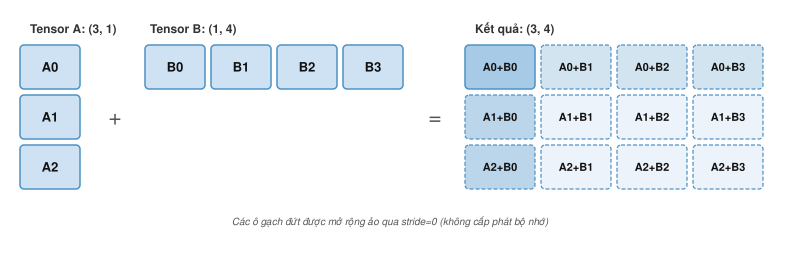

# Nền tảng thuật toán {#sec-appdx-algorithm-foundations dropcap="chapter-opening"}

Một profile cho thấy mức sử dụng thấp thường bị quy nhầm cho giới hạn phần cứng, trong khi nguyên nhân lại nằm ở thuật toán: một dạng nhân ma trận làm lãng phí tensor cores, một bố trí làm mất tính liên tục, hoặc bộ nhớ *activation* giữ lại cho lan truyền ngược. Phụ lục này tổng hợp các mô hình độ phức tạp tính toán và các công thức ước tính dung lượng bộ nhớ mà các chương hiệu năng trong sách dựa vào, giúp bạn đánh giá các đánh đổi về mặt thuật toán trước khi đưa mã lên các bộ tăng tốc. Phụ lục giả định bạn đã quen với đại số tuyến tính và với quy luật sắt được giới thiệu từ đầu sách.

## Cách sử dụng Phụ lục này {.unnumbered}

Phụ lục này được thiết kế như tài liệu tham khảo. Hãy tra cứu khi bạn cần chuyển một triệu chứng từ profiler ("matmul chậm," "không khớp hình dạng," "OOM trong huấn luyện") thành nguyên nhân cụ thể về tính toán hoặc bộ nhớ.

Các quy ước ở đây tuân theo ký hiệu chung của sách (ví dụ, $B$ dành cho kích thước batch và $\text{BW}$ biểu thị băng thông).

- **Khi các *kernel* nhân ma trận tổng quát (GEMM) chậm**: Sử dụng @sec-appdx-algorithm-foundations-general-matrix-multiply-gemm-b55d và so sánh cường độ với điểm ridge của phần cứng.
- **Khi bộ nhớ bị đầy trong quá trình huấn luyện**: Sử dụng @sec-appdx-algorithm-foundations-true-cost-training-memory-e54e và phân tách bộ nhớ huấn luyện.
- **Khi mã *tensor* "đáng lẽ phải hoạt động" nhưng không**: Sử dụng @sec-appdx-algorithm-foundations-shapes-strides-1aea và @sec-appdx-algorithm-foundations-broadcasting-ec16.
- **Khi độ thưa được đề xuất như một giải pháp**: Sử dụng @sec-appdx-algorithm-foundations-sparse-matrix-formats-0bd0 để kiểm tra mật độ và chi phí siêu dữ liệu.
- **Khi chứng minh các giới hạn tính toán *gradient***: Sử dụng @sec-appdx-algorithm-baur-strassen cho định lý độ phức tạp AD chế độ ngược Baur–Strassen.
- **Khi phân tích các nút thắt cổ chai về độ dài chuỗi**: Sử dụng @sec-appdx-algorithm-flash-attention cho đệ quy *softmax* trực tuyến và chứng minh giảm I/O HBM (bộ nhớ băng thông cao) của FlashAttention.
- **Khi phân bổ tính toán giữa các tham số và *token***: Sử dụng @sec-appdx-algorithm-chinchilla-derivation cho dẫn xuất luật tỷ lệ tối ưu về tính toán của Kaplan và Chinchilla.

```{=latex}
\vspace*{-0.5ex}
```
Mạng nơ-ron biến đại số tuyến tính thành hành vi đã học: các ma trận biến đổi các activation, bố cục tensor quyết định cách dữ liệu di chuyển trong bộ nhớ, và lan truyền ngược mang tín hiệu lỗi xuyên suốt quá trình tính toán. Những nền tảng này là cơ sở cho phần deep learning trong @sec-neural-computation, phần nội bộ framework trong @sec-ml-frameworks, và các chiến lược huấn luyện trong @sec-model-training. Kiến trúc có thể thay đổi, nhưng bộ máy toán học nền tảng thì luôn ổn định.

```{=latex}
\vspace*{-1ex}
```
## Đại số tuyến tính {#sec-appdx-algorithm-foundations-linear-algebra-c937}

Các hệ thống deep learning, về cốt lõi, là những cỗ máy biến đổi các ma trận khổng lồ. Các framework như PyTorch che bớt phần toán học thuần túy, nhưng kỹ thuật hiệu năng vẫn dựa vào đại số tuyến tính bên dưới. Kế thừa phần cách số được lưu trữ trong @sec-appdx-machine-foundations-numerical-representations-c889, mục này tập trung vào cách chúng được xử lý.

```{=latex}
\vspace*{-1ex}
```
::: {#psp-appendix-algorithm-linear-algebra-matters .callout-perspective title="Tại sao điều này quan trọng"}

Nhiều mạng nơ-ron dày đặc, đặc biệt là các transformer và các mạng nơ-ron tích chập lớn, dành phần lớn tính toán cho phép nhân ma trận hoặc các kernel dạng GEMM. Một khối self-attention thực hiện các GEMM cho phép chiếu Q, K, V và đầu ra, cộng thêm hai phép nhân ma trận attention: một cho điểm attention và một cho các giá trị được đánh trọng số theo attention. Khối feed-forward của lớp còn bổ sung thêm các GEMM khác. Hiểu rõ đặc tính hiệu năng của GEMM giúp giải thích vì sao kích thước batch ảnh hưởng đến thông lượng, vì sao một số chiều của lớp lại “tốt” hơn các chiều khác, và cách đọc đầu ra của trình phân tích hiệu năng. Lý luận trên các chiều ma trận và cường độ số học cho phép dự đoán liệu một khối lượng công việc (workload) dày đặc sẽ bị giới hạn bởi tính toán hay bộ nhớ, ngay cả trước khi chạy bất kỳ dấu vết từ profiler nào.

:::

### Các phép toán và ký hiệu tensor {#sec-appdx-algorithm-foundations-tensor-operations-notation-2758}

Ký hiệu tổng Einstein[^fn-einsum-tensor-contraction] giúp thể hiện rõ các phép toán phức tạp trong suốt cuốn sách này (được triển khai dưới dạng `torch.einsum` trong PyTorch và `np.einsum` trong NumPy). Phép nhân ma trận $\mathbf{C} = \mathbf{A}\mathbf{B}$ trở thành:
$$ C_{ij} = \sum_k A_{ik} B_{kj} $$

[^fn-einsum-tensor-contraction]: **Quy ước tổng Einstein**\index{Quy ước tổng Einstein!định nghĩa}: Các chỉ số lặp lại trong một tích được ngầm hiểu là cộng dồn, loại bỏ các dấu tổng tường minh. Các framework ML đã áp dụng quy ước này vì nó diễn đạt gọn gàng các phép co tensor tùy ý chỉ bằng một chuỗi duy nhất.

Trong ký hiệu einsum, phép toán này được viết là `ik,kj->ij`. Ký hiệu này mở rộng tự nhiên cho các phép toán đa chiều trong cơ chế *attention*. Ví dụ, phép *batched multi-head attention* được biểu diễn là `bhid,bhjd->bhij` (trong đó $b$ là *batch*, $h$ là *head*, $i$ là chuỗi truy vấn, $j$ là chuỗi khóa và $d$ là chiều của *head*).

### Bố cục bộ nhớ và hiệu suất {#sec-appdx-algorithm-foundations-memory-layouts-performance-44d0}

Bố cục dữ liệu trong bộ nhớ (row-major vs. column-major) ảnh hưởng trực tiếp đến hiệu quả của cache. Khi duyệt một ma trận, truy cập các địa chỉ bộ nhớ liền kề nhanh hơn rất nhiều so với truy cập theo bước nhảy (strided access).

Một cách tối ưu hóa thường dùng là chuyển vị sẵn một tensor trước khi thực hiện các phép toán lặp lại, để đảm bảo truy cập liền kề trong vòng lặp nóng (hot loop). Chi phí sao chép một lần sẽ được dàn trải qua nhiều phép toán về sau.

### Tích vô hướng như một thước đo độ tương đồng {#sec-appdx-algorithm-foundations-dot-product-similarity-7957}

Tích vô hướng\index{Tích vô hướng!ôn tập phụ lục} $\mathbf{a} \cdot \mathbf{b} = \sum a_i b_i$ về mặt hình học tương đương với $\|\mathbf{a}\| \|\mathbf{b}\| \cos \phi$. Điều này khiến nó trở thành một thước đo độ tương đồng tự nhiên giữa hai vectơ: với các vectơ khác không, dấu của tích vô hướng giúp phân biệt góc nhọn, góc vuông và góc tù, còn độ lớn của nó cũng phụ thuộc vào chuẩn của cả hai vectơ.

Chính vì cách diễn giải hình học này mà tích vô hướng xuất hiện rộng rãi trong các kiến trúc hiện đại. Trong cơ chế *attention*, các vectơ truy vấn ($Q$) và khóa ($K$) được nhân vô hướng để tính điểm tương đồng, cho biết mỗi *token* chú ý đến các *token* khác bao nhiêu. Các trọng số attention thu được sau đó được dùng để tạo tổ hợp có trọng số của các vectơ giá trị ($V$)—khiến tích vô hướng trở thành nền tảng cho khả năng của *transformer* trong việc mô hình hóa các phụ thuộc tầm xa.

### Nhân ma trận tổng quát (GEMM) {#sec-appdx-algorithm-foundations-general-matrix-multiply-gemm-b55d}

GEMM[^fn-gemm-blas-routines] là công cụ tính toán chủ lực của deep learning. Với các ma trận kích thước $M{\times}K$ và $K{\times}N$, GEMM thực hiện $2MNK$ phép toán dấu phẩy động (một phép nhân-tích lũy được tính là hai phép toán).

[^fn-gemm-blas-routines]: **Nhân ma trận tổng quát (GEMM)**\index{GEMM!appendix refresher}: Họ BLAS (Basic Linear Algebra Subprograms) khởi đầu với các chương trình con vector được chuẩn hóa vào năm 1979 [@lawson1979]; GEMM được chuẩn hóa sau đó như một chương trình con Mức 3 [@dongarra1988]. Tiền tố "GE" là viết tắt của "general" (tổng quát), để phân biệt với các dạng đối xứng hoặc tam giác. GEMM tính $\mathbf{C} = \alpha \mathbf{A}\mathbf{B} + \beta \mathbf{C}$ và là một chương trình con then chốt về hiệu năng trong deep learning. @Sec-model-training-matrix-operations-1f21 giải thích cách hình dạng của GEMM quyết định thông lượng huấn luyện.

```{python}
#| echo: false
from mlsysim import *
from mlsysim.core.units import *

# ┌── LEGO ───────────────────────────────────────────────
# │ Context: @sec-appdx-algorithm-foundations-general-matrix-multiply-gemm-b55d
# │ Goal: GEMM intensity formula and small-matrix roofline example
from mlsysim.fmt import fmt_int, fmt, check, fmt_arithmetic_intensity, fmt_display_math

class GemmIntensityExample:
    # ┌── 1. LOAD (Constants) ──────────────────────────────────────────────
    n_small = 64

    # ┌── 2. EXECUTE (The Compute) ────────────────────────────────────────
    bytes_fp16 = int(BYTES_FP16.to(byte).magnitude)
    small_intensity = n_small / 3
    a100_ridge = int(
        Hardware.Cloud.A100.compute.peak_flops.to(TFLOPs / second).magnitude / Hardware.Cloud.A100.memory.bandwidth.to(TB / second).magnitude
    )
    small_efficiency_pct = small_intensity / a100_ridge * 100

    # ┌── 3. GUARD (Invariants) ──────────────────────────────────────────
    check(a100_ridge > 150, f"A100 ridge point ({a100_ridge}) unexpectedly low.")

    # ┌── 4. OUTPUT (Formatting) ─────────────────────────────────────────────
    bytes_fp16_value_str = fmt_int(bytes_fp16, commas=False)
    n_small_str = fmt(n_small, precision=0, commas=False)
    small_intensity_str = fmt_arithmetic_intensity(small_intensity * flop / byte, unit=flop / byte, precision=1, commas=False)
    small_efficiency_pct_str = fmt_percent(small_efficiency_pct / 100, precision=1, commas=False, style='prose')
    a100_ridge_str = fmt_arithmetic_intensity(Hardware.Cloud.A100.ridge_point(), unit=flop / byte, precision=1, commas=False)
    intensity_formula_math = fmt_display_math(
        rf"\text{{Intensity}} = \frac{{O}}{{D_{{\text{{vol}}}}}} = "
        rf"\frac{{2n^3}}{{3n^2 \times {bytes_fp16_value_str}}} = "
        rf"\frac{{n}}{{3}}\text{{ FLOP/byte}}"
    )
```

Cường độ số học\index{Arithmetic intensity!appendix refresher} của GEMM tăng tuyến tính theo kích thước ma trận. Với ma trận vuông $n{\times}n$ ở FP16 (`{python} GemmIntensityExample.bytes_fp16_value_str` byte/phần tử), khi $\beta=0$, giới hạn lý tưởng là đọc $\mathbf{A}$ và $\mathbf{B}$ một lần rồi ghi $\mathbf{C}$ một lần:
`{python} GemmIntensityExample.intensity_formula_math`

Khi $\beta \ne 0$, việc đọc lại $\mathbf{C}$ cũ làm cường độ giảm còn $n/4$ FLOP/byte. Điều này giải thích một số hiện tượng quan trọng sau:

- **Sử dụng batch lớn hơn có thể cải thiện hiệu quả**: Gộp batch làm tăng kích thước ma trận hiệu quả khi tạo các GEMM lớn hơn hoặc cho phép tái sử dụng; còn chỉ xếp hàng các GEMM nhỏ độc lập thì không làm tăng cường độ.
- **Căn chỉnh kích thước giúp ích**: Các tensor cores trong phần cứng được tối ưu cho các bội số *tile* cụ thể, phụ thuộc vào độ chính xác và kiến trúc. Các kích thước trùng với các bội số này sẽ tránh chi phí đệm (padding overhead) và cải thiện hiệu quả kernel, nhưng không cần là lũy thừa của hai.
- **Ma trận nhỏ thường không hiệu quả**: Một GEMM vuông với $n =$ `{python} GemmIntensityExample.n_small_str` có cường độ `{python} GemmIntensityExample.n_small_str`/3 ≈ `{python} GemmIntensityExample.small_intensity_str`, thấp hơn nhiều so với *ridge point* (`{python} GemmIntensityExample.a100_ridge_str`). Roofline cap của nó chỉ khoảng ~`{python} GemmIntensityExample.small_efficiency_pct_str` so với mức đỉnh; chi phí khởi chạy và chia *tile* có thể làm giảm thông lượng thực tế.

### Các định dạng ma trận thưa {#sec-appdx-algorithm-foundations-sparse-matrix-formats-0bd0}

Khi đa số phần tử trong ma trận là 0, các định dạng lưu trữ chuyên dụng giúp tránh tốn bộ nhớ cho số 0 và cho phép phép tính bỏ qua chúng hoàn toàn. Định dạng **hàng thưa nén (CSR)**\index{Compressed sparse row!definition} dùng ba mảng:

- `Values`: Các phần tử khác 0, lưu theo thứ tự hàng
- `Col_Idx`: Chỉ số cột của mỗi phần tử khác 0
- `Row_Ptr`: Vị trí bắt đầu trong `Values` cho mỗi hàng (độ dài = num_rows + 1)

CSR hữu ích cho các ma trận đặc trưng thưa trong pipeline khuyến nghị và cho các trọng số mô hình đã tỉa. Với một ma trận có $N$ phần tử, $R$ hàng và $K$ phần tử khác 0, CSR dùng bộ nhớ $\mathcal{O}(K + R)$ thay vì $\mathcal{O}(N)$; khi $K$ lớn so với $R$, thường tóm tắt thành $\mathcal{O}(K)$.

```{python}
#| echo: false
#| label: sparse-embedding-example
# ┌── LEGO ───────────────────────────────────────────────
# │ Context: @sec-appdx-algorithm-foundations-sparse-matrix-formats-0bd0 embedding example
# │ Goal: Dense vs sparse vocabulary embedding footprint at 1% density
from mlsysim.fmt import fmt_int, fmt, fmt_count, fmt_magnitude, fmt_memory, fmt_percent, fmt_qty

class SparseEmbeddingExample:
    # ┌── 1. LOAD (Constants) ──────────────────────────────────────────────
    vocab_size = 100 * THOUSAND
    embed_dim = 10 * THOUSAND
    sparsity_pct = 1

    # ┌── 2. EXECUTE (The Compute) ────────────────────────────────────────
    total_elements = vocab_size * embed_dim
    dense_bytes_q = total_elements * BYTES_FP32
    dense_bytes = dense_bytes_q.to(byte).magnitude
    nonzeros = int(total_elements * sparsity_pct / 100)
    csr_bytes_per_nonzero_q = BYTES_FP32 + BYTES_INT32
    csr_bytes_per_nonzero = csr_bytes_per_nonzero_q.to(byte).magnitude
    sparse_bytes_q = nonzeros * csr_bytes_per_nonzero_q + (vocab_size + 1) * BYTES_INT32
    sparse_bytes = sparse_bytes_q.to(byte).magnitude
    reduction_factor = round(dense_bytes / sparse_bytes)

    # ┌── 3. GUARD (Invariants) ──────────────────────────────────────────
    check(sparse_bytes == 80_400_004, f"CSR footprint should include row pointers, got {sparse_bytes} bytes.")

    # ┌── 4. OUTPUT (Formatting) ─────────────────────────────────────────────
    vocab_size_str = fmt(vocab_size, precision=0)
    embed_dim_str = fmt(embed_dim, precision=0)
    total_elements_str = fmt_count(total_elements, scale="B", commas=False)
    dense_gb_str = fmt_qty(dense_bytes_q, GB, precision=0, commas=False)
    nonzeros_str = fmt_count(nonzeros, scale="M", commas=False)
    sparse_mb_str = fmt_qty(sparse_bytes_q, MB, precision=1, commas=False)
    bytes_fp32_value_str = fmt_magnitude(BYTES_FP32, unit=byte, precision=0, commas=False)
    bytes_int32_value_str = fmt_magnitude(BYTES_INT32, unit=byte, precision=0, commas=False)
    sparsity_pct_str = fmt_percent(sparsity_pct / 100, precision=0, commas=False, style='prose')
    reduction_factor_mult_str = fmt_multiple(reduction_factor, precision=0, commas=False)
```

Để thấy rõ bài toán đánh đổi, hãy xét một ma trận embedding từ vựng với `{python} SparseEmbeddingExample.vocab_size_str` hàng và `{python} SparseEmbeddingExample.embed_dim_str` cột (`{python} SparseEmbeddingExample.total_elements_str` tham số):

*   **Dày đặc (FP32)**: `{python} SparseEmbeddingExample.total_elements_str` tham số $\times$ `{python} SparseEmbeddingExample.bytes_fp32_value_str` byte mỗi tham số = `{python} SparseEmbeddingExample.dense_gb_str`.
*   **Thưa** (mật độ `{python} SparseEmbeddingExample.sparsity_pct_str`): CSR lưu khoảng `{python} SparseEmbeddingExample.nonzeros_str` phần tử $\times$ (giá trị `{python} SparseEmbeddingExample.bytes_fp32_value_str`-byte + chỉ số cột `{python} SparseEmbeddingExample.bytes_int32_value_str`-byte), cộng một con trỏ hàng cho mỗi hàng và một con trỏ cuối, tổng ≈ `{python} SparseEmbeddingExample.sparse_mb_str`.
*   *Kết quả*: Giảm `{python} SparseEmbeddingExample.reduction_factor_mult_str` dung lượng bộ nhớ, giúp chứa được một mô hình vốn dĩ sẽ bị OOM (Hết bộ nhớ).

Đại số tuyến tính cho chúng ta biết *cần* tính gì; câu hỏi tiếp theo là *làm sao* diễn đạt các phép tính đó trong mã. Các nguyên thủy lập trình tensor—shape, strides, và broadcasting—làm cầu nối giữa ký hiệu toán học và các phép toán mảng thực thi trên phần cứng.

## Các nguyên thủy lập trình tensor {#sec-appdx-algorithm-foundations-tensor-programming-primitives-1400}

Một lần sập do lệch shape, một phép broadcast sai mà không báo lỗi, một kernel chỉ chạy ở 5% hiệu suất đỉnh vì tensor không liên tiếp trong bộ nhớ—những lỗi kỹ thuật ML phổ biến này đều xuất phát từ cùng một lớp trừu tượng. *Lập trình tensor* chuyển toán học trừu tượng của đại số tuyến tính thành các thao tác mảng cụ thể chạy trên phần cứng.

### Bảng ghi nhớ độ phức tạp tính toán {#sec-appdx-algorithm-foundations-computational-complexity-cheat-sheet-0c6c}

@Tbl-tensor-op-ref cung cấp bảng tham khảo định lượng cho các thành phần cơ bản phổ biến nhất. Hãy dùng các công thức này để ước tính nháp kích thước mô hình và nhu cầu tính toán *trước khi* chuẩn bị phần cứng. Với kích thước của lớp và hình dạng đầu vào, các công thức này cho ước tính sơ bộ về số tham số và chi phí tính toán bậc một. Hàng về attention là cảnh báo chính: độ dài chuỗi tạo ra hạng $S^2$, còn chiều ẩn tạo ra khối lượng phép chiếu $d^2$, nên các mô hình ngữ cảnh dài có thể làm đổi chi phí chi phối mà không thay đổi số tham số.

```{=latex}
\begingroup
\renewcommand{\arraystretch}{1.6}
```

| **Layer Type**                |        **Output Shape**       |                                       **Parameters ($P$)**                                       |                              **FLOPs (per Forward Pass)**                              |
|:------------------------------|:-----------------------------:|:------------------------------------------------------------------------------------------------:|:--------------------------------------------------------------------------------------:|
| **Linear**                    |     $(B, N_{\text{out}})$     |            $N_{\text{in}} \times N_{\text{out}} + N_{\text{out}}$ if bias is enabled             |                $2 \times B \times N_{\text{in}} \times N_{\text{out}}$                 |
| **Conv2D**                    | $(B, C_{\text{out}}, H', W')$ |       $K^2 \times C_{\text{in}} \times C_{\text{out}} + C_{\text{out}}$ if bias is enabled       | $2 \times B \times H' \times W' \times K^2 \times C_{\text{in}} \times C_{\text{out}}$ |
| **Multi-Head Self-Attention** |   $(B, S, d_{\text{model}})$  | $4 \times d_{\text{model}}^2$, plus $4 \times d_{\text{model}}$ if projection biases are enabled |              $B \times (4 S^2 d_{\text{model}} + 8 S d_{\text{model}}^2)$              |
| **LayerNorm**                 |   $(B, S, d_{\text{model}})$  |                 $2 \times d_{\text{model}}$ if affine scale and bias are enabled                 |                   $\mathcal{O}(B \times S \times d_{\text{model}})$                    |

: **Các phép toán tensor cơ bản trong deep learning**: Tóm tắt về hình dạng, tham số và số lượng FLOPS. Lưu ý: $B$ là kích thước batch, $S$ là độ dài chuỗi và $K$ là kích thước kernel. Số FLOPS cho attention bao gồm các phép chiếu QKV và các tương tác tính điểm. Hạng $S^2$ áp dụng cho huấn luyện toàn chuỗi và giai đoạn prefill, trong khi quá trình tạo sinh với KV-cache thì tuyến tính theo từng token trong ngữ cảnh đã được cache; khối lượng phép chiếu $d^2$ sẽ chiếm ưu thế khi chiều ẩn lớn. {#tbl-tensor-op-ref tbl-colwidths="[13,18,36,33]"}

```{=latex}
\endgroup
```

### Hình dạng và bước nhảy {#sec-appdx-algorithm-foundations-shapes-strides-1aea}

Một tensor\index{Tensor!appendix refresher} là một view (khung nhìn) lên bộ đệm lưu trữ nền, được mô tả bởi siêu dữ liệu shape, stride, dtype và offset. Chỉ những tensor liên tục mới sắp xếp các phần tử logic của chúng thành một khối liền kề duy nhất.

*   **Shape**: Các chiều của tensor (ví dụ, `(3, 4)`).
*   **Stride**: Số lượng phần tử cần bỏ qua trong bộ nhớ để di chuyển đến phần tử tiếp theo trong một chiều.

Các phép toán như `transpose()` hoặc `view()` thường chỉ thay đổi *strides*, chứ không phải dữ liệu trong bộ nhớ. Điều này nhanh ($\mathcal{O}(1)$) nhưng có thể tạo ra các tensor không liên tục, khiến chúng không hoạt động được trong các kernel yêu cầu dữ liệu liên tục. Trong những trường hợp như vậy, gọi `contiguous()` sẽ buộc sao chép bộ nhớ $\mathcal{O}(N)`. Thao tác này có thể chiếm phần lớn thời gian runtime nếu bị lặp lại bên trong một vòng lặp.

### Broadcasting {#sec-appdx-algorithm-foundations-broadcasting-ec16}

Broadcasting\index{Broadcasting!definition} cho phép thực hiện các phép toán số học trên các tensor có hình dạng khác nhau. So sánh các chiều từ phải sang trái (tức là từ chiều cuối cùng đến chiều đầu tiên). Hai chiều được coi là tương thích khi:

1.  Chúng bằng nhau.
2.  Một trong số chúng là 1.

Chiều có kích thước bằng 1 sẽ được "kéo giãn" để khớp với chiều kia, như minh họa trong @fig-broadcasting-rules. Việc kéo giãn này là ảo: dữ liệu không được sao chép trong bộ nhớ. Thay vào đó, stride cho chiều đó được đặt bằng 0, cho phép phần cứng đọc đi đọc lại cùng một giá trị với chi phí bộ nhớ $\mathcal{O}(1)$.

::: {#fig-broadcasting-rules fig-env="figure" fig-pos="htb" fig-cap="**Quy tắc Broadcasting Tensor**: Một cột có kích thước (3,1) và một hàng có kích thước (1,4) sẽ được broadcast qua các chiều bổ sung nhau, tạo ra tổng theo cặp trong một kết quả có kích thước (3,4)." fig-alt="Tensor A là một cột ba phần tử (được đánh dấu từ A0 đến A2) có kích thước (3,1); cộng với tensor B là một hàng bốn phần tử (được đánh dấu từ B0 đến B3) có kích thước (1,4). Kết quả là một lưới (3,4) mà mỗi ô chứa tổng của một cặp Ai+Bj. Các ô nét đứt và phần chú thích cho thấy việc mở rộng ảo thông qua stride 0 mà không cần cấp phát bộ nhớ."}

:::

Hãy xem xét một trường hợp cụ thể: tensor A có kích thước `(32, 1, 64)` và tensor B có kích thước `(1, 128, 64)`. Khi so sánh các chiều từ phải sang trái, 64 khớp với 64, sau đó chiều 1 được kéo giãn thành 128, rồi chiều 1 còn lại được kéo giãn thành 32, cho ra kích thước kết quả `(32, 128, 64)`. Việc hình dung phép mở rộng này giúp tránh các lỗi logic âm thầm, chẳng hạn vô tình cấp phát một tensor quá lớn (ví dụ, một ma trận `(Batch, Batch)` thay vì một vector `(Batch)` theo kiểu phần tử).

Kích thước, stride và broadcasting quyết định cách các tensor luân chuyển trong lượt truyền xuôi của một mô hình. Quá trình huấn luyện còn có một yêu cầu thứ hai: *học hỏi từ các lỗi*. Lan truyền ngược giúp việc học này trở nên khả thi và kéo theo các chi phí bộ nhớ sẽ được phân tích dưới đây.

## Cơ chế học tập {#sec-appdx-algorithm-foundations-mechanics-learning-24f6}

Các chương trình tensor hợp lệ giúp các vòng lặp huấn luyện có thể thực hiện được. Lan truyền ngược điều phối các tensor này để tính toán đạo hàm, từ đó biến một dự đoán xuôi thành một tín hiệu học tập ngược.

::: {#psp-appendix-algorithm-backpropagation-matters .callout-perspective title="Tại sao điều này quan trọng"}

Khi quá trình huấn luyện thất bại—ví dụ như hàm mất mát trở thành NaN, đạo hàm bùng nổ, hoặc hết bộ nhớ—việc hiểu rõ cơ chế hoạt động của lan truyền ngược là rất cần thiết để chẩn đoán vấn đề. Đồ thị ngược cung cấp một mô hình tư duy giúp phân tích luồng đạo hàm và việc sử dụng bộ nhớ trong quá trình huấn luyện.

:::

### Quy tắc chuỗi và tự động vi phân {#sec-appdx-algorithm-foundations-chain-rule-automatic-differentiation-e0eb}

Đối với một hàm hợp $y = f(g(x))$, đạo hàm của nó là $\frac{dy}{dx} = \frac{dy}{dg} \cdot \frac{dg}{dx}$. Trong một mạng nơ-ron, $f$ và $g$ chính là các lớp, và sự kết hợp này có thể sâu nhiều tầng. Đối với một mạng ba lớp $y = f_3(f_2(f_1(x)))$, quy tắc chuỗi\index{Chain rule!appendix refresher} được mở rộng thành:
$$ \frac{\partial y}{\partial x} = \frac{\partial f_3}{\partial f_2} \cdot \frac{\partial f_2}{\partial f_1} \cdot \frac{\partial f_1}{\partial x} $$

Mỗi thừa số trong tích này là một đạo hàm *cục bộ*—được tính ngay tại một lớp, chỉ dựa trên đầu vào và đầu ra của chính lớp đó. Tính cục bộ này giúp thuật toán khả thi: không cần vi phân toàn bộ mạng như một hàm lớn duy nhất. Thay vào đó, mỗi lớp tự tính đạo hàm cục bộ trong lượt truyền ngược và nhân nó với gradient đi từ lớp phía trên xuống.

Các framework hiện đại sử dụng tự động vi phân ngược\index{Automatic differentiation!appendix refresher}, để tính đạo hàm cho tất cả $P$ tham số chỉ trong một lượt truyền ngược. Điểm mấu chốt là khi bắt đầu từ đầu ra và đi ngược lại (reverse mode), ta chỉ cần một lượt truyền, bất kể số tham số là bao nhiêu; trong khi nếu bắt đầu từ từng đầu vào và đi xuôi (forward mode), sẽ cần $P$ lượt truyền—mỗi tham số một lượt. Vì vậy, một bước huấn luyện chỉ hơn suy luận một hằng số nhỏ, thường khoảng 2--3$\times$ một lượt truyền xuôi với các mạng dày đặc, thay vì phải mất $P$ lượt truyền.

### Thuật toán lan truyền ngược {#sec-appdx-algorithm-foundations-backpropagation-algorithm-93f7}

Lan truyền ngược[^fn-backprop-chain-rule] thực hiện quy tắc chuỗi một cách hiệu quả qua hai lượt: truyền xuôi để tính đầu ra và truyền ngược để tính gradient. @Fig-backprop-graph minh họa quy trình này cho một mạng hai lớp đơn giản, trong đó lượt truyền xuôi (mũi tên màu xám) tính đầu ra, còn lượt truyền ngược (mũi tên đứt nét màu đỏ) lan truyền các gradient.

[^fn-backprop-chain-rule]: **Lan truyền ngược**\index{Backpropagation!appendix refresher}: Viết tắt của "backward propagation of errors" (lan truyền ngược lỗi). Thuật toán này đã được phát hiện độc lập nhiều lần—bởi @werbos1974beyond và @linnainmaa1970representation cho vi phân ngược, và bởi @rumelhart1986 cho huấn luyện mạng nơ-ron. Ý tưởng then chốt là để tính gradient cho *tất cả* các tham số, chỉ cần một lượt truyền ngược qua đồ thị, thay vì một lượt cho mỗi tham số. @Sec-appdx-algorithm-baur-strassen trình bày cách suy ra giới hạn phần việc với hệ số hằng và chi phí điển hình cho một lớp dày đặc.

::: {#fig-backprop-graph fig-env="figure" fig-pos="htb" fig-cap="**Đồ thị tính toán lan truyền ngược**: Các mũi tên màu xám liền nét thể hiện tính toán xuôi từ đầu vào $x$ đến hàm mất mát $\mathcal{L}$, trong khi các mũi tên đứt nét màu đỏ thể hiện việc truyền ngược gradient dọc theo cùng các phụ thuộc." fig-alt="Một đồ thị tính toán có bốn nút x, h, y và ký hiệu $\mathcal{L}$ cho hàm mất mát, nối từ trái sang phải. Mũi tên màu xám liền nét cho thấy truyền xuôi với các trọng số W1 và W2. Mũi tên đỏ đứt nét cong ngược lại, thể hiện dòng gradient với ký hiệu đạo hàm riêng."}
```{.tikz}
\begin{tikzpicture}[font=\small\sffamily, node distance=3cm, auto, >=stealth, thick]
  \tikzset{
    Node/.style={circle, draw=BlueLine, fill=BlueFill, line width=0.8pt, minimum size=0.9cm, text=TextBlack},
    Edge/.style={->, draw=GrayLine, line width=0.8pt},
    BackEdge/.style={->, dashed, draw=RedLine, line width=0.8pt, bend right=30},
    Label/.style={font=\footnotesize\sffamily, text=TextBlack}
  }
  \node[Node] (x) {x};
  \node[Node, right of=x] (h) {h};
  \node[Node, right of=h] (y) {y};
  \node[Node, right of=y, fill=RedLine!10, draw=RedLine] (L) {$\mathcal{L}$};
  \draw[Edge] (x) -- node[below, Label] {$W_1$} (h);
  \draw[Edge] (h) -- node[below, Label] {$W_2$} (y);
  \draw[Edge] (y) -- node[below, Label] {Loss} (L);
  \draw[BackEdge,overlay] (L) to node[above, Label, text=RedLine] {$\frac{\partial \mathcal{L}}{\partial y}$} (y);
  \draw[BackEdge,overlay] (y) to node[above, Label, text=RedLine] {$\frac{\partial \mathcal{L}}{\partial h}$} (h);
  \draw[BackEdge,overlay] (h) to node[above, Label, text=RedLine] {$\frac{\partial \mathcal{L}}{\partial x}$} (x);
 \path[use as bounding box] (-0.5,-0.55) rectangle (9.5,1.21);
\end{tikzpicture}
```
:::

Các edge gradient lần theo lại các phụ thuộc của truyền xuôi, nên mỗi bước truyền ngược cần các giá trị được giữ từ phép toán xuôi tương ứng.

#### Truyền xuôi {.unnumbered}

Dùng activation dạng vector hàng, bỏ qua độ chệch (bias), và giữ activation trung gian cho truyền ngược. Bắt đầu từ đầu vào $x$. Nhân $x$ với $W_1$ để được activation ẩn $h$. Đưa $h$ vào cache vì truyền ngược sẽ cần đến sau. Nhân $h$ với $W_2$ để được đầu ra $y$. Đưa $y$ vào cache. So sánh $y$ với nhãn mục tiêu để tính hàm mất mát $\mathcal{L}$.

Lúc này, ta đã tính xong hàm mất mát và bộ nhớ đang chứa đầu vào $x$, activation $h$ đã cache, đầu ra $y$ đã cache, và $\mathcal{L}$. Với mô hình lớn, các activation đã cache có thể chiếm phần lớn bộ nhớ.

#### Truyền ngược {.unnumbered}

Giờ lần ngược từ $\mathcal{L}$. Hàm mất mát cung cấp $\frac{\partial \mathcal{L}}{\partial y}$, tức gradient của mất mát theo dự đoán. Đây là nơi tín hiệu lỗi đi vào mạng.

Vì $y = h \cdot W_2$, quy tắc chuỗi cho ta hai gradient tại lớp này:
$$ \frac{\partial \mathcal{L}}{\partial W_2} = h^T \cdot \frac{\partial \mathcal{L}}{\partial y} \qquad \text{(weight gradient—used to update } W_2\text{)} $$
$$ \frac{\partial \mathcal{L}}{\partial h} = \frac{\partial \mathcal{L}}{\partial y} \cdot W_2^T \qquad \text{(input gradient—passed backward to the previous layer)} $$

Tính $\frac{\partial \mathcal{L}}{\partial W_2}$ cần activation $h$ đã cache từ truyền xuôi. Các activation phải sẵn có trong suốt truyền ngược vì gradient của trọng số ở mỗi lớp phụ thuộc vào đầu vào của chính lớp đó.

Tiếp tục ngược về lớp đầu tiên. Vì $h = x \cdot W_1$, áp dụng cùng một mẫu để có:
$$ \frac{\partial \mathcal{L}}{\partial W_1} = x^T \cdot \frac{\partial \mathcal{L}}{\partial h} $$

Mỗi bước truyền ngược cần hai thứ: gradient đi vào từ lớp trên $\left(\frac{\partial \mathcal{L}}{\partial h}\right)$ và đầu vào của lớp đó ($x$), những giá trị này phải sẵn trong lúc truyền ngược. Vì thế, truyền ngược tốn khoảng gấp 2$\times$ truyền xuôi về chi phí tính toán: ở mỗi lớp, nó thực hiện hai phép nhân ma trận (một cho gradient trọng số, một cho gradient đầu vào) so với chỉ một phép nhân ở truyền xuôi.

### Chi phí bộ nhớ thực sự của huấn luyện {#sec-appdx-algorithm-foundations-true-cost-training-memory-e54e}

Một sai lầm phổ biến là cho rằng bộ nhớ huấn luyện bằng kích thước mô hình. Giả định này dễ dẫn đến lỗi OOM (Out Of Memory) vì trọng số chỉ là một trong bốn thành phần. Bộ nhớ huấn luyện\index{Training!memory decomposition} gồm trọng số, đạo hàm, trạng thái optimizer và các activation được giữ lại (retained activations):
$$ M_{\text{total}} = M_{\text{weights}} + M_{\text{gradients}} + M_{\text{optimizer}} + M_{\text{activations}} $$

Đối với một optimizer Adaptive Moment Estimation (Adam) tiêu chuẩn [@kingma2014adam] trong độ chính xác hỗn hợp [@micikevicius2017mixed]:

```{python}
#| echo: false
#| label: training-memory-bytes
# ┌── LEGO ───────────────────────────────────────────────
# │ Context: @sec-appdx-algorithm-foundations-true-cost-training-memory-e54e
# │ Goal: Per-parameter byte counts for mixed-precision Adam training
from mlsysim.fmt import fmt_int, fmt, fmt_memory, fmt_range

class TrainingMemoryBytes:
    # ┌── 4. OUTPUT (Formatting) ─────────────────────────────────────────────
    bytes_fp16_str = fmt_memory(BYTES_FP16, unit=byte, precision=0, commas=False)
    bytes_fp32_str = fmt_memory(BYTES_FP32, unit=byte, precision=0, commas=False)
    optimizer_overhead_min = int(BYTES_ADAM_STATE.to(byte).magnitude)
    optimizer_overhead_max = optimizer_overhead_min + int(BYTES_FP32.to(byte).magnitude)
    optimizer_overhead_min_str = fmt(optimizer_overhead_min, precision=0, commas=False)
    optimizer_overhead_str = fmt_range(optimizer_overhead_min, optimizer_overhead_max, precision=0, commas=False)
```

*   **Trọng số**: `{python} TrainingMemoryBytes.bytes_fp16_str` (FP16/BF16) hoặc `{python} TrainingMemoryBytes.bytes_fp32_str` (FP32).
*   **Đạo hàm**: Cùng kích thước với trọng số.
*   **Trạng thái optimizer**: Các *moment* của Adam cần `{python} TrainingMemoryBytes.optimizer_overhead_min_str` byte cho mỗi tham số. Một bản sao chính (master copy) dạng FP32 sẽ tốn thêm `{python} TrainingMemoryBytes.bytes_fp32_str`, nâng tổng lên `{python} TrainingMemoryBytes.optimizer_overhead_str` byte cho mỗi tham số.
*   **Activations**: Yếu tố “ngốn” bộ nhớ ẩn. Một ước tính thân thiện với tính toán lại (recomputation) hoặc tiled-attention sẽ tăng theo $\mathcal{O}(B \times S \times N_L \times d)$; còn nếu triển khai attention đầy đủ không tính toán lại, ta phải vật liệu hóa các tensor điểm số attention, tỷ lệ theo $S^2$.

Để thấy các thành phần này tương tác ra sao trong thực tế, hãy xem một mô hình cụ thể.

```{python}
#| echo: false
#| label: gpt2-training-memory
# ┌─────────────────────────────────────────────────────────────────────────────
# │ GPT-2 XL TRAINING MEMORY BREAKDOWN
# ├─────────────────────────────────────────────────────────────────────────────
# │ Context: Callout "Worked Example: GPT-2 (1.5B) Training Memory",
# │          @sec-appdx-algorithm-foundations-true-cost-training-memory-e54e
# │
# │ Goal:    Compute memory breakdown (weights, gradients, optimizer, activations).
# │ Show:    Per-component GB and total for two batch sizes.
# │ How:     Scalar arithmetic from pint constants.
# │
# └─────────────────────────────────────────────────────────────────────────────
from mlsysim.fmt import fmt_int, fmt, fmt_ratio, check, sci_latex, fmt_math, fmt_display_math, fmt_percent, fmt_memory, fmt_memory_capacity, fmt_qty
from mlsysim.core.units import GiB, GB

class GPT2TrainingMem:
    # ┌── 1. LOAD ──────────────────────────────────────────
    P = Models.Language.GPT2.parameters.to(param).magnitude
    layers = Models.Language.GPT2.layers
    d = Models.Language.GPT2.hidden_dim
    bf16 = int(BYTES_FP16.to(byte).magnitude)
    fp32 = int(BYTES_FP32.to(byte).magnitude)
    accel_q = Hardware.Cloud.A100.memory.capacity
    batch_small = 8
    batch_large = 64
    seq_len = 1024
    optimizer_bytes_per_param = int((BYTES_ADAM_STATE + BYTES_FP32).to(byte).magnitude)  # FP32 master + momentum + variance

    # ┌── 2. EXECUTE ───────────────────────────────────────
    weights_q = P * bf16 * byte
    grads_q = P * bf16 * byte
    optim_q = P * optimizer_bytes_per_param * byte
    model_state_q = weights_q + grads_q + optim_q
    remaining_q = accel_q - model_state_q

    # Per-layer retained activation estimate excluding full S^2 attention-score storage:
    # input(1d) + QKV(3d) + attn_out(1d) + FFN(4d) + output(1d) + norms/masks(2d)
    act_factor = 12
    act_small_q = layers * act_factor * batch_small * seq_len * d * bf16 * byte
    total_small_q = model_state_q + act_small_q

    act_large_q = layers * act_factor * batch_large * seq_len * d * bf16 * byte

    # ┌── 3. GUARD ─────────────────────────────────────────
    check(model_state_q < accel_q, "Model state must fit on accelerator")
    check(total_small_q < accel_q, "Small batch must fit on the accelerator")
    check(act_large_q > remaining_q, "Large batch should exceed remaining capacity")

    # ┌── 4. OUTPUT ────────────────────────────────────────
    P_math = fmt_math(sci_latex(P, precision=1))  # LaTeX-safe: 1.5 \times 10^{9} (avoids 1.5e+09)
    layers_str = fmt(layers, precision=0, commas=False)
    d_str = fmt(d, precision=0, commas=False)
    bf16_bytes_value_str = fmt(bf16, precision=0, commas=False)
    weights_gb_str = fmt_qty(weights_q, GB, precision=0, commas=False)
    grads_gb_str = fmt_qty(grads_q, GB, precision=0, commas=False)
    optim_bytes_value_str = fmt(optimizer_bytes_per_param, precision=0, commas=False)
    optim_gb_str = fmt_qty(optim_q, GB, precision=0, commas=False)
    model_state_gb_str = fmt_qty(model_state_q, GB, precision=0, commas=False)
    # the sentence glosses this as "in decimal units", so it must be the
    # honest decimal conversion, not the branded nameplate
    accel_gb_str = fmt_memory(accel_q, unit=GB, precision=1, commas=False)
    remaining_gb_str = fmt_qty(remaining_q, GB, precision=1, commas=False)
    batch_small_str = fmt(batch_small, precision=0, commas=False)
    seq_len_str = fmt(seq_len, precision=0, commas=False)
    act_small_gb_str = fmt_qty(act_small_q, unit=GB, precision=1, commas=False)
    total_small_gb_str = fmt_qty(total_small_q, GB, precision=1, commas=False, approx=True)
    batch_large_str = fmt(batch_large, precision=0, commas=False)
    act_large_gb_str = fmt_qty(act_large_q, GB, precision=1, commas=False, approx=True)
    act_factor_str = fmt_ratio(act_factor, precision=0, commas=False)
    accel_class_gb_str = fmt_memory_capacity(accel_q, unit=GiB, precision=0, commas=False)
    grad_ckpt_overhead_pct_str = fmt_percent(33 / 100, precision=0, commas=False, style='prose')
    act_small_display_math = fmt_display_math(
        rf"{layers_str} \times {act_factor_str} \times {batch_small_str} \times {seq_len_str} \times "
        rf"{d_str} \times {bf16_bytes_value_str}\text{{ bytes }} \approx {act_small_gb_str}"
    )
```

::: {#nbk-appendix-algorithm-gpt-2-training-memory .callout-notebook title="Ví dụ minh họa: Bộ nhớ huấn luyện GPT-2 (1.5B)"}

**Mô hình**: GPT-2 XL có $P =$ `{python} GPT2TrainingMem.P_math` tham số, `{python} GPT2TrainingMem.layers_str` lớp, chiều ẩn $d =$ `{python} GPT2TrainingMem.d_str`.

**Trạng thái mô hình (cố định theo mỗi bước)**:

- Trọng số (BF16): `{python} GPT2TrainingMem.P_math` $\times$ `{python} GPT2TrainingMem.bf16_bytes_value_str` byte = `{python} GPT2TrainingMem.weights_gb_str`
- Đạo hàm (BF16): `{python} GPT2TrainingMem.P_math` $\times$ `{python} GPT2TrainingMem.bf16_bytes_value_str` byte = `{python} GPT2TrainingMem.grads_gb_str`
- Optimizer (bản chính FP32 + momentum + phương sai): `{python} GPT2TrainingMem.P_math` $\times$ `{python} GPT2TrainingMem.optim_bytes_value_str` byte = `{python} GPT2TrainingMem.optim_gb_str`
- **Tổng trạng thái mô hình**: `{python} GPT2TrainingMem.model_state_gb_str`—vừa với một bộ tăng tốc A100/H100 loại `{python} GPT2TrainingMem.accel_class_gb_str` (`{python} GPT2TrainingMem.accel_gb_str` theo đơn vị thập phân), nhưng chỉ còn lại `{python} GPT2TrainingMem.remaining_gb_str` cho các activation.

**Activations (tỷ lệ theo batch)**:

Các activation được giữ lại ở mỗi lớp cho ước tính nhanh này vào khoảng $12 \times B \times S \times d$ phần tử BF16, tức $12 \times B \times S \times d \times 2$ byte, trong đó $B$ là kích thước batch và $S$ là độ dài chuỗi. Hệ số 12 tính các tensor trung gian chính cần giữ cho lan truyền ngược: activation đầu vào, các phép chiếu QKV ($3d$), đầu ra attention, trung gian FFN ($4d$), và các mask cho layer norm/dropout. Ước tính này giả định việc triển khai không giữ toàn bộ tensor điểm số attention kích thước $B \times N_{\text{heads}} \times S^2$, như trong cách tính toán bộ nhớ thân thiện với tái tính toán hoặc attention xếp lát. Với `{python} GPT2TrainingMem.layers_str` lớp, kích thước batch `{python} GPT2TrainingMem.batch_small_str` và độ dài chuỗi `{python} GPT2TrainingMem.seq_len_str`:

`{python} GPT2TrainingMem.act_small_display_math`

**Góc nhìn hệ thống**: `{python} GPT2TrainingMem.total_small_gb_str` theo quy ước tính bộ nhớ activation này, đủ để chạy trên một bộ tăng tốc `{python} GPT2TrainingMem.accel_gb_str`. Tuy nhiên, nếu tăng kích thước batch lên `{python} GPT2TrainingMem.batch_large_str`, dung lượng activation sẽ thành `{python} GPT2TrainingMem.act_large_gb_str`, vượt quá phần dung lượng còn lại. Đây là ngưỡng cần bật gradient checkpointing hoặc một phương pháp tiết kiệm bộ nhớ khác; mức tiết kiệm và chi phí tái tính toán phụ thuộc vào vị trí đặt checkpoint và cách triển khai.

:::

#### Bùng nổ activation {#sec-appdx-algorithm-foundations-activation-explosion-1da5}

Trong khi các trọng số là cố định ($\mathcal{O}(P)$), activation tăng tuyến tính theo kích thước batch và ít nhất tuyến tính theo độ dài chuỗi; các triển khai lưu trữ đầy đủ tensor điểm số attention sẽ thêm một thành phần $\mathcal{O}(S^2)$. Như ví dụ minh họa cho thấy, bộ nhớ dành cho activation có thể nhanh chóng vượt quá phần còn lại sau khi lưu trạng thái mô hình. Gradient checkpointing[^fn-gradient-checkpointing-memory] giảm áp lực này bằng cách chỉ lưu một số activation được chọn và tái tính toán phần còn lại trong lan truyền ngược [@chen2016training]; các kỹ thuật như FlashAttention xử lý các nút thắt bộ nhớ liên quan đến attention bằng cách xếp lát attention để giảm số lần truy cập bộ nhớ [@dao2022].

[^fn-gradient-checkpointing-memory]: **Gradient checkpointing**\index{Gradient checkpointing!appendix refresher}: Đây là kỹ thuật đánh đổi giữa tính toán và bộ nhớ. Thay vì lưu trữ tất cả các activation, chúng ta chỉ giữ lại một phần nhỏ (gọi là các checkpoint). Những activation bị thiếu sẽ được tính toán lại trong quá trình lan truyền ngược. Nhờ đó, lượng bộ nhớ cần để lưu activation của từng lớp giảm xuống xấp xỉ căn bậc hai của tổng số lớp, đổi lại chi phí tính toán tăng khoảng 33% [@chen2016training].

Cách phân tách này cũng giúp kiểm tra nhanh tính khả thi: cộng phần trạng thái mô hình trên mỗi tham số, cộng thêm phần activation xác định bởi kích thước batch và độ dài chuỗi, rồi so tổng đó với dung lượng của bộ tăng tốc.

### Đồ thị tính toán và tối ưu hóa {#sec-appdx-algorithm-foundations-computational-graphs-optimization-ab43}

Cấu trúc phụ thuộc mà quá trình lan truyền ngược bộc lộ cũng cho các trình biên dịch cơ sở để tối ưu. Các trình biên dịch ML biểu diễn mô hình dưới dạng đồ thị có hướng không chu trình (DAG), và cách biểu diễn này cho phép thực hiện các biến đổi không phụ thuộc phần cứng.

#### Gán đơn tĩnh {#sec-appdx-algorithm-foundations-static-single-assignment-9e88}

Các trình biên dịch biến đổi đồ thị thành dạng gán đơn tĩnh (SSA)\index{Static single assignment!appendix refresher}, trong đó mỗi biến chỉ được gán giá trị đúng một lần. Điều này làm rõ các phụ thuộc dữ liệu, cho phép thực hiện các tối ưu hóa an toàn—quan trọng nhất là *hợp nhất toán tử*\index{Operator fusion!appendix refresher}.

#### Hợp nhất toán tử {#sec-appdx-algorithm-foundations-operator-fusion-5d73}

Nếu không có hợp nhất, mỗi phép toán trong một chuỗi như `MatMul → Add (bias) → ReLU` sẽ tạo ra một tensor trung gian. Tensor này được ghi vào HBM, rồi lại được đọc ra cho phép toán tiếp theo. Với các phép toán theo phần tử như `Add` và `ReLU`, phần tính toán rất nhỏ (một FLOP cho mỗi phần tử), nhưng lưu lượng bộ nhớ lại đáng kể (đọc tensor, rồi ghi lại). Vì vậy, cường độ số học của các phép toán theo phần tử không được hợp nhất gần như bằng 0—tức là bị giới hạn nghiêm trọng bởi bộ nhớ.

Hợp nhất kết hợp các phép toán liên tiếp thành một kernel duy nhất. Kernel này đọc đầu vào một lần, thực hiện tất cả các phép toán trong thanh ghi hoặc bộ nhớ dùng chung, rồi ghi kết quả cuối cùng một lần. Với một chuỗi $k$ phép toán theo phần tử trên một tensor kích thước $N$ byte, hợp nhất giảm lưu lượng bộ nhớ từ $2kN$ byte (mỗi phép toán đọc và ghi) xuống còn $2N$ byte (một lần đọc, một lần ghi)—tức giảm $k$ lần.

FlashAttention\index{FlashAttention!appendix refresher} là một thuật toán attention chia khối có tính đến I/O: nó tính các giai đoạn điểm số, softmax và nhân với value trên các khối SRAM mà không cần vật chất hóa toàn bộ ma trận attention trong HBM. Điều này giúp giảm lưu lượng HBM và bộ nhớ attention phụ trợ từ $\mathcal{O}(S^2)$ xuống $\mathcal{O}(S)$. Công trình gốc báo cáo tốc độ thực tế (wall-clock speedups) tăng tới 3 lần trên các khối lượng công việc (workload) đã được đánh giá [@dao2022]; mức tăng thực tế còn tùy thuộc vào hình dạng dữ liệu và phần cứng (xem @sec-appdx-algorithm-flash-attention để biết cách dẫn xuất từng bước). Tóm lại, các kiến thức nền tảng về đại số tuyến tính, cơ chế lập trình tensor và mô hình bộ nhớ trong quá trình huấn luyện được trình bày trong phụ lục này chính là nền tảng thuật toán cho mọi hệ thống ML.

## Định lý độ phức tạp của AD chế độ ngược Baur–Strassen {#sec-appdx-algorithm-baur-strassen}

Modern deep learning có thể mở rộng lên hàng trăm tỷ tham số là nhờ việc tính toàn bộ vector gradient $\nabla f(x)$ của một hàm mất mát vô hướng $f: \mathbb{R}^N \to \mathbb{R}$ chỉ đòi hỏi lượng tính toán tỷ lệ với việc tính chính $f(x)$, với một hệ số hằng không phụ thuộc vào chiều đầu vào $N$. Baur và Strassen đã chứng minh kết quả độ phức tạp này vào năm 1983 [@baur1983complexity].

### Công thức toán học và phát biểu định lý {#sec-appdx-algorithm-baur-strassen-statement}

Cho $f: \mathbb{R}^N \to \mathbb{R}$ là một hàm đa biến có giá trị vô hướng, được biểu diễn dưới dạng đồ thị tính toán $G = (V, E)$ bao gồm $W(f)$ phép toán cơ bản (phép cộng, phép trừ, phép nhân, phép chia và các hàm một ngôi như $\exp, \ln, \sin, \sqrt{\cdot}$).

::: {#thrm-appendix-algorithm-baur-strassen .callout-theorem title="Định lý độ phức tạp Baur–Strassen"}
Nếu một hàm vô hướng $f: \mathbb{R}^N \to \mathbb{R}$ có thể được tính bằng $W(f)$ phép toán cơ bản, thì toàn bộ vector gradient $\nabla f(x) = \left(\frac{\partial f}{\partial x_1}, \frac{\partial f}{\partial x_2}, \dots, \frac{\partial f}{\partial x_N}\right)^T \in \mathbb{R}^N$ có thể được đánh giá với tổng công việc $\text{Work}_{\text{Reverse}}(f, \nabla f)$ thỏa mãn:
$$ \text{Work}_{\text{Reverse}}(f, \nabla f) \le C \cdot W(f) $$
trong đó $C \le 5$ là một hằng số phổ quát, độc lập với chiều đầu vào $N$. Hơn nữa, riêng lượt truyền ngược cần tổng công việc $\text{Work}_{\text{Backward}}(\nabla f) \le 4 \cdot W(f)$.
:::

### Chứng minh từng bước: lan truyền trên đồ thị liên hợp theo quy tắc chuỗi {#sec-appdx-algorithm-baur-strassen-proof}

Cho đồ thị tính toán $G = (V, E)$ được sắp xếp theo thứ tự tô-pô với các nút $v_{1-N}, \dots, v_0, v_1, v_2, \dots, v_W$. Các biến đầu vào là $x_i = v_{i-N}$ với $i \in \{1, \dots, N\}$ và đầu ra cuối cùng là $f(x) = v_W$. Mỗi nút trung gian $v_j$ được tính bằng một phép toán nguyên thủy:
$$ v_j = \phi_j\left( \{ v_k \mid k \in \text{Parents}(j) \} \right) $$

Chúng ta định nghĩa *biến liên hợp* $\bar{v}_i$ cho mỗi nút $v_i$ là đạo hàm riêng của đầu ra vô hướng $v_W$ theo $v_i$:
$$ \bar{v}_i \triangleq \frac{\partial f}{\partial v_i} = \frac{\partial v_W}{\partial v_i} $$

Theo quy tắc chuỗi đa biến, biến liên hợp $\bar{v}_i$ là tổng các đạo hàm riêng được truyền từ tất cả các nút con (kế tiếp) tiêu thụ $v_i$:
$$ \bar{v}_i = \sum_{j \in \text{Children}(i)} \bar{v}_j \cdot \frac{\partial v_j}{\partial v_i} $$

Trong chế độ vi phân tự động ngược, khởi tạo $\bar{v}_W = 1$ và $\bar{v}_i = 0$ với mọi $i < W$, rồi duyệt các nút theo thứ tự tô-pô ngược từ $v_W$ xuống $v_1$. Với mỗi nút nguyên thủy $v_j$, biến liên hợp $\bar{v}_j$ đã tích lũy sẽ truyền tín hiệu lỗi tới các nút cha $v_k$ ($k \in \text{Parents}(j)$) theo:
$$ \bar{v}_k \gets \bar{v}_k + \bar{v}_j \cdot \frac{\partial v_j}{\partial v_k} $$

Giờ ta hạch toán chi phí chi tiết theo từng phép toán ở mọi nút nguyên thủy để đặt cận cho khối lượng công việc truyền ngược:

1. **Phép cộng/trừ ($v_j = v_i \pm v_k$)**:
   - Đạo hàm cục bộ: $\frac{\partial v_j}{\partial v_i} = 1$, $\frac{\partial v_j}{\partial v_k} = \pm 1$.
   - Cập nhật ngược: $\bar{v}_i \gets \bar{v}_i + \bar{v}_j$ và $\bar{v}_k \gets \bar{v}_k \pm \bar{v}_j$.
   - Chi phí: 2 phép cộng trong truyền ngược cho 1 phép toán truyền xuôi. Tỷ lệ công việc: $\text{Fwd}(1) + \text{Bwd}(2) = 3 \text{ OPs} \le 5 \cdot 1$.
2. **Phép nhân ($v_j = v_i \cdot v_k$)**:
   - Đạo hàm cục bộ: $\frac{\partial v_j}{\partial v_i} = v_k$, $\frac{\partial v_j}{\partial v_k} = v_i$.
   - Cập nhật ngược: $\bar{v}_i \gets \bar{v}_i + \bar{v}_j \cdot v_k$ và $\bar{v}_k \gets \bar{v}_k + \bar{v}_j \cdot v_i$.
   - Chi phí: 2 phép nhân + 2 phép cộng = 4 phép toán trong truyền ngược cho 1 phép toán truyền xuôi. Tỷ lệ công việc: $\text{Fwd}(1) + \text{Bwd}(4) = 5 \text{ OPs} \le 5 \cdot 1$.
3. **Phép chia ($v_j = v_i/v_k$)**:
   - Đạo hàm cục bộ: $\frac{\partial v_j}{\partial v_i} = \frac{1}{v_k}$, $\frac{\partial v_j}{\partial v_k} = -\frac{v_i}{v_k^2} = -\frac{v_j}{v_k}$.
   - Cập nhật ngược: $\bar{v}_i \gets \bar{v}_i + \frac{\bar{v}_j}{v_k}$ và $\bar{v}_k \gets \bar{v}_k - \frac{\bar{v}_j \cdot v_j}{v_k}$.
   - Chi phí: 2 phép nhân/chia + 2 phép cộng = 4 phép toán trong truyền ngược cho 1 phép toán truyền xuôi. Tỷ lệ công việc: $\text{Fwd}(1) + \text{Bwd}(4) = 5 \text{ OPs} \le 5 \cdot 1$.
4. **Các phép toán siêu việt một biến ($v_j = \phi(v_i)$)**:
   - Đạo hàm cục bộ: $\frac{\partial v_j}{\partial v_i} = \phi'(v_i)$.
   - Cập nhật ngược: $\bar{v}_i \gets \bar{v}_i + \bar{v}_j \cdot \phi'(v_i)$.
   - Với $v_j = \exp(v_i)$, ta có $\phi'(v_i) = v_j$, cần 1 phép nhân + 1 phép cộng = 2 OPs.
   - Với $v_j = \ln(v_i)$, ta có $\phi'(v_i) = 1/v_i$, cần 1 phép chia + 1 phép cộng = 2 OPs.

Khi cộng trên tất cả các nút nguyên thủy trong $G$, mỗi phép truyền xuôi tạo ra tối đa 4 phép truyền ngược:
$$ \text{Work}_{\text{Backward}}(\nabla f) \le 4 \cdot W(f) $$

Cộng thêm khối lượng công việc của lượt truyền xuôi $W(f)$, ta có cận trên cho tổng công việc:
$$ \text{Work}_{\text{Reverse}}(f, \nabla f) = W(f) + \text{Work}_{\text{Backward}}(\nabla f) \le 5 \cdot W(f) \qquad\blacksquare$$

::: {#psp-appendix-algorithm-baur-strassen-llm-scaling .callout-perspective title="Tại sao các mô hình ngôn ngữ lớn với 175 tỷ tham số có thể được huấn luyện"}

Việc $C \le 5$ không phụ thuộc vào chiều của đầu vào $N$ là lý do toán học khiến deep learning hoạt động. Hãy xem xét huấn luyện một mô hình transformer với $P = 175 \times 10^9$ tham số:

* **Lượt truyền xuôi**: Phép nhân ma trận $Y = X W$ yêu cầu $2P$ FLOPs mỗi token.
* **Lượt truyền ngược chế độ đảo**: Tính toán cả gradient trọng số $\frac{\partial \mathcal{L}}{\partial W} = X^T \frac{\partial \mathcal{L}}{\partial Y}$ ($2P$ FLOPs) và gradient activation của đầu vào $\frac{\partial \mathcal{L}}{\partial X} = \frac{\partial \mathcal{L}}{\partial Y} W^T$ ($2P$ FLOPs), tổng cộng $4P$ FLOPs mỗi token.
* **Tổng công việc huấn luyện**: $2P (\text{fwd}) + 4P (\text{bwd}) = 6P$ FLOPs mỗi token. Hệ số tính toán ngược chính xác là $\frac{4P}{2P} = 2$, nằm trong giới hạn lý thuyết Baur–Strassen là $C \le 5$.

Nếu thay vào đó chúng ta sử dụng AD chế độ xuôi (forward-mode AD) hoặc sai phân hữu hạn (finite differences) để tính $\nabla f \in \mathbb{R}^P$, việc tính riêng từng đạo hàm riêng phần sẽ đòi hỏi $P$ lượt truyền xuôi: $\text{Work}_{\text{ForwardMode}}(\nabla f) = \mathcal{O}(P \cdot W) = \mathcal{O}(P^2)$ FLOPs. Với $P = 175 \times 10^9$, phương pháp đó sẽ cần $2 \times (175 \times 10^9)^2 \approx 6.1 \times 10^{22}$ FLOPs mỗi token—tức là gấp $P$ lần khối lượng công việc của lượt truyền xuôi và vì vậy là không khả thi ở quy mô này. AD chế độ đảo (reverse-mode AD) rút gọn yếu tố $\mathcal{O}(P)$ này thành một hệ số hằng 2 trong phép tính các lớp dày đặc như đã nêu ở trên.

:::

## Lát ô FlashAttention & Chứng minh công thức truy hồi Softmax trực tuyến {#sec-appdx-algorithm-flash-attention}

Cơ chế tự chú ý tiêu chuẩn trong transformer cần tạo một ma trận điểm chú ý $N \times N$ trong HBM, gây ra nút thắt băng thông bộ nhớ với độ phức tạp $\mathcal{O}(N^2)$. FlashAttention [@dao2022] loại bỏ nút thắt này bằng cách chia ô (tiling) các ma trận query, key và value, rồi tính lại attention bằng truy hồi softmax trực tuyến mà không ghi các điểm số trung gian lên HBM.

### Nút thắt cổ chai I/O HBM của softmax tiêu chuẩn {#sec-appdx-algorithm-flash-attention-hbm-bottleneck}

Cho các query $\mathbf{Q} \in \mathbb{R}^{N \times d}$, các key $\mathbf{K} \in \mathbb{R}^{N \times d}$, và các value $\mathbf{V} \in \mathbb{R}^{N \times d}$ với độ dài chuỗi $N$ và kích thước head $d$, cơ chế chú ý tiêu chuẩn tính:
$$ \mathbf{S} = \mathbf{Q} \mathbf{K}^T \in \mathbb{R}^{N \times N}, \qquad \mathbf{A} = \text{softmax}(\mathbf{S}) \in \mathbb{R}^{N \times N}, \qquad \mathbf{O} = \mathbf{A} \mathbf{V} \in \mathbb{R}^{N \times d} $$

Để tránh tràn số, softmax theo hàng sẽ trừ đi giá trị lớn nhất theo hàng $m_i = \max_{1 \le j \le N} S_{ij}$:
$$ A_{ij} = \frac{\exp(S_{ij} - m_i)}{\sum_{k=1}^N \exp(S_{ik} - m_i)} $$

Các triển khai GPU tiêu chuẩn thực hiện việc này qua ba lần gọi kernel riêng biệt:

1. Tính $\mathbf{S} = \mathbf{Q}\mathbf{K}^T$ trong SRAM, rồi ghi $\mathbf{S} \in \mathbb{R}^{N \times N}$ lên HBM (tốn $\Theta(N^2)$ lượt ghi).
2. Đọc $\mathbf{S}$ từ HBM, tính giá trị lớn nhất theo hàng $m$ và tổng theo hàng $d$, tính $\mathbf{A} = \text{softmax}(\mathbf{S})$, rồi ghi $\mathbf{A} \in \mathbb{R}^{N \times N}$ lên HBM (tốn $\Theta(N^2)$ lượt đọc và ghi).
3. Đọc $\mathbf{A}$ và $\mathbf{V}$ từ HBM, tính $\mathbf{O} = \mathbf{A}\mathbf{V}$, rồi ghi $\mathbf{O} \in \mathbb{R}^{N \times d}$ lên HBM (tốn $\Theta(N^2 + Nd)$ lượt đọc và ghi).

Tổng lưu lượng bộ nhớ HBM là $\Theta(N^2 + Nd)$ phần tử. Với $N = 8192$, $d = 128$ ở FP16, ma trận $\mathbf{S}$ cần $8192^2 \times 2 \text{ B} = 134 \text{ MB}$ cho mỗi head và mỗi lớp. Do các GPU hiện đại có thông lượng tính toán rất lớn so với băng thông HBM, việc đọc và ghi lặp lại các ma trận trung gian $\mathbf{S}$ và $\mathbf{A}$ khiến các đơn vị thực thi của GPU bị giới hạn bởi băng thông bộ nhớ.

### Chứng minh công thức truy hồi softmax trực tuyến {#sec-appdx-algorithm-flash-attention-online-softmax-proof}

Việc chia ô (tiling) softmax là khó vì để tính $d_i = \sum_{k=1}^N \exp(S_{ik} - m_i)$ cần giá trị lớn nhất toàn cục $m_i$ trên tất cả $N$ key. Công thức truy hồi softmax trực tuyến giải quyết bằng cách cập nhật dần các thống kê chuẩn hóa khi các khối con (sub-blocks) lần lượt đến.

::: {#thrm-appendix-algorithm-online-softmax .callout-theorem title="Định lý công thức truy hồi softmax trực tuyến"}
Giả sử một vector $x \in \mathbb{R}^N$ được chia thành hai vector con $x^{(1)} \in \mathbb{R}^{N_1}$ và $x^{(2)} \in \mathbb{R}^{N_2}$ sao cho $N = N_1 + N_2$. Khi đó, các thống kê cục bộ cho khối 1 là:
$$ m^{(1)} = \max_{1 \le j \le N_1} x_j^{(1)}, \qquad d^{(1)} = \sum_{j=1}^{N_1} \exp\left(x_j^{(1)} - m^{(1)}\right) $$
và cho khối 2 là:
$$ m^{(2)} = \max_{1 \le j \le N_2} x_j^{(2)}, \qquad d^{(2)} = \sum_{j=1}^{N_2} \exp\left(x_j^{(2)} - m^{(2)}\right) $$

Khi đó, giá trị lớn nhất gộp $m^{\text{new}}$, tổng chuẩn hóa $d^{\text{new}}$, và vector đầu ra tích lũy $\mathbf{O}^{\text{new}}$ thỏa mãn các quan hệ truy hồi chính xác sau:
$$ m^{\text{new}} = \max\left(m^{(1)}, m^{(2)}\right) $$
$$ d^{\text{new}} = d^{(1)} e^{m^{(1)} - m^{\text{new}}} + d^{(2)} e^{m^{(2)} - m^{\text{new}}} $$
$$ \mathbf{O}^{\text{new}} = \frac{d^{(1)} e^{m^{(1)} - m^{\text{new}}}}{d^{\text{new}}} \mathbf{O}^{(1)} + \frac{e^{m^{(2)} - m^{\text{new}}}}{d^{\text{new}}} \sum_{j=1}^{N_2} e^{x_j^{(2)} - m^{(2)}} \mathbf{V}_j^{(2)} $$
trong đó $\mathbf{O}^{(1)} = \frac{1}{d^{(1)}} \sum_{j=1}^{N_1} e^{x_j^{(1)} - m^{(1)}} \mathbf{V}_j^{(1)}$ là đầu ra từng phần đã tích lũy từ khối 1.
:::

#### Suy ra công thức truy hồi cho mẫu số {.unnumbered}

Khai triển tổng gộp $d^{\text{new}} = \sum_{j=1}^N e^{x_j - m^{\text{new}}}$:
$$ \begin{aligned} d^{\text{new}} &= \sum_{j=1}^{N_1} e^{x_j^{(1)} - m^{\text{new}}} + \sum_{j=1}^{N_2} e^{x_j^{(2)} - m^{\text{new}}} \\ &= \sum_{j=1}^{N_1} e^{\left(x_j^{(1)} - m^{(1)}\right) + \left(m^{(1)} - m^{\text{new}}\right)} + \sum_{j=1}^{N_2} e^{\left(x_j^{(2)} - m^{(2)}\right) + \left(m^{(2)} - m^{\text{new}}\right)} \\ &= e^{m^{(1)} - m^{\text{new}}} \underbrace{\sum_{j=1}^{N_1} e^{x_j^{(1)} - m^{(1)}}}_{d^{(1)}} + e^{m^{(2)} - m^{\text{new}}} \underbrace{\sum_{j=1}^{N_2} e^{x_j^{(2)} - m^{(2)}}}_{d^{(2)}} \\ &= d^{(1)} e^{m^{(1)} - m^{\text{new}}} + d^{(2)} e^{m^{(2)} - m^{\text{new}}}. \quad \blacksquare \end{aligned} $$

#### Suy ra công thức truy hồi cho việc tái tỉ lệ đầu ra {.unnumbered}

Đầu ra chuẩn hóa thực sự trên chuỗi được nối là $\mathbf{O}^{\text{new}} = \frac{1}{d^{\text{new}}} \sum_{j=1}^N e^{x_j - m^{\text{new}}} \mathbf{V}_j$:
$$ \begin{aligned} \mathbf{O}^{\text{new}} &= \frac{1}{d^{\text{new}}} \left[ \sum_{j=1}^{N_1} e^{x_j^{(1)} - m^{\text{new}}} \mathbf{V}_j^{(1)} + \sum_{j=1}^{N_2} e^{x_j^{(2)} - m^{\text{new}}} \mathbf{V}_j^{(2)} \right] \\ &= \frac{1}{d^{\text{new}}} \left[ e^{m^{(1)} - m^{\text{new}}} \sum_{j=1}^{N_1} e^{x_j^{(1)} - m^{(1)}} \mathbf{V}_j^{(1)} + e^{m^{(2)} - m^{\text{new}}} \sum_{j=1}^{N_2} e^{x_j^{(2)} - m^{(2)}} \mathbf{V}_j^{(2)} \right] \end{aligned} $$

Lưu ý rằng $d^{(1)} \mathbf{O}^{(1)} = \sum_{j=1}^{N_1} e^{x_j^{(1)} - m^{(1)}} \mathbf{V}_j^{(1)}$, ta thay thế trực tiếp vào:
$$ \mathbf{O}^{\text{new}} = \frac{d^{(1)} e^{m^{(1)} - m^{\text{new}}}}{d^{\text{new}}} \mathbf{O}^{(1)} + \frac{e^{m^{(2)} - m^{\text{new}}}}{d^{\text{new}}} \sum_{j=1}^{N_2} e^{x_j^{(2)} - m^{(2)}} \mathbf{V}_j^{(2)}. \quad \blacksquare $$

### Chứng minh chính thức về độ phức tạp truy cập HBM {#sec-appdx-algorithm-flash-attention-complexity-proof}

Gọi $M$ là dung lượng của SRAM nhanh (tính theo từ). Theo Thuật toán 1 của @dao2022, FlashAttention đặt $B_c = \lfloor M/(4d) \rfloor$ và $B_r = \min(\lfloor M/(4d) \rfloor,d)$. Phần chứng minh này bỏ qua các hệ số hằng và việc tái sử dụng bộ đệm, sử dụng $B_c=\Theta(M/d)$, $B_r=\Theta(\min(M/d,d))$, và $B_rB_c=O(M)$ cho tập làm việc trên chip.

Thuật toán thực hiện hai vòng lặp lồng nhau:

* Chia $\mathbf{Q}$ thành $T_r = \lceil N/B_r \rceil$ khối có kích thước $B_r \times d$.
* Chia $\mathbf{K}, \mathbf{V}$ thành $T_c = \lceil N/B_c \rceil$ khối có kích thước $B_c \times d$.
* **Vòng lặp ngoài** với $j = 1, \dots, T_c$: Tải $\mathbf{K}_j$ và $\mathbf{V}_j$ vào SRAM.
* **Vòng lặp trong** với $i = 1, \dots, T_r$: Tải $\mathbf{Q}_i$, $\mathbf{O}_i$, và các thống kê softmax tương ứng; tính toán $\mathbf{S}_{ij} = \mathbf{Q}_i \mathbf{K}_j^T$ trong SRAM; sau đó cập nhật và ghi $\mathbf{O}_i$ cùng các thống kê mà không cần lưu trữ $\mathbf{S}_{ij}$ vào HBM.

Thứ tự vòng lặp này là lý do chính giúp giảm I/O. Một khối khóa-giá trị được giữ lại trong bộ nhớ khi thuật toán xử lý từng khối truy vấn, nhờ đó mỗi phần tử của $\mathbf{K}$ và $\mathbf{V}$ chỉ đi qua ranh giới HBM một lần. Các khối truy vấn và đầu ra phải được xử lý lại cho mỗi khối khóa-giá trị, nhưng khối điểm số $B_r\times B_c$ được tính toán và loại bỏ ngay trên chip. Trong khi đó, phương pháp attention tiêu chuẩn lại ghi và đọc lại toàn bộ ma trận điểm số và xác suất $N\times N$.

#### Tổng số lượt truy cập bộ nhớ {.unnumbered}

1. **Đọc khóa và giá trị**: Mỗi phần tử của $\mathbf{K}$ và $\mathbf{V}$ được tải một lần, đóng góp $2Nd$ lượt truy cập.
2. **Các lượt xử lý truy vấn, đầu ra và thống kê**: Mỗi trong số $T_c$ khối cột đọc toàn bộ $\mathbf{Q}$, đọc và ghi $\mathbf{O}$, và cập nhật thống kê softmax $O(N)$. Với chiều của head $d\geq 1$, chi phí do các ma trận chi phối so với phần thống kê. Vì vậy, mỗi lượt xử lý đóng góp $\Theta(Nd)$ lượt truy cập và tổng tất cả các lượt đóng góp $\Theta(NdT_c)$.

Vì $T_c=\lceil N/B_c\rceil=\Theta(Nd/M)$, tổng số lượt truy cập là
$$ \text{HBM}_{\text{Flash}} = \Theta\left(Nd + NdT_c\right) = \Theta\left(Nd + \frac{N^2d^2}{M}\right) = \Theta\left(\frac{N^2d^2}{M}\right), $$
trong đó đẳng thức cuối cùng đúng khi $d \leq M \leq Nd$.

Giới hạn này đo lường chi phí truyền dữ liệu (communication) chứ không phải chi phí tính toán số học (arithmetic). FlashAttention vẫn đánh giá các khối điểm số dày đặc như nhau và có thể tính toán lại các giá trị trung gian trong quá trình lan truyền ngược; lợi thế đến từ việc không đưa các giá trị trung gian đó ra HBM.

#### Tỷ lệ giảm I/O {.unnumbered}

So sánh I/O của attention tiêu chuẩn với I/O của FlashAttention:
$$ \frac{\text{HBM}_{\text{Standard}}}{\text{HBM}_{\text{Flash}}} = \frac{\Theta(N^2 + Nd)}{\Theta\left(Nd + \frac{N^2 d^2}{M}\right)} = \Theta\left(\frac{M}{d^2}\right) \quad \text{for } N \gg \max\left(d,\frac{M}{d}\right) $$

::: {#psp-appendix-algorithm-flash-attention-io-reduction .callout-perspective title="Giảm I/O trên A100"}

Tỷ lệ tiệm cận $M/d^2$ dự đoán rằng dung lượng SRAM lớn hơn có thể giúp giảm lưu lượng HBM, nhưng các hằng số ẩn và chi tiết của kernel khiến tỷ lệ này không thể dùng như một con số truyền dữ liệu chính xác. Trong một phép đo trên NVIDIA A100, @dao2022 báo cáo hiệu ứng này cho một khối lượng công việc (workload) attention xuôi và ngược với các thông số: chiều dài chuỗi 1.024, chiều của mỗi head là 64, 16 head, kích thước batch 64, có key-padding mask và không dùng dropout:

* **Attention tiêu chuẩn**: 35.3 GB dữ liệu đọc và ghi từ HBM; runtime 35.1 ms.
* **FlashAttention**: 4.4 GB dữ liệu đọc và ghi từ HBM; runtime 11.7 ms.

Các phép đo này cho thấy hệ quả ở cấp hệ thống của việc bị giới hạn bởi I/O: lưu lượng HBM giảm đáng kể đi kèm runtime thấp hơn, dù FlashAttention có thực hiện tính toán lại (recomputation) bổ sung. Tuy vậy, điều này không ngụ ý mọi cấu hình đều trở thành bị giới hạn bởi tính toán (compute bound); kích thước tile, chiều dài chuỗi và cách triển khai kernel sẽ quyết định chế độ hoạt động thực tế.
:::

## Suy dẫn Định luật Tỷ lệ Tối ưu Tính toán của Kaplan & Chinchilla {#sec-appdx-algorithm-chinchilla-derivation}

Việc xác định phân bổ tối ưu về mặt tính toán giữa số tham số mô hình $N$ và số token của tập dữ liệu huấn luyện $D$ cho một ngân sách phép tính dấu phẩy động $C$ là quyết định then chốt trong thiết kế hệ thống mô hình ngôn ngữ lớn. Phần này trình bày suy dẫn toán học chặt chẽ của các định luật tỷ lệ tối ưu tính toán bằng nhân tử Lagrange, đồng thời đối chiếu các kết quả ban đầu của @kaplan2020scaling với các hiệu chỉnh tối ưu tính toán của @hoffmann2022chinchilla.

### Mô hình hóa bề mặt hàm mất mát có tham số {#sec-appdx-algorithm-chinchilla-loss-surface}

Hàm mất mát đánh giá entropy chéo $\mathcal{L}(N, D)$ của một mô hình ngôn ngữ transformer tự hồi quy (autoregressive transformer) được huấn luyện với $N$ tham số (không bao gồm embedding) trên $D$ token được mô hình hóa bằng công thức luật lũy thừa:
$$ \mathcal{L}(N, D) = E + \frac{A}{N^\alpha} + \frac{B}{D^\beta} $$
trong đó:

* $E$: Mất mát không thể rút gọn, biểu thị entropy của dữ liệu ngôn ngữ tự nhiên.
* $\frac{A}{N^\alpha}$: Mất mát do giới hạn dung lượng (capacity bottleneck) phát sinh từ số lượng tham số mô hình $N$ hữu hạn.
* $\frac{B}{D^\beta}$: Mất mát do giới hạn kích thước tập dữ liệu (dataset size bottleneck) phát sinh từ số lượng token huấn luyện $D$ hữu hạn.
* $A, B > 0$: Các hằng số tỷ lệ thực nghiệm.
* $\alpha, \beta > 0$: Các số mũ tỷ lệ theo luật lũy thừa cho kích thước mô hình và kích thước tập dữ liệu, tương ứng.

### Tối ưu hóa có ràng buộc bằng nhân tử Lagrange {#sec-appdx-algorithm-chinchilla-lagrange}

Tổng số phép toán dấu phẩy động cần thiết để huấn luyện một transformer với $N$ tham số (không bao gồm embedding) trên $D$ token được tính như sau:
$$ C = 6 N D \text{ FLOPs} $$

trong đó $2 N D$ tương ứng với truyền xuôi (forward pass) và $4 N D$ tương ứng với truyền ngược (backward pass).

Với một ngân sách tính toán huấn luyện $C_0$ cố định, chúng ta thiết lập bài toán tối ưu hóa có ràng buộc để cực tiểu hóa phần mất mát có thể giảm $\hat{\mathcal{L}}(N, D) = \frac{A}{N^\alpha} + \frac{B}{D^\beta}$:
$$ \min_{N, D} \left( \frac{A}{N^\alpha} + \frac{B}{D^\beta} \right) \quad \text{subject to} \quad g(N, D) = 6 N D - C_0 = 0 $$

Chúng ta xây dựng hàm Lagrangian $\mathcal{L}_{\text{Lagrange}}(N, D, \lambda)$:
$$ \mathcal{L}_{\text{Lagrange}}(N, D, \lambda) = \frac{A}{N^\alpha} + \frac{B}{D^\beta} + \lambda (6 N D - C_0) $$

Lấy đạo hàm riêng theo $N, D$ và $\lambda$ rồi đặt chúng bằng 0:
$$ \frac{\partial \mathcal{L}_{\text{Lagrange}}}{\partial N} = -\alpha A N^{-\alpha - 1} + 6 \lambda D = 0 \implies \alpha A N^{-\alpha - 1} = 6 \lambda D \tag{1} $$
$$ \frac{\partial \mathcal{L}_{\text{Lagrange}}}{\partial D} = -\beta B D^{-\beta - 1} + 6 \lambda N = 0 \implies \beta B D^{-\beta - 1} = 6 \lambda N \tag{2} $$
$$ \frac{\partial \mathcal{L}_{\text{Lagrange}}}{\partial \lambda} = 6 N D - C_0 = 0 \tag{3} $$

Nhân Phương trình (1) với $N$ và Phương trình (2) với $D$:
$$ \alpha A N^{-\alpha} = 6 \lambda N D $$
$$ \beta B D^{-\beta} = 6 \lambda N D $$

Đồng nhất các biểu thức này, ta thu được điều kiện tối ưu cơ bản theo luật lũy thừa:
$$ \alpha A N^{-\alpha} = \beta B D^{-\beta} $$

Điều kiện này cho thấy rằng, tại phân bổ tối ưu theo tính toán, mức giảm mất mát biên ứng với mỗi phần trăm tăng số lượng tham số phải bằng mức giảm mất mát biên ứng với mỗi phần trăm tăng số lượng token trong tập dữ liệu.

### Suy luận giải tích các số mũ tối ưu theo tính toán {#sec-appdx-algorithm-chinchilla-exponents}

Từ $\alpha A N^{-\alpha} = \beta B D^{-\beta}$, ta giải $D$ theo $N$:
$$ D^\beta = \left(\frac{\beta B}{\alpha A}\right) N^\alpha \implies D = \left(\frac{\beta B}{\alpha A}\right)^{1/\beta} N^{\alpha/\beta} $$

Thay $D$ vào ràng buộc tính toán $C = 6 N D$:
$$ C = 6 N \left(\frac{\beta B}{\alpha A}\right)^{1/\beta} N^{\alpha/\beta} = 6 \left(\frac{\beta B}{\alpha A}\right)^{1/\beta} N^{\frac{\alpha + \beta}{\beta}} $$

Giải tường minh để tìm số lượng tham số tối ưu theo tính toán $N^*(C)$:
$$ N^*(C) = \left( \frac{\alpha A}{\beta B} \right)^{\frac{1}{\alpha + \beta}} \left( \frac{C}{6} \right)^{\frac{\beta}{\alpha + \beta}} \propto C^{\frac{\beta}{\alpha + \beta}} $$

Theo tính đối xứng, giải cho số lượng token tối ưu theo tính toán $D^*(C)$:
$$ D^*(C) = \left( \frac{\beta B}{\alpha A} \right)^{\frac{1}{\alpha + \beta}} \left( \frac{C}{6} \right)^{\frac{\alpha}{\alpha + \beta}} \propto C^{\frac{\alpha}{\alpha + \beta}} $$

#### Các số mũ thực nghiệm và quy tắc $D/N \approx 20$ {.unnumbered}

Bằng cách khớp bề mặt hàm mất mát tham số với hơn 400 lần chạy thử nghiệm, @hoffmann2022chinchilla đã ước tính $\alpha \approx 0.34$ và $\beta \approx 0.28$. Thay các giá trị này vào, ta thu được các số mũ gần với kết quả từ mô hình tham số của bài báo:

$$ \frac{\beta}{\alpha + \beta} \approx 0.45, \qquad \frac{\alpha}{\alpha + \beta} \approx 0.55 $$

Do đó, mô hình tham số dự đoán:
$$ N^*(C) \propto C^{0.45}, \qquad D^*(C) \propto C^{0.55} $$

Hai phương pháp thực nghiệm trực tiếp của bài báo báo cáo các số mũ gần cân bằng là $(0.50, 0.50)$ và $(0.49, 0.51)$, từ đó hình thành cách viết tắt dạng căn bậc hai phổ biến. Tuy nhiên, theo phép khớp tham số, $D^*/N^*$ tăng chậm theo năng lực tính toán thay vì giữ hoàn toàn không đổi. Trong phạm vi đã nghiên cứu, khoảng 20 token huấn luyện trên mỗi tham số là một heuristic Chinchilla hữu ích, chứ không phải một hằng số phổ quát.

::: {#psp-appendix-algorithm-kaplan-vs-chinchilla .callout-perspective title="So sánh quy mô hóa Kaplan và Chinchilla"}

Sự khác biệt giữa @kaplan2020scaling và @hoffmann2022chinchilla làm nổi bật cách các lựa chọn siêu tham số trong benchmark thực nghiệm có thể thay đổi các kết luận thiết kế hệ thống:

* **@kaplan2020scaling** ước tính $\alpha \approx 0.057$ và $\beta \approx 0.28$, dự đoán $N \propto C^{0.73}$ và $D \propto C^{0.27}$. Điều này khiến lĩnh vực này mở rộng quy mô mô hình một cách mạnh mẽ trong khi giữ kích thước tập dữ liệu huấn luyện tương đối nhỏ (ví dụ: GPT-3 175B được huấn luyện trên 300B token, cho $D/N = 1.71$).
* **Khác biệt về phương pháp**: @kaplan2020scaling sử dụng một ngân sách token cố định và lịch trình tốc độ học áp dụng cho tất cả các mô hình. @hoffmann2022chinchilla điều chỉnh lịch trình theo từng thời lượng huấn luyện và nhận thấy rằng cách thiết lập trước đó đã đánh giá thấp lợi ích của việc huấn luyện các mô hình nhỏ hơn với nhiều dữ liệu hơn.
* **@hoffmann2022chinchilla** tìm thấy tỷ lệ mở rộng quy mô gần cân bằng giữa tham số và token: ba phương pháp của nghiên cứu này báo cáo các cặp số mũ $(0.50, 0.50)$, $(0.49, 0.51)$ và $(0.46, 0.54)$, chứ không phải một tỷ lệ phổ quát chính xác duy nhất.
* **Tác động thực tế**: Chinchilla (70B tham số được huấn luyện trên 1.4T token, $D/N = 20$) vượt trội hơn GPT-3 (175B tham số được huấn luyện trên 300B token) trên các benchmark hạ nguồn, đồng thời cần ít tài nguyên tính toán hơn $2.5\times$ trong suy luận và bộ nhớ trọng số thấp hơn $2.5\times$ ở cùng độ chính xác [@hoffmann2022chinchilla].

:::

## Tóm tắt {.unnumbered}

Một thuật toán trở thành khối lượng công việc (workload) của hệ thống thông qua hình dạng, đồ thị thao tác, các phụ thuộc dữ liệu và cách biểu diễn số của nó. Các phép toán cơ sở của đại số tuyến tính, bố trí bộ nhớ, kỹ thuật broadcasting và các định dạng thưa quyết định lượng công việc, lưu lượng dữ liệu, tính cục bộ và mức độ song song có thể khai thác. Vi phân tự động và lan truyền ngược bổ sung các activation đã lưu và phần tính toán ngược; từ đó, đồ thị tính toán mở ra cơ hội hợp nhất và tính toán lại. Kết quả Baur–Strassen đặt cận cho chi phí của chế độ ngược, còn FlashAttention cho thấy cách tiling và một truy hồi trực tuyến có thể giảm lưu lượng HBM mà không đổi ngữ nghĩa của attention.

Cách tính toán tương tự này cũng liên kết các kernel với các quyết định mở rộng quy mô. Mở rộng quy mô tối ưu về mặt tính toán biến một ngân sách cố định thành phân bổ giữa mô hình và dữ liệu, nhưng các số mũ khớp được vẫn mang tính thực nghiệm chứ không phải phổ quát. Với các mô hình này, phương pháp có thể tái sử dụng là làm rõ các phép toán, số byte, trạng thái đã lưu, các phụ thuộc và các ràng buộc tiệm cận trước khi chọn một tối ưu hóa.
