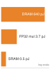

# Lời nói đầu {#sec-about .unnumbered}

## Ai nên đọc cuốn sách này {#sec-book-book-74a2 .unlisted}

Cuốn sách này dành cho bất kỳ ai muốn hiểu *cách* các hệ thống machine learning thực sự vận hành, từ toán học định nghĩa một mạng nơ-ron đến phần cứng thực thi nó, và các quyết định kỹ thuật giúp nó chạy hiệu quả.

Hầu hết độc giả sẽ không trở thành kiến trúc sư phần cứng ML hay kỹ sư trình biên dịch. Tuy vậy, bất kỳ ai xây dựng, huấn luyện, tối ưu hóa hoặc triển khai một mô hình đều phải đưa ra các quyết định dựa trên hiểu biết về hệ thống nằm dưới lớp mã. Cuốn sách này cung cấp nền tảng hệ thống đó cho sinh viên đại học lần đầu tiếp cận hệ thống ML, các kỹ sư thực hành muốn củng cố nền tảng, và các nhà nghiên cứu cần suy xét về hiệu suất và triển khai.

## Vì sao là một sách giáo khoa về hệ thống {#sec-book-systems-textbook-76ff .unlisted}

Năm 1968, một hội nghị NATO tại Garmisch, Đức, đã góp phần xác lập *kỹ thuật phần mềm* như một ngành riêng, giữa lo ngại rằng các hệ thống phần mềm đã trở nên quá phức tạp nếu chỉ lập trình kiểu ứng biến [@naur1969softwareengineering]. Để có phần mềm đáng tin cậy, cần những nguyên tắc, phương pháp và sự nghiêm cẩn riêng. Nhiều thập kỷ sau, Hennessy và Patterson đưa phân tích định lượng trở thành trọng tâm của giáo dục kiến trúc máy tính, hệ thống hóa cách các kỹ sư đo lường, dự đoán và tối ưu hóa hiệu suất bộ xử lý [@patterson2017hardware]. Cả hai ví dụ cho thấy các phương pháp chung giúp công việc kỹ thuật phức tạp trở nên có hệ thống và có thể giảng dạy.

Machine learning đang đối mặt với khoảnh khắc Garmisch của riêng mình.

Trong thập kỷ qua, nghiên cứu ML chủ yếu tập trung vào tư duy *lấy mô hình làm trung tâm*, hướng đến việc khám phá các thuật toán và kiến trúc mới. Sự tập trung này rất quan trọng, nhưng một mô hình không phải là một hệ thống. Một mạng nơ-ron hoạt động tốt trong notebook nghiên cứu sẽ trở nên vô dụng nếu không thể đáp ứng yêu cầu về độ trễ, nếu pipeline dữ liệu không thể xử lý khối lượng dữ liệu cần thiết, hoặc nếu chi phí năng lượng vượt quá giá trị kinh tế mà nó mang lại. Khoảng cách giữa một mô hình hoạt động và một hệ thống sản xuất không chỉ là khoảng cách ở khâu triển khai; đó là khoảng trống về các nguyên tắc kỹ thuật cơ bản.

Cuốn sách này coi kỹ thuật hệ thống ML không phải là một tập hợp các công cụ, như Kubernetes, PyTorch và CUDA, mà là một lĩnh vực dựa trên giới hạn định lượng, mô hình và nguyên tắc thiết kế. Giống như các kỹ sư xây dựng dựa vào các nguyên lý vật lý cơ bản và cấu trúc, các kỹ sư AI phải làm rõ các nguyên tắc nền tảng chi phối từng mô hình hệ thống:

*   **Quy luật sắt của hệ thống ML**: Phân tách di chuyển, tính toán và chi phí phát sinh; phần chồng lấp được xử lý theo đường găng.
*   **Lực hấp dẫn dữ liệu**: Áp lực bố trí dữ liệu do khối lượng dữ liệu lớn và mạng bị giới hạn.
*   **Kế toán năng lượng**: Chi phí trên mỗi sự kiện và số lượng sự kiện quyết định liệu di chuyển hay tính toán chiếm ưu thế.
*   **Định luật Amdahl**: Phần công việc nối tiếp trong một pipeline sẽ giới hạn mức tăng tốc tổng thể của hệ thống.

Khoa học máy tính nghiên cứu những gì có thể tính toán được. Nghiên cứu ML tìm hiểu những gì có thể học được. Còn kỹ thuật AI thì nghiên cứu những gì có thể xây dựng được, có tính đến các giới hạn vật lý của phần cứng thực và dữ liệu thực.

Tôi viết cuốn sách này để giúp xây dựng nền tảng đó và làm cho các hệ thống AI điều mà @patterson2017hardware đã làm cho kiến trúc máy tính: thay thế trực giác bằng đo lường, và nghệ thuật bằng kỹ thuật. Mục tiêu là dạy tư duy cấp hệ thống trước khi triển khai, coi dữ liệu, thuật toán và phần cứng không phải là những phần tách rời mà là một bài toán tối ưu hóa duy nhất, gắn kết.

Hãy hình dung một hộp LEGO. Cùng những mảnh ghép lồng vào nhau đó có thể xây dựng một tàu vũ trụ, một lâu đài hoặc cả một thành phố. Bộ mô hình có thể thay đổi, nhưng những viên gạch thì không. Hệ thống ML cũng vậy. Một mạng tích chập để phân loại hình ảnh, một transformer để tạo ngôn ngữ, và một tác nhân học tăng cường cho robot là những ứng dụng rất khác nhau, nhưng bên dưới chúng là cùng các khối xây dựng: đồ thị tính toán, phân cấp bộ nhớ, pipeline dữ liệu, vòng lặp tối ưu hóa, và các đánh đổi giữa độ trễ, thông lượng và năng lượng. Nắm vững các khối xây dựng này sẽ giúp bạn đọc hiểu được cả những hệ thống mình chưa quen.

Chính vì vậy, cuốn sách này tập trung vào các nguyên tắc cốt lõi, bền vững thay vì các công cụ đang thịnh hành. Các framework chủ đạo đã chuyển từ Theano sang TensorFlow rồi PyTorch chỉ trong vòng chưa đầy một thập kỷ. Phần cứng cũng đã phát triển từ các bộ xử lý đồ họa được tái sử dụng thành các bộ tăng tốc tensor chuyên dụng, với các kiến trúc mới xuất hiện mỗi năm. Bất kỳ sách giáo khoa nào dạy các công cụ hiện tại sẽ trở nên lỗi thời trước khi có ấn bản tiếp theo. Nhưng những khối xây dựng cơ bản thì luôn bền vững.

## Nội dung cuốn sách {#sec-book-book-covers-180b .unlisted}

Cuốn sách này tập trung vào *nút tính toán đơn lẻ*: một máy chủ với một đến tám bộ tăng tốc, thường có bộ nhớ thiết bị riêng và được nối với nhau bằng một kết nối liên thiết bị. Sách cũng giới thiệu huấn luyện đa bộ tăng tốc và các hoạt động sản xuất ở mức độ giúp làm rõ thiết kế cấp nút; xử lý ở quy mô đội máy nằm ngoài phạm vi của cuốn sách.

Nội dung cuốn sách được tổ chức thành bốn phần, mỗi phần đóng một vai trò riêng trong lập luận về các hệ thống:

- **Phần I: Nền tảng Hệ thống ML** phát triển từ vựng, mô hình tư duy và quy trình làm việc tổng thể, giúp định hướng mọi dự án ML, từ các đặc điểm phân biệt hệ thống ML với phần mềm truyền thống cho đến các pipeline kỹ thuật dữ liệu cung cấp đầu vào cho chúng.
- **Phần II: Phát triển và Huấn luyện** kết nối các nền tảng toán học với các hệ thống thực tế thông qua các khía cạnh như tính toán deep learning, kiến trúc nơ-ron, framework và quy trình huấn luyện.
- **Phần III: Tối ưu hóa và Tăng tốc** đề cập đến các vấn đề như hiệu quả dữ liệu, nén mô hình, tăng tốc phần cứng và phương pháp luận benchmark cần thiết để đánh giá tiến độ một cách chặt chẽ.
- **Phần IV: Triển khai và Vận hành** bao gồm cơ sở hạ tầng phục vụ (serving), các quy trình vận hành và kỹ thuật có trách nhiệm, nhằm đảm bảo các hệ thống phải công bằng, minh bạch và đáng tin cậy khi đưa vào vận hành thực tế.

Bốn phần này sẽ dẫn dắt chúng ta đi qua **Ngăn xếp Hệ thống ML** – một cấu trúc trừu tượng phân lớp, được xây dựng dựa trên ngăn xếp hệ thống máy tính truyền thống. Mỗi lớp cung cấp một lớp trừu tượng cho lớp phía trên và sử dụng lớp phía dưới: từ phần cứng ở tầng đáy, qua các framework, mô hình, huấn luyện và phục vụ (serving), cho đến các hoạt động và ứng dụng ở tầng trên cùng. Dữ liệu luân chuyển qua tất cả các lớp như một kết nối xuyên suốt, tương tự một bus dữ liệu trong kiến trúc máy tính.

Xuyên suốt cuốn sách, một hình minh họa ở lề sẽ làm nổi bật những lớp mà mỗi chương đề cập, đóng vai trò như một sơ đồ tổng quan xuyên suốt về ngăn xếp.

```{=latex}
\begin{center}
\scalebox{0.8}{%
\mlsysstackfull{60}{60}{60}{60}{60}{60}{60}{60}%
}
\end{center}
```

Thanh dữ liệu bên cạnh ngăn xếp không chỉ để trang trí. Màu sắc đồng nhất của nó phản ánh tầm quan trọng của dữ liệu đối với nội dung của mỗi chương, đây là một khía cạnh riêng biệt so với cường độ của các lớp. Các đường kết nối giữa mỗi lớp và thanh dữ liệu cho thấy những lớp nào tương tác với dữ liệu trong ngữ cảnh của chương đó. Ba chương minh họa cách góc nhìn này thay đổi.

```{=latex}
\begin{center}
\begin{minipage}[t]{0.30\textwidth}
\centering
{\usefont{T1}{phv}{b}{n}\fontsize{8}{9}\selectfont HW Acceleration}\\[4pt]
\mlsysstack{90}{35}{25}{35}{30}{0}{0}{0}
\end{minipage}%
\hfill
\begin{minipage}[t]{0.30\textwidth}
\centering
{\usefont{T1}{phv}{b}{n}\fontsize{8}{9}\selectfont Training}\\[4pt]
\mlsysstack{50}{25}{45}{90}{12}{10}{0}{20}
\end{minipage}%
\hfill
\begin{minipage}[t]{0.30\textwidth}
\centering
{\usefont{T1}{phv}{b}{n}\fontsize{8}{9}\selectfont Responsible Engr.}\\[4pt]
\mlsysstack{0}{0}{10}{10}{20}{40}{90}{15}
\end{minipage}
\end{center}
```

Trong @sec-hardware-acceleration, cường độ ở các lớp tập trung ở đáy ngăn xếp trong khi thanh dữ liệu mờ: chương này nói về silicon, không phải dữ liệu. Trong @sec-model-training, các lớp giữa sáng lên và thanh dữ liệu sáng vừa phải, phản ánh rằng quá trình huấn luyện tiêu thụ dữ liệu nhưng về cốt lõi là tối ưu hóa. Trong @sec-responsible-engineering, các lớp trên cùng chiếm ưu thế và thanh dữ liệu có sắc độ trung bình, vì dữ liệu huấn luyện có độ chệch (bias) sẽ dẫn đến các ứng dụng có độ chệch (bias) dù giữa chúng còn nhiều lớp. Cùng một ngăn xếp nhưng kể ba câu chuyện khác nhau, với dữ liệu là một chiều độc lập.

Ở phần lề, sách cũng có những minh họa nhỏ tại những chỗ mà mối quan hệ dễ nhìn ra nhất bằng trực quan. Đây không phải các hình có đánh số để tham chiếu sau này; chúng là công cụ hỗ trợ bạn đọc. Ví dụ, một thang đo giúp thấy rõ khoảng cách về thang đo, một biểu đồ xu hướng thể hiện hướng, một hình thu nhỏ *roofline* xác định vùng tắc nghẽn, và một thanh ưu thế cho biết yếu tố nào chi phối tổng. Khi một hình thu nhỏ dùng thang logarit, thông tin này sẽ được ghi ngay trong hình.

::: {layout-ncol=4}
{width="100%" fig-alt="Ví dụ minh họa ở lề: ba thanh ngang màu cam trên thang logarit so sánh thao tác truy cập DRAM (640 pJ), phép nhân FP32 (3.7 pJ) và thao tác truy cập SRAM (0.5 pJ)."}

{width="100%" fig-alt="Ví dụ minh họa ở lề: hai đường cong đi lên cho thấy nợ dữ liệu tách xa dần khi tốc độ tích lũy tăng."}

{width="100%" fig-alt="Ví dụ minh họa ở lề: một hình thu nhỏ *roofline* cho thấy điểm vận hành theo kích thước *batch* đang tiến dần tới trần tính toán."}

{width="100%" fig-alt="Ví dụ minh họa ở lề: hai thanh độ trễ xếp chồng cho thấy việc tăng tốc một thành phần chỉ cải thiện được một phần độ trễ end-to-end."}
:::

Mỗi phần được xây dựng dựa trên phần trước. Nếu bạn mới bước vào lĩnh vực này, nên đọc theo thứ tự; còn các lộ trình dưới đây được thiết kế để hỗ trợ những mục tiêu nghề nghiệp cụ thể:

## Các lộ trình đọc gợi ý {#sec-book-suggested-reading-paths-773b .unlisted}

Tùy nền tảng và mục tiêu, bạn có thể chọn một trong các lộ trình đọc gợi ý sau:

- **Lộ Trình Hoàn Chỉnh** (tất cả các chương, theo thứ tự): Dành cho sinh viên đại học và những ai mới tìm hiểu về hệ thống ML. Bắt đầu với Phần I, sau đó đọc tiếp Phần II, III và IV. Lộ trình này phát triển mọi khái niệm từ những nguyên lý đầu tiên.
- **Lộ Trình Kỹ Sư ML** (kiến thức chuyên sâu về hệ thống cho người làm thực tế): Dành cho các kỹ sư đã huấn luyện và triển khai mô hình nhưng muốn hiểu sâu hơn về các hệ thống nền tảng. Hãy đọc lướt Phần I để làm quen với thuật ngữ, rồi tập trung vào các chương @sec-ml-frameworks, @sec-model-training, @sec-hardware-acceleration, @sec-benchmarking, và @sec-model-serving.
- **Lộ Trình Tối Ưu Hóa** (tập trung vào hiệu quả): Dành cho các kỹ sư tối ưu hiệu quả mô hình, triển khai trên thiết bị *edge*, hoặc làm việc với hệ thống tài nguyên hạn chế. Sau Phần I, bạn hãy chuyển thẳng đến các chương @sec-data-selection, @sec-model-compression, @sec-hardware-acceleration, và @sec-benchmarking.



Dù bạn chọn lộ trình nào, cuốn sách này cũng được thiết kế để kết nối với các tài nguyên hỗ trợ ngoài phạm vi các chương.

::: {.content-visible when-format="html"}

## Một Nền Tảng Học Tập {#sec-about-platform .unlisted}

Cuốn sách này là một phần của hệ sinh thái học tập rộng hơn. Toàn bộ nội dung, các sổ tay lập trình tương tác, slide bài giảng, bài tập, phòng lab thực hành và tài liệu bổ trợ cho mỗi chương đều được cung cấp miễn phí tại [mlsysbook.ai](https://mlsysbook.ai).

## Sách Giáo Khoa Mã Nguồn Mở {#sec-about-open-source .unlisted}

Cuốn sách này là mã nguồn mở. Toàn bộ nội dung, hình ảnh và hệ thống biên dịch đều có sẵn tại [mlsysbook.ai/git](https://mlsysbook.ai/git), và tôi mời gọi mọi độc giả cùng đóng góp. Việc công khai mã nguồn là một quyết định có chủ đích. Bởi lẽ, nếu kỹ thuật AI muốn trở thành một lĩnh vực chung thay vì một tập hợp các thực hành rời rạc, thì những tài liệu nền tảng của nó phải dễ tiếp cận với tất cả mọi người. Lĩnh vực hệ thống machine learning được định hình bởi các chuyên gia từ công nghiệp, học thuật và cộng đồng mã nguồn mở trên toàn thế giới. Một sách giáo khoa bao quát lĩnh vực này cần phản ánh được bề rộng đó và phải sẵn có cho mọi người, bất kể địa lý hay cơ quan họ thuộc về.

Những đóng góp từ độc giả—dù là sửa lỗi, đề xuất cách giải thích rõ ràng hơn, bổ sung ví dụ có lời giải, hay đề xuất nội dung mới—đều đã giúp cải thiện đáng kể từng chương. Các *issue* và *pull request* là cơ chế hợp tác cho mục tiêu này. Cuốn sách tiến bộ là nhờ độc giả cùng tham gia xây dựng.

:::

::: {.content-visible when-format="pdf"}

## Tài Nguyên Bổ Trợ {#sec-about-companion-resources .unlisted}

Cuốn sách này là một phần của hệ sinh thái học tập rộng hơn. Toàn bộ nội dung, các sổ tay lập trình tương tác, slide bài giảng, bài tập, phòng lab thực hành và tài liệu bổ trợ cho mỗi chương đều có trực tuyến tại [mlsysbook.ai](https://mlsysbook.ai).

Cuốn sách này là mã nguồn mở. Toàn bộ nội dung, hình ảnh và hệ thống build đều được công khai, và đóng góp từ độc giả khắp thế giới đã cải thiện đáng kể từng chương. Hãy truy cập **mlsysbook.ai/git** để báo cáo *issue*, đề xuất cải tiến hoặc đóng góp trực tiếp.

:::

## Yêu cầu tiên quyết {#sec-book-prerequisites-1a4b .unlisted}

Bạn cần hai điều kiện tiên quyết:

- **Lập trình**: Thành thạo Python, bao gồm các hàm, lớp và các thao tác dữ liệu cơ bản với NumPy.
- **Toán học**: Nắm vững đại số tuyến tính, giải tích cơ bản và xác suất ở cấp độ đại học.

Hai lĩnh vực bổ sung sau đây sẽ hữu ích, nhưng không bắt buộc:

- **Hệ thống máy tính**: Hiểu về phân cấp bộ nhớ và kiến trúc máy tính cơ bản sẽ giúp bạn hiểu sâu hơn các chương về tối ưu hóa và phần cứng.
- **Kiến thức cơ bản về machine learning**: Việc từng tìm hiểu về các khái niệm học có giám sát sẽ cung cấp bối cảnh hữu ích, nhưng Phần II sẽ xây dựng các nền tảng cần thiết từ những nguyên tắc cơ bản.

## Vượt ra ngoài cuốn sách này {#sec-book-beyond-book-c426 .unlisted}

Cuốn sách này xây dựng nền tảng cho hệ thống một nút, đồng thời giới thiệu thực thi phân tán, vận hành sản xuất và quản trị ở những chỗ chúng ảnh hưởng đến toàn bộ hệ thống (end-to-end). Các cấu hình đa nút nâng cao, thuật toán tập thể trên toàn hệ thống và khả năng phục hồi của cụm thuộc về phạm vi các hệ thống phân tán quy mô lớn. Hoàn thành cuốn sách này sẽ giúp bạn sẵn sàng bước vào bức tranh kỹ thuật rộng lớn hơn.

## Sử dụng cuốn sách này trong khóa học {#sec-book-using-book-course-f71c .unlisted}

Cuốn sách này được phát triển từ môn CS249r tại Đại học Harvard và chương trình [chứng chỉ chuyên nghiệp TinyML edX](https://www.edx.org/professional-certificate/harvardx-tiny-machine-learning). Khóa học TinyML dạy về các hệ thống ML ở phía hạn chế nhất: các vi điều khiển chạy bằng miliwatt và chỉ có vài kilobyte bộ nhớ. Khóa học này mang lại một bài học bất ngờ. Những hạn chế cơ bản chi phối các thiết bị nhỏ (như băng thông bộ nhớ, mật độ tính toán, năng lượng cho mỗi phép toán) cũng chính là những hạn chế chi phối các GPU trong trung tâm dữ liệu. *The physics scales; only the numbers change.* Nhận định đó đã định hình cuốn sách này. Từ một khóa học về ML trên các thiết bị hạn chế tài nguyên, nó đã phát triển thành một tài liệu toàn diện về kỹ thuật hệ thống ML, dựa trên nguyên tắc rằng nắm vững các nền tảng ở bất kỳ quy mô nào sẽ giúp kỹ sư sẵn sàng cho mọi quy mô.

Trong bối cảnh khóa học, cuốn sách được thiết kế cho một học kỳ, bao quát toàn bộ stack hệ thống ML. Giảng viên cũng có thể chọn các phần riêng lẻ để tạo thành các mô-đun ngắn hơn:

- **Phần I–II** tạo thành một nửa học kỳ nhập môn, tập trung vào nền tảng của hệ thống ML và cách xây dựng, huấn luyện chúng.
- **Phần III–IV** tạo thành một nửa học kỳ ứng dụng, tập trung vào tối ưu hóa, triển khai và vận hành các hệ thống này.

Đối với các khóa học tổng quan hoặc chương trình dành cho lãnh đạo, chỉ riêng phần giới thiệu của bốn phần đã cung cấp một tổng quan súc tích về các nguyên tắc định lượng chi phối hệ thống ML.

::: {.content-visible when-format="html"}
Các slide bài giảng, bài tập và tài nguyên dành cho giảng viên có sẵn tại [mlsysbook.ai](https://mlsysbook.ai).
:::

::: {.content-visible when-format="pdf"}
Các slide bài giảng, bài tập và tài nguyên dành cho giảng viên có sẵn tại **mlsysbook.ai**.
:::

<!--
## Copyright and Licensing {#sec-book-copyright-licensing-2538 .unlisted}

::: {.content-visible when-format="html"}
© Vijay Janapa Reddi and MIT Press. This work is distributed under the [Creative Commons Attribution-NonCommercial-NoDerivatives 4.0 International License (CC BY-NC-ND 4.0)](https://creativecommons.org/licenses/by-nc-nd/4.0). The source is available at [mlsysbook.ai/git](https://mlsysbook.ai/git).
:::

::: {.content-visible when-format="pdf"}
© Vijay Janapa Reddi and MIT Press. This work is distributed under the Creative Commons Attribution-NonCommercial-NoDerivatives 4.0 International License (CC BY-NC-ND 4.0). The source is available at **mlsysbook.ai/git**.
:::
-->
